# ÁLLAMI   SZÁMVEVŐSZÉK 

## JELENTÉS

Lengyeltóti Város Önkormányzata pénzügyi helyzetének ellenőrzéséről (43/4)

---

# Állami Számvevőszék 

Iktatószám: V-3115-016/2012.
Témaszám: 1015
Vizsgálat-azonosító szám: V0560146

## Az ellenőrzést felügyelte:

Dr. Varga Sándor
számvevő igazgatóhelyettes
Az ellenőrzést vezette:
Renkó Zsuzsanna
számvevő tanácsos
Ellenőrzési csoportvezető:
Bíró Zsolt
számvevő tanácsos
Az ellenőrzést végezték:

Kéri Péter
számvevő tanácsos

Koczor László
számvevő tanácsos

---

# TARTALOMJEGYZÉK 

BEVEZETÉS ..... 7
I. ÖSSZEGZŐ MEGÁLLAPÍTÁSOK, KÖVETKEZTETÉSEK, JAVASLATOK ..... 11
II. RÉSZLETES MEGÁLLAPÍTÁSOK ..... 18

1. Az Önkormányzat kötelező és önként vállalt feladatai, a feladatellátás szervezeti keretei és annak változásai ..... 18
2. Az Önkormányzat pénzügyi egyensúlyi helyzetét befolyásoló tényezők ..... 24
2.1. A működési és a felhalmozási egyensúly változása ..... 27
2.2. Az Önkormányzat bevételeinek változása ..... 31
2.3. Az Önkormányzat múködési és felhalmozási célú kiadásainak változása ..... 34
3. Az Önkormányzat kötelezettségei ..... 37
3.1. Az Önkormányzat pénzintézeti kötelezettségeinek változása ..... 37
3.2. A szállítói kötelezettségek változása ..... 38
3.3. Egyéb kötelezettségek változása ..... 38
4. A pénzügyi egyensúly megteremtése érdekében hozott intézkedések eredménye ..... 41
5. Az ÁSZ által a korábbi években a pénzügyi egyensúly javítására tett szabályszerűségi és célszerűségi javaslatok hasznosulása ..... 43

---

# MELLÉKLETEK 

1. számú Múködési és felhalmozási célú hiány/többlet az Önkormányzat zárszámadási rendeleteiben (1 oldal)
2. számú Az Önkormányzat bevételei és kiadásai, valamint adósságszolgálata 20072010 közötti időszakban (1 oldal)
3/a. számú Az Önkormányzat 2007-2010. években megvalósított, 2010. december 31-ig befejezett fejlesztései és azok forrásösszetétele (1 oldal)
3/b. számú Az Önkormányzat 2010. december 31-én folyamatban lévő fejlesztési feladataira 2010. december 31-ig teljesített kifizetések és azok forrásösszetétele (1 oldal)
3/c. számú Az Önkormányzat 2010. december 31-én folyamatban lévő fejlesztési feladataira 2010. december 31-én fennálló kötelezettségvállalásai és azok forrásösszetétele (1 oldal)
3/d. számú Az Önkormányzat által beadott, elbírálás alatti pályázati forrásból megvalósítani tervezett fejlesztéseihez kapcsolódó kötelezettségvállalásai és azok forrásösszetétele (1 oldal)
3. számú Az önkormányzati feladatok ellátásában résztvevő gazdasági társaságok (1 oldal)

---

# RÖVIDÍTÉSEK JEGYZÉKE 

## Törvények

Áht $_{1}$.
Áht $_{2}$.
Csődtv.
Gt.
Ötv.

## Rendeletek

SzMSz

## Szórövidítések

AVE Zöldfok Zrt.
áfa
Általános iskola
ÁSZ
DDOP
EU
jegyzó
Képviselő-testület
Közoktatási intézményfenntartó társulás
Niklai tagiskola
Önkormányzat
polgármester
Polgármesteri hivatal
PPP konstrukció
Kistérségi társulás
szja
Szőlősgyöröki tagiskola
Tanuszoda Kft.
Víziközmű társulat
Vízmú Zrt.
az államháztartásról szóló 1992. évi XXXVIII. törvény
az államháztartásról szóló 2011. évi CXCV. törvény
a csődeljárásról és a felszámolási eljárásról szóló 1991. évi XLIX. törvény
a gazdasági társaságokról szóló 2006. évi IV. törvény
a helyi önkormányzatokról szóló 1990. évi LXV. törvény

Az Önkormányzat 6/1999. (III. 25.) számú többször módosított rendelete a szervezeti és múködési szabályzatáról

AVE Zöldfok Településgazdálkodási és Kommunális Zrt. Siófok
általános forgalmi adó
Lengyeltóti Fodor András Általános Iskola és Óvoda
Állami Számvevőszék
Dél-Dunántúli Operatív Program
Európai Unió
Lengyeltóti Város Önkormányzatának jegyzője
Lengyeltóti Város Képviselő-testülete
Lengyeltóti, Szőlősgyörök, Gyugy, Hács, Kisberény, Csömend és Nikla Közoktatási Intézményi Társulás
Lengyeltóti Fodor András Általános Iskola és Óvoda Niklai Tagiskola és Tagóvoda
Lengyeltóti Város Önkormányzata
Lengyeltóti Város Önkormányzatának polgármestere
Lengyeltóti Város Önkormányzatának Polgármesteri hivatala
Public Private Partnership (Partnerségi együttmúködés közfeladatok ellátására a magánszektor bevonásával)
Pogányvölgyi Többcélú Kistérségi társulás
személyi jövedelemadó
Lengyeltóti Fodor András Általános Iskola és Óvoda Gárdonyi Géza Általános Iskolája
Pogányvölgyi Tanuszoda Üzemeltető, Szolgáltató Kft.
Lengyeltóti és Térsége Víziközmú Társulat
Dunántúli Regionális Vízmú Zrt. Siófok

---

.

---

# ÉRTELMEZŐ SZÓTÁR 

CLF módszer

EURIBOR

Használhatósági fok
kamatkockázat
kötelező közszolgáltatás
közfeladat

LIBOR
önkormányzat többségi tulajdonában lévő gazdasági társaságok

Az önkormányzatok költségvetése elemzésének eszköze. A módszer következetesen elkülöníti a folyó és a felhalmozási költségvetés bevételeit és kiadásait, azok költségvetési egyenlegeit. Bizonyos mértékig a vállalati gazdálkodás logikai elemeit érvényesíti az önkormányzatok pénzügyi, jövedelmi helyzetének vizsgálata során. Az értékelés a pénzügyi kapacitás fogalmát helyezi a középpontba.
A frankfurti bankközi piacon jegyzett, az Európai Központi Bank szabályainak megfelelően megállapított kínálati kamatláb. Az EURIBOR értékét a legfontosabb európai bankok hitelkínálatának kamatlábai alapján a Reuters ügynökség számolja ki és teszi közzé naponta. A magyar pénzintézetek is ezt használják viszonyítási alapnak EUR hitelek esetén.
Az eszközgazdálkodás vizsgálatának elemzése során használt mutató. Számításakor a tárgyi eszköz könyv szerinti (nettó) értékét viszonyítják a tárgyi eszköz bruttó (beszerzési/létesítési) értékéhez. A \%-ban kifejezett mutató értéke annál kedvezőbb, minél közelebb áll a 100\%-hoz. Csökkenése az eszköz állagának romlására, avulására utal, ami maga után vonja az üzemeltetési és fenntartási költségek növekedését is
A változó kamatozású forint-, vagy a devizahitelek futamideje alatt a kamat emelkedése miatt fennálló kamatkockázat, melynek növekedése miatt nő a hitel törlesztő részlete.
A helyi önkormányzati feladatkörbe tartozó, a köztisztasággal és a településtisztasággal, valamint az élet- és vagyonbiztonsággal összefüggő egyes - közszolgáltatás útján megvalósuló - közfeladatok ellátása, amelynek kötelező igénybevételét külön jogszabály (törvény, helyi önkormányzati rendelet) határoz meg.
Állami, helyi, illetve kisebbségi önkormányzati feladat, amelynek ellátásáról az államnak, illetve az önkormányzatoknak kell gondoskodni. A hatályos szabályozás szerint közfeladatot törvény és önkormányzati rendelet állapíthat meg. Az önkormányzatok által ellátandó feladatok keretszerű meghatározását az Ötv. tartalmazza.
Angol kifejezés, a London Interbank Offered Rate rövidítése. Jelentése: Londoni bankközi, referencia jellegű kínálati (hitel) kamatláb.
Az önkormányzat a gazdasági társaságban a szavazatok több mint ötven százalékával vagy a Ptk. 685/B. § (2)-(3) bekezdéseiben rögzített meghatározó befolyással rendelkezik. A befolyással rendelkező akkor rendelkezik egy jogi személyben meghatározó befolyással, ha annak tagja, illetve részvényese és jogosult e jogi személy vezető tiszt-

---

ségviselői vagy felügyelőbizottsága tagjai többségének megválasztására, illetve visszahívására, vagy a jogi személy más tagjaival, illetve részvényeseivel kötött megállapodás alapján egyedül rendelkezik a szavazatok több mint ötven százalékával (Ptk. 685/B. § (2) bekezdés). A meghatározó befolyás akkor is fennáll, ha a befolyással rendelkező számára e jogosultságok közvetett módon (köztes vállalkozásain keresztül, a Ptk. 685/B §. (3), (4) bekezdés szerint) biztosítottak.
A helyi önkormányzat és az önkormányzat irányítása alá tartozó költségvetési szerv többségi tulajdonában, illetve többségi befolyása alatt álló gazdálkodó szervezet esetében hitelfelvétel, kölcsönfelvétel, garancia- vagy kezességvállalás, tartozásátvállalás, tartozáselengedés, értékpapír kibocsátás, vásárlás, pénzügyi lízing, tartós bérleti szerződés, ingyenes vagyonjuttatás (így különösen: ajándékozás, ingyenes engedményezés), vagy követelésvásárlás, követelésengedményezés végrehajtására vonatkozóan az Áht ${ }_{1}$. 100/M. § (4) bekezdése alapján az önkormányzat rendelkezik döntési jogosultsággal.
pénzügyi kockázat

A működési kockázat egyik eleme. Megmutatkozhat a költségvetés nagyságrendjének, szerkezetének nem megalapozott módosításaiban, a bevételi, kiadási előirányzatoktól lényegesen eltérő teljesítésekben, a nem megfelelő belső kontrollrendszer múködésében, a tudatos károkozásokban, a biztosítások elmaradásában, a hibás fejlesztési döntésekben, a nem a terveknek megfelelő forrásfelhasználásokban. Jelentkezhet továbbá a bevételek és kiadások ütemkülönbsége miatt felvett folyószámla- és likvidhitelek költségvetési év végén fennálló egyenlege miatt, amely az önkormányzat költségvetésébe - akár tartósan - beépülő forráshiányt jelzi.
törlesztési kockázat
Annak a kockázata, hogy a megfelelő időben és mértékben a hitelt felvevőnél rendelkezésre állnak-e a pénzintézetek és egyéb szervek felé fennálló kötelezettségek visszafizetéséhez, a hitelek és kölcsönök törlesztéséhez szükséges pénzügyi források.
A törlesztési kockázatot növeli a kamat- és árfolyam növekedése, mivel ezekben az esetekben az adósságszolgálat nőhet. Törlesztési kockázatot okozhat a visszafizetésre tervezett forrás elérésének, teljesítésének bizonytalansága (pl. a visszafizetéshez tervezett tartalékolás elmaradt, a tervezettnél alacsonyabb a saját bevétel, a helyi adóból származó bevétel az adóalanyok, adóalapok csökkenése miatt nem teljesül).
SNA
System of National Account, azaz a Nemzeti Számlák Rendszere, amely a gazdasági szektorok által létrehozott valamennyi terméket és szolgáltatást figyelembe veszi.

---

# JELENTÉS 

## Lengyeltóti Város Önkormányzata pénzügyi helyzetének ellenőrzéséről

## BEVEZETÉS

Az Állami Számvevőszék 2011. évtől érvényes stratégiája új irányt szabott a helyi önkormányzatok gazdálkodásának ellenőrzésében is. Az ÁSZ - küldetése és jövőképe szerint - szilárd szakmai alapokra támaszkodva értékteremtő ellenőrzéseivel és helyzetelemzéseivel az államháztartás egészében, így a helyi önkormányzati alrendszerben is elő kívánja segíteni a közpénzek és a közvagyon szabályos, gazdaságos, hatékony és eredményes felhasználását. E folyamat részeként - az államháztartási hiány alakulásának összetevőire is figyelemmel végezzük az önkormányzati alrendszer pénzügyi helyzetelemzését.

Az államháztartás helyi szintjén a 304 városnak ${ }^{1}$ az általuk ellátott közszolgáltatások volumenére is tekintettel a közfeladatok ellátásában kiemelt szerepe van. E települések 2011. január 1-jei népessége 3169 ezer fő volt.

Feladataik és hatásköreik az Ötv. mellett különböző ágazati törvények által meghatározottak, miközben a feladatellátás szervezeti kereteit - ezen belül a gazdasági társaságok közszolgáltatások ellátásában betöltött szerepét - saját maguk határozzák meg. A gazdasági társaságok által ellátott feladatok esetén a gazdálkodás, továbbá az önkormányzatok pénzügyi egyensúlyi helyzetére ható közvetlen kockázatok egy része kikerült az önkormányzati alrendszerből. A többségi önkormányzati tulajdonban lévő társaságok gazdálkodásának körülményei befolyásolhatják a városok pénzügyi egyensúlyi helyzetének megítélésében rejlő kockázatokat.

Az áttekintett időszakban az önkormányzati forrásszabályozás elvei lényegesen nem változtak. Az önkormányzatok gazdasági mozgásterét a központi költségvetéstől való függőség mellett jelentősen befolyásolja a helyi adókivetési jog gyakorlása. A városok gazdálkodási szabadságának lényeges eleme, hogy anyagi lehetőségeik függvényében dönthettek arról, hogy feladataik közül azokat, amelyek megoldására az Ötv. szerint a települési önkormányzat nem kötelezhető, a megyei önkormányzat fenntartásába adhatták. E döntések differenciáltan érintették a városok pénzügyi helyzetét.

[^0]
[^0]:    ${ }^{1}$ A megyei jogú városok nélkül figyelembe vett városok száma 304 városi önkormányzatot jelent.

---

A városi önkormányzatok 2007-2010 között teljesített bevételeinek alakulását és összetételét a következő ábra szemlélteti:
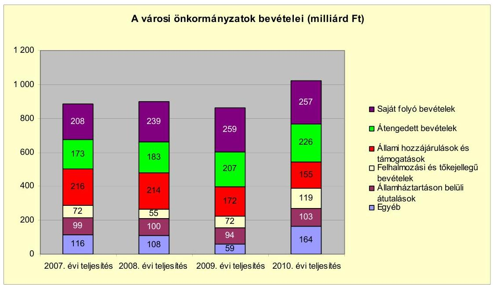

Az önkormányzati alrendszer pénzügyi helyzetértékelése során új elemzési módszereket alkalmazott az ellenőrzés. A költségvetési beszámoló adatok elemzése helyett az önkormányzat pénzügyi helyzetét a CLF módszerrel értékeltük, amelynek lényegét és számításának módszerét a jelentés 2. pontjában, és a jelentés 2 . számú mellékletében ismertetjük részletesen.

Az új módszereken alapuló helyzetértékelés fontosságát az adja, hogy a helyi önkormányzatok bruttó adósságállománya ${ }^{2}$ a 2010. évi költségvetési beszámolók alapján 1248 milliárd Ft-ot tett ki. Ezen belül a 304 város adóssága 383 milliárd Ft volt, amely az önkormányzati alrendszer teljes adósságállományának $30,7 \%$-át jelentette ${ }^{3}$.

A mérlegben kimutatott bruttó adósságállomány mellett az önkormányzatok számára az eszközállomány műszaki állapotának megőrzése is előbb-utóbb pénzügyi kötelezettséget jelent. Az elhasználódott eszközök pótlására forrást biztosító amortizációs (felújítási) alapképzés ${ }^{4}$ elmaradása maga után vonhatja a feladatellátást kiszolgáló tárgyi eszközök állagának erőteljes romlását. Emellett a 2007-2013-as időszakra meghirdetett, vissza nem térítendő EU-s fejlesztési

[^0]
[^0]:    ${ }^{2}$ Az önkormányzati mérlegbeszámolókból számított bruttó adósságállomány 2010. év végi összege magában foglalja a fejlesztési és a múködési célú kötvénykibocsátások, a beruházási és fejlesztési hitelek, a múködési célú hosszú lejáratú hitelek, a rövid lejáratú hitelek, váltótartozások miatti kötelezettségek teljes (2011-ben, illetve az azt követő években esedékes) állományát. Az önkormányzatok 2007. év végi mérleg szerinti adósságállománya 692 milliárd Ft volt.
    ${ }^{3}$ A fővárosi és a kerületi önkormányzatok adósságának figyelmen kívül hagyásával számított 977 milliárd Ft összegű bruttó adósságállományból a városok 39,2\%-kal részesedtek.
    ${ }^{4}$ Erre a jelenlegi szabályozási környezetben nem kötelezi előírás az önkormányzatokat.

---

forrásokhoz való hozzájutás lehetősége felerősítette az önkormányzati alrendszer fejlesztési igényeit, amelyek a felhalmozási költségvetési hiány folyamatos emelkedésén túl - az előírt jövőbeni fenntartási kötelezettség miatt - tovább terhelhetik az önkormányzatok költségvetését ${ }^{5}$.

Az ÁSZ a 2011. évi ellenőrzési tervében 43. számú, az Önkormányzatok gazdálkodási rendszerének ellenőrzése részeként több ütemben tekinti át, és elemzi az önkormányzatok pénzügyi helyzetét. A gazdálkodás szabályszerűségét az ÁSZ az előző évek során ebben az önkormányzati körben is ellenőrizte. Jelen vizsgálatunk a tett javaslataink pénzügyi helyzetet érintő pontjainak hasznosítására utóellenőrzés jelleggel tér ki.

Az ellenőrzés megállapításait az Önkormányzat által kitöltött - teljességi nyilatkozattal megerősített - 27 tanúsítványon szolgáltatott adatokra alapoztuk. Ellenőrzési bizonyítékként használtuk fel továbbá:

- a képviselő-testületi és bizottsági előterjesztéseket, a döntés-előkészítés során készített dokumentumokat;
- a kötelezettségvállalások dokumentumait;
- a pénzügyi-számviteli nyilvántartásokat;
- az éves költségvetési beszámolókat;
- a költségvetési és zárszámadási rendeleteket.

Az ellenőrzés a 2007. január 1. - 2011. június 30. közötti időszakot ölelte fel. A pénzintézeti kötelezettségek állományának vizsgálatakor az ellenőrzött időszak 2006. december 31. - 2011. június 30. közötti időszakra terjedt ki.

Az ellenőrzés során vizsgáltunk minden olyan körülményt és adatot, amely a program végrehajtásához kapcsolódott, és a pénzügyi helyzet alakulására hatást gyakorló releváns tények és folyamatok feltárásához szükségessé vált.

# Az ellenőrzés célja annak értékelése volt, hogy: 

- a vizsgált időszakban a kötelező- és önként vállalt feladatok ellátását biztosító szervezeti keretekben, a feladatellátás módjában bekövetkezett változások milyen hatást gyakoroltak az Önkormányzat pénzügyi helyzetének alakulására;
- az Önkormányzat pénzügyi - ezen belül múködési és felhalmozási - egyensúlya mely tényezők hatására miként változott, és az Önkormányzat milyen intézkedéseket tett a pénzügyi egyensúly javítása érdekében;

[^0]
[^0]:    ${ }^{5}$ Az Állami Számvevőszék 2011 júniusában közzétett 1108. számú, a helyi önkormányzatok fejlesztési célú támogatási rendszerének ellenőrzéséről szóló jelentésében feltárta a fejlesztési folyamatok problémáit. A helyi önkormányzatok elsősorban azokat a fejlesztéseket valósították meg, amelyekhez támogatást lehetett igényelni. A fejlesztési célok közül a magasabb támogatási intenzitású pályázatokat részesítették előnyben. A fejlesztéssel megvalósuló létesítmények jövőbeli üzemeltetésének várható ráfordításait az önkormányzatok $71,9 \%$-a nem mérte fel.

---

- a költségvetési kiadások finanszírozása érdekében vállalt pénzintézeti kötelezettségek hogyan alakultak, továbbá milyen kötelezettségek fennállása befolyásolja az Önkormányzat jövőbeli pénzügyi helyzetét;
- hasznosultak-e a gazdálkodási rendszer korábbi ellenőrzése során a pénzügyi egyensúly javítására az ÁSZ által tett szabályszerűségi és célszerűségi javaslatok.

Az ellenőrzés típusa: szabályszerűségi vizsgálat.
A vizsgálat jogszabályi alapját az Állami Számvevőszékről szóló 2011. évi LXVI. törvény 1. § (3), 5. § (2)-(6) bekezdései, továbbá az Áht ${ }_{1}$. 120/A. § (1) bekezdése ${ }^{6}$ előírásai képezték.

Lengyeltóti város lakosainak száma 2011. január 1-jén 3290 fő volt. Az Önkormányzat 2010. évi mérlegfőösszege 4924,4 millió Ft, amelyből 4807,1 millió Ft befektetett eszköz volt. A vagyont terhelő kötelezettségek állománya a 2010. év végén 20,5 millió Ft volt. Az Önkormányzat 2010. évi beszámolója szerint 1519,9 millió Ft költségvetési bevételt és 1604,2 millió Ft költségvetési kiadást teljesített.

[^0]
[^0]:    ${ }^{6}$ A jogszabályi hivatkozás 2012. január 1-jétől Áht ${ }_{2}$. 61. § (2) bekezdésére módosult.

---

# I. ÖSSZEGZŐ MEGÁLLAPÍTÁSOK, KÖVETKEZTETÉSEK, JAVASLATOK 

Az Önkormányzat - adatszolgáltatása szerint - a 2010. évi múködési költségvetési kiadásaiból (1020,2 millió Ft) 984,2 millió Ft-ot ( $96,5 \%$ ) a kötelező feladatok, 36,0 millió Ft-ot (3,5\%) az önként vállalt feladatok ellátására fordított. Az önként vállalt feladatok a bölcsődei ellátáshoz, az alapfokú művészetoktatáshoz, a civil szervezetek, a sportegyesület és a városi rendezvények támogatásához kapcsolódtak.

Az Önkormányzat 2011. június 30 -án a kötelező és önként vállalt feladatait a következő szervezeti struktúrában látta el
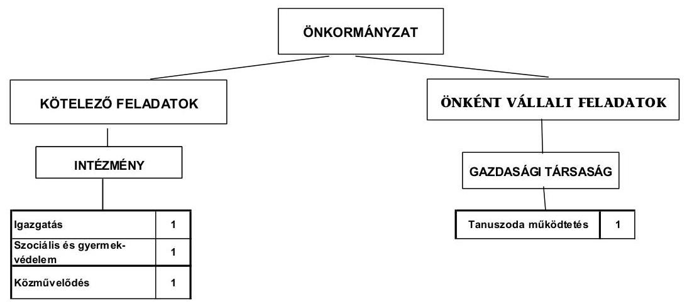

Az Önkormányzat feladatait 2011. június 30 -án (a Polgármesteri hivatallal együtt) három költségvetési szervvel és egy 100\%-os tulajdonosi részesedéssel rendelkező gazdasági társaságával látta el. Továbbá a kötelező közszolgáltatások körében a víz és csatornaszolgáltatást üzemeltetési szerződések, a hulladékkezelést és -szállítást, illetve a temetkezési szolgáltatást közszolgáltatási szerződések keretében két gazdasági társasággal és egy egyéni vállalkozóval biztosította. Az intézményszervezeti átalakítások következtében a feladatellátás telephelyeinek száma a 2007. január 1-jei 13 -ról még abban az évben 15 -re növekedett a niklai általános iskola és óvoda átvétele miatt. A 2008. és 2009. évben a telephelyek száma nem változott. Majd 2010. július 1-jétől a niklai általános iskolát és óvodát Nikla Község Önkormányzata saját fenntartásába visszavette, illetve a közoktatási feladatokat az Önkormányzat átadta a Kistérségi társulásnak, amellyel a telephelyek száma nyolcra csökkent. Ez az állapot a 2011. év I. félév végéig nem változott.

Az egyes közszolgáltatások feladatellátásában résztvevő ágazatok múködési kiadásainak finanszírozási összetételét a következő ábra szemlélteti:

---

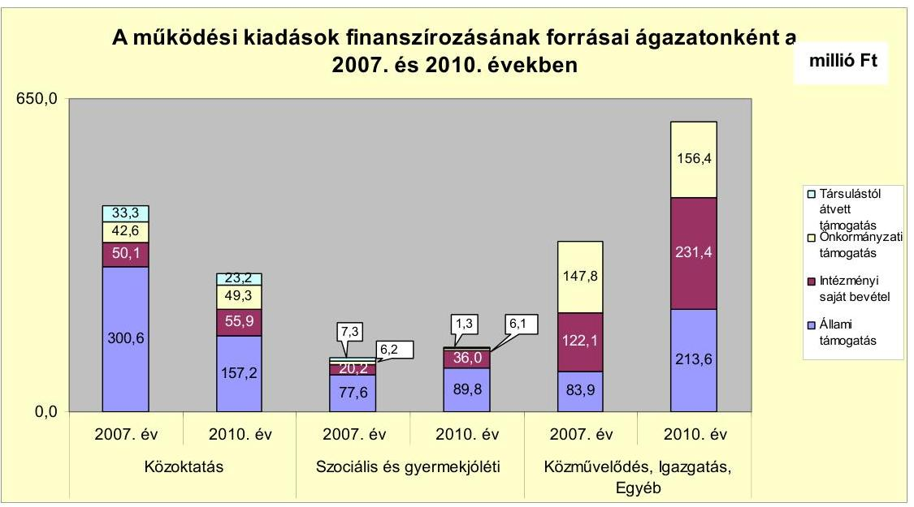

A közoktatási ágazatban a már jelzett feladatátadások hatására csökkent az állami támogatás. A Polgármesteri hivatalnál a saját bevételek növekedését az előző évi pénzmaradványok fokozott igénybevétele eredményezte. Az állami támogatások növekedését eredményezte, hogy a jogszabályi változások miatt, az átengedett szja bevételek egy része a normatív állami hozzájárulások jogcímei közé került.

Az Önkormányzat egy gazdasági társaságban kizárólagos tulajdonnal rendelkezik. A gazdasági társaság az Önkormányzat PPP konstrukcióban készült tanuszodájának üzemeltetésében részt vesz szolgáltatási szerződés alapján. A magánbefektető és a Tanuszoda Kft. szolgáltatási szerződést kötött 2009. évben a tanuszoda múködtetéséhez kapcsolódó részfeladatok folyamatos és szakszerű ellátására. A szerződésben rögzítették, hogy a magánbefektető felel az üzemeltetésért és annak terheinek viseléséért. A Tanuszoda Kft. létrehozását az üzemeltetési feladatok gazdaságos megszervezésével és a helyi foglalkoztatás növelésével indokolták. A Tanuszoda Kft. 2009. és 2010. évi eredményéből 5,05,0 millió Ft osztalékot fizetett az Önkormányzatnak. A gazdasági társaság a múködéséhez a 2007. évtől 2011. június 30-ig terjedő időszakban nem részesült sem rendszeres múködési, sem fejlesztési célú támogatásban az Önkormányzattól. Pénzügyi egyensúlyi helyzete a 2010. évi saját tőke/jegyzett tőke 15,6-szoros aránya alapján stabil.

A 2007. évben az átvett általános iskola és óvoda 180,6 millió Ft-tal növelte a kiadásokat. Az Önkormányzatnak a feladatátvétellel ugyanennyi többletbevétele keletkezett. A 2010. évben a két tagintézmény átadása Nikla Község Önkormányzatának 29,6 millió Ft kiadás csökkenést okozott, azonban megtakarítást nem eredményezett, mivel azonos összegű volt a bevételelmaradás is. A közoktatási intézmény 2010. évi átadása a Kistérségi társulásnak 197,4 millió Ft kiadáscsökkenés mellett, 185,6 millió Ft bevételcsökkenést eredményezett. A feladatátadásból az Önkormányzatnak 11,8 millió Ft megtakarítása keletkezett.

---

Az Önkormányzat folyó költségvetés egyenlege (múködési jövedelem) 2007-2010 között egyre csökkenő́ forrástöbbletet ${ }^{7}$ mutatott.
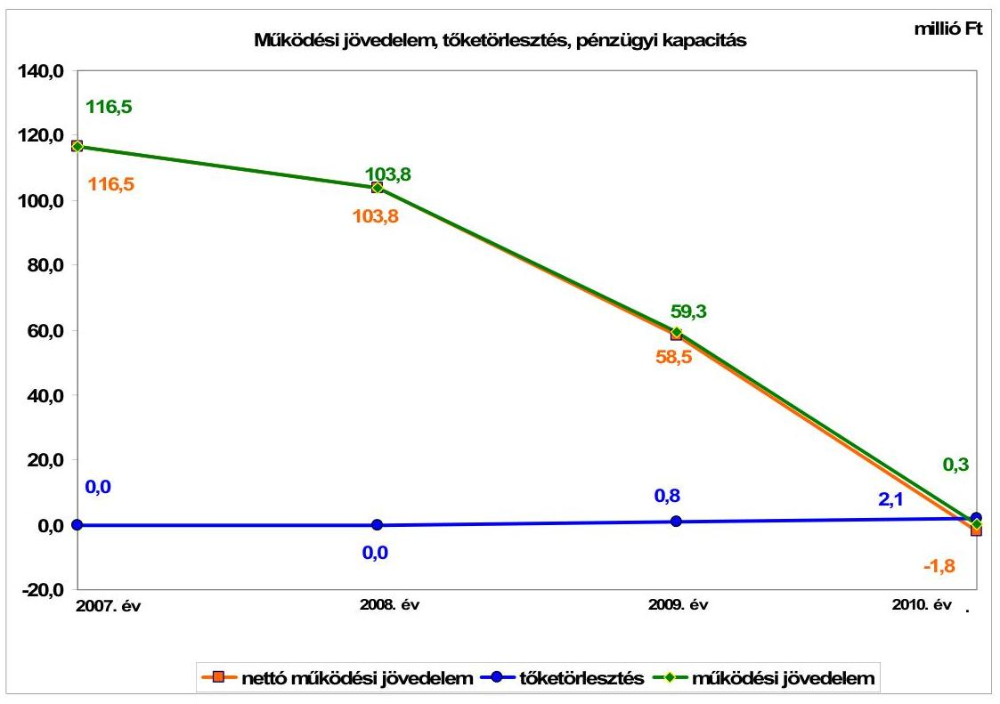

A múködési jövedelem romlását a folyó kiadások folyó bevételeket meghaladó mértékű emelkedése, illetve a 2010. évben a folyó bevételek csökkenése okozta. Az Önkormányzat pénzügyi kapacitása a vizsgált időszakban - a folyó költségvetés egyenlege miatt - romlott. A Közoktatási intézményfenntartó társulás létrehozása és a tanuszoda igénybevételéért fizetett PPP szolgáltatási díjak hatására a folyó kiadások a 2009. évig nőttek. A 2010. évben a közoktatási intézmények átadása miatt a folyó bevételek a folyó kiadásoknál nagyobb ütemben csökkentek. Ennek következményeként negatív nettó múködési jövedelem keletkezett.

A 2007-2010 években az Önkormányzat felhalmozási költségvetésének egyenlege folyamatosan negatív összegű volt, összesen 249,8 millió Ft felhalmozási forráshiányt mutatott.

A pénzügyi egyensúly fenntartása külső forrás bevonása nélkül is biztosítható volt. A 2007-2010. években az Önkormányzat a Víziközmű társulat által felvett víziközmú hitelből törlesztett 2,9 millió Ft-ot, aminek az érdekeltségi hozzájárulások fedezetet nyújtottak. A víziközmű hitel törlesztése az Önkormányzat pénzügyi egyensúlyi helyzetét nem befolyásolta. Az adósságszolgálat, továbbá a felhalmozási forráshiány 2007-2010 között 252,7 millió Ft-ot tett ki,

[^0]
[^0]:    ${ }^{7}$ A folyó költségvetés egyenlege 2007-ben a folyó kiadások 13,1\%-át (116,5 millió Ftot), 2008-ban 10,1\%-át (103,8 millió Ft-ot), 2009-ben 5,3\%-át (59,3 millió Ft-ot) jelentette. 2010-ben a folyó költségvetés egyenlege 0,3 millió Ft volt.

---

amelyre az időszakban képződő 279,9 millió Ft működési megtakarítás (működési jövedelem) szolgált fedezetül.

Az Önkormányzat folyó bevétele a 2010. évben a megelőző három év átlagához képest 8,0\%-kal ( 88,4 millió Ft-tal) csökkent. A költségvetési támogatások és az átengedett szja együttes összege, valamint az egyéb bevételek a központi forrásszabályozás változásának hatására és a közoktatási intézmények átadása miatt a 2010. évben visszaestek. A 2010. évben helyi adók emelése ellenére az adóbevételek az előző évhez képest 11,3 millió Ft-tal (14,8\%-kal) csökkentek.

Az Önkormányzat folyó kiadásait a 2008. évtől növelik a PPP konstrukcióban múködtetett tanuszoda kiadásai. A Közoktatási intézményfenntartó társulás létrehozása és a tanuszoda igénybevételéért fizetett PPP szolgáltatási díjak miatt a folyó kiadások a 2007. évi 891,7 millió Ft-ról a 2008. évre 1032,6 millió Ft-ra, a 2009. évre 1122,8 millió Ft-ra nőttek. A 2010. évben az Önkormányzat folyó kiadásai a közoktatási intézmények átadása miatt csökkentek. A 2010. évben a megelőző három év átlagához képest 0,4\%-kal (4,5 millió Ft-tal) több folyó kiadás teljesült.

A befejezett fejlesztéseket pályázatokon nyert támogatásokból és saját forrásokból fedezték. A 2007-2010. évek időszakában 1392,7 millió Ft értékű fejlesztés és felújítás forrásai 181,2 millió Ft saját erő, 63,9 millió Ft hazai- és 1147,6 millió Ft EU-s támogatások voltak. A 2010. december 31-én folyamatban lévő fejlesztési feladatok végrehajtására a 2010. évben 13,1 millió Ft kiadást teljesítettek, melynek teljes mértékét EU-s támogatásokból rendezték. Az EU-s támogatásból megvalósult fejlesztések finanszírozása likviditási gondot nem okozott.
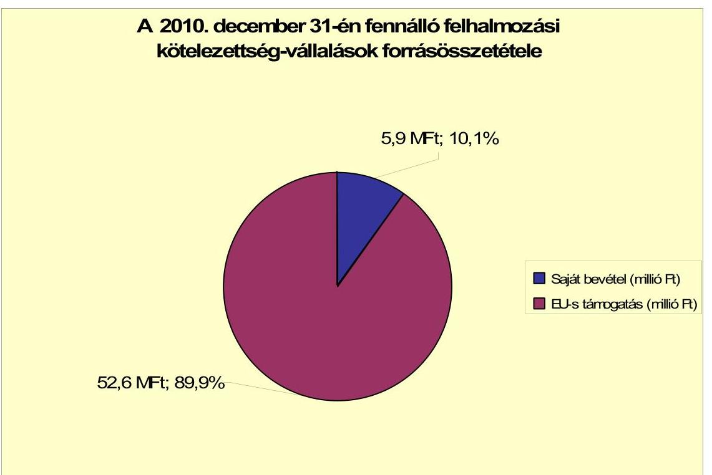

---

Az Önkormányzat által a 2010-2013. évekre vállalt kötelezettségek összege 58,5 millió Ft volt, amelyből 52,6 millió Ft-ot EU-s támogatásból terveznek biztosítani. Az Önkormányzat által beadott, elbírálás alatt álló pályázatok tervezett teljes bekerülési költsége 16,3 millió Ft.

Az Önkormányzat mérleg szerinti pénzintézeti kötelezettsége a 2007. év végéről a 2011. év I. félév végére 5,0 millió Ft-ról 2,1 millió Ft-ra csökkent. A fennálló pénzintézeti kötelezettség a víziközmű hitelből keletkezett.

Az Önkormányzat kötelezettségvállalására képviselő-testületi döntés alapján került sor. A 2007-2011. év I. féléve között átmenetileg szabad pénzeszközeiből 28,4 millió Ft kamatbevételt realizált.

Az Önkormányzatnak 2011. év I. félév végén szállítói tartozása nem volt.
Az Önkormányzat gazdasági társasága részére fejlesztési és egyéb hitelek igénybevételéhez készfizető kezességet nem vállalt. A gazdasági társága részére 2,0 millió Ft tagi kölcsönt nyújtott az Önkormányzat a 2009. évben, amelyet visszafizetett.

A Képviselő-testület a 2007-2011. év I. féléve között jelzálogjog alapításához nem járult hozzá.

Az Önkormányzat kötelezettségeinek 2010. december 31-i, valamint 2011. június 30-i állományát és várható alakulását a kötelezettségek lejáratáig a következő táblázat szemlélteti:

| Megnevezés | Állomány 2010. december   31-én | Állomány 2011. június   30-án | Várható kötelezettség   2011-2013. években |
| :-- | :--: | :--: | :--: |
|  | HUF-ban (millió Ft-ban) | HUF-ban (millió Ft-ban) | HUF-ban (millió Ft-ban) |
| Pénzintézeti kötelezettségek | 2,1 | 2,1 | 2,1 |
| Pénzintézeti kötelezettségek összesen HUF-ban: | 3,1 | 2,1 | 2,1 |
| Szállító tartozás | 6,1 | - | - |

Az Önkormányzat pénzintézetekkel szemben fennálló kötelezettsége a 2011. év I. félév végén 2,1 millió Ft volt. Az Önkormányzatnak a 2011. évben szállítói tartozások rendezése címén fizetési kötelezettsége nem keletkezett. A 2011-2013. évek kötelezettségeinek teljesítésére figyelembe vehető 94,4 millió Ft pénzmaradvány, 19,4 millió Ft mérlegben kimutatott követelésállomány, 78,4 millió Ft forgalomképes nettó ingatlanvagyon.

Az Önkormányzat kötelezettségvállalásának összege a tanuszoda igénybevételéért fizetendő PPP szolgáltatási díjra a 2022. évig 799,3 millió Ft, amelyből a 2008. évben 9,4 millió Ft-ot, a 2009. évben 47,8 millió Ft-ot, a 2010. évben 51,5 millió Ft-ot és 2011. év I. félév végéig 39,8 millió Ft-ot fizettek meg. A 2011. június 30-án fennálló kötelezettség összege 650,8 millió Ft. A fennálló kötelezettség miatt a tanuszoda PPP konstrukcióban történő működtetése múködési kockázattal jár, a pénzügyi egyensúlyt kedvezőtlenül érinti.

A Képviselő-testületnek előterjesztett éves zárszámadási rendeleteikben nem mutatatták be az Önkormányzat eszközei után tárgyévben elszámolt értékcsökkenés összegét, az eszközpótlásra fordított tényleges kiadásokat, az eszkö-

---

zök elhasználódási fokának alakulását. Nem mérték fel, hogy az elhasználódott eszközök pótlása milyen kötelezettséget jelent az Önkormányzat számára. Erre tartalékot nem képeztek, és alapot nem hoztak létre.

Az Önkormányzat költségvetési támogatásból, átengedett bevételekből származó bevételei a 2007. évhez képest az időszak egészét tekintve összességében 634,7 millió Ft-tal növekedett. Emellett az Önkormányzat folytatta az előző években elkezdett - kiadási megtakarítást eredményező és bevételt növelő - intézkedéseit. A 2007-2011. év I. féléve között tett intézkedések hatására 27,9 millió Ft bevételi többletet, továbbá 259,2 millió Ft kiadási megtakarítást mutattak ki, ezáltal az Önkormányzat pénzügyi egyensúlyi helyzetét javították. A kiadási megtakarítások teljes egészében az elrendelt álláshely csökkentések eredménye. Az álláshelycsökkentő intézkedések 2007-2011. év I. féléve között önkormányzati szinten összesen 161 betöltött álláshely megszüntetését jelentették. Az álláshelyek száma a Polgármesteri hivatalban, a közoktatási és az egészségügyi ágazatban csökkentek. A közoktatási ágazatban és közcélú foglalkoztatottak körében álláshely- és egyben létszámnövekedés is történt. Ennek következtében az időszak álláshelyeinek száma 109 fővel csökkent. A bevételnövelő intézkedések helyi adókhoz, ingatlanok bérbeadásához, intézményi térítési díjak emeléséhez kapcsolódtak. A pozitív múködési jövedelem fenntartása a bevételek növelésével és a kiadások csökkentésével érhető el.

Az Önkormányzat gazdálkodási rendszerének 2009. évi ellenőrzéséről készült ÁSZ jelentés a pénzügyi egyensúlyi helyzet javítására javaslatot nem tett, ezért utóellenőrzésre nem került sor.

Az Önkormányzat pénzügyi egyensúlyi helyzetét összegezve a következők emelhetők ki:

Lengyeltóti Város Önkormányzat pénzügyi egyensúlyi helyzete középtávon veszélyeztetett.

A 2007-2009. években a folyó kiadások nőttek, a 2010. évben a folyó bevételek a folyó kiadásokat meghaladó ütemben csökkentek. A vizsgált időszakban folyamatosan csökkent a múködési jövedelem. A 2010. évben negatív nettó múködési jövedelem keletkezett, a folyó bevételek nem nyújtottak fedezetet a folyó kiadásokra és az adósságszolgálatra.

A tanuszoda igénybevételéért a további években fizetendő PPP szolgáltatási díjra a mutatkozó tendencia szerint a múködési jövedelem nem biztosít elegendő forrást.

Az Állami Számvevőszékről szóló 2011. évi LXVI. törvény 33. § (1) bekezdésében foglaltak értelmében a jelentésben foglalt megállapításokhoz kapcsolódó intézkedési tervet köteles az ellenőrzött szervezet vezetője összeállítani és azt a jelentés kézhezvételétől számított harminc napon belül az ÁSZ részére megküldeni. Amennyiben az intézkedési tervet határidőben nem küldi meg a szervezet, vagy az továbbra sem elfogadható, az ÁSZ elnöke a hivatkozott törvény 33. § (3) bekezdés a)-b) pontjaiban foglaltakat érvényesítheti.

---

# A 2011. június 30-i pénzügyi egyensúlyi helyzet alapján az ellenőrzés intézkedést igénylő megállapításai és javaslatai a következők: 

## a Polgármesternek

1. A 2008. évtől a megvalósult tanuszoda igénybevételéért fizetendő PPP szolgáltatási díjak növelik a folyó kiadásokat. A múködési jövedelem folyamatosan csökkent, a 2010. évben negatív nettó múködési jövedelem alakult ki. A pozitív múködési jövedelem fenntartása a bevételek növelésével és a kiadások csökkentésével érhető el.

Javaslat:
Az Önkormányzat pénzügyi egyensúlyának középtávon történő biztosítása és hosszú távú fenntarthatósága érdekében kezdeményezze - felelősök és határidők megjelölésével - az alábbi intézkedés megtételét:
a) Tárja fel a bevételszerző és kiadáscsökkentő lehetőségeket. Ütemezze a bevételek beszedését a jövőben jelentkező fizetési kötelezettségeihez.
b) Képezzen egyensúlyi (elkülönített) tartalékot a PPP szolgáltatási díj teljesítése érdekében.
2. A Képviselő-testületnek előterjesztett éves zárszámadási rendeletekben nem mutatták be az Önkormányzat eszközei után tárgyévben elszámolt értékcsökkenés összegét, az eszközpótlásra fordított tényleges kiadásokat, az eszközök elhasználódási fokának alakulását. Nem mérték fel, hogy az elhasználódott eszközök pótlása milyen kötelezettséget jelent az Önkormányzat számára.

Javaslat:
Mutassa be a Képviselő-testületnek évente a zárszámadási rendelet előterjesztésében az értékcsökkenés összegét, és ezzel összevetve az elhasználódott eszközök pótlására fordított tényleges kiadásokat, az eszközök elhasználódási fokának alakulását.

---

# II. RÉSZLETES MEGÁLLAPÍTÁSOK 

## 1. Az ÖNKORMÁNYZAT KÖTELEZŐ ÉS ÖNKÉNT VÁLLALT FELADATAI, A FELADATELLÁTÁS SZERVEZETI KERETEI ÉS ANNAK VÁLTOZÁSAI

Az Önkormányzat kötelező feladatait az Ötv. és az ágazati törvények figyelembevételével állapította meg az SzMSz-ben. Az önként vállalt feladatok terjedelméről az éves költségvetés elfogadásakor - az SzMSz 6. § (2) bekezdése alapján az anyagi lehetőségei függvényében, a fedezet biztosításával egyidejúleg döntött a Képviselő-testület.

A kötelező és önként vállalt feladatokat, azok ellátásának módját az Önkormányzat különböző dokumentumaiban (a 2006 - 2010. és a 2010 - 2014. évek gazdasági programjaiban, a 2008 - 2011. évek költségvetési koncepcióiban) nem fogalmazták meg teljes körűen. Az SzMSz-ben és más dokumentumokban sem határozták meg a feladatellátás módját, intézményi kereteit.

Az Önkormányzat - adatszolgáltatása szerint - a 2010. évi 1020,2 millió Ft működési célú költségvetési kiadásból 984,2 millió Ft-ot ( $96,5 \%$-ot) a kötelező feladatok ellátására, 36,0 millió Ft-ot ( $3,5 \%$-ot) az önként vállalt feladatok ${ }^{8}$ ellátására fordított. A 2011. évi tervadatok alapján a kötelező feladatok aránya 0,3 százalékponttal, $96,8 \%$-ra nőtt ( 649,5 millió Ft), a közoktatási feladatok Kistérségi társulásba történt átadása miatt.

A 2010. évben az önként vállalt feladatok aránya a közoktatásban ${ }^{9} 6 \%$, a gyermekjóléti szolgáltatások területén $64 \%$, a Polgármesteri hivatalban kimutatott feladatok támogatásánál $1,7 \%$ volt.

A közoktatásban, az általános iskolai oktatásban önként vállalt feladatként látják el az alapfokú művészetoktatást, a gyermekjóléti intézménynél a bölcsődei ellátást. A Polgármesteri hivatalban önként vállalt feladatként támogatták a sportegyesület, a civil szervezetek múködését, illetve a Lengyeltóti Napok rendezvényeinek lebonyolítását.

A 2010. évi múködési kiadások - az Önkormányzat adatszolgáltatásán alapuló - ágazatonkénti megoszlását és azok finanszírozási arányait a következő táblázat mutatja be:

[^0]
[^0]:    ${ }^{8}$ Az önként vállalt feladatok arányát az Önkormányzat állapította meg.
    ${ }^{9}$ 2010. június 30-ig, mert azt követően az Önkormányzat a közoktatási feladatok ellátását a Kistérségi társulásnak adta át.

---

| Ellátott feladat | Müködési   kiadás   összesen   (millió Ft) | Kötelező   feladatok   kiadásainak   részaránya   $\%$ | Müködési   bevétel   összesen   (millió Ft) | Állami   támogatás   részaránya   $\%$ | Intézményi   saját bevétel   részaránya   $\%$ | Önkormányzati   támogatás   részaránya   $\%$ | Társulástól átvett   támogatás   részaránya   $\%$ |
| :--: | :--: | :--: | :--: | :--: | :--: | :--: | :--: |
| Óvodák | 77,8 | 100,0 | 77,8 | 63,4 | 15,4 | 16,5 | 4,7 |
| Általános iskolák | 207,8 | 94,0 | 207,8 | 51,9 | 21,1 | 17,8 | 9,4 |
| Szociális   intézmények | 108,3 | 100,0 | 108,3 | 67,4 | 32,6 |  |  |
| Gyermekjóléti   intézmények | 25,0 | 36,0 | 25,0 | 67,3 | 3,0 | 24,6 | 5,1 |
| Közmúvelődési   intézmények | 36,2 | 100,0 | 36,2 | 6,0 | 4,6 | 89,4 |  |
| Polgármesteri hivatal   igazgatási kiadásai | 121,9 | 100,0 | 121,9 | 26,3 | 4,4 | 69,3 |  |
| Polgármesteri   hivatalban ellátott   egyéb feladatok   müködési kiadásai | 443,2 | 98,0 | 443,2 | 40,5 | 50,6 | 8,9 |  |
| Müködési kiadá-   sok összesen | 1020,2 | 96,3 | 1020,2 | 45,1 | 31,7 | 20,8 | 2,4 |

Az ellenőrzött időszakban nem változott a kötelező és önként vállalt feladatok aránya az óvodai nevelésben, a szociális ellátásban, a közművelődési feladatok és az igazgatási feladatok ellátásában. Az általános iskolai oktatásban az önként vállalt feladatok aránya a 2007. évi $9 \%$-ról ( 28,4 millió Ft) a 2008. évben $6 \%$-ra ( 23,4 millió Ft) csökkent, a következő évben $1 \%$-kal nőtt ( 27,6 millió Ft), majd a 2010. évben ugyanennyivel csökkent ( 12,5 millió Ft).

A 2007. évi 380 fơről a 2008. évben 563 főre nőtt a tanulók létszáma ${ }^{10}$, az alapfokú művészetoktatásban részesülők számának viszonylagos változatlansága mellett. Ennek megfelelően az intézmény 2008. évi költségvetési kiadásai 75,1 millió Ft előző évhez viszonyított növekményét a kötelező feladatok növekedése eredményezte.

A gyermekjóléti intézménynél az önként vállalt feladatok aránya a 2007. évi $67 \%$-ról ( 16,3 millió Ft) a 2008. évben $61 \%$-ra ( 16,1 millió Ft) csökkent, a 2009. évben négy százalékponttal $65 \%$-ra ( 17,1 millió Ft) növekedett, majd a 2010. évben egy százalékponttal ( 16,0 millió Ft) csökkent. Az arányokban bekövetkezett változásokat az ellátottak számának változásai eredményezték.

A Polgármesteri hivatalban kimutatott önként vállalt feladatok aránya a 2007. évi $4,3 \%$-ról ( 9,1 millió Ft) a 2008. évben $3,4 \%$-ra ( 8,1 millió Ft) csökkent. A 2009. évben 3,6\%-ra ( 10,8 millió Ft) emelkedett az előző évhez képest. A 2010. évben $1,7 \%$-ra ( 7,5 millió Ft) csökkent.

A sportegyesületnek, a civil szervezeteknek, illetve a városi rendezvények lebonyolítására juttatott támogatások összegeiről évente a Képviselő-testület döntött, mérlegelve anyagi lehetőségeiket és a felmerült támogatási igényeket.

[^0]
[^0]:    ${ }^{10}$ A niklai általános iskola 2007. évi átvételének teljes hatása a 2008. évben jelentkezett a létszámokban és a költségvetési bevételekben és kiadásokban.

---

Az önkormányzati múködési kiadásokból való ágazati részesedés
a 2007. évről a 2008. évre:

- a közoktatási ágazat esetében 426,6 millió Ft-ról 521,4 millió Ft-ra 22,2\%kal, arányaiban $47,8 \%$-ról $50,5 \%$-ra növekedett, a niklai általános iskola és óvoda 2007. július 1-jétől történt átvétele miatt.
- a szociális és gyermekjóléti intézményeknél 111,3 millió Ft-ról 119,1 millió Ft-ra 7,0\%-kal növekedett, részaránya 12,5\%-ról 11,5\%-ra, 1,0 százalékponttal csökkent. A változást az ellátottak számának (Idősek klubja, szociális étkezők) növekedése okozta.
- a közművelődési ágazatban és a Polgármesteri hivatal feladatainál 353,8 millió Ft-ról 392,1 millió Ft-ra 10,8\%-kal emelkedett, részaránya 39,7\%-ról 38\%-ra 1,7 százalékponttal csökkent. A Polgármesteri hivatal kiadásai közt megjelent a PPP konstrukcióban épült tanuszoda esedékes részlete ( 9,4 millió Ft).
a 2008. évről a 2009. évre
- a közoktatási ágazat esetében 521,4 millió Ft-ról 525,4 millió Ft-ra 0,8\%-kal növekedett, részaránya $50,5 \%$-ról $46,8 \%$-ra csökkent.
- a szociális és gyermekjóléti intézményeknél 119,1 millió Ft-ról 139,9 millió Ft-ra 17,5\%-kal növekedett, részaránya 11,5\%-ról 12,5\%-ra változott,

A 17,5\%-os (20,8 millió Ft) növekedést a szociális étkezők számának a 2008. évi 134 fơről a 2008. évben 246 főre ( $83,6 \%$-kal) történt emelkedése eredményezte.

- a közművelődési ágazatban és a Polgármesteri hivatal feladatainál 392,1 millió Ft-ról 457,5 millió Ft-ra (16,7\%-kal), részaránya 38,0\%-ról $40,7 \%$-ra növekedett, amelyet a PPP konstrukcióban épült tanuszoda 2009. évi részlete ( 47,8 millió Ft), illetve az Integrált nevelési, oktatási hálózat fejlesztése címú pályázat múködési kiadásai eredményeztek.
a 2009. évről a 2010. évre
- a közoktatási ágazatban 525,4 millió Ft-ról 285,6 millió Ft-ra 45,6\%-kal, részaránya $46,8 \%$-ról $28,0 \%$-ra csökkent, mert 2010. július 1-jétől a niklai általános iskola és óvoda fenntartását visszaadták Nikla Község Önkormányzatának, illetve a közoktatási feladatot átadták a Kistérségi társulásnak,
- a szociális és gyermekjóléti ágazatban 139,9 millió Ft-ról 133,2 millió Ft-ra 4,8\%-kal csökkent, részaránya 12,5\%-ról 13,1\%-ra növekedett,
- a közművelődési ágazatban és a Polgármesteri hivatal feladatainál 457,5 millió Ft-ról 601,4 millió Ft-ra 31,5\%-kal, részaránya 40,7\%-ról 58,9\%ra növekedett. A jelentős emelkedés oka, hogy a közoktatási feladat átadását követően, a Kistérségi társulásnak az intézmény múködésének finanszírozására átadott pénzeszközök a Polgármesteri hivatal költségvetésében jelentek meg.

---

# A múködési bevételeken belül a közoktatási ágazatnál 

- az állami támogatás összege a 2007. évi 300,6 millió Ft-ról a 2008. évben 312,2 millió Ft-ra, 3,9\%-kal növekedett, részaránya 33,7\%-ról 30,2\%-ra csökkent. Az önkormányzati támogatás összege 42,6 millió Ft-ról 70,6 millió Ft-ra, 65,7\%-kal, részaránya 4,8\%-ról 6,8\%-ra nőtt. Az intézményi saját bevételek összege 50,1 millió Ft-ról 77,9 millió Ft-ra, 55,5\%-kal, részaránya 5,6\%-ról 7,5\%-ra emelkedett. A társult önkormányzatoktól átvett támogatás összege 33,3 millió Ft-ról 60,7 millió Ft-ra, 82,3\%-kal, 3,7\%-ról 5,9\%-ra változott.

A közoktatási feladatok múködési bevételei a 2007. évről a 2008. évre történt növekedését a niklai általános iskola és óvoda átvétele eredményezte. Az óvodai ellátottak száma a 2007. évi 181 fơről a 2008. évben 200 fơre, az általános iskolai tanulók száma 380 fôről 563 fôre nőtt.

- az állami támogatás összege a 2008. évi 312,2 millió Ft-ról a 2009. évben 345,6 millió Ft-ra, 10,7\%-kal, részaránya 30,2\%-ról 30,8\%-ra emelkedett. Az önkormányzati támogatás összege 70,6 millió Ft-ról 55,8 millió Ft-ra, 21,0\%kal (14,8 millió Ft-tal), 6,8\%-ról 5,0\%-ra csökkent. Az intézményi saját bevételek összege 77,9 millió Ft-ról 90,1 millió Ft-ra 15,7\%-kal, részaránya 7,5\%ról $8,0 \%$-ra növekedett. A társult önkormányzatoktól átvett támogatás öszszege 60,7 millió Ft-ról 33,9 millió Ft-ra, 44,2\%-kal (26,8 millió Ft) csökkent.

A 2009. évben az óvodai ellátottak száma a 2008. évi 200 fôről 206 fôre nőtt. Az általános iskolai tanulók száma 563 fôről 538 fôre, $4,4 \%$-kal csökkent, amely okozta a finanszírozási arányokban bekövetkezett változásokat.

- az állami támogatás összege a 2009. évi 345,6 millió Ft-ról a 2010. évben 157,5 millió Ft-ra, 54,5\%-kal, részaránya 30,8\%-ról 15,4\%-ra csökkent. Az önkormányzati támogatás összege 55,8 millió Ft-ról 49,3 millió Ft-ra, 5,0\%ról $4,8 \%$-ra csökkent. Az intézményi saját bevételek összege 90,1 millió Ftról 55,9 millió Ft-ra, részaránya $8,0 \%$-ról $5,5 \%$-ra apadt. A társult önkormányzatoktól átvett támogatás összege 33,9 millió Ft-ról 23,2 millió Ft-ra, részaránya $3,0 \%$-ról $2,3 \%$-ra csökkent.
2010. július 1-jétől a niklai általános iskola és óvoda visszakerült Nikla Város Önkormányzata fenntartásába, továbbá az Önkormányzat átadta közoktatási feladatait a Kistérségi társulásnak. Ez eredményezte a finanszírozási arányok változásait.

A szociális és gyermekjóléti ágazatban az állami támogatás összege a vizsgált időszakban a 2007. évi 76,6 millió Ft-ról 89,7 millió Ft-ra, részaránya 69,7\%-ról 67,4\%-ra változott. Az önkormányzati támogatás összege 6,2 millió Ft-ról 6,1 millió Ft-ra, 5,5\%-ról 4,6\%-ra csökkent. Az intézményi saját bevételek összege 20,3 millió Ft-ról 36,0 millió Ft-ra, 18,2\%-ról 27,0\%-ra nőtt. A társult önkormányzatoktól átvett támogatás összege 7,3 millió Ft-ról 1,3 millió Ftra, $6,5 \%$-ról $1 \%$-ra apadt.

Az ágazatban a 2007. év és 2011. év I. félév végéig terjedő időszakban nem volt szervezeti módosulás. A finanszírozás összegében és arányaiban történt változásokat az állami feladatfinanszírozásban bekövetkezett változások, és az ellátottak létszámának csökkenései, növekedései eredményezték.

---

A közmúvelődési intézménynél és a Polgármesteri hivatal feladatainál (beleértve az igazgatási tevékenységet is) az állami támogatás összege a 2007. évi 83,9 millió Ft-ról a 2008. évben 159,0 millió Ft-ra, 89,5\%-kal növekedett. A 2009. évben 126,7 millió Ft-ra, 20,3\%-kal csökkent. A 2010. évben 213,6 millió Ft-ra, 68,6\%-kal emelkedett, amelynek oka, hogy a közoktatási intézmény 2010. július 1-jei átadását követően az óvodai ellátottak és az általános iskolai tanulók után járó állami támogatások a Polgármesteri hivatal költségvetésében jelentek meg. Az önkormányzati támogatás összege a 2007. évi 147,8 millió Ft-ról a 2008. évben 152,8 millió Ft-ra emelkedett. A 2009. évben 154,4 millió Ft-ra, a 2010. évben 156,6 millió Ft-ra növekedett. Az intézményi saját bevételek összege a 2007. évi 122,1 millió Ft-ról 80,3 millió Ft-ra csökkent, amelyet az szja bevételek csökkenése eredményezett. A 2009. évben az intézményi saját bevételek összege 176,4 millió Ft-ra, 2,2-szeresére, a 2010. évben 231,4 millió Ft-ra, 31,2\%-kal növekedtek, amelyet a pénzmaradvány évenkénti fokozott igénybevétele okozott.

Az Önkormányzat kötelező és önként vállalt feladatait 2011. év I. félév végén három költségvetési szervvel (beleértve a Polgármesteri hivatalt is) és egy gazdasági társasággal látta el. Ezenkívül egy többcélú kistérségi társulással társulási megállapodás keretében, egy gazdasági szervezet és egy egyéni vállalkozó közszolgáltatási szerződéssel, egy gazdasági társaság üzemeltetési szerződéssel vett részt az Önkormányzat feladatai ellátásában. Továbbá gesztorként részt vett egy intézményi társulásban.

Az Önkormányzat által fenntartott költségvetési szervek közül 2011. június 30án egy önállóan működő és gazdálkodó, kettő önállóan működő, feladataikat - az alapító okirataik szerint - nyolc telephelyen folytatták, a gazdasági társaság egy telephellyel rendelkezett. A feladatellátás megteremtése érdekében végrehajtott feladatátadások következtében az intézmények száma a vizsgált időszakban négyről háromra, $25 \%$-kal, míg a telephelyek száma 13 -ról nyolcra, $38,5 \%$-kal csökkent. A közoktatási feladat Kistérségi társulásba való átadása miatt az ellátott feladatok köre is változott.

A vizsgált időszakot megelőzően az Önkormányzatnak kettő önállóan és kettő részben önállóan gazdálkodó költségvetési szerve volt összesen 13 telephellyel. A közoktatási intézmény három tagóvodával és két tagiskolával rendelkezett, melyet intézményi társulás formájában tartottak fent az Önkormányzat gesztorságával. A 2007. évben az intézményi társuláshoz csatlakoztak Nikla és Csömend községek önkormányzatai, amelynek eredményeként a közoktatási intézmény bővült egy-egy tagiskolával és tagóvodával. A 2010. évben Nikla Község Önkormányzata kilépett az intézményi társulásból, amelynek következtésben egy tagóvodával és egy tagiskolával csökkent a telephelyek száma. Az Önkormányzat 2010. június 30-i hatállyal megszüntette a közoktatási intézményi társulást és 2010. július 1-jétől a Kistérségi társulás fenntartásába adta a közoktatási intézményt.

Az Önkormányzat a 2007. évben a szociális és gyermekjóléti intézményét intézményi társulás keretében tartotta fenn nyolc telephellyel ${ }^{11}$. A feladatellátás köre

[^0]
[^0]:    ${ }^{11}$ Az ellátott feladatok: bölcsődei ellátás (önként vállalt feladat), időskorúak nappali ellátása, gyermekjóléti szolgáltatás, családsegítés, házi segítségnyújtás és szociális étkeztetés.

---

és szervezeti keretei a vizsgált időszakban, 2011. június 30-ig nem változott, de azt követően, 2011. július 1-jétől az intézményt a Kistérségi társulás fenntartásába adták.

A vizsgált időszakban az Önkormányzat egy részben önálló gazdálkodású közművelődési intézményt tartott fent, amelynek szervezeti keretei és az ellátott feladatok köre nem változott.

Az Önkormányzat a PPP konstrukcióban elkészült tanuszodája működtetésére gazdasági társaságot hozott létre 2008. november 27-én, amelynek 100\%-ban a tulajdonosa. A gazdasági társaság az Önkormányzat PPP konstrukcióban készült tanuszodájának üzemeltetésében részt vesz szolgáltatási szerződés alapján. A magánbefektető és a Tanuszoda Kft. szolgáltatási szerződést kötött 2009. évben a tanuszoda működtetéséhez kapcsolódó részfeladatok folyamatos és szakszerű ellátására. A szerződésben rögzítették, hogy a magánbefektető felel az üzemeltetésért és annak terheinek viseléséért. A Tanuszoda Kft. létrehozását az üzemeltetési feladatok gazdaságos megszervezésével és a helyi foglalkoztatás növelésével indokolták. A Tanuszoda Kft. 2009. és 2010. évi eredményéből 5,0-5,0 millió Ft osztalékot fizetett az Önkormányzatnak.

Az Önkormányzat kötelező feladatai ellátásában további két gazdasági társaság és egy magánvállalkozó vett részt a vizsgált időszakban.

A Vízmú Zrt. üzemeltetési szerződések keretében a közcélú ivóvízellátó és szennyvízelvezető rendszer működtetését, az AVE Zöldfok Zrt.-vel a települési szilárd hulladék gyűjtésére, szállítására, kezelésére és ártalmatlanítására közszolgáltatási, Kenyér Endréné temetkezési vállalkozóval kegyeleti közszolgáltatási szerződést kötöttek.

Az Önkormányzat által 2011. június 30-án működtetett három költségvetési szerve közül egy csak kötelező feladatokat lát el, kettő pedig a kötelező feladatok ellátásán túl, az önként vállalt feladatok teljesítésében is részt vett.

A közművelődési intézmény 100\%-ban kötelező feladatokat lát el a közművelődési és közkönyvtári szolgáltatás biztosításával.

Az Alapszolgáltatási központ a szociális és gyermekjóléti alapszolgáltatásokon túl - önként vállalt feladatként - bölcsődei ellátást biztosított.

A Polgármesteri hivatalban - az igazgatási feladatok mellett - kötelező feladatként látja el a városüzemeltetési feladatokat (pl. közutak, terek, parkok, zöldterületek fenntartása), önként vállalt feladatként a sportegyesület, a civilszervezetek és a városi rendezvény támogatását.

Az Önkormányzat a 2007. évben - intézményi társulás keretében - közoktatási intézményébe integrálta telephelyként a niklai általános iskolát és óvodát. Majd a 2010. évben Nikla Község Önkormányzat kivált az intézményi társulásból. A közoktatási intézményt 2010. július 1-jétől a Kistérségi társulás fenntartásába adták.

Az intézményátvételt az intézményi társulás által elérhető többletforrásokkal, kedvezőbb működtetési feltételekkel indokolták. Az intézményi társulási megállapodás VI. fejezetében, a vegyes rendelkezések között rögzítik, hogy Nikla és Csömend községek önkormányzataival a társulási megállapodás 2007. július 27-

---

én hatályosult, és egy plusz két év időtartamra szól. A három év elteltével a 2010. évben Nikla és Csömend községek önkormányzatai kiléptek az intézményi társulásból. Az intézmény a Kistérségi társulás fenntartásába történt átadását többlet normatív hozzájárulások elérésével indokolák.

Az Önkormányzat egyháznak, civil szervezetnek nem adott át feladatot.
A vizsgált időszakban a Nikla Község Önkormányzatától a 2007. évben átvett általános iskola és óvoda 180,6 millió Ft-tal növelte a kiadásokat, amelyből 139,6 millió Ft a személyi juttatások és járulékai, 41,0 millió Ft a dologi kiadás. A kiadásokat az állami támogatások 88,7\%-ban ( 160,1 millió Ft), a saját bevételek $2,1 \%$-ban ( 3,7 millió Ft ) és a társult önkormányzatoktól átvett támogatás 9,2\%-ban ( 16,7 millió Ft) fedezték. Az Önkormányzatnak a feladatátvétel nem járt többletkiadással. A 2010. évben a két tagintézmény átadása Nikla Község Önkormányzatának 29,6 millió Ft kiadás csökkenést okozott, azonban megtakarítást nem eredményezett, mivel azonos összegű volt a bevételelmaradás is. A közoktatási intézmény átadása a Kistérségi társulásnak 197,4 millió Ft kiadáscsökkenés mellett, 185,6 millió Ft bevételcsökkenést eredményezett. A feladatátadásból az Önkormányzatnak 11,8 millió Ft megtakarítása keletkezett.

Az Önkormányzat 100\%-os tulajdonában álló gazdasági társaságnál átszervezés nem történt. A saját tőke/jegyzett tőke aránya a 2010. évben 15,6 szeresére nőtt. A társaság gazdálkodását, illetve a múködését érintő adatokat a jelentés 4. számú melléklete mutatja be.

Az önkormányzati vagyon gazdasági társaságoknak vagyonkezelésbe adása az ellenőrzött időszakban nem történt. A gazdasági társaságok az önkormányzati vagyont bérleti szerződés, üzemeltetési megállapodás alapján használták.

A vizsgált időszakban feladatátvétel nem befolyásolta az Önkormányzat pénzügyi egyensúlyát. A közoktatási intézmény átadása a Kistérségi tárulásnak 197,4 millió Ft kiadás csökkenés mellett, 185,6 millió Ft bevétel csökkenést okozott. Ennek eredményeként az Önkormányzatnak 11,8 millió Ft megtakarítása keletkezett.

# 2. Az ÖNKORMÁNYZAT PÉNZÜGYI EGYENSÚLYI HELYZETÉT BEFOLYÁSOLÓ TÉNYEZŐK 

A hagyományos költségvetési szerkezet helyett az Önkormányzat pénzügyi helyzetét a CLF módszerrel mutatjuk be, amelyben jobban elkülönülnek a vagyonnal kapcsolatos bevételek és kiadások az önkormányzati feladatokkal kapcsolatos közvetlen múködtetési bevételektől és kiadásoktól. A módszer következetesen elkülöníti a folyó és a felhalmozási költségvetés bevételeit és kiadásait, azok költségvetési egyenlegeit. A saját folyó bevételek, valamint a saját felhalmozási bevételek nem tartalmazzák az előző évi pénzmaradványok felhasználásából származó pénzforgalom nélküli bevételeket ${ }^{12}$.

[^0]
[^0]:    ${ }^{12}$ A költségvetési években kialakuló hiány finanszírozása az előző évi pénzmaradvány és a korábbi években képzett tartalékok felhasználásával is történhet.

---

A folyó költségvetés egyenlege, a múködési jövedelem megmutatja, hogy az Önkormányzat éves folyó bevétele fedezetet biztosít-e a kötelező és önként vállalt feladatellátáshoz kapcsolódó éves folyó kiadására. A múködési jövedelem negatív értéke pénzügyileg fenntarthatatlan helyzetet jelez. A mutató pozitív értéke megtakarítást mutat, amely forrásul szolgálhat az önkormányzat fennálló kötelezettségei megfizetéséhez, valamint fejlesztéseihez.

A felhalmozási költségvetés pozitív értéke felhalmozási többletet mutat, amely a jövőbeni fejlesztések forrását biztosíthatja. Amennyiben a folyó költségvetési hiány finanszírozása a felhalmozási többletből történik, ez szűkebb értelemben vagyonfelélésnek tekinthető. Amennyiben a felhalmozási költségvetés megtakarítása fejlesztési célú hitelek, kötvények adósságszolgálatát finanszírozza, az változatlan vagyontömeg mellett, a korábban megelőlegezett tőkebevételek valós realizációjának tekinthető. A felhalmozási deficit által generált finanszírozási igény önmagában nem jár pénzügyi kockázattal, a pénzügyileg fenntartható beruházásokhoz kapcsolódó kötelezettségvállalás (adósságszolgálat) átlátható és szabályozott költségvetési gazdálkodással teljesíthető.

A módszer a pénzügyi kapacitás fogalmát helyezi a középpontba. Az adós hitelfelvételi képessége, hosszú távú fizetőképessége vagy bonitása a pénzügyi kapacitással, ezen belül is a nettó múködési jövedelemmel jellemezhető. A nettó múködési jövedelem negatív értéke az egyes költségvetési években jelentkező adósságszolgálat túlzott mértékére utal. ${ }^{13}$ A nettó múködési jövedelem negatív értékének felhalmozási többletből, vagy további hitelből történő finanszírozása pénzügyileg nem fenntartható gazdálkodást vetít előre. A pozitív értéket mutató nettó múködési jövedelem fejlesztési kiadások fedezetét biztosíthatja, illetve a folyamatosan, évenként képződő pozitív nettó múködési jövedelemből meghatározható a jövőben vállalható, teljesíthető éves adósságszolgálat, ily módon az a hitelösszeg, amely - a többi tényezőt, feltételt adottnak tekintve visszafizetési kockázat nélkül felvehető.

A CLF módszer alapján a pénzügyi kapacitás mértéke az Önkormányzat összevont, nettósított, a központi információs rendszerbe a Magyar Államkincstáron keresztül leadott éves költségvetési beszámolójának 80-as űrlapjában szerepeltetett adatok alapján került meghatározásra.

A számítási leírás némileg eltér az ÁSZ módszertanában korábban alkalmazott gyakorlattól. A jelen besorolás általános közgazdasági meggondolásokon alapul, amely megjelenik az SNA statisztikai módszertanában is. Folyó tételek alatt értjük azokat a kiadásokat és bevételeket, amelyek a gazdálkodó szervezet helyzetét automatikusan nem változtatják. Bevételi oldalon ilyenek az adók, a tényező jövedelmek, a transzferek ${ }^{14}$, kiadási oldalon a transzferek és a szolgáltatás igénybevételével kapcsolatos múködési kiadások. A folyó költségvetésben a bevételekben nem térül meg, a kiadásokban nem jelenik meg az amortizáció, a vagyoni helyzetet az egyenleg befolyásolja.

[^0]
[^0]:    ${ }^{13}$ kivéve, ha annak finanszírozására a korábbi években képzett tartalékok fedezetet nyújtanak
    ${ }^{14}$ Transzfer kiadásoknak nevezzük azokat a folyó és felhalmozási tételeket, amelyeket nem az adott önkormányzat használ fel szolgáltatásnyújtásra.

---

A folyó költségvetés egyenlege (múködési jövedelem) tartalmazza a kamatbevételeket és a kamatkiadásokat is, mind a múködési, mind a fejlesztési kamatot, valamint a visszatérülő és befizetendő áfa teljes összegét, mert ezek közgazdaságilag tényező jövedelmek. Nem tartalmazzák viszont a követelés elengedés miatt könyvelt bevételi és kiadási pénzforgalmi tételeket, mert valójában technikai elszámolási múveletnek minősülnek, a bevétel soha nem realizálódott, és költségvetési kiadás sem történt.

A felhalmozási költségvetésben a bevételek között a vagyon megőrzésére és bővítésére fordítható források jelennek meg. A felhalmozási vagy tőketételek módosítják a vagyon nagyságát. A privatizációs bevétel csökkenti a vagyont, a fizikai beruházás, pénzügyi befektetés növeli.

A nettó múködési jövedelmet a tőketörlesztés levonásával a folyó költségvetés egyenlegéből származtatjuk.

---

# 2.1. A múködési és a felhalmozási egyensúly változása 

CLF módszer szerinti önkormányzati adatok

| Megnevezés | 2007. év | 2008. év | 2009. év | 2010. év |
| :--: | :--: | :--: | :--: | :--: |
| Folyó bevételek | 1008,2 | 1136,4 | 1182,1 | 1020,5 |
| Folyó kiadások | 891,7 | 1032,6 | 1122,8 | 1020,2 |
| Müködési jövedelem | 116,5 | 103,8 | 59,3 | 0,3 |
| Nettó müködési jövedelem   =müködési jövedelem - tőketörlesztés | 116,5 | 103,8 | 58,5 | $-1,8$ |
| Felhalmozási bevételek | 56,8 | 6,5 | 649,8 | 499,4 |
| Felhalmozási kiadások | 133,8 | 71,9 | 672,6 | 584,0 |
| Felhalmozási költségvetés egyenlege | $-77,0$ | $-65,4$ | $-22,8$ | $-84,6$ |
| Finanszírozási múveletek nélküli (GFS)   pozíció = müködési jövedelem +   felhalmozási költségvetés egyenlege | 39,6 | 38,4 | 36,5 | $-84,2$ |
| Finanszírozási múveletek egyenlege | $-18,2$ | 0,9 | 0,7 | $-11,0$ |
| Tárgyévi pénzügyi pozíció | 21,4 | 39,4 | 37,2 | $-95,2$ |
| Egyéb tájékoztató adatok |  |  |  |  |
| Összes kötelezettség* | 14,4 | 14,3 | 370,3 | 18,0 |
| -ebből rövid lejáratú | 9,4 | 10,1 | 368,2 | 18,0 |
| Folyószámlahitel napi átlagos állománya ** | 0,0 | 0,0 | 0,0 | 0,0 |
| Likvidhitel napi átlagos állománya** | 0,0 | 0,0 | 0,0 | 0,0 |
| Munkabérhitel napi átlagos állománya** | 0,0 | 0,0 | 0,0 | 0,0 |
| Finanszírozásba vonható eszközök: | 135,6 | 175,0 | 212,2 | 94,4 |
| Tartós hitelviszonyt megtestesítő értékpapírok év végi állománya | 0,0 | 0,0 | 0,0 | 0,0 |
| Hosszú lejáratú bankbetétek év végi állománya | 0,0 | 0,0 | 0,0 | 0,0 |
| Értékpapírok év végi állománya | 0,0 | 0,0 | 0,0 | 0,0 |
| Pénzeszközök (idegen pénzeszközök nélkül) év végi állománya | 135,6 | 175,0 | 212,2 | 94,4 |

* Az összes kötelezettséget a passzív pénzügyi elszámolások nélkül vettük figyelembe, mert a passzívák a pénzmaradvány elszámolás tételei közé tartoznak.
** A folyószámla, a likvid- és a munkabérhitel átlagos állományát 365 napos osztószámmal és nem a fennálló napok számával vettük figyelembe.

A 2009. évi rövid lejáratú kötelezettségeken belül 366,1 millió Ft-ot az Önkormányzat fejlesztéseihez kapott, a 2010. évben elszámolt támogatások okozták. A 2007-2010 között az Önkormányzat kiadásainak és bevételeinek főbb jogcímei, valamint az adósságszolgálatának adatait részletesen a jelentés 2. számú melléklete tartalmazza.

---

Az Önkormányzat folyó bevételeiből és folyó kiadásaiból álló költségvetési egyenlegének (működési jövedelmének) alakulását a következő ábra szemlélteti:
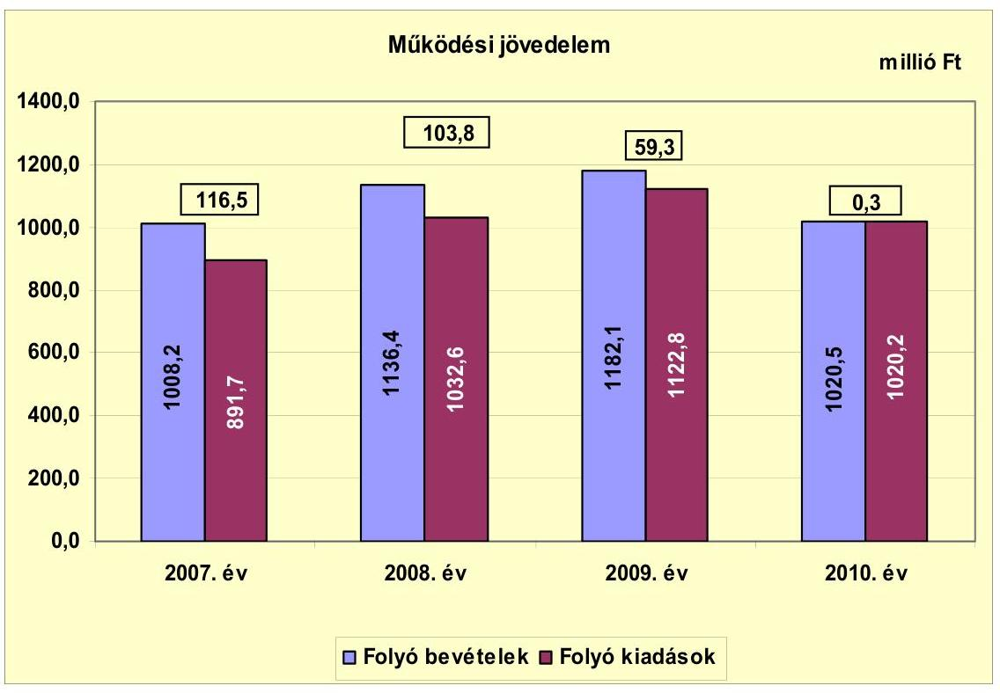

Az Önkormányzat folyó költségvetéséből többlet keletkezett a vizsgált időszakban. A múködési jövedelem értéke a 2007-2010. években összesen 279,9 millió Ft volt, a vizsgált időszakban folyamatosan csökkent. A múködési jövedelem csökkenését a 2007-2009. években a folyó kiadások folyó bevételeket meghaladó mértékű emelkedése, illetve a 2010. évben a folyó bevételek csökkenése okozta. A 2008. évtől a folyó kiadások a tanuszoda igénybevételéért fizetett PPP szolgáltatási díjak és a Közoktatási intézményfenntartó társulás létrehozása és kibővítése miatt a 2009. év végéig növekedtek. A 2010. évben a közoktatási intézmények átadását követően a költségvetési támogatások, a helyi adóbevételek és az egyéb bevételek a folyó kiadásokat meghaladó mértékben csökkentek.

Az Önkormányzat az ellenőrzött időszakban működőképességének megőrzését szolgáló kiegészítő támogatásra nem pályázott, folyószámla- és munkabér megelőlegezési hitelt nem vett igénybe.

Az Önkormányzat nettó múködési jövedelmének évenkénti alakulását a következő ábra szemlélteti:

---

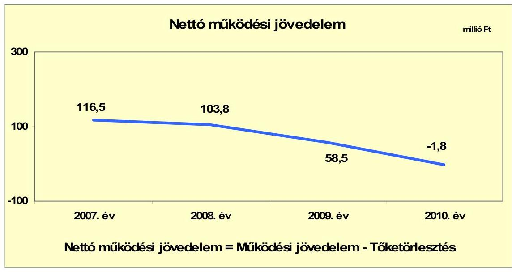

Az Önkormányzat pénzügyi kapacitása a 2007-2010. években csökkent. A vizsgált időszakban az Önkormányzat összesen 2,9 millió Ft tőkét törlesztett, ezért a pénzügyi kapacitás szinte megegyezik a múködési jövedelemmel. A pénzügyi kapacitás romlását a folyó kiadások és folyó bevételek alakulása idézte elő.
A 2007-2010. években az Önkormányzat felhalmozási költségvetésének egyenlege folyamatosan negatív összegú volt, melynek alakulását a következő ábra szemlélteti:
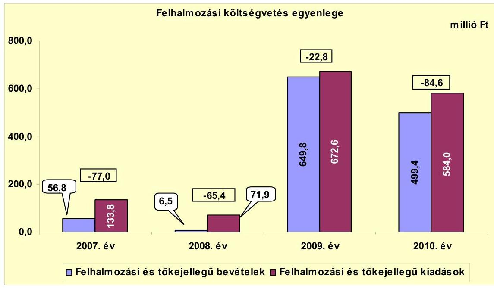

A vizsgált időszakban a felhalmozási forráshiány összesen 249,8 millió Ft volt, melyet az Önkormányzat múködési jövedelméből finanszírozott. Az Önkormányzatnak a CLF módszer szerint 2007-ben 39,5 millió Ft, 2008-ban 38,4 millió Ft, 2009-ben 35,7 millió Ft pénzügyi többlete keletkezett. A 2009. évben megkezdődött integrált nevelési-oktatási hálózat fejlesztési, közösségi létesítmény kialakítási és belterületi vízrendezési munkák kiadásai és a fejleszté-

---

sekhez igénybe vett támogatások a 2009-2010. években kiugróan magas felhalmozási bevételt és kiadást eredményeztek.

A 2010. évben a csökkenő nettó működési jövedelem és felhalmozási bevételek miatt az Önkormányzatnak 86,4 millió Ft finanszírozási hiánya ${ }^{15}$ volt, melyet előző évi pénzmaradványból finanszírozott.

Az Önkormányzatnak a múködési, illetve felhalmozási kiadásainak finanszírozására nem kellett hitelt felvennie.

A finanszírozási műveletek 2007-2010. évekbeli egyenlegének alakulását a következő ábra szemlélteti:
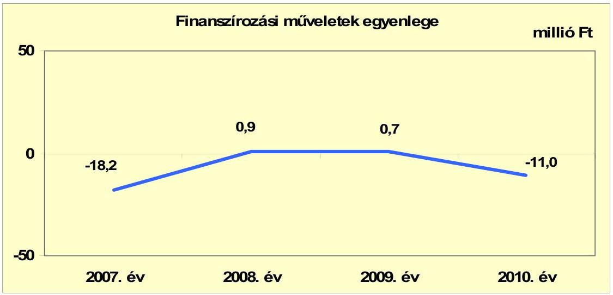

A finanszírozási célú műveleteket a jelentés 2. számú mellékletének 4.1-4.8. pontjai részletezik.

Az Önkormányzat zárszámadási rendeletében a múködési és fejlesztési többletet a hagyományos költségvetési szerkezet alapján mutatta be ${ }^{16}$, amelyről a jelentés 1. számú melléklete nyújt tájékoztatást. A zárszámadási rendeletek a 2007-2010. évekre 130,5 millió Ft, 171,6 millió Ft, 106,9 millió Ft, illetve 95,4 millió Ft bevételi többletet jeleztek.

Az Önkormányzat 2007-2011. év I. félév közötti kamatbevételeinek és kamatkiadásainak évenkénti alakulását a következő ábra mutatja:

[^0]
[^0]:    ${ }^{15}$ A nettó múködési jövedelem és a felhalmozási költségvetés egyenlegeinek összege.
    ${ }^{16}$ Nincs kötelező előírás a múködési és fejlesztési hiány megállapításának módjára.

---

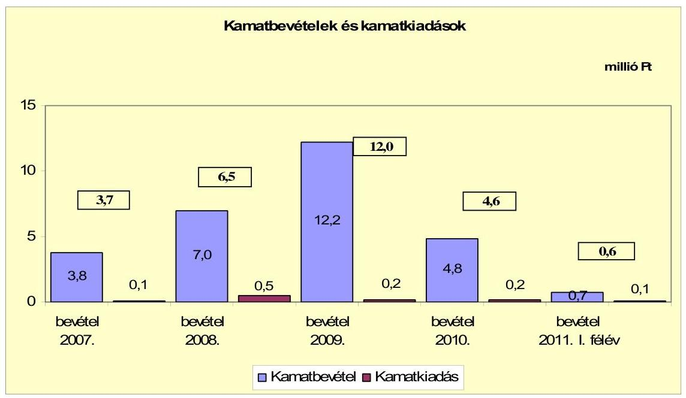

A vizsgált időszakban az Önkormányzat összesen 1,1 millió Ft kamatot fizetett meg. Az átmenetileg szabad pénzeszközein realizált kamatbevétel 28,5 millió Ft volt, melyből 12,2 millió Ft (42,8\%) a 2009. évig pozitív nettó múködési jövedelem miatt növekvő pénzeszközök hatására a 2009. évben realizálódott.

# 2.2. Az Önkormányzat bevételeinek változása 

Az Önkormányzat folyó bevétele a 2007. évi 1008,2 millió Ft-ról 2008. évre 1136,4 millió Ft-ra, 2009. évre 1182,1 millió Ft-ra, a 2010. évre 1020,5 millió Ftra emelkedett. A 2010. évben a megelőző három év átlagához képest 8,0\%-kal (88,4 millió Ft-tal) csökkent.

---

A 2007-2011. június 30. közötti időszak főbb bevételi jogcímeinek adatait az alábbi táblázat részletezi és grafikon mutatja be:
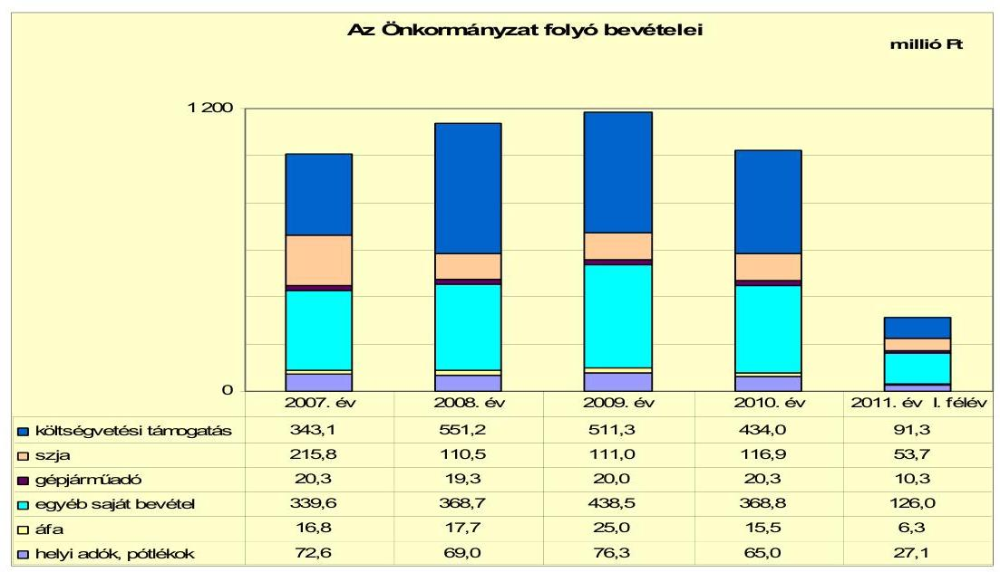

A költségvetési támogatások és az átengedett szja együttes összege a központi forrásszabályozás változásának hatására a 2010. évben a megelőző három év átlagához képest 10,3\%-kal (63,4 millió Ft-tal) lecsökkent. Az ezeken a jogcímeken befolyt bevételek a 2007. évről a 2008. évre 18,4\%-kal (102,8 millió Ft-tal) megemelkedtek. A 2008. évről a 2009. évre a központi támogatáscsökkentés következtében 6,0\%-kal (39,4 millió Ft-tal) csökkentek. A 2010. évre további 11,5\%-kal (71,4 millió Ft-tal) csökkentek a közoktatási intézmények átadása miatt.

A helyi adókból befolyt bevételek az előző évhez képest 2008-ban 3,6 millió Ft-tal (5,0\%-kal) csökkentek, 2009-ben 7,3 millió Ft-tal (10,6\%-kal) nőttek. 2009-ről 2010-re az adóbevételek 11,3 millió Ft-os (14,8\%-os) csökkenése következett be, annak ellenére, hogy a Képviselő-testület döntött az építményadó és a magánszemélyek kommunális adója mértékének emeléséről. Az Önkormányzatnak 2011. június 30-ig helyi adóból 27,1 millió Ft (a 2010. évi bevétel $41,7 \%$-a) realizálódott.

Az iparúzési adónál a maximális adómértéket, 2\%-ot alkalmazták a vizsgált években. A magánszemélyek kommunális adójának mértéke lakás után a 2007. évi 12000 Ft/évről a 2008. évre 7000 Ft/évre csökkent, amely a 2009. évben nem változott. A 2010. évben $8500 \mathrm{Ft} /$ évre, a 2011 . évben $9000 \mathrm{Ft} /$ évre emelkedett. Pince esetében $12 \mathrm{~m}^{2}$-ig a 2007. évi 3000 Ft/évről a 2011. évben $3500 \mathrm{Ft} /$ évre, 12 $\mathrm{m}^{2}$-felett a 2007. évi $4500 \mathrm{Ft} /$ évről a 2011. évben $5000 \mathrm{Ft} /$ évre emelték. Az építményadó mértéke lakás esetében a 2007. évi $900 \mathrm{Ft} / \mathrm{m}^{2}$-ről 2008-2010. évek között nem változott, 2011-ben $1050 \mathrm{Ft} / \mathrm{m}^{2}$-re nőtt. Üzleti cél esetén az építményadó 2007-2009. évek között $350 \mathrm{Ft} / \mathrm{m}^{2}$ volt, mely a 2010. évben $400 \mathrm{Ft} / \mathrm{m}^{2}$-re, 2011ben $450 \mathrm{Ft} / \mathrm{m}^{2}$-re nőtt. Garázs esetében ugyanezen években $150 \mathrm{Ft} / \mathrm{m}^{2}$-ről 200 $\mathrm{Ft} / \mathrm{m}^{2}$-re, illetve $250 \mathrm{Ft} / \mathrm{m}^{2}$-re emelkedett. Az idegenforgalmi adó mértéke a 20072010. években $150 \mathrm{Ft} /$ éj/fő, a 2011 . évben $250 \mathrm{Ft} /$ éj/fő volt. A telekadó 2007-2010. években $70 \mathrm{Ft} / \mathrm{m}^{2}$ volt, amely a 2011. évben $85 \mathrm{Ft} / \mathrm{m}^{2}$-re nőtt $800 \mathrm{~m}^{2}$-ig. A $800 \mathrm{~m}^{2}$ feletti adómérték a 2007-2010. években $3,5 \mathrm{Ft} / \mathrm{m}^{2}$ volt, ami a 2011. évben $4,0 \mathrm{Ft} / \mathrm{m}^{2}$-re nőtt.

---

A 31/2009. (XII. 15.) számú önkormányzati rendeletben 2010. január 1-jétől a nem lakás céljára szolgáló épület, épületrész esetén az építményadó mértékét $350 \mathrm{Ft} / \mathrm{m}^{2}$-ről $400 \mathrm{Ft} / \mathrm{m}^{2}$-re, garázs után $150 \mathrm{Ft} / \mathrm{m}^{2}$-ről $200 \mathrm{Ft} / \mathrm{m}^{2}$-re emelték, valamint szűkítették az adómentességben részesülők körét.

Az Önkormányzatnak a koncessziós díjakból és osztalékból a 2007-2010. években 3,2 millió Ft, 3,1 millió Ft, 4,3 millió Ft, 9,3 millió Ft bevétele ${ }^{17}$, a 2011. év I. félévben 6,5 millió Ft bevétele származott. Osztalék jogcímen a 2010. évben a Tanuszoda Kft. 5,0 millió Ft-ot, a 2011. év I. félévben a DRV Zrt. 0,1 millió Ft-ot és a Tanuszoda Kft. 5,0 millió Ft-ot fizetett az Önkormányzat részére. A koncessziós díjakat a DRV Zrt. utalta át.

Az Önkormányzat felhalmozási bevételei a vizsgált időszakban a következőképpen alakultak:

| Megnevezés | 2007. év | 2008. év | 2009. év | 2010. év | 2011. év I.   félév |
| :-- | :--: | :--: | :--: | :--: | :--: |
| Tárgyi eszköz értékesítés | 6,4 | 0,2 | 0,0 | 0,0 | 0,0 |
| Egyéb saját tőkebevétel | 1,5 | 0,0 | 0,0 | 0,0 | 1,0 |
| Államháztartáson belülről   kapott támogatás | 47,7 | 2,7 | 648,2 | 497,3 | 21,3 |
| EU-tól és külföldről kapott   támogatások | 0,0 | 0,0 | 0,0 | 0,0 | 0,0 |
| Államháztartáson kívülről   kapott támogatás | 1,2 | 3,6 | 1,6 | 2,1 | 1,2 |
| Összes felhalmozási bevétel | 56,8 | 6,5 | 649,8 | 499,4 | 23,5 |

A 2007-2011. június 30-a között évente az Önkormányzat felhalmozási bevételeinek 84,0\%-a (47,7 millió Ft), 41,5\%-a (2,7 millió Ft), 99,8\%-a (648,2 millió Ft), 99,6\%-a (497,3 millió Ft), illetve 90,6\%-a (21,3 millió Ft) államháztartáson belülről fejlesztésekre kapott támogatásból származott. A 2009-2010. években az Önkormányzatnak az Integrált nevelési-oktatási hálózat fejlesztésére, közösségi ház kialakítására és belterületi vízrendezésre kapott támogatások miatt kiugró mértékű felhalmozási bevételei keletkeztek. Tárgyi eszköz értékesítésére a vizsgált időszakban csak a 2007-2008. években került sor, összesen 6,6 millió Ft értékben.

[^0]
[^0]:    ${ }^{17}$ A Pogányvölgyi Tanuszoda Kft. 2009. március 31-től végez tevékenységet, így az Önkormányzat a 2010. évtől kap a Kft.-től osztalékbevételt.

---

# 2.3. Az Önkormányzat múködési és felhalmozási célú kiadásainak változása 

Az Önkormányzat folyó kiadásai főbb jogcímek szerinti bontásban 20072011. június 30. között az alábbiak voltak:

| Megnevezés | 2007. év | 2008. év | 2009. év | 2010. év | 2011. év I.   félév |
| :--: | :--: | :--: | :--: | :--: | :--: |
| Folyó kiadások | 891,7 | 1032,6 | 1122,8 | 1020,2 | 311,0 |
| Múködési kiadások (kamatkiadás nélkül) | 819,9 | 952,5 | 1026,9 | 569,7 | 234,0 |
| Államháztartáson belülre átadott pénzeszközök | 16,1 | 10,6 | 17,2 | 375,5 | 47,0 |
| Transzferkiadások | 55,7 | 66,3 | 78,5 | 74,9 | 30,1 |
| -ebből: vállalkozásoknak | 0,1 | 0,5 | 0,0 | 0,0 | 0,0 |
| EU-nak, illetve külföldre | 1,4 | 0,3 | 3,1 | 1,8 | 0,0 |
| magánszemélyeknek | 46,7 | 57,9 | 67,8 | 65,4 | 27,1 |
| nonprofit szervezeteknek | 7,5 | 7,6 | 7,6 | 7,7 | 3,0 |
| Kamatkiadások | 0,0 | 0,6 | 0,2 | 0,1 | 0,0 |
| Előző évi pénzmaradvány átadás | 0,0 | 2,6 | 0,0 | 0,0 | 0,0 |

Az Önkormányzat folyó kiadásai a 2007-2009. évek között a Közoktatási intézményfenntartó társulás létrehozása miatt folyamatosan nőttek. A kiadások növekedésében a 2008. évtől szerepet játszott a PPP konstrukcióban megvalósított tanuszoda múködtetése is. Ezek hatására a folyó kiadások a 2007. évi 891,7 millió Ft-ról a 2009. évre 1122,8 millió Ft-ra ( $25,9 \%$-kal) nőttek. A 2010. évre az Önkormányzat folyó kiadásaiban az intézményi átszervezés hatására 102,6 millió Ft-os ( $9,1 \%$ ) csökkenés állt be. A 2010. évben a megelőző három év átlagához képest $0,4 \%$-kal ( 4,5 millió Ft-tal) nőttek. 2011. június 30ig a közoktatási intézmények 2010. évi átadását követően a 2010. évi múködési kiadások 30,5\%-a teljesült.
Az Önkormányzat folyó kiadásai közül, a főbb kiadásnemek szerinti bontásban az alábbiak voltak:

|  |  |  |  |  | millió Ft |
| :-- | --: | --: | --: | --: | --: |
| Megnevezés | $\mathbf{2 0 0 7 .}$ | $\mathbf{2 0 0 8 .}$ | $\mathbf{2 0 0 9 .}$ | $\mathbf{2 0 1 0 .}$ | $\mathbf{2 0 1 1 .}$ I. félév |
| Személyi juttatások | 440,6 | 511,1 | 491,8 | 205,0 | 99,2 |
| Munkaadót terhelő járulékok | 136,9 | 156,5 | 140,8 | 55,6 | 25,9 |
| Dologi kiadások | 226,4 | 267,6 | 378,4 | 293,6 | 104,7 |
| Egyéb folyó kiadások | 7,2 | 8,7 | 5,2 | 6,1 | 1,4 |
| Múködési célú pénzeszközátadás | 8,8 | 8,6 | 10,7 | 9,4 | 2,8 |

Az Önkormányzat 2007-ben 577,5 millió Ft-ot (a múködési költségvetés 64,8\%át) személyi juttatásokra és a munkaadókat terhelő járulékokra fordította, az üzemeltetést, intézményfenntartást biztosító dologi kiadásokra 226,4 millió Ft (25,4\%) jutott. A személyi juttatások és járulékok a vizsgált időszakban a 2007. évben létrehozott Közoktatási intézményfenntartó társulás hatására a múködési kiadásokon belül a 2008. évben 667,6 millió Ft-ra (64,7\%) emelkedtek. A 2010. évben a személyi juttatások és járulékok a közoktatási intézmények átadásának hatására a 2007. évi 577,5 millió Ft-ról (64,8\%-ról) 260,6 millió Ft-ra ( $25,5 \%$-ra) csökkentek.
A múködési kiadásokon belül a dologi kiadások aránya a vizsgált időszakban emelkedett. Az intézmények átszervezésének hatására és a megvalósult tanuszoda igénybevételéért fizetendő PPP szolgáltatási díjai miatt a 2007. évi

---

27,6\%-ról (226,4 millió Ft) a 2009. évre 36,8\%-ra (378,4 millió Ft) nőtt. A 2010. évben a közoktatási intézmények átadása miatt 51,5\%-ra (293,6 millió Ft) változott.

A folyó és felhalmozási kiadások évenkénti alakulását a következő grafikon szemlélteti:
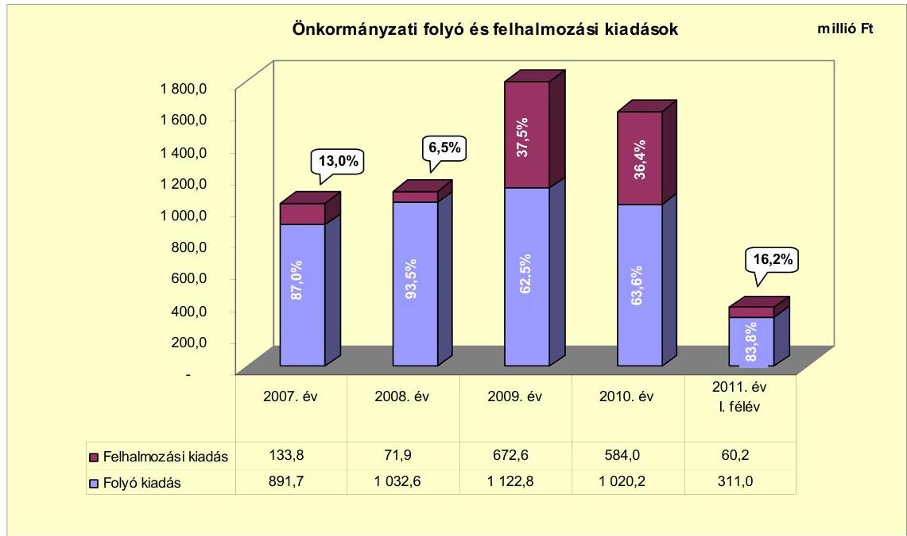

A múködési és felhalmozási kiadások arányának változásában 2007-2010 között elmozdulás figyelhető meg. A felhalmozási kiadások az elnyert EU-s támogatások segítségével megvalósuló fejlesztések hatására a 2007. évi 133,8 millió Ft-ról (13,0\%-ról) a 2010. évre 584,0 millió Ft-ra (36,4\%-ra) nőttek.

Az Önkormányzat 2007-2010. években együttesen 1392,7 millió Ft-ot fordított fejlesztéseinek finanszírozására. A 2007-2010 között hét darab 10,0 millió Ft teljes bekerülési költség feletti befejezett beruházás és felújítás összértéke 1262,5 millió Ft, a 10 millió Ft alatti fejlesztések összértéke 130,2 millió Ft volt. Az Önkormányzat a 2007-2010. években megvalósított, 2010. december 31-éig befejezett fejlesztéseinek forrását 181,2 millió Ft összegben önkormányzati saját bevétel, 1147,6 millió Ft EU-s támogatás, valamint 63,9 millió Ft összegben hazai támogatás képezte.

Az Önkormányzatnál 2010. december 31-én a belterületi vízrendezési munkák II. üteme volt folyamatban. A folyamatban lévő fejlesztés várható bekerülési költsége 68,4 millió Ft, melyhez az Önkormányzat a DDOP-5.1.5/C-09-20100005 számú támogatási szerződés alapján 67,6 millió Ft támogatásban részesül. A fejlesztéshez kapcsolódóan 2010. december 31-ig 13,1 millió Ft kiadás ( $100 \%$-a EU-s támogatásból) teljesült. A folyamatban lévő fejlesztéshez 2010. december 31-ig 55,3 millió Ft kötelezettséget vállaltak, melyből 52,6 millió Ft forrása az elnyert EU-s támogatás. A fejlesztés hiányzó 2,7 millió Ft összegét saját bevételből finanszírozzák. Az Önkormányzat a 2011. I. félévében indított egy fejlesztést. A Polgármesteri hivatal épületének informatikai fejlesztését 3,1 millió Ft összegben - saját forrásból finanszírozzák.

---

A Képviselő-testület a 2011. évben a 119/2011. (III. 31). számú, a 99/2011. (III. 07.) számú határozataiban döntött házi komposztálás bevezetéséről, valamint kerékpáros közlekedés feltételeinek javításáról. A fejlesztések tervezett bekerülési költsége 16,3 millió Ft, melyekhez 15,5 millió Ft támogatásra pályáztak. A kerékpáros közlekedés feltételeinek javítására beadott pályázaton 8,7 millió Ft támogatást nyertek, a másik pályázat elbírálása a helyszíni vizsgálat alatt folyamatban volt.

Az Önkormányzat három legmagasabb bekerülési költségű fejlesztése a vizsgált időszakban a következő:

- Az Integrált nevelési-oktatási hálózat fejlesztését (1028,2 millió Ft) 2009-ben indították, melyhez a DDOP keretén belül 968,7 millió Ft támogatásban részesültek. A fejlesztéshez 59,5 millió Ft önrészre volt szüksége az Önkormányzatnak. A beruházás négy közoktatási intézmény felújítására és bővítésére terjed ki. A fejlesztés során az Általános iskolát $945 \mathrm{~m}^{2}$-rel, az Öreglaki tagiskolát $981 \mathrm{~m}^{2}$-rel, a Somogyvári tagóvodát $454 \mathrm{~m}^{2}$-rel bővítik. Az intéz-mény-felújítások során összesen $4485 \mathrm{~m}^{2}$ épület felújítása valósul meg.
- A Hátrányos helyzetű térségek kisvárosainak fejlesztése tárgyú pályázati felhívásra beadott pályázat kedvező elbírálását követően közösségi létesítmény kialakításába kezdtek 2009-ben. A fejlesztés összköltsége 77,9 millió Ft volt, melyhez a DDOP keretein belül 70,0 millió Ft támogatást kaptak, a fennmaradó 7,9 millió Ft-ot saját forrásból biztosították. A beruházás eredményeképpen egy $655 \mathrm{~m}^{2}$-es mozi épületet alakítottak át közösségi házzá.
- A belterületi vízrendezés, csapadékvíz elvezetők rekonstrukciójának II. ütemének bekerülési költsége 68,4 millió Ft, melyhez a DDOP keretén belül 65,7 millió Ft támogatásban részesül az Önkormányzat, a fennmaradó 2,7 millió Ft-ot saját forrásból biztosítja. A fejlesztés során 2490 fm csatornát fektetnek le, 269 fm burkolt árkot, 242 fm zárt rendszerú csatornát hoznak létre. A munkák kivitelezéséhez 1500 fm karbantartási utat építettek.

Az Önkormányzat társaságok részére a vizsgált években nem nyújtott támogatást.

---

# 3. Az ÖNKORMÁNYZAT KÖTELEZETTSÉGEI 

### 3.1. Az Önkormányzat pénzintézeti kötelezettségeinek változása

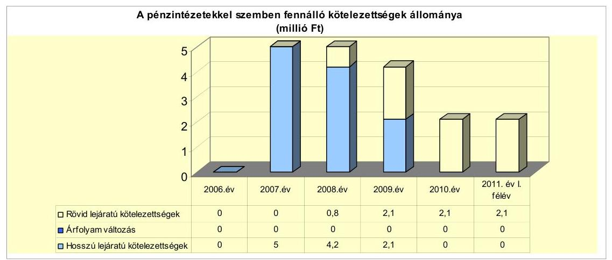

Az Önkormányzatnak 2006. december 31-én nem volt pénzintézeti kötelezettségállománya. A 2007. december 31-én fennálló 5,0 millió Ft-ról 2011. június 30-ig 58\%-kal, 2,1 millió Ft-ra csökkent. A fennálló pénzintézeti kötelezettség a víziközmű hitelből keletkezett, amelynek átvállalásakor betartották az adósságot keletkeztető kötelezettségvállalások felső határát.

A Víziközmű társulat 2002. augusztus 26-án 351,1 millió Ft hitelt vett fel a lakossági érdekeltségi hozzájárulás megelőlegezése érdekében. A Víziközmú társulat az alapszbályában meghatározott feladatokat ${ }^{18}$ a 2007. évben elvégezte. Végelszámolást hajtottak végre és a Víziközmú társulat 2007. augusztus 31-ével megszűnt, a meglévő vagyonukat felosztották a beruházásban résztvevő önkormányzatok között. Ez időpont után az érdekeltségi hozzájárulás kivetése, beszedése, a hitel maradványának ( 5,0 millió Ft) és díjainak törlesztése az Önkormányzat feladata.

Az Önkormányzat pénzintézeti kötelezettségvállalására a Képviselőtestület 106/2002. (VII. 25.) számú döntése alapján került sor.

Az Önkormányzat pénzügyi egyensúlyát nem befolyásolta a Víziközmű társulat megszűnését követően, az általa átvállalt 5,0 millió Ft hitel évenkénti tőketörlesztése és annak költségei.

A kölcsönszerződés 2007. szeptember 3-i módosítása szerint a hiteltörlesztést három évre ütemezték: a 2009. évben a tőketörlesztés 0,8 millió Ft, a 2010. és a 2011. évben 2,1 - 2,1 millió Ft. A negyedévente törlesztett hitel kamata és kezelési költsége a 2007. és 2008. évben összesen 0,3 millió Ft, a 2009. évben 0,3 millió Ft, a 2010. évben 0,2 millió Ft és a 2011. évben 0,08 millió Ft volt.

Az Önkormányzat a 2007. és 2011. június 30-ig terjedő időszakban nem rendelkezett rövid lejáratú hitelekkel.

[^0]
[^0]:    ${ }^{18}$ Csatornamú, csatornahálózat, belterületi vízelvezető.

---

Az Önkormányzat 2011. június 30 -án fennálló hiteltartozás kamatfizetési kötelezettség alakulását kismértékben befolyásolta a kibocsátáskori és az utolsó kamatfizetéskori referenciakamatok változása, amelyet az alábbi táblázat mutat be.

| Megnevezés | Kibocsátási, lehivási | Utolsó fizetéskori | Változás \% |
| :--: | :--: | :--: | :--: |
|  | kamat (referencia + kamatfelár) \% |  |  |
| 3 havi BUBOR (2007.09.03.-i szerződés) | 3,52 | 4,3 | $22,2 \%$ |

A kibocsátáskori referenciakamat $0,8 \%$-os növekedése miatt az Önkormányzatnak 0,2 millió Ft többlet kamatfizetési kötelezettsége keletkezett, amely a gazdálkodása biztonságát nem veszélyeztette.

Az Önkormányzatnak 2011. június 30 -án 2,1 millió Ft pénzintézeti kötelezettsége volt, amelynek fedezete a lakossági érdekeltségi hozzájárulások befizetett összegei.

A Polgármesteri hivatalban a lakossági érdekeltségi hozzájárulásokat az elkülönített „Befejezett viziközmü beruházás elszámolási" számlán vezették, amelynek egyenlege 2011. június 30 -án 4,9 millió Ft volt.

# 3.2. A szállítói kötelezettségek változása 

Az Önkormányzat 2007. és 2009. évek közötti mérleg szerinti szállítói kötelezettségének átlagáról 2,5 millió Ft-ról 2011. június 30 -ára nullára csökkent.

Az Önkormányzat mérlegszerinti szállítói kötelezettsége (amelyből lejárt szállítói tartozása nem volt) a 2007. évben 4,6 millió Ft, a 2008. évben 0,8 millió Ft volt, majd a 2009. évben kétszeresére, 1,6 millió Ft-ra emelkedett. A 2010. évben - az előző évhez képest - 3,9-szeresére, 6,1 millió Ft-ra növekedett. Ezt követően 2011. június 30 -ára a szállítói kötelezettségeket kifizették.

### 3.3. Egyéb kötelezettségek változása

Az Önkormányzatnak a 2007 - 2011. év I. félévéig terjedő időszakban egy CHF alapú lizingszerződése volt, amelyet gépkocsi beszerzés céljából kötöttek. A 0,8 millió Ft (4960,32 CHF) összegű 2006. november 20 -án vállalt fizetési kötelezettség 18 hónap futamidejú volt, az utolsó törlesztő részletet 2008. május 5én kifizették.

A 2007-től 2011. év I. félévéig terjedő időszakban az Önkormányzatnak nem volt kezesség- és garanciavállalási kötelezettsége.

Az Önkormányzat PPP konstrukcióban valósította meg a tanuszoda beruházását, amelynek kötelezettségvállalása a 2022. évig 799,3 millió Ft volt. Az öszszegből a 2008. évben 9,4 millió Ft-ot, a 2009. évben 47,8 millió Ft-ot, a 2010. évben 51,5 millió Ft-ot és a 2011. év I. félévében 39,8 millió Ft-ot törlesztettek. A 2011. június 30 -án fennálló kötelezettség összege 650,8 millió Ft.

---

A tanuszoda projekt PPP konstrukcióban történt megvalósítási költsége 1354,8 millió Ft, amelyből $41 \%$-át, 555,5 millió Ft-ot a Nemzeti Sporthivatal ${ }^{19}$, $59 \%$-át, 799,3 millió Ft-ot az Önkormányzat finanszíroz 2022. évig, a szerződésben meghatározott részletekben.

Az Önkormányzat a kötelezettségvállalás finanszírozását a törlesztés éveiben keletkező folyó bevételeiből tervezi megoldani. A fennálló kötelezettség miatt a tanuszoda PPP konstrukcióban történő üzemeltetése magas múködési kockázattal jár, a pénzügyi egyensúlyra kedvezőtlen hatással van.

Az Önkormányzatnál az elengedett követelések összege a 2007. évben 11,0 millió Ft volt, amely a 2010. évben 9,6 millió Ft-ra 12,7\%-kal csökkent. A Képvise-lő-testület döntése értelmében az elengedett követelések a helyi adókra irányultak.

Kommunális adóból 2007. és 2010. évek között évi 0,3 millió Ft, telekadóból a 2007. évben 10,7 millió Ft, a 2008. évben 9,5 millió Ft, a 2009. évben 9,1 millió Ft, a 2010. évben 9,0 millió Ft, gépjármúadóból a 2009. és a 2010. évben 0,3-0,3 millió Ft volt az elengedett összeg.

Az Önkormányzat a 2007. és 2011. év I. félévéig terjedő időszakban egy esetben nyújtott visszterhes támogatást a fogorvosi szolgálatot múködtető betéti társaságnak 1,5 millió Ft, és egy esetben tagi kölcsönt a Tanuszoda Kft-nek 2,0 millió Ft összegben.

A 2007. március 26-án kelt szerződés szerint az Önkormányzat 1,5 millió Ft kamatmentes visszatérítendő támogatást nyújtott a KOR-ÁG Dent Bt-nek eszközbeszerzésre 10 hónap időtartamra. A támogatást a betéti társaság visszafizette.

A 2009. április 23-án megkötött kölcsönszerződés ${ }^{20}$ szerint az Önkormányzat a Tanuszoda Kft-nek 2,0 millió Ft kamatmentes tagi kölcsönt nyújtott, a tanuszoda üzemeltetésével kapcsolatos költségek fedezetére. A kölcsönt az előírt határidőben 2009. július 31-én visszafizették.

Az Önkormányzat 50\% és azt meghaladó tulajdonosi hányaddal rendelkező társaságai kötelezettségeinek állománya 2010. december 31-én, és 2011. június 30-án a következőképpen alakult:

| Megnevezés | Állomány 2010.   december 31-én | Állomány 2011.   június 30-án |
| :-- | :--: | :--: |
|  | HUF-ban (millió Ft-ban) | HUF-ban (millió Ft-ban) |
| Szállítói tartozás | 0,2 | 0,4 |

Az Önkormányzat egy 100\%-os tulajdonában álló gazdasági társasággal, a Tanuszoda Kft-vel rendelkezett a 2007. évtől a 2011. június 30-ig terjedő időszakban. A gazdasági társaságnak fennálló pénzintézeti kötelezettsége nem volt a jelzett időszakban. Összes kötelezettsége a 2009. és 2010. évben 7,8 - 7,8 millió Ft, 2011. június 30-án 2,4 millió Ft. A 7,8-7,8 millió Ft-ból a

[^0]
[^0]:    ${ }^{19}$ A jelenlegi kormányzati struktúrában Belügyminisztérium feladat- és hatáskörébe tartozik a sporttevékenység irányítása és felügyelete.
    ${ }^{20}$ A Képviselő-testület 64/2009. (IV. 22.) számú határozata alapján.

---

2009. és 2010. évben az Önkormányzatot megillető osztalék 5 - 5 millió Ft volt. Szállítói tartozása a 2009. évben 0,1 millió Ft, a 2010. évben 0,2 millió Ft és 2011. június 30 -án 0,4 millió Ft, amelyből lejárt tartozás nem volt. A társaság egyéb kötelezettsége a 2009. évben 2,7 millió Ft, a 2010. évben 2,6 millió Ft, 2011. június 30 -án 1,9 millió Ft, amelyből az Önkormányzatot megillető összeg a 2009. évben 0,5 millió Ft, a 2010. évben 0,1 millió Ft és 2011. június 30 -án 0,9 millió Ft volt. A munkavállalókkal szembeni ki nem fizetett személyi juttatás ezekben az években 2,3 millió Ft, 2,5 millió Ft és 1,0 millió Ft volt.

Az Önkormányzat a gazdasági társaságokról szóló 2006. évi IV. törvény 54. § (2) bekezdése alapján korlátlan felelősséggel tartozik azon gazdasági társaságának felszámolása esetében, amelyben az Önkormányzat az 52. § (2) bekezdése szerint a szavazatok legalább 75\%-ával rendelkezik, így minősített befolyásszerzőnek minősül, továbbá a csődeljárásról és a felszámolási eljárásról szóló 1991. évi XLIX. törvény 63. § (2) bekezdése alapján a kizárólagos önkormányzati tulajdonú gazdasági társaságának minden olyan kötelezettségéért, amelynek kielégítését a felszámolási eljárás során az adós társaság vagyona nem fedez, ha a hitelezőinek a felszámolási eljárás során benyújtott keresete alapján a bíróság - az adós társaság felé érvényesített tartósan hátrányos üzletpolitikájára figyelemmel - megállapítja az önkormányzat korlátlan és teljes felelősségét.

Az Önkormányzat a kimutatásai szerint 2007-2010. években a tárgyi eszközök után együttesen 1046,8 millió Ft értékcsökkenést számolt el (2007. évben 154,7 millió Ft, 2008. évben 167,9 millió Ft, 2009. évben 182,4 millió Ft, 2010. évben 541,8 millió Ft). A 2010. évi kiemelkedő értéket a Mikrotérségi oktatási központ aktiválása okozta. A 2007-2010. években az elszámolt értékcsökkenés 11,0\%-ának megfelelő összegű, 115,2 millió Ft felújítást számoltak el. Az önkormányzati szintű használhatósági fok mutató a vizsgált időszakban a 2007. évi $88,0 \%$-ról 2010. évre $76,3 \%$-ra, 11,7 százalékponttal csökkent.

Az önkormányzati szintű használhatósági mutató a 2007. évi 88,0\%-ról a 2008. évben 3,5 százalékponttal, 84,5\%-ra, a 2009. évben 3,1 százalékponttal, 81,4\%ra az előző évihez viszonyítva, majd a 2010. évben 5,1 százalékponttal 76,3\%-ra csökkent.

Az aktivált felújítások értéke a 2010. évben 9,7 millió Ft volt, amely 43,8\%-a a 22,2 millió Ft összegű 2007. évi felújítási kiadásnak. A számvitelben elszámolt felújítások és beruházások forrására nem képeztek az értékcsökkenésből elkülönített alapot. A felújítások, beruházások teljes összegét pályázati forrásokból és saját folyó bevételeikből biztosították. A tényleges beruházási költségekből eszközpótlásra nem számoltak el kiadásokat a 2007-2010. évek közötti időszakban befejezett fejlesztések esetében, a folyamatban lévő fejlesztéseknél a 2010. december 31-ig megvalósított, illetve a 2010. év után várható fejlesztések ráfordításaiból ugyancsak nem számoltak el, illetve nem terveztek eszközpótlásra kiadásokat. A Képviselő-testületnek előterjesztett éves zárszámadási rendeleteikben nem mutatatták be az Önkormányzat eszközei után tárgyévben elszámolt értékcsökkenés összegét, az eszközpótlásra fordított tényleges kiadásokat, az eszközök elhasználódási fokának alakulását.

---

# 4. A PÉNZÜGYI EGYENSÚLY MEGTEREMTÉSE ÉrDEKÉBEN HOZOTT INTÉZKEDÉSEK EREDMÉNYE 

A kiadáscsökkentő és bevételnövelő intézkedések megtétele a pénzügyi helyzetnek a javítását és a gazdálkodás átláthatóbbá tételét célozta.

Az Önkormányzat a 2007-2011. év I. félév között kiadáscsökkentő intézkedésként létszámcsökkentést hajtott végre.

Kiadáscsökkentés és intézményracionalizálás keretén belül a 2007-2011. év I. félév között több alkalommal csökkentették az Önkormányzat álláshelyeit.

A 2007-2010. években történt álláshely- és létszámváltozásokat mutatja be a következő táblázat:

| Megnevezés (adatok fő-ben) | Közoktatás | Szociális és gyermekvédelem | Egészségügy | Polgármesteri hivatal | Egyéb | Összesen |
| :--: | :--: | :--: | :--: | :--: | :--: | :--: |
| 2007. január 1-jén jóváhagyott álláshelyek száma | 122 | 30 | 11 | 37 | 31 | 231 |
| Megszüntetett álláshelyek száma | 151 | 0 | 4 | 3 | 5 | 163 |
| ebből | üres álláshelyek száma | 0 | 0 | 0 | 0 | 0 |
|  | szakmai álláshelyek száma | 111 | 0 | 4 | 3 | 0 | 118 |
|  | intézmény-üzemeltetéssel kapcsolatos   álláshelyek száma | 40 | 0 | 0 | 0 | 5 | 45 |
| Álláshely növekedése |  | 29 | 0 | 0 | 2 | 23 | 54 |
| 2010. december 31-én záró álláshelyek száma |  | 0 | 30 | 7 | 36 | 52 | 125 |
| 2007. január 1-jén foglalkoztatott létszám |  | 122 | 30 | 11 | 37 | 31 | 231 |
| Létszámcsökkentés |  | 151 | 0 | 4 | 3 | 5 | 163 |
| Létszámnövekedés |  | 29 | 0 | 0 | 2 | 23 | 54 |
| 2010. december 31-én foglalkoztatott létszám |  | 0 | 30 | 7 | 36 | 49 | 122 |

A 2007. évben a niklai óvoda és általános iskola került az Önkormányzat fenntartásába. Az új feladatellátáshoz kapcsolódóan 27 fővel megnőtt az álláshelyek száma. Az intézmények átvételével együtt történt összevonás hatására a Szőlősgyöröki tagiskola létszámát három fővel csökkentették.

A 2008. évben az ügyeleti ellátás átszervezése következtében az egészségügyi területen csökkent az Önkormányzat álláshelyeinek száma négy fővel. A közoktatást érintően a Szőlősgyöröki tagiskolánál az engedélyezett álláshelyek számát hat fővel, a niklai óvodában kettő fővel, a Niklai tagiskolánál kettő fővel csökkentették. A kistérségi feladatok ellátásában bekövetkezett változás hatására kilenc fővel növelték az Önkormányzat álláshelyeinek számát, valamint a Polgármesteri hivatalon belül szüntettek meg kettő álláshelyet. Ugyanebben az évben kettő fő mezőőri álláshely megszüntetéséről döntöttek.

A 2009. évben a Niklai tagiskola és az Általános iskola álláshelyeit csökkentették három fővel. A Polgármesteri hivatalban átszervezését követte kettő fő létszámfejlesztés és egy fő adóügyi álláshely megszüntetése. Kistérségi feladatátvétel miatt az álláshely megszüntetések mellett négy fős létszámfejlesztés történt.

A 2010. évben a Képviselő-testület a 83/2010. (V. 27.) számú határozatában döntött arról, hogy a közoktatási intézményeit a Kistérségi társulás Társulási Tanácsának fenntartásába adja. A döntést követően az Önkormányzat - az év elején hat fővel megemelt - közoktatási álláshelyei ( 135 fő) megszűntek. A városüzemeltetés átszervezése miatt ebben az évben hat fővel megemelték, majd három fővel lecsökkentették az álláshelyek számát.

---

A 2007. évről a 2010. évre az Önkormányzat létszáma 231 főről 122 főre csökkent. A létszámváltozás (109 fő) alapvető oka a közoktatási ágazat átalakítása volt.

Az Önkormányzat - adatszolgáltatása szerint - létszámcsökkentési döntéseinek következtében a 2007-2011. év I. félévében évente 2,4 millió Ft, 23,9 millió Ft, 33,0 millió Ft, 167,2 millió Ft, illetve 32,7 millió Ft (összesen: 259,2 millió Ft) kiadáscsökkentést tudott elérni.

Az Önkormányzat a vizsgált időszakban megvalósított létszámcsökkentésekhez kapcsolódóan négy alkalommal igényelt támogatást. A létszámcsökkentési pályázat benyújtására a Képviselő-testület határozatban hatalmazta fel a polgármestert.

A létszámcsökkentési pályázatok eredményeképpen az Önkormányzat 12 fő tartósan leépített álláshely után 30,3 millió Ft támogatásban részesült.

A kiadáscsökkentő intézkedések mellett a bevételek növelése érdekében az Önkormányzatnál helyi adókkal kapcsolatos, eszközök hasznosításával, intézményi térítési díjakkal és lejárt tartozások behajtásával összefüggő intézkedéseket tettek, amelyeknek következtében a 2007-2011. év I. félévében 16,4 millió Ft többletbevételt ért el - adatszolgáltatásuk alapján - az Önkormányzat.

A bevételnövelő intézkedések az alábbi számszerúsített hatást eredményezték:
Az adómérték emeléséből - az Önkormányzat adatszolgáltatása alapján - a 2011. év I. félévben 2,7 millió Ft többletbevétele keletkezett. A vizsgált időszakban a helyi adókkal kapcsolatos intézkedésekből befolyt 2,7 millió Ft növekmény az önkormányzati szinten realizált 16,4 millió Ft többletbevétel $16,6 \%$-át teszi ki.

Az ingatlanok bérbeadásából a 2008-2009. években 2,5 millió Ft, illetve 3,1 millió Ft többletbevétel származott. A vizsgált időszakban keletkezett 5,6 millió Ft növekmény a bevételnövelő intézkedések 34,1\%-át teszi ki.

Az intézményi térítési díjak emelése - az önkormányzati adatszolgáltatás alapján - a 2007. évben 2,6 millió Ft, a 2009. évben 4,7 millió Ft, a 2010. évben 0,8 millió Ft többletbevételt eredményezett. A vizsgált időszakban ebből származó 8,1 millió Ft többletbevétel $49,4 \%$ részarányt képvisel.

A Képviselő-testület a 3/2007.(II. 23.) számú, a 22/2008.(XI. 28.) számú, a 6/2009.(III. 27.) számú és a 28/2009.(XI. 27.) számú önkormányzati rendeletekben döntött az intézményi térítési díjak emeléséről.

A 2007-2011. év I. félév között tett intézkedések hatására keletkezett többletbevételeket mutatja a következő diagram:

---

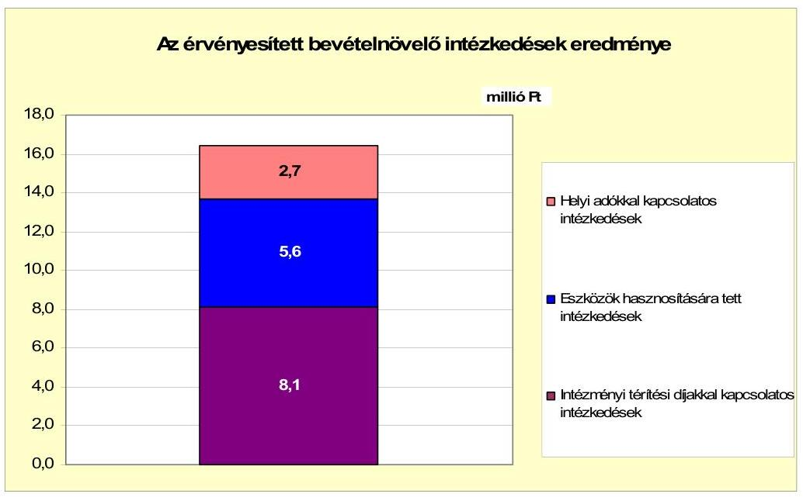

Az Önkormányzatnál - a Közoktatási intézményfenntartó társulás létrehozása miatt - a központi támogatások 634,7 millió Ft-os növekedését - az önkormányzati adatszolgáltatás alapján - a kiadási megtakarítások és a bevételnövelő intézkedések 275,6 millió Ft-tal (43,4\%-kal) tudták növelni.

A múködési jövedelem csökkenését azonban csak további intézkedésekkel lehet ellensúlyozni. A pozitív múködési jövedelem fenntartása a bevételek növelésével és a kiadások csökkentésével érhető el.

# 5. Az ÁSZ Által a korÁbbi ÉVEKben a PÉNZÜGYi EGYENSÚLY JAVÍTÁSÁRA TETT SZABÁLYSZERŰSÉGI ÉS CÉLSZERŰSÉGI JAVASLATOK HASZNOSULÁSA 

Az Önkormányzat 2009. évi gazdálkodási rendszerének ellenőrzése során az ÁSZ 12 szabályszerűségi és öt célszerűségi javaslatot tett, amelyek megvalósítására vonatkozóan a Képviselő-testület 2010. január 28-i ülésén intézkedési tervet fogadtak el. A javaslatok egyike sem vonatkozott a pénzügyi egyensúly javítására.

Budapest, 2012. április " 76 "

Melléklet: $\quad 7 \mathrm{db}$
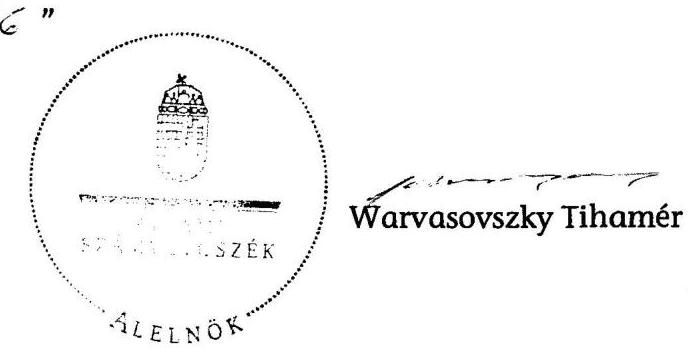

---

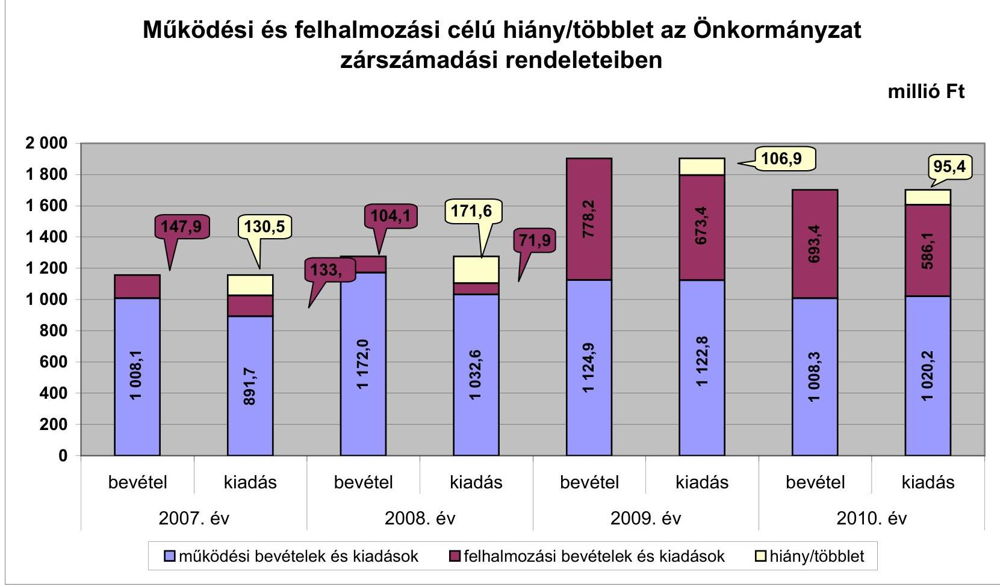

# Működési és felhalmozási célú hiány/többlet az Önkormányzat zárszámadási rendeleteiben

|  év | 1. számú melléklet | 2. számú jelentéshez  |
| --- | --- | --- |
|  |   |   |

## Müködési és felhalmozási célú hiány/többlet az Önkormányzat zárszámadási rendeleteiben

|  év | 1. számú melléklet | 2. számú jelentéshez  |
| --- | --- | --- |
|  |   |   |

## Millió Ft

|  év | 1. számú melléklet | 2. számú jelentéshez  |
| --- | --- | --- |
|  |   |   |

## Működési bevételek és kiadások

|  év | 1. számú melléklet | 2. számú jelentéshez  |
| --- | --- | --- |
|  |   |   |

## Felhalmozás bevételek és kiadások

|  év | 1. számú melléklet | 2. számú jelentéshez  |
| --- | --- | --- |
|  |   |   |

## Felhalmozás bevételek és kiadások

|  év | 1. számú melléklet | 2. számú jelentéshez  |
| --- | --- | --- |
|  |   |   |

## Működési bevételek és kiadások

|  év | 1. számú melléklet | 2. számú jelentéshez  |
| --- | --- | --- |
|  |   |   |

## Felhalmozás bevételek és kiadások

|  év | 1. számú melléklet | 2. számú jelentéshez  |
| --- | --- | --- |
|  |   |   |

## Működési bevételek és kiadások

|  év | 1. számú melléklet | 2. számú jelentéshez  |
| --- | --- | --- |
|  |   |   |

## Felhalmozás bevételek és kiadások

|  év | 1. számú melléklet | 2. számú jelentéshez  |
| --- | --- | --- |
|  |   |   |

## Működési bevételek és kiadások

|  év | 1. számú melléklet | 2. számú jelentéshez  |
| --- | --- | --- |
|  |   |   |

## Felhalmozás bevételek és kiadások

|  év | 1. számú melléklet | 2. számú jelentéshez  |
| --- | --- | --- |
|  |   |   |

## Működési bevételek és kiadások

|  év | 1. számú melléklet | 2. számú jelentéshez  |
| --- | --- | --- |
|  |   |   |

## Felhalmozás bevételek és kiadások

|  év | 1. számú melléklet | 2. számú jelentéshez  |
| --- | --- | --- |
|  |   |   |

## Működési bevételek és kiadások

|  év | 1. számú melléklet | 2. számú jelentéshez  |
| --- | --- | --- |
|  |   |   |

## Felhalmozás bevételek és kiadások

|  év | 1. számú melléklet | 2. számú jelentéshez  |
| --- | --- | --- |
|  |   |   |

## Működési bevételek és kiadások

|  év | 1. számú melléklet | 2. számú jelentéshez  |
| --- | --- | --- |
|  |   |   |

## Felhalmozás bevételek és kiadások

|  év | 1. számú melléklet | 2. számú jelentéshez  |
| --- | --- | --- |
|  |   |   |

## Működési bevételek és kiadások

|  év | 1. számú melléklet | 2. számú jelentéshez  |
| --- | --- | --- |
|  |   |   |

## Felhalmozás bevételek és kiadások

|  év | 1. számú melléklet | 2. számú jelentéshez  |
| --- | --- | --- |
|  |   |   |

## Működési bevételek és kiadások

|  év | 1. számú melléklet | 2. számú jelentéshez  |
| --- | --- | --- |
|  |   |   |

## Felhalmozás bevételek és kiadások

|  év | 1. számú melléklet | 2. számú jelentéshez  |
| --- | --- | --- |
|  |   |   |

## Működési bevételek és kiadások

|  év | 1. számú melléklet | 2. számú jelentéshez  |
| --- | --- | --- |
|  |   |   |

## Felhalmozás bevételek és kiadások

|  év | 1. számú melléklet | 2. számú jelentéshez  |
| --- | --- | --- |
|  |   |   |

## Működési bevételek és kiadások

|  év | 1. számú melléklet | 2. számú jelentéshez  |
| --- | --- | --- |
|  |   |   |

## Felhalmozás bevételek és kiadások

|  év | 1. számú melléklet | 2. számú jelentéshez  |
| --- | --- | --- |
|  |   |   |

## Működési bevételek és kiadások

|  év | 1. számú melléklet | 2. számú jelentéshez  |
| --- | --- | --- |
|  |   |   |

## Felhalmozás bevételek és kiadások

|  év | 1. számú melléklet | 2. számú jelentéshez  |
| --- | --- | --- |
|  |   |   |

## Működési bevételek és kiadások

|  év | 1. számú melléklet | 2. számú jelentéshez  |
| --- | --- | --- |
|  |   |   |

## Felhalmozás bevételek és kiadások

|  év | 1. számú melléklet | 2. számú jelentéshez  |
| --- | --- | --- |
|  |   |   |

## Működési bevételek és kiadások

|  év | 1. számú melléklet | 2. számú jelentéshez  |
| --- | --- | --- |
|  |   |   |

## Felhalmozás bevételek és kiadások

|  év | 1. számú melléklet | 2. számú jelentéshez  |
| --- | --- | --- |
|  |   |   |

## Működési bevételek és kiadások

|  év | 1. számú melléklet | 2. számú jelentéshez  |
| --- | --- | --- |
|  |   |   |

## Felhalmozás bevételek és kiadások

|  év | 1. számú melléklet | 2. számú jelentéshez  |
| --- | --- | --- |
|  |   |   |

## Felhalmozás bevételek és kiadások

|  év | 1. számú melléklet | 2. számú jelentéshez  |
| --- | --- | --- |
|  |   |   |

## Felhalmozás bevételek és kiadások

|  év | 1. számú melléklet | 2. számú jelentéshez  |
| --- | --- | --- |
|  |   |   |

## Felhalmozás bevételek és kiadások

|  év | 1. számú melléklet | 2. számú jelentéshez  |
| --- | --- | --- |
|  |   |   |

## Felhalmozás bevételek és kiadások

|  év | 1. számú melléklet | 2. számú jelentéshez  |
| --- | --- | --- |
|  |   |   |

## Felhalmozás bevételek és kiadások

|  év | 1. számú melléklet | 2. számú jelentéshez  |
| --- | --- | --- |
|  |   |   |

## Felhalmozás bevételek és kiadások

|  év | 1. számú melléklet | 2. számú jelentéshez  |
| --- | --- | --- |
|  |   |   |

## Felhalmozás bevételek és kiadások

|  év | 1. számú melléklet | 2. számú jelentéshez  |
| --- | --- | --- |
|  |   |   |

## Felhalmozás bevételek és kiadások

|  év | 1. számú melléklet | 2. számú jelentéshez  |
| --- | --- | --- |
|  |   |   |

## Felhalmozás bevételek és kiadások

|  év | 1. számú melléklet | 2. számú jelentéshez  |
| --- | --- | --- |
|  |   |   |

## Felhalmozás bevételek és kiadások

|  év | 1. számú melléklet | 2. számú jelentéshez  |
| --- | --- | --- |
|  |   |   |

## Felhalmozás bevételek és kiadások

|  év | 1. számú melléklet | 2. számú jelentéshez  |
| --- | --- | --- |
|  |   |   |

## Felhalmozás bevételek és kiadások

|  év | 1. számú melléklet | 2. számú jelentéshez  |
| --- | --- | --- |
|  |   |   |

## Felhalmozás bevételek és kiadások

|  év | 1. számú melléklet | 2. számú jelentéshez  |
| --- | --- | --- |
|  |   |   |

## Felhalmozás bevételek és kiadások

|  év | 1. számú melléklet | 2. számú jelentéshez  |
| --- | --- | --- |
|  |   |   |

## Felhalmozás bevételek és kiadások

|  év | 1. számú melléklet | 2. számú jelentéshez  |
| --- | --- | --- |
|  |   |   |

## Felhalmozás bevételek és kiadások

|  év | 1. számú melléklet | 2. számú jelentéshez  |
| --- | --- | --- |
|  |   |   |

## Felhalmozás bevételek és kiadások

|  év | 1. számú melléklet | 2. számú jelentéshez  |
| --- | --- | --- |
|  |   |   |

## Felhalmozás bevételek és kiadások

|  év | 1. számú melléklet | 2. számú jelentéshez  |
| --- | --- | --- |
|  |   |   |

## Felhalmozás bevételek és kiadások

|  év | 1. számú melléklet | 2. számú jelentéshez  |
| --- | --- | --- |
|  |   |   |

## Felhalmozás bevételek és kiadások

|  év | 1. számú melléklet | 2. számú jelentéshez  |
| --- | --- | --- |
|  |   |   |

## Felhalmozás bevételek és kiadások

|  év | 1. számú melléklet | 2. számú jelentéshez  |
| --- | --- | --- |
|  |   |   |

## Felhalmozás bevételek és kiadások

|  év | 1. számú melléklet | 2. számú jelentéshez  |
| --- | --- | --- |
|  |   |   |

## Felhalmozás bevételek és kiadások

|  év | 1. számú melléklet | 2. számú jelentéshez  |
| --- | --- | --- |
|  |   |   |

## Felhalmozás bevételek és kiadások

|  év | 1. számú melléklet | 2. számú jelentéshez  |
| --- | --- | --- |
|  |   |   |

## Felhalmozás bevételek és kiadások

|  év | 1. számú melléklet | 2. számú jelentéshez  |
| --- | --- | --- |
|  |   |   |

## Felhalmozás bevételek és kiadások

|  év | 1. számú melléklet | 2. számú jelentéshez  |
| --- | --- | --- |
|  |   |   |

## Felhalmozás bevételek és kiadások

|  év | 1. számú melléklet | 2. számú jelentéshez  |
| --- | --- | --- |
|  |   |   |

## Felhalmozás bevételek és kiadások

|  év | 1. számú melléklet | 2. számú jelentéshez  |
| --- | --- | --- |
|  |   |   |

## Felhalmozás bevételek és kiadások

|  év | 1. számú melléklet | 2. számú jelentéshez  |
| --- | --- | --- |
|  |   |   |

## Felhalmozás bevételek és kiadások

|  év | 1. számú melléklet | 2. számú jelentéshez  |
| --- | --- | --- |
|  |   |   |

## Felhalmozás bevételek és kiadások

|  év | 1. számú melléklet | 2. számú jelentéshez  |
| --- | --- | --- |
|  |   |   |

## Felhalmozás bevételek és kiadások

|  év | 1. számú melléklet | 2. számú jelentéshez  |
| --- | --- | --- |
|  |   |   |

## Felhalmozás bevételek és kiadások

|  év | 1. számú melléklet | 2. számú jelentéshez  |
| --- | --- | --- |
|  |   |   |

## Felhalmozás bevételek és kiadások

|  év | 1. számú melléklet | 2. számú jelentéshez  |
| --- | --- | --- |
|  |   |   |

## Felhalmozás bevételek és kiadások

|  év | 1. számú melléklet | 2. számú jelentéshez  |
| --- | --- | --- |
|  |   |   |

## Felhalmozás bevételek és kiadások

|  év | 1. számú melléklet | 2. számú jelentéshez  |
| --- | --- | --- |
|  |   |   |

## Felhalmozás bevételek és kiadások

|  év | 1. számú melléklet | 2. számú jelentéshez  |
| --- | --- | --- |
|  |   |   |

## Felhalmozás bevételek és kiadások

|  év | 1. számú melléklet | 2. számú jelentéshez  |
| --- | --- | --- |
|  |   |   |

## Felhalmozás bevételek és kiadások

|  év | 1. számú melléklet | 2. számú jelentéshez  |
| --- | --- | --- |
|  |   |   |

## Felhalmozás bevételek és kiadások

|  év | 1. számú melléklet | 2. számú jelentéshez  |
| --- | --- | --- |
|  |   |   |

## Felhalmozás bevételek és kiadások

|  év | 1. számú melléklet | 2. számú jelentéshez  |
| --- | --- | --- |
|  |   |   |

## Felhalmozás bevételek és kiadások

|  év | 1. számú melléklet | 2. számú jelentéshez  |
| --- | --- | --- |
|  |   |   |

## Felhalmozás bevételek és kiadások

|  év | 1. számú melléklet | 2. számú jelentéshez  |
| --- | --- | --- |
|  |   |   |

## Felhalmozás bevételek és kiadások

|  év | 1. számú melléklet | 2. számú jelentéshez  |
| --- | --- | --- |
|  |   |   |

## Felhalmozás bevételek és kiadások

|  év | 1. számú melléklet | 2. számú jelentéshez  |
| --- | --- | --- |
|  |   |   |

## Felhalmozás bevételek és kiadások

|  év | 1. számú melléklet | 2. számú jelentéshez  |
| --- | --- | --- |
|  |   |   |

## Felhalmozás bevételek és kiadások

|  év | 1. számú melléklet | 2. számú jelentéshez  |
| --- | --- | --- |
|  |   |   |

## Felhalmozás bevételek és kiadások

|  év | 1. számú melléklet | 2. számú jelentéshez  |
| --- | --- | --- |
|  |   |   |

## Felhalmozás bevételek és kiadások

|  év | 1. számú melléklet | 2. számú jelentéshez  |
| --- | --- | --- |
|  |   |   |

## Felhalmozás bevételek és kiadások

|  év | 1. számú melléklet | 2. számú jelentéshez  |
| --- | --- | --- |
|  |   |   |

## Felhalmozás bevételek és kiadások

|  év | 1. számú melléklet | 2. számú jelentéshez  |
| --- | --- | --- |
|  |   |   |

## Felhalmozás bevételek és kiadások

|  év | 1. számú melléklet | 2. számú jelentéshez  |
| --- | --- | --- |
|  |   |   |

## Felhalmozás bevételek és kiadások

|  év | 1. számú melléklet | 2. számú jelentéshez  |
| --- | --- | --- |
|  |   |   |

## Felhalmozás bevételek és kiadások

|  év | 1. számú melléklet | 2. számú jelentéshez  |
| --- | --- | --- |
|  |   |   |

## Felhalmozás bevételek és kiadások

|  év | 1. számú melléklet | 2. számú jelentéshez  |
| --- | --- | --- |
|  |   |   |

## Felhalmozás bevételek és kiadások

|  év | 1. számú melléklet | 2. számú jelentéshez  |
| --- | --- | --- |
|  |   |   |

## Felhalmozás bevételek és kiadások

|  év | 1. számú melléklet | 2. számú jelentéshez  |
| --- | --- | --- |
|  |   |   |

## Felhalmozás bevételek és kiadások

|  év | 1. számú melléklet | 2. számú jelentéshez  |
| --- | --- | --- |
|  |   |   |

## Felhalmozás bevételek és kiadások

|  év | 1. számú melléklet | 2. számú jelentéshez  |
| --- | --- | --- |
|  |   |   |

## Felhalmozás bevételek és kiadások

|  év | 1. számú melléklet | 2. számú jelentéshez  |
| --- | --- | --- |
|  |   |   |

## Felhalmozás bevételek és kiadások

|  év | 1. számú melléklet | 2. számú jelentéshez  |
| --- | --- | --- |
|  |   |   |

## Felhalmozás bevételek és kiadások

|  év | 1. számú melléklet | 2. számú jelentéshez  |
| --- | --- | --- |
|  |   |   |

## Felhalmozás bevételek és kiadások

|  év | 1. számú melléklet | 2. számú jelentéshez  |
| --- | --- | --- |
|  |   |   |

## Felhalmozás bevételek és kiadások

|  év | 1. számú melléklet | 2. számú jelentéshez  |
| --- | --- | --- |
|  |   |   |

## Felhalmozás bevételek és kiadások

|  év | 1. számú melléklet | 2. számú jelentéshez  |
| --- | --- | --- |
|  |   |   |

## Felhalmozás bevételek és kiadások

|  év | 1. számú melléklet | 2. számú jelentéshez  |
| --- | --- | --- |
|  |   |   |

## Felhalmozás bevételek és kiadások

|  év | 1. számú melléklet | 2. számú jelentéshez  |
| --- | --- | --- |
|  |   |   |

## Felhalmozás bevételek és kiadások

|  év | 1. számú melléklet | 2. számú jelentéshez  |
| --- | --- | --- |
|  |   |   |

## Felhalmozás bevételek és kiadások

|  év | 1. számú melléklet | 2. számú jelentéshez  |
| --- | --- | --- |
|  |   |   |

## Felhalmozás bevételek és kiadások

|  év | 1. számú melléklet | 2. számú jelentéshez  |
| --- | --- | --- |
|  |   |   |

## Felhalmozás bevételek és kiadások

|  év | 1. számú melléklet | 2. számú jelentéshez  |
| --- | --- | --- |
|  |   |   |

## Felhalmozás bevételek és kiadások

|  év | 1. számú melléklet | 2. számú jelentéshez  |
| --- | --- | --- |
|  |   |   |

## Felhalmozás bevételek és kiadások

|  év | 1. számú melléklet | 2. számú jelentéshez  |
| --- | --- | --- |
|  |   |   |

## Felhalmozás bevételek és kiadások

|  év | 1. számú melléklet | 2. számú jelentéshez  |
| --- | --- | --- |
|  |   |   |

## Felhalmozás bevételek és kiadások

|  év | 1. számú melléklet | 2. számú jelentéshez  |
| --- | --- | --- |
|  |   |   |

## Felhalmozás bevételek és kiadások

|  év | 1. számú melléklet | 2. számú jelentéshez  |
| --- | --- | --- |
|  |   |   |

## Felhalmozás bevételek és kiadások

|  év | 1. számú melléklet | 2. számú jelentéshez  |
| --- | --- | --- |
|  |   |   |

## Felhalmozás bevételek és kiadások

|  év | 1. számú melléklet | 2. számú jelentéshez  |
| --- | --- | --- |
|  |   |   |

## Felhalmozás bevételek és kiadások

|  év | 1. számú melléklet | 2. számú jelentéshez  |
| --- | --- | --- |
|  |   |   |

## Felhalmozás bevételek és kiadások

|  év | 1. számú melléklet | 2. számú jelentéshez  |
| --- | --- | --- |
|  |   |   |

## Felhalmozás bevételek és kiadások

|  év | 1. számú melléklet | 2. számú jelentéshez  |
| --- | --- | --- |
|  |   |   |

## Felhalmozás bevételek és kiadások

|  év | 1. számú melléklet | 2. számú jelentéshez  |
| --- | --- | --- |
|  |   |   |

## Felhalmozás bevételek és kiadások

|  év | 1. számú melléklet | 2. számú jelentéshez  |
| --- | --- | --- |
|  |   |   |

## Felhalmozás bevételek és kiadások

|  év | 1. számú melléklet | 2. számú jelentéshez  |
| --- | --- | --- |
|  |   |   |

## Felhalmozás bevételek és kiadások

|  év | 1. számú melléklet | 2. számú jelentéshez  |
| --- | --- | --- |
|  |   |   |

## Felhalmozás bevételek és kiadások

|  év | 1. számú melléklet | 2. számú jelentéshez  |
| --- | --- | --- |
|  |   |   |

## Felhalmozás bevételek és kiadások

|  év | 1. számú melléklet | 2. számú jelentéshez  |
| --- | --- | --- |
|  |   |   |

## Felhalmozás bevételek és kiadások

|  év | 1. számú melléklet | 2. számú jelentéshez  |
| --- | --- | --- |
|  |   |   |

## Felhalmozás bevételek és kiadások

|  év | 1. számú melléklet | 2. számú jelentéshez  |
| --- | --- | --- |
|  |   |   |

## Felhalmozás bevételek és kiadások

|  év | 1. számú melléklet | 2. számú jelentéshez  |
| --- | --- | --- |
|  |   |   |

## Felhalmozás bevételek és kiadások

|  év | 1. számú melléklet | 2. számú jelentéshez  |
| --- | --- | --- |
|  |   |   |

## Felhalmozás bevételek és kiadások

|  év | 1. számú melléklet | 2. számú jelentéshez  |
| --- | --- | --- |
|  |   |   |

## Felhalmozás bevételek és kiadások

|  év | 1. számú melléklet | 2. számú jelentéshez  |
| --- | --- | --- |
|  |   |   |

## Felhalmozás bevételek és kiadások

|  év | 1. számú melléklet | 2. számú jelentéshez  |
| --- | --- | --- |
|  |   |   |

## Felhalmozás bevételek és kiadások

|  év | 1. számú melléklet | 2. számú jelentéshez  |
| --- | --- | --- |
|  |   |   |

## Felhalmozás bevételek és kiadások

|  év | 1. számú melléklet | 2. számú jelentéshez  |
| --- | --- | --- |
|  |   |   |

## Felhalmozás bevételek és kiadások

|  év | 1. számú melléklet | 2. számú jelentéshez  |
| --- | --- | --- |
|  |   |   |

## Felhalmozás bevételek és kiadások

|  év | 1. számú melléklet | 2. számú jelentéshez  |
| --- | --- | --- |
|  |   |   |

## Felhalmozás bevételek és kiadások

|  év | 1. számú melléklet | 2. számú jelentéshez  |
| --- | --- | --- |
|  |   |   |

## Felhalmozás bevételek és kiadások

|  év | 1. számú melléklet | 2. számú jelentéshez  |
| --- | --- | --- |
|  |   |   |

## Felhalmozás bevételek és kiadások

|  év | 1. számú melléklet | 2. számú jelentéshez  |
| --- | --- | --- |
|  |   |   |

## Felhalmozás bevételek és kiadások

|  év | 1. számú melléklet | 2. számú jelentéshez  |
| --- | --- | --- |
|  |   |   |

## Felhalmozás bevételek és kiadások

|  év | 1. számú melléklet | 2. számú jelentéshez  |
| --- | --- | --- |
|  |   |   |

## Felhalmozás bevételek és kiadások

|  év | 1. számú melléklet | 2. számú jelentéshez  |
| --- | --- | --- |
|  |   |   |

## Felhalmozás bevételek és kiadások

|  év | 1. számú melléklet | 2. számú jelentéshez  |
| --- | --- | --- |
|  |   |   |

## Felhalmozás bevételek és kiadások

|  év | 1. számú melléklet | 2. számú jelentéshez  |
| --- | --- | --- |
|  |   |   |

## Felhalmozás bevételek és kiadások

|  év | 1. számú melléklet | 2. számú jelentéshez  |
| --- | --- | --- |
|  |   |   |

## Felhalmozás bevételek és kiadások

|  év | 1. számú melléklet | 2. számú jelentéshez  |
| --- | --- | --- |
|  |   |   |

## Felhalmozás bevételek és kiadások

|  év | 1. számú melléklet | 2. számú jelentéshez  |
| --- | --- | --- |
|  |   |   |

## Felhalmozás bevételek és kiadások

|  év | 1. számú melléklet | 2. számú jelentéshez  |
| --- | --- | --- |
|  |   |   |

## Felhalmozás bevételek és kiadások

|  év | 1. számú melléklet | 2. számú jelentéshez  |
| --- | --- | --- |
|  |   |   |

## Felhalmozás bevételek és kiadások

|  év | 1. számú melléklet | 2. számú jelentéshez  |
| --- | --- | --- |
|  |   |   |

## Felhalmozás bevételek és kiadások

|  év | 1. számú melléklet | 2. számú jelentéshez  |
| --- | --- | --- |
|  |   |   |

## Felhalmozás bevételek és kiadások

|  év | 1. számú melléklet | 2. számú jelentéshez  |
| --- | --- | --- |
|  |   |   |

## Felhalmozás bevételek és kiadások

|  év | 1. számú melléklet | 2. számú jelentéshez  |
| --- | --- | --- |
|  |   |   |

## Felhalmozás bevételek és kiadások

|  év | 1. számú melléklet | 2. számú jelentéshez  |
| --- | --- | --- |
|  |   |   |

## Felhalmozás bevételek és kiadások

|  év | 1. számú melléklet | 2. számú jelentéshez  |
| --- | --- | --- |
|  |   |   |

## Felhalmozás bevételek és kiadások

|  év | 1. számú melléklet | 2. számú jelentéshez  |
| --- | --- | --- |
|  |   |   |

## Felhalmozás bevételek és kiadások

|  év | 1. számú melléklet | 2. számú jelentéshez  |
| --- | --- | --- |
|  |   |   |

## Felhalmozás bevételek és kiadások

|  év | 1. számú melléklet | 2. számú jelentéshez  |
| --- | --- | --- |
|  |   |   |

## Felhalmozás bevételek és kiadások

|  év | 1. számú melléklet | 2. számú jelentéshez  |
| --- | --- | --- |
|  |   |   |

## Felhalmozás bevételek és kiadások

|  év | 1. számú melléklet | 2. számú jelentéshez  |
| --- | --- | --- |
|  |   |   |

## Felhalmozás bevételek és kiadások

|  év | 1. számú melléklet | 2. számú jelentéshez  |
| --- | --- | --- |
|  |   |   |

## Felhalmozás bevételek és kiadások

|  év | 1. számú melléklet | 2. számú jelentéshez  |
| --- | --- | --- |
|  |   |   |

## Felhalmozás bevételek és kiadások

|  év | 1. számú melléklet | 2. számú jelentéshez  |
| --- | --- | --- |
|  |   |   |

## Felhalmozás bevételek és kiadások

|  év | 1. számú melléklet | 2. számú jelentéshez  |
| --- | --- | --- |
|  |   |   |

## Felhalmozás bevételek és kiadások

|  év | 1. számú melléklet | 2. számú jelentéshez  |
| --- | --- | --- |
|  |   |   |

## Felhalmozás bevételek és kiadások

|  év | 1. számú melléklet | 2. számú jelentéshez  |
| --- | --- | --- |
|  |   |   |

## Felhalmozás bevételek és kiadások

|  év | 1. számú melléklet | 2. számú jelentéshez  |
| --- | --- | --- |
|  |   |   |

## Felhalmozás bevételek és kiadások

|  év | 1. számú melléklet | 2. számú jelentéshez  |
| --- | --- | --- |
|  |   |   |

## Felhalmozás bevételek és kiadások

|  év | 1. számú melléklet | 2. számú jelentéshez  |
| --- | --- | --- |
|  |   |   |

## Felhalmozás bevételek és kiadások

|  év | 1. számú melléklet | 2. számú jelentéshez  |
| --- | --- | --- |
|  |   |   |

## Felhalmozás bevételek és kiadások

|  év | 1. számú melléklet | 2. számú jelentéshez  |
| --- | --- | --- |
|  |   |   |

## Felhalmozás bevételek és kiadások

|  év | 1. számú melléklet | 2. számú jelentéshez  |
| --- | --- | --- |
|  |   |   |

## Felhalmozás bevételek és kiadások

|  év | 1. számú melléklet | 2. számú jelentéshez  |
| --- | --- | --- |
|  |   |   |

## Felhalmozás bevételek és kiadások

|  év | 1. számú melléklet | 2. számú jelentéshez  |
| --- | --- | --- |
|  |   |   |

## Felhalmozás bevételek és kiadások

|  év | 1. számú melléklet | 2. számú jelentéshez  |
| --- | --- | --- |
|  |   |   |

## Felhalmozás bevételek és kiadások

|  év | 1. számú melléklet | 2. számú jelentéshez  |
| --- | --- | --- |
|  |   |   |

## Felhalmozás bevételek és kiadások

|  év | 1. számú melléklet | 2. számú jelentéshez  |
| --- | --- | --- |
|  |   |   |

## Felhalmozás bevételek és kiadások

|  év | 1. számú melléklet | 2. számú jelentéshez  |
| --- | --- | --- |
|  |   |   |

## Felhalmozás bevételek és kiadások

|  év | 1. számú melléklet | 2. számú jelentéshez  |
| --- | --- | --- |
|  |   |   |

## Felhalmozás bevételek és kiadások

|  év | 1. számú melléklet | 2. számú jelentéshez  |
| --- | --- | --- |
|  |   |   |

## Felhalmozás bevételek és kiadások

|  év | 1. számú melléklet | 2. számú jelentéshez  |
| --- | --- | --- |
|  |   |   |

## Felhalmozás bevételek és kiadások

|  év | 1. számú melléklet | 2. számú jelentéshez  |
| --- | --- | --- |
|  |   |   |

## Felhalmozás bevételek és kiadások

|  év | 1. számú melléklet | 2. számú jelentéshez  |
| --- | --- | --- |
|  |   |   |

## Felhalmozás bevételek és kiadások

|  év | 1. számú melléklet | 2. számú jelentéshez  |
| --- | --- | --- |
|  |   |   |

## Felhalmozás bevételek és kiadások

|  év | 1. számú melléklet | 2. számú jelentéshez  |
| --- | --- | --- |
|  |   |   |

## Felhalmozás bevételek és kiadások

|  év | 1. számú melléklet | 2. számú jelentéshez  |
| --- | --- | --- |
|  |   |   |

## Felhalmozás bevételek és kiadások

|  év | 1. számú melléklet | 2. számú jelentéshez  |
| --- | --- | --- |
|  |   |   |

## Felhalmozás bevételek és kiadások

|  év | 1. számú melléklet | 2. számú jelentéshez  |
| --- | --- | --- |
|  |   |   |

## Felhalmozás bevételek és kiadások

|  év | 1. számú melléklet | 2. számú jelentéshez  |
| --- | --- | --- |
|  |   |   |

## Felhalmozás bevételek és kiadások

|  év | 1. számú melléklet | 2. számú jelentéshez  |
| --- | --- | --- |
|  |   |   |

## Felhalmozás bevételek és kiadások

|  év | 1. számú melléklet | 2. számú jelentéshez  |
| --- | --- | --- |
|  |   |   |

## Felhalmozás bevételek és kiadások

|  év | 1. számú melléklet | 2. számú jelentéshez  |
| --- | --- | --- |
|  |   |   |

## Felhalmozás bevételek és kiadások

|  év | 1. számú melléklet | 2. számú jelentéshez  |
| --- | --- | --- |  |  |   |

## Felhalmozás bevételek és kiadások

|  év | 1. számú melléklet | 2. számú jelentéshez  |
| --- | --- | --- |  |  |   |

## Felhalmozás bevételek és kiadások

|  év | 1. számú melléklet | 2. számú jelentéshez  |
| --- | --- | --- |  |  |   |

## Felhalmozás bevételek és kiadások

|  év | 1. számú melléklet | 2. számú jelentéshez  |
| --- | --- | --- |  |  |   |

## Felhalmozás bevételek és kiadások

|  év | 1. számú melléklet | 2. számú jelentéshez  |
| --- | --- | --- |  |  |   |

## Felhalmozás bevételek és kiadások

|  év | 1. számú melléklet | 2. számújét |  |

## Felhalmozás bevételek és kiadások

|  év | 1. számú melléklet | 2. számújét |  |  |   |

## Felhalmozás bevételek és kiadások

|  év | 1. számú melléklet | 2. számújét |  |  |   |

---

Az Önkormányzat bevételei és kiadásai, valamint adósságszolgálata 2007-2010 közötti időszakban

|  1. FOLYÓ KÖLTSÉGVETÉS | 2007. év | 2008. év | 2009. év | 2010. év  |
| --- | --- | --- | --- | --- |
|  1.1.1. Saját működési bevételek | 197,7 | 200,9 | 262,8 | 179,0  |
|  1.1.2. Költségvetési támogatás | 343,1 | 551,2 | 511,3 | 434,6  |
|  1.1.3. Atengedett bevételek | 236,1 | 129,7 | 130,5 | 137,2  |
|  1.1.4. Állambáztartáson belülről kapott támogatások | 222,9 | 246,7 | 263,4 | 263,2  |
|  1.1.5. EU-tól és külföldről kapott bevételek | 5,6 | 1,0 | 11,7 | 6,5  |
|  1.1.6. Állambáztartáson kívülről kapott bevételek | 2,8 | 4,3 | 2,4 | 0,6  |
|  1.1.7. Előző évi pénzmaradvány átvétel | 0,0 | 2,6 | 0,0 | 0,0  |
|  1.1. Folyó bevételek $=1.1 .1 .+1.1 .2 .+1.1 .3 .+1.1 .4 .+1.1 .5 .+1.1 .6 .+1.1 .7$. | 1008,2 | 1136,4 | 1182,1 | 1020,5  |
|  1.2.1. Működési kiadások kamatkiadások nélkül | 819,9 | 952,5 | 1026,9 | 569,7  |
|  1.2.2. Állambáztartáson belülre átadott pénzeszközök | 16,0 | 10,6 | 17,2 | 375,5  |
|  1.2.3.1. vállalkozásoknak | 0,1 | 0,5 | 0,0 | 0,0  |
|  1.2.3.2. EU-nak, illetve külföldre | 1,4 | 0,3 | 3,1 | 1,0  |
|  1.2.3.3. magánszemélyeknek | 46,8 | 57,9 | 67,9 | 65,4  |
|  1.2.3.4. nonprofit szervezeteknek | 7,5 | 7,6 | 7,6 | 7,7  |
|  1.2.3. Transferkiadások ( $=1.2 .3 .1+1.2 .3 .2+1.2 .3 .3+1.2 .3 .4)$ | 55,7 | 66,3 | 78,5 | 74,9  |
|  1.2.4 Kamatkiadások | 0,1 | 0,5 | 0,2 | 0,2  |
|  1.2.5. Előző évi pénzmaradvány átadás | 0,0 | 2,6 | 0,0 | 0,0  |
|  1.2. Folyó kiadások $=1.2 .1 .+1.2 .2 .+1.2 .3 .+1.2 .4 .+1.2 .5$. | 891,7 | 1032,6 | 1122,8 | 1020,2  |
|  1.3. Folyó költségvetés egyenlege MÚKÖDÉSI JÖVEDELEM (1.1. - 1.2.) | 116,5 | 103,8 | 59,3 | 0,3  |
|  2. FELHALMOZÁSI KÖLTSÉGVETÉS | 0,0 | 0,0 | 0,0 | 0,0  |
|  2.1.1. Saját tökebevételek | 8,0 | 0,2 | 0,0 | 0,0  |
|  2.1.2. Állambáztartáson belülről kapott támogatások | 47,7 | 2,7 | 648,2 | 497,3  |
|  2.1.3. EU-tól és külföldről kapott támogatások | 0,0 | 0,0 | 0,0 | 0,0  |
|  2.1.4. Állambáztartáson kívülről kapott támogatások | 1,2 | 3,6 | 1,7 | 2,1  |
|  2.1. Felhalmozási bevételek ( $=2.1 .1 .+2.1 .2+2.1 .3+2.1 .4$.) | 56,8 | 6,5 | 649,8 | 499,4  |
|  2.2.1. Saját beruházási kiadás állva | 72,3 | 13,3 | 596,0 | 530,6  |
|  2.2.2. Saját felújítási kiadás állva | 30,3 | 35,0 | 34,8 | 15,1  |
|  2.2.3. Állambáztartáson belülre átadott pénzeszköz | 20,7 | 19,1 | 26,6 | 24,7  |
|  2.2.4. EU-nak és külföldnek adott pénzeszközök | 0,0 | 0,0 | 0,0 | 0,0  |
|  2.2.5. Állambáztartáson kívülre adott pénzesközök | 9,1 | 1,1 | 11,6 | 10,0  |
|  2.2.6. Befektetési célú részesedések vásárlása | 1,5 | 3,4 | 3,5 | 3,6  |
|  2.2. Felhalmozási kiadások ( $=2.2 .1 .+2.2 .2 .+2.2 .3 .+2.2 .4 .+2.2 .5 .+2.2 .6$.) | 133,8 | 71,9 | 672,6 | 584,8  |
|  2.3. Felhalmozási költségvetés egyenlege (2.1. - 2.2.) | $-76,9$ | $-65,4$ | $-22,8$ | $-84,6$  |
|  3. Finanszírozási műveletek nélküli (GFS) pozíció(1.3.+2.3.) | 39,6 | 38,4 | 36,5 | $-84,2$  |
|  4. Finanszírozási műveletek | 0,0 | 0,0 | 0,0 | 0,0  |
|  4.1. Hitelletvétel | 0,0 | 0,0 | 0,0 | 0,0  |
|  4.2. Hiteltörlesztés | 0,0 | 0,0 | 0,0 | 2,1  |
|  4.3. Forgatási és befektetési célú értékpapírok kibocsátása | 0,0 | 0,0 | 0,0 | 0,0  |
|  4.4. Forgatási és befektetési célú értékpapírok beváltása | 0,0 | 0,0 | 0,0 | 0,0  |
|  4.5. Forgatási és befektetési célú értékpapírok értékesítése | 0,0 | 0,0 | 0,0 | 0,0  |
|  4.6. Forgatási és befektetési célú értékpapírok vásárlása | 0,0 | 0,0 | 0,0 | 0,0  |
|  4.7. Egyéb finanszírozási bevételek (függő, átfutó, kiegyenlítő) | 4,5 | 4,5 | $-2,2$ | $-31,7$  |
|  4.8. Egyéb finanszírozási kiadások (függő, átfutó, kiegyenlítő) | 32,7 | 3,5 | $-3,7$ | $-22,8$  |
|  4.9.Finanszírozási műveletek egyenlege (4.1. - 4.2.+4.3.-4.4+4.5.-4.6.+4.7.-4.8.) | $-18,2$ | 0,9 | 0,7 | $-11,0$  |
|  5. Tárgyévi pénzügyi pozíció (1.3.+ 2.3.+4.9.) | 21,4 | 39,4 | 37,2 | $-95,2$  |
|  6. Nettó müködési jövedelem =müködési jövedelem (1.3.) - töketörlesztés (4.2+4.4) | 116,5 | 103,8 | 58,5 | $-1,8$  |
|  TAJÉKOZTATÓ ADATOK |  |  |  |   |
|  Összes kötelezettség | 14,4 | 14,3 | 370,3 | 18,0  |
|  ebből rövid lejáratú | 9,4 | 10,1 | 368,2 | 18,0  |
|  Összes szállítói kötelezettség | 4,6 | 0,8 | 2,2 | 6,1  |
|  ebből lejárt (tanúsítványból) | 0,0 | 0,0 | 0,0 | 0,0  |
|  Pénz és tőkepiaci kötelezettség (adósság) | 5,0 | 5,0 | 4,2 | 2,1  |
|  ebből rövid lejáratú | 0,0 | 0,8 | 2,1 | 2,1  |
|  PPP szerződéses állomány jövőbeni értéken (tanúsítványból) | 799,3 | 789,9 | 742,1 | 690,6  |
|  ebből lejárt szolgáltatási díj miatti kötelezettség | 0,0 | 0,0 | 0,0 | 0,0  |
|  Folyószámlabítel napi átlagos állománya (tanúsítványból) | 0,0 | 0,0 | 0,0 | 0,0  |
|  Lökvidítitel napi átlagos állománya (tanúsítványból) | 0,0 | 0,0 | 0,0 | 0,0  |
|  Munkabérhítel napi átlagos állománya (tanúsítványból) | 0,0 | 0,0 | 0,0 | 0,0  |
|  Kezesség és garanciavállalások (tanúsítványból) | 0,0 | 0,0 | 0,0 | 0,0  |
|  Jogerős bírósági ítéletekből adódó kötelezettségek (tanúsítványból | 0,0 | 0,0 | 0,0 | 0,0  |
|  Finanszírozásba bevombató eszközök: | 135,6 | 175,0 | 212,2 | 94,4  |
|  Tartós hitelviszonyt megtestesítő értékpapírok év végi állománya | 0,0 | 0,0 | 0,0 | 0,0  |
|  Hosszú lejáratú bankbetétek év végi állománya | 0,0 | 0,0 | 0,0 | 0,0  |
|  Értékpapírok év végi állománya | 0,0 | 0,0 | 0,0 | 0,0  |
|  Pénzeszközök (idegen pénzeszközök nélkül) év végi állománya | 135,6 | 175,0 | 212,2 | 94,4  |

---

## **Az Önkormányzat 2007-2010. években megvalósított, 2010. december 31-ig befejezett fejlesztései és annak forrásösszetétele**

|   |  |  |  |  |  |  |  |  |  |  |  |  |  |  |  |  |  |  |  |  |  |  |  |  |  |  |  |  |  |  |  |  |  |  |  |  |  |  |  |  |  |  |  |  |  |  |  |  |  |  |  |  |  |  |  |  |  |  |  |  |  |  |  |  |  |  |  |  |  |  |  |  |  |  |  |  |  |  |  |  |  |  |  |  |  |  |  |  |  |  |  |  |  |  |  |  |  |  |  |  | 

---

## **Az Önkormányzat 2010. december 31-én folyamatban lévő fejlesztési feladataira 2010. december 31-ig teljesített kifizetések és annak forrásösszetétele**

|  Fejlesztési feladat (beruházás, felújítás) | Beruházás, felújítás | Teljes bekerülési költség | 2006. dec. 31-ig teljesített költségtől beosztott feladatokkal | 2007-2010. év | 2007-2010. év | 2010. december 31-ig pénzügyileg teljesített beruházás forrásösszetétele | Kötvény | EU-s támogatás | Hazai támogatás  |
| --- | --- | --- | --- | --- | --- | --- | --- | --- | --- |
|  Megnevezése | Köpviselő testületi határozat száma | kezdete | tervezett befejezése | Terv (2010-10-30-31-32) | Tény (2010-01-01-02-03) | Eltérés (1, 2) (2010-01-01-02-03) | Terv | Tény  |
|  1 | 2 | 3 | 4 | 5 | 6 | 7 | 8 | 9  |
|  1. Felújítások |  |  |  |  |  |  |  |   |
|  2. 10 millió Ft alatti felújítások |  |  |  |  |  |  |  |   |
|  3. Felújítások összesen |  |  |  |  | 0 | 0 | 0 | 0  |
|  4. Fejlesztések |  |  |  |  |  |  |  |   |
|  5. Települesi bel és külterületi vízrendezés II. ütem | 5/2010. (II.24) 2010.10.16 2011.09.30 | 68,4 | 68,4 | 0 | 0 | 13,1 | 0 | 0  |
|  6. 10 millió Ft alatti fejlesztések |  |  |  |  |  |  |  |   |
|  7. Fejlesztések összesen |  |  |  | 68,4 | 68,4 | 0,0 | 0,0 | 13,1  |
|  8. Mindösszesen |  |  |  | 68,4 | 68,4 | 0,0 | 0,0 | 13,1  |

*A= ha a forrás már rendelkezésre áll,

B= ha a forrás közbeszerzési eljárása folyamatban van,

C= ha a forrás közbeszerzési eljárása még nem indult el, a forrás nem áll rendelkezésre.

---

## **Az Önkormányzat 2010. december 31-én folyamatban lévő fejlesztési feladataira 2010. december 31-én fennálló kötelezettségvállalásai és azok forrásösszetétele**

|   |  |  |  |  |  |  |  |  |  |  |  |  |  |  |  |  |  |  |  |  |  |  |  |  |  |  |  |  |  |  |  |  |  |  |  |  |  |  |  |  |  |  |  |  |  |  |  |  |  |   |
| --- | --- | --- | --- | --- | --- | --- | --- | --- | --- | --- | --- | --- | --- | --- | --- | --- | --- | --- | --- | --- | --- | --- | --- | --- | --- | --- | --- | --- | --- | --- | --- | --- | --- | --- | --- | --- | --- | --- | --- | --- | --- | --- | --- | --- | --- | --- | --- | --- | --- | --- | --- |
|   |  |  |  |  |  |  |  |  |  |  |  |  |  |  |  |  |  |  |  |  |  |  |  |  |  |  |  |  |  |  |  |  |  |  |  |  |  |  |  |  |  |  |  |  |  |  |  |  |   |
|   |  |  |  |  |  |  |  |  |  |  |  |  |  |  |  |  |  |  |  |  |  |  |  |  |  |  |  |  |  |  |  |  |  |  |  |  |  |  |  |  |  |  |  |  |  |  |  |  |   |
|   |  |  |  |  |  |  |  |  |  |  |  |  |  |  |  |  |  |  |  |  |  |  |  |  |  |  |  |  |  |  |  |  |  |  |  |  |  |  |  |  |  |  |  |  |  |  |  |   |
|   |  |  |  |  |  |  |  |  |  |  |  |  |  |  |  |  |  |  |  |  |  |  |  |  |  |  |  |  |  |  |  |  |  |  |  |  |  |  |  |  |  |  |  |  |  |  |  |   |
|   |  |  |  |  |  |  |  |  |  |  |  |  |  |  |  |  |  |  |  |  |  |  |  |  |  |  |  |  |  |  |  |  |  |  |  |  |  |  |  |  |  |  |  |  |  |  |  |   |
|   |  |  |  |  |  |  |  |  |  |  |  |  |  |  |  |  |  |  |  |  |  |  |  |  |  |  |  |  |  |  |  |  |  |  |  |  |  |  |  |  |  |  |  |  |  |  |  |   |
|   |  |  |  |  |  |  |  |  |  |  |  |  |  |  |  |  |  |  |  |  |  |  |  |  |  |  |  |  |  |  |  |  |  |  |  |  |  |  |  |  |  |  |  |  |  |  |  |   |
|   |  |  |  |  |  |  |  |  |  |  |  |  |  |  |  |  |  |  |  |  |  |  |  |  |  |  |  |  |  |  |  |  |  |  |  |  |  |  |  |  |  |  |  |  |  |  |  |   |
|   |  |  |  |  |  |  |  |  |  |  |  |  |  |  |  |  |  |  |  |  |  |  |  |  |  |  |  |  |  |  |  |  |  |  |  |  |  |  |  |  |  |  |  |  |  |  |  |   |
|   |  |  |  |  |  |  |  |  |  |  |  |  |  |  |  |  |  |  |  |  |  |  |  |  |  |  |  |  |  |  |  |  |  |  |  |  |  |  |  |  |  |  |  |  |  |  |  |   |
|   |  |  |  |  |  |  |  |  |  |  |  |  |  |  |  |  |  |  |  |  |  |  |  |  |  |  |  |  |  |  |  |  |  |  |  |  |  |  |  |  |  |  |  |  |  |  |  |   |
|   |  |  |  |  |  |  |  |  |  |  |  |  |  |  |  |  |  |  |  |  |  |  |  |  |  |  |  |  |  |  |  |  |  |  |  |  |  |  |  |  |  |  |  |  |  |  |  |   |
|   |  |  |  |  |  |  |  |  |  |  |  |  |  |  |  |  |  |  |  |  |  |  |  |  |  |  |  |  |  |  |  |  |  |  |  |  |  |  |  |  |  |  |  |  |  |  |  |   |
|   |  |  |  |  |  |  |  |  |  |  |  |  |  |  |  |  |  |  |  |  |  |  |  |  |  |  |  |  |  |  |  |  |  |  |  |  |  |  |  |  |  |  |  |  |  |  |  |   |
|   |  |  |  |  |  |  |  |  |  |  |  |  |  |  |  |  |  |  |  |  |  |  |  |  |  |  |  |  |  |  |  |  |  |  |  |  |  |  |  |  |  |  |  |  |  |  |  |   |
|   |  |  |  |  |  |  |  |  |  |  |  |  |  |  |  |  |  |  |  |  |  |  |  |  |  |  |  |  |  |  |  |  |  |  |  |  |  |  |  |  |  |  |  |  |  |  |  |   |
|   |  |  |  |  |  |  |  |  |  |  |  |  |  |  |  |  |  |  |  |  |  |  |  |  |  |  |  |  |  |  |  |  |  |  |  |  |  |  |  |  |  |  |  |  |  |  |  |   |
|   |  |  |  |  |  |  |  |  |  |  |  |  |  |  |  |  |  |  |  |  |  |  |  |  |  |  |  |  |  |  |  |  |  |  |  |  |  |  |  |  |  |  |  |  |  |  |  |   |
|   |  |  |  |  |  |  |  |  |  |  |  |  |  |  |  |  |  |  |  |  |  |  |  |  |  |  |  |  |  |  |  |  |  |  |  |  |  |  |  |  |  |  |  |  |  |  |  |   |
|   |  |  |  |  |  |  |  |  |  |  |  |  |  |  |  |  |  |  |  |  |  |  |  |  |  |  |  |  |  |  |  |  |  |  |  |  |  |  |  |  |  |  |  |  |  |  |  |   |
|   |  |  |  |  |  |  |  |  |  |  |  |  |  |  |  |  |  |  |  |  |  |  |  |  |  |  |  |  |  |  |  |  |  |  |  |  |  |  |  |  |  |  |  |  |  |  |  |   |
|   |  |  |  |  |  |  |  |  |  |  |  |  |  |  |  |  |  |  |  |  |  |  |  |  |  |  |  |  |  |  |  |  |  |  |  |  |  |  |  |  |  |  |  |  |  |  |  |   |
|   |  |  |  |  |  |  |  |  |  |  |  |  |  |  |  |  |  |  |  |  |  |  |  |  |  |  |  |  |  |  |  |  |  |  |  |  |  |  |  |  |  |  |  |  |  |  |  |   |
|   |  |  |  |  |  |  |  |  |  |  |  |  |  |  |  |  |  |  |  |  |  |  |  |  |  |  |  |  |  |  |  |  |  |  |  |  |  |  |  |  |  |  |  |  |  |  |  |   |
|   |  |  |  |  |  |  |  |  |  |  |  |  |  |  |  |  |  |  |  |  |  |  |  |  |  |  |  |  |  |  |  |  |  |  |  |  |  |  |  |  |  |  |  |  |  |  |  |   |
|   |  |  |  |  |  |  |  |  |  |  |  |  |  |  |  |  |  |  |  |  |  |  |  |  |  |  |  |  |  |  |  |  |  |  |  |  |  |  |  |  |  |  |  |  |  |  |  |   |
|   |  |  |  |  |  |  |  |  |  |  |  |  |  |  |  |  |  |  |  |  |  |  |  |  |  |  |  |  |  |  |  |  |  |  |  |  |  |  |  |  |  |  |  |  |  |  |  |   |
|   |  |  |  |  |  |  |  |  |  |  |  |  |  |  |  |  |  |  |  |  |  |  |  |  |  |  |  |  |  |  |  |  |  |  |  |  |  |  |  |  |  |  |  |  |  |  |  |   |
|   |  |  |  |  |  |  |  |  |  |  |  |  |  |  |  |  |  |  |  |  |  |  |  |  |  |  |  |  |  |  |  |  |  |  |  |  |  |  |  |  |  |  |  |  |  |  |  |   |
|   |  |  |  |  |  |  |  |  |  |  |  |  |  |  |  |  |  |  |  |  |  |  |  |  |  |  |  |  |  |  |  |  |  |  |  |  |  |  |  |  |  |  |  |  |  |  |  |   |
|   |  |  |  |  |  |  |  |  |  |  |  |  |  |  |  |  |  |  |  |  |  |  |  |  |  |  |  |  |  |  |  |  |  |  |  |  |  |  |  |  |  |  |  |  |  |  |  |   |
|   |  |  |  |  |  |  |  |  |  |  |  |  |  |  |  |  |  |  |  |  |  |  |  |  |  |  |  |  |  |  |  |  |  |  |  |  |  |  |  |  |  |  |  |  |  |  |  |   |
|   |  |  |  |  |  |  |  |  |  |  |  |  |  |  |  |  |  |  |  |  |  |  |  |  |  |  |  |  |  |  |  |  |  |  |  |  |  |  |  |  |  |  |  |  |  |  |  |   |
|   |

---

### **Az Önkormányzat által beadott, elbírálás alatti pályázati forrásból megvalósítani tervezett fejlesztéseihez kapcsolódó kötelezettségvállalásai és azok forrásösszetétele**

|  Fejlesztési feladat (beruházás, felújítás) |  | Beruházás, felújítás |  |  |  | A teljes
bekerülési
költségből
eszközpót
lásra
tervezett
összeg | 2010. dec. 31
ig teljesített
kiadás | 2010. utánra
váltalt
kötelezettség
(9×10+12+14+16+
18) |  | 2010. december 31-e utáni kötelezettségvállalások forrásösszetétele |  |  |  |  |  |  |  |  |  | jogszabályban
foglalt szakmai
követelmény
teljesítése
(igencnem)  |
| --- | --- | --- | --- | --- | --- | --- | --- | --- | --- | --- | --- | --- | --- | --- | --- | --- | --- | --- | --- | --- |
|   | Megnevezése | Képviselő-testületi
hallározat száma | kezdete | tervezett
befejezése |  |  |  |  |  |  |  |  |  |  |  |  |  |  |  |   |
|  1 | 2 | 3 | 4 | 5 | 6 | 7 | 8 | 9 | 10 | 11 | 12 | 13 | 14 | 15 | 16 | 17 | 18 | 19 | 20 |   |
|  1. | Felújítások |  |  |  |  |  |  |  |  |  |  |  |  |  |  |  |  |  |  |   |
|  2. | 10 millió Ft alatti felújítások |  |  |  |  |  |  |  |  |  |  |  |  |  |  |  |  |  |  |   |
|  3. | Felújítások összesen |  |  |  | 0,0 | 0,0 | 0,0 | 0,0 | 0,0 | 0,0 | 0,0 | 0,0 | 0,0 | 0,0 | 0,0 | 0,0 | 0,0 | 0,0 |  |   |
|  4. | Fejlesztések |  |  |  |  |  |  |  |  |  |  |  |  |  |  |  |  |  |  |   |
|  5. | Házikomposztálás bevezetése
Lengyelőzőben | 119/2011. (III.31.) | 2011.06.20 | 2011.12.31 | 7,1 | 0,0 | 0,0 | 7,1 | 0,4 | B | 0,0 | 0,0 | 6,7 | B | 0,0 | nem |  |  |  |   |
|  6. | Kerékpáros közlekedés
(of feltételeinek javítása | 99/2011. (III.07.) | 2011.06.30 | 2011.12.31 | 9,2 | 0,0 | 0,0 | 9,2 | 0,5 | A | 0,0 | 0,0 | 8,7 | A | 0,0 | nem |  |  |  |   |
|  7. | 10 millió Ft alatti fejlesztések |  |  |  |  |  |  |  |  |  |  |  |  |  |  |  |  |  |  |   |
|  8. | Fejlesztések összesen |  |  |  | 16,3 | 0,0 | 0,0 | 16,3 | 0,9 | 0,0 | 0,0 | 15,4 | 0,0 |  |  |  |  |  |  |   |
|  9. | Mindösszesen |  |  |  | 16,3 | 0,0 | 0,0 | 16,3 | 0,9 | 0,0 | 0,0 | 15,4 | 0,0 |  |  |  |  |  |  |   |

*A= ha a forrás már rendelkezésre áll.

B= ha a forrás közbeszerzési eljárása folyamatban van.

C= ha a forrás közbeszerzési eljárása még nem indult el, a forrás nem áll rendelkezésre.

---

## **Az önkormányzati feladatok ellátásában résztvevő gazdasági társaságok**

|  Gazdasági társaság
megnevezése |  |  |  |  |  |  |  |  |  |  |  |  |  |  |  |  |  |  |  |  |  |  |  |  |  |  |  |  |  |  |  |   |
| --- | --- | --- | --- | --- | --- | --- | --- | --- | --- | --- | --- | --- | --- | --- | --- | --- | --- | --- | --- | --- | --- | --- | --- | --- | --- | --- | --- | --- | --- | --- | --- | --- |
|   |  |  |  |  |  |  |  |  |  |  |  |  |  |  |  |  |  |  |  |  |  |  |  |  |  |  |  |  |  |  |  |   |
|   |  |  |  |  |  |  |  |  |  |  |  |  |  |  |  |  |  |  |  |  |  |  |  |  |  |  |  |  |  |  |  |   |
|   |  |  |  |  |  |  |  |  |  |  |  |  |  |  |  |  |  |  |  |  |  |  |  |  |  |  |  |  |  |  |  |   |
|   |  |  |  |  |  |  |  |  |  |  |  |  |  |  |  |  |  |  |  |  |  |  |  |  |  |  |  |  |  |  |  |   |
|   |  |  |  |  |  |  |  |  |  |  |  |  |  |  |  |  |  |  |  |  |  |  |  |  |  |  |  |  |  |  |  |   |
|   |  |  |  |  |  |  |  |  |  |  |  |  |  |  |  |  |  |  |  |  |  |  |  |  |  |  |  |  |  |  |  |   |
|   |  |  |  |  |  |  |  |  |  |  |  |  |  |  |  |  |  |  |  |  |  |  |  |  |  |  |  |  |  |  |  |   |
|   |  |  |  |  |  |  |  |  |  |  |  |  |  |  |  |  |  |  |  |  |  |  |  |  |  |  |  |  |  |  |  |   |
|   |  |  |  |  |  |  |  |  |  |  |  |  |  |  |  |  |  |  |  |  |  |  |  |  |  |  |  |  |  |  |  |   |
|   |  |  |  |  |  |  |  |  |  |  |  |  |  |  |  |  |  |  |  |  |  |  |  |  |  |  |  |  |  |  |  |   |
|   |  |  |  |  |  |  |  |  |  |  |  |  |  |  |  |  |  |  |  |  |  |  |  |  |  |  |  |  |  |  |  |   |
|   |  |  |  |  |  |  |  |  |  |  |  |  |  |  |  |  |  |  |  |  |  |  |  |  |  |  |  |  |  |  |  |   |
|   |  |  |  |  |  |  |  |  |  |  |  |  |  |  |  |  |  |  |  |  |  |  |  |  |  |  |  |  |  |  |  |   |
|   |  |  |  |  |  |  |  |  |  |  |  |  |  |  |  |  |  |  |  |  |  |  |  |  |  |  |  |  |  |  |  |   |
|   |  |  |  |  |  |  |  |  |  |  |  |  |  |  |  |  |  |  |  |  |  |  |  |  |  |  |  |  |  |  |  |   |
|   |  |  |  |  |  |  |  |  |  |  |  |  |  |  |  |  |  |  |  |  |  |  |  |  |  |  |  |  |  |  |  |   |
|   |  |  |  |  |  |  |  |  |  |  |  |  |  |  |  |  |  |  |  |  |  |  |  |  |  |  |  |  |  |  |  |   |
|   |  |  |  |  |  |  |  |  |  |  |  |  |  |  |  |  |  |  |  |  |  |  |  |  |  |  |  |  |  |  |  |   |
|   |  |  |  |  |  |  |  |  |  |  |  |  |  |  |  |  |  |  |  |  |  |  |  |  |  |  |  |  |  |  |  |   |
|   |  |  |  |  |  |  |  |  |  |  |  |  |  |  |  |  |  |  |  |  |  |  |  |  |  |  |  |  |  |  |  |   |
|   |  |  |  |  |  |  |  |  |  |  |  |  |  |  |  |  |  |  |  |  |  |  |  |  |  |  |  |  |  |  |  |   |
|   |  |  |  |  |  |  |  |  |  |  |  |  |  |  |  |  |  |  |  |  |  |  |  |  |  |  |  |  |  |  |  |   |
|   |  |  |  |  |  |  |  |  |  |  |  |  |  |  |  |  |  |  |  |  |  |  |  |  |  |  |  |  |  |  |  |   |
|   |  |  |  |  |  |  |  |  |  |  |  |  |  |  |  |  |  |  |  |  |  |  |  |  |  |  |  |  |  |  |  |   |
|   |  |  |  |  |  |  |  |  |  |  |  |  |  |  |  |  |  |  |  |  |  |  |  |  |  |  |  |  |  |  |  |   |
|   |  |  |  |  |  |  |  |  |  |  |  |  |  |  |  |  |  |  |  |  |  |  |  |  |  |  |  |  |  |  |  |   |
|   |  |  |  |  |  |  |  |  |  |  |  |  |  |  |  |  |  |  |  |  |  |  |  |  |  |  |  |  |  |  |  |   |
|   |  |  |  |  |  |  |  |  |  |  |  |  |  |  |  |  |  |  |  |  |  |  |  |  |  |  |  |  |  |  |  |   |
|   |  |  |  |  |  |  |  |  |  |  |  |  |  |  |  |  |  |  |  |  |  |  |  |  |  |  |  |  |  |  |  |   |
|   |  |  |  |  |  |  |  |  |  |  |  |  |  |  |  |  |  |  |  |  |  |  |  |  |  |  |  |  |  |  |  |   |
|   |  |  |  |  |  |  |  |  |  |  |  |  |  |  |  |  |  |  |  |  |  |  |  |  |  |  |  |  |  |  |  |   |
|   |  |  |