# ÁLLAMI   SZÁMVEVŐSZÉK 

## JELENTÉS

Máriapócs Város Önkormányzata pénzügyi helyzetének ellenőrzéséről (43/4)

---

# Állami Számvevőszék 

Iktatószám: V-3122-018/2012.
Témaszám: 1015
Vizsgálat-azonosító szám: V0560153

## Az ellenőrzést felügyelte:

Dr. Varga Sándor
számvevő igazgatóhelyettes
Az ellenőrzést vezette:
Renkó Zsuzsanna
számvevő tanácsos
Ellenőrzési csoportvezető:
Lingné Rajz Borbála
számvevő tanácsos
Az ellenőrzést végezték:
Szihalminé Kovács Zsuzsanna Luhály Matild
számvevő tanácsos számvevő

---

# TARTALOMJEGYZÉK 

BEVEZETÉS ..... 7
I. ÖSSZEGZŐ MEGÁLLAPÍTÁSOK, KÖVETKEZTETÉSEK, JAVASLATOK ..... 11
II. RÉSZLETES MEGÁLLAPÍTÁSOK ..... 22

1. Az Önkormányzat kötelező és önként vállalt feladatai, a feladatellátás szervezeti keretei és annak változásai ..... 22
2. Az Önkormányzat pénzügyi egyensúlyi helyzetét befolyásoló tényezők ..... 25
2.1. A működési és a felhalmozási egyensúly változása ..... 27
2.2. Az Önkormányzat bevételeinek változása ..... 32
2.3. Az Önkormányzat működési és a felhalmozási célú kiadásainak változása ..... 34
3. Az Önkormányzat kötelezettségei ..... 36
3.1. Az Önkormányzat pénzintézeti kötelezettségeinek változása ..... 36
3.2. A szállítói kötelezettségek változása ..... 42
3.3. Egyéb kötelezettségek változása ..... 42
4. A pénzügyi egyensúly megteremtése érdekében hozott intézkedések eredménye ..... 44
5. Az ÁSZ által a korábbi években a pénzügyi egyensúly javítására tett szabályszerűségi és célszerűségi javaslatok hasznosulása ..... 47

---

# MELLÉKLETEK 

1. számú Működési és felhalmozási célú hiány/többlet a 2007-2010 közötti időszakban az Önkormányzat zárszámadási rendeleteiben (1 oldal)
2. számú Az Önkormányzat bevételei és kiadásai, valamint adósságszolgálata 2007-2010 között (1 oldal)
3/a. számú Az Önkormányzat 2007-2010. években megvalósított, 2010. december 31-ig befejezett fejlesztései és azok forrásösszetétele (1 oldal)
3/b. számú Az Önkormányzat 2010. december 31-én folyamatban lévő fejlesztési feladataira 2010. december 31-ig teljesített kifizetések és azok forrásösszetétele (1 oldal)
3/c. számú Az Önkormányzat 2010. december 31-én folyamatban lévő fejlesztési feladataira 2010. december 31-én fennálló kötelezettségek és azok forrásösszetétele (1 oldal)

---

# RÖVIDÍTÉSEK JEGYZÉKE 

## Törvények

Adósságrendezési tv.
Áht.
Ötv.
Számv. tv.

## Rendeletek

$\mathrm{SzMSz}_{1}$

SzMSz $_{2}$

## Szórövidítések

áfa
Általános Iskola
ÁSZ
BM
EDP hiány/egyenleg
EU
GDP
Idősek Otthona
jegyző
Képviselő-testület
Kincstár
Művelődési Ház és
Könyvtár
Óvoda
ÖNHIKI
Önkormányzat
polgármester
Polgármesteri hivatal

PPP konstrukció
szja
a helyi önkormányzatok adósságrendezéséről szóló 1996. évi XXV. törvény
az államháztartásról szóló 1992. évi XXXVIII. törvény
a helyi önkormányzatokról szóló 1990. évi LXV. törvény
a számvitelről szóló 2000. évi C. törvény

Máriapócs Város 14/2006. (XI. 24.) számú rendelete az Önkormányzat Képviselő-testületének Szervezeti és Működési Szabályzatáról
Máriapócs Város 6/2011. (IV. 21.) számú rendelete az Önkormányzat Képviselő-testületének Szervezeti és Működési Szabályzatáról
általános forgalmi adó
Magyar - Angol Két Tanítási Nyelvű Általános és Alapfokú Művészeti Iskola
Állami Számvevőszék
Belügyminisztérium
Uniós módszertan szerinti maastrichti kritériumoknak megfelelő számítás szerinti hiány/egyenleg
Európai Unió
Bruttó hazai termék
Idősek Otthona és Alapszolgáltatási Központ
Máriapócs Város Önkormányzatának jegyzője
Máriapócs Város Képviselő-testülete
Magyar Államkincstár
Művelődési Ház és Városi Könyvtár
Máriapócsi Napköziotthonos Óvoda
Önhibáján kívül hátrányos helyzetben lévő helyi önkormányzatok támogatása
Máriapócs Város Önkormányzata
Máriapócs Város Önkormányzatának polgármestere
Máriapócs Város Önkormányzatának Polgármesteri hivatala
Public Private Partnership (Partnerségi együttműködés közfeladatok ellátására a magánszektor bevonásával)
személyi jövedelemadó

---

.

---

# ÉRTELMEZŐ SZÓTÁR 

| BUBOR | Budapesti Bankközi Forint Hitelkamatláb. Irányadó, refe-   rencia jellegű kamatláb. Mértékét az MNB naponta álla-   pítja meg a banki kamatok figyelembevételével. Közzété-   tele naponta történik. |
| :--: | :--: |
| CLF módszer | Az önkormányzatok költségvetése elemzésének eszköze. A   módszer következetesen elkülöníti a folyó és a felhalmo-   zási költségvetés bevételeit és kiadásait, azok költségvetési   egyenlegeit. Bizonyos mértékig a vállalati gazdálkodás   logikai elemeit érvényesíti az önkormányzatok pénzügyi,   jövedelmi helyzetének vizsgálata során. Az értékelés a   pénzügyi kapacitás fogalmát helyezi a középpontba. |
| EURIBOR | A frankfurti bankközi piacon jegyzett, az Európai Közpon-   ti Bank szabályainak megfelelően megállapított kínálati   kamatláb. Az EURIBOR értékét a legfontosabb európai   bankok hitelkínálatának kamatlábai alapján a Reuters   ügynökség számolja ki és teszi közzé naponta. A magyar   pénzintézetek is ezt használják viszonyítási alapnak EUR   hitelek esetén. |
| kamatkockázat | A változó kamatozású forint-, vagy a devizahitelek futam-   ideje alatt a kamat emelkedése miatt fennálló kamatkoc-   kázat, melynek növekedése miatt nő a hitel törlesztő rész-   lete. |
| kötelező közszolgáltatás | A helyi önkormányzati feladatkörbe tartozó, a köztisztasággal és a településtisztasággal, valamint az élet- és vagyonbiztonsággal összefüggő egyes - közszolgáltatás útján megvalósuló - közfeladatok ellátása, amelynek kötelező igénybevételét külön jogszabály (törvény, helyi önkormányzati rendelet) határoz meg. |
| közfeladat | Állami, helyi, illetve kisebbségi önkormányzati feladat, amelynek ellátásáról az államnak, illetve az önkormányzatoknak kell gondoskodni. A hatályos szabályozás szerint közfeladatot törvény és önkormányzati rendelet állapíthat meg. Az önkormányzatok által ellátandó feladatok keretszerú meghatározását az Ötv. tartalmazza. |
| pénzügyi kapacitás | A pénzügyi kapacitás (financial capacity) az adósok hitelfelvételi képességének azon mértéke, ahol még anélkül tudják növelni az adósságot, hogy csökkenteniük kellene akár a jelenbeli, akár a jövőben esedékes kiadásaikat a fizetésképtelenség elkerülése érdekében. (Forrás: Az önkormányzati rendszer pénzügyi helyzete, ÁSZKUT tanulmány 2010.) |
| pénzügyi kockázat | A működési kockázat egyik eleme. Megmutatkozhat a költségvetés nagyságrendjének, szerkezetének nem megalapozott módosításaiban, a bevételi és a kiadási előirányzatoktól lényegesen eltérő teljesítésekben, a nem megfelelő belső kontrollrendszer működésében, a tudatos károkozásokban, a biztosítások elmaradásában, a hibás |

---

törlesztési kockázat

SNA
szállítói kitettség
fejlesztési döntésekben, a nem a terveknek megfelelő forrásfelhasználásokban. Jelentkezhet továbbá a bevételek és kiadások ütemkülönbsége miatt felvett folyószámla- és likvidhitelek költségvetési év végén fennálló egyenlege miatt, amely az önkormányzat költségvetésébe - akár tartósan - beépülő forráshiányt jelzi.
Annak a kockázata, hogy a megfelelő időben és mértékben a hitelt felvevőnél rendelkezésre állnak-e a pénzintézetek és egyéb szervek felé fennálló kötelezettségek visszafizetéséhez, a hitelek és kölcsönök törlesztéséhez szükséges pénzügyi források.
A törlesztési kockázatot növeli a kamat- és árfolyam növekedése, mivel ezekben az esetekben az adósságszolgálat nőhet. Törlesztési kockázatot okozhat a visszafizetésre tervezett forrás elérésének, teljesítésének bizonytalansága (pl. a visszafizetéshez tervezett tartalékolás elmaradt, a tervezettnél alacsonyabb a saját bevétel, a helyi adóból származó bevétel az adóalanyok, adóalapok csökkenése miatt nem teljesül).
System of National Account azaz a Nemzeti Számlák Rendszere, amely a gazdasági szektorok által létrehozott valamennyi terméket és szolgáltatást figyelembe veszi.
Az önkormányzat pénzügyi helyzete olyan külső körülmények hatására is módosulhat, amelyekre az önkormányzatnak nincs hatása, emiatt szállítói kitettsége keletkezik. Pl. a lejárt szállítói tartozások rendezése függhet attól, hogy a szállító milyen intézkedéseket foganatosít az önkormányzattal szemben.

---

# JELENTÉS   Máriapócs Város Önkormányzata pénzügyi helyzetének ellenőrzéséről 

## BEVEZETÉS

Az Állami Számvevőszék 2011. évtől érvényes stratégiája új irányt szabott a helyi önkormányzatok gazdálkodásának ellenőrzésében is. Az ÁSZ - küldetése és jövőképe szerint - szilárd szakmai alapokra támaszkodva értékteremtő ellenőrzéseivel és helyzetelemzéseivel az államháztartás egészében, így a helyi önkormányzati alrendszerben is elő kívánja segíteni a közpénzek és a közvagyon szabályos, gazdaságos, hatékony és eredményes felhasználását. E folyamat részeként - az államháztartási hiány alakulásának összetevőire is figyelemmel - végezzük az önkormányzati alrendszer pénzügyi helyzetelemzését.

Az államháztartás helyi szintjén a 304 városnak ${ }^{1}$ az általuk ellátott közszolgáltatások volumenére is tekintettel a közfeladatok ellátásában kiemelt szerepe van. E települések 2011. január 1-jei népessége 3169 ezer fő volt.

Feladataik és hatásköreik az Ötv. mellett különböző ágazati törvények által meghatározottak, miközben a feladatellátás szervezeti kereteit - ezen belül a gazdasági társaságok közszolgáltatások ellátásában betöltött szerepét - saját maguk határozzák meg. A gazdasági társaságok által ellátott feladatok esetén a gazdálkodás, továbbá az önkormányzatok pénzügyi egyensúlyi helyzetére ható közvetlen kockázatok egy része kikerült az önkormányzati alrendszerből. A többségi önkormányzati tulajdonban lévő társaságok gazdálkodásának körülményei befolyásolhatják a városok pénzügyi egyensúlyi helyzetének megítélésében rejlő kockázatokat.

Az áttekintett időszakban az önkormányzati forrásszabályozás elvei lényegesen nem változtak. Az önkormányzatok gazdasági mozgásterét a központi költségvetéstől való függőség mellett jelentősen befolyásolja a helyi adókivetési jog gyakorlása. A városok gazdálkodási szabadságának lényeges eleme, hogy anyagi lehetőségeik függvényében dönthettek arról, hogy feladataik közül azokat, amelyek megoldására az Ötv. szerint a települési önkormányzat nem kötelezhető, a megyei önkormányzat fenntartásába adhatták. E döntések differenciáltan érintették a városok pénzügyi helyzetét.

[^0]
[^0]:    ${ }^{1}$ A megyei jogú városok nélkül figyelembe vett városok száma 304 városi önkormányzatot jelent.

---

A városi önkormányzatok 2007-2010 között teljesített bevételeinek alakulását és összetételét a következő ábra szemlélteti:

Az önkormányzati alrendszer pénzügyi helyzetértékelése során új elemzési módszereket alkalmazott az ellenőrzés. A költségvetési beszámoló adatok elemzése helyett az Önkormányzat pénzügyi helyzetét a CLF módszerrel értékeltük, amelynek lényegét és számításának módszerét a jelentés 2. pontjában, és a jelentés 2. számú mellékletében ismertetjük részletesen.

Az új módszereken alapuló helyzetértékelés fontosságát az adja, hogy a helyi önkormányzatok bruttó adósságállománya ${ }^{2}$ a 2010. évi költségvetési beszámolók alapján 1248 milliárd Ft-ot tett ki. Ezen belül a 304 város adóssága 383 milliárd Ft volt, amely az önkormányzati alrendszer teljes adósságállományának 30,7 %-át jelentette ${ }^{3}$.

A mérlegben kimutatott bruttó adósságállomány mellett az önkormányzatok számára az eszközállomány műszaki állapotának megőrzése is előbb-utóbb pénzügyi kötelezettséget jelent. Az elhasználódott eszközök pótlására forrást biztosító amortizációs (felújítási) alap képzésének ${ }^{4}$ elmaradása maga után vonhatja a feladatellátást kiszolgáló tárgyi eszközök állagának erőteljes romlását.

[^0]
[^0]:    ${ }^{2}$ Az önkormányzati mérlegbeszámolókból számított bruttó adósságállomány 2010. év végi összege magában foglalja a fejlesztési és a működési célú kötvénykibocsátások, a beruházási és fejlesztési hitelek, a működési célú hosszú lejáratú hitelek, a rövid lejáratú hitelek, váltótartozások miatti kötelezettségek teljes (2011-ben, illetve az azt követő években esedékes) állományát. Az önkormányzatok 2007. év végi mérleg szerinti adósságállománya 692 milliárd Ft volt.
    ${ }^{3}$ A fővárosi és a kerületi önkormányzatok adósságának figyelmen kívül hagyásával számított 977 milliárd Ft összegű bruttó adósságállományból a városok 39,2\%-kal részesedtek.
    ${ }^{4}$ Erre a jelenlegi szabályozási környezetben nem kötelezi előírás az önkormányzatokat.

---

Emellett a 2007-2013-as időszakra meghirdetett, vissza nem térítendő EU-s fejlesztési forrásokhoz való hozzájutás lehetősége felerősítette az önkormányzati alrendszer fejlesztési igényeit, amelyek a felhalmozási költségvetési hiány folyamatos emelkedésén túl - az előírt jövőbeni fenntartási kötelezettség miatt - tovább terhelhetik az önkormányzatok költségvetését ${ }^{5}$.

Az ÁSZ a 2011. évi ellenőrzési tervében 43. számú, az Önkormányzatok gazdálkodási rendszerének ellenőrzése részeként áttekinti, és elemzi az önkormányzatok pénzügyi helyzetét. A gazdálkodás szabályszerűségét az ÁSZ az előző évek során ebben az önkormányzati körben is ellenőrizte. Jelen vizsgálatunk a tett javaslataink pénzügyi helyzetet érintő pontjainak hasznosítására utóellenőrzés jelleggel tér ki.

Az ellenőrzés megállapításait az Önkormányzat által kitöltött - teljességi nyilatkozattal megerősített - 27 tanúsítványon szolgáltatott adatokra alapoztuk. Ellenőrzési bizonyítékként használtuk fel továbbá:

- a képviselő-testületi és bizottsági előterjesztéseket, a döntés-előkészítés során készített dokumentumokat;
- a kötelezettségvállalások dokumentumait;
- a pénzügyi-számviteli nyilvántartásokat;
- az éves költségvetési beszámolókat;
- a költségvetési és zárszámadási rendeleteket.

Az ellenőrzés a 2007. január 1. - 2011. június 30. közötti időszakot öleli fel. A pénzintézeti kötelezettségek állományának vizsgálatakor az ellenőrzött időszak 2006. december 31. - 2011. június 30. közötti időszakra terjedt ki.

Az ellenőrzés során vizsgáltunk minden olyan körülményt és adatot, amely a program végrehajtásához kapcsolódott és a pénzügyi helyzet alakulására hatást gyakorló releváns tények és
 folyamatok feltárásához szükségessé vált.

# Az ellenőrzés célja annak értékelése volt, hogy: 

- a vizsgált időszakban a kötelező és önként vállalt feladatok ellátását biztosító szervezeti keretekben, a feladatellátás módjában bekövetkezett változások milyen hatást gyakoroltak az Önkormányzat pénzügyi helyzetének alakulására;

[^0]
[^0]:    ${ }^{5}$ Az Állami Számvevőszék 2011. júniusában közzétett 1108. számú, a helyi önkormányzatok fejlesztési célú támogatási rendszerének ellenőrzéséről szóló jelentésében feltárta a fejlesztési folyamatok problémáit. A helyi önkormányzatok elsősorban azokat a fejlesztéseket valósították meg, amelyekhez támogatást lehetett igényelni. A fejlesztési célok közül a magasabb támogatási intenzitású pályázatokat részesítették előnyben. A fejlesztéssel megvalósuló létesítmények jövőbeli üzemeltetésének várható ráfordításait az önkormányzatok 71,9%-a nem mérte fel.

---

- az Önkormányzat pénzügyi - ezen belül működési és felhalmozási - egyensúlya mely tényezők hatására miként változott, és az Önkormányzat milyen intézkedéseket tett a pénzügyi egyensúly javítása érdekében;
- a költségvetési kiadások finanszírozása érdekében vállalt pénzintézeti kötelezettségek hogyan alakultak, továbbá milyen kötelezettségek fennállása befolyásolja az Önkormányzat jövőbeli pénzügyi helyzetét;
- hasznosultak-e a gazdálkodási rendszer korábbi ellenőrzése során a pénzügyi egyensúly javítására az ÁSZ által tett szabályszerűségi és célszerűségi javaslatok.

Az ellenőrzés típusa: szabályszerűségi vizsgálat.
A vizsgálat jogszabályi alapját az Állami Számvevőszékről szóló 2011. évi LXVI. törvény 1. § (3), 5. § (2)-(6) bekezdései, továbbá az Áht. 120/A. § (1) bekezdése előírásai képezik.

Máriapócs város lakosainak száma 2010. január 1-jén 2069 fő volt.
Az Önkormányzat - az éves költségvetési beszámolója szerint - a 2010. évben 728,0 millió Ft költségvetési bevételt ért el, és 700,5 millió Ft költségvetési kiadást teljesített, 2010. december 31-én a könyvviteli mérleg szerint 1650,1 millió Ft értékű vagyonnal rendelkezett.

Az Önkormányzat feladatait 2011. június 30-án (a Polgármesteri hivatallal együtt) öt költségvetési szervvel látta el. A fennálló pénzintézeti kötelezettségei az önkormányzati fejlesztésekhez forrást biztosító hitelek felvételéből, egyéb likvid hitelek, valamint folyószámlahitel és munkabér-megelőlegezési hitel igénybevételéből keletkeztek.

---

# I. ÖSSZEGZŐ MEGÁLLAPÍTÁSOK, KÖVETKEZTETÉSEK, JAVASLATOK 

Az Önkormányzat - adatszolgáltatása szerint - a 2010. év működési költségvetési kiadásaiból (641,5 millió Ft) 348,1 millió Ft-ot (54,3%) a kötelező feladatok, 293,4 millió Ft-ot (45,7%) az önként vállalt feladatok ellátására fordított. Az önként vállalt feladatok közé sorolta az Önkormányzat az egészségügyi labor működtetését, a fizikoterápiai ellátás biztosítását, a városüzemeltetési feladatok ellátását, a helyi közszolgálati média működtetését, sportegyesületek, civil szervezetek és helyi kisebbségi önkormányzatok támogatását, időskorúak bentlakásos szociális ellátását, valamint az alapfokú művészeti iskola működtetését.

Az Önkormányzat feladatellátásának szervezeti struktúráját a 2011. év I. félév végén a következő ábra szemlélteti:
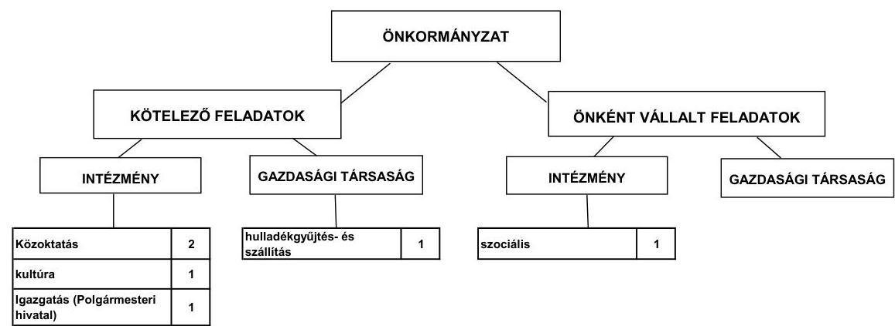

Az Önkormányzat feladatait 2011. június 30-án (a Polgármesteri hivatallal együtt) öt költségvetési szervvel, továbbá egy gazdasági társasággal és egy társulás útján látta el. Két intézmény 2008. január 1-jével történő összevonásának következtében a feladatellátásban résztvevő önkormányzati költségvetési intézmények száma a 2007. évi hatról a 2011. év I. félév végére ötre csökkent. Az átszervezés - az Önkormányzat adatszolgáltatása szerint - nem volt hatással az Önkormányzat pénzügyi egyensúlyi helyzetére. Az intézmények gazdálkodási feladatait a Polgármesteri hivatal látta el. A kötelező közszolgáltatási feladatok közül a hulladékgyűjtésről és -szállításról szerződés keretében gazdasági társaság közreműködésével, az ivóvíz-szolgáltatásról és szennyvízelvezetésről társulás útján gondoskodtak.

Az Önkormányzat működési kiadásainak összege a 2007-2009. évek átlagában 602,7 millió Ft-ot tett ki. A 2010. évben teljesített működési kiadás 641,5 millió Ft-os összege 6,4%-kal haladta meg az előző három év átlagos évi kiadási mértékét. A működési kiadások 47,7%-át (306,0 millió Ft-ot) az intézményi körben realizálták, 52,3%-a (335,5 millió Ft) a Polgármesteri hivatal feladatellátásához kapcsolódott.

---

A működési kiadások fedezetéül szolgáló bevételi források ágazatonkénti összegeit a 2007. és a 2010. években a következő ábra szemlélteti:
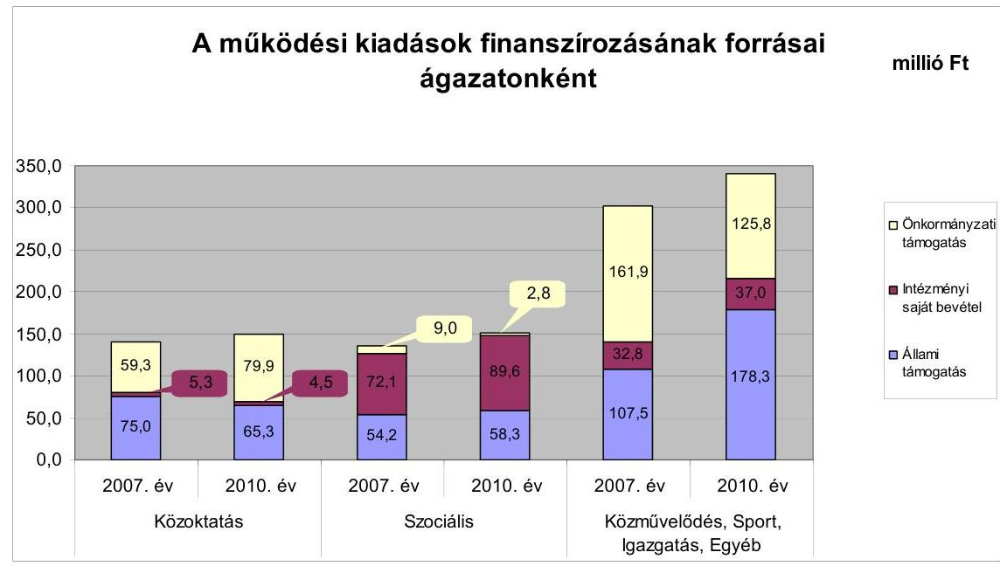

Az Önkormányzat kórházat, gyermekjóléti intézményt, illetőleg sportlétesítményt nem tartott fenn.

A működési kiadások fedezetéül szolgáló állami támogatást és saját bevételt kiegészítő önkormányzati támogatás összege a 2007-2009. évek átlagában 203,8 millió Ft-ot tett ki. A 2010. évben nyújtott önkormányzati támogatás 208,5 millió Ft-os összege 2,3%-kal meghaladta az előző három év átlagos évi támogatási mértékét, amely negatív hatást gyakorolt az Önkormányzat pénzügyi egyensúlyi helyzetére. Az Önkormányzat a közoktatás és a Polgármesteri hivatalban ellátott egyéb feladatok kiadásaihoz járult hozzá növekvő mértékben. A közoktatás kiadásaihoz nyújtott önkormányzati támogatás (80,0 millió Ft) 4,3 millió Ft-tal haladta meg az előző három év átlagos támogatási összegét (75,7 millió Ft). A Polgármesteri hivatalban ellátott feladatok működési kiadásainak teljesítéséhez rendelkezésre álló állami támogatás és saját bevétel együttes összegét a 2007-2009. években átlagosan 115,2 millió Ft-tal, a 2010. évben 124,4 millió Ft-tal egészítette ki az Önkormányzat.

---

Az Önkormányzat folyó költségvetési egyenlegét, működési jövedelmét a következő ábra mutatja:
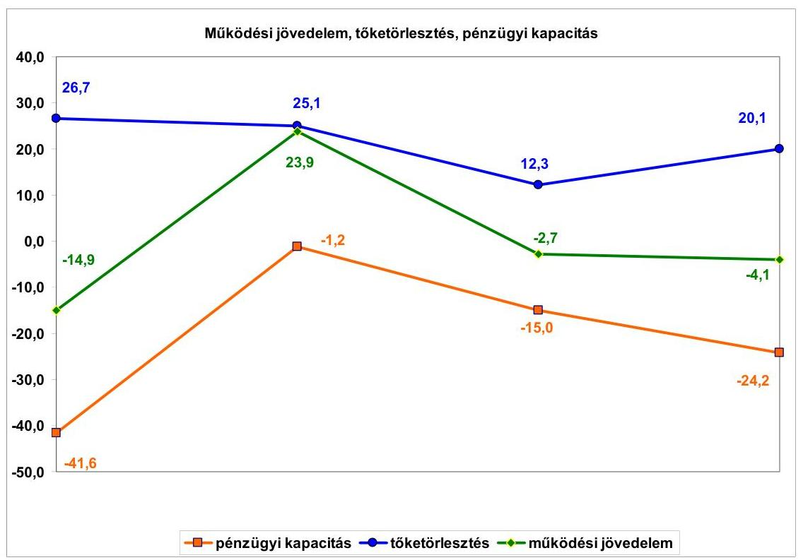

Az Önkormányzat folyó költségvetési egyenlege (működési jövedelem) a 2007. évben és a 2009-2010. évek között működési forráshiányt mutatott. A folyó költségvetés negatív egyenlege 2007-ben a folyó kiadások 2,6%-át (-14,9 millió Ft-ot), 2009-ben 0,4%-át (-2,7 millió Ft-ot), 2010-ben 0,6%-át (-4,1 millió Ft-ot) jelentette. A 2008. évben a pozitív folyó költségvetési egyenleg a folyó kiadások 4,0%-át (23,9 millió Ft-ot) tette ki. A működési forráshiány csökkentése érdekében pályázatot nyújtottak be a működőképesség megőrzését szolgáló kiegészítő támogatásokra. A 2007. évben 64,8 millió Ft, a 2008. évben 79,5 millió Ft, a 2009. évben 80,5 millió Ft, a 2010. évben 66,3 millió Ft ÖNHIKI támogatásban részesültek. A működésképtelen helyi önkormányzatok támogatása jogcímen 2007-ben 14,5 millió Ft, 2008-ban 15,0 millió Ft, 2009-ben 11,4 millió Ft, 2010-ben 10,5 millió Ft vissza nem térítendő támogatást kaptak. A kapott támogatások nélkül a működési forráshiány 2007-ben 94,2 millió Ft, 2008-ban 70,6 millió Ft, 2009-ben 94,6 millió Ft, 2010-ben 80,9 millió Ft lett volna.

A 2008. évi működési forrástöbbletet az Idősek Otthona ellátotti létszámának emelkedése, a vizsgált időszak kiemelkedő nagyságrendű ÖNHIKI támogatása és a helyi adóban mutatkozó bevételi többlet eredményezte. A keletkezett forrástöbblet finanszírozni tudta a 25,1 millió Ft tőketörlesztés 95,2%-át. A költségvetési támogatások és az átengedett szja együttes összege a 2008. évi 485,5 millió Ft-ról a 2009. évre 476,4 millió Ft-ra, a 2010. évre 476,0 millió Ft-ra csökkent, valamint a folyó kiadások - előző évhez viszonyított - növekedési üteme 2009-ben 4,5 százalékponttal, 2010-ben 0,2 százalékponttal meghaladta a bevételekét, ami működési forráshiány kialakulásához

---

vezetett. A 2010. évi forráshiány mellett a növekvő összegű tőketörlesztés a pénzügyi kapacitás további romlását eredményezte.

A működési jövedelem 2009. és 2010. évi csökkenésére hatással volt az önként vállalt feladatokra fordított kiadások összegének és arányának növekedése. Az önként vállalt feladatokra a 2007-2009. évek átlagában 239,4 millió Ft kiadást teljesítettek. A 2010-ben önként vállalt feladatok kiadására fordított 293,4 millió Ft 22,6%-kal haladta meg az előző három év átlagos évi kiadását. Az önként vállalt feladatokra a 2007-2009. évi átlagos működési kiadások (602,7 millió Ft) 39,7%-át, 2010-ben (641,5 millió Ft) 45,7%-át fordították. Az önként vállalt feladatok költségvetésen belüli növekvő részaránya az Önkormányzat kedvezőtlen pénzügyi pozícióját tovább rontotta.

Az Önkormányzat a vizsgált években - a 2008. évi előző évhez viszonyított 11,2%-os növekedésen kívül - közel azonos nagyságrendű folyó bevételt ért el. A vizsgált időszakban az ellátott feladatok köre nem változott. A költségvetési támogatás és az átengedett szja 2007-2009. évek átlagában 465,8 millió Ft-ot tett ki, a 2010. évben kapott támogatás 476,0 millió Ft-os összege 2,2%-kal haladta meg az előző három év átlagos évi támogatási mértékét. A helyi adók és pótlékok bevételei az Önkormányzat folyó bevételeiben nem töltöttek be meghatározó szerepet, mely a település alacsony jövedelemtermelő képességét jelzi. A 2009. évi kiemelkedő teljesítés egyszeri iparűzési adó túlfizetésből keletkezett, amely 2010-ben visszafizetésre került.

A folyó kiadások összege emelkedő tendenciát mutat. Az átlagot meghaladó növekedés (4,8%-os) 2009-ben következett be a városgazdálkodási feladatokhoz kapcsolódó közfoglalkoztatás eredményeként. A folyó kiadások összege 2007-2009. évek átlagában 602,8 millió Ft-ot tett ki, a 2010. évi 645,1 millió Ft 7,0%-kal haladta meg az előző három év átlagos évi kiadásának mértékét.

A pénzügyi egyensúlyi helyzet alakulását jelentősen befolyásolta az Önkormányzat 2007-2010. éveket érintő fejlesztési tevékenysége. A befejezett fejlesztések teljes bekerülési költsége 389,8 millió Ft, forrása a saját erő, a hazai és EU-s támogatások mellett 61,4 millió Ft hitelfelvétel (15,8%) volt. A 2010. december 31-én folyamatban lévő fejlesztési feladatok végrehajtására 2007-2010. között 3,6 millió Ft kiadást teljesítettek saját forrásból.

A 2010. december 31-én folyamatban lévő fejlesztési feladatok 2010. évet követő kötelezettségvállalásainak összege 117,4 millió Ft volt, amelyből 105,8 millió Ft-ot EU-s támogatásból és 11,6 millió Ft-ot saját bevételből terveznek biztosítani. Az utófinanszírozott EU-s támogatás megelőlegezése, figyelembe véve, hogy az Önkormányzat működésének pénzügyi egyensúlyát - a vizsgált időszakban - folyószámlahitel igénybevételével tudta biztosítani, likviditási gondot jelenthet az Önkormányzat számára.

Az Önkormányzat mérleg szerinti pénzintézeti kötelezettsége a 2006. év végétől a 2011. év I. félév végére 119,5 millió Ft-ról 105,8 millió Ft-ra csökkent. A fennálló pénzintézeti kötelezettségek négy hosszú lejáratú hitelből, három rövid lejáratú hitel, valamint folyószámlahitel és munkabér-megelőlegezési hitel igénybevételéből keletkeztek.

---

Az adósságot keletkeztető kötelezettségvállalásokra képviselő-testületi döntés alapján került sor, azonban az előterjesztések nem tartalmazták a kamatkockázatokat. A hiteleket lehívták és a hitelcélnak megfelelően, a költségvetésbe betervezett kiadásokhoz felhasználták. Az Önkormányzatnak devizahitele nem volt, a hosszú lejáratú hitelekkel kapcsolatosan 2007-2010. között 49,6 millió Ft tőkét törlesztett, továbbá kamat és egyéb költségek címén 18,0 millió Ft-ot fizetett. A 2011. év I. félévében összesen 3,0 millió Ft tőketartozás, 1,3 millió Ft kamat és egyéb költségek megfizetését teljesítették.

A vizsgált időszakban a folyószámlahitel és a munkabér-megelőlegezési hitel igénybevétele a következő volt:

| Megnevezés | 2007. év | 2008. év | 2009. év | 2010. év | 2011. év I.   félév |
| :-- | --: | --: | --: | --: | --: |
| Folyószámlahitel |  |  |  |  |  |
| Keretösszeg január 1-jén (millió Ft-ban) | 30,0 | 40,0 | 40,0 | 40,0 | 55,0 |
| Átlagos napi állomány (millió Ft-ban) | 33,6 | 37,0 | 33,0 | 43,6 | 48,0 |
| Folyószámla hitellel zárt napok száma (nap) | 239 | 247 | 250 | 249 | 123 |
| Egyenleg (állomány) | x | x | x | 43,4 | 35,9 |
| Munkabér-megelőlegezési hitel |  |  |  |  |  |
| Átlagos napi állomány (millió Ft-ban) | 0,7 | 0,9 | 0,9 | 0,9 | 0,7 |
| Folyószámla hitellel zárt napok száma (nap) | 236 | 251 | 256 | 249 | 127 |
| Egyenleg (állomány) | x | x | x | 23,1 | 19,0 |

Az
 Önkormányzat működésének pénzügyi egyensúlyát a vizsgált időszakban folyószámlahitel, munkabér-megelőlegezési hitel és egy alkalommal 7,0 millió Ft összegű rövid lejáratú hitel igénybevételével tudta biztosítani. Két rövid lejáratú hitelt - 23,9 millió Ft összegben - felhalmozási célra, pályázati támogatások megelőlegezésére vették igénybe.

A romló likviditási helyzet miatt - az Önkormányzat gazdálkodásának biztonságos finanszírozása érdekében - 2010 decemberében a folyószámlahitelkeret összegét megemelték. Az Önkormányzat gazdálkodásának finanszírozásához a folyószámlahitel igénybevétele tartóssá vált, 2011-ben már csaknem minden napot folyószámlahitellel zártak. A tartós likviditási problémák miatt az Önkormányzat 2007-től a munkabérek kifizetéséhez munkabérmegelőlegezési hitelt vett igénybe. A hitel igénybevételére a vizsgált időszak minden hónapjában sor került, a törlesztések a normatív állami támogatásokból és az átengedett szja-ból az igénybevételt követő hónapban megtörténtek.

A likviditás biztosítása az Önkormányzatnak 35,7 millió Ft kamatkiadást, és 2,2 millió Ft egyéb költség fizetésének kötelezettségét okozta, melyből összesen 1,2 millió Ft felhalmozási célt szolgált.

---

Az Önkormányzat kötelezettségeinek 2010. december 31-i, valamint 2011. június 30-i állományát és várható nagyságát a kötelezettségek lejáratáig a következő táblázat szemlélteti:

| Megnevezés | Állomány 2010.   december 31-én | Állomány 2011.   június 30-án | Várható   kötelezettség   2011-2013.   években | Várható   kötelezettség   2014. évtől |
| :-- | :--: | :--: | :--: | :--: |
|  | HUF-ban (millió   Ft-ban) | HUF-ban (millió   Ft-ban) | HUF-ban (millió Ft   ban) | HUF-ban (millió   Ft-ban) |
| Pénzintézeti kötelezettségek |  |  |  |  |
| Hosszú lejáratú hitelek | 44,7 | 41,7 | 24,7 | 33,0 |
| Egyéb likvid hitelek | 20,2 | 1,9 | 1,9 |  |
| Folyószámla hitel | 43,4 | 43,2 | 43,2 |  |
| Munkabér-megelőlegezési hitel | 23,1 | 19,0 | 19,0 |  |
| Pénzintézeti kötelezettségek összesen | 131,4 | 105,8 | 88,8 | 33,0 |
| Szállítói tartozás | 32,1 | 66,5 | 66,5 |  |
| MINDÖSSZESEN | $\mathbf{163,5}$ | $\mathbf{172,3}$ | $\mathbf{155,3}$ | $\mathbf{33,0}$ |

Az Önkormányzatnak pénzintézetekkel szemben fennálló kötelezettsége a 2011. év I. félév végén 105,8 millió Ft volt. A várható fizetési kötelezettségek összege (tőke, kamat és egyéb költség) a legutóbbi kamatfizetés feltételei alapján, 2011-2013. években 88,8 millió Ft, a 2014. évtől pedig 33,0 millió Ft. Az Önkormányzatnak a 2011. év I. félév végén szállítói tartozások címén 66,5 millió Ft fizetési kötelezettsége volt. A 2011-2013. évek kötelezettségeinek teljesítésére figyelembe vehető a mérlegében kimutatott 7,0 millió Ft követelésállomány, valamint az Önkormányzat tájékoztatása és a megkötött hitelszerződések alapján a helyi adókból és az egyéb sajátos bevételekből származó pénzeszközök is felhasználhatók erre a célra. A 2014. évet követően a jelenleg ismert kötelezettsége 33,0 millió Ft.

A kötelezettségek teljesítéséhez a képződő működési jövedelem és az Önkormányzat által meghozott kiadáscsökkentő és bevételnövelő intézkedések rövid távon sem biztosítanak elegendő többletforrást, ezek teljesítése csak további kiadáscsökkentő és bevételnövelő intézkedések útján elért megtakarítások, valamint egyéb külső források bevonásával lehetséges.

Az Önkormányzat 2011. június 30-i lejárt szállítói tartozásának 80,6%-a (53,7 millió Ft) 30 napon túli volt, ennek 32,3%-a (17,3 millió Ft) meghaladta a 90 napot. A fennálló tartozásokról a Képviselő-testületet minden esetben tájékoztatták, azonban az adósságrendezési eljárás megindításáról döntés nem született.

A Képviselő-testület a folyószámlahitel és fejlesztési hitelek biztosítékaként 469,2 millió Ft számviteli nyilvántartás szerinti nettó értékű ingatlanon jelzálogjog alapításához és bejegyzéséhez járult hozzá. A forgalomképes és korlátozottan forgalomképes önkormányzati ingatlanvagyon könyv szerinti nettó értéke együttesen 973,3 millió Ft volt, amelyből a terhelt ingatlanok aránya 48,2%. Az Önkormányzat nyolc ingatlana volt jelzáloggal terhelt 2010. december 31-én. Az Ötv. előírását megsértve, két korlátozottan forgalomképes ingatlanra (Idősek Otthona, Egészségház) is bejegyzésre került a jelzálogjog. A törzsvagyonhoz tartozó terhelt ingatlanok számviteli nyilvántartás szerinti értéke 437,8 millió Ft volt.

---

Az Önkormányzat 2007-2010 között eszközállománya után 206,5 millió Ft összegű értékcsökkenést mutatott ki, miközben az elhasználódott eszközök pótlására 131,2 millió Ft-ot fordított. Az éves zárszámadási rendeleteiben az Önkormányzat nem mutatta be az eszközök után tárgyévben elszámolt értékcsökkenés összegét, az eszközpótlásra fordított tényleges kiadásokat, valamint az eszközök elhasználódási fokának alakulását.

Az Önkormányzat költségvetési támogatásból, átengedett bevételekből származó évenkénti bevételei a 2007. évhez képest az időszak egészét tekintve összességében nem csökkentek. A költségvetésének finanszírozhatósága érdekében az Önkormányzat kiadási megtakarítást eredményező és bevételt növelő intézkedéseket is hozott, ezáltal javítva az Önkormányzat pénzügyi egyensúlyi helyzetét. A 2007-2011. év I. féléve között tett intézkedések hatására 95,1 millió Ft bevételi többletet, továbbá 65,0 millió Ft kiadási megtakarítást mutattak ki.

A kiadási megtakarítások 87,2%-a az elrendelt álláshely-csökkentések eredménye, 8,5%-a a tiszteletdíjak, 2,2%-a a többlet juttatások, valamint 0,3%-a a civil szervezetek támogatásának csökkentése miatti megtakarítás és 1,8%-ot tett ki a költségtérítések felülvizsgálata, megszüntetése miatti megtakarítások összege az Önkormányzat kimutatása szerint.

Az álláshely-csökkentő intézkedések 2007-2011. év I. féléve között önkormányzati szinten összesen 18 álláshely (ebből 9 üres álláshely) megszüntetését jelentették. A közoktatási feladatot ellátó intézményeknél hat, a Polgármesteri hivatalnál három álláshely szűnt meg. A szociális és gyermekvédelmi feladatok ellátásánál összesen kilenc álláshely szűnt meg, a szakosított szociális ellátásnál az ellátottak létszámának emelkedése a foglalkoztatottak létszámának növelését (két fő) igényelte a 2010. évben. Ennek következtében az időszak álláshelyeinek száma összesen 16-tal, a foglalkoztatottak száma összesen hét fővel csökkent.

A bevételnövelő intézkedések a helyi adókhoz, illetve térítési díj emeléséhez kapcsolódtak. A 2009. évben bevezették az idegenforgalmi adót és megemelték a magánszemélyek éves kommunális adóját, 2008-ban és 2011-ben megemelték a szakosított szociális ellátás havi térítési díját. Az Önkormányzatnál egyik adó mértéke sem érte el a törvényben meghatározott mérték felső határát.

Az utóellenőrzés a pénzügyi egyensúly javítására tett három szabályszerűségi és két célszerűségi javaslat hasznosítására terjedt ki. A javaslatokat az intézkedési terv szerinti határidőben megvalósították. A 2011. évi költségvetési rendeletben bemutatták a fejlesztési kiadásokat feladatonként, valamint az EU-s forrásokkal támogatott fejlesztések bevételi és kiadási előirányzatait. A 2011. évi költségvetési rendeletben a költségvetési bevételek és kiadások főösszegei nem tartalmaztak költségvetési hiányt módosító finanszírozási célú bevételeket, illetve kiadásokat. A 2010. évi zárszámadási rendelet tartalmazta a közvetett támogatások szöveges indoklását. A célszerűségi javaslat hasznosulásaként a számvevői jelentésben foglaltakat megtárgyalta a Képviselő-testület, valamint intézkedési tervet fogadott el a javaslatok végrehajtására. A jegyző 2011-től a munkaterv szerinti képviselő-testületi üléseken tájékoztatást adott arról, hogy a hosszú lejáratú adósságot keletkeztető kötelezettségvállalásokból adódó tőke- és

---

kamatfizetési kötelezettségét az Önkormányzat milyen feltételek mellett tudja teljesíteni.

Az Önkormányzat pénzügyi egyensúlyi helyzetét összegezve a következők emelhetők ki:

# Az Önkormányzat pénzügyi egyensúlya rövid távon veszélyeztetett. 

A folyó bevételek nem nyújtottak fedezetet a folyó kiadásokra és az adósságszolgálatra a vizsgált időszak valamennyi évében elnyert ÖNHIKI támogatás ellenére sem. A likviditás biztosításához külső források bevonása vált szükségessé, folyószámlahitelt, munkabér-megelőlegezési hitelt, valamint rövid lejáratú hitelt vett igénybe az Önkormányzat. A vizsgált időszakban a folyószámla- és munkabér-megelőlegezési hitel állandósult, növekedett a lejárt szállítói tartozásállomány. Az önként vállalt feladatok arányának növekedése rontotta az Önkormányzat működésének biztonságát.

Az Önkormányzat felhalmozási költségvetése - a 2008. év kivételével - pénzügyi hiányt mutatott, ennek forrásait hosszú lejáratú hitel felvételével biztosították. A folyamatban lévő fejlesztési feladatokat 90%-ban EU-s támogatásból tervezik finanszírozni, melynek megelőlegezése likviditási problémákat okoz.

A pénzintézeti és egyéb kötelezettségek teljesítése sem rövid, sem középtávon nem biztosított. A további évekre szóló, jelenleg ismert pénzintézeti kötelezettségek teljesítésének fedezetét a helyi adó és az egyéb sajátos bevételekben jelölték meg, azonban a források biztosítása érdekében intézkedést nem tettek, számításokat nem végeztek.

Az Állami Számvevőszékről szóló 2011. évi LXVI. törvény 33. § (1) bekezdésében foglaltak értelmében a jelentésben foglalt megállapításokhoz kapcsolódó intézkedési tervet köteles az ellenőrzött szervezet vezetője összeállítani és azt a jelentés kézhezvételétől számított harminc napon belül az ÁSZ részére megküldeni. Amennyiben az intézkedési tervet határidőben nem küldi meg a szervezet, vagy az továbbra sem elfogadható, az ÁSZ elnöke a hivatkozott törvény 33. § (3) bekezdés a)-b) pontjaiban foglaltakat érvényesítheti.

## A 2011. június 30-i pénzügyi egyensúlyi helyzet alapján az ellenőrzés intézkedést igénylő megállapításai és javaslatai a következők:

## a Polgármesternek

1. Az Önkormányzat nettó működési jövedelme az elmúlt időszakban negatív volt, a vállalt pénzintézeti kötelezettségek fedezete rövid távon (2011-2013. években) nem biztosított.

Az Önkormányzat finanszírozása a vizsgált időszakban egyre növekvő arányú folyószámla- és munkabér-megelőlegezési hitel igénybevételével volt biztosítható. Az Önkormányzat finanszírozásában a folyószámla- és munkabér-megelőlegezési hitel állandósult.

---

Az Önkormányzat szállítói kötelezettségeinek állománya, ezen belül a 90 napon túl lejárt szállítói tartozások összege jelentősen emelkedett.

Az Önkormányzat által tett intézmény szervezeti átalakítások, kiadáscsökkentő és bevételnövelő intézkedések nem biztosítanak elegendő forrást a pénzügyi egyensúly helyreállításához.

Az Önkormányzat pénzügyi egyensúlya rövid távon veszélyeztetett.
Javaslat:
Az Önkormányzat pénzügyi egyensúlyának gyors helyreállítása és hosszú távú fenntarthatósága érdekében kezdeményezze - felelősök és határidők megjelölésével - az alábbi intézkedések megtételét:
a) Tárja fel a bevételszerző és kiadáscsökkentő lehetőségeket. Intézkedjen a bevételek növelésére, a kintlévőségek behajtására, a kiadások csökkentésére;
b) Terjesszen a Képviselő-testület elé reorganizációs programot a kedvezőtlen pénzügyi folyamatok megállítására, a pénzügyi egyensúlyi helyzet gyors stabilizálására;
c) Képezzen egyensúlyi (elkülönített) tartalékot az adósságszolgálat teljesítése érdekében;
d) Mérje fel a folyamatban lévő beruházásokkal kapcsolatos kötelezettségek átütemezésének pénzügyi és jogi lehetőségeit, illetve hatásait. Szükség esetén kezdeményezze a Képviselő-testületnél az átütemezést;
e) Vizsgálja felül teljes körűen a tervezett beruházásokat és a megvalósuló létesítmények fenntartásának jövőbeni pénzügyi kihatásait. Szükség esetén tegyen javaslatot a Képviselő-testületnek a tervezett beruházásokkal kapcsolatos döntések módosítására, amelyben figyelembe veszik az Önkormányzat pénzügyi lehetőségeit, és a kötelező feladatellátás elsődlegességét;
f) Vizsgálja meg az állandósult folyószámla- és likvid hitel hosszú távú kötelezettséggé történő átalakításának jogi lehetőségét és a Stabilitási törvény 10. §-ában előírt feltételek fennállása esetén kezdeményezze a Kormánynál ennek engedélyezését;
g) Kezdeményezze az intézmények finanszírozásának napi kontrollját. Szűkítse a jóváhagyott előirányzatok felhasználásának lehetőségeit;
h) Tekintse át az önként vállalt feladatok finanszírozhatóságát a kötelező feladatellátás elsődlegességének biztosítása érdekében, mutassa be a Képviselő-testületnek a megoldás lehetőségeit, és szükség esetén a gazdasági program módosításának igényét;
i) Mutassa be havonta legalább három évre kitekintően kötelezettségeinek finanszírozási forrásait;

---

j) Gondoskodjon, hogy a jövőben az adósságot keletkeztető kötelezettségvállalásokról szóló képviselő-testületi előterjesztések tételesen tartalmazzák a visszafizetés forrásait.
2. A Képviselő-testület részére nem készítettek a hitelfelvételhez kapcsolódóan teljes körű tájékoztatást a döntések jövőbeni kötelezettségeit befolyásoló tényezők (kamat/visszafizetési) kockázatairól.

Javaslat:
Az adósságot keletkeztető kötelezettségvállalásról szóló döntéskor mutassa be a Képviselő-testületnek a jövőben várható kamat és törlesztési kockázatot.
3. A Képviselő-testületnek előterjesztett éves zárszámadási rendeleteikben nem mutatták be az Önkormányzat eszközei után tárgyévben elszámolt értékcsökkenés összegét, az eszközpótlásra fordított tényleges
 kiadásokat, az eszközök elhasználódási fokának alakulását.

Javaslat:
Mutassa be a Képviselő-testületnek évente a zárszámadási rendelet előterjesztésében az értékcsökkenés összegét, és ezzel összevetve az elhasználódott eszközök pótlására fordított tényleges kiadásokat, az eszközök elhasználódási fokának alakulását.
4. Az Önkormányzat az Idősek Otthona építéséhez 143,2 millió Ft hitelt vett fel, ezért az ingatlant a hitel biztosítékaként jelzáloggal terhelték a futamidő lejártáig. Az Idősek Otthona a korlátozottan forgalomképes ingatlanok közé tartozik. A folyószámlahitelkeret biztosítékául a pénzintézet öt forgalomképes és egy korlátozottan forgalomképes önkormányzati ingatlanon alapított jelzálogjogot.

Javaslat:
Gondoskodjon arról, hogy az Önkormányzat kötelezettségeinek fedezeteként 2012. január 1-jét követően a nemzeti vagyonról szóló 2011. évi CXCVI. törvény 3. § 6. pontjával, az 5. § (2) bekezdés c) pontjával, és a 6. § (6) bekezdésével összhangban a nemzeti vagyon körébe tartozó, korlátozottan forgalomképes törzsvagyont ne terhelje meg, kivéve, ha arról az Önkormányzat a rendeletében a megterhelést megengedően rendelkezik. ${ }^{6}$

[^0]
[^0]:    ${ }^{6}$ Felhívjuk a figyelmet arra, hogy az ellenőrzéssel érintett időszakot követően, 2012. március 31-én hatályba lépett az egyes közpénzügyi tárgyú törvényeknek az államháztartás önkormányzati alrendszerét érintő módosításáról, és azok más törvényekkel való összhangjának biztosításáról szóló 2012. évi XVII. törvény, amely módosítja az államháztartásról szóló 2011. évi CXCV. törvény 84. §-ának (4) bekezdését. A jogszabály változását a javaslat végrehajtása során figyelembe kell venni.

---

5. Az Önkormányzat lejárt szállítói tartozásállománya 2011. június 30-án 66,5 millió Ft volt, melyből a 90 napot meghaladó 17,3 millió Ft volt.

Javaslat:
Kezelje az Önkormányzat lejárt szállítói tartozásállományát, a szállítói kitettség és a jogszabályi következmények elkerülése érdekében.

A polgármester a helyszíni ellenőrzés lezárása után tájékoztatta az Állami Számvevőszéket az Önkormányzat által megtett, illetve tervezett intézkedéseiről, amelyet az Állami Számvevőszék nem ellenőrzött, arra vonatkozóan véleményt vagy megállapítást nem fogalmaz meg. Az ellenőrzés lezárását követően elvégzett intézkedéseket az Állami Számvevőszék utóellenőrzés keretében vizsgálhatja.

A polgármester tájékoztatása szerint a következő intézkedéseket tette, illetve tervezi az Önkormányzat:

- az Önkormányzat a szociális alapszolgáltatás feladatait 2011. december 31-től társulás útján látja el;
- az Idősek Otthona működtetését 2012. január 1. napjától átadták az egyháznak;
- a lakossági hulladékszállításra kötött szolgáltatói szerződést 2011. december 31. napjával felmondta az Önkormányzat. Az elvégzett szolgáltatás számlázása 2012. január 1-jétől közvetlenül a lakosság részére történik;
- a 2012. évben a közalkalmazottak részére étkezési kedvezményt, illetve cafetéria juttatást nem biztosít az Önkormányzat;
- a tervezett intézkedések között szerepelt az önként vállalt feladatok körének felülvizsgálatának keretében az államháztartáson kívülre nyújtott működési támogatások csökkentése, valamint a művészeti oktatás, illetve két tannyelvű képzés működtetésére irányuló hatékonysági vizsgálat elvégzése.

---

# II. RÉSZLETES MEGÁLLAPÍTÁSOK 

## 1. Az ÖNKORMÁNYZAT KÖTELEZŐ ÉS ÖNKÉNT VÁLLALT FELADATAI, A FELADATELLÁTÁS SZERVEZETI KERETEI ÉS ANNAK VÁLTOZÁSAI

Az Önkormányzat a kötelezően ellátandó feladatait az Ötv. és az ágazati törvények által meghatározottnak tekintette, az önként vállalt feladatok köréről az $\mathrm{SzMSz}_{1,2}$-ben ${ }^{7}$ rendelkezett, azok terjedelmét az éves költségvetési rendeletekben a költségvetés forrásainak ismeretében határozta meg. Az önként vállalt feladatok közé sorolták az egészségügyi labor működtetését, a fizikoterápiai ellátás biztosítását, a városüzemeltetési feladatok ellátását, a helyi közszolgálati média működtetését, sport feladatok ellátását, civil szervezetek és helyi kisebbségi önkormányzatok támogatását, időskorúak bentlakásos szociális ellátását, az alapfokú művészeti iskola fenntartását.

Az Önkormányzat működési célú költségvetési kiadásaiból ${ }^{8}$ a kötelező feladatok ellátására a 2007. évben 363,6 millió Ft-ot (63,0\%-ot), a 2010. évben 348,1 millió Ft-ot (54,3\%-ot) fordított. Az önként vállalt feladatok működési kiadása a 2007. évben 213,5 millió Ft (37,0\%), a 2010. évben 293,4 millió Ft (45,7\%) volt.

Az Önkormányzat működési kiadásaiból 149,7 millió Ft-ot (23,3\%-ot) közoktatási, 150,7 millió Ft-ot (23,5\%-ot) szociális, 5,6 millió Ft-ot (0,9\%-ot) közművelődési intézmények fenntartására fordított a 2010. évben. A Polgármesteri hivatalban ellátott igazgatási feladatokra 186,7 millió Ft (29,1\%), az egyéb ${ }^{9}$ önkormányzati feladatokra 148,8 millió Ft (23,2\%) működési kiadást teljesítettek a 2010. évben.

[^0]
[^0]:    ${ }^{7}$ Az Önkormányzat az $\mathrm{SzMSz}_{1}$ 7. § (3) bekezdésében, illetve az $\mathrm{SzMSz}_{2}$ 5. § (1) bekezdésében tételesen rögzítette az önként vállalt feladatait.
    ${ }^{8}$ Az 1. számú tanúsítvány kitöltési útmutatójának megfelelően a működési kiadások nem tartalmazták az Országos Egészségpénztár által finanszírozott feladatok és a kisebbségi önkormányzatok kiadásait.
    ${ }^{9}$ Az egyéb önkormányzati feladatok működési kiadásai tartalmazták az egészségügyi labor működtetését, a fizikoterápiai ellátás biztosítását, a városüzemeltetési, okmányirodai, gyám- és építésigazgatási feladatok ellátását, a helyi közszolgálati média működtetését, a sportegyesületek, civil szervezetek és helyi kisebbségi önkormányzatok támogatását.

---

Az Önkormányzat 2010. évi működési kiadásait feladatonként, és azok finanszírozását a következő táblázat mutatja be:

| Elilátoft feladat | Müködési kiadás összesen (millió Ft) | Kötelező feladatok kiadásainak részénnya $\%$ | Múködési bevétel összesen (millió Ft) | Állami támogatás összege (millió Ft) | Állami támogatás tesaérőnye $\%$ | Intézményi saját bevétel részénnye $\%$ | Önkormányzati támogatás részénnye $\%$ |
| :--: | :--: | :--: | :--: | :--: | :--: | :--: | :--: |
| Övodák | 39,7 | 100,0 | 39,7 | 19,6 | 49,3 | 2,4 | 48,3 |
| Általános iskolák | 110,0 | 85,0 | 110,0 | 45,6 | 41,5 | 3,2 | 55,3 |
| Szociális és gyermekjóléti intézmények | 150,7 | 15,0 | 150,7 | 58,3 | 38,7 | 59,4 | 1,9 |
| Közművelődési intézmények | 5,8 | 100,0 | 5,8 | 2,9 | 50,9 | 26,4 | 22,7 |
| Polgármesteri hivatal igazgatási kiadások | 186,7 | 100,0 | 186,7 | 166,0 | 88,9 | 11,1 | 0,5 |
| Polgármesteri hivatalban ellátott egyéb feladatok működési kiadásai | 148,8 | 0,0 | 148,8 | 9,5 | 6,4 | 10,0 | 83,6 |
| Működési kiadások összesen | 641,3 | 54,3 | 641,0 | 301,9 | 47,1 | 20,4 | 32,0 |

Az Önkormányzat feladatainak 2007-2009. évi működési célú kiadásaihoz évenként átlagosan igénybe vett állami támogatás ${ }^{10}$ összege 289,3 millió Ft volt. A 2010. évben kapott állami támogatás 301,9 millió Ft-os összege 4,4\%-kal haladta meg az előző három év átlagos évi támogatási mértékét. A működési kiadásokra csökkenő mértékben, a 2007-2009. évi átlagos 602,7 millió Ft működési kiadás 48\%-ára, a 2010. évben a 641,5 millió Ft működési kiadás 47,1\%-ára nyújtott fedezetet. A közoktatási feladatok ellátásához biztosított állami támogatás a 2010. évben a működési kiadások 43,6\%-ára nyújtott fedezetet, ami 1,3 százalékponttal kevesebb az előző három év átlagában számított forráson belüli részaránynál. A szociális intézmények működtetéséhez nyújtott 2010. évi állami támogatás 2007-2009. évek átlagához viszonyított növekedése elmaradt a működési kiadások növekedésének ütemétől, így az a 2010. évben a működési kiadások 38,7\%-ára nyújtott fedezetet, amely 1,3 százalékponttal elmaradt az előző három év átlagos részarányától. A közművelődés működési kiadásai a 2010. évi összes működési kiadás 0,9\%-át képviselték, ezért a kiadások, illetve annak fedezetét biztosító bevételek összetételének alakulása, pénzügyi helyzetre gyakorolt hatása nem releváns. A Polgármesteri hivatal költségvetésében kimutatott feladatok (igazgatási kiadások, és egyéb a Polgármesteri hivatalban ellátott feladatok) átlagos működési kiadása a 2007-2009. években 306,2 millió Ft volt, 29,3 millió Ft-tal kevesebb a 2010. évi működési kiadásnál. A 2010. évi működési kiadás 52,3\%-ára nyújtott fedezetet az állami támogatás, amely 1,0 százalékponttal maradt el a 2007-2009. évekre számított 53,3\% átlagos részaránytól. Az állami támogatás összegének alakulására az ellátotti létszám növekedésén túl a forrásszabályozás közoktatás területén bekövetkezett módosítása - a teljesítménymutató alapján történő finanszírozás - volt negatív hatással.

Az önkormányzati feladatok működési kiadásainak növekedési üteme meghaladta a feladatok ellátásához biztosított állami támogatások emelkedésének

[^0]
[^0]:    ${ }^{10}$ Az egyes feladatokhoz biztosított állami támogatások számbavétele a Magyar Köztársaság 2010. évi költségvetéséről szóló 2009. évi CXXX. törvény előirányzatai (3.,5.,8. számú mellékletei) alapján történt.

---

mértékét, ezáltal negatív hatást gyakorolt az Önkormányzat pénzügyi helyzetére. Az állami támogatás a 2007-2009. évi átlagos működési kiadás (602,7 millió Ft) 48,0\%-ára, a 2010. évi működési kiadás (641,5 millió Ft) 47,1\%-ára nyújtott fedezetet. A kieső központi forrást az intézményi saját bevételek és az önkormányzati támogatások együttesen kompenzálták. A 2010. évben 131,1 millió Ft intézményi saját bevételt realizált az Önkormányzat, amely 19,6\%-kal (21,5 millió Ft-tal) haladta meg az előző három év átlagában számított 109,6 millió Ft saját bevételt. A saját bevételek a 2010. évben a működési kiadások 20,4\%-ára nyújtottak fedezetet, amely 2,2 százalékponttal meghaladta a 2007-2009. évekre számított 18,2\%-os átlagot. Az Idősek Otthonában realizált 2010. évi 89,6 millió Ft intézményi saját bevételek - előző három év átlagához viszonyított 13,8 millió Ft-os - növekedését az ellátotti létszám emelkedéséhez kapcsolódó többlet gondozási díj bevétel eredményezte, illetve a Polgármesteri hivatalban kimutatott feladatokhoz kapcsolódó saját bevételek 2010. évi 35,5 millió Ft-os összege 27,7\%-kal haladta meg az előző három év átlagos évi bevételi mértékét.

A kötelező és önként vállalt feladatok működési kiadásaihoz nyújtott önkormányzati támogatás a 2007-2009. évek átlagában 203,8 millió Ft-ot tett ki. A 2010. évben nyújtott önkormányzati támogatás 208,5 millió Ft volt. Az önkormányzati támogatás összes forráson belüli 2010. évi aránya 32,5\% volt, amely 1,3 százalékponttal elmaradt az előző három év átlagos részarányától. Az Önkormányzat növekvő mértékben a közoktatási feladatok és a Polgármesteri hivatalban ellátott feladatok kiadásához járult hozzá. A közoktatási feladatok 2007-2009. évi átlagos önkormányzati támogatása 75,7 millió Ft volt, amelyet 4,3 millió Ft-tal haladott meg a 2010. évben nyújtott (80,0 millió Ft) támogatás. A Polgármesteri hivatalban ellátott feladatok működési kiadásainak teljesítéséhez rendelkezésre álló állami támogatás és saját bevétel együttes összegét a 2007-2009. években átlagosan 115,2 millió Ft-tal, a 2010. évben 124,4 millió Ft-tal egészítette ki az Önkormányzat.

A 2010-ben önként vállalt feladatok kiadására fordított 293,4 millió Ft 22,6\%-kal haladta meg az előző három év átlagos évi kiadását. Az önként vállalt feladatokra a 2007-2009. évi átlagos működési kiadások (602,7 millió Ft) 39,7\%-át, 2010-ben (641,5 millió Ft) 45,7\%-át fordították. Az önként vállalt feladatok költségvetésen belüli növekvő részaránya az Önkormányzat pénzügyi helyzetére negatív hatást gyakorolt.

Az Önkormányzat kötelező és önként vállalt feladatait 2011. év I. félév végén (a Polgármesteri hivatallal együtt) öt költségvetési szervvel látta el, az intézmények száma a 2006. év végi hatról a 2011. év I. félév végére ötre csökkent. Az Önkormányzat költségvetési szervei a székhelyen kívüli telephelyen nem működtek. A 2006. év végén működő öt költségvetési intézmény részben önállóan gazdálkodó, a 2010. év végén, illetve 2011. június 30-án működő négy költségvetési intézmény önállóan működő költségvetési szerv volt. Az
 intézmények gazdálkodási feladatait a Polgármesteri hivatal látta el.

Az Önkormányzat költségvetési intézményei közül kettő - az Óvoda és az Általános Iskola - közoktatási, egy - a Művelődési Ház és Könyvtár - közművelődési, és egy - az Idősek Otthona - szociális feladatokat látott el a 2010. év végén.

---

Az Óvoda és az Általános Iskola önállóan működött a 2010. évben, az Általános Iskola az önkormányzati kötelező feladatokon túl alapfokú művészetoktatási feladatokat is ellátott. A Művelődési Ház és Könyvtár feladata volt a közművelődési lehetőségek biztosításán túl a városi nyilvános könyvtár működtetése. Az Idősek Otthona két szociális intézmény (Alapszolgáltatási Központ, Idősek Otthona) jogutódjaként folytatta működését 2008. január 1-jétől. Az intézmény kötelező feladatait képezte a családsegítés, gyermekjóléti szolgáltatás, szociális étkeztetés, házi segítségnyújtás és idősek nappali ellátásának biztosítása. Önként vállalt feladatként végezték az időskorúak átmeneti ellátása mellett az időskorúak és a demens betegek bentlakásos ellátását. Az igazgatási feladatokat, az egészségügyi labor működtetését, a fizikoterápiás ellátást a Polgármesteri hivatal végezte a 2010. év végén. Az Önkormányzat a sporttal kapcsolatos feladatait a helyi sportegyesületek támogatásával teljesítette a 2007-2010 években.

Az Önkormányzat az ivóvíz-szolgáltatás és szennyvízelvezetés feladatát a szomszédos településsel közösen alapított költségvetési intézmény (Önkormányzati Víz-és Csatornamű Máriapócs-Pócspetri) működtetésével - társulási megállapodás keretében - látta el a vizsgált időszakban. Az intézmény működési kiadásait fedezte a szolgáltatási tevékenységéből származó árbevétel, ezért az Önkormányzatnak a működtetés kiadásaihoz nem kellett hozzájárulnia. A hulladékgyűjtést és szállítását közszolgáltatási szerződés alapján olyan gazdasági társasággal biztosította, amelyben tulajdoni részesedéssel nem rendelkezett.

Az Önkormányzat a 2007-2011. június 30. közötti időszakban önkormányzattól, önkormányzati társulástól, központi költségvetési szervtől, egyháztól, egyéb szervezettől feladatot nem vett, és nem adott át. A szociális alapellátást és szakosított ellátást biztosító költségvetési intézmények 2008. január 1-jei összevonásához kapcsolódó kiadáscsökkenést nem mutatott ki az Önkormányzat.

A vizsgált időszakban a kötelező feladatok ellátását biztosító szervezeti keretekben, illetve a feladatellátás módjában bekövetkezett változások (szociális intézmények összevonása) az Önkormányzat pénzügyi helyzetének alakulását nem befolyásolták.

# 2. AZ ÖNKORMÁNYZAT PÉNZÜGYI EGYENSÚLYI HELYZETÉT BEFOLYÁSOLÓ TÉNYEZŐK 

A hagyományos költségvetési szerkezet helyett az önkormányzat pénzügyi helyzetét a CLF módszerrel mutatjuk be, amelyben jobban elkülönülnek a vagyonnal kapcsolatos bevételek és kiadások az önkormányzati feladatokkal kapcsolatos közvetlen működtetési bevételektől és kiadásoktól. A módszer következetesen elkülöníti a folyó és a felhalmozási költségvetés bevételeit és kiadásait, azok költségvetési egyenlegeit. A saját folyó bevételek, valamint a sa-

---

ját felhalmozási bevételek nem tartalmazzák az előző évi pénzmaradványok felhasználásából származó pénzforgalom nélküli bevételeket ${ }^{11}$.

A folyó költségvetés egyenlege, a működési jövedelem megmutatja, hogy az önkormányzat éves folyó bevétele fedezetet biztosít-e a kötelező és önként vállalt feladatellátáshoz kapcsolódó éves folyó kiadásaira. A működési jövedelem negatív értéke pénzügyileg fenntarthatatlan helyzetet jelez. A mutató pozitív értéke megtakarítást mutat, amely forrásul szolgálhat az önkormányzat fennálló kötelezettségei megfizetéséhez, valamint fejlesztéseihez.

A felhalmozási költségvetés pozitív értéke felhalmozási többletet mutat, amely a jövőbeni fejlesztések forrását biztosíthatja. Amennyiben a folyó költségvetési hiány finanszírozása a felhalmozási többletből történik, ez szűkebb értelemben vagyonfelélésnek tekinthető. Amennyiben a felhalmozási költségvetés megtakarítása fejlesztési célú hitelek, kötvények adósságszolgálatát finanszírozza, az változatlan vagyontömeg mellett, a korábban megelőlegezett tőkebevételek valós realizációjának tekinthető. A felhalmozási deficit által generált finanszírozási igény önmagában nem jár pénzügyi kockázattal, a pénzügyileg fenntartható beruházásokhoz kapcsolódó kötelezettségvállalás (adósságszolgálat) átlátható és szabályozott költségvetési gazdálkodással teljesíthető.

A módszer a pénzügyi kapacitás fogalmát helyezi a középpontba. Az adós hitelfelvételi képessége, hosszú távú fizetőképessége vagy bonitása a pénzügyi kapacitással, ezen belül is a nettó működési jövedelemmel jellemezhető. A nettó működési jövedelem negatív értéke az egyes költségvetési években jelentkező adósságszolgálat túlzott mértékére utal. ${ }^{12}$ A nettó működési jövedelem negatív értékének felhalmozási többletből, vagy további hitelből történő finanszírozása pénzügyileg nem fenntartható gazdálkodást vetít előre. A pozitív értéket mutató nettó működési jövedelem fejlesztési kiadások fedezetét biztosíthatja, illetve a folyamatosan, évenként képződő pozitív nettó működési jövedelemből meghatározható a jövőben vállalható, teljesíthető éves adósságszolgálat, ily módon az a hitelösszeg, amely - a többi tényezőt, feltételt adottnak tekintve - visszafizetési kockázat nélkül felvehető.

A CLF módszer alapján a pénzügyi kapacitás mértéke az Önkormányzat összevont, nettósított, a központi információs rendszerbe a Magyar Államkincstáron keresztül leadott éves költségvetési beszámolójának 80-as űrlapjában szerepeltetett adatok alapján került meghatározásra.

A számítási leírás némileg eltér az ÁSZ módszertanában korábban alkalmazott gyakorlattól. A jelen besorolás általános közgazdasági meggondolásokon alapul, amely megjelenik az SNA statisztikai módszertanában is. Folyó tételek alatt értjük azokat a kiadásokat és bevételeket, amelyek a gazdálkodó szervezet helyzetét automatikusan nem változtatják. Bevételi oldalon ilyenek az adók, a

[^0]
[^0]:    ${ }^{11}$ A költségvetési években kialakuló hiány finanszírozása az előző évi pénzmaradvány és a korábbi években képzett tartalékok felhasználásával is történhet.
    ${ }^{12}$ kivéve, ha annak finanszírozására a korábbi években képzett tartalékok fedezetet nyújtanak

---

tényező jövedelmek, a transzferek ${ }^{13}$, kiadási oldalon a transzferek és a szolgáltatás igénybevételével kapcsolatos működési kiadások. A folyó költségvetésben a bevételekben nem térül meg, a kiadásokban nem jelenik meg az amortizáció, a vagyoni helyzetet az egyenleg befolyásolja.

A folyó költségvetés egyenlege (működési jövedelem) tartalmazza a kamatbevételeket és a kamatkiadásokat is, mind a működési, mind a fejlesztési kamatot, valamint a visszatérülő és befizetendő áfa teljes összegét, mert ezek közgazdaságilag tényező jövedelmek. Nem tartalmazzák viszont a követelés elengedés miatt könyvelt bevételi és kiadási pénzforgalmi tételeket, mert valójában technikai elszámolási műveletnek minősülnek, a bevétel soha nem realizálódott, és költségvetési kiadás sem történt.

A felhalmozási költségvetésben a bevételek között a vagyon megőrzésére és bővítésére fordítható források jelennek meg. A felhalmozási vagy tőketételek módosítják a vagyon nagyságát. A privatizációs bevétel csökkenti a vagyont, a fizikai beruházás, pénzügyi befektetés növeli.

A nettó működési jövedelmet a tőketörlesztés levonásával a folyó költségvetés egyenlegéből származtatjuk.

# 2.1. A működési és a felhalmozási egyensúly változása 

CLF módszer szerinti önkormányzati adatok

| Megnevezés | 2007 | 2008 | 2009 | 2010 |
| :--: | :--: | :--: | :--: | :--: |
| Folyó bevételek | 562,4 | 625,1 | 627,2 | 641,0 |
| Folyó kiadások | 577,1 | 601,2 | 629,9 | 635,1 |
| Működési jövedelem | $-14,9$ | 23,9 | $-2,7$ | $-4,1$ |
| Nettó működési jövedelem   *működési jövedelem - tőketörlesztés | $-41,6$ | $-1,2$ | $-15,0$ | $-24,2$ |
| Felhalmozási bevételek | 25,4 | 17,0 | 46,3 | 58,7 |
| Felhalmozási kiadások | 37,1 | 12,4 | 57,3 | 59,6 |
| Felhalmozási költségvetés egyenlege | $-11,7$ | 4,6 | $-8,0$ | $-0,9$ |
| Finanszírozási műveletek nélküli (GFS) pozíció = működési jövedelem + felhalmozási költségvetés egyenlege | $-26,8$ | 28,6 | $-10,7$ | $-5,0$ |
| Finanszírozási műveletek egyenlege | 26,8 | 28,1 | 10,1 | 5,2 |
| Tárgyévi pénzügyi pozíció | 0,0 | 0,0 | $-0,6$ | 0,0 |
| Egyéb tájékoztató adatok |  |  |  |  |
| Összes kötelezettség* | 143,9 | 100,7 | 114,7 | 177,9 |
| -abból rövid lejáratú | 80,2 | 33,1 | 70,8 | 146,4 |
| Folyószámlahitel napi átlagos állománya ** | 33,6 | 37,0 | 33,0 | 43,6 |
| Látvidéki napi átlagos állománya** | 0,0 | 0,0 | 0,0 | 0,0 |
| Munkabérhitel napi átlagos állománya** | 0,7 | 0,9 | 0,9 | 0,9 |
| Finanszírozásba vonható eszközök: |  |  |  |  |
| Tartós felelviszonyt megtestesítő értékpapírok év végi állománya | 0,0 | 0,0 | 0,0 | 0,0 |
| Hosszú lejáratú bankbetétek év végi állománya | 0,0 | 0,0 | 0,0 | 0,0 |
| Értékpapírok év végi állománya | 0,0 | 0,0 | 0,0 | 0,0 |
| Pénzeszközök (idegen pénzeszközök nélkül) év végi állománya | 0,1 | 0,6 | 0,0 | 0,0 |

* Az összes kötelezettséget a passzív pénzügyi elszámolások nélkül vettük figyelembe, mert a passzívák a pénzmaradvány elszámolás tételét kibővített tartoznak.
** A folyószámla, a látvidéki és a munkabérhitel átlagos állományát 365 napos osztószámmal és nem a fennálló napok számával vettük figyelembe.

[^0]
[^0]:    ${ }^{13}$ Transzferkiadásoknak nevezzük azokat a folyó és felhalmozási tételeket, amelyeket nem az adott önkormányzat használ fel szolgáltatásnyújtásra.

---

A vizsgált időszakban az Önkormányzat folyó költségvetési egyenlege, működési jövedelme - a 2008. év kivételével - negatív összegű volt, melynek alakulását a következő ábra szemlélteti:
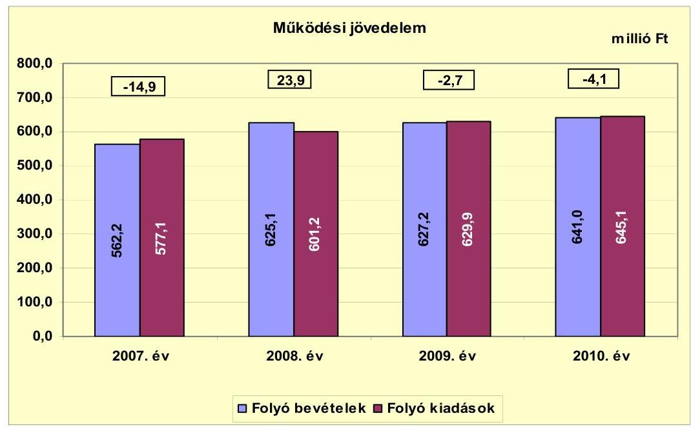

Az Önkormányzat a vizsgált időszakban pályázatokat nyújtott be a működőképességének megőrzését szolgáló kiegészítő támogatásokra. A 2007. évben 64,8 millió Ft, a 2008. évben 79,5 millió Ft, a 2009. évben 80,5 millió Ft, a 2010. évben 66,3 millió Ft, a 2011. év I-III. negyedévben 55,3 millió Ft ÖNHIKI támogatásában részesültek, a kapott támogatást a Polgármesteri hivatal és az intézmények működtetésének dologi kiadásaira használták fel. A működésképtelen helyi önkormányzatok támogatása jogcímen 2007-ben 14,5 millió Ft, 2008-ban 15,0 millió Ft, 2009-ben 11,4 millió Ft, 2010-ben 10,5 millió Ft vissza nem térítendő, célhoz nem kötött támogatást kaptak. A kapott támogatások nélkül a működési forráshiány 2007-ben 94,2 millió Ft, 2008-ban 70,6 millió Ft, 2009-ben 94,6 millió Ft, 2010-ben 80,9 millió Ft lett volna.

A működési jövedelem 2008-ban pozitív értéket mutatott. A 23,9 millió Ft működési jövedelem realizálását az eredményezte, hogy - az előző évhez viszonyítva - a működési bevételek növekedése (11,2%-kal) 7,0 százalékponttal meghaladta a működési kiadások növekedési ütemét (4,2%). A működési bevételek emelkedéséhez hozzájárult az (Óvodában, Általános Iskolában, Idősek Otthonában) ellátottak számának emelkedése, valamint a működőképesség megőrzését szolgáló kiegészítő támogatások miatt 50,0 millió Ft-tal nőtt a központi támogatás, továbbá a helyi adókból 9,0 millió Ft bevételi többlet mutatkozott az előző évhez képest. A működési jövedelem 2009-ben és 2010-ben elmaradt a 2008. évitől, értéke 2009-ben -2,7 millió Ft, 2010-ben -4,1 millió Ft volt. A negatív tendenciát az eredményezte, hogy a működési kiadások növekedési üteme meghaladta a működési bevételek növekedésének ütemét. A vizsgált időszakban az együttes működési jövedelem 2,2 millió Ft megtakarítást mutatott.

---

Az Önkormányzat pénzügyi kapacitása (nettó működési jövedelem) a vizsgált időszakban negatív értéket mutatott. A nettó működési jövedelem ${ }^{14}$ értéke a folyó költségvetési pozíció mellett az adott költségvetési év adósságtörlesztésének a hatását is tükrözi. A fejlesztési célú hitelekhez kapcsolódó 84,2 millió Ft tőketörlesztés kifizetését követően 82,0 millió Ft negatív nettó működési jövedelem keletkezett. A nettó működési jövedelem negatív értéke az Önkormányzat fennálló kötelezettségei megfizetéséhez, valamint fejlesztéseihez felhasználható források elvesztését jelenti.

Az Önkormányzat nettó működési jövedelmének évenkénti alakulását az alábbi ábra szemlélteti:
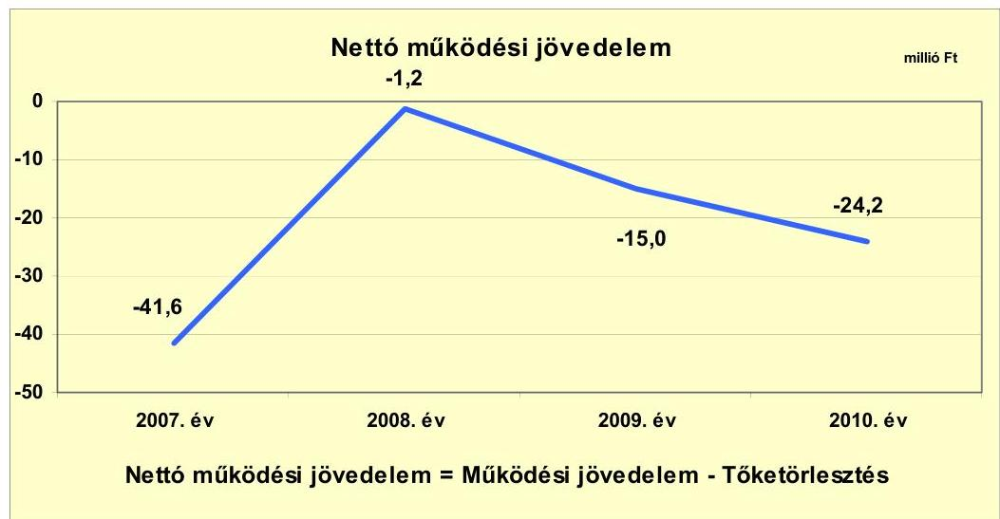

Az Önkormányzat működési jövedelme - a vizsgált időszak
 évei közül - a 2007. évben volt a legalacsonyabb, amelyet 26,6 millió Ft hiteltörlesztési kötelezettség terhelt. A két tényező együttes hatására 41,6 millió Ft negatív nettó működési jövedelem keletkezett. A negatív nettó működési jövedelem 2007-ről 2008-ra történt 40,4 millió Ft-os mérséklődését alapvetően a működési jövedelem 38,8 millió Ft-os növekedése eredményezte. A nettó működési jövedelem előző évhez viszonyított gyengülését a 2009. évben a folyó kiadások növekedése miatti működési jövedelem csökkenés okozta, mivel a hiteltörlesztés kötelezettség az előző évi 25,1 millió Ft-ról 12,3 millió Ft-ra csökkent. A folyó kiadások 2009. évi - előző évhez viszonyított - 4,8%-os növekedését a városgazdálkodási feladatokhoz kapcsolódó közfoglalkoztatás eredményezte. A 2010. évi - előző évhez viszonyított - nettó működési jövedelem csökkenést alapvetően a hiteltörlesztés 7,8 millió Ft-os növekedése határozta meg.

A 2007-2010. években az Önkormányzat felhalmozási költségvetésének egyenlege - a 2008. év kivételével - negatív összegű volt.

[^0]
[^0]:    ${ }^{14}$ Pénzügyi kapacitás

---

A felhalmozási költségvetés egyenlegének alakulását 2007-2010 években a következő ábra szemlélteti:
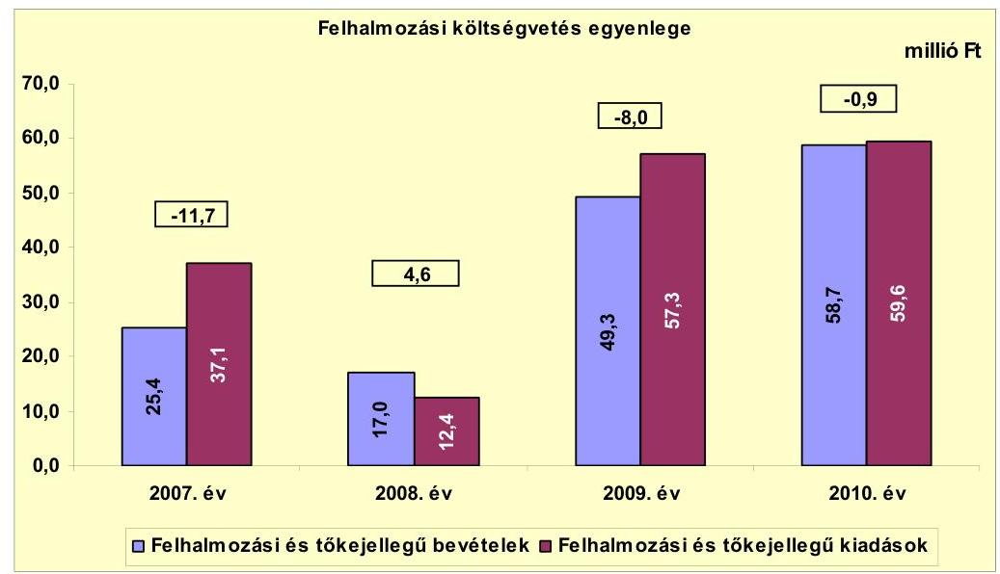

A felhalmozási forráshiány kialakulásához hozzájárult, hogy a 2007-ben és a 2009-2010. években megvalósított jelentős fejlesztések (szennyvízhálózat bővítés, óvodaépítés, térrendezés) kiadásai meghaladták a fedezetként rendelkezésre álló saját bevételt, illetve EU-s és hazai támogatások bevételeit. A 2008. évi forrástöbblet realizálását eredményezte, hogy az alapvetően (79,4%-ban) az Idősek Otthonába beköltözők által fizetett egyszeri hozzájárulásból (13,5 millió Ft) származó felhalmozási bevétel terhére 12,4 millió Ft felhalmozási kiadást teljesítettek. A vizsgált időszakban keletkezett 16,0 millió Ft felhalmozási forráshiány finanszírozása a fejlesztési célú hitelekből történt ${ }^{15}$.

Az Önkormányzat évenkénti teljes finanszírozási igénye ${ }^{16}$ a CLF módszer szerint 2007-ben 53,3 millió Ft, 2009-ben 23,0 millió Ft, 2010-ben 25,1 millió Ft volt, melynek forrását az egyéb finanszírozási kiadásokkal korrigált hitelbevételek és egyéb finanszírozási bevételek biztosították. A 2008. évben realizált folyó és felhalmozási bevételek együttes összege fedezetet nyújtott a tárgyévi kiadásokra és tőketörlesztési kötelezettség teljesítésére.

[^0]
[^0]:    ${ }^{15}$ Az évenkénti adatokat a jelentés 2. számú melléklete mutatja be.
    ${ }^{16}$ a nettó működési jövedelem és a felhalmozási költségvetés eredője

---

Az Önkormányzat finanszírozási műveletei 2007-2010. években egyenlegének alakulását a következő ábra szemlélteti:
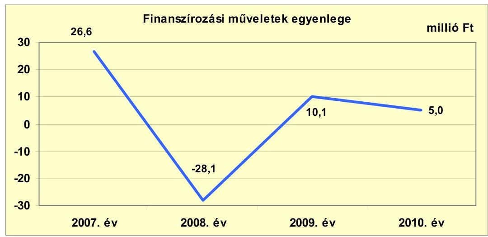

A finanszírozási célú pénzügyi műveletek pozitív értéke azt jelzi, hogy az éves költségvetések végrehajtása során szükség volt külső finanszírozás (felhalmozási célú hitel, támogatást megelőlegező rövid lejáratú hitel, munkabérmegelőlegezési hitel) igénybevételére is. A finanszírozási célú műveleteket a vizsgált időszakban a jelentés 2. számú mellékletének 4.1-4.8 pontjai részletezik.

Az Önkormányzat 2007-2010. évi zárszámadási rendeleteinek mellékleteiben bemutatott működési és felhalmozási hiány/többlet összegéről a jelentés 1. számú melléklete nyújt tájékoztatást. A működési célú bevételeket és kiadásokat, illetve a felhalmozási célú bevételeket és kiadásokat mérlegszerűen bemutató táblázatok egyaránt tartalmaztak finanszírozási célú műveleteket. A működési többlet 2007-ben 2,2 millió Ft, 2008-ban 9,1 millió Ft, 2010-ben 25,4 millió Ft volt. A 2009. évben a működési célú kiadások között elszámolt finanszírozási célú kiadások 3,0 millió Ft-tal meghaladták a működési célú bevételek között elszámolt finanszírozási célú bevételeket, amely hozzájárult a 0,6 millió Ft működési forráshiány kialakulásához. A felhalmozási célú bevételek és kiadások a 2007-2009. években egyensúlyban ${ }^{17}$ voltak, a 2010. évben a felhalmozási célú bevételek 2,1 millió Ft-tal meghaladták a felhalmozási célú kiadásokat.

Az Önkormányzatnak szabad pénzeszköz hiányában nem származott számottevő kamatbevétele a 2007-2010. években, illetve 2011. év I. félévében. Az Önkormányzat kamatbevétele 2007-ben 21 ezer Ft, 2008-ban 9 ezer Ft, 2009-ben 32 ezer Ft, 2010-ben 4 ezer Ft, 2011. év I. félévében 1 ezer Ft volt. Az Önkormányzat által felvett hitelekhez kapcsolódóan 2007-ben 10,5 millió Ft, 2008-ban 13,5 millió Ft, 2009-ben 13,8 millió Ft, 2010-ben 13,5 millió Ft, a

[^0]
[^0]:    ${ }^{17}$ A felhalmozási mérleg főösszege 2007-ben 63,1 millió Ft, 2008-ban 35,4 millió Ft, 2009-ben 74,3 millió Ft volt.

---

2011. év I. félévében 4,8 millió Ft - a vizsgált időszakban összesen 56,1 millió Ft - kamatfizetési kötelezettség keletkezett.

A 2011. évre az Önkormányzat a kamatkiadások további emelkedésével számolt, a költségvetési rendeletben tervezett 14,0 millió Ft kamatkiadás 3,7%-kal, 0,5 millió Ft-tal haladta meg a 2010. évit.

# 2.2. Az Önkormányzat bevételeinek változása 

Az összes folyó bevétel - folyamatos emelkedés mellett - 2007-ről 2010-re 78,8 millió Ft-tal (14,0%-kal) nőtt, 2011. év I. félévben 265,1 millió Ft volt. Az Önkormányzat 2007-2011. év I. félév között realizált főbb bevételi jogcímeinek számszaki adatait a következő grafikon mutatja be:
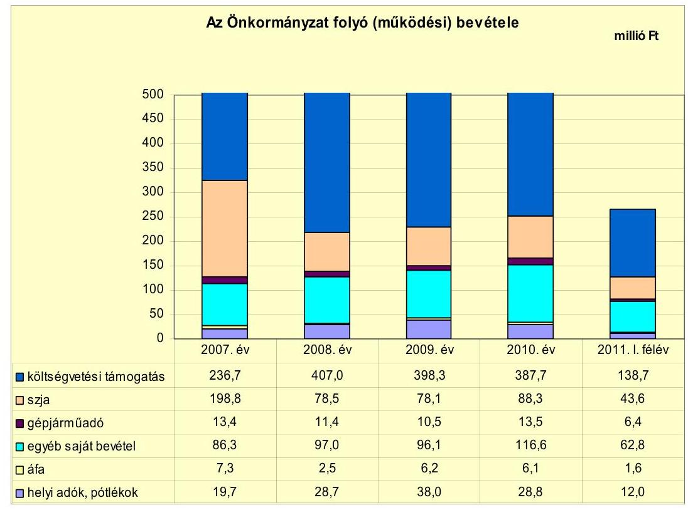

A költségvetési támogatások és az átengedett szja együttes összege a 2007. évi 435,5 millió Ft-ról a 2010. évre 476,0 millió Ft-ra, 9,3%-kal (40,5 millió Ft-tal) nőtt. A vizsgált években az előző évhez viszonyítva - a 2008. évi emelkedést követően - a 2009. évben mérséklődött, a 2010. évben minimálisan csökkent. Az előző évihez képest 2009-ben 1,9%-kal (9,1 millió Ft-tal), 2010-ben 0,1%-kal (0,4 millió Ft-tal) kapott kevesebb forrást az Önkormányzat az államtól ezeken a jogcímeken. A vizsgált időszakban az Önkormányzat által ellátott feladatok köre nem változott, a költségvetési támogatások nagyságának 2008. évi növekedését, majd a 2009. és 2010. évi csökkenését döntően a forrásszabályozásban bekövetkezett változások és az Önkormányzat működőképességének megőrzését szolgáló kiegészítő támogatások befolyásolták. A kapott ÖNHIKI támogatás és a működésképtelen helyi önkormányzatok egyéb támogatása javította az Önkormányzat pénzügyi egyensúlyát, a támogatások együttes össze-

---

ge a 2007. évben 79,3 millió Ft, a 2008. évben 94,5 millió Ft, a 2009. évben 91,9 millió Ft, és a 2010. évben 76,8 millió Ft volt. Vis maior támogatást 2007-ben kaptak 5,6 millió Ft összegben.

Az Önkormányzat egyéb saját bevételei a 2008-2010. években meghaladták a 2007. évit, a 2007. évi 86,3 millió Ft-ról a 2010. évre 35,1%-kal (116,6 millió Ft-ra) nőttek, 2011. év I. félévében 62,8 millió Ft-ot realizáltak. Az egyéb saját bevételek növekedésében meghatározó szerepet játszott az egyéb saját bevételek 72,8-83,5%-át alkotó intézményi működési bevételek alakulása.

Az Önkormányzat helyi adóbevételei 2009-ben - a vizsgált időszak többi évéhez viszonyítva - kiemelkedően magas összegben teljesültek. A realizált 38,0 millió Ft helyi adó bevételből 12,0 millió Ft egy vállalkozó iparűzési adó túlfizetése volt, melyet a 2010. évben visszafizetett az Önkormányzat. A helyi adók és kapcsolódó pótlékok az Önkormányzat folyó bevételeiből - a 2009. évben a 12,0 millió Ft korrekció figyelembe vételével - 3,5-4,6% részarányt képviseltek.

A helyi adók köre (iparűzési adó, magánszemélyek kommunális adója) 2009. január 1-jétől kibővült az idegenforgalmi adóval, ugyanettől az évtől a magánszemélyek kommunális adójának mértéke $5000 \mathrm{Ft} /$ évről $7000 \mathrm{Ft} /$ évre emelkedett. A 2009-ben bevezetett idegenforgalmi adóból nem keletkezett számottevő bevétele az Önkormányzatnak. A 2009. évben 0,5 millió Ft, 2010-ben 0,8 millió Ft bevételt realizáltak ezen a jogcímen. A helyi adók közül meghatározó az iparűzési adó, melynek mértéke 2%, aránya a helyi adókon belül 2010-ben 71,5% (20,6 millió Ft) volt.

Az Önkormányzat felhalmozási bevételeinek szerkezete a vizsgált időszakban a következőképpen alakult:

| Megnevezés | 2007. év | 2008. év | 2009. év | 2010. év | 2011. év I.   félév |
| :-- | :--: | :--: | :--: | :--: | :--: |
| Tárgyi eszköz értékesítés | 2,1 | 0,6 | 1,7 | 0,0 | 0,0 |
| Egyéb saját tőkebevétel | 5,0 | 0,0 | 0,0 | 0,0 | 0,0 |
| Államháztartáson belülről   kapott támogatás | 0,0 | 2,2 | 0,0 | 9,5 | 14,4 |
| EU-tól és külföldről kapott   támogatások | 0,0 | 0,0 | 39,7 | 34,1 | 0,0 |
| Államháztartáson kívülről   kapott támogatás | 18,3 | 14,2 | 7,9 | 15,1 | 7,6 |
| Összes felhalmozási bevétel | 25,4 | 17,0 | 49,3 | 58,7 | 22,0 |

---

A felhalmozási bevételek jelentős hányadát a kapott támogatások (államháztartáson belülről-, államháztartáson kívülről-, EU-tól kapott támogatások) tették ki. Az összes felhalmozási bevétel 2007-ben 72,0%-a (18,3 millió Ft), 2008-ban 94,1%-a (16,4 millió Ft), 2009-ben 96,6%-a (47,6 millió Ft) 2010-ben és 2011. év I. félévben 100%-a (58,7 millió Ft, 22,0 millió Ft) realizálódott ezekből a jogcímekből. Az államháztartáson belülről, illetve az EU-tól kapott támogatások a fejlesztési feladatok végrehajtásához kapcsolódtak. Az államháztartáson kívülről kapott támogatások döntő részét az Idősek Otthonába beköltözők által fizetett egyszeri hozzájárulás képezte, melynek összege 2007-ben 18,0 millió Ft, 2008-ban 13,5 millió Ft, 2009-ben 7,5 millió Ft, 2010-ben 15,0 millió Ft, és a 2011. év I. félévében 7,6 millió Ft volt.

# 2.3. Az Önkormányzat működési és a felhalmozási célú kiadásainak változása 

Az Önkormányzat folyó kiadásai főbb jogcímek szerinti bontásban a következők voltak:

| Megnevezés | 2007. év | 2008. év | 2009. év | 2010. év | 2011. év I.   félév |
| :-- | --: | --: | --: | --: | --: |
| Folyó kiadások | 577,1 | 601,2 | 629,9 | 645,1 | 260,1 |
| Működési kiadások (kamatkiadás nélkül) | 477,6 | 498,9 | 539,6 | 562,4 | 219,5 |
| Államháztartáson belülre átadott   pénzeszközök | 1,8 | 1,9 | 1,4 | 0,5 | 0,0 |
| Transzferkiadások | 87,2 | 86,9 | 75,1 | 68,7 | 35,8 |
| ebből: magánszemélyeknek | 81,4 | 80,1 | 71,3 | 63,9 | 35,4 |
| nonprofit szervezeteknek | 5,8 | 6,8 | 3,8 | 4,8 | 0,4 |
| Kamatkiadások | 10,5 | 13,5 | 13,8 | 13,5 | 4,8 |
| Előző évi pénzmaradvány átadás | 0,0 | 0,0 | 0,0 | 0,0 | 0,0 |

Az Önkormányzat működési kiadása a folyó kiadásoknak 2007-ben 82,8%-át (477,6 millió Ft), 2008-ban 83,0%-át (498,9 millió Ft), 2009-ben 85,7%-át (539,6 millió Ft), 2010-ben 87,2%-át (562,4 millió Ft), 2011. év I. félévében 84,4%-át (219,5 millió Ft) képezte.

Az Önkormányzat teljesített működési kiadásai a 2007-2009 évek átlagában 505,4 millió Ft-ot tettek ki. A 2010. évben teljesített működési kiadások 562,4 millió Ft-os összege 11,3%-kal haladta meg az előző három év átlagos évi kiadási mértékét. A 2010. évi működési kiadások 69,6%-át (391,0 millió Ft-ot) a személyi juttatások és a munkaadókat terhelő járulékok, 27,9%-át (156,7 millió Ft-ot) az üzemeltetést, intézményfenntartást biztosító dologi kiadások, 16,0%-át (90,2 millió Ft-ot) az egyéb folyó kiadások képviselték.

|  |  |  |  |  | millió Ft |
| :--: | :--: | :--: | :--: | :--: | :--: |
| Megnevezés | 2007. év | 2008. év | 2009. év | 2010. év | 2011.év I.   félév |
| Személyi juttatások

 | 259,4 | 258,7 | 287,0 | 315,5 | 132,0 |
| Munkaadót terhelő járulékok | 81,1 | 83,9 | 82,7 | 75,5 | 34,1 |
| Dologi kiadások | 120,9 | 145,4 | 160,2 | 156,7 | 45,1 |
| Egyéb folyó kiadások | 16,2 | 10,9 | 5,6 | 7,6 | 3,9 |

---

A személyi juttatások 2008-ban az előző évi szinten teljesültek, azonban ezt követően mindkét évben nőttek a városgazdálkodási feladatok végrehajtásához kapcsolódó közfoglalkoztatás eredményeként. A 2010. évben a 2007-2009. években átlagosan teljesített 268,4 millió Ft kiadásnál 17,5%-kal (47,1 millió Ft-tal) voltak magasabbak.

A munkaadókat terhelő járulékok 2010. évi összege 7,1 millió Ft-tal, 8,6%-kal maradt el az előző három év átlagától (82,6 millió Ft), amelyben a foglalkoztatókat terhelő társadalombiztosítási járulék mértékének 2009. évtől történő csökkentésének, illetve a tételes egészségügyi hozzájárulás megszűnésének hatása együttesen jelent meg.

A dologi kiadások a 2007-2009. évek átlagában 142,2 millió Ft-ot tettek ki. A 2010. évben teljesített működési kiadások 156,7 millió Ft-os összege 10,2%-kal haladta meg az előző három év átlagos évi kiadási mértékét, ugyanakkor 3,5 millió Ft-tal (2,2%-kal) elmaradtak a 2009. évitől. Az előző évhez viszonyított 2010. évi kiadáscsökkenést az Önkormányzat nehéz pénzügyi helyzete miatti takarékossági intézkedések (beszerzések, szolgáltatások igénybevételének minimalizálása) eredményezték.

A folyó és felhalmozási kiadások összetételét a következő grafikon szemlélteti:
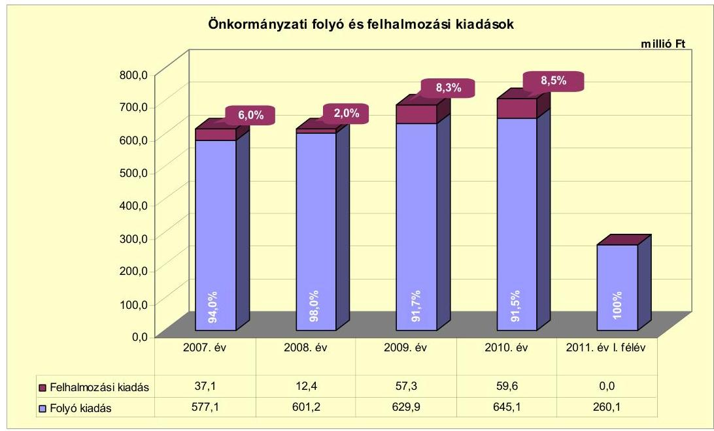

A folyó és felhalmozási kiadások 2010. évi aránya a 2007. évihez képest minimális változást mutat, a folyó kiadások aránya 2,5 százalékponttal csökkent a felhalmozási kiadások arányának javára. Az Önkormányzat a felhalmozási célú kiadásokra 2008-ban költött a legkevesebbet (12,4 millió Ft-ot), ami az összes kiadás (613,6 millió Ft) 2,0%-ának felelt meg, 2011. év I. félévében nem teljesítettek felhalmozási kiadást.

A 2007-2010. évek között befejezett 10 millió Ft teljes bekerülési költség feletti négy fejlesztés finanszírozására a 10 millió Ft alatti 11 fejlesztéssel együtt - amelynek összértéke 17,4 millió Ft-ot tett ki - 286,5 millió Ft-ot fordítottak. Pá-

---

lyázati források felhasználásával három fejlesztési cél valósult meg, melyből kettő EU-s projekt volt. A 389,8 millió Ft beruházási összköltségből a hazai támogatás 33,4%-ot (130,2 millió Ft-ot), az EU támogatás 18,9%-ot (73,8 millió Ft-ot), a felvett hitel 15,8%-ot (61,4 millió Ft-ot), a saját bevétel 31,9%-ot (124,4 millió Ft-ot) tett ki.

Az Önkormányzat folyamatban lévő két fejlesztési feladatának (belterületi és külterületi kerékpárút építés) 2010. december 31-ig teljesített bekerülési költsége 3,6 millió Ft volt, amelyet saját forrásból finanszíroztak.

A 2010. december 31-én folyamatban lévő és a 2010. évet követő kötelezettségvállalásainak összege 117,4 millió Ft volt, amelynek tervezett forrása 105,8 millió Ft európai uniós támogatás (90,1%), és 11,6 millió Ft saját bevétel (9,9%).

A vizsgált időszakban befejeződött három legjelentősebb fejlesztés a következő volt:

- a szennyvízhálózat bővítése a 2007-2008. években 152,6 millió Ft teljes bekerülési költség mellett valósult meg, melynek forrása 22,4 millió Ft (14,7%) hitel, 130,2 millió Ft (85,3%) hazai támogatás volt;
- Máriapócs városközpontjának - a műemlékhez méltó környezet kialakítása érdekében végzett - kialakítása 2008-ban kezdődött és 2009-ben fejeződött be. Az 53,1 millió Ft bekerülési költségből 3,9 millió Ft (7,3%) saját bevétel, 9,5 millió Ft felvett hitel (17,9%), 39,7 millió Ft (74,8%) EU-s támogatás volt;
- a máriapócsi városközpont rehabilitációját - az egységes műemléki környezet kialakítása érdekében - 2010-ben hajtották végre. Az 55,0 millió Ft teljes bekerülési költségből a saját bevétel 6,4 millió Ft-ot, a felvett hitel 14,5 millió Ft-ot (4,0%), az EU-s támogatás 34,1 millió Ft-ot (75,0%) tett ki.

# 3. Az ÖNKORMÁNYZAT KÖTELEZETTSÉGEI 

### 3.1. Az Önkormányzat pénzintézeti kötelezettségeinek változása

Az Önkormányzat mérleg szerinti¹⁸ pénzintézeti kötelezettségeinek állománya az áttekintett időszakban jelentősen nem változott, az évek szerinti átlaga 126,1 millió Ft volt. A legnagyobb (144,1 millió Ft) volt az állomány 2007. december 31-én a megkétszereződött állományú munkabér-megelőlegezési hitel és az év közben felvett 22,9 millió Ft, illetve 7,0 millió Ft összegű hosszú lejáratú hitelek miatt. Legkevesebb (105,8 millió Ft) 2011. június 30-án volt a hosszú lejáratú hitelek 2007-2010. között teljesített visszafizetései következtében.

[^0]
[^0]: ¹⁸ Az Önkormányzat könyvviteli mérlegei - téves könyvelési tételek miatt - nem pontosan tükrözik a pénzintézeti kötelezettségek állományát. A diagram a valós adatokat tartalmazza, ezért eltér a könyvviteli mérlegben rögzítettektől.

---

A fennálló pénzintézeti kötelezettségek az önkormányzati fejlesztésekhez forrást biztosító hosszú lejáratú hitelek felvételéből, egyéb likvid hitelek, valamint folyószámlahitel és munkabér-megelőlegezési hitel igénybevételéből keletkeztek. Az ellenőrzött időszakban az Önkormányzatnak négy hosszú lejáratú és három rövid lejáratú hitele volt, minden évben rendelkezett folyószámlahitel-kerettel és rendszeresen igénybe vette a munkabér-megelőlegezési hitelt is. A pénzintézetekkel szemben fennálló kötelezettségek állományának változását a következő diagram szemlélteti:
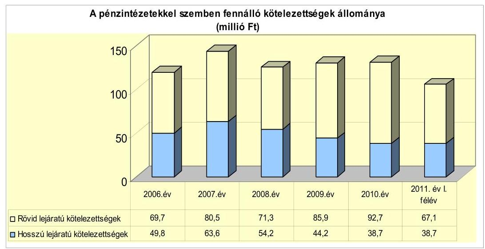

A Képviselő-testület a forráshiány kezelése érdekében - a 2007-2010. évi költségvetési rendeletekben - ÖNHIKI támogatás és finanszírozási előleg igényléséről, valamint folyószámlahitel igénybevételéről döntött. A 2011. évi költségvetési rendelet a hiány miatt folyószámla-, illetve munkabér-megelőlegezési hitel, valamint központi támogatások igénybevételéről rendelkezett. A pénzintézeti kötelezettségvállalások teljesítésére, az adósság kezelése érdekében ingatlanvagyon értékesítését¹⁹ tervezték.

Az áttekintett időszakban az adósságot keletkeztető kötelezettségvállalásának felső határát - az Ötv. 88. § (2) bekezdésében előírtak ellenére - a 2007. évben túllépte az Önkormányzat. A tárgyévet terhelő rövid lejáratú kötelezettségei 46,7 millió Ft-tal meghaladták a korrigált saját bevétel éves összegét. Az ezt követő években nem került sor hosszú lejáratú pénzintézeti kötelezettségek vállalására.

A pénzintézeti kötelezettségvállalásokra minden esetben képviselő-testületi döntés alapján került sor, a pénzintézetek versenyeztetésének mellőzésével. Az önkormányzati feladatok finanszírozásához szükséges hitelekért kizárólagosan a számlavezető pénzintézethez fordultak.

A hitelfelvételekhez kapcsolódó képviselő-testületi előterjesztések nem tartalmazták a teljes futamidő várható kamat- és tőkefizetési kötelezettségeit és a kamatkockázatot sem mutatták be. A megkötött szerződések alapján a hitelekhez kapcsolódó kötelezettségvállalások három éves tőkefizetési kötelezettségeit az Önkormányzat - vizsgált időszakra vonatkozó - költségvetési és zárszámadási rendeletei minden esetben tartalmazták. A kötelezettségvállalásból származó források felhasználási céljait az Önkormányzat meghatározta.

Az Önkormányzat valamennyi hosszú lejáratú kötelezettségvállalása fejlesztési célhoz kapcsolódott és forint alapú hitelkonstrukció volt. A következő táblázat az Önkormányzat 2011. június 30-án²⁰ fennálló hosszú lejáratú pénzintézeti kötelezettségvállalásait részletezi:

| Megnevezés | Szerződéskötés/   Kibocsátás   időpontja | Összeg   millió Ft | Kamat (referencia kamat+   kamatfelár) | Felhasználás célja: |
| :-- | :--: | :--: | :--: | :-- |
| Ö 44002003003800 hitel | 2003. 08. 22 | 143,2 | 3 havi BUBOR +0,5% | Idősek Otthona építése |
| Ö 44002005017100 hitel | 2006. 01. 18 | 15,0 | 3 havi EURIBOR +1,8% | Városi Óvoda építése |
| 1-2-07-4400-0356-6 hitel | 2007. 04. 16 | 22,9 | 3 havi EURIBOR +2,0% | Szennyvízberuházás II. ütem |
| 1-2-07-4400-0529-4 célhitel | 2007. 05. 23 | 7,0 | 3 havi BUBOR +2,0% | Ivóvíz-beruházás |

A táblázatban szereplő hitelek lehívása és a célnak megfelelő felhasználása megtörtént, valamennyi hitelnek elkezdődött a tőketörlesztése, a kamatok és egyéb költségek szerződés szerinti fizetése.

Az ellenőrzött időszakban négy hosszú lejáratú hitel törlesztésére kellett forrást biztosítani az Önkormányzatnak. A 2003-ban felvett hitel az Idősek Otthona építéséhez adta a saját erőt, 2006-ban a Városi Óvoda beruházásához szükséges forrást egészítették ki az Önkormányzati Infrastruktúra Fejlesztési Hitelprogram keretében, 2007-ben pedig a környező településekkel összefogva az ivóvíz minőségének javítását szolgáló beruházásba kezdtek és folytatták a szennyvízberuházás II. ütemét.

A felsorolt hosszú lejáratú hitelekkel kapcsolatosan az Önkormányzat 2007-2010. között²¹ 49,6 millió Ft tőkét törlesztett, kamat és egyéb költségek címén 18,0 millió Ft-ot fizetett. A 2011. év első félévében összesen 3,0 millió Ft tőketartozás és 1,3 millió Ft kamat és egyéb költség megfizetését teljesítették.

Az Önkormányzat működésének pénzügyi egyensúlyát a vizsgált időszakban csak folyószámlahitel és munkabér-megelőlegezési hitel igénybevételével tudta biztosítani.

[^0]
[^0]: ²⁰ Az Önkormányzat 2010. december 31-én fennálló hosszú lejáratú pénzintézeti kötelezettségvállalásai megegyeznek a táblázatban szereplő hosszú lejáratú pénzintézeti kötelezettségvállalásokkal.
²¹ A 2007. évben 19,4 millió Ft tőkét törlesztett, kamat és egyéb költség címén 5,6 millió Ft-ot fizettek ki. A 2008. évben 11,4 millió Ft tőkét törlesztett, kamat és egyéb költség címén 5,1 millió Ft-ot fizettek ki. A 2009. évben 9,0 millió Ft tőkét törlesztett, kamat és egyéb költség címén 3,7 millió Ft-ot fizettek ki. A 2010. évben 9,8 millió Ft tőkét törlesztett, kamat és egyéb költség címén 3,6 millió Ft-ot fizettek ki.

---

Az igénybevett folyószámlahitel és a munkabér-megelőlegezési hitelek jellemző adatait a következő táblázat mutatja be:

| Megnevezés | 2007. év | 2008. év | 2009. év | 2010. év | 2011. év I.   félév |
| :--: | :--: | :--: | :--: | :--: | :--: |
| I. Folyószámlahitel |  |  |  |  |  |
| a folyószámlahitel keretösszege január 1-jén | 30,0 | 40,0 | 40,0 | 40,0 | 55,0 |
| átlagos napi állomány | 33,6 | 37,0 | 33,0 | 43,6 | 48,1 |
| teljesített kamat és egyéb költség | 3,3 | 4,4 | 5,6 | 6,3 | 4,1 |
| II. Munkabér-megelőlegezési hitel |  |  |  |  |  |
| Igénybevett hitel összesen: | 265,0 | 324,0 | 323,0 | 312,0 | 129,0 |
| átlagos napi állomány | 0,7 | 0,9 | 0,9 | 0,9 | 0,7 |
| teljesített kamat és egyéb költség | 2,9 | 2,7 | 3,5 | 2,4 | 1,2 |

Az Önkormányzat a vizsgált évek napjainak mintegy kétharmadán igénybe vette a folyószámlahitelt. Az átlagos napi állomány 2007-2009. évek között 34,5 millió Ft volt, ami a vizsgált időszak végére elérte a 48,0 millió Ft-ot.

A romló likviditási helyzet miatt 2010. decemberében a folyószámlahitelkeret összegét megemelték. December 13-án a hitel záró állománya 39,0 millió Ft volt, december 14-én - az új hitelkeret érvénybelépésével - a fizetési kötelezettségek teljesítése miatt, elérte a 46,1 millió Ft-ot. A folyószámlahitel állománya 2010. december 31-én 43,4 millió Ft, 2011. június 30-án pedig 43,2 millió Ft volt.

A 2010. novemberi képviselő-testületi ülésre készült előterjesztés szerint a folyószámlahitel-keret megemelését az Önkormányzat gazdálkodásának biztonságos finanszírozása tette indokolttá. Ezt támasztotta alá az a tény, hogy október végén fennálló fizetési kötelezettségük összesen 85,4 millió Ft volt. A szállítói tartozásuk elérte a 45,2
 millió Ft-ot, helyi adó visszafizetési kötelezettségük 6,7 millió Ft és a hosszú lejáratú kötelezettségvállalásaikból adódó fizetési kötelezettségük 33,5 millió Ft volt.

A hitelkeret emelése érdekében az Önkormányzat kötelezettséget vállalt arra, hogy „a hitelezés éveiben a költségvetés összeállításakor a működési kiadásokat követően, de minden egyéb fejlesztési kiadást megelőzően a hitel törlesztésére és kamataira előirányzatot biztosít és jóváhagy". Az Önkormányzat gazdálkodásának finanszírozásához a folyószámlahitel igénybevétele tartóssá vált, 2011-ben már csaknem minden napot folyószámlahitellel zártak.

A tartós likviditási problémák miatt az Önkormányzat 2007-től a munkabérek kifizetéséhez munkabér-megelőlegezési hitelt vett igénybe. A bankszámla-szerződésben a számlavezető pénzintézet úgy rendelkezett, hogy a munkabér-megelőlegezési hitel kerete ${ }^{22}$ maximum az Önkormányzat havi bérelőirányzata, a visszafizetési határidő a lehívástól számított 30 nap. A hitel igénybevételére a vizsgált időszak minden hónapjában sor került, a hitel átlagos na-

[^0]
[^0]:    ${ }^{22}$ Az Önkormányzat minden bérkifizetés előtt kérelemmel fordult a számlavezető pénzintézethez, munkabérmegelőlegezési-hitelért. A pénzintézet minden alkalommal külön döntésben engedélyezte a felhasználható hitelkeretet.

---

pi állománya a vizsgált években 0,7 millió Ft és 0,9 millió Ft között változott. A törlesztések a normatív állami támogatásokból és az szja-ból az igénybevételt követő hónapban megtörténtek. A munkabérhitel állománya 2010. december 31-én 23,1 millió Ft, 2011. június 30-án 19,0 millió Ft volt.

Kamat és egyéb költség címén az Önkormányzat a vizsgált időszakban a folyószámlahitellel kapcsolatosan összesen 23,7 millió Ft-ot, munkabérmegelőlegezési hitelhez kötődően összesen 12,7 millió Ft-ot fizetett ki.

A folyószámlahitel és munkabér-megelőlegezési hitelek kondíciói ${ }^{23}$ és egyéb költségei a következők voltak:

| Megnevezés | Kamat (referencia+ kamatfelár) | Egyéb költség |
| :--: | :--: | :--: |
| Folyószámlahitel |  |  |
| 2007.01.01-2010.12.12. | 3 havi BUBOR $+1,5 \%$ | $0,5 \%$ kez. dij $+0,5 \%$   rend.tart.jutalék |
| 2010.12.13-2011.11.22. | Prime rate $+0 \%$ | $0,5 \%$ kez.ktg + 3\%   rend.tart.jutalék |
| Munkabér-megelőlegezési hitel |  |  |
| 2007.01.01-2009.01.04. | 3 havi BUBOR $+2,00 \%$ | 0 |
| 2009.01.05-2010.04.07. | 3 havi BUBOR $+4,25 \%$ | 0 |
| 2010.04.08-2011.06.30. | Prime rate $+0,0 \%$ | 0 |

Az Önkormányzat a likviditási gondjai miatt 2007-2010 között három likvid hitelt is igénybe vett. Kettő fejlesztési cél ${ }^{24}$ megvalósításához a pályázati támogatást megelőlegező hitel volt 23,9 millió Ft, egy pedig a szállítói tartozásainak rendezésére szolgált 7,0 millió Ft összegben. A 2011. évben megkötésre került még két - pályázati támogatást megelőlegező - hitelszerződés, amit a vizsgált időszakban még nem hívtak le. A likvid hitelek igénybevételéhez kapcsolódó kamat és egyéb kiadások összege 1,5 millió Ft volt, amiből 1,2 millió Ft felhalmozási célú kiadásokhoz kötődött.

A 2011. június 30-án fennálló hosszú lejáratú fejlesztési hitelek esetében a kamatfizetési kötelezettségek alakulását jelentősen befolyásolta és jelenleg is befolyásolja a hitelfelvételkor és az utolsó kamatfizetéskor alkalmazott kamatok változása, amelyet a következő táblázat mutat be:

| Megnevezés | Kibocsátási, lehivási | Utolsó fizetéskori | Változás \% |
| :--: | :--: | :--: | :--: |
|  | kamat (referencia+kamatfelár) |  |  |
| 3 havi BUBOR (2003.08.22-i szerződés) | 10,14 | 10,35 | 2,1\% |
| 3 havi EURIBOR (2006.01.18-i szerződés) | 4,308 | 5,044 | 17,1\% |
| 3 havi EURIBOR (2007.04.16-i szerződés) | 5,914 | 4,044 | -31,6\% |
| 3 havi BUBOR (2007.05.23-i szerződés) | 9,8 | 10,35 | 5,6\% |

[^0]
[^0]:    ${ }^{23}$ A számlavezető pénzintézet a 2010. évtől az Önkormányzat hiteleihez a prime rate (a leghitelképesebb ügyfeleknek felszámított kamatláb) irányadó kamatlábat biztosította, ami a 2010-ben és 2011. év I. félévében 15,5\% volt az Önkormányzat adatszolgáltatása alapján. A 3 havi BUBOR referencia kamat átlaga 2007-ben 7,75\%, 2008-ban 8,87\%, 2009-ben 8,64\%, 2010-ben 5,51\%, és 2011. június 30-ig 6,07\% volt.
    ${ }^{24}$ A két fejlesztési cél a városközpont rehabilitációjának I-II. üteme volt.

---

Az Önkormányzat számára az alapkamatok változása kedvezően alakult, azonban az alapkamatok csökkenését a folyósító pénzintézet - egyoldalú szerződés-módosítással - a kamatfelár növelésével kompenzálta. Ezáltal az érvényesített kamatláb csak egy esetben csökkent, a többinél kis mértékben növekedett.

A kamatfelár a 2003. 08. 22-i szerződés szerinti hitelnél 3,8\%-kal, a 2006. 01. 18-i szerződés szerinti hitelnél 1,7\%-kal, a 2007. 04. 16-i szerződés szerinti hitelnél 0,5\%-kal és a 2007. 05. 23-i szerződés szerinti hitelnél pedig 1,2\%-kal nőtt. A hitelek táblázatban rögzített sorrendjében az alapkamat mértéke 37,0\%-kal, 38,7\%-kal, 68,5\%-kal, illetve 21,7\%-kal csökkent a lehívási értékhez képest.

A következő táblázat az Önkormányzat kötelezettségeinek alakulását mutatja:

| Megnevezés | Állomány 2010.   december 31-én | Állomány 2011.   június 30-án | Várható   kötelezettség   2011-2013.   években | Várható   kötelezettség   2014. évtől |
| :-- | :--: | :--: | :--: | :--: |
|  | HUF-ban (millió   Ft-ban) | HUF-ban (millió   Ft-ban) | HUF-ban (millió Ft   ban) | HUF-ban (millió   Ft-ban) |
| Pénzintézeti kötelezettségek |  |  |  |  |
| Hosszú lejáratú hitelek | 44,7 | 41,7 | 24,7 | 33,0 |
| Egyéb likvid hitelek | 20,2 | 1,9 | 1,9 |  |
| Folyószámla hitel | 43,4 | 43,2 | 43,2 |  |
| Munkabér-megelőlegezési hitel | 23,1 | 19,0 | 19,0 |  |
| Pénzintézeti kötelezettségek összesen | 131,4 | 105,8 | 88,8 | 33,0 |
| Szállítói tartozás | 32,1 | 66,5 | 66,5 |  |
| MINDÖSSZESEN | $\mathbf{163,5}$ | $\mathbf{172,3}$ | $\mathbf{155,3}$ | $\mathbf{33,0}$ |

A pénzintézeti kötelezettségek állománya ${ }^{25}$ 2010. év végéről 2011. június 30-ára közel 20,0\%-kal csökkent - a hosszú, illetve rövid lejáratú hitelek teljesített visszafizetései következtében. A várható fizetési kötelezettségek (tőke, kamat ${ }^{26}$ és egyéb költség) összege 2011-2013. években 88,8 millió Ft, a 2014. évtől pedig 33,0 millió Ft.

Az Önkormányzat összes kötelezettségének állománya pénzintézeti kötelezettségekből és szállítói tartozásból tevődik össze. A várható kötelezettségek összege a 2011-2013. években összesen 155,3 millió Ft, a 2014. évtől a pénzintézeti kötelezettséggel egyezően 33,0 millió Ft lesz.

# A 2011-2013. évek kötelezettségeinek teljesítésére figyelembe vehető a mérlegében kimutatott 7,0 millió Ft követelésállomány, valamint az Önkormányzat tájékoztatása és a megkötött hitelszerződések alapján a helyi adókból 

[^0]
[^0]:    ${ }^{25}$ A táblázatban szereplő hosszú lejáratú kötelezettségek állománya eltér a 3.1. ábrában rögzített értékektől, mivel a diagramnak a mérleg szerinti állományt kell bemutatnia. A mérlegben kimutatott hosszú lejáratú követelésállomány nem tartalmazza már a hosszú lejáratú hitelek tárgyévet követő fizetési kötelezettségeinek összegét, mivel az átkerül a rövid lejáratú kötelezettségek közé. Ebben a táblázatban a 14-es számú tanúsítványok alapján összegzett kötelezettségek szerepelnek, ami a kifizetések alapján számol.
    ${ }^{26}$ a legutóbbi kamatfizetés feltételei alapján számítva

---

és az egyéb sajátos bevételekből származó pénzeszközök is felhasználhatók erre a célra. A 2014. évtől várható - a vizsgált időszak végén ismert - kötelezettsége teljesítésére az Önkormányzat a forrásokat nem számszerúsítette. A kötelezettségek teljesítéséhez a képződő működési jövedelem és az Önkormányzat által meghozott kiadáscsökkentő és bevételnövelő intézkedések rövid távon sem biztosítanak elegendő többletforrást, ezek teljesítése csak további kiadáscsökkentő és bevételnövelő intézkedések útján elért megtakarítások, valamint egyéb külső források bevonásával lehetséges.

# 3.2. A szállítói kötelezettségek változása 

Az Önkormányzat valamennyi mérleg szerinti szállítói kötelezettsége lejárt tartozás volt, és az áttekintett időszakban megnövekedett. A 2007-2010. évek év végi lejárt szállítói állományának átlaga 15,4 millió Ft volt, ennek több mint négyszerese lett a 2011. június 30-i lejárt tartozás összege. A szállítói tartozás állománya a 2010. év végén az összes kötelezettségnek mintegy a negyedét, 2011. június 30-án már a 40,2\%-át tette ki.

Az Önkormányzat 2010. október 15-én a lejárt szállítói tartozások rendezésére 7,0 millió Ft összegben, éven belüli lejárattal hitelt vett fel. A hitel a 2010. szeptember 28-i tartozásállományból a 60 napon túli szállítói tartozások rendezésére szolgált.

A likviditási problémák miatt az Önkormányzat szállítói tartozása a 2010. évben felhalmozódott, a december 31-ei mérlegben szállítói kötelezettségként 32,1 millió Ft lejárt tartozást mutattak ki. Ennek mintegy fele (17,2 millió Ft) 30 napon túli volt, azonban 90 napot meghaladó tartozásuk nem volt. Az Önkormányzat lejárt szállítói tartozásállománya 2010. év végéről 2011. június 30-ára megduplázódott. A kimutatott lejárt szállítói állomány (66,5 millió Ft) 80,6\%-a (53,7 millió Ft) 30 napon túli volt, aminek mintegy harmada (17,3 millió Ft) meghaladta a 90 napot.

A 90 napot meghaladó lejárt tartozás miatt az Adósságrendezési tv. 5. § (2) bekezdésében foglaltak szerint a polgármester - a Képviselő-testület döntése alapján - nyolc napon belül köteles az adósságrendezési eljárást kezdeményezni.

A lejárt tartozásról a Képviselő-testületet a jegyző tájékoztatta, azonban az adósságrendezési eljárás megindításáról döntés nem született.

### 3.3. Egyéb kötelezettségek változása

Az Önkormányzat az Idősek Otthona építéséhez 143,2 millió Ft hitelt vett fel, ezért az ingatlant a hitel biztosítékaként jelzáloggal terhelték a futamidő lejártáig. Az Idősek Otthona a korlátozottan forgalomképes ingatlanok közé tartozik. A folyószámlahitel-keret biztosítékául a pénzintézet öt forgalomképes és egy korlátozottan ${ }^{27}$ forgalomképes önkormányzati ingatlanon alapított jelzálogjogot. Ugyanezen ingatlancsoportot terhelte meg a bank a szállítói tar-

[^0]
[^0]:    ${ }^{27}$ A korlátozottan forgalomképes ingatlan az Egészségház volt.

---

tozások rendezésére felvett 7,0 millió Ft összegű rövid lejáratú hitel biztosítékaként. Az Óvoda építéséhez felvett 15,0 millió Ft összegű hitel fedezetéül is újabb önkormányzati ingatlanra került bejegyzésre jelzálog.

A korlátozottan forgalomképes törzsvagyon megterhelésével az Önkormányzat megsértette az Ötv. 88. § (1) bekezdésében foglaltakat.

A jelzálogjoggal terhelt ingatlanok számviteli nyilvántartás szerinti nettó értéke 2010. december 31-én 469,2 millió Ft volt. A terhelt ingatlanok 93,3\%-a (437,8 millió Ft nettó értékű ingatlanvagyon) a törzsvagyonhoz tartozott, ezért az Ötv-be ütköző módon lett megterhelve. Az Önkormányzat forgalomképes ingatlanainak nettó értéke 130,7 millió Ft, a korlátozottan forgalomképes ingatlanok nettó értéke 842,6 millió Ft volt a 2010. év végén. A forgalomképes és korlátozottan forgalomképes önkormányzati ingatlanvagyon könyv szerinti nettó értéke együttesen 973,3 millió Ft volt, amelyből a terhelt ingatlanok aránya 48,2\% volt 2010. december 31-én, amit a következő ábra szemléltet:
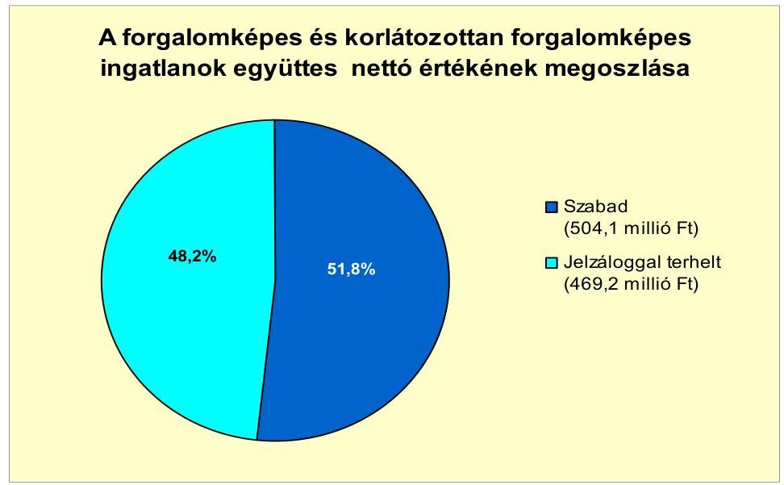

Az ellenőrzött időszakban az Önkormányzatnak lízingszerződésből, garancia- és kezességvállalásból, valamint PPP konstrukcióban végzett beruházásból kötelezettsége nem keletkezett, követeléseket nem engedtek el, kölcsönt nem nyújtottak, peres eljárásuk nem volt folyamatban.

A 2007-2010. években az eszközállományuk után összesen 206,5 millió
 Ft értékcsökkenést számoltak el, beruházásra 131,2 millió Ft-ot fordítottak, felújítás nem volt a számviteli nyilvántartásuk szerint. A pályázati forrás bevonásával megvalósított beruházások keretében 0,8 millió Ft-ot fordítottak eszközök pótlására. A felhalmozásokra az elszámolt értékcsökkenés 63,5%-ának megfelelő összeget fordították.

A vizsgált időszakban nem történt meg annak felmérése, hogy az eszközök elhasználódása, amortizációja fedezetének biztosítása mekkora forrásokat igényel. Az éves zárszámadási rendeleteiben az Önkormányzat nem mutatta be az eszközök után tárgyévben elszámolt értékcsökkenés összegét,

---

az eszközpótlásra fordított tényleges kiadásokat, valamint az eszközök elhasználódási fokának alakulását.

Az Önkormányzat immateriális javainak és tárgyi eszközeinek összesített használhatósági foka a 2007. évi 85,9%-ról a 2010. évre 78,6%-ra csökkent. A tárgyi eszközök valamennyi csoportjában (ingatlanok, vagyoni értékű jogok, járművek, átadott eszközök) csökkent az eszközök használhatósági foka.

# 4. A PÉNZÜGYI EGYENSÚLY MEGTEREMTÉSE ÉRDEKÉBEN HOZOTT INTÉZKEDÉSEK EREDMÉNYE 

A CLF módszer alapján kimutatva - a vizsgált időszakban (a 2008. év kivételével) - az Önkormányzatnál működési és felhalmozási hiány alakult ki, aminek kezelése érdekében bevételnövelő, illetve kiadáscsökkentő intézkedéseket is hoztak. A kiadáscsökkentő intézkedések 2007-2011. év I. féléve között az Önkormányzat kimutatása szerint összesen 65,0 millió Ft megtakarítást eredményeztek.

A kimutatás alapján a létszámcsökkentési döntések következtében 56,7 millió Ft megtakarítása keletkezett az Önkormányzatnak, ami 87,2%-a a végrehajtott kiadáscsökkentő intézkedésekből adódó megtakarításnak.

A létszámcsökkentés miatti megtakarítás 2,5%-át a - 2007-ben megvalósított határozott idejű alkalmazások megszüntetése adta, a többit a prémium évek program keretében megszüntetett öt fő közalkalmazotti és két fő köztisztviselői személyi juttatások kifizetéséhez biztosított állami támogatás összege jelentette. A Képviselő-testület a költségvetési évekre vonatkozó álláshelyek számát a költségvetési rendeletekben mindig az intézmények igényei szerint biztosította, a változtatásról külön döntések nem születtek.

A 2011. évi költségvetési rendeletben a köztisztviselők cafetériájának csökkentését rendelték el, az ebből adódó megtakarítás 1,4 millió Ft.

A 2007. év megszorító intézkedése volt, hogy szeptember 1-jétől megszüntették a képviselők és bizottsági tagok tiszteletdíját és a polgármester, alpolgármester költségtérítését. A megtakarítás összesen 5,5 millió Ft és 1,2 millió Ft volt. A megszüntetett juttatásokat 2008. július 1-jétől újra megállapították.

A 2011. évi költségvetési rendelet rendelkezett a civil szervezetek támogatásainak csökkentéséről is, ezáltal a 2011. év I. félévében az önkormányzati kiadás 0,2 millió Ft-tal kevesebb lett.

[^0]
[^0]:    ${ }^{28}$ Az egy főre jutó éves keretösszeg 0,3 millió Ft-ról 0,2 millió Ft-ra csökkent.

---

A következő diagram az Önkormányzat 2007-2011. év I. féléve közötti kiadáscsökkentő intézkedéseinek területeit és azok megoszlását mutatja:
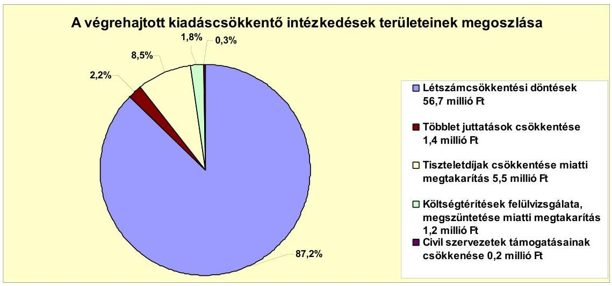

Az Önkormányzatnál 2007. január 1-jén 119 volt az engedélyezett álláshelyek száma és 110 fő volt az induló létszám, 2010 végére a záró álláshelyek száma és a záró létszám is 103 főre csökkent. A szakosított szociális ellátásnál az ellátottak létszámának emelkedése a foglalkoztatottak létszámának kétfős növekedésével járt a 2010. évben.

A 2008. évben a szociális alapellátás és a szakosított ellátás intézményeit összevonták, de ez a lépés létszámcsökkentéssel nem járt, mivel a jogszabályi feltételek biztosításához szükség volt a meglévő létszámra.

Az Önkormányzat 2007-2010. éveket érintő létszámcsökkentő döntéseinek hatását szemlélteti a következő ábra:

| Megnevezés   (adatok fő-ben) | Közoktatás | Szociális és   gyermek-   védelem | Egészség-   ügy | Polgármesteri   hivatal | Egyéb | Összesen |
| :-- | :--: | :--: | :--: | :--: | :--: | :--: |
| 2007. január 1-jén jóváhagyott álláshelyek száma | 46 | 48 |  | 25 |  | 119 |
| Megszüntetett álláshelyek száma | 6 | 9 |  | 3 |  | 18 |
| Álláshely növekedése |  | 2 |  |  |  | 2 |
| 2010. december 31-én záró álláshelyek száma | 40 | 41 |  | 22 |  | 103 |
| 2007. január 1-jén foglalkoztatott létszám | 44 | 42 |  | 24 |  | 110 |
| Létszámcsökkenés | 4 | 3 |  | 2 |  | 9 |
| Létszámnövekedés |  | 2 |  |  |  | 2 |
| 2010. december 31-én foglalkoztatott létszám | 40 | 41 |  | 22 |  | 103 |

A 2007-2008. években meglévő üres állások a 2009-2010. évekre megszüntek a költségvetési rendeletekben engedélyezett nyitó álláshelyek csökkenése következtében. Az üres álláshelyek megszüntetésének kiadáscsökkentő hatását nem számszerűsítették, erről külön döntéseket nem hoztak.

Az Önkormányzatnál 2007-2010 között a prémium évek program keretében kettő fő köztisztviselő és öt fő közalkalmazott álláshelye szűnt meg tartósan. A létszámcsökkentés végrehajtásához a vizsgált időszakban összesen 50,4 millió Ft központosított támogatást igényeltek és kaptak.

---

A vizsgált időszakban az Önkormányzat kimutatása szerint a helyi adókkal és az intézményi térítési díjakkal kapcsolatos döntések összesen 95,1 millió Ft összegű bevételnövekedést eredményeztek. A 2009. évtől megemelték 2000 Ft-tal a magánszemélyek éves kommunális adóját és bevezették az idegenforgalmi adót. Egyik adó mértéke sem éri el a törvényben meghatározott mérték felső határát.

A kimutatások alapján az új adónem bevezetése a vizsgált időszakban 1,6 millió Ft, az adó mértékének emelése 3,1 millió Ft, a mentességek csökkentése és az adóhátralék behajtása 21,4 millió Ft bevételtöbbletet jelentett az Önkormányzatnak. A helyi adókkal kapcsolatos intézkedések összesen 26,1 millió Ft többletbevételt eredményeztek.

Az Önkormányzat 2008-ban megemelte a szakosított szociális ellátás havi térítési díját 13000 Ft-tal, majd 2011. április 15-i hatállyal további 6000 Ft/hó térítési díj emeléséről döntött a Képviselő-testület. A térítési díj mértékének megemelése a vizsgált időszakban 69,0 millió Ft bevételi többletet jelentett az Önkormányzat számításai alapján. A vizsgált időszakban az érvényesített bevételnövelő intézkedések részletezését a következő ábra mutatja:
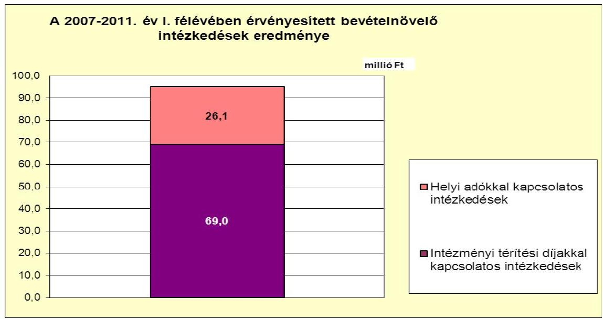

Az Önkormányzatnál a vizsgált időszakban az átengedett szja és az állami támogatások együttes összege a 2007. évről a 2010. évre nem csökkent. A kiadáscsökkentő és bevételnövelő intézkedések meghozatalára a költségvetési és pénzügyi egyensúly megteremtése érdekében volt szükség, mely összességében 160,1 millió Ft többletforrást eredményezett. A jövőbeni kötelezettségek teljesítése érdekében további intézkedések válnak szükségessé.

[^0]
[^0]:    ${ }^{29}$ Az idegenforgalmi adó mértéke 200 Ft/fő/éjszaka lett.

---

# 5. Az ÁSZ ÁLTAL A KORÁBBBI ÉVEKBEN A PÉNZÜGYI EGYENSÚLY JAVÍTÁSÁRA TETT SZABÁLYSZERŰSÉGI ÉS CÉLSZERŰSÉGI JAVASLATOK HASZNOSULÁSA 

Az ÁSZ az Önkormányzat gazdálkodási rendszerét a 2010. évben ellenőrizte átfogó jelleggel. A gazdálkodási rendszer korábbi ellenőrzése során tett javaslatok közül a pénzügyi egyensúly javítására vonatkozott három szabályszerűségi és két célszerűségi javaslat. A javaslatok megvalósítása érdekében a Képviselőtestület elfogadta a számvevői jelentésben foglaltak végrehajtására készített, felelősöket és határidőket is tartalmazó intézkedési tervet.

Az ellenőrzés során tett, a pénzügyi egyensúly javítására vonatkozó öt javaslatot hasznosították.

A szabályszerűségi javaslatokra megtett intézkedések eredményeképpen biztosították a 2011. évi költségvetési rendeletben a fejlesztési kiadások feladatonkénti, valamint az EU-s forrásokkal támogatott fejlesztések bevételi és kiadási előirányzatainak az elkülönített bemutatását. A 2011. évi költségvetési rendeletben a költségvetési bevételek és kiadások főösszegei nem tartalmaztak költségvetési hiányt módosító finanszírozási célú bevételeket, illetve kiadásokat. A 2010. évi zárszámadási rendelet tartalmazta a közvetett támogatások szöveges indoklását.

A célszerűségi javaslatok hasznosulásaként a számvevői jelentésben foglaltakat megtárgyalta a Képviselő-testület, valamint intézkedési tervet fogadott el a javaslatok végrehajtására. A jegyző 2011-től a munkaterv szerinti képviselőtestületi üléseken tájékoztatást adott arról, hogy a hosszú lejáratú adósságot keletkeztető kötelezettségvállalásokból adódó tőke- és kamatfizetési kötelezettségét az Önkormányzat milyen feltételek mellett tudja teljesíteni.

Budapest, 2012. április 11.

Melléklet: 5 db
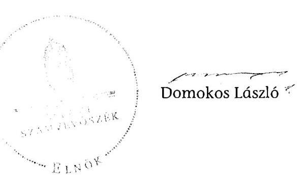

---

Máriapócs Város Önkormányzata

1. számú melléklet
V-3122-018/2012. számú jelentéshez

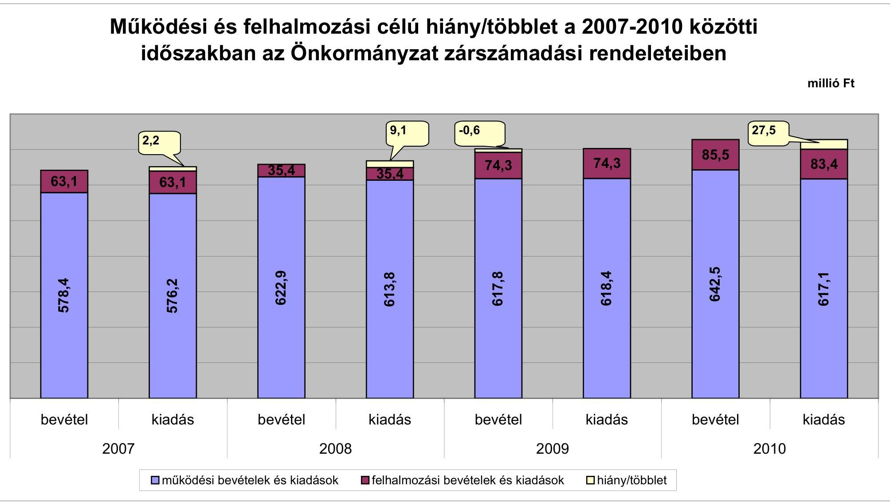

---

# Az Önkormányzat bevételei és kiadásai, valamint adósságszolgálata 2007-2010 között

|  1. FOLYÓ KÖLTSÉGVETÉS | 2007. | 2008. | 2009. | 2010.  |
| --- | --- | --- | --- | --- |
|  1.1.1. Saját működési bevételek | 87,6 | 102,8 | 118,9 | 119,6  |
|  1.1.2. Költségvetési támogatás | 236,7 | 407,0 | 398,3 | 387,7  |
|  1.1.3. Átengedett bevételek | 212,1 | 89,9 | 88,5 | 101,8  |
|  1.1.4. Állambáztartáson belülről kapott támogatások | 25,4 | 24,8 | 20,4 | 24,4  |
|  1.1.5. EU-tól és külföldről kapott bevételek | 0,0 | 0,0 | 0,0 | 0,0  |
|  1.1.6. Állambáztartáson kívülről kapott bevételek | 0,4 | 0,6 | 1,0 | 4,7  |
|  1.1.7. Előző évi pénzmaradvány átvétel | 0,0 | 0,0 | 0,0 | 2,9  |
|  1.1. Folyó bevételek = 1.1.1.+1.1.2.+1.1.3.+1.1.4.+1.1.5.+1.1.6.+1.1.7. | 562,2 | 625,1 | 627,2 | 641,0  |
|  1.2.1. Működési kiadások kamatkiadások nélkül | 477,6 | 498,9 | 539,6 | 562,4  |
|  1.2.2. Állambáztartáson belülre átadott pénzeszközök | 1,8 | 1,8 | 1,5 | 0,6  |
|  1.2.3.1. vállalkozásoknak | 0,0 | 0,0 | 0,0 | 0,0  |
|  1.2.3.2. EU-nak, illetve külföldre | 0,0 | 0,0 | 0,0 | 0,0  |
|  1.2.3.3. magáncégeknek | 81,3 | 80,1 | 71,3 | 63,9  |
|  1.2.3.4. nonprofit szervezeteknek | 5,8 | 6,8 | 3,8 | 4,8  |
|  1.2.3. Transferkiadások (=1.2.3.1+1.2.3.2+1.2.3.3+1.2.3.4) | 87,1 | 86,9 | 75,1 | 68,7  |
|  1.2.4. Kamatkiadások | 10,5 | 13,5 | 13,8 | 13,5  |
|  1.2.5. Előző évi pénzmaradvány átadás | 0,0 | 0,0 | 0,0 | 0,0  |
|  1.2. Folyó kiadások = 1.2.1.+1.2.2.+1.2.3.+1.2.4.+1.2.5. | 577,1 | 601,2 | 629,9 | 645,1  |
|  1.3. Folyó költségvetés egyenlege MŰKÖDÉSI JÖVEDELEM (1.1. - 1.2.) | -14,9 | 23,9 | -2,7 | -4,1  |
|  2. FELHALMOZÁSI KÖLTSÉGVETÉS | 0,0 | 0,0 | 0,0 | 0,0  |
|  2.1.1. Saját tökebevételek | 7,2 | 0,5 | 1,7 | 0,0  |
|  2.1.2. Állambáztartáson belülről kapott támogatások | 0,0 | 2,2 | 39,7 | 34,1  |
|  2.1.3. EU-tól és külföldről kapott támogatások | 0,0 | 0,0 | 0,0 | 5,4  |
|  2.1.4. Állambáztartáson kívülről kapott támogatások | 18,3 | 14,2 | 7,9 | 15,1  |
|  2.1. Felhalmozási bevételek (=2.1.1.+2.1.2+2.1.3+2.1.4.) | 25,4 | 17,0 | 49,3 | 58,7  |
|  2.2.1. Saját beruházási kiadás átával | 35,8 | 5,6 | 57,3 | 59,6  |
|  2.2.2. Saját felújítási kiadás átával | 0,0 | 0,0 | 0,0 | 0,0  |
|  2.2.3. Állambáztartáson belülre átadott pénzeszköz | 0,0 | 6,8 | 0,0 | 0,0  |
|  2.2.4. EU-nak és külföldnek adott pénzeszközök | 0,0 | 0,0 | 0,0 | 0,0  |
|  2.2.5. Állambáztartáson

 kívülre adott pénzeszközök | 1,3 | 0,0 | 0,0 | 0,0  |
|  2.2.6. Befektetési célú részesedések vásárlása | 0,0 | 0,0 | 0,0 | 0,0  |
|  2.2. Felhalmozási kiadások (=2.2.1.+2.2.2.+2.2.3.+2.2.4.+2.2.5.+2.2.6.) | 37,1 | 12,4 | 57,3 | 59,6  |
|  2.3. Felhalmozási költségvetés egyenlege (2.1. - 2.2.) | -11,7 | 4,6 | -8,0 | -0,9  |
|  3. Finanszírozási műveletek nélküli (GFS) pozíció(1.3.+2.3.) | -26,6 | 28,5 | -10,7 | -5,0  |
|  4. Finanszírozási műveletek |  |  |  |   |
|  4.1. Hitelfelvétel | 24,3 | 6,5 | 17,9 | 24,4  |
|  4.2. Hiteltörlesztés | 26,6 | 25,1 | 12,3 | 20,1  |
|  4.3. Forgatási és befektetési célú értékpapírok kibocsátása | 0,0 | 0,0 | 0,0 | 0,0  |
|  4.4. Forgatási és befektetési célú értékpapírok beváltása | 0,0 | 0,0 | 0,0 | 0,0  |
|  4.5. Forgatási és befektetési célú értékpapírok értékesítése | 0,0 | 0,0 | 0,0 | 0,0  |
|  4.6. Forgatási és befektetési célú értékpapírok vásárlása | 0,0 | 0,0 | 0,0 | 0,0  |
|  4.7. Egyéb finanszírozási bevételek (függő, átfutó, kiegyenlítő) * | 27,5 | 0,8 | -2,3 | -18,6  |
|  4.8. Egyéb finanszírozási kiadások (függő, átfutó, kiegyenlítő) * | -1,5 | 10,3 | -6,9 | -19,3  |
|  4.9. Finanszírozási műveletek egyenlege (4.1. - 4.2.+4.3.-4.4+4.5.-4.6.+4.7.-4.8.) | 26,6 | -28,1 | 10,1 | 5,0  |
|  5. Tárgyévi pénzügyi pozíció (1.3.+ 2.3.+4.9.) | 0,0 | 0,5 | -0,6 | 0,0  |
|  6. Nettó működési jövedelem =működési jövedelem (1.3.) - töketörlesztés (4.2+4.4) | -41,6 | -1,2 | -15,0 | -24,2  |
|  TÁJÉKOZTATÓ ADATOK |  |  |  |   |
|  Összes kötelezettség | 143,9 | 100,7 | 114,7 | 177,9  |
|  ebből rövid lejáratú | 80,2 | 33,1 | 70,6 | 146,4  |
|  Összes szállítói kötelezettség | 23,7 | 0,2 | 5,4 | 32,1  |
|  ebből lejárt (tanúsítványból) | 23,7 | 0,2 | 5,4 | 32,1  |
|  Pénz és trikapuaci kötelezettség (adósság) | 144,1 | 125,5 | 130,1 | 131,4  |
|  ebből rövid lejáratú | 80,5 | 71,3 | 85,9 | 92,7  |
|  PPP szerződéses állomány jelenértéken (tanúsítványból) | 0,0 | 0,0 | 0,0 | 0,0  |
|  ebből lejárt szolgáltatási díj miatti kötelezettség | 0,0 | 0,0 | 0,0 | 0,0  |
|  Folyószámlakítél napi átlagos állománya (tanúsítványból) | 33,6 | 37,0 | 33,0 | 43,6  |
|  Likvidítél napi átlagos állománya (tanúsítványból) | 0,0 | 0,0 | 0,0 | 0,0  |
|  Munkabérítél napi átlagos állománya (tanúsítványból) | 0,7 | 0,9 | 0,9 | 0,9  |
|  Kezesség és garanciavállalások (tanúsítványból) | 0,0 | 0,0 | 0,0 | 0,0  |
|  Jogerős bírósági tőletekből adódó kötelezettségek (tanúsítványból) | 0,0 | 0,0 | 0,0 | 0,0  |
|  Finanszírozásba bevonható eszközök: | 0,0 | 0,0 | 0,0 | 0,0  |
|  Tartós hitélviszonyt megtestesítő értékpapírok év végi állományt | 0,0 | 0,0 | 0,0 | 0,0  |
|  Hossza lejáratú bankbettétek év végi állománya | 0,0 | 0,0 | 0,0 | 0,0  |
|  Értékpapírok év végi állománya | 0,0 | 0,0 | 0,0 | 0,0  |
|  Pénzeszközök (idegen pénzeszközök nélküli) év végi állománya | 1,0 | 0,6 | 0,0 | 0,0  |

- Az Önkormányzatnál a felhalmozási célú, támogatást megelőlegező rövid lejáratú hiteleket, valamint a munkabér-megelőlegezési hiteleket átfutó titellekét kezelték, nem mutatták ki pénzintézeti kötelezettségként.

---

Márlapócsi Város Önkormányzata

Az Önkormányzat 2007-2010 években megvalósított, 2010. december 31-ig befejezett fejlesztései és azok forrásösszetétele

mibió Ft-ban

|  Fejlesztési feladat (beruházás, felújítás) |  | Beruházás, felújítás |  |  |  |  |  |  |  |  |  |  |  |  |  |  |  |  |  |  |  |  |  |  |  |  |  |  |  |  |  |  |  |  |  |  |  |   |
| --- | --- | --- | --- | --- | --- | --- | --- | --- | --- | --- | --- | --- | --- | --- | --- | --- | --- | --- | --- | --- | --- | --- | --- | --- | --- | --- | --- | --- | --- | --- | --- | --- | --- | --- | --- | --- | --- | --- |
|   |  |  |  |  |  |  |  |  |  |  |  |  |  |  |  |  |  |  |  |  |  |  |  |  |  |  |  |  |  |  |  |  |  |  |  |  |  |   |
|   | Fejlesztési feladat (beruházás, felújítás) |  | Beruházás, felújítás |  |  |  |  |  |  |  |  |  |  |  |  |  |  |  |  |  |  |  |  |  |  |  |  |  |  |  |  |  |  |  |  |  |  |   |
|   |  |  |  |  |  |  |  |  |  |  |  |  |  |  |  |  |  |  |  |  |  |  |  |  |  |  |  |  |  |  |  |  |  |  |  |  |  |   |
|   |  |  |  |  |  |  |  |  |  |  |  |  |  |  |  |  |  |  |  |  |  |  |  |  |  |  |  |  |  |  |  |  |  |  |  |  |  |   |
|   |  |  |  |  |  |  |  |  |  |  |  |  |  |  |  |  |  |  |  |  |  |  |  |  |  |  |  |  |  |  |  |  |  |  |  |  |  |   |
|   |  |  |  |  |  |  |  |  |  |  |  |  |  |  |  |  |  |  |  |  |  |  |  |  |  |  |  |  |  |  |  |  |  |  |  |  |  |   |
|   | Fejlesztési feladat (beruházás, felújítás) |  | Beruházás, felújítás |  |  |  |  |  |  |  |  |  |  |  |  |  |  |  |  |  |  |  |  |  |  |  |  |  |  |  |  |  |  |  |  |  |  |   |
|   |  |  |  |  |  |  |  |  |  |  |  |  |  |  |  |  |  |  |  |  |  |  |  |  |  |  |  |  |  |  |  |  |  |  |  |  |  |   |
|   |  |  |  |  |  |  |  |  |  |  |  |  |  |  |  |  |  |  |  |  |  |  |  |  |  |  |  |  |  |  |  |  |  |  |  |  |  |   |
|   |  |  |  |  |  |  |  |  |  |  |  |  |  |  |  |  |  |  |  |  |  |  |  |  |  |  |  |  |  |  |  |  |  |  |  |  |  |   |
|   |  |  |  |  |  |  |

  |  |  |  |  |  |  |  |  |  |  |  |  |  |  |  |  |  |  |  |  |  |  |  |  |  |  |  |  |  |  |   |
|   |  |  |  |  |  |  |  |  |  |  |  |  |  |  |  |  |  |  |  |  |  |  |  |  |  |  |  |  |  |  |  |  |  |  |  |  |  |   |
|   |  |  |  |  |  |  |  |  |  |  |  |  |  |  |  |  |  |  |  |  |  |  |  |  |  |  |  |  |  |  |  |  |  |  |  |  |  |   |
|   |  |  |  |  |  |  |  |  |  |  |  |  |  |  |  |  |  |  |  |  |  |  |  |  |  |  |  |  |  |  |  |  |  |  |  |  |  |   |
|   |  |  |  |  |  |  |  |  |  |  |  |  |  |  |  |  |  |  |  |  |  |  |  |  |  |  |  |  |  |  |  |  |  |  |  |  |  |   |
|   |  |  |  |  |  |  |  |  |  |  |  |  |  |  |  |  |  |  |  |  |  |  |  |  |  |  |  |  |  |  |  |  |  |  |  |  |  |   |
|   |  |  |  |  |  |  |  |  |  |  |  |  |  |  |  |  |  |  |  |  |  |  |  |  |  |  |  |  |  |  |  |  |  |  |  |  |  |   |
|   |  |  |  |  |  |  |  |  |  |  |  |  |  |  |  |  |  |  |  |  |  |  |  |  |  |  |  |  |  |  |  |  |  |  |  |  |  |   |
|   |  |  |  |  |  |  |  |  |  |  |  |  |  |  |  |  |  |  |  |  |  |  |  |  |  |  |  |  |  |  |  |  |  |  |  |  |  |   |
|   |  |  |  |  |  |  |  |  |  |  |  |  |  |  |  |  |  |  |  |  |  |  |  |  |  |  |  |  |  |  |  |  |  |  |  |  |  |   |
|   |  |  |  |  |  |  |  |  |  |  |  |  |  |  |  |  |  |  |  |  |  |  |  |  |  |  |  |  |  |  |  |  |  |  |  |  |  |   |
|   |  |  |  |  |  |  |  |  |  |  |  |  |  |  |  |  |  |  |  |  |  |  |  |  |  |  |  |  |  |  |  |  |  |  |  |  |  |   |
|   |  |  |  |  |  |  |  |  |  |  |  |  |  |  |  |  |  |  |  |  |  |  |  |  |  |  |  |  |  |  |  |  |  |  |  |  |  |   |
|   |  |  |  |  |  |  |  |  |  |  |  |  |  |  |  |  |  |  |  |  |  |  |  |  |  |  |  |  |  |  |  |  |  |  |  |  |  |   |
|   |  |  |  |  |  |  |  |  |  |  |  |  |  |  |  |  |  |  |  |  |  |  |  |  |  |  |  |  |  |  |  |  |  |  |  |  |  |   |
|   |  |  |  |  |  |  |  |  |  |  |  |  |  |  |  |  |  |  |  |  |  |  |  |  |  |  |  |  |  |  |  |  |  |  |  |  |  |   |
|   |  |  |  |  |  |  |  |  |  |  |  |  |  |  |  |  |  |  |  |  |  |  |  |  |  |  |  |  |  |  |  |  |  |  |  |  |  |   |
|   |  |  |  |  |  |  |  |  |  |  |  |  |  |  |  |  |  |  |  |  |  |  |  |  |  |  |  |  |  |  |  |  |  |  |  |  |  |   |
|   |  |  |  |  |  |  |  |  |  |  |  |  |  |  |  |  |  |  |  |  |  |  |  |  |  |  |  |  |  |  |  |  |  |  |  |  |  |   |
|   |  |  |  |  |  |  |  |  |  |  |  |  |  |  |  |  |  |  |  |  |  |  |  |  |  |  |  |  |  |  |  |  |  |  |  |  |  |   |
|   |  |  |  |  |  |  |  |  |  |  |  |  |  |  |  |  |  |  |  |  |  |  |  |  |  |  |  |  |  |  |  |  |  |  |  |  |  |   |
|   |  |  |  |  |  |  |

  |  |  |  |  |  |  |  |  |  |  |  |  |  |  |  |  |  |  |  |  |  |  |  |  |  |  |  |  |  |  |   |
|   |  |  |  |  |  |  |  |  |  |  |  |  |  |  |  |  |  |  |  |  |  |  |  |  |  |  |  |  |  |  |  |  |  |  |  |  |  |   |
|   |  |  |  |  |  |  |  |  |  |  |  |  |  |  |  |  |  |  |  |  |  |  |  |  |  |  |  |  |  |  |  |  |  |  |  |  |  |   |
|   |  |  |  |  |  |  |  |  |  |  |  |  |  |  |  |  |  |  |  |  |  |  |  |  |  |  |  |  |  |  |  |  |  |  |  |  |  |   |
|   |  |  |  |  |  |  |  |  |  |  |  |  |  |  |  |  |  |  |  |  |  |  |  |  |  |  |  |  |  |  |  |  |  |  |  |  |  |   |
|   |  |  |  |  |  |  |  |  |  |  |  |  |  |  |  |  |  |  |  |  |  |  |  |  |  |  |  |  |  |  |  |  |  |  |  |  |  |   |
|   |  |  |  |  |  |  |  |  |  |  |  |  |  |  |  |  |  |  |  |  |  |  |  |  |  |  |  |  |  |  |  |  |  |  |  |  |  |   |
|   |  |  |  |  |  |  |  |  |  |  |  |  |  |  |  |  |  |  |  |  |  |  |  |  |  |  |  |  |  |  |  |  |  |  |  |  |  |   |
|   |

---

## Az Önkormányzat 2010. december 31-én folyamatban lévő fejlesztési feladataira 2010. december 31-ig teljesített kifizetések és azok forrásösszetétele

|   | Fejlesztési feladat (beruházás, felújítás) |  | Beruházás, felújítás |  |  | Teljes bekerülési költség |  |  |  |  |  |  |  |  |  |  |  |  |  |  |  |  |  |  |  |  |  |  |  |  |  |  |  |  |  |  |  |  |  |  |  |  |  |  |  |  |  |  |  |  |  |  |  |  |  |  |  |  |  |  |  |  |  |  |  |  |  |  |  |  |  |  |  |  |  |  |  |  |  |  |  |  |  |  |  |  |  |  |  |  |  |  |  |  |  |  |  |  |  |  |  |  |  |  |  |  | 

---

Márlaplócs Város Önkormányzata

Az Önkormányzat 2010. december 31-én folyamatban lévő fejlesztési feladataira 2010. december 31-én fennálló kötelezettségek és azok forrásösszetétele

|   |  |  |  |  |  |  |  |  |  |  |  |  |  |  |  |  |  |  |  |  |  |  |  |  |  |  |  |  |  |  |  |  |  |  |  |  |  |  |  |   |
| --- | --- | --- | --- | --- | --- | --- | --- | --- | --- | --- | --- | --- | --- | --- | --- | --- | --- | --- | --- | --- | --- | --- | --- | --- | --- | --- | --- | --- | --- | --- | --- | --- | --- | --- | --- | --- | --- | --- | --- |
|   |  |  |  |  |  |  |  |  |  |  |  |  |  |  |  |  |  |  |  |  |  |  |  |  |  |  |  |  |  |  |  |  |  |  |  |  |  |  |   |
|   |  |  | Fejlesztési feladat (beruházás, felújítás) |  | Beruházás, felújítás |  |  |  |  |  |  |  |  |  |  |  |  |  |  |  |  |  |  |  |  |  |  |  |  |  |  |  |  |  |  |  |  |   |
|   |  |  |  |  |  |  |  |  |  |  |  |  |  |  |  |  |  |  |  |  |  |  |  |  |  |  |  |  |  |  |  |  |  |  |  |  |  |   |
|   |  |  |  |  |  |  |  |  |  |  |  |  |  |  |  |  |  |  |  |  |  |  |  |  |  |  |  |  |  |  |  |  |  |  |  |  |  |   |
|   |  |  | Fejlesztési feladat (beruházás, felújítás) |  | Beruházás, felújítás |  |  |  |  |  |  |  |  |  |  |  |  |  |  |  |  |  |  |  |  |  |  |  |  |  |  |  |  |  |  |  |  |   |
|   |  |  |  |  |  |  |  |  |  |  |  |  |  |  |  |  |  |  |  |  |  |  |  |  |  |  |  |  |  |  |  |  |  |  |  |  |  |   |
|   |  |  |  |  |  |  |  |  |  |  |  |  |  |  |  |  |  |  |  |  |  |  |  |  |  |  |  |  |  |

  |  |  |  |  |  |  |  |   |
|   |  |  |  |  |  |  |  |  |  |  |  |  |  |  |  |  |  |  |  |  |  |  |  |  |  |  |  |  |  |  |  |  |  |  |  |  |  |   |
|   |  |  |  |  |  |  |  |  |  |  |  |  |  |  |  |  |  |  |  |  |  |  |  |  |  |  |  |  |  |  |  |  |  |  |  |  |  |   |
|   |  |  |  |  |  |  |  |  |  |  |  |  |  |  |  |  |  |  |  |  |  |  |  |  |  |  |  |  |  |  |  |  |  |  |  |  |  |   |
|   |  |  |  |  |  |  |  |  |  |  |  |  |  |  |  |  |  |  |  |  |  |  |  |  |  |  |  |  |  |  |  |  |  |  |  |  |  |   |
|   |  |  |  |  |  |  |  |  |  |  |  |  |  |  |  |  |  |  |  |  |  |  |  |  |  |  |  |  |  |  |  |  |  |  |  |  |  |   |
|   |  |  |  |  |  |  |  |  |  |  |  |  |  |  |  |  |  |  |  |  |  |  |  |  |  |  |  |  |  |  |  |  |  |  |  |  |  |   |
|   |  |  |  |  |  |  |  |  |  |  |  |  |  |  |  |  |  |  |  |  |  |  |  |  |  |  |  |  |  |  |  |  |  |  |  |  |  |   |
|   |  |  |  |  |  |  |  |  |  |  |  |  |  |  |  |  |  |  |  |  |  |  |  |  |  |  |  |  |  |  |  |  |  |  |  |  |  |   |
|   |  |  |  |  |  |  |  |  |  |  |  |  |  |  |  |  |  |  |  |  |  |  |  |  |  |  |  |  |  |  |  |  |  |  |  |  |  |   |
|   |  |  |  |  |  |  |  |  |  |  |  |  |  |  |  |  |  |  |  |  |  |  |  |  |  |  |  |  |  |  |  |  |  |  |  |  |  |   |
|   |  |  |  |  |  |  |  |  |  |  |  |  |  |  |  |  |  |  |  |  |  |  |  |  |  |  |  |  |  |  |  |  |  |  |  |  |  |   |
|   |  |  |  |  |  |  |  |  |  |  |  |  |  |  |  |  |  |  |  |  |  |  |  |  |  |  |  |  |  |  |  |  |  |  |  |  |  |   |
|   |  |  |  |  |  |  |  |  |  |  |  |  |  |  |  |  |  |  |  |  |  |  |  |  |  |  |  |  |  |  |  |  |  |  |  |  |  |   |
|   |  |  |  |  |  |  |  |  |  |  |  |  |  |  |  |  |  |  |  |  |  |  |  |  |  |  |  |  |  |  |  |  |  |  |  |  |  |   |
|   |  |  |  |  |  |  |  |  |  |  |  |  |  |  |  |  |  |  |  |  |  |  |  |  |  |  |  |  |  |  |  |  |  |  |  |  |  |   |
|   |  |  |  |  |  |  |  |  |  |  |  |  |  |  |  |  |  |  |  |  |  |  |  |  |  |  |  |  |  |  |  |  |  |  |  |  |  |   |
|   |  |  |  |  |  |  |  |  |  |  |  |  |  |  |  |  |  |  |  |  |  |  |  |  |  |  |  |  |  |  |  |  |  |  |  |  |  |   |
|   |  |  |  |  |  |  |  |  |  |  |  |  |  |  |  |  |  |  |  |  |  |  |  |  |  |  |  |  |  |  |  |  |  |  |  |  |  |   |
|   |  |  |  |  |  |  |  |  |  |  |  |  |  |  |  |  |  |  |  |  |  |  |  |  |  |  |  |  |  |  |  |  |  |  |  |  |  |   |
|   |  |  |  |  |  |  |  |  |  |  |  |  |  |  |  |  |  |  |  |  |  |  |  |  |  |  |  |  |  |

  |  |  |  |  |  |  |  |   |
|   |  |  |  |  |  |  |  |  |  |  |  |  |  |  |  |  |  |  |  |  |  |  |  |  |  |  |  |  |  |  |  |  |  |  |  |  |  |   |
|   |  |  |  |  |  |  |  |  |  |  |  |  |  |  |  |  |  |  |  |  |  |  |  |  |  |  |  |  |  |  |  |  |  |  |  |  |  |   |
|   |  |  |  |  |  |  |  |  |  |  |  |  |  |  |  |  |  |  |  |  |  |  |  |  |  |  |  |  |  |  |  |  |  |  |  |  |  |   |
|   |  |  |  |  |  |  |  |  |  |  |  |  |  |  |  |  |  |  |  |  |  |  |  |  |  |  |  |  |  |  |  |  |  |  |  |  |  |   |
|   |  |  |  |  |  |  |  |  |  |  |  |  |  |  |  |  |  |  |  |  |  |  |  |  |  |  |  |  |  |  |  |  |  |  |  |  |  |   |
|   |  |  |  |  |  |  |  |  |  |  |  |  |  |  |  |  |  |  |  |  |  |  |  |  |  |  |  |  |  |  |  |  |  |  |  |  |  |   |
|   |  |  |  |  |  |  |  |  |  |  |  |  |  |  |  |  |  |  |  |  |  |  |  |  |  |  |  |  |  |  |  |  |  |  |  |  |  |   |
|   |  |  |  |  |  |  |  |  |  |  |  |  |  |  |  |  |  |  |  |  |  |  |  |  |  |  |  |  |  |  |  |  |  |  |  |  |  |   |
|   |  |  |  |  |  |  |  |  |  |  |  |  |  |  |  |  |  |  |  |  |  |  |  |  |  |  |  |  |  |  |  |  |  |  |  |  |  |   |
|   |

