# ÁLLAMI   SZÁMVEVŐSZÉK 

## JELENTÉS

Mezőberény Város Önkormányzata pénzügyi helyzetének ellenőrzéséről (43/4)

---

# Állami Számvevőszék 

Iktatószám: V-3080-030/2012.
Témaszám: 1015
Vizsgálat-azonosító szám: V0560111

## Az ellenőrzést felügyelte:

Dr. Varga Sándor
számvevő igazgatóhelyettes
Az ellenőrzést vezette:
Renkó Zsuzsanna
számvevő tanácsos
Ellenőrzési csoportvezető:
Puchy Márta
számvevő tanácsos
Az ellenőrzést végezték:

| Csiszárné | Halkóné | Vörösné Lakatos Zsuzsanna |
| :-- | :-- | :-- |
| dr. Kosik Mária | dr. Berkó Katalin | számvevő |
| számvevő tanácsos | számvevő |  |

---

# TARTALOMJEGYZÉK 

BEVEZETÉS ..... 9
I. ÖSSZEGZŐ MEGÁLLAPÍTÁSOK, KÖVETKEZTETÉSEK, JAVASLATOK ..... 13
II. RÉSZLETES MEGÁLLAPÍTÁSOK ..... 22

1. Az Önkormányzat kötelező és önként vállalt feladatai, a feladatellátás szervezeti keretei és annak változásai ..... 22
2. Az Önkormányzat pénzügyi egyensúlyi helyzetét befolyásoló tényezők ..... 27
2.1. A működési és a felhalmozási egyensúly változása ..... 29
2.2. Az Önkormányzat bevételeinek változása ..... 34
2.3. Az Önkormányzat működési és a felhalmozási célú kiadásainak változása ..... 37
3. Az Önkormányzat kötelezettségei ..... 40
3.1. Az Önkormányzat pénzintézeti kötelezettségeinek változása ..... 40
3.2. A szállítói kötelezettségek változása ..... 46
3.3. Egyéb kötelezettségek változása ..... 46
4. A pénzügyi egyensúly megteremtése érdekében hozott intézkedések eredménye ..... 48
5. Az ÁSZ által a korábbi években a pénzügyi egyensúly javítására tett szabályszerűségi és célszerűségi javaslatok hasznosulása ..... 51

---

# MELLÉKLETEK 

1. számú Működési és felhalmozási célú többlet a 2007-2010 közötti időszakban az Önkormányzat zárszámadási rendeleteiben (1 oldal)
2. számú Az Önkormányzat bevételei és kiadásai, valamint adósságszolgálata 2007-2010 között (1 oldal)
3/a. számú Az Önkormányzat 2007-2010. években megvalósított, 2010. december 31-ig befejezett fejlesztései és azok forrásösszetétele (1 oldal)
3/b. számú Az Önkormányzat 2010. december 31-én folyamatban lévő fejlesztési feladataira 2010. december 31-ig teljesített kifizetések és azok forrásösszetétele (1 oldal)
3/c. számú Az Önkormányzat 2010. december 31-én folyamatban lévő fejlesztési feladataira 2010. december 31-én fennálló kötelezettségek és azok forrásösszetétele (1 oldal)
3/d. számú Az Önkormányzat által beadott, elbírálás alatti pályázati forrásból megvalósítani tervezett fejlesztéseihez kapcsolódó kötelezettségvállalásai és azok forrásösszetétele (1 oldal)
3. számú Az önkormányzati feladatok ellátásában résztvevő gazdasági társaságok (1 oldal)

---

# RÖVIDÍTÉSEK JEGYZÉKE 

## Törvények

Áht.
Ötv.
Ptk.
Számv. tv.

## Rendeletek

Ámr.
Áhsz.

SzMSz

## Szórövidítések

áfa
ÁSZ
Csatornamű Társulat
EU
jegyző
Képviselő-testület
LTP
OEP
Önkormányzat
Pénzügyi bizottság
polgármester
Polgármesteri hivatal
szja
többcélú kistérségi társulás
az államháztartásról szóló 1992. évi XXXVIII. törvény
a helyi önkormányzatokról szóló 1990. évi LXV. törvény
a Polgári Törvénykönyvről szóló 1959. évi IV. törvény
a számvitelről szóló 2000. évi C. törvény
az államháztartás működési rendjéről szóló 292/2009. (XII. 19.) Korm. rendelet
az államháztartás szervezetei beszámolási és könyvvezetési kötelezettségének sajátosságairól szóló 249/2000. (XII. 24.) Korm. rendelet

Mezőberény Város Önkormányzata 11/2007. (V.23.) számú rendelete a Képviselő-testület Szervezeti és Működési Szabályzatáról
általános forgalmi adó
Állami Számvevőszék
Mezőberényi Csatornamű Társulat
Európai Unió
Mezőberény Város Önkormányzatának Jegyzője
Mezőberény Város Önkormányzatának Képviselő-testülete
Lakástakarék Pénztár
Országos Egészségbiztosítási Pénztár
Mezőberény Város Önkormányzata
Mezőberény Város Önkormányzatának Pénzügyi Bizottsága
Mezőberény Város Önkormányzatának Polgármestere
Mezőberény Város Önkormányzatának Polgármesteri Hivatala
Személyi jövedelemadó
Többcélú Békési Kistérségi Társulás

---

.

---

# ÉRTELMEZŐ SZÓTÁR 

banki kitettség

BUBOR

CLF módszer
használhatósági fok
kamatkockázat
kötelező közszolgáltatás
közfeladat

LIBOR

Az önkormányzat pénzügyi helyzete olyan külső körülmények hatására is módosulhat, amelyekre az önkormányzatnak nincs hatása, emiatt banki kitettsége keletkezik. Pl.: rövid távú kötelezettségek fennállása esetén kizárólag a bank egyoldalú döntésén múlik, hogy továbbra is biztosít-e hitelt az önkormányzatnak, valamint azt milyen feltételekkel bocsátja az önkormányzat rendelkezésére.
Budapesti Bankközi Forint Hitelkamatláb. Irányadó, referencia jellegű kamatláb. Mértékét az MNB naponta állapítja meg a banki kamatok figyelembevételével. Közzététele naponta történik.
Az önkormányzatok költségvetése elemzésének eszköze. A módszer következetesen elkülöníti a folyó és a felhalmozási költségvetés bevételeit és kiadásait, azok költségvetési egyenlegeit. Bizonyos mértékig a vállalati gazdálkodás logikai elemeit érvényesíti az önkormányzatok pénzügyi, jövedelmi helyzetének vizsgálata során. Az értékelés a pénzügyi kapacitás fogalmát helyezi a középpontba.
Az eszközgazdálkodás vizsgálatának elemzése során használt mutató. Számításakor a tárgyi eszköz könyv szerinti (nettó) értékét viszonyítják a tárgyi eszköz bruttó (beszerzési/létesítési) értékéhez. A százalékban kifejezett mutató csökkenése az eszköz állagának romlására, avulására utal, ami maga után vonja az üzemeltetési és fenntartási költségek növekedését is.
A változó kamatozású forint-, vagy a devizahitelek futamideje alatt a kamat emelkedése miatt fennálló kamatkockázat, melynek növekedése miatt nő a hitel törlesztő részlete.
A helyi önkormányzati feladatkörbe tartozó, a köztisztasággal és a településtisztasággal, valamint az élet- és vagyonbiztonsággal összefüggő egyes - közszolgáltatás útján megvalósuló - közfeladatok ellátása, amelynek kötelező igénybevételét külön jogszabály (törvény, helyi önkormányzati rendelet) határoz meg.
Állami, helyi, illetve kisebbségi önkormányzati feladat, amelynek ellátásáról az államnak, illetve az önkormányzatoknak kell gondoskodni. A hatályos szabályozás szerint közfeladatot törvény és önkormányzati rendelet állapíthat meg. Az önkormányzatok által ellátandó feladatok keretszerű meghatározását az Ötv. tartalmazza.
Angol kifejezés, a London Interbank Offered Rate rövidítése. Jelentése: Londoni bankközi, referencia jellegű kínálati (hitel) kamatláb.

---

önkormányzat többségi tulajdonában lévő gazdasági társaságok
pénzügyi kapacitás
pénzügyi kockázat

SNA

Az önkormányzat a gazdasági társaságban a szavazatok több mint ötven százalékával vagy a Ptk. 685/B. § (2)-(3) bekezdéseiben rögzített meghatározó befolyással rendelkezik. A befolyással rendelkező akkor rendelkezik egy jogi személyben meghatározó befolyással, ha annak tagja, illetve részvényese és jogosult e jogi személy vezető tisztségviselői vagy felügyelőbizottsága tagjainak többségének megválasztására, illetve visszahívására, vagy a jogi személy más tagjaival, illetve részvényeseivel kötött megállapodás alapján egyedül rendelkezik a szavazatok több mint ötven százalékával (Ptk. 685/B. § (2) bekezdés). A meghatározó befolyás akkor is fennáll, ha a befolyással rendelkező számára e jogosultságok közvetett módon (köztes vállalkozásain keresztül, a Ptk. 685/B. § (3)-(4) bekezdés szerint) biztosítottak.
A helyi önkormányzat és az önkormányzat irányítása alá tartozó költségvetési szerv többségi tulajdonában, illetve többségi befolyása alatt álló gazdálkodó szervezet esetében hitelfelvétel, kölcsönfelvétel, garancia- vagy kezességvállalás, tartozásátvállalás, tartozás-elengedés, értékpapír kibocsátás, vásárlás, pénzügyi lízing, tartós bérleti szerződés, ingyenes vagyonjuttatás (így különösen: ajándékozás, ingyenes engedményezés), vagy követelésvásárlás, követelésengedményezés végrehajtására vonatkozóan az Áht. 100/M. § (4) bekezdése alapján az önkormányzat rendelkezik döntési jogosultsággal.
A pénzügyi kapacitás (financial capacity) az adósok hitelfelvételi képességének azon mértéke, ahol még anélkül tudják növelni az adósságot, hogy csökkenteniük kellene akár a jelenbeli, akár a jövőben esedékes kiadásaikat a fizetésképtelenség elkerülése érdekében. (Forrás: Az önkormányzati rendszer pénzügyi helyzete, ÁSZKUT tanulmány 2010.)
A működési kockázat egyik eleme. Megmutatkozhat a költségvetés nagyságrendjének, szerkezetének nem megalapozott módosításaiban, a bevételi és a kiadási előirányzatoktól lényegesen eltérő teljesítésekben, a nem megfelelő belső kontrollrendszer működésében, a tudatos károkozásokban, a biztosítások elmaradásában, a hibás fejlesztési döntésekben, a nem a terveknek megfelelő forrásfelhasználásokban. Jelentkezhet továbbá a bevételek és kiadások ütemkülönbsége miatt felvett folyószámla- és likvidhitelek költségvetési év végén fennálló egyenlege miatt, amely az önkormányzat költségvetésébe - akár tartósan - beépülő forráshiányt jelzi.
System of National Account, azaz a Nemzeti Számlák Rendszere, amely a gazdasági szektorok által létrehozott valamennyi terméket és szolgáltatást figyelembe veszi.

---

törlesztési kockázat

Annak a kockázata, hogy a megfelelő időben és mértékben a hitelt felvevőnél rendelkezésre állnak-e a pénzintézetek és egyéb szervek felé fennálló kötelezettségek visszafizetéséhez, a hitelek és kölcsönök törlesztéséhez szükséges pénzügyi források.
A törlesztési kockázatot növeli a kamat- és árfolyam növekedése, mivel ezekben az esetekben az adósságszolgálat nőhet. Törlesztési kockázatot okozhat a visszafizetésre tervezett forrás elérésének, teljesítésének bizonytalansága (pl. a visszafizetéshez tervezett tartalékolás elmaradt, a tervezettnél alacsonyabb a saját bevétel, a helyi adóból származó bevétel az adóalanyok, adóalapok csökkenése miatt nem teljesül).

---

.

---

# JELENTÉS 

## Mezőberény Város Önkormányzata pénzügyi helyzetének ellenőrzéséről

## BEVEZETÉS

Az Állami Számvevőszék 2011. évtől érvényes stratégiája új irányt szabott a helyi önkormányzatok gazdálkodásának ellenőrzésében is. Az ÁSZ - küldetése és jövőképe szerint - szilárd szakmai alapokra támaszkodva értékteremtő ellenőrzéseivel és helyzetelemzéseivel az államháztartás egészében, így a helyi önkormányzati alrendszerben is elő kívánja segíteni a közpénzek és a közvagyon szabályos, gazdaságos, hatékony és eredményes felhasználását. E folyamat részeként - az államháztartási hiány alakulásának összetevőire is figyelemmel - végezzük az önkormányzati alrendszer pénzügyi helyzetelemzését.

Az államháztartás helyi szintjén a 304 városnak${ }^{1}$ az általuk ellátott közszolgáltatások volumenére is tekintettel a közfeladatok ellátásában kiemelt szerepe van. E települések 2011. január 1-jei népessége 3169 ezer fő volt.

Feladataik és hatásköreik az Ötv. mellett különböző ágazati törvények által meghatározottak, miközben a feladatellátás szervezeti kereteit - ezen belül a gazdasági társaságok közszolgáltatások ellátásában betöltött szerepét - saját maguk határozzák meg. A gazdasági társaságok által ellátott feladatok esetén a gazdálkodás, továbbá az önkormányzatok pénzügyi egyensúlyi helyzetére ható közvetlen ok egy része kikerült az önkormányzati alrendszerből. A többségi önkormányzati tulajdonban lévő társaságok gazdálkodásának körülményei befolyásolhatják a városok pénzügyi egyensúlyi helyzetének megítélésében rejlő kockázatokat.

Az áttekintett időszakban az önkormányzati forrásszabályozás elvei lényegesen nem változtak. Az önkormányzatok gazdasági mozgásterét a központi költségvetéstől való függőség mellett jelentősen befolyásolja a helyi adókivetési jog gyakorlása. A városok gazdálkodási szabadságának lényeges eleme, hogy anyagi lehetőségeik függvényében dönthettek arról, hogy feladataik közül azokat, amelyek megoldására az Ötv. szerint a települési önkormányzat nem kötelezhető, a megyei önkormányzat fenntartásába adhatták. E döntések differenciáltan érintették a városok pénzügyi helyzetét.

[^0]
[^0]:    ${ }^{1}$ A megyei jogú városok nélkül figyelembe vett városok száma 304 városi önkormányzatot jelent.

---

A városi önkormányzatok 2007-2010 között teljesített bevételeit és összetételét az alábbi ábra szemlélteti:

Az önkormányzati alrendszer pénzügyi helyzetértékelése során új elemzési módszereket alkalmazott az ellenőrzés. A költségvetési beszámoló adatok elemzése helyett az önkormányzat pénzügyi helyzetét a CLF módszerrel értékeljük, amelynek lényegét és számításának módszerét a jelentés 2. pontjában, és a jelentés 2. számú mellékletében ismertetjük részletesen.

Az új módszereken alapuló helyzetértékelés fontosságát az adja, hogy a helyi önkormányzatok bruttó adósságállománya${ }^{2}$ a 2010. évi költségvetési beszámolók alapján 1248 milliárd Ft-ot tett ki. Ezen belül a 304 város adóssága 383 milliárd Ft volt, amely az önkormányzati alrendszer teljes adósságállományának 30,7%-át jelentette${ }^{3}$.

A mérlegben kimutatott bruttó adósságállomány mellett az önkormányzatok számára az eszközállomány műszaki állapotának megőrzése is előbb-utóbb pénzügyi kötelezettséget jelent. Az elhasználódott eszközök pótlására forrást biztosító amortizációs (felújítási) alap képzésének${ }^{4}$ elmaradása maga után vonhatja a feladatellátást kiszolgáló tárgyi eszközök állagának erőteljes romlását. Emellett a 2007-2013-as időszakra meghirdetett, vissza nem térítendő EU-s fejlesztési forrásokhoz való hozzájutás lehetősége felerősítette az önkormányzati

[^0]
[^0]:    ${ }^{2}$ Az önkormányzati mérlegbeszámolókból számított bruttó adósságállomány 2010. év végi összege magában foglalja a fejlesztési és a működési célú kötvénykibocsátások, a beruházási és fejlesztési hitelek, a működési célú hosszú lejáratú hitelek, a rövid lejáratú hitelek, váltótartozások miatti kötelezettségek teljes (2011-ben, illetve az azt követő években esedékes) állományát. Az önkormányzatok 2007. év végi mérleg szerinti adósságállománya 692 milliárd Ft volt.
    ${ }^{3}$ A fővárosi és a kerületi önkormányzatok adósságának figyelmen kívül hagyásával számított 977 milliárd Ft összegű bruttó adósságállományból a városok 39,2%-kal részesedtek.
    ${ }^{4}$ Erre a jelenlegi szabályozási környezetben nem kötelezi előírás az önkormányzatokat.

---

alrendszer fejlesztési igényeit, amelyek a felhalmozási költségvetési hiány folyamatos emelkedésén túl - az előírt jövőbeni fenntartási kötelezettség miatt - tovább terhelhetik az önkormányzatok költségvetését.
 ${ }^{5}$.

Az ÁSZ a 2011. évi ellenőrzési tervében 43. számú, az Önkormányzatok gazdálkodási rendszerének ellenőrzése részeként áttekinti és elemzi az önkormányzatok pénzügyi helyzetét. A gazdálkodás szabályszerűségét az ÁSZ az előző évek során ebben az önkormányzati körben is ellenőrizte. Jelen vizsgálatunk a tett javaslataink pénzügyi helyzetet érintő pontjainak hasznosítására utóellenőrzés jelleggel tér ki.

Az ellenőrzés megállapításait az Önkormányzat által kitöltött - teljességi nyilatkozattal megerősített - 27 tanúsítványon szolgáltatott adatokra alapoztuk. Ellenőrzési bizonyítékként használtuk fel továbbá:

- a képviselő-testületi és bizottsági előterjesztéseket, a döntés-előkészítés során készített dokumentumokat;
- a kötelezettségvállalások dokumentumait;
- a pénzügyi-számviteli nyilvántartásokat;
- az éves költségvetési beszámolókat;
- a költségvetési és zárszámadási rendeleteket.

Az ellenőrzés a 2007. január 1. - 2011. június 30. közötti időszakot öleli fel. A pénzintézeti kötelezettségek állományának vizsgálatakor az ellenőrzött időszak 2006. december 31. - 2011. június 30. közötti időszakra terjedt ki.

Az ellenőrzés során vizsgáltunk minden olyan körülményt és adatot, amely a program végrehajtásához kapcsolódott és a pénzügyi helyzet alakulására hatást gyakorló releváns tények és folyamatok feltárásához szükségessé vált.

# Az ellenőrzés célja annak értékelése volt, hogy: 

- a vizsgált időszakban a kötelező- és önként vállalt feladatok ellátását biztosító szervezeti keretekben, a feladatellátás módjában bekövetkezett változások milyen hatást gyakoroltak az Önkormányzat pénzügyi helyzetének alakulására;
- az Önkormányzat pénzügyi - ezen belül működési és felhalmozási - egyensúlya mely tényezők hatására miként változott, és az Önkormányzat milyen intézkedéseket tett a pénzügyi egyensúly javítása érdekében;

[^0]
[^0]:    ${ }^{5}$ Az Állami Számvevőszék 2011. júniusában közzétett 1108. számú, a helyi önkormányzatok fejlesztési célú támogatási rendszerének ellenőrzéséről szóló jelentésében feltárta a fejlesztési folyamatok problémáit. A helyi önkormányzatok elsősorban azokat a fejlesztéseket valósították meg, amelyekhez támogatást lehetett igényelni. A fejlesztési célok közül a magasabb támogatási intenzitású pályázatokat részesítették előnyben. A fejlesztéssel megvalósuló létesítmények jövőbeli üzemeltetésének várható ráfordításait az önkormányzatok 71,9%-a nem mérte fel.

---

- a költségvetési kiadások finanszírozása érdekében vállalt pénzintézeti kötelezettségek hogyan alakultak, továbbá milyen kötelezettségek fennállása befolyásolja az Önkormányzat jövőbeli pénzügyi helyzetét;
- hasznosultak-e a gazdálkodási rendszer korábbi ellenőrzése során a pénzügyi egyensúly javítására az ÁSZ által tett szabályszerűségi és célszerűségi javaslatok.

Az ellenőrzés típusa: szabályszerűségi vizsgálat.
A vizsgálat jogszabályi alapját az Állami Számvevőszékről szóló 2011. évi LXVI. törvény 1. § (3), 5. § (2)-(6) bekezdései, továbbá az Áht. 120/A. § (1) bekezdése előírásai képezik.

Mezőberény város lakosainak száma 2011. január 1-jén 11128 fő (2006. január 1-jén 11202 fő) volt. 2010. december 31-én Mezőberény város területén a bejelentett társas vállalkozások száma 303, az egyéni vállalkozásoké 349 (ipar 187, kereskedelem 141, mezőgazdaság 21). Az elmúlt évek fejlesztései nyomán az infrastruktúra kiépített, az oktatási, egészségügyi, szociális és egyéb alapellátás, valamint a kötelező közszolgáltatás biztosított.

Az Önkormányzatnál a 2007-2010. évek között teljesített költségvetési bevételek és kiadások főösszege változóan alakult (bevétel 2,9-4,8 milliárd Ft, kiadás 2,9-3,3 milliárd Ft volt). Az Önkormányzat könyvviteli mérleg szerinti eszközforrás-állománya 2010. december 31-én 9531 millió Ft volt.

A működési kiadások fedezete céljából hitel felvételére 2007-2010 között nem került sor, azonban a fejlesztések saját forrásának biztosítása érdekében az Önkormányzat a 2008. évben 1000,0 millió Ft értékben kötvényt bocsátott ki.

A helyi önkormányzat mellett három (cigány, német, szlovák) kisebbségi önkormányzat működik.

---

# I. ÖSSZEGZŐ MEGÁLLAPÍTÁSOK, KÖVETKEZTETÉSEK, JAVASLATOK 

Az Önkormányzat - adatszolgáltatása szerint - a 2010. év 2656,9 millió Ft működési költségvetési kiadásaiból ${ }^{6} 1880,0$ millió Ft-ot (70,8%-ot) a kötelező feladatok, 776,9 millió Ft-ot (29,2%-ot) az önként vállalt feladatok ellátására fordított. Önkormányzati szinten a 2007-2009. évek átlagához képest a kötelező feladatok aránya a 2010. évben kis mértékben (1,2%-kal) emelkedett. Az Önkormányzat - besorolása alapján - a 2007-2010. években a kötelező feladatok ellátása mellett önként vállalt feladatnak tekintette a középfokú oktatási (gimnáziumi), a kollégiumi, az alapfokú művészetoktatási feladatokat, a közgyűjteményi, a közművelődési, az alapfokú művészetoktatási feladatokat, az idősek átmeneti elhelyezésének biztosítását, a bölcsődei ellátást, a gyermekjóléti szolgálat és a pedagógiai szakszolgálat működtetését, a sport és városgazdálkodási feladatokat. Az Önkormányzat pénzügyi egyensúlyának fenntarthatóságára hosszú távon kihatással lehet az önként vállalt feladatokra fordított működési kiadások arányának nagysága.

Az Önkormányzat feladatellátásának szervezeti struktúráját mutatja be az alábbi ábra:
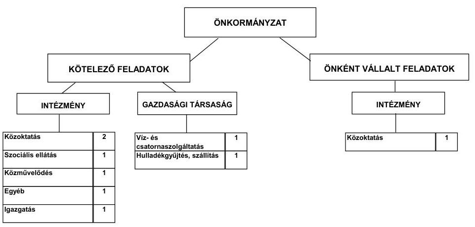

Az Önkormányzat feladatait 2011. június 30-án (a Polgármesteri hivatallal együtt) hét költségvetési szervvel és kettő közszolgáltatást nyújtó gazdasági társasággal, többcélú kistérségi társulással, továbbá vállalkozó háziorvosok útján látta el. Az intézményi összevonások következtében az intézmények száma kilencről hétre csökkent, a kötelező és az önként vállalt feladatellátás te-

[^0]
[^0]:    ${ }^{6}$ A működési kiadások nem tartalmazták a kisebbségi önkormányzatok és egyes egészségügyi szolgáltatások adatait, emiatt eltér a jelentés 2. számú mellékletének folyó kiadások összegétől. Az Önkormányzat a kisebbségi önkormányzatok működéséhez 2,6 millió Ft támogatást, a Városi Humánsegítő és Szociális Szolgálat részére védőnői szolgálat, laboratórium, iskolafogászat egészségügyi kiadásokra 32,2 millió Ft támogatást nyújtott a 2010. évben.

---

lephelyeinek száma 36-ról 37-re változott 2006. december 31-től - 2011. június 30-ig. Az Önkormányzat a két gazdasági társaságban 50% alatti tulajdonrésszel rendelkezik. A gazdasági társaságok a hulladékkezelés, a víz- és csatornaszolgáltatás kötelező feladatokban vettek részt.

Az egyes közszolgáltatások a 2007. és a 2010. évi működési kiadásainak finanszírozási összetételét az alábbi ábra szemlélteti:
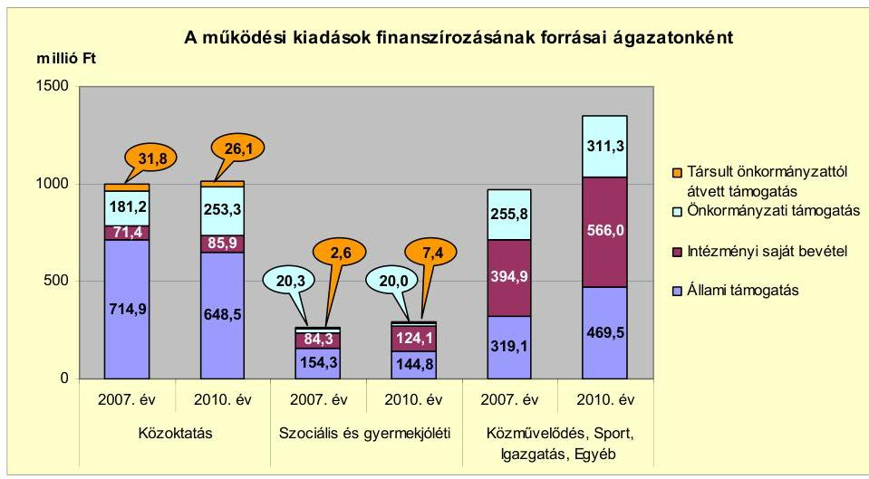

Az Önkormányzat összes működési bevétele a 2010. évben 2656,9 millió Ft volt. A kiadások finanszírozásának a 2010. évben 47,5%-a (1262,8 millió Ft) állami támogatás, 29,2%-a (775,9 millió Ft) intézményi saját bevétel, 22,0%-a (584,6 millió Ft) önkormányzati támogatás és 1,3%-a (33,5 millió Ft) társult önkormányzatoktól átvett támogatás volt.

Az Önkormányzat a közoktatási ágazatban az állami támogatások részarányának 9,1%-os csökkenését (a 2007. évi 714,9 millió Ft-ról a 2010. évre 648,5 millió Ft-ra) az önkormányzati támogatások 39,8%-os emelésével 72,1 millió Ft többlettámogatással ellensúlyozta. A szociális és gyermekjóléti ágazatban az állami támogatások részarányának 6,0%-os mérséklődése miatt (154,3 millió Ft-ról) a társult önkormányzatok 47,2%-kal emelték meg a támogatások összegét (39,8 millió Ft-ra). A közművelődési, sport-, igazgatás-, egyéb feladatokban a működési kiadások finanszírozásához az állami támogatások összege 47,1%-kal (150,4 millió Ft-tal), az intézményi saját bevételek összege 43,3%-kal (171,1 millió Ft-tal), és az önkormányzati támogatás összege 21,6%-kal (55,4 millió Ft-tal) emelkedett. Ennek oka az volt, hogy az Önkormányzat a Polgármesteri hivatalban számolta el a közcélú foglalkoztatásra, a szociálpolitikai juttatásokra a magánszemélyeknek, valamint az önkormányzati tulajdonú gazdasági társaságoknak kifizetett közszolgáltatási díjat, a városgazdálkodási szolgáltatások díját, a 2010. évi országgyűlési és önkormányzati képviselő-választások civil szervezetek támogatásával, a pályázatok előkészítésével, lebonyolításával kapcsolatos feladatok kiadásait.

Az Önkormányzat a vizsgált időszakban a kötelező és önként vállalt feladatok ellátását biztosító szervezeti keretekben, a feladatellátás módjában bekövetkezett változások, az intézmény-összevonások és a feladatok többcélú kistérségi társulás útján történő ellátása következtében a létszámcsökkentésekkel

---

150,0 millió Ft működési kiadást takarított meg, amely ugyan mérsékelten, de kedvező hatást gyakorolt pénzügyi egyensúlyi helyzetének alakulására.

Az Önkormányzat folyó költségvetési egyenlege 2007-2010 között pozitív volt, a működési forrástöbblet a tőketörlesztési kötelezettségeihez fedezetet nyújtott.

Az Önkormányzat folyó költségvetésének egyenlegét, működési jövedelmét az alábbi ábra mutatja:
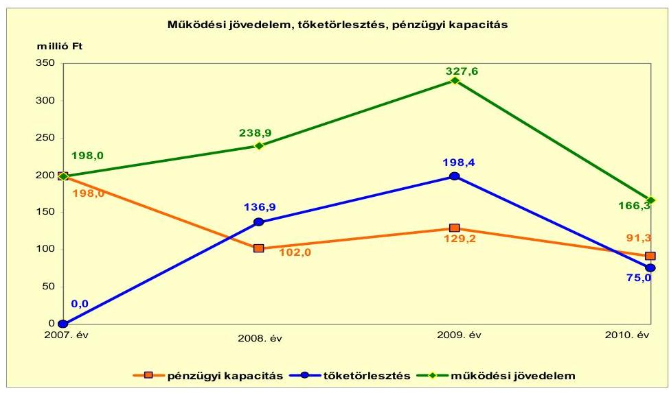

A 2007. évi 198,0 millió Ft-ról a 2008. évre 238,9 millió Ft-ra 20,6%-kal nőtt a működési jövedelem, amelyet elsősorban a helyi adóbevételek és kamatbevételek növekedése okozott. A 2008. évről a 2009. évre 88,7 millió Ft működési forrástöbblete - a 2008. évben kibocsátott 1000,0 millió Ft fejlesztési célú kötvény - kamatbevételből keletkezett. A 2009. évről a 2010. évre 161,3 millió Ft-tal, közel felére csökkent a működési jövedelem, amelyet döntően a 87,0 millió Ft fordított áfa miatti kiadásnövekedés, valamint a 42,0 millió Ft kamatbevétel-csökkenés okozott.

A 2007-2010. években a képződött működési többletek fedezni tudták a tárgyévi törlesztési kötelezettségeket, így az Önkormányzat pénzügyi kapacitása (nettó működési jövedelme) is pozitív volt. A 2007. évről a 2008. évre történt 96,0 millió Ft-os csökkenés oka a Csatornamű Társulattól átvett 170,0 millió Ft-os hosszú lejáratú hitel első részletének fizetési határidő előtti visszafizetése volt.

A felhalmozási költségvetés egyenlege 2007-2010 között - a 2009. év kivételével - negatív értéket mutatott. A vizsgált időszakban képződött 520,5 millió Ft összes nettó működési jövedelem teljes fedezetet nyújtott az ezen időszak alatt képződött 347,2 millió Ft összes felhalmozási deficitre.

Az Önkormányzat 2010. évi folyó bevétele 2858,0 millió Ft volt, amely 6,6%-kal több mint a 2007-2009. évek 2680,7 millió Ft folyó bevételének átlaga. Az évenként emelkedő tendenciát mutató folyó bevétel a fordított áfa elszámolás, kamatbevételek és működési célú pályázati támogatások hatása volt. Az Önkormányzat 2007-2010 között helyi iparűzési adót, építményadót,

---

magánszemélyek és vállalkozók kommunális adóját, idegenforgalmi adót és telekadót vetett ki. A magánszemélyek kommunális adója a 2008. évtől emelkedett, a helyi adóbevételek 65,7%-át kitevő iparűzési adó mértéke a 2011. évben a gazdasági válságra tekintettel, valamint vállalkozások működőképességének megőrzése céljából 0,2 százalékponttal csökkent.

A folyó kiadás a 2010. évben 2691,7 millió Ft volt, mely 11,0%-kal több mint az előző három év kiadásának 2425,9 millió Ft átlaga. Erre döntően a magánszemélyek részére kifizetett szociálpolitikai juttatások megemelkedett összege volt hatással.

Az Önkormányzat pénzügyi egyensúlyi helyzetét jelentősen befolyásolta az elmúlt időszak fejlesztési tevékenysége. Az Önkormányzatnál 2010. december 31-ig befejezett fejlesztési feladatok bekerülési költsége 1005,6 millió Ft volt. A beruházás és felújítás forrása a saját erő 604,0 millió Ft (60,0%), a hazai 240,4 millió Ft (23,9%) és EU-s támogatások 100,2 millió Ft (10,0%) mellett kötvénykibocsátásból származó 61,0 millió Ft (6,1%) bevétel volt. A 2010. december 31-én folyamatban lévő fejlesztési feladatok végrehajtására 2007-2010 között 401,4 millió Ft kiadást teljesítettek, amelyre saját forrásból 237,2 millió Ft-ot (59,1%-ot), EU-s támogatásból 164,2 millió Ft-ot (28,3%-ot) fordítottak. A fejlesztésekhez hitel és hazai támogatás nem kapcsolódott. Az EU-s támogatásból megvalósult fejlesztések finanszírozása likviditási gondot nem okozott.

Az Önkormányzat 2010. december 31-én folyamatban lévő fejlesztéseihez a 2010. évet követően esedékes kötelezettségvállalásainak összege 1130,7 millió Ft volt, amelynek forrásait az alábbi ábra szemlélteti:
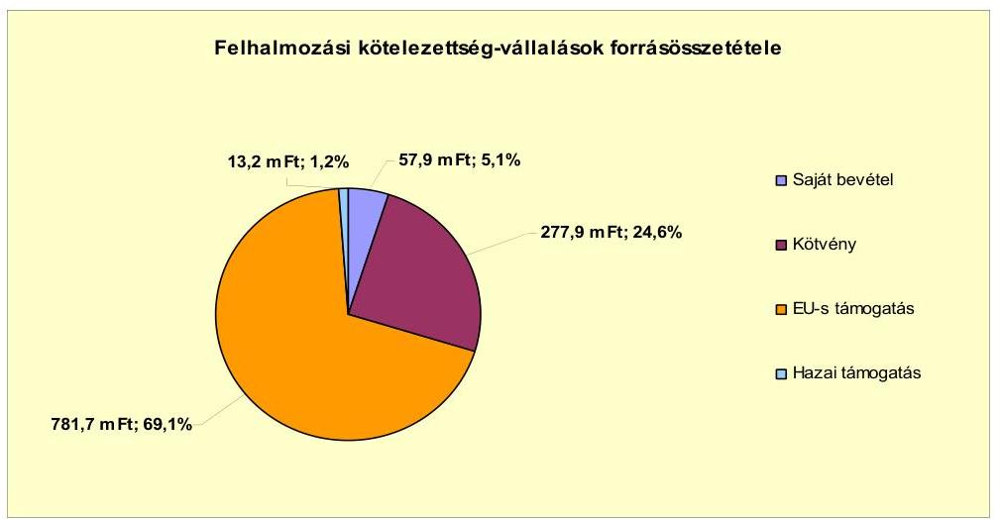

Az Önkormányzatnak két fejlesztéshez kapcsolódó 258,0 millió Ft összköltségű, elbírálás alatt lévő beadott pályázata volt, amelynek forrását (38,7 millió Ft összegben) 15,0%-ban saját bevételből és (219,3 millió Ft összegben) 85,0%-ban EU-s támogatásból tervezték.

Az Önkormányzat könyvviteli mérleg szerinti pénzintézetekkel szembeni kötelezettsége a 2006. december 31-i 485,3 millió Ft-ról a 2011. év I. félév végére 1006,1 millió Ft-ra emelkedett elsődlegesen a kötvénykibocsátás hatására.

---

A pénzintézetekkel szemben fennálló kötelezettségállomány 97,5%-át (981,1 millió Ft-ot) a 2008. október 8-án kibocsátott forint alapú, (a 2008. október 10-i konverzió alapján CHF-ben kezelt) kötvény tette ki. Az Önkormányzat a forintban pénzintézettel szemben fennálló kötelezettségeiből a
 2007-2011. év I. féléve között 460,3 millió Ft tőkét és 43,6 millió Ft kamatot fizetett. A CHF-ben pénzintézettel szemben fennálló kötelezettségeiből 173,9 ezer CHF (36,7 millió Ft) tőkét törlesztett, 443,1 ezer CHF (88,1 millió Ft) kamatot és 5,8 millió Ft egyéb díjat fizetett. Az Önkormányzat egy hitelének második részlete megfizetésével teljes mértékben rendezte a 170,0 millió Ft összegű hitelét a 2009. évben. A 2007-2011. év I. féléve között átmenetileg szabad pénzeszközeiből 282,1 millió Ft kamatbevételt realizált. A devizában fennálló pénzintézeti kötelezettségek teljesítésekor 8,8 millió Ft árfolyamveszteség keletkezett 2011. június 30-ig.

A könyvviteli mérleg pénzintézetekkel szembeni kötelezettségek állománya nem tartalmazta az árfolyamváltozások hatását, mivel az Önkormányzat a Számv. tv-ben és az Áhsz.-ben foglaltak ellenére nem végezte el a devizában fennálló kötvénykötelezettsége év végi értékelését a 2008-2010. közötti években. A könyvviteli mérleg szerinti pénzintézeti kötelezettségekhez képest az árfolyamváltozás - el nem számolt - hatása a 2010. év végén 401,9 millió Ft volt. Az Önkormányzat - az árfolyamváltozás hatását is tartalmazó - 2010. december 31-ei pénzintézeti kötelezettsége - 224,17 Ft/CHF árfolyamon - 1476,9 millió Ft volt. Ez a könyvviteli mérleg szerinti 1075,0 millió Ft pénzintézeti kötelezettségállományt 37,4%-kal haladta meg.

A vizsgált időszak alatt pénzintézetekkel szemben fennálló kötelezettségek két hosszú lejáratú - a 2007. évet megelőzően felvett - hitelből (315,3 millió Ft és 170,0 millió Ft) és egy 1000,0 millió Ft összegű kötvénykibocsátásból keletkeztek. Az Önkormányzat kötelezettségvállalásaira képviselő-testületi döntés alapján került sor. Az adósságot keletkeztető kötelezettségvállalással megvalósított felhalmozási kiadások esetleges bevételnövelő, illetve kiadáscsökkentő vonzatát, a beruházáshoz, felújításhoz vállalt kötelezettségek visszafizetési forrásként történő figyelembe vételének lehetőségét nem vizsgálták. A "Mezőberény" kötvény kibocsátásáról szóló képviselő-testületi előterjesztésében nem mutatták be a visszafizetés forrásait. Az Önkormányzat az adósságot keletkeztető kötelezettségvállalásának felső határát a vizsgált időszak alatt - az Ötv. előírását betartva - nem lépte túl. Az Önkormányzat a kötvénykibocsátáskor egyéb fedezetnyújtó biztosítékként azonnali beszedési megbízási felhatalmazást adott a banknál vezetett számlái tekintetében, amely ellentétes volt az Ötv. 88. § (1) bekezdés b) pontjában 7 foglaltakkal. A bank a vizsgált időszak alatt nem élt a beszedési megbízás benyújtásának lehetőségével. A Képviselőtestület a kötvény kibocsátást jóváhagyó határozatban a kibocsátás devizanemét és a futamidőt nem határozta meg. A devizanemváltásra vonatkozóan a polgármester felhatalmazással nem rendelkezett, banki értesítő irat az Önkormányzatnál nem állt rendelkezésre. A Képviselő-testület a konverzió költségvetésre gyakorolt hatásáról, valamint a forintra történő átváltásról több alkalommal tárgyalt, de döntést nem hozott. A tőketörlesztés 2,5 év türelmi idő

[^0]
[^0]:    7 2012. január 1-jétől az államháztartásról szóló törvény végrehajtására kiadott 368/2011. (XII. 31.) Korm. rendelet 145. § (2) bekezdése

---

után, 2011. április 30-tól kezdődően félévente esedékes, 0,0278/félév törlesztési faktor alapján 173,9 ezer CHF összegben. A kötvénybevételből 61,0 millió Ft-ot az Önkormányzat ingatlanvásárlásra fordított. A kötvénybevételből még felhasználható összeg 939,0 millió Ft volt 2011. június 30-án.

Az Önkormányzat működése pénzügyi egyensúlyának biztosításához a vizsgált időszakban nem volt szükség folyószámla-, munkabér-megelőlegezési és egyéb rövid lejáratú hitel igénybevételére.

Az Önkormányzatnak a 2007-2011. év I. félév között folyamatosan rendelkezésére álltak finanszírozásba bevonható eszközök, emellett a 2008. évben 1000,0 millió Ft összegben kötvényt bocsátott ki a későbbi évek fejlesztései finanszírozására. A Képviselő-testület a 2008. évben arról döntött, hogy a kötvénykibocsátásból átmenetileg szabad pénzeszközöket - a tervezett beruházások finanszírozási szükségletének bekövetkezéséig - betétben helyezi el, melynek felhasználásához a bank előzetes írásos engedélyére volt szükség. A kötvényből származó bevétel 93,9%-ának (939,0 millió Ft-nak) felhasználására 2011. június 30-áig nem került sor.

Az Önkormányzatnak a 2007-2011. év I. félév közötti időszakban 30 napon túli lejárt szállítói tartozása nem keletkezett.

Az Önkormányzat kötelezettségeinek 2010. december 31-ei, 2011. június 30-ai állományát, és várható alakulását - a felmerülő kamatokat és díjakat is figyelembe véve - a kötelezettség lejártáig az alábbi táblázat szemlélteti:

| Megnevezés | $\begin{gathered} \text { Állomány } \\ \text { 2010. december 31-én } \end{gathered}$ |  |  | $\begin{gathered} \text { Állomány } \\ \text { 2011. június 30-án } \end{gathered}$ |  |  | Várható kötelezettség a 2011-2013. években |  | Várható kötelezettség a 2014. évtől |  |
| :--: | :--: | :--: | :--: | :--: | :--: | :--: | :--: | :--: | :--: | :--: |
|  | HUF-ban   (millió Ft-   ban) | Összesen   (összeges   ezer CHF-   ban) | Összesen   nem | HUF-ban   (millió Ft-   ban) | Összesen   (összeges   ezer CHF-   ban) | Összesen   nem | HUF-ban   (millió Ft-ban) | Összesen   (összeges   ezer CHF-   ban) | HUF-ban   (millió Ft-   ban) | Összesen   (összeges   ezer CHF-   ban) |
| Pénzintézeti kötelezettségek |  |  |  |  |  |  |  |  |  |  |
| Pénzintézeti kötelezettségek összesen HUF-ban: hosszú lejáratú hitel | 75,0 | - | HUF | 25,3 | - | HUF | 25,3 | - | - | - |
| Pénzintézeti kötelezettségek összesen CHF-ban: "Mezőberény" kötvény | - | 6253,9 | CHF | - | 6080,1 | CHF | - | 1164,9 | - | 6072,2 |
| Szállítói tartozás | 6,3 | - | HUF | 0,0 | - | HUF | - | - | - | - |
| Jogerős végzéssel lezárt de ki nem fizetett kötelezettségek | 0,5 | - | HUF | 0,5 | - | HUF | 0,5 | - | - | - |
| Kötelezettségek összesen HUF-ban | 81,8 | - | HUF | 25,8 | - | HUF | 25,8 | - | - | - |
| Kötelezettségek összesen CHF-ban | - | 6253,9 | CHF | - | 6080,1 | CHF | - | 1164,9 | - | 6072,2 |

Az Önkormányzatnak pénzintézetekkel szemben fennálló, a 2011-2013. években esedékes kötelezettségeinek teljesítésére figyelembe vehető 1093,4 millió Ft szabad felhasználású pénzmaradvány és forgalomképes nettó ingatlanvagyon. A jelenleg ismert pénzintézeti kötelezettségei (tőke és kamat) a 2014. évtől 6072,2 ezer CHF. A kötelezettség fedezete lehet a saját bevétel, egyensúlyt javító bevételnövelő és kiadást csökkentő intézkedés hatására képződő megtakarítás, a forgalomképes nettó ingatlanvagyon és a képződő működési jövedelem. Az éves költségvetési rendeletekben nem számszerűsítették a többéves kihatású kötelezettségek visszafizetési forrását, nem vizsgálták a növekvő adósságszolgálat hatását a pénzügyi kapacitásra.

Az eszközök használhatósága is hatást gyakorol az Önkormányzat pénzügyi egyensúlyi helyzetére. Az Önkormányzat a 2007-2010. években az eszközállomány után 722,5 millió Ft összegű értékcsökkenést számolt el, miközben az aktivált felújítások, beruházások értéke 1125,9 millió Ft volt. A vizsgált időszak alatt a használhatósági fok 3,6%-kal csökkent, amely az eszközök állagának romlására, avulására utal, ami maga után vonja az üzemeltetési és fenntartási költségek növekedését is.

Az Önkormányzat az ellenőrzött időszakban az előrelátó, takarékos gazdálkodás érdekében kiadási megtakarítást eredményező és bevételt növelő intézkedéseket tett. Az Önkormányzat kimutatása szerint a 2007-2011. év I. féléve között tett intézkedések hatására 107,0 millió Ft bevételi többlet, továbbá 190,4 millió Ft kiadási megtakarítás keletkezett, ezáltal az Önkormányzat pénzügyi egyensúlyi helyzetét javították. A kiadási megtakarítások 79,0%-a az elrendelt álláshely csökkentések eredménye volt. Az álláshely-csökkentő intézkedések a 2007-2011. év I. féléve között önkormányzati szinten összesen 50 álláshely (ebből kilenc üres álláshely) megszüntetését jelentették. Egyes közszolgáltatási területeken (oktatásnál, szociális és gyerekjóléti ellátásnál, igazgatásnál) azonban feladatbővülések is voltak, amelyek álláshely- és egyben létszámnövekedéssel is jártak. Ennek következtében az időszak álláshelyeinek száma összevonva, 23 fővel csökkent. A bevételnövelő intézkedések ingatlanok és eszközök értékesítéséhez, bérbeadásához, bérleti díjak emeléséhez, átmenetileg szabad pénzeszközök lekötéséhez kapcsolódtak.

Az utóellenőrzés a pénzügyi egyensúly javítására tett szabályszerűségi javaslat hasznosítására terjedt ki, amelyet az intézkedési terv szerinti határidőben megvalósítottak. Az Önkormányzat a 2011. évi költségvetési rendeletében az Áht. előírásainak megfelelően, finanszírozási célú pénzügyi műveletek nélkül mutatta be a költségvetési bevételi és kiadási előirányzatok főösszegeit. A jegyzőnek tett célszerűségi javaslat részben teljesült, mivel a 2011. évi költségvetési terv elfogadása során csak szóban tájékoztatták a Képviselő-testületet a hosszú lejáratú, adósságot keletkeztető kötelezettségvállalásokból adódó tőke- és kamatfizetési kötelezettségek teljesítésének feltételeiről.

Az Önkormányzat pénzügyi egyensúlyi helyzetét összegezve a következők emelhetők ki:

Az Önkormányzat pénzügyi egyensúlya rövid és középtávon biztosított. A pénzügyi egyensúly hosszú távú megőrzésére az Önkormányzatnak fel kell készülnie.

Az Önkormányzat által besorolt önként vállalt feladatok kiadásainak részaránya magas volt, azonban 2010-re kismértékben csökkent.

Az Önkormányzat folyó bevételei fedezetet biztosítottak a folyó kiadások mellett az adósságszolgálatra is.

A folyamatban lévő fejlesztési projektekhez, a benyújtott pályázatokhoz szükséges saját erőhöz a források a kötvénybevételből rendelkezésre állnak.

Az Önkormányzatnak szállítói tartozása nem volt, likvid hitelt nem vett igénybe. Hosszú lejáratú kötelezettsége kötvénykibocsátás miatt keletkezett.

---

Gazdasági társaságok miatti kockázat nem áll fenn, mivel az Önkormányzat kizárólagos tulajdonú gazdasági társasággal nem rendelkezett a vizsgált időszakban.

Az Állami Számvevőszékről szóló 2011. évi LXVI. törvény 33. § (1) bekezdésében foglaltak értelmében a jelentésben foglalt megállapításokhoz kapcsolódó intézkedési tervet köteles az ellenőrzött szervezet vezetője összeállítani és azt a jelentés kézhezvételétől számított harminc napon belül az ÁSZ részére megküldeni. Amennyiben az intézkedési tervet határidőben nem küldi meg a szervezet, vagy az továbbra sem fogadható el, az ÁSZ elnöke a hivatkozott törvény 33. § (3) bekezdés a)-b) pontjaiban foglaltakat érvényesítheti.

# A 2011. június 30-i pénzügyi egyensúlyi helyzet alapján ellenőrzés intézkedést igénylő megállapításai és javaslatai a következők: 

## a Polgármesternek

1. Az Önkormányzat pénzügyi egyensúlyi helyzete rövid és középtávon biztosított. A pénzügyi egyensúly hosszú távú megőrzésére az Önkormányzatnak fel kell készülnie. Az éves költségvetési rendeletekben nem számszerűsítették a többéves kihatású kötelezettségek visszafizetési forrását, nem vizsgálták a növekvő adósságszolgálat hatását a pénzügyi kapacitásra.

Javaslat:
a) Folyamatosan tájékoztassa a Képviselő-testületet az Önkormányzat pénzügyi egyensúlyi helyzetéről. Kezdeményezzen szükség esetén intézkedéseket a pénzügyi egyensúly hosszú távú fenntarthatósága érdekében.
b) Képezzen elkülönített tartalékot az adósságszolgálat jövőbeni teljesítése érdekében.
2. Az adósságot keletkeztető kötelezettségvállalással megvalósított felhalmozási kiadások esetleges bevételnövelő, illetve kiadáscsökkentő vonzatát, a beruházáshoz, felújításhoz vállalt kötelezettségek visszafizetési forrásként történő figyelembevételének lehetőségét nem vizsgálták. A „Mezőberény" kötvény kibocsátásáról szóló képviselőtestületi előterjesztésében nem mutatták be a visszafizetés forrásait. A Képviselőtestület a kötvény kibocsátást jóváhagyó határozatban a kibocsátás devizanemét és a futamidőt nem határozta meg.

Javaslat:
Vizsgáltassa meg az adósságot keletkeztető kötelezettségvállalással megvalósított felhalmozási kiadások esetleges bevételnövelő, illetve kiadáscsökkentő vonzatát, a beruházáshoz, felújításhoz vállalt kötelezettségek visszafizetési forrásként való számbavételét. Gondoskodjon arról, hogy a
 jövőben az adósságot keletkeztető kötelezettségvállalásokról szóló képviselő-testületi előterjesztésekben mutassák be a visszafizetés forrásait. Tegyen intézkedést annak érdekében, hogy az Önkormányzat által kibocsátott „Mezőberény” kötvényre vonatkozó további Képviselő-testületi döntések a konkrét feltételeket tartalmazzák.

---

# a jegyzőnek 

1. A könyvviteli mérleg szerinti pénzintézettel szembeni kötelezettségek állománya nem tartalmazta az árfolyamváltozások hatását, mivel az Önkormányzat a Számv. tv.-ben és az Áhsz.-ben foglaltak ellenére nem végezte el a devizában fennálló kötvény kötelezettsége év végi értékelését a 2008-2010. években.

Javaslat:
Gondoskodjon arról, hogy a devizában fennálló kötelezettségeket a Számv. tv. 60. § (2) bekezdésének és az Áhsz. 33. § (1) bekezdésének előírásai alapján év végén értékeljék és a változásokat a számviteli nyilvántartásokban rögzítsék.
2. Az Önkormányzat a kötvénykibocsátáskor egyéb fedezetnyújtó biztosítékként azonnali beszedési megbízási felhatalmazást adott a banknál vezetett számlái tekintetében, amely ellentétes volt az Ötv.-ben foglaltakkal.

Javaslat:
Tegyen intézkedést az Áht. végrehajtásáról szóló 368/2011. (XII. 31.) Korm. rendelet 145. § (2) bekezdésével ellentétes gyakorlat megszüntetésére.

A polgármester a helyszíni ellenőrzés lezárása után tájékoztatta az Állami Számvevőszéket az Önkormányzat tervezett intézkedéseiről, amelyet az Állami Számvevőszék nem ellenőrzött, arra vonatkozóan véleményt, vagy megállapítást nem fogalmaz meg. Az ellenőrzés lezárását követően elvégzett intézkedéseket az Állami Számvevőszék utóellenőrzés keretében vizsgálhatja.

A polgármester tájékoztatása szerint a következő intézkedéseket tervezi az Önkormányzat:

- Az Önkormányzat pénzügyi helyzetéről a Képviselő-testület részére írásban is tájékoztatást kíván adni, továbbá megkezdte a tárgyalásokat a pénzintézettel a „Mezőberény” kötvény szerződési feltételeinek módosítására.

---

# II. RÉSZLETES MEGÁLLAPÍTÁSOK 

## 1. Az ÖNKORMÁNYZAT KÖTELEZŐ ÉS ÖNKÉNT VÁLLALT FELADATAI, A FELADATELLÁTÁS SZERVEZETI KERETEI ÉS ANNAK VÁLTOZÁSAI

Az Önkormányzat a kötelezően ellátandó feladatokról az SzMSz-ben rendelkezett. Az önként vállalt feladatokra fordított kiadások nagyságát az éves költségvetési rendeletekben az adott évi költségvetés forrásainak ismeretében határozta meg. Az Önkormányzat a 2007-2010. években a kötelező feladatok ellátása mellett önként vállalt feladatnak tekintette az alapfokú művészetoktatási, a középfokú oktatási (gimnáziumi), a kollégiumi, a szociális otthoni, a bölcsődei, a közművelődési, és egyes városgazdálkodási feladatokat, a fürdő és strandszolgáltatást. Az Önkormányzat a kötelező közoktatási feladatait (az óvodai nevelést, az általános iskolai oktatást) többcélú kistérségi társulás útján látta el. Az Önkormányzat a többcélú kistérségi társulás keretein belül intézményfenntartó társulási szerződést kötött a családsegítő és gyermekjóléti, a házi segítségnyújtási, a jelzőrendszeres házi segítségnyújtási szolgálat, nappali ellátási, étkeztetési feladatok ellátására.

Az Önkormányzat működési kiadásainak a 2010. év teljesített összege 2656,9 millió Ft volt, amely 270,7 millió Ft-tal (11,3%-kal) növekedett a 2007-2009. évek 2386,2 millió Ft-os átlagához képest. Az összeg tartalmazta az államháztartáson belülre átadott pénzeszközöket, valamint a transzferkiadásokat (magánszemélyeknek, civilszervezeteknek átadott kiadások), ezért eltér a jelentés 2. számú mellékletében a CLF módszer szerinti működési kiadások kamatkiadások nélküli összegétől. Az önkormányzati intézmények összességét vizsgálva a működési kiadások növekménye a Polgármesteri hivatalban, a szociális ágazatban és az egyéb intézményeknél jelentkezett. Az Önkormányzat működési kiadásainak összege 2007-2010 között 427,0 millió Ft-tal, 2230,7 millió Ft-ról 2656,9 millió Ft-ra növekedett. A többletkiadásokat állami támogatásból (74,6 millió Ft-tal), intézményi saját bevételből (225,2 millió Ft-tal) és önkormányzati támogatásból (127,2 millió Ft-tal) finanszírozta az Önkormányzat.

Az Önkormányzat 2010. évi működési kiadásait és bevételeit, valamint azok finanszírozási arányait mutatja be a következő táblázat főbb feladatonként:

---

| Ellátott feladat | Működési   kiadás   összesen   (millió Ft) | Kötelező   feladatok   kiadásainak   részaránya   % | Működési   bevétel   összesen   (millió Ft) | Állami   támogatás   részaránya   % | Intézményi   saját bevétel   részaránya   % | Önkormányzati   támogatás   részaránya   % | Társult   önkormányzat-   toktól átvett   támogatás   % |
| :--: | :--: | :--: | :--: | :--: | :--: | :--: | :--: |
| Óvodák | 204,8 | 100,0 | 204,8 | 54,8 | 6,1 | 35,6 | 3,5 |
| Általános iskola | 509,5 | 92,8 | 509,5 | 53,9 | 8,2 | 34,2 | 3,7 |
| Gimnázium | 206,3 | 0,0 | 206,3 | 81,2 | 12,4 | 6,4 | 0,0 |
| Kollégium | 93,2 | 0,0 | 93,2 | 101,1 | 6,7 | -7,8 | 0,0 |
| Szociális intézmények | 286,4 | 48,2 | 286,4 | 48,0 | 43,3 | 6,1 | 2,6 |
| Gyermekjóléti intézmények | 9,9 | 100,0 | 9,9 | 74,4 | 0,0 | 25,6 | 0,0 |
| Közművelődési intézmény | 83,7 | 90,0 | 83,7 | 8,1 | 17,1 | 74,8 | 0,0 |
| Sportlétesítmény | 3,9 | 100,0 | 3,9 | 12,8 | 0,0 | 87,2 | 0,0 |
| Egyéb intézmény | 462,4 | 64,6 | 462,4 | 29,0 | 55,7 | 15,3 | 0,0 |
| Polgármesteri hivatal igazgatási kiadásai | 232,2 | 100,0 | 232,2 | 9,0 | 15,9 | 75,1 | 0,0 |
| Polgármesteri hivatalban ellátott egyéb feladatok működési kiadásai | 564,6 | 78,7 | 564,6 | 54,0 | 45,5 | 0,0 | 0,0 |
| Működési kiadások összesen | 2656,9 | 70,8 | 2656,9 | 47,5 | 29,2 | 22,0 | 1,3 |

Az Önkormányzat - adatszolgáltatása szerint⁸ - a 2010. évben a 2656,9 millió Ft összegű működési célú költségvetési kiadásaiból 1880,0 millió Ft-ot (70,8%-ot) a kötelező feladataira, 776,9 millió Ft-ot (29,2%-ot) az önként vállalt feladataira fordított. A 2007-2009. évek között a tárgyévi működési kiadásoknak átlagosan 69,6%-át, 1659,9 millió Ft-ot fordította a kötelező, 30,4%-át, 726,2 millió Ft-ot az önként vállalt feladatok ellátására. Önkormányzati szinten a 2007-2009. évek átlagához képest a kötelező feladatok aránya a 2010. évben kis mértékben, 1,2%-kal emelkedett az önként vállalt feladatok részarányának azonos arányú csökkenése mellett.

Az önként vállalt feladatokra fordított kiadások részarányának alakulásában az egyes intézményeknél ettől eltérő tendencia volt tapasztalható. A szociális intézményeknél a 2010. évben a kötelező feladatok részaránya 48,2%, az önként vállalt feladatoké 51,8% volt. A szociális intézményeknél az önként vállalt mértékének emelkedését indokolta, hogy az ellátottak száma növekedett a szociális otthoni és a bölcsődei ellátásnál. Ennek megfelelően a saját bevételek is növekedtek a térítési díjak emelése miatt. A Polgármesteri hivatalban a 2007-2009. évi átlag 85,0%-ról a 2010. évre 78,7%-ra csökkent a kötelező feladatok részaránya, míg az önként vállalt feladatok részaránya a három év átlagának 15,0%-ról 21,3%-ra emelkedett a 2010. évben.

Az önként vállalt feladatokra fordított működési kiadásoknak az összes kiadásokon belüli közel egyharmados nagysága az Önkormányzat pénzügyi egyen-

[^0]
[^0]: ⁸ A működési kiadások nem tartalmazták a kisebbségi önkormányzatok és egyes egészségügyi szolgáltatások adatait, emiatt eltér a jelentés 2. számú mellékletének folyó kiadások összegétől. Az Önkormányzat a kisebbségi önkormányzatok működéséhez 2,6 millió Ft támogatást, a Városi Humánsegítő és Szociális Szolgálat részére védőnői szolgálat, laboratórium, iskolafogászat egészségügyi kiadásokra 32,2 millió Ft támogatást nyújtott a 2010. évben.

---

súlyának fenntarthatóságára hosszú távon kihatással lehet, annak ellenére, hogy ez a részarány a 2011. évi tervadatok alapján enyhén csökkenő tendenciát mutat (27,8% körül várható az önként vállalt feladatokra fordított kiadások részaránya).

Az Önkormányzat összes működési kiadásain belül a közoktatási ágazat kiadása az ellenőrzött időszakban közel azonos nagyságrendű volt. A 2007-2009. évek közötti átlag 1007,0 millió Ft, a 2010. évben 1013,8 millió Ft volt, mindössze 0,7%-kal (6,8 millió Ft-tal) tért el az előző évektől. A kiadások forrásául szolgáló működési bevételeken belül az intézményi saját bevétel átlag összege a 2007-2009. években 82,8 millió Ft (8,2%-os részarányt), míg a 2010. évben az átlag 85,8 millió Ft (8,5%-os részarányt) képviselt. Az ágazatban jelentősebb változás volt, hogy a 2010. évi 648,5 millió Ft állami támogatás összege tíz százalékkal (72,4 millió Ft-tal) alatta maradt a 2007-2009. évek közötti 720,9 millió Ft-os átlagnak. A társult önkormányzatoktól átvett támogatás is csökkent, 31,8 millió Ft-ról 26,1 millió Ft-ra. Az Önkormányzat a bevételkiesések ellensúlyozására az önkormányzati támogatás összegét 47,5%-kal megemelte, amely ennek következtében a 2007-2009. évek 171,7 millió Ft-os átlagához képest a 2010. évben 253,3 millió Ft-ra növekedett. Az ágazaton belül az óvodai ellátottak létszáma a 370 fős átlagról a 2010. évben 400 főre nőtt a Bélmegyeri és Muronyi óvoda átvétele miatt, ugyanakkor az általános iskolai létszám csökkent, így ezek ellentétes hatása kiegyenlítette egymást.

A szociális és gyermekvédelmi ágazatban a 2007-2009. évek átlag működési kiadásainak 274,0 millió Ft-os összege a 2010. évre 8,1%-kal, 296,3 millió Ft-ra emelkedett. A működési kiadások növekedését a szociális és gyermekvédelmi ellátásokat igénybevevők számának növekedése befolyásolta. Az Önkormányzat a szociális alapellátásban 2008-2010 között összesen 873 fő, a gyermekvédelmi feladatoknál 45 fő ellátotti létszámot vett át a társult önkormányzatoktól. A működési kiadások növekedéséhez hozzájárult az is, hogy az étkeztetési feladatok ellátására 2010. január 1-től Kamut és Murony községek önkormányzatai is csatlakoztak a többcélú kistérségi társuláshoz, melynek gesztori feladatait az Önkormányzat látta el. Az ágazat működési feladatainak finanszírozásához nyújtott normatívák csökkenése miatt az állami támogatások nagyságrendje a 2007-2009. évi átlag 162,2 millió Ft-ról (10,7%-kal) a 2010. évben 144,8 millió Ft-ra csökkent. A kieső állami támogatást részben az önkormányzati támogatás, részben a térítési díjak emelésével pótolta az Önkormányzat. A 2010. évben az intézményi saját bevételek összegének 2007-2009 közötti 92,7 millió Ft-os átlaga 33,8%-kal, 124,0 millió Ft-ra nőtt⁹. A 2009. és a 2010. évi intézményi saját bevétel emelkedéséhez hozzájárult a közcélú munkavállalók alkalmazásához nyújtott támogatások folyósítása¹⁰, továbbá az ellátottak számának emelkedése miatt a társult önkormányzatoktól átvett támogatás összegének 2,6 millió Ft-ról 7,5 millió Ft-ra történő növekedése.

[^0]
[^0]: ⁹ A 2008. évről a 2010. évre az Idősek Otthonában a térítési díjak átlaga a Puskin utcai telephelyen 50,5 ezer Ft-ról 54,6 ezer Ft-ra, a Juhász Gyula utcai telephelyen 62,9 ezer Ft-ról 72,0 ezer Ft-ra emelkedett.
¹⁰ A Munkaügyi Központ közvetlenül az intézményhez utalta a közcélú foglalkoztatottak támogatásának összegét.

---

A közoktatási, szociális és gyermekjóléti feladatokkal kapcsolatban a társult önkormányzatok évente biztosították (feladatmutatóval arányosan) a többcélú kistérségi társulásnak a település lakosságának ellátásával kapcsolatban jelentkező kiadások és az állami támogatás összegének különbözetét. Ezen a jogcímen a 2007-2010 közötti időszakban az Önkormányzat részére összesen 136,0 millió Ft támogatást fizettek a társult önkormányzatok.

A közművelődési, sport, igazgatási és egyéb feladatok a 2007-2009. évek működési kiadásainak átlag 1105,2 millió Ft-os összege a 2010. évre 241,6 millió Ft-tal emelkedett (21,8%-kal), 1346,8
 millió Ft-ra. A növekedést elsősorban a Polgármesteri hivatalban ellátott feladatok működési kiadásai összegének a 30,6%-os emelkedése befolyásolta. A 2007-2009. évi kiadások átlag 391,9 millió Ft-os összege a 2010. évre, 564,6 millió Ft-ra nőtt. Ennek oka az volt, hogy az Önkormányzat a Polgármesteri hivatalban számolta el a közcélú foglalkoztatásra, a szociálpolitikai juttatásokra a magánszemélyeknek, valamint az önkormányzati tulajdonú gazdasági társaságoknak kifizetett közszolgáltatási díjat, a városgazdálkodási szolgáltatások díját, a 2010. évi országgyűlési és önkormányzati képviselő-választások civil szervezetek támogatásával, a pályázatok előkészítésével, bonyolításával kapcsolatos feladatok kiadásait.

A Polgármesteri hivatal kiadásain belül a 2007. évről a 2010. évre:

- a személyi kiadások és járulékai 143,4 millió Ft-ról (35,2 millió Ft-tal) 178,6 millió Ft-ra növekedtek a különböző pályázatokhoz kapcsolódó kiadások, és a végkielégítésre fordított összeg miatt;
- a dologi kiadások 164,3 millió Ft-ról 294,6 millió Ft-ra (130,3 millió Ft-tal) növekedtek, melyet a közvilágítási, a város- és községgazdálkodási 29,6 millió Ft, a hulladékszállítás- és kezelési 25,3 millió Ft, a kiszámlázott termékek után fizetendő 12,9 millió Ft áfa és a 62,5 millió Ft fordított áfa többletköltségei okoztak.

A közművelődési, sport, igazgatási és egyéb feladatok kiadások forrásául szolgáló működési bevételein belül:

- az állami támogatások összege a 2010. év teljesített összegének (469,5 millió Ft) 84,1%-a volt a 2007-2009. évek 394,7 millió Ft-os átlaga;
- az önkormányzati támogatás a 2010. évi 311,3 millió Ft-os teljesített összegének 65,8%-a volt a 2007-2009. évek 204,8 millió Ft-os átlaga;
- az intézményi saját bevétel a 2010. évi 566,0 millió Ft-os teljesített összegének a 89,3%-a volt a 2007-2009. évek 505,7 millió Ft-os átlaga.

Az Önkormányzat látta el a gimnáziumi oktatási, a két tannyelvű oktatási, az alapfokú művészetoktatási, a kollégiumi, egészségügyi alapellátási, a kulturális és közművelődési feladatokat. A többcélú kistérségi társulás keretén belül biztosította az óvodai nevelési, az általános iskolai oktatási, a házi-, illetőleg a jelzőrendszeres házi segítségnyújtási, családsegítési, az időskorúak nappali ellátási, a szociális étkeztetési, a gyermekjóléti, valamint az ápolást, gondozást nyújtó ellátás, idősek bentlakásos otthonával kapcsolatos feladatainak közös ellátását.

---

Az Önkormányzat feladatait 2011. június 30-án (a Polgármesteri hivatallal együtt) hét $^{11}$ költségvetési szervvel és kettő kötelező közszolgáltatást nyújtó, 50% alatti önkormányzati tulajdonban álló gazdasági társasággal látta el. A költségvetési szervek száma az ellenőrzött időszak alatt kilencről hétre csökkent a közművelődési intézményeknél a 2008. január 1-jével történt összevonás miatt $^{12}$. A feladatellátás telephelyeinek száma 37 volt, amely nem változott a 2007. évről 2011. június 30-ig.

A 2008. év első félévében a bélmegyeri óvodát, majd a 2010. évben a muronyi óvodát vették át a községi önkormányzatoktól, összesen 48 fővel. A 2011. évben a 24 fős Luther utcai óvodát átadták az evangélikus egyháznak. Óvodai feladatok ellátását az Önkormányzat gesztorságával működtetett többcélú kistérségi társulás közoktatási intézményfenntartó társulása $^{13}$ alapellátó intézményéhez telepítették. A feladatok átadását a központi költségvetés által a többcélú társulásoknak nyújtott jelentős többlettámogatás és az Önkormányzat kiadáscsökkentő szándéka motiválta.

Az Önkormányzat adatszolgáltatása alapján 2008-2010 között a feladatátvétel-, átadás 250,2 millió Ft költségvetési kiadási és bevételi növekedést eredményezett. A működési kiadások növekedésének 68,1%-a (170,4 millió Ft) a személyi juttatások és járulékai, 31,9%-a (79,8 millió Ft) dologi kiadás volt. A működési bevételek körében az állami támogatás 16,2 millió Ft-tal (66,0%-kal), az intézményi saját bevételek 40,3 millió Ft-tal (16,1%-kal), az önkormányzati támogatás 44,7 millió Ft-tal (17,9%-kal) növekedett.

Az áttekintett időszakban további feladatot, vagy intézményt nem adtak át más önkormányzatnak, társulásnak, egyháznak, gazdasági társaságnak, egyéb szervezetnek. Intézményi átszervezés, feladatátrendezés történt a kulturális intézményeknél, amelynek bevételi-kiadási egyenlege azonos nagyságrendű volt.

A 2007-2010. években kötelező közszolgáltatások ellátásában kettő 50% alatti önkormányzati tulajdonú gazdasági társaság vett részt.

Az Önkormányzat az alábbi társaságokban rendelkezett a 2010. év végén 50% alatti részesedéssel:

- a Békés Megyei Vízművek Zrt.-ben 1,97%. A társaság által ellátott közszolgáltatási feladat a vízszolgáltatás és szennyvízelvezetés;

[^0]
[^0]:    $^{11}$ Mezőberény Kistérségi Általános Iskola - Alapfokú Művészetoktatási Intézmény, Kollégium és Egységes Pedagógiai Szakszolgálat; Mezőberényi Kistérségi Óvoda; Petőfi Sándor Gimnázium, Kollégium és Közétkeztetési Központ; Városi Humán Segítő és Szociális Szolgálat; Városi Közszolgáltató Intézmény; Orlai Petrics Soma Kulturális Központ; Polgármesteri hivatal.
    $^{12}$ A 2008. évben a Városi Könyvtár, a Művelődési Központ, és az Orlai Petrics Soma Kulturális Központ egyesítésével létrehoztak egy többcélú kulturális központ intézményt.
    $^{13}$ Bélmegyer-Mezőberény-Murony Óvodai Mikrótárségi Intézményi Társulás látja el hat tagintézménnyel az óvodai feladatokat.

---

- a TAPPE Szállítási és Feldolgozó Kft.-ben 5,0%. A társaság közszolgáltatási feladata Mezőberény Város közigazgatási területén a szilárd és a folyékony hulladék gyűjtése, elszállítása, elhelyezése és ártalmatlanítása.

A tulajdoni hányad nagysága (1,9 és 5,0%) miatt az Önkormányzat pénzügyi egyensúlyi helyzetére a gazdasági társaságok nem hatottak jelentősen. Az önkormányzati feladatok ellátásában részt vevő gazdasági társaságok gazdálkodását, illetve működését érintő adatokat a jelentés 4. számú melléklete mutatja be.

Az Önkormányzat a szervezeti és működési keretein belül az intézményeivel, a többcélú kistérségi társaság, valamint gazdasági társaságok útján a kötelező és önként vállalt feladatait a 2010. évben 2656,9 millió Ft működési kiadásból látta el pénzügyi egyensúlyának fenntartásával. A működési bevételeinek forrását 47,5%-ban állami támogatás, 29,2%-ban intézményi saját bevétel, 22,0%-ban önkormányzati támogatás és 1,3%-ban a társult önkormányzatoktól átvett pénzeszközök biztosították.

Az Önkormányzat a vizsgált időszakban a kötelező és önként vállalt feladatok ellátását biztosító szervezeti keretekben, a feladatellátás módjában bekövetkezett változások, az intézmény-összevonások és a feladatok többcélú kistérségi társulás útján történő ellátása következtében a létszámcsökkentésekkel 150,0 millió Ft kiadást takarított meg, amely ugyan mérsékelten, de kedvező hatást gyakorolt pénzügyi egyensúlyi helyzetének alakulására.

# 2. AZ ÖNKORMÁNYZAT PÉNZÜGYI EGYENSÚLYI HELYZETÉT BEFOLYÁSOLÓ TÉNYEZŐK 

A hagyományos költségvetési szerkezet helyett az Önkormányzat pénzügyi helyzetét a CLF módszerrel mutatjuk be, amelyben jobban elkülönülnek a vagyonnal kapcsolatos bevételek és kiadások az önkormányzati feladatokkal kapcsolatos közvetlen működtetési bevételektől és kiadásoktól. A módszer következetesen elkülöníti a folyó és a felhalmozási költségvetés bevételeit és kiadásait, azok költségvetési egyenlegeit. A saját folyó bevételek, valamint a saját felhalmozási bevételek nem tartalmazzák az előző évi pénzmaradványok felhasználásából származó pénzforgalom nélküli bevételeket $^{14}$.

A folyó költségvetés egyenlege, a működési jövedelem megmutatja, hogy az Önkormányzat éves folyó bevétele fedezetet biztosít-e a kötelező és önként vállalt feladatellátáshoz kapcsolódó éves folyó kiadására. A működési jövedelem negatív értéke pénzügyileg fenntarthatatlan helyzetet jelez. A mutató pozitív értéke megtakarítást mutat, amely forrásul szolgálhat az Önkormányzat fennálló kötelezettségei megfizetéséhez, valamint fejlesztéseihez.

A felhalmozási költségvetés pozitív értéke felhalmozási többletet mutat, amely a jövőbeni fejlesztések forrását biztosíthatja. Amennyiben a folyó költségvetési hiány finanszírozása a felhalmozási többletből történik, ez szűkebb

[^0]
[^0]:    $^{14}$ A költségvetési években kialakuló hiány finanszírozása az előző évi pénzmaradvány és a korábbi években képzett tartalékok felhasználásával is történhet.

---

értelemben vagyonfelélésnek tekinthető. Amennyiben a felhalmozási költségvetés megtakarítása fejlesztési célú hitelek, kötvények adósságszolgálatát finanszírozza, az változatlan vagyontömeg mellett, a korábban megelőlegezett tőkebevételek valós realizációjának tekinthető. A felhalmozási deficit által generált finanszírozási igény önmagában nem jár pénzügyi kockázattal, a pénzügyileg fenntartható beruházásokhoz kapcsolódó kötelezettségvállalás (adósságszolgálat) átlátható és szabályozott költségvetési gazdálkodással teljesíthető.

A módszer a pénzügyi kapacitás fogalmát helyezi a középpontba. Az adós hitelfelvételi képessége, hosszú távú fizetőképessége, vagy bonitása a pénzügyi kapacitással, ezen belül is a nettó működési jövedelemmel jellemezhető. A nettó működési jövedelem negatív értéke az egyes költségvetési években jelentkező adósságszolgálat túlzott mértékére utal. $^{15}$ A nettó működési jövedelem negatív értékének felhalmozási többletből, vagy további hitelből történő finanszírozása pénzügyileg nem fenntartható gazdálkodást vetít előre. A pozitív értéket mutató nettó működési jövedelem fejlesztési kiadások fedezetét biztosíthatja, illetve a folyamatosan, évenként képződő pozitív nettó működési jövedelemből meghatározható a jövőben vállalható, teljesíthető éves adósságszolgálat, ily módon az a hitelösszeg, amely - a többi tényezőt, feltételt adottnak tekintve - visszafizetési kockázat nélkül felvehető.

A CLF módszer alapján a pénzügyi kapacitás mértéke az Önkormányzat összevont, nettósított, a központi információs rendszerbe a Magyar Államkincstáron keresztül leadott éves költségvetési beszámolójának 80-as űrlapjában szerepeltetett adatok alapján került meghatározásra.

A számítási leírás némileg eltér az ÁSZ módszertanában korábban alkalmazott gyakorlattól. A jelen besorolás általános közgazdasági meggondolásokon alapul, amely megjelenik az SNA statisztikai módszertanában is. Folyó tételek alatt értjük azokat a kiadásokat és bevételeket, amelyek a gazdálkodó szervezet helyzetét automatikusan nem változtatják. Bevételi oldalon ilyenek az adók, a tényezőjövedelmek, a transzferek, kiadási oldalon a transzferek $^{16}$ és a szolgáltatás igénybevételével kapcsolatos működési kiadások. A folyó költségvetésben a bevételekben nem térül meg, a kiadásokban nem jelenik meg az amortizáció, a vagyoni helyzetet az egyenleg befolyásolja.

A folyó költségvetés egyenlege (működési jövedelem) tartalmazza a kamatbevételeket és a kamatkiadásokat is, mind a működési, mind a fejlesztési kamatot, valamint a visszatérülő és befizetendő áfa teljes összegét, mert ezek közgazdaságilag tényezőjövedelmek. Nem tartalmazzák viszont a követelés elengedés miatt könyvelt bevételi és kiadási pénzforgalmi tételeket, mert valójában technikai elszámolási műveletnek minősülnek, a bevétel soha nem realizálódott, és költségvetési kiadás sem történt.

[^0]
[^0]:    $^{15}$ kivéve, ha annak finanszírozására a korábbi években képzett tartalékok fedezetet nyújtanak
    $^{16}$ Transzfer kiadásoknak nevezzük azokat a folyó és felhalmozási tételeket, amelyeket nem az adott önkormányzat használ fel szolgáltatásnyújtásra.

---

A felhalmozási költségvetésben a bevételek között a vagyon megőrzésére és bővítésére fordítható források jelennek meg. A felhalmozási vagy tőketételek módosítják a vagyon nagyságát. A privatizációs bevétel csökkenti a vagyont, a fizikai beruházás, pénzügyi befektetés növeli.

A nettó működési jövedelmet a tőketörlesztés levonásával a folyó költségvetés egyenlegéből származtatjuk.

# 2.1. A működési és a felhalmozási egyensúly változása 

CLF módszer szerinti önkormányzati adatok

| Megnevezés | 2007. év | 2008. év | 2009. év | 2010. év |
| :--: | :--: | :--: | :--: | :--: |
| Folyó bevételek** | 2468,0 | 2754,0 | 2820,2 | 2858,0 |
| Folyó kiadások | 2270,0 | 2515,1 | 2492,6 | 2691,7 |
| Működési jövedelem | 198,0 | 238,9 | 327,6 | 166,3 |
| Nettó működési jövedelem   =működési jövedelem - tőketörlesztés | 198,0 | 102,0 | 129,2 | 91,3 |
| Felhalmozási bevételek** | 134,7 | 360,9 | 376,8 | 450,2 |
| Felhalmozási kiadások | 367,9 | 411,3 | 330,8 | 559,8 |
| Felhalmozási költségvetés egyenlege | $-233,2$ | $-50,4$ | 46,0 | $-109,6$ |
| Finanszírozási műveletek nélküli (GFS) pozíció = működési jövedelem + felhalmozási költségvetés egyenlege | $-35,2$ | 188,5 | 373,6 | 56,7 |

 |
| Finanszírozási műveletek egyenlege | $-218,2$ | 1134,2 | $-152,7$ | $-145,8$ |
| Tárgyévi pénzügyi pozíció | $-253,4$ | 1322,7 | 220,9 | $-89,1$ |
| Egyéb tájékoztató adatok |  |  |  |  |
| Összes kötelezettség* | 592,2 | 1569,0 | 1409,1 | 1091,5 |
| -ebből rövid lejáratú | 79,8 | 304,9 | 126,0 | 147,1 |
| Folyószámlahitel napi átlagos állománya | 0,0 | 0,0 | 0,0 | 0,0 |
| Likvidhitel napi átlagos állománya | 0,0 | 0,0 | 0,0 | 0,0 |
| Munkabérhitel napi átlagos állománya | 0,0 | 0,0 | 0,0 | 0,0 |
| Finanszírozásba vonható eszközök: | 64,2 | 1373,8 | 1581,8 | 1479,6 |
| Tartós hitelviszonyt megtestesítő értékpapírok év végi állománya | 38,9 | 25,9 | 13,0 | 0,0 |
| Hosszú lejáratú bankbetétek év végi állománya | 0,0 | 0,0 | 0,0 | 0,0 |
| Értékpapírok év végi állománya | 0,0 | 0,0 | 0,0 | 0,0 |
| Pénzeszközök (idegen pénzeszközök nélkül) év végi állománya | 25,3 | 1347,9 | 1568,8 | 1479,6 |

* Az összes kötelezettséget a passzív pénzügyi elszámolások nélkül vettük figyelembe, mert a passzívák a pénzmaradvány elszámolás tételei közé tartoznak.
** A folyó bevételek között szerepel a fejlesztési célú támogatások összege.

Az Önkormányzat a 2007-2010. év közötti kiadásainak és bevételeinek főbb jogcímeit, valamint adósságszolgálatának adatait részletesen a jelentés 2. számú melléklete mutatja be.

---

A CLF módszer szerint figyelembe vett folyó és felhalmozási bevételek, valamint kiadások alakulását befolyásolta, hogy azok az Önkormányzat gesztor szerepéből adódóan a többcélú kistérségi társulás adatait is tartalmazzák ${ }^{17}$.

A 2007-2010. években az Önkormányzat folyó költségvetési egyenlege (működési jövedelme) pozitív összegű volt, amelyet az alábbi ábra szemléltet:
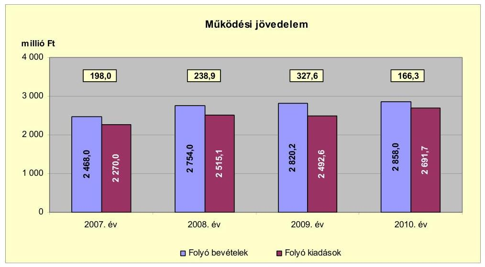

Működési jövedelem a 2008. évről a 2009. évre 88,7 millió Ft-tal növekedett. A folyó bevételek emelkedésénél jelentős volt a 80,0 millió Ft-os kamatbevétel növekedés, amely elsősorban a 2008. évben kibocsátott kötvény betétlekötéséből keletkezett. E mellett a bevétel alakulására hatással volt az szja-bevételek (20,6 millió Ft-os) növekedése. A folyó bevételek növekedését meghaladta a folyó kiadások növekedése, amelyhez hozzájárult az ellátottak pénzbeni juttatásainak emelkedése. A szociális juttatás a 2007-2009. években átlagosan 124,3 millió Ft volt, amely a 2010. évre $58,5 \%$-kal, 197,0 millió Ft-ra emelkedett. A működési jövedelem a 2009. évről a 2010. évre (161,3 millió Ft-tal) csökkent, oka elsősorban a fordított áfa kiadásnövekedése (87,0 millió Ft), valamint a kamatbevétel (42,0 millió Ft) visszaesése volt. A vizsgált időszakban a működési jövedelem 930,8 millió Ft megtakarítást mutatott, amely forrásul szolgált az Önkormányzat fennálló tőketörlesztési kötelezettségeinek teljesítéséhez, valamint fejlesztéseinek finanszírozásához.

Az Önkormányzat pénzügyi kapacitása 2007-2010 között - 2009. év kivételével - csökkenő tendenciát mutatott. A nettó működési jövedelem ${ }^{18}$ értéke a folyó költségvetési pozíció mellett az adott költségvetési év adósságtörlesztésének hatását is tükrözi.

[^0]
[^0]:    ${ }^{17}$ A többcélú kistérségi társulási bevételi főösszege - a pénzmaradvány igénybevétele nélkül - 2007-ben 144,8 millió Ft, 2008-ban 178,3 millió Ft, 2009-ben 182,4 millió Ft, 2010-ben 171,0 millió Ft volt. A kiadási főösszege 2007-ben 142,1 millió Ft-ot, 2008-ban 188,7 millió Ft-ot, 2009-ben 176,5 millió Ft-ot és 2010-ben 184,8 millió Ft-ot jelentett.
    ${ }^{18}$ pénzügyi kapacitás

---

Az Önkormányzat pénzügyi kapacitása a vizsgált időszakban pozitív értéket mutatott, amelyet az alábbi diagram szemléltet:
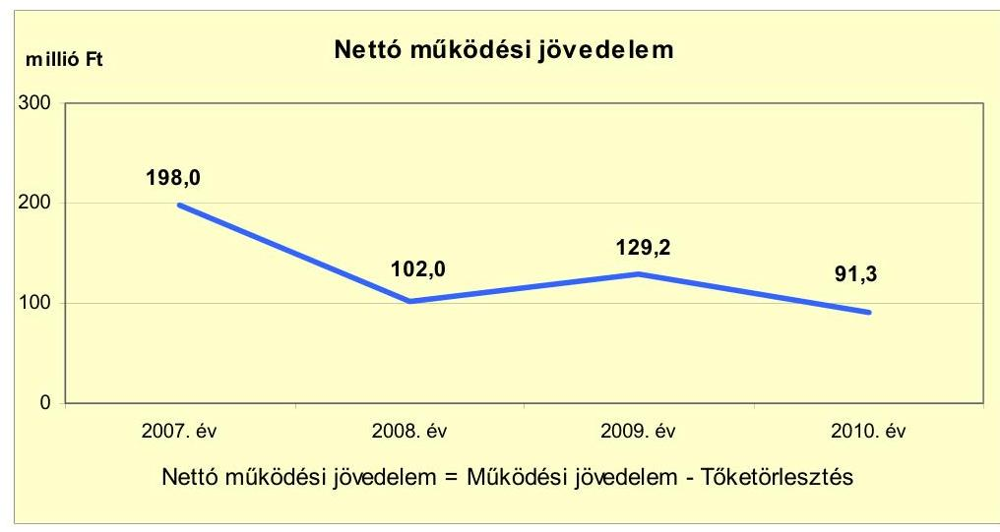

A nettó működési jövedelem - évről évre változó nagyságrendű tőketörlesztés ${ }^{19}$ mellett - négy év alatt a 2007. évről a 2008. évre változott a legnagyobb mértékben, 96,0 millió Ft-tal csökkent, amelyet döntően a 2008. évben előrehozott 136,9 millió Ft hiteltörlesztés okozott. A 2009. évről a 2010. évre 37,9 millió Ft-tal csökkent a nettó működési jövedelem, amely a működési jövedelem 161,3 millió Ft és a tőketörlesztés 123,4 millió Ft csökkenésének együttes hatása volt. Tőketörlesztés csökkenésének oka, hogy az Önkormányzat a hitelek tőketörlesztésére a 2009. évben 198,4 millió Ft-ot fizetett, amely a 170,0 millió Ft-os hosszú lejáratú hitel második részletének megfizetésével annak végtörlesztését is tartalmazta.

A felhalmozási költségvetés bevételeit, kiadásait és egyenlegét 2007-2010 között az alábbi ábra szemlélteti:
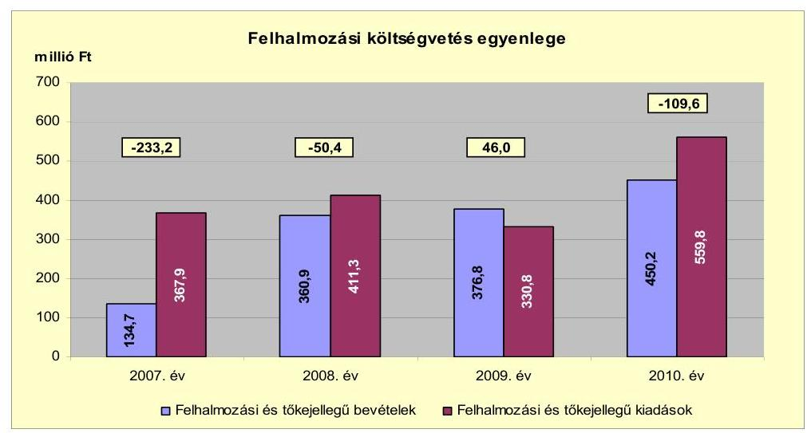

[^0]
[^0]:    ${ }^{19}$ Az Önkormányzat tőketörlesztési kötelezettsége 2008-ban 136,9 millió Ft, 2009-ben évi 198,4 millió Ft, 2010-ben 75,0 millió Ft volt.

---

A 2007-ről 2008. évre a felhalmozási és tőkejellegű bevétel 226,2 millió Ft-tal 167,9%-kal, míg a felhalmozási és tőkejellegű kiadás 43,4 millió Ft-tal 11,8%-kal emelkedett. A bevételemelkedést a Csatornamű Társulat fejlesztéséhez kapcsolódó lakossági hozzájárulás okozta. A forráshiányra a 2007. évi 278,6 millió Ft nyitó pénzkészlet fedezetet nyújtott. A felhalmozási költségvetés a 2010. évi felhalmozási és tőkejellegű forráshiányában meghatározó volt az intézményi beruházások kiadásának 221,4 millió Ft-os emelkedése, amelyet döntően a bölcsődei beruházás 178,0 millió Ft kiadási összege befolyásolt. A 2010. évi forráshiány fedezete a 2008. októberében kibocsátott 1000,0 millió Ft-os kötvénybevétel volt.

A 2007-2010 között képződött 520,5 millió Ft összes nettó működési jövedelem teljes fedezetet nyújtott az ezen időszak alatt képződött 347,2 millió Ft összes felhalmozási deficitre.

Az Önkormányzat évenkénti teljes finanszírozási igénye ${ }^{20}$ a CLF módszer szerint a 2007. évben 35,2 millió Ft, a 2010. évben 18,3 millió Ft forráshiányt mutatott, amely fedezetét az előző évek pénzmaradványának ${ }^{21}$ igénybevétele biztosította. A 2006. évben képződött 302,6 millió Ft pénzmaradvány fedezetet nyújtott a következő években a finanszírozási műveletekre. Az Önkormányzat teljes finanszírozása 2008-ban 51,6 millió Ft, 2009-ben 175,2 millió Ft forrástöbbletet mutatott.

Az Önkormányzat finanszírozási célú műveletei egyenlegét a 2007-2010. években az alábbi ábra szemlélteti:
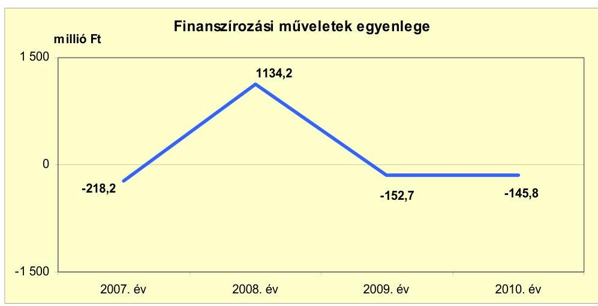

A finanszírozási célú műveleteket a jelentés 2. számú mellékletének 4.1-4.8. pontjai részletezik. A 2008. évben az Önkormányzat 1000,0 millió Ft értékben fejlesztési célú kötvényt bocsátott ki. A kötvénykibocsátás célja elsősorban az Önkormányzat beruházásaihoz, fejlesztéseihez és pályázataihoz szükséges önerő biztosítása volt.

[^0]
[^0]:    ${ }^{20}$ a nettó működési jövedelem és a felhalmozási költségvetés egyenlegeinek összege
    ${ }^{21}$ A pénzmaradvány 2006-ban 302,6 millió Ft, 2007-ben 319,4 millió Ft, 2008-ban 1420,4 millió Ft, 2009-ben 1614,4 millió Ft és 2010-ben 1542,8 millió Ft volt.

---

A dematerializált kötvény okiratában megjelölt célok: a közlekedésbiztonsági pályázat; a bölcsőde építése; a sportpálya, utak és járdák és a városi intézmények felújítása; városi örökség megőrzése; Kálmán fürdő fejlesztése volt.

Az Önkormányzat a kibocsátott kötvénybevétel 6,1%-át használta fel 2011. év I. félévéig.

A CLF módszer alapján az Önkormányzat finanszírozási műveletek nélküli bevételeinek és kiadásainak egyenlege (GFS pozíció) 2007-ben -35,2 millió Ft, 2008-ban 188,5 millió Ft, 2009-ben 373,6 millió Ft, 2010-ben 56,7 millió Ft volt. Az Önkormányzat évenként, mérlegszerűen bemutatott működési és felhalmozási célú költségvetési bevételeinek és kiadásainak egyenlege működési és fejlesztési célú pénzügyi többletet tartalmazott, amelyet a jelentés 1. számú melléklete mutat be. A vizsgált időszakban működési többlete keletkezett. A zárszámadási rendeletekben bevételi többletet mutattak ki 2007-ben 59,0 millió Ft, 2008-ban 1642,1 millió Ft, a 2009-ben 1641,2 millió Ft és 2010-ben 1525,2 millió Ft összegben. Az eltérés oka, hogy a folyó, valamint a felhalmozási bevételek nem tartalmazták az előző évi pénzmaradvány összegét.

Az Önkormányzat kamatbevételeit és kamatkiadásait a 2007-2011. év I. féléve között évenként az alábbi ábra mutatja be:
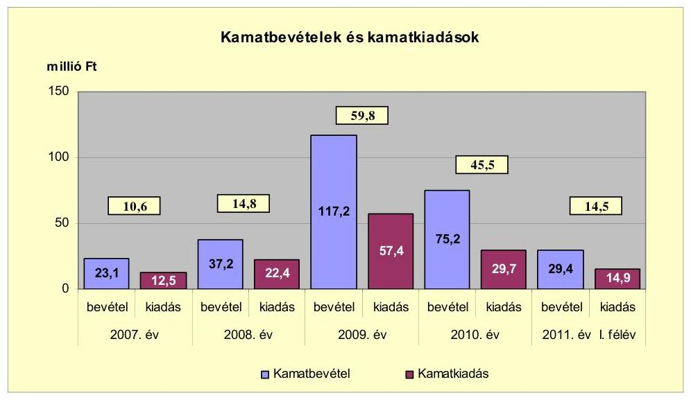

A 2007-2011. év I. féléve között az Önkormányzat összesen 136,9 millió Ft kamatot fizetett, amelyből 131,8 millió Ft a két hosszú lejáratú hitel és a 2008. évben kibocsátott kötvény kamata volt. Az átmenetileg szabad pénzeszközök lekötéséből realizált kamatbevétel, a teljes kamatráfordítás 206,1%-át (282,1 millió Ft-ot) tette ki. A kamatbevételek a 2009. évi emelkedését a 2008-ban kibocsátott 1000,0 millió Ft kötvénybevétel lekötéséből származó kamat eredményezte. A 2009. évről a 2010. évre 42,0 millió Ft visszaesés oka a kötvénybevétel lekötése utáni kamatbevétel csökkenése volt. Az Önkormányzat hitelekkel kapcsolatos rövid lejáratú betétek kamatbevételeit (15,7 millió Ft-ot) a hitelek kamataira fordította. A kötvénybevétel lekötésének 141,9 millió Ft kamatbevételét a „Mezőberény" kötvény kamataira (88,2 millió Ft-ot), a kötvénykibocsátáshoz kapcsolódó egyszeri kiadásra (5,8 millió Ft-ot) és 2009-2011. év I. féléve között a fejlesztési kiadásokra (47,9 millió Ft-ot) fordította. A folyószámla-

---

egyenleg után 124,5 millió Ft kamatbevételt a költségvetésbe betervezett módon az összes kiadás részfedezeteként vette figyelembe.

# 2.2. Az Önkormányzat bevételeinek változása 

Az Önkormányzat 2010. évi folyó bevétele 2858,0 millió Ft volt, amely 6,6%-kal több mint a 2007-2009. évek 2680,7 millió Ft átlaga. A folyó bevétel évenként emelkedő tendenciát mutatott, amely döntően a fordított áfaelszámolás, kamatbevételek és működési célú pályázati támogatások hatása volt. A 2011. év I. félévi adatairól megállapítható, hogy a bevételek - az áfabevétel kivételével - az előző évekhez viszonyítva időarányosan teljesültek.

Az Önkormányzat a 2007-2011. év I. féléve között realizált főbb folyó bevételi jogcímeinek számszaki adatait az alábbi táblázat részletezi és grafikon mutatja be:
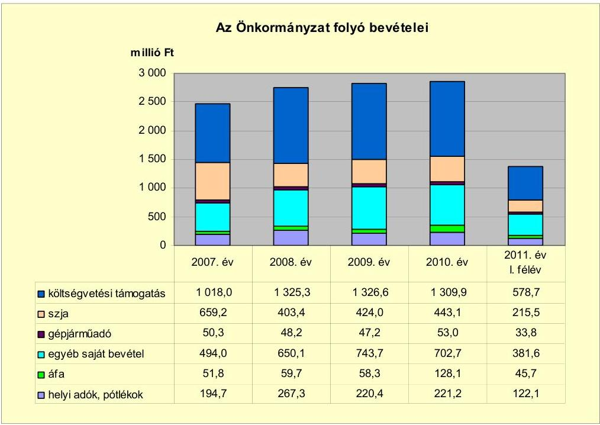

Az Önkormányzat költségvetési támogatás és átengedett szja bevételeinek együttes összege a 2007-2010. években érdemében nem változott: a 2007. évben 1677,2 millió Ft, a 2008. évben 1728,7 millió Ft, a 2009. évben 1750,6 millió Ft és a 2010. évben 1753,0 millió Ft volt. A költségvetési támogatás a 2007-2009. években átlagosan 1223,3 millió Ft volt, amely a 2010. évben 1309,9 millió Ft-ra, 7,1%-kal növekedett elsősorban a szociális területen az ellátotti létszám emelkedése miatt. Ezzel párhuzamosan az átengedett szja-bevétel a 2007-2009. években átlagosan 495,5 millió Ft-ot jelentett, amely 2010-ben 443,1 millió Ft-ra, 11,8%-kal csökkent. A két bevétel alakulására a központi támogatáselosztás, valamint a normatív állami hozzájárulások nagysága és az igénybevételük feltételeinek változása gyakorolt hatást.

---

Az Önkormányzat 2007-2010 közötti folyó bevételét befolyásolja, hogy a költségvetési támogatások ${ }^{22}$ között szerepelt a fejlesztési célú támogatások összege.

A gépjárműadóból származó bevétel a 2007-2009. években átlagosan 48,5 millió Ft volt, amely a 2010. évre 9,3%-kal, 4,5 millió Ft-tal emelkedett az adóellenőrzés-végrehajtási munkájának és 2010. január 1-jétől a gépjárműadó alapjának, mértékének változása következtében.

Az Önkormányzat évente kétszer vizsgálta felül az adózók gépjárműadó tartozásait. A kibocsátott fizetési felhívást, illetve az egyenlegértesítést követően adóvégrehajtási eljárást kezdeményeznek, amely eljárási cselekményre az adózók többsége rendezi elmaradt tartozását.

Az Önkormányzat egyéb saját bevétele ${ }^{23}$ a 2007-ről a 2008. évre 156,1 millió Ft-tal emelkedett, amelyet a támogatásértékű működési bevétel (107,9 millió Ft), kamatbevétel (14,1 millió Ft), az előző évi pénzmaradvány átvétel (21,5 millió Ft) és az egyéb bevétel (12,6 millió Ft) növekedése eredményezett. A támogatásértékű működési bevétel növekedését elsősorban a Városi Közszolgáltató Intézmény bankváltása miatti számlaegyenleg 70,0 millió Ft függő számlán történő átvezetése és a 12,6 millió Ft AVOP LEADER pályázat, valamint a gyermekvédelmi támogatás okozta. Ezt követően az
 Önkormányzat egyéb saját bevétele a 2008. évről a 2009. évre 93,6 millió Ft-tal nőtt, elsősorban a kötvénybevétel befektetéséből származó 80,0 millió Ft-os kamatnövekedés hatására. Az egyéb saját bevétel a 2009-ről a 2010. évre 41,0 millió Ft-tal csökkent a 42,0 millió Ft kamatbevétel csökkenés miatt. Az áfa-bevétel a fordított áfa-elszámolás miatt 2009-ről a 2010. évre 62,6 millió Ft-tal növekedett.

Az Önkormányzatnál a helyi adókból és pótlékokból származó bevételek aránya a folyó bevételekben a 2007. évi 7,9%-ról (194,7 millió Ft-ról) a 2008. évre 9,7%-ra (267,3 millió Ft-ra) emelkedett. A bevételnövekedés egyrészt a magánszemélyek kommunális adójának $10000 \mathrm{Ft} /$ év mértékről $14000 \mathrm{Ft} /$ év mértékre emeléséből (14,9 millió Ft), másrészt a helyi iparűzési adóbevételek (54,7 millió Ft) növekedéséből jelentkezett. A helyi iparűzési adóbevétel a 2007. évről a 2008. évre 54,7 millió Ft-tal emelkedett. Két gazdálkodó szervezet 2006. december 31-ig teljes, 2007. december 31-ig részleges iparűzési adókedvezményt kapott. Emiatt a 2007. évi bevallás alapján fizetendő és a 2008. évi adóelőleg befizetései (összesen 60,3 millió Ft) a 2008. évben realizálódtak. Az Önkormányzat a helyi iparűzési adó mértékét a 2010. évi 2,0%-ról a 2011-es adóévre - várospolitikai célból és a gazdasági válságra tekintettel - 1,8%-ra mérsékelte.

[^0]
[^0]:    ${ }^{22}$ A felhalmozási támogatás összegének levonása után a költségvetési támogatás összege a 2007. évben 963,9 millió Ft, a 2008. évben 1314,2 millió Ft, a 2009. évben 1276,4 millió Ft, a 2010. évben 1232,9 millió Ft volt.
    ${ }^{23}$ Az egyéb saját bevételek részét képezték az intézményi működési bevételek, a hozam- és kamatbevételek, az osztalék, a talajterhelési díj, a vagyoni értékű jog értékesítése, az államháztartáson belülről és kívülről átvett pénzeszközök, az előző évi pénzmaradvány átvétele.

---

Az Önkormányzat a 2007-2011. év I. féléve között a fent említett adónemeken túl építményadót, vállalkozók kommunális adóját, idegenforgalmi adót és telekadót vetett ki.

Az Önkormányzat a 2007-2011. év I. féléve között felhalmozási bevételét az alábbi táblázat részletezi:
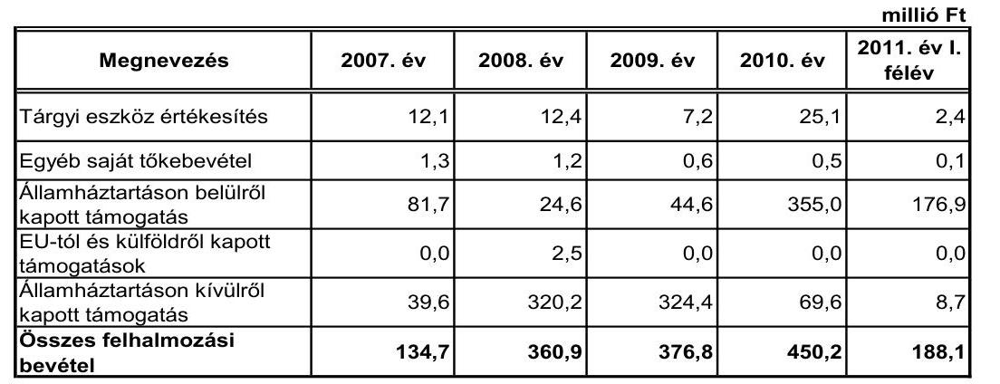

A vizsgált években a felhalmozási célú bevételek folyamatosan évről évre emelkedő tendenciát mutattak. A 2007-ről a 2008. évre 226,2 millió Ft-os növekedés az államháztartáson kívülről kapott támogatás, a 2008-ról a 2009. évre 15,9 millió Ft, illetve a 2009-ről a 2010. évre a 73,4 millió Ft emelkedést az államháztartáson belülről kapott támogatások emelkedése okozta.

Az államháztartáson belülről kapott támogatás értékű felhalmozási bevétel a 2010. évben a 2007-2009. évek 50,3 millió Ft átlagának 7,1-szerese volt. A 2010. évben a fejlesztésekhez - az új bölcsőde építésére 164,2 millió Ft, az Új Magyarország Fejlesztési Terv keretében végzett geotermikus energiahasznosítási program alapján 143,7 millió Ft, valamint TÁMOP ${ }^{24}$ és TIOP ${ }^{25}$ programokra összesen 44,4 millió Ft - támogatásban részesült az Önkormányzat.

Az államháztartáson kívülről kapott támogatás ${ }^{26}$ a 2008. évben 320,2 millió Ft, a 2009. évben 324,4 millió Ft volt, a Csatornamű Társulat fejlesztéséhez kapcsolódó lakossági hozzájárulás miatt.

[^0]
[^0]:    ${ }^{24}$ Társadalmi Megújulás Operatív Program keretében (kompetencia alapú oktatás) 42,4 millió Ft támogatásban részesült.
    ${ }^{25}$ Társadalmi Infrastruktúra Operatív Program keretében pedagógiai módszertani támogatás kettő millió Ft volt.
    ${ }^{26}$ Felhalmozási célú pénzeszközátvétel háztartásoktól a 2008. évben 284,9 millió Ft, a 2009. évben 312,1 millió Ft, a 2010. évben 68,2 millió Ft volt.

---

# 2.3. Az Önkormányzat működési és a felhalmozási célú kiadásainak változása 

Az Önkormányzat folyó kiadásai főbb jogcímek szerinti bontásban 2007-2011. június 30. között a következők voltak:

| Megnevezés | 2007. év | 2008. év | 2009. év | 2010. év | $\begin{gathered} \text { millió Ft } \\ 2011 . \text { év I. } \\ \text { félév } \end{gathered}$ |
| :--: | :--: | :--: | :--: | :--: | :--: |
| Folyó kiadások | 2270,0 | 2515,1 | 2492,6 | 2691,7 | 1263,8 |
| Működési kiadások (kamatkiadás nélkül) | 2038,7 | 2182,1 | 2129,6 | 2316,5 | 1075,2 |
| Államháztartáson belülre átadott pénzeszközök | 2,9 | 76,1 | 5,2 | 6,0 | 4,7 |
| Transzferkiadások | 206,1 | 203,4 | 243,7 | 272,4 | 136,2 |
| -ebből: vállalkozásoknak | 1,7 | 0,0 | 0,0 | 1,9 | 0,9 |
| EU-nak, illetve külföldre | 0,0 | 0,0 | 1,8 | 0,0 | 0,0 |
| magánszemélyeknek | 192,5 | 190,8 | 229,6 | 258,7 | 128,6 |
| nonprofit szervezeteknek | 11,9 | 12,6 | 12,3 | 11,8 | 6,7 |
| Kamatkiadások | 12,5 | 22,4 | 57,4 | 29,7 | 14,9 |
| Előző évi pénzmaradvány átadás | 9,8 | 31,1 | 56,7 | 67,1 | 32,9 |

A folyó kiadás a 2010. évben 2691,7 millió Ft volt, amely 11,0%-kal több mint az előző három év kiadásának 2425,9 millió Ft átlaga. Az Önkormányzat folyó kiadása 2007-2010 között változó tendenciát mutatott. A folyó kiadások a 2007. évről a 2008. évre 245,1 millió Ft-tal emelkedtek, amelyet a kamatkiadások nélküli működési kiadások 143,4 millió Ft-os, valamint az államháztartáson belülre átadott pénzeszközök 73,2 millió Ft-os növekedése okozott. A 2009. évről a 2010. évre 199,1 millió Ft-os emelkedés a kamatkiadások nélküli működési kiadások és a transzferkiadások - a magánszemélyek részére megemelkedett szociálpolitikai juttatások kifizetés - növekedésének hatása volt.

Az Önkormányzat működési kiadásai főbb jogcímek szerinti bontásban az alábbiak voltak:

|  |  |  |  |  | millió Ft |
| :-- | --: | --: | --: | --: | --: |
| Megnevezés | 2007. év | 2008. év | 2009. év | 2010. év | 2011. év I.   félév |
| Személyi juttatások | 1052,8 | 1135,3 | 1063,1 | 1156,0 | 513,9 |
| Munkaadót terhelő járulékok | 335,4 | 356,7 | 313,4 | 290,2 | 131,6 |
| Dologi kiadások | 627,3 | 674,8 | 735,1 | 832,8 | 416,6 |
| Egyéb folyó kiadások | 23,2 | 15,3 | 18,0 | 37,5 | 13,1 |

A személyi juttatások összege 2007-ről 2008-ra 7,8%-kal, 82,5 millió Ft-tal növekedett az átvett kistérségi feladatok, bérpolitikai intézkedések, a létszám leépítésből adódó egyszeri kifizetések és a Bélmegyeri óvoda átvételének együttes hatására. A személyi juttatások összege a 2009. évről a 2010. évre 8,7%-kal, 92,9 millió Ft-tal növekedett a 2010. évi bérpolitikai intézkedések, a létszám leépítésből adódó egyszeri kifizetések, a közcélú-közhasznú foglalkoztatások, a prémiumévek programban való részvétel és a Városi Közszolgáltató Intézménynél végrehajtott álláshely fejlesztés következtében.

A munkaadókat terhelő járulékok összege 2007-ről 2008-ra 6,3%-kal, 21,3 millió Ft-tal nőtt az átvett feladatok, az álláshelymegszüntetések egyszeri 

---

kifizetése hatására. 2008-2010 közötti időszakban a járulékok folyamatos összesen 66,5 millió Ft-os csökkenését az álláshelymegszüntetések mellett befolyásolta a tételes egészségügyi hozzájárulás 2010. január 1-jei megszűnése, valamint a munkaadói járulék mértékének 2010. január 1-jétől 29%-ról 27%-ra történő módosítása.

Az Önkormányzat dologi kiadása a 2007. évtől folyamatosan növekedett a 2010. évig. A dologi kiadások összege 2007-2009. években átlagosan 679,1 millió Ft volt, amely a 2010. évre 22,6%-kal, 832,8 millió Ft-ra növekedett. Az emelkedést elsősorban a fordított áfa-elszámolás, valamint az „Út a munkába” program dologi kiadása okozta.

A folyó és felhalmozási kiadásokat a 2007-2011. év I. féléve között, a teljesített kiadások működési és felhalmozási célú felhasználásának arányait az alábbi ábra mutatja be:
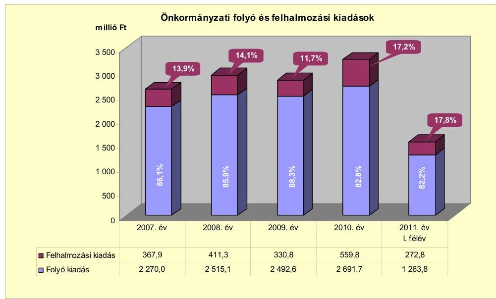

A folyó és felhalmozási kiadások arányának változásában a 2007-2010. évek között változó tendencia figyelhető meg. Az Önkormányzat kiadásain belül a felhalmozási kiadások aránya a 2007. évről a 2008. évre (367,9 millió Ft-ról 411,3 millió Ft-ra) 13,9%-ról 14,1%-ra nőtt, a 2009. évben (330,8 millió Ft-ra) 11,7%-ra csökkent, majd a 2010. évre (559,8 millió Ft-ra) 17,2%-ra emelkedett. A 2010. évi felhalmozási kiadások arányának 5,5 százalékpontos növekedését az Új Bölcsőde Mezőberény projekt 178,0 millió Ft teljesítése, valamint a kötvénykibocsátásból származó bevétel (61,0 millió Ft) ingatlanvásárlásként történő felhasználása eredményezte.

Az Önkormányzat 2007-2010 között 24 db tízmillió Ft feletti és 222 db tízmillió Ft alatti bekerülési költségű felújítást és beruházást valósított meg 2010. december 31-ig. Az Önkormányzatnál a 2010. december 31-ig befejezett fejlesztési feladatok bekerülési költsége 1005,6 millió Ft volt, amelyből a beruházások összege 756,9 millió Ft (75,3%), a felújítások összege 248,7 millió Ft (24,7%) volt. A 2006. december 31-ig teljesített kiadások összege 42,5 millió Ft, a 2007-2010. években 963,1 millió Ft volt. A fejlesztések forrása 604,0 millió Ft saját bevételből (60,0%-a), 61,0 millió Ft kötvénykibocsátás be-

---

vételből (6,1%-a), 100,2 millió Ft EU-s támogatásból (10,0%-a) és 240,4 millió Ft hazai támogatásból (23,9%-a) tevődött össze. (A befejezett fejlesztési feladatok adatait a jelentés 3/a. számú melléklete tartalmazza.)

Az Önkormányzat befejezett fejlesztései a következők voltak: Polgármesteri hivatal külső nyílászáróinak cseréje, falburkolat felújítása, bérlakások kialakítása, intézmények akadálymentesítése, bölcsőde építése, fürdő öltöző építése, városi strand felújítása, ülőmedence készítése, kompetencia alapú oktatás feltételeinek megteremtése, óvoda és iskola infrastrukturális fejlesztése, csapadékbelvízelvezetés kiépítése, útépítés, útburkolat-javítások, kerékpárút építése, városkép alakítása, madárfigyelő állomás létesítése.

Az Önkormányzat a 2010. év végén a folyamatban lévő fejlesztési feladataira 2010. december 31-ig kifizetett összeg 401,4 millió Ft volt. Az Önkormányzatnál a 2010. év végén három db tízmillió Ft alatti és kilenc db tízmillió Ft feletti bekerülési költségű fejlesztési feladat volt folyamatban. A fejlesztési kiadások forrása 237,2 millió Ft saját bevétel (59,1%), 164,2 millió Ft EU-s támogatás (40,9%) volt. Hitel és hazai támogatás a folyamatban lévő fejlesztésekhez 2010. december 31-ig nem kapcsolódott. A tízmillió Ft feletti költségű fejlesztési feladatok a következők voltak: civil központ kialakítása, belterületi utak fejlesztése, a belterületi belvízrendezés, a létesített új bölcsőde fejlesztési munkáinak befejezése, akadálymentesítése, városkép javítása és térfelújítása, informatikai infrastruktúra fejlesztése az oktatási intézményekben, víztorony rekonstrukciója, geotermikus energia hasznosítása. A folyamatban lévő fejlesztési feladatok adatait a jelentés 3/b. számú melléklete tartalmazza.

A 2010. december 31-én folyamatban lévő és a 2010. évet követő évekre vállalt kötelezettség összege 1130,7 millió Ft volt. A fejlesztések kiadásait 57,9 millió Ft saját bevételből (5,1%-ot), 277,9 millió Ft kötvényből származó bevételből (24,6%-ot), 781,7 millió Ft EU-s támogatásból (69,1%-ot) és 13,2 millió Ft hazai támogatásból (1,2%-ot) tervezték finanszírozni. (A 2010. évet követő évek fejlesztési feladatok adatait a jelentés 3/c. számú melléklete tartalmazza.)

Az Önkormányzat által 2010. december 31-ig beadott, elbírálás alatt álló kettő pályázatában a 2010. évet követően vállalt kötelezettsége 258,0 millió Ft volt. A kiadások forrásaként 38,7 millió Ft saját bevételt (15,0%
 ot), 219,3 millió Ft EU-s támogatást (85,0%-ot) terveztek. A források - a saját bevétel kivételével - még nem álltak az Önkormányzat rendelkezésére, a pályázati elbírálások és a közbeszerzési eljárások folyamatban voltak. A pályázatok az általános iskola energetikai korszerűsítésére, kettő napelemes rendszer telepítésére, fejlesztésére vonatkoztak. (Az elbírálás alatt álló, pályázatokban szereplő fejlesztési feladatokat a jelentés 3/d. számú melléklete tartalmazza.)

Az Önkormányzat megvalósult és folyamatban lévő fejlesztései közül a legnagyobb költségigényű az alábbi három beruházás volt:

- A „Körösök lágy ölén" című ökoturisztikai fejlesztési program keretén belül az Önkormányzat Madárfigyelő állomást és Madarak háza látogató központot hozott létre a természeti és helyi kulturális adottságok turisztikai célú hasznosítása érdekében. A fejlesztés teljes bekerülési költsége 145,3 millió Ft volt, melyből saját forrás 55,1 millió Ft és EU-s támogatás 90,2 millió Ft volt.

---

- Az Önkormányzat „Bölcsődei ellátást nyújtó intézmények fejlesztése és kapacitásának bővítése" címen pályázatot nyújtott be új bölcsőde építésére, mivel a városban működő 30 férőhelyes bölcsőde rossz műszaki állapota miatt gazdaságosan nem volt felújítható, bővíthető. A fejlesztés tervezett összköltsége 207,2 millió Ft, amelyből saját forrás 10,4 millió Ft, EU-s támogatás 196,8 millió Ft volt. A fejlesztés 2010. december 31-ig teljesített kiadása 188,7 millió Ft, melyből saját forrás 24,5 millió Ft, európai uniós támogatás 164,2 millió Ft volt. Az eredeti költségvetés nem tartalmazta az akadálymentesítés költségeit, így a várható teljes bekerülési költség 214,1 millió Ft-ra változott, a projekt 2010. után vállalt kötelezettsége 25,5 millió Ft. A projekt megvalósítása a vizsgálat ideje alatt folyamatban volt, a források rendelkezésre álltak.
- Az Önkormányzat „Geotermikus energia hasznosítása Mezőberényben" címmel sikerrel pályázott európai uniós támogatásokra. A város kedvező geotermikus adottsága lehetővé tette a geotermikus energia hasznosítását a helyi távfűtési rendszerben. A fejlesztéssel az Önkormányzat intézményei fűtési költségeinek csökkentését tűzték ki célul. A fejlesztés összköltsége 684,4 millió Ft, melynek megvalósításához saját bevételből - amelynek forrása a kötvényből származó bevétel - 273,8 millió Ft, EU-s támogatásból 410,6 millió Ft összeget terveztek. A fejlesztéshez 2010. december 31-ig 20,7 millió Ft-ot használtak fel, 2010. után vállalt kötelezettsége 663,7 millió Ft volt, melyhez a források rendelkezésre álltak.

Az Önkormányzat két közfeladatot ellátó gazdasági társaságban 50% alatti tulajdonosi részaránnyal rendelkezett, amelyek részére az ellenőrzött időszakban működési és fejlesztési célú pénzeszközt nem adott át.

# 3. Az ÖNKORMÁNYZAT KÖTELEZETTSÉGEI 

### 3.1. Az Önkormányzat pénzintézeti kötelezettségeinek változása

Az Önkormányzatnak 2006. december 31-én 485,3 millió Ft pénzintézettel szembeni kötelezettségállománya volt, amely - a kötvénykibocsátás hatására - a 2008. év végére 1348,4 millió Ft-ra emelkedett. A kötelezettségek állománya (a hiteltörlesztések miatt) a 2009. év végére 1150,0 millió Ft-ra, a 2010. év végére 1075,0 millió Ft-ra csökkent. Az Önkormányzat pénzintézetekkel szembeni kötelezettségállománya 2011. június 30-ára a 2006. év december 31-éhez képest összességében 107,3%-kal, 520,8 millió Ft-tal emelkedett a kötvénykibocsátás, a hitel- és kötvénytörlesztések együttes hatására. Az Önkormányzatnak folyamatosan rendelkezésére álltak finanszírozásba bevonható eszközök, emellett a 2008. évben 1000,0 millió Ft összegben kötvényt bocsátott ki a későbbi évek fejlesztései finanszírozására. A kötvényből származó bevétel 93,9%-ának (939,0 millió Ft-nak) felhasználására 2011. június 30-áig nem került sor.

Az Önkormányzatnak a 2007-2011. év I. félév közötti időszakban (a Csatornamű Társulattól átvállalt) két hosszú lejáratú hitele volt, amelyből az egyik visszafizetése 2009-ben megtörtént. Az Önkormányzat 2010. év végén és 2011.

---

június 30-án pénzintézetekkel szemben fennálló kötelezettségei egy kötvénykibocsátásból és egy hosszú lejáratú hitel igénybevételéből keletkeztek.

Az Önkormányzat mérlegében kimutatott, pénzintézeteknél fennálló kötelezettségállományát a 2006-2011. év I. félév közötti időszakban a következő ábra szemlélteti:
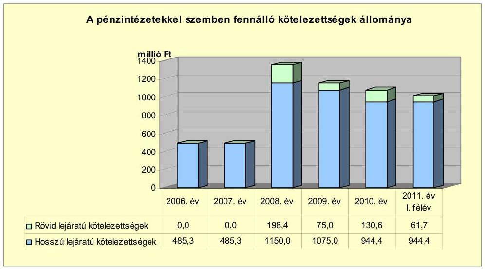

A pénzintézetekkel szemben fennálló kötelezettség alakulását a hosszú lejáratú hitelek visszafizetése mellett döntően befolyásolta, hogy az Önkormányzat 2008-ban 1000,0 millió Ft összegben felhalmozási célú kötvényt bocsátott ki. A „Mezőberény" kötvényt a 2008. október 8-ai kibocsátást követően 2008. október 10-én végrehajtott konverzióval CHF alapúra váltották át.

A könyvviteli mérleg szerinti pénzintézettel szemben fennálló kötelezettségek állománya nem tartalmazta az árfolyamváltozások hatását, mivel az Önkormányzat a Számv. tv. 60. § (2) bekezdésében foglalt előírást megsértve, az Áhsz. 33. § (1) bekezdésében foglaltak ellenére nem végezte el a devizában fennálló kötelezettségek év végi értékelését a 2008-2010. években. Az ellenőrzés során kidolgozott számítások szerint árfolyam-különbözet keletkezett, amely 2010. december 31-jén 401,9 millió Ft árfolyamveszteség volt. Az Önkormányzat - az árfolyamváltozás hatását is tartalmazó - 2010. december 31-ei pénzintézeti kötelezettsége - 224,17 Ft/CHF árfolyamon - 1476,9 millió Ft volt. Ez a mérleg szerinti pénzintézeti kötelezettségállományt 37,4%-kal haladta meg.

Annak megítéléséről, hogy a hitelek visszafizetésekor jelentkező forint kötelezettség többletkiadást (árfolyamveszteség) vagy kiadáscsökkenést (árfolyamnyereség) eredményez a futamidő végén, a teljes kötelezettség rendezését követően lehet képet alkotni. Mindaddig, amíg törlesztési kötelezettség nem áll fenn (túrelmi idő, moratórium), a tőkére vonatkoztatva nem értelmezhető sem az árfolyamveszteség, sem az árfolyamnyereség. Ugyanakkor a számviteli szabályok meghatározzák, hogy az árfolyam különbözetet év végén a kötelezettségek között a könyvviteli mérlegben nyilván kell tartani, azonban árfolyam különbözet ebben az esetben ténylegesen nem képződött.

Az Önkormányzat 2007-2010 között két hosszú lejáratú hitelszerződéssel rendelkezett, amely a korábbi kezességvállalások alapján keletkezett.

---

A csatorna-beruházáshoz kapcsolódó hosszú lejáratú hiteleket a 2005. évben megszűnt Csatornamű Társulattól vette át az Önkormányzat. A beruházás finanszírozásához a Csatornamű Társulat a 2001. évben 315,3 millió Ft és a 2003. évben 170,0 millió Ft kedvezményes kamatozású hitelt vett fel. Az Önkormányzat vállalta a hitelek kamatának megfizetését a futamidő alatt, az egyetemleges felelősségek megszűnése esetére, valamint készfizető kezességet.

Az Önkormányzat a hitelek tőketörlesztésére a 2008. évben 136,9 millió Ft-ot, a 2009. évben 198,4 millió Ft-ot, a 2010. évben 75,0 millió Ft-ot és a 2011. év I. félévben 50,0 millió Ft-ot fordított. A 170,0 millió Ft-os hitel végtörlesztése a 2009. évben megtörtént. A két hosszú lejáratú hitel 563,3 millió Ft-os tőke és kamatfizetési kötelezettségéből a 2007. év előtt kifizetett kamat 59,3 millió Ft, a 2007-2011. június 30-ig teljesített kamat 43,6 millió Ft volt.

Az Önkormányzatnál a Számv. tv. 42. § (3) bekezdésében foglalt előírást megsértve, az Áhsz. 26. § (5) bekezdésében foglaltak ellenére nem történt meg a következő évre esedékes részlet átsorolása a hosszú lejáratú kötelezettségekből a rövid lejáratú kötelezettségek közé. A 170,0 millió Ft összegű hitelszerződés szerinti első törlesztési év a 2009. év volt. Az Önkormányzat - a már akkor rendelkezésre álló fedezetből - 2008. december 20-án 136,9 millió Ft-ot törlesztett. A törlesztési ütem módosításáról Képviselő-testületi döntés nem állt rendelkezésre.

Az Önkormányzat 2011. június 30-án forintban fennálló adósságot keletkeztető pénzintézeti kötelezettségvállalása az alábbi volt:

| Megnevezés | Szerződéskötés időpontja | Összeg   millió HUF-ban | Kamat   (referencia kamat+   kamatfelár) | Felhasználás célja: |
| :--: | :--: | :--: | :--: | :--: |
| Beruházási hitel | 2001. október 26. | 315,3 | 3,45% | szennyvízcsatorna   hálózat megvalósítása |

Az Önkormányzat 2011. június 30-án pénzintézettel szemben fennálló kötelezettsége 25,0 millió Ft tőke és 0,3 millió Ft kamat volt. A teljesítés a 2011. év III. negyedévben megtörtént. Az Önkormányzatnak a 2011. év III. negyedév végén forintban fennálló hosszú lejáratú pénzintézettel szembeni kötelezettsége nem volt.

Az Önkormányzatnál a pénzintézettel szembeni kötelezettségek teljesítésére a külső forrásból származó bevételeket (az LTP-ből származó 504,6 millió Ft-ot és a Csatornamű Társulat megszűnésekor kapott 18,4 millió Ft-ot) és a saját bevételeit fordította. Az önkormányzati saját forrás 40,3 millió Ft, ebből a feladatra elkülönített bankszámlán átmenetileg szabad pénzeszközből lekötött betét kamata 15,7 millió Ft volt.

# Az Önkormányzatnál a 2007-2010 közötti időszakban hitelfelvétel nem történt. 

Az Önkormányzat számlavezető pénzintézete versenyeztetést követően 2008. január 1-jével változott. A pénzintézet váltás nem volt befolyással az Önkormányzat finanszírozási struktúrájára. A banki kondíciókra több területen (a bankszámla pozitív egyenlege után kapott kamat, számlakezelési költ-

---

ség) kedvező volt a nyertes bank ajánlata, emiatt döntött a Képviselő-testület a pénzintézetváltás mellett.

A 2008. évben a Képviselő-testület év közben - több ajánlat bekérését követően a számlavezető bank ajánlatát elfogadva - 1000,0 millió Ft értékű kötvény kibocsátásáról döntött. A „Mezőberény" kötvény - Képviselő-testület elé beterjesztett - okiratában szerepelt a kötelezettségvállalás kamat-, árfolyam- és egyéb $^{27}$ kockázata. A kötelezettségvállalásból származó forrás felhasználási céljait - fejlesztésekhez és pályázatokhoz szükséges önerő biztosítását - meghatározták. A Képviselő-testület döntését megalapozó előterjesztésben nem mutatták be a teljes futamidőre várható kamat- és tőkefizetési kötelezettségeit. Az előterjesztés nem tartalmazta a kötelezettségvállalás visszafizetési forrásait, továbbá az adósságszolgálati korlátot. Az adósságot keletkeztető kötelezettségvállalással megvalósított felhalmozási kiadások esetleges bevételnövelő, illetve kiadáscsökkentő vonzatát, a beruházáshoz, felújításhoz vállalt kötelezettségek visszafizetési forrásként történő számbavételét nem végezték el. A Képviselő-testületi jegyzőkönyvek és az Önkormányzat igazoló levele szerint a Képviselő-testület tárgyalt a felhasználásról, a fedezetről (lekötendő óvadéki betét kamata, működési kiadási megtakarítás és bevételi többlet), de határozatot nem hozott e kérdésekről.

A Képviselő-testület a kibocsátást jóváhagyó határozatban csak általánosságban fogalmazta meg a polgármester felhatalmazását a kötvénykibocsátással kapcsolatban, azonban a kibocsátás devizanemét, a futamidőt nem határozta meg. A Pénzügyi bizottság a kötvénykibocsátás indokait és gazdasági megalapozottságát vizsgálta, amelyről a Képviselő-testületet tájékoztatta. A kötvénykibocsátást a Pénzügyi bizottság a 2008. május 22-ei határozatával a beérkezett ajánlatban foglaltakat nem javasolta elfogadni. A 2008. június 30-ai végleges képviselő-testületi döntésre újabb, a kibocsátásra vonatkozó változat beterjesztését követően került sor.

Az Önkormányzat 2008. október 8-án bocsátotta ki a „Mezőberény" kötvényt, 2028. szeptember 1-jei lejárattal. A kamatfizetés 2008. október 30-ától félévente esedékes, minden év április 30-án és október 30-án. A tőketörlesztés 2,5 év türelmi idő után, 2011. április 30-ától kezdődően félévente esedékes, 0,0278/félév törlesztési faktor alapján 173,9 ezer CHF összegben. A dematerializált értékpapírral kapcsolatos szerződések aláírására a Képviselőtestület felhatalmazta a polgármestert. Az Önkormányzat a kötvénykibocsátáskor egyéb fedezetnyújtó biztosítékként azonnali beszedési megbízási felhatalmazást adott - kilenc alszámla kivételével - a banknál vezetett számlái tekintetében $^{28}$, amely ellentétes volt az Ötv. 88. § (1) bekezdés b) pontjában foglaltakkal $^{29}$. A bank a vizsgált időszak alatt nem élt a beszedési megbízás be-

[^0]
[^0]: $^{27}$ piaci kockázatok, visszaváltási opció-, jegyzési eljárás kockázata
    $^{28}$ A felhatalmazás nem vonatkozott a cigány, a német, a szlovák kisebbségi önkormányzatok, a Környezetvédelmi Alapítvány, a Környezetvédelmi Alap, a lakossági csatornamű befizetési, a KAC pályázatból megvalósuló beruházási és a céltámogatási lebonyolítási alszámlákra.
    $^{29}$ 2012. január 1-jétől az Áht. végrehajtásáról szóló 368/2011. (XII. 31.) Korm. rendelet 145. § (2) bekezdése

---

nyújtásának lehetőségével. A „Mezőberény" kötvény okiratában a kibocsátás céljaként a fejlesztésekhez és pályázatokhoz szükséges önerő biztosítását

 határozta meg.
2008. október 10-én a kötvény konverziójával a kamatszámítás alapja CHF-re módosult, 159,9 HUF/CHF árfolyam mellett. A devizanemváltásra vonatkozóan nem volt a polgármester részére felhatalmazás. A 2008. október 10-e utáni képviselő-testületi ülések jegyzőkönyvei szerint a konverziót a Képviselő-testület nem kifogásolta. A konverzió költségvetésre gyakorolt hatásáról, valamint a forintra történő átváltásról több alkalommal tárgyalt a Képviselőtestület, de döntést nem hozott. A 2008. október 10-ei devizanemváltásra vonatkozó értesítő irat az Önkormányzatnál nem állt rendelkezésre. Az ellenőrzés által kért, a pénzintézet által 2011. szeptember 29-én megküldött példányon a dátum, az önkormányzati bélyegző, és a 2008. évi iktatás hiányzott. A konverzióval egyidejűleg megváltozott a korrigált tőkeegyenleg devizaneme, és a referenciakamat 6 havi LIBOR-ra módosult, a „Mezőberény" kötvény eredeti okiratában foglaltak szerint.
2011. április 13-án okiratcsere történt, amely a visszaváltási tervről - a törlesztések napját változatlanul hagyva - a tőketörlesztési tervre történő módosítást tartalmazta. A szerződésmódosítás aláírására a Képviselő-testület a 2011. januári ülésén felhatalmazta a polgármestert. Az Önkormányzat 2011. évi költségvetése tartalmazta a módosításnak megfelelő fedezetet.

Az Önkormányzat a CHF-ben pénzintézettel szemben fennálló kötelezettségéből 2011. június 30-áig 173,9 ezer CHF (36,7 millió Ft) tőkét törlesztett, 443,1 ezer CHF (88,2 millió Ft) kamatot, valamint 5,8 millió Ft egyéb (jegyzési garanciavállalási-, kibocsátási-, könyvvizsgálói) díjat fizetett. A kötelezettség törlesztésekor 8,8 millió Ft árfolyamveszteség keletkezett 2011. június 30-áig.

Az Önkormányzat 2011. június 30-án CHF-ben fennálló hosszú lejáratú adósságot keletkeztető pénzintézeti kötelezettségvállalása az alábbi volt:

| Megnevezés | Kibocsátás   időpontja | Összeg   millió Ft-ban | Átváltási   árfolyam | Kamat (referencia   kamat + kamatfelár) | Felhasználás célja: |
| :--: | :--: | :--: | :--: | :--: | :--: |
| "Mezőberény"   kötvény | 2008.10.08 | 1000,0 | 159,9 | 6 havi BUBOR / 6   havi LIBOR + 1,8 % | Mezőberény város   fejlesztéséhez forrás   biztosítása |

A kötvénybevételből 61,0 millió Ft-ot használt fel az Önkormányzat 2011. június 30-ig. A Képviselő-testület a felszámolás alatt levő Mezőberényi Bútor Rt. ingó és ingatlan vagyonának megvásárlásáról döntött. Célként a vagyongyarapodást határozta meg, a megvásárolt ingatlant intézményi kezelésbe adta.

A Képviselő-testület a 2008. évben arról döntött, hogy a kötvénykibocsátásból átmenetileg szabad pénzeszközöket - a tervezett beruházások finanszírozási szükségletének bekövetkezéséig - betétbe helyezi. A betétszámláról történő bármilyen összegű felhasználásához a bank előzetes írásos engedélye volt szükséges. Az Önkormányzat 2008. október 9. és 2011. június 30. között összesen 141,9 millió Ft kamatbevételt realizált. A kamatbevételből

---

88,2 millió Ft-ot a „Mezőberény" kötvény kamataira, 5,8 millió Ft-ot a kötvénykibocsátáshoz kapcsolódó egyszeri kiadásokra és 47,9 millió Ft-ot a 2009-2011. év I. félév közötti időszak felhalmozási kiadásaira fordított az Önkormányzat.

A 2011. június 30-án fennálló „Mezőberény" kötvény esetében a kamatfizetési kötelezettséget jelentősen befolyásolta és jelenleg is befolyásolja a referencia kamat és kamatfelár változása, amelyet az alábbi táblázat mutat be:

| Megnevezés | Kibocsátási, lehivási | Utolsó fizetéskori | Változás % |
| :-- | :--: | :--: | :--: |
|  | kamat (referencia + kamatfelár) % |  |  |
| "Mezőberény" kötvény |  |  |  |
| 6 havi CHF LIBOR (2008.10.08-i okirat) | 4,775 | 2,04 | -57,3 % |

A kötvény kamatának (referencia és kamatfelár) csökkenése kedvezően érintette az Önkormányzatot, mivel a lehívási kamattal számított 676,0 ezer CHF-nél 232,9 ezer CHF összeggel kevesebbet kellett fizetnie a 2008-2011. év I. félév között. A különbözet 200,0 HUF/CHF átlagárfolyamon számított összege 46,6 millió Ft.

A „Mezőberény" kötvény változó kamatozású. A megfizetett kamatfelár a 2008-2011. év I. félév közötti időszakban nem változott. A bank, mint kötvénytulajdonos a 2011. július 13-i levelében bejelentette, hogy élni kíván a kötvényokiratban foglalt lehetőségével: „a banki kitettség árfolyamkockázatból adódó növekedésének korlátozása céljából" felvetette az egyoldalú devizanemváltás, vagy a 2011. április 30-tól október 30-ig terjedő kamatperiódus alatt alkalmazott kamatfelár 1,0%-os növelésének lehetőségét. Az ajánlat visszamenő hatállyal tartalmazott az Önkormányzatra kötelezettséget jelentő feltételt. Az Önkormányzat a forintra történő konvertálást nem, a kamat emelését elfogadta. A kamatfelár emelés 30,7 ezer CHF (7,6 millió Ft) többlet kamatkiadást jelentett a 2011. évben. A kötvénykötelezettség után várhatóan fizetendő kamat - a kamatfelár egyszeri növelésének hatása nélkül - a 2011-2013. években 295,6 ezer CHF, a 2014. évtől 861,5 ezer CHF.

Az Önkormányzatnál a helyszíni vizsgálat alatt további hitel igénybevételére, illetve kötvénykibocsátásra vonatkozó döntés-előkészítés nem volt folyamatban.

A költségvetés végrehajtása során jelentkező esetleges likviditási problémák kezelése érdekében a Képviselő-testület a vizsgált időszak költségvetési rendeleteiben felhatalmazta a polgármestert a folyószámlahitel-kereten belüli hitel felvételére. Az Önkormányzat folyószámla hitelkerettel csak a 2007. évben rendelkezett 200,0 millió Ft összegben, a 2008. évtől folyószámla hitelkeretet nem nyitottak. Az Önkormányzat 2007-2010 közötti években nem vett igénybe folyószámla-, munkabér-megelőlegezési-, vagy egyéb likvid hitelt.

Az Önkormányzat pénzügyi egyensúlyi helyzetét kedvezően befolyásolta, hogy a kötvény- és az LTP-ből befolyt bevételekből rendelkezésre álló szabad pénzeszközök lekötésével realizált kamaton felül a 2007-2011. év I. félév közötti időszak alatt további 124,5 millió Ft kamatbevételt realizált. Ebből a folyószámla összegéből lekötött rövid lejáratú betétek kamata 11,9 millió Ft, a folyószámla pozitív egyenlege alapján elért kamat 112,6 millió Ft.

---

Az Önkormányzat kötelezettségeinek 2010. december 31-ei, és 2011. június 30-ai állományát, azok várható értékeit - a felmerülő kamatokat figyelembe véve - a kötelezettség lejártáig, az alábbi táblázat mutatja be:

| Megnevezés | $\begin{gathered} \text { Állomány } \\ \text { 2010. december 31-én } \\ \text { (millió Ft- } \\ \text { ban) } \end{gathered}$ |  | $\begin{gathered} \text { Állomány } \\ \text { 2011. június 30-án } \\ \hline \end{gathered}$ |  |  | Várható kötelezettség a 2011-2013. években |  | Várható kötelezettség a 2014. évtől |  |
| :--: | :--: | :--: | :--: | :--: | :--: | :--: | :--: | :--: | :--: |
|  | HUF-ban   (millió Ft-   ban) | Devizában (összegű, ezer CHF-ban) | Deviza   nem | HUF-ban   (millió Ft-   ban) | Devizában (összegű, ezer CHF-ban) | Deviza   nem | HUF-ban   (millió Ft-ban) | Devizában (összegű, ezer CHF-ban) | HUF-ban (millió Ft-ban) | Devizában (összegű, ezer CHF-ban) |
| Pénzintézeti kötelezettségek |  |  |  |  |  |  |  |  |  |  |
| Pénzintézeti kötelezettségek összesen HUF-ban: hosszú lejáratú hitel | 75,0 | - | HUF | 25,3 | - | HUF | 25,3 | - | - | - |
| Pénzintézeti kötelezettségek összesen CHF-ban: "Mezőberény" kötvény | - | 6253,9 | CHF | - | 6080,1 | CHF | - | 1164,9 | - | 6072,2 |
| Szállítói tartozás | 6,3 | - | HUF | 0,0 | - | HUF | - | - | - | - |
| Jogerős végzéssel lezárt de ki nem fizetett kötelezettségek | 0,5 | - | HUF | 0,5 | - | HUF | 0,5 | - | - | - |
| Kötelezettségek összesen HUF-ban | 81,8 | - | HUF | 25,8 | - | HUF | 25,8 | - | - | - |
| Kötelezettségek összesen CHF-ben | - | 6253,9 | CHF | - | 6080,1 | CHF | - | 1164,9 | - | 6072,2 |

Az ellenőrzött időszakban az Önkormányzat működési jövedelme fedezetet nyújtott az adott évi hiteltörlesztésekhez és a „Mezőberény" kötvény tőketörlesztéséhez. A 2011-2013-ban esedékes kötelezettségek teljesítésére figyelembe vehető 1093,4 millió Ft kimutatott szabad felhasználású $^{30}$ pénzmaradvány és forgalomképes nettó ingatlanvagyon.

A jelenleg ismert pénzintézettel szembeni kötelezettségei (tőke és kamat) a 2014. évtől 6072,2 ezer CHF. A kötelezettség fedezete lehet a saját bevétel, egyensúlyt javító bevételnövelő és kiadást csökkentő intézkedés, a forgalomképes nettó ingatlanvagyon és a képződő működési jövedelem. Az éves költségvetési rendeletekben nem számszerúsítették a többéves kihatású kötelezettségek visszafizetési forrását, nem vizsgálták a növekvő adósságszolgálat hatását a pénzügyi kapacitásra.

# 3.2. A szállítói kötelezettségek változása 

Az Önkormányzatnak a 2007-2011. év I. félév közötti időszakban 30 napon túli lejárt szállítói tartozása nem volt. A 2007-2010 közötti időszakban a december 31-ei szállítói kötelezettség a 2008. évben 0,2 millió Ft, a 2009. évben 1,4 millió Ft, a 2010. évben 6,3 millió Ft volt. Szállítói kötelezettsége 2011. június 30-án nem volt.

### 3.3. Egyéb kötelezettségek változása

Az ellenőrzött időszakban az Önkormányzatnak lízingszerződésből, garanciavállalásból és PPP konstrukcióban $^{31}$ végzett beruházásból kötelezettsége nem keletkezett. Az Önkormányzat a vizsgált időszakban összesen kétmillió Ft összegű követeléséről mondott le. Ezek a döntések a Képviselő-testület által szociális kölcsön, helyiségbérleti díj, valamint a jegyző által helyi adó, pótlék megfizetésének elengedéséről szóltak. Az ellenőrzött időszakban az Önkormányzat intézményeknek, civil szervezeteknek, egyéb államháztartáson belüli és kívüli szervezeteknek kölcsönöket nem nyújtott. Az Önkormányzat ingatlanain a vizsgált időszakban jelzálogjog bejegyzésre nem került sor.

Az Önkormányzat a 2007. évet megelőzően 698,7 millió Ft vissza nem térítendő állami támogatást kapott a bérlakás állományának bővítésére. A támogatott és elkészült 107 lakásra az ingatlan-nyilvántartásba 20 évre elidegenítési és terhelési tilalmat jegyeztek be, amely az Önkormányzat részére nem jelent pénzügyi kötelezettséget.

Az Önkormányzatnak a 2011. évben jogerős ítélettel lezárt, de ki nem fizetett fizetési kötelezettsége 0,5 millió Ft volt. A döntés ellen felülvizsgálati kérelmet nyújtott be az Önkormányzat a Legfelsőbb Bírósághoz.

Az önkormányzati forgalomképes ingatlanok számviteli nyilvántartásban szereplő nettó értéke 2010. december 31-én 555,4 millió Ft volt.

Az eszközök használhatósága is hatást gyakorol az Önkormányzat pénzügyi egyensúlyi helyzetére. A használhatósági fok csökkenése az eszköz állagának romlására, avulására utal, ami maga után vonja az üzemeltetési és fenntartási költségek növekedését is.

Az Önkormányzat eszközállományának bruttó értéke 2007-2010 között 24,2%-kal, 6694,1 millió Ft-ról 8314,7 millió Ft-ra, míg az eszközök nettó értéke 13,7%-kal, 5743,7 millió Ft-ról 6530,1 millió Ft-ra nőtt. Az önkormányzati szintű használhatósági fok négy év alatt 3,6 százalékponttal, 82,1%-ról 78,5%-ra csökkent az egyes eszközcsoportoknál különböző mértékkel elszámolt amortizáció hatására. Ezzel az eszközök avultsága növekedett. A 2007-2009. évekre számított átlagos használhatósági fok az üzemeltetésre átadott eszközöknél 84,0 %, az önkormányzati kezelésű vagyonnál 78,8 % volt, majd a 2010. évre 77,2 % és 78,9 % volt. A saját

 kezelésben lévő és az átadott vagyon használhatósága közötti különbség az átadott eszközöknél a felújítás, beruházás elmaradását, a magasabb leírási kulccsal rendelkező, gyorsabban avuló vagyontárgyak (építmények, gépek, berendezések) létét jelzi.

Az elhasználódott és amortizálódott eszközök pótlására az Önkormányzat tartalékot nem képzett, külön alapot nem hozott ${ }^{32}$ létre. Évente a költségvetés készítése előtt felmérte a karbantartási, felújítási szükségletet. A következő év költségvetésében a pénzügyi lehetőségek alapján a karbantartási, felújítási igényeket rangsorolta. A felújításokra, az eszközök pótlására elsősorban az intézmények működőképességének biztosítása, illetve a szakhatóságok előírásainak figyelembevételével, pályázati források bevonásával került sor. Az Önkormányzat a 2007-2010 közötti években a tárgyi eszközök után együttesen 722,5 millió Ft összegű értékcsökkenést számolt el. A 2007-2010. évek között aktivált felújítások értéke 350,2 millió Ft, a beruházások értéke 775,7 millió Ft volt.

[^0]
[^0]:    ${ }^{32}$ Az Önkormányzatot nem kötelezi semmilyen előírás arra, hogy tartalékot, illetve alapot képezzen az elhasználódott eszközök pótlására.

---

A 2007-2010 közötti években befejeződött, illetve a 2010. december 31-én folyamatban lévő beruházások, felújítások 2010. december 31-ig pénzügyileg teljesített kiadásaiból az Önkormányzat 632,5 millió Ft-ot fordított eszközpótlásra (rekonstrukcióra, felújításra). Ez 12,5%-kal (90,0 millió Ft-tal) a 2007-2010. közötti években elszámolt értékcsökkenés alatt maradt.

# 4. A PÉNZÜGYI EGYENSÚLY MEGTEREMTÉSE ÉRDEKÉBEN HOZOTT INTÉZKEDÉSEK EREDMÉNYE 

Az Önkormányzat a 2007-2010. években gazdasági programjában, továbbá a 2007-2009. évi költségvetési koncepciókban határozta meg a költségtakarékos, racionális szervezeti keretek kialakításának, továbbá a pedagógusok kötelező óraszámának növekedése miatti intézkedések megtételének követelményét. Ezek érdekében intézményátszervezési, létszámcsökkentési, valamint egyéb kiadáscsökkentő intézkedéseket foganatosított, amelyek együttes hatását a vizsgált időszakra 190,4 millió Ft összegben mutatta ki az Önkormányzat.

Az Önkormányzat által a 2007-2011. év I. félév időszakban tett kiadáscsökkentő intézkedések területeit és százalékos megoszlását - az Önkormányzat kimutatása alapján - az alábbi ábra szemlélteti:
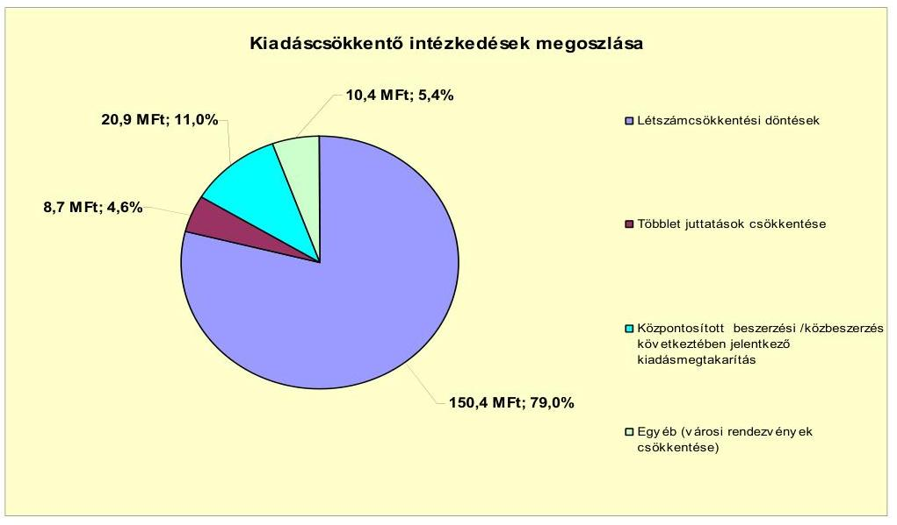

A létszámcsökkentési döntések a 2007. évtől a 2011. év I. félév végéig - az Önkormányzat kimutatása alapján - összesen 150,4 millió Ft kiadási megtakarítást eredményezett, amely az összes kiadási-megtakarításnak a 79,0%-a volt. Az Önkormányzatnál a létszámcsökkentő döntéseken belül a feladatmegszüntetések, átszervezések 132,5 millió Ft, az üres álláshelyek zárolása 5,9 millió Ft, a határozott idejű alkalmazások tízmillió Ft, egyéb szezonális foglalkoztatás megszüntetése kétmillió Ft megtakarítással jártak. A létszámcsökkentéseken belül a prémiumévek programban résztvevők miatt a 2007-2011. év I. félév végéig 33,0 millió Ft kiadási megtakarításuk keletkezett.

A közoktatási, szociális és gyermekjóléti feladatok többcélú kistérségi társulással történő ellátása következtében a 2007-2010. évek között a közoktatási intézményeknél 29 fő, szociális és gyermekjóléti intézményeknél nyolc fő, továbbá a Pol-

---

gármesteri hivatalban átszervezéssel végrehajtott hét fő álláshely megszüntetésével értek el kiadáscsökkenést.

Az önkormányzati kiadások csökkentésére ható további intézkedések eredményeként - az Önkormányzat kimutatása alapján - energiaszolgáltatás közös beszerzésekből 20,9 millió Ft (11,0%), a többletjuttatások csökkentéséből 8,7 millió Ft (4,6%), az egyéb városi rendezvényekre fordított kiadások csökkentéséből 10,4 millió Ft (5,4%) kiadási megtakarítás keletkezett. A vizsgált időszakban az összes kiadáscsökkentő intézkedésből az önként vállalt feladatok ellátásához - a különböző városi rendezvények, külkapcsolatok költségeinek csökkentéséhez - négymillió Ft kapcsolódott.

A kiadást csökkentő intézkedések ellenére az Önkormányzatnál a vizsgált időszakban a teljesített költségvetési kiadások (a növekvő költségvetési bevételek mellett) folyamatosan emelkedtek.

Az Önkormányzatnál a 2007-2010. évek között az önkormányzati létszám és álláshelyek alakulását az alábbi táblázat mutatja be:

| Megnevezés (adatok fő-ben) | Közoktatás | Szociális és gyermekvédelem | Egészségügy | Polgármesteri hivatal | Egyéb | Összesen |
| :--: | :--: | :--: | :--: | :--: | :--: | :--: |
| 2007. január 1-jén jóváhagyott álláshelyek száma | 286 | 77 | 11 | 53 | 80 | 507 |
| Megszüntetett álláshelyek száma | 29 | 8 | 1 | 7 | 5 | 50 |
| ebből: üres álláshelyek száma | 6 | 0 | 0 | 1 | 2 | 9 |
| izzakhok álláshelyek száma | 19 | 0 | 1 | 6 | 2 | 28 |
| 1. álláshelyek száma | 4 | 8 | 0 | 0 | 1 | 13 |
| Álláshely növekedése | 7 | 12 | 0 | 4 | 4 | 27 |
| 2010. december 31-én záró álláshelyek száma | 264 | 81 | 10 | 50 | 79 | 484 |
| 2007. január 1-jén foglalkoztatott létszám | 283 | 73 | 11 | 51 | 77 | 495 |
| Létszámcsökkenés | 28 | 8 | 1 | 6 | 3 | 46 |
| Létszámnövekedés | 6 | 14 | 0 | 4 | 5 | 29 |
| 2010. december 31-én foglalkoztatott létszám | 266 | 80 | 9 | 49 | 79 | 483 |

Az intézményeket és a Polgármesteri hivatalt érintő átszervezések következtében a 2007. január 1-jei induló 507 létszám 2010. december 31-re 484 főre csökkent, melyből egy betöltetlen. Az összes megszüntetett álláshely száma 50 volt, amelyből kilenc üres, 28 szakmai és 13 intézményüzemeltetéssel kapcsolatos álláshely volt.

Az Önkormányzat kimutatása szerint 50 megszűnt álláshely 58,0%-a (29 fő) a közoktatást érintette, amelyet a csökkenő gyermeklétszám, a pedagógusok kötelező óraszámának növekedése, valamint a szervezeti keretek racionalizálása a feladatok társulásban történő ellátása eredményezett. A szociális és gyermekvédelmi területen az álláshelyek 16,0%-a (8 fő) szűnt meg, mivel a nyolcórás foglalkoztatás egy részét négy órára csökkentették. A Polgármesteri hivatalban az álláshelyek 14,0%-a (7 fő) és egyéb területen 10,0%, (5 fő), az egészségügyben 2,0% (1 fő) álláshely megszüntetésére került sor. Az Önkormányzat intézményeinél a vizsgált időszakban meglévő kilenc üres álláshelyből hat a közoktatásban, egy a Polgármesteri hivatalban, kettő pedig egyéb területen volt. Egyes közszolgáltatási területeken azonban feladatbővülések is voltak (oktatásnál, szociális és gyerekjóléti ellátásnál, igazgatásnál), amelyek egyben 27 fő álláshely növekedéssel jártak. Ennek következtében a vizsgált időszak álláshelyeinek száma 23 fővel csökkent.

---

Az Önkormányzat a létszámcsökkentésekhez kapcsolódóan a vizsgált időszakban a 2008. évben 20,5 millió Ft és a 2009. évben 1,7 millió Ft összesen 22,2 millió Ft támogatást vett igénybe. A támogatás felhasználásával tartósan leépített álláshelyek száma hat volt, amelynek 66,7%-a a közoktatást és 33,3%-a a Polgármesteri hivatalt érintette.

Az Önkormányzat - adatszolgáltatása szerint - a bevételnövelő intézkedések hatására 2007-től 2011. év I. félév végéig 107,0 millió Ft bevételt realizált. A többletbevétel 39,4%-át (42,2 millió Ft-ot) a helyi adókkal kapcsolatos intézkedésekből, az 50,7%-át (54,2 millió Ft-ot) a szabad kapacitások hasznosításából (ingatlaneladásból, kisajátításból, szolgáltatások többletbevételéből), 6,4%-át (6,8 millió Ft-ot) az eszközök hasznosításából (értékesítés, bérbeadás), a 3,5%-át (3,8 millió Ft-ot) egyéb különféle díjak emeléséből érte el.

A vizsgált időszakban az Önkormányzat a magánszemélyek kommunális adója a 2007. és a 2008. évi mértékének - 10000 Ft-ról 14000 Ft-ra - növelésével 42,2 millió Ft többletbevételt realizált. Az Önkormányzatnak a vizsgált időszakban telkek értékesítéséből és kisajátításból származott jelentősebb 53,3 millió Ft bevétele keletkezett.

A 2007-2011. év I. félévben érvényesített bevételnövelő intézkedések főbb bevételi jogcímek szerinti számszerűsíthető hatását - az Önkormányzat kimutatása szerint - az alábbi ábra szemlélteti:
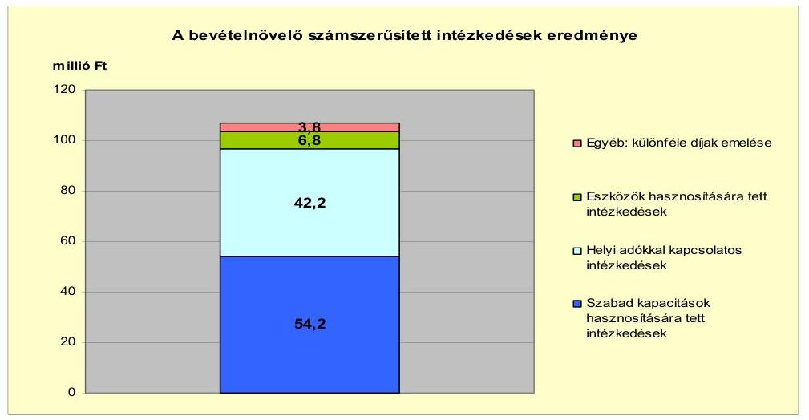

Az Önkormányzatnál a központi intézkedések hatására a 2007-2010. évek tény- és a 2011. év I. félévi tervadatok alapján az átengedett bevételeknél 940,1 millió Ft bevételkiesés jelentkezett, amelyet a költségvetési támogatás 841,6 millió Ft-tal történő növekedése, továbbá a bemutatott kiadáscsökkentő és bevételnövelő intézkedések ellentételeztek.

A költségvetési támogatásból és az átengedett bevételekből származó bevételek változását minden évben a 2006. évhez viszonyítottuk, majd azokat összegeztük. (A 2011. év I. félévi számítást a tervadatok alapján végeztük, ebben az évben a változások felét vettük figyelembe.) Ezeket a kumulált összegeket viszonyítottuk a vizsgált időszakban elért kiadási megtakarítások (190,4 millió Ft) és bevételi többletek (107,0 millió Ft) szintén kumulált összegéhez.

---

# 5. AZ ÁSZ ÁLTAL A KORÁBBBI ÉVEKBEN A PÉNZÜGYI EGYENSÚLY JAVÍTÁSÁRA TETT SZABÁLYSZERŰSÉGI ÉS CÉLSZERŰSÉGI JAVASLATOK HASZNOSULÁSA 

Az ÁSZ az Önkormányzat gazdálkodási rendszerét a 2010. évben ellenőrizte átfogó jelleggel. A gazdálkodási rendszer korábbi ellenőrzése során tett javaslatok közül a pénzügyi egyensúly javítására két szabályszerűségi és egy célszerűségi javaslat vonatkozott.

A jegyzőnek tett javaslatok arra irányultak, hogy az Áht. 8/A. § (7) bekezdésében foglaltakkal ${ }^{33}$ összhangban a költségvetési rendelettervezetben a költségvetési bevételi és kiadási előirányzatok főösszegei ne tartalmazzák a finanszírozási célú pénzügyi műveletek bevételeit, illetve kiadásait; valamint gondoskodjon az Ámr. 201. § (1) bekezdésében ${ }^{34}$ előírtak alapján az Önkormányzat pénzállományának alakulását bemutató likviditási terv elkészítéséről.

A célszerűségi javaslatban felhívtuk a jegyző figyelmét, hogy tájékoztassa évente végzett számítások alapján - a Képviselő-testületet az Önkormányzat eladósodásának növekedésére figyelemmel arról, hogy a hosszú lejáratú, adósságot keletkeztető kötelezettségvállalásokból adódó tőke- és kamatfizetési kötelezettségét az Önkormányzat milyen feltételek biztosítása mellett tudja teljesíteni.

A javaslat megvalósítása érdekében a Képviselő-testület határozattal ${ }^{35}$ intézkedési tervet fogadott el a felelősök és a határidők megjelölésével. A szabályszerűségi javaslatokban foglaltak teljes mértékben megvalósultak, mivel az Önkormányzat a 2/2011. (III. 1.) számú költségvetési rendeletében az Áht. előírásainak megfelelően, finanszírozási célú pénzügyi műveletek nélkül mutatta be a költségvetési bevételi és kiadási előirányzatok főösszegeit, és a 2011. évi költségvetési rendelet 8. számú melléklete tartalmazta az Önkormányzat pénzállományának alakulását bemutató likviditási tervet. A jegyzőnek tett célszerűségi javaslat csak részben teljesült, mivel a 2011. évi költségvetési terv elfogadása során csak szóban tájékoztatták a Képviselőtestületet a hosszú lejáratú, adósságot keletkeztető kötelezettségvállalásokból adódó tőke- és kamatfizetési kötelezettségek teljesítésének feltételeiről.

Budapest, 2012. április 7.

Melléklet: $\quad 7 \mathrm{db}$
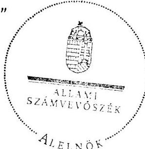

Warvasovszky Tihamér

[^0]
[^0]:    ${ }^{33}$ 2012. január 1-jétől az államháztartásról szóló CXCV. törvény 72. § a) bekezdése
    ${ }^{34}$ 2012. január 1-jétől az államháztartásról szóló CXCV. törvény 78. § (2) bekezdése
    ${ }^{35}$ a Képviselő-testület a 138/2010. (XI. 2.) számú határozata

---

Működési és felhalmozási célú többlet a 2007-2010 közötti időszakban az Önkormányzat zárszámadási rendeleteiben
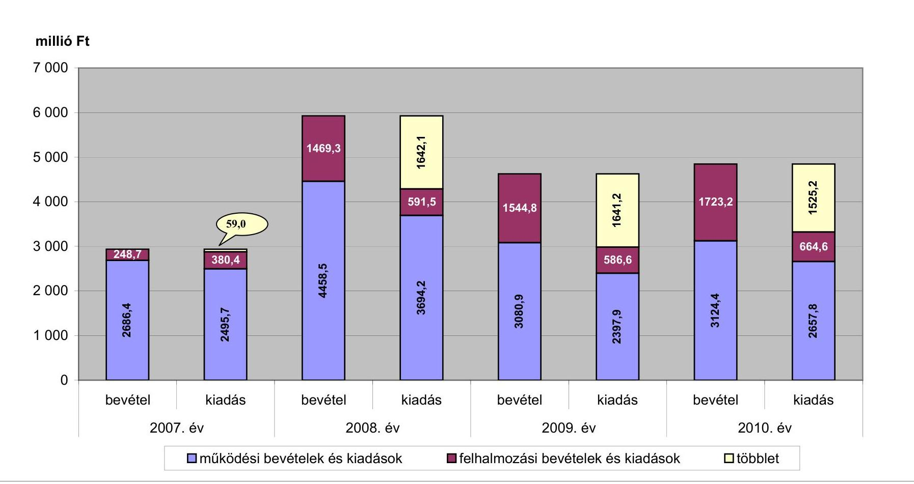

---

Az Önkormányzat bevételei és kiadásai, valamint adósságszolgálata 2007-2010 között

|  1. FOLYÓ KÖLTSÉGVETÉS* | 2007. év | 2008. év | 2009. év  |
| --- | --- | --- | --- |
|  1.1.1. Saját működési bevételek | 612,7 | 717,6 | 781,2  |
|  1.1.2. Költségvetési támogatás | 1018,0 | 1325,3 | 1326,6  |
|  1.1.3. Átengedett bevételek | 709,5 | 451,6 | 471,2  |
|  1.1.4. Állambáztartáson belülről kapott támogatások | 114,4 | 225,2 | 178,2  |
|  1.1.5. EU-tól és külföldről kapott bevételek | 0,0 | 0,0 | 5,0  |
|  1.1.6. Állambáztartáson kívülről kapott bevételek | 3,6 | 3,2 | 2,3  |
|  1.1.7. Előző évi pénzmaradvány átvétel | 9,8

 | 31,1 | 55,7  |
|  1.1. Folyó bevételek $=1.1 .1 .+1.1 .2 .+1.1 .3 .+1.1 .4 .+1.1 .5 .+1.1 .6 .+1.1 .7$. | 2468,0 | 2754,0 | 2820,2  |
|  1.2.1. Működési kiadások kamatkiadások nélkül | 2038,7 | 2182,1 | 2129,6  |
|  1.2.2. Állambüdzsétartáson belülre átadott pénzeszközök | 2,9 | 76,1 | 5,2  |
|  1.2.3.1. vállalkozásoknak | 1,7 | 0,0 | 0,0  |
|  1.2.3.2. EU-nak, illetve külföldre | 0,0 | 0,0 | 1,8  |
|  1.2.3.3. magáncélszemélyeknek | 192,5 | 190,8 | 229,6  |
|  1.2.3.4. nonprofit szervezeteknek | 11,9 | 12,6 | 12,3  |
|  1.2.3. Transferkiadások ( $=1.2 .3 .1+1.2 .3 .2+1.2 .3 .3+1.2 .3 .4$ ) | 206,1 | 203,4 | 243,7  |
|  1.2.4 Kamatkiadások | 12,5 | 22,4 | 57,4  |
|  1.2.5. Előző évi pénzmaradvány átadás | 9,8 | 31,1 | 56,7  |
|  1.2. Folyó kiadások $=1.2 .1 .+1.2 .2 .+1.2 .3 .+1.2 .4 .+1.2 .5$. | 2270,0 | 2515,1 | 2492,6  |
|  1.3. Folyó költségvetés egyenlege MŰKÖDÉSI JÖVEDELEM (1.1. - 1.2.) | 198,0 | 238,9 | 327,6  |
|  2. FELHALMOZÁSI KÖLTSÉGVETÉS** |  |  |   |
|  2.1.1. Saját tőkebevételek | 13,4 | 13,6 | 7,8  |
|  2.1.2. Állambüdzsétartáson belülről kapott támogatások | 81,7 | 24,6 | 44,6  |
|  2.1.3. EU-tól és külföldről kapott támogatások | 0,0 | 2,5 | 0,0  |
|  2.1.4. Állambüdzsétartáson kívülről kapott támogatások | 39,6 | 320,2 | 324,4  |
|  2.1. Felhalmozási bevételek ( $=2.1 .1 .+2.1 .2+2.1 .3+2.1 .4$.) | 134,7 | 360,9 | 376,8  |
|  2.2.1. Saját beruházási kiadás áfával | 152,6 | 145,0 | 182,4  |
|  2.2.2. Saját felújítási kiadás áfával | 142,0 | 76,6 | 114,6  |
|  2.2.3. Állambüdzsétartáson belülre átadott pénzeszköz | 0,0 | 0,1 | 0,0  |
|  2.2.4. EU-nak és külföldnek adott pénzeszközök | 0,0 | 0,0 | 0,0  |
|  2.2.5. Állambüdzsétartáson kívülre adott pénzeszközök | 73,3 | 189,6 | 33,8  |
|  2.2.6. Befektetési célú részesedések vásárlása | 0,0 | 0,0 | 0,0  |
|  2.2. Felhalmozási kiadások ( $=2.2 .1 .+2.2 .2 .+2.2 .3 .+2.2 .4 .+2.2 .5 .+2.2 .6$.) | 367,9 | 411,3 | 330,8  |
|  2.3. Felhalmozási költségvetés egyenlege (2.1. - 2.2.) | $-233,2$ | $-50,4$ | 46,0  |
|  3. Finanszírozási műveletek nélküli (GFS) pozíció(1.3.+2.3.) | $-35,2$ | 188,5 | 373,6  |
|  4. Finanszírozási műveletek |  |  |   |
|  4.1. Hitelfelvétel | 0,0 | 0,0 | 0,0  |
|  4.2. Hiteltörlesztés | 0,0 | 136,9 | 198,4  |
|  4.3. Forgatási és befektetési célú értékpapírok kibocsátása | 0,0 | 1000,0 | 0,0  |
|  4.4. Forgatási és befektetési célú értékpapírok beváltása | 0,0 | 0,0 | 0,0  |
|  4.5. Forgatási és befektetési célú értékpapírok értékesítése | 18,0 | 13,0 | 13,0  |
|  4.6. Forgatási és befektetési célú értékpapírok vásárlása | 0,0 | 0,0 | 0,0  |
|  4.7. Egyéb finanszírozási bevételek (függő, átfutó, kiegyenlítő) | 2,0 | 5,9 | $-4,6$  |
|  4.8. Egyéb finanszírozási kiadások (függő, átfutó, kiegyenlítő) | 238,3 | $-252,2$ | $-37,3$  |
|  4.9.Finanszírozási műveletek egyenlege (4.1. - 4.2.+4.3.-4.4+4.5.-4.6.+4.7.-4.8.) | $-218,2$ | 1134,2 | $-152,7$  |
|  5. Tárgyévi pénzügyi pozíció (1.3.+ 2.3.+4.9.) | $-253,4$ | 1322,7 | 220,9  |
|  6. Nettó működési jövedelem =működési jövedelem (1.3.) - tőketörlesztés (4.2+4.4) | 198,0 | 102,0 | 129,2  |
|  TÁJÉKOZTATÓ ADATOK |  |  |   |
|  Összes kötelezettség | 592,2 | 1569,0 | 1409,1  |
|  ebből rövid lejáratú | 79,8 | 304,9 | 126,0  |
|  Összes szállítói kötelezettség | 0,0 | 0,2 | 1,4  |
|  ebből lejárt (tanúsítványból) | 0,0 | 0,0 | 0,0  |
|  Pénz és tőkepiaci kötelezettség (adósság) | 485,3 | 1348,4 | 1150,0  |
|  ebből rövid lejáratú | 0,0 | 198,4 | 75,0  |
|  PPP szerződéses állomány jelenértéken (tanúsítványból) | 0,0 | 0,0 | 0,0  |
|  ebből lejárt szolgáltatási díj miatti kötelezettség | 0,0 | 0,0 | 0,0  |
|  Folyószámlahitel napi átlagos állománya (tanúsítványból) | 0,0 | 0,0 | 0,0  |
|  Likviditás napi átlagos állománya (tanúsítványból) | 0,0 | 0,0 | 0,0  |
|  Munkabérhitel napi átlagos állománya (tanúsítványból) | 0,0 | 0,0 | 0,0  |
|  Követelés és garanciavállalások (tanúsítványból) | 0,0 | 0,0 | 0,0  |
|  Jogelős bírósági ítéletekből adódó kötelezettségek (tanúsítványból) | 0,0 | 0,0 | 0,0  |
|  Finanszírozásba bevonható eszközök: | 64,2 | 1373,0 | 1581,0  |
|  Tartós hozamviszonyt megtestesítő értékpapírok év végi állománya | 38,9 | 25,9 | 13,0  |
|  Hosszú lejáratú bankbetétek év végi állománya | 0,0 | 0,0 | 0,0  |
|  Értékpapírok év végi állománya | 0,0 | 0,0 | 0,0  |
|  Pénzeszközök (idegen pénzeszközök nélkül) év végi állománya | 25,3 | 1347,9 | 1568,8  |

[^0] [^0]: * Bevételekben nem térül, a kiadásokban nem jelenik meg az amortizáció, a vagyoni helyzetet az egyenleg befolyásolja

---

#### **Az Önkormányzat 2007-2010. években megvalósított, 2010. december 31-ig befejezett fejlesztései és azok forrásfelhasználása**

|   |  |  |  |  |  |  |  |  |  |  |  |  |  |  |  |  |  |  |  |  |  |  |  |  |  |  |  |  |  |  |  |  |  |  |  |  |  |  |  |  |  |  |  |  |  |   |
| --- | --- | --- | --- | --- | --- | --- | --- | --- | --- | --- | --- | --- | --- | --- | --- | --- | --- | --- | --- | --- | --- | --- | --- | --- | --- | --- | --- | --- | --- | --- | --- | --- | --- | --- | --- | --- | --- | --- | --- | --- | --- | --- | --- | --- | --- |
|   |  |  |  |  |  |  |  |  |  |  |  |  |  |  |  |  |  |  |  |  |  |  |  |  |  |  |  |  |  |  |  |  |  |  |  |  |  |  |  |  |  |  |  |  |   |
|   |  |  |  |  |  |  |  |  |  |  |  |  |  |  |  |  |  |  |  |  |  |  |  |  |  |  |  |  |  |  |  |  |  |  |  |  |  |  |  |  |  |  |  |  |   |
|   |  |  |  |  |  |  |  |  |  |  |  |  |  |  |  |  |  |  |  |  |  |  |  |  |  |  |  |  |  |  |  |  |  |  |  |  |  |  |  |  |  |  |  |  |   |
|   |  |  |  |  |  |  |  |  |  |  |  |  |  |  |  |  |  |  |  |  |  |  |  |  |  |  |  |  |  |  |  |  |  |  |  |  |  |  |  |  |  |  |  |  |   |
|   |  |  |  |  |  |  |  |  |  |  |  |  |  |  |  |  |  |  |  |  |  |  |  |  |  |  |  |  |  |  |  |  |  |  |  |  |  |  |  |  |  |  |  |  |   |
|   |  |  |  |  |  |  |  |  |  |  |  |  |  |  |  |  |  |  |  |  |  |  |  |  |  |  |  |  |  |  |  |  |  |  |  |  |  |  |  |  |  |  |  |  |   |

 |  |  |  |  |  |  |  |  |  |  |  |  |  |  |  |  |  |   |
|   |  |  |  |  |  |  |  |  |  |  |  |  |  |  |  |  |  |  |  |  |  |  |  |  |  |  |  |  |  |  |  |  |  |  |  |  |  |  |  |  |  |  |  |  |   |
|   |  |  |  |  |  |  |  |  |  |  |  |  |  |  |  |  |  |  |  |  |  |  |  |  |  |  |  |  |  |  |  |  |  |  |  |  |  |  |  |  |  |  |  |  |   |
|   |  |  |  |  |  |  |  |  |  |  |  |  |  |  |  |  |  |  |  |  |  |  |  |  |  |  |  |  |  |  |  |  |  |  |  |  |  |  |  |  |  |  |  |  |   |
|   |  |  |  |  |  |  |  |  |  |  |  |  |  |  |  |  |  |  |  |  |  |  |  |  |  |  |  |  |  |  |  |  |  |  |  |  |  |  |  |  |  |  |  |  |   |
|   |  |  |  |  |  |  |  |  |  |  |  |  |  |  |  |  |  |  |  |  |  |  |  |  |  |  |  |  |  |  |  |  |  |  |  |  |  |  |  |  |  |  |  |  |   |
|   |  |  |  |  |  |  |  |  |  |  |  |  |  |  |  |  |  |  |  |  |  |  |  |  |  |  |  |  |  |  |  |  |  |  |  |  |  |  |  |  |  |  |  |  |   |
|   |  |  |  |  |  |  |  |  |  |  |  |  |  |  |  |  |  |  |  |  |  |  |  |  |  |  |  |  |  |  |  |  |  |  |  |  |  |  |  |  |  |  |  |  |   |
|   |  |  |  |  |  |  |  |  |  |  |  |  |  |  |  |  |  |  |  |  |  |  |  |  |  |  |  |  |  |  |  |  |  |  |  |  |  |  |  |  |  |  |  |  |   |
|   |  |  |  |  |  |  |  |  |  |  |  |  |  |  |  |  |  |  |  |  |  |  |  |  |  |  |  |  |  |  |  |  |  |  |  |  |  |  |  |  |  |  |  |  |   |
|   |  |  |  |  |  |  |  |  |  |  |  |  |  |  |  |  |  |  |  |  |  |  |  |  |  |  |  |  |  |  |  |  |  |  |  |  |  |  |  |  |  |  |  |  |   |
|   |  |  |  |  |  |  |  |  |  |  |  |  |  |  |  |  |  |  |  |  |  |  |  |  |  |  |  |  |  |  |  |  |  |  |  |  |  |  |  |  |  |  |  |  |   |
|   |  |  |  |  |  |  |  |  |  |  |  |  |  |  |  |  |  |  |  |  |  |  |  |  |  |  |  |  |  |  |  |  |  |  |  |  |  |  |  |  |  |  |  |  |   |
|   |  |  |  |  |  |  |  |  |  |  |  |  |  |  |  |  |  |  |  |  |  |  |  |  |  |  |  |  |  |  |  |  |  |  |  |  |  |  |  |  |  |  |  |  |   |
|   |  |  |  |  |  |  |  |  |  |  |  |  |  |  |  |  |  |  |  |  |  |  |  |  |  |  |  |  |  |  |  |  |  |  |  |  |  |  |  |  |  |  |  |  |   |
|   |  |  |  |  |  |  |  |  |  |  |  |  |  |  |  |  |  |  |  |  |  |  |  |  |  |  |  |  |  |  |  |  |  |  |  |  |  |  |  |  |  |  |  |  |   |
|   |  |  |  |  |  |  |  |  |  |  |  |  |  |  |  |  |  |  |  |  |  |  |  |  |  |  |  |  |  |  |  |  |  |  |  |  |  |  |  |  |  |  |  |  |   |
|   |  |  |  |  |  |  |  |  |  |  |  |  |  |  |  |  |  |  |  |  |  |  |  |  |  |  |  | 

 |  |  |  |  |  |  |  |  |  |  |  |  |  |  |  |  |   |
|---|---|---|---|---|---|---|---|---|---|---|---|---|---|---|---|---|
|   |  |  |  |  |  |  |  |  |  |  |  |  |  |  |  |  |  |  |  |  |  |  |  |  |  |  |  |  |  |  |  |  |  |  |  |  |  |  |  |  |  |  |  |  |   |
|   |  |  |  |  |  |  |  |  |  |  |  |  |  |  |  |  |  |  |  |  |  |  |  |  |  |  |  |  |  |  |  |  |  |  |  |  |  |  |  |  |  |  |  |  |   |
|   |  |  |  |  |  |  |  |  |  |  |  |  |  |  |  |  |  |  |  |  |  |  |  |  |  |  |  |  |  |  |  |  |  |  |  |  |  |  |  |  |  |  |  |  |   |
|   |  |  |  |  |  |  |  |  |  |  |  |  |  |  |  |  |  |  |  |  |  |  |  |  |  |  |  |  |  |  |  |  |  |  |  |  |  |  |  |  |  |  |  |  |   |
|   |  |  |  |  |  |  |  |  |  |  |  |  |  |  |  |  |  |  |  |  |  |  |  |  |  |  |  |  |  |  |  |  |  |  |  |  |  |  |  |  |  |  |  |  |   |
|   |  |  |  |  |  |  |  |  |  |  |  |  |  |  |  |  |  |  |  |  |  |  |  |  |  |  |  |  |  |  |  |  |  |  |  |  |  |  |  |  |  |  |  |  |   |
|   |  |  |  |  |  |  |  |  |  |  |  |  |  |  |  |  |  |  |  |  |  |  |  |  |  |  |  |  |  |  |  |  |  |  |  |  |  |  |  |  |  |  |  |  |   |
|   |  |  |  |  |  |  |  |  |  |  |  |  |  |  |  |  |  |  |  |  |  |  |  |  |  |  |  |  |  |  |  |  |  |  |  |  |  |  |  |  |  |  |  |  |   |
|   |

---

Mezőterény Város Önkormányzata

Az Önkormányzat 2010. december 31-én folyamatban lévő fejlesztési feladataira 2010. december 31-ig teljesített kifizetések és azok forrásösszetétele

száz Ft-ban

|   | Fejlesztési feladat (beruházás, felújítás) |  | Beruházás, felújítás |  |  |  |  |  |  |  |  |  |  |  |  |  |  |  |  |  |  |  |  |  |  |  |  |  |  |  |  |  |  |  |  |  |  |  |  |  |  |  |   |
|---|---|---|---|---|---|---|---|---|---|---|---|---|---|---|---|---|---|---|---|---|---|---|---|---|---|---|---|---|---|---|---|---|---|---|---|---|---|---|---|---|---|---|---|---|---|---|
|   |  |  |  |  |  |  |  |  |  |  |  |  |  |  |  |  |  |  |  |  |  |  |  |  |  |  |  |  |  |  |  |  |  |  |  |  |  |  |  |  |  |  |   |
|   | Fejlesztési feladat (beruházás, felújítás) |  | Beruházás, felújítás |  |  |  |  |  |  |  |  |  |  |  |  |  |  |  |  |  |  |  |  |  |  |  |  |  |  |  |  |  |  |  |  |  |  |  |  |  |  |  |   |
|   |  |  |  |  |  |  |  |  |  |  |  |  |  |  |  |  |  |  |  |  |  |  |  |  |  |  |  |  |  |  |  |  |  |  |  |  |  |  |  |  |  |  |   |
|   |  |  |  |  |  |  |  |  |  |  |  |  |  |  |  |  |  |  |  |  |  |  |  |  |  |  |  |  |  |  |  |  |  |  |  |  |  |  |  |  |  |  |   |
|   |  |  |  |  |  |  |  |  |  |  |  |  |  |  |  |  |  |  |  |  |  |  |  |  |  |  |  |  |  |  |  |  |  |  |  |  |  |  |  |  |  |  |   |
|   |  |  |  |  |  |  |  |  |  |  |  |  |  |  |  |  |  |  |  |  |  |  |  |  |  |  |  |  |  |  |  |  |  |  |  |  |  |  |  |  |  |  |   |
|   |  |  |  |  |  |  |  |  |  |  |  |  |  |  |  |  |  |  |  |  |  |  |  |  |  |  |  |  |  |  |  |  |  |  |  |  |  |  |  |  |  |  |   |
|   |  |  |  |  |  |  |  |  |  |  |  |  |  |  |  |  |  |  |  |  |  |  |  |  |  |  |  |  |  |  |  |  |  |  |  |  |  |  |  |  |  |  |   |
|   |

 |  |  |  |  |  |  |  |  |  |  |  |   |
|---|---|---|---|---|---|---|---|---|---|---|---|
|---|---|---|---|---|---|---|---|---|---|---|---|---|---|---|---|---|---|---|---|---|---|---|---|---|---|---|---|---|---|---|---|---|---|---|---|---|---|---|---|---|---|---|---|---|---|---|---|---|---|---|---|
|---|---|---|---|---|---|---|---|---|---|---|---|---|---|---|---|---|---|---|---|---|---|---|---|---|---|---|---|---|---|---|---|---|---|---|---|---|---|---|---|---|---|---|---|---|---|---|---|---|---|
|---|---|---|---|---|---|---|---|---|---|---|---|---|---|---|---|---|---|---|---|---|---|---|---|---|---|---|---|---|---|---|---|---|---|---|---|---|---|---|---|---|---|---|---|---|---|---|---|
|---|---|---|---|---|---|---|---|---|---|---|---|---|---|---|---|---|---|---|---|---|---|---|---|---|---|---|---|---|---|---|---|---|---|---|---|---|---|---|---|---|---|---|---|---|---|
|---|---|---|---|---|---|---|---|---|---|---|---|---|---|---|---|---|---|---|---|---|---|---|---|---|---|---|---|---|---|---|---|---|---|---|---|---|---|---|---|---|---|---|---|
|---|---|---|---|---|---|---|---|---|---|---|---|---|---|---|---|---|---|---|---|---|---|---|---|---|---|---|---|---|---|---|---|---|---|---|---|---|---|---|---|---|---|
|---|---|---|---|---|---|---|---|---|---|---|---|---|---|---|---|---|---|---|---|---|---|---|---|---|---|---|---|---|---|---|---|---|---|---|---|---|---|---|---|
|---|---|---|---|---|---|---|---|---|---|---|---|---|---|---|---|---|---|---|---|---|---|---|---|---|---|---|---|---|---|---|---|---|---|---|---|---|---|
|---|---|---|---|---|---|---|---|---|---|---|---|---|---|---|---|---|---|---|---|---|---|---|---|---|---|---|---|---|---|---|---|---|---|---|---|
|---|---|---|---|---|---|---|---|---|---|---|---|---|---|---|---|---|---|---|---|---|---|---|---|---|---|---|---|---|---|---|---|---|---|
|---|---|---|---|---|---|---|---|---|---|---|---|---|---|---|---|---|---|---|---|---|---|---|---|---|---|---|---|---|---|---|---|---|---|
|---|---|---|---|---|---|---|---|---|---|---|---|---|---|---|---|---|---|---|---|---|---|---|---|---|---|---|---|---|---|---|---|---|---|
|---|---|---|---|---|---|---|---|---|---|---|---|---|---|---|---|---|---|---|---|---|---|---|---|---|---|---|---|---|---|---|---|---|---|
|---|---|---|---|---|---|---|---|---|---|---|---|---|---|---|---|---|---|---|---|---|---|---|---|---|---|---|---|---|---|---|---|---|---|
|---|---|---|---|---|---|---|---|---|---|---|---|---|---|---|---|---|---|---|---|---|---|---|---|---|---|---|---|---|---|---|---|---|---|
|---|---|---|---|---|---|---|---|---|---|---|---|---|---|---|---|---|---|---|---|---|---|---|---|---|---|---|---|---|---|---|---|---|---|
|---|---|---|---|---|---|---|---|---|---|---|---|---|---|---|---|---|---|---|---|---|---|---|---|---|---|---|---|---|---|---|---|---|---|
|---|---|---|---|---|---|---|---|---|---|---|---|---|---|---|---|---|---|---|---|---|---|---|---|---|---|---|---|---|---|---|---|---|---|

 |  |  |  |  |  |  |  |  |  |  |  |  |  |  |  |  |  |  |  |  |  |  |   |
|   |  |  |  |  |  |  |  |  |  |  |  |  |  |  |  |  |  |  |  |  |  |  |  |  |  |  |  |  |  |  |  |  |  |  |  |  |  |  |  |  |  |  |   |
|   |  |  |  |  |  |  |  |  |  |  |  |  |  |  |  |  |  |  |  |  |  |  |  |  |  |  |  |  |  |  |  |  |  |  |  |  |  |  |  |  |  |  |   |
|   |  |  |  |  |  |  |  |  |  |  |  |  |  |  |  |  |  |  |  |  |  |  |  |  |  |  |  |  |  |  |  |  |  |  |  |  |  |  |  |  |  |  |   |
|   |  |  |  |  |  |  |  |  |  |  |  |  |  |  |  |  |  |  |  |  |  |  |  |  |  |  |  |  |  |  |  |  |  |  |  |  |  |  |  |  |  |  |   |
|   |  |  |  |  |  |  |  |  |  |  |  |  |  |  |  |  |  |  |  |  |  |  |  |  |  |  |  |  |  |  |  |  |  |  |  |  |  |  |  |  |  |  |   |
|   |  |  |  |  |  |  |  |  |  |  |  |  |  |  |  |  |  |  |  |  |  |  |  |  |  |  |  |  |  |  |  |  |  |  |  |  |  |  |  |  |  |  |   |
|   |  |  |  |  |  |  |  |  |  |  |  |  |  |  |  |  |  |  |  |  |  |  |  |  |  |  |  |  |  |  |  |  |  |  |  |  |  |  |  |  |  |  |   |
|   |  |  |  |  |  |  |  |  |  |  |  |  |  |  |  |  |  |  |  |  |  |  |  |  |  |  |  |  |  |  |  |  |  |  |  |  |  |  |  |  |  |  |   |

---

#### **Az Önkormányzat 2010. december 31-én folyamatban lévő fejlesztési feladataira 2010. december 31-én fennálló kötelezettségek és azok forrásösszesítése**

|   |  |  |  |  |  |  |  |  |  |  |  |  |  |  |  |  |  |  |  |  |  |  |  |  |  |  |  |  |  |  |  |  |  |  |  |  |  |  |  |  |  |  |  |  |  |  |  |  |  |  |  |  |  |  |  |  |  |  |  |  |  |  |  |  |  |  |  |  |  |  |  |  |  |  |  |  |  |  |  |  |  |  |  |  |  |  |  |  |  |  |  |  |  |  |  |  |  |  |  |  |  |  |  |  |  |  |  |  |  |

---

### **Az Önkormányzat által beadott, elbírálás alatti pályázati forrásból megvalósítani tervezett fejlesztéseihez kapcsolódó kötelezettségvállalásai és azok forrásösszetétele**

|  Fejlesztési feladat (beruházás, felújítás) |  |  | Beruházás, felújítás |  |  |  |  |  |  |  |  |  |  |  |  |  |  |  |  |  |  |  |  |  |  |  |  |  |  |  |  |  |  |  |  |  |  |  |  |  |  |  |  |  |  |  |  |  |  |  |  |  |  |  |  |  |  |  |  |  |  |  |  |  |  |  |  |  |  |  |  |  |  |  |  |  |  |  |  |  |  |  |  |  |  |  |  |  |  |  |  |  |  |  |  |  |  |  |  |  |  |  |  |

---

### **Az önkormányzati feladatok ellátásában résztvevő gazdasági társaságok**

|  Gazdasági társaság
megnevezése | 2010. december 31-én | a gazdasági társaságnak szerződéses kötelezettségre, feladatellátási szerződésre alapozottan
az Önkormányzat költségvetéséből  |
| --- | --- | --- |
|   | önkormányzati | önkormányzati
gazdasági
társaságának  |
|   |  | tulajdonrésze  |
|  1. 100%-os tulajdoni hányadú gazdasági társaságok: |  |   |
|  100%-os tulajdoni hányadú gazdasági társaságok összesen | x | x  |
|  II. 75-99%-os tulajdoni hányadú gazdasági társaságok: |  |   |
|  75-99%-os tulajdoni hányadú gazdasági társaságok összesen | x | x  |
|  75%-feletti tulajdoni hányadú gazdasági társaságok összesen | x | x  |
|  III. 51-74%-os tulajdoni hányadú gazdasági társaságok: |  |   |
|  51-74%-os tulajdoni hányadú gazdasági társaságok összesen | x | x  |
|  IV. egyéb, közfeladatot ellátó gazdasági társaságok: |  |   |
|  Rékés Megyei Vízművek Zrt. | 2,0 | 0,0  |
|  TAPPE Szállítási és Feldolgozó Kft. | 5,0 | 0,0  |
|  egyéb, közfeladatot ellátó gazdasági társaságok összesen | x | x  |
|  Összesen | x | x  |

