# ÁLLAMI   SZÁMVEVŐSZÉK 

## JELENTÉS

## Mezőkövesd Város Önkormányzata pénzügyi helyzetének ellenőrzéséről (43/4)

---

# Állami Számvevőszék 

Iktatószám: V-3083-026/2012.
Témaszám: 1015
Vizsgálat-azonosító szám: V0560114

## Az ellenőrzést felügyelte:

Dr. Varga Sándor
számvevő igazgatóhelyettes
Az ellenőrzést vezette:
Renkó Zsuzsanna
számvevő tanácsos
Ellenőrzési csoportvezető:
Bialkó Zsolt Gyula
számvevő tanácsos
Az ellenőrzést végezték:
Batkiné Vas Anna Veres Jánosné
számvevő tanácsos számvevő tanácsos

---

# TARTALOMJEGYZÉK 

BEVEZETÉS ..... 9
I. ÖSSZEGZŐ MEGÁLLAPÍTÁSOK, KÖVETKEZTETÉSEK, JAVASLATOK ..... 13
II. RÉSZLETES MEGÁLLAPÍTÁSOK ..... 27

1. Az Önkormányzat kötelező és önként vállalt feladatai, a feladatellátás szervezeti keretei és annak változásai ..... 27
2. Az Önkormányzat pénzügyi egyensúlyi helyzetét befolyásoló tényezők ..... 35
2.1. A működési és a felhalmozási egyensúly változása ..... 37
2.2. Az Önkormányzat bevételeinek változása ..... 43
2.3. Az Önkormányzat múködési és felhalmozási célú kiadásainak változása ..... 48
3. Az Önkormányzat kötelezettségei ..... 52
3.1. Az Önkormányzat pénzintézetekkel szembeni kötelezettségeinek változása ..... 52
3.2. A szállítói kötelezettségek változása ..... 60
3.3. Egyéb kötelezettségek változása ..... 61
4. A pénzügyi egyensúly megteremtése érdekében hozott intézkedések eredménye ..... 62
5. Az ÁSZ által a korábbi években a pénzügyi egyensúly javítására tett szabályszerűségi és célszerűségi javaslatok hasznosulása ..... 66

---

# MELLÉKLETEK 

1. számú Múködési és felhalmozási célú hiány/többlet a 2007-2010 közötti időszakban az Önkormányzat zárszámadási rendeleteiben (1 oldal)
2. számú Az Önkormányzat bevételei és kiadásai, valamint adósságszolgálata 2007-2010 között (1 oldal)
3/a. számú Az Önkormányzat 2007-2010. években megvalósított, 2010. december 31ig befejezett fejlesztései és azok forrásösszetétele (1 oldal)
3/b. számú Az Önkormányzat 2010. december 31-én folyamatban lévő fejlesztési feladataira 2010. december 31-ig teljesített kifizetések és azok forrásösszetétele (1 oldal)
3/c. számú Az Önkormányzat 2010. december 31-én folyamatban lévő fejlesztési feladataira 2010. december 31-én fennálló kötelezettségek és azok forrásöszszetétele (1 oldal)
3/d. számú Az Önkormányzat által beadott, elbírálás alatti pályázati forrásból megvalósítani tervezett fejlesztéseihez kapcsolódó kötelezettségvállalásai és azok forrásösszetétele (1 oldal)
3. számú Az önkormányzati feladatok ellátásában résztvevő gazdasági társaságok (1 oldal)

---

# RÖVIDÍTÉSEK JEGYZÉKE 

## Törvények

Áhsz.
Áht.
Ötv.
Ptk.

## Rendeletek

SzMSz

## Szórövidítések

áfa
ÁSZ
B.R. Kollégium

EU
jegyzó
Képviselő-testület
Kincstári iroda
Közkincs-Tár Kft.

LTP
MÁAMIPSZ
Média Kft.
OEP
Önkormányzat
ÖNHIKI támogatás
polgármester
Polgármesteri hivatal
PPP konstrukció
Rendelőintézet
Remondis Kft.
SZ. I. Szakképző Iskola
SZ. L. Gimnázium
SZGK
szja

249/2000. (XII. 24.) Korm. rend. az államháztartás szervezetei beszámolási és könyvvezetési kötelezettségének sajátosságairól
az államháztartásról szóló 1992. évi XXXVIII. törvény
a helyi önkormányzatokról szóló 1990. évi LXV. törvény
a Polgári Törvénykönyvről szóló 1959. évi IV. törvény
Mezőkövesd Város Önkormányzatának 5/2003. (II. 27.) számú rendelete a Képviselő-testület Szervezeti és Müködési Szabályzatáról
általános forgalmi adó
Állami Számvevőszék
Bayer Róbert Középiskolai Kollégium
Európai Unió
Mezőkövesd Város Önkormányzatának jegyzője
Mezőkövesd Város Képviselő-testülete
Mezőkövesd Város Önkormányzata Polgármesteri hivatalának Kincstári Irodája
Mezőkövesdi KÖZKINCS-TÁR Kulturális, Könyvtári, Turisztikai és Sportcentrum Nonprofit Korlátolt Felelősségű Társaság
lakás-takarékpénztári előtakarékosság
Mezőkövesdi Általános Iskola és Alapfokú Művészeti Intézmény Egységes Pedagógiai Szolgálat
Mezőkövesdi Média Nonprofit Kft.
Országos Egészségbiztosítási Pénztár
Mezőkövesd Város Önkormányzata
önhibájukon kívül hátrányos helyzetben lévő önkormányzatok támogatása
Mezőkövesd Város Önkormányzatának polgármestere
Mezőkövesd Város Önkormányzatának Polgármesteri Hivatala
Public Private Partnership (Partnerségi együttmüködés közfeladatok ellátására a magánszektor bevonásával)
Városi Önkormányzat Rendelőintézet
Remondis Tisza Hulladékgazdálkodási Korlátolt Felelősségű Társaság
Széchenyi István Szakképző Iskola
Szent László Gimnázium és Szakképző Iskola
Mezőkövesdi Szociális Gondozási Központ
személyi jövedelemadó

---

Városfejlesztési Kft. Mezőkövesdi Városfejlesztési Korlátolt Felelősségű Társaság
VG Zrt. Mezőkövesdi VG Városgazdálkodási Zártkörűen Múködő Részvénytársaság
Zsóry Camping Kft. Zsóry-Camping Korlátolt Felelősségű Társaság

---

# ÉRTELMEZŐ SZÓTÁR 

| BUBOR | Budapesti Bankközi Forint Hitelkamatláb. Irányadó, refe-   rencia jellegú kamatláb. Mértékét az MNB naponta álla-   pitja meg a banki kamatok figyelembevételével. Közzété-   tele naponta történik. |
| :--: | :--: |
| CLF módszer | Az önkormányzatok költségvetése elemzésének eszköze. A   módszer következetesen elkülöníti a folyó és a felhalmo-   zási költségvetés bevételeit és kiadásait, azok költségvetési   egyenlegeit. Bizonyos mértékig a vállalati gazdálkodás   logikai elemeit érvényesíti az önkormányzatok pénzügyi,   jövedelmi helyzetének vizsgálata során. Az értékelés a   pénzügyi kapacitás fogalmát helyezi a középpontba. |
| EURIBOR | A frankfurti bankközi piacon jegyzett, az Európai Közpon-   ti Bank szabályainak megfelelően megállapított, kínálati   kamatláb. Az EURIBOR értékét a legfontosabb európai   bankok hitelkínálatának kamatlábai alapján a Reuters   ügynökség számolja ki és teszi közzé naponta. A magyar   pénzintézetek is ezt használják viszonyítási alapnak EUR   hitelek esetén. |
| használhatósági fok | Az eszközgazdálkodás vizsgálatának elemzése során hasz-   nált mutató. Számításakor a tárgyi eszköz könyv szerinti   (nettó) értékét viszonyítják a tárgyi eszköz bruttó (beszer-   zési/létesítési) értékéhez. A mutató százalékban kifejezett   értékének csökkenése az eszköz állagának romlására,   avulására utal, ami maga után vonja az üzemeltetési és   fenntartási költségek növekedését is. |
| kamatkockázat | A változó kamatozású forint-, vagy devizahitelek futam-   ideje alatt a kamat emelkedése miatt fennálló kockázat,   amely kamatnövekedés következtében nő a hitel törlesztő   részlete. |
| közfeladat | Állami, helyi, illetve kisebbségi önkormányzati feladat,   amelynek ellátásáról az államnak, illetve az önkormány-   zatoknak kell gondoskodni. A hatályos szabályozás sze-   rint közfeladatot törvény és önkormányzati rendelet álla-   píthat meg. Az önkormányzatok által ellátandó feladatok   keretszerú meghatározását az Ötv. tartalmazza. |
| önkormányzat többségi   tulajdonában lévő gaz-   dasági társaságok | Az önkormányzat a gazdasági társaságban a szavazatok   több mint ötven százalékával, vagy a Ptk. 685/B. § (2)-(3)   bekezdéseiben rögzített, meghatározó befolyással rendelkezik. A befolyással rendelkező akkor rendelkezik egy jogi   személyben meghatározó befolyással, ha annak tagja,   illetve részvényese, és jogosult e jogi személy vezető tiszts-   égviselői vagy felügyelőbizottsága tagjai többségének   megválasztására, illetve visszahívására, vagy a jogi sze-   mély más tagjaival, illetve részvényeseivel kötött megáll-   lapodás alapján egyedül rendelkezik a szavazatok több   mint ötven százalékával (Ptk. 685/B. § (2) bek.). A meghat-   ározó befolyás akkor is fennáll, ha a befolyással rendel- |

---

kező számára e jogosultságok közvetett módon (köztes vállalkozásain keresztül, a Ptk. 685/B. § (3), (4) bek. szerint) biztosítottak.
A helyi önkormányzat és az önkormányzat irányítása alá tartozó költségvetési szerv többségi tulajdonában, illetve többségi befolyása alatt álló gazdálkodó szervezet esetében hitelfelvétel, kölcsönfelvétel, garancia- vagy kezességvállalás, tartozásátvállalás, tartozáselengedés, értékpapírkibocsátás, vásárlás, pénzügyi lízing, tartós bérleti szerződés, ingyenes vagyonjuttatás (így különösen: ajándékozás, ingyenes engedményezés), vagy követelésvásárlás, követelésengedményezés végrehajtására vonatkozóan az Áht. 100/M. § (4) bekezdése alapján az önkormányzat rendelkezik döntési jogosultsággal.
pénzügyi kapacitás

A pénzügyi kapacitás (financial capacity) az adósok hitelfelvételi képességének azon mértéke, ahol még anélkül tudják növelni az adósságot, hogy csökkenteniük kellene akár a jelenbeli, akár a jövőben esedékes kiadásaikat a fizetésképtelenség elkerülése érdekében. (Forrás: Az önkormányzati rendszer pénzügyi helyzete, ÁSZKUT tanulmány 2010.)
pénzügyi kockázat
A múködési kockázat egyik eleme. Megmutatkozhat a költségvetés nagyságrendjének, szerkezetének nem megalapozott módosításaiban, a bevételi, kiadási előirányzatoktól lényegesen eltérő teljesítésekben, a nem megfelelő belső kontrollrendszer múködésében, a tudatos károkozásokban, a biztosítások elmaradásában, a hibás fejlesztési döntésekben, a nem a terveknek megfelelő forrásfelhasználásokban. Jelentkezhet továbbá a bevételek és kiadások ütemkülönbsége miatt felvett folyószámla- és likvidhitelek költségvetési év végén fennálló egyenlegeként, amely az önkormányzat költségvetésébe - akár tartósan beépülő forráshányt jelzi.
rulírozó hitel
Rulírozó hitel alatt olyan hiteltípust értünk, amely esetében a hitelintézet a nála vezetett számla mellé biztosít hitelkeretet. E hitelkeretet az ügyfél tetszőlegesen használhatja fel, illetve a felhasznált pénz törlesztése is tetszőleges ütemben történhet. A törlesztett hitelösszeg újra felhasználhatóvá válik. Rulírozó hitelt a bankok csak akkor adnak az ügyfeleiknek, ha azok számláira havi rendszerességgel érkezik jövedelem.
SNA
System of National Account, azaz a Nemzeti Számlák Rendszere, amely a gazdasági szektorok által létrehozott valamennyi terméket és szolgáltatást figyelembe veszi.

---

szállítói kitettség
törlesztési kockázat

Az önkormányzat pénzügyi helyzete olyan külső körülmények hatására is módosulhat, amelyekre az önkormányzatnak nincs hatása, emiatt szállítói kitettsége keletkezik. Pl.: a lejárt szállítói tartozások rendezése függhet attól, hogy a szállító milyen intézkedéseket foganatosít az önkormányzattal szemben.
Annak a kockázata, hogy a megfelelő időben és mértékben a hitelt felvevőnél rendelkezésre állnak-e a pénzintézetek és egyéb szervek felé fennálló kötelezettségek visszafizetéséhez, a hitelek és kölcsönök törlesztéséhez szükséges pénzügyi források.
A törlesztési kockázatot növeli a kamat- és árfolyam növekedése, mivel ezekben az esetekben az adósságszolgálat nőhet. Törlesztési kockázatot okozhat a visszafizetésre tervezett forrás elérésének, teljesítésének bizonytalansága (pl. a visszafizetéshez tervezett tartalékolás elmaradt, a tervezettnél alacsonyabb a saját bevétel, a helyi adóból származó bevétel az adóalanyok, adóalapok csökkenése miatt nem teljesül).

---

.

---

# JELENTÉS 

## Mezőkövesd Város Önkormányzata pénzügyi helyzetének ellenőrzéséről

## BEVEZETÉS

Az Állami Számvevőszék 2011. évtől érvényes stratégiája új irányt szabott a helyi önkormányzatok gazdálkodásának ellenőrzésében is. Az ÁSZ - küldetése és jövőképe szerint - szilárd szakmai alapokra támaszkodva értékteremtő ellenőrzéseivel és helyzetelemzéseivel az államháztartás egészében, így a helyi önkormányzati alrendszerben is elő kívánja segíteni a közpénzek és a közvagyon szabályos, gazdaságos, hatékony és eredményes felhasználását. E folyamat részeként - az államháztartási hiány alakulásának összetevőire is figyelemmel végezzük az önkormányzati alrendszer pénzügyi helyzetelemzését.

Az államháztartás helyi szintjén a 304 városnak ${ }^{1}$ az általuk ellátott közszolgáltatások volumenére is tekintettel a közfeladatok ellátásában kiemelt szerepe van. E települések 2011. január 1-jei népessége 3169 ezer fő volt.

Feladataik és hatásköreik az Ötv. mellett különböző ágazati törvények által meghatározottak, miközben a feladatellátás szervezeti kereteit - ezen belül a gazdasági társaságok közszolgáltatások ellátásában betöltött szerepét - saját maguk határozzák meg. A gazdasági társaságok által ellátott feladatok esetén a gazdálkodás, továbbá az önkormányzatok pénzügyi egyensúlyi helyzetére ható közvetlen kockázatok egy része kikerült az önkormányzati alrendszerből. A többségi önkormányzati tulajdonban lévő társaságok gazdálkodásának körülményei befolyásolhatják a városok pénzügyi egyensúlyi helyzetének megítélésében rejlő kockázatokat.

Az áttekintett időszakban az önkormányzati forrásszabályozás elvei lényegesen nem változtak. Az önkormányzatok gazdasági mozgásterét a központi költségvetéstől való függőség mellett jelentősen befolyásolja a helyi adókivetési jog gyakorlása. A városok gazdálkodási szabadságának lényeges eleme, hogy anyagi lehetőségeik függvényében dönthettek arról, hogy feladataik közül azokat, amelyek megoldására az Ötv. szerint a települési önkormányzat nem kötelezhető, a megyei önkormányzat fenntartásába adhatták. E döntések differenciáltan érintették a városok pénzügyi helyzetét.

A városi önkormányzatok 2007-2010 között teljesített bevételeit és azok összetételét a következő ábra szemlélteti:

[^0]
[^0]:    ${ }^{1}$ A megyei jogú városok nélkül figyelembe vett városok száma 304 városi önkormányzatot jelent.

---

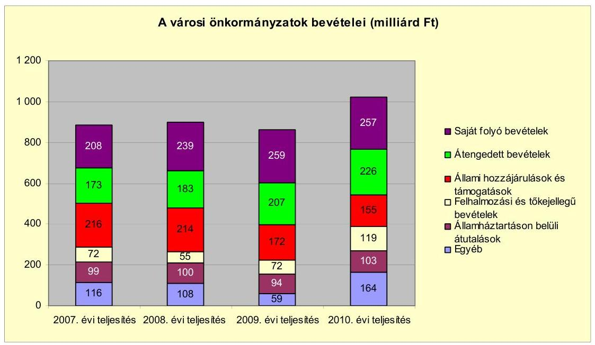

Az önkormányzati alrendszer pénzügyi helyzetértékelése során új elemzési módszereket alkalmaz az ellenőrzés. A költségvetési beszámoló adatok elemzése helyett az Önkormányzat pénzügyi helyzetét a CLF módszerrel értékeljük, amelynek lényegét és számításának módszerét a jelentés 2. pontjában és a jelentés 2 . számú mellékletében ismertetjük részletesen.

Az új módszereken alapuló helyzetértékelés fontosságát az adja, hogy a helyi önkormányzatok bruttó adósságállománya ${ }^{2}$ a 2010. évi költségvetési beszámolók alapján 1248 milliárd Ft-ot tett ki. Ezen belül a 304 város adóssága 383 milliárd Ft volt, amely az önkormányzati alrendszer teljes adósságállományának $30,7 \%$-át jelentette ${ }^{3}$.

A mérlegben kimutatott bruttó adósságállomány mellett az önkormányzatok számára az eszközállomány műszaki állapotának megőrzése is előbb-utóbb pénzügyi kötelezettséget jelent. Az elhasználódott eszközök pótlására forrást biztosító amortizációs (felújítási) alap képzésének ${ }^{4}$ elmaradása maga után vonhatja a feladatellátást kiszolgáló tárgyi eszközök állagának erőteljes romlását.

Emellett a 2007-2013-as időszakra meghirdetett, vissza nem térítendő EU-s fejlesztési forrásokhoz való hozzájutás lehetősége felerősítette az önkormányzati

[^0]
[^0]:    ${ }^{2}$ Az önkormányzati mérlegbeszámolókból számított bruttó adósságállomány 2010. év végi összege magában foglalja a fejlesztési és a múködési célú kötvénykibocsátások, a beruházási és fejlesztési hitelek, a múködési célú hosszú lejáratú hitelek, a rövid lejáratú hitelek, váltótartozások miatti kötelezettségek teljes (2011-ben, illetve az azt követő években esedékes) állományát. Az önkormányzatok 2007. év végi mérleg szerinti adósságállománya 692 milliárd Ft volt.
    ${ }^{3}$ A fővárosi és a kerületi önkormányzatok adósságának figyelmen kívül hagyásával számított 977 milliárd Ft összegű bruttó adósságállományból a városok 39,2\%-kal részesedtek.
    ${ }^{4}$ Erre a jelenlegi szabályozási környezetben nem kötelezi előírás az önkormányzatokat.

---

alrendszer fejlesztési igényeit, amelyek a felhalmozási költségvetési hiány folyamatos emelkedésén túl - az előírt jövőbeni fenntartási kötelezettség miatt tovább terhelhetik az önkormányzatok költségvetését ${ }^{5}$.

Az ÁSZ a 2011. évi ellenőrzési tervében a 43. számú, az Önkormányzatok gazdálkodási rendszerének ellenőrzése részeként áttekinti és elemzi az önkormányzatok pénzügyi helyzetét. A gazdálkodás szabályszerűségét az ÁSZ az előző évek során ebben az önkormányzati körben is ellenőrizte. Jelen vizsgálatunk a tett javaslataink pénzügyi helyzetet érintő pontjainak hasznosítására utóellenőrzés jelleggel tér ki.

Az ellenőrzés megállapításait az Önkormányzat által kitöltött - teljességi nyilatkozattal megerősített - 27 tanúsítványon szolgáltatott adatokra alapoztuk. Ellenőrzési bizonyítékként használtuk fel továbbá:

- a képviselő-testületi és bizottsági előterjesztéseket, a döntés-előkészítés során készített dokumentumokat;
- a kötelezettségvállalások dokumentumait;
- a pénzügyi-számviteli nyilvántartásokat;
- az éves költségvetési beszámolókat;
- a költségvetési és zárszámadási rendeleteket.

Az ellenőrzés a 2007. január 1-2011. június 30. közötti időszakot öleli fel. A pénzintézeti kötelezettségek állományának vizsgálatakor az ellenőrzött időszak 2006. december 31-2011. június 30. közötti időszakra terjedt ki.

Az ellenőrzés során vizsgáltunk minden olyan körülményt és adatot, amely a program végrehajtásához kapcsolódott és a pénzügyi helyzet alakulására hatást gyakorló, releváns tények és folyamatok feltárásához szükségessé vált.

# Az ellenőrzés célja annak értékelése volt, hogy: 

- a vizsgált időszakban a kötelező és önként vállalt feladatok ellátását biztosító szervezeti keretekben, a feladatellátás módjában bekövetkezett változások milyen hatást gyakoroltak az Önkormányzat pénzügyi helyzetének alakulására;
- az Önkormányzat pénzügyi - ezen belül múködési és felhalmozási - egyensúlya mely tényezők hatására miként változott, és az Önkormányzat milyen intézkedéseket tett a pénzügyi egyensúly javítása érdekében;

[^0]
[^0]:    ${ }^{5}$ Az Állami Számvevőszék 2011 júniusában közzétett, 1108. számú, a helyi önkormányzatok fejlesztési célú támogatási rendszerének ellenőrzéséről szóló jelentésében feltárta a fejlesztési folyamatok problémáit. A helyi önkormányzatok elsősorban azokat a fejlesztéseket valósították meg, amelyekhez támogatást lehetett igényelni. A fejlesztési célok közül a magasabb támogatási intenzitású pályázatokat részesítették előnyben. A fejlesztéssel megvalósuló létesítmények jövőbeli üzemeltetésének várható ráfordításait az önkormányzatok $71,9 \%$-a nem mérte fel.

---

- a költségvetési kiadások finanszírozása érdekében vállalt pénzintézeti kötelezettségek hogyan alakultak, továbbá milyen kötelezettségek fennállása befolyásolja az Önkormányzat jövőbeli pénzügyi helyzetét;
- hasznosultak-e a gazdálkodási rendszer korábbi ellenőrzése során a pénzügyi egyensúly javítására az ÁSZ által tett szabályszerűségi és célszerűségi javaslatok.

Az ellenőrzés típusa: szabályszerűségi vizsgálat.
A vizsgálat jogszabályi alapját az Állami Számvevőszékről szóló 2011. évi LXVI. törvény 1. §. (3), 5. § (2)-(6) bekezdései, továbbá az Áht. 120/A. § (1) bekezdése ${ }^{6}$ előírásai képezik.

Mezőkövesd város lakosainak száma 2011. január 1-jén 16607 fő volt. Az Önkormányzat az éves költségvetési beszámolója (80-as űrlap adatai) szerint a 2010. évben 5000,6 millió Ft költségvetési bevételt ért el, és 5364,1 millió Ft költségvetési kiadást teljesített, a költségvetési bevételeket meghaladó kiadások fedezetét pénzmaradványból biztosította. Az Önkormányzat 2010. december 31-én a könyvviteli mérleg szerint 15 194,2 millió Ft értékű vagyonnal rendelkezett. Az Önkormányzat vagyona a 2007. év végi állományhoz viszonyítva 27,8\%-kal (3301,9 millió Ft-tal) növekedett. Az eszközérték növekedésében 3034,0 millió Ft-tal a forgóeszközök - ezen belül 2947,9 millió Ft-tal a pénzeszközök - állománynövekedése volt a meghatározó. A források között a kötelezettségek állományának 2990,6 millió Ft-os növekedése adta az állományváltozás döntő hányadát. Az Önkormányzat a 2011. évi költségvetési rendeletében a költségvetési bevételi főösszeget 7691,0 millió Ft-ban, a kiadási főösszeget 8826,9 millió Ft-ban, a hiány összegét 1135,9 millió Ft-ban állapította meg. A hiány finanszírozására 886,7 millió Ft előző évek felhalmozási pénzmaradványának igénybevételét és 263,6 millió Ft működési célú hitel felvételét jelölték meg.

[^0]
[^0]:    ${ }^{6}$ 2012. január 1-jétől az államháztartásról szóló 2011. évi CXCV. törvény 61. § (2) bekezdése

---

# I. ÖSSZEGZŐ MEGÁLLAPÍTÁSOK, KÖVETKEZTETÉSEK, JAVASLATOK 

Az Önkormányzat - adatszolgáltatása szerint - a 2010. évi múködési költségvetési kiadásaiból ( 3754,9 millió Ft) 2878,0 millió Ft-ot ( $76,6 \%$ ) a kötelező feladatok, 876,9 millió Ft-ot ( $23,4 \%$ ) az önként vállalt feladatok ellátására fordított. Az önként vállalt feladatok besorolását az Önkormányzat végezte el. Az önként vállalt feladatok az alapfokú művészeti oktatáshoz, nevelési tanácsadó, pedagógiai szakszolgálat üzemeltetéséhez, középfokú oktatási feladatokhoz (gimnázium, szakközépiskola, kollégium) a lakossági szemétszállítási díj és a helyi autóbusz közlekedés támogatásához kapcsolódtak, továbbá hozzájárultak civil szervezetek múködésének finanszírozásához.

Az Önkormányzat feladatellátásának szervezeti struktúrája
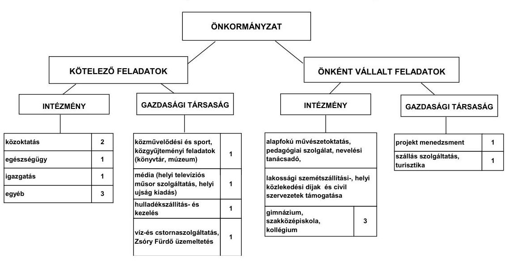

Az Önkormányzat kötelező és önként vállalt feladatait 2011. június 30 -án (a Polgármesteri hivatallal együtt) 10 költségvetési szerv és hat gazdasági társaság keretében látta el. A 2007-2011. év június 30. között végrehajtott kötelező és önként vállalt feladatok szervezeti kereteinek változása miatt a feladatellátás telephelyeinek száma a 2007. évi 54 -ről 2011. év I. félév végére kilenccel, 45 -re csökkent. A telephelyek száma 2008. január 1-jétől az SZGK intézményei és a körzeti orvosi ügyelet által ellátott feladatok Többcélú társulásnak átadása következtében öttel, 2009. január 1-jétől a közművelődési feladatok gazdasági társaság keretében történő ellátása miatt hárommal, 2009. december 31-től a Kollégium melegítőkonyháinak átszervezése miatt további egygyel csökkent. Az Önkormányzat öt gazdasági társaságban kizárólagos tulajdonos, egyben 50\% alatti tulajdoni hányaddal rendelkezik. A gazdasági társaságok részt vettek a kötelező és az önként vállalt feladatok ellátásában. Múködésükhöz az ellenőrzött időszakban - az elszámolási kötelezettség szerződésben, illetve megállapodásban történő rögzítésével - összesen 404,8 millió Ft átadott pénzeszközt kaptak az Önkormányzattól. A gimnáziumi, a szakközépiskolai és

---

a kollégiumi nem kötelező feladatokat az Önkormányzatnál három intézmény 2008. július 1-jétől a Kincstári irodához kapcsolva végezte. További nem kötelező feladatokat láttak el nem önálló szervezeti formában az általános iskola (alapfokú művészeti oktatás) és a Polgármesteri hivatal (a lakossági szemétszállítási és a helyi közlekedési díjak, valamint civil szervezetek támogatása). A feladatellátás szervezeti keretei a 2008. évben változtak, amelyek miatt a költségvetési szervek száma néggyel csökkent. A vizsgált időszakban a kötelező és az önként vállalt feladatok ellátását biztosító szervezeti keretekben, a feladatellátás módjában bekövetkezett - a szociális feladatok nagy részének átadása és a Polgármesteri hivatal létszámcsökkentése következtében keletkezett kiadási megtakarítások, valamint a három tagiskola átvétele és a Közkincstár Kft.-nek működési célra átadott pénzeszközök miatti kiadásnövekedések eredőjeként az Önkormányzat pénzügyi egyensúlyi helyzetére nem voltak hatással. A megvalósult szervezeti változások az Önkormányzatnál 2007-2011. év június 30. között összességében a működési kiadások mindössze 3,5 millió Ft-os csökkenését eredményezték.

A múködési kiadásokon belül a közoktatási feladatokat ellátó intézmények (óvodák, általános iskolák, gimnázium, szakközépiskolák, kollégium) teljesített kiadása $39,4 \%$-ot ( 1477,9 millió Ft-ot), a szociális feladatot ellátó intézményé $2,1 \%$-ot ( 80,7 millió Ft-ot) tett ki. A közművelődési és sport feladatok múködési kiadása a 2010. évtől az Önkormányzat gazdasági társaságánál merült fel. A 2010. évi ágazatonkénti múködési kiadások lényegesen nem tértek el a 20072009. évek átlagától.

Az egyes közszolgáltatások feladatellátásában résztvevő intézmények múködési kiadásainak 2007. és 2010. évi ágazatonkénti finanszírozási forrásösszetételét az alábbi ábra szemlélteti:
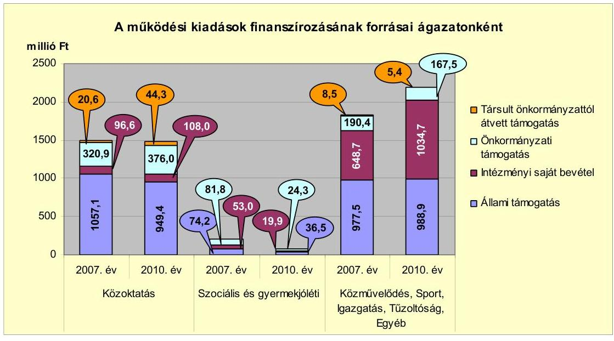

Az önkormányzati feladatok múködési kiadásainak finanszírozásában meghatározó szerepe a 2007-2010. években az állami támogatásnak volt. Részaránya a múködési bevételeken belül 2007-ben 59,7\%, 2008-ban 57,8\%, 2009ben $55,9 \%$ 2010-ben $52,6 \%$ volt. Összege - az Önkormányzat kimutatása sze-

---

rint - 2010-ben 4,6\%-kal, 94,2 millió Ft-tal volt kevesebb a 2007-2009. évek 2068,9 millió Ft-os átlagától. Az állami támogatás az előző évhez képest 2008ban $1,6 \%$-kal, 34,7 millió Ft-tal nőtt, 2009-ben $8,8 \%$-kal, 189,1 millió Ft-tal csökkent, 2010-ben 1,0\%-kal 20,3 millió Ft-tal ismét emelkedett. Az ingadozást a központosított támogatások évenként eltérő összege (2007-ben 149,3 millió Ft, 2008-ban 391,9 millió Ft, 2009-ben 202,7 millió Ft, 218,0 millió Ft) okozta.

Az intézményi saját bevételek aránya és összege 2007-2011. év június 30. között a múködési bevételeken belül - az Önkormányzat kimutatása szerint a 2009. év kivételével - emelkedett. Az előző évhez képest a 2008. évben finanszírozási aránya 4,6 százalékponttal $27,2 \%$-ra, összege 209,5 millió Ft-tal 1008,0 millió Ft-ra nőtt. A 2008. évi saját bevétel emelkedés döntően a közoktatási ágazatot, azon belül az SZ. L. Gimnáziumot és a SZ. I. Szakképző Iskolát (együtt 59,4 millió Ft), valamint a Polgármesteri hivatalt (233,1 millió Ft) érintette. A középfokú oktatási intézményeknek 2008-ban egyszeri jellegű többletbevétele keletkezett a 2008. július 1-jétől végrehajtott önálló gazdálkodói jogkörük megszüntetése miatti záró pénzkészlet 45,2 millió Ft-os összegéből. A Polgármesteri hivatal 2008. évi többletbevételének 53,3\%-a, 124,2 millió Ft a helyi adóbevétel, $35,6 \%-a, 82,9$ millió Ft, az előző évi múködési célú pénzmaradványa emelkedésének eredménye. A 2010. évben az előző évhez képest az intézményi saját bevételek aránya 2,2 százalékponttal 31,0\%-ra, összege 157,2 millió Ft-tal, 1162,7 millió Ft-ra nőtt, amely döntően a Polgármesteri hivatalnál az áfa 97,5 millió Ft-os, valamint a kamatbevételek 84,0 millió Ft-os emelkedéséből származott.

Az önkormányzati támogatás aránya és összege a múködési célú kiadások finanszírozásában jelentősen nem változott, 2007-ben 16,8\% (593,1 millió Ft), 2008-ban 13,3\% (494,2 millió Ft), 2009-ben 14,0\% (488,4 millió Ft), 2010-ben $15,1 \%$ ( 567,8 millió Ft) volt. Az önkormányzati támogatás összegét, annak változását az intézményi saját bevétel és a társult önkormányzattól átvett támogatás alakulása határozta meg. Ezen időszak alatt az intézményi saját bevételek aránya összességében 8,4 százalékponttal, 364,2 millió Ft-tal, a társult önkormányzattól átvett támogatás finanszírozási aránya a három tagiskola átvétele miatt 0,5 százalékponttal, 20,6 millió Ft-tal nőtt, amely az önkormányzati támogatás 2007-2010. között összességében 25,3 millió Ft-os csökkenéséhez vezetett. A finanszírozási források arányainak változása a 2007-2011. év június 30. között az Önkormányzat pénzügyi egyensúlyi helyzetét jelentősen nem befolyásolták.

Az Önkormányzat folyó költségvetési egyenlege (működési jövedelme) 2007-2010 között múködési forrástöbbletet mutatott, a múködési egyensúly biztosított volt, melyben az ÖNHIKI támogatás is meghatározó szerepet játszott. A 2007-2010. évek múködési jövedelmét, tőketörlesztését és pénzügyi kapacitását a következő ábra szemlélteti.

---

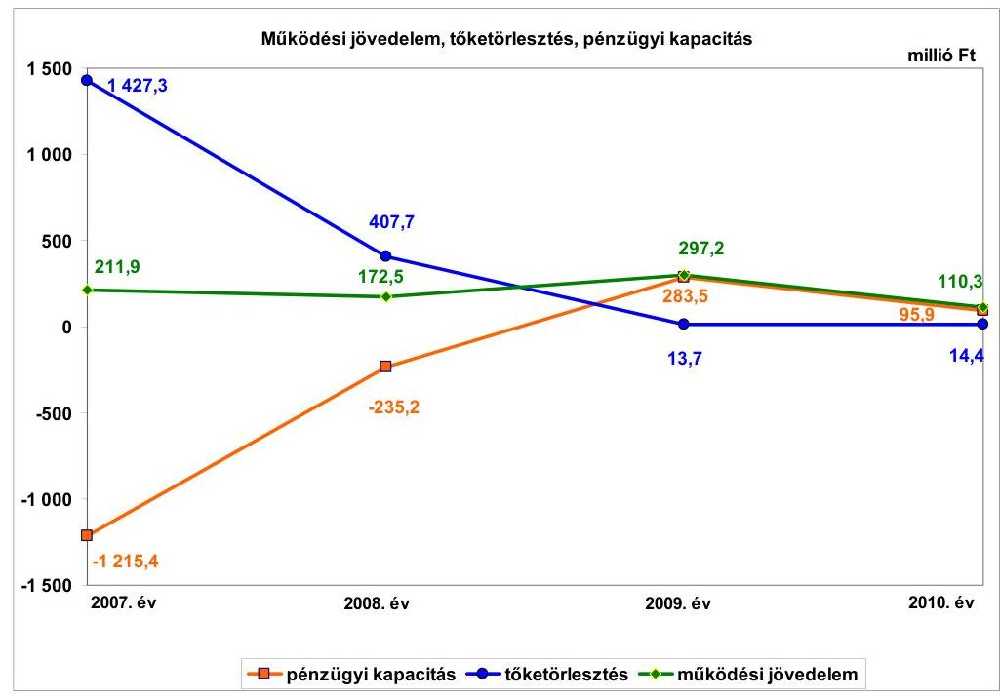

A 2007. évben a folyó költségvetés 211,9 millió Ft forrástöbblete döntően a 202,5 millió Ft ÖNHIKI támogatás miatt keletkezett, jelentősen javítva az Önkormányzat pénzügyi egyensúlyát. Az ÖNHIKI támogatás nélkül számított, 2007. évi, folyó költségvetési egyenleg mindössze 9,4 millió Ft-ot tett ki. A 2008. évben az ÖNHIKI támogatás 34,0 millió Ft-tal, 2009-ben 29,0 millió Ft-tal, 2010-ben 26,6 millió Ft-tal növelte a múködési jövedelmet. A múködési megtakarítások további évek közötti módosulásaiban a folyó kiadások eltérő irányú és nagyságú változása volt a meghatározó. A 2009. évben a folyó költségvetés egyenlegének 124,7 millió Ft-os növekedése döntően a folyó kiadások 103,3 millió Ft-tal történt csökkenésének eredménye. A múködési kiadások 2009. évi, előző évihez viszonyított mérséklődésében a személyi juttatások és járulékai csökkenése játszott elsődleges szerepet. A múködési jövedelem 2010. évi, 186,9 millió Ft-os csökkenését a dologi kiadások, azon belül elsősorban az áfa kiadások és - az EU-s forrásból támogatott feladatokkal összefüggésben - a vásárolt közszolgáltatások kiadásainak, valamint a szellemi tevékenység teljesítéséhez kapcsolódó kifizetésnek az összesen 238,1 millió Ft-os növekedése okozta.

Az ÖNHIKI támogatás nélkül számított múködési jövedelem 2007-ben 9,4 millió Ft, 2008-ban 138,5 millió Ft, 2009-ben 268,2 millió Ft, 2010-ben 83,7 millió Ft volt.

Az Önkormányzat pénzügyi kapacitása (nettó múködési jövedelme) a 2007-2008. években negatív, a 2009-2010. években pozitív egyenleget mutatott. A 2007. évi múködési jövedelmet (211,9 millió Ft-ot) 1427,3 millió Ft tőketörlesztés terhelte, amelyből 27,4 millió Ft a fejlesztési célú, hosszú lejáratú hitelek, 153,9 millió Ft a rövid lejáratú, likvid - rulírozó- és támogatásmegelőlegezési hitelek -, 1246,0 millió Ft a folyószámla- és munkabérmegelőlegezési hitelek miatti kötelezettség teljesítése volt. A 2008. évi múködési jövedelmet (172,5 millió Ft-ot) 407,7 millió Ft hitel-visszafizetés csökkentette, amely a fejlesztési célú, hosszú lejáratú hitelek 382,4 millió Ft-os és a támoga-tás-megelőlegezési hitelek 25,3 millió Ft-os törlesztését tartalmazta. A 2009. év-

---

ben 13,7 millió Ft, a 2010. évben 14,4 millió Ft - fejlesztési célú, hosszú lejáratú hitelekkel összefüggő - tőketörlesztés terhelte a működési jövedelmet. A pénzügyi kapacitás a 2010. évben a működési jövedelem előző évihez viszonyított csökkenése mellett is pozitív volt, a kis összegű tőketörlesztési kötelezettség miatt.
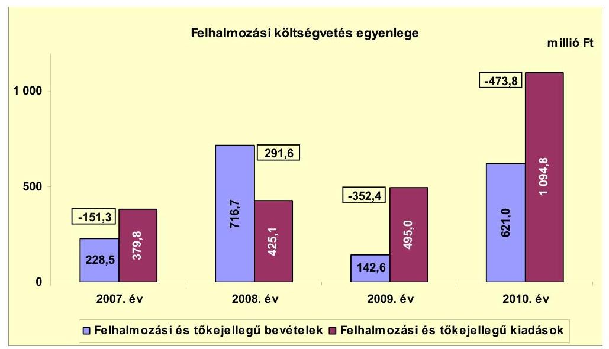

A 2007-2010. években az Önkormányzat felhalmozási költségvetésének egyenlege - a 2008. évi kivételével - negatív összegű volt. A felhalmozási költségvetés 2007. évi, -151,3 millió Ft-os egyenlegének kialakulásához az előző évről áthúzódó feladatokkal kapcsolatos, 109,1 millió Ft-os kifizetés jelentősen hozzájárult. A 2008. évi felhalmozási költségvetési többlet keletkezésében meghatározó szerepe volt a saját tőkebevétel 301,4 millió Ft-os, a fejlesztési célú költségvetési támogatás 136,6 millió Ft-os, az államháztartáson kívülről átvett pénzeszközök 70,6 millió Ft-os, előző évihez viszonyított többletbevételének. A 2008. évi saját tőkebevétel a szennyvízberuházás lakossági hozzájárulásának LTP lejárata miatti jóváírásból (277,5 millió Ft) és tárgyi eszközök értékesítéséből (28,0 millió Ft) képződött.

A 2009. évben a felhalmozási költségvetés egyenlege 644,0 millió Ft-tal csökkent az előző évihez képest és negatívvá vált. Ennek oka, hogy a felhalmozási kiadások 16,4\%-os, 69,9 millió Ft-os növekedése mellett a felhalmozási bevételek összege az ötödére, 142,6 millió Ft-ra csökkent. A 2009. évi felhalmozási kiadások emelkedésében legjelentősebb az év során megkezdett, városrehabilitációs projekttel kapcsolatos, 80,6 millió Ft összegű kifizetés volt. A felhalmozási bevételek visszaesése az előző évi, egyszeri jellegű, egyéb saját tőkebevételek (268,5 millió Ft-os) és kapott támogatások, átvett pénzeszközök (276,3 millió Ft-os) csökkenése miatt következett be. A 2009. évben a felhalmozási források biztosításához összesen 26,3 millió Ft hosszú lejáratú hitelt vettek igénybe. A hitelekből 24,9 millió Ft-ot intézményi fűtéskorszerűsítéshez, 1,4 millió Ft-ot gépjármú-vásárláshoz használtak fel.

A felhalmozási költségvetés hiánya a 2010. évben már 473,8 millió Ft volt, 121,4 millió Ft-tal haladta meg a 2009. évit. Az államháztartáson belülről kapott támogatások, támogatásértékű bevételek az előző évihez képest 445,4 mil-

---

lió Ft-tal, a felhalmozási kiadások azonban 599,8 millió Ft-tal növekedtek. A felhalmozási kiadásokban felújításra 113,7 millió Ft-ot, a legjelentősebb beruházási feladatokra, a Szent Imre Tagiskola korszerűsítésére 331,2 millió Ft-ot, a Zsóry Fürdő fejlesztésére 191,4 millió Ft-ot, magasból mentő gépjármú beszerzésére 137,3 millió Ft-ot, szennyvízcsatorna-hálózat építésére 99,3 millió Ft-ot, város-rehabilitációra 51,2 millió Ft-ot, közlekedésfejlesztésre 48,4 millió Ft-ot fordítottak.

Az Önkormányzat folyó bevételei - melyeknek összege a 2007-2011. év I. félévében együttesen 19449,7 millió Ft volt - 2007-2010 között növekvő tendenciát mutattak. Ez az emelkedés azonban évente, az előző évihez viszonyítva mindössze 0,5-2,8\%-ot (21,4-120,4 millió Ft-ot) jelentett. A 2010. évi, 4379,3 millió Ft folyó bevétel a 2007-2009. évek átlagát ( 4217,5 millió Ft-ot) $3,8 \%$-kal, 161,8 millió Ft-tal haladta meg. A legnagyobb, 120,4 millió Ft-os növekedés a 2010. évben következett be, melyben az áfabevétel 125,7 millió Ft-os - ebből a fordított áfa 110,1 millió Ft - emelkedésének volt döntő szerepe. A 2007-2010. években a folyó bevételek $54,8 \%$-át ( 9326,8 millió Ft-ot) adó múködési célú költségvetési támogatás és szja együttes összege nem jelentősen (1,5-2,4\%-kal, 34,1-57,3 millió Ft-tal), de csökkent. Az Önkormányzat 2007-ben 202,5 millió Ft ÖNHIKI támogatást kapott, mely biztosította a múködési jövedelem pozitív egyenlegét. A további, 2008-ban 34,0 millió Ft, 2009-ben 29,0 millió Ft, 2010-ben 26,6 millió Ft ÖNHIKI támogatások emelték a folyó bevételeket és ezzel a múködési jövedelmet.

Az Önkormányzat folyó kiadásai 2007-ről 2008-ra 120,9 millió Ft-tal növekedtek, a múködési kiadások ( 57,8 millió Ft-os), az államháztartáson belülre átadott pénzeszközök ( 65,9 millió Ft-os) és a transzferkiadások ${ }^{7}$ ( 53,5 millió Ftos) emelkedése miatt. A múködési kiadásokban az intézményeket megillető, alulfinanszírozás miatti, előző évi maradvány-visszafizetés 113,4 millió Ft-os növekménye, az államháztartáson belülre átadott pénzeszközökben az - intézményátszervezéssel összefüggő - intézményi záró pénzkészletek átadásának 47,5 millió Ft-os összege, a transzferkiadásokban a nonprofit szervezetek 38,1 millió Ft-os többlettámogatása jelenik meg. A folyó kiadások a 2009. évre - megközelítve a 2007. évi szintet - 103,3 millió Ft-tal csökkentek, melyben a múködési kiadások 281,8 millió Ft-tal történt csökkenésének volt döntő szerepe. A múködési kiadásokban a személyi juttatások és azok járulékai - a 13. havi illetmény megszűnése miatt - összesen 187,9 millió Ft-tal mérséklődtek. A 2010. évre a folyó kiadások 307,3 millió Ft-tal ( $7,8 \%$-kal) emelkedtek a múködési kiadások 324,2 millió Ft-os növekedésének hatására. A múködési kiadásokban a dologi kiadások ( 255,3 millió Ft-tal) növekedése volt a legjelentősebb, azon belül az áfakiadás 164,4 millió Ft-tal - melyből a fordított áfa 110,1 millió Ft -, a vásárolt közszolgáltatások 37,3 millió Ft-tal, a szellemi tevékenység teljesítéséhez kapcsolódó kifizetés 36,4 millió Ft-tal, pályázat alapján megvalósuló fejlesztési feladattal összefüggésben emelkedett az előző évihez képest.

A felhalmozási bevételek 2007-2010 között összesen 1708,8 millió Ft forrást biztosítottak a fejlesztési feladatokhoz. A felhalmozási bevételek 2008. évi, előző évihez viszonyított, 716,7 millió Ft-ra növekedésében egyrészt az egyéb saját

[^0]
[^0]:    ${ }^{7}$ államháztartáson kívülre átadott pénzeszközök

---

tőkebevétel egyszeri jellegű, támogatási kölcsönök visszatérülése miatti, 273,4 millió Ft-os növekményének volt jelentős szerepe. A felhalmozási bevételek növekedésében másrészt az - évente különböző és változó összegű fejlesztési feladatok finanszírozására - kapott támogatások, átvett pénzeszközök összesen 186,8 millió Ft-os növekménye volt meghatározó. A felhalmozási bevételek 2010. évi, 478,4 millió Ft-os, 2009. évihez viszonyított növekedésében az államháztartáson belülről kapott támogatások 445,5 millió Ft-tal történő emelkedésének volt döntő szerepe. A 2011. év I. félévében teljesült, 554,0 millió Ft felhalmozási bevétel az ugyanezen időszaki, 1076,0 millió Ft összegű felhalmozási kiadás $51,5 \%$-ára biztosított fedezetet, további forrásokat a kötvényforrás és annak hozama nyújtott.

Az Önkormányzat 2007-2010 közötti pénzügyi egyensúlyi helyzetét, annak változását jelentősen befolyásolta a fejlesztési tevékenysége. A 2010. december 31 -éig befejezett fejlesztések értéke 1661,8 millió Ft volt, melyekre 2006. december 31-éig 83,9 millió Ft-ot, a 2007-2010. években 1577,9 millió Ft-ot fizettek ki. A 2007-2010 között teljesített fejlesztési kiadások forrása 655,7 millió Ft (41,6\%) saját bevétel, 74,9 millió Ft (4,7\%) hitel, 13,8 millió Ft (0,9\%), 2008ban kibocsátott kötvényforrás, 409,6 millió Ft (25,9\%) EU-s támogatás és 423,9 millió Ft (26,9\%) hazai támogatás volt. A hitelfelhasználás 24,9 millió Ft összegben az intézményi fűtéskorszerűsítéshez, 50,0 millió Ft összegben a piaccsarnok építéséhez történt. A 2010. december 31-én folyamatban lévő fejlesztési feladatok végrehajtására 2007-2010 között 350,8 millió Ft kiadást teljesítettek, melyre önkormányzati saját bevételből 39,1 millió Ft-ot (11,1\%-ot), 2008-ban kibocsátott kötvényforrásból 141,9 millió Ft-ot (40,5\%-ot), EU-s támogatásból 163,5 millió Ft-ot ( $46,8 \%$-ot), hazai támogatásból 6,3 millió Ft-ot $(1,8 \%-$ ot) fordítottak.

Az Önkormányzat 2010. december 31-én folyamatban lévő fejlesztési feladatai miatt fennálló kötelezettségeinek összege 1752,4 millió Ft volt, amelyet 27,7 millió Ft saját bevételből, 609,3 millió Ft - 2008-ban kibocsátott kötvényforrásból, 1066,3 millió Ft EU-s és 49,1 millió Ft hazai támogatásból terveznek biztosítani. A folyamatban lévő fejlesztések 2010. december 31-én fennálló felhalmozási kötelezettségeinek forrásösszetételét és annak megoszlását az alábbi ábra szemlélteti:
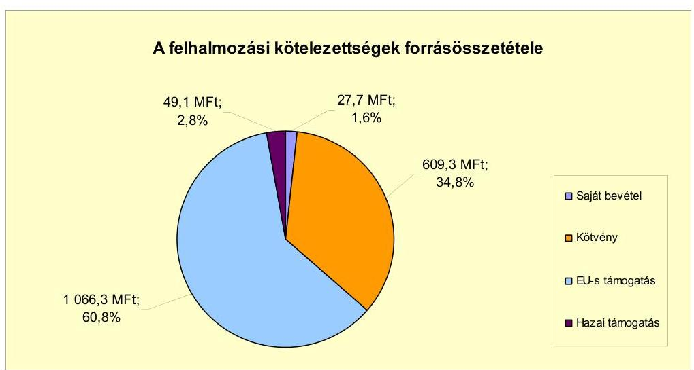

---

Az Önkormányzat által beadott, elbírálás alatt álló pályázatok tervezett, teljes bekerülési költsége 4436,3 millió Ft, amelyből - a pályázat elkészítéséhez - 2010. december 31-éig 144,1 millió Ft-ot már kifizettek. A további kötelezettség teljesítéséhez 935,5 millió Ft önkormányzati saját bevétel és 645,9 millió Ft kötvényforrás biztosítása mellett, 2710,8 millió Ft EU-s támogatás igénybevételét tervezik.

Az Önkormányzat mérleg szerinti pénzintézetekkel szembeni kötelezettsége a 2006. év végétől a 2011. év I. félév végére 673,1 millió Ft-ról 3533,3 millió Ft-ra nőtt. A 2011. június 30 -án fennálló pénzintézetekkel szembeni kötelezettségek öt, hosszú lejáratú fejlesztési hitelből, folyószámlahitelből és két, deviza alapú (EUR) kötvénykibocsátásból, valamint a kötvények árfolyamváltozásából álltak.

Az adósságot keletkeztető kötelezettségvállalásokra minden esetben képviselő-testületi döntés alapján került sor, azonban a beruházási hitelek esetében az előterjesztések nem tartalmazták a kamatkockázatokat. A hiteleket lehívták és a hitelcélnak megfelelően, a költségvetésbe betervezett kiadásokhoz felhasználták. Az Önkormányzatnak hosszú lejáratú fejlesztési devizahitele nem volt, a forint alapú hitelekkel kapcsolatosan 2007-2010 között összesen 438,0 millió Ft tőkét törlesztett, továbbá 68,5 millió Ft kamat- és egyéb kiadást fizetett meg. Az Önkormányzatnak 2007. január 1-jén hét fejlesztési hitelből 658,3 millió Ft hiteltartozása volt, melyből 2007-2010 között ötöt, 403,3 millió Ft összegben visszafizetett. A 2007 előtt, illetve a 2007-2009 között kötött szerződések alapján további 34,7 millió Ft hiteltörlesztést teljesítettek a vizsgált időszakban. Fejlesztési célú hitel igénybevételére 2007-2009 között került sor, összesen 76,3 millió Ft összegben. Az intézményi fűtéskorszerűsítés (24,9 millió Ft) és gépjárművásárlás ( 1,4 millió Ft) hitelszerződését a vizsgált időszakban, a piaccsarnok-építés ( 50,0 millió Ft) szerződését 2006-ban kötötték. A 2010. év végén öt fejlesztési célú hitelből összesen 226,9 millió Ft kötelezettsége állt fenn az Önkormányzatnak. A 2011. év I. félévében összesen 7,2 millió Ft tőketartozás és 4,5 millió Ft kamat- és egyéb kiadás megfizetését teljesítették. Az Önkormányzat a 2008. évben két kötvényt bocsátott ki húszéves futamidőre, összesen 3005,5 millió Ft, egyenként 5675 ezer EUR értékben. A „Mezökövesd Jövöjéért" kötvény visszafizetése a futamidő végén, 2028-ban, egy összegben (5675 ezer EUR) esedékes, melyet óvadéki betétszámlán helyeztek el. A „Mezökövesd Fejlesztéséért" kötvény törlesztését - a türelmi időt követően - 2013. október 31-étől kezdődően, félévente kell teljesíteni. A 2013. évi tőketörlesztési kötelezettség 261 ezer EUR. A 2011. év I. féléve végéig az EUR-ban fennálló, pénzintézettel szembeni kötelezettségéből (11 350 ezer EUR) tőkét nem törlesztett, 190,6 millió Ft (633 ezer EUR) kamat- és egyéb kiadást fizetett meg.

A folyószámla- és munkabér-megelőlegezési hitel 2007-2011. év I. féléve közötti igénybevételét a következő tábla mutatja be:

---

| Megnevezés | 2007. év | 2008. év | 2009. év | 2010. év | 2011. év   I. félév |
| :-- | :--: | :--: | :--: | :--: | :--: |
| Folyószámlahitel |  |  |  |  |  |
| Karatlösszeg január 1-jén (millió Ft-ban) | - | 300,0 | 300,0 | 200,0 | 300,0 |
| Átlagos, napi állomány (millió Ft-ban) | 17,8 | 93,9 | 52,1 | 174,0 | 208,2 |
| Folyószámla hitellel zárt napok száma (nap) | 124 | 325 | 252 | 344 | 174 |
| Időszak végi záró állomány (millió Ft-ban) | 0,0 | 0,0 | 0,0 | 0,0 | 149,8 |
| Munkabér-megelölegezési hitel |  |  |  |  |  |
| Karatlösszeg január 1-jén (millió Ft-ban) | 1541,0 | - | - | - | - |
| Átlagos, napi állomány (millió Ft-ban) | 75,4 | - | - | - | - |
| Munkabér-megelőlegezési hitellel zárt napok száma (nap) | 275 | - | - | - | - |
| Időszak végi záró állomány (millió Ft-ban) | 0,0 | - | - | - | - |

Az Önkormányzat múködésének pénzügyi egyensúlyát, fizetőképességét 20072011. év I. félévében folyószámlahitel igénybevételével tudta biztosítani. A 2007. évben, likviditásának megőrzése érdekében munkabér-megelőlegezési hitelt, valamint rulírozó és támogatás-megelőlegezési hitelt is igénybe vett.

A folyószámlahitel átlagos, napi állománya és igénybevétele napjainak száma 2010-ben volt a legmagasabb, amikor mind a folyó kiadások, mind a felhalmozási kiadások kiugró mértékben növekedtek az előző évihez képest. Az Önkormányzatnak folyószámlahitel miatt a 2007-2010. évek végén pénzintézettel szemben kötelezettsége nem állt fenn, azonban a 2010 májusában lejárt folyószámlahitel visszafizetése az újabb hitelből történt. A 2011. év I. félévében a 2010. évit meghaladóan növekedett a folyószámlahitel átlagos, napi állománya, és az igénybevételi napok száma közelítette az időszak naptári napjainak számát. Mindezek a 2010-2011. év I. féléve során bekövetkezett változások a pénzügyi egyensúlyi helyzet romlását jelzik.

A likviditás biztosítása az Önkormányzatnak 61,1 millió Ft kamat- és egyéb kiadás fizetésének kötelezettségét okozta, melyből összesen 1,2 millió Ft - a tá-mogatás-megelőlegezési hitelekkel kapcsolatos kiadás - felhalmozási célt szolgált.

Az Önkormányzat kötelezettségeinek 2010. december 31-i, valamint 2011. június 30-i és a kötelezettségek lejáratáig várható állományát az alábbi táblázat szemlélteti:

| Megnevezés | Állomány 2010. december 31-én |  |  | Állomány 2011. június 30-án |  |  | Várható kötelezettség a 2011-2013. években |  | Várható kötelezettség a 2014. évtől |  |
| :--: | :--: | :--: | :--: | :--: | :--: | :--: | :--: | :--: | :--: | :--: |
|  | HUF-ban (millió Ftban) | devizában (összege, ezer EURban) |  | HUF-ban (millió Ftban) | devizában (összege, ezer EURban) |  | HUF-ban (millió Ftban) | devizában (összege, ezer EURban) | HUF-ban (millió Ftban) | devizában (összege, ezer EURban) |
| Folyószámlahitel | 0,0 | - | - | 149,8 | - | - | 152,9 | - | 0,0 | - |
| Hosszú lejáratú fejlesztési hitelek | 226,9 | - | - | 219,6 | - | - | 71,2 | - | 233,0 | - |
| "Mezökövesd zilvőjelért" kötvény | - | 5675 | EUR | - | 5675 | EUR | - | 424 | - | 7849 |
| "Mezökövesd Fejlesztéséért" kötvény | - | 5675 | EUR | - | 5675 | EUR | - | 728 | - | 6655 |
| Pénzintézeti kötelezettségek összesen HUF-ban | 226,9 | - | - | 369,4 | - | - | 224,1 | - | 233,0 | - |
| Pénzintézeti kötelezettségek összesen EUR-ban | - | 11350 | - | - | 11350 | - | - | 1152 | - | 14504 |
| Kezesség | 650,0 | - | - | 645,1 | - | - | 34,7 | - | 0,0 | - |
| Szállító tartozás | 291,6 | - | - | 121,8 | - | - | 121,8 | - | 0,0 | - |
| Kötelezettségek összesen (HUF-ban) | 1168,5 | - | - | 1136,3 | - | - | 380,8 | - | 233,0 | - |

Az Önkormányzatnak a pénzintézetekkel szemben fennálló kötelezettsége a 2011. év I. féléve végén 369,4 millió Ft és 11350 ezer EUR volt. A várható fizetési kötelezettségek összege (tőke-, kamat- és egyéb kiadás) a legutóbbi

---

kamatfizetés feltételei alapján, a 2011-2013. években 224,1 millió Ft és 1152 ezer EUR.

Az Önkormányzat - tájékoztatása szerint - a kötelezettségeket, 2010. évi szabad pénzmaradvány hiányában, a tárgyévi nettó múködési jövedelemből, a (2845,2 millió Ft) kötvényforrás hozamából tudja teljesíteni, amihez bevonható a 2010. december 31-én fennálló, 140,4 millió Ft összegű követelések behajtásából elérhető bevétel és szükség esetén külső forrást is igénybe vesznek. A Kép-viselő-testület döntése alapján a kötvények kamata a kötvényforrások hozamából teljesíthető.

A 2014. évben és azt követő években az Önkormányzat várható, pénzintézetekkel szembeni kötelezettsége a jelenleg ismert kötelezettségek és kamatkondíciók alapján 233,0 millió Ft (tőke-, kamat- és egyéb kiadás), valamint 14504 ezer EUR (tőke- és kamatkiadás). Az ezek teljesítésére figyelembe vehető forrásokat - az Önkormányzat tájékoztatása szerint - az óvadéki betétben elhelyezett kötvényforrás hozamából, illetve a 2010-2012. években megvalósított, megvalósuló fejlesztések során elért és várhatóan növekvő bevételei alapján vélelmezett működési jövedelememelkedésből tervezik biztosítani. A helyszíni vizsgálat idején ismert, pénzintézetekkel szembeni kötelezettségek teljesítése a 2014. évtől nem teljes körűen biztosított, mivel a visszafizetés forrásaira vonatkozóan a Képviselő-testület a helyszíni vizsgálat befejezéséig még döntést nem hozott.

Az Önkormányzat kezességvállalásból származó kötelezettségének állománya 2011. június 30-án 645,1 millió Ft volt. A kezességvállalásból a 2011-2013. években 34,7 millió Ft fizetési terhe keletkezhet, mely pénzügyi kockázatot jelent.

Az Önkormányzat 2011. június 30-ai, 112,9 millió Ft, lejárt szállítói tartozásának 78,5\%-a ( 88,6 millió Ft) 30 napon túli volt, a $37,8 \%$-a ( 42,7 millió Ft) meghaladta a 90 napot. A fennálló tartozásokban a fejlesztési feladatokkal kapcsolatos szállítói tartozás 86,8 millió Ft volt, mely nem likviditási problémából, hanem a finanszírozás módjának - kifizetési igénybejelentés alapján történő, közvetlen szállítói finanszírozás - nehézkessége miatt keletkezett. A fejlesztési feladatok szállítói finanszírozásával összefüggő, lejárt szállítói tartozásállomány nélkül számított szállítói tartozás a 2011. év I. féléve végén 26,1 millió Ft, melyből a 30 napot meg nem haladóan lejárt 24,3 millió Ft, a 31-60 nap között lejárt 1,0 millió Ft és az éven túl lejárt 0,8 millió Ft volt. A fejlesztési feladatokhoz kapcsolódó szállítói tartozásból 44,5 millió Ft 31-60 nap közötti, 0,4 millió Ft 61-90 nap közötti és 41,9 millió Ft 91-365 nap közötti lejárt tartozás. Az Önkormányzat a fejlesztési feladatok szállítói tartozásállományának rendezését a közremúködő szervezet felé a kifizetési igénybejelentések megküldésével, illetve a közreműködő szervezet által jelzett hiányosságok megszüntetésével igyekszik folyamatosan megoldani. A szállítói tartozásállományban nyilvántartott, egyéb szállítói kötelezettségek szállítói felé a vitatott számlák visszaküldésével, a számlák ki nem fizetése okának közlésével tettek intézkedést.

Az Önkormányzat ingatlanvagyonának könyv szerinti nettó értéke 2010. december 31-én 10688,8 millió Ft volt. Az ingatlanvagyonból forgalomképes

---

1636,2 millió Ft, korlátozottan forgalomképes 4317,1 millió Ft és forgalomképtelen 4735,5 millió Ft könyv szerinti nettó értékű ingatlan. Az Önkormányzatnak két ingatlana jelzáloggal, egy ingatlana elidegenítési és terhelési tilalommal terhelt 2011. június 30 -án. A jelzáloggal terhelt ingatlanok 2010. december 31-ei könyv szerinti nettó értéke 55,6 millió Ft és 1134,6 millió Ft, az elidegenítési és terhelési tilalommal érintett ingatlané pedig 143,5 millió Ft volt. Az 55,6 millió Ft könyv szerinti nettó értékú ingatlan a törzsvagyon részét képező, korlátozottan forgalomképes vagyontárgy, melyre fejlesztési hitel biztosítékaként jegyeztek be jelzálogot. Az Önkormányzat ezen ingatlan biztosítékként való felajánlásával megsértette az Ötv.-ben foglaltakat, mivel törzsvagyonának részét képező vagyontárgyat hitel fedezetéül használt fel.

Az Önkormányzat 2007-2010 között eszközállománya után 1461,3 millió Ft összegű értékcsökkenést mutatott ki, az elhasználódott eszközök pótlására fejlesztésből (beruházásból) 76,0 millió Ft-ot, felújításra 346,5 millió Ft-ot fordított.

Az Önkormányzat az ellenőrzött időszakban kiadási megtakarítást eredményező és bevételt növelő intézkedéseket tett. A 2007-2011. év I. féléve között tett intézkedések hatására 576,7 millió Ft bevételi többletet, továbbá 492,8 millió Ft kiadási megtakarítást mutattak ki, amely adatokat az ÁSZ nem ellenőrzött. A bevételnövelő intézkedések építményadó mérték és intézményi térítési dí emeléséhez kapcsolódtak. A kiadási megtakarítások 75,9\%a (373,8 millió Ft) a végrehajtott létszámcsökkentések, 21,9\%-a (108 millió Ft) gyermekgondozási szabadságon lévők helyettesítése miatti megtakarítás, 2,2\%a (11,0 millió Ft) a bölcsődei mosodai feladatok kiszervezésének eredménye. A 2007-2011. év I. félévben a Képviselő-testület döntései alapján végrehajtott létszámleépítések az álláshelyek számát összességében 89 fővel csökkentette. A helyi szervezési intézkedések végrehajtásához az Önkormányzat az áttekintett időszak alatt 81,6 millió Ft központi költségvetési támogatásban részesült, amelynek felhasználásával 32 álláshelyet tartósan megszüntetett. A központi támogatások 2010-2011. év I. félév közötti - összességében 210,0 millió Ft-os csökkenését az Önkormányzat által ugyanebben az időszakban kimutatott kiadási megtakarítás és bevételnövelés együttes,1069,5 millió Ft-os összege ellensúlyozta. Ez hozzájárult az Önkormányzat pénzügyi egyensúlyának javításához.

Az utóellenőrzés az Önkormányzatnál a pénzügyi egyensúly javítására tett, egy szabályszerűségi javaslat hasznosítására terjedt ki. A javaslat a költségvetési hiány finanszírozási célú pénzügyi műveletek nélküli megállapítására irányult, amelyet az intézkedési tervben foglalt határidőben hasznosítottak.

Az Önkormányzat pénzügyi egyensúlyi helyzetét összegezve a következők emelhetők ki:

Mezőkövesd Város Önkormányzatának pénzügyi egyensúlya rövid távon biztosított. Középtávú helyreállítására és hosszú távú megőrzésére az Önkormányzatnak fel kell készülnie.

Az ellenőrzött időszakban az önként vállalt feladatok aránya magas szinten volt, de nem veszélyeztette a kötelező feladatok ellátását.

---

Az Önkormányzat múködési jövedelme a vizsgált időszakban pozitív volt, és annak ÖNHIKI támogatás nélkül számított összege az első három évben folyamatosan emelkedett. A folyó költségvetés egyenlege 2010-ben - pozitív értékét megtartva - jelentősen visszaesett. A pénzügyi helyzet romlását jelzi az is, hogy 2010-től az év majd minden napján folyószámlahitelt vett igénybe.

Szállítói tartozásai döntő mértékben az EU-s támogatással megvalósuló fejlesztésekhez kapcsolódnak, melyeknél élt a szállítói finanszírozás lehetőségével.

Fejlesztései finanszírozására kötvényeket bocsátott ki az Önkormányzat. Ennek következtében az adósságszolgálata 2013-tól évről évre növekedni fog, melyre figyelembe véve a működési jövedelem 2010. évi jelentős csökkenését, fel kell készülnie.

Kockázatot jelent az Önkormányzat által vállalt készfizető kezesség.
Az Állami Számvevőszékről szóló 2011. évi LXVI. törvény 33. § (1) bekezdésében foglaltak értelmében a jelentésben foglalt megállapításokhoz kapcsolódó intézkedési tervet köteles az ellenőrzött szervezet vezetője összeállítani és azt a jelentés kézhezvételétől számított harminc napon belül az ÁSZ részére megküldeni. Amennyiben az intézkedési tervet határidőben nem küldi meg a szervezet, vagy az továbbra sem elfogadható, az ÁSZ elnöke a hivatkozott törvény 33. § (3) bekezdés a)-b) pontjaiban foglaltakat érvényesítheti.

# A 2011. június 30-i pénzügyi egyensúlyi helyzet alapján az ellenőrzés intézkedést igénylő megállapításai és javaslatai a következők: 

## a Polgármesternek

1. Az Önkormányzat finanszírozása a vizsgált időszakban növekvő arányú folyószámlahitel igénybevételével volt biztosítható. A vállalt, pénzintézetekkel szembeni kötelezettségek fedezete csak részben biztosított középtávon. Az Önkormányzat adósságszolgálata középtávon jelentősen megemelkedik, ugyanakkor a múködési jövedelme 2010-ben visszaesett.

Javaslat:
Az Önkormányzat pénzügyi egyensúlyának középtávon történő helyreállítása és hosszú távú fenntarthatósága érdekében kezdeményezze - felelősök és határidők megjelölésével - az alábbi intézkedések megtételét:
a) tárja fel a bevételszerző és kiadáscsökkentő lehetőségeket;
b) ütemezze a bevételek beszedését a jövőben jelentkező fizetési kötelezettségeihez;
c) képezzen egyensúlyi (elkülönített) tartalékot az adósságszolgálat teljesítése érdekében;

---

d) mutassa be a Képviselő-testületnek félévente, legalább három évre kitekintően a kötelezettségek teljes körére szóló finanszírozási tervet, a források számszerűsített megjelölésével;
e) gondoskodjon arról, hogy a jövőben az adósságot keletkeztető kötelezettségvállalásokról szóló képviselő-testületi előterjesztések tételesen tartalmazzák a visszafizetés forrásait.
2. A Képviselő-testület részére nem készítettek a beruházási hitelfelvételhez teljes körű tájékoztatást az így keletkezett kötelezettségek jövőbeni kamatkockázatairól.

Javaslat:
Az adósságot keletkeztető kötelezettségvállalásról szóló döntéskor mutassa be a Kép-viselő-testületnek a jövőben várható kamatkockázatot.
3. A Polgármesteri hivatal és a további költségvetési szervek lejárt szállítói állománya 2011. június 30 -án 112,9 millió Ft, melyből 60 napon túli tartozás 43,1 millió Ft volt.

Javaslat:
Intézkedjen az Önkormányzat lejárt szállítói állományának pénzügyi rendezéséről, a szállítói kitettség és a jogszabályi következmények elkerülése érdekében.
4. Az Önkormányzat törzsvagyona részét képező, korlátozottan forgalomképes ingatlanára fejlesztési hitel biztosítékaként jelzálogot jegyeztek be, megsértve ezzel az Ötv.ben foglaltakat, mivel törzsvagyonának részét képező vagyontárgyat használt fel hitel fedezetéül.

Javaslat:
Gondoskodjon arról, hogy az Önkormányzat kötelezettségeinek fedezeteként 2012. január 1-jét követően a nemzeti vagyonról szóló 2011. évi CXCVI. törvény előirása szerinti nemzeti vagyon körébe tartozó, korlátozottan forgalomképes törzsvagyont ne terhelje meg, kivéve, ha arról az Önkormányzat a rendeletében a megterhelést megengedően rendelkezik. ${ }^{8}$

A polgármester a helyszíni ellenőrzés lezárása után tájékoztatta az Állami Számvevőszéket az Önkormányzat megtett és tervezett intézkedéseiről, amelyet az Állami Számvevőszék nem ellenőrzött, arra vonatkozóan véleményt vagy megállapítást nem fogalmaz meg. Az ellenőrzés lezárását követően elvégzett intézkedéseket az Állami Számvevőszék utóellenőrzés keretében vizsgálhatja.

[^0]
[^0]:    ${ }^{8}$ Felhívjuk a figyelmet arra, hogy az ellenőrzéssel érintett időszakot követően, 2012. március 31-én hatályba lépett az egyes közpénzügyi tárgyú törvényeknek az államháztartás önkormányzati alrendszerét érintő módosításáról, és azok más törvényekkel való összhangjának biztosításáról szóló 2012. évi XVII. törvény, amely módosítja az államháztartásról szóló 2011. évi CXCV. törvény 84. §-ának (4) bekezdését. A jogszabály változását a javaslat végrehajtása során figyelembe kell venni.

---

A polgármester tájékoztatása szerint a következő intézkedéseket tette és tervezi az Önkormányzat:

- a 2012. évi költségvetési rendeletben a kötvény- és hitelkamatok változására 8 millió Ft céltartalékot képeztek,
- szabályozták a finanszírozási tervkészítés és az kiadási előirányzat felhasználás rendjét, valamint a költségvetési szervek részére nyújtható havi finanszírozás mértékét,
- a jövőben döntések előtt felhívják a Képviselő-testület figyelmét a kamatkockázatokra,
- a lejárt szállítói tartozásokat rendezték,
- a vagyongazdálkodási rendelet módosításával a fejlesztési hitel jelzálogfedezetét biztosították.

---

# II. RÉSZLETES MEGÁLLAPÍTÁSOK 

## 1. Az ÖNKORMÁNYZAT KÖTELEZŐ ÉS ÖNKÉNT VÁLlALT FELADATAI, A FELADATELLÁTÁS SZERVEZETI KERETEI ÉS ANNAK VÁLTOZÁSAI

Az Önkormányzat a kötelezően ellátandó feladatait az SzMSz-ben rögzítette. Az önként vállalt feladatok az alapfokú művészeti oktatáshoz, nevelési tanácsadó, pedagógiai szakszolgálat üzemeltetéséhez, középfokú oktatási feladatokhoz (gimnázium, szakközépiskola, kollégium), a lakossági szemétszállítási díj és a helyi autóbusz közlekedés támogatásához kapcsolódtak, továbbá hozzájárultak civil szervezetek múködésének finanszírozásához. Az önként vállalt feladatokkal kapcsolatos rendelkezéseket az SzMSz-ben szabályozták, a feladatok körét azonban nem rögzítették ${ }^{9}$.

A 2007-2010. években - az Önkormányzat adatszolgáltatása szerint ${ }^{10}$ - a kötelező és önként vállalt feladatok aránya lényegesen nem változott. Az Önkormányzat a 2007-2009. években a múködési kiadások átlagosan 75,9\%-át ( 3576,8 millió Ft) fordította a kötelező, $24,1 \%$-át ( 860,7 millió Ft) az önként vállalt feladatok ${ }^{11}$ ellátására. A 2010. évben a kötelező feladatok múködési kiadásokból való részesedése 76,6\% ( 2878,0 millió Ft), az önként vállalt feladatoké 23,4\% ( 876,9 millió Ft) volt. Az önként vállalt feladatokra fordított kiadások összege nem befolyásolta az Önkormányzat múködésének biztonságát.

A múködési kiadások az Önkormányzat adatszolgáltatása szerint a 2007. évben 3529,5 millió Ft-ot tettek ki. A múködési kiadások az előző évhez viszonyítva 2008-ban 5,0\%-kal, (176,8 millió Ft-tal) emelkedtek, 2009-ben 5,7\%-kal (211,8 millió Ft-tal) csökkentek. A múködési kiadások 2009. évi csökkenésének fő oka a szociális feladatok döntő hányadának a 2008. évben a Többcélú társuláshoz, valamint a közművelődési- és sportfeladatok önkormányzati kizárólagos tulajdonú gazdasági társasághoz (2008. év novemberében) történő átadása voltak, amely ebben az évben éreztette hatását. A 2010. évre a múködési kiadások a 2009. évihez képest 7,6\%-kal (260,4 millió Ft-tal) 3754,9 millió Ft-ra emelkedtek. A múködési kiadások emelkedését döntően az áfa (164,4 millió Fttal, azon belül 110,1 millió Ft fordított áfa) és a vásárolt közszolgáltatások (36,2 millió Ft) többletkiadásai okozták.

Az Önkormányzat 2010. évi teljesített múködési költségvetési kiadásain (3754,9 millió Ft) belül - az Önkormányzat adatszolgáltatása szerint 2108,4 millió Ft összegű kiadás (56,1\%) az intézmények, a többi a Polgármeste-

[^0]
[^0]:    ${ }^{9}$ Erre jogszabályi előírás nem kötelezi az Önkormányzatot.
    ${ }^{10}$ A 2. számú melléklet adataihoz képest az Önkormányzat adatszolgáltatása nem tartalmazza a Rendelőintézet, az iskola-egészségügy, a kisebbségi önkormányzat, valamint a körjegyzőség múködési költségvetési kiadásait és bevételeit, továbbá a 2007. évben a munkabérhitel- és annak visszafizetett összegét.
    ${ }^{11}$ Az önként vállalt feladatok besorolását az Önkormányzat végezte el.

---

ri hivatal költségvetési beszámolójában jelent meg. Az Önkormányzat teljesített múködési kiadásai szerkezetét tekintve 2010-ben a közoktatási feladatokat ellátó intézmények (óvodák, általános iskolák, gimnázium, szakközépiskolák, kollégium) teljesített kiadása 39,4\%-ot, (1477,9 millió Ft-ot), a szociális feladatot ellátó intézményé $2,1 \%$-ot ( 80,7 millió Ft-ot) tett ki. A közművelődési és sport feladatok működési kiadásai 2009. április hónaptól - a közművelődési és a sportfeladatok erre a célra 2008. év novemberében alapított, kizárólagos Önkormányzati tulajdonú gazdasági társaságnak való átadása miatt - a gazdasági társaságnál merültek fel. A múködési kiadásokon belül 2010-ben 58,5\%-ot (2196,3 millió Ft-ot) az igazgatás és egyéb ágazat (igazgatás, hivatásos tűzoltóság, közétkeztetés, Polgárvédelmi Társulás, Városgondnokság, Polgármesteri hivatal) együttes kiadásai képviselték. A múködési kiadások 2010. évi ágazatonkénti megoszlása - a közművelődési- és sport intézmények, valamint a szociális feladatok 2008. évi szervezeti keretei változása ellenére - lényegesen nem tértek el a 2007-2009. évek átlagától. A múködési kiadások megoszlása és átlagos mértéke ágazatonként a 2007-2009. években a következő volt: közoktatás 42,5\% (1522,5 millió Ft), szociális 3,5\% (124,9 millió Ft), közművelődés, sport 1,9\% (66,6 millió Ft), igazgatás és egyéb 52,1\% (1862,8 millió Ft).

A múködési kiadások ágazatok szerinti 2007-2011. év június 30. közötti finanszírozási arányváltozása az Önkormányzat pénzügyi egyensúlyát jelentősen nem befolyásolta.

A közoktatási feladatokra ${ }^{12}$ fordított múködési kiadások a 2007. évről a 2008. évre 7,9\%-kal (117,4 millió Ft-tal) nőttek a három önkormányzattól ${ }^{13}$ 2007. július 1-jétől átvett három tagiskola múködési kiadási többlete miatt. A vizsgált időszakban a közoktatási ágazathoz tartozó intézményekben a Képvi-selő-testület döntése alapján folyamatosan végrehajtott szervezeti átalakításokhoz (önálló gazdálkodási jogkör megszüntetéséhez, karbantartói, takarítási feladatok nem közoktatási intézményhez való átcsoportosításához, továbbá a pedagógus kötelező óraszám csökkenéséhez és a tanulói, illetve csoport létszám csökkenéséhez) kapcsolódó, összességében 79 fős létszámleépítés hatására a 2010. évi múködési kiadások 2,9\%-kal (44,6 millió Ft-tal) elmaradtak a 20072009. évek átlagától ( 1522,5 millió Ft). Ez az Önkormányzat pénzügyi egyensúlyi helyzetét kedvezően befolyásolta.

A szociális intézmények múködési kiadásai a 2007-2010. években folyamatosan csökkentek. A szociális intézmények múködési kiadásaira az Önkormányzat 2007-ben 209,0 millió Ft-ot fordított. Az előző évhez viszonyítva a 2008. évben 59,7\%-kal (124,8 millió Ft-tal), 2009-ben 3,1\%-kal (2,6 millió Fttal), a 2010. évben 1,1\%-kal ( 0,9 millió Ft-tal) csökkentek a múködési kiadások. A csökkenés oka a szociális feladatok egy részének 2008. január 1-jétől a Többcélú társulásnak történő átadása volt.

A Képviselő-testület 2008. január 1-jétől az SZGK megszüntetéséről döntött. Az SZGK, feladataiból az Idősek gondozóháza és átmeneti ellátását biztosító intéz-

[^0]
[^0]:    ${ }^{12}$ óvodai nevelésre, általános iskolai oktatásra, alapfokú művészetoktatásra, gimnáziumi, szakközépiskolai, szakképző oktatásra, valamint kollégium üzemeltetésére
    ${ }^{13}$ Tard, Cserépfalu és Bükkzsérc Községi Önkormányzatoktól

---

ményeket a társulási megállapodás módosításával a Többcélú társulásnak adta át. Az Önkormányzat ettől az időponttól a megmaradt szociális feladatokból a bölcsődei ellátást az óvodához csatolva múködtette, a szociális étkeztetéssel és házi segítségnyújtással kapcsolatos feladatokat a Polgármesteri hivatal feladatkörébe sorolta.

A közmúvelődési és a sport feladatok múködési kiadásai - az Önkormányzat adatszolgáltatása szerint - 2007-2009. évek között csökkentek, mivel a feladatokat 2009. év április hónaptól a kizárólagos önkormányzati tulajdonú gazdasági társaság ${ }^{14}$ vette át. A közművelődési és sport feladatok 2007. évi 86,7 millió Ft múködési kiadása 2008-ban 1,0\%-kal, 0,9 millió Ft-tal, 2009-ben az előző évhez viszonyítva 68,0\%-kal, 58,3 millió Ft-tal 27,4 millió Ft-ra csökkentek. A 2010. évtől az ágazat múködési kiadásai a gazdasági társaságnál, az Önkormányzat által biztosított múködési célú támogatás az átadott pénzeszközök között jelent meg.

Az igazgatás és az egyéb intézmények 2010. évi múködési kiadásainak 2196,3 millió Ft-os összege 17,9\%-kal, 333,5 millió Ft-tal haladta meg a 20072009. évek átlagát. Az igazgatási és egyéb intézmények múködési kiadásai a 2007. évi 1738,6 millió Ft-ról 2008-ban 10,6\%-kal (185,2 millió Ft-tal), 2009ben $0,1 \%$-kal ( 2,1 millió Ft-tal), 2010-ben $14,0 \%$-kal ( 270,4 millió Ft-tal) emelkedtek. A 2008. évi múködési kiadások emelkedését az előző évi ÖNHIKI visszafizetési kötelezettség 52,1 millió Ft-os, a nonprofit szervezetek múködési célú támogatásának 32,5 millió Ft-os, valamint a támogatásértékű kiadások 47,5 millió Ft-os (az önálló gazdálkodási jogkör megszủnése miatti záró pénzkészlet átadás) többletkiadási okozták. A 2010. évi múködési kiadások előző évhez viszonyított emelkedésének fő okai az áfa kiadások 125,7 millió Ft-os növekedése (azon belül 110,1 millió Ft összegű fordított áfa), és a dologi kiadásokban felmerült, pályázatokhoz kapcsolódó vásárolt közszolgáltatások 37,6 millió Ft-os többletkiadásai voltak.

A 2010. évi önkormányzati szintű működési kiadásokat (3754,9 millió Ft) 52,6\%-ban (1974,8 millió Ft) állami támogatás, 31,0\%-ban (1162,7 millió Ft) intézményi saját bevétel, $15,1 \%$-ban ( 567,8 millió Ft ) önkormányzati és $1,3 \%$ ban ( 49,7 millió Ft) társult önkormányzattól átvett támogatás finanszírozta.

[^0]
[^0]:    ${ }^{14}$ a Közkincs-Tár Kft.

---

A 2010. évi müködési kiadásokat kötelező feladatonként és azok finanszírozási arányait - az Önkormányzat adatszolgáltatása szerint - az alábbi táblázat mutatja be:

| Ellátott feladat | Müködési   kiadás   összesen   (millió Ft) | Kötelező   feladatok   kiadásainak   részaránya   $\%$ | Müködési   bevétel   összesen   (millió Ft) | Állami   támogatás   részaránya   $\%$ | Intézményi   saját bevétel   részaránya   $\%$ | Önkormányzati   támogatás   részaránya   $\%$ | Társult   önkormányzattól   átvett támogatás   $\%$ |
| :--: | :--: | :--: | :--: | :--: | :--: | :--: | :--: |
| Övodák | 211,5 | 100,0 | 211,5 | 49,1 | 0,1 | 50,8 | 0,0 |
| Általános iskolák | 552,0 | 89,0 | 552,0 | 58,5 | 3,8 | 29,7 | 8,0 |
| Gimnáziumok | 141,0 | 100,0 | 141,0 | 83,4 | 3,9 | 12,7 | 0,0 |
| Szakközépiskolák,   szakképző intéz-   mények | 487,9 | 100,0 | 487,9 | 76,6 | 11,9 | 11,5 | 0,0 |
| Kollégiumok | 85,5 | 100,0 | 85,5 | 36,5 | 27,6 | 35,9 | 0,0 |
| Szociális   intézmények | 80,7 | 100,0 | 80,7 | 45,3 | 24,6 | 30,1 | 0,0 |
| Egyéb intézmények   (tüzoltóság, polgári   védelem,   városgondnokság) | 549,8 | 100,0 | 549,8 | 51,5 | 19,0 | 29,2 | 0,3 |
| Polgármesteri hivatal   igazgatási kiadásai | 49,9 | 100,0 | 49,9 | 62,8 | 15,9 | 13,7 | 7,6 |
| Polgármesteri   hivatalban ellátott   egyéb feladatok   müködési kiadásai | 1596,6 | 92,9 | 1596,6 | 42,2 | 57,8 | 0,0 | 0,0 |
| Müködési kiadá-   sok összesen | 3754,9 | 95,4 | 3754,9 | 52,6 | 31,0 | 15,1 | 1,3 |

Az önkormányzati feladatok müködési kiadásainak finanszírozásában meghatározó szerepe a 2007-2010. években az állami támogatásnak volt, részaránya a müködési bevételeken belül 2007-ben 59,7\%, 2008-ban 57,8\%, 2009-ben 55,9\% 2010-ben 52,6\% volt. Összege - az Önkormányzat kimutatása szerint -2010-ben 4,6\%-kal, 94,2 millió Ft-tal volt kevesebb a 2007-2009. évek 2068,9 millió Ft-os átlagától. Az állami támogatás az előző évhez képest 2008ban $1,6 \%$-kal, 34,7 millió Ft-tal nőtt, 2009-ben 8,8\%-kal, 189,1 millió Ft-tal csökkent, 2010-ben 1,0\%-kal 20,3 millió Ft-tal ismét emelkedett. Az ingadozást a központosított támogatások évenként eltérő összege (2007-ben 149,3 millió Ft, 2008-ban 391,9 millió Ft, 2009-ben 202,7 millió Ft, 2010-ben 218,0 millió Ft) okozta.

A központosított előirányzatok 2008. évi összege (391,9 millió Ft) 242,6 millió Fttal haladta meg a 2007. évit. A növekedés 43,6\%-a, 105,8 millió Ft, bérpolitikai intézkedésekhez és a minimálbér emelés támogatásához, 17,6\%-a, 42,8 millió Ft a szennyvízcsatorna-hálózat építéséhez kapcsolódó lakossági közmúfejlesztési támogatáshoz, 10,1\%-a, 24,4 millió Ft a tüzoltók bérrendszerét érintő jogszabályi változáshoz kapcsolódó egyszeri támogatás volt. Az 2009. évi csökkenés fő oka a 13. havi juttatás megszűnése miatt kiesett támogatás (2008-ban: 72,9 millió Ft volt). A központosított támogatások 2010-ben az előző évhez képest 15,3 millió Ft-os emelkedését az eseti kereset kiegészítéshez kapcsolódó támogatás 29,0 millió Ft-os emelkedése okozta.

Az intézményi saját bevételek aránya és összege 2007-2011. év június 30. között a müködési bevételeken belül - az Önkormányzat kimutatása szerint - a 2009. év kivételével emelkedett. Az előző évhez képest a 2008. évben finanszírozási aránya 4,6 százalékponttal 27,2\%-ra, összege 209,5 millió Ft-tal 1008,0 millió Ft-ra nőtt. A 2008. évi saját bevétel emelkedés döntően a közokta-

---

tási ágazatot, azon belül a SZ. L. Gimnáziumot és a szakközépiskolát (együtt 59,4 millió Ft), valamint a Polgármesteri hivatalt (233,1 millió Ft) érintette. A középfokú oktatási intézményeknek 2008-ban egyszeri jellegű többletbevétele keletkezett a 2008. július 1-jétől végrehajtott önálló gazdálkodói jogkörük megszüntetése miatti záró pénzkészlet 47,5 millió Ft-os összegéből. A Polgármesteri hivatal 2008. évi többletbevételének 53,3\%-a, 124,2 millió Ft a helyi adóbevétel, $35,6 \%-a, 82,9$ millió Ft az előző évi múködési célú pénzmaradványa emelkedésének eredménye. A 2010. évben az előző évhez képest az intézményi saját bevételek aránya 2,2 százalékponttal $31,0 \%$-ra, összege 157,2 millió Ft-tal, 1162,7 millió Ft-ra nőtt, amely döntően a Polgármesteri hivatalnál az áfa 97,5 millió Ft-os, valamint a kamatbevételek 84,0 millió Ft-os emelkedéséből származott.

Az önkormányzati támogatás aránya és összege a múködési célú kiadások finanszírozásában jelentősen nem változott, 2007-ben 16,8\% (593,1 millió Ft), 2008-ban 13,3\% (494,2 millió Ft), 2009-ben 14,0\% (488,4 millió Ft), 2010-ben $15,1 \%$ ( 567,8 millió Ft) volt. Az önkormányzati támogatás összegét, annak változását az intézményi saját bevétel és a társult önkormányzattól átvett támogatás alakulása határozta meg. Ezen időszak alatt az intézményi saját bevételek aránya összességében 8,4 százalékponttal, 364,2 millió Ft-tal, a társult önkormányzattól átvett támogatás finanszírozási aránya a három tagiskola átvétele miatt 0,5 százalékponttal, 20,6 millió Ft-tal nőtt, amely az önkormányzati támogatás 2007-2010. évek közötti, összességében 25,3 millió Ft-os csökkenéséhez vezetett.

Az Önkormányzat kötelező és önként vállalt feladatait 2011. június 30-án (a Polgármesteri hivatallal együtt) 10 költségvetési szervvel és hat gazdasági társasággal látta el. A költségvetési szervek közül három (Polgármesteri hivatal, Tűzoltóság, Rendelőintézet) önállóan működő és gazdálkodó, hét (öt közoktatási intézmény, Városgondnokság, Polgárvédelmi Társulás) önállóan múködő volt.

A 2007-2011. év I. félév közötti időszakban a költségvetési szervek száma néggyel csökkent a feladatellátás szervezeti kereteinek 2008. január 1-jétől bekövetkezett változása miatt. A Képviselő-testület 2008. január 1-jétől az SZGK megszüntetéséről és az általa ellátott feladatok Többcélú társuláshoz történő átadásáról döntött, ugyanettől az időponttól - az addig az SZGK keretében működő - Bölcsődét összevonta az Óvodával, amelyek miatt az intézmények száma kettővel csökkent. A 2008. évben a Városi könyvtár és a Sportcsarnok múködtetését az erre a célra alapított kizárólagos önkormányzati tulajdonú gazdasági társaságnak adta át, ami kettő intézmény megszűnésével járt.

Az intézmények telephelyeinek száma a vizsgált időszakban 54-ről összességében kilenccel 45-re csökkent, a feladatok szervezeti kereteinek változása miatt.

Az általános iskolák telephelyeinek száma a kollégiumhoz került melegítőkonyha miatt eggyel, a Többcélú társulásnak átadott szociális intézmények és a körzeti orvosi ügyelet miatt összesen öttel, a gazdasági társaságnak múködésre átadott intézmények miatt hárommal csökkent.

---

A gazdasági társaságok száma a 2007-2011. év I. félév között hárommal nőtt. Az Önkormányzat 2008. november 1-jén alapította a Közkincs-Tár Kft.-t, majd 2009. április 29-én a Városfejlesztési Kft.-t, amelyek kizárólagos önkormányzati tulajdonú társaságok. 2011. április 21-től a Remondis Kft.-ben rendelkezik 8,1\%-os tulajdoni hányaddal. További három gazdasági társaságban meglévő 100\%-os tulajdoni részesedése a vizsgált időszakot megelőzően keletkezett. A hat gazdasági társaság közül négy vett részt kötelező közszolgáltatási feladatok ellátásában.

Az Önkormányzat feladatait 2011. június 30-án az alábbi intézménystruktúrával látta el:

- közoktatási feladatot öt intézmény látott el (az óvodai ellátást egy óvodával, amely a bölcsődei ellátást is magában foglalja, az általános iskolai oktatást egy székhely iskolával és három tagiskolával, a középfokú oktatást két, a kollégiumi ellátást egy intézménnyel). A közoktatási ágazat intézményei az Önkormányzat önként vállalt feladatai közül az alapfokú művészetoktatás, a pedagógiai szakszolgálat és a nevelési tanácsadó, valamint a gimnáziumi, szakközépiskolai oktatás és az ehhez kapcsolódó kollégiumi feladatokat végezték;
- szociális feladatokat az Önkormányzatnál két intézmény (Bölcsőde, Polgármesteri hivatal), valamint a Többcélú társulás látott el;
- a közmúvelődési és a sport feladatokat az Önkormányzat gazdasági társasága - Közkincs-Tár Kft. - útján látta el;
- az egészségügyi alapellátást az Önkormányzat az általa fenntartott Rendelőintézet útján biztosította. A körzeti orvosi ügyeleti feladatokat az Önkormányzat 2007. augusztus 1-jétől 2007. december 31-ig vállalkozó orvosokkal kötött megállapodással, majd 2008. január 1-jétől Többcélú társulás keretein belül látta el;
- egyéb feladatokat (Városgondnokság, Polgárvédelmi Társulás, Hivatásos Tűzoltóság) három intézmény látott el;
- az igazgatási feladatokat a Polgármesteri hivatal végezte.

Az Önkormányzat kötelező közszolgálati és önként vállalt feladatainak végrehajtásában - 2007-2011. év június 30. között - feladat-ellátási és évenként kötött vállalkozási szerződések, valamint egyéb megállapodások alapján hat gazdasági társasága vett részt:

- a VG Zrt. (100\%-os önkormányzati tulajdonú) az Önkormányzat kötelező feladatai közül - 2008. február 1-jétől 2013. december 31-éig megkötött közszolgáltatási szerződés alapján - ellátta a regionális állati hulladékgyűjtő átrakó telep múködtetését. A 2008. január 1 napjától határozatlan időre megkötött vállalkozási szerződésekben foglaltak szerint a VG. Zrt. végezte a város közigazgatási területén a közterületek gépi és kézi tisztítását, a közparkok és egyéb zöldfelületek fenntartását, ellátta a gyepmesteri feladatokat, az illegális hulladéklerakó helyek felszámolását, az ár- és belvízvédelemmel összefüggő feladatokat, a nyílt rendszerú csapadékcsatornák, az önkormányzati tulajdonban lévő intézmények, épületek, nyilvános illemhelyek, a

---

játszóterek üzemeltetését, autóbuszvárók, zártkerti kutak karbantartását, az önkormányzati rendezvények előkészítési és záró munkálatainak feladatait, a közterületek lobogózását. A VG. Zrt. lakossági víz- és csatornaszolgáltatást és közcélú foglalkoztatást is végzett, amely feladatok ellátásához az Önkormányzat - az évenként megkötött megállapodások ${ }^{15}$ alapján - átadott pénzeszközt biztosított. Az Önkormányzat nem kötelező feladatai közül a VG. Zrt. ellátta a Zsóry Gyógyfürdő üzemeltetését az üzemeltetésre átadott eszközök vonatkozásában megkötött, a bérleti díj összegével évenként módosított bérleti szerződés alapján;

- a 2008. november 1-jétől megalakult 100\%-os önkormányzati tulajdonú Közkincs-Tár Kft. az Önkormányzattal 2009. január 1-jén kelt, határozatlan időre kötött közművelődési és közgyűjteményi megállapodás alapján ellátta a helyi közművelődési és közgyűjteményi, valamint sporthoz kapcsolódó kötelező önkormányzati feladatokat;

A közművelődési és közgyűjteményi megállapodás részletesen tartalmazta az ellátandó feladatokat, valamint a feladatellátás végrehajtásáról a Közkincs-Tár Kft. évenkénti beszámolási kötelezettségét. A megállapodásban - összeghatár megjelölése nélkül - rögzítették az önkormányzati kötelező közművelődési feladatellátás - az éves költségvetések adta lehetőségek keretén belül - Önkormányzat által garantált támogatását. Ezenkívül meghatározott célfeladatokra az Önkormányzat további pénzeszköz átadást biztosított, amelyhez kapcsolódó évenként megkötött megállapodásokban előírták a cél szerinti felhasználás számadási kötelezettségét, annak módját és határidejét.

- a Média Kft., - amely 100\%-os önkormányzati tulajdonú gazdasági társaság - fő tevékenysége 2007-2011. évek június 30. között a helyi televíziós műsorszolgáltatás és helyi újság kiadás, egyéb nem önkormányzati feladathoz kapcsolódó tevékenysége rádiós műsorgyártás, könyvértékesítés, újságés képújság hirdetés, nyomdai előkészítés, videofelvétel készítés voltak. A működésre átadott pénzeszközök mértékét az Önkormányzat - a 2011. év kivételével - az éves költségvetési rendeletekben határozta meg;

A 2011. március 23-án kelt megállapodásban az Önkormányzat a Média Kft. múködésére 23,0 millió Ft összegű vissza nem térítendő átadott pénzeszközt biztosított, a cél szerinti felhasználás számadási kötelezettségének előirásával.

- a 100\%-os önkormányzati tulajdonú Városfejlesztési Kft. fő tevékenysége projektmenedzsment feladatok ellátása. Müködéséhez az Önkormányzat a vizsgált időszakban átadott pénzeszközt nem biztosított;

A társaságot az Önkormányzat 2009-ben azért alapította, mert a „Vonzó és élhető városi környezet kialakítása Mezőkövesden" tárgyú fejlesztési célra benyújtott EU-s pályázati támogatás elnyerésének feltétele volt ilyen tevékenységet végző saját cég megléte.

- Zsóry Camping Kft. - 100\%-os önkormányzati tulajdonú gazdasági társaság - az Önkormányzat önként vállalt feladataként szállás- és turisztikai szolgáltatást végzett;

[^0]
[^0]:    ${ }^{15}$ Az évenként kötött megállapodások tartalmazták az átadott pénzeszközökkel való számadási kötelezettséget, annak módját és határidejét.

---

- Remondis Kft., amelyben az Önkormányzat 8,1\%-os tulajdoni hányaddal rendelkezik, az önkormányzati hulladékszállítás és kezelés közszolgálati feladatok ellátásában kapott szerepet a 2004. április 27 -én kelt szindikátusi szerződésben foglaltak alapján.

Az Önkormányzat 2007. július 1-jétől Tard, Cserépfalu és Bükkzsérc Községi Önkormányzatoktól három általános iskola átvételéről döntött, amelyeket a továbbiakban a meglévő általános iskola tagiskoláiként múködtetett. A három tagiskola átvétele az Önkormányzatnak 2007. július 1. és 2011. június 30. között összességében 10,5 millió Ft-os múködési kiadásnövekedést okozott, amit önkormányzati támogatásból biztosítottak.

Az Önkormányzat 2008. január 1-jétől a szociális feladatokat ellátó SZGK intézményt megszüntette. Az idősek nappali ellátása, az idősek átmeneti és tartós gondozása feladatokat a társulási megállapodás módosításával a Többcélú társulásnak adta át. A szociális feladatok szervezeti kereteinek megváltoztatása 2008. január 1-jétől 2011. június 30-ig 95,8 millió Ft önkormányzati támogatási igénycsökkenést, ezáltal múködési kiadáscsökkenést eredményezett.

A vizsgált időszakban az Önkormányzat társulástól, egyháztól, gazdasági társaságtól, egyéb szervezettől feladatot nem vett át.

Az Önkormányzat 2008. év július 1-jétől a közművelődési és sport feladatainak ${ }^{16}$ ellátásával a $100 \%$-os önkormányzati tulajdonú gazdasági társaságot - a Közkincs-Tár Kft.-t - bízta meg. Az Önkormányzat adatszolgáltatása szerint a közmúvelődési feladatok más szervezeti keretek közötti ellátásával a gazdasági társaság 2008. november 1-jétől történő megalapításától 2011. június 30-ig az önkormányzati támogatási igény 124,7 millió Ft-tal nőtt.

Az Önkormányzat a Polgármesteri hivatalban 2008. július 1-jétől Kincstári Iroda létrehozásáról döntött. Ettől az időponttól - a Rendelőintézet és a Hivatásos Tűzoltóság intézmények kivételével, az intézmények önállóan működő költségvetési szervként a Kincstári irodához kapcsolva múködtek. A Polgármesteri hivatal és az intézmények közötti feladatátrendezés két fő létszámcsökkenés és három üres állás megszüntetése következtében - az Önkormányzat adatszolgáltatása szerint - 2008. július 1-jétől 2011. június 30-ig 42,9 millió Ft múködési kiadási megtakarítást eredményezett. A feladatok átrendezése a Polgármesteri hivatalt érintően a vizsgált időszakban még egy intézménynél (Városgondnokság) történt meg.

A Városgondnokság intézmény önállóan múködő költségvetési szervként - a korábban MEPI ${ }^{17}$ elnevezésű - az alapfokú oktatási intézmények karbantartását

[^0]
[^0]:    ${ }^{16}$ a Városi könyvtár és a Sportcsarnok intézmények működtetésével, valamint az egyéb kötelező közművelődési feladataival: kulturális rendezvények, iskolán kívüli képzések szervezése, helyi civil szervezetek tevékenységének segítése, kulturális örökség megóvása, műemlék védelem, nemzeti és etnikai kisebbségek, hátrányos helyzetű rétegek képzése, közcélú foglalkoztatás, dél-borsodi kistérségi feladatok
    ${ }^{17}$ MEPI $=$ Mezőkövesdi Pénzügyi Iroda

---

végző részben önállóan gazdálkodó - intézményből 2008. július 1-jén alakult át. Feladatkörébe az alap és a középfokú oktatási nevelési intézmények koordinált karbantartási és takarítási tevékenységek ellátása tartozott, a Polgármesteri hivatalhoz kapcsolva.

A vizsgált időszakban a kötelező és az önként vállalt feladatok ellátását biztosító szervezeti keretekben, a feladatellátás módjában bekövetkezett változások összességében - a szociális feladatok egy részének átadása és a Polgármesteri hivatal létszámcsökkentése következtében keletkezett kiadási megtakarítások, valamint a három tagiskola átvétele és a Közkincstár Kft.-nek múködési célra átadott pénzeszközök miatti kiadásnövekedések eredőjeként az Önkormányzat pénzügyi egyensúlyi helyzetére hatással nem voltak. A megvalósult szervezeti változások az Önkormányzatnál 2007-2011. év június 30. között összességében a múködési kiadások mindössze 3,5 millió Ft-os csökkenését eredményezték.

# 2. AZ ÖNKORMÁNYZAT PÉNZÜGYI EGYENSÚLYI HELYZETÉT BEFOLYÁSOLÓ TÉNYEZŐK 

A hagyományos költségvetési szerkezet helyett az Önkormányzat pénzügyi helyzetét a CLF módszerrel mutatjuk be, amelyben jobban elkülönülnek a vagyonnal kapcsolatos bevételek és kiadások az önkormányzati feladatokkal kapcsolatos közvetlen múködtetési bevételektől és kiadásoktól. A módszer következetesen elkülöníti a folyó és a felhalmozási költségvetés bevételeit és kiadásait, azok költségvetési egyenlegeit. A saját folyó bevételek, valamint a saját felhalmozási bevételek nem tartalmazzák az előző évi pénzmaradványok felhasználásából származó pénzforgalom nélküli bevételeket ${ }^{18}$.

A folyó költségvetés egyenlege, a múködési jövedelem megmutatja, hogy az Önkormányzat éves folyó bevétele fedezetet biztosít-e a kötelező és önként vállalt feladatellátáshoz kapcsolódó, éves folyó kiadására. A múködési jövedelem negatív értéke pénzügyileg fenntarthatatlan helyzetet jelez. A mutató pozitív értéke megtakarítást mutat, amely forrásul szolgálhat az Önkormányzat fennálló kötelezettségei megfizetéséhez, valamint fejlesztéseihez.

A felhalmozási költségvetés pozitív értéke felhalmozási többletet mutat, amely a jövőbeni fejlesztések forrását biztosíthatja. Amennyiben a folyó költségvetési hiány finanszírozása a felhalmozási többletből történik, ez szúkebb értelemben vagyonfelélésnek tekinthető. Amennyiben a felhalmozási költségvetés megtakarítása fejlesztési célú hitelek, kötvények adósságszolgálatát finanszírozza, az változatlan vagyontömeg mellett, a korábban megelőlegezett tőkebevételek valós realizációjának tekinthető. A felhalmozási deficit által generált finanszírozási igény önmagában nem jár pénzügyi kockázattal, a pénzügyileg fenntartható beruházásokhoz kapcsolódó kötelezettségvállalás (adósságszolgálat) átlátható és szabályozott költségvetési gazdálkodással teljesíthető.

[^0]
[^0]:    ${ }^{18}$ A költségvetési években kialakuló hiány finanszírozása az előző évi pénzmaradvány és a korábbi években képzett tartalékok felhasználásával is történhet.

---

A módszer a pénzügyi kapacitás fogalmát helyezi a középpontba. Az adós hitelfelvételi képessége, hosszú távú fizetőképessége vagy bonitása a pénzügyi kapacitással, ezen belül is a nettó múködési jövedelemmel jellemezhető. A nettó múködési jövedelem negatív értéke az egyes költségvetési években jelentkező adósságszolgálat túlzott mértékére utal ${ }^{19}$. A nettó múködési jövedelem negatív értékének felhalmozási többletből, vagy további hitelből történő finanszírozása pénzügyileg nem fenntartható gazdálkodást vetít előre. A pozitív értéket mutató nettó múködési jövedelem fejlesztési kiadások fedezetét biztosíthatja, illetve a folyamatosan, évenként képződő pozitív nettó múködési jövedelemből meghatározható a jövőben vállalható, teljesíthető, éves adósságszolgálat, ily módon az a hitelösszeg, amely - a többi tényezőt, feltételt adottnak tekintve visszafizetési kockázat nélkül felvehető.

A CLF módszer alapján a pénzügyi kapacitás mértéke az Önkormányzat összevont, nettósított, a központi információs rendszerbe a Magyar Államkincstáron keresztül leadott éves költségvetési beszámolójának 80-as űrlapjában szerepeltetett adatok alapján került meghatározásra.

A számítási leírás némileg eltér az ÁSZ módszertanában korábban alkalmazott gyakorlattól. A jelen besorolás általános közgazdasági meggondolásokon alapul, amely megjelenik az SNA statisztikai módszertanában is. Folyó tételek alatt értjük azokat a kiadásokat és bevételeket, amelyek a gazdálkodó szervezet helyzetét automatikusan nem változtatják. Bevételi oldalon ilyenek az adók, a tényező jövedelmek, a transzferek ${ }^{20}$, kiadási oldalon a transzferek és a szolgáltatás igénybevételével kapcsolatos múködési kiadások. A folyó költségvetésben a bevételekben nem térül meg, a kiadásokban nem jelenik meg az amortizáció, a vagyoni helyzetet az egyenleg befolyásolja.

A folyó költségvetés egyenlege (múködési jövedelem) tartalmazza a kamatbevételeket és a kamatkiadásokat is, mind a múködési, mind a fejlesztési kamatot, valamint a visszatérülő és befizetendő áfa teljes összegét, mert ezek közgazdaságilag tényező jövedelmek. Nem tartalmazzák viszont a követelés elengedés miatt könyvelt bevételi és kiadási pénzforgalmi tételeket, mert valójában technikai elszámolási múveletnek minősülnek, a bevétel soha nem realizálódott és költségvetési kiadás sem történt.

A felhalmozási költségvetésben a bevételek között a vagyon megőrzésére és bővítésére fordítható források jelennek meg. A felhalmozási vagy tőketételek módosítják a vagyon nagyságát. A privatizációs bevétel csökkenti a vagyont, a fizikai beruházás, pénzügyi befektetés növeli.

A nettó múködési jövedelmet a tőketörlesztés levonásával, a folyó költségvetés egyenlegéből származtatjuk.

[^0]
[^0]:    ${ }^{19}$ kivéve, ha annak finanszírozására a korábbi években képzett tartalékok fedezetet nyújtanak
    ${ }^{20}$ Transzferkiadásoknak nevezzük azokat a folyó és felhalmozási tételeket, amelyeket nem az adott önkormányzat használ fel szolgáltatásnyújtásra.

---

# 2.1. A múködési és a felhalmozási egyensúly változása 

CLF módszer szerinti önkormányzati adatok

| Megnevezés | 2007. év | 2008. év | 2009. év | 2010. év |
| :--: | :--: | :--: | :--: | :--: |
| Folyó bevételek | 4156,0 | 4237,5 | 4258,9 | 4379,3 |
| Folyó kiadások | 3944,1 | 4065,0 | 3961,7 | 4269,0 |
| Müködési jövedelem | 211,9 | 172,5 | 297,2 | 110,3 |
| Nettó müködési jövedelem   = müködési jövedelem - töketörlesztés | $-1215,4$ | $-235,2$ | 283,5 | 95,9 |
| Felhalmozási bevételek* | 228,5 | 716,7 | 142,6 | 621,0 |
| Felhalmozási kiadások | 379,8 | 425,1 | 495,0 | 1094,8 |
| Felhalmozási költségvetés egyenlege | $-151,3$ | 291,6 | $-352,4$ | $-473,8$ |
| Finanszírozási múveletek nélküli (GFS) pozíció = müködési jövedelem + felhalmozási költségvetés egyenlege | 60,6 | 464,1 | $-55,2$ | $-363,5$ |
| Finanszírozási múveletek egyenlege | 15,2 | 2533,1 | 281,3 | 86,7 |
| Tárgyévi pénzügyi pozíció | 75,8 | 2997,2 | 226,1 | $-276,8$ |
| Egyéb tájékoztató adatok |  |  |  |  |
| Összes kötelezettség** | 710,8 | 3394,1 | 3405,4 | 3849,5 |
| - ebből rövid lejáratú | 143,0 | 163,5 | 95,7 | 465,8 |
| Folyószámlahitel napi átlagos állománya *** | 17,8 | 93,9 | 52,1 | 174,0 |
| Likvidhitel napi átlagos állománya*** | 80,2 | 6,2 | 0,0 | 0,0 |
| Munkabérhitel napi átlagos állománya*** | 75,4 | 0,0 | 0,0 | 0,0 |
| Finanszírozásba vonható eszközök: | 146,8 | 3202,1 | 3428,2 | 3130,8 |
| Tartós hitelviszonyt megtestesítő értékpapírok év végi állománya | 0,4 | 58,5 | 58,5 | 37,9 |
| Hosszú lejáratú bankbetétek év végi állománya | 0,0 | 0,0 | 0,0 | 0,0 |
| Értékpapírok év végi állománya | 0,0 | 0,0 | 0,0 | 0,0 |
| Pénzeszközök (idegen pénzeszközök nélkül) év végi állománya | 146,4 | 3 143,6 | 3369,7 | 3092,9 |

* A felhalmozási bevételekben a költségvetési támogatás az Önkormányzat adatszolgáltatása szerinti összegben szerepel.
** Az összes kötelezettséget a passzív pénzügyi elszámolások nélkül vettük figyelembe, mert a passzívák a pénzmaradvány-elszámolás tételei közé tartoznak.
*** A folyószámla-, a likvid- és a munkabérhitel átlagos állományát 365 napos osztószámmal, és nem a hitel-igénybevételi napok számával vettük figyelembe.

Az Önkormányzat 2007-2010 közötti bevételeinek, kiadásainak és adósságszolgálatának részletes adatait a jelentés 2. számú melléklete mutatja be.

A 2007-2010. évek folyó költségvetési egyenlegeit (a múködési jövedelmet) a következő ábra szemlélteti:

---

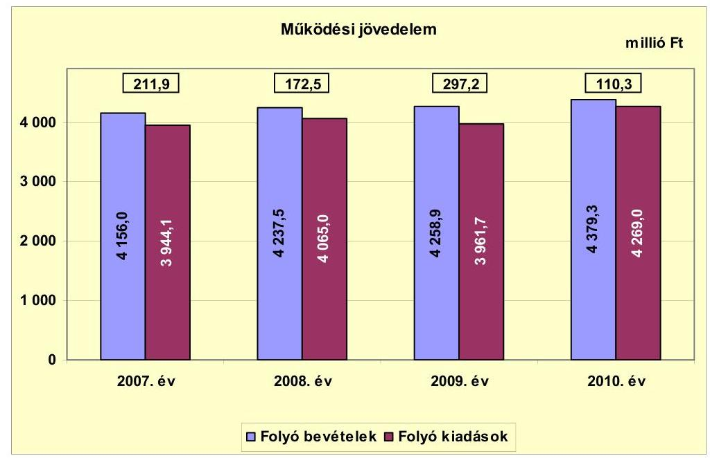

A múködési jövedelem a 2007-2010. években pozitív összegű volt, ezen időszakban az Önkormányzat folyó bevételei a folyó kiadásokra fedezetet nyújtottak. A 2007. évben a folyó költségvetés 211,9 millió Ft forrástöbblete döntően a 202,5 millió Ft ÖNHIKI támogatás miatt keletkezett, jelentősen javítva az Önkormányzat pénzügyi egyensúlyát. Az ÖNHIKI támogatás nélkül számított, 2007. évi, folyó költségvetési egyenleg mindössze 9,4 millió Ft-ot tett ki. A múködési jövedelem további évek közötti módosulásában a folyó kiadások eltérő irányú és nagyságú változása volt a meghatározó. A 2009. évben a folyó költségvetés egyenlegének 124,7 millió Ft-os ( $72,3 \%$-os) növekedése a folyó kiadások 103,3 millió Ft-tal ( $2,5 \%$-kal) történt csökkenésének eredménye. A folyó kiadások 2009. évi - előző évhez viszonyított - csökkenésében döntő szerepe volt a személyi juttatások és járulékai együttes, 187,9 millió Ft-os visszaesésének.

A folyó költségvetési egyenleg a 2010. évben az előző évinek a 37,1\%-ára (186,9 millió Ft-tal) csökkent. Ennek oka, hogy a folyó kiadások 307,3 millió Ftos ( $7,8 \%$-os) növekedését a folyó bevételek emelkedése 120,4 millió Ft-tal ellensúlyozta. A folyó kiadások - a 2007-2009. évek átlagát (3990,3 millió Ft-ot) is meghaladó - 4269,0 millió Ft-ra növekedését a múködési kiadások, azon belül a dologi kiadások (255,3 millió Ft-tal) növekedése okozta. A dologi kiadásokon belül az áfakiadások 164,4 millió Ft-tal - ebből fordított áfa 110,1 millió Ft -, a vásárolt közszolgáltatások 37,3 millió Ft-tal, a szellemi tevékenység teljesítéséhez kapcsolódó kifizetések 36,4 millió Ft-tal emelkedtek az előző évihez képest. A folyó bevételeken belül a saját múködési bevételek 2009-ről 2010-re 176,5 millió Ft-tal növekedtek. A folyó bevételek emelkedésében a 125,9 millió Ft áfa- és a - kötvényforrás hasznosításával összefüggő - 84,2 millió Ft ho-zam- és kamatbevételi többletnek volt döntő szerepe.

Az Önkormányzat a 2007-2011. évi költségvetéseit hiánnyal tervezte, melyet múködési és/vagy felhalmozási célú hitel felvételével, illetve az előző évi pénzmaradvány igénybevételével tervezték ellensúlyozni. A 2007-2011. években ÖNHIKI támogatásra is pályáztak, melyre 2007-ben 202,5 millió Ft, 2008ban 34,0 millió Ft, 2009-ben 29,0 millió Ft, 2010-ben 26,6 millió Ft és 2011 jú-

---

liusában 79,7 millió Ft támogatásban részesültek. A 2007. évben kapott ÖNHIKI támogatás a folyó bevételek 4,9\%-át jelentette, számottevően javítva a múködési jövedelmet. A 2008-2010. évi ÖNHIKI támogatások a folyó bevételekben - az évek sorrendjében - mindössze, 0,8\%-os, 0,7\%-os és 0,6\%-os részarányt képviseltek, nem gyakoroltak jelentős hatást az Önkormányzat pénzügyi egyensúlyára. Az ÖNHIKI támogatás 2007-2010 között a múködési jövedelemnek - az évek sorrendjében - a 95,6\%-át, 19,7\%-át, 9,8\%-át és 24,1\%-át adta. Az ÖNHIKI támogatás nélkül számított múködési jövedelem 2007-ben 9,4 millió Ft, 2008-ban 138,5 millió Ft, 2009-ben 268,2 millió Ft, 2010-ben 83,7 millió Ft volt.

Az Önkormányzat 2007-2010. évi nettó múködési jövedelmét az alábbi ábra szemlélteti:
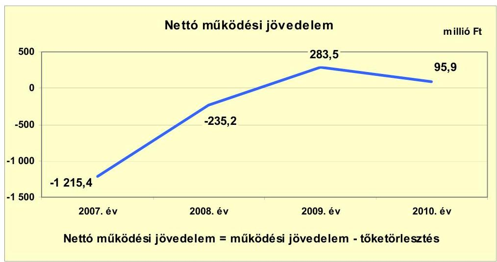

Az Önkormányzat pénzügyi kapacitása (nettó múködési jövedelme) a 20072008. években negatív, a 2009-2010. években pozitív értéket mutatott. A 2007. évi múködési jövedelmet ( 211,9 millió Ft-ot) 1427,3 millió Ft tőketörlesztés terhelte, amelyből 27,4 millió Ft a fejlesztési célú, hosszú lejáratú hitelek, 153,9 millió Ft a rövid lejáratú, likvid - rulírozó- és támogatás-megelőlegezési hitelek -, 1246,0 millió Ft a folyószámla- és munkabér-megelőlegezési hitelek miatti kötelezettség teljesítése volt. A 2008. évi múködési jövedelmet (172,5 millió Ft-ot) 407,7 millió Ft hitel-visszafizetés csökkentette, amely a fejlesztési célú, hosszú lejáratú hitelek 382,4 millió Ft-os és a támogatásmegelőlegezési hitelek 25,3 millió Ft-os törlesztését tartalmazta. A 2009. évben 13,7 millió Ft, a 2010. évben 14,4 millió Ft - fejlesztési célú, hosszú lejáratú hitelekkel összefüggő - tőketörlesztés terhelte a múködési jövedelmet. A 2010. évi nettó múködési jövedelem - annak ellenére, hogy az adósságszolgálat mindössze 0,7 millió Ft-tal nőtt az előző évihez képest - 187,6 millió Ft-tal (33,8\%-ra) csökkent a múködési jövedelem visszaesése miatt.

---

A 2007-2010. években az Önkormányzat felhalmozási költségvetésének egyenlege - a 2008. évi kivételével - negatív összegű volt, melyet az alábbi ábra szemléltet:

A felhalmozási költségvetés 2007. évi, -151,3 millió Ft-os egyenlegének kialakulásához az előző évről áthúzódó feladatokkal kapcsolatos, 109,1 millió Ft-os kifizetés jelentősen hozzájárult. Az áthúzódó feladatok a piaccsarnok, állati hulladéktároló, hulladéklerakó építése, egészségügyi gép-, műszerbeszerzés voltak. A felhalmozási kiadásokban 137,8 millió Ft az államháztartáson kívülre átadott pénzeszköz, mely döntően a szennyvízcsatorna-hálózat építéséhez kapcsolódó lakossági közműfejlesztési hozzájárulások megelőlegezését szolgálta. A rendelkezésre álló, felhalmozási célú források (228,5 millió Ft) a felhalmozási kiadások 60,2\%-át fedezték. A felhalmozási célú bevételekben a kapott támogatások 206,7 millió Ft-ot tettek ki. A támogatásokat átfelújításokhoz, állati hulladéktároló építéséhez, közoktatási informatikai fejlesztéshez kapták. A 2008. évi felhalmozási költségvetési többlet keletkezésében meghatározó szerepe volt a saját tőkebevétel 301,4 millió Ft-os, a fejlesztési célú költségvetési támogatás 136,6 millió Ft-os, az államháztartáson kívülről átvett pénzeszközök 70,6 millió Ft-os, előző évihez viszonyított többletbevételének. A 2008. évi saját tőkebevétel a szennyvízberuházás lakossági hozzájárulásának LTP lejárata miatti jóváírásból (277,5 millió Ft), valamint tárgyi eszközök értékesítéséből (28,0 millió Ft) képződött.

A 2009. évben a felhalmozási költségvetés egyenlege 644,0 millió Ft-tal csökkent az előző évihez képest és negatívvá vált. Ennek oka, hogy a felhalmozási kiadások 16,4\%-os, 69,9 millió Ft-tal növekedése mellett a felhalmozási bevételek összege az ötödére, 142,6 millió Ft-ra esett vissza. A 2009. évi felhalmozási kiadások emelkedésében legjelentősebb az év során megkezdett, városrehabilitációs projekttel kapcsolatos, 80,6 millió Ft összegű kifizetés volt. A felhalmozási bevételek visszaesése az előző évi, egyszeri jellegű, egyéb saját tőkebevételek (268,5 millió Ft-os) és kapott támogatások, átvett pénzeszközök (276,3 millió Ft-os) csökkenése miatt következett be. Az év során igénybe vett hitelekből 24,9 millió Ft-ot intézményi fűtéskorszerűsítéshez, 1,4 millió Ft-ot gépjármú-vásárláshoz használtak fel. A felhalmozási költségvetés egyenlege a

---

2010. évben már -473,8 millió Ft volt, 121,4 millió Ft-tal haladta meg a 2009. évit. Az államháztartáson belülről kapott támogatások, támogatásértékű bevételek az előző évihez képest 445,4 millió Ft-tal, a felhalmozási kiadások azonban 599,8 millió Ft-tal növekedtek. A felhalmozási kiadásokban felújításra 113,7 millió Ft-ot, a legjelentősebb beruházási feladatokra, a Szent Imre Tagiskola korszerűsítésére 331,2 millió Ft-ot, a Zsóry Fürdő fejlesztésére 191,4 millió Ft-ot, magasból mentő gépjármú beszerzésére 137,3 millió Ft-ot, szennyvíz-csatorna-hálózat építésére 99,3 millió Ft-ot, város-rehabilitációra 51,2 millió Ftot, közlekedésfejlesztésre 48,4 millió Ft-ot fordítottak.

A 2007. évi 151,3 millió Ft felhalmozási forráshiányra - a negatív összegű nettó működési jövedelem miatt - a 2007. évi, 70,6 millió Ft nyitó pénzkészlet, az év során felvett 28,8 millió Ft fejlesztési célú és 25,3 millió Ft támogatásmegelőlegezési hitel, valamint 26,6 millió Ft összegben múködési célú hitel nyújtott fedezetet. A 2009. évi 352,4 millió Ft felhalmozási forráshiányt egyrészt 283,5 millió Ft nettó múködési jövedelem és a tárgyévben felvett, összesen 26,3 millió Ft (intézmény fűtéskorszerűsítésére 24,9 millió Ft és gépjármúbeszerzésre 1,4 millió Ft) fejlesztési célú hitelek fedezték. Másrészt 42,6 millió Ft öszszegben két - 2008-ban kibocsátott, egyenként 5675 ezer EUR értékű, fejlesztési célú - kötvény forrásának lekötéséből származó hozamból biztosították. A 2010. évi -473,8 millió Ft felhalmozási költségvetési egyenlegre 95,9 millió Ft nettó múködési jövedelem, 160,3 millió Ft - a 2008. évi, fejlesztési célú - kötvény kibocsátásából származó bevétel, valamint 228,1 millió Ft összegben a kötvényforrások hozama biztosított fedezetet.

Az Önkormányzat finanszírozási múveletei 2007-2010. évekbeli egyenlegét az alábbi ábra szemlélteti:
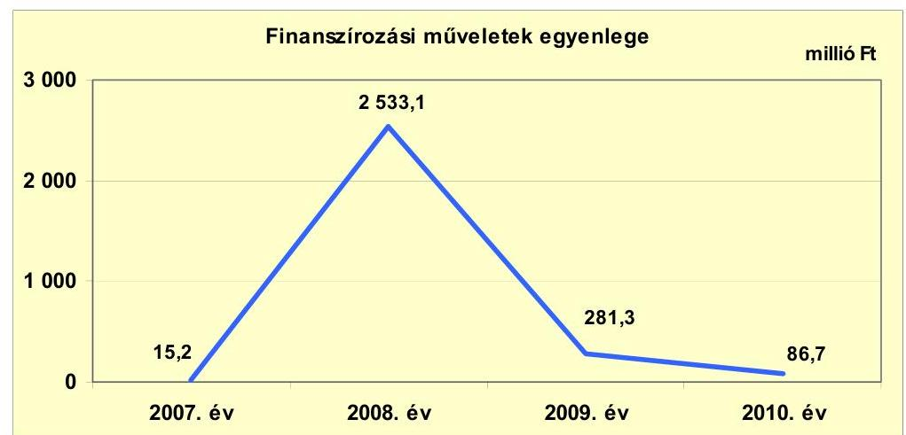

A finanszírozási múveletek pozitív egyenlege azt jelzi, hogy az éves költségvetések végrehajtása során szükség volt az előző években keletkezett pénzmaradvány igénybevételén túl külső finanszírozás igénybevételére is. Az Önkormányzatnál a 2008. évben a finanszírozási múveletek egyenlegét 21,2 millió Ft hosszú lejáratú, fejlesztési hitelfelvétel és összesen 382,4 millió Ft törlesztés, valamint 25,3 millió Ft támogatás-megelőlegezési hitel-visszafizetés, továbbá 3005,5 millió Ft (11 350 ezer EUR értékú) kötvénykibocsátás határozta meg. A 2009. évben 26,3 millió Ft hosszú lejáratú, fejlesztési hitelt vettek fel és 13,7 millió Ft-ot fizettek vissza, valamint a - 2008-ban kibocsátott - kötvények

---

forrásának hasznosításával összefüggésben 275,0 millió Ft értékpapírt értékesítettek. A 2010. évi finanszírozási műveletek között 14,4 millió Ft hosszú lejáratú, fejlesztési hitel-visszafizetés és 230,6 millió Ft kötvényforrások hasznosításához kapcsolódó értékpapír értékesítés szerepelt. A 2007-2010. évek finanszírozási múveleteit a jelentés 2. számú mellékletének 4.1-4.8. pontjai részletezik.

Az Önkormányzat 2007-2010. évi zárszámadási rendeleteinek mellékleteiben mérlegszerűen bemutatott ${ }^{21}$ múködési és fejlesztési célú többletet és hiányt a jelentés 1. számú melléklete szemlélteti. Az önkormányzati múködési és fejlesztési mérleg a 2007-2009. években többletet, a 2010. évben hiányt tartalmazott. A zárszámadási rendeletekben bemutatott múködési és fejlesztési célú bevételek az előző évi pénzmaradvány-igénybevétel - múködési és felhalmozási részre bontott - összegét, valamint a múködési célú bevételek és kiadások a finanszírozási műveletek közül a forgatási célú értékpapírok kibocsátását, értékesítését és vásárlását is tartalmazták.

A forráshiány finanszírozását biztosító likvid- és hosszú lejáratú hitelek, a kötvénykibocsátásokból eredő kötelezettség, illetve a szállítói kötelezettségek emelkedése együtt járt a kamatkiadások folyamatos növekedésével. Az Önkormányzat 2007-2011. év I. féléve közötti, évenkénti kamatbevételeit, kamatkiadásait és azok egyenlegét az alábbi ábra mutatja:
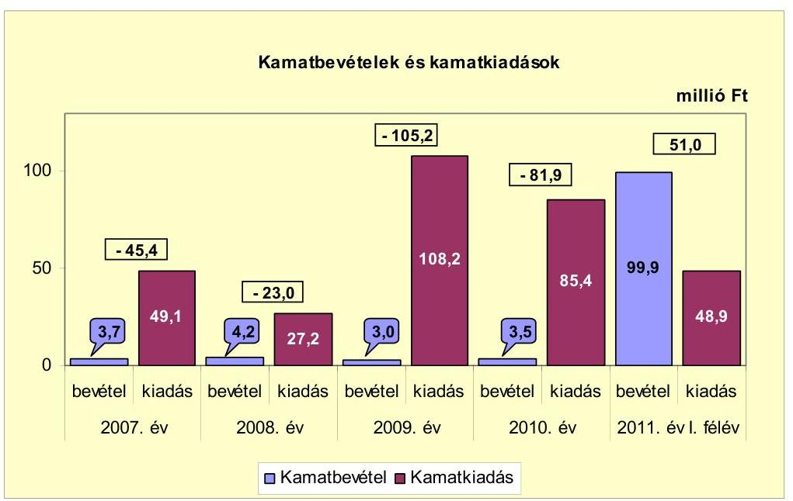

A 2007. évi, 49,1 millió Ft kamatkiadás a folyószámla- és munkabér-megelőlegezési-, valamint rulírozó és támogatás-megelőlegezési hitelek igénybevétele, továbbá döntően az előző években igénybe vett, hosszú lejáratú, fejlesztési hitelek után fizetendő kamatokat tartalmazta. A 2008. évi, 27,2 millió Ft kamatkiadás a folyószámla- és a - 2008 márciusában visszafizetett - támogatás-megelőlegezési hitelek miatti, továbbá jelentős részben az elő-

[^0]
[^0]:    ${ }^{21}$ Nincs kötelező előírás a múködési és fejlesztési hiány megállapításának módjára. Az Önkormányzat az adott évi múködési célú bevételeinek és kiadásainak mérlegében szerepeltette a finanszírozási múveleteket is.

---

ző években felhasznált, hosszú lejáratú, fejlesztési hitelek után fizetendő kamatokat foglalta magában. A kamatkiadás 2008. évi - előző évhez viszonyított 21,9 millió Ft-os csökkenésében jelentős szerepe volt az összesen 382,4 millió Ft fejlesztési hitel-visszafizetésnek. A kamatkiadások 2008-ról 2009-re 105,2 millió Ft-ra ( 82,2 millió Ft-tal) növekedtek, melyben a - 2008. december 19-ei, öszszesen 3005,5 millió Ft értékű - kötvények kibocsátásával összefüggő kamatteher 90,6 millió Ft-ot jelentett. A 2009. évi kamatkiadásokban a folyószámlahitel és a fejlesztési hitelek kamata 14,6 millió Ft volt. A kamatkiadások döntő hányadát adó, kötvények miatti kamatok a 2010. évben 61,0 millió Ft-ra csökkentek a referenciakamat kedvező változásának hatására. A kamatbevételek között a kötvényforrások hasznosításával kapcsolatos 2009. évi (280,7 millió Ft) és 2010. évi (296,8 millió Ft) hozamok ${ }^{22}$, az Áhsz. 9. számú melléklete „A számlaosztályok tartalmára vonatkozó előirások" részének 14. a) pontjában foglaltak ellenére nem jelennek meg. A 2011. év I. félévi 99,9 millió Ft kamatbevételben a kötvényforrások 93,4 millió Ft kamatbevétele már szerepel. Az Önkormányzat 2007-2011. év I. féléve között öszszesen 318,8 millió Ft kamatot fizetett meg, az elért 114,3 millió Ft kamatbevétel a teljes kamatráfordítás $35,9 \%$-át tette ki. A kötvényforrások kamatbevételéből és hozamából a 2009-2011. év I. félévében 186,1 millió Ft-ot a kötvények kamatkiadásaira használtak fel.

# 2.2. Az Önkormányzat bevételeinek változása 

Az Önkormányzat folyó bevételei 2007-2010 között növekvő tendenciát mutattak. Ez az emelkedés azonban évente, az előző évihez viszonyítva mindössze 0,5-2,8\%-ot (21,4-120,4 millió Ft-ot) jelentett. A 2010. évi, 4379,3 millió Ft folyó bevétel a 2007-2009. évek átlagát ( 4217,5 millió Ft-ot) 3,8\%-kal, 161,8 millió Ft-tal haladta meg. A legnagyobb, 120,4 millió Ft-os növekedés a 2010. évben következett be, melyben az áfabevételek 125,7 millió Ft-os - ebből fordított áfa miatti bevétel 110,1 millió Ft-os - emelkedésének volt döntő szerepe. Az időszakban a folyó bevételek 54,8\%-át (9326,8 millió Ft-ot) adó múködési célú költségvetési támogatás és szja együttes összege nem jelentősen (1,5-2,4\%-kal, 34,1-57,3 millió Ft-tal), de csökkent.

[^0]
[^0]:    ${ }^{22}$ A kötvényforrás hasznosítására végzett értékpapír műveletek hozama a 2009. évben az államháztartáson kívülről származó befektetett pénzügyi eszközök árfolyamnyereségeként ( 5,7 millió Ft), valamint a - finanszírozási múvelet között - befektetési célú értékpapírok értékesítéseként ( 275,0 millió Ft) jelenik meg. A 2010. évben realizált árfolyamnyereség bevételeként ( 89,4 millió Ft), valamint szintén a befektetési célú értékpapírok értékesítéseként (207,4 millió Ft) szerepel.

---

Az Önkormányzat 2007-2011. év I. féléve között realizált, összesen 19 449,7 millió Ft folyó bevételének főbb jogcímek szerinti, évenkénti részletezését az alábbi grafikon mutatja be:
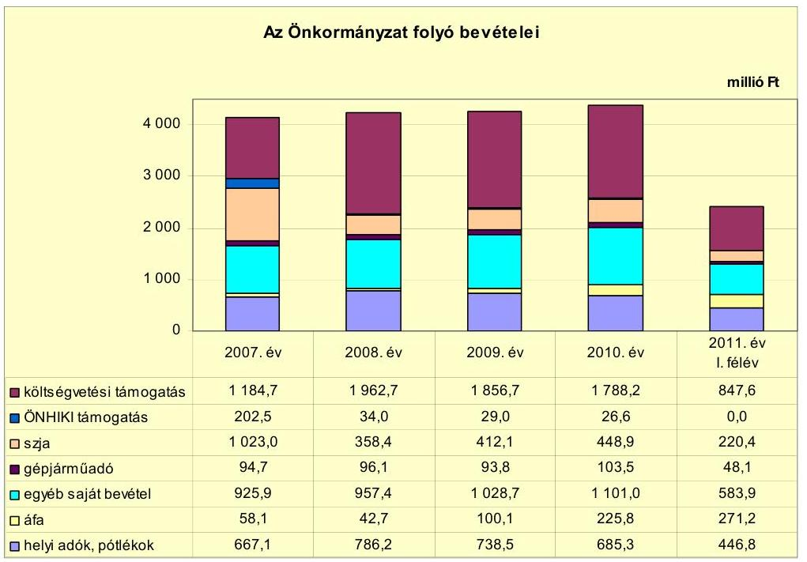

A költségvetési támogatás ${ }^{23}$ a 2008. évben az előző évihez képest 609,5 millió Ft-tal növekedett, míg az szja 664,6 millió Ft-tal csökkent, e két bevételi jogcímen összesen 55,1 millió Ft-tal kevesebb forráshoz jutott az Önkormányzat a 2008. évben. A költségvetési támogatás és szja a 2009. évben 57,3 millió Ft-tal ( $2,4 \%$-kal) tovább csökkent az előző évben kapott, egyszeri jellegű támogatások megszűnése, illetve az évente változó mértékű támogatások ${ }^{24}$ miatt. A 2010. évben további 34,1 millió Ft-tal ( $1,5 \%$-kal) kapott kevesebb költségvetési támogatást és szja-t az Önkormányzat, melyet döntően a normatív állami hozzájárulás és normatív, kötött felhasználású támogatás (77,6 millió Ft-tal) mérséklődése okozott, összességében változatlan ellátotti létszám mellett.

Az szja a 2009. évben 53,7 millió Ft-tal (15,0\%-kal) a 2010. évben 36,8 millió Ft-tal ( $8,9 \%$-kal) biztosított az előző évinél nagyobb bevételt az Önkormányzat számára, melyben mind az szja helyben maradó része, mind a jövedelemkülönbség mérséklésére járó rész évente növekedett. A 2007-2010. években az szja 2462,8 millió Ft-os összege a folyó bevételek 13,2\%-át jelentette.

[^0]
[^0]:    ${ }^{23}$ beleértve az ÖNHIKI támogatást is
    ${ }^{24}$ tűzoltók egyszeri juttatásai, 13. havi illetmény megtérítése, bérpolitikai intézkedések, lakossági víz-, csatornaszolgáltatás, közműfejlesztés támogatása, eseti keresetkiegészítés, létszámcsökkentés, „prémium évek" program támogatása

---

Az egyéb saját bevétel 2007-2010 között növekvő tendenciát mutatott, melynek összesen 4013,0 millió Ft-os összege a folyó bevételek 23,5\%-át képezte. A 2008. évben 31,5 millió Ft-tal, 2009-ben 71,3 millió Ft-tal, 2010-ben 72,3 millió Ft-tal növekedett az egyéb saját bevétel az előző évihez képest, mellyel 2008ban mérsékelte, a 2009-2010. években kompenzálta - sőt meghaladta - a központi költségvetésből kapott támogatások (költségvetési támogatás és szja együttes összegének) csökkenését. A 2009. évi emelkedést döntően az - egyéb saját bevétel több mint felét jelentő - államháztartáson belülről átvett, támogatásértékű bevételek 30,6 millió Ft-os, valamint a vagyonhasznosításból származó bevétel 39,6 millió Ft-os, előző évhez képest bekövetkezett növekedése eredményezte. A támogatásértékű bevételekben legjelentősebb az EU-s forrással megvalósuló - kompetenciaalapú oktatási, esélyegyenlőségi és ifjúsági - projektek összesen 73,5 millió Ft-os támogatása. A vagyonhasznosításból származó többletbevétel a Zsóry Fürdő, valamint annak víz- és csatornarendszere bérleti dijának növekedéséből keletkezett. Az egyéb saját bevétel 2010. évi emelkedése a kötvényforrás lekötéséből származó, 84,3 millió Ft hozam- és kamatbevételi többlet eredménye.

Az áfabevételek, visszatérülések (426,7 millió Ft) és a gépjármúadó bevétel (388,1 millió Ft) 2007-2010 között a folyó bevételeknek átlagosan, mindössze a 2,5\%-át és 2,3\%-át adták, nem gyakoroltak jelentős hatást az Önkormányzat pénzügyi helyzetére.

Az Önkormányzatnak a 2007-2010. években három helyi adónemből származott bevétele: helyi iparűzési adóból, idegenforgalmi adóból és építményadóból. Ezen időszakban a helyi iparűzési adónál és az idegenforgalmi adónál megállapított adómérték ${ }^{25}$ a törvényi maximummal megegyező volt. Az építményadót a 2009. évtől különböző építménykategóriánként $500 \mathrm{Ft} / \mathrm{m}^{2}$, $600 \mathrm{Ft} / \mathrm{m}^{2}$ és $900 \mathrm{Ft} / \mathrm{m}^{2}$ adómértékre - a megelőző időszak adómértékéhez képest 100 Ft-tal - emelték, mely 44,4\%-kal, illetve 33,3\%-kal elmaradt a megállapítható felső határtól ${ }^{26}$.

A helyi adókból és pótlékokból származó bevételek (2877,1 millió Ft) a 2007-2010. években a folyó bevétel 16,9\%-át jelentették, melyben legnagyobb részarányt ( $77,6 \%$-ot) a helyi iparűzési adó (2234,0 millió Ft) képviselt. A helyi adókból és pótlékokból elért, kiugró mértékű - 17,9\%-os (119,1 millió Ft-os) -, 2008. évi növekedésben döntő szerepe a helyi iparűzési adónál realizált 113,4 millió Ft (21,5\%) bevételi többletnek volt. Ezen adónemnél keletkezett be-vétel-emelkedésből 64,5 millió Ft-ot (12,2\%-ot) a kedvezmények - jogszabályváltozás miatti - megszüntetése eredményezett. A további (48,9 millió Ft) növekményhez kapcsolódott 14,2 millió Ft helyi adó túlfizetésből keletkezett viszszafizetési kötelezettség, mely a következő évi bevételt mérsékelte. A helyi iparúzési adó a 2009. évben 82,3 millió Ft-tal, a 2010. évben 52,8 millió Ft-tal csökkent az előző évihez képest, összefüggésben a vállalkozások árbevételének (az adóalapnak) a csökkenésével és az adófizetési képesség romlásával, mely utób-

[^0]
[^0]:    ${ }^{25}$ A helyi iparűzési adó felső határa az állandó jelleggel végzett tevékenységnél 2\%, az ideiglenes jelleggel végzett tevékenység esetén egyezer Ft/naptári nap, illetve ötezer Ft/naptári nap, az idegenforgalmi adó maximuma $300 \mathrm{Ft} /$ vendégéjszaka.
    ${ }^{26}$ Az építményadó felső határa $900 \mathrm{Ft} / \mathrm{m}^{2}$.

---

bit jelzi a helyi adókkal kapcsolatos követelések 2008. évi 7,8 millió Ft-ról 2009ben 30,5 millió Ft-ra, 2010-ben 32,6 millió Ft-ra történt növekedése is. A helyi adók és pótlékok bevételében 14,5\%-os részarányt képviselő építményadó (415,8 millió Ft) az adómérték emelése következtében a 2008. évi 90,4 millió Ftról 2009-ben 121,2 millió Ft-ra emelkedett és a 2010. évben is ezen a szinten teljesült. A 2007-2010. években az idegenforgalmi adó ( 84,5 millió Ft ) és a helyi adókkal kapcsolatos pótlékok ( 142,8 millió Ft) - a helyi adók és pótlékok együttes összegén belüli $2,9 \%$-os és $5,0 \%$-os részarányukkal - nem befolyásolták meghatározóan az Önkormányzat pénzügyi helyzetét.

Az Önkormányzat a 2007-2010. években a helyi adókból származó bevételek növelése érdekében a helyi iparűzési adónál alkalmazott kedvezmények jogszabályváltozással összefüggő megszüntetésén - és a folyamatosan végzett adóbehajtási tevékenységen - túl a 2009. évtől emelte az építményadó mértékét.

A tárgyévi, múködést szolgáló bevételeket és kiadásokat összehasonlítva az Önkormányzat folyó bevételei minden évben fedezetet nyújtottak a folyó kiadásokra.

Az Önkormányzat felhalmozási bevételei a 2007-2011. év I. féléve időszakában az alábbiak voltak:

| Megnevezés | 2007. év | 2008. év | 2009. év | 2010. év | 2011. év   I. félév |
| :-- | --: | --: | --: | --: | --: |
| Tárgyi eszköz értékesítés | 5,4 | 33,4 | 4,1 | 54,0 | 55,6 |
| Egyéb saját tőkebevétel | 16,4 | 289,8 | 21,3 | 4,3 | 2,4 |
| Államháztartáson belülről   kapott támogatás | 119,4 | 235,6 | 113,2 | 558,6 | 495,5 |
| Államháztartáson kívülről   kapott támogatás | 87,3 | 157,9 | 4,0 | 4,1 | 0,5 |
| Összes felhalmozási bevétel | 228,5 | 716,7 | 142,6 | 621,0 | 554,0 |

Az Önkormányzat a 2007-2011. év I. féléve időszakában összesen 2262,8 millió Ft felhalmozási bevételt ért el. A 2008. évi, előző évihez viszonyított, 488,2 millió Ft bevételi többlet döntően az egyéb saját tőkebevétel 273,4 millió Ft-os és az államháztartáson belülről és kívülről kapott támogatások együttesen - 186,8 millió Ft-os növekményéből keletkezett. Az egyéb saját tőkebevétel többletében a támogatási kölcsönök visszatérülése címén, a szennyvízberuházás lakossági hozzájárulásának LTP lejárata miatt jóváírt 277,5 millió Ft jelent meg. Az államháztartáson belülről a 2008. évben kapott támogatásokban legjelentősebbek az utak felújítására (összesen 64,3 millió Ft), az egészségügyi gép-, műszerbeszerzésre ( 63,9 millió Ft) biztosított költségvetési támogatások, támogatásértékű bevételek. Az államháztartáson kívülről átvett pénzeszközök növekménye a bankgarancia érvényesítése miatt 30,0 millió Ft-ot és a szennyvízcsatorna-hálózat építésével összefüggő lakossági befizetésekből származó 56,0 millió Ft-ot tartalmazta. A 2009. évben - a 2008. évihez képest 574,1 millió Ft felhalmozási bevételcsökkenés következett be, az egyszeri jellegű támogatások változása miatt. A felhalmozási bevétel 2010. évben 478,4 millió Ft-tal növekedett az előző évihez képest, melyben az államháztartáson be-

---

lülről kapott támogatások 445,5 millió Ft-os növekedésének volt döntő szerepe. Az ekkor kapott támogatások között a legjelentősebbek a Szent Imre Tagiskola bővítésére (205,0 millió Ft), magasból mentő gépjármú beszerzésére (116,7 millió Ft), szennyvízcsatorna-hálózat építésére ( 66,8 millió Ft), Zsóry Fürdő fejlesztésére (43,3 millió Ft), intézmények akadálymentesítésére (24,8 millió Ft) átvett bevételek voltak.

Az Önkormányzatnak a 2007-2010. években tárgyi eszköz értékesítéséből származó, 96,9 millió Ft bevétele a felhalmozási bevételek 5,7\%-át jelentette. Ezen időszakban a legmagasabb, 54,0 millió Ft bevételt a 2010. évben érték el, melyet döntően ingatlanértékesítésből (52,2 millió Ft) realizáltak. A 2011. év I. félévének 55,6 millió Ft tárgyi eszköz értékesítési bevételéből 54,0 millió Ft áfavisszatérítés volt. A 2007-2011. év I. féléve között a tárgyi eszköz értékesítéséből származó bevétel a felhalmozási kiadásoknak (3470,7 millió Ft-nak) mindössze a $2,8 \%$-át ( 152,5 millió Ft-ot) finanszírozta.

Az egyéb saját tőkebevétel 2007-2010 között a felhalmozási bevétel 19,4\%át képezte, összesen 331,8 millió Ft forrást biztosított. Ebből a 2008. évben értek el számottevő, 289,8 millió Ft bevételt, melyből 277,5 millió Ft a támogatási kölcsönök visszatérülése címén - a szennyvízberuházás lakossági hozzájárulásának LTP lejárata miatt - jóváírt összeg volt. Az egyéb saját tőkebevétel 20072011. év I. féléve közötti 334,2 millió Ft összege a felhalmozási kiadások 9,6\%ára nyújtott fedezetet.

A felhalmozási bevétel legjelentősebb összetevője, az államháztartáson belülről kapott támogatások 1026,8 millió Ft-os összege a 2007-2010 közötti időszakban az összes felhalmozási bevétel 60,1\%-át adta. Az államháztartáson belülről származó költségvetési támogatások, támogatásértékű bevételek egyszeri jellegűek, az Önkormányzat által pályázott fejlesztési feladatokhoz ${ }^{27}$, azok nagyságához és évenkénti megvalósítási üteméhez igazodó, külső források. Az államháztartáson belülről 2007-2011. év I. féléve között kapott támogatások együttes összege ( 1522,3 millió Ft) az ezen időszaki összes felhalmozási kiadás 43,9\%-ára biztosított forrást. Az államháztartáson kívülről a 2007-2010. években átvett, 253,3 millió Ft a felhalmozási bevétel 14,8\%-át jelentette. Az e forrásból származó bevétel a 2008. évben volt a legmagasabb, 157,9 millió Ft, melyből a szennyvízcsatorna-hálózat építéssel összefüggő lakossági hozzájárulásokból 105,0 millió Ft-ot, beruházáshoz kapcsolódó bankgarancia érvényesítéséből 30,0 millió Ft-ot realizáltak. Az államháztartáson kívülről 2007-2011. év I. féléve között kapott, összesen 253,8 millió Ft az ezen időszaki összes felhalmozási kiadásnak mindössze 7,3\%-át finanszírozta.

[^0]
[^0]:    ${ }^{27}$ út- és járdaépítéshez, felújításhoz, egészségügyi gép-, műszerbeszerzéshez, közvilágítás korszerűsítéshez, a Polgármesteri hivatal és közoktatási intézmények korszerűsítéséhez, akadálymentesítéséhez, Zsóry Fürdő fejlesztéséhez, piaccsarnok építéséhez, speciális gépjármú beszerzéséhez, valamint egyéb felújításokhoz, eszközbeszerzésekhez

---

# 2.3. Az Önkormányzat múködési és felhalmozási célú kiadásainak változása 

Az Önkormányzat folyó kiadásai főbb jogcímek szerinti bontásban az alábbiak voltak:

|  |  |  |  |  | millió Ft |
| :-- | --: | --: | --: | --: | --: |
| Megnevezés | 2007. év | 2008. év | 2009. év | 2010. év | 2011. év   I. félév |
| Folyó kiadások | 3944,1 | 4065,0 | 3961,7 | 4269,0 | 2171,9 |
| Müködési kiadások (kamatkiadás   nélkül) | 3397,4 | 3455,2 | 3173,4 | 3497,6 | 1769,3 |
| Államháztartáson belülre átadott   pénzeszközök | 18,2 | 84,1 | 49,5 | 32,7 | 16,7 |
| Transzferkiadások | 391,9 | 445,4 | 571,9 | 605,5 | 297,9 |
| - ebből: vállalkozásoknak | 20,2 | 22,0 | 135,5 | 131,9 | 53,5 |
| magánszemélyeknek | 254,3 | 267,9 | 324,1 | 381,3 | 202,3 |
| nonprofit szervezeteknek | 117,4 | 155,5 | 112,3 | 92,3 | 42,1 |
| Kamatkiadások | 49,1 | 27,2 | 108,2 | 85,4 | 48,9 |
| Előző évi pénzmaradvány átadás | 87,5 | 53,1 | 58,7 | 47,8 | 39,1 |

Az Önkormányzat folyó kiadásai 2007-ről 2008-ra 120,9 millió Ft-tal növekedtek, a működési kiadások ( 57,8 millió Ft-os), az államháztartáson belülre átadott pénzeszközök ( 65,9 millió Ft-os) és a transzferkiadások ( 53,5 millió Ftos) növekedése miatt. A múködési kiadásokban az intézmények előző évi maradványa visszafizetésének 113,4 millió Ft-os növekménye, az államháztartáson belülre átadott pénzeszközökben az - intézményátszervezéssel összefüggő intézményi záró pénzkészletek átadásának 47,5 millió Ft-os összege, a transzferkiadásokban a nonprofit szervezetek 38,1 millió Ft-os többlettámogatása jelenik meg. A folyó kiadások a 2009. évre - megközelítve a 2007. évi szintet 103,3 millió Ft-tal csökkentek, melyben a múködési kiadások 281,8 millió Ft-tal történt csökkenésének volt döntő szerepe. A müködési kiadásokban a személyi juttatások és azok járulékai - a 13. havi illetmény megszűnése miatt - összesen 187,9 millió Ft-tal csökkentek. A 2010. évre a folyó kiadások 307,3 millió Ft-tal ( $7,8 \%$-kal) emelkedtek a müködési kiadások 324,2 millió Ft-os növekedésének hatására. A müködési kiadásokban a dologi kiadások (255,3 millió Ft-tal) növekedése volt a legjelentősebb, azon belül az áfakiadás 164,4 millió Ft-tal - ebből fordított áfa 110,1 millió Ft -, a vásárolt közszolgáltatások 37,3 millió Ft-tal, a szellemi tevékenység teljesítéséhez kapcsolódó kifizetés 36,4 millió Ft-tal emelkedett az előző évihez képest. A 2010. évi folyó kiadások a 2007-2009. évek átlagát 278,7 millió Ft-tal, 7,0\%-kal haladták meg, jelentősen csökkentve a müködési jövedelmet.

A folyó kiadások főbb jogcímek szerinti összetételét az alábbi tábla részletezi:

|  |  |  |  |  | millió Ft |
| :-- | --: | --: | --: | --: | --: |
| Megnevezés | 2007. év | 2008. év | 2009. év | 2010. év | 2011. év   I. félév |
| Személyi juttatások | 1854,6 | 1842,3 | 1727,9 | 1785,3 | 819,6 |
| Munkaadót terhelő járulékok | 584,9 | 580,9 | 507,4 | 457,7 | 217,9 |
| Dologi kiadások | 899,0 | 836,9 | 863,0 | 1118,3 | 667,6 |
| Egyéb folyó kiadások | 195,5 | 275,4 | 242,0 | 269,5 | 152,2 |

A folyó kiadásokban a 2007-2010. években a legnagyobb hányadot, 44,4\%-ot képviselő személyi juttatások (7210,1 millió Ft) 2007-2009 között csökken-

---

tek, míg 2010-ben mindössze 57,4 millió Ft-tal (3,3\%-kal) növekedtek az előző évihez képest. Ennek oka döntően a külső személyi juttatások 49,5 millió Ft-os a közfoglalkoztatottak számának 151 fơről 230 főre - emelkedése volt. A személyi juttatásokhoz kapcsolódó munkaadót terhelő járulékok (2130,9 millió Ft) a vizsgált időszakban folyamatosan mérséklődtek. A személyi juttatások és munkaadókat terhelő járulékok együttes összege (9341,0 millió Ft) 2007-2010 között a folyó kiadások 57,5\%-át kötötte le.

A dologi kiadások, melyek a 2007-2010. évek között a folyó kiadások több mint egyötödét ( 3717,2 millió Ft) tették ki, 2008-ban döntően a szociális feladatok átadása miatt $6,1 \%$-kal, 62,1 millió Ft-tal csökkentek az előző évihez képest. Ezt követően 2009-ben 3,1\%-kal 26,1 millió Ft-tal, 2010-ben 29,6\%-kal, 255,3 millió Ft-tal növekedtek. A 2010. évi emelkedésben az áfa kiadás 164,4 millió Ft-os - ebből fordított áfa 110,1 millió Ft - növekedése mellett fejlesztési feladatokkal összefüggésben a vásárolt közszolgáltatások 37,3 millió Ftos, a szellemi tevékenység teljesítéséhez kapcsolódó kifizetés 36,4 millió Ft-os növekménye vett részt.

Az egyéb folyó kiadások ( 982,4 millió Ft) - a folyó kiadásokon belüli 6,0\%-os részarányukkal - nem gyakoroltak jelentős hatást az Önkormányzat múködési költségvetésére.

A folyó és felhalmozási kiadások aránya a felhalmozási kiadások irányába mozdult el a 2007-2010. évek között. A folyó kiadások hányada a 20072009. évek átlagának (3990,3 millió Ft-nak) arányához ( $90,2 \%$-hoz) viszonyítva a 2010. évben 10,6 százalékponttal ( $79,6 \%$-ra) csökkent, összegének 4269,0 millió Ft-ra növekedése mellett. Az Önkormányzatnál a 2010. évben volt a legmagasabb a felhalmozási kiadások összege (1094,8 millió Ft) és összes kiadáson belüli aránya ( $20,4 \%$ ), valamint a felhalmozási költségvetés hiánya is, mivel a felhalmozási bevételek a felhalmozási kiadásoknak csak az 56,7\%át ( 621,0 millió Ft-ot) fedezték. A folyó kiadások és felhalmozási kiadások 2007-2011. év I. féléve közötti, évenkénti adatait és összes kiadáson belüli arányait az alábbi grafikon szemlélteti:
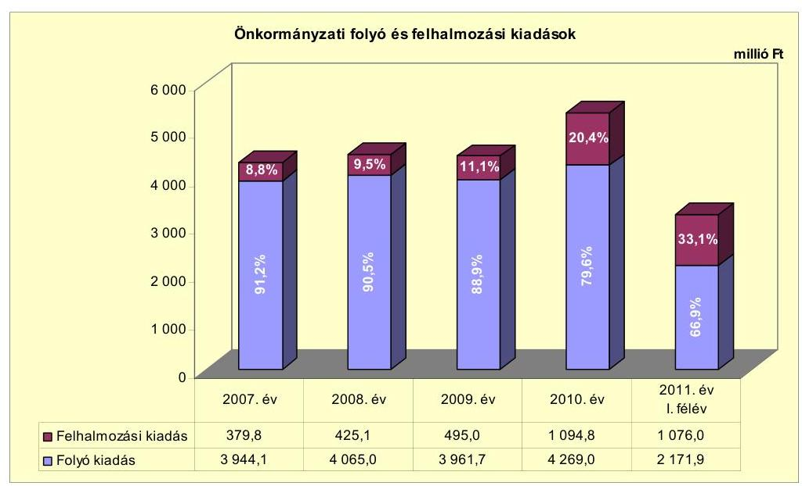

---

Az Önkormányzat a 2010. december 31-éig befejezett fejlesztéseire 1661,8 millió Ft-ot fordított, melyből 2006. december 31-éig 83,9 millió Ft-ot, 2007-2010 között 1577,9 millió Ft-ot fizetett ki. A 2007-2010 között felhasznált összegnek 28,6\%-a ( 451,9 millió Ft) a 10 millió Ft egyedi beszerzési érték alatti fejlesztésekhez kapcsolódott. A 21 darab, 10 millió Ft egyedi beszerzési érték feletti, befejezett beruházás és felújítás összértéke 1209,9 millió Ft volt, melyekre a 2007-2010. években 1126,0 millió Ft kifizetés történt. A befejezett fejlesztések forrását 717,6 millió Ft önkormányzati saját bevétel, 74,9 millió Ft fejlesztési hitel, 13,8 millió Ft kötvényforrás, 409,6 millió Ft EU-s és 445,9 millió Ft hazai támogatás képezte. A befejezett fejlesztésekre 2007-2010 között teljesített kifizetésekből 655,7 millió Ft-ot önkormányzati saját bevétel, 74,9 millió Ft-ot hitel, 13,8 millió Ft-ot kötvényforrás, 409,6 millió Ft-ot EU-s és 423,9 millió Ft-ot hazai támogatás fedezett.

Ezen időszakban az Önkormányzat legmagasabb bekerülési költségű beruházásai, felújításai, infrastrukturális fejlesztései a következők voltak:

- a Szent Imre Tagiskola korszerűsítésének teljes bekerülési költsége 345,0 millió Ft volt, melynek forrását 101,1 millió Ft önkormányzati saját bevétel, 220,6 millió Ft EU-s és 23,3 millió Ft hazai támogatás képezte. A 2010. évben megvalósított fejlesztési feladat tervezett bekerülési költségét 66,4 millió Ft-tal meghaladó kiadás oka - az Önkormányzat tájékoztatása szerint -, hogy a részletes műszaki tervek kidolgozása során „korábban nem vélelmezett költségek merültek fel", valamint a közbeszerzési eljárásban nyertes ajánlattevő vállalási ára meghaladta a tervezett költségeket;
- a magasból mentő gépjármú 2010. évi beszerzésére - a tervezett 155,0 millió Ft-hoz képest a kedvező közbeszerzési ár miatt - 137,3 millió Ft-ot fordítottak, melyet 20,6 millió Ft önkormányzati saját bevétel és 116,7 millió Ft hazai támogatás finanszírozott;
- a közlekedésfejlesztés keretében megépített összekötőút (Eper út) megvalósítására a 2010. év végéig összesen 50,1 millió Ft-ot fordítottak önkormányzati saját bevételből. A terv szerinti 120,1 millió Ft-hoz képest - az Önkormányzat tájékoztatása szerint - a teljes bekerülési költség 111,0 millió Ft volt. A fejlesztési feladat fedezetét - 2011-ben a források rendezése, a 2010-ben megelőlegezésként felhasznált önkormányzati saját bevétel visszapótlása után - 28,5 millió Ft saját bevételből és 82,5 millió Ft EU-s támogatásból biztosították.

A 2010. december 31-én folyamatban lévö, hét - 10 millió Ft feletti - fejlesztési feladat várható, teljes bekerülési költségéből, 2100,5 millió Ft-ból a 2010. év végéig 350,8 millió Ft-ot fizettek ki. A teljesített felhalmozásí kiadások forrása 39,1 millió Ft saját bevétel és 141,9 millió Ft kötvényforrás, valamint 163,5 millió Ft EU-s és 6,3 millió Ft hazai támogatás volt. A folyamatban lévő fejlesztésekkel összefüggő, 2010. december 31-én fennálló, 1728,7 millió Ft kötelezettséget 27,7 millió Ft önkormányzati saját bevétellel és 609,3 millió Ft kötvényforrással, valamint 1066,3 millió Ft EU-s és 49,1 millió Ft hazai támogatással tervezik fedezni.

---

Az Önkormányzat által benyújtott és 2011. június 30-án elbírálás alatt álló, 10 pályázatban szereplő projektek együttes, teljes bekerülési költsége 4436,3 millió Ft, melyekből két fejlesztési feladat előkészítéséhez a 2010. év végéig 144,1 millió Ft önkormányzati forrást ( 139,5 millió Ft saját bevételt és 4,6 millió Ft kötvényforrást) felhasználtak. A további, 4292,2 millió Ft fedezetét 935,5 millió Ft saját bevételből és 645,9 millió Ft kötvényforrásból, valamint 2710,8 millió Ft EU-s támogatásból tervezik biztosítani.

A 2010. december 31-ig befejezett fejlesztési feladatok adatait a 3/a. számú, a folyamatban lévő fejlesztési feladatok adatait a 3/b. és 3/c. számú, a 2011. év I. félévében elbírálás alatt álló pályázatokban foglalt projektek adatait a 3/d. számú mellékletek mutatják be.

Az Önkormányzat által a gazdasági társaságok részére a 2007-2011. év I. félévében átadott múködési célú pénzeszközöket a következő diagram mutatja be:
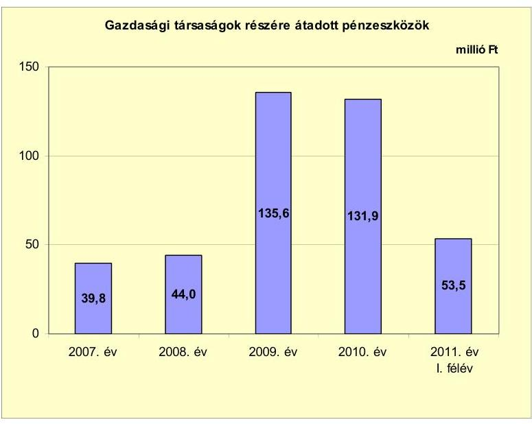

Az Önkormányzat a 2007-2011. év I. félévében a közfeladatai ellátásában résztvevő, három, kizárólagos önkormányzati tulajdonú gazdasági társaság (VG Zrt., Közkincs-Tár Kft., Média Kft.) részére eseti jelleggel, évenként, egyedi megállapodások alapján adott át, összesen 404,8 millió Ft pénzeszközt. A 2009. évi 91,5 millió Ft-os növekedés oka, hogy - az addigi, két gazdasági társasága mellett - 2009-től, a 2008. év végén megalakított, a közművelődési-, kulturális-, sporttevékenység ellátásában résztvevő Közkincs-Tár Kft. részére is történt pénzeszközátadás. Az átadott pénzeszközök elszámolási kötelezettségéről a megkötött megállapodások rendelkeztek. A Képviselő-testület helyi rendeletekben, határozatokban határozta meg a közszolgáltatások díjait. A közszolgáltatást biztosító gazdasági társaságok az Önkormányzattól rendszeres múködési célú pénzeszköz-átadásban nem részesültek, a kialakított díjrendszerek biztosították a társaságok ráfordításainak fedezetét. A kizárólagos önkormányzati tulajdonú gazdasági társaságok részére átadott pénzeszközöket a 4. számú melléklet mutatja be.

A 2007-2011. év I. féléve időszakában a VG Zrt. lakossági víz- és csatornaszolgáltatások támogatására 100,7 millió Ft, a Közkincs-Tár Kft. rendezvényekre és mú-

---

ködésre 204,3 millió Ft, a Média Kft. múködésre 99,8 millió Ft pénzeszközt vett át az Önkormányzattól.

# 3. Az ÖNKORMÁNYZAT KÖTELEZETTSÉGEI 

### 3.1. Az Önkormányzat pénzintézetekkel szembeni kötelezettségeinek változása

Az Önkormányzat pénzintézetekkel szembeni kötelezettségeinek állománya a 2006. december 31-ei, rövid- és hosszú lejáratú hitelekből álló, 673,1 millió Ft-ról a 2007. év végére mindössze 57,9 millió Ft-tal csökkent, azonban a 2008. év végére 3234,2 millió Ft-ra emelkedett. A 2008. évi állománynövekedés döntően a 2008 decemberében kibocsátott, összesen 3005,5 millió Ft ( 11350 ezer EUR) értékű kötvények miatt következett be. A 2009-2010. évek kötelezettségállományának emelkedésében meghatározó az EUR-ban lévő kötvények árfolyamváltozása volt, a 2009. évben a hitelfelvételek és törlesztések egyenlegeként mindössze 12,6 millió Ft-tal nőtt, a 2010. évben a hiteltörlesztések miatt 14,4 millió Ft-tal csökkent a kötelezettségállomány. A 2010. december 31-ei, 3390,7 millió Ft pénzintézetekkel szembeni kötelezettségállományt öt, hosszú lejáratú, fejlesztési feladat miatt felvett (összesen 226,9 millió $\mathrm{Ft}^{28}$ ) hitel és a kötvénykibocsátásokkal kapcsolatos ( 3163,8 millió Ft) kötelezettség állománya képezte. A 2011. év I. féléve végére a pénzintézetekkel szembeni kötelezettségek állománya 142,6 millió Ft-tal nőtt. Ennek fő oka az volt, hogy a félév során mindössze 7,2 millió Ft hiteltörlesztés történt, ugyanakkor az időszakban a folyószámlahitel-állománya 149,8 millió Ft-tal megemelkedett (2010. december 31-én nem volt visszafizetetlen folyószámlahitel miatti kötelezettségük).

Az Önkormányzat pénzintézetekkel szemben, a 2007-2010. évek végén, illetve 2011. június 30 -án fennálló kötelezettségeit az alábbi ábra mutatja be:
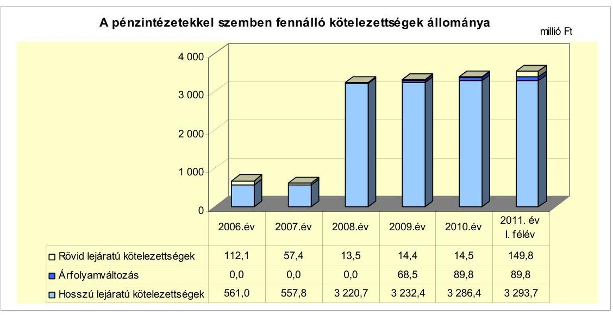

[^0]
[^0]:    ${ }^{28}$ A rövid lejáratú kötelezettségek a hosszú lejáratú hitelek következő évi törlesztő részletét tartalmazzák.

---

A 2011. I. félév végi kötelezettségállomány öt, hosszú lejáratú, fejlesztési hitelből (219,6 millió Ft), folyószámlahitelből (149,8 millió Ft) és két kötvénykibocsátással összefüggő kötelezettségből, valamint azok árfolyamváltozásából (3163,9 millió Ft) állt.

Az Önkormányzat a forráshiány kezelése érdekében a 2007-2011. évek költségvetési rendeleteiben hitel felvételével és ÖNHIKI támogatás igénylésével számolt úgy, hogy a hitel felvételéről az ÖNHIKI támogatás elbírálása után, a tényleges bevételek és kiadások alakulását figyelembe véve dönt a Képviselőtestület. A 2011. évi költségvetési rendeletben az előző évi pénzmaradványt is bevonták a hiányzó forrás fedezeteként.

A pénzintézetekkel szembeni kötelezettségvállalásokra minden esetben képvise-lő-testületi döntés alapján került sor, melynek során vizsgálták és betartották az adósságot keletkeztető kötelezettségvállalás felső határát. A beruházási hitelek igénybevételéről szóló döntéseket megelőzően azonban nem mérlegelték azok kamatkockázatát. Az Önkormányzat 2007-2010 között rövid lejáratú hitelre nem kötött szerződést, a 2007-2008-ban fennálló, rövid lejáratú hitelállomány a korábbi szerződések - rendelkezésre tartási idejének meghosszabbítására vonatkozó - módosításai kapcsán húzódott át a vizsgált időszakra. Az áttekintett időszak alatt 2008-ban egy 29,0 millió Ft, 2009-ben egy 1,4 millió Ft összegű, hosszú lejáratú hitelszerződést kötöttek. A 2009. évi - gépjárművásárlási - kölcsönt nem a számlavezető pénzintézettől vették fel, ám a kölcsönt nyújtó pénzügyi vállalkozást több árajánlat bekérése alapján választották ki. A kötvénykibocsátásokra szintén pénzintézetek versenyeztetésével került sor, melyet megelőzően tájékoztatták a Képviselő-testületet a kamatfizetési feltételekről és az árfolyamkockázatról. A hiteleket nyújtó és a kötvényeket lejegyző pénzintézet nem a számlavezető bank volt.

Az Önkormányzat 2008-ban „Mezökövesd Jövőjéért" és „Mezőkövesd Fejlesztéséért" elnevezésű, egyenként 5675 ezer EUR névértékű kötvényeket bocsátott ki. A kibocsátás célja a fejlesztési feladatok végrehajtásához forrás biztosítása volt. A kötvénykibocsátások húszéves futamidővel, félévenkénti, azonnal kezdődő kamatfizetéssel történtek. A „Mezőkövesd Jövőjéért" kötvény visszafizetése a futamidő végén, 2028-ban, egy összegben ( 5675 ezer EUR) esedékes, melyet óvadéki betétszámlán helyeztek el. Ezen összegből az Önkormányzat jogosult a bank hozzájárulásával értékpapírt vásárolni, vagy óvadéki betétként elhelyezni, melyre a bank a betéti megállapodásban rögzített kamatot fizet. A „Mezőkövesd Fejlesztéséért" kötvény törlesztését - a türelmi időt követően - 2013. október 31étől kezdődően, félévente kell teljesíteni. A 2013. évben fizetendő törlesztés 261 ezer EUR, mely 2026-ig évente változó mértékben növekvő, 2027-2028-ban csökkenő összegű az előző évi tőketörlesztési kötelezettséghez képest.

Az árfolyamváltozás hatására az Önkormányzat EUR-ban fennálló, kötvénykibocsátásból származó, pénzintézettel szembeni kötelezettségének forint ellenértéke (3005,5 millió Ft) 278,75 Ft/EUR árfolyamon számítva 2010. december 31én 3163,8 millió Ft-ot tett ki, amelyből a számviteli szabályoknak megfelelően, év végén elvégzett értékelés szerinti értékelési veszteség 158,3 millió Ft volt.

Annak megítéléséről, hogy a devizában fennálló kötvény visszafizetése, illetve visszavásárlása az Önkormányzat számára forintban összességében többletkiadást (árfolyamveszteséget), vagy kiadási megtakarítást (árfolyamnyereséget)

---

eredményez, a futamidő végén, a teljes kötelezettség rendezését követően lehet képet alkotni. Mindaddig, amíg törlesztési kötelezettség nem áll fenn (a türelmi idő, a moratórium tart), a tőkére vonatkoztatva nem értelmezhető sem az árfolyamveszteség, sem az árfolyamnyereség. Ugyanakkor a számviteli szabályok meghatározzák, hogy az árfolyam-különbözetet év végén a kötelezettségek vagy követelések között a könyvviteli mérlegben nyilván kell tartani, azonban árfo-lyam-különbözet ebben az esetben ténylegesen nem képződött.

Az Önkormányzat adósságot keletkeztető kötelezettségvállalásaiból 2011. június 30 -án, forintban fennálló állomány az alábbi volt:

| Megnevezés | Szerződéskötés/   kibocsátás   időpontja | Összeg   millió Ft-ban | Kamat   (referencia kamat +   kamatfelár) | Felhasználás célja |
| :-- | :--: | :--: | :--: | :--: |
| Ö-3400-2005-0055 sz.   hitelszerződés | 2005.06 .23 | 34,4 | állampapírhozam   110\%-a - 60\%-a | bérlakásépítés |
| 1-2-08-3400-0796-8 sz.   kölcsönszerződés | 2008.07 .17 | 24,9 | 3 havi EURIBOR   + évi 2,45\% | Mező F. Ált. Iskola   fütéskorszerüsítése |
| Ö-3400-2005-0086 sz.   szerződés | 2005.08 .11 | 117,0 | 3 havi EURIBOR   + évi 1,58\% | Zsóry Gyógy- és   Strandfürdő fejlesztése |
| 1-2-06-3400-0254-7/03 sz.   kölcsönszerződés | 2007.08 .16 | 42,6 | 3 havi EURIBOR   + évi 2,5\% | piaccsarnok-építés |
| HIT-46830/08 sz. egyedi   kölcsönszerződés | 2009.01 .05 | 0,7 | THM 26,7\% | gépjárművásárlás |
| Összesen |  | 219,6 |  |  |

A táblázatban szereplő hitelek lehívása, illetve részbeni igénybevétele és a célnak megfelelő felhasználása megtörtént. A hitelek tőketörlesztése - a fűtéskorszerűsítéssel kapcsolatos hitel kivételével, melynek törlesztése 2013-tól esedékes - az ütemezés szerint elkezdődött. A kamatokat és egyéb költségeket a szerződések szerint teljesítették. Ezen hitelekkel kapcsolatban a 2007-2011. év I. féléve során összesen 41,9 millió Ft tőkét fizettek vissza és 50,9 millió Ft ka-mat- és egyéb kiadást teljesítettek.

Az Önkormányzat a bérlakás-építésre felvett, 40,0 millió Ft hitelét a vizsgált időszak előtt teljes egészében felhasználta, törlesztését az ütemezés szerint, 2009-ben megkezdte. A 2008-ban megkötött, 29,0 millió Ft-os hitelszerződés alapján 2009ben - fűtéskorszerűsítésre - 24,9 millió Ft-ot használtak fel, a maradványt nem vették igénybe. A Zsóry Fürdő fejlesztését szolgáló, 150,0 millió Ft-os hitelből 2007 előtt 145,2 millió Ft felhasználása történt meg, visszafizetését 2008-ban megkezdték. A piaccsarnok építéséhez 2006 óta rendelkezésre álló, 50,0 millió Ft-os hitelt a 2007-2008. években kimerítették, 2009-től a törlesztése folyamatos. A 2009. évi, gépjármú-vásárlással kapcsolatos, 1,4 millió Ft hitel futamideje a felvétel évétől 2013-ig tart.

A vizsgált időszak előtt felvett és felhasznált, további öt, összesen 473,1 millió $\mathrm{Ft}^{29}$ fejlesztési hitelböl 2007-ig 69,8 millió Ft-ot, 2007-2008-ban

[^0]
[^0]:    ${ }^{29}$ két gépjármú vásárlására 3,1-3,1 millió Ft, út-, járdaépítésre, közvilágítás fejlesztésre 98,1 millió Ft, szennyvízcsatorna építésre 252,2 millió Ft és a Zsóry Fürdő fejlesztésére 116,6 millió Ft

---

403,3 millió Ft-ot fizettek vissza ${ }^{30}$. Az ezen hitelekhez tartozó, 2007-2010 közötti kamat- és egyéb kiadásra 22,1 millió Ft-ot fordítottak. Az út,járdaépítésre, közvilágítás korszerűsítésére, valamint a szennyvízcsatorna építésre felhasznált hiteleket az esedékesség előtt visszafizette az Önkormányzat a lakossági közműfejlesztési hozzájárulások lakástakarék-pénztári megtakarítása lejáratát követően.

Az Önkormányzat 2007-2011. év I. féléve között összesen 76,3 millió Ft beruházási, fejlesztési, hosszú lejáratú hitelt vett igénybe és 445,2 millió Ft hitelt törlesztett, illetve fizetett vissza.

Az Önkormányzat adósságot keletkeztető kötelezettségvállalásaiból 2011. június 30 -án, EUR-ban fennálló állomány az alábbi volt:

| Megnevezés | Szerződéskötés/   kibocsátás   időpontja | Összeg   ezer EUR-ban | Kibocsátási/   lehivási   árfolyam | Kamat   (referencia kamat +   kamatfelár) | Felhasználás célja |
| :-- | :--: | :--: | :--: | :--: | :--: |
| "Mezökövesd Jövőjéért"   kötvény | 2008.12 .19 | 5675 | 264,32 | 6 havi EURIBOR   + évi 0,85\% | fejlesztési céltartalék |
| "Mezőkövesd Fejlesztéséért"   kötvény | 2008.12 .19 | 5675 | 264,32 | 6 havi EURIBOR   + évi 1,1\% | fejlesztések   megvalósítására |

A „Mezőkövesd Jövőjéért" kötvényből - mivel az óvadéki betétben van - a vizsgált időszakban felhasználás nem történt. A 2009-2011. év I. félévében kifizetett kamat- és egyéb kiadás 90,4 millió Ft, ebből egyszeri díj 2,0 millió Ft volt. A kiadásokkal szemben a kötvényforrás hasznosításával (és az óvadéki díjjal) 306,4 millió Ft bevételt ért el az Önkormányzat. A kötvényforrásból származó bevételből 88,4 millió Ft-ot a felmerült kamatok kiegyenlítésére, 141,4 millió Ftot fejlesztések finanszírozására fordítottak, a maradvány 76,6 millió Ft volt. A „Mezőkövesd Fejlesztéséért" kötvényből a 2010. évben 160,3 millió Ft-ot, a 2011. év I. félévében további 304,3 millió Ft-ot használtak fel az önkormányzati fejlesztésekhez. A 2010. évi fejlesztési feladatok között volt egy tagiskola kerítésfelújítása (13,8 millió Ft), a Kánya patak rekonstrukciója (1,7 millió Ft), a Zsóry Fürdő fejlesztése (140,2 millió Ft), valamint a város-rehabilitáció (4,6 millió Ft). A 2009-2011. év I. félévében teljesített kamat- és egyéb kiadás 100,2 millió Ft terhet jelentett - melyből egyszeri díj 2,5 millió Ft volt -, azonban a kötvényforrás hasznosítása (befektetése, kamatoztatása) révén 364,5 millió Ft bevétel keletkezett. A bevételből 97,7 millió Ft-ot kamat- és egyéb kiadásra, 225,4 millió Ft-ot fejlesztési feladatokra fordítottak, a maradvány 41,4 millió Ft volt.

Az Önkormányzat pénzügyi egyensúlyát, fizetőképességét 2007-2011. év I. félévében folyószámlahitel igénybevételével tudta biztosítani. A 2007. évben likviditásának megőrzése érdekében munkabér-megelőlegezési hitelt és

[^0]
[^0]:    ${ }^{30}$ A 2. számú melléklet 4.1. pontjában a 2007. évi 1369,3 millió Ft hitelfelvétel összegében 28,8 millió Ft fejlesztési és 94,5 millió Ft likvid, valamint 1246,0 millió Ft folyószámlahitel igénybevétele szerepel. A 2. számú melléklet 4.2. pontjában lévő, 2007. évi hiteltörlesztés 1427,3 millió Ft-os összege 27,4 millió Ft fejlesztési, 153,9 millió Ft likvid és 1246,0 millió Ft folyószámlahitel visszafizetését tartalmazza. A 2008. évi hitelfelvétel összege - számviteli változás miatt már csak - a fejlesztési hitel 21,2 millió Ft-os igénybevételét, a hiteltörlesztés összege a fejlesztési hitelek 382,4 millió Ft-os törlesztését, viszszafizetését foglalja magában.

---

egyéb rövid lejáratú (támogatás-megelőlegezési és rulírozó) hitelt is igénybe vett. Az évenkénti folyószámlahiteleket és munkabér-megelőlegezési hitelt az alábbi táblázat mutatja be:

| Megnevezés | 2007. év | 2008. év | 2009. év | 2010. év | 2011. év   I. félév |
| :--: | :--: | :--: | :--: | :--: | :--: |
| I. Folyószámlahitel |  |  |  |  |  |
| a folyószámlahitel keretösszege január 1-jén | 0,0 | 300,0 | 300,0 | 200,0 | 300,0 |
| átlagos, napi állomány | 17,8 | 93,9 | 52,1 | 174,0 | 208,2 |
| teljesített kamat és egyéb költség | 0,2 | 9,1 | 8,6 | 18,8 | 11,3 |
| II. Munkabér-megelőlegezési hitel |  |  |  |  |  |
| igénybevett hitel összesen | 1190,0 | 0,0 | 0,0 | 0,0 | 0,0 |
| átlagos, napi állomány | 75,4 | 0,0 | 0,0 | 0,0 | 0,0 |
| teljesített kamat és egyéb költség | 6,6 | 0,0 | 0,0 | 0,0 | 0,0 |

Az Önkormányzat rendelkezésére álló folyószámlahitel-keret 2009 májusától a Képviselő-testület döntése alapján - a harmadával (200,0 millió Ft-ra) csökkent, majd 2010 májusától ismét 300,0 millió Ft-ra emelkedett. A folyószámlahitel átlagos, napi állománya 2008-ban az előző évinek több mint ötszörösére ( 76,1 millió Ft-tal) nőtt, a rulírozó- és a munkabér-megelőlegezési hitel 2007. év végi megszűnése miatt. A 2009. évben a folyószámlahitel átlagos, napi állománya a 2008. évinek közel felére csökkent, mely a nettó múködési jövedelem 518,7 millió Ft-os növekedésének kedvező hatását jelzi. A 2010. évben érte el az átlagos, napi állománya a legmagasabb, 174,0 millió Ft-os összeget, amikor mind a folyó, mind a felhalmozási kiadások kiugró mértékben növekedtek, melyeket az azonos célú bevételek emelkedése nem ellensúlyozott. Az Önkormányzat a folyószámlahitelt a 2007-2010. évek végén visszafizette, és a 20072009. években folyószámlahitel-állománya a hitelszerződések lejáratának időpontjában sem volt. A 2010. évben azonban a lejárat napján (május 24-én) 188,7 millió Ft folyószámlahitel állt fenn, melynek visszafizetése az újabb hitelből történt. A 2011. év I. félévében az átlagos, napi állomány 19,6\%-kal (208,2 millió Ft-ra) növekedett az előző évihez képest, ami a pénzügyi helyzet romlását jelzi. Ezt támasztja alá a hitel-igénybevételi napok számának 2010. évben - a 2009. évihez viszonyítva - 36,5\%-kal (344 napra) történt növekedése is, továbbá, hogy a 2011. év I. félévében 174 napon - az időszak naptári napjainak $96,1 \%$-án - állt fenn folyószámlahitel.

Munkabér-megelőlegezési hitelt - 2006-ban kötött szerződés alapján - csak a 2007. évben vettek igénybe, mivel - az Önkormányzat tájékoztatása szerint - a likviditási problémák megoldására kedvezőbb feltételeket biztosított a folyószámlahitel. Munkabér-megelőlegezési hitel 275 napon keresztül állt fenn, melynek napi, átlagos állománya 75,4 millió Ft volt.

Kamat- és egyéb kiadás címén az Önkormányzat a folyószámlahitellel kapcsolatosan a 2007-2011. év I. félévében összesen 48,0 millió Ft-ot, mun-kabér-megelőlegezési hitelhez kötődően - a 2007. évben - összesen 6,6 millió Ft-ot fizetett ki.

---

A folyószámla- és munkabér-megelőlegezési hitelek kondíciói az alábbiak voltak ${ }^{31}$ :

| Megnevezés | Kamat (referencia+ kamatfelár) | Egyéb költség |
| :-- | :--: | :--: |
| Folyószámlahitel |  |  |
| 2007.06.28 - 2008.05.27. | 3 havi BUBOR $+0,55 \%$ | $0,2 \%$ hitelkezelési dij |
| 2008.05.27 - 2009.05.25. | 3 havi BUBOR $+1,0 \%$ | $0,25 \%$ hitelkezelési dij   $0,05 \%$ rendelkezésre tart, dij |
| 2009.05.26 - 2010.05.24. | 1 havi BUBOR $+3,25 \%$ | $1,0 \%$ kezelési dij +   $2,5 \%$ rendelkezésre tart, jut. |
| 2010.05.25- | 1 havi BUBOR $+3,25 \%$ | $1,0 \%$ kezelési dij +   $1,5 \%$ rendelkezésre tart, jut. |
| Munkabér-megelőlegezési hitel |  |  |
| 2007.01.01 - 2007.04.02. | $15,25 \%$ | - |
| 2007.04.03 - 2007.12.21. | $12,25 \%$ | - |

Az Önkormányzat likviditásának biztosítása érdekében, egy 2006-ban kötött szerződés alapján, a 2007. évben rulírozó hitelt is igénybe vett. A 150,0 millió Ft keretösszegű rulírozó hitelből 2006-ban 48,0 millió Ft, 2007-ben 50,0 millió Ft igénybevétele történt meg, melyet 2007 júliusában és novemberében viszszafizettek. A 2007. évben - szintén 2006-ban kötött szerződések alapján - három támogatás-megelőlegezési hitelt vett igénybe az Önkormányzat a számlavezető pénzintézetétől. A fejlesztési feladatok a következők voltak: piaccsarnok építése (EU-s és az EU Önerő Alap támogatásának megelőlegezésére 25,0 millió Ft és 30,3 millió Ft), valamint a Polgármesteri hivatal B. épülete korszerűsítése (területfejlesztési tanács által nyújtandó támogatás megelőlegezésére 30,0 millió Ft). A 2005. évben egy gazdasági társasággal kötött kölcsönszerződést az Önkormányzat a szennyvízcsatorna-hálózatépítés hazai támogatásának megelőlegezésére, melyből a 2006-ban felvett összegből 25,9 millió Ft viszszafizetése húzódott át 2007-re. A likviditást biztosító hitelek - 2007-2008 közötti - igénybevételével összefüggő kamat- és egyéb kiadások összege 6,5 millió Ft volt, amiből 1,2 millió Ft felhalmozási célú kiadásokhoz kapcsolódott.

A fejlesztések finanszírozását, a likviditás biztosítását szolgáló hitelek és a kötvénykibocsátás kamat- és egyéb kiadásai a 2007-2011. év I. félévében összesen 329,2 millió Ft terhet jelentettek az Önkormányzat számára. A hitelek igénybevételével kapcsolatos kamat- és egyéb kiadások 20072008 között részben a likvid hitelek - a munkabér-megelőlegezési, a rulírozó hitel és a támogatás-megelőlegezési hitelek - megszűnése, részben a hosszú lejáratú fejlesztési hitelek jelentős (409,8 millió Ft) összegű visszafizetése, illetve törlesztése miatt 21,9 millió Ft-tal csökkentek. A 2009. évi, 87,0 millió Ft-os kamatés egyéb kiadásnövekedés döntően a kötvénykibocsátás következménye ( 90,6 millió Ft), míg a 2010. évben a kamatcsökkenést a kötvény kamatának

| MNB BUBOR (kínig (állagkamat) \%-ban |  |  |  |  |  |
| :--: | :--: | :--: | :--: | :--: | :--: |
| Referencia kamat | 2007. év | 2008. év | 2009. év | 2010. év | 2011.év   I. félév |
| 1 havi BUBOR | 0 | 0 | 8,66 | 5,47 | 6,00 |
| 3 havi BUBOR | 7,75 | 8,87 | 8,64 | 5,50 | 6,07 |

---

(61,0 millió Ft-ra) mérséklődése okozta, javítva az Önkormányzat működési jövedelmét.

A 2011. június 30 -án fennálló hosszú lejáratú fejlesztési hitelek esetében a kamatfizetési kötelezettségek alakulását jelentősen befolyásolta és jelenleg is befolyásolja a hitelfelvételkor és az utolsó kamatfizetéskor alkalmazott kamatok változása, amelyet az alábbi táblázat mutat be:

| Megnevezés | Kibocsátási, lehívási | Utolsó fizetéskori | Változás \% |
| :--: | :--: | :--: | :--: |
|  | kamat (referencia + kamatfelár) \% |  |  |
| állampapírhozam 110\%-a - 60\%-a   (2005.06.23-ai szerződés) | 3,96 | 3,88 | $-2,0 \%$ |
| 3 havi EURIBOR (2008.07.17.-i szerződés) | 7,397 | 3,98 | $-46,2 \%$ |
| 3 havi EURIBOR (2005.08.11.-i szerződés) | 3,684 | 4,117 | $11,8 \%$ |
| 3 havi EURIBOR (2006.04.20.-i szerződés) | 5,297 | 5,037 | $-4,9 \%$ |
| 6 havi EURIBOR (2008.12.19.-i szerződés)   "Mezökövesd Jövőjéért" kötvény | 4,943 | 2,519 | $-49,0 \%$ |
| 6 havi EURIBOR (2008.12.19.-i szerződés)   "Mezökövesd Fejlesztéséért" kötvény | 5,443 | 2,769 | $-49,1 \%$ |

Az Önkormányzat számára az alapkamatok változása kedvezően alakult, azonban az alapkamatok csökkenését a folyósító pénzintézet - 2009. január 31-étől hatályos, egyoldalú szerződésmódosítással - a kamatfelár növelésével kompenzálta. Ezáltal az érvényesített kamatláb egy esetben növekedett, a többinél különböző mértékben csökkent.

Az Önkormányzat 2010. december 31-ei és 2011. június 30 -ai kötelezettségeinek állományát és a 2011. évben, valamint az azt követő években várható kötelezettségeket az alábbi táblázat mutatja:

| Megnevezés | Állomány 2010. december 31-én |  |  | Állomány 2011. június 30 -án |  |  | Várható kötelezettség a 2011-2013.   években |  | Várható kötelezettség a 2014. évtől |  |
| :--: | :--: | :--: | :--: | :--: | :--: | :--: | :--: | :--: | :--: | :--: |
|  | HUF-ban   (milli) Ftban) | devizában (összege, ezer EURban) | devizá-   nem | HUF-ban   (millió Ftban) | devizában (összege, ezer EURban) | devizánem | HUF-ban (millió Ftban) | devizában (összege, ezer EURban) | HUF-ban (millió Ftban) | devizában (összege, ezer EURban) |
| Folyószántahitel | 0,0 | - | - | 149,8 | - | - | 152,9 | - | 0,0 | - |
| Hosszú lejáratú fejlesztési hitelek | 226,9 | - | - | 219,6 | - | - | 71,2 | - | 233,0 | - |
| "Mezökövesd Jövőjéért" kötvény | - | 5675 | EUR | - | 5675 | EUR | - | 424 | - | 7849 |
| "Mezökövesd Fejlesztéséért" kötvény | - | 5675 | EUR | - | 5675 | EUR | - | 728 | - | 6655 |
| Pénzintézeti kötelezettségek összesen HUF-ban | 226,9 | - | - | 369,4 | - | - | 224,1 | - | 233,0 | - |
| összesen EUR-ban | - | 11350 | - | - | 11350 | - | - | 1152 | - | 14304 |
| Kezesség | 650,0 | - | - | 645,1 | - | - | 34,7 | - | 0,0 | - |
| Szállító tartozás | 291,8 | - | - | 121,8 | - | - | 121,8 | - | 0,0 | - |
| Kötelezettségek összesen   (HUF-ban) | 1168,5 | - | - | 1136,3 | - | - | 380,6 | - | 233,0 | - |

Az Önkormányzat kötelezettségeinek állománya 2010. december 31-én 1168,5 millió Ft, 2011. június 30-án 1136,3 millió Ft volt, mely pénzintézetekkel szembeni kötelezettségekből, kezességvállalásból és szállítói tartozásból tevődött össze, továbbá 11350 ezer EUR kötvénykibocsátással összefüggő, pénzintézettel szembeni kötelezettsége is fennállt mindkét időpontban.

Az Önkormányzat 2011-2013. években várható, pénzintézetekkel szembeni kötelezettsége a legutolsó, ismert kamatfeltételek alapján 224,1 millió Ft (tőke-, kamat- és egyéb kiadás), valamint 1152 ezer EUR (tőke- és kamatkiadás). Az

---

Önkormányzatnak a 2011-2013. években kezességvállalásból 34,7 millió Ft fizetési kötelezettsége keletkezhet, és szállítói tartozás miatt 112,9 millió Ft kötelezettsége áll fenn. Az Önkormányzat a 2011-2013. években esedékes, pénzintézetekkel szembeni és egyéb kötelezettségeit - 2010. évi szabad pénzmaradvány hiányában - a tárgyévi nettó múködési jövedelméből, a kötvényforrás hozamából, a 2010. december 31-én fennálló, 140,4 millió Ft összegű követeléseinek behajtásából, többletbevételből, szükség esetén külső forrásból tudja teljesíteni.

A 2014. évben és azt követő években a jelenleg ismert kötelezettségek alapján az Önkormányzat várható, pénzintézetekkel szembeni kötelezettsége 233,0 millió Ft (tőke-, kamat- és egyéb kiadás), valamint 14504 ezer EUR (tőkeés kamatkiadás). Az ezek teljesítésére figyelembe vehető forrásokat - az Önkormányzat tájékoztatása szerint - az óvadéki betétben elhelyezett 5675 ezer EUR kötvényforrás hozamából, illetve a 2010-2012. években megvalósított és várhatóan megvalósuló fejlesztések során elért és várhatóan növekvő bérleti dij ${ }^{32}$ bevételei alapján vélelmezett múködési jövedelemnövekedésből tervezi biztosítani. A helyszíni vizsgálat idején ismert, pénzintézetekkel szembeni kötelezettségek teljesítése a 2014. évtől nem teljes körűen biztosított, mivel a visszafizetés forrásaira vonatkozóan a Képviselő-testület a helyszíni vizsgálat befejezéséig még döntést nem hozott.

Az Önkormányzat kezességvállalásból származó kötelezettségének állománya 2011. június 30-án 645,1 millió Ft volt. A kezességvállalásból a 2011-2013. években 34,7 millió Ft fizetési terhe keletkezhet, mely pénzügyi kockázatot jelent.

Az Önkormányzat 100\%-os tulajdoni hányadú gazdasági társaságai 2010. december 31-ei és 2011. június 30-ai kötelezettségeinek állományát és a 2011. évben, valamint az azt követő években várható kötelezettségeket a következő táblázat mutatja:

| Megnevezés | Állomány   2010.   december 31-én   (millió Ft-ban) | Állomány   2011.   június 30-án   (millió Ft-ban) | Várható   kötelezettség a   2011-2013.   években   (millió Ft-ban) | Várható   kötelezettség a   2014. évtől   (millió Ft-ban) |
| :-- | :--: | :--: | :--: | :--: |
| Hosszú lejáratú fejlesztési hitel | 9,1 | 6,9 | 10,1 | - |
| Pénzintézeti kötelezettségek |  |  |  |  |
| összesen | 9,1 | 6,9 | 10,1 | - |
| Lízing kötelezettségek | 1,1 | 0,6 | 0,6 | - |
| Szállítói tartozás | 1,7 | 4,6 | 4,6 | - |
| Összes kötelezettség | $\mathbf{1 1 , 9}$ | $\mathbf{1 2 , 1}$ | $\mathbf{1 5 , 3}$ | - |

A gazdasági társaságok kimutatott kötelezettségei nem gyakorolnak jelentős hatást az Önkormányzat pénzügyi helyzetére.

[^0]
[^0]:    ${ }^{32}$ pl.: a Zsóry Fürdő bérleti díjának emelése

---

# 3.2. A szállítói kötelezettségek változása 

Az Önkormányzat mérleg szerinti szállítói kötelezettségállománya a 2007-2009. években csökkent, 2010-ben nőtt. A 2010. év végén fennálló kötelezettségállomány a 2007-2009. évek átlagát 276,7 millió Ft-tal meghaladta. A növekményből - az Önkormányzat tájékoztatása szerint - 267,8 millió Ft a fejlesztési feladatokkal kapcsolatos szállítói kötelezettség. (Az EU-s forrással támogatott projekteknél a közremúködő szervezet a fejlesztési feladatot végző szállítót közvetlenül, de az Önkormányzat által benyújtott elszámolások jóváhagyását követően finanszírozta. Az önkormányzati nyilvántartásban - a szállítói kötelezettségállományban - tehát szerepelt a kiegyenlítetlen szállítói számla értéke, melynek kifizetése függött az elszámolás közremúködő szervezethez történt benyújtásának időpontjától és minőségétől, mivel a kifizetési igénybejelentés hiánypótlásai késleltették a számla ellenértékének kiegyenlítését.). A szállítói kötelezettségállomány a 2011. év I. félévében 121,8 millió Ft-ra, az előző évi 41,8\%-ára csökkent a beruházási szállítók számláinak kiegyenlítése eredményeként.

A szállítókkal szembeni kötelezettségeken belül a lejárt szállítói tartozás a 2008-2009. években csökkent, 2010-ben nőtt az előző évihez képest. A 2010. év végén fennálló, 14,9 millió Ft lejárt kötelezettségállomány a 2007-2009. évek átlagát 6,9 millió Ft-tal ( $86,3 \%$-kal) meghaladta. A 2011. év I. félévében jelentős, 98,0 millió Ft-os ( 112,9 millió Ft-ra) emelkedés következett be, melyből 86,8 millió Ft a fejlesztési feladatokkal kapcsolatos finanszírozási módnak a szállítói számlák igénybejelentésen alapuló, közremúködő szervezet általi kifizetésének - nehézkessége, nem pedig likviditási probléma miatt keletkezett. Az ezen felüli, 26,1 millió Ft lejárt tartozás a 2010. évinél 11,2 millió Ft-tal ( $75,2 \%$-kal) magasabb, azonban nagyságrendje miatt még nem veszélyezteti az Önkormányzat pénzügyi egyensúlyát. Az Önkormányzat 60 napon túli, elismert tartozásállományának mértéke nem érte el az Áht. 100/F. § (6) bekezdésében meghatározott ( 150,0 millió Ft-os) értékhatárt, ezért a Képviselő-testület nem volt kötelezett önkormányzati biztost kijelölni. Az Önkormányzat a fejlesztési feladatokkal kapcsolatos szállítói tartozásállomány rendezését a közremúködő szervezet felé a kifizetési igénybejelentések megküldésével, illetve a közremúködő szervezet által jelzett hiányosságok megszüntetésével igyekszik folyamatosan megoldani. A szállítói tartozásállományban nyilvántartott, egyéb szállítói kötelezettségek szállítói felé a vitatott számlák visszaküldésével, a számlák ki nem fizetése okának közlésével tettek intézkedést.

A 2010. év végi lejárt szállítói tartozásállomány 88,6\%-a (13,2 millió Ft) volt a 30 nap alatti lejáratú. A lejárt szállítói tartozás 4,7\%-a ( 0,7 millió Ft) 31-60 nap közötti, 1,3\%-a ( 0,2 millió Ft) 91-365 nap közötti fizetési késedelemben és 5,4\%a ( 0,8 millió Ft) éven túl lejárt tartozás volt. A 2011. év I. félév végi, 112,9 millió Ft lejárt szállítói tartozásállományban 21,5\%-ra csökkent a 30 nap alatti lejáratú ( 24,3 millió Ft), viszont 40,3\%-ra ( 45,5 millió Ft-ra) nőtt a 3160 nap között lejárt tartozás. 0,4\%-os részarányt képviselt a 0,4 millió Ft, 6190 nap közötti, 37,1\%-os hányadot a 41,9 millió Ft, 91-365 nap közötti lejáratú tartozás. A 2010. évihez képest változatlan összegű ( 0,8 millió Ft-os) éven túl lejárt tartozásállomány $0,7 \%$-ot jelentett a lejárt tartozások között.

---

A szállítók közreműködő szervezet általi finanszírozásának nehézkessége miatti, 86,8 millió Ft figyelembevétele nélkül a 2011. év I. féléve végén lejárt szállítóállomány összege és annak összetétele a következő: a lejárt szállítóállomány 26,1 millió Ft, melyből a 30 napot meg nem haladóan lejárt 24,3 millió Ft, a 3160 nap között lejárt 1,0 millió Ft és az éven túl lejárt 0,8 millió Ft volt.

A 2011. év I. félév végi, fejlesztési feladatokkal összefüggő 86,8 millió Ft szállítói tartozásból 44,5 millió Ft 31-60 nap közötti, 0,4 millió Ft 61-90 nap közötti és 41,9 millió Ft 91-365 nap közötti lejárt tartozás.

# 3.3. Egyéb kötelezettségek változása 

Az Önkormányzatnak két ingatlana volt jelzáloggal, egy ingatlana elidegenítési és terhelési tilalommal terhelt 2011. év I. féléve végén. A jelzáloggal érintett ingatlanok közül csak az egyik volt - nem a törzsvagyona részét képező forgalomképes ingatlan, melynek 2010. december 31-ei, számviteli nyilvántartás szerinti, nettó értéke 1134,6 millió Ft. A zálogjogot a piaccsarnok építéséhez igénybe vett, 50,0 millió Ft, hosszú lejáratú, fejlesztési hitel biztosítékaként 2007 szeptemberétől 2025 decemberéig, a hitel lejártáig alapították. Egy, elidegenítési és terhelési tilalommal érintett ingatlan a törzsvagyon részét képezi, korlátozottan forgalomképes, 2010. december 31-ei, könyv szerinti nettó értéke 143,6 millió Ft volt. Az elidegenítési és terhelési tilalom 111,9 millió Ft, vissza nem térítendő támogatással összefüggő, 2008 májusától 2021 decemberéig tartó, a Magyar Állam javára bejegyzett teher. Egy ingatlan szintén a törzsvagyon részét képező, korlátozottan forgalomképes, melyre hitel felvételéhez jegyeztek be jelzálogjogot. Könyv szerinti nettó értéke 2010. december 31-én 55,6 millió Ft volt. Az Önkormányzat ezen ingatlan biztosítékként való felajánlása során megsértette az Ötv. 88. § (1) bekezdés b) pontjában ${ }^{33}$ foglalt előírást, mely szerint az önkormányzati törzsvagyon hitel fedezetéül nem használható fel.

Az Önkormányzat forgalomképes és korlátozottan forgalomképes ingatlanainak 2010. december 31-ei nettó értékéből a jelzáloggal terhelt és a tehermentes (szabad) ingatlanok részarányát az alábbi ábra szemlélteti:
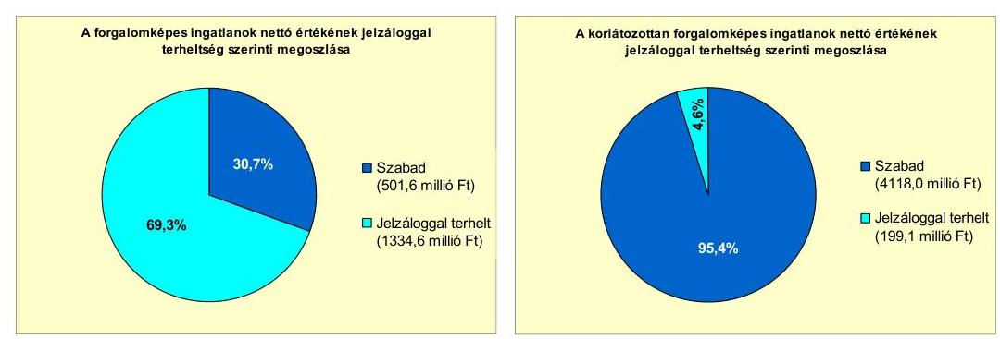

Az Önkormányzat az immateriális javai és tárgyi eszközei ${ }^{34}$ után a 2007-2010. években együttesen 1461,3 millió Ft összegű értékcsökkenést számolt

[^0]
[^0]:    ${ }^{33}$ Hatályon kívül helyezte a Magyarország helyi önkormányzatairól szóló 2011. évi CLXXXIX. tv. 156. § (1) bekezdés a) pontja, hatálytalan 2012. január 1-jétől.
    ${ }^{34}$ beleértve az üzemeltetésre, kezelésre átadott eszközöket is

---

el ${ }^{35}$. Az immateriális javak és tárgyi eszközök állományának értéke a beruházások ( 1421,0 millió Ft) és a felújítások ( 285,1 millió Ft) eredményeként 20072010 között évről évre növekedett. Az immateriális javak és tárgyi eszközök bruttó érték 14620,1 millió Ft, nettó érték 11131,1 millió Ft volt a 2010. év végén. Az Önkormányzat immateriális javainak és tárgyi eszközeinek együttes használhatósági foka 2007-2010 között folyamatosan csökkent az elszámolt, terv szerinti értékcsökkenés miatt. A 2007. évi 82,1\%-ról 2008-ban 80,2\%-ra, 2009-ben 77,6\%-ra, majd a 2010. évre 76,1\%-ra csökkent. Az immateriális javaknál és - a tárgyi eszközök közül - az ingatlanok, a gépek, berendezések, felszerelések és az átadott eszközök csoportjainál csökkent, a jármúvek eszközcsoportnál nőtt a 2010. év végi nettó értéknek a bruttó értékhez viszonyított aránya a 2007-2009. évek átlagértékéhez képest. A használhatósági fok az immateriális javaknál 8,5 százalékponttal ( $22,5 \%$-ról $14,0 \%$-ra), az ingatlanoknál 3,7 százalékponttal ( $89,0 \%$-ról $85,3 \%$-ra), a gépek, berendezések, felszerelések eszközcsoportnál 0,5 százalékponttal ( $23,6 \%$-ról $23,1 \%$-ra) és az átadott eszközöknél 10,8 százalékponttal ( $83,6 \%$-ról $72,8 \%$-ra) csökkent 2007-ről 2010-re. A használhatósági fok a jármúvek eszközcsoportban 24,4 százalékponttal ( $15,5 \%$-ról $39,9 \%$-ra) növekedett. A jármúvek használhatósági fokának a javulását a 2010. évi állománynövekedés - 114,3 millió Ft értékű, magasból mentő gépjármú beszerzése - eredményezte.

A 2007-2010. években - az Önkormányzat kimutatása szerint - a felhalmozási kiadásokból felújításra 346,5 millió Ft-ot fordítottak, mely az ezen időszakban elszámolt ( 1461,3 millió Ft) értékcsökkenésnek mindössze 23,7\%-a volt. A 10 millió Ft feletti egyedi értékú felújítások kiadásainak 17,4\%-át ( 34,1 millió Ft-ot) az intézmények múködőképességének biztosítása, ugyanakkor valamennyi felújítási kiadást ( 346,5 millió Ft-ot) a szakhatósági előírásoknak való megfelelés érdekében használták fel. A 2007-2010. években elszámolt, 1726,4 millió Ft fejlesztési (beruházási) kiadásból eszközpótlásra fordított felhasználás, az Önkormányzat kimutatása szerint, 76,0 millió Ft volt.

# 4. A PÉNZÜGYI EGYENSÚLY MEGTEREMTÉSE ÉrDEKÉBEN HOZOTT INTÉZKEDÉSEK EREDMÉNYE 

Az Önkormányzat által kimutatott - az ÁSZ által nem ellenőrzött - adatok szerint a 2007-2011. években a kiadáscsökkentő intézkedések hatásaként 492,8 millió Ft megtakarítást értek el. Ebből 75,9\% (373,8 millió Ft) a végrehajtott létszámcsökkentések, 21,9\% (108 millió Ft) a gyermekgondozási szabadságon lévők helyettesítése miatti megtakarítás, 2,2\% (11,0 millió Ft) a bölcsődei mosodai feladatok kiszervezésének eredménye.

[^0]
[^0]:    ${ }^{35}$ 2007-ben 393,5 millió Ft-ot, 2008-ban 353,7 millió Ft-ot, 2009-ben 376,9 millió Ft-ot és 2010-ben 337,2 millió Ft-ot

---

A 2007-2011. években az Önkormányzat kiadáscsökkentő intézkedések területeinek a megoszlását a következő diagram szemlélteti:
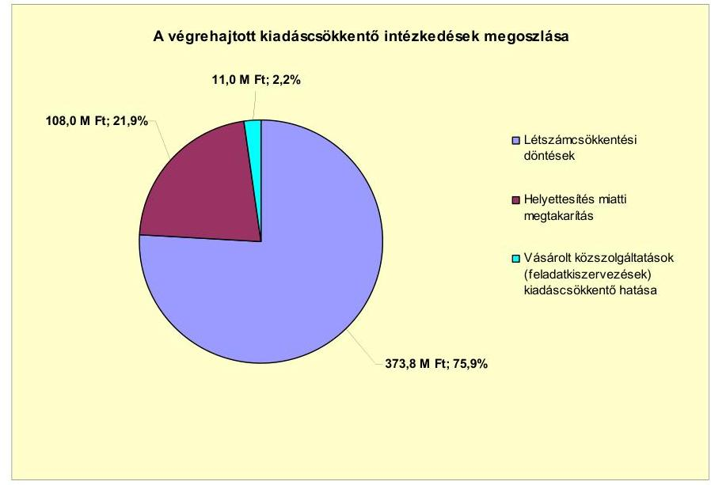

A 2007-2010. években végrehajtott létszámcsökkentés eredményét az alábbi táblázat ${ }^{36}$ szemlélteti:

| Megnevezés (edelski tő-ben) | Közoktatás | Szociális és gyermekvédelmi | Egészségügy | Polgármesteri hivatal | Egyéb | Összesen |
| :--: | :--: | :--: | :--: | :--: | :--: | :--: |
| 0007. január 1-án jóváhagyott álláshelyek száma | 636,0 | 48,0 | 100,0 | 77,0 | 120,0 | 781,0 |
| Megszüntetett álláshelyek száma | 79,0 | 31,0 | 24,0 | 11,0 | 14,0 | 158,0 |
| Módit: | 0:0:0:0:0:0:0:0:0:0:0:0:0:0:0:0:0:0:0:0:0:0:0:0:0:0:0:0:0:0:0:0:0:0:0:0:0:0:0:0:0:0:0:0:0:0:0:0:0:0:0:0:0:0:0:0:0:0:0:0:0:0:0:0:0:0:0:0:0:0:0:0:0:0:0:0:0:0:0:0:0:0:0:0:0:0:0:0:0:0:0:0:0:0:0:0:0:0:0:0:0

---

programban résztvevők 11 álláshelye miatt összességében 25 -tel nőtt. Az intézmények álláshelyeinek száma ugyanennyivel csökkent. Az egyéb ágazat álláshelyeinek száma a közoktatási intézményektől átcsoportosított 16 fő karbantartó és takarító álláshely miatt emelkedett.

Az álláshelyszám-csökkenés 49,7\%-a (79) a közoktatási-, 19,5\%-a (31) a szociá-lis-, 15,1\%-a (24) az egészségügyi-, 6,9\%-a (11) az igazgatási és 8,8\%-a (14) az egyéb ágazatot érintette az alábbi intézkedések szerint:

- a közoktatási ágazat álláshelyeinek száma a vizsgált időszak elejétől a végéig folyamatosan 79 -el csökkent és 17 -tel nőtt. Az álláshely-megszüntetés háromnegyede szakmai álláshely megszüntetéséhez kapcsolódott. Oka döntően az intézményüzemeltetési feladatok átszervezése, a pedagógus óra-szám-, és a gyermeklétszám csökkenése voltak. Az álláshely növekedés a szakmai álláshelyeket érintette, a tagiskolák átvétele miatt:

A Képviselő-testület 2007. januári ülésén 11 álláshely (Sz. L. Gimnáziumban egy, a MÁAMIPSZ esetében 10) megszüntetéséről döntött a kötelező óraszám emelkedése miatt, majd július 1-jétől - a három tagiskola átvétele miatt - az álláshelyek számát 16-tal emelte. Az álláshelyek számát a Képviselő-testület a 2008. évben további 45 -tel csökkentette. Ebből 24 intézményüzemeltetési álláshely volt. Ekkor 19 takarító és 5 karbantartó álláshely a középiskolákból a 2008. július 1-jétől megalakult Városgondnoksághoz került átcsoportosításra. Ugyanettől az időponttól a középiskolákból 10 szakmai álláshely (a pénzügyi feladatok ellátásához kapcsolódó) a megalakult Kincstári irodához került. A további 16 álláshely csökkentésből 2 álláshely megszüntetésére a Többcélú társuláshoz történő szociális feladatátadás miatt, 2-re a pedagógusok kötelező óraszám emelése, 8-ra a gyermeklétszám, illetve csoportlétszám csökkenése, 2 portási álláshely megszüntetésére azok közcélú foglalkoztatására való áttérés miatt került sor. A gyermeklétszám csökkenése miatt 2009. évben 12 (B.R. Kollégium 11, MÁAMIPSZ öt) a 2010. évben 10 szakmai álláshely (B.R. Kollégium 2, MÁAMIPSZ: 9, összesen 11 csökkenés, és a Sz. L. Gimnáziumban 1 plusz) megszüntetéséről döntött a Képvi-selő-testület.

- a szociális ágazat 2007. január 1-jén engedélyezett szakmai álláshelyeinek száma a 2010. év végére 58,3\%-kal, 31-el csökkent, az SZGK megszüntetése és feladatainak a Többcélú társuláshoz történő átadása miatt;
- az egészségügyi ágazat Önkormányzat által engedélyezett álláshelyeinek száma a vizsgált időszakban 100-ról 76-ra csökkent. A Képviselő-testület döntése alapján az orvosi ügyeleti feladatok 2007. szeptember 1-től vállalkozásba adása, majd 2008. január 1-jétől a Többcélú társulás keretein belül történő ellátása miatt a Rendelőintézet álláshelyeinek számát 12-vel csökkentették. A csökkentésből három üres álláshely megszüntetése volt (egy belső ellenőri és két szakorvosi), a további kilenc álláshely a körzeti orvosi ügyeleti feladatok elvonásához kapcsolódott (három gépkocsivezetői, öt szakdolgozói és egy takarítói álláshely). A 2009. évben a nyugdíjba vonult három fő közalkalmazott szakorvos helyett az ellátás vállalkozó orvosokkal történő biztosítása miatt, valamint hat fő nyugdíjba vonuló dolgozó álláshelyét nem töltötték be, ezért a Képviselő-testület az álláshelyek számát kilenccel csökkentette. A 2010. évben további nyugdíjba vonulások miatt az álláshelyek számát hárommal csökkentette a Képviselő-testület;

---

- a Polgármesteri hivatal álláshelyeinek száma a 2007. évi 77-ről a vizsgált időszak végére 91-re ${ }^{37}$ nőtt. A Képviselő-testület átszervezés miatt 2007ben a Polgármesteri hivatal álláshelyeinek számát 77 -ről 69-re csökkentette, majd 2008. július 1-jétől - a Kincstári iroda megalakítása miatti feladatnövekedésre tekintettel - 14 álláshellyel megemelte. A 2009. és a 2010. években összesen 3 álláshely (intézmény felügyeleti referensi, bizottsági ügyviteli ügyintézői és igazgatási csoportvezetői) megszüntetéséről döntöttek. A 2010. évtől egy álláshely növekedésre a főállású alpolgármesteri tisztség bevezetése miatt került sor, aki nem tagja a Képviselő-testületnek;
- az egyéb ágazat engedélyezett álláshelyeinek száma 2007. január 1-jei 120-ról 2010. december 31-re 11 álláshellyel, 131-re nőtt. A Hivatásos tűzoltóság álláshelyeinek száma a vizsgált időszakban (2008-ban 3 fővel, 2009ben hat fővel) összesen kilenccel nőtt a jogszabályi előírásoknak való megfelelés miatt. A Városgondnokság álláshelyeinek száma a feladatok átrendezése miatt 14 intézményüzemeltetési álláshellyel nőtt. A Képviselő-testület döntése alapján a közművelődési feladatok gazdasági társaság keretében történő ellátása miatt az ágazat álláshelyeinek száma 12-vel csökkent.

A létszám-leépítési intézkedések végrehajtásához az Önkormányzat az áttekintett időszak alatt 81,6 millió Ft központi költségvetési támogatást igényelt, amelynek felhasználásával a nyilvántartások szerint 32 álláshelyet tartósan megszüntetett.

A kiadáscsökkentő intézkedések mellett az Önkormányzat 2007-2011 évek között az alábbiakban számszerűsített bevételnövelő intézkedéseket tette:
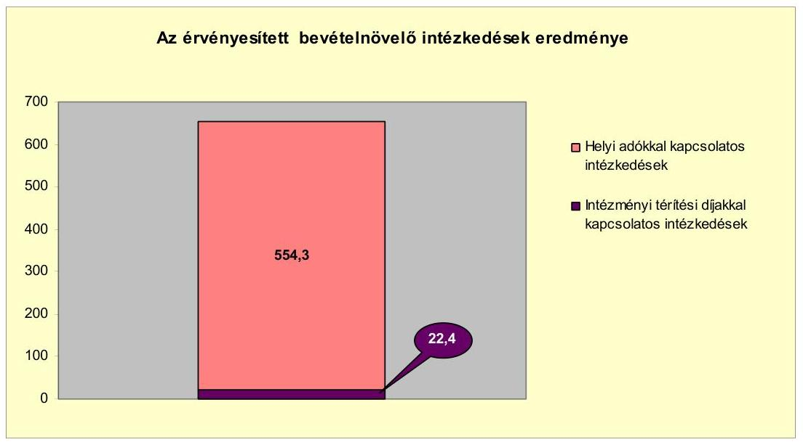

A bevételnövelésre irányuló intézkedések számszerűsített összegéből, ami 576,7 millió volt, 554,3 millió Ft-ot $(96,1 \%)$ jelentett a helyi adók közül az

[^0]
[^0]:    ${ }^{37}$ A polgármesteri hivatal engedélyezett álláshelyeinek 2010. évi száma tartalmazza a „prémium évek" programban résztvevő összesen 11 fő álláshely számát.

---

építményadó mértékének emelése és 22,4 millió Ft-ot (3,9\%), az étkezési térítési díjak évenkénti emelése.

Az Önkormányzat 492,8 millió Ft kiadáscsökkentő intézkedései (a végrehajtott létszámcsökkentések, a gyermekgondozási szabadságon lévők helyettesítése és a bölcsődei mosodai feladatok kiszervezése), valamint az 576,7 millió Ft bevételnövelő intézkedései eredményeként 2007-2011. I. félév között összesen 1069,5 millió Ft megtakarítást és többletbevételt mutatott ki.

Az Önkormányzat költségvetési támogatásból, valamint személyi jövedelemadóból származó bevétele a 2007. évben 2410,2 millió Ft, a 2008. évben 2355,1 millió Ft, a 2009. évben 2297,8 millió Ft, a 2010. évben 2263,7 millió Ft volt. A 2011. évre vonatkozóan ez az eredeti előirányzat szerint 2136,0 millió Ft.

A központi támogatások 2010-2011. év I. félév közötti - összességében 210,0 millió Ft-os - csökkenését az Önkormányzat által ugyanebben az időszakban kimutatott 492,8 millió Ft-os kiadási megtakarítás és az 576,7 millió Ft-os bevételnövelés együttesen ellensúlyozta. Ez hozzájárult az Önkormányzat pénzügyi egyensúlyának javításához.

# 5. Az ÁSZ Által a korábBi ÉVEKben a PÉnzÜGYI EGYENSÚLY JAVÍTÁSÁRA TETT SZABÁLYSZERŰSÉGI ÉS CÉLSZERŰSÉGI JAVASLATOK HASZNOSULÁSA 

Az ÁSZ az Önkormányzat gazdálkodási rendszerét a 2007. évben ellenőrizte átfogó jelleggel, melynek során 25 szabályszerűségi és 11 célszerűségi javaslatot tett. A szabályszerűségi javaslatok közül egy kapcsolódott a pénzügyi egyensúly javításához. A jelentést a Képviselő-testület a 2007. augusztus 29-én tartott ülésén megismerte. A javaslatok megvalósítására intézkedési tervet készítettek, amely teljes körűen tartalmazta a javaslatokat, meghatározta a feladatok elvégzéséért felelősöket és a feladatok megvalósításának határidejét.

A pénzügyi egyensúly javítását szolgáló szabályszerűségi javaslatot az intézkedési tervben foglalt határidőben hasznosították.

A jegyző a 2007. évi költségvetési rendelet 2007. május 31-ei módosításakor finanszírozási célú pénzügyi műveleteket költségvetési hiányt módosító költségvetési bevételként, illetve kiadásként a költségvetés bevételi és kiadási főösszegeiben nem vett figyelembe.

Budapest, 2012. április ,

Melléklet: $\quad 7 \mathrm{db}$
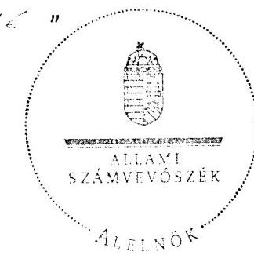

Warvasovszky Tihamér

---

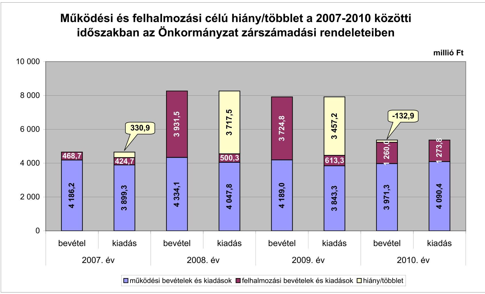

# Müködési és felhalmozási célú hiány/többlet a 2007-2010 közötti időszakban az Önkormányzat zárszámadási rendeleteiben

|  Müködési és felhalmozási célú hiány/többlet | 2007. év | 2008. év | 2009. év | 2010. év  |
| --- | --- | --- | --- | --- |
|  10 000 | 486,7 | 330,9 | 224,7 | 186,2  |
|  8 000 | 468,7 | 330,9 | 224,7 | 186,2  |
|  6 000 | 486,7 | 330,9 | 224,7 | 186,2  |
|  4 000 | 486,7 | 330,9 | 224,7 | 186,2  |
|  2 000 | 486,7 | 330,9 | 224,7 | 186,2  |
|  0 | 486,7 | 330,9 | 224,7 | 186,2  |
|  bevétel | 486,7 | 330,9 | 224,7 | 186,2  |
|  kiadás | 486,7 | 330,9 | 224,7 | 186,2  |
|  bevétel | 486,7 | 330,9 | 224,7 | 186,2  |
|  2007. év | 2008. év | 2009. év | 2009. év | 2009. év  |
|  4 086,2 | 486,7 | 330,9 | 224,7 | 186,2  |
|  4 086,2 | 486,7 | 330,9 | 224,7 | 186,2  |
|  4 086,2 | 486,7 | 330,9 | 224,7 | 186,2  |
|  2007. év | 2008. év | 2009. év | 2009. év | 2009. év  |
|  4 086,2 | 486,7 | 330,9 | 224,7 | 186,2  |
|  4 086,2 | 486,7 | 330,9 | 224,7 | 186,2  |
|  2007. év | 2008. év | 2009. év | 2009. év | 2009. év  |
|  4 086,2 | 486,7 | 330,9 | 224,7 | 186,2  |
|  4 086,2 | 486,7 | 330,9 | 224,7 | 186,2  |
|  2007. év | 2008. év | 2009. év | 2009. év | 2009. év  |
|  4 086,2 | 486,7 | 330,9 | 224,7 | 186,2  |
|  4 086,2 | 486,7 | 330,9 | 224,7 | 186,2  |
|  2007. év | 2008. év | 2009. év | 2009. év | 2009. év  |
|  4 086,2 | 486,7 | 330,9 | 224,7 | 186,2  |
|  4 086,2 | 486,7 | 330,9 | 224,7 | 186,2  |
|  2007. év | 2008. év | 2009. év | 2009. év | 2009. év  |
|  4 086,2 | 486,7 | 330,9 | 224,7 | 186,2  |
|  4 086,2 | 486,7 | 330,9 | 224,7 | 186,2  |
|  2007. év | 2008. év | 2009. év | 2009. év | 2009. év  |
|  4 086,2 | 486,7 | 330,9 | 224,7 | 186,2  |
|  4 086,2 | 486,7 | 330,9 | 224,7 | 186,2  |
|  2007. év | 2008. év | 2009. év | 2009. év | 2009. év  |
|  4 086,2 | 486,7 | 330,9 | 224,7 | 186,2  |
|  4 086,2 | 486,7 | 330,9 | 224,7 | 186,2  |
|  2007. év | 2008. év | 2009. év | 2009. év | 2009. év  |
|  4 086,2 | 486,7 | 330,9 | 224,7 | 186,2  |
|  4 086,2 | 486,7 | 330,9 | 224,7 | 186,2  |
|  2007. év | 2008. év | 2009. év | 2009. év | 2009. év  |
|  4 086,2 | 486,7 | 330,9 | 224,7 | 186,2  |
|  4 086,2 | 486,7 | 330,9 | 224,7 | 186,2  |
|  2007. év | 2008. év | 2009. év | 2009. év | 2009. év  |
|  4 086,2 | 486,7 | 330,9 | 224,7 | 186,2  |
|  4 086,2 | 486,7 | 330,9 | 224,7 | 186,2  |
|  2007. év | 2008. év | 2009. év | 2009. év | 2009. év  |
|  4 086,2 | 486,7 | 330,9 | 224,7 | 186,2  |
|  4 086,2 | 486,7 | 330,9 | 224,7 | 186,2  |
|  2007. év | 2008. év | 2009. év | 2009. év | 2009. év  |
|  4 086,2 | 486,7 | 330,9 | 224,7 | 186,2  |
|  2007. év | 2008. év | 2009. év | 2009. év | 2009. év  |
|  4 086,2 | 486,7 | 330,9 | 224,7 | 186,2  |
|  2007. év | 2008. év | 2009. év | 2009. év | 2009. év  |
|  4 086,2 | 486,7 | 330,9 | 224,7 | 186,2  |
|  2007. év | 2008. év | 2009. év | 2009. év | 2009. év  |
|  4 086,2 | 486,7 | 330,9 | 224,7 | 186,2  |
|  2007. év | 2008. év | 2009. év | 2009. év | 2009. év  |
|  4 086,2 | 486,7 | 330,9 | 224,7 | 186,2  |
|  2007. év | 2008. év | 2009. év | 2009. év | 2009. év  |
|  4 086,2 | 486,7 | 330,9 | 224,7 | 186,2  |
|  2007. év | 2008. év | 2009. év | 2009. év | 2009. év  |
|  4 086,2 | 486,7 | 330,9 | 224,7 | 186,2  |
|  2007. év | 2008. év | 2009. év | 2009. év | 2009. év  |
|  4 086,2 | 486,7 | 330,9 | 224,7 | 186,2  |
|  2007. év | 2008. év | 2009. év | 2009. év | 2009. év  |
|  4 086,2 | 486,7 | 330,9 | 224,7 | 186,2  |
|  2007. év | 2008. év | 2009. év | 2009. év | 2009. év  |
|  4 086,2 | 486,7 | 330,9 | 224,7 | 186,2  |
|  2007. év | 2008. év | 2009. év | 2009. év | 2009. év  |
|  4 086,2 | 486,7 | 330,9 | 224,7 | 186,2  |
|  2007. év | 2008. év | 2009. év | 2009. év | 2009. év  |
|  4 086,2 | 486,7 | 330,9 | 224,7 | 186,2  |
|  2007. év | 2008. év | 2009. év | 2009. év | 2009. év  |
|  4 086,2 | 486,7 | 330,9 | 224,7 | 186,2  |
|  2007. év | 2008. év | 2009. év | 2009. év | 2009. év  |
|  4 086,2 | 486,7 | 330,9 | 224,7 | 186,2  |
|  2007. év | 2008. év | 2009. év | 2009. év | 2009. év  |
|  4 086,2 | 486,7 | 330,9 | 224,7 | 186,2  |
|  2007. év | 2008. év | 2009. év | 2009. év | 2009. év  |
|  4 086,2 | 486,7 | 330,9 | 224,7 | 186,2  |
|  2007. év | 2008. év | 2009. év | 2009. év | 2009. év  |
|  4 086,2 | 486,7 | 330,9 | 224,7 | 186,2  |
|  2007. év | 2008. év | 2009. év | 2009. év | 2009. év  |
|  4 086,2 | 486,7 | 330,9 | 224,7 | 186,2  |
|  2007. év | 2008. év | 2009. év | 2009. év | 2009. év  |
|  4 086,2 | 486,7 | 330,9 | 224,7 | 186,2  |
|  2007. év | 2008. év | 2009. év | 2009. év | 2009. év  |
|  4 086,2 | 486,7 | 330,9 | 224,7 | 186,2  |
|  2007. év | 2008. év | 2009. év | 2009. év | 2009. év  |
|  4 086,2 | 486,7 | 330,9 | 224,7 | 186,2  |
|  2007. év | 2008. év | 2009. év | 2009. év | 2009. év  |
|  4 086,2 | 486,7 | 330,9 | 224,7 | 186,2  |
|  2007. év | 2008. év | 2009. év | 2009. év | 2009. év  |
|  4 086,2 | 486,7 | 330,9 | 224,7 | 186,2  |
|  2007. év | 2008. év | 2009. év | 2009. év | 2009. év  |
|  4 086,2 | 486,7 | 330,9 | 224,7 | 186,2  |
|  2007. év | 2008. év | 2009. év | 2009. év | 2009. év  |
|  4 086,2 | 486,7 | 330,9 | 224,7 | 186,2  |
|  2007. év | 2008. év | 2009. év | 2009. év | 2009. év  |
|  4 086,2 | 486,7 | 330,9 | 224,7 | 186,2  |
|  2007. év | 2008. év | 2009. év | 2009. év | 2009. év  |
|  4 086,2 | 486,7 | 330,9 | 224,7 | 186,2  |
|  2007. év | 2008. év | 2009. év | 2009. év | 2009. év  |
|  4 086,2 | 486,7 | 330,9 | 224,7 | 186,2  |
|  2007. év | 2008. év | 2009. év | 2009. év | 2009. év  |
|  4 086,2 | 486,7 | 330,9 | 224,7 | 186,2  |
|  2007. év | 2008. év | 2009. év | 2009. év | 2009. év  |
|  4 086,2 | 486,7 | 330,9 | 224,7 | 186,2  |
|  2007. év | 2008. év | 2009. év | 2009. év | 2009. év  |
|  4 086,2 | 486,7 | 330,9 | 224,7 | 186,2  |
|  2007. év | 2008. év | 2009. év | 2009. év | 2009. év  |
|  4 086,2 | 486,7 | 330,9 | 224,7 | 186,2  |
|  2007. év | 2008. év | 2009. év | 2009. év | 2009. év  |
|  4 086,2 | 486,7 | 330,9 | 224,7 | 186,2  |
|  2007. év | 2008. év | 2009. év | 2009. év | 2009. év  |
|  4 086,2 | 486,7 | 330,9 | 224,7 | 186,2  |
|  2007. év | 2008. év | 2009. év | 2009. év | 2009. év  |
|  4 086,2 | 486,7 | 330,9 | 224,7 | 186,2  |
|  2007. év | 2008. év | 2009. év | 2009. év | 2009. év  |
|  4 086,2 | 486,7 | 330,9 | 224,7 | 186,2  |
|  2007. év | 2008. év | 2009. év | 2009. év | 2009. év  |
|  4 086,2 | 486,7 | 330,9 | 224,7 | 186,2  |
|  2007. év | 2008. év | 2009. év | 2009. év | 2009. év  |
|  4 086,2 | 486,7 | 330,9 | 224,7 | 186,2  |
|  2007. év | 2008. év | 2009. év | 2009. év | 2009. év  |
|  4 086,2 | 486,7 | 330,9 | 224,7 | 186,2  |
|  2007. év | 2008. év | 2009. év | 2009. év | 2009. év  |
|  4 086,2 | 486,7 | 330,9 | 224,7 | 186,2  |
|  2007. év | 2008. év | 2009. év | 2009. év | 2009. év  |
|  4 086,2 | 486,7 | 330,9 | 224,7 | 186,2  |
|  2007. év | 2008. év | 2009. év | 2009. év | 2009. év  |
|  4 086,2 | 486,7 | 330,9 | 224,7 | 186,2  |
|  2007. év | 2008. év | 2009. év | 2009. év | 2009. év  |
|  4 086,2 | 486,7 | 330,9 | 224,7 | 186,2  |
|  2007. év | 2008. év | 2009. év | 2009. év | 2009. év  |
|  4 086,2 | 486,7 | 330,9 | 224,7 | 186,2  |
|  2007. év | 2008. év | 2009. év | 2009. év | 2009. év  |
|  4 086,2 | 486,7 | 330,9 | 224,7 | 186,2  |
|  2007. év | 2008. év | 2009. év | 2009. év | 2009. év  |
|  4 086,2 | 486,7 | 330,9 | 224,7 | 186,2  |
|  2007. év | 2008. év | 2009. év | 2009. év | 2009. év  |
|  4 086,2 | 486,7 | 330,9 | 224,7 | 186,2  |
|  2007. év | 2008. év | 2009. év | 2009. év | 2009. év  |
|  4 086,2 | 486,7 | 330,9 | 224,7 | 186,2  |
|  2007. év | 2008. év | 2009. év | 2009. év | 2009. év  |
|  4 086,2 | 486,7 | 330,9 | 224,7 | 186,2  |
|  2007. év | 2008. év | 2009. év | 2009. év | 2009. év  |
|  4 086,2 | 486,7 | 330,9 | 224,7 | 186,2  |
|  2007. év | 2008. év | 2009. év | 2009. év | 2009. év  |
|  4 086,2 | 486,7 | 330,9 | 224,7 | 186,2  |
|  2007. év | 2008. év | 2009. év | 2009. év | 2009. év  |
|  4 086,2 | 486,7 | 330,9 | 224,7 | 186,2  |
|  2007. év | 2008. év | 2009. év | 2009. év | 2009. év  |
|  4 086,2 | 486,7 | 330,9 | 224,7 | 186,2  |
|  2007. év | 2008. év | 2009. év | 2009. év | 2009. év  |
|  4 086,2 | 486,7 | 330,9 | 224,7 | 186,2  |
|  2007. év | 2008. év | 2009. év | 2009. év | 2009. év  |
|  4 086,2 | 486,7 | 330,9 | 224,7 | 186,2  |
|  2007. év | 2008. év | 2009. év | 2009. év | 2009. év  |
|  4 086,2 | 486,7 | 330,9 | 224,7 | 186,2  |
|  2007. év | 2008. év | 2009. év | 2009. év | 2009. év  |
|  4 086,2 | 486,7 | 330,9 | 224,7 | 186,2  |
|  2007. év | 2008. év | 2009. év | 2009. év | 2009. év  |
|  4 086,2 | 486,7 | 330,9 | 224,7 | 186,2  |
|  2007. év | 2008. év | 2009. év | 2009. év | 2009. év  |
|  4 086,2 | 486,7 | 330,9 | 224,7 | 186,2  |
|  2007. év | 2008. év | 2009. év | 2009. év | 2009. év  |
|  4 086,2 | 486,7 | 330,9 | 224,7 | 186,2  |
|  2007. év | 2008. év | 2009. év | 2009. év | 2009. év  |
|  4 086,2 | 486,7 | 330,9 | 224,7 | 186,2  |
|  2007. év | 2008. év | 2009. év | 2009. év | 2009. év  |
|  4 086,2 | 486,7 | 330,9 | 224,7 | 186,2  |
|  2007. év | 2008. év | 2009. év | 2009. év | 2009. év  |
|  4 086,2 | 486,7 | 330,9 | 224,7 | 186,2  |
|  2007. év | 2008. év | 2009. év | 2009. év | 2009. év  |
|  4 086,2 | 486,7 | 330,9 | 224,7 | 186,2  |
|  2007. év | 2008. év | 2009. év | 2009. év | 2009. év  |
|  4 086,2 | 486,7 | 330,9 | 224,7 | 186,2  |
|  2007. év | 2008. év | 2009. év | 2009. ev | 2009. ev  |
|  4 086,2 | 486,7 | 330,9 | 224,7 | 186,2  |
|  2007. év | 2008. év | 2009. ev | 2009. ev | 2009. ev  |
|  4 086,2 | 486,7 | 330,9 | 224,7 | 186,2  |
|  2007. év | 2008. év | 2009. ev | 2009. ev | 2009. ev  |
|  4 086,2 | 486,7 | 330,9 | 224,7 | 186,2  |
|  2007. év | 2008. év | 2009. ev | 2009. ev | 2009. ev  |
|  4 086,2 | 486,7 | 330,9 | 224,7 | 186,2  |
|  2007. év | 2008. év | 2009. ev | 2009. ev | 2009. ev  |
|  4 086,2 | 486,7 | 330,9 | 224,7 | 186,2  |
|  2007. év | 2008. év | 2009. ev | 2009. ev | 2009. ev  |
|  4 086,2 | 486,7 | 330,9 | 224,7 | 186,2  |
|  2007. év | 2008. év | 2009. ev | 2009. ev | 2009. ev  |
|  4 086,2 | 486,7 | 330,9 | 224,7 | 186,2  |
|  2007. év | 2008. év | 2009. ev | 2009. ev | 2009. ev  |
|  4 086,2 | 486,7 | 330,9 | 224,7 | 186,2  |
|  2007. év | 2008. év | 2009. ev | 2009. ev | 2009. ev  |
|  4 086,2 | 486,7 | 330,9 | 224,7 | 186,2  |
|  2007. év | 2008. év | 2009. ev | 2009. ev | 2009. ev  |
|  4 086,2 | 486,7 | 330,9 | 224,7 | 186,2  |
|  2007. év | 2008. év | 2009. ev | 2009. ev | 2009. ev  |
|  4 086,2 | 486,7 | 330,9 | 224,7 | 186,2  |
|  2007. év | 2008. év | 2009. ev | 2009. ev | 2009. ev  |
|  4 086,2 | 486,7 | 330,9 | 224,7 | 186,2  |
|  2007. év | 2008. év | 2009. ev | 2009. ev | 2009. ev  |
|  4 086,2 | 486,7 | 330,9 | 224,7 | 186,2  |
|  2007. év | 2008. év | 2009. ev | 2009. ev | 2009. ev  |
|  4 086,2 | 486,7 | 330,9 | 224,7 | 186,2  |
|  2007. év | 2008. év | 2009. ev | 2009. ev | 2009. ev  |
|  4 086,2 | 486,7 | 330,9 | 224,7 | 186,2  |
|  2007. év | 2008. év | 2009. ev | 2009. ev | 2009. ev  |
|  4 086,2 | 486,7 | 330,9 | 224,7 | 186,2  |
|  2007. év | 2008. ev | 2009. ev | 2009. ev  |
|  4 086,2 | 486,7 | 330,9 | 224,7 | 186,2  |
|  2007. év | 2008. ev | 2009. ev | 2009. ev  |
|  4 086,2 | 486,7 | 330,9 | 224,7 | 186,2  |
|  2007. év | 2008. ev | 2009. ev | 2009. ev  |
|  4 086,2 | 486,7 | 330,9 | 224,7 | 186,2  |
|  2007. év | 2008. ev | 2009. ev | 2009. ev  |
|  4 086,2 | 486,7 | 330,9 | 224,7 | 186,2  |
|  2007. év | 2008. ev | 2009. ev | 2009. ev  |
|  4 086,2 | 486,7 | 330,9 | 224,7 | 186,2  |
|  2007. év | 2008. ev | 2009. ev | 2009. ev  |
|  4 086,2 | 486,7 | 330,9 | 224,7 | 186,2  |
|  2007. év | 2008. ev | 2009. ev | 2009. ev  |
|  4 086,2 | 486,7 | 330,9 | 224,7 | 186,2  |
|  2007. ev | 2008. ev | 2009. ev | 2009. ev  |
|  4 086,2 | 486,7 | 330,9 | 224,7 | 186,2  |
|  2007. ev | 2008. ev | 2009. ev | 2009. ev  |
|  4 086,2 | 486,7 | 330,9 | 224,7 | 186,2  |
|  2007. ev | 2008. ev | 2009. ev | 2009. ev  |
|  4 086,2 | 486,7 | 330,9 | 224,7  |
|  2007. ev | 2008. ev | 2009. ev | 2009. ev  |
|  4 086,2 | 486,7 | 330,9  |
|  2007. ev | 2008. ev | 2009. ev | 2009. ev  |
|  4 086,2 | 486,7 | 330,9  |
| 2007. ev | 2008. ev | 2009. ev | 2009. ev  |
|  4 086,2 | 486,7 | 330,9  |
| 2007. ev | 2008. ev | 2009. ev  |
|  4 086,2 | 486,7 | 330,9  |
| 2007. ev | 2008. ev | 2009. ev  |
|  4 086,2 | 486,7 | 330,9  |
| 2007. ev | 2008. ev | 2009. ev  |
|  4 086,2 | 486,7 | 330,9  |
| 2007. ev | 2008. ev | 2009. ev  |
|  4 086,2 | 486,7 | 330,9  |
| 2007. ev | 2008. ev | 2009. ev  |
|  4 086,2 | 486,7 | 330,9  |
| 2007. ev | 2008. ev | 2009. ev  |
|  4 086,2 | 486,7 | 330,9  |
| 2007. ev | 2008. ev | 2009. ev  |
|  4 086,2 | 486,7 | 330,9  |
| 2007. ev | 2008. ev | 2009. ev  |
|  4 086,2 | 486,7 | 330,9  |
| 2007. ev | 2008. ev | 2009. ev  |
|  4 086,2 | 486,7 | 330,9  |
| 2007. ev | 2008. ev | 2009. ev  |
|  4 086,2 | 486,7 | 330,9  |
| 2007. ev | 2008. ev | 2009. ev  |
|  4 086,2 | 486,7 | 330,9  |
| 2007. ev | 2008. ev | 2009. ev  |
|  4 086,2 | 486,7 | 330,9  |
| 2007. ev | 2008. ev | 2009. ev  |
|  4 086,2 | 486,7 | 330,9  |
| 2007. ev | 2008. ev | 2009. ev  |
|  4 086,2 | 486,7 | 330,9  |
| 2007. ev | 2008. ev | 2009. ev  |
|  4 086,2 | 486,7 | 330,9  |
| 2007. ev | 2008. ev | 2009. ev  |
|  4 086,2 | 486,7 | 330,9  |
| 2007. ev | 2008. ev | 2009. ev  |
|  4 086,2 | 486,7 | 330,9  |
| 2007. ev | 2008. ev | 2009. ev  |
|  4 086,2 | 486,7 | 330,9  |
| 2007. ev | 2008. ev | 2009. ev  |
|  4 086,2 | 486,7 | 330,9  |
| 2007. ev | 2009. ev  |
|  4 086,2 | 486,7 | 330,9  |
| 2007. ev | 2009. ev  |
|  4 086,2 | 486,7 | 330,9  |
| 2007. ev | 2009. ev  |
| 4 086,2 | 486,7 | 330,9  |
| 2007. ev | 2009. ev  |
|  4 086,2 | 486,7 | 330,9  |
| 2007. ev | 2009. ev  |
| 4 086,2 | 486,7 | 330,9  |
| 2007. ev | 2009. ev  |
| 4 086,2 | 486,7 | 330,9  |
| 2007. ev | 2009. ev  |
| 4 086,2 | 486,7 | 330,9  |
| 2007. ev | 2009. ev  |
| 4 086,2 | 486,7 | 330,9  |
| 2007. ev | 2009. ev  |
| 4 086,2 | 486,7 | 330,9  |
| 2007. ev | 2009. ev  |
| 4 086,2 | 486,7 | 330,9  |
| 2007. ev | 2009. ev  |
| 4 086,2 | 486,7 | 330,9  |
| 2007. ev | 2009. ev  |
| 4 086,2 | 486,7 | 330,9  |
| 2007. ev | 2009. ev  |
| 4 086,2 | 486,7 | 330,9  |
| 2007. ev | 2009. ev  |
| 4 086,2 | 486,7 | 330,9  |
| 2007. ev | 2009. ev  |
| 4 086,2 | 486,7 | 330,9  |
| 2007. ev | 2009. ev  |
| 4 086,2 | 486,7 | 330,9  |
| 2007. ev | 2009. ev  |
| 4 086,2 | 486,7 | 330,9  |
| 2007. ev | 2009. ev  |
| 4 086,2 | 486,7 | 330,9  |
| 2007. ev | 2009. ev  |
| 4 086,2 | 486,7 | 330,9  |
| 4 086,2 | 486,7 | 330,9  |
| 2007. ev | 2009. ev  |
| 4 086,2 | 486,7 | 330,9  |
| 4 086,2 | 4 086,2 | 4 086,2 | 4 086,2  |
| 4 086,2 | 4 086,2 | 4 086,2 | 4 086,2 | 4 086,2  |
| 4 086,2 | 4 086,2 | 4 086,2  |
| 4 086,2 | 4 086,2 | 4 086,2  |
| 4 086,2 | 4 086,2 | 4 086,2  |
| 4 086,2 | 4 086,2 | 4 086,2 | 4 086,2  |
| 4 086,2 | 4 086,2 | 4 086,2  |
| 4 086,2 | 4 086,2 | 4 086,2  |
| 4 086,2 | 4 086,2 | 4 086,2 | 4 086,2  |
| 4 086,2 | 4 086,2 | 4 086,2  |
| 4 086,2 | 4 086,2 | 4 086,2 | 4 086,2  |
| 4 086,2 | 4 086,2 | 4 086,2  |
| 4 086,2 | 4 086,2 | 4 086,2 | 4 086,2  |
| 4 086,2 | 4 086,2 | 4 086,2  |
| 4 086,2 | 4 086,2 | 4 086,2  |
| 4 086,2 | 4 086,2 | 4 086,2  |
| 4 086,2 | 4 086,2 | 4 086,2  |
| 4 086,2 | 4 086,2 | 4 086,2  |
| 4 086,2 | 4 086,2 | 4 086,2  |
| 4 086,2 | 4 086,2 | 4 086,2  |
| 4 086,2 | 4 086,2 | 4 086,2  |
| 4 086,2 | 4 086,2 | 4 086,2  |
| 4 086,2 | 4 086,2 | 4 086,2  |
| 4 086,2 | 4 086,2 | 4 086,2  |
| 4 086,2 | 4 086,2 | 4 086,2  |
| 4 086,2 | 4 086,2 | 4 086,2  |
| 4 086,2 | 4 086,2  |
| 4 086,2 | 4 086,2  |
| 4 086,2 | 4 086,2  |
| 4 086,2 | 4 086,2 | 4 086,2  |
| 4 086,2 | 4 086,2  |
| 4 086,2 | 4 086,2 | 4 086,2  |
| 4 086,2 | 4 086,2  |
| 4 086,2 | 4 086,2 | 4 086,2 | 4 086,2  |
| 4 086,2 | 4 086,2 | 4 086,2  |
| 4 086,2 | 4 086,2 | 4 086,2  |
| 4 086,2 | 4 086,2  |
| 4 086,2 | 4 086,2  |
| 4 086,2 | 4 086,2 | 4 086,2  |
| 4 086,2 | 4 086,2  |
| 4 086,2 | 4 086,2  |
| 4 086,2 | 4 086,2 | 4 086,2  |
| 4 086,2 | 4 086,2  |
| 4 086,2 | 4 086,2  |
| 4 086,2 | 4 086,2 | 4 086,2  |
| 4 086,2 | 4 086,2 | 4 086,2  |
| 4 086,2 | 4 086,2  |
| 4 086,2 | 4 086,2 | 4 086,2  |
| 4 086,2 | 4 086,2  |
| 4 086,2 | 4 086,2  |
| 4 086,2 | 4 086,2 | 4 086,2  |
| 4 086,2 | 4 086,2  |
| 4 086,2 | 4 086,2  |
| 4 086,2 | 4 086,2  |
| 4 086,2 | 4 086,2  |
| 4 086,2 | 4 086,2  |
| 4 086,2 | 4 086,2  |
| 4 086,2 | 4 086,2  |
| 4 086,2 | 4 086,2 | 4 086,2  |
| 4 086,2 | 4 086,2  |
| 4 086,2 | 4 086,2  |
| 4 086,2 | 4 086,2  |
| 4 086,2 | 4 086,2 | 4 086,2  |
| 4 086,2 | 4 086,2  |
| 4 086,2 | 4 086,2  |
| 4 086,2 | 4 086,2  |
| 4 086,2 | 4 086,2  |
| 4 086,2 | 4 086,2  |
| 4 086,2 | 4 086,2  |
| 4 086,2 | 4 086,2  |
| 4 086,2 | 4 086,2 | 4 086,2  |
| 4 086,2 | 4 086,2  |
| 4 086,2 | 4 086,2 

---

|  Az Önkormányzat bevételei és kiadásai, valamint adósságszolgálata 2007-2010 között |  |  |  | millió Ft  |
| --- | --- | --- | --- | --- |
|  1. FOLYÓ KÖLTSÉGVETÉS | 2007. év | 2008. év | 2009. év | 2010. év  |
|  1.1.1. Saját müködési bevételek | 1119,6 | 1173,4 | 1218,4 | 1394,9  |
|  1.1.2. Költségvetési támogatás | 1387,2 | 1996,7 | 1885,7 | 1814,8  |
|  1.1.3. Átengedett bevételek | 1117,7 | 454,5 | 505,9 | 552,4  |
|  1.1.4. Államháztartáson belülről kapott támogatások | 438,5 | 555,0 | 585,6 | 557,5  |
|  1.1.5. EU-tól és külföldről kapott bevételek | 0,0 | 0,0 | 0,0 | 0,0  |
|  1.1.6. Államháztartáson kívülről kapott bevételek | 5,5 | 4,8 | 4,6 | 11,9  |
|  1.1.7. Előző évi pénzmaradvány átvétel | 87,5 | 53,1 | 58,7 | 47,8  |
|  1.1. Folyó bevételek ( $=1.1 .1 .+1.1 .2 .+1.1 .3 .+1.1 .4 .+1.1 .5 .+1.1 .6 .+1.1 .7$.) | 4156,0 | 4237,5 | 4258,9 | 4379,3  |
|  1.2.1. Müködési kiadások kamatkiadások nélkül | 3397,4 | 3455,2 | 3173,4 | 3497,6  |
|  1.2.2. Államháztartáson belülre átadott pénzeszközök | 18,2 | 84,1 | 49,5 | 32,7  |
|  1.2.3.1. vállalkozásoknak | 20,2 | 22,0 | 135,5 | 131,9  |
|  1.2.3.2. EU-nak, illetve külföldre | 0,0 | 0,0 | 0,0 | 0,0  |
|  1.2.3.3. magánszemélyeknek | 254,3 | 267,9 | 324,1 | 381,3  |
|  1.2.3.4. nonprofit szervezeteknek | 117,4 | 155,5 | 112,3 | 92,3  |
|  1.2.3. Transzferkiadások ( $=1.2 .3 .1+1.2 .3 .2+1.2 .3 .3+1.2 .3 .4$ ) | 391,9 | 445,4 | 571,9 | 605,5  |
|  1.2.4 Kamatkiadások | 49,1 | 27,2 | 108,2 | 85,4  |
|  1.2.5. Előző évi pénzmaradvány átadás | 87,5 | 53,1 | 58,7 | 47,8  |
|  1.2. Folyó kiadások ( $=1.2 .1 .+1.2 .2 .+1.2 .3 .+1.2 .4 .+1.2 .5$.) | 3944,1 | 4065,0 | 3961,7 | 4269,0  |
|  1.3. Folyó költségvetés egyenlege MÜKÖDÉSI JÖVEDELEM ( $=1.1 .-1.2$.) | 211,9 | 172,5 | 297,2 | 110,3  |
|  2. FELHALMOZASI KÖLTSÉGVETÉS |  |  |  |   |
|  2.1.1. Saját tökebevételek | 21,8 | 323,2 | 25,4 | 58,3  |
|  2.1.2. Államháztartáson belülről kapott támogatások | 119,4 | 235,6 | 113,2 | 558,6  |
|  2.1.3. EU-tól és külföldről kapott támogatások | 0,0 | 0,0 | 0,0 | 0,0  |
|  2.1.4. Államháztartáson kívülről kapott támogatások | 87,3 | 157,9 | 4,0 | 4,1  |
|  2.1. Felhalmozási bevételek ( $=2.1 .1 .+2.1 .2 .+2.1 .3 .+2.1 .4$.) | 228,5 | 716,7 | 142,6 | 621,0  |
|  2.2.1. Saját beruházási kiadás áfával | 178,7 | 252,0 | 368,4 | 927,3  |
|  2.2.2. Saját felújítási kiadás áfával | 61,9 | 120,5 | 50,3 | 113,7  |
|  2.2.3. Államháztartáson belülre átadott pénzeszköz | 0,2 | 0,0 | 1,5 | 0,0  |
|  2.2.4. EU-nak és külföldnek adott pénzeszközök | 0,0 | 0,0 | 0,0 | 0,0  |
|  2.2.5. Államháztartáson kívülre adott pénzeszközök | 137,8 | 52,0 | 73,0 | 52,5  |
|  2.2.6. Befektetési célú részesedések vásárlása | 1,2 | 0,6 | 1,8 | 1,3  |
|  2.2. Felhalmozási kiadások ( $=2.2 .1 .+2.2 .2 .+2.2 .3 .+2.2 .4 .+2.2 .5 .+2.2 .6$.) | 379,8 | 425,1 | 495,0 | 1094,8  |
|  2.3. Felhalmozási költségvetés egyenlege ( $=2.1 .-2.2$.) | $-151,3$ | 291,6 | $-352,4$ | $-473,8$  |
|  3. Finanszírozási műveletek nélküli (GFS) pozíció ( $=1.3 .+2.3$.) | 60,6 | 464,1 | $-55,2$ | $-363,5$  |
|  4. Finanszírozási műveletek |  |  |  |   |
|  4.1. Hitelfelvétel | 1369,3 | 21,2 | 26,3 | 0,8  |
|  4.2. Hiteltőrlesztés | 1427,3 | 407,7 | 13,7 | 14,4  |
|  4.3. Forgatási és befektetési célú értékpapírok kibocsátása | 0,0 | 3005,5 | 0,0 | 0,0  |
|  4.4. Forgatási és befektetési célú értékpapírok beváltása | 0,0 | 0,0 | 0,0 | 0,0  |
|  4.5. Forgatási és befektetési célú értékpapírok értékesítése | 49,5 | 0,0 | 275,0 | 230,6  |
|  4.6. Forgatási és befektetési célú értékpapírok vásárlása | 0,0 | 58,0 | 0,0 | 0,0  |
|  4.7. Egyéb finanszírozási bevételek (függő, átfutó, kiegyenlítői) | 17,5 | 2987,3 | 250,6 | $-3385,0$  |
|  4.8. Egyéb finanszírozási kiadások (függő, átfutó, kiegyenlítői) | $-6,2$ | 3015,2 | 256,9 | $-3255,5$  |
|  4.9.Finanszírozási műveletek egyenlege ( $=4.1 .-4.2 .+4.3 .-4.4 .+4.5 .-4.6 .+4.7 .-4.8$.) | 15,2 | 2533,1 | 281,3 | 86,7  |
|  5. Tárgyévi pénzügyi pozíció ( $=1.3 .+2.3 .+4.9$.) | 75,8 | 2997,2 | 226,1 | $-276,8$  |
|  6. Nettó müködési jövedelem = müködési jövedelem (1.3.) - töketörlesztés (4.2.+4.4.) | $-1215,4$ | $-235,2$ | 283,5 | 95,9  |
|  TÁJÉKOZTATÓ ADATOK |  |  |  |   |
|  Összes kötelezettség | 710,8 | 3394,1 | 3405,4 | 3849,5  |
|  ebből rövid lejáratú | 143,0 | 163,5 | 95,7 | 465,8  |
|  Összes szállítói kötelezettség | 23,0 | 11,6 | 10,0 | 291,6  |
|  ebből lejárt (tanúsítványból) | 14,9 | 4,6 | 4,5 | 14,9  |
|  Pénz- és tőkepiaci kötelezettség (adósság) | 615,2 | 3234,2 | 3315,3 | 3390,7  |
|  ebből rövid lejáratú | 57,4 | 13,5 | 14,4 | 14,5  |
|  PPP szerződéses állomány jelenértéken (tanúsítványból) | 0,0 | 0,0 | 0,0 | 0,0  |
|  ebből lejárt szolgáltatási díj miatti kötelezettség | 0,0 | 0,0 | 0,0 | 0,0  |
|  Folyószámlabitel napi átlagos állománya (tanúsítványból) | 17,8 | 93,9 | 52,1 | 174,0  |
|  Likvidhitel napi átlagos állománya (tanúsítványból) | 80,1 | 6,2 | 0,0 | 0,0  |
|  Munkabérhitet napi átlagos állománya (tanúsítványból) | 75,4 | 0,0 | 0,0 | 0,0  |
|  Kezesség- és garanciavállalások (tanúsítványból) | 500,0 | 500,0 | 650,0 | 650,0  |
|  Jogerős bírósági ítéletekből adódó kötelezettségek (tanúsítványból) | 0,0 | 0,0 | 0,0 | 2,5  |
|  Finanszírozásba bevonható eszközök: | 146,8 | 3202,1 | 3428,2 | 3130,8  |
|  Tartós hitelviszonyt megtestesítő értékpapírok év végi állománya | 0,4 | 58,5 | 58,5 | 37,9  |
|  Hosszú lejáratú bankbetétek év végi állománya | 0,0 | 0,0 | 0,0 | 0,0  |
|  Értékpapírok év végi állománya | 0,0 | 0,0 | 0,0 | 0,0  |
|  Pénzeszközök (idegen pénzeszközök nélkül) év végi állománya | 146,4 | 3143,6 | 3369,7 | 3092,9  |

---

Mezőkövesd Város Önkormányzata

Az Önkormányzat 2007-2010. években megvalósított, 2010. december 31-ig befejezett fejlesztései és azok forrásösszetétele

|  Fejlesztési feladat (beruházás, felújítás) |  |  |  |  |  |  |  |  |  |  |  |  |  |  |  |  |  |  |  |  |  |  |  |  |  |  |  |  |  |  |  |  |  |  |  |  |  |  |  |  |   |
| --- | --- | --- | --- | --- | --- | --- | --- | --- | --- | --- | --- | --- | --- | --- | --- | --- | --- | --- | --- | --- | --- | --- | --- | --- | --- | --- | --- | --- | --- | --- | --- | --- | --- | --- | --- | --- | --- | --- | --- | --- | --- |
|   |  |  |  |  |  |  |  |  |  |  |  |  |  |  |  |  |  |  |  |  |  |  |  |  |  |  |  |  |  |  |  |  |  |  |  |  |  |  |  |  |   |
|  Fejlesztési feladat (beruházás, felújítás) |  |  |  |  |  |  |  |  |  |  |  |  |  |  |  |  |  |  |  |  |  |  |  |  |  |  |  |  |  |  |  |  |  |  |  |  |  |  |  |  |   |
|  N |  |  |  |  |  |  |  |  |  |  |  |  |  |  |  |  |  |  |  |  |  |  |  |  |  |  |  |  |  |  |  |  |  |  |  |  |  |  |  |   |
|  1 |  |  |  |  |  |  |  |  |  |  |  |  |  |  |  |  |  |  |  |  |  |  |  |  |  |  |  |  |  |  |  |  |  |  |  |  |  |  |  |   |
|  2 |  |  |  |  |  |  |  |  |  |  |  |  |  |  |  |  |  |  |  |  |  |  |  |  |  |  |  |  |  |  |  |  |  |  |  |  |  |  |  |   |
|  3 |  |  |  |  |  |  |  |  |  |  |  |  |  |  |  |  |  |  |  |  |  |  |  |  |  |  |  |  |  |  |  |  |  |  |  |  |  |  |  |   |
|  4 |  |  |  |  |  |  |  |  |  |  |  |  |  |  |  |  |  |  |  |  |  |  |  |  |  |  |  |  |  |  |  |  |  |  |  |  |  |  |  |   |
|  5 |  |  |  |  |  |  |  |  |  |  |  |  |  |  |  |  |  |  |  |  |  |  |  |  |  |  |  |  |  |  |  |  |  |  |  |  |  |  |  |   |
|  6 |  |  |  |  |  |  |  |  |  |  |  |  |  |  |  |  |  |  |  |  |  |  |  |  |  |  |  |  |  |  |  |  |  |  |  |  |  |  |  |   |
|  7 |  |  |  |  |  |  |  |  |  |  |  |  |  |  |  |  |  |  |  |  |  |  |  |  |  |  |  |  |  |  |  |  |  |  |  |  |  |  |  |   |
|  8 |  |  |  |  |  |  |  |  |  |  |  |  |  |  |  |  |  |  |  |  |  |  |  |  |  |  |  |  |  |  |  |  |  |  |  |  |  |  |  |   |
|  9 |  |  |  |  |  |  |  |  |  |  |  |  |  |  |  |  |  |  |  |  |  |  |  |  |  |  |  |  |  |  |  |  |  |  |  |  |  |  |  |   |
|  10 |  |  |  |  |  |  |  |  |  |  |  |  |  |  |  |  |  |  |  |  |  |  |  |  |  |  |  |  |  |  |  |  |  |  |  |  |  |  |  |   |
|  11 |  |  |  |  |  |  |  |  |  |  |  |  |  |  |  |  |  |  |  |  |  |  |  |  |  |  |  |  |  |  |  |  |  |  |  |  |  |  |  |   |
|  12 |  |  |  |  |  |  |  |  |  |  |  |  |  |  |  |  |  |  |  |  |  |  |  |  |  |  |  |  |  |  |  |  |  |  |  |  |  |  |  |   |
|  13 |  |  |  |  |  |  |  |  |  |  |  |  |  |  |  |  |  |  |  |  |  |  |  |  |  |  |  |  |  |  |  |  |  |  |  |  |  |  |  |   |
|  14 |  |  |  |  |  |  |  |  |  |  |  |  |  |  |  |  |  |  |  |  |  |  |  |  |  |  |  |  |  |  |  |  |  |  |  |  |  |  |  |   |
|  15 |  |  |  |  |  |  |  |  |  |  |  |  |  |  |  |  |  |  |  |  |  |  |  |  |  |  |  |  |  |  |  |  |  |  |  |  |  |  |  |   |
|  16 |  |  |  |  |  |  |  |  |  |  |  |  |  |  |  |  |  |  |  |  |  |  |  |  |  |  |  |  |  |  |  |  |  |  |  |  |  |  |  |   |
|  17 |  |  |  |  |  |  |  |  |  |  |  |  |  |  |  |  |  |  |  |  |  |  |  |  |  |  |  |  |  |  |  |  |  |  |  |  |  |  |  |   |
|  18 |  |  |  |  |  |  |  |  |  |  |  |  |  |  |  |  |  |  |  |  |  |  |  |  |  |  |  |  |  |  |  |  |  |  |  |  |  |  |  |   |
|  19 |  |  |  |  |  |  |  |  |  |  |  |  |  |  |  |  |  |  |  |  |  |  |  |  |  |  |  |  |  |  |  |  |  |  |  |  |  |  |  |   |
|  20 |  |  |  |  |  |  |  |  |  |  |  |  |  |  |  |  |  |  |  |  |  |  |  |  |  |  |  |  |  |  |  |  |  |  |  |  |  |  |  |   |
|  21 |  |  |  |  |  |  |  |  |  |  |  |  |  |  |  |  |  |  |  |  |  |  |  |  |  |  |  |  |  |  |  |  |  |  |  |  |  |  |  |   |
|  22 |  |  |  |  |  |  |  |  |  |  |  |  |  |  |  |  |  |  |  |  |  |  |  |  |  |  |  |  |  |  |  |  |  |  |  |  |  |  |  |   |
|  23 |  |  |  |  |  |  |  |  |  |  |  |  |  |  |  |  |  |  |  |  |  |  |  |  |  |  |  |  |  |  |  |  |  |  |  |  |  |  |  |   |
|  24 |  |  |  |  |  |  |  |  |  |  |  |  |  |  |  |  |  |  |  |  |  |  |  |  |  |  |  |  |  |  |  |  |  |  |  |  |  |  |  |   |
|  25 |  |  |  |  |  |  |  |  |  |  |  |  |  |  |  |  |  |  |  |  |  |  |  |  |  |  |  |  |  |  |  |  |  |  |  |  |  |  |  |   |
|  26 |  |  |  |  |  |  |  |  |  |  |  |  |  |  |  |  |  |  |  |  |  |  |  |  |  |  |  |  |  |  |  |  |  |  |  |  |  |  |  |   |
|  27 |  |  |  |  |  |  |  |  |  |  |  |  |  |  |  |  |  |  |  |  |  |  |  |  |  |  |  |  |  |  |  |  |  |  |  |  |  |  |  |   |
|  28 |  |  |  |  |  |  |  |  |  |  |  |  |  |  |  |  |  |  |  |  |  |  |  |  |  |  |  |  |  |  |  |  |  |  |  |  |  |  |  |   |
|  29 |  |  |  |  |  |  |  |  |  |  |  |  |  |  |  |  |  |  |  |  |  |  |  |  |  |  |  |  |  |  |  |  |  |  |  |  |  |  |  |   |
|  30 |  |  |  |  |  |  |  |  |  |  |  |  |  |  |  |  |  |  |  |  |  |  |  |  |  |  |  |  |  |  |  |  |  |  |  |  |  |  |  |   |
|  31 |  |  |  |  |  |  |  |  |  |  |  |  |  |  |  |  |  |  |  |  |  |  |  |  |  |  |  |  |  |  |  |  |  |  |  |  |  |  |  |   |
|  32 |  |  |  |  |  |  |  |  |  |  |  |  |  |  |  |  |  |  |  |  |  |  |  |  |  |  |  |  |  |  |  |  |  |  |  |  |  |  |  |   |
|  33 |  |  |  |  |  |  |  |  |  |  |  |  |  |  |  |  |  |  |  |  |  |  |  |  |  |  |  |  |  |  |  |  |  |  |  |  |  |  |  |   |
|  34 |  |  |  |  |  |  |  |  |  |  |  |  |  |  |  |  |  |  |  |  |  |  |  |  |  |  |  |  |  |  |  |  |  |  |  |  |  |  |  |   |
|  35 |  |  |  |  |  |  |  |  |  |  |  |  |  |  |  |  |  |  |  |  |  |  |  |  |  |  |  |  |  |  |  |  |  |  |  |  |  |  |  |   |
|  36 |  |  |  |  |  |  |  |  |  |  |  |  |  |  |  |  |  |  |  |  |  |  |  |  |  |  |  |  |  |  |  |  |  |  |  |  |  |  |  |   |
|  37 |  |  |  |  |  |  |  |  |  |  |  |  |  |  |  |  |  |  |  |  |  |  |  |  |  |  |  |  |  |  |  |  |  |  |  |  |  |  |  |   |
|  38 |  |  |  |  |  |  |  |  |  |  |  |  |  |  |  |  |  |  |  |  |  |  |  |  |  |  |  |  |  |  |  |  |  |  |  |  |  |  |  |   |
|  39 |  |  |  |  |  |  |  |  |  |  |  |  |  |  |  |  |  |  |  |  |  |  |  |  |  |  |  |  |  |  |  |  |  |  |  |  |  |  |  |   |
|  40 |  |  |  |  |  |  |  |  |  |  |  |  |  |  |  |  |  |  |  |  |  |  |  |  |  |  |  |  |  |  |  |  |  |  |  |  |  |  |  |   |
|  41 |  |  |  |  |  |  |  |  |  |  |  |  |  |  |  |  |  |  |  |  |  |  |  |  |  |  |  |  |  |  |  |  |  |  |  |  |  |  |  |   |
|  42 |  |  |  |  |  |  |  |  |  |  |  |  |  |  |  |  |  |  |  |  |  |  |  |  |  |  |  |  |  |  |  |  |  |  |  |  |  |  |  |   |
|  43 |  |  |  |  |  |  |  |  |  |  |  |  |  |  |  |  |  |  |  |  |  |  |  |  |  |  |  |  |  |  |  |  |  |  |  |  |  |  |  |   |
|  44 |  |  |  |  |  |  |  |  |  |  |  |  |  |  |  |  |  |  |  |  |  |  |  |  |  |  |  |  |  |  |  |  |  |  |  |  |  |  |  |   |
|  45 |  |  |  |  |  |  |  |  |  |  |  |  |  |  |  |  |  |  |  |  |  |  |  |  |  |  |  |  |  |  |  |  |  |  |  |  |  |  |  |   |
|  46 |  |  |  |  |  |  |  |  |  |  |  |  |  |  |  |  |  |  |  |  |  |  |  |  |  |  |  |  |  |  |  |  |  |  |  |  |  |  |  |   |
|  47 |  |  |  |  |  |  |  |  |  |  |  |  |  |  |  |  |  |  |  |  |  |  |  |  |  |  |  |  |  |  |  |  |  |  |  |  |  |  |  |   |
|  48 |  |  |  |  |  |  |  |  |  |  |  |  |  |  |  |  |  |  |  |  |  |  |  |  |  |  |  |  |  |  |  |  |  |  |  |  |  |  |  |   |
|  49 |  |  |  |  |  |  |  |  |  |  |  |  |  |  |  |  |  |  |  |  |  |  |  |  |  |  |  |  |  |  |  |  |  |  |  |  |  |  |  |   |
|  50 |  |  |  |  |  |  |  |  |  |  |  |  |  |  |  |  |  |  |  |  |  |  |  |  |  |  |  |  |  |  |  |  |  |  |  |  |  |  |  |   |
|  51 |  |  |  |  |  |  |  |  |  |  |  |  |  |  |  |  |  |  |  |  |  |  |  |  |  |  |  |  |  |  |  |  |  |  |  |  |  |  |  |   |
|  52 |  |  |  |  |  |  |  |  |  |  |  |  |  |  |  |  |  |  |  |  |  |  |  |  |  |  |  |  |  |  |  |  |  |  |  |  |  |  |  |   |
|  53 |  |  |  |  |  |  |  |  |  |  |  |  |  |  |  |  |  |  |  |  |  |  |  |  |  |  |  |  |  |  |  |  |  |  |  |  |  |  |  |   |
|  54 |  |  |  |  |  |  |  |  |  |  |  |  |  |  |  |  |  |  |  |  |  |  |  |  |  |  |  |  |  |  |  |  |  |  |  |  |  |  |  |   |
|  55 |  |  |  |  |  |  |  |  |  |  |  |  |  |  |  |  |  |  |  |  |  |  |  |  |  |  |  |  |  |  |  |  |  |  |  |  |  |  |  |   |
|  56 |  |  |  |  |  |  |  |  |  |  |  |  |  |  |  |  |  |  |  |  |  |  |  |  |  |  |  |  |  |  |  |  |  |  |  |  |  |  |  |  |   |
|  57 |  |  |  |  |  |  |  |  |  |  |  |  |  |  |  |  |  |  |  |  |  |  |  |  |  |  |  |  |  |  |  |  |  |  |  |  |  |  |  |  |   |
|  58 |  |  |  |  |  |  |  |  |  |  |  |  |  |  |  |  |  |  |  |  |  |  |  |  |  |  |  |  |  |  |  |  |  |  |  |  |  |  |  |  |   |
|  59 |  |  |  |  |  |  |  |  |  |  |  |  |  |  |  |  |  |  |  |  |  |  |  |  |  |  |  |  |  |  |  |  |  |  |  |  |  |  |  |  |   |
|  60 |  |  |  |  |  |  |  |  |  |  |  |  |  |  |  |  |  |  |  |  |  |  |  |  |  |  |  |  |  |  |  |  |  |  |  |  |  |  |  |  |   |
|  61 |  |  |  |  |  |  |  |  |  |  |  |  |  |  |  |  |  |  |  |  |  |  |  |  |  |  |  |  |  |  |  |  |  |  |  |  |  |  |  |  |   |
|  62 |  |  |  |  |  |  |  |  |  |  |  |  |  |  |  |  |  |  |  |  |  |  |  |  |  |  |  |  |  |  |  |  |  |  |  |  |  |  |  |  |   |
|  63 |  |  |  |  |  |  |  |  |  |  |  |  |  |  |  |  |  |  |  |  |  |  |  |  |  |  |  |  |  |  |  |  |  |  |  |  |  |  |  |  |   |
|  64 |  |  |  |  |  |  |  |  |  |  |  |  |  |  |  |  |  |  |  |  |  |  |  |  |  |  |  |  |  |  |  |  |  |  |  |  |  |  |  |  |   |
|  65 |  |  |  |  |  |  |  |  |  |  |  |  |  |  |  |  |  |  |  |  |  |  |  |  |  |  |  |  |  |  |  |  |  |  |  |  |  |  |  |  |   |
|  66 |  |  |  |  |  |  |  |  |  |  |  |  |  |  |  |  |  |  |  |  |  |  |  |  |  |  |  |  |  |  |  |  |  |  |  |  |  |  |  |  |   |
|  67 |  |  |  |  |  |  |  |  |  |  |  |  |  |  |  |  |  |  |  |  |  |  |  |  |  |  |  |  |  |  |  |  |  |  |  |  |  |  |  |  |   |
|  68 |  |  |  |  |  |  |  |  |  |  |  |  |  |  |  |  |  |  |  |  |  |  |  |  |  |  |  |  |  |  |  |  |  |  |  |  |  |  |  |  |   |
|  69 |  |  |  |  |  |  |  |  |  |  |  |  |  |  |  |  |  |  |  |  |  |  |  |  |  |  |  |  |  |  |  |  |  |  |  |  |  |  |  |  |  |   |
|  70 |  |  |  |  |  |  |  |  |  |  |  |  |  |  |  |  |  |  |  |  |  |  |  |  |  |  |  |  |  |  |  |  |  |  |  |  |  |  |  |  |  |   |
|  71 |  |  |  |  |  |  |  |  |  |  |  |  |  |  |  |  |  |  |  |  |  |  |  |  |  |  |  |  |  |  |  |  |  |  |  |  |  |  |  |  |  |   |
|  72 |  |  |  |  |  |  |  |  |  |  |  |  |  |  |  |  |  |  |  |  |  |  |  |  |  |  |  |  |  |  |  |  |  |  |  |  |  |  |  |  |  |   |
|  73 |  |  |  |  |  |  |  |  |  |  |  |  |  |  |  |  |  |  |  |  |  |  |  |  |  |  |  |  |  |  |  |  |  |  |  |  |  |  |  |  |  |   |
|  74 |  |  |  |  |  |  |  |  |  |  |  |  |  |  |  |  |  |  |  |  |  |  |  |  |  |  |  |  |  |  |  |  |  |  |  |  |  |  |  |  |  |  |   |
|  75 |  |  |  |  |  |  |  |  |  |  |  |  |  |  |  |  |  |  |  |  |  |  |  |  |  |  |  |  |  |  |  |  |  |  |  |  |  |  |  |  |  |  |  |   |
|  76 |  |  |  |  |  |  |  |  |  |  |  |  |  |  |  |  |  |  |  |  |  |  |  |  |  |  |  |  |  |  |  |  |  |  |  |  |  |  |  |  |  |  |  |  |   |
|  77 |  |  |  |  |  |  |  |  |  |  |  |  |  |  |  |  |  |  |  |  |  |  |  |  |  |  |  |  |  |  |  |  |  |  |  |  |  |  |  |  |  |  |  |  |   |
|  78 |  |  |  |  |  |  |  |  |  |  |  |  |  |  |  |  |  |  |  |  |  |  |  |  |  |  |  |  |  |  |  |  |  |  |  |  |  |  |  |  |  |  |  |  |   |
|  79 |  |  |  |  |  |  |  |  |  |  |  |  |  |  |  |  |  |  |  |  |  |  |  |  |  |  |  |  |  |  |  |  |  |  |  |  |  |  |  |  |  |  |  |  |   |
|  80 |  |  |  |  |  |  |  |  |  |  |  |  |  |  |  |  |  |  |  |  |  |  |  |  |  |  |  |  |  |  |  |  |  |  |  |  |  |  |  |  |  |  |  |  |  |   |
|  81 |  |  |  |  |  |  |  |  |  |  |  |  |  |  |  |  |  |  |  |  |  |  |  |  |  |  |  |  |  |  |  |  |  |  |  |  |  |  |  |  |  |  |  |  |  |  |   |
|  82 |  |  |  |  |  |  |  |  |  |  |  |  |  |  |  |  |  |  |  |  |  |  |  |  |  |  |  |  |  |  |  |  |  |  |  |  |  |  |  |  |  |  |  |  |  |  |  |  |   |
|  83 |  |  |  |  |  |  |  |  |  |  |  |  |  |  |  |  |  |  |  |  |  |  |  |  |  |  |  |  |  |  |  |  |  |  |  |  |  |  |  |  |  |  |  |  |  |  |  |  |  |   |
|  84 |  |  |  |  |  |  |  |  |  |  |  |  |  |  |  |  |  |  |  |  |  |  |  |  |  |  |  |  |  |  |  |  |  |  |  |  |  |  |  |  |  |  |  |  |  |  |  |  |  |  |   |
|  85 |  |  |  |  |  |  |  |  |  |  |  |  |  |  |  |  |  |  |  |  |  |  |  |  |  |  |  |  |  |  |  |  |  |  |  |  |  |  |  |  |  |  |  |  |  |  |  |  |  |  |  |   |
|  86 |  |  |  |  |  |  |  |  |  |  |  |  |  |  |  |  |  |  |  |  |  |  |  |  |  |  |  |  |  |  |  |  |  |  |  |  |  |  |  |  |  |  |  |  |  |  |  |  |  |  |  |  |   |
|  87 |  |  |  |  |  |  |  |  |  |  |  |  |  |  |  |  |  |  |  |  |  |  |  |  |  |  |  |  |  |  |  |  |  |  |  |  |  |  |  |  |  |  |  |  |  |  |  |  |  |  |  |  |   |
|  88 |  |  |  |  |  |  |  |  |  |  |  |  |  |  |  |  |  |  |  |  |  |  |  |  |  |  |  |  |  |  |  |  |  |  |  |  |  |  |  |  |  |  |  |  |  |  |  |  |  |  |  |  |  |   |
|  89 |  |  |  |  |  |  |  |  |  |  |  |  |  |  |  |  |  |  |  |  |  |  |  |  |  |  |  |  |  |  |  |  |  |  |  |  |  |  |  |  |  |  |  |  |  |  |  |  |  |  |  |  |  |   |
|  90 |  |  |  |  |  |  |  |  |  |  |  |  |  |  |  |  |  |  |  |  |  |  |  |  |  |  |  |  |  |  |  |  |  |  |  |  |  |  |  |  |  |  |  |  |  |  |  |  |  |  |  |  |  |  |   |
|  91 |  |  |  |  |  |  |  |  |  |  |  |  |  |  |  |  |  |  |  |  |  |  |  |  |  |  |  |  |  |  |  |  |  |  |  |  |  |  |  |  |  |  |  |  |  |  |  |  |  |  |  |  |  |  |  |  |   |
|  92 |  |  |  |  |  |  |  |  |  |  |  |  |  |  |  |  |  |  |  |  |  |  |  |  |  |  |  |  |  |  |  |  |  |  |  |  |  |  |  |  |  |  |  |  |  |  |  |  |  |  |  |  |  |  |  |  |  |  |  |  |   |
|  93 |  |  |  |  |  |  |  |  |  |  |  |  |  |  |  |  |  |  |  |  |  |  |  |  |  |  |  |  |  |  |  |  |  |  |  |  |  |  |  |  |  |  |  |  |  |  |  |  |  |  |  |  |  |  |  |  |  |  |  |  |  |  |   |
|  94 |  |  |  |  |  |  |  |  |  |  |  |  |  |  |  |  |  |  |  |  |  |  |  |  |  |  |  |  |  |  |  |  |  |  |  |  |  |  |  |  |  |  |  |  |  |  |  |  |  |  |  |  |  |  |  |  |  |  |  |  |  |  |  |   |
|  95 |  |  |  |  |  |  |  |  |  |  |  |  |  |  |  |  |  |  |  |  |  |  |  |  |  |  |  |  |  |  |  |  |  |  |  |  |  |  |  |  |  |  |  |  |  |  |  |  |  |  |  |  |  |  |  |  |  |  |  |  |  |  |  |  |  |   |
|  96 |  |  |  |  |  |  |  |  |  |  |  |  |  |  |  |  |  |  |  |  |  |  |  |  |  |  |  |  |  |  |  |  |  |  |  |  |  |  |  |  |  |  |  |  |  |  |  |  |  |  |  |  |  |  |  |  |  |  |  |  |  |  |  |  |  |  |  |  |  |   |
|  97 |  |  |  |  |  |  |  |  |  |  |  |  |  |  |  |  |  |  |  |  |  |  |  |  |  |  |  |  |  |  |  |  |  |  |  |  |  |  |  |  |  |  |  |  |  |  |  |  |  |  |  |  |  |  |  |  |  |  |  |  |  |  |  |  |  |  |  |  |  |  |  |  |   |
|  98 |  |  |  |  |  |  |  |  |  |  |  |  |  |  |  |  |  |  |  |  |  |  |  |  |  |  |  |  |  |  |  |  |  |  |  |  |  |  |  |  |  |  |  |  |  |  |  |  |  |  |  |  |  |  |  |  |  |  |  |  |  |  |  |  |  |  |  |  |  |  |  |  |  |  |  |  |  |  |  |  |  |  |  |  |  |  |  |  |  |  |  |  |  |  |  |  |  |  |  | 

---

|   |  |  |  |  |  |  |  |  |  |  |  |  |  |  |  |  |  |  |  |  |  |  |  |  |  |  |  |  |  |  |  |  |  |  |  |  |  |  |  |  |  |  |  |  |  |  |  |  |  |  |  |  |  |  |  |  |  |  |  |  |  |  |  |  |  |  |  |  |  |  |  |  |  |  |  |  |  |  |  |  |  |  |  |  |  |  |  |  |  |  |  |  |  |  |  |  |  |  |  |  |  | 

---

Mezőköveed Város Önkormányzata

Az Önkormányzat 2010. december 31-én folyamatban lévő fejlesztési feladataira 2010. december 31-én fennálló kötelezettségek és azok forrásösszetétele

|   |  |  |  |  |  |  |  |  |  |  |  |  |  |  |  |  |  |  |  |  |  |  |  |  |  |  |  |  |  |  |  |  |  |  |  |  |  |  |  |  |  |  |  |  |   |
| --- | --- | --- | --- | --- | --- | --- | --- | --- | --- | --- | --- | --- | --- | --- | --- | --- | --- | --- | --- | --- | --- | --- | --- | --- | --- | --- | --- | --- | --- | --- | --- | --- | --- | --- | --- | --- | --- | --- | --- | --- | --- | --- | --- | --- |
|   |  |  |  |  |  |  |  |  |  |  |  |  |  |  |  |  |  |  |  |  |  |  |  |  |  |  |  |  |  |  |  |  |  |  |  |  |  |  |  |  |  |  |  |   |
|   |  |  |  |  |  |  |  |  |  |  |  |  |  |  |  |  |  |  |  |  |  |  |  |  |  |  |  |  |  |  |  |  |  |  |  |  |  |  |  |  |  |  |  |   |
|   |  |  |  |  |  |  |  |  |  |  |  |  |  |  |  |  |  |  |  |  |  |  |  |  |  |  |  |  |  |  |  |  |  |  |  |  |  |  |  |  |  |  |  |   |
|   |  |  |  |  |  |  |  |  |  |  |  |  |  |  |  |  |  |  |  |  |  |  |  |  |  |  |  |  |  |  |  |  |  |  |  |  |  |  |  |  |  |  |  |   |
|   |  |  |  |  |  |  |  |  |  |  |  |  |  |  |  |  |  |  |  |  |  |  |  |  |  |  |  |  |  |  |  |  |  |  |  |  |  |  |  |  |  |  |  |   |
|   |  |  |  |  |  |  |  |  |  |  |  |  |  |  |  |  |  |  |  |  |  |  |  |  |  |  |  |  |  |  |  |  |  |  |  |  |  |  |  |  |  |  |  |   |
|   |  |  |  |  |  |  |  |  |  |  |  |  |  |  |  |  |  |  |  |  |  |  |  |  |  |  |  |  |  |  |  |  |  |  |  |  |  |  |  |  |  |  |  |   |
|   |  |  |  |  |  |  |  |  |  |  |  |  |  |  |  |  |  |  |  |  |  |  |  |  |  |  |  |  |  |  |  |  |  |  |  |  |  |  |  |  |  |  |  |   |
|   |  |  |  |  |  |  |  |  |  |  |  |  |  |  |  |  |  |  |  |  |  |  |  |  |  |  |  |  |  |  |  |  |  |  |  |  |  |  |  |  |  |  |  |   |
|   |  |  |  |  |  |  |  |  |  |  |  |  |  |  |  |  |  |  |  |  |  |  |  |  |  |  |  |  |  |  |  |  |  |  |  |  |  |  |  |  |  |  |  |   |
|   |  |  |  |  |  |  |  |  |  |  |  |  |  |  |  |  |  |  |  |  |  |  |  |  |  |  |  |  |  |  |  |  |  |  |  |  |  |  |  |  |  |  |  |   |
|   |  |  |  |  |  |  |  |  |  |  |  |  |  |  |  |  |  |  |  |  |  |  |  |  |  |  |  |  |  |  |  |  |  |  |  |  |  |  |  |  |  |  |  |   |
|   |  |  |  |  |  |  |  |  |  |  |  |  |  |  |  |  |  |  |  |  |  |  |  |  |  |  |  |  |  |  |  |  |  |  |  |  |  |  |  |  |  |  |  |   |
|   |  |  |  |  |  |  |  |  |  |  |  |  |  |  |  |  |  |  |  |  |  |  |  |  |  |  |  |  |  |  |  |  |  |  |  |  |  |  |  |  |  |  |  |   |
|   |  |  |  |  |  |  |  |  |  |  |  |  |  |  |  |  |  |  |  |  |  |  |  |  |  |  |  |  |  |  |  |  |  |  |  |  |  |  |  |  |  |  |  |   |
|   |  |  |  |  |  |  |  |  |  |  |  |  |  |  |  |  |  |  |  |  |  |  |  |  |  |  |  |  |  |  |  |  |  |  |  |  |  |  |  |  |  |  |  |   |
|   |  |  |  |  |  |  |  |  |  |  |  |  |  |  |  |  |  |  |  |  |  |  |  |  |  |  |  |  |  |  |  |  |  |  |  |  |  |  |  |  |  |  |  |   |
|   |  |  |  |  |  |  |  |  |  |  |  |  |  |  |  |  |  |  |  |  |  |  |  |  |  |  |  |  |  |  |  |  |  |  |  |  |  |  |  |  |  |  |  |   |
|   |  |  |  |  |  |  |  |  |  |  |  |  |  |  |  |  |  |  |  |  |  |  |  |  |  |  |  |  |  |  |  |  |  |  |  |  |  |  |  |  |  |  |  |   |
|   |  |  |  |  |  |  |  |  |  |  |  |  |  |  |  |  |  |  |  |  |  |  |  |  |  |  |  |  |  |  |  |  |  |  |  |  |  |  |  |  |  |  |  |   |
|   |  |  |  |  |  |  |  |  |  |  |  |  |  |  |  |  |  |  |  |  |  |  |  |  |  |  |  |  |  |  |  |  |  |  |  |  |  |  |  |  |  |  |  |   |
|   |  |  |  |  |  |  |  |  |  |  |  |  |  |  |  |  |  |  |  |  |  |  |  |  |  |  |  |  |  |  |  |  |  |  |  |  |  |  |  |  |  |  |  |   |
|   |  |  |  |  |  |  |  |  |  |  |  |  |  |  |  |  |  |  |  |  |  |  |  |  |  |  |  |  |  |  |  |  |  |  |  |  |  |  |  |  |  |  |  |   |
|   |  |  |  |  |  |  |  |  |  |  |  |  |  |  |  |  |  |  |  |  |  |  |  |  |  |  |  |  |  |  |  |  |  |  |  |  |  |  |  |  |  |  |  |   |
|   |  |  |  |  |  |  |  |  |  |  |  |  |  |  |  |  |  |  |  |  |  |  |  |  |  |  |  |  |  |  |  |  |  |  |  |  |  |  |  |  |  |  |  |   |
|   |  |  |  |  |  |  |  |  |  |  |  |  |  |  |  |  |  |  |  |  |  |  |  |  |  |  |  |  |  |  |  |  |  |  |  |  |  |  |  |  |  |  |  |   |
|   |  |  |  |  |  |  |  |  |  |  |  |  |  |  |  |  |  |  |  |  |  |  |  |  |  |  |  |  |  |  |  |  |  |  |  |  |  |  |  |  |  |  |  |   |
|   |  |  |  |  |  |  |  |  |  |  |  |  |  |  |  |  |  |  |  |  |  |  |  |  |  |  |  |  |  |  |  |  |  |  |  |  |  |  |  |  |  |  |  |   |
|   |  |  |  |  |  |  |  |  |  |  |  |  |  |  |  |  |  |  |  |  |  |  |  |  |  |  |  |  |  |  |  |  |  |  |  |  |  |  |  |  |  |  |  |   |
|   |  |  |  |  |  |  |  |  |  |  |  |  |  |  |  |  |  |  |  |  |  |  |  |  |  |  |  |  |  |  |  |  |  |  |  |  |  |  |  |  |  |  |  |   |
|   |  |  |  |  |  |  |  |  |  |  |  |  |  |  |  |  |  |  |  |  |  |  |  |  |  |  |  |  |  |  |  |  |  |  |  |  |  |  |  |  |  |  |  |   |
|   |

---

### **Az Önkormányzat által beadott, elbírálás alatti, pályázati forrásból megvalósítani tervezett fejlesztéseihez kapcsolódó kötelezettségvállalásai és azok forrásösszetétele**

|  1 | 2 | 3 | 4 | 5 | 6 | 7 | 8 | 9 | 10 | 11 | 12 | 13 | 14 | 15 | 16 | 17 | 18 | 19 | 20  |
| --- | --- | --- | --- | --- | --- | --- | --- | --- | --- | --- | --- | --- | --- | --- | --- | --- | --- | --- | --- |
|  1. | Felújítások |  |  |  |  |  |  |  |  |  |  |  |  |  |  |  |  |  |   |
|  2. | Vonzó és éhető városi környezet kialakítása Mezőkövesden (Városnehabilitáció) | 32/2010.(X.24) | 2011 | 2012 | 161,6 | 0,0 | 12,3 | 149,3 | 0,0 | 0,0 | 0,0 | 120,1 | A | 29,2 | A | 0,0 | Igen |  |   |
|  3. | Épületenergetikai fejlesztés, megújuló energiaforrás hasznosításával kombinálva a Bayer Róbert Kollégiumban és a Szent László Gimnáziumban Mezőkövesden | 139/2011.(V.12.) | 2012 | 2012 | 221,0 | 0,0 | 0,0 | 221,0 | 33,2 | C | 0,0 | 0,0 | 187,8 | C | 0,0 | Igen |  |   |
|  4. | Épületenergetikai fejlesztés, megújuló energiaforrás hasznosításával kombinálva a Polgármesteri Hivatal "A" épületében Mezőkövesden | 140/2011.(V.12.) | 2012 | 2012 | 47,4 | 0,0 | 0,0 | 47,4 | 7,1 | C | 0,0 | 0,0 | 40,3 | C | 0,0 | Igen |  |   |
|  5. | 10 millió Ft alatti felújítások | 0 db |  |  | 0,0 | 0,0 | 0,0 | 0,0 | 0,0 | 0,0 | 0,0 | 0,0 | 0,0 | 0,0 | 0,0 |  |  |   |
|  6. | Felújítások összesen |  |  |  | 430,0 | 0,0 | 12,3 | 417,7 | 40,3 | 0,0 | 120,1 | 257,3 | 0,0 |  |  |  |  |   |
|  7. | Fejlesztések |  |  |  |  |  |  |  |  |  |  |  |  |  |  |  |  |  |   |
|  8. | Vonzó és éhető városi környezet kialakítása Mezőkövesden (Városnehabilitáció) | 32/2010.(X.24) | 2011 | 2012 | 1 244,7 | 0,0 | 131,8 | 1 112,9 | 0,0 | 0,0 | 435,2 | A | 677,7 | A | 0,0 | Igen |  |   |
|  9. | Mezőkövesd város szennyvízcsatorna-hálózatának fejlesztése a lakosság életminőségének javítása és a települési környezet védelme érdekében II. forduló (Szennyvízhálózat bővítés II. ford.) | 101/2010.(IV.28) | 2011 | 2014 | 2 478,2 | 0,0 | 0,0 | 2 478,2 | 793,0 | A | 0,0 | 0,0 | 1 685,2 | A | 0,0 | Igen |  |   |
|  10. | Zsóry Fürdő termálvíz hasznosításra épülő épületgépészeti rekonstrukció (Zsóry KEOP) | 345/2009.(X.19.) | 2011 | 2011 | 181,2 | 0,0 | 0,0 | 181,2 | 0,0 | 0,0 | 90,6 | A | 90,6 | B | 0,0 | Igen |  |   |
|  11. | Tűzoltó gépjárműfecskendő beszerzés | 95/2010.(IV.28.) | 2013 | 2013 | 95,0 | 0,0 | 0,0 | 95,0 | 95,0 | C | 0,0 | 0,0 | 0,0 | 0,0 | 0,0 |  |  |   |
|  12. | 10 millió Ft alatti fejlesztések | 3 db |  |  | 7,2 | 7,2 | 0,0 | 7,2 | 7,2 | 0,0 | 0,0 | 0,0 | 0,0 | 0,0 | 0,0 |  |  |   |
|  13. | Fejlesztések összesen |  |  |  | 4 006,3 | 7,2 | 131,8 | 3 874,5 | 895,2 | 0,0 | 525,8 | 2 453,5 | 0,0 |  |  |  |  |   |
|  14. | Összesen |  |  |  | 4 436,3 | 7,2 | 144,1 | 4 292,2 | 935,5 | 0,0 | 645,9 | 2 710,8 | 0,0 |  |  |  |  |   |

*A= ha a forrás már rendelkezésre áll.

B= ha a forrás közbeszerzési eljárása folyamatban van,

C= ha a forrás közbeszerzési eljárása még nem indult el, a forrás nem áll rendelkezésre.

---

Mezőkövesd Város Önkormányzata 4. számú melléklet a V-3083-026/2012. számú Jelentéshez

Az önkormányzati feladatok ellátásában résztvevő gazdasági társaságok

milió Ft-ban

|  Gazdasági társaság megnevezése |  |  |  |  |  |  |  |  |  |  |  |  |  |  |  |  |  |  |   |
| --- | --- | --- | --- | --- | --- | --- | --- | --- | --- | --- | --- | --- | --- | --- | --- | --- | --- | --- | --- |
|   | Önkormányzat | Önkormányzat gazdasági társaságának | saját tőke, műszelí tőke aránya | kötelező feladathoz | önként vállalt feladathoz | hosszú lejáratú hileből, kötvénylőő | lúzigből | lejárt szállító állományból | működésre átadott pénzeszköz |  |  |  |  |  |  |  |  |  |   |
|   | tulajdoni hányada (%) |  |  |  |  |  |  |  |  |  |  |  |  |  |  |  |  |  |   |
|   |  |  |  |  |  |  |  |  |  |  |  |  |  |  |  |  |  |  |   |
|   | tulajdoni hányada (%) |  |  |  |  |  |  |  |  |  |  |  |  |  |  |  |  |  |   |
|  1. 100%-os tulajdoni hányadó gazdasági társaságok: |  |  |  |  |  |  |  |  |  |  |  |  |  |  |  |  |  |  |   |
|  Mezőkövesdi Városgazdálkodási Zrt. | 100,0 | 0,0 | 6,3 | 1797,4 | 1115,1 | 9,1 | 1,1 | 0,0 | 19,8 | 22,0 | 32,2 | 26,8 | 0,0 | 0,0 | 0,0 | 0,0 | 0,0 | 0,0 | 0,0  |
|  Mezőkövesdi KÖZKINCS-tár Nonprofit Kft. | 100,0 | 0,0 | 4,2 | 289,1 | 0,0 | 0,0 | 0,0 | -0,8 | 0,0 | 0,0 | 79,4 | 83,7 | 41,2 | 0,0 | 0,0 | 0,0 | 0,0 | 0,0 | 0,0  |
|  Mezőkövesdi Méda Nonprofit Kft. | 100,0 | 0,0 | 2,4 | 3,0 | 0,0 | 0,0 | 0,0 | 1,7 | 20,0 | 22,0 | 24,0 | 21,5 | 12,4 | 0,0 | 0,0 | 0,0 | 0,0 | 0,0 | 0,0  |
|  Mezőkövesdi Városfejlesztési Kft. | 100,0 | 0,0 | 1,0 | 0,0 | 0,5 | 0,0 | 0,0 | 0,0 | 0,0 | 0,0 | 0,0 | 0,0 | 0,0 | 0,0 | 0,0 | 0,0 | 0,0 | 0,0 | 0,0  |
|  Zunry Camping Kft. | 100,0 | 0,0 | 1,4 | 0,0 | 64,7 | 0,0 | 0,0 | 0,0 | 0,0 | 0,0 | 0,0 | 0,0 | 0,0 | 0,0 | 0,0 | 0,0 | 0,0 | 0,0 | 0,0  |
|  100%-os tulajdoni hányadó gazdasági társaságok összesen | 100,0 | 0,0 | 4,2 | 2 089,5 | 1 180,3 | 9,1 | 1,1 | 1,1 | 39,8 | 44,0 | 135,6 | 131,9 | 53,5 | 0,0 | 0,0 | 0,0 | 0,0 | 0,0 | 0,0  |
|  IV. egyéb, közfeladatot ellátó gazdasági társaságok: |  |  |  |  |  |  |  |  |  |  |  |  |  |  |  |  |  |  |  |   |
|  Remondis Tisza
Hullodékgazdálkodási Kft. | 8,1 | 91,9 | 13,4 | 0,0 | 0,0 | 491,7 | 1,0 | 0,0 | 0,0 | 0,0 | 0,0 | 0,0 | 0,0 | 0,0 | 0,0 | 0,0 | 0,0 | 0,0 | 0,0  |
|  egyéb, közfeladatot ellátó gazdasági társaságo |  |  |  |  |  |  |  |  |  |  |  |  |  |  |  |  |  |  |  |   |
|  összesen | 8,1 | 91,9 | 13,4 | 0,0 | 0,0 | 491,7 | 1,0 | 0,0 | 0,0 | 0,0 | 0,0 | 0,0 | 0,0 | 0,0 | 0,0 | 0,0 | 0,0 | 0,0 | 0,0  |
|  Összesen | x | x | x | 2 089,5 | 1 180,3 | 500,8 | 2,1 | 1,1 | 39,8 | 44,0 | 135,6 | 131,9 | 53,5 | 0,0 | 0,0 | 0,0 | 0,0 | 0,0 | 0,0  |