# ÁLLAMI   SZÁMVEVŐSZÉK 

## JELENTÉS

Mezőtúr Város Önkormányzata pénzügyi helyzetének ellenőrzéséről (43/4)

---

# Állami Számvevőszék 

Iktatószám: V-3100-026/2012.
Témaszám: 1015
Vizsgálat-azonosító szám: V0560131

## Az ellenőrzést felügyelte:

Dr. Varga Sándor
számvevő igazgatóhelyettes
Az ellenőrzést vezette:
Renkó Zsuzsanna
számvevő tanácsos
Az ellenőrzés csoportvezetője:
Csepreginé Tancsik Erzsébet
számvevő tanácsos
Az ellenőrzést végezték:

| Kisapáti Angéla | Palágyiné dr. | Dr. Gaálné |
| :-- | :-- | :-- |
| számvevő tanácsos | Gömöri Katalin | Berente Mónika |
|  | számvevő | számvevő |

---

# TARTALOMJEGYZÉK 

BEVEZETÉS ..... 9
I. ÖSSZEGZŐ MEGÁLLAPÍTÁSOK, KÖVETKEZTETÉSEK, JAVASLATOK ..... 13
II. RÉSZLETES MEGÁLLAPÍTÁSOK ..... 28

1. Az Önkormányzat kötelező és önként vállalt feladatai, a feladatellátás szervezeti keretei és annak változásai ..... 28
2. Az Önkormányzat pénzügyi egyensúlyi helyzetét befolyásoló tényezők ..... 34
2.1. A működési és a felhalmozási egyensúly változása ..... 36
2.2. Az Önkormányzat bevételeinek változása ..... 41
2.3. Az Önkormányzat múködési és felhalmozási célú kiadásainak változása ..... 44
3. Az Önkormányzat kötelezettségei ..... 50
3.1. Az Önkormányzat pénzintézeti kötelezettségeinek változása ..... 50
3.2. A szállítói kötelezettségek változása ..... 61
3.3. Egyéb kötelezettségek változása ..... 62
4. A pénzügyi egyensúly megteremtése érdekében hozott intézkedések eredménye ..... 66
5. Az ÁSZ által a korábbi években a pénzügyi egyensúly javítására tett szabályszerűségi és célszerűségi javaslatok hasznosulása ..... 68

---

# MELLÉKLETEK 

1. számú Múködési és felhalmozási célú hiány/többlet az Önkormányzat zárszámadási rendeleteiben (1 oldal)
2. számú Az Önkormányzat bevételei és kiadásai, valamint adósságszolgálata 2007-2010 között (1 oldal)
3/a. számú Az Önkormányzat 2007-2010. években megvalósított, 2010. december 31ig befejezett fejlesztései és azok forrásösszetétele (1 oldal)
3/b. számú Az Önkormányzat 2010. december 31-én folyamatban lévő fejlesztési feladataira 2010. december 31-ig teljesített kifizetések és azok forrásösszetétele (1 oldal)
3/c. számú Az Önkormányzat 2010. december 31-én folyamatban lévő fejlesztési feladataihoz kapcsolódó 2010. évet követő kötelezettségvállalásai és azok forrásösszetétele (1 oldal)
3/c1. számú Az Önkormányzat 2011. év I. félévben saját forrásból megvalósított fejlesztései és azok forrásösszetétele (1 oldal)
3/d. számú Az Önkormányzat által beadott, elbírálás alatti pályázati forrásból megvalósítani tervezett fejlesztéseihez kapcsolódó kötelezettségvállalásai és azok forrásösszetétele (1 oldal)
3. számú Az önkormányzati feladatok ellátásában résztvevő gazdasági társaságok (1 oldal)
4. számú Mezőtúr Város Önkormányzat polgármesterének észrevétele (1 oldal)
5. számú Mezőtúr Város Önkormányzat polgármesterének észrevételére adott válasz (1 oldal)

---

# RÖVIDÍTÉSEK JEGYZÉKE 

## Törvények

Áht $_{1}$
Áht $_{2}$
Art.
Hatv.

Kbt $_{1}$
$\mathrm{Kbt}_{2}$
Ötv.
Stabilitási tv.
Számv. tv.

## Rendeletek

Ámr.
Áhsz.

2011. évi költségvetési rendelet
SzMSz $_{1}$

SzMSz $_{2}$
vagyongazdálkodási rendelet

## Szórövidítések

áfa
alapfokú közoktatási intézmény

ÁSZ
EU
Intézményellátó Nkft.
Ipari Park Kft.
Jászkun Volán Zrt.
jegyző
Képviselő-testület
az államháztartásról szóló 1992. évi XXXVIII. törvény
az államháztartásról szóló 2011. évi CXCV. törvény
az adózás rendjéről szóló 2003. évi XCII. törvény
a helyi önkormányzatok és szerveik, a köztársasági megbízottak, valamint egyes centrális alárendeltségű szervek feladat- és hatásköreiről szóló 1991. évi XX. törvény
a közbeszerzésről szóló 2003. évi CXXIX. törvény
a közbeszerzésről szóló 2011. évi CVIII. törvény
a helyi önkormányzatokról szóló 1990. évi LXV. törvény
a Magyarország gazdasági stabilitásáról szóló 2011. évi CXCIV. törvény
a számvitelről szóló 2000. évi C. törvény
az államháztartás múködési rendjéről szóló 292/2009. (XII. 19.) Korm. rendelet
az államháztartás szervezetei beszámolási és könyvvezetési kötelezettségének sajátosságairól szóló 249/2000. (XII. 24.) Korm. rendelet
Mezőtúr Város Önkormányzatának 6/2011. (III. 9.) számú rendelete az Önkormányzat 2011. évi költségvetéséről Mezőtúr Város Önkormányzatának 1/2007. (II. 2.) számú rendelete Mezőtúr Város Önkormányzata és szervei szervezeti és múködési szabályairól
Mezőtúr Város Önkormányzatának 5/2011. (II. 4.) számú rendelete Mezőtúr Város Önkormányzata Képviselőtestületének szervezeti és múködési szabályairól
Mezőtúr Város Önkormányzatának 2/2007. (II. 2.) számú rendelete az Önkormányzat tulajdonáról és a vagyonnal gazdálkodás szabályairól
általános forgalmi adó
Mezőtúr Város Önkormányzatának Mezőtúri Általános Iskola, Alapfokú Művészetoktatási, Óvoda, Pedagógiai Szakszolgálat és Könyvtár Intézménye
Állami Számvevőszék
Európai Unió
Mezőtúri Intézményellátó és Ingatlankezelő Kiemelten Közhasznú Nonprofit Kft.
Mezőtúri Ipari Park Kft.
Jászkun Volán Közlekedési Zártkörűen Múködő Részvénytársaság, Szolnok
Mezőtúr Város Önkormányzatának jegyzője
Mezőtúr Város Képviselő-testülete

---

Kórház
Kórház Nkft.
Kossuth úti Általános Iskola
körjegyzőség
középfokú oktatási intézmény

Közművelődési és Sport Nkft.
MFB
megyei önkormányzat
OEP
Önkormányzat
Pénzügyi Bizottság
polgármester
Polgármesteri hivatal

PPP konstrukció
szja
többcélú társulás
tűzoltóság
Városgondnokság
Víz- és Csatornamú Kft.
Víziközmú Vagyonkezelő Kft.

Mezőtúr Város Önkormányzatának Városi KórházRendelőintézet Intézménye
Mezőtúri Városi Kórház-Rendelőintézet Kiemelten Közhasznú Nonprofit Kft.
Mezőtúri Általános Iskola, Alapfokú Művészetoktatási Intézmény, Óvoda, Pedagógiai Szakszolgálat és Könyvtár Kossuth Lajos Általános és Magyar-Angol Két Tanítási Nyelvű Iskolája 5400 Mezőtúr, Kossuth Lajos út 82.
Mezőtúr Város és Mesterszállás Község Körjegyzősége
Mezőtúr Város Önkormányzatának Teleki Blanka Gimnázium, Szakközépiskola, Szakiskola és Kollégium Intézménye
Mezőtúri Közművelődési és Sport Kiemelten Közhasznú Nonprofit Kft.
Magyar Fejlesztési Bank Zrt.
Jász-Nagykun-Szolnok Megyei Önkormányzat
Országos Egészségbiztosítási Pénztár
Mezőtúr Város Önkormányzata
Mezőtúr Város Képviselő-testületének Pénzügyi Bizottsága
Mezőtúr Város Önkormányzatának polgármestere
Mezőtúr Város Önkormányzatának Polgármesteri hivatala
Public Private Partnership (Partnerségi együttmúködés közfeladatok ellátására a magánszektor bevonásával) személyi jövedelemadó
Berettyó-Körös Többcélú Társulás
Mezőtúr Város Önkormányzatának Hivatásos Tűzoltó Parancsnokság Intézménye
Mezőtúr Város Önkormányzatának Városgondnokság Intézménye
Mezőtúr és Környéke Víz- és Csatornamú Kft.
Mezőtúr és Térsége Víziközmú Vagyonkezelő Kft.

---

# ÉRTELMEZŐ SZÓTÁR 

banki kitettség

BUBOR

CLF módszer

EURIBOR
kamatkockázat
kötelező közszolgáltatás
közfeladat

LIBOR

Az önkormányzat pénzügyi helyzete olyan külső körülmények hatására is módosulhat, amelyekre az önkormányzatnak nincs hatása, emiatt banki kitettsége keletkezik. Pl: rövid távú kötelezettségek fennállása esetén kizárólag a bank egyoldalú döntésén múlik, hogy továbbra is biztosít-e hitelt az önkormányzatnak, valamint azt milyen feltételekkel bocsátja az önkormányzat rendelkezésére.
Budapesti Bankközi Forint Hitelkamatláb. Irányadó, referencia jellegű kamatláb. Mértékét az MNB naponta állapítja meg a banki kamatok figyelembevételével. Közzététele naponta történik.
Az önkormányzatok költségvetése elemzésének eszköze. A módszer következetesen elkülöníti a folyó és a felhalmozási költségvetés bevételeit és kiadásait, azok költségvetési egyenlegeit. Bizonyos mértékig a vállalati gazdálkodás logikai elemeit érvényesíti az önkormányzatok pénzügyi, jövedelmi helyzetének vizsgálata során. Az értékelés a pénzügyi kapacitás fogalmát helyezi a középpontba.
A frankfurti bankközi piacon jegyzett, az Európai Központi Bank szabályainak megfelelően megállapított kínálati kamatláb. Az EURIBOR értékét a legfontosabb európai bankok hitelkínálatának kamatlábai alapján a Reuters ügynökség számolja ki és teszi közzé naponta. A magyar pénzintézetek is ezt használják viszonyítási alapnak EUR hitelek esetén.
A változó kamatozású forint- vagy devizahitelek futamideje alatt a kamat emelkedése miatt fennálló kamatkockázat, melynek növekedése miatt nő a hitel törlesztő részlete.
A helyi önkormányzati feladatkörbe tartozó, a köztisztasággal és a településtisztasággal, valamint az élet- és vagyonbiztonsággal összefüggő egyes - közszolgáltatás útján megvalósuló - közfeladatok ellátása, amelynek kötelező igénybevételét külön jogszabály (törvény, helyi önkormányzati rendelet) határoz meg.
Állami, helyi, illetve kisebbségi önkormányzati feladat, amelynek ellátásáról az államnak, illetve az önkormányzatoknak kell gondoskodni. A hatályos szabályozás szerint közfeladatot törvény és önkormányzati rendelet állapíthat meg. Az önkormányzatok által ellátandó feladatok keretszerű meghatározását az Ötv. tartalmazza.
Angol kifejezés, a London Interbank Offered Rate rövidítése. Jelentése: Londoni bankközi, referencia jellegű kínálati (hitel) kamatláb.

---

minősített többséget biztosító befolyás
önkormányzat többségi tulajdonában lévő gazdasági társaságok
pénzügyi kapacitás
pénzügyi kockázat

Minősített többséget biztosító befolyásnak számít, ha az önkormányzat a gazdasági társaságban közvetlenül, vagy - a Ptk. 685/B. § (3) bekezdésében előírtaknak megfelelően megállapított módon - közvetve a szavazatok legalább hetvenöt százalékával rendelkezik.
Az önkormányzat a gazdasági társaságban a szavazatok több mint ötven százalékával vagy a Ptk. 685/B. § (2)-(3) bekezdéseiben rögzített meghatározó befolyással rendelkezik. A befolyással rendelkező akkor rendelkezik egy jogi személyben meghatározó befolyással, ha annak tagja, illetve részvényese és jogosult e jogi személy vezető tisztségviselői vagy felügyelőbizottsága tagjai többségének megválasztására, illetve visszahívására, vagy a jogi személy más tagjaival, illetve részvényeseivel kötött megállapodás alapján egyedül rendelkezik a szavazatok több mint ötven százalékával (Ptk. 685/B. § (2) bek.). A meghatározó befolyás akkor is fennáll, ha a befolyással rendelkező számára e jogosultságok közvetett módon (köztes vállalkozásain keresztül, a Ptk. 685/B §. (3),(4) bek. szerint) biztosítottak.
A helyi önkormányzat és az önkormányzat irányítása alá tartozó költségvetési szerv többségi tulajdonában, illetve többségi befolyása alatt álló gazdálkodó szervezet esetében hitelfelvétel, kölcsönfelvétel, garancia- vagy kezességvállalás, tartozásátvállalás, tartozás-elengedés, értékpapír kibocsátás, vásárlás, pénzügyi lízing, tartós bérleti szerződés, ingyenes vagyonjuttatás (így különösen: ajándékozás, ingyenes engedményezés), vagy követelésvásárlás, követelésengedményezés végrehajtására vonatkozóan az Áht ${ }_{1} 100 /$ M. § (4) bekezdése ${ }^{1}$ alapján az önkormányzat rendelkezik döntési jogosultsággal.
A pénzügyi kapacitás (financial capacity) az adósok hitelfelvételi képességének azon mértéke, ahol még anélkül tudják növelni az adósságot, hogy csökkenteniük kellene akár a jelenbeli, akár a jövőben esedékes kiadásaikat a fizetésképtelenség elkerülése érdekében. (Forrás: Az önkormányzati rendszer pénzügyi helyzete, ÁSZKUT tanulmány 2010.)
A múködési kockázat egyik eleme. Megmutatkozhat a költségvetés nagyságrendjének, szerkezetének nem megalapozott módosításaiban, a bevételi és a kiadási előirányzatoktól lényegesen eltérő teljesítésekben, a nem megfelelő belső kontrollrendszer múködésében, a tudatos károkozásokban, a biztosítások elmaradásában, a hibás fejlesztési döntésekben, a nem a terveknek megfelelő forrásfelhasználásokban. Jelentkezhet továbbá a bevételek és

[^0]
[^0]:    ${ }^{1}$ Hatályát vesztette 2012. január 1-jétől az Áht ${ }_{2} 110$. § (2) bekezdése alapján figyelemmel a 114. § (1)-(2) bekezdésében foglaltakra.

---

törlesztési kockázat

SNA
kiadások ütemkülönbsége miatt felvett folyószámla- és likvidhitelek költségvetési év végén fennálló egyenlege miatt, amely az önkormányzat költségvetésébe - akár tartósan - beépülő forráshiányt jelzi.
Annak a kockázata, hogy a megfelelő időben és mértékben a hitelt felvevőnél rendelkezésre állnak-e a pénzintézetek és egyéb szervek felé fennálló kötelezettségek visszafizetéséhez, a hitelek és kölcsönök törlesztéséhez szükséges pénzügyi források.
A törlesztési kockázatot növeli a kamat- és árfolyam növekedése, mivel ezekben az esetekben az adósságszolgálat nőhet. Törlesztési kockázatot okozhat a visszafizetésre tervezett forrás elérésének, teljesítésének bizonytalansága (pl. a visszafizetéshez tervezett tartalékolás elmaradt, a tervezettnél alacsonyabb a saját bevétel, a helyi adóból származó bevétel az adóalanyok, adóalapok csökkenése miatt nem teljesül).
System of National Account azaz a Nemzeti Számlák Rendszere, amely a gazdasági szektorok által létrehozott valamennyi terméket és szolgáltatást figyelembe veszi.

---

.

---

# JELENTÉS 

## Mezőtúr Város Önkormányzata pénzügyi helyzetének ellenőrzéséről

## BEVEZETÉS

Az Állami Számvevőszék 2011. évtől érvényes stratégiája új irányt szabott a helyi önkormányzatok gazdálkodásának ellenőrzésében is. Az ÁSZ - küldetése és jövőképe szerint - szilárd szakmai alapokra támaszkodva értékteremtő ellenőrzéseivel és helyzetelemzéseivel az államháztartás egészében, így a helyi önkormányzati alrendszerben is elő kívánja segíteni a közpénzek és a közvagyon szabályos, gazdaságos, hatékony és eredményes felhasználását. E folyamat részeként - az államháztartási hiány alakulásának összetevőire is figyelemmel végezzük az önkormányzati alrendszer pénzügyi helyzetelemzését.

Az államháztartás helyi szintjén a 304 városnak ${ }^{2}$ az általuk ellátott közszolgáltatások volumenére is tekintettel a közfeladatok ellátásában kiemelt szerepe van. E települések 2011. január 1-jei népessége 3169 ezer fő volt.

Feladataik és hatásköreik az Ötv. mellett különböző ágazati törvények által meghatározottak, miközben a feladatellátás szervezeti kereteit - ezen belül a gazdasági társaságok közszolgáltatások ellátásában betöltött szerepét - saját maguk határozzák meg. A gazdasági társaságok által ellátott feladatok esetén a gazdálkodás, továbbá az önkormányzatok pénzügyi egyensúlyi helyzetére ható közvetlen kockázatok egy része kikerült az önkormányzati alrendszerből. A többségi önkormányzati tulajdonban lévő társaságok gazdálkodásának körülményei befolyásolhatják a városok pénzügyi egyensúlyi helyzetének megítélésében rejlő kockázatokat.

Az áttekintett időszakban az önkormányzati forrásszabályozás elvei lényegesen nem változtak. Az önkormányzatok gazdasági mozgásterét a központi költségvetéstől való függőség mellett jelentősen befolyásolja a helyi adókivetési jog gyakorlása. A városok gazdálkodási szabadságának lényeges eleme, hogy anyagi lehetőségeik függvényében dönthettek arról, hogy feladataik közül azokat, amelyek megoldására az Ötv. szerint a települési önkormányzat nem kötelezhető, a megyei önkormányzat fenntartásába adhatták. E döntések differenciáltan érintették a városok pénzügyi helyzetét.

[^0]
[^0]:    ${ }^{2}$ A megyei jogú városok nélkül figyelembe vett városok száma 304 városi önkormányzatot jelent.

---

A városi önkormányzatok 2007-2010 között teljesített bevételeinek alakulását és összetételét a következő ábra szemlélteti:

Az önkormányzati alrendszer pénzügyi helyzetértékelése során új elemzési módszereket alkalmaz az ellenőrzés. A költségvetési beszámoló adatok elemzése helyett az önkormányzat pénzügyi helyzetét a CLF módszerrel értékeltük, amelynek lényegét és számításának módszerét a jelentés 2. pontjában és a jelentés 2. számú mellékletében ismertetjük részletesen.

Az új módszereken alapuló helyzetértékelés fontosságát az adja, hogy a helyi önkormányzatok bruttó adósságállománya ${ }^{3}$ a 2010. évi költségvetési beszámolók alapján 1248 milliárd Ft-ot tett ki. Ezen belül a 304 város adóssága 383 milliárd Ft volt, amely az önkormányzati alrendszer teljes adósságállományának $30,7 \%$-át jelentette ${ }^{4}$.

A mérlegben kimutatott bruttó adósságállomány mellett az önkormányzatok számára az eszközállomány műszaki állapotának megőrzése is előbb-utóbb pénzügyi kötelezettséget jelent. Az elhasználódott eszközök pótlására forrást biztosító amortizációs (felújítási) alap képzésének ${ }^{5}$ elmaradása maga után vonhatja a feladatellátást kiszolgáló tárgyi eszközök állagának erőteljes romlá-

[^0]
[^0]:    ${ }^{3}$ Az önkormányzati mérlegbeszámolókból számított bruttó adósságállomány 2010. év végi összege magában foglalja a fejlesztési és a működési célú kötvénykibocsátások, a beruházási és fejlesztési hitelek, a működési célú hosszú lejáratú hitelek, a rövid lejáratú hitelek, váltótartozások miatti kötelezettségek teljes (2011-ben, illetve az azt követő években esedékes) állományát. Az önkormányzatok 2007. év végi mérleg szerinti adósságállománya 692 milliárd Ft volt.
    ${ }^{4}$ A fővárosi és a kerületi önkormányzatok adósságának figyelmen kívül hagyásával számított 977 milliárd Ft összegű bruttó adósságállományból a városok 39,2\%-kal részesedtek.
    ${ }^{5}$ Erre a jelenlegi szabályozási környezetben nem kötelezi előírás az önkormányzatokat.

---

sát. Emellett a 2007-2013-as időszakra meghirdetett, vissza nem térítendő EU-s fejlesztési forrásokhoz való hozzájutás lehetősége felerősítette az önkormányzati alrendszer fejlesztési igényeit, amelyek a felhalmozási költségvetési hiány folyamatos emelkedésén túl - az előírt jövőbeni fenntartási kötelezettség miatt tovább terhelhetik az önkormányzatok költségvetését ${ }^{6}$.

Az ÁSZ a 2011. évi ellenőrzési tervében 43. számú, az Önkormányzatok gazdálkodási rendszerének ellenőrzése részeként áttekinti és elemzi az önkormányzatok pénzügyi helyzetét. A gazdálkodás szabályszerűségét az ÁSZ az előző évek során ebben az önkormányzati körben is ellenőrizte. Jelen vizsgálatunk a tett javaslataink pénzügyi helyzetet érintő pontjainak hasznosítására utóellenőrzés jelleggel tér ki.

Az ellenőrzés megállapításait az Önkormányzat által kitöltött - teljességi nyilatkozattal megerősített - 27 tanúsítványon szolgáltatott adatokra alapoztuk. Ellenőrzési bizonyítékként használtuk fel továbbá:

- a képviselő-testületi és bizottsági előterjesztéseket, a döntés-előkészítés során készített dokumentumokat;
- a kötelezettségvállalások dokumentumait;
- a pénzügyi-számviteli nyilvántartásokat;
- az éves költségvetési beszámolókat;
- a költségvetési és zárszámadási rendeleteket.

Az ellenőrzés a 2007. január 1. - 2011. június 30. közötti időszakot öleli fel. A pénzintézettel szembeni kötelezettségek állományának vizsgálatakor az ellenőrzött időszak 2006. december 31. - 2011. június 30. közötti időszakra terjedt ki.

Az ellenőrzés során vizsgáltunk minden olyan körülményt és adatot, amely a program végrehajtásához kapcsolódott és a pénzügyi helyzet alakulására hatást gyakorló releváns tények és folyamatok feltárásához szükségessé vált.

# Az ellenőrzés célja annak értékelése volt, hogy: 

- a vizsgált időszakban a kötelező és önként vállalt feladatok ellátását biztosító szervezeti keretekben, a feladatellátás módjában bekövetkezett változások milyen hatást gyakoroltak az Önkormányzat pénzügyi helyzetének alakulására;

[^0]
[^0]:    ${ }^{6}$ Az Állami Számvevőszék 2011 júniusában közzétett 1108. számú, a helyi önkormányzatok fejlesztési célú támogatási rendszerének ellenőrzéséről szóló jelentésében feltárta a fejlesztési folyamatok problémáit. A helyi önkormányzatok elsősorban azokat a fejlesztéseket valósították meg, amelyekhez támogatást lehetett igényelni. A fejlesztési célok közül a magasabb támogatási intenzitású pályázatokat részesítették előnyben. A fejlesztéssel megvalósuló létesítmények jövőbeli üzemeltetésének várható ráfordításait az önkormányzatok $71,9 \%$-a nem mérte fel.

---

- az Önkormányzat pénzügyi - ezen belül múködési és felhalmozási - egyensúlya mely tényezők hatására miként változott, és az Önkormányzat milyen intézkedéseket tett a pénzügyi egyensúly javítása érdekében;
- a költségvetési kiadások finanszírozása érdekében vállalt pénzintézeti kötelezettségek hogyan alakultak, továbbá milyen kötelezettségek fennállása befolyásolja az Önkormányzat jövőbeli pénzügyi helyzetét;
- hasznosultak-e a gazdálkodási rendszer korábbi ellenőrzése során a pénzügyi egyensúly javítására az ÁSZ által tett szabályszerűségi és célszerűségi javaslatok.

Az ellenőrzés típusa: szabályszerűségi vizsgálat.
A vizsgálat jogszabályi alapját az Állami Számvevőszékről szóló 2011. évi LXVI. törvény 1. §. (3), 5. § (2)-(6) bekezdései, továbbá az Áht ${ }_{1}$ 120/A. § (1) bekezdése ${ }^{7}$ előírásai képezik.

Mezőtúr város lakosainak száma 2011. január 1-jén 17620 fő volt. Az Önkormányzat zárszámadási rendelete szerint a 2010. évben 3445,5 millió Ft költségvetési bevételt ért el és 3488,9 millió Ft költségvetési kiadást teljesített. Az Önkormányzat 2010. december 31-én a könyvviteli mérleg szerint 10 934,6 millió Ft értékű vagyonnal rendelkezett.

Az Önkormányzatnál a költségvetési szervek száma a feladatellátás módjában bekövetkezett változások (intézmény-összevonások és feladatátadások) hatására 2007. január 1-jéről 2011. június 30 -ára 18 -ról négyre csökkent, ezzel egy időben a többségi tulajdoni hányadot meghaladó gazdasági társaságok száma kettőről hatra növekedett.

[^0]
[^0]:    ${ }^{7}$ 2012. január 1-jétől Áht ${ }_{2} 61 . \S$ (2) bekezdés

---

# I. ÖSSZEGZŐ MEGÁLLAPÍTÁSOK, KÖVETKEZTETÉSEK, JAVASLATOK 

Az Önkormányzat - besorolása és adatszolgáltatása szerint - a 2010. évben a 3135,3 millió Ft összegű múködési kiadásaiból ${ }^{8} 2480,5$ millió Ft-ot (79,2\%) a kötelező feladatok, 654,8 millió Ft-ot (20,8\%) az önként vállalt feladatok ellátására fordított. A 2007-2009. évek között a tárgyévi múködési kiadások átlagosan 76,1\%-át - 2488,7 millió Ft-ot - fordították a kötelező, 23,9\%át - 765,1 millió Ft-ot - az önként vállalt feladatok ellátására. Annak ellenére, hogy a 2007-2009. évek közötti időszak átlagához képest a 2010. évben az önként vállalt feladatokra fordított kiadások 3,1 százalékponttal csökkentek, az Önkormányzat pénzügyi egyensúlyának fenntarthatóságára hosszú távon kihatással lehet az önként vállalt feladatok múködési kiadásainak összege és aránya. Az Önkormányzat a 2007-2010. években a kötelező feladatok ellátása mellett önként vállalt feladatnak tekintette a középfokú oktatási (középiskolai, szakképzési), a kollégiumi, az alapfokú művészetoktatási feladatokat, az idősek átmeneti elhelyezésének biztosítását, a pedagógiai szakszolgálat múködtetését. Gazdasági társaságok útján látta el az ipari park-üzemeltetési, a járó- és fekvőbeteg-ellátási, továbbá a helyi közösségi közlekedés megszervezési önként vállalt feladatait. A Polgármesteri hivatalban az önként vállalt feladatok keretében pénzeszközöket biztosítottak a civil szervezetek, a pályázat előkészítő feladatokat, valamint az összes, önként vállalt feladatot ellátó gazdasági társaság részére.

Az Önkormányzat feladatellátásának 2011. június 30 -ai szervezeti struktúráját mutatja be a következő ábra:
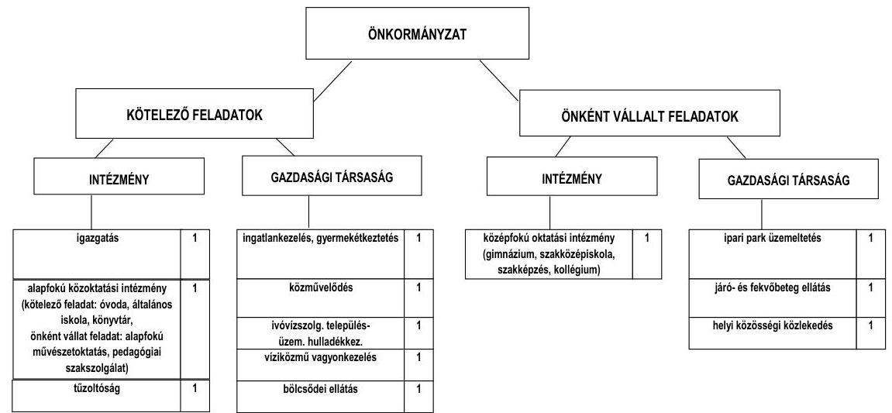

[^0]
[^0]:    ${ }^{8}$ A bekezdésben szereplő önkormányzati szintű működési kiadás összege a kisebbségi önkormányzat 2010. évi múködési kiadásával tér el az 1. számú mellékletben szereplő, zárszámadási rendelet szerinti 2010. évi múködési kiadás összegétől.

---

Az Önkormányzat feladatait 2011. június 30 -án (a Polgármesteri hivatallal együtt) négy költségvetési szervvel, hat gazdasági társasággal, a többcélú társulás és a megyei önkormányzat szociális feladatokat ellátó intézményeivel, vállalkozó háziorvosok útján, továbbá - feladatellátási szerződéssel - két olyan gazdasági társasággal látta el, amelyekben tulajdonosi részesedéssel nem rendelkezett. Az intézmény-összevonások és feladatátadások következtében 2007. január 1-jéről 2011. június 30 -ára a költségvetési szervek száma 18 -ról 4 -re, a feladatellátás telephelyeinek száma 47 -ről 28 -ra csökkent.

Az Önkormányzatnak 2010. december 31-én hat gazdasági társaságban volt $75 \%$ feletti tulajdoni aránya, amelyekből négy társaságban kizárólagos tulajdonos. További öt társaságban rendelkezett 50\% alatti tulajdoni hányaddal, amelyek az önkormányzati feladatellátásban nem vettek részt.

A minősített többségi tulajdoni hányadot meghaladó önkormányzati gazdasági társaságok száma a 2007. január 1-jei kettőről 2011. június 30 -ára hatra növekedett, mivel a kötelező és az önként vállalt feladatok ellátására az Önkormányzat a 2007. évben alapított egy, 2009-ben kettő gazdasági társaságot, egyben pedig a 2009. évben kizárólagos tulajdont szerzett. A gazdasági társaságok létesítése az Önkormányzat pénzügyi egyensúlyi helyzetére nem volt hatással, mivel - a számukra átadott feladatokhoz az 550,9 millió Ft átadott múködési célú pénzeszköz levonása mellett - összességében az Önkormányzat tájékoztatása alapján csak 4,8 millió Ft kiadáscsökkenést eredményezett.

Az Önkormányzat múködési kiadásokra 2010-ben 3135,3 millió Ft-ot fordított, amely 118,5 millió Ft-tal ( $3,1 \%$-kal) volt kevesebb a 2007-2009. évek kiadási átlagánál. Az egyes közszolgáltatások 2007. és 2010. évi kiadásainak finanszírozási forrásösszetételét a következő ábra szemlélteti:
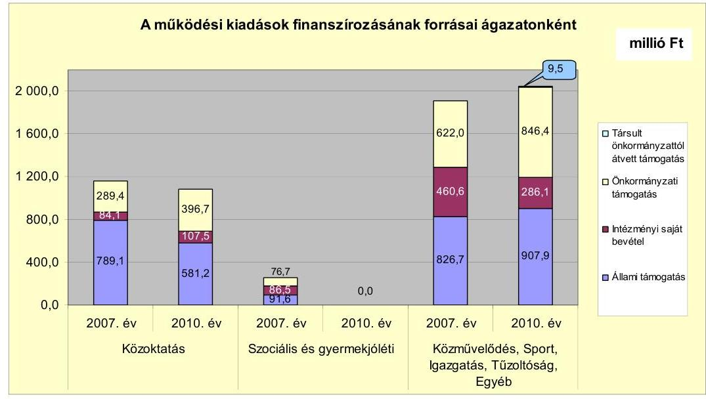

A közoktatási ágazat múködési kiadásait finanszírozó forrásokon belül az állami támogatás összege a 2007-2009. évi átlagosan 755,3 millió Ft-ról a 2010. évre 174,1 millió Ft-tal csökkent a tanulói létszám csökkenése miatt. Az intézményi saját bevétel 23,4 millió Ft-os növekedését a kompetencia alapú oktatás bevétele eredményezte. Az önkormányzati támogatás a 2007-2009. évi átlago-

---

san 306,2 millió Ft-ról a 2010. évre 90,5 millió Ft-tal növekedett, mivel az Önkormányzat a csökkenő tanulói létszám miatti állami támogatás kiesést nem a közoktatási kiadások racionalizálásával (pl. tanulócsoportok összevonásával), hanem az önkormányzati támogatás növelésével ellensúlyozta. A szociális és gyermekjóléti ágazatban kiadás a 2010. évben azért nem jelentkezett, mert a feladatot 2007 augusztusától a többcélú társulás, illetve a megyei önkormányzat intézménye, továbbá gazdasági társaság útján látták el. A feladatellátást a 2007-2011. év I. félévében a Polgármesteri hivatalban kimutatott 63,6 millió Ft összegű pénzeszközátadással támogatták. A közművelődési, sport, igazgatási, tűzoltósági, egyéb feladatoknál a 2010. évben a közművelődési, sport feladatok gazdasági társaságnak történt átadása miatti állami támogatás csökkenésének, valamint az Önkormányzat által folyósított szociális és gyermekvédelmi ellátásokhoz kapcsolódó állami támogatás növekedésének együttes hatása okozta az állami támogatás 81,2 millió Ft-os növekedését. Az intézményi saját bevétel 2010-ben a feladatok gazdasági társaságokhoz történő átadása miatt csökkent 174,5 millió Ft-tal. Döntően emiatt emelkedett az ágazatban az önkormányzati támogatás a 2010. évben 224,4 millió Ft-tal, mivel a feladatok finanszírozása pénzeszközátadásként jelent meg. A körjegyzőséghez tartozó Mesterszállás Község Önkormányzata a 2010. évben 9,5 millió Ft-tal járult hozzá az igazgatási feladatokhoz.

A 2007. január 1. és 2011. június 30. közötti időszakban a kötelező és önként vállalt feladatok ellátását biztosító szervezeti keretekben, a feladatellátás módjában bekövetkezett 2007. és 2009. évi változások az Önkormányzat pénzügyi egyensúlyi helyzetét - az Önkormányzat adatszolgáltatása szerint - összességében 261,7 millió Ft-tal javították. Az Önkormányzat pénzügyi egyensúlyi helyzetére a 2009-ben megvásárolt kórházat üzemeltető kft. 2011. június 30-ig nem jelentett érdemi kockázatot. A kórházat üzemeltető kft. fennálló szállítói és hiteltartozásai, peres eljárásokból eredő kötelezettségei azonban a későbbiekben pénzügyi kockázatot hordozhatnak az Önkormányzat számára.

Az Önkormányzatnál a folyó költségvetés egyenlege (működési jövedelem) 2008-2009-ben forrástöbbletet, 2007-ben és 2010-ben múködési forráshiányt mutatott.
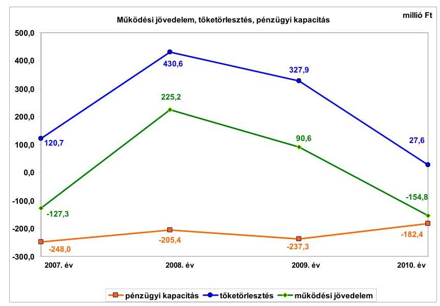

---

A múködési jövedelem 352,5 millió Ft-os növekedését 2007-ről 2008-ra elsősorban az árfolyamnyereség, az iparűzési adó bevételi többlet, a megyei önkormányzatnak, többcélú társulásnak átadott szociális feladatok és a gazdasági társaságnak átadott bölcsőde miatti kiadási megtakarítás okozta. A múködési jövedelem 2009. és 2010. évi folyamatos csökkenése alapvetően a forrásszabályozás változása és a tanulói, ellátotti létszámcsökkenés miatt kieső normatív állami hozzájárulásból származott. A gazdasági válság közvetve hozzájárult az iparűzési adóbevétel, így a működési jövedelem folyamatos csökkenéséhez a 2009-2010. években. Az Önkormányzat tőketörlesztése 2008-ban a folyószámlahitel kötvényforrásból történt törlesztése, 2009-ben a társulati hitel kifizetése miatt emelkedett meg az előző évhez képest. A pénzügyi kapacitás a vizsgált időszakban folyamatosan negatív volt, jelentősebb eltérések nélkül, mivel a múködési jövedelem csökkenésével párhuzamosan csökkent a tőketörlesztési kötelezettség is 2010-re.

A felhalmozási költségvetés bevételeit, kiadásait és egyenlegét 2007-2010 között évről évre a következő ábra szemlélteti:
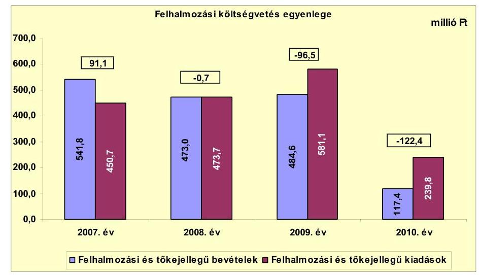

Az Önkormányzat felhalmozási költségvetésének egyenlege folyamatosan növekvő forráshiányt mutatott a 2008. évtől. A 2009. évi forráshiány 95,8 millió Ft-os növekedésére az előző évhez képest elsősorban a 32,4 millió Ft telekvétel-ár-előleg visszatérítés, a tűzoltóautó vásárlására nyújtott 17,2 millió Ft támogatás, a Teleki Gimnázium 126,1 millió Ft-tal növekvő felújítási kiadása voltak hatással. Befolyásolta még az egyenleget a 2008-ban befejeződött újvárosi csapadékcsatorna beruházás 210,7 millió Ft-os kiadáscsökkenése és Bodzáskert csapadékcsatorna beruházás 2008-ról 2009-re 145,2 millió Ft-tal növekvő kifizetése. A forráshiány 2009-ről 2010-re 25,9 millió Ft-tal emelkedett az EU-s és hazai projektek támogatásának megelőlegezése, saját forrásának biztosítása miatt. A 2008-2010. évi forráshiányra az előző évi pénzmaradvány igénybevétele nyújtott fedezetet. A 2010. évi felhalmozási bevételek és kiadások alacsony összegét a késedelmes szállítói finanszírozás, illetve a 90 napos fizetési határidő miatt 2011. évre áthúzódó beruházási kifizetések okozták.

Az Önkormányzat pénzügyi egyensúlyának 2008. évi javulásához minimális mértékben hozzájárult, hogy a folyó bevételek összege a 2007. évi

---

3424,6 millió Ft-ról 2008-ra 1,9\%-kal, 65,2 millió Ft-tal növekedtek elsősorban az iparűzési adóbevételi többlet és a realizált árfolyamnyereség növelő hatására. 2008-tól 2010-ig folyamatosan csökkent a folyó bevétel, a 2008. évi 3489,8 millió Ft-ról 2009-re 3390,1 millió Ft-ra, 2010-re 3094,0 millió Ft-ra. A 2008-2010 közötti bevételcsökkenést elsősorban a többcélú társulásnak, megyei önkormányzatnak és gazdasági társaságoknak átadott feladatokhoz kapcsolódó normatív költségvetési támogatás, térítési díj és áfa csökkenés, továbbá a forrásszabályozás változása és az ellátotti létszámcsökkenés miatt kieső normatív költségvetési támogatás okozta. A gazdasági válság hatására kieső iparúzési adó bevétel is kedvezőtlen hatással volt a folyó bevételekre.

A helyi adóbevételek aránya a folyó bevételekben a 2007-2009. években átlagosan $17,3 \%$ (593,7 millió Ft) volt, amely a 2010. évre 14,4\%-ra (499,1 millió Ft-ra) csökkent elsősorban az iparúzési adóbevétel-kiesés következtében. A helyi adóbevételek kedvezőtlen alakulása hatással volt a múködési jövedelem csökkenésére, az Önkormányzat pénzügyi egyensúlyi helyzetére.

Az Önkormányzat 2007-2011. év I. félév között nem kapott osztalékot a gazdasági társaságaitól. A képződött nyereség összegét eredménytartalékba helyezték az Önkormányzat döntése alapján.

A 2007-2011. június 30. közötti időszakban a felhalmozási bevételek döntő része költségvetési támogatásból, illetve felhalmozási célra átvett pénzeszközből származott. A felhalmozási bevételek összege a 2007. évi 541,8 millió Ft-ról 2008-ra 473,0 millió Ft-ra csökkent, 2009-re 484,6 millió Ft-ra emelkedett, majd 2010-ben 117,4 millió Ft volt. A felhalmozási bevételek 2009-ről 2010-re 367,2 millió Ft-tal csökkentek. Ezt döntően a 2009. évben a társulati hitelhez kapcsolódóan befolyt 309,3 millió Ft egyszeri bevétel okozta, amely a 2010. évben már nem jelentkezett.

A felhalmozási bevételek a vizsgált időszakban nem nyújtottak fedezetet a felhalmozási kiadásokra, ezért az Önkormányzat felhalmozási költségvetése az ellenőrzött időszakban hiányt mutatott.

Az Önkormányzat folyó kiadásai a 2007. évi 3551,9 millió Ft-ról 2008-ra 287,3 millió Ft-tal, 3264,6 millió Ft-ra csökkentek a 2007-ben többcélú társulásnak, megyei önkormányzatnak és egy gazdasági társaságnak átadott önkormányzati intézmények, illetve a közoktatási intézményekben végrehajtott létszámcsökkentés kiadáscsökkentő hatására. A folyó kiadások a 2009-2010. években minimális mértékben változtak, a 2009. évre 34,9 millió Ft-tal emelkedtek, a 2010. évre 50,7 millió Ft-tal csökkentek az előző évhez képest. A minimális változást döntően az okozta, hogy 2009-ben az önkormányzati gazdasági társaságoknak átadott önkormányzati feladatok személyi juttatás, járulék és dologi kiadáscsökkentő hatását mérsékelte a feladatátadáshoz és a pénzbeni szociális ellátásokhoz kapcsolódó pénzeszközátadások növekedése. A pénzügyi egyensúlyi helyzetet a folyó kiadások - feladatátadás miatti - csökkenése kedvezően érintette a vizsgált időszakban, mivel azokhoz a bevételcsökkenés és pénzeszközátadás figyelembevételével önkormányzati szinten megtakarítás kapcsolódott.

---

A pénzügyi egyensúlyi helyzet alakulását jelentősen befolyásolta az Önkormányzat elmúlt időszaki fejlesztési tevékenysége. A befejezett fejlesztések 2,1\%-át pénzintézeti forrásokból fedezték. A 2010. december 31-ig megvalósított 2957,7 millió Ft értékű fejlesztés és felújítás forrása minimális pénzintézeti forrás mellett 579,4 millió Ft saját bevétel (19,5\%), 286,3 millió Ft EU-s támogatás és 2031,0 millió Ft hazai támogatás (68,7\%) volt. A 2010. december 31-én folyamatban lévő fejlesztési feladatok végrehajtására 2007-2010. között 55,7 millió Ft kiadást teljesítettek, amelyre EU-s és hazai támogatást 46,2 millió Ft összegben ( $82,9 \%$ ) vettek igénybe. Az EU-s és hazai támogatás kiutalások 2010. évi késedelme miatt a fejlesztések előfinanszírozása likviditási gondot okozott az Önkormányzatnál. A kifizetések teljesítéséhez a támogatási előlegek és az átmenetileg szabad pénzeszközök igénybevételén túl likvidhitel igénybevételére is szükség volt. A pályázati pénzeszközből megvalósított fejlesztéseknél a legnagyobb pénzügyi kockázatot a folyószámlahitellel történő előfinanszírozás hordozza magában az Önkormányzat számára.

Az Önkormányzat 2010. december 31-én folyamatban lévő fejlesztéseihez a 2010. évet követően esedékes kötelezettség-vállalásainak összege 839,9 millió Ft volt, melynek forrásait az alábbi ábra szemlélteti:
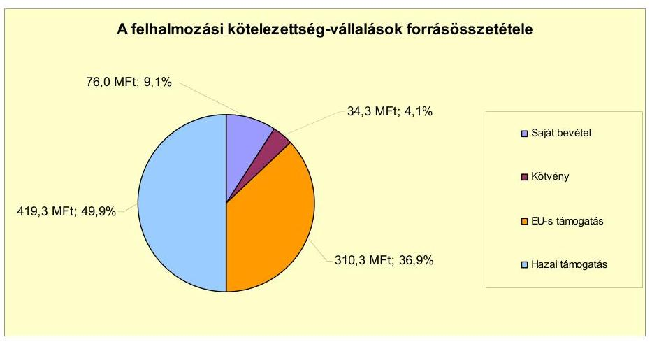

Az Önkormányzat 2010. év végén elbírálás alatt álló, illetve 2011-ben benyújtott pályázatainak tervezett teljes bekerülési költsége 855,5 millió Ft volt. Ebből 16,5 millió Ft-ot a kibocsátott kötvény bevételéből, 565,8 millió Ft-ot EU-s támogatásból, 174,6 millió Ft-ot hazai támogatásból és 98,6 millió Ft-ot saját bevételből terveznek biztosítani. Az Önkormányzat által vállalt jövőbeni fejlesztési kiadások saját forrásának fedezete a kötvényforrásból és hozamából származó maradvány felhasználása után nem megoldott, ezért szükséges a tervezett beruházások felülvizsgálata. A saját forrás fedezete nem lesz biztosított már rövid távon sem, amennyiben a kötvényforrásból és hozamából származó maradványt - az eddigi gyakorlat szerint - a fejlesztési kiadások mellett működésre és tőketörlesztésre is igénybe veszik. Az Önkormányzat a 2011. év I. félévében saját, meglévő forrásból 28,1 millió Ft értékben indított el és valósított meg felújítást, beruházást, amelyeket saját bevételből finanszírozott.

Az önkormányzati feladatellátásban 2009-től résztvevő gazdasági társaságoknak átadott múködési célú pénzeszközök a pénzügyi egyensúlyi helyzet alakulására a 2009-2010. években még nem voltak érdemi hatással, mivel a gazda-

---

sági társaságoknak átadott múködési célú pénzeszközök növekedése mellett a feladatátadásokhoz kapcsolódó személyi juttatás, járulék és dologi kiadások is csökkentek az Önkormányzatnál. A pénzeszközátadásokra szerződés alapján utólagos elszámoltatás mellett került sor.

Az Önkormányzat az önköltség alatti ár- és díjmegállapítás ellentételezésére nem adott át pénzeszközt társaságainak a vizsgált években. A 2010. évi veszteségrendezésre az Önkormányzat a Kórház Nkft. felé 18,5 millió Ft összegben, illetve a helyi tömegközlekedést biztosító Jászkun Volán Zrt. felé 6,5 millió Ft öszszegben vállalt kötelezettséget. A Kórház Nkft. felé teljesítendő 18,5 millió Ft-ot az Önkormányzat nem fizette ki, annak jogosságát vitatja. Az Önkormányzat a 2007-2011. év I. félév közötti időszakban veszteségrendezési céllal nem hajtott végre tőkeemelést. Az Önkormányzat pénzügyi egyensúlyi helyzetére kockázatot jelenthet, hogy az Ipari Park Kft. 2007-2008-ban kölcsönből, majd 2009-2010-ben elsősorban tőkeemelésből finanszírozta a múködését, az ipari park hasznosításából elért bevétele nem fedezte a múködés költségét és az aktivált beruházások értékcsökkenését. Ezek hatására folyamatosan növekvő -2007-ben -23,2 millió Ft, 2008-ban -35,9 millió Ft, 2009-ben -64,4 millió Ft és 2010-ben -66,6 millió Ft - negatív eredménytartalékot mutatott ki.

Az Önkormányzat mérleg szerinti pénzintézettel szembeni kötelezettsége a 2006. év végi 860,9 millió Ft-ról 2011. év I. félév végére 2541,9 millió Ft-tal, 3402,8 millió Ft-ra emelkedett a kötvénykibocsátás, az átvállalt és felvett hitelek és a CHF-ben fennálló kötvénykötelezettség után elszámolt árfolyamváltozás hatására. A pénzintézeti kötelezettségek növekedése nem járult hozzá az önkormányzati vagyon gyarapodásához, mivel az Önkormányzat befektetett eszközeinek mérlegben kimutatott nettó értéke a vizsgált időszakban csak 26,8 millió Ft-tal nőtt. Az Önkormányzatnál a Számv. tv. 60. § (2) bekezdésében és az Áhsz. 33. § (1) bekezdésében foglaltak ellenére nem végezték el 2008-2009-ben a devizában fennálló kötvénykötelezettség év végi értékelését, ezért az érintett években a mérleg szerinti pénzintézeti kötelezettségek állománya nem tartalmazta az árfolyamváltozások hatását. A kötvénykötelezettség után 2010ben már elszámolták az árfolyamváltozást, amelynek összege 822,5 millió Ft volt. A fennálló pénzintézettel szembeni kötelezettségek egy kötvénykibocsátásból, kilenc hosszú lejáratú - a 2007. évet megelőzően felvett - hitelből, négy 2008-ban felvett beruházási hitelből, valamint folyószámla- és munkabérhitelből keletkeztek.

Az Önkormányzat 2008-ban tett pénzintézettel szembeni kötelezettségvállalásai közül a kötvénykibocsátásra versenyeztetést követően képviselő-testületi döntés alapján került sor. A négy 2008. évi hitelfelvétel során az Önkormányzat az akkori számlavezető banktól kért ajánlatot az MFB által bonyolított Sikeres Magyarország Önkormányzati Infrastruktúra Hitelprogram keretében nyújtott kedvezményes kamatozású fejlesztési hitelekre. A hitelfelvétel versenyeztetés nélkül történt meg, mivel a hitelek becsült költsége nem érte el a közbeszerzési értékhatárt. A lehívott hiteleket a hitelcéloknak megfelelően felhasználták. Az Önkormányzat a folyószámla vezetését a $\mathrm{Kbt}_{1}$-ben foglaltak ellenére - közbeszerzési eljárás lebonyolítása nélkül - adta át másik bank részére 2008. december 1-jétől. A kötvénykibocsátásról szóló előterjesztésekben a kötelezettségvállalás kamat- és árfolyamkockázatait, a hitelfelvételek előterjesztésében a kamatkockázatot bemutatták. A 2008-2011. év I. félévében az Önkormányzat

---

negyedévente kapott tájékoztatást a kötvénykibocsátáshoz és -befektetéshez kapcsolódó kamat- és árfolyamkockázatok alakulásáról.

Az Önkormányzat a kötvénykibocsátás 1800,0 millió Ft bevételéből és a képződött 412,0 millió Ft hozamból az adatszolgáltatás szerint 1223,8 millió Ft-ot - a működési célú igénybevételek miatt csak részben a kötvénykibocsátás céljának megfelelően - használt fel 2011. június 30-ig. A kötvénybevétel kamattal, hozammal növelt összegéből 2011. június 30-án meglévő maradvány 988,2 millió Ft. A 800,0 millió Ft zárolt óvadéki betét levonását követően a kötvénycéloknak megfelelően szabadon, banki korlátozás nélkül felhasználható összeg 188,2 millió Ft.

Az Önkormányzat 2011. június 30-án HUF-ban a pénzintézet felé fennálló kötelezettségeiből 84,0 millió Ft tőkét, 72,0 millió Ft kamatot és 4,2 millió Ft egyéb költséget fizetett meg. A CHF-ben fennálló kötvénykötelezettségéből 581,2 ezer CHF (115,0 millió Ft) kamat, 61,9 ezer CHF (11,2 millió Ft) és 45,7 millió Ft egyéb költség, valamint 5,8 millió Ft egyszeri díjfizetés történt. A hosszú lejáratú kötelezettségek közül a kötvény törlesztése még nem kezdődött meg. Az először 2013. szeptember 30-án esedékes 196 ezer CHF összegben.

Az Önkormányzat költségvetésének pénzügyi egyensúlyát a vizsgált időszakban folyószámlahitel, munkabér-megelőlegezési hitel és egy alkalommal rövid lejáratú hitel igénybevételével tudta biztosítani. A 30,0 millió Ft összegű rövid lejáratú hitelt 2007. szeptember 18-án vette fel és 2007. november 15-én, illetve 2008. március 31-én fizette vissza.

A folyószámla- és munkabér-megelőlegezési hitel igénybevétele a 2007-2011. év I. félévében az alábbiak szerint alakult:

| Megnevezés | 2007. év | 2008. év | 2009. év | 2010. év | 2011. év I.   félév |
| :-- | :--: | :--: | :--: | :--: | :--: |
| Folyószámlahitel |  |  |  |  |  |
| Keretösszeg január 1-jén (millió Ft-ban) | 460,0 | 600,0 | 150,0 | 150,0 | 200,0 |
| Átlagos napi állomány (millió Ft-ban) | 498,4 | 389,4 | 31,7 | 78,8 | 223,3 |
| Folyószámla hitellel zárt napok száma (nap) | 365 | 332 | 202 | 304 | 181 |
| Egyenteg (állomány) | 368,9 | 0,0 | 0,0 | 176,2 | 235,5 |
| Munkabér-megelőlegezési hitel |  |  |  |  |  |
| Keretösszeg január 1-jén (millió Ft-ban) | 0,0 | 0,0 | 50,0 | 50,0 | 50,0 |
| Átlagos napi állomány (millió Ft-ban) | 61,3 | 0,0 | 8,4 | 14,7 | 50,0 |
| Munkabér-megelőlegezési hitellel zárt napok száma (nap) | 299 | 0 | 61 | 107 | 181 |
| Egyenteg (állomány) | 0,0 | 0,0 | 0,0 | 50,0 | 50,0 |

A likviditás biztosítása az Önkormányzatnak 111,7 millió Ft kamatkiadás és 7,1 millió Ft egyéb költség fizetésének kötelezettségével járt. Az 531,5 millió Ft összegű folyószámlahitelt 2008. november 27-én a kötvénybevételből visszafizették. A folyószámlahitel kötelezettséget kedvezőbb kondíciókkal rendelkező kötvénykötelezettségre váltották át. Ennek hatására az Önkormányzat pénzügyi pozíciója javult, az adósságszolgálat szerkezete kedvezőbbé vált. A vizsgált időszak végére azonban a folyószámlahitel összege - az időközben végrehajtott megtakarítási intézkedések ellenére - újratermelődött. Az állandósult folyószámlahitel növeli a banki kitettség kockázatát. Az Önkormányzat a 2011. év I. félév végi szállítói tartozása 124,1 millió Ft, amelyből a lejárt tartozása 18,9 millió Ft volt. Átütemezett szállítói tartozása az Önkormányzatnak nem volt.

---

Az Önkormányzat kötelezettségeinek 2010. december 31-i, valamint 2011. június 30-i állományát és várható alakulását a kötelezettségek lejáratáig a következő táblázat szemlélteti:

| Megnevezés | Állomány   2010. december 31-én |  | Állomány 2011. június 30-án |  | Várható kötelezettség 2011-2013. években |  | Várható kötelezettség 2014. évtől |  |
| :--: | :--: | :--: | :--: | :--: | :--: | :--: | :--: | :--: |
|  | HUF-ban   (millió Ft-ban) | Devizában (összege, ezer CHF-ben) | HUF-ban (millió Ftban) | Devizában (összege, ezer CHF-ben) | HUF-ban (millió Ft-ben) | Devizában (összege, ezer CHF-ben) | HUF-ban (millió Ft-ben) | Devizában (összege, ezer CHF-ben) |
| Pénzintézeti kötelezettségek |  |  |  |  |  |  |  |  |
| Folyószámlatritet | 176,2 |  | 235,5 |  |  |  |  |  |
| Munkabsirhtet | 50,0 |  | 50,0 |  |  |  |  |  |
| Viziölemú társulati hitet | 455,8 |  | 455,8 |  | 495,7 |  | 0,0 |  |
| Beruházási hitelek (likanes Magyarországért Hitetprogram | 50,2 |  | 38,9 |  | 49,3 |  | 4,0 |  |
| "Meditár Város Fajlőzéséért" kötvény |  | 11777,0 |  | 11777,0 |  | 663,0 |  | 12981,9 |
| Pénzintézeti kötelezettségek összesen HUF-ben: | 732,2 |  | 780,2 |  | 545,0 |  | 4,0 |  |
| Pénzintézeti kötelezettségek összesen CHF-ben: |  | 11777,0 |  | 11777,0 |  | 663,0 |  | 12981,9 |
| Lizing |  | 18,6 |  | 15,3 |  | 20,4 |  | 0,0 |
| Biztosítékok |  |  |  |  |  |  |  |  |
| Azotelség | 89,2 |  | 73,9 |  | - |  | - |  |
| Biztosítékok összesen: | 89,2 |  | 73,9 |  | - |  | - |  |
| Szállitói tartozás | 192,7 |  | 124,1 |  | 124,1 |  | 0,0 |  |
| Pénzintézeti kötelezettségek hiteleki, biztosíték, szállitói tartozás összesen HUF-ben: | 1014,1 |  | 978,2 |  | 669,1 |  | 4,0 |  |
| Pénzintézeti kötelezettség (kötvényi, lizing összesen CHF-ben: |  | 11795,6 |  | 11792,3 |  | 683,4 |  | 12981,9 |

Az Önkormányzat pénzintézetekkel szemben fennálló tőke- és kamatkötelezettsége a 2011. év I. félév végén 780,2 millió Ft és 11777,0 ezer CHF volt. Ezek várható kötelezettsége (tőke és kamat) a legutóbbi kamatfizetés feltételei alapján a 2011-2013. években 545,0 millió Ft és 663,0 ezer CHF. Az Önkormányzat fizetési kötelezettsége 2011. június 30-án szállítói tartozások címén 124,1 millió Ft, ebből a lejárt szállítói tartozás 18,9 millió Ft volt. A 2011-2013. évek kötelezettségeinek teljesítésére figyelembe vehető a képződő működési jövedelem, 67,5 millió Ft mérlegben kimutatott - behajtható - követelésállomány és a forgalomképes nettó ingatlanvagyon. A jelenlegi gazdasági helyzetben a kötelezettségek fedezetének biztosításánál kockázatot jelenthet a követelésállomány behajthatósága, illetve a forgalomképes ingatlanvagyon valós forgalomképessége. Az Önkormányzat pénzintézettel szembeni (kötvény) és egyéb (lizing) kötelezettségei teljesítésének kockázata emelkedhet az azokat érintő árfolyamemelkedés hatására. A kötvénykötelezettség árfolyamának alakulásáról negyedévente tájékoztatták a Képviselő-testületet, azonban a lízingkötelezettségéről nem. A 2010. év végén az 1117,9 millió Ft pénzkészlet - részben a 800,0 millió Ft-os óvadéki betét megőrzési kötelezettsége, részben a fennmaradó összeg feladattal terheltsége miatt - a törlesztések fedezeteként nem volt figyelembe vehető. Az Önkormányzatnál nem biztosított a vállalt pénzintézettel szembeni és egyéb kötelezettségek fedezete az erre igénybe vehető működési jövedelem prognosztizált csökkenése, illetve a 2013-tól kezdődő kötvénytörlesztés - árfolyam-emelkedés hatására várható - növekedése következtében. Ez már rövid távon (a 2011-2013. években) veszélyezteti az Önkormányzat pénzügyi egyensúlyát.

Az Önkormányzat 73,9 millió Ft összegben vállalt kezességet a Kórház Nkft. által felvett hitelekhez, amely rövid és hosszú távon is kockázatot jelent a pénz-

---

ügyi egyensúlyra. Az Önkormányzat a Kórház Nkft. által felvett hitelekhez tett kezességvállalás során betartotta - Ötv. 88. § (2) bekezdésében ${ }^{9}$ foglaltaknak megfelelően - az adósságot keletkeztető kötelezettségvállalásának felső határát.

Az Önkormányzat jelenleg ismert pénzintézettel szembeni kötelezettségei (tőke, kamat) a 2014. évtől: 4,0 millió Ft és 12981,9 ezer CHF. Az Önkormányzat tájékoztatása szerint a tőke- és kamatkötelezettségek teljesítésének forrása a saját bevételek figyelembevételével képződő működési jövedelem. Ez növelhető még a törlesztéskor meglévő forgalomképes ingatlanvagyon értékesítésével.

A 2014-től esedékes jelenleg ismert pénzintézettel szembeni kötelezettségek teljesítését jelenleg nem látjuk biztosítottnak, mivel az Önkormányzat pénzügyi kapacitása a vizsgált időszakban negatív volt, és a növekvő tőketörlesztési kötelezettségek hatására - ha a pénzügyi feltételek nem változnak - ez csak kedvezőtlenebbé válhat. A múködési jövedelem a 2008. évtől kezdődően folyamatosan csökken a normatív költségvetési támogatás csökkenése miatt. Ez a jelenleg hatályos forrásszabályozás alapján az Önkormányzat pénzügyi egyensúlyának további romlását vetíti előre. A pénzügyi egyensúlyi helyzetre kedvezőtlenül hat, hogy a folyószámlahitellel zárt napok száma a 2009. évi 202 napról 2010re 304 napra emelkedett, 2011. év I. félévben folyamatosan fennállt. Ezzel egyidejúleg a folyószámlahitel záró állománya a 2010. évi 176,2 millió Ft-ról 2011. június 30-ra 235,5 millió Ft-ra nőtt.

Az Önkormányzatnak 2011. június 30-án 15,3 ezer CHF összegben állt fenn lí zingtartozása egy személygépjármú beszerzése miatt. Az Önkormányzat a Számv. tv. 60. § (2) bekezdésében és az Áhsz. 33. § (1) bekezdésében foglaltak ellenére a 2008-2010. években a CHF-ben fennálló lízingkötelezettség év végi értékelését nem végezte el. A lízingkötelezettség 2010. december 31-én el nem számolt árfolyamváltozása - a $222,68 \mathrm{Ft} / \mathrm{CHF}$ árfolyamon - 1,5 millió Ft volt. A 2011-2013. években esedékes lízingkötelezettség 20,4 ezer CHF.

Az elengedett követelések összege a 2007-2011. június 30. közötti időszakban 154,0 millió Ft volt, amelyből a behajthatatlan követelések 18,0 millió Ftot tettek ki. Felszámolás, megszűnés miatt 123,1 millió Ft összegű helyi adót, gépjárműadót, késedelmi pótlékot, bírságot és a Kórháznak nyújtott kölcsönt engedtek el. A felszámolás, megszűnés miatt elengedett követelésekből 110,3 millió Ft-ot tett ki a Kórháznak a 2001-2007. évek között nyújtott kölcsön elengedése. A behajthatatlan követeléseket és a felszámolás, megszűnés miatti követelésekből 12,8 millió Ft összeget osztályvezetői feljegyzés alapján engedték el, illetve törölték az Önkormányzatnál. Ezzel megsértették az Art. 81., 146. § (1), továbbá a 162. § (1) bekezdéseit, valamint a Hatv. 140. § (2) bekezdésének r) pontját, illetve az Önkormányzat 2007-2011. évi költségvetéséről szóló rendeletek 11. § (2) bekezdés b) pontjának előírásait.

Az Önkormányzat 2007. év januárjában a Kórház január havi múködéséhez 25,0 millió Ft összegű kölcsönről döntött, amelyből az intézmény 6,0 millió Ft-ot vett igénybe. Ebből az intézményt üzemeltetésre átvevő gazdasági társa-

[^0]
[^0]:    ${ }^{9}$ 2012. január 1-jétől a Stabilitási tv. 10. § (3) bekezdés.

---

ság 2007. június 30-án 1,6 millió Ft-ot visszafizetett. Az Önkormányzat a kórházat a 2007-2009. évek között múködtető gazdasági társaságnak és a Kórház Nkft.-nek kölcsönt nem nyújtott. Az Ipari Park Kft.-nek nyújtott tagi kölcsön összege a 2007. és a 2008. években összesen 9,6 millió Ft volt.

A kötelezettségek növekedése mellett a minősített többségi tulajdonú hat gazdasági társaság kötelezettségei is befolyásolhatják az Önkormányzat pénzügyi egyensúlyát, amelyeket a következő táblázat mutat be:
millió Ft-ban

| Megnevezés | Állomány   2010. december 31-én | Állomány   2011. június 30-án | Várható kötelezettség   2011-2013. években | Várható   kötelezettség   2014. évtől |
| :-- | :--: | :--: | :--: | :--: |
| Folyószámla hitel | 0,0 | 35,8 |  |  |
| Egyéb likvid hitel | 74,2 | 0,0 |  |  |
| Hosszú lejáratú hitel | 0,0 | 38,1 | 25,0 | 22,5 |
| Pánzintézeti kötelezettségek   összesen: | 74,2 | 38,1 | 25,0 | 22,5 |
| Szállítói tartozás | 184,0 | 124,4 | 124,4 |  |
| Pánzintézeti kötelezettségek,   szállítói tartozások összesen: | 258,2 | 162,5 | 149,4 | 22,5 |

Az Önkormányzat pénzügyi egyensúlyára kockázatot jelenthet a jövőben, hogy a Kórház Nkft. lejárt szállítói állománya 2011. június 30-án 16,5 millió Ft volt, 35,8 millió Ft folyószámlahitellel gazdálkodott és 38,1 millió Ft hosszú lejáratú forgóeszközhitele is volt. A hat minősített többségi önkormányzati tulajdonú gazdasági társaságnak összesen 124,4 millió Ft szállítói tartozást kell rendezniük. Esetleges csőd, vagy felszámolási eljárás esetén a bíróság korlátlan és teljes felelősséget állapíthat meg az Önkormányzat terhére. A kötelezettségek nagyságrendjére további pénzügyi kockázatot jelent az Ipari Park Kft. 66,6 millió Ft, a Kórház Nkft. 11,9 millió Ft összegű negatív eredménytartaléka, az esetleg ebből fakadó veszteségrendezési kötelezettség.

Az Önkormányzat jövőbeni pénzügyi egyensúlyi helyzetét befolyásolhatja az elavult eszközök pótlási kötelezettsége. Az Önkormányzat 2007-2010. évek között eszközállománya után 1349,8 millió Ft összegű értékcsökkenést mutatott ki, miközben az elhasznált eszközök pótlására 355,8 millió Ft-ot fordított. A 2007-2010. évek között aktivált felújítások, beruházások értéke 1156,1 millió Ft volt. Az eszközök használhatósági foka önkormányzati szinten a 2007. évi 84,1\%-ról 2010-re 74,4\%-ra csökkent, amely az Önkormányzat kezelésében lévő eszközök használhatóságának romlását jelezte.

Az Önkormányzat az ellenőrzött időszakban kiadási megtakarítást eredményező és bevételt növelő intézkedéseket tett. A 2007-2011. év I. féléve között tett intézkedések hatására - adatszolgáltatása szerint - 19,8 millió Ft bevételi többletet, továbbá 516,4 millió Ft kiadási megtakarítást mutattak ki. A kiadási megtakarítások 48,9\%-a az elrendelt álláshelycsökkentések eredménye. Az álláshelycsökkentő intézkedések 2007-2011. év I. féléve között önkormányzati szinten összesen 629 álláshely (ebből 4 üres álláshely) megszüntetését jelentették. Egyes közszolgáltatási területeken azonban a feladatellátáshoz kapcsolódóan 51 álláshelynövekedés is volt (a közoktatási ágazatban, a Polgármesteri hivatalon belül a körjegyzőségi feladatok miatt és a tűzoltóságnál), amelyek 51 fő létszámnövekedéssel jártak. Mindennek következtében az időszak álláshelyeinek száma 578 fővel csökkent. A bevételnövelő intézkedések a

---

helyi adók mértékének emeléséhez, a kedvezmények csökkentéséhez, illetve megszüntetéséhez kapcsolódtak. Az Önkormányzat által eddig tett intézményszerkezeti átalakítások, a feladatellátás átszervezése, a kiadáscsökkentő és bevételnövelő intézkedések nem biztosítanak elegendő forrást a pénzügyi egyensúly helyreállításához.

Az utóellenőrzés a pénzügyi egyensúly javítására tett kettő szabályszerűségi javaslat hasznosítására terjedt ki, amelyeket megvalósítottak.

Az Önkormányzat pénzügyi egyensúlyi helyzetét összegezve a következők emelhetők ki:

Mezőtúr Város Önkormányzatának pénzügyi egyensúlyi helyzete rövid távon veszélyeztetett.

A folyó bevételek nem nyújtottak fedezetet a folyó kiadásokra és az adósságszolgálatra. Múködését az állandósult és növekvő folyószámlahitel, valamint munkabérhitel igénybevételével tudta biztosítani.

A pénzügyi egyensúly megtartására, ezen belül múködésre a likvidhitelek mellett kötvényforrást, továbbá fejlesztési célra kötvényforrást és hosszú lejáratú hitelt vett igénybe. Növekedett az Önkormányzat adósságszolgálata, melyre nem biztosít fedezetet a múködési jövedelem.

Kockázatot jelent a hazai és EU-s támogatással megvalósuló beruházások előlegen túli előfinanszírozása folyószámlahitelből.

Gazdasági társaságai pénzügyi helyzete kockázatot hordoz az Önkormányzat számára. Az Ipari Park Kft. kezelésében lévő ingatlanok kihasználtsága alacsony, eredménytartaléka folyamatosan negatív volt. A Kórház Nkft. fennálló szállítói és hiteltartozásai, a peres eljárásokból eredő kötelezettségei az Önkormányzat számára helytállási kötelezettséget jelenthetnek.

Az Állami Számvevőszékről szóló 2011. évi LXVI. törvény 33. § (1) bekezdésében foglaltak értelmében a jelentésben foglalt megállapításokhoz kapcsolódó intézkedési tervet köteles az ellenőrzött szervezet vezetője összeállítani és azt a jelentés kézhezvételétől számított harminc napon belül az ÁSZ részére megküldeni. Amennyiben az intézkedési tervet határidőben nem küldi meg a szervezet, vagy az továbbra sem elfogadható, az ÁSZ elnöke a hivatkozott törvény 33. § (3) bekezdés a)-b) pontjaiban foglaltakat érvényesítheti.

# A 2011. június 30-i pénzügyi egyensúlyi helyzet alapján az ellenőrzés intézkedést igénylő megállapításai és javaslatai a következők: 

## a Polgármesternek

1. Az Önkormányzat nettó múködési jövedelme az elmúlt időszakban negatív volt. Az Önkormányzat által vállalt jövőbeni fejlesztési kiadások saját forrásának fedezete a kötvényforrásból és hozamából származó maradvány felhasználása után nem megoldott, ezért szükséges a tervezett beruházások felülvizsgálata. A saját forrás fedezete nem lesz biztosított már rövid távon sem, amennyiben a kötvényforrásból és hoza-

---

mából származó maradványt - az eddigi gyakorlat szerint - a fejlesztési kiadások mellett müködésre és tőketörlesztésre is igénybe veszik. Az Önkormányzat finanszírozásában a folyószámla és munkabér-megelőlegezési hitel állandósult, ezért a banki kitettség kockázata nőtt. A folyószámlahitel újratermelődése miatt az adósságszolgálat szerkezete romlott. Az Önkormányzat pénzintézettel szembeni (kötvény) és egyéb (lizing) kötelezettségei teljesítésének kockázata emelkedhet az azokat érintő árfolyam-emelkedés hatására. A kötvénykötelezettség árfolyamának alakulásáról negyedévente tájékoztatták a Képviselő-testületet, azonban a lízingkötelezettségéről nem. Az Önkormányzat által tett intézményszervezeti átalakítások, kiadáscsökkentő és bevételnövelő intézkedések nem biztosítanak elegendő forrást a pénzügyi egyensúly helyreállításához. Az önként vállalt feladatok magas aránya kockázatot jelenthet. Az Önkormányzatnál nem biztosított a vállalt pénzintézettel szembeni és egyéb kötelezettségek fedezete az erre igénybe vehető müködési jövedelem prognosztizált csökkenése, illetve a 2013-tól kezdődő kötvénytörlesztés - árfolyam-emelkedés hatására várható - növekedése következtében. Ez már rövid távon (a 2011-13. években) veszélyezteti az Önkormányzat pénzügyi egyensúlyát.

Javaslat:
Az Önkormányzat pénzügyi egyensúlyának gyors helyreállítása és hosszú távú fenntarthatósága érdekében kezdeményezze - felelősök és határidők megjelölésével - az alábbi intézkedések megtételét:
a) Tárja fel a bevételszerző és kiadáscsökkentő lehetőségeket. Intézkedjen a bevételek növelésére, a kintlévőségek behajtására, a kiadások csökkentésére;
b) Terjesszen a Képviselő-testület elé reorganizációs programot a kedvezőtlen pénzügyi folyamatok megállítására, a pénzügyi egyensúly gyors stabilizálására;
c) Képezzen egyensúlyi (elkülönített) tartalékot az adósságszolgálat teljesítése érdekében;
d) Vizsgálja felül teljes körűen a tervezett beruházásokat és azok fenntartásának jövőbeni pénzügyi kihatásait. Az Önkormányzat pénzügyi egyensúlyi helyzete szempontjából kedvező támogatás-finanszírozási lehetőségeket továbbra is vegye igénybe. Szükség esetén tegyen javaslatot a Képviselő-testületnek a tervezett beruházásokkal kapcsolatos döntések módosítására, amelyben figyelembe veszik az Önkormányzat pénzügyi lehetőségeit, és a kötelező feladatellátás elsődlegességét;
e) Vizsgálja meg az állandósult folyószámla- és likvid hitel hosszú távú kötelezettséggé történő átalakításának jogi lehetőségét, és a Stabilitási tv. 10. §-ában előírt feltételek fennállása esetén kezdeményezze a Kormánynál ennek engedélyezését;
f) Vizsgálja felül az intézményi szerkezetet és az intézményfinanszírozás módját. Tegyen javaslatot a Képviselő-testületnek a feladatellátás racionalizálására;
g) Tekintse át az önként vállalt feladatok finanszírozhatóságát a kötelező feladatellátás elsődlegességének biztosítása érdekében, mutassa be a Képviselő-testületnek a megoldás lehetőségeit és szükség esetén a gazdasági program módosításának igényét;

---

h) Kísérje figyelemmel a jövőbeni várható árfolyamkockázatokat, legalább félévente tájékoztassa a Képviselő-testületet azok alakulásáról;
i) Mutassa be havonta legalább három évre kitekintően kötelezettségeinek finanszírozási forrásait.
2. Az Önkormányzat a Kbt ${ }_{1}$ 23. §-ában és 3. számú melléklet 6/b. pontjában ${ }^{10}$ foglaltak ellenére - közbeszerzési eljárás lebonyolítása nélkül - adta át a folyószámla vezetését más pénzintézetnek 2008. december 1-jétől.

Javaslat:
Gondoskodjon arról, hogy a jövőben a számlavezető pénzintézetváltásra közbeszerzési eljárás alapján kerüljön sor a $\mathrm{Kbt}_{2} 7 . \S$ (1) bekezdésében és 3. számú melléklet 6/b. pontjában foglaltaknak megfelelően.
3. A 2007-2010. évek között az Önkormányzat felújításokra és az eszközök pótlására a kimutatott értékcsökkenés 26,4\%-ának megfelelő összeget fordított. Az eszközök használhatósági foka önkormányzati szinten a 2007. évi 84,1\%-ról 2010-re 74,4\%ra csökkent, amely az Önkormányzat kezelésében lévő eszközök használhatóságának romlását jelezte.

Javaslat:
Mutassa be a Képviselő-testületnek évente a zárszámadási rendelet előterjesztésében az értékcsökkenés összegét, és ezzel összevetve az elhasználódott eszközök pótlására fordított tényleges kiadásokat, az eszközök elhasználódási fokának alakulását.
4. Az Önkormányzat 2007-2011. év I. félév között nem kapott osztalékot a gazdasági társaságaitól. A képződött nyereség összegét eredménytartalékba helyezték az Önkormányzat döntése alapján.

Javaslat:
Kezdeményezze, hogy kerüljön felvételre az Önkormányzat számára járó osztalék a pénzügyi egyensúlyi helyzetének javítása, adósságszolgálatának törlesztése érdekében.

# a Jegyzönek 

1. Az Önkormányzat a vizsgált időszakban rendelkezett devizában fennálló lízingkötelezettséggel, amely év végi értékelését a Számv. tv. 60. § (2) bekezdésének és az Áhsz. 33. § (1) bekezdésének előírásai ellenére nem végezte el.
[^0]
[^0]:    ${ }^{10}$ 2012. január 1-jétől a Kbt ${ }_{2}$ 7. § (1) bekezdése és 3. számú melléklet 6/b. pontja

---

Javaslat:
Gondoskodjon arról, hogy a devizában fennálló kötelezettségeket a Számv. tv. 60. § (2) bekezdésének és az Áhsz. 33. § (1) bekezdésének előírásai alapján év végén értékeljék és a változásokat a számviteli nyilvántartásokban rögzítsék.
2. Az Önkormányzatnál a behajthatatlan, helyi adókkal kapcsolatos követeléseket - az Art. 81., 146. § (1), továbbá a 162. § (1) bekezdésében, valamint a Hatv. 140. § (2) bekezdés r) pontjában foglaltak ellenére - osztályvezetői feljegyzés készítésével engedték el a 2007-2011. év I. félévében. Az Önkormányzatnál a felszámolás, megszűnés miatti követeléseket - az Önkormányzat költségvetési rendeleteiben foglalt hatásköri szabályok ellenére - osztályvezetői feljegyzés készítésével törölték a 20072011. év I. félévében.

Javaslat:
Gondoskodjon arról, hogy a behajthatatlan, helyi adókkal kapcsolatos követelések elengedéséről az Art. 81., 146. § (1), továbbá a 162. § (1) bekezdésében, valamint a Hatv. 140. § (2) bekezdés r) pontjában foglalt előírásokat tartsák be. Gondoskodjon arról, hogy a felszámolás, megszűnés miatti követeléseket az Önkormányzat költségvetéséről szóló 6/2011. (III. 9.) számú rendelet 11. § (2) bekezdés b) pontjában meghatározott, hatáskörrel rendelkező önkormányzati szerv (polgármester, pénzügyi bizottság vagy Képviselő-testület) törölje el.

A polgármester a helyszíni ellenőrzés lezárása után tájékoztatta az Állami Számvevőszéket az Önkormányzat megtett intézkedéseiről, amelyet az Állami Számvevőszék nem ellenőrzött, arra vonatkozóan véleményt vagy megállapítást nem fogalmaz meg. Az ellenőrzés lezárását követően elvégzett intézkedéseket az Állami Számvevőszék utóellenőrzés keretében vizsgálhatja.

A polgármester tájékoztatása szerint a következő intézkedéseket tette az Önkormányzat:

- a bevételek növelése érdekében a Képviselő-testület - a 37/2011. (XII. 29.) számú rendeletében - 2012. január 1-jétől az építményadó és a magánszemélyek kommunális adója mértékének emeléséről döntött;
- az intézményi gazdálkodás javítása céljából reorganizációs program kidolgozását kezdeményezte;
- a Képviselő-testület a 29/2012. (II. 23.) számú határozatával a bevételek növelése és a kiadások csökkentése, továbbá a pénzügyi egyensúly javítása érdekében meghatározta a költségvetés tervezése során érvényesítendő szempontokat.

---

# II. RÉSZLETES MEGÁLLAPÍTÁSOK 

## 1. Az ÖNKORMÁNYZAT KÖTELEZŐ ÉS ÖNKÉNT VÁLLALT FELADATAI, A FELADATELLÁTÁS SZERVEZETI KERETEI ÉS ANNAK VÁLTOZÁSAI

A Képviselő-testület az önkormányzati feladatokról az $\mathrm{SzMSz}_{1,2}$-ben rendelkezett, az önként vállalt feladatok terjedelmét az éves költségvetési rendeletekben az adott évi költségvetés forrásainak ismeretében határozta meg. Az Önkormányzat a 2007-2010. években a kötelező feladatok ellátása mellett önként vállalt feladatnak tekintette a középfokú oktatási (középiskolai, szakképzési), a kollégiumi, az alapfokú művészetoktatási feladatokat, az idősek átmeneti elhelyezésének biztosítását, a pedagógiai szakszolgálat müködtetését. Gazdasági társaságok útján látta el az ipari park-üzemeltetési, a helyi közösségi közlekedés megszervezési, továbbá a járó- és fekvőbeteg-ellátás önként vállalt feladatait. A Polgármesteri hivatalban az önként vállalt feladatok keretében támogatták a civil szervezeteket, a pályázat előkészítő feladatokat, valamint az összes, önként vállalt feladatot ellátó gazdasági társaságot.

Az Önkormányzat 2010. évi müködési kiadásait és azok finanszírozási arányait szemlélteti a következő - önkormányzati adatszolgáltatáson alapuló - táblázat főbb feladatonként:

| Ellátott feladat | Müködési   kiadás   összesen   (millió Ft) | Kötelező   feladatok   kiadásainak   részaránya   \% | Müködési   bevétel   összesen   (millió Ft) | Állami   támogatás   részaránya   \% | Intézményi   saját bevétel   részaránya   \% | Önkormányzati   támogatás   részaránya   \% | Társulástól   átvett   támogatás   részaránya \% |
| :--: | :--: | :--: | :--: | :--: | :--: | :--: | :--: |
| Övoda | 231,4 | 94,6\% | 231,4 | 54,7\% | 1,7\% | 43,6\% | 0,0\% |
| Általános iskola | 394,1 | 100,0\% | 394,1 | 47,1\% | 8,0\% | 44,9\% | 0,0\% |
| Gimnázium | 181,1 | 0,0\% | 181,1 | 35,4\% | 32,4\% | 32,2\% | 0,0\% |
| Szakközépiskola,   szakképzö intézmény | 209,3 | 0,0\% | 209,3 | 74,0\% | 6,3\% | 19,7\% | 0,0\% |
| Kollégium | 69,5 | 0,0\% | 69,5 | 72,1\% | 0,2\% | 27,7\% | 0,0\% |
| Közmúvelődési   intézmény | 24,9 | 100,0\% | 24,9 | 1,4\% | 2,0\% | 96,6\% | 0,0\% |
| Hivatásos tüzoltóság | 198,1 | 100,0\% | 198,1 | 101,3\% | 10,2\% | $-11,5 \%$ | 0,0\% |
| Egyéb intézmények | 44,9 | 15,9\% | 44,9 | 43,1\% | 8,1\% | 48,8\% | 0,0\% |
| Polgármesteri hivatal   igazgatási kiadásai | 556,5 | 100,0\% | 556,5 | 11,2\% | 14,2\% | 72,9\% | 1,7\% |
| Polgármesteri   hivatalban elütött   egyéb feladatok   múködési kiadásai | 1225,5 | 88,2\% | 1225,5 | 51,0\% | 14,9\% | 34,1\% | 0,0\% |
| Müködési kiadá-   sok összesen | 3135,3 | 79,2\% | 3135,3 | 47,5\% | 12,6\% | 39,6\% | 0,3\% |

A táblázat nem tartalmazza a kisebbségi önkormányzat, a fordított áfa, a felhalmozási célú kamat miatt keletkezett kiadásokat, ezért az összes müködési kiadás 113,5 millió Ft-tal alacsonyabb, mint a jelentés 2. számú mellékletének 1.2. folyó kiadás 2010. évi adata.

---

Az Önkormányzat - besorolása és adatszolgáltatása szerint - a 2010. évben a 3135,3 millió Ft összegú múködési kiadásaiból 2480,5 millió Ft-ot (79,2\%) a kötelező feladatok, 654,8 millió Ft-ot (20,8\%) az önként vállalt feladatok ellátására fordított. A 2007-2009. évek között a tárgyévi múködési kiadások átlagosan 76,1\%-át - 2488,7 millió Ft-ot - fordította a kötelező, 23,9\%át - 765,1 millió Ft-ot - az önként vállalt feladatok ellátására. Az önként vállalt feladatok kiadásainak 2010. évi csökkenését a gimnáziumi feladatoknál keletkezett kiadáscsökkenés és a szociális szakosított ellátás megyei önkormányzatnak 2007-ben történt átadása okozta. Az önként vállalt feladatok kiadásainak 2010. évi csökkenése javította az Önkormányzat pénzügyi helyzetét, ennek ellenére az Önkormányzat pénzügyi egyensúlyának fenntarthatóságára hosszú távon kihatással lehet az önként vállalt feladatok múködési kiadásainak öszszege és aránya.

Az összes múködési kiadáson belül a közoktatási ágazat kiadásai a 2007-2009. években átlagosan 1142,3 millió Ft-ot (35,1\%) tettek ki. A 2010. évre az ágazat kiadásai 1085,4 millió Ft-ra (34,6\%) csökkentek döntően az óvodai és a gimnáziumi feladatoknál tapasztalt kiadáscsökkenés miatt. A közművelődési intézmény és a sportlétesítmény múködési kiadásai a 2007-2009. években átlagosan 93,5 millió Ft-ot és 32,3 millió Ft-ot ( 2,9 és 1\%) tettek ki. Az Önkormányzat a könyvtári feladatok kivételével a közmúvelődési és sport feladatokat 2009-ben gazdasági társaságának adta át, ami miatt a közművelődési ágazat múködési kiadása a 2010. évre 24,9 millió Ft-ra ( $0,8 \%$ ) csökkent, a sportlétesítménynél pedig már nem volt kimutatott múködési kiadás. Az egyéb (városgondnoksági, alapfokú művészetoktatási) intézményi múködési kiadások a 2007-2009. években átlagosan 469,7 millió Ft-ot tettek ki. A 2010. évben az ágazat múködési kiadásai 44,9 millió Ft-ra (1,4\%) csökkentek, mivel az Önkormányzat a Városgondnokság feladatai közül a városüzemeltetést, az ingatlankezelést, az étkeztetést 2009-ben gazdasági társaságainak adta át. Az ágazatban a 2010. évtől az alapfokú művészetoktatás és 2010. június 30 -áig a Városgondnokság által az önállóan múködő intézmények számára ellátott gazdálkodási feladatok kiadásai maradtak.

A Polgármesteri hivatal igazgatási és egyéb múködési kiadásai a 2007-2009. évek között átlagosan 1217,8 millió Ft-ot (37,5\%-os arányt), a 2010. évben az összes múködési kiadáson belül 1782,0 millió Ft-ot (56,8\%-os arányt) képviseltek. A 2010. évre történő kiadásnövekedést a Polgármesteri hivatalban kimutatott nem igazgatási feladatok múködési kiadásainak emelkedése okozta a közcélú foglalkoztatásra átadott pénzeszközök, az önkormányzati tulajdonú gazdasági társaságok múködéséhez való hozzájárulások, továbbá a 2010. évi országgyúlési és önkormányzati képviselő választások múködési kiadásai miatt.

Az Önkormányzat a 2010. évben a többcélú társulást 16,2 millió Ft-tal, gazdasági társaságait - a számukra átadott önkormányzati feladatok ellátása miatt összesen 412,5 millió Ft-tal támogatta.

A közoktatási ágazat múködési kiadásait finanszírozó forrásokon belül az állami támogatás 2007-2009. éveinek átlagos összege és részaránya 755,3 millió Ft-ról ( $66,1 \%$-ról) a 2010. évre 581,2 millió Ft-ra (53,5\%) csökkent a csökkenő tanulói létszám miatt. Az ágazatban az intézményi saját bevétel

---

összege a 2007-2009. években átlagosan 80,8 millió Ft ( $7,1 \%$-os arányú) volt, míg a 2010. évben 107,5 millió Ft-ra ( $9,9 \%$ ) növekedett a kompetencia alapú oktatásra átvett pénzeszköz miatt. Az önkormányzati támogatás a 2007-2009. évek átlagosan 306,2 millió Ft (26,8\%) összegéről 396,7 millió Ft-ra (36,5\%) növekedett, mivel az Önkormányzat a csökkenő tanulói létszám miatti állami támogatás csökkenését nem a közoktatási kiadások csökkentésével (pl. tanulócsoportok összevonásával), hanem önkormányzati támogatás növelésével ellensúlyozta.

A közművelődési, sport, tűzoltósági, egyéb intézményi feladatoknál az állami hozzájárulás a 2007-2009. években átlagosan 309,8 millió Ft-ot (39,0\%) tett ki, ez a 2010. évre 220,5 millió Ft-ra csökkent, aránya azonban 82,3\%-ra növekedett, mivel a közművelődési, sport feladatok, továbbá a Városgondnokság feladatai az Önkormányzat gazdasági társaságaihoz kerültek. Emiatt a 2010. évi állami hozzájárulás összege már csak a tűzoltóság, a könyvtár és az alapfokú művészetoktatás állami finanszírozását tartalmazta.

A Polgármesteri hivatal igazgatási és egyéb feladatainál az állami hozzájárulás a 2009. évi 547,0 millió Ft-ról (35,2\%) a 2010. évre 687,5 millió Ftra ( $46,2 \%$ ) emelkedett a szociális és gyermekvédelmi ellátásokhoz nyújtott állami támogatás miatt. Az ágazatban 2009-ről 2010-re 60,9 millió Ft-tal több saját bevételt fordítottak a szociális és gyermekvédelmi ellátásokhoz kapcsolódó támogatások, valamint a Polgármesteri hivatalnál kimutatott múködési célú Európai Uniós pályázatok kiadásaira. Az önkormányzati támogatások öszszege és aránya a 2008. évi 367,0 millió Ft-ról (35,7\%) a 2010. évre 823,2 millió Ft-ra ( $66,2 \%$ ) növekedett, mivel a közművelődési, sport és városgondnoksági feladatok 2009-ben gazdasági társaságoknak történő átadása miatt a feladatok finanszírozása pénzeszközátadásként jelent meg a Polgármesteri hivatalban. Az Önkormányzattal körjegyzőséget alkotó Mesterszállás Község Önkormányzata a 2009-2010. években 10,0 millió Ft (1,3\%), illetve 9,5 millió Ft ( $1,7 \%$ ) összeggel járult hozzá az igazgatási feladatok kiadásaihoz.

Az Önkormányzat feladatait 2011. június 30-án (a Polgármesteri hivatallal együtt) négy költségvetési szervvel, hat gazdasági társasággal ${ }^{11}$, a többcélú társulás és a megyei önkormányzat szociális feladatokat ellátó intézményeivel, vállalkozó háziorvosok útján, továbbá két olyan gazdasági társasággal látta el, amelyekben tulajdonosi részesedéssel nem rendelkezett.

Az Önkormányzat 2011. június 30-án három intézményt tartott fenn: az alapfokú közoktatási intézményt, a tűzoltóságot és a középfokú oktatási intézményt. Az alapfokú közoktatási intézmény 18 telephelyen látta el az óvodai nevelés, az általános iskolai oktatás és a könyvtári kötelező feladatokat. Az Önkormányzat önként vállalt feladatai közül ehhez az intézményhez tartozott az alapfokú művészetoktatás és a pedagógiai szakszolgálat múködtetése is. A két telephellyel múködő tüzoltóságnak kizárólag kötelező feladatai voltak. A hét telephellyel múködő középfokú oktatási intézményt a gimnáziumi,

[^0]
[^0]:    ${ }^{11}$ A hat gazdasági társaság közül négy az Önkormányzat kizárólagos tulajdonában volt, kettőben többségi részesedéssel rendelkezett.

---

szakközépiskolai, szakképzési, kollégiumi önként vállalt feladatokra alapították.

Az Önkormányzat többségi tulajdoni hányadot meghaladó gazdasági társaságainak száma a 2007. január 1-jei kettőről 2011. június 30 -ára hatra növekedett, mivel a kötelező és az önként vállalt feladatok ellátására az Önkormányzat a 2007. évben alapított egy, 2009-ben kettő gazdasági társaságot, egyben pedig a 2010. évtől kizárólagos tulajdont szerzett. A gazdasági társaságok létesítése az Önkormányzat pénzügyi helyzetére nem volt hatással, mivel - a számukra átadott feladatokhoz az 550,9 millió Ft összegű átadott múködési célú pénzeszköz levonása mellett - összességében csak 4,8 millió Ft kiadáscsökkenést eredményeztek.

A kötelező feladatok ellátásában 2011. június 30 -án részt vett az Önkormányzat két kizárólagos tulajdonában lévő és két többségi részesedésű gazdasági társasága:

- az ingatlankezelési feladatok, a közoktatási intézmények tanulóinak étkeztetése az Intézményellátó Nkft.-hez tartozott;
- a Közművelődési és Sport Nkft. feladata volt a közművelődési feladatok ellátása;
- az ivóvíz-szolgáltatással, a szennyvízelvezetéssel, a települési szilárd és folyékony hulladékszállítással, temetőfenntartással, a településüzemeltetéssel kapcsolatos feladatokat a Víz- és Csatornamú Kft. látta el;
- a víziközmú vagyonkezelési feladatot a Víziközmű Vagyonkezelő Kft. végezte.

Az Önkormányzat önként vállalt feladataiban 2011. június 30 -án az Önkormányzat három kizárólagos és egy többségi részesedésű gazdasági társasága vett részt:

- az Ipari Park Kft. feladata volt az ipari park területén lévő ingatlanok bérbeadása, projektmenedzseri feladatok ellátása;
- a sportlétesítményeket a Közművelődési és Sport Nkft. üzemeltette;
- a fekvő- és járóbeteg-ellátást a Kórház Nkft.-n keresztül biztosították;
- a városi fürdő üzemeltetési feladatai a Víz és Csatornamú Kft.-hez tartoztak.

A bemutatottakon kívül az Önkormányzat 24\%-os kisebbségi, az Ipari Park Kft.-vel együttesen azonban $51 \%$-os tulajdonában volt 2011. június 30 -án az Alföld Thermál Hotel Kft. A gazdasági társaságot egy befektetési zrt.-vel közösen 2008-ban abból a célból hozták létre, hogy a városban termál szálloda és élményfürdő épülhessen. Az Alföld Thermál Hotel Kft. kitűzött céljának megvalósulására a gazdasági válság miatt reális esély nem volt, a társaság érdemi tevékenységet nem folytatott a vizsgált időszakban.

A 2007-2011. év I. félévében az Önkormányzat hat többségi tulajdonában lévő gazdasági társaságánál átszervezés, átalakulás nem történt, csőd- és felszámo-

---

lási eljárás nem indult. Az Önkormányzat többségi részesedésű gazdasági társaságainak pénzügyi helyzete az Ipari Park Kft. kivételével stabil volt, mivel a kötelező feladatokat ellátó társaságoknál a 2010. évben a saját tőke/jegyzett tőke aránya 1,2 és 29,7 közötti értéket, az önként vállalt feladatokat ellátó Kórház Nkft.-nél 1,3 értéket mutatott. Az Ipari Park Kft. saját tőke/jegyzett tőke aránya 2,0 értéket mutatott, ez azonban annak volt az eredménye, hogy az Önkormányzat a 2008. évben 77,8 millió Ft-tal, a 2009. évben 21,0 millió Fttal, a 2010. évben 1,0 millió Ft-tal emelte meg a társaság jegyzett tőkéjét. A vizsgált időszakban a gazdasági társaságok adózott eredménye - az Ipari Park Kft. 2007-2009. évi negatív adózott eredményei kivételével - pozitív összegű volt. Az Önkormányzat 2007-2011. év I. félév között nem kapott osztalékot a gazdasági társaságaitól. A képződött nyereség összegét eredménytartalékba helyezték az Önkormányzat döntése alapján.

Az Ipari Park Kft. eredménytartaléka a vizsgált időszak minden évében negatív volt (a 2007. évi -23,1 millió Ft-ról a 2010. évre -66,6 millió Ft-ra növekedett), mivel a társaságnak az ipari park területét csak csekély eredménnyel sikerült bérbe adnia betelepülő vállalkozások részére. A Kórház Nkft. eredménytartaléka a 2010. évben - a pozitív 12,8 millió Ft adózott eredménye ellenére - szintén negatív összegű ( $-11,9$ millió Ft) volt. Hosszabb távon kockázatot jelenthet az Önkormányzat pénzügyi helyzetére ezeknek a gazdasági társaságoknak a negatív eredménytartaléka, az esetleg ebből fakadó veszteségrendezési kötelezettség. Az önkormányzati feladatok ellátásában résztvevő gazdasági társaságok gazdálkodásának és múködésének részletes adatait a jelentés 4. számú melléklete mutatja be.

Az Önkormányzat a kötelező szociális alapellátási feladatokat 2011. június 30án a többcélú társulás útján, az idősek átmeneti elhelyezését biztosító, önként vállalt feladatot a megyei önkormányzat intézményével, az egészségügyi alapellátásból a háziorvosi szolgálatot vállalkozó háziorvosokkal, a bölcsődei ellátást egy magánfenntartó nonprofit gazdasági társaság útján, a helyi közösségi közlekedést a Jászkun Volán Zrt.-n keresztül biztosította.

A vizsgált időszakban az Önkormányzatnál az intézmények számában és a feladatellátás módjában is változás következett be, mivel a Képviselőtestület több alkalommal intézményátszervezési, -összevonási döntést hozott, továbbá feladatok átadásáról döntött. A 2007-2011. év I. félév között a költségvetési szervek száma 18-ról négyre, a kötelező és az önként vállalt feladatellátás telephelyeinek száma 47-ről 28-ra csökkent. Az Önkormányzat a 2007. január 1-jén meglévő három óvoda és három általános iskola intézményét két lépcsőben, 2009. július 1-jétől egy alapfokú közoktatási intézménybe vonta össze. Ebbe az intézménybe integrálta a könyvtári és az alapfokú művészetoktatási feladatokat ellátó intézményt is. Az Önkormányzat 2007. január 1-jén még három középfokú oktatási intézményt tartott fenn, amelyeknek a 2007. és 2008. évi összevonásával egy intézményt hozott létre a gimnáziumi, szakközépiskolai, szakképzési és kollégiumi feladatok ellátására.

A Képviselő-testület 2007. február 1-jétől adta át a kórház intézményt egy magán gazdasági társaságnak. A feladatátadás a járóbeteg-ellátásban napi 79 szakorvosi órát és 163 fekvőbeteg-ellátást biztosító kórházi ágyat érintett.

---

Az Önkormányzat a gazdasági társaságban a 2010. évtől kizárólagos tulajdont szerzett.

A feladatátadás a vizsgált időszakban - az Önkormányzat adatszolgáltatása szerint - nem volt hatással az Önkormányzat pénzügyi helyzetének alakulására, mivel a kórházat üzemeltető gazdasági társaságnak nem adott át pénzeszközt.

A Képviselő-testület a szociális intézményéből 2007 júliusától adta át a megyei önkormányzatnak az idősek átmeneti elhelyezését biztosító intézményegységét. A szociális alapellátási feladatokat 2007 augusztusától adta át a többcélú társulásnak. A feladatátadás a szakosított ellátást nyújtó idősek átmeneti otthonában 171 fő, a szociális alapellátások területén 242 fő ellátottat érintett.

A feladatátadások az Önkormányzat adatszolgáltatása szerint - a feladatok ellátásához a többcélú társulásnak átadott 63,6 millió Ft levonása mellett is - 20072011. I. féléve között 121,4 millió Ft önkormányzati kiadás csökkenést jelentettek.

A Képviselő-testület a gyermekjóléti feladatok körébe tartozó bölcsődét 2007 augusztusától adta át üzemeltetésre egy magán nonprofit gazdasági társaságnak. A feladatátadás 30 gyermek ellátottat érintett.

Az intézkedés - önkormányzati adatszolgáltatás szerint - a vizsgált időszakban 0,7 millió Ft kiadást csökkentő hatást jelentett az Önkormányzat pénzügyi helyzetében.

A Képviselő-testület 2009. február 1-jétől adta át a Víz- és Csatornamú Kft-nek a Városgondnokság feladatai közül a városüzemeltetési (köz- és zöldterület, temető fenntartási, köztisztasági) feladatokat, majd 2009 augusztusától az Intézményellátó Nkft.-nek az ingatlankezelési, gyermekétkeztetési, intézménykarbantartási és takarítási feladatokat. A feladatátadások összesen 59 fő foglalkoztattat érintettek. A Polgármesteri hivatal takarítási feladatait 2010 januárjától adta át a Képviselő-testület az Intézményellátó Nkft.-nek - megszüntetve ezzel egy magán takarító vállalkozással kötött szerződést.

A feladatellátások módjában bekövetkezett változások a 2009-2011. év I. féléve közötti időszakban - a feladatok ellátásához az Intézményellátó Nkft.-nek átadott 403,6 millió Ft pénzeszköz levonása, továbbá az ingatlankezelési és konyhai feladatok átadásának összesen 0,7 millió Ft kiadási többlete mellett is - öszszességében 148,5 millió Ft kiadáscsökkenést eredményeztek az Önkormányzatnál.

Az Önkormányzat 2009 szeptemberétől adta át a Közművelődési és Sport Nkft.nek a közművelődési és sport feladatokat ellátó Közösségi ház, illetve a Sportcentrum intézményeit.

A feladatellátás módjában bekövetkezett változás az Önkormányzat kimutatása szerint a 2009-2011. év I. féléve közötti időszakban 8,9 millió Ft kiadási többlettel járt a gazdasági társaságnak átadott 147,2 millió Ft összegű pénzeszköz miatt.

A bemutatott feladatátadásokat az Önkormányzat költségvetési kiadásainak csökkentése, a gazdaságosabb fenntartás lehetősége, a megyei önkormányzat intézményének és a többcélú társulás intézményének való átadást a gazdaságos üzemméretből fakadó előnyök motiválták. A többcélú társulásnak való át-

---

adást a központi költségvetés által a többcélú társulásoknak nyújtott jelentős többlettámogatás is befolyásolta.

A kötelező és önként vállalt feladatok ellátását biztosító szervezeti keretekben, a feladatellátás módjában bekövetkezett változások - az Önkormányzat adatszolgáltatása szerint - a költségvetési kiadásokban a 2007. évtől 2011. június 30 -áig összesen 5173,4 millió Ft kiadáscsökkenést eredményeztek. Az intézkedések a személyi juttatásoknál, járulékainál és a dologi kiadásoknál együttesen 5787,8 millió Ft kiadáscsökkenéssel, a pénzeszközátadásoknál 614,4 millió Ft kiadásnövekedéssel jártak. Az intézkedések bevételi kihatásai 4911,7 millió Ft bevételcsökkenést jelentettek, mivel a saját bevétel 4162,0 millió Ft-tal, az állami támogatás 749,7 millió Ft-tal csökkent. A feladatátadásokat követően összességében 261,7 millió Ft-tal kevesebb kiadást kellett az Önkormányzatnak teljesítenie.

A 2007. január 1. és 2011. június 30. közötti időszakban a kötelező és önként vállalt feladatok ellátását biztosító szervezeti keretekben, a feladatellátás módjában 2007-ben és 2009-ben bekövetkezett változások az Önkormányzat pénzügyi helyzetét - az Önkormányzat adatszolgáltatása szerint - összességében 261,7 millió Ft-tal javították. Az Önkormányzat pénzügyi helyzetére a 2009ben megvásárolt kórházat üzemeltető kft. 2011. június 30 -ig nem jelentett érdemi kockázatot. A kórházat üzemeltető kft. fennálló szállítói és hiteltartozásai, peres eljárásokból eredő kötelezettségei azonban a későbbiekben pénzügyi kockázatot hordozhatnak az Önkormányzat számára.

# 2. AZ ÖNKORMÁNYZAT PÉNZÜGYI EGYENSÚLYI HELYZETÉT BEFOLYÁSOLÓ TÉNYEZŐK 

A hagyományos költségvetési szerkezet helyett az önkormányzat pénzügyi helyzetét a CLF módszerrel mutatjuk be, amelyben jobban elkülönülnek a vagyonnal kapcsolatos bevételek és kiadások az önkormányzati feladatokkal kapcsolatos közvetlen múködtetési bevételektől és kiadásoktól. A módszer következetesen elkülöníti a folyó és a felhalmozási költségvetés bevételeit és kiadásait, azok költségvetési egyenlegeit. A saját folyó bevételek, valamint a saját felhalmozási bevételek nem tartalmazzák az előző évi pénzmaradványok felhasználásából származó pénzforgalom nélküli bevételeket ${ }^{12}$.

A folyó költségvetés egyenlege, a múködési jövedelem megmutatja, hogy az önkormányzat éves folyó bevétele fedezetet biztosít-e a kötelező és önként vállalt feladatellátáshoz kapcsolódó éves folyó kiadására. A múködési jövedelem negatív értéke pénzügyileg fenntarthatatlan helyzetet jelez. A mutató pozitív értéke megtakarítást mutat, amely forrásul szolgálhat az önkormányzat fennálló kötelezettségei megfizetéséhez, valamint fejlesztéseihez.

A felhalmozási költségvetés pozitív értéke felhalmozási többletet mutat, amely a jövőbeni fejlesztések forrását biztosíthatja. Amennyiben a folyó költ-

[^0]
[^0]:    ${ }^{12}$ A költségvetési években kialakuló hiány finanszírozása az előző évi pénzmaradvány és a korábbi években képzett tartalékok felhasználásával is történhet.

---

ségvetési hiány finanszírozása a felhalmozási többletből történik, ez szűkebb értelemben vagyonfelélésnek tekinthető. Amennyiben a felhalmozási költségvetés megtakarítása fejlesztési célú hitelek, kötvények adósságszolgálatát finanszírozza, az változatlan vagyontömeg mellett, a korábban megelőlegezett tőkebevételek valós realizációjának tekinthető. A felhalmozási deficit által generált finanszírozási igény önmagában nem jár pénzügyi kockázattal, a pénzügyileg fenntartható beruházásokhoz kapcsolódó kötelezettségvállalás (adósságszolgálat) átlátható és szabályozott költségvetési gazdálkodással teljesíthető.

A módszer a pénzügyi kapacitás fogalmát helyezi a középpontba. Az adós hitelfelvételi képessége, hosszú távú fizetőképessége vagy bonitása a pénzügyi kapacitással, ezen belül is a nettó múködési jövedelemmel jellemezhető. A nettó múködési jövedelem negatív értéke az egyes költségvetési években jelentkező adósságszolgálat túlzott mértékére utal. ${ }^{13}$ A nettó múködési jövedelem negatív értékének felhalmozási többletből vagy további hitelből történő finanszírozása pénzügyileg nem fenntartható gazdálkodást vetít előre. A pozitív értéket mutató nettó múködési jövedelem fejlesztési kiadások fedezetét biztosíthatja, illetve a folyamatosan, évenként képződő pozitív nettó múködési jövedelemből meghatározható a jövőben vállalható, teljesíthető éves adósságszolgálat, ily módon az a hitelösszeg, amely - a többi tényezőt, feltételt adottnak tekintve visszafizetési kockázat nélkül felvehető.

A CLF módszer alapján a pénzügyi kapacitás mértéke az önkormányzat összevont, nettósított, a központi információs rendszerbe a Magyar Államkincstáron keresztül leadott éves költségvetési beszámolójának 80-as űrlapjában szerepeltetett adatok alapján került meghatározásra.

A CLF módszer szerinti számításhoz képest a jelentés 2. számú mellékletében a folyó bevételek közé tartozó költségvetési támogatás összegét csökkentettük, a felhalmozási bevételek összegét növeltük a felhalmozási célú költségvetési támogatással. Ennek összege 2007-ben 452,9 millió Ft, 2008-ban 174,1 millió Ft, 2009ben 111,2 millió Ft, 2010-ben 22,3 millió Ft, 2011. év I. félévében 130,6 millió Ft volt.

A számítási leírás némileg eltér az ÁSZ módszertanában korábban alkalmazott gyakorlattól. A jelen besorolás általános közgazdasági meggondolásokon alapul, amely megjelenik az SNA statisztikai módszertanában is. Folyó tételek alatt értjük azokat a kiadásokat és bevételeket, amelyek a gazdálkodó szervezet helyzetét automatikusan nem változtatják. Bevételi oldalon ilyenek az adók, a tényezőjövedelmek, a transzferek ${ }^{14}$, kiadási oldalon a transzferek és a szolgáltatás igénybevételével kapcsolatos múködési kiadások. A folyó költségvetésben a bevételekben nem térül meg, a kiadásokban nem jelenik meg az amortizáció, a vagyoni helyzetet az egyenleg befolyásolja.

A folyó költségvetés egyenlege (működési jövedelem) tartalmazza a kamatbevételeket és a kamatkiadásokat is, mind a múködési, mind a fejlesztési kama-

[^0]
[^0]:    ${ }^{13}$ kivéve, ha annak finanszírozására a korábbi években képzett tartalékok fedezetet nyújtanak
    ${ }^{14}$ Transzferkiadásoknak nevezzük azokat a folyó és felhalmozási tételeket, amelyeket nem az adott önkormányzat használ fel szolgáltatásnyújtásra.

---

tot, valamint a visszatérülő és befizetendő áfa teljes összegét, mert ezek közgazdaságilag tényezőjövedelmek. Nem tartalmazzák viszont a követelés-elengedés miatt könyvelt bevételi és kiadási pénzforgalmi tételeket, mert valójában technikai elszámolási múveletnek minősülnek, a bevétel soha nem realizálódott és költségvetési kiadás sem történt.

A felhalmozási költségvetésben a bevételek között a vagyon megőrzésére és bővítésére fordítható források jelennek meg. A felhalmozási vagy tőketételek módosítják a vagyon nagyságát. A privatizációs bevétel csökkenti a vagyont, a fizikai beruházás, pénzügyi befektetés növeli.

A nettó múködési jövedelmet a tőketörlesztés levonásával a folyó költségvetés egyenlegéből származtatjuk.

# 2.1. A müködési és a felhalmozási egyensúly változása 

|  |  |  |  | millió Ft |
| :--: | :--: | :--: | :--: | :--: |
| Megnevezés | 2007. év | 2008. év | 2009. év | 2010. év |
| Folyó bevételek* | 3424,6 | 3489,8 | 3390,1 | 3094,0 |
| Folyó kiadások | 3551,9 | 3264,6 | 3299,5 | 3248,8 |
| Müködési jövedelem | $-127,3$ | 225,2 | 90,6 | $-154,8$ |
| Nettó müködési jövedelem   *müködési jövedelem - tőketörlesztés | $-248,0$ | $-205,4$ | $-237,3$ | $-182,4$ |
| Felhalmozási bevételek* | 541,8 | 473,0 | 484,6 | 117,4 |
| Felhalmozási kiadások | 450,7 | 473,7 | 581,1 | 239,8 |
| Felhalmozási költségvetés egyenlege | 91,1 | $-0,7$ | $-96,5$ | $-122,4$ |
| Finanszírozási műveletek nélküli (GFS)   pozíció = müködési jövedelem +   felhalmozási költségvetés egyenlege | $-36,2$ | 224,5 | $-5,9$ | $-277,2$ |
| Finanszírozási műveletek egyenlege | 18,1 | 223,3 | 799,7 | 115,1 |
| Tárgyévi pénzügyi pozíció | $-18,1$ | 447,8 | 793,8 | $-162,1$ |
| Egyéb tájékoztató adatok |  |  |  |  |
| Összes kötelezettség** | 1430,2 | 2769,4 | 2464,9 | 3567,6 |
| -ebből rövid lejáratú | 598,1 | 432,1 | 156,3 | 459,9 |
| Folyószámlahitel napi átlagos állománya*** | 489,8 | 389,4 | 31,7 | 76,4 |
| Likvidhitel napi átlagos állománya*** | 6,7 | 7,5 | 0,0 | 0,0 |
| Munkabérhitel napi átlagos állománya*** | 61,3 | 0,0 | 8,4 | 0,0 |
| Finanszírozásba vonható eszközök: | 129,7 | 1631,4 | 1302,7 | 1173,0 |
| Tartós hitelviszonyt megtestesítő értékpapírok év végi állománya | 91,4 | 1145,3 | 22,7 | 55,1 |
| Hosszú lejáratú bankbetétek év végi állománya | 0,0 | 0,0 | 0,0 | 0,0 |
| Értékpapírok év végi állománya | 0,0 | 0,0 | 0,0 | 0,0 |
| Pénzeszközök (idegen pénzeszközök nélkül) év végi állománya | 38,3 | 486,1 | 1280,0 | 1117,9 |

* A költségvetési támogatásból a felhalmozási célú összeget az Önkormányzat adatszolgáltatása szerinti mértékben vettük figyelembe.
** Az összes kötelezettséget a passzív pénzügyi elszámolások nélkül vettük figyelembe, mert a passzívák a pénzmaradvány elszámolás tételei közé tartoznak.
*** A folyószámla, a likvid- és a munkabérhitel átlagos állományát 365 napos osztószámmal és nem a fennálló napok számával vettük figyelembe.

A részletes adatokat a jelentés 2. számú melléklete mutatja be.

---

A vizsgált időszakban az Önkormányzat folyó költségvetési egyenlege, múködési jövedelme 2008-2009-ben pozitív, 2007-ben és 2010-ben negatív összegú volt, amelyet a 2007-2010. évekre a következő ábra szemléltet:
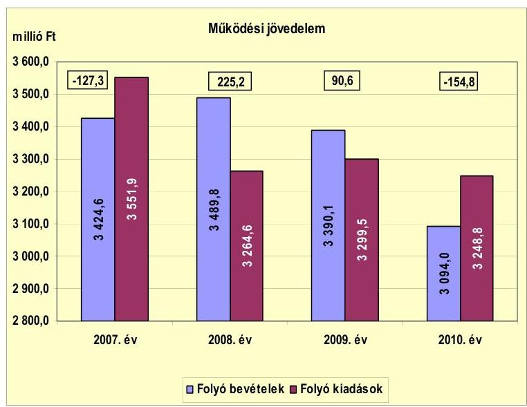

A múködési jövedelem 2007-ről 2008-ra tapasztalt 352,5 millió Ft növekedésére hatással volt az árfolyamnyereség, az iparűzési adó bevétel többlete, továbbá a megyei önkormányzatnak, többcélú társulásnak átadott szociális feladatok és a gazdasági társaságnak átadott bölcsőde miatti kiadási megtakarítás. A múködési jövedelem 2008-ról 2009-re, majd 2010-re folyamatosan csökkent. A folyó bevétel 2010-ben már nem nyújtott fedezetet a folyó kiadások teljesítésére. A 2009. évi 134,6 millió Ft, illetve a 2010. évi 245,4 millió Ft múködési jövedelem csökkenés elsősorban a normatív állami hozzájárulás visszaesése miatt következett be. A normatív hozzájárulás csökkenését a támogatási rendszer átalakítása, az egy főre jutó támogatás és a tanuló-, ellátotti létszám csökkenése okozta. A múködési jövedelem 2009-2010. évi kedvezőtlen alakulására hatással volt a gazdasági válság hatására kieső iparűzési adóbevétel, illetve a saját forrásból finanszírozott pénzbeli szociális ellátások 2009. és 2010. évi növekedése. A 2008. és 2009. évi pozitív múködési jövedelem részben nyújtott fedezetet az Önkormányzat fennálló tőketörlesztési kötelezettségeinek teljesítéséhez, mivel a tőketörlesztési kötelezettség mindkét évben meghaladta a múködési jövedelem összegét.

---

A nettó múködési jövedelem ${ }^{15}$ értéke a folyó költségvetési pozíció mellett az adott költségvetési év adósságtörlesztésének hatását is tükrözi. A pénzügyi kapacitás változását a 2007-2010. években a következő diagram szemlélteti:
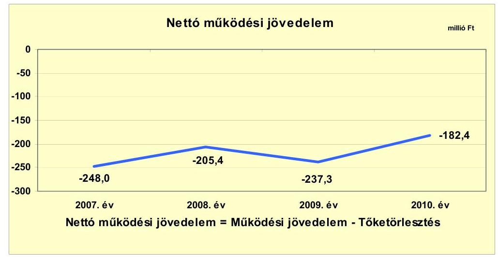

Az Önkormányzat pénzügyi kapacitása a 2007-2010. években folyamatosan negatív értéket mutatott. A nettó működési jövedelem alakulására hatással volt az Önkormányzat tőketörlesztési kötelezettsége, amely 2007-ben 120,7 millió Ft, 2008-ban 430,6 millió Ft, 2009-ben 327,9 millió Ft, 2010-ben 27,6 millió Ft volt. A nettó múködési jövedelem 2009-ről 2010-re tapasztalt 54,9 millió Ftos növekedését a tőketörlesztés 300,3 millió Ft-os - társulati hitel 2009. évi viszszafizetése miatti - csökkenésének és a múködési jövedelem 245,4 millió Ft-os visszaesésének együttes hatása okozta.

A felhalmozási költségvetés egyenlegét 2007-2010 között évről évre a következő ábra szemlélteti:
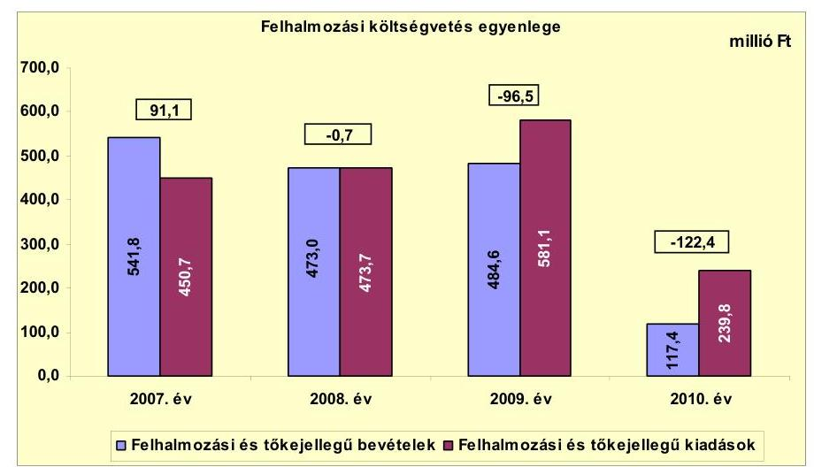

Az Önkormányzat felhalmozási költségvetésének egyenlege 2007-ben pozitív, majd 2008-tól növekvő mértékben negatív összegű volt,

[^0]
[^0]:    ${ }^{15}$ pénzügyi kapacitás

---

amely előrelátó, tudatos költségvetési gazdálkodás és pénzügyileg fenntartható ${ }^{16}$ beruházások esetén nem jár magas pénzügyi kockázattal. A forráshiány 2009. évi 95,8 millió Ft-os növekedésére az előző évhez képest elsősorban hatással volt a 32,4 millió Ft telekvételár-előleg visszatérítés, a tűzoltóautó vásárlására nyújtott 17,2 millió Ft támogatás, a Teleki Gimnázium felújítására kifizetett összeg 126,1 millió Ft-os emelkedése. Befolyásolta még az egyenleget a 2008ban befejeződött újvárosi csapadékcsatorna beruházás 210,7 millió Ft-os kiadáscsökkenése és Bodzáskert csapadékcsatorna 2008-ról 2009-re 145,2 millió Ft-tal növekvő kifizetése. A forráshiány 2009-ről 2010-re 25,9 millió Ft-tal emelkedett az EU-s és hazai projektek támogatásának megelőlegezése, saját forrásának biztosítása miatt. A 2010. évi felhalmozási bevételek és kiadások alacsony összegét a késedelmes szállítói finanszírozás, illetve a 90 napos fizetési határidő miatt 2011. évre áthúzódó beruházási kifizetések okozták.

A 2008. évi 0,7 millió Ft felhalmozási forráshiányra a 2008. január elsejei 38,3 millió Ft pénzkészlet fedezetet nyújtott. A 2009. évi 96,5 millió Ft felhalmozási forráshiány finanszírozható volt a 2009. január elsejei 486,1 millió Ft nyitó pénzkészletből, amely a 2008. évi kötvénykibocsátásból származó - értékpapírba be nem fektetett - bevételt is magában foglalta. A 2010. évi 122,4 millió Ft felhalmozási forráshiány fedezetét a 2010. január elsejei 1280,0 millió Ft nyitó pénzkészlet biztosította, amely a 2008. évi kötvénykibocsátásból származó - fel nem használt - bevételt is tartalmazta.

Az Önkormányzat évenkénti teljes finanszírozási igénye ${ }^{17}$ a CLF módszer szerint 2007-ben -156,9 millió Ft, 2008-ban -206,1 millió Ft, 2009-ben -333,8 millió Ft, 2010-ben -304,8 millió Ft volt. A 2007-2010. években a hiány finanszírozását az előző évek pénzmaradványának igénybevétele biztosította.

Az Önkormányzat finanszírozási múveletei 2007-2010. évekbeli egyenlegét a következő ábra szemlélteti:
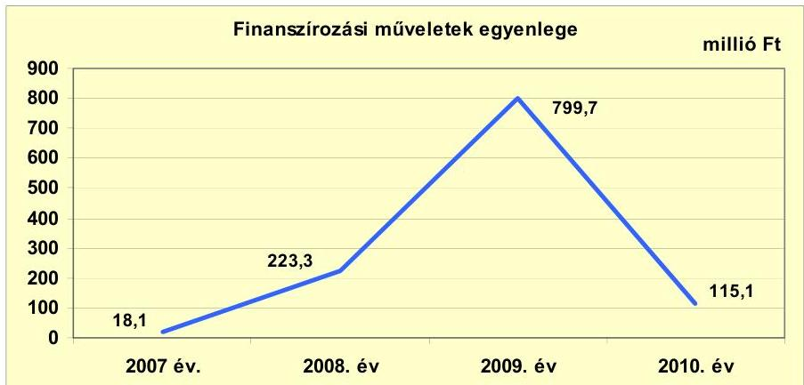

A finanszírozási műveletek egyenlege a vizsgált időszakban pozitív volt. A 2007-ről 2008-ra 205,2 millió Ft-tal növekvő pozitív egyenleget a 2008-ban

[^0]
[^0]:    ${ }^{16}$ Az minősül pénzügyileg fenntartható beruházásnak, amelynek újként megjelenő, illetve többletként mutatkozó múködtetési költségeire az Önkormányzat nettó múködési jövedelme a következő években is fedezetet nyújt.
    ${ }^{17}$ a nettó múködési jövedelem és a beruházási költségvetés egyenlegeinek összege

---

1800,0 millió Ft összegben kibocsátott kötvényből származó bevételnövelő, az ebből 1220,1 millió Ft összegben vásárolt értékpapír, illetve 430,6 millió Ft öszszegben törlesztett hitel csökkentő hatása együttesen eredményezte. Az előző évhez képest a 2009. évre 576,4 millió Ft-tal nőtt a pozitív egyenleg elsősorban a 327,9 millió Ft hiteltörlesztés és az 1125,6 millió Ft összegben értékesített értékpapírok együttes hatására. A finanszírozási múveletek többlete a 2010. évre 684,6 millió Ft-tal csökkent, mert ebben az évben 226,2 millió Ft likvidhitelfelvétel mellett csak minimális hiteltörlesztés volt. A finanszírozási célú műveleteket a jelentés 2. számú mellékletének 4.1-4.8. pontjai részletezik.

Az Önkormányzat 2007-2010. évi zárszámadási rendeleteiben meghatározta a felhalmozási, illetve múködési bevételek és kiadások főösszegét ${ }^{18}$, amelyet a jelentés 1. számú melléklete szemléltet. A zárszámadási rendeletekben bevételi többletet mutattak ki 2007-ben 154,3 millió Ft, 2008-ban 749,0 millió Ft, 2009ben 113,4 millió Ft összegben. A 2010. évi zárszámadási rendeletben a költségvetési bevételek és kiadások különbsége 43,4 millió Ft hiányt mutatott. A zárszámadási rendeletekben kimutatott 2007-2009. évi többlet, 2010. évi hiány összege a CLF módszer alapján számított múködési jövedelem és felhalmozási költségvetés egyenlegét minden évben meghaladta alapvetően az igénybevett pénzmaradvány hatására. Az Önkormányzat a 2007-2009. években a költségvetési bevételek és kiadások megállapításánál az Áht ${ }_{1}$ 8/A. § (7) bekezdésében ${ }^{19}$ foglalt előírás ellenére a finanszírozási célú bevételek és kiadások összegét is figyelembe vette. A 2010. évi zárszámadási rendeletben már az Áht ${ }_{1}$ előírásának megfelelően elkülönítették a költségvetési és finanszírozási bevételeket, kiadásokat.

Az Önkormányzat kamatbevételei és -kiadásai egyenlegének változását a következő ábra mutatja be:
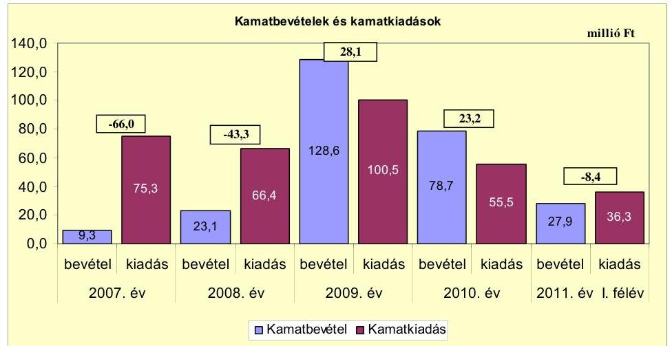

[^0]
[^0]:    ${ }^{18}$ Nincs kötelező előírás a múködési és fejlesztési többlet, hiány megállapításának módjára.
    ${ }^{19}$ 2012. január 1-jétől hatályát vesztette az Áht ${ }_{2} 110$. § (2) bekezdése alapján. Az Áht ${ }_{2}$ 72. §-ában foglalt előírás szerint a költségvetési bevételek-kiadások és a finanszírozási célú pénzügyi műveletek bevétele-kiadása továbbra is elkülönül egymástól.

---

A kamatbevételek 2007-ről 2009-re tapasztalt emelkedését a 2008-ban kibocsátott 1800,0 millió Ft kötvénybevétel befektetéséből, lekötéséből származó kamat eredményezte. A kamatbevételek 2010. évi visszaesése a betétben elhelyezett kötvénybevétel csökkenésével, felhasználásával függött össze. A kamatkiadások 2007. és 2008. évi összegének több mint felét a folyószámlahitel utáni kamatfizetés, másik részét a fejlesztési hitelek kamata okozta. A kamatkiadás a 2009. évre 34,1 millió Ft-tal emelkedett elsősorban a kötvény-kamatfizetés megkezdése miatt. A kamatkiadás 2010-re 45,0 millió Ft-tal csökkent a társulati hitel 2009. évi visszafizetése és a referenciakamatok csökkenése következtében. A 2009-2010. években a kamatkiadásokra fedezetet nyújtottak a kamatbevételek. Ez azonban átmeneti volt, mivel a befektetett, lekötött kötvénybevétel csökkenésével a kamatbevételek egyre kisebb mértékben fedezték a kamatkiadásokat. A kötvénykamat-bevételt a kötvény és a hosszú lejáratú hitelek kamata, illetve a kötvénnyel kapcsolatos egyéb költségek finanszírozására fordították.

# 2.2. Az Önkormányzat bevételeinek változása 

Az Önkormányzat 2007-2011. év I. félév között realizált főbb folyó bevételi jogcímeinek számszaki adatait a következő táblázat részletezi és grafikon mutatja be:
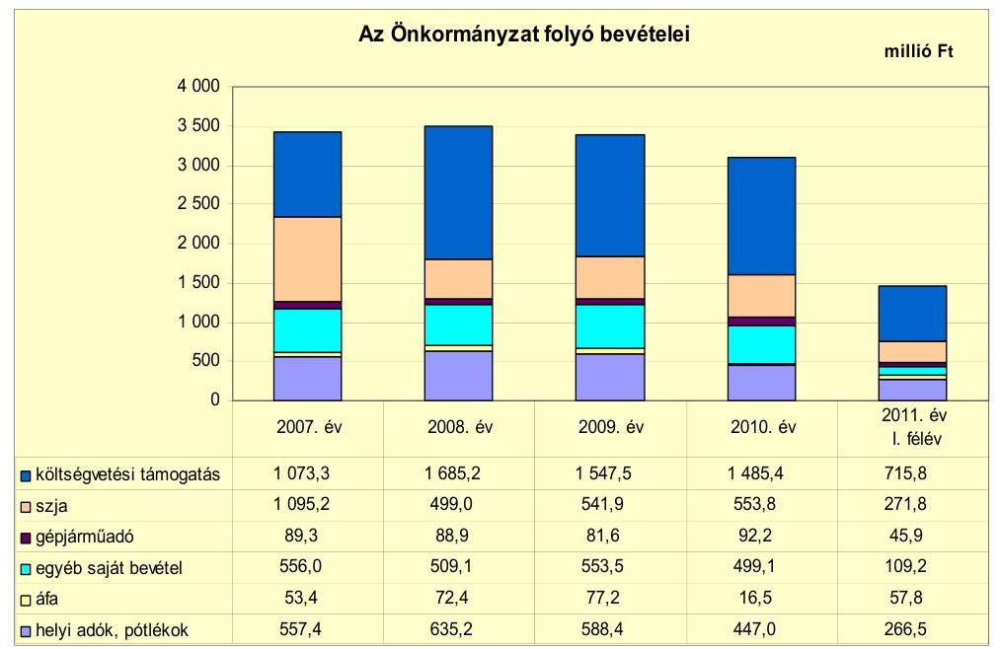

Az Önkormányzat folyó bevételei 2007-ről 2008-ra 3424,6 millió Ft-ról 3489,8 millió Ft-ra növekedtek döntően az iparűzési adóbevételi többlet és az árfolyamnyereség növelő hatására. 2008-tól 2010-ig folyamatosan csökkent a folyó bevétel, a 2008. évi 3489,8 millió Ft-ról 2009-re 3390,1 millió Ft-ra, 2010re 3094,0 millió Ft-ra. A 2008-2010 közötti bevételcsökkenést elsősorban a más szervnek átadott feladatokhoz kapcsolódó normatív költségvetési támogatás, térítési díj és áfa csökkenés, továbbá a forrásszabályozás változása és az ellátotti létszámcsökkenés miatt kieső normatív támogatás okozta. A gazdasági válság hatására kieső iparűzési adóbevétel is kedvezőtlen hatással volt a 2009. és 2010. évi folyó bevételekre. 2011. június 30 -ára a bevételek az előző évi bevétel 47,4\%-ában, 1467,0 millió Ft összegben érkeztek be az Önkormányzathoz.

---

Az Önkormányzat költségvetési támogatás és átengedett szjabevételeinek együttes összege a 2007-2010. években változóan alakult: 2007ben 2168,5 millió Ft, 2008-ban 2184,2 millió Ft, 2009-ben 2089,4 millió Ft és 2010-ben 2039,2 millió Ft volt. A 2008. évtől az szja folyamatosan növekedett a településre jutó szja emelkedésének hatására. Ezzel szemben 2008-tól a költségvetési támogatás folyamatosan, 2010-ig 199,8 millió Ft-tal csökkent a szociális és bölcsődei feladatok más szervnek történt átadása, a közoktatásban a tanulólétszám és a normatív költségvetési támogatás fajlagos összegének csökkenése miatt.

Az Önkormányzatnál a helyi adókból és pótlékokból származó bevételek aránya a folyó bevételeken belül a 2007-2009. években átlagosan 17,3\% (593,7 millió Ft) volt, amely a 2010. évre 14,4\%-ra (499,1 millió Ft-ra) csökkent az iparúzési adóbevétel-kiesés következtében. A befolyt - állandó iparúzési tevékenységhez kapcsolódó - iparúzési adó összege a 2008. évi 532,7 millió Ft-ról 2010-re 358,5 millió Ft-ra, aránya a helyi adó, pótlék, bírság bevételeken belül 83,9\%-ról 80,2\%-ra esett vissza, mivel a gazdasági válság hatására négy nagy vállalkozásnak megszűnt a tevékenysége a városban. 2007-ről 2008-ra 58,1 millió Ft-tal nőtt az iparúzési adóbevétel a december 20-i feltöltési kötelezettség teljesítése miatt. Az építményadónál az adóbehajtás és adóellenőrzés hatására, a magánszemélyek kommunális adójánál az adómérték kétszeri emelése miatt minimális mértékben (együttesen 7 millió Ft-tal) növekvő bevételek nem ellensúlyozták a befolyt iparúzési adó 174,2 millió Ft-os csökkenését 2008-ról 2010-re. Az Önkormányzat pénzügyi egyensúlyára kockázatot jelent az iparúzési adóbevétel - gazdasági válság hatására történő - csökkenése.

Az Önkormányzatnak a 2007-2011. években a helyi iparúzési adóból, az építményadóból, a telekadóból, a magánszemélyek kommunális adójából és az idegenforgalmi adóból származott bevétele. A vizsgált időszakban a magánszemélyek kommunális adója kivételével egyik adómérték sem változott. A magánszemélyek kommunális adójánál az adómérték 2007. január 1-jén 3000 Ft/év, 2008. január 1-jétől $4000 \mathrm{Ft} /$ év, 2009. január 1-jétől folyamatosan $5000 \mathrm{Ft} /$ év volt. A vizsgált időszakban az adómérték az építményadónál egységesen $350 \mathrm{Ft} / \mathrm{m}^{2} / \mathrm{év}$, a telekadónál $30 \mathrm{Ft} / \mathrm{m}^{2} /$ év, a tartózkodás utáni idegenforgalmi adónál $200 \mathrm{Ft} /$ fő/éjszaka, az épület utáni idegenforgalmi adónál $350 \mathrm{Ft} / \mathrm{m}^{2} /$ év, az ideiglenes iparúzési adó építőipari tevékenység után $5000 \mathrm{Ft} /$ nap volt. Az állandó iparúzési tevékenység után fizetendő iparúzési adónál az adómérték - a törvényi felső határral egyezően - $2 \%$ volt.

A gépjármúadóból származó bevétel a 2007-2009. években átlagosan 86,6 millió Ft volt, amely 2010-re 6,5\%-kal, 92,2 millió Ft-ra emelkedett a gépjármúadó alapjának, mértékének 2010. január 1-jétől hatályos változása következtében. Az áfa-bevétel 2008. és 2009. évi, illetve 2011. év I. félévi magasabb összegét a fordított áfa-elszámolás ${ }^{20}$ bevétele okozta. Az Önkormányzat

[^0]
[^0]:    ${ }^{20}$ A fordított áfa-elszámolás azt jelenti, hogy az áfa múködési mechanizmusával ellentétben értékesítéskor nem az eladó fizeti meg a számlában foglalt összeg után az áfát, hanem a vevő (jelen esetben az Önkormányzat vagy intézménye). A fordított áfaelszámolás bevétele 2008-ban 35,3 millió Ft, 2009-ben 53,4 millió Ft, 2010-ben 6,7 millió Ft, 2011. év I. félévben 52,0 millió Ft volt. A fordított áfa-elszámolás kiadása 2008ban 0,9 millió Ft, 2009-ben 44,5 millió Ft, 2010-ben 28,4 millió Ft, 2011. év I. félévben 70,2 millió Ft volt.

---

fordított áfa nélküli áfa-bevétele - a megyei önkormányzatnak, többcélú társulásnak, gazdasági társaságoknak átadott térítési díjbevétellel járó feladatok kieső áfa bevétele miatt - csökkent a vizsgált időszakban.

Az Önkormányzat egyéb saját bevételeinek ${ }^{21}$ a 2007. évi 556,0 millió Ftról 2008-ra 509,1 millió Ft-ra történt csökkenése elsősorban a 2007-ben más szervnek átadott szociális és gyermekjóléti feladatok térítési díjának kieséséből, a gazdasági társaságnak átadott Kórház OEP finanszírozásának megszűnéséből származott. Az előző évhez képest 2009-re bekövetkezett 44,4 millió Ft-os növekedéshez hozzájárult a kamatbevétel kötvénybevétel befektetéséből származó 105,5 millió Ft-os növekedése, a térítési díj bevételek 38,7 millió Ft-os csökkenése. A 2009-ről 2010-re bekövetkezett 54,4 millió Ft-os csökkenés elsősorban a kamatbevételek, a térítési díj bevételek - a konyha és az étkezési díjbeszedés saját gazdasági társaságnak 2009. augusztus 1-jétől történt átadása miatti - viszszaeséséhez kapcsolódott.

Az Önkormányzat 2007-2011. év I. félév között nem kapott osztalékot a gazdasági társaságaitól. A képződött nyereség összegét eredménytartalékba helyezték az Önkormányzat döntése alapján.

Az Önkormányzat felhalmozási bevételei a 2007-2011. év I. félév közötti időszakban a következők voltak:

| Megnevezés | 2007. év | 2008. év | 2009. év | 2010. év | 2011. év   I. félév |
| :-- | --: | --: | --: | --: | --: |
| Tárgyi eszköz értékesítés | 36,7 | 160,8 | 19,9 | 21,2 | 6,3 |
| Egyéb saját tőkebevétel | 11,4 | 57,9 | 13,9 | 3,1 | 1,2 |
| Költségvetési támogatás | 452,9 | 174,1 | 111,2 | 22,3 | 130,6 |
| Államháztartáson belülről   kapott támogatás | 20,0 | 24,1 | 13,6 | 47,9 | 224,9 |
| EU-tól és külföldről kapott   támogatások | - | 8,0 | 0,7 | - | - |
| Államháztartáson kívülről   kapott támogatás | 20,8 | 48,1 | 325,3 | 22,9 | 10,4 |
| Összes felhalmozási bevétel | 541,8 | 473,0 | 484,6 | 117,4 | 373,4 |

A tárgyi eszköz értékesítés bevétele ${ }^{22}$ a vizsgált időszakon belül 2007-ben és 2008-ban volt a legmagasabb a külterületi föld-, telek-, lakás-, üzlethelyiség eladások miatt. A bevétel 2008-ra 124,1 millió Ft-tal emelkedett a volt laktanya épület eladási ára ( 60 millió Ft), a bevásárlóközpont céljára megvásárolt telek vételárelőlege ${ }^{23}$ ( 32,4 millió Ft) és egy belterületi ingatlan vételára ( 33,2 millió Ft) miatt. Az egyéb saját tőkebevételek 2008. évi magasabb összegét a

[^0]
[^0]:    ${ }^{21}$ Az egyéb saját bevételek részét képezték az intézményi múködési bevételek, a hozamés kamatbevételek, az osztalék, a talajterhelési díj, az államháztartáson belülről és kívülről átvett pénzeszközök, az EU-tól és külföldről kapott támogatások, az előző évi pénzmaradvány átvétele.
    ${ }^{22}$ Az Önkormányzat a tárgyi eszközértékesítésből származó bevételeit a felhalmozási kiadások finanszírozására fordította.
    ${ }^{23}$ A vételárelőleget 2009-ben visszafizette az Önkormányzat, mivel a vevő elállt a vásárlástól.

---

30 millió Ft egyháznak átadott ingatlanok utáni kártalanítás és 23,2 millió Ft tartós részesedés értékesítése eredményezte. A felhalmozási célú költségvetési támogatás 2007. évi kiemelkedő összege döntően a kórház-rekonstrukcióra kapott 243,2 millió Ft címzett támogatásból és az újvárosi csapadékvíz csatorna beruházás 191,0 millió Ft központosított támogatásából tevődött össze. A 20082009. évi és a 2011. év I. félévi költségvetési támogatást alapvetően szintén a csapadékcsatorna beruházások központosított támogatása képezte. A 2011. év I. félévi államháztartáson belülről kapott támogatások döntő részét a Kossuth úti Általános Iskola felújítására (154,2 millió Ft) és a kerékpárút építésre (53,9 millió Ft) kapott támogatás tette ki. Az államháztartáson kívülről kapott bevételek 2009. évi kimagasló összegét a társulati hitelhez kapcsolódó 2009ben lejárt lakás-előtakarékossági betétekből az Önkormányzat részére átutalt 309,3 millió Ft eredményezte.

# 2.3. Az Önkormányzat múködési és felhalmozási célú kiadásainak változása 

Az Önkormányzat folyó kiadásai főbb jogcímek szerinti bontásban 2007-2011. június 30. között az alábbiak voltak:

|  |  |  |  |  | millió Ft |
| :-- | --: | --: | --: | --: | --: |
| Megnevezés | 2007. év | 2008. év | 2009. év | 2010. év | 2011. év   I. félév |
| Folyó kiadások | 3551,9 | 3264,6 | 3299,5 | 3248,8 | 1532,8 |
| Müködési kiadások (kamatkiadás nélkül) | 3088,3 | 2679,7 | 2637,0 | 2158,8 | 1061,6 |
| Államháztartáson belülre átadott pénzeszközök | 20,5 | 20,7 | 24,0 | 86,3 | 1,2 |
| Transzferkiadások | 298,6 | 351,3 | 488,5 | 837,9 | 433,7 |
| -ebből: vállalkozásoknak | 0,3 | 9,3 | 96,2 | 409,2 | 225,3 |
| EU-nak, illetve külföldre | 0 | 0 | 0 | 0 | 0 |
| magánszemélyeknek | 277,1 | 313,9 | 365,0 | 402,2 | 200,8 |
| nonprofit szervezeteknek | 21,2 | 28,1 | 27,3 | 26,5 | 7,6 |
| Kamatkiadások | 75,3 | 66,4 | 100,5 | 55,5 | 36,3 |
| Előző évi pénzmaradvány átadás | 69,2 | 146,5 | 49,5 | 110,3 | 0,0 |

Az Önkormányzat folyó kiadásai főbb kiadásnemek szerinti bontásban az alábbiak voltak:

|  |  |  |  |  | millió Ft |
| :-- | --: | --: | --: | --: | --: |
| Megnevezés | 2007. év | 2008. év | 2009. év | 2010. év | 2011. év   I. félév |
| Személyi juttatások | 1732,4 | 1476,6 | 1365,4 | 1141,5 | 513,1 |
| Munkaadót terhelő járulékok | 556,4 | 469,3 | 403,1 | 303,1 | 139,5 |
| Dologi kiadások | 741,8 | 701,6 | 712,8 | 586,5 | 338,6 |
| Egyéb folyó kiadások | 26,4 | 23,7 | 61,3 | 108,3 | 64,8 |

A folyó kiadásokon belül a személyi juttatások összege 2007-ről 2008-ra 14,8\%-kal, 255,8 millió Ft-tal csökkent a 2007-ben megyei önkormányzatnak és a többcélú társulásnak átadott szociális intézmények, a gazdasági társaságoknak átadott bölcsőde és Kórház, illetve 2007-2008-ban a közoktatási intézményben végrehajtott létszámcsökkentés hatására. A személyi juttatások csökkenése 2008-ról 2009-re folytatódott 7,5\%-kal, további 111,2 millió Ft-tal elsősorban a 2007-2009. években a közoktatást érintő létszámcsökkentések, a 13. havi illetmény megszűnése következtében. A 2010. évre tapasztalt 223,9 millió Ft csökkenést döntően a 2009. év folyamán a gazdasági társaságoknak átadott városüzemeltetési, ingatlankezelési, intézmény-takarítási,

---

-karbantartási, étkeztetési, sport- és közművelődési feladatok okozták. A kiadások csökkenéséhez hozzájárultak a 2009-2010-ben végrehajtott létszámcsökkentési döntések is. Összességében az Önkormányzat személyi juttatásai a vizsgált időszakban 34,1\%-kal, 590,9 millió Ft-tal csökkentek a más gazdálkodó szerveknek átadott feladatok és a végrehajtott létszámcsökkentési döntések miatt.

A munkaadókat terhelő járulékok összege 2007-ről 2010-re folyamatosan csökkent alapvetően a más szerveknek átadott feladatok, a létszámcsökkentések, a 13. havi illetmény megszűnése hatására. Hozzájárult a járulékok csökkenéséhez még a tételes egészségügyi hozzájárulás 2010. január 1-jei megszűnése, illetve a munkaadói járulék mértékének csökkenése (2010. január 1-jétől $29 \%$-ról $27 \%$-ra).

Az Önkormányzat dologi kiadásai 2007-ről 2008-ra 5,4\%-kal, 40,2 millió Fttal visszaestek a más szerveknek átadott egészségügyi, szociális és bölcsődei feladatok miatti dologi kiadáscsökkenés hatására. A 2009-ről 2010-re bekövetkezett 126,3 millió Ft dologi kiadáscsökkenést alapvetően az önkormányzati gazdasági társaságoknak átadott városüzemeltetés, közművelődés, sport, étkeztetés, takarítás, karbantartás, ingatlankezelés feladatok kiadáscsökkenése okozta. Az Önkormányzatnál 2011. év I. félévében az előző évhez viszonyítva a személyi juttatások 44,9\%-ra (513,1 millió Ft), a járulékok 46,0\%-ra (139,5 millió Ft), a dologi kiadások 57,7\%-ra (338,6 millió Ft) teljesültek.

Az Önkormányzat kamatkiadás nélkül számított múködési kiadásai (személyi juttatások, járulékok, dologi és folyó kiadások) a 2007. és 2010. évek között 929,5 millió Ft-tal ( $30,1 \%$-kal) csökkentek az intézményátadások, létszámcsökkentések elsődleges hatására.

Az államháztartáson belülre átadott múködési célú pénzeszközök 2010. évi - az előző évekhez képest magas - összegét egyszeri kiadások, a kompetencia alapú oktatásra továbbadott 22,1 millió Ft TÁMOP támogatás és a Városgondnokság gazdasági társaságnak történt átadása miatti elszámolások okozták.

Az államháztartáson kívülre történő múködési célú pénzeszközátadások (transzferkiadások) összege a 2007-2010. közötti időszakban folyamatosan, több mint kétszeresére, 539,3 millió Ft-tal emelkedett. Ezt egyrészt a 2009től önkormányzati feladatokat ellátó gazdasági társaságoknak átadott pénzeszközök 408,9 millió Ft-os növekedése okozta. Másrészt a kiadások növekedéséhez hozzájárult még a rendszeres szociális segély és rendelkezésre állási támogatás címén magánszemélyeknek kifizetett összegek 2009. évi 40,7 millió Ftos és 2010-ben 30,8 millió Ft-os emelkedése az előző évekhez képest.

Az Önkormányzat - Kórház kiadásai nélkül számított ${ }^{24}$ - folyó kiadásai főbb jogcímek szerinti bontásban 2007-2011. június 30. között a következők voltak:

[^0]
[^0]:    ${ }^{24}$ Az Önkormányzat 2007. február 1-jétől átadta üzemeltetésre kórházát egy gazdasági társaságnak. A kórház 2007. január hónapra felmerült folyó kiadása 200,8 millió Ft volt, amely személyi juttatás, járulék és dologi kiadásokból tevődött össze.

---

| Megnevezés | 2007. év | 2008. év | 2009. év | 2010. év | 2011. év I.   félév |
| :--: | :--: | :--: | :--: | :--: | :--: |
| Folyó kiadások | 3351,1 | 3264,6 | 3299,5 | 3248,8 | 1532,8 |
| Működési kiadások (kamalkiadás nélkül) | 2887,6 | 2679,7 | 2637,0 | 2158,8 | 1061,6 |
| Kamatkiadás | 75,3 | 66,4 | 100,5 | 55,5 | 36,3 |
| Személyi juttatások | 1595,1 | 1476,6 | 1365,4 | 1141,5 | 513,1 |
| Munkaadót terhelő járulékok | 511,0 | 469,3 | 403,1 | 303,1 | 139,5 |
| Dologi kiadások | 723,8 | 701,6 | 712,8 | 586,5 | 338,6 |
| Egyéb folyó kiadások | 26,4 | 23,7 | 61,3 | 108,3 | 64,8 |

A kórházi kiadások nélküli folyó kiadások is csökkentek a 2007-2009. évi átlagos 3305,1 millió Ft-ról 2010-re 56,3 millió Ft-tal a feladat- és intézményátadások, a létszámcsökkentések miatt.

A folyó és felhalmozási kiadásokat, a teljesített kiadások múködési és felhalmozási célú felhasználásának arányait a 2007-2011. év I. félév közötti időszakban a következő ábra mutatja be:
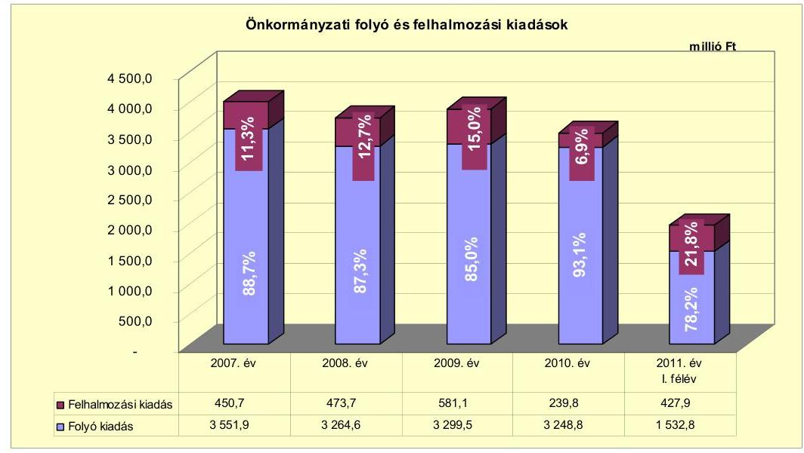

A folyó és felhalmozási kiadások arányainak változása a 2007-2009. évek között a felhalmozási kiadások arányának emelkedését mutatta összességében 3,7 százalékponttal, 130,4 millió Ft-tal. A felhalmozási kiadások arányának növekedését a sikeres pályázatok révén megkezdett fejlesztések, a kötvénykibocsátásból származó bevétel saját forrásként és támogatásmegelőlegezésként történő felhasználása okozta. A felhalmozási kiadások 2010. évi aránya az előző évhez képest 8,1 százalékponttal csökkent, a 2011. év I. félévi aránya az előző évhez képest jelentősen, 14,5 százalékponttal emelkedett. Az arányok változását a 2010. évről áthúzódó, késedelmes szállítói finanszírozású Kossuth úti Általános Iskola felújítása projekt, illetve a 90 napos fizetési határidő miatt 2011-re áthúzódó csapadékcsatorna beruházás kifizetései okozták.

Az Önkormányzatnál a 2010. december 31-ig múszakilag befejezett ${ }^{25}$ 17 db tíz millió Ft feletti és 133 db tíz millió Ft alatti bekerülési költségú - fel-

[^0]
[^0]:    ${ }^{25}$ A 2010. december 31-ig befejezett fejlesztések adatait a jelentés 3/a. számú melléklete tartalmazza.

---

újítás és fejlesztés költsége 2957,7 millió Ft volt. Ebből a fejlesztések öszszege 2656,7 millió Ft ( $89,8 \%$ ), a felújítások összege 301,0 millió Ft (10,2\%) volt. A befejezett 2957,7 millió Ft értékű fejlesztés forrása 579,4 millió Ft saját bevételből (19,5\%), 49,8 millió Ft - a 2007. év előtt lehívott - hitelből (1,7\%), 11,2 millió Ft kötvénykibocsátás bevételből ( $0,4 \%$ ), 286,3 millió Ft EU-s támogatásból ( $9,7 \%$ ) és 2031,0 millió Ft hazai támogatásból ( $68,7 \%$ ) tevődött össze. A 2006. december 31-ig teljesített kiadások összege 1508,3 millió Ft, a 20072010. években teljesített kiadások összege 1449,4 millió Ft volt. A projektek előfinanszírozását az Önkormányzat támogatási előlegekből, folyószámlahitelből és kötvénybevételből biztosította. A pályázati pénzeszközből megvalósított fejlesztéseknél a legnagyobb pénzügyi kockázatot a folyószámlahitellel történő előfinanszírozás hordozza magában az Önkormányzat számára.

Az Önkormányzat a 2010. év végén folyamatban lévố ${ }^{26}$ - hat db 10 millió Ft feletti és két db 10 millió Ft alatti bekerülési költségű - fejlesztési feladataira 2010. december 31-ig 55,7 millió Ft-ot fizetett ki. Ennek forrását 6,9 millió Ft saját bevétel ( $12,4 \%$ ), 2,6 millió Ft kötvényből származó bevétel ( $4,7 \%$ ), 38,5 millió Ft EU-s támogatás ( $69,1 \%$ ) és 7,7 millió Ft hazai támogatás ( $13,8 \%$ ) képezte. A folyamatban lévő feladatoknál a 2010. év utánra vállalt kötelezettség összege 839,9 millió Ft volt, amelynek forrásai 76,0 millió Ft saját bevételből, 34,3 millió Ft kötvényből származó bevételből, 310,3 millió Ft EU-s támogatásból és 419,3 millió Ft hazai támogatásból tevődnek össze. Az Önkormányzat saját forrásból - egy db 10 millió Ft feletti és hét db 10 millió Ft alatti bekerülési költségű - felújítást és fejlesztést valósított meg a 2011. év I. félévében, amelyekhez 28,1 millió Ft kiadás kapcsolódott. A kiadások forrását a saját bevétel képezte. Az Önkormányzat által vállalt jövőbeni fejlesztési kiadások saját forrásának (saját bevétel és kötvényforrás) fedezete a kötvényforrásból és hozamából származó maradvány felhasználása után nem megoldott, ezért szükséges a tervezett beruházások felülvizsgálata. A saját forrás fedezete nem lesz biztosított már rövid távon sem, amennyiben a kötvényforrásból és hozamából származó maradványt - az eddigi gyakorlat szerint - a fejlesztési kiadások mellett múködésre és tőketörlesztésre is igénybe veszik.

Az Önkormányzat 2010. december 31-ig beadott három, elbírálás alatt álló pályázatában ${ }^{27}$ a 2010. év utánra vállalt kötelezettség 766,1 millió Ft volt. Ennek forrásaként 81,6 millió Ft saját bevételt (10,7\%), 16,5 millió Ft kötvényből származó bevételt ( $2,1 \%$ ), 565,8 millió Ft EU-s támogatást ( $73,9 \%$ ) és 102,2 millió Ft hazai támogatást ( $13,3 \%$ ) terveztek. A források - a kötvénybevétel kivételével - nem álltak az Önkormányzat rendelkezésére a helyszíni ellenőrzés idején.

A helyszíni ellenőrzés megkezdéséig 2011. évben négy pályázatot adott be az Önkormányzat. A pályázatokban vállalt kötelezettség 89,4 millió Ft

[^0]
[^0]:    ${ }^{26}$ A 2010. év végén folyamatban lévő fejlesztések adatait a jelentés 3/b. és 3/c., a 2011. év I. félévben saját forrásból megvalósított fejlesztések adatait a jelentés 3/c1. számú melléklete tartalmazza.
    ${ }^{27}$ A 2010. december 31-én elbírálás alatt álló és 2011-ben benyújtott pályázatokkal kapcsolatos adatokat a jelentés 3/d. számú melléklete mutatja be.

---

volt, amelyhez 17,0 millió Ft saját bevételt (19,0\%) és 72,4 millió Ft hazai támogatást ( $81,0 \%$ ) terveztek. A pályázatok elbírálása folyamatban van.

Az Önkormányzat vizsgált időszakban megvalósult és folyamatban lévő fejlesztései közül a legnagyobb költségigényú az alábbi három beruházás volt:

- az Önkormányzat 2004-ben a Kórház rekonstrukciójához címzett támogatást nyert el. A rekonstrukció a 2004-2007. években megvalósult. A fejlesztés eredményeként új kórházi szárny, egészségügyi gép- és múszerbeszerzés, valamint a régi épület kéménybontása valósultak meg. A projekt bekerülési költsége 1508,2 millió Ft volt, amelyből 42,8 millió Ft-ot (2,8\%) saját bevételből, 1465,4 millió Ft-ot ( $97,2 \%$ ) hazai (címzett) támogatásból fedeztek;
- a Kossuth úti Általános Iskola felújítása (az ÉAOP-4.1.1/2-2F-2f-2009-0010 azonosító jelű pályázat alapján) 2010-ben kezdődött meg és 2011-ben fejeződik be. A projekt keretében elvégzik az U alakú épület bővítését, tetőtér beépítését, amelyben számítástechnika és egyéb szaktantermek kapnak helyet. A meglévő északi szárny átépítésével új igazgatási helyiségcsoport alakul ki. A projekt része a komplex akadálymentesítés biztosítása, parkolóhelyek, konyha és étkező kialakítása. A projekt 305,6 millió Ft tervezett bekerülési költségéből 2010. december 31-ig 21,4 millió Ft volt a teljesített kiadás, amelynek forrása 1,0 millió Ft saját bevétel, 2,6 millió Ft kötvénybevétel, 16,8 millió Ft EU-s támogatás és 1,0 millió Ft hazai támogatás volt. A projektből 2010. december 31-én 284,2 millió Ft kötelezettség állt fent. Ezt 5,1\%ban saját bevételből (14,4 millió Ft), 12,1\%-ban kötvénybevételből (34,3 millió Ft), 4,3\%-ban hazai támogatásból (12,4 millió Ft), 78,5\%-ban EU-s támogatásból (223,1 millió Ft) tervezték finanszírozni;
- a Mezőtúr, Újváros II. ütem 2. szakasz és a kertvárosi csapadékcsatorna hálózat megvalósítására a 444,1 millió Ft tervezett bekerülési költségú projekt támogatási szerződését 2010-ben kötötték meg. A projekt múszaki megvalósítása 2011. november 22-én befejeződött. A projekttel kapcsolatban 2010. december 31-ig 7,5 millió Ft volt a teljesített kiadás, amelynek fedezete 0,8 millió Ft saját bevétel és 6,7 millió Ft hazai támogatás volt. A projektből 2010. december 31-én 436,6 millió Ft kötelezettség állt fent. Ezt 10,0\%-ban saját bevételből (43,7 millió Ft) és 90,0\%-ban hazai támogatásból (392,9 millió Ft) tervezték finanszírozni.

---

Az Önkormányzat által a gazdasági társaságok részére átadott múködési célú pénzeszközöket - a gazdasági társaságok adatszolgáltatása alapján - az alábbi diagram mutatja be a 2007-2011. év I. félévére:
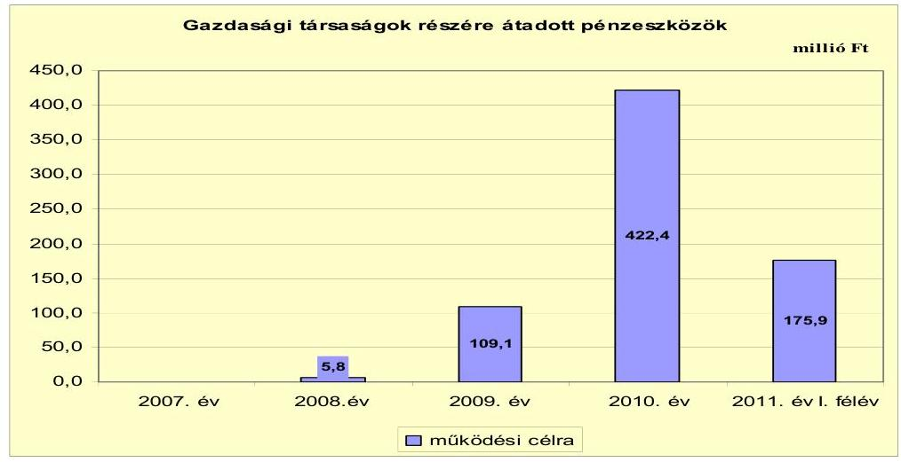

Az Önkormányzat 2009-től átadta a településüzemeltetési, városgondnoksági, intézmény-üzemeltetési (takarítás, karbantartás) feladatokat, a konyha múködtetését, az étkezési térítési díjbeszedést, sport és közművelődési feladatokat saját gazdasági társaságainak, amelyhez múködési célú pénzeszközt is biztosított. A pénzeszközátadásokra szerződés alapján utólagos elszámoltatás mellett került sor. A múködési jövedelem előző évhez képest 2009-re, majd 2010-re történt csökkenésére nem volt hatással a gazdasági társaságoknak átadott múködési célú pénzeszközök növekedése, mivel a feladatok átszervezése miatt a személyi juttatás, járulék és dologi kiadások is csökkentek. Az Önkormányzat a vizsgált időszakban felhalmozási célú pénzeszközt nem adott a gazdasági társaságainak.

Az Önkormányzat 2007. február 1-jétől adta át a Kórház üzemeltetését egy gazdasági társaságnak, amelyben nem volt tulajdonrésze. Ennek a társaságnak az Önkormányzat 2007-2009. években pénzeszközt nem adott át. Az Önkormányzat 2009. november 9-én döntött a kórházat üzemeltető gazdasági társaság 100\%-os üzletrészének névértéken, 3,0 millió Ft összegben - a fennálló kötelezettségeivel együtt - történő megvásárlásáról egyéb saját bevétele terhére.

A kórházat múködtető kft. 2009. évi mérlegében 233,5 millió Ft kötelezettség szerepelt. A szállítói tartozás 150,9 millió Ft, ebből a lejárt szállítói tartozás 93,3 millió Ft volt. A 90 napon túl lejárt szállítói tartozás összege 40,6 millió Ft-ot tett ki. A kórházat múködtető kft. lejárt szállítói tartozás állománya a 2009. évi 93,3 millió Ft-ról 2011. I. félév végére 16,5 millió Ft-ra csökkent. Ezt döntő részben saját forrásból, 7,2 millió Ft önkormányzati forrás igénybevétele mellett rendezte a gazdasági társaság.

Az Önkormányzat 2009-2010-ben nem, 2011-ben 7,2 millió Ft múködési célú pénzeszközt adott át a Kórház Nkft.-nek.

Az Önkormányzat az önköltség alatti ár- és díjmegállapítás ellentételezésére nem adott át pénzeszközt társaságainak a vizsgált években. A 2010. évi veszteségének rendezésére az Önkormányzat a kórházat üzemeltető gazdasági társa-

---

ság felé 18,5 millió Ft összegben, illetve a helyi tömegközlekedést biztosító Jászkun Volán Zrt. felé 6,5 millió Ft összegben vállalt kötelezettséget.

A Kórház Nkft. 18,5 millió Ft-os tőkepótlását az Önkormányzat nem utalta át, mivel időközben arra az álláspontra helyezkedett, hogy az a veszteség még a kórház előző tulajdonosainak idejében keletkezett, az nem az Önkormányzatot terheli. Ebben a kérdésben jelenleg tárgyalások folynak a korábbi tulajdonosokkal.

Az Önkormányzat a 2007-2011. év I. félév közötti időszakban veszteségrendezési céllal nem hajtott végre jegyzett tőke emelést.

Az Ipari Park Kft.-nél 2008-2010 között minden évben volt jegyzett tőke emelés összesen 99,8 millió Ft összegben.

Az Ipari Park Kft.-nél a vizsgált időszak minden évében volt tőkeemelés: 2008ban 77,8 millió Ft, 2009-ben 21,0 millió Ft, 2010-ben 1,0 millió Ft összegben. A 2008. évben 77,8 millió Ft jegyzett tőkeemelés történt ingatlanapporttal, amelyet a kft. továbbapportált az Alföld Thermál Hotel Kft.-be. A 2009. évi 21,0 millió Ftos jegyzett tőkeemelésből 20,0 millió Ft volt az Alföld Thermál Hotel Kft.-be apportált ingatlan utáni illetékfizetési kötelezettségre és kamatára biztosított összeg. További 0,5 millió Ft-tal a fennálló 27,6 millió Ft tagi kölcsön csökkent (a fennmaradó 27,1 millió Ft-ot tőketartalékban helyezték), illetve 0,5 millió Ft volt az apportált ingatlanok értéke.

Az Önkormányzat pénzügyi helyzetére kockázatot jelenthet, hogy az Ipari Park Kft. 2007-2008-ban kölcsönből, majd 2009-2010-ben tőkeemelésből finanszírozta elsősorban a múködését, az ipari park hasznosításából elért bevétele nem fedezte a múködés költségét és az aktivált beruházások értékcsökkenését. Ezek hatására folyamatosan növekvő - 2007-ben -23,2 millió Ft, 2008-ban -35,9 millió Ft, 2009-ben -64,4 millió Ft és 2010-ben -66,6 millió Ft - negatív eredménytartalékot mutatott ki.

Az önkormányzati közfeladatokat ellátó gazdasági társaságoknak átadott múködési célú pénzeszközöket a jelentés 4. számú melléklete mutatja be.

# 3. Az ÖNKORMÁNYZAT KÖTELEZETTSÉGEI 

### 3.1. Az Önkormányzat pénzintézeti kötelezettségeinek változása

Az Önkormányzatnak 2006. december 31-én 860,9 millió Ft pénzintézeti kötelezettségállománya volt, amely a 2007. év végére 1261,5 millió Ft-ra, a 2008. év végére 2661,5 millió Ft-ra emelkedett, a 2009. év végére 2333,6 millió Ft-ra csökkent, majd a 2010. év végére 3354,8 millió Ft-ra nőtt. Az Önkormányzat pénzintézettel szembeni kötelezettségállománya a 2006. év végétől 2011. június 30 -áig összességében 2541,9 millió Ft-tal emelkedett a kötvénykibocsátás, az átvállalt és felvett hosszú lejáratú hitelek, a felvett folyószámla- és munkabérhitelek, a hiteltörlesztések és a kötvény utáni árfolyamváltozás hatására. A kötelezettségnövekedéshez kapcsolódva az Önkormányzatnak a 2011. év I. félév végén 959,8 millió Ft pénzkészlete volt, amelyből 800 millió Ft-ot óvadéki betétben tartottak. A befektetett eszközeinek mérlegben kimutatott nettó értéke azonban csak 26,8 millió Ft-tal gyarapodott a vizsgált időszakban.

---

Az Önkormányzatnak a 2007-2011. év I. félév közötti időszakban 13 a 2007. év előtt felvett, egy 2007-ben átvállalt és négy 2008-ban felvett hosszú lejáratú hitelből tevődött össze a hosszú lejáratú hitelállománya, amelyekből öt hitelt 2010. december 31-ig visszafizettek. Az Önkormányzat a vizsgált időszak minden évében vett igénybe folyószámlahitelt és - a 2008. év kivételével - munkabérhitelt. Az Önkormányzat 2010. év végén és 2011. június 30 -án fennálló pénzintézettel szembeni kötelezettségei egy kötvénykibocsátásból, 13 hosszú lejáratú hitelből, folyószámlahitelből és munkabérhitelből keletkeztek.

Az Önkormányzat mérlegében kimutatott, pénzintézeteknél fennálló kötelezettségállományát a 2006-2011. év I. félév közötti időszakban a következő ábra szemlélteti:
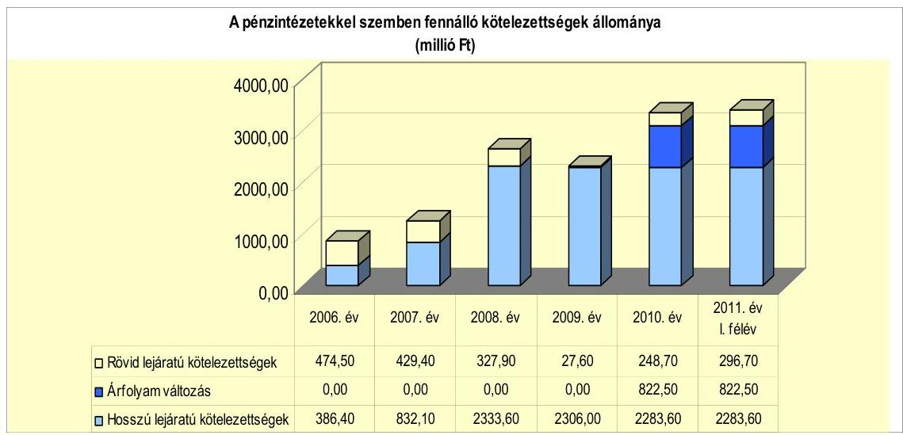

Az Önkormányzat a CHF-ben fennálló kötvénykötelezettsége év végi értékelését a Számv. tv-ben és az Áhsz-ben foglaltak ellenére a 2008-2009. években nem végezte el. A 2010. év végén a kötvénykötelezettség értékelését elvégezték, az árfolyamváltozás összege a $222,68 \mathrm{Ft} / \mathrm{CHF}$ árfolyamon 822,5 millió Ft volt.

Annak megítéléséről, hogy a devizában fennálló kötvény visszavásárlása az Önkormányzat számára forintban összességében többletkiadást (árfolyamveszteség) vagy kiadási megtakarítást (árfolyamnyereség) eredményez, a futamidő végén, a teljes kötelezettség rendezését követően lehet képet alkotni. Mindaddig, amíg törlesztési kötelezettség nem áll fenn (türelmi idő, moratórium), a tőkére vonatkoztatva nem értelmezhető sem az árfolyamveszteség, sem az árfolyamnyereség. Ugyanakkor a számviteli szabályok meghatározzák, hogy az árfolyamkülönbözetet év végén a kötelezettségek között a könyvviteli mérlegben nyilván kell tartani, azonban árfolyam-különbözet ebben az esetben ténylegesen nem képződött.

Az Önkormányzat költségvetési rendelete a 2007., a 2010. és a 2011. években múködési, míg a 2007., 2009-2011. években felhalmozási forráshiányt is tartalmazott. Az egyes években kimutatott költségvetési hiány finanszírozását hitelfelvétellel tervezték. Az Önkormányzat a likviditási problémák megoldására folyószámla- és munkabérhitelt vett igénybe. A fejlesztéseihez a saját forrást saját bevételből, hitelfelvételből és kötvénykibocsátásból biztosította. Az adósság

---

kezelése érdekében a kötvénykibocsátás bevételéből 2008-ban visszafizette az akkor fennálló 531,5 millió Ft folyószámlahitel tartozását.

A 2008. évben az Önkormányzat hosszú lejáratú pénzintézettel szembeni kötelezettségvállalásaira (egy kötvénykibocsátás és négy hitelfelvétel) kép-viselő-testületi döntés alapján került sor. A kötvénykibocsátás a pénzintézetek versenyeztetésével ${ }^{28}$ történt. A négy hosszú lejáratú hitel felvétele során az Önkormányzat az akkori számlavezető banktól kért ajánlatokat az MFB által bonyolított, Sikeres Magyarország Önkormányzati Infrastruktúra Hitelprogram keretében nyújtott kedvezményes kamatozású fejlesztési hitelekre. Az Önkormányzat egybeszámította a négy, együttesen 29,8 millió Ft keretösszegű hitel tervezett költségét. A hitelek becsült költsége nem érte el a közbeszerzési értékhatárt, ezért a hitelfelvételre versenyeztetés nem történt. A kötvénykibocsátásról szóló előterjesztésekben a kötelezettségvállalás kamat- és árfolyamkockázatait, a hitelfelvételek előterjesztésében a kamatkockázatot bemutatták. A 20082011. év I. félévében az Önkormányzat negyedévente tájékoztatást kapott a kötvénykibocsátáshoz és -befektetéshez kapcsolódó kamat- és árfolyamkockázatok alakulásáról. Az Önkormányzat az adósságot keletkeztető kötelezettségvállalásának felső határát a 2008. évben hozott hitelfelvételi, kötvénykibocsátási döntésekkel - az Ötv. előírását betartva - nem lépte túl. Az Önkormányzat a $\mathrm{Kbt}_{1}$ 23. §-ában és 3 . számú melléklet $6 / \mathrm{b}$. pontjában ${ }^{29}$ foglaltak ellenére - közbeszerzési eljárás lebonyolítása nélkül - adta át a folyószámla vezetését a 2008. évi kötvénykibocsátást finanszírozó pénzintézetnek ${ }^{30}$ 2008. december 1-jétől.

[^0]
[^0]:    ${ }^{28}$ A Kbt ${ }_{1}$ a kötvénykibocsátás pénzügyi szolgáltatásra a közbeszerzési eljárás lefolytatását nem írta elő.
    ${ }^{29}$ 2012. január 1-jétől a Kbt 2 7. § (1) bekezdése és 3. számú melléklet 6/b. pontja
    ${ }^{30}$ A kötvénykibocsátást finanszírozó pénzintézet a versenyeztetés II. fordulójára benyújtott ajánlatában módosította korábbi ajánlatát azzal, hogy számlavezetéssel együtt a kamatfelár 1,05\%, számlavezetés nélkül 1,15\%. Az Önkormányzat az összességében legkedvezőbb árajánlat alapján választotta ki a kötvénykibocsátást végző bankot, amelynek ajánlata tartalmazta a számlavezetést is.

---

Az Önkormányzat 2011. június 30-án HUF-ban fennálló adósságot keletkeztető kötelezettségvállalását mutatja be a következő táblázat:

| Megnevezés | Szerződéskötés idöpontja | Összeg   ezer HUF-ban | Kamat (referencia kamat+ kamatfelár) | Felhasználás célja: |
| :--: | :--: | :--: | :--: | :--: |
| Beruházási hitel 2005/1. | 2005. május 31. | 456 839,6 | 3 havi BUBOR + $0,05 \%$ | Alsórész-Oncsa Csatornamú Beruházó Víziközmü-társulat részére felvett hitel a szennyvízcsatorna hálózat kiépítése érdekében |
| Beruházási hitel 2005/2. | 2005. december 2. | 2734,0 | 3 havi EURIBOR + $1,07 \%$ | Ivóvízellátás biztosítása Mezőtúr,   Pusztabánrévén a meglevő avult   rendszer rekonstrukciójának I.   üteméhez |
| Beruházási hitel 2005/3. | 2005. december 2. | 35698,0 | 3 havi EURIBOR + $1,53 \%$ | Felsörészi temetö ravatalozó építésére, Városháza homlokzat felújítása II. ütem, Alkotmány tér, Kollói A. utca szilárd burkolatú út épitése |
| Beruházási hitel 2006/1. | 2006. március 27. | 15982,9 | 3 havi EURIBOR + $1,8 \%$ | Strandfürdő vízforgató berendezéseinek korszerüültése |
| Beruházási hitel 2006/2. | 2006. szeptember 15. | 4080,0 | 3 havi EURIBOR + $1,3 \%$ | Mezötúr Alsórész-Oncsa városrészének szennyvízcsatorna hálózat kiépítésével kapcsolatos beruházás megvalósítása |
| Beruházási hitel 2006/3. | 2006. szeptember 15. | 8514,8 | 3 havi EURIBOR + $1,8 \%$ | Mezötúr Városi Sportcsernok pályafburkolat felújítása |
| Beruházási hitel 2006/4. | 2006. szeptember 15. | 5007,5 | 3 havi EURIBOR + $1,6 \%$ | Mezötúr Városháza homlokzat felújítása III. ütem |
| Beruházási hitel 2006/5. | 2006. november 13. | 11972,2 | 3 havi EURIBOR + $1,029 \%$ | Kórház-rendelőintézet rekonstrukciója |
| Beruházási hitel 2006/6. | 2006. november 13. | 9802,3 | 3 havi EURIBOR + $1,529 \%$ | Bálvány út építése I. ütem és az Úváros XIV. út szilárd burkolatú útépítés |
| Beruházási hitel 2008/1. | 2008. január 29. | 22200,0 | 3 havi EURIBOR + $1,3 \%$ | Úvárosi csapadékvíz-csatornázási beruházás I. szakasz megvalósítása |
| Beruházási hitel 2008/2. | 2008. január 29. | 4317,9 | 3 havi EURIBOR + $1,8 \%$ | Mezötúr VIII. út építése |
| Beruházási hitel 2008/3. | 2008. január 29. | 1680,5 | 3 havi EURIBOR + $1,8 \%$ | Fürdő út építése |
| Beruházási hitel 2008/4. | 2008. január 29. | 1614,9 | 3 havi EURIBOR + $1,8 \%$ | Lehel út aszfaltozása |

Az Önkormányzat 2011. június 30-án HUF-ban fennálló hitelszerződései közül a 2005. május 31-én kötött 456,8 millió Ft keretösszegű hitel teljes összegét a vállalt hitelcélra, az Alsórész-Oncsa Víziközmű Társulat szennyvízcsatorna hálózat kiépítéséhez - a társulat 2007. március 22-i megszűnése után - az Önkormányzat hívta le és használta fel. A hitelhez kapcsolódóan hiteltörlesztésre 1,0 millió Ft-ot, kamat- és egyéb költségre 59,1 millió Ft-ot fordítottak a 2011. év I. félév végéig. A 2007-ben átvállalt társulati hitelre - a 2007. előtt kötött, Képviselő-testület által jóváhagyott, háromoldalú hitelszerződés szerint - a társulat megszűnéséig az Önkormányzat kezességet vállalt, majd a megszűnést követően adósként belépett.

Az Önkormányzat az MFB által bonyolított Sikeres Magyarországért Önkormányzati Infrastruktúra Hitelprogram keretében a 2005. december 2. és 2006. november 13. között nyolc hitelszerződést kötött. A szerződések alapján 93,2 millió Ft összegben, legutóbb 2007-ben 34,4 millió Ft összegben hívott le hitelt. A kedvezményes kamatozású hitelek elsősorban az ivóvízellátás, ravatalozó építés, városháza homlokzat-felújítása, útépítések, strandfürdő vízforgató berendezése, kórház rekonstrukció beruházásokhoz kapcsolódtak. A hitelkeretből a 2005. december 2-án 35,7 millió Ft keretösszegre megkötött szerződés esetében nem vettek igénybe 0,6 millió Ft-ot, a többi szerződésnél a hitelkeretet teljes egészében lehívták. Az igénybe vett hitelt a szerződés szerinti hitelcélokra fordították. Hiteltörlesztésre 2011. június 30-ig 69,9 millió Ft-ot, kamatra 14,5 millió Ft-ot fizettek.

---

Az Önkormányzat 2008. január 29-én négy hitelszerződést kötött az MFB által bonyolított Sikeres Magyarországért Önkormányzati Infrastruktúra Hitelprogram keretében 29,8 millió Ft hitelkeretre. Ebből 28,8 millió Ft-ot vettek igénybe, mivel az Újvárosi csapadékvíz csatornázás beruházás I. szakaszának megvalósításához szükséges hiteligény 1,0 millió Ft-tal csökkent. A 2011. év. I. félév végéig 13,1 millió Ft hiteltörlesztést és 2,6 millió Ft kamatot fizettek meg, a kedvezményes hitelek miatt egyéb fizetési kötelezettség nem keletkezett. A 13 hoszszú lejáratú forinthitelt nyújtó pénzintézet azonos volt az Önkormányzat akkori számlavezetőjével.

Az Önkormányzat 2011. június 30-án CHF-ben fennálló hosszú lejáratú adósságot keletkeztető kötelezettségvállalása a következő volt:

| Megnevezés | Kibocsátás   időpontja | Összeg ezer   CHF-ben | Kibocsátási   árfolyam   Ft/CHF | Kamat   (referencia kamat+   kamatfelár) | Felhasználás célja: |
| :-- | :--: | :--: | :--: | :--: | :-- |

Az Önkormányzat 2008. október 3-án „Mezőtúr Város Fejlődéséért" kötvényt bocsátott ki 11777,0 ezer CHF (1800,0 millió Ft) összegben. A kötvénykibocsátás 20 év futamidővel, 2009. március 31-én kezdődő, félévenkénti kamatfizetési kötelezettséggel történt. A kötvény törlesztése első alkalommal - a türelmi idő miatt - 2013. szeptember 30-án esedékes 196 ezer CHF összegben.

A kötvénykibocsátásból származó bevételből - a kötvénykibocsátásról 2008. szeptember 24-én aláírt kiegészítő megállapodás szerint - 800,0 millió Ft-ot, vagy annak megfelelő devizaösszeget betétként (pénzóvadék) helyeztek el a kötvény futamidejének végéig, de legalább a kötvénykibocsátás napjától számított hét évig. Ezt az összeget a bank zárolta, azzal, hogy az Önkormányzat jogosult ezt az összeget hozam- és tőkegarantált betétben elhelyezni, illetve abból értékpapírt vásárolni.

Az Önkormányzat - tájékoztatása szerint - a kötvénykibocsátásból származó forrásból 2011. június 30-ig 930,4 millió Ft-ot használt fel.

A kötvénykibocsátásból származó bevételből 2008-ban a folyószámlahitel kiváltás történt meg 531,5 millió Ft, illetve működési célú felhasználás 88,5 millió Ft összegben. A 2009. évben közvilágítás-korszerűsítés, óvodai nyílászárócsere, a gimnázium felújítása, szennyvíztisztító beruházás, ivóvízminőség-javítás és telekvisszavásárlás célokra 72,6 millió Ft-ot vettek igénybe. A 2010. évben a szennyvíztisztító beruházásra, a Kossuth úti Általános Iskola felújítására, biztosítási kötvényvásárlásra, apport utáni illetékkötelezettség átvállalására, kórházi gépműszerbeszerzésre, a Víz- és Csatornamú Kft. részére múködési célú pénzeszkózátadásra és az Ipari Park Kft. tőkeemelésére 149,5 millió Ft-ot használtak fel. A 2011. év I. félévében a Kossuth úti Általános Iskola felújítására, biztosítási kötvényre, apport utáni illeték átvállalt befizetésére, kórházi gép-műszerbeszerzésre, Víz- és Csatornamú Kft. részére múködési célú pénzeszkózátadásra és az Ipari Park Kft. tőkeemelésére 88,3 millió Ft-ot fordítottak.

---

Az Önkormányzatnál 2011. június 30-án a kötvénykibocsátásból származó bevétel, a tőkésített kamat és hozambevétel fel nem használt maradványa az adatszolgáltatás szerint 988,2 millió $\mathrm{Ft}^{31}$ volt. A kötvényforrás és hozamának maradványából 800 millió Ft-ot pénzóvadékként lekötöttek, azzal nem rendelkezhet az Önkormányzat legalább hét évig. A fennmaradó összeggel az Önkormányzat szabadon, banki korlátozás nélkül rendelkezhet. A „Mezőtúr Város Fejlődéséért" kötvény kibocsátásából származó bevétel befektetéséből, lekötéséből a 2008-2011. év I. féléve közötti időszakban 222,6 millió Ft kamat és 189,4 millió Ft árfolyamnyereség bevételt értek el. Az elért kamatbevétel közel kétszerese volt a kötvény 2011. június 30 -ig teljesített 115,0 millió Ft kamatfizetésének. A kamatbevételt és árfolyamnyereséget a kötvénykibocsátással kapcsolatos díjak, kötvénykamat, kötvényhez kapcsolódó gazdasági tanácsadói díj, kifizető ügynöki díj fizetésére, a korábban felvett hitelek törlesztésére, a devizában történt befektetések árfolyamveszteségére fordították 293,4 millió Ft öszszegben. A kötvénykibocsátáshoz kapcsolódóan 2011. június 30 -ig a türelmi idő miatt tőketörlesztést nem fizettek. A kötvénykibocsátással kapcsolatban egyszeri díjként 1,8 millió Ft szervezési díjat, 4,0 millió Ft jegyzési garanciavállalási díjat fizettek meg. 2011. június 30 -ig kötvénykamatra 581,2 ezer CHF (115,0 millió Ft), kifizető ügynöki díjra 61,9 ezer CHF (11,2 millió Ft), gazdasági tanácsadói díjra 45,7 millió Ft összeget fordítottak. A kötvényt kibocsátó pénzintézet azonos az Önkormányzat jelenlegi számlavezetőjével.

A forgalmazói szerződésben a kibocsátó bank - ajánlatának megfelelően - térítésmentesen vállalta a kifizető ügynöki feladatok ellátását. A kibocsátó bank azonban 2009-ben a gazdasági válság hatására, kockázatának mérséklése érdekében kezdeményezte az Önkormányzatnál a fizető ügynöki feladatok ellátásáért évi $1,8 \%$-os díjfizetést vagy az óvadéki betét 500,0 millió Ft-tal történő megemelését és 1,3\%-os díjfizetést. Az Önkormányzat 2009. június 24-i döntésében $0,7 \%$-os díjat fogadott el, amelyet 2009. december 31-ig lehetett alkalmazni. Továbbá nem járult hozzá az óvadéki betét összegének 500,0 millió Ftos emeléséhez. Az Önkormányzat kifizető ügynöki díj címén 2009-ben 11,2 millió Ft-ot fizetett ki a kibocsátó banknak.

Az Önkormányzat 2011. június 30-án HUF-ban fennálló pénzintézettel szembeni kötelezettségeiből 84,0 millió Ft tőkét, 72,0 millió Ft kamatot és 4,2 millió Ft egyéb költséget fizetett meg. A CHF-ben fennálló pénzintézeti kötelezettsége után 581,2 ezer CHF ( 115,0 millió Ft) kamatot, 61,9 ezer CHF (11,2 millió Ft) és 45,7 millió Ft egyéb költséget, valamint 5,8 millió Ft egyszeri díjat fizetett.

Az Önkormányzat 2011. június 30-át követően egy hosszú lejáratú hitelszerződést kötött 2011. október 19-én. A szerződésben a Sikeres Magyarországért Önkormányzati Infrastruktúra Hitelprogram keretében a környezetvédelemhez kapcsolódó beruházási célokon belül csapadékvízelvezetést szolgáló beruházások megvalósítására 44,4 millió Ft hitelkeretben állapodtak meg. A hitel lejárata 2014. június 30. A hitelkeretből 2011.

[^0]
[^0]:    ${ }^{31}$ 2011. június 30-án a 988,2 millió Ft fel nem használt maradványból devizabetétben (EUR) 920,6 millió Ft, Ft-betétben 2,7 millió Ft, befektetési alapnál devizában 6,8 millió Ft, forintban 58,3 millió Ft összeget fektettek be. Az EUR-ban elhelyezett befektetések Ftértékét a 2011. június 30-i EUR árfolyamon állapították meg.

---

november 30-ig 30,3 millió Ft-ot hívtak le az Újváros és Kertváros csatornázási beruházás saját erő kiváltására.

Az Önkormányzat múködésének pénzügyi egyensúlyát az ellenőrzött időszakban folyószámla- és munkabér-megelölegezési hitel, továbbá egy alkalommal éven belüli lejáratú hitel igénybevételével tudta biztosítani.

A folyószámlahitel és a munkabér-megelőlegezési hitelkeretet és az igénybevett hiteleket a következő táblázat mutatja be:

| Megnevezés | 2007. év | 2008. év | 2009. év | 2010. év | 2011. év I.   félév |
| :-- | --: | --: | --: | --: | --: |
| I. Folyószámlahitel |  |  |  |  |  |
| a folyószámlahitel keretösszege január 1-jén | 460,0 | 600,0 | 150,0 | 150,0 | 200,0 |
| teljesített kamat és egyéb költség | 39,1 | 37,0 | 10,1 | 9,1 | 13,9 |
| II. Munkabér megelölegezési hitel |  |  |  |  |  |
| Igenybevett hitel összesen: | 875,0 | 0,0 | 100,0 | 150,0 | 300,0 |
| teljesített kamat és egyéb költség | 4,7 | 0,0 | 1,0 | 0,7 | 2,5 |

Az Önkormányzat a vizsgált időszakon belül minden évben vett igénybe folyószámlahitelt. Az Önkormányzatnak a folyószámlahitel szerződés fordulónapjain fennálló záró állománya 2007. évben 483,5 millió Ft, a 2008. évben 363,3 millió Ft, illetve a számlavezető pénzintézet váltáskor (2008. november 27-én) 531,5 millió Ft volt. Az 531,5 millió Ft összegű folyószámlahitelt 2008. november 27-én a kötvénybevételből visszafizették. A folyószámlahitel kötelezettséget kedvezőbb kondíciókkal rendelkező kötvénykötelezettségre váltották át. Ennek hatására az Önkormányzat pénzügyi pozíciója javult, az adósságszolgálat szerkezete kedvezőbbé vált. A vizsgált időszak végére azonban a folyószámlahitel összege - az időközben végrehajtott megtakarítási intézkedések ellenére - újratermelődött. Az állandósult folyószámlahitel növeli a banki kitettség kockázatát. A 2009. évben négy fordulónapból záró állományt három fordulónapon mutattak ki 65,7 millió Ft (2009. augusztus 1-jén), 34,1 millió Ft (2009. szeptember 1-jén), illetve 31,0 millió Ft (2009. november 2-án) összegben. A 2010. évben három fordulónapon volt záró állomány 77,8 millió Ft (2010. augusztus 1-jén), 65,0 millió Ft (2010. szeptember 1-jén) és 22,3 millió Ft (2010. október 1-jén). A folyószámlahitel a 2007-2011. év I. félév közötti mérleg fordulónapi záró állománya a 2007. évben (december 31.) 368,9 millió Ft-ot, a 2010. évben (december 31.) 176,2 millió Ft-ot, míg a 2011. év I. félévében (2011. június 30-án) 235,5 millió Ft-ot tett ki.

A Képviselő-testület a pénzügyi egyensúly biztosításához szükséges folyószám-la-hitelkeret összegét a 2007. évről a 2008. évre 460,0 millió Ft-ról 600,0 millió Ft-ra ( $30,4 \%$-kal) emelte, majd a kötvénykibocsátást követően (2008. novemberben) 150 millió Ft-ra csökkentette. Ezt követően 2010. októbertől három alkalommal határoztak a hitelkeret emeléséről, így a hitel maximális összege a 2011. év I. félév végére a 2008. novemberi lehetőség kétszeresére, 300,0 millió Ft-ra emelkedett. A helyszíni vizsgálat lefolytatása idején a hitelkeret 400,0 millió Ft volt. Az egyes években a folyószámlahitel lejáratakor a bank új szerződés, illetve szerződés módosítás megkötésével - a hitelt tovább folyósította, így az Önkormányzatnak a lejáratkor nem kellett a hitelt törlesztenie. A folyószámlahitellel kapcsolatos kamatkiadás a vizsgált időszakban összesen 102,4 millió Ft-ot tett ki, egyéb költség címén az Önkormányzat összesen 6,8 millió Ft tényleges kifizetést mutatott ki.

---

A folyószámlahitel napi átlagos állománya 365 napra vetítve a 2007-2009. év között csökkenést, majd a 2010. évtől emelkedést mutat. A 2007. évi 498,5 millió Ft-ról, a 2008. évre 389,4 millió Ft-ra, a 2009. évre 31,7 millió Ft-ra csökkent, majd a 2010. évre 76,8 millió Ft-ra, míg a 2011. év I. félévére 223,3 millió Ft-ra nőtt.

Amennyiben a folyószámlahitel átlagos napi állomány számításánál csak a ténylegesen hitellel zárt napok számát vesszük alapul, akkor az átlagos napi állomány a 2007. évben 498,5 millió Ft, a 2008. évben 428,2 millió Ft, a 2009. évben 57,3 millió Ft, a 2010. évben 92,2 millió Ft, a 2011. év I. félévében 223,3 millió Ft volt.

Az Önkormányzatnál a rendszeresen igénybevett folyószámlahitel tartós és növekvő mértékú bevonása a kiadások fedezetének biztosításába a pénzügyi helyzet folyamatos romlását jelezte a 2010. évtől.

Munkabér-megelőlegezési hitel igénybevételére a vizsgált időszakon belül a 2007. évben minden hónapban, a 2008. évben nem, a 2009. évben két alkalommal, majd 2010. októberő̉l rendszeresen, minden munkabérfizetéskor sor került. Az Önkormányzat a 2011. év I. félévében már minden napon munka-bér-megelőlegezési hitellel zárt, ekkor a hitel átlagos napi állománya 50,0 millió Ft volt. A munkabér-megelőlegezési hitellel összefüggésben összesen 8,6 millió Ft kamatkiadása keletkezett az Önkormányzatnak, egyéb költség címén 0,3 millió Ft került kifizetésre.

A munkabér-megelőlegezési hitel napi átlagos állománya 365 napra vetítve a 2007. évben 61,3 millió Ft, a 2009. évben 8,4 millió Ft, a 2010. évben 14,7 millió Ft és a 2011 év I. félévben 50,0 millió Ft volt.

Az Önkormányzatnál a 2010. évtől a munkabér-megelőlegezési hitel tekintetében az igénybevételi napok számának és a napi átlagos állományának növekedése, a hitel visszafizetésének elhúzódása azt jelzi, hogy a munkabérmegelőlegezési hitel is jelentős szerepet töltött be a likviditás fenntartásában.

Az Önkormányzat a vizsgált időszak alatt a folyószámlahitelen és a mun-kabér-megelőlegezési hitelen kívül a 2007. évben, egy alkalommal egyéb likvid hitelt is igénybe vett.

A számlavezető pénzintézettel történt szerződés alapján 30,0 millió Ft összegű egyéb likvid hitel igénybevételére - a Mezőtúr, Erkel út 30. sz. alatti - ingatlan értékesítéséből származó bevétel megelőlegezése miatt került sor 2007. szeptember 18-án. A felvett kölcsön után 3 havi BUBOR $+0,2 \%$ kamat (szerződéskori mértéke 7,94\%) került felszámításra, egyéb költség nem terhelte az Önkormányzatot. A kölcsön összegét két részletben, 2007. november 15-én, illetve 2008. március 31-én fizették vissza.

A kiadások egyéb likvidhitellel történő részbeni finanszírozása az Önkormányzatnak a 2007-2008. években összesen 0,7 millió Ft kamatkiadást eredményezett.

---

A folyószámlahitel és a munkabér-megelőlegezési hitel kondíciói a következők voltak ${ }^{32}$ :

| Megnevezés | Kamat (referencia+ kamatfelár) | Egyéb költség |
| :--: | :--: | :--: |
| Folyószámlahitel |  |  |
| 2007. év-2008. 06.19 | 3 havi BUBOR $+0,2 \%$ | $0,00 \%$ |
| 2008.06.20-2008.11.26 | 3 havi BUBOR $+1,2 \%$ | $0,1 \%$ kezelési klg $+0,15 \%$   rend tart, jutalék |
| 2008.11.27-2009.07.29. | 1 havi BUBOR $+0,8 \%$ | $0,00 \%$ |
| 2009.07.30-2009.11.01. | 1 havi BUBOR $+0,8 \%$ | $0,2 \%$ rend tart, jutalék |
| 2009.11.02-2011.év | 1 havi BUBOR $+1,7 \%$ | $0,2 \%$ rend tart, jutalék |
| Munkabér-megelölegezési hitel |  |  |
| 2007.év-2008.11.26. | 3 havi BUBOR $+0,2 \%$ | 0 |
| 2008.11.27-2009.07.29. | 1 havi BUBOR $+0,5 \%$ | 0 |
| 2009.07.30-2009.11.01. | 1 havi BUBOR $+0,5 \%$ | $0,2 \%$ rend tart, jutalék |
| 2009.11.02-2011.év | 1 havi BUBOR $+1,7 \%$ | $0,2 \%$ rend tart, jutalék |

A folyószámlahitellel összefüggésben kifizetett kamat összege a 2007. évben 39,1 millió Ft, illetve 2008. évben 35,5 millió Ft volt. Ezekben az években az igénybevett összeg nagysága és az igénybevétel napjainak a száma együttesen eredményezték a kamat összegének nagyságát. A folyószámlahitelhez kapcsolódó referencia kamat a 2009. évről 2011. év I. félévre 2,6 százalékponttal, a kamatfelár a számlavezető pénzintézet változása eredményeként 2008. novemberben 0,4 százalékponttal csökkent, majd 2009. októberben 0,9 százalékponttal emelkedett. A kedvező hitelfolyósítási feltételek és az alacsonyabb öszszegben felvett hitel hatására a fizetett kamatok összege a 2009. évben az előző évhez képest csökkenést mutatott, mivel a folyószámlahitel - 365 napra számított - átlagos állománya 357,7 millió Ft-tal ( $91,9 \%$-kal), a hitellel zárt napok száma 130 nappal ( $39,2 \%$-kal) csökkent. A folyószámlahitellel zárt napok száma a 2009. évről a 2010. évre 102 nappal ( $50,5 \%$-kal), az átlagos állomány összege 45,1 millió Ft-tal ( $142,1 \%$-kal) nőtt, amelyet ellensúlyozott a referenciakamat további 3,14 százalékpontos csökkenése, így a fizetett kamat összege 1,0 millió Ft-tal ( $12,1 \%$-kal) csökkent. A 2011. év I. félévi adatok alapján a referenciakamat ( 0,53 százalékpontos), a kamatfelár ( 0,1 százalékpontos) és a folyószámlahitel átlagos napi állományának emelkedése ( 146,5 millió Ft) miatt az éves kamatfizetési kötelezettség növekedése várható, amely a folyószámlahitel folyamatos igénybevétele mellett a pénzügyi kockázatot növeli.

Az Önkormányzat munkabér-megelőlegezési hitelt a 2007. évben, továbbá a 2009-2011. június 30. közötti időszakban vett igénybe. A referenciakamat a 2011. évtől 0,53 százalékponttal emelkedett. A kamat mértékének, a hitellel zárt napok számának és a hitel átlagos napi állományának növekedése együttesen már a 2011. év I. félév végére a fizetett kamat összegének 1,7 millió Ft-os ( $275,0 \%$-os) emelkedését okozta. A munkabér-megelőlegezési hitel vonatkozásában a kamatfelár 2009. szeptembertől nem változott.

Az Önkormányzat a 2011. június 30-án fennálló hosszú lejáratú beruházási célú hitelei és kötvénye után - a kamatfizetéskor érvényes devizanemtől függően - 581,2 ezer CHF (115,0 millió Ft) és 72,0 millió Ft kamatot fizetett meg. Az Önkormányzat 2011. június 30-án fennálló hosszú lejáratú hitelekből és kötvényből származó kötelezettségei esetében a referenciakamat válto-

|  | MNB BUBOR fixing (állagkamat) \%-ban |  |  |  |  |  |
| :-- | :--: | :--: | :--: | :--: | :--: | :--: |
|  | Referencia kamat | 2007. évl | 2008. évl | 2009. évl | 2010. évl | 2011. évl   félév |
| 32 | 1 havi BUBOR | 7,83 | 8,75 | 8,66 | 5,47 | 6,00 |
|  | 3 havi BUBOR | 7,75 | 8,87 | 8,64 | 5,50 | 6,07 |

---

zása befolyásolta és jelenleg is befolyásolja a kamatfizetési kötelezettségek alakulását. A kamatok változását az alábbi táblázat mutatja be:

| Megnevezés | Kibocsátási, lehivási | Utolsó fizetéskori | Változás \% |
| :--: | :--: | :--: | :--: |
|  | kamat (referencia = kamatfelár) \% |  |  |
| 3 havi BUBOR (Beruházási hitel 2005/1.) | 7,360\% | 3,268\% | $-55,6 \%$ |
| 3 havi EURIBOR (Beruházási hitel 2005/2.) | 3,216\% | 2,607\% | $-18,9 \%$ |
| 3 havi EURIBOR (Beruházási hitel 2005/3.) | 3,676\% | 3,067\% | $-16,6 \%$ |
| 3 havi EURIBOR (Beruházási hitel 2006/1.) | 4,292\% | 4,787\% | 11,5\% |
| 3 havi EURIBOR (Beruházási hitel 2006/2.) | 4,361\% | 4,037\% | $-7,4 \%$ |
| 3 havi EURIBOR (Beruházási hitel 2006/3.) | 4,861\% | 4,787\% | $-1,5 \%$ |
| 3 havi EURIBOR (Beruházási hitel 2006/4.) | 4,861\% | 4,787\% | $-1,5 \%$ |
| 3 havi EURIBOR (Beruházási hitel 2006/5.) | 4,405\% | 2,566\% | $-41,7 \%$ |
| 3 havi EURIBOR (Beruházási hitel 2006/6.) | 4,405\% | 3,066\% | $-30,4 \%$ |
| 3 havi EURIBOR (Beruházási hitel 2008/1.) | 6,065\% | 4,037\% | $-33,4 \%$ |
| 3 havi EURIBOR (Beruházási hitel 2008/2.) | 6,565\% | 4,787\% | $-27,1 \%$ |
| 3 havi EURIBOR (Beruházási hitel 2008/3.) | 6,565\% | 4,787\% | $-27,1 \%$ |
| 3 havi EURIBOR (Beruházási hitel 2008/4.) | 6,565\% | 4,787\% | $-27,1 \%$ |
| 6 havi CHF LIBOR ("Mezőtúr Város Fejlődéséért" kötvény) | 4,105\% | 1,305\% | $-68,2 \%$ |

Az Önkormányzat 2010. december 31-én fennálló hosszú lejáratú kötelezettségei változó kamatozásúak voltak. A megfizetett kamatfelár a 2007-2011. év I. félév közötti időszakban nem változott egyik kötelezettségnél sem. Az Önkormányzatnak a kibocsátáskori, illetve az első lehíváskori kamattal számolva 2011. június 30-ig a kötvénynél 1226,1 ezer CHF, a hosszú lejáratú hiteleknél 199,1 millió Ft kamatfizetési kötelezettsége jelentkezett volna. A referencia kamatváltozások miatt 644,9 ezer CHF és 127,1 millió Ft összeggel kevesebb fizetési kötelezettséget kellett teljesítenie.

Az Önkormányzat kötelezettségeinek 2010. december 31-ei és 2011. június 30-ai állományát és várható alakulását a kötelezettségek lejáratáig a következő táblázat szemlélteti:

| Megnevezés | Állomány december 31-én |  | Állomány 2011. június 30-án |  | Várható kötelezettség 2011-2013. években |  | Várható kötelezettség 2014. évtől |  |
| :--: | :--: | :--: | :--: | :--: | :--: | :--: | :--: | :--: |
|  | HUF-ban   (millió. Ft)   (sen) | Devizétben (összege, ezer CHF-ben) | HUF-ban   (millió. Ft)   (sen) | Devizétben (összege, ezer CHF-ben) | HUF-ban   (millió Ft-ben) | Devizétben (összege, ezer CHF-ben) | HUF-ban   (millió Ft-ben) | Devizétben (összege, ezer CHF-ben) |
| Pénzintézeti kötelezettségek |  |  |  |  |  |  |  |  |
| Folyószámlahtitel | 176,2 |  | 235,5 |  |  |  |  |  |
| Munkabérhitel | 50,0 |  | 50,0 |  |  |  |  |  |
| Beruházási hitel 2005/1. | 455,8 |  | 455,8 |  | 495,7 |  | 0,0 |  |
| Beruházási hitel 2005/3. | 0,5 |  | 0,3 |  | 0,5 |  | 0,0 |  |
| Beruházási hitel 2005/4. | 6,1 |  | 2,7 |  | 6,2 |  | 0,0 |  |
| Beruházási hitel 2006/1. | 3,8 |  | 2,3 |  | 3,9 |  | 0,0 |  |
| Beruházási hitel 2006/2. | 2,1 |  | 1,7 |  | 2,3 |  | 0,0 |  |
| Beruházási hitel 2006/3. | 4,5 |  | 3,7 |  | 4,8 |  | 0,0 |  |
| Beruházási hitel 2006/4. | 2,6 |  | 3,1 |  | 2,6 |  | 0,0 |  |
| Beruházási hitel 2006/5. | 6,9 |  | 5,7 |  | 7,1 |  | 0,0 |  |
| Beruházási hitel 2006/6. | 5,6 |  | 4,7 |  | 5,8 |  | 0,0 |  |
| Beruházási hitel 2008/1. | 13,2 |  | 11,5 |  | 11,7 |  | 2,7 |  |
| Beruházási hitel 2008/2. | 2,8 |  | 2,4 |  | 2,3 |  | 0,7 |  |
| Beruházási hitel 2008/3. | 1,1 |  | 0,9 |  | 0,9 |  | 0,3 |  |
| Beruházási hitel 2008/4. | 1,0 |  | 0,9 |  | 0,9 |  | 0,3 |  |
| "Mezőtúr Város Fejlődéséért"   kötvény |  | 11777,0 |  | 11777,0 |  | 663,0 |  | 12 981,9 |
| Pénzintézeti kötelezettségek összesen HUF-ben: | 732,2 |  | 780,2 |  | 545,0 |  | 4,0 |  |
| Pénzintézeti kötelezettségek összesen CHF-ben: |  | 11777,0 |  | 11777,0 |  | 663,0 |  | 12 981,9 |
| Lóing |  | 18,6 |  | 15,3 |  | 20,4 |  | 0,0 |
| Biztosítékok |  |  |  |  |  |  |  |  |
| Kezesség | 89,2 |  | 73,9 |  | - |  | - |  |
| Biztosítékok összesen: | 89,2 |  | 73,9 |  | - |  | - |  |
| Szállító tartozás | 192,7 |  | 124,1 |  | 124,1 |  | 0,0 |  |
| Pénzintézeti kötelezettségek hitelesi; biztosíték, szállító/ tartozás összesen HUF-ben: | 1014,1 |  | 978,2 |  | 669,1 |  | 4,0 |  |
| Pénzintézeti kötelezettség ikötvényi; lóing összesen CHFben: |  | 11795,6 |  | 11792,3 |  | 683,4 |  | 12 981,9 |

---

Az Önkormányzatnak pénzintézetekkel szemben fennálló kötelezettsége a 2010. év végén 732,2 millió Ft és 11777 ezer CHF volt. Ezek várható kötelezettsége (tőke és kamat) a legutóbbi kamatfizetés feltételei alapján a 2011-2013. években 545,0 millió Ft és 663,0 ezer CHF. Az Önkormányzatnak a 2011-2013. években szállítói tartozások címén 124,1 millió Ft fizetési kötelezettsége keletkezett. A kezességvállalásaiból adódóan 73,9 millió Ft összegű terhe jelentkezhet, amennyiben a Kórház Nkft. a forgóeszköz- és folyószámlahitelekre vonatkozó kötelezettségeit nem teljesíti. Az Önkormányzat a Kórház Nkft. által felvett hitelekhez tett kezességvállalás során betartotta - Ötv. 88. § (2) bekezdésében ${ }^{33}$ foglaltaknak megfelelően - az adósságot keletkeztető kötelezettségvállalásának felső határát.

A 2011-2013. években esedékes kötelezettségek teljesítésére - az esetleg képződő működési jövedelmen túl - figyelembe vehető 67,5 millió Ft mérlegben kimutatott követelésállomány és a forgalomképes ingatlanvagyon. A törlesztések fedezeteként a 2010. december 31-én meglévő - lekötött betétet is tartalmazó 1117,9 millió Ft pénzkészlet nem vehető igénybe, mivel ebből kellett elkülöníteni a kötvénykibocsátáskor vállalt 800,0 millió Ft-os óvadéki betétet. A fennmaradó pénzkészlet pedig kötelezettséggel terhelt volt. A követelésállomány esetében kockázatot jelent annak behajthatósága, illetve a forgalomképes ingatlanvagyon értékesíthetősége a jelenlegi piaci viszonyok között. Az Önkormányzat pénzintézettel szembeni (kötvény) és egyéb (lízing) kötelezettségei teljesítésének kockázata emelkedhet az azokat érintő árfolyamemelkedés hatására. A kötvénykötelezettség árfolyamának alakulásáról negyedévente tájékoztatták a Képviselő-testületet, azonban a lízing kötelezettségéről nem. Az Önkormányzatnál nem biztosított a vállalt pénzintézettel szembeni és egyéb kötelezettségek fedezete az erre igénybe vehető működési jövedelem prognosztizált csökkenése, illetve a 2013-tól kezdődő kötvénytörlesztés - árfolyamemelkedés hatására várható - növekedése következtében. Ez már rövid távon (a 2011-13. években) veszélyezteti az Önkormányzat pénzügyi egyensúlyát. Az Önkormányzat gazdasági társaságtól és egyéb szervezettől kölcsönt nem kapott.

A 2014. évtől az Önkormányzat várható tőke- és kamatkötelezettsége 4,0 millió Ft és 12 981,9 ezer CHF. Ezekre az Önkormányzat tájékoztatása szerint figyelembe vehető forrás a saját bevételek figyelembe vételével képződő működési jövedelem. Az Önkormányzatnak a folyó bevételeiből elsődlegesen a folyó kiadások finanszírozását, majd a tőketörlesztést kell biztosítania. A 2014-től esedékes jelenleg ismert pénzintézettel szembeni kötelezettségek teljesítését nem látjuk biztosítottnak, mivel a 2007-2010. években a saját bevételt is magukban foglaló a folyó bevételek a folyó kiadások finanszírozását követően már nem nyújtottak teljes egészében fedezetet a tőketörlesztésre egyik vizsgált évben sem. Tovább rontja a pénzügyi helyzetet, hogy az Önkormányzat folyószámlahitel állománya növekszik, és a kötvénybevételt nem csak fejlesztési célokra vették igénybe. Az Önkormányzat központi forrásból származó meghatározó folyó bevétele, a normatív állami hozzájárulás a tanuló- és ellátotti létszám, illetve az egy főre jutó támogatás csökkenése miatt a vizsgált időszakban folyamato-

[^0]
[^0]:    ${ }^{33}$ 2012. január 1-jétől a Stabilitási tv. 10. § (3) bekezdés

---

san csökkent. Ez a jelenleg hatályos forrásszabályozás alapján az Önkormányzat pénzügyi helyzetének további romlását vetíti előre.

Az adósságszolgálat teljesítése érdekében a pénzintézeti kötelezettségek visszafizetési forrásainak számszerúsítése - a csökkenő múködési jövedelem, valamint a kibocsátott kötvény 2013. évtől kezdődő törlesztése következtében - továbbra is indokolt ${ }^{34}$. Mind a korábban hatályban lévő, mind pedig a 2012 januárjában hatályba lépett jogszabályok előírják az önkormányzatok számára az előrelátó tervezést és gazdálkodást. A jövőre nézve az alábbi jogszabályok az iránymutatóak.

Az államháztartásról szóló 2011. évi CXCV. törvény 29. § (3) bekezdése előírja, hogy „a helyi önkormányzat ... évente, legkésőbb a költségvetési rendelet ... elfogadásáig határozatban állapítja meg a Stabilitási tv. 45. § (1) bekezdés a) pontja felhatalmazása alapján kiadott jogszabályban meghatározottak szerinti saját bevételeinek, valamint a Stabilitási tv. 3. § (1) bekezdése szerinti adósságot keletkeztető ügyleteiből eredő fizetési kötelezettségeinek a költségvetési évet követő három évre várható összegét".

A Magyarország gazdasági stabilitásáról szóló 2011. évi CXCIV. törvény 10. § (3) kezdése értelmében „az adósságot keletkeztető ügyletből származó tárgyévi összes fizetési kötelezettsége az adósságot keletkeztető ügylet futamidejének végéig egyik évben sem haladhatja meg az önkormányzat adott évi saját bevételeinek 50\%-át."

# 3.2. A szállítói kötelezettségek változása 

Az Önkormányzat könyvviteli mérlege szerinti szállítói kötelezettségének év végi állománya ${ }^{35}$ a 2010. évben 192,7 millió Ft volt, amely a 2007-2009. évek átlagos állományi értékének (55,6 millió Ft-nak) a három és félszeresét jelentette. A 2011. év I. félévi állomány összege 124,1 millió Ft volt. A szállítói tartozások növekedése a 2010. évben és 2011. év I. félévében a folyamatban lévő európai uniós projektekhez kapcsolódóan befogadott, beruházásokhoz kapcsolódó számlák miatt következett be. A szállítói állomány az összes kötelezettségen belül 2007-ben 6,8\%-ot, míg 2011. június 30 -án $3,5 \%$-ot tett ki. A szállítói állomány összes kötelezettséghez viszonyított arányának csökkenését az összes kötelezettség kötvénykibocsátás miatti növekedése okozta.

Az Önkormányzat a 2006-2011. év I. félév közötti időszakban folyamatosan rendelkezett lejárt szállítói állománnyal ${ }^{36}$, melynek értéke a 2007. évi

[^0]
[^0]:    ${ }^{34}$ A polgármester észrevétele a következő volt:
    1/i „Az önkormányzati rendszerben várhatóan nagy változások fognak bekövetkezni, amelyek érintik a feladatellátást és az ehhez kapcsolódó finanszírozást egyaránt. Jelenleg igen kevés ismerettel rendelkeznek az önkormányzatok a változásokról és azok önkormányzatokat érintő hatásairól. Ezért úgy ítélem meg, hogy az előzőekben leírtak miatt megalapozottan nehéz modellezni három évre elöre az önkormányzati kötelezettségek finanszírozási forrásait."
    ${ }^{35}$ Az Önkormányzat szállítói kötelezettségének év végi állománya és az összes kötelezettséghez viszonyított aránya a 2007. évben 107,8 millió Ft (6,8\%), a 2008. évben 41,8 millió Ft (1,8\%), a 2009. évben 17,2 millió Ft ( $0,7 \%$ ), a 2010. évben 192,7 millió Ft (5,4\%), a 2011. év I. félévében 124,1 millió Ft (3,5\%) volt.
    ${ }^{36}$ Az Önkormányzatnál a lejárt szállítói tartozás állomány összege a 2007. évben 70,9 millió Ft, a 2008. évben 23,9 millió Ft, a 2009. évben 6,4 millió Ft, a 2010. évben 22,7 millió Ft, 2011. június 30 -án 18,9 millió Ft volt.

---

70,9 millió Ft-ról 2011. június 30-ra kevesebb, mint egyharmadára, 18,9 millió Ft-ra csökkent. A lejárt szállítói állomány több mint háromnegyed részét minden évben a 30 nap alatti tartozások összege tette ki. Az Önkormányzat kimutatásában 2011. június 30 -án fennálló 30 nap alatti lejárt szállítói állomány 17,7 millió Ft-ot ( $93,6 \%$ ), míg a 31 és 60 nap közötti kötelezettsége 1,2 millió Ft-ot ( $6,4 \%$-ot) jelentett, amely a pénzügyi helyzetet jelentősen nem befolyásolta. Az Önkormányzatnak a vizsgált időszakban nem volt átütemezési megállapodással érintett szállítói állománya, valamint egyéb kiadáselmaradása. Az Önkormányzat kórházat 2007. január 31-ig tartott fenn.

# 3.3. Egyéb kötelezettségek változása 

Az Önkormányzat garanciavállalást nem tett, PPP konstrukcióban megvalósuló beruházást nem hajtott végre. Az Önkormányzatnak a vizsgált időszakban egy szerződésből adódóan állt fenn líáingtartozása, amelyet 2008 júliusában kötött személygépjármú beszerzésére 4,8 millió Ft összegben. A CHF-ben fennálló lízingdíjat havi részletekben kell megfizetnie. A tőke és kamattartozás várható összege a 2011-2013. években 20,4 ezer CHF. Az Önkormányzat a Számv. tv. 60. § (2) bekezdésében foglalt előírást megsértve, az Áhsz. 33. § (1) bekezdésében foglaltak ellenére a 2008-2010. években a CHF-ben fennálló lízingkötelezettség év végi értékelését - a Számv. tv. 60. §-a szerinti árfolyamon - nem végezte el. A lízingkötelezettség 2010. december 31-én el nem számolt árfolyamváltozása - a 222,68 Ft/CHF árfolyamon - 1,5 millió Ft volt.

Az Önkormányzat a 2007-2011. év I. féléve között kilenc esetben tett kezességvállalást. A 2011. június 30 -án nyilvántartott 73,9 millió Ft kezességvállalás az Önkormányzat kizárólagos tulajdonában lévő Kórház Nkft.-nek egy hosszú lejáratú hiteléhez és egy folyószámlahiteléhez tett kezességvállalásából adódott. Az Ipari Park Kft. 2011. augusztus 2-án kötött egy líingszerződést 36,0 millió Ft összegben, amelyhez kapcsolódóan az Önkormányzat készfizető kezességet vállalt. A líingszerződés lejárta 2016. augusztus 5. napja.

Az elengedett követelések összege a 2007-2011. június 30. közötti időszakban 154,0 millió Ft volt, amelyből a behajthatatlan követelések összege 18,0 millió Ft-ot tett ki. Az elengedett követelést döntően a Kórháznak nyújtott kölcsön elengedése, továbbá részben az építményadó, iparúzési adó, gépjármúadó, bírság, késedelmi pótlék követelések képezték.

A Kórház 2007. január 31-ével szűnt meg, az Önkormányzat a számára nyújtott 110,3 millió Ft összegű kölcsönt a 2009. évben engedte el. Az Önkormányzat a Kórház megszűnését követően, a 2009. évben történt követelés elengedéssel a 2007. és 2008. években a mérleg összeállításakor megsértette a Számv. tv. 15. § (3) és 69. § (1) bekezdését, továbbá az Áhsz. 13/A. § (1) és 37. § (1) bekezdését.

A behajthatatlan követeléseket osztályvezetői feljegyzés alapján engedtek el az Önkormányzatnál. Ezzel megsértették az Art. 81., 146. § (1), továbbá a 162. § (1) bekezdéseit, valamint a Hatv. 140. § (2) bekezdésének r) pontját, mivel e törvényi rendelkezések alapján az adótartozás behajthatatlanná minősítése és törlése az Önkormányzat jegyzőjének a hatáskörébe tartozik.

---

A felszámolás, megszűnés miatti követelésekből 12,8 millió Ft összeget szintén osztályvezetői feljegyzés alapján töröltek az Önkormányzatnál a 2007-2011. év I. félévében. Ezzel megsértették az Önkormányzat 2007-2011. évekre szóló költségvetési rendeleteit.

Az Önkormányzat megsértette a költségvetéséről szóló 4/2007. (III. 16.) számú rendeletének 11. § (2) bekezdés b) pontját, amely előírja, hogy a követelés leírását 1,0 millió Ft-ig a Pénzügyi Bizottság, 1,0 millió Ft felett a képviselő-testület engedélyezi, a 6/2008. (III. 14.) számú rendelet 11. § (2) bekezdés b) pontját, a 4/2009. (III. 6.) számú rendelet 11. § (2) bekezdés b) pontját, az 1/2010. (III. 5.) számú rendelet 11. § (2) bekezdés b) pontját, amelyek előírják, hogy a követelés leírását 1,5 millió Ft-ig a Pénzügyi Bizottság, 1,0 millió Ft felett a képviselő-testület engedélyezi, valamint a 6/2011. (III. 9.) számú rendelet 11. § (2) bekezdés b) pontját, amely előírja, hogy a követelés leírását 1,0 millió Ft-ig a polgármester, 1,0 millió Ft felett a képviselő-testület engedélyezi.

A Képviselő-testület az Ipari Park Kft.-nek az előző években nyújtott tagi kölcsönből 13,0 millió Ft-ot engedett el a 2009. évben.

Az Ipari Park Kft.-nek az Önkormányzat a 2002-2006. évek között 31,0 millió Ft tagi kölcsönt nyújtott. A 2007-2008. években nyújtott tagi kölcsönökkel együtt a kölcsön állománya 2008. december 31-én 40,6 millió Ft volt. A Képviselő-testület a 95/2009. (VI. 30.) számú határozatával 13,0 millió Ft kölcsöntartozást elengedett a gazdasági társaságnak, a 286/2009. (XI. 26.) számú határozattal a fennmaradó 27,6 millió Ft kölcsön összegéből 0,5 millió Ft-ot a gazdasági társaságban jegyzett tőkeemelésre fordított, 27,1 millió Ft-ot tőketartalékba helyezett.

Az Önkormányzat pénzügyi egyensúlyára az elengedett követelések nagyságuk miatt hatással voltak.

A Képviselő-testület a 2007. év januárjában döntött a Kórház január havi múködéséhez 25,0 millió Ft összegű kölcsön nyújtásáról, amelyből az intézmény 6,0 millió Ft-ot vett igénybe. Az intézményt üzemeltetésre átvevő gazdasági társaság a kölcsönből 2007. június 30-án 1,6 millió Ft-ot visszafizetett. Az Önkormányzat a kórházat 2007-2009 között működtető gazdasági társaságnak és a Kórház Nkft.-nek kölcsönt nem nyújtott. Az Ipari Park Kft.-nek nyújtott tagi kölcsön összege a 2007. és a 2008. években összesen 9,6 millió Ft-ot tett ki. A Képviselő-testület a kölcsönök nyújtásáról szóló 257/2006. (XII. 11.) számú és 1/2008. (I. 17.) számú határozataiban a kölcsönök visszafizetésére határidőt nem jelölt meg.

Az Önkormányzat egyéb szervezeteknek kölcsönt nem nyújtott, saját gazdasági társaságától kölcsönt nem vett igénybe a 2007-2011. június 30. közötti időszakban. Az Önkormányzat pénzügyi egyensúlyára a nyújtott kölcsönök nagyságuk miatt nem voltak hatással.

Az Önkormányzat egy elidegenítési és terhelési tilalommal terhelt ingatlannal rendelkezett 2011. június 30-án. Az elidegenítési és terhelési tilalmat a 2002. évben szociális bérlakás építésére elnyert 66,9 millió Ft támogatás biztosítékaként jegyezték be. Az Önkormányzatnál jelzáloggal megterhelt ingatlan nem volt.

---

Az Önkormányzat ellen peres eljárás - mely jövőbeni fizetési kötelezettséget jelenthet - nem volt folyamatban 2011. június 30 -án. A Kórház Nkft. ellen három, jogerős bírósági döntéssel nem lezárt kártérítési per volt folyamatban 2011. június 30 -án, a pertárgy értéke összesen 39,0 millió Ft.

Az Önkormányzat 50\%-ot és azt meghaladó tulajdonosi hányaddal rendelkezik hat társaságában, amelyek kötelezettségeinek állományát 2010. december 31-én és 2011. június 30 -án, valamint azok várható összegét a kötelezettségek lejáratáig az alábbi táblázat mutatja be:
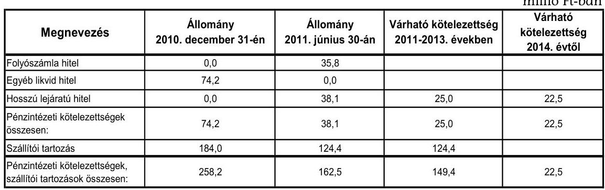

Az önkormányzati kötelezettségek növekedése mellett a minősített többségi tulajdonú társaságok kötelezettségei is befolyásolhatják az Önkormányzat pénzügyi egyensúlyát. A Kórház Nkft.-nek a 2011. évtől 60,8 millió Ft pénzintézeti tőke és kamatkötelezettséget, a hat minősített önkormányzati többségi tulajdonú gazdasági társaságnak 124,4 millió Ft szállítói tartozást kell rendezniük.

Az Önkormányzat kizárólagos tulajdonában lévő Kórház Nkft.-nek a 2010. évben 31,2 millió Ft volt a lejárt szállítói állománya, amelyből 1-60 nap közötti volt 17,8 millió Ft, 61-90 nap közötti volt 0,9 millió Ft és 91-365 nap közötti volt 12,5 millió Ft. 2011. június 30 -án a lejárt tartozások összege 16,5 millió Ft-ra csökkent, amelyből a teljes állomány 1-60 nap közötti volt.

Az Önkormányzat pénzügyi egyensúlyára kockázatot jelenthet a jövőben, hogy a Kórház Nkft. lejárt szállítói állománya 2011. június 30 -án 16,5 millió Ft volt, 35,8 millió Ft folyószámlahitellel gazdálkodott és 38,1 millió Ft hosszú lejáratú forgóeszközhitele is volt.

A Kórház Nkft. 2011. június 30-án fennálló 35,8 millió Ft folyószámlahiteléhez és 38,1 millió HUF összegű éven túli forgóeszközhiteléhez kapcsolódó önkormányzati kezességvállalás az Önkormányzat szempontjából pénzügyi kockázatot jelent. A társaság nem fizetése esetén a bank az esedékes kamat és tőketörlesztő-részlet összegével - azonnali beszedési megbízással - az Önkormányzat bankszámláját a Ptk. 272. §-a alapján megterheli.

További pénzügyi kockázatot jelenthet, hogy felszámolás esetén a bíróság megállapíthatja az Önkormányzat korlátlan és teljes felelősségét a fentiekben bemutatott szállítói kötelezettségekkel érintett egy $95,8 \%$-os, egy $94,8 \%$-os és négy kizárólagos önkormányzati tulajdonú gazdasági társaság után.

Az Önkormányzat a gazdasági társaságokról szóló 2006. évi IV. törvény 54. § (2) bekezdése alapján korlátlan felelősséggel tartozik azon gazdasági társaságának felszámolása esetében, amelyben az Önkormányzat az 52. § (2) bekezdése szerint

---

a szavazatok legalább 75\%-ával rendelkezik, így minősített befolyásszerzőnek minősül, továbbá a csődeljárásról és a felszámolási eljárásról szóló 1991. évi XLIX. törvény 63. § (2) bekezdése alapján a kizárólagos önkormányzati tulajdonú gazdasági társaságának minden olyan kötelezettségéért, amelynek kielégítését a felszámolási eljárás során az adós társaság vagyona nem fedez, ha a hitelezőinek a felszámolási eljárás során benyújtott keresete alapján a bíróság - az adós társaság felé érvényesített tartósan hátrányos üzletpolitikájára figyelemmel - megállapítja az önkormányzat korlátlan és teljes felelősségét.

Az Önkormányzat jövőbeni pénzügyi helyzetét befolyásolhatja az elavult eszközök pótlási kötelezettsége. Az Önkormányzat az immateriális javai és tárgyi eszközei ${ }^{37}$ után a 2007-2010. években együttesen 1349,8 millió Ft értékcsökkenést számolt el ${ }^{38}$. Az Önkormányzat a 2007-2011. év I. félév közötti időszakban összesen 1156,1 millió Ft értékben aktivált - főként ingatlanokat érintő - felújítást és beruházást. Az aktivált fejlesztések kizárólag az Önkormányzat kezelésében lévő vagyont érintették. Az átadott eszközökön a vizsgált időszakban az Önkormányzat nem aktivált beruházást, felújítást.

Az Önkormányzat kezelésében lévő eszközök használhatósága romlott, a 20072010. években a használhatósági fok mutató csökkenése figyelhető meg, amely az eszközök állagának romlását jelenti. Ezt alátámasztja az önkormányzati kezelésű eszközökre számított használhatósági fok mutató változása is. A mutató a 2007. évi 84,1\%-hoz képest 2008-ra 2,3, a 2008. évhez képest 2009-re 3,0 majd 2010-re 4,4 százalékponttal csökkent ${ }^{39}$. A saját kezelésben lévő és az átadott vagyon használhatóságának változása a felújítás, beruházás elmaradását, a magasabb leírási kulccsal rendelkező, gyorsabban avuló vagyontárgyak (építmények, gépek, berendezések) létét jelzi.

Az Önkormányzat az eszközök pótlására az értékcsökkenésnek megfelelő öszszegű tartalékot nem képzett ${ }^{40}$. A 2007-2010. években befejeződött, illetve a 2010. december 31-én folyamatban lévő beruházások, felújítások 2010. december 31-ig pénzügyileg teljesített kiadásaiból az Önkormányzat 355,8 millió Ftot fordított 2010. december 31-ig eszközpótlásra (rekonstrukcióra, felújításra), ez az összeg a 2007-2010. években elszámolt amortizáció $26,4 \%$-a.

[^0]
[^0]:    ${ }^{37}$ beleértve az üzemeltetésre, kezelésre átadott eszközöket is
    ${ }^{38}$ 2007-ben 256,5 millió Ft-ot, 2008-ban 277,8 millió Ft-ot, 2009-ben 189,3 millió Ft-ot és 2010-ben 967,9 millió Ft-ot
    ${ }^{39}$ Az eszközök használhatósági foka önkormányzati szinten a 2007. évben 84,1\%, a 2008. évben $81,8 \%$, a 2009. évben $78,8 \%$, a 2010. évben $74,4 \%$-volt.
    ${ }^{40}$ Az Önkormányzatot nem kötelezi előírás arra, hogy tartalékot, illetve alapot képezzen az elhasználódott eszközök pótlására.

---

# 4. A PÉNZÜGYI EGYENSÚLY MEGTEREMTÉSE ÉRDEKÉBEN HOZOTT INTÉZKEDÉSEK EREDMÉNYE 

Az Önkormányzat a vizsgált időszakban a pénzügyi helyzet javítása érdekében a teljes ellátó rendszert érintő kiadáscsökkentő intézkedésekről döntött. A létszámcsökkentési, intézményátszervezési, és egyéb kiadáscsökkentő intézkedések együttesen, az Önkormányzat adatszolgáltatása alapján összesen 516,4 millió Ft kiadási megtakarítást eredményezett.

A 2007-2011. év I. félév között végrehajtott kiadáscsökkentő intézkedések megoszlását a következő ábra szemlélteti:
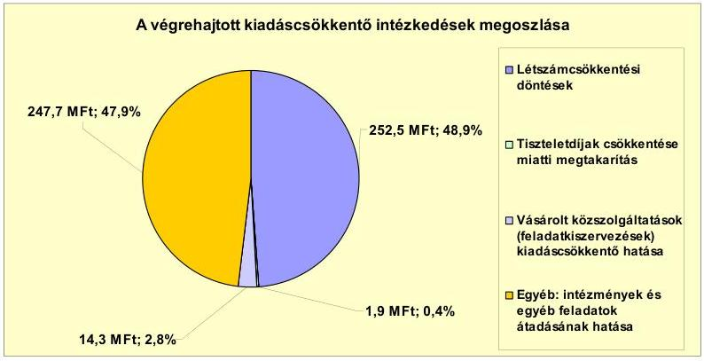

Az intézményi (közoktatási és közművelődési) feladatellátás racionalizációjával összefüggő létszámcsökkentésből az összes kiadási megtakarítás 48,9\%-a, 252,5 millió Ft keletkezett. Az Önkormányzat a 2010. évben döntött a képviselők tiszteletdíjának csökkentéséről, amely 1,9 millió Ft ( $0,4 \%$ ) kiadási megtakarítást jelentett. A 2009. évben a közoktatási intézmények és a Polgármesteri hivatal takarítási feladatát saját tulajdonú gazdasági társaságnak adták át, ezen intézkedés 14,3 millió Ft-tal ( $2,8 \%$ ) járult hozzá a kiadási megtakarításhoz. Az egészségügyi, szociális, gyermekjóléti és egyéb feladatok megyei önkormányzatnak, többcélú társulásnak, illetve gazdasági társaságnak történő átadásával 247,7 millió Ft (47,9\%) kiadáscsökkenést értek el. A vizsgált időszakban a kimutatott összes kiadási megtakarítás 54,3\%-a (280,4 millió Ft) önként vállalt feladat átadásához kapcsolódó döntés eredménye volt.

Az Önkormányzat által 2007-2010. évek között végrehajtott létszámcsökkentések alakulását a következő táblázat mutatja:

| Megnevezés   (adatok fő-ben) | Közoktatás | Szociális és   gyermekvédelem | Egészségügy | Polgármesteri   hivatal | Egyéb | Összesen |
| :-- | --: | --: | --: | --: | --: | --: |
| 2007. január 1-jén jóváhagyott átáshelyek száma | 370 | 139 | 262 | 75 | 176 | 1022 |
| Megszüntetett átáshelyek száma | 95 | 139 | 262 | 7 | 126 | 629 |
| ebből: | üres átáshelyek száma | 4 |  | 0 |  | 4 |
|  | szakmai átáshelyek száma | 35 | 78 | 184 | 7 | 76 | 380 |
|  | intézmény-üzemeltetéssel kapcsolatos   átáshelyek száma | 56 | 61 | 78 | 0 | 50 | 245 |
| Atáshely növekedése | 32 | 0 | 0 | 13 | 6 | 51 |
| 2010. december 31-én záró átáshelyek száma | 307 | 0 | 0 | 81 | 56 | 444 |
| 2007. január 1-jén foglalkoztatott létszám | 366 | 139 | 262 | 75 | 176 | 1018 |
| Létszámcsökkenés | 91 | 139 | 262 | 7 | 126 | 625 |
| Létszámnövekedés | 32 | 0 | 0 | 13 | 6 | 51 |
| 2010. december 31-én foglalkoztatott létszám | 307 | 0 | 0 | 81 | 56 | 444 |

---

Az önkormányzati kimutatások alapján a 2007-2010. évek között az engedélyezett álláshelyek száma 629 fővel csökkent. A 2007. évi 1022 fős induló tényleges foglalkoztatotti létszám a feladatátadásokra irányuló önkormányzati döntések következtében 2010. december 31-ére 444 főre csökkent. A megszüntetett 629 álláshelyből 380 fő ( $60,4 \%$ ) szakmai, 245 fő ( $39,0 \%$ ) intézményüzemeltetéssel kapcsolatos álláshely volt, továbbá 4 darab ( $0,6 \%$ ) üres álláshely zárolására került sor.

A vizsgálattal érintett években meghozott döntések hatására a közoktatásban 95 fő ( $15,1 \%$ ), a szociális és gyermekvédelem területén 139 fő ( $22,1 \%$ ), egészségügyi ágazatban 262 fő ( $41,7 \%$ ), a Polgármesteri hivatalban hét fő ( $1,1 \%$ ), egyéb területen 126 fő ( $20,0 \%$ ) álláshely megszüntetésére került sor. Ezzel egy időben a vizsgált időszakban a közoktatási ágazatban a tanügyi társulás létrehozása, továbbá a feladatellátásra (pedagógiai szakszolgálatra és szakoktatásra) vonatkozó jogszabályok változása, a Polgármesteri hivatalon belül a körjegyzőségi feladatok ellátása miatt, illetve a tűzoltóságnál jogszabályi előírás alapján összesen 51 álláshelyet létesítettek. Így összességében az időszak álláshelyeinek száma 578 fővel csökkent.

Az Önkormányzat a vizsgált időszakon belül 2007., 2008. és 2010. évben nyújtott be pályázatot a helyi szervezési intézkedésekhez kapcsolódó központi támogatásra. Az Önkormányzatnál a 2010. december 31-ig folyósított 156,8 millió Ft központi támogatás felhasználásával 62 fő tartós álláshelymegszüntetés történt meg, ami a vizsgált években megszüntetett álláshelyek (629 fő) 9,9\%-át jelentette.

Az Önkormányzat a kiadások fedezetének biztosítása érdekében, a bevételek növelése céljából a helyi adó mértékének növeléséről és az adókkal kapcsolatos kedvezmények, mentességek csökkentéséről döntött. A döntések hatására az Önkormányzat kimutatása szerint a vizsgált időszakban összesen 19,8 millió Ft bevételt realizáltak.

A magánszemélyek kommunális adójával kapcsolatos intézkedéseken belül az adó mértékének növelése 14,6 millió Ft ( $73,7 \%$ ) többletbevételt, míg az egyes kedvezmények csökkentése, illetve megszüntetése 5,2 millió Ft ( $26,3 \%$ ) bevételnövekedést eredményezett az Önkormányzat számára.

Az Önkormányzatnál a vizsgált időszakban a kommunális adót érintő intézkedések hatására képződött többletbevétel nem ellentételezte az adóbevételeken belül az iparűzési adó 2008-ról 2010-re történt 174,2 millió Ft-os csökkenését.

Az Önkormányzat kiadáscsökkentő és bevételnövelő intézkedései eredményeként a 2007-2011. év I. félév között összesen 536,2 millió Ft megtakarítást és többletbevételt mutatott ki. Az intézkedések eredménye fedezetet nyújtott a költségvetési támogatások és az átengedett szja bevételek 2007. évhez viszonyított, együttesen 371,8 millió Ft összegű csökkenésére. Az Önkormányzat által eddig tett intézményszerkezeti átalakítások, a feladatellátás átszervezése, a kiadáscsökkentő és bevételnövelő intézkedések nem biztosítanak elegendő forrást a pénzügyi egyensúly helyreállításához.

---

# 5. Az ÁSZ Által a korábBi ÉVEKben a PÉNZÜGYI EGYENSÚLY JAVÍTÁSÁRA TETT SZABÁLYSZERŰSÉGI ÉS CÉLSZERŰSÉGI JAVASLATOK HASZNOSULÁSA 

Az ÁSZ a V-3001-4/10/2009. számú számvevői jelentésében az Önkormányzat gazdálkodási rendszerét a 2009. évben ellenőrizte átfogó jelleggel. A gazdálkodási rendszer korábbi ellenőrzése során tett javaslatok közül a pénzügyi egyensúly javítására kettő szabályszerüségi javaslat vonatkozott. A javaslatok megvalósítása érdekében a Képviselő-testület a 197/2009. (IX. 24.) számú határozatával elfogadta a számvevői jelentésben foglaltak végrehajtására készített, felelősöket és határidőket is tartalmazó intézkedési tervet.

A pénzügyi egyensúly javítására vonatkozó szabályszerűségi javaslatok teljes mértékben megvalósultak, mivel a Képviselő-testület az SzMSz módosításával döntött a likvid pénzeszköz- és kockázatkezeléssel összefüggő hatáskör átruházásáról, továbbá az Önkormányzat a költségvetési rendeleteiben a 2010. évtől az Áht ${ }_{1} 8 / \mathrm{A}$. § (7) bekezdésében ${ }^{41}$ foglalt előírásoknak megfelelően, finanszírozási célú pénzügyi műveletek nélkül mutatta be a költségvetési bevételi és kiadási előirányzatok főösszegeit.

Budapest, 2012. április " 4 " 10 db
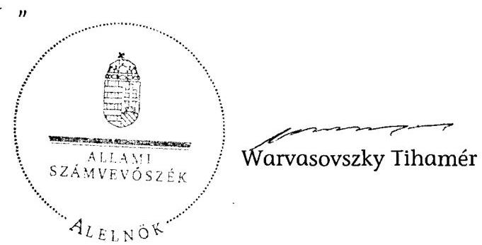

[^0]
[^0]:    ${ }^{41}$ 2012. január 1-jétől hatályát vesztette az Áht ${ }_{2}$ 110. § (2) bekezdése alapján. Az Áht ${ }_{2}$ 72. §-ában foglalt előírás szerint a költségvetési bevételek-kiadások és a finanszírozási célú pénzügyi műveletek bevétele-kiadása továbbra is elkülönül egymástól.

---

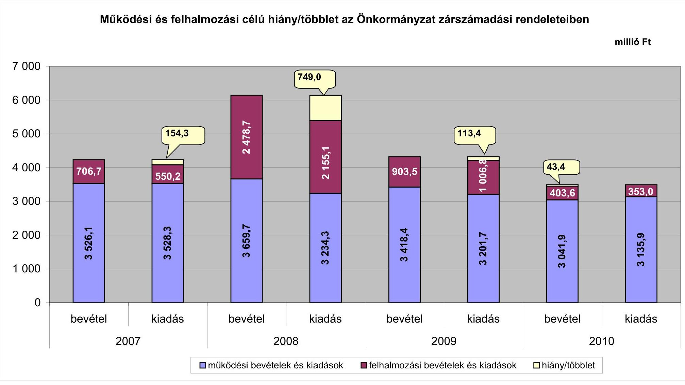

# Müködési és felhalmozási célú hiány/többlet az Önkormányzat zárszámadási rendeleteiben

|  Müködési és felhalmozási célú hiány/többlet az Önkormányzat zárszámadási rendeleteiben | 2007 | 2008 | 2009 | 2010  |
| --- | --- | --- | --- | --- |
|  3 659,7 | 3 234,3 | 3 418,4 | 3 201,7 | 3 135,9  |
|  3 659,7 | 3 234,3 | 3 418,4 | 3 201,7 | 3 135,9  |
|  3 659,7 | 3 234,3 | 3 418,4 | 3 201,7 | 3 135,9  |

**Működési bevételek és kiadások**

**Felhalmozási bevételek és kiadások**

**Hiány/többlet**

---

Az Önkormányzat bevételei és kiadásai, valamint adósságszolgálata 2007-2010 között

|  1. FOLYÓ KÖLTSÉGVETÉS* | 2007. év | 2008. év | 2009. év | 2010. év  |
| --- | --- | --- | --- | --- |
|  1.1.1. Saját müködési bevételek | 829,1 | 941,9 | 958,7 | 688,8  |
|  1.1.2. Költségvetési támogatás**** | 1073,4 | 1685,2 | 1547,5 | 1485,4  |
|  1.1.3. Átengedett bevételek | 1184,8 | 588,7 | 623,8 | 646,3  |
|  1.1.4. Állambáztartáson belülről kapott támogatások | 251,1 | 178,9 | 133,9 | 145,1  |
|  1.1.5. EU-tól és külföldről kapott bevételek | 0,0 | 1,2 | 1,7 | 0,0  |
|  1.1.6. Állambáztartáson kívülről kapott bevételek | 58,9 | 4,9 | 3,0 | 0,6  |
|  1.1.7. Elúző évi pénzmaradvány átvétel | 27,4 | 89,0 | 121,5 | 127,8  |
|  1.1. Folyó bevételek $=1.1 .1 .+1.1 .2 .+1.1 .3 .+1.1 .4 .+1.1 .5 .+1.1 .6 .+1.1 .7$. | 3424,6 | 3489,8 | 3390,1 | 3094,0  |
|  1.2.1. Müködési kiadások kamatkiadások nélkül | 3088,3 | 2679,7 | 2637,0 | 2158,8  |
|  1.2.2. Állambáztartáson belülre átadott pénzeszközök | 20,5 | 20,7 | 24,0 | 86,3  |
|  1.2.3.1. vállalkozásoknak | 0,3 | 9,3 | 96,2 | 409,2  |
|  1.2.3.2. EU-nak, illetve külföldre | 0,0 | 0,0 | 0,0 | 0,0  |
|  1.2.3.3. magáncsomélyeknek | 277,1 | 313,9 | 365,0 | 402,2  |
|  1.2.3.4. nonprofit szervezetelenek | 21,2 | 28,1 | 27,3 | 26,5  |
|  1.2.3. Transzferkiadások ( $=1.2 .3 .1+1.2 .3 .2+1.2 .3 .3+1.2 .3 .4$ ) | 298,6 | 351,3 | 488,5 | 837,9  |
|  1.2.4 Kamatkiadások | 75,3 | 66,4 | 100,5 | 55,5  |
|  1.2.5. Elúző évi pénzmaradvány átadás | 69,2 | 146,5 | 49,5 | 110,3  |
|  1.2. Folyó kiadások $=1.2 .1 .+1.2 .2 .+1.2 .3 .+1.2 .4 .+1.2 .5$. | 3551,9 | 3264,6 | 3299,5 | 3248,8  |
|  1.3. Folyó költségvetés egyenlege MÜKÖDÉSI JÖVEDELEM (1.1. - 1.2.) | $-127,5$ | 225,2 | 90,6 | $-154,8$  |
|  2. FELHALMOZÁSI KÖLTSÉGVETÉS** |  |  |  |   |
|  2.1.1. Saját tökebevételek | 48,1 | 218,7 | 33,8 | 24,3  |
|  2.1.2. Állambáztartáson belülről kapott támogatások**** | 472,9 | 198,2 | 124,8 | 70,2  |
|  2.1.3. EU-tól és külföldről kapott támogatások | 0,0 | 8,0 | 0,7 | 0,0  |
|  2.1.4. Állambáztartáson kívülről kapott támogatások | 20,8 | 48,1 | 325,3 | 22,9  |
|  2.1. Felhalmozási bevételek ( $=2.1 .1 .+2.1 .2+2.1 .3+2.1 .4$.) | 541,8 | 473,0 | 484,6 | 117,4  |
|  2.2.1. Saját beruházási kiadás állva | 327,3 | 361,3 | 269,7 | 119,8  |
|  2.2.2. Saját felújítási kiadás állva | 37,3 | 66,0 | 209,4 | 66,2  |
|  2.2.3. Állambáztartáson belülre átadott pénzeschöze | 12,0 | 0,0 | 0,0 | 0,0  |
|  2.2.4. EU-nak és külföldnek adott pénzeschözők | 0,0 | 0,0 | 0,0 | 0,0  |
|  2.2.5. Állambáztartáson kívülre adott pénzeschözők | 69,3 | 39,5 | 71,7 | 10,8  |
|  2.2.6. Befektetési célú részesedések vásárlása | 4,8 | 6,9 | 30,3 | 43,0  |
|  2.2. Felhalmozási kiadások ( $=2.2 .1 .+2.2 .2 .+2.2 .3 .+2.2 .4 .+2.2 .5 .+2.2 .6$.) | 450,7 | 473,7 | 581,1 | 239,8  |
|  2.3. Felhalmozási költségvetés egyenlege (2.1. - 2.2.) | 91,1 | $-0,7$ | $-96,5$ | $-122,4$  |
|  3. Finanszírozási műveletek nélküli (GFS) pozíció(1.3.+2.3.) | $-36,2$ | 224,5 | $-5,9$ | $-277,2$  |
|  4. Finanszírozási műveletek |  |  |  |   |
|  4.1. Hitelfelvétel | 64,4 | 30,6 | 0,0 | 226,2  |
|  4.2. Hitelförlesztés | 120,7 | 430,6 | 327,9 | 27,6  |
|  4.3. Forgatási és befektetési célú értékpapírok kibocsátása | 0,0 | 1800,0 | 0,0 | 0,0  |
|  4.4. Forgatási és befektetési célú értékpapírok beváltása | 0,0 | 0,0 | 0,0 | 0,0  |
|  4.5. Forgatási és befektetési célú értékpapírok értékesítése | 23,5 | 125,2 | 1125,6 | 22,6  |
|  4.6. Forgatási és befektetési célú értékpapírok vásárlása | 0,0 | 1220,1 | 0,0 | 55,0  |
|  4.7. Egyéb finanszírozási bevételek (függő, átfutó, kiegyenlítő) | $-63,3$ | 28,5 | $-11,7$ | $-73,4$  |
|  4.8. Egyéb finanszírozási kiadások (függő, átfutó, kiegyenlítő) | $-114,2$ | 110,3 | $-13,7$ | $-22,3$  |
|  4.9.Finanszírozási műveletek egyenlege (4.1. - 4.2.+4.3.-4.4+4.5.-4.6.+4.7.-4.8.) | 18,1 | 223,3 | 799,7 | 115,1  |
|  5. Tárgyévi pénzügyi pozíció (1.3.+ 2.3.+4.9.) | $-18,1$ | 447,8 | 793,8 | $-162,1$  |
|  6. Nettó müködési jövedelem =müködési jövedelem (1.3.) - tőketörlesztés (4.2+4.4) | $-248,0$ | $-205,4$ | $-237,3$ | $-182,4$  |
|  TÁJÉKOZTATÓ ADATOK |  |  |  |   |
|  Összes kötelezettség | 1430,2 | 2769,4 | 2464,9 | 3567,6  |
|  ebből rövid lejáratú | 598,1 | 432,1 | 156,3 | 459,9  |
|  Összes szállítói kötelezettség | 107,8 | 41,8 | 17,2 | 192,7  |
|  ebből lejárt (tanúsítványból) | 70,9 | 23,9 | 6,4 | 22,7  |
|  Pénz és tőkeplaci kötelezettség (adósság) | 1261,5 | 2661,5 | 2333,6 | 3354,8  |
|  ebből rövid lejáratú | 429,4 | 327,9 | 27,6 | 240,7  |
|  PPP szerződéses állomány jelenértéken (tanúsítványból) | 0,0 | 0,0 | 0,0 | 0,0  |
|  ebből lejárt szolgáltatási díj miatti kötelezettség | 0,0 | 0,0 | 0,0 | 0,0  |
|  Folyószándabitel napi átlagos állománya (tanúsítványból)*** | 498,5 | 389,4 | 31,7 | 76,8  |
|  Likvidhitel napi átlagos állománya (tanúsítványból)*** | 6,7 | 5,6 | 0,0 | 0,0  |
|  Munkabérhitel napi átlagos állománya (tanúsítványból)*** | 61,3 | 0,0 | 8,4 | 14,7  |
|  Kezesség és garanciavállalások (tanúsítványból) | 67,0 | 0,0 | 74,2 | 89,2  |
|  Jogerős bírósági ítéletekből adódó kötelezettségek (tanúsítványból) | 0,0 | 0,0 | 0,0 | 0,0  |
|  Finanszírozásba bevonható eszközök: | 129,7 | 1631,4 | 1302,7 | 1173,0  |
|  Tartós hitelviszonyt megtestesítő értékpapírok év végi állománya | 91,4 | 1145,3 | 22,7 | 55,1  |
|  Hosszú lejáratú bankbetétek év végi állománya | 0,0 | 0,0 | 0,0 | 0,0  |
|  Értékpapírok év végi állománya | 0,0 | 0,0 | 0,0 | 0,0  |
|  Pénzeschözők (idegen pénzeschözők nélküli) év végi állománya | 38,3 | 486,1 | 1280,0 | 1117,9  |

- Bevételekben nem térül, a kiadásokban nem jelenik meg az amortizáció, a vagyoni helyzetet az egyenleg befolyásolja. ** Bevételekben vagyon megőrzésre és bővítésre fordítható források. *** A folyószámla, a likvid- és a munkabérhitel átlagos állományát 365 napos osztószámmal és nem a fennálló napok számával vettük figyelembe. **** A költségvetési támogatásból a felhalmozási célú összeget az Önkormányzat adatszolgáltatása szerinti mértékben vettük figyelembe a 2.1.2. soron.

---

Mezőtúr Vánra Önkormányzata

Az Önkormányzat 2007-2010 években megvalósított, 2010. december 31-ig befejezett fejlesztései és azok forráslószatátéla

szabó Ft-ban

|  |   |   |   |   |   |   |   |   |   |   |   |   |   |   |   |   |   |   |   |   |   |   |   |   |   |   |   |   |   |   |   |   |   |   |
| --- | --- | --- | --- | --- | --- | --- | --- | --- | --- | --- | --- | --- | --- | --- | --- | --- | --- | --- | --- | --- | --- | --- | --- | --- | --- | --- | --- | --- | --- | --- | --- | --- | --- |
|   |  |  |  |  |  |  |  |  |  |  |  |  |  |  |  |  |  |  |  |  |  |  |  |  |  |  |  |  |  |  |  |  |  |   |
|   |  |  |  |  |  |  |  |  |  |  |  |  |  |  |  |  |  |  |  |  |  |  |  |  |  |  |  |  |  |  |  |  |  |   |
|   |  |  |  |  |  |  |  |  |  |  |  |  |  |  |  |  |  |  |  |  |  |  |  |  |  |  |  |  |  |  |  |  |  |   |
|   |  |  |  |  |  |  |  |  |  |  |  |  |  |  |  |  |  |  |  |  |  |  |  |  |  |  |  |  |  |  |  |  |  |   |
|   |  |  |  |  |  |  |  |  |  |  |  |  |  |  |  |  |  |  |  |  |  |  |  |  |  |  |  |  |  |  |  |  |  |   |
|   |  |  |  |  |  |  |  |  |  |  |  |  |  |  |  |  |  |  |  |  |  |  |  |  |  |  |  |  |  |  |  |  |  |   |
|   |  |  |  |  |  |  |  |  |  |  |  |  |  |  |  |  |  |  |  |  |  |  |  |  |  |  |  |  |  |  |  |  |  |   |
|   |  |  |  |  |  |  |  |  |  |  |  |  |  |  |  |  |  |  |  |  |  |  |  |  |  |  |  |  |  |  |  |  |  |   |
|   |  |  |  |  |  |  |  |  |  |  |  |  |  |  |  |  |  |  |  |  |  |  |  |  |  |  |  |  |  |  |  |  |  |   |
|   |  |  |  |  |  |  |  |  |  |  |  |  |  |  |  |  |  |  |  |  |  |  |  |  |  |  |  |  |  |  |  |  |  |   |
|   |  |  |  |  |  |  |  |  |  |  |  |  |  |  |  |  |  |  |  |  |  |  |  |  |  |  |  |  |  |  |  |  |  |   |
|   |  |  |  |  |  |  |  |  |  |  |  |  |  |  |  |  |  |  |  |  |  |  |  |  |  |  |  |  |  |  |  |  |  |   |
|   |  |  |  |  |  |  |  |  |  |  |  |  |  |  |  |  |  |  |  |  |  |  |  |  |  |  |  |  |  |  |  |  |  |   |
|   |  |  |  |  |  |  |  |  |  |  |  |  |  |  |  |  |  |  |  |  |  |  |  |  |  |  |  |  |  |  |  |  |  |   |
|   |  |  |  |  |  |  |  |  |  |  |  |  |  |  |  |  |  |  |  |  |  |  |  |  |  |  |  |  |  |  |  |  |  |   |
|   |  |  |  |  |  |  |  |  |  |  |  |  |  |  |  |  |  |  |  |  |  |  |  |  |  |  |  |  |  |  |  |  |  |   |
|   |  |  |  |  |  |  |  |  |  |  |  |  |  |  |  |  |  |  |  |  |  |  |  |  |  |  |  |  |  |  |  |  |  |   |
|   |  |  |  |  |  |  |  |  |  |  |  |  |  |  |  |  |  |  |  |  |  |  |  |  |  |  |  |  |  |  |  |  |  |   |
|   |  |  |  |  |  |  |  |  |  |  |  |  |  |  |  |  |  |  |  |  |  |  |  |  |  |  |  |  |  |  |  |  |  |   |
|   |  |  |  |  |  |  |  |  |  |  |  |  |  |  |  |  |  |  |  |  |  |  |  |  |  |  |  |  |  |  |  |  |  |   |
|   |  |  |  |  |  |  |  |  |  |  |  |  |  |  |  |  |  |  |  |  |  |  |  |  |  |  |  |  |  |  |  |  |  |   |
|   |  |  |  |  |  |  |  |  |  |  |  |  |  |  |  |  |  |  |  |  |  |  |  |  |  |  |  |  |  |  |  |  |  |   |
|   |  |  |  |  |  |  |  |  |  |  |  |  |  |  |  |  |  |  |  |  |  |  |  |  |  |  |  |  |  |  |  |  |  |   |
|   |  |  |  |  |  |  |  |  |  |  |  |  |  |  |  |  |  |  |  |  |  |  |  |  |  |  |  |  |  |  |  |  |  |   |
|   |  |  |  |  |  |  |  |  |  |  |  |  |  |  |  |  |  |  |  |  |  |  |  |  |  |  |  |  |  |  |  |  |  |   |
|   |  |  |  |  |  |  |  |  |  |  |  |  |  |  |  |  |  |  |  |  |  |  |  |  |  |  |  |  |  |  |  |  |  |   |
|   |  |  |  |  |  |  |  |  |  |  |  |  |  |  |  |  |  |  |  |  |  |  |  |  |  |  |  |  |  |  |  |  |  |   |
|   |  |  |  |  |  |  |  |  |  |  |  |  |  |  |  |  |  |  |  |  |  |  |  |  |  |  |  |  |  |  |  |  |  |   |
|   |  |  |  |  |  |  |  |  |  |  |  |  |  |  |  |  |  |  |  |  |  |  |  |  |  |  |  |  |  |  |  |  |  |   |
|   |  |  |  |  |  |  |  |  |  |  |  |  |  |  |  |  |  |  |  |  |  |  |  |  |  |  |  |  |  |  |  |  |  |   |
|   |  |  |  |  |  |  |  |  |  |  |  |  |  |  |  |  |  |  |  |  |  |  |  |  |  |  |  |  |  |  |  |  |  |   |
|   |

---

Mezőtúr Város Önkormányzata

b. számú melléklet a V-3100-026/2012. számú Jelenléshez

Az Önkormányzat 2010. december 31-én folyamatban lévő fejlesztési feladataira 2010. december 31-ig teljesített kifizetések és azok forrásösszetétele

milliö Ft-ban

|  Fejlesztési feladat (beruházás, felújítás) | Beruházás, felújítás | Teljes bekerülési költség | 2008. dec. 21-ig teljesített kiadás | 2007-2010. évek között teljesített kiadás | 2007-2010. évek között teljesített kiadás | 2008. dec. 21-ig teljesített kiadás | 2007-2010. évek között teljesített kiadás | 2008. dec. 21-ig teljesített kiadás | 2007-2010. évek között teljesített kiadás | 2008. dec. 21-ig teljesített kiadás | 2008. dec. 21-ig teljesített kiadás | 2008. dec. 21-ig teljesített kiadás | 2008. dec. 21-ig teljesített kiadás | 2008. dec. 21-ig teljesített kiadás | 2008. dec. 21-ig teljesített kiadás | 2008. dec. 21-ig teljesített kiadás | 2008. dec. 21-ig teljesített kiadás | 2008. dec. 21-ig teljesített kiadás | 2008. dec. 21-ig teljesített kiadás | 2008. dec. 21-ig teljesített kiadás | 2008. dec. 21-ig teljesített kiadás | 2008. dec. 21-ig teljesített kiadás | 2008. dec. 21-ig teljesített kiadás | 2008. dec. 21-ig teljesített kiadás | 2008. dec. 21-ig teljesített kiadás | 2008. dec. 21-ig teljesített kiadás | 2008. dec. 21-ig teljesített kiadás | 2008. dec. 21-ig teljesített kiadás | 2008. dec. 21-ig teljesített kiadás | 2008. dec. 21-ig teljesített kiadás | 2008. dec. 21-ig teljesített kiadás | 2008. dec. 21-ig teljesített kiadás | 2008. dec. 21-ig teljesített kiadás | 2008. dec. 21-ig teljesített kiadás | 2008. dec. 21-ig teljesített kiadás | 2008. dec. 21-ig teljesített kiadás | 2008. dec. 21-ig teljesített kiadás | 2008. dec. 21-ig teljesített kiadás | 2008. dec. 21-ig teljesített kiadás | 2008. dec. 21-ig teljesített kiadás | 2008. dec. 21-ig teljesített kiadás | 2008. dec. 21-ig teljesített kiadás | 2008. dec. 21-ig teljesített kiadás | 2008. dec. 21-ig teljesített kiadás | 2008. dec. 21-ig teljesített kiadás | 2008. dec. 21-ig teljesített kiadás | 2008. dec. 21-ig teljesített kiadás | 2008. dec. 21-ig teljesített kiadás | 2008. dec. 21-ig teljesített kiadás | 2008. dec. 21-ig teljesített kiadás | 2008. dec. 21-ig teljesített kiadás | 2008. dec. 21-ig teljesített kiadás | 2008. dec. 21-ig teljesített kiadás | 2008. dec. 21-ig teljesített kiadás | 2008. dec. 21-ig teljesített kiadás | 2008. dec. 21-ig teljesített kiadás | 2008. dec. 21-ig teljesített kiadás | 2008. dec. 21-ig teljesített kiadás | 2008. dec. 21-ig teljesített kiadás | 2008. dec. 21-ig teljesített kiadás | 2008. dec. 21-ig teljesített kiadás | 2008. dec. 21-ig teljesített kiadás | 2008. dec. 21-ig teljesített kiadás | 2008. dec. 21-ig teljesített kiadás | 2008. dec. 21-ig teljesített kiadás | 2008. dec. 21-ig teljesített kiadás | 2008. dec. 21-ig teljesített kiadás | 2008. dec. 21-ig teljesített kiadás | 2008. dec. 21-ig teljesített kiadás | 2008. dec. 21-ig teljesített kiadás | 2008. dec. 21-ig teljesített kiadás | 2008. dec. 21-ig teljesített kiadás | 2008. dec. 21-ig teljesített kiadás | 2008. dec. 21-ig teljesített kiadás | 2008. dec. 21-ig teljesített kiadás | 2008. dec. 21-ig teljesített kiadás | 2008. dec. 21-ig teljesített kiadás | 2008. dec. 21-ig teljesített kiadás | 2008. dec. 21-ig teljesített kiadás | 2008. dec. 21-ig teljesített kiadás | 2008. dec. 21-ig teljesített kiadás | 2008. dec. 21-ig teljesített kiadás | 2008. dec. 21-ig teljesített kiadás | 2008. dec. 21-ig teljesített kiadás | 2008. dec. 21-ig teljesített kiadás | 2008. dec. 21-ig teljesített kiadás | 2008. dec. 21-ig teljesített kiadás | 2008. dec. 21-ig teljesített kiadás | 2008. dec. 21-ig teljesített kiadás | 2008. dec. 21-ig teljesített kiadás | 2008. dec. 21-ig teljesített kiadás | 2008. dec. 21-ig teljesített kiadás | 2008. dec. 21-ig teljesített kiadás | 2008. dec. 21-ig teljesített kiadás | 2008. dec. 21-ig teljesített kiadás | 2008. dec. 21-ig teljesített kiadás | 2008. dec. 21-ig teljesített kiadás | 2008. dec. 21-ig teljesített kiadás | 2008. dec. 21-ig teljesített kiadás | 2008. dec. 21-ig teljesített kiadás | 2008. dec. 21-ig teljesített kiadás | 2008. dec. 21-ig teljesített kiadás | 2008. dec. 21-ig teljesített kiadás | 2008. dec. 21-ig teljesített kiadás | 2008. dec. 21-ig teljesített kiadás | 2008. dec. 21-ig teljesített kiadás | 2008. dec. 21-ig teljesített kiadás | 2008. dec. 21-ig teljesített kiadás | 2008. dec. 21-ig teljesített kiadás | 2008. dec. 21-ig teljesített kiadás | 2008. dec. 21-ig teljesített kiadás | 2008. dec. 21-ig teljesített kiadás | 2008. dec. 21-ig teljesített kiadás | 2008. dec. 21-ig teljesített kiadás | 2008. dec. 21-ig teljesített kiadás | 2008. dec. 21-ig teljesített kiadás | 2008. dec. 21-ig teljesített kiadás | 2008. dec. 21-ig teljesített kiadás | 2008. dec. 21-ig teljesített kiadás | 2008. dec. 21-ig teljesített kiadás | 2008. dec. 21-ig teljesített kiadás | 2008. dec. 21-ig teljesített kiadás | 2008. dec. 21-ig teljesített kiadás | 2008. dec. 21-ig teljesített kiadás | 2008. dec. 21-ig teljesített kiadás | 2008. dec. 21-ig teljesített kiadás | 2008. dec. 21-ig teljesített kiadás | 2008. dec. 21-ig teljesített kiadás | 2008. dec. 21-ig teljesített kiadás | 2008. dec. 21-ig teljesített kiadás | 2008. dec. 21-ig teljesített kiadás | 2008. dec. 21-ig teljesített kiadás | 2008. dec. 21-ig teljesített kiadás | 2008. dec. 21-ig teljesített kiadás | 2008. dec. 21-ig teljesített kiadás | 2008. dec. 21-ig teljesített kiadás | 2008. dec. 21-ig teljesített kiadás | 2008. dec. 21-ig teljesített kiadás | 2008. dec. 21-ig teljesített kiadás | 2008. dec. 21-ig teljesített kiadás | 2008. dec. 21-ig teljesített kiadás | 2008. dec. 21-ig teljesített kiadás | 2008. dec. 21-ig teljesített kiadás | 2008. dec. 21-ig teljesített kiadás | 2008. dec. 21-ig teljesített kiadás | 2008. dec. 21-ig teljesített kiadás | 2008. dec. 21-ig teljesített kiadás | 2008. dec. 21-ig teljesített kiadás | 2008. dec. 21-ig teljesített kiadás | 2008. dec. 21-ig teljesített kiadás | 2008. dec. 21-ig teljesített kiadás | 2008. dec. 21-ig teljesített kiadás | 2008. dec. 21-ig teljesített kiadás | 2008. dec. 21-ig teljesített kiadás | 2008. dec. 21-ig teljesített kiadás | 2008. dec. 21-ig teljesített kiadás | 2008. dec. 21-ig teljesített kiadás | 2008. dec. 21-ig teljesített kiadás | 2008. dec. 21-ig teljesített kiadás | 2008. dec. 21-ig teljesített kiadás | 2008. dec. 21-ig teljesített kiadás | 2008. dec. 21-ig teljesített kiadás | 2008. dec. 21-ig teljesített kiadás | 2008. dec. 21-ig teljesített kiadás | 2008. dec. 21-ig teljesített kiadás | 2008. dec. 21-ig teljesített kiadás | 2008. dec. 21-ig teljesített kiadás | 2008. dec. 21-ig teljesített kiadás | 2008. dec. 21-ig teljesített kiadás | 2008. dec. 21-ig teljesített kiadás | 2008. dec. 21-ig teljesített kiadás | 2008. dec. 21-ig teljesített kiadás | 2008. dec. 21-ig teljesített kiadás | 2008. dec. 21-ig teljesített kiadás | 2008. dec. 21-ig teljesített kiadás | 2008. dec. 21-ig teljesített kiadás | 2008. dec. 21-ig teljesített kiadás | 2008. dec. 21-ig teljesített kiadás | 2008. dec. 21-ig teljesített kiadás | 2008. dec. 21-ig teljesített kiadás | 2008. dec. 21-ig teljesített kiadás | 2008. dec. 21-ig teljesített kiadás | 2008. dec. 21-ig teljesített kiadás | 2008. dec. 21-ig teljesített kiadás | 2008. dec. 21-ig teljesített kiadás | 2008. dec. 21-ig teljesített kiadás | 2008. dec. 21-ig teljesített kiadás | 2008. dec. 21-ig teljesített kiadás | 2008. dec. 21-ig teljesített kiadás | 2008. dec. 21-ig teljesített kiadás | 2008. dec. 21-ig teljesített kiadás | 2008. dec. 21-ig teljesített kiadás | 2008. dec. 21-ig teljesített kiadás | 2008. dec. 21-ig teljesített kiadás | 2008. dec. 21-ig teljesített kiadás | 2008. dec. 21-ig teljesített kiadás | 2008. dec. 21-ig teljesített kiadás | 2008. dec. 21-ig teljesített kiadás | 2008. dec. 21-ig teljesített kiadás | 2008. dec. 21-ig teljesített kiadás | 2008. dec. 21-ig teljesített kiadás | 2008. dec. 21-ig teljesített kiadás | 2008. dec. 21-ig teljesített kiadás | 2008. dec. 21-ig teljesített kiadás | 2008. dec. 21-ig teljesített kiadás | 2008. dec. 21-ig teljesített kiadás | 2008. dec. 21-ig teljesített kiadás | 2008. dec. 21-ig teljesített kiadás | 2008. dec. 21-ig teljesített kiadás | 2008. dec. 21-ig teljesített kiadás | 2008. dec. 21-ig teljesített kiadás | 2008. dec. 21-ig teljesített kiadás | 2008. dec. 21-ig teljesített kiadás | 2008. dec. 21-ig teljesített kiadás | 2008. dec. 21-ig teljesített kiadás | 2008. dec. 21-ig teljesített kiadás | 2008. dec. 21-ig teljesített kiadás | 2008. dec. 21-ig teljesített kiadás | 2008. dec. 21-ig teljesített kiadás | 2008. dec. 21-ig teljesített kiadás | 2008. dec. 21-ig teljesített kiadás | 2008. dec. 21-ig teljesített kiadás | 2008. dec. 21-ig teljesített kiadás | 2008. dec. 21-ig teljesített kiadás | 2008. dec. 21-ig teljesített kiadás | 2008. dec. 21-ig teljesített kiadás | 2008. dec. 21-ig teljesített kiadás | 2008. dec. 21-ig teljesített kiadás | 2008. dec. 21-ig teljesített kiadás | 2008. dec. 21-ig teljesített kiadás | 2008. dec. 21-ig teljesített kiadás | 2008. dec. 21-ig teljesített kiadás | 2008. dec. 21-ig teljesített kiadás | 2008. dec. 21-ig teljesített kiadás | 2008. dec. 21-ig teljesített kiadás | 2008. dec. 21-ig teljesített kiadás | 2008. dec. 21-ig teljesített kiadás | 2008. dec. 21-ig teljesített kiadás | 2008. dec. 21-ig teljesített kiadás | 2008. dec. 21-ig teljesített kiadás | 2008. dec. 21-ig teljesített kiadás | 2008. dec. 21-ig teljesített kiadás | 2008. dec. 21-ig teljesített kiadás | 2008. dec. 21-ig teljesített kiadás | 2008. dec. 21-ig teljesített kiadás | 2008. dec. 21-ig teljesített kiadás | 2008. dec. 21-ig teljesített kiadás | 2008. dec. 21-ig teljesített kiadás | 2008. dec. 21-ig teljesített kiadás | 2008. dec. 21-ig teljesített kiadás | 2008. dec. 21-ig teljesített kiadás | 2008. dec. 21-ig teljesített kiadás | 2008. dec. 21-ig teljesített kiadás | 2008. dec. 21-ig teljesített kiadás | 2008. dec. 21-ig teljesített kiadás | 2008. dec. 21-ig teljesített kiadás | 2008. dec. 21-ig teljesített kiadás | 2008. dec. 21-ig teljesített kiadás | 2008. dec. 21-ig teljesített kiadás | 2008. dec. 21-ig teljesített kiadás | 2008. dec. 21-ig teljesített kiadás | 2008. dec. 21-ig teljesített kiadás | 2008. dec. 21-ig teljesített kiadás | 2008. dec. 21-ig teljesített kiadás | 2008. dec. 21-ig teljesített kiadás | 2008. dec. 21-ig teljesített kiadás | 2008. dec. 21-ig teljesített kiadás | 2008. dec. 21-ig teljesített kiadás | 2008. dec. 21-ig teljesített kiadás | 2008. dec. 21-ig teljesített kiadás | 2008. dec. 21-ig teljesített kiadás | 2008. dec. 21-ig teljesített kiadás | 2008. dec. 21-ig teljesített kiadás | 2008. dec. 21-ig teljesített kiadás | 2008. dec. 21-ig teljesített kiadás | 2008. dec. 21-ig teljesített kiadás | 2008. dec. 21-ig teljesített kiadás | 2008. dec. 21-ig teljesített kiadás | 2008. dec. 21-ig teljesített kiadás | 2008. dec. 21-ig teljesített kiadás | 2008. dec. 21-ig teljesített kiadás | 2008. dec. 21-ig teljesített kiadás | 2008. dec. 21-ig teljesített kiadás | 2008. dec. 21-ig teljesített kiadás | 2008. dec. 21-ig teljesített kiadás | 2008. dec. 21-ig teljesített kiadás | 2008. dec. 21-ig teljesített kiadás | 2008. dec. 21-ig teljesített kiadás | 2008. dec. 21-ig teljesített kiadás | 2008. dec. 21-ig teljesített kiadás | 2008. dec. 21-ig teljesített kiadás | 2008. dec. 21-ig teljesített kiadás | 2008. dec. 21-ig teljesített kiadás | 2008. dec. 21-ig teljesített kiadás | 2008. dec. 21-ig teljesített kiadás | 2008. dec. 21-ig teljesített kiadás | 2008. dec. 21-ig teljesített kiadás | 2008. dec. 21-ig teljesített kiadás | 2008. dec. 21-ig teljesített kiadás | 2008. dec. 21-ig teljesített kiadás | 2008. dec. 21-ig teljesített kiadás | 2008. dec. 21-ig teljesített kiadás | 2008. dec. 21-ig teljesített kiadás | 2008. dec. 21-ig teljesített kiadás | 2008. dec. 21-ig teljesített kiadás | 2008. dec. 21-ig teljesített kiadás | 2008. dec. 21-ig teljesített kiadás | 2008. dec. 21-ig teljesített kiadás | 2008. dec. 21-ig teljesített kiadás | 2008. dec. 21-ig teljesített kiadás | 2008. dec. 21-ig teljesített kiadás | 2008. dec. 21-ig teljesített kiadás | 2008. dec. 21-ig teljesített kiadás | 2008. dec. 21-ig teljesített kiadás | 2008. dec. 21-ig teljesített kiadás | 2008. dec. 21-ig teljesített kiadás | 2008. dec. 21-ig teljesített kiadás | 2008. dec. 21-ig teljesített kiadás | 2008. dec. 21-ig teljesített kiadás | 2008. dec. 21-ig teljesített kiadás | 2008. dec. 21-ig teljesített kiadás | 2008. dec. 21-ig teljesített kiadás | 2008. dec. 21-ig teljesített kiadás | 2008. dec. 21-ig teljesített kiadás | 2008. dec. 21-ig teljesített kiadás | 2008. dec. 21-ig teljesített kiadás | 2008. dec. 21-ig teljesített kiadás | 2008. dec. 21-ig teljesített kiadás | 2008. dec. 21-ig teljesített kiadás | 2008. dec. 21-ig teljesített kiadás | 2008. dec. 21-ig teljesített kiadás | 2008. dec. 21-ig teljesített kiadás | 2008. dec. 21-ig teljesített kiadás | 2008. dec. 21-ig teljesített kiadás | 2008. dec. 21-ig teljesített kiadás | 2008. dec. 21-ig teljesített kiadás | 2008. dec. 21-ig teljesített kiadás | 2008. dec. 21-ig teljesített kiadás | 2008. dec. 21-ig teljesített kiadás | 2008. dec. 21-ig teljesített kiadás | 2008. dec. 21-ig teljesített kiadás | 2008. dec. 21-ig teljesített kiadás | 2008. dec. 21-ig teljesített kiadás | 2008. dec. 21-ig teljesített kiadás | 2008. dec. 21-ig teljesített kiadás | 2008. dec. 21-ig teljesített kiadás | 2008. dec. 21-ig teljesített kiadás | 2008. dec. 21-ig teljesített kiadás | 2008. dec. 21-ig teljesített kiadás | 2008. dec. 21-ig teljesített kiadás | 2008. dec. 21-ig teljesített kiadás | 2008. dec. 21-ig teljesített kiadás | 2008. dec. 21-ig teljesített kiadás | 2008. dec. 21-ig teljesített kiadás | 2008. dec. 21-ig teljesített kiadás | 2008. dec. 21-ig teljesített kiadás | 2008. dec. 21-ig teljesített kiadás | 2008. dec. 21-ig teljesített kiadás | 2008. dec. 21-ig teljesített kiadás | 2008. dec. 21-ig teljesített kiadás | 2008. dec. 21-ig teljesített kiadás | 2008. dec. 21-ig teljesített kiadás | 2008. dec. 21-ig teljesített kiadás | 2008. dec. 21-ig teljesített kiadás | 2008. dec. 21-ig teljesített kiadás | 2008. dec. 21-ig teljesített kiadás | 2008. dec. 21-ig teljesített kiadás | 2008. dec. 21-ig teljesített kiadás | 2008. dec. 21-ig teljesített kiadás | 2008. dec. 21-ig teljesített kiadás | 2008. dec. 21-ig teljesített kiadás | 2008. dec. 21-ig teljesített kiadás | 2008. dec. 21-ig teljesített kiadás | 2008. dec. 21-ig teljesített kiadás | 2008. dec. 21-ig teljesített kiadás | 2008. dec. 21-ig teljesített kiadás | 2008. dec. 21-ig teljesített kiadás | 2008. dec. 21-ig teljesített kiadás | 2008. dec. 21-ig teljesített kiadás | 2008. dec. 21-ig teljesített kiadás | 2008. dec. 21-ig teljesített kiadás | 2008. dec. 21-ig teljesített kiadás | 2008. dec. 21-ig teljesített kiadás | 2008. dec. 21-ig teljesített kiadás | 2008. dec. 21-ig teljesített kiadás | 2008. dec. 21-ig teljesített kiadás | 2008. dec. 21-ig teljesített kiadás | 2008. dec. 21-ig teljesített kiadás | 2008. dec. 21-ig teljesített kiadás | 2008. dec. 21-ig teljesített kiadás | 2008. dec. 21-ig teljesített kiadás | 2008. dec. 21-ig teljesített kiadás | 2008. dec. 21-ig teljesített kiadás | 2008. dec. 21-ig teljesített kiadás | 2008. dec. 21-ig teljesített kiadás | 2008. dec. 21-ig teljesített kiadás | 2008. dec. 21-ig teljesített kiadás | 2008. dec. 21-ig teljesített kiadás | 2008. dec. 21-ig teljesített kiadás | 2008. dec. 21-ig teljesített kiadás | 2008. dec. 21-ig teljesített kiadás | 2008. dec. 21-ig teljesített kiadás | 2008. dec. 21-ig teljesített kiadás | 2008. dec. 21-ig teljesített kiadás | 2008. dec. 21-ig teljesített kiadás | 2008. dec. 21-ig teljesített kiadás | 2008. dec. 21-ig teljesített kiadás | 2008. dec. 21-ig teljesített kiadás | 2008. dec. 21-ig teljesített kiadás | 2008. dec. 21-ig teljesített kiadás | 2008. dec. 21-ig teljesített kiadás | 2008. dec. 21-ig teljesített kiadás | 2008. dec. 21-ig teljesített kiadás | 2008. dec. 21-ig teljesített kiadás | 2008. dec. 21-ig teljesített kiadás | 2008. dec. 21-ig teljesített kiadás | 2008. dec. 21-ig teljesített kiadás | 2008. dec. 21-ig teljesített kiadás | 2008. dec. 21-ig teljesített kiadás | 2008. dec. 21-ig teljesített kiadás | 2008. dec. 21-ig teljesített kiadás | 2008. dec. 21-ig teljesített kiadás | 2008. dec. 21-ig teljesített kiadás | 2008. dec. 21-ig teljesített kiadás | 2008. dec. 21-ig teljesített kiadás | 2008. dec. 21-ig teljesített kiadás | 2008. dec. 21-ig teljesített kiadás | 2008. dec. 21-ig teljesített kiadás | 2008. dec. 21-ig teljesített kiadás | 2008. dec. 21-ig teljesített kiadás | 2008. dec. 21-ig teljesített kiadás | 2008. dec. 21-ig teljesített kiadás | 2008. dec. 21-ig teljesített kiadás | 2008. dec. 21-ig teljesített kiadás | 2008. dec. 21-ig teljesített kiadás | 2008. dec. 21-ig teljesített kiadás | 2008. dec. 21-ig teljesített kiadás | 2008. dec. 21-ig teljesített kiadás | 2008. dec. 21-ig teljesített kiadás | 2008. dec. 21-ig teljesített kiadás | 2008. dec. 21-ig teljesített kiadás | 2008. dec. 21-ig teljesített kiadás | 2008. dec. 21-ig teljesített kiadás | 2008. dec. 21-ig teljesített kiadás | 2008. dec. 21-ig teljesített kiadás | 2008. dec. 21-ig teljesített kiadás | 2008. dec. 21-ig teljesített kiadás | 2008. dec. 21-ig teljesített kiadás | 2008. dec. 21-ig teljesített kiadás | 2008. dec. 21-ig teljesített kiadás | 2008. dec. 21-ig teljesített kiadás | 2008. dec. 21-ig teljesített kiadás | 2008. dec. 21-ig teljesített kiadás | 2008. dec. 21-ig teljesített kiadás | 2008. dec. 21-ig teljesített kiadás | 2008. dec. 21-ig teljesített kiadás | 2008. dec. 21-ig teljesített kiadás | 2008. dec. 21-ig teljesített kiadás | 2008. dec. 21-ig teljesített kiadás | 2008. dec. 21-ig teljesített kiadás | 2008. dec. 21-ig teljesített kiadás | 2008. dec. 21-ig teljesített kiadás | 2008. dec. 21-ig teljesített kiadás | 2008. dec. 21-ig teljesített kiadás | 2008. dec. 21-ig teljesített kiadás | 2008. dec. 21-ig teljesített kiadás | 2008. dec. 21-ig teljesített kiadás | 2008. dec. 21-ig teljesített kiadás | 2008. dec. 21-ig teljesített kiadás | 2008. dec. 21-ig teljesített kiadás | 2008. dec. 21-ig teljesített kiadás | 2008. dec. 21-ig teljesített kiadás | 2008. dec. 21-ig teljesített kiadás | 2008. dec. 21-ig teljesített kiadás | 2008. dec. 21-ig teljesített kiadás | 2008. dec. 21-ig teljesített kiadás | 2008. dec. 21-ig teljesített kiadás | 2008. dec. 21-ig teljesített kiadás | 2008. dec. 21-ig teljesített kiadás | 2008. dec. 21-ig teljesített kiadás | 2008. dec. 21-ig teljesített kiadás | 2008. dec. 21-ig teljesített kiadás | 2008. dec. 21-ig teljesített kiadás | 2008. dec. 21-ig teljesített kiadás | 2008. dec. 21-ig teljesített kiadás | 2008. dec. 21-ig teljesített kiadás | 2008. dec. 21-ig teljesített kiadás | 2008. dec. 21-ig teljesített kiadás | 2008. dec. 21-ig teljesített kiadás | 2008. dec. 21-ig teljesített kiadás | 2008. dec. 21-ig teljesített kiadás | 2008. dec. 21-ig teljesített kiadás | 2008. dec. 21-ig teljesített kiadás | 2008. dec. 21-ig teljesített kiadás | 2008. dec. 21-ig teljesített kiadás | 2008. dec. 21-ig teljesített kiadás | 2008. dec. 21-ig teljesített kiadás | 2008. dec. 21-ig teljesített kiadás | 2008. dec. 21-ig teljesített kiadás | 2008. dec. 21-ig teljesített kiadás | 2008. dec. 21-ig teljesített kiadás | 2008. dec. 21-ig teljesített kiadás | 2008. dec. 21-ig teljesített kiadás | 2008. dec. 21-ig teljesített kiadás | 2008. dec. 21-ig teljesített kiadás | 2008. dec. 21-ig těsnic | 2008. 21-ig těsnic | 2008. 21-ig těsnic | 2008. 21-ig těsnic | 2008. 21-ig těsnic | 2008. 21-ig těsnic | 2008. 21-ig těsnic | 2008. 21-ig těsnic | 2008. 21-ig těsnic | 2008. 21-ig těsnic | 2008. 21-ig těsnic | 2008. 21-ig těsnic | 2008. 21-ig těsnic | 2008. 21-ig těsnic | 2008. 21-ig těsnic | 2008. 21-ig těsnic | 2008. 21-ig těsnic | 2008. 21-ig těsnic | 2008. 21-ig těsnic | 2008. 21-ig těsnic | 2008. 21-ig těsnic | 2008. 21-ig těsnic | 2008. 21-ig těsnic | 2008. 21-ig těsnic | 2008. 21-ig těsnic | 2008. 21-ig těsnic | 2008. 21-ig těsnic | 2008. 21-ig těsnic | 2008. 21-ig těsnic | 2008. 21-ig těsnic | 2008. 21-ig těsnic | 2008. 21-ig těsnic | 2008. 21-ig těsnic | 2008. 21-ig těsnic | 2008. 21-ig těsnic | 2008. 21-ig těsnic | 2008. 21-ig těsnic | 2008. 21-ig těsnic | 2008. 21-ig těsnic | 2008. 21-ig těsnic | 2008. 21-ig těsnic | 2008. 21-ig těsnic | 2008. 21-ig těsnic | 2008. 21-ig těsnic | 2008. 21-ig těsnic | 2008. 21-ig těsnic | 2008. 21-ig těsnic | 2008. 21-ig těsnic | 2008. 21-ig těsnic | 2008. 21-ig těsnic | 2008. 21-ig těsnic | 2008. 21-ig těsnic | 2008. 21-ig těsnic | 2008. 21-ig těsnic | 2008. 21-ig těsnic | 2008. 21-ig těsnic | 2008. 21-ig těsnic | 2008. 21-ig těsnic | 2008. 21-ig těsnic | 2008. 21-ig těsnic | 2008. 21-ig těsnic | 2008. 21-ig těsnic | 2008. 21-ig těsnic | 2008. 21-ig těsnic | 2008. 21-ig těsnic | 2008. 21-ig těsnic | 2008. 21-ig těsnic | 2008. 21-ig těsnic | 2008. 21-ig těsnic | 2008. 21-ig těsnic | 2008. 21-ig těsnic | 2008. 21-ig těsnic | 2008. 21-ig těsnic | 2008. 21-ig těsnic | 2008. 21-ig těsnic | 2008. 21-ig těsnic | 2008. 21-ig těsnic | 2008. 21-ig těsnic | 2008. 21-ig těsnic | 2008. 21-ig těsnic | 2008. 21-ig těsnic | 2008. 21-ig těsnic | 2008. 21-ig těsnic | 2008. 21-ig těsnic | 2008. 21-ig těsnic | 2008. 21-ig těsnic | 2008. 21-ig těsnic | 2008. 21-ig těsnic | 2008. 21-ig těsnic | 208. 21-ig těsnic | 2008. 21-ig těsnic | 2008. 21-ig těsnic | 2008. 21-ig těsnic | 2008. 21-ig těsnic | 2008. 21-ig těsnic | 2008. 21-ig těsnic | 2008. 21-ig těsnic | 2008. 21-ig těsnic | 2008. 21-ig těsnic | 2008. 21-ig těsnic | 2008. 21-ig těsnic | 2008. 21-ig těsnic | 208. 21-ig těsnic | 2008. 21-ig těsnic | 2008. 21-ig těsnic | 2008. 21-ig těsnic | 2008. 21-ig těsnic | 2008. 21-ig těsnic | 2008. 21-ig těsnic | 2008. 21-ig těsnic | 2008. 21-ig těsnic | 2008. 21-ig těsnic | 2008. 21-ig těsnic | 2008. 21-ig těsnic | 2008. 21-ig těsnic | 2008. 21-ig těsnic | 2008. 21-ig těsnic | 2008. 21-ig těsnic | 2008. 21-ig těsnic | 2008. 21-ig těsnic | 2008. 21-ig těsnic | 2008. 21-ig těsnic | 2008. 21-ig těsnic | 2008. 21-ig těsnic | 2008. 21-ig těsnic | 2008. 21-ig těsnic | 2008. 21-ig těsnic | 2008. 21-ig těsnic | 2008. 21-ig těsnic | 2008. 21-ig těsnic | 2008. 21-ig těsnic | 2008. 21-ig těsnic | 2008. 21-ig těsnic | 2008. 21-ig těsnic | 2008. 21-ig těsnic | 2008. 21-ig těsnic | 2008. 21-ig těsnic | 2008. 21-ig těsnic | 2008. 21-ig těsnic | 2008. 21-ig těsnic | 2008. 21-ig těsnic | 2008. 21-ig těsnic | 2008. 21-ig těsnic | 2008. 21-ig těsnic | 2008. 21-ig těsnic | 2008. 21-ig těsnic | 2008. 21-ig těsnic | 2008. 21-ig těsnic | 2008. 21-ig těsnic | 2008. 21-ig těsnic | 2008. 21-ig těsnic | 2008. 21-ig těsnic | 2008. 21-ig těsnic | 2008. 21-ig těsnic | 2008. 21-ig těsnic | 2008. 21-ig těsnic | 2008. 21-ig těsnic | 2008. 21-ig těsnic | 2008. 21-ig těsnic | 2008. 21-ig těsnic | 2008. 21-ig těsnic | 2008. 21-ig těsnic | 2008. 21-ig těsnic | 2008. 21-ig těsnic | 2008. 21-ig těsnic | 2008. 21-ig těsnic | 2008. 21-ig těsnic | 2008. 21-ig těsnic | 2008. 21-ig těsnic | 2008. 21-ig těsnic | 2008. 21-ig těsnic | 2008. 21-ig těsnic | 2008. 21-ig těsnic | 2008. 21-ig těsnic | 2008. 21-ig těsnic | 2008. 21-ig těsnic | 2008. 21-ig těsnic | 2008. 21-ig těsnic | 2008. 21-ig těsnic | 2008. 21-ig těsnic | 2008. 21-ig těsnic | 2008. 21-ig těsnic | 2008. 21-ig těsnic | 2008. 21-ig těsnic | 2008. 21-ig těsnic | 2008. 21-ig těsnic | 2008. 21-ig těsnic | 2008. 21-ig těsnic | 2008. 21-ig těsnic | 2008. 21-ig těsnic | 2008. 21-ig těsnic | 2008. 21-ig těsnic | 2008. 21-ig těsnic | 2008. 21-ig těsnic | 2008. 21-ig těsnic | 2008. 21-ig těsnic | 2008. 21-ig těsnic | 2008. 21-ig těsnic | 2008. 21-ig těsnic | 2008. 21-ig těsnic | 2008. 21-ig těsnic | 2008. 21-ig těsnic | 2008. 21-ig těsnic | 2008. 21-ig těsnic | 2008. 21-ig těsnic | 2008. 21-ig těsnic | 2008. 21-ig těsnic | 2008. 21-ig těsnic | 2008. 21-ig těsnic | 2008. 21-ig těsnic | 2008. 21-ig těsnic | 2008. 21-ig těsnic | 2008. 21-ig těsnic | 2008. 21-ig těsnic | 2008. 21-ig těsnic | 2008. 21-ig těsnic | 2008. 21-ig těsnic | 2008. 21-ig těsnic | 2008. 21-ig těsnic | 2008. 21-ig těsnic | 2008. 21-ig těsnic | 2008. 21-ig těsnic | 2008. 21-ig těsnic | 2008. 21-ig těsnic | 2008. 21-ig těsnic | 2008. 21-ig těsnic | 2008. 21-ig těsnic | 2008. 21-ig těsnic | 2008. 21-ig těsnic | 2008. 21-ig těsnic | 2008. 21-ig těsnic | 2008. 21-ig těsnic | 2008. 21-ig těsnic | 2008. 21-ig těsnic | 2008. 21-ig těsnic | 2008. 21-ig těsnic | 2008. 21-ig těsnic | 2008. 21-ig těsnic | 2008. 21-ig těsnic | 2008. 21-ig těsnic | 2008. 21-ig těsnic | 2008. 21-ig těsnic | 2008. 21-ig těsnic | 2008. 21-ig těsnic | 2008. 21-ig těsnic | 2008. 21-ig těsnic | 2008. 21-ig těsnic | 2008. 21-ig těsnic | 2008. 21-ig těsnic | 2008. 21-ig těsnic | 2008. 21-ig těsnic | 2008. 21-ig těsnic | 2008. 21-ig těsnic | 2008. 21-ig těsnic | 2008. 21-ig těsnic | 2008. 21-ig těsnic | 2008. 21-ig těsnic | 2008. 21-ig těsnic | 2008. 21-ig těsnic | 2008. 21-ig těsnic | 2008. 21-ig těsnic | 2008. 21-ig těsnic | 2008. 21-ig těsnic | 2008. 21-ig těsnic | 2008. 21-ig těsnic | 2008. 21-ig těsnic | 208. 21-ig těsnic | 2008. 21-ig těsnic | 2008. 21-ig těsnic | 2008. 21-ig těsnic | 2008. 21-ig těsnic | 2008. 21-ig těsnic | 2008. 21-ig těsnic | 2008. 21-ig těsnic | 2008. 21-ig těsnic | 2008. 21-ig těsnic | 2008. 21-ig těsnic | 2008. 21-ig těsnic | 2008. 21-ig těsnic | 2008. 21-ig těsnic | 208. 21-ig | 208. 21-ig těsnic | 2008. 21-ig těsnic | 2008. 21-ig | 208. 21-ig | 208. 21-ig | 208. 21-ig | 208. 21-ig | 208. 21-ig | 208. 21-ig | 208. 21-ig | 208. 21-ig | 208. 21-ig | 208. 21-ig | 208. 21-ig | 208. 21-ig | 208. 21-ig | 208. 21-ig | 208. 21-ig | 208. 21-ig | 208. 21-ig | 208. 21-ig | 208. 21-ig | 208. 21-ig | 208. 21-ig | 208. 21-ig | 208. 21 | 208. 21 | 208. 21 | 208. 21 | 208. 21 | 208. 21 | 208. 21 | 208. 21 | 208. 21 | 208. 21 | 208. 21 | 208. 21 | 208. 21 | 208. 21 | 208. 21 | 208. 21 | 208. 21 | 208. 21 | 208. 21 | 208. 21 | 208. 21 | 208. 21 | 208. 21 | 208. 21 | 208. 21 | 208. 21 | 208. 21 | 208. 21 | 208. 21 | 208. 21 | 208. 21 | 208. 21 | 208. 21 | 208. 21 | 208. 21 | 208. 21 | 208. 21 | 208. 21 | 208. 21 | 208. 21 | 208. 21 | 208. 21 | 208. 21 | 208. 21 | 208. 21 | 208. 21 | 208. 21 | 208. 21 | 208. 21 | 208. 21 | 208. 21 | 208. 21 | 208. 21 | 208. 21 | 208. 21 | 208. 21 | 208. 21 |

---

Mezőtúr Város Önkormányzata

Az Önkormányzat 2010. december 31-én folyamatban lévő fejlesztési feladatalhoz kapcsolódó 2010. évet követő kötelezettségvállalásai és azok forrásösszetétele

nélki Ft-kad

|  |   |   |   |   |   |   |   |   |   |   |   |   |   |   |   |   |   |   |   |   |   |   |   |   |   |   |   |   |   |   |   |   |   |   |   |   |   |   |   |   |   |   |   |   |   |   |   |   |   |   |   |   |   |   |   |   |   |   |   |   |   |   |   |   |   |   |   |   |   |   |   |   |   |   |   |   |   |   |   |   |   |   |   |   |   |   |   |   |   |   |   |   |   |   |   |   |   |   |   |  

---

Mezőtúr Város Önkormányzata

Az Önkormányzat 2011. év I. félévben saját forrásból megvalósított fejlesztései és azok forrásösszetétele

milliá Ft-ban

|  |   |   |   |   |   |   |   |   |   |   |   |   |   |   |   |   |   |   |   |   |   |   |   |   |   |   |   |   |   |   |   |   |   |   |   |   |   |   |   |   |   |   |   |   |   |   |   |   |   |   |   |   |   |   |   |   |   |   |   |   |   |   |   |   |   |   |   |   |   |   |   |   |   |   |   |   |   |   |   |   |   |   |   |   |   |   |   |   |   |   |   |   |   |   |   |   |   |   |   |   |  

---

### **Az Önkormányzat által beadott, elbírálás alatti pályázati forrásból megvalósítani tervezett fejlesztéseihez kapcsolódó kötelezettségvállalásai és azok forrásösszetétele**

|  Fejlesztési feladat (beruházás, felújítás) |  |  | Beruházás, felújítás |  |  |  |  |  |  |  |  |  |  |  |  |  |  |  |  |  |  |  |  |  |  |  |  |  |  |  |  |  |  |  |  |  |  |  |  |  |  |  |  |  |  |  |  |  |  |  |  |  |  |  |  |  |  |  |  |  |  |  |  |  |  |  |  |  |  |  |  |  |  |  |  |  |  |  |  |  |  |  |  |  |  |  |  |  |  |  |  |  |  |  |  |  |  |  |  |  |  |  | 

---

Mezőtúr Város Önkormányzata 4. számú melléklet a V-3100-026/2012. számú Jelentéshez

Az önkormányzati feladatok ellátásában résztvevő gazdasági társaságok 4. számú melléklet mibő Ft-ban

|  Gazdasági társaság megnevezése |  |  |  |  |  |  |  |  |  |  |  |  |  |  |  |  |  |  |  |   |
| --- | --- | --- | --- | --- | --- | --- | --- | --- | --- | --- | --- | --- | --- | --- | --- | --- | --- | --- | --- | --- |
|   | Önkormányzat | Önkormányzat gazdasági társaságának | Vaját téhe. jegyzett téhe. aránya | kötelező feladathoz | Önkért vállalt feladathoz | Hosszú lejáratú hóabát, kötvénylőd | Szingböl | Vaját szállító, állományból | működési célra átadott pénzeszköz |  |  |  |  |  |  |  |  |  |  |   |
|   |  |  |  |  |  |  |  |  |  |  |  |  |  |  |  |  |  |  |  |   |
|   |  |  |  |  |  |  |  |  |  |  |  |  |  |  |  |  |  |  |  |   |
|   |  |  |  |  |  |  |  |  |  |  |  |  |  |  |  |  |  |  |  |   |
|   |  |  |  |  |  |  |  |  |  |  |  |  |  |  |  |  |  |  |  |   |
|   |  |  |  |  |  |  |  |  |  |  |  |  |  |  |  |  |  |  |  |   |
|   |  |  |  |  |  |  |  |  |  |  |  |  |  |  |  |  |  |  |  |   |
|   |  |  |  |  |  |  |  |  |  |  |  |  |  |  |  |  |  |  |  |   |
|   |  |  |  |  |  |  |  |  |  |  |  |  |  |  |  |  |  |  |  |   |
|   |  |  |  |  |  |  |  |  |  |  |  |  |  |  |  |  |  |  |  |   |
|  1. 100%-os tulajdoni hányadó gazdasági társaságok: |  |  |  |  |  |  |  |  |  |  |  |  |  |  |  |  |  |  |  |   |
|  |   |   |   |   |   |   |   |   |   |   |   |   |   |   |   |   |   |   |   |   |
|  Mezőtúri Iparl Park Kft. | 100% | 0% | 2,0 | 0,0 | 159,3 | 0,0 | 0,0 | 0,0 | 0,0 | 0,0 | 0,0 | 0,0 | 7,0 | 0,0 | 0,0 | 0,0 | 0,0 | 0,0 | 0,0 | 0,0  |
|  Mezőtúri intézményekből és ingatlankezelő Nonprofit Kft. | 100% | 0% | 29,7 | 196,5 | 0,0 | 0,0 | 0,0 | 0,0 | 0,0 | 0,0 | 60,9 | 313,5 | 144,1 | 0,0 | 0,0 | 0,0 | 0,0 | 0,0 | 0,0 | 0,0  |
|  Mezőtúri Közművelődési és Sport Nonprofit Kft. | 100% | 0% | 18,3 | 97,1 | 88,9 | 0,0 | 0,0 | 0,0 | 0,0 | 0,0 | 29,9 | 86,0 | 25,7 | 0,0 | 0,0 | 0,0 | 0,0 | 0,0 | 0,0 | 0,0  |
|  Mezötúr Városi Kórház Rendelőintézet Egészségügyi Szolgáltató Nonprofit Kft. | 100% | 0% | 1,3 | 0,0 | 1211,3 | 38,1 | 0,0 | 31,2 | 0,0 | 0,0 | 0,0 | 0,0 | 7,2 | 0,0 | 0,0 | 0,0 | 0,0 | 0,0 | 0,0 | 0,0  |
|  100%-os tulajdoni hányadó gazdasági társaságok összesen: | a | a | a | 293,8 | 1459,5 | 38,1 | 0,0 | 31,2 | 0,0 | 0,0 | 90,8 | 399,5 | 104,0 | 0,0 | 0,0 | 0,0 | 0,0 | 0,0 | 0,0 | 0,0  |
|  II. 75-99%-os tulajdoni hányadó gazdasági társaságok: |  |  |  |  |  |  |  |  |  |  |  |  |  |  |  |  |  |  |  |  |   |
|  Mezőtúr és Környéke Víz és Csabimartó Kft. | 95,8% | 0% | 1,3 | 1 445,3 | 17,9 | 0,0 | 0,0 | 0,0 | 0,0 | 0,0 | 11,4 | 13,0 | 5,0 | 0,0 | 0,0 | 0,0 | 0,0 | 0,0 | 0,0 | 0,0  |
|  Mezőtúr és Törnége Víziközmű Vagyonkezelő Kft. | 94,8% | 0% | 1,2 | 391,8 | 0,0 | 0,0 | 0,0 | 0,0 | 0,0 | 0,0 | 0,0 | 0,0 | 0,0 | 0,0 | 0,0 | 0,0 | 0,0 | 0,0 | 0,0 | 0,0  |
|  75-89%-os tulajdoni hányadó gazdasági társaságok összesen | a | a | a | 1 837,1 | 17,9 | 0,0 | 0,0 | 0,0 | 0,0 | 0,0 | 11,4 | 13,0 | 5,0 | 0,0 | 0,0 | 0,0 | 0,0 | 0,0 | 0,0 | 0,0  |
|  75% felelő tulajdoni hányadó gazdasági társaságok összesen | a | a | a | 2 130,7 | 1 477,4 | 38,1 | 0,0 | 31,2 | 0,0 | 0,0 | 102,2 | 412,5 | 109,0 | 0,0 | 0,0 | 0,0 | 0,0 | 0,0 | 0,0 | 0,0  |
|  III. 51-74%-os tulajdoni hányadó gazdasági társaságok: |  |  |  |  |  |  |  |  |  |  |  |  |  |  |  |  |  |  |  |  |   |
|  51-74%-os tulajdoni hányadó gazdasági társaságok összesen | a | a | a | 0,0 | 0,0 | 0,0 | 0,0 | 0,0 | 0,0 | 0,0 | 0,0 | 0,0 | 0,0 | 0,0 | 0,0 | 0,0 | 0,0 | 0,0 | 0,0 | 0,0  |
|  IV. egyéb, közfeladatot előbb gazdasági társaságok: |  |  |  |  |  |  |  |  |  |  |  |  |  |  |  |  |  |  |  |  |   |
|  Jászlton Vízén Zrt. | 0% | 0% | 2,2 | 0,0 | 0,0 | 0,0 | 0,0 | 0,0 | 0,0 | 0,0 | 5,8 | 6,9 | 9,9 | 0,0 | 0,0 | 0,0 | 0,0 | 0,0 | 0,0 | 0,0  |
|  100%-os tulajdoni hányadó gazdasági társaságok összesen | a | a | a | 0,0 | 0,0 | 0,0 | 0,0 | 0,0 | 0,0 | 0,0 | 0,0 | 0,0 | 0,0 | 0,0 | 0,0 | 0,0 | 0,0 | 0,0 | 0,0 | 0,0  |
|  Összesen | a | a | a | 2 130,7 | 1 477,4 | 38,1 | 0,0 | 31,2 | 0,0 | 0,0 | 109,1 | 422,4 | 109,0 | 0,0 | 0,0 | 0,0 | 0,0 | 0,0 | 0,0 | 0,0  |

---

# Mezôtúr Város Önkormányzata 

5400 Mezôtúr, Kossuth tér 1.
(56) 551-900, (56) 350-971
E-mail: pmh@mezotur.hu

Tárgy: észrevétel

## Állami Számvevőszék

Dr. Varga Sándor
számvevő igazgatóhelyettes

## BUDAPEST

Tisztelt Dr. Varga Sándor Úr!
Hivatkozva a V.-3100-2/2012. számú levelére, amely 2012. február 2-án érkezett, köszönettel megkaptam a Mezôtúr Város Önkormányzata pénzügyi helyzetének ellenőrzéséről készített jelentésüket.

A jelentés megküldésével lehetőséget biztosítottak észrevétel megtételére, amellyel az alábbiakban élni kívánok:

Az polgármesternek tett intézkedést igénylő megállapítások és javaslatok 1/i pontja javasolja: „Mutassa be havonta legalább három évre kitekintően kötelezettségeinek finanszírozási forrásait!"

Ehhez kapcsolódóan teszem a következő észrevételt:
Az önkormányzati rendszerben várhatóan nagy változások fognak bekövetkezni, amelyek érintik a feladatellátást és az ehhez kapcsolódó finanszírozást egyaránt. Jelenleg igen kevés ismerettel rendelkeznek az önkormányzatok a változásokról és azok önkormányzatokat érintő hatásairól. Ezért úgy ítélem meg, hogy az előzőekben leírtak miatt megalapozottan nehéz modellezni három évre előre az önkormányzati kötelezettségek finanszírozási forrásait.

Kérem észrevételem mérlegelését és elfogadását.

Mezőtúr, 2012. február 16.
Tisztelettel:
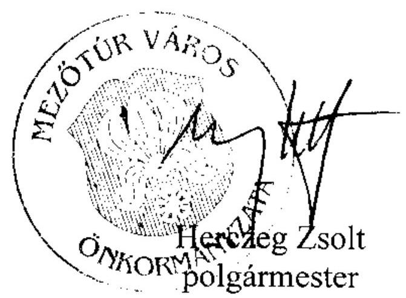

---

# Herczeg Zsolt úr   polgármester 

Mezőtúr Város Önkormányzata

## Mezőtúr

## Tisztelt Polgármester Úr!

Köszönettel vettem Mezőtúr Város Önkormányzata pénzügyi helyzetének ellenőrzéséről készített jelentéstervezethez kapcsolódó észrevételét és a saját hatáskörben megtett intézkedésekről szóló tájékoztatását.

Az adósságszolgálat teljesítése érdekében a pénzintézeti kötelezettségek visszafizetési forrásainak számszerüsítését - a csökkenő működési jövedelem, valamint a kibocsátott kötvény 2013. évtől kezdődő törlesztése következtében - továbbra is indokoltnak tartom.

Örömmel értesültem arról, hogy pénzügyi egyensúlyi helyzetük javítása érdekében intézkedéseket tett az Önkormányzat.

Tájékoztatom, hogy a megküldött intézkedéseiről szóló levele nem tekinthető az Állami Számvevőszékről szóló 2011. évi LXVI. törvény 33. § (1) bekezdése szerinti intézkedési tervnek, ezért kérem, hogy azt a jelentés kézhezvételét követően, a törvényi határidőn belül az Állami Számvevőszék részére megküldeni szíveskedjen.

Végül megköszönöm Polgármester úrnak és munkatársainak az ellenőrzés során tanúsított hozzáállását, amellyel az Önkormányzatról szóló pénzügyi helyzetelemzés elkészítését segítették.

Budapest, 2012. március " 20 ".
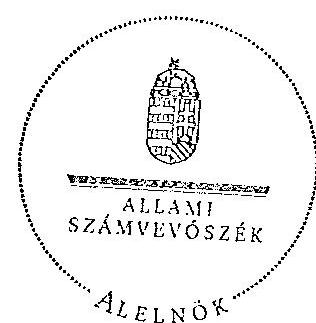

Tisztelettel:
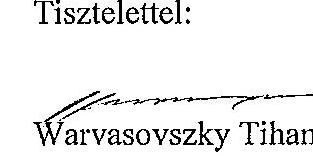