# ÁLLAMI   SZÁMVEVŐSZÉK 

## JELENTÉS

Mohács Város Önkormányzata pénzügyi helyzetének ellenőrzéséről (43/4)

---

# Állami Számvevőszék 

Iktatószám: V-3076-026/2012.
Témaszám: 1015
Vizsgálat-azonosító szám: V0560107

## Az ellenőrzést felügyelte:

Dr. Varga Sándor
számvevő igazgatóhelyettes
Az ellenőrzést vezette:
Renkó Zsuzsanna
számvevő tanácsos
Ellenőrzési csoportvezető:
Kántor Ilona
számvevő tanácsos
Az ellenőrzést végezték:
Péntek László Dr. Láng Ágnes
számvevő tanácsos számvevő

---

# TARTALOMJEGYZÉK 

BEVEZETÉS ..... 9
I. ÖSSZEGZŐ MEGÁLLAPÍTÁSOK, KÖVETKEZTETÉSEK, JAVASLATOK ..... 13
II. RÉSZLETES MEGÁLLAPÍTÁSOK ..... 24

1. Az Önkormányzat kötelező és az önként vállalt feladatai, a feladatellátás szervezeti keretei és annak változásai ..... 24
2. Az Önkormányzat pénzügyi egyensúlyi helyzetét befolyásoló tényezők ..... 29
2.1. A működési és a felhalmozási egyensúly változása ..... 31
2.2. Az Önkormányzat bevételeinek változása ..... 37
2.3. Az Önkormányzat működési és felhalmozási célú kiadásainak változása ..... 39
3. Az Önkormányzat kötelezettségei ..... 43
3.1. Az Önkormányzat pénzintézeti kötelezettségeinek változása ..... 43
3.2. A szállítói kötelezettségek változása ..... 47
3.3. Egyéb kötelezettségek változása ..... 49
4. A pénzügyi egyensúly megteremtése érdekében hozott intézkedések eredménye ..... 52
5. Az ÁSZ által a korábbi években a pénzügyi egyensúly javítására tett szabályszerűségi és célszerűségi javaslatok hasznosulása ..... 56

---

# MELLÉKLETEK 

1. számú Működési és felhalmozási célú hiány/többlet 2007-2010 közötti időszakban az Önkormányzat zárszámadási rendeleteiben (1 oldal)
2. számú Az Önkormányzat bevételei és kiadásai, valamint adósságszolgálata 2007-2010 között (1 oldal)
3/a. számú Az Önkormányzat 2007-2010. években megvalósított, 2010. december 31-ig befejezett fejlesztései és azok forrásösszetétele (1 oldal)
3/b. számú Az Önkormányzat 2010. december 31-én folyamatban lévő fejlesztési feladataira 2010. december 31-ig teljesített kifizetések és azok forrásösszetétele (1 oldal)
3/c. számú Az Önkormányzat 2010. december 31-én folyamatban lévő fejlesztési feladataira 2010. december 31-én fennálló kötelezettségek és azok forrásösszetétele (1 oldal)
3/d. számú Az Önkormányzat által beadott, elbírálás alatti pályázati forrásból megvalósítani tervezett fejlesztéseihez kapcsolódó kötelezettségvállalásai és azok forrásösszetétele (1 oldal)
3. számú Az önkormányzati feladatok ellátásában résztvevő gazdasági társaságok (1 oldal)

---

# RÖVIDÍTÉSEK JEGYZÉKE 

## Törvények

Áht $_{1}$
Áht $_{2}$
Gt.
Ötv.
Ptk.
Számv. tv.

## Rendeletek

Ámr.
Áhsz.
2008. évi költségvetési rendelet
2007. évi zárszámadási rendelet
2008. évi zárszámadási rendelet
2010. évi zárszámadási rendelet

SzMSz

Vagyongazdálkodási rendelet

## Szórövidítések

áfa
ÁMK

ÁSZ
ÁSZKUT
BMÖ
Egészségügyi szolgálat EU
az államháztartásról szóló 1992. évi XXXVIII. törvény az államháztartásról szóló 2011. évi CXCV. tv. a gazdasági társaságokról szóló 2006. évi IV. törvény a helyi önkormányzatokról szóló 1990. évi LXV. törvény a Polgári Törvénykönyvről szóló 1959. évi IV. törvény a számvitelről szóló 2000. évi C. törvény
az államháztartás működési rendjéről szóló 292/2009. (XII. 19.) Korm. rendelet
az államháztartás szervezetei beszámolási és könyvvezetési kötelezettségének sajátosságairól szóló 249/2000. (XII. 24.) Korm. rendelet

Mohács Város Képviselő-testületének 3/2008. (II. 25.) számú rendelete a Mohács Város Önkormányzatának 2008. évi költségvetéséről
Mohács Város Képviselő-testületének 5/2008. (III. 31.) számú rendelete a Mohács Város Önkormányzatának 2007. évi zárszámadásáról
Mohács Város Képviselő-testületének 9/2009. (IV. 27.) számú rendelete a Mohács Város Önkormányzatának 2008. évi zárszámadásáról
Mohács Város Képviselő-testületének 10/2010. (V. 3.) számú rendelete a Mohács Város Önkormányzatának 2009. évi zárszámadásáról
Mohács Város Képviselő-testületének 10/2011. (III. 25.) számú rendelete a Mohács Város Önkormányzatának 2010. évi zárszámadásáról

Mohács Város Képviselő-testületének 23/1998. (XI. 20.) számú rendelete a Mohács Város Önkormányzatának Szervezeti és Működési Szabályzatáról
Mohács Város Képviselő-testületének 19/1993. (XII. 13.) számú rendelete az önkormányzatának vagyonáról és vagyongazdálkodásáról
általános forgalmi adó
Mohács Térségi Általános Művelődési Központ (Mohács,Sátorhely - Székelyszabar - Homorúd - Bár települések Közoktatási Intézményfenntartó Társulása)
Állami Számvevőszék
Állami Számvevőszék Kutató Intézete
Baranya Megyei Önkormányzat
Egészségügyi Alapellátó Szolgálat
Európai Unió

---

| Gimnázium | Kisfaludy Károly Gimnázium |
| :--: | :--: |
| Hőszolgáltató Kft. | Mohács-Hő Hőszolgáltató Kft. |
| Intézményfenntartó társulás | Mohács Város és Bár Község Intézményfenntartó Társulása |
| jegyző | Mohács Város Önkormányzatának jegyzője |
| KELER Zrt. | Központi Elszámolóház és Értékpapír Zrt. |
| KESZ | Közétkeztetési Ellátó Szervezet |
| Képviselő-testület | Mohács Város Képviselő-testülete |
| Kistérségi társulás | Mohácsi Többcélú Kistérségi Társulás |
| Kórház | Mohács Város Kórháza |
| Középiskolai kollégium | Petőfi Sándor Középiskolai Kollégium |
| Közoktatási társulás | Mohács Város, Székelyszabar, Homorúd és Sátorhely Községek Közoktatási Intézményfenntartó Társulása |
| OEP | Országos Egészségbiztosítási Pénztár |
| Önkormányzat polgármester | Mohács Város Önkormányzata   Mohács Város Önkormányzatának polgármestere |
| Polgármesteri hivatal | Mohács Város Önkormányzatának Polgármesteri hivatala |
| PPP konstrukció | Public Private Partnership (Partnerségi együttműködés közfeladatok ellátására a magánszektor bevonásával) |
| Szakközépiskola szja | Dr. Marek József Szakközépiskola személyi jövedelemadó |
| Szociális intézmény | Pándy Kálmán Otthon |
| Társegyházközség | Mohács-Kölked Református Társegyházközség |
| Tűzoltóság | Mohács Város Önkormányzata Hivatásos Tűzoltósága |
| Városfejlesztési Kft. | Mohács Városfejlesztési Közhasznú Nonprofit Kft. |
| Városgazdálkodási Kft. | Mohácsi Városgazdálkodási és Révhajózási Kft. |

---

# ÉRTELMEZŐ SZÓTÁR 

| BUBOR | Budapesti Bankközi Forint Hitelkamatláb. Irányadó, refe-   rencia jellegű kamatláb. Mértékét az MNB naponta álla-   pítja meg a banki kamatok figyelembevételével. Közzété-   tele naponta történik. |
| :--: | :--: |
| CLF módszer | Az önkormányzatok költségvetése elemzésének eszköze. A   módszer következetesen elkülöníti a folyó és a felhalmo-   zási költségvetés bevételeit és kiadásait, azok költségvetési   egyenlegeit. Bizonyos mértékig a vállalati gazdálkodás   logikai elemeit érvényesíti az önkormányzatok pénzügyi,   jövedelmi helyzetének vizsgálata során. Az értékelés a   pénzügyi kapacitás fogalmát helyezi a középpontba. |
| EURIBOR | A frankfurti bankközi piacon jegyzett, az Európai Közpon-   ti Bank szabályainak megfelelően megállapított kínálati   kamatláb. Az EURIBOR értékét a legfontosabb európai   bankok hitelkínálatának kamatlábai alapján a Reuters   ügynökség számolja ki és teszi közzé naponta. A magyar   pénzintézetek is ezt használják viszonyítási alapnak EUR   hitelek esetén. |
| használhatósági fok | Az eszközgazdálkodás vizsgálatának elemzése során hasz-   nált mutató. Számításakor a tárgyi eszköz könyv szerinti   (nettó) értékét viszonyítják a tárgyi eszköz bruttó (beszer-   zési/létesítési) értékéhez. A %-ban kifejezett mutató csök-   kenése az eszköz állagának romlására, avulására utal,   ami maga után vonja az üzemeltetési és fenntartási költsé-   gek növekedését is. |
| kamatkockázat | A változó kamatozású forint-, vagy a devizahitelek futam-   ideje alatt a kamat emelkedése miatt fennálló kamatkocká-   zat, amelynek növekedése miatt nő a hitel törlesztő   részlete. |
| kötelező közszolgáltatás | A helyi önkormányzati feladatkörbe tartozó, a köztisztasággal és a településtisztasággal, valamint az élet- és vagyonbiztonsággal összefüggő egyes - közszolgáltatás útján megvalósuló - közfeladatok ellátása, amelynek kötelező igénybevételét külön jogszabály (törvény, helyi önkormányzati rendelet) határoz meg. |
| közfeladat | Állami, helyi, illetve kisebbségi önkormányzati feladat, amelynek ellátásáról az államnak, illetve az önkormányzatoknak kell gondoskodni. A hatályos szabályozás szerint közfeladatot törvény és önkormányzati rendelet állapíthat meg. Az önkormányzatok által ellátandó feladatok keretszerú meghatározását az Ötv. tartalmazza. |
| LIBOR | Angol kifejezés, a London Interbank Offered Rate rövidítése. Jelentése: Londoni bankközi, referencia jellegű kínálati (hitel) kamatláb. |

---

önkormányzat többségi tulajdonában lévő gazdasági társaságok
pénzügyi kapacitás
pénzügyi kockázat

Az önkormányzat a gazdasági társaságban a szavazatok több mint ötven százalékával vagy a Ptk. 685/B. § (2)-(3) bekezdéseiben rögzített meghatározó befolyással rendelkezik. A befolyással rendelkező akkor rendelkezik egy jogi személyben meghatározó befolyással, ha annak tagja, illetve részvényese és jogosult e jogi személy vezető tisztségviselői vagy felügyelőbizottsága tagjainak többségének megválasztására, illetve visszahívására, vagy a jogi személy más tagjaival, illetve részvényeseivel kötött megállapodás alapján egyedül rendelkezik a szavazatok több mint ötven százalékával (Ptk. 685/B. § (2) bekezdés). A meghatározó befolyás akkor is fennáll, ha a befolyással rendelkező számára e jogosultságok közvetett módon (köztes vállalkozásain keresztül, a Ptk. 685/B. §. (3)-(4) bekezdés szerint) biztosítottak.
A helyi önkormányzat és az önkormányzat irányítása alá tartozó költségvetési szerv többségi tulajdonában, illetve többségi befolyása alatt álló gazdálkodó szervezet esetében hitelfelvétel, kölcsönfelvétel, garancia- vagy kezességvállalás, tartozásátvállalás, tartozás-elengedés, értékpapír kibocsátás, vásárlás, pénzügyi lízing, tartós bérleti szerződés, ingyenes vagyonjuttatás (így különösen: ajándékozás, ingyenes engedményezés), vagy követelésvásárlás, követelésengedményezés végrehajtására vonatkozóan az Áht. 100/M. § (4) bekezdése alapján az önkormányzat rendelkezik döntési jogosultsággal.
A pénzügyi kapacitás (financial capacity) az adósok hitelfelvételi képességének azon mértéke, ahol még anélkül tudják növelni az adósságot, hogy csökkenteniük kellene akár a jelenbeli, akár a jövőben esedékes kiadásaikat a fizetésképtelenség elkerülése érdekében. (Forrás: Az önkormányzati rendszer pénzügyi helyzete, ÁSZKUT tanulmány 2010.)
A működési kockázat egyik eleme. Megmutatkozhat a költségvetés nagyságrendjének, szerkezetének nem megalapozott módosításaiban, a bevételi és a kiadási előirányzatoktól lényegesen eltérő teljesítésekben, a nem megfelelő belső kontrollrendszer működésében, a tudatos károkozásokban, a biztosítások elmaradásában, a hibás fejlesztési döntésekben, a nem a terveknek megfelelő forrásfelhasználásokban. Jelentkezhet továbbá a bevételek és kiadások ütemkülönbsége miatt felvett folyószámla- és likvidhitelek költségvetési év végén fennálló egyenlege miatt, amely az önkormányzat költségvetésébe - akár tartósan - beépülő forráshiányt jelzi.

---

törlesztési kockázat

SNA

Annak a kockázata, hogy a megfelelő időben és mértékben a hitelt felvevőnél rendelkezésre állnak-e a pénzintézetek és egyéb szervek felé fennálló kötelezettségek visszafizetéséhez, a hitelek és kölcsönök törlesztéséhez szükséges pénzügyi források.
A törlesztési kockázatot növeli a kamat- és árfolyam növekedése, mivel ezekben az esetekben az adósságszolgálat nőhet. Törlesztési kockázatot okozhat a visszafizetésre tervezett forrás elérésének, teljesítésének bizonytalansága (pl. a visszafizetéshez tervezett tartalékolás elmaradt, a tervezettnél alacsonyabb a saját bevétel, a helyi adóból származó bevétel az adóalanyok, adóalapok csökkenése miatt nem teljesül).
System of National Account, azaz a Nemzeti Számlák Rendszere, amely a gazdasági szektorok által létrehozott valamennyi terméket és szolgáltatást figyelembe veszi.

---

.

---

# JELENTÉS 

## Mohács Város Önkormányzata pénzügyi helyzetének ellenőrzéséről

## BEVEZETÉS

Az Állami Számvevőszék 2011. évtől érvényes stratégiája új irányt szabott a helyi önkormányzatok gazdálkodásának ellenőrzésében is. Az ÁSZ - küldetése és jövőképe szerint - szilárd szakmai alapokra támaszkodva értékteremtő ellenőrzéseivel és helyzetelemzéseivel az államháztartás egészében, így a helyi önkormányzati alrendszerben is elő kívánja segíteni a közpénzek és a közvagyon szabályos, gazdaságos, hatékony és eredményes felhasználását. E folyamat részeként - az államháztartási hiány alakulásának összetevőire is figyelemmel - végezzük az önkormányzati alrendszer pénzügyi helyzetelemzését.

Az államháztartás helyi szintjén a 304 városnak ${ }^{1}$ az általuk ellátott közszolgáltatások volumenére is tekintettel a közfeladatok ellátásában kiemelt szerepe van. E települések 2011. január 1-jei népessége 3169 ezer fő volt.

Feladataik és hatásköreik az Ötv. mellett különböző ágazati törvények által meghatározottak, miközben a feladatellátás szervezeti kereteit - ezen belül a gazdasági társaságok közszolgáltatások ellátásában betöltött szerepét - saját maguk határozzák meg. A gazdasági társaságok által ellátott feladatok esetén a gazdálkodás, továbbá az önkormányzatok pénzügyi egyensúlyi helyzetére ható közvetlen kockázatok egy része kikerült az önkormányzati alrendszerből. A többségi önkormányzati tulajdonban lévő társaságok gazdálkodásának körülményei befolyásolhatják a városok pénzügyi egyensúlyi helyzetének megítélésében rejlő kockázatokat.

Az áttekintett időszakban az önkormányzati forrásszabályozás elvei lényegesen nem változtak. Az önkormányzatok gazdasági mozgásterét a központi költségvetéstől való függőség mellett jelentősen befolyásolja a helyi adókivetési jog gyakorlása. A városok gazdálkodási szabadságának lényeges eleme, hogy anyagi lehetőségeik függvényében dönthettek arról, hogy feladataik közül

 azokat, amelyek megoldására az Ötv. szerint a települési önkormányzat nem kötelezhető, a megyei önkormányzat fenntartásába adhatták. E döntések differenciáltan érintették a városok pénzügyi helyzetét.

[^0]
[^0]:    ${ }^{1}$ A megyei jogú városok nélkül figyelembe vett városok száma 304 városi önkormányzatot jelent.

---

A városi önkormányzatok 2007-2010 között teljesített bevételeinek alakulását és összetételét a következő ábra szemlélteti:

Az önkormányzati alrendszer pénzügyi helyzetértékelése során új elemzési módszereket alkalmazott az ellenőrzés. A költségvetési beszámoló adatok elemzése helyett az önkormányzat pénzügyi helyzetét a CLF módszerrel értékeljük, amelynek lényegét és számításának módszerét a jelentés 2. pontjában, és a jelentés 2. számú mellékletében ismertetjük részletesen.

Az új módszereken alapuló helyzetértékelés fontosságát az adja, hogy a helyi önkormányzatok bruttó adósságállománya ${ }^{2}$ a 2010. évi költségvetési beszámolók alapján 1248 milliárd Ft-ot tett ki. Ezen belül a 304 város adóssága 383 milliárd Ft volt, amely az önkormányzati alrendszer teljes adósságállományának 30,7%-át jelentette ${ }^{3}$.

A mérlegben kimutatott bruttó adósságállomány mellett az önkormányzatok számára az eszközállomány műszaki állapotának megőrzése is előbb-utóbb pénzügyi kötelezettséget jelent. Az elhasználódott eszközök pótlására forrást biztosító amortizációs (felújítási) alap képzésének ${ }^{4}$ elmaradása maga után vonhatja a feladatellátást kiszolgáló tárgyi eszközök állagának erőteljes romlását.

[^0]
[^0]:    ${ }^{2}$ Az önkormányzati mérlegbeszámolókból számított bruttó adósságállomány 2010. év végi összege magában foglalja a fejlesztési és a működési célú kötvénykibocsátások, a beruházási és fejlesztési hitelek, a működési célú hosszú lejáratú hitelek, a rövid lejáratú hitelek, váltótartozások miatti kötelezettségek teljes (2011-ben, illetve az azt követő években esedékes) állományát. Az önkormányzatok 2007. év végi mérleg szerinti adósságállománya 692 milliárd Ft volt.
    ${ }^{3}$ A fővárosi és a kerületi önkormányzatok adósságának figyelmen kívül hagyásával számított 977 milliárd Ft összegű bruttó adósságállományból a városok 39,2%-kal részesedtek.
    ${ }^{4}$ Erre a jelenlegi szabályozási környezetben nem kötelezi előírás az önkormányzatokat.

---

Emellett a 2007-2013-as időszakra meghirdetett, vissza nem térítendő EU-s fejlesztési forrásokhoz való hozzájutás lehetősége felerősítette az önkormányzati alrendszer fejlesztési igényeit, amelyek a felhalmozási költségvetési hiány folyamatos emelkedésén túl - az előírt jövőbeni fenntartási kötelezettség miatt - tovább terhelhetik az önkormányzatok költségvetését ${ }^{5}$.

Az ÁSZ a 2011. évi ellenőrzési tervében 43. számú, az Önkormányzatok gazdálkodási rendszerének ellenőrzése részeként áttekinti, és elemzi az önkormányzatok pénzügyi helyzetét. A gazdálkodás szabályszerűségét az ÁSZ az előző évek során ebben az önkormányzati körben is ellenőrizte. Jelen vizsgálatunk a tett javaslataink pénzügyi helyzetet érintő pontjainak hasznosítására utóellenőrzés jelleggel tér ki.

Az ellenőrzés megállapításait az Önkormányzat által kitöltött - teljességi nyilatkozattal megerősített - 27 tanúsítványon szolgáltatott adatokra alapoztuk. Ellenőrzési bizonyítékként használtuk fel továbbá:

- a képviselő-testületi és bizottsági előterjesztéseket, a döntés-előkészítés során készített dokumentumokat;
- a kötelezettségvállalások dokumentumait;
- a pénzügyi-számviteli nyilvántartásokat;
- az éves költségvetési beszámolókat;
- a költségvetési és zárszámadási rendeleteket.

Az ellenőrzés a 2007. január 1. - 2011. június 30. közötti időszakot öleli fel. A pénzintézeti kötelezettségek állományának vizsgálatakor az ellenőrzött időszak 2006. december 31. - 2011. június 30. közötti időszakra terjedt ki.

Az ellenőrzés során vizsgáltunk minden olyan körülményt és adatot, amely a program végrehajtásához kapcsolódott és a pénzügyi helyzet alakulására hatást gyakorló releváns tények és folyamatok feltárásához szükségessé vált.

# Az ellenőrzés célja annak értékelése volt, hogy: 

- a vizsgált időszakban a kötelező- és önként vállalt feladatok ellátását biztosító szervezeti keretekben, a feladatellátás módjában bekövetkezett változások milyen hatást gyakoroltak az Önkormányzat pénzügyi helyzetének alakulására;

[^0]
[^0]:    ${ }^{5}$ Az Állami Számvevőszék 2011. júniusában közzétett 1108. számú, a helyi önkormányzatok fejlesztési célú támogatási rendszerének ellenőrzéséről szóló jelentésében feltárta a fejlesztési folyamatok problémáit. A helyi önkormányzatok elsősorban azokat a fejlesztéseket valósították meg, amelyekhez támogatást lehetett igényelni. A fejlesztési célok közül a magasabb támogatási intenzitású pályázatokat részesítették előnyben. A fejlesztéssel megvalósuló létesítmények jövőbeli üzemeltetésének várható ráfordításait az önkormányzatok 71,9%-a nem mérte fel.

---

- az Önkormányzat pénzügyi - ezen belül működési és felhalmozási - egyensúlya mely tényezők hatására miként változott, és az Önkormányzat milyen intézkedéseket tett a pénzügyi egyensúly javítása érdekében;
- a költségvetési kiadások finanszírozása érdekében vállalt pénzintézeti kötelezettségek hogyan alakultak, továbbá milyen kötelezettségek fennállása befolyásolja az Önkormányzat jövőbeli pénzügyi helyzetét;
- hasznosultak-e a gazdálkodási rendszer korábbi ellenőrzése során a pénzügyi egyensúly javítására az ÁSZ által tett szabályszerűségi és célszerűségi javaslatok.

Az ellenőrzés típusa: szabályszerűségi vizsgálat.
A vizsgálat jogszabályi alapját az Állami Számvevőszékről szóló 2011. évi LXVI. törvény 1. §. (3), 5. § (2)-(6) bekezdései, továbbá az Áht${ }_{1}$ 120/A. § (1) bekezdése ${ }^{6}$ előírásai képezik.

Mohács Város lakosainak száma 2011. január 1-jén 19667 fő volt. Az Önkormányzatot a 2010. évtől 12 tagú Képviselő-testület irányította, amelynek munkáját 4 állandó bizottság segítette. Az Önkormányzat Képviselő-testülete mellett a 2010. évtől egy részönkormányzat és négy kisebbségi önkormányzat működött. Az Önkormányzat polgármestere az 1998. évi önkormányzati választástól, míg a jegyző 2005. április 1-jétől töltötte be funkcióját.

Az Önkormányzat a 2010. évi zárszámadási rendelete alapján 8084,8 millió Ft költségvetési bevételt és 7277,7 millió Ft költségvetési kiadást teljesített. Az Önkormányzat vagyona 2010. december 31-én 34349,0 millió Ft, az összes kötelezettsége 717,2 millió Ft volt. Az Önkormányzat feladatait nyolc költségvetési szervvel és három, kizárólagos önkormányzati tulajdonú gazdasági társaságával látta el.

[^0]
[^0]:    ${ }^{6}$ 2012. január 1-jétől az Áht${ }_{2}$ 61. § (2) bekezdése

---

# I. ÖSSZEGZŐ MEGÁLLAPÍTÁSOK, KÖVETKEZTETÉSEK, JAVASLATOK 

Az Önkormányzat a kötelező és önként vállalt feladatait - az Ötv. és az ágazati törvények előírásait figyelembe véve - az SzMSz-ben rögzítette. Önként vállalt feladatként határozták meg a pszichiátriai betegek és fogyatékos személyek ellátását biztosító intézmény fenntartását, a középiskolai és kollégiumi ellátást, az alapfokú művészeti oktatást, a logopédiai szolgáltatást, a járó- és fekvőbeteg ellátást biztosító intézmény fenntartását, a területfejlesztési feladatok közül a befektetők számára vonzó vállalkozói környezet kialakítását és a turisztikai fejlesztéseket. Az Önkormányzat adatszolgáltatása szerint ${ }^{7}$ a működési célú költségvetési kiadásaiból a kötelező feladatok ellátására a 2007-2009. években átlagosan 2644,5 millió Ft-ot, a 2010. évben 2903,6 millió Ft-ot fordított. A 2010. évi 259,1 millió Ft-os (9,8%) növekedésben meghatározó volt a közhasznú és közcélú foglalkoztatás miatti kiadás növekmény, amit a közhasznú és közcélú foglalkoztatottak számának növekedése okozott. Az önként vállalt feladatokra a 2007-2009. évben átlagosan 863,7 millió Ft, a 2010. évben 967,9 millió Ft jutott. Az önként vállalt feladatok ellátása érdekében teljesített működési kiadás növekményét (104,4 millió Ft, 12,1%) a 2009. július 1-jétől a Kistérségi társulástól átvett Szociális intézmény kiadásai határozták meg.

A kötelező és önként vállalt feladatok ellátását biztosító szervezeti keretekben, a feladatellátás módjában a vizsgált időszakban bekövetkezett változások az Önkormányzat pénzügyi egyensúlyi helyzetét kedvezően befolyásolták. A Szakközépiskola, valamint a Középiskolai kollégium fenntartásának átadása 210,0 millió Ft kiadás megtakarítást eredményezett, a Szociális intézmény fenntartásának visszavétele pótlólagos pénzügyi terhet nem jelentett az Önkormányzat számára. A Polgármesteri hivatal kimutatása szerint a hivatali feladatok átszervezésének hatása az Önkormányzat költségvetéseiben összesen 25,6 millió Ft megtakarítást eredményezett.

[^0]
[^0]:    ${ }^{7}$ Az éves beszámolók és az Önkormányzat adatszolgáltatása szerinti működési kiadások közötti eltérés oka, hogy az adatszolgáltatásban nem szerepelnek az Országos Egészségpénztár által finanszírozott feladatok és a kisebbségi önkormányzatok kiadásai, valamint a felhalmozási célra felvett hitelek és kötvény után fizetett kamatok összege.

---

Az önkormányzati feladatellátás - 2011. június 30-ai állapotnak megfelelő - szervezeti struktúráját a következő ábra szemlélteti:
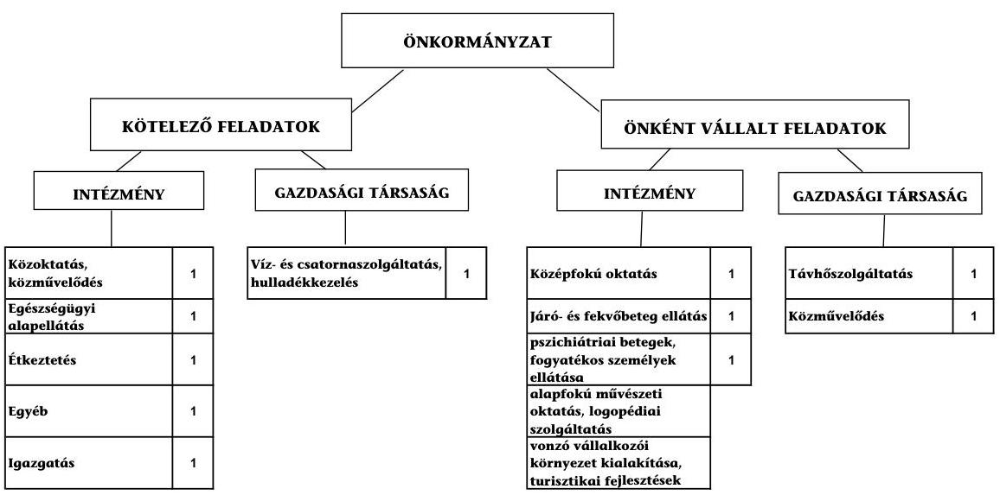

Az Önkormányzat feladatait 2011. június 30-án nyolc költségvetési szervvel és három, kizárólagos önkormányzati tulajdonú gazdasági társaságával látta el. A szervezeti struktúra a 2007-2009. években végrehajtott intézmény-összevonások, illetve átadások következtében a közoktatási feladatellátás terén egyszerűsödött a leginkább a vizsgált időszakban. A közoktatási feladatokat a vizsgált időszak elején 12 intézmény 19 telephelyen, a 2009. évben már csak kettő intézmény 16 telephelyen látta el. Az átszervezések eredményeként a közoktatási feladatokra fordított kiadások (908,2 millió Ft) a 2010. évben 126,7 millió Ft-tal (12,3%) alacsonyabb összegben realizálódtak a 2007-2009. években átlagosan teljesített 1034,9 millió Ft-hoz képest.

Az egyes közszolgáltatási feladatellátásában résztvevő intézmények működési kiadásainak finanszírozási forrásait ágazatonként a 2007. és a 2010. években a következő ábra szemlélteti:
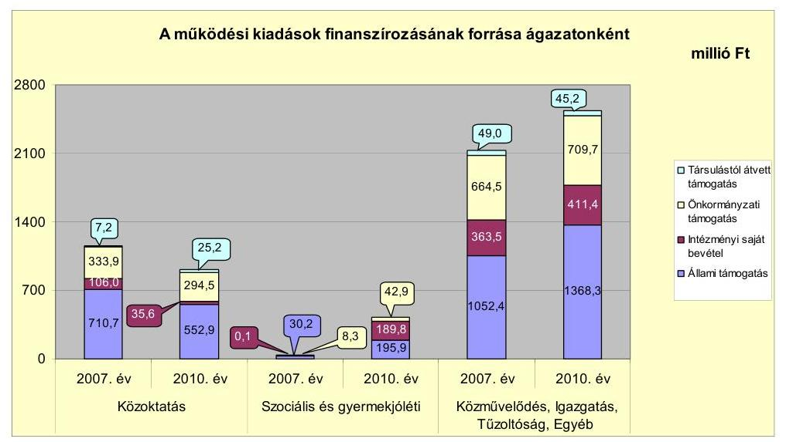

Megjegyzés: Az Önkormányzat sportlétesítményt nem tartott fenn.

---

Az Önkormányzat működési kiadásait a 2007. évben 53,9%-ban (1793,4 millió Ft) az állami hozzájárulás, 14,1%-ban (469,5 millió Ft) az intézményi saját bevétel, 30,3%-ban (1006,8 millió Ft) az önkormányzati támogatás és 1,7%-ban (56,3 millió Ft) a társult önkormányzatoktól átvett támogatás finanszírozta. A 2010. évben valamennyi finanszírozási forrás emelkedett, azonban az Önkormányzatnak a működési kiadások finanszírozásához kisebb arányban kellett hozzájárulnia (27,0%, 1047,0 millió Ft), mert az állami hozzájárulás (54,7%, 2117,5 millió Ft), az intézményi saját bevétel (16,5%, 636,9 millió Ft) és a társult önkormányzatoktól átvett támogatás aránya (1,8%, 70,4 millió Ft) egyaránt növekedett. A közoktatás terén tapasztalt állami támogatás csökkenést (157,8 millió Ft) egyrészt a Szakközépiskola, valamint a Középiskolai kollégium közoktatási és fenntartói feladatainak 2007. július 1-től a BMÖ-nek történő átadása (96,2 millió Ft; 61,0%), másrészt az általános iskolai és a gimnáziumi tanulók számának csökkenése (61,6 millió Ft; 39,0%) okozta. A szociális és gyermekjóléti ágazatban a 2007. évhez képest 2010. évre az állami támogatás 165,7 millió Ft-tal, az intézményi saját bevétel 189,7 millió Ft-tal (14,5%-al) emelkedett, amit a Szociális intézmény 2009. július 1-jével történt átvétele eredményezett.

Az Önkormányzat folyó költségvetés egyenlege (működési jövedelem) 2007-2010 között működési forrástöbbletet mutatott.
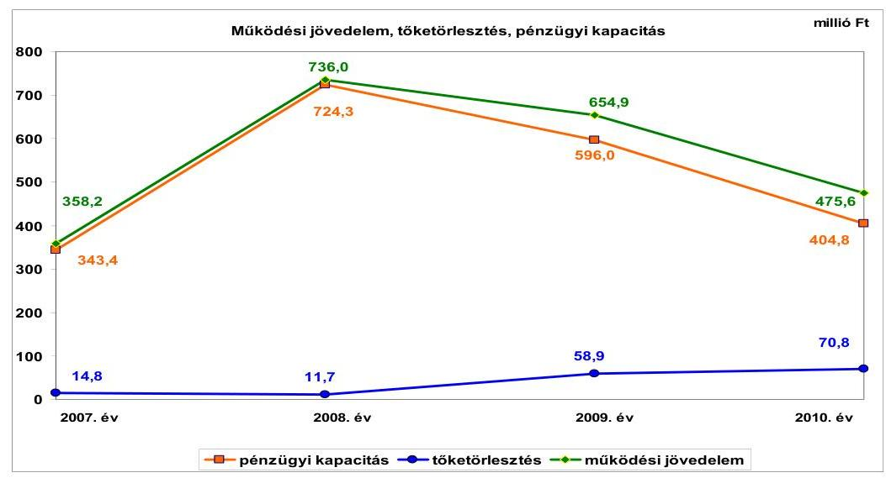

A működési jövedelem előző évhez viszonyított 377,8 millió Ft összegű (105,5%-os) 2008. évi növekedését elsősorban az Önkormányzat bevételeinek növekedése eredményezte. A helyi adók mértékének növelése (2008-ban 21,5 millió Ft), valamint a 2007. évi kötvénykibocsátásból származó 3984,2 millió Ft bevételből történt pénzügyi befektetések eredményeként - az Önkormányzat kimutatása szerint - a 2008. évben 438,4 millió Ft bevételt értek el. A működési jövedelem előző évhez viszonyított 2009. évi 81,1 millió Ft (11,0%-os) és 2010. évi 179,3 millió Ft összegű (27,4%-os) csökkenését elsősorban a folyó kiadások - azokon belül a személyi juttatások és a dologi kiadások - 225,0 millió Ft (3,9%-os), illetve 267,4 millió Ft összegű (4,5%-os) növekedése okozta. A működési jövedelem csökkenésében szerepet játszott az is, hogy a pénzügyi befektetésekből származó bevétel 2009-ben 112,0 millió Ft-tal (25,2%-kal), 2010-ben 67,8 millió Ft-tal (20,4%-kal) csökkent az előző évhez képest. Az Önkormányzat az ön-

---

hibájukon kívül hátrányos helyzetű önkormányzatok támogatásában és vis maior támogatásban a 2007-2011. év
 I. félévben nem részesült.

A 2007-2010. években az Önkormányzat pénzügyi kapacitása (nettó működési jövedelem) is kedvezően alakult, mivel az évente képződött működési jövedelem az adósságszolgálatra fedezetet nyújtott. Az Önkormányzat a 2007–2010. években hiteltörlesztésre összesen 156,2 millió Ft kiadást teljesített.

A vizsgált időszakban az Önkormányzat felhalmozási költségvetésének egyenlege folyamatosan negatív összegű volt, 2007-ben 15,7 millió Ft, 2008-ban 247,1 millió Ft, 2009-ben 298,3 millió Ft, 2010-ben 520,7 millió Ft felhalmozási forráshiányt mutatott. A felhalmozási forráshiányt elsősorban a 2008–2010. években indított - EU-s támogatással megvalósuló - fejlesztések utófinanszírozása okozta.

A hitelekkel kapcsolatos tőketörlesztési kötelezettség (156,2 millió Ft), továbbá a felhalmozási forráshiány (1081,8 millió Ft) a 2007-2010. években együttesen 1238,0 millió Ft-ot tett ki, amelyre az időszakban képződött 2224,7 millió Ft működési megtakarítás (működési jövedelem) fedezetet biztosított. Ennek ellenére a 2007-2010. években külső forrást, 336,7 millió Ft felhalmozási célú hitelt is igénybe vettek lakótelkek kialakítása és bérlakások építése céljára, a hitelek kedvező kamatfeltételei miatt.

Az Önkormányzat pénzügyi egyensúlyi helyzetének kedvező alakulásában meghatározó szerepet játszott a 2007. évben 26,0 millió CHF összegben kibocsátott kötvényből származó bevétel teljes összegének 2007-2008. évi befektetésével elért kamatbevétel (146,5 millió Ft), a CHF saját kötvény Ft-ra váltásával, majd visszavásárlásával realizált árfolyamnyereség (összesen 270,4 millió Ft), és a saját források befektetésének 728,1 millió Ft-os eredménye. A kötvénykibocsátásból származó - CHF-ben fennálló - pénzeszközök 2007. év végi értékelése a számviteli előírásoknak megfelelően történt. A pénzügyi befektetések eredményeként képződött tartalékok fedezetet biztosítanak a fejlesztésekkel kapcsolatban vállalt kötelezettségek, valamint a hiteltörlesztési kötelezettségek teljesítéséhez.

A 2008-2010. évi költségvetési beszámolók mérlegei nem tükrözik az Önkormányzat vagyoni helyzetének valós képét. Az Önkormányzat által 2007. évben kibocsátott 26,0 millió CHF kötvényállomány 2008. évi visszavásárlásának számviteli elszámolásakor a hosszú lejáratú kötelezettségek kötvénykibocsátásból származó teljes állományának kivezetésével egyidejűleg a befektetett pénzügyi eszközök állományának a vételi árral megegyező növelésére is sor került. A könyvelés azt a látszatot kelti, mintha az Önkormányzat a kötvény visszavásárlásával jelentős (a kötvény ellenértékével megegyező összegű) befektetéssel rendelkezne, a valóságban azonban ebből az összegből az általa kibocsátott kötvényeket vásárolta vissza a pénzintézettől. A nem valós gazdasági esemény elszámolásával az Önkormányzat megsértette a Számv. tv. 15. § (3) bekezdésében foglalt valódiság elvét. A visszavásárlást követően a kötvényt - a KELER Zrt. nyilvántartásából történő kivezetés időpontjáig - csak az analitikus nyilvántartásban szerepeltethették volna, ezzel szemben az Önkormányzat a számviteli nyilvántartásában és mérlegében is kimutatta. A forgalmazó pénz-

---

intézet által közölt árfolyam alapján a saját kötvény főkönyvi nyilvántartás szerinti értékét 2010. december 31-én 5789,7 millió Ft-ban állapították meg.

Az Önkormányzat folyó bevételei a vizsgált időszakban folyamatosan növekedtek. Az összes folyó bevétel a 2007-2009. évi átlagos 6340,5 millió Ft-tal szemben a 2010. évben 6739,2 millió Ft (106,3%) volt. A folyó bevételeken belül a költségvetési támogatás és az szja együttes összege a 2007-2009. évi átlagos 2618,0 millió Ft-hoz képest a 2010. évben 149,4 millió Ft (5,7%-os) növekedést mutatott, elsősorban a Szociális intézmény 2009. évi átvétele miatt. Az egyéb saját bevételek - előző évhez viszonyított - 2008. évi 483,4 millió Ft összegű (19,0%-os) emelkedését a kötvénykibocsátásból származó bevétel befektetésével elért bevételi többlet, valamint az intézményi saját bevételek (intézmény átvételből, térítési díjakból eredő) növekedése eredményezte.

A helyi adóbevételek, pótlékok, bírságok mértéke 2007-2009 között növekedett, a 2007. évi 521,7 millió Ft-tal szemben a 2008. évben 654,0 millió Ft, a 2009. évben 725,8 millió Ft volt. Az adóbevétel az adómértékek növelése, az adózók körének bővülése, valamint a behajtási tevékenység eredményeként emelkedett. A 2010. évben az adóbevétel - előző évhez viszonyított - 64,6 millió Ft összegű (8,9%-os) csökkenését a magánszemélyek kommunális adójából származó bevétel csökkenése okozta. A magánszemélyek által a lakások után fizetendő kommunális adó mértékét a 2010. évben - a lakossági hulladékszállítás díjkötelessé tételével összefüggésben - csökkentették. Az Önkormányzat a 2009. évben a lakossági szemétszállításért 63,2 millió Ft-ot fizetett a szolgáltatást végző cégnek. Ez az összeg a 2010. évben az Önkormányzatnál kiadási megtakarításként jelentkezett, és ellentételezte az adóbevételnél jelentkező kiesést. A helyi adóbevétel meghatározó részét kitevő iparűzési adónál a vizsgált időszakban a maximális adómértéket (2,0%-ot) alkalmazták. Az iparűzési adóból származó bevétel átlagos összege a 2007-2009. években 423,7 millió Ft, a 2010. évben 450,9 millió Ft (106,4%) volt. Az iparűzési adó a helyi adóbevételből a 2007-2009. években átlagosan 66,9%-kal, a 2010. évben 68,2%-kal részesedett.

A vizsgált időszakon belül a felhalmozási bevételek összege a 2007. évben kiugróan magas volt, mivel nagy értékű fejlesztések valósultak meg, elsősorban az 535,5 millió Ft EU-s támogatás, valamint a tárgyi eszköz (ingatlan) értékesítésekből származó 868,3 millió Ft saját forrás felhasználásával.

Az Önkormányzat a 2007-2009. években átlagosan 5759,2 millió Ft folyó kiadást teljesített, a 2010. évi folyó kiadás annál 504,4 millió Ft-tal (8,8%-kal) több, 6263,6 millió Ft volt. A folyó kiadások növekedését a működési kiadások és azokon belül a személyi juttatások és a dologi kiadások folyamatos növekedése okozta. A személyi juttatások kiadásaira a 2007-2009. években átlagosan 2652,8 millió Ft-ot fordítottak, a 2010. évben teljesített kiadás ezt 276,1 millió Ft-tal (10,4%-kal) meghaladta. A személyi juttatások növekedésében az intézmény átvétel miatti létszámnövekedés és a közcélú, közhasznú foglalkoztatás hatása volt a meghatározó. A dologi kiadásokra a 2007-2009. években átlagosan 1523,1 millió Ft-ot, míg a 2010. évben - annál 30,2%-kal (460,2 millió Ft-tal) többet - 1983,3 millió Ft-ot fordítottak. A dologi kiadások emelkedését elsősorban a készletbeszerzésekre, szolgáltatási díjakra teljesített kiadások, valamint az áfa befizetések emelkedése okozta.

---

A felhalmozási kiadások mértéke - a fejlesztési, felújítási feladatok megvalósításának ütemezése és a pénzügyi források rendelkezésre állása függvényében - évente eltérően alakult. A teljesített felhalmozási kiadás a 2007. évről a 2008. évre - több nagy értékű fejlesztés 2007. évi befejezése miatt - 1555,8 millió Ft-ról 497,9 millió Ft-ra csökkent. A 2008. évben és az azt követő években indított fejlesztések hatására a felhalmozási kiadás 2009-ben 644,4 millió Ft-ra, 2010-ben 1014,1 millió Ft-ra emelkedett.

A befejezett fejlesztések jelentős részét saját bevételből és EU-s támogatásból fedezték. A 2007-2010. évek időszakában 2530,1 millió Ft értékű fejlesztés és felújítás forrása az 1018,8 millió Ft (40,2%) saját erő, a 889,8 millió Ft (35,2%) EU-s támogatás és a 146,5 millió Ft (5,8%) hazai támogatás mellett 475,0 millió Ft hitelfelvétel (18,8%) volt. A 2010. december 31-én folyamatban lévő fejlesztési feladatok végrehajtására 2007-2010 között 459,7 millió Ft kiadást teljesítettek, amelyre hitelből 115,8 millió Ft-ot (25,2%) fordítottak. Az EU-s támogatásból megvalósult fejlesztések finanszírozása likviditási gondot nem okozott.

Az Önkormányzat 2010. december 31-én folyamatban lévő fejlesztési feladatok 2010. évet követő kötelezettségvállalásainak összege 2257,4 millió Ft volt, amelyből 1712,4 millió Ft-ot (75,9%-ot) EU-s támogatásból, 43,4 millió Ft-ot (1,9%-ot) hazai támogatásból, 19,2 millió Ft-ot (0,8%-ot) hitelből (2009. évi szerződés alapján), 482,4 millió Ft-ot (21,4%-ot) a képződött működési jövedelemből terveznek biztosítani. A 19,2 millió Ft hitelt 2009. évben megkötött hitelszerződés alapján a bérlakás állomány növelése céljára veszik igénybe.

A 2010. december 31-én fennállt felhalmozási kötelezettségvállalásokat és azok forrásösszetételét a következő ábra mutatja be:
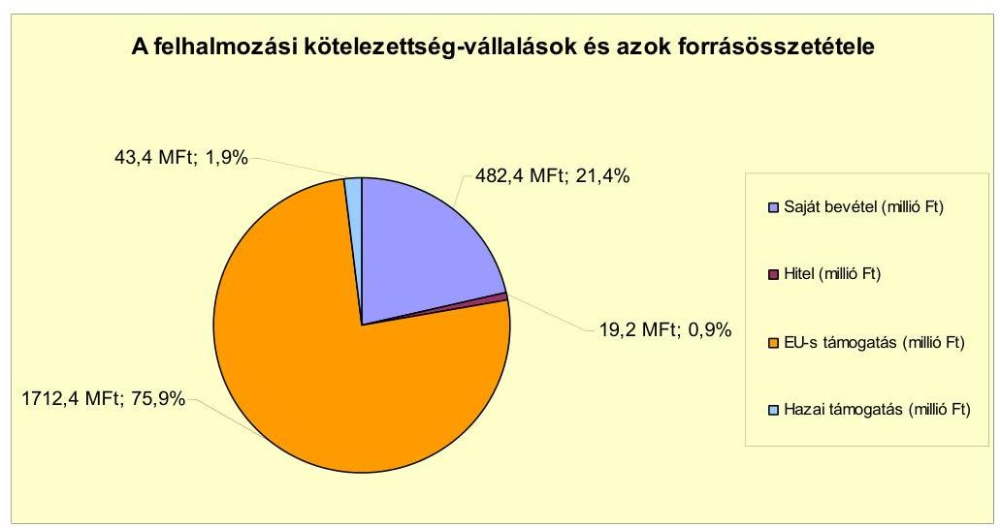

Az Önkormányzat által beadott, elbírálás alatt álló pályázatok tervezett teljes bekerülési költsége 131,6 millió Ft, amelyhez a 2011-2012. évekre 104,5 millió Ft (79,4%) EU-s támogatást, 10,8 millió Ft (8,2%) hazai támogatást és 16,3 millió Ft (12,4%) saját forrást kívánnak bevonni.

---

Az Önkormányzat mérleg szerinti pénzintézeti kötelezettsége a 2006. év végéről a 2011. év I. félév végére 294,4 millió Ft-ról 459,1 millió Ft-ra nőtt. A fennálló pénzintézeti kötelezettségek három hosszú lejáratú hitelből keletkeztek. Folyószámla, munkabér megelőlegezési, illetve likvid hitelt az Önkormányzat a vizsgált időszakban nem vett igénybe. Az Önkormányzat az elfogadott 2011. évi költségvetési rendeletében működési és fejlesztési hitel felvételét, további kötvény kibocsátását nem tervezte, és a helyszíni vizsgálat befejezésének időpontjáig erre nem került sor.

Az Önkormányzat kötelezettségvállalásaira képviselő-testületi döntés alapján került sor, az előterjesztésekben bemutatták a kamat- és - a deviza alapú kötelezettséget érintő - árfolyamkockázatot. Az Önkormányzat a 2007. évben kibocsátott kötvényt a kibocsátásból származó bevételből visszavásárolta, így 2008. augusztus 15-étől megszűnt a kötvénykibocsátásból keletkezett hosszú lejáratú kötelezettsége.

A kötvényből származó bevétel 2007-2008. évi befektetésével az Önkormányzat összesen 146,5 millió Ft kamatbevételt, a CHF kötvény Ft-ra váltásával, majd visszavásárlásával összesen 270,4 millió Ft árfolyamnyereséget realizált, ezzel szemben a kötvénnyel kapcsolatban összesen 80,7 millió Ft kamat és díjfizetési kötelezettsége merült fel. A referencia kamat változása az Önkormányzat pénzügyi egyensúlyi helyzetét számottevően nem befolyásolta.

Az Önkormányzat a 2006. évben nyitott 475,0 millió Ft, valamint a 2009. évben nyitott 135,0 millió Ft hosszú lejáratú hitelkeretét teljes egészében lehívta, és a hitelcélnak megfelelően a Képviselő-testület által jóváhagyott, az éves költségvetésekben tervezett beruházásokhoz használta fel. Az Önkormányzat a 475,0 millió Ft hitel törlesztését 2009. év II. félévben kezdte meg, melynek éves összege 68,0 millió Ft, a 135,0 millió Ft hitel törlesztése 2012. év II. félévben kezdődik, 6,0 millió Ft éves összeggel. Az Önkormányzat fennálló pénzintézeti kötelezettségeiből 2007-2011. év I. félév között 156,5 millió Ft tőkét törlesztett, és 77,1 millió Ft kamatot fizetett. A 2007-2011. év I. féléve között átmenetileg szabad pénzeszközeiből 720,8 millió Ft kamatbevételt realizált, amely kedvező hatással volt a pénzügyi egyensúlyi helyzetének alakulására. Az Önkormányzat számlavezető bankot a vizsgált időszakban nem váltott.

Az Önkormányzat 2011. év I. félév végi szállítói tartozása 187,8 millió Ft, ebből lejárt tartozása 2,0 millió Ft volt, amely teljes egészében 31 napon túl járt le. A lejárt szállítói tartozásból 1,1 millió Ft (55,0%) 31-60 nap közötti, 0,1 millió Ft (5,0%) 91-365 nap közötti, 0,8 millió Ft (40,0%) éven túli tartozás volt. A szállítói tartozások átütemezésére nem került sor. Az Önkormányzat 2006. évben a Mohácsi Tanuszoda projekt PPP konstrukció keretében történő megvalósításához kapcsolódó szolgáltatási szerződést kötött, amelyből 1039,7 millió Ft kötelezettsége keletkezett. A 2011. június 30-án fennálló kötelezettség összege 772,7 millió Ft. A vizsgált időszakban a Városfejlesztési Kft.-nek 11,0 millió Ft tagi kölcsönt nyújtott az Önkormányzat. A kezességvállalásból adódóan 2011. június 30-án fennálló kötelezettség összege 0,2 millió Ft volt. Az Önkormányzat a 2007-2011. év I. félév közötti időszakban 7,6 millió Ft követelésről mondott le.

---

Az Önkormányzat kötelezettségeinek 2010. december 31-i, valamint 2011. június 30-ai állományát és várható alakulását a kötelezettségek lejáratáig
 a következő táblázat szemlélteti:

| Megnevezés | $\begin{gathered} \text { Állomány } 2010 . \\ \text { december } 31- \\ \text { én } \end{gathered}$ | $\begin{gathered} \text { Állomány } \\ 2011 . \text { június } \\ 30-\mathrm{an} \end{gathered}$ | Várható kötelezettség 2011-2013.   években | Várható kötelezettség 2014. évtől |
| :--: | :--: | :--: | :--: | :--: |
|  | HUF-ban (millió Ft-ban) | HUF-ban (millió Ft-ban) | HUF-ban (millió Ft-ban) | HUF-ban (millió Ft-ban) |
| Pénzintézeti kötelezettségek |  |  |  |  |
| Mohács-Szőlőhegy lakóterület ivóvizellátása | 2,1 | 1,8 | 2,3 | 0,2 |
| Dél lakóparkban megvalósítandó fejlesztések | 356,2 | 322,3 | 227,3 | 160,6 |
| Bérlakás állomány növelése | 115,8 | 135,0 | 22,3 | 166,1 |
| Pénzintézeti kötelezettségek összesen: | 474,1 | 459,1 | 251,9 | 326,9 |
| Biztosítékok |  |  |  |  |
| Kezesség |  | 0,2 |  |  |
| Biztosítékok összesen: |  | 0,2 |  |  |
| PPP kötelezettségek | 815,6 | 772,7 | 198,9 | 616,6 |
| Szállítói tartozás | 155,5 | 187,8 | 187,8 |  |
| Jogerős végzéssel lezárt de ki nem fizetett kötelezettségek |  | 4,8 | 4,8 |  |
| Összes kötelezettség: | 1445,2 | 1424,4 | 643,4 | 943,5 |

Az Önkormányzat pénzintézetekkel szemben fennálló kötelezettsége a 2011. év I. félév végén 459,1 millió Ft volt. Ezek várható kötelezettsége (tőke, kamat és egyéb költség) a legutóbbi kamatfizetés feltételei alapján a 2011-2013. években 251,9 millió Ft. Ezen felül a PPP szerződés alapján 2011-2013. években 198,9 millió Ft szolgáltatási díjfizetési kötelezettsége merül fel. Az Önkormányzatnak a 2011. évben szállítói tartozások és jogerős végzéssel lezárt, de ki nem fizetett kötelezettségek címén 192,6 millió Ft fizetési kötelezettsége keletkezett. A 2011-2013. évek kötelezettségeinek teljesítésére fedezetet nyújt az Önkormányzat működési megtakarítása és a 2011-2013. években képződő működési jövedelem.

A 2014. évtől a jelenleg ismert pénzintézeti és PPP szolgáltatási díj kötelezettségek 943,5 millió Ft-ot tesznek ki, amelyek teljesítése az Önkormányzat változatlan működési jövedelemtermelő képességének feltételezése mellett biztosított.

A pénzügyi egyensúlyi helyzetet befolyásolhatja az Önkormányzat eszközeinek állapota, használhatósági foka, az eszközök pótlására fordítandó pénzeszközök nagysága. Az Önkormányzat 2007-2010 között eszközállománya után 1777,8 millió Ft összegű értékcsökkenést számolt el. A 2007-2010. években a felújításokra fordított összeg 362,5 millió Ft, a beruházások összege 2198,7 millió Ft volt. Azt, hogy a beruházási kiadásokból mennyit fordítottak eszközpótlásra, nem számszerűsítették. Az éves zárszámadási rendeletekben nem mutatták be az Önkormányzat eszközei után tárgyévben elszámolt értékcsökkenés összegét, az eszközpótlásra fordított tényleges kiadásokat, az eszközök elhasználódási fokának alakulását.

Az Önkormányzat kimutatása szerint a kiadási megtakarítások 99,6%-a (641,5 millió Ft) az intézményátadásokkal járó létszámcsökkenés, valamint a Polgármesteri hivatalnál és az intézményeknél elrendelt feladatátszervezések, álláshely csökkentések végrehajtásának eredménye. A 2007. évben a BMÖ-nek történt intézmény átadások miatt az oktatási ágazatban 68 fővel csökkent az

---

engedélyezett álláshelyek száma. Az álláshely-csökkentő intézkedések 2007-2011. év I. féléve között önkormányzati szinten 91 álláshely (ebből négy üres álláshely) megszüntetését jelentették. Az ellenőrzött időszakban azonban - a Szociális intézmény átvétele (106 fő), intézményi átszervezések (21 fő), polgármesteri hivatali feladatok bővülése (5 fő), valamint jogszabályi előírásokon alapuló intézményi álláshely létesítések (45 fő) miatt - az álláshelyek száma 177 álláshellyel nőtt. Ennek következtében az időszak álláshelyeinek száma összességében 18 álláshellyel nőtt. A civil szervezetek támogatásának csökkentésével elért megtakarítás 2,3 millió Ft (0,4%) volt.

Az Önkormányzat kimutatása szerint a bevételnövelő intézkedések eredményéből 73,3 millió Ft (9,1%) a helyi adók (építményadó, telekadó, idegenforgalmi adó, vállalkozók kommunális adója) mértékének emeléséhez, 728,0 millió Ft (90,9%) a saját forrásból megvalósított pénzügyi befektetésekhez kapcsolódott.

Az utóellenőrzés a pénzügyi egyensúly javítására tett egy szabályszerűségi javaslat hasznosítására terjedt ki. Az európai uniós támogatással megvalósuló fejlesztések bevételi és kiadási előirányzatainak elkülönített kimutatására vonatkozó javaslatot a 2008. évi költségvetési rendelet-tervezet összeállításánál megvalósították.

Az Önkormányzat pénzügyi egyensúlyi helyzetét összegezve a következők emelhetők ki:

Mohács Város Önkormányzatának pénzügyi egyensúlya rövid és középtávon biztosított, annak megőrzése hosszú távon is az Önkormányzat felelőssége.

Az Önkormányzat működési jövedelme és pénzügyi kapacitása a vizsgált időszakban pozitív volt, azonban a 2009. évtől csökkenő tendenciát mutatott. A működési jövedelem fedezetet biztosított az adósságszolgálatra és a fejlesztési forráshiányra is. A pénzügyi egyensúlyi helyzet kedvező alakulását elsősorban a pénzügyi befektetések eredménye befolyásolta. A helyi adóbevétel meghatározó része társas vállalkozásoktól és magánszemélyektől származik, ezért e bevételből eredő kitettsége kockázatot nem jelent. Az önként vállalt feladatok aránya az Önkormányzat működésének biztonságára kockázatot nem jelentett.

A felhalmozási célú kötelezettségvállalásoknál a jövőben teljesítendő kifizetésekre a fedezet rendelkezésre áll.

A pénzintézeti, a szállítói, valamint a PPP szerződés alapján fennálló kötelezettségek a pénzügyi egyensúly fenntartását nem veszélyeztetik. A rövid és középtávú kötelezettségek teljesítése kockázatot nem jelent, teljesítésük a működési megtakarításokból és a képződő működési jövedelemből biztosított. Az Önkormányzat pénzintézeti kötelezettsége forintban áll fenn, ezért árfolyamkockázatot nem jelent. A hosszú távú kötelezettségek változatlan működési jövedelemtermelő képesség mellett nem jelentenek kockázatot.

---

Az önkormányzati tulajdonú gazdasági társaságok gazdálkodása stabil, a kötelezettségállományuk az Önkormányzat pénzügyi egyensúlyi helyzetére kockázatot nem jelent. A Képviselő-testület az Önkormányzat kizárólagos tulajdonú gazdasági társaságai pénzügyi-vagyoni helyzetét félévente áttekinti.

Az Állami Számvevőszékről szóló 2011. évi LXVI. törvény 33. § (1) bekezdésében foglaltak értelmében a jelentésben foglalt megállapításokhoz kapcsolódó intézkedési tervet köteles az ellenőrzött szervezet vezetője összeállítani és azt a jelentés kézhezvételétől számított harminc napon belül az ÁSZ részére megküldeni. Amennyiben az intézkedési tervet határidőben nem küldi meg a szervezet, vagy az továbbra sem elfogadható, az ÁSZ elnöke a hivatkozott törvény 33. § (3) bekezdés a)-b) pontjaiban foglaltakat érvényesítheti.

# A 2011. június 30-i pénzügyi egyensúlyi helyzet alapján az ellenőrzés intézkedést igénylő megállapításai és javaslatai a következők: 

## a Polgármesternek

1. Az Önkormányzat pénzügyi egyensúlya rövid és középtávon biztosított, annak megőrzése hosszú távon is az Önkormányzat felelőssége.

Javaslat:
Továbbra is folyamatosan tájékoztassa a Képviselő-testületet az Önkormányzat pénzügyi egyensúlyi helyzetéről. Kezdeményezzen szükség esetén intézkedéseket a pénzügyi egyensúly hosszú távú fenntarthatósága érdekében, javasolja a jövőbeni adósságszolgálat teljesítéséhez elkülönített tartalék képzését.

## a Jegyzõnek

1. A 2008-2010. évi költségvetési beszámolók mérlegei nem tükrözik az Önkormányzat vagyoni helyzetének valós képét. Az Önkormányzat által 2007. évben kibocsátott 26,0 millió CHF kötvényállomány 2008. évi visszavásárlásának számviteli elszámolásakor a hosszú lejáratú kötelezettségek kötvénykibocsátásból származó teljes állományának kivezetésével egyidejűleg a befektetett pénzügyi eszközök állományának a vételi árral megegyező növelésére is sor került. A könyvelés azt a látszatot kelti, mintha az Önkormányzat a kötvény visszavásárlásával jelentős (a kötvény ellenértékével megegyező összegű) befektetéssel rendelkezne, a valóságban azonban ebből az összegből az általa kibocsátott kötvényeket vásárolta vissza a pénzintézettől. A nem valós gazdasági esemény elszámolásával az Önkormányzat megsértette a Számv. tv. 15. § (3) bekezdésében foglalt valódiság elvét. A visszavásárlást követően a kötvényt - a KELER Zrt. nyilvántartásából történő kivezetés időpontjáig - csak az analitikus nyilvántartásban szerepeltethették volna, ezzel szemben az Önkormányzat a számviteli nyilvántartásában és mérlegében is kimutatta. A forgalmazó pénzintézet által közölt árfolyam alapján a saját kötvény főkönyvi nyilvántartás szerinti értékét 2010. december 31-én 5789,7 millió Ft-ban állapították meg.

---

Javaslat:
Intézkedjen annak érdekében, hogy a visszavásárolt saját kibocsátású kötvényállományt - a Számv. tv. 15. § (3) bekezdésében foglalt valódiság elvének megfelelően - csak az analitikában szerepeltessék és vezessék ki a számviteli nyilvántartásukból.
2. A Képviselő-testületnek előterjesztett éves zárszámadási rendeleteikben nem mutatták be az Önkormányzat eszközei után tárgyévben elszámolt értékcsökkenés összegét, az eszközpótlásra fordított tényleges kiadásokat, az eszközök elhasználódási fokának alakulását.

Javaslat:
Mutassa be a Képviselő-testületnek évente a zárszámadási rendelet előterjesztésében az értékcsökkenés összegét, és ezzel összevetve az elhasználódott eszközök pótlására fordított tényleges kiadásokat, az eszközök elhasználódási fokának alakulását.

A polgármester a helyszíni ellenőrzés lezárása után tájékoztatta az Állami Számvevőszéket az Önkormányzat megtett intézkedéseiről, amelyet az Állami Számvevőszék nem ellenőrzött, arra vonatkozóan véleményt vagy megállapítást nem fogalmaz meg. Az ellenőrzés lezárását követően elvégzett intézkedéseket az Állami Számvevőszék utóellenőrzés keretében vizsgálhatja.

A polgármester tájékoztatása szerint a következő intézkedéseket tette:

- a Képviselő-testület tájékoztatása továbbra is megtörténik az Önkormányzat pénzügyi egyensúlyi helyzetéről, továbbá a pénzügyi egyensúly hosszú távú fenntartása érdekében további intézkedés megtételét kezdeményezi;
- az Önkormányzat által kibocsátott 26,0 millió CHF értékű kötvényállomány Számv. tv.-nek megfelelő nyilvántartása, a kötvény teljes megszüntetése érdekében intézkedés történt;
- az értékcsökkenés összegének és az eszközpótlásra fordított tényleges kiadások, valamint az eszközök elhasználódási foka alakulása bemutatása érdekében intézkedés történt.

---

# II. RÉSZLETES MEGÁLLAPÍTÁSOK 

## 1. Az ÖNKORMÁNYZAT KÖTELEZŐ ÉS AZ ÖNKÉNT VÁLLALT FELADATAI, A FELADATELLÁTÁS SZEVEZETI KERETEI ÉS ANNAK VÁLTOZÁSAI

Az Önkormányzat a kötelező és önként vállalt feladatait - az Ötv. és az ágazati törvények előírásait figyelembe véve - az SzMSz-ben rögzítette. Önként vállalt feladatként határozták meg a szociális ellátások közül a pszichiátriai betegek és fogyatékos személyek ellátását biztosító intézmény fenntartását, a közoktatási feladatok körében a középiskolai és kollégiumi ellátást, az alapfokú művészeti oktatást, és a logopédiai szolgáltatást, az egészségügy tekintetében a járó-és fekvőbeteg ellátást biztosító intézmény fenntartását, a területfejlesztési feladatok közül a befektetők számára vonzó vállalkozói környezet kialakítását és a turisztikai fejlesztéseket.

Az Önkormányzat adatszolgáltatása szerint ${ }^{8}$ a működési célú költségvetési kiadásaiból a kötelező feladatok ellátására a 2007-2009. évben átlagosan 2644,5 millió Ft-ot, (a működési kiadások 75,4%-át) a 2010. évben 2903,6 millió Ft-ot (75,0%-ot) fordított. A 2010. évi növekedésben meghatározó volt a közcélú és a közhasznú foglalkoztatás miatti kiadás növekmény. Az önként vállalt feladatokra a 2007-2009. évben átlagosan 863,7 millió Ft - a működési kiadások 24,6%-a - 2010. évben 967,9 millió Ft (25,0%) jutott. Az önként vállalt feladatok ellátása érdekében teljesített működési kiadás növekményét a 2009. július 1-jétől átvett Szociális intézmény kiadásai határozták meg.

Az Önkormányzat működési kiadásaiból a 2007-2009. években átlagosan 1034,9 millió Ft-ot - a működési kiadások 29,7%-át - a 2010. évben 908,2 millió Ft-ot (23,4%-ot) közoktatási feladatok ellátására vettek igénybe. A csökkenést a Szakközépiskola, valamint a Középiskolai kollégium fenntartásának a BMÖ részére történő átadása mellett az intézményátszervezések, továbbá az ellátottak számának csökkenése együttesen eredményezték.

A szociális és gyermekvédelmi feladatokra fordított intézményi működési kiadás a 2007-2009. években átlagosan 179,7 millió Ft, a működési kiadások 4,8%-a, a 2010. évben 428,6 millió Ft (11,1%) volt. A változást az okozta, hogy a szociális feladatokat ellátó intézményt 2007-2008. években a Kistérségi társulás tartotta fenn, majd 2009. július 1-jétől az Önkormányzat visszavette a feladatellátást.

[^0]
[^0]:    ${ }^{8}$
 Az éves beszámolók és az Önkormányzat adatszolgáltatása szerinti működési kiadások közötti eltérés oka, hogy az adatszolgáltatásban nem szerepel az Országos Egészségpénztár által finanszírozott feladatok és a kisebbségi önkormányzatok kiadásai, valamint a felhalmozási célra felvett hitelek és kötvény után fizetett kamatok összege.

---

A 2007-2009. években átlagosan 102,9 millió Ft-ot (2,9\%-ot) a 2010. évben 95,5 millió Ft-ot (2,5\%-ot) fordítottak a közművelődési feladatok ellátására. Az egyéb intézmények (Tűzoltóság, KESZ) fenntartására a 2007-2009. években átlagosan 543,5 millió Ft-ot (15,5\%), a 2010. évben 522,7 millió Ft-ot (13,3\%) vettek igénybe ${ }^{9}$. A Polgármesteri hivatal igazgatási kiadásai a 2007-2009. években átlagosan 584,5 millió Ft-ot, a 2010. évben 601,6 millió Ft-ot tették ki. A szintén a Polgármesteri hivatalban kimutatott, körzetközponti jegyzői hatáskörben ellátott igazgatási feladatokra ${ }^{10}$ és az egyéb önkormányzati feladatokra ${ }^{11}$ fordított működési kiadás 2007-2009. évi átlagos összege 1062,6 millió Ft (30,3\%), a 2010. évben 1314,8 millió Ft volt. A 252,2 millió Ft-os (23\%-os) növekedést az egyéb önkormányzati feladatok ellátásához kapcsolódó közcélú és közhasznú foglalkoztatás kiadásai okozták.

A 2010. évi működési kiadások feladatonkénti megoszlását és azok finanszírozási arányait - az Önkormányzat adatszolgáltatása alapján - az alábbi táblázat mutatja be:

| Ellátott feladat | Múködési   kiadás   összesen   (millió Ft) | Kötelező   feladatok   kiadásainak   részaránya   \% | Múködési   bevétel   összesen   (millió Ft) | Állami   támogatás   részaránya   \% | Intézményi   saját bevétel   részaránya   \% | Önkormányzati   támogatás   részaránya   \% | Társulástól   átvett   támogatás   részaránya   \% |
| :--: | :--: | :--: | :--: | :--: | :--: | :--: | :--: |
| Óvodák | 236,3 | 100,0\% | 236,3 | 61,8\% | 2,6\% | 34,1\% | 1,5\% |
| Általános iskolák | 491,3 | 100,0\% | 491,3 | 55,4\% | 5,7\% | 34,5\% | 4,4\% |
| Gimnáziumok | 180,6 | 0,0\% | 180,6 | 74,7\% | 0,9\% | 24,4\% | 0,0\% |
| Szociális   intézmények | 385,4 | 0,0\% | 385,4 | 41,1\% | 49,1\% | 9,8\% | 0,0\% |
| Gyermekjóléti   intézmények | 43,2 | 88,0\% | 43,2 | 87,3\% | 1,0\% | 11,7\% | 0,0\% |
| Közművelődési   intézmények | 95,5 | 100,0\% | 95,5 | 2,3\% | 37,1\% | 60,6\% | 0,0\% |
| Egyéb intézmények | 522,7 | 83,0\% | 522,7 | 71,7\% | 13,1\% | 15,2\% | 0,0\% |
| Polgármesteri hivatal   igazgatási kiadásai | 601,8 | 100,0\% | 601,8 | 7,9\% | 23,5\% | 61,1\% | 7,5\% |
| Polgármesteri   hivatalban ellátott   egyéb feladatok   működési kiadásai | 1314,8 | 96,0\% | 1314,8 | 71,8\% | 12,7\% | 15,5\% | 0,0\% |
| Működési kiadá-   sok összesen | 3871,4 | 75,0\% | 3871,4 | 54,7\% | 16,5\% | 27,0\% | 1,8\% |

Megjegyzés: A táblázat nem tartalmazza az Önkormányzat által fenntartott Egészségügyi szolgálat és a Kórház működési kiadásait.
Az Önkormányzat működési célú feladatainak ellátásához biztosított állami támogatás 2007-2009 közötti átlagos összege 1890,1 millió Ft volt, amely a működési kiadás 54,0\%-ára, a 2010. évi 2117,1 millió Ft-os állami támogatás a működési kiadás 54,7\%-ára nyújtott fedezetet. Az állami támogatás évről évre eltérő arányú (2008-ban 6,4\%, 2009-ben 3,2\%, 2010-ben 7,5\%), de folyamatos növekedését alapvetően a Szociális intézmény ismételt fenntartásba vétele (2009. július 1-jétől) és a közcélú, közhasznú foglalkoztatás támogatása okozta, amelyek együttes hatása meghaladta a közoktatás területén az intézmények

[^0]
[^0]:    ${ }^{9}$ A Tűzoltóság fenntartása a 2009. év kivételével önkormányzati támogatást nem igényelt.
    ${ }^{10}$ okmányirodai, építésügyi, gyámügyi, szociális igazgatási
    ${ }^{11}$ településüzemeltetési, működési célra átadások, pályázatok működési kiadásai

---

átadásából, valamint az ellátottak számának csökkenéséből adódó támogatás csökkenést.

Az Önkormányzat működési célú feladatainak ellátásához biztosított intézményi saját bevételek 2007-2009. évi átlaga 540,2 millió Ft volt, összege a 2010. évre 636,9 millió Ft-ra (17,9\%-kal, 96,7 millió Ft-tal) emelkedett. A saját bevételek emelkedésében a feladatátvételből adódó szociális intézményi díjból származó bevételnek volt meghatározó szerepe.

A működési feladatok végrehajtása érdekében elszámolt önkormányzati támogatás ${ }^{12}$ 2007-2009. évi átlaga 1077,9 millió Ft volt, összege a 2010. évben 1117,4 millió Ft-ra (3,7\%-kal, 39,5 millió Ft-tal) nőtt. Az önkormányzati támogatás növekedését az igazgatási működési kiadások, valamint a közoktatási és közművelődési intézmények működési kiadásainak finanszírozása tette szükségessé.

Az Önkormányzat kötelező és önként vállalt feladatait ellátó intézmények száma a 2006. év végi húszról - két intézmény átadása, a Szociális intézmény átadása, majd visszavétele, továbbá a közoktatási és a közművelődési intézmények ÁMK-ba integrálása következtében - a 2010. évre nyolcra, a többségi tulajdonú gazdasági társaságok száma - egy gazdasági társaság végelszámolással történő megszűntetését követően - négyről háromra csökkent. Az intézmények 2010. december 31-én összesen harmincnyolc telephelyen működtek ${ }^{13}$.

Az Önkormányzat költségvetési szervekhez rendelt feladatait a 2006. év végén öt önállóan gazdálkodó, és tizenöt részben önállóan gazdálkodó, 2010. évben és 2011. június 30-án is öt önállóan működő és gazdálkodó ${ }^{14}$, továbbá három önállóan működő ${ }^{15}$ költségvetési szerv hajtotta végre. A Polgármesteri hivatal a három önállóan működő költségvetési szerv gazdálkodási feladatait is ellátta.

A közoktatási és a közművelődési feladatokat a 2010. évben az Önkormányzat kettő költségvetési szerve, a Gimnázium és a közoktatási intézményi társulásban működő ÁMK látta el. Az ÁMK hét különböző feladatot ellátó (bölcsődei, óvodai, általános iskolai, művészetoktatási, ifjúságvédelmi és közművelődési, könyvtári, pedagógiai szakmai szolgáltató) intézményegységet működtetett.

- Az Önkormányzat a közoktatási és a közművelődési feladatait 2007-2008. években részben önállóan, részben intézményfenntartó társulás tagjaként

[^0]
[^0]:    ${ }^{12}$ Amely tartalmazza Homorúd, Sátorhely, Székelyszabar és Bár Községek Önkormányzataitól a közoktatási, és Homorúd Község Önkormányzatától a körjegyzői feladatok ellátására átvett támogatást is.
    ${ }^{13}$ A 2011. június 30-án a szervezeti struktúra megegyezett a 2010. december 31-én fennállóval. A végelszámolással megszüntetett gazdasági társaság megszűnését a bíróság 2011. március 31-ei hatállyal mondta ki.
    ${ }^{14}$ Polgármesteri hivatal, Tűzoltóság, Egészségügyi szolgálat, Kórház, Szociális intézmény
    ${ }^{15}$ Gimnázium, KESZ, ÁMK

---

látta el. Az intézmények átszervezéséről 2007-2009. években a Képviselőtestület több alkalommal is döntött. A Szakközépiskola és a Középiskolai kollégium közoktatási és fenntartói feladatait 2007. július 1-jével átadták a BMÖ-nek. Az alapfokú oktatási intézmények első átszervezésére 2007. július 1-jével került sor, amikor az Intézményfenntartó társulásban a Bár Községben működő tagiskolát, valamint a Közoktatási társulás keretében a Homorúd Községben működő tagiskolát és tagóvodát megszüntették, valamint az önkormányzati fenntartású Völgyesi Jenő Általános Iskola és Óvoda a Közoktatási társulásban működő Brodarics István Általános Iskola tagintézményévé vált. Az átszervezés 2008. évben folytatódott, amikor a Széchenyi Általános Művelődési Központ - amely addig közoktatási, könyvtári és ifjúságvédelmi feladatokat látott el - jogutódjaként létrehozták az ÁMK-t, és valamennyi alapfokú oktatási intézményt e szervezetbe integrálták. Az ÁMK létrehozásával a korábbi kettő intézményfenntartó társulás megszűnt, jogutódjuk a továbbra is Mohács gesztorságával működő intézményfenntartó társulás lett. A 2009. évben az addig részben önállóan működő bölcsőde, óvodák és az alapfokú művészetoktatási intézmény is az ÁMK tagintézményeivé váltak.

Az Önkormányzat a szociális feladatokat a 2010. év végén a pszichiátriai betegek és fogyatékos személyek ellátását biztosító Szociális intézmény fenntartásával, valamint társulási megállapodás révén a Kistérségi társulás által látta el. Az Önkormányzat a Szociális intézmény fenntartását 2007. január 1-jétől átadta a Kistérségi társulásnak, majd 2009. július 1-jétől a feladatellátást visszavette. Egyesített Szociális Intézmény és a Sombereki Szociális Otthon útján látta el. A hajléktalansággal összefüggő önkormányzati feladatokat - átmeneti szállás, nappali melegedő - ellátási szerződéssel a Társegyházközség Hajléktalanokat Ellátó Központ végezte.

Az egyéb feladatot ellátó intézmények - Tűzoltóság, KESZ - száma kettő volt a 2010. év végén. Az intézmények száma 2009. évtől háromról kettőre csökkent, mert a Schneider Lajos Alapfokú Művészetoktatási Intézmény az ÁMK-ba integrálódott. Az igazgatási feladatokat a Polgármesteri hivatal végezte, telephelyeinek száma 2008. évtől eggyel növekedett, mert a jegyző Homorúd Község körjegyzői feladatait is ellátja.

Az egészségügyi alapellátást az önkormányzati fenntartású Egészségügyi szolgálattal, valamint háziorvosi-, illetve fogorvosi feladatellátási szerződéssel biztosították. Az önként vállalt járó- és fekvőbeteg ellátást az Önkormányzat költségvetési szerveként működő Kórház látta el.

Az Önkormányzat a logopédiai, a családsegítő és gyermekjóléti feladatok ellátását a Kistérségi társulás által fenntartott intézmények keretében, a társulás tagjaként biztosította.

Az Önkormányzat sportfeladatokat ellátó intézményt nem tartott fent a 2010. év végén, e területen vállalt feladatait közhasznú szolgáltatási szerződés alapján a Mohácsi Torna Egylet látta el.

Az Önkormányzatnak 2006. december 31-én négy (Hőszolgáltató Kft., Mohácsi Városgazdálkodási Kft., Mohács Városfejlesztési Közhasznú Nonprofit Kft.,

---

Dunachor Kft.), a 2011. év június 30-án három ${ }^{16}$ kizárólagos önkormányzati tulajdonú gazdasági társasága működött. Más gazdasági társaságban nem rendelkezett többségi részesedéssel.

Az Önkormányzat gazdasági társaságai a vizsgált időszakban részt vettek az önkormányzati kötelező és önként vállalt feladatok ellátásában:

- A kötelező feladatok körében a Városgazdálkodási Kft. víz- és csatornaszolgáltatást, hulladékkezelést és -szállítást, vagyonüzemeltetést, temető fenntartást látott el. Az önként vállalt feladatok közül a Városgazdálkodási Kft. révüzemeltetést és egyéb feladatokat végzett, a Hőszolgáltató Kft. távhőszolgáltatást nyújtott. A Városfejlesztési Kft. az Önkormányzattal kötött szerződés alapján közművelődési feladatokat látott el, amihez az Önkormányzat a 2011. év I. félévben 2,0 millió Ft pénzeszköz átadással járult hozzá.

Az ellenőrzött időszakban az Önkormányzat a jogszabályi kötelezettségének ${ }^{17}$ eleget téve a helyi tömegközlekedést közszolgáltatási szerződéssel olyan gazdasági társasággal ${ }^{18}$ biztosította, amelyben nem rendelkezett tulajdoni részesedéssel. A 2007-2011. év I. félév közötti időszakban a helyi közösségi közlekedést biztosító gazdasági társaságot - a saját bevételei terhére - 2007-ben 4,4 millió Ft-tal, 2008-ban 6,0 millió Ft-tal, 2010-ben 5,2 millió Ft-tal, 2011. év I. félévben 1,2 millió Ft-tal támogatta.

A gazdasági társaságok gazdálkodását, illetve működését érintő adatokat (saját tőke, jegyzett tőke aránya, a feladatellátáshoz biztosított vagyon, a fennálló kötelezettségek, önkormányzati támogatás) a jelentés 4. sz. melléklete mutatja be.

A Képviselő-testület folyamatosan törekedett arra, hogy intézkedéseivel mérsékelje az önkormányzati fenntartású intézmények önkormányzati finanszírozási igényét. Ezért 2007. január 1-jei fordulónappal a Szociális intézmény fenntartását a Kistérségi társulásnak adta át, mert a Kistérségi társulás több állami normatíva igénybevételére volt jogosult, mint az Önkormányzat. A 2009. évtől azonban az intézmény tekintetében a finanszírozási szabályok a társulásban történő feladatellátásra hátrányosan változtak, a speciális ellátotti kör ellenére a Kistérségi társulás nem vehette igénybe a kiegészítő állami normatívát. Ezért a Szociális intézmény fenntartását 2009.
 július 1-jei fordulónappal visszavette az Önkormányzat. A feladat átadása, majd visszavétele hatásaként megtakarítást nem mutatott ki az Önkormányzat. Tekintettel arra, hogy az intézmény fenntartásához növekvő mértékű önkormányzati finanszírozás szükséges, amihez a 2011. évben a BMÖ már nem tud támogatást nyújtani, a Képviselőtestület a Szociális intézményt 2011. augusztus 1-jei fordulónappal egyháznak (Társegyházközségnek) adta át.

[^0]
[^0]:    ${ }^{16}$ Az ingatlanforgalmazással és -hasznosítással foglalkozó Dunachor Kft. gazdasági tevékenységet már 2007. év előtt sem végzett, ezért a Képviselő-testület 2007. június 22-ei kezdőnappal a végelszámolással történő megszüntetéséről döntött.
    ${ }^{17}$ az Ötv. 8. § (1) bekezdésében, valamint az egyes helyi közszolgáltatások kötelező igénybevételéről szóló 1995. évi XLII. tv. 1. § (1) bekezdésében foglaltak alapján
    ${ }^{18}$ Pannon Volán Zrt.

---

A Képviselő-testület döntése alapján a Szakközépiskola, valamint a Középiskolai kollégium közoktatási és fenntartói feladatait 2007. július 1-jei fordulónappal átadták a BMÖ-nek. A feladatátadást az indokolta, hogy a tanulói létszám és az állami támogatás csökkenése miatt az intézmények további működtetés egyre több önkormányzati támogatást igényelt volna. Az Önkormányzat az intézmény átadásokhoz kapcsolódóan 1036,8 millió Ft kiadáscsökkenést mutatott ki, amellyel szemben az állami támogatás és az intézményi saját bevétel elmaradásából adódó összes bevételcsökkenés 826,8 millió Ft volt. A feladatátadás hatása az Önkormányzat költségvetéseiben összesen 210,0 millió Ft megtakarítást eredményezett, ami az Önkormányzat pénzügyi helyzetét kedvezően befolyásolta.

Az Önkormányzat kimutatása szerint a hivatali feladatok átszervezésének (hivatali szervezeti struktúra egyszerűsítése) hatása az Önkormányzat költségvetéseiben összesen 25,6 millió Ft megtakarítást eredményezett, az Önkormányzat pénzügyi helyzetét érdemben nem befolyásolta.

# 2. Az ÖNKORMÁNYZAT PÉNZÜGYI EGYENSÚLYI HELYZETÉT BEFOLYÁSOLÓ TÉNYEZŐK 

A hagyományos költségvetési szerkezet helyett az Önkormányzat pénzügyi helyzetét a CLF módszerrel mutatjuk be, amelyben jobban elkülönülnek a vagyonnal kapcsolatos bevételek és kiadások az önkormányzati feladatokkal kapcsolatos közvetlen működtetési bevételektől és kiadásoktól. A módszer következetesen elkülöníti a folyó és a felhalmozási költségvetés bevételeit és kiadásait, azok költségvetési egyenlegeit. A saját folyó bevételek, valamint a saját felhalmozási bevételek nem tartalmazzák az előző évi pénzmaradványok felhasználásából származó pénzforgalom nélküli bevételeket ${ }^{19}$.

A folyó költségvetés egyenlege, a működési jövedelem megmutatja, hogy az Önkormányzat éves folyó bevétele fedezetet biztosít-e a kötelező és önként vállalt feladatellátáshoz kapcsolódó éves folyó kiadására. A működési jövedelem negatív értéke pénzügyileg fenntarthatatlan helyzetet jelez. A mutató pozitív értéke megtakarítást mutat, amely forrásul szolgálhat az Önkormányzat fennálló kötelezettségei megfizetéséhez, valamint fejlesztéseihez.

A felhalmozási költségvetés pozitív értéke felhalmozási többletet mutat, amely a jövőbeni fejlesztések forrását biztosíthatja. Amennyiben a folyó költségvetési hiány finanszírozása a felhalmozási többletből történik, ez szűkebb értelemben vagyonfelélésnek tekinthető. Amennyiben a felhalmozási költségvetés megtakarítása fejlesztési célú hitelek, kötvények adósságszolgálatát finanszírozza, az változatlan vagyontömeg mellett, a korábban megelőlegezett tőkebevételek valós realizációjának tekinthető. A felhalmozási deficit által generált finanszírozási igény önmagában nem jár pénzügyi kockázattal, a pénzügyileg fenntartható beruházásokhoz kapcsolódó kötelezettségvállalás (adósságszolgálat) átlátható és szabályozott költségvetési gazdálkodással teljesíthető.

[^0]
[^0]:    ${ }^{19}$ A költségvetési években kialakuló hiány finanszírozása az előző évi pénzmaradvány és a korábbi években képzett tartalékok felhasználásával is történhet.

---

A módszer a pénzügyi kapacitás fogalmát helyezi a középpontba. Az adós hitelfelvételi képessége, hosszú távú fizetőképessége vagy bonitása a pénzügyi kapacitással, ezen belül is a nettó működési jövedelemmel jellemezhető. A nettó működési jövedelem negatív értéke az egyes költségvetési években jelentkező adósságszolgálat túlzott mértékére utal. ${ }^{20}$ A nettó működési jövedelem negatív értékének felhalmozási többletből, vagy további hitelből történő finanszírozása pénzügyileg nem fenntartható gazdálkodást vetít előre. A pozitív értéket mutató nettó működési jövedelem fejlesztési kiadások fedezetét biztosíthatja, illetve a folyamatosan, évenként képződő pozitív nettó működési jövedelemből meghatározható a jövőben vállalható, teljesíthető éves adósságszolgálat, ily módon az a hitelösszeg, amely - a többi tényezőt, feltételt adottnak tekintve visszafizetési kockázat nélkül felvehető.

A CLF módszer alapján a pénzügyi kapacitás mértéke az Önkormányzat összevont, nettósított, a központi információs rendszerbe a Magyar Államkincstáron keresztül leadott éves költségvetési beszámolójának 80-as űrlapjában szerepeltetett adatok alapján került meghatározásra.

A számítási leírás némileg eltér az ÁSZ módszertanában korábban alkalmazott gyakorlattól. A jelen besorolás általános közgazdasági meggondolásokon alapul, amely megjelenik az SNA statisztikai módszertanában is. Folyó tételek alatt értjük azokat a kiadásokat és bevételeket, amelyek a gazdálkodó szervezet helyzetét automatikusan nem változtatják. Bevételi oldalon ilyenek az adók, a tényező jövedelmek, a transzferek ${ }^{21}$, kiadási oldalon a transzferek és a szolgáltatás igénybevételével kapcsolatos működési kiadások. A folyó költségvetésben a bevételekben nem térül meg, a kiadásokban nem jelenik meg az amortizáció, a vagyoni helyzetet az egyenleg befolyásolja.

A folyó költségvetés egyenlege (működési jövedelem) tartalmazza a kamatbevételeket és a kamatkiadásokat is, mind a működési, mind a fejlesztési kamatot, valamint a visszatérülő és befizetendő áfa teljes összegét, mert ezek közgazdaságilag tényező jövedelmek. Nem tartalmazzák viszont a követelés elengedés miatt könyvelt bevételi és kiadási pénzforgalmi tételeket, mert valójában technikai elszámolási műveletnek minősülnek, a bevétel soha nem realizálódott, és költségvetési kiadás sem történt.

A felhalmozási költségvetésben a bevételek között a vagyon megőrzésére és bővítésére fordítható források jelennek meg. A felhalmozási vagy tőketételek módosítják a vagyon nagyságát. A privatizációs bevétel csökkenti a vagyont, a fizikai beruházás, pénzügyi befektetés növeli.

A nettó működési jövedelmet a tőketörlesztés levonásával a folyó költségvetés egyenlegéből származtatjuk.

[^0]
[^0]:    ${ }^{20}$ kivéve, ha annak finanszírozására a korábbi években képzett tartalékok fedezetet nyújtanak
    ${ }^{21}$ Transzfer kiadásoknak nevezzük azokat a folyó és felhalmozási tételeket, amelyeket nem az adott önkormányzat használ fel szolgáltatásnyújtásra.

---

# 2.1. A működési és a felhalmozási egyensúly változása 

CLF módszer szerinti önkormányzati adatok

| Megnevezés | 2007. év | 2008. év | 2009. év | 2010. év |
| :--: | :--: | :--: | :--: | :--: |
| Folyó bevételek | 5868,3 | 6507,2 | 6651,1 | 6739,2 |
| Folyó kiadások | 5510,1 | 5771,2 | 5996,2 | 6263,6 |
| Működési jövedelem | 358,2 | 736,0 | 654,9 | 475,6 |
| Nettó működési jövedelem =működési jövedelem - tőketörlesztés | 343,4 | 724,3 | 596,0 | 404,8 |
| Felhalmozási bevételek | 1540,1 | 250,8 | 346,1 | 493,4 |
| Felhalmozási kiadások | 1555,8 | 497,9 | 644,4 | 1014,1 |
| Felhalmozási költségvetés egyenlege | $-15,7$ | $-247,1$ | $-298,3$ | $-520,7$ |
| Finanszírozási műveletek nélküli (GFS) pozíció = működési jövedelem + felhalmozási költségvetés egyenlege | 342,5 | 488,9 | 356,6 | $-45,1$ |
| Finanszírozási műveletek egyenlege | 3636,5 | $-4511,5$ | 44,2 | $-185,8$ |
| Tárgyévi pénzügyi pozíció | 3979,0 | $-4022,6$ | 400,8 | $-230,9$ |
| Egyéb tájékoztató adatok |  |  |  |  |
| Összes kötelezettség* | 4541,5 | 679,4 | 875,7 | 717,2 |
| -ebből rövid lejáratú | 147,8 | 249,4 | 446,8 | 311,3 |
| Folyószámlahitel napi átlagos állománya | 0,0 | 0,0 | 0,0 | 0,0 |
| Likvidhitel napi átlagos állománya | 0,0 | 0,0 | 0,0 | 0,0 |
| Munkabérhitel napi átlagos állománya | 0,0 | 0,0 | 0,0 | 0,0 |
| Finanszírozásba vonható eszközök**: | 5373,3 | 5896,6 | 6396,0 | 8199,0 |
| Tartós hitelviszonyt megtestesítő értékpapírok év végi állománya** | 475,0 | 5068,6 | 4705,0 | 7201,0 |
| Hosszú lejáratú bankbetétek év végi állománya | 0,0 | 0,0 | 0,0 | 0,0 |
| Értékpapírok év végi állománya | 47,8 | 0,0 | 462,0 | 0,0 |
| Pénzeszközök (idegen pénzeszközök nélkül) év végi állománya | 4850,5 | 828,0 | 1228,8 | 998,0 |

* Az összes kötelezettséget a passzív pénzügyi elszámolások nélkül vettük figyelembe, mert a passzívák a pénzmaradvány elszámolás tételei közé tartoznak.
** A tartós hitelviszonyt megtestesítő értékpapírok év végi állománya a 2008-2010. években a költségvetési beszámolók adatai alapján tartalmazza az Önkormányzat által a 2008. évben megvásárolt saját kötvény számviteli nyilvántartásokban kimutatott értékét, amely 2008-ban és 2009-ben azonos 3798,6 millió Ft, 2010-ben 5789,7 millió Ft volt.

A CLF módszer szerint megállapított folyó bevételek összegében szereplő költségvetési támogatások tartalmaznak felhalmozási célú költségvetési támogatásokat ${ }^{22}$ is, azonban azok az Önkormányzat költségvetésének nagyságrendjéhez viszonyítva összességében elhanyagolható arányúak. Az Önkormányzat pénzügyi adatait részletesen a jelentés 2. számú melléklete tartalmazza.

[^0]
[^0]:    ${ }^{22}$ A költségvetési támogatásból a felhalmozási célú támogatás 2007-ben 46,9 millió Ft (4,0\%), 2008-ban 32,2 millió Ft (1,6\%), 2009-ben 18,8 millió Ft (0,9\%), 2010-ben 3,4 millió Ft ( $0,2 \%$ ), összesen 101,3 millió Ft ( $1,3 \%$ ) volt.

---

Az Önkormányzat folyó költségvetési egyenlegét a 2007-2010. években a következő ábra szemlélteti:
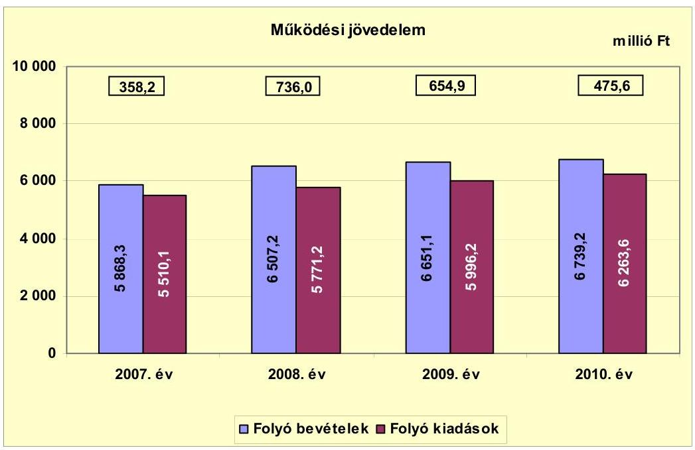

Az Önkormányzat folyó költségvetésének egyenlege (működési jövedelem) a 2007-2010. években - a folyó kiadások növekedését meghaladó folyó bevétel növekedés következtében - pozitív összegű volt. A működési jövedelem előző évhez viszonyított 377,8 millió Ft összegű (105,5\%-os) 2008. évi növekedését elsősorban az Önkormányzat bevételeinek növekedése eredményezte. A helyi adók mértékének növelése (2008-ban 21,5 millió Ft), valamint a 2007. évi kötvénykibocsátásból származó 3984,2 millió Ft bevételből történt pénzügyi befektetések eredményeként - az Önkormányzat kimutatása szerint - a 2008. évben 438,0 millió Ft bevételt értek el. A működési jövedelem előző évhez viszonyított 2009. évi 81,1 millió Ft (11,0\%-os) és 2010. évi 179,3 millió Ft összegű ( $27,4 \%$-os) csökkenését elsősorban a folyó kiadások 225,0 millió Ft (3,9\%-os), illetve 267,4 millió Ft összegű ( $4,5 \%$-os) növekedése okozta. A működési jövedelem csökkenésében szerepet játszott az is, hogy a saját források befektetéséből származó bevétel 2009-ben 112,0 millió Ft-tal ( $25,2 \%$-kal), 2010-ben 67,8 millió Ft-tal ( $20,4 \%$-kal) csökkent az előző évhez képest.

A 2007-2010. években keletkezett működési jövedelem 2224,7 millió Ft megtakarítást mutatott, amely forrásul szolgált az Önkormányzat 156,2 millió Ft tőketörlesztési kötelezettségének teljesítéséhez, valamint az 1081,8 millió Ft összegű felhalmozási forráshiányának finanszírozásához.

---

Az Önkormányzat pénzügyi kapacitását (nettó működési jövedelem) a 2007-2010. években a következő ábra szemlélteti:
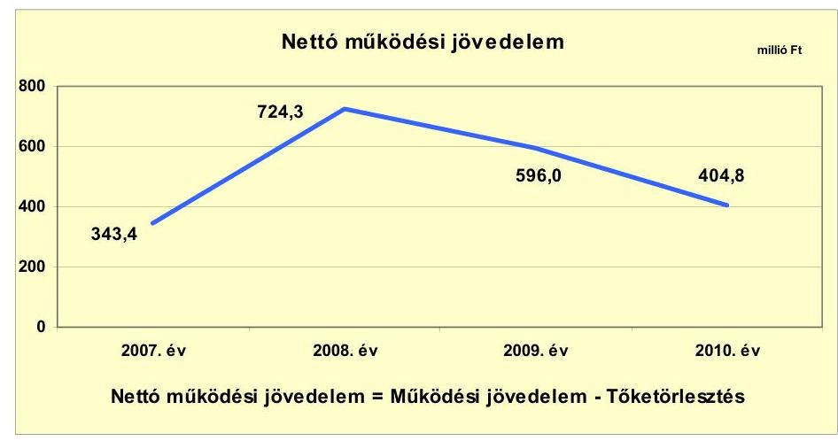

Az Önkormányzat pénzügyi kapacitása (nettó működési jövedelem) az ellenőrzött időszakban pozitív értéket mutatott. A nettó működési jövedelem 2008. évi 380,9 millió Ft összegű (110,9\%-os) növekedését az eredményezte, hogy a működési jövedelem az előző évi több mint kétszerese (736,0 millió Ft) volt, miközben a hitelekkel kapcsolatosan az előző évinél 3,1 millió Ft-tal (20,9\%-kal) kevesebb - 11,7 millió Ft - törlesztési kötelezettség jelentkezett. A nettó működési jövedelem előző évhez viszonyított 2009. évi 128,3 millió Ft összegű (17,7\%-os) és a 2010. évi 191,2 millió Ft összegű (32,1\%-os) csökkenésében - a működési jövedelem csökkenése mellett - a törlesztési kötelezettségek növekedése is
 szerepet játszott. Az Önkormányzat a felhalmozási célú hiteleivel kapcsolatosan 2009-ben 58,9 millió Ft, 2010-ben 70,8 millió Ft törlesztést teljesített, ami 47,2 millió Ft-tal (403,4\%-kal), illetve 11,9 millió Ft-tal (20,2\%-kal) meghaladta az előző évit. A nettó működési jövedelem az ellenőrzött időszakban fedezetet biztosított a felhalmozási forráshiányra.

A felhalmozási költségvetés egyenlegét a 2007-2010. években a következő ábra szemlélteti:
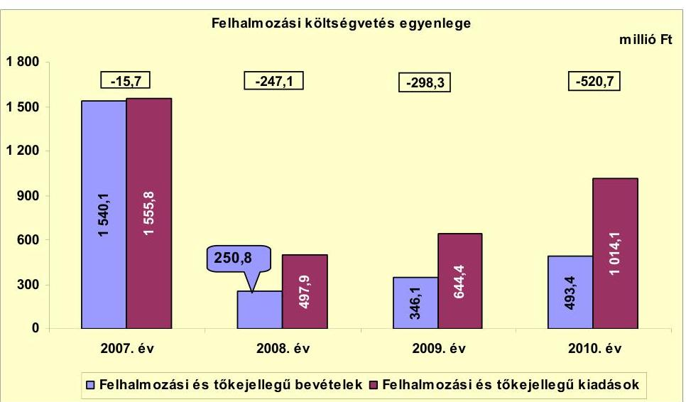

---

A 2007-2010. években az Önkormányzat felhalmozási költségvetésének egyenlege folyamatosan negatív összegű volt, amely kiegyensúlyozott költségvetési gazdálkodás és pénzügyileg fenntartható beruházások ${ }^{23}$ esetén nem jár magas pénzügyi kockázattal, amennyiben a képződő nettó működési jövedelem a felhalmozási forráshiányra a jövőben is fedezetet nyújt.

A vizsgált időszakban a felhalmozási célú kiadások összege - a fejlesztési, felújítási feladatok megvalósításának ütemezése és a pénzügyi források rendelkezésre állása függvényében - évente eltérően alakult. A 2006. évről áthúzódó 771,3 millió Ft költségű fejlesztések és a 2007. évben megvalósított egyéb felújítások, fejlesztések eredményeként 2007-ben 1555,8 millió Ft felhalmozási célú kiadást teljesítettek. A felhalmozási célú kiadások a 2008. évben az előző évhez képest 1057,9 millió Ft-tal (68,0\%-kal) csökkentek, majd a 2009. évtől növekvő tendenciát mutattak, 2009-ben 146,5 millió Ft-tal (29,4\%-kal), 2010-ben 369,7 millió Ft-tal (57,4\%-kal) emelkedtek új fejlesztések indítása, illetve megvalósítása következtében. A felhalmozási forráshiányt a 2008-2010. években indított - EU-s támogatással megvalósuló - fejlesztések utófinanszírozása okozta. A felhalmozási kiadások finanszírozásához - központi hitelprogram keretében - kedvezményes forint alapú hiteleket is igénybe vettek.

Az Önkormányzat finanszírozási műveleteinek egyenlegét a 2007-2010. években a következő ábra szemlélteti:
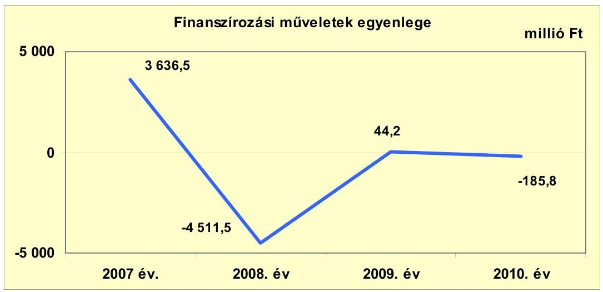

A vizsgált időszakban a finanszírozási műveletek egyenlege az egyes évek között jelentős eltérést mutatott, elsősorban az Önkormányzat 2007. évi kötvénykibocsátása, a saját kötvény 2008. évi visszavásárlása, továbbá a 2007-2010. években lebonyolított pénzügyi befektetések (értékpapír vásárlások és eladások) következtében. A finanszírozási műveletek 2007. évi kiugróan magas pozitív egyenlegét döntően a 2007. december 20-án - CHF-ben - kibocsátott kötvény ellenértékeként befolyt 3984,2 millió Ft finanszírozási bevétel

[^0]
[^0]:    ${ }^{23}$ Az minősül pénzügyileg fenntartható beruházásnak, amelynek újként megjelenő, vagy többletként jelentkező működtetési költségeire az Önkormányzat nettó működési jövedelme a következő években is fedezetet nyújt.

---

okozta. A 2007. évi finanszírozási bevételek összegét növelte a 162,2 millió Ft felhalmozási célú hitel felvétele. A 2007. évben nagy összegű - 506,6 millió Ft finanszírozási kiadást értékpapír vásárlásokra fordítottak, melyből a befektetési célú államkötvény vásárlás 475,0 millió Ft-ot (93,8\%-ot) tett ki. A kötvénykibocsátásból származó bevételt 2007. december 21-től bankbetétben kamatoztatták.

A 2008. évben a finanszírozási műveletek kiugróan magas negatív egyenlegét (-4511,5 millió Ft) a 4604,8 millió Ft összegű finanszírozási kiadás és azon belül elsősorban az Önkormányzat által a 2007. évben kibocsátott kötvény teljes állományának visszavásárlása okozta. A 2008. augusztus hónapban két részletben lebonyolított kötvény-visszavásárlás összesen 3798,6 millió Ft finanszírozási kiadást jelentett. Ezen túlmenően a finanszírozási kiadásokat növelte a tárgyévi értékpapír vásárlások 795,0 millió Ft-os összege. A finanszírozási műveletek negatív egyenlegét csökkentette a hitelfelvétel és hiteltörlesztés 47,0 millió Ft összegű pozitív egyenlege, valamint az értékpapír értékesítésből származó 47,8 millió Ft finanszírozási bevétel.

A 2008-2010. évi költségvetési beszámolók mérlegei nem tükrözik az Önkormányzat vagyoni helyzetének valós képét. Az Önkormányzat által 2007. évben kibocsátott 26,0 millió CHF kötvényállomány 2008. évi visszavásárlásának számviteli elszámolásakor a hosszú lejáratú kötelezettségek kötvénykibocsátásból származó teljes állományának kivezetésével egyidejűleg a befektetett pénzügyi eszközök állományának a vételi árral megegyező növelésére is sor került. A könyvelés azt a látszatot kelti, mintha az Önkormányzat a kötvény visszavásárlásával jelentős (a kötvény ellenértékével megegyező összegű) befektetéssel rendelkezne, a valóságban azonban ebből az összegből az általa kibocsátott kötvényeket vásárolta vissza a pénzintézettől. A nem valós gazdasági esemény elszámolásával az Önkormányzat megsértette a Számv. tv. 15. § (3) bekezdésében foglalt valódiság elvét. A visszavásárlást követően a kötvényt - a KELER Zrt. nyilvántartásából történő kivezetés időpontjáig - csak az analitikus nyilvántartásban szerepeltethették volna, ezzel szemben az Önkormányzat a számviteli nyilvántartásában és mérlegében is kimutatta. A forgalmazó pénzintézet által közölt árfolyam alapján a saját kötvény főkönyvi nyilvántartás szerinti értékét 2010. december 31-én 5789,7 millió Ft-ban állapították meg.

Az Önkormányzat a 2007. évben kibocsátott kötvénnyel kapcsolatos hosszú lejáratú kötelezettségállományát (3962,9 millió Ft) a saját kötvények teljes állományának visszavásárlásával egyidejűleg, 2008. augusztus 15-én - a tőkeváltozással szemben - kivezette a számviteli nyilvántartásából. A visszavásárolt kötvényeket 3798,6 millió Ft értéken befektetett pénzügyi eszközként nyilvántartásba vette, ami az Önkormányzat számviteli nyilvántartásában nagy összegű vagyonnövekedés kimutatását eredményezte.

A finanszírozási műveletek körében az Önkormányzat a 2009. és a 2010. évben is jelentős volumenű értékpapír forgalmat (értékpapír vásárlásokat és értékesítéseket) bonyolított le, azonban az azokkal kapcsolatos bevételek és kiadások egyenlege - 2009-ben 40,0 millió Ft, 2010-ben -31,2 millió Ft - nagyságrendekkel elmaradt az előző évek értékétől. A 2009. évben 544,5 millió Ft értékben vásároltak és 584,5 millió Ft értékben értékesítettek, a 2010. évben 1219,1 millió Ft-ért vásároltak és 1187,9 millió Ft-ért értékesítettek értékpapírokat.

---

A finanszírozási célú műveleteket a vizsgált időszakban a jelentés 2. számú mellékletének 4.1-4.8. pontjai részletezik.

Az Önkormányzat a 2007-2010. évi zárszámadási rendeleteiben meghatározta a felhalmozási, illetve működési bevételek és kiadások főösszegét ${ }^{24}$, amelyet a jelentés 1. számú melléklete szemléltet. A zárszámadási rendeletekben bevételi többletet mutattak ki, 2007-ben 923,5 millió Ft, 2008-ban 5362,4 millió Ft${ }^{25}$, 2009-ben 1064,9 millió Ft, 2010-ben 807,1 millió Ft összegben. Ez a CLF módszer alapján számított működési jövedelem és felhalmozási költségvetés egyenlegét minden évben meghaladta, alapvetően az igénybe vett előző évi pénzmaradvány hatására.

Az Önkormányzat kamatbevételeinek és kamatkiadásait a 2007-2011. év I. félév közti időszakban a következő ábra szemlélteti:
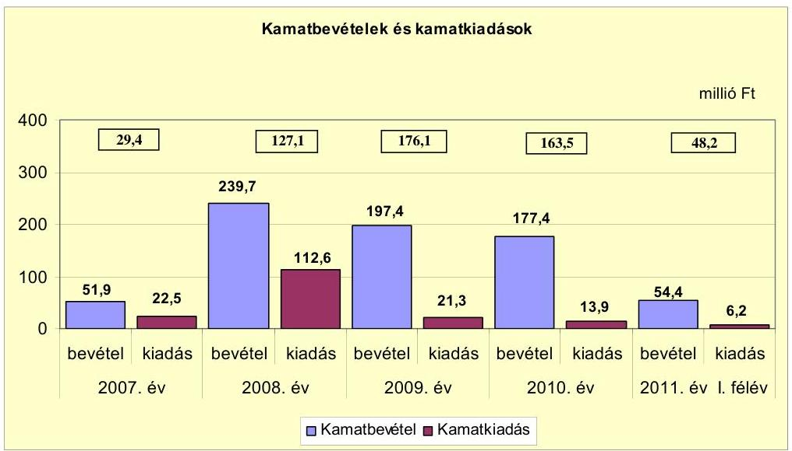

Az Önkormányzat kamatbevételeinek és kamatkiadásainak egyenlege a 2007-2011. év I. félév közötti időszakban pozitív volt. A kamatbevételek 2007-ről 2008-ra tapasztalt 187,8 millió Ft összegű (361,8\%-os) emelkedését elsősorban a 2007. évi kötvénykibocsátás bevételének lekötéséből származó kamat (146,5 millió Ft) eredményezte. A kötvénykibocsátásból származó bevétel - a saját kötvény teljes állományának visszavásárlása miatt - a 2008. évet követően már nem állt az Önkormányzat rendelkezésére. Az Önkormányzat a 2008. évben - a többi évhez képest - kiemelkedően nagy összegű kamatkiadást teljesített, a kötvénykibocsátással kapcsolatos kamatfizetési kötelezettsége (74,7 millió Ft) miatt.

[^0]
[^0]:    ${ }^{24}$ Nincs kötelező előírás a működési és fejlesztési többlet, hiány megállapításának módjára.
    ${ }^{25}$ A 2008. évi bevételi többletet a 4753,5 millió Ft összegben - finanszírozási kiadások céljára - igénybe vett előző évi pénzmaradvány eredményezte.

---

# 2.2. Az Önkormányzat bevételeinek változása 

Az Önkormányzat összes folyó bevétele a 2007. évben 5868,3 millió Ft, a 2008. évben 6507,2 millió Ft, a 2009. évben 6651,1 millió Ft, a 2010. évben 6739,2 millió Ft, a 2011. év I. félévében 3067,6 millió Ft volt.

Az Önkormányzat 2007-2011. év I. félév között realizált főbb folyó bevételi jogcímeinek számszaki adatait az alábbi ábra mutatja be:
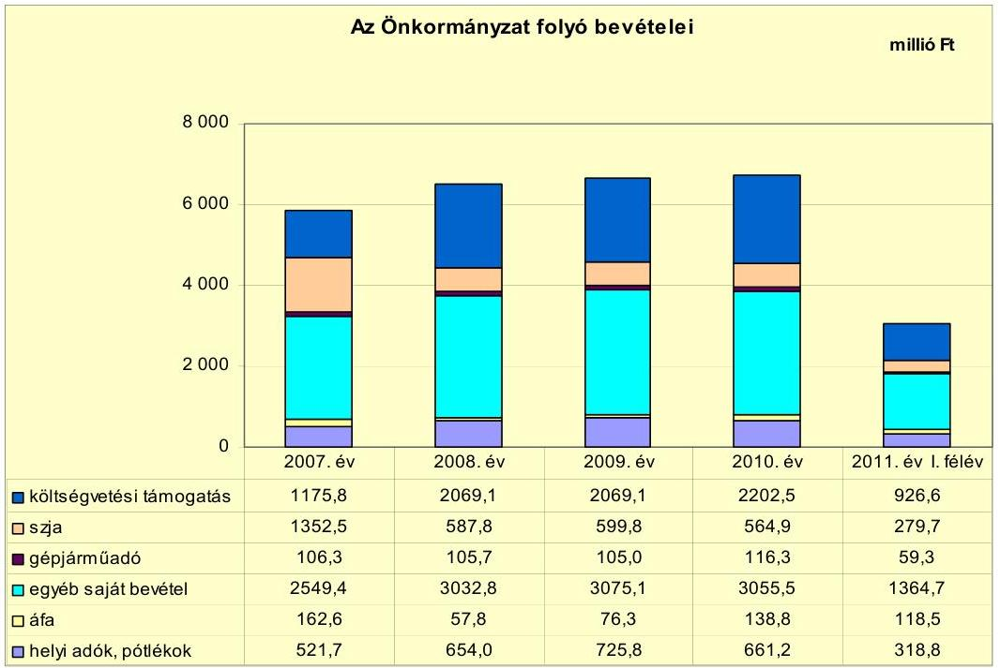

A folyó bevételeken belül a költségvetési támogatás és az szja bevétel együttes összege a 2007-2009. évi átlagos 2618,0 millió Ft-tal szemben a 2010. évben 2767,4 millió Ft volt, ami az átlaghoz képest 149,4 millió Ft (5,7\%-os) növekedést mutatott. A költségvetési támogatás és az szja együttes összegének emelkedése - az szja csökkenése mellett - elsősorban a Kistérségi társulástól 2009. július 1-jével átvett Szociális intézmény működtetéséhez igénybe vett, valamint a közcélú- és közhasznú foglalkoztatáshoz biztosított támogatásból adódott. A költségvetési támogatás és az szja együttes összegének növekedése az Önkormányzat pénzügyi helyzetét jelentős mértékben nem befolyásolta. Az Önkormányzat az önhibájukon kívül hátrányos helyzetű önkormányzatok támogatásában és vis maior támogatásban a 2007-2011. év I. félévében nem részesült.

Az egyéb saját bevételek a 2008. évben 483,4 millió Ft-tal (19,0\%-kal) nőttek az előző évhez képest, az azt követő években a nagyságrendjük jelentős mértékben nem változott. E bevételek 2007. évhez viszonyított növekedését a kötvénykibocsátásból származó bevétel befektetésével realizált hozam- és kamatbevétel (2008-ban 444,7 millió Ft), valamint az intézményi saját bevételek (intézmény átvételből, térítési díjak emeléséből eredő) növekedése eredményezte. Az intézményi saját bevételek átlagos összege a 2007-2009. években 687,9 millió Ft, a 2010. évben 835,9 millió Ft, az átlagnál 148,0 millió Ft-tal, 21,5\%-kal több volt.

---

A Kórház működéséhez biztosított OEP támogatás 2007-ben 1946,6 millió Ft, 2008-ban 1951,8 millió Ft, 2009-ben 1822,9 millió Ft, 2010-ben 2007,0 millió Ft, 2011. év I. félévében 922,2 millió Ft volt. Az OEP támogatás - előző évhez viszonyított - 2009. évi csökkenését alapvetően a teljesítményarányos finanszírozás 106,6 millió Ft összegű (6,6\%-os) csökkenése, 2010. évi növekedését központi intézkedés alapján biztosított 135,4 millió Ft rendkívüli támogatás eredményezte.

A Képviselő-testület a vizsgált időszakot megelőzően valamennyi helyi adónemet bevezette. A helyi adóbevételek, pótlékok, bírságok mértéke 2007-2009 között növekedett, a 2007. évi 521,7 millió Ft-tal szemben a 2008. évben 654,0 millió Ft, a 2009. évben 725,8 millió Ft volt. Az adóbevétel az adómértékek növelése, az adózók körének bővülése (az iparűzési adónál), valamint a behajtási tevékenység eredményeként emelkedett. Az iparűzési adónál a maximális adómértéket (2\%-ot) alkalmazták a vizsgált években. Az iparűzési adóból származó bevétel átlagos összege a 2007-2009. években 423,7 millió Ft, a 2010. évben 450,9 millió Ft volt. Az Önkormányzat az építményadó, a telekadó és az idegenforgalmi adó mértékét 2007-2011. év I. félév között, a vállalkozók kommunális adójának mértékét 2007-2010 között minden évben emelte.

Az építményadó esetében az adó mértékét 2007-ben építménytípusonként 160 Ft/m², illetve 680 Ft/m² összegben, 2011-ben 240 Ft/m², illetve 800 Ft/m² összegben állapították meg. A telekadó mértéke a 2007. évi 24 Ft/m² illetve 223 Ft/m² összegről 2011-ben 28 Ft/m², illetve 287 Ft/m²-re módosult. A személyenként és vendégéjszakánként fizetendő idegenforgalmi adó mértéke a 2007. évi 335 Ft-tal szemben 2011. január 1-jétől 415 Ft. A vállalkozók kommunális adójának évi mértéke 2007-2010 között 2100 Ft/fő összegről 2400 Ft/fő összegre nőtt. Az Önkormányzat jogszabályi előírás alapján 2011. január 1-jétől hatályon kívül helyezte a vállalkozók kommunális adójára vonatkozó helyi szabályozást. A megszűnő adónem miatti bevételkiesést az építményadó mértékének növelésével realizálható többletbevétellel kívánják ellentételezni. A vállalkozók kommunális adójából a 2010. évben 11,1 millió Ft bevételt értek el.

A 2010. évben az adóbevétel - előző évhez viszonyított - 64,6 millió Ft összegű (8,9\%-os) csökkenését a magánszemélyek kommunális adójából származó bevétel csökkenése okozta. A magánszemélyek által a lakások után fizetendő kommunális adó mértékét a 2010. évben - a lakossági hulladékszállítás díjkötelessé tételével
 összefüggésben - csökkentették. Az Önkormányzat a 2009. évben a lakossági szemétszállításért 63,2 millió Ft-ot fizetett a szolgáltatást végző cégnek, így a 2010. évben az adóbevételnél jelentkező kiesést a kiadási megtakarítás ellentételezte, az Önkormányzat pénzügyi helyzete nem romlott.

A lakások komfortfokozata és övezeti besorolása alapján differenciáltan megállapított kommunális adó éves mértéke 2009-ben 4300-15 100 Ft között, 2010-ben 600-11 800 Ft, 2011-ben 600-12 200 Ft között váltakozott. A garázsok után fizetendő kommunális adó éves összegét a 2009. évi 2000 Ft-ról 2010-ben 2100 Ft-ra, 2011. január 1-jétől 2200 Ft-ra emelték.

Az Önkormányzat a 2011. évben 665,2 millió Ft helyi adóból származó bevételt tervezett, az I. félévi teljesítés 318,8 millió Ft (47,9%) volt.

Az Önkormányzatnak a tulajdonosi részesedései után a vizsgált időszakban osztalékbevétele nem származott.

---

Az Önkormányzat 2007-2011. év I. félév között teljesített felhalmozási bevételei az alábbiak szerint alakultak:

| Megnevezés | 2007. év | 2008. év | 2009. év | 2010. év | 2011. év I.   félév |
| :-- | --: | --: | --: | --: | --: |
| Tárgyi eszköz értékesítés | 868,3 | 129,0 | 93,5 | 42,0 | 10,1 |
| Egyéb saját tőkebevétel | 27,4 | 25,1 | 20,4 | 16,9 | 62,5 |
| Államháztartáson belülről   kapott támogatás | 80,0 | 23,9 | 214,2 | 431,4 | 530,4 |
| EU-tól és külföldről kapott   támogatások | 535,5 | 33,7 | 0,0 | 0,0 | 0,0 |
| Államháztartáson kívülről   kapott támogatás | 28,9 | 39,1 | 18,0 | 3,1 | 1,1 |
| Összes felhalmozási bevétel | 1540,1 | 250,8 | 346,1 | 493,4 | 604,1 |

Az Önkormányzat 2007. évi felhalmozási bevételeinek összege a vizsgált időszakon belül kiugróan magas volt. Ennek oka, hogy 2007-ben 1555,8 millió Ft összegű felhalmozási kiadást teljesítettek, amelynek forrását döntő részben az 535,5 millió Ft EU-s támogatás, valamint a tárgyi eszköz (ingatlan) értékesítésekből származó 868,3 millió Ft saját forrás biztosította. A tárgyi eszköz értékesítésből realizált bevétel a 2008. évtől kezdődően csökkenő tendenciát mutatott, 2008-ban 739,3 millió Ft-tal (85,1%-kal) elmaradt az előző évitől. Ezen időszakban a fejlesztések, felújítások megvalósításához szükséges saját forrást elsősorban a pénzügyi befektetések hozamából, illetve a kamatbevételekből biztosították. A felhalmozási bevételeken belül a 2009. évtől nőtt az államháztartáson belülről - elsősorban fejezeti kezelésű előirányzatból EU-s programokra - kapott támogatások összege és részaránya, amely 2009-ben 214,2 millió Ft (61,9%), 2010-ben 431,4 millió Ft (87,4%) volt.

# 2.3. Az Önkormányzat működési és felhalmozási célú kiadásainak változása 

Az Önkormányzat folyó kiadásai a 2007-2011. év I. félév közötti időszakban az alábbiak voltak:

|  |  |  |  |  | millió Ft   2011. év I.   félév |
| :--: | :--: | :--: | :--: | :--: | :--: |
| Megnevezés | 2007. év | 2008. év | 2009. év | 2010. év |  |
| Folyó kiadások | 5510,1 | 5771,2 | 5996,2 | 6263,6 | 2857,2 |
| Működési kiadások (kamatkiadás nélkül) | 4774,5 | 5006,9 | 5404,0 | 5755,2 | 2563,9 |
| Államháztartáson belülre átadott pénzeszközök | 140,9 | 17,9 | 27,3 | 20,5 | 5,6 |
| Transzferkiadások | 572,2 | 620,0 | 503,7 | 464,8 | 281,5 |
| -ebből: vállalkozásoknak | 21,5 | 15,4 | 4,4 | 6,0 | 2,2 |
| EU-nak, illetve külföldre | 0,0 | 0,0 | 0,0 | 0,0 | 0,0 |
| magánszemélyeknek | 479,7 | 538,3 | 435,5 | 389,7 | 237,3 |
| nonprofit szervezeteknek | 71,0 | 66,3 | 63,8 | 69,1 | 42,0 |
| Kamatkiadások | 22,5 | 112,6 | 21,3 | 13,9 | 6,2 |
| Előző évi pénzmaradvány átadás | 0,0 | 13,8 | 39,9 | 9,2 | 0,0 |

---

A kiemelt működési előirányzatok 2007-2011. év I. félév közötti teljesítésének adatait az alábbi táblázat mutatja be:

| Megnevezés | 2007. év | 2008. év | 2009. év | 2010. év | 2011. év I.   félév |
| :-- | --: | --: | --: | --: | --: |
| Személyi juttatások | 2539,1 | 2570,1 | 2849,2 | 2928,9 | 1243,4 |
| Munkaadót terhelő járulékok | 811,1 | 812,4 | 823,6 | 702,9 | 315,2 |
| Dologi kiadások | 1293,8 | 1579,6 | 1696,0 | 1983,3 | 973,6 |
| Egyéb folyó kiadások | 92,5 | 32,9 | 30,4 | 136,6 | 31,5 |

A kiemelt működési előirányzatokon belül a személyi juttatások kiadásaira a 2007-2009. években átlagosan 2652,8 millió Ft-ot fordítottak, a 2010. évben teljesített kiadás ezt 276,1 millió Ft-tal (10,4%-kal) meghaladta. A személyi juttatások összegének évenkénti emelkedését alapvetően az intézményeknél foglalkoztatottak létszámának - az intézmény átadások, -átszervezések és -átvétel miatti - változásai, valamint a közcélú- és közhasznú foglalkoztatással kapcsolatos kiadások befolyásolták. A munkaadókat terhelő járulékok összege a központi szabályozás változásának hatására csökkent a 2010. évben az előző évhez képest. A dologi kiadásokra a 2007-2009. években átlagosan 1523,1 millió Ft-ot, míg a 2010. évben - annál 30,2%-kal (460,2 millió Ft-tal) többet - 1983,3 millió Ft-ot fordítottak. A dologi kiadások növekedését a készletbeszerzésekre, a szolgáltatási díjakra (energia költségekre, közüzemi díjakra) teljesített kiadások, valamint az áfa befizetések emelkedése okozta.

A folyó kiadások a kórházi fekvőbeteg ellátás nélkül a 2007-2011. év I. félév közötti időszakban az alábbiak voltak:

|  |  |  |  |  | millió Ft |
| :-- | --: | --: | --: | --: | --: |
| Megnevezés | 2007. év | 2008. év | 2009. év | 2010. év | 2011. év I.   félév |
| Folyó kiadások | 3491,8 | 3604,6 | 3929,6 | 4162,5 | 1890,8 |
| Működési kiadások (kamatkiadás nélkül) | 2793,9 | 2865,8 | 3381,9 | 3657,6 | 1599,7 |
| Kamatkiadás | 22,5 | 112,6 | 21,3 | 13,9 | 6,2 |
| Személyi juttatások | 1550,2 | 1536,1 | 1859,4 | 1989,9 | 818,7 |
| Munkaadót terhelő járulékok | 489,5 | 477,1 | 521,3 | 453,7 | 199,8 |
| Dologi kiadások | 665,2 | 823,2 | 974,8 | 1100,3 | 555,5 |
| Egyéb folyó kiadások | 89,0 | 29,4 | 26,4 | 113,7 | 25,5 |
| Működési célú pénzeszközátadás | 675,2 | 626,2 | 526,5 | 491,0 | 285,0 |

A folyó kiadások a 2007-2009. évi átlag 3675,3 millió Ft-ról a 2010. évre 4162,5 millió Ft-ra (13,3%-kal) nőttek, amelyben a működési kiadások és azokon belül a személyi juttatások és a dologi kiadások (intézmény átvétel, közcélú- és közhasznú foglalkoztatás, illetve készletbeszerzések, szolgáltatási díjak emelkedése miatti) növekedése volt a meghatározó. A 2007-2009. években a működési kiadások a folyó kiadásokból átlagosan 3013,9 millió Ft-tal (82,0%-kal) részesedtek. A 2010. évben a működési kiadások összege 3657,6 millió Ft, a folyó kiadásokon belüli részaránya 87,9% volt. A működési célú pénzeszközátadás összege a vizsgált időszakban folyamatosan csökkent. A kiadáscsökkenés elsősorban a társadalom- és szociálpolitikai, valamint az egyéb lakossági juttatásoknál, támogatásoknál jelentkezett a közcélú- és a közhasznú foglalkoztatás hatására. Az Önkormányzat a Kórházat saját forrásból - étkezési utalvány vásárlásával - 2007-ben 3,3 millió Ft-tal, 2008-ban 6,7 millió Ft-tal, 2009-ben 10,8 millió Ft-tal, 2010-ben 4,7 millió Ft-tal támogatta. A központi költségvetésből a Kórház részére igényelt, illetve biztosított és az Önkormányzat által az

---

intézménynek továbbutalt támogatások 2007-ben 41,9 millió Ft-ot, 2008-ban 110,7 millió Ft-ot, 2009-ben 50,2 millió Ft-ot, 2010-ben 32,2 millió Ft-ot tettek ki.

Az Önkormányzat folyó- és felhalmozási kiadásait a 2007-2011. év I. félév közötti időszakban az alábbi ábra szemlélteti:
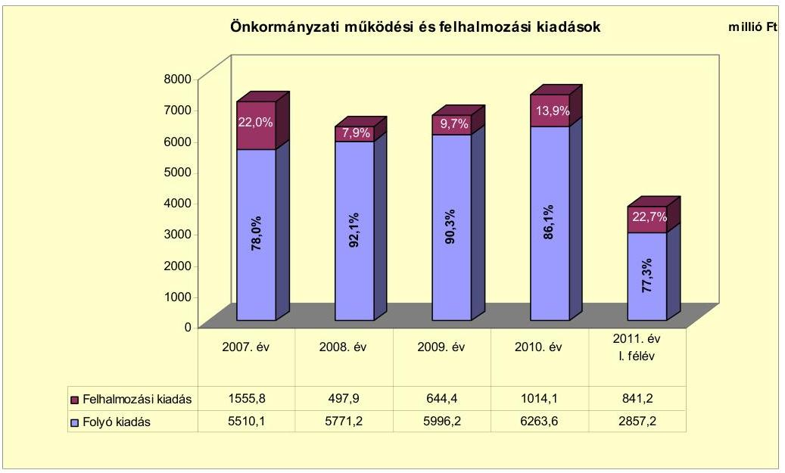

Az Önkormányzat összes kiadásán belül a felhalmozási kiadások mértéke és részaránya a 2007. évről a 2008. évre 1057,9 millió Ft-tal, 14,1 százalékponttal csökkent, az azt követő években folyamatosan emelkedett. A 2007. évi kimagasló - 1555,8 millió Ft - felhalmozási kiadás több nagy értékű fejlesztés megvalósításához kapcsolódott (történelmi városrész rehabilitációja, fogyatékosok napközi otthonának építése, szociális otthon épületének bővítése). A felhalmozási kiadások átlagos összege a 2007-2009. években 899,4 millió Ft, az összes kiadáson belüli részaránya 13,5% volt. A 2010. évben az 1014,1 millió Ft összegű felhalmozási kiadás az összes kiadás 13,9%-át tette ki.

Az Önkormányzat kimutatása szerint a 2007-2010. években 13 db 10,0 millió Ft feletti felújítás és fejlesztés fejeződött be, amelyek összes költsége 1882,4 millió Ft volt. Ugyanezen időszakban a 64 db 10,0 millió Ft egyedi bekerülési költség alatti felújítási és 95 db fejlesztési feladatra összesen 647,7 millió Ft-ot fordítottak. Az együttesen 2530,1 millió Ft összegű kiadásból 2006. december 31-ig 419,9 millió Ft-ot, a 2007-2010. években 2110,2 millió Ft-ot teljesítettek. A befejezett felújítások, és fejlesztések forrása 1018,8 millió Ft (40,2%) saját bevételből, 475,0 millió Ft (18,8%) felhalmozási célú hitelből, 889,8 millió Ft (35,2%) EU-s támogatásból, valamint 146,5 millió Ft (5,8%) hazai támogatásból tevődött össze. A tervezettet 39,9 millió Ft-tal meghaladó felhalmozási kiadások finanszírozása az Önkormányzat saját forrásai terhére történt. A 475,0 millió Ft kedvezményes kamatozású hitelt a 2006-2008. években közművesített építési telkek kialakítása céljára vették igénybe. A 2010. december 31-ig befejezett felújítások és fejlesztések részletezését a jelentés 3/a. számú melléklete mutatja be.

---

Az Önkormányzat kimutatása szerint 2010. december 31-én - összesen 2717,1 millió Ft tervezett bekerülési költséggel - kilenc fejlesztési feladat megvalósítása volt folyamatban. A 2010. december 31-ig teljesített 459,7 millió Ft kiadást 51,9 millió Ft (11,3%) saját bevételből, 115,8 millió Ft (25,2%) hitelből, 273,9 millió Ft (59,6%) EU-s támogatásból és 18,1 millió Ft (3,9%) hazai támogatásból finanszírozták. A folyamatban lévő fejlesztésekkel kapcsolatban a 2010. év utánra vállalt önkormányzati kötelezettségek összege 2257,4 millió Ft, amelynek forrását 482,4 millió Ft (21,4%) képződött működési jövedelemből, 19,2 millió Ft (0,8%) hitelből, 1712,4 millió Ft (75,9%) EU-s támogatásból és 43,4 millió Ft (1,9%) hazai támogatásból biztosítják. Az Önkormányzatnál a vállalt saját forrás fedezete pénzeszközökben és értékpapírokban rendelkezésre áll. A 2010. december 31-én folyamatban lévő fejlesztések adatait a jelentés 3/b. és 3/c. számú mellékletei mutatják be.

Az Önkormányzat a 2011. év I. félévében kettő felhalmozási feladat megvalósítása érdekében nyújtott be pályázatot. Az összesen 131,6 millió Ft költséggel tervezett munkákat 16,3 millió Ft (12,4%) saját forrásból, 104,5 millió Ft (79,4%) EU-s támogatásból és 10,8 millió Ft (8,2%) hazai támogatásból tervezik megvalósítani. Az Önkormányzat beadott, elbírálás alatti pályázati forrásból megvalósuló fejlesztéseihez kapcsolódó kötelezettségvállalásait a jelentés 3/d. számú melléklete mutatja be.

A vizsgált
 időszakban az Önkormányzat három legmagasabb bekerülési költségű beruházása az alábbi volt:

- Az Önkormányzat a 2006-2008. években a Déli lakóparkban 168 db közművesített lakótelket alakított ki. A fejlesztés a tervezett határidőre megvalósult, a tényleges bekerülési költsége - 476,4 millió Ft - kismértékben (1,4 millió Fttal, 0,3%-kal) haladta meg a tervezettet. A fejlesztés forrása 475,0 millió Ft (99,7%) felhalmozási célú hitel és 1,4 millió Ft (0,3%) önkormányzati saját forrás volt.
- Az Önkormányzat a 2006-2007. években EU-s támogatással valósította meg a „Mohács, történelmi városrész rehabilitációja II. ütem" fejlesztést, amelynek keretében a történelmi városközpont gerincét képező utcák, közterületek rekonstrukciójára került sor. A 491,8 millió Ft költséggel tervezett fejlesztésre ténylegesen 499,9 millió Ft-ot - a tervezettnél 8,1 millió Ft-tal (1,6%-kal) többet - fordítottak, ami az Önkormányzat számára kiadási többletet jelentett. A fejlesztést 442,6 millió Ft (88,5%) EU-s támogatásból, 29,5 millió Ft (5,9%) hazai támogatásból és 27,8 millió Ft (5,6%) saját bevételből finanszírozták.
- A „Mohácsi Ipari Park infrastruktúrájának fejlesztése III. ütem" fejlesztés a tervezettnek megfelelően a 2008-2010. években - EU-s támogatással - valósult meg. A meglévő közműellátottság bővítését célzó fejlesztés keretében útépítésre, a víz- és csatornahálózat bővítésére, valamint a villamosenergia- és a földgázellátás fejlesztésére került sor. A 325,1 millió Ft bekerülési költséggel tervezett fejlesztés megvalósítására 324,7 millió Ft-ot fordítottak. A munkák finanszírozása 164,0 millió Ft (50,5%) saját bevételből és 160,7 millió Ft (49,5%) EU-s támogatásból történt.

---

Az Önkormányzat a 2007-2011. év I. félév közötti időszakban a helyi közösségi közlekedést biztosító Pannon Volán Zrt. működéséhez - a saját bevételei terhére - 2007-ben 4,4 millió Ft, 2008-ban 6,7 millió Ft, 2010-ben 5,2 millió Ft, 2011. év I. félévben 1,2 millió Ft pénzeszköz átadással járult hozzá. A központi költségvetésből biztosított és a szolgáltatónak továbbutalt állami támogatás 2007-ben 0,8 millió Ft, 2008-ban 0,8 millió Ft, 2009-ben 0,2 millió Ft, 2010-ben 0,4 millió Ft volt.

Az Önkormányzat a Városfejlesztési Kft.-vel a 2010. évben kötött közművelődési megállapodás alapján a 2011. év I. félévben 2,0 millió Ft működési célú pénzeszközt adott át a nonprofit szervezetnek. A Képviselő-testület a Városfejlesztési Kft.-t a 2010. évben végzett tevékenységéről beszámoltatta.

# 3. Az ÖNKORMÁNYZAT KÖTELEZETTSÉGEI 

### 3.1. Az Önkormányzat pénzintézeti kötelezettségeinek változása

Az Önkormányzat pénzintézeti kötelezettségeinek állománya 2006. december 31-től 2010. december 31-ig 1,6-szeresére 294,4 millió Ft-ról 475,0 millió Ft-ra nőtt. A 2007. december 31-én fennálló 4404,7 millió Ft pénzintézeti kötelezettségek állományából 3941,6 millió Ft (89,5%) fejlesztési célú, CHF alapú kötvénykibocsátásból, 21,3 millió Ft (0,5%) árfolyamváltozásból, 430,7 millió Ft (9,8%) beruházási és fejlesztési hitelfelvételből, valamint 11,1 millió Ft (0,2%) a beruházási és fejlesztési hitel után fennálló, a következő évet terhelő törlesztési kötelezettségéből keletkezett. A kötvény kibocsátásából származó hosszú lejáratú kötelezettség 2008. augusztus 15-én, a saját kötvény visszavásárlásával megszűnt. Ezt követően, a vizsgált időszak hátralévő éveinek fordulónapján, valamint a 2011. június 30-án kimutatott pénzintézeti kötelezettségek a beruházási és fejlesztési hitelek igénybevételéből származtak. Folyószámla, munkabér megelőlegezési, illetve likvid hitelt az Önkormányzat a vizsgált időszakban nem vett igénybe.
Az Önkormányzat pénzintézeti kötelezettségeinek állományát 2006. december 31-től 2011. június 30-ig a következő ábra szemlélteti:
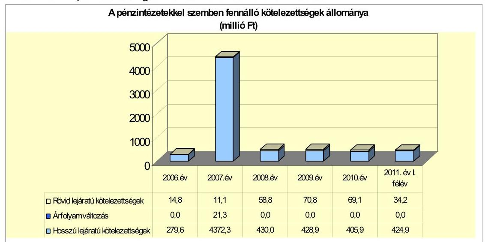

---

Az Önkormányzat hosszú lejáratú adósságot keletkeztető pénzintézeti kötelezettségvállalásai a 2007-2011. június 30. közötti időszakban az alábbiak voltak:

- Az Önkormányzat 2005. augusztus 29-én a megszűnt Mohács-Szőlőhegy Víziközmű Társulattól a Mohács és Vidéke Takarékszövetkezettel szemben fennálló 5,6 millió Ft²⁶ változó kamatozású kölcsöntartozást vett át. A kölcsöntartozásból 2007. január 1-jéig 1,0 millió Ft-ot fizetett meg az Önkormányzat.
- A Képviselő-testület 2006. évben a Sikeres Magyarországért Önkormányzati Infrastruktúrafejlesztési Hitelprogram keretében kedvezményes forint alapú hitel felvételéről döntött a „Déli lakóparkban megvalósítandó fejlesztések" (ivóvízvezeték, csapadékvíz-csatorna, szennyvízcsatorna, út és járda építése) finanszírozására. A hitelszerződést 2006. július 28-án - 36 hónap türelmi idővel, 10 év futamidőre, 3 havi EURIBOR+évi 1,53%-os kamatmértékkel 475,0 millió Ft-os hitelkeretre kötötték az OTP Nyrt.-vel. A hitelkeretből a 2006. évben 254,1 millió Ft-ot, a 2007. évben 162,2 millió Ft-ot, a 2008. évben 58,7 millió Ft-ot vettek igénybe. A hiteltörlesztést az Önkormányzat 2009. év II. félévben kezdte meg, melynek éves összege 68,0 millió Ft.
- A Képviselő-testület 2007. november 15-én az Önkormányzat beruházási tevékenységének finanszírozására 26,0 millió CHF névértékű „Mohács" elnevezésű kötvény kibocsátásáról döntött. A közbeszerzési eljárást követően a Raiffeisen Bank Zrt.-t bízták meg a kötvény lejegyzésével. Az Önkormányzat a kötvényt svájci frankban 20 éves futamidővel ²⁷, öt év három hónap és 11 nap tőkefizetési halasztással, 3 havi CHF LIBOR+0,55%-os mértékű kamatfizetési kötelezettséggel bocsátotta ki. A kötvény kibocsátásából származó bevételt 2007. december 21-én rövid lejáratú, CHF betétben helyezték el, majd a 2008. január 23-án történt forintra váltását ²⁸ követően, az árfolyamés kamatkockázat minimalizálása érdekében kialakított befektetési portfóliójukban magyar állampapírok, változó időszakokra és különböző kamatfeltételekkel lekötött forint, CHF és EUR alapú bankbetétek szerepeltek. A kötvény kibocsátásából származó bevétel befektetéséről, annak eredményeiről a polgármester rendszeresen tájékoztatta a Képviselő-testületet. Az árfolyam- és kamatkockázat erősödését érzékelve, a Képviselő-testület 2008. június 27-én felhatalmazta a polgármestert, hogy amennyiben szükségessé válik, eljárjon a kötvény visszaváltása érdekében. Az Önkormányzat - a kedvező Ft/CHF árfolyamot kihasználva - a kötvényt két részletben, 2008. augusztus 8-án ²⁹, illetve 15-én ³⁰ visszavásárolta ³¹ a lejegyző banktól, így ez-

[^0]
[^0]:    ²⁶ A Mohács-Szőlőhegy Víziközmű Társulat 2004. évben 6,5 millió Ft hitelt vett fel, amelyből az átvállalás időpontjában 5,6 millió Ft tőketartozás állt fenn.
    ²⁷ A futamidő és kamatszámítás kezdő napja 2007. december 20. volt.
    ²⁸ A beváltásra 156,5 Ft/CHF árfolyamon került sor.
    ²⁹ 17450000 CHF névértékű kötvényt 143,12 Ft/CHF árfolyamon.
    ³⁰ 8550000 CHF névértékű kötvényt 152,177 Ft/CHF árfolyamon.
    ³¹ A kötvényt ún. alvó-kötvényként a város értékpapírszámláján és a KELER Zrt.-nél tartják nyilván, hogy amennyiben forrásszükséglet merül fel, külön eljárás nélkül ismételten értékesíthessék, elsődlegesen az elővásárlási jogot kikötő lejegyző banknak.

---

után sem tőke, sem kamatfizetési kötelezettsége nem állt fenn ³². A kötvény visszavásárlása - a beváltási árfolyamhoz viszonyítva - összesen 270,4 millió Ft árfolyamnyereséget, a kötvényből származó bevétel befektetése összesen 146,5 millió Ft kamatbevételt eredményezett a 2008. évben. A kötvény kibocsátásával kapcsolatban az Önkormányzatnak 6,0 millió Ft garanciavállalási díj és 74,7 millió Ft kamatfizetési kötelezettsége keletkezett.

- Az Önkormányzat a bérlakás állományának növelése céljából - a Sikeres Magyarországért Bérlakás Hitelprogram által nyújtott lehetőséggel élve 2009. július 15-én 135,0 millió Ft hitelkeret szerződést kötött a Raiffeisen Bank Zrt.-vel. A bank a szerződésben 36 hónapos türelmi időt, 25 év futamidőt és 3 havi EURIBOR+évi 1,55%-os kamatmértéket kötött ki. A hitelkeretből a 2009. évben 69,7 millió Ft-ot, a 2010. évben 46,1 millió Ft-ot, a 2011. évben 19,2 millió Ft-ot vettek igénybe. Az Önkormányzat a hitel törlesztését 2012. év II. félévtől kezdi meg, évi 6,0 millió Ft összegben.

Az Önkormányzat pénzintézeti kötelezettségvállalásaira minden esetben képviselő-testületi döntés alapján került sor. A kötelezettségvállalásból származó források felhasználási céljait meghatározták. A Képviselő-testület döntéseit megalapozó előterjesztések tartalmazták a kötelezettségvállalás visszafizetési forrásainak (az Önkormányzat mindenkori költségvetési bevétele és a forgatási célú értékpapír-állománya), a teljes futamidő várható kamat- és tőkefizetési kötelezettségeknek, az árfolyam- és kamatkockázatoknak, valamint az adósságszolgálati korlát bemutatását.

Az Önkormányzat adósságot keletkeztető kötelezettségvállalásának felső határát a döntéshozatal során vizsgálták, azt a 2007-2011. év I. félév között nem lépték túl.

A kötvény kibocsátása és a hosszú lejáratú hitelek felvétele előtt minden esetben közbeszerzési eljárást folytattak le. A „Mohács" kötvény lejegyzésével az Önkormányzat számlavezető bankját bízták meg, ez azonban nem érintette hátrányosan a szerződési feltételek meghatározásában.

Az Önkormányzat 2011. június 30-án forintban fennálló hosszú lejáratú adósságot keletkeztető kötelezettségvállalásait a következő tábla mutatja be:

| Megnevezés | Szerződéskötés   időpontja | Összeg   millió Ft-ban | Kamat (referencia   kamat+ kamatfelár) | Felhasználás célja: |
| :--: | :--: | :--: | :--: | :--: |
| Mohács-Szőlőhegy lakóterület   ivóvízellátása | 2005.08.29 | 5,6 | változó, a kezdő évi   12,25% | ivóvízhálózat kiépítése |
| Déli lakóparkban   megvalósítandó fejlesztések | 2006.08.01 | 475,0 | 3 havi EURIBOR+évi   1,53% | ivóvízvezeték, csapadékvíz-   csatorna, szennyvízcsatorna, út és   járda építése |
| Bérlakás állomány növelése | 2009.07.15 | 135,0 | 3 havi EURIBOR+évi   1,55% | bérlakás vásárlás |

[^0]
[^0]:    ³² A Képviselő-testület a saját kötvény visszavásárlását - a polgármester beszámolója alapján - jóváhagyta.

---

A három hitelhez kapcsolódóan hiteltörlesztésre 156,5 millió Ft-ot, kamatfizetésre 77,1 millió Ft-ot fordítottak 2011. év I. félév végéig.

A 2011. év I. félévét követően, a helyszíni ellenőrzés befejezéséig az Önkormányzat további kötvénykibocsátásról és hitelfelvételről szóló döntést nem készített elő.

Az Önkormányzat 2007-2011. év I. félév között az átmenetileg szabad pénzeszközein 720,8 millió Ft kamatbevételt realizált, amelyből 350,2 millió Ft származott a kötvényből származó bevétel befektetéséből és 370,6 millió Ft az intézmények és a Polgármesteri hivatal elkülönített bankszámláin rendelkezésre állt forrás befektetéséből.

A 2007. és 2009. években felvett, hosszú lejáratú hitelek esetében a kamatfizetési kötelezettségek alakulását jelentősen befolyásolta és jelenleg is befolyásolja a lehívás idején és az utolsó kamatfizetéskor érvényes referencia kamatok változása, amelyet az alábbi táblázat mutat be: ³³

| Megnevezés | Lehivási | Utolsó fizetéskori | Változás % |
| :--: | :--: | :--: | :--: |
|  | kamat (referencia + kamatfelár) % |  |  |
| 3 havi EURIBOR (2006.08.01.-i szerződés) | 4,591 | 3,074 | -33,0% |
| 3 havi EURIBOR (2009.07.15.-i szerződés) | 2,434 | 3,087 | 26,8% |

A kamat mértékének alakulása jelentős hatással van a teljes futamidőre számított, várható kamatkötelezettség nagyságára. Az Önkormányzat fizetési kötelezettségét a 2006. évben kötött hitelszerződés esetében a referencia kamat csökkenése kedvezően, a 2009. évi hitelfelvételnél tapasztalt referencia kamat növekedése kedvezőtlenül befolyásolta. A megfizetett kamatfelár 2007-2011. év I. félév közötti időszakban nem változott egyik kötelezettségnél sem. A 2006. évi hitelszerződés alapján az eredeti kamattal számolva az Önkormányzatnak 2011. június 30-ig 7,7 millió Ft-tal több (79,4 millió Ft, 10,7%) kamatot kellett volna fizetnie a teljesített 71,7 millió Ft-hoz képest. A legutolsó kamatfizetési kondíciót alapul véve a hitel futamidejéből hátralévő években fizetendő kamat összege 31,7 millió Ft, azaz 13,4 millió Ft-tal (42,3%) kevesebb, mint a szerződés megkötésekor
 érvényes kamattal számolt 45,1 millió Ft. A 2009. évi hitelszerződés alapján 2011. június 30-ig az induló kamatmértékkel 4,6 millió Ft-ot kellett volna fizetnie az Önkormányzatnak a teljesített 3,9 millió Ft-tal szemben. Azonban a hitel futamidejéből hátralévő években fizetendő kamat összege a legutolsó kamatfizetéskor érvényes kamatmérték feltételezése esetén 52,6 millió Ft, 9,6 millió Ft-tal ( $22,3 \%$ ) több mint az eredeti kamattal számolt 43,0 millió Ft.

[^0]
[^0]:    ${ }^{33}$ A Mohács-szőlőhegyi lakóterület ivóvízellátása céljára kötött hitelszerződésben a bank nem jelölt meg referenciakamatot.

---

Az Önkormányzat kötelezettségeinek állományát 2010. december 31-én és 2011. június 30-án, valamint várható alakulását a kötelezettségek lejártáig az alábbi táblázat részletezi:

| Megnevezés | $\begin{gathered} \text { Állomány } 2010 . \\ \text { december } 31- \\ \text { én } \end{gathered}$ | $\begin{gathered} \text { Állomány } \\ 2011 . \text { június } \\ 30 \text {-án } \end{gathered}$ | Várható kötelezettség 2011-2013. években | Várható kötelezettség 2014. évtől |
| :--: | :--: | :--: | :--: | :--: |
|  | HUF-ban (millió) | HUF-ban (millió) | HUF-ban (millió) | HUF-ban (millió) |
| Pénzintézeti kötelezettségek |  |  |  |  |
| Mohács-Szőlőhegy lakóterület ivóvízellátása | 2,1 | 1,8 | 2,3 | 0,2 |
| Déli lakóparkban megvalósítandó fejlesztések | 356,2 | 322,3 | 227,3 | 160,6 |
| Bériakás állomány növelése | 115,8 | 135,0 | 22,9 | 166,1 |
| Pénzintézeti kötelezettségek összesen: | 474,1 | 459,1 | 252,5 | 326,9 |
| Biztosítékok |  |  |  |  |
| Kezesség |  | 0,2 |  |  |
| Biztosítékok összesen: |  | 0,2 |  |  |
| PPP kötelezettségek | 815,6 | 772,7 | 198,9 | 616,6 |
| Szállítói tartozás | 155,5 | 187,8 | 187,8 |  |
| Zogerős végzéssel lezárt de ki nem fizetett kötelezettségek |  | 4,8 | 4,8 |  |
| Összes kötelezettség: | 1445,2 | 1424,4 | 644,0 | 943,5 |

Az Önkormányzat fennálló összes kötelezettsége 2010. december 31-én 1445,2 millió Ft volt. A fennálló kötelezettségekből a 2011-2013. években ${ }^{34}$ a várható kamatterhek figyelembevételével - 644,0 millió Ft fizetési kötelezettsége keletkezik az Önkormányzatnak. Ennek teljesítésére az Önkormányzat működési megtakarítása és a három év alatt képződő működési jövedelme elegendőnek mutatkoznak.

A 2014. évtől várható, a helyszíni ellenőrzés időszakában ismert önkormányzati kötelezettség összege - a jelentkező kamatterhekkel együtt 943,5 millió Ft. A teljesítésre - az Önkormányzat döntéseiben megjelöltek szerint - az évente képződő működési jövedelem nyújt majd fedezetet.

Az Önkormányzat - a jelenlegi állami finanszírozási rendszer, valamint a saját bevételi potenciálja változatlansága esetén - az eddig vállalt kötelezettségeit teljesíteni tudja.

# 3.2. A szállítói kötelezettségek változása 

Az Önkormányzat mérleg szerinti szállítói állománya a vizsgált időszakban évről évre emelkedett. A 2007-2009. években átlagosan 136,6 millió $\mathrm{Ft}^{35}$ volt a szállítói kötelezettség, amely a 2010. év végére 155,5 millió Ft-ra, a 2011. év I. félév végére 187,8 millió Ft-ra növekedett. Az Önkormányzat kötelezettségállománya a 2007-2009. évek között növekvő, ezt követően 2011. június 30-ig csökkenő tendenciát mutatott. A kötelezettségállomány 2007-2009. évi átlagos

[^0]
[^0]:    ${ }^{34}$ A 2011-2013. években várható kötelezettség magában foglalja a 2011. év I. félévében már megfizetett összeget is.
    ${ }^{35}$ A 2007. év végén 55,4 millió Ft, a 2008. év végén 86,6 millió Ft, a 2009. év végén 267,8 millió Ft az Önkormányzat mérleg szerinti szállítói kötelezettségének állománya.

---

összege ${ }^{36} 711,2$ millió Ft volt, amelynek átlagosan 19,2\%-át tette ki a szállítói állomány. A 2010. december 31-én kimutatott 717,2 millió Ft kötelezettségnek 21,7\%-a volt a szállítói állomány. A 2011. év I. félév végén fennálló 680,8 millió Ft kötelezettségállománynak a 27,6\%-át képezte a szállítókkal szembeni kötelezettség. A szállítói állomány növekedését az Önkormányzat által megvalósított, nagy összegű fejlesztések okozták.

Az Önkormányzat mérleg szerinti szállítói kötelezettségén belül a Kórház 2007-2009. évi átlagos szállítói állománya 79,3 millió Ft volt, amely az összes szállítói kötelezettség 58,0\%-át tette ki. A Kórház szállítói kötelezettsége 2010. évre 60,6 millió Ft-ra (40,0\%), 2011. év I. félév végére 51,6 millió Ft-ra (27,5\%) csökkent, az OEP-től kapott kiegészítő támogatásnak és a takarékos gazdálkodásnak köszönhetően.

Az Önkormányzat és intézményei - Kórház nélkül számított - év végi lejárt szállítói állománya a 2007-2009. években átlagosan 3,4 millió Ft volt ${ }^{37}$, amely a 2010. évben 0,8 millió Ft-ra csökkent. A lejárt szállítói állomány a 2011. év I. félév végén 2,0 millió Ft volt. A 2007-2009. években kimutatott lejárt szállítói állomány egésze 31 napon túli tartozás volt, amelyből átlagosan 0,2 millió Ft-ot (6,1\%) 31-90 nap között, 1,1 millió Ft-ot (33,3\%) a 91 napon, és 2,0 millió Ft-ot ( $60,6 \%$ ) az éven túl lejárt szállítói tartozások között mutattak ki. A 2010. évi lejárt szállítói tartozásnak a 100\%-a ( 0,8 millió Ft) éven túl járt le. A 2011. év I. félévkor fennálló lejárt szállítói állomány egésze 31 napon túl járt le, amelyből 1,1 millió Ft (55,0\%) 31-60 nap közötti, 0,1 millió Ft (5,0\%) 91-365 nap közötti, 0,8 millió Ft ( $40,0 \%$ ) éven túli tartozás volt. Az ezen felüli 1,2 millió Ft értékű számla fizetési határideje is 31 napon túl járt le. Az éven túli késedelmes fizetést a Polgármesteri hivatal gazdálkodási szabályzatában kötelezően előírt kontrollok végrehajtásának időbeli elhúzódása okozta.

A Kórház a 2007. év végén nem rendelkezett lejárt szállítói állománnyal. A 2008. évben 30,0 millió Ft, a 2009. évben 86,0 millió Ft volt az intézmény év végi lejárt szállítói állománya, ami 2010. év végére 0,9 millió Ft-ra csökkent. A 2011. év I. félév végén nem volt lejárt szállítói tartozása a Kórháznak.

A Kórház 2008-2009. években fennálló, nagyobb összegű szállítói állománya az év végén jelentkező finanszírozási nehézségekből adódott, 90 napnál hosszabb ideje lejárt kötelezettséget nem tartalmazott. A 2010. év végi 0,9 millió Ft szállítói állományból 0,8 millió Ft 91-365 nap között lejárt tartozás volt, amely vitatott, reklamáció alatt álló számlákból adódott, ezért kiegyenlítésére 2011. év január hónapban került sor.

Az Önkormányzat és intézményei az ellenőrzött időszakban szállítói kötelezettségeinek átütemezésére megállapodást nem kötöttek. Egyéb kiadási elmaradása az Önkormányzatnak a 2007-2011. év I. félév közötti időszakban nem volt.

[^0]
[^0]:    ${ }^{36}$ A kötelezettségállomány a 2007. évben 578,6 millió Ft (a torzításmentes arányok számítása érdekében a kötvénykibocsátásból származó 3962,9 millió Ft kötelezettség nélküli adat), a 2008. évben 679,4 millió Ft, a 2009. évben 875,7 millió Ft volt.
    ${ }^{37}$ A lejárt szállítói állomány a 2007. évben 5,3 millió Ft, a 2008. évben 3,3 millió Ft, a 2009. évben 1,5 millió Ft volt.

---

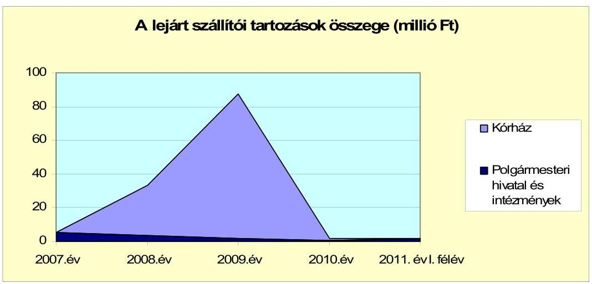

# 3.3. Egyéb kötelezettségek változása 

Az Önkormányzat 2006. június 16-án a Mohácsi Tanuszoda projekt PPP konstrukció keretében történő megvalósításához kapcsolódó szolgáltatási szerződést kötött a Nemzeti Sporthivatallal és az Aquaplus Kft.-vel ${ }^{38}$. A 15 éves futamidejű szerződésből adódóan az Önkormányzatnak összesen 1039,7 millió Ft, a központi költségvetésnek összesen 860,2 millió Ft szolgáltatási díj címén fizetendő kötelezettsége keletkezett. Az Önkormányzat a fizetendő szolgáltatási díjból 2007-2011. év I. félév között 267,0 millió Ft-ot teljesített, a 2011. június 30-án fennálló kötelezettség összege 772,7 millió Ft. A kötelezettségből adódóan éves szinten 70-80 millió Ft szolgáltatási díjat kell fizetni, amely az Önkormányzat pénzügyi kockázatát nem növeli.

Az Önkormányzat a Mohács-Sáros Víziközmű Társulat részére 2004. március 16-án a Mohács-Sáros lakóterület ivóvízellátásának kivitelezését szolgáló hitel igénybevételéhez készfizető kezességet vállalt 2,0 millió Ft összegű hitel és járulékai erejéig. A készfizető kezesség alapján az Önkormányzat 2011. év I. félév végéig 1,8 millió Ft-ot fizetett meg, amelynek teljes összegét a Mohács-Sáros Víziközmű Társulat megtérítette. A kezességvállalásból adódóan 2011. június 30-án fennálló kötelezettség összege 0,2 millió Ft.

A vizsgált időszakban az Önkormányzatnak és intézményeinek garanciavállalásból kötelezettsége nem keletkezett, lízingszerződést nem kötöttek.

Az Önkormányzat a 2007-2011. év I. félév közötti időszakban 7,6 millió Ft követelésről mondott le. Az elengedett követelésekből 1,6 millió Ft az Önkormányzat által kivetett helyi adóból származó követelés (adótartozás, késedelmi pótlék, talajterhelési díj) volt, amelynek megfizetése alól a jegyző méltányossági jogköre ${ }^{39}$ gyakorlásával mentesítette a kötelezetteket. A Képviselő-testület a 216/2007. (XII. 21.) számú határozatával a Magyarok Nagyasszonya Ferences Rendtartomány által fenntartott Boldog Gizella Általános Iskola és Óvoda Ön-

[^0]
[^0]:    ${ }^{38}$ Aquaplus Kútfúró, Kútjavító és Vízépítő Kft.
    ${ }^{39}$ A méltányossági eljárásra az adózás rendjéről szóló 2003. évi XCII. törvény 134. § (1) bekezdésben foglaltak szerint az ügyfél kérelmére került sor.

---

kormányzattal szemben étkezési díj címén fennálló 12,0 millió Ft tartozásának 50,0\%-át (6,0 millió Ft-ot), a Rendtartomány egyezségi ajánlatának egyidejű elfogadásával - az Önkormányzat vagyongazdálkodási rendeletében meghatározott módon - elengedte.

A vizsgált időszakban az Önkormányzat 2010. november 8-án 11,0 millió Ft összegben nyújtott tagi kölcsönt a kizárólagos tulajdonát képező Városfejlesztési Kft.-nek a Duna Irodaház komplett kazánházi rekonstrukciójának finanszírozásához. A Városfejlesztési Kft. a kölcsönt 2012. év szeptember 15-étől kezdődően 0,1 millió Ft-os részletekben 2020. december 31-ig köteles visszafizetni.

Az Önkormányzat a Városfejlesztési Kft.-nek a 2005. évben 38,0 millió Ft, a 2006. évben 165 millió Ft tagi kölcsönt nyújtott.

Az Önkormányzat adatszolgáltatása szerint ingatlanjait 2011. június 30-án pénzintézeti és egyéb kötelezettséghez kapcsolódó jelzálogjog, elidegenítési és terhelési tilalom nem terhelte.

Az Önkormányzat intézményeként működő Kórháznak jogerős bírósági ítélet alapján 2011. június 30-án összesen 4,8 millió Ft kártérítési kötelezettsége állt fenn. A helyszíni vizsgálat idején az Önkormányzat és intézményei, valamint a kizárólagos tulajdonát képező gazdasági társaságai fizetési kötelezettségét keletkeztető peres eljárás nem volt folyamatban.

Az Önkormányzat kizárólagos tulajdonú gazdasági társaságai kötelezettségeinek állományát 2010. december 31-én, 2011. június 30-án, illetve várható alakulását a kötelezettségek lejáratáig a következő táblázat szemlélteti:

| Megnevezés | Állomány   2010. december   31-én | Állomány   2011. június   30-án | Várható   kötelezettség   2011-2013.   években | Várható   kötelezettség   2014. évtől |
| :--: | :--: | :--: | :--: | :--: |
|  | HUF-ban (millió   Ft-ban) | HUF-ban (millió   Ft-ban) | HUF-ban (millió   Ft-ban) | HUF-ban (millió   Ft-ban) |
| építési hitel | 229,1 | 179,3 | 179,3 |  |
| fejlesztési hitel | 52,0 | 49,7 | 21,5 | 49,0 |
| Pénzintézeti kötelezettségek összesen: | 281,1 | 229,0 | 200,8 |
 49,0 |
| Szállítói tartozás | 163,2 | 66,0 | 66,0 |  |
| Önkormányzattal szemben fennálló kötelezettség | 183,6 | 183,6 | 7,1 | 176,5 |
| egyéb kötelezettség | 77,8 | 86,1 | 86,1 |  |
| Kötelezettség összesen: | 705,7 | 564,7 | 360,0 | 225,5 |

A Városgazdálkodási Kft. összes kötelezettsége 2011. június 30-án 327,7 millió Ft volt. A gazdasági társaság Önkormányzattal szemben kimutatott 496,7 millió Ft kötelezettsége a társaság kezelésébe adott önkormányzati tulajdonú ingatlanok nyilvántartás szerinti értéke. A pénzintézeti kötelezettségek, amelyek összege 229,0 millió Ft volt, hosszú lejáratú építési, illetve fejlesztési hitelfelvételből adódtak. A szállítókkal szemben 22,2 millió Ft, egyéb kötelezettségekkel kapcsolatosan 76,5 millió Ft tartozása állt fenn a gazdasági társaságnak.

---

A 350 millió Ft építési hitelt a Városgazdálkodási Kft. 2006. június 6-án vette fel 46 db lakás építési költségeinek finanszírozására. A kölcsönszerződés 2011. május 31-én kelt 2. számú módosítása értelmében a fennálló tőketartozás 129,8 millió Ft, az ügyleti kamat éves mértéke 11,73%, a kezelési költség évi 1%, a kölcsön visszafizetésének határideje 2013. május 31.

A Hőszolgáltató Kft. 2011. június 30-án fennálló 8,0 millió Ft tartozása egyéb kötelezettségekből adódott.

A Városfejlesztési Kft. 2011. június 30-án fennálló kötelezettségei összesen 229,0 millió Ft-ot tettek ki. Ebből 183,6 millió Ft az Önkormányzat által nyújtott kölcsön, 43,8 millió Ft a szállítókkal szemben és 1,6 millió Ft egyéb kötelezettségekkel kapcsolatos tartozás. A kötelezettségállományból 52,5 millió Ft-ot a 2011-2013. években, 176,5 millió Ft-ot azt követően kell megfizetnie a gazdasági társaságnak.

Az Önkormányzat 2005. évben ingatlanvásárláshoz 38,0 millió Ft tagi kölcsönt nyújtott a Városfejlesztési Kft.-nek, amit 2011. évtől kezdődően 2074. április 30-ig havi 50 ezer Ft-os részletekben köteles visszafizetni. További ingatlanok megvásárlásához 2006. évben 165,0 millió Ft tagi kölcsönt nyújtott az Önkormányzat, amelynek visszafizetését 2006. év augusztusában kellett megkezdeni 0,7 millió Ft-os havi részletekben, lejárata 2026. február 28. volt. A szerződést 2010. január 4-én módosították, amelyben a fizetési határidőket átütemezték, a lejárati határidőt 2031. február 28. napjában határozták meg. A 2010. évben újabb 11,0 millió Ft-os tagi kölcsönt kapott a gazdasági társaság, amit a Duna Irodaház komplett kazánházi rekonstrukciójának finanszírozására használhat fel. A kölcsönt 2020. december 31. napjáig köteles megfizetni 0,1 millió Ft-os részletekben, a törlesztés 2012. szeptember hónaptól esedékes. Az összesen 214,0 millió Ft Önkormányzattal szemben fennálló kölcsöntartozásból 2011. június 30-áig 30,4 millió Ft-ot fizetett meg a gazdasági társaság.

Az önkormányzati kötelezettségek növekedése mellett a minősített többségi tulajdonú társaságok kötelezettségei is befolyásolhatják az Önkormányzat pénzügyi egyensúlyát. A három kizárólagos tulajdonú gazdasági társaságnak a 2011-2013. években 200,8 millió Ft pénzintézeti tőke- és kamatkötelezettséget, 7,1 millió Ft kölcsöntartozást, 66,0 millió Ft szállítókkal szembeni és 86,1 millió Ft egyéb kötelezettségekkel kapcsolatos tartozást kell rendezniük. Az Önkormányzat számára pénzügyi kockázatot jelenthet, hogy felszámolás esetén a bíróság megállapíthatja az Önkormányzat korlátlan és teljes felelősségét a kizárólagos önkormányzati tulajdonú gazdasági társaságok után.

Az Önkormányzat a gazdasági társaságokról szóló 2006. évi IV. törvény 54. § (2) bekezdése alapján korlátlan felelősséggel tartozik azon gazdasági társaságának felszámolása esetében, amelyben az Önkormányzat az 52. § (2) bekezdése szerint a szavazatok legalább 75%-ával rendelkezik, így minősített befolyásszerzőnek minősül, továbbá a csődeljárásról és a felszámolási eljárásról szóló 1991. évi XLIX. törvény 63. § (2) bekezdése alapján a kizárólagos önkormányzati tulajdonú gazdasági társaságának minden olyan kötelezettségéért, amelynek kielégítését a felszámolási eljárás során az adós társaság vagyona nem fedez, ha a hitelezőinek a felszámolási eljárás során benyújtott keresete alapján a bíróság az adós társaság felé érvényesített tartósan hátrányos üzletpolitikájára figyelemmel - megállapítja az Önkormányzat korlátlan és teljes felelősségét.

---

A kizárólagos önkormányzati tulajdonú gazdasági társaságok fennálló kötelezettségállománya - tekintettel a gazdasági társaságok vagyoni helyzetére, valamint az Önkormányzat költségvetésének nagyságára és pénzügyi helyzetére - a jelenleg ismert feltételek mellett pénzügyi kockázatot nem jelent. Az Önkormányzat mindhárom kizárólagos tulajdonú gazdasági társaságában a saját tőke többszörösen meghaladta a jegyzett tőke mértékét (Hőszolgáltató Kft. 368,4%, Városgazdálkodási Kft. 500,6%, Városfejlesztési Kft. 342,1%), veszteséget a vizsgált időszakban nem számoltak el, gazdálkodásuk stabil.

A 2007-2010. évek között az Önkormányzat az immateriális javak, a tárgyi és az üzemeltetésre átadott eszközök után 1777,8 millió Ft értékcsökkenést számolt el. A felújításokra, az eszközök pótlására a pénzügyi lehetőségek függvényében került sor. A vizsgált időszakban az Önkormányzatnál nem mérték fel, hogy az eszközök elhasználódása, amortizációja fedezetének biztosítása mekkora forrásokat igényel.

A pénzügyi helyzetet befolyásolhatja az Önkormányzat eszközeinek állapota, használhatósági foka, az eszközök pótlására fordítandó pénzeszközök nagysága. Az Önkormányzat összes eszközének (immateriális javak, ingatlanok, gépek, járművek, átadott eszközök) használhatósági foka 2007-2010 között a bruttó érték 797,3 millió Ft emelkedése ellenére 4,6 százalékponttal (87,8%-ról 83,2%-ra) csökkent az elszámolt amortizáció miatt. A használhatósági fok a 2007. évről a 2010. évre az immateriális javaknál 11,0 százalékponttal, az ingatlanoknál 3,7 százalékponttal, a gépek berendezéseknél 12,3 százalékponttal, az üzemeltetésre átadott eszközöknél 2,8 százalékponttal csökkent, viszont a járműveknél 0,7 százalékponttal növekedett.

A számvitelben a 2007-2010. években elszámolt felújítások összege 362,5 millió Ft, a beruházások összege 2198,7 millió Ft volt, amely együttesen 44,1%-kal (783,5 millió Ft) haladta meg az ugyanezen időszakban kimutatott értékcsökkenés összegét. Annak összegét, hogy a beruházási kiadásokból mennyit fordítottak eszközpótlásra, nem számszerúsítették.

Az éves zárszámadási rendeletekben nem mutatatták be az Önkormányzat eszközei után tárgyévben elszámolt értékcsökkenés összegét, az eszközpótlásra fordított tényleges kiadásokat, az eszközök elhasználódási fokának alakulását.

# 4. A PÉNZÜGYI EGYENSÚLY MEGTEREMTÉSE ÉRDEKÉBEN HOZOTT INTÉZKEDÉSEK EREDMÉNYE 

Az Önkormányzat által az éves költségvetési koncepciókban és költségvetésekben foglaltak alapján 2007-2011. év 1. félév között végrehajtott kiadáscsökkentő és bevételnövelő intézkedések a feladatellátás racionalizálását, a fejlesztési célkitűzések megvalósításához szükséges források biztosítását, az Önkormányzat pénzügyi egyensúlyi helyzetének javítását célozták.

---

Az Önkormányzat kimutatása szerint 2007-2011. év I. félév között a kiadáscsökkentő intézkedések eredményeként összesen 643,8 millió Ft megtakarítást értek el. A kiadáscsökkentő intézkedésekkel elért megtakarításokból 212,3 millió Ft (33,0%) az önként vállalt feladatok ellátásához40 kapcsolódott.

Az Önkormányzat kimutatása szerint a kiadáscsökkenés döntő részét, 641,5 millió Ft-ot (99,6%-ot) a két oktatási intézmény fenntartói jogának átadásával járó 68 fős létszámcsökkenés, valamint a Polgármesteri hivatalnál és az intézményeknél elrendelt - összesen 91 főt érintő - létszámcsökkentési döntések végrehajtása eredményezte. A civil szervezetek támogatásának csökkentésével elért megtakarítás 2,3 millió Ft (0,4%) volt.
Az Önkormányzat 2007. július 1-jével - 10 éves időtartamra - átadta a Szakközépiskola és a Középiskolai kollégium fenntartói jogát a BMÖ részére. Az intézkedés az Önkormányzat kiadásainak csökkentését célozta. A két intézmény átadásával az Önkormányzatnál az engedélyezett álláshelyek száma 68 fővel csökkent. Az intézményfinanszírozásnál elért megtakarítás - az Önkormányzat kimutatása szerint - 210,0 millió Ft volt.

Az álláshely-csökkentő intézkedések keretében a 2007-2011. év I. félév közötti időszakban a Polgármesteri hivatalnál és az intézményeknél összesen 91 álláshelyet41 szüntettek meg, amelyből 56 (61,5%) szakmai, 31 (34,1%) intézményüzemeltetéshez, fenntartáshoz kapcsolódó álláshely, továbbá 4 (4,4%) üres álláshely volt. Az álláshely megszüntetésekre a tanuló-, illetve ellátotti létszám változásaihoz és a feladatellátás szervezeti kereteinek módosításaihoz igazodóan került sor. A megszüntetett álláshelyek száma 2007-ben 38, 2008-ban 9, 2009-ben 31, 2010-ben 13 álláshely volt. Álláshely megszüntetésekre a Polgármesteri hivatalnál, valamint a közoktatási, a szociális, az egészségügyi és az egyéb intézményeknél is sor került. A 2011. év I. félévében álláshely megszüntetésre nem került sor. A 91 álláshely megszüntetése eredményeként az Önkormányzat a 2007-2011. év I. félév közti időszakban összesen 431,5 millió Ft megtakarítást mutatott ki.

A helyi szervezési intézkedésekhez kapcsolódóan a 2007-2011. év I. félév közötti időszakban 178,2 millió Ft támogatásban részesült az Önkormányzat. A központi támogatás felhasználásával tartósan leépített álláshelyek száma - az Önkormányzat nyilvántartása szerint - 67 volt. A leépített létszámból 43 fő a „prémiumévek" programban vett részt.

[^0]
[^0]:    40 Középiskola, kollégium működtetése, civil szervezetek támogatása.
    41 A 2007. évben más önkormányzat fenntartásába átadott két intézmény engedélyezett álláshelyein felül.

---

Az Önkormányzat létszámának és álláshelyeinek változását a 2007-2010. években az alábbi táblázat mutatja be:

| Megnevezés (adatok fő-ben) |  | Közoktatás | Szociális és gyermekvédelem | Egészségügy | Polgármesteri hivatal | Egyéb | Összesen |
| :--: | :--: | :--: | :--: | :--: | :--: | :--: | :--: |
| 2007. január 1-jén jóváhagyott álláshelyek száma |  | 368 | 17 | 508 | 137 | 102 | 1132 |
| Megszüntetett álláshelyek száma |  | 108 | 3 | 27 | 8 | 13 | 159 |
| előbb: | üres álláshelyek száma | 1 | 0 | 2 | 0 | 1 | 4 |
|  | szakmai álláshelyek száma | 72 | 3 | 18 | 3 | 1 | 97 |
|  | intézmény-üzemeltetéssel kapcsolatos álláshelyek száma | 35 | 0 | 7 | 5 | 11 | 58 |
| Álláshely növekedése |  | 19 | 108 | 22 | 5 | 23 | 177 |
| 2010. december 31-én záró álláshelyek száma |  | 279 | 122 | 503 | 134 | 112 | 1150 |
| 2007. január 1-jén foglalkoztatott létszám |  | 366 | 17 | 508 | 137 | 101 | 1129 |
| Létszámcsökkenés |  | 107 | 3 | 25 | 8 | 12 | 155 |
| Létszámnövekedés |  | 14 | 106 | 14 | 4 | 12 | 150 |
| 2010. december 31-én foglalkoztatott létszám |  | 273 | 120 | 497 | 133 | 101 | 1124 |

Az Önkormányzatnál az engedélyezett álláshelyek száma a 2007-2010. években - az intézmény átadások és az álláshely megszüntetések miatt - összesen 159-cel csökkent. Ugyanezen időszakban az engedélyezett álláshelyek száma - intézmény átvétel (106 fő), intézményi átszervezések (21 fő), polgármesteri hivatali feladatok bővülése (5 fő), valamint jogszabályi előírásokon alapuló álláshely létesítések (45 fő) következtében - 177-tel nőtt. Ebből adódóan a személyi juttatásokra és azok járulékaira teljesített kiadások - a létszámcsökkentési döntések végrehajtása ellenére - az ellenőrzött időszakban nem csökkentek.

Az álláshelyek számának 177-tel történt növekedésében jelentős szerepet játszott az, hogy az Önkormányzat 2009. július 1-jétől határozatlan időre átvette a Mohácson működő Szociális intézmény fenntartói jogait a Kistérségi társulástól. A döntés indoka az volt, hogy az Önkormányzat a Kistérségi társulásnál kedvezőbb finanszírozási feltételeket tud biztosítani az intézmény működtetéséhez, mivel e feladat ellátása esetén az szja-ból kiegészítésre lesz
 jogosult. A Szociális intézmény átvételével a 2009. évben az engedélyezett álláshelyek száma önkormányzati szinten 106-tal (9,8%-kal) nőtt.

Az oktatási ágazatban 40 álláshely megszüntetése mellett a 2007-2009. években - az intézményi feladatellátás szervezeti változásai, a feladatok bővülése következtében - 19 álláshely létesítésére is sor került. A szakmai jogszabályokban előírt létszámfeltételek biztosítása érdekében 2007-2009 között a Kórháznál 22-vel, a Tűzoltóságnál 23-mal növelték az álláshelyek számát. A Polgármesteri hivatal esetében az 5 álláshely létesítését a kistérségi, illetve a körjegyzői feladatok ellátásával indokolták. A bölcsődei intézményegységnél a 2007. évi csoportbővítés miatt kettővel nőtt az álláshelyek száma. A 2010. évben és a 2011. év I. félévben az Önkormányzatnál új álláshelyet nem létesítettek.

---

A kiadáscsökkentő intézkedések mellett az Önkormányzat a 2007-2011. év I. félév közti időszakban - a kimutatásai szerint - az alábbiakban számszerúsített bevételnövelő intézkedéseket tette:
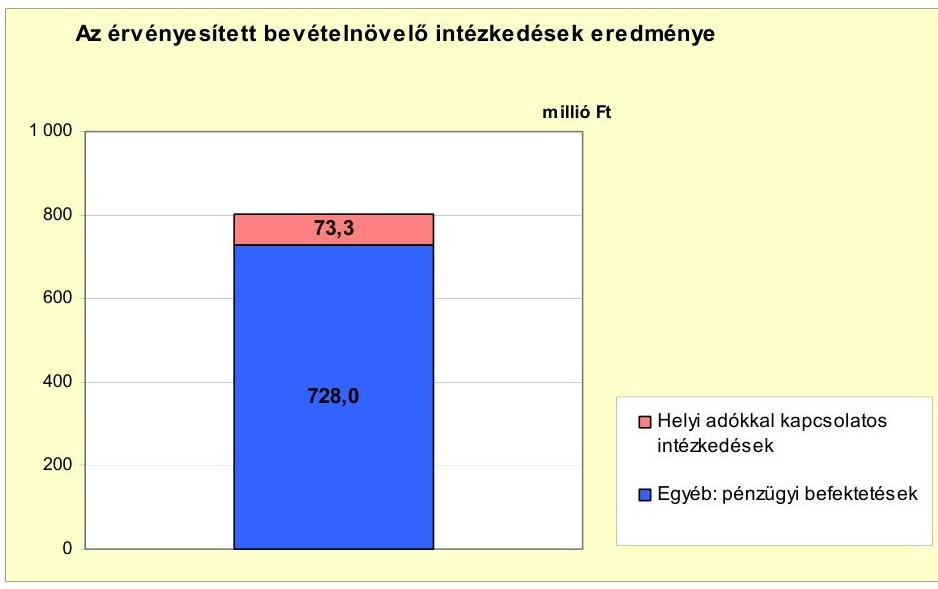

A 2007-2011. év I. félév között a bevételnövelésre irányuló intézkedések Önkormányzat által számszerúsített összege 801,3 millió Ft volt.

Az Önkormányzat kimutatása szerint az ellenőrzött időszakban a helyi adókkal kapcsolatos intézkedések (az adók mértékének növelése) összesen 73,3 millió Ft bevétel növekedést eredményezett.

Az Önkormányzat az építményadó, a telekadó és az idegenforgalmi adó mértékét 2007-2011 között, a vállalkozók kommunális adójának mértékét 2007-2010 között minden évben emelte.

Az Önkormányzat 2007-ben 134,4 millió Ft, 2008-ban 187,0 millió Ft, 2009-ben 231,2 millió Ft, 2010-ben 213,4 millió Ft adóhátralékot tartott nyilván. A helyi adókkal kapcsolatos hátralékok behajtására tett intézkedések eredményeként - az Önkormányzat kimutatása szerint - 2007-ben 60,9 millió Ft, 2008-ban 50,7 millió Ft, 2009-ben 65,0 millió Ft, 2010-ben 64,1 millió Ft, 2011. év I. félévben 15,0 millió Ft bevételt értek el.

Az Önkormányzat saját forrásaiból megvalósított pénzügyi befektetések az Önkormányzat kimutatásai szerint - a 2007-2011. év I. félév közötti időszakban összesen 728,0 millió Ft bevétel-növekményt eredményeztek.

A pénzügyi befektetésekre a Képviselő-testület felhatalmazásával és az MSB Consult Kft. - mint külső tanácsadó - közreműködésével került sor. A bankbetétekben, EUR-ban, államkötvényekben, EUR- és forint alapú magyar vállalati kötvényekben lekötött pénzeszközök nyújtanak fedezetet az Önkormányzat fejlesztéseihez szükséges önerőre.

Az Önkormányzatnál a 2007-2011. év I. félév közötti időszakban összességében a költségvetési támogatások 2989,6 millió Ft-tal növekedtek, az szja 2714,0 millió Ft-tal csökkent a 2007. évhez képest, így az ellenőrzött időszakban forráskiesés nem jelentkezett. A kiadáscsökkentő intézkedések hozzájárultak a folyó

---

költségvetés egyensúlyának fenntartásához. A bevételnövelő intézkedések eredményeként a szükséges saját forrás az Önkormányzat rendelkezésére áll a fejlesztési célkitűzései megvalósításához és a hiteltörlesztési kötelezettségei teljesítéséhez.

Az Önkormányzat pénzügyi egyensúlya rövid és középtávon biztosított, annak megőrzése hosszú távon is az Önkormányzat felelőssége.

# 5. Az ÁSZ által a korábbi években a pénzügyi egyensúly javítására tett szabályszerűségi és célszerűségi javaslatok hasznosulása

Az ÁSZ az Önkormányzat gazdálkodási rendszerét a 2007. évben ellenőrizte átfogó jelleggel. Az ÁSZ a jelentésben 21 szabályszerűségi és 13 célszerűségi javaslatot tett. Az ellenőrzés megállapításait és a javaslatok hasznosítására készített intézkedési tervet a polgármester - a számvevői jelentés átvétele után másfél évvel - 2009. február 27-én terjesztette a Képviselő-testület elé. Az intézkedési tervet és az ellenőrzést követően megvalósított javaslatokról szóló beszámolót a Képviselő-testület határozattal elfogadta.

A pénzügyi egyensúly javítására egy - a jegyzőnek címzett - szabályszerűségi javaslat vonatkozott. A javaslat arra irányult, hogy az európai uniós forrásokkal megvalósuló fejlesztések bevételi és kiadási előirányzatai az Ámr. előírásainak megfelelően - elkülönítetten - szerepeljenek az éves költségvetési rendeletben. A javaslatot a 2008. évi költségvetési rendelet-tervezet összeállításánál hasznosították.

Budapest, 2012. április "A"

Melléklet: 7 db
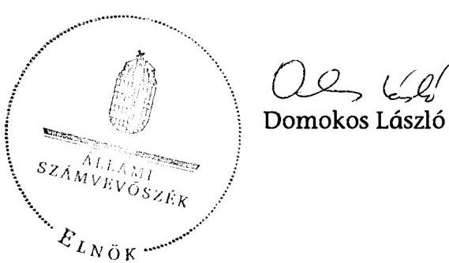

---

Működési és felhalmozási célú hiány/többlet 2007-2010 közötti időszakban az Önkormányzat zárszámadási rendeleteiben
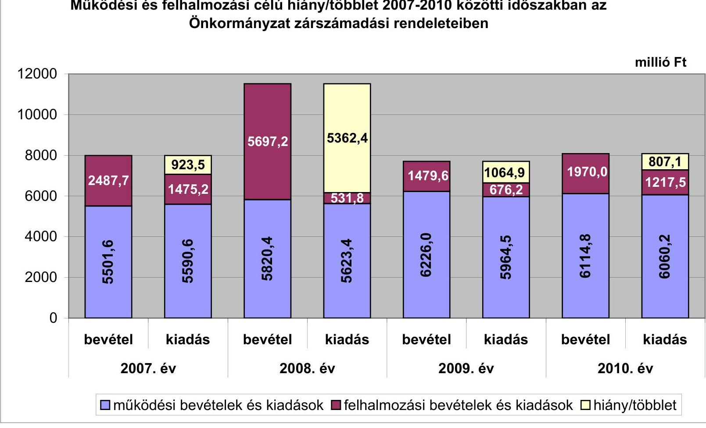

---

Az Önkormányzat bevételei és kiadásai, valamint adósságszolgálata 2007-2010 között

|  1. FOLVÓ KÖLTSÉGVETÉS* | 2007. év | 2008. év | 2009. év | 2010. év  |
| --- | --- | --- | --- | --- |
|  1.1.1. Saját működési bevételek | 1020,5 | 1454,0 | 1464,7 | 1505,6  |
|  1.1.2. Költségvetési támogatás | 1175,8 | 2069,1 | 2069,1 | 2202,5  |
|  1.1.3. Átengedett bevételek | 1458,8 | 693,6 | 704,0 | 681,2  |
|  1.1.4. Államháztartáson belülről kapott támogatások | 2190,0 | 2265,4 | 2358,3 | 2324,2  |
|  1.1.5. EU-tól és külföldről kapott bevételek | 0,0 | 0,0 | 4,4 | 0,6  |
|  1.1.6. Államháztartáson kívülről kapott bevételek | 16,1 | 11,3 | 9,9 | 15,9  |
|  1.1.7. Előző évi pénzmaradvány átvétel | 7,1 | 13,8 | 39,9 | 9,2  |
|  1.1. Folyó bevételek $=1.1 .1 .+1.1 .2 .+1.1 .3 .+1.1 .4 .+1.1 .5 .+1.1 .6 .+1.1 .7$. | 5868,3 | 6507,2 | 6651,1 | 6739,2  |
|  1.2.1. Működési kiadások kamatkiadások nélkül | 4774,5 | 5006,9 | 5404,0 | 5755,2  |
|  1.2.2. Államháztartáson belülre átadott pénzeszközök | 140,9 | 17,9 | 27,3 | 20,5  |
|  1.2.3.1. vállalkozásoknak | 21,5 | 15,4 | 4,4 | 6,0  |
|  1.2.3.2. EU-nak, illetve külföldre | 0,0 | 0,0 | 0,0 | 0,0  |
|  1.2.3.3. magánszemélyeknek | 479,7 | 538,3 | 435,5 | 389,7  |
|  1.2.3.4. nonprofi szervezeteknek | 71,0 | 66,3 | 63,8 | 69,1  |
|  1.2.3. Transferkiadások ( $=1.2 .3 .1+1.2 .3 .2+1.2 .3 .3+1.2 .3 .4$ ) | 572,2 | 620,0 | 503,7 | 464,8  |
|  1.2.4 Kamatkiadások | 22,5 | 112,6 | 21,3 | 13,9  |
|  1.2.5. Előző évi pénzmaradvány átadás | 0,0 | 13,8 | 39,9 | 9,2  |
|  1.2. Folyó kiadások $=1.2 .1 .+1.2 .2 .+1.2 .3 .+1.2 .4 .+1.2 .5$. | 5510,1 | 5771,2 | 5996,2 | 6263,6  |
|  1.3. Folyó költségvetés egyenlege MŰKÖDÉSI JÖVEDELEM (1.1. - 1.2.) | 358,2 | 736,0 | 654,9 | 475,6  |
|  2. FELHALMOZÁSI KÖLTSÉGVETÉS** |  |  |  |   |
|  2.1.1. Saját tőkebevételek | 895,7 | 154,1 | 113,9 | 58,9  |
|  2.1.2. Államháztartáson belülről kapott támogatások | 80,0 | 23,9 | 214,2 | 431,4  |
|  2.1.3. EU-tól és külföldről kapott támogatások | 535,5 | 33,7 | 0,0 | 0,0  |
|  2.1.4. Államháztartáson kívülről kapott támogatások | 28,9 | 39,1 | 18,0 | 3,1  |
|  2.1. Felhalmozási bevételek ( $=2.1 .1 .+2.1 .2+2.1 .3+2.1 .4$ ) | 1540,1 | 250,8 | 346,1 | 493,4  |
|  2.2.1. Saját beruházási kiadás afával | 1230,0 | 256,2 | 369,9 | 664,3  |
|  2.2.2. Saját felújítási kiadás afával | 103,3 | 36,3 | 142,8 | 220,6  |
|  2.2.3. Államháztartáson belülre átadott pénzeszköz | 19,1 | 2,5 | 60,9 | 83,8  |
|  2.2.4. EU-nak és külföldnek adott pénzeszközök | 0,0 | 0,0 | 0,0 | 0,0  |
|  2.2.5. Államháztartáson kívülre adott pénzeszközök | 202,1 | 82,9 | 70,4 | 45,4  |
|  2.2.6. Befektetési célú részesedések vásárlása | 1,3 | 120,0 | 0,4 | 0,0  |
|  2.2. Felhalmozási kiadások ( $=2.2 .1 .+2.2 .2 .+2.2 .3 .+2.2 .4 .+2.2 .5 .+2.2 .6$ ) | 1555,8 | 497,9 | 644,4 | 1014,1  |
|  2.3. Felhalmozási költségvetés egyenlege (2.1. - 2.2.) | -15,7 | -247,1 | -298,3 | -520,7  |
|  3. Finanszírozási műveletek nélküli (GFS) pozíció(1.3.+2.3.) | 342,5 | 488,9 | 356,6 | -45,1  |
|  4. Finanszírozási műveletek |  |  |  |   |
|  4.1. Hitelfelvétel | 162,2 | 58,7 | 69,7 | 46,1  |
|  4.2. Hiteltörlesztés | 14,8 | 11,7 | 58,9 | 70,8  |
|  4.3. Forgatási és befektetési célú értékpapírok kibocsátása | 3984,2 | 0,0 | 0,0 | 0,0  |
|  4.4. Forgatási és befektetési célú értékpapírok beváltása | 0,0 | 0,0 | 0,0 | 0,0  |
|  4.5. Forgatási és befektetési célú értékpapírok értékesítése | 6,9 | 47,8 | 584,5 | 1187,9  |
|  4.6. Forgatási és befektetési célú értékpapírok vásárlása | 506,6 | 4593,6 | 544,5 | 1219,1  |
|  4.7. Egyéb finanszírozási bevételek (függő, átfutó, kiegyenlítő) | 1,3 | -13,2 | 2,7 | -110,5  |
|  4.8. Egyéb finanszírozási kiadások (függő, átfutó, kiegyenlítő) | -3,3 | -0,5 | 9,3 | 19,4  |
|  4.9.Finanszírozási műveletek egyenlege (4.1. - 4.2.+4.3.-4.4+4.5.-4.6.+4.7.-4.8.) | 3636,5 | -4511,5 | 44,2 | -185,8  |
|  5. Tárgyévi pénzügyi pozíció (1.3.+ 2.3.+4.9.) | 3979,0 | -4022,6 | 400,8 | -230,9  |
|  6. Nettó működési jövedelem =működési jövedelem (1.3.) - tőketörlesztés (4.2+4.4 | 343,4 | 724,3 | 596,0 | 404,8  |
|  TÁJÉKOZTATÓ ADATOK |  |  |  |   |
|  Összes kötelezettség | 4541,5 | 679,4 | 875,7 | 717,2  |
|  ebből rövid lejáratú | 147,8 | 249,4 | 446,8 | 311,3  |
|  Összes szállítói kötelezettség | 55,4 | 86,6 | 267,8 | 155,5  |
|  ebből lejárt (tanúsítványból) | 7,3 | 33,3 | 87,8 | 1,7  |
|  Pénz és tőkepiaci kötelezettség (adósság) | 4404,7 | 488,8 | 499,7 | 475,0  |
|  ebből rövid lejáratú | 11,1 | 58,8 | 70,8 | 69,1  |
|  PPP szerződéses állomány jelenértéken (tanúsítványból) | 1004,7 | 938,8 | 878,2 | 815,6  |
|  ebből lejárt szolgáltatási díj miatti kötelezettség | 0,0 | 0,0 | 0,0 | 0,0  |
|  Folyószámlabitel napi átlagos állománya (tanúsítványból) | 0,0 | 0,0 | 0,0 | 0,0  |
|  Likvidület napi átlagos állománya (tanúsítványból) | 0,0 | 0,0 | 0,0 | 0,0  |
|  Munkabérhítel napi átlagos állománya (tanúsítványból) | 0,0 | 0,0 | 0,0 | 0,0  |
|  Kezesség és garanciavállalások (tanúsítványból) | 0,0 | 0,0 | 0,0 | 0,0  |
|  Jogerős bírósági ítéletekből adódó kötelezettségek (tanúsítványból) | 0,0 | 0,0 | 0,0 | 0,0  |
|  Finanszírozásba bevonható eszközök***: | 5373,3 | 5896,6 | 6396,0 | 8199,0  |
|  Tartós hitelviszonyt megtestesítő értékpapírok év végi állománya*** | 475,0 | 5068,6 | 4705,0 |

 7201,0  |
|  Hosszú lejáratú bankbetétek év végi állománya | 0,0 | 0,0 | 0,0 | 0,0  |
|  Értékpapírok év végi állománya | 47,8 | 0,0 | 462,0 | 0,0  |
|  Pénzeszközök (idegen pénzeszközök nélkül) év végi állománya | 4850,5 | 828,0 | 1228,8 | 998,0  |

- Bevételekben nem térül, a kiadásokban nem jelenik meg az amortizáció, a vagyoni helyzetet az egyenleg befolyásolja. Bevételekben vagyon megőrzésre és bővítésre fordítható források. *** A tartós hitelviszonyt megtestesítő értékpapírok év végi állománya a 2008-2010. években a költségvetési beszámolók adatai alapján tartalmazza az Önkormányzat által a 2008. évben megvásárolt saját kötvény számviteli nyilvántartásokban kimutatott értékét, amely 2008-ban és 2009-ben azonos 3798,6 millió Ft, 2010-ben 5789,7 millió Ft volt.

---

## Az Önkormányzat 2007-2010. években megvalósított, 2010. december 31-ig befejezett fejlesztései és azok forrásösszetétele

|  Fejlesztési feladat (beruházás, felújítás) |  |  |  |  |  |  |  |  |  |  |  |  |  |  |  |  |  |  |  |  |  |  |  |  |  |  |  |  |  |  |  |  |  |  |  |  |  |  |  |  |  |  |  |  |  |  |  |  |  |  |  |  |  |  |  |  |  |  |  |  |  |  |  |  |  |  |  |  |  |  |  |  |  |  |  |  |  |  |  |  |  |  |  |  |  |  |  |  |  |  |  |  |  |  |  |  |  |  |  | 

---

### **Az Önkormányzat 2010. december 31-én folyamatban lévő fejlesztési feladataira 2010. december 31-ig teljesített kifizetések és azok forrásösszetétele**

|   |  |  |  |  |  |  |  |  |  |  |  |  |  |  |  |  |  |  |  |  |  |  |  |  |  |  |  |  |  |  |  | millió Ft-ban  |
| --- | --- | --- | --- | --- | --- | --- | --- | --- | --- | --- | --- | --- | --- | --- | --- | --- | --- | --- | --- | --- | --- | --- | --- | --- | --- | --- | --- | --- | --- | --- | --- | --- |
|   |  |  |  |  |  |  |  |  |  |  |  |  |  |  |  |  |  |  |  |  |  |  |  |  |  |  |  |  |  |  |  |   |
|   | Fejlesztési feladat (beruházás, felújítás) |  | Beruházás, felújítás |  |  |  |  |  |  |  |  |  |  |  |  |  |  |  |  |  |  |  |  |  |  |  |  |  |  |  |  |   |
|   |  |  |  |  |  |  |  |  |  |  |  |  |  |  |  |  |  |  |  |  |  |  |  |  |  |  |  |  |  |  |  |   |
|   |  |  |  |  |  |  |  |  |  |  |  |  |  |  |  |  |  |  |  |  |  |  |  |  |  |  |  |  |  |  |  |   |
|   |  |  |  |  |  |  |  |  |  |  |  |  |  |  |  |  |  |  |  |  |  |  |  |  |  |  |  |  |  |  |  |   |
|   |  |  |  |  |  |  |  |  |  |  |  |  |  |  |  |  |  |  |  |  |  |  |  |  |  |  |  |  |  |  |  |   |
|   |  |  |  |  |  |  |  |  |  |  |  |  |  |  |  |  |  |  |  |  |  |  |  |  |  |  |  |  |  |  |  |   |
|   |  |  |  |  |  |  |  |  |  |  |  |  |  |  |  |  |  |  |  |  |  |  |  |  |  |  |  |  |  |  |  |   |
|   |  |  |  |  |  |  |  |  |  |  |  |  |  |  |  |  |  |  |  |  |  |  |  |  |  |  |  |  |  |  |  |   |
|   |  |  |  |  |  |  |  |  |  |  |  |  |  |  |  |  |  |  |  |  |  |  |  |  |  |  |  |  |  |  |  |   |
|   |  |  |  |  |  |  |  |  |  |  |  |  |  |  |  |  |  |  |  |  |  |  |  |  |  |  |  |  |  |  |  |   |
|   |  |  |  |  |  |  |  |  |  |  |  |  |  |  |  |  |  |  |  |  |  |  |  |  |  |  |  |  |  |  |  |   |
|   |  |  |  |  |  |  |  |  |  |  |  |  |  |  |  |  |  |  |  |  |  |  |  |  |  |  |  |  |  |  |  |   |
|   |  |  |  |  |  |  |  |  |  |  |  |  |  |  |  |  |  |  |  |  |  |  |  |  |  |  |  |  |  |  |  |   |
|   |  |  |  |  |  |  |  |  |  |  |  |  |  |  |  |  |  |  |  |  |  |  |  |  |  |  |  |  |  |  |  |   |
|   |  |  |  |  |  |  |  |

  |  |  |  |  |  |  |  |  |  |  |  |  |  |  |  |  |  |  |  |  |  |  |  |   |
|   |  |  |  |  |  |  |  |  |  |  |  |  |  |  |  |  |  |  |  |  |  |  |  |  |  |  |  |  |  |  |  |   |
|   |  |  |  |  |  |  |  |  |  |  |  |  |  |  |  |  |  |  |  |  |  |  |  |  |  |  |  |  |  |  |  |   |
|   |  |  |  |  |  |  |  |  |  |  |  |  |  |  |  |  |  |  |  |  |  |  |  |  |  |  |  |  |  |  |  |   |
|   |  |  |  |  |  |  |  |  |  |  |  |  |  |  |  |  |  |  |  |  |  |  |  |  |  |  |  |  |  |  |  |   |
|   |  |  |  |  |  |  |  |  |  |  |  |  |  |  |  |  |  |  |  |  |  |  |  |  |  |  |  |  |  |  |  |   |
|   |  |  |  |  |  |  |  |  |  |  |  |  |  |  |  |  |  |  |  |  |  |  |  |  |  |  |  |  |  |  |  |   |
|   |  |  |  |  |  |  |  |  |  |  |  |  |  |  |  |  |  |  |  |  |  |  |  |  |  |  |  |  |  |  |  |   |
|   |  |  |  |  |  |  |  |  |  |  |  |  |  |  |  |  |  |  |  |  |  |  |  |  |  |  |  |  |  |  |  |   |
|   |  |  |  |  |  |  |  |  |  |  |  |  |  |  |  |  |  |  |  |  |  |  |  |  |  |  |  |  |  |  |  |   |
|   |  |  |  |  |  |  |  |  |  |  |  |  |  |  |  |  |  |  |  |  |  |  |  |  |  |  |  |  |  |  |  |   |
|   |  |  |  |  |  |  |  |  |  |  |  |  |  |  |  |  |  |  |  |  |  |  |  |  |  |  |  |  |  |  |  |   |
|   |  |  |  |  |  |  |  |  |  |  |  |  |  |  |  |  |  |  |  |  |  |  |  |  |  |  |  |  |  |  |  |   |
|   |  |  |  |  |  |  |  |  |  |  |  |  |  |  |  |  |  |  |  |  |  |  |  |  |  |  |  |  |  |  |  |   |
|   |  |  |  |  |  |  |  |  |  |  |  |  |  |  |  |  |  |  |  |  |  |  |  |  |  |  |  |  |  |  |  |   |
|   |  |  |  |  |  |  |  |  |  |  |  |  |  |  |  |  |  |  |  |  |  |  |  |  |  |  |  |  |  |  |  |   |
|   |  |  |  |  |  |  |  |  |  |  |  |  |  |  |  |  |  |  |  |  |  |  |  |  |  |  |  |  |  |  |  |   |
|   |

---

## **Az Önkormányzat 2010. december 31-én folyamatban lévő fejlesztési feladataira 2010. december 31-én fennálló kötelezettségek és azok forrásösszetétele**

|   |  |  |  |  |  |  |  |  |  |  |  |  |  |  |  |  |  |  |  |  |  |  |  |  |  |  |  |  |  |  |  |  |  |  |  |  |  |  |  |  |  |  |  |  |  |  |  |  |  |  |  |  |  |  |  |  |  |  |  |  |  |  |  |  |  |  |  |  |  |  |  |  |  |  |  |  |  |  |  |  |  |  |  |  |  |  |  |  |  |  |  |  |  |  |  |  |  |  |  | 

---

### **Az Önkormányzat által beadott, elbírálás alatti pályázati forrásból megvalósítani tervezett fejlesztéseihez kapcsolódó kötelezettségvállalásai és azok forrásösszetétele**

|  Sorszám | Fejlesztési feladat (beruházás, felújítás) |  | Beruházás, felújítás |  |  |  |  |  |  |  |  |  |  |  |  |  |  |  |  |  |  |  |   |
| --- | --- | --- | --- | --- | --- | --- | --- | --- | --- | --- | --- | --- | --- | --- | --- | --- | --- | --- | --- | --- | --- | --- | --- |
|   | Megnevezése |  |  |  |  |  |  |  |  |  |  |  |  |  |  |  |  |  |  |  |  |  |   |
|   |  |  |  |  |  |  |  |  |  |  |  |  |  |  |  |  |  |  |  |  |  |  |   |
|  1 | 2 | 3 | 4 | 5 | 6 | 7 | 8 | 9 | 10 |

 11 | 12 | 13 | 14 | 15 | 16 | 17 | 18 | 19 | 20 |  |  |  |   |
|  1. | Felújítások |  |  |  |  |  |  |  |  |  |  |  |  |  |  |  |  |  |  |  |  |  |   |
|   | "Sziget" és "Liget" folyami komphajók, a "Vuk" és "Mohács Port" személyhajók felújítása | 99/2011. (VI.24.) | 2011. | 2011. | 15,5 | 11,0 | 0,0 | 15,5 | 4,7 | A | 0,0 | 0,0 | 0,0 | 10,8 | C | Nem |  |  |  |  |  |  |   |
|  3. | 10 millió Ft alatti felújítások |  |  |  | 0,0 | 0,0 | 0,0 | 0,0 | 0,0 | 0,0 | 0,0 | 0,0 | 0,0 | 0,0 | 0,0 |  |  |  |  |  |  |  |   |
|  4. | Felújítások összesen |  |  |  | 15,5 | 11,0 | 0,0 | 15,5 | 4,7 | 0,0 | 0,0 | 0,0 | 10,8 |  |  |  |  |  |  |  |  |  |   |
|  5. | Fejlesztések |  |  |  |  |  |  |  |  |  |  |  |  |  |  |  |  |  |  |  |  |  |   |
|  6. | Mohács északi városrész kerékpárhálózatának fejlesztése | 83/2011. (V.27.) | 2012. | 2012. | 116,1 | 0,0 | 0,0 | 116,1 | 11,6 | A | 0,0 | 0,0 | 104,5 | C | 0,0 |  |  |  |  |  |  |  |   |
|  7. | 10 millió Ft alatti fejlesztések |  |  |  | 0,0 | 0,0 | 0,0 | 0,0 | 0,0 | 0,0 | 0,0 | 0,0 | 0,0 | 0,0 |  |  |  |  |  |  |  |  |   |
|  8. | Fejlesztések összesen |  |  |  | 116,1 | 0,0 | 0,0 | 116,1 | 11,6 | 0,0 | 0,0 | 104,5 |  |  |  |  |  |  |  |  |  |  |   |
|  9. | Összesen |  |  |  | 131,6 | 11,0 | 0,0 | 131,6 | 16,3 | 0,0 | 0,0 | 104,5 |  |  |  |  |  |  |  |  |  |  |   |

*A = ha a forrás már rendelkezésre áll,

B = ha a forrás közbeszerzési eljárása folyamatban van,

C = ha a forrás közbeszerzési eljárása még nem indult el, a forrás nem áll rendelkezésre.

---

## Az önkormányzati feladatok ellátásában résztvevő gazdasági társaságok

|  Gazdasági társaság megnevezése | 2010. december 31-én | a gazdasági társaságnak szerződéses kötelezettségre, feladatellátási szerződésre alapozottan az önkormányzat költségvetéséből nyújtott  |
| --- | --- | --- |
|   | önkormányzat | önkormányzat az önkormányzat bérigazdasági társaságnak | saját tőke,  |
|   |  |  |  | 31-én  |
|   |  |  |  | 31-én  |
|  Gazdasági társaság |  |  |  |   |
|  megnevezése |  |  |  |   |
|  Gazdasági társaságok: |  |  |  |   |
|  1. 100%-os tulajdoni hányadú gazdasági társaságok: |  |  |  |   |
|  Hőszolgáltató Kft. | 100,0% | 0,0% | 368,4% | 0,0  |
|  Városgazdálkodási Kft. | 100,0% | 0,0% | 500,6% | 772,6  |
|  Városfejlesztési Kft. | 100,0% | 0,0% | 342,1% | 0,0  |
|  100%-os tulajdoni hányadú gazdasági társaságok: |  |  |  |   |
|  Összesen |  |  |  |   |
|  2. 75-99%-os tulajdoni hányadú gazdasági társaságok: |  |  |  |   |
|  75-99%-os tulajdoni hányadú gazdasági társaságok: |  |  |  |   |
|  Városfejlesztési Kft. |  |  |  |   |
|  Városfejlesztési Kft. |  |  |  |   |
|  3. 51-74%-os tulajdoni hányadú gazdasági társaságok: |  |  |  |   |
|  51-74%-os tulajdoni hányadú gazdasági társaságok: |  |  |  |   |
|  Változási társaságok |  |  |  |   |
|  Változási társaságok |  |  |  |   |
|  4. Egyéb, közfeladatot ellátó gazdasági társaságok: |  |  |  |   |
|  Pannon Volán Zrt. | 0,0% | 0,0% | 166,8 | 0,0  |
|  Egyéb, közfeladatot ellátó gazdasági társaságok: |  |  |  |   |
|  4. Egyéb, közfeladatot ellátó gazdasági társaságok: |  |  |  |   |
|  Összesen |  |  |  |   |
|  0,0% |  |  |  |   |

