# ÁLLAMI   SZÁMVEVŐSZÉK 

## JELENTÉS

Mórahalom Város Önkormányzat pénzügyi helyzetének ellenőrzéséről (43/4)

---

# Állami Számvevőszék 

Iktatószám: V-3088-027/2012.
Témaszám: 1015
Vizsgálat-azonosító szám: V0560119

## Az ellenőrzést felügyelte:

Dr. Varga Sándor
számvevő igazgatóhelyettes
Az ellenőrzést vezette:
Renkó Zsuzsanna
számvevő tanácsos
Ellenőrzési csoportvezető:
Dér Lívia
számvevő tanácsos
Az ellenőrzést végezték:
Balogné Dakó Eszter Balogné Lehoczki Éva
számvevő tanácsos számvevő

---

# TARTALOMJEGYZÉK 

BEVEZETÉS ..... 7
I. ÖSSZEGZŐ MEGÁLLAPÍTÁSOK, KÖVETKEZTETÉSEK, JAVASLATOK ..... 11
II. RÉSZLETES MEGÁLLAPÍTÁSOK ..... 29

1. Az Önkormányzat kötelező és önként vállalt feladatai, a feladatellátás szervezeti keretei és annak változásai ..... 29
2. Az Önkormányzat pénzügyi egyensúlyi helyzetét befolyásoló tényezők ..... 36
2.1. A működési és a felhalmozási egyensúly változása ..... 38
2.2. Az Önkormányzat bevételeinek változása ..... 43
2.3. Az Önkormányzat múködési és felhalmozási célú kiadásainak változása ..... 47
3. Az önkormányzat kötelezettségei ..... 51
3.1. Az Önkormányzat pénzintézeti kötelezettségeinek változása ..... 51
3.1. A szállítói kötelezettségek változása ..... 58
3.2. Egyéb kötelezettségek változása ..... 59
4. A pénzügyi egyensúly megteremtése érdekében hozott intézkedések eredménye ..... 65
5. Az ÁSZ által a korábbi években a pénzügyi egyensúly javítására tett szabályszerűségi és célszerűségi javaslatok hasznosulása ..... 67

---

# MELLÉKLETEK 

1. számú Múködési és felhalmozási célú hiány/többlet a 2007-2010 közötti időszakban az Önkormányzat zárszámadási rendeleteiben (1 oldal)
2. számú Az Önkormányzat bevételei és kiadásai, valamint adósságszolgálata 20072010 között (2007-2010. években teljesített adatok) (1 oldal)
3/a. számú Az Önkormányzat 2007-2010. években megvalósított, 2010. december 31ig befejezett fejlesztései és azok forrásösszetétele (3 oldal)
3/b. számú Az Önkormányzat 2010. december 31-én folyamatban lévő fejlesztési feladataira 2010. december 31-ig teljesített kifizetések és azok forrásösszetétele (2 oldal)
3/c. számú Az Önkormányzat 2010. december 31-én folyamatban lévő fejlesztési feladataira 2010. december 31-én fennálló kötelezettségek és azok forrásösszetétele (1 oldal)
3/d. számú Az Önkormányzat által beadott, elbírálás alatti pályázati forrásból megvalósítani tervezett fejlesztéseihez kapcsolódó kötelezettségvállalásai és annak forrásösszetétele (1 oldal)
3. számú Az önkormányzati feladatok ellátásában résztvevő gazdasági társaságok (1 oldal)

---

# RÖVIDÍTÉSEK JEGYZÉKE 

## Törvények

Art.
Áht $_{1}$
Áht $_{2}$
Helyi adó tv.
Hpt.
Ötv. $_{1}$
Ötv. $_{2}$
Ptk.
Stabilitási tv.
Számv. tv.
Vagyon tv.
2010. évi Kvtv.

## Rendeletek

Áhsz.

Polgármesteri hivatal SzMSz-e

SzMSz
2007. évi költségvetési rendelet
2008. évi költségvetési rendelet
2009. évi költségvetési rendelet
2010. évi költségvetési rendelet
2011. évi költségvetési rendelet
az adózás rendjéről szóló 2003. évi XCII. törvény az államháztartásról szóló 1992. évi XXXVIII. törvény az államháztartásról szóló 2011. évi CXCV. törvény a helyi adókról szóló 1990. évi C. törvény a hitelintézetekről és a pénzügyi vállalkozásokról szóló 1996. évi CXII. törvény a helyi önkormányzatokról szóló 1990. évi LXV. törvény Magyarország helyi önkormányzatairól szóló 2011. évi CLXXXIX. törvény
a Polgári Törvénykönyvről szóló 1959. évi IV. törvény Magyarország gazdasági stabilitásáról szóló 2011. évi CXCIV. törvény
a számvitelről szóló 2000. évi C. törvény
a nemzeti vagyonról szóló 2011. évi CXCVI. törvény
a Magyar Köztársaság 2010. évi költségvetéséről szóló 2009. évi CXXX. törvény
az államháztartás szervezetei beszámolási és könyvvezetési kötelezettségének sajátosságairól szóló 249/2000. (XII. 24.) Korm. rendelet

Mórahalom Város Önkormányzatának 9/1995. (IV. 5.) számú rendelete az Önkormányzat és szervei szervezeti és múködési szabályzatáról 7. számú függeléke
Mórahalom Város Önkormányzatának 9/1995. (IV. 5.) számú rendelete az Önkormányzat és szervei szervezeti és múködési szabályzatáról
Mórahalom Város Önkormányzatának 4/2007. (II. 22.) számú rendelete az Önkormányzat 2007. évi költségvetéséről
Mórahalom Város Önkormányzatának 4/2008. (III. 1.) számú rendelete az Önkormányzat 2008. évi költségvetéséről
Mórahalom Város Önkormányzatának 6/2009. (II. 13.) számú rendelete az Önkormányzat 2009. évi költségvetéséről
Mórahalom Város Önkormányzatának 3/2010. (II. 25.) számú rendelete az Önkormányzat 2010. évi költségvetéséről
Mórahalom Város Önkormányzatának 5/2011. (II. 24.) számú rendelete az Önkormányzat 2011. évi költségvetéséről

---

2007. évi zárszámadási rendelet

2008. évi zárszámadási rendelet

2009. évi zárszámadási rendelet

2010. évi zárszámadási rendelet

## Szórövidítések

áfa
ÁSZ
Centrum Kft.
EU
GVOP
jegyző
Képviselő-testület

Kincstár
Kistérségfejlesztési társulás
MFB
Mórakert Kft.
NKÖM
OEP
Önkormányzat
polgármester
Polgármesteri hivatal

PPP konstrukció
szja
Szövetkezet
Többcélú társulás
Vízmú-üzemeltetési Intézmény
Vízmú-üzemeltetési társulás

Mórahalom Város Önkormányzatának 9/2008. (IV. 17.) számú rendelete az Önkormányzat 2007. évi zárszámadásáról
Mórahalom Város Önkormányzatának 11/2009. (IV. 30.) számú rendelete az Önkormányzat 2008. évi zárszámadásáról
Mórahalom Város Önkormányzatának 5/2010. (IV. 29.) számú rendelete az Önkormányzat 2009. évi zárszámadásáról
Mórahalom Város Önkormányzatának 8/2011. (IV. 28.) számú rendelete az Önkormányzat 2010. évi zárszámadásáról
általános forgalmi adó
Állami Számvevőszék
PH- Centrum Zöldség-Gyümölcs Forgalmazó és Feldolgozó Korlátolt Felelősségű Társaság
Európai Unió
Gazdasági Versenyképesség Operatív Programja
Mórahalom Város Önkormányzatának Jegyzője
Mórahalom Város Önkormányzatának Képviselőtestülete
Magyar Államkincstár
A Homokháti Önkormányzatok Kistérségfejlesztési Társulása
Magyar Fejlesztési Bank
Mórakert Termelői Értékesítő Szövetkezet ZöldségGyümölcs Értékesítő Korlátolt Felelősségű Társaság
Nemzeti Kulturális Örökség Minisztérium
Országos Egészségbiztosítási Pénztár
Mórahalom Város Önkormányzata
Mórahalom Város Önkormányzatának Polgármestere
Mórahalom Város Önkormányzatának Polgármesteri hivatala
Public Private Partnership (Partnerségi együttmúködés közfeladatok ellátására a magánszektor bevonásával) személyi jövedelemadó
Mórakert Zöldség-Gyümölcs Termelői Értékesítő Szövetkezet
Homokháti Kistérség Többcélú Társulása
Térségi Vízmú-üzemeltetési Intézmény
Térségi Vízmú-üzemeltetési Intézményirányító Társulás

---

# ÉRTELMEZŐ SZÓTÁR 

| BUBOR | Budapesti Bankközi Forint Hitelkamatláb. Irányadó, refe-   rencia jellegú kamatláb. Mértékét az MNB naponta álla-   pitja meg a banki kamatok figyelembevételével. Közzété-   tele naponta történik. |
| :--: | :--: |
| CLF módszer | Az önkormányzatok költségvetése elemzésének eszköze. A   módszer következetesen elkülöníti a folyó és a felhalmo-   zási költségvetés bevételeit és kiadásait, azok költségvetési   egyenlegeit. Bizonyos mértékig a vállalati gazdálkodás   logikai elemeit érvényesíti az önkormányzatok pénzügyi,   jövedelmi helyzetének vizsgálata során. Az értékelés a   pénzügyi kapacitás fogalmát helyezi a középpontba. |
| EURIBOR | A frankfurti bankközi piacon jegyzett, az Európai Közpon-   ti Bank szabályainak megfelelően megállapított kínálati   kamatláb. Az EURIBOR értékét a legfontosabb európai   bankok hitelkínálatának kamatlábai alapján Reuters   ügynökség számolja ki és teszi közzé naponta. A magyar   pénzintézetek is ezt használják viszonyítási alapnak EUR   hitelek esetén. |
| kamatkockázat | A változó kamatozású forint-, vagy a devizahitelek futam-   ideje alatt a kamat emelkedése miatt fennálló kamatkoc-   kázat, melynek növekedése miatt nő a hitel törlesz-   törészlete. |
| közfeladat | Állami, helyi, illetve kisebbségi önkormányzati feladat,   amelynek ellátásáról az államnak, illetve az önkormány-   zatoknak kell gondoskodni. A hatályos szabályozás sze-   rint közfeladatot törvény és önkormányzati rendelet álla-   píthat meg. Az önkormányzatok által ellátandó feladatok   keretszerú meghatározását az Ötv., tartalmazza. |
| LIBOR | Angol kifejezés, a London Interbank Offered Rate rövidíté-   se. Jelentése: Londoni bankközi, referencia jellegú kínálati   (hitel) kamatláb. |
| önkormányzat többségi   tulajdonában lévő gaz-   dasági társaságok | Az önkormányzat a gazdasági társaságban a szavazatok   több mint ötven százalékával vagy a Ptk. 685/B. § (2)-(3)   bekezdéseiben rögzített meghatározó befolyással rendelkezik. A befolyással rendelkező akkor rendelkezik egy jogi   személyben meghatározó befolyással, ha annak tagja,   illetve részvényese, és jogosult e jogi személyvezető tiszts-   égviselői vagy felügyelőbizottsága tagjai többségének   megválasztására, illetve visszahívására, vagy a jogi sze-   mély más tagjaival, illetve részvényeseivel kötött megáll-   lapodás alapján egyedül rendelkezik a szavazatok több   mint ötven százalékával (Ptk. 685/B. § (2) bek.). A megha-   tározó befolyás akkor is fennáll, ha a befolyással rendelkező számára e jogosultságok közvetett módon (köztes   vállalkozásain keresztül, a Ptk. 685/B. § (3), (4) bek. sze-   rint) biztosítottak. |

---

pénzügyi kapacitás
pénzügyi kockázat

A helyi önkormányzat és az önkormányzat irányítása alá tartozó költségvetési szerv többségi tulajdonában, illetve többségi befolyása alatt álló gazdálkodó szervezet esetében hitelfelvétel, kölcsönfelvétel, garancia- vagy kezességvállalás, tartozásátvállalás, tartozáselengedés, értékpapírkibocsátás, vásárlás, pénzügyi lízing, tartós bérleti szerződés, ingyenes vagyonjuttatás (így különösen: ajándékozás, ingyenes engedményezés), vagy követelésvásárlás, követelésengedményezés végrehajtására vonatkozóan az Áht ${ }_{1}$ 100/M. § (4) bekezdése alapján az önkormányzat rendelkezik döntési jogosultsággal.
A pénzügyi kapacitás (financial capacity) az adósok hitelfelvételi képességének azon mértéke, ahol még anélkül tudják növelni az adósságot, hogy csökkenteniük kellene akár a jelenbeli, akár a jövőben esedékes kiadásaikat a fizetésképtelenség elkerülése érdekében. (Forrás: Az önkormányzati rendszer pénzügyi helyzete, ÁSZKUT tanulmány 2010.)
A múködési kockázat egyik eleme. Megmutatkozhat a költségvetés nagyságrendjének, szerkezetének nem megalapozott módosításaiban, a bevételi és a kiadási előirányzatoktól lényegesen eltérő teljesítésekben, a nem megfelelő belső kontrollrendszer múködésében, a tudatos károkozásokban, a biztosítások elmaradásában, a hibás fejlesztési döntésekben, a nem a terveknek megfelelő forrásfelhasználásokban. Jelentkezhet továbbá a bevételek és kiadások ütemkülönbsége miatt felvett folyószámla- és likvidhitelek költségvetési év végén fennálló egyenlege miatt, amely az önkormányzat költségvetésébe - akár tartósan - beépülő forráshiányt jelzi.

---

# JELENTÉS   Mórahalom Város Önkormányzata pénzügyi helyzetének ellenőrzéséről 

## BEVEZETÉS

Az Állami Számvevőszék 2011. évtől érvényes stratégiája új irányt szabott a helyi önkormányzatok gazdálkodásának ellenőrzésében is. Az ÁSZ - küldetése és jövőképe szerint - szilárd szakmai alapokra támaszkodva értékteremtő ellenőrzéseivel és helyzetelemzéseivel az államháztartás egészében, így a helyi önkormányzati alrendszerben is elő kívánja segíteni a közpénzek és a közvagyon szabályos, gazdaságos, hatékony és eredményes felhasználását. E folyamat részeként - az államháztartási hiány alakulásának összetevőire is figyelemmel végezzük az önkormányzati alrendszer pénzügyi helyzetelemzését.

Az államháztartás helyi szintjén a 304 városnak ${ }^{1}$ az általuk ellátott közszolgáltatások volumenére is tekintettel a közfeladatok ellátásában kiemelt szerepe van. E települések 2011. január 1-jei népessége 3169 ezer fő volt.

Feladataik és hatásköreik az Ötv. ${ }_{1}$ mellett különböző ágazati törvények által meghatározottak, miközben a feladatellátás szervezeti kereteit - ezen belül a gazdasági társaságok közszolgáltatások ellátásában betöltött szerepét - saját maguk határozzák meg. A gazdasági társaságok által ellátott feladatok esetén a gazdálkodás, továbbá az önkormányzatok pénzügyi egyensúlyi helyzetére ható közvetlen kockázatok egy része kikerült az önkormányzati alrendszerből. A többségi önkormányzati tulajdonban lévő társaságok gazdálkodásának körülményei befolyásolhatják a városok pénzügyi egyensúlyi helyzetének megítélésében rejlő kockázatokat.

Az áttekintett időszakban az önkormányzati forrásszabályozás elvei lényegesen nem változtak. Az önkormányzatok gazdasági mozgásterét a központi költségvetéstől való függőség mellett jelentősen befolyásolja a helyi adókivetési jog gyakorlása. A városok gazdálkodási szabadságának lényeges eleme, hogy anyagi lehetőségeik függvényében dönthettek arról, hogy feladataik közül azokat, amelyek megoldására az Ötv. ${ }_{1}$ szerint a települési önkormányzat nem kötelezhető, a megyei önkormányzat fenntartásába adhatták. E döntések differenciáltan érintették a városok pénzügyi helyzetét.

[^0]
[^0]:    ${ }^{1}$ A megyei jogú városok nélkül figyelembe vett városok száma 304 városi önkormányzatot jelent.

---

A városi önkormányzatok 2007-2010 között teljesített bevételeinek alakulását és összetételét a következő ábra szemlélteti:

Az önkormányzati alrendszer pénzügyi helyzetértékelése során új elemzési módszereket alkalmazott az ellenőrzés. A költségvetési beszámoló adatok elemzése helyett az önkormányzat pénzügyi helyzetét a CLF módszerrel értékeltük, amelynek lényegét és számításának módszerét a jelentés 2. pontjában, és a jelentés 2 . számú mellékletében ismertetjük részletesen.

Az új módszereken alapuló helyzetértékelés fontosságát az adja, hogy a helyi önkormányzatok bruttó adósságállománya ${ }^{2}$ a 2010. évi költségvetési beszámolók alapján 1248 milliárd Ft-ot tett ki. Ezen belül a 304 város adóssága 383 milliárd Ft volt, amely az önkormányzati alrendszer teljes adósságállományának $30,7 \%$-át jelentette ${ }^{3}$.

A mérlegben kimutatott bruttó adósságállomány mellett az önkormányzatok számára az eszközállomány műszaki állapotának megőrzése is előbb-utóbb pénzügyi kötelezettséget jelent. Az elhasználódott eszközök pótlására forrást biztosító amortizációs (felújítási) alap képzésének ${ }^{4}$ elmaradása maga után vonhatja a feladatellátást kiszolgáló tárgyi eszközök állagának erőteljes romlását.

[^0]
[^0]:    ${ }^{2}$ Az önkormányzati mérlegbeszámolókból számított bruttó adósságállomány 2010. év végi összege magában foglalja a fejlesztési és a működési célú kötvénykibocsátások, a beruházási és fejlesztési hitelek, a működési célú hosszú lejáratú hitelek, a rövid lejáratú hitelek, váltótartozások miatti kötelezettségek teljes (2011-ben, illetve az azt követő években esedékes) állományát. Az önkormányzatok 2007. év végi mérleg szerinti adósságállománya 692 milliárd Ft volt.
    ${ }^{3}$ A fővárosi és a kerületi önkormányzatok adósságának fegyelmen kívül hagyásával számított 977 milliárd Ft összegű bruttó adósságállományból a városok 39,2\%-kal részesedtek.
    ${ }^{4}$ Erre a jelenlegi szabályozási környezetben nem kötelezi előírás az önkormányzatokat.

---

Emellett a 2007-2013-as időszakra meghirdetett, vissza nem térítendő EU-s fejlesztési forrásokhoz való hozzájutás lehetősége felerősítette az önkormányzati alrendszer fejlesztési igényeit, amelyek a felhalmozási költségvetési hiány folyamatos emelkedésén túl - az előírt jövőbeni fenntartási kötelezettség miatt tovább terhelhetik az önkormányzatok költségvetését ${ }^{5}$.

Az ÁSZ a 2011. évi ellenőrzési tervében 43. számú, az Önkormányzatok gazdálkodási rendszerének ellenőrzése részeként áttekintette, és elemezte az önkormányzatok pénzügyi helyzetét. A gazdálkodás szabályszerűségét az ÁSZ az előző évek során ebben az önkormányzati körben is ellenőrizte. Jelen vizsgálatunk a tett javaslataink pénzügyi helyzetet érintő pontjainak hasznosítására utóellenőrzés jelleggel tér ki.

Az ellenőrzés megállapításait az Önkormányzat által kitöltött - teljességi nyilatkozattal megerősített - 27 tanúsítványon szolgáltatott adatokra alapoztuk. Ellenőrzési bizonyítékként használtuk fel továbbá:

- a képviselő-testületi és bizottsági előterjesztéseket, a döntés-előkészítés során készített dokumentumokat;
- a kötelezettségvállalások dokumentumait;
- a pénzügyi-számviteli nyilvántartásokat;
- az éves költségvetési beszámolókat;
- a költségvetési és zárszámadási rendeleteket.

Az ellenőrzés a 2007. január 1. - 2011. június 30. közötti időszakot ölelte fel. A pénzintézeti kötelezettségek állományának vizsgálatakor az ellenőrzött időszak 2006. december 31. - 2011. június 30. közötti időszakra terjedt ki.

Az ellenőrzés során vizsgáltunk minden olyan körülményt és adatot, amely a program végrehajtásához kapcsolódott és a pénzügyi helyzet alakulására hatást gyakorló releváns tények és folyamatok feltárásához szükségessé vált.

# Az ellenőrzés célja annak értékelése volt, hogy: 

- a vizsgált időszakban a kötelező- és önként vállalt feladatok ellátását biztosító szervezeti keretekben, a feladatellátás módjában bekövetkezett változások milyen hatást gyakoroltak az Önkormányzat pénzügyi helyzetének alakulására;

[^0]
[^0]:    ${ }^{5}$ Az Állami Számvevőszék 2011 júniusában közzétett 1108. számú, a helyi önkormányzatok fejlesztési célú támogatási rendszerének ellenőrzéséről szóló jelentésében feltárta a fejlesztési folyamatok problémáit. A helyi önkormányzatok elsősorban azokat a fejlesztéseket valósították meg, amelyekhez támogatást lehetett igényelni. A fejlesztési célok közül a magasabb támogatásl intenzitású pályázatokat részesítették előnyben. A fejlesztéssel megvalósuló létesítmények jövőbeli üzemeltetésének várható ráfordításait az önkormányzatok $71,9 \%$-a nem mérte fel.

---

- az Önkormányzat pénzügyi - ezen belül múködési és felhalmozási - egyensúlya mely tényezők hatására miként változott, és az Önkormányzat milyen intézkedéseket tett a pénzügyi egyensúly javítása érdekében;
- a költségvetési kiadások finanszírozása érdekében vállalt pénzintézeti kötelezettségek hogyan alakultak, továbbá milyen kötelezettségek fennállása befolyásolja az Önkormányzat jövőbeli pénzügyi helyzetét;
- hasznosultak-e a gazdálkodási rendszer korábbi ellenőrzése során a pénzügyi egyensúly javítására az ÁSZ által tett szabályszerűségi és célszerűségi javaslatok.

Az ellenőrzés típusa: szabályszerűségi vizsgálat.
A vizsgálat jogszabályi alapját az Állami Számvevőszékről szóló 2011. évi LXVI. törvény 1. § (3), 5. § (2)-(6) bekezdései, továbbá az Áht ${ }_{1} 120 /$ A. § (1) bekezdése ${ }^{6}$ előírásai képezték.

Mórahalom Város lakosainak száma 2011. január 1-jén 6090 fő volt. Az Önkormányzat zárszámadási rendelete szerint a 2010. évben 6897,8 millió Ft bevételt ért el, és 6528,1 millió Ft kiadást teljesített. A 2010. évben teljesített bevételekből 11,1\%-os 763,6 millió Ft-os, a teljesített kiadásokból 11,2\%-os 731,2 millió Ft-os részarányt képviseltek az Önkormányzat társulásainak kiadásai. Az Önkormányzat 2010. december 31-én a könyvviteli mérleg szerint 11 918,9 millió Ft értékű vagyonnal rendelkezett.

[^0]
[^0]:    ${ }^{6}$ 2012. január 1-jétől az Áht ${ }_{2}$ 61. § (2) bekezdés

---

# I. ÖSSZEGZŐ MEGÁLLAPÍTÁSOK, KÖVETKEZTETÉSEK, JAVASLATOK 

Az Önkormányzat - adatszolgáltatása szerint - 2010. évi múködési költségvetési kiadásainak 93,8\%-át, 2181,5 millió Ft-ot a kötelező, 6,2\%-át, 144,2 millió Ft-ot önként vállalt feladatok ellátására fordította.

Az Önkormányzat az önként vállalt feladatait a Polgármesteri hivatal SzMSz-ében részletezte. Az önként vállalt feladatok a helyi adók bevezetéséhez, az érdekeltségi alap képzéséhez ${ }^{7}$, tanyai képviselő-testület és konzultatív tanácsadó testület múködtetéséhez, egyesületek, civil szervezetek támogatásához, mezőőri szolgálat múködtetéséhez, gyógyfürdő múködtetéséhez, járóbetegszakrendelő üzemeltetéséhez, a helyi tömegközlekedés biztosításához, nappali rendszerú szakiskolai és szakközépiskolai oktatáshoz, neveléshez, szakiskolai felnőttoktatáshoz, alapfokú művészetoktatáshoz, kollégium fenntartásához, ipari park üzemeltetése, infrastruktúra fejlesztéséhez kapcsolódtak.

Az Önkormányzat kórházat, hivatásos tűzoltóságot, illetőleg sportlétesítményt nem tartott fenn.

Az Önkormányzat feladatait 2011. június 30 -án (a Polgármesteri hivatallal együtt) öt költségvetési szervvel, nyolc többségi tulajdonú és kettő egyéb közfeladatot ellátó gazdasági társaság keretében látta el. A feladatellátás telephelyeinek száma a 2007. december 31-éről a 2011. év I. félév végére nem változott, 14 volt. Az Önkormányzat 2011. június 30 -án további hét gazdasági társaságban és egy szövetkezetben rendelkezett 50\% alatti tulajdoni hányaddal és egy pénzügyi vállalkozásban 0,024 millió Ft részesedéssel. A gazdasági társaságok meghatározó szerepet töltöttek be az Önkormányzat feladatellátásában, ami növelte a pénzügyi kockázatot.

[^0]
[^0]:    ${ }^{7}$ Az adóigazgatási feladatokat ellátó köztisztviselők juttatásának fedezetéül képeztek érdekeltségi alapot, mely összeget a felosztás után építettek be az éves költségvetési rendeletekbe.

---

A kötelező és önként vállalt feladatok ellátásának 2011. június 30-i szervezeti struktúráját a következő ábra mutatja be:
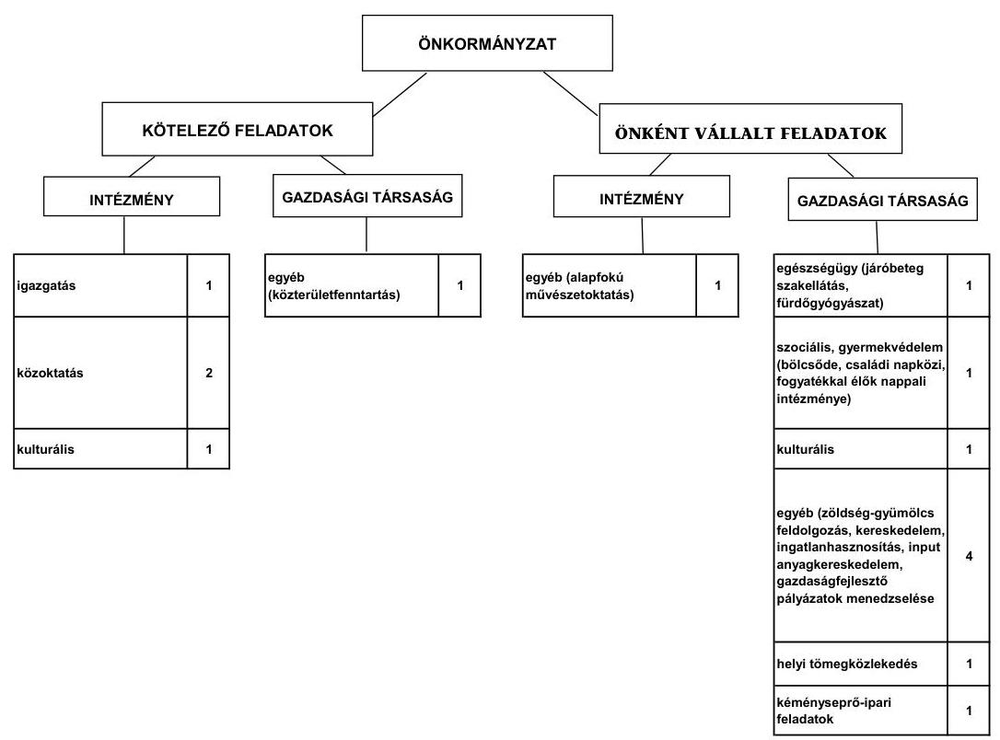

Az Önkormányzat adatszolgáltatása szerint az önként vállalt feladatokra fordított kiadások aránya a 2007-2009. évi átlag 8,6\%-ról (126,3 millió Ft), a 2010. évre 6,2\%-ra csökkent, de összegszerűen növekedett 144,2 millió Ft-ra. A 2010. évi múködési kiadások 855,2 millió Ft-tal (58,2\%-kal) haladták meg a 20072009. évi átlag 1470,5 millió Ft-os múködési kiadásokat. A 2010. évben a múködési kiadások 40,5\%-át ( 942,6 millió Ft), szemben a 2007-2009. évi átlag 59,3\%-ával (872,4 millió Ft) az intézményi körben realizálták. A 2010. évben a múködési kiadások 59,5\%-át (1383,1 millió Ft-ot) szemben a 2007-2009. évi átlag 40,7\%-kal (598,0 millió Ft) a Polgármesteri hivatal használta fel.

A múködési kiadások finanszírozási összetételét a 2007. és a 2010. évben a következő ábra szemlélteti:

---

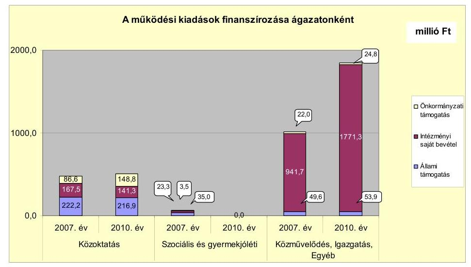

A közoktatási feladatok múködési kiadásait finanszírozó forrásokon belül az állami támogatás összege a 2007-2009. évek átlagához viszonyítva 218,1 millió Ft-ról 2010. évre 216,9 millió Ft-ra ( $0,6 \%$-kal, 1,2 millió Ft-tal) csökkent. Az intézményi saját bevételek a 2007-2009. évi 158,9 millió Ft átlaghoz viszonyítva a 2010. évre 141,3 millió Ft-ra ( $11,1 \%$-kal, 17,6 millió Ft-tal) csökkentek. Az állami támogatások és az intézményi saját bevételek csökkenését a 2007-2010. években az önkormányzati támogatás növekedésével tudták csak ellensúlyozni, amely növelte a pénzügyi kockázatot. Az önkormányzati támogatás a 2007-2009. évi 111,4 millió Ft átlaghoz viszonyítva 2010. évre $33,6 \%$-kal ( 37,4 millió Ft-tal) 148,8 millió Ft-ra nőtt.

A szociális és gyermekjóléti ágazati feladatok múködési kiadásait finanszírozó forrásokon belül az állami támogatás összege 2007-ről 2008-ra 11,7\%$\mathrm{kal}(4,1$ millió Ft) nőtt, az intézményi saját bevétel 2007-ről 2008-ra 6,9\%-kal 1,6 millió Ft-tal csökkent. Az intézményi saját bevételek csökkenését ellensúlyozta az állami támogatás növekedése, az önkormányzati támogatás összege a 2007. és a 2008. évben nem változott, 3,1 millió Ft volt, az Önkormányzat pénzügyi egyensúlyi helyzetére nem volt jelentős hatással.

A közmúvelődési, igazgatási és egyéb feladatok (alapfokú művészetoktatás, erdei iskola) múködési kiadásait finanszírozó bevételeken belül az állami támogatás a 2007-2009. évi átlag 27,9 millió Ft-ról a 2010. évre 5,6 millió Ft-tal (20,1\%) 22,3 millió Ft-ra csökkent. Az állami támogatás csökkenését ellensúlyozta az intézményi saját bevételek növekedése. Az intézményi saját bevételek összege a 2007-2009. évi átlag 330,4 millió Ft-ról a 2010. évre 412,8 millió Ft-ra 82,4 millió Ft-tal növekedett. A múködési kiadások finanszírozásához az Önkormányzatnak növekvő mértékben kellett hozzájárulnia, az önkormányzati támogatás a 2007-2009. évi átlag 21,9 millió Ft-nál a 2010. évben 2,9 millió Fttal (13,2\%) volt magasabb. Az Önkormányzati támogatás a 2010. évben 24,8 millió Ft volt.

A gazdasági társaságok a közterület fenntartás, hulladékkezelés, -szállítás, építőipari tevékenység, bölcsődei ellátás, családi napközi és fogyatékkal élők nappali intézményének múködtetése, járóbeteg-szakellátás, fürdőgyógyászat, rendezvényszervezés, kulturális, közművelődési feladatok ellátása, gazdaságfejlesztő pályázatok menedzselése, zöldség-gyümölcs feldolgozás, kereskedelem, input

---

anyag kereskedelem területén kaptak szerepet az Önkormányzat feladatellátásában. A helyi tömegközlekedési és a kéményseprői feladatok ellátására kettő olyan gazdasági társasággal kötött az Önkormányzat közszolgáltatási szerződést, amelyben nem rendelkezett tulajdoni hányaddal.

Az Önkormányzat a helyi zöldség-gyümölcs értékesítéssel foglalkozó Szövetkezetben 2006-2011. években $0,2 \%$-os részesedéssel rendelkezett ( 0,18 millió Ft). Az Önkormányzat 2008. október 13-án a Szövetkezet részére 250,0 millió Ft tagi kölcsönt nyújtott. A tagi kölcsönszerződést kettő alkalommal, 2009. március hónapban és 2010. május hónapban módosították. A tagi kölcsönszerződésből fennálló követelés csökkentésére az Önkormányzat üzletrész átruházási szerződéssel 2009. március 26-án a kölcsönadós felajánlása alapján megvásárolta a Mórakert Kft. 35,2 millió Ft névértékű üzletrészét 40,0 millió Ft-ért és a Centrum Kft. 35,3 millió Ft névértékű üzletrészét 160,0 millió Ft-ért. A vásárláshoz pénzmozgás nem kapcsolódott, a tagi kölcsön összegéből a vásárlással 200,0 millió Ft-ot visszafizetettnek tekintett az Önkormányzat, így a fennmaradó kölcsön összege 50,0 millió Ft-ra változott (a 2010. évi tagi kölcsönszerződés módosítása után 52,8 millió Ft).

A Képviselő-testület 2009. október 29-i ülésén a megvásárolt üzletrészek Szövetkezet részére történő eladásáról döntött a vételárral megegyező 200,0 millió Ftos eladási áron. Ugyanezen ülésen döntött a Képviselő-testület arról, hogy az üzletrészekre az Önkormányzat 2010. október 30-ig a Mórakert Kft.-vel és a Centrum Kft.-vel visszavásárlási jogot biztosító megállapodást kössön 40,0 millió Ft, illetve 160,0 millió Ft vételárért.

Az üzletrészek átruházásáról az előszerződést az Önkormányzat a Szövetkezettel 2009. november 9-én, az üzletrész átruházási szerződéseket 2009. december 7-én kötötte meg. A Képviselő-testület 2009. október 29-én döntött arról, hogy a Szövetkezet részére öt éves időtartamra 200,0 millió Ft tagi kölcsönt biztosít. A 198,0 millió Ft tagi kölcsön nyújtásáról a szerződést az Önkormányzat a Szövetkezettel 2009. november 12-én kötötte meg. A 198,0 millió Ft-os tagi kölcsönszerződés alapján 2009. november 12-én az Önkormányzat kiegyenlített a Szövetkezet villamos energia és rendszerhasználati dí tartozásából az EDF Energia Hungária Kft. részére 10,0 millió Ft-ot, továbbá 188,0 millió Ft tagi kölcsönt nyújtott a Szövetkezet részére, melyet kettő részletben folyósított, 2009. november 16-án 174,0 millió Ft-ot, 2009. november 17-én 14,0 millió Ft-ot.

Az Önkormányzat a Szövetkezet és a Centrum Kft. EDF Energia Hungária Kft. felé fennálló 99,0 millió Ft díttarozására a 2009. évben kezességet vállalt, a közjegyzői okiratba foglalt kezességvállalási fizetési megállapodást az Önkormányzat a Szövetkezettel és a Centrum Kft.-vel, mint adósokkal 2009. november 17-én kötötte meg. Az üzletrészek eladási árából a Szövetkezet 198,0 millió Ft-ot 2009. november 13-án átutalt az Önkormányzat részére. A fennmaradó 2,0 millió Ft vételárat a Szövetkezet 2011. június 30 -ig nem fizette meg az Önkormányzat számára, azt az Önkormányzat a 2010. évben a Szövetkezet felé követelésként írta elő. Az Önkormányzat 2010. augusztus 18-án a Centrum Kft. 35,3 millió Ft névértékű üzletrészét ismételten megvásárolta 160,0 millió Ft vételárért, továbbá a tagi kölcsön fedezeteként a Szövetkezet még 0,14 millió Ft névértékű üzletrészt adott át az Önkormányzatnak vételár meghatározása nélkül, így az Önkormányzat Centrum Kft.-ben meglévő üzletrésze 35,4 millió Ft

---

névértékre változott. A 160,0 millió Ft-os vételár összegével az eladóval szemben fennálló 198,0 millió Ft tagi kölcsön követelés került csökkentésre, a vételár átutalására nem került sor, így az Önkormányzatnak, az EDF Energia Hungária Kft. részére átutalt 10,0 millió Ft szövetkezeti díjtartozás kiegyenlítése után, 28,0 millió Ft tagi kölcsön követelése maradt fenn. A Centrum Kft. 2011. március 1-jei nyilatkozata alapján, melyben közölték az Önkormányzattal, hogy „a 2010. május 27 -én elfogadott mérleg szerint az üzletrészre eső saját tőke arányos összege 97,9 millió Ft" a Polgármesteri hivatal számviteli nyilvántartásaiban a 2010. év végén 62,1 millió Ft értékvesztést számoltak el. Az Önkormányzatnak az elszámolt értékvesztéssel, vagyonvesztéssel 62,1 millió Ft kára származhat.

A Szövetkezet 2010. december 26-a óta felszámolás alatt áll. Az Önkormányzat 2011. január 31-én nyújtotta be a felszámoló felé a Szövetkezettel szemben fennálló hitelezői igényét, amelyet 2011. április 1-jén módosított, mivel a 2011. január 31-i igénybejelentésben 31,0 millió Ft összegben tévesen mutatott ki óvadéki követelést. A 2011. április 1-jei hitelezői igény módosítás szerint a 31,0 millió Ft óvadék követelés nem a Szövetkezettel szemben, hanem HORTICO Szövetkezettel szemben állt fenn. Sem a 2011. január 31-i hitelezői igénybejelentés, sem annak 2011. április 1-jei módosítása - a hitelezői igény módosításában szerepeltetett 2010. december 27-i állapotot figyelembe véve nem tartalmazta a 2009. december 7-i üzletrész eladásokból származó 2010. december 31-én a számviteli nyilvántartásokban előírt 2,0 millió Ft tagi kölcsön követelést (2009. december 7-én az Önkormányzat a Mórakert Kft.ben és a Centrum Kft.-ben lévő üzletrészeit 200,0 millió Ft-ért értékesítette a Szövetkezet részére, melyből a Szövetkezet 198,0 millió Ft-ot fizetett meg az Önkormányzat részére 2009. november 13-án). A hitelezői igénybejelentés további módosításáról az ÁSZ vizsgálatnak nem volt tudomása.

Az Önkormányzat a 2007-2011. év I. félév közötti időszakban öt társulásban vett részt. Az Önkormányzat a Többcélú társulás mellett négy üzemeltetési és fejlesztési társulásban vett részt. Az Önkormányzat éves költségvetési rendeletei a vizsgált időszakban a négy üzemeltetési-fejlesztési társulás közül a Vízmúüzemeltetési és a Kistérségfejlesztési társulás bevételeit és kiadásait is tartalmazták. A Zákányszékkel közös szennyvízberuházási és az Ivóvízminőség-javító társulásnak a vizsgált időszakban még nem volt bevétele és kiadása. A Vízmúüzemeltetési társulás bevételei a vizsgált időszakban fedezték a kiadásokat. A Kistérségfejlesztési társulás bevételei a 2007-2009. években fedezték a kiadásokat, az Önkormányzat a 2010. évben a társulás részére a közösségi közlekedés fejlesztéséhez 20,2 millió Ft pénzeszközt adott át beruházási önrészként, illetőleg 25,0 millió Ft visszatérítendő pénzeszközt nyújtott a társulás részére a közösségi közlekedés fejlesztéséhez. A Kistérségfejlesztési társulás a 25,0 millió Ft visszatérítendő támogatást az Önkormányzatnak visszafizette 2011. szeptember 28-án.

Az Önkormányzat 2009. január 1-jétől egy szociális intézményt adott át a Többcélú társulásnak. Az intézményátadás hatásaként az Önkormányzat kimutatása szerint a személyi jellegú kiadások 74,2 millió Ft-tal, a dologi kiadások 46,3 millió Ft-tal, az állami támogatások 80,7 millió Ft-tal, a saját bevételek 24,4 millió Ft-tal csökkentek. Az intézményátadás az önkormányzati támogatásoknál az Önkormányzat kimutatása szerint a 2009-2011. év I. félév között

---

15,4 millió Ft kiadás megtakarítást eredményezett, azonban az Önkormányzat a feladatok további ellátásához 6,1 millió Ft támogatást nyújtott a Többcélú társulásnak, így az önkormányzati támogatásoknál 9,3 millió Ft kiadási megtakarítás jelentkezett, javítva ezzel az Önkormányzat pénzügyi egyensúlyi helyzetét.

A vizsgált időszakban a kötelező és az önként vállalt feladatok ellátását biztosító szervezeti keretekben a feladatellátás módjában bekövetkezett változások az Önkormányzat kimutatása szerint javították az Önkormányzat pénzügyi egyensúlyi helyzetét, az intézményátadás az önkormányzati támogatásoknál 15,4 millió Ft kiadás megtakarítást eredményezett.

A gazdasági társaságok pénzügyi helyzete kettő kizárólagos és kettő többségi tulajdonú gazdasági társaságnál kedvezőtlen, a jegyzett tőke meghaladja a saját tőke összegét, amely az Önkormányzat pénzügyi egyensúlyi helyzetére kedvezőtlen hatást gyakorolhat. A gazdasági társaságok a múködésükhöz az Önkormányzattól az ellenőrzött időszakban 194,1 millió Ft működési pénzeszközátadásban részesültek. Rendszeres múködési pénzeszközátadást az Önkormányzattól egy gazdasági társaság, a Móra-Partner Kft. kapott a bölcsőde, a családi napközi és a fogyatékosok nappali intézményének múködtetéséhez, a 2007-2011. év I. félév közötti időszakban összesen 120,2 millió Ft összegben.

Eseti múködési pénzeszközátadásban a 2007-2011. év I. félév között három gazdasági társaság, a Móraép Kft. és a Móravitál Kft., valamint a Móranet Kft. részesült, összesen 73,9 millió Ft értékben az üzleti tervében foglalt múködési kiadásai fedezetére. A pénzeszközátadások támogatási szerződés alapján történtek. A támogatási szerződésekben az Önkormányzat előírta, hogy az átadott pénzeszközt a gazdasági társaság az éves üzleti tervében foglalt múködési kiadásai fedezetére fordítja, a felhasznált összeg elszámolása az éves közhasznúsági jelentésben történik, melyben tételesen kimutatják az átadott önkormányzati forrás felhasználását. A támogatási szerződésekben előírták az önkormányzati pénzeszközátadás felhasználásának a közhasznúsági jelentésekben történő tételes kimutatását, amelyet a közhasznúsági jelentések nem tartalmaztak.

Az Önkormányzat folyó bevételei a 2007-2010. években fedezték a folyó kiadásokat. Az Önkormányzat folyó költségvetési egyenlege (múködési jövedelem) 2007-2010 között 2077,8 millió Ft múködési forrástöbbletet mutatott.

Az Önkormányzat folyó költségvetési egyenlegét, múködési jövedelmét a 2007-2010 évek közötti időszakban az alábbi ábra mutatja be:

---

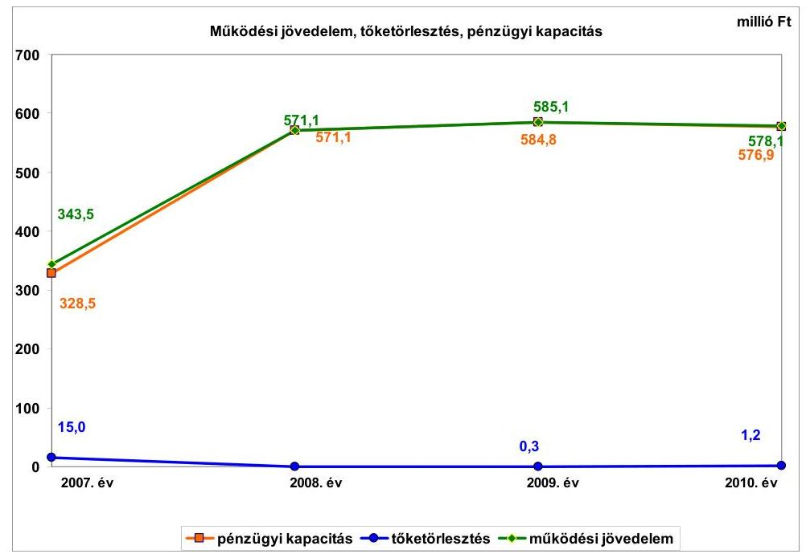

A pénzügyi egyensúly fenntartása a 2007-2010. években képződött 2077,8 millió Ft múködési jövedelem mellett csak külső források bevonásával volt biztosítható. Az Önkormányzat a 2007. évben 3,6 millió Ft, a 2008. évben 0,1 millió Ft, a 2009. évben 16,3 millió Ft, a 2010. évben 130,3 millió Ft hitelt vett fel. A hitelt a 2007., a 2008., a 2009. évben a Homokháti Emlékház kialakításához, a 2010. évben lakásvásárlásra vette igénybe az Önkormányzat. A 2010. évi hitelfelvétel tartalmazta a Kistérségfejlesztési társulás 119,1 millió Ft összegű hitelfelvételét is. A 2007-2010. években 16,5 millió Ft hitelt törlesztettek, amelyből 15,0 millió Ft a Kistérségfejlesztési társulás hiteltörlesztése volt. Az Önkormányzat pénzügyi kapacitása a 2007-2010. években pozitív értéket mutatott. Az Önkormányzat a Homokháti emlékház kialakításához igénybevett hosszú lejáratú hitel 2008. évi 0,1 millió Ft és a 2009. évi 16,3 millió Ft lehívását, valamint a 2009. évi 0,3 millió Ft hiteltörlesztését az Áhsz. számlaosztályok tartalmára vonatkozó előírása ellenére a számlacsoporton belül nem a kölcsönöktől elkülönítetten mutatta ki.

A 2007-2010. években az Önkormányzat felhalmozási költségvetésének egyenlege folyamatosan negatív összegű volt, amely 2007-2010. között összesen -2792,9 millió Ft felhalmozási forráshiányt okozott. Az adósságszolgálat, továbbá a felhalmozási forráshiány 2007-2010 között 2809,4 millió Ft-ot tett ki, amelyre részben az időszakban képződő 2077,8 millió Ft működési megtakarítás (múködési jövedelem), valamint a 2007. január 1-jén rendelkezésre álló 178,0 millió Ft pénzkészlet szolgált fedezetül. A további pénzeszközöket 31,2 millió Ft hitel felvételével, továbbá 1000,0 millió Ft kötvény kibocsátásával teremtették meg.

Az Önkormányzat CLF módszer szerint számított folyó és felhalmozási bevételének együttes összege a 2007-2010. években folyamatosan nőtt. Az Önkormányzat költségvetési támogatásai és az átengedett szja bevételei együttesen a 2007-2009. évi átlag 618,4 millió Ft-ról a 2010. évre 65,6 millió Ft-tal, 684,0 millió Ft-ra növekedtek. Az áfa bevételek összege a 2007-2009. évi átlag

---

305,3 millió Ft-ról a 2010. évre 1141,2 millió Ft-ra nőttek, amely növekedés döntően a fordított áfa bevétel 553,7 millió Ft-os összegéből adódott. Az egyéb saját bevételek a 2007-2009. évi átlag 889,7 millió Ft-ról a 2010. évre 284,4 millió Ft-tal 1174,1 millió Ft-ra növekedtek. A helyi adókból és pótlékokból származó bevételek a helyi adó mértékének növekedése következtében a 2007-2009. évi átlag 228,7 millió Ft-ról a 2010. évre 263,6 millió Ft-ra nőttek.

A 2009. évben 0,8 millió Ft magyar államkötvények utáni kamatbevételt az Önkormányzatnál az Áhsz. előírása ellenére tévesen osztalékbevételként mutatták ki.

A felhalmozási bevételek a 2007-2009. évi átlag 1018,8 millió Ft-ról a 2010. évre 923,3 millió Ft-tal 1942,1 millió Ft-ra nőttek a saját tőkebevételek és az államháztartáson belülről kapott támogatások növekedése miatt.

A folyó kiadások a 2007-2009. évi átlag 1585,8 millió Ft-ról a 2010. évre 2735,6 millió Ft-ra nőttek. A személyi juttatások a 2007-2009. évi átlag 518,1 millió Ft-ról a 2010. évre 550,3 millió Ft-ra nőttek. Ezzel szemben a munkaadót terhelő járulékok a 2007-2009. évi átlag 157,0 millió Ft-ról a 2010. évre 138,9 millió Ft-ra csökkentek. A dologi kiadások a 2007-2009. évi átlag 685,1 millió Ft-ról döntően a fordított áfa miatti befizetés 645,6 millió Ft-os öszszegéből adódóan a 2010. évre 1565,6 millió Ft-ra nőttek.

A pénzügyi egyensúlyi helyzet alakulását jelentősen befolyásolta az Önkormányzat elmúlt időszaki fejlesztési tevékenysége. A 2007-2010. években megvalósított 2010. december 31-ig befejezett fejlesztések összege 4145,0 millió Ft volt. A 2010. december 31-én folyamatban lévő fejlesztésekre 2007. és 2010. évek között 2081,7 millió Ft kiadást teljesítettek.

A felhalmozási költségvetés bevételeit, kiadásait és egyenlegét a 2007-2010. évek közötti időszakban az alábbi ábra szemlélteti:
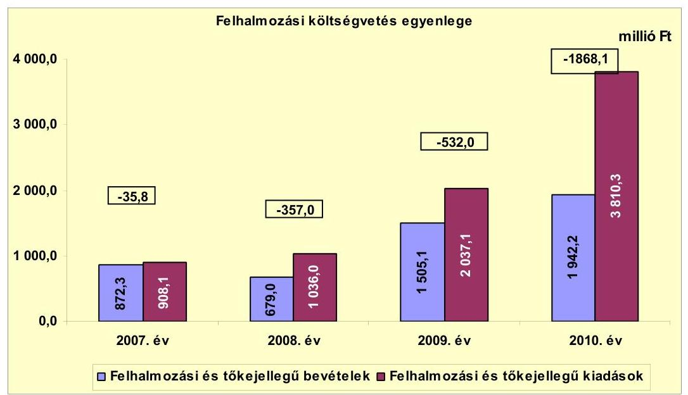

---

A felhalmozási kiadások a 2009. évhez viszonyítva a 2010. évben közel a duplájára nőttek, az áfával növelt EU-s és hazai támogatással megvalósult beruházási kiadások növekedése miatt.

A műszakilag befejezett fejlesztések jelentős részét EU-s és hazai támogatásból, kötvénykibocsátásból származó és saját bevételből fedezték. A 20072010. évek időszakában megvalósított 4145,0 millió Ft értékű fejlesztés és felújítás forrása a saját erő, a hazai és EU-s támogatások mellett 31,2 millió Ft hitelfelvétel $(0,8 \%)$ és 512,0 millió Ft kötvény kibocsátásból származó bevétel volt. A 2010. december 31-én folyamatban lévő fejlesztési feladatok végrehajtására 2006. december 31-ig 1,7 millió Ft, 2007-2010. között 2081,7 millió Ft kiadást teljesítettek, amelyre hitelt nem vettek igénybe. A folyamatban lévő fejlesztések teljesített kiadásait - az Önkormányzat adatszolgáltatása szerint 635,8 millió Ft saját, 334,1 millió Ft kötvényből származó bevételből, 1091,4 millió Ft EU-s ${ }^{8}$ és 22,2 millió Ft hazai támogatásból finanszírozták. Az EU-s támogatásból megvalósult fejlesztések utófinanszírozása likviditási gondot okozott, melynek áthidalására folyószámlahitelt vettek igénybe, a 2007. évben 149,5 millió Ft, a 2008. évben 39,6 millió Ft, a 2009. évben 0,4 millió Ft, a 2010. évben 5,0 millió Ft összegben. A likviditási gondok ellenére az Önkormányzat a 2007-2010. években kölcsönt nyújtott gazdasági társaságoknak és egyéb szervezeteknek. A fejlesztések fenntartásának költségeit az éves költségvetési rendeletekben nem számszerűsítették.

Az Önkormányzat 2010. december 31-én folyamatban lévő fejlesztési feladatok 2010. évet követő kötelezettség-vállalásainak összege 1703,7 millió Ft volt, amelyből 105,9 millió Ft-ot kötvényből származó bevételből, 1389,5 millió Ft-ot EU-s támogatásból és 208,3 millió Ft-ot hazai támogatásból terveznek biztosítani. Hitelfelvétellel a fejlesztések megvalósításához nem számoltak.

A 2010. december 31-én fennálló felhalmozási kötelezettségvállalások forrásösszetételét a következő ábra mutatja be:
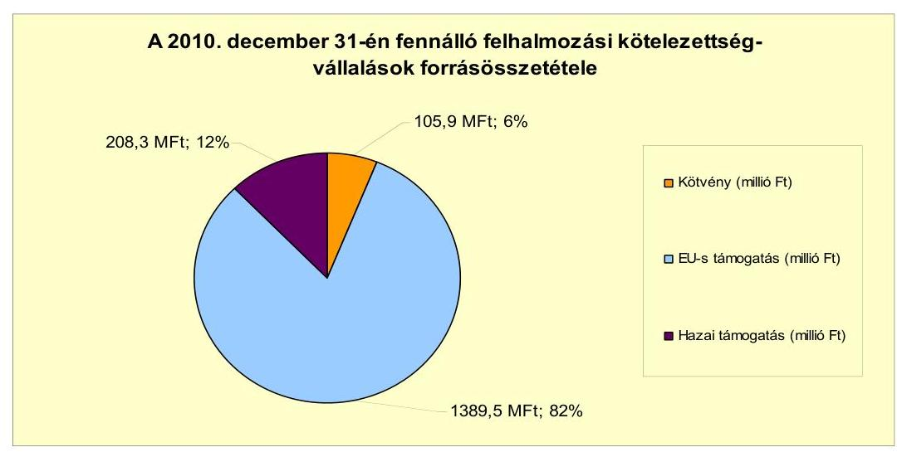

[^0]
[^0]:    ${ }^{8}$ Az Önkormányzat a 2007-2010. években költségvetési beszámolóiban EU-tól és külföldről kapott támogatásként 35,3 millió Ft bevételt szerepeltetett.

---

Az Önkormányzatnál beadott, elbírálás alatt álló pályázati forrásból megvalósuló tervezett négy fejlesztés teljes tervezett bekerülési költsége 2668,0 millió Ft volt. A fejlesztésekre 2010. december 31-éig 11,6 millió Ft kiadást teljesítettek. A 2010. év utánra vállalt 2668,0 millió Ft kiadást az Önkormányzat 519,4 millió Ft saját bevételből, 2076,6 millió Ft EU-s és 72,0 millió Ft hazai támogatással tervezi megvalósítani.

Az Önkormányzat mérleg szerinti pénzintézetekkel szembeni kötelezettsége a 2006. év végéről a 2011. I. félév végére 15,0 millió Ft-ról 1745,9 millió Ft-ra nőtt, amelyből az árfolyamváltozás miatti különbözet 469,8 millió Ft volt. A fennálló pénzintézeti kötelezettségek $84,2 \%$-át, 1469,8 millió Ft-ot a 2007. december 20-án CHF-ben kibocsátott önkormányzati kötvényből eredő kötelezettség teszi ki. A kötelezettségek között szerepel továbbá 29,2 millió Ft összegű kettő, hosszú lejáratú ( 20 és 24 éves futamidejű) hitelből, egy 142,0 millió Ft összegű folyószámlahitelből és egy 104,9 millió Ft összegű, a Kistérségfejlesztési társulás által felvett rövid lejáratú hitelből eredő kötelezettség is. Az Önkormányzat a devizában fennálló kötelezettségek Számv. tv. szerinti értékelését a 2007-2010. években elvégezte, az ebből eredő állománynövekedést azonban a 2008. és a 2009. években nem számolta el a könyveiben.

Az Önkormányzat pénzintézeti kötelezettségvállalásaira képviselő-testületi döntés alapján került sor. A hosszú lejáratú hitelek és a kötvénykibocsátást megelőző előterjesztésekben számszerűsítve nem mutatták be a kamat- és - a devizaalapú kötelezettségeket érintő - árfolyamkockázatot.

Az Önkormányzat a két hosszú lejáratú hitelből az egyiket teljes összegében lehívta, a másik esetben a 100,0 millió Ft összegű hitelkeretből 11,2 millió Ft-ot vett igénybe. Mindkét hitelt a hitelcéloknak megfelelően, a Képviselő-testület által jóváhagyott, költségvetésbe betervezett beruházásokra fordította. A kötvénykibocsátásból származó 1000,0 millió Ft összegű forrást teljes egészében felhasználta az Önkormányzat. A kötvényforrás terhére a Képviselő-testület által jóváhagyott, költségvetési rendeletbe beépített beruházásokat valósította meg, valamint egy önkormányzati gazdasági társaságnak nyújtott kölcsönt. A kölcsönnyújtás felhalmozási célra történt a „Vállalkozói inkubátor központ létrehozása Mórahalmon" című pályázat megvalósításához. A jegyző nyilatkozata szerint az Önkormányzat ezen a pályázaton nem indulhatott csak a Móraép Kft., ezért vált szükségessé a kölcsön nyújtása, melyet kamatfizetési kötelezettség terhel. Az átmenetileg szabad kötvényforrás befektetéséből az Önkormányzat 465,5 millió Ft bevételt realizált, amelyet fejlesztési célokra használt fel.

Az Önkormányzat a forintban fennálló hosszú lejáratú pénzintézeti kötelezettségeiből 2011. június 30 -áig 2,0 millió Ft tőkét törlesztett, valamint 2,3 millió Ft kamatot fizetett. A tőketörlesztést az egyik hosszú lejáratú hitel esetében 2009. november 28-án kellett megkezdeni 0,3 millió Ft összeggel, a másik hosszú lejáratú hitel tőketörlesztésének kezdő időpontja 2012. március 31., az első törlesztés összege 1,1 millió Ft lesz. A CHF-ben fennálló pénzintézeti kötelezettségéből tőkét nem törlesztett, 374,4 ezer CHF ( 66,3 millió Ft) kamatot fizetett. A tőketörlesztési kötelezettség kezdő időpontja 2011. december 31. Az első törlesztés öszszege 170,0 ezer CHF. A 2007-2011. év I. féléve között átmenetileg szabad pénzeszközeiből - a szabad kötvényforrás befektetéséből származó 465,5 millió Ft

---

bevétellel együtt - 557,9 millió Ft kamatbevételt realizált, amely kedvező hatást gyakorolt az Önkormányzat pénzügyi egyensúlyi helyzetének alakulására.

Az Önkormányzat a fizetőképessége megőrzését a 2007., 2008., 2010. és 2011. években folyószámlahitel időszakos igénybevételével tudta biztosítani.

A folyószámlahitel igénybevétele a 2007-2011. év I. félévében az alábbiak szerint alakult:

| Megnevezés | 2007. év | 2008. év | 2009. év | 2010. év | 2011. év I.   félév |
| :-- | --: | --: | --: | --: | --: |
| Folyószámlahitel |  |  |  |  |  |
| Keretösszeg január 1-jén (millió Ft-ban) | 100,0 | 100,0 | 10,0 | 10,0 | 10,0 |
| Állagos napi állomány (millió Ft-ban) | 4,9 | 1,2 | 0,0 | 0,1 | 13,7 |
| Folyószámlia hitellel zárt napok száma (nap) | 46,0 | 54,0 | 6,0 | 7,0 | 64,0 |
| Egyenleg (állomány) | $x$ | $x$ | $x$ | 0,0 | 142,0 |

A likviditás biztosítása az Önkormányzatnak a vizsgált időszakban összesen 1,9 millió Ft kamatkiadást, és 0,4 millió Ft egyéb költség fizetésének kötelezettségét okozta.

Az Önkormányzat kötelezettségeinek (beleértve a szállítói kötelezettségeket is) 2010. december 31-i, valamint 2011. június 30-i állományát és várható alakulását a kötelezettségek lejáratáig a következő táblázat szemlélteti:

| Megnevezés | Állomány 2010.   december 31-én |  | Állomány 2011.   június 30-án |  | Várható   kötelezettség 2011-   2013. években |  | Várható   kötelezettség 2014.   évtől |  |
| :--: | :--: | :--: | :--: | :--: | :--: | :--: | :--: | :--: |
|  | HUF-ban   (millió Ft-   ban) | Devizában   (összege, ezer   CHF-ben) | HUF-ban   (millió Ft-   ban) | Devizában   (összege, ezer   CHF-ben) | HUF-ban   (millió Ft-   ban) | Devizában   (összege,   ezer CHF-   ben) | HUF-ban   (millió Ft-   ban) | Devizában   (összege,   ezer CHF-   ben) |
| Pénzintézeti kötelezettségek |  |  |  |  |  |  |  |  |
| Mórahalom 2030 Külvény | 0,0 | 6614,2 | 0,0 | 6614,2 | 0,0 | 991,5 | 0,0 | 6151,5 |
| Hosszú lejáratú hitel (Kilzkincs hitel) | 18,5 | 0,0 | 18,0 | 0,0 | 5,3 | 0,0 | 18,8 | 0,0 |
| Hosszú lejáratú hitel (Önkormányzati   bérlakás hitel) | 11,2 | 0,0 | 11,2 | 0,0 | 9,6 | 0,0 | 2,6 | 0,0 |
| Folyószámlahitel | 0,0 | 0,0 | 142,0 | 0,0 | 142,0 | 0,0 | 0,0 | 0,0 |
| Pénzintézeti kötelezettségek összesen   HUF-ban: | 29,7 | 0,0 | 171,2 | 0,0 | 156,9 | 0,0 | 21,4 | 0,0 |
| Pénzintézeti kötelezettségek összesen   CHF-ben: | 0,0 | 6614,2 | 0,0 | 6614,2 | 0,0 | 991,5 | 0,0 | 6151,5 |
| Számbír tartozás | 37,0 | 0,0 | 41,2 | 0,0 | 41,2 | 0,0 | 0,0 | 0,0 |
| Kötelezettségek összesen HUF-ban: | 66,7 | 0,0 | 212,4 | 0,0 | 198,1 | 0,0 | 21,4 | 0,0 |
| Kötelezettségek összesen CHF-ben: | 0,0 | 6614,2 | 0,0 | 6614,2 | 0,0 | 991,5 | 0,0 | 6151,5 |

Az Önkormányzatnak pénzintézetekkel szemben fennálló kötelezettsége a 2011. év I. félév végén 171,2 millió Ft és 6614,2 ezer CHF volt. Ezek várható kötelezettsége (tőke, kamat és egyéb költség) a legutóbbi kamatfizetés feltételei alapján a 2011-2013. években 156,9 millió Ft és 991,5 ezer CHF. Az Önkormányzat 2011 év I. félév végi szállítói tartozása 41,2 millió Ft, melyből a lejárt tartozás 16,4 millió Ft volt. Az Önkormányzat 2011-2013. években várható fizetési kötelezettségeinek teljesítésére figyelembe vehető 244,7 millió Ft szabad pénzmaradvány, 361,4 millió Ft mérlegben kimutatott behajtható követelésállomány, és a tehermentes forgalomképes nettó ingatlanvagyon. Az Önkormányzat 2011. június 30-án ismert, 2014. évet követő éveket terhelő pénzintézeti kötelezettségei: 21,4 millió Ft és 6151,5 ezer CHF. A jelenlegihez képest változatlan múködési jövedelemtermelő képességet feltételezve a várható fizetési

---

kötelezettségek fedezetét a múködési jövedelem biztosíthatja, mivel a 2010. december 31 -én folyamatban lévő fejlesztések 2010. évet követő 1703,7 millió Ft összegű kötelezettségvállalásához 105,9 millió Ft kötvénybevételből rendelkezésre állt (amelyet az Önkormányzat 2011. június 30-ig felhasznált), 1389,5 millió Ft EU-s, valamint 208,3 millió Ft hazai támogatás biztosítása folyamatban van (a pályázatot elfogadták).

Az Önkormányzat a Szövetkezet és a Centrum Kft. részére energiaszolgáltatási dí tartozásaik rendezéséhez 99,0 millió Ft összegben vállalt kezességet (ebből a Szövetkezet részére vállalt kezesség 87,6 millió Ft, a Centrum Kft. részére vállalt kezesség 11,4 millió Ft volt). A 2010. év végére a kezességgel kapcsolatos kötelezettség megszűnt, mivel azt az Önkormányzat teljes összegében kifizette a kötelezett gazdasági társaságok helyett. A teljesített fizetési kötelezettségből 37,2 millió Ft térült meg (ebből a 2010. évben a Centrum Kft-től 11,4 millió Ft, a Szövetkezettől 25,8 millió Ft), 61,8 millió Ft, amely a Szövetkezet részére vállalt kezességvállalásra kifizetett összegből adódott, még nem térült meg. A meg nem térült kezességvállalásból a Szövetkezet felszámolása miatt az Önkormányzatnak 61,8 millió Ft vagyonvesztése, kára származhat.

Az Önkormányzat egy kizárólagos és egy többségi tulajdonában lévő gazdasági társaságnak, valamint egyéb társaságoknak és szervezeteknek nyújtott 15 alkalommal, összesen 589,8 millió Ft kölcsönt. Ebből az Önkormányzat többségi tulajdonában lévő társaságok 2011. június 30 -ig 19,8 millió Ft-ot, az egyéb gazdasági társaságok és egyéb szervezetek 378,1 millió Ft-ot fizettek vissza. A lejárt kölcsöntartozás 56,0 millió Ft-ot tett ki, amelyből a jegyző nyilatkozata alapján a Kistérségfejlesztési társulásnak nyújtott 6,0 millió Ft kölcsöntartozás kamatokkal együtt a 2011. évben visszafizetésre kerül, így ebből a szerződésből várhatóan nem keletkezik vagyonvesztése, kára az Önkormányzatnak.

A Szövetkezet felé fennálló kölcsönkövetelés 50,0 millió Ft, amely a kölcsönszerződés módosítása alapján a kamatok 2010. január 1-jétől történő tőkésítése miatt 52,8 millió Ft-ra változott. A le nem járt tagi kölcsönökből az Önkormányzatnak a Szövetkezettel szemben 28,0 millió Ft tagi kölcsön követelése állt fenn. Az Önkormányzat a felszámoló felé 2011. január 31-én benyújtott hitelezői igénybejelentésben tagi kölcsön követelésként 80,8 millió Ft-ot mutatott ki, a lejárt tagi kölcsön követelésből fennálló 52,8 millió Ft és a le nem járt tagi kölcsön követelésből fennálló 28,0 millió Ft eredőjeként. A Szövetkezetnél a 2010. évben indult felszámolási eljárás miatt, az Önkormányzatnak a Szövetkezet részére nyújtott tagi kölcsönökböl 80,8 millió Ft vagyonvesztése, kára származhat, ha a követelés a felszámolási eljárás során nem térül meg. A kölcsönök nyújtásánál az Önkormányzat öt esetben nem jelölt meg biztosítékot, az Önkormányzat érdekeit védő garanciális elemeket a kölcsön visszafizetése érdekében.

Az Önkormányzat pénzintézeti kötelezettség fedezeteként ingatlanain 1978,9 millió Ft értékű jelzálogjog bejegyzéshez járult hozzá, amely 1403,0 millió Ft nettó értékú forgalomképes, valamint 195,7 millió Ft nettó értékű forgalomképtelen ingatlant érintett. Az önkormányzati törzsvagyon körébe tartozó forgalomképtelen vagyon esetében a pénzintézeti kötelezettség biztosítékaként történő jelzálogbejegyzés ellentétes az Ötv. ${ }_{1}$ előírásával, amely

---

kimondja, hogy hitelfelvétel - likvid hitel kivételével - fedezetéül az önkormányzati törzsvagyon nem használható fel ${ }^{9}$.

Az önkormányzati kötelezettségek növekedése mellett az Önkormányzat minősített többségi befolyásával rendelkező gazdasági társaságok kötelezettségei is befolyásolhatják az Önkormányzat pénzügyi egyensúlyát.

| Megnevezés | Állomány   2010.   december 31.   én | Állomány   2011. június   30 -án | Várható   kötelezettség   2011-2013.   években | Várható   kötelezettség   2014. évtől |
| :-- | :--: | :--: | :--: | :--: |
|  | HUF-ban   (millió Ft-ban) | HUF-ban   (millió Ft-ban) | HUF-ban (millió Ft-   ban) | HUF-ban (millió   Ft-ban) |
| Pénzintézeti kötelezettségek összesen: | 0,0 | 0,0 | 0,0 | 0,0 |
| Lizing kötelezettségek | 0,0 | 0,0 | 0,0 | 0,0 |
| Szállítói tartozás | 17,7 | 88,7 | 88,7 | 0,0 |
| Jogerős végzéssel lezárt de ki nem fizetett   kötelezettségek | 0,0 | 0,0 | 0,0 | 0,0 |
| Egyéb kötelezettségek | 146,0 | 140,2 | 140,2 | 0,0 |

A gazdasági társaságoknak a 2011. évtől 88,7 millió Ft szállítói tartozást, és 140,2 millió Ft egyéb kötelezettséget kell rendezniük. Esetleges csőd- vagy felszámolási eljárás esetén a bíróság korlátlan és teljes felelősséget állapíthat meg az Önkormányzat terhére.

Az Önkormányzat 2007-2010. között eszközállománya után 1149,3 millió Ft összegű értékcsökkenést mutatott ki. Az elhasznált eszközök pótlására 330,0 millió Ft-ot fordított.

Az Önkormányzat az ellenőrzött időszakban kiadási megtakarítást eredményező és bevételt növelő intézkedéseket tett. Az Önkormányzat kimutatása szerint a 2007-2011. év I. féléve között tett intézkedések hatására 79,9 millió Ft bevételi többlet, továbbá 119,6 millió Ft kiadási megtakarítás képződött. A kiadási megtakarítások egy szociális intézmény, a Gondozási Központ átadáshoz és az energiafelhasználás racionalizálásához kapcsolódtak. Az Önkormányzat által kimutatott kiadáscsökkenés 57,0\%-a ( 68,1 millió Ft, amely a Gondozási Központ átadása miatti 74,2 millió Ft személyi juttatások és járulékaik kiadás csökkenésének és a feladat további ellátására a Többcélú társulásnak teljesített 6,1 millió Ft pénzeszkózátadásnak a különbsége) az intézményátadáshoz kapcsolódó álláshely csökkentés eredménye. A Gondozási Központ átadása miatti dologi kiadás csökkenés 46,3 millió Ft-ot (38,7\%), az energiaracionalizálás eredményeként elért megtakarítás 5,2 millió Ft-ot (4,3\%) volt.

Önkormányzati szinten 2007-2011. év I. féléve között összesen 43 álláshely szűnt meg (ebből üres álláshely nem volt). Egyes közszolgáltatási területeken azonban feladatnövekedések is voltak, amelyek álláshely- és egyben létszámnövekedéssel is jártak. Ennek következtében az időszak álláshelyeinek száma összességében 1 fővel nőtt.

[^0]
[^0]:    ${ }^{9}$ Az erről szóló rendelkezést 2012. január 1-jétől a Vagyon tv. tartalmazza.

---

A bevételnövelő intézkedések a helyi adók mértékének emeléséhez (13,4 millió Ft), mentességek megszüntetéséhez (1,0 millió Ft), adóhátralékok behajtásához ( 38,0 millió Ft ), valamint az eszközök hasznosításához (27,5 millió Ft) kapcsolódtak.

Az Önkormányzat költségvetési támogatásból, átengedett bevételekből származó bevételei a 2007. évhez képest az időszak egészét tekintve összességében 213,5 millió Ft-tal csökkentek, amelyet az Önkormányzat által kimutatott 119,6 millió Ft kiadási megtakarítás és 79,9 millió Ft bevételi többlet 93,4\%ban ellensúlyozott.

Az utóellenőrzés a pénzügyi egyensúly javítására tett egy szabályszerűségi és egy célszerűségi javaslat hasznosítására terjedt ki. A célszerűségi javaslatot hasznosították, a polgármester tájékoztatta a Képviselő-testületet a számvevőszéki ellenőrzés tapasztalatairól, a feltárt hibák kijavítására intézkedési tervet készítettek. A szabályszerűségi javaslatot részben hasznosították. A 2008. évi költségvetési rendelet elkülönítetten tartalmazta az európai uniós támogatással megvalósuló programok és projektek bevételeit és kiadásait, azonban az elkülönített kimutatás nem tartalmazta a GVOP keretében megvalósuló ipari parki fejlesztési projekt 2008. évre áthúzódó 85,0 millió Ft tervezett kiadását, azt a fejlesztési kiadások között szerepeltették.

Az Önkormányzat pénzügyi egyensúlyi helyzetét összegezve a következők emelhetők ki.

Mórahalom Város Önkormányzatának pénzügyi egyensúlyi helyzete középtávon veszélyeztetett.

Az Önkormányzat múködési jövedelme a vizsgált időszakban pozitív volt. A folyó bevételek a 2007., a 2009. és a 2010. évben fedezetet nyújtottak a folyó kiadásokra és az adósságszolgálatra.

Az önként vállalt feladatok aránya alapvetően nem befolyásolta az Önkormányzat pénzügyi egyensúlyát.

Az Önkormányzatnak a 2010. évben a Centrum Kft.-ben meglévő üzletrészre elszámolt értékvesztéssel vagyonvesztése, kára származhat.

A beruházásokkal létrehozott létesítmények múködtetése és fenntarthatósága érdekében várhatóan felmerülő költségvetési kiadásokat nem számszerűsítették, amely a létesítmények jövőbeni üzemeltetésének kockázatát jelenti.

A hosszú távú kötelezettségek forrása a 2014. utáni időszakra az Önkormányzatnál nem számszerűsített.

A felvett likvid hitelt időszakosan EU-s támogatások előfinanszírozására vették igénybe.

A Szövetkezetnél a 2010. évben indult felszámolási eljárás miatt, az Önkormányzatnak a Szövetkezet részére nyújtott tagi kölcsönökből, továbbá meg nem térült kezességvállalásból vagyonvesztése, kára származhat.

---

Az Állami Számvevőszékről szóló 2011. évi LXVI. törvény 33. § (1) bekezdésében foglaltak értelmében a jelentésben foglalt megállapításokhoz kapcsolódó intézkedési tervet köteles az ellenőrzött szervezet vezetője összeállítani és azt a jelentés kézhezvételétől számított harminc napon belül az ÁSZ részére megküldeni. Amennyiben az intézkedési tervet határidőben nem küldi meg a szervezet, vagy az továbbra sem elfogadható, az ÁSZ elnöke a hivatkozott törvény 33. § (3) bekezdés a)-b) pontjaiban foglaltakat érvényesítheti.

# A 2011. június 30-i pénzügyi egyensúlyi helyzet alapján az ellenőrzés intézkedést igénylő megállapításai és javaslatai: 

## a Polgármesternek:

1. Az Önkormányzat pénzügyi egyensúlyi helyzete középtávon veszélyeztetett, mivel a folyamatban lévő fejlesztési projektekhez az EU-s és hazai támogatásoknál, annak ellenére, hogy a bevételek lehívása megtörtént, a forrás még nem állt rendelkezésre, azt az Önkormányzat megelőlegezte, a beruházásokkal létrehozott létesítmények múködtetése, annak költségvetési kiadásai számszerúsítése hiányában, a jövőben kockázatot jelenthet.

Az Önkormányzat pénzügyi egyensúlyának középtávon ható helyreállítása és hosszú távú fenntarthatósága érdekében kezdeményezze - felelősök és határidők megjelölésével - az alábbi intézkedések megtételét:

Javaslat:
a) Tárja fel a bevételszerző és kiadáscsökkentő lehetőségeket. Ütemezze a bevételek beszedését a jövőben keletkező fizetési kötelezettségeihez.
b) Az egyensúlyi tartalékképzést terjessze ki az adósságszolgálat teljesítése érdekében a kötvénytartalék mellett az egyéb adósságszolgálati kötelezettségekre.
c) Terjesszen a Képviselő-testület elé kibontakozási programot a pénzügyi egyensúlyi helyzet javítása és hosszú távú megőrzése érdekében, és mutassa be a Képvi-selő-testületnek legalább három évre kiterjedően a kötelezettségek teljes körére szóló finanszírozási tervet, a források számszerúsített megjelölésével.
2. A gazdasági társaságoknak nyújtott pénzeszközátadásoknál a támogatási szerződésekben előírta az Önkormányzat a gazdasági társaságok felé az önkormányzati pénzeszközátadás felhasználásának közhasznúsági jelentésben történő tételes kimutatását, ennek ellenére azt a közhasznúsági jelentések nem tartalmazták.

Javaslat:
Követelje meg, hogy a jövőben a gazdasági társaságok a közhasznúsági jelentésükben tételesen kimutassák az Önkormányzat által nyújtott pénzeszközök felhasználását.
3. A Képviselő-testületnek előterjesztett éves költségvetési rendeletekben nem mutatták be a beruházásokkal létrehozott létesítmények múködtetése és fenntarthatósága ér-

---

dekében várhatóan felmerülő költségvetési kiadásokat.
Javaslat:
Vizsgálja felül teljes körűen a folyamatban lévő és tervezett beruházásokat és mutassa be a Képviselő-testületnek a megvalósuló létesítmények fenntarthatóságának pénzügyi hatásait.
4. A Képviselő-testület részére nem készítettek a hitelfelvételhez, a kötvénykibocsátáshoz és a kezességvállaláshoz kapcsolódóan teljes körű tájékoztatást az így keletkezett kötelezettségek jövőbeni (kamat, visszafizetési) kockázatairól, illetőleg az Önkormányzat adósságot keletkeztető kötelezettségvállalásaira vonatkozó képviselőtestületi előterjesztések nem tartalmazták a visszafizetés forrásait, valamint a kamatkockázat várható kihatásait.

Javaslat:
Kísérje figyelemmel a jövőbeni várható - kamat, valamint visszafizetési - kockázatokat, továbbá a mérlegen kívüli tételek (kezességvállalás és helytállási kötelezettségvállalás) kockázatait, és legalább félévente tájékoztassa a Képviselő-testületet azok alakulásáról, továbbá gondoskodjon, hogy a jövőben az adósságot keletkeztető kötelezettségvállalásokról szóló képviselő-testületi előterjesztések tételesen tartalmazzák a visszafizetés forrásait, valamint mutassák be a kamatkockázat várható kihatásait.
5. Az Önkormányzat a vizsgált időszakban a fejlesztések megvalósítását átmenetileg folyószámlahitel igénybevételével biztosította.

Javaslat:
Gondoskodjon a fejlesztések megvalósításához hosszú távú finanszírozási lehetőségek feltárásáról.
6. Az Önkormányzat Képviselő-testülete nem rendelkezik megfelelő információval az Önkormányzat gazdasági társaságai és az önkormányzati részesedéssel múködő egyéb szervezetek pénzügyi helyzetének az Önkormányzat pénzügyi egyensúlyi helyzetére gyakorolt hatásairól.

Javaslat:
Mutassa be évente - a beszámoló keretében - a Képviselő-testületnek az Önkormányzat és a minősített többségi, illetve többségi tulajdonú gazdasági társaságai, valamint az önkormányzati részesedéssel múködő egyéb szervezetek aktuális pénzügyi helyzetét, az Önkormányzatnak a gazdasági társaságai, egyéb szervezetei felé fennálló követeléseit, nyújtott kölcsöneit és azoknak az Önkormányzat pénzügyi egyensúlyi helyzetére gyakorolt hatásait. Tegye meg a szükséges és lehetséges intézkedéseket a tulajdonosi érdekek védelme érdekében.
7. A 2007-2010. évek között az Önkormányzat felújításokra és az eszközök pótlására a kimutatott értékcsökkenés 28,7\%-ának megfelelő összeget, 330,0 millió Ft-ot fordított.

---

Javaslat:
Mutassa be a Képviselő-testületnek évente a zárszámadási rendelet előterjesztésében az értékcsökkenés összegét, és ezzel összevetve az elhasználódott eszközök pótlására fordított tényleges kiadásokat, az eszközök elhasználódási fokának alakulását.

# a Jegyzönek 

1. A pénzintézettől felvett hosszú lejáratú hitel 2008. és 2009. évi lehívását nem hitel-, hanem kölcsönfelvételként, a 2009. évi hiteltörlesztést kölcsöntörlesztésként, illetve a 2009. évben szabad pénzeszközök befektetéséből származó kamatbevételt osztalékbevételként könyvelték a Polgármesteri hivatalban.

Javaslat:
Gondoskodjon arról, hogy a pénzintézettől történő hitellehívás és -törlesztés, illetve a kamatbevételek könyvelése megfeleljen az Áhsz. 9. melléklet 4. pontjában foglaltaknak.
2. Az Önkormányzat által nyújtott kölcsönök szerződéseiben öt esetben nem építettek be az Önkormányzat érdekeit védő garanciális elemeket a kölcsön visszafizetése érdekében.

Javaslat:
Kezdeményezze, hogy a kölcsönszerződésekben minden esetben határozzanak meg az Önkormányzat érdekeit védő garanciális elemeket annak érdekében, hogy a viszszafizetés biztosított legyen.
3. A 2011. június 30 -án fennálló jelzálog-kötelezettségből 1978,9 millió Ft pénzintézeti kötelezettség miatt került bejegyzésre, amely kettő darab forgalomképes és három darab forgalomképtelen ingatlant érintett. Az önkormányzati törzsvagyon körébe tartozó forgalomképtelen vagyon esetében a pénzintézeti kötelezettség biztosítékaként történő jelzálogbejegyzés ellentétes az Ötv. 88. § (1) bekezdésének b) pontjával.

Javaslat:
Gondoskodjon arról, hogy az Önkormányzat kötelezettségeinek fedezeteként a Vagyon tv. 3. § (1) bekezdés 3. pont és az 5. § (2) bekezdés a) és b) pontokban foglaltak szerinti nemzeti vagyon körébe tartozó forgalomképtelen törzsvagyont ne terheljenek meg.

A polgármester a helyszíni ellenőrzés lezárása után tájékoztatta az Állami Számvevőszéket az Önkormányzat megtett intézkedéseiről, amelyet az Állami Számvevőszék nem ellenőrzött, arra vonatkozóan véleményt vagy megállapítást nem fogalmaz meg. Az ellenőrzés lezárását követően elvégzett intézkedéseket az Állami Számvevőszék utóellenőrzés keretében vizsgálhatja.

---

A polgármester tájékoztatása szerint a következő intézkedéseket tette az Önkormányzat:

- az egyensúlyi tartalékképzést a kötvénytartalék mellett kiterjesztették a Közkincs hitel és a Bérlakás hitelprogramra is;
- az Önkormányzat által a gazdasági társaságoknak nyújtott pénzeszközök felhasználásáról a tételes elszámolást számszerúsítve és szöveges alátámasztással a 2011. évről benyújtott közhasznúsági jelentésben érvényesítik.

---

# II. RÉSZLETES MEGÁLLAPÍTÁSOK 

## 1. Az ÖNKORMÁNYZAT KÖTELEZŐ ÉS ÖNKÉNT VÁLlALT FELADATAI, A FELADATELLÁTÁS SZERVEZETI KERETEI ÉS ANNAK VÁLTOZÁSAI

Az Önkormányzat az önként vállalt feladatait a Polgármesteri hivatal SzMSz-ében részletezte ${ }^{10}$. Önként vállalt feladatként határozták meg az SzMSz-ben a helyi adók bevezetését, az érdekeltségi alap képzését ${ }^{11}$, tanyai ké-pviselő-testület és konzultatív tanácsadó testület múködtetését, egyesületek, civil szervezetek támogatását, mezőőri szolgálat múködtetését, gyógyfürdő múködtetését, járóbeteg-szakrendelő üzemeltetését, a helyi tömegközlekedés biztosítását, nappali rendszerú szakiskolai és szakközépiskolai oktatást, nevelést, szakiskolai felnőttoktatást, alapfokú művészetoktatást, kollégium fenntartását, ipari park üzemeltetését, infrastruktúra fejlesztését.

A Képviselő-testület a 2009. évben határozatban döntött arról, hogy „a helyi hagyományok megtartása, a helyi lakosság életminőségének megőrzése, a gazdasági válság és hatásainak helyi termelökre gyakorolt hátrányainak enyhítése, valamint a helyi vivmányok megóvása - különös tekintettel az ipari parki fejlesztések, munkahelyek megtartására - helyi közüggyé, önként vállalt feladattá nyilvánítja a zöldség-gyümölcs kereskedelemmel és értékesítéssel, manipulációval foglalkozó vállalkozások kiemelt kezelését, az Önkormányzat feladatvállalását. Mórahalom agrár-ipari parki címét továbbiakban is megkivánja tartani, s részt vállal a fenti tevékenységet folytató vállalkozásokban történő részvétellel."

Az Önkormányzat - adatszolgáltatása szerint - 2010. évi múködési költségvetési kiadásainak ${ }^{12}$ 93,8\%-át, 2181,5 millió Ft-ot a kötelező, 6,2\%-át, 144,2 millió Ft-ot önként vállalt feladatok ellátására fordította.

Az Önkormányzat - adatszolgáltatása szerint - az 2007-2009. évek átlag 1470,5 millió Ft múködési kiadásainak 8,6\%-os (126,3 millió Ft) arányát fordította az önként vállalt feladatok ellátására. Az önként vállalt feladatokra fordított múködési kiadások a 2007-2009. évi átlag 126,3 millió Ft-ról a 2010. évre 144,2 millió Ft-ra növekedtek, arányában azonban csökkentek a 2010. évre $6,2 \%-r a$.

Az önként vállalt feladatok ellátása nem veszélyeztette a 2007-2010. években a kötelező feladatok ellátását. Az Önkormányzat kimutatása szerint a kötelező és az önként vállalt feladatokra fordított múködési kiadások - az intézményát-

[^0]
[^0]:    ${ }^{10}$ Erre jogszabályi előírás nem kötelezi az Önkormányzatot.
    ${ }^{11}$ Az adóigazgatási feladatokat ellátó köztisztviselők juttatásának fedezetéül képeztek érdekeltségi alapot, mely összeget a felosztás után építettek be az éves költségvetési rendeletekbe.
    ${ }^{12}$ A múködési célú kiadások nem tartalmazzák a Vízmú-üzemeltetési társulás és a Kistérségfejlesztési társulás múködési célú kiadásait, amely a 2007. évben 415,1 millió Ft, a 2008. évben 311,5 millió Ft, a 2009. évben 362,5 millió Ft, a 2010. évben 568,1 millió Ft volt.

---

adás által okozott múködési kiadás csökkenése ellenére - 58,2\%-kal (855,2 millió Ft-tal), a 2007-2009. évi átlag 1470,5 millió Ft-ról a 2010. évre 2325,7 millió Ft-ra növekedtek. A 2010. évben a múködési kiadások kamatkiadások nélkül 2314,1 millió Ft-ot tettek ki. A múködési kiadások növekedését a Polgármesteri hivatalban az igazgatási feladatokon kívül ellátott egyéb feladatok (szociális ellátások, közfoglalkoztatás, hazai és EU-s pályázatok) múködési kiadásainak a 2007-2009. évi átlag 598,0 millió Ft-ról 2010. évi 1383,1 millió Ft-ra történő $131,3 \%$-os ( 785,1 millió Ft), ezen belül a dologi kiadások áfájának 2007-2009. évi átlag 217,8 millió Ft-ról 2010. évi 933,7 millió Ft-ra történő 715,9 millió Ft-os növekedése okozta. A 2010. évben a múködési kiadások 40,5\%-át ( 942,6 millió Ft), szemben a 2007-2009. évi átlag 59,3\%-ával (872,4 millió Ft) az intézményi körben realizálták. A 2010. évben a múködési kiadások 59,5\%-át (1383,1 millió Ft-ot) szemben a 2007-2009. évi átlag 40,7\%kal (598,0 millió Ft) a Polgármesteri hivatal használta fel.

A 2010. évi múködési kiadások feladat-csoportonkénti megoszlását, azok forrásait, valamint a kötelező feladatok kiadásainak részarányát az alábbi táblázat mutatja be:

| Ellátott feladat | Múködési   kiadás   összesen   (millió Ft) | Kötelező   feladatok   kiadásainak   részaránya   \% | Múködési   bevétel   összesen   (millió Ft) | Állami   támogatás   részaránya   \% | Intézményi   saját bevétel   részaránya   \% | Önkormányzati   támogatás   részaránya   \% |
| :--: | :--: | :--: | :--: | :--: | :--: | :--: |
| Övodák | 96,2 | 100,0 | 97,6 | 54,8 | 12,7 | 32,5 |
| Általános iskolák | 324,3 | 100,0 | 346,6 | 33,3 | 33,4 | 33,3 |
| Szakközépiskolák,   szakképző intéz-   mények | 43,4 | 0,0 | 47,5 | 75,3 | 24,7 | 0,0 |
| Kollégiumok | 15,3 | 0,0 | 15,3 | 80,7 | 9,0 | 10,3 |
| Közművelődési   intézmények | 15,2 | 100,0 | 18,7 | 0,0 | 51,3 | 48,7 |
| Egyéb intézmények | 61,5 | 100,0 | 61,5 | 36,3 | 38,2 | 25,5 |
| Polgármesteri hivatal   igazgatási kiadásai | 386,7 | 100,0 | 386,7 | 0,0 | 100,0 | 0,0 |
| Polgármesteri   hivatalban ellátott   egyéb feladatok   múködési kiadásai | 1383,1 | 98,3 | 1383,1 | 2,3 | 97,7 | 0,0 |
| Múködési kiadá-   sok összesen | 2325,7 | 93,8 | 2357,0 | 11,5 | 81,1 | 7,4 |

Az Önkormányzat kórházat, hivatásos tűzoltóságot, illetőleg sportlétesítményt nem tartott fenn.

A közoktatási feladatokra fordított múködési célú kiadások a 2007-2009. évi 461,3 millió Ft átlaghoz viszonyítva a 2010. évre 17,5 millió Ft-tal (3,9\%-kal) 479,3 millió Ft-ra növekedtek. A múködési kiadásokat finanszírozó forrásokon belül az állami támogatás összege a 2007-2009. évek átlagához viszonyítva 218,1 millió Ft-ról 2010. évre 216,9 millió Ft-ra ( $0,6 \%$-kal, 1,2 millió Ft-tal) csökkent. Az intézményi saját bevételek a 2007-2009. évi 158,9 millió Ft átlaghoz viszonyítva a 2010. évre 141,3 millió Ft-ra (11,1\%-kal,

---

17,6 millió Ft-tal) csökkentek. Az állami támogatások és az intézményi saját bevételek csökkenését a 2007-2010. években az önkormányzati támogatás növekedésével tudták csak ellensúlyozni, növelve ezzel a pénzügyi kockázatot. Az önkormányzati támogatás a 2007-2009. évi 111,4 millió Ft átlaghoz viszonyítva 2010. évre 33,6\%-kal (37,4 millió Ft-tal) 148,8 millió Ft-ra nőtt.

A szociális és gyermekjóléti feladatok múködési kiadása a 2007. évi 49,0 millió Ft-ról 2008-ra 52,1 millió Ft-ra nőtt. A múködési kiadásokat finanszírozó forrásokon belül az állami támogatás összege 2007-ről 2008-ra 11,7\%-kal (4,1 millió Ft) nőtt, az intézményi saját bevétel 2007-ről 2008-ra 6,9\%-kal 1,6 millió Ft-tal csökkent. Az állami támogatás növekedése ellensúlyozta az intézményi saját bevétel csökkenését, így az önkormányzati támogatás a 2007. és a 2008. évben nem változott, 3,1 millió Ft volt, amely nem volt jelentős hatással az Önkormányzat pénzügyi helyzetére. A gyermekvédelmi feladatokat a 2007. évben, a szociális feladatok ellátását 2009. január 1-jétől átadták a Többcélú társulásnak, így a 2009-2010. években ezen feladatok ellátásához múködési kiadás nem merült fel.

Az egyéb feladatok (alapfokú múvészeti oktatás, erdei iskola, közmúvelődési, igazgatási) múködési kiadásai a 2007-2009. évi átlag 376,9 millió Ft-ról a 2010. évre 86,4 millió Ft-tal (22,9\%) 463,3 millió Ft-ra nőttek, az igazgatási feladatok múködési kiadásainak 2007-2009. évi átlag 314,7 millió Ft-ról a 2010. évi 386,7 millió Ft-ra történő $22,9 \%$-os ( 72,0 millió Ft) növekedése miatt. A múködési kiadásokat finanszírozó bevételeken belül az állami támogatás a 2007-2009. évi átlag 27,9 millió Ft-ról a 2010. évre 5,6 millió Ft-tal (20,1\%) 22,3 millió Ft-ra csökkent. Az intézményi saját bevételek összege a 2007-2009. évi átlag 330,4 millió Ft-ról a 2010. évre 412,8 millió Ft-ra 82,4 millió Ft-tal növekedett, javítva az Önkormányzat pénzügyi helyzetét. A múködési kiadások finanszírozásához azonban az Önkormányzatnak növekvő mértékben kellett hozzájárulnia. Az önkormányzati támogatás a 2007-2009. évi átlag 21,9 millió Ft-nál a 2010. évben 2,9 millió Ft-tal (13,2\%) volt magasabb.

A Polgármesteri hivatalban kimutatott egyéb feladatok (okmányirodai, fürdő- és strandszolgáltatási, pénzbeli szociális ellátások, közmunka, közcélú foglalkoztatás) múködési kiadásai a 2007-2009. évi átlag 598,0 millió Ft-ról a 2010. évre 1383,1 millió Ft-ra 131,3\%-kal ( 785,1 millió Ft) nőttek az áfa befizetés, a készletbeszerzés, a pályázati forrással megvalósuló beruházások múködési kiadásainak növekedése miatt. A múködési kiadásokat finanszírozó bevételeken belül az állami támogatás a 2007-2009. évi átlag 29,9 millió Ft-ról a 2010. évre 1,7 millió Ft-tal (5,7\%) 31,6 millió Ft-ra nőtt. Az intézményi saját bevételek összege növekedett, javítva az Önkormányzat pénzügyi helyzetét, a 2007-2009. évi átlag 698,3 millió Ft-tal szemben a 2010. évben 1351,5 millió Ft volt. A városi fürdő jegybevételéből az előző évhez viszonyítva a 2008. évben 19,4 millió Ft, a 2009. évben 22,0 millió Ft bevétel növekedés realizálódott. A saját múködési bevételek döntően az áfa bevételek és visszatérülések miatt növekedtek a 2010. évre. Az áfa bevételek és visszatérülések a 2007-2009. évi átlag 305,3 millió Ft-ról a 2010. évre közel négyszeresére 1141,2 millió Ft-ra növekedtek. A 2010. évben az áfa bevételekben és visszatérülésekben 553,7 millió Ft volt a fordított áfa összege. Ha a fordított áfa összegével nem számolunk, akkor az áfa bevételek és visszatérülések a 2007-2009. évi átlag 305,3 millió Ft-ról

---

587,5 millió Ft-ra emelkedtek a 2010. évben a gyógyfürdő és szaunavilág beruházásra 175,1 millió Ft, az Ipari park fejlesztésre 12,5 millió Ft, a Norvég minta projektre (norvég tanyák kiépítése) 36,5 millió Ft, a Borház és a fürdő büfésor kiépítéséhez kapcsolódó beruházásra 16,0 millió Ft, valamint az Ipari park telekértékesítéséhez kapcsolódó visszaigényelt áfa bevételek miatt.

A városi fürdő múködési bevételei minden évben meghaladták a múködési kiadásokat, a 2007. évben 57,7 millió Ft, a 2008. évben 56,8 millió Ft, a 2009. évben 71,8 millió Ft, a 2010. évben 39,8 millió Ft bevételi többlet jelentkezett.

Az Önkormányzat a kötelező és az önként vállalt feladatait 2007. január 1-jén hat költségvetési szervvel 11 telephelyen látta el. A 2007-2011. év I. félév között végrehajtott intézmény- és feladatátadások, átvételek hatására 2007. január 1ről, 2011. június 30 -ára a költségvetési szervek száma $16,7 \%$-kal hatról ötre csökkent, a telephelyek száma azonban 27,3\%-kal 11-ről 14-re nőtt. A telephelyek számának növekedése a múködési kiadások növekedését eredményezte.

2007-2011. év I. félév között egy szociális intézményt adott át 2009. január 1-jétől a Többcélú társulásnak.

A vizsgált időszakban a kötelező és az önként vállalt feladatok ellátását biztosító szervezeti keretekben a feladatellátás módjában bekövetkezett változások az Önkormányzat kimutatása szerint javították az Önkormányzat pénzügyi helyzetét, az intézmény átadás az önkormányzati támogatásoknál 15,4 millió Ft kiadás megtakarítást eredményezett.

Az Önkormányzat feladatellátásában résztvevő - az Önkormányzat többségi tulajdonában álló - gazdasági társaságok száma 2007. január 1-je és 2011. június 30 -a között megduplázódott, négyről nyolcra növekedett. Az Önkormányzat a 2009-2010. években kettő kizárólagos tulajdonú gazdasági társaságot alapított, kettő gazdasági társaságban pedig többségi tulajdont szerzett, egyben üzletrész vásárlással és egyben a törzstőke megemelése révén. Az Önkormányzat 2007. január 1-jén hat gazdasági társaságban, egy szövetkezetben rendelkezett 50\% alatti tulajdoni hányaddal, illetve egy pénzügyi vállalkozásban, az OTP Nyrt-ben 0,024 millió Ft részesedéssel.

Az Önkormányzat a helyi zöldség-gyümölcs értékesítéssel foglalkozó Szövetkezetben 2006-2011. években $0,2 \%$-os részesedéssel rendelkezett ( 0,18 millió Ft). Az Önkormányzat 2008. október 13-án a Szövetkezet részére 250,0 millió Ft tagi kölcsön nyújtott. A tagi kölcsönszerződést kettő alkalommal, 2009. március hónapban és 2010. május hónapban módosították. A 2009. márciusi kölcsönszerződés módosítás szerint a tagi kölcsön összege 50,0 millió Ft-ra, a 2010. májusi kölcsönszerződés módosítás szerint a 2010. január 1-jétől kamatokkal tőkésített tagi kölcsön összege 52,8 millió Ft-ra változott. A 250,0 millió Ft-os tagi kölcsönszerződésből fennálló követelés csökkentésére az Önkormányzat üzletrész átruházási szerződéssel 2009. március 26-án a kölcsönadós felajánlása alapján megvásárolta a Mórakert Kft. 35,2 millió Ft névértékű üzletrészét 40,0 millió Ft-ért és a Centrum Kft. 35,3 millió Ft névértékű üzletrészét 160,0 millió Ft-ért. A vásárláshoz pénzmozgás nem kapcsolódott, a tagi kölcsön összegéből a vásárlással 200,0 millió Ft-ot visszafizetettnek tekintett az Önkormányzat, így a fennmaradó kölcsön összege 50,0 millió Ft-ra (a 2010. évi kölcsönszerződés módosítás alapján 52,8 millió Ft-ra) változott.

---

A polgármester által a Képviselő-testületnek benyújtott előterjesztés tartalmazta, „a Képviselő-testületnek előnyösebb konstrukció az üzletrészek megvásárlása, hiszen a cégek a kereskedelmi életben jelentős piaci pozíciókkal, a település és térsége vonatkozásában meghatározó foglalkoztatói szereppel rendelkeznek."

A Képviselő-testület 2009. október 29-i ülésén a megvásárolt üzletrészek Szövetkezet részére történő eladásáról döntött a vételárral megegyező, 200,0 millió Ftos eladási áron. Ugyanezen ülésen döntött a Képviselő-testület arról, hogy az üzletrészekre az Önkormányzat 2010. október 30-ig a Mórakert Kft.-vel és a Centrum Kft.-vel visszavásárlási jogot biztosító megállapodást kössön 40,0 millió Ft, illetve 160,0 millió Ft vételárért.

Az üzletrészek átruházásáról az előszerződést az Önkormányzat a Szövetkezettel 2009. november 9-én, az üzletrész átruházási szerződéseket 2009. december 7-én kötötte meg. A Képviselő-testület 2009. október 29-én döntött arról, hogy a Szövetkezet részére öt éves időtartamra 200,0 millió Ft tagi kölcsönt biztosít. A 198,0 millió Ft tagi kölcsön nyújtásáról a szerződést az Önkormányzat a Szövetkezettel 2009. november 12-én kötötte meg. A 198,0 millió Ft-os tagi kölcsönszerződés alapján 2009. november 12-én az Önkormányzat kiegyenlített a Szövetkezet villamos energia és rendszerhasználati dí tartozásából az EDF Energia Hungária Kft. részére 10,0 millió Ft-ot, továbbá 188,0 millió Ft tagi kölcsönt nyújtott a Szövetkezet részére, melyet kettő részletben folyósított, 2009. november 16-án 174,0 millió Ft-ot, 2009. november 17-én 14,0 millió Ft-ot. Az EDF Energia Hungária Kft. részére 2009. november 12-én az Önkormányzat által átutalt 10,0 millió Ft díjtartozásra és további 89,0 millió Ft díjtartozásra a közjegyzői okiratba foglalt kezességvállalási fizetési megállapodást az Önkormányzat a Szövetkezettel és a Centrum Kft.-vel, mint adósokkal 2009. november 17-én kötötte meg. Az üzletrészek eladási árából a Szövetkezet 198,0 millió Ft-ot 2009. november 13-án átutalt az Önkormányzat részére. A fennmaradó 2,0 millió Ft vételárat a Szövetkezet 2011. június 30 -ig nem fizette meg az Önkormányzat számára, azt az Önkormányzat a 2010. évben a Szövetkezet felé követelésként írta elő. Az Önkormányzat 2010. augusztus 18-án a Centrum Kft. 35,3 millió Ft névértékú üzletrészét ismételten megvásárolta 160,0 millió Ft vételárért, továbbá a tagi kölcsön fedezeteként a Szövetkezet még 0,14 millió Ft névértékű üzletrészt adott át az Önkormányzatnak vételár meghatározása nélkül, így az Önkormányzat Centrum Kft.-ben meglévő üzletrésze 35,4 millió Ft névértékre változott. A 160,0 millió Ft-os vételár összegével az eladóval szemben fennálló 188,0 millió Ft tagi kölcsön követelés került csökkentésre, a vételár átutalására nem került sor, így az Önkormányzatnak 28,0 millió Ft tagi kölcsön követelése maradt fenn. A Centrum Kft. 2011. március 1-jei nyilatkozata alapján, melyben közölték az Önkormányzattal, hogy „a 2010. május 27 -én elfogadott mérleg szerint az üzletrészre eső saját tőke arányos összege 97,9 millió Ft" a Polgármesteri hivatal számviteli nyilvántartásaiban a 2010. év végén 62,1 millió Ft értékvesztést számoltak el. A vagyonvesztésböl az Önkormányzatnak 62,1 millió Ft kára származhat.

A 2009. március hónapban történő üzletrész vásárláshoz független könyvvizsgálói értékelést szereztek be. 2009. március 19-én független könyvvizsgáló értékelte a Centrum Kft. vállalati üzleti értékét, az értékelés szerint a valós üzleti érték 300,0 millió Ft volt. A 2009. november 9-i üzletrész eladáshoz független értékelést szereztek be. A Szövetkezet megbízásából egy gazdasági tanácsadó iroda független értékelést végzett a Centrum Kft. (Mórahalom, Vállalkozók útja 3.) vállalati

---

üzleti értékének megállapítására 2009. október 15-én. Az értékelési tanúsítványon, amely hat hónapig volt érvényes, a vállalat üzleti értékét 340,0 millió Ft értékben határozták meg. Független értékelést a Mórakert Kft. megvételéhez és eladásához az ÁSZ vizsgálat részére nem tudtak bemutatni.

A Szövetkezet 2010. december 26. óta felszámolás alatt áll. Az Önkormányzat 2011. január 31-én nyújtotta be a felszámoló felé a Szövetkezettel szemben fennálló hitelezői igényét, amelyet 2011. április 1-jén módosított, mivel a 2011. január 31-i igénybejelentésben 31,0 millió Ft összegben tévesen mutatott ki óvadéki követelést. A 2011. április 1-jei hitelezői igény módosítás szerint a 31,0 millió Ft óvadék követelés nem a Szövetkezettel szemben, hanem HORTICO Szövetkezettel szemben állt fenn. Sem a 2011. január 31-i hitelezői igénybejelentés, sem annak 2011. április 1-jei módosítása - a hitelezői igény módosításában szerepeltetett 2010. december 27-i állapotot figyelembe véve nem tartalmazta a 2009. december 7-i üzletrész eladásokból származó 2010. december 31-én a számviteli nyilvántartásokban előírt 2,0 millió Ft követelést (2009. december 7-én az Önkormányzat a Mórakert Kft.-ben és a Centrum Kft.-ben lévő üzletrészeit 200,0 millió Ft-ért értékesítette a Szövetkezet részére, melyből a Szövetkezet 198,0 millió Ft-ot fizetett meg az Önkormányzat részére 2009. november 13-án). A hitelezői igénybejelentés további módosításáról az ÁSZ vizsgálatnak nem volt tudomása.

Az Önkormányzat 2011. június 30-án öt gazdasági társaságban kizárólagos, egy gazdasági társaságban minősített többségi, míg kettő gazdasági társaságban többségi tulajdonnal rendelkezett. A kizárólagos tulajdonban lévő gazdasági társaságok közül a Móraép Kft. a közterület-fenntartás, hulladékkezelés, -szállítás, a Móra-Prop Kft. a saját tulajdonú ingatlanhasznosítás, a Móra-Vitál Kft. a járóbeteg-szakellátás, fürdőgyógyászat, a Móranet Kft. a kulturális és közművelődési feladatok, a Városfejlesztő Kft. a gazdaságfejlesztő pályázatok menedzselése; a minősített többségi tulajdonú gazdasági társaság a MóraPartner Kft. a bölcsődei ellátás, családi napközi és a fogyatékkal élők nappali intézménye fenntartása; a többségi tulajdonú gazdasági társaságok közül a Helios Group Kft. az input anyagkereskedelem, a Centrum Kft. az zöldséggyümölcs feldolgozás, kereskedelem feladatok ellátása terén kaptak szerepet az Önkormányzat feladatellátásában. 2011. június 30-án az Önkormányzat kilenc gazdasági társaságban és egy szövetkezetben 50\% alatti, a Homokháti Eurointegrációs Kft.-ben 12,0\% ( 0,36 millió Ft), a Dél-Alföldi Agrárcentrum Kft.ben 0,576\% ( 0,05 millió Ft), a Duna-Tisza Regionális Fejlesztési Rt.-ben 0,0286\% ( 0,2 millió Ft), a Móra-Glob Kft.-ben 5,0\% ( 0,15 millió Ft), a Mórakert Kft.-ben 5,0\% ( 0,24 millió Ft), a Móra-Invest Kft.-ben 24,0\% ( 12,0 millió Ft), a TISZK 1000 Mester Kft.-ben 0,9\% ( 0,18 millió Ft), a Móra-Tourist Kft.-ben 24,0\% ( 0,84 millió Ft), a Szövetkezetben 0,2\% ( 0,18 millió Ft) tulajdoni hányaddal, az OTP Nyrt.-ben 0,024 millió Ft részesedéssel rendelkezett. Az Önkormányzat feladatainak ellátásában - a kéményseprői és a helyi tömegközlekedési - kettő olyan gazdasági társaság is részt vett, amelyikben az Önkormányzatnak nem volt részesedése. A gazdasági társaságok meghatározó szerepet töltöttek be az Önkormányzat feladat ellátásában, ami növelte a múködési kockázatot.

Az Önkormányzat a vizsgált években öt társulásban vett részt. Az Önkormányzat 1994. óta tagja a Kistérségfejlesztési társulásnak, 1998. óta tagja a Vízmű-üzemeltetési társulásnak, 2004. óta tagja a Többcélú társulásnak, 2009.

---

óta tagja a Mórahalom-Zákányszék Szennyvízelvezetési és Szennyvíztisztítási Társulásnak, 2010. óta tagja a Mórahalom és Térsége Ivóvízminőség-javító Önkormányzati Társulásnak.
2011. június 30 -án az Önkormányzatnál az igazgatási és egyéb (okmányirodai feladatokat, strand- és fürdőüzemeltetési, pénzbeli szociális ellátások, közmunka és közcélú foglalkoztatás) a Polgármesteri hivatal, a közoktatási feladatokat egy önállóan múködő és gazdálkodó (az ÁMK, amely az általános iskolai feladatok mellett szakközépiskolai, szakiskolai, kollégiumi, erdei iskolai feladatokat is ellátott), valamint egy önállóan múködő (Napköziotthonos Óvoda), a közművelődési feladatokat egy önállóan múködő (Tóth Menyhért Városi Könyvtár- és Közösségi Ház) és az egyéb intézményi feladatokat egy önállóan múködő (Alapfokú Művészeti Iskola) költségvetési szerv látta el.

Az Önkormányzat - a Képviselő-testületi döntés előterjesztése szerint az intézmény gazdaságosabb múködtetése céljából a magasabb állami normatív hozzájárulás miatt - egy szociális intézményt (Gondozási Központ) adott át 2009. január 1-től a Többcélú társulásnak. A Gondozási központ feladatköréből a családsegítő és gyermekjóléti szolgálat 2007. február 1-jétől került át a Többcélú társuláshoz, azonban az Önkormányzat a feladat átadása kapcsán az adatszolgáltatásában nem mutatott ki sem a bevételek, sem a kiadások vonatkozásában pénzügyi hatást. A tanyagondnoki szolgálatot 2009. május 1jétől az Önkormányzat visszavette a Többcélú társulástól, azt ezen időponttól a Polgármesteri hivatal látta el szakfeladatként, azonban az Önkormányzat adatszolgáltatása szerint az intézkedés nem volt hatással a bevételekre és a kiadásokra. Az intézményi feladatátadás (Gondozási Központ átadása) hatásaként az Önkormányzat a személyi juttatások és járulékaiknál, valamint a dologi kiadásoknál a 2007-2011. június 30-a közötti időszakban 120,5 millió Ft, az állami támogatásnál 80,7 millió Ft és a saját bevételeknél 24,4 millió Ft csökkenést mutatott ki. Az intézkedés az önkormányzati támogatásoknál 15,4 millió Ft kiadás megtakarítást eredményezett, azonban az Önkormányzat a feladatok további ellátásához 6,1 millió Ft támogatást nyújtott a Többcélú társulásnak, így az önkormányzati támogatásoknál 9,3 millió Ft kiadási megtakarítás jelentkezett. Az Önkormányzat bevételeit csökkentette, hogy a MóraPartner Kht., majd az átalakulást követően a Kft. által 2005-től üzemeltetett bölcsőde és családi napközi, valamint a fogyatékosok nappali ellátása után a Kincstár észrevétele alapján, 2010. szeptember 1-jétől nem az Önkormányzat, hanem a Móra-Partner Kft. igényelte az állami támogatást. Ebből adódóan az Önkormányzat az állami támogatásoknál 25,7 millió Ft csökkenést mutatott ki. Egyéb intézményi átszervezés, feladatátrendezés, kiszervezés az Önkormányzatnál nem volt a 2007-2011. év I. félév közötti időszakban.

Az Önkormányzat minősített többségi tulajdonában lévő hat gazdasági társaság közül a 2007-2011. június 30-a közötti időszakban egy sem állt csődeljárás, végelszámolás alatt. A gazdasági társaságok pénzügyi helyzete kettő kizárólagos és kettő többségi tulajdonú gazdasági társaságnál kedvezőtlen, a jegyzett tőke meghaladja a saját tőke összegét, amely az Önkormányzat pénzügyi helyzetére kedvezőtlen hatást gyakorolhat. A 2010. december 31-én a Móra-Prop Kft.-nél a saját tőke összege 23,0 millió Ft, a jegyzett tőke 23,3 millió Ft, a Móra-Net Kft.-nél a saját tőke összege 54,5 millió Ft, a jegyzett tőke 57,0 millió Ft, a Centrum Kft.-nél a saját tőke összege 0,8 millió Ft, a jegyzett

---

tőke 60,0 millió Ft, a Helios Group Kft.-nél a saját tőke összege -21,1 millió Ft, a jegyzett tőke 15,0 millió Ft volt. A gazdasági társaságokban az Önkormányzat által a feladatellátáshoz átadott nettó vagyon összege 2010. év végén 70,3 millió Ft volt. A gazdasági társaságok gazdálkodását, illetve múködését érintő adatokat a jelentés 4. sz. melléklete mutatja be.

# 2. AZ ÖNKORMÁNYZAT PÉNZÜGYI EGYENSÚLYI HELYZETÉT BEFOLYÁSOLÓ TÉNYEZŐK 

A hagyományos költségvetési szerkezet helyett az önkormányzat pénzügyi helyzetét a CLF módszerrel mutatjuk be, amelyben jobban elkülönülnek a vagyonnal kapcsolatos bevételek és kiadások az önkormányzati feladatokkal kapcsolatos közvetlen múködtetési bevételektől és kiadásoktól. A módszer következetesen elkülöníti a folyó és a felhalmozási költségvetés bevételeit és kiadásait, azok költségvetési egyenlegeit. A saját folyó bevételek, valamint a saját felhalmozási bevételek nem tartalmazzák az előző évi pénzmaradványok felhasználásából származó pénzforgalom nélküli bevételeket ${ }^{13}$.

A folyó költségvetés egyenlege, a múködési jövedelem megmutatja, hogy az önkormányzat éves folyó bevétele fedezetet biztosít-e a kötelező és önként vállalt feladatellátáshoz kapcsolódó éves folyó kiadására. A múködési jövedelem negatív értéke pénzügyileg fenntarthatatlan helyzetet jelez. A mutató pozitív értéke megtakarítást mutat, amely forrásul szolgálhat az önkormányzat fennálló kötelezettségei megfizetéséhez, valamint fejlesztéseihez.

A felhalmozási költségvetés pozitív értéke felhalmozási többletet mutat, amely a jövőbeni fejlesztések forrását biztosíthatja. Amennyiben a folyó költségvetési hiány finanszírozása a felhalmozási többletből történik, ez szűkebb értelemben vagyonfelélésnek tekinthető. Amennyiben a felhalmozási költségvetés megtakarítása fejlesztési célú hitelek, kötvények adósságszolgálatát finanszírozza, az változatlan vagyontömeg mellett, a korábban megelőlegezett tőkebevételek valós realizációjának tekinthető. A felhalmozási deficit által generált finanszírozási igény önmagában nem jár pénzügyi kockázattal, a pénzügyileg fenntartható beruházásokhoz kapcsolódó kötelezettségvállalás (adósságszolgálat) átlátható és szabályozott költségvetési gazdálkodással teljesíthető.

A módszer a pénzügyi kapacitás fogalmát helyezi a középpontba. Az adós hitelfelvételi képessége, hosszú távú fizetőképessége vagy bonitása a pénzügyi kapacitással, ezen belül is a nettó múködési jövedelemmel jellemezhető. A nettó múködési jövedelem negatív értéke az egyes költségvetési években jelentkező adósságszolgálat túlzott mértékére utal ${ }^{14}$. A nettó múködési jövedelem negatív értékének felhalmozási többletből, vagy további hitelből történő finanszírozása pénzügyileg nem fenntartható gazdálkodást vetít előre. A pozitív értéket mutató nettó múködési jövedelem fejlesztési kiadások fedezetét biztosíthatja, il-

[^0]
[^0]:    ${ }^{13}$ A költségvetési években kialakuló hiány finanszírozása az előző évi pénzmaradvány és a korábbi években képzett tartalékok felhasználásával is történhet.
    ${ }^{14}$ kivéve, ha annak finanszírozására a korábbi években képzett tartalékok fedezetet nyújtanak

---

letve a folyamatosan, évenként képződő pozitív nettó működési jövedelemből meghatározható a jövőben vállalható, teljesíthető éves adósságszolgálat, ily módon az a hitelösszeg, amely - a többi tényezőt, feltételt adottnak tekintve visszafizetési kockázat nélkül felvehető.

A CLF módszer alapján a pénzügyi kapacitás mértéke az Önkormányzat összevont, nettósított, a központi információs rendszerbe a Magyar Államkincstáron keresztül leadott éves költségvetési beszámolójának 80-as űrlapjában szerepeltetett adatok alapján került meghatározásra.

A számítási leírás némileg eltér az ÁSZ módszertanában korábban alkalmazott gyakorlattól. A jelen besorolás általános közgazdasági meggondolásokon alapul, amely megjelenik az SNA statisztikai módszertanában is. Folyó tételek alatt értjük azokat a kiadásokat és bevételeket, amelyek a gazdálkodó szervezet helyzetét automatikusan nem változtatják. Bevételi oldalon ilyenek az adók, a tényező jövedelmek, a transzferek ${ }^{15}$, kiadási oldalon a transzferek és a szolgáltatás igénybevételével kapcsolatos múködési kiadások. A folyó költségvetésben a bevételekben nem térül meg, a kiadásokban nem jelenik meg az amortizáció, a vagyoni helyzetet az egyenleg befolyásolja.

A folyó költségvetés egyenlege (múködési jövedelem) tartalmazza a kamatbevételeket és a kamatkiadásokat is, mind a múködési, mind a fejlesztési kamatot, valamint a visszatérülő és befizetendő áfa teljes összegét, mert ezek közgazdaságilag tényező jövedelmek. Nem tartalmazzák viszont a követelés elengedés miatt könyvelt bevételi és kiadási pénzforgalmi tételeket, mert valójában technikai elszámolási múveletnek minősülnek, a bevétel soha nem realizálódott, és költségvetési kiadás sem történt.

A felhalmozási költségvetésben a bevételek között a vagyon megőrzésére és bővítésére fordítható források jelennek meg. A felhalmozási vagy tőketételek módosítják a vagyon nagyságát. A privatizációs bevétel csökkenti a vagyont, a fizikai beruházás, pénzügyi befektetés növeli.

A nettó múködési jövedelmet a tőketörlesztés levonásával a folyó költségvetés egyenlegéből származtatjuk.

[^0]
[^0]:    ${ }^{15}$ Transzferkiadásoknak nevezzük azokat a folyó és felhalmozási tételeket, amelyeket nem az adott önkormányzat használ fel szolgáltatásnyújtásra.

---

# 2.1. A múködési és a felhalmozási egyensúly változása 

CLF módszer szerinti önkormányzati adatok

| Megnevezés | 2007. év | 2008. év | 2009. év | 2010. év |
| :--: | :--: | :--: | :--: | :--: |
| Folyó bevételek | 1811,2 | 2133,8 | 2312,1 | 3313,7 |
| Folyó kiadások | 1467,7 | 1562,7 | 1727,0 | 2735,6 |
| Müködési jövedelem | 343,5 | 571,1 | 585,1 | 578,1 |
| Nettó müködési jövedelem   *működési jövedelem - tőketörlesztés | 328,5 | 571,1 | 584,8 | 576,9 |
| Felhalmozási bevételek | 872,3 | 679,0 | 1505,1 | 1942,2 |
| Felhalmozási kiadások | 908,1 | 1036,0 | 2037,1 | 3810,3 |
| Felhalmozási költségvetés egyenlege | $-35,8$ | $-357,0$ | $-532,0$ | $-1868,1$ |
| Finanszírozási múveletek nélküli (GFS) pozíció = müködési jövedelem + felhalmozási költségvetés egyenlege | 307,7 | 214,0 | 53,0 | $-1290,1$ |
| Finanszírozási múveletek egyenlege | $-21,9$ | 1023,7 | 7,2 | 146,1 |
| Tárgyévi pénzügyi pozíció | 285,8 | 1237,8 | 60,3 | $-1143,9$ |
| Egyéb tájékoztató adatok |  |  |  |  |
| Összes kötelezettség* | 1226,8 | 1178,8 | 1162,8 | 1684,0 |
| -ebből rövid lejáratú | 205,6 | 157,9 | 130,7 | 223,4 |
| Folyószámlahitel napi átlagos állománya ** | 4,9 | 1,2 | 0,0 | 0,1 |
| Likvidhitel napi átlagos állománya** | 0,0 | 0,0 | 0,0 | 0,0 |
| Munkabérhitel napi átlagos állománya** | 0,0 | 0,0 | 0,0 | 0,0 |
| Finanszírozásba vonható eszközök: | 1544,7 | 1759,4 | 1794,2 | 640,8 |
| Tartós hitelviszonyt megtestesítő értékpapírok év végi állománya | 28,1 | 18,7 | 9,4 | 0,0 |
| Hosszú lejáratú bankbetétek év végi állománya | 0,0 | 0,0 | 0,0 | 0,0 |
| Értékpapírok év végi állománya | 1013,6 | 0,0 | 0,0 | 0,0 |
| Pénzeszközök (idegen pénzeszközök nélkül) év végi állománya | 503,0 | 1740,7 | 1784,8 | 640,8 |

* Az összes kötelezettséget a passzív pénzügyi elszámolások nélkül vettük figyelembe, mert a passzívák a pénzmaradvány elszámolás tételei közé tartoznak.
** A folyószámla, a likvid- és a munkabérhitel átlagos állományát 365 nappal számítottuk.

Az Önkormányzat 2007-2010. évek közötti bevételeinek és kiadásainak főbb jogcímeit, valamint az adósságszolgálat adatait a jelentés 2 . számú melléklete tartalmazza.

A CLF módszer szerint figyelembe vett folyó és felhalmozási bevételek és kiadások alakulását jelentős mértékben befolyásolta, hogy azok a 2007-2010. években a Vízmű-üzemeltetési társulás ${ }^{16}$, és a Kistérségfejlesztési társulás ${ }^{17}$ adatait is

[^0]
[^0]:    ${ }^{16}$ A társulás folyó bevétele a 2007. évben 362,1 millió Ft, a 2008. évben 376,7 millió Ft, a 2009. évben 483,4 millió Ft, a 2010. évben 433,4 millió Ft volt. A társulás folyó kiadása a 2007. évben 298,3 millió Ft, a 2008. évben 292,8 millió Ft, a 2009. évben 336,4 millió Ft, a 2010. évben 378,3 millió Ft volt.
    ${ }^{17}$ A társulás folyó bevétele a 2007. évben 116,8 millió Ft, a 2008. évben 18,7 millió Ft, a 2009. évben 26,1 millió Ft, a 2010. évben 189,8 millió Ft volt. A társulás folyó kiadása a 2007. évben 89,4 millió Ft, a 2008. évben 11,2 millió Ft, a 2009. évben 20,7 millió Ft, a 2010. évben 31,9 millió Ft volt.

---

tartalmazták, mivel az Önkormányzat 2007-2010. évi beszámolói is tartalmazták ezen adatokat.

Az Önkormányzat folyó bevételeit és folyó kiadásait a 2007-2010. évek közötti időszakban az alábbi diagram mutatja be:
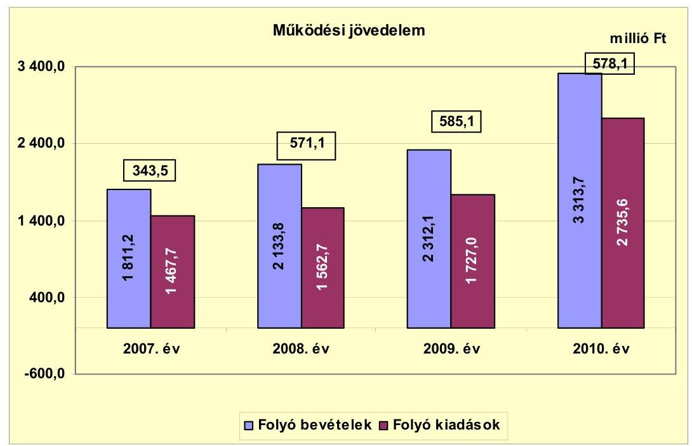

A 2007-2010 közötti időszakban az Önkormányzat folyó költségvetési egyenlege, múködési jövedelme pozitív összegű volt. A működési jövedelem a 2007-2010. években változóan alakult, a 2007. évben 343,5 millió Ft volt, az előző évhez viszonyítva a 2008. és a 2009. évben növekedett, majd a 2010. évben 578,1 millió Ft-ra csökkent. A vizsgált években képződött működési jövedelem forrásul szolgálhatott az Önkormányzat fennálló tőketörlesztési kötelezettségeinek teljesítéséhez, valamint fejlesztéseinek finanszírozásához. A működési jövedelem a 2007. évről a 2008. évre több, mint másfélszeresére 227,6 millió Ft-tal növekedett, az árfolyamnyereség és kamatbevételek 259,2 millió Ft-os növekedése következtében. Az árfolyamnyereség és kamatbevétel a 2007. december 20-án kibocsátott kötvényből származó bevétel devizanemek közötti átváltásából (CHF-ről HUF-ra, CHF-re, EUR-ra, HUF-ra), rövid lejáratú betétként történő folyamatos elhelyezéséből realizálódott.

A pozitív előjelű folyó költségvetési egyenleg ellenére az Önkormányzat a 2007., a 2008. és a 2010. években időszakosan folyószámlahitel felvételére kényszerült (a folyószámlahitel napi átlagos állománya 365 nappal számolva a 2007. évben 4,9 millió Ft, a 2008. évben 1,2 millió Ft, a 2010. évben 0,1 millió Ft volt), egyrészt az átmeneti likviditási problémák kezelése, másrészt fejlesztési kiadásai finanszírozása miatt.

A nettó működési jövedelem 2007-2010. évek közötti alakulását a következő ábra mutatja be:

---

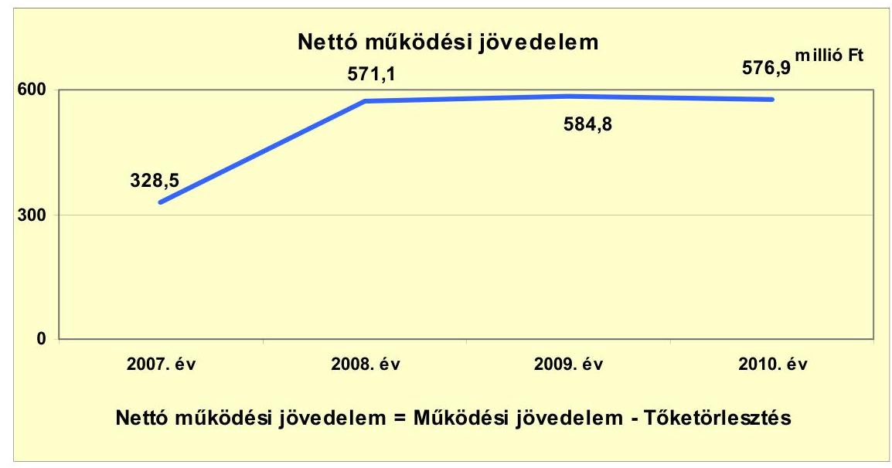

Az Önkormányzat pénzügyi kapacitása a 2007-2010. években pozitív értéket mutatott. A nettó múködési jövedelem értéke a folyó költségvetési pozíció mellett az adott költségvetési év adósságtörlesztésének hatását is tükrözi. A 2007-2010. években képződött 2077,8 millió Ft múködési jövedelemnek 0,7\%-át ( 16,5 millió Ft) tette ki a hiteltörlesztés, amelyből a 2007. évben 15,0 millió Ft a Kistérségfejlesztési társulás hiteltörlesztése volt. A hiteltörlesztés kifizetését követően 2061,3 millió Ft nettó működési jövedelme keletkezett az Önkormányzatnak. Az Önkormányzat a Homokháti emlékház kialakításához igénybe vett hosszúlejáratú hitel 2009. évi $\mathbf{0 , 3}$ millió Ft hiteltörlesztését az Áhsz. 9. számú melléklet számlaosztályok tartalmára vonatkozó előírások 4. c) pontja ellenére számlacsoporton belül a kölcsöntörlesztéstől nem elkülönítetten mutatta ki.

A nettó múködési jövedelem - a 2007., a 2009. és a 2010. évi hiteltörlesztés ${ }^{18}$ mellett - a vizsgált időszakban változóan alakult. A nettó múködési jövedelem 2007-2010 közötti évenkénti változását alapvetően a folyó bevételek és kiadások különbségéből származó múködési jövedelem előző évhez viszonyított 2008. és a 2009. évi javulása, majd a 2010. évi csökkenése okozta. A nettó múködési jövedelem a 2007. évről a 2008. évre 73,8\%-kal, 242,6 millió Ft-tal nőtt amiatt, hogy a folyó bevételek előző évhez viszonyított növekedése 227,6 millió Ft-tal meghaladta a folyó kiadások előző évhez viszonyított növekedését. A 2008. évben az Önkormányzatnak nem volt hiteltörlesztési kötelezettsége, így ebben az években a múködési és a nettó múködési jövedelem összege megegyezett.

[^0]
[^0]:    ${ }^{18}$ Az Önkormányzat hiteltörlesztési kötelezettsége a 2009. évben 0,3 millió Ft, a 2010. évben 1,2 millió Ft volt. Az Önkormányzatnál a 2007. évben jelentkező 15,0 millió Ft a Kistérségi társulás hiteltörlesztési kötelezettsége volt, a 2008. évben az Önkormányzatnak nem volt hiteltörlesztési kötelezettsége.

---

A felhalmozási költségvetés egyenlegének alakulását a 2007-2010. évek közötti időszakban a következő ábra szemlélteti ${ }^{19}$ :
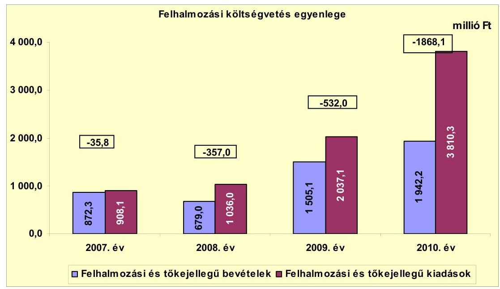

A 2007-2010. években az Önkormányzat felhalmozási költségvetésének egyenlege folyamatosan növekvő negatív összeget mutatott.

A felhalmozási kiadások a 2009. évhez viszonyítva a 2010. évben közel a duplájára nőttek, az áfával növelt EU-s és hazai támogatással megvalósult beruházási kiadások növekedése miatt, ezen belül a beruházási kiadások áfával a 2009. évhez viszonyítva a 2010. évben több, mint kétszeresére növekedtek, a 2009. évi 1511,6 millió Ft-ról a 2010. évre 3378,9 millió Ft-ra. Az intézményi beruházások áfája a 2009. évben 380,7 millió Ft, a 2010. évben 649,4 millió Ft volt.

A felhalmozási forráshiánynak a felhalmozási és tőke jellegű kiadásokhoz viszonyított aránya 2007-ben $-3,9 \%$ ( $-35,8$ millió Ft), 2008-ban $-34,5 \%$ $(-357,0$ millió Ft), 2009-ben $-26,1 \%$ (-532,0 millió Ft), 2010-ben $-49,0 \%$ $(-1868,1$ millió Ft) volt. A 2007-2010. év közötti időszakban jelentkező összes

[^0]
[^0]:    ${ }^{19}$ Az ábrában megjelenő felhalmozási kiadásokban és bevételekben a Vízmúüzemeltetési társulás felhalmozási kiadása a 2007. évben 4,8 millió Ft, a 2008. évben 41,1 millió Ft, a 2009. évben 9,1 millió Ft, a 2010. évben 5,7 millió Ft, a Kistérségfejlesztési társulás felhalmozási kiadása a 2007. évben 0,3 millió Ft, a 2008. évben 0,4 millió Ft, a 2009. évben 0,2 millió Ft, a 2010. évben 315,5 millió Ft, míg a felhalmozási bevétel a Vízmú-üzemeltetési Társulásnál a 2007. évben 5,9 millió Ft, a 2008. évben 39,9 millió Ft, a 2009. évben 18,6 millió Ft, a 2010. évben 2,4 millió Ft, a Kistérségfejlesztési társulásnál a 2009. évben 88,5 millió Ft, a 2010. évben 138,0 millió Ft volt. A Kistérségfejlesztési társulásnak a 2007. és 2008. évben felhalmozási bevétele nem volt. Az Önkormányzat a 2010. évben a társulás részére a közösségi közlekedés fejlesztéséhez 20,2 millió Ft támogatást adott át beruházási önrészként, illetőleg 25,0 millió Ft visszatérítendő támogatást nyújtott a Kistérségfejlesztési társulás részére a közösségi közlekedés fejlesztéséhez. A Kistérségfejlesztési társulás a 25,0 millió Ft visszatérítendő támogatást az Önkormányzatnak visszafizette 2011. szeptember 28-án.

---

felhalmozási forráshiány -2792,9 millió Ft volt. A vizsgált időszakban keletkezett felhalmozási forráshiányra a 2061,3 millió Ft nettó múködési jövedelem, 700,4 millió Ft kötvénykibocsátásból származó bevétel és 31,2 millió Ft hitelfelvétel ${ }^{20}$ nyújtott fedezetet. Az Önkormányzat a Homokháti emlékház kialakításához igénybe vett hosszú lejáratú hitel 2008. évi $\mathbf{0 , 1}$ millió Ft és a 2009. évi 16,3 millió Ft hitellehívását az Áhsz. 9. számú melléklet számlaosztályok tartalmára vonatkozó előírások 4. c) pontja ellenére számlacsoporton belül a kölcsön felvételtől nem elkülönítetten mutatta ki.

A 2007-2010. év közötti időszakban jelentkező összes felhalmozási forráshiány (-2792,9 millió Ft) 73,8\%-ára nyújtott fedezetet a 2061,3 millió Ft nettó múködési jövedelem. A felhalmozási forráshiányra a 2007-2009. években a nettó múködési jövedelem fedezetet nyújtott, így az Önkormányzatnak ezekben az években a CLF módszer szerinti finanszírozási igénye nem jelentkezett. A nettó múködési jövedelem a 2007. évben 292,7 millió Ft-tal, a 2008. évben 214,1 millió Ft-tal, a 2009. évben 52,8 millió Ft-tal haladta meg a keletkezett felhalmozási forráshiány összegét. Az Önkormányzat CLF módszer szerinti teljes finanszírozási igénye ${ }^{21}$ azonban a 2010-ben -1291,2 millió Ft volt. A 2010. évben az 576,9 millió Ft nettó múködési jövedelem az 1868,1 millió Ft felhalmozási forráshiányra 30,9\%-ban nyújtott fedezetet.

Az Önkormányzat finanszírozási múveletei 2007-2010. évekbeli egyenlegét a következő ábra szemlélteti:
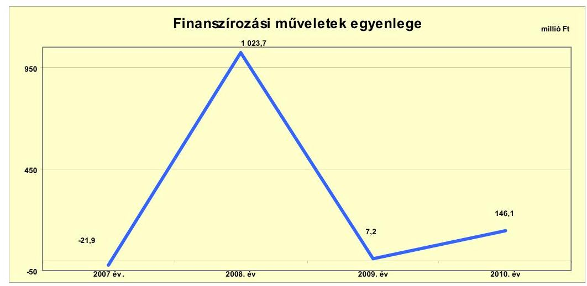

A 2008-2010. évi finanszírozási célú pénzügyi műveletek pozitív értéke azt jelzi, hogy az éves költségvetések végrehajtása során szükség volt az előző években keletkezett pénzmaradvány igénybevételén túl külső finanszírozás igénybevételére is. A 2008. évben beváltották a kötvényből a 2007. évben vásárolt 1013,6 millió Ft összegű értékpapírokat. A függő, átfutó, kiegyenlítő bevételek és kiadások 7,6 millió Ft-os pozitív összegével az Önkormányzat 640,8 millió Ft pénzkészlettel zárta a 2010. évet. A pénzmaradványból 396,1 millió Ft volt kö-

[^0]
[^0]:    ${ }^{20}$ A 2007-2010. években felvett 150,3 millió Ft hitelből, 31,2 millió Ft-ot az Önkormányzat, 119,1 millió Ft-ot Kistérségfejlesztési társulás vett fel.
    ${ }^{21}$ a nettó múködési jövedelem és a felhalmozási költségvetés eredője

---

telezettséggel terhelt és 244,7 millió Ft a szabad pénzmaradvány. A finanszírozási célú múveleteket a vizsgált időszakban a jelentés 2. számú mellékletének 4.1-4.8 pontjai részletezik.

Az Önkormányzat a 2007., a 2008., a 2009. és a 2010. évi zárszámadási rendeleteiben felhalmozási többletet mutatott ki ${ }^{22}$, amelyről a jelentés 1. számú melléklete nyújt tájékoztatást. A 2007-2010. évi zárszámadási rendeletekben évről évre pénzügyi többletet mutattak ki.

Az Önkormányzat zárszámadási rendeleteiben a 2007. évben 426,5 millió Ft, a 2008. évben 1409,5 millió Ft, a 2009. évben 804,2 millió Ft, a 2010. évben 369,7 millió Ft pénzügyi többletet szerepeltettek.

Az Önkormányzat kamatbevételeinek és kamatkiadásainak évenkénti alakulását a következő ábra mutatja:
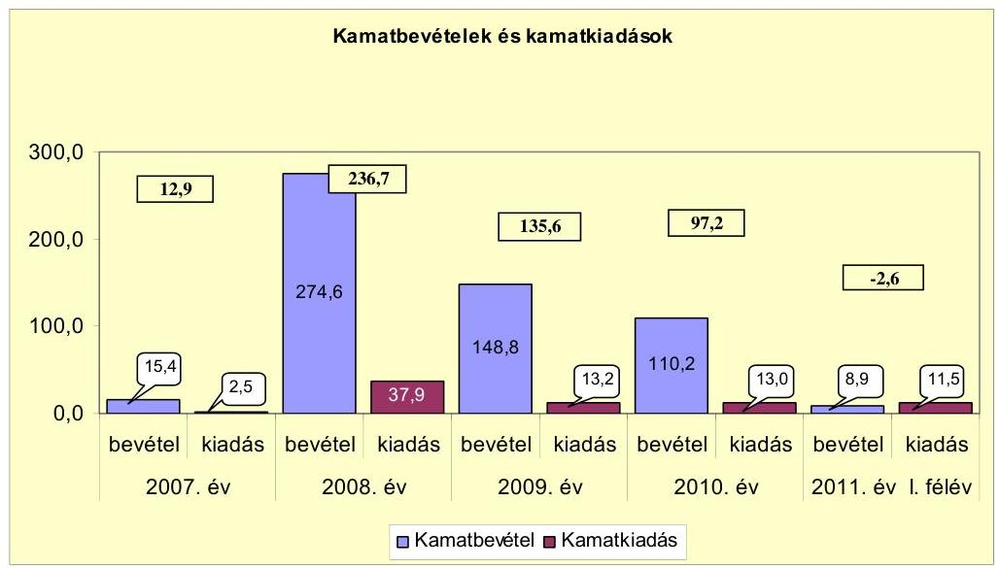

A 2007-2011. év I. félév között az Önkormányzat összesen 78,1 millió Ft kamatot fizetett meg. Az átmenetileg szabad pénzeszközein realizált kamatbevétel 557,9 millió Ft-ot tett ki. A kamatkiadások kifizetése után fennmaradó kamatbevételt a fejlesztések finanszírozásához, a saját erő biztosításához használta fel az Önkormányzat.

# 2.2. Az Önkormányzat bevételeinek változása 

Az Önkormányzat CLF módszer szerint számított folyó és felhalmozási bevételének együttes összege a 2007-2010. évek között folyamatosan nőtt, az előző évhez képest a 2008. évre 2683,5 millió Ft-ról 2812,8 millió Ft-ra, a 2009. évre 3817,2 millió Ft-ra, a 2010. évre 5255,9 millió Ft-ra változott. A folyó bevétel és a felhalmozási bevétel együttes összege a 2011. év I. félévben 1938,7 millió Ft volt.

[^0]
[^0]:    ${ }^{22}$ Nincs kötelező előírás a múködési és fejlesztési hiány megállapításának módjára.

---

Az Önkormányzat 2007-2011. év I. félév között realizált főbb folyó bevételi jogcímeinek számszaki adatait az alábbi grafikon mutatja be:
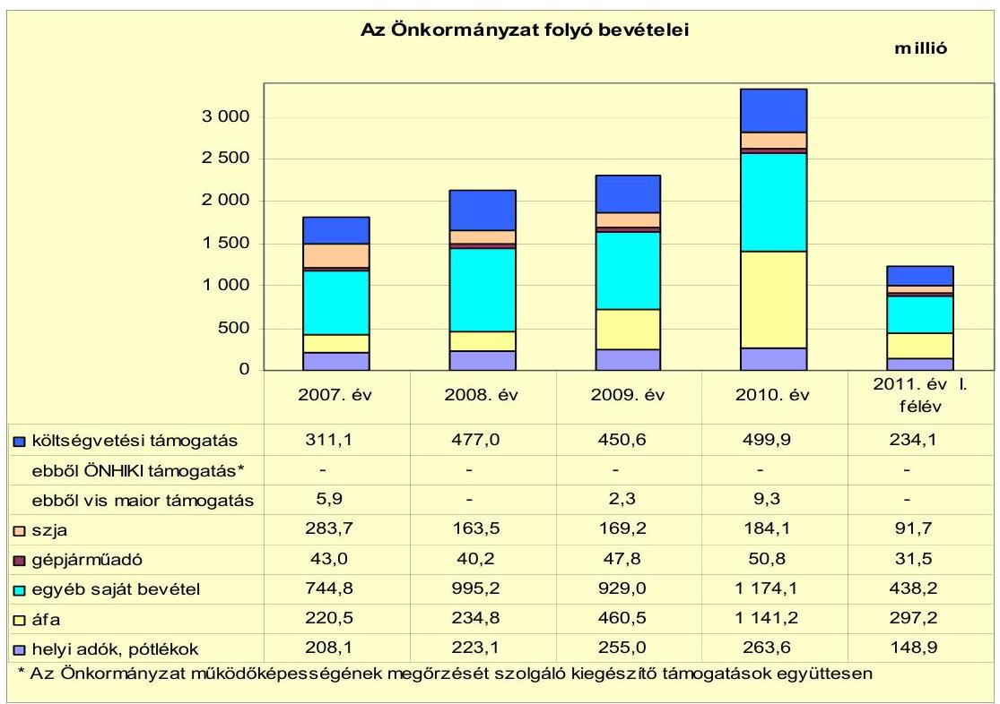

Az összes folyó bevétel a 2007-2009. évi átlag 2085,7 millió Ft-ról a 2010. évre 1228,0 millió Ft-tal 58,8\%-kal 3313,7 millió Ft-ra nőtt. A 2011. év I. félévben az összes folyó bevétel 1241,6 millió Ft volt. A folyó bevételek a 2009. évről 2010re 2312,1 millió Ft-ról 3313,7 millió Ft-ra növekedtek. A növekedést az előző évhez viszonyítva döntő többségében az áfa bevételek és visszatérülések 680,7 millió Ft-os, illetve az egyéb saját bevételek 245,1 millió Ft-os növekedése eredményezte.

Az Önkormányzat költségvetési támogatásai és az átengedett szja bevételei együttesen a 2007-2009. évi átlag 618,4 millió Ft-ról a 2010. évre 65,6 millió Ft-tal 684,0 millió Ft-ra növekedtek. Az Önkormányzat költségvetési támogatása a 2007. évről 2008. évre 311,1 millió Ft-ról 477,0 millió Ft-ra nőtt, ezzel szemben az átengedett szja 283,7 millió Ft-ról 163,5 millió Ft-ra csökkent a központi támogatások és az szja normatív módon elosztott része közötti központi átrendeződése miatt (a szja normatív módon elosztott része a 2008. évtől kivezetésre került).

A gépjármúadóból származó bevétel a 2007-2009. évi átlaghoz viszonyítva (43,7 millió Ft) a 2010. évre 16,2\%-kal (7,1 millió Ft-tal) 50,8 millió Ft-ra emelkedett, egyrészt a 2010. évben történt gépjármúadó mértékének emeléséből, másrészt az ellenőrzési, végrehajtási munka eredményeként. 2011. év I. félévben a gépjármú adó 31,5 millió Ft volt.

---

Az áfa bevételek összege a 2007-2009. évi átlag 305,3 millió Ft-ról a 2010. évre 1141,2 millió Ft-ra, közel négyszeresére nőtt, amely főként a fordított áfa ${ }^{23}$ elszámolásához kapcsolódott. 2011. év I. félévben az áfa bevételekből 297,2 millió Ft keletkezett.

Az egyéb saját bevételek a 2007-2009. évi átlag 889,7 millió Ft-ról 2010. évre 32,0\%-kal (284,4 millió Ft-tal) 1174,1 millió Ft-ra növekedtek. Az egyéb saját bevételek a 2007. évről 2008-ra 33,6\%-kal 250,4 millió Ft-tal növekedett, a ho-zam- és kamatbevételek 259,2 millió Ft-os növekedéséből eredően. Az egyéb saját bevételek a 2010. évben a 2009. évinél 245,1 millió Ft-tal voltak magasabbak, a támogatásértékű működési bevételek 170,3 millió Ft-os és az államháztartáson kívüli múködési célú garancia- és kezességvállalásból származó bevételek 37,2 millió Ft-os növekedése következtében. 2011. év I. félévben az egyéb saját bevételek összege 438,2 millió Ft volt.

Az Önkormányzatnál a helyi adókból és pótlékokból származó bevételek aránya 2007-2010 között 8,0-11,0\% között mozgott a folyó bevételeken belül. A helyi adóbevételek az adómértékek növelése következtében a 2007-2010. években folyamatosan növekedtek, javítva az Önkormányzat pénzügyi helyzetét, a 2007-2009. évi átlag 174,1 millió Ft-ról 2010-re 23,4 millió Ft-tal 197,5 millió Ft-ra. A növekedést döntően az építményadó 2007-2009. évi átlag 9,4 millió Ft-ról a 2010. évre 25,3 millió Ft-ra történő 15,9 millió Ft-os növekedése eredményezte. A helyi adókhoz kapcsolódó pótlékok, bírságok összege a 2007-2009. évi átlag 54,6 millió Ft-ról, a 2010. évre 66,1 millió Ft-ra növekedtek. 2011. év I. félévben a helyi adókból és pótlékokból származó bevételek a folyó múködési bevételekben 12,0\%-os arányt (148,9 millió Ft) képviseltek.

Az Önkormányzatnak a 2007-2011. év I. félév között a helyi iparűzési adóból, építményadóból, telekadóból, idegenforgalmi adóból és kommunális adóból származott bevétele. Az időszak alatt új helyi adónem bevezetéséről nem döntöttek. A telekadó mértéke a 2007-2011. év első félév között három alkalommal változott ${ }^{24}$.

[^0]
[^0]:    ${ }^{23}$ Fordított áfa miatti bevétel a 2007-2009. években nem volt, a 2010. évben 553,7 millió Ft volt.
    ${ }^{24}$ A telekadó mértéke a 2007-2011. év I. féléve között a 4 ezer $\mathrm{m}^{2}$ alatti teljes közművesített telek után $80,0 \mathrm{Ft} / \mathrm{m}^{2}$-ről $110,0 \mathrm{Ft} / \mathrm{m}^{2}$-re, a részleges közművesített teleknél 50,0 $\mathrm{Ft} / \mathrm{m}^{2}$-ről $70,0 \mathrm{Ft} / \mathrm{m}^{2}$-re, a közművesítetlen teleknél $40,0 \mathrm{Ft} / \mathrm{m}^{2}$-ről $60,0 \mathrm{Ft} / \mathrm{m}^{2}$-re nőtt. A 4 ezer $\mathrm{m}^{2}$ és az a feletti teljes közművesített telek után fizetendő adó mértéke 2007-2011. év I. féléve között $100,0 \mathrm{Ft} / \mathrm{m}^{2}$-ről $120,0 \mathrm{Ft} / \mathrm{m}^{2}$-re, a részleges közművesített teleknél 90,0 $\mathrm{Ft} / \mathrm{m}^{2}$-ről $110,0 \mathrm{Ft} / \mathrm{m}^{2}$-re, a közművesítetlen teleknél $40,0 \mathrm{Ft} / \mathrm{m}^{2}$-ről $60,0 \mathrm{Ft} / \mathrm{m}^{2}$-re növekedett. A Homokhát Térségi Agrár-Ipari Park területén lévő teljes közművesített, 4 ezer $\mathrm{m}^{2}$ feletti telek után az adó mértéke 2007. és 2011. I. félév között 200,0 Ft/m²-ről 220,0 $\mathrm{Ft} / \mathrm{m}^{2}$-re emelkedett. 2011. január 1-jétől a 10 ezer $\mathrm{m}^{2}$ alatti telek területe után 80,0 $\mathrm{Ft} / \mathrm{m}^{2}$, kivéve a nem Homokhát Térségi Agrár-Ipari Parki teleknek minősülő területén lévő telkek után, ahol az adó mértékét teljes közművesített telkeknél, ahol az adó mértéke $280,0 \mathrm{Ft} / \mathrm{m}^{2}$ A 10 ezer $\mathrm{m}^{2}$ és az a feletti telek után $280,0 \mathrm{Ft} / \mathrm{m}^{2}$ adót vetettek ki, kivéve a Homokhát Térségi Agrár-Ipari Park területén lévő telkek után, ahol az adó mértéke $80 \mathrm{Ft} / \mathrm{m}^{2}$.

---

A kommunális adó mértékét belterületi lakásonként, illetve lakásbérleti jogonként a 2007. évi 4,5 ezer Ft-ról a 2009. évtől 5,5 ezer Ft-ra, külterületi lakásonként, lakásbérleti jogonként a 2007. évi 7,0 ezer Ft-ról a 2008. évtől 8,0 ezer Ftra emelték.

A helyi iparűzési adó mértéke a 2007-2011. év I. félév között nem változott, 2,0\% volt. Az idegenforgalmi adó mértékét a 2007. évi $300 \mathrm{Ft} /$ fő/vendégéjszakáról a 2008. évben $350 \mathrm{Ft} /$ fő/vendégéjszaka, majd a 2011. évtől $400 \mathrm{Ft} /$ fő/vendégéjszaka mértékre emelték. Az építményadó mértékét a Szegedi, az István király, Röszkei, Zákányszéki úton, valamint a Milleneumi sétányon fekvő épületeknél a 2007. évi $300,0 \mathrm{Ft} / \mathrm{m}^{2} /$ évről a 2008. évtől $350,0 \mathrm{Ft} / \mathrm{m}^{2} /$ év, a 2009. évtől $400,0 \mathrm{Ft} / \mathrm{m}^{2} /$ év, egyéb helyen fekvő építményeknél a 2007. évi 250,0 $\mathrm{Ft} / \mathrm{m}^{2} /$ év mértékről a 2008. évtől $300,0 \mathrm{Ft} / \mathrm{m}^{2} /$ év, majd a 2009. évtől 350,0 $\mathrm{Ft} / \mathrm{m}^{2} /$ év mértékre emelték. 2011. január 1-jétől az építményadó mértékét az épületnek minősülő építményeknél egységesen az építmény fekvésétől függetlenül $400,0 \mathrm{Ft} / \mathrm{m}^{2}$, az épületnek nem minősülő építmények esetében 200 és $1000 \mathrm{~m}^{2}$ területig $100,0 \mathrm{Ft} / \mathrm{m}^{2}, 1000 \mathrm{~m}^{2}$ terület után pedig $250,0 \mathrm{Ft} / \mathrm{m}^{2}$ mértékben határozták meg

Az Önkormányzat 2007-2011. év I. félév között egy gazdasági társaságtól és egy pénzügyi vállalkozástól összesen 0,1 millió Ft osztalékot kapott. A 2009. évben 0,8 millió Ft magyar államkötvények utáni kamatbevételt az Önkormányzat az Áhsz. 9. számú melléklet 14.a) pontja előírása ellenére tévesen osztalékbevételként mutatták ki.

Az Önkormányzat felhalmozási bevételei a vizsgált időszakban a következők voltak:

| Megnevezés | 2007. év | 2008. év | 2009. év | 2010. év | 2011. év I.   félév |
| :-- | --: | --: | --: | --: | --: |
| Tárgyi eszköz értékesítés | 45,0 | 41,0 | 24,6 | 31,1 | 183,2 |
| Egyéb saját tőkebevétel | 144,3 | 292,1 | 505,0 | 556,5 | 14,1 |
| Államháztartáson belülről   kapott támogatás | 680,1 | 319,8 | 942,0 | 1321,8 | 460,9 |
| EU-ről és külföldről kapott   támogatások | 0,0 | 0,0 | 7,4 | 27,9 | 0,0 |
| Államháztartáson kívülről   kapott támogatás | 2,9 | 26,1 | 26,1 | 4,8 | 38,9 |
| Összes felhalmozási bevétel | 872,3 | 679,0 | 1505,1 | 1942,1 | 697,1 |

A felhalmozási bevételek a 2007-2009. évi átlag 1018,8 millió Ft-ról a 2010. évre 923,3 millió Ft-tal 1942,1 millió Ft-ra nőttek a saját tőke bevételek és az államháztartáson belülről kapott támogatások növekedése miatt. Az egyéb saját tőke bevételek az előző évhez viszonyítva a 2008. évre több, mint duplájára 147,8 millió Ft-tal növekedtek. A növekedést a Mórahalom belterületének növelésével megvalósult új városrészek, lakóövezetek létesítése kapcsán kialakított 150 darab telek, illetve az ipari parki területek értékesítéséből adódó 67,8 millió Ft-os, a támogatási kölcsönök visszatérüléséből adódó 77,3 millió Ft-os bevétel növekedése eredményezett. Az egyéb saját tőkebevételek a 2008. évről a 2009.

---

évre 212,9 millió Ft-tal növekedtek, amit az előző évhez viszonyítva a 2009. évben a támogatási kölcsönök visszatérüléséből adódó 133,1 millió Ft-os, illetve a tartós részesedések a Centrum Kft. és a Mórakert Kft. üzletrészek 200,0 millió Ft értékesítéséből adódó bevétel növekedés eredményezett. Az államháztartáson belülről kapott támogatások a 2008. évről a 2009. évi 694,0 millió Ft-tal, majd a 2010. évre további 392,6 millió Ft-tal nőttek, a hazai és az európai uniós támogatással megvalósuló fejlesztések finanszírozására kapott támogatásértékű felhalmozási célú bevételek növekedése miatt.

# 2.3. Az Önkormányzat múködési és felhalmozási célú kiadásainak változása 

Az Önkormányzat folyó kiadásai főbb jogcímek szerinti bontásban a 2007-2011. június 30. közötti időszakban a következők voltak:

| Megnevezés | 2007. év | 2008. év | 2009. év | 2010. év | $\begin{gathered} \text { millió Ft } \\ 2011 . \text { év I. } \\ \text { félév } \end{gathered}$ |
| :--: | :--: | :--: | :--: | :--: | :--: |
| Folyó kiadások | 1467,7 | 1562,7 | 1727,0 | 2735,6 | 1207,8 |
| Müködési kiadások (kamatkiadás nélkül) | 1339,4 | 1381,1 | 1552,2 | 2314,2 | 1078,1 |
| Âllamháztartáson belülre átadott pénzeszközök | 39,2 | 37,0 | 38,1 | 202,7 | 39,8 |
| Transzferkiadások | 86,6 | 100,2 | 123,1 | 205,4 | 42,7 |
| -ebből: vállalkozásoknak | 0,0 | 0,0 | 10,0 | 89,0 | 1,8 |
| EU-nak, illetve külföldre | 0,0 | 0,0 | 0,0 | 0,0 | 0,0 |
| magánszemélyeknek | 37,1 | 40,6 | 43,4 | 59,3 | 22,8 |
| nonprofit szervezeteknek | 49,5 | 59,6 | 69,6 | 57,1 | 18,1 |
| Kamatkiadások | 2,5 | 37,9 | 13,2 | 13,0 | 11,5 |
| Előző évi pénzmaradvány átadás | 0,0 | 6,6 | 0,4 | 0,4 | 35,7 |

A folyó kiadások a 2007-2009. évi átlag 1585,8 millió Ft-ról a 2010. évre 2735,6 millió Ft-ra nőttek. Az államháztartáson belülre átadott pénzeszközök a 2007-2009. évi átlag 38,1 millió Ft-ról 2010. évre 202,7 millió Ft-ra történő növekedését a Kistérségfejlesztési társulás 2009. évi pénzmaradványának 96,6 millió Ft-os átadása okozta. A transzferkiadások a 2007-2009. évi átlag 103,3 millió Ft-ról a 2010. évre 205,4 millió Ft-ra növekedtek, a 102,1 millió Ftos növekedést, döntően a garancia- és kezességvállalásból származó kifizetések 2009. évi 10,0 millió Ft-ról 2010-re 79,0 millió Ft-os növekedése eredményezte.

Az Önkormányzat folyó kiadásai főbb kiadás nemek szerinti bontásban a 2007-2011. június 30. közötti időszakban a következők voltak:

|  |  |  |  |  |  |
| :-- | --: | --: | --: | --: | --: |
| Megnevezés | 2007. év | 2008. év | 2009. év | 2010. év | 2011. év I.   félév |
| Személyi juttatások | 486,5 | 526,3 | 541,6 | 550,3 | 270,6 |
| Munkaadót terhelő járulékok | 151,5 | 163,5 | 156,0 | 138,9 | 68,7 |
| Dologi kiadások | 675,7 | 641,8 | 737,8 | 1565,6 | 704,7 |
| Egyéb folyó kiadások | 25,6 | 49,6 | 67,1 | 44,5 | 28,3 |

A folyó kiadásokon belül a személyi juttatások és járulékok aránya - a más szervnek átadott feladatok és álláshely csökkentések miatt - a vizsgált időszakban a 2007-2009. évi átlag 1585,8 millió Ft folyókiadásokon belül a 2007-2009. évi átlag $42,6 \%$-ról ( 675,1 millió Ft) a 2010. évre $25,2 \%$-ra ( 689,2 millió Ft)

---

csökkent, 2011. év I. félévben 28,1\% (339,3 millió Ft) volt. A személyi juttatások a 2007. évről a 2008. évre 39,8 millió Ft-os növekedését a rendszeres személyi juttatások 33,7 millió Ft-os és az étkezési hozzájárulás kifizetés 4,6 millió Ft-os növekedése okozta. 2011. év I. félévben a személyi juttatások éves szintre vetítve a 2010. évi személyi juttatások összegéhez viszonyítva csökkentek, 2011. év I. félévben 270,6 millió Ft-ot tettek ki. A munkaadót terhelő járulékok összege a 2007-2010. években változóan alakult, az előző évhez viszonyítva a 2008. évben 7,9\%-kal (12,0 millió Ft) nőtt, majd a 2009. évtől folyamatosan csökkent, a 2010. évre 138,9 millió Ft-ra, a társadalombiztosítási és a munkaadói járulék csökkenése miatt. A munkaadót terhelő járulékok éves szintre vetítve a 2011. év I. félévben a 2010. évi személyi juttatások összegéhez viszonyítva csökkentek, 68,7 millió Ft-ot tettek ki.

Az Önkormányzat dologi kiadásai a 2007-2009. évi átlag 685,1 millió Ft-ról 2010. évre 880,5 millió Ft-tal 1565,6 millió Ft-ra nőttek, amelyet az áfa befizetés 715,9 millió Ft-os (ezen belül a fordított áfa miatti befizetés 645,6 millió Ft volt), a készletbeszerzések 79,9 millió Ft-os, a szolgáltatási kiadások 79,1 millió Ft-os, a vásárolt közszolgáltatások 23,2 millió Ft-os, a kiküldetés, reklám és propaganda kiadások 4,1 millió Ft-os, a kommunikációs szolgáltatási kiadások 0,4 millió Ft-os, a szellemi tevékenység végzésére történő kifizetések 5,0 millió Ft-os növekedése eredményezett.

Az egyéb folyó kiadásokra teljesített kifizetés a 2007-2010. évek között változóan alakult, az adók, díjak, befizetések változása miatt.

A folyó és felhalmozási kiadásokat a 2007-2011. év I. félév között a következő ábra szemlélteti:
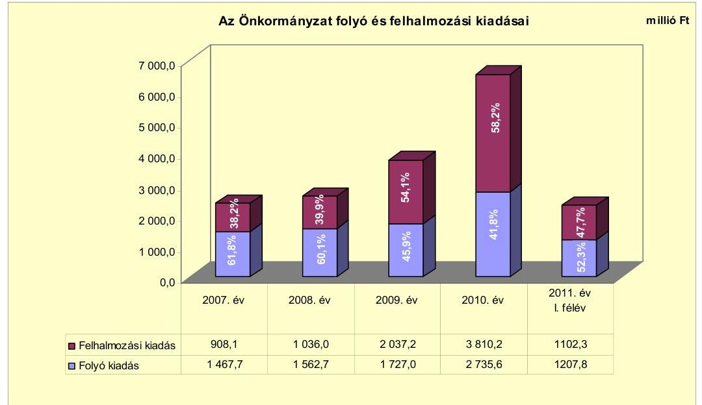

A felhalmozási kiadások összes kiadásokon belüli aránya az előző évhez viszonyítva a 2008., a 2009. és a 2010. években folyamatosan nőtt. A felhalmozási kiadások a 2007-2009. évi átlag 1327,1 millió Ft-ról a 2010. évre 2483,2 millió Ft-tal 3810,3 millió Ft-ra nőttek, a beruházási és felújítási kiadások áfával a

---

2007-2009. évi átlag 962,8 millió Ft-ról a 2010. évre történő 3584,5 millió Ft-ra történő növekedése miatt.

A folyó és felhalmozási kiadásokat beruházási társulások nélkül a 2007-2011. év I. félév között a következő ábra szemlélteti:
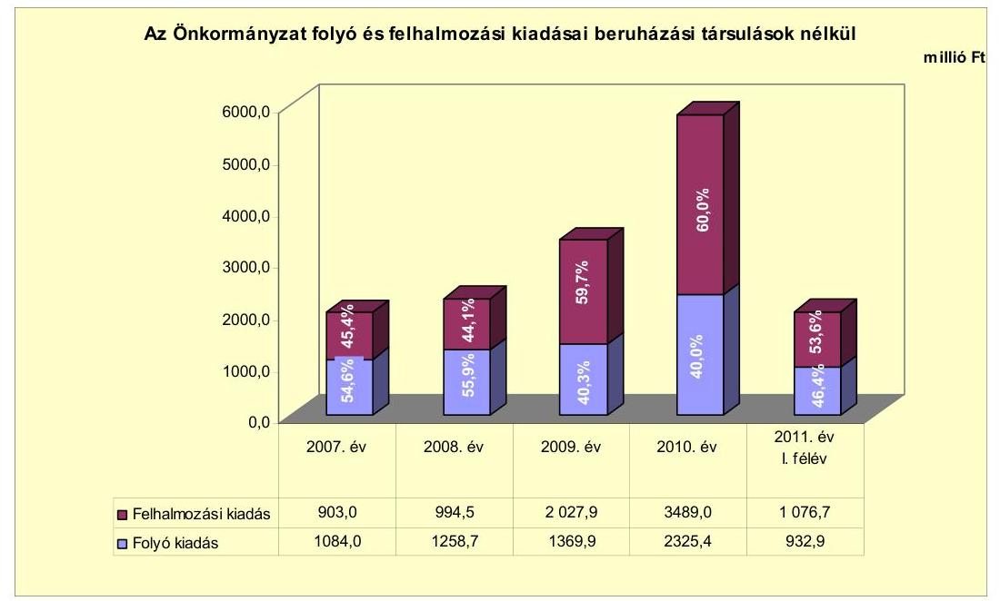

A beruházási társulások nélküli felhalmozási kiadások összes kiadásokon belüli aránya az előző évhez viszonyítva a 2008., a 2009. és a 2010. években folyamatosan nőtt. A felhalmozási kiadások a 2007-2009. évi átlag 1308,5 millió Ftról a 2010. évre 2180,5 millió Ft-tal 3489,0 millió Ft-ra nőttek, a beruházási és felújítási kiadások növekedése miatt.

Az Önkormányzat 2007-2010. évek között áfával 4145,0 millió Ft tényleges bekerülési költségű műszakilag befejezett felújítást és beruházást valósított meg. A felújítások, fejlesztések teljes bekerülési kiadásából 412,4 millió Ft volt a 2006. december 31-ig teljesített kifizetés. A beruházások fenntartásának kiadásait az éves költségvetési rendeletekben nem számszerúsítették.

A műszakilag befejezett felújítások száma 24 darab volt, amelyek tervezett teljes bekerülési költsége áfával 333,8 millió Ft-ot, teljesített bekerülési költsége pedig 330,0 millió Ft-ot tett ki. A befejezett felújítások tényleges forrásmegoszlása 147,1 millió Ft saját bevétel (44,6\%), 25,1 millió Ft EU-s (7,6\%) és 157,8 millió Ft hazai támogatás ( $47,8 \%$ ) volt. A befejezett 89 darab fejlesztés tervezett teljes bekerülési költsége 3876,6 millió Ft, teljesített bekerülési költsége pedig 3815,0 millió Ft volt. A befejezett fejlesztéseket 31,2 millió Ft hitellel ( $0,8 \%$ ), 512,0 millió Ft kötvényből származó bevétellel (13,5\%), 1325,0 millió Ft EU-s támogatással (34,7\%), 435,7 millió Ft hazai támogatással (11,4\%) és 1511,1 millió Ft saját bevétellel (39,6\%) valósították meg. A részletes adatokat a jelentés 3/a. számú melléklete tartalmazza. Az EU-s támogatásból megvalósult fejlesztések utófinanszírozása a 2007-2010. években likviditási gondot okozott, melynek áthidalására folyószámlahitelt vettek igénybe.

---

A három legnagyobb bekerülési költségű befejezett beruházás adatai a következők:

- a legmagasabb tényleges bekerülési költségű mórahalmi geotermikus kaszkádrendszer megvalósítását (termelő és visszasajtoló kútpár és összekötő vezetékpár, hőközponti kialakítások, vezérlőrendszer építését) a 2008. évben kezdték. A fejlesztést EU-s támogatásból és kötvényből származó bevételből tervezték megvalósítani 543,7 millió Ft bekerülési költséggel. A beruházás a 2010. évben befejeződött, a tényleges kifizetés 542,0 millió Ft volt, amelynek forrását 182,2 millió Ft (33,6\%) EU-s támogatás, 271,8 millió Ft (50,1\%) kötvényből származó és 88,0 millió Ft (16,3\%) saját bevételből biztosították;
- Az „Ipari parki szolgáltatásfejlesztés Mórahalmon" című projekt (aszfaltozott út építése a Guci sor teljes hosszában, az Akácos út és folytatása, a Röszkei út mentén, ivó- és tűzoltó vezeték, valamint szennyvízelvezető csatorna építése, szennyvízátemelő műtárgy létesítése a Guci soron) megvalósítását a 2009. évben kezdték. A projekt tervezett bekerülési költsége 484,3 millió Ft volt, melyet 239,7 millió Ft EU-s támogatással, 240,2 millió Ft kötvényből származó és 4,4 millió Ft saját bevételből terveztek finanszírozni. A beruházás a 2010. évben befejeződött, a tényleges kifizetés 486,6 millió Ft volt, amelynek forrását 109,0 millió Ft (22,4\%) EU-s támogatásból, 240,2 millió Ft (49,4\%) kötvényből származó és 137,4 millió Ft (28,2\%) saját bevételből biztosították;
- A Mórahalom-Domaszék közötti kerékpárút építését 2008-ban kezdték. A projektet 257,9 millió Ft teljes bekerülési költséggel tervezeték megvalósítani. A beruházás a 2009. évben befejeződött, a tényleges kifizetés 266,3 millió Ft volt, amelynek forrását 245,0 millió Ft (92,0\%) EU-s támogatásból és 21,3 millió Ft $(8,0 \%)$ saját bevételből biztosították;

Az Önkormányzat 2010. december 31-én folyamatban lévő 43 fejlesztési feladatának tervezett teljes bekerülési költsége áfával 3787,0 millió Ft volt, melyet 635,8 millió Ft saját bevétellel ( $16,8 \%$ ), 440,0 millió Ft kötvényből származó bevétellel ( $11,6 \%$ ), 2480,7 millió Ft EU-s támogatással ( $65,5 \%$ ), 230,5 millió Ft hazai támogatással ( $6,1 \%$ ), terveztek megvalósítani. 2010. december 31én az Önkormányzatnál egy darab felújítás volt folyamatban. A 3,5 millió Ft tervezett bekerülési költségú felújításra a 2007-2010. évek közötti időszakban 2,9 millió Ft kiadást teljesítettek, amelyet saját bevételből finanszíroztak. A 2010. december 31-én folyamatban lévő 42 darab fejlesztésre 2006. december 31-ig 1,7 millió Ft, a 2007-2010. években 2081,7 millió Ft kiadást teljesítettek. A teljesített kiadások forrása 1091,4 millió Ft EU-s (52,4\%), 22,2 millió Ft hazai (1,1\%) támogatás, 334,0 millió Ft kötvényből származó (16,0\%) és 635,8 millió Ft saját bevétel ( $30,5 \%$ ) volt. A részletes adatokat a jelentés 3/b. számú melléklete tartalmazza.

Az Önkormányzat 2010. december 31-én folyamatban lévő fejlesztési feladatok 2010. évet követő kötelezettségvállalásainak összege 1703,7 millió Ft volt, amelyből 105,9 millió Ft-ot kötvényből származó bevételből, 1389,5 millió Ft-ot EU-s támogatásból és 208,3 millió Ft-ot hazai támogatásból terveznek biztosítani. Hitelfelvétellel a fejlesztések megvalósításához nem számoltak. A folyamatban lévő fejlesztéseknél a 2010. évet követő kötelezettségvállalások fedezete a kötvényből származó bevételnél rendelkezésre áll, az EU-s és hazai támogatásoknál a bevétel lehívása megtörtént, de a forrás

---

még nem áll rendelkezésre, így a fejlesztések finanszírozása a pénzügyi kockázatot nem növeli. A részletes adatokat a jelentés 3/c. számú melléklete tartalmazza.

Az Önkormányzat által a 2011. évben indított saját erőből megvalósuló beruházások kötelezettségvállalása a 2011. évre 76,8 millió Ft, a 2012. évre 9,3 millió Ft, a 2013. évre 9,2 millió Ft.

Az Önkormányzatnál beadott, elbírálás alatt álló pályázati forrásból megvalósuló tervezett négy fejlesztéshez teljes tervezett bekerülési költsége 2668,0 millió Ft volt. A fejlesztésekre 2010. december 31-éig 11,6 millió Ft kiadást teljesítettek. A 2010. év utánra vállalt 2668,0 millió Ft kiadást az Önkormányzat 519,4 millió Ft saját bevételből, 2076,6 millió Ft EU-s és 72,0 millió Ft hazai támogatással tervezte megvalósítani. A részletes adatokat a jelentés 3/d. számú melléklete tartalmazza.

A gazdasági társaságok a működésükhöz az Önkormányzattól az ellenőrzött időszakban 194,1 millió Ft működési pénzeszközátadásban részesültek. Rendszeres múködési pénzeszközátadást az Önkormányzattól egy gazdasági társaság, a Móra-Partner Kft. kapott, a 2007-2011. év I. félév közötti időszakban öszszesen 120,2 millió Ft összegben. Eseti múködési pénzeszközátadásban a 20072011. év I. félév között három gazdasági társaság részesült, összesen 73,9 millió Ft értékben. A pénzeszközátadások támogatási szerződés alapján történtek. A támogatási szerződésekben az Önkormányzat előírta, hogy az átadott pénzeszközt a gazdasági társaság az éves üzleti tervében foglalt múködési kiadásai fedezetére fordítja, a felhasznált összeg elszámolása az éves közhasznúsági jelentésben történik, melyben tételesen kimutatják az átadott önkormányzati forrás felhasználását. Annak ellenére, hogy a támogatási szerződésekben előírták az önkormányzati pénzeszközátadás felhasználásának tételes kimutatását, azt a közhasznúsági jelentések nem tartalmazták.

# 3. Az ÖNKORMÁNYZAT KÖTELEZETTSÉGEI 

### 3.1. Az Önkormányzat pénzintézeti kötelezettségeinek változása

Az Önkormányzat pénzintézetekkel szembeni kötelezettség állománya 2006. december 31-én 15,0 millió Ft volt, amely a Kistérségfejlesztési társulás rövid lejáratú, fejlesztési célú hiteléből adódott. Az Önkormányzat rövid és hosszú lejáratú hitelfelvételei, hiteltörlesztései, a kötvénykibocsátás, valamint az elszámolt árfolyam különbözet miatti állományváltozások következtében a pénzintézeti kötelezettségállománya 2011. év I. félév végére 1745,9 millió Ft-ot tett ki.

Az Önkormányzat a devizában fennálló kötelezettségek Számv. tv. szerinti értékelését a vizsgált években elvégezte, azonban a 2008. és a 2009. évben a számviteli politika szerinti értékhatárt meghaladó értékelési különbözetet a könyveiben nem mutatta ki. A 2007. és a 2010. évben az értékelésből eredő állománynövekedést az Önkormányzat a számviteli nyilvántartásokban elszámolta.

---

Az Önkormányzat pénzintézeteknél fennálló kötelezettség állományát a 2006-2011. években a következő diagram szemlélteti ${ }^{25}$ :
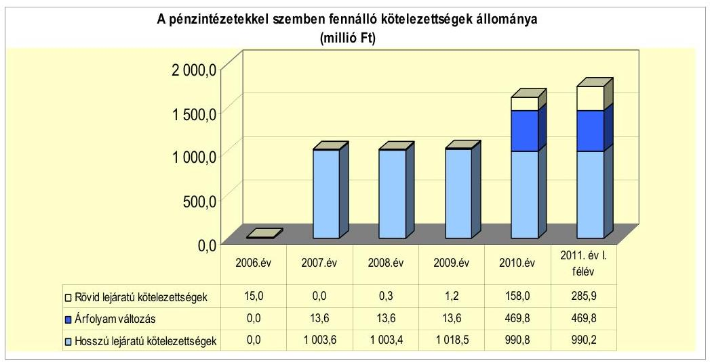

A pénzintézeti kötelezettségek állományának 2006-2011. év I. féléve közötti 1730,9 millió Ft összegű növekedése

- a 2006. évben fennálló 15,0 millió Ft összegű rövid lejáratú hitel törlesztése miatti állománycsökkenés,
- a 2007. évben történt kötvénykibocsátás miatti 1000,0 millió Ft állománynövekedés,
- a 2006. és a 2010. évben megkötött hitelszerződésből a 2007-2010. években történt, összesen 31,2 millió Ft összegű hosszú lejáratú hitelfelvétel miatti állománynövekedés,
- a 2008-2010. években történt, összesen 2,0 millió Ft összegű hosszú lejáratú hiteltörlesztés miatti állománycsökkenés,
- a devizában fennálló kötvénykötelezettség év végi értékelésekor elszámolt 469,8 millió Ft árfolyam különbözet miatti állománynövekedés,
- az Önkormányzat által igénybe vett folyószámlahitel miatti 142,0 millió Ftos és a Kistérségfejlesztési társulás által igénybe vett rövid lejáratú hitel miatti 104,9 millió Ft-os állománynövekedés
egyenlegeként adódott. A hosszú lejáratú kötelezettségek összege a 2009. évről a 2010. évre 27,7 millió Ft-tal csökkent. A csökkenést a kötvénykötelezettség következő évi törlesztő részletének átsorolása miatti 37,8 millió Ft összegű állománycsökkenés és a 11,2 millió Ft összegű hosszú lejáratú hitel felvétele miatti állománynövekedés együttes hatása okozta.

[^0]
[^0]:    ${ }^{25}$ Az adatok tartalmazzák a helytelenül kölcsönként könyvelt, de pénzintézeti hitelfelvételből származó kötelezettségeket is, amelyek a 2007. évben 3,6 millió Ft-ot, a 2008. évben 3,7 millió Ft-ot tettek ki.

---

Az Önkormányzat a pénzintézeti kötelezettségeket a felhalmozási forráshiány fedezetének megteremtése és a tervezett fejlesztési feladatainak megvalósítása érdekében vállalta. A Képviselő-testület a 2007. évben a fejlesztések megvalósításához igényelt EU-s források saját erejének biztosítása céljából kötvénykibocsátásról döntött. A kötvényből származó, átmenetileg szabad pénzeszközök befektetésével további forráshoz jutott az Önkormányzat, amelyet ugyancsak fejlesztési feladatok megvalósításának finanszírozására fordított. A vizsgált időszakban a beruházások fedezetének megteremtése érdekében két hosszú lejáratú hitelszerződést is kötött az Önkormányzat. A 2007-2010. évek költségvetési rendeleteiben a költségvetési bevételek és költségvetési kiadások különbözetét az Önkormányzat az előző évi pénzmaradvány igénybevételével, valamint a 2008. évben felhalmozási célú hitel felvételével tervezte finanszírozni.

Az Önkormányzat pénzintézeti kötelezettségvállalásaira minden esetben a Képviselő-testület döntése alapján került sor. Az Ötv. 88. § (2) bekezdése szerinti előírásoknak történő megfelelésről az Önkormányzat minden kötelezettségvállalás előtt a pénzintézet számára nyilatkozatot adott, amelyek alapján a hitelfelvételi korlátot egyik esetben sem lépte túl.

Az Önkormányzat 2007. december 20-án bocsátott ki 6614194 CHF (1000,0 millió Ft) összegű kötvényt 23 éves futamidővel, 4 év türelmi idő mellett, a lejárat napja 2030. december 31. A kötvénykibocsátás előtt az Önkormányzat öt banktól kért be árajánlatot, amelyek közül három nyújtotta be ajánlatát. A beérkezett ajánlatok alapján a Képviselő-testület az összességében legkedvezőbb ajánlatot tevő OTP Bank Nyrt-t bízta meg a kötvény zártkörű forgalomba hozatalával.

A kötvény kibocsátásáról szóló képviselő-testületi előterjesztésben bemutatásra kerültek a lehetséges kibocsátási kondíciók számszerúen, valamint szöveges formában a kamat- és árfolyamkockázatok. A várható fizetési kötelezettséget és annak fedezetét az előterjesztés nem számszerúsítette, azonban a testület döntött a kötvénnyel kapcsolatos éves fizetési kötelezettség mindenkori költségvetési rendeletbe történő beépítéséről, a kötelezettség teljesítése érdekében céltartalék képzéséről, amely a vizsgált időszak költségvetési rendeleteiben meg is történt. A kötvény helyzetéről egy alkalommal, 2008-ban készült előterjesztés a Képviselő-testület részére, amelyben részletesen bemutatták a kötvénykibocsátás óta eltelt időszakban történt pénzpiaci folyamatokat, az elért árfolyam- és kamatnyereséget, illetve a fizetett kamat összegét. Ezen kívül a lejárt határidejú határozatokra adott jelentések keretében röviden írásban, és - az Önkormányzat tájékoztatása szerint - többször szóban számoltak be a Képviselő-testületnek a kötvény helyzetéről. A kamat- és árfolyamváltozások várható hatásáról, a tervezett tőke- és kamatfizetések összegéről a futamidő végéig féléves bontásban, többféle verzióban a 2008. évben kimutatás készült, amely a várospolitikai fórumon is bemutatásra került, illetve a hivatali munkához nyújtott segítséget.

Az Önkormányzat a vizsgált időszakban két hosszú lejáratú hitelszerződést kötött. 2006. december 19-én a Homokháti Emlékház kialakítására 20,0 millió Ft összegű, 2010. április 9-én önkormányzati bérlakás vásárlása cél-

---

jából 100,0 millió Ft keretösszegű hitelszerződés ${ }^{26}$ jött létre. Az első esetben az Önkormányzat négy banktól kért árajánlatot, amelyek alapján az OTP Bank Nyrt. került kiválasztásra. A második esetben árajánlatok bekérése nélkül az OTP Bank Nyrt.-vel kötött szerződést az Önkormányzat ${ }^{27}$.

A hitelfelvételeket megelőző képviselő-testületi előterjesztésekben bemutatásra kerültek a lehetséges hitelfelvételi kondíciók, azonban a kamatkockázatra és a futamidő alatt várható fizetési kötelezettségekre nem tértek ki az előterjesztések.

A kötvénykibocsátás lebonyolítását, valamint a két fejlesztési célú, hosszú lejáratú hitel folyósítását az OTP Bank Nyrt. végezte, amely az Önkormányzat számlavezető bankja is volt a vizsgált időszakban.

A vizsgált időszakban a folyószámlahitel esetében a kamatkockázatokat a Képviselő-testület számára nem mutatták be.

A vizsgált években a felhalmozási költségvetésben folyamatosan hiány mutatkozott (2792,9 millió Ft), amelynek finanszírozásához az Önkormányzat 1000,0 millió Ft kötvénykibocsátásból, valamint 31,2 millió Ft hosszú lejáratú, fejlesztési célú hitelből származó forrást is felhasznált.

Az Önkormányzat 2011. június 30-án CHF-ben fennálló, hosszú lejáratú adósságot keletkeztető kötelezettségvállalását a következő táblázat mutatja be ${ }^{28}$ :

| Megnevezés | Szerződéskötési   kibocsátás | Összeg   ezer CHF-ben | Kibocsátásilohivási   árfolyam | Kamat (referencia   kamat+ kamatfelár) | Felhasználás célja: |
| :-- | :--: | :--: | :--: | :--: | :--: |
| Mórahalom 2030 Kötvény | 2007.12 .20 | 6614,2 | 151,19 | 3 havi CHF   LIBOR $+0,55 \%$ | União pályázati források   igénybevételehez szük-   seges saját erő biztosítása |

A kötvénykibocsátásból származó 1000,0 millió Ft bevételt 2011. június 30-ig teljes egészében felhasználta az Önkormányzat. A felhasznált összegből tagi kölcsönként nyújtott 48,0 millió Ft várhatóan 2016-ig visszatérül.

A kötvényforrás terhére pályázati források önerejét biztosította az Önkormányzat, a Mórahalmi geotermikus kaszkád rendszer megvalósításához 2008-2010. években 271,8 millió Ft-ot, az Ipari Park szolgáltatásfejlesztésére 2009. és 2010. évben 240,2 millió Ft-ot, a mórahalmi gyógyfürdő fejlesztésére 2009. és 2010. évben 334,1 millió Ft-ot, 2011. év I. félévében 105,9 millió Ft-ot fordítottak, valamint a 2009. évben 48,0 millió Ft összegben a Móraép Kft.-nek nyújtott kölcsönt az Önkormányzat, amelyből a Kft. a tagi kölcsön 2016. évi lejárati ideje miatt még az ellenőrzött időszakban nem törlesztett. A kölcsönnyújtás felhalmozási célra történt a „Vállalkozói inkubátor létrehozása Mórahalmon" című pályázat megva-

[^0]
[^0]:    ${ }^{26}$ A 20,0 millió Ft összegű hitelt az Önkormányzat teljes egészében lehívta, a 100,0 millió Ft összegű hitelkeretből 11,2 millió Ft-ot vett igénybe.
    ${ }^{27}$ A jegyző nyilatkozata szerint azért nem történt több banktól ajánlatkérés, mert a hitellel kapcsolatban az Önkormányzat rendelkezésére állt az MFB terméktájékoztatója, amellyel a számlavezető pénzintézet által megadott kondíciók megegyeztek.
    ${ }^{28}$ A dematerializált kötvényeket az OTP Bank Nyrt. tartja nyilván a kötvénytulajdonosok részére vezetett értékpapír számlákon.

---

lósításához. A jegyző nyilatkozata szerint az Önkormányzat ezen a pályázaton nem indulhatott csak a Móraép Kft., ezért vált szükségessé a kölcsön nyújtása, melyet kamatfizetési kötelezettség terhel.

Az átmenetileg szabad kötvényforrás befektetéséből az Önkormányzat a 2008-2010. években 465,5 millió Ft-ot realizált.

A kötvényforrás befektetéséből a 2008. évben 77,7 millió Ft kamatbevétel és 184,7 millió Ft árfolyamnyereség, a 2009. évben 131,4 millió Ft kamatbevétel és 0,4 millió Ft árfolyamnyereség, a 2010. évben 71,3 millió Ft kamatbevétel származott.

A bevétel a kötvényből származó pénzeszközök devizanemek közötti többszöri átváltásának árfolyamnyereségéből, valamint devizában és forintban történő lekötésének kamatából keletkezett. Az így befolyt bevételt teljes egészében fejlesztési céljainak megvalósítására használta fel az Önkormányzat.

A befektetés bevételéből 181,6 millió Ft-ot a Mórahalom Zákányszék szennyvízelvezetés II. ütem megvalósítására, 93,4 millió Ft-ot kistérségi székhelyek integrált fejlesztésére, 30,1 millió Ft-ot egészségügyi szolgáltatások, járóbeteg-szakellátás fejlesztésére, 96,8 millió Ft-ot a geotermikus kaszkádrendszer továbbépítésére (a Geotermal Communities (Concerto) projektre), 63,6 millió Ft-ot szociális város rehabilitációs fejlesztésekre fordított az Önkormányzat.

Az Önkormányzat kötvénykibocsátásból származó tőkekötelezettsége 2010. december 31-én 6614194 CHF-et tett ki. A kötvénnyel kapcsolatban tőketörlesztésre még nem került sor, mivel annak kezdő időpontja 2011. december 31., az első törlesztés összege 169985 CHF. Az Önkormányzat kamatfizetési kötelezettségét 2008. március 31-től negyedévenként teljesítette, amely 2011. június 30-ig összesen 374374 CHF kifizetést jelentett. Egyéb költség címén az Önkormányzat 3,4 millió Ft-ot fizetett ki.

Az Önkormányzat 2011. június 30-án Ft-ban fennálló, hosszú lejáratú adósságot keletkeztető kötelezettségvállalásait a következő táblázat mutatja be:

| Megnevezés | Szerződéskötés/   Kibocsátás   időpontja | Összeg   millió HUF-ban | Kamat (referencia kamat+   kamatfelár) | Felhasználás célja: |
| :-- | :--: | :--: | :-- | :-- |
| Közkincs hitel | 2006.12 .19 | 20,0 | 3 havi EURIBOR+1,3\% | Homokháti Emlékház   kialakítása |
| Bérlakás hitelprogram | 2010.04 .09 | 11,2 | 3 havi EURIBOR+2,3\% | Lakásvásárlás elővásárlási   jog alapján |

A Közkincs Hitelprogram keretében kötött hitelszerződés alapján az Önkormányzat három alkalommal összesen 20,0 millió Ft összegű hitelt vett igénybe, amelyet teljes egészében a Homokháti Emlékház kialakításához használt fel.

A hitelkeret terhére az Önkormányzat a 2007. évben 3,6 millió Ft, a 2008. évben 0,1 millió Ft, a 2009. évben 16,3 millió Ft hitelt hívott le.

Az önkormányzati Bérlakás Hitelprogramhoz csatlakozva az Önkormányzat 100,0 millió Ft keretösszegű hitelszerződést kötött, amelyből a vizsgált időszakban 11,2 millió Ft-ot vett igénybe. A felvett hitel teljes összegét nehéz helyzetbe

---

került, lakáshitellel rendelkező magánszemélyek lakásának megvásárlására használta fel.

A két hosszú lejáratú hitelfelvétel miatt az Önkormányzatnak 2010. december 31-én összesen 29,7 millió Ft tőkekötelezettsége állt fenn. Tőketörlesztés címén a Közkincs Hitelprogram keretében felvett hitellel összefüggésben a tőketörlesztést az Önkormányzat 2009. november 28-án kezdte meg 0,3 millió Ft-tal, 2011. június 30 -ig ezen a címen összesen 2,0 millió Ft-ot fizetett ki. A Bérlakás Hitelprogram keretében felvett hitel tőketörlesztését 2012. március 31-én kell megkezdeni 1,1 millió Ft-tal. A két hosszú lejáratú hitel igénybevétele miatt az Önkormányzat 2011. június 30-ig összesen 2,3 millió Ft kamatot fizetett meg, egyéb költség címén kifizetésre nem került sor. A hitelek igénybevétele miatti pénzügyi kockázatot csökkentette, hogy a Közkincs Hitelprogram keretében felvett hitel kamatát a 2007. évben az Oktatási és Kulturális Minisztérium a teljes futamidőre átvállalta ${ }^{29}$.

Az Önkormányzatnál 2011. június 30-át követően a helyszíni vizsgálat idejéig hosszú lejáratú hitel igénybevételére, illetve kötvény kibocsátására vonatkozó döntés előkészítése nem volt folyamatban.

Az Önkormányzat a fizetőképessége megőrzését a 2007-2008., 2010. és 2011. években folyószámlahitel időszakos igénybevételével tudta biztosítani.

A folyószámlahitel évenkénti alakulását a következő táblázat mutatja be:

| Megnevezés | 2007. év | 2008. év | 2009. év | 2010. év | 2011. év I.   félév |
| :-- | --: | --: | --: | --: | --: |
| Folyószámlahitel |  |  |  |  |  |
| a folyószámlahitel keretösszege január 1-jén | 100,0 | 100,0 | 10,0 | 10,0 | 10,0 |
| teljesített kamat és egyéb költség | 0,4 | 0,2 | 0,0 | 0,0 | 1,7 |

Az Önkormányzat a vizsgált időszakban változó gyakorisággal és mértékben vett igénybe folyószámlahitelt. A folyószámlahitel átlagos napi állománya - 365 napra számítva - 2011. év I. félévében volt a legmagasabb, 13,7 millió Ft. A folyószámlahitel 2011. június 30-i záró állománya 142,0 millió Ft volt. Az igénybevétel növekvő gyakoriságát és összegét indokolta, hogy a fejlesztések megvalósításához kapott pályázati forrásokat az Önkormányzatnak több esetben meg kellett előlegeznie a felmerülő kiadások teljesítése érdekében. A megelőlegezett összeg a 2007. évben 149,5 millió Ft, a 2008. évben 39,5 millió Ft, a 2009. évben 0,4 millió Ft, a 2010. évben 5,0 millió Ft, a 2011. évben 382,8 millió Ft volt. A folyószámlahitellel kapcsolatos kamatkiadás a 2007-2011. év I. félévében összesen 1,9 millió Ft-ot tett ki, egyéb költség címén 0,4 millió Ft-ot fizetett ki az Önkormányzat. A pályázatok folyószámlahitellel történő előfinanszírozásának helytelen gyakorlata pénzügyi kockázatot jelenthet.

Amennyiben csak a folyószámlahitellel zárt napok számát vesszük az átlagos napi állomány számításának alapjául, akkor a folyószámlahitel átlagos napi állománya a 2007. évben 21,2 millió Ft, a 2008. évben 7,9 millió Ft, a 2009. évben

[^0]
[^0]:    ${ }^{29}$ A kamatok visszatérítése a 2011. évben a Nemzeti Kulturális Alapprogram Igazgatóságon keresztül történt.

---

2,7 millió Ft, a 2010. évben 4,3 millió Ft, a 2011. év I. félévében 78,1 millió Ft volt.

Az Önkormányzat a vizsgált években a folyószámlahitel-szerződés módosítások fordulónapján nem mutatott ki záró hitelállományt.

A kamatfizetési kötelezettség alakulását mind a hosszú lejáratú kötelezettségek, mind a folyószámlahitel esetében befolyásolta a referencia kamatok változása.

A kötvényre és a hosszú lejáratú hitelekre vonatkozó referencia kamatokat a következő táblázat mutatja be:

| Megnevezés | Kibocsátási, lehivási | Utolsó fizetéskori | Változás \% |
| :--: | :--: | :--: | :--: |
|  | kamat (referencia + kamatfelár) \% |  |  |
| 3 havi EURIBOR (2007.12.20.-i szerződés) | 3,33 | 0,74 | $-77,8 \%$ |
| 3 havi EURIBOR (2010.04.09.-i szerződés) | 2,935 | 3,531 | 20,3\% |
| 3 havi EURIBOR (2006.12.19.-i szerződés, 2007. évi lehívás) | 5,02 | 3,531 | $-29,7 \%$ |
| 3 havi EURIBOR (2006.12.19.-i szerződés, 2008. évi lehívás) | 6,537 | 3,531 | $-46,0 \%$ |
| 3 havi EURIBOR (2006.12.19.-i szerződés, 2009. évi lehívás) | 4,27 | 3,531 | $-17,3 \%$ |

A kötvény referencia kamata a kibocsátáskori értékről, 3,33\%-ról az utolsó kamatfizetés időpontjára 0,74\%-ra, 2,59 százalékponttal csökkent, emiatt 2011. június 30 -áig a kamatfizetési kötelezettség negyedévenkénti összege csökkenő tendenciát mutatott. A kötvénykibocsátással összefüggésben - az utolsó ismert kamatmértékkel számítva - a 2011-2013. években várhatóan 141570 CHF, 2014-től 387270 CHF kamatfizetési kötelezettsége keletkezik az Önkormányzatnak. A forintban fennálló hosszú lejáratú hitelek után a 2011-2013. években 2,7 millió Ft, 2014-től 3,9 millió Ft az előzetesen számított fizetendő kamat.

A folyószámlahitel kondíciói a következők voltak ${ }^{30}$ :

| Megnevezés | Kamat (referencia+ kamatfelár) | Egyéb költség |
| :--: | :--: | :--: |
| Folyószámlahitel |  |  |
| 2007-2008. év | 3 havi BUBOR $+0,5 \%$ | $0,00 \%$ |
| 2008-2009. év | 3 havi BUBOR $+1,2 \%$ | $0,25 \%$ kezelési dij, $0,15 \%$ rend. tart. jutalék |
| 2009-2011.01.30 | 1 havi BUBOR $+2,3 \%$ | $0,5 \%$ kezelési dij, $0,15 \%$ rend. tart. jutalék |
| 2011. 01.31-től | 1 havi BUBOR $+2,1 \%$ | $0,20 \%$ rend.tart.jutalék |

A folyószámlahitel tekintetében a 2007. évről a 2009. évre a referencia kamat 0,89 , a kamatfelár 0,7 százalékponttal nőtt. A kamat emelkedése ellenére a kifizetett kamat összege a 2007. évről a 2009. évre 0,4 millió Ft-ról 0,005 millió Ft-ra csökkent az igénybe vett napok számának és a hitel átlagos napi állományának csökkenése miatt. A 2011. év I. félévében a fizetett kamat 1,3 millió Ft-

| MNB BUBOR fixing (állagkamat) \%-ban |  |  |  |  |  |
| :--: | :--: | :--: | :--: | :--: | :--: |
| Referencia kamat | 2007. év | 2008. év | 2009. év | 2010. év | 2011. év I.   félév |
| 1 havi BUBOR | 7,83 | 8,75 | 8,66 | 5,47 | 6,00 |
| 3 havi BUBOR | 7,75 | 8,87 | 8,64 | 5,50 | 6,07 |

---

ot tett ki. Az ugrásszerű növekedést az okozta, hogy a referencia kamat 0,53 százalékpontos növekedése mellett az előző évi, mindössze 0,1 millió Ft összegű átlagos napi hitelállomány 13,7 millió Ft-ra emelkedett, a hitellel zárt napok száma pedig az előző évi 7 napról 64 napra nőtt.

Az Önkormányzat kötelezettségeinek (beleértve a szállítói kötelezettségeket is) 2010. december 31-én és 2011. június 30-án fennálló állományát, valamint várható alakulását a kötelezettségek lejáratáig a következő táblázat mutatja be:

| Megnevezés | Állomány 2010. december 31-én |  |  | Állomány 2011. június 30-án |  |  | Várható kötelezettség 2011-2013. években |  | Várható kötelezettség 2014. évtől |  |
| :--: | :--: | :--: | :--: | :--: | :--: | :--: | :--: | :--: | :--: | :--: |
|  | HUF-ban   (millo Ft   ban) | Devizában (összege, ezer CHFban) | Deviza nem | HUF-ban   (millo Ft   ban) | Devizában (összege, ezer CHFban) | Deviza   nem | HUF-ban   (millo Ft   ban) | Devizában (összege, ezer CHFban) | HUF-ban   (millo Ft   ban) | Devizában (összege, ezer CHFban) |
| Pénzintézeti kötelezettségek |  |  |  |  |  |  |  |  |  |  |
| Mórahalom 2030 Kötvény | 0,0 | 6614,2 | CHF | 0,0 | 6614,2 | CHF | 0,0 | 991,5 | 0,0 | 6151,5 |
| Hosszú lejáratú hitel (Köztöncs hitel) | 18,5 | 0,0 |  | 18,0 | 0,0 |  | 5,3 | 0,0 | 18,8 | 0,0 |
| Hosszú lejáratú hitel (Önkormányzati bér) | 11,2 | 0,0 |  | 11,2 | 0,0 |  | 9,6 | 0,0 | 2,6 | 0,0 |
| Folyószámlahitel | 0,0 | 0,0 |  | 142,0 | 0,0 |  | 142,0 | 0,0 | 0,0 | 0,0 |
| Pénzintézeti kötelezettségek összesen | 29,7 | 0,0 |  | 171,2 | 0,0 |  | 196,9 | 0,0 | 21,4 | 0,0 |
| Pénzintézeti kötelezettségek összesen | 0,0 | 6614,2 | CHF | 0,0 | 6614,2 | CHF | 0,0 | 991,5 | 0,0 | 6151,5 |
| Szállító tartozás | 37,0 | 0,0 |  | 41,2 | 0,0 |  | 41,2 | 0,0 | 0,0 | 0,0 |
| Kötelezettségek összesen HUF-ban: | 66,7 | 0,0 |  | 212,4 | 0,0 |  | 198,1 | 0,0 | 21,4 | 0,0 |
| Kötelezettségek összesen CHF-ben: | 0,0 | 6614,2 | CHF | 0,0 | 6614,2 | CHF | 0,0 | 991,5 | 0,0 | 6151,5 |

Az Önkormányzat által a 2007-2011. év I. félévében vállalt pénzintézeti kötelezettségek állománya 2011. június 30-án a kibocsátott kötvényre vonatkozóan 6614194 CHF, a hosszú lejáratú hitelek esetében 29,2 millió Ft, a folyószámlahitelre vonatkozóan 142,0 millió Ft volt. A kötvénnyel kapcsolatban a 20112013. években várhatóan 991494 CHF , a 2014. évtől 6151540 CHF fizetési kötelezettség terheli az Önkormányzatot. A hosszú lejáratú hitelekből eredően a 2011-2013. években várhatóan 14,9 millió Ft, a 2014. évtől 21,4 millió Ft fizetési kötelezettség keletkezik. A folyószámlahitel miatt a 2011-2013. években 142,0 millió Ft-ot kell az Önkormányzatnak kifizetnie. A várható kötelezettség összege a hosszú lejáratú kötelezettségek esetében a tőke és a kamat összegét is tartalmazza. Az Önkormányzat 2011-2013. években várható fizetési kötelezettségeinek teljesítésére figyelembe vehető 244,7 millió Ft szabad pénzmaradvány, 361,4 millió Ft mérlegben kimutatott behajtható követelésállomány, és a tehermentes forgalomképes nettó ingatlanvagyon.

A jelenlegihez képest változatlan működési jövedelemtermelő képességet feltételezve a várható fizetési kötelezettségek fedezetét a működési jövedelem biztosíthatja, mivel a 2010. december 31-én folyamatban lévő fejlesztések 2010. évet követő 1703,7 millió Ft összegű kötelezettségvállalásához 105,9 millió Ft kötvény bevételből rendelkezésre állt (amelyet az Önkormányzat 2011. június 30ig felhasznált), 1389,5 millió Ft EU-s, valamint 208,3 millió Ft hazai támogatás biztosítása folyamatban van (a pályázatot elfogadták).

# 3.2. A szállítói kötelezettségek változása 

Az Önkormányzat könyvviteli mérleg szerinti szállítói kötelezettségének év végi állománya és az összes kötelezettséghez viszonyított aránya a 2007. évben 12,2 millió Ft ( $1,0 \%$ ), a 2008. évben 123,6 millió Ft (10,0\%), a 2009. év-

---

ben 49,7 millió Ft (4,1\%), a 2010. évben 37,0 millió Ft (2,1\%), a 2011. év I. félévében 41,2 millió Ft $(2,2 \%)$ volt.

Az Önkormányzat szállítói kötelezettségeit nem ütemezte át. A lejárt szállítói tartozás állománya (amely nem tartalmaz az EU-s támogatások szállítói finanszírozása miatt jelentkező lejárt szállítói tartozásokat) a 2007. évben 5,0 millió Ft, a 2008. évben 11,3 millió Ft, a 2009. évben 7,6 millió Ft, a 2010. évben 5,4 millió Ft, a 2011. év I. félévében 16,4 millió Ft volt. A lejárt szállítói kötelezettségeken belül a 30 nap alatti tartozások a 2007. évben 5,0 millió Ft-ot (100,0\%), a 2008. évben 6,4 millió Ft-ot (56,6\%), a 2009. évben 7,1 millió Ft-ot (93,4\%), a 2010. évben 4,0 millió Ft-ot ( $74,1 \%$ ), a 2011. év I. félévében 16,2 millió Ft-ot $(98,8 \%)$ tettek ki. Az Önkormányzat 31 és 60 nap közötti kötelezettsége a 2009. évben 0,5 millió Ft (6,6\%), a 2010. évben 1,4 millió Ft (25,9\%), a 2011. év I. félévében 0,2 millió Ft (1,2\%) volt. A 91 és 365 nap közötti lejárt tartozás a 2008. évben 4,9 millió Ft-ot (43,4\%) 2011. június 30-án 8,0 ezer Ft-ot tett ki ${ }^{31}$.

A könyvviteli mérleg szerinti szállítói kötelezettségek állománya tartalmazza a Vízmú-üzemeltetési Intézmény és a Kistérségfejlesztési társulás adatait is. Az összes szállítói tartozáson belül a Vízmú-üzemeltetési Intézmény a 2007. évben 1,4 millió Ft, a 2008. évben 3,1 millió Ft, a 2009. évben 5,2 millió Ft, a 2010. évben 1,5 millió Ft szállítói kötelezettséget mutatott ki. Ebből a 2008. évben 0,1 millió Ft, a 2010. évben 0,4 millió Ft volt a lejárt tartozás, amely teljes összegében 30 napon belüli.

A Kistérségfejlesztési társulás a 2010. évben 17,8 millió Ft, a 2011. év I. félévében 0,3 millió Ft szállítói kötelezettséget mutatott ki, amelyből a 2011. év I. félévében 0,3 millió Ft volt a lejárt tartozás, amely teljes összegében 30 napon belüli.

Az Önkormányzatnak a vizsgált időszakban egyéb kiadási elmaradása nem volt.

# 3.3. Egyéb kötelezettségek változása 

Az Önkormányzatnak a 2007-2011. év I. félévében lízingszerződésből eredő kötelezettsége nem volt.

Az Önkormányzat a vizsgált időszakon belül a 2009. évben kötött közjegyzői okirat keretében kezességvállalásra irányuló szerződést, amely szerint a kötelezettek nem teljesítése esetére kötelezettséget vállalt a Szövetkezet 87,6 millió Ft összegű és a Centrum Kft. 11,4 millió Ft összegű villamos energia és rendszerhasználati díj tartozásának kifizetésére. A közjegyzői okiratban foglalt kezességvállalásból adódó fizetési kötelezettségek teljesítésére vonatkozó megállapodást a Szövetkezettel és a Centrum Kft.-vel 2010. június 25-én kötötték meg. A vállalt kezesség teljes összege beváltásra került, ebből a 2009. évben 10,0 millió Ft-ot, a 2010. évben 89,0 millió Ft-ot fizetett meg az Önkormányzat a kötelezettek helyett. A teljesített fizetési kötelezettségből

[^0]
[^0]:    ${ }^{31}$ Az Önkormányzat adatszolgáltatása szerint a 91 és 365 nap közötti lejárt szállítói tartozás a 2008. évben és 2011. június 30-án a Kistérségfejlesztési társulás kötelezettsége volt.

---

37,2 millió Ft térült meg, amely a kezességvállalásra kifizetett összeg 37,6\%-a. A megtérült összeg a Szövetkezetnél a 2010. évben 25,8 millió Ft, a Centrum Kft.-nél 2010. évben 11,4 millió Ft. A Szövetkezet részére vállalt kezességvállalásra kifizetett összegből nem térült meg 2011. június 30-ig 61,8 millió Ft. A meg nem térült kezességvállalásból a Szövetkezet felszámolása miatt az Önkormányzatnak 61,8 millió Ft vagyonvesztése, kára származhat.

PPP konstrukció miatti kötelezettsége az Önkormányzatnak a 2007-2011. év I. félévében nem keletkezett.

Az Önkormányzat a vizsgált időszakban összesen 0,6 millió Ft összegű követelést engedett el. Ezen belül a területbérleti díj elengedés összege 0,3 millió Ft-ot (50,0\%), a helyiségbérleti díj elengedés 0,2 millió Ft-ot (33,3\%), az egyéb követelés (lakbér, telefonköltség, közterülethasználati díj) elengedés 0,1 millió Ft-ot $(16,7 \%)$ tett ki.

Az Önkormányzat a 2008-2010. években egy kizárólagos és egy többségi tulajdonában lévő gazdasági társaságnak nyújtott hét alkalommal, összesen 97,8 millió Ft köcsönt. Az Önkormányzat a kölcsönöket egy esetben kamatmentesen, a többi esetben kamatfizetés ellenében nyújtotta. A köcsönökből 10,0 millió Ft az érintett gazdasági társaság likviditási gondjainak megoldását, 87,8 millió Ft fejlesztési célokat és pályázati programok megvalósulásítását szolgálta. A társaságok a 2008. és a 2009. évben a lejárt kölcsönöket visszafizették 19,8 millió Ft összegben.

A kizárólagos önkormányzati tulajdonú MÓRAÉP Kft. a 2009. évben 75,0 millió Ft kölcsönt kapott (amelyből 48,0 millió Ft kötvényforrásból származott) a Vállalkozói inkubátor központ létrehozása címú projekt végrehajtására, a 2010. évben 10,0 millió Ft-ot átmeneti likviditási gondjainak megoldására. A többségi önkormányzati tulajdonú Mórapartner Kft. a 2008. évben képzési programok végrehajtására 9,8 millió Ft-ot, a 2010. évben távmunka program megvalósítására 3,0 millió Ft-ot kapott kölcsönként az Önkormányzattól.

Az Önkormányzatnak a 2007-2010. évek között minden évben pozitív múködési jövedelme keletkezett, ennek ellenére az EU-s támogatások előfinanszírozásához időszakosan folyószámlahitelt vett igénybe. Az átmeneti likviditási gondok ellenére az Önkormányzat kölcsönt nyújtott a gazdasági társaságoknak és egyéb szervezeteknek. Egyéb gazdasági társaságok, egyéb szervezetek számára az Önkormányzat a vizsgált időszakban nyolc alkalommal ${ }^{32}$ összesen 491,9 millió Ft kölcsönt nyújtott likviditási gondok kezelésére és fejlesztési feladatok megvalósítására. A kölcsönöket egy esetben kamatmentesen, a többi esetben kamat felszámítása mellett biztosította az Önkormányzat. Az érintett szervezetek a 2007., a 2009. és a 2010. években a kölcsönökből 378,1 millió Ft-ot fizettek vissza az Önkormányzat részére. A fennmaradó 113,8 millió Ft kölcsönből származó követelés 49,2\%-a (56,0 millió Ft) lejárt. A lejárt követelés kettő szerződésből adódott: a Kistérségfejlesztési

[^0]
[^0]:    ${ }^{32}$ Az egyéb gazdasági társaságok és egyéb szervezetek részére az Önkormányzat nyolc szerződés alapján 12 átutalással folyósította a kölcsönöket.

---

társulás 2007. október 20-ig nem fizette vissza a 6,0 millió Ft-os kölcsöntartozását, valamint a Szövetkezet 2010. december 31-ig nem fizetett vissza 50,0 millió Ft kölcsöntartozást, amely a tagi kölcsönszerződés 2. számú módosítása alapján a kamatok 2010. január 1-jétől történő tőkésítése miatt 52,8 millió Ft-ra változott. A jegyző nyilatkozata alapján a Kistérségfejlesztési társulás kölcsöntartozása és a 2007. október 20-tól esedékes kamat megfizetésére 2011. december 11-ig sor kerül, így várhatóan ebből a szerződésből adódóan kár nem éri az Önkormányzatot. A Szövetkezet ellen 2010. december 26-án felszámolási eljárás indult és a követelést, a kamatköveteléssel együtt az Önkormányzat átadta a felszámoló felé. A 2011. január 31-én a felszámoló felé benyújtott hitelezői igényben az Önkormányzat 80,8 millió Ft tagi kölcsön követelést, 29,7 millió Ft kamatkövetelést és 61,8 millió Ft kezességvállalásból eredő követelést mutatott ki. A hitelezői igénybejelentésben kimutatott 80,8 millió Ft tagi kölcsön követelés a 2008. évi 250,0 millió Ft-os tagi kölcsön szerződésből fennmaradó kamatokkal tőkésített 52,8 millió Ft-ból, valamint a 2009. november 12-i 198,0 millió Ft-os tagi kölcsön szerződésből fennálló 28,0 millió Ft-ból tevődött össze. Amennyiben a felszámolási eljárás során nem térül meg a követelés, akkor ebből a szerződésből az Önkormányzatnak kára származhat, mivel a tagi kölcsön fedezeteként a kölcsönszerződésben a Szövetkezet mindenkori vagyonát jelölték meg.

A Kistérségfejlesztési társulás likviditási gondjainak megoldására a 2007. évben 10,0 millió Ft, a Többcélú Társulás a „Homokháti Kistérségi Integrált Környezeti Monitoring Központ és Hálózat létrehozása" című projekt végrehajtására a 2008. évben 14,1 millió Ft kölcsönt vett fel az Önkormányzattól. A Homokháti Önkormányzatok Kistérségi Területfejlesztési Egyesülete a 2010-2011. években öt alkalommal összesen 27,5 millió Ft kölcsönt kapott a Magyarország-Szerbia IPA Határon Átnyúló Együttmúködési Programban való részvételhez. A Hotel Colosseum szálloda építéshez a Móra-Invest Kft. a 2011. évben 1,7 millió Ft-ot kapott kölcsön az Önkormányzattól. Likviditási gondjaik megoldására a MóraTourist Kft. a 2010. évben 0,6 millió Ft, a Szövetkezet a 2008. évben 250,0 millió Ft, a 2009. évben 198,0 millió Ft (amelyből az Önkormányzat 188,0 millió Ft-ot kölcsönként átutalt a Szövetkezet számára és 10,0 millió Ft-ot kifizetett az EDF Energia Hungária Kft. részére a Szövetkezet díjtartozására) kölcsönt vett igénybe az Önkormányzattól.

Az Önkormányzat kettő esetben nyújtott közfeladat ellátásához kamatmentes kölcsönt a Többcélú társulásnak feladatai ellátásához (kistérségi feladatok, projektek előfinanszírozása), illetőleg a Mórapartner Kht. részére a HEFOP „Esély a gondolkodásra - személyre szabott képzések (gyermekfelügyelő) és támogató szolgáltatások biztosítása a munkaerópiactól hosszabb ideje távol lévő nők reintegrációjáért" című projekt megvalósítására. A kölcsönszerződések szerint a kamattal nyújtott kölcsönöket a jegybanki alapkamat vagy annál magasabb kamat ellenében biztosította az Önkormányzat. A jegyző nyilatkozata szerint a kamattal nyújtott kölcsönök az Önkormányzat részére veszteséget nem jelentettek, mivel a kölcsönök kamata a számlapénz kamatát meghaladta, a rövid lejáratú betétekre a pénzintézet által ajánlott kamat a jegybanki alapkamattal közel azonos volt. A kölcsönök nyújtásáról minden esetben a Képviselő-testület döntött. A kölcsönszerződésekben a kölcsön visszafizetésének biztosítékául hét esetben a kölcsönadós pénzforgalmi számláján lévő összeget, amennyiben az nem fedezi a kölcsön összegét, a kölcsönvevő tulajdonát képező

---

gépeket és berendezéseket határozták meg. Egy esetben a biztosíték a kölcsönvevő mindenkori vagyona, egy esetben a Szövetkezet kettő gazdasági társaságában (a Mórakert Kft-ben és a Centrum Kft.-ben) meglévő 200,0 millió Ft-os üzletrésze. További egy esetben a kölcsönadós pénzforgalmi számláján lévő összeg, amennyiben az nem fedezi a kölcsön összegét, a kölcsönvevő tulajdona a kölcsön fedezete. Öt esetben a szerződésekben nem jelöltek meg biztosítékot, nem határoztak meg az Önkormányzat érdekeit védő garanciális elemeket a kölcsön visszafizetése érdekében. Az Önkormányzat kettő esetben nyújtott folyószámlahitelből kölcsönt, a Kistérségfejlesztési társulásnak 2007. április 20-án 10,0 millió Ft-ot, illetőleg a Homokháti Önkormányzatok Kistérségi Területfejlesztési Egyesülete részére 2011. június 28-án 2,0 millió Ft-ot.

Az Önkormányzatnak 2011. június 30-án 12 db, 1471,8 millió Ft számviteli nyilvántartás szerinti nettó értékű forgalomképes, $1 \mathrm{db}, 131,1$ millió Ft nettó értékú korlátozottan forgalomképes és $5 \mathrm{db}, 358,6$ millió Ft nettó értékú forgalomképtelen ingatlanán állt fenn bejegyzett jelzálogjog, összesen 2392,4 millió Ft értékben. A fennálló jelzálog kötelezettségből pénzintézeti kötelezettség miatt került bejegyzésre 1978,9 millió Ft, amely 2 db forgalomképes, összesen 1403,0 millió Ft nettó értékú és 3 db forgalomképtelen, összesen 195,7 millió Ft nettó értékú ingatlant érintett. Az önkormányzati törzsvagyon körébe tartozó forgalomképtelen vagyon esetében a pénzintézeti kötelezettség biztosítékaként történő jelzálogbejegyzés ellentétes az Ötv. 88. § (1) bekezdésének b) pontjával ${ }^{33}$, amely kimondja, hogy hitelfelvétel likvidhitel kivételével - fedezetéül az önkormányzati törzsvagyon nem használható fel. A többi (nem pénzintézeti kötelezettséghez kapcsolódó) jelzálogjog bejegyzés fejlesztési feladatokhoz kapcsolódó támogatási szerződések, illetve egy esetben tőkebefektetés biztosítékául szolgált.

Az Önkormányzat összes forgalomképes ingatlanának nettó értéke 2010. december 31-én 3746,2 millió Ft volt. A jelzáloggal terhelt forgalomképes ingatlanok számviteli nyilvántartás szerinti nettó értéke 2010. december 31-én 1471,8 millió Ft-ot tett ki, amely az összes forgalomképes ingatlan nettó értékének 39,3\%-át jelentette.

[^0]
[^0]:    ${ }^{33}$ Az Ötv. 88. § (1) bekezdés b) pontját 2012. január 1-jétől az Ötv. 2 156. § (1) bekezdése hatályon kívül helyezte. 2012. január 1-jétől a Vagyon tv. 6. § (1) bekezdése írja elő, hogy az önkormányzat kizárólagos tulajdonában álló nemzeti vagyon nem terhelhető meg.

---

Az Önkormányzat jelzáloggal terhelt és szabad forgalomképes ingatlanai nettó értékének megoszlását a következő diagram mutatja be ${ }^{34}$ :
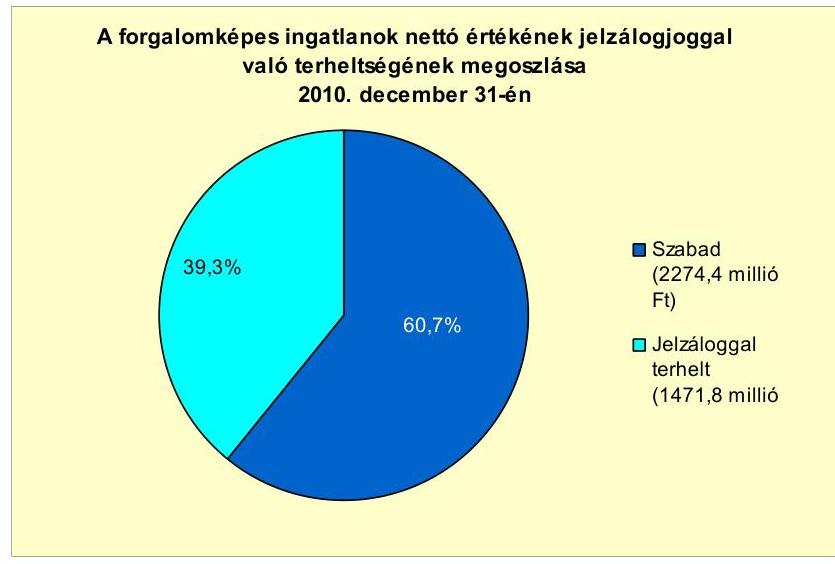

Az Önkormányzatnak 2011. június 30-án folyamatban lévő peres eljárása nem volt.

Az Önkormányzat legalább 50\%-os tulajdonosi hányaddal rendelkező gazdasági társaságai kötelezettségeinek állományát a következő táblázat mutatja be:

| Megnevezés | Állomány 2010. december 31-   én |  |  | Állomány 2011. június 30-án |  |  | Várható kötelezettség   2011-2013. években | Várható kötelezettség   2014. évtől |  |  |
| :--: | :--: | :--: | :--: | :--: | :--: | :--: | :--: | :--: | :--: | :--: |
|  | HUF-ban   (millió Ft-   ban) | Devizában (összege, ezer EURban) | Deviza nem | HUF-ban (millió Ftban) | Devizában (összege, ezer EURban) | Deviza nem | HUF-ban (millió Ftban) | Devizában (összege, ezer EURban) | HUF-ban (millió Ftban) | Devizában (összege, ezer EURban) |
| Hosszúlejáratú hitelek | 0,0 | 1237,6 | EUR | 0,0 | 1237,6 | EUR | 0,0 | 871,1 | 0,0 | 563,9 |
| Pénzintézeti kötelezettségek összesen | 0,0 | 1237,6 | EUR | 0,0 | 1237,6 | EUR | 0,0 | 871,1 | 0,0 |  |
| Czing kötelezettségek | 0,0 | 0,0 |  | 0,0 | 0,0 |  | 0,0 | 0,0 | 0,0 | 0,0 |
| Szállítói tartozás | 164,8 | 0,0 |  | 151,2 | 0,0 |  | 151,2 | 0,0 | 0,0 | 0,0 |
| Jogerős végzéssel lezárt de ki nem fizetett kötelezettségek | 0,0 | 0,0 |  | 0,0 | 0,0 |  | 0,0 | 0,0 | 0,0 | 0,0 |
| Egyéb kötelezettség | 650,8 | 0,0 |  | 702,2 | 0,0 |  | 702,2 | 0,0 | 0,0 | 0,0 |

Az Önkormányzat legalább 50\%-os tulajdonában lévő gazdasági társaságok pénzintézettel szembeni kötelezettség állománya a Centrum Kft. által igénybe vett három hosszú lejáratú, multicurrency típusú hitelből adódott. A gazdasági társaság által felvett hitelekből eredően fennálló kötelezettség állomány 2010. december 31-én és 2011. június 30-án is 1237591 EUR volt. A hitelekkel összefüggésben 2011. június 30 -áig összesen és 304605 EUR és 14,1 millió Ft összegű tőketörlesztés, valamint 111254 EUR és 4,1 millió Ft összegű kamatfizetés történt. A hitelekből várható fizetési kötelezettség az utolsó fizetési

[^0]
[^0]:    ${ }^{34}$ A jelzáloggal terhelt forgalomképes ingatlanok számviteli nyilvántartás szerinti nettó értékén belül a pénzintézeti kötelezettség miatt jelzáloggal terhelt forgalomképes ingatlanok nettó értéke 1403,0 millió Ft-ot tett ki.

---

kondíciókkal számolva a 2011-2013. években 871086 EUR, a 2014. évtől 563873 EUR.

Az Önkormányzat legalább 50\%-os tulajdonában lévő gazdasági társaságok szállítói tartozása a gazdasági társaságok adatszolgáltatása alapján a 2007. évben 13,4 millió Ft, a 2008. évben 15,5 millió Ft, a 2009. évben 77,0 millió Ft, a 2010. évben 164,8 millió Ft, 2011. június 30 -án 151,2 millió Ft volt. Ebből lejárt tartozásként tartottak nyilván a 2007. évben 8,0 millió Ft-ot, a 2008. évben 1,7 millió Ft-ot, a 2009. évben 68,0 millió Ft-ot, a 2010. évben 6,2 millió Ft-ot, 2011. június 30 -án 100,5 millió Ft-ot.

A legalább 50\%-os önkormányzati tulajdonú gazdasági társaságok egyéb kötelezettségeinek állománya a 2007. évben 29,7 millió Ft-ot, a 2008. évben 14,7 millió Ft-ot, 2009. évben 374,0 millió Ft-ot, 2010. évben 650,8 millió Ft-ot, 2011. június 30 -án 702,2 millió Ft-ot tett ki.

A gazdasági társaságok egyéb kötelezettségeinek állományában a 2009. évtől bekövetkezett növekedést az okozta, hogy az egyéb kötelezettségek között kimutatott, más gazdasági társaságoktól igénybe vett kölcsönök, átvállalt tartozások összege a Centrum Kft. esetében a 2009. évben 210,9 millió Ft-ot, a 2010. évben és 2011. június 30 -án egyaránt 362,9 millió Ft-ot tett ki.

A gazdasági társaságok lízingszerződésből adódó, valamint peres eljárással öszszefüggő kötelezettséget nem mutattak ki a vizsgált időszakban.

A vizsgálattal érintett gazdasági társaságok közül hatban az Önkormányzat minősített befolyással rendelkezett.

Az Önkormányzat a gazdasági társaságokról szóló 2006. évi IV. törvény 54. § (2) bekezdése alapján korlátlan felelősséggel tartozik azon gazdasági társaságának felszámolása esetében, amelyben az Önkormányzat az 52. § (2) bekezdése szerint a szavazatok legalább 75\%-ával rendelkezik, így minősített befolyásszerzőnek minősül, továbbá a csődeljárásról és a felszámolási eljárásról szóló 1991. évi XLIX. törvény 63. § (2) bekezdése alapján a kizárólagos önkormányzati tulajdonú gazdasági társaságának minden olyan kötelezettségéért, amelynek kielégítését a felszámolási eljárás során az adós társaság vagyona nem fedez, ha a hitelezőinek a felszámolási eljárás során benyújtott keresete alapján a bíróság - az adós társaság felé érvényesített tartósan hátrányos üzletpolitikájára figyelemmel - megállapítja az Önkormányzat korlátlan és teljes felelősségét.

Az Önkormányzat a 2007-2010. években a tárgyi eszközök után összesen 1149,3 millió Ft értékcsökkenést számolt el, amelyből a 2007. évben 319,1 millió Ft, a 2008. évben 310,8 millió Ft, a 2009. évben 282,8 millió Ft, a 2010. évben 236,6 millió Ft merült fel.

Az Önkormányzat eszközállományának bruttó értéke a 2007. évben 7727,7 millió Ft-ot, a 2008. évben 8038,0 millió Ft-ot, a 2009. évben 8622,9 millió Ft-ot, a 2010. évben 11702,3 millió Ft-ot tett ki. Az eszközök használhatósági foka önkormányzati szinten a 2007. évben 81,8\%, a 2008. évben $78,6 \%$, a 2009. évben $76,8 \%$, a 2010. évben $80,9 \%$ volt. Az Önkormányzat saját használatában lévő eszközök használhatósági foka a vizsgált években megegyezett a teljes eszközállományra számított használhatósági fokkal. A kezelésre, üzemeltetésre átadott eszközök esetében a

---

2007. évben 39,2\%, a 2008. évben 19\% volt a használhatósági fok. A 20092010. évben a kezelésre, üzemeltetésre átadott eszközök vonatkozásában az Önkormányzat nem mutatott ki nettó értéket.

A 2007-2010. évek között felújításokra, az eszközök pótlására az Önkormányzat a kimutatott értékcsökkenés 28,7\%-ának megfelelő összeget, 330,0 millió Ftot fordított. Az Önkormányzat 2011. évben felmérést végzett az ingatlanok műszaki állapotáról, a szükséges munkák várható költségeiről, a megvalósításhoz bevonható lehetséges forrásokról. A felmérés kimutatta, hogy az ingatlanok állagmegóvása, felújítása 98,5 millió Ft ráfordítást igényel. Az erről készült előterjesztés alapján a Képviselő-testület felhívta az intézmények és gazdasági társaságok vezetőit a karbantartási munkák folyamatos elvégzésére, valamint az eszközpótlási munkák elvégzéséhez pályázati források felkutatására.

# 4. A PÉNZÜGYI EGYENSÚLY MEGTEREMTÉSE ÉrDEKÉBEN HOZOTT INTÉZKEDÉSEK EREDMÉNYE 

A kiegyensúlyozott gazdálkodás, valamint a feladatellátás racionalizálása érdekében az Önkormányzat kiadási megtakarítást célzó intézkedésekről döntött, amelyeknek eredményeképpen az Önkormányzat adatszolgáltatása alapján a vizsgált időszakban összesen 119,6 millió Ft-tal csökkentek a kiadások. Az kimutatott kiadási megtakarítás feladat átadáshoz és a geotermikus kaszkád rendszer kialakításához kapcsolódott.

A 2007. évben a családsegítő és gyermekjóléti szolgálat szakfeladatot, 2009. január 1-jétől egy szociális intézményt, a Gondozási Központot adta át az Önkormányzat a Többcélú társulás részére. A feladat- és intézményátadással öszszefüggő létszámcsökkentésből az Önkormányzat adatszolgáltatása szerint 68,1 millió Ft kiadási megtakarítás adódott (amely a Gondozási Központ átadása miatti 74,2 millió Ft személyi juttatások és járulékaik kiadás csökkenésének és a feladat további ellátására a Többcélú társulásnak teljesített 6,1 millió Ft pénzeszközátadásnak a különbsége), amely az összes kiadási megtakarítás 57,0\%-át tette ki. A feladat átadásból eredően a dologi kiadások 46,3 millió Fttal $(38,7 \%)$ csökkentek.

Az Önkormányzat kimutatása szerint az önkormányzati létesítmények geotermikus kaszkád rendszerre történő csatlakoztatása a gazdaságosabb energiafelhasználás révén a 2011. évre 5,2 millió Ft kiadásmegtakarítást eredményezett, amely az összes kiadási megtakarítás $4,3 \%$-át tette ki.

---

Az Önkormányzat által a 2007-2010. években végrehajtott létszámcsökkentéseket a következő táblázat mutatja ${ }^{35}$ :

| Megnevezés (adatok fő-ben) | Közoktatás | Szociális és gyermekvédelem | Egészségügy | Polgármesteri hivatal | Egyéb | Összesen |
| :--: | :--: | :--: | :--: | :--: | :--: | :--: |
| 2007. január 1-jén jóváhagyott álláshelyek száma | 107 | 13 | 3 | 31 | 26 | 209 |
| Megszüntetett álláshelyek száma | 0 | 13 | 0 | 1 | 26 | 63 |
| ebből: üres álláshelyek száma | 0 | 0 | 0 | 0 | 0 | 0 |
|  | szakmai álláshelyek száma | 0 | 13 | 3 | 0 | 0 | 16 |
|  | intézmény-üzemeltetéssel kapcsolatos álláshelyek száma | 0 | 0 | 0 | 1 | 26 | 27 |
| Álláshely növekedése | 18 | 4 | 0 | 3 | 19 | 44 |
| 2010. december 31-én záró álláshelyek száma | 125 | 4 | 0 | 33 | 48 | 210 |
| 2007. január 1-jén foglalkoztatott létszám | 107 | 13 | 3 | 30 | 11 | 164 |
| Létszámcsökkentés | 0 | 13 | 0 | 1 | 0 | 17 |
| Létszámnövekedés | 18 | 4 | 0 | 4 | 3 | 20 |
| 2010. december 31-én foglalkoztatott létszám | 125 | 4 | 0 | 33 | 14 | 176 |

Az Önkormányzat adatszolgáltatása alapján az engedélyezett álláshelyek száma 2007. január 1. és 2010. december 31. között 209 fơről 210 főre, a 2007. évi 160 fős induló foglalkoztatotti létszám 176 főre nőtt. Az Önkormányzat a vizsgált időszakban összesen 43 álláshelyet szüntetett meg. A megszüntetett 43 álláshelyből 16 fő szakmai, 27 fő intézményüzemeltetéssel kapcsolatos álláshely volt. Az Önkormányzat a 2007-2010. években a helyi szervezési intézkedésekhez (álláshely csökkentéshez) kapcsolódó központi támogatást nem igényelt.

A vizsgálattal érintett években meghozott döntések hatására, a Gondozási Központ Többcélú társulásnak történő átadása miatt, a szociális és gyermekvédelmi területen 13 fő (30,2\%), az egészségügyi ágazatban 3 fő (7,05\%) álláshely szűnt meg.

A Polgármesteri hivatalban 1 fő (2,3\%), egyéb területen a fürdő üzemeltetésnél jellemző idényjellegű foglalkoztatás miatt 26 fő (60,5\%) álláshely megszüntetésére került sor. Ugyanakkor a közoktatási feladatok növekedése miatt a közoktatásban 18 fővel, a szociális feladatok területén 4 fővel, a Polgármesteri hivatalban 3 fővel, az egyéb ágazatban 19 fővel nőtt az álláshelyek száma. Így öszszességében az időszak alatt az engedélyezett álláshelyek száma 1 fővel nőtt. A 2010. évi záró álláshelyek száma és foglalkoztatotti létszám eltérése (üres álláshely) a városi fürdő esetében jellemző idényjellegű foglalkoztatásból ered. Az álláshelyek számának emelkedése a fürdőhöz kapcsolódóan befejezett új létesítmények (gyermekfürdő, szauna világ épületszárny) átadása miatt vált szükségessé.

Az Önkormányzat a kiadások fedezetének biztosítása, a bevételek növelése céljából a helyi adókat érintő, valamint az eszközök fokozott hasznosítását célzó intézkedések bevezetéséről döntött. A döntések eredményeképpen az Önkormányzat kimutatása szerint a vizsgált időszakban összesen 79,9 millió Ft bevétel realizálódott.

[^0]
[^0]:    ${ }^{35}$ A táblázat mind az egyes éveken belüli, mind az egyes évek záró létszámadata és a következő év nyitó létszámadata közötti létszámváltozásokat tartalmazza.

---

A 2007-2011. év I. félévben érvényesített bevételnövelő intézkedések eredményét a következő ábra szemlélteti:
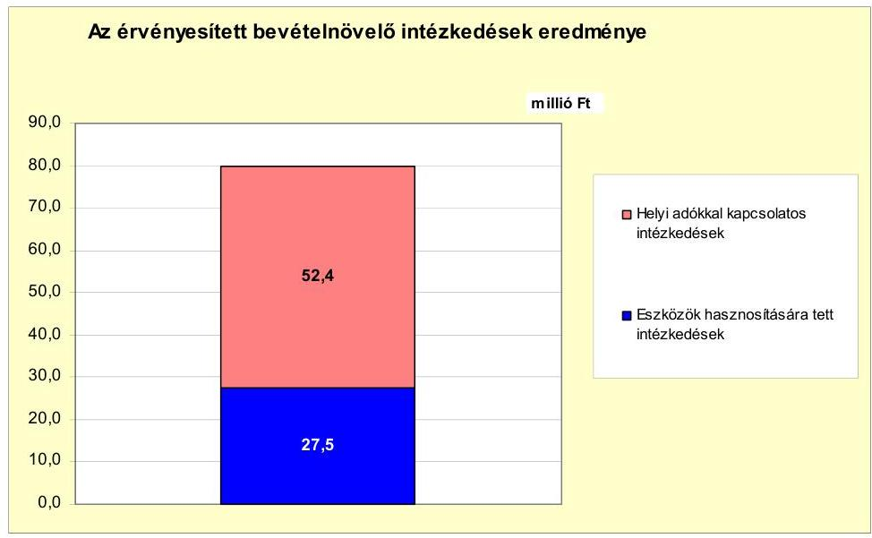

A helyi adókkal kapcsolatos intézkedések az Önkormányzat kimutatása szerint 52,4 millió Ft-tal növelték a bevételeket, amely az összes bevételnövelő döntés miatti bevételemelkedés $65,6 \%$-át tette ki. Ezen belül az építményadó, a telekadó, a kommunális adó, valamint az idegenforgalmi adó mértékének emelése a vizsgált időszakban 13,4 millió Ft (16,8\%) bevétel növekedést eredményezett. Az iparűzési adó vonatkozásában az adómentes sávok megszüntetése miatt az adóbevételek a 2008. évben 1,0 millió Ft-tal (1,2\%) nőttek. Az adóhátralékok behajtására tett intézkedések hatására 38,0 millió Ft (47,6\%) bevételt realizált az Önkormányzat.

Az eszközök hasznosításából származó bevételnövekedés a vizsgált időszakban az Önkormányzat kimutatása szerint 27,5 millió Ft volt, amely az összes többletbevétel 34,4\%-át jelentette. Ebből a lakások és egyéb helyiségek bérleti dijának emelése 19,0 millió Ft ( $23,8 \%$ ), a vásári helydíjak növelése 8,5 millió Ft $(10,6 \%)$ bevételi többletet eredményezett.

Az Önkormányzat költségvetési támogatásból, átengedett bevételekből származó bevételei a 2007. évhez képest az időszak egészét tekintve összességében 213,5 millió Ft-tal csökkentek, amelyet az Önkormányzat által kimutatott, öszszesen 199,5 millió Ft kiadási megtakarítás, illetve bevételi többlet 93,4\%-ban ellensúlyozott.

# 5. Az ÁSZ Által a korábBi ÉVEKben a PÉnZÜGYi EGYENSÚLY JAVÍTÁSÁRA TETT SZABÁLYSZERŰSÉGI ÉS CÉLSZERŰSÉGI JAVASLATOK HASZNOSULÁSA 

Az ÁSZ a V-1001-9/5/2007. számú számvevői jelentésében az Önkormányzat gazdálkodási rendszerét a 2007. évben ellenőrizte, amelynek során a pénzügyi egyensúly javítására egy célszerűségi és egy szabályszerűségi javaslatot tett.

---

A célszerúségi javaslatot teljesítették, a polgármester tájékoztatta a Képvise-lö-testületet a számvevőszéki ellenőrzés tapasztalatairól, amelynek megvalósítására intézkedési tervet készítettek. A szabályszerűségi javaslatot a jegyző határidőben részben hasznosította. A 2008. évi költségvetési rendelet elkülönítetten tartalmazta az európai uniós támogatással megvalósuló programok és projektek bevételeit és kiadásait, azonban az elkülönített kimutatás nem tartalmazta a GVOP keretében megvalósult ipari parki fejlesztési projekt 2008. évre áthúzódó 85,0 millió Ft tervezett kiadását. A GVOP keretében megvalósult projekt 2008. évre áthúzódó kiadását a 2008. évi költségvetési rendelet a fejlesztési kiadások között tartalmazta.

Budapest, 2012. április " 13 "

Melléklet: $\quad 7 \mathrm{db}$
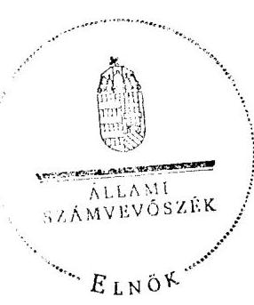

Domokos László

---

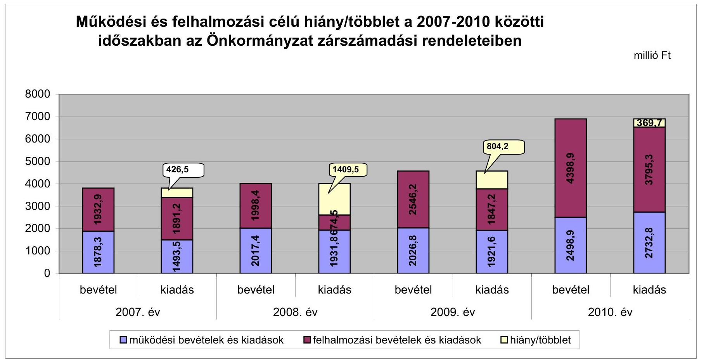

# Működési és felhalmozási célú hiány/többlet a 2007-2010 közötti időszakban az Önkormányzat zárszámadási rendeleteiben

|  I. kiadás | II. kiadás | III. kiadás | IV. kiadás | V. kiadás | VI. kiadás | VII. kiadás | VIII. kiadás  |
| --- | --- | --- | --- | --- | --- | --- | --- |
|  2007. év | 1878.3 | 1891.3 | 1898.4 | 1931.8 | 1931.8 | 1847.2 | 1847.2  |
|  2008. év | 1931.8 | 1931.8 | 1931.8 | 1931.8 | 1931.8 | 1847.2 | 1847.2  |
|  2009. év | 1931.8 | 1931.8 | 1931.8 | 1931.8 | 1931.8 | 1847.2 | 1847.2  |
|  2010. év | 2732.8 | 2732.8 | 2732.8 | 2732.8 | 2732.8 | 1847.2 | 1847.2  |

---

Az Önkormányzat bevételei és kiadásai, valamint adósságszolgálata 2007-2010 között (2007-2010. években teljesített adatok)

|  1. FOLYÓ KÖLTSÉGVETÉS* | 2007. év | 2008. év | 2009. év | 2010.év  |
| --- | --- | --- | --- | --- |
|  1.1.1. Saját müködési bevételek | 964,0 | 1278,2 | 1456,3 | 2242,1  |
|  1.1.2. Költségvetési támogatás *** | 311,1 | 477,0 | 450,6 | 499,9  |
|  1.1.3. Atengedett bevételek | 336,8 | 119,1 | 217,0 | 234,9  |
|  1.1.4. Állambáztartáson belülről kapott támogatások | 102,7 | 129,7 | 138,0 | 291,5  |
|  1.1.5. EU-tól és külföldről kapott bevételek | 70,1 | 21,8 | 45,3 | 5,3  |
|  1.1.6. Állambáztartáson kívülről kapott bevételek | 26,5 | 16,8 | 4,5 | 39,6  |
|  1.1.7. Előző évi pénzmaradvány átvétel | 0,0 | 6,6 | 0,4 | 0,4  |
|  1.1. Folyó bevételek $=1.1 .1 .+1.1 .2 .+1.1 .3 .+1.1 .4 .+1.1 .5 .+1.1 .6 .+1.1 .7$. | 1811,2 | 2133,8 | 2312,1 | 3313,7  |
|  1.2.1. Müködési kiadások kamatkiadások nélkül | 1339,4 | 1381,1 | 1552,2 | 2314,1  |
|  1.2.2. Állambáztartáson belülre átadott pénzeszközök | 39,2 | 37,0 | 38,1 | 202,7  |
|  1.2.3.1. vállalkozásoknak | 0,0 | 0,0 | 10,0 | 89,0  |
|  1.2.3.2. EU-nak, illetve külföldre | 0,0 | 0,0 | 0,0 | 0,0  |
|  1.2.3.3. magánc személyeknek | 37,1 | 40,6 | 43,4 | 59,3  |
|  1.2.3.4. nonprofit szervezeteknek | 49,5 | 59,6 | 69,6 | 57,1  |
|  1.2.3. Transzferkiadások ( $=1.2 .3 .1+1.2 .3 .2+1.2 .3 .3+1.2 .3 .4$ ) | 86,6 | 100,2 | 123,1 | 205,4  |
|  1.2.4 Kamatkiadások | 2,5 | 37,9 | 13,2 | 13,0  |
|  1.2.5. Előző évi pénzmaradvány átadás | 0,0 | 6,5 | 0,4 | 0,4  |
|  1.2. Folyó kiadások $=1.2 .1 .+1.2 .2 .+1.2 .3 .+1.2 .4 .+1.2 .5$. | 1467,7 | 1562,7 | 1727,0 | 2735,6  |
|  1.3. Folyó költségvetés egyenlege MÜKÖDÉSI JÖVEDELEM (1.1. - 1.2.) | 343,5 | 571,1 | 585,1 | 578,1  |
|  2. FELHALMOZÁSI KÖLTSÉGVETÉS** | 0,0 | 0,0 | 0,0 | 0,0  |
|  2.1.1. Saját tőkebevételek | 189,3 | 321,7 | 529,6 | 587,7  |
|  2.1.2. Állambáztartáson belülről kapott támogatások | 680,1 | 319,8 | 942,0 | 1321,8  |
|  2.1.3. EU-tól és külföldről kapott támogatások | 0,0 | 0,0 | 7,4 | 27,9  |
|  2.1.4. Állambáztartáson kívülről kapott támogatások | 2,9 | 37,5 | 26,1 | 4,8  |
|  2.1. Felhalmozási bevételek ( $=2.1 .1 .+2.1 .2+2.1 .3+2.1 .4$.) | 872,3 | 679,0 | 1505,1 | 1942,2  |
|  2.2.1. Saját beruházási kiadás állíva | 712,8 | 441,4 | 1511,6 | 3378,9  |
|  2.2.2. Saját felújítási kiadás állíva | 147,9 | 63,2 | 11,6 | 205,6  |
|  2.2.3. Állambáztartáson belülre átadott pénzeszköz | 31,5 | 57,1 | 18,0 | 33,1  |
|  2.2.4. EU-nak és külföldnek adott pénzeszközök | 0,0 | 0,0 | 0,0 | 0,0  |
|  2.2.5. Állambáztartáson kívülre adott pénzeszközök | 11,9 | 363,1 | 273,8 | 26,0  |
|  2.2.6. Befektetési célú részesedések vásárlása | 4,0 | 111,2 | 222,1 | 166,7  |
|  2.2. Felhalmozási kiadások ( $=2.2 .1 .+2.2 .2 .+2.2 .3 .+2.2 .4 .+2.2 .5 .+2.2 .6$.) | 908,1 | 1036,0 | 2037,1 | 3810,3  |
|  2.3. Felhalmozási költségvetés egyenlege (2.1. - 2.2.) | $-35,8$ | $-357,0$ | $-532,0$ | $-1868,1$  |
|  3. Finanszírozási műveletek nélküli (GFS) pozíció(1.3.+2.3.) | 307,7 | 214,0 | 53,1 | $-1290,1$  |
|  4. Finanszírozási műveletek | 0,0 | 0,0 | 0,0 | 0,0  |
|  4.1. Hitelfelvétel | 3,6 | 0,1 | 16,3 | 130,3  |
|  4.2. Hiteltörlesztés | 15,0 | 0,0 | 0,3 | 1,2  |
|  4.3. Forgatási és befektetési célú értékpapírok kibocsátása | 1013,6 | 0,0 | 0,0 | 0,0  |
|  4.4. Forgatási és befektetési célú értékpapírok beváltása | 0,0 | 0,0 | 0,0 | 0,0  |
|  4.5. Forgatási és befektetési célú értékpapírok értékesítése | 9,4 | 1022,9 | 9,4 | 9,4  |
|  4.6. Forgatási és befektetési célú értékpapírok vásárlása | 1013,6 | 0,0 | 0,0 | 0,0  |
|  4.7. Egyéb finanszírozási bevételek (függő, átfutó, kiegyenlítő) | $-0,3$ | 8,3 | $-13,5$ | $-12,7$  |
|  4.8. Egyéb finanszírozási kiadások (függő, átfutó, kiegyenlítő) | $-19,6$ | 7,6 | 4,7 | $-20,3$  |
|  4.9.Finanszírozási műveletek egyenlege (4.1. - 4.2.+4.3.-4.4+4.5.-4.6.+4.7.-4.8.) | $-21,9$ | 1023,7 | 7,2 | 146,1  |
|  5. Tárgyévi pénzügyi pozíció (1.3.+ 2.3.+4.9.) | 285,8 | 1237,8 | 60,3 | $-1143,9$  |
|  6. Nettó müködési jövedelem =müködési jövedelem (1.3.) - tőketörlesztés | 328,5 | 571,1 | 584,8 | 576,9  |
|  TÁJÉKOZTATÓ ADATOK |  |  |  |   |
|  Összes kötelezettség | 1226,8 | 1178,8 | 1162,8 | 1684,0  |
|  ebből rövid lejáratú | 205,6 | 157,9 | 130,7 | 223,4  |
|  Összes szállítói kötelezettség | 12,3 | 123,6 | 49,7 | 37,0  |
|  ebből lejárt (tanúsítványból) | 5,0 | 11,3 | 7,6 | 5,4  |
|  Pénz és tőkepiaci kötelezettség (adósság) | 1017,2 | 1017,3 | 1033,3 | 1618,6  |
|  ebből rövid lejáratú | 0,0 | 0,3 | 1,2 | 158,0  |
|  PPP szerződéses állomány jelenértéken (tanúsítványból) | 0,0 | 0,0 | 0,0 | 0,0  |
|  ebből lejárt szolgáltatási díj miatti kötelezettség | 0,0 | 0,0 | 0,0 | 0,0  |
|  Folyószámlabítel napi átlagos állománya (tanúsítványból) | 4,9 | 1,2 | 0,0 | 0,1  |
|  Likvidítitel napi átlagos állománya (tanúsítványból) | 0,0 | 0,0 | 0,0 | 0,0  |
|  Munkabérhítel napi átlagos állománya (tanúsítványból) | 0,0 | 0,0 | 0,0 | 0,0  |
|  Kezesség és garanciavállalások (tanúsítványból) | 0,0 | 0,0 | 0,0 | 0,0  |
|  Jegerős bírósági ítéletekből adódó kötelezettségek (tanúsítványból) | 0,0 | 0,0 | 0,0 | 0,0  |
|  Finanszírozásba bevonható eszközök: | 1544,7 | 1759,4 | 1794,2 | 640,8  |
|  Tartós hitelviszonyt megtestesítő értékpapírok év végi állománya | 28,1 | 18,7 | 9,4 | 0,0  |
|  Hosszú lejáratú bankbetétek év végi állománya | 0,0 | 0,0 | 0,0 | 0,0  |
|  Értékpapírok év végi állománya | 1013,6 | 0,0 | 0,0 | 0,0  |
|  Pénzeszközök (idegen pénzeszközök nélkül) év végi állománya | 503,0 | 1740,7 | 1784,8 | 640,8  |

[^0] [^0]: * Bevételekben nem térül, a kiadásokban nem jelenik meg az amortizáció, a vagyoni helyzetet az egyenleg befolyásolji. ** Bevételekben vagyon megőrzésre és bővítésre fordítható források. ***A költségvetési támogatásból a felhalmozási célú összeget az Önkormányzat adatszolgáltatása szerinti mértékben vettük figyelembe a 2.1.2. soron

---

Máratalom Város Önkormányzata

Az Önkormányzat 2007-2010. években megvalósított, 2010. december 31-ig befejezett fejlesztései és azok forráslisszatábrás

|  |   |   |   |   |   |   |   |   |   |   |   |   |   |   |   |   |   |   |   |   |   |   |   |   |   |   |   |   |   |   |   |   |   |   |   |   |   |   |   |   |   |   |   |   |   |   |   |   |   |   |   |   |   |   |   |   |   |   |   |   |   |   |   |   |   |   |   |   |   |   |   |   |   |   |   |   |   |   |   |   |   |   |   |   |   |   |   |   |   |   |   |   |   |   |   |   |   |   |   |   |  

---

|   |  |  |  |  |  |  |  |  |  |  |  |  |  |  |  |  |  |  |  |  |  |  |  |  |  |  |  |  |  |  |  |  |  |  |  |  |  |  |  |  |  |  |  |  |  |  |  |  |  |  |  |  |   |
| --- | --- | --- | --- | --- | --- | --- | --- | --- | --- | --- | --- | --- | --- | --- | --- | --- | --- | --- | --- | --- | --- | --- | --- | --- | --- | --- | --- | --- | --- | --- | --- | --- | --- | --- | --- | --- | --- | --- | --- | --- | --- | --- | --- | --- | --- | --- | --- | --- | --- | --- | --- | --- | --- | --- |
|   |  |  |  |  |  |  |  |  |  |  |  |  |  |  |  |  |  |  |  |  |  |  |  |  |  |  |  |  |  |  |  |  |  |  |  |  |  |  |  |  |  |  |  |  |  |  |  |  |  |  |  |   |
|   |  |  |  |  |  |  |  |  |  |  |  |  |  |  |  |  |  |  |  |  |  |  |  |  |  |  |  |  |  |  |  |  |  |  |  |  |  |  |  |  |  |  |  |  |  |  |  |  |  |  |   |
|   |  |  |  |  |  |  |  |  |  |  |  |  |  |  |  |  |  |  |  |  |  |  |  |  |  |  |  |  |  |  |  |  |  |  |  |  |  |  |  |  |  |  |  |  |  |  |  |  |  |  |   |
|   |  |  |  |  |  |  |  |  |  |  |  |  |  |  |  |  |  |  |  |  |  |  |  |  |  |  |  |  |  |  |  |  |  |  |  |  |  |  |  |  |  |  |  |  |  |  |  |  |  |  |   |
|   |  |  |  |  |  |  |  |  |  |  |  |  |  |  |  |  |  |  |  |  |  |  |  |  |  |  |  |  |  |  |  |  |  |  |  |  |  |  |  |  |  |  |  |  |  |  |  |  |  |  |   |
|   |  |  |  |  |  |  |  |  |  |  |  |  |  |  |  |  |  |  |  |  |  |  |  |  |  |  |  |  |  |  |  |  |  |  |  |  |  |  |  |  |  |  |  |  |  |  |  |  |  |  |   |
|   |  |  |  |  |  |  |  |  |  |  |  |  |  |  |  |  |  |  |  |  |  |  |  |  |  |  |  |  |  |  |  |  |  |  |  |  |  |  |  |  |  |  |  |  |  |  |  |  |  |  |   |
|   |  |  |  |  |  |  |  |  |  |  |  |  |  |  |  |  |  |  |  |  |  |  |  |  |  |  |  |  |  |  |  |  |  |  |  |  |  |  |  |  |  |  |  |  |  |  |  |  |  |  |   |
|   |  |  |  |  |  |  |  |  |  |  |  |  |  |  |  |  |  |  |  |  |  |  |  |  |  |  |  |  |  |  |  |  |  |  |  |  |  |  |  |  |  |  |  |  |  |  |  |  |  |  |   |
|   |  |  |  |  |  |  |  |  |  |  |  |  |  |  |  |  |  |  |  |  |  |  |  |  |  |  |  |  |  |  |  |  |  |  |  |  |  |  |  |  |  |  |  |  |  |  |  |  |  |  |   |
|   |  |  |  |  |  |  |  |  |  |  |  |  |  |  |  |  |  |  |  |  |  |  |  |  |  |  |  |  |  |  |  |  |  |  |  |  |  |  |  |  |  |  |  |  |  |  |  |  |  |  |   |
|   |  |  |  |  |  |  |  |  |  |  |  |  |  |  |  |  |  |  |  |  |  |  |  |  |  |  |  |  |  |  |  |  |  |  |  |  |  |  |  |  |  |  |  |  |  |  |  |  |  |  |   |
|   |  |  |  |  |  |  |  |  |  |  |  |  |  |  |  |  |  |  |  |  |  |  |  |  |  |  |  |  |  |  |  |  |  |  |  |  |  |  |  |  |  |  |  |  |  |  |  |  |  |  |   |
|   |  |  |  |  |  |  |  |  |  |  |  |  |  |  |  |  |  |  |  |  |  |  |  |  |  |  |  |  |  |  |  |  |  |  |  |  |  |  |  |  |  |  |  |  |  |  |  |  |  |  |   |
|   |  |  |  |  |  |  |  |  |  |  |  |  |  |  |  |  |  |  |  |  |  |  |  |  |  |  |  |  |  |  |  |  |  |  |  |  |  |  |  |  |  |  |  |  |  |  |  |  |  |  |   |
|   |  |  |  |  |  |  |  |  |  |  |  |  |  |  |  |  |  |  |  |  |  |  |  |  |  |  |  |  |  |  |  |  |  |  |  |  |  |  |  |  |  |  |  |  |  |  |  |  |  |  |   |
|   |  |  |  |  |  |  |  |  |  |  |  |  |  |  |  |  |  |  |  |  |  |  |  |  |  |  |  |  |  |  |  |  |  |  |  |  |  |  |  |  |  |  |  |  |  |  |  |  |  |  |   |
|   |  |  |  |  |  |  |  |  |  |  |  |  |  |  |  |  |  |  |  |  |  |  |  |  |  |  |  |  |  |  |  |  |  |  |  |  |  |  |  |  |  |  |  |  |  |  |  |  |  |  |   |
|   |  |  |  |  |  |  |  |  |  |  |  |  |  |  |  |  |  |  |  |  |  |  |  |  |  |  |  |  |  |  |  |  |  |  |  |  |  |  |  |  |  |  |  |  |  |  |  |  |  |  |   |
|   |  |  |  |  |  |  |  |  |  |  |  |  |  |  |  |  |  |  |  |  |  |  |  |  |  |  |  |  |  |  |  |  |  |  |  |  |  |  |  |  |  |  |  |  |  |  |  |  |  |  |   |
|   |  |  |  |  |  |  |  |  |  |  |  |  |  |  |  |  |  |  |  |  |  |  |  |  |  |  |  |  |  |  |  |  |  |  |  |  |  |  |  |  |  |  |  |  |  |  |  |  |  |  |   |
|   |  |  |  |  |  |  |  |  |  |  |  |  |  |  |  |  |  |  |  |  |  |  |  |  |  |  |  |  |  |  |  |  |  |  |  |  |  |  |  |  |  |  |  |  |  |  |  |  |  |  |   |
|   |  |  |  |  |  |  |  |  |  |  |  |  |  |  |  |  |  |  |  |  |  |  |  |  |  |  |  |  |  |  |  |  |  |  |  |  |  |  |  |  |  |  |  |  |  |  |  |  |  |  |   |
|   |  |  |  |  |  |  |  |  |  |  |  |  |  |  |  |  |  |  |  |  |  |  |  |  |  |  |  |  |  |  |  |  |  |  |  |  |  |  |  |  |  |  |  |  |  |  |  |  |  |  |   |
|   |  |  |  |  |  |  |  |  |  |  |  |  |  |  |  |  |  |  |  |  |  |  |  |  |  |  |  |  |  |  |  |  |  |  |  |  |  |  |  |  |  |  |  |  |  |  |  |  |  |  |   |
|   |  |  |  |  |  |  |  |  |  |  |  |  |  |  |  |  |  |  |  |  |  |  |  |  |  |  |  |  |  |  |  |  |  |  |  |  |  |  |  |  |  |  |  |  |  |  |  |  |  |  |  |   |
|   |  |  |  |  |  |  |  |  |  |  |  |  |  |  |  |  |  |  |  |  |  |  |  |  |  |  |  |  |  |  |  |  |  |  |  |  |  |  |  |  |  |  |  |  |  |  |  |  |  |  |  |   |
|   |  |  |  |  |  |  |  |  |  |  |  |  |  |  |  |  |  |  |  |  |  |  |  |  |  |  |  |  |  |  |  |  |  |  |  |  |  |  |  |  |  |  |  |  |  |  |  |  |  |  |  |   |
|   |  |  |  |  |  |  |  |  |  |  |  |  |  |  |  |  |  |  |  |  |  |  |  |  |  |  |  |  |  |  |  |  |  |  |  |  |  |  |  |  |  |  |  |  |  |  |  |  |  |  |  |   |
|   |  |  |  |  |  |  |  |  |  |  |  |  |  |  |  |  |  |  |  |  |  |  |  |  |  |  |  |  |  |  |  |  |  |  |  |  |  |  |  |  |  |  |  |  |  |  |  |  |  |  |  |   |
|   |  |  |  |  |  |  |  |  |  |  |  |  |  |  |  |  |  |  |  |  |  |  |  |  |  |  |  |  |  |  |  |  |  |  |  |  |  |  |  |  |  |  |  |  |  |  |  |  |  |  |  |   |
|   |  |  |  |  |  |  |  |  |  |  |  |  |  |  |  |  |  |  |  |  |  |  |  |  |  |  |  |  |  |  |  |  |  |  |  |  |  |  |  |  |  |  |  |  |  |  |  |  |  |  |  |   |
|   |  |  |  |  |  |  |  |  |  |  |  |  |  |  |  |  |  |  |  |  |  |  |  |  |  |  |  |  |  |  |  |  |  |  |  |  |  |  |  |  |  |  |  |  |  |  |  |  |  |  |  |   |
|   |  |  |  |  |  |  |  |  |  |  |  |  |  |  |  |  |  |  |  |  |  |  |  |  |  |  |  |  |  |  |  |  |  |  |  |  |  |  |  |  |  |  |  |  |  |  |  |  |  |  |  |   |
|   |  |  |  |  |  |  |  |  |  |  |  |  |  |  |  |  |  |  |  |  |  |  |  |  |  |  |  |  |  |  |  |  |  |  |  |  |  |  |  |  |  |  |  |  |  |  |  |  |  |  |  |   |
|   |  |  |  |  |  |  |  |  |  |  |  |  |  |  |  |  |  |  |  |  |  |  |  |  |  |  |  |  |  |  |  |  |  |  |  |  |  |  |  |  |  |  |  |  |  |  |  |  |  |  |  |   |
|   |  |  |  |  |  |  |  |  |  |  |  |  |  |  |  |  |  |  |  |  |  |  |  |  |  |  |  |  |  |  |  |  |  |  |  |  |  |  |  |  |  |  |  |  |  |  |  |  |  |  |  |   |
|   |  |  |  |  |  |  |  |  |  |  |  |  |  |  |  |  |  |  |  |  |  |  |  |  |  |  |  |  |  |  |  |  |  |  |  |  |  |  |  |  |  |  |  |  |  |  |  |  |  |  |  |   |
|   |  |  |  |  |  |  |  |  |  |  |  |  |  |  |  |  |  |  |  |  |  |  |  |  |  |  |  |  |  |  |  |  |  |  |  |  |  |  |  |  |  |  |  |  |  |  |  |  |  |  |  |   |
|   |  |  |  |  |  |  |  |  |  |  |  |  |  |  |  |  |  |  |  |  |  |  |  |  |  |  |  |  |  |  |  |  |  |  |  |  |  |  |  |  |  |  |  |  |  |  |  |  |  |  |  |   |
|   |  |  |  |  |  |  |  |  |  |  |  |  |  |  |  |  |  |  |  |  |  |  |  |  |  |  |  |  |  |  |  |  |  |  |  |  |  |  |  |  |  |  |  |  |  |  |  |  |  |  |  |   |
|   |  |  |  |  |  |  |  |  |  |  |  |  |  |  |  |  |  |  |  |  |  |  |  |  |  |  |  |  |  |  |  |  |  |  |  |  |  |  |  |  |  |  |  |  |  |  |  |  |  |  |  |   |
|   |  |  |  |  |  |  |  |  |  |  |  |  |  |  |  |  |  |  |  |  |  |  |  |  |  |  |  |  |  |  |  |  |  |  |  |  |  |  |  |  |  |  |  |  |  |  |  |  |  |  |  |   |
|   |  |  |  |  |  |  |  |  |  |  |  |  |  |  |  |  |  |  |  |  |  |  |  |  |  |  |  |  |  |  |  |  |  |  |  |  |  |  |  |  |  |  |  |  |  |  |  |  |  |  |  |   |
|   |  |  |  |  |  |  |  |  |  |  |  |  |  |  |  |  |  |  |  |  |  |  |  |  |  |  |  |  |  |  |  |  |  |  |  |  |  |  |  |  |  |  |  |  |  |  |  |  |  |  |  |   |
|   |  |  |  |  |  |  |  |  |  |  |  |  |  |  |  |  |  |  |  |  |  |  |  |  |  |  |  |  |  |  |  |  |  |  |  |  |  |  |  |  |  |  |  |  |  |  |  |  |  |  |  |   |
|   |  |  |  |  |  |  |  |  |  |  |  |  |  |  |  |  |  |  |  |  |  |  |  |  |  |  |  |  |  |  |  |  |  |  |  |  |  |  |  |  |  |  |  |  |  |  |  |  |  |  |  |   |
|   |  |  |  |  |  |  |  |  |  |  |  |  |  |  |  |  |  |  |  |  |  |  |  |  |  |  |  |  |  |  |  |  |  |  |  |  |  |  |  |  |  |  |  |  |  |  |  |  |  |  |  |  |   |
|   |  |  |  |  |  |  |  |  |  |  |  |  |  |  |  |  |  |  |  |  |  |  |  |  |  |  |  |  |  |  |  |  |  |  |  |  |  |  |  |  |  |  |  |  |  |  |  |  |  |  |  |  |   |
|   |  |  |  |  |  |  |  |  |  |  |  |  |  |  |  |  |  |  |  |  |  |  |  |  |  |  |  |  |  |  |  |  |  |  |  |  |  |  |  |  |  |  |  |  |  |  |  |  |  |  |  |  |   |
|   |  |  |  |  |  |  |  |  |  |  |  |  |  |  |  |  |  |  |  |  |  |  |  |  |  |  |  |  |  |  |  |  |  |  |  |  |  |  |  |  |  |  |  |  |  |  |  |  |  |  |  |  |   |
|   |  |  |  |  |  |  |  |  |  |  |  |  |  |  |  |  |  |  |  |  |  |  |  |  |  |  |  |  |  |  |  |  |  |  |  |  |  |  |  |  |  |  |  |  |  |  |  |  |  |  |  |  |   |
|   |  |  |  |  |  |  |  |  |  |  |  |  |  |  |  |  |  |  |  |  |  |  |  |  |  |  |  |  |  |  |  |  |  |  |  |  |  |  |  |  |  |  |  |  |  |  |  |  |  |  |  |  |   |
|   |  |  |  |  |  |  |  |  |  |  |  |  |  |  |  |  |  |  |  |  |  |  |  |  |  |  |  |  |  |  |  |  |  |  |  |  |  |  |  |  |  |  |  |  |  |  |  |  |  |  |  |  |   |
|   |  |  |  |  |  |  |  |  |  |  |  |  |  |  |  |  |  |  |  |  |  |  |  |  |  |  |  |  |  |  |  |  |  |  |  |  |  |  |  |  |  |  |  |  |  |  |  |  |  |  |  |  |   |
|   |  |  |  |  |  |  |  |  |  |  |  |  |  |  |  |  |  |  |  |  |  |  |  |  |  |  |  |  |  |  |  |  |  |  |  |  |  |  |  |  |  |  |  |  |  |  |  |  |  |  |  |  |   |
|   |  |  |  |  |  |  |  |  |  |  |  |  |  |  |  |  |  |  |  |  |  |  |  |  |  |  |  |  |  |  |  |  |  |  |  |  |  |  |  |  |  |  |  |  |  |  |  |  |  |  |  |  |  |   |
|   |  |  |  |  |  |  |  |  |  |  |  |  |  |  |  |  |  |  |  |  |  |  |  |  |  |  |  |  |  |  |  |  |  |  |  |  |  |  |  |  |  |  |  |  |  |  |  |  |  |  |  |  |  |   |
|   |  |  |  |  |  |  |  |  |  |  |  |  |  |  |  |  |  |  |  |  |  |  |  |  |  |  |  |  |  |  |  |  |  |  |  |  |  |  |  |  |  |  |  |  |  |  |  |  |  |  |  |  |  |  |   |
|   |  |  |  |  |  |  |  |  |  |  |  |  |  |  |  |  |  |  |  |  |  |  |  |  |  |  |  |  |  |  |  |  |  |  |  |  |  |  |  |  |  |  |  |  |  |  |  |  |  |  |  |  |  |  |   |
|   |  |  |  |  |  |  |  |  |  |  |  |  |  |  |  |  |  |  |  |  |  |  |  |  |  |  |  |  |  |  |  |  |  |  |  |  |  |  |  |  |  |  |  |  |  |  |  |  |  |  |  |  |  |  |   |
|   |  |  |  |  |  |  |  |  |  |  |  |  |  |  |  |  |  |  |  |  |  |  |  |  |  |  |  |  |  |  |  |  |  |  |  |  |  |  |  |  |  |  |  |  |  |  |  |  |  |  |  |  |  |  |   |
|   |  |  |  |  |  |  |  |  |  |  |  |  |  |  |  |  |  |  |  |  |  |  |  |  |  |  |  |  |  |  |  |  |  |  |  |  |  |  |  |  |  |  |  |  |  |  |  |  |  |  |  |  |  |  |  |   |
|   |  |  |  |  |  |  |  |  |  |  |  |  |  |  |  |  |  |  |  |  |  |  |  |  |  |  |  |  |  |  |  |  |  |  |  |  |  |  |  |  |  |  |  |  |  |  |  |  |  |  |  |  |  |  |  |  |   |
|   |  |  |  |  |  |  |  |  |  |  |  |  |  |  |  |  |  |  |  |  |  |  |  |  |  |  |  |  |  |  |  |  |  |  |  |  |  |  |  |  |  |  |  |  |  |  |  |  |  |  |  |  |  |  |  |  |   |
|   |  |  |  |  |  |  |  |  |  |  |  |  |  |  |  |  |  |  |  |  |  |  |  |  |  |  |  |  |  |  |  |  |  |  |  |  |  |  |  |  |  |  |  |  |  |  |  |  |  |  |  |  |  |  |  |  |  |   |
|   |  |  |  |  |  |  |  |  |  |  |  |  |  |  |  |  |  |  |  |  |  |  |  |  |  |  |  |  |  |  |  |  |  |  |  |  |  |  |  |  |  |  |  |  |  |  |  |  |  |  |  |  |  |  |  |  |  |  |   |
|   |  |  |  |  |  |  |  |  |  |  |  |  |  |  |  |  |  |  |  |  |  |  |  |  |  |  |  |  |  |  |  |  |  |  |  |  |  |  |  |  |  |  |  |  |  |  |  |  |  |  |  |  |  |  |  |  |  |  |  |   |
|   |  |  |  |  |  |  |  |  |  |  |  |  |  |  |  |  |  |  |  |  |  |  |  |  |  |  |  |  |  |  |  |  |  |  |  |  |  |  |  |  |  |  |  |  |  |  |  |  |  |  |  |  |  |  |  |  |  |  |  |  |  |   |
|   |  |  |  |  |  |  |  |  |  |  |  |  |  |  |  |  |  |  |  |  |  |  |  |  |  |  |  |  |  |  |  |  |  |  |  |  |  |  |  |  |  |  |  |  |  |  |  |  |  |  |  |  |  |  |  |  |  |  |  |  |  |  |  |   |
|   |  |  |  |  |  |  |  |  |  |  |  |  |  |  |  |  |  |  |  |  |  |  |  |  |  |  |  |  |  |  |  |  |  |  |  |  |  |  |  |  |  |  |  |  |  |  |  |  |  |  |  |  |  |  |  |  |  |  |  |  |  |  |  |  |   |
|   |  |  |  |  |  |  |  |  |  |  |  |  |  |  |  |  |  |  |  |  |  |  |  |  |  |  |  |  |  |  |  |  |  |  |  |  |  |  |  |  |  |  |  |  |  |  |  |  |  |  |  |  |  |  |  |  |  |  |  |  |  |  |  |  |  |  |  |   |
|   |  |  |  |  |  |  |  |  |  |  |  |  |  |  |  |  |  |  |  |  |  |  |  |  |  |  |  |  |  |  |  |  |  |  |  |  |  |  |  |  |  |  |  |  |  |  |  |  |  |  |  |  |  |  |  |  |  |  |  |  |  |  |  |  |  |  |  |  |   |
|   |  |  |  |  |  |  |  |  |  |  |  |  |  |  |  |  |  |  |  |  |  |  |  |  |  |  |  |  |  |  |  |  |  |  |  |  |  |  |  |  |  |  |  |  |  |  |  |  |  |  |  |  |  |  |  |  |  |  |  |  |  |  |  |  |  |  |  |  |   |
|   |  |  |  |  |  |  |  |  |  |  |  |  |  |  |  |  |  |  |  |  |  |  |  |  |  |  |  |  |  |  |  |  |  |  |  |  |  |  |  |  |  |  |  |  |  |  |  |  |  |  |  |  |  |  |  |  |  |  |  |  |  |  |  |  |  |  |  |  |  |  |  |   |
|   |  |  |  |  |  |  |  |  |  |  |  |  |  |  |  |  |  |  |  |  |  |  |  |  |  |  |  |  |  |  |  |  |  |  |  |  |  |  |  |  |  |  |  |  |  |  |  |  |  |  |  |  |  |  |  |  |  |  |  |  |  |  |  |  |  |  |  |  |  |  |  |  |  |  |  |  |   |
|   |  |  |  |  |  |  |  |  |  |  |  |  |  |  |  |  |  |  |  |  |  |  |  |  |  |  |  |  |  |  |  |  |  |  |  |  |  |  |  |  |  |  |  |  |  |  |  |  |  |  |  |  |  |  |  |  |  |  |  |  |  |  |  |  |  |  |  |  |  |  |  |  |  |  |  |  |  |  |  |  |  |  |   |
|   |  |  |  |  |  |  |  |  |  |  |  |  |  |  |  |  |  |  |  |  |  |  |  |  |  |  |  |  |  |  |  |  |  |  |  |  |  |  |  |  |  |  |  |  |  |  |  |  |  |  |  |  |  |  |  |  |  |  |  |  |  |  |  |  |  |  |  |  |  |  |  |  |  |  |  |  |  |  |  |  |  |  |  |  |  |   |
|   |  |  |  |  |  |  |  |  |  |  |  |  |  |  |  |  |  |  |  |  |  |  |  |  |  |  |  |  |  |  |  |  |  |  |  |  |  |  |  |  |  |  |  |  |  |  |  |  |  |  |  |  |  |  |  |  |  |  |  |  |  |  |  |  |  |  |  |  |  |  |  |  |  |  |  |  |  |  |  |  |  |  |  |  |  |  |  |  |  |  |  |  |  |  |  |  |  |  |  |   |
|   |  |  |  |  |  |  |  |  |  |  |  |  |  |  |  |  |  |  |  |  |  |  |  |  |  |  |  |  |  |  |  |  |  |  |  |  |  |  |  |  |  |  |  |  |  |  |  |  |  |  |  |  |  |  |  |  |  |  |  |  |  |  |  |  |  |  |  |  |  |  |  |  |  |  |  |  |  |  |  |  |  |  |  |  |  |  |  |  |  |  |  |  |  |  |  |  |  |  |  | 

---

|   |  |  |  |  |  |  |  |  |  |  |  |  |  |  |  |  |  |  |  |  |  |  |  |  |  |  |  |  |  |  |  |  |  |  |  |  |  |  |  |  |  |  |  |  |  |  |  |  |  |  |  |  |  |  |  |  |  |  |  |  |  |  |  |  |  |  |  |  |  |  |  |  |  |  |  |  |  |  |  |  |  |  |  |  |  |  |  |  |  |  |  |  |  |  |  |  |  |  |  |  |  | 

---

Mórehalom Város Önkormányzata

Az Önkormányzat 2010. december 31-én folyamatban lévő fejlesztési feladataira 2010. december 31-ig teljesített kifizetések és azok forrásösszetétele

nokú Ft-ban

|  |   |   |   |   |   |   |   |   |   |   |   |   |   |   |   |   |   |   |   |   |   |   |   |   |   |   |   |   |   |   |   |
| --- | --- | --- | --- | --- | --- | --- | --- | --- | --- | --- | --- | --- | --- | --- | --- | --- | --- | --- | --- | --- | --- | --- | --- | --- | --- | --- | --- | --- | --- | --- | --- |
|   |  |  |  |  |  |  |  |  |  |  |  |  |  |  |  |  |  |  |  |  |  |  |  |  |  |  |  |  |  |  |   |
|   |  | Fejlesztési feladat (beruházás, felújítás) |  |  |  |  |  |  |  |  |  |  |  |  |  |  |  |  |  |  |  |  |  |  |  |  |  |  |  |  |   |
|   |  |  |  |  |  |  |  |  |  |  |  |  |  |  |  |  |  |  |  |  |  |  |  |  |  |  |  |  |  |  |   |
|   |  |  |  |  |  |  |  |  |  |  |  |  |  |  |  |  |  |  |  |  |  |  |  |  |  |  |  |  |  |  |   |
|   |  |  |  |  |  |  |  |  |  |  |  |  |  |  |  |  |  |  |  |  |  |  |  |  |  |  |  |  |  |  |   |
|   |  |  |  |  |  |  |  |  |  |  |  |  |  |  |  |  |  |  |  |  |  |  |  |  |  |  |  |  |  |  |   |
|   |  |  |  |  |  |  |  |  |  |  |  |  |  |  |  |  |  |  |  |  |  |  |  |  |  |  |  |  |  |  |   |
|   |  |  |  |  |  |  |  |  |  |  |  |  |  |  |  |  |  |  |  |  |  |  |  |  |  |  |  |  |  |  |   |
|   |  |  |  |  |  |  |  |  |  |  |  |  |  |  |  |  |  |  |  |  |  |  |  |  |  |  |  |  |  |  |   |
|   |  |  |  |  |  |  |  |  |  |  |  |  |  |  |  |  |  |  |  |  |  |  |  |  |  |  |  |  |  |  |   |
|   |  |  |  |  |  |  |  |  |  |  |  |  |  |  |  |  |  |  |  |  |  |  |  |  |  |  |  |  |  |  |   |
|   |  |  |  |  |  |  |  |  |  |  |  |  |  |  |  |  |  |  |  |  |  |  |  |  |  |  |  |  |  |  |   |
|   |  |  |  |  |  |  |  |  |  |  |  |  |  |  |  |  |  |  |  |  |  |  |  |  |  |  |  |  |  |  |   |
|   |  |  |  |  |  |  |  |  |  |  |  |  |  |  |  |  |  |  |  |  |  |  |  |  |  |  |  |  |  |  |   |
|   |  |  |  |  |  |  |  |  |  |  |  |  |  |  |  |  |  |  |  |  |  |  |  |  |  |  |  |  |  |  |   |
|   |  |  |  |  |  |  |  |  |  |  |  |  |  |  |  |  |  |  |  |  |  |  |  |  |  |  |  |  |  |  |   |
|   |  |  |  |  |  |  |  |  |  |  |  |  |  |  |  |  |  |  |  |  |  |  |  |  |  |  |  |  |  |  |   |
|   |  |  |  |  |  |  |  |  |  |  |  |  |  |  |  |  |  |  |  |  |  |  |  |  |  |  |  |  |  |  |   |
|   |  |  |  |  |  |  |  |  |  |  |  |  |  |  |  |  |  |  |  |  |  |  |  |  |  |  |  |  |  |  |   |
|   |  |  |  |  |  |  |  |  |  |  |  |  |  |  |  |  |  |  |  |  |  |  |  |  |  |  |  |  |  |  |   |
|   |  |  |  |  |  |  |  |  |  |  |  |  |  |  |  |  |  |  |  |  |  |  |  |  |  |  |  |  |  |  |   |
|   |  |  |  |  |  |  |  |  |  |  |  |  |  |  |  |  |  |  |  |  |  |  |  |  |  |  |  |  |  |  |   |
|   |  |  |  |  |  |  |  |  |  |  |  |  |  |  |  |  |  |  |  |  |  |  |  |  |  |  |  |  |  |  |   |
|   |  |  |  |  |  |  |  |  |  |  |  |  |  |  |  |  |  |  |  |  |  |  |  |  |  |  |  |  |  |  |   |
|   |  |  |  |  |  |  |  |  |  |  |  |  |  |  |  |  |  |  |  |  |  |  |  |  |  |  |  |  |  |  |   |
|   |  |  |  |  |  |  |  |  |  |  |  |  |  |  |  |  |  |  |  |  |  |  |  |  |  |  |  |  |  |  |   |
|   |  |  |  |  |  |  |  |  |  |  |  |  |  |  |  |  |  |  |  |  |  |  |  |  |  |  |  |  |  |  |   |
|   |  |  |  |  |  |  |  |  |  |  |  |  |  |  |  |  |  |  |  |  |  |  |  |  |  |  |  |  |  |  |   |
|   |  |  |  |  |  |  |  |  |  |  |  |  |  |  |  |  |  |  |  |  |  |  |  |  |  |  |  |  |  |  |   |
|   |  |  |  |  |  |  |  |  |  |  |  |  |  |  |  |  |  |  |  |  |  |  |  |  |  |  |  |  |  |  |   |
|   |  |  |  |  |  |  |  |  |  |  |  |  |  |  |  |  |  |  |  |  |  |  |  |  |  |  |  |  |  |  |   |
|   |  |  |  |  |  |  |  |  |  |  |  |  |  |  |  |  |  |  |  |  |  |  |  |  |  |  |  |  |  |  |   |
|   |  |  |  |  |  |  |  |  |  |  |  |  |  |  |  |  |  |  |  |  |  |  |  |  |  |  |  |  |  |  |   |
|   |  |  |  |  |  |  |  |  |  |  |  |  | 

---

|  15 | MVH 2048454597 Helyl ördösegvédelmi (Királyhelmi iskola, Nagyszékeslej üllömbö) | 103/2009. (IV.29.) 247/2008. (IX.4) | 2010 | 2011 | 19,9 | 0,0 | -19,9 | 0,0 | 0,0 | 0,0 | 4,0 | 0,0 | -4,0 | A | 0,0 | 0,0 | 0,0 | 0,0 | 0,0 | 0,0 | 0,0 | 0,0 | 0,0 | 15,9 | 0,0 | -15,9 | B  |
| --- | --- | --- | --- | --- | --- | --- | --- | --- | --- | --- | --- | --- | --- | --- | --- | --- | --- | --- | --- | --- | --- | --- | --- | --- | --- | --- |
|  16 |  |  |  |  |  |  |  |  |  |  |  |  |  |  |  |  |  |  |  |  |  |  |  |  |  |   |
|  17 |  |  |  |  |  |  |  |  |  |  |  |  |  |  |  |  |  |  |  |  |  |  |  |  |  |   |
|  18 |  |  |  |  |  |  |  |  |  |  |  |  |  |  |  |  |  |  |  |  |  |  |  |  |  |   |
|  19 |  |  |  |  |  |  |  |  |  |  |  |  |  |  |  |  |  |  |  |  |  |  |  |  |  |   |
|  20 |  |  |  |  |  |  |  |  |  |  |  |  |  |  |  |  |  |  |  |  |  |  |  |  |  |   |
|  21 |  |  |  |  |  |  |  |  |  |  |  |  |  |  |  |  |  |  |  |  |  |  |  |  |  |   |
|  22 |  |  |  |  |  |  |  |  |  |  |  |  |  |  |  |  |  |  |  |  |  |  |  |  |  |   |
|  23 |  |  |  |  |  |  |  |  |  |  |  |  |  |  |  |  |  |  |  |  |  |  |  |  |  |   |
|  24 |  |  |  |  |  |  |  |  |  |  |  |  |  |  |  |  |  |  |  |  |  |  |  |  |  |   |
|  25 |  |  |  |  |  |  |  |  |  |  |  |  |  |  |  |  |  |  |  |  |  |  |  |  |  |   |
|  26 |  |  |  |  |  |  |  |  |  |  |  |  |  |  |  |  |  |  |  |  |  |  |  |  |  |   |
|  27 |  |  |  |  |  |  |  |  |  |  |  |  |  |  |  |  |  |  |  |  |  |  |  |  |  |   |
|  28 |  |  |  |  |  |  |  |  |  |  |  |  |  |  |  |  |  |  |  |  |  |  |  |  |  |   |
|  29 |  |  |  |  |  |  |  |  |  |  |  |  |  |  |  |  |  |  |  |  |  |  |  |  |  |   |
|  30 |  |  |  |  |  |  |  |  |  |  |  |  |  |  |  |  |  |  |  |  |  |  |  |  |  |   |
|  31 |  |  |  |  |  |  |  |  |  |  |  |  |  |  |  |  |  |  |  |  |  |  |  |  |  |   |
|  32 |  |  |  |  |  |  |  |  |  |  |  |  |  |  |  |  |  |  |  |  |  |  |  |  |  |   |
|  33 |  |  |  |  |  |  |  |  |  |  |  |  |  |  |  |  |  |  |  |  |  |  |  |  |  |   |
|  34 |  |  |  |  |  |  |  |  |  |  |  |  |  |  |  |  |  |  |  |  |  |  |  |  |  |   |
|  35 |  |  |  |  |  |  |  |  |  |  |  |  |  |  |  |  |  |  |  |  |  |  |  |  |  |   |
|  36 |  |  |  |  |  |  |  |  |  |  |  |  |  |  |  |  |  |  |  |  |  |  |  |  |  |   |
|  37 |  |  |  |  |  |  |  |  |  |  |  |  |  |  |  |  |  |  |  |  |  |  |  |  |  |   |
|  38 |  |  |  |  |  |  |  |  |  |  |  |  |  |  |  |  |  |  |  |  |  |  |  |  |  |   |
|  39 |  |  |  |  |  |  |  |  |  |  |  |  |  |  |  |  |  |  |  |  |  |  |  |  |  |   |
|  40 |  |  |  |  |  |  |  |  |  |  |  |  |  |  |  |  |  |  |  |  |  |  |  |  |  |   |
|  41 |  |  |  |  |  |  |  |  |  |  |  |  |  |  |  |  |  |  |  |  |  |  |  |  |  |   |
|  42 |  |  |  |  |  |  |  |  |  |  |  |  |  |  |  |  |  |  |  |  |  |  |  |  |  |   |
|  43 |  |  |  |  |  |  |  |  |  |  |  |  |  |  |  |  |  |  |  |  |  |  |  |  |  |   |
|  44 |  |  |  |  |  |  |  |  |  |  |  |  |  |  |  |  |  |  |  |  |  |  |  |  |  |   |
|  45 |  |  |  |  |  |  |  |  |  |  |  |  |  |  |  |  |  |  |  |  |  |  |  |  |  |   |
|  46 |  |  |  |  |  |  |  |  |  |  |  |  |  |  |  |  |  |  |  |  |  |  |  |  |  |   |
|  47 |  |  |  |  |  |  |  |  |  |  |  |  |  |  |  |  |  |  |  |  |  |  |  |  |  |   |
|  48 |  |  |  |  |  |  |  |  |  |  |  |  |  |  |  |  |  |  |  |  |  |  |  |  |  |   |
|  49 |  |  |  |  |  |  |  |  |  |  |  |  |  |  |  |  |  |  |  |  |  |  |  |  |  |   |
|  50 |  |  |  |  |  |  |  |  |  |  |  |  |  |  |  |  |  |  |  |  |  |  |  |  |  |   |
|  51 |  |  |  |  |  |  |  |  |  |  |  |  |  |  |  |  |  |  |  |  |  |  |  |  |  |   |
|  52 |  |  |  |  |  |  |  |  |  |  |  |  |  |  |  |  |  |  |  |  |  |  |  |  |  |   |
|  53 |  |  |  |  |  |  |  |  |  |  |  |  |  |  |  |  |  |  |  |  |  |  |  |  |  |   |
|  54 |  |  |  |  |  |  |  |  |  |  |  |  |  |  |  |  |  |  |  |  |  |  |  |  |  |   |
|  55 |  |  |  |  |  |  |  |  |  |  |  |  |  |  |  |  |  |  |  |  |  |  |  |  |  |   |
|  56 |  |  |  |  |  |  |  |  |  |  |  |  |  |  |  |  |  |  |  |  |  |  |  |  |  |   |
|  57 |  |  |  |  |  |  |  |  |  |  |  |  |  |  |  |  |  |  |  |  |  |  |  |  |  |   |
|  58 |  |  |  |  |  |  |  |  |  |  |  |  |  |  |  |  |  |  |  |  |  |  |  |  |  |   |
|  59 |  |  |  |  |  |  |  |  |  |  |  |  |  |  |  |  |  |  |  |  |  |  |  |  |  |   |
|  60 |  |  |  |  |  |  |  |  |  |  |  |  |  |  |  |  |  |  |  |  |  |  |  |  |  |   |
|  61 |  |  |  |  |  |  |  |  |  |  |  |  |  |  |  |  |  |  |  |  |  |  |  |  |  |   |
|  62 |  |  |  |  |  |  |  |  |  |  |  |  |  |  |  |  |  |  |  |  |  |  |  |  |  |   |
|  63 |  |  |  |  |  |  |  |  |  |  |  |  |  |  |  |  |  |  |  |  |  |  |  |  |  |   |
|  64 |  |  |  |  |  |  |  |  |  |  |  |  |  |  |  |  |  |  |  |  |  |  |  |  |  |   |
|  65 |  |  |  |  |  |  |  |  |  |  |  |  |  |  |  |  |  |  |  |  |  |  |  |  |  |   |
|  66 |  |  |  |  |  |  |  |  |  |  |  |  |  |  |  |  |  |  |  |  |  |  |  |  |  |   |
|  67 |  |  |  |  |  |  |  |  |  |  |  |  |  |  |  |  |  |  |  |  |  |  |  |  |  |   |
|  68 |  |  |  |  |  |  |  |  |  |  |  |  |  |  |  |  |  |  |  |  |  |  |  |  |  |   |
|  69 |  |  |  |  |  |  |  |  |  |  |  |  |  |  |  |  |  |  |  |  |  |  |  |  |  |   |
|  70 |  |  |  |  |  |  |  |  |  |  |  |  |  |  |  |  |  |  |  |  |  |  |  |  |  |   |
|  71 |  |  |  |  |  |  |  |  |  |  |  |  |  |  |  |  |  |  |  |  |  |  |  |  |  |   |
|  72 |  |  |  |  |  |  |  |  |  |  |  |  |  |  |  |  |  |  |  |  |  |  |  |  |  |   |
|  73 |  |  |  |  |  |  |  |  |  |  |  |  |  |  |  |  |  |  |  |  |  |  |  |  |  |   |
|  74 |  |  |  |  |  |  |  |  |  |  |  |  |  |  |  |  |  |  |  |  |  |  |  |  |  |   |
|  75 |  |  |  |  |  |  |  |  |  |  |  |  |  |  |  |  |  |  |  |  |  |  |  |  |  |   |
|  76 |  |  |  |  |  |  |  |  |  |  |  |  |  |  |  |  |  |  |  |  |  |  |  |  |  |   |
|  77 |  |  |  |  |  |  |  |  |  |  |  |  |  |  |  |  |  |  |  |  |  |  |  |  |  |   |
|  78 |  |  |  |  |  |  |  |  |  |  |  |  |  |  |  |  |  |  |  |  |  |  |  |  |  |   |
|  79 |  |  |  |  |  |  |  |  |  |  |  |  |  |  |  |  |  |  |  |  |  |  |  |  |  |   |
|  80 |  |  |  |  |  |  |  |  |  |  |  |  |  |  |  |  |  |  |  |  |  |  |  |  |  |   |
|  81 |  |  |  |  |  |  |  |  |  |  |  |  |  |  |  |  |  |  |  |  |  |  |  |  |  |   |
|  82 |  |  |  |  |  |  |  |  |  |  |  |  |  |  |  |  |  |  |  |  |  |  |  |  |  |   |
|  83 |  |  |  |  |  |  |  |  |  |  |  |  |  |  |  |  |  |  |  |  |  |  |  |  |  |   |
|  84 |  |  |  |  |  |  |  |  |  |  |  |  |  |  |  |  |  |  |  |  |  |  |  |  |  |   |
|  85 |  |  |  |  |  |  |  |  |  |  |  |  |  |  |  |  |  |  |  |  |  |  |  |  |  |   |
|  86 |  |  |  |  |  |  |  |  |  |  |  |  |  |  |  |  |  |  |  |  |  |  |  |  |  |   |
|  87 |  |  |  |  |  |  |  |  |  |  |  |  |  |  |  |  |  |  |  |  |  |  |  |  |  |   |
|  88 |  |  |  |  |  |  |  |  |  |  |  |  |  |  |  |  |  |  |  |  |  |  |  |  |  |   |
|  89 |  |  |  |  |  |  |  |  |  |  |  |  |  |  |  |  |  |  |  |  |  |  |  |  |  |   |
|  90 |  |  |  |  |  |  |  |  |  |  |  |  |  |  |  |  |  |  |  |  |  |  |  |  |  |   |
|  91 |  |  |  |  |  |  |  |  |  |  |  |  |  |  |  |  |  |  |  |  |  |  |  |  |  |   |
|  92 |  |  |  |  |  |  |  |  |  |  |  |  |  |  |  |  |  |  |  |  |  |  |  |  |  |   |
|  93 |  |  |  |  |  |  |  |  |  |  |  |  |  |  |  |  |  |  |  |  |  |  |  |  |  |   |
|  94 |  |  |  |  |  |  |  |  |  |  |  |  |  |  |  |  |  |  |  |  |  |  |  |  |  |   |
|  95 |  |  |  |  |  |  |  |  |  |  |  |  |  |  |  |  |  |  |  |  |  |  |  |  |  |   |
|  96 |  |  |  |  |  |  |  |  |  |  |  |  |  |  |  |  |  |  |  |  |  |  |  |  |  |   |
|  97 |  |  |  |  |  |  |  |  |  |  |  |  |  |  |  |  |  |  |  |  |  |  |  |  |  |   |
|  98 |  |  |  |  |  |  |  |  |  |  |  |  |  |  |  |  |  |  |  |  |  |  |  |  |  |   |
|  99 |  |  |  |  |  |  |  |  |  |  |  |  |  |  |  |  |  |  |  |  |  |  |  |  |  |   |
|  100 |  |  |  |  |  |  |  |  |  |  |  |  |  |  |  |  |  |  |  |  |  |  |  |  |  |   |
|  101 |  |  |  |  |  |  |  |  |  |  |  |  |  |  |  |  |  |  |  |  |  |  |  |  |  |   |
|  102 |  |  |  |  |  |  |  |  |  |  |  |  |  |  |  |  |  |  |  |  |  |  |  |  |  |   |
|  103 |  |  |  |  |  |  |  |  |  |  |  |  |  |  |  |  |  |  |  |  |  |  |  |  |  |   |
|  104 |  |  |  |  |  |  |  |  |  |  |  |  |  |  |  |  |  |  |  |  |  |  |  |  |  |   |
|  105 |  |  |  |  |  |  |  |  |  |  |  |  |  |  |  |  |  |  |  |  |  |  |  |  |  |   |
|  106 |  |  |  |  |  |  |  |  |  |  |  |  |  |  |  |  |  |  |  |  |  |  |  |  |  |   |
|  107 |  |  |  |  |  |  |  |  |  |  |  |  |  |  |  |  |  |  |  |  |  |  |  |  |  |   |
|  108 |  |  |  |  |  |  |  |  |  |  |  |  |  |  |  |  |  |  |  |  |  |  |  |  |  |   |
|  109 |  |  |  |  |  |  |  |  |  |  |  |  |  |  |  |  |  |  |  |  |  |  |  |  |  |   |
|  110 |  |  |  |  |  |  |  |  |  |  |  |  |  |  |  |  |  |  |  |  |  |  |  |  |  |   |
|  111 |  |  |  |  |  |  |  |  |  |  |  |  |  |  |  |  |  |  |  |  |  |  |  |  |  |   |
|  112 |  |  |  |  |  |  |  |  |  |  |  |  |  |  |  |  |  |  |  |  |  |  |  |  |  |   |
|  113 |  |  |  |  |  |  |  |  |  |  |  |  |  |  |  |  |  |  |  |  |  |  |  |  |  |   |
|  114 |  |  |  |  |  |  |  |  |  |  |  |  |  |  |  |  |  |  |  |  |  |  |  |  |  |   |
|  115 |  |  |  |  |  |  |  |  |  |  |  |  |  |  |  |  |  |  |  |  |  |  |  |  |  |   |
|  116 |  |  |  |  |  |  |  |  |  |  |  |  |  |  |  |  |  |  |  |  |  |  |  |  |  |   |
|  117 |  |  |  |  |  |  |  |  |  |  |  |  |  |  |  |  |  |  |  |  |  |  |  |  |  |   |
|  118 |  |  |  |  |  |  |  |  |  |  |  |  |  |  |  |  |  |  |  |  |  |  |  |  |  |   |
|  119 |  |  |  |  |  |  |  |  |  |  |  |  |  |  |  |  |  |  |  |  |  |  |  |  |  |   |
|  120 |  |  |  |  |  |  |  |  |  |  |  |  |  |  |  |  |  |  |  |  |  |  |  |  |  |   |
|  119 |  |  |  |  |  |  |  |  |  |  |  |  |  |  |  |  |  |  |  |  |  |  |  |  |  |   |
|  121 |  |  |  |  |  |  |  |  |  |  |  |  |  |  |  |  |  |  |  |  |  |  |  |  |  |   |
|  122 |  |  |  |  |  |  |  |  |  |  |  |  |  |  |  |  |  |  |  |  |  |  |  |  |  |   |
|  123 |  |  |  |  |  |  |  |  |  |  |  |  |  |  |  |  |  |  |  |  |  |  |  |  |  |   |
|  124 |  |  |  |  |  |  |  |  |  |  |  |  |  |  |  |  |  |  |  |  |  |  |  |  |  |  |   |
|  125 |  |  |  |  |  |  |  |  |  |  |  |  |  |  |  |  |  |  |  |  |  |  |  |  |  |  |   |
|  126 |  |  |  |  |  |  |  |  |  |  |  |  |  |  |  |  |  |  |  |  |  |  |  |  |  |  |   |
|  127 |  |  |  |  |  |  |  |  |  |  |  |  |  |  |  |  |  |  |  |  |  |  |  |  |  |  |   |
|  128 |  |  |  |  |  |  |  |  |  |  |  |  |  |  |  |  |  |  |  |  |  |  |  |  |  |  |   |
|  129 |  |  |  |  |  |  |  |  |  |  |  |  |  |  |  |  |  |  |  |  |  |  |  |  |  |  |   |
|  130 |  |  |  |  |  |  |  |  |  |  |  |  |  |  |  |  |  |  |  |  |  |  |  |  |  |  |  |   |
|  131 |  |  |  |  |  |  |  |  |  |  |  |  |  |  |  |  |  |  |  |  |  |  |  |  |  |  |  |   |
|  132 |  |  |  |  |  |  |  |  |  |  |  |  |  |  |  |  |  |  |  |  |  |  |  |  |  |  |  |   |
|  133 |  |  |  |  |  |  |  |  |  |  |  |  |  |  |  |  |  |  |  |  |  |  |  |  |  |  |  |   |
|  134 |  |  |  |  |  |  |  |  |  |  |  |  |  |  |  |  |  |  |  |  |  |  |  |  |  |  |  |  |   |
|  135 |  |  |  |  |  |  |  |  |  |  |  |  |  |  |  |  |  |  |  |  |  |  |  |  |  |  |  |  |   |
|  136 |  |  |  |  |  |  |  |  |  |  |  |  |  |  |  |  |  |  |  |  |  |  |  |  |  |  |  |  |   |
|  137 |  |  |  |  |  |  |  |  |  |  |  |  |  |  |  |  |  |  |  |  |  |  |  |  |  |  |  |  |  |   |
|  138 |  |  |  |  |  |  |  |  |  |  |  |  |  |  |  |  |  |  |  |  |  |  |  |  |  |  |  |  |  |   |
|  139 |  |  |  |  |  |  |  |  |  |  |  |  |  |  |  |  |  |  |  |  |  |  |  |  |  |  |  |  |  |  |   |
|  140 |  |  |  |  |  |  |  |  |  |  |  |  |  |  |  |  |  |  |  |  |  |  |  |  |  |  |  |  |  |  |  |   |
|  141 |  |  |  |  |  |  |  |  |  |  |  |  |  |  |  |  |  |  |  |  |  |  |  |  |  |  |  |  |  |  |  |  |   |
|  142 |  |  |  |  |  |  |  |  |  |  |  |  |  |  |  |  |  |  |  |  |  |  |  |  |  |  |  |  |  |  |  |  |   |
|  143 |  |  |  |  |  |  |  |  |  |  |  |  |  |  |  |  |  |  |  |  |  |  |  |  |  |  |  |  |  |  |  |  |   |
|  144 |  |  |  |  |  |  |  |  |  |  |  |  |  |  |  |  |  |  |  |  |  |  |  |  |  |  |  |  |  |  |  |  |   |
|  145 |  |  |  |  |  |  |  |  |  |  |  |  |  |  |  |  |  |  |  |  |  |  |  |  |  |  |  |  |  |  |  |  |  |  |   |
|  146 |  |  |  |  |  |  |  |  |  |  |  |  |  |  |  |  |  |  |  |  |  |  |  |  |  |  |  |  |  |  |  |  |  |  |   |
|  147 |  |  |  |  |  |  |  |  |  |  |  |  |  |  |  |  |  |  |  |  |  |  |  |  |  |  |  |  |  |  |  |  |  |  |   |
|  148 |  |  |  |  |  |  |  |  |  |  |  |  |  |  |  |  |  |  |  |  |  |  |  |  |  |  |  |  |  |  |  |  |  |  |   |
|  149 |  |  |  |  |  |  |  |  |  |  |  |  |  |  |  |  |  |  |  |  |  |  |  |  |  |  |  |  |  |  |  |  |  |  |   |
|  150 |  |  |  |  |  |  |  |  |  |  |  |  |  |  |  |  |  |  |  |  |  |  |  |  |  |  |  |  |  |  |  |  |  |  |  |   |
|  151 |  |  |  |  |  |  |  |  |  |  |  |  |  |  |  |  |  |  |  |  |  |  |  |  |  |  |  |  |  |  |  |  |  |  |  |   |
|  152 |  |  |  |  |  |  |  |  |  |  |  |  |  |  |  |  |  |  |  |  |  |  |  |  |  |  |  |  |  |  |  |  |  |  |  |  |  |   |
|  153 |  |  |  |  |  |  |  |  |  |  |  |  |  |  |  |  |  |  |  |  |  |  |  |  |  |  |  |  |  |  |  |  |  |  |  |  |  |  |   |
|  154 |  |  |  |  |  |  |  |  |  |  |  |  |  |  |  |  |  |  |  |  |  |  |  |  |  |  |  |  |  |  |  |  |  |  |  |  |  |  |  |   |
|  155 |  |  |  |  |  |  |  |  |  |  |  |  |  |  |  |  |  |  |  |  |  |  |  |  |  |  |  |  |  |  |  |  |  |  |  |  |  |  |  |  |  |   |
|  156 |  |  |  |  |  |  |  |  |  |  |  |  |  |  |  |  |  |  |  |  |  |  |  |  |  |  |  |  |  |  |  |  |  |  |  |  |  |  |  |  |  |  |   |
|  157 |  |  |  |  |  |  |  |  |  |  |  |  |  |  |  |  |  |  |  |  |  |  |  |  |  |  |  |  |  |  |  |  |  |  |  |  |  |  |  |  |  |  |   |
|  158 |  |  |  |  |  |  |  |  |  |  |  |  |  |  |  |  |  |  |  |  |  |  |  |  |  |  |  |  |  |  |  |  |  |  |  |  |  |  |  |  |  |  |   |
|  159 |  |  |  |  |  |  |  |  |  |  |  |  |  |  |  |  |  |  |  |  |  |  |  |  |  |  |  |  |  |  |  |  |  |  |  |  |  |  |  |  |  |  |  |  |   |
|  160 |  |  |  |  |  |  |  |  |  |  |  |  |  |  |  |  |  |  |  |  |  |  |  |  |  |  |  |  |  |  |  |  |  |  |  |  |  |  |  |  |  |  |  |  |  |  |   |
|  161 |  |  |  |  |  |  |  |  |  |  |  |  |  |  |  |  |  |  |  |  |  |  |  |  |  |  |  |  |  |  |  |  |  |  |  |  |  |  |  |  |  |  |  |  |  |  |  |  |   |
|  162 |  |  |  |  |  |  |  |  |  |  |  |  |  |  |  |  |  |  |  |  |  |  |  |  |  |  |  |  |  |  |  |  |  |  |  |  |  |  |  |  |  |  |  |  |  |  |  |  |  |  |  |   |
|  163 |  |  |  |  |  |  |  |  |  |  |  |  |  |  |  |  |  |  |  |  |  |  |  |  |  |  |  |  |  |  |  |  |  |  |  |  |  |  |  |  |  |  |  |  |  |  |  |  |  |  |  |  |   |
|  164 |  |  |  |  |  |  |  |  |  |  |  |  |  |  |  |  |  |  |  |  |  |  |  |  |  |  |  |  |  |  |  |  |  |  |  |  |  |  |  |  |  |  |  |  |  |  |  |  |  |  |   |
|  165 |  |  |  |  |  |  |  |  |  |  |  |  |  |  |  |  |  |  |  |  |  |  |  |  |  |  |  |  |  |  |  |  |  |  |  |  |  |  |  |  |  |  |  |  |  |  |  |  |  |  |  |   |
|  166 |  |  |  |  |  |  |  |  |  |  |  |  |  |  |  |  |  |  |  |  |  |  |  |  |  |  |  |  |  |  |  |  |  |  |  |  |  |  |  |  |  |  |  |  |  |  |  |  |  |  |   |
|  167 |  |  |  |  |  |  |  |  |  |  |  |  |  |  |  |  |  |  |  |  |  |  |  |  |  |  |  |  |  |  |  |  |  |  |  |  |  |  |  |  |  |  |  |  |  |  |  |   |
|  168 |  |  |  |  |  |  |  |  |  |  |  |  |  |  |  |  |  |  |  |  |  |  |  |  |  |  |  |  |  |  |  |  |  |  |  |  |  |  |  |  |  |  |  |  |  |  |   |
|  169 |  |  |  |  |  |  |  |  |  |  |  |  |  |  |  |  |  |  |  |  |  |  |  |  |  |  |  |  |  |  |  |  |  |  |  |  |  |  |  |  |  |  |  |  |   |
|  170 |  |  |  |  |  |  |  |  |  |  |  |  |  |  |  |  |  |  |  |  |  |  |  |  |  |  |  |  |  |  |  |  |  |  |  |  |  |  |  |  |  |  |  |  |  |  |   |
|  171 |  |  |  |  |  |  |  |  |  |  |  |  |  |  |  |  |  |  |  |  |  |  |  |  |  |  |  |  |  |  |  |  |  |  |  |  |  |  |  |  |  |  |  |  |  |  |  |  |  |  |  |   |
|  172 |  |  |  |  |  |  |  |  |  |  |  |  |  |  |  |  |  |  |  |  |  |  |  |  |  |  |  |  |  |  |  |  |  |  |  |  |  |  |  |  |  |  |  |  |  |  |  |  |  |  |  |  |  |  |   |
|  173 |  |  |  |  |  |  |  |  |  |  |  |  |  |  |  |  |  |  |  |  |  |  |  |  |  |  |  |  |  |  |  |  |  |  |  |  |  |  |  |  |  |  |  |  |  |  |  |   |
|  174 |  |  |  |  |  |  |  |  |  |  |  |  |  |  |  |  |  |  |  |  |  |  |  |  |  |  |  |  |  |  |  |  |  |  |  |  |  |  |  |  |  |  |  |  |  |   |
|  175 |  |  |  |  |  |  |  |  |  |  |  |  |  |  |  |  |  |  |  |  |  |  |  |  |  |  |  |  |  |  |  |  |  |  |  |  |  |  |  |  |  |  |  |  |  |  |  |  |  |   |
|  176 |  |  |  |  |  |  |  |  |  |  |  |  |  |  |  |  |  |  |  |  |  |  |  |  |  |  |  |  |  |  |  |  |  |  |  |  |  |  |  |  |  |  |  |  |  |  |  |  |  |  |  |  |  |  |   |
|  177 |  |  |  |  |  |  |  |  |  |  |  |  |  |  |  |  |  |  |  |  |  |  |  |  |  |  |  |  |  |  |  |  |  |  |  |  |  |  |  |  |  |  |  |  |  |  |  |  |  |  |  |  |  |  |  |  |  |  |  |  |  |  |  |  |  |  |  |  |  |  |  |  |  |  |  |  |  |  |  |  |  |  |  |  |  |  |  |  |  |  |  |  |  |  |  |  |  |  |  | 

---

Mórahalom Város Önkormányzata

Só, számú melléklet

a V-3099-02T/2012. számú jelentősége

Az Önkormányzat 2010. december 31-én folyamatos lévő fejlesztési feladataira 2010. december 31-én fennálló kötelezettségek és azok forrásösszeletteie

|  |   |   |   |   |   |   |   |   |   |   |   |   |   |   |   |   |   |   |   |   |   |   |   |   |   |   |   |   |   |   |   |   |   |   |   |
| --- | --- | --- | --- | --- | --- | --- | --- | --- | --- | --- | --- | --- | --- | --- | --- | --- | --- | --- | --- | --- | --- | --- | --- | --- | --- | --- | --- | --- | --- | --- | --- | --- | --- | --- |
|   |  |  |  |  |  |  |  |  |  |  |  |  |  |  |  |  |  |  |  |  |  |  |  |  |  |  |  |  |  |  |  |  |  |   |
|  Fő |  |  |  |  |  |  |  |  |  |  |  |  |  |  |  |  |  |  |  |  |  |  |  |  |  |  |  |  |  |  |  |  |  |   |
|  Szépes |  |  |  |  |  |  |  |  |  |  |  |  |  |  |  |  |  |  |  |  |  |  |  |  |  |  |  |  |  |  |  |  |  |   |
|  Szépes |  |  |  |  |  |  |  |  |  |  |  |  |  |  |  |  |  |  |  |  |  |  |  |  |  |  |  |  |  |  |  |  |  |   |
|  Szépes |  |  |  |  |  |  |  |  |  |  |  |  |  |  |  |  |  |  |  |  |  |  |  |  |  |  |  |  |  |  |  |  |  |   |
|  Szépes |  |  |  |  |  |  |  |  |  |  |  |  |  |  |  |  |  |  |  |  |  |  |  |  |  |  |  |  |  |  |  |  |  |   |
|  Szépes |  |  |  |  |  |  |  |  |  |  |  |  |  |  |  |  |  |  |  |  |  |  |  |  |  |  |  |  |  |  |  |  |  |   |
|  Szépes |  |  |  |  |  |  |  |  |  |  |  |  |  |  |  |  |  |  |  |  |  |  |  |  |  |  |  |  |  |  |  |  |  |   |
|  Szépes |  |  |  |  |  |  |  |  |  |  |  |  |  |  |  |  |  |  |  |  |  |  |  |  |  |  |  |  |  |  |  |  |  |   |
|  Szépes |  |  |  |  |  |  |  |  |  |  |  |  |  |  |  |  |  |  |  |  |  |  |  |  |  |  |  |  |  |  |  |  |  |   |
|  Szépes |  |  |  |  |  |  |  |  |  |  |  |  |  |  |  |  |  |  |  |  |  |  |  |  |  |  |  |  |  |  |  |  |  |   |
|  Szépes |  |  |  |  |  |  |  |  |  |  |  |  |  |  |  |  |  |  |  |  |  |  |  |  |  |  |  |  |  |  |  |  |  |   |
|  Szépes |  |  |  |  |  |  |  |  |  |  |  |  |  |  |  |  |  |  |  |  |  |  |  |  |  |  |  |  |  |  |  |  |  |   |
|  Szépes |  |  |  |  |  |  |  |  |  |  |  |  |  |  |  |  |  |  |  |  |  |  |  |  |  |  |  |  |  |  |  |  |  |   |
|  Szépes |  |  |  |  |  |  |  |  |  |  |  |  |  |  |  |  |  |  |  |  |  |  |  |  |  |  |  |  |  |  |  |  |  |   |
|  Szépes |  |  |  |  |  |  |  |  |  |  |  |  |  |  |  |  |  |  |  |  |  |  |  |  |  |  |  |  |  |  |  |  |  |   |
|  Szépes |  |  |  |  |  |  |  |  |  |  |  |  |  |  |  |  |  |  |  |  |  |  |  |  |  |  |  |  |  |  |  |  |  |   |
|  Szépes |  |  |  |  |  |  |  |  |  |  |  |  |  |  |  |  |  |  |  |  |  |  |  |  |  |  |  |  |  |  |  |  |  |   |
|  Szépes |  |  |  |  |  |  |  |  |  |  |  |  |  |  |  |  |  |  |  |  |  |  |  |  |  |  |  |  |  |  |  |  |  |   |
|  Szépes |  |  |  |  |  |  |  |  |  |  |  |  |  |  |  |  |  |  |  |  |  |  |  |  |  |  |  |  |  |  |  |  |  |   |
|  Szépes |  |  |  |  |  |  |  |  |  |  |  |  |  |  |  |  |  |  |  |  |  |  |  |  |  |  |  |  |  |  |  |  |  |   |
|  Szépes |  |  |  |  |  |  |  |  |  |  |  |  |  |  |  |  |  |  |  |  |  |  |  |  |  |  |  |  |  |  |  |  |  |   |
|  Szépes |  |  |  |  |  |  |  |  |  |  |  |  |  |  |  |  |  |  |  |  |  |  |  |  |  |  |  |  |  |  |  |  |  |   |
|  Szépes |  |  |  |  |  |  |  |  |  |  |  |  |  |  |  |  |  |  |  |  |  |  |  |  |  |  |  |  |  |  |  |  |  |   |
|  Szépes |  |  |  |  |  |  |  |  |  |  |  |  |  |  |  |  |  |  |  |  |  |  |  |  |  |  |  |  |  |  |  |  |  |   |
|  Szépes |  |  |  |  |  |  |  |  |  |  |  |  |  |  |  |  |  |  |  |  |  |  |  |  |  |  |  |  |  |  |  |  |  |   |
|  Szépes |  |  |  |  |  |  |  |  |  |  |  |  |  |  |  |  |  |  |  |  |  |  |  |  |  |  |  |  |  |  |  |  |  |   |
|  Szépes |  |  |  |  |  |  |  |  |  |  |  |  |  |  |  |  |  |  |  |  |  |  |  |  |  |  |  |  |  |  |  |  |  |   |
|  Szépes |  |  |  |  |  |  |  |  |  |  |  |  |  |  |  |  |  |  |  |  |  |  |  |  |  |  |  |  |  |  |  |  |  |   |
|  Szépes |  |  |  |  |  |  |  |  |  |  |  |  |  |  |  |  |  |  |  |  |  |  |  |  |  |  |  |  |  |  |  |  |  |   |
|  Szépes |  |  |  |  |  |  |  |  |  |  |  |  |  |  |  |  |  |  |  |  |  |  |  |  |  |  |  |  |  |  |  |  |  |   |
|  Szépes |  |  |  |  |  |  |  |  |  |  |  |  |  |  |  |  |  |  |  |  |  |  |  |  |  |  |  |  |  |  |  |  |  |   |
|  Szépes |  |  |  |  |  |  |  |  |  |  |  |  |  |  |  |  |  |  |  |  |  |  |  |  |  |  |  |  |  |  |  |  |  |   |
|  Sz

---

### **Az Önkormányzat által beadott, elbírálás alatti pályázati forrásból megvalósítani tervezett fejlesztéseihez kapcsolódó kötelezettségvállalásai és annak forrásösszetétele**

|  Fejlesztési feladat (beruházás, felújítás) |  |  | Beruházás,
felújítás |  | Teljes
bekerülési
költség
(terv)1) | A teljes
bekerülési
költségből
eszközpótlási
a tervezett
összeg | 2010. dec. 31-
ig teljesített
kiadás2) | 2010. utánra
vállalt
kötelezettség
(3=10+12+14+16+
18) | 2010. december 31-e utáni kötelezettségvállalások forrásösszetétele |  |  |  |  |  |  |  |  |  |  | jogszabályban
foglalt szakmai
követelmény
teljesítése
(igen/nem)  |
| --- | --- | --- | --- | --- | --- | --- | --- | --- | --- | --- | --- | --- | --- | --- | --- | --- | --- | --- | --- |
|  Megnevezése |  | Közgülési határozat
száma | kezdete | tervezett
befejezése |  |  |  |  |  |  |  |  |  |  |  |  |  |  |   |
|  1 | 2 | 3 | 4 | 5 | 6 | 7 | 8 | 9 | 10 | 11 | 12 | 13 | 14 | 15 | 16 | 17 | 18 | 19 | 20  |
|  1. Felújítások |  |  |  |  |  |  |  |  |  |  |  |  |  |  |  |  |  |  |   |
|  2. 10 millió Ft alatti felújítások3) |  |  |  |  | 0,0 | 0,0 | 0,0 | 0,0 | 0,0 | 0,0 |  | 0,0 |  | 0,0 |  | 0,0 |  |  |   |
|  3. Felújítások összesen: |  |  |  |  |  |  |  |  |  |  |  |  |  |  |  |  |  |  |   |
|  4. Fejlesztések |  |  |  |  |  |  |  |  |  |  |  |  |  |  |  |  |  |  |   |
|  5. DAOP-5.1.1-09-1f-2010-001
szociális
5. városrehabilitációs fejlesztések Mórahalmon |  | 133/2010. (V.27.) Kth. | 2011 | 2012 | 553,3 | 0,0 | 3,6 | 553,3 | 144,9 A |  | 0 |  | 0 |  | 408,4 C |  | 0,0 |  | igen  |
|  DAOP-5.1.2/A-09/1f-2010-0001
komplex
5. Mórahalmon |  | 166/2011.(VI.30.)Kth. | 2011 | 2013 | 937,5 | 0,0 | 8,0 | 937,5 | 187,5 A |  | 0 |  | 0 |  | 750,0 B |  | 0,0 |  | igen  |
|  KEOP-1.2.0/2f/09/2010-0085 Mórahalom és
Zákányszkk települések szennyv/zelvezetése
és tisztítása |  | 215/2009.(VIII.26);
216/2009.(VIII.26);
267/2009.(IX.24.);
268/2009.(IX.24.);
324/2010.(XI.25);
354/2010.(XII.17.);
2/2011.(I.12) ;
77/2011.(III.31.) Kth. | 2011 | 2014 | 1069,4 | 0,0 | 0,0 | 1069,4 | 181,6 A |  | 0 |  | 0 |  | 815,8 B |  | 72,0 B |  | igen  |
|  HURO/0802/014_AF Fenntartható szikes és
vizes élőhely-rehabilitációs program védett
területeken, öshonos, veszélyeztetett
hasznosításával (Bivalytelep) |  | 63/2010.(III.25.)Kth. | 2011 | 2012 | 107,9 | 0,0 | 0,0 | 107,9 | 5,4 A |  | 0 |  | 0 |  | 102,5 B |  | 0,0 |  | NEM  |
|  6. 10 millió Ft alatti fejlesztések3) |  |  |  |  | 0,0 | 0,0 | 0,0 | 0,0 | 0 |  | 0 |  | 0 |  | 0,0 |  | 0,0 |  |   |
|  10. Fejlesztések összesen: |  |  |  |  | 2668,0 | 0,0 | 11,6 | 2668,0 | 519,4 |  | 0,0 |  | 0,0 |  | 2076,7 |  | 72,0 |  |   |
|  11. Mindösszesen: |  |  |  |  | 2668,0 | 0,0 | 11,6 | 2668,0 | 519,4 |  | 0,0 |  | 0,0 |  | 2076,7 |  | 72,0 |  |   |

Megjegyzés1) A tervezett bekerülési költség az eredeti, a közgyűlési előterjesztésben jóváhagyott, illetve támogatott fejlesztések esetén a beadott pályázatban feltüntetett összeg.

Megjegyzés2) A tervezett fejlesztéshez kapcsolódóan az esetenként felmerült, 2010. dec. 31-ig teljesített kiadásokat kell itt szerepelletni.

Megjegyzés3) A 10 millió Ft egyedi bekerülési költség alatti felújításokat, fejlesztéseket összevontan, egyösszegben kérjük feltüntetni a tanúsítványban.

*A= ha a forrás már rendelkezésre áll,

B= ha a forrás közbeszerzési eljárása folyamatban van,

C= ha a forrás közbeszerzési eljárása még nem indult el, a forrás nem áll rendelkezésre.

---

## **Az önkormányzati feladatok ellátásában résztvevő gazdasági társaságok**

|  Gazdasági társaság
megnevezése |  |  |  |  |  |  |  |  |  |  |  |  |  |  |  |  |  |  |  |  |  |  |  |  |  |   |
| --- | --- | --- | --- | --- | --- | --- | --- | --- | --- | --- | --- | --- | --- | --- | --- | --- | --- | --- | --- | --- | --- | --- | --- | --- | --- | --- |
|   |  |  |  |  |  |  |  |  |  |  |  |  |  |  |  |  |  | a gazdasági társaságnak szerződéses kötelezettségre, feladatellátási szerződésre alapozottan
az önkormányzat költségvetéséből nyújtott |  |  |  |  |  |  |  |   |
|   | önkormányzat | önkormányzat
gazdasági
társaságának | saját tőke,
jegyzett tőke
aránya | kötelező
feladathoz | önként vállalt
feladathoz | hosszú lejáratú
hítsőző,
kövvényből | tíznyúbó | lejáratú
szállító
állományból | működési támogatás |  |  |  |  | működési támogatás |  |  |  |  | felhalmoztatási támogatás |  |  |  |  |  |  |   |
|   | tulajdoni hányada |  |  |  |  |  |  | rendelt nettó vagyon | fennálló kötelezettség |  |  |  | 2007. év | 2008. év | 2009. év | 2010. év | 2011. év | 2012. év | 2013. év | 2014. év | 2015. év | 2016. év | 2017. év | 2018. év | 2019. év | 2020. év  |
|  I. 100%-os tulajdoni hányado gazdasági társaságok: |  |  |  |  |  |  |  |  |  |  |  |  |  |  |  |  |  |  |  |  |  |  |  |  |  |   |
|  Móraép Nonprofit Kft. | 100,0% | 0,0% | 1,1 | 3,5 | 0,0 | 0,0 | 0,0 | 6,2 | 29,6 | 13,0 | 6,5 | 0,0 | 0,0 | 0,0 | 0,0 | 0,0 | 0,0 | 0,0 | 0,0 | 0,0 | 0,0 | 0,0 | 0,0 | 0,0 | 0,0  |
|  Móra-Prop Kft. | 100,0% | 0,0% | 1,0 | 0,0 | 23,0 | 0,0 | 0,0 | 0,0 | 0,0 | 0,0 | 0,0 | 0,0 | 0,0 | 0,0 | 0,0 | 0,0 | 0,0 | 0,0 | 0,0 | 0,0 | 0,0 | 0,0 | 0,0 | 0,0 | 0,0  |
|  Móra-vilál Nonprofit Kft. | 100,0% | 0,0% | 1,1 | 0,0 | 43,8 | 0,0 | 0,0 | 0,3 | 0,0 | 8,0 | 6,0 | 0,0 | 0,0 | 0,0 | 0,0 | 0,0 | 0,0 | 0,0 | 0,0 | 0,0 | 0,0 | 0,0 | 0,0 | 0,0 | 0,0  |
|  Móranet Nonprofit Kft. | 100,0% | 0,0% | 1,0 | 0,0 | 0,0 | 0,0 | 0,0 | 0,0 | 5,0 | 4,0 | 0,0 | 0,0 | 1,8 | 0,0 | 0,0 | 0,0 | 0,0 | 0,0 | 0,0 | 0,0 | 0,0 | 0,0 | 0,0 | 0,0 | 0,0  |
|  Városfejlesztő Kft. | 100,0% | 0,0% | 1,3 | 0,0 | 0,0 | 0,0 | 0,0 | 0,0 | 0,0 | 0,0 | 0,0 | 0,0 | 0,0 | 0,0 | 0,0 | 0,0 | 0,0 | 0,0 | 0,0 | 0,0 | 0,0 | 0,0 | 0,0 | 0,0 | 0,0  |
|  100%-os tulajdoni hányado
gazdasági társaságok
összesen: | x | x | x | 3,5 | 66,8 | 0,0 | 0,0 | 6,2 | 34,6 | 25,0 | 12,5 | 0,0 | 1,8 | 0,0 | 0,0 | 0,0 | 0,0 | 0,0 | 0,0 | 0,0 | 0,0 | 0,0 | 0,0 | 0,0 | 0,0  |
|  II. 75-99%-os tulajdoni hányado gazdasági társaságok: |  |  |  |  |  |  |  |  |  |  |  |  |  |  |  |  |  |  |  |  |  |  |  |  |  |   |
|  Móra-Partner Nonprofit Kft. | 83,3% | 0,0% | 1,0 | 0,0 | 0,0 | 0,0 | 0,0 | 0,0 | 13,8 | 24,2 | 29,5 | 46,2 | 6,5 | 0,0 | 0,0 | 0,0 | 0,0 | 0,0 | 0,0 | 0,0 | 0,0 | 0,0 | 0,0 | 0,0 | 0,0  |
|  75-99%-os tulajdoni
hányadú gazdasági
társaságok összesen | x | x | x | 0,0 | 0,0 | 0,0 | 0,0 | 0,0 | 13,8 | 24,2 | 29,5 | 46,2 | 6,5 | 0,0 | 0,0 | 0,0 | 0,0 | 0,0 | 0,0 | 0,0 | 0,0 | 0,0 | 0,0 | 0,0 | 0,0  |
|  75% felelő tulajdoni
hányadú gazdasági
társaságok összesen | x | x | x | 3,5 | 66,8 | 0,0 | 0,0 | 6,2 | 48,4 | 49,2 | 42,0 | 46,2 | 8,3 | 0,0 | 0,0 | 0,0 | 0,0 | 0,0 | 0,0 | 0,0 | 0,0 | 0,0 | 0,0 | 0,0 | 0,0  |
|  III. 51-74%-os tulajdoni hányadú gazdasági társaságok: |  |  |  |  |  |  |  |  |  |  |  |  |  |  |  |  |  |  |  |  |  |  |  |  |  |   |
|  PH Centrum Kft. | 59,0% | 0,0% | 0,0 | 0,0 | 0,0 | 345,0 | 0,0 | 46,7 | 0,0 | 0,0 | 0,0 | 0,0 | 0,0 | 0,0 | 0,0 | 0,0 | 0,0 | 0,0 | 0,0 | 0,0 | 0,0 | 0,0 | 0,0 | 0,0 | 0,0  |
|  Helios Group Kft. | 66,7% | 0,0% | -1,4 | 0,0 | 0,0 | 0,0 | 0,0 | 69,1 | 0,0 | 0,0 | 0,0 | 0,0 | 0,0 | 0,0 | 0,0 | 0,0 | 0,0 | 0,0 | 0,0 | 0,0 | 0,0 | 0,0 | 0,0 | 0,0 | 0,0  |
|  51-74%-os tulajdoni
hányadú gazdasági
társasások összesen | x | x | x | 0,0 | 0,0 | 345,0 | 0,0 | 115,8 | 0,0 | 0,0 | 0,0 | 0,0 | 0,0 | 0,0 | 0,0 | 0,0 | 0,0 | 0,0 | 0,0 | 0,0 | 0,0 | 0,0 | 0,0 | 0,0 | 0,0  |
|  IV. egyéb, közfeladatot ellátó gazdasági társaságok: |  |  |  |  |  |  |  |  |  |  |  |  |  |  |  |  |  |  |  |  |  |  |  |  |  |   |
|  Tisza Volán Zrt. | 0,0% | 0,0% |  | 0,0 | 0,0 | 679,4 | 1937,3 | 0,0 | 0,0 | 0,0 | 0,0 | 0,0 | 0,0 | 0,0 | 0,0 | 0,0 | 0,0 | 0,0 | 0,0 | 0,0 | 0,0 | 0,0 | 0,0 | 0,0 | 0,0  |
|  Szegedi Kéményseprőipari
Szolgáltató és Kereskedelmi
Kft. | 0,0% | 0,0% | 15,5 | 0,0 | 0,0 | 0,0 | 0,0 | 0,0 | 0,0 | 0,0 | 0,0 | 0,0 | 0,0 | 0,0 | 0,0 | 0,0 | 0,0 | 0,0 | 0,0 | 0,0 | 0,0 | 0,0 | 0,0 | 0,0 | 0,0  |
|  egyéb, közfeladatot ellátó
gazdasági társaságo
összesen | x | x | x | 0,0 | 0,0 | 679,4 | 1937,3 | 0,0 | 0,0 | 0,0 | 0,0 | 0,0 | 0,0 | 0,0 | 0,0 | 0,0 | 0,0 | 0,0 | 0,0 | 0,0 | 0,0 | 0,0 | 0,0 | 0,0 | 0,0  |
|  Összesen | x | x | x | 3,5 | 66,8 | 1024,4 | 1937,3 | 122,0 | 48,4 | 49,2 | 42,0 | 46,2 | 8,3 | 0,0 | 0,0 | 0,0 | 0,0 | 0,0 | 0,0 | 0,0 | 0,0 | 0,0 | 0,0 | 0,0 | 0,0  |