# ÁLLAMI   SZÁMVEVŐSZÉK 

## JELENTÉS

## Nyergesújfalu Város Önkormányzata pénzügyi helyzetének ellenőrzéséről (43/4)

---

# Állami Számvevőszék 

Iktatószám: V-3105-025/2012.
Témaszám: 1015
Vizsgálat-azonosító szám: V0560136

## Az ellenőrzést felügyelte:

Dr. Varga Sándor
számvevő igazgatóhelyettes
Az ellenőrzést vezette:
Renkó Zsuzsanna
számvevő tanácsos
Az ellenőrzés csoportvezetője:
Bialkó Zsolt Gyula
számvevő tanácsos
Az ellenőrzést végezték:
Kisgergely István
Páncsics Judit
számvevő tanácsos
számvevő

---

# TARTALOMJEGYZÉK 

BEVEZETÉS ..... 9
I. ÖSSZEGZŐ MEGÁLLAPÍTÁSOK, KÖVETKEZTETÉSEK, JAVASLATOK ..... 13
II. RÉSZLETES MEGÁLLAPÍTÁSOK ..... 23

1. Az Önkormányzat kötelező és önként vállalt feladatai, a feladatellátás szervezeti keretei és annak változásai ..... 23
2. Az Önkormányzat Pénzügyi egyensúlyi helyzetét befolyásoló tényezők ..... 27
2.1. A múködési és a felhalmozási egyensúly változása ..... 29
2.2. Az Önkormányzat bevételeinek változása ..... 36
2.3. Az Önkormányzat múködési és a felhalmozási célú kiadásainak változása ..... 39
3. Az Önkormányzat kötelezettségei ..... 43
3.1. Az Önkormányzat pénzintézeti kötelezettségeinek változása ..... 43
3.2. A szállítói kötelezettségek változása ..... 43
3.3. Egyéb kötelezettségek változása ..... 43
4. A pénzügyi egyensúly megteremtése érdekében hozott intézkedések eredménye ..... 46
5. Az ÁSZ által a korábbi években a pénzügyi egyensúly javítására tett szabályszerűségi és célszerűségi javaslatok hasznosulása ..... 48

---

# MELLÉKLETEK 

| 1. számú | Múködési és felhalmozási célú hiány/többlet 2007-2010 közötti időszakban az Önkormányzat zárszámadási rendeleteiben (1 oldal) |
| :--: | :--: |
| 2. számú | Az Önkormányzat bevételei és kiadásai, valamint adósságszolgálata 2007-2010 között (1 oldal) |
| 3/a. számú | Az Önkormányzat 2007-2010. években megvalósított, 2010. december 31-ig befejezett fejlesztései és azok forrásösszetétele (1 oldal) |
| 3/b. számú | Az Önkormányzat 2010. december 31-én folyamatban lévő fejlesztési feladataira 2010. december 31-ig teljesített kifizetések és azok forrásösszetétele ( 1 oldal) |
| 3/c. számú | Az Önkormányzat 2010. december 31-én folyamatban lévő fejlesztési feladataira 2010. december 31-én fennálló kötelezettségek és azok forrásösszetétele ( 1 oldal) |
| 3/d. számú | Az Önkormányzat által beadott, elbírálás alatti pályázati forrásból megvalósítani tervezett fejlesztéseihez kapcsolódó kötelezettségvállalásai és azok forrásösszetétele (1 oldal) |
| 4. számú | Az önkormányzati feladatok ellátásában résztvevő gazdasági társaságok (1 oldal) |

---

# RÖVIDÍTÉSEK JEGYZÉKE 

## Törvények

Áht.
Ötv.
Ptk.
Számv. tv.

## Rendeletek

Ámr.
Áhsz.
hivatali SzMSz

## Szórövidítések

áfa
ÁSZ
Distherm Kft.
EU
Hétforrás Vízmú Kft.
Holcim Hungária Zrt.
Idősek Otthona
Ipari Park
jegyzó
Kernstok Károly Iskola
Képviselő-testület

Kincstár
Művelődési Ház
OEP
Önkormányzat
polgármester
Polgármesteri hivatal

Rendelőintézet
Zeneiskola
szja
az államháztartásról szóló 1992. évi XXXVIII. törvény a helyi önkormányzatokról szóló 1990. évi LXV. törvény a Polgári Törvénykönyvről szóló 1959. évi IV. törvény a számvitelről szóló 2000. évi C. törvény
az államháztartás múködési rendjéről szóló 292/2009. (XII. 19.) Korm. rendelet
az államháztartás szervezetei beszámolási és könyvvezetési kötelezettségének sajátosságairól szóló 249/2000. (XII. 24.) Korm. rendelet

Nyergesújfalu Város Önkormányzatának Képviselőtestülete által a 88/2008. (IV. 28.) számú határozattal jóváhagyott Polgármesteri hivatal Szervezeti és Múködési Szabályzata
általános forgalmi adó
Állami Számvevőszék
Distherm Távhőszolgáltató Korlátolt Felelősségű Társaság
Európai Unió
Hétforrás Kistérségi Vízmú Korlátolt Felelősségű Társaság
Holcim Hungária Zártkörűen Múködő Cementipari Részvénytársaság
Szent Mihály Idősek Gondozási Központja
Nyergesújfalu Ipari Parkja
Nyergesújfalu Város Önkormányzatának jegyzője
Kernstok Károly Általános Iskola
Nyergesújfalu Város Önkormányzatának Képviselőtestülete
Magyar Államkincstár
Ady Endre Múvelődési Ház és Könyvtár
Országos Egészségbiztosítási Pénztár
Nyergesújfalu Város Önkormányzata
Nyergesújfalu Város Önkormányzatának polgármestere
Nyergesújfalu Város Önkormányzatának Polgármesteri hivatala
Dr. Tábori Lajos Rendelőintézet
Szabolcsi Bence Zeneiskola
személyi jövedelemadó

---

.

---

# ÉRTELMEZŐ SZÓTÁR 

bevételi kitettség

BUBOR

CLF módszer
használhatósági fok
kötelező közszolgáltatás
közfeladat

Az önkormányzat pénzügyi helyzete olyan külső körülmények hatására is módosulhat, amelyekre az önkormányzatnak nincs hatása, emiatt bevételi kitettsége keletkezik. Pl. az önkormányzat bevételeinek alakulása függhet néhány nagy adózó gazdasági helyzetének, tevékenységének alakulásától, illetve székhelyének, telephelyének változásától.
Budapesti Bankközi Forint Hitelkamatláb. Irányadó, referencia jellegű kamatláb. Mértékét az MNB naponta állapítja meg a banki kamatok figyelembevételével. Közzététele naponta történik.
Az önkormányzatok költségvetése elemzésének eszköze. A módszer következetesen elkülöníti a folyó és a felhalmozási költségvetés bevételeit és kiadásait, azok költségvetési egyenlegeit. a bevételek és kiadások, múködés és fejlesztés elkülönítése. Bizonyos mértékig a vállalati gazdálkodás logikai elemeit érvényesíti az önkormányzatok pénzügyi, jövedelmi helyzetének vizsgálata során. Az értékelés a pénzügyi kapacitás fogalmát helyezi a középpontba.
Az eszközgazdálkodás vizsgálatának elemzése során használt mutató. Számításakor a tárgyi eszköz könyv szerinti (nettó) értékét viszonyítják a tárgyi eszköz bruttó (beszerzési/létesítési) értékéhez. A \%-ban kifejezett mutató értéke annál kedvezőbb, minél közelebb áll a 100\%-hoz. Csökkenése az eszköz állagának romlására, avulására utal, ami maga után vonja az üzemeltetési és fenntartási költségek növekedését is.
A helyi önkormányzati feladatkörbe tartozó, a köztisztasággal és a településtisztasággal, valamint az élet- és vagyonbiztonsággal összefüggő egyes - közszolgáltatás útján megvalósuló - közfeladatok ellátása, amelynek kötelező igénybevételét külön jogszabály (törvény, helyi önkormányzati rendelet) határoz meg.
Állami, helyi, illetve kisebbségi önkormányzati feladat, amelynek ellátásáról az államnak, illetve az önkormányzatoknak kell gondoskodni. A hatályos szabályozás szerint közfeladatot törvény és önkormányzati rendelet állapíthat meg. Az önkormányzatok által ellátandó feladatok keretszerú meghatározását az Ötv. tartalmazza.

---

önkormányzat többségi tulajdonában lévő gazdasági társaságok
pénzügyi kapacitás
pénzügyi kockázat

Az önkormányzat a gazdasági társaságban a szavazatok több mint ötven százalékával vagy a Ptk. 685/B. § (2)-(3) bekezdéseiben rögzített meghatározó befolyással rendelkezik. A befolyással rendelkező akkor rendelkezik egy jogi személyben meghatározó befolyással, ha annak tagja, illetve részvényese, és jogosult e jogi személy vezető tisztségviselői vagy felügyelőbizottsága tagjai többségének megválasztására, illetve visszahívására, vagy a jogi személy más tagjaival, illetve részvényeseivel kötött megállapodás alapján egyedül rendelkezik a szavazatok több mint ötven százalékával (Ptk. 685/B. § (2) bekezdése). A meghatározó befolyás akkor is fennáll, ha a befolyással rendelkező számára e jogosultságok közvetett módon (köztes vállalkozásain keresztül, a Ptk. 685/B. § (3),(4) bekezdései szerint) biztosítottak.
A helyi önkormányzat és az önkormányzat irányítása alá tartozó költségvetési szerv többségi tulajdonában, illetve többségi befolyása alatt álló gazdálkodó szervezet esetében hitelfelvétel, kölcsönfelvétel, garancia- vagy kezességvállalás, tartozásátvállalás, tartozáselengedés, értékpapírkibocsátás, vásárlás, pénzügyi lízing, tartós bérleti szerződés, ingyenes vagyonjuttatás (így különösen: ajándékozás, ingyenes engedményezés), vagy követelésvásárlás, követelésengedményezés végrehajtására vonatkozóan az Áht. 100/M. § (4) bekezdése alapján az önkormányzat rendelkezik döntési jogosultsággal.
A pénzügyi kapacitás (financial capacity) az adósok hitelfelvételi képességének azon mértéke, ahol még anélkül tudják növelni az adósságot, hogy csökkenteniük kellene akár a jelenbeli, akár a jövőben esedékes kiadásaikat a fizetésképtelenség elkerülése érdekében. (Forrás: Az önkormányzati rendszer pénzügyi helyzete, ÁSZKUT tanulmány 2010.
A múködési kockázat egyik eleme. Megmutatkozhat a költségvetés nagyságrendjének, szerkezetének nem megalapozott módosításaiban, a bevételi, és a kiadási előirányzatoktól lényegesen eltérő teljesítésekben, a nem megfelelő belső kontrollrendszer múködésében, a tudatos károkozásokban, a biztosítások elmaradásában, a hibás fejlesztési döntésekben, a nem a terveknek megfelelő forrásfelhasználásokban. Jelentkezhet továbbá a bevételek és kiadások ütemkülönbsége miatt felvett folyószámla- és likvidhitelek költségvetési év végén fennálló egyenlege miatt, amely az önkormányzat költségvetésébe - akár tartósan - beépülő forráshiányt jelzi.

---

törlesztési kockázat

SNA

Annak a kockázata, hogy a megfelelő időben és mértékben a hitelt felvevőnél rendelkezésre állnak-e a pénzintézetek és egyéb szervek felé fennálló kötelezettségek visszafizetéséhez, a hitelek és kölcsönök törlesztéséhez szükséges pénzügyi források.
A törlesztési kockázatot növeli a kamat- és árfolyam növekedése, mivel ezekben az esetekben az adósságszolgálat nőhet. Törlesztési kockázatot okozhat a visszafizetésre tervezett forrás elérésének, teljesítésének bizonytalansága (pl. a visszafizetéshez tervezett tartalékolás elmaradt, a tervezettnél alacsonyabb a saját bevétel, a helyi adóból származó bevétel az adóalanyok, adóalapok csökkenése miatt nem teljesül).
System of National Account azaz a Nemzeti Számlák Rendszere, amely a gazdasági szektorok által létrehozott valamennyi terméket és szolgáltatást figyelembe veszi.

---

.

---

# JELENTÉS 

## Nyergesújfalu Város Önkormányzata pénzügyi helyzetének ellenőrzéséről

## BEVEZETÉS

Az Állami Számvevőszék 2011. évtől érvényes stratégiája új irányt szabott a helyi önkormányzatok gazdálkodásának ellenőrzésében is. Az ÁSZ - küldetése és jövőképe szerint - szilárd szakmai alapokra támaszkodva értékteremtő ellenőrzéseivel és helyzetelemzéseivel az államháztartás egészében, így a helyi önkormányzati alrendszerben is elő kívánja segíteni a közpénzek és a közvagyon szabályos, gazdaságos, hatékony és eredményes felhasználását. E folyamat részeként - az államháztartási hiány alakulásának összetevőire is figyelemmel végezzük az önkormányzati alrendszer pénzügyi helyzetelemzését.

Az államháztartás helyi szintjén a 304 városnak ${ }^{1}$ az általuk ellátott közszolgáltatások volumenére is tekintettel a közfeladatok ellátásában kiemelt szerepe van. E települések 2011. január 1-jei népessége 3169 ezer fő volt.

Feladataik és hatásköreik az Ötv. mellett különböző ágazati törvények által meghatározottak, miközben a feladatellátás szervezeti kereteit - ezen belül a gazdasági társaságok közszolgáltatások ellátásában betöltött szerepét - saját maguk határozzák meg. A gazdasági társaságok által ellátott feladatok esetén a gazdálkodás, továbbá az önkormányzatok pénzügyi egyensúlyi helyzetére ható közvetlen kockázatok egy része kikerült az önkormányzati alrendszerből. A többségi önkormányzati tulajdonban lévő társaságok gazdálkodásának körülményei befolyásolhatják a városok pénzügyi egyensúlyi helyzetének megítélésében rejlő kockázatokat.

Az áttekintett időszakban az önkormányzati forrásszabályozás elvei lényegesen nem változtak. Az önkormányzatok gazdasági mozgásterét a központi költségvetéstől való függőség mellett jelentősen befolyásolja a helyi adókivetési jog gyakorlása. A városok gazdálkodási szabadságának lényeges eleme, hogy anyagi lehetőségeik függvényében dönthettek arról, hogy feladataik közül azokat, amelyek megoldására az Ötv. szerint a települési önkormányzat nem kötelezhető, a megyei önkormányzat fenntartásába adhatták. E döntések differenciáltan érintették a városok pénzügyi helyzetét.

[^0]
[^0]:    ${ }^{1}$ A megyei jogú városok nélkül figyelembe vett városok száma 304 városi önkormányzatot jelent.

---

A városi önkormányzatok 2007-2010 között teljesített bevételeinek alakulását és összetételét a következő ábra szemlélteti:
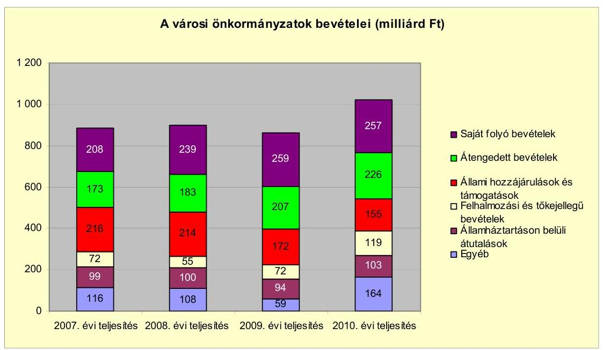

Az önkormányzati alrendszer pénzügyi helyzetértékelése során új elemzési módszereket alkalmazott az ellenőrzés. A költségvetési beszámoló adatok elemzése helyett az Önkormányzat pénzügyi helyzetét a CLF módszerrel értékeltük, amelynek lényegét és számításának módszerét a jelentés 2. pontjában, és a jelentés 2 . számú mellékletében ismertetjük részletesen.

Az új módszereken alapuló helyzetértékelés fontosságát az adja, hogy a helyi önkormányzatok bruttó adósságállománya ${ }^{2}$ a 2010. évi költségvetési beszámolók alapján 1248 milliárd Ft-ot tett ki. Ezen belül a 304 város adóssága 383 milliárd Ft volt, amely az önkormányzati alrendszer teljes adósságállományának $30,7 \%$-át jelentette ${ }^{3}$.

A mérlegben kimutatott bruttó adósságállomány mellett az önkormányzatok számára az eszközállomány műszaki állapotának megőrzése is előbb-utóbb pénzügyi kötelezettséget jelent. Az elhasználódott eszközök pótlására forrást biztosító amortizációs (felújítási) alap képzésének ${ }^{4}$ elmaradása maga után vonhatja a feladatellátást kiszolgáló tárgyi eszközök állagának erőteljes romlá-

[^0]
[^0]:    ${ }^{2}$ Az önkormányzati mérlegbeszámolókból számított bruttó adósságállomány 2010. év végi összege magában foglalja a fejlesztési és a múködési célú kötvénykibocsátások, a beruházási és fejlesztési hitelek, a működési célú hosszú lejáratú hitelek, a rövid lejáratú hitelek, váltótartozások miatti kötelezettségek teljes (2011-ben, illetve az azt követő években esedékes) állományát. Az önkormányzatok 2007. év végi mérleg szerinti adósságállománya 692 milliárd Ft volt.
    ${ }^{3}$ A fővárosi és a kerületi önkormányzatok adósságának figyelmen kívül hagyásával számított 977 milliárd Ft összegű bruttó adósságállományból a városok 39,2\%-kal részesedtek.
    ${ }^{4}$ Erre a jelenlegi szabályozási környezetben nem kötelezi előírás az önkormányzatokat.

---

sát. Emellett a 2007-2013-as időszakra meghirdetett, vissza nem térítendő EU-s fejlesztési forrásokhoz való hozzájutás lehetősége felerősítette az önkormányzati alrendszer fejlesztési igényeit, amelyek a felhalmozási költségvetési hiány folyamatos emelkedésén túl - az előírt jövőbeni fenntartási kötelezettség miatt tovább terhelhetik az önkormányzatok költségvetését ${ }^{5}$.

Az ÁSZ a 2011. évi ellenőrzési tervében 43. számú, az Önkormányzatok gazdálkodási rendszerének ellenőrzése részeként áttekinti, és elemzi az önkormányzatok pénzügyi helyzetét. A gazdálkodás szabályszerűségét az ÁSZ az előző évek során ebben az önkormányzati körben is ellenőrizte. Jelen vizsgálatunk a tett javaslataink pénzügyi helyzetet érintő pontjainak hasznosítására utóellenőrzés jelleggel tér ki.

Az ellenőrzés megállapításait az Önkormányzat által kitöltött - teljességi nyilatkozattal megerősített - 27 tanúsítványon szolgáltatott adatokra alapoztuk. Ellenőrzési bizonyítékként használtuk fel továbbá:

- a képviselő-testületi és bizottsági előterjesztéseket, a döntés-előkészítés során készített dokumentumokat;
- a kötelezettségvállalások dokumentumait;
- a pénzügyi-számviteli nyilvántartásokat;
- az éves költségvetési beszámolókat;
- a költségvetési és zárszámadási rendeleteket.

Az ellenőrzés a 2007. január 1. - 2011. június 30. közötti időszakot öleli fel. A pénzintézeti kötelezettségek állományának vizsgálatakor az ellenőrzött időszak 2006. december 31. - 2011. június 30. közötti időszakra terjedt ki.

Az ellenőrzés során vizsgáltunk minden olyan körülményt és adatot, amely a program végrehajtásához kapcsolódott és a pénzügyi helyzet alakulására hatást gyakorló releváns tények és folyamatok feltárásához szükségessé vált.

# Az ellenőrzés célja annak értékelése volt, hogy: 

- a vizsgált időszakban a kötelező és önként vállalt feladatok ellátását biztosító szervezeti keretekben, a feladatellátás módjában bekövetkezett változások milyen hatást gyakoroltak az Önkormányzat pénzügyi helyzetének alakulására;

[^0]
[^0]:    ${ }^{5}$ Az Állami Számvevőszék 2011 júniusában közzétett 1108. számú, a helyi önkormányzatok fejlesztési célú támogatási rendszerének ellenőrzéséről szóló jelentésében feltárta a fejlesztési folyamatok problémáit. A helyi önkormányzatok elsősorban azokat a fejlesztéseket valósították meg, amelyekhez támogatást lehetett igényelni. A fejlesztési célok közül a magasabb támogatási intenzitású pályázatokat részesítették előnyben. A fejlesztéssel megvalósuló létesítmények jövőbeli üzemeltetésének várható ráfordításait az önkormányzatok $71,9 \%$-a nem mérte fel.

---

- az Önkormányzat pénzügyi - ezen belül múködési és felhalmozási - egyensúlya mely tényezők hatására miként változott, és az Önkormányzat milyen intézkedéseket tett a pénzügyi egyensúly javítása érdekében;
- a költségvetési kiadások finanszírozása érdekében vállalt pénzintézeti kötelezettségek hogyan alakultak, továbbá milyen kötelezettségek fennállása befolyásolja az Önkormányzat jövőbeli pénzügyi helyzetét;
- hasznosultak-e a gazdálkodási rendszer korábbi ellenőrzése során a pénzügyi egyensúly javítására az ÁSZ által tett szabályszerűségi és célszerűségi javaslatok.

Az ellenőrzés típusa: szabályszerűségi vizsgálat.
A vizsgálat jogszabályi alapját az Állami Számvevőszékről szóló 2011. évi LXVI. törvény 1. § (3), 5. § (2)-(6) bekezdései, továbbá az Áht. 120/A. § (1) bekezdése előírásai képezik.

Nyergesújfalu állandó lakosainak száma 2011. január 1-jén 7777 fő volt.
Az Önkormányzat a 2010. évben az éves költségvetési beszámolója szerint 2630,0 millió Ft költségvetési bevételt ért el, valamint a költségvetési kiadások finanszírozásához 694,3 millió Ft összegben igénybe vették az előző évi pénzmaradványt. A 2011. évi elemi költségvetésben 1800,4 millió Ft költségvetési bevételt és 2543,5 millió Ft költségvetési kiadást irányoztak elő. A költségvetés 743,1 millió Ft-os hiányát az előző évi pénzmaradvány igénybevételével tervezték finanszírozni.

Az Önkormányzat 2010. december 31-én a könyvviteli mérleg szerint 7255,9 millió Ft értékű vagyonnal rendelkezett, amelyből a befektetett eszközök értéke 6313,6 millió Ft-ot, a forgóeszközök értéke 942,3 millió Ft-ot tett ki. Az Önkormányzat vagyonának a forrását $86,9 \%$-ban a saját tőke, $10,9 \%$-ban a tartalékok és $2,2 \%$-ban a kötelezettségek adták.

Nyergesújfalu a Duna jobb partján, a 10 sz. főközlekedési út mellett, a Gerecsehegység északi lejtőjén helyezkedik el, közigazgatási területe 3951 ha. Lakásállomány meghaladja 2800-at. A város infrastrukturális ellátottsága jó, az elektromos energia, a telefon, az ivóvíz és a szennyvízcsatorna-hálózat kiépítettsége 100\%-os. Valamennyi ingatlan gázzal, illetve távfűtéssel való ellátása a hálózat kiépítésével biztosított. Települési arculatának és fejlődésének meghatározója a Duna és a Duna mentén elhelyezkedő Zoltek Zrt. (a volt Viscoza gyár), a város Ipari Parkja ad otthont - az építőiparral, faiparral, raktározással foglalkozó kis- és középvállalkozásokon túl - a gépjárműülés gyártással foglalkozó Magyar Toyo Seat Kft.-nek, a kereskedelmi tevékenységet folytató TESCO Global Áruházak Zrt. helyi hipermarketjének. Itt tervezi felépíteni a Holcim Hungária Zrt. Európa egyik legkorszerűbb cementgyárát.

---

# I. ÖSSZEGZŐ MEGÁLLAPÍTÁSOK, KÖVETKEZTETÉSEK, JAVASLATOK 

Az Önkormányzat - az adatszolgáltatása szerint - a 2010. évi múködési költségvetési kiadásaiból 1462,0 millió Ft-ot ( $90,0 \%$-ot) a kötelező feladatok, 162,4 millió Ft-ot ( $10,0 \%$-ot) az önként vállalt feladatok ellátására fordított. Az önként vállalt feladatok az Önkormányzat besorolása szerint a nemzetközi kapcsolattartáshoz, egyes szociális támogatásokhoz, a művészetoktatási tevékenységhez, a pedagógiai kiegészítő feladatokhoz, a bölcsődei ellátáshoz, valamint a civil szervezetek támogatásához kapcsolódtak.

Az Önkormányzat feladatait 2011. június 30 -án (a Polgármesteri hivatallal együtt) kilenc költségvetési szervvel és kettő gazdasági társasággal látta el. Az intézményszervezeti átalakítások következtében a feladatellátás telephelyeinek száma a 2007. évi 19-ről 2011. év I. félév végére 21-re nőtt. Az Önkormányzat a 2007. évben átvett egy intézményfenntartó társulásban múködő óvodát, a 2009. évben a Zeneiskolát. A Zeneiskola múködési kiadásaihoz a 2009-2011. év I. féléve közötti időszakban az Önkormányzat 30,6 millió Ft-tal járult hozzá. Az Önkormányzatnak egy gazdasági társaságban 51-75\% közötti, egyben pedig $50 \%$ alatti tulajdoni hányada van. A gazdasági társaságok a távhőszolgáltatás és a víz- és szennyvízkezelés területén kaptak szerepet az Önkormányzat feladatellátásában. A gazdasági társaságok az ellenőrzött időszakban múködési és fejlesztési célú pénzeszközátadásban nem részesültek.

Az Önkormányzat feladatellátásának szervezeti struktúráját a következő ábra szemlélteti:
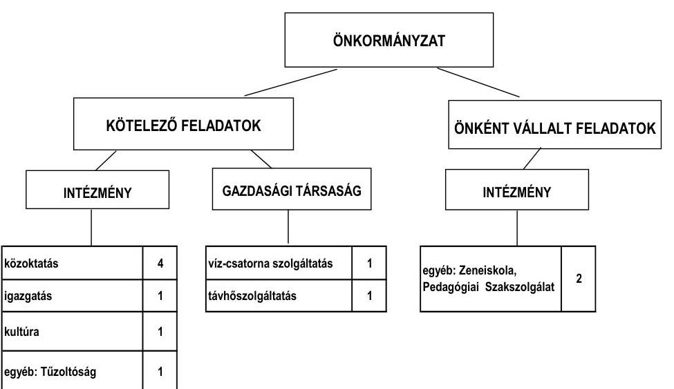

---

Az egyes közszolgáltatások feladatellátásában résztvevő intézmények működési kiadásainak finanszírozási forrásösszetételét a 2007. és a 2010. években az alábbi ábra szemlélteti:
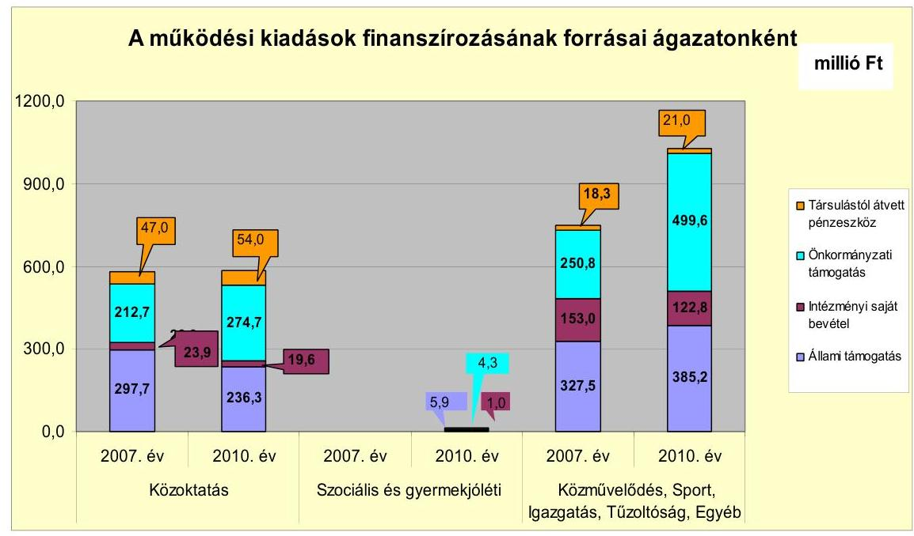

A közoktatási feladatok kiadásai a 2007-2009. évek 596,3 millió Ft-os átlagához képest a 2010. évben 1,9\%-kal (11,6 millió Ft-tal) 584,7 millió Ft-ra csökkentek. A közoktatásban az átlagos ellátotti létszám a 2007-2009. években 1101 fő volt, amely 2010. évre 1053 főre csökkent. Ennek következtében a közoktatási feladatok állami támogatása a 2007-2009. évek 282,3 millió Ft-os átlagáról 2010-ben 236,3 millió Ft-ra csökkent, melyet önkormányzati támogatásból egészítettek ki. A szociális és gyermekjóléti feladatellátásnál a bölcsődei ellátást az Önkormányzat 2010-ben indította el, amely 12,2 millió Ft többlet kiadást okozott. Az Önkormányzat a bölcsőde müködéséhez 4,3 millió Ft-tal járult hozzá. A közművelődési feladatokra fordított kiadások 53,4\%-kal (19,8 millió Ft-tal) emelkedtek. A közművelődési feladat állami támogatása a 2007. évi 8,8 millió Ft-ról 2010-ben 0,1 millió Ft-ra csökkent, az önkormányzati támogatás 17,6 millió Ft-tal ( $67,7 \%$-kal), az intézményi saját bevételek 1,0 millió Ft-ról 13,2 millió Ft-ra emelkedtek. A Tűzoltóság működési kiadásai 1,4 millió Ft-tal csökkentek 2010-re. Az Önkormányzat az egyéb intézményi feladatai között ellátta a pedagógiai szakszolgáltatást és 2009-től a művészetoktatást. A 2010. évben e kettő feladat múködési kiadásai 61,8 millió Ft-tal emelkedtek 2007-hez képest. Az igazgatási kiadások 108,8 millió Ft-tal növekedtek, elsősorban a fordított áfakiadások emelkedése miatt. A Polgármesteri hivatal által ellátott egyéb feladatok kiadásai a 2007-2009. évek 176,8 millió Ft-os átlagához képest 2010-re 250,9 millió Ft-ra nőttek. Az egyéb feladatok között mutatták ki a közcélú és közhasznú foglalkoztatottak kiadásait, melyre 49,1 millió Ft-tal többet fordítottak, mivel 2010-ben 55 fővel növelték a foglalkoztatottak létszámát.

A közoktatási feladatoknál a társult óvoda miatti feladatbővülés, valamint az önként vállalt feladatok esetében a bölcsődei ellátás bevezetése és a Zeneiskola

---

átvétele az Önkormányzat múködési kiadásainak 249,8 millió Ft-növekedését idézte elő a vizsgált időszakban. Az állami támogatások, az óvodai társulástól átvett pénzeszköz és az intézményi saját bevételek 214,9 millió Ft-ban fedezték a társult óvoda, a bölcsőde és a Zeneiskola múködési kiadásait. Az Önkormányzat a társult óvoda fenntartásához nem járult hozzá, a bölcsőde és a Zeneiskola múködtetéséhez 34,9 millió Ft támogatást adott, ami a pénzügyi egyensúlyi helyzet alakulását kedvezőtlenül befolyásolta.

Az Önkormányzat folyó költségvetési egyenlege (a múködési jövedelem) 2007-2010 között múködési forrástöbbletet mutatott, melyet az alábbi ábra szemléltet:
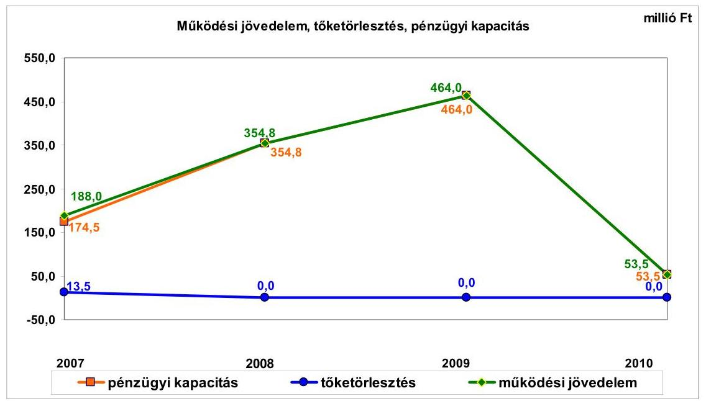

A folyó költségvetés többlete 2007-ben a folyó kiadások 13,2\%-át (188,0 millió Ft-ot), 2008-ban 20,6\%-át (354,8 millió Ft-ot), 2009-ben 28,4\%-át (464,0 millió Ft-ot), 2010-ben 3,1\%-át (53,5 millió Ft-ot) jelentette.

Az Önkormányzat folyó bevételei a 2007-2009. évek 1928,0 millió Ft-os átlagához képest 2010-re 1763,8 millió Ft-ra ( $8,5 \%$-kal) csökkentek. A 2007-2009. években a múködési jövedelem folyamatosan emelkedett a folyó bevételek folyó kiadásokat meghaladó ütemú növekedése miatt. A folyó bevételeken belül az iparúzési adóbevétel - az előző évhez képest - a 2008. évre 66,2\%-kal (190,7 millió Ft-tal), 2009-re 27,7\%-kal (132,6 millió Ft-tal) nőtt a legnagyobb adózó adóalapjának (árbevételének) jelentős mértékű emelkedése, továbbá az adóhátralékok beszedése és a fokozott adóellenőrzések következtében. A 2010. évben a múködési jövedelem a 2008-2009. évekhez képest lecsökkent, elsősorban a folyó bevételek (azon belül elsődlegesen az áfából származó bevételek és az iparúzési adóból befolyt bevételek) 313,5 millió Ft-os, illetve 335,9 millió Ftos visszaesése miatt. A 2010. évben az iparúzési adó csökkenését a gazdasági válság és a legnagyobb adóalany adóalapjának visszaesése okozta. A folyó bevételek 2010. évi csökkenése az Önkormányzat pénzügyi egyensúlyi helyzetére kedvezőtlenül hatott, a pénzügyi kockázat emelkedett. Az Önkormányzatnál a vizsgált időszakban a helyi iparúzési adón kívül az építményadó és a magánszemélyek kommunális adója adónemeket alkalmazták. A 2007-2010. közötti

---

években az építményadónak és a magánszemélyek kommunális adójának a mértéke nem változott. 2011. január 1-jétől e két adónem mértékét felemelték, de azok még mindig jelentősen elmaradnak a helyi adó törvényben meghatározott maximális adómértéktől.

Az Önkormányzat folyó kiadásai a 2007-2009. évek 1592,4 millió Ft-os átlagához képest 2010-ben 7,4\%-kal, 1710,3 millió Ft-ra emelkedtek. A folyó kiadásokon belül a múködési kiadások a 2007-2009. évek 1529,5 millió Ft-os átlagához képest 2010-ben 5,9\%-kal, 1619,9 millió Ft-ra emelkedtek.

Az Önkormányzat folyó kiadásai a 2007. évről a 2008. évre 21,4\%-kal (303,5 millió Ft-tal) nőttek, melynek 96,5\%-át a múködési kiadások 293,0 millió Ft-os emelkedése okozta. A múködési kiadások emelkedését a 2008. évben elsősorban az áfakiadások növekedése okozta. A 2010. évben a folyó kiadások 4,6\%-kal (74,6 millió Ft-tal) emelkedtek 2009-hez képest, amelyet a múködési kiadások 51,9 millió Ft-os és a múködési célú pénzeszközátadások 22,0 millió Ft-os növekedése okozott.

Az Önkormányzat 2006 szeptemberében a Holcim Hungária Zrt.-vel együttműködési megállapodást kötött a város Ipari Parkjának egy új cementgyár felépítéséhez szükséges területtel történő bővítésére. Az együttműködési megállapodásban rögzítették, hogy a cementgyár felépítéséhez szükséges, még magántulajdonban lévő földterületet az Önkormányzat megvásárolja a Holcim Hungária Zrt. előfinanszírozásával. Az Áht. 108. § (1) bekezdésében foglaltak ellenére - versenytárgyalás mellőzésével - megállapodtak arról is, hogy az Önkormányzat elad a saját tulajdonában lévő földterületekből a Holcim Zrt.-nek mintegy 10 ha nagyságú részt $2025 \mathrm{Ft} / \mathrm{m}^{2}+$ áfa vételáron. Az Önkormányzat 2006 decemberében a Holcim Hungária Zrt.-vel finanszírozási szerződést kötött, amelyben rögzítették, hogy az Önkormányzat a cementgyár beruházásához szükséges ingatlanok értékesítésére versenytárgyalást fog kiírni. A versenytárgyalást 2008 augusztusában tartották meg, melynek nyertese a Holcim Hungária Zrt. volt.

Az Önkormányzat 2006-2008. évi éves költségvetési beszámolói nem tartalmazták az új cementgyár létesítése érdekében kialakított Ipari Park földterületének megvásárlásával és értékesítésével kapcsolatos gazdasági események elszámolását 1406,0 millió Ft összegben. Az Önkormányzatnál az Ipari Park kialakítása során figyelmen kívül hagyták az Áht-ban ${ }^{6}$ előírtakat, amely szerint a költségvetési bevételeket és a költségvetési kiadásokat pénzforgalmi szemléletben - pénzforgalmi és pénzforgalom nélküli tételek megkülönböztetésével, de azok egyenértékű kezelésével - részletesen, teljes összegükben kell számba venni.
2010. január 1-jétől az Áht. tartalmazta azokat az elveket, amelyeket a költségvetési bevételek és kiadások elszámolásakor alkalmazni kell annak érdekében, hogy meghatározhatók legyenek a költségvetési egyenleg és az adósság tételei, a költségvetési egyenleg és az adósság összefüggései. Az Önkormányzatnál nem vették figyelembe a Számv. tv-ben előírt valódiság elvét és az Áhsz., a számlaosz-

[^0]
[^0]:    ${ }^{6}$ Az Áht. 2012. január 1-jétől hatályát vesztette. A jelenleg hatályos jogszabály az államháztartásról szóló 2011. évi CXCV. törvény.

---

tályok tartalmára vonatkozó előírásait sem, amely szerint ki kell mutatni azoknak a pénzforgalom nélküli elszámolásoknak a forgalmát, amelyeket bevételként és kiadásként egyidejűleg kell könyvelni, de a pénzforgalom a számlavezető pénzintézetet nem érinti.

Az Önkormányzatnak pénzintézettel szemben csak a 2007. évben volt 13,5 millió Ft összegben - hiteltörlesztési kötelezettsége. A nettó múködési jövedelem értéke a folyó költségvetési egyenleg mellett az adott költségvetési év adósságtörlesztésének hatását is tükrözi, így a nettó működési jövedelem a 2008-2010. években a működési jövedelemmel megegyezően alakult. Az Önkormányzatnál a 2007-2010. évek közötti időszakban együttesen 1046,8 millió Ft nettó működési jövedelem keletkezett.

A pénzügyi egyensúlyi helyzetet jelentősen befolyásolta az Önkormányzat elmúlt időszaki fejlesztési tevékenysége. Az Önkormányzat felhalmozási költségvetésének egyenlege a 2007-2010. években összesen 392,1 millió Ft felhalmozási forráshiányt mutatott, melyre a fedezetet a nettó működési jövedelem biztosította. Az Önkormányzat által 2007-2010 között megvalósított, 2010. december 31-ig befejezett felújítások és fejlesztések száma mintegy 150 volt, amelyből a 10 millió Ft-ot meghaladó egyedi értékű 23 volt. A befejezett fejlesztéseket saját forrásból, valamint hazai és EU-s támogatásokból valósították meg. A 2007-2010. évek időszakában 2107,8 millió Ft értékű fejlesztés és felújítás forrása $53,7 \%$-ban saját erő, $9,4 \%$-ban hazai és $36,9 \%$-ban EU-s támogatás volt.

A négy folyamatban lévő fejlesztési feladat végrehajtására 2007-2010 között - 2010. december 31-ig - 447,2 millió Ft kiadást teljesítettek, amelyet saját forrásból finanszíroztak. Az Önkormányzat 2010. december 31-én folyamatban lévő négy fejlesztési feladatának várható bekerülési költsége 788,6 millió Ft, ebből a 2010. évet követő kötelezettségvállalások összege 341,4 millió Ft, amelyet kizárólag saját forrásból terveznek biztosítani.

Az Önkormányzat a 2011. év I. félévében pályázati források igénybevételével négy, 844,0 millió Ft teljes bekerülési költségű - beadott, elbírálás alatt lévő - projektet tervez megvalósítani. A projekteket a 2011-2013. években 468,9 millió Ft-ot saját forrásból, 34,7 millió Ft-ot hazai támogatásból, 340,4 millió Ft-ot EU-s támogatásból terveznek finanszírozni.

Az Önkormányzat a 2007. év elején fennállt 13,5 millió Ft-os mérleg szerinti pénzintézeti kötelezettségét 2007-ben törlesztette. A 2007-2010. években pénzintézeti kötelezettséget nem vállaltak. 2011 áprilisában folyószámlahitelkeretszerződést kötöttek 250,0 millió Ft összegben. A 2011. év I. félévének végén fennálló 85,1 millió Ft-os pénzintézeti kötelezettség teljes egészében a 2010. évet követően igénybe vett folyószámlahitelből keletkezett.

A 2007-2011. év I. féléve között átmenetileg szabad pénzeszközeik után 179,4 millió Ft kamatbevételt realizáltak. A vizsgált időszakban a forgatási célú értékpapírvásárlások és a betételhelyezések során a költségvetési rendeletekben előírt eljárási- és hatásköri szabályokat nem tartották be. A Képviselő-testület az éves költségvetési rendeletekben állampapír vásárlására és betét elhelyezésére hatalmazta fel a polgármestert a jegyző ellenjegyzése, és utólagos beszámo-

---

lási kötelezettség mellett. A polgármester állampapír helyett a számlavezető banknál befektetési jegyet vásárolt a 2007-2010. években 107 alkalommal, öszszesen 11848,3 millió Ft forgalmi értékben. A tranzakciókról szóló szerződést a jegyző helyett a gazdasági osztály vezetője jegyezte ellen, a tranzakciókról a Képviselő-testület utólagos tájékoztatása elmaradt.

A közbenső egyeztetés során a polgármester által tett észrevétel szerint: a Képvise-lő-testület utólagos tájékoztatása biztosított volt, mivel a képviselők számára a képviselő-testületi üléseken kiosztásra kerültek a havi likviditási tervek, melyek tartalmazták a befektetési formát, a befektetés adott napi összegét, valamint azt, hogy milyen időszakra szóló befektetéssel rendelkezett az Önkormányzat.

Az Önkormányzat a pénzügyi egyensúlyát a 2007-2010. években hitelfelvétel nélkül biztosította, azonban a 2011. év I. félévében a fizetőképesség folyamatos biztosításához szükség volt folyószámlahitel igénybevételére. A Polgármesteri hivatalban a 2011. év I. félévi költségvetési beszámoló elkészítése során - 2011. június 30 -i fordulónappal - a Számv. tv-ben előírt valódiság elve, és az Áhsz. számlaosztályok tartalmára vonatkozó előírásai ellenére nem mutatták ki a folyószámlahitel igénybevételét. A 2007-2011. években a számlarend kialakításakor a Polgármesteri hivatalban a Számv. tv-ben előírt valódiság elve, valamint az Áhsz. számlakerettükör és a számlaosztályok tartalmára vonatkozó előírásai ellenére nem gondoskodtak arról, hogy a főkönyvi könyvelésben elkülönítetten kerüljön elszámolásra a bankszámlavezetéssel kapcsolatos díffizetés és a kamatkiadás.

Az Önkormányzatnak a 2011. év I. félév végi 12,9 millió Ft-os szállítói tartozás állományából lejárt tartozása nem volt. Az Önkormányzat gazdasági társaságai részére készfizető kezességet nem vállalt, kölcsönt nem nyújtott.

Az Önkormányzat kötelezettségeinek 2010. december 31-i, valamint 2011. június 30-i állományát és várható alakulását a kötelezettségek lejáratáig a következő táblázat szemlélteti:

| Megnevezés | Állomány 2010.   december 31-   én | Állomány 2011.   június 30 -án | Várható   kötelezettség   2011-2013.   években | Várható   kötelezettség   2014. évtöl |
| :--: | :--: | :--: | :--: | :--: |
|  | HUF-ban (millió   Ft-ban) | HUF-ban (millió Ft   ban) | HUF-ban (millió Ft-   ban) | HUF-ban (millió Ft   ban) |
| Pénzintézeti kötelezettségek |  |  |  |  |
| Folyószámla hitel |  | 85,1 | 85,1 |  |
| Pénzintézeti kötelezettségek összesen HUF-ban: |  | 85,1 | 85,1 |  |
| Szállitói tartozás | 8,9 | 12,9 | 12,9 |  |
| Egyéb kötelezettségek | 86,7 | 86,7 | 28,8 | 57,9 |

*Az Önkormányzatnak folyószámlahitelből várható kötelezettsége a következő években csak akkor áll fenn, ha nem egyenlítette ki 2013. december 31-ig.

Az Önkormányzatnak a 2011. év I. félév végén pénzintézettel szemben folyószámlahitelből 85,1 millió Ft, a szállítói tartozásokból 12,9 millió Ft és a Holcim Hungária Zrt.-től (nem önkormányzati tulajdonban lévő gazdasági társaságtól) - az Ipari Park fejlesztésére beadott pályázat önrészéhez - kapott kölcsönből 2012-2017 között 86,7 millió Ft fizetési kötelezettsége állt fenn, emiatt a hosszú lejáratú kötelezettségek állománya a vizsgált időszakon belül emelke-

---

dett. A jelenleg ismert, 2011-2013. években esedékes 126,8 millió Ft összegű kötelezettség teljesítéséhez figyelembe vehető a 137,7 millió Ft mérlegben kimutatott követelésállomány, az Önkormányzatnak - a kimutatása szerint - szabad pénzmaradványa nincsen. A 2014. évet követően az Önkormányzatnak jelenleg nincs ismert pénzintézeti kötelezettsége.

Az Önkormányzat 2007-2010 között az eszközállománya után 375,5 millió Ft összegű értékcsökkenést mutatott ki, az aktivált felújítások értéke 80,0 millió Ft volt, a befejezett fejlesztési feladatokból az elhasznált eszközök pótlására 116,7 millió Ft-ot fordított.

Az Önkormányzatnál az ellenőrzött időszakban kiadási megtakarítást eredményező és bevételt növelő intézkedéseket tettek. Az Önkormányzat kimutatása szerint a 2007-2011. év I. féléve között végrehajtott intézkedések eredményeként 461,1 millió Ft bevételi többletet, továbbá 52,0 millió Ft kiadási megtakarítást értek el.

A kiadási megtakarítást - az Önkormányzat kimutatása szerint - 100\%-ban az elrendelt álláshelycsökkentések eredményezték. Az álláshelycsökkentő intézkedések a 2007-2011. év I. féléve között önkormányzati szinten összesen 11 álláshely (ebből kettő üres álláshely) megszüntetését jelentették. A bevételnövelő intézkedések a helyi adó bevételekhez, ingatlanok bérbeadásához, a lejárt követelések beszedéséhez és az átmenetileg szabad pénzeszközök lekötéséhez kapcsolódtak.

A szja-ból származó bevétel és az állami támogatások együttes összege a 2006. évhez képest a 2007-2011. év I. féléve között 54,4 millió Ft-tal nőtt, mely a kiadási megtakarítást és bevételt növelő intézkedések eredményével együtt kedvezően hatott a pénzügyi egyensúlyra.

Az utóellenőrzés a pénzügyi egyensúly javítására tett kettő szabályszerűségi és kettő célszerűségi javaslat hasznosítására terjedt ki. A szabályszerűségi javaslatokat és egy célszerűségi javaslatot az intézkedési terv szerinti határidőben megvalósították. Egy célszerűségi javaslatot részben teljesítettek, mivel az intézkedési tervet a Képviselő-testület jóváhagyta, azonban azt nem küldték meg az ÁSZ részére.

Az Önkormányzat pénzügyi egyensúlyi helyzetét összegezve a következők emelhetők ki:

Nyergesújfalu Város Önkormányzatának pénzügyi egyensúlya rövid és középtávon biztosított. A pénzügyi egyensúly hosszú távú megőrzésére az Önkormányzatnak fel kell készülnie.

A működési jövedelem a 2007-2010. években pozitív volt, a 2007-2009. években évről évre emelkedett, majd a 2010. évben jelentős mértékben visszaesett az iparűzési adóbevétel csökkenése miatt.

A folyóbevételek mintegy harmadát kitevő helyi adók döntő része a helyi iparűzési adóból, annak is több mint egyharmada egy adóalanytól származik, ezért a bevételi kitettsége miatt hosszú távon kockázat jelentkezhet.

---

A múködési célú költségvetési kiadásokon belül az önként vállalt feladatok részaránya a vizsgált időszakban folyamatosan emelkedett.

A fejlesztések során kialakított létesítmények jövőbeni múködtetésének várható kiadásait nem számszerúsítették. Az Ipari Park fejlesztése a tervezett cementgyárnak köszönhetően bevételi lehetőséget teremthet az Önkormányzatnak.

A felhalmozás finanszírozási kockázata alacsony, a saját forrásból megvalósuló fejlesztési feladatok finanszírozásának fedezete a 2010. év végi pénzkészletből, valamint tartós hitelviszonyt megtestesítő értékpapír állományából biztosított. A csökkenő működési jövedelem és a tervezett fejlesztések támogatásainak előfinanszírozása likviditási nehézséget idézhet elő hosszú távon.

A szállítói és a pénzintézeti kötelezettségek a pénzügyi egyensúlyi helyzetre nem voltak hatással. Minősített többségi tulajdonú gazdasági társasága nem volt az Önkormányzatnak.

Az Állami Számvevőszékről szóló 2011. évi LXVI. törvény 33. § (1) bekezdésében foglaltak értelmében a jelentésben foglalt megállapításokhoz kapcsolódó intézkedési tervet köteles az ellenőrzött szervezet vezetője összeállítani és azt a jelentés kézhezvételétől számított harminc napon belül az ÁSZ részére megküldeni. Amennyiben az intézkedési tervet határidőben nem küldi meg a szervezet, vagy az továbbra sem elfogadható, az ÁSZ elnöke a hivatkozott törvény 33. § (3) bekezdés a)-b) pontjaiban foglaltakat érvényesítheti.

# A 2011. június 30-i pénzügyi egyensúlyi helyzet alapján az ellenőrzés intézkedést igénylő megállapításai és javaslatai a következők: 

## a Polgármesternek

1. A Képviselő-testület a 2007-2011. évi költségvetési rendeletekben az átmenetileg szabad pénzeszközök befektetésére a polgármestert hatalmazta fel, a jegyző ellenjegyzésével, a Képviselő-testület utólagos tájékoztatása mellett. A felhatalmazás alapján a polgármester a 2007-2010. években három hónapnál nem hosszabb időtartamra betétben való elhelyezésre és állampapír vásárlására volt jogosult, a 2011. évben a befektetés időtartama 12 hónapban került meghatározásra. A forgatási célú értékpapírvásárlások és betételhelyezések során az eljárási- és hatásköri szabályokat nem tartották be, mivel a 2007-2010. években az átmenetileg szabad pénzeszközökből 107 alkalommal, 11 848,3 millió Ft forgalmi értékben állampapír helyett a számlavezető banknál befektetési jegyet vásároltak, a Képviselő-testület utólagos tájékoztatása a tranzakcióról elmaradt, továbbá az ellenjegyzést a jegyző helyett a gazdasági osztály vezetője gyakorolta.

Javaslat:
Intézkedjen annak érdekében, hogy az átmenetileg szabad pénzeszközök befektetése esetében a Képviselő-testület által a költségvetési rendeletben meghatározott eljárási és hatásköri szabályok maradéktalanul betartásra kerüljenek.
2. Az Önkormányzat pénzügyi egyensúlyi helyzete rövid és középtávon biztosított. A pénzügyi egyensúly hosszú távú megőrzésére az Önkormányzatnak fel kell készülnie,

---

mivel a hosszú lejáratú kötelezettségek állománya emelkedett.
Javaslat:
Folyamatosan tájékoztassa a Képviselő-testületet az Önkormányzat pénzügyi egyensúlyi helyzetéről. Kezdeményezzen szükség esetén intézkedéseket a pénzügyi egyensúly hosszú távú fenntarthatósága érdekében.

# a jegyzönek 

1. Az Önkormányzat 2006-2008. évi éves költségvetési beszámolói nem tartalmazták az új cementgyár létesítése érdekében kialakított Ipari Park földterületének megvásárlásával és értékesítésével kapcsolatos gazdasági események elszámolását 1406,0 millió Ft összegben. Az Önkormányzatnál nem vették figyelembe a Számv. tv-ben előírt valódiság elvét és az Áhsz. 9. számú melléklete, a számlaosztályok tartalmára vonatkozó előírások 4. j) pontját, amely szerint ki kell mutatni azoknak a pénzforgalom nélküli elszámolásoknak a forgalmát, amelyeket bevételként és kiadásként egyidejűleg kell könyvelni, de a pénzforgalom a számlavezető pénzintézetet nem érinti.

Javaslat:
Intézkedjen annak érdekében, hogy alkalmazzák a költségvetési kiadások és bevételek elszámolása során az a Számv. tv. 15. § (3) bekezdésében előírt valódiság elvét és az Áhsz. 9. számú melléklete, a számlaosztályok tartalmára vonatkozó előírások 4. j) pontjában foglaltakat, mely szerint ki kell kimutatni azoknak a pénzforgalom nélküli elszámolásoknak a forgalmát, amelyeket bevételként és kiadásként egyidejűleg kell könyvelni, de a pénzforgalom a számlavezető pénzintézetet nem érinti.
2. A Polgármesteri hivatalban a 2007-2008. években a számlarend kialakításakor nem biztosították a Számv. tv-ben előírt valódiság elve, és az Áhsz. 9. számú melléklete, a számlaosztályok tartalmára vonatkozó előírások 9. d) pontjában előírtak ellenére, hogy a főkönyvi könyvelésben elkülönítetten kerüljön elszámolásra a bankszámlavezetéssel kapcsolatos díffizetés és a kamatkiadás. A 2009-2011. években a számlarend kialakításakor sem biztosították az Áhsz. 9. számú melléklete, a számlakerettükör és a számlaosztályok tartalmára vonatkozó előírások 9. c) és 9. d) pontjaiban előírtak ellenére azt, hogy a főkönyvi könyvelésben a pénzügyi szolgáltatások díja az 556. pénzügyi szolgáltatások számlán, a kamatkiadások az 573. kamatkiadások számlán elkülönítetten kerüljenek elszámolásra.

Javaslat:
Gondoskodjon a Számv. tv. 15. § (3) bekezdésében előírt valódiság elvének betartásával arról, hogy és az Áhsz. 9. számú mellékletében a számlakerettükör és a számlaosztályok tartalmára vonatkozó előírások 9. c) és 9. d) pontjaiban előírtaknak megfelelően a főkönyvi könyvelésben a pénzügyi szolgáltatások díja és a kamatkiadások az előírt főkönyvi számlákon elkülönítetten kerüljenek elszámolásra.
3. A Polgármesteri hivatalban nem mutatták ki a 2011. év I. félévi költségvetési beszámoló elkészítése során - 2011. június 30-i fordulónappal - a főkönyvi

---

könyvelésben a Számv. tv-ben előírt valódiság elve, és az Áhsz. 9. számú mellékletének a számlaosztályok tartalmára vonatkozó előírások 3. b) és 4. e) pontjában foglaltak ellenére a folyószámlahitel igénybevételét.

Javaslat:
Intézkedjen, hogy a folyószámlahitel igénybevételét a Számv. tv. 15. § (3) bekezdésében előírt valódiság elvével összhangban, és az Áhsz. 9. számú mellékletének a számlaosztályok tartalmára vonatkozó előírások 3. bb) és 4. e) pontjaiban foglaltaknak megfelelően a főkönyvi könyvelésben a negyedéves mérlegjelentés, a költségvetési jelentés, a féléves és éves elemi költségvetési beszámoló fordulónapján mutassák ki.

A polgármester a helyszíni ellenőrzés lezárása után tájékoztatta az Állami Számvevőszéket az Önkormányzat megtett intézkedéseiről, amelyet az Állami Számvevőszék nem ellenőrzött, arra vonatkozóan véleményt vagy megállapítást nem fogalmaz meg. Az ellenőrzés lezárását követően elvégzett intézkedéseket az Állami Számvevőszék utóellenőrzés keretében vizsgálhatja.

A polgármester tájékoztatása szerint a következő intézkedéseket tette az Önkormányzat:

- az átmenetileg szabad pénzeszközök esetében a helyszíni ellenőrzés időszakában biztosították a költségvetési rendeletben előírtak érvényesülését,
- kezdeményezte a Képviselő-testületnél a Művelődési Ház engedélyezett alkalmazotti létszámának egy fővel való csökkentését, valamint a három önállóan múködő óvoda összevonását. A Képviselő-testület a magánszemélyek kommunális adója $4000 \mathrm{Ft} /$ év/adótárgyról annak 7000 $\mathrm{Ft} /$ év/adótárgyra való emeléséről döntött a 2012. évtől. Ugyancsak megemelték az építményadót $700 \mathrm{Ft} / \mathrm{m}^{2}$-ről $990 \mathrm{Ft} / \mathrm{m}^{2}$-re, és az adótárgyak körét bővítették a külterületen lévő nem lakás céljára szolgáló ingatlanokkal,
- a pénzforgalom nélküli bevételeket és kiadásokat a hatályos jogszabályoknak megfelelően mutatják ki,
- a főkönyvi könyvelésben biztosították a pénzügyi szolgáltatások és a kamatkiadások elkülönített kimutatását,
- a 2011. év III. negyedévi pénzforgalmi jelentésben kimutatták az igénybevett folyószámlahitelt.

---

# II. RÉSZLETES MEGÁLLAPÍTÁSOK 

## 1. Az ÖNKORMÁNYZAT KÖTELEZŐ ÉS ÖNKÉNT VÁLlALT FELADATAI, A FELADATELLÁTÁS SZERVEZETI KERETEI ÉS ANNAK VÁLTOZÁSAI

A Képviselő-testület nem határozta meg, hogy milyen kötelező és önként vállalt feladatokat ${ }^{7}$ látnak el. A kötelező és az önként vállalt feladatok meghatározását, valamint a működési kiadások feladatonkénti megbontását a helyszíni vizsgálat ideje alatt elvégezte az Önkormányzat. Önként vállalt feladatnak sorolták be a bölcsődei ellátást, a művészetoktatási tevékenységet, a pedagógiai szakszolgálat működtetését, a rendezvények támogatását, a nemzetközi kapcsolattartást, valamint a helyi rendszeres, valamint eseti lakásfenntartási támogatást, az ápolási díj méltányossági alapon történő juttatását, a kiegészítő és a rendkívüli gyermekvédelmi támogatást, az átmeneti és a temetési segély nyújtását, valamint a civil és sportszervezetek támogatását. Az Önkormányzat - az adatszolgáltatása szerint - a 2010. év müködési költségvetési kiadásaiból 1462,0 millió Ft-ot ( $90,0 \%$-ot) a kötelező feladatokra, 162,4 millió Ft-ot $(10,0 \%$-ot) az önként vállalt feladatok ellátására fordított.

Az Önkormányzat által készített kimutatás szerint a múködési költségvetési kiadások ${ }^{8}$ a 2007. évben 1331,0 millió Ft-ot, a 2008. évben 1610,7 millió Ft-ot, a 2009. évben 1555,4 millió Ft-ot, a 2010. évben 1624,4 millió Ft-ot tettek ki. A 2008. évben a múködési kiadások 279,7 millió Ft-os emelkedését 79,3\%-ban (222,0 millió Ft) a Polgármesteri hivatal kiadásai, 14,7\%-ban (41,2 millió Ft) a közoktatási feladatok kiadásai, 3,0-3,0\%-ban a közművelődési feladatok és a Tűzoltóság kiadásainak emelkedése idézte elő. A 2009. évi múködési kiadások 55,3 millió Ft-os csökkenését a közoktatási feladatok múködési kiadásainak csökkenése eredményezte ${ }^{9}$. A múködési kiadások 2010. évi 69,0 millió Ft-os emelkedését jelentős részben ( 59,4 millió Ft) az önként vállalt feladatok (bölcsődei ellátás, művészetoktatás) növekedése okozta. Az önkormányzati múködési kiadásokból a kötelező feladatokra a 2007-2010. évek között átlagosan az összes múködési kiadások 93,1\%-át - 2007-ben 1254,4 millió Ft-ot, 2008-ban 1525,7 millió Ft-ot, 2009-ben 1456,7 millió Ft-ot, 2010-ben pedig 1462,0 millió Ft-ot - fordították. Az önként vállalt feladatok ellátása 2007-ben 76,6 millió Ft-ot 2008-ban 85,0 millió Ft-ot, 2009-ben 98,7 millió Ft-ot, 2010ben 162,4 millió Ft-ot igényelt.

[^0]
[^0]:    ${ }^{7}$ Az önkormányzati feladatatok felsorolása az Önkormányzat Szociális Szervezési Koncepciójában, a hivatali SzMSz-ben és az Önkormányzat közoktatási feladatellátási tervében voltak megtalálhatók, azonban azok kötelező és önként vállalt feladatokra való felosztása nem történt meg.
    ${ }^{8}$ A múködési kiadások eltérnek a jelentés 2. számú mellékletében bemutatott adatoktól, mert az tartalmazza az OEP által finanszírozott egészségügyi feladatok folyó bevételeit és folyó kiadásait.
    ${ }^{9}$ A közoktatásban az ellátotti létszám a 2008. évtől folyamatosan csökkent.

---

Az Önkormányzat müködési kiadásain belül az intézmények müködési kiadásai a 2007-2009. évi átlagos 1322,2 millió Ft-ról 2010-re 1373,4 millió Ft-ra (3,9\%-kal) emelkedtek. Az oktatási-nevelési feladatokat ellátó intézmények müködési kiadásai a 2007. évhez képest - nem jelentős mértékben - 2010. évben 0,6\%-kal (3,3 millió Ft) emelkedtek. A Polgármesteri hivatal igazgatási kiadása a 2008. évben 208,2 millió Ft-tal (63,6\%-kal) emelkedett az előző évhez képest, mivel az Ipari Parkban értékesített telkek után felszámított áfát 2008ban bevallották és megfizették. Az igazgatási müködési kiadások a 2009. és a 2010. években az előző évhez képest 14,7\%-kal (78,6 millió Ft-tal), illetve 4,6\%$\mathrm{kal}(20,8$ millió Ft-tal) csökkentek, amelyet elsősorban az áfafizetési kötelezettség csökkenése okozott.

Az Önkormányzat 2010. évi müködési kiadásait és finanszírozási arányait - az adatszolgáltatásuk szerint - az alábbi táblázat mutatja be:

| Ellátott feladat | Müködési   kiadás   összesen   (millio Ft) | Kötelezö   feladatok   kiadásainak   részaránya   \% | Müködési   bevétel   összesen   (millio Ft) | Állami   támogatás   részaránya   \% | Intézményi   saját bevétel   részaránya   \% | Önkormányzati   támogatás   részaránya   \% | Társulástól   átvett   támogatás   részaránya   \% |
| :--: | :--: | :--: | :--: | :--: | :--: | :--: | :--: |
| Óvodák | 228,5 | 100,0 | 228,5 | 35,6 | 5,1 | 50,7 | 8,6 |
| Általános iskolák | 356,2 | 100,0 | 356,2 | 43,5 | 2,2 | 44,6 | 9,7 |
| Gyermekjöléti   intézmények | 11,2 | 0,0 | 11,2 | 53,0 | 8,9 | 38,1 | 0,0 |
| Közmüvelödési   intézmények | 56,9 | 100,0 | 56,9 | 0,1 | 23,2 | 76,7 | 0,0 |
| Tözoltóság | 193,2 | 100,0 | 193,2 | 99,3 | 0,7 | 0,0 | 0,0 |
| Egyéb intézmények* | 91,3 | 0,0 | 91,3 | 34,4 | 3,9 | 38,8 | 22,9 |
| Polgármesteri hivatal   igazgatási kiadásai | 436,1 | 100,0 | 436,1 | 14,9 | 17,0 | 68,1 | 0,0 |
| Polgármesteri   hivatalban ellátott   egyéb feladatok   müködési kiadásai | 251,0 | 76,1 | 251,0 | 38,7 | 12,1 | 49,2 | 0,0 |
| Müködési kiadá-   sok összesen | 1624,4 | 90,0 | 1624,4 | 38,6 | 8,8 | 48,0 | 4,6 |

Egyéb intézmények között szerepel a Pedagógiai Szakszolgálat és a Zeneiskola
A müködési kiadások eltérnek a jelentés 2. számú mellékletében bemutatott adatoktól, mert az tartalmazza az OEP által finanszírozott egészségügyi feladatok folyó bevételeit és folyó kiadásait is.

Az óvodai feladatellátásnál az állami támogatás mértéke a 2007-2009. évek 89,4 millió Ft-os átlagáról 2010-re 81,4 millió Ft-ra, az általános iskolai oktatás esetében 192,8 millió Ft-ról 2010-re 154,9 millió Ft-ra csökkent. Ezzel szemben az önkormányzati támogatás mértéke az óvodai ellátás esetében a 2007-2009. évi átlagos 108,7 millió Ft-ról 115,8 millió Ft-ra, az általános iskolai oktatás esetében az átlagos 139,2 millió Ft-ról 158,8 millió Ft-ra nőtt. A közoktatási feladatok kiadásaiból az állami támogatással finanszírozott rész aránya a 20072009. évek $45,8 \%$-os átlagáról $39,6 \%$-ra, az intézményi saját bevételi részaránya $4,3 \%$-ról $3,6 \%$-ra csökkent 2010 -re, ugyanakkor az önkormányzati támogatás részaránya $43,0 \%$-ról $47,7 \%$-ra nőtt. Az egyéb intézményi kiadások a 2007-2008. években nem változtak, a 2009. évben a művészetoktatási feladatok év közbeni átvétele miatt 13,5 millió Ft-tal, a 2010. évben 48,2 millió Ft-tal nőttek az előző évhez képest.

---

Az Önkormányzat kötelező és önként vállalt feladatait 2010. december 31-én - a Polgármesteri hivatallal együtt - kilenc költségvetési szervvel, valamint egy többségi tulajdonában lévő gazdasági társasággal látta el. Az intézmények száma a 2006. év végi nyolcról a 2010. évre kilencre nőtt (a Zeneiskola átvétele miatt), a többségi tulajdonú gazdasági társaságok száma kettőről egyre csökkent (2007-ben az egyik gazdasági társasága végelszámolással megszűnt). Az intézmények 2010. december 31-én összesen 21 telephelyen múködtek.

Az Önkormányzat feladatait a Polgármesteri hivatalon kívül a 2006. év végén hét, részben önállóan gazdálkodó, a 2010. évben és 2011. június 30 -án is egy önállóan múködő és gazdálkodó ${ }^{10}$, továbbá nyolc önállóan múködő ${ }^{11}$ költségvetési intézmény hajtotta végre.

Az Önkormányzat igazgatási feladatait a Polgármesteri Hivatal, a közoktatási feladatokat négy intézmény - három óvoda és a Kernstok Károly Iskola -, a közmúvelődési feladatokat a Művelődési Ház látta el a 2010. évben.

A Polgármesteri hivatal keretein belül az igazgatási feladatokon kívül ellátták az egészségügyi feladatokat is. Az Önkormányzat közigazgatási területén az alapellátás keretében a házi orvosi és a házi gyermekorvosi feladatot, a védőnői szolgálatot, valamint a fogorvosi szolgálatot biztosították ${ }^{12}$. A járóbetegellátás is a Polgármesteri hivatal feladatai között szerepelt.

Az általános iskolai és az óvodai feladatellátás társulási formában múködött az ellenőrzött időszakban. Bajót Község Önkormányzata 2006-ban döntött arról, hogy a 2006/2007 tanévtől az általános iskolai feladatot társulási formában látja el az Önkormányzattal közösen. A Kernstok Károly Iskola jelenleg öt telephelyen múködik, az ellátási forma, valamint a telephelyek száma a 2007. évtől nem változott. Az óvodai feladatok közös intézményfenntartásban történő ellátásáról az Önkormányzat és Bajót Község Önkormányzata 2007-ben döntött ${ }^{13}$. Az Önkormányzat egyik önállóan múködő intézményének ${ }^{14}$ tagintézménye lett a társult önkormányzat óvodája. Ugyanezen intézmény feladatai közé került be 2010-től a bölcsődei ellátás is. Az óvodai és a bölcsődei feladatokat összesen öt telephelyen végzik 2011-ben, négy telephely az Önkormányzat közigazgatási területén belül van. A társult feladatellátásban a Bajót Község Önkormányzatától átvett támogatás összege az óvodai feladatellátás esetében a 2007-2009. évi átlagos 11,7 millió Ft-ról 19,5 millió Ft-ra nőtt, ezzel együtt emelkedett a társulási támogatás részaránya is. Az általános iskolai feladatellátás esetében a Bajót Község Önkormányzatától átvett támo-

[^0]
[^0]:    ${ }^{10}$ Polgármesteri hivatal
    ${ }^{11}$ Három óvoda, Kernstok Károly Iskola, Művelődési Ház, Hivatásos Tűzoltóság, Zeneiskola, Pedagógiai Szakszolgálat.
    ${ }^{12}$ A fogorvosi szolgálatot 2008-2010. években vállalkozó orvos végezte, valamint az egyik házi orvosi körzet ellátásáról szintén vállalkozó háziorvos gondoskodott.
    ${ }^{13}$ Nyergesújfalu-Bajót Óvodai Intézményfenntartó Társulás.
    ${ }^{14}$ Bóbita Óvoda.

---

gatás összege a 2007-2009. évi átlagos 31,3 millió Ft-ról 34,4 millió Ft-ra nőtt, azonban a társulási támogatás részaránya gyakorlatilag nem változott.

A közművelődési feladatokat az Önkormányzat a kötelező feladatai közé sorolta, amelynek ellátásáról a Művelődési Ház gondoskodott öt telephelyen. A szociális feladatait az Önkormányzat ellátási szerződéssel biztosította. Az Idősek Otthona a szociális alapfeladatok közül ellátta a szociális étkeztetést, a házi segítségnyújtást és az idősek nappali ellátását. Az Idősek Otthonának a 20072010. években összesen 15,0 millió Ft támogatást nyújtott az Önkormányzat a szociális feladatokra. A családsegítő feladatokat társulási formában múködtetett Gyermekjóléti és Családsegítő Szolgálaton keresztül biztosították három másik településsel közösen ${ }^{15}$, amelynek működéséhez a 2007-2010. években 7,6 millió Ft támogatást biztosítottak.

Az Önkormányzatnak a 2007-2010. években három gazdasági társaságban volt részesedése, amelyből kettő a kötelező önkormányzati feladatellátásban vett részt. Az Önkormányzat többségi ( $51 \%$-os) tulajdonában volt a távhőszolgáltatást biztosító Distherm Kft. és kisebbségi részesedéssel ( $24 \%$-kal) rendelkezett a víz és csatornaszolgáltatást végző Hétforrás Vízmú Kft.-ben. Az Önkormányzatnak 2007-2008-ban egy kizárólagos tulajdonú, ingatlanfejlesztésben résztvevő gazdasági társasága is volt, amelyet 2008-ban végelszámolási eljárással megszüntetett.

Az Önkormányzat a sporttal kapcsolatos feladatait az egyesületek 34,3 millió Ft-os támogatásával teljesítette a 2007-2011. év I. féléve közötti időszakban.

Az ellenőrzött időszakban az Önkormányzat ${ }^{16}$ a jogszabályi kötelezettségének eleget téve a lakossági települési hulladék gyűjtését és szállítását, valamint a köztemető fenntartását és üzemeltetését közszolgáltatási szerződés révén biztosította. A Képviselő-testület helyi rendeletekben ${ }^{17}$ döntött a kötelező közszolgáltatások díjairól. A szolgáltatást biztosító gazdasági társaságok az Önkormányzattól rendszeres működési célú pénzeszközátadásban nem részesültek.

Az Önkormányzat 2007-ben Bajót Község Önkormányzatától az óvodai nevelési feladatokat, 2009-ben a Komárom-Esztergom Megyei Önkormányzattól az alapfokú művészetoktatást, a Zeneiskolát vette át. A feladatátvételek miatt az Önkormányzat múködési kiadásai a 2007-2011. év I. féléve közötti időszakban 238,6 millió Ft-tal nőttek. Az átvett feladatokhoz kapcsolódó bevételek együttes összege a 2007-2011. év I. féléve közötti időszakban 207,9 millió Ft volt, amelyből 105,7 millió Ft állami támogatás, 83,4 millió Ft a társult önkormányzatok támogatása volt, és 18,7 millió Ft intézményi saját bevételből

[^0]
[^0]:    ${ }^{15}$ Lábatlan Város Önkormányzat mint gesztor önkormányzat és Bajót, valamint Süttő Községek önkormányzatai vettek részt az ellátásban.
    ${ }^{16}$ az Ötv. 8. § (1) bekezdésében, valamint az egyes helyi közszolgáltatások kötelező igénybevételéről szóló 1995. évi XLII. tv. 1. § (1) bekezdésében foglaltak alapján
    ${ }^{17}$ az Ötv. 16. § (1) bekezdésében kapott felhatalmazás alapján valamint az árak megállapításáról szóló 1990. évi LXXXVII. tv. 7. §. (1) bekezdése alapján

---

származott. Az Önkormányzattól a Zeneiskola működtetése a 2009-2011. év I. féléve közötti időszakban 30,7 millió Ft önkormányzati támogatást igényelt.

A vizsgált időszakban a gazdasági társaságok tőkeemeléséről nem kellett gondoskodnia az Önkormányzatnak. A gazdasági társaságoknál a helyszíni ellenőrzés befejezéséig csődeljárás nem volt folyamatban, átszervezés alatt nem álltak. A gazdasági társaságok gazdálkodását, illetve múködését érintő adatokat a jelentés 4. számú melléklete mutatja be. A közoktatásban a feladatbővülés, valamint az önként vállalt feladatok esetében a bölcsődei ellátás bevezetése és a Zeneiskola átvétele az Önkormányzat múködési kiadásainak növekedését idézte elő. A közoktatási intézmények, a bölcsőde és a Zeneiskola esetében az állami támogatások és az intézményi saját bevételek csak részben fedezték a működési kiadásokat, melyekhez az Önkormányzat a 2010. évben a saját forrásaiból emelkedő mértékben járult hozzá. Ez az Önkormányzat pénzügyi helyzetét kedvezőtlenül befolyásolta.

# 2. Az ÖNKORMÁNYZAT PÉNZÜGYI EGYENSÚLYI HELYZETÉT BEFOLYÁSOLÓ TÉNYEZŐK 

A hagyományos költségvetési szerkezet helyett az önkormányzat pénzügyi helyzetét a CLF módszerrel mutatjuk be, amelyben jobban elkülönülnek a vagyonnal kapcsolatos bevételek és kiadások az önkormányzati feladatokkal kapcsolatos közvetlen múködtetési bevételektől és kiadásoktól. A módszer következetesen elkülöníti a folyó és a felhalmozási költségvetés bevételeit és kiadásait, azok költségvetési egyenlegeit. A saját folyó bevételek, valamint a saját felhalmozási bevételek nem tartalmazzák az előző évi pénzmaradványok felhasználásából származó pénzforgalom nélküli bevételeket ${ }^{18}$.

A folyó költségvetés egyenlege, a múködési jövedelem megmutatja, hogy az önkormányzat éves folyó bevétele fedezetet biztosít-e a kötelező és önként vállalt feladatellátáshoz kapcsolódó éves folyó kiadására. A múködési jövedelem negatív értéke pénzügyileg fenntarthatatlan helyzetet jelez. A mutató pozitív értéke megtakarítást mutat, amely forrásul szolgálhat az önkormányzat fennálló kötelezettségei megfizetéséhez, valamint fejlesztéseihez.

A felhalmozási költségvetés pozitív értéke felhalmozási többletet mutat, amely a jövőbeni fejlesztések forrását biztosíthatja. Amennyiben a folyó költségvetési hiány finanszírozása a felhalmozási többletből történik, ez szűkebb értelemben vagyonfelélésnek tekinthető. Amennyiben a felhalmozási költségvetés megtakarítása fejlesztési célú hitelek, kötvények adósságszolgálatát finanszírozza, az változatlan vagyontömeg mellett, a korábban megelőlegezett tőkebevételek valós realizációjának tekinthető. A felhalmozási deficit által generált finanszírozási igény önmagában nem jár pénzügyi kockázattal, a pénzügyileg fenntartható beruházásokhoz kapcsolódó kötelezettségvállalás (adósságszolgálat) átlátható és szabályozott költségvetési gazdálkodással teljesíthető.

[^0]
[^0]:    ${ }^{18}$ A költségvetési években kialakuló hiány finanszírozása az előző évi pénzmaradvány és a korábbi években képzett tartalékok felhasználásával is történhet.

---

A módszer a pénzügyi kapacitás fogalmát helyezi a középpontba. Az adós hitelfelvételi képessége, hosszú távú fizetőképessége vagy bonitása a pénzügyi kapacitással, ezen belül is a nettó múködési jövedelemmel jellemezhető. A nettó múködési jövedelem negatív értéke az egyes költségvetési években jelentkező adósságszolgálat túlzott mértékére utal. ${ }^{19}$ A nettó múködési jövedelem negatív értékének felhalmozási többletből, vagy további hitelből történő finanszírozása pénzügyileg nem fenntartható gazdálkodást vetít előre. A pozitív értéket mutató nettó múködési jövedelem fejlesztési kiadások fedezetét biztosíthatja, illetve a folyamatosan, évenként képződő pozitív nettó múködési jövedelemből meghatározható a jövőben vállalható, teljesíthető éves adósságszolgálat, ily módon az a hitelösszeg, amely - a többi tényezőt, feltételt adottnak tekintve visszafizetési kockázat nélkül felvehető.

A CLF módszer alapján a pénzügyi kapacitás mértéke az Önkormányzat összevont, nettósított, a központi információs rendszerbe a Magyar Államkincstáron keresztül leadott éves költségvetési beszámolójának 80-as űrlapjában szerepeltetett adatok alapján került meghatározásra.

A számítási leírás némileg eltér az ÁSZ módszertanában korábban alkalmazott gyakorlattól. A jelen besorolás általános közgazdasági meggondolásokon alapul, amely megjelenik az SNA statisztikai módszertanában is. Folyó tételek alatt értjük azokat a kiadásokat és bevételeket, amelyek a gazdálkodó szervezet helyzetét automatikusan nem változtatják. Bevételi oldalon ilyenek az adók, a tényező jövedelmek, a transzferek ${ }^{20}$, kiadási oldalon a transzferek és a szolgáltatás igénybevételével kapcsolatos múködési kiadások. A folyó költségvetésben a bevételekben nem térül meg, a kiadásokban nem jelenik meg az amortizáció, a vagyoni helyzetet az egyenleg befolyásolja.

A folyó költségvetés egyenlege (múködési jövedelem) tartalmazza a kamatbevételeket és a kamatkiadásokat is, mind a múködési, mind a fejlesztési kamatot, valamint a visszatérülő és befizetendő áfa teljes összegét, mert ezek közgazdaságilag tényező jövedelmek. Nem tartalmazzák viszont a követelés-elengedés miatt könyvelt bevételi és kiadási pénzforgalmi tételeket, mert valójában technikai elszámolási múveletnek minősülnek, a bevétel soha nem realizálódott, és költségvetési kiadás sem történt.

A felhalmozási költségvetésben a bevételek között a vagyon megőrzésére és bővítésére fordítható források jelennek meg. A felhalmozási vagy tőketételek módosítják a vagyon nagyságát. A privatizációs bevétel csökkenti a vagyont, a fizikai beruházás, pénzügyi befektetés növeli.

A nettó múködési jövedelmet a tőketörlesztés levonásával a folyó költségvetés egyenlegéből származtatjuk.

[^0]
[^0]:    ${ }^{19}$ kivéve, ha annak finanszírozására a korábbi években képzett tartalékok fedezetet nyújtanak
    ${ }^{20}$ Transzferkiadásoknak nevezzük azokat a folyó és felhalmozási tételeket, amelyeket nem az adott önkormányzat használ fel szolgáltatásnyújtásra.

---

# 2.1. A múködési és a felhalmozási egyensúly változása 

A 2007-2010. években az Önkormányzat folyó költségvetési egyenlege, múködési jövedelme pozitív összegű volt. Az Önkormányzat pénzügyi helyzetét a 2007-2010. években a CLF módszer alkalmazásával az alábbi táblázatban mutatjuk be:

CLF módszer szerinti önkormányzati adatok

| Megnevezés | 2007. év | 2008. év | 2009. év | 2010. év |
| :--: | :--: | :--: | :--: | :--: |
| Folyó bevételek | 1607.0 | 2077.3 | 2099.7 | 1763.8 |
| Folyó kiadások | 1419.0 | 1722.5 | 1635.7 | 1710.3 |
| Múködési jövedelem | 188.0 | 354.8 | 464.0 | 53.5 |
| Nettó múködési jövedelem   =múködési jövedelem - tőketörlesztés | 174.5 | 354.8 | 464.0 | 53.5 |
| Felhalmozási bevételek | 402.1 | 671.3 | 263.3 | 866.2 |
| Felhalmozási kiadások | 389.2 | 584.9 | 800.7 | 820.2 |
| Felhalmozási költségvetés egyenlege | 12.9 | 86.4 | $-537.4$ | 46.0 |
| Finanszírozási múveletek nélküli (GFS) pozíció = múködési jövedelem + felhalmozási költségvetés egyenlege | 200.9 | 441.2 | $-73.4$ | 99.5 |
| Finanszírozási múveletek egyenlege | $-172.8$ | $-490.5$ | 86.5 | 316.0 |
| Tárgyévi pénzügyi pozíció | 28.1 | $-49.3$ | 13.1 | 415.5 |
| Egyéb tájékoztató adatok |  |  |  |  |
| Összes kötelezettség* | 180.6 | 168.0 | 150.4 | 143.3 |
| -ebből rövid lejáratú | 180.6 | 168.0 | 150.4 | 56.6 |
| Folyószámlahitel napi átlagos állománya ** | 0.0 | 0.0 | 0.0 | 0.0 |
| Likvidhitel napi átlagos állománya** | 0.0 | 0.0 | 0.0 | 0.0 |
| Munkabérhitel napi átlagos állománya** | 0.0 | 0.0 | 0.0 | 0.0 |
| Finanszírozásba vonható eszközök: | 339.9 | 741.9 | 648.1 | 780.4 |
| Tartós hitelviszonyt megtestesítő értékpapírok év végi állománya | 0.0 | 0.0 | 0.0 | 0.0 |
| Hosszú lejáratú bankbetétek év végi állománya | 0.0 | 0.0 | 0.0 | 0.0 |
| Értékpapírok év végi állománya | 236.9 | 688.1 | 581.3 | 298.2 |
| Pénzeszközök (idegen pénzeszközök nélkül) év végi állománya | 103.0 | 53.8 | 66.8 | 482.2 |

* Az összes kötelezettséget a passzív pénzügyi elszámolások nélkül vettük figyelembe, mert a passzívák a pénzmaradvány elszámolás tételei közé tartoznak.
** A folyószámla, a likvid- és a munkabérhitel átlagos állományát 365 napos osztószámmal és nem a fennálló napok számával vettük figyelembe.

A 2007-2010 közötti időszakban az Önkormányzat kiadásainak és bevételeinek főbb jogcímek szerinti alakulását, a múködési jövedelemnek, a felhalmozási költségvetés egyenlegének, továbbá a nettó múködési jövedelem számításának módját részletesen a jelentés 2. számú melléklete tartalmazza.

---

Az Önkormányzat három intézményfenntartó társulásnak ${ }^{21}$ tagja, melyeknek pénzügyi-gazdasági feladatait a Polgármesteri hivatal látja el. A CLF módszer szerint figyelembe vett folyó bevételek és folyó kiadások alakulását befolyásolta, hogy abban a társulásban résztvevő önkormányzatok teljesített bevételi és kiadási adatai ${ }^{22}$ is megjelentek.

Az Önkormányzat folyó bevételei között az állami támogatásból származó bevételeken belül a 2007. évben 2,6 millió Ft fejlesztési, vis maior, a 2009. évben 15,6 millió Ft céljellegú decentralizált támogatás szerepel, melyet fejlesztési kiadások finanszírozásához vettek igénybe. Ezek a tételek a nettó múködési jövedelem, illetve a felhalmozási költségvetés 2007. és 2009. évi egyenlegének alakulását azonban lényegesen nem befolyásolták.

Az Önkormányzat 2006-2008. évi költségvetési beszámolói nem tartalmazták az új cementgyár létesítése érdekében kialakított Ipari Park földterületének megvásárlásával és értékesítésével kapcsolatos gazdasági események elszámolását.

Az Önkormányzat 2006 szeptemberében a Holcim Hungária Zrt.-vel együttmúködési megállapodást kötött a város Ipari Parkjának egy új cementgyár felépítéséhez szükséges területtel történő bővítésére. Az együttmúködési megállapodásban rögzítették, hogy a cementgyár felépítéséhez szükséges, a még magántulajdonban lévő földterületet az Önkormányzat megvásárolja a Holcim Hungária Zrt. előfinanszírozásával. Az Áht. 108. § (1) bekezdésében foglaltak ellenére - versenytárgyalás mellőzésével - megállapodtak arról is, hogy az Önkormányzat elad a saját tulajdonában lévő földterületekből a Holcim Zrt.-nek mintegy 10 ha nagyságú részt $2025 \mathrm{Ft} / \mathrm{m}^{2}+$ áfa vételáron. Az Önkormányzat 2006 decemberében a Holcim Hungária Zrt.-vel finanszírozási szerződést kötött, amelyben rögzítették, hogy az Önkormányzat a cementgyár beruházásához szükséges ingatlanok értékesítésére versenytárgyalást fog kiírni. A versenytárgyalást 2008 augusztusában tartották meg, melynek nyertese a Holcim Hungária Zrt. volt. A finanszírozási szerződésben az Önkormányzat kötelezettséget vállalt arra, hogy abban az esetben, ha az Ipari Park értékesítésére kiírt versenytárgyalást nem a Holcim Hungária Zrt. nyerné meg, akkor az eredményhirdetést követő 15 napon belül megfizeti a Zrt.-nek a vételárakat, költségeket és díjakat.

Az Ipari Park létrehozásához szükséges földterület vételára és az egyéb kiadások a 2006. évben 36,4 millió Ft-ot, a 2007. évben 1249,5 millió Ft-ot, a 2008. évben 119,8 millió Ft-ot tettek ki, melyet a Holcim Hungária Zrt. fizetett meg. Az Ipari Park kialakításával összefüggésben felmerült 1405,7 millió Ft-os összes kiadást és az abból keletkezett kötelezettségeket az Önkormányzat 2006-2008. évi költségvetési beszámolóiban nem mutatták be. A 2008. évi költségvetési beszámolóban nem mutatták be az Ipari Park értékesítéséből származó nettó árbevételt sem. Az Ipari Park ingatlanjainak értékesítésére az Önkormányzat 2008-ban versenytárgyalási felhívást írt ki, az induló versenytárgyalási árat nettó 1405,7 millió Ftban határozták meg, a nyertes a Holcim Hungária Zrt. lett nettó 1406,0 millió Ftos ajánlattal. Az Önkormányzatnál az Ipari Park kialakítása során figyelmen ki-

[^0]
[^0]:    ${ }^{21}$ Nyergesújfalu - Bajót Iskolai Intézményfenntartó Társulás, a Pedagógiai Szakszolgálat Intézményfenntartó Társulás (tagjai: Nyergesújfalu, Lábatlan, Süttő, Bajót) és a Nyergesújfalu - Bajót Óvodai Intézményfenntartó Társulás
    ${ }^{22}$ A társulásoktól átvett pénzeszközök 2007-ben 69,3 millió Ft-ot, 2008-ban 61,4 millió Ft-ot, a 2009-ben 62,3 millió Ft-ot, 2010-ben 75,0 millió Ft-ot tettek ki.

---

vül hagyták az Áht. 13. §-ában előírtakat, amely szerint a költségvetési év során az államháztartás alrendszereiben a költségvetési bevételeket és a költségvetési kiadásokat, a finanszírozási célú pénzügyi műveleteket, valamint az aktív és a passzív pénzügyi elszámolásokat pénzforgalmi szemléletben - pénzforgalmi és pénzforgalom nélküli tételek megkülönböztetésével, de azok egyenértékủ kezelésével - részletesen, teljes összegükben kell számba venni ${ }^{23}$. Nem vették figyelembe a Számv. tv. 15. § (3) bekezdésében előírt valódiság elvét, és az Áhsz. 9. számú melléklete, a számlaosztályok tartalmára vonatkozó előírások 4. j) pontjában előírtakat sem, mely szerint a 499. pénzforgalom nélküli költségvetési bevételek és kiadások sajátos elszámolása főkönyvi számla alkalmazásával kell kimutatni azoknak a pénzforgalom nélküli elszámolásoknak a forgalmát, amelyeket bevételként és kiadásként egyidejúleg kell könyvelni, de a pénzforgalom a számlavezető pénzintézetet nem érinti.

A 2007-2010. években az Önkormányzatnál a folyó költségvetési egyenleget, a múködési jövedelmeket a következő ábra szemlélteti:
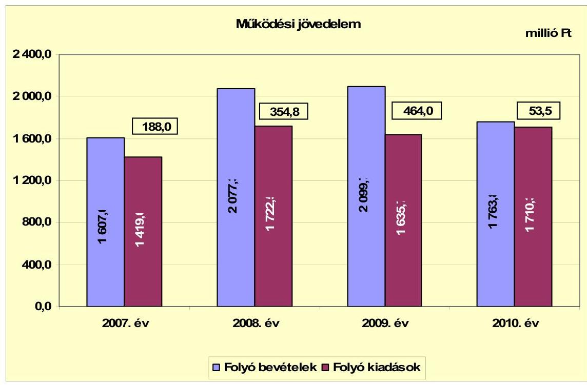

A folyó költségvetés többlete 2007-ben a folyó kiadások 13,2\%-át (188,0 millió Ft-ot), 2008-ban 20,6\%-át (354,8 millió Ft-ot), 2009-ben 28,4\%-át (464,0 millió Ft-ot), 2010-ben 3,1\%-át (53,5 millió Ft-ot) jelentette. A vizsgált időszakban a múködési jövedelem együttes összege 1060,3 millió Ft többletet mutatott, amely az időszak összes folyó kiadásának 16,3\%-át tette ki.

[^0]
[^0]:    ${ }^{23}$ 2010. január 1-jétől az Áht. 8/C. § (1)-(2) és (4)-(5) bekezdései tartalmazzák azokat a kötelezően betartandó elveket, amelyek alkalmazásával meghatározhatók a költségvetési egyenleg és az adósság tételei, valamint a költségvetési egyenleg és az adósság öszszefüggései.

---

A 2007-2009. években a működési jövedelem folyamatosan emelkedett a folyó bevételek folyó kiadásokat meghaladó ütemű növekedése miatt. A 2010. évben a múködési jövedelem a 2008-2009. évekhez képest lecsökkent elsősorban a folyó bevételek 313,5 millió Ft-os, illetve 335,9 millió Ft-os (azon belül a helyi adókból és az áfából eredő bevételek) visszaesése miatt, ugyanakkor a folyó kiadások a 2010. évben 4,6\%-kal emelkedtek. A folyó bevételek 2010. évi csökkenése az Önkormányzat pénzügyi helyzetére kedvezőtlenül hatott.

A folyóbevételek a 2008. évben 29,3\%-kal (470,3 millió Ft-tal), a 2009. évben $1,1 \%$-kal (22,4 millió Ft-tal) emelkedtek, a 2010. évben 16,0\%-kal (335,9 millió Ft-tal) csökkentek az előző évhez képest. A folyó bevételek 2007-2009 közötti növekedését, illetve a 2010. évi csökkenését elsősorban a helyi adó bevételek (azon belül az iparűzési adóbevétel), és az áfából származó bevételek ingadozása okozta. A 2008. évben az iparűzési adóbevétel 66,2\%-kal (190,6 millió Fttal), az áfabevételek 175,9\%-kal (170,8 millió Ft-tal) emelkedtek a 2007. évhez képest. A 2009. évben az iparűzési adó-bevétel 27,7\%-kal (132,7 millió Ft-tal) nőtt, az áfabevételek 32,3\%-kal (86,4 millió Ft-tal) csökkentek az előző évhez képest. A 2010. évben az iparűzési adóbevétel 44,7\%-kal (273,2 millió Fttal), az áfabevételek 18,1\%-kal (32,8 millió Ft-tal) csökkentek a 2009. évhez képest.

Az Önkormányzat pénzügyi kapacitása ${ }^{24}$ a vizsgált időszakban pozitív értéket mutatott. A nettó múködési jövedelem értéke a folyó költségvetési egyenleg mellett az adott költségvetési év adósságtörlesztésének hatását is tükrözi. Az Önkormányzatnak pénzintézettel szemben csak a 2007. évben volt 13,5 millió Ft összegben hiteltörlesztési kötelezettsége. A nettó múködési jövedelem 2007. évi 174,5 millió Ft-ról 2008-ban több mint kétszeresére (180,3 millió Ft-tal) nőtt. 2009-ben további 30,8\%-kal (109,2 millió Ft-tal) emelkedett, majd a 2010. évben az előző évhez képest 88,5\%-kal (410,5 millió Ft-tal), 53,5 millió Ft-ra csökkent a múködési jövedelem visszaesése miatt.

Az Önkormányzatnál a 2007-2010. évek közötti időszakban együttesen 1046,8 millió Ft nettó múködési jövedelem keletkezett.

A következő grafikon a 2007-2010. évek éves költségvetési beszámolója alapján számított nettó múködési jövedelmet mutatja:

[^0]
[^0]:    ${ }^{24}$ Az Önkormányzat pénzügyi kapacitásán a nettó múködési jövedelmet értjük, amely a tárgyévben a folyó bevételek és folyó kiadások egyenlegeként képződő múködési jövedelemnek a tárgyévben fizetett tőketörlesztéssel csökkentett összege. Értéke pozitív és negatív is lehet.

---

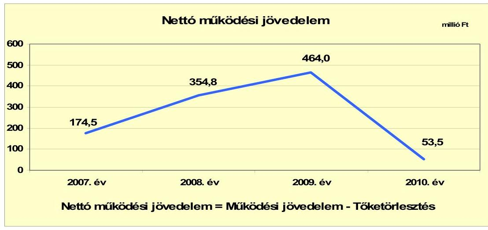

Az Önkormányzat felhalmozási költségvetésének egyenlege a 20072008. és a 2010. években pozitív összegű volt, a 2009. évben 537,4 millió Ft felhalmozási forráshiányt mutatott. A 2007-2010. években összesen 392,1 millió Ft felhalmozási forráshiány keletkezett, melyre a fedezetet a pozitív nettó működési jövedelem biztosította, ezért az pénzügyi kockázattal nem járt.

A felhalmozási költségvetés egyenlegének alakulását a 2007-2010. évek között a következő ábra szemlélteti:
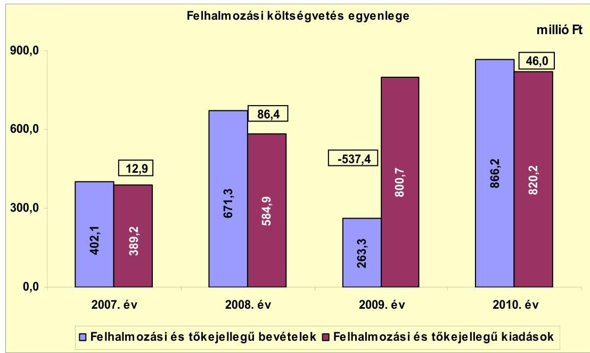

A felhalmozási többletnek/hiánynak a felhalmozási és tőke jellegű kiadásokhoz viszonyított aránya 2007-ben 3,3\% (12,9 millió Ft), 2008-ban 14,8\% (86,4 millió Ft), 2009-ben - $67,1 \%$ (-537,4 millió Ft) és 2010-ben 5,6\% (46,0 millió Ft) volt. A vizsgált időszakban képződött felhalmozási hiány együttes összege (392,1 millió Ft) az időszak összes felhalmozási kiadásának 15,1\%át tette ki.

---

A 2009. évben a felhalmozási hiányt részben az ingatlanértékesítésből származó bevételek 108,0 millió Ft-os alulteljesülése, részben egyes támogatott fejlesztések a 10. számú főút Nyergesújfalu melletti sziklafal megerősítése (196,4 millió Ft), a Nyergesújfalu és Bajót közötti kerékpárút építése (209,4 millió Ft) - támogatásból származó bevételének (215,7 millió Ft-nak) 2010. évre történő áthúzódása okozta.

Az Önkormányzat évenkénti teljes finanszírozási többlete ${ }^{25}$ a CLF módszer szerint 2007-ben 200,9 millió Ft, 2008-ban 441,2 millió Ft, 2010-ben 99,5 millió Ft volt, 2009-ben a teljes finanszírozási hiány 73,4 millió Ft-ot tett ki. A 20072010. években összességében képződött 668,2 millió Ft teljes finanszírozási többlet az önkormányzati pénzmaradvány forrását képezte.

Az Önkormányzat 2007-2010. évek zárszámadási rendeletei alapján kimutatott, teljesített múködési és felhalmozási célú hiányt/többletet a jelentés 1. számú melléklete tartalmazza.

Az Önkormányzat évenkénti finanszírozási igényét, a finanszírozási múveletei egyenlegének alakulását a 2007-2010. években a következő ábra szemlélteti:
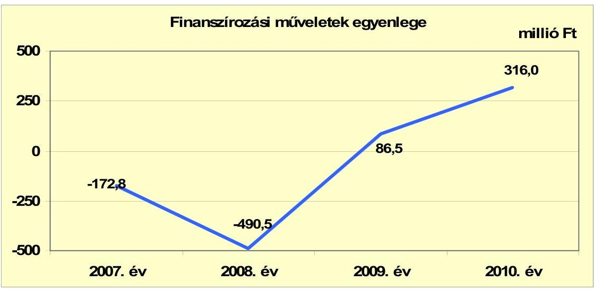

A 2007-2008. évi negatív összegű finanszírozás jelzi, hogy az éves költségvetések végrehajtása során nem volt szükség a tárgyévi költségvetési kiadások teljesítéséhez az előző években keletkezett pénzmaradvány igénybevételén túl külső finanszírozási forrás igénybevételére, a folyó költségvetés többletéből a 2007. év végén 63,0 millió Ft, a 2008. év végén 522,0 millió Ft összegben vásároltak forgatási célú értékpapírt. A 2009-2010. évben a pozitív finanszírozási egyenleg mutatja, hogy az Önkormányzat részben a forgatási célú értékpapírjait használta fel a költségvetési kiadásai teljesítéséhez. A 2009. évben 54,7 millió Ft-tal, 2010-ben 333,7 millió Ft-tal csökkent a forgatási célú értékpapírállomány évvégén. A finanszírozási célú múveleteket a vizsgált időszakban a jelentés 2. számú mellékletének 4.1-4.8 pontjai részletezik.

[^0]
[^0]:    ${ }^{25}$ a nettó múködési jövedelem és a felhalmozási költségvetés eredője

---

Az Önkormányzatnál a 2007-2011. év I. féléve közötti időszakban az átmenetileg szabad pénzeszközök lekötéséből 179,4 millió Ft kamatbevétel keletkezett.

A Képviselő-testület a 2007-2011. évi költségvetési rendeletekben az átmenetileg szabad pénzeszközök befektetésére a polgármestert hatalmazta fel, a jegyző ellenjegyzésével, a Képviselő-testület utólagos tájékoztatása mellett. A felhatalmazás alapján a polgármester a 2007-2010. években három hónapnál nem hosszabb időtartamra betét elhelyezésére és állampapír vásárlására volt jogosult, a 2011. évben a befektetés időtartama 12 hónapban került meghatározásra. A forgatási célú értékpapírvásárlások és betételhelyezések során a hatásköri- és eljárási szabályokat nem tartották be, mivel az ellenjegyzést a jegyző helyett a gazdasági osztály vezetője gyakorolta, a Képviselő-testület utólagos tájékoztatása a 107 tranzakcióról elmaradt, továbbá a 2007-2010. években az átmenetileg szabad pénzeszközökből 11848,3 millió Ft forgalmi értékben állampapír helyett a számlavezető banknál befektetési jegyet vásároltak.

A közbenső egyeztetés során a polgármester által tett észrevétel szerint: a Képvise-lő-testület utólagos tájékoztatása biztosított volt, mivel a képviselők számára a képviselő-testületi üléseken kiosztásra kerültek a havi likviditási tervek, melyek tartalmazták a befektetési formát, a befektetés adott napi összegét, valamint azt, hogy milyen időszakra szóló befektetéssel rendelkezett az Önkormányzat.

Az észrevételt nem fogadjuk el, mivel a költségvetési rendeletekben az állampapírvásárlásra és betételhelyezésre kapott felhatalmazás teljesítésének utólagos bemutatását írták elő. A Képviselő-testületnek nyújtott tájékoztatás nem felel meg a rendeletekbe foglalt eljárási szabályoknak. A havi likviditási tervekben bemutatott adatok nem adtak tájékoztatást arra vonatkozóan, hogy miért nem a rendeletekben előírt értékpapírt vásárolták meg, mikor történt a vásárlás és milyen futamidővel, valamint milyen feltételekkel, kamatkondíciókkal.

Az Önkormányzat a 2007-2010. évi és a 2011. év I. félévi költségvetési beszámolóiban összesen 11,8 millió Ft kamatkiadást mutatott ki, ezzel szemben a ténylegesen teljesített kamatkiadás 2007-ben 0,2 millió Ft-ot, a 2011. év I. félévében 0,7 millió Ft-ot tett ki. A 2008-2010. években kamatkiadás nem merült fel.

A Polgármesteri hivatalban a 2007-2008. években a számlarend kialakításakor nem biztosították a Számv. tv. 15. § (3) bekezdésében előírt valódiság elve, és az Áhsz. 9. számú melléklete a számlakerettükör és a számlaosztályok tartalmára vonatkozó előírások 9. d) pontjában előírtak ellenére, hogy a főkönyvi könyvelésben az 57. egyéb folyó kiadások számlacsoporton belül az 572. adók, díjak és egyéb befizetések főkönyvi számlán elkülönítetten kerüljön elszámolásra a bankszámlavezetéssel kapcsolatos díffizetés, valamint az 573. kamatkiadások főkönyvi számlán a kamatkiadások. A 2009-2011. években a számlarend kialakításakor sem gondoskodtak az Áhsz. 9. számú melléklete a számlakerettükör és a számlaosztályok tartalmára vonatkozó előírások 9. c) és 9. d) pontjaiban előírtak ellenére arról, hogy a főkönyvi könyvelésben a pénzügyi szolgáltatások díja az 556. pénzügyi szolgáltatások számlán, a kamatkiadások az 573. kamatkiadások számlán kerüljenek elszámolásra. A 2007. évben 1,8 millió Ft-ot, a 2008. évben 2,0 millió Ft-ot, a 2009. évben 2,1 millió Ft-ot, a 2010. évben 2,8 millió Ft-ot, a 2011. év I. félévében 1,9 millió Ft-ot kamatkiadásként mutattak ki egyéb folyó kiadás, illetve pénzügyi szolgáltatás helyett.

A 2007-2011. év I. féléve közötti időszakban az Önkormányzat kamatbevételeit és kamatkiadásait a következő ábra mutatja:

---

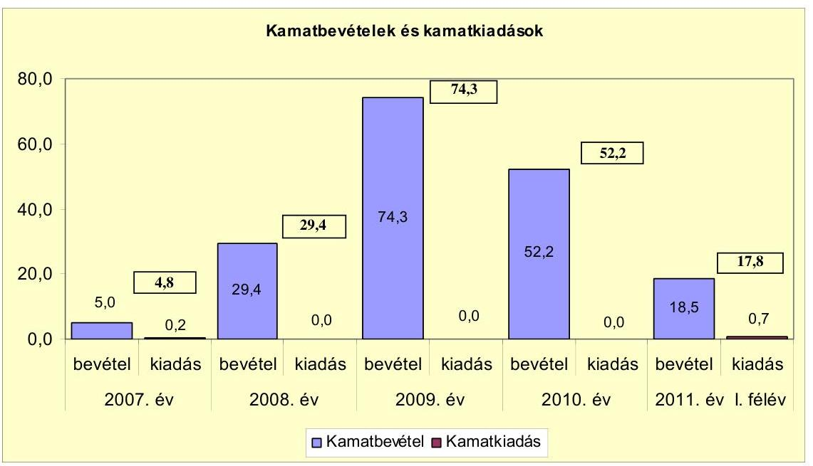

Az Önkormányzat a 2007-2011. év I. féléve közötti időszakban az átmenetileg szabad pénzeszközeit értékpapírban és betétben helyezte el. A 2009. évben kiugró kamatbevétel az iparűzési adóbevételek lekötéséből keletkezett. Az Önkormányzatnak a 2008-2010. években pénzintézettel szembeni kötelezettsége nem volt így kamatfizetési kötelezettség sem merült fel.

# 2.2. Az Önkormányzat bevételeinek változása 

Az Önkormányzat folyó bevételei a 2007-2009. évek 1928,0 millió Ft-os átlagához képest 2010-re 1763,8 millió Ft-ra ( $8,5 \%$-kal) csökkentek. Az Önkormányzat folyó bevételei a vizsgált időszakon belül nem emelkedtek folyamatosan, a 2007. évről a 2008. évre 29,3\%-kal (470,3 millió Ft-tal), a 2009. évre 1,1\%-kal (22,4 millió Ft-tal) 2099,7 millió Ft-ra emelkedett az előző évhez képest. A 2010. évben a folyó bevételek 16,0\%-kal (335,9 millió Ft-tal) csökkentek a 2009. évhez képest.

Az Önkormányzatnál a 2007-2011. év I. féléve közötti időszakban realizált főbb bevételeket jogcímek szerint a következő grafikon mutatja be:

---

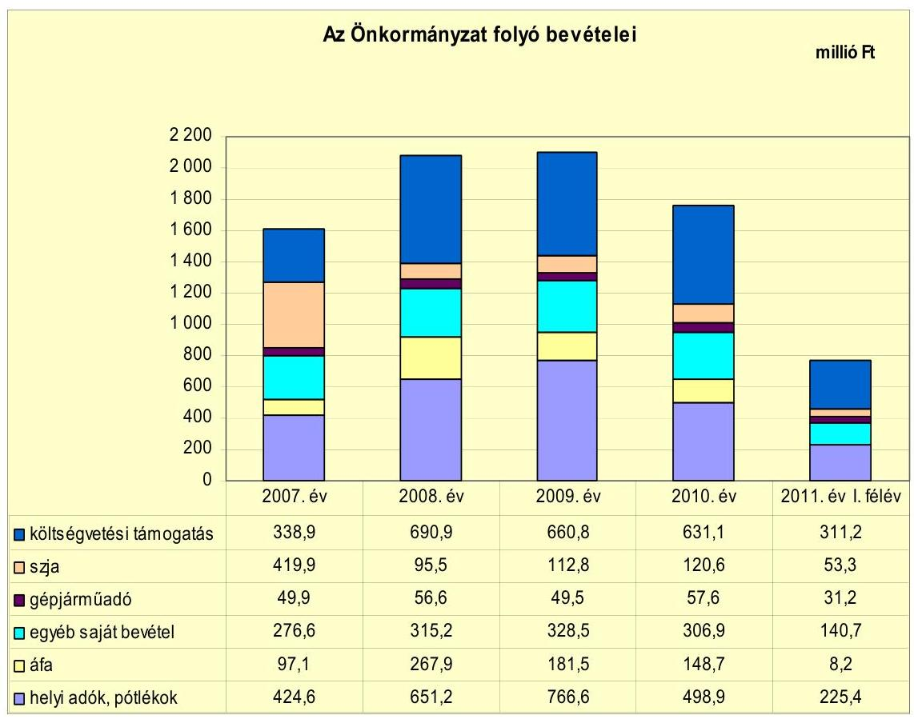

Az Önkormányzat folyó bevételein belül az szja-ból és az állami támogatásokból származó bevételek a 2007-2009. évek 772,9 millió Ft-os átlagához képest a 2010. évre 751,7 millió Ft-ra ( $2,7 \%$-kal) csökkentek. A folyó bevételeken belül a szja-ból és az állami támogatásokból származó bevételek együttesen a 2007. évi 758,8 millió Ft-ról 2008-ra 3,7\%-kal (27,6 millió Ft-tal) emelkedtek. A 2009. évben az előző évhez képest 1,6\%-kal (12,8 millió Ft-tal), a 2010. évben 2,8\%kal (21,9 millió Ft-tal), 751,7 millió Ft-ra csökkent. A folyó bevételeken belül a részarányuk 2007-ben 47,2\%-ot, 2008-ban 37,9\%-ot, 2009-ben 36,8\%-ot, 2010ben $42,6 \%$-ot tett ki.

A vizsgált időszakban az Önkormányzat helyi iparűzési adót, építményadót és magánszemélyek kommunális adóját vetette ki. Az adók mértéke a 2007-2010. közötti években nem változott. A helyi adóbevételek közel 70\%-át az iparűzési adó bevétel tette ki, mely a helyi adókról szóló törvényben rögzített maximális mértékben került megállapításra.
2011. január 1-jétől a magánszemélyek kommunális adóját 3200 Ft-ról 4000 Ftra, az építményadó mértékét $600 \mathrm{Ft} / \mathrm{m}^{2}$-ről $700 \mathrm{Ft} / \mathrm{m}^{2}$-re felemelték. Az adómértékek emeléséből 26,6 millió Ft többletbevételt terveztek. 2011-ben a magánszemélyek kommunális adójának mértéke $81,0 \%$-kal, az építményadó mértéke $55,7 \%$ kal elmaradt a helyi adó törvényben meghatározott maximális adómértéktől.
A helyi adókból és pótlékokból származó bevételek a 2007. évi 424,6 millió Ft-ról 2008-ban 53,4\%-kal (226,6 millió Ft-tal), 2009-ben 17,7\%-kal (115,4 millió Ft-tal) nőttek, a 2010. évben $34,9 \%$-kal (267,7 millió Ft-tal) 498,9 millió Ft-ra csökkentek. A helyi adóbevételeken belül az iparűzési adóbevétel a 2008. évre 66,2\%-kal (190,7 millió Ft-tal), a 2009. évre $27,7 \%$-kal (132,6 millió Ft-tal) nőtt az előző évhez képest. Ennek okai a legna-

---

gyobb adóalany adóalapjának jelentős mértékű emelkedése, továbbá a fokozott adóhátralék beszedés és a megerősített adóellenőrzés ${ }^{26}$ voltak. A 2010. évben a gazdasági válság és a legnagyobb adóalany adóalapjának csökkenése miatt az iparúzési adó $44,7 \%$-kal (273,2 millió Ft-tal) visszaesett a 2009. évhez képest. Új helyi adónemet a vizsgált időszakban az Önkormányzat nem vezetett be. A pótlékkal, bírsággal növelt helyi adóbevétel aránya a 2007. évben 26,4\%-ot, a 2008. évben 31,3\%-ot, a 2009. évben 36,5\%-ot, a 2010. évben $28,3 \%$-ot tett ki a folyó bevételekből.

A 2007-2010. évek közötti időszakban a folyó bevételeken belül az áfabevételek ingadozó mértékű teljesülését elsősorban az ingatlan értékesítések után felszámított áfa-bevételek és a beruházásokhoz kapcsolódó áfa-visszatérülések okozták. A 2008. évi 315,2 millió Ft áfa-bevételből az Ipari Park területének értékesítése ${ }^{27}$ után 242,5 millió Ft áfa-bevétel keletkezett, míg a beruházási áfavisszatérüléséből a 2009. évben 136,8 millió Ft, a 2010. évben 118,9 millió Ft realizálódott.

Az Önkormányzat felhalmozási bevételeit a 2007-2011. év I. féléve közötti időszakban az alábbi táblázat mutatja be:

| Megnevezés | 2007. év | 2008. év | 2009. év | 2010. év | 2011. év I.   félév |
| :-- | --: | --: | --: | --: | :--: |
| Tárgyi eszköz értékesítés | 284,4 | 145,8 | 88,3 | 87,7 | 2,4 |
| Egyéb saját tőkebevétel | 10,4 | 7,4 | 7,2 | 1,8 | 0,0 |
| Államháztartáson belülről   kapott támogatás | 10,3 | 186,4 | 167,8 | 347,1 | 0,9 |
| EU-tól és külföldről kapott   támogatások | 0,0 | 0,3 | 0,0 | 0,0 | 0,0 |
| Államháztartáson kívülről   kapott támogatás | 97,0 | 331,4 | 0,0 | 429,6 | 0,2 |
| Összes felhalmozási bevétel | 402,1 | 671,3 | 263,3 | 866,2 | 3,5 |

A vizsgált időszakon belül a felhalmozási bevételek az Ipari Park ingatlanjainak értékesítése nélkül a 2008. évre 66,9\%-kal (269,2 millió Ft-tal) nőttek, a 2009. évben 60,8\%-kal (408,0 millió Ft-tal), 263,3 millió Ft-ra csökkentek az előző évhez képest. A 2010. évben a felhalmozási bevételek az előző évhez képest 602,9 millió Ft-tal, a 3,3-szeresükre emelkedtek.

Az Önkormányzatnak a hazai- és EU-s támogatásokból származó bevétele ${ }^{28}$ a 2010. évben a 2009. évhez képest 179,8 millió Ft-tal emelkedett, államháztartá-

[^0]
[^0]:    ${ }^{26}$ Az Önkormányzat a 2008-2009. években az iparúzési adó ellenőrzésére adószakértőt is megbízott. A megbízott 30 adóalanynál végzett öt évre visszamenően ellenőrzést.
    ${ }^{27}$ A Holcim Hungária Zrt. mint az Ipari Park értékesítésére kiírt versenytárgyalás nyertese az 1687,2 millió Ft bruttó összegű vételárat az Önkormányzattal 2008. szeptember 16-án kötött adásvételi szerződés 3. pontja alapján a 2006-ban létrejött finanszírozási és együttmúködési megállapodások alapján az általa teljesített kifizetések és a befizetett pályázati díj beszámítása mellett 227,5 millió Ft megfizetésével teljesítette.
    ${ }^{28}$ Az Önkormányzat az államháztartáson belülről nyújtott támogatásokból a 2008. évben Nyergesújfalut Táttal összekötő kerékpár útépítéséhez 184,8 millió Ft-ot, a 2009. évben a járóbeteg-szakellátás fejlesztésére 29,9 millió Ft-ot, a Nyergesújfalut Bajóttal összekötő kerékpárút építéséhez 79,7 millió Ft-ot, a Jókai Mór utca felújítására

---

son kívülről - a Holcim Hungária Zrt.-től - 429,6 millió Ft fejlesztési célú pénzeszközt kapott.

A 2011. év I. félévében csak 3,5 millió Ft összegű felhalmozási bevételt realizáltak a tervezett 228,2 millió Ft-tal szemben.

A felhalmozási bevételeken belül az átvett pénzeszköz aránya 2007-ben 26,7\%ot, 2008-ban $77,2 \%$-ot, 2009-ben $63,7 \%$-ot, 2010-ben $89,7 \%$-ot tett ki az igénybevett hazai- és EU-s támogatások és a Holcim Hungária Zrt.-től fejlesztési célra átvett pénzeszközök ${ }^{29}$ hatására.

# 2.3. Az Önkormányzat múködési és a felhalmozási célú kiadásainak változása 

Az Önkormányzat költségvetési kiadásain belül a folyó kiadások részaránya a 2007. évi 78,5\%-ról 2008-ban 74,7\%-ra, 2009-ben 67,1\%-ra csökkent, 2010-ben $67,6 \%$-ra emelkedett.

Az Önkormányzat folyó kiadásait a 2007-2011. év I. féléve közötti időszakban az alábbi táblázat tartalmazza:

| Megnevezés | 2007. év | 2008. év | 2009. év | 2010. év | 2011. év I.   félév |
| :-- | --: | --: | --: | --: | --: |
| Folyó kiadások | 1419,0 | 1722,5 | 1635,7 | 1710,3 | 807,2 |
| Müködési kiadások (kamatkiadás nélkül) | 1363,8 | 1656,8 | 1568,0 | 1619,9 | 757,2 |
| Államháztartáson belülre átadott   pénzeszközök | 3,1 | 2,7 | 1,3 | 7,2 | 2,0 |
| Transzferkiadások | 50,1 | 61,0 | 64,3 | 80,4 | 45,4 |
| magánszemélyeknek | 24,5 | 28,8 | 35,2 | 48,4 | 28,2 |
| nonprofit szervezeteknek | 25,6 | 32,2 | 29,1 | 32,0 | 17,2 |
| Kamatkiadások | 2,0 | 2,0 | 2,1 | 2,8 | 2,6 |

Az Önkormányzat folyó kiadásai a 2007-2009. évek 1592,4 millió Ft-os átlagához képest 2010-ben 7,4\%-kal, 1710,3 millió Ft-ra emelkedtek. A folyó kiadásokon belül a múködési kiadások a 2007-2009. évek 1529,5 millió Ft-os átlagához képest 2010-ben 5,9\%-kal, 1619,9 millió Ft-ra emelkedtek.

Az Önkormányzat folyó kiadásai a 2007. évről a 2008. évre 21,4\%-kal (303,5 millió Ft-tal) nőttek. A folyó kiadások növekedését 96,5\%-ban a múködési kiadások 293,0 millió Ft-os emelkedése okozta. A 2009. évben a folyó ki-

58,2 millió Ft-ot kapott. A 2010. évben a bölcsőde létesítéséhez 26,4 millió Ft-ot, a 10-es főút melletti sziklafal stabilizációra 172,7 millió Ft-ot, a járóbeteg-szakellátás fejlesztésére 102,5 millió Ft-ot, a Nyergesújfalut Bajóttal összekötő kerékpár útépítéséhez 43,0 millió Ft-ot vették igénybe.
${ }^{29}$ A Holcim Hungária Zrt. 2008-ban 329,8 millió Ft-ot önkormányzati felújítási és fejlesztési feladatok támogatására adott át, 2010-ben az Ipari Park pályázati források bevonásával történő fejlesztésére, pályázati önrészként 429,6 millió Ft-ot biztosított.

---

adások 5,0\%-kal (86,8 millió Ft-tal) csökkentek a múködési kiadások 88,8 millió Ft-os csökkenése következtében. A 2010. évben a folyó kiadások 4,6\%-kal (74,6 millió Ft-tal) emelkedtek 2009-hez képest, a növekedést a múködési kiadások 51,9 millió Ft-os és a múködési célú pénzeszközátadások 22,0 millió Ft-os emelkedése okozta. A folyó kiadásokon belül a múködési kiadások részaránya 2007-ről 2008-ra nem változott, 2009-re 0,3 százalékponttal, 2010-ben 1,2 százalékponttal csökkenve, $94,7 \%$-ot tett ki. A múködési kiadások emelkedését a 2008. évben elsősorban az áfakiadások növekedése, a 2009. évben a múködési kiadások csökkenését az áfakiadások csökkenése okozta.

A folyó kiadások belül egyes kiemelt múködési kiadási előirányzatok teljesítési adatait a 2007-2011. év I. féléve közötti időszakban a következő táblázat tartalmazza:
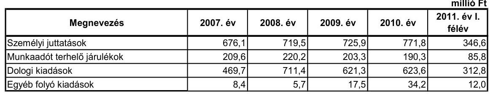

Az egyes kiemelt múködési kiadási előirányzatok teljesítésén belül a személyi juttatások és azok járulékai a 2007. évi 885,7 millió Ft-ról a 2008. évre 6,1\%-kal (54,0 millió Ft-tal) 939,7 millió Ft-ra nőtt. A 2009. évben 1,2\%-kal (10,5 millió Ft-tal) csökkent, a 2010. évben 3,5\%-kal (32,9 millió Ft-tal) emelkedett. A személyi juttatásoknak és azok járulékainak részaránya az egyes kiemelt múködési kiadásokon belül a 2007. évi 64,9\%-ról a 2008. évre 56,7\%-ra csökkent, a 2009. évben 2,6 százalékponttal 59,3\%-ra emelkedett, a 2010. évben $59,4 \%$-ot tett ki. A személyi juttatások és járulékai a 2008. évben társult óvodai feladatellátás miatt 20,1 millió Ft-tal emelkedtek, 2009-ben a létszámcsökkentések eredményeként csökkentek, a 2010. évben a Zeneiskola teljes évben történt múködtetése és a bölcsődei ellátás év közbeni bevezetése miatt emelkedtek.

A dologi kiadások részaránya a 2007. évi 34,4\%-ról a 2008. évre 42,9\%-ra nőtt, a 2009. évben 39,6\%-ot, a 2010. évben 38,5\%-ot tett ki. A dologi kiadások a 2007. évről a 2008. évre 51,5\%-kal (241,7 millió Ft-tal) emelkedtek, melyből 214,2 millió Ft az áfakiadások ${ }^{30}$ és 20,9 millió Ft a szolgáltatások növekedéséből származott. A dologi kiadások összege a 2009. évben 12,7\%-kal (90,1 millió Ft-tal) csökkent, a 2010. évben 0,4\%-kal (2,3 millió Ft-tal) nőtt.

[^0]
[^0]:    ${ }^{30}$ A 2008. évben az áfa kiadásokon belül az előzetesen felszámított áfa 2,5 millió Ft-tal emelkedett, míg a kiszámlázott termékek és szolgáltatások és az értékesített tárgyi eszközök áfa befizetései 211,7 millió Ft-tal nőtt az Ipari Park értékesítése miatt.

---

A dologi kiadások 2009. évi csökkenését a 2008. évhez képest az áfakiadások 127,8 millió Ft-os csökkenése ${ }^{31}$ mellett a szolgáltatási kiadások 37,3 millió Ft-os emelkedése okozta.

Az Önkormányzatnál a múködési célú pénzeszközátadás a 2007-2009. évek 60,8 millió Ft-os átlagához képest 2010-ben 44,1\%-kal, 87,6 millió Ft-ra nőtt. A folyó kiadásokon belül a múködési célú pénzeszközátadások (transzferkiadások és az államháztartáson belülre átadott pénzeszközök) részaránya nem volt számottevő, a 2007-2008. években 3,7\%-ot, a 2009. évben 4,0\%-ot, a 2010. évben $5,1 \%$-ot tett ki. A múködési célú pénzeszközátadások több mint $90 \%$-át minden évben a transzferkiadások tették ki. A transzferkiadásokon belül a magánszemélyeknek pénzbeli szociális ellátásaira adott támogatások a 2007. évtől a 2008. évre 17,6\%-kal (4,3 millió Ft-tal), a 2009. évben 22,2\%-kal (7,0 millió Ft-tal), a 2010. évben 37,5\%-kal (13,2 millió Ft-tal) nőttek az előző évhez képest. A nonprofit szervezeteknek múködési célra nyújtott támogatások a 2007. évtől a 2008. évre 25,8\%-kal (6,6 millió Ft-tal) emelkedtek, a 2009. évben 9,6\%-kal (3,1 millió Ft-tal) csökkentek, a 2010. évben 10,0\%-kal (2,9 millió Ft-tal) nőttek az előző évhez képest.

A múködési és felhalmozási kiadások alakulását a 2007-2011. év I. féléve közötti időszakban - a múködési és fejlesztési célú kamatkiadásokat is figyelembe véve - a következő grafikon szemlélteti:
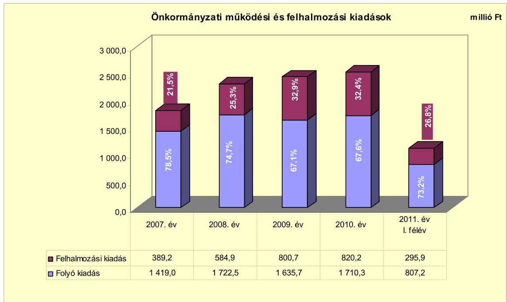

Az Önkormányzat felhalmozási kiadásai a 2007. évtől a 2008. évre évtől 50,3\%-kal (195,7 millió Ft-tal), a 2009. évben 36,9\%-kal (215,8 millió Ft-tal), a 2010. évben 2,4\%-kal (19,5 millió Ft-tal) nőttek az előző évhez képest.

[^0]
[^0]:    ${ }^{31}$ A 2009. évben az áfa kiadásokon belül az előzetesen felszámított áfa 21,0 millió Fttal emelkedett, míg a kiszámlázott termékek és szolgáltatások és az értékesített tárgyi eszközök áfa befizetései 148,8 millió Ft-tal csökkent.

---

Az Önkormányzat által 2007-2010 között megvalósított, 2010. december 31-ig befejezett felújítások és fejlesztések száma mintegy 150 volt, amelyből 10 millió Ft-ot meghaladó egyedi értékű 23 volt. A befejezett fejlesztések bekerülési költsége 2107,8 millió Ft-ot tett ki, melyből 1132,6 millió Ft-ot saját bevételből, 776,7 millió Ft-ot EU-s támogatásból, 198,5 millió Ft-ot hazai támogatásokból fedeztek. A befejezett fejlesztési feladatokat és azok forrásösszetételének alakulását a jelentés 3/a. számú melléklete tartalmazza.

Az Önkormányzatnak 2010. december 31-én négy folyamatban lévő fejlesztési feladata volt, melyeket saját forrásból finanszíroznak. A négy projekt közül a Kernstok Károly Iskola „A" épületének rekonstrukciójára 2010. év végéig 447,2 millió Ft kiadást teljesítettek. A folyamatban lévő beruházások várható bekerülési költsége 788,6 millió Ft, melyből a 2011-től esedékes kötelezettségek összege 341,4 millió Ft. Az Önkormányzatnál folyamatban lévő beruházásokra 2010. december 31-ig teljesített kiadásokat és azok forrásösszetételét a jelentés 3/b. számú melléklete, a 2010. évet követő évekre vállalt kötelezettségeket a 3/c. számú melléklet mutatja be részletesen.

Az Önkormányzat a 2011. évben pályázati források igénybevételével négy, 844,0 millió Ft összköltségű - beadott, elbírálás alatt lévő - projektet tervez megvalósítani. A projekteket 468,9 millió Ft saját bevételből, 340,4 millió Ft EUs támogatásból és 34,7 millió Ft-ot hazai támogatásból kívánják finanszírozni. A pályázati forrásokból tervezett fejlesztési feladatokat részletesen a jelentés 3/d. számú melléklete tartalmazza.

A 2007-2010. években az Önkormányzat három legmagasabb bekerülési költségű beruházása a Rendelőintézet építése és felszerelése (424,0 millió Ft), kerékpárutak építése Nyergesújfalu és Tát (201,6 millió Ft), valamint Nyergesújfalu és Bajót (209,4 millió Ft) között. A folyamatban lévő beruházások közül 2011-ben befejeződött a Kernstok Károly Iskola „A" épületének felújítása és bővítése is ( 664,5 millió Ft).

A Rendelőintézet hasznos alapterülete $732 \mathrm{~m}^{2}$-ről az átalakítást és bővítést követően $1439 \mathrm{~m}^{2}$-re növekedett. Megvalósult a teljes körű akadálymentesítés, a parkoló helyek számát 15 darabbal növelték. Az épületben új informatikai rendszer került installálásra, új munkaállomásokkal, számítógépekkel, monitorokkal, nyomtatókkal, speciálisan orvosi használatra kifejlesztett szoftverekkel, telefonközponttal és központi betegbehívó rendszerrel. A Rendelőintézetben 10 féle járóbeteg-szakellátás vehető igénybe.

A Nyergesújfalu-Tát között épült kerékpárút hossza 4,3 km, a pályaszerkezet 3 m széles. A Nyergesújfalut Bajóttal összekötő kerékpárút 3,1 km hosszúságú, átlagszélessége $2,5 \mathrm{~m}$.

Kernstok Károly Általános Iskola „A" épületének felújítása, bővítése során a meglevő $3212 \mathrm{~m}^{2}$ alapterület $5389 \mathrm{~m}^{2}$-re nőtt, az épület két épületszárnnyal bővült. A bővítéssel tantermek, szertárak és kisszínpad került kialakításra a tetőtérben elhelyezkedő gépészeti berendezésekkel.

Az Önkormányzat gazdasági társaságai és a kiemelt közfeladatot ellátó gazdasági társaságok a 2007-2011. év I. féléve között múködési és felhalmozási célú

---

pénzeszközátadásban nem részesültek. Az Önkormányzat gazdasági társaságai adatait a 4. számú melléklet mutatja be.

# 3. Az ÖNKORMÁNYZAT KÖTELEZETTSÉGEI 

### 3.1. Az Önkormányzat pénzintézeti kötelezettségeinek változása

Az Önkormányzat pénzintézeti kötelezettségeinek állománya a 2006. év végén 13,5 millió Ft volt, melyet a 2007. évben törlesztettek. A 2007-2010. években az Önkormányzat pénzintézeti kötelezettséget nem vállalt ${ }^{32} .2011$ áprilisában folyószámlahitel-keretszerződést kötöttek 250,0 millió Ft összegben, melyet 2011 májusától igénybe vettek. Az Önkormányzatnak 2011. június 30án 85,1 millió Ft folyószámlahitel tartozása volt.

A Polgármesteri hivatalban a 2011. év I. félévi költségvetési beszámoló elkészítése során 2011. június 30-i fordulónappal a főkönyvi könyvelésben a folyószámlahitel igénybevételét a Számv. tv. 15. § (3) bekezdésében előírt valódiság elve, és az Áhsz. 9. számú mellékletének a számlaosztályok tartalmára vonatkozó előírások 3. b) és 4. e) pontjában foglaltak ellenére nem mutatták ki.

A 2011. év I. félévében - május-június hónapokban - átlagosan 48,8 millió Ft folyószámlahitelt vettek igénybe, mely után 0,8 millió Ft kamatot és egyéb költséget fizettek meg. A folyószámlahitel kondíciói és egyéb költségei a következők voltak ${ }^{33}$ :

| Megnevezés | Kamat (referencia+ kamatfelár) | Egyéb költség |
| :--: | :--: | :--: |
| Folyószámlahitel |  |  |
| 2011. év | 1 havi BUBOR $+2,5 \%$ | 0,2\% rend.tart.jutalék+ évi 0,5\%   kezelési dij |

### 3.2. A szállítói kötelezettségek változása

Az Önkormányzat szállítói tartozása a 2007. évi 101,1 millió Ft-ról folyamatosan csökkent, 2010. év végén 8,9 millió volt. Az összes kötelezettségen belül a szállítói kötelezettségek aránya a 2007. évi 55,8\%-ról a 2010. év végére $6,2 \%$-ra esett vissza. A lejárt szállítói tartozásállománya a vizsgált időszakban az Önkormányzatnak nem volt.

### 3.3. Egyéb kötelezettségek változása

Az Önkormányzatnál az elengedett követelések összege a 2007-2010. években összesen 5,3 millió Ft volt, amely teljes mértékben az adótartozás elengedéséből származott.

[^0]
[^0]:    ${ }^{32}$ Az Önkormányzatnak forgatási célú értékpapírban és pénzeszközben 2007-ben 339,9 millió Ft, 2008-ban 741,9 millió Ft, 2009-ben 648,1 millió Ft, 2010-ben 780,4 millió Ft forrás állt a rendelkezésére.
    ${ }^{33}$ A referencia kamat az alábbiak szerint alakult: az 1 havi BUBOR 2011-ben 6\% volt.

---

Az Önkormányzat a folyószámlahitel keret-szerződéshez kapcsolódóan három önkormányzati forgalomképes ingatlan esetében járult hozzá jelzálogjogbejegyzéshez, az érintett ingatlanok könyvszerinti értéke 2010. december 31-én 146,2 millió Ft volt. Az Önkormányzat forgalomképes ingatlanjainak könyvszerinti nettó értéke a 2010. év végén 861,0 millió Ft volt.

A 2010. év végén jelzálogjoggal terhelt forgalomképes ingatlanok nettó értékét az alábbi ábra mutatja:
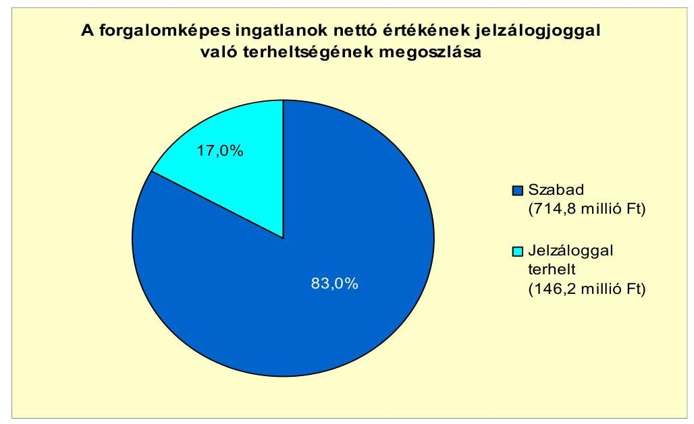

Az Önkormányzatnak a Holcim Hungária Zrt.-vel szemben az Ipari Park fejlesztésével kapcsolatban 2010. év végén 86,7 millió Ft hosszú lejáratú kötelezettsége állt fenn, a kölcsön kamatmentes, a törlesztés a 2012-2017. közötti időszakban évente esedékes, összege 14,4 millió Ft/év.

Az Önkormányzatnak három, jogerős határozattal le nem zárt peres ügye volt. Két ügy az Önkormányzat által lefolytatott adóellenőrzés során feltárt adóhiányhoz kapcsolódott összesen 2,8 millió Ft összegben. Egy esetben közalkalmazotti jogviszony megszüntetése miatt indult peres eljárás az Önkormányzat intézménye ellen 3,4 millió Ft összegben.

Az Önkormányzat többségi tulajdoni hányadával rendelkező gazdasági társasága kötelezettségeinek állományát 2010. december 31-én és 2011. június 30án, valamint várható alakulását a kötelezettségek lejáratáig a következő táblázat tartalmazza:

---

| Megnevezés | Állomány   2010.   december 31-   én | Állomány   2011. június   30 -án | Várható   kötelezettség   2011-2013.   években | Várható   kötelezettség   2014. évtöl* |
| :-- | :--: | :--: | :--: | :--: |
|  | HUF-ban (millió   Ft-ban) | HUF-ban (millió   Ft-ban) | HUF-ban (millió   Ft-ban) | HUF-ban (millió   Ft-ban) |
| Folyószámlahitel | 20,8 | 13,5 | 13,5 |  |
| Rövid lejáratú hitel | 140,0 | 140,0 | 140,0 |  |
| Pénzintézeti kötelezettségek összesen: | 160,8 | 153,5 | 153,5 |  |
| Szállítói tartozás | 13,8 | 5,3 | 5,3 |  |

*A gazdasági társaságnak folyószámlahitelből várható kötelezettsége a következő években csak akkor áll fenn, ha nem egyenlítette ki 2013. december 31-ig.

Az önkormányzati többségi (51\%) tulajdonú Distherm Kft.-nek a szállítói tartozás állománya 2010-ben 13,8 millió Ft-ot tett ki, lejárt szállítói tartozása nem volt. A gazdasági társaság a 2007-2011. év I. féléve között igénybe vett folyószámlahitelt, a folyószámlahitellel zárt napok száma összesen 613 nap, a napi átlagos állomány 74,1 millió Ft volt. A 2010. év végén 20,8 millió Ft, a 2011. év I. félév végén 13,5 millió Ft volt a folyószámlahitel tartozása. Egyéb rövid lejáratú hitelt is igénybe vett 2008-ban, a hitel összege 140,0 millió Ft volt.

A rövid lejáratú hitel visszafizetése 2011. június 30 -ig nem történt meg, a hitelszerződést háromhavonta, összesen 11 alkalommal a kisebbségi tulajdonos kezességvállalása mellett újra kötötték.

Az Önkormányzat pénzügyi helyzetére a Distherm Kft. múködése nincs hatással, mivel abban az Önkormányzat nem minősített többségi tulajdonnal rendelkezik, ezért az adós nem teljesítése esetén nem kell helytállnia.

Az Önkormányzatnál a vizsgált időszakban nem mérték fel, hogy az eszközök elhasználódása, amortizációja fedezetének biztosítása mekkora forrást igényel. Az Önkormányzat a 2007-2010. években a tárgyi eszközök után együttesen 375,5 millió Ft értékcsökkenést számolt el. Az Önkormányzatnál a 20072010. években az elszámolt értékcsökkenés $21,2 \%$-ának megfelelő összegű ( 79,9 millió Ft-os) felújítást aktiváltak ${ }^{34}$. A beruházások összege folyamatosan emelkedett, a 2007-2010. években összesen 2041,5 millió Ft-ot számoltak el beruházásra.

Az Önkormányzat eszközállományának bruttó értéke 2007-ről 2010-re 10,7\%$\mathrm{kal}, 6223,6$ millió Ft-ra nőtt, a nettó értéke 6,5\%-kal, 5149,0 millió Ft-ra emelkedett. Az Önkormányzat eszközállományának átlagos használhatósági foka a 2007. évi 86,0\%-ról csökkent, 2010-ben 83,0\% volt. A felújításokra, az eszközök pótlására elsősorban az intézmények múködőképességének biztosítása, illetve a szakhatósági előírások figyelembevételével került sor. A 2007-2010.

[^0]
[^0]:    ${ }^{34}$ A felújítások aktivált értékének (2007-ben 22,2 millió Ft-nak, 2008-ban 35,0 millió Ftnak, 2009-ben 20,9 millió Ft-nak, 2010-ben 1,7 millió Ft-nak) az elszámolt értékcsökkenéshez viszonyított aránya 2007-ben 24,7\%, 2008-ban 37,7\%, 2009-ben 26,6\%, 2010-ben $1,4 \%$ volt.

---

években eszközpótlásra átlagosan 116,7 millió Ft-ot fordítottak a folyamatban lévő beruházások, felújítások 2010. december 31-ig pénzügyileg teljesített kiadásaiból. A 2007-2010. években eszközpótlásra fordított összeg az elszámolt 375,5 millió Ft-os amortizáció $31,1 \%$-át tette ki.

# 4. A PÉNZÜGYI EGYENSÚLY MEGTEREMTÉSE ÉrDEKÉBEN HOZOTT INTÉZKEDÉSEK EREDMÉNYE 

Az Önkormányzatnál a kimutatásuk szerint a 2007-2011. év I. féléve között összesen 52,0 millió Ft kiadási megtakarítást értek el. A Képviselő-testület a 2007. évben kettő közoktatási álláshely ${ }^{35}$, a 2007-2009. években a Polgármesteri hivatalban hat álláshely ${ }^{36}$ csökkentésről döntött, a 2009. évben az orvosi ügyeleti ellátás átalakításával ${ }^{37}$ három gépkocsivezetői státuszt szüntetett meg.

A létszámcsökkentési döntések következtében - kimutatásuk szerint - az 52,0 millió Ft kiadási megtakarításból $88,9 \%$ a betöltött álláshelyek, $11,1 \%$ az üres álláshelyek megszüntetéséből keletkezett. A Polgármesteri hivatal kettő üres álláshelyének megszüntetéséből 5,8 millió Ft megtakarítást mutattak ki.

Az Önkormányzat a 2007-2009. években végrehajtott kilenc fős létszámcsökkentéshez kapcsolódóan 8,6 millió Ft állami támogatást igényelt.

Az Önkormányzatnál a 2007-2010. évek között engedélyezett álláshelyek számának és a foglalkoztatottak számának változását az alábbi táblázat tartalmazza:

| Megnevezés (adatok fő-ben) | Közoktatás | Szociális és gyermekvédelem | Egészségügy | Polgármesteri hivatal | Egyéb | Összesen |
| :--: | :--: | :--: | :--: | :--: | :--: | :--: |
| 2007. január 1-jén jóváhagyott álláshelyek száma | 158 | 0 | 9 | 43 | 67 | 277 |
| Megszüntetett álláshelyek száma | 2 | 0 | 3 | 6 | 0 | 11 |
| elstö̈: üres álláshelyek száma | 0 | 0 | 0 | 2 | 0 | 2 |
| szakmai álláshelyek száma | 2 | 0 | 0 | 2 | 0 | 4 |
| intézmény-üzemeltetéssel kapcsolatos álláshelyek száma | 0 | 0 | 3 | 2 | 0 | 5 |
| Álláshely növekedése | 12 | 5 | 3 | 0 | 22 | 42 |
| 2010. december 31-én záró álláshelyek száma | 168 | 5 | 9 | 37 | 89 | 308 |
| 2007. január 1-jén foglalkoztatott létszám | 155 | 0 | 9 | 43 | 66 | 273 |
| Létszámcsökkenés | 2 | 0 | 3 | 6 | 0 | 11 |
| Létszámnövekedés | 12 | 5 | 3 | 0 | 22 | 42 |
| 2010. december 31-én foglalkoztatott létszám | 165 | 5 | 9 | 37 | 88 | 304 |

[^0]
[^0]:    ${ }^{35}$ A Képviselő-testület 2007-ben a Kernstok Károly Iskola bajóti tagiskolájában átszervezés miatt 2 fő létszámcsökkentést hagyott jóvá.
    ${ }^{36}$ A Képviselő-testület 2007-ben 1 fő köztisztviselői, 2008-ban 1 fő köztisztviselő és 2 fő fizikai dolgozó álláshelyét, továbbá 2009. január 1-jétől kettő üres álláshelyet szüntetett meg.
    ${ }^{37}$ A Képviselő-testület döntése alapján 2009. február 1-jétől a háziorvosi ügyeleti ellátásról az Esztergom és Nyergesújfalu Többcélú Kistérségi Társulás útján gondoskodtak.

---

Az Önkormányzatnál 2007. január 1-jén engedélyezett álláshelyek száma 277 volt, amely 2010. év végére 308-re nőtt. A 2010. év végén négy álláshely betöltetlen volt.

A 2007. év elején a közoktatásban 158, az egészségügyi feladatokra kilenc, a Polgármesteri hivatalban 43, a Tűzoltóságnak 51, a Művelődési Háznak hét, a Pedagógiai Szolgálatnak kilenc engedélyezett álláshelye volt.

Az álláshelyek száma 2007-2010 között 11 fővel csökkent, ugyanakkor feladatbővülés és új feladatellátás miatt az álláshelyek száma 42-vel nőtt.

A közoktatásban feladat bővülés és a Bajóti Óvoda tagóvodává válása miatt 12 fővel emelkedett az engedélyezett létszám. A 2009. évben az Önkormányzat átvette a Zeneiskolát, amelyben a közalkalmazottak engedélyezett létszáma 22 fő volt, az egészségügyi feladatok ellátására három fővel növelték a szakmai álláshelyeket. Az Önkormányzat 2010-ben az egyik óvodájával közös épületben bölcsödét alakított ki, a bölcsődében foglalkoztatottak engedélyezett létszáma öt fő volt.

Az Önkormányzatnál a 2007-2011. év I. féléve között a kimutatásuk szerint összesen 461,1 millió Ft bevételi többlet keletkezett. Az Önkormányzatnál a helyi adókból származó bevételek növelése érdekében intézkedtek az adóhátralékok beszedésére és fokozták az adóellenőrzéseket, az ingatlanadó és a magánszemélyek kommunális adója esetében az adó mértékét 2011. január 1-jétől felemelték. Az Önkormányzatnál az eszközök hasznosításából (bérbeadásából), a lejárt követelések behajtásával és az átmenetileg szabad pénzeszközök lekötésével biztosítottak többletbevételt a feladataik finanszírozásához.

A 2007-2011. év I. féléve között az Önkormányzat főbb bevételi jogcímek szerinti bevételnövelő intézkedései számszerűsített hatását a következő diagram tartalmazza:
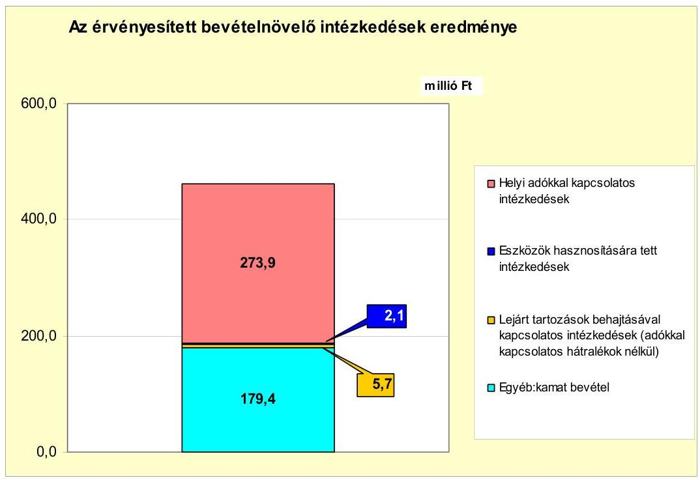

---

A 2007-2011. év I. féléve közötti időszakban a kiadáscsökkentő és bevételnövelő intézkedések együttesen 513,1 millió Ft-tal javították az Önkormányzat pénzügyi egyensúlyát. A központi támogatások (a szja és állami támogatások együttes összege) a 2006. évhez képest 2007-2011. év I. féléve között 54,4 millió Ft-tal nőtt, amely kedvezően hatott a pénzügyi egyensúlyra.

# 5. Az ÁSZ Által a korábBi ÉVEKben a pénzügyi egyensúly JAVÍTÁSÁRA TETT SZABÁLYSZERŰSÉGI ÉS CÉLSZERŰSÉGI JAVASLATOK HASZNOSULÁSA 

Az Önkormányzat 2008. évi gazdálkodási rendszerének ellenőrzése során a pénzügyi egyensúly javítására kettő szabályszerűségi és kettő célszerűségi javaslatot tett az ÁSZ, amelyből három javaslat teljesült, egy célszerűségi javaslat részben hasznosult.

A szabályszerűségi javaslatok a költségvetési és zárszámadási rendelettervezetekben a költségvetési bevételek és kiadások főösszegének az Áht-ban előírtak szerinti meghatározására, valamint a költségvetési hiány fedezésére, illetve többlet felhasználására, továbbá Ámr-ben előírtak szerint az EU-s támogatással megvalósuló projektek bevételei és kiadásai elkülönített bemutatására vonatkoztak. A szabályszerűségi javaslatokat hasznosították.

Az ÁSZ a munka színvonalának javítása érdekében javasolta, hogy a költségvetési rendelettervezetben az előző évi áthúzódó kiadások teljesítéséhez az előző évi várható pénzmaradvány felhasználását eredeti előirányzatként tervezzék meg. A javaslat a 2009. évi költségvetési rendeletben hasznosult. További javaslat volt, hogy a javaslatok megvalósítására készítsenek intézkedési tervet, amely tartalmazza a felelősöket és határidőket. Az intézkedési tervet a Képvise-lő-testület jóváhagyta, azonban azt az ÁSZ részére nem küldték meg.

Budapest, 2012. április "16"

Melléklet: $\quad 7 \mathrm{db}$
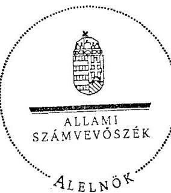

Wárvasovszky Tihamér

---

Nyergesújfalu Város Önkormányzata

1. számú melléklet
a V-3105-025/2012. számú jelentéshez

**Működési és felhalmozási célú hiány/többlet 2007-2010
közötti időszakban az Önkormányzat zárszámadási
rendeleteiben (millió Ft-ban)**

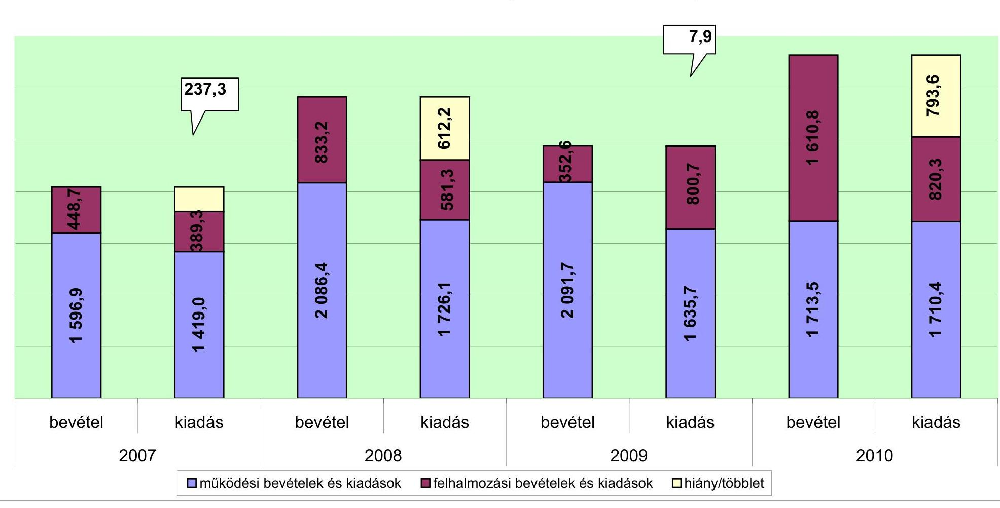

---

Az Önkormányzat bevételei és kiadásai, valamint adóoságszolgálata 2007-2010 között

|  1. FOLYÓ KÖLTSÉGVETÉS* | 2007. év | 2008. év | 2009. év | 2010. év  |
| --- | --- | --- | --- | --- |
|  1.1.1. Saját működési bevételek | 626,8 | 1 031,4 | 1 117,1 | 769,1  |
|  1.1.2. Költségvetési támogatás | 338,9 | 690,9 | 660,8 | 631,1  |
|  1.1.3. Iszengedett bevételek | 469,9 | 152,1 | 162,3 | 178,2  |
|  1.1.4. Államháztartáson belülről kapott támogatások | 169,5 | 201,5 | 153,1 | 182,9  |
|  1.1.5. El.-tól és külföldről kapott bevételek | 0,0 | 0,1 | 2,4 | 0,4  |
|  1.1.6. Államháztartáson kívülről kapott bevételek | 1,9 | 1,3 | 4,0 | 2,1  |
|  1.1.7. Előző évi pénzmaradvány átvétel | 0,0 | 0,0 | 0,0 | 0,0  |
|  1.1. Folyó bevételek =1.1.1.+1.1.2.+1.1.3.+1.1.4.+1.1.5.+1.1.6.+1.1.7. | 1 607,0 | 2 077,3 | 2 099,7 | 1 763,8  |
|  1.2.1. Müködési kiadások kamatkiadások nélkül | 1 363,8 | 1 656,8 | 1 568,0 | 1 619,9  |
|  1.2.2. Államháztartáson belülre átadott pénzeseközök | 3,1 | 2,7 | 1,3 | 7,2  |
|  1.2.3.1. vállalkozásoknak | 0,0 | 0,0 | 0,0 | 0,0  |
|  1.2.3.2. El.-unk, illetve külföldre | 0,0 | 0,0 | 0,0 | 0,0  |
|  1.2.3.3. magáncnemélyeknek | 24,5 | 28,8 | 35,2 | 48,8  |
|  1.2.3.4. neugesült szervezeteknek | 25,6 | 32,2 | 29,1 | 31,6  |
|  1.2.3.7. Trennylevkiadások (=1.2.3.1+1.2.3.2+1.2.3.3+1.2.3.4) | 50,1 | 61,0 | 64,3 | 80,4  |
|  1.2.4 Kamatkiadások | 2,0 | 2,0 | 2,1 | 2,0  |
|  1.2.5. Előző évi pénzmaradvány átadás | 0,0 | 0,0 | 0,0 | 0,0  |
|  1.2. Folyó kiadások = 1.2.1.+1.2.2.+1.2.3.+1.2.4.+1.2.5. | 1 419,0 | 1 722,5 | 1 635,7 | 1 710,3  |
|  1.3. Folyó költségvetés egyenlege MÜKÖDÉSI JÖVEDELEM (1.1. - 1.2.) | 188,0 | 354,8 | 464,0 | 53,5  |
|  2. FELHALMOZÁSI KÖLTSÉGVETÉS** |  |  |  |   |
|  2.1.1. Saját tökebevételek | 294,8 | 153,2 | 95,5 | 89,5  |
|  2.1.2. Államháztartáson belülről kapott támogatások | 10,3 | 186,4 | 167,8 | 347,1  |
|  2.1.3. El.-tól és külföldről kapott támogatások | 0,0 | 0,3 | 0,0 | 0,0  |
|  2.1.4. Államháztartáson kívülről kapott támogatások | 97,0 | 331,4 | 0,0 | 429,6  |
|  2.1. Felhalmozási bevételek (=2.1.1.+2.1.2+2.1.3+2.1.4.) | 402,1 | 671,3 | 263,3 | 866,2  |
|  2.2.1. Saját beruházási kiadás állva | 351,8 | 515,7 | 761,8 | 815,1  |
|  2.2.2. Saját felújítási kiadás állva | 29,8 | 45,0 | 32,9 | 2,7  |
|  2.2.3. Államháztartáson belülre átadott pénzesekte | 0,0 | 14,8 | 0,0 | 0,0  |
|  2.2.4. El.-unk és külföldnek adott pénzeseközök | 0,0 | 0,0 | 0,0 | 0,0  |
|  2.2.5. Államháztartáson kívülre adott pénzeseközök | 7,6 | 9,4 | 6,0 | 2,4  |
|  2.2.6. Befektetési célú részesedések vásárlása | 0,0 | 0,0 | 0,0 | 0,0  |
|  2.2. Felhalmozási kiadások (=2.2.1.+2.2.2.+2.2.3.+2.2.4.+2.2.5.+2.2.6.) | 389,2 | 584,9 | 800,7 | 820,2  |
|  2.3. Felhalmozási költségvetés egyenlege (2.1. - 2.2.) | 12,9 | 86,4 | -537,4 | 46,0  |
|  3. Finanszírozási műveletek nélküli (GFS) pozíció(1.3.+2.3.) | 200,9 | 441,2 | -73,4 | 99,5  |
|  4. Finanszírozási műveletek |  |  |  |   |
|  4.1. Hitelfelvétel | 0,0 | 0,0 | 0,0 | 0,0  |
|  4.2. Hitelférlesztés | 13,5 | 0,0 | 0,0 | 0,0  |
|  4.3. Forgatási és befektetési célú értékpapírok kibocsátása | 0,0 | 0,0 | 0,0 | 0,0  |
|  4.4. Forgatási és befektetési célú értékpapírok beváltása | 0,0 | 0,0 | 0,0 | 0,0  |
|  4.5. Forgatási és befektetési célú értékpapírok értékesítése | 0,0 | 0,0 | 54,7 | 333,7  |
|  4.6. Forgatási és befektetési célú értékpapírok vásárlása | 63,0 | 522,0 | 0,0 | 0,0  |
|  4.7. Egyéb finanszírozási bevételek (függő, átfató, kiegyesítői) | 4,3 | 0,2 | -4,5 | -35,6  |
|  4.8. Egyéb finanszírozási kiadások (függő, átfató, kiegyesítői) | 100,6 | -51,3 | -36,3 | -17,9  |
|  4.9.Finanszírozási műveletek egyenlege (4.1. - 4.2.+4.3.-4.4+4.5.-4.6.+4.7.-4.8.) | -172,8 | -490,5 | 86,5 | 316,0  |
|  5. Tárgyévi pénzügyi pozíció (1.3.+ 2.3.+4.9.) | 28,1 | -49,3 | 13,1 | 415,5  |
|  6. Netto működési jövedelem =működési jövedelem (1.3.) - tőketörlesztés (4.2+4.4) | 174,5 | 354,8 | 464,0 | 53,5  |
|  TÁJÉKÖZTATÓ ADATOK |  |  |  |   |
|  Összes kötelezettség | 180,6 | 168,0 | 150,4 | 143,3  |
|  ebből rövid hjáratú | 180,6 | 168,0 | 150,4 | 56,6  |
|  Összes szállítói kötelezettség | 101,1 | 48,1 | 44,1 | 8,9  |
|  ebből lejárt (tanúsítványból) | 0,0 | 0,0 | 0,0 | 0,0  |
|  Pénz és tökegést kötelezettség (adásság) | 0,0 | 0,0 | 0,0 | 0,0  |
|  ebből rövid hjáratú | 0,0 | 0,0 | 0,0 | 0,0  |
|  PPP szerződéses állomány jelenértéken (tanúsítványból) | 0,0 | 0,0 | 0,0 | 0,0  |
|  ebből lejárt szolgáltatási díj miatti kötelezettség | 0,0 | 0,0 | 0,0 | 0,0  |
|  Folyószámbékítél napi átlagos állománya (tanúsítványból) | 0,0 | 0,0 | 0,0 | 0,0  |
|  Likvidítétel napi átlagos állománya (tanúsítványból) | 0,0 | 0,0 | 0,0 | 0,0  |
|  Munkahérítétel napi átlagos állománya (tanúsítványból) | 0,0 | 0,0 | 0,0 | 0,0  |
|  Kizsesség és garanciavállalások (tanúsítványból) | 0,0 | 0,0 | 0,0 | 0,0  |
|  Jegerite bírósági feltétebből adódó kötelezettségek (tanúsítványból) | 0,0 | 0,0 | 0,0 | 0,0  |
|  Finanszírozásba bevombató eszközök | 339,9 | 741,9 | 648,1 | 780,4  |
|  Tartós hitelfelvonný megéretezőt értékpapírok és végt állománya | 0,0 | 0,0 | 0,0 | 0,0  |
|  Hosszú hjáratú bankbetétek és végt állománya | 0,0 | 0,0 | 0,0 | 0,0  |
|  Értékpapírok és végt állománya | 236,9 | 688,1 | 581,3 | 298,2  |
|  Pénzeseközök (idegen pénzeseközök nélküli) és végt állománya | 103,0 | 53,8 | 66,8 | 482,2  |

- Bevételekben nem térül, a kiadásokban nem jelenik meg az amortizáció, a vagyoni helyzetet az egyenleg befolyásolja

---

|   |  |  |  |  |  |  |  |  |  |  |  |  |  |  |  |  |  |  |  |  |  |  |  |  |  |  |  |  |  |  |  |  |  |  |  |  |  |  |  |  |  |  |  |  |  |  |  |  |  |   |
| --- | --- | --- | --- | --- | --- | --- | --- | --- | --- | --- | --- | --- | --- | --- | --- | --- | --- | --- | --- | --- | --- | --- | --- | --- | --- | --- | --- | --- | --- | --- | --- | --- | --- | --- | --- | --- | --- | --- | --- | --- | --- | --- | --- | --- | --- | --- | --- | --- | --- | --- | --- |
|   |  |  |  |  |  |  |  |  |  |  |  |  |  |  |  |  |  |  |  |  |  |  |  |  |  |  |  |  |  |  |  |  |  |  |  |  |  |  |  |  |  |  |  |  |  |  |  |  |  |   |
|   |  |  |  |  |  |  |  |  |  |  |  |  |  |  |  |  |  |  |  |  |  |  |  |  |  |  |  |  |  |  |  |  |  |  |  |  |  |  |  |  |  |  |  |  |  |  |  |  |   |
|   |  |  |  |  |  |  |  |  |  |  |  |  |  |  |  |  |  |  |  |  |  |  |  |  |  |  |  |  |  |  |  |  |  |  |  |  |  |  |  |  |  |  |  |  |  |  |  |  |   |
|   |  |  |  |  |  |  |  |  |  |  |  |  |  |  |  |  |  |  |  |  |  |  |  |  |  |  |  |  |  |  |  |  |  |  |  |  |  |  |  |  |  |  |  |  |  |  |  |  |   |
|   |  |  |  |  |  |  |  |  |  |  |  |  |  |  |  |  |  |  |  |  |  |  |  |  |  |  |  |  |  |  |  |  |  |  |  |  |  |  |  |  |  |  |  |  |  |  |  |  |   |
|   |  |  |  |  |  |  |  |  |  |  |  |  |  |  |  |  |  |  |  |  |  |  |  |  |  |  |  |  |  |  |  |  |  |  |  |  |  |  |  |  |  |  |  |  |  |  |  |  |   |
|   |  |  |  |  |  |  |  |  |  |  |  |  |  |  |  |  |  |  |  |  |  |  |  |  |  |  |  |  |  |  |  |  |  |  |  |  |  |  |  |  |  |  |  |  |  |  |  |  |   |
|   |  |  |  |  |  |  |  |  |  |  |  |  |  |  |  |  |  |  |  |  |  |  |  |  |  |  |  |  |  |  |  |  |  |  |  |  |  |  |  |  |  |  |  |  |  |  |  |  |   |
|   |  |  |  |  |  |  |  |  |  |  |  |  |  |  |  |  |  |  |  |  |  |  |  |  |  |  |  |  |  |  |  |  |  |  |  |  |  |  |  |  |  |  |  |  |  |  |  |  |   |
|   |  |  |  |  |  |  |  |  |  |  |  |  |  |  |  |  |  |  |  |  |  |  |  |  |  |  |  |  |  |  |  |  |  |  |  |  |  |  |  |  |  |  |  |  |  |  |  |  |   |
|   |  |  |  |  |  |  |  |  |  |  |  |  |  |  |  |  |  |  |  |  |  |  |  |  |  |  |  |  |  |  |  |  |  |  |  |  |  |  |  |  |  |  |  |  |  |  |  |  |   |
|   |  |  |  |  |  |  |  |  |  |  |  |  |  |  |  |  |  |  |  |  |  |  |  |  |  |  |  |  |  |  |  |  |  |  |  |  |  |  |  |  |  |  |  |  |  |  |  |  |   |
|   |  |  |  |  |  |  |  |  |  |  |  |  |  |  |  |  |  |  |  |  |  |  |  |  |  |  |  |  |  |  |  |  |  |  |  |  |  |  |  |  |  |  |  |  |  |  |  |  |   |
|   |  |  |  |  |  |  |  |  |  |  |  |  |  |  |  |  |  |  |  |  |  |  |  |  |  |  |  |  |  |  |  |  |  |  |  |  |  |  |  |  |  |  |  |  |  |  |  |  |   |
|   |  |  |  |  |  |  |  |  |  |  |  |  |  |  |  |  |  |  |  |  |  |  |  |  |  |  |  |  |  |  |  |  |  |  |  |  |  |  |  |  |  |  |  |  |  |  |  |  |   |
|   |  |  |  |  |  |  |  |  |  |  |  |  |  |  |  |  |  |  |  |  |  |  |  |  |  |  |  |  |  |  |  |  |  |  |  |  |  |  |  |  |  |  |  |  |  |  |  |  |   |
|   |  |  |  |  |  |  |  |  |  |  |  |  |  |  |  |  |  |  |  |  |  |  |  |  |  |  |  |  |  |  |  |  |  |  |  |  |  |  |  |  |  |  |  |  |  |  |  |  |   |
|   |  |  |  |  |  |  |  |  |  |  |  |  |  |  |  |  |  |  |  |  |  |  |  |  |  |  |  |  |  |  |  |  |  |  |  |  |  |  |  |  |  |  |  |  |  |  |  |  |   |
|   |  |  |  |  |  |  |  |  |  |  |  |  |  |  |  |  |  |  |  |  |  |  |  |  |  |  |  |  |  |  |  |  |  |  |  |  |  |  |  |  |  |  |  |  |  |  |  |  |   |
|   |  |  |  |  |  |  |  |  |  |  |  |  |  |  |  |  |  |  |  |  |  |  |  |  |  |  |  |  |  |  |  |  |  |  |  |  |  |  |  |  |  |  |  |  |  |  |  |  |   |
|   |  |  |  |  |  |  |  |  |  |  |  |  |  |  |  |  |  |  |  |  |  |  |  |  |  |  |  |  |  |  |  |  |  |  |  |  |  |  |  |  |  |  |  |  |  |  |  |  |   |
|   |  |  |  |  |  |  |  |  |  |  |  |  |  |  |  |  |  |  |  |  |  |  |  |  |  |  |  |  |  |  |  |  |  |  |  |  |  |  |  |  |  |  |  |  |  |  |  |  |   |
|   |  |  |  |  |  |  |  |  |  |  |  |  |  |  |  |  |  |  |  |  |  |  |  |  |  |  |  |  |  |  |  |  |  |  |  |  |  |  |  |  |  |  |  |  |  |  |  |  |   |
|   |  |  |  |  |  |  |  |  |  |  |  |  |  |  |  |  |  |  |  |  |  |  |  |  |  |  |  |  |  |  |  |  |  |  |  |  |  |  |  |  |  |  |  |  |  |  |  |  |   |
|   |  |  |  |  |  |  |  |  |  |  |  |  |  |  |  |  |  |  |  |  |  |  |  |  |  |  |  |  |  |  |  |  |  |  |  |  |  |  |  |  |  |  |  |  |  |  |  |  |   |
|   |  |  |  |  |  |  |  |  |  |  |  |  |  |  |  |  |  |  |  |  |  |  |  |  |  |  |  |  |  |  |  |  |  |  |  |  |  |  |  |  |  |  |  |  |  |  |  |  |   |
|   |  |  |  |  |  |  |  |  |  |  |  |  |  |  |  |  |  |  |  |  |  |  |  |  |  |  |  |  |  |  |  |  |  |  |  |  |  |  |  |  |  |  |  |  |  |  |  |  |   |
|   |  |  |  |  |  |  |  |  |  |  |  |  |  |  |  |  |  |  |  |  |  |  |  |  |  |  |  |  |  |  |  |  |  |  |  |  |  |  |  |  |  |  |  |  |  |  |  |  |   |
|   |  |  |  |  |  |  |  |  |  |  |  |  |  |  |  |  |  |  |  |  |  |  |  |  |  |  |  |  |  |  |  |  |  |  |  |  |  |  |  |  |  |  |  |  |  |  |  |  |   |
|   |  |  |  |  |  |  |  |  |  |  |  |  |  |  |  |  |  |  |  |  |  |  |  |  |  |  |  |  |  |  |  |  |  |  |  |  |  |  |  |  |  |  |  |  |  |  |  |  |   |
|   |  |  |  |  |  |  |  |  |  |  |  |  |  |  |  |  |  |  |  |  |  |  |  |  |  |  |  |  |  |  |  |  |  |  |  |  |  |  |  |  |  |  |  |  |  |  |  |  |   |
|   |  |  |  |  |  |  |  |  |  |  |  |  |  |  |  |  |  |  |  |  |  |  |  |  |  |  |  |  |  |  |  |  |  |  |  |  |  |  |  |  |  |  |  |  |  |  |  |  |   |
|   |

---

|   |  |  |  |  |  |  |  |  |  |  |  |  |  |  |  |  |  |  |  |  |  |  |  |  |  |  |  |  |  |  |  |  |  |   |
| --- | --- | --- | --- | --- | --- | --- | --- | --- | --- | --- | --- | --- | --- | --- | --- | --- | --- | --- | --- | --- | --- | --- | --- | --- | --- | --- | --- | --- | --- | --- | --- | --- | --- | --- |
|   |  |  |  |  |  |  |  |  |  |  |  |  |  |  |  |  |  |  |  |  |  |  |  |  |  |  |  |  |  |  |  |  |  |   |
|   |  |  |  |  |  |  |  |  |  |  |  |  |  |  |  |  |  |  |  |  |  |  |  |  |  |  |  |  |  |  |  |  |  |   |
|   |  |  |  |  |  |  |  |  |  |  |  |  |  |  |  |  |  |  |  |  |  |  |  |  |  |  |  |  |  |  |  |  |  |   |
|   |  |  |  |  |  |  |  |  |  |  |  |  |  |  |  |  |  |  |  |  |  |  |  |  |  |  |  |  |  |  |  |  |  |   |
|   |  |  |  |  |  |  |  |  |  |  |  |  |  |  |  |  |  |  |  |  |  |  |  |  |  |  |  |  |  |  |  |  |  |   |
|   |  |  |  |  |  |  |  |  |  |  |  |  |  |  |  |  |  |  |  |  |  |  |  |  |  |  |  |  |  |  |  |  |  |   |
|   |  |  |  |  |  |  |  |  |  |  |  |  |  |  |  |  |  |  |  |  |  |  |  |  |  |  |  |  |  |  |  |  |  |   |
|   |  |  |  |  |  |  |  |  |  |  |  |  |  |  |  |  |  |  |  |  |  |  |  |  |  |  |  |  |  |  |  |  |  |   |
|   |  |  |  |  |  |  |  |  |  |  |  |  |  |  |  |  |  |  |  |  |  |  |  |  |  |  |  |  |  |  |  |  |  |   |
|   |  |  |  |  |  |  |  |  |  |  |  |  |  |  |  |  |  |  |  |  |  |  |  |  |  |  |  |  |  |  |  |  |  |   |
|   |  |  |  |  |  |  |  |  |  |  |  |  |  |  |  |  |  |  |  |  |  |  |  |  |  |  |  |  |  |  |  |  |  |   |
|   |  |  |  |  |  |  |  |  |  |  |  |  |  |  |  |  |  |  |  |  |  |  |  |  |  |  |  |  |  |  |  |  |  |   |
|   |  |  |  |  |  |  |  |  |  |  |  |  |  |  |  |  |  |  |  |  |  |  |  |  |  |  |  |  |  |  |  |  |  |   |
|   |  |  |  |  |  |  |  |  |  |  |  |  |  |  |  |  |  |  |  |  |  |  |  |  |  |  |  |  |  |  |  |  |  |   |
|   |  |  |  |  |  |  |  |  |  |  |  |  |  |  |  |  |  |  |  |  |  |  |  |  |  |  |  |  |  |  |  |  |  |   |
|   |  |  |  |  |  |  |  |  |  |  |  |  |  |  |  |  |  |  |  |  |  |  |  |  |  |  |  |  |  |  |  |  |  |   |
|   |  |  |  |  |  |  |  |  |  |  |  |  |  |  |  |  |  |  |  |  |  |  |  |  |  |  |  |  |  |  |  |  |  |   |
|   |  |  |  |  |  |  |  |  |  |  |  |  |  |  |  |  |  |  |  |  |  |  |  |  |  |  |  |  |  |  |  |  |  |   |
|   |  |  |  |  |  |  |  |  |  |  |  |  |  |  |  |  |  |  |  |  |  |  |  |  |  |  |  |  |  |  |  |  |  |   |
|   |  |  |  |  |  |  |  |  |  |  |  |  |  |  |  |  |  |  |  |  |  |  |  |  |  |  |  |  |  |  |  |  |  |   |
|   |  |  |  |  |  |  |  |  |  |  |  |  |  |  |  |  |  |  |  |  |  |  |  |  |  |  |  |  |  |  |  |  |  |   |
|   |  |  |  |  |  |  |  |  |  |  |  |  |  |  |  |  |  |  |  |  |  |  |  |  |  |  |  |  |  |  |  |  |  |   |
|   |  |  |  |  |  |  |  |  |  |  |  |  |  |  |  |  |  |  |  |  |  |  |  |  |  |  |  |  |  |  |  |  |  |   |
|   |  |  |  |  |  |  |  |  |  |  |  |  |  |  |  |  |  |  |  |  |  |  |  |  |  |  |  |  |  |  |  |  |  |   |
|   |  |  |  |  |  |  |  |  |  |  |  |  |  |  |  |  |  |  |  |  |  |  |  |  |  |  |  |  |  |  |  |  |  |   |
|   |  |  |  |  |  |  |  |  |  |  |  |  |  |  |  |  |  |  |  |  |  |  |  |  |  |  |  |  |  |  |  |  |  |   |
|   |  |  |  |  |  |  |  |  |  |  |  |  |  |  |  |  |  |  |  |  |  |  |  |  |  |  |  |  |  |  |  |  |  |   |
|   |  |  |  |  |  |  |  |  |  |  |  |  |  |  |  |  |  |  |  |  |  |  |  |  |  |  |  |  |  |  |  |  |  |   |
|   |  |  |  |  |  |  |  |  |  |  |  |  |  |  |  |  |  |  |  |  |  |  |  |  |  |  |  |  |  |  |  |  |  |   |
|   |  |  |  |  |  |  |  |  |  |  |  |  |  |  |  |  |  |  |  |  |  |  |  |  |  |  |  |  |  |  |  |  |  |   |
|   |  |  |  |  |  |  |  |  |  |  |  |  |  |  |  |  |  |  |  |  |  |  |  |  |  |  |  |  |  |  |  |  |  |   |
|   |

---

## **2010. december 31-én folyamatban lévő fejlesztési feladataira 2010. december 31-én fenálló kötelezettségek és azok forrásösszetétele**

|  Fejlesztési feladat (beruházás, felújítás) | Beruházás, felújítás | Teljes bekerülési költség (2010. dec. 31-ig) | 2008. dec. 31-ig teljesített kiadás | 2007-2010. óvati közlét teljesített kiadás | Várható tény (teljes bekerülési költségű) kötelezettség (13+9+10+12) | 2010. május időnél kötelezettség (13+9+10+12) | Á várható tény (teljes bekerülési költségű) kötelezettség (12+10+12) | 2010. december 31-e utáni kötelezettségvállalások forrásösszetétele | Jogosztályban foglalt szakmai kötelezettség (igényben)  |
| --- | --- | --- | --- | --- | --- | --- | --- | --- | --- |
|  Megnevezése | Képrősítő testületi határiszat száma | kezdete | tervezett befejezése | Terv | Tény | Előtrés (1:1) |  |  |   |
|  1 | 2 | 3 | 4 | 5 | 6 | 7 | 8 | 9 | 10  |
|  1.1 | 1 | 2 | 3 | 4 | 5 | 6 | 7 | 8 | 9  |
|  1.2 | 2 | 3 | 4 | 5 | 6 | 7 | 8 | 9 | 10  |
|  1.3 | 1 | 2 | 3 | 4 | 5 | 6 | 7 | 8 | 9  |
|  1.4 | 2 | 3 | 4 | 5 | 6 | 7 | 8 | 9 | 10  |
|  1.5 | 2 | 3 | 4 | 5 | 6 | 7 | 8 | 9 | 10  |
|  1.6 | 2 | 3 | 4 | 5 | 6 | 7 | 8 | 9 | 10  |
|  1.7 | 2 | 3 | 4 | 5 | 6 | 7 | 8 | 9 | 10  |
|  1.8 | 2 | 3 | 4 | 5 | 6 | 7 | 8 | 9 | 10  |
|  1.9 | 2 | 3 | 4 | 5 | 6 | 7 | 8 | 9 | 10  |
|  2.0 | 2 | 3 | 4 | 5 | 6 | 7 | 8 | 9 | 10  |
|  2.1 | 2 | 3 | 4 | 5 | 6 | 7 | 8 | 9 | 10  |
|  2.2 | 2 | 3 | 4 | 5 | 6 | 7 | 8 | 9 | 10  |
|  2.3 | 2 | 3 | 4 | 5 | 6 | 7 | 8 | 9 | 10  |
|  2.4 | 2 | 3 | 4 | 5 | 6 | 7 | 8 | 9 | 10  |
|  2.5 | 2 | 3 | 4 | 5 | 6 | 7 | 8 | 9 | 10  |
|  2.6 | 2 | 3 | 4 | 5 | 6 | 7 | 8 | 9 | 10  |
|  2.7 | 2 | 3 | 4 | 5 | 6 | 7 | 8 | 9 | 10  |
|  2.8 | 2 | 3 | 4 | 5 | 6 | 7 | 8 | 9 | 10  |
|  2.9 | 2 | 3 | 4 | 5 | 6 | 7 | 8 | 9 | 10  |
|  3.0 | 2 | 3 | 4 | 5 | 6 | 7 | 8 | 9 | 10  |
|  3.1 | 2 | 3 | 4 | 5 | 6 | 7 | 8 | 9 | 10  |
|  3.2 | 2 | 3 | 4 | 5 | 6 | 7 | 8 | 9 | 10  |
|  3.3 | 2 | 3 | 4 | 5 | 6 | 7 | 8 | 9 | 10  |
|  3.4 | 2 | 3 | 4 | 5 | 6 | 7 | 8 | 9 | 10  |
|  3.5 | 2 | 3 | 4 | 5 | 6 | 7 | 8 | 9 | 10  |
|  3.6 | 2 | 3 | 4 | 5 | 6 | 7 | 8 | 9 | 10  |
|  3.7 | 2 | 3 | 4 | 5 | 6 | 7 | 8 | 9 | 10  |
|  3.8 | 2 | 3 | 4 | 5 | 6 | 7 | 8 | 9 | 10  |
|  3.9 | 2 | 3 | 4 | 5 | 6 | 7 | 8 | 9 | 10  |
|  3.10 | 2 | 3 | 4 | 5 | 6 | 7 | 8 | 9 | 10  |
|  3.11 | 2 | 3 | 4 | 5 | 6 | 7 | 8 | 9 | 10  |
|  3.12 | 2 | 3 | 4 | 5 | 6 | 7 | 8 | 9 | 10  |
|  3.13 | 2 | 3 | 4 | 5 | 6 | 7 | 8 | 9 | 10  |
|  3.14 | 2 | 3 | 4 | 5 | 6 | 7 | 8 | 9 | 10  |
|  3.15 | 2 | 3 | 4 | 5 | 6 | 7 | 8 | 9 | 10  |
|  3.16 | 2 | 3 | 4 | 5 | 6 | 7 | 8 | 9 | 10  |
|  3.17 | 2 | 3 | 4 | 5 | 6 | 7 | 8 | 9 | 10  |
|  3.18 | 2 | 3 | 4 | 5 | 6 | 7 | 8 | 9 | 10  |
|  3.19 | 2 | 3 | 4 | 5 | 6 | 7 | 8 | 9 | 10  |
|  3.20 | 2 | 3 | 4 | 5 | 6 | 7 | 8 | 9 | 10  |
|  3.21 | 2 | 3 | 4 | 5 | 6 | 7 | 8 | 9 | 10  |
|  3.22 | 2 | 3 | 4 | 5 | 6 | 7 | 8 | 9 | 10  |
|  3.23 | 2 | 3 | 4 | 5 | 6 | 7 | 8 | 9 | 10  |
|  3.24 | 2 | 3 | 4 | 5 | 6 | 7 | 8 | 9 | 10  |
|  3.25 | 2 | 3 | 4 | 5 | 6 | 7 | 8 | 9 | 10  |
|  3.26 | 2 | 3 | 4 | 5 | 6 | 7 | 8 | 9 | 10  |
|  3.27 | 2 | 3 | 4 | 5 | 6 | 7 | 8 | 9 | 10  |
|  3.28 | 2 | 3 | 4 | 5 | 6 | 7 | 8 | 9 | 10  |
|  3.29 | 2 | 3 | 4 | 5 | 6 | 7 | 8 | 9 | 10  |
|  3.30 | 2 | 3 | 4 | 5 | 6 | 7 | 8 | 9 | 10  |
|  3.31 | 2 | 3 | 4 | 5 | 6 | 7 | 8 | 9 | 10  |
|  3.32 | 2 | 3 | 4 | 5 | 6 | 7 | 8 | 9 | 10  |
|  3.33 | 2 | 3 | 4 | 5 | 6 | 7 | 8 | 9 | 10  |
|  3.34 | 2 | 3 | 4 | 5 | 6 | 7 | 8 | 9 | 10  |
|  3.35 | 2 | 3 | 4 | 5 | 6 | 7 | 8 | 9 | 10  |
|  3.36 | 2 | 3 | 4 | 5 | 6 | 7 | 8 | 9 | 10  |
|  3.37 | 2 | 3 | 4 | 5 | 6 | 7 | 8 | 9 | 10  |
|  3.38 | 2 | 3 | 4 | 5 | 6 | 7 | 8 | 9 | 10  |
|  3.39 | 2 | 3 | 4 | 5 | 6 | 7 | 8 | 9 | 10  |
|  3.40 | 2 | 3 | 4 | 5 | 6 | 7 | 8 | 9 | 10  |
|  3.41 | 2 | 3 | 4 | 5 | 6 | 7 | 8 | 9 | 10  |
|  3.42 | 2 | 3 | 4 | 5 | 6 | 7 | 8 | 9 | 10  |
|  3.43 | 2 | 3 | 4 | 5 | 6 | 7 | 8 | 9 | 10  |
|  3.44 | 2 | 3 | 4 | 5 | 6 | 7 | 8 | 9 | 10  |
|  3.45 | 2 | 3 | 4 | 5 | 6 | 7 | 8 | 9 | 10  |
|  3.46 | 2 | 3 | 4 | 5 | 6 | 7 | 8 | 9 | 10  |
|  3.47 | 2 | 3 | 4 | 5 | 6 | 7 | 8 | 9 | 10  |
|  3.48 | 2 | 3 | 4 | 5 | 6 | 7 | 8 | 9 | 10  |
|  3.49 | 2 | 3 | 4 | 5 | 6 | 7 | 8 | 9 | 10  |
|  3.50 | 2 | 3 | 4 | 5 | 6 | 7 | 8 | 9 | 10  |
|  3.51 | 2 | 3 | 4 | 5 | 6 | 7 | 8 | 9 | 10  |
|  3.52 | 2 | 3 | 4 | 5 | 6 | 7 | 8 | 9 | 10  |
|  3.53 | 2 | 3 | 4 | 5 | 6 | 7 | 8 | 9 | 10  |
|  3.54 | 2 | 3 | 4 | 5 | 6 | 7 | 8 | 9 | 10  |
|  3.55 | 2 | 3 | 4 | 5 | 6 | 7 | 8 | 9 | 10  |
|  3.56 | 2 | 3 | 4 | 5 | 6 | 7 | 8 | 9 | 10  |
|  3.57 | 2 | 3 | 4 | 5 | 6 | 7 | 8 | 9 | 10  |
|  3.58 | 2 | 3 | 4 | 5 | 6 | 7 | 8 | 9 | 10  |
|  3.59 | 2 | 3 | 4 | 5 | 6 | 7 | 8 | 9 | 10  |
|  3.60 | 2 | 3 | 4 | 5 | 6 | 7 | 8 | 9 | 10  |
|  3.61 | 2 | 3 | 4 | 5 | 6 | 7 | 8 | 9 | 10  |
|  3.62 | 2 | 3 | 4 | 5 | 6 | 7 | 8 | 9 | 10  |
|  3.63 | 2 | 3 | 4 | 5 | 6 | 7 | 8 | 9 | 10  |
|  3.64 | 2 | 3 | 4 | 5 | 6 | 7 | 8 | 9 | 10  |
|  3.65 | 2 | 3 | 4 | 5 | 6 | 7 | 8 | 9 | 10  |
|  3.66 | 2 | 3 | 4 | 5 | 6 | 7 | 8 | 9 | 10  |
|  3.67 | 2 | 3 | 4 | 5 | 6 | 7 | 8 | 9 | 10  |
|  3.68 | 2 | 3 | 4 | 5 | 6 | 7 | 8 | 9 | 10  |
|  3.69 | 2 | 3 | 4 | 5 | 6 | 7 | 8 | 9 | 10  |
|  3.70 | 2 | 3 | 4 | 5 | 6 | 7 | 8 | 9 | 10  |
|  3.71 | 2 | 3 | 4 | 5 | 6 | 7 | 8 | 9 | 10  |
|  3.72 | 2 | 3 | 4 | 5 | 6 | 7 | 8 | 9 | 10  |
|  3.73 | 2 | 3 | 4 | 5 | 6 | 7 | 8 | 9 | 10  |
|  3.74 | 2 | 3 | 4 | 5 | 6 | 7 | 8 | 9 | 10  |
|  3.75 | 2 | 3 | 4 | 5 | 6 | 7 | 8 | 9 | 10  |
|  3.76 | 2 | 3 | 4 | 5 | 6 | 7 | 8 | 9 | 10  |
|  3.77 | 2 | 3 | 4 | 5 | 6 | 7 | 8 | 9 | 10  |
|  3.78 | 2 | 3 | 4 | 5 | 6 | 7 | 8 | 9 | 10  |
|  3.79 | 2 | 3 | 4 | 5 | 6 | 7 | 8 | 9 | 10  |
|  3.80 | 2 | 3 | 4 | 5 | 6 | 7 | 8 | 9 | 10  |
|  3.81 | 2 | 3 | 4 | 5 | 6 | 7 | 8 | 9 | 10  |
|  3.82 | 2 | 3 | 4 | 5 | 6 | 7 | 8 | 9 | 10  |
|  3.83 | 2 | 3 | 4 | 5 | 6 | 7 | 8 | 9 | 10  |
|  3.84 | 2 | 3 | 4 | 5 | 6 | 7 | 8 | 9 | 10  |
|  3.85 | 2 | 3 | 4 | 5 | 6 | 7 | 8 | 9 | 10  |
|  3.86 | 2 | 3 | 4 | 5 | 6 | 7 | 8 | 9 | 10  |
|  3.87 | 2 | 3 | 4 | 5 | 6 | 7 | 8 | 9 | 10  |
|  3.88 | 2 | 3 | 4 | 5 | 6 | 7 | 8 | 9 | 10  |
|  3.89 | 2 | 3 | 4 | 5 | 6 | 7 | 8 | 9 | 10  |
|  3.90 | 2 | 3 | 4 | 5 | 6 | 7 | 8 | 9 | 10  |
|  3.91 | 2 | 3 | 4 | 5 | 6 | 7 | 8 | 9 | 10  |
|  3.92 | 2 | 3 | 4 | 5 | 6 | 7 | 8 | 9 | 10  |
|  3.93 | 2 | 3 | 4 | 5 | 6 | 7 | 8 | 9 | 10  |
|  3.94 | 2 | 3 | 4 | 5 | 6 | 7 | 8 | 9 | 10  |
|  3.95 | 2 | 3 | 4 | 5 | 6 | 7 | 8 | 9 | 10  |
|  3.96 | 2 | 3 | 4 | 5 | 6 | 7 | 8 | 9 | 10  |
|  3.97 | 2 | 3 | 4 | 5 | 6 | 7 | 8 | 9 | 10  |
|  3.98 | 2 | 3 | 4 | 5 | 6 | 7 | 8 | 9 | 10  |
|  3.99 | 2 | 3 | 4 | 5 | 6 | 7 | 8 | 9 | 10  |
|  3.100 | 2 | 3 | 4 | 5 | 6 | 7 | 8 | 9 | 10  |
|  3.110 | 2 | 3 | 4 | 5 | 6 | 7 | 8 | 9 | 10  |
|  3.120 | 2 | 3 | 4 | 5 | 6 | 7 | 8 | 9 | 10  |
|  3.130 | 2 | 3 | 4 | 5 | 6 | 7 | 8 | 9 | 10  |
|  3.140 | 2 | 3 | 4 | 5 | 6 | 7 | 8 | 9 | 10  |
|  3.150 | 2 | 3 | 4 | 5 | 6 | 7 | 8 | 9 | 10  |
|  3.160 | 2 | 3 | 4 | 5 | 6 | 7 | 8 | 9 | 10  |
|  3.170 | 2 | 3 | 4 | 5 | 6 | 7 | 8 | 9 | 10  |
|  3.180 | 2 | 3 | 4 | 5 | 6 | 7 | 8 | 9 | 10  |
|  3.190 | 2 | 3 | 4 | 5 | 6 | 7 | 8 | 9 | 10  |
|  3.200 | 2 | 3 | 4 | 5 | 6 | 7 | 8 | 9 | 10  |
|  3.210 | 2 | 3 | 4 | 5 | 6 | 7 | 8 | 9 | 10  |
|  3.220 | 2 | 3 | 4 | 5 | 6 | 7 | 8 | 9 | 10  |
|  3.230 | 2 | 3 | 4 | 5 | 6 | 7 | 8 | 9 | 10  |
|  3.240 | 2 | 3 | 4 | 5 | 6 | 7 | 8 | 9 | 10  |
|  3.250 | 2 | 3 | 4 | 5 | 6 | 7 | 8 | 9 | 10  |
|  3.260 | 2 | 3 | 4 | 5 | 6 | 7 | 8 | 9 | 10  |
|  3.270 | 2 | 3 | 4 | 5 | 6 | 7 | 8 | 9 | 10  |
|  3.280 | 2 | 3 | 4 | 5 | 6 | 7 | 8 | 9 | 10  |
|  3.290 | 2 | 3 | 4 | 5 | 6 | 7 | 8 | 9 | 10  |
|  3.300 | 2 | 3 | 4 | 5 | 6 | 7 | 8 | 9 | 10  |
|  3.310 | 2 | 3 | 4 | 5 | 6 | 7 | 8 | 9 | 10  |
|  3.320 | 2 | 3 | 4 | 5 | 6 | 7 | 8 | 9 | 10  |
|  3.330 | 2 | 3 | 4 | 5 | 6 | 7 | 8 | 9 | 10  |
|  3.340 | 2 | 3 | 4 | 5 | 6 | 7 | 8 | 9 | 10  |
|  3.350 | 2 | 3 | 4 | 5 | 6 | 7 | 8 | 9 | 10  |
|  3.360 | 2 | 3 | 4 | 5 | 6 | 7 | 8 | 9 | 10  |
|  3.370 | 2 | 3 | 4 | 5 | 6 | 7 | 8 | 9 | 10  |
|  3.380 | 2 | 3 | 4 | 5 | 6 | 7 | 8 | 9 | 10  |
|  3.390 | 2 | 3 | 4 | 5 | 6 | 7 | 8 | 9 | 10  |
|  3.391 | 2 | 3 | 4 | 5 | 6 | 7 | 8 | 9 | 10  |
|  3.392 | 2 | 3 | 4 | 5 | 6 | 7 | 8 | 9 | 10  |
|  3.393 | 2 | 3 | 4 | 5 | 6 | 7 | 8 | 9 | 10  |
|  3.394 | 2 | 3 | 4 | 5 | 6 | 7 | 8 | 9 | 10  |
|  3.395 | 2 | 3 | 4 | 5 | 6 | 7 | 8 | 9 | 10  |
|  3.396 | 2 | 3 | 4 | 5 | 6 | 7 | 8 | 9 | 10  |
|  3.397 | 2 | 3 | 4 | 5 | 6 | 7 | 8 | 9 | 10  |
|  3.398 | 2 | 3 | 4 | 5 | 6 | 7 | 8 | 9 | 10  |
|  3.399 | 2 | 3 | 4 | 5 | 6 | 7 | 8 | 9 | 10  |
|  3.400 | 2 | 3 | 4 | 5 | 6 | 7 | 8 | 9 | 10  |
|  3.401 | 2 | 3 | 4 | 5 | 6 | 7 | 8 | 9 | 10  |
|  3.402 | 2 | 3 | 4 | 5 | 6 | 7 | 8 | 9 | 10  |
|  3.403 | 2 | 3 | 4 | 5 | 6 | 7 | 8 | 9 | 10  |
|  3.404 | 2 | 3 | 4 | 5 | 6 | 7 | 8 | 9 | 10  |
|  3.405 | 2 | 3 | 4 | 5 | 6 | 7 | 8 | 9 | 10  |
|  3.406 | 2 | 3 | 4 | 5 | 6 | 7 | 8 | 9 | 10  |
|  3.407 | 2 | 3 | 4 | 5 | 6 | 7 | 8 | 9 | 10  |
|  3.408 | 2 | 3 | 4 | 5 | 6 | 7 | 8 | 9 | 10  |
|  3.409 | 2 | 3 | 4 | 5 | 6 | 7 | 8 | 9 | 10  |
|  3.410 | 2 | 3 | 4 | 5 | 6 | 7 | 8 | 9 | 10  |
|  3.411 | 2 | 3 | 4 | 5 | 6 | 7 | 8 | 9 | 10  |
|  3.412 | 2 | 3 | 4 | 5 | 6 | 7 | 8 | 9 | 10  |
|  3.413 | 2 | 3 | 4 | 5 | 6 | 7 | 8 | 9 | 10  |
|  3.414 | 2 | 3 | 4 | 5 | 6 | 7 | 8 | 9 | 10  |
|  3.415 | 2 | 3 | 4 | 5 | 6 | 7 | 8 | 9 | 10  |
|  3.416 | 2 | 3 | 4 | 5 | 6 | 7 | 8 | 9 | 10  |
|  3.417 | 2 | 3 | 4 | 5 | 6 | 7 | 8 | 9 | 10  |
|  3.418 | 2 | 3 | 4 | 5 | 6 | 7 | 8 | 9 | 10  |
|  3.419 | 2 | 3 | 4 | 5 | 6 | 7 | 8 | 9 | 10  |
|  3.420 | 2 | 3 | 4 | 5 | 6 | 7 | 8 | 9 | 10  |
|  3.421 | 2 | 3 | 4 | 5 | 6 | 7 | 8 | 9 | 10  |
|  3.422 | 2 | 3 | 4 | 5 | 6 | 7 | 8 | 9 | 10  |
|  3.423 | 2 | 3 | 4 | 5 | 6 | 7 | 8 | 9 | 10  |
|  3.424 | 2 | 3 | 4 | 5 | 6 | 7 | 8 | 9 | 10  |
|  3.425 | 2 | 3 | 4 | 5 | 6 | 7 | 8 | 9 | 10  |
|  3.426 | 2 | 3 | 4 | 5 | 6 | 7 | 8 | 9 | 10  |
|  3.427 | 2 | 3 | 4 | 5 | 6 | 7 | 8 | 9 | 10  |
|  3.428 | 2 | 3 | 4 | 5 | 6 | 7 | 8 | 9 | 10  |
|  3.429 | 2 | 3 | 4 | 5 | 6 | 7 | 8 | 9 | 10  |
|  3.430 | 2 | 3 | 4 | 5 | 6 | 7 | 8 | 9 | 10  |
|  3.431 | 2 | 3 | 4 | 5 | 6 | 7 | 8 | 9 | 10  |
|  3.432 | 2 | 3 | 4 | 5 | 6 | 7 | 8 | 9 | 10  |
|  3.433 | 2 | 3 | 4 | 5 | 6 | 7 | 8 | 9 | 10  |
|  3.434 | 2 | 3 | 4 | 5 | 6 | 7 | 8 | 9 | 10  |
|  3.435 | 2 | 3 | 4 | 5 | 6 | 7 | 8 | 9 | 10  |
|  3.436 | 2 | 3 | 4 | 5 | 6 | 7 | 8 | 9 | 10  |
|  3.437 | 2 | 3 | 4 | 5 | 6 | 7 | 8 | 9 | 10  |
|  3.438 | 2 | 3 | 4 | 5 | 6 | 7 | 8 | 9 | 10  |
|  3.439 | 2 | 3 | 4 | 5 | 6 | 7 | 8 | 9 | 10  |
|  3.440 | 2 | 3 | 4 | 5 | 6 | 7 | 8 | 9 | 10  |
|  3.441 | 2 | 3 | 4 | 5 | 6 | 7 | 8 | 9 | 10  |
|  3.442 | 2 | 3 | 4 | 5 | 6 | 7 | 8 | 9 | 10  |
|  3.443 | 2 | 3 | 4 | 5 | 6 | 7 | 8 | 9 | 10  |
|  3.444 | 2 | 3 | 4 | 5 | 6 | 7 | 8 | 9 | 10  |
|  3.445 | 2 | 3 | 4 | 5 | 6 | 7 | 8 | 9 | 10  |
|  3.446 | 2 | 3 | 4 | 5 | 6 | 7 | 8 | 9 | 10  |
|  3.447 | 2 | 3 | 4 | 5 | 6 | 7 | 8 | 9 | 10  |
|  3.448 | 2 | 3 | 4 | 5 | 6 | 7 | 8 | 9 | 10  |
|  3.449 | 2 | 3 | 4 | 5 | 6 | 7 | 8 | 9 | 10  |
|  3.450 | 2 | 3 | 4 | 5 | 6 | 7 | 8 | 9 | 10  |
|  3.451 | 2 | 3 | 4 | 5 | 6 | 7 | 8 | 9 | 10  |
|  3.452 | 2 | 3 | 4 | 5 | 6 | 7 | 8 | 9 | 10  |
|  3.453 | 2 | 3 | 4 | 5 | 6 | 7 | 8 | 9 | 10  |
|  3.454 | 2 | 3 | 4 | 5 | 6 | 7 | 8 | 9 | 10  |
|  3.455 | 2 | 3 | 4 | 5 | 6 | 7 | 8 | 9 | 10  |
|  3.456 | 2 | 3 | 4 | 5 | 6 | 7 | 8 | 9 | 10  |
|  3.456 | 2 | 3 | 4 | 5 | 6 | 7 | 8 | 9 | 10  |
|  3.457 | 2 | 3 | 4 | 5 | 6 | 7 | 8 | 9 | 10  |
|  3.457 | 2 | 3 | 4 | 5 | 6 | 7 | 8 | 9 | 10  |
|  3.458 | 2 | 3 | 4 | 5 | 6 | 7 | 8 | 9 | 10  |
|  3.458 | 2 | 3 | 4 | 5 | 6 | 7 | 8 | 9 | 10  |
|  3.459 | 2 | 3 | 4 | 5 | 6 | 7 | 8 | 9 | 10  |
|  3.460 | 2 | 3 | 4 | 5 | 6 | 7 | 8 | 9 | 10  |
|  3.461 | 2 | 3 | 4 | 5 | 6 | 7 | 8 | 9 | 10  |
|  3.462 | 2 | 3 | 4 | 5 | 6 | 7 | 8 | 9 | 10  |
|  3.462 | 2 | 3 | 4 | 5 | 6 | 7 | 8 | 9 | 10  |
|  3.463 | 2 | 3 | 4 | 5 | 6 | 7 | 8 | 9 | 10  |
|  3.463 | 2 | 3 | 4 | 5 | 6 | 7 | 8 | 9 | 10  |
|  3.464 | 2 | 3 | 4 | 5 | 6 | 7 | 8 | 9 | 10  |
|  3.464 | 2 | 3 | 4 | 5 | 6 | 7 | 8 | 9  |
|  3.465 | 2 | 3 | 4 | 5 | 6 | 7 | 8 | 9 | 10  |
|  3.465 | 2 | 3 | 4 | 5 | 6 | 7 | 8 | 9  |
|  3.466 | 2 | 3 | 4 | 5 | 6 | 7 | 8 | 9 | 10  |
|  3.467 | 2 | 3 | 4 | 5 | 6 | 7 | 8 | 9  |
|  3.467 | 2 | 3 | 4 | 5 | 6 | 7 | 8 | 9  |
|  3.468 | 2 | 3 | 4 | 5 | 6 | 7 | 8 | 9  |
|  3.468 | 2 | 3 | 4 | 5 | 6 | 7 | 8 | 9  |
|  3.469 | 2 | 3 | 4 | 5 | 6 | 7 | 8 | 9  |
|  3.470 | 2 | 3 | 4 | 5 | 6 | 7 | 8 | 9  |
|  3.471 | 2 | 3 | 4 | 5 | 6 | 7 | 8 | 9  |
|  3.472 | 2 | 3 | 4 | 5 | 6 | 7 | 8 | 9  |
|  3.472 | 2 | 3 | 4 | 5 | 6 | 7 | 8 | 9  |
|  3.473 | 2 | 3 | 4 | 5 | 6 | 7 | 8 | 9  |
|  3.473 | 2 | 3 | 4 | 5 | 6 | 7 | 8 | 9  |
|  3.474 | 2 | 3 | 4 | 5 | 6 | 7 | 8 | 9  |
|  3.474 | 2 | 3 | 4 | 5 | 6 | 7 | 8 | 9  |
|  3.475 | 2 | 3 | 4 | 5 | 6 | 7 | 8 | 9  |
|  3.475 | 2 | 3 | 4 | 5 | 6 | 7 | 8 | 9  |
|  3.476 | 2 | 3 | 4 | 5 | 6 | 7 | 8 | 9  |
|  3.476 | 2 | 3 | 4 | 5 | 6 | 7 | 8 | 9  |
|  3.477 | 2 | 3 | 4 | 5 | 6 | 7 | 8 | 9  |
|  3.477 | 2 | 3 | 4 | 5 | 6 | 7 | 8 | 9  |
|  3.478 | 2 | 3 | 4 | 5 | 6 | 7 | 8 | 9  |
|  3.480 | 2 | 3 | 4 | 5 | 6 | 7 | 8 | 9  |
|  3.481 | 2 | 3 | 4 | 5 | 6 | 7 | 8 | 9  |
|  3.482 | 2 | 3 | 4 | 5 | 6 | 7 | 8 | 9  |
|  3.482 | 2 | 3 | 4 | 5 | 6 | 7 | 8 | 9  |
|  3.483 | 2 | 3 | 4 | 5 | 6 | 7 | 8 | 9  |
|  3.484 | 2 | 3 | 4 | 5 | 6 | 7 | 8 | 9  |
|  3.484 | 2 | 3 | 4 | 5 | 6 | 7 | 8 | 9  |
|  3.485 | 2 | 3 | 4 | 5 | 6 | 7 | 8 | 9  |
|  3.485 | 2 | 3 | 4 | 5 | 6 | 7 | 8  |
|  3.486 | 2 | 3 | 4 | 5 | 6 | 7 | 8  |
|  3.486 | 2 | 3 | 4 | 5 | 6 | 7 | 8  |
|  3.487 | 2 | 3 | 4 | 5 | 6 | 7 | 8 | 9  |
|  3.487 | 2 | 3 | 4 | 5 | 6 | 7 | 8  |
|  3.488 | 2 | 3 | 4 | 5 | 6 | 7 | 8  |
|  3.50 | 2 | 3 | 4 | 5 | 6 | 7 | 8  |
|  3.51 | 2 | 3 | 4 | 5 | 6 | 7 | 8 | 9  |
|  3.52 | 2 | 3 | 4 | 5 | 6 | 7 | 8  |
|  3.52 | 2 | 3 | 4 | 5 | 6 | 7 | 8  |
|  3.53 | 2 | 3 | 4 | 5 | 6 | 7 | 8  |
|  3.53 | 2 | 3 | 4 | 5 | 6 | 7 | 8  |
|  3.53 | 2 | 3 | 4 | 5 | 6 | 7 | 8  |
|  3.54 | 2 | 3 | 4 | 5 | 6 | 7 | 8  |
|  3.54 | 2 | 3 | 4 | 5 | 6 | 7 | 8  |
|  3.55 | 2 | 3 | 4 | 5 | 6 | 7 | 8  |
|  3.55 | 2 | 3 | 4 | 5 | 6 | 7 | 8  |
|  3.56 | 2 | 3 | 4 | 5 | 6 | 7 | 8  |
|  3.56 | 2 | 3 | 4 | 5 | 6 | 7 | 8  |
|  3.57 | 2 | 3 | 4 | 5 | 6 | 7  |
|  3.57 | 2 | 3 | 4 | 5 | 6 | 7 | 8  |
|  3.60 | 2 | 3 | 4 | 5 | 6 | 7 | 8  |
|  3.61 | 2 | 3 | 4 | 5 | 6 | 7  |
|  3.63 | 2 | 3 | 4 | 5 | 6 | 7 | 8  |
|  3.62 | 2 | 3 | 4 | 5 | 6 | 7  |
|  3.63 | 2 | 3 | 4 | 5 | 6 | 7  |
|  3.63 | 2 | 3 | 4 | 5 | 6 | 7 | 8  |
|  3.63 | 2 | 3 | 4 | 5 | 6 | 7 | 8  |
|  3.63 | 2 | 3 | 4 | 5 | 6 | 7  |
|  3.63 | 2 | 3 | 4 | 5 | 6 | 7  |
|  3.64 | 2 | 3 | 4 | 5 | 6 | 7  |
|  3.65 | 2 | 3 | 4 | 5 | 6 | 7 | 8  |
|  3.66 | 2 | 3 | 4 | 5 | 6 | 7 | 8  |
|  3.67 | 2 | 3 | 4 | 5 | 6 | 7  |
|  3.70 | 2 | 3 | 4 | 5 | 6 | 7  |
|  3.72 | 2 | 3 | 4 | 5 | 6 | 7 | 8  |
|  3.72 | 2 | 3 | 4 | 5 | 6 | 7 | 8  |
|  3.73 | 2 | 3 | 4 | 5 | 6 | 7 | 8  |
|  3.73 | 2 | 3 | 4 | 5 | 6 | 7 | 8  |
|  3.74 | 2 | 3 | 4 | 5 | 6 | 7 | 8  |
|  3.74 | 2 | 3 | 4 | 5 | 6 | 7 | 8  |
|  3.75 | 2 | 3 | 4 | 5 | 6 | 7 | 8  |
|  3.75 | 2 | 3 | 4 | 5 | 6 | 7 | 8  |
|  3.76 | 2 | 3 | 4 | 5 | 6 | 7 | 8  |
|  3.76 | 2 | 3 | 4 | 5 | 6 | 7 | 8  |
|  3.77 | 2 | 3 | 4 | 5 | 6 | 7 | 8  |
|  3.77 | 2 | 3 | 4 | 5 | 6 | 7 | 8  |
|  3.80 | 2 | 3 | 4 | 5 | 6 | 7 | 8  |
|  3.81 | 2 | 3 | 4 | 5 | 6 | 7 | 8  |
|  3.82 | 2 | 3 | 4 | 5 | 6 | 7 | 8  |
|  3.82 | 2 | 3 | 4 | 5 | 6 | 7 | 8  |
|  3.83 | 2 | 3 | 4 | 5 | 6 | 7 | 8  |
|  3.83 | 2 | 3 | 4 | 5 | 6 | 7 | 8  |
|  3.83 | 2 | 3 | 4 | 5 | 6 | 7 | 8  |
|  3.83 | 2 | 3 | 4 | 5 | 6 | 7 | 8  |
|  3.83 | 2 | 3 | 4 | 5 | 6 | 7 | 8  |
|  3.84 | 2 | 3 | 4 | 5 | 6 | 7 | 8  |
|  3.84 | 2 | 3 | 4 | 5 | 6 | 7 | 8  |
|  3.84 | 2 | 3 | 4 | 5 | 6 | 7 | 8  |
|  3.85 | 2 | 3 | 4 | 5 | 6 | 7 | 8  |
|  3.85 | 2 | 3 | 4 | 5 | 6 | 7 | 8  |
|  3.86 | 2 | 3 | 4 | 5 | 6 | 7 | 8  |
|  3.85 | 2 | 3 | 4 | 5 | 6 | 7 | 8  |
|  3.87 | 2 | 3 | 4 | 5 | 6 | 7 | 8  |
|  3.87 | 2 | 3 | 4 | 5 | 6 | 7 | 8  |
|  3.88 | 2 | 3 | 4 | 5 | 6 | 7 | 8  |
|  3.88 | 2 | 3 | 4 | 5 | 6 | 7 | 8  |
|  3.90 | 2 | 3 | 4 | 5 | 6 | 7 | 8  |
|  3.91 | 2 | 3 | 4 | 5 | 6 | 7 | 8  |
|  3.92 | 2 | 3 | 4 | 5 | 6 | 7 | 8  |
|  3.92 | 2 | 3 | 4 | 5 | 6 | 7 | 8  |
|  3.93 | 2 | 3 | 4 | 5 | 6 | 7 | 8  |
|  3.93 | 2 | 3.93 | 4 | 5 | 6 | 7 | 8  |
|  3.93 | 2 | 3 | 4 | 5 | 6 | 7 | 8  |
|  3.94 | 2 | 3.94 | 2 | 3.94 | 2 | 3.94 | 2 | 3.95 | 2 | 8  |
|  3.95 | 2 | 8 |  |
| 3.96 | 2 | 3 | 4 | 5 | 6 | 7 | 8  |
| 3.97 | 2 | 8 | 8 |  |
| 3.97 | 2 | 3.97 | 2 | 8 |  |
| 3.98 | 2 | 3.98 | 2 | 8 |  |
| 3.98 | 2 | 3.98 | 2 | 8 |  |
| 3.998 | 2 | 8 |  |
| 3.998 | 2 | 8 |  |
| 3.998 | 2 | 3.99 | 2 | 8 |  |
| 3.999 | 2 | 8 |  |
| 3.999 | 2 | 8 | 8 |  |
| 3.999 | 2 | 8 |  |
| 3.999 | 2 | 8 |  |
| 3.999 | 2 | 8 |  |
| 3.999 | 2 | 8 |  |
| 3.999 | 2 | 8 |  |
| 3.999 | 2 | 8 |  |
| 3.999 | 2 | 8 |  |
| 3.999 | 2 | 8 |  |
| 3.999 | 2 | 8 |  |
| 3.999 | 2 | 8 |  |
| 3.999 | 2 | 8 |  |
| 3.999 | 2 | 8 |  |
| 3.999 | 2 | 8 |  |
| 3.999 | 2 | 8 |  |
| 3.999 | 2 | 8 |  |
| 8.99 | 2 | 8 |  |
| 8.99 | 2 | 8 |  |
| 8.99 | 2 | 8 |  |
| 8.99 | 2 | 8 |  |
| 8.99 | 2 | 8 |  |
| 8.99 | 2 | 8 |  |
| 8.99 | 2 | 8 |  |
| 8.99 | 2 | 8 |  |
| 8.99 | 2 | 8 |  |
| 8.99 | 2 | 8 |  |
| 8.99 | 2 | 8 |  |
| 8.99 | 2 | 8 |  |
| 8.99 | 2 | 8 |  |
| 8.99 | 2 | 8 |  |
| 8.99 | 2 | 8 |  |
| 8.99 | 2 | 8 |  |
| 8.99 | 2 | 8 |  |
| 8.99 | 2 | 8 |  |
| 8.99 | 2 | 8 |  |
| 8.99 | 2 | 8 |  |
| 8.99 | 2 | 8 |  |
| 8.99 | 2 | 8 |  |
| 8.99 | 2 | 8 |  |
| 8.99 | 2 | 8 |  |
| 8.99 | 2 | 8 |  |
| 8.99 | 2 | 8 |  |
| 8.99 | 2 | 8 |  |
| 8.99 | 2 | 8 |  |
| 8.99 | 2 | 8 |  |
| 8.99 | 2 | 8 |  |
| 8.99 | 2 | 8 |  |

---

## **Az Önkormányzat által beadott, elbírálás alatti pályázati forrásból megvalósítani tervezett fejlesztéseihez kapcsolódó kötelezettségvállalások és azok forrásösszetétele**

|  Sorszám | Fejlesztési feladat (beruházás, felújítás) megnevezése | Képviselő-testületi határozat száma | Beruházás, felújítás | Tejjes bekerülési költség (terv) | A teljes bekerülési költségből eszközpótlásra tervezett összeg | 2010. dec. 31-ig teljesített kiadás | 2010. után | vállalt kötelezettség (9×10+12+14+16+18) | 2010. december 31-e utáni kötelezettségvállalások forrásösszetétele |  |  |  |  |  |  |  |  |  |  |  | jogszabályban foglalt szakmai követelmény teljesítése (igen/nem)  |
| --- | --- | --- | --- | --- | --- | --- | --- | --- | --- | --- | --- | --- | --- | --- | --- | --- | --- | --- | --- | --- | --- |
|   |  |  | kezdete | tervezett befejezése |  |  |  |  |  |  |  |  |  |  |  |  |  |  |  |  |   |
|  1 | 2 | 3 | 4 | 5 | 6 | 7 | 8 | 9 | 10 | 11 | 12 | 13 | 14 | 15 | 16 | 17 | 18 | 19 | 20 |  |   |
|  1. | Felújítások |  |  |  |  |  |  |  |  |  |  |  |  |  |  |  |  |  |  |  |   |
|  2. | Bóbbia Óvoda utólagos hő- és víz szigetelése | 67/2011. (III. 31.) | 2011 | 2012 | 24,7 | 0,0 | 0,0 | 24,7 | 4,9 | 0,0 | 0,0 | 0,0 | 0,0 | 19,7 | 19,7 | 19,7 | 19,7 | 19,7 | 19,7 |  |   |
|  5. | 10 millió Ft alatti felújítások |  |  |  |  |  |  |  |  |  |  |  |  |  |  |  |  |  |  |  |   |
|  6. | Felújítások összesen |  |  |  | 24,7 | 0,0 | 0,0 | 24,7 | 4,9 | 0,0 | 0,0 | 0,0 | 19,7 | 19,7 | 19,7 | 19,7 | 19,7 | 19,7 | 19,7 |  |   |
|  7. | Fejlesztések |  |  |  |  |  |  |  |  |  |  |  |  |  |  |  |  |  |  |  |   |
|  8. | Kernotok K. Iskola épületenergetikai fejlesztése | 52/2010. (III. 25) | 2011 | 2011 | 82,0 |  |  | 82,0 | 28,0 |  |  |  | 54,0 |  |  |  |  |  |  |  |   |
|  9. | Iparl Park infrastruktúra fejlesztése | 3/2011. (III. 15.) | 2011 | 2012 | 716,0 |  |  | 716,0 | 429,6 |  |  |  | 286,4 |  |  |  |  |  |  |  |   |
|  10. | Müfüves focipálya | 165/2011 | 2011 | 2012 | 21,3 |  |  | 21,3 | 6,4 |  |  |  | 15,0 |  |  |  |  |  |  |  |   |
|  11. | 10 millió Ft alatti fejlesztések |  |  |  |  |  |  |  |  |  |  |  |  |  |  |  |  |  |  |  |   |
|  12. | Fejlesztések összesen |  |  |  | 819,4 | 0,0 | 0,0 | 819,4 | 464,0 | 0,0 | 0,0 | 340,4 | 15,0 |  |  |  |  |  |  |  |   |
|  13. | Összesen |  |  |  | 844,9 | 0,0 | 0,0 | 844,9 | 468,9 | 0,0 | 0,0 | 340,4 | 34,7 |  |  |  |  |  |  |  |   |

---

Nyergesűffalu Város Önkormányzata 4. számú melléklet a V-3105-025/2012. számú jelentéshez

Az önkormányzati feladatok ellátásában résztvevő gazdasági társaságok

milliő Ft-ban

|  Gazdasági társaság megnevezése | önkormányzat | önkormányzat gazdasági társaságának | saját tőke, jegyzett tőke aránya | kötelező feladathoz | önként vállalt feladathoz | hosszú lejáratú hőeltető, kötvényből | lízingből | lejárt szállító/ állományból | működési célra átadott pénzeszköz | felhámozzási célra átadott pénzeszköz  |
| --- | --- | --- | --- | --- | --- | --- | --- | --- | --- | --- |
|   |  |  |  |  |  |  |  | 2007. | 2008. | 2009. | 2010.  |
|   |  |  |  |  |  | rendelt nettó vagyon |  | fennálló kötelezettség |  |  | 2008.  |
|  0. 100%-os tulajdoni hányadó gazdasági társaságok: |  |  |  |  |  |  |  |  |  |  |   |
|  nincs |  |  |  |  |  |  |  |  |  |  |   |
|  100%-os tulajdoni hányadó gazdasági társaságok összesen | x | x | x | 0,0 | 0 | 0 | 0 | 0 | 0 | 0 | 0  |
|  0. 75-99%-os tulajdoni hányadó gazdasági társaságok: |  |  |  |  |  |  |  |  |  |  |   |
|  nincs |  |  |  |  |  |  |  |  |  |  |   |
|  75-99%-os tulajdoni hányadó gazdasági társaságok összesen | x | x | x | 0,0 | 0 | 0 | 0 | 0 | 0 | 0 | 0  |
|  75% feletti tulajdoni hányadó gazdasági társaságok összesen | x | x | x | 0,0 | 0 | 0 | 0 | 0 | 0 | 0 | 0  |
|  00. 51-74%-os tulajdoni hányadó gazdasági társaságok: |  |  |  |  |  |  |  |  |  |  |   |
|  Dietherm Távhő Szolgáltató Kft. | 51 | 0 | 0,5 | 0,0 | 0 | 0 | 0 | 0 | 0 | 0 | 0  |
|  51-74%-os tulajdoni hányadó gazdasági társaságok összesen | x | x | x | 0,0 | 0 | 0 | 0 | 0 | 0 | 0 | 0  |
|  IV. egyéb, közfeladatot ellátó gazdasági társaságok: |  |  |  |  |  |  |  |  |  |  |   |
|  Helfőrrás Kft. | 24 | 0 | 1,0 | 298,4 | 0 | 0 | 0 | 0 | 0 | 0 | 0  |
|  egyéb, közfeladatot ellátó gazdasági társaságok összesen | x | x | x | 298,4 | 0 | 0 | 0 | 0 | 0 | 0 | 0  |
|  Összesen | x | x | x | 298,4 | 0 | 0 | 0 | 0 | 0 | 0 | 0  |