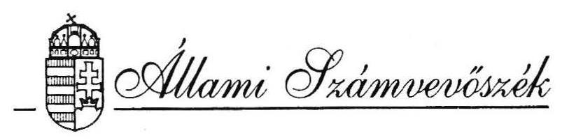
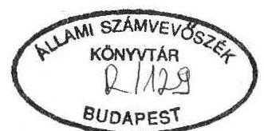
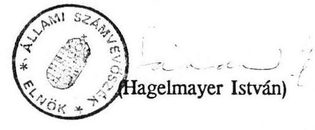

# JELENTÉS 

a társközségek szétválása miatti vagyonmegosztás lebonyolításának ellenőrzési tapasztalatairól

---

# Jelentés 

a társközségek szétválása miatti vagyonmegosztás lebonyolításának ellenőrzési tapasztalatairól

Az Állami Számvevőszék az éves munkatervében foglaltaknak megfelelően megvizsgálta, alapvetően törvényességi és szabályszerűségi szempontok szerint a társközségek szétválása miatti vagyonmegosztás lebonyolítását.

A vizsgálat célja annak megállapítása volt, hogy
—a szétváló és városoktól leváló községek között milyen elvek alapján történt a vagyonmegosztás,
—az egyes vagyontárgyakat milyen értékben vették figyelembe,
—miképpen biztosították az önkormányzati vagyon rendezéséről szóló törvények betartását,
—milyen módon teremtették meg az önkormányzatok működéséhez szükséges gazdasági feltételeket,
—a vagyonmegosztásban, illetve az állami tulajdonban lévő egyes vagyontárgyak önkormányzati tulajdonba adásában a Vagyonátadó Bizottságok milyen szerepet töltöttek be.

A vizsgálat 1990-1992. évekre terjedt ki.
A vagyonmegosztás vizsgálatára 9 megyében: Baranya, Győr-Moson-Sopron, Komárom-Esztergom, Nógrád, Somogy, Szabolcs-Szatmár-Bereg, Pest, Vas, valamint Zala megyében került sor.

A helyszíni ellenőrzés 57 volt székhelyközség és 103 volt társközségi önkormányzatra, összesen 160 települési önkormányzatra terjedt ki. A tulajdoni rendezetlenséget rögzítő megállapításokat a vizsgált önkormányzatok döntő többsége elfogadta. Mindössze öt lényegében magyarázó, kiegészítő észrevétel érkezett.

---

A vizsgált önkormányzatok összes vagyona 1991. december 31-én a mérlegben szereplő adatok szerint 139,7 milliárd Ft volt. Ebből a székhelyközségek 121,0 milliárd Ft-tal, míg a társközségek 18,7 milliárd Ft értékű vagyonnal részesültek. Az előbbi értékek nem tartalmazzák a vagyon jelentős részét képező, értékben nyilván nem tartott vagyontárgyakat (utak, hidak, közterületek, parkok, sétányok stb.). A helyhatósági választásokkal a volt közös községi tanácsokat az önkormányzatok váltották fel, amelynek során a szétválással egyidejűleg a volt társközségek is önkormányzatok lettek. Az így alakult önkormányzatok a törvény erejénél fogva tulajdonosi jogot kaptak, ez a vagyonhoz jutást jelentette.

Az önkormányzatok működésének egyik legfontosabb feltétele, hogy a költségvetés támogatása és a lakosság által befizetett adók mellett megfelelő vagyonnal rendelkezzenek. A vagyont az önkormányzatok elsősorban az önkormányzati törvényben meghatározott kötelező és önként vállalt feladatok ellátása érdekében használják, másrészt saját maguk, illetve más gazdasági szervezetek közreműködésével hasznosítják. A hasznosítás célja, hogy ezáltal bevételhez, jövedelemhez jussanak, melyet feladataik ellátására fordíthatnak.

# A vizsgálat megállapításai 

## 1. A társközségek vagyonhoz jutásának feltételrendszere

A társközségek vagyonhoz jutásának jogi alapjait
—a helyi önkormányzatokról szóló 1990. évi LXV. törvény,
—az egyes állami tulajdonban lévő vagyontárgyak önkormányzati tulajdonba adásáról szóló 1991. évi XXXIII. törvény,
—a helyi önkormányzatok megalakulásával összefüggő kiegészítő és átmeneti szabályokról szóló 1990. évi LXXXIII. törvény,
—a megyei (fővárosi) vagyonátadó bizottságokról szóló 63/1990. (X. 4.) Kormányrendelet, módosítva 36/1992. (II. 21.) Kormányrendelettel,
—az állam tulajdonából ideiglenesen ki nem adható műemlékekről szóló 83/1992. (V. 14.) Kormányrendelet alapozta meg.

Az évekre elhúzódó és induláskor nem teljeskörű jogi szabályozás összességében nem rendezte az önkormányzatok vagyonhoz jutását. A vagyonhoz jutás feltételeinek szakaszos megteremtésével a tényleges tulajdonba vétel és a tulajdonnal való gazdálkodás késik. Az önkormányzati törvény nem állapított meg határidőt a vagyonmegosztás befejezésére. Emiatt az ügyek évekig elhúzódhatnak, amelynek következtében az önkormányzatoknál közvetlenül nem érvényesül a vagyonhasznosítás, ez hátrányosan érinti a gazdálkodásukat, pl. bevételkiesés jelentkezik.

A vagyontárgyak értékelését, az önkormányzati vagyon fogalmának és körének meghatározását, a törzsvagyon, a forgalomképes és forgalomképtelen vagyoni kör meghatározását számos és időben egymásután megjelenő jogi szabályozás rendezi. Ennek áttekintésére az önkormányzatok többsége nem volt felkészülve.

A közös tanács által alapított, több községet ellátó intézmények tulajdonba kerülését önkormányzatonként értelmezési problémák akadályozzák. Ezért a megállapodás tervezetek egyes helyeken vita tárgyát képezik jelenleg is. A társközségi önkormányzati vagyon teljeskörű kialakulását akadályozta az önkormányzati törvény azáltal is, (107. paragrafus 3. bek.) hogy az állami tulajdonban lévő földek, erdők, ingatlanok, vizek, valamint az összes természetvédelem alatt álló területek és műemlékileg védett épületek, építmények, továbbá a közművek létesítményei önkormányzati tulajdonba adására, az önkormányzatok és a vállalatok közötti megosztására külön törvény szerint a Kormány megyei vagyonátadó bizottságokat kívánt létrehozni (továbbiakban VÁB). Azonban – „Az egyes állami tulajdonban lévő vagyontárgyak önkormányzati tulajdonba adásáról szóló 1991. évi XXXIII. törvény az önkormányzati törvényhez képest majdnem egy évvel később, vagyis 1991. szeptember 1-jén lépett hatályba.

Az egyes műemlékek átadását alapvetően befolyásolta, hogy a 83/1992. (V. 14.) Korm. rendelet késve jelent meg (állami tulajdonból ki nem kerülő műemlék épületek) – így időben nem tudott kapcsolódni a XXXIII. sz. törvényhez, ennek következtében téves vagyonmegosztások történtek.

Iharosberény, Iharos és Pogányszentpéter önkormányzatok polgármesterei 1992. január 14-én a Megyei Vagyonátadó Bizottságtól kérték az Iharosberényben lévő műemlék épületben elhelyezett általános iskola önkormányzati tulajdonba adását. A VÁB az átadáshoz szükséges hozzájárulás megadása érdekében a kérelmet felterjesztette a Környezetvédelmi és Területfejlesztési Minisztériumba 1992. február 26-án. A VÁB 1992. április 3-án az általános iskolát a Magyar Állam tulajdonának változatlan fenntartása mellett a Kincstári Vagyonkezelő Szervezet Budapest kezelésébe, Iharosberény, Iharos és Pogányszentpéter Községi Önkormányzatok egyenlő arányú használatába adta az 1991. évi XXXIII. tv. 26. paragrafusa alapján.

---

A 83/1992. (V. 14.) sz. Kormányrendelet 2. paragrafusa szerint az általános iskolát az önkormányzatok tulajdonába kellett volna adni, ha a VÁB megvárta volna a kormányrendelet megjelenését.

A szabályozás területén tapasztalt ellentmondások, problémák, pontatlanságok miatt a vagyonmegosztásra az önkormányzatok nagy részénél nem került sor még jelenleg sem.
2. A vagyongazdálkodás rendszerének kialakítása, a vagyonfelmérés módjai, az értékelés szempontjai

A helyi önkormányzatok vagyonnal történő gazdálkodási kötelezettsége szerint az önkormányzatoknak kell a vagyon szerepére, kialakítására, a működtetés szabályaira, a vagyonnal való gazdálkodásra, az ezzel kapcsolatos hatáskörökre és gyakorlásukra helyi rendeletet hozni. Ezt követően a rendelet egyes elemeit be kell építeni az SZMSZ-be.

A vizsgálat tapasztalatai szerint az ellenőrzött önkormányzatok többsége csak részben tett eleget intézkedéseivel a jogszabályból származó kötelezettségeinek, illetve a jogosan elvárható tulajdonosi magatartásnak.

Az önkormányzatok döntően nem hoztak létre a vagyonmegosztással kapcsolatosan előkészítő és a feladatot ellátó bizottságokat, csupán 9%-ban teljesedett ezen kötelezettség. A vizsgált 9 megye közül 5 helyen, így Győr-Moson-Sopron, Komárom-Esztergom, Szabolcs-Szatmár-Bereg, Vas és Pest megyében az önkormányzatok nem hoztak határozatot a bizottságok felállítására. Somogy megyében a vizsgált önkormányzatoknak mindössze csak 20%-a, Baranyában pedig 17%-a alakított bizottságot.

A létrehozott bizottságok működése is formálisnak tekinthető, mert feladatait és jogosítványait nem határozták meg, így gyakorlatilag nem működtek, pl. Baranya, Komárom-Esztergom, Zala megyékben, másutt pedig „ad-hoc” jellegű felállás mellett, esetenként külső szakértő bevonásával részfeladatokat láttak el (pl. Pest megye).
A vagyon meghatározásával és megosztásával kapcsolatos feladatokat többségében a polgármesterek teljesítették, de testületi felhatalmazás erre vonatkozóan kevés helyen történt (pl. Komárom-Esztergom megye – Császár és Vérteskéthely, Tarján – Héreg – Bábolna önkormányzatoknál).

Így a tulajdonost megillető jogok gyakorlása a képviselő-testületek jogkörében maradt (pl.: Győr-Moson-Sopron megye).

---

A vagyonmegosztással kapcsolatos testületi döntések számos hibát mutatnak. A képviselő-testületi határozat csak a vagyon egy részére vonatkozott Pannonhalma község esetében. Egyes határozatok pedig nem feleltek meg a megállapodás kritériumainak (Öttevény és volt társközsége), mert eltérően rendelkeztek ugyanazon vagyonról. Előfordult Győr megyében az is, hogy a felek megállapodása nélkül intézkedtek a vagyonállapot rendezéséről (Abda, Börcs, Hédervár, Lipót). A vagyoni kör meghatározásánál az önkormányzatok többsége hibásan ítélte meg a vagyon fogalmát.

Zala megyében a vizsgált önkormányzatok mintegy felénél az SZMSZ nem is használja az önkormányzat vagyonának kifejezését, a másik felénél csupán a törvény megismétléséről van szó.

A vagyon felmérése döntően csak az értékben nyilvántartott vagyontárgyakra terjedt ki és nem tartalmazta azokat a naturáliában szereplő egyéb eszközöket, amelyeket a számviteli előírás szerint a zárszámadásban nem kellett szerepeltetni (helyi közutak, műtárgyak, terek, parkok, közterületek stb.).

Az 1990. és 1991. évi zárszámadások hitelességét alátámasztó ténylegesen végrehajtott leltározást nem végezték el az önkormányzatok. A vizsgált önkormányzatok közül több helyen az értékben nyilvántartott eszközök egyeztetése történt meg, pótolva a leltározást (pl. Komárom-Esztergom, Somogy, Vas, Baranya).

Szabolcs-Szatmár-Bereg megyében 9 vizsgált önkormányzat közül tényleges vagyonleltározást sehol sem végeztek. Nyírbogát esetében készült csak átadási jegyzőkönyv, de annak tartalma is csak a nyilvántartási karton mozgását rögzítette az önkormányzatok között.

A helyszíni ellenőrzési tapasztalatok alapján az önkormányzatok többsége nem szabályozta rendeletben a törzsvagyon és egyéb vagyontárgyak körét, azok számviteli elkülönítéséről sem gondoskodtak (pl.: Zala, Baranya, Győr, Pest, Vas megye).

Zala megyében a rendezetlen vagyoni állapotok miatt több település önkormányzata a közös vagyonból elkülönített vagyonnal egyáltalán nem rendelkezett. Ezek az önkormányzatok 1991. évi mérlegbeszámolóikban nyitó vagyont nem mutattak ki (Zalaszentmihály, Tilaj, Ligetfalva, Nemesbükk).

Baranya megyében Somogyhárságy és társközségeinek körjegyzősége a megállapodásban kitért a forgalomképtelen eszközök körére, de annak besorolási szempontjait, elveit nem taglalta. A többi vizsgált önkormányzat ilyen jellegű besorolással még nem foglalkozott.

---

Győr-Sopron megyében a teljes vagyoni kör ismeretének hiányában a vizsgált önkormányzatoknál – egy kivételével – nem történt intézkedés a törzsvagyon többi vagyontárgyaktól való elkülönítésére sem.

Komárom-Esztergom megyében 17 vizsgált önkormányzat közül kettő – Kisigmánd és Bakonybánk – képviselő-testülete foglalkozott a törzsvagyon körének meghatározásával.

Somogy megyében Somogysárd és Újvárfalva Önkormányzata közötti megállapodás melléklete tételesen tartalmazta a megosztott vagyontárgyakat.

Részbeni kedvező tapasztalatot észlelt az ellenőrzés Öttevény Önkormányzatnál, ahol rendeletbe foglalták a törzsvagyon körét, azonban a vagyonrendezést a volt társközség képviselő-testülete nem erősítette meg.

Szabolcs-Szatmár-Bereg megyében kedvezőbb az ellenőrzés tapasztalata, mivel az ellenőrzöttek egyharmada készített törzsvagyonra vonatkozó rendeletet.

A vizsgálatok kapcsán a mérleg valódiságának kérdése is felmerült.
Pannonhalma, Hédervár, Himesháza községek önkormányzatai helytelen számviteli elszámolás következtében nem szerepeltették a Kft-be törzstőkeként bevitt vagyont, illetve pénzeszközt.

Az 1991. évben átadott-átvett vagyontárgyakat nem vezette ki a mérlegből Nagyigmánd 9.693 eFt-ban, Bábolna önkormányzata pedig nem szerepeltette a 7.625 eFt nettó értékű vagyon eszközt.

Az átvett állóeszközökre nem számolt el értékcsökkenést 1991. évre Egyházasgerge (Nógrád megye), a beszámolója így helytelen adatokat tartalmaz.

Hasonló megállapítást kellett tenni Szalánta és volt társközségei esetében, mert egyes állóeszközök nettó értékét helytelenül vették figyelembe, valamint ténylegesen meglévő eszköz érték nélkül szerepelt. Ennek oka, hogy a korábbi időszakban nem a szabályos formát alkalmazták a fejlesztések elszámolásánál.

Ez utóbbi megállapítás általános problémát fog felvetni az új számviteli törvény alkalmazásánál, mert az időszaki kiegészítő felújítások elszámolására nem lesz lehetőség, hiszen az eszköz nincs nyilvántartva, nem válik a tárgyi eszköz-növekedésnek.

Megegyezés hiánya ellenére is szerepelnek egyes önkormányzatok 1991. évi beszámoló jelentéseiben vagyontárgyak. A nyilvántartás szerint átadták a volt tanács székhely községtől leváló önkormányzatok részére a tanács által nyilvántartott,

---

területükön működtetett vagyontárgyakat, (ingatlanokat, ingóságokat) akkor is, ha a vagyonmegosztás tekintetében nem volt megegyezés.

Általános hiányosságként mutatkozott az 1990. szeptember 30-a után önállóvá vált önkormányzatoknál, hogy tárgyévre elkülönített zárszámadás nem készült, az továbbra is egységes módon tartalmazta a székhely és társközségekre vonatkozó adatokat.
Változás 1991. évben következett be, amikor külön-külön készültek a zárszámadások, de azok leltárral történt alátámasztása változatlanul nem történt meg a vizsgált önkormányzatok többségénél.

Vas megyében a vizsgálattal érintett körben az 1991. év végi vagyonmérleg szerinti eszközállomány összesen 330,6 millió Ft (minden községnek van nyilvántartott vagyona), amelyből a pénzügyi elszámolások záró értéke 98,2 millió Ft. Földhivatali tulajdon bejegyzése csak
 3 községre nézve (Rum, Zsennye és Rábatöttös) történt, így a nyilvántartott vagyoni érték tárgyi része zömében kvázi tulajdonnak minősíthető.
A vagyonmegosztásban valamilyen mértékig megegyezésre jutó 19 önkormányzat közül telekkönyvezést 12 nem is kért a vizsgálat idejéig, az említett rumi körön kívül Gencsapáti és Szeleste, illetőleg volt társközségeik kértek tulajdonjogi bejegyzést, amelyeket azonban az érintett két földhivatal (1991. december, illetőleg 1991. november óta) még nem teljesített.

A vagyon átadása átadás-átvételi jegyzőkönyvekkel (a megegyezésre nem jutott önkormányzatok esetében is), számviteli nyilvántartások kíséretében történt.
3. A közös Tanács szerveinek, vagyonának önkormányzati tulajdonba adása

A közös tanácsok által alapított több községet ellátó intézmények többségében átkerültek az önkormányzatok tulajdonába. A megállapodások tartalma önkormányzatonként és megyénként más-más jelleget tükrözött. Döntően azon elvet követték a vizsgált egységek, hogy kölcsönösen lemondtak egymás javára az intézmények fekvése szerinti önkormányzat javára a tulajdoni részarányról.
Az ellenőrzés azonban egyedi jelenségeket is tapasztalt. Így többek között:
Szabolcs-Szatmár-Bereg megyében Nagyvarsány és Gyüre települések között vita van a közösen beruházott Általános Művelődési Központ tulajdoni részarányban, mert a gyürei 7-8. osztályos tanulók helyben oktatása miatt a nagyvarsányi iskola kihasználása csökkent, a működtetés állandó költségei pedig folyamatosan felmerülnek.

---

Vas megyében csak egy helyen fordult elő, hogy egyenlő arányú megosztás történt a közös tanácsok alatt létesült vagyontárgyakra Hosszúpereszteg és Bögöte között.

Két esetben került sor a vagyoni hányad pénzbeli, illetőleg cserével történő megváltására, Szeleste és Pósfa, valamint Hosszúpereszteg és Vashosszúfalu viszonylatában.
Ugyanakkor Rum Községi Közös Tanács működése alatt létesült 10 db vagyontárgyra többszöri kísérlet ellenére nem történt megállapodás, még annak ellenére sem, hogy a legutóbbi megbeszélésen 6 variáció szerepelt.

Baranya megyében a közös tanácsok által alapított több községet ellátó intézmények vagyonmegosztásában vegyes megoldásokat észlelt az ellenőrzés. Így többek között:

- általános megoldás szerint az ingatlan fekvése szerint maradt a vagyontárgy a helyi önkormányzatnál,
- a megosztás során alkalmaztak létszámarányos és egyenlő arányt,
- egyes vagyontárgyakat közös tulajdonként kezelnek, míg más eszközök csak egyes települések tulajdonát képezik.

Nógrád megyében az önkormányzatok az ingatlan és ingó vagyonmegosztás egyetlen fő elvének a közigazgatási területen való elhelyezkedést tartották. Herencsény és Cserhátsurány önkormányzatai természetesnek vették, hogy az intézményekben lévő ingóságok és a lakástámogatási hitel elszámolása a területi elhelyezkedés szerint "öröklődik" és ezért azt nem foglalták a megállapodásba.

Zala megyében Almásháza önkormányzatának döntése szerint a közös iskola létrehozásával a reájuk eső 2 millió Ft erejéig a vagyonrész megváltását kérték és a tanulókat a korábbi körzeten kívül eső Nagykapornaki Önkormányzat iskolájába irányítják át a kedvező közlekedési feltételek miatt.

Somogy megyében gondot okozott a közös tulajdonú intézmények működtetése, fenntartása. A gondot a normatív állami hozzájáruláson felüli költségek átvállalása okozta Zimány és Orci községek között.
Vagyonmegosztás jóváhagyása nélkül Orci önkormányzata 1992. évben még nem utalta át a néhány százezer forintos többletköltséget.

Baranya megyében Somogyhárságy Község Körjegyzőségéhez tartozó községek testületei a közösen üzemeltetett iskola kiadási szintjét 72.000 Ft/tanuló értékben állapították meg. A fenti összeg feletti kiadást Somogyhárságy fedezte.

---

A közös tulajdonba kerülő vagyontárgyak használatával, hasznosításával kapcsolatban született megállapodások kevés kitételt és feltételt tartalmaznak. Kedvező tapasztalat ezen a téren:

#### Abstract

Vas megyében Gencsapáti és Perenye vagyonmegosztásában olyan kitétel szerepel ami szerint a várható felújítás, bővítés vagyoni helyzetét rögzítették már előre.

Baranya megyében Sásd és társközségei vagyonrészt kaptak a székhely községben létesített szolgáltatóházban. Az egymással kötött megállapodásban egyértelmű kitételt fogalmaztak meg, hogy abban italmérésre szolgáló helyiséget nem lehet kialakítani, vagyonrészt eladni pedig csak közös ülésen hozott "igen" határozattal lehet.

Komárom-Esztergom megyében Bábolna Önkormányzat és a Mezőgazdasági Kombinát között az átadásra kerülő vagyontárgyak feltételeit írásban rögzítették. Az egységes önkormányzati tulajdon és egységes ménesbirtok megtartása érdekében rögzítésre került a szolgálati lakások karbantartása, folyamatos átadása, bérleti díja, bérlőkijelölési joga.
Bakonybánk Önkormányzata az Evangélikus Egyházzal kötött megállapodásban a szolgálati lakásra vonatkozó megállapodásban az elővásárlási és bérlőkijelölési, valamint a lakbérváltoztatás jogát rögzítették.

A régi tanácsi rendszer működése következtében létrejött egyenlőtlen fejlődés miatt azonban egyes önkormányzatok nem tudtak megegyezni egymással. Az együttműködés ideje alatt a települések fejlesztése a székhely községgel szemben hátrányosan alakult. Így a közös fennállás időszakában végrehajtott bővítésekből és fejlesztésekből lakosságszám arányában számított igényt jelöltek meg.

Komárom megyében négy székhely- és azoknak volt társközségei nem jutottak megegyezésre. Ez 12 települést és annak lakosságát érinti közvetlenül.
4. Az önkormányzatok önálló gazdálkodásának feltételei, az 1990. évi pénzmaradvány felosztása

A vizsgálat alá vont önkormányzatoknál az 1990. évben a helyhatósági választásokat követően az év utolsó negyedére vonatkozóan az átmeneti gazdálkodást nem szabályozták, erre az időszakra a helyi rendeletalkotás elmaradt.
Az éves költségvetéseket nem bontották meg, önálló bankszámlát nem nyitottak. Ezen jogok, illetve kötelezettségek teljesedése 1991. évre volt a jellemző.
Egyedi megoldások azonban előfordultak:
Baranya megyében Sásd Körjegyzőséghez tartozó önkormányzatoknak nem volt önálló bankszámlájuk, ezáltal keresztfinanszírozásra volt lehetőség, amely

---

bizonyos előnyök mellett hátrányt is jelentett a gazdálkodáson belül.
Magyarhertelend és Bodolyabér községek közös önkormányzati képviselő-testülete közös költségvetés és egyszámlán működtek 1991. évben. A zárszámadási adataik összegét az összes kiadáson belül létszámarányos módon állapították meg.

Zala megyében az önálló költségvetési gazdálkodás hiányának kirívó példája a Tilaji és a Szigetfalvai Önkormányzat, mivel 1991. évben önálló költségvetést nem készítettek, sőt önálló számlavezetésük sem volt, közös képviselő-testületet pedig Zalacsánnyal nem alakítottak.

Győr-Moson-Sopron megyében Hédervár és Lipót társközségek önkormányzata 1991. január 1-jén nem rendelkezett önálló bankszámlával, így átmenetileg a bevételek és a kiadások továbbra is a székhelyközség számláján bonyolódtak.

Az 1990. évi pénzmaradványok szétosztásában vegyes gyakorlat tapasztalható a vagyonmegosztások során. A vizsgált önkormányzatok általában megegyeztek, a vitás ügyek száma csekély.

Zala megyében Nemesbükk esetében a pénzmaradvány vitája miatt 1991. január 11-ig nem volt egyszámláján fedezet, így átutalásokat nem tudott teljesíteni.

A vizsgálati tapasztalat alapján előfordult, hogy a pénzmaradvány összegét csak a székhely község képviselő-testülete tárgyalta meg és az nem került a volt társközség önkormányzatának testülete elé. Komárom-Esztergom megyében Bakonyszombat-hely-Bakonybánk, valamint Nagyigmánd-Kisigmánd-Csém-Csép községeknél volt erre példa.

A pénzmaradványok szétosztása döntően lakosság arányos módon történt. Egyes önkormányzatok kedvezményezett összegben részesültek, a közös, valamint az önálló gazdálkodás körülményei miatt.

Vas megyében a Hosszúperesztegi pénzmaradványból Bögöte és Vashosszúfalu, valamint Gencsapáti összegéből Perenye nem csak a népességarányos, hanem ezen felül 1-1 millió Ft, valamint 545 eFt-ot kapott, a polgármesteri hivatal kialakítása érdekében.

Baranya megyében Sásd és négy társközségének önkormányzatai összesen 967 eFt összegű pénzmaradványról lemondtak, másik három társközség javára az egészséges ivóvízrendszer megvalósulása érdekében.

Nógrád megyében Csesztve-Nógrádmarcal-Szügy önkormányzatok a pénzmaradványok felosztásában is elsődleges elvnek a feladat településhez kapcsolását

---

tekintették. A közös feladatok bevételeinek - költségeinek felosztásánál pedig a lakosság arányát, a feladathoz kapcsolható mutatót vették alapul.

Győr megyében vegyes megoldást alkalmaztak, mert a vizsgált önkormányzatok egy része figyelembe vette a pénzmaradvány felosztása során a korábbi években vállalt kötelezettségeket, és csak az ily módon fennmaradt szabad összeget osztották meg lakosság arányosan, vagy egyenlő arányban. Másutt a függő tételekkel módosított pénzmaradvány felosztásáról intézkedtek.

A volt közös tanácsokból szétváló önkormányzatok elsősorban a pénzvagyon szempontjából erősödtek, helyzetük gazdaságilag stabilnak ítélhető meg. Ebben több tényező játszik szerepet:
— az 1991. évi jelentős nagyságú pénzmaradványok,
—a településenként biztosított 2 millió Ft-os normatív támogatás,
—a szétváló községek többsége nem rendelkezik intézménnyel,
— pályázatokon kapott támogatások.
A kedvező pénzügyi helyzet jól érzékelhető Vas megyében, ahol az 1991. évi pénzmaradványok aránya jelentős az éves költségvetési összeghez viszonyítottan, 21 és 56% közötti szóródású. Igen jelentősek és huzamos lekötési idejűek a tartós betétek.

Így pl.: a nádasdi körjegyzőséghez tartozó önkormányzatoknál 16,8 millió Ft tartós betét döntően 1991-ben lett elhelyezve; Gencsapáti körjegyzőségben 6 millió Ft; Sitke községben 5 millió Ft; Zsennye községben 1990-1991-ről 2 millió Ft, ugyanígy Gutatöttös községben; Hosszúperesztegen 5 millió Ft betét keletkezett.
Hasonló tartalmú megállapításunk van Pest, Nógrád, Győr megyében is.
5. Az állami tulajdonban lévő vagyontárgyak önkormányzatok tulajdonába adása

Az 1990. évi LXV. Önkormányzati Törvény rendelkezései alapján a nem tanácsi szervek kezelésébe adott állami tulajdonú eszközök átadása megkezdődött.

Az önkormányzatok azonban nem kísérték kellő figyelemmel, hogy az önkormányzati törvény hatálybalépésének napján a tanács és szervei, valamint intézményei kezelésében lévő állami ingatlanok, erdők, vizek - kivéve a védett természetvédelmi területeket és a műemlékileg védett épületeket, építményeket, területeket - pénz és értékpapírok a törvény erejénél fogva az önkormányzatok tulajdonába kerülnek.

---

Ezek felmérésével és leltározásával kapcsolatos feladatokat általában nem végezték el. A tulajdonba vétel földhivatali bejelentése meglehetősen későn és szakmailag kifogásolható módon történt. A vagyontárgyak az önkormányzatok közös tulajdonába kerültek, amelyek megosztását megállapodással tudták rendezni. A megállapodás megkötéséig a közös tulajdonnal kapcsolatos jogokat és kötelezettségeket az önkormányzatok nem gyakorolták.

Komárom-Esztergom megyében a vizsgálat által érintett önkormányzatoknál (kivéve Tarján, Héreg) a Komáromi Földhivatal 1990. decemberében, illetve 1991. év elején megállapodás nélkül a polgármesterek kérésére, vagy anélkül (Bábolnai önkormányzat) a tulajdonjogot a település fekvés szerinti önkormányzat javára az ingatlannyilvántartásban bejegyezte "jogutódlás" címén. Így átvezetésre kerültek azok az egyházi ingatlanok is, amelyekre a későbbiekben elidegenítési és terhelési tilalom került bejegyzésre.

Zala megyében Pacsa, Nemesrádó, Zalaigrice és Szentpéterúr önkormányzatok a területekhez tartozó föld és ingatlan földhivatali bejegyzését első ízben 1991. november 4-én kérték. A kérelmek elbírálása azonban csak 1992. január 20-én történt meg, mivel a kérelmekben olyan ingatlanok is szerepeltek, amelyek már nem voltak állami tulajdonban.

A megyei vagyonátadások menetére, folyamatosságára azonban kihatott a 63/1990. (X. 4.) Korm. sz. rendelet, valamint az "Egyes állami tulajdonban lévő vagyontárgyak önkormányzati tulajdonba adását szabályozó 1991. évi XXXIII. törvény közel egy éves késői megjelenése. Ezért a tulajdoni helyzet jogi rendezése még alig értékelhető.

A vagyon átadásában és megosztásában a megyei vagyonátadó bizottságok szerepe a meghatározó, ezért az átadások lényegében a vagyontörvény hatálybalépését és a vagyonátadó bizottságok 1991. második félévben történt megalakulását követően kezdődtek el. A vagyonátadó bizottságok a részletes feladatmeghatározás hiánya miatt, a vagyontárgyak számbavételét, illetve átadását megyénként differenciáltan végzik.

Baranya megyében a Vagyonátadó Bizottság az állami tulajdonban lévő vagyontárgyakat az önkormányzatnál részletesen felmérte.

Somogy megyében ilyen felmérés nem volt, a vagyontárgyakat a bizottság az önkormányzatok kérelme alapján adta át.

Szabolcs-Szatmár-Bereg megyében az önkormányzatok adatszolgáltatása sem volt megfelelő a megállapodások jóváhagyásához, mivel a vizsgált önkormányzatok fele adott információt a VÁB-nak, ezek 75%-a azonban minőségileg nem felelt meg az elvárásoknak.

---

Vas megyében a 198 önkormányzatból csak 9 volt a kezdeményező, itt 64 döntést hozott a VÁB.

Nógrád megyében a VÁB a hozzá beérkező kérelmek jelentős részéhez hiánypótlást kért különböző okok miatt. Az önkormányzatok a VÁB döntését kérték olyan kérdésekben is, melyek önkormányzatok egymás közötti megállapodásának tárgya lehetett volna.

Somogy megyében hasonló megállapítást kellett tenni, de ott az ÁSZ-tól várták el a vitatott kérdések eldöntését.

A költségvetési üzemek ingatlan és ingó tulajdonjogát az 1991. évi XXXIII. tv. szerint a VÁB rendezi. Az üzemek ingatlanai, illetőleg az általa kezelt lakásállomány telekkönyvileg tanácsi
 kezelésben voltak, így az üzem ingó vagyonát automatikusan sajátjuknak tekintették az önkormányzatok, amikor költségvetési szervet hoztak létre, de erről VÁB igazolást nem teljeskörűen kértek az érdekeltek (pl.: Vas megye, Öriszentpéter).

Komárom-Esztergom megyében a Kisbéri Költségvetési Üzem kezelésében volt a lakások egy része (Császár, Vérteskéthely, Ácsteszér, Csatka, Aka). Az üzem átalakulásakor - egyszemélyes Kft-vé - a VÁB a költségvetési üzem saját vagyonát osztotta meg, a lakások értéke mint "rábízott" vagyon szerepelt az üzem vagyonában. Mivel a költségvetési üzemek a tanács által létrehozandó intézmények körébe tartoztak, a fenti lakások tulajdonjoga az ÖTV. erejénél fogva visszakerült önkormányzati tulajdonba.

Nógrád megyében a Magyarnándori Közös Költségvetési Üzem vagyonára Kft-vé alakítás volt az elképzelés. A Felügyelő Bizottság azonban az üzem megszüntetése mellett döntött. Az üzemmel szemben felmerült szavatossági és egyéb okok a felosztható vagyon megállapítását hátráltatják.

Zala megyében a sajátos települési szerkezet következtében körzeti költségvetési üzemi hálózat alakult ki. Ez azt jelentette, hogy egyes üzemek esetében több tanács, közös tanács volt együttesen az alapító és ilyenkor vagyonmegosztás esetén az első lépcsőben az alapító közös tanácsoknak, majd a második ütemben a közös tanácshoz tartozó volt társközségeknek kell megállapodásra jutniuk. Ezeknek figyelmen kívül hagyása miatt a Pacsai Önkormányzat két ízben is törvénysértő határozatot hozott - a többi alapító önkormányzat hozzájárulása, azonos értelmű döntése nélkül - a közös költségvetési üzem felszámolására. A VÁB az üzem felszámolási eljárást ezideig nem tudta lezárni.

Baranya megyében a költségvetési üzemek vagyonrendezésénél több önkormányzat nem tudta bizonyítani mekkora összeggel vett részt az üzemek alapításában, mert a Megyei Tanács közvetlen átutalással rendezte korábban a megállapított alapítási összegeket (Véménd, Hímesháza).
Harkány Nagyközség Költségvetési Üzemének telephelye Sellyén volt, 30 km-es

---

távolságban. A VÁB döntése szerint az üzem ingatlanai a fekvés szerinti, a többi vagyontárgy a felügyeletet ellátó önkormányzaté marad. A döntés alapján mindkét helyen működtethető vagyon van, de igazi piaci gazdálkodásra egyik félnek sincs lehetősége.

A lakások és nem lakás céljára szolgáló helyiségek átadása-átvétele jogszabály szerint, problémamentesnek minősíthető.

Győr-Moson-Sopron megyében befejezettnek tekinthető a lakás és nem lakás céljára szolgáló helyiségek önkormányzati tulajdonba adása, mivel ez döntően nem érintette a vizsgált egységeket.

Somogy megyében a költségvetési üzemek által kezelt lakások átkerültek az önkormányzatok tulajdonába a törvényben foglaltaknak megfelelően.

A műemlék átadását-átvételét alapvetően befolyásolta, hogy az 1991. évi vagyontörvény mellett külön 89/1992. (V. 14.) Kormányrendelet határozta meg azokat a műemlék épületeket, amelyek nem kerülhetnek ki az állami tulajdon köréből. A vagyoni állapot rendezését szolgáló két jogszabály megjelenése közötti időtáv miatt a rendezési folyamat nem tekinthető lezártnak, esetenként szabályszerűnek.

Szabolcs-Szatmár-Bereg megyében 54 db állami tulajdonban lévő műemlékből a kérelmek alapján 36 került az önkormányzatok tulajdonába.

Komárom-Esztergom megyében a műemlék ingatlanok a VÁB-on keresztül történő átadására nem került sor.

Nógrád megyében Hollokő önkormányzati területén 64 db épületre műemléki védettség vonatkozik. Az önkormányzat már 1991. februárban kérte a nem községi tanács és szervei által kezelt 27 ingatlan tulajdonba adását a Köztársasági Megbízott Területi Hivatalától. Az azóta megalakult VÁB műemlékekre vonatkozóan nem hozott döntést.

Somogy megyében a VÁB 6 db műemléki ingatlant adott át az önkormányzatok tulajdonába, míg 45 átadása folyamatban van.

A védett természeti területek átadása folyamatban van, szűkkörű ellenőrzési tapasztalataink miatt általánosítható megállapítást nem tudtunk megfogalmazni. A beépítetlen földek átadását befolyásolja, hogy az állami tartalék területek sorsa a kárpótlási törvény végrehajtásáig függőben van.

Nógrád megyében a védett természeti területek tulajdonba vételi igényének felmérését kezdeményezte a VÁB 1992. július hónapban. Azonban a bejelentések még nem érkeztek be, döntés nincs a tulajdonlásukról.

---

Győr-Moson-Sopron megyében a természetvédelem alatt álló területek átadásának előkészítése, átadása, megosztása még nem kezdődött meg.

Somogy megyében, felmérés alapján 77 db védett természetvédelmi terület van, ebből a VÁB 7 db ingatlant adott át az önkormányzatok tulajdonába, és 4 db van folyamatban.

Baranya megyében Abaliget önkormányzata a közigazgatási területén lévő 1935 óta védett természetvédelmi területre nyújtotta be igényét.
A Magyar Állam tulajdonában, de a Megyei Közgyűlés Hivatal intézményének - Idegenforgalmi Hivatal - kezelésében lévő vagyontárgy sorsát a VÁB 1992. májusban tárgyalta, döntés nem született mindkét fél fenntartotta korábbi, egymástól eltérő álláspontját.
Az ügyben a felek a VÁB által kért kiegészítéseket pótolták.
A védett területen található két tó közül az egyik állaga karbantartás hiányában romlik.

A közüzemek vagyonátadása és megosztása az önkormányzatoknál általában még nem történt meg.
Az állami vagyonátadás kritikus pontjait a víziközművek és vízilétesítmények átadása-átvétele jelentik. Az önkormányzatok döntő többsége tulajdonosi jogáról nem nyilatkozott vagy lemondott, elsősorban a magas fenntartási és üzemeltetési költségek miatt.

Szabolcs-Szatmár-Bereg megyében Nyírtér település önkormányzata nem vette át a külterületi belvízelvezető árkokat.

Nógrád megyében a nem tanács és szervei kezelésében volt vizek, vízilétesítmények átadását a VÁB véleménye szerint a tulajdoni viszonyok tisztázatlansága, kisajátítási eljárások elmaradása akadályozza, ezért azok rendezése elhúzódik.

Zala megyében az önkormányzatok egy része tulajdonosi jogával kapcsolatban még nem nyilatkozott.

Győr-Moson-Sopron megyében a több önkormányzat részéről érkezett a tulajdonjog visszautasítására vonatkozó képviselő-testületi döntés a VÁB-hoz.

Somogy megyében 45 vízi létesítmény adható át, de csak 2 önkormányzat kérte a tulajdonba adást, 41 elutasította, 2 pedig gondolkodási időt kért a válaszadásra. A víziközművel rendelkező települések száma 183 db, ebből mindössze 20 igényelte a víziközműveket.

Vas megyében a négy közüzemmel kapcsolatos vagyonmegállapodásra a 28 önkormányzatból mindössze 9 nyilatkozott tulajdonosi szándékát illetően a VÁB-nak.

---

Baranya megyében a Baranya Megyei Vízmű Vállalat kezelésében lévő idényjellegű fürdők tulajdonjogának rendezése ezideig nem történt meg, ugyanakkor a megyei alapítású Baranya Megyei Fürdő Vállalat - Harkány melegvizes strandkombinát vagyonmegosztása megtörtént az érdekelt önkormányzatok között.
Magyarhertelend közigazgatási területén lévő melegvizes strand tulajdonjogára az önkormányzat benyújtotta igényét a VÁB-nak, de az átadást ezideig nem hagyták jóvá. Oka az, hogy a vízmű kezelésében lévő összes eszköz sorsát később rendezik.

Szabolcs-Szatmár-Bereg megyében a Megyei Víz- és Csatornamű Vállalat ajánlásokat tett az önkormányzatoknak a jelenleg is fennálló centralizáció fenntartására.

Komárom megyében öt közüzem vagyonának átadása a VÁB döntésével megtörtént.

Nógrád megyében a VÁB három közüzem tulajdonának felosztását kezdeményezte az önkormányzatok között. Végleges rendezése ezideig még nem történt meg.

Baranya megyében hét közüzem vagyonátadását tárgyalta a VÁB. Ezek közül a Pécsi Távfűtő Vállalat vagyoni rendezését valamennyi érdekelt önkormányzat megfellebbezte, a Megyei Közgyűlés a neki juttatott vagyonrészt pedig visszautasította.
A Baranya Megyei Vízmű Vállalat esetében az önkormányzatok közösen kezdeményezték a közművagyon átvételét és annak holding gazdasági társaságban való működtetését szeretnék, a jelenlegi magas szolgáltatási ár visszaszorítása céljából.

A volt egyházi ingatlanok tulajdoni helyzetének rendelkezéséről szóló 1991. évi XXXII. törvény alapján a településeken lévő volt egyházi tulajdonú ingatlanok tulajdonjogának visszaigénylését az egyházak bejelentették. Az ingatlanokra a földhivatal az elidegenítési és terhelési tilalmat bejegyezte. Megállapodásra több helyen már sor került, így: Komárom megyében Császár, Bakonybánk, Baranya megyében Somogyhárságy Önkormányzatánál.

A vizsgált önkormányzatok közül többen bejelentették az önkormányzat tulajdonszerzési szándékát az 1992. évi II. törvény alapján.
A szövetkezetekről szóló törvény hatálybalépéséről és az átmeneti szabályokról szóló 1992. évi II. törvény 3. paragrafus (3) bekezdése szerint tulajdoni igényt csak akkor támaszthat a helyi önkormányzat, ha a szövetkezet ingyenesen kapott állami tulajdonú ingatlant.
A legtöbb önkormányzat ezideig nem kapott választ beadványára Komárom megyében (Kisigmánd, Nagyigmánd, Tarján) Baranya megyében kettő önkormány-

---

zat esetében találkozott vagyonnevesítési szándékkal, de döntés itt sem született (Sásd, Véménd), Nógrád megyében négy önkormányzat élt a tulajdonosi igényével, de végleges rendezés ezideig nem történt a felek között.

Az egyes önkormányzatok testületei az állami tulajdon átvételénél gazdasági megfontolások alapján visszautasították a tulajdonjogot.

Pest megyében 3 esetben történt ez meg, mert

- Sződön a műemlék jellegű kastély,
- Dunavarsányban a moziüzemi vállalat egysége,
- Pilisen belterületi vízfolyás működtetési és fenntartási költségeire nincs fedezete az érdekelt önkormányzatoknak.

Nógrád megyében a vagyonról való lemondásnak fogható fel a leromlott állagú, nagy ráfordítással helyrehozható épület értékesítésének meghirdetése Mátraszőlősön. Az önkormányzat az esetleg több tízmilliós ráfordításra nem vállal kötelezettséget, vételi ajánlatot pedig a kiírt pályázatra nem kapott, így az épület állaga tovább romlik.

Zala megyében a Nyugat-dunántúli Vízügyi Igazgatóság kezelésében lévő vízfolyások átadását kezdeményezte a Zalacsányi Községi Önkormányzatnál. Képviselő-testületi állásfoglalás hiányában még nem történt meg az átadás, mert a javaslat nem volt teljeskörű, nem tartalmazott minden önkormányzati területen lévő vagyonrészt.

# 6. Az önkormányzati vagyon hasznosítása 

Az önkormányzatok az ÖTV, valamint a vagyontörvény alapján tulajdonosi jogokat szereztek. Ezzel egyidejűleg a vagyon hasznosítása megkezdődött, illetve közös tulajdon keretében folytatódott.

Eddigi tapasztalatok alapján a működtetéssel-fenntartással gondot nem jeleztek az önkormányzatok. A hasznosítás mérsékelt, illetve negatív jellegű ott, ahol a megállapodásban érdekelt önkormányzatok nem tudtak egymással megállapodást kötni, továbbra is vitatják egyes vagyontárgyak körét és mértékét. A hasznosítás azokon a területeken sem kielégítő, ahol a megállapodások megtörténtek, de a földhivatali bejegyzések késedelme miatt bizonytalan az önkormányzat a vagyon hasznosításának módjában, rendszerében, körében.

Komárom megyében Bábolna és volt társközségei 1990. december 30-ig megállapodtak egymással, hogy a közösen létrehozott községházát lakosság

---

arányosan megosztják egymás között. A Földhivatal a bejegyzést nem teljesítette a közös képviselő-testületi határozat mellett sem, mert a polgármesterek által kötött megállapodást is kérte. A bejegyzés megtagadása az ellenőrzés szerint jogszabályellenes cselekedet volt.

Nógrád megyében a földhivatalok a tulajdonjogi bejegyzéshez a megállapodás bemutatását, beküldését igényelték. Tapasztalható volt azonban ennek hiányában történő tulajdonbejegyzés is, Szarvasgede, Kislágon, Palotás és Héhalom Önkormányzatok esetében.
Hollókő Önkormányzat kérelméhez igényelte a Földhivatal a megállapodást, azonban a megállapodás benyújtását követően sem jegyezte be az önkormányzat nem védett ingatlanaira a tulajdonjogot.

Mátraszőlős 14 külterületen lévő, Kelet-Cserhát Tájvédelmi Körzethez tartozó ingatlanaira a tulajdonjogot a VÁB döntés hiányában is bejegyezte.

A vizsgált önkormányzatok a vagyonmegosztások többségét elfogadták, esetenként azonban bírósági eljárás kezdeményezésére is sor került.

Pest megyében Sződ Község Önkormányzata a területén lévő szemétlerakóhely 23 ha terület tulajdonba adását kívánja perelni.

Komárom megyében Bara és Tárkány Község Önkormányzata a szolgálati lakás vagyonmegosztásával kapcsolatosan tervezi a bírósági eljárás kezdeményezését Bábolna Önkormányzatával szemben.

Nógrád megyében a vizsgált önkormányzatok közül három önkormányzatnál merült fel a bírósági eljárás kezdeményezése. Okai:

- hitelmegosztás megváltoztatása,
- crossbar-központ tulajdonlása,
- "bírósági per" kilátásba helyezése.

Zala megyében Nemesbükk és Hévíz Önkormányzata 1991. májusától lezáratlan bírósági perben állnak szemben egymással a közös használatú intézmények vagyonmegosztása miatt, amit kölcsönösen vitatnak.

Somogy megyében Kaposkeresztúr Önkormányzata nem fogadta el a volt Taszár Községi Tanács vagyonának és pénzmaradványának megosztását, ezért bírósághoz fordult. A rendezetlen tulajdonviszonyok miatt a házépítésre kijelölt telkeket a lakosság részére nem tudták értékesíteni, illetve az építési engedélyeket kiadni, így anyagi kár érte az önkormányzatot.

Baranya megyében Szalánta és Szava községek önkormányzata között van bírósági ügy, a térségben létesített vezetékes vízellátás beruházása tárgyában. Szalánta Közös Tanács VB. határozatával átvállalta a korábbi megyei tanácsi

---

támogatást, melyhez az új költségvetési gazdálkodás már nem ad pénzügyi fedezetet, az önkormányzat pedig nem tekinti
 a saját VB. határozatát kötelező érvényűnek maga számára. A követelés összege 4.300 eFt volt, de időközi támogatás miatt 2.000 eFt-tal csökkent.

# Következtetések, javaslatok 

Az önkormányzatiság egyik legfontosabb feltétele, a társközségi önkormányzati vagyon megosztása jelenleg sem rendezett, az önkormányzatok nagy része a megosztásban nem állapodott meg. Ebben elsősorban az játszott főszerepet, hogy a vagyonhoz jutást szabályozó törvények, jogszabályok a befejezés határidejét nem állapították meg, ebből adódóan évekig húzódhatnak ügyek. A megállapodás hiánya miatt az önkormányzatok a tulajdonosi jogaikat és kötelezettségeiket csak részben tudják érvényesíteni. A megállapodások elmaradása nem szankcionálható.

A vagyoni állapot rendezetlensége miatt az önkormányzatok nem gazdálkodhatnak körültekintően vagyonukkal, ez hosszabb távon negatívan befolyásolja az ellátási színvonalat és az állampolgárok hangulatát.
Azok az önkormányzatok pedig, amelyek rendeleti úton nem szabályozták gazdálkodásukat, nem rendelkeznek jóváhagyott zárszámadással, azok lényegében jogalap nélkül működnek.

Az önkormányzatok a sok probléma, vitás ügyek ellenére is döntően megegyezésre törekedtek, bírósághoz alig néhány fordult jogorvoslatra.
Mindezek következtében indokoltnak tartjuk a társközségek szétválása miatti vagyonmegosztás lebonyolítási rendszerének, szabályozásának áttekintését és módosítását, az önkormányzatok figyelmének felhívását.

Ennek érdekében:
a pénzügyminiszter és a belügyminiszter kezdeményezzen törvényi szintű szabályozást

1. a regionális és megyei rendszerű víziközművek vagyonrendezésére oly módon, hogy a vagyon ténylegesen az önkormányzatok tulajdonát képezze. A működtetés során a kistelepülések az éves költségvetésből a magas fajlagos költségek miatt normatív módon kapjanak kiegészítő támogatást.
2. A vagyonmegosztás, átadás határidőre történő befejezésére, hogy az önkormányzatok minél előbb rendelkezzenek vagyonnal, és az alapján gondoskodjanak a vagyon működtetéséről és hasznosításáról.

---

3. A központi szervek: PM., BM. keressék meg az önkormányzatokat a vagyon teljeskörű értékelése miatt, a valós vagyoni helyzet kialakítása érdekében és hívják fel a figyelmüket a számviteli törvényben foglalt értékelési elvekre, az eddig értékben nyilván nem tartott vagyoni értékű jogok, szellemi termékek stb., forgalomképtelen vagyontárgyak (utak, hidak, terek stb.) vagyonmérlegben történő szerepeltetésére.

A Belügyminisztérium központi intézkedése szükséges a feltárt hiányosságok megszűntetése érdekében:

1. A vizsgálati tapasztalatok szerint több önkormányzat még nem hagyta jóvá az 1990. évi zárszámadást, továbbá nem alkotott az 1992. évre költségvetési rendeletet. A Köztársasági Megbízotton keresztül a törvényességi felügyelet gyakorlásával biztosítsa az államháztartási törvényben foglaltak betartását.
2. A vagyonrendezés késedelme részben a földhivatalok bejegyzése miatt húzódik, azok leterheltsége, valamint a helytelenül benyújtott kérelmek miatt. A vagyonnal való gazdálkodást segítené elő, ha a Belügyminisztérium a Földművelésügyi Minisztériumnál kezdeményezne központi intézkedést a földhivatalok munkájának támogatására.

Budapest, 1992. október

---

A vizsgálatot Farkas László osztályvezető főtanácsos vezette Maczekó Károly és Szita László számvevő tanácsosok közreműködésével.

# Az elővizsgálatban részt vettek: 

Maczekó Károly számvevő tanácsos
Szita László számvevő tanácsos

## A helyszíni vizsgálatot végezték:

## Baranya megye

Maczekó Károly számvevő tanácsos
Szita László számvevő tanácsos
Győr-Moson-Sopron megye
dr. Lacó Bálintné számvevő tanácsos
Komárom-Esztergom megye
Fátrainé Zsebedics Katalin számvevő
Nógrád megye
Zeke József számvevő
Somogy megye
Dr. Szigeti István számvevő
Szita László számvevő tanácsos
Szabolcs-Szatmár-Bereg megye
Bacskay János számvevő tanácsos
Vas megye
Dr. Gyuk József számvevő tanácsos
Zala megye
Angyalosi Dániel számvevő tanácsos
Pest megye
Benczik Lászlóné számvevő tanácsos
Tímár József számvevő
Dr. Szírota István tanácsadó

Budapest, 1992. október
