# ÁLLAMI   SZÁMVEVŐSZÉK 

## JELENTÉS

Polgárdi Város Önkormányzata pénzügyi helyzetének ellenőrzéséről (43/4)

---

# Állami Számvevőszék 

Iktatószám: V-3090-017/2012.
Témaszám: 1015
Vizsgálat-azonosító szám: V0560121

## Az ellenőrzést felügyelte:

Dr. Varga Sándor
számvevő igazgató-helyettes
Az ellenőrzést vezette:
Renkó Zsuzsanna
számvevő tanácsos
Ellenőrzési csoportvezető:
Puchy Márta
számvevő tanácsos
Az ellenőrzést végezték:
Csényi István
számvevő tanácsos

## Renner Andrea

számvevő

---

# TARTALOMJEGYZÉK 

BEVEZETÉS ..... 9
I. ÖSSZEGZŐ MEGÁLLAPÍTÁSOK, KÖVETKEZTETÉSEK, JAVASLATOK ..... 13
II. RÉSZLETES MEGÁLLAPÍTÁSOK ..... 23

1. Az Önkormányzat kötelező és önként vállalt feladatai, a feladatellátás szervezeti keretei és annak változásai ..... 23
2. Az Önkormányzat pénzügyi egyensúlyi helyzetét befolyásoló tényezők ..... 27
2.1. A működési és a felhalmozási egyensúly változása ..... 29
2.2. Az Önkormányzat bevételeinek változása ..... 35
2.3. Az Önkormányzat folyó és a felhalmozási célú kiadásainak változása ..... 37
3. Az Önkormányzat kötelezettségei ..... 41
3.1. Az Önkormányzat pénzintézeti kötelezettségeinek változása ..... 41
3.2. A szállítói kötelezettségek változása ..... 45
3.3. Egyéb kötelezettségek változása ..... 45
4. A pénzügyi egyensúly megteremtése érdekében hozott intézkedések eredménye ..... 48
5. Az ÁSZ által a korábbi években a pénzügyi egyensúly javítására tett szabályszerűségi és célszerűségi javaslatok hasznosulása ..... 50

---

# MELLÉKLETEK 

1. számú Működési és felhalmozási célú hiány/többlet a 2007-2010 közötti időszakban az Önkormányzat zárszámadási rendeleteiben (1 oldal)
2. számú Az Önkormányzat bevételei és kiadásai, valamint adósságszolgálata 20072010 között (1 oldal)
3/a. számú Az Önkormányzat 2007-2010. években megvalósított, 2010. december 31-ig befejezett fejlesztései és azok forrásösszetétele (1 oldal)
3/b. számú Az Önkormányzat 2010. december 31-én folyamatban lévő fejlesztési feladataira 2010. december 31-ig teljesített kifizetések és azok forrásösszetétele (1 oldal)
3/c. számú Az Önkormányzat 2010. december 31-én folyamatban lévő fejlesztési feladataira 2010. december 31-én fennálló kötelezettségek és azok forrásösszetétele (1 oldal)
3. számú Az önkormányzati feladatok ellátásában résztvevő gazdasági társaságok (1 oldal)

---

# RÖVIDÍTÉSEK JEGYZÉKE 

## Törvények

Áht.
helyi adókról szóló törvény
Ötv.
Gt.
Ptk.

## Rendeletek

Áhsz.

Ámr.
SzMSz

## Szórövidítések

áfa
ÁSZ
EU
Fejérvíz Zrt.
jegyző
Képviselő-testület
kistérségi társulás
Önkormányzat
polgármester
Polgárdi-Víz Kft.
Polgármesteri hivatal
szja
Társulás
Vertikál Zrt.
az államháztartásról szóló 1992. évi XXXVIII. törvény a helyi adókról szóló 1990. évi C. törvény
a helyi önkormányzatokról szóló 1990. évi LXV. törvény a gazdasági társaságokról szóló 2006. évi IV. törvény a Polgári Törvénykönyvről szóló 1959. évi IV. törvény
az államháztartás szervezetei beszámolási és könyvvezetési kötelezettségének sajátosságairól szóló 249/2000. (XII. 24.) Korm. rendelet
az államháztartás működési rendjéről szóló 292/2009. (XII. 19.) Korm. rendelet

Polgárdi Város Önkormányzata 8/2011. (IV. 29.) számú rendelete a Képviselő-testület Szervezeti és Működési Szabályzatáról (a többször módosított 12/2004. (IV. 28.) számú rendeletet 2011. május 1-jétől hatályon kívül helyezte)
általános forgalmi adó
Állami Számvevőszék
Európai Unió
Fejér Megyei Önkormányzatok Víz és Csatornamű Zártkörűen Működő Részvénytársaság
Polgárdi Város Önkormányzatának Jegyzője
Polgárdi Város Önkormányzatának Képviselő-testülete
Székesfehérvári Többcélú Kistérségi Társulás
Polgárdi Város Önkormányzata
Polgárdi Város Önkormányzatának Polgármestere
Polgárdi Víz- és Szennyvízkezelési Beruházó és Szolgáltató Korlátolt Felelősségű Társaság
Polgárdi Város Önkormányzatának Polgármesteri Hivatala
személyi jövedelemadó
Közép-Duna Vidéke Hulladékgazdálkodási Önkormányzati Társulás
Vertikál Építőipari és Kommunális Szolgáltató Zártkörűen Működő Részvénytársaság

---

.

---

# ÉRTELMEZŐ SZÓTÁR 

| BUBOR | Budapesti Bankközi Forint Hitelkamatláb. Irányadó, referencia jellegű kamatláb. Mértékét az MNB naponta állapítja meg a banki kamatok figyelembevételével. Közzététele naponta történik. |
| :--: | :--: |
| CLF módszer | Az önkormányzatok költségvetése elemzésének eszköze. A módszer következetesen elkülöníti a folyó és a felhalmozási költségvetés bevételeit és kiadásait, azok költségvetési egyenlegeit. Bizonyos mértékig a vállalati gazdálkodás logikai elemeit érvényesíti az önkormányzatok pénzügyi, jövedelmi helyzetének vizsgálata során. Az értékelés a pénzügyi kapacitás fogalmát helyezi a középpontba. |
| EURIBOR | A frankfurti bankközi piacon jegyzett, az Európai Központi Bank szabályainak megfelelően megállapított kínálati kamatláb. Az EURIBOR értékét a legfontosabb európai bankok hitelkínálatának kamatlábai alapján a Reuters ügynökség számolja ki és teszi közzé naponta. A magyar pénzintézetek is ezt használják viszonyítási alapnak EUR hitelek esetén. |
| GDP - Bruttó hazai termék | A gazdaság által az adott időszakban előállított, végső felhasználásra szánt termékek és szolgáltatások piaci áron meghatározott értéke. |
| használhatósági fok | Az eszközgazdálkodás vizsgálatának elemzése során használt mutató. Számításakor a tárgyi eszköz könyv szerinti (nettó) értékét viszonyítják a tárgyi eszköz bruttó (beszerzési/létesítési) értékéhez. A mutató százalékban kifejezett értékének csökkenése az eszköz állagának romlására, avulására utal, ami maga után vonja az üzemeltetési és fenntartási költségek növekedését is. |
| kamatkockázat | A változó kamatozású forint-, vagy a devizahitelek futamideje alatt a kamat emelkedése miatt fennálló kamatkockázat, melynek növekedése miatt nő a hitel törlesztő részlete. |
| kötelező közszolgáltatás | A helyi önkormányzati feladatkörbe tartozó, a köztisztasággal és a településtisztasággal, valamint az élet- és vagyonbiztonsággal összefüggő egyes - közszolgáltatás útján megvalósuló - közfeladatok ellátása, amelynek kötelező igénybevételét külön jogszabály (törvény, helyi önkormányzati rendelet) határoz meg. |
| Közfeladat | Állami, helyi, illetve kisebbségi önkormányzati feladat, amelynek ellátásáról az államnak, illetve az önkormányzatoknak kell gondoskodni. A hatályos szabályozás szerint közfeladatot törvény és önkormányzati rendelet állapíthat meg. Az önkormányzatok által ellátandó feladatok keretszerű meghatározását az Ötv. tartalmazza. |
| önkormányzat többségi tulajdonában lévő gazdasági társaságok | Az önkormányzat a gazdasági társaságban a szavazatok több mint ötven százalékával vagy a Ptk. 685/B. § (2)-(3) bekezdéseiben rögzített meghatározó befolyással rendelkezik. |

---

A befolyással rendelkező akkor rendelkezik egy jogi személyben meghatározó befolyással, ha annak tagja, illetve részvényese és jogosult e jogi személy vezető tisztségviselői vagy felügyelőbizottsága tagjai többségének megválasztására, illetve visszahívására, vagy a jogi személy más tagjaival, illetve részvényeseivel kötött megállapodás alapján egyedül rendelkezik a szavazatok több mint ötven százalékával (Ptk. 685/B. § (2) bekezdése). A meghatározó befolyás akkor is fennáll, ha a befolyással rendelkező számára e jogosultságok közvetett módon (köztes vállalkozásain keresztül, a Ptk. 685/B. § (3)-(4) bekezdései szerint) biztosítottak.
A helyi önkormányzat és az önkormányzat irányítása alá tartozó költségvetési szerv többségi tulajdonában, illetve többségi befolyása alatt álló gazdálkodó szervezet esetében hitelfelvétel, kölcsönfelvétel, garancia- vagy kezességvállalás, tartozásátvállalás, tartozás-elengedés, értékpapír kibocsátás, vásárlás, pénzügyi lízing, tartós bérleti szerződés, ingyenes vagyonjuttatás (így különösen: ajándékozás, ingyenes engedményezés), vagy követelésvásárlás, követelésengedményezés végrehajtására vonatkozóan az Áht. 100/M. § (4) bekezdése alapján az önkormányzat rendelkezik döntési jogosultsággal.
pénzügyi kapacitás

A pénzügyi kapacitás (financial capacity) az adósok hitelfelvételi képességének azon mértéke, ahol még anélkül tudják növelni az adósságot, hogy csökkenteniük kellene akár a jelenbeli, akár a jövőben esedékes kiadásaikat a fizetésképtelenség elkerülése érdekében. (Forrás: Az önkormányzati rendszer pénzügyi helyzete, ÁSZKUT tanulmány 2010.)
pénzügyi kockázat
A működési kockázat egyik eleme. Megmutatkozhat a költségvetés nagyságrendjének, szerkezetének nem megalapozott módosításaiban, a bevételi, és a kiadási előirányzatoktól lényegesen eltérő teljesítésekben, a nem megfelelő belső kontrollrendszer működésében, a tudatos károkozásokban, a biztosítások elmaradásában, a hibás fejlesztési döntésekben, a nem a terveknek megfelelő forrásfelhasználásokban. Jelentkezhet továbbá a bevételek és kiadások ütemkülönbsége miatt felvett folyószámla- és likvidhitelek költségvetési év végén fennálló egyenlege miatt, amely az önkormányzat költségvetésébe - akár tartósan - beépülő forráshiányt jelzi.
SNA
törlesztési kockázat

System of National Account, azaz a Nemzeti Számlák Rendszere, amely a gazdasági szektorok által létrehozott valamennyi terméket és szolgáltatást figyelembe veszi.
Annak a kockázata, hogy a megfelelő időben és mértékben a hitelt felvevőnél rendelkezésre állnak-e a pénzintézetek és egyéb szervek felé fennálló kötelezettségek visszafizetéséhez, a hitelek és kölcsönök törlesztéséhez szükséges pénzügyi források.

---

A törlesztési kockázatot növeli a kamat- és árfolyam növekedése, mivel ezekben az esetekben az adósságszolgálat nőhet. Törlesztési kockázatot okozhat a visszafizetésre tervezett forrás elérésének, teljesítésének bizonytalansága (pl. a visszafizetéshez tervezett tartalékolás elmaradt, a tervezettnél alacsonyabb a saját bevétel, a helyi adóból származó bevétel az adóalanyok, adóalapok csökkenése miatt nem teljesül).

---

.

---

# JELENTÉS 

## Polgárdi Város Önkormányzata pénzügyi helyzetének ellenőrzéséről

## BEVEZETÉS

Az Állami Számvevőszék 2011. évtől érvényes stratégiája új irányt szabott a helyi önkormányzatok gazdálkodásának ellenőrzésében is. Az ÁSZ - küldetése és jövőképe szerint - szilárd szakmai alapokra támaszkodva értékteremtő ellenőrzéseivel és helyzetelemzéseivel az államháztartás egészében, így a helyi önkormányzati alrendszerben is elő kívánja segíteni a közpénzek és a közvagyon szabályos, gazdaságos, hatékony és eredményes felhasználását. E folyamat részeként - az államháztartási hiány alakulásának összetevőire is figyelemmel végezzük az önkormányzati alrendszer pénzügyi helyzetelemzését.

Az államháztartás helyi szintjén a 304 városnak ${ }^{1}$ az általuk ellátott közszolgáltatások volumenére is tekintettel a közfeladatok ellátásában kiemelt szerepe van. E települések 2011. január 1-jei népessége 3169 ezer fő volt.

Feladataik és hatásköreik az Ötv. mellett különböző ágazati törvények által meghatározottak, miközben a feladatellátás szervezeti kereteit - ezen belül a gazdasági társaságok közszolgáltatások ellátásában betöltött szerepét - saját maguk határozzák meg. A gazdasági társaságok által ellátott feladatok esetén a gazdálkodás, továbbá az önkormányzatok pénzügyi egyensúlyi helyzetére ható közvetlen kockázatok egy része kikerült az önkormányzati alrendszerből. A többségi önkormányzati tulajdonban lévő társaságok gazdálkodásának körülményei befolyásolhatják a városok pénzügyi egyensúlyi helyzetének megítélésében rejlő kockázatokat.

Az áttekintett időszakban az önkormányzati forrásszabályozás elvei lényegesen nem változtak. Az önkormányzatok gazdasági mozgásterét a központi költségvetéstől való függőség mellett jelentősen befolyásolja a helyi adókivetési jog gyakorlása. A városok gazdálkodási szabadságának lényeges eleme, hogy anyagi lehetőségeik függvényében dönthettek arról, hogy feladataik közül azokat, amelyek megoldására az Ötv. szerint a települési önkormányzat nem kötelezhető, a megyei önkormányzat fenntartásába adhatták. E döntések differenciáltan érintették a városok pénzügyi helyzetét.

[^0]
[^0]:    ${ }^{1}$ A megyei jogú városok nélkül figyelembe vett városok száma 304 városi önkormányzatot jelent.

---

A városi önkormányzatok 2007-2010 között teljesített bevételeit és összetételét az alábbi ábra szemlélteti:

Az önkormányzati alrendszer pénzügyi helyzetértékelése során új elemzési módszereket alkalmazott az ellenőrzés. A költségvetési beszámoló adatok elemzése helyett az önkormányzat pénzügyi helyzetét a CLF módszerrel értékeltük, amelynek lényegét és számításának módszerét a jelentés 2. pontjában, és a jelentés 2. számú mellékletében ismertettük részletesen.

Az új módszereken alapuló helyzetértékelés fontosságát az adja, hogy a helyi önkormányzatok bruttó adósságállománya ${ }^{2}$ a 2010. évi költségvetési beszámolók alapján 1248 milliárd Ft-ot tett ki. Ezen belül a 304 város adóssága 383 milliárd Ft volt, amely az önkormányzati alrendszer teljes adósságállományának 30,7%-át jelentette ${ }^{3}$.

A mérlegben kimutatott bruttó adósságállomány mellett az önkormányzatok számára az eszközállomány műszaki állapotának megőrzése is előbb-utóbb pénzügyi kötelezettséget jelent. Az elhasználódott eszközök pótlására forrást biztosító amortizációs (felújítási) alap képzésének ${ }^{4}$ elmaradása maga után vonhatja a feladatellátást kiszolgáló tárgyi eszközök állagának erőteljes romlását. Emellett a 2007-2013-as időszakra meghirdetett, vissza nem térítendő EU-s fejlesztési forrásokhoz való hozzájutás lehetősége felerősítette az önkormányzati
 kötvénykibocsátások, a beruházási és fejlesztési hitelek, a működési célú hosszú lejáratú hitelek, a rövid lejáratú hitelek, váltótartozások miatti kötelezettségek teljes (2011-ben, illetve az azt követő években esedékes) állományát. Az önkormányzatok 2007. év végi mérleg szerinti adósságállománya 692 milliárd Ft volt.
    ${ }^{3}$ A fővárosi és a kerületi önkormányzatok adósságának figyelmen kívül hagyásával számított 977 milliárd Ft összegű bruttó adósságállományból a városok 39,2\%-kal részesedtek.
    ${ }^{4}$ Erre a jelenlegi szabályozási környezetben nem kötelezi előírás az önkormányzatokat.

---

alrendszer fejlesztési igényeit, amelyek a felhalmozási költségvetési hiány folyamatos emelkedésén túl - az előírt jövőbeni fenntartási kötelezettség miatt tovább terhelhetik az önkormányzatok költségvetését ${ }^{5}$.

Az ÁSZ a 2011. évi ellenőrzési tervében 43. számú, az Önkormányzatok gazdálkodási rendszerének ellenőrzése részeként áttekinti, és elemzi az önkormányzatok pénzügyi helyzetét. A gazdálkodás szabályszerűségét az ÁSZ az előző évek során ebben az önkormányzati körben is ellenőrizte. Jelen vizsgálatunk a tett javaslataink pénzügyi helyzetet érintő pontjainak hasznosítására utóellenőrzés jelleggel tér ki.

Az ellenőrzés megállapításait az Önkormányzat által kitöltött - teljességi nyilatkozattal megerősített - 27 tanúsítványon szolgáltatott adatokra alapoztuk. Ellenőrzési bizonyítékként használtuk fel továbbá:

- a képviselő-testületi és bizottsági előterjesztéseket, a döntés-előkészítés során készített dokumentumokat;
- a kötelezettségvállalások dokumentumait;
- a pénzügyi-számviteli nyilvántartásokat;
- az éves költségvetési beszámolókat;
- a költségvetési és zárszámadási rendeleteket.

Az ellenőrzés a 2007. január 1. - 2011. június 30. közötti időszakot öleli fel. A pénzintézeti kötelezettségek állományának vizsgálatakor az ellenőrzött időszak 2006. december 31. - 2011. június 30. közötti időszakra terjedt ki.

Az ellenőrzés során vizsgáltunk minden olyan körülményt és adatot, amely a program végrehajtásához kapcsolódott és a pénzügyi helyzet alakulására hatást gyakorló releváns tények és folyamatok feltárásához szükségessé vált.

# Az ellenőrzés célja annak értékelése volt, hogy: 

- a vizsgált időszakban a kötelező- és önként vállalt feladatok ellátását biztosító szervezeti keretekben, a feladatellátás módjában bekövetkezett változások milyen hatást gyakoroltak az Önkormányzat pénzügyi helyzetének alakulására;
- az Önkormányzat pénzügyi - ezen belül működési és felhalmozási - egyensúlya mely tényezők hatására miként változott, és az Önkormányzat milyen intézkedéseket tett a pénzügyi egyensúly javítása érdekében;

[^0]
[^0]:    ${ }^{5}$ Az Állami Számvevőszék 2011 júniusában közzétett 1108. számú, a helyi önkormányzatok fejlesztési célú támogatási rendszerének ellenőrzéséről szóló jelentésében feltárta a fejlesztési folyamatok problémáit. A helyi önkormányzatok elsősorban azokat a fejlesztéseket valósították meg, amelyekhez támogatást lehetett igényelni. A fejlesztési célok közül a magasabb támogatás intenzitású pályázatokat részesítették előnyben. A fejlesztéssel megvalósuló létesítmények jövőbeli üzemeltetésének várható ráfordításait az önkormányzatok $71,9 \%$-a nem mérte fel.

---

- a költségvetési kiadások finanszírozása érdekében vállalt pénzintézeti kötelezettségek hogyan alakultak, továbbá milyen kötelezettségek fennállása befolyásolja az Önkormányzat jövőbeli pénzügyi helyzetét;
- hasznosultak-e a gazdálkodási rendszer korábbi ellenőrzése során a pénzügyi egyensúly javítására az ÁSZ által tett szabályszerűségi és célszerűségi javaslatok.

Az ellenőrzés típusa: szabályszerűségi vizsgálat.
A vizsgálat jogszabályi alapját az Állami Számvevőszékről szóló 2011. évi LXVI. törvény 1. §. (3), 5. § (2)-(6) bekezdései, továbbá az Áht. 120/A. § (1) bekezdése előírásai képezik.

Polgárdi város lakosainak száma 2010. január 1-jén 6967 fő volt. A 2010. évi választásokat követően az Önkormányzat kilenctagú képviselő-testületének munkáját három állandó bizottság segítette. A helyi Önkormányzat mellett egy kisebbségi önkormányzat működött. A 2010. évi választásokat követően a polgármester személye változott. A jegyző 2007. év májusától tölti be a tisztségét.

Az Önkormányzat a 2010. évi költségvetési beszámolója szerint - a finanszírozási bevételekkel és kiadásokkal, valamint a maradvánnyal együtt 3528,4 millió Ft költségvetési bevételt ért el és 3469,2 millió Ft költségvetési kiadást teljesített. A könyvviteli mérleg szerint 2010. december 31-én 6965,5 millió Ft értékű vagyonnal rendelkezett.

---

# I. ÖSSZEGZŐ MEGÁLLAPÍTÁSOK, KÖVETKEZTETÉSEK, JAVASLATOK 

Az Önkormányzat - adatszolgáltatása szerint - a 2010. év működési költségvetési kiadásaiból ( 856,3 millió Ft-ból ${ }^{6}$ ) 808,1 millió Ft-ot ( $94,4 \%$-ot) a kötelező, 48,2 millió Ft-ot ( $5,6 \%$-ot) az önként vállalt feladatok ellátására fordított. Az önként vállalt feladatok az Önkormányzat SzMSz-e alapján a központi orvosi ügyelet és az Önkéntes Tűzoltóság működtetéséhez, a település társadalmi szervezeteinek támogatásához kapcsolódtak. Az Önkormányzat az SzMSz-ben nem nevesítette az önként vállalt feladatok között az általános iskola keretében működtetett zeneiskolát és a dolgozók esti gimnáziumát. Az önként vállalt feladatok terjedelmét az éves költségvetési rendeletekben az adott évi költségvetés forrásainak ismeretében határozták meg. Az Önkormányzat feladatellátásának 2011. június 30-i szervezeti struktúráját az alábbi ábra mutatja be:

## Az Önkormányzat feladatellátásának szervezeti struktúrája

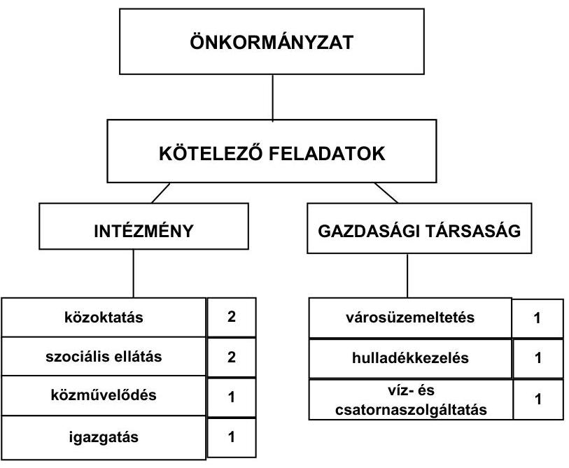

Az Önkormányzat feladatait 2011. június 30-án (a Polgármesteri hivatallal együtt) hat költségvetési szervvel és egy az Önkormányzat kizárólagos, va-

[^0]
[^0]:    ${ }^{6}$ Az Önkormányzat adatszolgáltatása szerinti működési kiadások eltérést mutattak a jelentés 2. sz. mellékletében bemutatott működési kiadások kamatkiadások nélküli összegétől. Az Önkormányzat adatszolgáltatása szerinti működési kiadások tartalmazták a feladatellátáshoz kapcsolódó transzferkiadásokat (pénzbeli szociális juttatásokat, nonprofit szervezetek támogatását), azonban nem tartalmazta az egészségügyi ellátás, a kisebbségi önkormányzat és a Társulás kiadásait.

---

lamint két az Önkormányzat 50\% alatti tulajdonában lévő gazdasági társasággal látta el. A gazdasági társaságok hulladékkezelés-szállítás, víz- és szennyvízkezelés, valamint a városüzemeltetés területén kaptak szerepet az Önkormányzat feladatellátásában. Az Önkormányzat a 2008. évben a városüzemeltetési feladatok ellátásával a kizárólagos tulajdonú gazdasági társaságát bízta meg, amely az Önkormányzatnak 23,1 millió Ft többletkiadást okozott. Az Önkormányzat kizárólagos tulajdonú gazdasági társasága a 2008. évben 5,1 millió Ft működési célú pénzeszközátadásban részesült, amelyet a gazdasági társaság a 2008. július 24-én kelt feladatellátási szerződésben foglaltaktól eltérően tagi kölcsönként szerepeltetett a beszámolójában. Az Önkormányzat kizárólagos tulajdonában lévő gazdasági társasága jegyzett tőkéje három millió Ft, saját tőkéje 0,3 millió Ft, vagyona 1,9 millió Ft volt 2010. december 31-én, a 2007-2008. és a 2010. években veszteségesen gazdálkodott. A saját tőke és jegyzett tőke aránya 0,1 volt 2010. december 31-én, amely az Önkormányzat számára a jövőben helytállási kötelezettséget jelenthet. Az Önkormányzatnak tulajdonosi kötelezettsége - a Gt. 143. § (3) bekezdésében foglaltak alapján - a gazdasági társaság vagyoni helyzetének rendezése (pótbefizetés előírása, törzstőke leszállítása, a társaság más formába történő átalakítása, jogutód nélküli megszüntetése). Az Önkormányzat egy hulladékgazdálkodási beruházási társulás költségvetési felügyeleti szerve. A Társulás az önkormányzati feladatellátásban nem vett részt. Az Önkormányzat a Társulás pénzügyi helyzetéért vagyoni hozzájárulása arányában felelős.

Az egyes közfeladatok ellátása működési kiadásainak finanszírozási összetételét az alábbi ábra szemlélteti:
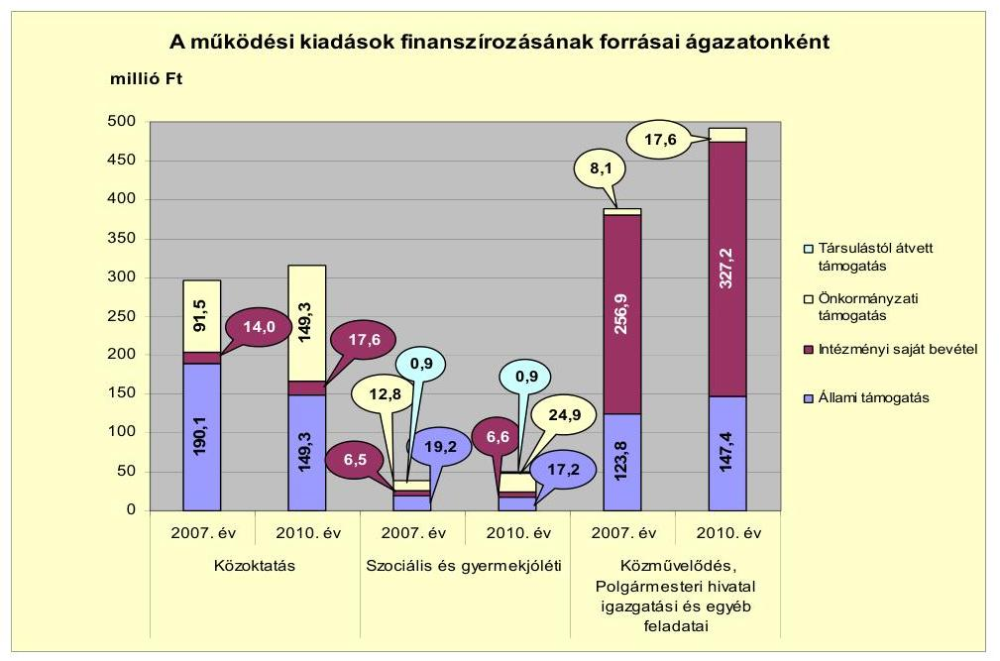

---

Az Önkormányzat összes működési bevétele a 2010. évben 858,0 millió $\mathrm{Ft}^{7}$ volt. A kiadások finanszírozásának a 2010. évben 36,6\%-a (313,9 millió Ft) állami támogatás, $41,0 \%$-a ( 351,4 millió Ft ) intézményi saját bevétel, $22,3 \%$-a (191,8 millió Ft) önkormányzati támogatás és $0,1 \%$-a ( 0,9 millió Ft ) társulástól átvett támogatás volt. A közoktatásban az állami támogatások arányának mérséklődését az ellátotti létszám, valamint a közoktatási normatívák rendszerének változásából eredő csökkenés és a központosított támogatások emelkedésének együttes hatása okozta. Az állami támogatások csökkenését az önkormányzati támogatás emelésével kompenzálták. A közművelődési, a Polgármesteri hivatal igazgatási és egyéb feladatok kiadásainak emelkedését a közhasznú foglalkoztatottak számának és juttatásának, valamint a szociális juttatások és az átadott pénzeszközök kiadásainak emelkedése eredményezte. A közművelődési, a Polgármesteri hivatal igazgatási és egyéb kiadásainak finanszírozásában az állami támogatás részaránya az összes bevételen belül a 2007-2009. évek $34,3 \%$-os ( 137,5 millió Ft-os) átlagáról a 2010. évre 30,0\%-ra csökkent (abszolút értékben 147,5 millió Ft-ra emelkedett). Ezzel összefüggésben az intézményi saját bevételek és az önkormányzati támogatás együttesen a 20072009. években átlagosan 263,4 millió Ft-ot ( $65,7 \%$-ot), a 2010. évben 344,8 millió Ft-ot ( $70,0 \%$-ot) jelentettek.

Az Önkormányzatnál a vizsgált időszakban a kötelező és önként vállalt feladatok ellátását biztosító szervezeti keretekben, a feladatellátás módjában bekövetkezett változások összességében 23,1 millió Ft többletkiadást okoztak, amely a pénzügyi egyensúlyi helyzet alakulását jelentősen nem befolyásolta.

Az Önkormányzat folyó költségvetési egyenlege (működési jövedelem) a 2007. és a 2009. években működési forrástöbbletet, a 2008. és a 2010. években működési forráshiányt mutatott.
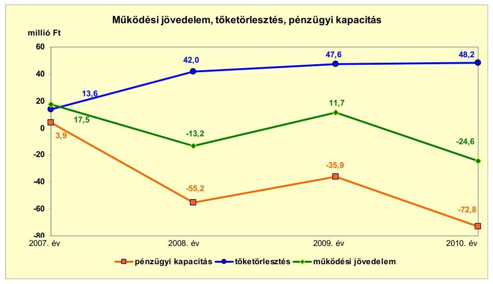

[^0]
[^0]:    ${ }^{7}$ Az Önkormányzat adatszolgáltatása szerinti működési bevételek eltérést mutattak a jelentés 2. sz. mellékletében bemutatott folyó bevételek összegétől. Az Önkormányzat adatszolgáltatása szerinti működési bevételek tartalmazták az előző évi maradványt, azonban nem tartalmazták az egészségügyi ellátás, a kisebbségi önkormányzat és a Társulás bevételeit.

---

A működési jövedelem a 2007. évről a 2008. évre történő 30,7 millió Ft-os változását a kamatkiadások és a szociálpolitikai juttatások kiadásának növekedése okozta. A 2008. évről a 2009. évre a működési jövedelem 24,9 millió Ft-os emelkedését a személyi juttatások és járulékok kiadásai, a feladatkiszervezés, valamint a kamatkiadások változása eredményezte. A 2009. évről a 2010. évre 36,3 millió Ft-tal csökkent a működési jövedelem, amelyet a kamatbevételek, az áfa visszatérülés és a költségvetési támogatás bevételek csökkenése, valamint a személyi juttatások, a támogatásértékű működési kiadások és a szociálpolitikai juttatások emelkedése okozott. Az Önkormányzat tőketörlesztése a 2007. évről a 2008. évre 28,4 millió Ft-tal emelkedett a 2007. évi 600,0 millió Ft értékben történt kötvénykibocsátás a 2008. évben kezdődő adósságszolgálata miatt. A pénzügyi kapacitás változását a működési jövedelem ingadozása és a tőketörlesztés emelkedése határozta meg, a 2007. évben pozitív, a 20082010. évek között negatív volt.

Az Önkormányzat nettó működési jövedelme a 2008. évtől negatív volt. A nettó működési jövedelem negatív értékének finanszírozására a 2007. évi kötvénykibocsátásból származó tartalékok a 2011. év I. félévéig fedezetet nyújtottak. Az Önkormányzat a kötvénykibocsátásból származó bevételét a 2011. évben felhalmozási célra tervezte felhasználni. A kialakult pénzügyi egyensúlyi helyzet pozitív nettó működési jövedelmet eredményező gazdálkodás mellett teszi elkerülhetővé további külső források bevonását, az eladósodás növekedését.

Az Önkormányzat felhalmozási költségvetési egyenlegének változását befolyásolták az Önkormányzat gesztorsága alatt működő beruházási Társulás felhalmozási kiadásai és bevételei. A 2007-2009. években az Önkormányzat felhalmozási költségvetésének egyenlege - a Társulással együtt - negatív, a 2010. évben pozitív összegű volt. A 2007-2010. években összesen 137,3 millió Ft felhalmozási forráshiány jelentkezett. A felhalmozási kiadásoknak és bevételeknek a 2009. évi és a 2010. évi emelkedését a Társulás EU-s támogatásból megvalósuló összesen 3195,0 millió Ft-os beruházása okozta. Az Önkormányzat - a Társulás nélküli - felhalmozási költségvetési egyenlege a 2007-2010. években összesen 15,3 millió Ft volt. A felhalmozási és tőkejellegű kiadások nagyságát a 2007. évben a 108,0 millió Ft értékű, a 2008-2009. években a 216,0 millió Ft értékű beruházások befolyásolták. A felhalmozási és tőkejellegű bevételek a 2007-2010. évek között az önkormányzati lakások (230,7 millió Ft), valamint a 2010. évben tartós részesedés (135,0 millió Ft) értékesítéseinek bevételeiből származtak.

Az Önkormányzat folyó bevétele a 2007-2009. években átlagosan 868,0 millió Ft volt, a 2010. évre 918,3 millió Ft-ra emelkedett. A 2011. év I. félévében 504,6 millió Ft-ra teljesült. A költségvetési támogatások és az átengedett szja együttes értéke a 2007-2010. évek között egyenletesen emelkedett, a 2007-2009. években átlagosan 520,8 millió Ft, a 2010. évben 533,6 millió Ft, a 2011. év I. félévében 273,1 millió Ft volt. Az egyéb saját bevételeken belül meghatározó volt a bérleti és lízingdíjaknak a 2007-2009. évek átlagáról a 2010. évre történő 19,0 millió Ft-os emelkedése, valamint a 2010. évben kapott 9,5 millió Ft osztalék. A helyi adókból és pótlékokból a 2007-2009. években átlagosan 84,8 millió Ft bevétel származott, mely a 2010. évre 99,7 millió Ft-ra emelkedett. Az Önkormányzat felhalmozási bevételei a 2007-2010. években folyamatosan

---

emelkedtek az államháztartáson belülről kapott - a Társulás EU-s pályázataihoz kötődő - támogatások miatt.

Az Önkormányzat folyó kiadása a 2007-2009. években átlagosan 862,7 millió Ft, a 2010. évben 942,9 millió Ft volt, 9,3\%-kal emelkedett. A magánszemélyeknek átadott pénzeszközök a folyó kiadásoknak a 2007-2009. években átlagosan 5,0\%-át, a 2010. évben 6,9\%-át jelentették, az emelkedést a szociális juttatások növekedése okozta. A 2008. évről a 2009. évre a személyi juttatások és munkaadói járulék kiadások együttesen 36,8 millió Ft-tal (6,9\%-kal) csökkentek, mert az Önkormányzat a városüzemeltetési feladatok ellátásával a kizárólagos tulajdonú gazdasági társaságát bízta meg, valamint megszűnt a 13. havi illetmény. A dologi kiadások a 2008. évről a 2009. évre (215,9 millió Ft-ról 297,6 millió Ft-ra) jelentősen 81,7 millió Ft-tal ( $37,8 \%$-kal) emelkedtek a városüzemeltetési feladatok szolgáltatási kiadásainak, valamint a Társulás dologi kiadásainak növekedése miatt. Az Önkormányzatnál 2007-2010 között a felújítási és beruházási kiadások 519,9 millió Ft-ot jelentettek, amelynek 23,8\%-a (123,9 millió Ft) 10 millió Ft alatti fejlesztésekhez kapcsolódott. Az Önkormányzat 100,0 millió Ft-os értéket meghaladó beruházása - 2007-2010 között - ingatlanvásárlás (108,0 millió Ft) és gazdasági-ipari terület (ipari park) létesítése volt.

Az Önkormányzat 2010. december 31-ig befejezett fejlesztései - a Társulás fejlesztései nélkül - jelentős részét pénzintézeti forrásokból fedezték. A 20072010. évek időszakában 519,9 millió Ft értékű beruházás és felújítás forrása a saját erő és EU-s támogatások mellett 247,0 millió Ft kötvénykibocsátásból származó bevétel (47,5\%) volt. Az Önkormányzat 2010. december 31-én folyamatban lévő fejlesztési feladata a Polgármesteri hivatal épületének átalakítása és az általános iskola számítástechnikai eszközfejlesztése volt. Az Önkormányzat a 2010. december 31-én folyamatban lévő fejlesztési feladatokra - a Társulás folyamatban lévő fejlesztései nélkül - a 2007-2010. években kiadást nem teljesített. Az EU-s támogatásból megvalósult fejlesztések finanszírozása likviditási gondot nem okozott.

Az Önkormányzat 2010. december 31-én folyamatban lévő fejlesztési feladatainak a 2010. évet követő kötelezettségvállalásai összege - a Társulás nélkül - 211,6 millió Ft volt, amelyből 94,2 millió Ft-ot a kötvénykibocsátásból származó bevételből, 117,4 millió Ft-ot EU-s támogatásból terveznek biztosítani. Saját forrással a fejlesztések megvalósításához nem számoltak. A Társulásnál - az Önkormányzat adatszolgáltatása alapján - négy olyan fejlesztés volt folyamatban, amelyre összesen 9343,0 millió Ft 2010. december 31-e utáni kötelezettségvállalás áll fenn.

Az Önkormányzat 2010. december 31-én folyamatban lévő fejlesztéseihez a 2010. évet követően esedékes kötelezettségvállalásainak összege - a Társulással együtt - 9554,6 millió Ft volt, amelynek forrásait a következő ábra szemlélteti:

---

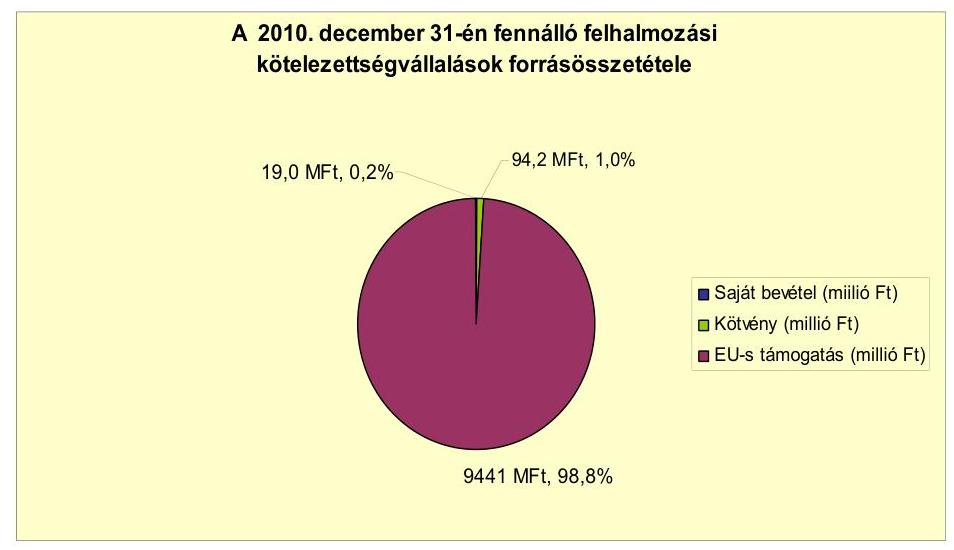

Az Önkormányzat könyvviteli mérleg szerinti pénzintézettel szembeni kötelezettségeinek a 2006. év végi állománya a 2011. év I. félév végére 188,4 millió Ft-ról 858,7 millió Ft-ra nőtt, amelyből az árfolyamváltozás miatti különbözet 127,5 millió Ft volt. A fennálló pénzintézeti kötelezettségek egy - a 2005. augusztus 17-én kelt hitelszerződés alapján felvett - hosszú lejáratú hitelből (188,5 millió Ft), valamint egy - a 2007. június 21-én lejegyzett - kötvénykibocsátásból (3921,0 ezer CHF) keletkeztek.

Az Önkormányzat kötelezettségvállalásaira képviselő-testületi döntés alapján került sor, azonban a kötvény esetében az előterjesztésekben nem mutatták be a visszafizetés forrásait, valamint a kamat- és - a devizaalapú kötelezettséget érintő - árfolyamkockázatot, továbbá az adósságszolgálati korlátot. Az adósságot keletkeztető kötelezettségvállalással megvalósított felhalmozási kiadások esetleges bevételnövelő, illetve kiadáscsökkentő vonzatát, illetve ennek a beruházáshoz, felújításhoz vállalt kötelezettségek visszafizetési forrásként történő figyelembe vételének lehetőségét nem vizsgálták.

Az Önkormányzat a 2005. augusztus 17-én kelt hitelszerződés szerinti 200,0 millió Ft hosszú lejáratú beruházási hitelkeretből ténylegesen 188,5 millió Ft-ot használt fel, mivel a hitelkeret teljes igénybevételére a projekt megvalósítása során nem volt szükség. A hitelt a célnak megfelelően, a Képviselőtestület által jóváhagyott, a költségvetésbe betervezett beruházáshoz használták fel. Az Önkormányzat a CHF-ben fennálló pénzintézettel szembeni kötelezettségeiből 700,0 ezer CHF (130,8 millió Ft) tőkét törlesztett, és 403,3 ezer CHF ( 71,9 millió Ft) kamatot, valamint a kötelezettséghez kapcsolóan 9,0 millió Ft jegyzési garanciavállalási díjat fizetett. A 2007-2011. év I. féléve között átmenetileg szabad pénzeszközeiből 88,5 millió Ft kamatbevételt realizált.

Az Önkormányzat működése pénzügyi egyensúlyának biztosításához a vizsgált időszakban folyószámlahitel felvételére nem volt szükség, munkabérmegelőlegezési hitel igénybevételére is csak a 2007. évben került sor. A likviditás biztosítása - a munkabér-megelőlegezési hitel igénybevétele miatt, amelynek átlagos napi állománya a hitellel zárt napokra számítva 7,9 millió Ft volt az Önkormányzatnak összesen 0,3 millió Ft kamatkiadást okozott. Az Önkor-

---

mányzat 2011. év I. félév végi szállítói tartozása 9,0 millió Ft, melyből lejárt, illetve átütemezett tartozása nem volt.

Az Önkormányzatnak egy jelzáloggal terhelt ingatlana volt 2011. június 30-án (a 093/3 helyrajzi számú, 3,0 millió Ft nettó értékű, hulladéklerakó megnevezésű ingatlan). Az Önkormányzat összes forgalomképes ingatlanának nettó értéke 567,4 millió Ft, bruttó értéke 657,4 millió Ft volt 2010. december 31-én.

A vizsgált időszakban nem történt meg annak felmérése, hogy az eszközök elhasználódása, az amortizáció fedezetének biztosítása mekkora forrást igényel az Önkormányzatnál. A 2007-2010. években a tárgyi eszközök után 364,7 millió Ft összegű értékcsökkenést mutattak ki. Felújításra 51,2 millió Ft-ot fordítottak. Az elhasználódott eszközök pótlására az Önkormányzat tartalékot nem képzett, külön alapot nem hozott létre.

Az Önkormányzat kötelezettségeinek 2010. december 31-ei, és 2011. június 30-ai állományát, valamint azok várható értékeit - a felmerülő kamatokat és díjakat is figyelembe véve - a kötelezettség lejártáig, az alábbi táblázat szemlélteti:
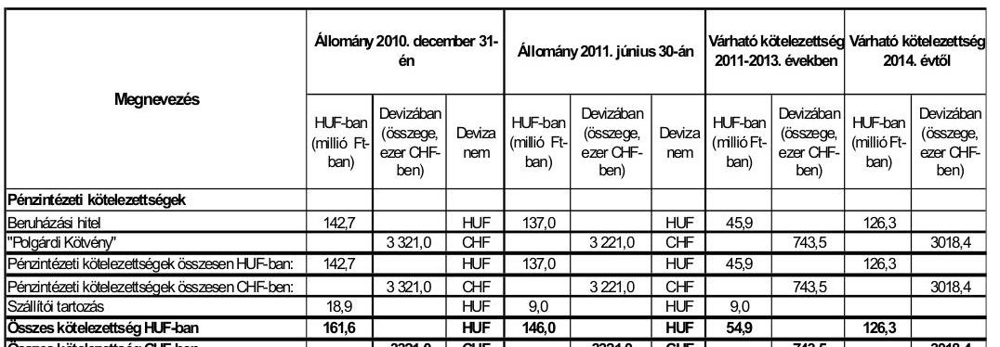

Az Önkormányzatnak pénzintézetekkel szemben fennálló, a 2011-2013. években esedékes kötelezettségeinek ( 54,9 millió Ft és 743,5 ezer CHF, azaz mintegy 240,0 millió Ft) teljesítésére figyelembe vehető 283,3 millió Ft önkormányzati pénzmaradvány (ebből 100,0 millió Ft csak banki hozzájárulással használható fel), 17,5 millió Ft könyvviteli mérlegben kimutatott követelésállomány, valamint a forgalomképes nettó ingatlanvagyon. A 2014. évet követően jelenleg ismert pénzintézettel szembeni kötelezettségei: 126,3 millió Ft és 3018,4 ezer CHF (mintegy 880,0 millió Ft). A 2014. évet követő évekre szóló jelenleg ismert pénzintézeti kötelezettségek teljesítését nem látjuk biztosítottnak, mivel az esetleg még értékesíthető forgalomképes ingatlanvagyonon kívül figyelembe vehető források jelenleg nem ismertek.

Az Önkormányzat költségvetési támogatásból, átengedett bevételekből származó bevételei a 2007. évhez képest az időszak egészét tekintve összességében 25,8 millió Ft-tal nőttek. Az Önkormányzat adatszolgáltatásában a 2007-2011. év I. féléve között tett kiadási megtakarítást eredményező és bevételt növelő intézkedések hatására 224,9 millió Ft bevételi többletet, továbbá 25,5 millió Ft kiadási megtakarítást mutatott ki, amely a pénzügyi egyensúlyi helyzetét javította. A kiadási megtakarítások $82,3 \%$-a feladat átadás miatti lét-

---

számcsökkentések eredménye volt. A bevételnövelő intézkedések a helyi adókhoz, valamint az átmenetileg szabad pénzeszközök lekötéséhez kapcsolódtak az Önkormányzat adatszolgáltatása szerint.

Az utóellenőrzés a pénzügyi egyensúly javítására tett kettő szabályszerűségi és egy célszerűségi javaslat hasznosítására terjedt ki. A célszerűségi javaslat intézkedési terv készítésére, a szabályszerűségi javaslatok a költségvetési rendeletben a költségvetés bevételi és kiadási főösszegének megállapítására, valamint az adósságot keletkeztető kötelezettségvállalások során a hitelfelvételi korlát figyelembe vételére vonatkoztak. A javaslatok megvalósítására az Önkormányzat intézkedési tervet készített, amely tartalmazta a felelősöket és határidőket. Az Önkormányzatnál a költségvetési rendeletekben a költségvetés bevételi és kiadási főösszegének megállapítására vonatkozó javaslat hasznosult, adósságot keletkeztető kötelezettségvállalásra pedig a 2008-2011. június 30-ig terjedő időszakban nem került sor.

Az Önkormányzat pénzügyi egyensúlyi helyzetét összegezve a következők emelhetők ki:

Polgárdi Város Önkormányzat pénzügyi egyensúlyi helyzete középtávon veszélyeztetett. A pénzügyi egyensúly középtávú biztosítására és hosszú távú fenntarthatóságára az Önkormányzatnak fel kell készülnie.

A működési kockázatot növelte, hogy a folyó bevételek a 2008. évtől nem biztosították a folyó kiadások és az adósságszolgálat teljesítését. A nettó működési jövedelem negatív értékének finanszírozására a 2007. évi kötvénykibocsátásból származó tartalékok a 2010. évig fedezetet nyújtottak.

Az Önkormányzat a kötvénykibocsátásból származó bevételeit (finanszírozásba bevonható eszközeit) a 2011. évben tervezi felhasználni.

Az Önkormányzat pénzintézettel szembeni kötelezettségeinek állománya jelentősen nőtt. A 2014. évet követő évekre szóló jelenleg ismert pénzintézeti kötelezettségek teljesítését nem látjuk biztosítottnak, mivel az esetleg még értékesíthető forgalomképes ingatlanvagyonon kívül figyelembe vehető források jelenleg nem ismertek.

Az Önkormányzatnak folyószámlahitele, egyéb rövid lejáratú hitele, lejárt szállítói tartozása, valamint a kizárólagos tulajdoni hányadú gazdasági társaságának tartozásállománya nem volt.

Az Önkormányzat kizárólagos tulajdonú gazdasági társasága a 2007-2008. és a 2010. években veszteségesen gazdálkodott. A saját tőke és jegyzett tőke aránya 0,1 volt 2010. december 31-én, amely az Önkormányzat számára a jövőben helytállási kötelezettséget jelenthet.

Az Önkormányzat a Társulás pénzügyi egyensúlyi helyzetéért vagyoni hozzájárulása mértékéig felelős.

Az Állami Számvevőszékről szóló 2011. évi LXVI. törvény 33. § (1) bekezdésében foglaltak értelmében a jelentésben foglalt megállapításokhoz kapcsolódó intézkedési tervet köteles az ellenőrzött szervezet vezetője összeállítani és azt a

---

jelentés kézhezvételétől számított harminc napon belül az ÁSZ részére megküldeni. Amennyiben az intézkedési tervet határidőben nem küldi meg a szervezet, vagy az továbbra sem elfogadható, az ÁSZ elnöke a hivatkozott törvény 33. § (3) bekezdés a)-b) pontjaiban foglaltakat érvényesítheti.

# A 2011. június 30-i pénzügyi egyensúlyi helyzet alapján az ellenőrzés intézkedést igénylő megállapításai és javaslatai a következők: 

## a Polgármesternek

1. Az Önkormányzat nettó működési jövedelme a 2008. évtől negatív volt. A közép és hosszú távú kötelezettségek teljesítéséhez szükséges források megteremtése további intézkedéseket igényel. A 2014. évtől esedékes, jelenleg ismert pénzintézettel szembeni kötelezettségek teljesítését nem látjuk biztosítottnak, mivel az esetleg még értékesíthető forgalomképes ingatlanvagyonon kívül figyelembe vehető források jelenleg nem ismertek.

Javaslat:
Az Önkormányzat pénzügyi egyensúlyának közép távon ható helyreállítása és hosszú távú fenntarthatósága érdekében kezdeményezze - felelősök és határidők megjelölésével - az alábbi intézkedések megtételét:
a) Terjesszen a Képviselő-testület elé kibontakozási programot a pénzügyi egyensúlyi helyzet javítása, és hosszú távú megőrzése érdekében;
b) Tárja fel a bevételszerző és kiadáscsökkentő lehetőségeket. Ütemezze a bevételek beszedését a jövőben jelentkező fizetési kötelezettségeihez;
c) Képezzen egyensúlyi tartalékot az adósságszolgálat teljesítése érdekében;
d) Mutassa be a Képviselő-testületnek félévente legalább három évre kitekintően a kötelezettségek teljes körére szóló finanszírozási tervet, a források számszerűsített megjelölésével.
2. A Képviselő-testület döntését megalapozó előterjesztésben a kötvény esetében nem mutatták be a kötelezettségvállalás visszafizetési forrásainak, valamint a kamat- és - a devizaalapú kötelezettséget érintő - árfolyamkockázat bemutatását, továbbá az adósságszolgálati korlátot.

Javaslat:
Gondoskodjon arról, hogy a jövőben az adósságot keletkeztető kötelezettségvállalásokról szóló képviselő-testületi előterjesztések tartalmazzák a visszafizetés forrásait, és - a devizaalapú kötelezettséget érintően - a kamat- és árfolyamkockázat bemutatását.
3. A vizsgált időszakban nem történt meg annak felmérése, hogy az eszközök elhasználódása, az amortizáció fedezetének biztosítása mekkora forrást igényel az Önkormányzatnál.

---

Javaslat:
Mutassa be a Képviselő-testületnek évente a zárszámadási rendelet előterjesztésében az értékcsökkenés összegét, és ezzel összevetve az elhasználódott eszközök pótlására fordított tényleges kiadásokat, az eszközök elhasználódási fokának alakulását.
4. Az Önkormányzat az SzMSz-ben nem nevesítette az önként vállalt feladatok között a zeneiskola és a dolgozók esti gimnáziuma működtetését.

Javaslat:
Kezdeményezze az SzMSz módosítását a hiányzó önként vállalt feladatok kiegészítésével.
5. Az Önkormányzat kizárólagos tulajdonában lévő gazdasági társasága jegyzett tőkéje három millió Ft, saját tőkéje 0,3 millió Ft, vagyona 1,9 millió Ft volt 2010. december 31-én, a 2007-2008. és a 2010. években veszteségesen gazdálkodott. A saját tőke és jegyzett tőke aránya 0,1 volt 2010. december 31-én, amely az Önkormányzat számára a jövőben helytállási kötelezettséget jelent. Az Önkormányzatnak tulajdonosi kötelezettsége - a Gt. 143. § (3) bekezdésében foglaltak alapján - a gazdasági társaság vagyoni helyzetének rendezése (pótbefizetés előírása, törzstőke leszállítása, a társaság más formába történő átalakítása, jogutód nélküli megszüntetése).

Javaslat:
Mutassa be félévente a Képviselő-testületnek a kizárólagos tulajdonú gazdasági társasága aktuális pénzügyi egyensúlyi helyzetét. Tegye meg a szükséges és lehetséges intézkedéseket a tulajdonosi érdekek védelme érdekében.
6. Az Önkormányzat egy hulladékgazdálkodási beruházási társulás felügyeleti szerve. A Társulásnál - az Önkormányzat adatszolgáltatása alapján - négy olyan fejlesztés volt folyamatban, amelyre összesen 9343,0 millió Ft 2010. december 31-e utáni kötelezettségvállalás áll fenn. Az Önkormányzat a Társulás pénzügyi egyensúlyi helyzetéért vagyoni hozzájárulása arányában felelős.

Javaslat:
Mutassa be a Képviselő-testületnek a beruházási Társulás gesztorságából eredő, az Önkormányzat pénzügyi egyensúlyát befolyásoló kockázatokat, és intézkedjen azok mérséklésére.

---

# II. RÉSZLETES MEGÁLLAPÍTÁSOK 

## 1. Az ÖNKORMÁNYZAT KÖTELEZŐ ÉS ÖNKÉNT VÁLLALT FELADATAI, A FELADATELLÁTÁS SZERVEZETI KERETEI ÉS ANNAK VÁLTOZÁSAI

Az Önkormányzat kötelező és önként vállalt feladatainak egy részét az SzMSz-ben rögzítette. Önként vállalt feladatként a központi orvosi ügyelet és az Önkéntes Tűzoltóság működtetését, a település társadalmi szervezeteinek támogatását jelölte meg. Az Önkormányzat az SzMSz-ben nem nevesítette a zeneiskola és a dolgozók esti gimnáziuma önként vállalt feladatait. Az önként vállalt feladatok terjedelmét az éves költségvetési rendeletekben az adott évi költségvetés forrásainak ismeretében határozták meg.

Az Önkormányzat - adatszolgáltatása szerint - a működési kiadásokra a 2007-2009. években átlagosan 751,3 millió Ft-ot, a 2010. évben 14,0\%-kal (105,0 millió Ft-tal) magasabb összeget, 856,3 millió Ft-ot ${ }^{8}$ fordított. Ezen belül a közművelődési és Polgármesteri hivatalban ellátott feladatok kiadásai emelkedtek a legnagyobb mértékben a személyi juttatások és a pénzbeli juttatások, támogatások kiadásainak növekedése miatt. A 2007-2009. években átlagosan 400,9 millió Ft-ot, a 2010. évben 22,8\%-kal ( 91,3 millió Ft-tal) magasabb összeget 492,2 millió Ft-ot jelentettek. Az Önkormányzat a kötelező feladatok ellátására a 2007-2009. években átlagosan az összes működési kiadás 93,4\%-át (701,4 millió Ft-ot), a 2010. évben 94,4\%-át (808,1 millió Ft-ot) fordított. Az önként vállalt feladatok kiadása a 2007-2009. években átlagosan az összes működési kiadás 6,6\%-át (49,9 millió Ft-ot), a 2010. évben 5,6\%-át (48,2 millió Ft-ot) jelentett.

A következő táblázat ${ }^{9}$ az Önkormányzat adatszolgáltatása alapján mutatja be a 2010. évi működési kiadásokat és azok finanszírozási forrásösszetételét főbb feladatonként:

[^0]
[^0]:    ${ }^{8}$ Az Önkormányzat adatszolgáltatása szerinti működési kiadások eltérést mutattak a jelentés 2. sz. mellékletében bemutatott működési kiadások kamatkiadások nélkül összegétől. Az Önkormányzat adatszolgáltatása szerinti működési kiadások tartalmazták a feladatellátáshoz kapcsolódó transzferkiadásokat (pénzbeli szociális juttatásokat, nonprofit szervezetek támogatását), azonban nem tartalmazta az egészségügyi ellátás, a kisebbségi önkormányzat és a Társulás kiadásait.
    ${ }^{9}$ A táblázat nem tartalmazza az egészségügyi ellátás, a kisebbségi önkormányzat és a Társulás kiadásait, valamint a kamatkiadásokat. Így a működési kiadások a 2010. évben 86,6 millió Ft-tal alacsonyabb összegűek voltak a CLF módszerrel bemutatott folyó kiadásoktól.

---

| Ellátott feladat | Működési   kiadás   összesen   (millió Ft) | Kötelező   feladatok   kiadásainak   részaránya   $\%$ | Működési   bevétel   összesen   (millió Ft) | Állami   támogatás   részaránya   $\%$ | Intézményi   saját bevétel   részaránya   $\%$ | Önkormányzati   támogatás   részaránya   $\%$ | Társulástól   átvett   támogatás   részaránya   $\%$ |
| :-- | --: | --: | --: | --: | --: | --: | --: |
| Óvoda | 93,4 | 100,0 | 93,4 | 46,9 | 7,0 | 46,1 | 0,0 |
| Általános iskola | 217,6 | 98,9 | 219,5 | 46,7 | 5,0 | 48,3 | 0,0 |
| Gimnázium | 3,3 | 0,0 | 3,3 | 84,9 | 6,0 | 9,1 | 0,0 |
| Szociális intézmény | 31,9 | 100,0 | 31,9 | 26,0 | 21,0 | 53,0 | 0,0 |
| Gyermekjóléti   intézmény | 17,7 | 100,0 | 17,7 | 50,3 | 0,0 | 45,0 | 4,7 |
| Közművelődési   intézmény | 19,1 | 35,1 | 19,1 | 0,0 | 8,2 | 91,8 | 0,0 |
| Polgármesteri hivatal   igazgatási kiadásai | 180,2 | 100,0 | 180,2 | 16,4 | 83,6 | 0,0 | 0,0 |
| Polgármesteri   hivatában ellátott   egyéb feladatok   működési kiadásai | 292,9 | 89,7 | 292,9 | 40,2 | 59,8 | 0,0 | 0,0 |
| Működési kiadá-   sok összesen | 856,3 | 94,4 | 858,0 | 36,6 | 41,0 | 22,3 | 0,1 |

A közoktatási ágazat kiadása a 2007-2009. években átlagosan 305,9 millió Ft, az összes működési kiadás 40,7\%-a volt. Az ágazat kiadása a 2010. évben 314,5 millió Ft-ra emelkedett, azonban az összes működési kiadáson belüli aránya 36,7\%-ra csökkent. A 2007-2010. időszakon belül a 2008. évről a 2009. évre történő 13,2 millió Ft-os ( $4,2 \%$-os) csökkenést a 13. havi illetmény megszűnése és a karbantartási feladatoknak az Önkormányzat kizárólagos tulajdonú gazdasági társaságával létrejött feladatellátási szerződés keretében történő megbízása eredményezte. A közoktatási ágazat finanszírozásában az állami támogatás részaránya a 2007-2009. években átlagosan 56,3\% (172,8 millió Ft), a 2010. évben 47,2\%-ra (149,2 millió Ft-ra) csökkent. A 20072009. évek átlagáról a 2010. évre történő változását a közoktatási normatívák számítási rendszerének módosulása és az általános iskolában és az óvodában ellátottak számának - a 2007-2009. évi átlagos 720 főről a 2010. évre 706 főre történő - csökkenése okozta. Az intézményi saját bevételek aránya a vizsgált időszakban 4,7\% -5,6\% (14,0 millió Ft-17,7 millió Ft) között mozgott. Az állami támogatások csökkenését az önkormányzati támogatás emelésével kompenzálták. A közoktatási ágazat működését szolgáló bevételek forrásösszetételében az önkormányzati támogatás részaránya a 2007-2009. években átlagosan 39,0\% (119,2 millió Ft), a 2010. évben 47,2\% (149,2 millió Ft) volt.

Az Önkormányzat a szociális és a gyermekjóléti feladatainak működési kiadásaira a 2007-2009. években átlagosan 44,5 millió Ft-ot (az összes működési kiadás 5,9\%-át), a 2010. évben 49,6 millió Ft-ot (5,8\%-át) fordította. Az időszakban a működési kiadások növekedését az ellátottak számának a 20072009. évek 85 fős átlagáról a 2010. évre 98 főre történő emelkedése befolyásolta. A gyermekjóléti feladatokra fordított kiadások a 2009. évről a 2010. évre 19,0 millió Ft-ról 17,7 millió Ft-ra 7,3\%-kal csökkentek a személyi változásból eredő bérmegtakarítás miatt. A szociális és gyermekjóléti feladatok állami támogatása a 2007-2009. évek 19,4 millió Ft-os (43,6\%-os) átlagához a 2010. évre arányában és értékében is csökkent, 17,2 millió Ft-ra (34,7\%-ra) az állami normatív támogatások rendszerének változása miatt. Az önkormányzati támogatás részarányát - az állami támogatás csökkenése miatt - a 2007-2009. évek 18,5 millió Ft-os (41,6\%-os) átlagáról a 2010. évre 24,9 millió Ft-ra

---

(50,2\%-ra) emelte az Önkormányzat. Az intézményi saját bevétel részaránya a 2007. évben volt a legmagasabb $16,6 \%$ ( 6,5 millió Ft), a 2008. évben volt a legalacsonyabb 10,7\% ( 4,9 millió Ft), alakulását az ellátottak száma és a térítési díj változása határozta meg. A Társulástól átvett támogatások 1,7\%-2,9\%-ban ( $0,9-1,3$ millió Ft-ban) járultak hozzá a kiadásokhoz, az ellátottak száma alakulásának megfelelően.

A közművelődési, a Polgármesteri hivatal igazgatási és egyéb ${ }^{10}$ feladatainak kiadásaira fordította az Önkormányzat a működési kiadásainak legnagyobb arányát: a 2007-2009. években átlagosan 53,4\%-ot (400,9 millió Ft-ot), a 2010. évben 57,5\%-ot (492,2 millió Ft-ot). A működési kiadásoknak a 2008. évről a 2009. évre történő 34,1 millió Ft-os ( $8,0 \%$-os) csökkenését a 13. havi illetmény megszűnése és a városüzemeltetési feladatoknak az Önkormányzat kizárólagos tulajdonú gazdasági társaságával kötött szerződés keretében történő ellátása eredményezte. A 2009. évről a 2010. évre történő növekedést a közhasznú foglalkoztatottak számának és juttatásának, valamint a szociális juttatások és az átadott pénzeszközök kiadásainak emelkedése okozta. Az Önkormányzat közművelődési, a Polgármesteri hivatal igazgatási és egyéb feladatai állami támogatásának részaránya az összes bevételen belül a 20072009. évek 34,3\%-os ( 137,5 millió Ft-os) átlagáról a 2010. évre 30,0\%-ra ( 147,5 millió Ft-ra) csökkent, abszolút értékben azonban emelkedett, mert az állami támogatások növekedése nem érte el a feladatellátás kiadásai emelkedésének a mértékét. Az állami támogatások változása miatt az intézményi saját bevételek és az önkormányzati támogatás együttes összege a 2007-2009. években átlagosan 263,4 millió Ft (65,7\%), a 2010. évben 344,8 millió Ft $(70,0 \%)$ volt.

Az Önkormányzat kötelező és önként vállalt feladatait 2011. június 30-án (a Polgármesteri hivatallal együtt) hat költségvetési szervvel és egy, az Önkormányzat kizárólagos, valamint két, az Önkormányzat 50\% alatti tulajdonában lévő gazdasági társasággal biztosította. Az Önkormányzat által fenntartott költségvetési szervekből két önállóan működő és gazdálkodó és négy önállóan működő költségvetési szerv volt. Az intézmények összesen 11 telephelyen működtek. Az Önkormányzat kötelező és önként vállalt feladatait - 2011. június 30 -án - a következők szerint látta el:

- A közoktatási feladatok ellátásában két költségvetési szerv vett részt. Az általános iskola önállóan működő és gazdálkodó költségvetési szerv, három telephelyen és az óvoda önállóan működő költségvetési szerv, kettő telephelyen végezte tevékenységét. Az általános iskolában - a kötelező feladatok ellátása mellett - önként vállalt feladatként zeneiskola és esti gimnázium is működött. A logopédiai ellátást a kistérségi társulás végezte;
- A szociális és gyermekjóléti feladatokat két önállóan gazdálkodó intézmény biztosította (a gondozási központ és a családsegítő szolgálat), amelyek azonos telephelyen működtek. A családsegítő szolgálat a kistérségi társulással -

[^0]
[^0]:    ${ }^{10}$ A Polgármesteri hivatal igazgatási és egyéb feladatai az Önkormányzat igazgatási, területi igazgatási, közvilágítási, települési hulladékkezelési, városgazdálkodási, szennyvízelvezetési és a pénzbeli szociális ellátási feladatai, valamint a települési társadalmi szervezetek támogatása és az Önkéntes Tűzoltóság működtetése voltak.

---

a 2006. március 30-án - kötött megállapodás alapján ellátta a kistérség (Füle, Jenő, Kőszárhegy községi önkormányzatok) gyermekjóléti ellátásának kötelező feladatait;

- A közművelődési feladatok ellátását egy önállóan működő intézmény biztosította, amelyben művelődési ház és könyvtár működött;
- Az egészségügyi alapellátás keretében a védőnői szolgálat, az iskolaegészségügyi és az ügyeleti ellátás a Polgármesteri hivatalba integráltan működtek. Az Önkormányzat feladatátvállalási szerződés keretében végezte a környékbeli községi önkormányzatok (Füle, Kisláng, Mátyásdomb, Lepsény, Mezőszentgyörgy) orvosi ügyeleti ellátását;
- Az igazgatási feladatokat a Polgármesteri hivatal végezte.

Az Önkormányzat kizárólagos tulajdona a 2007. évben megalapított PolgárdiVíz Kft., amely a városüzemeltetési és az intézmények karbantartási feladatainak ellátását ${ }^{11}$ végezte. A társaság jegyzett tőkéje három millió Ft, saját tőkéje 0,3 millió Ft, vagyona 1,9 millió Ft volt 2010. december 31-én. A 2007-2008. és a 2010. években veszteségesen gazdálkodott. A saját tőke és jegyzett tőke aránya 0,1 volt 2010. december 31-én, amely az Önkormányzat számára a jövőben helytállási kötelezettséget jelenthet. Az Önkormányzatnak tulajdonosi kötelezettsége - a Gt. 143. § (3) bekezdésében foglaltak alapján - a gazdasági társaság vagyoni helyzetének rendezése (pótbefizetés előírása, törzstőke leszállítása, a társaság más formába történő átalakítása, jogutód nélküli megszüntetése).

A Vertikál Zrt. látta el a települési szilárd hulladék összegyűjtését, elszállítását és kezelését ${ }^{12}$. Az Önkormányzat tulajdoni részaránya a Vertikál Zrt.-ben 2007. december 31-én 54,8\% (32,9 millió Ft) volt. A Képviselő-testület - a 95/2009. (X. 29.) határozatában - 1644 db (16,4 millió Ft névértékű) részvény eladásáról döntött. A részvényeket 135,0 millió Ft-os eladási áron értékesítették. A 2010. évben egy - a Vertikál Zrt.-ben tulajdoni részesedéssel rendelkező - gazdasági társaság 10,0 millió Ft-os tőkeemelést hajtott végre. Az Önkormányzat tulajdoni részaránya - a két gazdasági esemény következtében - 2010. december 31-re 23,5%-ra (16,5 millió Ft-ra) csökkent. A társaság saját tőke és jegyzett tőke aránya 2010. év végén 6,5 volt, stabil vagyoni helyzetet mutatott.

A víz- és csatornaszolgáltatást a 2007- 2010. évek között a Fejérvíz Zrt. biztosította ${ }^{13}$. A társaságban az Önkormányzat tulajdoni részaránya 0,9\%, 6,3 millió Ft volt 2010. december 31-én. A Fejérvíz Zrt.-ben a saját tőke és jegyzett tőke aránya 11,1-et jelentett 2010. december 31-én, a gazdálkodása folyamatosan nyereséges volt 2007-2010 között.

Az önkormányzati feladatok ellátásában résztvevő gazdasági társaságok jellemző adatait a jelentés 4. számú melléklete foglalja össze.

[^0]
[^0]:    ${ }^{11}$ A 2008. július 24-én kelt feladatellátási szerződés alapján.
    ${ }^{12}$ A köztisztasági tevékenységre szóló szerződést 1994. január 1-jén kötötte meg az Önkormányzat.
    ${ }^{13}$ Az 1998. december hónapban kelt szerződés alapján.

---

Az Önkormányzat a Közép-Duna Vidéke Hulladékgazdálkodási Önkormányzati Társulás költségvetési felügyeleti szerve. A Társulás az önkormányzati feladatellátásban nem vett részt. Az Önkormányzat a Társulás pénzügyi egyensúlyi helyzetéért vagyoni hozzájárulása mértékéig felelős. A Társulást 168 önkormányzat alapította meg azzal a céllal, hogy az Európai Unió Kohéziós Alapjából igényelhető támogatással integrált hulladékgazdálkodási rendszert hozzon létre. A társulási megállapodás alapján a Társulás induló vagyonát a tagok által fizetett vagyoni hozzájárulás képezte, mely az érintett tagi települések lakosainak száma alapján $10,0 \mathrm{Ft} /$ fő volt. A tagok lakosságszám arányhoz igazodó működési hozzájárulás fizetésére kötelezettséget vállaltak, valamint fejlesztési hozzájárulás fizetését elhatározhatták. A pénzügyi hozzájárulás nem teljesítése esetén a Társulási Tanács elnöke, illetve a Társulás székhely önkormányzata azonnali beszedési megbízás benyújtására jogosult. A Társulás megszűnése esetén a Társulás kötelezettségeiért a tagok vagyoni hozzájárulásuk arányában tartoznak felelősséggel, a tagdíjra vonatkozó szabályok figyelembe vételével. A kötelezettségek teljesítése után fennmaradó vagyon a Társulás tagjait vagyoni hozzájárulásuk arányában illeti meg.

Az Önkormányzat 2007-2011. június 30. között közszolgáltatási feladatot nem vett át más önkormányzattól, társulástól, egyháztól, gazdasági társaságtól, egyéb szervezettől.

Az Önkormányzat a Polgárdi-Víz Kft.-t 2008. július 1-jétől feladatellátási szerződés keretében megbízta a város közterületeinek tisztántartási, hó-eltakarítási, síkosság-mentesítési, zöldfelületeinek karbantartási, valamint az intézmények épület karbantartási feladatainak elvégzésével.

Az Önkormányzatnál a vizsgált időszakban a kötelező és önként vállalt feladatok ellátását biztosító szervezeti keretekben, a feladatellátás módjában bekövetkezett változások összességében 23,1 millió Ft többletkiadást okoztak, amely a pénzügyi egyensúlyi helyzet alakulását jelentősen nem befolyásolta.

# 2. Az ÖNKORMÁNYZAT PÉNZÜGYI EGYENSÚLYI HELYZETÉT BEFOLYÁSOLÓ TÉNYEZŐK 

A hagyományos költségvetési szerkezet helyett az Önkormányzat pénzügyi helyzetét a CLF módszerrel mutatjuk be, amelyben jobban elkülönülnek a vagyonnal kapcsolatos bevételek és kiadások az önkormányzati feladatokkal kapcsolatos közvetlen működtetési bevételektől és kiadásoktól. A módszer következetesen elkülöníti a folyó és a felhalmozási költségvetés bevételeit és kiadásait, azok költségvetési egyenlegeit. A saját folyó bevételek, valamint a saját felhalmozási bevételek nem tartalmazzák az előző évi pénzmaradványok felhasználásából származó pénzforgalom nélküli bevételeket ${ }^{14}$.

A folyó költségvetés egyenlege, a működési jövedelem megmutatja, hogy az önkormányzat éves folyó bevétele fedezetet biztosít-e a kötelező és önként vál-

[^0]
[^0]:    ${ }^{14}$ A költségvetési években kialakuló hiány finanszírozása az előző évi pénzmaradvány és a korábbi években képzett tartalékok felhasználásával is történhet.

---

lalt feladatellátáshoz kapcsolódó éves folyó kiadására. A működési jövedelem negatív értéke pénzügyileg fenntarthatatlan helyzetet jelez. A mutató pozitív értéke megtakarítást mutat, amely forrásul szolgálhat az Önkormányzat fennálló kötelezettségei megfizetéséhez, valamint fejlesztéseihez.

A felhalmozási költségvetés pozitív értéke felhalmozási többletet mutat, amely a jövőbeni fejlesztések forrását biztosíthatja. Amennyiben a folyó költségvetési hiány finanszírozása a felhalmozási többletből történik, ez szűkebb értelemben vagyonfelélésnek tekinthető. Amennyiben a felhalmozási költségvetés megtakarítása fejlesztési célú hitelek, kötvények adósságszolgálatát finanszírozza, az változatlan vagyontömeg mellett, a korábban megelőlegezett tőkebevételek valós realizációjának tekinthető. A felhalmozási deficit által generált finanszírozási igény önmagában nem jár pénzügyi kockázattal, a pénzügyileg fenntartható beruházásokhoz kapcsolódó kötelezettségvállalás (adósságszolgálat) átlátható és szabályozott költségvetési gazdálkodással teljesíthető.

A módszer a pénzügyi kapacitás fogalmát helyezi a középpontba. Az adós hitelfelvételi képessége, hosszú távú fizetőképessége, vagy bonitása a pénzügyi kapacitással, ezen belül is a nettó működési jövedelemmel jellemezhető. A nettó működési jövedelem negatív értéke az egyes költségvetési években jelentkező adósságszolgálat túlzott mértékére utal. ${ }^{15}$ A nettó működési jövedelem negatív értékének felhalmozási többletből, vagy további hitelből történő finanszírozása pénzügyileg nem fenntartható gazdálkodást vetít előre. A pozitív értéket mutató nettó működési jövedelem fejlesztési kiadások fedezetét biztosíthatja, illetve a folyamatosan, évenként képződő pozitív nettó működési jövedelemből meghatározható a jövőben vállalható, teljesíthető éves adósságszolgálat, ily módon az a hitelösszeg, amely - a többi tényezőt, feltételt adottnak tekintve - visszafizetési kockázat nélkül felvehető.

A CLF módszer alapján a pénzügyi kapacitás mértéke az önkormányzat összevont, nettósított, a központi információs rendszerbe a Magyar Államkincstáron keresztül leadott éves költségvetési beszámolójának 80-as űrlapjában ${ }^{16}$ szerepeltetett adatok alapján került meghatározásra.

A számítási leírás némileg eltér az ÁSZ módszertanában korábban alkalmazott gyakorlattól. A jelen besorolás általános közgazdasági meggondolásokon alapul, amely megjelenik az SNA statisztikai módszertanában is. Folyó tételek alatt értjük azokat a kiadásokat és bevételeket, amelyek a gazdálkodó szervezet helyzetét automatikusan nem változtatják. Bevételi oldalon ilyenek az adók, a tényező jövedelmek, a transzferek kiadási oldalon a transzferek ${ }^{17}$, és a szolgál-

[^0]
[^0]:    ${ }^{15}$ kivéve, ha annak finanszírozására a korábbi években képzett tartalékok fedezetet nyújtanak
    ${ }^{16}$ Az Önkormányzat a 2007. évi beszámolójában az értékpapírok és pénzeszközök sorokon nem a valóságnak megfelelő adatot szerepeltetett, amelyet a 2008. évben pénzforgalom nélküli könyvelési tétellel rendezett. A CLF táblázatban az adatokat az Önkormányzat által az ellenőrzés ideje alatt módosított 2007-2008. évi beszámolók alapján szerepeltettük.
    ${ }^{17}$ Transzfer kiadásoknak nevezzük azokat a folyó és felhalmozási tételeket, amelyeket nem az adott önkormányzat használ fel szolgáltatásnyújtásra.

---

tatás igénybevételével kapcsolatos működési kiadások. A folyó költségvetésben a bevételekben nem térül meg, a kiadásokban nem jelenik meg az amortizáció, a vagyoni helyzetet az egyenleg befolyásolja.

A folyó költségvetés egyenlege (működési jövedelem) tartalmazza a kamatbevételeket és a kamatkiadásokat is, mind a működési, mind a fejlesztési kamatot, valamint a visszatérülő és befizetendő áfa teljes összegét, mert ezek közgazdaságilag tényező jövedelmek. Nem tartalmazzák viszont a követelés elengedés miatt könyvelt bevételi és kiadási pénzforgalmi tételeket, mert valójában technikai elszámolási műveletnek minősülnek, a bevétel soha nem realizálódott, és költségvetési kiadás sem történt.

A felhalmozási költségvetésben a bevételek között a vagyon megőrzésére és bővítésére fordítható források jelennek meg. A felhalmozási, vagy tőketételek módosítják a vagyon nagyságát. A privatizációs bevétel csökkenti a vagyont, a fizikai beruházás, pénzügyi befektetés növeli.

A nettó működési jövedelmet a tőketörlesztés levonásával a folyó költségvetés egyenlegéből származtatjuk.

# 2.1. A működési és a felhalmozási egyensúly változása 

Az Önkormányzat CLF módszer szerinti bevételeit és kiadásait, adósságszolgálatát 2007-2010 között az alábbi táblázat mutatja be:

CLF módszer szerinti önkormányzati adatok

| Megnevezés | 2007. év | 2008. év | 2009. év | 2010. év |
| :--: | :--: | :--: | :--: | :--: |
| Folyó bevételek | 815,5 | 861,7 | 927,0 | 918,3 |
| Folyó kiadások | 798,0 | 874,9 | 915,3 | 942,9 |
| Működési jövedelem | 17,5 | $-13,2$ | 11,7 | $-24,6$ |
| Nettó működési jövedelem   =müködési jövedelem - tőketörlesztés | 3,9 | $-55,2$ | $-35,9$ | $-72,8$ |
| Felhalmozási bevételek | 139,6 | 175,8 | 794,4 | 2543,5 |
| Felhalmozási kiadások | 212,1 | 205,0 | 898,1 | 2475,4 |
| Felhalmozási költségvetés egyenlege | $-72,5$ | $-29,2$ | $-103,7$ | 68,1 |
| Finanszírozási műveletek nélküli (GFS) pozíció = működési jövedelem + felhalmozási költségvetés egyenlege | $-55,0$ | $-42,4$ | $-92,0$ | 43,5 |
| Finanszírozási műveletek egyenlege | 604,9 | $-39,2$ | $-73,1$ | $-66,4$ |
| Tárgyévi pénzügyi pozíció | 549,9 | $-81,6$ | $-165,1$ | $-22,9$ |
| Egyéb tájékoztató adatok |  |  |  |  |
| Összes kötelezettség* | 998,1 | 876,0 | 841,4 | 956,9 |
| -ebből rövid lejáratú | 263,3 | 84,5 | 86,9 | 130,9 |
| Folyószámlahitel napi átlagos állománya ** | 0,0 | 0,0 | 0,0 | 0,0 |
| Likvidhitel napi átlagos állománya** | 0,0 | 0,0 | 0,0 | 0,0 |
| Munkabérhitel napi átlagos állománya** | 0,1 | 0,0 | 0,0 | 0,0 |
| Finanszírozásba vonható eszközök: | 581,5 | 502,5 | 335,2 | 312,3 |
| Értékpapírok év végi állománya | 2,4 | 5,0 | 2,8 | 2,8 |
| Pénzeszközök (idegen pénzeszközök nélküli év végi állománya | 579,1 | 497,5 | 332,4 | 309,5 |

[^0]
[^0]: * Az összes kötelezettséget a passzív pénzügyi elszámolások nélkül vettük figyelembe, mert a passzívák a pénzmaradvány elszámolás tételei közé tartoznak.
** A folyószámla, a likvid- és a munkabérhitel átlagos állományát 365 napos osztószámmal, és nem a hitel igénybevételi napok számával vettük figyelembe.

---

Az Önkormányzat a 2007-2010. évek közötti bevételeit, kiadásait és adósságszolgálatát részletesen a jelentés 2. számú melléklete mutatja be.

A CLF módszer szerint figyelembe vett folyó és felhalmozási bevételeket és kiadásokat befolyásolta, hogy azok az Önkormányzat gesztorsága alatt működő Társulás - döntően felhalmozási bevételekből és kiadásokból álló - adatait is tartalmazták ${ }^{18}$.

Az Önkormányzat folyó bevételeit, kiadásait, a működési jövedelmet 20072010 között évenként az alábbi táblázat mutatja be:
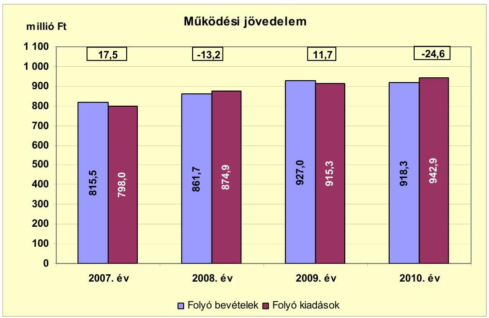

A működési jövedelem a 2007. évről a 2008. évre 30,7 millió Ft-tal csökkent, mert a folyó bevételek 46,2 millió Ft-os ( $5,6 \%$-os) emelkedése mellett a folyó kiadások 76,9 millió Ft-tal ( $9,6 \%$-kal) növekedtek. A folyó bevételek változását a kamatbevételek 34,5 millió Ft-os ( $704,1 \%$-os), a támogatásértékű bevételek 17,7 millió Ft-os ( $16,8 \%$-os), a költségvetési támogatás és átengedett bevételek együttes értékének 34,0 millió Ft-os ( $6,4 \%$-os) emelkedése, valamint a helyi adók 16,9 millió Ft-os ( $21,1 \%$-os), az áfa bevétel 14,8 millió Ft-os ( $68,2 \%$-os) és az egyéb jogcímeken kapott bevételek együttes 8,3 millió Ft-os ( $11,1 \%$-os) csökkenése idézte elő. A folyó kiadásokon belül a személyi juttatások és járulékok 41,4 millió Ft-os ( $8,5 \%$-os), a kamatkiadások 27,1 millió Ft-os ( $246,4 \%$-os) és a szociálpolitikai juttatások 6,6 millió Ft-os ( $18,2 \%$-os) növekedése volt a meghatározó. A 2008. évről a 2009. évre a folyó bevételek 65,3 millió Ft-tal (a helyi adóbevételek és az áfa visszatérülés miatt) emelkedtek. A folyó kiadások növekedése alacsonyabb összegű ( 40,4 millió Ft) volt, mert a személyi juttatások és járulékok kiadásai a 13. havi illetmény megszűnése és a városüzemeltetési feladatok kiadásainak mérséklődése miatt 36,8 millió Ft-tal ( $7,0 \%$-kal) csökken-

[^0]
[^0]: ${ }^{18}$ A Társulás működési bevétele 2007-ben 79,3 millió Ft, 2008-ban 70,0 millió Ft, 2009. évben 96,7 millió Ft, 2010. évben 82,7 millió Ft, működési kiadása 2007. évben 10,6 millió Ft, 2008. évben 38,1 millió Ft, 2009. évben 93,0 millió Ft, 2010. évben 34,3 millió Ft volt.

---

tek, valamint a kamatkiadások a gazdasági válság után 12,8 millió Ft-tal (33,6\%-kal) elmaradtak az előző évi szinttől, a többi kiadási jogcímen együttesen 90,0 millió Ft-os ( $29,1 \%$-os) emelkedés volt. A működési jövedelem a 2009. évről a 2010. évre 36,3 millió Ft-tal csökkent. A bevételek 8,7 millió Ft-tal maradtak el a 2009. évi szinttől, mert a kamatbevételek (19,0 millió Ft-tal, 46,1\%-kal), az áfa visszatérülés ( 28,8 millió Ft-tal, $74,0 \%$-kal) és a költségvetési támogatás ( 5,7 millió Ft-tal, $1,7 \%$-kal) alacsonyabb szinten teljesültek, a többi bevételi jogcímeken beszedett bevételek ( 44,8 millió Ft-tal, $7,8 \%$-kal) emelkedtek. A kiadások a 2009. évről a 2010. évre 27,6 millió Ft-tal emelkedtek, amelyet a személyi juttatások 19,2 millió Ft-os ( $5,0 \%$-os), a támogatásértékű működési kiadások 23,0 millió Ft-os ( $371,0 \%$-os) és a szociálpolitikai juttatások 14,0 millió Ft-os ( $28,1 \%$-os) növekedése és a többi kiadási jogcímen keletkező 28,6 millió Ft-os ( $6,0 \%$-os) mérséklődés okozott.

A 2007-ben és 2009-ben keletkezett összesen 29,2 millió Ft működési forrástöbblet a 2007-2010. években képződött összesen 137,3 millió Ft-os felhalmozási forráshiány fedezeteként felhasználható volt. A 2008. évi 13,2 millió Ft-os és a 2010. évi 24,6 millió Ft-os működési forráshiány finanszírozását az Önkormányzat a kötvénykibocsátás és a tartós részesedése eladásának bevételéből biztosította. Munkabér-megelőlegezési hitel ${ }^{19}$ felvétel a 2007. évben történt, a hitel napi átlagos állománya 0,1 millió Ft volt.

A nettó működési jövedelem ${ }^{20}$ értéke a folyó költségvetési pozíció mellett az adott költségvetési év adósságtörlesztésének hatását is tükrözi. Az Önkormányzat nettó működési jövedelmét 2007-2010 között évenként az alábbi ábra szemlélteti:
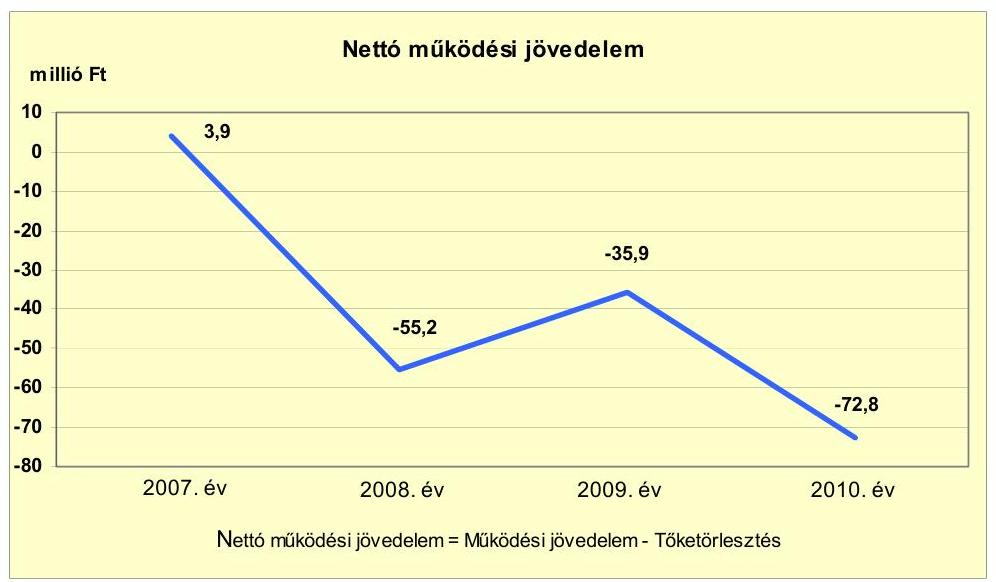

Az Önkormányzat pénzügyi kapacitása a 2007. évben pozitív, 2008-2010 között negatív értéket mutatott, ami az Önkormányzat romló pénzügyi egyensúlyi helyzetére utal. A nettó működési jövedelem a 2008-2010. évek között a

[^0]
[^0]: ${ }^{19}$ Az Önkormányzatnak 2007-2010 között folyószámla és likvidhitele nem volt.
${ }^{20}$ pénzügyi kapacitás

---

2008. évtől induló kötvény tőketörlesztések ${ }^{21}$ miatt vett fel negatív értéket. A vizsgált időszakban keletkező összes működési jövedelem negatív volt (-8,6 millió Ft), amely 2008-2010 között nem nyújtott fedezetet a jelentkező 45,6 millió Ft hosszú lejáratú beruházási hitelhez és 105,8 millió Ft kötvényhez kapcsolódó tőketörlesztés visszafizetésére. A nettó működési jövedelem negatív értékének finanszírozására a 2007. évi kötvénykibocsátásból származó tartalékok a 2010. év végéig fedezetet nyújtottak. Az Önkormányzat a kötvénykibocsátásból származó bevételeit (finanszírozásba bevonható eszközeit) a 2011. évben tervei szerint felhasználja. Az Önkormányzat romló pénzügyi egyensúlyi helyzete további negatív működési jövedelem mellett a 2012. évtől kockázatot jelent a kötelező feladatok ellátása, a gazdálkodás stabilitása tekintetében.

Az Önkormányzatnál (a CLF módszer alapján) a 2010. évben a felhalmozási kiadások fedezete biztosított volt. A 2007-2009. években az Önkormányzat felhalmozási költségvetésének egyenlege negatív összegű volt, amely körültekintő költségvetési gazdálkodás és pénzügyileg fenntartható ${ }^{22}$ beruházások esetén nem jár magas pénzügyi kockázattal, amennyiben a felhalmozási hiányra a nettó működési jövedelem fedezetet nyújt.

A felhalmozási költségvetés egyenlegét 2007-2010 között évről évre az alábbi ábra szemlélteti:
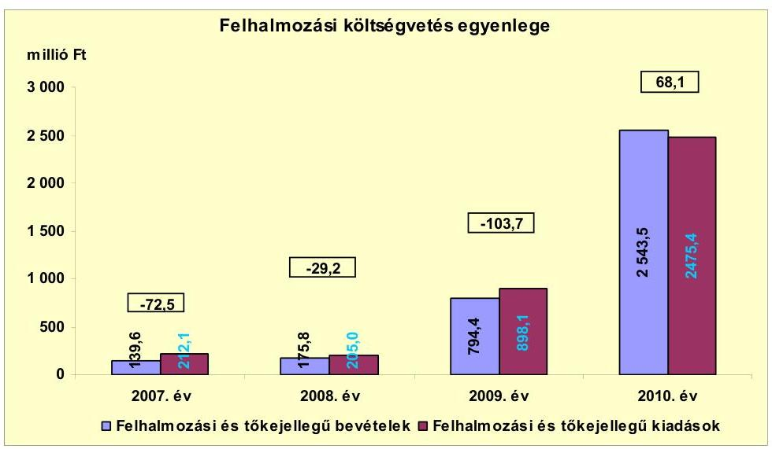

A felhalmozási költségvetés egyenlege 2007-2009 között - a Társulással együtt - negatív, a 2010. évben pozitív volt. A 2007-2010. években összesen 137,3 millió Ft felhalmozási forráshiány jelentkezett. A felhalmozási forráshiánynak a felhalmozási és tőke jellegű kiadásokhoz viszonyított aránya a 2007. évben 34,2\% (72,5 millió Ft), a 2008. évben 14,2\% (29,2 millió Ft), a 2009. évben 11,5\% (103,7 millió Ft) volt. A felhalmozási költségvetés egyenle-

[^0]
[^0]: ${ }^{21}$ Az Önkormányzat tőketörlesztési kötelezettsége 2007-ben 13,6 millió Ft, 2008-ban 42,2 millió Ft, 2009-ben 47,6 millió Ft, és 2010-ben 48,2 millió Ft volt.
${ }^{22}$ Az minősül pénzügyileg fenntartható beruházásnak, amelynek működtetésére az Önkormányzat nettó működési jövedelme a következő években is fedezetet nyújt az újként megjelenő vagy többletként jelentkező működtetési költségeire.

---

gének változását befolyásolták a Társulás felhalmozási kiadásai és bevételei. A Társulás felhalmozási költségvetési egyenlege a 2007. évben -47,7 millió Ft, a 2008. évben -97,2 millió Ft, a 2009. évben 20,2 millió Ft, a 2010. évben -27,9 millió Ft volt. A felhalmozási kiadásoknak és bevételeknek a 2009. és a 2010. évi emelkedését a Társulás EU-s támogatásból megvalósuló beruházása okozza, amelynek a 2009-2010. években a kiadásai és bevételei 3195,0 millió Ft-ot jelentettek.

Az Önkormányzat - a Társulás felhalmozási kiadásait és bevételeit nem tartalmazó - felhalmozási költségvetési egyenlege a 2007. évben -24,8 millió Ft, a 2008. évben 68,0 millió Ft, a 2009. évben -123,9 millió Ft, a 2010. évben 96,0 millió Ft volt. A felhalmozási és tőkejellegű kiadások nagyságát a 2007. évben a 108,0 millió Ft értékű, a 2008-2009. években a 216,0 millió Ft értékű beruházások befolyásolták. A felhalmozási és tőkejellegű bevételek a 2007-2010. évek között az önkormányzati lakások (230,7 millió Ft), valamint a 2010. évben tartós részesedés ( 135,0 millió Ft) értékesítéseinek bevételeiből származtak. A 2007. és a 2009. évi felhalmozási forráshiányra a 2007. évi 600,0 millió Ft-os kötvénykibocsátás bevétele nyújtott fedezetet.

Az Önkormányzat a 2007-2010. évi zárszámadási rendelet mellékleteiben mérlegszerűen - a CLF módszer kimunkálásától eltérő módon - állapította meg a költségvetési egyensúlyát. Az Önkormányzat költségvetési mérlege összevontan tartalmazta a bevételeket és a kiadásokat, míg a működési, a felhalmozási és a finanszírozási egyenlegeket nem mutatta be. Az 1. számú melléklet tartalmát a zárszámadási rendelet teljes adattartalmából határoztuk meg. Az Önkormányzat felhalmozási és működési kiadásainak és bevételeinek egyenlege a CLF módszer szerinti összevont egyenleghez képest a működési bevételek és kiadások esetében - a 2010. évi működési bevétel kivételével - pozitív irányú, a felhalmozási bevételek és kiadások tekintetében - a 2010. évi felhalmozási bevétel kivételével - negatív irányú 2,0\% alatti eltérést mutat. Az eltérés a 2010. évben a működési bevétel esetében negatív irányú, a felhalmozási bevétel esetében pozitív irányú volt, azonban egyik esetben sem éri el a 1,5\%-ot.

Az Önkormányzat finanszírozási műveletek nélküli bevételeinek és kiadásainak egyenlege szerint (GFS pozíció) a forráshiány 2007-ben 55,0 millió Ft, 2008-ban 42,4 millió Ft, 2009-ben 92,0 millió Ft volt. A 2010. évben 43,5 millió Ft forrástöbblet keletkezett.

Az Önkormányzat teljes finanszírozási igénye ${ }^{23}$ a CLF módszer szerint a 2007. évben 68,6 millió Ft, a 2008. évben 84,4 millió Ft, a 2009. évben 139,6 millió Ft, a 2010-ben 4,7 millió Ft volt, amelynek fedezetét a finanszírozási műveletek egyenlege, valamint az előző évek pénzmaradványának igénybevétele biztosította.

Az Önkormányzat finanszírozási műveleteit a 2007-2010. évek között a következő ábra szemlélteti:

[^0]
[^0]: ${ }^{23}$ a nettó működési jövedelem és a felhalmozási költségvetés eredője

---

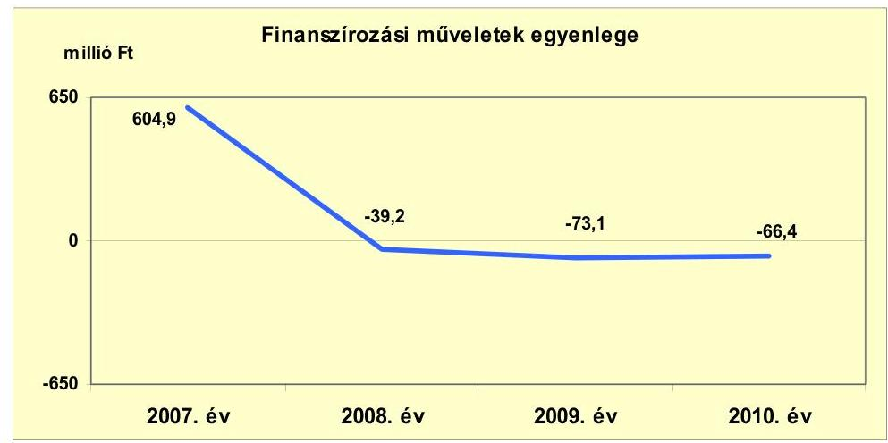

A 2007. évi finanszírozási többlet azt jelzi, hogy az éves költségvetés végrehajtása során szükség volt az előző években keletkezett pénzmaradvány igénybevételén túl külső finanszírozás igénybevételére is. Az Önkormányzat 2007. évben 600,0 millió Ft értékben kötvényt bocsátott ki, amelyet 2007-2010. évek között folyamatosan használt fel működési (kamatkiadás) és felhalmozási kiadások forrásaként. A kötvénybevételből 2010. december 31-re 258,3 millió Ft tartaléka maradt az Önkormányzatnak, azonban 2011-ben a teljes összeg felhasználását tervezi. A finanszírozási műveleteket a vizsgált időszakban a jelentés 2. számú mellékletének 4.1-4.8 pontjai részletezik.

Az Önkormányzat kamatbevételeit és kamatkiadásait 2007-2010 között évenként az alábbi ábra mutatja:
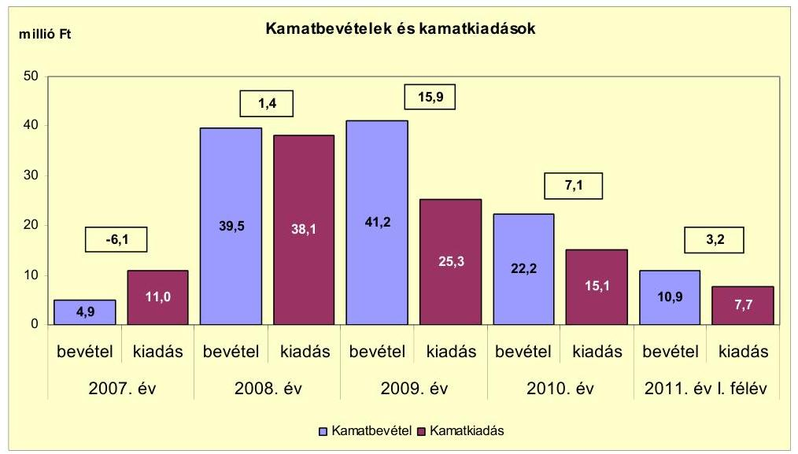

A kamatkiadások a 2007. évben 6,1 millió Ft-tal (55,4\%-kal) meghaladták a kamatbevételeket a hosszú lejáratú beruházási hitel kamatkiadásai miatt. A 2007. évben kibocsátott kötvényből származó bevételeit az Önkormányzat felhasználásig tartósbetét lekötésbe helyezte, amelynek hatására a 2008-2011. év I. féléve között a kamatbevételek ( 113,8 millió Ft) 27,6 millió Ft-tal magasabbak voltak a kamatkiadásoknál ( 86,2 millió Ft). A kamatkiadások 10,2 millió Ft-os és bevételek 19,0 millió Ft-os a 2009. évről a 2010. évre történő vissza-

---

esését a gazdasági válság utáni kamatcsökkenések eredményezték. Az Önkormányzat a 2011. évben a kötvényből származó teljes bevételének felhasználását tervezi, ezért a kamatbevételek csökkenésével számolnak a kamatkiadások szinten maradása mellett.

# 2.2. Az Önkormányzat bevételeinek változása

Az Önkormányzat folyó bevétele a 2007-2009. években átlagosan 868,0 millió Ft volt, a 2010. évre 918,3 millió Ft-ra emelkedett. A 2011. év I. félévében 504,6 millió Ft-ra teljesült.

Az Önkormányzat folyó bevételeit az alábbi táblázat mutatja be:
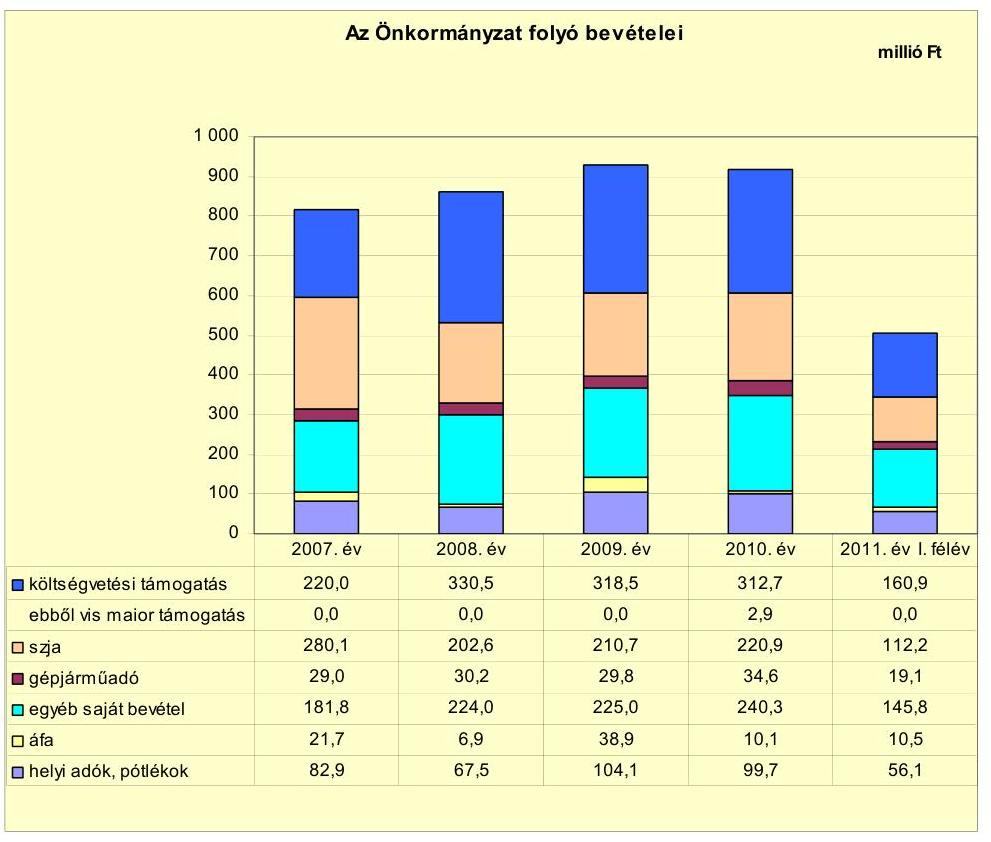

A költségvetési támogatás és az átengedett szja együttes értéke a 2007-2009. években átlagosan 520,8 millió Ft (a folyó kiadások 60,0\%-a), a 2010. évben 533,6 millió Ft (a folyó kiadások 58,1\%-a), a 2011. év I. félévében 273,1 millió Ft (a folyó kiadások $54,1 \%$-a) volt. A költségvetési támogatás összege a 2008. évi 330,5 millió Ft-ról (a folyó kiadások 38,3\%-ról) 2009-re 318,5 millió Ft-ra ( $34,4 \%$-ra), 2010-re 312,7 millió Ft-ra ( $34,1 \%$-ra) csökkent. A változás oka a központi forráskivonás és az ellátottak létszámának csökkenése volt. Az átengedett szja értéke a költségvetési támogatás összegéhez képest ellentétesen változott, együttes értékük a 2007-2010. évek között egyenletesen emelkedett.

Az egyéb saját bevételek a 2007-2009. évek 210,3 millió Ft-os (a folyó kiadások $24,2 \%$-a) átlagáról a 2010. évre 240,3 millió Ft-ra ( $26,2 \%$-ra) növekedtek,

---

amelyben meghatározó volt a bérleti és lízingdíj bevételek 19,0 millió Ft-os emelkedése, valamint a 2010. évben kapott osztalék ( 9,5 millió Ft).

A helyi adókból és pótlékokból a 2007-2009. években átlagosan 84,8 millió Ft bevétel származott, mely a 2010. évre 99,7 millió Ft-ra emelkedett. A 2011. év I. félévében 56,1 millió Ft volt. A 2009. évben az Önkormányzat a magánszemélyek kommunális adóját a 2007. évi 5000 Ft-ról 60\%-kal 8000 Ft-ra megemelte, melyből a 2009. évben 3,8 millió Ft, a 2010. évben 4,8 millió Ft bevétele keletkezett. Az iparűzési adó a 2007. évi 68,8 millió Ft-ról a 2008. évre 51,9 millió Ft-ra, 16,9 millió Ft-tal ( $24,6 \%$-kal) csökkent, mert egy gazdasági társaság megszüntette működését a városban. Az iparűzési adó a 2008. évi 51,9 millió Ft-ról a 2009. évre 84,1 millió Ft-ra való 32,2 millió Ft-os ( $62,0 \%$-os) növekedését nem az Önkormányzat intézkedése eredményezte, hanem a helyi adókról szóló törvény változása, az adózók vállalkozási eredményeinek javulása és az adózók számának emelkedése.

Az Önkormányzat felhalmozási bevételei az ellenőrzött időszakban az alábbiak voltak:

| Megnevezés | 2007. év | 2008. év | 2009. év | 2010. év | 2011.év   I. félév |
| :-- | --: | --: | --: | --: | --: |
| Tárgyi eszköz értékesítés | 0,9 | 0,2 | 2,2 | 8,7 | 0,0 |
| Egyéb saját tőkebevétel | 91,5 | 88,6 | 50,5 | 142,3 | 7,3 |
| Államháztartáson belülről   kapott támogatás | 46,3 | 84,0 | 741,7 | 2390,8 | 503,3 |
| Államháztartáson kívülről   kapott támogatás | 0,9 | 3,0 | 0,0 | 1,7 | 0,0 |
| Összes felhalmozási bevétel | 139,6 | 175,8 | 794,4 | 2543,5 | 510,6 |

Az Önkormányzat felhalmozási bevételei a 2007-2010. években folyamatosan emelkedtek az államháztartáson belülről kapott - a Társulás EU-s pályázataihoz kötődő - támogatások miatt. A Társulás adatai nélkül az Önkormányzat felhalmozási bevétele 2007-ben 139,6 millió Ft, 2008-ban 91,8 millió Ft, 2009-ben 53,2 millió Ft, 2010-ben 268,5 millió Ft, a 2011. év I. félévében 12,2 millió Ft volt.

A felhalmozási bevételekből a 2007-2011. év I. féléve között 237,4 millió Ft az Önkormányzat tulajdonában lévő lakások értékesítéséből származott. A 2010. évi felhalmozási bevételekből 135,0 millió Ft a Vertikál Zrt.-ben, az Önkormányzat többségi tulajdonú gazdasági társaságában lévő tartós részesedés értékesítéséből keletkezett. Az Önkormányzat a 2007. évben felhalmozási célra 46,3 millió Ft, 2010-ben 115,7 millió Ft államháztartáson belülről származó támogatást kapott, mely pályázati forrásból megvalósuló projektekhez kapcsolódott.

---

# 2.3. Az Önkormányzat folyó és a felhalmozási célú kiadásainak változása 

Az Önkormányzat folyó kiadásai főbb jogcímek szerinti bontásban a 2007-2011. év I. félév között az alábbiak voltak:

| Megnevezés | 2007. év | 2008. év | 2009. év | 2010. év | 2011. év   I.   félév |
| :--: | :--: | :--: | :--: | :--: | :--: |
| Folyó kiadások | 798,0 | 874,9 | 915,3 | 942,9 | 444,8 |
| Működési kiadások (kamatkiadás nélkül) | 716,8 | 754,0 | 804,7 | 803,4 | 386,0 |
| Államháztartáson belüire átadott pénzeszközök | 3,4 | 5,5 | 6,2 | 29,3 | 5,9 |
| Transzferkiadások | 66,8 | 77,3 | 79,1 | 95,1 | 45,2 |
| -ebből: vállalkozásoknak | 1,2 | 5,1 | 1,1 | 0,4 |  |
| EU-nak, illetve külföldre |  |  |  |  |  |
| magánszemélyeknek | 36,3 | 42,9 | 49,9 | 64,0 | 30,5 |
| nonprofit szervezeteknek | 29,3 | 29,3 | 28,1 | 30,7 | 14,7 |
| Kamatkiadások | 11,0 | 38,1 | 25,3 | 15,1 | 7,7 |
| Előző évi pénzmaradvány átadás | 0,0 | 0,0 | 0,0 | 0,0 | 0,0 |

Az Önkormányzat folyó kiadása a 2007-2009. években átlagosan 862,7 millió Ft, a 2010. évben 942,9 millió Ft volt, 9,3\%-kal emelkedett.

A működési célú pénzeszközátadások ${ }^{24}$ folyó kiadáson belüli aránya a vizsgált időszakban folyamatosan emelkedett, a 2010. évben 13,2\% volt. A transzferkiadásokon belül a 2007-2010. években kiemelkedő volt a magánszemélyeknek átadott pénzeszközök emelkedése. A 2007-2009. évek átlagosan 5,0\%-ot, a 2010. évben 6,9\%-ot jelentett. A változást a szociális juttatások növekedése okozta. Az Önkormányzat önként vállalt feladata volt a non-profit szervezetek támogatása, melyre a 2007-2011. év I. félévében a működési kiadásainak 3,1-3,7\%-át fordította.

A folyó kiadásokon belül meghatározó mértékűek a működési kiadások (kamatkiadások nélkül) voltak, melyek a 2007-2009. években átlagosan 758,5 millió Ft-ot ( $87,9 \%$-ot), a 2010. évben 803,4 millió Ft-ot ( $85,2 \%$-ot) jelentettek.

Az Önkormányzat működési kiadásai (kamatkiadás nélkül) kiemelt jogcímek szerint a vizsgált időszakban az alábbiak voltak:

|  |  |  |  |  | millió Ft |
| :--: | :--: | :--: | :--: | :--: | :--: |
| Megnevezés | 2007. év | 2008. év | 2009. év | 2010. év | 2011. év   I. félév |
| Személyi juttatások | 373,2 | 405,0 | 382,7 | 401,9 | 186,1 |
| Munkaadót terhelő járulékok | 117,0 | 126,6 | 112,1 | 103,9 | 48,3 |
| Dologi kiadások | 202,4 | 215,9 | 297,6 | 282,2 | 144,4 |
| Egyéb folyó kiadások | 24,2 | 6,5 | 12,3 | 15,4 | 7,2 |

[^0]
[^0]:    ${ }^{24}$ A működési célú pénzeszközátadások a 2007. évben 70,2 millió Ft, a 2008. évben 82,8 millió Ft, a 2009. évben 85,3 millió Ft, a 2010. évben 124,4 millió Ft, a 2011. I. félévben 45,2 millió Ft voltak.

---

Az Önkormányzat a 2007-2009. években átlagosan a működési kiadások 58,6\%-át (505,5 millió Ft-ot), a 2010. évben a működési kiadások 53,6\%-át (505,8 millió Ft-ot), 2011. I. félévében 52,7\%-át (234,4 millió Ft-ot) fordította a személyi juttatásokra és munkaadói járulékokra. A 2008. évről a 2009. évre a személyi juttatások és munkaadói járulék kiadások együttesen 36,8 millió Ft-tal ( $6,9 \%$-kal) csökkentek, mert az Önkormányzat a városüzemeltetési feladatok ellátására a kizárólagos tulajdonú gazdasági társaságát bízta meg, valamint megszűnt a 13. havi illetmény. A 2009. évi szinthez képest a munkaadói járulékok a 2010. évre 8,2 millió Ft-tal ( $7,3 \%$-kal) estek vissza, amelyet a járulékok mértékének csökkenése okozott.

A dologi kiadások értéke az előző évhez viszonyítva 2007-2009 között növekedett, majd a 2010. évben csökkent. A dologi kiadások a 2008. évről a 2009. évre (215,9 millió Ft-ról 297,6 millió Ft-ra) jelentősen 81,7 millió Ft-tal (37,8\%-kal) emelkedtek, a városüzemeltetési feladat szolgáltatási kiadásainak, valamint a Társulás dologi kiadásainak ${ }^{25}$ emelkedése miatt.

Az Önkormányzat folyó és felhalmozási kiadásai arányának változását a 2007-2011. év I. féléve között megvalósuló beruházások éves nagysága befolyásolta. Az Önkormányzat felhalmozási kiadásainak ${ }^{26}$ részaránya a felhalmozási és folyó kiadások összegéhez viszonyítva a 2007-2009. években átlagosan 438,4 millió Ft-ról (33,7\%-ról) a 2010. évre 2475,4 millió Ft-ra ( $72,4 \%$-ra) emelkedett a Társulás nagy értékű beruházásai miatt.

A folyó és a felhalmozási kiadásokat a vizsgált időszakban az alábbi ábra mutatja be:
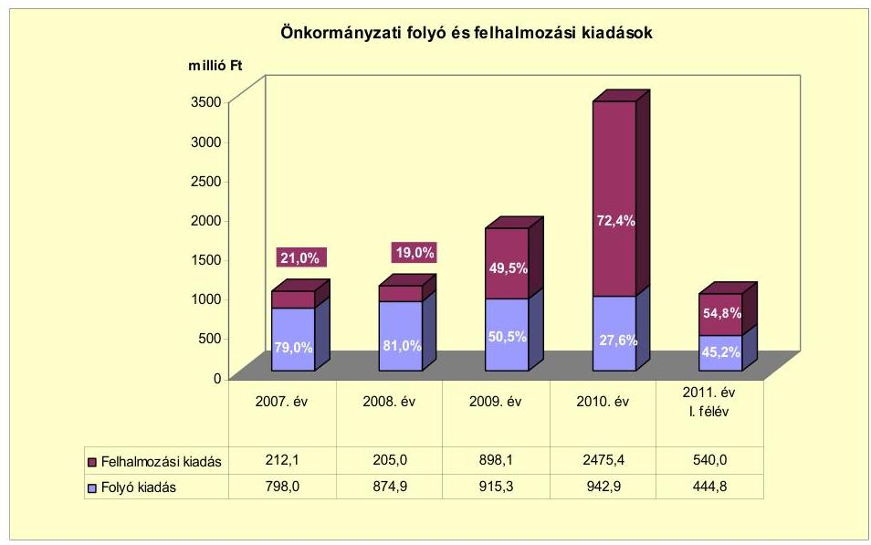

[^0]
[^0]:    ${ }^{25}$ A Társulás dologi kiadásai a 2007. évben 8,7 millió Ft, a 2008. évben 15,2 millió Ft, a 2009. évben 71,8 millió Ft, a 2010. évben 14,2 millió Ft, a 2011. I. félévben 13,2 millió Ft voltak.
    ${ }^{26}$ Az Önkormányzat felhalmozási kiadásai a 2007. évben 212,1 millió Ft, a 2008. évben 205,0 millió Ft, a 2009. évben 898,1 millió Ft, a 2010. évben 2475,4 millió Ft, a 2011. I. félévben 540,0 millió Ft voltak.

---

Az Önkormányzat felhalmozási kiadásai a 2009-2011. év I. féléve között tartalmazzák a Társulás felhalmozási kiadásait, amelyek torzítják az adatokat. Ezeknek a kiadásoknak egy része nem az Önkormányzat, hanem a társult települések kiadása volt, amelyek azonban a gesztor Önkormányzatnál jelentkeztek.

Az Önkormányzat folyó és felhalmozási kiadásait a Társulás kiadásai nélkül az alábbi ábra szemlélteti:
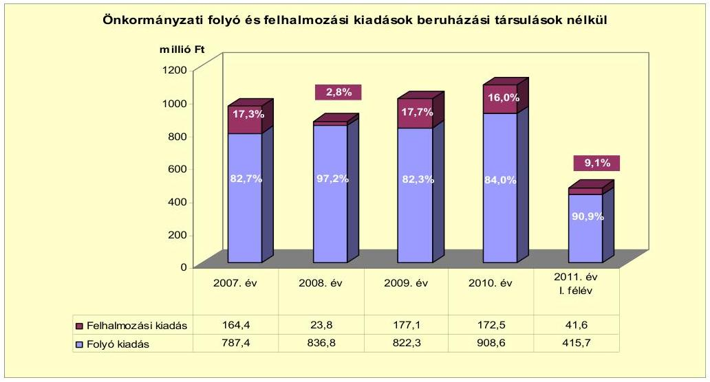

Az Önkormányzat - a Társulás felhalmozási kiadásait nem tartalmazó felhalmozási kiadásainak ${ }^{27}$ részaránya a folyó és felhalmozási kiadások összegéhez viszonyítva a 2007-2011. év I. félévében 2,8-17,3\% között ingadozott. Az arányt a 2007. évben ingatlanvásárlás (108,0 millió Ft), a 2009-2010. években az ipari park kialakítása (216,0 millió Ft) határozta meg.

Az Önkormányzatnál a 2007-2010 között megvalósult felújítási és beruházási munkálatok együttes kiadása 519,9 millió Ft volt, amelynek 23,8\%-a (123,9 millió Ft) 10 millió Ft alatti fejlesztésekhez kapcsolódott. A fejlesztések közül hét haladta meg a 10 millió Ft-os értékhatárt. A fejlesztések teljes bekerülési költségének 47,5\%-át (247,0 millió Ft-ot) kötvénybevételből, 14,8\%-át (77,0 millió Ft-ot) EU-s támogatásból, 37,7\%-át (195,9 millió Ft-ot) saját bevételből finanszírozták. Az Önkormányzat 2007-2010 között megvalósult, a 100,0 millió Ft-os értéket meghaladó beruházása ingatlanvásárlás (108,0 millió Ft) és gazdasági-ipari terület (ipari park) létesítés volt. Az Önkormányzat 2007-2010. években megvalósított, 2010. december 31-ig befejezett fejlesztéseit és azok forrásösszetételét a jelentés 3/a. számú melléklet tartalmazza.

Az Önkormányzatnál 2010. december 31-én öt olyan fejlesztés volt folyamatban, amelyre 2010. december 31-ig kifizetést teljesítettek. Ezek mindegyike a

[^0]
[^0]:    ${ }^{27}$ Az Önkormányzat - a Társulás felhalmozási kiadásait nem tartalmazó - felhalmozási kiadásai a 2007. évben 164,4 millió Ft, a 2008. évben 23,8 millió Ft, a 2009. évben 177,1 millió Ft, a 2010. évben 172,5 millió Ft, a 2011. I. félévben 41,6 millió Ft volt.

---

Társulás fejlesztése volt. Az Önkormányzat 2010. december 31-én folyamatban lévő fejlesztési feladataira 2010. december 31-ig teljesített kifizetéseket és azok forrásösszetételét a jelentés 3/b. számú melléklete mutatja be.

Az Önkormányzatnál 2010. december 31-én két összesen 211,6 millió Ft értékű fejlesztés volt folyamatban, amelyekre pénzügyi teljesítés a 20072010. években nem történt. A 2011. évben a Polgármesteri hivatal épületének átalakítása és az általános iskola számítástechnikai eszközbeszerzése is megvalósult. A fejlesztések kiadásainak forrása 94,2 millió Ft összegben (44,5\%-ban) kötvénybevétel, 117,4 millió Ft értékben (55,5\%) EU-s támogatás volt. A Társulásnál - az Önkormányzat adatszolgáltatása alapján - négy olyan fejlesztés volt folyamatban, amelyre összesen 9343,0 millió Ft 2010. december 31-e utáni kötelezettségvállalás áll fenn. A Társulás tervei szerint a fejlesztések a 2012. évben záródnak le. Az Önkormányzat 2010. december 31-én folyamatban lévő fejlesztési feladataira 2010. december 31-én fennálló kötelezettségeit és azok forrásösszetételét a jelentés 3/c. számú melléklete tartalmazza.

Az Önkormányzatnak 2011. június 30-án nem volt fejlesztési célra beadott, elbírálás alatt lévő pályázata.

A vizsgált időszakban az Önkormányzatnál a három legmagasabb bekerülési költségű fejlesztés a következő volt:

- A KDOP-1.1.1/A-2008-0002 pályázat keretében - a Polgárdi volt szovjet laktanya területén - gazdasági-ipari parkot létesítettek. A területen az infrastruktúra (gáz, víz, villany, csatorna, utak) kialakítása 216,0 millió Ft bekerülési költséggel valósult meg. A fejlesztés forrásösszetétele: 139,0 millió Ft (64,4\%) kötvénybevétel, 77,0 millió Ft (35,6\%) EU-s támogatás volt. A beruházás a 2008. évben kezdődött és a 2009. évben zárult le;
- A Polgármesteri hivatal épületének átalakítása, bővítése és a sportpályát kiszolgáló épület korszerűsítése a KDOP-3.1.1/C-09-2009-0002 pályázatban elnyert támogatás segítségével valósult meg. A fejlesztés során mindkét épület energiaracionalizálási célú átalakítása és akadálymentesítése megtörtént. A beruházás összes költsége 192,6 millió Ft volt. A kiadások fedezetét 94,2 millió Ft (48,9\%) értékben kötvénybevétel, 98,4 millió Ft (51,1\%) értékben EU-s támogatás biztosította. A fejlesztés a 2010. évben kezdődött és a tervek szerint 2011. évben befejeződik;
- Az Önkormányzat 2007-ben 108,0 millió Ft értékben - a volt szovjet laktanya területén - vásárolt ingatlant, amelyen ipari parkot, illetve a lakóépületekből társasházat alakítottak ki. Az ingatlanvásárlás fedezetét teljes egészében kötvénybevételből biztosították.

Az Önkormányzat - a 2008. július 24-én kelt - feladatellátási szerződés keretében a Polgárdi Víz Kft.-nek a 2008. évben 5,1 millió Ft működési célú pénzeszközt adott át, amelyet a gazdasági társaság a szerződésben foglaltaktól eltérően tagi kölcsönként szerepeltetett a beszámolójában.

---

# 3. Az ÖNKORMÁNYZAT KÖTELEZETTSÉGEI 

### 3.1. Az Önkormányzat pénzintézeti kötelezettségeinek változása

Az Önkormányzat pénzintézettel szembeni kötelezettségeinek állománya 2006. december 31-től 2010. december 31-ig közel 4,7-szeresére 188,4 millió Ft-ról 882,0 millió Ft-ra -, 2011. június 30-ig közel 4,6-szeresére - 188,4 millió Ft-ról 858,7 millió Ft-ra - nőtt.

Az Önkormányzat pénzintézetek felé fennálló kötelezettségállományának alakulását a 2006-2011. év I. félév közötti időszakban az alábbi diagram szemlélteti:
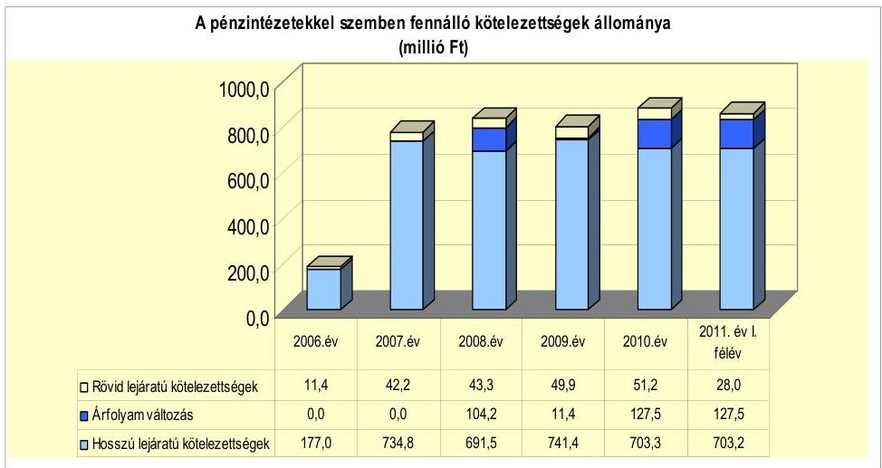

A fennálló pénzintézeti kötelezettségek a „Polgárdi Kötvény" kibocsátásából és hosszú lejáratú beruházási hitel igénybevételéből keletkeztek. A hosszú lejáratú hitelt az Önkormányzat számlavezető bankja folyósította a 2005. évben, a kötvény kibocsátója és lejegyzője - a 2007. évben - nem a számlavezető bank volt.

Az Önkormányzat pénzintézettel szembeni kötelezettségvállalásaira képviselőtestületi döntés alapján került sor, a „Polgárdi Kötvény" esetében a pénzintézetek versenyeztetésének mellőzésével. A kötelezettségvállalásból származó források felhasználási céljait a hosszú lejáratú beruházási hitel esetében meghatározták, a kötvénykibocsátásból származó forrás szabad felhasználású volt. A „Polgárdi Kötvény" esetében a Képviselő-testület döntését megalapozó előterjesztés tartalmazta a teljes futamidő várható kamatés tőkefizetési kötelezettségeinek a bemutatását. Az előterjesztés nem tartalmazta a kamatkockázatokat, az árfolyamkockázatokat és a kötelezettségvállalás visszafizetési forrásait, továbbá az adósságszolgá-

---

lati korlátot ${ }^{28}$. Az adósságot keletkeztető kötelezettségvállalással megvalósított felhalmozási kiadások esetleges bevételnövelő, illetve kiadáscsökkentő vonzatát, illetve ennek a beruházáshoz, felújításhoz vállalt kötelezettségek visszafizetési forrásként való számbavételét nem vizsgálták.

Az Önkormányzat 2011. június 30-án CHF-ben fennálló adósságot keletkeztető pénzintézettel szembeni kötelezettségvállalása az alábbi volt:

| Megnevezés | Kibocsátás   időpontja | Összeg   ezer CHF-ben | Kibocsátás/lehívási   árfolyam | Kamat (referencia   kamat+kamatfelár) | Felhasználás célja: |
| :--: | :--: | :--: | :--: | :--: | :--: |
| "Polgárdi Kötvény" | 2007.06.21 | 3921 | 153,022 | 6 havi CHFLIBOR+1,30\% | Az Önkormányzat   "beruházás finanszírozási   igényének tűzicsitása és   hifelszerkezetének   kunszoldálása" |

A „Polgárdi Kötvény" ellenértékének (600,0 millió Ft) 51,2\%-át (307,5 millió Ft-ot) fejlesztésre (ingatlanvásárlás, ipari park beruházás, Polgármesteri hivatal átépítése, eszközvásárlás), 8,6\%-át (51,6 millió Ft-ot) a kötvény esedékes tőketörlesztéseire és kamatfizetéseire használta fel az Önkormányzat. Az ellenérték 40,2\%-át (240,9 millió Ft-ot) banki tartós lekötésként helyezték el, amelyből 100,0 millió Ft csak banki jóváhagyással használható fel.

Az Önkormányzat 2011. június 30-án forintban fennálló adósságot keletkeztető pénzintézettel szembeni kötelezettségvállalása az alábbi volt:

| Megnevezés | Szerződéskötés   időpontja | Összeg   millió Ft-ban | Kamat (referencia kamat+   kamatfelár) | Felhasználás célja: |
| :--: | :--: | :--: | :--: | :--: |
| Beruházási hitel | 2005.08.17 | 200 | 3 havi EURIBOR+ évi   $1,65 \%$ | Egészségügyi centrum építése |

A 200,0 millió Ft hosszú lejáratú beruházási hitelkeretből a tényleges igénybevétel 188,5 millió Ft volt, mivel a hitelkeret teljes igénybevételére a projekt megvalósítása során nem volt szükség. Az Önkormányzat a hitelt - a hitelcélnak megfelelően - az egészségügyi centrum építési feladatainak finanszírozására használta fel. A hitelfelhasználás a 2005. évben 34,4 millió Ft, a 2006. évben 154,1 millió Ft volt.

Az Önkormányzat a CHF-ben fennálló pénzintézettel szembeni kötelezettségéből 2011. június 30-ig 700025 CHF (130,8 millió Ft) tőkét, 403311 CHF (71,9 millió Ft) kamatot törlesztett, valamint a kötelezettséghez kapcsolóan 9,0 millió Ft jegyzési garanciavállalási díjat fizetett. A HUF-ban fennálló pénzintézeti kötelezettségéből 51,4 millió Ft tőkét törlesztett, emellett 39,4 millió Ft kamatot és 1,3 millió Ft projektvizsgálati díjat fizetett. A CHF-ben történt

[^0]
[^0]:    ${ }^{28}$ Az adósságszolgálati korlát figyelmen kívül hagyását az Önkormányzat gazdálkodási rendszerének 2008. évi ellenőrzése során az ÁSZ kifogásolta és a számvevői jelentésben javaslatot tett a szabálytalan gyakorlat megszüntetésére.

---

# tőketörlesztés az Önkormányzatnak 15,2 millió Ft árfolyam-veszteséget okozott. 

#### Abstract

Az árfolyamváltozás hatása is befolyásolja a kötelezettségek alakulását, azonban annak mértéke előre pontosan nem határozható meg, csak várakozásokon alapuló tendenciákkal jelezhetők. A számviteli szabályok előírják, hogy az árfolyam különbözetet év végén a kötelezettségek vagy követelések között a könyvviteli mérlegben nyilván kell tartani, azonban az árfolyam különbözet valójában nem realizált. Annak megítéléséről, hogy a devizában kibocsátott kötvényekért és felvett hitelekért kapott forinthoz képest a kötvények visszavásárlásakor, illetve a hitelek visszafizetésekor jelentkező forint kötelezettség többletkiadást (árfolyamveszteség) vagy megtakarítást (árfolyamnyereség) eredményez a futamidő végén, a teljes kötelezettség rendezését követően lehet képet alkotni. Mindaddig, amíg törlesztési kötelezettség nem áll fenn (türelmi idő, moratórium), a tőkére vonatkoztatva nem értelmezhető sem az árfolyamveszteség, sem az árfolyamnyereség.

Az Önkormányzat 2007-2011. június 30. között az átmenetileg szabad pénzeszközeiből 117,7 millió Ft kamatbevételt realizált. A kamatbevételből 88,5 millió Ft származott a „Polgárdi Kötvény" kibocsátásából származó bevételek, 29,2 millió Ft az intézmény és a Polgármesteri hivatal elkülönített bankszámláin rendelkezésre állt forrás pénzintézeti betétként való lekötéséből.

A „Polgárdi Kötvény" bevétele pénzintézeti betétként való lekötéséből származó kamatbevételeket az Önkormányzat a 2008-2011. év I. félévben a kötvény esedékes tőketörlesztéseire és kamatfizetéseire fordította. A kötvények fel nem használt részének lekötéséből származó kamatbevételek 2007-2011. év I. félévben több mint 1,2-szeresét (123,1\%-át) tették ki a kötvénykibocsátás miatt megfizetett kamatoknak.

Az Önkormányzat likviditásának biztosításához a vizsgált időszakban folyószámlahitel felvételére nem volt szükség, munkabér megelőlegezési hitelt is csak a 2007. évben vettek igénybe. A likviditási problémák miatt az Önkormányzat négy alkalommal vett igénybe a 2007. év folyamán munkabér megelőlegezési hitelt, összesen 32,7 millió Ft-ot, alkalmanként átlagosan 8,2 millió Ft-ot (a hitel átlagos napi állománya naptári napokra számítva 2,2 millió Ft, a hitellel zárt napokra számítva 7,9 millió Ft volt). A törlesztések a saját bevételekből és a normatív állami támogatásokból az igénybevétel hónapjában, vagy az azt követő hónapban, határidőben megvalósultak. Kamat címén - amelynek mértéke 2007. július 2-től szeptember 27-ig 12,25\%, november 29-től december 21-ig 12,0\% volt - az Önkormányzat összesen 0,3 millió Ft-ot fizetett ki a 2007. évben (egyéb költség nem merült fel).

A 2011. június 30-án fennálló „Polgárdi Kötvény" és a hosszú lejáratú beruházási hitel esetében a kamatfizetési kötelezettségek alakulását jelentősen befolyásolta és jelenleg is befolyásolja a referencia kamatok és a kamatfelárak változása, amelyet az alábbi táblázat mutat be:

| Megnevezés | Kibocsátási, lehívási   kamat (referencia + kamatfelár) $\%$ |  | Változás $\%$ |
| :--: | :--: | :--: | :--: |
| 6 havi CHF LIBOR (2007.06.21.-i szerződés)   (Polgárdi Kötvény) | 4,04 |  | $-61,9 \%$ |
| 3 havi EURIBOR (2005.08.17.-i szerződés)   (beruházási hitel) | 3,754 | 2,881 | $-23,3 \%$ |

---

Az utolsó kamatfizetés a „Polgárdi Kötvény" esetében 2011. március 31-én, a beruházási hitel esetében 2011. június 30-án volt.

Az alapkamat mértékének alakulása jelentős hatással van az adott devizanemben kifejezett, a teljes futamidőre számított, várható kamatkötelezettség nagyságára. Amennyiben a referencia kamat nem változott volna, az Önkormányzatnak a kibocsátáskori referencia kamattal számolva 2011. június 30-ig a „Polgárdi Kötvény" esetében 557315 CHF (103,0 millió Ft) kamatfizetési kötelezettsége keletkezett volna. A változások miatt azonban 154004 CHF-el (31,1 millió Ft) kevesebb fizetési kötelezettséget kellett teljesítenie, mint amivel a szerződés megkötésekor számolnia kellett. Az Önkormányzatnak a beruházási hitel esetében a kibocsátáskori referencia kamattal számolva 2011. június 30-ig 33,0 millió Ft kamatfizetési kötelezettsége keletkezett volna. A változások (2009. évig közel duplájára növekvő, ezt követően mintegy kétharmadára csökkenő referencia kamat) miatt azonban ténylegesen 0,2 millió Ft-tal több (33,2 millió Ft) fizetési kötelezettséget kellett teljesítenie.

Az Önkormányzat kötelezettségeinek 2010. december 31-i, és 2011. június 30-i állományát, valamint azok várható értékeit - a felmerülő kamatokat és díjakat is figyelembe véve - a kötelezettség lejártáig, az alábbi táblázat mutatja be:

| Megnevezés | Állomány 2010. december 31-én |  |  | Állomány 2011. június 30-án |  |  | Várható kiadások teljesítése; 2011-2013. években |  | Várható kiadások teljesítése; 2014. évtől |  |
| :--: | :--: | :--: | :--: | :--: | :--: | :--: | :--: | :--: | :--: | :--: |
|  | HUF-ban (millió Ft-ban) | Devizában (összegszerűen ezer CHF-ben) | Deviza   árfolyam | HUF-ban (millió Ft-ban) | Devizában (összegszerűen ezer CHF-ben) | Deviza   árfolyam | HUF-ban (millió Ft-ban) | Devizában (összegszerűen ezer CHF-ben) | HUF-ban (millió Ft-ban) | Devizában (összegszerűen ezer CHF-ben) |
| Pénzintézeti kötelezettségek |  |  |  |  |  |  |  |  |  |  |
| Beruházási hitel | | 1427 |  | H.F | 137,0 |  | H.F | 459 |  | 126,3 |  |
| Tölgárdi Kötvény |  | 3321,0 | 0-F |  | 3321,0 | 0-F |  | 743,5 |  | 3018,4 |
| Pénzintézeti kiolokasatsiáigok/összezen H.Fbarn | 1427 |  | H.F | 137,0 |  | H.F | 459 |  | 126,3 |  |
| Pénzintézeti kiolokasatsiáigok/összezen 0-Fbarn |  | 3321,0 | 0-F |  | 3321,0 | 0-F |  | 743,5 |  | 3018,4 |
| Szólító hatózási | 1159 |  | H.F | 90 |  | H.F | 90 |  |  |  |
| Összesskiolokasatsiáig H.Fbarn | 181,6 |  | H.F | 146,0 |  | H.F | 549 |  | 126,3 |  |
| Összesskiolokasatsiáig 0-Fbarn |  | 3321,0 | 0-F |  | 3321,0 | 0-F |  | 743,5 |  | 3018,4 |

Az Önkormányzat fizetési kötelezettségei közül a „Polgárdi Kötvény" tőketörlesztése 2008. március 31-én, a hosszú lejáratú beruházási hitel tőketörlesztése 2007. március 5-én kezdődött.

Az Önkormányzatnál a helyszíni vizsgálat alatt további hitel igénybevételéről, illetve kötvénykibocsátásról szóló döntést nem készítettek elő.

Az Önkormányzatnak a 2010. év végi, pénzintézettel szembeni kötelezettsége 600,0 millió Ft (76,1\%) kötvény kibocsátásából és 188,5 millió Ft (23,9\%) fejlesztési célú hosszú lejáratú hitelből keletkezett. Ezek miatt az Önkormányzatnak a 2011-2013. években 45,9 millió Ft és 743492 CHF tőketör-

---

lesztést, kamatot ${ }^{29}$ és egyéb díjat kell teljesítenie. Az Önkormányzat 2010. év végi szállítói tartozása - gazdasági társaságok nélkül - 18,9 millió Ft, melyben lejárt tartozás nem volt. A 2011-2013. években az összes (pénzintézeti és szállítói) kötelezettség teljesítésére figyelembe vehető 283,3 millió Ft pénzmaradvány (ebből 100,0 millió Ft csak banki hozzájárulással használható fel), a jelzáloggal nem terhelt forgalomképes ingatlanvagyon értékesítéséből, és 17,5 millió Ft egyéb követelésállomány behajtásából származó forrás.

Az Önkormányzat további években - a 2014. évtől - esedékes jelenleg ismert pénzintézettel szembeni kötelezettségei: 126,3 millió Ft és 3018359 CHF. Az ezek teljesítésére figyelembe vehető források jelenleg nem ismertek.

# 3.2. A szállítói kötelezettségek változása 

Az Önkormányzatnak szállítókkal szemben fennálló kötelezettségeinek állományát, azok kötelezettségeken belüli arányát az alábbi táblázat tartalmazza:

| Megnevezés | 2007.   december   31. | 2008.   december   31. | 2009.   december   31. | 2010.   december   31. | 2011.   június   30. |
| :--: | :--: | :--: | :--: | :--: | :--: |
| Összes kötelezettség | 1047,6 | 927,1 | 883,6 | 964,9 | 913,5 |
| Ebből:szállítók kal szembeni   kötelezettség | 207,8 | 16,7 | 8,2 | 18,9 | 9,0 |

Az Önkormányzat szállítókkal szemben fennálló kötelezettségeinek állománya a 2007. évi 207,8 millió Ft-ról a 2008. és az azt követő évekre 20,0 millió Ft alá (a 2007. évi állomány maximum 9,1\%-ára a 2010. évben) süllyedt. A szállítókkal szemben fennálló kötelezettségek állománya az összes kötelezettségen belül a 2007. évben 19,8\%-ot képviselt, 2008-ban 1,8\%-ot, 2009-ben 0,9\%-ot, 2010-ben 2,0\%-ot, a 2011. év I. félévében 1,0\%-ot tett ki.

A szállítókkal szemben fennálló kötelezettségeken belül átütemezési megállapodással érintett és lejárt tartozások a vizsgált időszakban nem voltak.

Az Önkormányzatnak a 2007-2011. év I. félévben egyéb kiadás elmaradásai nem voltak.

### 3.3. Egyéb kötelezettségek változása

Az Önkormányzatnak az áttekintett időszakban garancia- és kezességvállalással kapcsolatos hosszú távú kötelezettségvállalása nem volt, lí-

[^0]
[^0]:    ${ }^{29}$ a 2011. év I. félévben utolsó kamatfizetéskor érvényes kamat mértékét alapul véve

---

# zingszerződést nem kötött, PPP konstrukció ${ }^{30}$ keretében nem végzett beruházást. 

A vizsgált időszakban az elengedett követelések bruttó összege 1,1 millió Ft volt. Az elengedett követelések 25,5\%-a magánszemélyek kommunális adója, 74,5\%-a közműfejlesztési hozzájárulás volt. Minden esetben - adóhatósági jogkörében eljárva - a jegyző volt a döntéshozó.

Az Önkormányzat 2007. január 1-je és 2011. június 30-a között intézménynek, más önkormányzatnak, civil szervezetnek, egyéb államháztartáson belüli és kívüli szervezetnek, valamint gazdasági társaságoknak tagi és egyéb kölcsönöket nem nyújtott.

Az Önkormányzatnak egy jelzáloggal terhelt ingatlana volt 2011. június 30-án. A Képviselő-testület az Önkormányzat gazdasági társasága (Vertikál Zrt.) fejlesztési hitelének biztosítékaként 110,0 millió Ft értékű jelzálogjog alapításához és bejegyzéséhez járult hozzá. A jelzálogszerződésekkel érintett ingatlan a 093/3 helyrajzi számú, 3,0 millió Ft nettó értékű, hulladéklerakó megnevezésű ingatlan. Az Önkormányzat összes forgalomképes ingatlanának nettó értéke 567,4 millió Ft, bruttó értéke 657,4 millió Ft volt 2010. december 31-én.

A forgalomképes ingatlanok nettó értékének megoszlását a jelzáloggal terhelt és nem terhelt ingatlanok között az alábbi ábra szemlélteti:
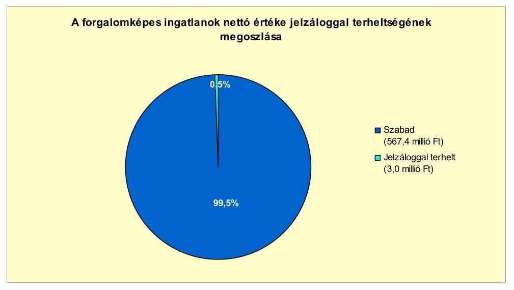

Folyamatban lévő peres eljárása az Önkormányzatnak 2011. június 30-án nem volt.

Az Önkormányzatnak 2010. december 31-én egy kizárólagos tulajdonú gazdasági társasága (POLGÁRDI-VÍZ Kft.) volt. A társaságnak 2010. december 31-én 0,1 millió Ft összegű szállítói tartozáson kívül egyéb más kötele-

[^0]
[^0]:    ${ }^{30}$ Public Private Partnership (Partnerségi együttműködés közfeladatok ellátására a magánszektor bevonásával)

---

zettsége nem állt fenn, 2011. június 30-án fennálló pénzintézeti, szállítói, peres eljárásokból adódó és egyéb kötelezettségei nem voltak.

Az Önkormányzat a Gt. 54. § (2) bekezdése alapján korlátlan felelősséggel tartozik azon gazdasági társaságának felszámolása esetében, amelyben az Önkormányzat az 52. § (2) bekezdése szerint a szavazatok legalább 75\%-ával rendelkezik, így minősített befolyásszerzőnek minősül, továbbá a csődeljárásról és a felszámolási eljárásról szóló 1991. évi XLIX. törvény 63. § (2) bekezdése alapján a kizárólagos önkormányzati tulajdonú gazdasági társaságának minden olyan kötelezettségéért, amelynek kielégítését a felszámolási eljárás során az adós társaság vagyona nem fedez, ha a hitelezőinek a felszámolási eljárás során benyújtott keresete alapján a bíróság - az adós társaság felé érvényesített tartósan hátrányos üzletpolitikájára figyelemmel - megállapítja az önkormányzat korlátlan és teljes felelősségét.

A vizsgált időszakban nem történt meg annak felmérése, hogy az eszközök elhasználódása, amortizációja fedezetének biztosítása mekkora forrásokat igényel az Önkormányzatnál. A felújításokra, az eszközök pótlására az Önkormányzat pénzügyi lehetőségének függvényében, elsősorban az intézmények működőképességének biztosítása, illetve a szakhatósági előírások figyelembevételével került sor. Az Önkormányzat a 2007-2010. években a tárgyi eszközök után 364,7 millió Ft összegű értékcsökkenést számolt el. Felújításra 51,2 millió Ft-ot fordítottak. Az elhasználódott eszközök pótlására az Önkormányzat tartalékot nem képzett, külön alapot nem hozott létre.

Az Önkormányzat eszközállományának átlagos használhatósági foka 2007-2010 között 6,4 százalékponttal (82,9\%-ról 76,5\%-ra) csökkent. Ezen belül az átlagos használhatósági fok mutatója a saját használatban lévő eszközök esetében 5,9 százalékponttal (84,4\%-ról 78,5\%-ra), az üzemeltetésre átadott eszközök esetében 8,8 százalékponttal (76,6\%-ról 67,8\%-ra) csökkent. Az átlagos használhatósági fok kiugróan alacsony volt az immateriális javak, a gépek, berendezések, felszerelések és a járművek eszközcsoportokban. Az immateriális javak eszközcsoport - melynek bruttó értéke (31,3 millió Ft) a 2010. év végén az összes bruttó eszközérték 0,8\%-át tette ki - átlagos használhatósági foka a 2007. évi 4,1\%-ról a 2010. évre 4,8\%-ra nőtt. A gépek berendezések, felszerelések eszközcsoport - melynek bruttó értéke (84,4 millió Ft) a 2010. év végén az összes bruttó eszközérték 2,1\%-át tette ki - átlagos használhatósági foka a 2007. évi 29,0\%-ról a 2010. évre 23,8\%-ra csökkent. A járművek eszközcsoport - melynek bruttó értéke (51,5 millió Ft) a 2010. év végén az összes bruttó eszközérték 1,3\%-át tette ki - átlagos használhatósági foka a 2007. évi 30,8\%-ról a 2010. évre 13,2\%-ra csökkent.

A megvalósított fejlesztések, felújítások az összes eszközállomány átlagos használhatósági fokának alakulására pozitív hatással voltak, a mutató értéke az előző évek 3,1, illetve 2,6 százalékpontos csökkenését követően a 2009. évről a 2010. évre csupán 0,7 százalékponttal csökkent. A saját használatban lévő eszközök esetében a mutató értéke 2007-ről 2008-ra 3,0 százalékponttal, 2008-ról 2009-re 2,6 százalékponttal, 2009-ről 2010-re csak 0,3 százalékponttal csökkent.

---

# 4. A PÉNZÜGYI EGYENSÚLY MEGTEREMTÉSE ÉRDEKÉBEN HOZOTT INTÉZKEDÉSEK EREDMÉNYE 

Az Önkormányzatnál - adatszolgáltatása szerint - a 2007-2011. év I. félév közötti időszakban a kiadáscsökkentő intézkedések következtében összesen 25,5 millió Ft kiadási megtakarítás keletkezett. A kiadási megtakarítás a létszámcsökkentési döntésekhez (karbantartási feladatok ellátásával gazdasági társaság megbízásához) kapcsolódóan 21,0 millió Ft (82,3\%), a helyettesítések miatt 2,8 millió Ft (11,0\%), a beszerzési szerződések felülvizsgálata következtében 1,7 millió Ft (6,7\%) volt. A kiadási megtakarítások a vizsgált időszak éveiben nem érték el az Önkormányzat költségvetéseiben eredeti előirányzatként tervezett összes költségvetési kiadás 1,0\%-át.

A kiadáscsökkentő intézkedések eredményeként a 2007-2011. év I. félévben keletkezett megtakarítások egyes területek közötti megoszlását a következő ábra szemlélteti:
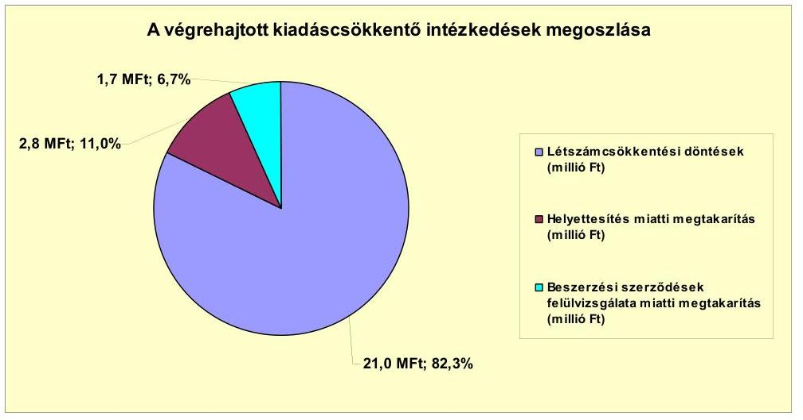

Az Önkormányzatnál a 2007-2010. közötti években az álláshely és létszámváltozásokat az alábbi táblázat mutatja be:

| Megnevezés (adatok főben) |  | Közoktatás | Szociális és gyermekvédelem | Egészségügy | Polgármesteri hivatal | Egyéb | Összesen |
| :--: | :--: | :--: | :--: | :--: | :--: | :--: | :--: |
| 2007. január 1-jén-jóváhagyott álláshelyek száma |  | 65 | 12 | 0 | 32 | 5 | 134 |
| Megszüntetett álláshelyek száma |  | 0 | 0 | 0 | 0 | 0 | 0 |
| 2008. évre Linné álláshelyek száma |  | 0 | 0 | 0 | 0 | 0 | 0 |
|  | szalemsi álláshelyek száma | 0 | 0 | 0 | 0 | 0 | 0 |
|  | intézmény-üzemeltetéssel kapcsolatos álláshelyek száma | 0 | 0 | 0 | 0 | 0 | 0 |
|  |  | 0 | 0 | 0 | 0 | 0 | 0 |
| Álláshely növekedése |  | 0 | 0 | 0 | 0 | 0 | 0 |
| 2010. december 31-én záró álláshelyek száma |  | 85 | 12 | 0 | 32 | 5 | 134 |
| 2007. január 1-jén foglalkoztatott létszám |  | 77 | 12 | 0 | 32 | 5 | 126 |
| Létszámcsökkentés |  | 2 | 0 | 0 | 0 | 2 | 4 |
| Létszámnövekedés |  | 4 | 0 | 0 | 0 | 1 | 5 |
| 2010. december 31-én foglalkoztatott létszám |  | 79 | 12 | 0 | 32 | 4 | 127 |

Az Önkormányzatnál - adatszolgáltatása szerint - a 2007-2010. közötti időszakban álláshely megszüntetésre nem került sor, az engedélyezett álláshelyek száma 2007. január 1-jén és 2010. december 31-én is 134 fő volt. Az önkormányzati foglalkoztatottak létszáma az áttekintett időszakban összes-

---

ségében egy fővel (a 2007. január 1-jei 126 főről 2010. december 31-re 127 főre) emelkedett. A létszámváltozást a 2008. évben végrehajtott karbantartási feladatok gazdasági társaság általi ellátása, a közoktatást érintő kettő fős és a Polgármesteri hivatalt érintő kettő fős (összesen négy fős) létszámcsökkenés, valamint az időközben tartós távollétről munkába történő visszatérés miatti öt fős létszámnövekedés okozta.

Az Önkormányzat létszámcsökkentésekhez kapcsolódóan központosított támogatást 2007-2010 között nem igényelt.

A kiadáscsökkentő intézkedések mellett 2007-2011. év I. félévben az Önkormányzat a következő számszerűsített bevételnövelő intézkedéseket tette:
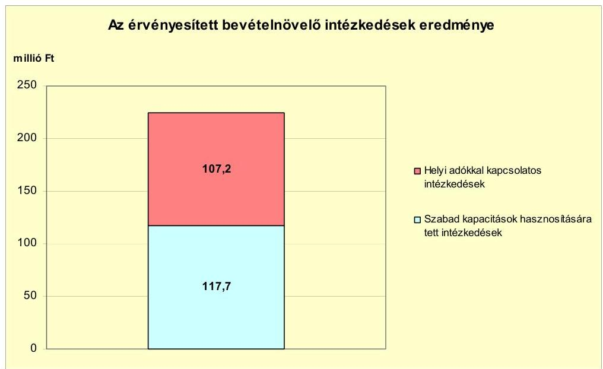

A bevétel növelésére irányuló intézkedések eredménye - az Önkormányzat adatszolgáltatása alapján - a 2007-2011. év I. félévben összesen 224,9 millió Ft volt az átmenetileg szabad pénzeszközök lekötése és helyi adókkal kapcsolatos intézkedések eredményeként. A pénzeszközök lekötéséből származó kamatbevételek (117,7 millió Ft) több mint $3 / 4$ része (88,5 millió Ft) a kötvénykibocsátásból származó forrás fel nem használt részének lekötéséből keletkezett. A helyi adókkal kapcsolatos intézkedések bevételnövekményének (107,2 millió Ft-nak) 88,6\%-a (95,0 millió Ft) - az Önkormányzat nyilvántartásai szerint - adóhátralékok behajtásából, 11,4\%-a (12,2 millió Ft) a magánszemélyek kommunális adója adómértékének 2009. január 1-től történt 5000 Ft/adótárgy mértékről 8000 Ft/adótárgy mértékre való növeléséből származott.

Az áttekintett időszakban a kiadáscsökkentő és bevételnövelő intézkedések összesen 250,4 millió Ft-tal javították az Önkormányzat pénzügyi egyensúlyát. A 2007-2011. év I. félév között a központi támogatások (személyi jövedelemadó és a költségvetési támogatás) előző évhez viszonyított változása összességében 25,8 millió Ft-ot tett ki. Az áttekintett időszakban az évenként keletkezett központi támogatások változása és a keletkezett forrástöbblet egyenlege összességében 276,2 millió Ft volt.

---

# 5. Az ÁSZ Által a korábbi években a pénzügyi egyensúly javítására tett szabályszerűségi és célszerűségi javaslatok hasznosulása

Az Önkormányzat gazdálkodási rendszerének 2008. évi ellenőrzése során - a pénzügyi egyensúly javításával kapcsolatban - kettő szabályszerűségi és egy célszerűségi javaslatot tett az ÁSZ. A célszerűségi javaslat intézkedési terv készítését írta elő. A szabályszerűségi javaslatok a költségvetési rendeletben a költségvetés bevételi és kiadási főösszegének megállapítására, valamint az adósságot keletkeztető kötelezettségvállalások során a hitelfelvételi korlát figyelembevételére vonatkoztak. A javaslatok megvalósítására az Önkormányzat intézkedési tervet készített, amely tartalmazta a felelősöket és határidőket. Az Önkormányzatnál a költségvetési rendeletekben a költségvetés bevételi és kiadási főösszegének megállapítására vonatkozó javaslat hasznosult, adósságot keletkeztető kötelezettségvállalásra pedig a 2008-2011. június 30-ig terjedő időszakban nem került sor.

Budapest, 2012. április ". ." "

Melléklet: $\quad 6 \mathrm{db}$
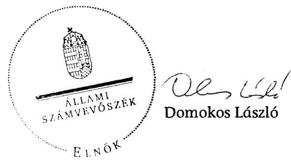

---

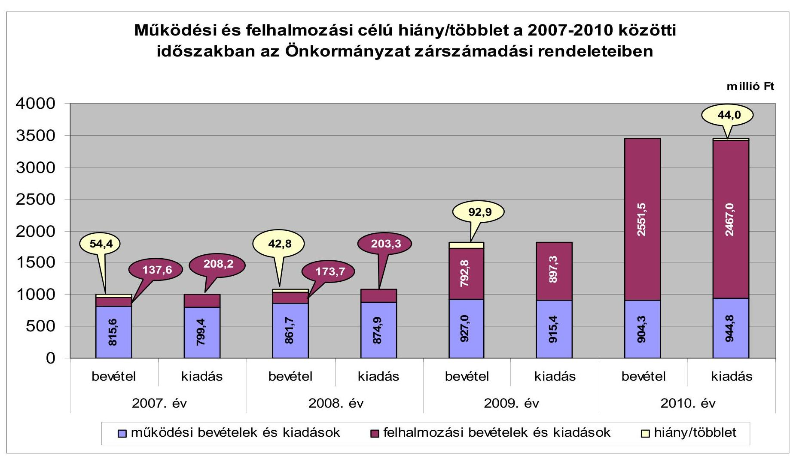

# Működési és felhalmozási célú hiány/többlet a 2007-2010 közötti időszakban az Önkormányzat zárszámadási rendeleteiben

|  I. kiadás | II. kiadás | III. kiadás | IV. kiadás | V. kiadás | VI. kiadás | VII. kiadás | VIII. kiadás  |
| --- | --- | --- | --- | --- | --- | --- | --- |
|  4000 | 3500 | 2500 | 1500 | 1000 | 500 | 215.6 | 137.6  |
|  3500 | 2500 | 1500 | 1000 | 500 | 215.6 | 137.6 | 107.6  |
|  2007. év | 2008. év | 195.6 | 137.6 | 107.6 | 500 | 208.2 | 137.6  |
|  44.0 | 42.8 | 208.2 | 173.7 | 107.7 | 500 | 208.2 | 137.7  |
|  44.0 | 42.8 | 208.2 | 173.7 | 107.7 | 500 | 208.2 | 137.7  |
|  44.0 | 42.8 | 208.2 | 173.7 | 107.7 | 500 | 208.2 | 137.7  |
|  44.0 | 42.8 | 208.2 | 173.7 | 107.7 | 500 | 208.2 | 137.7  |
|  44.0 | 42.8 | 208.2 | 173.7 | 107.7 | 500 | 208.2 | 137.7  |
|  44.0 | 42.8 | 208.2 | 173.7 | 107.7 | 500 | 208.2 | 137.7  |
|  44.0 | 42.8 | 208.2 | 173.7 | 107.7 | 500 | 208.2 | 137.7  |
|  44.0 | 42.8 | 208.2 | 173.7 | 107.7 | 500 | 208.2 | 137.7  |
|  44.0 | 42.8 | 208.2 | 173.7 | 107.7 | 500 | 208.2 | 137.7  |
|  44.0 | 42.8 | 208.2 | 173.7 | 107.7 | 500 | 208.2 | 137.7  |
|  44.0 | 42.8 | 208.2 | 173.7 | 107.7 | 500 | 208.2 | 137.7  |
|  44.0 | 42.8 | 208.2 | 173.7 | 107.7 | 500 | 208.2 | 137.7  |
|  44.0 | 42.8 | 208.2 | 173.7 | 107.7 | 500 | 208.2 | 137.7  |
|  44.0 | 42.8 | 208.2 | 173.7 | 107.7 | 500 | 208.2 | 137.7  |
|  44.0 | 42.8 | 208.2 | 173.7 | 107.7 | 500 | 208.2 | 137.7  |
|  44.0 | 42.8 | 208.2 | 173.7 | 107.7 | 500 | 208.2 | 137.7  |
|  44.0 | 42.8 | 208.2 | 173.7 | 107.7 | 500 | 208.2 | 137.7  |
|  44.0 | 42.8 | 208.2 | 173.7 | 107.7 | 500 | 208.2 | 137.7  |
|  44.0 | 42.8 | 208.2 | 173.7 | 107.7 | 500 | 208.2 | 137.7  |
|  44.0 | 42.8 | 208.2 | 173.7 | 107.7 | 500 | 208.2 | 137.7  |
|  44.0 | 42.8 | 208.2 | 173.7 | 107.7 | 500 | 208.2 | 137.7  |
|  44.0 | 42.8 | 208.2 | 173.7 | 107.7 | 500 | 208.2 | 137.7  |
|  44.0 | 42.8 | 208.2 | 173.7 | 107.7 | 500 | 208.2 | 137.7  |
|  44.0 | 42.8 | 208.2 | 173.7 | 107.7 | 500 | 208.2 | 137.7  |
|  44.0 | 42.8 | 208.2 | 173.7 | 107.7 | 500 | 208.2 | 137.7  |
|  44.0 | 42.8 | 208.2 | 173.7 | 107.7 | 500 | 208.2 | 137.7  |
|  44.0 | 42.8 | 208.2 | 173.7 | 107.7 | 500 | 208.2 | 137.7  |
|  44.0 | 42.8 | 208.2 | 173.7 | 107.7 | 500 | 208.2 | 137.7  |
|  44.0 | 42.8 | 208.2 | 173.7 | 107.7 | 500 | 208.2 | 137.7  |
|  44.0 | 42.8 | 208.2 | 173.7 | 107.7 | 500 | 208.2 | 137.7  |
|  44.0 | 42.8 | 208.2 | 173.7 | 107.7 | 500 | 208.2 | 137.7  |
|

---

Az Önkormányzat bevételei és kiadásai, valamint adósságszolgálata 2007-2010 között

|  1. FOLYÓ KÖLTSÉGVETÉS* | 2007. | 2008. | 2009. | 2010.  |
| --- | --- | --- | --- | --- |
|  1.1.1. Saját működési bevételek | 175,1 | 162,7 | 234,4 | 213,1  |
|  1.1.2. Költségvetési támogatás | 220,9 | 330,5 | 318,4 | 312,7  |
|  1.1.3. Átengedett bevételek | 309,1 | 232,6 | 240,5 | 255,5  |
|  1.1.4. Állambázis tartáson belülről kapott támogatások | 107,8 | 134,9 | 131,9 | 133,4  |
|  1.1.5. EU-nő és külföldről kapott bevételek | 0,0 | 0,0 | 0,0 | 0,0  |
|  1.1.6. Állambázis tartáson kívülről kapott bevételek | 3,5 | 1,0 | 1,8 | 3,6  |
|  1.1.7. Előző évi pénzmaradvány átvétel | 0,0 | 0,0 | 0,0 | 0,0  |
|  1.1. Folyó bevételek $=1.1 .1 .+1.1 .2 .+1.1 .3 .+1.1 .4 .+1.1 .5 .+1.1 .6 .+1.1 .7$. | 815,5 | 861,7 | 927,6 | 918,3  |
|  1.2.1. Működési kiadások kamatkiadások nélkül | 716,8 | 754,0 | 804,7 | 803,4  |
|  1.2.2. Állambázis tartáson belülre átadott pénzeszközök | 3,4 | 5,5 | 6,2 | 29,3  |
|  1.2.3.1. vállalkozásoknak | 1,2 | 5,1 | 1,1 | 0,4  |
|  1.2.3.2. EU-nak, illetve külföldre | 0,0 | 0,0 | 0,0 | 0,0  |
|  1.2.3.3. magánszemélyeknek | 36,3 | 42,9 | 49,9 | 64,0  |
|  1.2.3.4. nonprofit szervezeteknek | 29,3 | 29,3 | 28,1 | 30,7  |
|  1.2.5. Transzferkiadások ( $=1.2 .3 .1+1.2 .3 .2+1.2 .3 .3+1.2 .3 .4$ ) | 66,8 | 77,3 | 79,1 | 95,1  |
|  1.2.4 Kamatkiadások | 11,0 | 38,1 | 25,3 | 15,1  |
|  1.2.5. Előző évi pénzmaradvány átadás | 0,0 | 0,0 | 0,0 | 0,0  |
|  1.2. Folyó kiadások $=1.2 .1 .+1.2 .2 .+1.2 .3 .+1.2 .4 .+1.2 .5$. | 798,0 | 874,9 | 915,3 | 942,9  |
|  1.3. Folyó költségvetés egyenlege MŰKÖDÉSI JÖVEDELEM (1.1. - 1.2.) | 17,5 | $-13,2$ | 11,7 | $-24,6$  |
|  2. FELHALMOZÁSI KÖLTSÉGVETÉS** |  |  |  |   |
|  2.1.1. Saját tőkebevételek | 92,4 | 88,8 | 52,7 | 151,0  |
|  2.1.2. Állambázis tartáson belülről kapott támogatások | 46,3 | 84,0 | 741,7 | 2390,8  |
|  2.1.3. EU-nő és külföldről kapott támogatások | 0,0 | 0,0 | 0,0 | 0,0  |
|  2.1.4. Állambázis tartáson kívülről kapott támogatások | 0,9 | 3,0 | 0,0 | 1,7  |
|  2.1. Felhalmozási bevételek ( $=2.1 .1 .+2.1 .2+2.1 .3+2.1 .4$.) | 139,6 | 175,8 | 794,4 | 2543,5  |
|  2.2.1. Saját beruházási kiadás állíval | 193,6 | 196,2 | 894,8 | 2436,8  |
|  2.2.2. Saját felújítási kiadás állíval | 11,6 | 7,0 | 2,5 | 30,1  |
|  2.2.3. Állambázis tartáson belülre átadott pénzeszköz | 1,2 | 0,0 | 0,0 | 0,0  |
|  2.2.4. EU-nak és külföldnek adott pénzeszközök | 0,0 | 0,1 | 0,0 | 0,0  |
|  2.2.5. Állambázis tartáson kívülre adott pénzeszközök | 2,7 | 1,7 | 0,8 | 8,5  |
|  2.2.6. Befektetési célú részesedések vásárlása | 3,0 | 0,0 |
 0,0 | 0,0  |
|  2.2. Felhalmozási kiadások ( $=2.2 .1 .+2.2 .2 .+2.2 .3 .+2.2 .4 .+2.2 .5 .+2.2 .6$.) | 212,1 | 205,0 | 898,1 | 2475,4  |
|  2.3. Felhalmozási költségvetés egyenlege (2.1. - 2.2.) | $-72,5$ | $-29,2$ | $-103,7$ | 60,1  |
|  3. Finanszírozási műveletek nélküli (GFS) pozíció(1.3.+2.3.) | $-55,0$ | $-42,4$ | $-92,0$ | 43,5  |
|  4. Finanszírozási műveletek | 0,0 | 0,0 | 0,0 | 0,0  |
|  4.1. Hitelfelvétel | 0,0 | 0,0 | 0,0 | 0,0  |
|  4.2. Hiteltörlesztés | 11,4 | 11,4 | 11,4 | 11,4  |
|  4.3. Forgatási és befektetési célú értékpapírok kibocsátása | 600,0 | 0,0 | 0,0 | 0,0  |
|  4.4. Forgatási és befektetési célú értékpapírok beváltása | 2,2 | 30,6 | 36,2 | 36,8  |
|  4.5. Forgatási és befektetési célú értékpapírok értékesítése | 3,4 | 0,0 | 0,0 | 0,0  |
|  4.6. Forgatási és befektetési célú értékpapírok vásárlása | 0,0 | 0,0 | 0,0 | 0,0  |
|  4.7. Egyéb finanszírozási bevételek (függő, átfutó, kiegyenlítői) | $-13,4$ | 1,6 | $-9,1$ | $-15,7$  |
|  4.8. Egyéb finanszírozási kiadások (függő, átfutó, kiegyenlítői) | $-28,5$ | $-3,2$ | 16,4 | 2,5  |
|  4.9.Finanszírozási műveletek egyenlege (4.1. - 4.2.+4.3.-4.4+4.5.-4.6.+4.7.-4.8.) | 604,9 | $-39,2$ | $-73,1$ | $-66,4$  |
|  5. Tárgyévi pénzügyi pozíció (1.3.+ 2.3.+4.9.) | 549,9 | $-81,6$ | $-165,1$ | $-22,9$  |
|  6. Nettó működési jövedelem =működési jövedelem (1.3.) - törlesztés (4.2+4.4) | 3,9 | $-55,2$ | $-35,9$ | $-72,8$  |
|  TÁJÉKOZTATÓ ADATOK |  |  |  |   |
|  Összes kötelezettség | 998,1 | 876,0 | 841,4 | 956,9  |
|  ebből rövid lejáratú | 263,3 | 84,5 | 86,9 | 130,9  |
|  Összes szállítás kötelezettség | 207,8 | 16,7 | 8,2 | 34,3  |
|  ebből lejárt (tanúsítványból) |  | 0,0 |  |   |
|  Pénz és tőkepiaci kötelezettség (adósság) | 777,0 | 839,0 | 802,7 | 882,0  |
|  ebből rövid lejáratú | 42,2 | 47,6 | 48,3 | 55,9  |
|  PPP szerződéses állomány jelenértéken (tanúsítványból) |  | 0,0 |  |   |
|  ebből lejárt szolgáltatási díj miatti kötelezettség |  | 0,0 |  |   |
|  Folyószámlahitel napi átlagos állománya (tanúsítványból) | 0,0 | 0,0 | 0,0 | 0,0  |
|  Likvidhitel napi átlagos állománya (tanúsítványból) | 0,0 | 0,0 | 0,0 | 0,0  |
|  Munkabérhitel napi átlagos állománya (tanúsítványból) | 0,1 | 0,0 | 0,0 | 0,0  |
|  Kezesség és garanciavállalások (tanúsítványból) |  | 0,0 |  |   |
|  Jogerős bírósági ítéletekből adódó kötelezettségek (tanúsítványból) |  | 0,0 |  |   |
|  Finanszírozásba bevonható eszközök: | 581,5 | 502,5 | 335,2 | 312,3  |
|  Tartós hitelviszonyt megtestesítő értékpapírok év végi állománya | 0,0 | 0,0 | 0,0 | 0,0  |
|  Hosszú lejáratú bankbetétek év végi állománya | 0,0 | 0,0 | 0,0 | 0,0  |
|  Értékpapírok év végi állománya | 2,4 | 5,0 | 2,8 | 2,8  |
|  Pénzeszközök (idegen pénzeszközök nélküli) év végi állománya | 579,1 | 497,5 | 332,4 | 309,5  |

[^0] [^0]: * Bevételekben nem térül, a kiadásokban nem jelenik meg az amortizáció, a vagyoni helyzetet az egyenleg befolyásolja ** A költségvetési támogatásból a felhalmozási célú összeget az Önkormányzat adatszolgáltatása szerinti mértékben vettük figyelembe a 2.1.2 soron

---

# Az Önkormányzat 2007-2010 években megvalósított, 2010. december 31-ig befejezett fejlesztései és azok forrásösszeleteis

|  Fejlesztési feladat (beruházás, felújítás) | Beruházás, felújítás | Teljes bekerülési költség | 2007-2010. évi hozott fejlesztett kiadás | 2007-2010. évi hozott fejlesztett kiadás | 2007-2010. évi hozott fejlesztett kiadás | 2007-2010. évi hozott fejlesztett kiadás | 2007-2010. évi hozott fejlesztett kiadás | 2007-2010. évi hozott fejlesztett kiadás | 2007-2010. évi hozott fejlesztett kiadás | 2007-2010. évi hozott fejlesztett kiadás | 2007-2010. évi hozott fejlesztett kiadás | 2007-2010. évi hozott fejlesztett kiadás | 2007-2010. évi hozott fejlesztett kiadás | 2007-2010. évi hozott fejlesztett kiadás | 2007-2010. évi hozott fejlesztett kiadás | 2007-2010. évi hozott fejlesztett kiadás | 2007-2010. évi hozott fejlesztett kiadás | 2007-2010. évi hozott fejlesztett kiadás | 2007-2010. évi hozott fejlesztett kiadás | 2007-2010. évi hozott fejlesztett kiadás | 2007-2010. évi hozott fejlesztett kiadás | 2007-2010. évi hozott fejlesztett kiadás | 2007-2010. évi hozott fejlesztett kiadás | 2007-2010. évi hozott fejlesztett kiadás | 2007-2010. évi hozott fejlesztett kiadás | 2007-2010. évi hozott fejlesztett kiadás | 2007-2010. évi hozott fejlesztett kiadás | 2007-2010. évi hozott fejlesztett kiadás | 2007-2010. évi hozott fejlesztett kiadás | 2007-2010. évi hozott fejlesztett kiadás | 2007-2010. évi hozott fejlesztett kiadás | 2007-2010. évi hozott fejlesztett kiadás | 2007-2010. évi hozott fejlesztett kiadás | 2007-2010. évi hozott fejlesztett kiadás | 2007-2010. évi hozott fejlesztett kiadás | 2007-2010. évi hozott fejlesztett kiadás | 2007-2010. évi hozott fejlesztett kiadás | 2007-2010. évi hozott fejlesztett kiadás | 2007-2010. évi hozott fejlesztett kiadás | 2007-2010. évi hozott fejlesztett kiadás | 2007-2010. évi hozott fejlesztett kiadás | 2007-2010. évi hozott fejlesztett kiadás | 2007-2010. évi hozott fejlesztett kiadás | 2007-2010. évi hozott fejlesztett kiadás | 2007-2010. évi hozott fejlesztett kiadás | 2007-2010. évi hozott fejlesztett kiadás | 2007-2010. évi hozott fejlesztett kiadás | 2007-2010. évi hozott fejlesztett kiadás | 2007-2010. évi hozott fejlesztett kiadás | 2007-2010. évi hozott fejlesztett kiadás | 2007-2010. évi hozott fejlesztett kiadás | 2007-2010. évi hozott fejlesztett kiadás | 2007-2010. évi hozott fejlesztett kiadás | 2007-2010. évi hozott fejlesztett kiadás | 2007-2010. évi hozott fejlesztett kiadás | 2007-2010. évi hozott fejlesztett kiadás | 2007-2010. évi hozott fejlesztett kiadás | 2007-2010. évi hozott fejlesztett kiadás | 2007-2010. évi hozott fejlesztett kiadás | 2007-2010. évi hozott fejlesztett kiadás | 2007-2010. évi hozott fejlesztett kiadás | 2007-2010. évi hozott fejlesztett kiadás | 2007-2010. évi hozott fejlesztett kiadás | 2007-2010. évi hozott fejlesztett kiadás | 2007-2010. évi hozott fejlesztett kiadás | 2007-2010. évi hozott fejlesztett kiadás | 2007-2010. évi hozott fejlesztett kiadás | 2007-2010. évi hozott fejlesztett kiadás | 2007-2010. évi hozott fejlesztett kiadás | 2007-2010. évi hozott fejlesztett kiadás | 2007-2010. évi hozott fejlesztett kiadás | 2007-2010. évi hozott fejlesztett kiadás | 2007-2010. évi hozott fejlesztett kiadás | 2007-2010. évi hozott fejlesztett kiadás | 2007-2010. évi hozott fejlesztett kiadás | 2007-2010. évi hozott fejlesztett kiadás | 2007-2010. évi hozott fejlesztett kiadás | 2007-2010. évi hozott fejlesztett kiadás | 2007-2010. évi hozott fejlesztett kiadás | 2007-2010. évi hozott fejlesztett kiadás | 2007-2010. évi hozott fejlesztett kiadás | 2007-2010. évi hozott fejlesztett kiadás | 2007-2010. évi hozott fejlesztett kiadás | 2007-2010. évi hozott fejlesztett kiadás | 2007-2010. évi hozott fejlesztett kiadás | 2007-2010. évi hozott fejlesztett kiadás | 2007-2010. évi hozott fejlesztett kiadás | 2007-2010. évi hozott fejlesztett kiadás | 2007-2010. évi hozott fejlesztett kiadás | 2007-2010. évi hozott fejlesztett kiadás | 2007-2010. évi hozott fejlesztett kiadás | 2007-2010. évi hozott fejlesztett kiadás | 2007-2010. évi hozott fejlesztett kiadás | 2007-2010. évi hozott fejlesztett kiadás | 2007-2010. évi hozott fejlesztett kiadás | 2007-2010. évi hozott fejlesztett kiadás | 2007-2010. évi hozott fejlesztett kiadás | 2007-2010. évi hozott fejlesztett kiadás | 2007-2010. évi hozott fejlesztett kiadás
 | 2007-2010. évi hozott fejlesztett kiadás | 2007-2010. évi hozott fejlesztett kiadás | 2007-2010. évi hozott fejlesztett kiadás | 2007-2010. évi hozott fejlesztett kiadás | 2007-2010. évi hozott fejlesztett kiadás | 2007-2010. évi hozott fejlesztett kiadás | 2007-2010. évi hozott fejlesztett kiadás | 2007-2010. évi hozott fejlesztett kiadás | 2007-2010. évi hozott fejlesztett kiadás | 2007-2010. évi hozott fejlesztett kiadás | 2007-2010. évi hozott fejlesztett kiadás | 2007-2010. évi hozott fejlesztett kiadás | 2007-2010. évi hozott fejlesztett kiadás | 2007-2010. évi hozott fejlesztett kiadás | 2007-2010. évi hozott fejlesztett kiadás | 2007-2010. évi hozott fejlesztett kiadás | 2007-2010. évi hozott fejlesztett kiadás | 2007-2010. évi hozott fejlesztett kiadás | 2007-2010. évi hozott fejlesztett kiadás | 2007-2010. évi hozott fejlesztett kiadás | 2007-2010. évi hozott fejlesztett kiadás | 2007-2010. évi hozott fejlesztett kiadás | 2007-2010. évi hozott fejlesztett kiadás | 2007-2010. évi hozott fejlesztett kiadás | 2007-2010. évi hozott fejlesztett kiadás | 2007-2010. évi hozott fejlesztett kiadás | 2007-2010. évi hozott fejlesztett kiadás | 2007-2010. évi hozott fejlesztett kiadás | 2007-2010. évi hozott fejlesztett kiadás | 2007-2010. évi hozott fejlesztett kiadás | 2007-2010. évi hozott fejlesztett kiadás | 2007-2010. évi hozott fejlesztett kiadás | 2007-2010. évi hozott fejlesztett kiadás | 2007-2010. évi hozott fejlesztett kiadás | 2007-2010. évi hozott fejlesztett kiadás | 2007-2010. évi hozott fejlesztett kiadás | 2007-2010. évi hozott fejlesztett kiadás | 2007-2010. évi hozott fejlesztett kiadás | 2007-2010. évi hozott fejlesztett kiadás | 2007-2010. évi hozott fejlesztett kiadás | 2007-2010. évi hozott fejlesztett kiadás | 2007-2010. évi hozott fejlesztett kiadás | 2007-2010. évi hozott fejlesztett kiadás | 2007-2010. évi hozott fejlesztett kiadás | 2007-2010. évi hozott fejlesztett kiadás | 2007-2010. évi hozott fejlesztett kiadás | 2007-2010. évi hozott feljésztett kiadás | 2007-2010. évi hozott feljésztett kiadás | 2007-2010. évi hozott feljésztett kiadás | 2007-2010. évi hozott feljésztett kiadás | 2007-2010. évi hozott feljésztett kiadás | 2007-2010. évi hozott feljésztett kiadás | 2007-2010. évi hozott feljésztett kiadás | 2007-2010. évi hozott feljésztett kiadás | 2007-2010. évi hozott feljésztett kiadás | 2007-2010. évi hozott feljésztett kiadás | 2007-2010. évi hozott feljésztett kiadás | 2007-2010. évi hozott feljésztett kiadás | 2007-2010. évi hozott feljésztett kiadás | 2007-2010. évi hozott feljésztett kiadás | 2007-2010. évi hozott feljésztett kiadás | 2007-2010. évi hozott feljésztett kiadás | 2007-2010. évi hozott feljésztett kiadás | 2007-2010. évi hozott feljésztett kiadás | 2007-2010. évi hozott feljésztett kiadás | 2007-2010. évi hozott feljésztett kiadás | 2007-2010. évi hozott feljésztett kiadás | 2007-2010. évi hozott feljésztett kiadás | 2007-2010. évi hozott feljésztett kiadás | 2007-2010. évi hozott feljésztett kiadás | 2007-2010. évi hozott feljésztett kiadás | 2007-2010. évi hozott feljésztett kiadás | 2007-2010. évi hozott feljésztett kiadás | 2007-2010. évi hozott feljésztett kiadás | 2007-2010. évi hozott feljésztett kiadás | 2007-2010. évi hozott feljésztett kiadás | 2007-2010. évi hozott feljésztett kiadás | 2007-2010. évi hozott feljésztett kiadás | 2007-2010. évi hozott feljésztett kiadás | 2007-2010. évi hozott feljésztett kiadás | 2007-2010. évi hozott feljésztett kiadás | 2007-2010. évi hozott feljésztett kiadás | 2007-2010. évi hozott feljésztett kiadás | 2007-2010. évi hozott feljésztett kiadás | 2007-2010. évi hozott feljésztett kiadás | 2007-2010. évi hozott feljésztett kiadás | 2007-2010. évi hozott feljésztett kiadás | 2007-2010. évi hozott feljésztett kiadás | 2007-2010. évi hozott feljésztett kiadás | 2007-2010. évi hozott feljésztett kiadás | 2007-2010. évi hozott feljésztett kiadás | 2007-2010. évi hozott feljésztett kiadás | 2007-2010. évi hozott feljésztett kiadás | 2007-2010. évi hozott feljésztett kiadás | 2007-2010. évi hozott feljésztett kiadás | 2007-2010. évi hozott feljésztett kiadás | 2007-2010. évi hozott feljésztett kiadás | 2007-2010. évi hozott feljésztett kiadás | 2007-2010. évi hozott feljésztett kiadás | 2007-2010. évi hozott feljésztett kiadás | 2007-2010. évi hozott feljésztett kiadás | 2007-2010. évi hozott feljésztett kiadás | 2007-2010. évi hozott feljésztett kiadás | 2007-2010. évi hozott feljésztett kiadás | 2007-2010. évi hozott feljésztett kiadás | 2007-2010. évi hozott feljésztett kiadás | 2007-2010. évi hozott feljésztett kiadás | 2007-2010. évi hozott feljésztett kiadás | 2007-2010.
 évi hozott felülvizsgálati kiadás | 2007-2010. évi hozott felülvizsgálati kiadás | 2007-2010. évi hozott felülvizsgálati kiadás | 2007-2010. évi hozott felülvizsgálati kiadás | 2007-2010. évi hozott felülvizsgálati kiadás | 2007-2010. évi hozott felülvizsgálati kiadás | 2007-2010. évi hozott felülvizsgálati kiadás | 2007-2010. évi hozott felülvizsgálati kiadás | 2007-2010. évi hozott felülvizsgálati kiadás | 2007-2010. évi hozott felülvizsgálati kiadás | 2007-2010. évi hozott felülvizsgálati kiadás | 2007-2010. évi hozott felülvizsgálati kiadás | 2007-2010. évi hozott felülvizsgálati kiadás | 2007-2010. évi hozott felülvizsgálati kiadás | 2007-2010. évi hozott felülvizsgálati kiadás | 2007-2010. évi hozott felülvizsgálati kiadás | 2007-2010. évi hozott felülvizsgálati kiadás | 2007-2010. évi hozott felülvizsgálati kiadás | 2007-2010. évi hozott felülvizsgálati kiadás | 2007-2010. évi hozott felülvizsgálati kiadás | 2007-2010. évi hozott felülvizsgálati kiadás | 2007-2010. évi hozott felülvizsgálati kiadás | 2007-2010. évi hozott felülvizsgálati kiadás | 2007-2010. évi hozott felülvizsgálati kiadás | 2007-2010. évi hozott felülvizsgálati kiadás | 2007-2010. évi hozott felülvizsgálati kiadás | 2007-2010. évi hozott felülvizsgálati kiadás | 2007-2010. évi hozott felülvizsgálati kiadás | 2007-2010. évi hozott felülvizsgálati kiadás | 2007-2010. évi hozott felülvizsgálati kiadás | 2007-2010. évi hozott felülvizsgálati kiadás | 2007-2010. évi hozott felülvizsgálati kiadás | 2007-2010. évi hozott felülvizsgálati kiadás | 2007-2010. évi hozott felülvizsgálati kiadás | 2007-2010. évi hozott felülvizsgálati kiadás | 2007-2010. évi hozott felülvizsgálati kiadás | 2007-2010. évi hozott felülvizsgálati kiadás | 2007-2010. évi hozott felülvizsgálati kiadás | 2007-2010. évi hozott felülvizsgálati kiadás | 2007-2010. évi hozott felülvizsgálati kiadás | 2007-2010. évi hozott felülvizsgálati kiadás | 2007-2010. évi hozott felülvizsgálati kiadás | 2007-2010. évi hozott felülvizsgálati kiadás | 2007-2010. évi hozott felülvizsgálati kiadás | 2007-2010. évi hozott felülvizsgálati kiadás | 2007-2010. évi hozott felülvizsgálati kiadás | 2007-2010. évi hozott felülvizsgálati kiadás | 2007-2010. évi hozott felülvizsgálati kiadás | 2007-2010. évi hozott felülvizsgálati kiadás | 2007-2010. évi hozott felülvizsgálati kiadás | 2007-2010. évi hozott felülvizsgálati kiadás | 2007-2010. évi hozott felülvizsgálati kiadás | 2007-2010. évi hozott felülvizsgálati kiadás | 2007-2010. évi hozott felülvizsgálati kiadás | 2007-2010. évi hozott felülvizsgálati kiadás | 2007-2010. évi hozott felülvizsgálati kiadás | 2007-2010. évi hozott felülvizsgálati kiadás | 2007-2010. évi hozott felülvizsgálati kiadás | 2007-2010. évi hozott felülvizsgálati kiadás | 2007-2010. évi hozott felülvizsgálati kiadás | 2007-2010. évi hozott felülvizsgálati kiadás | 2007-2010. évi hozott felülvizsgálati kiadás | 2007-2010. évi hozott felülvizsgálati kiadás | 2007-2010. évi hozott felülvizsgálati kiadás | 2007-2010. évi hozott felülvizsgálati kiadás | 2007-2010. évi hozott felülvizsgálati kiadás | 2007-2010. évi hozott felülvizsgálati kiadás | 2007-2010. évi hozott felújítottsági kiadás | 2007-2010. évi hozott felújítottsági kiadás | 2007-2010. évi hozott felújítottsági kiadás | 2007-2010. évi hozott felújítottsági kiadás | 2007-2010. évi hozott felújítottsági kiadás | 2007-2010. évi hozott felújítottsági kiadás | 2007-2010. évi hozott felújítottsági kiadás | 2007-2010. évi hozott felújítottsági kiadás | 2007-2010. évi hozott felújítottsági kiadás | 2007-2010. évi hozott felújítottsági kiadás | 2007-2010. évi hozott felújítottsági kiadás | 2007-2010. évi hozott felújítottsági kiadás | 2007-2010. évi hozott felújítottsági kiadás | 2007-2010. évi hozott felújítottsági kiadás | 2007-2010. évi hozott felújítottsági kiadás | 2007-2010. évi hozott felújítottsági kiadás | 2007-2010. évi hozott felújítottsági kiadás | 2007-2010. évi hozott felújítottsági kiadás | 2007-2010. évi hozott felújítottsági kiadás | 2007-2010. évi hozott felújítottsági kiadás | 2007-2010. évi hozott felújítottsági kiadás | 2007-2010. évi hozott felújítottsági kiadás | 2007-2010. évi hozott felújítottsági kiadás | 2007-2010. évi hozott felújítottsági kiadás | 2007-2010. évi hozott felújítottsági kiadás | 2007-2010. évi hozott felújítottsági kiadás | 2007-2010. évi hozott felújítottsági kiadás | 2007-2010. évi hozott felújítottsági kiadás | 2007-2010. évi hozott felújítottsági kiadás | 2007-2010. évi hozott felújítottsági kiadás | 2007-2010. évi hozott felújítottsági kiadás | 2007-2010. évi hozott felújítottsági kiadás | 2007-2010. évi hozott felújítottsági kiadás | 2007-2010. évi hozott felújítottsági kiadás | 2007-2010. évi hozott felújítottsági kiadás | 2007-2010. évi hozott felújítottsági kiadás | 2007-2010. évi hozott felújítottsági kiadás | 2007-2010. évi hozott felújítottsági kiadás | 2007-2010. évi hozott felújítottsági kiadás | 2007-2010. évi hozott felújítottsági kiadás | 2007-2010. évi hozott felújítottsági kiadás | 2007-2010. évi hozott felújítottsági kiadás | 2007-2010. évi hozott felújítottsági kiadás | 2007-2010. évi hozott felújítottsági kiadás | 2007-2010. évi hozott felújítottsági kiadás | 2007-2010. évi hozott felújítottsági kiadás | 2007-2010. évi hozott felújítottsági kiadás | 2007-2010. évi hozott felújítottsági kiadás | 2007-2010. évi hozott felújítottsági kiadás | 2007-2010. évi hozott felújítottsági kiadás | 2007-2010. évi hozott felújítottsági kiadás | 2007-2010. évi hozott felújítottsági kiadás | 2007-2010. évi hozott felújítottsági kiadás | 2007-2010. évi hozott felújítottsági kiadás | 2007-2010. évi hozott felújítottsági kiadás | 2007-2010. évi hozott felújítottsági kiadás | 2007-2010. évi hozott felújítottsági kiadás | 2007-2010. évi hozott felújítottsági kiadás | 2007-2010. évi hozott felújítottsági kiadás | 2007-2010. évi hozott felújítottsági kiadás | 2007-2010. évi hozott felújítottsági kiadás | 2007-2010. évi hozott felújítottsági kiadás | 2007-2010. évi hozott felújítottsági kiadás | 2007-2010. évi hozott felújítottsági kiadás | 2007-2010. évi hozott
 fejlesztettségi kiadás | 2007-2010. évi hőzött fejlesztettségi kiadás | 2007-2010. évi hőzött fejlesztettségi kiadás | 2007-2010. évi hőzött fejlesztettségi kiadás | 2007-2010. évi hőzött fejlesztettségi kiadás | 2007-2010. évi hőzött fejlesztettségi kiadás | 2007-2010. évi hőzött fejlesztettségi kiadás | 2007-2010. évi hőzött fejlesztettségi kiadás | 2007-2010. évi hőzött fejlesztettségi kiadás | 2007-2010. évi hőzött fejlesztettségi kiadás | 2007-2010. évi hőzött fejlesztettségi kiadás | 2007-2010. évi hőzött fejlesztettségi kiadás | 2007-2010. évi hőzött fejlesztettségi kiadás | 2007-2010. évi hőzött fejlesztettségi kiadás | 2007-2010. évi hőzött fejlesztettségi kiadás | 2007-2010. évi hőzött fejlesztettségi kiadás | 2007-2010. évi hőzött fejlesztettségi kiadás | 2007-2010. évi hőzött fejlesztettségi kiadás | 2007-2010. évi hőzött fejlesztettségi kiadás | 2007-2010. évi hőzött fejlesztettségi kiadás | 2007-2010. évi hőzött fejlesztettségi kiadás | 2007-2010. évi hőzött fejlesztettségi kiadás | 2007-2010. évi hőzött fejlesztettségi kiadás | 2007-2010. évi hőzött fejlesztettségi kiadás | 2007-2010. évi hőzött fejlesztettségi kiadás | 2007-2010. évi hőzött fejlesztettségi kiadás | 2007-2010. évi hőzött fejlesztettségi kiadás | 2007-2010. évi hőzött fejlesztettségi kiadás | 2007-2010. évi hőzött fejlesztettségi kiadás | 2007-2010. évi hőzött fejlesztettségi kiadás | 2007-2010. évi hőzött fejlesztettségi kiadás | 2007-2010. évi hőzött fejlesztettségi kiadás | 2007-2010. évi hőzött fejlesztettségi kiadás | 2007-2010. évi hőzött fejlesztettségi kiadás
 | 2007-2010. évi hozott feljességű kiadás | 2007-2010. évi hozott feljességű kiadás | 2007-2010. évi hozott feljességű kiadás | 2007-2010. évi hozott feljességű kiadás | 2007-2010. évi hozott feljességű kiadás | 2007-2010. évi hozott feljességű kiadás | 2007-2010. évi hozott feljességű kiadás | 2007-2010. évi hozott feljességű kiadás | 2007-2010. évi hozott feljességű kiadás | 2007-2010. évi hozott feljességű kiadás | 2007-2010. évi hozott feljességű kiadás | 2007-2010. évi hozott feljességű kiadás | 2007-2010. évi hozott feljességű kiadás | 2007-2010. évi hozott feljességű kiadás | 2007-2010. évi hozott feljességű kiadás | 2007-2010. évi hozott feljességű kiadás | 2007-2010. évi hozott feljességű kiadás | 2007-2010. évi hozott feljességű kiadás | 2007-2010. évi hozott feljességű kiadás | 2007-2010. évi hozott feljességű kiadás | 2007-2010. évi hozott feljességű kiadás | 2007-2010. évi hozott feljességű kiadás | 2007-2010. évi hozott feljességű kiadás | 2007-2010. évi hozott feljességű kiadás | 2007-2010. évi hozott feljességű kiadás | 2007-2010. évi hozott feljességű kiadás | 2007-2010. évi hozott feljességű kiadás | 2007-2010. évi hozott feljességű kiadás | 2007-2010. évi hozott feljességű kiadás | 2007-2010. évi hozott feljességű kiadás | 2007-2010. évi hozott feljességű kiadás | 2007-2010. évi hozott feljességű kiadás | 2007-2010. évi hozott feljességű kiadás | 2007-2010. évi hozott feljességű kiadás | 2007-2010. évi hozott feljességű kiadás | 2007-2010. évi hozott feljességű kiadás | 2007-2010. évi hozott feljességű kiadás | 2007-2010. évi hozott feljességű kiadás | 2007-2010. évi hozott feljességű kiadás | 2007-2010. évi hozott feljességű kiadás | 2007-2010. évi hozott feljességű kiadás | 2007-2010. évi hozott feljességű kiadás | 2007-2010. évi hozott feljességű kiadás | 2007-2010. évi hozott feljességű kiadás | 2007-2010. évi hozott feljességű kiadás | 2007-2010. évi hozott feljességű kiadás | 2007-2010. évi hozott feljességű kiadás | 2007-2010. évi hozott feljességű kiadás | 2007-2010. évi hozott feljességű kiadás | 2007-2010. évi hozott feljességű kiadás | 2007-2010. évi hozott feljességű kiadás | 2007-2010. évi hozott feljességű kiadás | 2007-2010. évi hozott feljességű kiadás | 2007-2010. évi hozott feljességű kiadás | 2007-2010. évi hozott feljességű kiadás | 2007-2010. évi hozott feljességű kiadás | 2007-2010. évi hozott feljességű kiadás | 2007-2010. évi hozott feljességű kiadás | 2007-2010. évi hozott feljességű kiadás | 2007-2010. évi hozott feljességű kiadás | 2007-2010. évi hozott feljességű kiadás | 2007-2010. évi hozott feljességű kiadás | 2007-2010. évi hozott feljességű kiadás | 2007-2010. évi hozott feljességű kiadás | 2007-2010. évi hozott feljességű kiadás | 2007-2010. évi hozott feljességű kiadás | 2007-2010. évi hozott feljességű kiadás | 2007-2010. évi hozott feljességű kiadás | 2007-2010. évi hozott fejlesztettségi kiadás | 2007-2010. évi hőzött fejlesztettségi kiadás | 2007-2010. évi hőzött fejlesztettségi kiadás | 2007-2010. évi hőzött fejlesztettségi kiadás | 2007-2010. évi hőzött fejlesztettségi kiadás | 2007-2010. évi hőzött fejlesztettségi kiadás | 2007-2010. évi hőzött fejlesztettségi kiadás | 2007-2010. évi hőzött fejlesztettségi kiadás | 2007-2010. évi hőzött fejlesztettségi kiadás | 2007-2010. évi hőzött fejlesztettségi kiadás | 2007-2010. évi hőzött fejlesztettségi kiadás | 2007-2010. évi hőzött fejlesztettségi kiadás | 2007-2010. évi hőzött fejlesztettségi kiadás | 2007-2010. évi hőzött fejlesztettségi kiadás | 2007-2010. évi hőzött fejlesztettségi kiadás | 2007-2010. évi hőzött fejlesztettségi kiadás | 2007-2010. évi hőzött fejlesztettségi kiadás | 2007-2010. évi hőzött fejlesztettségi kiadás | 2007-2010. évi hőzött fejlesztettségi kiadás | 2007-2010. évi hőzött fejlesztettségi kiadás | 2007-2010. évi hőzött fejlesztettségi kiadás | 2007-2010. évi hőzött fejlesztettségi kiadás | 2007-2010. évi hőzött fejlesztettségi kiadás | 2007-2010. évi hőzött fejlesztettségi kiadás | 2007-2010. évi hőzött fejlesztettségi kiadás | 2007-2010. évi hőzött fejlesztettségi kiadás | 2007-2010. évi hőzött fejlesztettségi kiadás | 2007-2010. évi hőzött fejlesztettségi kiadás | 2007-2010. évi hőzött fejlesztettségi kiadás | 2007-2010. évi hőzött fejlesztettségi kiadás | 2007-2010. évi hőzött fejlesztettségi kiadás | 2007-2010. évi hőzött fejlesztettségi kiadás | 2007-2010. évi hőzött fejlesztettségi kiadás | 2007-2010. évi hőzött fejlesztettségi kiadás
 | 2007-2010. évi hozott felújítást kiadás | 2007-2010. évi hozott felújítást kiadás | 2007-2010. évi hozott felújítást kiadás | 2007-2010. évi hozott felújítást kiadás | 2007-2010. évi hozott felújítást kiadás | 2007-2010. évi hozott felújítást kiadás | 2007-2010. évi hozott felújítást kiadás | 2007-2010. évi hozott felújítást kiadás | 2007-2010. évi hozott felújítást kiadás | 2007-2010. évi hozott felújítást kiadás | 2007-2010. évi hozott felújítást kiadás | 2007-2010. évi hozott felújítást kiadás | 2007-2010. évi hozott felújítást kiadás | 2007-2010. évi hozott felújítást kiadás | 2007-2010. évi hozott felújítást kiadás | 2007-2010. évi hozott felújítást kiadás | 2007-2010. évi hozott felújítást kiadás | 2007-2010. évi hozott felújítást kiadás | 2007-2010. évi hozott felújítást kiadás | 2007-2010. évi hozott felújítást kiadás | 2007-2010. évi hozott felújítást kiadás | 2007-2010. évi hozott felújítást kiadás | 2007-2010. évi hozott felújítást kiadás | 2007-2010. évi hozott felújítást kiadás | 2007-2010. évi hozott felújítást kiadás | 2007-2010. évi hozott felújítást kiadás | 2007-2010. évi hozott felújítást kiadás | 2007-2010. évi hozott felújítást kiadás | 2007-2010. évi hozott felújítást kiadás | 2007-2010. évi hozott felújítást kiadás | 2007-2010. évi hozott felújítást kiadás | 2007-2010. évi hozott felújítást kiadás | 2007-2010. évi hozott felújítást kiadás | 2007-2010. évi hozott felújítást kiadás | 2007-2010. évi hozott felújítást kiadás | 2007-2010. évi hozott felújítást kiadás | 2007-2010. évi hozott felújítást kiadás | 2007-2010. évi hozott felújítást kiadás | 2007-2010. évi hozott felújítást kiadás | 2007-2010. évi hozott felújítást kiadás | 2007-2010. évi hozott felújítást kiadás | 2007-2010. évi hozott felújítást ki | 2007-2010. évi hozott felújítást ki | 2007-2010. évi hozott felújított ki | 2007-2010. évi hozott felújított ki | 2007-2010. évi hozott felújított ki | 2007-2010. évi hozott felújított ki | 2007-2010. évi hozott felújított ki | 2007-2010. évi hozott felújított ki | 2007-2010. évi hozott felújított ki | 2007-2010. évi hozott felújított ki | 2007-2010. évi hozott felújított ki | 2007-2010. évi hozott felújított ki | 2007-2010. évi hozott felújított ki | 2007-2010. évi hozott felújított ki | 2007-2010. évi hozott felújított ki | 2007-2010. évi hozott felújított ki | 2007-2010. évi hozott felújított ki | 2007-2010. évi hozott felújított ki | 2007-2010. évi hozott felújított ki | 2007-2010. évi hozott felújított ki | 2007-2010. évi hozott felújított ki | 2007-2010. évi hozott felújított ki | 2007-2010. évi hozott felújított ki | 2007-2010. évi hozott felújított ki | 2007-2010. évi hozott felújított ki | 2007-2010. évi hozott felújított ki | 2007-2010. évi hozott felújított ki | 2007-2010. évi hozott felújított ki | 2007-2010. évi hozott felújított ki | 2007-2010. évi hozott felújított ki | 2007-2010. évi hozott felújított ki | 2007-2010. évi hozott felújított ki | 2007-2010. évi hozott felújított ki | 2007-2010. évi hozott felújított ki | 2007-2010. évi hozott felújított ki | 2007-2010. évi hozott felújított ki | 2007-2010. évi hozott felújított ki | 2007-2010. évi hozott felújított ki | 2007-2010. évi hozott felújított ki | 2007-2010. évi hozott felújított ki | 2007-2010. évi hozott felújított ki

---

### **Az Önkormányzat 2010. december 31-én folyamatban lévő fejlesztési feladataira 2010. december 31-ig teljesített kifizetései és azok forrásösszetétele**

|   |  |  |  |  |  |  |  |  |  |  |  |  |  |  |  |  |  |  |  |  |  |  |  |  |  |  |  |  |  |  |  |  |  |  |  |  |  |  |  |  |  |  |  |  |  |   |
| --- | --- | --- | --- | --- | --- | --- | --- | --- | --- | --- | --- | --- | --- | --- | --- | --- | --- | --- | --- | --- | --- | --- | --- | --- | --- | --- | --- | --- | --- | --- | --- | --- | --- | --- | --- | --- | --- | --- | --- | --- | --- | --- | --- | --- | --- |
|   |  |  |  |  |  |  |  |  |  |  |  |  |  |  |  |  |  |  |  |  |  |  |  |  |  |  |  |  |  |  |  |  |  |  |  |  |  |  |  |  |  |  |  |  |   |
|   |  |  |  |  |  |  |  |  |  |  |  |  |  |  |  |  |  |  |  |  |  |  |  |  |  |  |  |  |  |  |  |  |  |  |  |  |  |  |  |  |  |  |  |  |   |
|   |  |  |  |  |  |  |  |  |  |  |  |  |  |  |  |  |  |  |  |  |  |  |  |  |  |  |  |  |  |  |  |  |  |  |  |  |  |  |  |  |  |  |  |  |   |
|   |  |  |  |  |  |  |  |  |  |  |  |  |  |  |  |  |  |  |  |  |  |  |  |  |  |  |  |  |  |  |  |  |  |  |  |  |  |  |  |  |  |  |  |  |   |
|   |  |  |  |  |  |  |  |  |  |  |  |  |  |  |  |  |  |  |  |  |  |  |  |  |  |  |  |  |  |  |  |  |  |  |  |  |  |  |  |  |  |  |  |  |   |
|   |  |  |  |  |  |  |  |  |  |  |  |  |  |  |  |  |  |  |  |  |  |  |  |  |  |  |  |  |  |  |  |  |  |  |  |  |  |  |  |  |  |  |  |  |   |
|   |  |  |  |  |  |  |  |  |  |  |  |  |  |  |  |  |  |  |  |  |  |  |  |  |  |  |  |  |  |  |  |  |  |  |  |  |  |  |  |  |  |  |  |  |   |
|   |  |  |  |  |  |  |  |  |  |  |  |  |  |  |  |  |  |  |  |  |  |  |  |  |  |  |  |  |  |  |  |  |  |  |  |  |  |  |  |  |  |  |  |  |   |
|   |  |  |  |  |  |  |  |  |  |  |  |  |  |  |  |  |  |  |  | | | | | | | | | | | | | | | | | | | | | | | | | | |
| | | | | | | | | | | | | | | | | | | | | | | | | | | | | | | | | | | | | | | | | | | | | |
| | | | | | | | | | | | | | | | | | | | | | | | | | | | | | | | | | | | | | | | | | | | | |
| | | | | | | | | | | | | | | | | | | | | | | | | | | | | | | | | | | | | | | | | | | | | |
| | | | | | | | | | | | | | | | | | | | | | | | | | | | | | | | | | | | | | | | | | | | | |
| | | | | | | | | | | | | | | | | | | | | | | | | | | | | | | | | | | | | | | | | | | | | |
| | | | | | | | | | | | | | | | | | | | | | | | | | | | | | | | | | | | | | | | | | | | | |
| | | | | | | | | | | | | | | | | | | | | | | | | | | | | | | | | | | | | | | | | | | | | |
| | | | | | | | | | | | | | | | | | | | | | | | | | | | | | | | | | | | | | | | | | | | | |
| | | | | | | | | | | | | | | | | | | | | | | | | | | | | | | | | | | | | | | | | | | | | |
| | | | | | | | | | | | | | | | | | | | | | | | | | | | | | | | | | | | | | | | | | | | | |
| | | | | | | | | | | | | | | | | | | | | | | | | | | | | | | | | | | | | | | | | | | | | |
| | | | | | | | | | | | | | | | | | | | | | | | | | | | | | | | | | | | | | | | | | | | | |
| | | | | | | | | | | | | | | | | | | | | | | | | | | | | | | | | | | | | | | | | | | | | |
| | | | | | | | | | | | | | | | | | | | | | | | | | | | | | | | | | | | | | | | | | | | | |
| | | | | | | | | | | | | | | | | | | | | | | | | | | | | | | | | | | | | | | | | | | | | |
| | | | | | | | | | | | | | | | | | | | | | | | | | | | | | | | | | | | | | | | | | | | | | | | | | | | | | | | | | | | | | | | | | | | | | |
|---|---|---|---|---|---|---|---|---|---|---|---|---|---|---|---|---|---|---|---|---|---|---|---|
| | | | | | | | | | | | | | | | | | | | | | | | | | | | | | | | | | | | | | | | | | | | | | |
| | | | | | | | | | | | | | | | | | | | | | | | | | | | | | | | | | | | | | | | | | | | | | |
| | | | | | | | | | | | | | | | | | | | | | | | | | | | | | | | | | | | | | | | | | | | | | |
| | | | | | | | | | | | | | | | | | | | | | | | | | | | | | | | | | | | | | | | | | | | | | |
| |

---

| | | | | | | | | | | | | | | | | | | | | | | | | | | | | | | | | | | | | | | | | | | | | | | | | | | |
|---|---|---|---|---|---|---|---|---|---|---|---|---|---|---|---|---|---|---|---|---|---|---|---|---|---|---|---|---|---|---|---|---|---|---|---|---|---|---|---|---|---|---|---|---|---|---|---|---|---|---|
| | | | | | | | | | | | | | | | | | | | | | | | | | | | | | | | | | | | | | | | | | | | | | | | | | | |
| | | | | | | | | | | | | | | | | | | | | | | | | | | | | | | | | | | | | | | | | | | | | | | | | |
| | | | | | | | | | | | | | | | | | | | | | | | | | | | | | | | | | | | | | | | | | | | | | | | | |
| | | | | | | | | | | | | | | | | | | | | | | | | | | | | | | | | | | | | | | | | | | | | | | | | |
| | | | | | | | | | | | | | | | | | | | | | | | | | | | | | | | | | | | | | | | | | | | | | | | | |
| | | | | | | | | | | | | | | | | | | | | | | | | | | | | | | | | | | | | | | | | | | | | | | | | |
| | | | | | | | | | | | | | | | | | | | | | | | | | | | | | | | | | | | | | | | | | | | | | | | | |
| | | | | | | | | | | | | | | | | | | | | | | | | | | | | | | | | | | | | | | | | | | | | | | | | |
| | | | | | | | | | | | | | | | | | | | | | | | | | | | | | | | | | | | | | | | | | | | | | | | | | |  |  |  |  |  |  |  |  |  |  |  |  |  |  |  |  |  |  |  |  |  |  |  |  |  |  |  |  |  |  |   |
|   |  |  |  |  |  |  |  |  |  |  |  |  |  |  |  |  |  |  |  |  |  |  |  |  |  |  |  |  |  |  |  |  |  |  |  |  |  |  |  |  |  |  |  |  |  |  |  |  |   |
|   |  |  |  |  |  |  |  |  |  |  |  |  |  |  |  |  |  |  |  |  |  |  |  |  |  |  |  |  |  |  |  |  |  |  |  |  |  |  |  |  |  |  |  |  |  |  |  |  |   |
|   |  |  |  |  |  |  |  |  |  |  |  |  |  |  |  |  |  |  |  |  |  |  |  |  |  |  |  |  |  |  |  |  |  |  |  |  |  |  |  |  |  |  |  |  |  |  |  |  |   |
|   |  |  |  |  |  |  |  |  |  |  |  |  |  |  |  |  |  |  |  |  |  |  |  |  |  |  |  |  |  |  |  |  |  |  |  |  |  |  |  |  |  |  |  |  |  |  |  |  |   |
|   |  |  |  |  |  |  |  |  |  |  |  |  |  |  |  |  |  |  |  |  |  |  |  |  |  |  |  |  |  |  |  |  |  |  |  |  |  |  |  |  |  |  |  |  |  |  |  |  |   |
|   |  |  |  |  |  |  |  |  |  |  |  |  |  |  |  |  |  |  |  |  |  |  |  |  |  |  |  |  |  |  |  |  |  |  |  |  |  |  |  |  |  |  |  |  |  |  |  |  |   |
|   |  |  |  |  |  |  |  |  |  |  |  |  |  |  |  |  |  |  |  |  |  |  |  |  |  |  |  |  |  |  |  |  |  |  |  |  |  |  |  |  |  |  |  |  |  |  |  |  |   |
|   |  |  |  |  |  |  |  |  |  |  |  |  |  |  |  |  |  |  |  |  |  |  |  |  |  |  |  |  |  |  |  |  |  |  |  |  |  |  |  |  |  |  |  |  |  |  |  |  |   |
|   |  |  |  |  |  |  |  |  |  |  |  |  |  |  |  |  |  |  |  |  |  |  |  |  |  |  |  |  |  |  |  |  |  |  |  |  |  |  |  |  |  |  |  |  |  |  |  |  |   |
|   |  |  |  |  |  |  |  |  |  |  |  |  |  |  |  |  |  |  |  |  |  |  |  |  |  |  |  |  |  |  |  |  |  |  |  |  |  |  |  |  |  |  |  |  |  |  |  |  |   |
|   |  |  |  |  |  |  |  |  |  |  |  |  |  |  |  |  |  |  |  |  |  |  |  |  |  |  |  |  |  |  |  |  |  |  |  |  |  |  |  |  |  |  |  |  |  |  |  |  |   |
|   |  |  |  |  |  |  |  |  |  |  |  |  |  |  |  |  |  |  |  |  |  |  |  |  |  |  |  |  |  |  |  |  |  |  |  |  |  |  |  |  |  |  |  |  |  |  |  |  |   |
|   |  |  |  |  |  |  |  |  |  |  |  |  |  |  |  |  |  |  |  |  |  |  |  |  |  |  |  |  |  |  |  |  |  |  |  |  |  |  |  |  |  |  |  |  |  |  |  |  |   |
|   |  |  |  |  |  |  |  |  |  |  |  |  |  |  |  |  |  |  |  |  |  |  |  |  |  |  |  |  |  |  |  |  |  |  |  |  |  |  |  |  |  |  |  |  |  |  |  |  |   |
|   |  |  |  |  |  |  |  |  |  |  |  |  |  |  |  |  |  |  |  |  |  |  |  |  |  |  |  |  |  |  |  |  |  |  |  |  |  |  |  |  |  |  |  |  |  |  |  |  |   |
|   |  | 
 |  |  |  |  |  |  |  |  |  |  |  |  |  |  |  |  |  |  |  |  |  |  |  |  |  |  |  |  |  |  |  |  |  |  |  |  |  |  |  |  |  |  |  |  |  |  |   |
|   |  |  |  |  |  |  |  |  |  |  |  |  |  |  |  |  |  |  |  |  |  |  |  |  |  |  |  |  |  |  |  |  |  |  |  |  |  |  |  |  |  |  |  |  |  |  |  |  |   |
|   |  |  |  |  |  |  |  |  |  |  |  |  |  |  |  |  |  |  |  |  |  |  |  |  |  |  |  |  |  |  |  |  |  |  |  |  |  |  |  |  |  |  |  |  |  |  |  |  |   |
|   |  |  |  |  |  |  |  |  |  |  |  |  |  |  |  |  |  |  |  |  |  |  |  |  |  |  |  |  |  |  |  |  |  |  |  |  |  |  |  |  |  |  |  |  |  |  |  |  |   |
|   |  |  |  |  |  |  |  |  |  |  |  |  |  |  |  |  |  |  |  |  |  |  |  |  |  |  |  |  |  |  |  |  |  |  |  |  |  |  |  |  |  |  |  |  |  |  |  |  |   |
|   |  |  |  |  |  |  |  |  |  |  |  |  |  |  |  |  |  |  |  |  |  |  |  |  |  |  |  |  |  |  |  |  |  |  |  |  |  |  |  |  |  |  |  |  |  |  |  |  |   |
|   |  |  |  |  |  |  |  |  |  |  |  |  |  |  |  |  |  |  |  |  |  |  |  |  |  |  |  |  |  |  |  |  |  |  |  |  |  |  |  |  |  |  |  |  |  |  |  |  |   |
|   |

---

## **Az önkormányzati feladatok ellátásában résztvevő gazdasági társaságok**

|  Gazdasági társasági megnevezése | 2010. december 31-én | a gazdasági társaságnak szerződéses kötelezettségre, feladat ellátási szerződésre alapozottan az Önkormányzat költségvetéséből  |
| --- | --- | --- |
|   | önkormányzat | önkormányzat
gazdasági
társaságának
saját tőke,
jegyzett tőke
aránya | kötelező
feladathoz | önként vállalt
feladathoz  |
|   |  |  | rendelt nettó vagyon  |
|  1. 100%-os tulajdoni hányadó gazdasági társaságok: |  |  |   |
|  Polgárdi Víz Kft. | 100 | 0,1 |   |
|  100%-os tulajdoni hányadó gazdasági társaságok | x | x | x  |
|  összesen |  |  |   |
|  II. 75-89%-os tulajdoni hányadó gazdasági társaságok: |  |  |   |
|  75-89%-os tulajdoni hányadó gazdasági társaságok | x | x | x  |
|  banyadó gazdasági társasások összesen |  |  |   |
|  75%-hétől tulajdoni hányadó gazdasági társasások összesen | x | x | x  |
|  III. 51-74%-os tulajdoni hányadó gazdasági társaságok: |  |  |   |
|  51-74%-os tulajdoni hányadó gazdasági társasások összesen | x | x | x  |
|  IV. egyéb, közfeladatot ellátó gazdasági társaságok: |  |  |   |
|  Vertikál Zrt. | 23,5 | 6,5 |   |
|  Fejérvíz Zrt. | 0,9 | 11,1 | 549,8  |
|  egyéb, közfeladatot ellátó gazdasági társaságok összesen | x | x | x  |
|  Összesen | x | x | x  |