# ÁLLAMI   SZÁMVEVŐSZÉK 

## JELENTÉS

Rakamaz Város Önkormányzata pénzügyi helyzetének ellenőrzéséről (43/4)

---

# Állami Számvevőszék 

Iktatószám: V-3123-021/2012.
Témaszám: 1015
Vizsgálat-azonosító szám: V0560154

## Az ellenőrzést felügyelte:

Dr. Varga Sándor
számvevő igazgatóhelyettes
Az ellenőrzést vezette:
Renkó Zsuzsanna
számvevő tanácsos
Ellenőrzési csoportvezető:
Lingné Rajz Borbála
számvevő tanácsos
Az ellenőrzést végezték:
Szalontai Miklós Kányáné Murvai Tünde
számvevő tanácsos számvevő tanácsos

---

# TARTALOMJEGYZÉK 

BEVEZETÉS ..... 9
I. ÖSSZEGZŐ MEGÁLLAPÍTÁSOK, KÖVETKEZTETÉSEK, JAVASLATOK ..... 13
II. RÉSZLETES MEGÁLLAPÍTÁSOK ..... 25

1. Az Önkormányzat kötelező és önként vállalt feladatai, a feladatellátás szervezeti keretei és annak változásai ..... 25
2. Az önkormányzat pénzügyi egyensúlyi helyzetét befolyásoló tényezők ..... 28
2.1. A működési és a felhalmozási egyensúly változása ..... 30
2.2. Az Önkormányzat bevételeinek változása ..... 35
2.3. Az Önkormányzat folyó és a felhalmozási célú kiadásainak változása ..... 37
3. Az Önkormányzat kötelezettségei ..... 41
3.1. Az Önkormányzat pénzintézeti kötelezettségeinek változása ..... 41
3.2. A szállítói kötelezettségek változása ..... 46
3.3. Egyéb kötelezettségek változása ..... 46
4. A pénzügyi egyensúly megteremtése érdekében hozott intézkedések eredménye ..... 49
5. Az ÁSZ által a korábbi években a pénzügyi egyensúly javítására tett szabályszerűségi és célszerűségi javaslatok hasznosulása ..... 51

---

# MELLÉKLETEK 

1. számú Működési és felhalmozási célú hiány/többlet a 2007-2010 közötti időszakban az Önkormányzat zárszámadási rendeleteiben (1 oldal)
2. számú Az Önkormányzat bevételei és kiadásai, valamint adósságszolgálata 2007-2010 között (1 oldal)
3/a. számú Az Önkormányzat 2007-2010. években megvalósított, 2010. december 31-ig befejezett fejlesztései és azok forrásösszetétele (1 oldal)
3/b. számú Az Önkormányzat 2010. december 31-én folyamatban lévő fejlesztési feladataira 2010. december 31-ig teljesített kifizetések és azok forrásösszetétele (1 oldal)
3/c. számú Az Önkormányzat 2010. december 31-én folyamatban lévő fejlesztési feladataira 2010. december 31-én fennálló kötelezettségek és azok forrásösszetétele (1 oldal)
3. számú Az önkormányzati feladatok ellátásában résztvevő gazdasági társaságok (1 oldal)

---

# RÖVIDÍTÉSEK JEGYZÉKE 

| Törvények |  |
| :--: | :--: |
| Áht. | az államháztartásról szóló 1992. évi XXXVIII. törvény |
| Csődtv. | a csődeljárásról és a felszámolási eljárásról szóló 1991. évi XLIX. törvény |
| Ötv. | a helyi önkormányzatokról szóló 1990. évi LXV. törvény |
| Stabilitási törvény | Magyarország gazdasági stabilitásáról szóló 2011. évi CXCIV. törvény |
| Számv. tv. | a számvitelről szóló 2000. évi C. törvény |
| Ptk. | a Polgári Törvénykönyvről szóló 1959. évi IV. törvény |
| Rendeletek |  |
| Ámr. | az államháztartás működési rendjéről szóló 292/2009. (XII. 19.) Korm. rendelet |
| Áhsz. | az államháztartás szervezetei beszámolási és könyvvezetési kötelezettségének sajátosságairól szóló 249/2000. (XII. 24.) Korm. rendelet |
| Szórövidítések |  |
| áfa | általános forgalmi adó |
| ÁSZ | Állami Számvevőszék |
| BM | Belügyminisztérium |
| EU | Európai Unió |
| Jegyző | Rakamaz Város Önkormányzatának jegyzője |
| Képviselő-testület | Rakamaz Város Képviselő-testülete |
| MÁK | Magyar Államkincstár |
| MNB | Magyar Nemzeti Bank |
| NGM | Nemzetgazdasági Minisztérium |
| OEP | Országos Egészségbiztosítási Pénztár |
| ÖNHIKI | Önhibáján kívül hátrányos helyzetben lévő helyi önkormányzatok támogatása |
| Önkormányzat polgármester | Rakamaz Város Önkormányzata   Rakamaz Város Önkormányzatának polgármestere |
| Polgármesteri hivatal | Rakamaz Város Önkormányzatának Polgármesteri hivatala |
| PPP konstrukció | Public Private Partnership (Partnerségi együttműködés közfeladatok ellátására a magánszektor bevonásával) |
| szja | Személyi jövedelemadó |
| SzMSz | Rakamaz Város Önkormányzata Képviselő-testületének Szervezeti és Működési Szabályzatáról szóló, többször módosított 6/2007. (III. 30.) számú rendelete |
| Társulás | Tiszavasvári Többcélú Kistérségi Társulás |

---

.

---

# ÉRTELMEZŐ SZÓTÁR 

banki kitettség

BUBOR

CLF módszer
használhatósági fok
kamatkockázat
kötelező közszolgáltatás
közfeladat

LIBOR

Az önkormányzat pénzügyi helyzete olyan külső körülmények hatására is módosulhat, amelyekre az önkormányzatnak nincs hatása, emiatt banki kitettsége keletkezik. Pl. rövid távú kötelezettségek fennállása esetén kizárólag a bank egyoldalú döntésén múlik, hogy továbbra is biztosít-e hitelt az önkormányzatnak, valamint azt milyen feltételekkel bocsátja az önkormányzat rendelkezésére.
Budapesti Bankközi Forint Hitelkamatláb. Irányadó, referencia jellegű kamatláb. Mértékét az MNB naponta állapítja meg a banki kamatok figyelembevételével. Közzététele naponta történik.
Az önkormányzatok költségvetése elemzésének eszköze. A módszer következetesen elkülöníti a folyó és a felhalmozási költségvetés bevételeit és kiadásait, azok költségvetési egyenlegeit. Bizonyos mértékig a vállalati gazdálkodás logikai elemeit érvényesíti az önkormányzatok pénzügyi, jövedelmi helyzetének vizsgálata során. Az értékelés a pénzügyi kapacitás fogalmát helyezi a középpontba.
Az eszközgazdálkodás vizsgálatának elemzése során használt mutató. Számításakor a tárgyi eszköz könyv szerinti (nettó) értékét viszonyítják a tárgyi eszköz bruttó (beszerzési/létesítési) értékéhez. A %-ban kifejezett mutató csökkenése az eszköz állagának romlására, avulására utal, ami maga után vonja az üzemeltetési és fenntartási költségek növekedését is.
A változó kamatozású forint-, vagy devizahitel futamideje alatt a kamat emelkedése miatt fennálló kamatkockázat, melynek növekedése miatt nő a hitel törlesztő részlete.
A helyi önkormányzati feladatkörbe tartozó, a köztisztasággal és a településtisztasággal, valamint az élet- és vagyonbiztonsággal összefüggő egyes - közszolgáltatás útján megvalósuló - közfeladatok ellátása, amelynek kötelező igénybevételét külön jogszabály (törvény, helyi önkormányzati rendelet) határozza meg.
Állami, helyi, illetve kisebbségi önkormányzati feladat, amelynek ellátásáról az államnak, illetve az önkormányzatoknak kell gondoskodni. A hatályos szabályozás szerint közfeladatot törvény és önkormányzati rendelet állapíthat meg. Az önkormányzatok által ellátandó feladatok keretszerű meghatározását az Ötv. tartalmazza.
Angol kifejezés, a London Interbank Offered Rate rövidítése. Jelentése: Londoni bankközi, referencia jellegű kínálati (hitel) kamatláb.

---

önkormányzat többségi tulajdonában lévő gazdasági társaságok
pénzügyi kapacitás
pénzügyi kockázat

Az önkormányzat a gazdasági társaságban a szavazatok több mint ötven százalékával vagy a Ptk. 685/B. § (2)-(3) bekezdéseiben rögzített meghatározó befolyással rendelkezik. A befolyással rendelkező akkor rendelkezik egy jogi személyben meghatározó befolyással, ha annak tagja, illetve részvényese, és jogosult e jogi személy vezető tisztségviselői vagy felügyelőbizottsága tagjainak többségének megválasztására, illetve visszahívására, vagy a jogi személy más tagjaival, illetve részvényeseivel kötött megállapodás alapján egyedül rendelkezik a szavazatok több mint ötven százalékával (Ptk. 685/B. § (2) bek.). A meghatározó befolyás akkor is fennáll, ha a befolyással rendelkező számára e jogosultságok közvetett módon (köztes vállalkozásain keresztül, a Ptk. 685/B §. (3),(4) bek. szerint) biztosítottak.
A helyi önkormányzat és az önkormányzat irányítása alá tartozó költségvetési szerv többségi tulajdonában, illetve többségi befolyása alatt álló gazdálkodó szervezet esetében hitelfelvétel, kölcsönfelvétel, garancia- vagy kezességvállalás, tartozásátvállalás, tartozáselengedés, értékpapírkibocsátás, vásárlás, pénzügyi lízing, tartós bérleti szerződés, ingyenes vagyonjuttatás (így különösen: ajándékozás, ingyenes engedményezés), vagy követelésvásárlás, követelésengedményezés végrehajtására vonatkozóan az Áht. 100/M. § (4) bekezdése alapján az önkormányzat rendelkezik döntési jogosultsággal.
A pénzügyi kapacitás (financial capacity) az adósok hitelfelvételi képességének azon mértéke, ahol még anélkül tudják növelni az adósságot, hogy csökkenteniük kellene akár a jelenbeli, akár a jövőben esedékes kiadásaikat a fizetésképtelenség elkerülése érdekében. (Forrás: Az önkormányzati rendszer pénzügyi helyzete, ÁSZKUT tanulmány 2010.)
A működési kockázat egyik eleme. Megmutatkozhat a költségvetés nagyságrendjének, szerkezetének nem megalapozott módosításaiban, a bevételi és a kiadási előirányzatoktól lényegesen eltérő teljesítésekben, a nem megfelelő belső kontrollrendszer működésében, a tudatos károkozásokban, a biztosítások elmaradásában, a hibás fejlesztési döntésekben, a nem a terveknek megfelelő forrásfelhasználásokban. Jelentkezhet továbbá a bevételek és kiadások ütemkülönbsége miatt felvett folyószámla- és likvidhitelek költségvetési év végén fennálló egyenlege miatt, amely az önkormányzat költségvetésébe - akár tartósan - beépülő forráshiányt jelzi.

---

törlesztési kockázat

SNA
szállítói kitettség

Annak a kockázata, hogy a megfelelő időben és mértékben a hitelt felvevőnél rendelkezésre állnak-e a pénzintézetek és egyéb szervek felé fennálló kötelezettségek visszafizetéséhez, a hitelek és kölcsönök törlesztéséhez szükséges pénzügyi források.
A törlesztési kockázatot növeli a kamat- és árfolyam növekedése, mivel ezekben az esetekben az adósságszolgálat nőhet. Törlesztési kockázatot okozhat a visszafizetésre tervezett forrás elérésének, teljesítésének bizonytalansága (pl. a visszafizetéshez tervezett tartalékolás elmaradt, a tervezettnél alacsonyabb a saját bevétel, a helyi adóból származó bevétel az adóalanyok, adóalapok csökkenése miatt nem teljesül).
System of National Account, azaz a Nemzeti Számlák Rendszere, amely a gazdasági szektorok által létrehozott valamennyi terméket és szolgáltatást figyelembe veszi.
Az önkormányzat pénzügyi helyzete olyan külső körülmények hatására is módosulhat, amelyekre az önkormányzatnak nincs hatása, emiatt szállítói kitettsége keletkezik. Pl. a lejárt szállítói tartozások rendezése függhet attól, hogy a szállító milyen intézkedéseket foganatosít az önkormányzattal szemben.

---

.

---

# JELENTÉS 

## Rakamaz Város Önkormányzata pénzügyi helyzetének ellenőrzéséről

## BEVEZETÉS

Az Állami Számvevőszék 2011. évtől érvényes stratégiája új irányt szabott a helyi önkormányzatok gazdálkodásának ellenőrzésében is. Az ÁSZ - küldetése és jövőképe szerint - szilárd szakmai alapokra támaszkodva értékteremtő ellenőrzéseivel és helyzetelemzéseivel az államháztartás egészében, így a helyi önkormányzati alrendszerben is elő kívánja segíteni a közpénzek és a közvagyon szabályos, gazdaságos, hatékony és eredményes felhasználását. E folyamat részeként - az államháztartási hiány alakulásának összetevőire is figyelemmel - végezzük az önkormányzati alrendszer pénzügyi helyzetelemzését.

Az államháztartás helyi szintjén a 304 városnak${ }^{1}$ az általuk ellátott közszolgáltatások volumenére is tekintettel a közfeladatok ellátásában kiemelt szerepe van. E települések 2011. január 1-jei népessége 3169 ezer fő volt.

Feladataik és hatásköreik az Ötv. mellett különböző ágazati törvények által meghatározottak, miközben a feladatellátás szervezeti kereteit - ezen belül a gazdasági társaságok közszolgáltatások ellátásában betöltött szerepét - saját maguk határozzák meg. A gazdasági társaságok által ellátott feladatok esetén a gazdálkodás, továbbá az önkormányzatok pénzügyi egyensúlyi helyzetére ható közvetlen kockázatok egy része kikerült az önkormányzati alrendszerből. A többségi önkormányzati tulajdonban lévő társaságok gazdálkodásának körülményei befolyásolhatják a városok pénzügyi egyensúlyi helyzetének megítélésében rejlő kockázatokat.

Az áttekintett időszakban az önkormányzati forrásszabályozás elvei lényegesen nem változtak. Az önkormányzatok gazdasági mozgásterét a központi költségvetéstől való függőség mellett jelentősen befolyásolja a helyi adókivetési jog gyakorlása. A városok gazdálkodási szabadságának lényeges eleme, hogy anyagi lehetőségeik függvényében dönthettek arról, hogy feladataik közül azokat, amelyek megoldására az Ötv. szerint a települési önkormányzat nem kötelezhető, a megyei önkormányzat fenntartásába adhatták. E döntések differenciáltan érintették a városok pénzügyi helyzetét.

[^0]
[^0]:    ${ }^{1}$ A megyei jogú városok nélkül figyelembe vett városok száma 304 városi önkormányzatot jelent.

---

A városi önkormányzatok 2007-2010 között teljesített bevételeinek alakulását és összetételét a következő ábra szemlélteti:

Az önkormányzati alrendszer pénzügyi helyzetértékelése során új elemzési módszereket alkalmazott az ellenőrzés. A költségvetési beszámoló adatok elemzése helyett az Önkormányzat pénzügyi helyzetét a CLF módszerrel értékeljük, amelynek lényegét és számításának módszerét a jelentés 2. pontjában, és a jelentés 2. számú mellékletében ismertetjük részletesen.

Az új módszereken alapuló helyzetértékelés fontosságát az adja, hogy a helyi önkormányzatok bruttó adósságállománya${ }^{2}$ a 2010. évi költségvetési beszámolók alapján 1248 milliárd Ft-ot tett ki. Ezen belül a 304 város adóssága 383 milliárd Ft volt, amely az önkormányzati alrendszer teljes adósságállományának 30,7 %-át jelentette${ }^{3}$.

A mérlegben kimutatott bruttó adósságállomány mellett az önkormányzatok számára az eszközállomány műszaki állapotának megőrzése is előbb-utóbb pénzügyi kötelezettséget jelent. Az elhasználódott eszközök pótlására forrást biztosító amortizációs (felújítási) alap képzésének${ }^{4}$ elmaradása maga után vonhatja a feladatellátást kiszolgáló tárgyi eszközök állagának erőteljes romlását.

[^0]
[^0]:    ${ }^{2}$ Az önkormányzati mérlegbeszámolókból

 számított bruttó adósságállomány 2010. év végi összege magában foglalja a fejlesztési és a működési célú kötvénykibocsátások, a beruházási és fejlesztési hitelek, a működési célú hosszú lejáratú hitelek, a rövid lejáratú hitelek, váltótartozások miatti kötelezettségek teljes (2011-ben, illetve az azt követő években esedékes) állományát. Az önkormányzatok 2007. év végi mérleg szerinti adósságállománya 692 milliárd Ft volt.
    ${ }^{3}$ A fővárosi és a kerületi önkormányzatok adósságának figyelmen kívül hagyásával számított 977 milliárd Ft összegű bruttó adósságállományból a városok 39,2%-kal részesedtek.
    ${ }^{4}$ Erre a jelenlegi szabályozási környezetben nem kötelezi előírás az önkormányzatokat.

---

Emellett a 2007-2013-as időszakra meghirdetett, vissza nem térítendő EU-s fejlesztési forrásokhoz való hozzájutás lehetősége felerősítette az önkormányzati alrendszer fejlesztési igényeit, amelyek a felhalmozási költségvetési hiány folyamatos emelkedésén túl - az előírt jövőbeni fenntartási kötelezettség miatt tovább terhelhetik az önkormányzatok költségvetését ${ }^{5}$.

Az ÁSZ a 2011. évi ellenőrzési tervében 43. számú, az Önkormányzatok gazdálkodási rendszerének ellenőrzése részeként áttekinti, és elemzi az önkormányzatok pénzügyi helyzetét. A gazdálkodás szabályszerűségét az ÁSZ az előző évek során ebben az önkormányzati körben is ellenőrizte. Jelen vizsgálatunk a tett javaslataink pénzügyi helyzetet érintő pontjainak hasznosítására utóellenőrzés jelleggel tér ki.

Az ellenőrzés megállapításait az Önkormányzat által kitöltött - teljességi nyilatkozattal megerősített - 27 tanúsítványon szolgáltatott adatokra alapoztuk. Ellenőrzési bizonyítékként használtuk fel továbbá:

- a képviselő-testületi és bizottsági előterjesztéseket, a döntés-előkészítés során készített dokumentumokat;
- a kötelezettségvállalások dokumentumait;
- a pénzügyi-számviteli nyilvántartásokat;
- az éves költségvetési beszámolókat;
- a költségvetési és zárszámadási rendeleteket.

Az ellenőrzés a 2007. január 1. - 2011. június 30. közötti időszakot öleli fel. A pénzintézeti kötelezettségek állományának vizsgálatakor az ellenőrzött időszak 2006. december 31. - 2011. június 30. közötti időszakra terjedt ki.

Az ellenőrzés során vizsgáltunk minden olyan körülményt és adatot, amely a program végrehajtásához kapcsolódott és a pénzügyi helyzet alakulására hatást gyakorló releváns tények és folyamatok feltárásához szükségessé vált.

# Az ellenőrzés célja annak értékelése volt, hogy: 

- a vizsgált időszakban a kötelező és önként vállalt feladatok ellátását biztosító szervezeti keretekben, a feladatellátás módjában bekövetkezett változások milyen hatást gyakoroltak az Önkormányzat pénzügyi helyzetének alakulására;

[^0]
[^0]:    ${ }^{5}$ Az Állami Számvevőszék 2011. júniusában közzétett 1108. számú, a helyi önkormányzatok fejlesztési célú támogatási rendszerének ellenőrzéséről szóló jelentésében feltárta a fejlesztési folyamatok problémáit. A helyi önkormányzatok elsősorban azokat a fejlesztéseket valósították meg, amelyekhez támogatást lehetett igényelni. A fejlesztési célok közül a magasabb támogatási intenzitású pályázatokat részesítették előnyben. A fejlesztéssel megvalósuló létesítmények jövőbeli üzemeltetésének várható ráfordításait az önkormányzatok 71,9%-a nem mérte fel.

---

- az Önkormányzat pénzügyi - ezen belül működési és felhalmozási - egyensúlya mely tényezők hatására miként változott, és az Önkormányzat milyen intézkedéseket tett a pénzügyi egyensúly javítása érdekében;
- a költségvetési kiadások finanszírozása érdekében vállalt pénzintézeti kötelezettségek hogyan alakultak, továbbá milyen kötelezettségek fennállása befolyásolja az Önkormányzat jövőbeli pénzügyi helyzetét;
- hasznosultak-e a gazdálkodási rendszer korábbi ellenőrzése során a pénzügyi egyensúly javítására az ÁSZ által tett szabályszerűségi és célszerűségi javaslatok.

Az ellenőrzés típusa: szabályszerűségi vizsgálat.
A vizsgálat jogszabályi alapját az Állami Számvevőszékről szóló 2011. évi LXVI. törvény 1. § (3), 5. § (2)-(6) bekezdései, továbbá az Áht. 120/A. § (1) bekezdése előírásai képezik.

Rakamaz város lakosainak száma 2010. január 1-jén 4789 fő volt. Az Önkormányzat feladatainak végrehajtása érdekében a 2010. évben öt költségvetési intézményt működtetett. Az önkormányzati feladatok ellátásában 2010-ben három gazdasági társaság, valamint egy társulás vett részt.

Az Önkormányzat a 2010. évi költségvetési beszámolója szerint 1054,6 millió Ft költségvetési bevételt ért el és 934,2 millió Ft költségvetési kiadást teljesített. Az összes költségvetési bevétel 10,5%-át a saját bevétel, 6,0%-át a helyi adóbevétel biztosította a 2010. évben. Az összes költségvetési kiadásból a felhalmozási kiadás részaránya 12,9% volt. A könyvviteli mérleg szerint az Önkormányzat 2010. december 31-én 2597,0 millió Ft értékű vagyonnal rendelkezett.

---

# I. ÖSSZEGZŐ MEGÁLLAPÍTÁSOK, KÖVETKEZTETÉSEK, JAVASLATOK 

Az Önkormányzat - adatszolgáltatása szerint - a 2010. év működési költségvetési kiadásaiból (802,5 millió Ft) 727,9 millió Ft-ot (90,7%) a kötelező feladatok, 74,6 millió Ft-ot (9,3%) az önként vállalt feladatok ellátására fordított. Az önként vállalt feladatok a pedagógiai szakszolgálat és a szakiskola fenntartásához, az alapfokú művészet- és német nemzetiségi oktatáshoz, a városüzemeltetési feladatokhoz, a helyi újság kiadásához, a városi televízió és rádió működtetéséhez, a település infrastrukturális ellátásához szükséges beruházások, felújítások elvégzéséhez, a sportfeladatokhoz, valamint a mezei őrszolgálat működtetéséhez kapcsolódtak. Az önként vállalt feladatok besorolását az Önkormányzat maga végezte el.

Az Önkormányzat feladatellátásának szervezeti struktúráját az alábbi ábra mutatja:
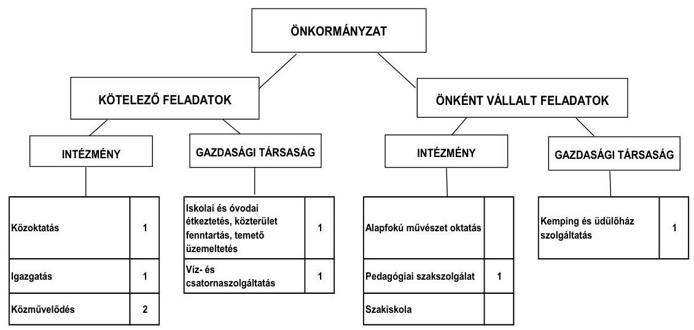

Az Önkormányzat kötelező és önként vállalt feladatait 2011. június 30-án a Polgármesteri hivatallal együtt öt költségvetési szervvel, három gazdasági társasággal, illetve egy, a 2007. szeptemberétől szociális feladatokat ellátó társulás útján végzi. Az alapfokú művészetoktatási önként vállalt feladatot a közoktatási intézmény látja el. Az intézményszervezeti átalakítások következtében a feladatellátás telephelyeinek száma 2007-2011. év I. félév között 11-ről nyolcra csökkent. Az Önkormányzat két gazdasági társaságban kizárólagos tulajdonnal és egy társaságban 50% alatti tulajdoni hányaddal rendelkezik. Az egyik 100%-os önkormányzati tulajdonban lévő közhasznú gazdasági társaság végzi az iskolai és óvodai étkeztetést, a közterület fenntartást, valamint a temető üzemeltetést, a másik 100%-os gazdasági társaság a kemping- és üdülőház szolgáltatást, az 50% alatti tulajdonban lévő gazdasági társaság pedig a víz- és csatornaszolgáltatást. A gazdasági társaságok a működésükhöz az ellenőrzött időszakban összesen 445,4 millió Ft rendszeres és eseti működési célú támogatásban részesültek.

---

A kötelező feladatok ellátását biztosító szervezeti keretekben, illetve a feladatellátás módjában bekövetkezett változások (intézmények megszüntetése, alapítása, telephelyek csökkentése, szociális feladatok társulásba adása) a 2007-2010. években összességében 201,8 millió Ft összegű megtakarítást eredményeztek, valamint 62,4 millió Ft-tal csökkentek az önként vállalt feladatokra teljesített működési kiadások. Mindezek javították az Önkormányzat pénzügyi egyensúlyi helyzetét, azonban nem teremtettek elegendő forrást és szükség van a pénzügyi egyensúly megteremtésére.

Az egyes közszolgáltatások feladatellátásában résztvevő költségvetési szervek működési kiadásainak finanszírozási összetételét a 2007. és 2010. években a következő ábra szemlélteti:
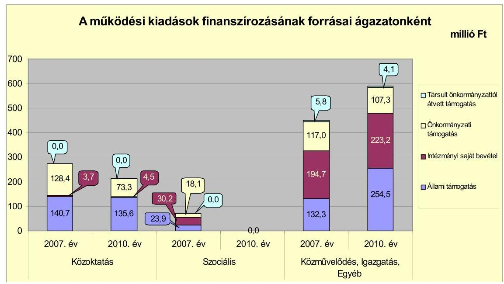

Az Önkormányzat működési kiadásaiból a 2007-2009. években átlagosan 251,9 millió Ft-ot, a 2010. évben 213,4 millió Ft-ot a közoktatási feladatok ellátására vettek igénybe. A közoktatási intézményeket érintően az állami támogatás a 2007-2009. években átlagosan 160,3 millió Ft volt, mely a 2010. évre 135,6 millió Ft-ra (15,4%-kal) csökkent. A szociális feladatokra fordított intézményi működési kiadás a 2007. évben 72,2 millió Ft - a működési kiadások 9,1%-a - volt. A szociális feladatokra fordított működési kiadásokat 33,1%-ban állami támogatás, 41,9%-ban intézményi saját bevétel, 25,0%-ban pedig önkormányzati támogatás finanszírozta. Az Önkormányzat szociális feladatokat ellátó intézményét 2007. szeptemberétől társulás fenntartásába adták. A 2007-2009. években átlagosan 25,3 millió Ft-ot, a 2010. évben 44,9 millió Ft-ot a közművelődési feladatok ellátására fordítottak.

Az egyéb feladatokra fordított 2010. évi működési kiadások 2,9%-kal (0,7 millió Ft-tal) voltak kevesebbek a 2007-2009 közötti átlagtól (24,5 millió Ft). A Polgármesteri hivatal költségvetésében kimutatott feladatok 2010. évi működési kiadása 13,0%-kal, 67,4 millió Ft-tal volt magasabb a 2007-2009. évi átlagos működési kiadásoktól (453,0 millió Ft). Az állami támogatás arányának növekedését többletfeladatra (közcélú foglalkoztatás) kapott támogatás összegének emelkedése okozta. A 2010. évi működési kiadás

---

47,2%-ára nyújtott fedezetet az állami támogatás, amely 7,9 százalékponttal volt magasabb a 2007-2009. évekre számított 39,3% átlagos részaránytól.

Az Önkormányzat folyó költségvetésének egyenlegét, működési jövedelmét, valamint tőketörlesztését és pénzügyi kapacitását az alábbi ábra mutatja:
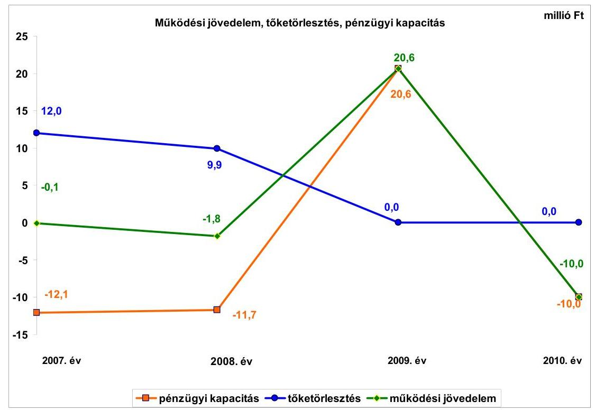

A 2009. év működési forrástöbbletét a megnövekedett közcélú foglalkoztatásra biztosított költségvetési támogatás és az egyéb saját bevételek (a pedagógiai szakszolgálat működési kiadásaira társulástól kapott bevételek emelkedése, valamint a városi művelődési központ működési kiadásaira pályázaton elnyert forrás) növekedése eredményezték. Az Önkormányzat a működtetés biztonsága érdekében az ÖNHIKI, valamint a működésképtelen helyi önkormányzatok egyéb támogatására nyújtott be pályázatot. ÖNHIKI támogatásból 2007-ben 22,0 millió Ft-ban, a 2011. év I-III. negyedévében 27,0 millió Ft-ban, a működésképtelen helyi önkormányzatok egyéb támogatásából 2008-ban 10,0 millió Ft-ban, 2010-ben 13,0 millió Ft-ban, mindösszesen 72,0 millió Ft-ban részesültek. A működési jövedelem, illetve pénzügyi kapacitás azonban ezekben az években a kapott támogatással együtt is negatív maradt.

A vizsgált időszakban az együttes működési jövedelem 8,7 millió Ft megtakarítást mutatott, mely azonban nem nyújtott elegendő forrást a felmerülő hiteltörlesztésekre (21,9 millió Ft). A 2009. évi pozitív működési jövedelem és a tőketörlesztés megszűnése eredményeként az adott évben a pénzügyi kapacitás növekedése látható. 2010-ben - a tőketörlesztési kötelezettség megszűnése ellenére a pénzügyi kapacitás ismét negatív a folyó kiadások 2007-2009. évek átlagához viszonyított 18,0 millió Ft-os emelkedése miatt.

Az Önkormányzat a 2007-2010. években közel azonos nagyságrendű folyó bevételt ért el, ezen belül a költségvetési támogatás és az átengedett szja

---

2007-2009 közötti éves átlagához (608,2 millió Ft) viszonyítva a 2010. évi együttes összeg 3,1%-kal (19,1 millió Ft-tal) csökkent. A helyi adók és pótlékok bevételei az Önkormányzat folyó bevételeiben nem töltöttek be meghatározó szerepet (a 2007-2010. évek átlagában a helyi adó átlagosan a források 7,9%-át tette ki), mely a település alacsony jövedelemteremtő képességét jelzi.

A folyó kiadások éves összege 2007-2009 között közel azonos (2007-ben 796,3 millió Ft, 2008-ban 787,5 millió Ft, 2009-ben 797,2 millió Ft) volt. A szociális ellátást biztosító Gondozási Központ társulási fenntartásba adásának folyó kiadásokra gyakorolt hatása ugyan a 2008. évtől kezdődően mutatkozik meg, azonban 2008-tól megemelkedett a közcélú foglalkoztatásra kifizetett személyi és dologi kiadások összege. A 2010. évben a folyó kiadások 2,2%-kal (18,0 millió Ft-tal) voltak magasabbak a 2007-2009 évek között teljesített éves átlagtól.

A felhalmozási költségvetés egyenlege a 2007-2009. években negatív, 2010-ben pozitív összegű volt, a felhalmozási forráshiányt a 2007-2009. években megvalósított jelentős mértékű fejlesztések okozták. A 2007-2010 között keletkezett összesen -192,9 millió Ft felhalmozási forráshiányt 171,3 millió Ft kötvényből, valamint 21,6 millió Ft szabad pénzmaradványból finanszírozták. Az Önkormányzat a 2008. évi kötvénykibocsátást nem a forgatási és befektetési célú értékpapírok, hanem a hitelfelvételek között szerepeltette beszámolójában, mellyel megsértette a Számv. tv.-ben előírtakat.

A felhalmozási bevételek összege 2007-ben 37,2 millió Ft, 2008-ban 29,9 millió Ft, 2009-ben 37,4 millió Ft és 2010-ben 210,5 millió Ft volt. A 2007-2009 közötti éves átlaghoz (34,8 millió Ft) viszonyítva a 2010. évi felhalmozási bevételek az átlag hatszorosára emelkedtek, melynek oka a fejlesztésekhez elnyert támogatások növekedése volt.

Az Önkormányzat felhalmozási célú kiadásokra 2007-ben költött a legkevesebbet és 2009-ben költött a legtöbbet, ami az összes kiadás 6,6%-ának (55,9 millió Ft), illetve 17,8%-ának (172,1 millió Ft) felelt meg.

A befejezett fejlesztések jelentős részét hazai támogatásból fedezték. A 2007-2010. évek időszakában a
 356,5 millió Ft értékű fejlesztés és felújítás forrása saját erő, kötvény, hazai és EU-s támogatás volt, a fejlesztésekhez pénzintézetektől hitelt nem vettek igénybe. A 2010. december 31-én folyamatban lévő fejlesztési feladatok végrehajtására 2007-2010. között 116,3 millió Ft kiadást teljesítettek, amelyre saját bevételből 35,2 millió Ft-ot, kötvényből 29,5 millió Ft-ot és EU-s forrásból 51,6 millió Ft-ot fordítottak.

Az Önkormányzat 2010. december 31-én folyamatban lévő fejlesztési feladatok 2010. évet követő kötelezettségvállalásainak összege 874,9 millió Ft volt, amelyet 22,9 millió Ft saját bevételből, 327,3 millió Ft hitelből, 19,0 millió Ft kötvényből, 468,9 millió Ft-ot EU-s és 36,8 millió Ft hazai támogatásból terveznek biztosítani.

Az Önkormányzat a rakamazi Nagy-Morotva vízi tanösvény kialakítása és térségének fejlesztése beruházásra 2009-ben benyújtott pályázatot elnyerte, a támogatási szerződés megkötésére 2010. májusában került sor. A fejlesztési fel-

---

adatra hitel igénybevételt nem terveztek. Az Idősek Otthonának építését hitelből és kötvényből tervezik megvalósítani, a helyszíni vizsgálat befejezésének időpontjáig azonban hitelszerződést még nem kötöttek.
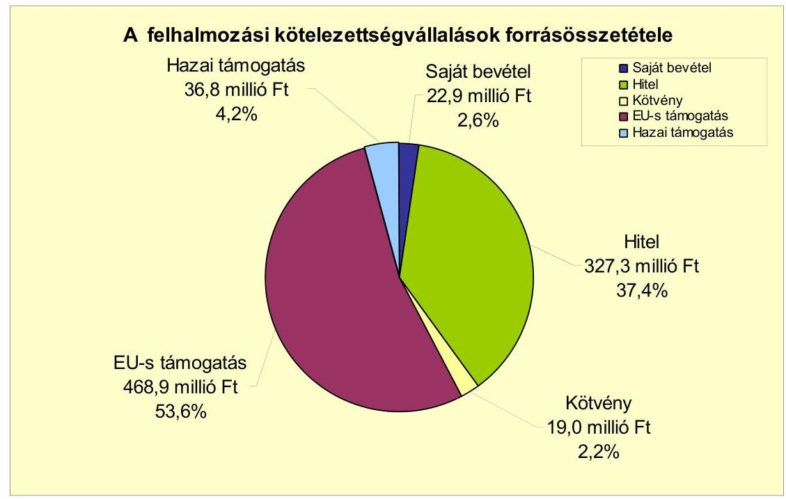

Az Önkormányzat a 100%-os tulajdonában lévő gazdasági társaságainak működési célra összesen 445,4 millió Ft-ot adott át a vizsgált időszakban az éves költségvetésekben jóváhagyottakra és a társaságokkal kötött szolgáltatási szerződésekre alapozottan.

Az Önkormányzatnak pénzintézetekkel szembeni kötelezettsége a 2007. évben nem volt, a 2008. évi 300,0 millió Ft (kötvénykibocsátás) összegű mérleg szerinti állomány a 2011. év I. félév végére 425,4 millió Ft-ra nőtt. Az állománynövekedés a 2008-2009. években nem tartalmazott árfolyamváltozás miatti különbözetet, mert a Számv. tv.-ben foglaltakat megsértve az Önkormányzat nem végezte el a devizában kibocsátott kötvényének év végi értékelését. Ezt a kötelezettségállományt a 2010. évben értékelte, számvitelében az árfolyamváltozást (114,4 millió Ft) rögzítette. A 2011. június 30-án fennálló pénzintézeti kötelezettségek kötvénykibocsátásból, valamint folyószámla- és munkabér-megelőlegezési hitel igénybevételéből keletkeztek.

Az Önkormányzat kötelezettségvállalásaira képviselő-testületi döntés alapján került sor, azonban a döntéseket megalapozó előterjesztésekben 2011. június 30-ig nem mutatták be az árfolyam-, illetve kamatkockázatokat. Erre vonatkozó előterjesztést 2011. augusztusában nyújtottak be a Képviselő-testületnek, melyet az határozattal elfogadott.

Az Önkormányzatnak a vizsgált időszak alatt hosszú lejáratú adósságot keletkeztető kötelezettségvállalása Ft-ban nem volt. Az Önkormányzat hosszú lejáratú pénzintézeti kötelezettségéből (CHF-alapú kötvény) 2011. év I. félévéig (2011. április 1-jei kezdő tőketörlesztési időpontban) 56,4 ezer CHF (11,8 millió Ft) összegű tőkét törlesztett, 155,8 ezer CHF (29,6 millió Ft) összegű kamatot,

---

4,5 millió Ft összegű jegyzési garanciavállalási díjat és 1,7 millió Ft készfizető kezességvállalási díjat fizetett meg. Az Önkormányzat 2011. június 30-ig a kötvény forrásából 284,1 millió Ft-ot felhalmozási feladatok finanszírozására használt fel, a fel nem használt 15,9 millió Ft-ról szabadon rendelkezhet. A vizsgált időszakban az átmenetileg szabad pénzeszközeiből (kötvényből származó bevétel) 22,8 millió Ft kamatbevételt realizált.

Az Önkormányzat működésének pénzügyi egyensúlyát a vizsgált időszakban folyószámla- és munkabér-megelőlegezési igénybevételével tudta biztosítani.

A folyószámla- és munkabér-megelőlegezési hitel igénybevétele a 2007-2011. év I. félév között az alábbiak szerint alakult:

| Megnevezés | 2007. év | 2008. év | 2009. év | 2010. év | 2011. év   I. félév |
| :--: | :--: | :--: | :--: | :--: | :--: |
| Folyószámlahitel |  |  |  |  |  |
| Keretösszeg január 1-ien (millió Ft-ban) | 0,0 | 10,0 | 10,0 | 10,0 | 10,0 |
| Állagos napi állomány (millió Ft-ban) | 0,0 | 1,3 | 2,9 | 5,6 | 4,6 |
| Folyószámlahitellel zárt napok száma (nap) | 0 | 127 | 169 | 286 | 88 |
| Egyenleg (állomány, millió Ft-ban) | 0,0 | 0,0 | 0,0 | 0,0 | 7,6 |
| Munkabér-megelőlegezési hitel |  |  |  |  |  |
| Keretösszeg január 1-ien (millió Ft-ban) | 0,0 | 0,0 | 16,0 | 16,0 | 16,0 |
| Állagos napi állomány (millió Ft-ban) | 0,0 | 10,1 | 15,7 | 16,0 | 16,0 |
| Munkabér-megelőlegezési hitellel zárt napok száma (nap) | 0 | 250 | 359 | 365 | 182 |
| Egyenleg (állomány, millió Ft-ban) | 0,0 | 0,0 | 0,0 | 16,0 | 16,0 |

Az Önkormányzatnak a 2007-2011. év I. félév között emelkedő intenzitással használta fel folyószámlahitel-keretét. Míg a 2007. évben nem volt hitellel zárt nap, addig 2010-ben e napok száma 286, a 2011. év I. félévben 88 nap volt. Az átlagos napi hitelállomány 2008. évi 1,3 millió Ft-ról a 2010. évi 5,6 millió Ft-ra emelkedett, a 2011. év I. félévében 4,6 millió Ft volt. A vizsgált időszakban a folyószámlahitelnek nem volt fordulónapi állománya, mivel a hitelszerződést határozatlan időtartamra kötötték. A hitelkeret összege 2007-2011. év I. félév között nem változott. A munkabér-megelőlegezési hitelkeretét az Önkormányzat szintén emelkedő intenzitással - a 2009. évtől gyakorlatilag a keret erejéig és folyamatosan - használta ki. A hitellel zárt napok száma 2008. évi 250 napról a 2010. évi 365 napra emelkedett, a 2011. év I. félévben 182 nap volt. Ezzel párhuzamosan az igénybe vett hitel átlagos napi állománya a 2008. évi 10,1 millió Ft-ról a 2010. évi 16,0 millió Ft-ra növekedett. A munkabér-megelőlegezési hitel 2010. évi záró és 2011. június 30-i állománya 16,0 millió Ft volt. A hitelkeret összege a vizsgált időszakban nem változott.

Az Önkormányzatnak a likviditás biztosítása a vizsgált időszakban összesen 6,7 millió Ft kamatkiadást eredményezett, egyéb költsége nem merült fel.

A 2011. év I. félév végi szállítói tartozás összege 89,2 millió Ft, melyből a lejárt állomány 73,1 millió Ft, ebből 90 napon túli 56,9 millió Ft volt. A 90 napon túli lejárt szállítóállomány fennállása miatt az Adósságrendezési tv.-ben foglaltak figyelembevételével a polgármester - képviselő-testületi döntés alapján nyolc napon belül köteles adósságrendezési eljárást kezdeményezni. A 90 napot meghaladó tartozásokról a Képviselő-testületet nem tájékoztatták, illetve adósságrendezési eljárás megindítását nem kezdeményezték.

---

Az egyéb kiadás elmaradásból származó kötelezettség 2011. június 30-i összege 5,3 millió Ft, a lízingszerződésből származó kötelezettség 2011. év I. félév végén 0,6 millió Ft volt. Az Önkormányzat egy 100%-os tulajdonában lévő gazdasági társasága folyószámla- és rövid lejáratú hiteleihez készfizető kezességet vállalt, melynek 2011. június 30-i állománya 28,3 millió Ft volt. Az Önkormányzatnak gazdasági társaságok számára nyújtott tagi kölcsönökből származó állománya a 2011. év I. félév végén nem volt.

Az Önkormányzat kötelezettségeinek 2010. december 31-i, valamint 2011. év I. félév végi állományát és várható alakulását a kötelezettségek lejáratáig a következő táblázat szemlélteti:

| Megnevezés | Állomány 2010. december 31-án |  | Állomány 2011. június 30-án |  | Várható kötelezettség 2011-2013. években |  | Várható kötelezettség 2014. évtől |  |
| :--: | :--: | :--: | :--: | :--: | :--: | :--: | :--: | :--: |
|  | HUF-ban   (millió Ftban) | Devizában (összege, ezer CHFban) | HUF-ban   (millió Ftban) | Devizában (összege, ezer CHFben) | HUF-ban   (millió Ftban) | Devizában (összege, ezer CHFben) | HUF-ban   (millió Ftban) | Devizában (összege, ezer CHFben) |
| Pénzintézeti kötelezettségek |  |  |  |  |  |  |  |  |
| Folyószámlahitel |  |  | 7,6 |  | 7,6 |  |  |  |
| Munkabér megelőlegezési hitel | 16,0 |  | 16,0 |  | 16,0 |  |  |  |
| "Rakamaz 2028" kötvény |  | 1973,7 |  | 1917,3 | 3,8 | 434,1 | 21,6 | 1856,3 |
| Pénzintézeti kötelezettségek összesen HUF-ban: | 16,0 |  | 23,6 |  | 27,4 |  | 21,6 |  |
| Pénzintézeti kötelezettségek összesen CHF-ben: |  | 1973,7 |  | 1917,3 |  | 434,1 |  | 1856,3 |
| Biztosítékok |  |  |  |  |  |  |  |  |
| Kezesség |  |  | 28,3 |  | 28,3 |  |  |  |
| Biztosítékok összesen: |  |  | 28,3 |  | 28,3 |  |  |  |
| Lízing kötelezettségek | 1,3 |  | 0,6 |  | 1,3 |  |  |  |
| Szállítói tartozás | 95,4 |  | 89,2 |  | 89,2 |  |  |  |
| Tőkepótlási kötelezettség |  |  |  |  | 13,4 |  |  |  |
| Egyéb kiadás elmaradás | 2,2 |  | 5,3 |  | 5,3 |  |  |  |
| Kötelezettségek összesen HUF-ban: | 114,9 |  | 147,0 |  | 164,9 |  | 21,6 |  |
| Kötelezettségek összesen CHF-ben: |  | 1973,7 |  | 1917,3 |  | 434,1 |  | 1856,3 |

Az Önkormányzatnak pénzintézetekkel szemben fennálló kötelezettsége a 2011. év I. félév végén 1917,3 ezer CHF és 23,6 millió Ft volt. A 2011-2013. években várható kötelezettségek (tőke, kamat és egyéb költség) a legutóbbi kamat- és díjfizetési feltételek alapján 434,1 ezer CHF és 27,4 millió Ft. A 2011-2013. évek között Ft-ban teljesítendő, várható kötelezettségek összegéből (164,9 millió Ft) a biztosíték nyújtásából, lízing kötelezettségből, szállítói tartozásokból, tőkepótlási kötelezettségből és egyéb kiadás elmaradásból eredő kötelezettségek összege 137,5 millió Ft. Az Önkormányzatnál a 2011-2013. évek kötelezettségeinek teljesítésére figyelembe vehető a 2010. évi 146,9 millió Ft pénzmaradványból 7,7 millió Ft szabad pénzmaradvány, valamint a 28,2 millió Ft összegű, mérlegben kimutatott követelésállomány. A 2014. évtől várható pénzintézeti kötelezettségek fedezetét nem látjuk biztosítottnak az Önkormányzat adatszolgáltatása szerint.

Az Önkormányzat kizárólagos tulajdonát képező egyik gazdasági társaság mérleg szerinti eredménye a vizsgált évek összességében negatív volt, a felhalmozott veszteség nagysága meghaladta a jegyzett tőke összegét. A gazdasági társaság 2010. évi saját tőkéje a jegyzett tőkéje alá csökkent. A társaságnak az Önkormányzat költségvetési egyensúlyára gyakorolt hatása számottevő a gazdasági társaság kizárólagos befolyásával összefüggő korlátlan felelőssége miatt. A 2011-2013. években (várhatóan a 2012. év II. félévében) az Önkormányzatnak, mint kizárólagos tulajdonosnak gondoskodnia kell a gazdasági társasága tőkepótlásáról, jelen ismeretek szerint 13,4 millió Ft összegben. Amennyiben az Önkormányzat nem gondoskodik a szükséges saját tőke biztosításáról, a gazdasági társaság köteles elhatározni más formátumban működő gazdasági társasággá való átalakulását, illetve jogutód nélküli megszűnését. Ha a gazdasági társaság e törvényi előírásnak nem tesz eleget, a cégbíróság a cégnyilvánosságról, a bírósági cégeljárásról és a végelszámolásról szóló 2006. évi V. törvény 72-84. §-ai alapján
 - törvényességi felügyeleti jogkörében eljárva - ezt kikényszerítheti, illetve a gazdasági társaságot megszűntnek nyilváníthatja. Az Önkormányzat Képviselő-testülete nem rendelkezett megfelelő információval a gazdasági társaságai pénzügyi egyensúlyi helyzetéről, azok önkormányzati pénzügyi egyensúlyi helyzetre gyakorolt hatásairól.

Az önkormányzati kötelezettségek növekedése mellett az Önkormányzat minősített többségi befolyásával rendelkező gazdasági társaságának kötelezettségei is befolyásolhatják az Önkormányzat pénzügyi egyensúlyát.

Az Önkormányzat minősített többségi tulajdonú gazdasági társaságai kötelezettségeinek állományát 2010. december 31-én és 2011. június 30-án, valamint a kötelezettségek lejáratáig várható alakulását az alábbi táblázat mutatja be:

| Megnevezés | Állomány 2010.   december 31-én | Állomány 2011.   június 30-án | Várható kötelezettség   2011-2013. években | Várható   kötelezettség   2014. évtől |
| :-- | :--: | :--: | :--: | :--: |
|  | HUF-ban   (millió Ft-ban) | HUF-ban   (millió Ft-ban) | HUF-ban   (millió Ft-ban) | HUF-ban   (millió Ft-ban) |
| Folyószámlahitel | 9,8 | 10,0 | 10,0 |  |
| Rövid lejáratú hitel | 18,3 | 18,3 | 18,3 |  |
| Pénzintézeti kötelezettségek összesen | 28,1 | 28,3 | 28,3 |  |
| Lízing kötelezettségek | 7,5 | 6,6 | 7,5 |  |
| Szállítói tartozás | 89,0 | 142,8 | 142,8 |  |
| Kötelezettségek összesen HUF-ban: | 124,6 | 177,7 | 178,6 |  |

A társaságoknak a 2011-2013. évek között várhatóan 10,0 millió Ft pénzintézeti kötelezettséget (folyószámlahitel), 18,3 millió Ft rövid lejáratú hitelt, 7,5 millió Ft összegű lízingkötelezettséget és 142,8 millió Ft szállítói tartozást kell rendezniük. Esetleges csőd- vagy felszámolási eljárás esetén a bíróság korlátlan és teljes felelősséget állapíthat meg az Önkormányzat terhére.

Az eszközállomány állapota és az eszközök pótlása is hatással lehet az Önkormányzat pénzügyi egyensúlyi helyzetére. Az eszközállomány bruttó értéke 2007-2010 között 10,4%-kal (278,9 millió Ft-tal) 2964,4 millió Ft-ra nőtt, ugyanakkor nettó értéke 3,6%-kal (82,9 millió Ft-tal) 2211,7 millió Ft-ra csökkent. Az Önkormányzat teljes eszközállományának használhatósági foka 2007-ről 2010-re 85,4%-ról 74,6%-ra csökkent, azaz az eszközök avultsági foka 10,8 százalékponttal növekedett. Az Önkormányzat az elhasználódott eszközök pótlására - adatszolgáltatása alapján - az elszámolt értékcsökkenés (275,4 millió Ft) kevesebb, mint felét, bruttó 130,6 millió Ft-ot fordított. A Képviselőtestületnek előterjesztett éves zárszámadási rendeleteikben nem mutatták be az Önkormányzat eszközei után tárgyévben elszámolt értékcsökkenés összegét, az eszközpótlásra fordított tényleges kiadásokat, az eszközök elhasználódási fokának alakulását.

---

Az Önkormányzat - kimutatása szerint - az ellenőrzött időszakban kiadási megtakarítást eredményező és bevételt növelő intézkedéseket tett. A 2007-2011. év I. féléve között tett intézkedések hatására 214,5 millió Ft összegű kiadási megtakarítást és 9,7 millió Ft bevételi többletet mutattak ki. A megtakarítások zömét (54,8%) a szociális ellátásokkal kapcsolatos, társulásnak történt feladatátadás miatti, valamint a feladatmegszüntetéssel, átszervezéssel járó létszámcsökkentésből eredő kiadáscsökkenés (117,5 millió Ft) eredményezte. Az álláshelycsökkentő intézkedések 2007-2010 között önkormányzati szinten összesen 67 álláshely (ebből üres álláshely nem volt) megszüntetését jelentették. A bevételnövelő intézkedések új helyi adónem bevezetéséhez, valamint adómérték növeléséhez kapcsolódtak.

Az utóellenőrzés a pénzügyi egyensúly javítására tett két szabályszerűségi és egy célszerűségi javaslat hasznosítására terjedt ki. A célszerűségi javaslatot az Önkormányzat teljesítette, a szabályszerűségi javaslatok megvalósításának határidejét 2012. február 15-én határozták meg.

Az Önkormányzat pénzügyi egyensúlyi helyzetét összegezve a következők emelhetők ki:

# Az Önkormányzat pénzügyi egyensúlya rövid távon veszélyeztetett. 

A folyó bevételek - a 2009. év kivételével - nem biztosították a folyó kiadások és az adósságszolgálat finanszírozását, a likviditás biztosítása kötvény kibocsátásával, folyószámla- és munkabér-megelőlegezési hitel igénybevételével történt. Az ellenőrzött időszakban a folyószámlahitel tartóssá vált, növekedett a lejárt szállítói állomány.

Az Önkormányzat felhalmozási költségvetésének egyenlege a 2007-2009. években pénzügyi hiányt, a 2010. évben pénzügyi többletet mutatott. A felhalmozási hiány forrása kötvénykibocsátással és szabad pénzmaradvány felhasználásával biztosított volt. A fejlesztési célú kötelezettségvállalások jövőbeni teljesítése a folyamatban lévő fejlesztések jelentős összegű hitellel tervezett finanszírozása miatt középtávon nem látszik biztosítottnak.

A pénzintézeti és egyéb kötelezettségek teljesítése a 2011-2013. években a finanszírozásba bevonható eszközök ismeretében részben biztosított. A további évekre szóló jelenleg ismert pénzintézeti kötelezettségek visszafizetésének forrásai az Önkormányzat adatszolgáltatása alapján nem biztosítottak.

A kizárólagos tulajdonú gazdasági társaság veszteséges gazdálkodása az Önkormányzat korlátlan és teljes felelőssége miatt az Önkormányzat számára helytállási kötelezettséget jelenthet.

Az Állami Számvevőszékről szóló 2011. évi LXVI. törvény 33. § (1) bekezdésében foglaltak értelmében a jelentésben szereplő megállapításokhoz kapcsolódó intézkedési tervet köteles az ellenőrzött szervezet vezetője összeállítani és azt a jelentés kézhezvételétől számított 30 napon belül az ÁSZ részére megküldeni. Amennyiben intézkedési tervet határidőben nem küldi meg a szervezet, vagy az továbbra sem elfogadható, az ÁSZ elnöke a hivatkozott törvény 33. § (3) bekezdés a)-b) pontjaiban foglaltakat érvényesítheti.

---

# A 2011. június 30-i pénzügyi egyensúlyi helyzet alapján az ellenőrzés intézkedést igénylő megállapításai és javaslatai a következők: 

## a Polgármesternek

1. Az Önkormányzat nettó működési jövedelme a 2007-2008., illetve a 2010. években negatív volt. Az Önkormányzat által vállalt jövőbeni fejlesztési kötelezettségek fedezete középtávon nem biztosított. Az Önkormányzat finanszírozása a vizsgált időszakban folyószámla- és munkabér-megelőlegezési hitel igénybevételével volt biztosítható, amely 2009-től állandósult. Az Önkormányzat működési célra kötvényből származó bevételt vett igénybe. Az Önkormányzat szállítói kötelezettségeinek állománya, ezen belül a lejárt szállítói tartozások összege jelentősen emelkedett. Az Önkormányzat által tett intézmény szervezeti átalakítások, kiadáscsökkentő és bevételnövelő intézkedések nem biztosítanak elegendő forrást a pénzügyi egyensúly helyreállításához. A vállalt pénzintézeti és egyéb kötelezettségek fedezete középtávon (2013. év után) nem biztosított. Az Önkormányzat pénzügyi egyensúlya rövid távon veszélyeztetett.

Javaslat:
Az Önkormányzat pénzügyi egyensúlyának gyors helyreállítása és hosszú távú fenntarthatósága érdekében kezdeményezze - felelősök és határidők megjelölésével - az alábbi intézkedések megtételét:
a) Tárja fel a bevételszerző és kiadáscsökkentő lehetőségeket. Intézkedjen a bevételek növelésére, a kintlévőségek behajtására, a kiadások csökkentésére;
b) Terjesszen a Képviselő-testület elé reorganizációs programot a kedvezőtlen pénzügyi folyamatok megállítására, a pénzügyi egyensúlyi helyzet gyors stabilizálására;
c) Képezzen egyensúlyi (elkülönített) tartalékot az adósságszolgálat teljesítése érdekében;
d) Vizsgálja meg a folyamatban lévő beruházásokkal kapcsolatos kötelezettségek átütemezésének pénzügyi és jogi lehetőségeit, illetve hatásait. Szükség esetén kezdeményezze a hitelt folyósító pénzintézetnél annak átütemezését;
e) Vizsgálja felül teljes körűen a tervezett beruházásokat és azok fenntartásának jövőbeni pénzügyi kihatásait. Az Önkormányzat pénzügyi egyensúlyi helyzete szempontjából kedvező támogatás finanszírozási lehetőségeket továbbra is vegye igénybe. Szükség esetén tegyen javaslatot a Képviselő-testületnek a tervezett beruházásokkal kapcsolatos döntések módosítására, amelyben figyelembe veszik az Önkormányzat pénzügyi lehetőségeit és a kötelező feladatellátás elsődlegességét;
f) Vizsgálja meg az állandósult folyószámla- és likvidhitel hosszú távú kötelezettséggé történő alakításának jogi lehetőségét, és a Stabilitási törvény 10. §-ában előírt jogszabályi feltételek fennállása esetén kezdeményezze a Kormánynál ennek engedélyezését;

---

g) Kezdeményezze az intézmények finanszírozásának napi kontrollját. Szűkítse a jóváhagyott előirányzatok felhasználásának lehetőségeit;
h) Vizsgálja felül az önként vállalt feladatok finanszírozhatóságát, s hozzon intézkedéseket a kötelező feladatok ellátásának biztosítása érdekében;
i) Mutassa be a Képviselő-testületnek havonta a fél éven belül esedékes kötelezettségeinek finanszírozási forrásait.
2. Az Önkormányzat adósságot keletkeztető kötelezettségvállalásaira vonatkozó képviselő-testületi előterjesztések nem tartalmazták a visszafizetés forrásait, valamint a teljes futamidőre vonatkozó kamat- és árfolyamkockázat várható kihatásait.

Javaslat:
a) Gondoskodjon, hogy a jövőben az adósságot keletkeztető kötelezettségvállalásokról szóló képviselő-testületi előterjesztések tételesen tartalmazzák a visszafizetés forrásait;
b) Az adósságot keletkeztető kötelezettségvállalásokról szóló döntéskor mutassa be a Képviselő-testületnek a jövőben várható - árfolyam-, kamat- és törlesztési kockázatot. Kezességvállalás, garancia és helytállási kötelezettségvállalásról szóló döntésnél mutassa be a Képviselő-testületnek azok pénzügyi kockázatait.
3. Az Önkormányzat kizárólagos tulajdonát képező egyik gazdasági társaság mérleg szerinti eredménye a vizsgált évek összességében negatív volt, a felhalmozott veszteség nagysága meghaladta a jegyzett tőke összegét. A gazdasági társaság 2010. évi saját tőkéje a jegyzett tőkéje alá csökkent.

Javaslat:
Terjesszen intézkedési tervet a Képviselő-testület elé a kizárólagos tulajdont képező gazdasági társaság pénzügyi egyensúlyi helyzetének stabilizálása érdekében.
4. Az Önkormányzat Képviselő-testülete nem rendelkezett megfelelő információval a gazdasági társaságainak pénzügyi egyensúlyi helyzetéről, azok önkormányzati pénzügyi egyensúlyi helyzetre gyakorolt hatásairól.

Javaslat:
Mutassa be félévente a Képviselő-testületnek a minősített többségi tulajdonú gazdasági társaságai aktuális pénzügyi egyensúlyi helyzetét. Tegye meg a szükséges és lehetséges intézkedéseket a tulajdonosi érdekek védelme érdekében.
5. A 2007-2010. évek között az Önkormányzat az elhasználódott eszközök pótlására az elszámolt értékcsökkenés kevesebb, mint felét, 130,6 millió Ft-ot fordított. Az eszközök használhatósági foka önkormányzati szinten a 2007. évi 85,4%-ról 2010-re 74,6%-ra csökkent, amely az Önkormányzat kezelésében lévő eszközök használhatóságának romlását jelezte.

---

Javaslat:
Mutassa be a Képviselő-testületnek évente a zárszámadási rendelet előterjesztésében az értékcsökkenés összegét és ezzel összevetve az elhasználódott eszközök pótlására fordított tényleges kiadásokat, az eszközök elhasználódási fokának alakulását!
6. Az Önkormányzat lejárt szállítói állománya 2011. június 30-án 73,1 millió Ft volt, melyből a 90 napot meghaladó 56,9 millió Ft.

Javaslat:
Kezelje az Önkormányzat lejárt szállítói állományát, a szállítói kitettség és a jogszabályi következmények elkerülése érdekében.
7. A Polgármesteri hivatal 2011. június 30-án egyéb kiadáselmaradásból fennálló kötelezettsége 5,3 millió Ft volt.

Javaslat:
Intézkedjen az egyéb kiadás elmaradásból adódó kötelezettségek teljesítése érdekében a szükséges fedezet elkülönítéséről.
8. Az utóellenőrzés a pénzügyi egyensúly javítására tett két szabályszerűségi javaslat hasznosítására terjedt ki, amelyek a finanszírozási célú pénzügyi műveletek költségvetési bevételként, illetve kiadásként költségvetési rendelettervezetben történő bemutatásának tiltására, valamint az előző évi pénzmaradvány igénybevételének megalapozott tervezésére vonatkoztak. A Képviselő-testület által elfogadott intézkedési tervben a javaslat végrehajtásának határideje 2012. február 15.

Javaslat:
Gondoskodjon az intézkedési tervben foglalt határidőig az Önkormányzat gazdálkodási rendszerét érintő előző ellenőrzés javaslatainak végrehajtásáról.

# a jegyzőnek 

1. Az Önkormányzat a 2008. évi kötvényt nem a forgatási és befektetési célú értékpapírok, hanem a hitelfelvételek között szerepeltette beszámolójában, mellyel megsértette a Számv. tv. 16. § (3) bekezdésében előírtakat.

Javaslat:
Gondoskodjon arról, hogy a kötvényt a Számv. tv. 16. § (3) bekezdése alapján a beszámolóban a tényleges gazdasági tartalmának megfelelően mutassák be.

---

# II. RÉSZLETES MEGÁLLAPÍTÁSOK 

## 1. Az ÖNKORMÁNYZAT KÖTELEZŐ ÉS ÖNKÉNT VÁLLALT FELADATAI, A FELADATELLÁTÁS SZERVEZETI KERETEI ÉS ANNAK VÁLTOZÁSAI

Az Önkormányzat a kötelezően ellátandó feladatait az Ötv. és az ágazati törvények által tekintette meghatározottnak. Az önként vállalt feladatok köréről az SzMSz-ben ${ }^{6}$ rendelkezett, azok terjedelmét az éves költségvetési rendeletekben az adott évi költségvetés forrásainak ismeretében határozta meg. Az önként vállalt feladatai közé sorolta a pedagógiai szakszolgálat és a szakiskola fenntartását, az alapfokú művészet- és német nemzetiségi oktatást, a városüzemeltetési feladatokat, a helyi újság kiadását, a városi televízió és rádió működtetését, a település infrastrukturális ellátásához szükséges beruházások, felújítások elvégzését, a sportfeladatokat valamint a mezei őrszolgálat működtetését. Az önként vállalt feladatok besorolását az Önkormányzat maga végezte el.

Az Önkormányzat - az adatszolgáltatása ${ }^{7}$ alapján - a 2007. évi teljesített működési kiadásain (794,8 millió Ft) belül 657,8 millió Ft-ot (82,8%) fordított kötelező feladatainak ellátására,
 az önként vállalt feladatokra teljesített működési kiadások összege 137,0 millió Ft (17,2\%) volt. A 2008-2010 közötti időszakban - az előző évhez képest - folyamatosan csökkent az önként vállalt feladatokra fordított működési kiadások aránya, az évek sorrendjében 10,3\% (80,5 millió Ft), 9,9\% (75,3 millió Ft), illetve 9,3\% (74,6 millió Ft) volt. A 2010. évben a kötelező feladatok működési költségvetési kiadásokból (802,5 millió Ft) való részesedése 90,7\% (727,9 millió Ft) volt, melynek feladatonkénti megoszlását és finanszírozását a következő táblázat szemlélteti:

[^0]
[^0]:    ${ }^{6}$ Az Önkormányzat SzMSz-e 3. §-ának (1) bekezdésében tételesen rögzítette az önként vállalt feladatait.
    ${ }^{7}$ A táblázat nem tartalmazza a német, a ruszin, illetve a cigány kisebbségi önkormányzatok adatait.

---

| Ellátott feladat | Működési   kiadás   összesen   (millió Ft) | Kötelező   feladatok   kiadásainak   részaránya   \% | Működési   bevétel   összesen   (millió Ft) | Állami   támogatás   (részarány   \% | Intézményi   saját bevétel   részaránya   \% | Önkormányzati   támogatás   részaránya   \% | Társult   önkormányzat-   tól átvett   támogatás   részaránya   \% |
| :-- | :--: | :--: | :--: | :--: | :--: | :--: | :--: |
| Óvodák | 56,6 | 85,0 | 56,6 | 60,7 | 0,0 | 39,3 | 0,0 |
| Általános iskolák | 147,3 | 85,0 | 147,3 | 62,6 | 3,1 | 34,3 | 0,0 |
| Szakközépiskolák,   szakképző intéz-   mények | 9,5 | 100,0 | 9,5 | 95,1 | 0,0 | 4,9 | 0,0 |
| Közművelődési   intézmények | 44,9 | 100,0 | 44,9 | 1,4 | 54,4 | 44,2 | 0,0 |
| Egyéb intézmények | 23,8 | 0,0 | 23,8 | 34,2 | 56,9 | 0,0 | 8,9 |
| Polgármesteri hivatal   igazgatási kiadásai | 116,2 | 100,0 | 116,2 | 18,4 | 6,3 | 75,3 | 0,0 |
| Polgármesteri   hivatalban ellátott   feladatok működési   kiadásai | 404,2 | 95,0 | 404,2 | 55,5 | 44,0 | 0,0 | 0,5 |
| Működési kiadá-   sok összesen | 802,5 | 90,7 | 802,5 | 48,6 | 28,4 | 22,5 | 0,5 |

Az Önkormányzat 2007-2009. évek közötti átlagos működési kiadását (778,8 millió Ft) a 2010. évi összes működési kiadás 3,0\%-kal (23,7 millió Ft-tal) haladta meg. A 2007-2009. évek között teljesített működési kiadásokat átlagosan 46,3\%-ban állami támogatás, 26,5\%-ban intézményi saját bevétel, 26,5\%-ban önkormányzati támogatás és 0,7\%-ban társult önkormányzattól átvett támogatás finanszírozta. 2010-ben a 2007-2009. évek átlagához viszonyítva 2,3, illetve 1,9 százalékponttal javult a működési kiadások állami támogatással és saját bevétellel történő finanszírozásának aránya. Az önkormányzati támogatás arányának 4,0 százalékponttal való csökkenése javította az Önkormányzat pénzügyi helyzetét.

Az Önkormányzat működési kiadásaiból a 2007-2009. években átlagosan 251,9 millió Ft-ot - az összes átlagos működési kiadás 32,3\%-át -, a 2010. évben 213,4 millió Ft-ot (26,6\%-ot) a közoktatási feladatok ellátására vették igénybe. A közoktatási intézményeket érintően az állami támogatás a 2007-2009. években átlagosan 160,3 millió Ft volt, mely a 2010. évre 135,6 millió Ft-ra csökkent. Ennek oka egyrészt, hogy az ellátottak száma a 2007-2009. évi átlagos 599 főről a 2010. évre 77 fővel (12,9\%-kal) csökkent, másrészt a finanszírozás alapja 2007. szeptember 1-jétől az ellátotti létszám helyett a teljesítménymutató lett. A szociális feladatokra fordított intézményi működési kiadás a 2007. évben 72,2 millió Ft - a működési kiadások 9,1\%-a - volt. A kiadásokat 33,1\%-ban állami támogatás, 41,9\%-ban intézményi saját bevétel, 25,0\%-ban pedig önkormányzati támogatás finanszírozta. Az Önkormányzat szociális feladatokat ellátó intézményét 2007 szeptemberétől társulás fenntartásába adták. A 2007-2009. években átlagosan 25,3 millió Ft-ot (3,2\%-ot), a 2010. évben 44,9 millió Ft-ot (5,6\%-ot) a közművelődési feladatok ellátására fordítottak. Az egyéb feladatokra (pedagógiai szakszolgálat) fordított 2010. évi működési kiadások 2,9\%-kal (0,7 millió Ft-tal) voltak kevesebbek a 2007-2009. közötti átlagtól (24,5 millió Ft). A Polgármesteri hivatal költségvetésében kimutatott feladatok (igazgatási kiadások és egyéb ellátott feladatok) 2010. évi működési kiadása 13,0\%-kal, 67,4 millió Ft-tal volt magasabb a 2007-2009. évi átlagos működési kiadásoktól (453,0 millió Ft). A 2010. évi működési kiadás

---

47,2\%-ára nyújtott fedezetet az állami támogatás, amely 7,9 százalékponttal volt magasabb a 2007-2009. évekre számított 39,3\% átlagos részaránytól. Az állami támogatás arányának növekedésére a többletfeladatra (közcélú foglalkoztatás) kapott támogatás összegének emelkedése volt hatással.

Az Önkormányzat kötelező és önként vállalt feladatait ellátó költségvetési szerveinek száma 2007. január 1-jéről 2010-re ötre csökkent két intézmény megszüntetése, egy új alapítása és egy intézmény társulás fenntartásába adása következtében. A feladatellátás telephelyeinek száma 11-ről nyolcra mérséklődött. A feladatellátás átszervezésére tett intézkedések következményeként 2010. december 31-én az Önkormányzat feladatait a Polgármesteri hivatal mellett négy önállóan működő költségvetési intézménye, két kizárólagos tulajdonú és egy kisebbségi befolyással rendelkező gazdasági társasága, valamint egy társulás útján látta el ${ }^{8}$.

Az Önkormányzat az általa fenntartott intézményeken keresztül óvodai nevelési, általános iskolai oktatási, alapfokú művészetoktatási, szakiskolai, kulturális és közművelődési feladatokat látott el. A Polgármesteri hivatalban kimutatott feladatok a következők voltak: igazgatási, közvilágítási, lakó- és nem lakóingatlan bérbeadási, város-és községgazdálkodási, közcélú foglalkoztatási, önkormányzati jogalkotási feladatok, valamint segélyek folyósítása, választások lebonyolítása, gyógyító- és megelőző ellátások finanszírozása. A gazdasági társaságok a víz-és csatornaszolgáltatásban, az iskolai és óvodai étkeztetésben, a közterület fenntartásban, a temető üzemeltetésben, valamint kemping, üdülőház szolgáltatás nyújtásában vettek részt.

Az Önkormányzat 2007-ben társulás részére adott át intézményt, illetve feladatot, valamint két intézményt megszüntetett és egyet alapított.

A Gondozási Központ 2007. szeptember 1-jétől a Tiszavasvári Többcélú Kistérségi Társulás fenntartásába került, ettől az időponttól a társulás útján biztosítják a szakosított szociális ellátásokat. A Mesevár Óvodát, valamint az Erzsébet Királyné Általános Iskola, Alapfokú Művészetoktatási Intézmény és Szakiskolát 2007. augusztus 14-én megszüntették és augusztus 15-étől létrehozták az Erzsébet Királyné Általános Iskola, Óvoda, Alapfokú Művészetoktatási Intézmény és Szakiskolát.

A 2007-2010. években az önkormányzati feladatellátás körében végrehajtott szervezeti változások összességében a kiadásokat 572,9 millió Ft-tal, a bevételeket 371,1 millió Ft-tal csökkentették, 201,8 millió Ft összegű megtakarítást eredményezve.

A kötelező feladatok ellátását biztosító szervezeti keretekben, illetve a feladatellátás módjában bekövetkezett változások (intézmények megszüntetése, alapítása, telephelyek csökkentése, szociális feladatok társulásba adása), valamint az önként vállalt feladatokra teljesített működési kiadások arányának 2007-2010. évek közötti 7,9 százalékpontos (62,4 millió Ft-os) csökkenése a vizsgált időszakban az Önkormányzat pénzügyi helyzetét javította, azonban nem teremtett elegendő forrást és szükség van a pénzügyi egyensúly megteremtésére.

[^0]
[^0]:    ${ }^{8}$ 2011. június 30-án a szervezeti struktúra megegyezett a 2010. december 31-én fennállóval.

---

# 2. Az önkormányzat pénzügyi egyensúlyi helyzetét befolyásoló tényezők 

A hagyományos költségvetési szerkezet helyett az önkormányzat pénzügyi helyzetét a CLF módszerrel mutatjuk be, amelyben jobban elkülönülnek a vagyonnal kapcsolatos bevételek és kiadások az önkormányzati feladatokkal kapcsolatos közvetlen működtetési bevételektől és kiadásoktól. A módszer következetesen elkülöníti a folyó és a felhalmozási költségvetés bevételeit és kiadásait, azok költségvetési egyenlegeit. A saját folyó bevételek, valamint a saját felhalmozási bevételek nem tartalmazzák az előző évi pénzmaradványok felhasználásából származó pénzforgalom nélküli bevételeket ${ }^{9}$.

A folyó költségvetés egyenlege, a működési jövedelem megmutatja, hogy az önkormányzat éves folyó bevétele fedezetet biztosít-e a kötelező és önként vállalt feladatellátáshoz kapcsolódó éves folyó kiadására. A működési jövedelem negatív értéke pénzügyileg fenntarthatatlan helyzetet jelez. A mutató pozitív értéke megtakarítást mutat, amely forrásul szolgálhat az önkormányzat fennálló kötelezettségei megfizetéséhez, valamint fejlesztéseihez.

A felhalmozási költségvetés pozitív értéke felhalmozási többletet mutat, amely a jövőbeni fejlesztések forrását biztosíthatja. Amennyiben a folyó költségvetési hiány finanszírozása a felhalmozási többletből történik, ez szűkebb értelemben vagyonfelélésnek tekinthető. Amennyiben a felhalmozási költségvetés megtakarítása fejlesztési célú hitelek, kötvények adósságszolgálatát finanszírozza, az változatlan vagyontömeg mellett, a korábban megelőlegezett tőkebevételek valós realizációjának tekinthető. A felhalmozási deficit által generált finanszírozási igény önmagában nem jár pénzügyi kockázattal, a pénzügyileg fenntartható beruházásokhoz kapcsolódó kötelezettségvállalás (adósságszolgálat) átlátható és szabályozott költségvetési gazdálkodással teljesíthető.

A módszer a pénzügyi kapacitás fogalmát helyezi a középpontba. Az adós hitelfelvételi képessége, hosszú távú fizetőképessége vagy bonitása a pénzügyi kapacitással, ezen belül is a nettó működési jövedelemmel jellemezhető. A nettó működési jövedelem negatív értéke az egyes költségvetési években jelentkező adósságszolgálat túlzott mértékére utal. ${ }^{10}$ A nettó működési jövedelem negatív értékének felhalmozási többletből, vagy további hitelből történő finanszírozása pénzügyileg nem fenntartható gazdálkodást vetít előre. A pozitív értéket mutató nettó működési jövedelem fejlesztési kiadások fedezetét biztosíthatja, illetve a folyamatosan, évenként képződő pozitív nettó működési jövedelemből meghatározható a jövőben vállalható, teljesíthető éves adósságszolgálat, ily módon az a hitelösszeg, amely - a többi tényezőt, feltételt adottnak tekintve - visszafizetési kockázat nélkül felvehető.

A CLF módszer alapján a pénzügyi kapacitás mértéke az Önkormányzat összevont, nettósított, a központi információs rendszerbe a Magyar Államkincstáron

[^0]
[^0]:    ${ }^{9}$ A költségvetési években kialakuló hiány finanszírozása az előző évi pénzmaradvány és a korábbi években képzett tartalékok felhasználásával is történhet.
    ${ }^{10}$ kivéve, ha annak finanszírozására a korábbi években képzett tartalékok fedezetet nyújtanak.

---

keresztül leadott éves költségvetési beszámolójának 80-as űrlapjában szerepeltetett adatok alapján került meghatározásra.

A számítási leírás némileg eltér az ÁSZ módszertanában korábban alkalmazott gyakorlattól. A jelen besorolás általános közgazdasági meggondolásokon alapul, amely megjelenik az SNA statisztikai módszertanában is. Folyó tételek alatt értjük azokat a kiadásokat és bevételeket, amelyek a gazdálkodó szervezet helyzetét automatikusan nem változtatják. Bevételi oldalon ilyenek az adók, a tényező jövedelmek, a transzferek ${ }^{11}$, kiadási oldalon a transzferek és a szolgáltatás igénybevételével kapcsolatos működési kiadások. A folyó költségvetésben a bevételekben nem térül meg, a kiadásokban nem jelenik meg az amortizáció, a vagyoni helyzetet az egyenleg befolyásolja.

A folyó költségvetés egyenlege (működési jövedelem) tartalmazza a kamatbevételeket és a kamatkiadásokat is, mind a működési, mind a fejlesztési kamatot, valamint a visszatérülő és befizetendő áfa teljes összegét, mert ezek közgazdaságilag tényező jövedelmek. Nem tartalmazzák viszont a követelés elengedés miatt könyvelt bevételi és kiadási pénzforgalmi tételeket, mert valójában technikai elszámolási műveletnek minősülnek, a bevétel soha nem realizálódott, és költségvetési kiadás sem történt.

A felhalmozási költségvetésben a bevételek között a vagyon megőrzésére és bővítésére fordítható források jelennek meg. A felhalmozási vagy tőketételek módosítják a vagyon nagyságát. A privatizációs bevétel csökkenti a vagyont, a fizikai beruházás, pénzügyi befektetés növeli.

A nettó működési jövedelmet a tőketörlesztés levonásával a folyó költségvetés egyenlegéből származtatjuk.

[^0]
[^0]:
 ${ }^{11}$ Transzferkiadásoknak nevezzük azokat a folyó és felhalmozási tételeket, amelyeket nem az adott önkormányzat használ fel szolgáltatásnyújtásra.

---

# 2.1. A működési és a felhalmozási egyensúly változása 

CLF módszer szerinti önkormányzati adatok

| Megnevezés | 2007 | 2008 | 2009 | millió Ft   2010 |
| :--: | :--: | :--: | :--: | :--: |
| Folyó bevételek | 796,2 | 785,7 | 817,8 | 801,7 |
| Folyó kiadások | 796,3 | 787,5 | 797,2 | 811,7 |
| Működési jövedelem | $-0,1$ | $-1,8$ | 20,6 | $-10,0$ |
| Nettó működési jövedelem   =működési jövedelem - tőketörlesztés | $-12,1$ | $-11,7$ | 20,6 | $-10,0$ |
| Felhalmozási bevételek | 37,2 | 29,9 | 37,4 | 210,5 |
| Felhalmozási kiadások | 55,9 | 159,1 | 172,1 | 120,8 |
| Felhalmozási költségvetés egyenlege | $-18,7$ | $-129,2$ | $-134,7$ | 89,7 |
| Finanszírozási műveletek nélküli (GFS)   pozíció = működési jövedelem +   felhalmozási költségvetés egyenlege | $-18,8$ | $-131,0$ | $-114,1$ | 79,7 |
| Finanszírozási műveletek egyenlege | 5,6 | 312,4 | 7,9 | $-25,3$ |
| Tárgyévi pénzügyi pozíció | $-13,2$ | 181,4 | $-106,2$ | 54,4 |
| Egyéb tájékoztató adatok |  |  |  |  |
| Összes kötelezettség* | 17,3 | 331,9 | 414,3 | 733,0 |
| -ebből rövid lejáratú | 17,3 | 29,6 | 113,5 | 300,6 |
| Folyószámlahitel napi átlagos állománya ** | 0,0 | 1,3 | 2,9 | 5,6 |
| Likvidhitel napi átlagos állománya** | 0,0 | 0,0 | 0,0 | 0,0 |
| Munkabérhitel napi átlagos állománya** | 0,0 | 10,1 | 15,7 | 16,0 |
| Finanszírozásba vonható eszközök: | 8,2 | 188,6 | 81,2 | 134,3 |
| Tartós hitelviszonyt megtestesítő értékpapírok év végi állománya | 3,3 | 2,2 | 1,1 | 0,0 |
| Hosszú lejáratú bankbetétek év végi állománya | 0,0 | 0,0 | 0,0 | 0,0 |
| Értékpapírok év végi állománya | 0,0 | 0,0 | 0,0 | 0,0 |
| Pénzeszközök (idegen pénzeszközök nélkül) év végi állománya | 4,9 | 186,4 | 80,1 | 134,3 |

* Az összes kötelezettséget a passzív pénzügyi elszámolások nélkül vettük figyelembe, mert a passzívák a pénzmaradvány elszámolás tételei közé tartoznak.
** A folyószámla, a likvid- és a munkabérhitel átlagos állományát 365 napos osztószámmal és nem a fennálló napok számával vettük figyelembe.

A CLF módszer szerinti részletes adatokat a jelentés 2. számú melléklete tartalmazza.

---

Az Önkormányzat 2007-2010. évek közötti működési jövedelmét a következő ábra szemlélteti:
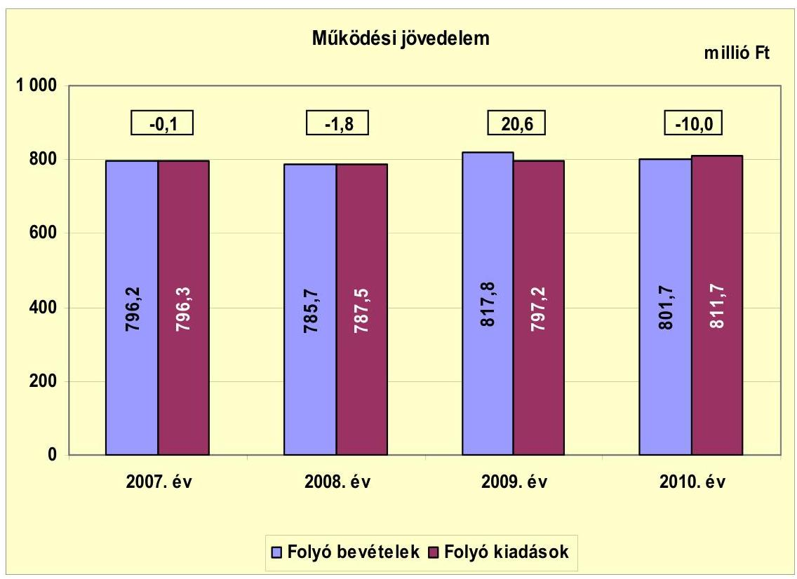

A vizsgált időszakban az Önkormányzat folyó költségvetésének egyenlege, működési jövedelme a 2007-2008., valamint a 2010. években negatív, 2009-ben pozitív összegű volt, nagyságrendjük azonban nem volt jelentős. A 2009. év működési forrástöbbletét az egyéb saját bevételek (a pedagógiai szakszolgálat működési kiadásaira társulástól kapott bevételek emelkedése, valamint a városi művelődési központ működési kiadásaira pályázaton elnyert forrás) növekedése eredményezték.

Az Önkormányzat működtetésének biztosítása érdekében nyújtott be pályázatot az ÖNHIKI, valamint a működésképtelen helyi önkormányzatok egyéb támogatására, melyből a 2007-2010. évek között összesen 45,0 millió Ft-ban, a 2011. év I-III. negyedévében 27,0 millió Ft-ban, mindösszesen 72,0 millió Ft-ban részesült, melyet a személyi és dologi kiadások finanszírozására használtak fel.

Az Önkormányzat pénzügyi kapacitása 2007-ben, 2008-ban és 2010-ben negatív értékű volt, 2009-ben többletet mutatott. A nettó működési jövedelem ${ }^{12}$ értéke a folyó költségvetési pozíció mellett az adott költségvetési év adósságtörlesztésének hatását is tükrözi. A 2007-2010 közötti összesen 8,7 millió Ft működési jövedelem nem nyújtott elegendő forrást a felmerülő hiteltörlesztésekre, melynek összege 21,9 millió Ft-ot tett ki. A 2009. évi pénzügyi kapacitás 2007-2008. évekhez viszonyított 32,7 , illetve 32,3 százalékpontos mértékű javu-

[^0]
[^0]:    ${ }^{12}$ Pénzügyi kapacitás

---

lását a folyó bevételek és kiadások különbségéből származó működési jövedelem növekedése okozta.

A működési jövedelem, illetve a pénzügyi kapacitás a vizsgált években - a 2009. év kivételével - a 2007-ben kapott 22,0 millió Ft ÖNHIKI, valamint a 2008-ban kapott 10,0 millió Ft és 2010-ben kapott 13,0 millió Ft működésképtelen helyi önkormányzatok egyéb támogatásának együttes figyelembevétele nélkül 2007-ben -22,1, illetve -34,1 millió Ft, 2008-ban -11,8, illetve -21,7 millió Ft, 2010-ben -23,0, illetve -23,0 millió Ft értéket mutatott.

Az Önkormányzat nettó működési jövedelmének évenkénti alakulását az alábbi ábra szemlélteti:
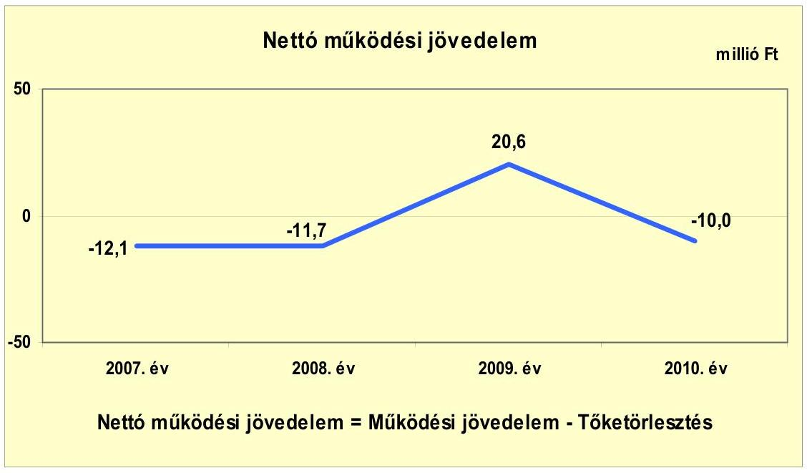

Az Önkormányzat felhalmozási költségvetésének egyenlege a 2007-2009. években negatív, 2010-ben pozitív összegű volt. A felhalmozási forráshiányt a 2007-2009 években megvalósított jelentős fejlesztések okozták.

---

A felhalmozási költségvetés egyenlegének alakulását évről évre a következő ábra szemlélteti:
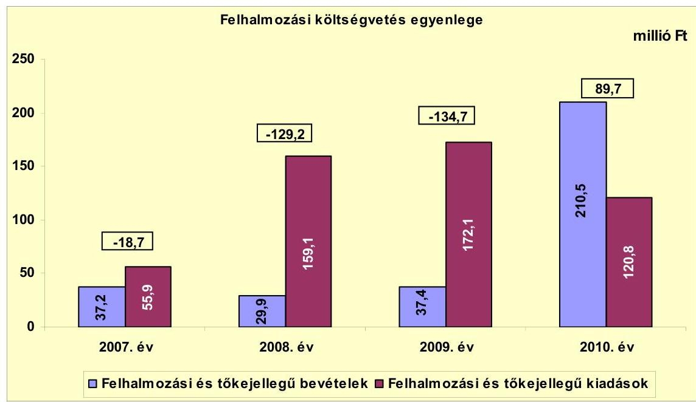

A 2007-2010 között keletkezett összesen -192,9 millió Ft felhalmozási forráshiány finanszírozása 171,3 millió Ft kötvényből, valamint 21,6 millió Ft szabad pénzmaradványból történt ${ }^{13}$.

Az Önkormányzat a 2008. évi kötvénykibocsátást nem a forgatási és befektetési célú értékpapírok, hanem a hitelfelvételek között szerepeltette beszámolójában, mellyel megsértette a Számv. tv. 16. § (3) bekezdésében előírtakat.

Az Önkormányzat évenkénti teljes finanszírozási igénye ${ }^{14}$ a CLF módszer szerint 2007-ben 30,8 millió Ft, 2008-ban 140,9 millió Ft, 2009-ben 114,1 millió Ft volt. A finanszírozási célú bevételek és kiadások egyenlege 2008-ban a kötvényforrás felhasználásával biztosította a finanszírozási szükségletet, míg azt a finanszírozhatóság érdekében 2007-ben és 2009-ben a finanszírozásba bevonható egyéb pénzeszközök (2006. és 2008. évi szabad pénzmaradvány) felhasználásával biztosították. A 2009. és a 2010. évben az Önkormányzatnak nem volt tőketörlesztési kötelezettsége.

[^0]
[^0]:    ${ }^{13}$ Az évenkénti adatokat a jelentés 2. számú melléklete mutatja be.
    ${ }^{14}$ a nettó működési jövedelem és a felhalmozási költségvetés eredője

---

Az Önkormányzat finanszírozási műveletei 2007-2010. évekbeli egyenlegének alakulását a következő grafikon szemlélteti:
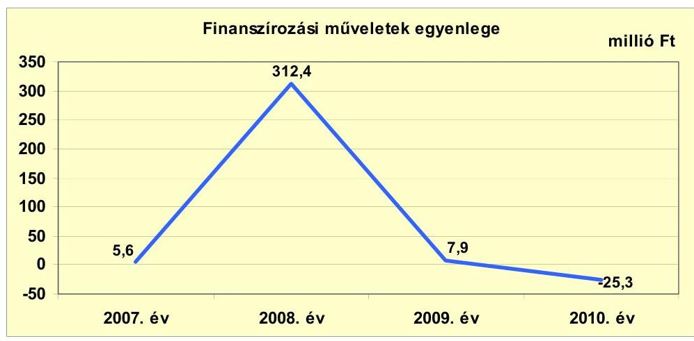

A finanszírozási célú műveleteket a vizsgált időszakban a jelentés 2. számú mellékletének 4.1-4.8 pontjai részletezik.

Az Önkormányzat 2007-2010. évi zárszámadási rendeleteinek mellékleteiben mérlegszerűen bemutatott működési és fejlesztési célú hiányt/többletet a jelentés 1. számú melléklete mutatja be. Az Önkormányzatnál az előírástól ${ }^{15}$ eltérő módon mutatták be a Képviselő-testület részére a hiány/többlet összegét, mivel a finanszírozási célú pénzügyi műveletek bevételeit és kiadásait is figyelembe vették a költségvetési bevételek és kiadások főösszegeiben.

A 2007-2010. évek között a kötelezettségek (passzív pénzügyi elszámolások nélkül) 17,3 millió Ft-ról 733,0 millió Ft-ra emelkedtek, amely együtt járt a kamatkiadások növekedésével. Az Önkormányzat által felvett hitelekhez kapcsolódóan a 2007-2011. év I. félév közötti időszakban összesen 40,9 millió Ft kamatfizetési kötelezettség keletkezett. Az átmenetileg szabad pénzeszközök lekötéséből elért kamatbevétel a teljes kamatkiadás 77,5%-át (31,7 millió Ft) tette ki. A kamatbevétel egy része (22,8 millió Ft) a kötvényből származó bevétel befektetéseiből származott, melyet működési kiadások finanszírozására, beruházási tervdokumentáció elkészítésére, biztonságtechnikai rendszer kialakítására és közbeszerzési eljáráshoz kapcsolódó kiadásokra használtak fel. A kamatbevétel fennmaradó (8,9 millió Ft) összegét a folyószámlán átmenetileg szabad pénzeszközök után járó kamatok képezték, melyeket működési kiadások finanszírozására használtak fel.

[^0]
[^0]:    ${ }^{15}$ az Áht. 8/A. § (7) bekezdése tartalmazza az előírást

---

Az Önkormányzat kamatbevételeit és kamatkiadásait, valamint azok egyenlegét évenként a következő ábra mutatja be:
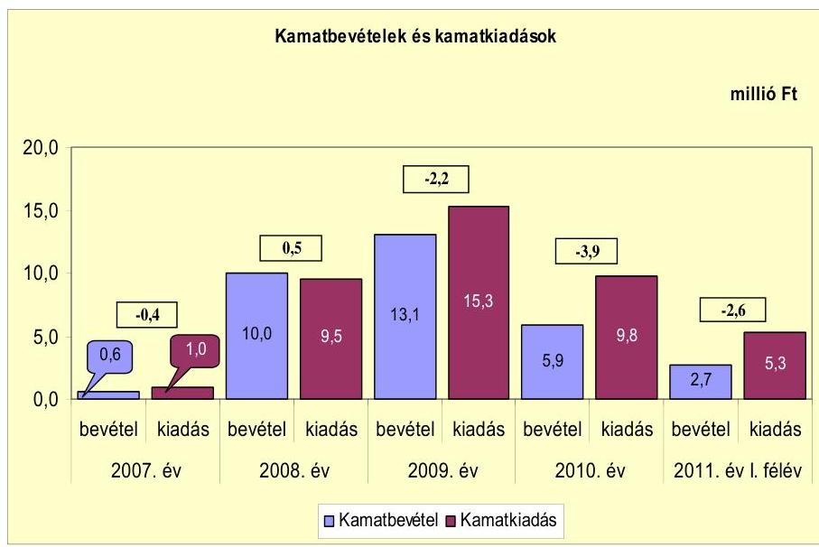

# 2.2. Az Önkormányzat bevételeinek változása 

Az Önkormányzat 2007-2009 évek között elért összes folyó bevételének átlaga 799,9 millió Ft, mely 0,2%-kal (1,8 millió Ft-tal) volt kevesebb a 2010. évinél. A 2011. év I. félévében 368,9 millió Ft folyó bevételt realizált.

Az Önkormányzat 2007-2011. év I. félév között realizált főbb bevételi jogcímeinek számszaki adatait a következő ábra mutatja be:
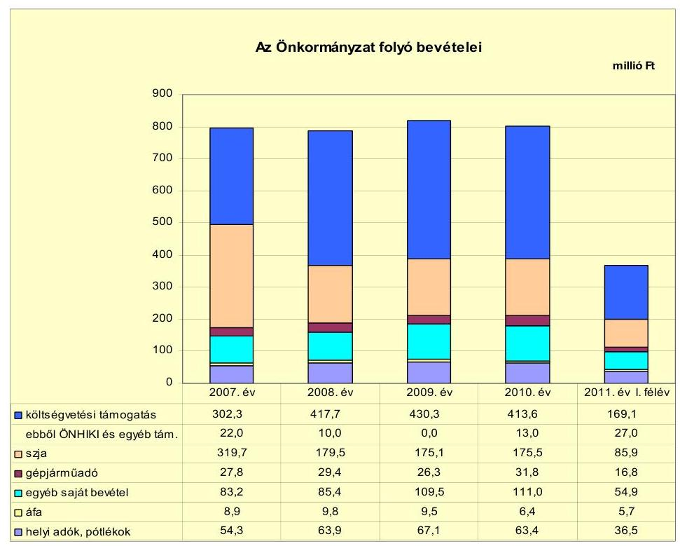

---

A költségvetési támogatás és az átengedett szja 2007-2009 közötti éves átlaga 608,2 millió Ft volt, melyhez viszonyítva a 2010. évi együttes összeg 3,1%-kal (19,1 millió Ft-tal) csökkent. A vizsgált években az előző évhez viszonyítva 2008-ban 4,0%-kal (24,8 millió Ft-tal), 2010-ben 2,7%-kal (16,3 millió Ft-tal) kapott kevesebb, 2009-ben 1,4%-kal (8,2 millió Ft-tal) kapott több forrást az Önkormányzat az államtól ezeken a jogcímeken. A 2009. évi növekedés oka, hogy közcélú foglalkoztatással többletfeladatot láttak el. Az Önkormányzat pénzügyi helyzetét javította, hogy ÖNHIKI támogatásként 2007-ben 22,0 millió Ft-ot, a 2011. év I-III. negyedévében 27,0 millió Ft-ot, a működésképtelen helyi önkormányzatok egyéb támogatásaként pedig 2008-ban 10,0 millió Ft-ot, 2010-ben 13,0 millió Ft-ot kapott.

A helyi adók, pótlékok bevételei 2007-2010 között emelkedő tendenciát mutattak. Az előző évhez viszonyítva a 2008. évben 17,7%-kal (9,6 millió Ft-tal), a 2009. évben 5,0%-kal (3,2 millió Ft-tal) növekedtek. Az Önkormányzat folyó bevételeiben nem tölt be meghatározó szerepet, a település alacsony jövedelemtermelő képességét jelzi, hogy négy év átlagában a helyi adó átlagosan a források 7,9%-át tette ki. A 2010-ben befolyt helyi adó és pótlék bevétel - megszűnő gazdasági társaságok következtében - 3,7 millió Ft-tal 5,5%-kal maradt el az előző évitől. A helyi adók köre (iparűzési adó, idegenforgalmi adó) 2011. január 1-jétől kibővült a magánszemélyek kommunális adójával. A kommunális adó mértéke lakás céljára szolgáló épület esetében 3000 Ft/év, nem lakás céljára szolgáló épület esetében 12000 Ft/év, az épület utáni idegenforgalmi adó pedig $450 \mathrm{Ft} / \mathrm{m}^{2}$ volt. A 2011-ben bevezetett új adónemből az I. félévben 5,1 millió Ft bevételt realizáltak. Az iparűzési adó mértékét a korábbi 1,7%-ról 2011-ben 2,0%-ra emelték, az adó mértékének növeléséből 2011. év I. félévében 4,6 millió Ft pótlólagos bevételük származott. A tartózkodási idő utáni idegenforgalmi adó mértékét $200 \mathrm{Ft} /$ fő/vendégéjszakáról $250 \mathrm{Ft} /$ fő/vendégéjszakára emelték 2011. január 1-jétől.

Az Önkormányzat a két, 100%-os tulajdoni részesedésű gazdasági társaságától a vizsgált időszakban osztalékban nem részesült.

Az Önkormányzat felhalmozási bevételeinek szerkezete a vizsgált időszakban a következőképpen alakult:

| Megnevezés | 2007. év | 2008. év | 2009. év | 2010. év | 2011. év I.   félév |
| :-- | :--: | :--: | :--: | :--: | :--: |
| Tárgyi eszköz értékesítés | 35,8 | 3,7 | 0,0 | 0,0 | 0,0 |
| Egyéb saját tőkebevétel | 0,8 | 1,0 | 3,5 | 23,6 | 1,0 |
| Államháztartáson belülről   kapott támogatás | 0,0 | 9,7 | 33,9 | 186,8 | 0,0 |
| EU-tól és külföldről kapott   támogatások | 0,0 | 0,0 | 0,0 | 0,0 | 3,5 |
| Államháztartáson kívülről   kapott támogatás | 0,6 | 15,5 | 0,0 | 0,1 | 0,0 |
| Összes felhalmozási bevétel | 37,2 | 29,9 | 37,4 | 210,5 | 4,5 |

---

Az Önkormányzat 2007-2009 közötti felhalmozási bevételeinek éves átlagához (34,8 millió Ft) viszonyítva a 2010. évi felhalmozási bevételek 175,4 millió Ft-tal a hatszorosára emelkedtek. A növekedés oka a 2010-ben államháztartáson belülről kapott támogatások előző évekhez (2008, illetve 2009) képest történő drasztikus emelkedése. Az államháztartáson belülről, illetve az EU-tól kapott
 támogatások ${ }^{16}$ a fejlesztési feladatok végrehajtásához kapcsolódtak.

# 2.3. Az Önkormányzat folyó és a felhalmozási célú kiadásainak változása 

Az Önkormányzat folyó kiadásai főbb jogcímek szerinti bontásban a következők voltak:

| Megnevezés | 2007. év | 2008. év | 2009. év | 2010. év | 2011. év I.   félév |
| :--: | :--: | :--: | :--: | :--: | :--: |
| Folyó kiadások | 796,3 | 787,5 | 797,2 | 811,7 | 352,3 |
| Működési kiadások (kamatkiadás nélkül) | 607,5 | 553,2 | 488,4 | 507,8 | 252,3 |
| Államháztartáson belülre átadott pénzeszközök | 0,8 | 2,4 | 2,9 | 9,7 | 1,6 |
| Transzferkiadások | 187,0 | 222,4 | 290,6 | 284,4 | 93,1 |
| -ebből: vállalkozásoknak | 66,4 | 92,0 | 116,3 | 80,8 | 28,2 |
| EU-nak, illetve külföldre | 0,0 | 0,0 | 0,0 | 0,0 | 0,0 |
| magánszemélyeknek | 108,9 | 118,6 | 163,4 | 192,6 | 62,5 |
| nonprofit szervezeteknek | 11,7 | 11,8 | 10,9 | 11,0 | 2,4 |
| Kamatkiadások | 1,0 | 9,5 | 15,3 | 9,8 | 5,3 |
| Előző évi pénzmaradvány átadás | 0,0 | 0,0 | 0,0 | 0,0 | 0,0 |

Az Önkormányzat 2007-2009 évek között teljesített folyó kiadásainak éves átlaga 793,7 millió Ft, mely a 2010. évi kiadásoktól 2,2%-kal (18,0 millió Ft-tal) volt alacsonyabb. A szociális ellátást biztosító Gondozási Központ társulási fenntartásba adásának folyó kiadásokra gyakorolt hatása a 2008. évtől kezdődően mutatkozik meg. Ugyanakkor 2008-tól megemelkedett a közcélú foglalkoztatásra kifizetett személyi és dologi kiadások összege. Mindezek együttes hatására a folyó kiadások alakulásában nagyarányú eltérés nem következett be a vizsgált időszakban. A 2010. évi folyó kiadások 33,3%-át (270,0 millió Ft) a személyi juttatások, 8,9%-át (72,4 millió Ft) a munkaadókat terhelő járulékok, 18,0%-át (145,8 millió Ft) a dologi kiadások, 3,6%-át (29,4 millió Ft) az egyéb folyó kiadások képviselték.

|  |  |  |  |  | millió Ft |
| :-- | :--: | :--: | :--: | :--: | :--: |
| Megnevezés | 2007. év | 2008. év | 2009. év | 2010. év | 2011. év I.   félév |
| Személyi juttatások | 353,9 | 312,9 | 273,1 | 270,0 | 133,6 |
| Munkaadót terhelő járulékok | 113,1 | 99,4 | 82,3 | 72,4 | 34,8 |
| Dologi kiadások | 129,8 | 118,2 | 111,9 | 145,8 | 76,7 |
| Egyéb folyó kiadások | 11,7 | 32,2 | 36,4 | 29,4 | 12,6 |

[^0]
[^0]:    ${ }^{16}$ Az Önkormányzat a 2008-2010. években az EU-tól kapott támogatások összegét beszámolóiban a fejezeti kezelésű előirányzatból kapott pénzeszközök között mutatta ki.

---

A személyi juttatások 2008-ban az előző évhez képest 11,6%-kal (41,0 millió Ft-tal) csökkentek, a 2010. évben a 2007-2009 között teljesített kiadások éves átlagánál (313,3 millió Ft) 13,8%-kal (43,3 millió Ft-tal) voltak alacsonyabbak. A csökkenést az intézményátszervezések, illetve a feladatátadással összefüggő álláshely megszüntetések eredményezték. A munkaadókat terhelő járulékok 2010. évi összege 25,9 millió Ft-tal, 26,3%-kal maradt el a 2007-2009 közötti éves átlagtól (98,3 millió Ft), amelyben a 2009. évtől a foglalkoztatókat terhelő társadalombiztosítási járulék mértékének csökkenése, illetve a tételes egészségügyi hozzájárulás megszűnése hatása együttesen jelenik meg. A dologi kiadások 2010-ben a 2007-2009 közötti éves átlagnál (120,0 millió Ft) 25,8 millió Ft-tal (21,5%-kal) voltak magasabbak. Ennek oka az energiadíjak emelkedése, mely 8,0 millió Ft többletkiadást jelentett az Önkormányzatnak, valamint a Művelődési Központ által elnyert pályázathoz kapcsolódóan kifizetett díjak, dologi költségek. Az egyéb folyó kiadások 2010-ben a 2007-2009 közötti éves átlaghoz (26,8 millió Ft) viszonyítva 2,6 millió Ft-tal (9,7%-kal) emelkedtek, 2009-hez viszonyítva azonban 19,2%-kal (7,0 millió Ft-tal) csökkentek a takarékossági intézkedések hatására.

A folyó és felhalmozási kiadások 2007-2009 közötti éves átlagához (922,7 millió Ft) képest a 2010. évi kiadások 9,8 millió Ft-tal (1,1%-kal) voltak magasabbak. Az Önkormányzat felhalmozási célú kiadásokra 2007-ben költött a legkevesebbet (55,9 millió Ft-ot), ami az összes kiadás (852,2 millió Ft) 6,6%-ának felelt meg, 2011. év I. félévben a teljesített felhalmozási kiadások összege 29,1 millió Ft volt.

A kiadások összetételét a következő ábra szemlélteti:
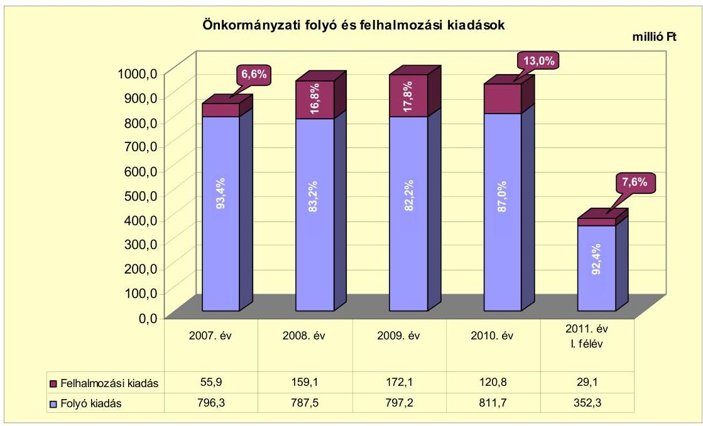

Az Önkormányzat 2007-2010. években megvalósított fejlesztései között intézményi épületek kialakítása, korszerűsítése, utak, járdák, közösségi tér építése, rekonstrukciója, köztemető és közpark felújítása, emlékmű építése, ingatlanvásárlás, valamint infrastrukturális és könyvtári szolgáltatással kapcsolatos fejlesztések szerepeltek.

---

A 2007-2010. években megvalósított, 2010. december 31-ig befejezett fejlesztésekre, felújításokra a vizsgált időszakban 356,5 millió Ft kiadást teljesített az Önkormányzat. A fejlesztési forrás megoszlása 19,0% (67,7 millió Ft) saját bevétel, 39,8% (141,8 millió Ft) kötvény, 10,2% (36,4 millió Ft) EU-s támogatás és 31,0% (110,6 millió Ft) hazai támogatás volt. A teljes bekerülési költség a tervezett 364,0 millió Ft-hoz képest 7,6 millió Ft-tal (2,1%-kal) volt kevesebb. A 2007-2010. évek között a 10 millió Ft teljes bekerülési költség feletti befejezett fejlesztések és felújítások száma 12 volt, amelyből két fejlesztéshez uniós forrásokat is igénybe vettek. Az Önkormányzat 2007-2010. években megvalósított, 2010. december 31-ig befejezett fejlesztéseit és azok forrásösszetételét a jelentés 3/a. számú melléklete mutatja be.

Az Önkormányzatnak 2010. december 31-én 17 db 10,0 millió Ft alatti és öt 10,0 millió Ft-ot meghaladó folyamatban lévő fejlesztése és felújítása volt. Ezek tervezett teljes bekerülési költsége 991,2 millió Ft, melyből a 2007-2010. évek között teljesített kiadás 116,3 millió Ft. A beruházás teljesített kiadásaiból 35,2 millió Ft-ot saját bevételből, 29,5 millió Ft-ot kötvényből és 51,6 millió Ft-ot EU-s forrásból finanszíroztak. Az Önkormányzat 2010. december 31-én folyamatban lévő fejlesztési feladataira 2010. december 31-ig teljesített kifizetéseket és azok forrásösszetételét a jelentés 3/b. számú melléklete tartalmazza.

Az Önkormányzat 2010. december 31-én folyamatban lévő fejlesztési feladatához kapcsolódó, a 2010. évet követő kötelezettségvállalásának az összege 874,9 millió Ft, amelynek forrása 22,9 millió Ft saját bevétel, 327,3 millió Ft hitel, 19,0 millió Ft kötvény, 468,9 millió Ft EU-s támogatás és 36,8 millió Ft hazai támogatás. Az Önkormányzat a rakamazi Nagy-Morotva vízi tanösvény kialakítása és térségének fejlesztése beruházásra 2009-ben benyújtott pályázatot elnyerte, a támogatási szerződést 2010. május 27-én megkötötte. A fejlesztési feladatra hitel igénybevételt nem terveztek. Az Idősek Otthonának építését hitelből és a kötvényből még rendelkezésre álló összegből (9,8 millió Ft) tervezik megvalósítani, a helyszíni vizsgálat befejezésének időpontjáig a hitelszerződés megkötésére még nem került sor. Az Önkormányzat 2010. december 31-én folyamatban lévő fejlesztési feladataira 2010. december 31-én fennálló kötelezettségvállalásait és azok forrásösszetételét a jelentés 3/c. számú melléklete mutatja be.

Az Önkormányzat három legmagasabb bekerülési költségű beruházása a vizsgált időszakban az alábbi volt:

- a 2009. évben elkezdett és befejezett köztér kialakításának teljes bekerülési költsége 35,8 millió Ft volt, amelyet 3,6 millió Ft kötvény és 32,2 millió Ft EU-s támogatás fedezett;
- a 2008. évben elkezdett és 2009. évben befejezett emlékoszlop beruházás teljes bekerülési költsége 11,5 millió Ft volt, amelyet 4,0 millió Ft saját bevételből, 5,5 millió Ft kötvényből és 2,0 millió Ft hazai támogatásból finanszíroztak;
- a 2009. évben elkezdett és 2010-ben befejezett könyvtári szolgáltatás fejlesztésére fordított kiadás 11,0 millió Ft volt, amelyet 5,1 millió Ft saját bevétel-

---

ből, 1,8 millió Ft kötvényből és 4,1 millió Ft EU-s támogatásból finanszíroztak.

Az Önkormányzatnak elbírálás alatt lévő, benyújtott pályázata nem volt. Az EU-s támogatásból megvalósult fejlesztések finanszírozása 2011. év I. félév végéig likviditási gondot nem okozott, azonban a kötvény tőketörlesztési kötelezettsége a jövőben jelentős hatással lehet a pénzügyi egyensúlyi helyzet alakulására, illetve a folyamatban lévő és a várható fejlesztések finanszírozhatóságára is. Amennyiben az Önkormányzat nem él a pályázati pénzeszközökből megvalósítandó fejlesztések esetében előleg igénybevételi, illetve szállítói finanszírozás lehetőségével, a pályázati források előfinanszírozása, ezen belül különösen a likviditás kezelésére kötött folyószámla- vagy munkabérmegelőlegezési hitel igénybevétele jelentős pénzügyi kockázattal járhat.

Az Önkormányzat a 100%-os tulajdonában lévő két gazdasági társaságának működési célra összesen 445,4 millió Ft-ot adott át a vizsgált időszakban az éves költségvetésekben jóváhagyottakra és a társaságokkal kötött szolgáltatási szerződésekre alapozottan. Az Önkormányzat a szerződésekben foglaltak szerint megkapta a szolgáltatást. A társaságokat az általuk nyújtott szolgáltatási díjra tekintettel (az előírt költségtényezők alatti ár- vagy díjmegállapítás miatt) nem támogatta.

A gazdasági társaságok részére átadott pénzeszközöket az alábbi ábra szemlélteti:
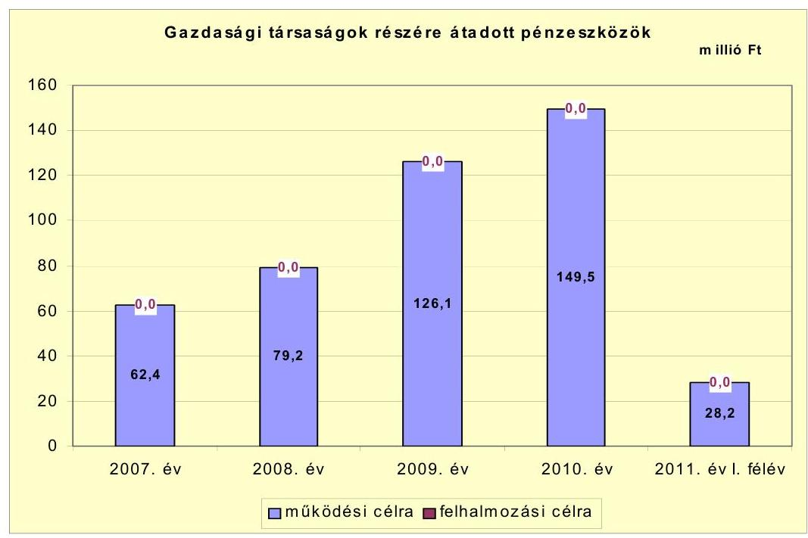

Az Önkormányzat által a gazdasági társaságok részére 2007-2009 között működési célra átadott pénzeszközök éves átlaga 89,2 millió Ft volt, 60,3 millió Ft-tal (40,3%-kal) kevesebb, mint a 2010. évi. Ennek oka, hogy megnőtt a városüzemeltetést végző gazdasági társaság által közcéllal foglalkoztatottak száma és ezzel együtt a közcélú foglalkoztatásra kifizetett működési célú kiadások összege.

---

Az Önkormányzat egy 100%-os tulajdonában lévő gazdasági társaságának 2010. évi saját tőkéje -10,4 millió Ft, jegyzett tőkéjének összege 3,0 millió Ft volt. A gazdasági társaságokról szóló 2006. évi IV. törvény 51. § (1) bekezdése értelmében a tulajdonosnak meghatározott időszakot követően a jegyzett tőke összegéig tőkepótlást kell végrehajtania. A tőkepótlás határideje a 2010. évet követő második év a Számv. tv. szerinti beszámolója elfogadásától számított három hónap. Ennek alapján az Önkormányzat számára ez a jelenlegi ismeretek szerint várhatóan 13,4 millió Ft összegű kötelezettséget jelent a 2011-2013. közötti időszakban. A gazdasági társaságok adatait részletezve a 4. számú melléklet tartalmazza.

# 3. Az ÖNKORMÁNYZAT KÖTELEZETTSÉGEI 

### 3.1. Az Önkormányzat pénzintézeti kötelezettségeinek változása

Az Önkormányzatnak a pénzintézetekkel szemben vállalt kötelezettségeiből a 2006-2007. évek végén nem állt fenn állománya, a 2008. év végi állomány összege 300,0 millió Ft volt. A pénzintézeti kötelezettségek állománya 2008. december 31-től 2010. december 31-ig 51,8%-kal, 455,5 millió Ft-ra, illetve 2011. június 30-ra 41,8%-kal, 425,4 millió Ft-ra nőtt. A vizsgált időszakban a pénzintézetekkel szemben fennálló kötelezettségek lejárat szerinti összetételében a hosszú lejáratú kötelezettségek voltak túlsúlyban. A 2010. év végi 455,5 millió Ft összegű állomány 414,4 millió Ft felhalmozási célú, zártkörű kötvénykibocsátásból és 41,1 millió Ft rövid lejáratú kötelezettségből állt. Ez utóbbi állomány 16,0 millió Ft összegű munkabér-megelőlegezési hitelből és a kötvény 2011-ben esedékes 25,1 millió Ft összegű törlesztő részletéből állt. Árfolyamváltozást az Önkormányzat a devizában kibocsátott kötvénye után a 2008-2009. években nem számolt el, azt mérlegeiben - a Számv. tv. 60. § (1)(2) bekezdéseiben előírt értékelési kötelezettséget megsértve - nem mutatta ki. A kötvény 2010. év végi értékelését elvégezték, az árfolyamváltozás összegét (114,4 millió Ft) a könyvekben rögzítették.
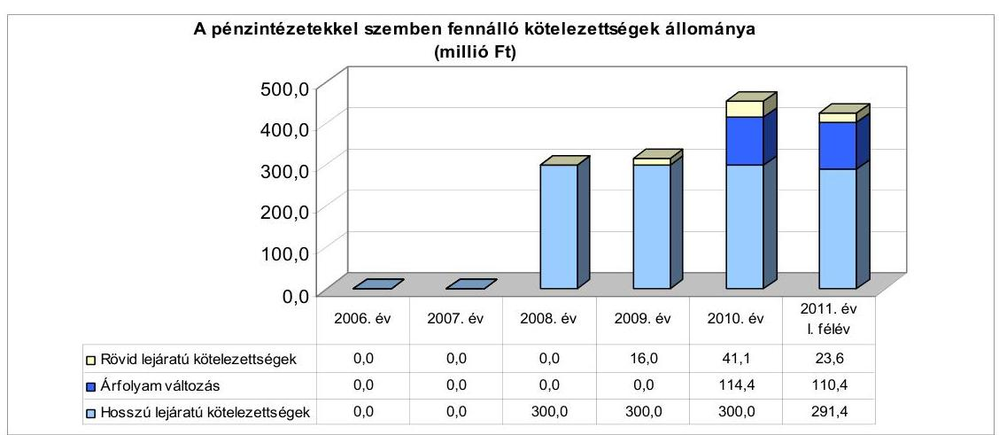

Az árfolyamváltozás hatása is befolyásolja
 a kötelezettségek alakulását, azonban annak mértéke előre pontosan nem határozható meg, csak várakozásokon alapuló tendenciák jelezhetők. Annak megítéléséről, hogy a devizában kibocsátott kötvényekért és felvett hitelekért kapott forinthoz képest a kötvények visszavásárlásakor, illetve a hitelek visszafizetésekor jelentkező forintkötelezettség többletkiadást (árfolyamveszteség) vagy megtakarítást (árfolyamnyereség) eredményez-e a futamidő végén, a teljes kötelezettség rendezését követően lehet képet alkotni. Mindaddig, amíg törlesztési kötelezettség nem áll fenn (türelmi idő, moratórium), a tőkére vonatkoztatva nem értelmezhető sem az árfolyamveszteség, sem az árfolyamnyereség. Ugyanakkor a számviteli szabályok meghatározzák, hogy az árfolyamkülönbözetet év végén a kötelezettségek vagy követelések között a könyvviteli mérlegben nyilván kell tartani, azonban az árfolyamkülönbözet valójában nem realizált.

Az Önkormányzat a forráshiány kezelése érdekében a 2007-2011. évi költségvetési rendeletekben ÖNHIKI igénybevételével, továbbá működési- és felhalmozási célú hitelfelvétellel számolt. A működési forráshiány kezelése érdekében minden évben döntött az éves költségvetés elfogadásakor ÖNHIKI-pályázat benyújtásáról, valamint rövid lejáratú hitel igénybevételéről. A felhalmozási hiány kezelésére a Képviselő-testület 2008-ban kötvénykibocsátásról döntött. Az Önkormányzat az adósságot keletkeztető kötelezettségvállalásának felső határát a 2007-2011. év I. féléve között nem lépte túl, azonban annak összegét a pénzintézettel szembeni kötelezettségvállalásokra vonatkozó előterjesztésekben a Képviselő-testületnek nem mutatta be.

Az Önkormányzat pénzintézeti kötelezettségvállalásaira minden esetben képviselő-testületi döntés alapján került sor. A kötelezettségvállalásból származó források felhasználási céljait meghatározták. A Képviselő-testület éven túli kötelezettségvállalására (kötvény) vonatkozó döntését megalapozó előterjesztésben a visszafizetés forrásait nem jelölték meg. Az előterjesztés nem tartalmazta továbbá az éven túli deviza alapú, változó kamatozású kötelezettségvállalás (kötvény) árfolyam- és kamatkockázatának a bemutatását. Az adósságot keletkeztető kötelezettségvállalással megvalósított felhalmozási kiadások esetleges bevételnövelő, illetve kiadáscsökkentő vonzatát, továbbá ennek a fejlesztéshez, felújításhoz vállalt kötelezettségek visszafizetési forrásként való számbavételét 2011. június 30-ig nem vizsgálták. Az Önkormányzat hosszú lejáratú adósságot keletkeztető kötelezettségvállalásából (kötvény) adódó tőke- és kamatfizetési kötelezettségek teljesítésének feltételeiről a jegyző 2011. augusztus 31-én terjesztett a Képviselő-testület elé beszámolót. A beszámolóban a kötvénnyel kapcsolatos árfolyam- és kamatkockázatokat, valamint az adósságszolgálat teljesíthetőségének a feltételeit, a figyelembe vehető forrásokat bemutatták.

Az Önkormányzat a vizsgált időszakban számlavezető bankot nem váltott.
Az Önkormányzatnak 2011. június 30-án CHF-ben fennálló hosszú lejáratú adósságot keletkeztető kötelezettségvállalása az alábbi volt:

| Megnevezés | Szerződéskötési   kibocsátás   időpontja | Összeg   ezer CHF-ben | Kibocsátási/elhivási   árfolyam | Kamat   (referencia kamat +   kamatfelár) | Felhasználás célja: |
| :-- | :--: | :--: | :--: | :--: | :-- |
| "Rakamaz 2028" kötvény | 2008. 05. 13 | 1973,7 | 152,0 HUF/CHF | 8 havi CHF LIBOR + 1,5\% | helyi beruházások,   fejlesztések, valamint   felhalmozási célú pályázatok   önerejének finanszírozására |

---

A pénzügyi egyensúly megteremtése érdekében kibocsátott kötvény futamideje 20 év, türelmi ideje 3 év. A kötvényt a szervező bank zárt körben hozta forgalomba.

Az Önkormányzatnak a vizsgált időszak alatt Ft-ban fennálló, hosszú lejáratú adósságot keletkeztető kötelezettségvállalása nem volt.

Az Önkormányzat 2011. június 30-ig a kötvény forrásából 284,1 millió Ft-ot felhasznált rendeltetési céljának megfelelően felhalmozási feladatok finanszírozására. A fel nem használt 15,9 millió Ft-ról az Önkormányzat szabadon rendelkezhet.

A kötvény tőketörlesztési kötelezettségének kezdete 2011. április 1-je, összege 56,4 ezer CHF volt. A CHF-ben fennálló pénzintézeti kötelezettsége körében az Önkormányzat 2011. június 30-ig 56,4 ezer CHF (11,8 millió Ft) összegű tőkét törlesztett, 155,8 ezer CHF (29,6 millió Ft) összegű kamatot, illetve 4,5 millió Ft összegű jegyzési garanciavállalási díjat és 1,7 millió Ft összegű készfizető kezességvállalási díjat fizetett meg. A kötvény kamatainak fizetése a 2008. év III. negyedévétől megkezdődött.

Az Önkormányzat 2011. június 30-ig a kötvényből származó kamatbevétel 22,8 millió Ft volt, melyből 18,0 millió Ft-ot használt fel működési kiadások finanszírozására, beruházási tervdokumentáció elkészítésre, biztonságtechnikai rendszer kialakítására és közbeszerzési eljáráshoz kapcsolódó kiadásokra.

Az Önkormányzat fizetőképességének megőrzését a vizsgált időszakban folyószámla- és munkabér-megelőlegezési hitel igénybevételével tudta biztosítani, melynek alakulását az alábbi táblázat mutatja be:

| Megnevezés | 2007. év | 2008. év | 2009. év | 2010. év | 2011. június   30. |
| :--: | :--: | :--: | :--: | :--: | :--: |
| I. Folyószámlahitel |  |  |  |  |  |
| folyószámlahitel keretösszege január 1-jén | 0,0 | 10,0 | 10,0 | 10,0 | 10,0 |
| teljesített kamat és egyéb költség | 0,0 | 0,3 | 0,6 | 0,8 | 0,3 |
| II. Munkabér megelőlegezési hitel |  |  |  |  |  |
| igénybe vett hitel összesen | 0,0 | 10,1 | 15,7 | 16,0 | 16,0 |
| teljesített kamat és egyéb költség | 0,0 | 1,3 | 1,5 | 1,3 | 0,6 |

Az Önkormányzat 2007 novemberétől - határozatlan időtartamra kötött szerződése alapján - folyószámlahitel igénybevételi lehetőséggel rendelkezik. A 2008-2010. évek között a folyószámlahitel igénybevételi intenzitása növekvő tendenciájú volt, 2008-ban 127, 2009-ben 169 és 2010-ben 286 volt a hitellel zárt napok száma. Az igénybe vett folyószámlahitel átlagos napi állománya ezeknek az éveknek a sorrendjében 1,3 millió Ft, 2,9 millió Ft és 5,6 millió Ft volt, a 2011. június 30-án a hitellel zárt napok száma 88, az átlagos napi hitelállomány 4,6 millió Ft volt. Folyószámlahitel-állomány a 2007-2010. évek végén nem állt fenn, a 2011. június 30-i egyenleg 7,6 millió Ft volt. A folyószámlahitel-keret a rendelkezésre állás napjától (2007. november 5.) a vizsgált időszak végéig nem változott. Az Önkormányzat a 2007. év folyamán munkabér megelőlegezési célú hitelszerződéssel nem rendelkezett. A munkabér megelőlegezési hitelkeretét (16,0 millió Ft) az Önkormányzat a rendelkezésre állás napjától (2008. január 4.) intenzíven vette igénybe a vizsgált időszak végéig. A hitellel zárt napok száma 2008-ban 250, 2009-ben 359, 2010-ben 365, illetve a

---

2011. év I. félévében 182 nap volt. Az igénybe vett munkabér-megelőlegezési hitel átlagos napi állománya az évek sorrendjében 10,1 millió Ft, 15,7 millió Ft, 16,0 millió Ft és 16,0 millió Ft volt. A munkabér-megelőlegezési hitel 2010. évi záró és 2011. június 30-i állománya 16,0 millió Ft volt. A hitelkeret összege a vizsgált időszakban nem változott.

A munkabér-megelőlegezési hitel igénybevételi összegénél az átlagos napi állomány adatai szerepelnek, tekintettel arra, hogy ezt a pénzintézeti forrást az Önkormányzat a vizsgált időszakban gyakorlatilag maximális összegben és folyamatosan vette igénybe. A hitellel zárt napok száma és az átlagos napi hitelállományok összege, illetve alakulásuk tendenciája mutatja, hogy ezt a hitelkeretet az Önkormányzat rendeltetési céljától eltérően más működési kiadásai finanszírozási forrásaként is felhasználta.

A folyószámlahitel igénybevétele után az Önkormányzat 2008-ban 0,3 millió Ft, 2009-ben 0,6 millió Ft, 2010-ben 0,8 millió Ft összegű kamatot fizetett ki. A 2011. év I. félévi kamat összege 0,3 millió Ft volt. A munkabérmegelőlegezési hitel esetében 2008-ban 1,3 millió Ft, 2009-ben 1,5 millió Ft, 2010-ben 1,3 millió Ft, illetve a 2011. év I. félévében 0,6 millió Ft összegű kamatot fizetett meg. Egyéb díjfizetési kötelezettség a folyószámla- és munkabérmegelőlegezési hitellel kapcsolatosan nem volt.

A folyószámla- és munkabér-megelőlegezési hitel igénybevételének eltérő intenzitása (hitellel zárt napok száma, átlagos napi hitelállomány), valamint az alkalmazott, eltérő időtartamra (napi, havi) rögzített BUBOR referenciakamatok összehasonlítása alapján megállapítható, hogy az Önkormányzat előnytelenül használta fel nagyobb intenzitással a munkabér-megelőlegezési hitelkeretét, mert az annál alkalmazott referenciakamatok - azonos folyószámlahitelkamatfelárak mellett - magasabbak voltak.

A rövid lejáratú hitelek kondíciói a következők voltak ${ }^{17}$ :

| Megnevezés | Kamat (referencia + kamatfelár) | Egyéb költség |
| :--: | :--: | :--: |
| Folyószámlahitel |  |  |
| 2007-2008. év | 1 napi BUBOR $+1,0 \%$ | 0 |
| 2009-2011. év | 1 napi BUBOR $+2,0 \%$ | 0 |
| Munkabér megelőlegezési hitel |  |  |
| 2008. év | 1 havi BUBOR $+1,0 \%$ | 0 |
| 2009-2011. év | 1 havi BUBOR $+2,0 \%$ | 0 |

A CHF-alapú kötvényhez kapcsolódó kamatfizetési kötelezettség alakulását jelentősen befolyásolta és jelenleg is befolyásolja a kibocsátáskori és az utolsó kamatfizetéskori referenciakamat és kamatfelár alakulása. A 2008. május 13-án kibocsátott kötvény utolsó kamatfizetéskor (2011. április 1.) alkalmazott kamatának (referenciakamat és kamatfelár) mértéke (1,70167\%)

[^0][^1]
[^0]:    ${ }^{17}$ A referencia kamat az alábbiak szerint alakult:

[^1]:    ${ }^{17}$ A referencia kamat az alábbiak szerint alakult:
    | MNB BUBOR fixing (átlagkamat) \%-ban |  |  |  |  |
    | :--: | :--: | :--: | :--: | :--: |
    | Referencia kamat | 2007. évi | 2008. évi | 2009. év | 2010. év | 2011.   június 30-ig |
    | 1 napi BUBOR | 7,78 | 8,41 | 8,39 | 4,95 | 5,33 |
    | 1 havi BUBOR | 7,83 | 8,75 | 8,66 | 5,47 | 6,00 |

---

az induló kamat (4,40167\%) mértékének 38,7\%-ára csökkent. A kamatfelár a vizsgált időszakban nem változott.

A kamat mértékének alakulása jelentős hatással van az adott devizanemben kifejezett, a teljes futamidőre számított, várható kamatkötelezettség mértékére. Az Önkormányzat kötvény utáni kamatfizetési kötelezettségét a referenciakamatok csökkenése kedvezően, a HUF/CHF árfolyam emelkedése viszont kedvezőtlenül befolyásolta.

Az Önkormányzat kötelezettségeinek állományát 2010. december 31-én és 2011. június 30-án, valamint várható alakulását a kötelezettségek lejáratáig a következő táblázat mutatja be:

| Megnevezés | Állomány 2010. december 31-én |  | Állomány 2011. június 30-án |  | Várható kötelezettség 2011-2013. években |  | Várható kötelezettség 2014. évtől |  |
| :--: | :--: | :--: | :--: | :--: | :--: | :--: | :--: | :--: |
|  | HUF-ban (millió. Ft-ban) | Devizában (összeg. ezer CHF-ban) | HUF-ban (millió. Ft-ban) | Devizában (összeg. ezer CHF-ban) | HUF-ban (millió Ft-ban) | Devizában (összeg. ezer CHF-ban) | HUF-ban (millió Ft-ban) | Devizában (összeg. ezer CHF-ban) |
| Pénzintézeti kötelezettségek |  |  |  |  |  |  |  |  |
| Folyószámlahitel |  |  | 7,6 |  | 7,6 |  |  |  |
| Munkabér megelőlegezési hitel | 16,0 |  | 16,0 |  | 16,0 |  |  |  |
| "Rakamaz 2028" kötvény |  | 1973,7 |  | 1917,3 | 3,8 | 434,1 | 21,6 | 1856,3 |
| Pénzintézeti kötelezettségek összesen HUF-ban: | 16,0 |  | 23,6 |  | 27,4 |  | 21,6 |  |
| Pénzintézeti kötelezettségek összesen CHF-ben: |  | 1973,7 |  | 1917,3 |  | 1917,3 |  | 1856,3 |

 |  | 1917,3 |  | 434,1 |  | 1856,3 |
| Biztosítékok |  |  |  |  |  |  |  |  |
| Kezesség |  |  | 28,3 |  | 28,3 |  |  |  |
| Biztosítékok összesen: |  |  | 28,3 |  | 28,3 |  |  |  |
| Lizing kötelezettségek | 1,3 |  | 0,6 |  | 1,3 |  |  |  |
| Szállító tartozás | 95,4 |  | 89,2 |  | 89,2 |  |  |  |
| Tőkepótlási kötelezettség |  |  |  |  | 13,4 |  |  |  |
| Egyéb kiadás elmaradás | 2,2 |  | 5,3 |  | 5,3 |  |  |  |
| Kötelezettségek összesen HUF-ban: | 114,9 |  | 147,0 |  | 164,9 |  | 21,6 |  |
| Kötelezettségek összesen CHF-ben: |  | 1973,7 |  | 1917,3 |  | 434,1 |  | 1856,3 |

Az Önkormányzatnak - az utolsó ismert kamatmértékek figyelembevételével - a 2011-2013. években folyószámlahitele után várhatóan 7,6 millió Ft, munkabér-megelőlegezési hitele után 16,0 millió Ft fizetési kötelezettsége merül fel a pénzintézetekkel szemben. A devizában kibocsátott kötvény után a várható fizetési kötelezettség 434,1 ezer CHF, illetve 3,8 millió Ft. A 2014. évet követően a kötvény után várhatóan 1856,3 ezer CHF és 21,6 millió Ft összegű fizetési kötelezettség merül fel. A kötvény után fizetendő kötelezettségek tartalmazzák az ütemezett kamat és kalkulálható díjfizetési $^{18}$ terheket is. Az Önkormányzat egyéb, a 2011-2013. évek között várható kötelezettségei: lízingszerződésből 1,3 millió Ft, szállítókkal szembeni tartozás miatt 89,2 millió Ft, tőkepótlási kötelezettség miatt 13,4 millió Ft, egyéb kiadás elmaradás következtében 5,3 millió Ft. Az Önkormányzat 2011. augusztusában tájékoztatta a Képviselőtestületet a hosszú lejáratú adósságot keletkeztető kötelezettségvállalásokról. Ebben a kötelezettségvállalások visszafizetésének forrásait nem mérték fel, nem számszerűsítették. A 2011-2013. évek kötelezettségeinek teljesítésére figyelembe vehető a 2010. évi 146,9 millió Ft pénzmaradványból 7,7 millió Ft szabad pénzmaradvány, valamint a 28,2 millió Ft mérlegben kimutatott köve-

[^0]
[^0]:    $^{18}$ a "Rakamaz 2028" kötvényhez kapcsolódó, Ft-ban fizetendő készfizető kezességi díj

---

telésállomány. A 2014. évtől várható pénzintézeti kötelezettségek fedezetét nem látjuk biztosítottnak az Önkormányzat adatszolgáltatása alapján.

# 3.2. A szállítói kötelezettségek változása 

Az Önkormányzat szállítói állománya 2007-ről 2009-re közel hétszeresére (10,4 millió Ft-ról 70,8 millió Ft-ra), a 2010. év végére az előző évhez képest 34,7%-kal (24,6 millió Ft) emelkedett. A 2011. június 30-i állomány 89,2 millió Ft volt. A 2007. évi szállítói állomány (10,4 millió Ft) a könyv szerinti összes kötelezettség (48,8 millió Ft) 21,3%-a. Az Önkormányzat 2007. december 31-ei lejárt szállítói tartozása 10,4 millió Ft-ról 2011. június 30-ra több mint hétszeresére, 73,1 millió Ft-ra nőtt. Az Önkormányzat 2011. június 30-án fennálló lejárt szállítói tartozásállományának 11,6%-a (8,4 millió Ft) 30 nap alatti, 6,5%-a (4,8 millió Ft) 31 és 60 nap közötti, 4,0%-a (3,0 millió Ft) 61 és 90 nap közötti, 58,5%-a (42,7 millió Ft) 91 és 365 nap közötti, továbbá éven túli 19,4%-a (14,2 millió Ft) volt.

A 90 napon túli (a 91 és 365 nap közötti és a 365 napon túli) szállítóállomány (56,9 millió Ft, az összes lejárt, 2011. június 30-i állomány 77,9%-a) fennállása miatt az Adósságrendezési tv. 5. § (2) bekezdésében foglaltak figyelembevételével a polgármester - képviselő-testületi döntés alapján - nyolc napon belül köteles adósságrendezési eljárást kezdeményezni.

A 90 napot meghaladó tartozásról a Képviselő-testületet nem tájékoztatták, illetve adósságrendezési eljárás megindítását nem kezdeményeztek.

Az Önkormányzatnak egyéb kiadás elmaradása volt a ki nem fizetett esedékes személyi jellegű juttatások és munkaadókat terhelő járulékok miatt. Ezeknek az összege a 2010. év végén 2,2 millió Ft, 2011. év I. félév végén 5,3 millió Ft volt. A 2010. év végén fennálló tartozás 2011. év I. félévében rendezésre került, a 2011. év I. félév végén fennálló tartozás kifizetése folyamatban van.

### 3.3. Egyéb kötelezettségek változása

Az Önkormányzat lízingszerződésből származó kötelezettsége a 2008. évtől kezdődően áll fenn. A lízingkötelezettség 2008. évi 4,1 millió Ft összegű állománya a 2011. év I. félév végére 0,6 millió Ft-ra csökkent. A lízingkötelezettségből a 2011-2013 között várható fizetési kötelezettség összege 1,3 millió Ft.

Az Önkormányzat egy 100%-os tulajdonában lévő gazdasági társasága által igényelt folyószámla- és két rövid lejáratú hiteléhez a 2009. évben készfizető kezességet (mindösszesen 57,3 millió Ft) vállalt, mely biztosítékot a hitelt nyújtó bank szerződéses feltételként rögzített. A hitelt nyújtó pénzintézet egy rövid lejáratú kölcsönhöz (29,0 millió Ft) kapcsolódó biztosítékot részben (24,9 millió Ft) érvényesített 2009. októberében. Ez az összeg az Önkormányzat számára a gazdasági társaságával a feladatellátási szerződése alapján átadott pénzeszközök elszámolása során megtérült. A biztosíték érvényesítésével megszűnő kötelezettség miatt a 2010. év végi állomány 28,3 millió Ft-ra

---

csökkent. Ez az állomány az Önkormányzat számára esetleges fizetési kötelezettséget származtathat.

Az Önkormányzat a 2010. évi leltárösszesítő alapján 159,9 millió Ft nettó értékben mutatott ki forgalomképes ingatlanokat. A vizsgált időszakban az Önkormányzat forgalomképes ingatlanvagyonán jelzálogjog, vagy elidegenítési és terhelési tilalom nem volt.

Az Önkormányzatnak (alperes) egy jogerős határozattal le nem zárt peres eljárása van folyamatban közszolgálati jogviszony jogellenes megszüntetése tárgyában. A perérték összege 4,9 millió Ft, melyből jövőbeni fizetési kötelezettség származhat.

Az Önkormányzat a 2008. évben összesen 27,6 millió Ft összegben nyújtott tagi kölcsönt egy 100%-os tulajdonában lévő gazdasági társasága (1,5 millió Ft) és egy külső gazdasági társaság részére (26,1 millió Ft) felhalmozási feladatok finanszírozása céljából. A tagi kölcsönöket a gazdasági társaságok a 2009. és 2010. évben visszafizették.

Az Önkormányzat kizárólagos tulajdonát képező egyik gazdasági társaság mérleg szerinti eredménye a vizsgált évek összességében negatív volt, a felhalmozott veszteség nagysága meghaladta a jegyzett tőke összegét. A társaságnak az Önkormányzat költségvetési egyensúlyára gyakorolt hatása számottevő, a gazdasági társaság kizárólagos befolyásával összefüggő korlátlan felelőssége miatt. A 2011-2013. években (várhatóan a 2012. év II. félévében) az Önkormányzatnak, mint kizárólagos tulajdonosnak gondoskodnia kell a gazdasági társasága tőkepótlásáról, jelen ismeretek szerint 13,4 millió Ft összegben. Amennyiben az Önkormányzat nem gondoskodik a szükséges saját tőke biztosításáról, a gazdasági társaság köteles elhatározni más formában működő gazdasági társasággá való átalakulását, illetve jogutód nélküli megszűnését. Ha a gazdasági társaság e törvényi előírásnak nem tesz eleget, a cégbíróság a cégnyilvánosságról, a bírósági cégeljárásról és a végelszámolásról szóló 2006. évi V. törvény 72-84. §-ai alapján - törvényességi felügyeleti jogkörében eljárva - ezt kikényszerítheti, illetve a gazdasági társaságot megszűntnek nyilváníthatja.

Az Önkormányzat Képviselő-testülete nem rendelkezett megfelelő információval a gazdasági társaságok pénzügyi helyzetéről, azok önkormányzati pénzügyi helyzetre gyakorolt hatásairól.

#### Abstract

„Az Önkormányzat a gazdasági társaságokról szóló 2006. évi IV. törvény 54. § (2) bekezdése alapján korlátlan felelősséggel tartozik azon gazdasági társaságának felszámolása esetében, amelyben az Önkormányzat az 52. § (2) bekezdése szerint a szavazatok legalább 75%-ával rendelkezik, így minősített befolyásszerzőnek minősül, továbbá a csődeljárásról és a felszámolási eljárásról szóló 1991. évi XLIX. törvény 63. § (2) bekezdése alapján a kizárólagos önkormányzati tulajdonú gazdasági társaságának minden olyan kötelezettségéért, amelynek kielégítését a felszámolási eljárás során az adós társaság vagyona nem fedez, ha a hitelezőinek a felszámolási eljárás során benyújtott keresete alapján a bíróság - az adós társaság felé érvényesített tartósan hátrányos üzletpolitikájára figyelemmel - megállapítja az önkormányzat korlátlan és teljes felelősségét."

---

Önkormányzati rendeletben rögzítettek alapján a jegyző a 2009. évben összesen 0,2 millió Ft összegű késedelmi pótlékot és bírságot engedett el.

Az Önkormányzatnak garanciavállalása, PPP-konstrukciója, intézményeinek, más önkormányzatoknak, civil szervezeteknek, államháztartáson belüli és kívüli egyéb szervezeteknek nyújtott kölcsöne, gazdasági társaságoknak adott tagi kölcsöne, valamint jogerős határozattal lezárt peres eljárásból származó, de ki nem fizetett kötelezettsége nem volt. A jegyző elévülés vagy méltányosság miatt helyi adótartozást nem törölt el.

A 100%-ban önkormányzati tulajdonban lévő gazdasági társaságok kötelezettségeinek állományát és várható alakulását a következő táblázat mutatja be:

| Megnevezés | Állomány 2010.   december 31-én | Állomány 2011.   június 30-án | Várható kötelezettség   2011-2013. években | Várható   kötelezettség   2014. évtől |
| :-- | :--: | :--: | :--: | :--: |
|  | HUF-ban   (millió Ft-ban) | HUF-ban   (millió Ft-ban) | HUF-ban   (millió Ft-ban) | HUF-ban   (millió Ft-ban) |
| Folyószámlahítel | 9,8 | 10,0 | 10,0 |  |
| Rövid lejáratú hitel | 18,3 | 18,3 | 18,3 |  |
| Pénzintézeti kötelezettségek összesen | 28,1 | 28,3 | 28,3 |  |
| Lizing kötelezettségek | 7,6 | 6,6 | 7,6 |  |
| Szállító tartozás | 89,0 | 142,8 | 142,8 |  |
| Kötelezettségek összesen HUF-ban: | 124,6 | 177,7 | 178,6 |  |

Az Önkormányzat kizárólagos tulajdonában lévő gazdasági társaságai pénzintézettel szembeni kötelezettségállománya a 2010. december 31-i 28,1 millió Ft-ról 2011. június 30-ra csekély mértékben (0,2 millió Ft) emelkedett. A 2011-2013. évek várható kötelezettségeinek összege 28,3 millió Ft, amelyre a vállalt készfizető kezesség miatt az Önkormányzat számára fizetési kockázatot jelent. A lízing- és szállítói kötelezettségeik állománya 2010. december 31-én 96,5 millió Ft-ról 2011. június 30-ra 149,4 millió Ft-ra emelkedett. Az Önkormányzat a gazdasági társaságai szállítói állománya további növekedését megakadályozó intézkedést a vizsgált időszak végéig nem tett. A gazdasági társaságoknak peres eljárásból adódó és egyéb kötelezettségei nem voltak.

Az Önkormányzat 2007-2010 között az eszközeire együttesen 275,4 millió Ft összegű értékcsökkenést számolt el. Az eszközállomány bruttó értéke - a felújítások, beruházások aktiválása, illetve az eszközértékesítések együttes hatására - 2007-2010 között 10,4%-kal (278,9 millió Ft-tal) 2964,4 millió Ft-ra nőtt, ugyanakkor nettó értéke 3,6%-kal (82,9 millió Ft-tal) 2211,7 millió Ft-ra csökkent. Az Önkormányzat teljes eszközállományának használhatósági foka - az eszközök bruttó, illetve nettó értékének alakulása, valamint az elszámolt értékcsökkenés együttes hatásaként - 2007-2010 között 85,4%-ról 74,6%-ra csökkent, azaz az eszközök avultsági foka 10,8 százalékponttal növekedett. Az eszközökön belül az üzemeltetésre átadottak használhatósági foka 2007-ről 2010-re 10,9 százalékponttal (76,4%-ról 65,5%-ra), míg a többi eszközcsoport használhatósága együttesen 11,3 százalékponttal (90,1%-ról 78,8%-ra) csökkent. A 2007-2010. évek között befejezett összes felújítás és beruházás bruttó értéke 356,4 millió Ft volt, a felújítások 181,5 millió Ft-os összegéből eszközpótlásra 130,6 millió Ft-ot (72,0%-ot) fordítottak. A
 Képviselő-testületnek előterjesztett éves zárszámadási rendeleteikben

---

nem mutatták be az Önkormányzat eszközei után tárgyévben elszámolt értékcsökkenés összegét, az eszközpótlásra fordított tényleges kiadásokat, az eszközök elhasználódási fokának alakulását.

# 4. A PÉNZÜGYI EGYENSÚLY MEGTEREMTÉSE ÉRDEKÉBEN HOZOTT INTÉZKEDÉSEK EREDMÉNYE 

A Képviselő-testület az Önkormányzat működőképességének hosszú távú fenntartása érdekében a vizsgált időszakban kiadáscsökkentő és bevételnövelő döntéseket hozott, melyekkel a feladatellátás szakmai színvonalának szinten tartása mellett pénzügyi helyzetét kívánta javítani.

Az Önkormányzat - kimutatása szerint - a 2007-2010. években a kiadáscsökkentő intézkedések hatásaként összesen 168,3 millió Ft megtakarítást ért el, mely a feladatmegszüntetéssel, átszervezéssel együtt járó létszámcsökkentések, a többletjuttatások csökkentése, a helyettesítés miatti megtakarítás, a civil szervezetek számára átadott pénzeszközök csökkentése és egyes nem kötelező szociális ellátások megszüntetésének eredménye. A 2011-es költségvetési évben további kiadáscsökkentő intézkedéseket hoztak, melyek hatásaként 46,2 millió Ft megtakarítást terveznek. A tervezett kiadási megtakarításokból 29,7 millió Ft-ot (64,3%) létszámcsökkentéssel, 5,0 millió Ft-ot (10,8%) többletjuttatások csökkentésével, 4,8 millió Ft-ot (10,4%) helyettesítés miatti megtakarítással, 5,5 millió Ft-ot (11,9%) civil szervezetek számára átadott pénzeszközök csökkentésével és 1,2 millió Ft-ot (2,6%) nem kötelező szociális ellátások megszüntetésével kívánják elérni.
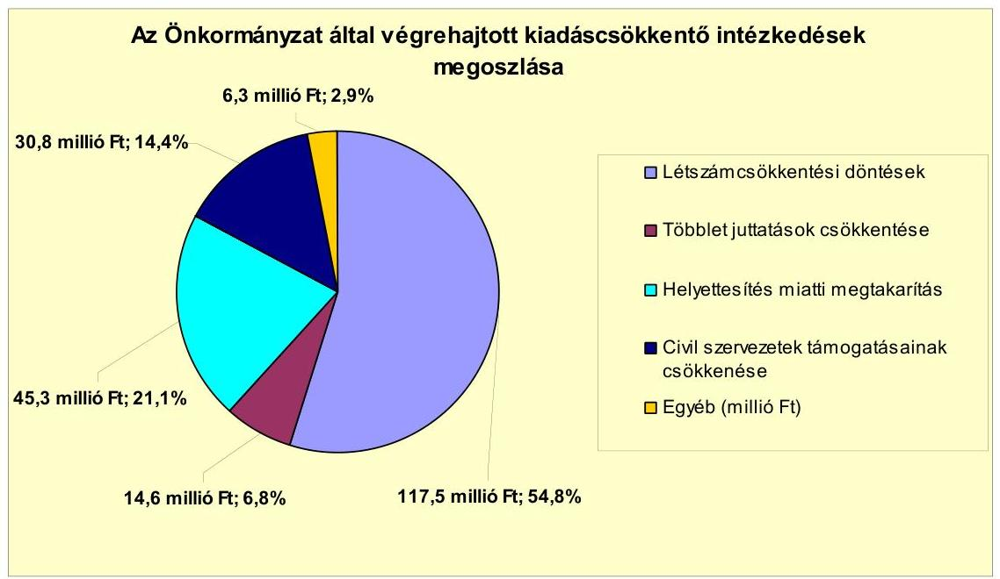

---

A 2007-2010 között végrehajtott létszámcsökkentéseket ágazatonként az alábbi táblázat mutatja:

| Megnevezés (odtok főrész) |  | Közoktatás | Szociális és gyermekvédelmi | Egészségügy | Polgármesteri hivatal | Egyéb | Összesen |
| :--: | :--: | :--: | :--: | :--: | :--: | :--: | :--: |
| 2007. január 1-jén (előzőleg jóváhagyott álláshelyek száma) |  | 90 | 33 | 0 | 31 | 22 | 179 |
| Megszüntetett álláshelyek száma |  | 24 | 33 | 0 | 4 | 6 | 67 |
| ebből | üres álláshelyek száma | 0 | 0 | 0 | 0 | 0 | 0 |
|  | szakmai álláshelyek száma | 15 | 31 | 0 | 2 | 3 | 51 |
|  | intézmény-üzemeltetéssel kapcsolatos álláshelyek száma | 6 | 2 | 0 | 2 | 3 | 16 |
| Álláshely növekedése |  | 0 | 0 | 0 | 0 | 0 | 0 |
| 2010. december 31-én záró álláshelyek száma |  | 66 | 0 | 0 | 27 | 16 | 109 |
| 2007. január 1-jén foglalkoztatott létszám |  | 90 | 33 | 0 | 31 | 22 | 179 |
| Létszámcsökkentés |  | 24 | 33 | 0 | 4 | 6 | 67 |
| Létszámnövekedés |  | 0 | 0 | 0 | 0 | 0 | 0 |
| 2010. december 31-én foglalkoztatott létszám |  | 66 | 0 | 0 | 27 | 16 | 109 |

A 2007-2009. évi költségvetési rendeletekben a Képviselő-testület mindösszesen 67 fő létszámcsökkentéséről döntött. A 2007. évi költségvetésben meghatározottak alapján a közoktatásban 14 fő, a szociális területen 33 fő, továbbá a Polgármesteri hivatalnál és egyéb területeken további három-három fő álláshelyét, mindösszesen 53-at szüntetett meg. A 2008. évi költségvetési rendelet értelmében a közoktatásban négy fő és a Polgármesteri hivatalnál egy fő, összesen öt főnyi létszámcsökkentést, a 2009. évi költségvetésben előirányzottak szerint a közoktatásban hat fő és egyéb területen három fő létszámleépítést hajtottak végre. A 2010. évre létszámleépítést nem terveztek és nem hajtottak végre.

Az intézkedések hatására a 2007. január 1-jei önkormányzati induló létszám 176 főről 2010. december 31-ére 109 főre csökkent. Az Önkormányzatnál 2010. december 31-én betöltetlen álláshely nem volt.

Az Önkormányzat a 2007-2010 között végrehajtott létszámleépítéséhez mindösszesen 12,8 millió Ft összegű központi támogatást igényelt, illetve kapott. A támogatás felhasználásával az önkormányzati intézményeknél és a Polgármesteri hivatalnál 12 fő tartós létszámleépítés történt meg. A társulásnak történt feladatátadással 28 fő továbfoglalkoztatása volt biztosított.

Az Önkormányzat 2007-2010 között bevételnövelő intézkedéseket nem tett. A 2011. év I. félévében - kimutatása szerint - az új adónem (kommunális adó) bevezetéséből 5,1 millió Ft, egyes adók (helyi iparűzési adó, idegenforgalmi adó tartózkodási idő után) mértékének növeléséből 4,6 millió Ft, mindösszesen 9,7 millió Ft összegű többletbevételt realizáltak. A többletbevételek a folyó bevételek (368,9 millió Ft) 2,6%-át képezték.

A költségvetési támogatásokból és az átengedett szja-ból származó 2007. évi 622,0 millió Ft összegű bevételhez képest 2010. év végéig összességében

---

74,3 millió Ft összegű bevételkiesés mutatható ki${ }^{19}$. Ezen belül az szja-adóbevétel 429,0 millió Ft-tal csökkent, amit a költségvetési támogatás növekedése (354,7 millió Ft) csak részben ellensúlyozott. Az Önkormányzat által 2007-2010 között kimutatott, a kiadási megtakarítások és bevételnövelések 168,1 millió Ft-os összege a központi támogatások és átengedett szja-adóbevételek kiesését pótolta, azonban nem biztosítottak elegendő forrást a pénzügyi egyensúly helyreállításához. A 2011. év I. félévi teljesített, a központi támogatásból és szja-ból származó bevétel a 2011. évi időarányos terv (383,7 millió Ft) 66,5%-a (255,0 millió Ft) volt.

# 5. Az ÁSZ ÁLTAL A KORÁBBBI ÉVEKBEN A PÉNZÜGYI EGYENSÚLY JAVÍTÁSÁRA TETT SZABÁLYSZERŰSÉGI ÉS CÉLSZERŰSÉGI JAVASLATOK HASZNOSULÁSA 

Az ÁSZ az Önkormányzat gazdálkodási rendszerét 2010-ben ellenőrizte átfogó jelleggel. A jelentést a Képviselő-testület határozattal elfogadta, a jegyző határidők és felelősök megjelölésével intézkedési tervet készített.

A 2010. évi ÁSZ vizsgálat javaslatai közül két szabályszerűségi, valamint egy célszerűségi javaslat vonatkozott a pénzügyi helyzet javítására. A szabályszerűségi javaslatok a finanszírozási célú pénzügyi műveletek költségvetési bevételként, illetve kiadásként költségvetési rendelettervezetben történő bemutatásának tiltására, valamint az előző évi pénzmaradvány igénybevételének megalapozott tervezésére vonatkoztak. A helyszíni ellenőrzés részére rendelkezésre bocsátott intézkedési terv szerint a szabályszerűségi javaslatok megvalósításának határideje 2012. február 15-e. A célszerűségi javaslat a hosszú lejáratú adósságot keletkeztető kötelezettségvállalások teljesíthetősége feltételeinek Képviselő-testület részére történő évenként egyszeri bemutatását fogalmazta meg, melyet teljesítettek. A Képviselő-testület a tájékoztatót 2011. augusztus 31-én határozattal elfogadta.

Budapest, 2012. április 16.

Melléklet: 6 db
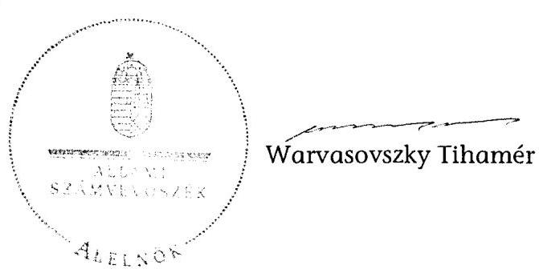

[^0]
[^0]: ${ }^{19}$ A 2007. évhez képest 2008-ra a költségvetési támogatások és átengedett szja összege 24,8 millió Ft-tal, 2009-ben 16,6 millió Ft-tal és 2010-ben 32,9 millió Ft-tal csökkent. 2011. év I. félévében a költségvetési támogatások és átengedett szja összes folyó bevételen belüli aránya 69,1% volt, amely kilenc százalékponttal kevesebb a 2007. évihez (78,1%) képest.

---

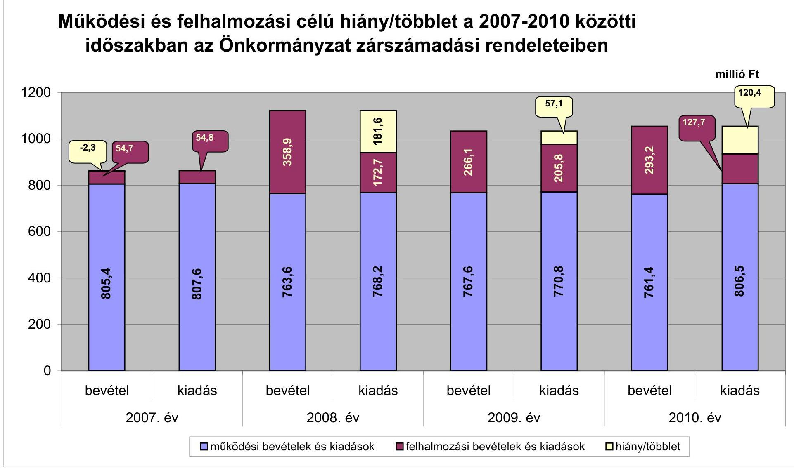

# Működési és felhalmozási célú hiány/többlet a 2007-2010 közötti időszakban az Önkormányzat zárszámadási rendeleteiben

| Működési és felhalmozási célú hiány/többlet | 2007. év | 2008. év | 2009. év | 2010. év  |
| --- | --- | --- | --- | --- |
| működési bevételek és kiadások | felhalmozási bevételek és kiadások | hiány/többlet |  |   |

---

Az Önkormányzat bevételei és kiadásai, valamint adósságszolgálata 2007-2010 között

| 1. FOLYÓ KÖLTSÉGVETÉS* | 2007. | 2008. | 2009. | 2010.  |
| --- | --- | --- | --- | --- |
| 1.1.1. Saját működési bevételek | 100,5 | 115,4 | 114,8 | 104,4  |
| 1.1.2. Költségvetési támogatás** | 302,3 | 417,7 | 430,3 | 413,6  |
| 1.1.3. Átengedett bevételek | 347,5 | 208,9 | 201,4 | 207,3  |
| 1.1.4. Állambáztartáson belülről kapott támogatások | 44,4 | 43,0 | 44,7 | 74,4  |
| 1.1.5. EU-tól és külföldről kapott bevételek | 0,0 | 0,0 | 0,0 | 1,7  |
| 1.1.6. Állambáztartáson kívülről kapott bevételek | 1,5 | 0,7 | 26,6 | 0,3  |
| 1.1.7. Előző évi pénzmaradvány átvétel | 0,0 | 0,0 | 0,0 | 0,0  |
| 1.1. Folyó bevételek =1.1.1.+1.1.2.+1.1.3.+1.1.4.+1.1.5.+1.1.6.+1.1.7. | 796,2 | 785,7 | 817,8 | 801,7  |
| 1.2.1. Működési kiadások kamatkiadások nélkül | 607,5 | 553,2 | 488,4 | 507,8  |
| 1.2.2. Állambáztartáson belülre átadott pénzeszközök | 0,8 | 2,4 | 2,9 | 9,7  |
| 1.2.3.1. vállalkozásoknak | 66,4 | 92,0 | 116,3 | 80,8  |
| 1.2.3.2. EU-nak, illetve külföldre | 0,0 | 0,0 | 0,0 | 0,0  |
| 1.2.3.3. magánszemélyeknek | 108,9 | 118,6 | 163,4 | 192,6  |
| 1.2.3.4. non-profit szervezeteknek | 11,7 | 11,8 | 10,9 | 11,0  |
| 1.2.3. Transzferkiadások (=1.2.3.1+1.2.3.2+1.2.3.3+1.2.3.4) | 187,0 | 222,4 | 290,6 | 284,4  |
| 1.2.4 Kamatkiadások | 1,0 | 9,5 | 15,3 | 9,8  |
| 1.2.5. Előző évi pénzmaradvány átadás | 0,0 | 0,0 | 0,0 | 0,0  |
| 1.2. Folyó kiadások =1.2.1.+1.2.2.+1.2.3.+1.2.4.+1.2.5. | 796,3 | 787,5 | 797,2 | 811,7  |
| 1.3. Folyó költségvetés egyenlege MŰKÖDÉSI JÖVEDELEM (1.1. - 1.2.) | -0,1 | -1,8 | 20,6 | -10,0  |
| 2. FELHALMOZÁSI KÖLTSÉGVETÉS*** | 0,0 | 0,0 | 0,0 | 0,0  |
| 2.1.1. Saját tőkebevételek | 36,6 | 4,7 | 3,5 | 23,6  |
| 2.1.2. Állambáztartáson belülről kapott támogatások | 0,0 | 9,7 | 33,9 | 186,8  |
| 2.1.3. EU-tól és külföldről kapott támogatások | 0,0 | 0,0 | 0,0 | 0,0  |
| 2.1.4. Állambáztartáson kívülről kapott támogatások | 0,6 | 15,5 | 0,0 | 0,1  |
| 2.1. Felhalmozási bevételek (=2.1.1.+2.1.2+2.1.3+2.1.4.) | 37,2 | 29,9 | 37,4 | 210,5  |
| 2.2.1. Saját beruházási kiadás áfával | 21,8 | 66,9 | 114,1 | 63,9  |
| 2.2.2. Saját felújítási kiadás áfával | 31,4 | 61,1 | 57,3 | 56,2  |
| 2.2.3. Állambáztartáson belülre átadott pénzeszköz | 0,0 | 0,0 | 0,0 | 0,0  |
| 2.2.4. EU-nak és külföldnek adott pénzeszközök | 0,0 | 0,0 | 0,0 | 0,0  |
| 2.2.5. Állambáztartáson kívülre adott pénzeszközök | 1,3 | 29,5 | 0,6 | 0,7  |
| 2.2.6. Befektetési célú részesedések vásárlása | 1,4 | 1,6 | 0,1 | 0,0  |
| 2.2. Felhalmozási kiadások (=2.2.1.+2.2.2.+2.2.3.+2.2.4.+2.2.5.+2.2.6.) | 55,9 | 159,1 | 172,1 | 120,8  |
| 2.3. Felhalmozási költségvetés egyenlege (2.1. - 2.2.) | -18,7 | -129,2 | -134,7 | 89,7 |

 89,7  |
|  3. Finanszírozási műveletek nélküli (GFS) pozíció(1.3.+2.3.) | $-18,8$ | $-131,0$ | $-114,1$ | 79,7  |
|  4. Finanszírozási műveletek | 0,0 | 0,0 | 0,0 | 0,0  |
|  4.1. Hitelfelvétel | 12,0 | 309,9 | 16,0 | 0,0  |
|  4.2. Hiteltörlesztés | 12,0 | 9,9 | 0,0 | 0,0  |
|  4.3. Forgatási és befektetési célú értékpapírok kibocsátása | 0,0 | 0,0 | 0,0 | 0,0  |
|  4.4. Forgatási és befektetési célú értékpapírok beváltása | 0,0 | 0,0 | 0,0 | 0,0  |
|  4.5. Forgatási és befektetési célú értékpapírok értékesítése | 1,1 | 1,1 | 1,1 | 1,1  |
|  4.6. Forgatási és befektetési célú értékpapírok vásárlása | 0,0 | 0,0 | 0,0 | 0,0  |
|  4.7. Egyéb finanszírozási bevételek (függő, átfató, kiegyenlítő) | 2,7 | $-4,2$ | $-1,9$ | $-24,8$  |
|  4.8. Egyéb finanszírozási kiadások (függő, átfató, kiegyenlítő) | $-1,8$ | $-15,5$ | 7,3 | 1,6  |
|  4.9. Finanszírozási műveletek egyenlege (4.1. - 4.2.+4.3.-4.4+4.5.-4.6.+4.7.-4.8.) | 5,6 | 312,4 | 7,9 | $-25,3$  |
|  5. Tárgyévi pénzügyi pozíció (1.3.+ 2.3.+4.9.) | $-13,2$ | 181,4 | $-106,2$ | 54,4  |
|  6. Nettó működési jövedelem =működési jövedelem (1.3.) - tőketörlesztés (4.2+4.4) | $-12,1$ | $-11,7$ | 20,6 | $-10,0$  |
|  TÁJÉKOZTATÓ ADATOK |  |  |  |   |
|  Összes kötelezettség | 17,3 | 331,9 | 414,3 | 733,0  |
|  ebből rövid lejáratú | 17,3 | 29,6 | 113,5 | 300,6  |
|  Összes szállítói kötelezettség | 10,4 | 13,8 | 70,8 | 95,4  |
|  ebből lejárt (tanúsítványból) | 10,4 | 11,1 | 50,2 | 56,3  |
|  Pénz és tőkepiac kötelezettség (adósság) | 0,0 | 300,0 | 316,0 | 455,5  |
|  ebből rövid lejáratú | 0,0 | 0,0 | 16,0 | 41,1  |
|  PPP szerződéses állomány jelenértéken (tanúsítványból) | 0,0 | 0,0 | 0,0 | 0,0  |
|  ebből lejárt szolgáltatási díj miatti kötelezettség | 0,0 | 0,0 | 0,0 | 0,0  |
|  Folyószámlahitel napi átlagos állománya (tanúsítványból) | 0,0 | 1,3 | 2,9 | 5,6  |
|  Likvidhitel napi átlagos állománya (tanúsítványból) | 0,0 | 0,0 | 0,0 | 0,0  |
|  Munkabérhitel napi átlagos állománya (tanúsítványból) | 0,0 | 10,1 | 15,7 | 16,0  |
|  Kezesség és parancsírállatások (tanúsítványból) | 0,0 | 0,0 | 0,0 | 0,0  |
|  Hitelezői bírói ítéletekből adódó kötelezettségek (tanúsítványból) | 0,0 | 0,0 | 0,0 | 0,0  |
|  Finanszírozásba bevonható eszközök: | 8,2 | 188,6 | 81,2 | 134,3  |
|  Tartós hitelviszonyt megtestesítő értékpapírok év végi állománya | 3,3 | 2,2 | 1,1 | 0,0  |
|  Hosszú lejáratú bankbetétek év végi állománya | 0,0 | 0,0 | 0,0 | 0,0  |
|  Értékpapírok év végi állománya | 0,0 | 0,0 | 0,0 | 0,0  |
|  Pénzeszközök (idegen pénzeszközök nélkül) év végi állománya | 4,9 | 186,4 | 80,1 | 134,3  |

[^0] [^0]: * Bevételekben nem térül, a kiadásokban nem jelenik meg az amortizáció, a vagyoni helyzetet az egyenleg befolyásolja **A költségvetési támogatásból a felhalmozási célú összeget az Önkormányzat adatszolgáltatása szerinti mértékben vették figyelembe, a 2.1.2 soron. *** Bevételekben vagyon megőrzésre és bővítésre fordítható források.

---

### **Az Önkormányzat 2007-2010. években megvalósított, 2010. december 31-ig befejezett fejlesztései és azok forrásösszetétele**

|   |  |  |  |  |  |  |  |  |  |  |  |  |  |  |  |  |  |  |  |  |  |  |  |  |  |  |  |  |  |  |  |  |  |  |  |  |  |  |  |  |  |  |  |  |  |  |  |  |  |  |   |
| --- | --- | --- | --- | --- | --- | --- | --- | --- | --- | --- | --- | --- | --- | --- | --- | --- | --- | --- | --- | --- | --- | --- | --- | --- | --- | --- | --- | --- | --- | --- | --- | --- | --- | --- | --- | --- | --- | --- | --- | --- | --- | --- | --- | --- | --- | --- | --- | --- | --- | --- | --- | --- |
|   |  |  |  |  |  |  |  |  |  |  |  |  |  |  |  |  |  |  |  |  |  |  |  |  |  |  |  |  |  |  |  |  |  |  |  |  |  |  |  |  |  |  |  |  |  |  |  |  |  |   |
|   | Fejlesztési feladat (beruházás, felújítás) |  |  |  |  |  |  |  |  |  |  |  |  |  |  |  |  |  |  |  |  |  |  |  |  |  |  |  |  |  |  |  |  |  |  |  |  |  |  |  |  |  |  |  |  |  |  |  |  |   |
|   |  |  |  |  |  |  |  |  |  |  |  |  |  |  |  |  |  |  |  |  |  |  |  |  |  |  |  |  |  |  |  |  |  |  |  |  |  |  |  |  |  |  |  |  |  |  |  |  |  |   |
|   |  |  |  |  |  |  |  |  |  |  |  |  |  |  |  |  |  |  |  |  |  |  |  |  |  |  |  |  |  |  |  |  |  |  |  |  |  |  |  |  |  |  |  |  |  |  |  |  |   |
|   |  |  |  |  |  |  |  |  |  |  |  |  |  |  |  |  |  |  |  |  |  |  |  |  |  |  |  |  |  |  |  |  |  |  |  |  |  |  |  |  |  |  |  |  |  |  |  |  |   |
|   |  |  |  |  |  |  |  |  |  |  |  |  |  |  |  |  |  |  |  |  |  |  |  |  |  |  |  |  |  |  |  |  |  |  |  |  |  |  |  |  |  |  |  |  |  |  |  |  |   |
|   |  |  |  |  |  |  |  |  |  |  |  |  |  |  |  |  |  |  |  |  |  |  |  |  |  |  |  |  |  |  |  |  |  |  |  |  |  |  |  |  |  |  |  |  |  |  |  |  |   |
|   |  |  |  |  |  |  |  |  |  |  |  |  |  |  |  |  |  |  |  |  |  |  |  |  |  |  |  |  |  |  |  |  |  |  |  |  |  |  |  |  |  |  |  |  |  |  |  |  |   |

 |  |  |   |
|---|---|---|
|   |  |  |  |  |  |  |  |  |  |  |  |  |  |  |  |  |  |  |  |  |  |  |  |  |  |  |  |  |  |  |  |  |  |  |  |  |  |  |  |  |  |  |  |  |  |  |  |  |   |
|   |  |  |  |  |  |  |  |  |  |  |  |  |  |  |  |  |  |  |  |  |  |  |  |  |  |  |  |  |  |  |  |  |  |  |  |  |  |  |  |  |  |  |  |  |  |  |  |  |   |
|   |  |  |  |  |  |  |  |  |  |  |  |  |  |  |  |  |  |  |  |  |  |  |  |  |  |  |  |  |  |  |  |  |  |  |  |  |  |  |  |  |  |  |  |  |  |  |  |  |   |
|   |  |  |  |  |  |  |  |  |  |  |  |  |  |  |  |  |  |  |  |  |  |  |  |  |  |  |  |  |  |  |  |  |  |  |  |  |  |  |  |  |  |  |  |  |  |  |  |  |   |
|   |  |  |  |  |  |  |  |  |  |  |  |  |  |  |  |  |  |  |  |  |  |  |  |  |  |  |  |  |  |  |  |  |  |  |  |  |  |  |  |  |  |  |  |  |  |  |  |  |   |
|   |  |  |  |  |  |  |  |  |  |  |  |  |  |  |  |  |  |  |  |  |  |  |  |  |  |  |  |  |  |  |  |  |  |  |  |  |  |  |  |  |  |  |  |  |  |  |  |  |   |
|   |  |  |  |  |  |  |  |  |  |  |  |  |  |  |  |  |  |  |  |  |  |  |  |  |  |  |  |  |  |  |  |  |  |  |  |  |  |  |  |  |  |  |  |  |  |  |  |  |   |
|   |  |  |  |  |  |  |  |  |  |  |  |  |  |  |  |  |  |  |  |  |  |  |  |  |  |  |  |  |  |  |  |  |  |  |  |  |  |  |  |  |  |  |  |  |  |  |  |  |   |
|   |  |  |  |  |  |  |  |  |  |  |  |  |  |  |  |  |  |  |  |  |  |  |  |  |  |  |  |  |  |  |  |  |  |  |  |  |  |  |  |  |  |  |  |  |  |  |  |  |   |
|   |  |  |  |  |  |  |  |  |  |  |  |  |  |  |  |  |  |  |  |  |  |  |  |  |  |  |  |  |  |  |  |  |  |  |  |  |  |  |  |  |  |  |  |  |  |  |  |  |   |
|   |  |  |  |  |  |  |  |  |  |  |  |  |  |  |  |  |  |  |  |  |  |  |  |  |  |  |  |  |  |  |  |  |  |  |  |  |  |  |  |  |  |  |  |  |  |  |  |  |   |
|   |  |  |  |  |  |  |  |  |  |  |  |  |  |  |  |  |  |  |  |  |  |  |  |  |  |  |  |  |  |  |  |  |  |  |  |  |  |  |  |  |  |  |  |  |  |  |  |  |   |
|   |  |  |  |  |  |  |  |  |  |  |  |  |  |  |  |  |  |  |  |  |  |  |  |  |  |  |  |  |  |  |  |  |  |  |  |  |  |  |  |  |  |  |  |  |  |  |  |  |   |
|   |  |  |  |  |  |  |  |  |  |  |  |  |  |  |  |  |  |  |  |  |  |  |  |  |  |  |  |  |  |  |  |  |  |  |  |  |  |  |  |  |  |  |  |  |  |  |  |  |   |
|   |  |  |  |  |  |  |  |  |  |  |  |  |  |  |  |  |  |  |  |  |  |  |  |  |  |  |  |  |  |  |  |  |  |  |  |  |  |  |  |  |  |  |  |  |  |  |  |  |   |
|   |  |  |  |  |  |  |  |  |  |  |  |  |  |  |  |  |  |  |  |  |  |  |  |  |  |  |  |  |  |  |  |  |  |  |  |  |  |  |  |  |  |  |  |  |  |  |  |  |   |

  |  |  |  |  |  |  |  |  |  |  |  |  |  |  |  |  |  |  |   |
|   |  |  |  |  |  |  |  |  |  |  |  |  |  |  |  |  |  |  |  |  |  |  |  |  |  |  |  |  |  |  |  |  |  |  |  |  |  |  |  |  |  |  |  |  |  |  |  |  |   |
|   |  |  |  |  |  |  |  |  |  |  |  |  |  |  |  |  |  |  |  |  |  |  |  |  |  |  |  |  |  |  |  |  |  |  |  |  |  |  |  |  |  |  |  |  |  |  |  |  |   |
|   |  |  |  |  |  |  |  |  |  |  |  |  |  |  |  |  |  |  |  |  |  |  |  |  |  |  |  |  |  |  |  |  |  |  |  |  |  |  |  |  |  |  |  |  |  |  |  |  |   |
|   |  |  |  |  |  |  |  |  |  |  |  |  |  |  |  |  |  |  |  |  |  |  |  |  |  |  |  |  |  |  |  |  |  |  |  |  |  |  |  |  |  |  |  |  |  |  |  |  |   |
|   |  |  |  |  |  |  |  |  |  |  |  |  |  |  |  |  |  |  |  |  |  |  |  |  |  |  |  |  |  |  |  |  |  |  |  |  |  |  |  |  |  |  |  |  |  |  |  |  |   |
|   |  |  |  |  |  |  |  |  |  |  |  |  |  |  |  |  |  |  |  |  |  |  |  |  |  |  |  |  |  |  |  |  |  |  |  |  |  |  |  |  |  |  |  |  |  |  |  |  |   |
|   |  |  |  |  |  |  |  |  |  |  |  |  |  |  |  |  |  |  |  |  |  |  |  |  |  |  |  |  |  |  |  |  |  |  |  |  |  |  |  |  |  |  |  |  |  |  |  |  |   |
|   |  |  |  |  |  |  |  |  |  |  |  |  |  |  |  |  |  |  |  |  |  |  |  |  |  |  |  |  |  |  |  |  |  |  |  |  |  |  |  |  |  |  |  |  |  |  |  |  |   |
|   |  |  |  |  |  |  |  |  |  |  |  |  |  |  |  |  |  |  |  |  |  |  |  |  |  |  |  |  |  |  |  |  |  |  |  |  |  |  |  |  |  |  |  |  |  |  |  |  |   |
|   |

---

### **Az Önkormányzat 2010. december 31-én folyamatban lévő fejlesztési feladataira 2010. december 31-ig teljesített kifizetések és azok forrásösszetétele**

|   | Fejlesztési feladat (beruházás, felújítás) |  | Beruházás, felújítás |  |  |  |  |  |  |  |  |  |  |  |  |  |  |  |  |  |  |  |  |  |  |  |  |  |  |  |  |  |  |  |  |  |  |  |  |  |  |  |  |  |  |  |  |  |  |  |  |  |  |  |  |  |  |  |  |  |  |  |  |  |  |  |  |  |  |  |  |  |  |  |  |  |  |  |  |  |  |  |  |  |  |  |  |  |  |  |  |  |  |  |  |  |  |  |  |  |  |  |  |

---

### **Az Önkormányzat 2010. december 31-én folyamatban lévő fejlesztési feladataira 2010. december 31-én fennálló kötelezettségek és azok forrásösszetétele**

|  KÉ | Fejlesztési feladat (beruházás, felújítás) |  | Beruházás, felújítás |  |  |  |  |  |  |  |  |  |  |  |  |  |  |  |  |  |  |  |  |  |  |  |  |  |  |  |  |  |  |  |  |  |  |  |  |  |  |  |  |  |  |  |  |  |  |  |  |  |  |  |  |  |  |  |  |  |  |  |  |  |  |  |  |  |  |  |  |  |  |  |  |  |  |  |  |  |  |  |  |  |  |  |  |  |  |  |  |  |  |  |  |  |  |  |  |  |  |  |  |

---

# Az önkormányzati feladatok ellátásában résztvevő gazdasági társaságok

|  Gazdasági társaság megnevezése | 2010. december 31-én |  |  |  |  |  |  |  | a gazdasági társaságnak szerződéses kötelezettségre, feladatellátási szerződésre alapozottan az önkormányzat költségvetéséből nyújtott |  |  |  |  |  |  |  |  |  |   |
| --- | --- | --- | --- | --- | --- |

 --- | --- | --- | --- | --- | --- | --- | --- | --- | --- | --- | --- | --- | --- |
|   | önkormányzat | önkormányzat gazdasági társaságának | saját tőke, jegyzett tőke | kötelező feladathoz | önként vállalt feladathoz | hosszú lejáratú hiteiből, kötvényből | lizingből | lejárt szállító állományból | működési célú pénzeszköz átadás |  |  |  |  |  |  |  |  |  |   |
|   | tulajdoni hányada |  |  |  |  |  |  |  |  |  |  |  |  |  |  |  |  |  |   |
|  3. 100%-os tulajdoni hányadú gazdasági társaságok: |  |  |  |  |  |  |  |  |  |  |  |  |  |  |  |  |  |  |   |
|  Rakamazi Városüzemeltetési Nonprofit Közhasznú Kft. | 100,0% | 0,0% | * | 15,1 | 0,0 | 32,2 | 7,5 | 82,5 | 62,4 | 76,8 | 124,6 | 149,5 | 28,2 | 0,0 | 0,0 | 0,0 | 0,0 | 0,0 |   |
|  Rakamazi Tisza-part Nonprofit Közhasznú Kft. | 100,0% | 0,0% | 1,1 | 0,0 | 22,0 | 0,0 | 0,0 | 0,0 | 0,0 | 2,4 | 1,5 | 0,0 | 0,0 | 0,0 | 0,0 | 0,0 | 0,0 | 0,0 |   |
|  100%-os tulajdoni hányadú gazdasági társaságok összesen | $x$ | $x$ | $x$ | 15,1 | 22,0 | 32,2 | 7,5 | 82,5 | 62,4 | 79,2 | 126,1 | 149,5 | 28,2 | 0,0 | 0,0 | 0,0 | 0,0 | 0,0 |   |
|  9. 75-99%-os tulajdoni hányadú gazdasági társaságok: |  |  |  |  |  |  |  |  |  |  |  |  |  |  |  |  |  |  |   |
|  75-99%-os tulajdoni hányadú gazdasági társaságok összesen | $x$ | $x$ | $x$ | 0,0 | 0,0 | 0,0 | 0,0 | 0,0 | 0,0 | 0,0 | 0,0 | 0,0 | 0,0 | 0,0 | 0,0 | 0,0 | 0,0 | 0,0 |   |
|  75% feletti tulajdoni hányadú gazdasági társaságok összesen | $x$ | $x$ | $x$ | 15,1 | 22,0 | 32,2 | 7,5 | 82,5 | 62,4 | 79,2 | 126,1 | 149,5 | 28,2 | 0,0 | 0,0 | 0,0 | 0,0 | 0,0 |   |
|  90. 51-74%-os tulajdoni hányadú gazdasági társaságok: |  |  |  |  |  |  |  |  |  |  |  |  |  |  |  |  |  |  |   |
|  51-74%-os tulajdoni hányadú gazdasági társaságok összesen | $x$ | $x$ | $x$ | 0,0 | 0,0 | 0,0 | 0,0 | 0,0 | 0,0 | 0,0 | 0,0 | 0,0 | 0,0 | 0,0 | 0,0 | 0,0 | 0,0 | 0,0 |   |
|  9V. egyéb, közfeladatot ellátó gazdasági társaságok: |  |  |  |  |  |  |  |  |  |  |  |  |  |  |  |  |  |  |   |
|  Rakamazi Víz- és Csatornamű Nonprofit Kft. | 25,0% | 0,0% | 23,7 | 597,6 | 0,0 | 0,0 | 0,0 | 0,0 | 0,0 | 0,0 | 0,0 | 0,0 | 0,0 | 0,0 | 0,0 | 0,0 | 0,0 | 0,0 |   |
|  egyéb, közfeladatot ellátó gazdasági társaságok összesen | $x$ | $x$ | $x$ | 597,6 | 0,0 | 0,0 | 0,0 | 0,0 | 0,0 | 0,0 | 0,0 | 0,0 | 0,0 | 0,0 | 0,0 | 0,0 | 0,0 | 0,0 |   |
|  Összesen | $x$ | $x$ | $x$ | 612,7 | 22,0 | 32,2 | 7,5 | 82,5 | 62,4 | 79,2 | 126,1 | 149,5 | 28,2 | 0,0 | 0,0 | 0,0 | 0,0 | 0,0 |   |

*2010-ben a társaság saját tőkéje -10,4 millió Ft volt

