# ÁLLAMI   SZÁMVEVŐSZÉK 

## JELENTÉS

Sajószentpéter Város Önkormányzata pénzügyi helyzetének ellenőrzéséről (43/4)

---

# Állami Számvevőszék 

Iktatószám: V-3084-016/2012.
Témaszám: 1015
Vizsgálat-azonosító szám: V0560115

## Az ellenőrzést felügyelte:

Dr. Varga Sándor
számvevő igazgatóhelyettes
Az ellenőrzést vezette:
Renkó Zsuzsanna
számvevő tanácsos
Ellenőrzési csoportvezető:
Lingné Rajz Borbála
számvevő tanácsos
Az ellenőrzést végezték:
Dr. Szűcs Zoltán
Tótfalusi Zoltán
számvevő tanácsos
számvevő tanácsos

---

# TARTALOMJEGYZÉK 

BEVEZETÉS ..... 9
I. ÖSSZEGZŐ MEGÁLLAPÍTÁSOK, KÖVETKEZTETÉSEK, JAVASLATOK ..... 13
II. RÉSZLETES MEGÁLLAPÍTÁSOK ..... 25

1. Az Önkormányzat kötelező és önként vállalt feladatai, a feladatellátás szervezeti keretei és annak változásai ..... 25
2. Az Önkormányzat pénzügyi egyensúlyi helyzetét befolyásoló tényezők ..... 30
2.1. A működési és a felhalmozási egyensúly változása ..... 32
2.2. Az Önkormányzat bevételeinek változása ..... 36
2.3. Az Önkormányzat működési és felhalmozási célú kiadásainak változása ..... 39
3. Az Önkormányzat kötelezettségei ..... 42
3.1. Az Önkormányzat pénzintézeti kötelezettségeinek változása ..... 42
3.2. A szállítói kötelezettségek változása ..... 46
3.3. Egyéb kötelezettségek változása ..... 47
4. A pénzügyi egyensúly megteremtése érdekében hozott intézkedések eredménye ..... 49
5. Az ÁSZ által a korábbi években a pénzügyi egyensúly javítására tett szabályszerűségi és célszerűségi javaslatok hasznosulása ..... 53

---

# MELLÉKLETEK 

1. számú Működési és felhalmozási célú hiány/többlet 2007-2010 közötti időszakban az Önkormányzat zárszámadási rendeleteiben (1 oldal)
2. számú Az Önkormányzat bevételei és kiadásai, valamint adósságszolgálata 20072010 között (1 oldal)
3/a. számú Az Önkormányzat 2007-2010. években megvalósított, 2010. december 31-ig befejezett fejlesztései és azok forrásösszetétele (1 oldal)
3/b. számú Az Önkormányzat 2010. december 31-én folyamatban lévő fejlesztési feladataira 2010. december 31-ig teljesített kifizetések és azok forrásösszetétele (1 oldal)
3/c. számú Az Önkormányzat 2010. december 31-én folyamatban lévő fejlesztési feladataira 2010. december 31-én fennálló kötelezettségek és azok forrásösszetétele (1 oldal)
3. számú Az önkormányzati feladatok ellátásában résztvevő gazdasági társaságok (1 oldal)

---

# RÖVIDÍTÉSEK JEGYZÉKE 

## Törvények

Áht.
Ötv.
Ptk.
Számv. tv.

## Rendeletek

SzMSz

## Szórövidítések

áfa
ÁSZ
BM
EDP hiány/egyenleg

EU
GDP
jegyző
Képviselő-testület
Megyei Önkormányzat
NGM
OEP
Önkormányzat
polgármester
Polgármesteri hivatal

PPP konstrukció
szja
Városgondnokság
az államháztartásról szóló 1992. évi XXXVIII. törvény a helyi önkormányzatokról szóló 1990. évi LXV. törvény a Polgári Törvénykönyvről szóló 1959.évi IV. törvény a számvitelről szóló 2000. évi C. törvény

Sajószentpéter Város Önkormányzatának Szervezeti és Működési Szabályzatáról szóló 5/2007. (III. 28.) számú rendelete
általános forgalmi adó
Állami Számvevőszék
Belügyminisztérium
Uniós módszertan szerinti maastrichti kritériumoknak megfelelő számítás szerinti hiány/egyenleg
Európai Unió
Bruttó hazai termék
Sajószentpéter Város Önkormányzatának jegyzője
Sajószentpéter Város Képviselő-testülete
Borsod-Abaúj-Zemplén Megyei Önkormányzat
Nemzetgazdasági Minisztérium
Országos Egészségbiztosítási Pénztár
Sajószentpéter Város Önkormányzata
Sajószentpéter Város Önkormányzatának polgármestere
Sajószentpéter Város Önkormányzatának Polgármesteri hivatala
Public Private Partnership (Partnerségi együttműködés közfeladatok ellátására a magánszektor bevonásával) személyi jövedelemadó
Sajószentpéter Város Önkormányzatának Városgondnoksága

---

.

---

# ÉRTELMEZŐ SZÓTÁR 

| BUBOR | Budapesti Bankközi Forint Hitelkamatláb. Irányadó, refe-   rencia jellegű kamatláb. Mértékét az MNB naponta álla-   pítja meg a banki kamatok figyelembevételével. Közzété-   tele naponta történik. |
| :--: | :--: |
| CLF módszer | Az önkormányzatok költségvetése elemzésének eszköze. A   módszer következetesen elkülöníti a folyó és a felhalmo-   zási költségvetés bevételeit és kiadásait, azok költségvetési   egyenlegeit. Bizonyos mértékig a vállalati gazdálkodás   logikai elemeit érvényesíti az önkormányzatok pénzügyi   jövedelmi helyzetének vizsgálat során. A módszer a pénz-   ügyi kapacitás fogalmát helyezi a középpontba. |
| EURIBOR | A frankfurti bankközi piacon jegyzett, az Európai Közpon-   ti Bank szabályainak megfelelően megállapított kínálati   kamatláb. Az EURIBOR értékét a legfontosabb európai   bankok hitelkínálatának kamatlábai alapján a Reuters   ügynökség számolja ki és teszi közzé naponta. A magyar   pénzintézetek is ezt használják viszonyítási alapnak EUR   hitelek esetén. |
| használhatósági fok | Az eszközgazdálkodás vizsgálatának elemzése során   használt mutató. Számításakor a tárgyi eszköz könyv sze-   rinti (nettó) értékét viszonyítják a tárgyi eszköz bruttó (be-   szerzési/létesítési) értékéhez. A \%-ban kifejezett mutató   csökkenése az eszköz állagának romlására, avulására   utal, ami maga után vonja az üzemeltetési és fenntartási   költségek növekedését is. |
| kamatkockázat | A változó kamatozású forint-, vagy devizahitel futamideje   alatt a kamat emelkedése miatt fennálló kamatkockázat,   melynek növekedése miatt nő a hitel törlesztő részlete. |
| kötelező közszolgáltatás | A helyi önkormányzati feladatkörbe tartozó, a köztiszta-   sággal és a településtisztasággal, valamint az élet- és va-   gyonbiztonsággal összefüggő egyes - közszolgáltatás út-   ján megvalósuló - közfeladatok ellátása, amelynek köte-   lező igénybevételét külön jogszabály (törvény, helyi ön-   kormányzati rendelet) határozza meg. |
| közfeladat | Állami, helyi, illetve kisebbségi önkormányzati feladat,   amelynek ellátásáról az államnak, illetve az önkormán-   zatoknak kell gondoskodni. A hatályos szabályozás sze-   rint közfeladatot törvény és önkormányzati rendelet álla-   píthat meg. Az önkormányzatok által ellátandó feladatok   keretszerű meghatározását az Ötv. tartalmazza. |
| LIBOR | Angol kifejezés, a London Interbank Offered Rate rövidíté-   se. Jelentése: Londoni bankközi, referencia jellegű kínálati   (hitel) kamatláb. |
| önkormányzat többségi   tulajdonában lévő gaz-   dasági társaságok | Az önkormányzat a gazdasági társaságban a szavazatok   több mint ötven százalékával vagy a Ptk. 685/B. § (2)-(3)   bekezdéseiben rögzített meghatározó befolyással rendelkezik. A befolyással rendelkező akkor rendelkezik egy jogi |

---

pénzügyi kapacitás
pénzügyi kockázat
szállítói kitettség
törlesztési kockázat
személyben meghatározó befolyással, ha annak tagja, illetve részvényese, és jogosult e jogi személy vezető tisztségviselői vagy felügyelőbizottsága tagjai többségének megválasztására, illetve visszahívására, vagy a jogi személy más tagjaival, illetve részvényeseivel kötött megállapodás alapján egyedül rendelkezik a szavazatok több mint ötven százalékával (Ptk. 685/B. § (2) bek.). A meghatározó befolyás akkor is fennáll, ha a befolyással rendelkező számára e jogosultságok közvetett módon (köztes vállalkozásain keresztül, a Ptk. 685/B §. (3), (4) bek. szerint) biztosítottak.
A helyi önkormányzat és az önkormányzat irányítása alá tartozó költségvetési szerv többségi tulajdonában, illetve többségi befolyása alatt álló gazdálkodó szervezet esetében hitelfelvétel, kölcsönfelvétel, garancia- vagy kezességvállalás, tartozásátvállalás, tartozáselengedés, értékpapírkibocsátás, vásárlás, pénzügyi lízing, tartós bérleti szerződés, ingyenes vagyonjuttatás (így különösen: ajándékozás, ingyenes engedményezés), vagy követelésvásárlás, követelésengedményezés végrehajtására vonatkozóan az Áht. 100/M. § (4) bekezdése alapján az önkormányzat rendelkezik döntési jogosultsággal.
A pénzügyi kapacitás (financial capacity) az adósok hitelfelvételi képességének azon mértéke, ahol még anélkül tudják növelni az adósságot, hogy csökkenteniük kellene akár a jelenbeli, akár a jövőben esedékes kiadásaikat a fizetésképtelenség elkerülése érdekében. (Forrás: Az önkormányzati rendszer pénzügyi helyzete, ÁSZKUT tanulmány 2010.)
A működési kockázat egyik eleme. Megmutatkozhat a költségvetés nagyságrendjének, szerkezetének nem megalapozott módosításaiban, a bevételi és a kiadási előirányzatoktól lényegesen eltérő teljesítésekben, a nem megfelelő belső kontrollrendszer működésében, a tudatos károkozásokban, a biztosítások elmaradásában, a hibás fejlesztési döntésekben, a nem a terveknek megfelelő forrásfelhasználásokban. Jelentkezhet továbbá a bevételek és kiadások ütemkülönbsége miatt felvett folyószámla- és likvidhitelek költségvetési év végén fennálló egyenlege miatt, amely az önkormányzat költségvetésébe - akár tartósan - beépülő forráshiányt jelzi.
Az önkormányzat pénzügyi helyzete olyan külső körülmények hatására is módosulhat, amelyekre az önkormányzatnak nincs hatása, emiatt szállítói kitettsége keletkezik. Pl. a lejárt szállítói tartozások rendezése függhet attól, hogy a szállító milyen intézkedéseket foganatosít az önkormányzattal szemben.
Annak a kockázata, hogy a megfelelő időben és mértékben a hitelt felvevőnél rendelkezésre állnak-e a pénzintézetek és egyéb szervek felé fennálló kötelezettségek vissza-

---

fizetéséhez, a hitelek és kölcsönök törlesztéséhez szükséges pénzügyi források.
A törlesztési kockázatot növeli a kamat- és árfolyam növekedése, mivel ezekben az esetekben az adósságszolgálat nőhet. Törlesztési kockázatot okozhat a visszafizetésre tervezett forrás elérésének, teljesítésének bizonytalansága (pl. a visszafizetéshez tervezett tartalékolás elmaradt, a tervezettnél alacsonyabb a saját bevétel, a helyi adóból származó bevétel az adóalanyok, adóalapok csökkenése miatt nem teljesül).
SNA System of National Account, azaz a Nemzeti Számlák Rendszere, amely a gazdasági szektorok által létrehozott valamennyi terméket és szolgáltatást figyelembe veszi.

---

.

---

# JELENTÉS 

## Sajószentpéter Város Önkormányzata pénzügyi helyzetének ellenőrzéséről

## BEVEZETÉS

Az Állami Számvevőszék 2011. évtől érvényes stratégiája új irányt szabott a helyi önkormányzatok gazdálkodásának ellenőrzésében is. Az ÁSZ - küldetése és jövőképe szerint - szilárd szakmai alapokra támaszkodva értékteremtő ellenőrzéseivel és helyzetelemzéseivel az államháztartás egészében, így a helyi önkormányzati alrendszerben is elő kívánja segíteni a közpénzek és a közvagyon szabályos, gazdaságos, hatékony és eredményes felhasználását. E folyamat részeként - az államháztartási hiány alakulásának összetevőire is figyelemmel végezzük az önkormányzati alrendszer pénzügyi helyzetelemzését.

Az államháztartás helyi szintjén a 304 városnak ${ }^{1}$ az általuk ellátott közszolgáltatások volumenére is tekintettel a közfeladatok ellátásában kiemelt szerepe van. E települések 2011. január 1-jei népessége 3169 ezer fő volt.

Feladataik és hatásköreik az Ötv. mellett különböző ágazati törvények által meghatározottak, miközben a feladatellátás szervezeti kereteit - ezen belül a gazdasági társaságok közszolgáltatások ellátásában betöltött szerepét - saját maguk határozzák meg. A gazdasági társaságok által ellátott feladatok esetén a gazdálkodás, továbbá az önkormányzatok pénzügyi egyensúlyi helyzetére ható közvetlen kockázatok egy része kikerült az önkormányzati alrendszerből. A többségi önkormányzati tulajdonban lévő társaságok gazdálkodásának körülményei befolyásolhatják a városok pénzügyi egyensúlyi helyzetének megítélésében rejlő kockázatokat.

Az áttekintett időszakban az önkormányzati forrásszabályozás elvei lényegesen nem változtak. Az önkormányzatok gazdasági mozgásterét a központi költségvetéstől való függőség mellett jelentősen befolyásolja a helyi adókivetési jog gyakorlása. A városok gazdálkodási szabadságának lényeges eleme, hogy anyagi lehetőségeik függvényében dönthettek arról, hogy feladataik közül azokat, amelyek megoldására az Ötv. szerint a települési önkormányzat nem kötelezhető, a megyei önkormányzat fenntartásába adhatták. E döntések differenciáltan érintették a városok pénzügyi helyzetét.

[^0]
[^0]:    ${ }^{1}$ A megyei jogú városok nélkül figyelembe vett városok száma 304 városi önkormányzatot jelent.

---

A városi önkormányzatok 2007-2010. évek között teljesített bevételeinek alakulását és összetételét a következő ábra szemlélteti:

Az önkormányzati alrendszer pénzügyi helyzetértékelése során új elemzési módszereket alkalmazott az ellenőrzés. A költségvetési beszámoló adatok elemzése helyett az Önkormányzat pénzügyi helyzetét a CLF módszerrel értékeljük, amelynek lényegét és számításának módszerét a jelentés 2. pontjában, és a jelentés 2. számú mellékletében ismertetjük részletesen.

Az új módszereken alapuló helyzetértékelés fontosságát az adja, hogy a helyi önkormányzatok bruttó adósságállománya ${ }^{2}$ a 2010. évi költségvetési beszámolók alapján 1248 milliárd Ft-ot tett ki. Ezen belül a 304 város adóssága 383 milliárd Ft volt, amely az önkormányzati alrendszer teljes adósságállományának 30,7%-át jelentette ${ }^{3}$.

A mérlegben kimutatott bruttó adósságállomány mellett az önkormányzatok számára az eszközállomány műszaki állapotának megőrzése is előbb-utóbb pénzügyi kötelezettséget jelent. Az elhasználódott eszközök pótlására forrást biztosító amortizációs (felújítási) alap képzésének ${ }^{4}$ elmaradása maga után vonhatja a feladatellátást kiszolgáló tárgyi eszközök állagának erőteljes romlását.

[^0]
[^0]:    ${ }^{2}$ Az önkormányzati mérlegbeszámolókból számított bruttó adósságállomány 2010. év végi összege magában foglalja a fejlesztési és a működési célú kötvénykibocsátások, a beruházási és fejlesztési hitelek, a működési célú hosszú lejáratú hitelek, a rövid lejáratú hitelek, váltótartozások miatti kötelezettségek teljes (2011-ben, illetve az azt követő években esedékes) állományát. Az önkormányzatok 2007. év végi mérleg szerinti adósságállománya 692 milliárd Ft volt.
    ${ }^{3}$ A fővárosi és a kerületi önkormányzatok adósságának figyelmen kívül hagyásával számított 977 milliárd Ft összegű bruttó adósságállományból a városok 39,2\%-kal részesedtek.
    ${ }^{4}$ Erre a jelenlegi szabályozási környezetben nem kötelező előírás az önkormányzatokat.

---

Emellett a 2007-2013-as időszakra meghirdetett, vissza nem térítendő EU-s fejlesztési forrásokhoz való hozzájutás lehetősége felerősítette az önkormányzati alrendszer fejlesztési igényeit, amelyek a felhalmozási költségvetési hiány folyamatos emelkedésén túl - az előírt jövőbeni fenntartási kötelezettség miatt tovább terhelhetik az önkormányzatok költségvetését ${ }^{5}$.

Az ÁSZ a 2011. évi ellenőrzési tervében 43. számú, az Önkormányzatok gazdálkodási rendszerének ellenőrzése részeként áttekinti, és elemzi az önkormányzatok pénzügyi helyzetét. A gazdálkodás szabályszerűségét az ÁSZ az előző évek során ebben az önkormányzati körben is ellenőrizte. Jelen vizsgálatunk a tett javaslataink pénzügyi helyzetet érintő pontjainak hasznosítására utóellenőrzés jelleggel tér ki.

Az ellenőrzés megállapításait az Önkormányzat által kitöltött - teljességi nyilatkozattal megerősített - 27 tanúsítványon szolgáltatott adatokra alapoztuk. Ellenőrzési bizonyítékként használtuk fel továbbá:

- a képviselő-testületi és bizottsági előterjesztéseket, a döntés-előkészítés során készített dokumentumokat;
- a kötelezettségvállalások dokumentumait;
- a pénzügyi-számviteli nyilvántartásokat;
- az éves költségvetési beszámolókat;
- a költségvetési és zárszámadási rendeleteket.

Az ellenőrzés a 2007. január 1. - 2011. június 30. közötti időszakot öleli fel. A pénzintézeti kötelezettségek állományának vizsgálatakor az ellenőrzött időszak 2006. december 31. - 2011. június 30. közötti időszakra terjedt ki.

Az ellenőrzés során vizsgáltunk minden olyan körülményt és adatot, amely a program végrehajtásához kapcsolódott és a pénzügyi helyzet alakulására hatást gyakorló releváns tények és folyamatok feltárásához szükségessé vált.

Az ellenőrzés célja annak értékelése volt, hogy:

- a vizsgált időszakban a kötelező és önként vállalt feladatok ellátását biztosító szervezeti keretekben, a feladatellátás módjában bekövetkezett változások milyen hatást gyakoroltak az Önkormányzat pénzügyi helyzetének alakulására;

[^0]
[^0]:    ${ }^{5}$ Az Állami Számvevőszék 2011 júniusában közzétett 1108. számú, a helyi önkormányzatok fejlesztési célú támogatási rendszerének ellenőrzéséről szóló jelentésében feltárta a fejlesztési folyamatok problémáit. A helyi önkormányzatok elsősorban azokat a fejlesztéseket valósították meg, amelyekhez támogatást lehetett igényelni. A fejlesztési célok közül a magasabb támogatási intenzitású pályázatokat részesítették előnyben. A fejlesztéssel megvalósuló létesítmények jövőbeli üzemeltetésének várható ráfordításait az önkormányzatok $71,9 \%$-a nem mérte fel.

---

- az Önkormányzat pénzügyi - ezen belül működési és felhalmozási - egyensúlya mely tényezők hatására miként változott, és az Önkormányzat milyen intézkedéseket tett a pénzügyi egyensúly javítása érdekében;
- a költségvetési kiadások finanszírozása érdekében vállalt pénzintézeti kötelezettségek hogyan alakultak, továbbá milyen kötelezettségek fennállása befolyásolja az Önkormányzat jövőbeli pénzügyi helyzetét;
- hasznosultak-e a gazdálkodási rendszer korábbi ellenőrzése során a pénzügyi egyensúly javítására az ÁSZ által tett szabályszerűségi és célszerűségi javaslatok.

Az ellenőrzés típusa: szabályszerűségi vizsgálat.
A vizsgálat jogszabályi alapját az Állami Számvevőszékről szóló 2011. évi LXVI. törvény 1. §. (3), 5. § (2)-(6) bekezdései, továbbá az Áht. 120/A. § (1) bekezdése előírásai képezik.

Sajószentpéter város lakosainak száma 2010. január 1-jén 13257 fő volt.
A 2010. évi önkormányzati képviselő- és polgármester-választásokat követően az Önkormányzat 17 tagú Képviselő-testületének munkáját öt állandó bizottság segítette. A helyi önkormányzat mellett három kisebbségi önkormányzat működött. A polgármester a 2006. évi önkormányzati képviselő- és polgármester-választás óta tölti be tisztségét, a jegyző személye a 2010. évben változott.

Az Önkormányzat az éves költségvetési beszámolója szerint a 2010. évben 3942,1 millió Ft bevételt ért el és 4001,6 millió Ft kiadást teljesített. Az Önkormányzat 2010. december 31-én a könyvviteli mérleg szerint 4785,0 millió Ft értékű vagyonnal rendelkezett.

---

# I. ÖSSZEGZŐ MEGÁLLAPÍTÁSOK, KÖVETKEZTETÉSEK, JAVASLATOK 

Az Önkormányzat - adatszolgáltatása szerint - a 2010. évi 2621,0 millió Ft összegű működési költségvetési kiadásaiból ${ }^{6} 2592,2$ millió Ft-ot ( $98,9 \%$ ) a kötelező feladatok, 28,8 millió Ft-ot ( $1,1 \%$ ) az önként vállalt feladatok ellátására fordított. Az Önkormányzat a 2007-2010. években a kötelező feladatok ellátása mellett önként vállalt feladatnak tekintette a kéményseprési tevékenységet, a civil szervezetek támogatását, a fiatal házasok támogatását, valamint a bentlakásos idősek otthona szakosított szociális ellátást biztosító Időskorúak Szociális Otthona működtetését. Az önként vállalt feladatok besorolását az Önkormányzat maga végezte el. Az Önkormányzat kötelező és önként vállalt feladatai ellátására fordított kiadásainak előző évekhez viszonyított aránya a 2008. évben változott a legnagyobb mértékben. Az önként vállalt feladatok aránya a 2007. évi $4,4 \%$-ról a 2008. évben 1,0\%-ra csökkent az önként vállalt feladatot ellátó Időskorúak Szociális Otthona 2007. október 1. napjával a Megyei Önkormányzat részére történő átadása következtében. A 2009-2010. években és a 2011. év I. félévében az Önkormányzat kötelező és önként vállalt feladatai ellátására fordított kiadások aránya nem változott, az önként vállalt feladatellátás kiadásainak aránya $1,1 \%$ volt.

Az Önkormányzat feladatellátásának szervezeti struktúráját a következő ábra szemlélteti:
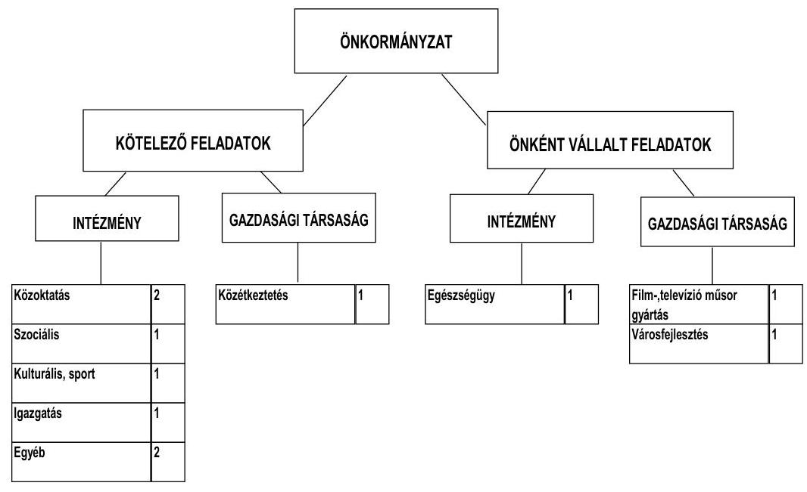

Az Önkormányzat feladatait 2011. június 30-án (a Polgármesteri hivatallal együtt) nyolc költségvetési szervvel és három gazdasági társaság kere-

[^0]
[^0]:    ${ }^{6}$ Nem tartalmazta az OEP által finanszírozott feladatokra fordított és a kisebbségi önkormányzati feladatokra teljesített kiadásokat.

---

tében látta el ${ }^{7}$. Az intézményszerkezetet érintő szervezeti átalakítások és összevonások következtében az intézmények száma a 2007. január 1-jei 17-ről nyolcra, feladatellátás telephelyeinek száma a 2007. évi 28-ról a 2011. év I. félév végére 25-re csökkent. Az intézmények és a telephelyek száma az áttekintett időszakban a 2007. évi intézményrendszer átalakítása és a szociális intézmény átadása miatt csökkent.

A 2007. évben végrehajtott intézményrendszer átalakítása, valamint az önként vállalt feladatot ellátó szociális intézmény Megyei Önkormányzat részére történő átadása jelentős mértékű, kedvező hatást gyakorolt az Önkormányzat pénzügyi egyensúlyi helyzetének alakulására. Az Önkormányzat adatszolgáltatása szerint az intézményszerkezet 2007. évi átalakítása 596,7 millió Ft, az intézményátadás 161,6 millió Ft megtakarítást eredményezett az Önkormányzat számára. Az Önkormányzat 2011. év I. félév végén három gazdasági társaságban kizárólagos tulajdonnal rendelkezett. A közszolgálati feladatellátásban résztvevő két gazdasági társaságban az Önkormányzat nem rendelkezett tulajdonnal.

A gazdasági társaságok a kötelező feladatellátást érintően települési szilárdhulladék kezelés, szállítás, szennyvízelvezetés és tisztítás, közétkeztetés, városfejlesztés és közmunka programok lebonyolítása, az önként vállalt feladatellátást érintően film-, televízió-gyártási tevékenység területén kaptak szerepet az Önkormányzat feladatellátásában. A gazdasági társaságok a működésükhöz az ellenőrzött időszakban összesen 26,8 millió Ft rendszeres működési (a közfoglalkoztatási feladatokhoz 24,3 millió Ft, a film-, televízió-gyártási tevékenységhez 2,5 millió Ft), 12,5 millió Ft eseti működési (közétkeztetési feladatokhoz) és 28,7 millió Ft fejlesztési célra ( 22,4 millió Ft közétkeztetési feladatokhoz, 6,3 millió Ft film-, televízió-gyártási tevékenységhez) átadott pénzeszközben részesültek. A többségi tulajdonban levő gazdasági társaságok pénzügyi egyensúlyi helyzete, a 2010. évi saját tőke/jegyzett tőke aránya alapján stabil, a társaságok működése az Önkormányzat pénzügyi egyensúlyának megőrzésében kockázatot nem jelentenek. Az Önkormányzat működési kiadásokra 2010-ben 2621,0 millió Ft-ot fordított, amely a 2007-2009. évek átlagát 233,9 millió Ft-tal ( $9,8 \%$-kal) haladta meg. A növekedést a Polgármesteri hivatal dologi kiadásainak (kötvénykibocsátásból származó kamatfizetési kötelezettség, könyvkiadás, kis értékű tárgyi eszközök beszerzése és a beruházásokat érintő fordított áfa kötelezettség teljesítése) növekedése eredményezte. A működési kiadások 58,7\%-át az intézményi körben realizálták.

[^0]
[^0]:    ${ }^{7}$ 2010. december 31-én az Önkormányzatnak négy kizárólagos tulajdonú gazdasági társasága volt, 2011. év I. félévben egy gazdasági társaságnál végelszámolás megindítására került sor.

---

A működési kiadások finanszírozásának forrásait ágazatonként a 2007. és 2010. években a következő ábra szemlélteti:
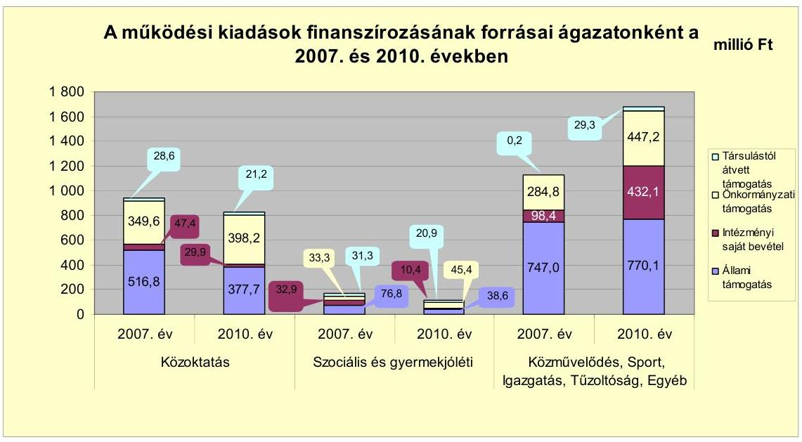

A 2007-2010. években a finanszírozási forrásokon belül összességében az állami támogatás képviselte a legnagyobb részarányt. A 2007. évben az állami támogatás 1340,4 millió Ft volt, amely az összes bevétel 59,7\%-át tette ki. A 2008. évben 1304,4 millió Ft-ot (55,0\%-ot), a 2009. évben 1298,7 millió Ft-ot ( $51,1 \%$-ot) tett ki az állami támogatás a finanszírozási forrásokon belül. A 2010. évben az állami támogatás összege 1186,4 millió Ft-ra, bevételeken belüli részaránya $45,3 \%$-ra csökkent. Az állami támogatás bevételeken belüli aránya a 2008. évben 4,7 százalékponttal, a 2009. évben 3,9 százalékponttal, a 2010. évben 5,8 százalékponttal csökkent az előző évhez képest, ezen belül jelentős volt a közoktatási és közművelődési feladatok finanszírozását szolgáló forrásokon belüli részarány csökkenés. Az állami támogatás csökkenése miatt kieső forrásokat az intézmények működtetése érdekében saját intézményi bevétellel, illetve önkormányzati támogatás emelésével biztosította az Önkormányzat, amely a működés biztonságának kockázatát növelte. Az Önkormányzatnál a 2007-2010. évek között a saját intézményi bevételek az ideiglenes jelleggel végzett iparűzési tevékenység adómértékének, az intézményi térítési díjak és a szemétszállítási díjak emelésének, a szemétszállítási díjak kedvezményei csökkentésének, valamint a beruházásokat érintő fordított áfa kötelezettség teljesítésének könyvviteli elszámolása miatt növekedtek.

A vizsgált időszakban a kötelező és önként vállalt feladatok ellátását biztosító szervezeti keretekben, a feladatellátás módjában bekövetkezett változások (intézményrendszer átalakítása, intézményátadás) kedvező hatást gyakoroltak az Önkormányzat pénzügyi egyensúlyi helyzetének alakulására, mivel az intézkedések összességében 758,3 millió Ft megtakarítást jelentettek az Önkormányzat számára.

---

Az Önkormányzat folyó költségvetési egyenlegét, pénzügyi kapacitását és tőketörlesztését a következő ábra mutatja:
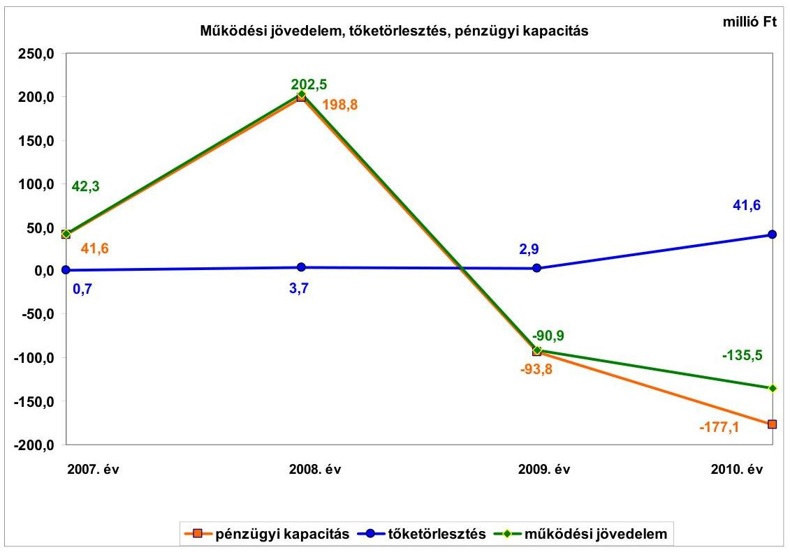

Az Önkormányzat folyó költségvetés egyenlege (működési jövedelem) 2007-2010. években 18,4 millió Ft összegű működési jövedelmet (működési forrástöbblet) mutatott. ${ }^{8}$ A folyó költségvetés egyenlege, 2007-ben és 2008-ban volt pozitív egyenlegű (működési forrástöbblet), 2009-ben és 2010-ben az egyenleg negatív összegű volt. A működési jövedelem csökkenésében alapvetően a folyó kiadások növekedése játszott szerepet. A pozitív egyenleg kialakulását 2007-ben 27,1 millió Ft, 2008-ban 50,0 millió Ft ÖNHIKI támogatás is segítette.

A vizsgált időszakban az Önkormányzatnál összességében -30,5 millió Ft nettó működési jövedelem képződött. A működési jövedelem a hitelekhez kapcsolódó tőketörlesztés összegére a 2009-2010. években nem nyújtott fedezetet, mivel a pénzügyi kapacitás negatív összegű lett (-93,9 millió Ft és -177,1 millió Ft), a működési jövedelem (293,4 millió Ft-os és 44,6 millió Ft-os) csökkenése következtében. A tőketörlesztés összege a 2007-2009. évek átlagában 2,5 millió Ft volt, ami a 2010. évben 41,6 millió Ft-ra emelkedett annak következtében, hogy az Önkormányzat megkezdte a 2007. évben kibocsátott kötvény törlesztését.

A 2007-2010. években az Önkormányzat felhalmozási költségvetésének egyenlege folyamatosan negatív összegű volt. A felhalmozási és tőkejellegű bevételek egyik évben sem biztosítottak fedezetet a felhalmozási és tőkejel-

[^0]
[^0]:    ${ }^{8}$ Ebben az időszakban az Önkormányzat 77,1 millió Ft ÖNHIKI támogatásban részesült, e támogatás nélkül a működési jövedelem negatív volt.

---

legű kiadásokra, a forráshiányt külső forrásokból biztosította az Önkormányzat. A vizsgált időszakban keletkezett 1130,7 millió Ft felhalmozási forráshiányt a 15,8 millió Ft 2007. évi nyitó pénzkészlet, a felvett 14,8 millió Ft összegű fejlesztési hitel és az 1100,1 millió Ft kötvénykibocsátás fedezte.

Az Önkormányzat a 2007-2010. években közel azonos nagyságrendű folyó bevételt ért el, ezen belül a költségvetési támogatás és az átengedett szja 2007-2009 közötti évek átlagához (924,6 millió Ft) viszonyítva a 2010. évi együttes összeg 3,0\%-kal (28,4 millió Ft-tal) nőtt. A helyi adók és pótlékok bevételei az Önkormányzat folyó bevételeiben nem töltöttek be meghatározó szerepet, - a folyó bevételek 5,7\%-át tették ki - mely a település alacsony jövedelemtermelő képességét jelzi.

Az Önkormányzat a vizsgált időszakban gazdasági társaságaitól osztalékban nem részesült. Az egyes években nyereségesen működő gazdasági társaságai által elért adózott eredményt eredménytartalékba helyeztette.

Az Önkormányzat folyó kiadásai folyamatosan nőttek az előző évhez viszonyítva. A 2010-ben teljesített kiadás 8,8\%-kal (222,4 millió Ft-tal) volt magasabb a 2007-2009. évek átlagánál (2517,6 millió Ft).

A pénzügyi egyensúlyi helyzet alakulását jelentősen befolyásolta az Önkormányzat elmúlt időszak fejlesztési és felújítási tevékenysége. A 2007-2010. évek időszakában a 1667,9 millió Ft értékű fejlesztés és felújítás forrása a 158,6 millió Ft saját erő ( $9,5 \%$ ) és a 675,9 millió Ft ( $40,5 \%$ ) hazai és EU-s támogatások mellett 809,5 millió Ft kötvénykibocsátásból és 14,8 millió Ft hitelből (1,5\%) származó forrás ( $48,5 \%$ ) volt. Az Önkormányzat a 2010. december 31-én folyamatban lévő fejlesztési és felújítási feladatok végrehajtására 2007-2010. között 221,4 millió Ft kiadást teljesített, amelyre kötvénykibocsátással összefüggő bevételből 81,8 millió Ft-ot (36,9\%), EU-s támogatásból 139,1 millió Ft-ot ( $62,8 \%$ ), saját bevételből 0,5 millió Ft-ot ( $0,3 \%$ ) fordított.

Az Önkormányzat 2010. december 31-én folyamatban lévő fejlesztési feladatok a 2010. évet követő kötelezettségvállalásainak összege 617,8 millió Ft volt, amelyből 370,1 millió Ft-ot saját bevételből, 58,8 millió Ft-ot EU-s támogatásból és 188,9 millió Ft-ot a korábban kibocsátott kötvény bevételéből tervez biztosítani.

---

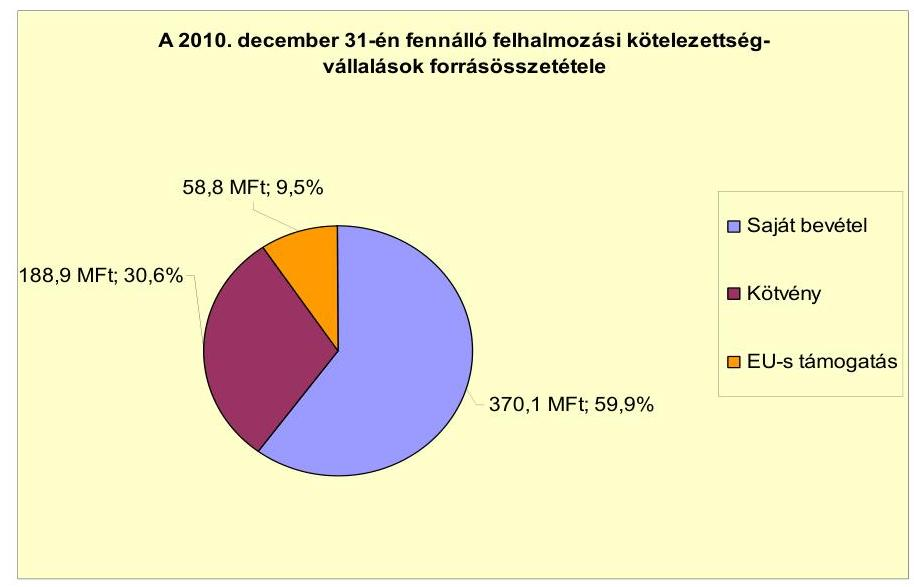

Az Önkormányzatnak a vizsgált időszakban beadott, elbírálás alatt álló pályázata nem volt.

Az Önkormányzatnak mérleg szerinti pénzintézettel szembeni kötelezettsége a 2006. év végén nem volt. A 2007. évben CHF-ben megvalósult kötvénykibocsátásból 1100,1 millió Ft, az igénybe vett hosszú lejáratú hitelből 14,8 millió Ft pénzintézeti kötelezettsége keletkezett. Az árfolyamveszteséget figyelembe véve 2011. év I. félév végén 1567,2 millió Ft volt az Önkormányzat pénzintézeti kötelezettsége, amelyből az árfolyamváltozás 517,8 millió Ft-ot tett ki. Az Önkormányzat az elfogadott 2011. évi költségvetési rendelete alapján hosszú lejáratú hitel felvételét nem tervezte.

Az Önkormányzat kötelezettségvállalásaira képviselő-testületi döntés alapján került sor, azonban az előterjesztésekben nem mutatták be a kamat- és - a deviza alapú kötelezettségeket érintő - árfolyamkockázatot. A 2007. évben kibocsátott kötvényét az Önkormányzat a 2010. évben kezdte törleszteni, a tervezett visszafizetés 2030-ban fejeződik be.

Az Önkormányzat a 14,8 millió Ft hitelt lehívta, és a hitelcélnak megfelelően a kötvénykibocsátásból származó forrással együtt a Képviselő-testület által jóváhagyott, a költségvetésbe betervezett beruházáshoz használta fel. Az Önkormányzat a CHF-ben fennálló pénzintézeti kötelezettségeiből 180 ezer CHF (38,6 millió Ft) tőkét törlesztett, és 481,5 ezer CHF (145,3 millió Ft) kamatot fizetett. A 2007-2011. I. féléve között átmenetileg szabad pénzeszközeiből 226,1 millió Ft kamatbevételt realizált, ami fedezetet nyújtott a teljesített 169,1 millió Ft kamatkiadásra. Az Önkormányzat fizetési kötelezettségét a referencia kamatok változása összességében kedvezően befolyásolta, a referenciakamatok csökkenése következtében az Önkormányzat kamatfizetési kötelezettsége a 2009. évi 62,9 millió Ft-ról, 2010. évben 24,7 millió Ft-ra csökkent.

Az Önkormányzat számlavezető bankot a vizsgált időszakban nem váltott.

---

Az Önkormányzat költségvetésének pénzügyi egyensúlyát a vizsgált időszakban folyószámlahitel igénybevételével tudta biztosítani. A folyószámlahitel igénybevétele a 2007-2011. év I. félévében években az alábbiak szerint alakult:

| Megnevezés | 2007. év | 2008. év | 2009. év | 2010. év | 2011. I. félév |
| :-- | :--: | :--: | :--: | :--: | :--: |
| Folyószámlahitel |  |  |  |  |  |
| Keretösszeg január 1-jén (millió Ft-ban) | - | 300,00 | 300,00 | 300,00 | 300,00 |
| Állagos napi állomány (millió Ft-ban) | 41 | 36 | 167 | 157 | 227 |
| Folyószámlahitellel zárt napok száma (nap) | 31 | 101 | 360 | 239 | 180 |
| Egyenleg (állomány) | x | x | x | 142 |  |

A likviditás biztosítása az Önkormányzatnak 169,1 millió Ft kamatkiadást, és 6,1 millió Ft egyéb költség megfizetését okozta. Az Önkormányzat 2011. június 30-ai lejárt szállítói tartozásának ( 14,1 millió Ft) $86,2 \%$-a 30 napon túli volt, ennek $63,2 \%$-a ( 8,9 millió Ft) meghaladta a 90 napot. A 90 napon túli lejárt szállítóállomány fennállása miatt a helyi önkormányzatok adósságrendezéséről szóló 1996. évi XXV. törvény 5. § (2) bekezdésében foglaltak figyelembevételével a polgármester - képviselő-testületi döntés alapján - nyolc napon belül köteles adósságrendezési eljárást kezdeményezni. A fennálló tartozásokról a Képviselő-testületet minden esetben tájékoztatták, azonban az adósságrendezési eljárás megindításáról döntés nem született. Átütemezett szállítói tartozás az Önkormányzatnál nem volt. Az Önkormányzat gazdasági társaságai részére a fejlesztési és egyéb hitelek igénybevételéhez készfizető kezességet nem vállalt. A gazdasági társaságok részére az Önkormányzat kölcsönt nem nyújtott.

Az Önkormányzat kötelezettségeinek 2010. december 31-i, valamint 2011. június 30-ai állományát és várható alakulását a kötelezettségek lejáratáig a következő táblázat szemlélteti:

| Megnevezés | Állomány 2010. december 31-én |  |  | Állomány 2011. június 30-án |  |  | Várható kötelezettség   2011-2013. években |  | Várható kötelezettség   2014. évtől |  |
| :--: | :--: | :--: | :--: | :--: | :--: | :--: | :--: | :--: | :--: | :--: |
|  | HUF-ban   (millió Ft-   ban) | Devizában   (összege.   ezer ...   ben) | Devize   nem | HUF-ban   (millió Ft-   ban) | Devizában   (összege.   ezer ...   ben) | Devize   nem | HUF-ban   (millió Ft-   ban) | Devizában   (összege.   ezer ...-ben) | HUF-ban   (millió Ft-   ban) | Devizában   (összege.   ezer ...-ben) |
| Pénzintézeti kötelezettségek |  |  |  |  |  |  |  |  |  |  |
| "Sap" kötvény Raffiesen Bank Zrt. |  | 7200,0 | CHF |  | 6840,0 | CHF |  | 1293,3 |  | 6678,2 |
| Beruházási hitel | 4,4 |  | HUF | 3,0 |  | HUF | 4,7 |  | 0,0 |  |
| Folyószámlahitel | 141,8 |  | HUF | 228,0 |  | HUF | 228,0 |  | 0,0 |  |
| Pénzintézet kötelezettségek összesen HUF-ban | 146,2 |  | HUF | 231,0 |  | HUF | 232,7 |  |  |  |
| Pénzintézet kötelezettségek összesen CHF-ben |  | 7200,0 | CHF |  | 6840,0 | CHF |  | 1293,3 |  | 6678,2 |
| Lízing kötelezettségek | 2,2 |  | HUF | 2,0 |  | HUF | 2,0 |  | 0,0 |  |
| Szállítási tartozás | 80,0 |  | HUF | 20,0 |  | HUF | 20,0 |  | 0,0 |  |
| Kötelezettségek összesen (CHF-ben) |  | 7200,0 | CHF |  | 6840,0 | CHF |  | 1293,3 |  | 6678,2 |
| Kötelezettségek összesen (HUF-ben) | 208,4 |  | HUF | 251,5 |  | HUF | 255,7 |  | 0,0 |  |

Az Önkormányzatnak pénzintézetekkel szemben fennálló kötelezettsége a 2011. I. félév végén 230,4 millió Ft és 6840,0 ezer CHF volt. Ezek várható kötelezettsége (tőke, kamat és egyéb költség) a legutóbbi kamatfizetés feltételei alapján a 2011-2013. években 1293,3 ezer CHF ( 288,7 millió $\mathrm{Ft}^{9}$ ) és 232,7 millió Ft. Az Önkormányzatnak a 2011. évben szállítói tartozások (19,5 millió Ft) és lízingdíj ( 1,6 millió Ft) kötelezettség címén 22,1 millió Ft fizetési kötelezettsége keletkezett. A 2011-2013. évek kötelezettségeinek teljesítésére figyelembe ve-

[^0]
[^0]:    ${ }^{9}$ 2011. június 30-ai 223,25 Ft-os árfolyamon számolt

---

hető 14,3 millió Ft mérlegben kimutatott követelésállomány. Az Önkormányzat szabad pénzmaradvánnyal 2010. év végén nem rendelkezett. A 2014. évet követően jelenleg ismert pénzintézeti kötelezettsége 6678,2 ezer CHF (1504,3 millió Ft). Az Önkormányzat tájékoztatása szerint figyelembe vehető további források „a mindenkori költségvetési rendeletekben megtervezett önkormányzati helyi adóbevételek. A kötelezettségek forrásaként a helyiadó-bevétel növekménye vehető figyelembe, azonban új adónem bevezetésére, illetve az adómértékek növelésére 2011-ben nem került sor.

A kizárólagos önkormányzati tulajdonú gazdasági társaságoknak hitelfelvételből és lízingügyletekből származó pénzintézettel szembeni kötelezettsége nem volt. A társaságoknak a 2011. évtől 14,5 millió Ft szállítói tartozást kell rendezniük. Ez a kötelezettség nagyságrend nem jelent kockázatot az Önkormányzat számára.

Az Önkormányzat pénzügyi egyensúlyi helyzetét befolyásolhatja eszközeinek állapota, használhatósági foka, az eszközök pótlására fordított összegek nagysága. Az Önkormányzat az ellenőrzött időszakban tárgyi eszközeinek értéke után 460,4 millió Ft értékcsökkenést számolt el, az elhasználódott eszközök pótlására - az intenzív fejlesztési tevékenység eredményeként - 1525,8 millió Ft-ot fordított. A tárgyi eszközök használhatósági foka a fejlesztések ellenére 78,4\%-ról $75,3 \%$-ra csökkent. A Képviselő-testületnek előterjesztett éves zárszámadási rendeleteikben nem mutatták be az Önkormányzat eszközei után tárgyévben elszámolt értékcsökkenés összegét, az eszközpótlásra szolgáló kiadásokat, az eszközök elhasználódási fokának alakulását.

Az Önkormányzat az ellenőrzött időszakban kiadási megtakarítást eredményező és bevételt növelő intézkedéseket tett. A 2007-2010. évek között tett intézkedések hatására 35,9 millió Ft bevételi többletet, továbbá 1580,0 millió Ft kiadási megtakarítást mutattak ki. A kiadási megtakarítás, valamint a bevételnövelő intézkedések hatására elért többletbevétel összege az Önkormányzat által számított, az ÁSZ által nem kontrollált érték. A kiadási megtakarítások 82,5\%-a (1302,9 millió Ft) az elrendelt álláshely-csökkentések eredménye. Egy szociális intézmény a Megyei Önkormányzat részére átadásra került, amely az Önkormányzatnál 161,6 millió Ft megtakarítást eredményezett. A megtett intézkedések az Önkormányzat pénzügyi egyensúlyi helyzetére kedvezően hatottak. Az álláshely-csökkentő intézkedések - amelyek 70,3\%-a ( 90 fő) ágazati szakmai, 29,7\%-a ( 38 fő) intézményüzemeltetéshez, fenntartáshoz, gazdasági ügyek intézéséhez kapcsolódott - 2007-2010. évek között önkormányzati szinten összesen 128 álláshely (ebből üres álláshely nem volt) megszüntetését jelentették. Egyes közszolgáltatási területeken azonban feladatbővülések is voltak, amelyek álláshely- és egyben létszámnövekedéssel is jártak. A 2006-2010. években a közoktatás területén 13 fő, az egyéb városgazdálkodási feladatok területén 15 fő álláshely növekedés történt, amely az összes álláshely ( 448 fő) 6,3\%-át tette ki. Ennek következtében az időszak álláshelyeinek száma összességében 448 főről 100 fővel 348 főre csökkent. A bevételnövelő intézkedések hatására az Önkormányzat - kimutatása alapján - a 2007-2010. években és a 2011. év I. félévében összesen 51,3
 millió Ft többletbevételt ért el. A többletbevétel 1,0\%-át (0,5 millió Ft-ot) a helyi adórendeletek módosításával, az adómérték emelésével, 5,8\%-át (3,0 millió Ft-ot) eszközök hasznosítására tett intézkedésekkel, 1,7\%-át (0,9 millió Ft-ot) szabad kapacitások hasznosításával,

---

13,1\%-át (6,7 millió Ft-ot) intézményi térítési díjakkal kapcsolatos, 78,4\%-át (40,2 millió Ft-ot) lejárt tartozások behajtásával kapcsolatos intézkedésekkel érték el. Az ellenőrzés megállapítása szerint a bevételnövelő intézkedések között kimutatott lejárt tartozások behajtása (40,2 millió Ft) az Önkormányzat kötelező feladata, ezeket figyelmen kívül hagyva 2007-2010. években és a 2011. év I. félévében összesen 2591,2 millió Ft volt a megtakarítás és többletbevétel egyenlege.

Az Önkormányzat a 2011. évben a költségvetési támogatások és átengedett szja összegének csökkenésével kalkulál az előző évhez viszonyítva. A költségvetési rendeletben tervezett költségvetési támogatás és átengedett szja összege 360,7 millió Ft-tal maradhat el a 2010. évitől. A 2011. év I. félévében az Önkormányzat - kimutatása szerint - a kiadáscsökkentő intézkedéseinek eredményeként 1000,1 millió Ft megtakarítást, míg bevételnövelő intézkedéseinek eredményeként 15,4 millió Ft bevételi többletet ért el. Az így elért bevételi többlet és kiadási megtakarítás összege (1015,5 millió Ft) a kieső költségvetési támogatás és átengedett szja időarányos részére (180,4 millió Ft) fedezetet nyújt.

Az utóellenőrzés a pénzügyi egyensúly javítására tett két szabályszerűségi és egy célszerűségi javaslat hasznosítására terjedt ki. A szabályszerűségi javaslatok az intézkedési terv szerinti határidőben megvalósultak. A hosszú lejáratú adósságot keletkeztető kötelezettségvállalások teljesíthetősége feltételeinek Képviselő-testület részére történő évenként egyszeri bemutatására vonatkozó célszerűségi javaslat nem teljesült.

Az Önkormányzat pénzügyi egyensúlyi helyzetét összegezve a következők emelhetők ki:

Sajószentpéter Város Önkormányzatának pénzügyi egyensúlya rövid távon veszélyeztetett.

A folyó bevételek a 2009-2010. években nem biztosították a folyó kiadások és az adósságszolgálat fedezetét. A pénzügyi egyensúlyi helyzet romlását a csökkenő tendenciájú nettó működési jövedelem jelzi. A likviditás biztosítása folyószámlahitel és likvid hitel igénybevételével történt. A folyószámlahitel átlagos állományának és a hitellel zárt napok számának a növekedése a költségvetésbe beépült működési forráshiányt jelzi.

A felhalmozási költségvetése pénzügyi hiányt mutatott, ennek forrásait kötvény kibocsátásával és hosszú lejáratú hitel felvételével biztosították. A fejlesztési célú kötelezettségek jövőbeni teljesítésénél a nettó működési jövedelem negatív értéke a felhalmozási feladatok finanszírozási kockázatát jelenti.

A pénzintézettel szembeni és egyéb kötelezettségek teljesítése sem rövid, sem középtávon nem biztosított. A kötelezettségek teljesítése csak további kiadáscsökkentő és bevételnövelő intézkedések útján elért megtakarítások, illetve többletbevételek, valamint egyéb külső források bevonásával lehetséges, amelyekhez azonnali intézkedések meghozatala szükséges.

Az Állami Számvevőszékről szóló 2011. évi LXVI. törvény 33. § (1) bekezdésében foglaltak értelmében a jelentésben foglalt megállapításokhoz kapcsolódó

---

intézkedési tervet köteles az ellenőrzött szervezet vezetője összeállítani és azt a jelentés kézhezvételétől számított harminc napon belül az ÁSZ részére megküldeni. Amennyiben az intézkedési tervet határidőben nem küldi meg a szervezet, vagy az továbbra sem elfogadható, az ÁSZ elnöke a hivatkozott törvény 33. § (3) bekezdés a)-b) pontjaiban foglaltakat érvényesítheti.

# A 2011. június 30-i pénzügyi egyensúlyi helyzet alapján az ellenőrzés intézkedést igénylő megállapításai és javaslatai a következők:

## a Polgármesternek

1.  Az Önkormányzat pénzügyi egyensúlya rövid távon veszélyeztetett. Az Önkormányzat nettó működési jövedelme a 2009. évtől negatív volt. Az Önkormányzat finanszírozása a vizsgált időszakban folyószámlahitel és likvid hitel igénybevételével volt biztosítható.

Az Önkormányzat által tett intézményszervezeti átalakítások, kiadáscsökkentő és bevételnövelő intézkedések nem biztosítanak elegendő forrást a pénzügyi egyensúly helyreállításhoz.

A Képviselő-testület döntését megalapozó előterjesztésekben nem mutatták be az adósságot keletkeztető kötelezettségeknél a kamatkockázatokat és a devizás kötelezettségek esetén az árfolyamkockázatokat, valamint a visszafizetés forrásait.

Javaslat:
Az Önkormányzat pénzügyi egyensúlyának gyors helyreállítása és hosszú távú fenntarthatósága érdekében kezdeményezze - felelősök és határidők megjelölésével - az alábbi intézkedések megtételét:
a) Tárja fel a bevételszerző és kiadáscsökkentő lehetőségeket. Intézkedjen a bevételek növelésére, a kintlévőségek behajtására, a kiadások csökkentésére.
b) Terjesszen a Képviselő-testület elé reorganizációs programot a kedvezőtlen pénzügyi folyamatok megállítására, a pénzügyi egyensúlyi helyzet gyors stabilizálására.
c) Vizsgálja meg az állandósult folyószámla- és likvid hitel hosszú távú kötelezettséggé történő átalakításának jogi lehetőségét, és a Stabilitási törvény 10. §-ában előírt feltételek fennállása esetén kezdeményezze a Kormánynál ennek engedélyezését.
d) Képezzen egyensúlyi (elkülönített) tartalékot az adósságszolgálat teljesítése érdekében.
e) Mérje fel a folyamatban lévő beruházásokkal kapcsolatos kötelezettségek átütemezésének pénzügyi és jogi lehetőségeit, illetve hatásait. Szükség esetén kezdeményezze a Képviselő-testületnél az átütemezést.

---

f) Vizsgálja felül teljes körűen a tervezett beruházásokat és azok fenntartásának jövőbeni pénzügyi kihatásait. Az Önkormányzat pénzügyi egyensúlyi helyzete szempontjából kedvező támogatás-finanszírozási lehetőségeket vegye igénybe. Szükség esetén tegyen javaslatot a Képviselő-testületnek a tervezett beruházásokkal kapcsolatos döntések módosítására, amelyben figyelembe veszik az Önkormányzat pénzügyi lehetőségeit és a kötelező feladatellátás elsődlegességét.
g) Kezdeményezze az intézmények finanszírozásának napi kontrollját. Szűkítse a jóváhagyott előirányzatok felhasználásának lehetőségeit.
h) Mutassa be havonta legalább három évre kitekintően kötelezettségeinek finanszírozási forrásait.
i) Az adósságot keletkeztető kötelezettségvállalásról szóló döntéskor mutassa be a Képviselő-testületnek a jövőben várható - árfolyam-, kamat- és törlesztési - kockázatot. Kezességvállalás, garancia és helytállási kötelezettségvállalásról szóló döntésnél mutassa be a Képviselő-testületnek azok pénzügyi kockázatait.
j) Gondoskodjon, hogy a jövőben az adósságot keletkeztető kötelezettségvállalásokról szóló képviselő-testületi előterjesztések tételesen tartalmazzák a visszafizetés forrásait.
2.  A Képviselő-testületnek előterjesztett éves zárszámadási rendeleteikben nem mutatták be az Önkormányzat eszközei után tárgyévben elszámolt értékcsökkenés összegét, az eszközpótlásra fordított tényleges kiadásokat, az eszközök elhasználódási fokának alakulását.

Javaslat:
Mutassa be a Képviselő-testületnek évente a zárszámadási rendelet előterjesztésében az értékcsökkenés összegét, és ezzel összevetve az elhasználódott eszközök pótlására fordított tényleges kiadásokat, az eszközök elhasználódási fokának alakulását.
3.  Az Önkormányzat lejárt szállítói állománya 2011. június 30-án 14,1 millió Ft volt, melyből a 90 napot meghaladó 8,9 millió Ft volt.

Javaslat:
Kezelje az Önkormányzat lejárt szállítói állományát, a szállítói kitettség és a jogszabályi következmények elkerülése érdekében.
4.  Az Önkormányzat a vizsgált időszakban gazdasági társaságaitól osztalékban nem részesült. Az egyes években nyereségesen működő gazdasági társaságai által elért adózott eredményt eredménytartalékba helyeztette.

Javaslat:
Kezdeményezze, hogy kerüljön felvételre az Önkormányzat számára járó osztalék a pénzügyi egyensúlyi helyzetének javítása, adósságszolgálatának törlesztése érdekében.

---

5.  Az Önkormányzatnál az utóellenőrzés során megállapításra került, hogy a korábbi ÁSZ vizsgálat során tett egy célszerűségi javaslat nem teljesült. A jegyző nem végzett évente számításokat és nem tájékoztatta a Képviselő-testületet - az Önkormányzat eladósodásának növekedésére figyelemmel - arról, hogy a hosszú lejáratú, adósságot keletkeztető kötelezettségvállalásokból adódó tőke- és kamatfizetési kötelezettségét az Önkormányzat milyen feltételek biztosítása mellett tudja teljesíteni.

Javaslat:
Gondoskodjon - az államháztartásról szóló 2011. évi CXCV. törvény 23. § (2) bekezdés g) pontja értelmében - az Önkormányzat gazdálkodási rendszerét érintő előző ellenőrzés nem hasznosult javaslatának végrehajtásáról.

A polgármester a helyszíni ellenőrzés lezárása után tájékoztatta az Állami Számvevőszéket az Önkormányzat megtett és tervezett intézkedéseiről, amelyet az Állami Számvevőszék nem ellenőrzött, arra vonatkozóan véleményt vagy megállapítást nem fogalmaz meg. Az ellenőrzés lezárását követően elvégzett intézkedéseket az Állami Számvevőszék utóellenőrzés keretében vizsgálhatja.

A polgármester tájékoztatása szerint a következő intézkedéseket tette, illetve tervezi az Önkormányzat:

- a bevételek növelése érdekében 2012. január 1-jétől a Képviselő-testület több ingatlan értékesítése mellett döntött, míg a polgármester a kintlévőségek behajtása érdekében az adók, az adók módjára történő követelések, a lakbérhátralékok, egyéb követelések behajtására utasította a jegyzőt,
- a kiadások csökkentése érdekében a 2012. évi költségvetés összeállítása során a működési kiadásokat $15 \%$-kal, a felhalmozási kiadásokat $81 \%$-kal csökkentették, melynek hatásaként 359,9 millió Ft, illetve 1028,0 millió Ft kiadási megtakarítással számoltak a 2012. évben,
- az intézményrendszer áttekintése folyamatban van. A Képviselő-testület a Művelődési és Sportközpont intézményben létszámleépítésről döntött. A polgármester a Képviselő-testület 2012. márciusi ülésére az óvodai és iskolai feladatellátás átszervezésére tesz javaslatot,
- a Képviselő-testület elrendelte az intézmények finanszírozásának napi kontrollját.

---

# II. RÉSZLETES MEGÁLLAPÍTÁSOK

## 1. AZ ÖNKORMÁNYZAT KÖTELEZŐ ÉS ÖNKÉNT VÁLLALT FELADATAI, A FELADATELLÁTÁS SZERVEZETI KERETEI ÉS ANNAK VÁLTOZÁSAI

Az Önkormányzat az SzMSz-ben rögzítette a kötelező és az önként vállalt feladatait. Kötelezően ellátandó feladatainak az Ötv. és az ágazati törvények által meghatározottakat tekintette, önként vállalt feladatok közé sorolta a kéményseprési tevékenységet, a civil szervezetek támogatását, a fiatal házasok támogatását, valamint a bentlakásos idősek otthona szakosított szociális ellátást biztosító Időskorúak Szociális Otthona intézmény működtetését. Az önként vállalt feladatok besorolását az Önkormányzat maga végezte el.

Az Önkormányzat - adatszolgáltatása szerint a - működési célú költségvetési kiadásaiból a 2010. évi beszámolója szerint 2592,2 millió Ft-ot a kötelező feladatok 28,8 millió Ft-ot önként vállalt feladatok ellátására fordított${ }^{10}$.

Az Önkormányzat 2010. évi működési kiadását, azok ágazati megoszlását és finanszírozási forrásait az alábbi táblázat szemlélteti:

| Ellátott feladat | Működési kiadás összesen (millió Ft) | Kötelező feladatok kiadásainak részaránys \% | Működési bevétel összesen (millió Ft) | Állami támogatás részaránys \% | Intézményi saját bevétel részaránys \% | Önkormányzati támogatás részaránys \% | Társulástól átvett támogatás részaránya \% |
| :------------------: | :-----------------------------------: | :-------------------------------------------: | :-----------------------------------: | :---------------------------------: | :---------------------------------------: | :---------------------------------------: | :---------------------------------------------: |
|       Óvodák        |                 209,9                 |                     100,0                     |                 209,9                 |                 43,8                 |                   4,8                   |                   51,0                   |                       0,6                       |
| Általános iskolák |                 617,1                 |                     100,0                     |                 617,1                 |                 46,4                 |                   3,2                   |                   47,2                   |                       3,2                       |
| Szociális intézmények |                 100,2                 |                     90,0                      |                 100,2                 |                 31,0                 |                   10,4                  |                   45,3                   |                       13,3                      |
| Gyermekjóléti intézmények |                 15,1                  |                     100,0                     |                 15,1                  |                 49,7                 |                   0,1                   |                   0,0                    |                       50,2                      |
| Közművelődési intézmények |                 70,1                  |                     100,0                     |                 70,1                  |                 0,0                  |                   12,8                  |                   86,9                   |                       0,3                       |
| Sportlétesítmények |                 18,0                  |                     100,0                     |                 18,0                  |                 0,0                  |                   6,7                   |                   93,3                   |                       0,0                       |
| Egyéb intézmények |                 508,6                 |                     99,0                      |                 508,6                 |                 1,6                  |                   20,0                  |                   72,7                   |                       5,7                       |
| Polgármesteri hivatal igazgatási kiadása |                 412,1                 |                     100,0                     |                 412,1                 |                 98,2                 |                   1,8                   |                   0,0                    |                       0,0                       |
| Polgármesteri hivatalban ellátott egyéb feladatok működési kiadása |                 669,9                 |                     97,8                      |                 669,9                 |                 53,4                 |                   46,6                  |                   0,0                    |                       0,0                       |
| Működési kiadások összesen |                2621,0                 |                     98,9                      |                2621,0                 |                 45,3                 |                   18,0                  |                   34,0                   |                       2,7                       |

Az Önkormányzat működési kiadásai a 2007-2010. években egyenletes ütemben növekedtek. A működési kiadások a 2010. évben az előző három év átlagához (2387,0 millió Ft) viszonyítva 234,0 millió Ft-tal (9,8\%-kal) növekedtek.

[^0]
[^0]: ${ }^{10}$ A táblázat összes működési kiadása 113,3 millió Ft-tal eltér a költségvetési beszámolóban elszámolt kiadások összegétől, mivel a táblázat nem tartalmazza a kisebbségi önkormányzatok működési kiadásait, valamint az egészségügyi szakfeladaton elszámolt, OEP által finanszírozott kiadásokat. A CLF módszer alapján megállapított működési kiadás beszámolóban kimutatott kiadástól való eltérését a kamat, illetve működési célú kölcsön kiadás eltérő módon történő figyelembe vétele okozta.

---

A 2008. évben 123,6 millió Ft-tal (5,5\%-kal),
 a 2009. évben 173,2 millió Ft-tal (7,3%-kal), a 2010. évben 77,3 millió Ft-tal (3,0%-kal) növekedett az előző év teljesített kiadásához hasonlítva.

Az Önkormányzat kötelező és önként vállalt feladatai ellátására fordított kiadásainak előző évekhez viszonyított aránya a 2008. évben változott a legnagyobb mértékben. Az önként vállalt feladatok aránya a 2007. évi 4,4%-ról a 2008. évben 1,0%-ra csökkent az önként vállalt feladatot ellátó Időskorúak Szociális Otthona intézmény 2007. október 1. napjával a Megyei Önkormányzat részére történt átadása következtében. Az Önkormányzat kötelező és önként vállalt feladatai ellátására fordított kiadásainak aránya a 2009-2010. években és a 2011. év I. félévében nem változott, a kötelező feladatellátás kiadásainak aránya $98,9 \%$ volt.

A 2007-2010. években a közoktatásra fordított kiadások aránya az összes működési kiadásokhoz viszonyítva - az ellátottak számának folyamatos csökkenése következtében - a 2007. évi 41,9%-ról (942,4 millió Ft) egyenletes ütemben a 2010. évben 31,6%-ra (827,0 millió Ft) csökkent.

Az ellátottak száma a 2007-2010. években az óvodákban 439 főről 382 főre, 57 fővel (13,0%-kal), az iskolákban 1535 főről 1243 főre, 292 fővel 19,0%-kal csökkent.

A közoktatási feladatok ellátására fordított kiadások csökkenése a 2009. évben volt a legnagyobb összegű. Az erre a célra teljesített működési kiadás a 2008. évi 952,1 millió Ft-ról a 2009. évben 123,0 millió Ft-tal (12,9%-kal) 829,1 millió Ft-ra csökkent, mivel a közoktatási intézmények (óvodák, általános iskolák) 2007. július 1-én végrehajtott szerkezeti átalakításának, integrációjának hatása a 2009. évben jelentkezett a működési kiadások megtakarításában.

A szociális és gyermekjóléti intézmények fenntartására fordított kiadások aránya az összes működési kiadásokhoz viszonyítva a 2007-2010. években 4,4% és 7,7% (115,3 millió Ft és 174,1 millió Ft) között mozgott, irányát tekintve csökkenő tendenciájú. A legnagyobb arányú (2,6 százalékpontos) csökkenés - az előző évhez viszonyítva - 2008. évben következett be (174,1 millió Ft-ról 121,5 millió Ft-ra), a szakosított szociális ellátást biztosító intézmény Megyei Önkormányzat részére történő átadása miatt. A 2011. évre tervezett szociális kiadások - előző évhez viszonyított - 34,8 millió Ft-os (30,2%-os) növekedésének oka, hogy az Önkormányzat 2011. január 1-től indította be a településen a bölcsődei ellátást.

A közművelődési, valamint a sportfeladatokra teljesített kiadások összes működési kiadáson belüli részarányának változása az Önkormányzat pénzügyi helyzetére nem volt jelentős hatással.

Az igazgatási kiadások a 2007-2009. években folyamatosan növekedtek. Legnagyobb, 30,9%-os mértékű (98,6 millió Ft) növekedés az előző évhez képest a 2008. évben következett be (319,2 millió Ft-ról 417,8 millió Ft-ra), amelynek 81,3%-át a dologi kiadások (kötvénykibocsátásból származó kamatfizetési kötelezettség, könyvkiadás, kis értékű tárgyi eszközök beszerzése) növekedése eredményezte. A 2009. évi - előző évhez viszonyított - 58,1 millió Ft-os (13,9%-os) növekedést (417,8 millió Ft-ról 475,9 millió Ft-ra) a kötvény kamatfizetési köte-

---

lezettsége és a beruházásokat érintő fordított áfa kötelezettség teljesítése eredményezte. A Polgármesteri hivatalban szakfeladatra elszámolt kiadások 2009. évi előző évhez viszonyított 66,2 millió Ft-os (16,1%-os) növekedését az áfa mértékének 2009. évi emelkedése, valamint az önkormányzati intézmények karbantartási feladatainak Polgármesteri hivatalhoz történő rendelése eredményezték. A 2010. évben az igazgatási kiadások részaránya csökkent, a Polgármesteri hivatalban szakfeladatra elszámolt kiadások aránya növekedett, melynek oka a szakfeladatrend változás miatti kiadás átrendeződés volt.

Az igazgatási kiadások 2010. évben 2009. évhez képest 475,9 millió Ft-ról 412,1 millió Ft-ra (18,7%-os részarányról 15,7%-os részarányra) csökkentek. Ebben az időszakban, a Polgármesteri hivatalban szakfeladatra elszámolt kiadások 476,0 millió Ft-ról 669,9 millió Ft-ra (18,7%-os részarányról 25,6%-os részarányra) növekedtek.

Az Önkormányzat intézményei által ellátott kötelező és önként vállalt feladatok szerkezetének viszonylagos állandósága eredményezte, hogy az összes kiadásokon belül az egyes ágazati feladatokra teljesített kiadások részaránya jelentősen nem változott.

Az Önkormányzat 2010. évi kötelező és önként vállalt feladatait 1186,4 millió Ft állami támogatásból, 472,4 millió Ft intézményi saját bevételből, 890,8 millió Ft önkormányzati támogatásból és 71,4 millió Ft társult önkormányzattól átvett támogatásból finanszírozta. A 2007-2010. években a finanszírozási forrásokon belül legnagyobb részarányt az állami támogatás képviselt, azonban 2008. évtől kezdődően a finanszírozási forrásokon belüli részaránya csökkent, amit az egyes ágazati feladatok finanszírozási forrásösszetételében jelentkező változások, valamint az ellátottak számának csökkenése együttesen eredményeztek. Az állami támogatás részaránya a 2008. évben 4,7 százalékponttal, a 2009. évben 3,9 százalékponttal, a 2010. évben 5,8 százalékponttal csökkent az előző évhez képest.

A közoktatási feladatokra felhasznált állami támogatás mértékének aránya 2007-2010 között egyenletesen csökkent (a 2007. évi 38,6%-ról a 2010. évben 31,8%-ra), amit az egy feladatmutatóra jutó normatív hozzájárulás csökkenése eredményezett. A közművelődési feladatok ellátásához felhasznált források aránya 2007-2010. évek között szignifikánsan nem változott, az állami támogatás aránya a feladat finanszírozásában 22,6% és 23,3% között változott. A 2010. évben felhasználható állami támogatás hiányát önkormányzati támogatásból finanszírozta az Önkormányzat, melynek oka, hogy a közművelődési feladatok önálló jogcímen történő támogatása megszűnt, arra a 2010. évtől a települési önkormányzatok üzemeltetési, igazgatási, sport, kulturális feladataira kapott normatív hozzájárulásból kell fedezetet biztosítani. Az egyéb tevékenység finanszírozását szolgáló forrásokon belül az állami támogatás részarányának növekedését a 2009. július 1-vel létrejött új intézmény - a Sajószentpéteri Egységes Pedagógiai Szakszolgálat - feladatellátását megillető állami támogatás növekménye eredményezte. A szociális feladatok finanszírozásában a szakosított ellátást biztosító intézmény Megyei Önkormányzat részére történő átadása 2008. évben az előző évhez képest az állami támogatás 31,6%-os (68,9 millió Ft-ról 47,1 millió Ft-ra), az intézményi saját bevéte-

---

lek 68,5%-os (32,7 millió Ft-ról 10,3 millió Ft-ra) csökkenését eredményezte az előző évhez képest, azonban a változás az állami támogatás összes bevételhez viszonyított arányában csekély mértékű változást (0,8 százalékpontos növekedést) eredményezett. Az igazgatási feladatok finanszírozásában a 2007-2010. években bevont források összetételében pénzügyi helyzetet befolyásoló változás nem volt.

A feladatok finanszírozásában az állami támogatás részarányának csökkenését az intézményi saját bevételek és az önkormányzati támogatás növelésével ellensúlyozták. A 2010. évben realizált intézményi saját bevétel (472,4 millió Ft) 78,8%-kal (208,2 millió Ft-tal) haladta meg az előző három év átlagában számított 264,2 millió Ft saját bevételt. A 2010. évi önkormányzati támogatás (890,8 millió Ft) 19,5%-kal (145,2 millió Ft-tal) haladta meg a 2007-2009. évek számított 745,6 millió Ft-os átlagát. Az önkormányzati feladatok működési kiadásainak folyamatos növekedése, az állami támogatás feladatellátás finanszírozásában való részvételi arányának csökkenése kedvezőtlenül befolyásolta az Önkormányzat pénzügyi egyensúly megtartására irányuló tevékenységét.

Az Önkormányzat kötelező és önként vállalt feladatait 2011. június 30-án nyolc költségvetési szervvel és három kizárólagos tulajdonában levő gazdasági társasággal látta el. A feladatellátásban részt vett további kettő gazdasági társaság, amelyben az Önkormányzat tulajdonnal nem rendelkezett.

Az Önkormányzat a költségvetési szervekhez rendelt feladatait a 2006. év végén öt önállóan gazdálkodó és tizenkettő részben önállóan gazdálkodó, 2011. június 30-án kettő önállóan gazdálkodó és működő és hat önállóan működő költségvetési szerv hajtotta végre. Az intézmények telephelyeinek száma a vizsgált időszakban 28-ról 25-re csökkent. A Városgondnokság látta el a hat önállóan működő költségvetési szerv gazdálkodási feladatait.

Az Önkormányzat feladatait 2011. június 30-án az alábbi intézménystruktúrával látta el:

- közoktatási feladatot kettő intézmény látott el (az Önkormányzat az óvodai ellátást egy székhely óvodával és három tagintézménnyel, az általános iskolai oktatást egy székhely iskolával és négy tagintézménnyel biztosította). A közoktatási intézményeket intézményfenntartói társulásként az Önkormányzat gesztorsága mellett további öt, valamint hét település önkormányzata tartotta fenn;
- szociális és gyermekvédelmi feladatokat egy intézmény végzett (a Területi Szociális Központ és Bölcsőde intézményfenntartói társulásként 12 településen biztosítja a házi segítségnyújtást, 14 településen a jelzőrendszeres házi segítségnyújtást, 15 településen a támogató szolgálatot, nyolc-nyolc településen a családsegítő és gyermekjóléti szolgálatot, valamint az Önkormányzat közigazgatási területén a bölcsődei ellátást);
- egészségügyi feladatokat egy intézmény végzett (a Gyógyító-Megelőző Intézmény látta el a járóbeteg szakorvosi, a védőnői, iskola-egészségügyi és a központi ügyeleti feladatokat);

---

- a közművelődési, könyvtári és sportfeladatokat egy intézmény látta el;
- egyéb feladatokat kettő intézmény látott el (a városüzemeltetést és az önállóan működő intézmények pénzügyi-gazdasági feladatait a Városgondnokság, a pedagógiai szakszolgálatot, nevelési tanácsadást, logopédiai ellátást és gyógytestnevelést a Sajószentpéteri Egységes Pedagógiai Szakszolgálat biztosította);
- az igazgatási feladatokat a Polgármesteri hivatal látta el.

Az Önkormányzat kötelezően ellátandó feladatai közül a települési szilárdhulladék kezelés, szállítás, valamint a szennyvízelvezetés és tisztítás feladatokat két gazdasági társaság látta el, a velük kötött feladatellátási megállapodás, közszolgáltatási szerződés alapján. Ezen szolgáltatási feladatokat ellátó kettő gazdasági társaságban az Önkormányzat tulajdoni részesedéssel nem rendelkezett. Az intézmények ellátottainak, alkalmazottainak közétkeztetési feladatait az Önkormányzat 100%-os tulajdonában lévő gazdasági társaság végezte.

Az Önkormányzat önként vállalt feladatainak ellátásában kettő az Önkormányzat kizárólagos tulajdonában levő gazdasági társaság vett részt, amelyek film-, televízió gyártási tevékenységet, valamint városfejlesztési feladatokat végeztek.

A 2007-2011. év I. félév végéig a költségvetési szervek, illetve a gazdasági társaságok által ellátott feladatok közötti átrendeződés nem volt, azonban az intézményi átszervezések hatására az intézmények száma csökkent, az alapítás, végelszámolás miatt a feladatellátásba bevont a gazdasági társaságok száma a 2007-2011. év I. félév között változott.

Az Önkormányzat intézményrendszerének átalakításáról a 2007. évben döntött a Képviselő-testület, amely kedvezően befolyásolta az Önkormányzat pénzügyi helyzetét, mivel 2007. július 1-jétől 2011. június 30-ig - az Önkormányzat adatszolgáltatása szerint - 596,7 millió Ft kiadási megtakarítást eredményezett az Önkormányzatnak.

A közoktatási intézmények szakmai, szervezeti és gazdasági integrációja során az óvodai és az általános iskolai feladatokat ellátó öt-öt részben önálló gazdálkodási jogkörrel rendelkező intézmények összevonásával egy-egy új intézményt alapított. A városgazdálkodási, valamint az intézmények részére beszámolási, könyvvezetési feladatokat ellátó kettő intézményt (Gazdasági Ellátó Szervezet, Közüzemi Szolgáltató Intézmény) a Képviselő-testület megszüntette és jogutódként létrehozta a Városgondnokságot.

Az Önkormányzat 2009. július 1-jével megalapította a Sajószentpéteri Egységes Pedagógiai Szakszolgálatot.

A feladat és intézményátadások az Önkormányzat pénzügyi helyzetére meghatározó befolyással voltak, kismértékben kedvező irányba befolyásolták. Az idősek - ápolást, gondozást nyújtó, tartós bentlakásos - szakosított ellátását biztosító Időskorúak Szociális Otthona intézményátadást követően - 2007. október 1. napjától - 71 fővel csökkent az intézmény által ellátott feladatmutató.

---

Az intézményátadás hatására 351,3 millió Ft-tal csökkentek az Önkormányzat kiadásai, ezen belül a személyi juttatások és járulékok kiadása 222,7 millió Ft-tal, a dologi kiadások 128,6 millió Ft-tal csökkentek. Az intézkedések következtében az Önkormányzat bevételei 189,7 millió Ft-tal - az állami támogatás 94,7 millió Ft-tal, a saját bevételek 95,0 millió Ft-tal - csökkentek. A feladatátszervezések miatt a kiadások nagyobb mértékben csökkentek, mint a bevételek, így a feladatátadás 161,6 millió Ft megtakarítást eredményezett az Önkormányzat számára. Az intézményrendszer átalakítása 2007. július 1-jétől 2011. június 30-ig 596,7 millió Ft kiadási megtakarítást eredményezett az Önkormányzatnak.

Az Önkormányzat kizárólagos többségi tulajdonban lévő három gazdasági
 társaságainak saját tőke összegei meghaladták a jegyzett tőke összegeit. A társaságok saját tőke növekedési mutatóinak átlaga 1,36 volt. A társaságok pénzügyi helyzete a saját tőke/jegyzett tőke aránya alapján stabil, a társaságok működése az Önkormányzat pénzügyi egyensúlyának megőrzésében kockázatot nem jelentenek.

A vizsgált időszakban a kötelező- és önként vállalt feladatok ellátását biztosító szervezeti keretekben, a feladatellátás módjában bekövetkezett változások (intézményrendszer átalakítása, intézményátadás) kedvező hatást gyakoroltak az Önkormányzat pénzügyi helyzetének alakulására, mivel az intézkedések összességében 758,3 millió Ft megtakarítást jelentettek az Önkormányzat számára.

# 2. AZ ÖNKORMÁNYZAT PÉNZÜGYI EGYENSÚLYI HELYZETÉT BEFOLYÁSOLÓ TÉNYEZŐK 

A hagyományos költségvetési szerkezet helyett az önkormányzat pénzügyi helyzetét a CLF módszerrel mutatjuk be, amelyben jobban elkülönülnek a vagyonnal kapcsolatos bevételek és kiadások az önkormányzati feladatokkal kapcsolatos közvetlen működtetési bevételektől és kiadásoktól. A módszer következetesen elkülöníti a folyó és a felhalmozási költségvetés bevételeit és kiadásait, azok költségvetési egyenlegeit. A saját folyó bevételek, valamint a saját felhalmozási bevételek nem tartalmazzák az előző évi pénzmaradványok felhasználásából származó pénzforgalom nélküli bevételeket ${ }^{11}$.

A folyó költségvetés egyenlege, a működési jövedelem megmutatja, hogy az önkormányzat éves folyó bevétele fedezetet biztosít-e a kötelező és önként vállalt feladatellátáshoz kapcsolódó éves folyó kiadásaira. A működési jövedelem negatív értéke pénzügyileg fenntarthatatlan helyzetet jelez. A mutató pozitív értéke megtakarítást mutat, amely forrásul szolgálhat az önkormányzat fennálló kötelezettségei megfizetéséhez, valamint fejlesztéseihez.

A felhalmozási költségvetés pozitív értéke felhalmozási többletet mutat, amely a jövőbeni fejlesztések forrását biztosíthatja. Amennyiben a folyó költ-

[^0]
[^0]:    ${ }^{11}$ A költségvetési években kialakuló hiány finanszírozása az előző évi pénzmaradvány és a korábbi években képzett tartalékok felhasználásával is történhet.

---

ségvetési hiány finanszírozása a felhalmozási többletből történik, ez szűkebb értelemben vagyonfelélésnek tekinthető. Amennyiben a felhalmozási költségvetés megtakarítása fejlesztési célú hitelek, kötvények adósságszolgálatát finanszírozza, az változatlan vagyontömeg mellett, a korábban megelőlegezett tőkebevételek valós realizációjának tekinthető. A felhalmozási deficit által generált finanszírozási igény önmagában nem jár pénzügyi kockázattal, a pénzügyileg fenntartható beruházásokhoz kapcsolódó kötelezettségvállalás (adósságszolgálat) átlátható és szabályozott költségvetési gazdálkodással teljesíthető.

A módszer a pénzügyi kapacitás fogalmát helyezi a középpontba. Az adós hitelfelvételi képessége, hosszú távú fizetőképessége vagy bonitása a pénzügyi kapacitással, ezen belül is a nettó működési jövedelemmel jellemezhető. A nettó működési jövedelem negatív értéke az egyes költségvetési években jelentkező adósságszolgálat túlzott mértékére utal. ${ }^{12}$ A nettó működési jövedelem negatív értékének felhalmozási többletből, vagy további hitelből történő finanszírozása pénzügyileg nem fenntartható gazdálkodást vetít előre. A pozitív értéket mutató nettó működési jövedelem fejlesztési kiadások fedezetét biztosíthatja, illetve a folyamatosan, évenként képződő pozitív nettó működési jövedelemből meghatározható a jövőben vállalható, teljesíthető éves adósságszolgálat, ily módon az a hitelösszeg, amely - a többi tényezőt, feltételt adottnak tekintve - visszafizetési kockázat nélkül felvehető.

A CLF módszer alapján a pénzügyi kapacitás mértéke az Önkormányzat összevont, nettósított, a központi információs rendszerbe a Magyar Államkincstáron keresztül leadott éves költségvetési beszámolójának 80-as űrlapjában szerepeltetett adatok alapján került meghatározásra.

A számítási leírás némileg eltér az ÁSZ módszertanában korábban alkalmazott gyakorlattól. A jelen besorolás általános közgazdasági meggondolásokon alapul, amely megjelenik az SNA statisztikai módszertanában is. Folyó tételek alatt értjük azokat a kiadásokat és bevételeket, amelyek a gazdálkodó szervezet helyzetét automatikusan nem változtatják. Bevételi oldalon ilyenek az adók, a tényező jövedelmek, a transzferek ${ }^{13}$, kiadási oldalon a transzferek és a szolgáltatás igénybevételével kapcsolatos működési kiadások. A folyó költségvetésben a bevételekben nem térül meg, a kiadásokban nem jelenik meg az amortizáció, a vagyoni helyzetet az egyenleg befolyásolja.

A folyó költségvetés egyenlege (működési jövedelem) tartalmazza a kamatbevételeket és a kamatkiadásokat is, mind a működési, mind a fejlesztési kamatot, valamint a visszatérülő és befizetendő áfa teljes összegét, mert ezek közgazdaságilag tényező jövedelmek. Nem tartalmazzák viszont a követelés elengedés miatt könyvelt bevételi és kiadási pénzforgalmi tételeket, mert valójában technikai elszámolási műveletnek minősülnek, a bevétel soha nem realizálódott, és költségvetési kiadás sem történt.

[^0]
[^0]:    ${ }^{12}$ kivéve, ha annak finanszírozására a korábbi években képzett tartalékok fedezetet nyújtanak
    ${ }^{13}$ Transzferkiadásoknak nevezzük azokat a folyó és felhalmozási tételeket, amelyeket nem az adott önkormányzat használ fel szolgáltatásnyújtásra.

---

A felhalmozási költségvetésben a bevételek között a vagyon megőrzésére és bővítésére fordítható források jelennek meg. A felhalmozási vagy tőketételek módosítják a vagyon nagyságát. A privatizációs bevétel csökkenti a vagyont, a fizikai beruházás, pénzügyi befektetés növeli.

A nettó működési jövedelmet a tőketörlesztés levonásával a folyó költségvetés egyenlegéből származtatjuk.

# 2.1. A működési és a felhalmozási egyensúly változása 

CLF módszer szerinti önkormányzati adatok

| Megnevezés | 2007 | 2008 | 2009 | 2010 |
| :--: | :--: | :--: | :--: | :--: |
| Folyó bevételek | 2377,8 | 2647,3 | 2681,6 | 2604,5 |
| Folyó kiadások | 2335,5 | 2444,8 | 2772,5 | 2740,0 |
| Működési jövedelem | 42,3 | 202,5 | $-90,9$ | $-135,5$ |
| Nettó működési jövedelem   =működési jövedelem - tőketörlesztés | 41,6 | 198,8 | $-93,8$ | $-177,1$ |
| Felhalmozási bevételek | 105,7 | 94,3 | 35,1 | 605,1 |
| Felhalmozási kiadások | 200,6 | 399,3 | 291,8 | 1079,2 |
| Felhalmozási költségvetés egyenlege | $-94,9$ | $-305,0$ | $-256,7$ | $-474,1$ |
| Finanszírozási műveletek nélküli (GFS) pozíció = működési jövedelem + felhalmozási költségvetés egyenlege | $-52,5$ | $-102,6$ | $-347,5$ | $-609,7$ |
| Finanszírozási műveletek egyenlege | 1098,8 | $-47,4$ | $-13,9$ | $-103,4$ |
| Tárgyévi pénzügyi pozíció | 1046,3 | $-150,0$ | $-361,4$ | $-713,1$ |
| Egyéb tájékoztató adatok |  |  |  |  |
| Összes kötelezettség* | 1205,8 | 1787,8 | 2063,7 | 1835,0 |
| -ebből rövid lejáratú | 92,1 | 463,7 | 744,3 | 308,9 |
| Folyószámlahitel napi átlagos állománya ** | 41,0 | 35,9 | 186,7 | 156,6 |
| Likvidhitel napi átlagos állománya** | 0,0 | 0,0 | 0,0 | 0,0 |
| Munkabérhitel napi átlagos állománya** | 0,0 | 0,0 | 0,0 | 0,0 |
| Finanszírozásba vonható eszközök: | 1275,6 | 1125,7 | 764,3 | 51,2 |
| Tartós hitelviszonyt megtestesítő értékpapírok év végi állománya | 0,0 | 0,0 | 0,0 | 0,0 |
| Hosszú lejáratú bankbetétek év végi állománya | 0,0 | 0,0 | 0,0 | 0,0 |
| Értékpapírok év végi állománya | 0,0 | 0,0 | 0,0 | 0,0 |
| Pénzeszközök (idegen pénzeszközök nélkül) év végi állománya | 1275,6 | 1125,7 | 764,3 | 51,2 |

* Az összes kötelezettséget a passzív pénzügyi elszámolások nélkül vettük figyelembe, mert a passzívák a pénzmaradvány elszámolás tételei közé tartoznak.
** A folyószámla, a likvid- és a munkabérhitel átlagos állományát 365 nappal számítottuk.
A részletes pénzügyi adatokat a jelentés 2. számú melléklete mutatja be.

---

A vizsgált időszakban az Önkormányzat folyó költségvetési egyenlegét, működési jövedelmét a következő ábra szemlélteti:
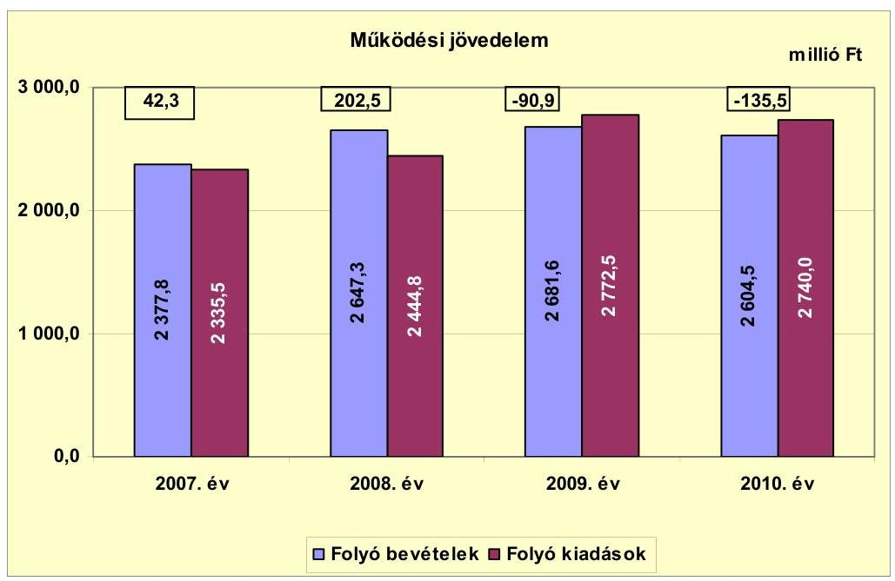

A vizsgált időszakban 18,4 millió Ft összegű működési jövedelem (bevételi többlet) keletkezett, amely forrásul szolgált az Önkormányzat fennálló tőketörlesztési kötelezettségeinek teljesítéséhez, valamint fejlesztéseinek finanszírozásához. A folyó költségvetés egyenlege, (működési forrástöbblet) 2007-ben és 2008-ban volt pozitív egyenlegű, 2009-ben és 2010-ben az egyenleg negatív összegű volt. A működési jövedelem csökkenésében alapvetően a folyó kiadások növekedése játszott szerepet. A pozitív egyenleg kialakulását 2007-ben 27,1 millió Ft, 2008-ban 50,0 millió Ft ÖNHIKI támogatás segítette.

Az Önkormányzat nettó működési jövedelmét évenként az alábbi ábra szemlélteti:
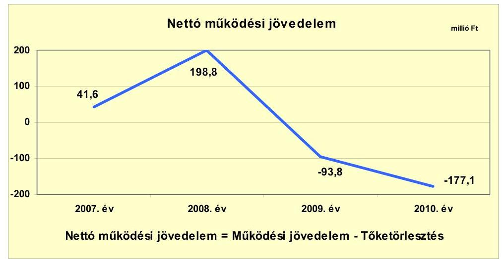

A vizsgált időszakban az Önkormányzatnál összességében -30,5 millió Ft nettó működési jövedelem képződött. A működési jövedelem a hitelekhez kapcsolódó

---

tőketörlesztés összegére a 2009-2010. években nem nyújtott fedezetet, mivel a pénzügyi kapacitás negatív összegű lett (-93,9 millió Ft és -177,1 millió Ft), a működési jövedelem (293,4 millió Ft-os és 44,6 millió Ft-os) csökkenése következtében. A tőketörlesztés összege a 2007-2009. évek átlagában 2,4 millió Ft volt, ami 2010. évben 38,9 millió Ft-ra emelkedett annak következtében, hogy az Önkormányzat megkezdte a 2007. évben kibocsátott kötvény törlesztését.

Az Önkormányzatnál (a CLF módszer alapján) a fejlesztési kiadások fedezete - változatlan nettó működési jövedelem képződése mellett - nem biztosított, mivel a vizsgált időszakban nem képződött nettó működési jövedelem, így a fejlesztési kiadások fedezete csak külső források bevonásával biztosítható. A nettó működési jövedelem információul szolgál továbbá a jövőben vállalható, teljesíthető adósságszolgálat mértékéről.

A 2007-2010. években az Önkormányzat felhalmozási költségvetésének egyenlege folyamatosan negatív összegű volt. A felhalmozási és tőkejellegű bevételek egyik évben sem biztosítottak fedezetet a felhalmozási és tőkejellegű kiadásokra, a forráshiányt külső forrásokból biztosította az Önkormányzat.

A felhalmozási költségvetés egyenlegét 2007-2010 közötti években az alábbi ábra szemlélteti:
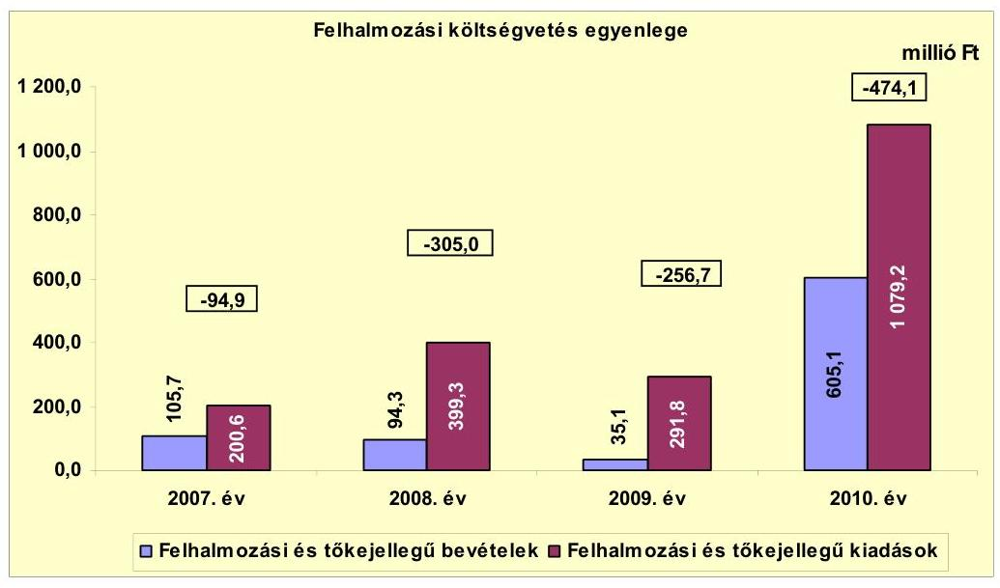

A felhalmozási kiadásokra az Önkormányzat által tervezett saját bevételek, igénybe vett EU-s és hazai támogatások, a folyó költségvetésben keletkezett nettó működési jövedelem nem nyújtott fedezetet. Az Önkormányzat a felhalmozási forráshiányát fejlesztési célú hitelből és kötvénykibocsátásból származó bevétellel biztosította. A vizsgált időszakban keletkezett 1130,7 millió Ft felhalmozási forráshiányt 15,8 millió Ft 2007. évi nyitó pénzkészlet, a felvett 14,8 millió Ft összegű fejlesztési hitel és az 1100,1 millió Ft kötvénykibocsátás fedezte.

---

Az Önkormányzat évenkénti teljes finanszírozási igénye ${ }^{14}$ a CLF módszer szerint 2007-ben 53,3 millió Ft, 2008-ban 106,3 millió Ft, 2009-ben 350,5 millió Ft, 2010-ben 651,2 millió Ft volt, amelynek forrását a finanszírozási célú bevételek ${ }^{15}$ biztosították. Az Önkormányzat finanszírozási igényére a 2007-ben kibocsátott kötvényből (1100,4 millió Ft) és igénybe vett hosszú lejáratú hitelből (14,8 millió Ft) származó, valamint a folyószámlahitelből rendelkezésre álló források nyújtottak fedezetet.

Az Önkormányzat finanszírozási műveletei 2007-2010. évekbeli egyenlegét a következő ábra szemlélteti:
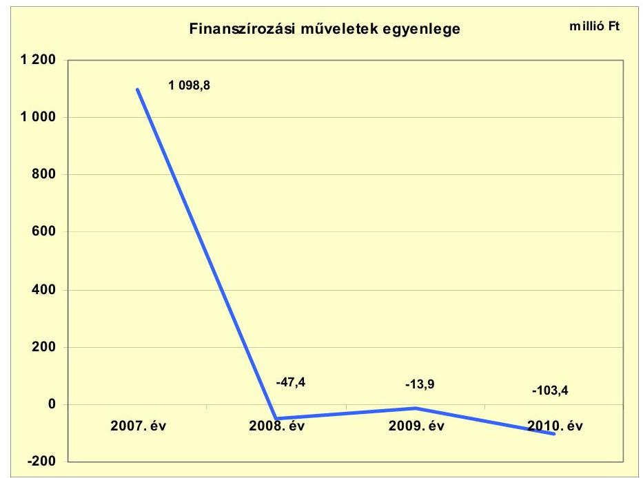

A finanszírozási pénzügyi műveletek pozitív egyenlege azt jelzi, hogy az éves költségvetések végrehajtása során szükség volt az előző években keletkezett pénzmaradvány igénybevételén túl külső finanszírozás igénybevételére is. A finanszírozási műveletek egyenlegének 2007. évi kiugró értéke a kötvénykibocsátás bevételéből eredő finanszírozási többletet (1098,8 millió Ft) tükrözi, amely a 2007. év és az azt követő évek felhalmozási kiadásainak forrását képezte. A finanszírozási célú műveleteket a vizsgált időszakban a jelentés 2. számú mellékletének 4.1-4.8 pontjai részletezik.

Az Önkormányzat a 2007-2009. években a zárszámadási rendeleteiben bevételi többletet mutatott ki. A kimutatott bevételi többlet összege a 2007. évben 1194,8 millió Ft, a 2008. évben 686,7 millió Ft, a 2009. évben 615,7 millió Ft volt. Az Önkormányzat 2010. évben 59,5 millió Ft hiányt mutatott ki. A megállapított bevételek és kiadások az Áht. 8/A. § (7) bekezdésében előírtak ellenére pénzügyi műveleteket - finanszírozási célú bevételeket és kiadásokat - is tar-

[^0]
[^0]:    ${ }^{14}$ a nettó működési jövedelem és a felhalmozási költségvetés egyenlegének összege
    ${ }^{15}$ A finanszírozási célú bevételek összege 2007-ban 1114,9
 millió Ft, 2010-ben 141,8 millió Ft volt.

---

talmaztak. Az Önkormányzat által a zárszámadási rendeletekben megállapított működési és fejlesztési többletet az 1. számú melléklet szemlélteti.

Az Önkormányzat kamatbevételeinek és kamatkiadásainak alakulását a vizsgált időszakban a következő ábra mutatja (millió Ft-ban):
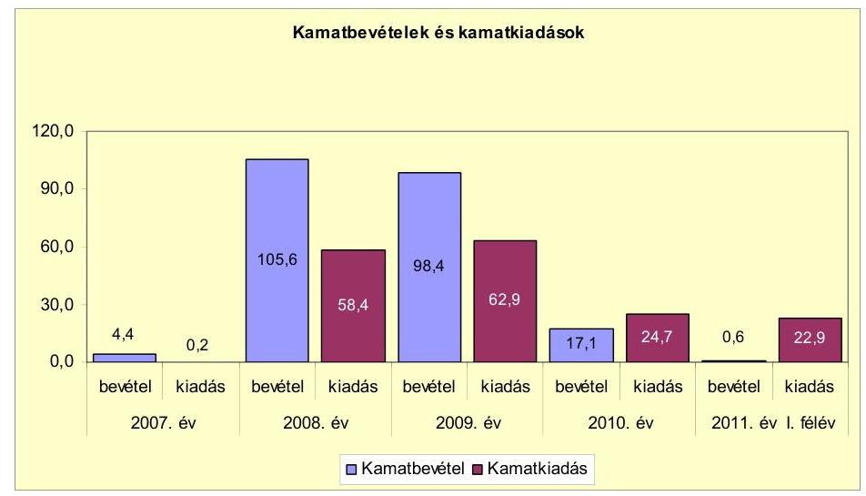

A 2007-2010 között az Önkormányzat összesen 146,2 millió Ft kamatot fizetett meg. Az átmenetileg szabad pénzeszközei befektetéséből származó kamatbevétel, a teljes kamatráfordítás 154,2\%-át (225,5 millió Ft) tette ki.

A kamatbevételek alapvetően a 2007. évben a kötvénykibocsátásból származó átmenetileg szabad pénzeszközök lekötése következtében keletkeztek. A kötvénykibocsátásból származó bevételek felhasználása miatt az átmenetileg szabad pénzeszközök csökkentek, így a kamatbevétel is csökkent 2009. évtől az előző évhez viszonyítva. A kötvénykibocsátással, a fejlesztési célú hitel felvételével, és a folyószámlahitel igénybevételével a kamatkiadások összege növekedett a 2008. és a 2009. évben. A 2010. évben a kamatkiadások csökkenését a kötvény kamatának csökkenése okozta. A vizsgált időszakban a kamatbevételek (225,4 millió Ft) fedezetet nyújtottak a kamatkiadásokra (146,2 millió Ft).

A 2011. évre az Önkormányzat a kamatkiadások növekedésével kalkulál, a költségvetési rendeletben tervezett 38,2 millió Ft kamatkiadás 54,6\%-kal (13,5 millió Ft-tal) haladhatja meg a 2010. évit.

# 2.2. Az Önkormányzat bevételeinek változása 

Az Önkormányzat összes folyó bevétele a 2007-2009 évek átlagához (2568,9 millió Ft) viszonyítva 2010-re 2604,5 millió Ft-ra, 1,4\%-kal (35,6 millió Ft-tal) emelkedett. Az emelkedés teljes egészében az állami forrásokból (költségvetési támogatás, szja) származó bevételek növekedéséből (41,3 millió Ft) származott.

Az Önkormányzat összes folyó bevételei a 2007. évi 2377,8 millió Ft-ról 2010-re 2604,4 millió Ft-ra, 9,5\%-kal (226,6 millió Ft) emelkedtek.

---

Az Önkormányzat 2007-2010 között realizált főbb bevételi jogcímeinek számszaki adatait, összetételének változását az alábbi ábra mutatja be:
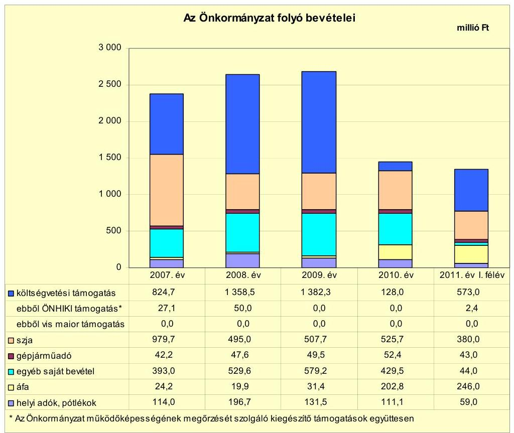

Az Önkormányzat a 2007-2010. években összesen 7357,0 millió Ft költségvetési támogatásban és átengedett szja-ban részesült. A költségvetési támogatások és az átengedett szja együttes összegében jelentős változás nem következett be. Az egyéb saját bevételek 2007-ről 2008-ra megvalósult növekedése, majd a 2009-ről 2010-re bekövetkezett csökkenése alapvetően a kamatbevételek alakulásával függ össze. A kamatbevételek a 2007. évi 4,4 millió Ft-ról, 2008-ra 105,6 millió Ft-ra nőttek, majd a 2009. évi 98,4 millió Ft-ról 2010. évben 17,1 millió Ft-ra csökkentek. A 2010. évben a megvalósított beruházásokkal kapcsolatos visszaigénylések következtében az előző évi 31,4 millió Ft-ról, 202,8 millió Ft-ra nőtt az áfából származó bevétele az Önkormányzatnak.

Az Önkormányzat működőképességének megőrzéséhez 2008-2010. években ${ }^{16}$ összesen 77,1 millió Ft kiegészítő támogatásban részesült. A támogatás 35,1\%-a (27,1 millió Ft) a működési hiány csökkentését szolgálta, illetve 64,9-a (50,0 millió Ft) feladathoz nem kötött támogatás volt. A 2011. év I. félévében az Önkormányzat dologi kiadásainak biztosításához elszámolási kötelezettséggel 2,4 millió Ft működési támogatásban részesült.

[^0]
[^0]:    ${ }^{16}$ Az Önkormányzat a 2009-2010. években a működőképességének megőrzését szolgáló kiegészítő támogatásban nem részesült. ÖNHIKI támogatása a 2007. évben 27,1 millió Ft volt. Ezen kívül a működésképtelen helyi önkormányzatok egyéb támogatása címen a 2008. évben 50,0 millió Ft-ot kapott. A 2011. év I. félévében az Önkormányzat 2,4 millió Ft ÖNHIKI támogatásban részesült.

---

Az Önkormányzat helyiadó-bevételei 2007-től 2009-ig folyamatosan növekedtek, majd 2010-ben csökkentek az előző évhez viszonyítva. A 2010-ben keletkezett helyiadó-bevétel (111,1 millió Ft) 36,3 millió Ft-tal ( $24,6 \%$-al) marad el a 2007-2009. évek átlagától, az iparűzési adóból származó bevétel csökkenése miatt. A befolyt helyiadó-bevételek összege a 2011. év I. félévében 59,0 millió Ft volt. Az Önkormányzat által kivetett helyi adók az iparűzési adó és az építményadó voltak.

Az iparűzési adó esetében az állandó jelleggel végzett iparűzési tevékenység esetén az adó évi mértéke a 2007-2010. években nem változott, az adóalap 2\%-a volt. Az ideiglenes jelleggel végzett tevékenység utáni adófizetési kötelezettség szabályai 2010. évtől változtak. A piaci és vásározó kiskereskedelmet folytatók adókötelezettsége megszűnt, az ideiglenes jelleggel építőipari tevékenységet folytatók által fizetendő napi adómérték 2500 Ft-ról, 5000 Ft-ra nőtt.

Az építményadót bel- és külterületi ingatlanokra vetette ki az Önkormányzat, alapja az építmény $\mathrm{m}^{2}$-ben számított hasznos alapterület volt, mértéke a vizsgált időszakban a belterületi ingatlanok esetében $600 \mathrm{Ft} / \mathrm{m}^{2}$, külterületi ingatlanok esetében $300 \mathrm{Ft} / \mathrm{m}^{2}$ volt.

Az Önkormányzat a vizsgált időszakban gazdasági társaságaitól osztalékban nem részesült. Az egyes években nyereségesen működő gazdasági társaságai által elért adózott eredményt eredménytartalékba helyeztette.

Az Önkormányzat felhalmozási bevételeit jogcímenként a következő táblázat tartalmazza:
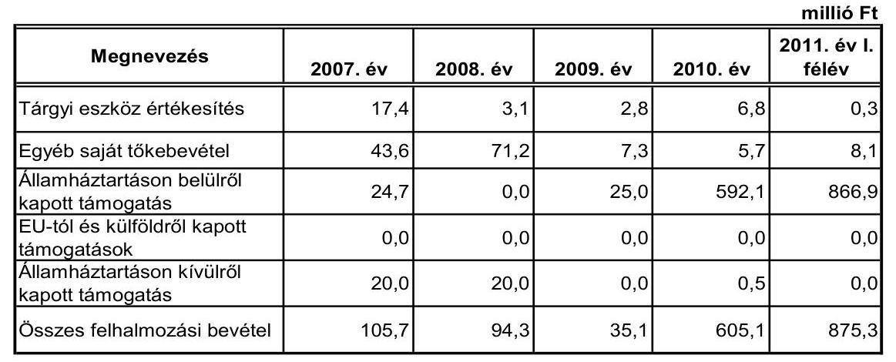

Az Önkormányzat felhalmozási bevételei a 2010. évben az előző három év átlagának ( 78,4 millió Ft) több mint hétszeresére nőttek, az államháztartáson belülről kapott támogatások következtében. Az államháztartáson belülről származó támogatás a 2011. év I. felében már meghaladta a 2010. év összegét a fejlesztésekhez igénybevett támogatások következtében.

---

# 2.3. Az Önkormányzat működési és felhalmozási célú kiadásainak változása 

Az Önkormányzat folyó kiadásai a vizsgált időszakban főbb jogcímek szerinti bontásban az alábbiak voltak:

| Megnevezés | 2007. év | 2008. év | 2009. év | 2010. év | $\begin{gathered} \text { millió Ft } \\ 2011 . \text { év I. } \\ \text { félév } \end{gathered}$ |
| :--: | :--: | :--: | :--: | :--: | :--: |
| Folyó (működési) kiadások | 2333,5 | 2444,8 | 2772,5 | 2740,0 | 1378,5 |
| Működési kiadások (kamatkiadás nélkül) | 1926,8 | 1897,1 | 2197,4 | 2248,7 | 1163,6 |
| Államháztartáson belülre átadott pénzeszközök | 8,8 | 4,4 | 5,3 | 1,5 | 0,1 |
| Transzferkiadások | 376,6 | 429,4 | 432,4 | 449,2 | 191,5 |
| 'abbót' vállalkozásoknak | 0,0 | 0,0 | 0,0 | 0,0 | 0,0 |
| EU-nak, illetve külföldre | 0,0 | 0,0 | 0,0 | 0,0 | 0,0 |
| magánszemélyeknek | 376,6 | 429,4 | 432,4 | 449,2 | 190,2 |
| nonprofit szervezeteknek | 0,0 | 0,0 | 0,0 | 0,0 | 1,7 |
| Kamatkiadások | 177,0 | 58,4 | 62,9 | 24,7 | 22,9 |
| Előző évi pénzmaradvány átadás | 23,1 | 55,4 | 74,5 | 15,9 | 0,0 |

Az Önkormányzat folyó kiadásai folyamatosan nőttek az előző évhez viszonyítva. A 2010-ben teljesített kiadás 8,9\%-kal (223,1 millió Ft-tal) volt magasabb a 2007-2009. évek átlagánál (2516,9 millió Ft). Az Önkormányzat 2011. év I. félévében 1378,5 millió Ft folyó kiadást teljesített.

Az Önkormányzat működési kiadásai a vizsgált időszakban a következőképpen alakultak:

|  |  |  |  |  | millió Ft |
| :-- | --: | --: | --: | --: | --: |
| Megnevezés | 2007. év | 2008. év | 2009. év | 2010. év | 2011. év I.   félév |
| Személyi juttatások | 1077,1 | 1046,9 | 1138,0 | 1091,0 | 462,4 |
| Munkaadót terhelő járulékok | 344,0 | 332,2 | 319,4 | 274,4 | 122,1 |
| Dologi kiadások | 484,1 | 506,8 | 720,7 | 847,7 | 561,8 |
| Egyéb folyó kiadások | 17,5 | 11,1 | 18,4 | 32,2 | 7,1 |

Az Önkormányzat 2010-ben a működési kiadásainak (2248,7 millió Ft) 49,8\%-át, 1365,4 millió Ft-ot személyi juttatásokra és a munkaadókat terhelő járulékokra fordította, az üzemeltetést, intézményfenntartást biztosító dologi kiadásokra 32,1\% (879,9 millió Ft) jutott. A személyi juttatások 2009-ben 8,7\%-al (91,1 millió Ft-tal) nőttek az előző évhez viszonyítva, majd 2010-ben ismét csökkentek 4,1\%-al, a végrehajtott létszámcsökkentések hatásaként.

A dologi kiadások minden évben nőttek az előző évhez viszonyítva, 2010-ben a dologi és egyéb folyó kiadások 50,1\%-al, (293,7 millió Ft-tal) haladták meg az előző három év átlagát (570,5 millió Ft).

A dologi kiadások növekedését 2009-ben az előző évhez képest elsősorban a tervezett beruházások előkészítésével összefüggő szolgáltatásokra fordított kiadások 144,4 millió Ft-os emelkedése, valamint az áfafizetési kötelezettség növekedése okozta.

---

Az Önkormányzatnál a folyó és felhalmozási kiadásokat, a teljesített kiadások működési és felhalmozási felhasználásának arányait a 2007-2011. év I. félév közötti időszakban az alábbi ábra mutatja:
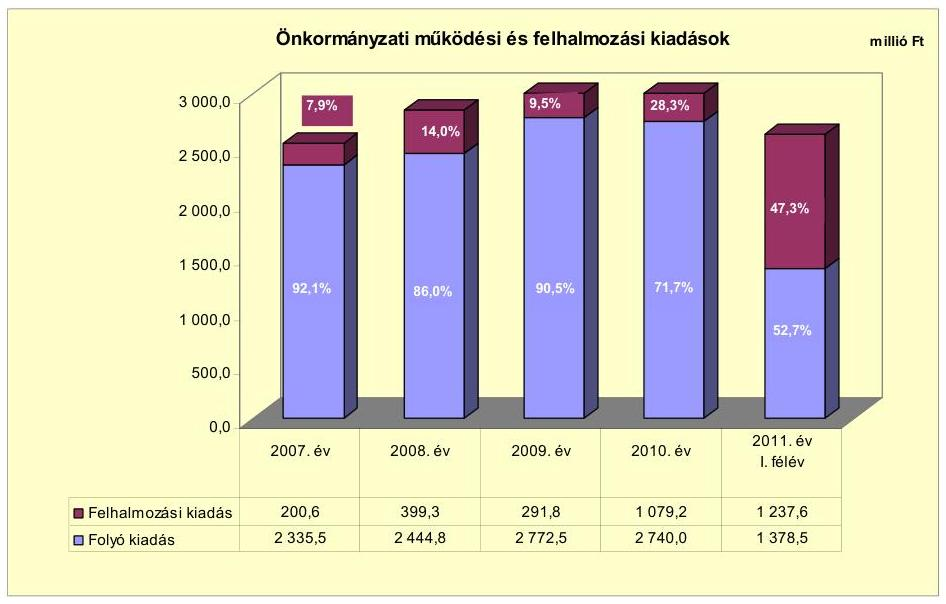

A teljesített összes kiadáson belül a felhalmozási kiadások aránya a vizsgált időszakban növekedett, mivel az Önkormányzat a 2007-ben kibocsátott kötvényből származó forrást fejlesztési feladatok megvalósítására fordította, ami az összes kiadáson belül a fejlesztésre fordított kiadások összegének és arányának növekedését eredményezte.

Az Önkormányzat befejezett és folyamatban levő fejlesztéseinek tervezett összege összesen 3399,3 millió Ft volt, amelyből 1807,1 millió Ft került már kifizetésre. A 2007-2010. években négy projekt megvalósítását végezte EU-s források felhasználásával. A projektek megvalósításához 377,0 millió Ft támogatást vett igénybe. A 2007-2010. években a megvalósított és folyamatban lévő beruházások településrészek korszerűsítésére, önkormányzati intézmények felújítására és korszerűsítésére, belvíz- és csapadékvíz-elvezető rendszerek karbantartására, szilárd burkolatú úthálózat burkolat-felújítására, térkialakításra irányultak.

Az Önkormányzatnál a 2007-2010. években befejezett fejlesztési és felújítási feladatok összes költségvetési kiadása ${ }^{17} 1667,9$ millió Ft volt, amelyből a fejlesztések összege 1557,1 millió Ft ( $93,4 \%$ ) és a felújítások összege 110,8 millió Ft (6,6\%) volt. A befejezett 1665,7 millió Ft értékű fejlesztés forrás megoszlása: 377,8 millió Ft EU-s támogatás (22,8\%), 298,1 millió Ft hazai támogatás (18,0\%), 165,5 millió Ft saját bevétel ( $9,6 \%$ ), 809,5 millió Ft ( $48,8 \%$ ) kötvénykibocsátásból, és 14,8 millió Ft ( $0,8 \%$ ) hitelből származó bevétel volt. A 2007-2010. években teljesített kiadások összege 1658,8 millió Ft volt, míg a további 6,9 millió Ft kiadást 2006. december 31-ig teljesítették.

[^0]
[^0]:    ${ }^{17} 3 /$ a. számú melléklet

---

Az Önkormányzat 2010. december 31-én folyamatban lévő ${ }^{18}$ (öt db) fejlesztési feladatainak tervezett kiadása 998,9 millió Ft, a 2010. december 31-ig teljesített kiadások tényleges összege 221,4 millió Ft volt. A folyamatban lévő beruházások 2010. december 31-ig teljesített kiadásainak forrása 81,8 millió Ft (37,0\%) kötvénykibocsátásból származó bevétel, 139,1 millió Ft EU-s támogatás ( $62,8 \%$ ) és 0,5 millió Ft ( $0,2 \%$ ) saját bevétel volt. A források a fejlesztések esetében az EU-s és a hazai támogatásoknál utólagosan álltak rendelkezésre. 2010. december 31-én folyamatban lévő fejlesztések 2010. évet követő kötelezettségvállalásainak összege 617,8 millió Ft volt, amelynek forrása 370,1 millió Ft (59,9\%) saját bevétel, 188,9 millió Ft (30,6\%) kötvény, 58,8 millió Ft EU-s támogatás ( $9,5 \%$ ).

Az Önkormányzat 2011-ben fejlesztés megvalósítása érdekében nem nyújtott be pályázatot.

Az Önkormányzat gazdasági társaságai részére működési és felhalmozási célra átadott pénzeszközöket a vizsgált időszakban a következő ábra szemlélteti:
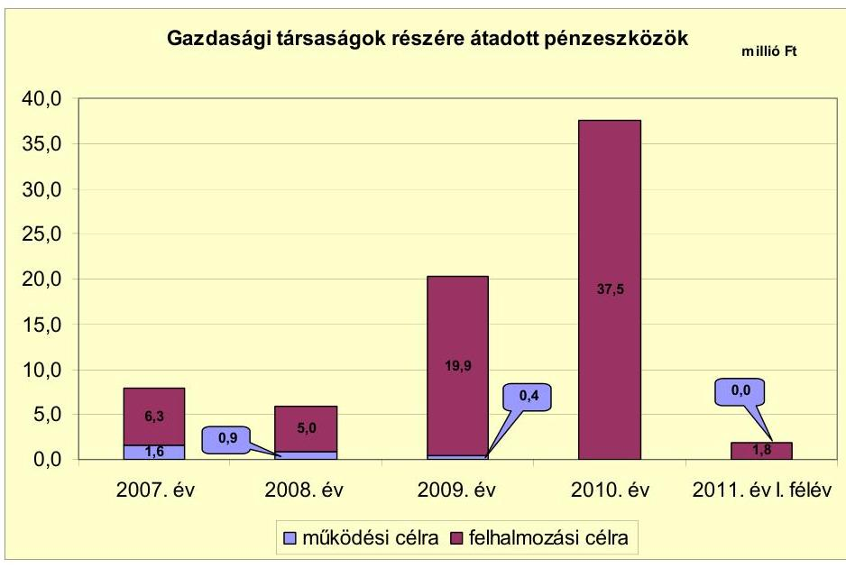

A városi televíziót működtető gazdasági társasága részére 2007-ben 6,3 millió Ft fejlesztési célú, 1,6 millió Ft működési célú, 2008-ban 5,0 millió Ft fejlesztési és 0,9 millió Ft működési célú pénzeszközt adott át az Önkormányzat. A közétkeztetési feladatokat ellátó gazdasági társasága részére 2009-ben 19,9 millió Ft, 2010-ben 15 millió Ft fejlesztési célú, a közfoglalkoztatási feladatokat ellátó gazdasági társasága részére 2010-ben 22,5 millió Ft, 2011-ben 1,8 millió Ft működési célú pénzeszközt adott át az Önkormányzat. A gazdasági társaságok a támogatásokat az Önkormányzattal kötött szerződésekben foglaltaknak megfelelően használták fel.

Az Önkormányzat gazdasági társaságai által elért bevételeket a 4. számú melléklet tartalmazza.

[^0]
[^0]:    ${ }^{18} 3 /$ b. számú melléklet

---

# 3. Az ÖNKORMÁNYZAT KÖTELEZETTSÉGEI 

### 3.1. Az Önkormányzat pénzintézeti kötelezettségeinek változása

Az Önkormányzatnak a mérlegadatok szerint 2006. december 31-én nem volt pénzintézetekkel szemben fennálló kötelezettség állománya. A pénzintézettel szembeni kötelezettség állomány 2007-2011-ben egy kötvénykibocsátásból, egy hosszú lejáratú hitel, valamint folyószámlahitel igénybevételéből keletkezett az Önkormányzatnál. A kötvényt kibocsátó pénzintézet, a hosszú lejáratú hitelt nyújtó és a folyószámlát vezető pénzintézetek kiválasztása közbeszerzési eljárás lefolytatása mellett történt meg. A kötvényt lejegyző és a hitelt nyújtó pénzintézet nem az Önkormányzat számlavezető bankja volt.

Az Önkormányzat pénzintézeteknél fennálló kötelezettség-állományát a 2007-2011. év I. félévében az alábbi ábra szemlélteti:
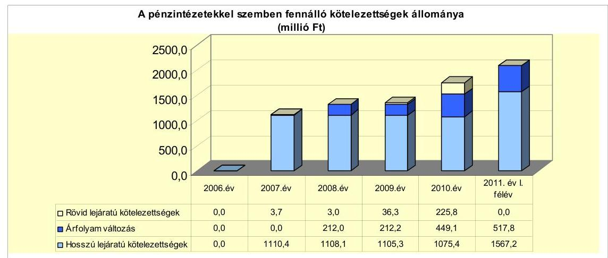

Árfolyamváltozást az Önkormányzat a devizában kibocsátott kötvénye után 2007. évi mérlegében nem mutatott ki, a további évek mérlegeiben azonban a Számv. tv. 60. § (1)-(2) bekezdéseiben foglaltak szerint elszámolta az árfolyamváltozás hatását.

Az árfolyamváltozás hatása is befolyásolja a kötelezettségek alakulását, azonban annak mértéke előre pontosan nem határozható meg, csak várakozásokon alapuló tendenciák jelezhetők. Annak megítéléséről, hogy a devizában kibocsátott kötvényekért és felvett hitelekért kapott forinthoz képest a kötvények visszavásárlásakor, illetve a hitelek visszafizetésekor jelentkező forintkötelezettség többletkiadást (árfolyamveszteség) vagy megtakarítást (árfolyamnyereség) eredményez-e a futamidő végén, a teljes kötelezettség rendezését követően lehet képet alkotni. Mindaddig, amíg törlesztési kötelezettség nem áll fenn (türelmi idő, moratórium), a tőkére vonatkoztatva nem értelmezhető sem az árfolyamveszteség, sem az árfolyamnyereség. Ugyanakkor a számviteli szabályok meghatározzák, hogy az árfolyam-különbözetet év végén a kötelezettségek vagy követelések között a könyvviteli mérlegben nyilván kell tartani, azonban az árfolyam-különbözet valójában nem realizált.

Az Önkormányzat a 2006. évet követően hiányzó fejlesztési forrásainak biztosítása érdekében a pénzintézettel szembeni kötelezettségvállalásait növelte. A

---

Képviselő-testület 2007-ben 7380 ezer CHF összegű (1100,1 millió Ft) kötvény kibocsátásáról, 14,8 millió Ft nagyságú hosszú lejáratú hitel felvételéről, valamint 300,0 millió Ft nagyságú folyószámlahitel-keret megnyitásáról döntött. Az Önkormányzat a 2007-2010. években munkabér-megelőlegezési hitelt nem vett igénybe. Az Önkormányzat pénzintézettel szembeni kötelezettségvállalásaira minden esetben képviselő-testületi döntés alapján került sor. A hitelfelvételek célját a Képviselő-testület döntéseit megalapozó előterjesztések meghatározták, ugyanakkor nem tartalmazták a kötelezettségvállalás visszafizetési forrásainak, a teljes futamidő várható kamat- és tőkefizetési kötelezettségeinek a bemutatását. A képviselő-testületi előterjesztésekben nem tértek ki az adósságszolgálati korlát bemutatására, ezért a Képviselő-testület ennek figyelembe vétele nélkül döntött. Az Önkormányzat adósságot keletkeztető kötelezettségvállalásának felső határát a 2008-2010. években nem lépte túl. Az igénybe vett hiteleket az Önkormányzat a meghatározott céloknak megfelelően használta fel.

A 2008-2011. évi költségvetési rendeletekben bemutatták az adott költségvetési évet terhelő kötvénnyel összefüggő tőketörlesztéseket, kamatterheket, a fejlesztési hitelfelvétellel összefüggően a várható kamatterhek összegét.

Az Önkormányzat devizában fennálló pénzintézettel szembeni kötelezettsége a kötvénykibocsátásból keletkezett, melynek 2011. június 30-ai állományát a következő tábla szemlélteti:

| Megnevezés | Szerződéskötési   Kibocsátás   időpontja | Összeg   ezer CHF-ben | Kibocsátásiltehivási   árfolyam | Kamat (referencia kamat+   kamatfelár) | Felhasználás célja: |
| :-- | :--: | :--: | :--: | :--: | :--: |
| Sajó Kötvény | 2007.10.18 | 7380 | 149,06 | 6 havi LIBOR CHF+év 0,85\% Önk-i fejlesztések finansz. |  |

A 7380 ezer CHF alapú kötvénytartozás tőketörlesztése 2010. év IV. negyedévében kezdődött, félévenkénti törlesztési ütemezéssel. A tőketörlesztés megkezdésének időpontjáig 441,5 ezer CHF (135,8 millió Ft) kamatot fizettek, 5,9 millió Ft egyéb költség merült fel. A 2011. év I. félévében 180,0 ezer CHF tőketartozást törlesztettek és 39,4 ezer CHF (9,0 millió Ft) kamatot fizettek. A 2011-2013. években 1080,0 ezer CHF tőkét és 213,3 ezer CHF kamatot, 2014-től 6120,0 ezer CHF tőkét és 558,2 ezer CHF kamatot kell - az utolsó kamatfizetéskor ismert kamatszint alapján - az Önkormányzatnak megfizetni.

A kötvény futamideje 23 év, lejárati ideje 2030. október 18.
A kötvénykibocsátás bevételéből - a Képviselő testület által meghatározott célnak megfelelően - többek között oktatási intézmények felújítása, utak felújítása, bölcsődeépítés, továbbá saját gazdasági társasága részére felhalmozási célú pénzeszközátadás (19,9 millió Ft) valósult meg. Az Önkormányzat 2011. év I. félévében a kötvénykibocsátásból származó teljes bevételét felhasználta.

A kötvénykibocsátásból származó bevétel befektetése a kibocsátástól a felhasználásig 213,5 millió Ft kamatbevételt eredményezett az Önkormányzatnak, melyet a kötvények után fizetendő kamatok teljesítésére használtak fel, ami kedvező hatást gyakorolt az Önkormányzat pénzügyi helyzetére.

---

Az Önkormányzat forint alapú hitelfelvételéből származó 2011. június 30-án fennálló pénzintézettel szembeni kötelezettséget az alábbi táblázat tartalmazza:

| Megnevezés | Szerződéskötés/   Kibocsátás | Összeg   millió Ft-ban | Kamat (referencia   kamat+ kamatfelár) | Felhasználás célja: |
| :-- | :--: | :--: | :--: | :--: |
| Fejlesztési hitel | 2007.09.03 | 14,8 | BUBOR+évi 2\% | játszóterek építése |

Az Önkormányzat által kötött hitelszerződésben rögzített hitel lehívása és a célnak megfelelő felhasználása megtörtént, elkezdődött a hitelek tőketörlesztése, a kamatok és egyéb költségek szerződés szerinti kifizetése. A hitelből származó pénzeszközök játszóterek felújítását biztosították.

Az Önkormányzat 2007-2010 között a beruházási hitel tőketörlesztésére 10,3 millió Ft-ot, a kamatfizetésre 3,1 millió Ft-ot fordított. A 2011. év I. félévében összesen 1,5 millió Ft tőketartozás és 0,1 millió Ft kamat megfizetését teljesítették. A hitelt 2012. év I. félévében fizeti vissza az Önkormányzat.

Az Önkormányzat működésének pénzügyi egyensúlyát a vizsgált időszakban folyószámlahitel igénybevételével tudta biztosítani, munkabérhitel felvételére nem volt szükség. A folyószámlahitel igénybevételéről 2007-ben döntött a Képviselő-testület, az 2007. július 16-tól áll az Önkormányzat rendelkezésére. Az igénybe vett folyószámlahitel adatait az alábbi táblázat mutatja be:

|  |  |  |  |  |  |  |  |  |  |  |  |  |
| :-- | :--: | :--: | :--: | :--: | :--: | :--: | :--: | :--: | :--: | :--: | :--: | :--: |
| Megnevezés | 2007. év | 2008. év | 2009. év | 2010. év | 2011. év I.   félév |  |  |  |  |  |  |  |
| I. Folyószámlahitel |  |  |  |  |  |  |  |  |  |  |  |  |
| a folyószámlahitel keretösszege január 1-jén | 0,0 | 300,0 | 300,0 | 300,0 | 300,0 |  |  |  |  |  |  |  |
| teljesített kamat és egyéb költség | 0,0 | 1,4 | 19,0 | 5,7 | 8,6 |  |  |  |  |  |  |  |

A folyószámlahitel hitelek kondíciói és egyéb költségei a következők voltak ${ }^{19}$ :

| Megnevezés | Kamat (referencia+ kamatfelár) | Egyéb költség |
| :--: | :--: | :--: |
| Folyószámlahitel |  |  |
| 2007-2008. év | 3 havi BUBOR $+0,5 \%$ | 0,00\% |
| 2009-2011. év | 3 havi BUBOR $+1,5 \%$ | 0,15\% rend.tart.jutalék |

Az Önkormányzat 2007-ben 31 napon, 2008-ban 101 napon, 2009-ben 360 napon, 2010-ben 239 napon, 2011. év első félévében 180 napon rendelkezett folyószámlahitellel. A folyószámlahitel átlagos napi állománya 2008. évben volt a legalacsonyabb, 35,9 millió Ft. Az átlagos napi állomány a 2009-2010. években 186,7 és 156,6 millió Ft-ra növekedett, a 2011. év I. félévében tovább nőtt 227,5 millió Ft-ra. A 2010. december 30-án a hitel záró állománya 141,8 millió Ft volt. A folyószámlahitel fordulónapján 2009-2010.

[^0]
[^0]:    ${ }^{19}$ A referenciakamat az alábbiak szerint alakult:

    | MNB BUBOR fixing (átlagkamat) \%-ban |  |  |  |  |
    | :-- | :--: | :--: | :--: | :--: |
    | 2007. év | 2008. év | 2009. év | 2010. év | 2011.június |
| 1 havi BUBOR | 7,83 | 8,75 | 8,66 | 5,47 | 6,00 |  |
| 3 havi BUBOR | 7,75 | 8,87 | 8,64 | 5,50 | 6,07 |  |

---

években 89,3 millió Ft és 136,7 millió Ft kötelezettsége állt fenn az Önkormányzatnak.

Az áttekintett időszakra jellemző felhalmozási hiány, a beruházások utófinanszírozása szükségessé tette a folyószámlahitel folyamatos igénybevételét. A rendszeresen jelentkező likviditási problémák finanszírozása az Önkormányzatnak a 2007-től 2011. június 30-ig összesen 34,6 millió Ft kamatkiadást és 0,2 millió Ft egyéb költséget eredményezett.

Az Önkormányzat 2010. év I. félévében 200,0 millió Ft támogatás előfinanszírozó kölcsönt vett igénybe, amit még az első félév végéig vissza is fizetett.

A kötvény esetében a kamatfizetési kötelezettség alakulását jelentősen befolyásolta és jelenleg is befolyásolja a kibocsátáskori és az utolsó kamat fizetéskori referencia kamat változása, melyet az alábbi táblázat mutat be:

| Megnevezés | Kibocsátási, lehivási | Utolsó fizetéskori | Változás \% |
| :--: | :--: | :--: | :--: |
|  | kamat (referencia + kamatfelár) \% |  |  |
| 6 havi CHF LIBOR (2007.10.08.-i szerződés) | 3,7433 | 1,0583 | $-71,7 \%$ |

Az Önkormányzat fizetési kötelezettségét a referencia kamatok változása összességében kedvezően befolyásolta, azonban a kötvénykibocsátás kötelezettségének összegére a CHF árfolyamváltozás kedvezőtlen hatással volt. A referencia kamatok csökkenése, valamint a tőketörlesztés megkezdése következtében az Önkormányzat kamatfizetési kötelezettsége a 2009. évi 62,9 millió Ft-ról, 2010. évben 24,7 millió Ft-ra csökkent.

A CHF/HUF árfolyamának változása ${ }^{20}$ miatti árfolyam-különbözet a 2010. december 31-én devizában fennálló kötvénykibocsátás kötelezettség összegét 1073,2 millió Ft-ról 449,1 millió Ft-tal növelte.

Az Önkormányzat pénzintézettel szembeni kötelezettségvállalásaiból származó tőketartozások és azok kamata miatti várható összes kötelezettségét a következő táblázat mutatja:

[^0]
[^0]:    ${ }^{20}$ Az árfolyam-különbözet megállapítása 225,26 CHF/HUF 2010. december 31-ei árfolyam figyelembevételével történt.

---

| Megnevezés | Állomány 2010. december 31-én |  |  | Állomány 2011. június 30-án |  |  | Várható kötelezettség 2011-2013. években |  | Várható kötelezettség 2014. évtől |  |
| :--: | :--: | :--: | :--: | :--: | :--: | :--: | :--: | :--: | :--: | :--: |
|  | HUF-ban   (millió Ft-ban) | Devizában (összege, ezer ... ben) | Deviza   nem | HUF-ban   (millió Ft-ban) | Devizában (összege, ezer ... ben) | Deviza   nem | HUF-ban   (millió Ft-   ban) | Devizában (összege, ezer ... ben) | HUF-ban   (millió Ft-   ban) | Devizában (összege, ezer ... ben) |
| Pénzintézeti kötelezettségek |  |  |  |  |  |  |  |  |  |  |
| "Sajó" Kötvény Raiffeisen Bank Zrt. |  | 7200,0 | CHF |  | 6840,0 | CHF |  | 1293,3 |  | 6678,2 |
| Beruházási hitel | 4,4 |  | HUF | 2,9 |  |  | 4,7 |  | 0,0 |  |
| Raiffeisen Bank folyószámlahitel | 141,8 |  | HUF | 227,5 |  | HUF | 228,0 |  | 0,0 |  |
| Pénzintézeti kötelezettségek összesen HUF-ban: | 146,2 |  | HUF | 230,4 |  | HUF | 232,7 |  |  |  |
| Pénzintézeti kötelezettségek összesen CHF-ben: |  | 7200,0 | CHF |  | 6840,0 | CHF |  | 1293,3 |  | 6678,2 |
| Lízing kötelezettségek | 2,2 |  | HUF | 1,6 |  | HUF | 2,0 |  | 0,0 |  |
| Szállítói tartozás | 60,0 |  | HUF | 19,5 |  | HUF | 20,0 |  | 0,0 |  |
| Kötelezettségek összesen CHF-ben: |  | 7200,0 | CHF |  | 6840,0 | CHF |  | 1293,3 |  | 6678,2 |
| Kötelezettségek összesen HUF-ban: | 208,4 |  | HUF | 251,5 |  | HUF | 255,7 |  | 0,0 |  |

Az Önkormányzat által a 2007-2010. években vállalt pénzintézettel szembeni kötelezettségek többsége 2010. december 31-én fennállt, mivel a kötelezettségek nagyobb részét kitevő kötvénykibocsátás miatti kötelezettséget a 2010. év IV. negyedévben kezdte törleszteni. Az Önkormányzatnak a kibocsátott kötvénnyel összefüggésben, a 2011-2013. években 1080,0 ezer CHF (243,3 millió Ft) tőketörlesztési és 213,3 ezer CHF ( 48,0 millió Ft) kamatfizetési, míg a 2014. évet követően 6120,0 ezer CHF ( 1378,6 millió Ft) tőketörlesztési és 558,2 ezer CHF (125,7 millió Ft) kamatfizetési kötelezettsége keletkezik. A hosszú lejáratú hitel és a 2,0 millió Ft lízingtartozás visszafizetése, a szállítói tartozás kiegyenlítése, valamint a folyószámlahitel rendezése a 2011-2013. években 255,7 millió Ft kötelezettséget jelent. A 2011-2013. évek kötelezettségeinek teljesítésére figyelembe vehető 14,3 millió Ft mérlegben kimutatott követelésállomány. Az Önkormányzat szabad pénzmaradvánnyal 2010. év végén nem rendelkezett. A 2014. évet követően jelenleg ismert pénzintézettel szembeni kötelezettsége 6678,2 ezer CHF (1504,3 millió Ft). Az Önkormányzat tájékoztatása szerint figyelembe vehető további források „a mindenkori költségvetési rendeletekben megtervezett önkormányzati helyi adóbevételek." A kötelezettségek forrásaként a helyiadó-bevétel növekménye vehető figyelembe, azonban új adónem bevezetésére, illetve az adómértékek növelésére 2011-ben nem került sor.

A kötvénykibocsátással, illetve a hitelek igénybevételével az Önkormányzat a 2011. és az azt követő évek pénzügyi helyzetét kedvezőtlenül befolyásolta, azok visszafizetési forrását nem határozta meg, a visszafizetéshez szükséges források megteremtése érdekében bevételnövelő intézkedéseket nem tett, ezzel a pénzügyi egyensúly megőrzésének kockázatát tovább növelte.

# 3.2. A szállítói kötelezettségek változása 

Az Önkormányzat szállítói kötelezettség miatti tartozása - egyben lejárt határidejű szállítói tartozások - az összes kötelezettség elenyésző hányadát tették ki a 2007-2011. év I. féléve között. A szállítói kötelezettség az összes kötelezettség 5\%-át egyik évben sem haladta meg, az egyes években 4,5-5\% között változott, tendenciája a 2009. évet kivéve enyhe csökkenést mutatott.

---

A 2007. év végén fennálló 66,9 millió Ft szállítói tartozás 2008. december 31-én 60,2 millió Ft-ra csökkent, majd 2009. december 31-re 71,3 millió Ft-ra nőtt, míg 2010. december 31-re ismét csökkent 60,0 millió Ft-ra. A szállítói tartozásból a lejárt határidejű tartozás 55,9 millió Ft volt, melyből a 30 napon belüli lejárt tartozás 10,0 millió Ft-ot, a 31-60 napon belüli tartozás 45,9 millió Ft-ot tett ki. Az Önkormányzatnak 2011. év I. félév végén 19,5 millió Ft szállítói állománya volt, melyből 14,1 millió Ft volt a lejárt szállítói állomány. A 90 napon túli lejárt szállítóállomány fennállása miatt a helyi önkormányzatok adósságrendezéséről szóló 1996. évi XXV. törvény 5. § (2) bekezdésében foglaltak figyelembevételével a polgármester - képviselő-testületi döntés alapján nyolc napon belül köteles adósságrendezési eljárást kezdeményezni. A lejárt szállítói állományból a 90 napon túli tartozás 8,9 millió Ft (63,1\%) volt. Az Önkormányzat kiadásokat csökkentő intézkedései segítségével és a folyószámlahitel igénybevételével tudta alacsony szinten tartani a lejárt határidejű szállítói állományát.

# 3.3. Egyéb kötelezettségek változása 

Az Önkormányzat garancia- és kezességvállalási kötelezettséget a 2007-2011 években nem vállalt, PPP konstrukcióban fejlesztést nem valósított meg.

Az Önkormányzat 2007. május 5-én kötött lízingszerződést 5,2 millió Ft összegben egy haszongépjármű használatára 60 hónapos futamidő mellett. A szerződés alacsony összegét figyelembe véve a szerződés nem hordoz kockázatot az Önkormányzat pénzügyi helyzetének alakulása szempontjából.

A 2007-2010 években a Képviselő-testület bérleti díjból, étkezési térítési díjakból, gondozási díjakból, továbbszámlázott szolgáltatásokból eredő követeléseket, a jegyző a helyi adókkal és a hozzá kapcsolódó bírságokkal és pótlékokkal kapcsolatos követeléseket engedett el 23,5 millió Ft értékben. Az elengedett követelések összegei a 2007-2011. év I. féléve között a 2008. év kivételével évente 0,2-1,0 millió Ft között változtak. A 2008. évben a helyi adóval kapcsolatos késedelmi pótlék és mulasztási bírság jogcímeken jegyzői hatáskörben elengedett követelés összege 22,0 millió Ft volt.

Az Önkormányzat a vizsgált időszakban intézménynek, más önkormányzatnak nem nyújtott kölcsönt. A gazdasági társaságok részére tagi és egyéb kölcsönt nem adott, illetőleg gazdasági társágoktól kölcsönt nem kapott.

A civil szervezetek közül a helyi Református Egyházközség által elnyert EU-s pályázat megvalósításához szükséges forrás megelőlegezése érdekében az Egyházközség részére a 2010. évben 11,7 millió Ft kölcsönt folyósított az Önkormányzat. A fogászati feladatokat ellátó gazdasági társaság részére szintén 2010-ben egy millió Ft, az árvízi károk enyhítését segítő kölcsönt nyújtott az Önkormányzat, amit a gazdasági társaság a szerződésben foglaltak szerint a 2011. évben visszafizetett. A kölcsönfolyósítások minden esetben a Képviselő-testület döntésén alapultak.

Az Önkormányzat forgalomképes ingatlanainak nettó értéke 1893,5 millió Ft, a korlátozottan forgalomképes ingatlanok nettó értéke 271,4 millió Ft volt a

---

2010. év végén. Az Önkormányzat által felvett beruházási hitel fedezeteként ingatlanait jelzáloggal nem kellett megterhelnie, így az Önkormányzat forgalomképes, illetve korlátozottan forgalomképes ingatlanvagyonán nincs jelzálogterhelés.

Az Önkormányzat kizárólagos tulajdonában levő gazdasági társaságok kötelezettségeit az alábbi táblázat mutatja:

| Megnevezés | Állomány 2010. december 31-én |  |  | Állomány 2011. június 30-án |  |  | Várható   kötelezettség 2011-2013. években |  | Várható   kötelezettség 2014. évtől |  |
| :--: | :--: | :--: | :--: | :--: | :--: | :--: | :--: | :--: | :--: | :--: |
|  | HUF-ban   (millió Ft-   ban) | Devizában   (összegk,   ezer ...   ben) | Deviza   nem | HUF-ban   (millió Ft-   ban) | Devizában   (összegk,   ezer ...   ben) | Deviza   nem | HUF-ban   (millió Ft-   ban) | Devizában   (összegk,   ezer ...   ben) | HUF-ban   (millió Ft-   ban) | Devizában   (összegk,   ezer ...   ben) |
| Pénzintézeti kötelezettségek összesen: | 0,0 | 0,0 |  | 0,0 | 0,0 |  | 0,0 | 0,0 | 0,0 | 0,0 |
| Lízing kötelezettségek | 0,0 | 0,0 |  | 0,0 | 0,0 |  | 0,0 | 0,0 | 0,0 | 0,0 |
| Szállító tartozás | 10,5 |  | HUF | 14,5 |  | HUF | 14,5 |  |  |  |

Az Önkormányzat kizárólagos tulajdonában levő gazdasági társaságoknak hitelfelvételből és lízingügyletekből származó pénzintézettel szembeni kötelezettségei nem voltak.

A gazdasági társaságok szállítói tartozása 2010. december 31-i 10,5 millió Ft-ról 2011. június 30-ra 14,5 millió Ft-ra, a lejárt határidejű szállítói tartozása 1,8 millió Ft-ról 2,0 millió Ft-ra nőtt, amelyből 1,9 millió Ft 30 nap alatti volt. Az Önkormányzat kizárólagos tulajdonában levő gazdasági társaságok szállítói kötelezettsége közvetlenül nem jelent kockázatot az Önkormányzat pénzügyi egyensúlyára.

Az Önkormányzat a gazdasági társaságokról szóló 2006. évi IV. törvény 54. § (2) bekezdése alapján korlátlan felelősséggel tartozik azon gazdasági társaságának felszámolása esetében, amelyben az Önkormányzat az 52. § (2) bekezdése szerint a szavazatok legalább 75\%-ával rendelkezik, így minősített befolyásszerzőnek minősül, továbbá a csődeljárásról és a felszámolási eljárásról szóló 1991. évi XLIX. törvény 63. § (2) bekezdése alapján a kizárólagos önkormányzati tulajdonú gazdasági társaságának minden olyan kötelezettségéért, amelynek kielégítését a felszámolási eljárás során az adós társaság vagyona nem fedez, ha a hitelezőinek a felszámolási eljárás során benyújtott keresete alapján a bíróság - az adós társaság felé érvényesített tartósan hátrányos üzletpolitikájára figyelemmel - megállapítja az önkormányzat korlátlan és teljes felelősségét.

Az Önkormányzat a 2007-2010. években a tárgyi eszközök után együttesen 460,4 millió Ft értékcsökkenést számolt el. A vizsgált időszakban nem történt meg annak felmérése, hogy az eszközök elhasználódásának, amortizációjának pótlása milyen kötelezettséget jelent az Önkormányzat számára. A Képviselőtestületnek előterjesztett éves zárszámadási rendeleteikben nem mutatták be az Önkormányzat eszközei után tárgyévben elszámolt értékcsökkenés összegét, az eszközpótlásra szolgáló kiadásokat, az eszközök elhasználódási fokának alakulását. A felújításokra, az eszközök pótlására az Önkormányzat pénzügyi lehetőségeinek függvényében - elsősorban az intézmények működőképessége biztosításának figyelembevételével - került sor. Az intézmények kimutatása szerint négy év alatt a 78,6 millió Ft értékben elvégzett felújításokon túl 1447,2 millió Ft értékben fejlesztést is megvalósítottak.

---

Az Önkormányzat 2010. december 31-ei mérlege alapján a tárgyi eszközök bruttó értéke összesen 4504,6 millió Ft volt, mely 790,2 millió Ft-tal (21,3\%-kal) volt magasabb, mint 2007. év december 31-én. A tárgyi eszközök elhasználódási foka (a nettó és a bruttó érték hányadosa) 78,4\%-ról 75,3\%-ra csökkent.

# 4. A PÉNZÜGYI EGYENSÚLY MEGTEREMTÉSE ÉRDEKÉBEN HOZOTT INTÉZKEDÉSEK EREDMÉNYE 

Az Önkormányzat a kiadáscsökkentő és bevételnövelő intézkedések meghozatalával a gazdálkodás átláthatóbbá tételét, az Önkormányzat pénzügyi helyzetének a javítását, valamint a feladatellátás szakmai színvonalának emelését kívánta elérni.

A 2007-2010. évek és a 2011. év I. félév kiadáscsökkentő intézkedéseinek pénzügyi hatásai - az Önkormányzat kimutatása szerint - beavatkozási területenként az alábbiak voltak:
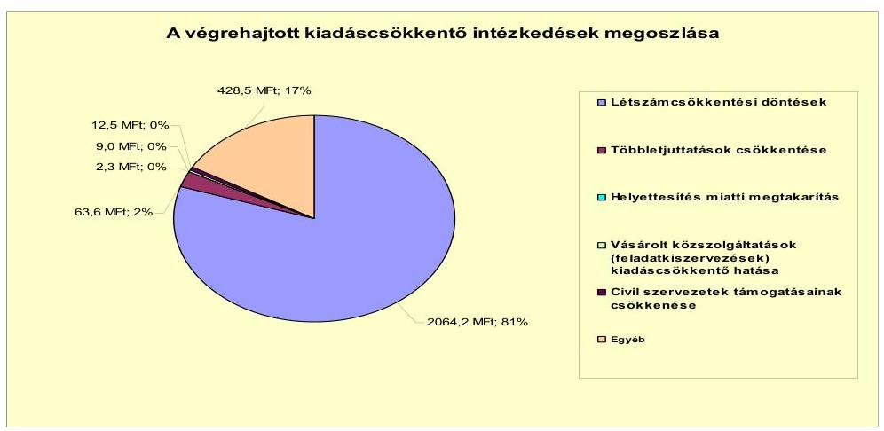

A 2007-2010. években és a 2011. év I. félévében az Önkormányzat kimutatása szerint az intézményi átszervezések, a feladatváltozások, valamint a takarékossági intézkedések hatásaként együttesen 2580,1 millió Ft kiadási megtakarítás jelentkezett. A kiadási megtakarítás az Önkormányzat által számított, az ÁSZ által nem kontrollált érték. Ennek 80,0\%-a (2064,2 millió Ft) a létszámcsökkentésekből (az intézményeket érintő álláshelyek megszüntetése, feladatmegszüntetés, -átszervezés, intézmény átadása a Megyei Önkormányzat részére) származott, melynek következtében az Önkormányzat álláshelyeinek száma 2007. január 1-jéről 2010. december 31-re 28,6\%-kal, 448 főről 100 fővel 348 főre csökkent.

A közoktatási intézmények szerkezetátalakítása során a Képviselő-testület intézmények összevonásáról döntött. Így összevonásra került 2007. július 1-jétől a városban működő öt általános iskola egy részben önálló intézménnyé, továbbá 2007. augusztus 1-jétől a városban működő öt óvoda egy részben önálló intézménnyé. Az iskolák összevonásával 28, az óvodák összevonásával 9 álláshely megszüntetésére került sor.
2007. július 1. napjától az Önkormányzat a Gazdasági Ellátó Szervezetet és a Közüzemi Szolgáltató Intézményt megszűntette és jogutódjaként létrehozta a Vá-

---

rosi Gondnokság önálló gazdálkodási jogkörrel rendelkező intézményt. Ezzel egyidejűleg minden intézmény gazdálkodási jogkörét részben önállóan gazdálkodóvá módosította, ezáltal az intézmények pénzügyi, gazdálkodási feladatait az újonnan létrehozott Városgondnokság látta el. A döntéssel az Önkormányzatnál 18 álláshely megszüntetésére került sor.

A Polgármesteri hivatalban a feladatok racionálisabb ellátása, átszervezése során a Képviselő-testület 2007. július 1-től hat álláshely megszüntetéséről döntött.

Az Önkormányzat - önként vállalt feladatként működtetett - szakosított szociális feladatot ellátó Időskorúak Szociális Otthonát 2007. október 1. napi hatállyal megszűntette, fenntartói jogát a Megyei Önkormányzat hatáskörébe adta. A döntéssel 25 álláshely megszüntetésére került sor.

A közoktatási intézmények tanévindításával kapcsolatos feladatok tárgyában készített előterjesztések során a Képviselő-testület minden tanévet megelőzően döntött a közoktatási feladatellátás átszervezéséről, illetve annak következtében megszűnő álláshelyekről. A döntések során figyelemmel voltak a Közokt. tv. ${ }^{21}$ változásaira (pl. kötelező óraszámok növekedése), valamint az ellátottak számának csökkenése következtében a csoportok, osztályok szervezéséből adódó változásokra, amelynek eredményeként a 2008. évben 4, a 2009. évben 11, a 2010. évben 24 álláshely megszűntetéséről döntött. A feladatellátás egyéb területeit érintően a 2008. évben további egy, a 2009. évben 2 álláshely megszűntetésére került sor.

Az Önkormányzat kiadási megtakarítást ért el a 2010. évben és a 2011. év I. félévében a többletjuttatások csökkentésével, melynek során a cafeteria juttatásokat megvonták a közalkalmazottaktól, míg a köztisztviselők részére a törvényi minimum összeget biztosították, továbbá megvonták a munkáltatói döntésen alapuló béreket. Az így elért megtakarítás összege az Önkormányzat kimutatása szerint az összes kiadási megtakarítás 2,5\%-a (63,6 millió Ft) volt.

További kiadáscsökkentő intézkedések hatásaként az Önkormányzat a vizsgált időszakban az előzőeken kívül a kimutatása szerint 452,3 millió Ft megtakarítást ért el.

A Képviselő-testület a 2007. évben döntött az Időskorúak Szociális Otthona átadásáról a Megyei Önkormányzatnak, a 2010. évben a Hunyadi utcai tagóvoda bezárásáról, a közkutak számának csökkentéséről, a 2011. évben a mezőőri szolgálat megszűntetéséről. A döntésekkel az Önkormányzat a 2007-2010. években és a 2011. év I. félévében 428,5 millió Ft dologi kiadást érintő megtakarítást ért el. Az Önkormányzat a civil szervezetek részére nyújtandó támogatásokat minden évben a költségvetési rendelet megalkotásakor felülvizsgálta, amellyel 12,5 millió Ft megtakarítást ért. A Polgármesteri hivatal vagyonvédelmi feladatainak megszűntetésével, valamint a helyettesítések miatt 11,3 millió Ft megtakarítást ért el az Önkormányzat a 2009-2010. években és a 2011. év I. félévében.

Az Önkormányzat álláshelyeinek száma 2007. január 1-jéről 2010. december 31-re 28,6\%-kal, 448 főről 100 fővel 348 főre csökkent.

[^0]
[^0]:    ${ }^{21}$ a közoktatásról szóló 1993. évi LXXIX. törvény

---

A létszámcsökkenést a következő táblázat szemlélteti:

| Megnevezés (adatok fő-ben) |  | Közoktatás | Szociális és gyermekvédelem | Egészségügy | Polgármesteri hivatal | Egyéb | Összesen |
| :--: | :--: | :--: | :--: | :--: | :--: | :--: | :--: |
| 2007. január 1-án jóváhagyott álláshelyek száma |  | 243 | 54 | 26 | 55 | 70 | 448 |
| Megszüntetett álláshelyek száma |  | 76 | 25 | 1 | 6 | 20 | 128 |
| Ebből: | üres álláshelyek száma |  |  |  |  |  | 0 |
|  | szakmai álláshelyek száma | 62 | 16 | 0 | 3 | 9 | 90 |
|  | intézmény-üzemeltetéssel kapcsolatos álláshelyek száma | 14 | 9 | 1 | 3 | 11 | 38 |
| Álláshely növekedése |  | 13 | 0 | 0 | 0 | 15 | 28 |
| 2010. december 31-én záró álláshelyek száma |  | 180 | 29 | 25 | 49 | 65 | 348 |
| 2007. január 1-án foglalkoztatott létszám |  | 243 | 54 | 26 | 51 | 70 | 444 |
| Létszámcsökkenés |  | 76 | 25 | 1 | 6 | 20 | 128 |
| Létszámnövekedés |  | 13 | 0 | 0 | 4 | 15 | 32 |
| 2010. december 31-én foglalkoztatott létszám |  | 180 | 29 | 25 | 49 | 65 | 348 |

A létszámcsökkentő intézkedések következtében az Önkormányzat kimutatása szerint 2007. január 1. és 2010. december 31. között a Polgármesteri hivatalnál és az intézményeknél a nyilvántartások szerint összesen 128 álláshelyet szüntettek meg, amelynek 70,3\%-a (90 fő) ágazati szakmai, 29,7\%-a (38 fő) intézményüzemeltetéshez, fenntartáshoz, gazdasági ügyek intézéséhez kapcsolódó álláshely volt. A megszüntetett álláshelyekből üres álláshely nem volt. Egyes közszolgáltatási területen azonban feladatbővülések is voltak, amelyek álláshely és egyben létszámnövekedéssel is jártak, ennek következtében az időszak álláshelyeinek száma összességében 28 fővel növekedett. A növekedés 13 fővel érintette a közoktatást, ahol gyermekfelügyelők és kísérők, valamint iskolatitkárok alkalmazására került sor. A további 15 fő növekedés a Sajószentpéteri Egységes Pedagógiai Szakszolgálat és a Városgondnokság megalakításával, valamint a közművelődés területén történt telephelybővítéssel függött össze.

A létszámcsökkentések végrehajtásához az Önkormányzat - kimutatása szerint - 2007-2010. években 105,7 millió Ft központosított költségvetési támogatásban részesült. A támogatás felhasználásával 48 álláshelyet tartósan megszüntettek. A létszámcsökkenés 62,5\%-ához (80 álláshely) központi támogatás nem kapcsolódott. A létszámcsökkentésben érintett dolgozók közül 25 fő a Megyei Önkormányzat részére átadott szociális intézményben került tovább foglalkoztatásra.

---

A kiadáscsökkentő intézkedések mellett az Önkormányzat kimutatása szerint az alábbiakban számszerűsített bevételnövelő intézkedéseket tette:
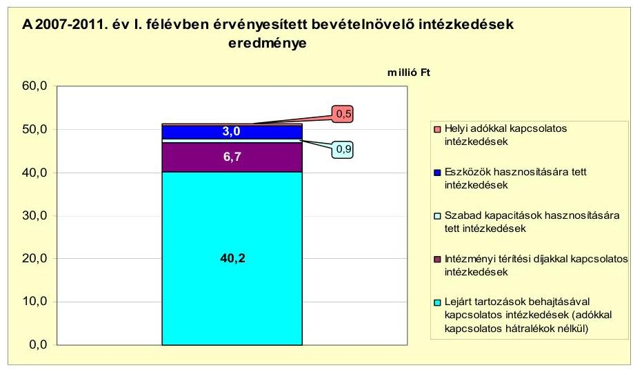

A bevételnövelő intézkedések hatására az Önkormányzat - kimutatása alapján - a 2007-2010. években és a 2011. év I. félévében összesen 51,3 millió Ft többletbevételt ért el. A bevételnövelő intézkedés hatására elért többletbevétel az Önkormányzat által számított, az ÁSZ által nem kontrollált érték. A többletbevétel 1,0\%-át (0,5 millió Ft-ot) a helyiadó-rendeletek módosításával, az adómérték emelésével, 5,8\%-át (3,0 millió Ft-ot) eszközök hasznosítására tett intézkedésekkel, 1,7\%-át (0,9 millió Ft-ot) szabad kapacitások hasznosításával, 13,1\%-át (6,7 millió Ft-ot) intézményi térítési díjakkal kapcsolatos, 78,4\%-át (40,2 millió Ft-ot) lejárt tartozások behajtásával kapcsolatos intézkedésekkel érték el.

A vizsgált időszakban az Önkormányzatnál új adónem bevezetésére nem került sor. Az Önkormányzat élve a jogszabályi lehetőségekkel, az ideiglenes jelleggel végzett iparűzési tevékenység adómértékét 2009. január 1-jétől 100,0\%-kal (2500 Ft/napról 5000 Ft/napra) emelte. Az adómérték változtatásával az Önkormányzat - nyilvántartásai szerint - a vizsgált időszakban összesen 0,5 millió Ft többletbevételt realizált.

Az eszközök hasznosítása során két személygépkocsi, egy földmunkagép és hulladékok értékesítéséből, a szabad kapacitások hasznosítása során munkagép bérbeadásából realizálódott bevétel. Az intézményi térítési díjakkal kapcsolatos intézkedések során, évente az óvodai és az iskolai térítési díjak emelésére került sor.

A Képviselő-testület 2011. január 1-jétől megszüntette a lakossági szemétszállítás 10\%-os díjkedvezményét, valamint a 70 éven felüli magánszemélyek díjkedvezményét jövedelmi határhoz kötötte. A díjkedvezmények megszüntetésével az Önkormányzat várhatóan 6,8 millió Ft többletbevételt realizál a 2011. évben.

A lejárt tartozások behajtásával kapcsolatos intézkedések során a vizsgált időszakban 40,2 millió Ft lejárt tartozást szedtek be a szemétszállítási díj, a távhődíj, a csatornadíj, a lakások és a nem lakás céljára szolgáló üzlethelyiségek bérleti díj hátralékaiból.

---

Az ellenőrzés megállapítása szerint a bevételnövelő intézkedések között kimutatott lejárt tartozások behajtása (40,2 millió Ft) az Önkormányzat kötelező feladata, ezeket figyelmen kívül hagyva a 2007-2010. években és a 2011. év I. félévében összesen 2591,2 millió Ft volt a megtakarítás és többletbevétel egyenlege.

Az Önkormányzat a 2007-2010. években - a jelentésben bemutatott CLF módszer szerint - 228,4 millió Ft többlet állami támogatásban és átengedett szja-ban részesült, amely az Önkormányzat által a kimutatás szerint a 2007-2010. években meghozott kiadáscsökkentő (1580,0 millió Ft) és bevételnövelő (35,9 millió Ft) intézkedéseivel együtt kedvezően hatott az Önkormányzat pénzügyi helyzetére. A 2011. évre az Önkormányzat az állami támogatás csökkenésével kalkulál az előző évhez viszonyítva. A költségvetési rendeletben tervezett 1415,5 millió Ft állami támogatás 20,3\%-kal (360,7 millió Ft-tal) maradhat el a 2010. évitől. A kieső állami támogatás ellensúlyozására szolgál az Önkormányzat kimutatása szerint a 2011. év I. félévében a bevételnövelő intézkedések hatására elért 15,4 millió Ft, valamint a kiadáscsökkentő intézkedések hatására jelentkező 1000,1 millió Ft. Az így elért bevételi többlet és kiadási megtakarítás összege (1015,5 millió Ft) a kieső állami támogatás és átengedett szja időarányos részére (180,4 millió Ft) fedezetet nyújt.

# 5. Az ÁSZ Által a korábbi években a pénzügyi egyensúly javítására tett szabályszerűségi és célszerűségi javaslatok hasznosulása

Az ÁSZ a 2010. évben végzett vizsgálatának megállapításairól készült jelentésében a pénzügyi egyensúly javítására kettő szabályszerűségi és egy célszerűségi javaslat vonatkozott. A javaslatok hasznosulása érdekében készített intézkedési tervet a Képviselő-testület jóváhagyta, a feladatok végrehajtásáért felelős személyeket és a feladatok végrehajtásának határidejét meghatározta. A javaslatnak megfelelően az Önkormányzat a költségvetési rendelettervezetének összeállítása során finanszírozási célú bevételeket és kiadásokat költségvetési bevételként és kiadásként nem mutatott ki, valamint a költségvetési rendeleteiben bemutatta elkülönítetten az EU-s támogatással megvalósuló projektek bevételeit és kiadásait éves bontásban.

A pénzügyi egyensúly javítására tett célszerűségi javaslat nem teljesült, mivel a jegyző nem végzett évente számításokat és nem tájékoztatta a Képviselőtestületet az Önkormányzat eladósodásának növekedésére figyelemmel arról, hogy a hosszú lejáratú, adósságot keletkeztető kötelezettségvállalásokból adódó tőke- és kamatfizetési kötelezettségét az Önkormányzat milyen feltételek biztosítása mellett tudja teljesíteni.

Budapest, 2012. április
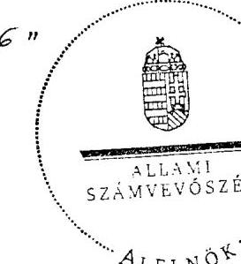

Wárvasovszky Tihamér

Melléklet: $\quad 6 \mathrm{db}$

---

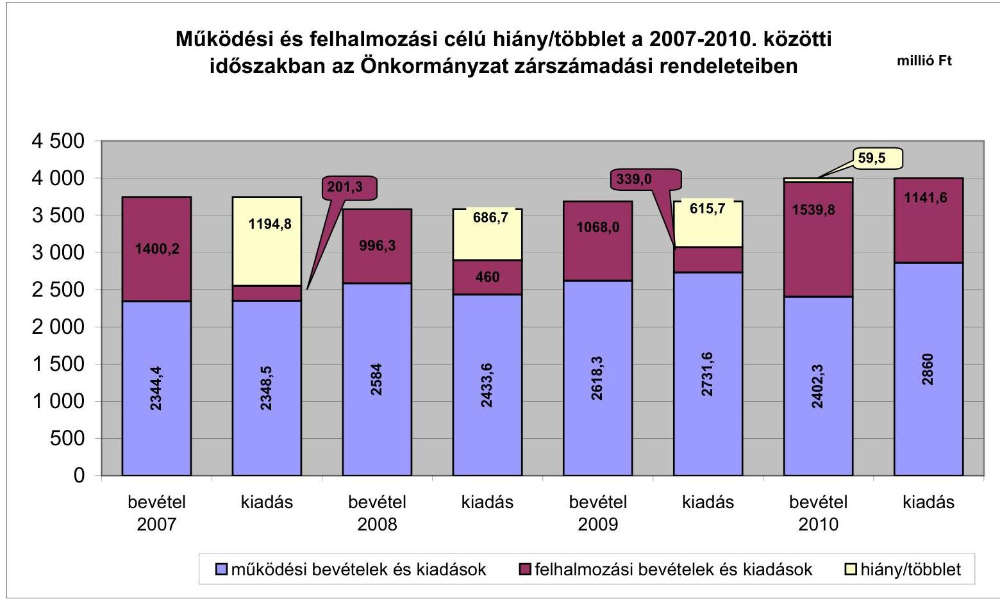

# Működési és felhalmozási célú hiány/többlet a 2007-2010. közötti időszakban az Önkormányzat zárszámadási rendeleteiben

|  év | 2007 | 2008 | 2009 | 2010  |
| --- | --- | --- | --- | --- |
|  működési bevételek és kiadások | 4 500 | 4 000 | 3 500 | 3 000  |
|  felhalmozási bevételek és kiadások | 4 000 | 3 500 | 2 500 | 2 000  |
| | felhalmozási bevételek és kiadások | 1400 | 1194 | 996 | 731 |
| működési bevételek és kiadások | 2344 | 2348 | 2584 | 2731 |
| felhalmozási bevételek és kiadások | 2348 | 2348 | 2584 | 2731 |
| működési bevételek és kiadások | 2344 | 2348 | 2584 | 2731 |
| felhalmozási bevételek és kiadások | 2344 | 2348 | 2584 | 2731 |
| működési bevételek és kiadások | 2344 | 2348 | 2584 | 2731 |
| felhalmozási bevételek és kiadások | 2344 | 2348 | 2584 | 2731 |
| működési bevételek és kiadások | 2344 | 2348 | 2584 | 2731 |
| felhalmozási bevételek és kiadások | 2344 | 2348 | 2584 | 2731 |
| működési bevételek és kiadások | 2344 | 2348 | 2584 | 2731 |
| felhalmozási bevételek és kiadások | 2344 | 2348 | 2584 | 2731 |
| működési bevételek és kiadások | 2344 | 2348 | 2584 | 2731 |
| felhalmozási bevételek és kiadások | 2344 | 2348 | 2584 | 2731 |
| működési bevételek és kiadások | 2344 | 2348 | 2584 | 2731 |
| felhalmozási bevételek és kiadások | 2344 | 2348 | 2584 | 2731 |
| működési bevételek és kiadások | 2344 | 2348 | 2584 | 2731 |
| felhalmozási bevételek és kiadások | 2344 | 2348 | 2584 | 2731 |
| működési bevételek és kiadások | 2344 | 2348 | 2584 | 2731 |
| felhalmozási bevételek és kiadások | 2344 | 2348 | 2584 | 2731 |
| működési bevételek és kiadások | 2344 | 2348 | 2584 | 2731 |
| felhalmozási bevételek és kiadások | 2344 | 2348 | 2584 | 2731 |
| működési bevételek és kiadások | 2344 | 2348 | 2584 | 2731 |
| felhalmozási bevételek és kiadások | 2344 | 2348 | 2584 | 2731 |
| működési bevételek és kiadások | 2344 | 2348 | 2584 | 2731 |
| felhalmozási bevételek és kiadások | 2344 | 2348 | 2584 | 2731 |
| működési bevételek és kiadások | 2344 | 2348 | 2584 | 2731 |
| felhalmozási bevételek és kiadások | 2344 | 2348 | 2584 | 2731 |
| működési bevételek és kiadások | 2344 | 2348 | 2584 | 2731 |
| felhalmozási bevételek és kiadások | 2344 | 2348 | 2584 | 2731 |
| működési bevételek és kiadások | 2344 | 2348 | 2584 | 2731 |
| felhalmozási bevételek és kiadások | 2344 | 2348 | 2584 | 2731 |
| működési bevételek és kiadások | 2344 | 2348 | 2584 | 2731 |
| felhalmozási bevételek és kiadások | 2344 | 2348 | 2584 | 2731 |
| működési bevételek és kiadások | 2344 | 2348 | 2584 | 2731 |
| felhalmozási bevételek és kiadások | 2344 | 2348 | 2584 | 2731 |
| működési bevételek és kiadások | 2344 | 2348 | 2584 | 2731 |
| felhalmozási bevételek és kiadások | 2344 | 2348 | 2584 | 2731 |
| működési bevételek és kiadások | 2344 | 2348 | 2584 | 2731 |
| felhalmozási bevételek és kiadások | 2344 | 2348 | 2584 | 2731 |
| működési bevételek és kiadások | 2344 | 2348 | 2584 | 2731 |
| felhalmozási bevételek és kiadások | 2344 | 2348 | 2584 | 2731 |
| működési bevételek és kiadások | 2344 | 2348 | 2584 | 2731 |
| felhalmozási bevételek és kiadások | 2344 | 2348 | 2584 | 2731 |
| működési bevételek és kiadások | 2344 | 2348 | 2584 | 2731 |
| felhalmozási bevételek és kiadások | 2344 | 2348 | 2584 | 2731 |
| működési bevételek és kiadások | 2344 | 2348 | 2584 | 2731 |
| felhalmozási bevételek és kiadások | 2344 | 2348 | 2584 | 2731 |
| működési bevételek és kiadások | 2344 | 2348 | 2584 | 2731 |
| felhalmozási bevételek és kiadások | 2344 | 2348 | 2584 | 2731 |
| működési bevételek és kiadások | 2344 | 2348 | 2584 | 2731 |
| felhalmozási bevételek és kiadások | 2344 | 2348 | 2584 | 2731 |
| működési bevételek és kiadások | 2344 | 2348 | 2584 | 2731 |
| felhalmozási bevételek és kiadások | 2344 | 2348 | 2584 | 2731 |
| működési bevételek és kiadások | 2344 | 2348 | 2584 | 2731 |
| felhalmozási bevételek és kiadások | 2344 | 2348 | 2584 | 2731 |
| működési bevételek és kiadások | 2344 | 2348 | 2584 | 2731 |
| felhalmozási bevételek és kiadások | 2344 | 2348 | 2584 | 2731 |
| működési bevételek és kiadások | 2344 | 2348 | 2584 | 2731 |
| felhalmozási bevételek és kiadások | 2344 | 2348 | 2584 | 2731 |
| működési bevételek és kiadások | 2344 | 2348 | 2584 | 2731 |
| felhalmozási bevételek és kiadások | 2344 | 2348 | 2584 | 2731 |
| működési bevételek és kiadások | 2344 | 2348 | 2584 | 2731 |
| felhalmozási bevételek és kiadások | 2344 | 2348 | 2584 | 2731 |
| működési bevételek és kiadások | 2344 | 2348 | 2584 | 2731 |
| felhalmozási bevételek és kiadások | 2344 | 2348 | 2584 | 2731 |
| működési bevételek és kiadások | 2344 | 2348 | 2584 | 2731 |
| felhalmozási bevételek és kiadások | 2344 | 2348 | 2584 | 2731 |
| működési bevételek és kiadások | 2344 | 2348 | 2584 | 2731 |
| felhalmozási bevételek és kiadások | 2344 | 2348 | 2584 | 2731 |
| működési bevételek és kiadások | 2344 | 2348 | 2584 | 2731 |
| felhalmozási bevételek és kiadások | 2344 | 2348 | 2584 | 2731 |
| működési bevételek és kiadások | 2344 | 2348 | 2584 | 2731 |
| felhalmozási bevételek és kiadások | 2344 | 2348 | 2584 | 2731 |
| működési bevételek és kiadások | 2344 | 2348 | 2584 | 2731 |
| felhalmozási bevételek és kiadások | 2344 | 2348 | 2584 | 2731 |
| működési bevételek és kiadások | 2344 | 2348 | 2584 | 2731 |
| felhalmozási bevételek és kiadások | 2344 | 2348 | 2584 | 2731 |
| működési bevételek és kiadások | 2344 | 2348 | 2584 | 2731 |
| felhalmozási bevételek és kiadások | 2344 | 2348 | 2584 | 2731 |
| működési bevételek és kiadások | 2344 | 2348 | 2584 | 2731 |
| felhalmozási bevételek és kiadások | 2344 | 2348 | 2584 | 2731 |
| működési bevételek és kiadások | 2344 | 2348 | 2584 | 2731 |
| felhalmozási bevételek és kiadások | 2344 | 2348 | 2584 | 2731 |
| működési bevételek és kiadások | 2344 | 2348 | 2584 | 2731 |
| felhalmozási bevételek és kiadások | 2344 | 2348 | | 2584 | 2731 |
| --- | --- |
| működési bevételek és kiadások | 2344 | 2348 | 2584 | 2731 |
| felhalmozási bevételek és kiadások | 2344 | 2348 | 2584 | 2731 |
| működési bevételek és kiadások | 2344 | 2348 | 2584 | 2731 |
| felhalmozási bevételek és kiadások | 2344 | 2348 | 2584 | 2731 |
| működési bevételek és kiadások | 2344 | 2348 | 2584 | 2731 |
| felhalmozási bevételek és kiadások | 2344 | 2348 | 2584 | 2731 |
| működési bevételek és kiadások | 2344 | 2348 | 2584 | 2731 |
| felhalmozási bevételek és kiadások | 2344 | 2348 | 2584 | 2731 |
| működési bevételek és kiadások | 2344 | 2348 | 2584 | 2731 |
| felhalmozási bevételek és kiadások | 2344 | 2348 | 2584 | 2731 |
| működési bevételek és kiadások | 2344 | 2348 | 2584 | 2731 |
| felhalmozási bevételek és kiadások | 2344 | 2348 | 2584 | 2731 |
| működési bevételek és kiadások | 2344 | 2348 | 2584 | 2731 |
| felhalmozási bevételek és kiadások | 2344 | 2348 | 2584 | 2731 |
| működési bevételek és kiadások | 2344 | 2348 | 2584 | 2731 |
| felhalmozási bevételek és kiadások | 2344 | 2348 | 2584 | 2731 |
| működési bevételek és kiadások | 2344 | 2348 | 2584 | 2731 |
| felhalmozási bevételek és kiadások | 2344 | 2348 | 2584 | 2731 |
| működési bevételek és kiadások | 2344 | 2348 | 2584 | 2731 |
| felhalmozási bevételek és kiadások | 2344 | 2348 | 2584 | 2731 |
| működési bevételek és kiadások | 2344 | 2348 | 2584 | 2731 |
| felhalmozási bevételek és kiadások | 2344 | 2348 | 2584 | 2731 |
| működési bevételek és kiadások | 2344 | 2348 | 2584 | 2731 |
| felhalmozási bevételek és kiadások | 2344 | 2348 | 2584 | 2731 |
| működési bevételek és kiadások | 2344 | 2348 | 2584 | 2731 |
| felhalmozási bevételek és kiadások | 2344 | 2348 | 2584 | 2731 |
| működési bevételek és kiadások | 2344 | 2348 | 2584 | 2731 |
| felhalmozási bevételek és kiadások | 2344 | 2348 | 2584 | 2731 |
| működési bevételek és kiadások | 2344 | 2348 | 2584 | 2731 |
| felhalmozási bevételek és kiadások | 2344 | 2348 | 2584 | 2731 |
| működési bevételek és kiadások | 2344 | 2348 | 2584 | 2731 |
| felhalmozási bevételek és kiadások | 2344 | 2348 | 2584 | 2731 |
| működési bevételek és kiadások | 2344 | 2348 | 2584 | 2731 |
| felhalmozási bevételek és kiadások | 2344 | 2348 | 2584 | 2731 |
| működési bevételek és kiadások | 2344 | 2348 | 2584 | 2731 |
| felhalmozási bevételek és kiadások | 2344 | 2348 | 2584 | 2731 |
| működési bevételek és kiadások | 2344 | 2348 | 2584 | 2731 |
| felhalmozási bevételek és kiadások | 2344 | 2348 | 2584 | 2731 |
| működési bevételek és kiadások | 2344 | 2348 | 2584 | 2731 |
| felhalmozási bevételek és kiadások | 2344 | 2348 | 2584 | 2731 |
| működési bevételek és kiadások | 2344 | 2348 | 2584 | 2731 |
| felhalmozási bevételek és kiadások | 2344 | 2348 | 2584 | 2731 |
| működési bevételek és kiadások | 2344 | 2348 | 2584 | 2731 |
| felhalmozási bevételek és kiadások | 2344 | 2348 | 2584 | 2731 |
| működési bevételek és kiadások | 2344 | 2348 | 2584 | 2731 |
| felhalmozási bevételek és kiadások | 2344 | 2348 | 2584 | 2731 |
| működési bevételek és kiadások | 2344 | 2348 | 2584 | 2731 |
| felhalmozási bevételek és kiadások | 2344 | 2348 | 2584 | 2731 |
| működési bevételek és kiadások | 2344 | 2348 | 2584 | 2731 |
| felhalmozási bevételek és kiadások | 2344 | 2348 | 2584 | 2731 |
| működési bevételek és kiadások | 2344 | 2348 | 2584 | 2731 |
 | felhalmozási bevételek és kiadások | 2344 | 2348 | 2584 | 2731 |
| múködési bevételek és kiadások | 2344 | 2348 | 2584 | 2731 |
| felhalmozási bevételek és kiadások | 2344 | 2348 | 2584 | 2731 |
| múködési bevételek és kiadások | 2344 | 2348 | 2584 | 2731 |
| felhalmozási bevételek és kiadások | 2344 | 2348 | 2584 | 2731 |
| múködési bevételek és kiadások | 2344 | 2348 | 2584 | 2731 |
| felhalmozási bevételek és kiadások | 2344 | 2348 | 2584 | 2731 |
| múködési bevételek és kiadások | 2344 | 2348 | 2584 | 2731 |
| felhalmozási bevételek és kiadások | 2344 | 2348 | 2584 | 2731 |
| múködési bevételek és kiadások | 2344 | 2348 | 2584 | 2731 |
| felhalmozási bevételek és kiadások | 2344 | 2348 | 2584 | 2731 |
| múködési bevételek és kiadások | 2344 | 2348 | 2584 | 2731 |
| felhalmozási bevételek és kiadások | 2344 | 2348 | 2584 | 2731 |
| múködési bevételek és kiadások | 2344 | 2348 | 2584 | 2731 |
| felhalmozási bevételek és kiadások | 2344 | 2348 | 2584 | 2731 |
| múködési bevételek és kiadások | 2344 | 2348 | 2584 | 2731 |
| felhalmozási bevételek és kiadások | 2344 | 2348 | 2584 | 2731 |
| múködési bevételek és kiadások | 2344 | 2348 | 2584 | 2731 |
| felhalmozási bevételek és kiadások | 2344 | 2348 | 2584 | 2731 |
| múködési bevételek és kiadások | 2344 | 2348 | 2584 | 2731 |
| felhalmozási bevételek és kiadások | 2344 | 2348 | 2584 | 2731 |
| múködési bevételek és kiadások | 2344 | 2348 | 2584 | 2731 |
| felhalmozási bevételek és kiadások | 2344 | 2348 | 2584 | 2731 |
| múködési bevételek és kiadások | 2344 | 2348 | 2584 | 2731 |
| felhalmozási bevételek és kiadások | 2344 | 2348 | 2584 | 2731 |
| felhalmozási bevételek és kiadások | 2344 | 2348 | 2584 | 2731 |
| felhalmozási bevételek és kiadások | 2344 | 2348 | 2584 | 2731 |
| felhalmozási bevételek és kiadások | 2344 | 2348 | 2584 | 2731 |
| felhalmozási bevételek és kiadások | 2344 | 2348 | 2584 | 2731 |
| felhalmozási bevételek és kiadások | 2344 | 2348 | 2584 | 2731 |
| felhalmozási bevételek és kiadások | 2344 | 2348 | 2584 | 2731 |
| felhalmozási bevételek és kiadások | 2344 | 2348 | 2584 | 2731 |
| felhalmozási bevételek és kiadások | 2344 | 2348 | 2584 | 2731 |
| felhalmozási bevételek és kiadások | 2344 | 2348 | 2584 | 2731 |
| felhalmozási bevételek és kiadások | 2344 | 2348 | 2584 | 2731 |
| felhalmozási bevételek és kiadások | 2344 | 2348 | 2584 | 2731 |
| felhalmozási bevételek és kiadások | 2344 | 2348 | 2584 | 2731 |
| felhalmozási bevételek és kiadások | 2344 | 2348 | 2584 | 2731 |
| felhalmozási bevételek és kiadások | 2344 | 2348 | 2584 | 2731 |
| felhalmozási bevételek és kiadások | 2344 | 2348 | 2584 | 2731 |
| felhalmozási bevételek és kiadások | 2344 | 2348 | 2584 | 2731 |
| felhalmozási bevételek és kiadások | 2344 | 2348 | 2584 | 2731 |
| felhalmozási bevételek és kiadások | 2344 | 2348 | 2584 | 2731 |
| felhalmozási bevételek és kiadások | 2344 | 2348 | 2584 | 2731 |
| felhalmozási bevételek és kiadások | 2344 | 2348 | 2584 | 2731 |
| felhalmozási bevételek és kiadások | 2344 | 2348 | 2584 | 2731 |
| felhalmozási bevételek és kiadások | 2344 | 2348 | 2584 | 2731 |
| felhalmozási bevételek és kiadások | 2344 | 2348 | 2584 | 2731 |
| felhalmozási bevételek és kiadások | 2344 | 2348 | 2584 | 2731 |
| felhalmozási bevételek és kiadások | 2344 | 2348 | 2584 | 2731 |
| felhalmozási bevételek és kiadások | 2344 | 2348 | 2584 | 2731 |
| felhalmozási bevételek és kiadások | 2344 | 2348 | 2584 | 2731 |
| felhalmozási bevételek és kiadások | 2344 | 2348 | 2584 | 2731 |

---

Az Önkormányzat bevételei és kiadásai, valamint adósságszolgálata 2007-2010 között

| | | | | | millió Ft |
| --- | --- | --- | --- | --- | --- |
| 1. FOLYÓ KÖLTSÉGVETÉS* | 2007. év | 2008. év | 2009. év | 2010. év | |
| 1.1.1. Saját működési bevételek | 291,8 | 442,8 | 403,1 | 499,5 | |
| 1.1.2. Költségvetési támogatás | 824,7 | 1358,5 | 1382,3 | 1283,0 | |
| 1.1.3. Átengedett bevételek | 1022,0 | 542,7 | 557,2 | 578,1 | |
| 1.1.4. Állambáztartáson belülről kapott támogatások | 211,6 | 245,3 | 262,7 | 266,6 | |
| 1.1.5. EU-tól és külföldről kapott bevételek | 0,0 | 0,0 | 0,0 | 0,0 | |
| 1.1.6. Állambáztartáson kívülről kapott bevételek | 5,4 | 2,6 | 1,7 | 1,4 | |
| 1.1.7. Előző évi pénzmaradvány átvétel | 23,1 | 55,4 | 74,5 | 15,9 | |
| 1.1. Folyó bevételek =1.1.1.+1.1.2.+1.1.3.+1.1.4.+1.1.5.+1.1.6.+1.1.7. | 2377,8 | 2647,3 | 2681,6 | 2604,9 | |
| 1.2.1. Működési kiadások kamatkiadások nélkül | 1926,8 | 1897,1 | 2197,4 | 2248,7 | |
| 1.2.2. Állambáztartáson belülre átadott pénzeszközök | 8,8 | 4,4 | 5,3 | 1,5 | |
| 1.2.3.1. vállalkozásoknak | | | 0,0 | 0,0 | |
| 1.2.3.2. EU-nak, illetve külföldre | | | 0,0 | 0,0 | |
| 1.2.3.3. magánszemélyeknek | 376,6 | 407,9 | 418,6 | 399,8 | |
| 1.2.3.4. nonprofit szervezeteknek | | 21,5 | 13,8 | 49,4 | |
| 1.2.3. Transferkiadások (=1.2.3.1+1.2.3.2+1.2.3.3+1.2.3.4) | 376,6 | 429,4 | 432,4 | 449,2 | |
| 1.2.4 Kamatkiadások | 0,2 | 58,4 | 62,9 | 24,7 | |
| 1.2.5. Előző évi pénzmaradvány átadás | 23,1 | 55,5 | 74,5 | 15,9 | |
| 1.2. Folyó kiadások = 1.2.1.+1.2.2.+1.2.3.+1.2.4.+1.2.5. | 2335,5 | 2444,8 | 2772,5 | 2740,0 | |
| 1.3. Folyó költségvetés egyenlege MŰKÖDÉSI JÖVEDELEM (1.1. - 1.2.) | 42,3 | 202,5 | -90,9 | -135,5 | |
| 2. FELHALMOZÁSI KÖLTSÉGVETÉS** | | | | | |
| 2.1.1. Saját tőkebevételek | 61,0 | 74,3 | 10,1 | 12,5 | |
| 2.1.2. Állambáztartáson belülről kapott támogatások | 24,7 | 0,0 | 25,0 | 592,1 | |
| 2.1.3. EU-tól és külföldről kapott támogatások | 0,0 | 0,0 | 0,0 | 0,0 | |
| 2.1.4. Állambáztartáson kívülről kapott támogatások | 20,0 | 20,0 | 0,0 | 0,5 | |
| 2.1. Felhalmozási bevételek (=2.1.1.+2.1.2+2.1.3+2.1.4.) | 105,7 | 94,3 | 35,1 | 609,1 | |
| 2.2.1. Saját beruházási kiadás áfával | 188,6 | 346,5 | 182,9 | 1041,3 | |
| 2.2.2. Saját felújítási kiadás áfával | 3,5 | 31,3 | 41,0 | 30,8 | |
| 2.2.3. Állambáztartáson belülre átadott pénzeszköz | 0,0 | 0,0 | 0,0 | 0,0 | |
| 2.2.4. EU-nak és külföldnek adott pénzeszközök | 0,0 | 0,0 | 0,0 | 0,0 | |
| 2.2.5. Állambáztartáson kívülre adott pénzeszközök | 8,5 | 21,5 | 61,4 | 7,1 | |
| 2.2.6. Befektetési célú részesedések vásárlása | 0,0 | 0,0 | 6,5 | 0,0 | |
| 2.2. Felhalmozási kiadások (=2.2.1.+2.2.2.+2.2.3.+2.2.4.+2.2.5.+2.2.6.) | 200,6 | 399,3 | 291,8 | 1079,2 | |
| 2.3. Felhalmozási költségvetés egyenlege (2.1. - 2.2.) | -94,9 | -305,0 | -256,7 | -474,1 | |
| 3. Finanszírozási műveletek nélküli (GFS) pozíció(1.3.+2.3.) | -52,5 | -102,6 | -347,5 | -609,7 | |
| 4. Finanszírozási műveletek | | | | | |
| 4.1. Hitelfelvétel | 14,8 | 0,0 | 0,0 | 141,8 | |
| 4.2. Hiteltörlesztés | 0,7 | 3,7 | 3,0 | 3,0 | |
| 4.3. Forgatási és befektetési célú értékpapírok kibocsátása | 1100,1 | | 0,0 | 0,0 | |
| 4.4. Forgatási és befektetési célú értékpapírok beváltása | | | 0,0 | 38,6 | |
| 4.5. Forgatási és befektetési célú értékpapírok értékesítése | | | 0,0 | 0,0 | |
| 4.6. Forgatási és befektetési célú értékpapírok vásárlása | | | 0,0 | 0,0 | |
| 4.7. Egyéb finanszírozási bevételek (függő, átfutó, kiegyenlítő) | -2,3 | 2,1 | -7,6 | -63,2 | |
| 4.8. Egyéb finanszírozási kiadások (függő, átfutó, kiegyenlítő) | 13,0 | 45,8 | 3,3 | 140,4 | |
| 4.9. Finanszírozási műveletek egyenlege (4.1. - 4.2.+4.3.-4.4+4.5.-4.6.+4.7.- | 1098,8 | -47,4 | -13,9 | -103,4 | |
| 4.8.) | | | | | |
| 5. Tárgyévi pénzügyi pozíció változás (1.3.+ 2.3.+4.9.) | 1046,3 | -150,0 | -361,4 | -713,1 | |
| 6. Nettó működési jövedelem =működési jövedelem (1.3.) - tőketörlesztés | 41,6 | 198,8 | -93,8 | -177,1 | |
| (4.2+4.4) | | | | | |
| TÁJÉKOZTATÓ ADATOK | | | | | |
| Összes kötelezettség | 1205,8 | 1787,8 | 2063,7 | 1835,0 | |
| ebből rövid lejáratú | 92,1 | 463,7 | 744,3 | 308,9 | |
| Összes szállítói kötelezettség | 79,5 | 62,7 | 74,6 | 68,9 | |
| ebből lejárt (tanúsítványból) | 0,0 | 2,6 | 0,4 | 55,8 | |
| Pénz és tőkeplací kötelezettség (adósság) | 1114,1 | 1323,1 | 1358,8 | 1750,3 | |
| ebből rövid lejáratú | 3,7 | 3,0 | 36,3 | 225,8 | |
| PPP szerződéses állomány jelenértéken (tanúsítványból) | 0,0 | 0,0 | 0,0 | 0,0 | |
| ebből lejárt szolgáltatási díj miatti kötelezettség | 0,0 | 0,0 | 0,0 | 0,0 | |
| Folyószámlatítél napi átlagos állománya (tanúsítványból) | 41,0 | 35,9 | 186,7 | 156,6 | |
| Likvidítél napi átlagos állománya (tanúsítványból) | 0,0 | 0,0 | 0,0 | 0,0 | |
| Mankabérítél napi átlagos állománya (tanúsítványból) | 0,0 | 0,0 | 0,0 | 0,0 | |
| Kezesség és garanciavállalások (tanúsítványból) | 0,0 | 0,0 | 0,0 | 0,0 | |
| Jogerős bírósági ítéletekből adódó kötelezettségek (tanúsítványból) | 0,0 | 0,0 | 0,0 | 0,0 | |
| Finanszírozásba bevonható eszközök: | 1275,6 | 1125,7 | 764,3 | 51,2 | |
| Tartós hitehviszonyt megtestesítő értékpapírok év végi állománya | 0,0 | 0,0 | 0,0 | 0,0 | |
| Hosszú lejáratú bankbetétek év végi állománya | 0,0 | 0,0 | 0,0 | 0,0 | |
| Értékpapírok év végi állománya | 0,0 | 0,0 | 0,0 | 0,0 | |
| Pénzeszközök (idegen pénzeszközök nélküli) év végi állománya | 1275,6 | 1125,7 | 764,3 | 51,2 | |

- Bevételekben nem térül, a kiadásokban nem jelenik meg az amortizáció, a vagyoni helyzetet az egyenleg befolyásolja ** Bevételekben vagyon megőrzésre és bővítésre fordítható források.

---

V-3084-016/2012. számú jelentéshez

#### Az Önkormányzat 2007-2010. években megvalósított, 2010. december 31-ig befejezett fejlesztései és azok forrásösszetétele

| Fejlesztési feladat (beruházás, felújítás) | | | | | | | | | | | | | | | | | | | | | | | | | | | | | | | | | | | | | | | | | | |
| --- | --- | --- | --- | --- | --- | --- | --- | --- | --- | --- | --- | --- | --- | --- | --- | --- | --- | --- | --- | --- | --- | --- | --- | --- | --- | --- | --- | --- | --- | --- | --- | --- | --- | --- | --- | --- | --- | --- | --- | --- | --- | --- |
| | | | | | | | | | | | | | | | | | | | | | | | | | | | | | | | | | | | | | | | | | | |
| | | | | | | | | | | | | | | | | | | | | | | | | | | | | | | | | | | | | | | | | | | |
| | | | | | | | | | | | | | | | | | | | | | | | | | | | | | | | | | | | | | | | | | | |
| | | | | | | | | | | | | | | | | | | | | | | | | | | | | | | | | | | | | | | | | | | |
| | | | | | | | | | | | | | | | | | | | | | | | | | | | | | | | | | | | | | | | | | | |
| | | | | | | | | | | | | | | | | | | | | | | | | | | | | | | | | | | | | | | | | | | |
| | | | | | | | | | | | | | | | | | | | | | | | | | | | | | | | | | | | | | | | | | | |
| | | | | | | | | | | | | | | | | | | | | | | | | | | | | | | | | | | | | | | | | | | |
| | | | | | | | | | | | | | | | | | | | | | | | | | | | | | | | | | | | | | | | | | | |
| | | | | | | | | | | | | | | | | | | | | | | | | | | | | | | | | | | | | | | | | | | |
| | | | | | | | | | | | | | | | | | | | | | | | | | | | | | | | | | | | | | | | | | | | | | | | | | | | | | | | | |
| | | | | | | | | | | | | | | | | | | | | | | | | | | | | | | | | | | | | | | | | | |
| | | | | | | | | | | | | | | | | | | | | | | | | | | | | | | | | | | | | | | | | | |
| | | | | | | | | | | | | | | | | | | | | | | | | | | | | | | | | | | | | | | | | | |
| | | | | | | | | | | | | | | | | | | | | | | | | | | | | | | | | | | | | | | | | | |
| | | | | | | | | | | | | | | | | | | | | | | | | | | | | | | | | | | | | | | | | | |
| | | | | | | | | | | | | | | | | | | | | | | | | | | | | | | | | | | | | | | | | | |
| | | | | | | | | | | | | | | | | | | | | | | | | | | | | | | | | | | | | | | | | | |
| | | | | | | | | | | | | | | | | | | | | | | | | | | | | | | | | | | | | | | | | | |
| | | | | | | | | | | | | | | | | | | | | | | | | | | | | | | | | | | | | | | | | | |
| | | | | | | | | | | | | | | | | | | | | | | | | | | | | | | | | | | | | | | | | | |
| | | | | | | | | | | | | | | | | | | | | | | | | | | | | | | | | | | | | | | | | | |
| | | | | | | | | | | | | | | | | | | | | | | | | | | | | | | | | | | | | | | | | | |
| | | | | | | | | | | | | | | | | | | | | | | | | | | | | | | | | | | | | | | | | | |
| | | | | | | | | | | | | | | | | | | | | | | | | | | | | | | | | | | | | | | | | | |
| | | | | | | | | | | | | | | | | | | | | | | | | | | | | | | | | | | | | | | | | | |
| | | | | | | | | | | | | | | | | | | | | | | | | | | | | | | | | | | | | | | | | | |
| | | | | | | | | | | | | | | | | | | | | | | | | | | | | | | | | | | | | | | | | | |
| | | | | | | | | | | | | | | | | | | | | | | | | | | | | | | | | | | | | | | | | | |
| | | | | | | | | | | | | | | | | | | | | | | | | | | | | | | | | | | | | | | | | | | |  |  |  |  |  |  |  |  |  |  |  |  |  |  |  |  |  |  |  |  |  |  |  |  |  |  |  |  |  |  |
|   |  |  |  |  |  |  |  |  |  |  |  |  |  |  |  |  |  |  |  |  |  |  |  |  |  |  |  |  |  |  |  |  |  |  |  |  |  |  |  |  |   |
|   |  |  |  |  |  |  |  |  |  |  |  |  |  |  |  |  |  |  |  |  |  |  |  |  |  |  |  |  |  |  |  |  |  |  |  |  |  |  |  |  |   |
|   |  |  |  |  |  |  |  |  |  |  |  |  |  |  |  |  |  |  |  |  |  |  |  |  |  |  |  |  |  |  |  |  |  |  |  |  |  |  |  |  |   |

---

### **Az Önkormányzat 2010. december 31-én folyamatban lévő fejlesztési feladataira 2010. december 31-ig teljesített kifizetések és azok forrásösszetétele**

|   | Fejlesztési feladat (beruházás, felújítás) | Beruházás, felújítás | Teljes bekerülési költség | 2006. dec. 31-ig teljesített kiadás | 2007. 2010. évén között teljesített kiadás | 2008. dec. 31-ig teljesített kiadás | 2009. évén között teljesített kiadás | 2010. december 31-ig pénzügyileg teljesített beruházás forrásösszetétele |  |  |  |  |  |  |  |  |  |  |  |  |  |  |  |  |  |  |  |  |  |  |  |  |  |   |
| --- | --- | --- | --- | --- | --- | --- | --- | --- | --- | --- | --- | --- | --- | --- | --- | --- | --- | --- | --- | --- | --- | --- | --- | --- | --- | --- | --- | --- | --- | --- | --- | --- | --- | --- |
|   | Megnevezése |  |  |  |  |  |  |  |  |  |  |  |  |  |  |  |  |  |  |  |  |  |  |  |  |  |  |  |  |  |  |  |  |   |
|   |  |  |  |  |  |  |  |  |  |  |  |  |  |  |  |  |  |  |  |  |  |  |  |  |  |  |  |  |  |  |  |  |  |   |
|  1. | 2 | 3 | 4 | 5 | 6 | 7 | 8 | 9 | 10 | 11 | 12 | 13 | 14 | 15 | 16 | 17 | 18 | 19 | 20 | 21 | 22 | 23 | 24 | 25 | 26 | 27 | 28 | 29 | 30 | 31 |  |  |   |
|   | Felújítások |  |  |  |  |  |  |  |  |  |  |  |  |  |  |  |  |  |  |  |  |  |  |  |  |  |  |  |  |  |  |  |  |   |
|  2. | TSLK Bölcsődéhez vezető út |  |  |  |  |  |  |  |  |  |  |  |  |  |  |  |  |  |  |  |  |  |  |  |  |  |  |  |  |  |  |  |  |   |
|   | 3. Fejűjtások összesen |  |  |  |  |  |  |  |  |  |  |  |  |  |  |  |  |  |  |  |  |  |  |  |  |  |  |  |  |  |  |  |  |   |
|   | 4. Fejlesztések |  |  |  |  |  |  |  |  |  |  |  |  |  |  |  |  |  |  |  |  |  |  |  |  |  |  |  |  |  |  |  |  |   |
|   |  |  |  |  |  |  |  |  |  |  |  |  |  |  |  |  |  |  |  |  |  |  |  |  |  |  |  |  |  |  |  |  |  |   |
|   | 5. Városrehabilitáció |  |  |  |  |  |  |  |  |  |  |  |  |  |  |  |  |  |  |  |  |  |  |  |  |  |  |  |  |  |  |  |  |   |
|   | 6. Márcs, iskola fülés, melegrűtőnyílás |  |  |  |  |  |  |  |  |  |  |  |  |  |  |  |  |  |  |  |  |  |  |  |  |  |  |  |  |  |  |  |  |   |
|   | 7. Központi Napközi Otth. Óvoda felúj. |  |  |  |  |  |  |  |  |  |  |  |  |  |  |  |  |  |  |  |  |  |  |  |  |  |  |  |  |  |  |  |  |   |
|   | 8. Hunyadi tagiskola felúj. |  |  |  |  |  |  |  |  |  |  |  |  |  |  |  |  |  |  |  |  |  |  |  |  |  |  |  |  |  |  |  |  |   |
|   | 9. 10 millió Ft alatti fejlesztések |  |  |  |  |  |  |  |  |  |  |  |  |  |  |  |  |  |  |  |  |  |  |  |  |  |  |  |  |  |  |  |  |   |
|   | 10. Fejlesztések összesen |  |  |  |  |  |  |  |  |  |  |  |  |  |  |  |  |  |  |  |  |  |  |  |  |  |  |  |  |  |  |  |  |   |
|   | 11. Mindösszesen |  |  |  |  |  |  |  |  |  |  |  |  |  |  |  |  |  |  |  |  |  |  |  |  |  |  |  |  |  |  |  |  |   |

- A= ha a forrás már rendelkezésre áll.

B= ha a forrás közbeszerzési eljárása folyamatban van.

C= ha a forrás közbeszerzési eljárása még nem indult el, a forrás nem áll rendelkezésre.

---

## **Az Önkormányzat 2010. december 31-én folyamatban lévő fejlesztési feladataira 2010. december 31-én fennálló kötelezettségek és azok forrásösszetétele**

|  Fejlesztési feladat (beruházás, felújítás) |  | Beruházás, |  |  |  |  |  |  |  |  |  |  |  |  |  |  |  |  |  |  |  |  |  |  |  |  |  |  |  |  |  |  |  |  |  |  |  |  |  |  |   |
| --- | --- | --- | --- | --- | --- | --- | --- | --- | --- | --- | --- | --- | --- | --- | --- | --- | --- | --- | --- | --- | --- | --- | --- | --- | --- | --- | --- | --- | --- | --- | --- | --- | --- | --- | --- | --- | --- | --- | --- | --- | --- |
|   |  |  |  |  |  |  |  |  |  |  |  |  |  |  |  |  |  |  |  |  |  |  |  |  |  |  |  |  |  |  |  |  |  |  |  |  |  |  |  |  |   |
|   |  |  |  |  |  |  |  |  |  |  |  |  |  |  |  |  |  |  |  |  |  |  |  |  |  |  |  |  |  |  |  |  |  |  |  |  |  |  |  |  |   |
|   |  |  |  |  |  |  |  |  |  |  |  |  |  |  |  |  |  |  |  |  |  |  |  |  |  |  |  |  |  |  |  |  |  |  |  |  |  |  |  |  |   |
|   |  |  |  |  |  |  |  |  |  |  |  |  |  |  |  |  |  |  |  |  |  |  |  |  |  |  |  |  |  |  |  |  |  |  |  |  |  |  |  |  |   |
|   |  |  |  |  |  |  |  |  |  |  |  |  |  |  |  |  |  |  |  |  |  |  |  |  |  |  |  |  |  |  |  |  |  |  |  |  |  |  |  |  |   |
|   |  |  |  |  |  |  |  |  |  |  |  |  |  |  |  |  |  |  |  |  |  |  |  |  |  |  |  |  |  |  |  |  |  |  |  |  |  |  |  |  |   |
|   |  |  |  |  |  |  |  |  |  |  |  |  |  |  |  |  |  |  |  |  |  |  |  |  |  |  |  |  |  |  |  |  |  |  |  |  |  |  |  |  |   |
|   |  |  |  |  |  |  |  |  |  |  |  |  |  |  |  |  |  |  |  |  |  |  |  |  |  |  |  |  |  |  |  |  |  |  |  |  |  |  |  |  |   |
|   |  |  |  |  |  |  |  |  |  |  |  |  |  |  |  |  |  |  |  |  |  |  |  |  |  |  |  |  |  |  |  |  |  |  |  |  |  |  |  |  |   |
|   |  |  |  |  |  |  |  |  |  |  |  |  |  |  |  |  |  |  |  |  |  |  |  |  |  |  |  |  |  |  |  |  |  |  |  |  |  |  |  |  |   |
|   |  |  |  |  |  |  |  |  |  |  |  |  |  |  |  |  |  |  |  |  |  |  |  |  |  |  |  |  |  |  |  |  |  |  |  |  |  |  |  |  |   |
|   |  |  |  |  |  |  |  |  |  |  |  |  |  |  |  |  |  |  |  |  |  |  |  |  |  |  |  |  |  |  |  |  |  |  |  |  |  |  |  |  |   |
|   |  |  |  |  |  |  |  |  |  |  |  |  |  |  |  |  |  |  |  |  |  |  |  |  |  |  |  |  |  |  |  |  |  |  |  |  |  |  |  |  |   |
|   |  |  |  |  |  |  |  |  |  |  |  |  |  |  |  |  |  |  |  |  |  |  |  |  |  |  |  |  |  |  |  |  |  |  |  |  |  |  |  |  |   |
|   |  |  |  |  |  |  |  |  |  |  |  |  |  |  |  |  |  |  |  |  |  |  |  |  |  |  |  |  |  |  |  |  |  |  |  |  |  |  |  |  |   |
|   |  |  |  |  |  |  |  |  |  |  |  |  |  |  |  |  |  |  |  |  |  |  |  |  |  |  |  |  |  |  |  |  |  |  |  |  |  |  |  |  |   |
|   |  |  |  |  |  |  |  |  |  |  |  |  |  |  |  |  |  |  |  |  |  |  |  |  |  |  |  |  |  |  |  |  |  |  |  |  |  |  |  |  |   |
|   |  |  |  |  |  |  |  |  |  |  |  |  |  |  |  |  |  |  |  |  |  |  |  |  |  |  |  |  |  |  |  |  |  |  |  |  |  |  |  |  |   |
|   |  |  |  |  |  |  |  |  |  |  |  |  |  |  |  |  |  |  |  |  |  |  |  |  |  |  |  |  |  |  |  |  |  |  |  |  |  |  |  |  |   |
|   |  |  |  |  |  |  |  |  |  |  |  |  |  |  |  |  |  |  |  |  |  |  |  |  |  |  |  |  |  |  |  |  |  |  |  |  |  |  |  |  |   |
|   |  |  |  |  |  |  |  |  |  |  |  |  |  |  |  |  |  |  |  |  |  |  |  |  |  |  |  |  |  |  |  |  |  |  |  |  |  |  |  |  |   |
|   |  |  |  |  |  |  |  |  |  |  |  |  |  |  |  |  |  |  |  |  |  |  |  |  |  |  |  |  |  |  |  |  |  |  |  |  |  |  |  |  |   |
|   |  |  |  |  |  |  |  |  |  |  |  |  |  |  |  |  |  |  |  |  |  |  |  |  |  |  |  |  |  |  |  |  |  |  |  |  |  |  |  |  |   |
|   |  |  |  |  |  |  |  |  |  |  |  |  |  |  |  |  |  |  |  |  |  |  |  |  |  |  |  |  |  |  |  |  |  |  |  |  |  |  |  |  |   |
|   |  |  |  |  |  |  |  |  |  |  |  |  |  |  |  |  |  |  |  |  |  |  |  |  |  |  |  |  |  |  |  |  |  |  |  |  |  |  |  |  |   |
|   |  |  |  |  |  |  |  |  |  |  |  |  |  |  |  |  |  |  |  |  |  |  |  |  |  |  |  |  |  |  |  |  |  |  |  |  |  |  |  |  |   |
|   |  |  |  |  |  |  |  |  |  |  |  |  |  |  |  |  |  |  |  |  |  |  |  |  |  |  |  |  |  |  |  |  |  |  |  |  |  |  |  |  |   |
|   |  |  |  |  |  |  |  |  |  |  |  |  |  |  |  |  |  |  |  |  |  |  |  |  |  |  |  |  |  |  |  |  |  |  |  |  |  |  |  |  |   |
|   |  |  |  |  |  |  |  |  |  |  |  |  |  |  |  |  |  |  |  |  |  |  |  |  |  |  |  |  |  |  |  |  |  |  |  |  |  |  |  |  |   |

---

Sajószentpéter Város Önkormányzata 4. számú melléklet V-3084-016/2012. számú jelentéshez

Az önkormányzati feladatok ellátásában résztvevő gazdasági társaságok

millió Ft-ban

|  Gazdasági társaság megnevezése | önkormányzat | önkormányzat gazdasági társaságának | saját tőke, jegyzett tőke aránya | kötelező feladathoz | önként vállalt feladathoz | hosszú lejáratú hitedből, kötvényből | tűzérből | lejárt szállító állományból | működési célra átadott pénzeszköz | felhalmozási célra átadott pénzeszköz  |
| --- | --- | --- | --- | --- | --- | --- | --- | --- | --- | --- |
|   |  |  |  |  |  |  |  | 2007. | 2008. | 2009. | 2010.  |
|   |  |  |  |  |  |  |  | 2011. 1. félév. |  |  | 2008.  |
|  1. 100%-os tulajdoni hányadú gazdasági társaságok: |  |  |  |  |  |  |  |  |  |  |   |
|  Sajó Televízió Nonprofit Kft. | 100,0 | 0,0 | 2,0 | 0,0 | 5,5 | 0,0 | 0,0 | 1,5 | 1,6 | 0,9 | 0,0  |
|  Sajószentpéteri Városfejlesztési Kft. | 100,0 | 0,0 | 0,8 | 0,0 | 0,1 | 0,0 | 0,0 | 0,0 | 0,0 | 0,0 | 0,0  |
|  Sajószentpéteri Közétkeztetési Nonprofit Kft. | 100,0 | 0,0 | 1,3 | 37,0 | 0,0 | 0,0 | 0,0 | 8,7 | 0,0 | 0,0 | 0,0  |
|  Sajószentpéteri Közfoglalkoztatási Nonprofit Kft. | 100,0 | 0,0 | 4,2 | 1,3 | 0,0 | 0,0 | 0,0 | 0,4 | 0,0 | 0,0 | 0,0  |
|  100%-os tulajdoni hányadú gazdasági társaságok összesen | x | x | x | 38,3 | 5,6 | 0,0 | 0,0 | 10,6 | 1,6 | 0,9 | 0,0  |
|  0. 75-89%-os tulajdoni hányadú gazdasági társaságok: |  |  |  |  |  |  |  |  |  |  |   |
|  75-89%-os tulajdoni hányadú gazdasági társaságok összesen | x | x | x | 0,0 | 0,0 | 0,0 | 0,0 | 0,0 | 0,0 | 0,0 | 0,0  |
|  75% felelő tulajdoni hányadú gazdasági társaságok összesen | x | x | x | 38,3 | 5,6 | 0,0 | 0,0 | 10,6 | 1,6 | 0,9 | 0,0  |
|  III. 51-74%-os tulajdoni hányadú gazdasági társaságok: |  |  |  |  |  |  |  |  |  |  |   |
|  51-74%-os tulajdoni hányadú gazdasági társaságok összesen | x | x | x | 0,0 | 0,0 | 0,0 | 0,0 | 0,0 | 0,0 | 0,0 | 0,0  |
|  IV. egyéb, közfeladatot ellátó gazdasági társaságok: |  |  |  |  |  |  |  |  |  |  |   |
|  Észak-Magyarországi Regionális Vízművek Zrt. | 0,0 | 0,0 | 3,0 | 0,0 | 0,0 | 17,7 | 0,0 | 1,0 | 0,0 | 0,0 | 0,0  |
|  AVE Miskolci Környezetvédelmi és Működésgazdálkodási Kft. | 0,0 | 0,0 | 6,8 | 0,0 | 0,0 | 0,8 | 0,0 | 0,6 | 0,0 | 0,0 | 0,0  |
|  Egyéb, közfeladatot ellátó gazdasági társaságok összesen | x | x | x | 0,0 | 0,0 | 18,5 | 0,0 | 1,6 | 0,0 | 0,0 | 0,0  |
|  Összesen | x | x | x | 38,3 | 5,6 | 18,5 | 0,0 | 15,2 | 1,6 | 0,9 | 0,0  |