# ÁLLAMI   SZÁMVEVŐSZÉK 

## JELENTÉS

Sárospatak Város Önkormányzata pénzügyi helyzetének ellenőrzéséről (43/4)

---

# Állami Számvevőszék 

Iktatószám: V-3085-021/2012.
Témaszám: 1015
Vizsgálat-azonosító szám: V0560116

## Az ellenőrzést felügyelte:

Dr. Varga Sándor
számvevő igazgatóhelyettes
Az ellenőrzést vezette:
Renkó Zsuzsanna
számvevő tanácsos
Ellenőrzési csoportvezető:
Bialkó Zsolt Gyula
számvevő tanácsos
Az ellenőrzést végezték:
Puskás Balázs Fórián Erika
számvevő számvevő tanácsos

---

# TARTALOMJEGYZÉK 

BEVEZETÉS ..... 9
I. ÖSSZEGZŐ MEGÁLLAPÍTÁSOK, KÖVETKEZTETÉSEK, JAVASLATOK ..... 13
II. RÉSZLETES MEGÁLLAPÍTÁSOK ..... 27

1. Az Önkormányzat kötelező és önként vállalt feladatai, a feladatellátás szervezeti keretei és annak változásai ..... 27
2. Az Önkormányzat pénzügyi egyensúlyi helyzetét befolyásoló tényezők ..... 32
2.1. A működési és a felhalmozási egyensúly változása ..... 34
2.2. Az Önkormányzat bevételeinek változása ..... 40
2.3. Az Önkormányzat működési és felhalmozási célú kiadásainak változása ..... 44
3. Az Önkormányzat kötelezettségei ..... 48
3.1. Az Önkormányzat pénzintézeti kötelezettségeinek változása ..... 48
3.2. A szállítói kötelezettségek változása ..... 54
3.3. Egyéb kötelezettségek változása ..... 55
4. A pénzügyi egyensúly megteremtése érdekében hozott intézkedések eredménye ..... 58
5. Az ÁSZ által a korábbi években a pénzügyi egyensúly javítására tett szabályszerűségi és célszerűségi javaslatok hasznosulása ..... 61

---

# MELLÉKLETEK 

1. számú Működési és felhalmozási célú hiány/többlet a 2007-2010 közötti időszakban az Önkormányzat zárszámadási rendeleteiben (1 oldal)
2. számú Az Önkormányzat bevételei és kiadásai, valamint adósságszolgálata 2007-2010 között (1 oldal)
3/a. számú Az Önkormányzat 2007-2010. években megvalósított, 2010. december 31-ig befejezett fejlesztései és azok forrásösszetétele (1 oldal)
3/b. számú Az Önkormányzat 2010. december 31-én folyamatban lévő fejlesztési feladataira 2010. december 31-ig teljesített kifizetések és azok forrásösszetétele (1 oldal)
3/c. számú Az Önkormányzat 2010. december 31-én folyamatban lévő fejlesztési feladataira 2010. december 31-én fennálló kötelezettségek és azok forrásösszetétele (1 oldal)
3/d. számú Az Önkormányzat által beadott, elbírálás alatti pályázati forrásból megvalósítani tervezett fejlesztéseihez kapcsolódó kötelezettségvállalásai és azok forrásösszetétele (1 oldal)
3. számú Az önkormányzati feladatok ellátásában résztvevő gazdasági társaságok (1 oldal)
4. számú Sárospatak Város Önkormányzat Polgármesterének a város pénzügyi helyzetének ellenőrzéséről szóló ÁSZ jelentéstervezetre adott észrevétele (3 oldal)
5. számú Az ÁSZ válasza Sárospatak Város Önkormányzat Polgármesterének a jelentéstervezetre adott észrevételére (2 oldal)

---

# RÖVIDÍTÉSEK JEGYZÉKE 

## Törvények

Adósságrendezési tv.
Áht. 1
Áht. 2
Htv.
Stabilitási tv.
Ötv.

## Rendeletek

Ámr.
SzMSz

## Szórövidítések

áfa
ÁSZ
Fürdő
CHF
EU
GDP
jegyző
Képviselő-testület
ÖKIF hitel
ÖNHIKI támogatás
Önkormányzat
Patakhő Kft.
PATAQUA Kft.
polgármester
Polgármesteri hivatal
RFV Kft.
Közszolgáltató Kft.
szja
a helyi önkormányzatok adósságrendezéséről szóló 1996. évi XXV. törvény
az államháztartásról szóló 1992. évi XXXVIII. törvény, hatályos 2011. december 31-ig
az államháztartásról szóló 2011. évi CXCV. törvény
a hitelintézetekről és a pénzügyi vállalkozásokról szóló 1996. évi CXII. törvény

Magyarország gazdasági stabilitásáról szóló 2011. évi CXCIV. törvény
a helyi önkormányzatokról szóló 1990. évi LXV. törvény, hatályos 2011. december 31-ig
az államháztartás működési rendjéről szóló 292/2009. (XII. 19.) Korm. rendelet

Sárospatak Város Önkormányzatának 21/1998. (XII. 16.) számú rendelete Sárospatak Város Önkormányzata Szervezeti és Működési Szabályzatáról
általános forgalmi adó
Állami Számvevőszék
Termálfürdő és Camping
Svájci frank
Európai Unió
Bruttó hazai termék
Sárospatak Város Önkormányzatának jegyzője
Sárospatak Város Képviselő-testülete
Önkormányzati Fejlesztési Hitelprogram keretében nyújtott hitel
Önhibájukon kívül hátrányos helyzetben levő települési önkormányzatok támogatása
Sárospatak Város Önkormányzata
Patakhő Energiaszolgáltató Nonprofit Kft.
PATAQUA Sárospataki Termálfürdő- és Campingfejlesztő Kft.
Sárospatak Város Önkormányzatának polgármestere
Sárospatak Város Önkormányzatának Polgármesteri hivatala
RFV Sárospatak Városgazdálkodási Nonprofit Kft.
Sárospataki Közszolgáltató Nonprofit Kft.
személyi jövedelemadó

---

.

---

# ÉRTELMEZŐ SZÓTÁR 

banki kitettség

BUBOR

CLF módszer

EURIBOR
használhatósági fok
kamatkockázat
kötelező közszolgáltatás

Az önkormányzat pénzügyi helyzete olyan külső körülmények hatására is módosulhat, amelyekre az önkormányzatnak nincs hatása, emiatt banki kitettsége keletkezik. Pl. rövid távú kötelezettségek fennállása esetén kizárólag a bank egyoldalú döntésén múlik, hogy továbbra is biztosít-e hitelt az önkormányzatnak, valamint azt milyen feltételekkel bocsátja az önkormányzat rendelkezésére.
Budapesti Bankközi Forint Hitelkamatláb. Mértékét az MNB naponta állapítja meg a banki kamatok figyelembevételével. Közzététele naponta történik.
Az önkormányzatok költségvetése elemzésének eszköze. Bizonyos mértékig a vállalati gazdálkodás logikai elemeit érvényesíti az önkormányzatok pénzügyi jövedelmi helyzetének vizsgálat során. Következetesen elkülöníti a folyó és a felhalmozási költségvetés bevételeit és kiadásait, azok költségvetési egyenlegeit. A módszer a pénzügyi kapacitás fogalmát helyezi a középpontba.
A frankfurti bankközi piacon jegyzett, az Európai Központi Bank szabályainak megfelelően megállapított kínálati kamatláb. Az EURIBOR értékét a legfontosabb európai bankok hitelkínálatának kamatlábai alapján a Reuters ügynökség számolja ki és teszi közzé naponta. A magyar pénzintézetek is ezt használják viszonyítási alapnak EUR hitelek esetén.
Az eszközgazdálkodás vizsgálatának elemzése során használt mutató. Számításakor a tárgyi eszköz könyv szerinti (nettó) értékét viszonyítják a tárgyi eszköz bruttó (beszerzési/létesítési) értékéhez. A %-ban kifejezett mutató csökkenése az eszköz állagának romlására, avulására utal, ami maga után vonja az üzemeltetési és fenntartási költségek növekedését is.
Az a kockázat, amely a változó kamatozású hiteleknél akkor áll fenn, ha a forint-, vagy a devizahitel futamideje alatt emelkedik a kamat, és ez által nő a hitel törlesztő részlete.
A helyi önkormányzati feladatkörbe tartozó, a köztisztasággal és a településtisztasággal, valamint az élet- és vagyonbiztonsággal összefüggő egyes - közszolgáltatás útján megvalósuló - közfeladatok ellátása, amelynek kötelező igénybevételét külön jogszabály (törvény, helyi önkormányzati rendelet) határoz meg.

---

közfeladat

LIBOR
önkormányzat többségi tulajdonában
lévő gazdasági társaságok
pénzügyi kapacitás
pénzügyi kockázat
pénzügyi kockázat

Állami, helyi, illetve kisebbségi önkormányzati feladat, amelynek ellátásáról az államnak, illetve az önkormányzatoknak kell gondoskodni. A hatályos szabályozás szerint közfeladatot törvény és önkormányzati rendelet állapíthat meg. Az önkormányzatok által ellátandó feladatok keretszerű meghatározását az Ötv. tartalmazza.
Angol kifejezés, a London Interbank Offered Rate rövidítése. Jelentése: Londoni bankközi, referencia jellegű kínálati (hitel) kamatláb.
Az önkormányzat a gazdasági társaságban a szavazatok több, mint ötven százalékával vagy a Ptk. 685/B. § (2)-(3) bekezdéseiben rögzített meghatározó befolyással rendelkezik. A helyi önkormányzat és az önkormányzat irányítása alá tartozó költségvetési szerv többségi tulajdonában, illetve többségi befolyása alatt álló gazdálkodó szervezet esetében hitelfelvétel, kölcsönfelvétel, garancia- vagy kezességvállalás, tartozásátvállalás, tartozáselengedés, értékpapírkibocsátás, vásárlás, pénzügyi lízing, tartós bérleti szerződés, ingyenes vagyonjuttatás (így különösen: ajándékozás, ingyenes engedményezés), vagy követelésvásárlás, követelésengedményezés végrehajtására vonatkozóan az Áht. 100/M. § (4) bekezdése alapján az önkormányzat rendelkezik döntési jogosultsággal.
A pénzügyi kapacitás (financial capacity) az adósok hitelfelvételi képességének azon mértéke, ahol még anélkül tudják növelni az adósságot, hogy csökkenteniük kellene akár a jelenbeli, akár a jövőben esedékes kiadásaikat a fizetésképtelenség elkerülése érdekében. (Forrás: Az önkormányzati rendszer pénzügyi helyzete, ÁSZKUT tanulmány 2010.
A belső működési kockázat egyik eleme. A költségvetési szerv működésének, tevékenységének, rövid távon ható velejáróinak része a tevékenységi, és emberi erőforrás kockázatokkal együtt. Megmutatkozhat a költségvetés nagyságrendjének, szerkezetének módosításaiban, a bevételi és kiadási előirányzatok változásaiban, a nem megfelelő belső kontrollrendszer működése során, a tudatos károkozásokban, a biztosítások elmaradásában, a hibás fejlesztési döntésekben, a nem megfelelő forrásfelhasználásokban. A bevételek és kiadások ütemkülönbsége miatt is jelentkezhet.

System of National Account, azaz a Nemzeti Számlák Rendszere, amely a gazdasági szektorok által létrehozott valamennyi terméket és szolgáltatást figyelembe veszi.
szállítói kitettség Az önkormányzat pénzügyi helyzete olyan külső körülmények hatására is módosulhat, amelyekre az önkormányzatnak nincs hatása, emiatt szállítói kitettsége keletkezik. Pl. a lejárt szállítói tartozások rendezése függhet attól, hogy a szállító milyen intézkedéseket foganatosít az önkormányzattal szemben.

---

törlesztési kockázat

Annak a kockázata, hogy a megfelelő időben és mértékben a hitelt felvevőnél rendelkezésre állnak-e a pénzintézetek és egyéb szervek felé fennálló kötelezettségek visszafizetéséhez, a hitelek és kölcsönök törlesztéséhez szükséges pénzügyi források.
A törlesztési kockázatot növeli a kamat- és árfolyam növekedése, mivel ezekben az esetekben az adósságszolgálat nőhet. Törlesztési kockázatot okozhat a visszafizetésre tervezett forrás elérésének, teljesítésének bizonytalansága (pl. a visszafizetéshez tervezett tartalékolás elmaradt, a tervezettnél alacsonyabb a saját bevétel, a helyi adóból származó bevétel az adóalanyok, adóalapok csökkenése miatt nem teljesül).

---

.

---

# JELENTÉS 

## Sárospatak Város Önkormányzata pénzügyi helyzetének ellenőrzéséről

## BEVEZETÉS

Az Állami Számvevőszék 2011. évtől érvényes stratégiája új irányt szabott a helyi önkormányzatok gazdálkodásának ellenőrzésében is. Az ÁSZ - küldetése és jövőképe szerint - szilárd szakmai alapokra támaszkodva értékteremtő ellenőrzéseivel és helyzetelemzéseivel az államháztartás egészében, így a helyi önkormányzati alrendszerben is elő kívánja segíteni a közpénzek és a közvagyon szabályos, gazdaságos, hatékony és eredményes felhasználását. E folyamat részeként - az államháztartási hiány alakulásának összetevőire is figyelemmel - végezzük az önkormányzati alrendszer pénzügyi helyzetelemzését.

Az államháztartás helyi szintjén a 304 városnak${ }^{1}$ az általuk ellátott közszolgáltatások volumenére is tekintettel a közfeladatok ellátásában kiemelt szerepe van. E települések 2011. január 1-jei népessége 3169 ezer fő volt.

Feladataik és hatásköreik az Ötv. mellett különböző ágazati törvények által meghatározottak, miközben a feladatellátás szervezeti kereteit - ezen belül a gazdasági társaságok közszolgáltatások ellátásában betöltött szerepét - saját maguk határozzák meg. A gazdasági társaságok által ellátott feladatok esetén a gazdálkodás, továbbá az önkormányzatok pénzügyi egyensúlyi helyzetére ható közvetlen kockázatok egy része kikerült az önkormányzati alrendszerből. A többségi önkormányzati tulajdonban lévő társaságok gazdálkodásának körülményei befolyásolhatják a városok pénzügyi egyensúlyi helyzetének megítélésében rejlő kockázatokat.

Az áttekintett időszakban az önkormányzati forrásszabályozás elvei lényegesen nem változtak. Az önkormányzatok gazdasági mozgásterét a központi költségvetéstől való függőség mellett jelentősen befolyásolja a helyi adókivetési jog gyakorlása. A városok gazdálkodási szabadságának lényeges eleme, hogy anyagi lehetőségeik függvényében dönthettek arról, hogy feladataik közül azokat, amelyek megoldására az Ötv. szerint a települési önkormányzat nem kötelezhető, a megyei önkormányzat fenntartásába adhatták. E döntések differenciáltan érintették a városok pénzügyi helyzetét.

[^0]
[^0]:    ${ }^{1}$ A megyei jogú városok nélkül figyelembe vett városok száma 304 városi önkormányzatot jelent.

---

A városi önkormányzatok 2007-2010 között teljesített bevételeinek alakulását és összetételét a következő ábra szemlélteti:
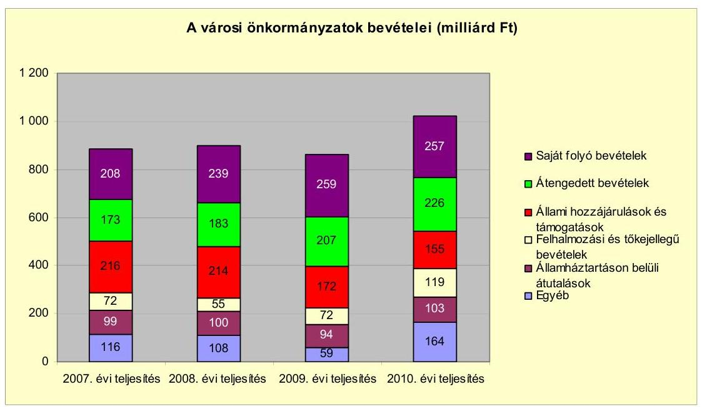

Az önkormányzati alrendszer pénzügyi helyzetértékelése során új elemzési módszereket alkalmazott az ellenőrzés. A költségvetési beszámoló adatok elemzése helyett az Önkormányzat pénzügyi helyzetét a CLF módszerrel értékeljük, amelynek lényegét és számításának módszerét a jelentés 2. pontjában, és a jelentés 2. számú mellékletében ismertetjük részletesen.

Az új módszereken alapuló helyzetértékelés fontosságát az adja, hogy a helyi önkormányzatok bruttó adósságállománya${ }^{2}$ a 2010. évi költségvetési beszámolók alapján 1248 milliárd Ft-ot tett ki. Ezen belül a 304 város adóssága 383 milliárd Ft volt, amely az önkormányzati alrendszer teljes adósságállományának 30,7 %-át jelentette${ }^{3}$.

A mérlegben kimutatott bruttó adósságállomány mellett az önkormányzatok számára az eszközállomány műszaki állapotának megőrzése is előbb-utóbb pénzügyi kötelezettséget jelent. Az elhasználódott eszközök pótlására forrást biztosító amortizációs (felújítási) alap képzésének${ }^{4}$ elmaradása maga után vonhatja a feladatellátást kiszolgáló tárgyi eszközök állagának erőteljes romlását.

[^0]
[^0]:    ${ }^{2}$ Az önkormányzati mérlegbeszámolókból számított bruttó adósságállomány 2010. év végi összege magában foglalja a fejlesztési és a működési célú kötvénykibocsátások, a beruházási és fejlesztési hitelek, a működési célú hosszú lejáratú hitelek, a rövid lejáratú hitelek, váltótartozások miatti kötelezettségek teljes (2011-ben, illetve az azt követő években esedékes) állományát. Az önkormányzatok 2007. év végi mérleg szerinti adósságállománya 692 milliárd Ft volt.
    ${ }^{3}$ A fővárosi és a kerületi önkormányzatok adósságának figyelmen kívül hagyásával számított 977 milliárd Ft összegű bruttó adósságállományból a városok 39,2\%-kal részesedtek.
    ${ }^{4}$ Erre a jelenlegi szabályozási környezetben nem kötelezi előírás az önkormányzatokat.

---

Emellett a 2007-2013-as időszakra
 meghirdetett, vissza nem térítendő EU-s fejlesztési forrásokhoz való hozzájutás lehetősége felerősítette az önkormányzati alrendszer fejlesztési igényeit, amelyek a felhalmozási költségvetési hiány folyamatos emelkedésén túl - az előírt jövőbeni fenntartási kötelezettség miatt tovább terhelhetik az önkormányzatok költségvetését ${ }^{5}$.

Az ÁSZ a 2011. évi ellenőrzési tervében 43. számú, az Önkormányzatok gazdálkodási rendszerének ellenőrzése részeként áttekinti, és elemzi az önkormányzatok pénzügyi helyzetét. A gazdálkodás szabályszerűségét az ÁSZ az előző évek során ebben az önkormányzati körben is ellenőrizte. Jelen vizsgálatunk a tett javaslataink pénzügyi helyzetet érintő pontjainak hasznosítására utóellenőrzés jelleggel tér ki.

Az ellenőrzés megállapításait az Önkormányzat által kitöltött - teljességi nyilatkozattal megerősített - 27 tanúsítványon szolgáltatott adatokra alapoztuk. Ellenőrzési bizonyítékként használtuk fel továbbá:

- a képviselő-testületi és bizottsági előterjesztéseket, a döntés-előkészítés során készített dokumentumokat;
- a kötelezettségvállalások dokumentumait;
- a pénzügyi-számviteli nyilvántartásokat;
- az éves költségvetési beszámolókat;
- a költségvetési és zárszámadási rendeleteket.

Az ellenőrzés a 2007. január 1. - 2011. június 30. közötti időszakot öleli fel. A pénzintézeti kötelezettségek állományának vizsgálatakor az ellenőrzött időszak 2006. december 31. - 2011. június 30. közötti időszakra terjedt ki.

Az ellenőrzés során vizsgáltunk minden olyan körülményt és adatot, amely a program végrehajtásához kapcsolódott és a pénzügyi helyzet alakulására hatást gyakorló releváns tények és folyamatok feltárásához szükségessé vált.

# Az ellenőrzés célja annak értékelése volt, hogy: 

- a vizsgált időszakban a kötelező és önként vállalt feladatok ellátását biztosító szervezeti keretekben, a feladatellátás módjában bekövetkezett változások milyen hatást gyakoroltak az Önkormányzat pénzügyi helyzetének alakulására;

[^0]
[^0]:    ${ }^{5}$ Az Állami Számvevőszék 2011 júniusában közzétett 1108. számú, a helyi önkormányzatok fejlesztési célú támogatási rendszerének ellenőrzéséről szóló jelentésében feltárta a fejlesztési folyamatok problémáit. A helyi önkormányzatok elsősorban azokat a fejlesztéseket valósították meg, amelyekhez támogatást lehetett igényelni. A fejlesztési célok közül a magasabb támogatási intenzitású pályázatokat részesítették előnyben. A fejlesztéssel megvalósuló létesítmények jövőbeli üzemeltetésének várható ráfordításait az önkormányzatok 71,9 %-a nem mérte fel.

---

- az Önkormányzat pénzügyi - ezen belül működési és felhalmozási - egyensúlya mely tényezők hatására miként változott, és az Önkormányzat milyen intézkedéseket tett a pénzügyi egyensúly javítása érdekében;
- a költségvetési kiadások finanszírozása érdekében vállalt pénzintézeti kötelezettségek hogyan alakultak, továbbá milyen kötelezettségek fennállása befolyásolja az Önkormányzat jövőbeli pénzügyi helyzetét;
- hasznosultak-e a gazdálkodási rendszer korábbi ellenőrzése során a pénzügyi egyensúly javítására az ÁSZ által tett szabályszerűségi és célszerűségi javaslatok.

Az ellenőrzés típusa: szabályszerűségi vizsgálat.
A vizsgálat jogszabályi alapját az Állami Számvevőszékről szóló 2011. évi LXVI. törvény 1. §. (3), 5. § (2)-(6) bekezdései, továbbá az Áht. ${ }_{1}$ 120/A. § (1) bekezdése ${ }^{6}$ előírásai képezték.

Sárospatak - 1968 óta ismét város - Magyarország észak-keleti részén, Borsod-Abaúj-Zemplén megye zempléni régiójában, a Bodrog folyó két partja mentén fekszik. A rendszerváltoztatást követően az egyébként sem jelentős ipara fokozatosan leépült, a foglalkoztatási lehetőségek csökkenése folytán nőtt a munkanélküliség. A város lakossága mindezek hatására a korábbi 15000 fő feletti létszámról az elmúlt években csökkent, lakosainak száma 2011. január 1-jén 12920 fő volt.

Feladatait 2011. június 30-án (a Polgármesteri hivatallal együtt) kilenc költségvetési szervvel és hét gazdasági társasággal látta el. 2010-ben zárszámadási rendelete szerint 3971,1 millió Ft költségvetési bevételt ért el és 4933,8 millió Ft költségvetési kiadást teljesített. A könyvviteli mérleg szerint az Önkormányzat 2010. december 31-én 13 395,6 millió Ft értékű vagyonnal rendelkezett.

[^0]
[^0]:    ${ }^{6}$ 2012. január 1-jétől Áht. 2 61. § (2) bekezdése

---

# I. ÖSSZEGZŐ MEGÁLLAPÍTÁSOK, KÖVETKEZTETÉSEK, JAVASLATOK 

Az Önkormányzat - adatszolgáltatása szerint, mely nem tartalmazza az Önkormányzat által fenntartott egészségügyi intézmények és a kisebbségi önkormányzatok adatait - a 2010. évben működési költségvetési kiadásaiból (3771,0 millió Ft-ból) 1804,4 millió Ft-ot (47,8\%) a kötelező feladatok, 1966,6 millió Ft-ot (52,2\%) az önként vállalt feladatok ellátására fordított. Az önként vállalt feladatok közé sorolták az alapfokú művészeti, a középiskolai (gimnáziumi) oktatást, a kollégiumi ellátást, a szakközép- és szakmunkásképzés oktatását, a fürdő- és strandszolgáltatást, az éttermi vendéglátást, a helyi újság kiadását, a járóbeteg-szakellátást, a sport- és a természetvédelmi feladatokat. Ezen túlmenően hozzájárultak az egyházak támogatásához, és a civil szervezetek működésének finanszírozásához. Az önként vállalt feladatok köréről az SzMSz-ben 2009. évtől rendelkeztek, azok terjedelmét az éves költségvetési rendeletekben a költségvetés forrásainak ismeretében határozták meg.

Az Önkormányzat feladatellátásának szervezeti struktúráját a következő ábra szemlélteti:

Az Önkormányzat feladatellátásának szervezeti struktúrája
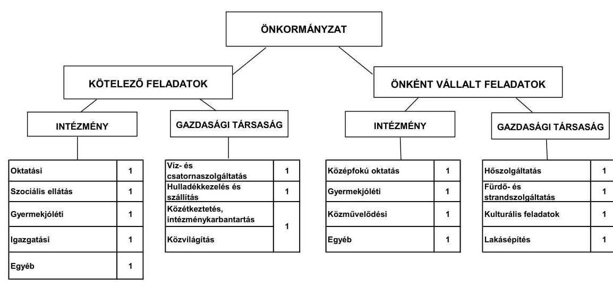

Az Önkormányzat feladatait 2011. június 30-án (a Polgármesteri hivatallal együtt) kilenc költségvetési szervvel, négy kizárólagos, egy 52,0\%-os és kettő 25,0\% alatti tulajdoni hányadú gazdasági társasággal látta el. A kilenc költségvetési szervből öt látott el kötelező, kettő önként vállalt feladatot, és kettő intézmény a gyermekjóléti, és egyéb feladatokat tekintve kötelező és önként vállalt feladatokat is végzett. Az intézményszervezeti átalakítások és intézményi összevonások következtében a feladatellátás telephelyeinek száma a 2007. évi 25-ről 2011. év I. félév végére 24-re csökkent. A gazdasági társaságok távhőszolgáltatás, hulladékkezelés, -szállítás, víz- és szennyvízkezelés területén kaptak szerepet az Önkormányzat feladatellátásában. Rendszeres

---

működési célú pénzeszközátadásban egy kizárólagos tulajdonú gazdasági társaság részesült, összege az ellenőrzött időszakban összesen 72,1 millió Ft-ot tett ki. Ezen túlmenően négy gazdasági társaság kapott 2008-2010. években és 2011. év első félévében összesen 329,2 millió Ft tagi kölcsönt működési, illetve felhalmozási célra.

A kötelező és önként vállalt feladatok ellátását biztosító szervezeti keretekben, a feladatellátás módjában bekövetkezett változásoknak az önként vállalt feladatokra volt számszerűen is kimutatható hatása (2007. évről 2008 évre és 2009. évről 2010 évre), mely az Önkormányzat pénzügyi egyensúlyi helyzetét is befolyásolta. Az önként vállalt egyéb feladatok működési kiadása 2007 évről 2008 évre 23,2\%-kal 131,2 millió Ft-tal csökkent, melyre hatással volt a TÁVHŐ Kommunális Szervezet megszűnése, feladatainak az RFV Kft.-nek történő átadása. Az önként vállalt egyéb feladatok működési kiadása 2009. évről 2010. évre 52,1\%-kal (336,2 millió Ft-tal) csökkent, meghatározóan a Fürdőnek a PATAQUA Kft.-nek történő feladatátadása miatt.

Az egyes közszolgáltatások feladatellátásában résztvevő intézmények a 2007. és a 2010. évi működési kiadások finanszírozási forrásainak összetételét a következő ábra szemlélteti:
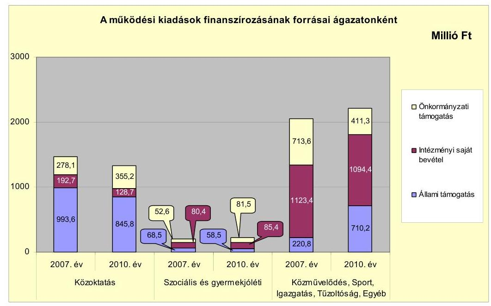

A 2007. évről a 2010. évre 134,4 millió Ft-tal (9,2\%-kal) csökkent a közoktatási ágazat működési kiadása az óvoda és általános iskola működési kiadásának 193,3 millió Ft-os (26,9\%-os) csökkenése miatt, melyet az óvodai összevonások, és az Erdélyi János Általános Iskola és Kollégiumnak a Borsod-Abaúj-Zemplén Megyei Önkormányzatnak történő átadása eredményezett.

A szociális és gyermekjóléti feladatok működési kiadása a 2007. évről a 2010. évre 24,0 millió Ft-tal 11,9\%-kal nőtt, az infláció miatt. Az ágazatban a finanszírozás arányai a 2007. évről a 2010. évre megváltoztak, az önkormányzati támogatás 54,9\%-kal (28,9 millió Ft-tal) növekedett, az állami támogatás 14,6\%-os (10,0 millió Ft-os) csökkenése miatt.

---

A közművelődési, sport-, igazgatási és egyéb feladatok működési kiadása összesen 7,7\%-kal (157,7 millió Ft-tal) nőtt a 2007. évről a 2010. évre, a finanszírozási arányok jelentős változása mellett, az egyes önként vállalt feladatoknak az Önkormányzat gazdasági társaságainak történő átadása miatt. Ezért az állami támogatások több mint háromszorosára emelkedtek, az intézményi saját bevételek 2,6\%-os (29,0 millió Ft-os), és az önkormányzati támogatás 42,4\%-os (302,3 millió Ft-os) csökkenése mellett. Az Önkormányzat a TÁVHŐ Kommunális Szervezetet a 2007. évben megszüntette, feladatait az Önkormányzat kizárólagos tulajdonában álló RFV Kft.-nek adta át. A Termálfürdő és Camping költségvetési szervét 2009. év májusában szüntették meg, hivatkozva arra, hogy a hatásvizsgálat alapján más szervezetben a feladat ellátása hatékonyabban megoldható. A közfeladat ellátását megállapodás alapján a PATAQUA Kft.-nek adták át. A 2011. év februárjában a Művelődési Ház és Könyvtárnak átadták az Újbástya-Sárospatak épület üzemeltetési jogát, a Tourinform Iroda feladatainak ellátását, és a Vízi kapui szabadtéri színpad működtetését.

Az Önkormányzat folyó költségvetési egyenlegét (működési jövedelem), pénzügyi kapacitását és a tőketörlesztéseket az alábbi ábra mutatja:
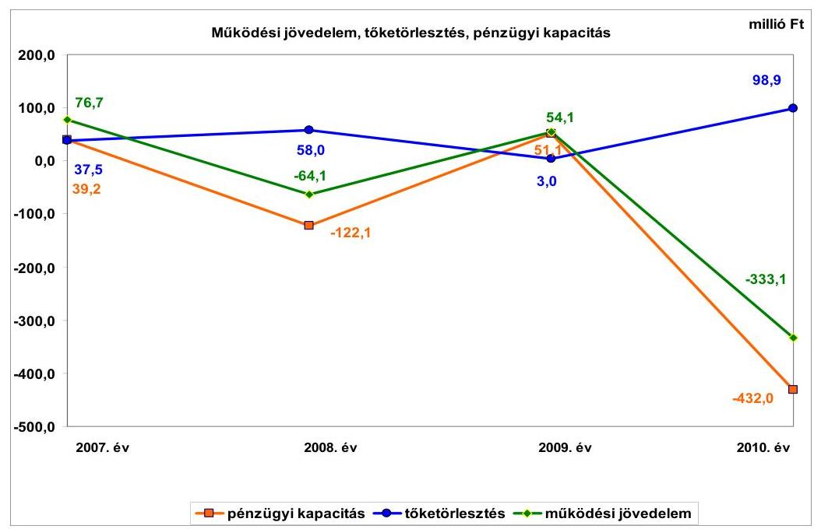

Az Önkormányzat folyó költségvetési egyenlege a 2008. évben és a 2010. évben működési forráshiányos volt. A vizsgált időszakban a működési jövedelem összességében 266,4 millió Ft forráshiányt mutatott, melyhez döntő mértékben hozzájárult a 2010. év 333,1 millió Ft-os hiánya. A 2010. évi negatív működési jövedelem jelzi, hogy az Önkormányzat gazdálkodása rövid távon is kockázatos, a törlesztések fedezete nem képződik meg. A 2012. évben a várható hosszú lejáratú kötelezettségvállalásokkal kapcsolatos adott évi adósságszolgálat 3,0 millió Ft. A 2013. évtől kezdődik a kötvény tőketörlesztése, mely várhatóan 2032-ig évi 162,5 millió Ft-os többletkiadást, tőketörlesztést jelent. A törlesztések fedezete csak akkor biztosított, ha a működési jövedelem a jövőben meghaladja a várható tőketörlesztések (2012-ben 3,0 millió Ft, 2013-ban 165,5 millió Ft) összegét.

---

A nettó működési jövedelem - az évről évre hasonló nagyságrendű tőketörlesztés miatt - a vizsgált időszakban a működési jövedelemmel azonos irányban változott. A 2007-2010. években összesen létrejött -266,4 millió Ft működési jövedelemhez 197,4 millió Ft hiteltörlesztés kapcsolódott, amelynek teljesítését követően 463,8 millió Ft negatív nettó működési jövedelem keletkezett. Mindez azt jelzi, hogy az Önkormányzat költségvetési megtakarításai nem voltak elégségesek a 2007-2010 között felmerült 197,4 millió Ft összegű tőketörlesztésre. A polgármester a pénzügyi egyensúly megbomlása ellenére nem kezdeményezte az Önkormányzat intézményei előirányzatfelhasználásának szoros kontrollját.

Az Önkormányzat 2007-ben csak úgy tudott pozitív működési jövedelmet elérni, hogy 114,0 millió Ft ÖNHIKI és 28,0 millió Ft egyszeri egyéb központi működési támogatásban részesült és - 2006. év végéhez képest - 259,9 millió Ft-tal nőtt a ki nem fizetett szállítói tartozásállomány. A 2008. évben a működési jövedelem (az elnyert 143,7 millió Ft ÖNHIKI és 50,0 millió Ft egyszeri egyéb központi működési támogatás ellenére) - melyből 20,0 millió Ft visszatérítendő volt - negatív volt, mert a saját működési bevételek 15,6\%-os (172,4 millió Ft-os) csökkenése mellett a folyó kiadások 3,2\%-kal (122,1 millió Ft-tal) emelkedtek. A hőszolgáltatást 2007. szeptember 1-jétől a költségvetési szerv átalakítása miatt, az Önkormányzat gazdasági társasága az RFV Kft. látta el. Az intézményi bevétel elmaradása (2007-ben a költségvetési szervnél 289,0 millió Ft intézményi bevétel keletkezett) ellenére a hőszolgáltatásért az Önkormányzatnak fizetnie kellett. Az RFV Kft.-nek teljesített hőszolgáltatási díj 2008-ban 298,6 millió Ft (2007. évi 73,9 millió Ft hátralékkal együtt) volt. A folyó kiadások 2008. évi növekedéséhez hozzájárult a kamatkiadások 62,4 millió Ft-tal történő emelkedése, valamint az, hogy a 2007. év végéhez képest a szállítói tartozásállomány 260,0 millió Ft-tal csökkent.

A működési jövedelem előjele 2009-ben pozitívra (az ÖNHIKI 36,3 millió Ft-tal segítette) fordult, mert a folyó kiadások az előző évhez képest nagyobb mértékben (10\%-kal, 389,8 millió Ft-tal) csökkentek, mint a folyó bevételek (7,1\%-kal, 271,5 millió Ft-tal). A 2009. évi kedvező működési jövedelmi adathoz (ÖNHIKI nélkül 17,8 millió Ft)
 hozzájárultak a jogtalanul igénybe vett normatív támogatások is. A működési kiadások erőteljesebb mérséklődése azért következett be, mert az RFV Kft.-nek teljesített hőszolgáltatási díj az előző évhez képest 141,0 millió Ft-tal csökkent. (Mérséklődött a szerződés szerinti hőszolgáltatási díj és már csak a tárgyévi fizetési kötelezettség jelentkezett.) A Fürdő költségvetési szervként 2008-ban 199,9 millió Ft intézményi működési bevételt ért el, valamint 210,5 millió Ft működési kiadást teljesített. A Fürdő, mint költségvetési szerv 2009. június 12-én megszűnt, átalakult gazdasági társasággá. Ennek következtében a Fürdő intézményi bevétele 2008-hoz képest 94,3 millió Ft-tal, a működési kiadása 170,8 millió Ft-tal csökkent. Az Önkormányzat a Fürdő részére működési célú pénzeszközt 2009-ben nem adott.

A 2010. évben a működési jövedelem - az ekkor kapott 56,8 millió Ft ÖNHIKI ellenére - drasztikusan (387,2 millió Ft-tal) csökkent, előjele negatívra (333,1 millió Ft) váltott, mert a folyó bevételek 1,5%-os csökkenése (51,9 millió Ft) mellett, a folyó kiadások 9,6%-kal (335,4 millió Ft-tal) emelkedtek. A folyó kiadások növekedését az előző évben jogosulatlanul igénybe vett térségi közoktatási normatíva és a hozzá kapcsolódó szja kiegészítés visszafizetése, a beru-

---

házásokhoz és a PATAQUA Kft.-től térítésmentesen átvett Fürdő vagyonhoz kapcsolódó többlet áfa befizetések, a közcélú foglalkoztatás bővülése, valamint a központi bérkiegészítés miatti személyi juttatások emelkedése okozta.

A 2007-2010. években az Önkormányzat felhalmozási költségvetésének egyenlege folyamatosan negatív összegű volt, a felhalmozási forráshiány összesen 1882,2 millió Ft-ot ért el. A felhalmozási forráshiánynak a felhalmozási és tőke jellegű kiadásokhoz viszonyított aránya 2009-ben (91,2%, 794,5 millió Ft) volt a legmagasabb, mert a támogatások aránya a fejlesztési kiadások finanszírozásában 3,4% (29,2 millió Ft) volt. A Fürdő fejlesztése ebben az évben fejeződött be (teljes bekerülési költsége 537,9 millió Ft), melyet a kötvény kibocsátásából származó bevételből finanszíroztak. Az Önkormányzatnak a saját forrás biztosításához 2007-2010 között nem volt elegendő felhalmozási bevétele, ezért a fejlesztéseket külső forrásból, a 2006-2007. években felvett hitelek és a 2008. évben kibocsátott kötvény bevételéből (2056,2 millió Ft) finanszírozta.

A Képviselő-testületnek előterjesztett éves költségvetési rendeletekben nem mutatták be a beruházásokkal létrehozott létesítmények működtetése és fenntarthatósága érdekében várhatóan felmerülő költségvetési kiadásokat. A Képvise-lő-testületet nem tájékoztatták megfelelő információval az Önkormányzat fejlesztéseihez kapcsolódóan a vállalt kötelezettségek teljes körére vonatkozó finanszírozási igényekről, azok önkormányzati pénzügyi egyensúlyi helyzetre gyakorolt hatásairól.

A hőszolgáltatás (2007-ben) és a Fürdő (2009-ben) gazdasági szervezetekké történt átalakítása miatt a saját működési bevételek folyamatos csökkenése következtében az Önkormányzat folyó bevételei is folyamatosan mérséklődtek. Ennek következtében a folyó bevételek 2010-ben (3491,6 millió Ft) 6,4%-kal (239,4 millió Ft-tal) maradtak el a 2007-2009. évek átlagától (3731,0 millió Ft). Legnagyobb súlya a költségvetési támogatások és az átengedett szja együttes összegének volt, mely 2010-ben a folyó bevételek 61,7%-át tette ki. A felhalmozási bevételekben meghatározóak voltak a kapott támogatások (1581,8 millió Ft), melyek a vizsgált időszakban az összes felhalmozási bevétel 83,6%-át tették ki.

Ezzel szemben a folyó kiadások értéke az előző évhez képest 2008-ban 3,2%-kal (122,1 millió Ft-tal) növekedett (többek között a szállítói tartozásállomány 260,0 millió Ft-os csökkenése következtében), majd 2009-ben 10%-kal (389,8 millió Ft-tal) csökkent a költségvetési intézmények átalakulása miatt. A folyó kiadások összege 2010-ben (3824,7 millió Ft) 9,6%-kal, 335,4 millió Ft-tal ismét növekedett, mert többek között a jogosulatlanul igényelt állami támogatások (112,1 millió Ft) visszafizetésre kerültek. A folyó kiadások 2010-ben 3,1%-kal (116,2 millió Ft-tal) haladták meg a 2007-2009. évek átlagát (3708,5 millió Ft). A személyi juttatások és járulékok nagysága és aránya a vizsgált időszakban a költségvetési intézmények átalakításai miatt folyamatosan csökkent, 2010-ben a működési kiadások 55,2%-át, (1587,0 millió Ft) tette ki. A 2007-2010. években a folyó kiadások aránya csökkenő, míg a felhalmozási kiadások növekvő tendenciát mutattak.

---

A pénzügyi egyensúlyi helyzet alakulását jelentősen befolyásolta az Önkormányzat elmúlt időszaki, a felhalmozás finanszírozására fordítható saját források képződésének hiányát figyelmen kívül hagyó fejlesztési tevékenysége. A 2007-2010. években befejezett fejlesztések esetében 2044,0 millió Ft értékű kiadást teljesített ebben az időszakban. A fejlesztések teljes bekerülési költsége 2085,3 millió Ft volt. Ezek forrását saját bevételből (17,2%, 359,6 millió Ft), felvett hitelből (2,4%, 50,9 millió Ft), kötvénykibocsátás bevételéből (44,0%, 916,6 millió Ft), EU-s támogatásból (28,1%, 585,0 millió Ft) és hazai támogatásból (8,3%, 173,2 millió Ft) fedezték. A 2010. december 31-én folyamatban lévő fejlesztési feladatok végrehajtására 2007-2010. között 500,6 millió Ft kiadást teljesítettek. A folyamatban lévő beruházások 2010. december 31-ig teljesített kiadásainak forrása 7,8%-ban (39,1 millió Ft) saját bevétel, 45,4%-ban (227,3 millió Ft) kötvénykibocsátásból származó bevétel és 46,8%-ban (234,2 millió Ft) EU-s támogatás volt. A projektek döntő többsége utófinanszírozású volt, mely likviditási gondokat okozott. Az Önkormányzatnak a pályázati források folyószámlahitelből történő finanszírozása pénzügyi kockázatot jelent. A folyószámlahitel igénybevétele a vizsgált időszakban tartóssá vált, a kötvény kibocsátásából származó bevételek felhasználása után a folyószámlahitel állomány 2011-ben 143,3 millió Ft-ra emelkedett, mely 29,7%-kal (32,8 millió Ft-tal) haladta meg a 2007-2010 közötti átlagos állományt (110,5 millió Ft). A 2008-ban kibocsátott kötvény bevételéből, valamint 2009-ben a folyószámlahitel-keret ideiglenes emelésével a finanszírozást lehetővé tevő pénzeszközök folyamatosan rendelkezésre álltak.

Az Önkormányzat 2010. december 31-én folyamatban lévő fejlesztési feladatok 2010. évet követő kötelezettségvállalásainak összege 2108,7 millió Ft volt, amelynek finanszírozását 1788,5 millió Ft-ot EU-s támogatásból, 302,7 millió Ft-ot saját bevételből és 17,5 millió Ft-ot kötvénykibocsátásból származó bevételből tervezik biztosítani. A fejlesztések megvalósításához saját bevétellel számoltak, mely - tekintettel az elmúlt évek negatív működési jövedelmére - a vállalt fejlesztések jövőbeni finanszírozhatóságának kockázatát növeli.

A 2010. december 31-én fennálló felhalmozási kötelezettségvállalások forrásösszetételét a következő ábra mutatja be:
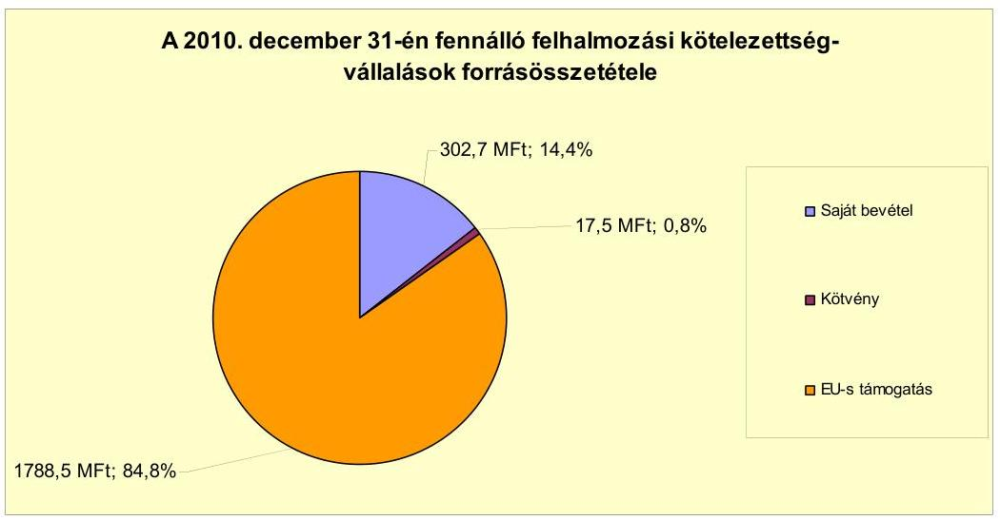

---

Az Önkormányzat által beadott, elbírálás alatt álló pályázatok tervezett teljes bekerülési költsége 119,6 millió Ft volt, melynek 95,0%-át (113,6 millió Ft-ot) EU-s támogatásból, míg 5,0%-át (6,0 millió Ft-ot) saját bevételből kívánják finanszírozni.

Az Önkormányzat mérleg szerinti pénzintézeti kötelezettsége a 2006. év végéről a 2011. év I. félév végére 215,0 millió Ft-ról 3179,5 millió Ft-ra nőtt, amelyből az árfolyamváltozás miatti különbözet 838,7 millió Ft volt. A 2011. év I. félév végén fennálló pénzintézeti kötelezettségek három hosszú lejáratú hitelből, egy 13,0 millió CHF értékű kibocsátott kötvényből keletkeztek. Az Önkormányzat igénybe vett folyószámlahitele 174,0 millió Ft, a munkabérmegelőlegezési hitele 80,0 millió Ft volt 2011. június 30-án.

A kötelezettségvállalásokra a Képviselő-testület döntése alapján került sor, azonban a kötvény kibocsátásakor az előterjesztésben nem számszerűsítették a törlesztési, a kamat- és - a deviza alapú kötelezettséget érintő - árfolyamkockázatot.

A kötvény kibocsátásából származó bevétel felhasználása teljes mértékben megtörtént. A megállapodásban rögzített folyószámlahitel törlesztését követően az előírt fejlesztési célú felhasználás kötelezettsége ellenére 241,7 millió Ft-ot működési célra fordítottak, melyről a Képviselő-testületet a felhasználást megelőzően nem tájékoztatták. A polgármester a 2010. évi költségvetés III. negyedévi, valamint a 2011. évi költségvetés I. félévi végrehajtásáról szóló előterjesztésekben utólag a Képviselő-testületet tájékoztatta, hogy a működési forráshiány finanszírozása ideiglenesen a kötvénykibocsátásból származó bevételből történt, valamint arról, hogy a működési célú felhasználás összegét más forrásból szükséges pótolni. Amennyiben ez elmarad, a pénzintézet - szerződésszegés címén - esetleges igényérvényesítése miatt az Önkormányzat működése kockázatot hordoz. Az Önkormányzat arra kényszerült, hogy a működés biztosítása érdekében a fejlesztési célú forrását működési célra használja fel.

Az Önkormányzat a CHF-ben fennálló kötvény kötelezettségéből a szerződésben foglaltaknak megfelelően 2011. június 30-ig 705732 CHF (123,8 millió Ft) kamatot és 10,4 millió Ft egyéb költséget fizetett meg. Az Önkormányzat a tőke törlesztését 2013. március 31-én kezdi meg, az éves tőketörlesztés összege 650000 CHF.

A hosszú lejáratú hitelek lehívása és a hitelszerződésekben foglalt fejlesztési célnak megfelelő felhasználása megtörtént. Valamennyi hitelnek megkezdődött a törlesztése, az Önkormányzat 2007-2010 között 9,5 millió Ft tőkét törlesztett, kamat és egyéb költségek címén 6,6 millió Ft-ot fizetett meg. A 2011. év I. félévében összesen 1,5 millió Ft tőketartozás és 0,6 millió Ft kamat és egyéb költség megfizetését teljesítették.

---

Az Önkormányzat működésének pénzügyi egyensúlyát a vizsgált időszakban csak folyószámlahitel és munkabér-megelőlegezési hitel igénybevételével tudta biztosítani. Az igénybevett folyószámlahitel és a munkabér-megelőlegezési hitelek jellemző adatait a következő táblázat mutatja be:

| Megnevezés | 2007. év | 2008. év | 2009. év | 2010. év | 2011. év I.   félév |
| :-- | --: | --: | --: | --: | --: |
| Folyószámlahitel |  |  |  |  |  |
| Keretösszeg január 1-jén (millió Ft-ban) | 100,0 | 150,0 | 180,0 | 150,0 | 150,0 |
| Állagos napi állomány (millió Ft-ban) | 125,2 | 116,7 | 115,3 | 82,9 | 143,3 |
| Folyószámla hitellel zárt napok száma (nap) | 335,0 | 360,0 | 360,0 | 326,0 | 180,0 |
| Időszakvégi egyenleg (állomány) | 67,1 | 147,2 | 149,9 | 144,8 | 174,0 |
| Munkabér megelőlegezési hitel |  |  |  |  |  |
| Keretösszeg január 1-jén (millió Ft-ban) | 100,0 | 100,0 | 100,0 | 100,0 | 100,0 |
| Állagos napi állomány (millió Ft-ban) | 60,4 | 57,5 | 49,6 | 68,2 | 75,2 |
| Munkabér-megelőlegezési hitellel zárt napok száma (nap) | 320,0 | 246,0 | 252,0 | 311,0 | 171,0 |
| Időszakvégi egyenleg (állomány) | 0,0 | 80,0 | 80,0 | 80,0 | 80,0 |

A vizsgált időszakban a folyószámlahitel igénybevétele tartóssá vált. Ennek átlagos napi állománya a kötvény kibocsátásból származó bevételnek köszönhetően 2007-2010. évek között folyamatosan 125,2 millió Ft-ról 82,9 millió Ft-ra csökkent. Ezt követően a kötvénykibocsátásból befolyt pénzeszközök felhasználása után az átlagos állomány 2011. év I. félév végére 143,3 millió Ft-ra emelkedett. A tartós likviditási problémák miatt az Önkormányzat 2007-től munkabér-megelőlegezési hitelt vett igénybe. A hitel igénybevételére rendszeresen sor került. A munkabér-megelőlegezési hitel átlagos napi állománya 2007-2009 között folyamatosan csökkent 60,4 millió Ft-ról 49,6 millió Ft-ra, majd a finanszírozási problémák miatt 2011. év I. félév végére folyamatosan emelkedve, 75,2 millió Ft-ot ért el. A törlesztések a normatív állami támogatásokból és az szja-ból az igénybevételt követő hónapban megtörténtek. A munkabér-megelőlegezési hitel állománya 2010. december 31-én és 2011. június 30-án 80,0 millió Ft volt. Kamat és egyéb költség címén az Önkormányzat a vizsgált időszakban a folyószámlahitellel kapcsolatosan összesen 43,1 millió Ft-ot, munkabér-megelőlegezési hitelhez kötődően összesen 29,3 millió Ft-ot fizetett ki. A folyószámlahitel és a munkabér-megelőlegezési hitel tartóssá válását az is mutatja, hogy a 2010. év végén nem tudta azokat visszafizetni, állományuk 144,8 millió Ft, illetve 80,0 millió Ft volt.

---

Az Önkormányzat kötelezettségeinek 2010. december 31-i, valamint 2011. június 30-i állományát és
 várható alakulását (kamatkiadásokkal együtt) a következő táblázat mutatja be:

| Megnevezés | Állomány 2010. december 31-én |  |  | Állomány 2011. június 30-án |  |  | Várható kötelezettség 2011-2013. években |  | Várható kötelezettség 2014. évtől |  |
| :--: | :--: | :--: | :--: | :--: | :--: | :--: | :--: | :--: | :--: | :--: |
|  | HUF-ban   (millió Ft   ban) | Devizában (összege, ezer CHFben) | Deviza   nem | HUF-ban   (millió Ft   ban) | Devizában (összege, ezer CHFben) | Deviza   nem | HUF-ban (millió Ft ban) | Devizában (összege, ezer CHFben) | HUF-ban   (millió Ft   ban) | Devizában (összege, ezer CHFben) |
| Pénzintézeti kötelezettségek |  |  |  |  |  |  |  |  |  |  |
| Előlegadó táblázat, ÖKIF felel | 10,9 |  |  | 10,5 |  |  | 3,3 |  | 10,9 |  |
| AVG múló éves sportpálya, ÖKIF felel | 7,7 |  |  | 7,1 |  |  | 4,4 |  | 4,3 |  |
| Nővelődés Háza színházterem felújítása, ÖKIF felel | 15,0 |  |  | 14,5 |  |  | 4,5 |  | 14,9 |  |
| Fajlesztési kötvény |  | 13000,0 | CHF |  | 13000,0 | CHF |  | 306,5 |  | 961,3 |
| Pénztárfelszámla felel | 144,8 |  |  | 174,0 |  |  | 174,0 |  | 0,0 |  |
| Munkabérfelel | 80,0 |  |  | 80,0 |  |  | 80,0 |  | 0,0 |  |
| Pénzintézeti kötelezettségek összesen HUF-ban: | 258,4 |  |  | 286,1 |  |  | 266,2 |  | 30,1 |  |
| Pénzintézeti kötelezettségek összesen CHF-ben: |  | 13000,0 | CHF |  | 13000,0 | CHF |  | 306,5 |  | 961,3 |
| PATAQUA Kft-től kapott kölcsön | 176,7 |  |  | 0,0 |  |  | 0,0 |  | 0,0 |  |
| Szállító tartozás | 102,6 |  |  | 213,6 |  |  | 213,6 |  | 0,0 |  |
| Mindösszesen: | 537,7 | 13000,0 | CHF | 499,7 | 13000,0 | CHF | 479,8 | 306,5 | 30,1 | 961,3 |

Az Önkormányzat összes kötelezettségének állománya 2010. december 31-én pénzintézeti kötelezettségekből, PATAQUA Kft.-től kapott kölcsönből és szállítói tartozásból tevődött össze. Az Önkormányzat saját gazdasági társaságai közül a kizárólagos tulajdonú PATAQUA Kft.-től 2010. évben 242,5 millió Ft, 2011. év I. félévében 65,8 millió Ft működési célú kölcsönt kapott, melyhez kapcsolódóan 2011. év I. félévében 10,4 millió Ft kamatot fizetett. Az Önkormányzat szállítókkal szemben fennálló kötelezettségállománya a könyvviteli mérleg adatai alapján a 2007. évről a 2008. évre 84,3%-kal (260,0 millió Ft-tal), a 2008. évről a 2009. évre 6,0%-kal (2,9 millió Ft-tal) csökkent, míg a 2009. évről a 2010. évre 126,4%-kal (57,3 millió Ft-tal) nőtt. A szállítókkal szemben fennálló kötelezettségek állományváltozásának oka, hogy 2008. évtől a kötvényforrás lehetőséget biztosított a szállítói tartozásállomány mérséklésére. A Polgármesteri hivatal és a további költségvetési szervek lejárt szállítói állománya 2011. június 30-án 202,2 millió Ft volt, melyből 90 napon túli tartozás 102,9 millió Ft-ot tett ki. A polgármester az Önkormányzat lejárt szállítói tartozásai okainak feltárására, a lejárt tartozások mielőbbi rendezése érdekében intézkedéseket nem tett, a Képviselőtestületet nem tájékoztatta.

A 2011-2013. évek kötelezettségeinek teljesítése a figyelembe vehető eszközök alapján nem biztosított, további bevételnövelő, valamint kiadáscsökkentő intézkedések megtétele vagy külső forrás bevonása szükséges a finanszírozáshoz. A könyvviteli mérlegében kimutatott 90,1 millió Ft követelésállomány - a Közszolgáltató Nonprofit Kft.-nek nyújtott tagi kölcsön - lejárata 2022. december 31-e, így ebben az időszakban a kötelezettségek visszafizetésére nem vonható be. Az Önkormányzat 2010. december 31-én 95,9 millió Ft pénzmaradvánnyal rendelkezett, melyből minden kötelezettséggel terhelt volt. A

---

negatív működési jövedelem mellett a kötelezettségek fedezete már rövid távon sem biztosított.

A 2014. évtől várható - a vizsgált időszak végén ismert - kötelezettségek teljesítésére az Önkormányzat a forrásokat nem számszerűsítette. A kötelezettségek teljesítéséhez a meghozott kiadáscsökkentő és bevételnövelő intézkedések nem biztosítanak elegendő többletforrást, ezek teljesítése csak további kiadáscsökkentő és bevételnövelő intézkedések útján elért megtakarítások, valamint egyéb külső források bevonásával lehetséges.

A kizárólagos tulajdoni hányadú gazdasági társaságok kötelezettségeinek állománya 2010. december 31-én, és 2011. június 30-án, valamint várható alakulása a kötelezettségek lejáratáig csak szállítói tartozásokból adódott. Az önkormányzati kötelezettségek növekedése mellett a kizárólagos tulajdonú gazdasági társaságainak kötelezettségei is pénzügyi kockázatot jelentenek az Önkormányzatnak. A gazdasági társaságok lejárt szállítói tartozásának állománya 2010. évben 68,2 millió Ft, míg 2011. év I. félévében 38,9 millió Ft volt. Esetleges csőd- vagy felszámolási eljárás esetén a bíróság korlátlan és teljes felelősséget állapíthat meg az Önkormányzat terhére.

Az Önkormányzat a Képviselő-testület döntése alapján a 2007-2011. év I. féléve között gazdasági társaságoknak, egyéb szervezeteknek összesen 334,3 millió Ft kölcsönt nyújtott, a kötvényforrás terhére. A vizsgált időszakra a likviditási célú tagi kölcsönök után nem számoltak fel kamatot. A fejlesztési célt szolgáló hosszú távú tagi kölcsön után - mely a Közszolgáltató Kft.-t érinti - összesen 12,9 millió Ft kamatot számoltak fel, a folyószámlahitelkeret-szerződésben megállapított kamattal megegyező mértékben. Az egyéb szervezetek közül az Önkormányzat a Sárospataki Torna Club Egyesület részére a 2011. év májusában 5,1 millió Ft kölcsönt nyújtott az Önkormányzat folyószámlahitelkeret-szerződésében megállapított kamattal egyezően. Az Önkormányzat a kölcsönöket hét esetben kamatmentesen, a többi esetben kamatfizetés ellenében nyújtotta, amely ellentétes a Htv.-ben foglaltakkal, mely szerint pénzügyi szolgáltatást (pénzkölcsön nyújtása üzletszerűen, azaz rendszeresen, ellenérték fejében nyereség, illetve vagyonszerzés végett) kizárólag pénzügyi intézmény végezhet. Az Önkormányzat a kizárólagos tulajdonában lévő Közszolgáltató Kft.-nek 2010. évben 43,0 millió Ft, 2011. év I. félévében 8,4 millió Ft veszteség fedezetére adott tulajdonosi pótbefizetést teljesített.

Az elhasználódott eszközök pótlására az Önkormányzat tartalékot nem képzett, külön alapot nem hozott létre. A Képviselő-testületnek előterjesztett éves zárszámadási rendeleteikben nem mutatták be az Önkormányzat eszközei után tárgyévben elszámolt értékcsökkenés összegét, az eszközpótlásra fordított tényleges kiadásokat, az eszközök elhasználódási fokának alakulását. Az Önkormányzat összes eszközének (immateriális javak, ingatlanok, gépek, járművek, átadott eszközök) használhatósági foka 2007-2010 között a bruttó érték 555,5 millió Ft emelkedése ellenére 3,4 százalékponttal (88,8%-ról 85,4%-ra) csökkent az amortizáció növekedése miatt. Ezzel az eszközök avultsága növekedett.

---

Az Önkormányzat az ellenőrzött időszakban kiadási megtakarítást eredményező és bevételt növelő intézkedéseket tett, mely intézkedések pénzügyi hatása az Önkormányzat részéről számszerűsítésre került. A 2007-2011. év I. féléve között végrehajtott intézkedések hatására 48,5 millió Ft bevételi többletet, továbbá 495,8 millió Ft kiadási megtakarítást mutattak ki, ezáltal javult az Önkormányzat pénzügyi egyensúlyi helyzete. A kiadási megtakarítások 95,5%-a (473,5 millió Ft) az elrendelt álláshely csökkentések eredménye. Az álláshelycsökkentő intézkedések 2007-2011. év I. féléve között önkormányzati szinten összesen 181 álláshely megszüntetését jelentették. Létszámnövekedés kettő fő volt, ebből egy fő a szociális és gyerekjóléti feladatellátás területén a szakmai követelmények miatt vált szükségessé, és egy fő növekedését a Polgármesteri hivatal feladatellátása indokolta. A bevételnövelő intézkedések a 2007-2011. év I. féléve között az idegenforgalmi adó növeléséhez (7,1 millió Ft), a szemétszállítási kedvezmények, mentességek csökkentéséhez (1,7 millió Ft), a lakbérek (33,1 millió Ft), és az intézményi térítési díjak (6,6 millió Ft) emeléséhez kapcsolódtak. A végrehajtott kiadáscsökkentő és bevételnövelő intézkedésekből származó megtakarítás ellensúlyozni tudta a költségvetési támogatásból és az szja bevétel csökkenéséből származó forráskiesést.

Az utóellenőrzés a pénzügyi egyensúly javítására tett két szabályszerűségi és egy célszerűségi javaslat hasznosítására terjedt ki. Az ellenőrzés során tett, a pénzügyi egyensúly javítására vonatkozó két szabályszerűségi javaslatból egyet nem, egyet részben hasznosítottak. Az Ámr-ben foglaltaknak nem tettek eleget, mivel az Önkormányzat pénzállományának alakulásáról likviditási tervet nem készítettek. Az Áht. előírása ellenére az előző évi pénzmaradványt eredeti előirányzatként csak a kisebbségi önkormányzatokra vonatkozóan szerepeltették, az önkormányzati szintűt a módosított előirányzat tartalmazta. A munka színvonalának javítása érdekében tett célszerűségi javaslat nem teljesült. A jegyző nem tájékoztatta - évente elvégzett számítások alapján - a Képviselő-testületet az Önkormányzat eladósodásának növekedésére figyelemmel arról, hogy a hosszú lejáratú adósságot keletkeztető kötelezettségvállalásokból adódó tőke és kamatfizetési kötelezettséget milyen feltételek biztosítása mellett tudják teljesíteni.

A gazdálkodásban problémát okoz, hogy a fejlesztések következtében hosszú távon az Önkormányzat eladósodott, emellett a működési költségvetés egyensúlya sem volt biztosított a vizsgált időszakban. A kötvény tőketörlesztésénél kockázatot jelent a CHF árfolyam alakulása.

Az Önkormányzat pénzügyi egyensúlyi helyzetét összegezve a következők emelhetők ki:

Sárospatak Város Önkormányzatának pénzügyi egyensúlyi helyzete rövid távon veszélyeztetett.

Az önként vállalt feladatok kiadásai meghaladták a kötelező feladatokra fordítottat. Ezekre a feladatokra - a középiskolai oktatást és a művészeti oktatást kivéve - jelentős mértékű önkormányzati támogatást biztosítottak.

A folyó költségvetés egyenlege - az ÖNHIKI, és az egyéb egyszeri kiegészítő támogatás figyelembevétele nélkül - a vizsgált időszakban kizárólag 2009-ben

---

biztosította (a jogtalanul igénybe vett normatívával) a működési kiadások és az adósságszolgálat finanszírozását. A nettó működési jövedelem, az ÖNHIKI-t is figyelembe véve, csak 2007-ben és 2009-ben volt pozitív, azonban 2010-ben drasztikus zuhanást követően negatív értéket vett fel, mely meghaladta az éves folyó kiadások tizedét.

A működés finanszírozására igénybe vett folyószámla- és munkabérmegelőlegezési hitel állandósult, a szállítói tartozásállomány - benne lejárt fizetési határidejú szállítói tartozásokkal - megemelkedett. A működés finanszírozására fejlesztési céllal kibocsátott kötvény bevételét is felhasználták.

Az Önkormányzat fejlesztései finanszírozását devizában kibocsátott kötvényből biztosította. Ez hosszú távú eladósodással járt. A kötvényben vállalt kötelezettségek teljesítésének forrását a Képviselő-testületnek nem mutatták be, arra a folyó bevételek nem nyújtanak fedezetet.

Kockázatot jelenthet, hogy a polgármester a pénzügyi egyensúly megbomlása ellenére nem kezdeményezte az Önkormányzat intézményei előirányzatfelhasználásának szoros kontrollját.

A folyamatban lévő fejlesztések kötelezettségvállalásainak teljesítése jelentős összegű saját forrást igényel. A fejlesztésekhez biztosított EU-s forrás előfinanszírozásának terhe tovább súlyosbíthatja a likviditási gondokat.

A kizárólagos tulajdonú gazdasági társaságok lejárt szállítói tartozásállománya az Önkormányzat részére helytállási kötelezettséget jelent.

Az Állami Számvevőszékről szóló 2011. évi LXVI. törvény 33. § (1) bekezdésében foglaltak értelmében a jelentésben foglalt megállapításokhoz kapcsolódó intézkedési tervet köteles az ellenőrzött szervezet vezetője összeállítani és azt a jelentés kézhezvételétől számított harminc napon belül az ÁSZ részére megküldeni. Amennyiben
 az intézkedési tervet határidőben nem küldi meg a szervezet, vagy az továbbra sem elfogadható, az ÁSZ elnöke a hivatkozott törvény 33. § (3) bekezdés a)-b) pontjaiban foglaltakat érvényesítheti.

# A 2011. június 30-i pénzügyi egyensúlyi helyzet alapján az ellenőrzés intézkedést igénylő megállapításai és javaslatai a következők: 

## a Polgármesternek

1. Az Önkormányzat nettó működési jövedelme az elmúlt időszakban összességében negatív volt, a vállalt pénzintézeti kötelezettségek, valamint az Önkormányzat által vállalt jövőbeni fejlesztési kötelezettségek fedezete rövid távon sem biztosított. A finanszírozás a vizsgált időszakban folyószámla- és munkabér-megelőlegezési hitel igénybevételével volt biztosítható, amely állandósult. Az Önkormányzat működési célra kötvényből származó bevételt vett igénybe. A kötvény esetében az adósságot keletkeztető kötelezettségvállalásra vonatkozó képviselő-testületi előterjesztések nem tartalmazták a visszafizetés forrásait, valamint a törlesztési, a kamat- és árfolyamkockázat várható kihatásait. Az Önkormányzat nem kezdeményezte az intézményei előirányzat-felhasználásának szoros kontrollját.

---

Az Önkormányzat szállítói kötelezettségeinek állománya, ezen belül a 2011. év I. félévében a lejárt szállítói tartozások összege jelentősen megemelkedett. Gazdasági társaságainak, a kötvény terhére jelentős összegű tagi kölcsönt nyújtott a vizsgált időszakban.

Az Önkormányzat által tett intézmény-szervezeti átalakítások, kiadáscsökkentő és bevételnövelő intézkedések nem biztosítanak elegendő forrást a pénzügyi egyensúly helyreállításához.

Javaslat:
Az Önkormányzat pénzügyi egyensúlyának gyors helyreállítása és hosszú távú fenntarthatósága érdekében kezdeményezze - felelősök és határidők megjelölésével - az alábbi intézkedések megtételét:
a) Tárja fel a bevételszerző és kiadáscsökkentő lehetőségeket. Intézkedjen a bevételek növelésére, a kintlévőségek behajtására, a kiadások csökkentésére.
b) Terjesszen a Képviselő-testület elé reorganizációs programot a kedvezőtlen pénzügyi folyamatok megállítására, a pénzügyi egyensúlyi helyzet gyors stabilizálására.
c) Képezzen egyensúlyi (elkülönített) tartalékot az adósságszolgálat teljesítése érdekében.
d) Vizsgálja felül teljes körűen a tervezett beruházásokat és azok fenntartásának jövőbeni pénzügyi kihatásait. Szükség esetén tegyen javaslatot a Képviselőtestületnek a tervezett beruházásokkal kapcsolatos döntések módosítására, amelyben figyelembe veszik az Önkormányzat pénzügyi lehetőségeit, és a kötelező feladatellátás elsődlegességét.
e) Vizsgálja meg az állandósult folyószámlahitel hosszú távú kötelezettséggé történő átalakításának jogi lehetőségét, és a Stabilitási tv. 10. §-ában előírtak fennállása esetén kezdeményezze a Kormánynál ennek engedélyezését.
f) Kezdeményezze az intézmények finanszírozásának napi kontrollját. Szűkítse a jóváhagyott előirányzatok felhasználásának lehetőségeit.
g) Tekintse át az önként vállalt feladatok finanszírozhatóságát a kötelező feladatellátás elsődlegességének biztosítása érdekében, mutassa be a Képviselő-testületnek a megoldás lehetőségeit, és szükség esetén a gazdasági program módosításának igényét.
h) Mutassa be havonta a Képviselő-testületnek legalább három évre kitekintően kötelezettségeinek finanszírozási forrásait.
i) Az adósságot keletkeztető kötelezettségvállalásról szóló döntéskor mutassa be a Képviselő-testületnek a jövőben várható - árfolyam-, kamat- és törlesztési - kockázatot.

---

j) Gondoskodjon, hogy a jövőben az adósságot keletkeztető kötelezettségvállalásokról szóló képviselő-testületi előterjesztések tételesen tartalmazzák a visszafizetés forrásait.
k) Terjesszen intézkedési tervet a Képviselő-testület elé a minősített többségi tulajdonú gazdasági társaságok pénzügyi egyensúlyi helyzetének stabilizálása érdekében.
l) Kezelje az Önkormányzat lejárt szállítói állományát, a szállítói kitettség és a jogszabályi következmények elkerülése érdekében.
2. A Képviselő-testületnek előterjesztett éves költségvetési rendeletekben nem mutatták be a beruházásokkal létrehozott létesítmények működtetése és fenntarthatósága érdekében várhatóan felmerülő költségvetési kiadásokat.

Javaslat:
Intézkedjen, hogy az éves költségvetési rendeletek előterjesztésekor biztosítsák a beruházásokkal létrehozott létesítmények működtetéséhez és jövőbeni fenntarthatóságához szükséges forrásokat.
3. A Képviselő-testületnek előterjesztett éves zárszámadási rendeleteikben nem mutatták be az Önkormányzat eszközei után tárgyévben elszámolt értékcsökkenés összegét, az eszközpótlásra fordított tényleges kiadásokat, az eszközök elhasználódási fokának alakulását.

Javaslat:
Mutassa be a Képviselő-testületnek évente a zárszámadási rendelet előterjesztésében az értékcsökkenés összegét, és ezzel összevetve az elhasználódott eszközök pótlására fordított tényleges kiadásokat, az eszközök elhasználódási fokának alakulását.
4. A pénzügyi egyensúly javítása érdekében tett kettő szabályszerűségi javaslatból egyet nem, egyet részben hasznosítottak.

Javaslat:
a) Gondoskodjon az Önkormányzat gazdálkodási rendszerét érintő előző ellenőrzés nem hasznosult javaslatainak végrehajtásáról.
b) Intézkedjen - Önkormányzat gazdálkodási rendszerét érintő előző ellenőrzés nem hasznosult szabályszerűségi javaslataival kapcsolatban - a fegyelmi felelősség kivizsgálása iránt.

A polgármester a helyszíni ellenőrzés lezárása után tájékoztatta az Állami Számvevőszéket az Önkormányzat megtett intézkedéséről, amelyet az Állami Számvevőszék nem ellenőrzött, arra vonatkozóan véleményt vagy megállapítást nem fogalmaz meg. Az ellenőrzés lezárását követően elvégzett intézkedéseket az Állami Számvevőszék utóellenőrzés keretében vizsgálhatja.

A polgármester tájékoztatása szerint a következő intézkedést tette:

- döntött az intézmények előirányzat-felhasználásának szoros kontrolljáról, erről 2012. február 21-én az intézményvezetőket levélben tájékoztatta.

---

# II. RÉSZLETES MEGÁLLAPÍTÁSOK 

## 1. AZ ÖNKORMÁNYZAT KÖTELEZŐ ÉS ÖNKÉNT VÁLLALT FELADATAI, A FELADATELLÁTÁS SZERVEZETI KERETEI ÉS ANNAK VÁLTOZÁSAI

Az Önkormányzat a kötelezően ellátandó feladatainak az Ötv. és az ágazati törvények által meghatározottakat tekintette, a besorolást maga végezte el. Az önként vállalt feladatok köréről az SzMSz-ben 2009. évtől rendelkezett, azok terjedelmét az éves költségvetési rendeletekben a költségvetés forrásainak ismeretében határozta meg. Az önként vállalt feladatok közé sorolták az alapfokú művészeti, a középiskolai (gimnáziumi) oktatást, a kollégiumi ellátást, a szakközép- és szakmunkásképzés oktatását, a fürdő- és strandszolgáltatást, az éttermi vendéglátást, a helyi újság kiadását, a járóbeteg-szakellátást, a sport- és a természetvédelmi feladatokat. Ezen túlmenően hozzájárultak az egyházak támogatásához, és a civil szervezetek működésének finanszírozásához. Az önként vállalt feladatok terjedelmét az éves költségvetési rendeletekben az adott évi költségvetés forrásainak ismeretében határozták meg.

Az önkormányzati SzMSz alapján önként vállalt feladatokat az Önkormányzat akkor láthat el, ha az ahhoz szükséges anyagi és személyi lehetőségek, feltételek fennállnak. Az önként vállalt feladatok ellátásának feltételeit a Képviselő-testület évente a következő évi költségvetési rendelet tárgyalásakor áttekinti és a fedezet biztosításával dönt a feladatellátás fenntartásáról vagy annak megszüntetéséről.

A 2010. évi működési kiadásait feladatonként, és azok finanszírozási arányait az alábbi táblázat mutatja be ${ }^{7}$ :

| Ellátott feladat | Működési   kiadás   összesen   (millió Ft) | Kötelező   feladatok   kiadásainak   részaránya   % | Működési   bevétel   összesen   (millió Ft) | Állami   támogatás   részaránya   % | Intézményi   saját bevétel   részaránya   % | Önkormányzati   támogatás   részaránya   % |
| :-- | :--: | :--: | :--: | :--: | :--: | :--: |
| Övodák | 254,3 | 100,0 | 254,3 | 35,5 | 8,4 | 56,1 |
| Általános iskolák | 269,9 | 100,0 | 269,9 | 41,5 | 7,1 | 51,4 |
| Gimnáziumok | 559,1 | 0,0 | 559,1 | 81,4 | 11,7 | 6,8 |
| Szakközépiskolák,   szakképző intéz-   mények | 246,5 | 0,0 | 246,5 | 76,4 | 9,2 | 14,4 |
| Szociális   intézmények | 137,5 | 100,0 | 137,5 | 28,2 | 33,2 | 38,6 |
| Gyermekjóléti   intézmények | 88,0 | 60,0 | 88,0 | 22,4 | 45,3 | 32,3 |
| Közművelődési   intézmények | 167,5 | 0,0 | 167,5 | 7,2 | 41,5 | 51,4 |
| Egyéb intézmények | 440,9 | 30,0 | 440,9 | 16,2 | 10,0 | 73,8 |
| Polgármesteri hivatal   igazgatási kiadásai | 307,8 | 100,0 | 307,8 | 0,0 | 0,0 | 100,0 |
| Polgármesteri   hivatalban ellátott   egyéb feladatok   működési kiadásai | 1299,6 | 50,0 | 1299,6 | 24,6 | 75,4 | 0,0 |
| Működési kiadá-   sok összesen | 3771,0 | 47,8 | 3771,0 | 42,8 | 34,7 | 22,5 |

[^0]
[^0]:    ${ }^{7}$ A táblázat nem tartalmazza a kisebbségi önkormányzatok, és a járóbeteg ellátás adatait. A járóbeteg ellátást a jelentés 2. számú melléklete tartalmazza.

---

Az Önkormányzat adatszolgáltatása alapján a működési célú költségvetési kiadásaiból a kötelező feladatok ellátására a 2007-2009. évek átlagában 1651,9 millió Ft-ot ( $47,2 \%$-ot), a 2010. évben 1804,4 millió Ft-ot ( $47,8 \%$-ot) fordított. Az önként vállalt feladatokra a 2007-2009. évek átlagában 1848,8 millió Ft-ot ( $52,8 \%$-ot), a 2010. évben 1966,6 millió Ft-ot ( $52,2 \%$-ot) biztosított. Az önként vállalt feladatok részarányának nagysága kimagasló, $50,0 \%$ feletti volt a vizsgált években. A kötelezően ellátandó feladatok működési célú kiadásai aránya a 2007. évről 2010. évre $0,6 \%$ ponttal emelkedtek, az önként vállalt feladatok gazdasági társaságoknak történő átadásai miatt.

A 2010. évben az Önkormányzat a működési kiadásainak 35,3%-át (1329,8 millió Ft-ot) a közoktatási, 6,0%-át (225,5 millió Ft-ot) szociális és gyermekjóléti, $4,4 \%$-át ( 167,5 millió Ft-ot) közművelődési, $11,7 \%$-át ( 440,9 millió Ft-ot) egyéb intézmények fenntartására fordította. A Polgármesteri hivatal igazgatási célú működési kiadásainak összege 307,8 millió Ft ( $8,2 \%$ ) volt, a Polgármesteri hivatalban ellátott egyéb önkormányzati feladatokra fordított kiadás pedig 1299,6 millió Ft ( $34,4 \%$ ) volt a 2010. évben.

A Polgármesteri hivatalban ellátott egyéb önkormányzati feladatok: város- és községgazdálkodás, ingatlankezelés, közhasznú és közcélú foglalkoztatás, versenysport, közművelődési tevékenységek, civil szervezetek támogatása, rendezvények támogatása, szociális ellátások.

Az óvodai nevelés és az általános iskolai oktatás állami támogatása a 2007-2009. években átlagosan 293,9 millió Ft volt, mely a 2010. évre 202,2 millió Ft-ra csökkent. Ennek egyik oka, hogy a finanszírozás alapja 2008. szeptember 1-jétől - a gyermek/tanuló létszám helyett - a teljesítménymutató lett. Ezért az állami támogatás a 2008. évről a 2009. évre 21,1 millió Ft-tal 13,4%-kal, a 2009. évről a 2010. évre 18,1%-kal 24,8 millió Ft-tal csökkent. A másik ok, hogy a tanulói létszám a 2007-2009. években átlagosan 985,3 fő volt, mely a 2010. évre 6,6%-kal 65,3 fővel csökkent. A csökkenő állami támogatást az önkormányzati támogatás növelésével ellensúlyozták. Az önkormányzati támogatás összege a 2007-2009. évi 248,3 millió Ft éves átlagos összeghez képest a 2010. évben 281,4 millió Ft-ra 33,1 millió Ft-tal (13,3%-kal) nőtt.

A gimnáziumi, a szakközépiskolai és a szakképző intézményi oktatás állami támogatása a 2007-2009. években átlagosan 640,2 millió Ft volt, mely a 2010. évre 643,6 millió Ft-ra nőtt. Ennek oka a gimnáziumi és szakközépiskolai támogatási jogcímek arányainak változása volt. A tanulói létszám a 2007-2009. években átlagosan 1220 fő, mely a 2010. évre 2,9%-kal 35 fővel csökkent ( 1185 fő). Az önként vállalt feladat önkormányzati támogatása a 2007-2009. évi 58,4 millió Ft éves átlagos összeghez képest a 2010. évben 73,8 millió Ft-ra 15,4 millió Ft-tal 26,4%-kal nőtt.

A közművelődési intézmény 2010. évi működési kiadása (167,5 millió Ft) 15,9 millió Ft-tal ( $10,5 \%$-kal) haladta meg a 2007-2009. évi átlagos 151,6 millió Ft-ot. Az Önkormányzat az intézményben ellátott feladatokra tekintettel a 2007-2009. közötti időszakban évente átlagosan 15,4 millió Ft állami támogatásban részesült, mely 2010. évre 22,1%-kal (3,4 millió Ft-tal) csökkent. Az intézményi saját bevétel a 2007-2009. évi 43,5 millió Ft-os átlagos összeghez képest a 2010. évre jelentősen 59,8%-kal (26,0 millió Ft-tal) nőtt, 69,5 millió Ft-ra teljesült, a tanfolyami, oktatási feladatoknál jelentkező bevételek emelkedése miatt. Az önként vállalt közművelődéshez kapcsolódó feladat önkormányzati támogatása a 2010. évben 86,0 millió Ft-ot tett ki,
 mely 6,8 millió Ft-tal (7,3%) haladta meg a 2007-2009. évi átlagos összeget.

A szociális és gyermekjóléti intézmények 2010. évi működési kiadása (225,5 millió Ft) 22,9 millió Ft-tal (11,3%-kal) haladta meg a 2007-2009. évi átlagos 202,6 millió Ft-ot. Az Önkormányzat az intézményben ellátott feladatokra tekintettel, a 2007-2009. közötti időszakban évente átlagosan 72,7 millió Ft állami támogatásban részesült, mely 2010. évre 19,5%-kal, 14,2 millió Ft-tal csökkent. Az intézményi saját bevétel a 2007-2009. évi 61,9 millió Ft-os átlagos összeghez képest a 2010. évre jelentősen 38,0%-kal (23,5 millió Ft-tal) nőtt, 85,4 millió Ft-ra teljesült. Az önkormányzati támogatás a 2010. évben 81,5 millió Ft-ot tett ki, mely 13,5 millió Ft-tal (19,9%) haladta meg a 2007-2009. évi átlagos összeget. A gyermekjóléti intézmények önként vállalt feladatait érintő önkormányzati támogatás 2007-2009. évi átlagos összege 15,6 millió Ft volt, mely 2010. évre 26,9%-kal (11,4 millió Ft-ra) csökkent.

Az igazgatási feladatok 2007-2009. évi átlagos 317,9 millió Ft összegű állami támogatása a 2010. évre 3,3%-kal (10,1 millió Ft-tal) 307,8 millió Ft-ra csökkent. Ennek oka, a lakosságszám 2,6%-os (349 fős) csökkenése, mely 2007-2009. évi átlaga 13640 fő, a 2010. évi száma 13291 fő volt.

A Polgármesteri hivatalban ellátott feladatok 2007-2009. évi átlagos 646,6 millió Ft-os működési kiadása a 2010. évre 1299,6 millió Ft-ra emelkedett. Ennek oka, hogy 2009. évről 2010. évre a városgazdálkodási feladatok kiadásai 96,8%-kal (340,6 millió Ft-tal), az igazgatási feladatok 1,4%-kal (4,5 millió Ft-tal), a kulturális feladatok 4,1%-kal (3,5 millió Ft-tal) megemelkedtek. A városgazdálkodási feladatoknál jelentkező 340,6 millió Ft-os emelkedés a normatíva elszámolásából eredő visszafizetési kötelezettség 97,1 millió Ft-os növekedéséből, a fürdő vagyonátvétele8 miatt 96,0 millió Ft áfa befizetési kötelezettségből, a közcélú foglalkoztatás támogatásának 57,8 millió Ft-os, valamint az egyéb kiadások (közutak üzemeltetésének, egyházak támogatásának, temetők fenntartásának, árvízi védekezés stb.) 89,7 millió Ft-os emelkedéséből adódott. Az intézményi saját bevétel a 2007-2009. évi átlagos 322,8 millió Ft-ról a 2010. évre 980,5 millió Ft-ra nőtt. A növekedés oka, a felhalmozási és tőke jellegű bevételek 5,4-szeres növekedése (17,4 millió Ft-ról 94,1 millió Ft-ra nőtt), a felhalmozási áfa 87,2 millió Ft-os visszatérülése, a fordított áfa 65,6 millió Ft-os bevétele, az EU-s fejlesztési támogatásokra kapott 339,6 millió Ft-os és az egyéb saját 88,6 millió Ft-os bevétel volt. A Polgármesteri hivatal önként vállalt feladatai a társadalmi szervezetek, az egyház, a sportszervezetek, és nonprofit szervezetek támogatásán túl, a kommunikációs kiadások voltak.

[^0]
[^0]:    8 A kizárólagos tulajdonát képező PATAQUA Kft.-től térítésmentesen vette át az Önkormányzat a vagyont.

---

A Polgármesteri hivatalban ellátott feladatok a következők voltak: lakossági szemétszállítás, közvilágítás, közutak fenntartása, lakó- és nem lakóingatlanok bérbeadása, segélyek folyósítása, zöldterület gondozás, civil szervezetek támogatása, ár- és belvízvédelem, választások lebonyolítása, városgazdálkodási feladatok, stb.

Az Önkormányzat kötelező és önként vállalt feladatait 2011. június 30-án (a Polgármesteri hivatallal együtt) kilenc költségvetési szervvel, hét gazdasági társasággal, valamint a Kistérségi társulással (mozgókönyvtár) látta el.

Az intézmények struktúrája változott az áttekintett időszakban, az önállóan gazdálkodó intézmények száma kettővel, míg a költségvetési szervek száma összesen hattal csökkent.

Az Önkormányzat az Erdélyi János Általános Iskola és Kollégiumot a 2007. évben átadta a Borsod-Abaúj-Zemplén Megyei Önkormányzatnak. A Zrínyi Ilona Városi Könyvtárat 2007. decemberében megszüntették, beolvadt a Művelődési Ház és Könyvtárba. A költséghatékonyabb intézményi működés biztosítása érdekében az óvodai feladatellátás intézményi struktúráját 2007. évben átszervezték, ezért a Kincskereső Óvoda-Bölcsődét és a Carolina Óvodát megszüntették. Az Önkormányzat a TÁVHŐ Kommunális Szervezetet 2007. évben megszüntette, feladatait az Önkormányzat kizárólagos tulajdonában álló RFV Kft.-nek adta át. A Termálfürdő és Camping költségvetési szervét 2009. év májusában szüntették meg, hivatkozva arra, hogy a hatásvizsgálat alapján más szervezetben a feladat ellátása hatékonyabban megoldható. A közfeladat ellátását megállapodás alapján a PATAQUA Kft.-nek adták át. A 2011. év februárjában a Művelődési Ház és Könyvtárnak átadták az Újbástya-Sárospatak épület üzemeltetési jogát, a Tourinform Iroda feladatainak ellátását, és a Vízi kapui szabadtéri színpad működtetését.

A telephelyek száma9 2007. évben 25 volt, mely 2011. év I. félévére 24-re csökkent.

A Távhő kommunális szervezet telephelye 2007. évben megszűnt, a feladat az RFV Sárospatak Városgazdálkodási Nonprofit Kft.-nek került átadásra. Az Erdélyi János Általános Iskola és Kollégium 2007. évben átadásra került a Borsod-Abaúj-Zemplén Megyei Önkormányzatnak. A 2009. évben a fürdőt a PATAQUA Kft.-nek átadták, ezzel három telephely szűnt meg. A Vay Miklós Szakképző Iskola telephelye 2009. évben bővült a Zrínyi úton lévő sportpályával, épületekkel. A Mese Óvoda és Bölcsőde egy telephelye 2010. év májusában szűnt meg. A Sárospatak Város Rendelőintézete 2011. év májusában egy telephellyel csökkent. A Zrínyi Ilona Városi Könyvtárat, telephelyet 2007. év decemberében megszüntették, jogutódja a Művelődési Ház és Könyvtár lett.

A feladatellátás érdekében 2007. évben három kizárólagos tulajdonú gazdasági társaságot10 alapított, és egyben 51,0%-ban tulajdonrészt vásárolt. Az RFV Kft., melyben 51,0%-os tulajdonosi részesedése volt az Önkormányzatnak,

[^0]
[^0]:    9 A telephelyek száma 2006. december 31-én 29 volt.
    10 Az Önkormányzat három kizárólagos tulajdonú kft-je 2007. évben a PATAQUA Kft., az INNOVO-PATAK Nonprofit Kft. és a SIDINFO Nonprofit Kft. volt.

---

2010. július 31-ét követően a kizárólagos tulajdonába került. Ezen túlmenően 2010. évtől egy gazdasági társaságban, a Patakhő Kft.-ben 52,0%-os tulajdoni részesedéssel rendelkezik. Az Önkormányzatnak 2011. június 30-án négy gazdasági társaságban kizárólagos tulajdoni, egy gazdasági társaságban 52,0%-os tulajdoni részesedése volt. Az egyéb, közfeladatot ellátó kettő gazdasági társaság közül a Zempléni Vízmű Kft.-ben az Önkormányzat 25,1%-os, a Zempléni Z.H.K. Kft.-ben 8,5%-os tulajdoni hányaddal rendelkezett 2010. december 31-én.

Az RFV Kft.11 az Önkormányzat kizárólagos tulajdonú gazdasági társasága, mely közvilágítási, hőszolgáltatási, közétkeztetési, intézmény-karbantartási feladatokat látott el 2010-ig. A 2010. évben a társaság 2009. évi vesztesége miatt 43,0 millió Ft-os fizetési kötelezettsége keletkezett. A költségek fedezetét - egyéb forrás hiányában -, az Önkormányzat kötvényéből biztosították. A Kft. jelenlegi feladatai a közétkeztetés és az intézményfenntartás.

A SIDINFO Nonprofit Kft. 2007. évtől az Önkormányzat kizárólagos tulajdonú társasága kulturális jellegű feladatokra jött létre, de jelenleg nem működik.

Az INNOVO-PATAK Kft. 2007. évtől az Önkormányzat kizárólagos tulajdonú gazdasági társasága lakásépítésre jött létre. Az ingatlanpiac helyzete miatt gazdasági tevékenységet jelenleg nem végez.

A PATAQUA Kft. 2007. évtől az Önkormányzat - jelenleg is működő - kizárólagos tulajdonú gazdasági társasága.

A Patakhő Kft. 2010. évtől látja el a Közszolgáltató Kft.-től átvett közvilágítási, hőszolgáltatási feladatokat. A 2010. évben létrejött Kft.-ben az Önkormányzat 52,0%-os tulajdoni hányaddal rendelkezik. Feladata közé tartozik a közvilágítás, a távhő- és az intézmények hőszolgáltatásának ellátása.

A kötelező közszolgáltatások ellátásában részt vevő, önkormányzati kizárólagos tulajdonrészesedésű négy és az egy 52,0%-os tulajdoni részesedésű gazdasági társaságok esetében csődeljárás, végelszámolás vagy felszámolás nem történt. Az önkormányzati feladatok ellátásában résztvevő gazdasági társaságok gazdálkodását, illetve működését érintő egyes adatokat a jelentés 4. számú melléklete mutatja be. Rendszeres működési célú pénzeszközátadásban egy kizárólagos tulajdonú gazdasági társaság részesült, összege az ellenőrzött időszakban összesen 72,1 millió Ft-ot tett ki. Ezen túlmenően négy gazdasági társaság kapott 2008-2010. években és 2011. év első félévében összesen 329,2 millió Ft tagi kölcsönt működési, illetve felhalmozási célra.

Az önkormányzati támogatásból az önként vállalt feladatok 2010. évben 47,7%-ot, 404,6 millió Ft-ot tettek ki. Ebből jelentős volt 56,3% (227,7 millió Ft) az egyéb feladatok támogatása, míg az oktatási feladatokra 18,2% (73,8 millió Ft), a gyermekjóléti feladatokra 4,2% (17,1 millió Ft), a közművelődési feladatokra 21,3% (86,0 millió Ft) jutott.

A kötelező és önként vállalt feladatok ellátását biztosító szervezeti keretekben, a feladatellátás módjában bekövetkezett változások az Önkormányzat pénz-

[^0]
[^0]:    11 2010. évtől Közszolgáltató Kft.

---

ügyi helyzetére gyakorolt hatása a 2007. évről a 2008. évre és a 2009. évről a 2010. évre az önként vállalt feladatokra volt számszerűsíthető. Az önként vállalt egyéb feladatok működési kiadása a 2007. évről a 2008. évre 23,2%-kal, 131,2 millió Ft-tal csökkent, melyre hatással volt a TÁVHŐ Kommunális szervezet megszűnése, feladatainak az RFV Kft.-nek történő átadása. Az önként vállalt egyéb feladatok működési kiadása a 2009. évről a 2010. évre 52,1%-kal, 336,2 millió Ft-tal csökkent, meghatározóan a Fürdőnek a PATAQUA Kft.-nek történő feladatátadása miatt.

# 2. AZ ÖNKORMÁNYZAT PÉNZÜGYI EGYENSÚLYI HELYZETÉT BEFOLYÁSOLÓ TÉNYEZŐK 

A hagyományos költségvetési szerkezet helyett az Önkormányzat pénzügyi helyzetét a CLF módszerrel mutatjuk be, amelyben jobban elkülönülnek a vagyonnal kapcsolatos bevételek és kiadások az önkormányzati feladatokkal kapcsolatos közvetlen működtetési bevételektől és kiadásoktól. A módszer következetesen elkülöníti a folyó és a felhalmozási költségvetés bevételeit és kiadásait, azok költségvetési egyenlegeit. A saját folyó bevételek, valamint a saját felhalmozási bevételek nem tartalmazzák az előző évi pénzmaradványok felhasználásából származó pénzforgalom nélküli bevételeket12.

A folyó költségvetés egyenlege, a működési jövedelem megmutatja, hogy az Önkormányzat éves folyó bevétele fedezetet biztosít-e a kötelező és önként vállalt feladatellátáshoz kapcsolódó éves folyó kiadására. A működési jövedelem negatív értéke pénzügyileg fenntarthatatlan helyzetet jelez. A mutató pozitív értéke megtakarítást mutat, amely forrásul szolgálhat az Önkormányzat fennálló kötelezettségei megfizetéséhez, valamint fejlesztéseihez.

A felhalmozási költségvetés pozitív értéke felhalmozási többletet mutat, amely a jövőbeni fejlesztések forrását biztosíthatja. Amennyiben a folyó költségvetési hiány finanszírozása a felhalmozási többletből történik, ez szűkebb értelemben vagyonfelélésnek tekinthető. Amennyiben a felhalmozási költségvetés megtakarítása fejlesztési célú hitelek, kötvények adósságszolgálatát finanszírozza, az változatlan vagyontömeg mellett, a korábban megelőlegezett tőkebevételek valós realizációjának tekinthető. A felhalmozási deficit által generált finanszírozási igény önmagában nem jár pénzügyi kockázattal, a pénzügyileg fenntartható beruházásokhoz kapcsolódó kötelezettségvállalás (adósságszolgálat) átlátható és szabályozott költségvetési gazdálkodással teljesíthető.

A módszer a pénzügyi kapacitás fogalmát helyezi a középpontba. Az adós hitelfelvételi képessége, hosszú távú fizetőképessége vagy bonitása a pénzügyi kapacitással, ezen belül is a nettó működési jövedelemmel jellemezhető. A nettó működési jövedelem negatív értéke az egyes költségvetési években jelentkező adósságszolgálat túlzott mértékére utal.13 A nettó működési jövedelem ne-

[^0]
[^0]:    12 A költségvetési években kialakuló hiány finanszírozása az előző évi pénzmaradvány és a korábbi években képzett tartalékok felhasználásával is történhet.
    13 kivéve, ha annak finanszírozására a korábbi években képzett tartalékok fedezetet nyújtanak

---

gatív értékének felhalmozási többletből, vagy további hitelből történő finanszírozása pénzügyileg nem fenntartható gazdálkodást vetít előre. A pozitív értéket mutató nettó működési jövedelem fejlesztési kiadások fedezetét biztosíthatja, illetve a folyamatosan, évenként képződő pozitív nettó működési jövedelemből meghatározható a jövőben vállalható, teljesíthető éves adósságszolgálat, ily módon az a hitelösszeg, amely - a többi tényezőt, feltételt adottnak tekintve - visszafizetési kockázat nélkül felvehető.

A CLF módszer
 alapján a pénzügyi kapacitás mértéke az Önkormányzat összevont, nettósított, a központi információs rendszerbe a Magyar Államkincstáron keresztül leadott éves költségvetési beszámolójának 80-as űrlapjában szerepeltetett adatok alapján került meghatározásra.

A számítási leírás némileg eltér az ÁSZ módszertanában korábban alkalmazott gyakorlattól. A jelen besorolás általános közgazdasági meggondolásokon alapul, amely megjelenik az SNA statisztikai módszertanában is. Folyó tételek alatt értjük azokat a kiadásokat és bevételeket, amelyek a gazdálkodó szervezet helyzetét automatikusan nem változtatják. Bevételi oldalon ilyenek az adók, a tényező jövedelmek, a transzferek ${ }^{14}$, kiadási oldalon a transzferek és a szolgáltatás igénybevételével kapcsolatos működési kiadások. A folyó költségvetésben a bevételekben nem térül meg, a kiadásokban nem jelenik meg az amortizáció, a vagyoni helyzetet az egyenleg befolyásolja.

A folyó költségvetés egyenlege (működési jövedelem) tartalmazza a kamatbevételeket és a kamatkiadásokat is, mind a működési, mind a fejlesztési kamatot, valamint a visszatérülő és befizetendő áfa teljes összegét, mert ezek közgazdaságilag tényező jövedelmek. Nem tartalmazzák viszont a követelés elengedés miatt könyvelt bevételi és kiadási pénzforgalmi tételeket, mert valójában technikai elszámolási műveletnek minősülnek, a bevétel soha nem realizálódott, és költségvetési kiadás sem történt.

A felhalmozási költségvetésben a bevételek között a vagyon megőrzésére és bővítésére fordítható források jelennek meg. A felhalmozási vagy tőketételek módosítják a vagyon nagyságát. A privatizációs bevétel csökkenti a vagyont, a fizikai beruházás, pénzügyi befektetés növeli.

A nettó működési jövedelmet a tőketörlesztés levonásával a folyó költségvetés egyenlegéből származtatjuk.

[^0]
[^0]:    ${ }^{14}$ Transzferkiadásoknak nevezzük azokat a folyó és felhalmozási tételeket, amelyeket nem az adott önkormányzat használ fel szolgáltatásnyújtásra.

---

# 2.1. A működési és a felhalmozási egyensúly változása 

CLF módszer szerinti önkormányzati adatok

| Megnevezés | 2007 | 2008 | 2009 | 2010 |
| :--: | :--: | :--: | :--: | :--: |
| Folyó bevételek | 3833,7 | 3815,0 | 3543,4 | 3491,6 |
| Folyó kiadások | 3757,0 | 3879,1 | 3489,3 | 3824,7 |
| Működési jövedelem | 76,7 | $-64,1$ | 54,1 | $-333,1$ |
| Nettó működési jövedelem   =működési jövedelem - tőketörlesztés | 39,2 | $-122,1$ | 51,1 | $-432,0$ |
| Felhalmozási bevételek | 156,9 | 673,9 | 76,6 | 479,4 |
| Felhalmozási kiadások | 268,6 | 1020,1 | 871,1 | 1109,2 |
| Felhalmozási költségvetés egyenlege | $-111,7$ | $-346,2$ | $-794,5$ | $-629,8$ |
| Finanszírozási műveletek nélküli (GFS) pozíció = működési jövedelem + felhalmozási költségvetés egyenlege | $-35,0$ | $-410,3$ | $-740,4$ | $-962,9$ |
| Finanszírozási műveletek egyenlege | 43,4 | 2066,5 | $-29,9$ | 130,9 |
| Tárgyévi pénzügyi pozíció | 8,4 | 1656,2 | $-770,2$ | $-831,9$ |
| Egyéb tájékoztató adatok |  |  |  |  |
| Összes kötelezettség* | 622,0 | 2647,7 | 2713,7 | 3541,0 |
| -ebből rövid lejáratú | 583,1 | 316,8 | 309,7 | 615,5 |
| Folyószámlahitel napi átlagos állománya ** | 125,2 | 118,7 | 115,3 | 82,9 |
| Likvidhitel napi átlagos állománya** | 0,0 | 0,0 | 0,0 | 0,0 |
| Munkabérhitel napi átlagos állománya** | 80,4 | 57,5 | 49,6 | 68,2 |
| Finanszírozásba vonható eszközök: | 84,5 | 1740,6 | 970,5 | 138,5 |
| Tartós hitelviszonyt megtestesítő értékpapírok év végi állománya | 0,0 | 0,0 | 0,0 | 0,0 |
| Hosszú lejáratú bankbetétek év végi állománya | 0,0 | 0,0 | 0,0 | 0,0 |
| Értékpapírok év végi állománya | 0,0 | 0,0 | 0,0 | 0,0 |
| Pénzeszközök (idegen pénzeszközök nélkül) év végi állománya | 84,5 | 1740,6 | 970,5 | 138,5 |

* Az összes kötelezettséget a passzív pénzügyi elszámolások nélkül vettük figyelembe, mert a passzívák a pénzmaradvány elszámolás tételei közé tartoznak.
** A folyószámla, a likvid- és a munkabérhitel átlagos állományát 365 nappal számítottuk.

A 2007-2010 között az Önkormányzat kiadásainak és bevételeinek főbb jogcímeit, valamint adósságszolgálatának adatait részletesen a jelentés 2. számú melléklete tartalmazza.

---

A vizsgált időszakban az Önkormányzat folyó költségvetési egyenlegét, működési jövedelmét a következő ábra szemlélteti:
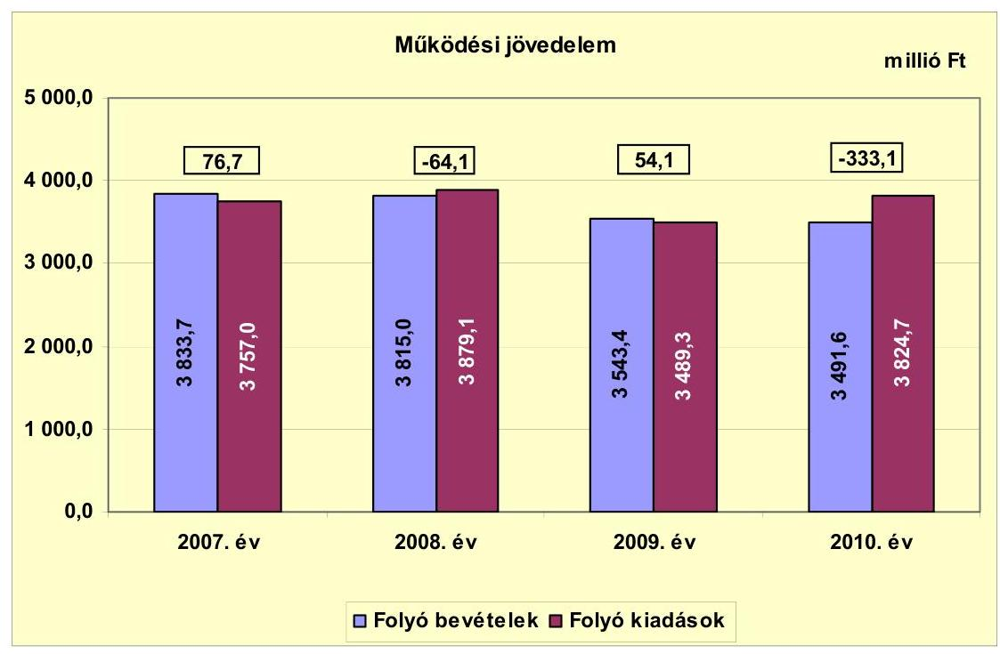

Az Önkormányzat folyó költségvetési egyenlege (működési jövedelem) a 2008. évben és a 2010. évben működési forráshiányos volt. A saját működési bevételek folyamatos csökkenésével párhuzamosan az Önkormányzat folyó bevételei is mérséklődtek. Ezzel szemben a folyó kiadás értéke az előző évhez képest 2008-ban 3,2\%-kal (122,1 millió Ft-tal) növekedett, 2009-ben 10\%-kal (389,8 millió Ft-tal) csökkent és 2010-ben 9,6\%-kal 335,4 millió Ft-tal növekedett. A folyó kiadás 2010-ben 3,1\%-kal (116,2 millió Ft-tal) haladta meg a 2007-2009. évek átlagát. A vizsgált időszakban a működési jövedelem összességében 266,4 millió Ft forráshiányt mutatott, melyhez döntő mértékben hozzájárult a 2010. év 333,1 millió Ft-os hiánya. A 2010. évi negatív működési jövedelem jelzi, hogy az Önkormányzat gazdálkodása rövid távon is kockázatos, a törlesztések fedezete nem képződik meg. A 2012. évben a várható hosszú lejáratú kötelezettségvállalásokkal kapcsolatos adott évi adósságszolgálat 3,0 millió Ft. A 2013. évtől kezdődik a kötvény tőketörlesztése, mely várhatóan 2032-ig évi 162,5 millió Ft-os többletkiadást, tőketörlesztést jelent. A törlesztések fedezete csak akkor biztosított, ha a működési jövedelem a jövőben meghaladja a várható tőketörlesztések (2012-ben 3,0 millió Ft, 2013-ban 165,5 millió Ft) összegét.

Az Önkormányzat 2007-ben csak úgy tudott pozitív működési jövedelmet elérni, hogy 114,0 millió Ft ÖNHIKI és 28,0 millió Ft egyszeri egyéb központi működési támogatásban részesült és - 2006. év végéhez képest - 259,9 millió Ft-tal nőtt a ki nem fizetett szállítói tartozásállomány.

A 2008. évben a működési jövedelem (az elnyert 143,7 millió Ft ÖNHIKI és 50,0 millió Ft egyszeri egyéb központi működési támogatás ellenére) negatív lett, mert a saját működési bevételek 15,6\%-os (172,4 millió Ft-os) csökkenése

---

mellett a folyó kiadások 3,2\%-kal (122,1 millió Ft-tal) emelkedtek. A hőszolgáltatást 2007. október 1-jétől a költségvetési szerv átalakítása miatt az Önkormányzat gazdasági társasága az RFV Kft. látta el. Az intézményi bevétel elmaradása (2007-ben a költségvetési szervnél 289,0 millió Ft intézményi bevétel keletkezett) ellenére a hőszolgáltatásért az Önkormányzatnak fizetnie kellett. Az RFV Kft.-nek teljesített hőszolgáltatási díj 2008-ban 298,6 millió Ft (2007. évi 73,9 millió Ft hátralékkal együtt) volt. A TÁVHŐ Kommunális Szervezet, mint költségvetési szerv 2006-ban 296,0 millió Ft működési bevételt ért el és 295,8 millió Ft működési kiadást teljesített. A folyó kiadások 2008. évi növekedéséhez hozzájárult a kamatkiadások 62,4 millió Ft-tal történő emelkedése, valamint az, hogy a 2007. év végéhez képest a szállítói tartozásállomány 260,0 millió Ft-tal csökkent.

A működési jövedelem előjele 2009-ben pozitívra (az ÖNHIKI 36,3 millió Ft-tal segítette) fordult, mert a folyó kiadások az előző évhez képest nagyobb mértékben (10\%-kal, 389,8 millió Ft-tal) csökkentek, mint a folyó bevételek (7,1\%-kal, 271,5 millió Ft-tal). A 2009. évi kedvező működési jövedelmi adathoz (ÖNHIKI nélkül 17,8 millió Ft) hozzájárultak a jogtalanul igénybe vett normatív támogatások is. A működési kiadások erőteljesebb mérséklődése azért következett be, mert az RFV Kft.-nek teljesített hőszolgáltatási díj az előző évhez képest 141,0 millió Ft-tal csökkent. (Mérséklődött a szerződés szerinti hőszolgáltatási díj és már csak a tárgyévi fizetési kötelezettség jelentkezett.) A Fürdő költségvetési szervként 2008-ban 199,9 millió Ft intézményi működési bevételt ért el, valamint 210,5 millió Ft működési kiadást teljesített. A Fürdő, mint költségvetési szerv 2009. június 12-én megszűnt, átalakult gazdasági társasággá. Ennek következtében a Fürdő intézményi bevétele 2008-hoz képest 94,3 millió Ft-tal, a működési kiadása 170,8 millió Ft-tal csökkent. Az Önkormányzat a Fürdő részére működési célú pénzeszközt 2009-ben nem adott.

A 2010. évben a működési jövedelem drasztikusan (387,2 millió Ft-tal) csökkent, előjele negatívra (-333,1 millió Ft) váltott, mert a folyó bevételek 1,5\%-os csökkenése (51,9 millió Ft) mellett, a folyó kiadások 9,6\%-kal (335,4 millió Ft-tal) emelkedtek. A folyó kiadások növekedését az előző évben jogosulatlanul igénybe vett térségi közoktatási normatíva és a hozzá kapcsolódó szja kiegészítés visszafizetése, a beruházásokhoz és a PATAQUA Kft.-től térítésmentesen átvett Fürdő vagyonhoz kapcsolódó többlet áfa befizetések, a közcélú foglalkoztatás bővülése, valamint a központi bérkiegészítés miatti személyi juttatások emelkedése okozta.

A nettó működési jövedelem - az évről évre hasonló nagyságrendű tőketörlesztés miatt - a vizsgált időszakban a működési jövedelemmel azonos irányban változott. A 2007-2010. években összesen létrejött -266,4 millió Ft működési jövedelemhez 197,4 millió Ft hiteltörlesztés kapcsolódott, amelynek teljesítését követően 463,8 millió Ft negatív nettó működési jövedelem keletkezett. Mindez azt jelzi, hogy az Önkormányzat költségvetési megtakarításai nem voltak elégségesek a 2007-2010 között felmerült 197,4 millió Ft összegű tőketörlesztésre. A polgármester a pénzügyi egyensúly megbomlása ellenére nem kezdeményezte az Önkormányzat intézményei előirányzatfelhasználásának szoros kontrollját.

---

Az Önkormányzatnak (a CLF módszer alapján) a fejlesztésekhez kapcsolódóan 2010. december 31-ig vállalt kötelezettségek teljesítésének fedezete - a 2010. évihez viszonyítva, változatlan nettó működési jövedelem képződése mellett belső forrásból nem biztosított. A nettó jövedelem alakulása információul szolgál a jövőben vállalható, és külső forrás bevonása nélkül teljesíthető adósságszolgálat mértékéről.
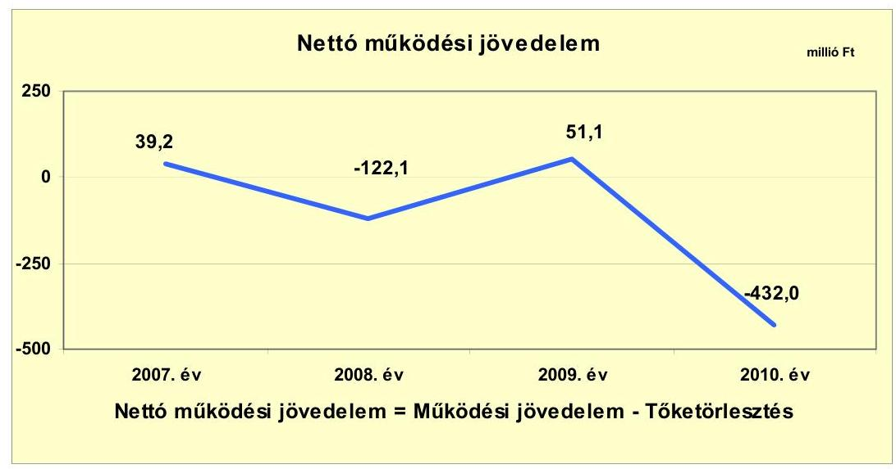

Az Önkormányzat működésének biztosítása érdekében ÖNHIKI-re és a működésképtelen helyi önkormányzatok egyéb támogatására nyújtott be igényt 2007-2010 között. ÖNHIKI támogatásban részesült az Önkormányzat, melynek összege 2007-ben 114,0 millió Ft, 2008-ban 143,7 millió Ft, 2009-ben 36,3 millió Ft és 2010-ben 56,8 millió Ft volt. A kapott 350,8 millió Ft támogatásból bérre és járulékaira összesen 120,0 millió Ft-ot (2007-ben 50,0 millió Ft, 2010-ben 70,0 millió Ft), dologi kiadásokra 230,8 millió Ft-ot (2007-ben 64,0 millió Ft, 2008-ban 73,7 millió Ft, 2009-ben 36,3 millió Ft, 2010-ben 56,8 millió Ft) fordítottak. A működésképtelen helyi önkormányzatok egyéb támogatása jogcímen 2007-ben 28,0 millió Ft, valamint 2008-ban 30,0 millió Ft vissza nem térítendő és 20,0 millió Ft visszatérítendő, feladathoz nem kötött állami hozzájárulásban részesültek, melyet működési célra használtak fel.

A 2011. évben ÖNHIKI-re pályázatot nyújtott be az Önkormányzat és 85,7 millió Ft támogatást kapott. Az állami támogatás átutalása megtörtént, melyet dologi kiadásra használtak fel. Az ÖNHIKI II. ütemében kapott 90,0 millió Ft támogatás az Önkormányzat költségvetési számlájára 2011. november 4-én megérkezett. Az elnyert és a működésre fordított pénzeszközök javították az Önkormányzat pénzügyi helyzetét, hozzájárultak a fizetőképesség megőrzéséhez.

---

A felhalmozási költségvetés egyenlegét 2007-2010 között évről évre a következő ábra szemlélteti:
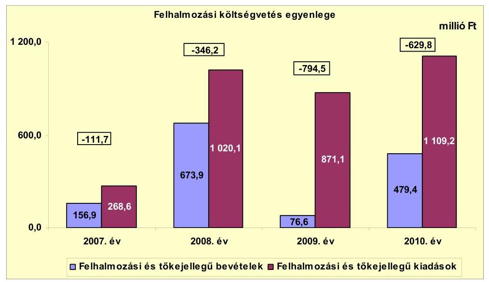

A 2007-2010. években az Önkormányzat felhalmozási költségvetésének egyenlege folyamatosan negatív összegű volt, a felhalmozási forráshiány összesen 1882,2 millió Ft-ot ért el. A felhalmozási forráshiánynak a felhalmozási és tőke jellegű kiadásokhoz viszonyított aránya 2009-ben (91,2\%, 794,5 millió Ft) volt a legmagasabb, mert a támogatások aránya a fejlesztési kiadások finanszírozásában 3,4\% (29,2 millió Ft) volt. A Fürdő fejlesztése ebben az évben fejeződött be (teljes bekerülési költség 537,9 millió Ft),
 melyet a kötvény kibocsátásából származó bevételből finanszíroztak. Az Önkormányzatnak a saját forrás biztosításához 2007-2010 között nem volt elegendő felhalmozási bevétele, ezért a fejlesztéseket külső forrásból, a 2006-2007. években felvett hitelek és a 2008. évben kibocsátott kötvény bevételéből (2056,2 millió Ft) finanszírozta.

A Képviselő-testületnek előterjesztett éves költségvetési rendeletekben nem mutatták be a beruházásokkal létrehozott létesítmények működtetése és fenntarthatósága érdekében várhatóan felmerülő költségvetési kiadásokat. A Képviselő-testületet nem tájékoztatták megfelelő információval az Önkormányzat fejlesztéseihez kapcsolódóan a vállalt kötelezettségek teljes körére vonatkozó finanszírozási igényekről, azok önkormányzati pénzügyi helyzetre gyakorolt hatásairól.

A közbenső egyeztetés során a polgármester által tett észrevétel szerint: minden, a fejlesztésekről döntést a Képviselő-testület tárgyalt, arról határozott.

Az észrevételében foglaltaknak megfelelően a Képviselő-testület minden fejlesztésekről szóló döntést tárgyalt, arról döntést hozott, azonban a Képviselő-testületet a döntések előtt nem tájékoztatták megfelelő információval a fejlesztésekhez kapcsolódóan (a beruházásokkal létrehozott létesítmények működtetése és fenntarthatósága érdekében várhatóan felmerülő költségvetési kiadások) a vállalt kötelezettségek teljes körére vonatkozó finanszírozási igényekről, azok pénzügyi helyzetre gyakorolt hatásairól.

---

Az Önkormányzat évenkénti teljes finanszírozási igénye ${ }^{15}$ a CLF módszer szerint 2007-ben 72,5 millió Ft, 2008-ban 468,3 millió Ft, 2009-ben 743,4 millió Ft, 2010-ben 1061,8 millió Ft volt, amelynek finanszírozását a finanszírozási célú bevételek és kiadások egyenlege, valamint az előző évek pénzmaradványának igénybevétele biztosította.

Az Önkormányzat finanszírozási műveletei 2007-2010. évekbeli egyenlegének alakulását a következő ábra szemlélteti:
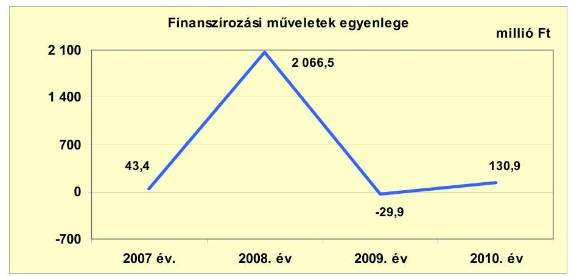

A finanszírozási többlet azt jelzi, hogy az éves költségvetések végrehajtása során szükség volt az előző években keletkezett pénzmaradvány igénybevételén túl külső finanszírozás - hitelfelvétel, kötvény kibocsátása, egyéb finanszírozási bevételek és kiadások - igénybevételére is. A finanszírozási célú műveleteket a vizsgált időszakban a jelentés 2. számú mellékletének 4.1-4.8 pontjai részletezik.

Az Önkormányzat 2007-2010. évi zárszámadási rendeleteinek mellékleteiben bemutatott működési és felhalmozási hiány/többlet összegéről a jelentés 1. számú melléklete nyújt tájékoztatást. A működési célú bevételeket és kiadásokat, illetve a felhalmozási célú bevételeket és kiadásokat mérlegszerűen mutatták be. A 2007. évi zárszámadási rendeletben többlet alakult ki, a bevételek és kiadások számításánál az Áht. 8/A. § előírásait megsértve figyelembe vették a finanszírozási célú műveleteket is. A 2008-2010. évi zárszámadási rendeletekben a költségvetési bevételek és kiadások finanszírozási műveleteket nem tartalmaztak, minden évben működési és felhalmozási hiányt mutattak ki.

[^0]
[^0]:    ${ }^{15}$ a nettó működési jövedelem és a felhalmozási költségvetés eredője

---

Az Önkormányzat kamatbevételeinek és kamatkiadásainak alakulását a 2007-2011. év I. félév közötti időszakban évenként a következő ábra mutatja:
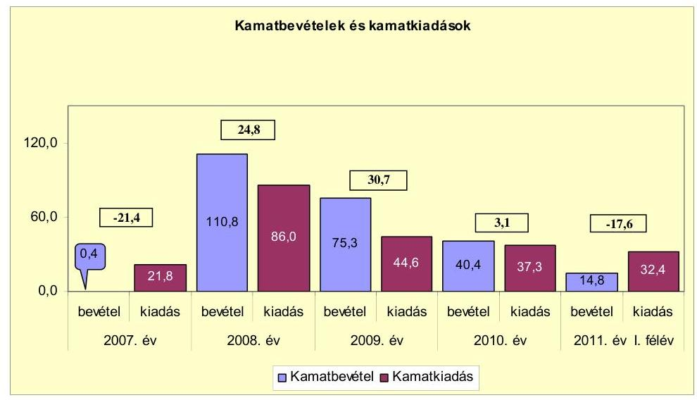

A 2008. év elején kibocsátott kötvényből befolyt 2056,2 millió Ft pénzeszköz a felhasználásig betétekben kamatozott. Ennek következtében az Önkormányzat kamatbevétele 2008-ban volt a legmagasabb, 110,8 millió Ft. A lekötött pénzeszközök csökkenésével párhuzamosan a kamatbevételek is folyamatosan mérséklődtek. A 2011. év I. félévében a kamatkiadások már meghaladták a kamatból származó bevételeket, ez a kötvényforrások felhasználásával függ össze.

A 2007-2011. év I. féléve között az Önkormányzat összesen 222,1 millió Ft kamatot fizetett meg. Az átmenetileg szabad pénzeszközein realizált kamatbevétel, a teljes kamatráfordítás 108,8\%-ának (241,7 millió Ft) megfelelő összeget tett ki.

# 2.2. Az Önkormányzat bevételeinek változása 

Az összes folyó bevétel a 2007. évi 3833,7 millió Ft-ról az intézményi bevételek csökkenése miatt folyamatosan mérséklődött. A folyó bevétel 2010-ben 3491,6 millió Ft-ot tett ki, mely a 2007-2009. évek átlagától (3731,0 millió Ft) 6,4\%-kal (239,4 millió Ft-tal) maradt el. Az intézményi bevételek csökkenését a TÁVHŐ Kommunális szervezet költségvetési szerv 2007-ben és a Termálfürdő és Camping költségvetési szerv 2009-ben történt gazdasági szervezetté történő átalakítása okozta.

---

Az Önkormányzat 2007-2010 között realizált főbb bevételi jogcímeinek számszaki adatait a következő grafikon mutatja be:
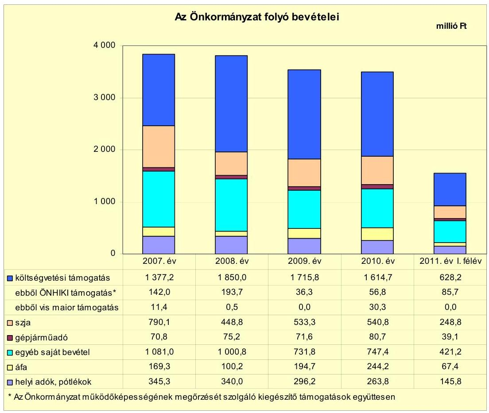

Az átengedett szja és a költségvetési támogatások jogcímeken az Önkormányzat az előző évihez képest 2008-ban 6,1\%-kal (131,5 millió Ft-tal) többet, míg 2009-ben 2,2\%-kal (49,7 millió Ft-tal), 2010-ben 4,2\%-kal (93,6 millió Ft-tal) kevesebb forrást kapott az államtól. Az állami támogatásokban bekövetkezett növekedést és mérséklődést a közoktatási feladatokon belül az óvodában (a 2007. évi 435-ről a 2010. évre 400-ra) és az általános iskolában az ellátotti létszám csökkenése mellett, a gimnáziumban és a szakképzésben bekövetkezett ellátotti létszám bővülése idézte elő. Az általános iskolában az ellátotti létszám a 2007. évi 542 főről 2008-ra 580 főre emelkedett, majd 2010-re folyamatos csökkenés után 520 fő lett. A gimnáziumban az ellátotti létszám 2007-2009 között minimálisan mérséklődött 612 főre, majd 2010-ben a 2007-2009 átlagát (616 fő) 3,2\%-kal (20 fővel) haladta meg. A szakképzésben az ellátotti létszám a 2007. évi 480 főről a 2009. évre 738 főre folyamatosan emelkedett, majd 2010-re 25,6\%-kal (189 fővel) csökkent. A 2009. évben az ellátotti létszám tévesen került megállapításra, az állami támogatás visszafizetésére 2010-ben került sor. A 2010. évben az átengedett szja és a költségvetési támogatások együttes összege a folyó bevételek 61,7\%-át tette ki.

A gépjárműadó bevételek az Önkormányzat bevételi szerkezetében nem meghatározó arányt képviselnek. Az egyéb saját bevételek csökkenését az intézményi bevételek folyamatos mérséklődése okozta. A 2010. évben az egyéb

---

saját bevételek a folyó bevételek 21,4\%-át (747,4 millió Ft) tette ki, mely arány 2007-hez képest 6,8 százalékponttal csökkent.

Az áfa bevételek összege 2008-ra csökkent, majd folyamatosan emelkedett, az áfa visszaigényléssel megvalósuló beruházási kiadások növekedése és a Fürdőhöz kapcsolódó (97,0 millió Ft befizetett áfa) térítésmentes vagyonátvétel következtében. Az áfa részesedése az Önkormányzat saját folyó bevételein belül 2007-hez képest 2,6 százalékponttal nőtt, 2010-ben 7,0\%-ot (244,2 millió Ft-ot) tett ki.

Az Önkormányzat saját bevételeihez a vizsgált időszakban a helyi iparűzési adó, a vállalkozók kommunális adója, a tartózkodás utáni idegenforgalmi adó és az építmény után fizetendő idegenforgalmi adó (érdemleges bevétel nem származott belőle) járult hozzá. A helyi adókból és pótlékokból származó bevételek aránya 1,8 százalékponttal csökkent, 2010-ben 7,2\%-ot (263,8 millió Ft-ot) tett ki a folyó bevételekből. A pótlékkal, bírsággal növelt helyi adó bevétel a vizsgált időszakban folyamatosan mérséklődött. A helyi adóbevételek csökkenését elsősorban az iparűzési adóbevételek elmaradásai okozták. A központi megszorító intézkedések és a gazdasági válság miatt az Önkormányzat közigazgatási területén működő cégek tevékenységeiket, vagy azok egy részét megszüntették.

A bevételekből való részesedését tekintve legnagyobb súlya az iparűzési adónak volt, mely a helyi adó bevételnek 2007-2009-ben átlagban 93,6\%-át, 2010-ben 95,2\%-át (250,9 millió Ft) tette ki. Az iparűzési adóbevétel csökkenéséhez a gazdasági válság hatása mellett hozzájárult, hogy törvényi változás hatására 2008-tól a közszolgáltató cégek (ÉMÁSZ Elosztó Központ) nem székhelytelephely, hanem a fogyasztás helye szerint osztották meg helyi iparűzési adójukat. Ez 2008-ban 29,0 millió Ft, 2009-ben további 22,5 millió Ft bevétel kiesést jelentett. A 2010. évben a túlfizetések rendezése miatt 38,0 millió Ft az adózók részére visszafizetésre került. A tevékenységek végzése után a 2007-2011. év I. félév között a helyi adókról szóló 1990. évi C. törvényben meghatározott maximális (2\%-os) mértékkel adóztak a vállalkozások. A 2011. év I. félében 143,1 millió Ft iparűzési adó folyt be az Önkormányzathoz.

Az iparűzési adón kívül a legjelentősebb bevételt eredményező helyi adónem a tartózkodás utáni idegenforgalmi adó, amelynek bevétele a 2010. évi helyi adóbevétel 3,1\%-át (8,3 millió Ft-ot) tette ki. A tartózkodás utáni idegenforgalmi adó mértéke 2007-ben 200Ft/fő/vendégéjszaka volt, mely 2008-tól 250 Ft/fő/vendégéjszakára emelkedett. Az adómérték emelésének hatására a befolyt bevétel 2008-ra 33,8\%-kal 9,9 millió Ft-ra emelkedett, majd folyamatosan mérséklődött.

A vállalkozások kommunális adója a 2007-2009. évek átlagában a helyi adóbevétel 2,1\%-át adta. Az adó mértéke a 2007. évi 1800 Ft/főről 2008. évtől 2000 Ft/főre emelkedett, a befolyt adóbevétel 2009-ben 7,0 millió Ft volt. A Képviselő-testület a vállalkozások kommunális adóját 2010. január 1-jétől a vállalkozások segítése indoka alapján megszüntette.

Az Önkormányzat gazdasági társaságaitól a vizsgált időszakban, osztalékban nem részesült. Cukorgyári részvénye után 2010-ben 0,1 millió Ft osztalékbevételt realizált.

---

Az Önkormányzat felhalmozási bevételei a vizsgált időszakban a következők voltak:

| Megnevezés | 2007. év | 2008. év | 2009. év | 2010. év | 2011. év I.   félév |
| :-- | --: | --: | --: | --: | --: |
| Tárgyi eszköz értékesítés | 3,2 | 6,0 | 19,4 | 2,2 | 9,8 |
| Egyéb saját tőkebevétel | 40,8 | 61,8 | 28,0 | 106,9 | 33,1 |
| Államháztartáson belülről   kapott támogatás | 12,4 | 56,1 | 26,1 | 6,2 | 2,4 |
| EU-tól és külföldről kapott   támogatások | 46,6 | 538,4 | 0,0 | 345,1 | 213,5 |
| Államháztartáson kívülről   kapott támogatás | 54,0 | 11,6 | 3,1 | 18,9 | 247,4 |
| Összes felhalmozási bevétel | 156,9 | 673,9 | 76,6 | 479,4 | 506,2 |

A felhalmozási bevételekben meghatározóak voltak a kapott támogatások (1581,8 millió Ft), melyek a vizsgált időszakban az összes felhalmozási bevétel 83,6\%-át tették ki. Az Önkormányzat a Várbástya rekonstrukciójára (2007-2008 között 487,5 millió Ft), a minőségi közoktatás megteremtésére (2008-2010 között 222,2 millió Ft), Vízi kapu színpad kialakítására (97,5 millió Ft), valamint 11 kisebb fejlesztés kapcsán kapott támogatást, melyek megvalósítása és pénzügyi rendezése a 2007-2010. éveket érintette. A kapott támogatások aránya a felhalmozási bevételeken belül 2009-ben kiugróan alacsony, 38,1\% (29,2 millió Ft) volt. Ekkor saját forrásból (kötvényből) a Fürdő fejlesztése valósult meg. A többi évben a kapott támogatások aránya az összes felhalmozási bevételhez képest 72\% és 91,6\% között (113,0 millió Ft és 606,1 millió Ft) alakult.

---

# 2.3. Az Önkormányzat működési és felhalmozási célú kiadásainak változása 

Az Önkormányzat folyó kiadásai főbb jogcímek szerinti bontásban az alábbiak voltak:

|  |  |  |  |  | millió Ft |
| :-- | --: | --: | --: | --: | --: |
| Megnevezés | 2007. év | 2008. év | 2009. év | 2010. év | 2011. év I.   félév |
| Folyó (működési) kiadások | 3757,0 | 3879,1 | 3489,3 | 3824,7 | 1662,9 |
| Működési kiadások (kamatkiadás nélkül) | 3387,9 | 3359,2 | 3066,9 | 3396,9 | 1465,7 |
| Államháztartáson belülre átadott   pénzeszközök | 7,8 | 72,4 | 0,6 | 5,4 | 0,3 |
| Transzferkiadások | 339,5 | 361,6 | 370,4 | 380,0 | 150,8 |
| -ebből: vállalkozásoknak | 39,0 | 62,7 | 57,1 | 80,8 | 0,0 |
| magánszemélyeknek | 277,0 | 278,7 | 290,8 | 273,7 | 123,9 |
| nonprofit szervezeteknek | 23,5 | 20,2 | 22,5 | 25,5 | 26,9 |
| Kamatkiadások | 21,8 | 86,0 | 44,6 | 37,3 | 32,4 |
| Előző évi pénzmaradvány átadás | 0,0 | 0,0 | 6,9 | 5,0 | 13,7 |

 |  |  |  |  | millió Ft |
| :-- | --: | --: | --: | --: | --: |
| Megnevezés | 2007. év | 2008. év | 2009. év | 2010. év | 2011. év I.   félév |
| Személyi juttatások | 1636,0 | 1526,0 | 1439,4 | 1498,3 | 663,0 |
| Munkaadót terhelő járulékok | 526,9 | 482,5 | 415,6 | 376,7 | 173,7 |
| Dologi kiadások | 1103,4 | 1238,6 | 1152,2 | 1272,1 | 555,2 |
| Egyéb folyó kiadások | 420,4 | 471,5 | 392,9 | 556,6 | 230,1 |

Az Önkormányzat folyó kiadásai az előző évhez képest 2008-ban 3,2%-kal (122,1 millió Ft-tal) növekedtek, 2009-ben 10%-kal (389,8 millió Ft-tal) csökkentek és 2010-ben 9,6%-kal 335,4 millió Ft-tal növekedtek. A folyó kiadás 2010-ben 3,1%-kal (116,2 millió Ft-tal) haladta meg a 2007-2009. évek átlagát (3708,5 millió Ft). A folyó kiadások évenkénti értékét a személyi juttatások és járulékok, a dologi kiadások és az egyéb folyó kiadások együttesen alakították ki.

A működési kiadásokon belül a személyi juttatások és járulékok nagysága és aránya a vizsgált időszakban folyamatosan csökkent. A mérséklődést a 2007-ben és 2009-ben bekövetkezett költségvetési szervek átszervezése kapcsán fellépő létszámcsökkenések, valamint 2008-ban a 13. havi juttatások megszűnése okozta. A 2007. évhez képest 2010-re a személyi juttatások és járulékok aránya 8,6%-kal, összege 287,9 millió Ft-tal mérséklődött. Az Önkormányzat 2010-ben a működési kiadások 55,2%-át (1875,0 millió Ft) személyi juttatásokra és a munkaadókat terhelő járulékokra fordította. A személyi juttatások 2010-ben az előző évhez képest történt emelkedése a központi forrásból biztosított kereset kiegészítés (50,0 millió Ft) miatt következett be. A munkaadói járulékok esetében a folyamatos mérséklődés a létszámcsökkenés mellett a 2009. évtől a foglalkoztatókat terhelő társadalombiztosítási járulékmérték-csökkenés, illetve tételes egészségügyi hozzájárulás megszűnésének hatása miatt jelentkezett.

---

A dologi kiadások a vizsgált időszakban a folyó kiadásokhoz hasonlóan változtak, arányuk a folyó kiadáshoz képest folyamatosan emelkedett. Az előző évhez képest 2008-ban 12,3%-kal (135,2 millió Ft-tal) növekedtek, 2009-ben 7,0%-kal (86,4 millió Ft-tal) - a Fürdő gazdasági szervezetté történő átalakítása miatt - csökkentek, majd 2010-ben 10,4%-kal (119,9 millió Ft-tal) emelkedtek. A 2008. évben a dologi kiadások a hőszolgáltatást biztosító költségvetési szerv megszűnése ellenére növekedtek, mert a szállítói tartozás nagy része kifizetésre került, az előző évhez képest a szállítói tartozásállomány 260,0 millió Ft-tal csökkent. A dologi kiadások 2010-ben történt emelkedését a 2009-ben gazdasági társasággá átalakult költségvetési szerv dologi kiadásainak kiesése ellenére, a dologi kiadásokhoz kapcsolódó áfa befizetések $^{16}$ előző évhez viszonyított 106,0 millió Ft-os növekedése okozta. Az Önkormányzat 2010-ben az üzemeltetést, intézményfenntartást biztosító dologi kiadásokra a működési kiadása 37,4%-át (1272,1 millió Ft-ot) fordította, mely 6,0 százalékponttal haladta meg a 2007-2009. évek átlagát (1164,7 millió Ft).

Az egyéb folyó kiadások a 2007-2009. évek átlagához (428,3 millió Ft) képest 2010-ben 30,0%-kal (128,3 millió Ft-tal) növekedtek, a működési kiadások 16,9%-át tették ki. A 2008. évi növekedést a kamatkiadások 62,4 millió Ft-tal történő emelkedése okozta. Az egyéb folyó kiadások 2009-ben a kamatkiadások (41,4 millió Ft-tal) és a jogosulatlanul felvett támogatások (52,0 millió Ft-tal) visszafizetésének csökkenése következtében mérséklődtek. A növekedést a 2010. évben az előző évben jogtalanul igénybe vett közoktatási normatíva (86,9 millió Ft) és a hozzá kapcsolódó szja kiegészítés (25,2 millió Ft) visszafizetése, a térítésmentesen átvett Fürdő vagyonhoz kapcsolódó többlet áfa (85,0 millió Ft) befizetés határozta meg.

A közbenső egyeztetés során a polgármester által tett észrevétel szerint: a tévesen igényelt normatívát az éves elszámolás keretében az Önkormányzat észlelte és visszafizette.

Az észrevételt nem fogadjuk el, mivel a pénzügyi egyensúlyi helyzet vizsgálata a megállapítás, visszafizetés körülményeire és az azt követő intézkedések ellenőrzésére nem terjedt ki az ellenőrzési program.

[^0]
[^0]:    $^{16}$ A dologi kiadások között a vásárolt szolgáltatások, termékek, a kiszámlázott szolgáltatások és a fordított áfa miatti befizetések szerepelnek.

---

A kiadások összetételének változását (a működési és fejlesztési célú kamatkiadásokat is figyelembe véve) a következő grafikon szemlélteti:
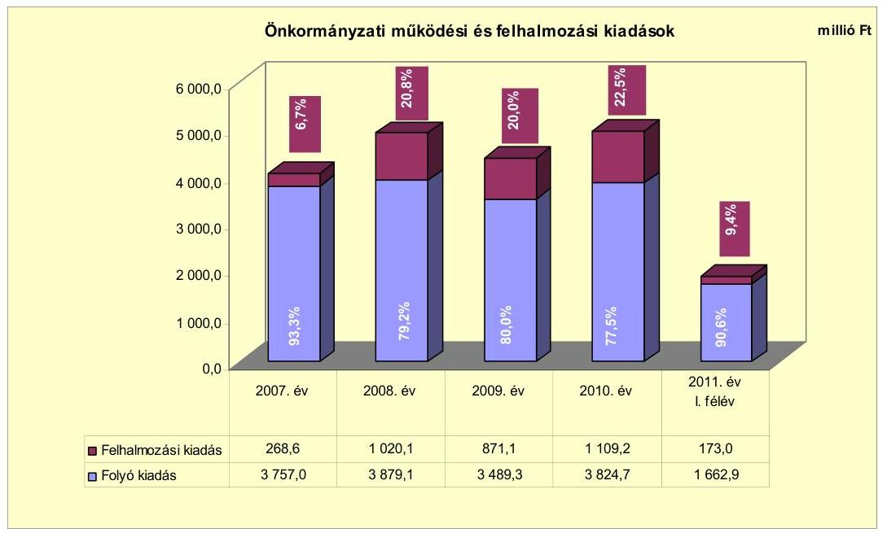

A 2007-2010. években a folyó kiadások aránya csökkenő, míg a felhalmozási kiadások növekvő tendenciát mutattak a fokozott felhalmozási tevékenység eredményeként.

Az Önkormányzat 2007-2010. években megvalósított fejlesztései között a Városbástya rekonstrukciója, a Vízi kapu színpad kialakítása, az ivóvízhálózat felújítása és építése, közművek építése, műfüves pálya építése, a termálfürdő fejlesztése, valamint infrastrukturális és informatikai fejlesztések szerepeltek.

A 2010. december 31-ig megvalósult fejlesztésekre a 2007-2010. években 2044,0 millió Ft kiadást teljesített az Önkormányzat, ezek teljes bekerülési költsége 2085,3 millió Ft volt. A teljes bekerülési költségből a beruházások összege 1718,6 millió Ft (82,4%) és a felújítások összege 366,7 millió Ft (17,6%) volt. A projektek döntő többsége utófinanszírozású volt, mely likviditási gondokat okozott. Az Önkormányzatnak a pályázati források folyószámlahitelből történő finanszírozása pénzügyi kockázatot jelent. A folyószámlahitel igénybevétele a vizsgált időszakban tartóssá vált, a kötvény kibocsátásából származó bevételek felhasználása után a folyószámlahitel állomány 2011-ben 143,3 millió Ft-ra emelkedett, mely 29,7%-kal (32,8 millió Ft-tal) haladta meg a 2007-2010 közötti átlagos állományt (110,5 millió Ft). A 2008-ban kibocsátott kötvény bevételéből, valamint 2009-ben folyószámlahitel keret ideiglenes emelésével a finanszírozást lehetővé tevő pénzeszközök folyamatosan rendelkezésre álltak. A 2085,3 millió Ft beruházási összköltségből a saját bevétel 17,2%-ot (359,6 millió Ft), a felvett hitel 2,4%-ot (50,9 millió Ft), a kibocsátott kötvény 44,0%-ot (916,6 millió Ft), az EU-s támogatás 28,1%-ot (585,0 millió Ft) és a hazai támogatás 8,3%-ot (173,2 millió Ft) tett ki. A 2007-2010. évek között a 10,0 millió Ft teljes bekerülési költség feletti befejezett fejlesztések száma 27, valamint a 10,0 millió Ft teljes bekerülési költség alatti fejlesztések száma 170 volt. Az Ön-

---

kormányzat 2007-2010. években megvalósított, 2010. december 31-ig befejezett fejlesztéseit és azok forrásösszetételét a jelentés 3/a. számú melléklete mutatja be.

A 2010. december 31-én folyamatban lévő hét fejlesztési feladat tervezett bekerülési költsége 1614,6 millió Ft volt, melyre 2010. december 31-ig 500,6 millió Ft kiadást teljesítettek. A folyamatban lévő beruházások 2010. december 31-ig teljesített kiadásainak forrása 7,8%-ban (39,1 millió Ft) saját bevétel, 45,4%-ban (227,3 millió Ft) kötvénykibocsátásból származó bevétel és 46,8%-ban (234,2 millió Ft) EU-s támogatás volt. A 2010. december 31-én folyamatban lévő fejlesztési feladatokra 2010. december 31-ig teljesített kifizetéseket és azok forrásösszetételét a jelentés 3/b. számú melléklete tartalmazza.

A 2010. december 31-én folyamatban lévő fejlesztések 2010. év utánra vállalt kötelezettségvállalásainak összege 2108,7 millió Ft, amelynek tervezett forrása 1788,5 millió Ft EU-s támogatás (84,8%), 302,7 millió Ft saját bevétel (14,4%) és 17,5 millió Ft kötvénykibocsátásból származó bevétel (0,8%). A fejlesztések megvalósításához saját bevétellel számoltak, mely - tekintettel az elmúlt évek negatív működési jövedelmére - a vállalt fejlesztések jövőbeni finanszírozhatóságának kockázatát növeli. Az Önkormányzat 2010. december 31-én folyamatban lévő fejlesztési feladataira 2010. december 31-én fennálló kötelezettségvállalásait és azok forrásösszetételét a jelentés 3/c. számú melléklete mutatja be.

Az Önkormányzat által beadott, egy elbírálás alatti pályázati forrásból megvalósuló fejlesztésének tervezett bekerülési költsége összesen 119,6 millió Ft. A beruházások kiadásait 95,0%, 113,6 millió Ft EU-s támogatásból és 5,0%, 6,0 millió Ft saját bevételből tervezik finanszírozni. Az elbírálás alatti, pályázati forrásból megvalósítani tervezett fejlesztésekhez kapcsolódó kötelezettségvállalásokat és azok forrásösszetételét a jelentés 3/d. számú melléklete mutatja be.

A 2007-2010. évben befejezett fejlesztések közül a három legmagasabb bekerülési költségű beruházás a következő volt:

- Az Önkormányzat pénzügyi helyzetére hatással van a Termálfürdő fejlesztés, melynek teljes bekerülési költsége 537,9 millió Ft volt. A beruházás fedezetét 100,0%-ban a 2008-ban kibocsátott kötvényből biztosították. Határozatlan idejű szerződés alapján a PATAQUA Kft. a vagyont üzemeltetésre megkapta, melynek ellentételezésére 2009-ben 52,6 millió Ft, 2010-ben 52,6 millió Ft és 2011-ben 70,0 millió Ft bérleti díjat fizetett az Önkormányzat részére.
- A Várbástya rekonstrukciójának bekerülési költsége 501,2 millió Ft volt, amelyből az EU-s támogatás 487,5 millió Ft (97,3%), a saját forrás 13,7 millió Ft (2,7%) volt.
- A Vízi kapu színpad projekt megvalósítására 2007-2008. években került sor. A fejlesztés tervezett bekerülési költsége 108,6 millió Ft, a ténylegesen felmerült kiadások összege 104,2 millió Ft volt. A felmerült kiadások fedezetét 6,7 millió Ft saját bevétel (6,4%) és 97,5 millió Ft EU-s támogatás (93,6%) jelentette.

---

Az Önkormányzat pénzügyi helyzetére hatással voltak a Sidinfo Nonprofit Kft. részére átadott működési célú pénzeszközök, mellyel a művelődési programok szervezésével kapcsolatos feladatok ellátását finanszírozták. A gazdasági társaság összes kiadásaihoz a vizsgált időszakban 72,7 millió Ft eseti működési célú pénzeszközátadással járult hozzá az Önkormányzat. A művelődési feladatok ellátását a Várbástya rekonstrukciója projekt kapcsán írták elő. A feladatellátásban résztvevő gazdasági társaság részére átadott működési célú pénzeszköz a 2007. évi 20,1 millió Ft-ról 2008-ra 20,7 millió Ft-ra, 2009-re 27,1 millió Ft-ra növekedett. A működési célú pénzeszközátadás 2011-ben várhatóan 4,8 millió Ft-ra csökken, majd megszűnik. Az előírt művelődés szervezési feladatokat a Művelődés Háza költségvetési szervvel tervezik elvégeztetni.

# 3. Az ÖNKORMÁNYZAT KÖTELEZETTSÉGEI 

### 3.1. Az Önkormányzat pénzintézeti kötelezettségeinek változása

Az Önkormányzat mérleg szerinti $^{17}$ pénzintézeti kötelezettségeinek állománya 2006. december 31-ről 2010. december 31-re 215,0 millió Ft-ról 3153,3 millió Ft-ra nőtt. A pénzintézeti kötelezettség állománya 2011. június 30-án 3179,5 millió Ft volt. A pénzintézetekkel szemben fennálló kötelezettségek állománya 2006. december 31. - 2011. június 30. között a következők szerint alakult:
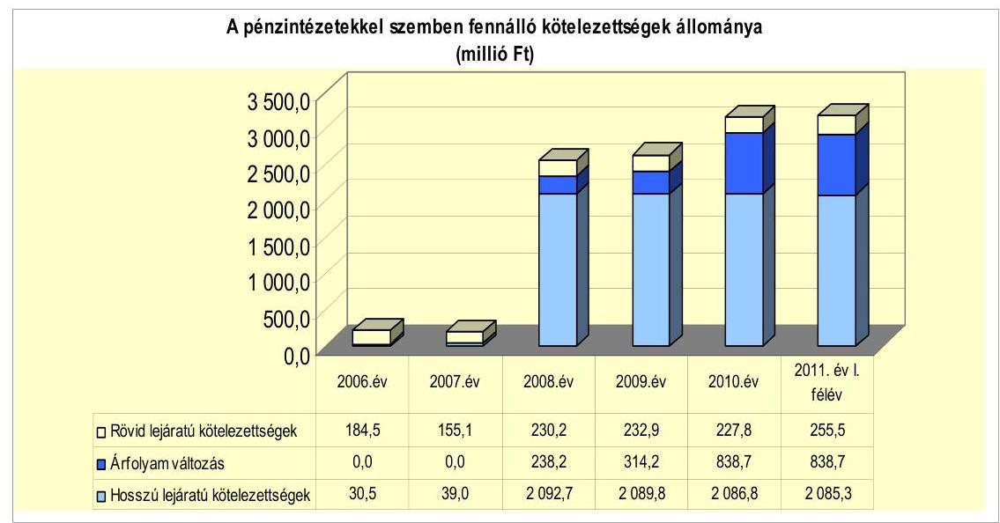

[^0]
[^0]:    $^{17}$ Az Önkormányzat könyvviteli mérlege a 2006-2007. és a 2010. évben - téves könyvelési tételek miatt - nem pontosan tükrözik a pénzintézeti kötelezettségek állományát. A diagram a valós adatokat tartalmazza, ezért eltér a könyvviteli mérlegben rögzítettek től. Az Önkormányzat által tévesen könyvelt tételek a pénzügyi egyensúlyt nem érintették.

---

Az ellenőrzött időszakban az Önkormányzat 2007-ben, 12,0 millió Ft összegben egy hosszú lejáratú hitelt vett fel, valamint 2008-ban 13,0 millió CHF értékben kötvényt bocsátott ki, ezenkívül még három hosszú lejáratú hitel visszafizetési kötelezettsége terhelte ezt az időszakot. A 2008. évtől a pénzintézetekkel szemben fennálló kötelezettségek lejárat szerinti összetétele a hosszú lejáratú kötelezettségek irányába tolódott el. A 2007. évben a korábban felvett, a közműtársuláshoz kapcsolódó hosszú lejáratú hitel törlesztése befejeződött, így az Önkormányzatnak a 2010. év végén három hosszú lejáratú hitele volt. A pénzintézetekkel fennálló rövid lejáratú kötelezettségek állományát 2010. december 31-én a hosszú lejáratú kötelezettségek tárgyévet követő fizetési kötelezettségei, valamint 144,8 millió Ft folyószámlahitel és 80,0 millió munkabér-megelőlegezési hitel jelentette. Az Önkormányzat igénybe vett folyószámlahitele 174,0 millió Ft, valamint munkabér-megelőlegezési hitele 80,0 millió Ft.
 volt 2011. június 30-án.

A CHF-ben felvett kötvénynél az árfolyamváltozás miatti év végi értékelést a 2008-2010. évek között elvégezték.

Az árfolyamváltozás hatása is befolyásolja a kötelezettségek alakulását, azonban annak mértéke előre pontosan nem határozható meg, csak várakozásokon alapuló tendenciák jelezhetők. Annak megítéléséről, hogy a devizában felvett hitelekért kapott forinthoz képest a hitelek visszafizetésekor jelentkező forint kötelezettség többletkiadást (árfolyamveszteség), vagy megtakarítást (árfolyamnyereség) eredményez a futamidő végén, a teljes kötelezettség rendezését követően lehet képet alkotni. Mindaddig, amíg törlesztési kötelezettség nem áll fenn (türelmi idő, moratórium), a tőkére vonatkoztatva nem értelmezhető sem az árfolyamveszteség, sem az árfolyamnyereség. Ugyanakkor a számviteli szabályok meghatározzák, hogy az árfolyamkülönbözetet év végén a kötelezettségek vagy követelések között a könyvviteli mérlegben nyilván kell tartani, azonban az árfolyamkülönbözet valójában nem realizált.

Az Önkormányzat a forráshiány kezelése érdekében a 2007-2011. évi költségvetési rendeletekben ÖNHIKI igénybevételével, működési- és felhalmozási célú hitelfelvétellel, valamint pénzmaradvány igénybevétellel számolt.

A működési forráshiány kezelése érdekében az éves költségvetés elfogadásakor az ÖNHIKI-s pályázat, valamint hitelkérelem elkészítését írták elő. A Képviselőtestület minden évben döntött rövid lejáratú hitel - folyószámla-, illetve munka-bér-megelőlegezési hitel - igénybevételéről.

A felhalmozási hiány kezelésére a Képviselő-testület a 2007. évben egy hosszú lejáratú fejlesztési hitel és egy rövid lejáratú fejlesztési hitel felvételéről, valamint a 2008. évben egy devizában történő kötvénykibocsátásról döntött. Az Önkormányzat az áttekintett időszakban az adósságot keletkeztető kötelezettségvállalásának felső határát minden esetben megvizsgálta, azt nem lépte túl.

A pénzintézeti kötelezettségvállalások minden esetben képviselő-testületi döntésen alapultak, a kötelezettségvállalásból származó források felhasználási céljait meghatározták, azonban a kötvény kibocsátásakor az előterjesztésben nem számszerűsítették a visszafizetés forrását, valamint a törlesztési, a kamat- és a deviza alapú kötelezettségeket érintő árfolyamkockázatot. Az adósságot keletkeztető kötelezettségvállalással megvalósított fejlesztések esetle-

---

ges bevételnövelő, illetve kiadáscsökkentő vonzatát nem vizsgálták. A Képviselő-testület döntéseiben kötelezettséget vállalt a felvett hitel és a kibocsátott kötvény visszafizetésére, amit az adott évi költségvetésébe betervezett és jóváhagyott. A kötvény 2008. év elején történt kibocsátása a kibocsátáskori árfolyamon számolva 2056,2 millió Ft értékű kötelezettségvállalást jelentett, amely a 2007. évi költségvetési és szja támogatás 94,9%-át tette ki.

A közbenső egyeztetés során a polgármester által tett észrevétel szerint: a kockázatokról a döntéskor nem, de azt követően a költségvetési rendeletben a tájékoztatás megtörtént.

Az észrevételt nem fogadjuk el, mivel a megállapítás szerint a kötvény kibocsátásakor, a döntéskor nem számszerűsítették a törlesztési, a kamat- és a deviza alapú kötelezettséget érintő árfolyamkockázatot. Ezt a megállapítást polgármester úr észrevételében is megerősítette.

A számlavezető pénzintézettől 2007-ben 12,0 millió Ft kedvezményes kamatozású forinthitel felvételére került sor az Önkormányzati Fejlesztési Hitelprogram keretében, műfüves sportpálya kialakítására. A Képviselő-testület a hitel biztosítékaként a gépjárműadó bevételét ajánlotta fel, melyről engedményezési szerződést kötöttek.

Az Önkormányzat - versenyeztetés során - a Hypo Investmenbank AG pénzintézet ajánlata alapján 2056,2 millió Ft-nak megfelelő 13,0 millió CHF névértékű, zártkörű, 25 éves futamidőre - öt éves türelmi idővel - kötvényt bocsátott ki 2008. január 31-én. A kötvényt a 2008. január 14. értéknapon fennálló folyószámlahitel és kamatának törlesztésére, valamint a fejlesztési feladatokhoz a kívánt pénzügyi forrás megteremtése érdekében bocsátották ki. A Megállapodás 6.3 pontja értelmében az Önkormányzat a kötvények fennmaradó vételárát sem közvetlenül, sem közvetve nem fordíthatta működési célú kiadásokra. A Képviselő-testület a kötvényen alapuló kötelezettségek teljesítésének fedezeteként a terhelési, illetve az elidegenítési tilalom alá nem eső teljes vagyonát, valamint a fejlesztésekből származó önkormányzati bevételeit jelölte meg. A bevételek beszedésére engedményezési szerződés nem készült, az Önkormányzat ingatlanjára jelzálogot nem jegyeztek be.

Az Önkormányzat 2011. június 30-án CHF-ben fennálló hosszú lejáratú kötvényéhez kapcsolódó adósságot keletkeztető pénzintézeti kötelezettségvállalása az alábbi volt:

| Megnevezés | Kibocsátás   időpontja | Összeg   ezer CHF-ben | Kibocsátási/hitelfelvételi   árfolyam | Kamat (referencia kamat+   kamatfelár) | Felhasználás célja: |
| :-- | :--: | :--: | :--: | :--: | :--: |
| Sárospatak Önkormányzati   Kötvény | 2008.01.31 | 13000,0 | 158,17 | 3,26 | 2008.01.14.-i folyószámlahitel   és kamatának visszafizetése   és fejlesztések biztosítása |

A kötvény kibocsátásából származó bevétel felhasználása teljes mértékben megtörtént. A megállapodásban rögzített folyószámlahitel törlesztését követően az előírt fejlesztési célú felhasználás kötelezettsége ellenére 241,7 millió Ft-ot működési célra fordítottak, melyről a Képviselő-testületet a felhasználást megelőzően nem tájékoztatták. A polgármester a 2010. évi költségvetés III. negyedévi, valamint a 2011. évi költségvetés I. félévi végrehajtásáról szóló előterjesztésekben utólag a Képviselő-testületet tájékoztatta, hogy a működési forrás-

---

hiány finanszírozása ideiglenesen a kötvénykibocsátásból származó bevételből történt, valamint arról, hogy a működési célú felhasználás összegét más forrásból szükséges pótolni. Amennyiben ez elmarad, a pénzintézet - szerződésszegés címen - esetleges igényérvényesítése miatt az Önkormányzat működése kockázatot hordoz. Az Önkormányzat arra kényszerült, hogy a működés biztosítása érdekében a fejlesztési célú forrását működési célra használja fel.

Az Önkormányzat a CHF-ben fennálló pénzintézeti kötvény kötelezettségéből a szerződésben foglaltaknak megfelelően 2011. június 30-ig 705732 CHF (123,8 millió Ft) kamatot és 10,4 millió Ft egyéb költséget fizetett meg. Az Önkormányzat a tőke törlesztését 2013. március 31-én kezdi meg, az éves tőketörlesztés összege 650000 CHF.

Az Önkormányzat 2011. június 30-án forintban fennálló hosszú lejáratú hiteleihez kapcsolódó adósságot keletkeztető pénzintézeti kötelezettségvállalása az alábbiak szerint alakult:

| Megnevezés | Szerződéskötés   időpontja | Összeg   millió Ft-ban | Kamat (referencia kamat+   kamatfelár) | Felhasználás célja: |
| :-- | :--: | :--: | :--: | :--: |
| Végardói Tájház fejlesztés ÖKIF   hitel | 2006.03.07 | 13,1 | 3,67 | Végardói Tájház fejlesztés |
| AVG műfüves sportpálya   kialakítása ÖKIF hitel | 2007.07.19 | 12,0 | 7,29 | AVG műfüves sportpálya   kialakítása |
| A Művelődés Háza felújítás   ÖKIF hitel | 2006.03.07 | 18,0 | 3,67 | A Művelődés Háza   Színházterem felújítása |

A táblázatban szereplő hitelek lehívása és a hitelszerződésekben foglalt fejlesztési célnak megfelelő felhasználása megtörtént, valamennyi hitelnek elkezdődött a tőketörlesztése, a kamatok és egyéb költségek szerződés szerinti fizetése.

Megvalósult a hitelszerződésben rögzített műfüves sportpálya kialakítása, amelyhez a hitel teljes egészében felhasználásra került. ÖKIF hitel segítségével megtörtént a tájház fejlesztése, valamint a színházterem felújítása is.

A felsorolt hosszú lejáratú hitelekkel kapcsolatosan az Önkormányzat 2007-2010 között 9,5 millió Ft tőkét törlesztett, kamat és egyéb költségek címén 6,6 millió Ft-ot fizetett meg. A 2011. év I. félévében összesen 1,5 millió Ft tőketartozás és 0,6 millió Ft kamat és egyéb költség megfizetését teljesítették.

Az Önkormányzat a kötvénykibocsátásból származó forrást nem egyszerre használta fel, azt befektette. A szabad pénzeszközök betétben lekötésre kerültek, mely után 224,3 millió Ft kamatbevétele származott az Önkormányzatnak. A pénzeszközöket a 2008-2011. évi költségvetések végrehajtása során működésre fordították.

Az Önkormányzat működésének pénzügyi egyensúlyát a vizsgált időszakban a kötvény kibocsátásából származó bevételekkel, valamint folyószámlahitel és munkabér-megelőlegezési hitel igénybevételével tudta biztosítani. Az igénybe vett folyószámlahitel és a munkabér-megelőlegezési hitelek jellemző adatait a következő táblázat mutatja be:

---

|  |  |  |  |  | millió Ft-ban |
| :--: | :--: | :--: | :--: | :--: | :--: |
| Megnevezés | 2007. év | 2008. év | 2009. év | 2010. év | 2011. év I.   félév |
| I. Folyószámlahitel |  |  |  |  |  |
| a folyószámlahitel keretösszege január 1-jén | 100 | 150,0 | 150,0 | 150,0 | 150,0 |
| teljesített kamat és egyéb költség | 10,7 | 9,1 | 12,0 | 6,6 | 4,7 |
| II. Munkabér megelőlegezési hitel |  |  |  |  |  |
| Igénybevett hitel összesen: | 1100 | 770,0 | 790,0 | 880,0 | 560,0 |
| teljesített kamat és egyéb költség | 6,9 | 5,7 | 6,0 | 7,0 | 3,7 |

A folyószámlahitelek kondíciói és egyéb költségei a következők voltak ${ }^{18}$:

| Megnevezés | Kamat (referencia+ kamatfelár) | Egyéb költség |
| :-- | :--: | :--: |
| Folyószámlahitel |  |  |
| 2007.01.01.-2009.01.22. | 3 havi BUBOR +0,3% | 0,5% kezelési költség, 0,5%   rendelkezésre tartási jutalék |
| 2009.01.23.-2011.05.30. | 1 havi BUBOR +3,25% | 0,5% kezelési költség, 2%   rendelkezésre tartási jutalék |
| 2011.05.31.- | 1 havi BUBOR +3,5% | 0,5% kezelési költség, 2%   rendelkezésre tartási jutalék |
| Munkabér-megelőlegezési hitel |  |  |
| 2007.01.01.-2009.01.22. | 3 havi BUBOR +0,3% |  |
| 2009.01.23.-2011.06.30. | 1 havi BUBOR +3,75% |  |

A vizsgált időszakban a folyószámlahitel igénybevétele tartóssá vált. Ennek átlagos napi állománya a kötvény kibocsátásból származó bevételnek köszönhetően 2007-2010. évek között folyamatosan 125,2 millió Ft-ról 82,9 millió Ft-ra csökkent. Ezt követően a kötvénykibocsátásból befolyt pénzeszközök felhasználása miatt az átlagos állomány 2011. év I. félév végére 143,3 millió Ft-ra emelkedett. Az Önkormányzat a 2007-2010. évek végén, valamint a folyószámlahitel szerződések lejárataikor is minden alkalommal rendelkezett folyószámlahitel állománnyal.

A folyószámlahitel szerződések lejáratai, illetve módosításai előtt a folyószámlahitel állományai a következők voltak: 2007. január 26-án 99,3 millió Ft, 2008. január 24-én 103,6 millió Ft, 2009. január 22-én 148,2 millió Ft, 2010. január 22-én 128,0 millió Ft, 2010. május 31-én 48,2 millió Ft, 2010. november 22-én 84,7 millió Ft, 2011. május 30-án 147,8 millió Ft.

A romló likviditási helyzet miatt a folyószámlahitel keret összegét 2007. január 26-án 100,0 millió Ft-ról 150,0 millió Ft-ra, 2011. május 31-én 150,0 millió Ft-ról 200,0 millió Ft-ra emelték. Beruházás finanszírozása miatt 2009. június 1-je és november 23-a között a folyószámlahitel-keret összege 400,0 millió Ft-ra emelkedett. A nehezedő finanszírozási problémákat mutatja, hogy a

| MNB BUBOR fixing (állagkamat) %-ban |  |  |  |  |  |
| :--: | :--: | :--: | :--: | :--: | :--: |
| Referencia kamat | 2007. évi | 2008. évi | 2009. évi | 2010. év | 2011. év   I. félév |
| 1 havi BUBOR | 7,83 | 8,75 | 8,66 | 5,47 | 6,00 |
| 3 havi BUBOR | 7,75 | 8,87 | 8,64 | 5,50 | 6,07 |

---

folyószámlahitel állománya 2010. december 31-én 144,8 millió Ft, 2011. június 30-án pedig 174,0 millió Ft volt.

A tartós likviditási problémák miatt az Önkormányzat 2007-től munkabér-megelőlegezési hitelt vett igénybe. A hitel igénybevételére rendszeresen sor került. A munkabér-megelőlegezési hitel átlagos napi állománya 2007-2009 között folyamatosan csökkent 80,4 millió Ft-ról 49,6 millió Ft-ra, majd a finanszírozási problémák miatt 2011. év I. félév
 végére folyamatosan emelkedve 75,2 millió Ft-ot ért el. A törlesztések a normatív állami támogatásokból és az szja-ból az igénybevételt követő hónapban megtörténtek. A munkabér-megelőlegezési hitel állománya 2010. december 31-én és 2011. június 30-án 80,0 millió Ft volt.

Kamat és egyéb költség címén az Önkormányzat a vizsgált időszakban a folyószámlahitellel kapcsolatosan összesen 43,1 millió Ft-ot, munkabérmegelőlegezési hitelhez kötődően összesen 29,3 millió Ft-ot fizetett ki.

Az Önkormányzat a likviditási gondjai miatt 2007-ben egy alkalommal 55,0 millió Ft összegben rövid lejáratú fejlesztési hitelt vett igénybe. A likvid hitel igénybevételéhez kapcsolódó kamat és egyéb kiadások összege 3,3 millió Ft volt.

A kötvényhez, valamint a hosszú lejáratú hitelekhez kapcsolódó kamatfizetési kötelezettségek alakulását jelentősen befolyásolja a kibocsátáskori és az utolsó kamatfizetéskori referenciakamatok alakulása, melyet az alábbi táblázat mutat be:

| Megnevezés | Kibocsátási, lehivási | Utolsó fizetéskori | Változás \% |
| :--: | :--: | :--: | :--: |
|  | kamat (referencia + kamatfelár) \% |  |  |
| 3 havi CHF LIBOR (2008.01.22.-i szerződés) | 3,26 | 0,78 | $-76,1 \%$ |
| 3 havi EURIBOR (2006.03.07.-i szerződés) | 3,67 | 3,72 | $1,4 \%$ |
| 3 havi EURIBOR (2007.07.19.-i szerződés) | 7,29 | 4,04 | $-44,6 \%$ |
| 3 havi EURIBOR (2006.03.07.-i szerződés) | 3,67 | 3,72 | $1,4 \%$ |

A kamat mértékének alakulása jelentős hatással van az adott devizanemben kifejezett, a teljes futamidőre számított, várható kamatkötelezettség mértékére. Az Önkormányzat fizetési kötelezettségét a referenciakamatok csökkenése kedvezően, a CHF árfolyam emelkedése viszont kedvezőtlenül befolyásolta. A szerződések módosítására a vizsgált időszakban nem került sor.

---

Az Önkormányzat kötelezettségeinek 2010. december 31-i, valamint 2011. június 30-i állományát és várható alakulását (kamatkiadásokkal együtt) a következő táblázat mutatja be:

| Megnevezés | Állomány 2010. december 31   én |  |  | Állomány 2011. június 30-án |  |  | Várható kötelezettség 2011-2013. években |  | Várható kötelezettség 2014. évtől |  |
| :--: | :--: | :--: | :--: | :--: | :--: | :--: | :--: | :--: | :--: | :--: |
|  | HUF-ban   (millió Ftban) | Devizában (összege, ezer CHFben) | Deviza   nem | HUF-ban (millió Ftban) | Devizában (összege, ezer CHFben) | Deviza   nem | HUF-ban (millió Ftban) | Devizában (összege, ezer CHFben) | HUF-ban (millió Ftban) | Devizában (összege, ezer CHFben) |
| Pénzintézeti kötelezettségek |  |  |  |  |  |  |  |  |  |  |
| Végardói tájház, ÖKIF hitel | 10,9 |  |  | 10,5 |  |  | 3,3 |  | 10,9 |  |
| ÁVÓ múlóves sportpálya, ÖKIF hitel | 7,7 |  |  | 7,1 |  |  | 4,4 |  | 4,3 |  |
| Művelődési Ház színházterem felújítása, ÖKIF hitel | 15,0 |  |  | 14,5 |  |  | 4,5 |  | 14,9 |  |
| Fedezeti kötvény |  | 13000,0 | CHF |  | 13000,0 | CHF |  | 306,5 |  | 961,3 |
| Folyószámla hitel | 144,8 |  |  | 174,0 |  |  | 174,0 |  | 0,0 |  |
| Munkabérhitel | 80,0 |  |  | 80,0 |  |  | 80,0 |  | 0,0 |  |
| Pénzintézeti kötelezettségek összesen HUF-ban: | 258,4 |  |  | 286,1 |  |  | 266,2 |  | 30,1 |  |
| Pénzintézeti kötelezettségek összesen CHF-ben: |  | 13000,0 | CHF |  | 13000,0 | CHF |  | 306,5 |  | 961,3 |
| PATAQUA Kft-től kapott kölcsön | 176,7 |  |  | 0,0 |  |  | 0,0 |  | 0,0 |  |
| Szállítói tartozás | 102,6 |  |  | 213,6 |  |  | 213,6 |  | 0,0 |  |
| Összesen: | 537,7 | 13000,0 | CHF | 499,7 | 13000,0 | CHF | 479,8 | 306,5 | 30,1 | 961,3 |

Az Önkormányzat összes kötelezettségének állománya 2010. december 31-én pénzintézeti kötelezettségekből, a PATAQUA Kft.-től kapott kölcsönből és szállítói tartozásból tevődött össze. A 2011-2013. évek kötelezettségeinek teljesítése a figyelembe vehető eszközök (követelések és forgalomképes ingatlanok) alapján nem biztosított, egyéb külső forrás bevonása és további bevételnövelő, valamint kiadáscsökkentő intézkedések megtétele szükséges. A könyvviteli mérlegében kimutatott 90,1 millió Ft követelésállomány - a Közszolgáltató Nonprofit Kft.-nek nyújtott tagi kölcsön - lejárata 2022. december 31-e, így ebben az időszakban a kötelezettségek visszafizetésére nem vonható be. Az Önkormányzat 2010. december 31-én 95,9 millió Ft pénzmaradvánnyal rendelkezett, melyből mind kötelezettséggel terhelt volt. Negatív működési jövedelem mellett a kötelezettségek fedezete már rövid távon sem biztosított.

A 2014. évtől várható - a vizsgált időszak végén ismert - kötelezettsége teljesítésére az Önkormányzat a forrásokat nem számszerűsítette. A kötelezettségek teljesítéséhez az Önkormányzat által meghozott kiadáscsökkentő és bevételnövelő intézkedések nem biztosítanak elegendő többletforrást, ezek teljesítése csak további kiadáscsökkentő és bevételnövelő intézkedések útján elért megtakarítások, valamint egyéb külső források bevonásával lehetséges.

# 3.2. A szállítói kötelezettségek változása 

Az Önkormányzat szállítókkal szemben fennálló kötelezettségállományának alakulása a könyvviteli mérleg adatai alapján a 2007. évről a 2008. évre 84,3\%-kal (260,0 millió Ft-tal), a 2008. évről a 2009. évre 6,0\%-kal (2,9 millió Ft-tal) csökkent, míg a 2009. évről a 2010. évre 126,4\%-kal (57,3 millió Ft-tal) nőtt. Ennek oka, hogy a 2008. évtől a kötvényforrás lehetőséget biztosított a szállítói tartozásállomány mérséklésére. A kö-

---

telezettségeken belül a szállítókkal szemben fennálló kötelezettségek állománya a 2007. évben volt a legnagyobb 49,6\% (308,3 millió Ft), míg a 2009. évben a legkisebb arányú 1,7\% (45,3 millió Ft). A lejárt szállítói tartozásállomány a 2007-2010. években 30 nap alatti volt ${ }^{19}$. Az Önkormányzatnak a 2011. év I. félév végi lejárt szállítói tartozása 202,2 millió Ft volt, ebből a 60 napot meghaladó tartozás 60,3\%-ot (122,0 millió Ft-ot) képviselt. A 60 napot meghaladó tartozásállomány a 2011. évi költségvetési főösszeg (5030,9 millió Ft) 2,4\%-a. A Polgármesteri hivatal és a további költségvetési szervek lejárt szállítói állománya 2011. június 30-án 202,2 millió Ft volt, melyből 90 napon túli tartozás 102,9 millió Ft-ot tett ki. Az Önkormányzat lejárt szállítói tartozásai okainak feltárásáról, azonnali intézkedések megtételéről a lejárt tartozások mielőbbi rendezése érdekében, intézkedéseket nem tett. Ezzel megsértette az Adósságrendezési tv. 5. § (2) bekezdésében foglaltakat. Éven túli lejárt szállítói tartozás a vizsgált időszakban nem volt.

A közbenső egyeztetés során tett észrevétel szerint a polgármester az Önkormányzat lejárt szállítói tartozásai okainak feltárására intézkedett, a Képviselőtestületet tájékoztatta.

Az észrevételt nem fogadjuk el, mert a Képviselő-testület tájékoztatása a lejárt szállítói tartozásokról az észrevételben rögzítettek alapján, továbbra sem látszik megalapozottnak. Az észrevétel indokai alapján a Képviselő-testület a szállítói tartozásokról lett tájékoztatva, és nem a lejárt szállítói tartozások állományáról, az Adósságrendezési tv. előírásainak megfelelően. Szállítói tartozásállomány átütemezésére Sárospatak jegyzője által aláírt 20-as számú tanúsítvány alapján nem került sor, a teljességi nyilatkozatot aláírta. Az Önkormányzat 90 napon túli tartozásállománya 2011. június 30-i állapot alapján 102 909 ezer Ft volt.

# 3.3. Egyéb kötelezettségek változása 

Az Önkormányzat a 2007-2011. év I. félév időszakában nem kötött lízingszerződést, garancia- és kezességvállalás nem történt, PPP konstrukcióban nem vett részt.

Az Önkormányzat a 2007-2011. év I. félév időszakában a helyi adóhoz kapcsolódóan mindössze 1,1 millió Ft követelést engedett el ${ }^{20}$. A jegyző által elengedett követelések az iparűzési adóból, a vállalkozások kommunális adójából, a gépjárműadóból, és a késedelmi pótlékból tevődtek össze.

Az Önkormányzat pénzügyi egyensúlyára az elengedett, valamint a behajthatatlan követelések, nagyságukat tekintve nem voltak hatással.

Az Önkormányzat a Képviselő-testület döntése alapján a 2007-2011. év I. féléve között gazdasági társaságoknak, egyéb szervezeteknek összesen 334,3 millió Ft kölcsönt nyújtott, a kötvényforrás terhére. A kölcsön

[^0]
[^0]:    ${ }^{19}$ Az Önkormányzatnál a lejárt szállítói tartozások összege a 2006. év végén 29,3 millió Ft, 2007-ben 111,4 millió Ft, 2008-ban 29,6 millió Ft, 2009-ben 10,8 millió Ft, 2010-ben 76,5 millió Ft volt.
    ${ }^{20}$ A 2007. évben 0,5 millió Ft, a 2008. évben 0,2 millió Ft, a 2009. évben 0,4 millió Ft, a 2010. évben 0,1 millió Ft, a 2011. évben 0,04 millió Ft követelést engedtek el.

---

célja elsősorban a likviditási gondok megoldására irányult, illetve fejlesztési célt is szolgáltak. Az Önkormányzat 50,0\%-ot meghaladó tulajdoni részesedésű gazdasági társaságai 319,2 millió Ft, az egyéb gazdasági társaság 10,0 millió Ft tagi kölcsönben részesültek. Az egyéb szervezetek közül az Önkormányzat a Sárospataki Torma Club Egyesület részére a 2011. év májusában 5,1 millió Ft kölcsönt nyújtott az Önkormányzat folyószámlahitel-keret szerződésében megállapított kamattal.

Az Önkormányzat a 2007-2011. év I. félév időszakában az 50\%-ot meghaladó tulajdoni részesedésű társaságainak nyújtott tagi kölcsön 67,3\%-át (214,7 millió Ft-ot) a Közszolgáltató Kft. kapta a 2010. évben konyhai berendezések vásárlására. A hosszú távú tagi kölcsön lejárata 2022. év decembere lesz. Ezen túl fejlesztési célú tagi kölcsönt az INNOVOPatak Kft. kapott, összege 6,0 millió Ft volt. A likviditási gondok megoldására a SIDINFO Kft. 3,5 millió Ft, az RFV Kft. 90,0 millió Ft, a PATAQUA Kft. 5,0 millió Ft tagi kölcsönben részesült. Egyéb gazdasági társaságának a Zemplén Vízmű Kft.-nek 2010. évben 10,0 millió Ft tagi kölcsönt adott az Önkormányzat, mely célja a károk helyreállítása volt. Az egyéb szervezet a Sárospataki Torna Club részesült kölcsönben amit az utófinanszírozott támogatáshoz nyújtottak 5,1 millió Ft összegben.

A vizsgált időszakra a likviditási célú tagi kölcsönök után nem számoltak fel kamatot. A fejlesztési célt szolgáló hosszú távú tagi kölcsön után - mely a Közszolgáltató Kft.-t érinti -, összesen 12,9 millió Ft kamatot számoltak fel. Az Önkormányzat a kölcsönöket hét esetben kamatmentesen, a többi esetben kamatfizetés ellenében nyújtotta, amely ellentétes a Htv. 4. § (2) bekezdésében foglaltakkal, amely kimondja, hogy pénzügyi szolgáltatást (pénzkölcsön nyújtása üzletszerűen, azaz rendszeresen, ellenérték fejében nyereség, illetve vagyonszerzés végett) kizárólag pénzügyi intézmény végezhet.

Az Önkormányzatnak jogerős határozattal le nem zárt, illetve lezárt peres eljárása nincs.

A jelzáloggal terhelt és nem terhelt forgalomképes ingatlanok nettó értékének a 2010. december 31-ei megoszlását az alábbi ábra szemlélteti:

---

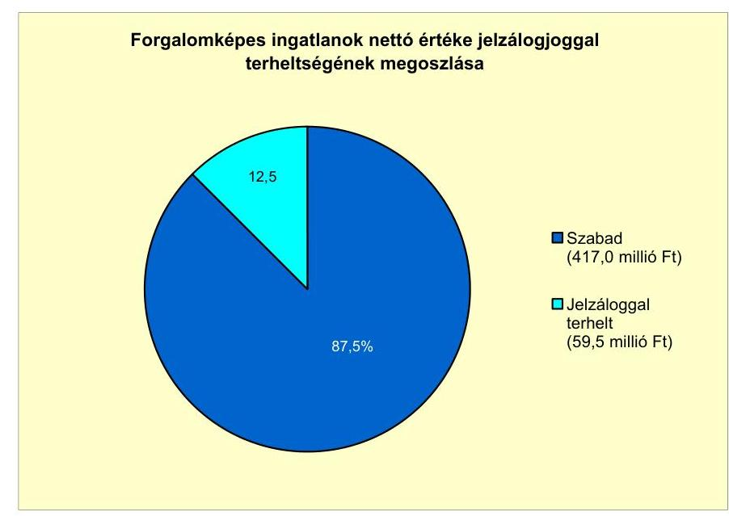

Az Önkormányzatnak a vizsgált időszakban
 kettő forgalomképes az Ötv. 88. § (1) bekezdésének b) pontja alapján nem törzsvagyonba tartozó ingatlana volt jelzáloggal, elidegenítési és terhelési tilalommal terhelt. A jelzáloggal, elidegenítési és terhelési tilalommal érintett ingatlanoknak a 2010. december 31-én nyilvántartott könyvszerinti nettó értéke 59,5 millió Ft volt, a forgalomképes ingatlanok nettó értékének (476,5 millió Ft-nak) 12,5%-a. A bank által nyújtott hitelek biztosítékaként bejegyzett jelzálog összeg keretjelleggel megállapított értéke összesen 200,0 millió Ft, míg a biztosítékként bejegyzett ingatlanok nettó értéke a 2010. december 31-i állapot alapján 59,5 millió Ft volt.

Az Önkormányzat saját gazdasági társaságai közül a kizárólagos tulajdonú PATAQUA Kft.-től a 2010. évben 242,5 millió Ft, a 2011. év I. félévében 65,8 millió Ft működési célú kölcsönt kapott, melyhez kapcsolódóan a 2011. év I. félévében 10,4 millió Ft kamatot fizetett. Ugyanakkor az Önkormányzat a Képviselő-testület hozzájárulásával a 2009. évben 70,0 millió Ft, a 2010. évben 242,5 millió Ft tőkeemelést hajtott végre - a kötvényforrásból - a gazdasági társaságnál. A 2011. évben egy meghiúsult 242,5 millió Ft-os beruházás miatt a Képviselő-testület hozzájárulásával ugyanilyen összegű tőkeleszállítást kellett eszközölniük. A tőkeleszállítás cégbírósági bejegyzéséig (2011. március 30-ig) az összeget az Önkormányzat kölcsönként vette igénybe a gazdasági társaságtól, ezt követően a kölcsön már nem terhelte.

Az Önkormányzat 50%-os és azt meghaladó tulajdonosi hányadú gazdasági társaságai kötelezettségeinek állománya 2010. december 31-én, és 2011. június 30-án, valamint várható alakulása a kötelezettségek lejáratáig csak szállítói tartozásból adódott.

A társaságok szállítói tartozása a 2010. évről (81,3 millió Ft) a 2011. év I. félév végére (40,8 millió Ft) 49,8%-os csökkenést mutat. A gazdasági társaságok lejárt szállítói tartozásának állománya a 2010. évben a szállítói tartozás

---

83,9%-a (68,2 millió Ft), míg a 2011. év I. félévében 95,3%-a (38,9 millió Ft) volt. A lejárt szállítói tartozás aránya a 2010. év és a 2011. év I. félévére 11,4 százalékponttal nőtt. Az önkormányzati kötelezettségek növekedése mellett a kizárólagos tulajdonú gazdasági társaságainak kötelezettségei is pénzügyi kockázatot jelentenek az Önkormányzatnak. A várható kötelezettségek állománya a 2011-2013. években 40,8 millió Ft. Az Önkormányzat a kizárólagos tulajdonú társaságának, a Közszolgáltató Kft.-nek a 2010. évben 43,0 millió Ft, a 2011. év I. félévében 8,4 millió Ft veszteség fedezetére adott tulajdonosi pótbefizetést teljesített.

Az Önkormányzat a gazdasági társaságokról szóló 2006. évi IV. törvény 54. § (2) bekezdése alapján korlátlan felelősséggel tartozik azon gazdasági társaságának felszámolása esetében, amelyben az Önkormányzat az 52. § (2) bekezdése szerint a szavazatok legalább 75%-ával rendelkezik, így minősített befolyásszerzőnek minősül, továbbá a csődeljárásról és a felszámolási eljárásról szóló 1991. évi XLIX. törvény 63. § (2) bekezdése alapján a kizárólagos önkormányzati tulajdonú gazdasági társaságának minden olyan kötelezettségéért, amelynek kielégítését a felszámolási eljárás során az adós társaság vagyona nem fedez, ha a hitelezőinek a felszámolási eljárás során benyújtott keresete alapján a bíróság - az adós társaság felé érvényesített tartósan hátrányos üzletpolitikájára figyelemmel - megállapítja az Önkormányzat korlátlan és teljes felelősségét.

Az Önkormányzat 2007-2010 között a tárgyi eszközök után összesen 824,3 millió Ft értékcsökkenést számolt el, és az elszámolt értékcsökkenés 74,4%-ának megfelelő összeget (613,4 millió Ft-ot) fordította felújításra, 180,1%-ának megfelelő (1484,5 millió Ft-ot) beruházásra. A Képviselő-testületnek előterjesztett éves zárszámadási rendeleteikben nem mutatták be az Önkormányzat eszközei után tárgyévben elszámolt értékcsökkenés összegét, az eszközpótlásra fordított tényleges kiadásokat, az eszközök elhasználódási fokának alakulását. A felújításokra, az eszközök pótlására - az Önkormányzat kimutatásai szerint - a pénzügyi lehetőségek függvényében került sor. Az elhasználódott eszközök pótlására tartalékot nem képeztek, külön alapot $^{21}$ nem hoztak létre. Az Önkormányzat összes eszközének (immateriális javak, ingatlanok, gépek, járművek, átadott eszközök) használhatósági foka 2007-2010 között a bruttó érték 555,5 millió Ft emelkedése ellenére 3,4 százalékponttal (88,8%-ról 85,4%-ra) csökkent az amortizáció növekedése miatt. Ezzel az eszközök avultsága növekedett. Az Önkormányzat eszközállományának bruttó értéke 4,9%-kal növekedett, nettó értéke 1,0%-kal csökkent 2007-ről 2010-re.

# 4. A PÉNZÜGYI EGYENSÚLY MEGTEREMTÉSE ÉRDEKÉBEN HOZOTT INTÉZKEDÉSEK EREDMÉNYE 

Az Önkormányzatnál a 2008. és a 2010. években működési forráshiány, míg a 2007-2010. években felhalmozási forráshiány alakult ki, melynek kezelése érdekében bevételnövelő, illetve kiadáscsökkentő intézkedéseket hoztak. A kiadáscsökkentő intézkedések a 2007-2011. év I. féléve között, összesen 495,8

[^0]
[^0]:    $^{21}$ Tartalék képzésére és külön alap létrehozására az Önkormányzatot nem kötelezi semmilyen előírás.

---

millió Ft megtakarítást eredményeztek, az Önkormányzat számításai alapján.

A létszámcsökkentési döntések következtében a 2007-2011. év I. féléve között 473,5 millió Ft megtakarítása keletkezett az Önkormányzatnak, ami 95,5%-a a végrehajtott kiadáscsökkentő intézkedésekből adódó megtakarításnak. A legnagyobb mértékű 160 fős (20,9%-os) létszámcsökkentést a 2007. évben hajtották végre.

A legjelentősebb intézkedés a 2007. évben az Erdélyi János Általános Iskola és Kollégium átadása Borsod-Abaúj-Zemplén Megyei Önkormányzatnak volt, mely feladatátadás 56 fős létszámcsökkenést eredményezett. A Képviselő-testület döntése alapján a 2007. év szeptemberében további 31 álláshely szűnt meg, mely az oktatási, családsegítési, egészségügyi, és közművelődési feladatok ellátását végzőket érintette. A gazdasági társaságoknak átadott feladatok miatt megszűnt 36 fő álláshelye kiadás megtakarítást nem eredményezett, mert a bérjellegű kiadások helyett a szolgáltatások költsége nőtt meg.

Önkormányzati döntés alapján a 2008. évben öt álláshely szűnt meg, ebből egy érintette a közoktatási feladatokat, négy az átszervezések miatti feladatátadásból származott. A 2009. évben végrehajtott 16 fős létszámcsökkentés teljes egészében a fürdő átadásához kapcsolódott. A 2010. évben létszámleépítésről nem döntöttek.

A többletjuttatások csökkentése a 2011. év I. félévét érintette. A költségvetési rendeletben a köztisztviselők cafetériájának csökkentését rendelték $^{22}$ el, az ebből adódó megtakarítás 21,6 millió Ft. A távközlési-, a vásárolt közszolgáltatási szolgáltatásokhoz kapcsolódó intézkedések - vezetékes és mobiltelefonok korlátozása, és a takarítási feladatok kiszervezése - hatására 2010-ben 0,2 millió Ft, a 2011. év I. félévében 0,5 millió Ft megtakarítást értek el.

A következő diagram az Önkormányzat kiadáscsökkentő intézkedéseinek területeit és azok megoszlását mutatja:
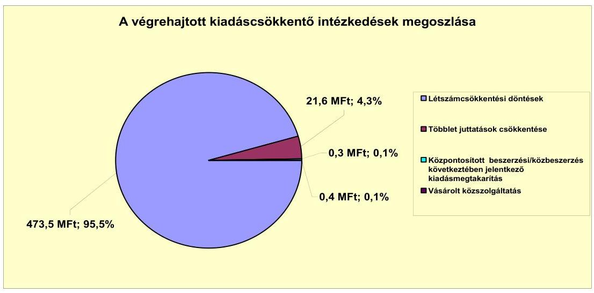

[^0]
[^0]:    $^{22}$ A köztisztviselők cafetéria keretét az illetményalap ötszörös mértékében állapították meg.

---

Az Önkormányzatnál 2007. január 1-jén 767 volt az engedélyezett álláshelyek száma és 747 fő volt az induló létszám, 2010 végére a záró álláshelyek száma 588 főre, a záró létszám 573 főre csökkent. Létszámnövekedés a vizsgált időszakban kettő volt, egy a szociális és gyermekjóléti szolgálatnál és egy a Polgármesteri hivatalnál $^{23}$.

Az Önkormányzat a 2007-2010. éveket érintő létszámcsökkentő döntéseinek hatását szemlélteti a következő ábra:

| Megnevezés (adatok tő-ben) | Közoktatás | Szociális és gyermekvédelem | Egészségügy | Polgármesteri hivatal | Egyéb | Összesen |
| :--: | :--: | :--: | :--: | :--: | :--: | :--: |
| 2007. január 1-jén jóváhagyott álláshelyek száma | 431,0 | 53,0 | 77,0 | 75,0 | 131,0 | 767,0 |
| Megszüntetett álláshelyek száma | 123,0 | 9,0 | 2,0 | 2,0 | 24,0 | 160,0 |
| ebből: üres álláshelyek száma | 0,0 | 0,0 | 0,0 | 0,0 | 0,0 | 0,0 |
| szakmai álláshelyek száma | 87,0 | 0,0 | 0,0 | 2,0 | 4,0 | 93,0 |
| intézmény-üzemeltetéssel kapcsolatos álláshelyek száma | 36,0 | 9,0 | 2,0 | 0,0 | 20,0 | 67,0 |
| Álláshely növekedése | 0,0 | 0,0 | 0,0 | 0,0 | 0,0 | 0,0 |
| 2010. december 31-én záró álláshelyek száma | 303,0 | 47,0 | 75,0 | 73,0 | 90,0 | 588,0 |
| 2007. január 1-jén foglalkoztatott létszám | 413,0 | 53,0 | 75,0 | 75,0 | 131,0 | 747,0 |
| Létszámcsökkenés | 124,0 | 9,0 | 2,0 | 2,0 | 44,0 | 181,0 |
| Létszámnövekedés | 0,0 | 1,0 | 0,0 | 1,0 | 0,0 | 2,0 |
| 2010. december 31-én foglalkoztatott létszám | 289,0 | 45,0 | 73,0 | 74,0 | 87,0 | 568,0 |

Az Önkormányzat a 2007-2010. években összesen 181 álláshelyet szüntetett meg, és kettő álláshelyet teremtett. A megszüntetett 181 álláshelyből 110 fő (60,8%) szakmai, 71 fő (39,2%) intézményüzemeltetéssel kapcsolatos álláshely volt.

A vizsgálattal érintett években meghozott döntések hatására a közoktatásban 124 fő (68,5%), a szociális és gyermekvédelem területén kilenc fő (5,0%), egészségügyi ágazatban kettő fő (1,1%), a Polgármesteri hivatalban kettő fő (1,1%), egyéb területen 44 fő (24,3%) álláshely megszüntetésére került sor. Ezzel egy időben a szociális és gyermekjóléti szolgáltatásnál, és a Polgármesteri hivatalban ellátott feladatok bővülésével összefüggésben az álláshelyek száma kettő fővel emelkedett. Így összességében az időszak álláshelyeinek száma 179 fővel csökkent.

A vizsgált időszakban az Önkormányzat számításai alapján a helyi adókkal, az eszközök hasznosításával, és az intézményi térítési díjakkal kapcsolatos döntései összesen 48,5 millió Ft összegű bevétel növekedést eredményeztek. A 2008. évtől megemelték az idegenforgalmi adót $^{24}$, mely 2011. június 30-ig összesen 7,1 millió Ft bevétel növekedést jelentett. A kedvezményekkel, mentességekkel csökkentették a szemétszállítás díját a 2011. évtől, mely intézkedés eredménye a 2011. év I. félévében 1,7 millió Ft bevétel növeke-

[^0]
[^0]:    $^{23}$ titkárnői álláshely
    $^{24}$ Az idegenforgalmi adó mértéke 2008. január 1-jétől 250 Ft/fő lett vendégéjszakánként, valamint a pihenést, üdülést szolgáló épület hasznos alapterülete után évente 600 Ft/m²-Ft fizetendő összeget állapítottak meg.

---

dés volt. A lakbéreket a 2009. évtől emelték meg, hatására összesen 33,1 millió Ft-tal nőtt a bevétel az időszakban, ami az összes bevétel 68,2%-a. Az Önkormányzat 2010-ben megemelte az intézményi térítési díjakat, ezáltal 2010. évben 4,3 millió Ft-tal, a 2011. év I. félévében 2,3 millió Ft-tal nőtt a bevétel. A térítési díj mértékének megemelése a vizsgált időszakban 6,6 millió Ft forrás többletet jelentett. A 2007. január 1-jétől 2011. június 30-ig érvényesített bevételnövelő intézkedések részletezését a következő ábra mutatja:
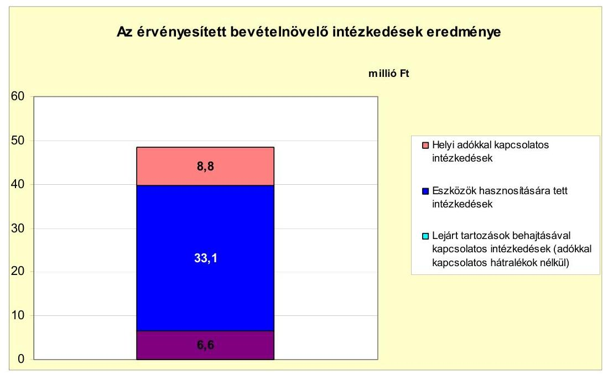

Az Önkormányzatnál a vizsgált időszakban az átengedett szja és az állami támogatások együttes összege a 2007. évről (2167,8 millió Ft-ról) a 2010. évre (2155,6 millió Ft-ra) 0,65%-kal csökkent. A kiadáscsökkentő és bevételnövelő intézkedések meghozatalára a költségvetési és pénzügyi egyensúly javítása érdekében volt szükség, mely összességében 544,3 millió Ft többletforrást eredményezett. A jövőbeni kötelezettségek teljesítése érdekében további intézkedések válnak szükségessé.

# 5. AZ ÁSZ ÁLTAL A KORÁBBi ÉVEKBEN A PÉNZÜGYI EGYENSÚLY JAVÍTÁSÁRA TETT SZABÁLYSZERŰSÉGI ÉS CÉLSZERŰSÉGI JAVASLATOK HASZNOSULÁSA 

Az ÁSZ az Önkormányzat gazdálkodási rendszerét a 2009. évben ellenőrizte átfogó jelleggel. A gazdálkodási rendszer korábbi ellenőrzése során tett javaslatok közül a pénzügyi egyensúly javítására vonatkozott kettő szabályszerűségi és egy célszerűségi javaslat. A javaslatok megvalósítása érdekében a
 Képviselőtestület elfogadta a számvevői jelentésben foglaltak végrehajtására készített, felelősöket és határidőket is tartalmazó intézkedési tervet.

Az ellenőrzés során tett, a pénzügyi egyensúly javítására vonatkozó két szabályszerűségi javaslatból egyet nem, egyet részben hasznosítottak. Az Ámr. 201. § (1) bekezdésében foglaltaknak nem tettek eleget, mivel az Önkormányzat pénzállományának alakulásáról likviditási tervet nem készítettek.

---

Az Áht. ${ }_{1}$ 8/C § (4) bekezdésében foglaltak ellenére a 2011. évi költségvetési rendeletükben az előző évi pénzmaradványt eredeti előirányzatként csak a kisebbségi önkormányzatokra vonatkozóan szerepeltették, az önkormányzati szintűt a módosított előirányzat tartalmazta.

A közbenső egyeztetés során tett észrevétel szerint likviditási tervet azért nem készítettek, mert az Önkormányzat könyvvizsgálójának véleménye alapján a likviditási tervet az előirányzat-felhasználási ütemterv tartalmazza.

Az észrevételt nem fogadjuk el, mert a jogalkotó egyértelmű szabályozása szerint az Otv. 201. § (1) bekezdése előírásai alapján „A helyi önkormányzat pénzállományának alakulásáról a jegyző - szükség szerint aktualizálva - likviditási tervet készít", míg az Áht. ${ }_{1} 36 . \S$ (1) bekezdés k) pontja alapján a helyi önkormányzat költségvetési rendelettervezetének egyik szerkezeti eleme „az év várható bevételi és kiadási előirányzatainak teljesüléséről készített előirányzat-felhasználási ütemterv". Az Önkormányzatnak a költségvetési évekre készített előirányzatfelhasználási ütemterve a finanszírozási műveletek bevételeit kiadásait nem részletezte, a likviditás biztosítása érdekében nem mutatta be például, a folyószámlahitel, a munkabér-megelőlegezési hitel és a kötvényforrás felhasználásának alakulását.

A munka színvonalának javítása érdekében tett egy célszerűségi javaslat nem teljesült.

A jegyző nem tájékoztatta - évente elvégzett számítások alapján - a Képviselőtestületet az Önkormányzat eladósodásának növekedésére figyelemmel arról, hogy a hosszú lejáratú adósságot keletkeztető kötelezettségvállalásokból adódó tőke és kamatfizetési kötelezettséget milyen feltételek biztosítása mellett tudják teljesíteni.

Budapest, 2012. április 16.

Melléklet:  9 db
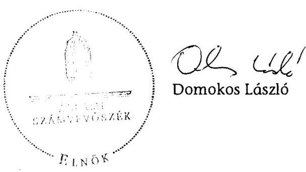

---

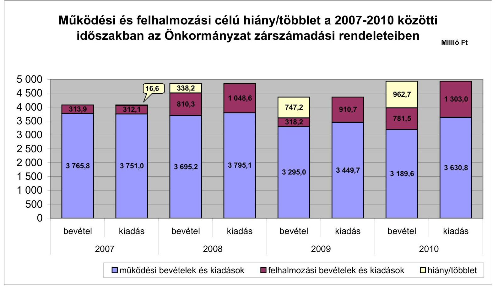

# Működési és felhalmozási célú hiány/többlet a 2007-2010 közötti időszakban az Önkormányzat zárszámadási rendeleteiben

|  Működési és felhalmozási célú hiány/többlet | 2007 | 2008 | 2009 | 2010  |
| --- | --- | --- | --- | --- |
|  313.9 | 312.1 | 318.2 | 344.7 | 3189.6  |
|  315.8 | 312.1 | 318.2 | 344.7 | 3189.6  |
|  3765.8 | 3751.0 | 3795.1 | 3295.0 | 3449.7  |
|  3765.8 | 3751.0 | 3795.1 | 3295.0 | 3449.7  |
|  3765.8 | 3751.0 | 3795.1 | 3295.0 | 3449.7  |

Millió Ft

---

Az Önkormányzat bevételei és kiadásai, valamint adósságszolgálata 2007-2010 között

|   |  |  |  | millió Ft  |
| --- | --- | --- | --- | --- |
|  1. FOLYÓ KÖLTSÉGVETÉS* | 2007. | 2008. | 2009. | 2010.  |
|  1.1.1. Saját működési bevételek | 1107,4 | 935,0 | 828,5 | 799,0  |
|  1.1.2. Költségvetési támogatás | 1377,2 | 1850,0 | 1715,8 | 1614,7  |
|  1.1.3. Átengedett bevételek | 861,1 | 524,0 | 604,9 | 621,5  |
|  1.1.4. Állambáztartáson belülről kapott támogatások | 475,3 | 495,0 | 376,9 | 441,2  |
|  1.1.5. EU-tól és külföldről kapott bevételek | 0,0 | 0,0 | 0,0 | 0,0  |
|  1.1.6. Állambáztartáson kívülről kapott bevételek | 12,8 | 11,0 | 10,5 | 10,3  |
|  1.1.7. Előző évi pénzmaradvány átvétel | 0,0 | 0,0 | 6,9 | 5,0  |
|  1.1. Folyó bevételek $=1.1 .1 .+1.1 .2 .+1.1 .3 .+1.1 .4 .+1.1 .5 .+1.1 .6 .+1.1 .7$. | 3833,7 | 3815,0 | 3543,4 | 3491,6  |
|  1.2.1. Működési kiadások kamatkiadások nélkül | 3387,9 | 3359,2 | 3066,9 | 3396,9  |
|  1.2.2. Állambáztartáson belülre átadott pénzeszközök | 7,8 | 72,4 | 0,6 | 5,4  |
|  1.2.3.1. vállalkozásoknak | 39,0 | 62,7 | 57,1 | 80,8  |
|  1.2.3.2. EU-nak, illetve külföldre | 0,0 | 0,0 | 0,0 | 0,0  |
|  1.2.3.3. magánszemélyeknek | 276,9 | 278,7 | 290,8 | 273,8  |
|  1.2.3.4. nonprofit szervezeteknek | 23,5 | 20,2 | 22,5 | 25,5  |
|  1.2.3. Transferkiadások ( $+1.2 .3 .1+1.2 .3 .2+1.2 .3 .3+1.2 .3 .4$ ) | 339,5 | 361,6 | 370,4 | 380,2  |
|  1.2.4 Kamatkiadások | 21,8 | 86,0 | 44,6 | 37,3  |
|  1.2.5. Előző évi pénzmaradvány átadás | 0,0 | 0,0 | 6,9 | 5,0  |
|  1.2. Folyó kiadások $=1.2 .1 .+1.2 .2 .+1.2 .3 .+1.2 .4 .+1.2 .5$. | 3757,0 | 3879,1 | 3489,3 | 3824,7  |
|  1.3. Folyó költségvetés egyenlege MÜKÖDÉSI JÖVEDELEM (1.1. - 1.2.) | 76,7 | -64,1 | 54,1 | -333,1  |
|  2. FELHALMOZÁSI KÖLTSÉGVETÉS** | 0,0 | 0,0 | 0,0 | 0,0  |
|  2.1.1. Saját tőkebevételek | 44,0 | 67,8 | 47,4 | 109,2  |
|  2.1.2. Állambáztartáson belülről kapott támogatások | 59,0 | 594,6 | 26,1 | 351,3  |
|  2.1.3. EU-tól és külföldről kapott támogatások | 0,0 | 0,0 | 0,0 | 0,0  |
|  2.1.4. Állambáztartáson kívülről kapott támogatások | 54,0 | 11,6 | 3,1 | 18,9  |
|  2.1. Felhalmozási bevételek ( $=2.1 .1 .+2.1 .2+2.1 .3+2.1 .4$.) | 156,9 | 673,9 | 76,6 | 479,4  |
|  2.2.1. Saját beruházási kiadás áfával | 178,8 | 768,5 | 652,5 | 110,0  |
|  2.2.2. Saját felújítási kiadás áfával | 68,1 | 180,1 | 97,9 | 470,6  |
|  2.2.3. Állambáztartáson belülre átadott pénzeszköz | 3,5 | 2,2 | 0,0 | 2,0  |
|  2.2.4. EU-nak és külföldnek adott pénzeszközök | 0,0 | 0,0 | 0,0 | 0,0  |
|  2.2.5. Állambáztartáson kívülre adott pénzeszközök | 14,7 | 56,5 | 37,7 | 277,8  |
|  2.2.6. Befektetési célú részesedések vásárlása | 3,5 | 12,9 | 83,0 | 248,8  |
|  2.2. Felhalmozási kiadások ( $=2.2 .1 .+2.2 .2 .+2.2 .3 .+2.2 .4 .+2.2 .5 .+2.2 .6$.) | 268,6 | 1020,1 | 871,1 | 1109,2  |
|  2.3. Felhalmozási költségvetés egyenlege (2.1. - 2.2.) | -111,7 | -346,2 | -794,5 | -629,8  |
|  3. Finanszírozási műveletek nélküli (GFS) pozíció(1.3.+2.3.) | -35,0 | -410,3 | -740,4 | -962,9  |
|  4. Finanszírozási műveletek | 0,0 | 0,0 | 0,0 | 0,0  |
|  4.1. Hitelfelvétel | 67,0 | 77,8 | 2,7 | 267,5  |
|  4.2. Hiteltörlesztés | 37,5 | 58,0 | 3,0 | 98,9  |
|  4.3. Forgatási és befektetési célú értékpapírok kibocsátása | 0,0 | 2056,2 | 0,0 | 0,0  |
|  4.4. Forgatási és befektetési célú értékpapírok beváltása | 0,0 | 0,0 | 0,0 | 0,0  |
|  4.5. Forgatási és befektetési célú értékpapírok értékesítése | 0,0 | 0,0 | 0,0 | 0,0  |
|  4.6. Forgatási és befektetési célú értékpapírok vásárlása | 0,0 | 0,0 | 0,0 | 0,0  |
|  4.7. Egyéb finanszírozási bevételek (függő, átfutó, kiegyenlítő) | -7,1 | -7,5 | -4,4 | -88,9  |
|  4.8. Egyéb finanszírozási kiadások (függő, átfutó, kiegyenlítő) | -21,0 | 2,0 | 25,2 | -51,2  |
|  4.9.Finanszírozási műveletek egyenlege (4.1. - 4.2.+4.3.-4.4+4.5.-4.6.+4.7.-4.8.) | 43,4 | 2066,5 | -29,9 | 130,9  |
|  5. Tárgyévi pénzügyi pozíció változás (1.3.+ 2.3.+4.9.) | 8,4 | 1656,2 | -770,2 | -831,9  |
|  6. Nettó működési jövedelem =működési jövedelem (1.3.) - tőketörlesztés (4.2+4.4) | 39,2 | -122,1 | 51,1 | -432,0  |
|  TÁJÉKOZTATÓ ADATOK |  |  |  |   |
|  Összes kötelezettség | 622,0 | 2647,7 | 2713,7 | 3541,0  |
|  ebből rövid lejáratú | 583,1 | 316,8 | 309,7 | 615,5  |
|  Összes szállítói kötelezettség | 308,3 | 48,3 | 45,3 | 102,6  |
|  ebből lejárt (tanúsítványból) | 111,4 | 29,6 | 10,8 | 76,5  |
|  Pénz és tőkepiac kötelezettség (adósság) | 194,1 | 2561,1 | 2636,9 | 3153,3  |
|  ebből rövid lejáratú | 155,1 | 230,2 | 232,9 | 227,8  |
|  PPP szerződéses állomány jelenértéken (tanúsítványból) | 0,0 | 0,0 | 0,0 | 0,0  |
|  ebből lejárt szolgáltatási díj münti kötelezettség | 0,0 | 0,0 | 0,0 | 0,0  |
|  Folyószámlahitel napi átlagos állománya (tanúsítványból) | 125,2 | 118,7 | 115,3 | 82,9  |
|  Likvidhitel napi átlagos állománya (tanúsítványból) | 0,0 | 0,0 | 0,0 | 0,0  |
|  Munkabérhitel napi átlagos állománya (tanúsítványból) | 80,4 | 57,5 | 49,6 | 68,2  |
|  Kezesség és garanciavállalások (tanúsítványból) | 0,0 | 0,0 | 0,0 | 0,0  |
|  Jogerős bírósági ítéletekből adódó kötelezettségek (tanúsítványból) | 0,0 | 0,0 | 0,0 | 0,0  |
|  Finanszírozásba bevonható eszközök: | 84,5 | 1740,6 | 970,5 | 138,5  |
|  Tartós hitelviszonyt megtestesítő értékpapírok év végi állománya | 0,0 | 0,0 | 0,0 | 0,0  |
|  Hosszú lejáratú fenti hitelezés év végi állománya | 0,0 | 0,0 | 0,0 | 0,0  |
|  Értékpapírok év végi állománya | 0,0 | 0,0 | 0,0 | 0,0  |
|  Pénzeszközök (idegen pénzeszközök nélkül) év végi állománya | 84,5 | 1740,6 | 970,5 | 138,5  |

- Az Önkormányzattal a felhalmozási célú, támogatást megelőlegező rövid lejáratú feltéteket, valamint a munkabér-megelőlegezési feltéteket átfutó tételként kezeltek, nem mutatják ki pénzintézeti kötelezettségként. A költségvetési támogatásból a felhalmozási célú összeget az Önkormányzat adatszolgáltatása szerinti mértékben vettük figyelembe, a 2.1.2 soron.

---

Sárospatak Város Önkormányzata a V-3085-021/2012. számú jelentéshez

Az Önkormányzat 2007-2010 években megvalósított, 2010. december 31-ig befejezett fejlesztései és azok forrásösszetétele

|  Fejlesztési feladat (beruházás, felújítás) | Beruházás, felújítás | Teljes bekerülési költség | 2006. dec. 31-ig fejlesztő kiadás | 2007-2010 évek között fejlesztő kiadás | 2007-2010 évek között fejlesztő kiadás | 2007-2010 évek között teljesített kiadás | 2008. dec. 31-ig teljesített kiadás | 2008. dec. 31-ig teljesített kiadás | 2008. dec. 31-ig teljesített kiadás | 2009. dec. 31-ig teljesített kiadás | 2009. dec. 31-ig teljesített kiadás

 | 2010. december 31-ig megvalósított beruházás forrásösszetétele | Kötelek  |
| --- | --- | --- | --- | --- | --- | --- | --- | --- | --- | --- | --- | --- | --- | --- |
|  Megnevezése |  |  |  |  |  |  |  |  |  |  |  |  |  | Kötvény  |
|  Megnevezése |  |  |  |  |  |  |  |  |  |  |  |  |  |   |
|  1 | 2 | 3 | 4 | 5 | 6 | 7 | 8 | 9 | 10 | 11 | 12 | 13 | 14 | 15  |
|  1 Felújítások |  |  |  |  |  |  |  |  |  |  |  |  |  |   |
|  2 | Huta labor-vizesbőkés felújítása | 5/2007. (0.15.) | 2007 | 2007 | - | 18,4 | 22,3 | 3,9 | 0 | 22,4 | 0 | 0 | 0 | 0  |
|  3 | Panel program 2007 | 5/2007.(0.15.) | 2007 | - | 28,4 | 0,0 | -28,4 | 0 | 0,0 | 28,4 | 0 | -28,4 | 0 | 0  |
|  4 | Szent Erzsébet u.12. felújítása | 6026-2/96/2007.(01.9.) | 2007 | 2009 | 24,9 | 32,5 | 7,6 | 0 | 32,6 | 0 | 5,7 | 5,7 | A | 0  |
|  5 | 10 m Fl atalti 2007 | 12 db |  |  | 33,1 | 26,6 | -6,3 | 0 | 26,6 | 19,8 | 13,3 | -6,3 | A | 0  |
|  6 | Panel program 2008 | 2/2008.(0.15.) | 2008 | - | 26,5 | 0,0 | -36,5 | 0 | 0,0 | 35,5 | 0 | -36,5 | 0 | 0  |
|  7 | Árjád Vezér Gimnázium vízesköök | 2/2008.(0.15.) | 2008 | 2009 | 20,0 | 32,6 | 12,8 | 0 | 32,6 | 0 | 0 | 0 | 0 | 0  |
|  8 | Mály út felújítás | 27/2008.(30.28.) | 2008 | 2009 | 13,3 | 16,3 | 5,0 | 0 | 16,3 | 0 | 0 | 0 | 0 | 0  |
|  9 | Levitta út felújítás | 27/2008.(30.28.) | 2008 | 2009 | 19,4 | 15,8 | -3,8 | 0 | 15,8 | 0 | 0 | 0 | 0 | 0  |
|  10 | Gyarmatimadárce felújítás | 17/2008.(31.30.) | 2008 | 2009 | 40,7 | 40,7 | 0,0 | 0 | 40,7 | 0 | 0 | 0 | 0 | 0  |
|  11 | 10 m Fl atalti 2008 | 19 db |  |  | 23,4 | 23,7 | -9,7 | 0 | 23,8 | 1,7 | 0 | -1,7 | A | 0  |
|  12 | Vay M. Szakképző tek. tornaterem | 4/2009.(0.13.) | 2009 | - | 10,0 | 0,0 | -10,0 | 0 | 0,0 | 0 | 0 | 0 | 0 | 0  |
|  13 | Dózsa F. u. járóközlekedés | 7850-3/199/2009.(21.28.) | 2009 | 2010 | 12,1 | 13,0 | 0,9 | 0 | 13,0 | 0 | 0 | 0 | 0 | 0  |
|  14 | Termálfürdő felújítás | 18/2009.(30.30.) | 2009 | 2009 | 214,0 | 8,6 | -205,4 | 0 | 8,6 | 0 | 0 | 0 | 0 | 0  |
|  15 | 10 m Fl atalti 2009 | 12 db |  |  | 29,6 | 28,0 | -1,6 | 0 | 28,0 | 0 | 0 | 0 | 0 | 0  |
|  16 | Ródán átszaberek felújítása | 5/2010.(0.15.) | 2009 | 2010 | 12,7 | 13,7 | 0,0 | 0 | 12,8 | 0 | 0 | 0 | 0 | 0  |
|  17 | Görbe u. ivóvízhálózat felúj. | 5/2010.(0.15.) | 2009 | 2010 | 45,2 | 44,3 | -0,9 | 0 | 44,3 | 0 | 0 | 0 | 0 | 0  |
|  18 | Móricz Kollégium felújítása | 19/2010.(30.27.) | 2010 | 2010 | 10,0 | 10,0 | 0,0 | 0 | 10,0 | 0 | 0 | 0 | 0 | 0  |
|  19 | 10 m Fl atalti 2010 | 14 db |  |  | 40,5 | 42,6 | -7,8 | 0 | 42,6 | 0 | 0 | 0 | 0 | 0  |
|  20 | Felújítások összesen: |  |  |  | 647,2 | 366,7 | -280,5 | 0,0 | 367,0 | 86,4 | 19,0 | -87,4 | 13,4 | 17,3  |
|  21 | Felfesítések |  |  |  |  |  |  |  |  |  |  |  |  |   |
|  22 | Várbánya tekintetközpont | 5/2007.(0.15.) | 2007 | 2008 | 559,0 | 551,0 | 1,2 | 0,0 | 551,0 | 12,5 | 12,7 | 1,2 | 0,0 | 0,0  |
|  23 | Víz kút szopja | 5/2007.(0.15.) | 2007 | 2008 | 108,6 | 104,2 | -4,4 | 0,0 | 104,2 | 17,1 | 9,7 | -4,4 | A | 0,0  |
|  24 | Árjád út 5. sz. alatti ingatlan vás. | 10165-2/184/2004.(VIII.30.) | 2004 | 2008 | 62,0 | 62,0 | 0,0 | 24,4 | 37,2 | 62,0 | 49,6 | -12,4 | A | 0,0  |
|  25 | Horgásztóhoz közönségi építés | 5/2007.(0.15.) | 2007 | 2007 | 22,4 | 21,8 | -0,6 | 0,0 | 21,8 | 22,4 | 21,8 | -0,6 | A | 0,0  |
|  26 | Comenius-Erdélyi u.-i saroktelek vás. | 6026-2/108/2007.(01.9.) | 2007 | 2007 | 21,6 | 21,8 | 0,0 | 0,0 | 21,8 | 0,0 | 0,0 | 0,0 | 21,6 | 21,6  |
|  27 | Műfüves labdarúgópálya építés | 6026-2/110/2007.(01.9) | 2007 | 2007 | 13,4 | 13,4 | 0,0 | 0,0 | 13,4 | 1,4 | 1,4 | 0,0 | 4,1 | 12,0  |
|  28 | RFV Kft. 51 %-ának megvásárlása | 5/2007.(0.15.) | 2007 | 2008 | 12,5 | 12,4 | -0,1 | 0,0 | 12,4 | 12,5 | 12,4 | -0,1 | A | 0,0  |
|  29 | Bormán Szerv. gépjármű vásárlás | 5/2007.(0.15.) | 2008 | 2007 | 29,1 | 26,9 | -2,2 | 16,9 | 15,0 | 29,1 | 26,9 | -2,2 | A | 0,0  |
|  30 | 10 m Fl atalti 2007 | 29 db |  |  | 87,5 | 86,4 | -21,1 | 0,0 | 86,4 | 87,5 | 86,4 | -21,1 | A | 0,0  |
|  31 | Termálfürdő fejlesztés | 2/2008.(0.15.) | 2008 | 2009 | 1,506,0 | 537,9 | -962,1 | 0,0 | 537,9 | 0,0 | 0,0 | 0,0 | 0,0 | 0,0  |
|  32 | Válcsfejlesztés | 2/2008.(0.15.) | 2008 | 2010 | 416,1 | 0,0 | -416,1 | 0,0 | 0,0 | 0,0 | 0,0 | 0,0 | 0,0 | 0,0  |
|  33 | Páterdomb ivóvízelosztás | 7950/144/2008.(01.9.) | 2008 | 2009 | 46,7 | 46,9 | 0,2 | 0,0 | 46,9 | 0,0 | 0,1 | 0,1 | A | 0,0  |
|  34 | 10 m Fl atalti 2008 | 36 db |  |  | 146,4 | 113,3 | -33,1 | 0,0 | 113,2 | 99,7 | 42,3 | -57,4 | A | 0,0  |
|  35 | Negg. L. c. számnyilvántartás | 4/2009.(0.13.) | 2009 | 2009 | 25,0 | 25,0 | 0,0 | 0,0 | 0,0 | 0,0 | 0,0 | 0,0 | 0,0 | 0,0  |
|  36 | Pályázathoz jövedék | 4/2009.(0.13.) | 2009 | 2009 | 70,0 | 0,0 | -70,0 | 0,0 | 0,0 | 70,0 | 0,0 | -70,0 | 0,0 | 0,0  |
|  37 | 10 m Fl atalti 2009 | 22 db |  |  | 33,6 | 175,0 | 99,6 | 0,0 | 175,1 | 32,7 | 76,6 | 44,1 | A | 0,0  |
|  38 | 10 m Fl atalti 2010 | 26 db |  |  | 56,2 | 57,3 | 1,1 | 0,0 | 57,7 | 56,2 | 22,5 | -33,7 | A | 0,0  |
|  39 | Pályázatok összesen: |  |  |  | 3,161,3 | 1,718,6 | -1,432,7 | 41,0 | 1,577,0 | 497,1 | 560,6 | -156,0 |  |   |
|  40 | Mindösszesen: |  |  |  | 3,788,5 | 2 085,3 | -1 713,2 | 41,3 | 2 044,0 | 583,5 | 259,6 | -223,9 |  |   |
|  41 | Pár ha a forrás már rendelkezésre áll. |  |  |  |  |  |  |  |  |  |  |  |  |   |

Br ha a forrás közbeszerzési eljárása folyamatban van,

C+ ha a forrás közbeszerzési eljárása még nem indult el, a forrás nem áll rendelkezésre.

---

### Az Önkormányzat 2010. december 31-én folyamatban lévő fejlesztési feladataira 2010. december 31-ig teljesített kifizetések és azok
 forrásösszetétel

|  Fő
száma
száma |  |  |  |  |  |  |  |  |  |  |  |  |  |  |  |  |  |  |  |  |  |  |  |  |  |  |  |  |  |  |  |  |  |  |  |   |
| --- | --- | --- | --- | --- | --- | --- | --- | --- | --- | --- | --- | --- | --- | --- | --- | --- | --- | --- | --- | --- | --- | --- | --- | --- | --- | --- | --- | --- | --- | --- | --- | --- | --- | --- | --- | --- |
|   |  |  |  |  |  |  |  |  |  |  |  |  |  |  |  |  |  |  |  |  |  |  |  |  |  |  |  |  |  |  |  |  |  |  |  |   |
|   |  |  |  |  |  |  |  |  |  |  |  |  |  |  |  |  |  |  |  |  |  |  |  |  |  |  |  |  |  |  |  |  |  |  |  |   |
|   |  |  |  |  |  |  |  |  |  |  |  |  |  |  |  |  |  |  |  |  |  |  |  |  |  |  |  |  |  |  |  |  |  |  |  |   |
|   |  |  |  |  |  |  |  |  |  |  |  |  |  |  |  |  |  |  |  |  |  |  |  |  |  |  |  |  |  |  |  |  |  |  |  |   |
|  1 | 2 | 3 | 4 | 5 | 6 | 7 | 8 | 9 | 10 | 11 | 12 | 13 | 14 | 15 | 16 | 17 | 18 | 19 | 20 | 21 | 22 | 23 | 24 | 25 | 26 | 27 | 28 | 29 | 30 | 31 |  |  |  |  |   |
|  1 | Felújítások |  |  |  |  |  |  |  |  |  |  |  |  |  |  |  |  |  |  |  |  |  |  |  |  |  |  |  |  |  |  |  |  |  |  |   |
|   |  |  |  |  |  |  |  |  |  |  |  |  |  |  |  |  |  |  |  |  |  |  |  |  |  |  |  |  |  |  |  |  |  |  |  |   |
|  2 |  |  |  |  |  |  |  |  |  |  |  |  |  |  |  |  |  |  |  |  |  |  |  |  |  |  |  |  |  |  |  |  |  |  |  |   |
|  3 |  |  |  |  |  |  |  |  |  |  |  |  |  |  |  |  |  |  |  |  |  |  |  |  |  |  |  |  |  |  |  |  |  |  |  |   |
|  4 |  |  |  |  |  |  |  |  |  |  |  |  |  |  |  |  |  |  |  |  |  |  |  |  |  |  |  |  |  |  |  |  |  |  |  |   |
|  5 |  |  |  |  |  |  |  |  |  |  |  |  |  |  |  |  |  |  |  |  |  |  |  |  |  |  |  |  |  |  |  |  |  |  |  |   |
|  6 |  |  |  |  |  |  |  |  |  |  |  |  |  |  |  |  |  |  |  |  |  |  |  |  |  |  |  |  |  |  |  |  |  |  |  |   |
|  7 |  |  |  |  |  |  |  |  |  |  |  |  |  |  |  |  |  |  |  |  |  |  |  |  |  |  |  |  |  |  |  |  |  |  |  |   |
|  8 |  |  |  |  |  |  |  |  |  |  |  |  |  |  |  |  |  |  |  |  |  |  |  |  |  |  |  |  |  |  |  |  |  |  |  |   |
|  9 |  |  |  |  |  |  |  |  |  |  |  |  |  |  |  |  |  |  |  |  |  |  |  |  |  |  |  |  |  |  |  |  |  |  |  |   |
|  10 |  |  |  |  |  |  |  |  |  |  |  |  |  |  |  |  |  |  |  |  |  |  |  |  |  |  |  |  |  |  |  |  |  |  |  |   |
|  11 |  |  |  |  |  |  |  |  |  |  |  |  |  |  |  |  |  |  |  |  |  |  |  |  |  |  |  |  |  |  |  |  |  |  |  |   |
|  12 |  |  |  |  |  |  |  |  |  |  |  |  |  |  |  |  |  |  |  |  |  |  |  |  |  |  |  |  |  |  |  |  |  |  |  |   |
|  13 |  |  |  |  |  |  |  |  |  |  |  |  |  |  |  |  |  |  |  |  |  |  |  |  |  |  |  |  |  |  |  |  |  |  |  |   |
|  14 |  |  |

  |  |  |  |  |  |  |  |  |  |  |  |  |  |  |  |  |  |  |  |  |  |  |  |  |  |  |  |  |  |  |  |  |   |
|  15 |  |  |  |  |  |  |  |  |  |  |  |  |  |  |  |  |  |  |  |  |  |  |  |  |  |  |  |  |  |  |  |  |  |  |   |
|  16 |  |  |  |  |  |  |  |  |  |  |  |  |  |  |  |  |  |  |  |  |  |  |  |  |  |  |  |  |  |  |  |  |  |  |  |   |
|  17 |  |  |  |  |  |  |  |  |  |  |  |  |  |  |  |  |  |  |  |  |  |  |  |  |  |  |  |  |  |  |  |  |  |  |  |   |
|  18 |  |  |  |  |  |  |  |  |  |  |  |  |  |  |  |  |  |  |  |  |  |  |  |  |  |  |  |  |  |  |  |  |  |  |  |   |
|  19 |  |  |  |  |  |  |  |  |  |  |  |  |  |  |  |  |  |  |  |  |  |  |  |  |  |  |  |  |  |  |  |  |  |  |  |   |
|  20 |  |  |  |  |  |  |  |  |  |  |  |  |  |  |  |  |  |  |  |  |  |  |  |  |  |  |  |  |  |  |  |  |  |  |  |   |
|  21 |  |  |  |  |  |  |  |  |  |  |  |  |  |  |  |  |  |  |  |  |  |  |  |  |  |  |  |  |  |  |  |  |  |  |  |   |
|  22 |  |  |  |  |  |  |  |  |  |  |  |  |  |  |  |  |  |  |  |  |  |  |  |  |  |  |  |  |  |  |  |  |  |  |  |   |
|  23 |  |  |  |  |  |  |  |  |  |  |  |  |  |  |  |  |  |  |  |  |  |  |  |  |  |  |  |  |  |  |  |  |  |  |  |   |
|  24 |  |  |  |  |  |  |  |  |  |  |  |  |  |  |  |  |  |  |  |  |  |  |  |  |  |  |  |  |  |  |  |  |  |  |  |   |
|  25 |  |  |  |  |  |  |  |  |  |  |  |  |  |  |  |  |  |  |  |  |  |  |  |  |  |  |  |  |  |  |  |  |  |  |  |   |
|  26 |  |  |  |  |  |  |  |  |  |  |  |  |  |  |  |  |  |  |  |  |  |  |  |  |  |  |  |  |  |  |  |  |  |  |  |   |
|  27 |  |  |  |  |  |  |  |  |  |  |  |  |  |  |  |  |  |  |  |  |  |  |  |  |  |  |  |  |  |  |  |  |  |  |  |   |
|  28 |  |  |  |  |  |  |  |  |  |  |  |  |  |  |  |  |  |  |  |  |  |  |  |  |  |  |  |  |  |  |  |  |  |  |  |   |
|  29 |  |  |  |  |  |  |  |  |  |  |  |  |  |  |  |  |  |  |  |  |  |  |  |  |  |  |  |  |  |  |  |  |  |  |  |   |
|  30 |  |  |  |  |  |  |  |  |  |  |  |  |  |  |  |  |  |  |  |  |  |  |  |  |  |  |  |  |  |  |  |  |  |  |  |   |
|  31 |  |  |  |  |  |  |  |  |  |  |  |  |  |  |  |  |  |  |  |  |  |  |  |  |  |  |  |  |  |  |  |  |  |  |  |   |
|  32 |  |  |  |  |  |  |  |  |  |  |  |  |  |  |  |  |  |  |  |  |  |  |  |  |  |  |  |  |  |  |  |  |  |  |  |   |
|  33 |  |  |  |  |  |  |  |  |  |  |  |  |  |  |  |  |  |  |  |  |  |  |  |  |  |  |  |  |  |  |  |  |  |  |  |   |
|  34 |  |  |  |  |  |  |  |  |  |  |  |  |  |  |  |  |  |  |  |  |  |  |  |  |  |  |  |  |  |  |  |  |  |  |  |   |
|  35 |  |  |  |  |

  |  |  |  |  |  |  |  |  |  |  |  |  |  |  |  |  |  |  |  |  |  |  |  |  |  |  |  |  |  |  |   |
|  36 |  |  |  |  |  |  |  |  |  |  |  |  |  |  |  |  |  |  |  |  |  |  |  |  |  |  |  |  |  |  |  |  |  |  |  |   |
|  37 |  |  |  |  |  |  |  |  |  |  |  |  |  |  |  |  |  |  |  |  |  |  |  |  |  |  |  |  |  |  |  |  |  |  |  |   |
|  38 |  |  |  |  |  |  |  |  |  |  |  |  |  |  |  |  |  |  |  |  |  |  |  |  |  |  |  |  |  |  |  |  |  |  |  |   |
|  39 |  |  |  |  |  |  |  |  |  |  |  |  |  |  |  |  |  |  |  |  |  |  |  |  |  |  |  |  |  |  |  |  |  |  |  |   |
|  40 |  |  |  |  |  |  |  |  |  |  |  |  |  |  |  |  |  |  |  |  |  |  |  |  |  |  |  |  |  |  |  |  |  |  |  |   |
|  41 |  |  |  |  |  |  |  |  |  |  |  |  |  |  |  |  |  |  |  |  |  |  |  |  |  |  |  |  |  |  |  |  |  |  |  |   |
|  42 |  |  |  |  |  |  |  |  |  |  |  |  |  |  |  |  |  |  |  |  |  |  |  |  |  |  |  |  |  |  |  |  |  |  |  |   |
|  43 |  |  |  |  |  |  |  |  |  |  |  |  |  |  |  |  |  |  |  |  |  |  |  |  |  |  |  |  |  |  |  |  |  |  |  |   |
|  44 |  |  |  |  |  |  |  |  |  |  |  |  |  |  |  |  |  |  |  |  |  |  |  |  |  |  |  |  |  |  |  |  |  |  |  |   |
|  45 |  |  |  |  |  |  |  |  |  |  |  |  |  |  |  |  |  |  |  |  |  |  |  |  |  |  |  |  |  |  |  |  |  |  |  |   |
|  46 |  |  |  |  |  |  |  |  |  |  |  |  |  |  |  |  |  |  |  |  |  |  |  |  |  |  |  |  |  |  |  |  |  |  |  |   |
|  47 |  |  |  |  |  |  |  |  |  |  |  |  |  |  |  |  |  |  |  |  |  |  |  |  |  |  |  |  |  |  |  |  |  |  |  |   |
|  48 |  |  |  |  |  |  |  |  |  |  |  |  |  |  |  |  |  |  |  |  |  |  |  |  |  |  |  |  |  |  |  |  |  |  |  |   |
|  49 |  |  |  |  |  |  |  |  |  |  |  |  |  |  |  |  |  |  |  |  |  |  |  |  |  |  |  |  |  |  |  |  |  |  |  |   |
|  50 |  |  |  |  |  |  |  |  |  |  |  |  |  |  |  |  |  |  |  |  |  |  |  |  |  |  |  |  |  |  |  |  |  |  |  |   |
|  51 |  |  |  |  |  |  |  |  |  |  |  |  |  |  |  |  |  |  |  |  |  |  |  |  |  |  |  |  |  |  |  |  |  |  |  |   |
|  52 |  |  |  |  |  |  |  |  |  |  |  |  |  |  |  |  |  |  |  |  |  |  |  |  |  |  |  |  |  |  |  |  |  |  |  |   |
|  53 |  |  |  |  |  |  |  |  |  |  |  |  |  |  |  |  |  |  |  |  |  |  |  |  |  |  |  |  |  |  |  |  |  |  |  |   |
|  54 |  |  |  |  |  |  |  |  |  |  |  |  |  |  |  |  |  |  |  |  |  |  |  |  |  |  |  |  |  |  |  |  |  |  |  |   |
|  55 |  |  |  |  |  |  |  |  |  |  |  |  |  |  |  |  |  |  |  |  |  |  |  |  |  |  |  |  |  |  |  |  |  |  |  |   |
|  56 |  |  |  |  |  |  |

  |  |  |  |  |  |  |  |  |  |  |  |  |  |  |  |  |  |  |  |  |  |  |  |  |  |  |  |  |   |
|  57 |  |  |  |  |  |  |  |  |  |  |  |  |  |  |  |  |  |  |  |  |  |  |  |  |  |  |  |  |  |  |  |  |  |  |  |   |
|  58 |  |  |  |  |  |  |  |  |  |  |  |  |  |  |  |  |  |  |  |  |  |  |  |  |  |  |  |  |  |  |  |  |  |  |  |   |
|  59 |  |  |  |  |  |  |  |  |  |  |  |  |  |  |  |  |  |  |  |  |  |  |  |  |  |  |  |  |  |  |  |  |  |  |  |   |
|  60 |  |  |  |  |  |  |  |  |  |  |  |  |  |  |  |  |  |  |  |  |  |  |  |  |  |  |  |  |  |  |  |  |  |  |  |   |
|  61 |  |  |  |  |  |  |  |  |  |  |  |  |  |  |  |  |  |  |  |  |  |  |  |  |  |  |  |  |  |  |  |  |  |  |  |   |
|  62 |  |  |  |  |  |  |  |  |  |  |  |  |  |  |  |  |  |  |  |  |  |  |  |  |  |  |  |  |  |  |  |  |  |  |  |   |
|  63 |  |  |  |  |  |  |  |  |  |  |  |  |  |  |  |  |  |  |  |  |  |  |  |  |  |  |  |  |  |  |  |  |  |  |  |   |
|  64 |  |  |  |  |  |  |  |  |  |  |  |  |  |  |  |  |  |  |  |  |  |  |  |  |  |  |  |  |  |  |  |  |  |  |  |   |
|  65 |  |  |  |  |  |  |  |  |  |  |  |  |  |  |  |  |  |  |  |  |  |  |  |  |  |  |  |  |  |  |  |  |  |  |  |   |
|  66 |  |  |  |  |  |  |  |  |  |  |  |  |  |  |  |  |  |  |  |  |  |  |  |  |  |  |  |  |  |  |  |  |  |  |  |   |
|  67 |  |  |  |  |  |  |  |  |  |  |  |  |  |  |  |  |  |  |  |  |  |  |  |  |  |  |  |  |  |  |  |  |  |  |  |   |
|  68 |  |  |  |  |  |  |  |  |  |  |  |  |  |  |  |  |  |  |  |  |  |  |  |  |  |  |  |  |  |  |  |  |  |  |  |   |
|  69 |  |  |  |  |  |  |  |  |  |  |  |  |  |  |  |  |  |  |  |  |  |  |  |  |  |  |  |  |  |  |  |  |  |  |  |   |
|  70 |  |  |  |  |  |  |  |  |  |  |  |  |  |  |  |  |  |  |  |  |  |  |  |  |  |  |  |  |  |  |  |  |  |  |  |   |
|  71 |  |  |  |  |  |  |  |  |  |  |  |  |  |  |  |  |  |  |  |  |  |  |  |  |  |  |  |  |  |  |  |  |  |  |  |   |
|  72 |  |  |  |  |  |  |  |  |  |  |  |  |  |  |  |  |  |  |  |  |  |  |  |  |  |  |  |  |  |  |  |  |  |  |  |   |
|  73 |  |  |  |  |  |  |  |  |  |  |  |  |  |  |  |  |  |  |  |  |  |  |  |  |  |  |  |  |  |  |  |  |  |  |  |  |   |
|  74 |  |  |  |  |  |  |  |  |  |  |  |  |  |  |  |  |  |  |  |  |  |  |  |  |  |  |  |  |  |  |  |  |  |  |  |  |   |
|  75 |  |  |  |  |  |  |  |  |  |  |  |  |  |  |  |  |  |  |  |  |  |  |  |  |  |  |  |  |  |  |  |  |  |  |  |  |   |
|  76 |  |  |  |  |  |  |  |  |  |  |  |  |  |  |  |  |  |  |  |  |  |  |  |  |  |  |  |  |  |  |  |  |  |  |  |  |   |
|  77 |  |  |  |  |

  |  |  |  |  |  |  |  |  |  |  |  |  |  |  |  |  |  |  |  |  |  |  |  |  |  |  |  |  |  |  |  |   |
|  78 |  |  |  |  |  |  |  |  |  |  |  |  |  |  |  |  |  |  |  |  |  |  |  |  |  |  |  |  |  |  |  |  |  |  |  |  |   |
|  79 |  |  |  |  |  |  |  |  |  |  |  |  |  |  |  |  |  |  |  |  |  |  |  |  |  |  |  |  |  |  |  |  |  |  |  |  |  |   |
|  80 |  |  |  |  |  |  |  |  |  |  |  |  |  |  |  |  |  |  |  |  |  |  |  |  |  |  |  |  |  |  |  |  |  |  |  |  |  |   |
|  81 |  |  |  |  |  |  |  |  |  |  |  |  |  |  |  |  |  |  |  |  |  |  |  |  |  |  |  |  |  |  |  |  |  |  |  |  |  |   |
|  82 |  |  |  |  |  |  |  |  |  |  |  |  |  |  |  |  |  |  |  |  |  |  |  |  |  |  |  |  |  |  |  |  |  |  |  |  |  |   |
|  83 |  |  |  |  |  |  |  |  |  |  |  |  |  |  |  |  |  |  |  |  |  |  |  |  |  |  |  |  |  |  |  |  |  |  |  |  |  |   |
|  84 |  |  |  |  |  |  |  |  |  |  |  |  |  |  |  |  |  |  |  |  |  |  |  |  |  |  |  |  |  |  |  |  |  |  |  |  |  |   |
|  85 |  |  |  |  |  |  |  |  |  |  |  |  |  |  |  |  |  |  |  |  |  |  |  |  |  |  |  |  |  |  |  |  |  |  |  |  |  |   |
|  86 |  |  |  |  |  |  |  |  |  |  |  |  |  |  |  |  |  |  |  |  |  |  |  |  |  |  |  |  |  |  |  |  |  |  |  |  |  |   |
|  87 |  |  |  |  |  |  |  |  |  |  |  |  |  |  |  |  |  |  |  |  |  |  |  |  |  |  |  |  |  |  |  |  |  |  |  |  |  |   |
|  88 |  |  |  |  |  |  |  |  |  |  |  |  |  |  |  |  |  |  |  |  |  |  |  |  |  |  |  |  |  |  |  |  |  |  |  |  |  |   |
|  89 |  |  |  |  |  |  |  |  |  |  |  |  |  |  |  |  |  |  |  |  |  |  |  |  |  |  |  |  |  |  |  |  |  |  |  |  |  |   |
|  90 |  |  |  |  |  |  |  |  |  |  |  |  |  |  |  |  |  |  |  |  |  |  |  |  |  |  |  |  |  |  |  |  |  |  |  |  |  |   |
|  91 |  |  |  |  |  |  |  |  |  |  |  |  |  |  |  |  |  |  |  |  |  |  |  |  |  |  |  |  |  |  |  |  |  |  |  |  |  |   |
|  92 |  |  |  |  |  |  |  |  |  |  |  |  |  |  |  |  |  |  |  |  |  |  |  |  |  |  |  |  |  |  |  |  |  |  |  |  |  |   |
|  93 |  |  |  |  |  |  |  |  |  |  |  |  |  |  |  |  |  |  |  |  |  |  |  |  |  |  |  |  |  |  |  |  |  |  |  |  |  |   |
|  94 |  |  |  |  |  |  |  |  |  |  |  |  |  |  |  |  |  |  |  |  |  |  |  |  |  |  |  |  |  |  |  |  |  |  |  |  |  |   |
|  95 |  |  |  |  |  |  |  |  |  |  |  |  |  |

  |  |  |  |  |  |  |  |  |  |  |  |  |  |  |  |  |  |  |  |  |  |  |  |  |  |  |  |  |  |  |  |  |  |  |   |
|  96 |  |  |  |  |  |  |  |  |  |  |  |  |  |  |  |  |  |  |  |  |  |  |  |  |  |  |  |  |  |  |  |  |  |  |  |  |  |  |  |  |  |  |  |  |  |  |  |  |  |   |
|  97 |  |  |  |  |  |  |  |  |  |  |  |  |  |  |  |  |  |  |  |  |  |  |  |  |  |  |  |  |  |  |  |  |  |  |  |  |  |  |  |  |  |  |  |  |  |  |  |  |  |   |
|  98 |  |  |  |  |  |  |  |  |  |  |  |  |  |  |  |  |  |  |  |  |  |  |  |  |  |  |  |  |  |  |  |  |  |  |  |  |  |  |  |  |  |  |  |  |  |  |  |  |  |   |
|  99 |  |  |  |  |  |  |  |  |  |  |  |  |  |  |  |  |  |  |  |  |  |  |  |  |  |  |  |  |  |  |  |  |  |  |  |  |  |  |  |  |  |  |  |  |  |  |  |  |  |   |
|  100 |  |  |  |  |  |  |  |  |  |  |  |  |  |  |  |  |  |  |  |  |  |  |  |  |  |  |  |  |  |  |  |  |  |  |  |  |  |  |  |  |  |  |  |  |  |  |  |  |  |  |  |  |  |  |  |   |
|  101 |  |  |  |  |  |  |  |  |  |  |  |  |  |  |  |  |  |  |  |  |  |  |  |  |  |  |  |  |  |  |  |  |  |  |  |  |  |  |  |  |  |  |  |  |  |  |  |  |  |  |  |  |  |  |  |  |  |  |   |
|  102 |  |  |  |  |  |  |  |  |  |  |  |  |  |  |  |  |  |  |  |  |  |  |  |  |  |  |  |  |  |  |  |  |  |  |  |  |  |  |  |  |  |  |  |  |  |  |  |  |  |  |  |  |  |  |  |  |  |  |   |
|  103 |  |  |  |  |  |  |  |  |  |  |  |  |  |  |  |  |  |  |  |  |  |  |  |  |  |  |  |  |  |  |  |  |  |  |  |  |  |  |  |  |  |  |  |  |  |  |  |  |  |  |  |  |  |  |  |  |  |  |  |  |  |   |
|  104 |  |  |  |  |  |  |  |  |  |  |  |  |  |  |  |  |  |  |  |  |  |  |  |  |  |  |  |  |  |  |  |  |  |  |  |  |  |  |  |  |  |  |  |  |  |  |  |  |  |  |  |  |  |  |  |  |  |  |  |  |  |  |  |  |  |   |
|  105 |  |  |  |  |  |  |  |  |  |  |  |  |  |  |  |  |  |  |  |  |  |  |  |  |  |  |  |  |  |  |  |  |  |  |  |  |  |  |  |  |  |  |  |  |  |  |  |  |  |  |  |  |  |  |  |  |  |  |  |  |  |  |  |  |  |  |   |
|  106 |  |  |  |  |  |  |  |  |  |  |  |  |  |  |  |  |  |  |  |  |  |  |  |  |  |  |  |  |  |  |  |  |  |  |  |  |  |  |  |  |  |  |  |  |  |  |  |  |  |  |  |  |  |  |  |  |  |  |  |  |  |  |  |  |  |  |  |  |  |  |   |
|  107 |  |  |  |  |  |  |  |  |  |  |  |  |  |  |  |  |  |  |  |  |  |  |  |  |  |  |  |  |  |  |  |  |  |  |  |  |  |  |  |  |  |  |  |  |  |  |  |  |  |  |  |  |  |  |  |  |  |  |  |  |  |  |  |  |  |  |  |  |  |  |  |  |   |
|  108 |  |  |  |  |  |  |  |  |  |  |  |  |  |  |  |  |

  |  |  |  |  |  |  |  |  |  |  |  |  |  |  |  |  |  |  |  |  |  |  |  |  |  |  |  |  |  |  |  |  |  |  |  |  |  |  |  |  |  |  |  |  |  |  |  |  |  |  |  |  |  |  |   |
|  109 |  |  |  |  |  |  |  |  |  |  |  |  |  |  |  |  |  |  |  |  |  |  |  |  |  |  |  |  |  |  |  |  |  |  |  |  |  |  |  |  |  |  |  |  |  |  |  |  |  |  |  |  |  |  |  |  |  |  |  |  |  |  |  |  |  |  |  |  |  |  |  |  |  |  |  |  |   |
|  110 |  |  |  |  |  |  |  |  |  |  |  |  |  |  |  |  |  |  |  |  |  |  |  |  |  |  |  |  |  |  |  |  |  |  |  |  |  |  |  |  |  |  |  |  |  |  |  |  |  |  |  |  |  |  |  |  |  |  |  |  |  |  |  |  |  |  |  |  |  |  |  |  |  |  |  |  |  |  |  |  |  |  |  |  |  |  |  |  |  |  |  |  |  |  |  |  |  |  |  |  |  |

---

## **Az Önkormányzat 2010. december 31-én folyamatban lévő fejlesztési feladataira 2010. december 31-én fennálló kötelezettségek és azok forrásösszetétele**

|   |  |  |  |  |  |  |  |  |  |  |  |  |  |  |  |  |  |  |  |  |  |  |  |  |  |  |  |  |  |  |  |  |  |  |  |  |  |  |  |  |  |  |  |  |  |  |  |  |  |  |  |  |  |  |  |  |  |  |  |  |  |  |  |  |  |  |  |  |  |  |  |  |  |  |  |  |  |  |  |  |  |  |  |  |  |  |  |  |  |  |  |  |  |  |  |  |  |  |  |  | 

---

### **Az Önkormányzat által beadott, elbírálás alatti pályázati forrásból megvalósítani tervezett fejlesztéseihez kapcsolódó kötelezettségvállalásai és azok forrásösszetétele**

|  |   |   |   |   |   |   |   |   |   |   |   |   |   |   |   |   |   |   |   |   |   |   |   |
| --- | --- | --- | --- | --- | --- | --- | --- | --- | --- | --- | --- | --- | --- | --- | --- | --- | --- | --- | --- | --- | --- | --- | --- |
|   | Fejlesztési feladat (beruházás, felújítás) |  | Beruházás, felújítás |  |  |  |  |  |  |  |  |  |  |  |  |  |  |  |  |  |  |  |   |
|  Sorszám | Megnevezése |  |  |  |  |  |  |  |  |  |  |  |  |  |  |  |  |  |  |  |  |  |   |
|   |  | Képviselő- |  |  |  |  |  |  |  |  |  |  |  |  |  |  |  |  |  |  |  |  |   |
|   |  | testületi |  |  |  |  |  |  |  |  |  |  |  |  |  |  |  |  |  |  |  |  |   |
|   |  | határozat | kezdete |  |  |  |  |  |  |  |  |  |  |  |  |  |  |  |  |  |  |  |   |
|   |  | száma |  |  |  |  |  |  |  |  |  |  |  |  |  |  |  |  |  |  |  |  |   |
|  1 | 2 | 3 | 4 | 5 | 6 | 7 | 8 | 9 | 10 | 11 | 12 | 13 | 14 | 15 | 16 | 17 | 18 | 19 | 20 |  |  |   |
|  1. | Felújítások |  |  |  |  |  |  |  |  |  |  |  |  |  |  |  |  |  |  |  |  |  |   |
|  2. | Településrekonstrukció árvíz |  | 175/2011. |  |  |  |  |  |  |  |  |  |  |  |  |  |  |  |  |  |  |  |   |
|   | sújtotta településeken |  | (VI.24.) KT. |  |  |  |  |  |  |  |  |  |  |  |  |  |  |  |  |  |  |  |   |
|   |  | Hat. | 2011 | 2012 |  |  |  |  |  |  |  |  |  |  |  |  |  |  |  |  |  |  |   |
|  3. | 10 millió Ft alatti felújítások | 0 | 0 | 0 | 0 | 0 | 0 | 0 | 0 | 0 | 0 | 0 | 0 | 0 | 0 | 0 | 0 | 0 | 0 |  |  |   |
|  4. | Felújítások összesen | 0 | 0 | 0 | 119,6 | 119,6 | 0 | 119,6 | 6,0 | 0 | 0 | 0 | 0 | 0 | 113,6 | 0 | 0 | 0 |  |  |  |   |
|  5. | Fejlesztések | 0 | 0 | 0 | 0 | 0 | 0 | 0 | 0 | 0 | 0 | 0 | 0 | 0 | 0 | 0 | 0 | 0 | 0 |  |  |   |
|  6. | 10 millió Ft alatti fejlesztések | 0 | 0 | 0 | 0 | 0 | 0 | 0 | 0 | 0 | 0 | 0 | 0 | 0 | 0 | 0 | 0 | 0 | 0 |  |  |   |
|  7. | Fejlesztések összesen: | 0 | 0 | 0 |

 0 | 0 | 0 | 0 | 0 | 0 | 0 | 0 | 0 | 0 | 0 | 0 | 0 | 0 | 0 |  |  |   |
|  8. | Összesen | 0 | 0 | 0 | 119,6 | 119,6 | 0 | 119,6 | 6,0 | 0 | 0 | 0 | 0 | 0 | 113,6 | 0 | 0 | 0 |  |  |  |   |

*A= ha a forrás már rendelkezésre áll,

B= ha a forrás közbeszerzési eljárása folyamatban van,

C= ha a forrás közbeszerzési eljárása még nem indult el, a forrás nem áll rendelkezésre.

---

### **Az önkormányzati feladatok ellátásában résztvevő gazdasági társaságok**

|  Gazdasági társaság
megnevezése | 2010. december 31-én | a gazdasági társaságnak szerződéses kötelezettségre, feladatellátási szerződésre alapozottan
az önkormányzat költségvetéséből nyújtott  |
| --- | --- | --- |
|   | önkormányzat | önkormányzat
gazdasági
társaságának  |
|   |  | 100.0  |
|   |  | 100.0  |
|   |  | 100.0  |
|   |  | 100.0  |
|   |  | 100.0  |
|   |  | 100.0  |
|   |  | 100.0  |
|   |  | 100.0  |
|   |  | 100.0  |
|   |  | 100.0  |
|   |  | 100.0  |
|   |  | 100.0  |
|   |  | 100.0  |
|   |  | 100.0  |
|   |  | 100.0  |
|   |  | 100.0  |
|   |  | 100.0  |
|   |  | 100.0  |
|   |  | 100.0  |
|   |  | 100.0  |
|   |  | 100.0  |
|   |  | 100.0  |
|   |  | 100.0  |
|   |  | 100.0  |
|   |  | 100.0  |
|   |  | 100.0  |
|   |  | 100.0  |
|   |  | 100.0  |
|   |  | 100.0  |
|   |  | 100.0  |
|   |  | 100.0  |
|   |  | 100.0  |

---

# Sárospatak Város Polgármesterétől 

3950 Sárospatak, Kossuth u. 44.
Tel.: 47/513-240 Fax: 47/311-404
E-mail: sarospatak@sarospatak.hu
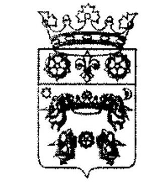

Ikt.szám: 2440.../2012.
Tárgy: Észrevételek az Állami Számvevőszék Sárospatak Város Önkormányzat pénzügyi helyzetének ellenőrzéséről készült jelentéshez

Ügyintéző: Poncsák Ferenc
Telefon:47/513-255
Állami Számvevőszék

## Budapest

Apáczai Csere János u. 10
1052
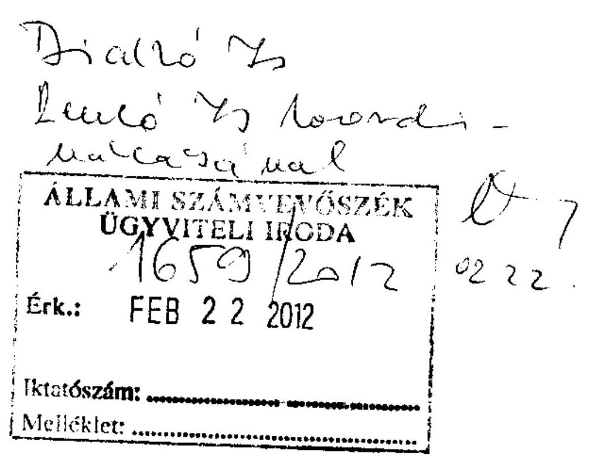

## Tisztelt Elnök Úr!

A 2012.02.01.-i keltezésű, V-3085-18/2012. iktatószámú levelükkel küldött jelentést áttanulmányozva, arra a következő észrevételeket tesszük:
14.oldal: „A folyó kiadások növekedését az előző évben jogosulatlanul igénybevett térségi közoktatási normatíva és a hozzá kapcsolódó szja kiegészítés visszafizetése,..."
Észrevétel: Az önkormányzat a tévesen igényelt normatívát az éves elszámolás keretében saját maga észlelte és fizette vissza, a Képviselő-testület elé erről részletes jelentés készült, intézményvezetői értekezleten a következtetések levonására sor került, a következő évi belső ellenőrzési munkatervben már beépítettük a normatíva igénylés és elszámolás belső ellenőrzését.
15. oldal: „A Képviselő-testületet nem tájékoztatták megfelelő információval az Önkormányzat fejlesztéseihez kapcsolódóan a vállalt kötelezettségek teljes körére vonatkozó finanszírozási igényekről,..."
Észrevétel: A fejlesztésekről szóló minden döntést a Képviselő-testület tárgyalt, róla határozott.
17. oldal: „A kötelezettségvállalásokra a Képviselő-testület döntése alapján került sor, azonban a kötvény kibocsátásakor az előterjesztésben nem számszerűsítették a törlesztési, a kamat- és - a deviza alapú kötelezettséget érintő - árfolyamkockázatot."
Észrevétel: A döntéskor nem, de azt követően minden költségvetési rendelet tartalmazza külön a kamat és külön a tőketörlesztés összegét Ft-ban, az adott költségvetési év elején ismert árfolyamon számolva a futamidő végéig.
19.oldal: „A polgármester az Önkormányzat lejárt szállítói tartozásai okainak feltárására, a lejárt tartozások mielőbbi rendezése érdekében, intézkedéseket nem tett, a Képviselőtestületet nem tájékoztatta."

---

Észrevétel: A 2010.évi zárszámadási rendelet előterjesztésének 9. számú melléklete tartalmazza a szállítói tartozás összegszerűségét korosítva. A 2011. évi féléves beszámoló szöveges előterjesztésében a következő tájékoztatást adja a polgármester: " A forráshiány további fedezetét jelenti a szállítói állomány / még ki nem fizetett számlák/, amelynek értéke június 30.-án 213.578 e Ft, ebből a polgármesteri hivatalt 133.222 e Ft, az intézményeket 80.356 e Ft terheli. A polgármesteri hivatal tartozása döntően a Patakhő Kft. irányában áll fenn. Ezek a számlák nem havonta érkeztek, összegszerűségük a távhőszámlák vonatkozásában hibás. A pontos összegéről és a kifizetés ütemezéséről szóló megállapodás megkötése augusztus második felében várható. A ki nem fizetett számlák nagy része működési számla, nem szerepelnek a pénzforgalmi táblázatokban".
Ezeket figyelembe véve a Képviselő-testület időről-időre értesült a szállítói tartozások nagyságáról, a létszámcsökkentésről szóló döntések és egyéb takarékossági intézkedések az önkormányzat fizetőképességének megőrzését voltak hivatottak szolgálni. A legnagyobb szállítóval, a Patakhő Kft.-vel az Önkormányzat fizetési megállapodást kötött 2011. augusztusában.
21.oldal: „Az ellenőrzés során tett a pénzügyi egyensúly javítására vonatkozó két szabályszerűségi javaslatból egyet nem, egyet részben hasznosítottak."
Észrevétel: Likviditási tervet nem készítettünk, ellenben a költségvetés minden éven tartalmazta az előirányzat-felhasználási tervet, ami a könyvvizsgálónk véleménye szerint tartalmában azonos az ÁSZ által kért likviditási tervvel. 2009-ben 1.650.000 e Ft, 2010-ben 930.000 e Ft, 2011-ben eredeti előirányzatként 27 e Ft szerepel pénzmaradvány igénybevétele bevételi címen. 2011-ben a Polgármesteri Hivatal pénzmaradványa negatív volt, ezért nem tudtuk csak a kisebbségi önkormányzatok pénzmaradványát megtervezni. Az intézmények esetében valóban nem terveztük meg eredeti előirányzatként - a pontos adat áprilisban vált ismertté - , de a költségvetési rendelet módosításakor ezt pótoltuk.
21.oldal: „Az önként vállalt feladatokra fordított kiadások meghaladták a kötelező feladatokra fordítottat.."
Észrevétel: Az önként vállalt feladatok közé tartozik az Árpád Vezér Gimnázium és Kollégium, a Vay Miklós Szakképző Iskola, a Farkas Ferenc Művészeti Iskola működtetése, ahol az állami normatív támogatást az önkormányzat nem vagy csak kis összeggel egészíti ki.
22.oldal: „Az Önkormányzat nem kezdeményezte az intézményei előirányzatfelhasználásának szoros kontrollját."
Észrevétel: Az Önkormányzat 2012. február 27.-től az intézmények, beleértve a Polgármesteri Hivatalt is, csak a polgármesterhez írásban eljuttatott előzetes engedély megadása után eszközölhetnek megrendeléseket, köthetnek szerződéseket és teljesíthetnek kifizetéseket.
55.oldal: „Üres álláshely zárolására nem került sor."

Észrevétel: Különösen a közoktatási intézményeknél fordul elő üres álláshely, ahol a tanóra szükségletet osztva a kötelező pedagógus óraszámmal alakul ki a létszámszükséglet. Sok esetben külső munkavállaló vagy túlóra kifizetés révén történik bizonyos tantárgyak oktatása. Az üres álláshelyekre tervezett bér szolgál az említett kifizetések fedezetéül, tehát ezek technikai üres álláshelyek, zárolásuk vagy megszüntetésük nem kivitelezhető.

Kérem a Tisztelt Elnök Urat, észrevételeinket tudomásul venni szíveskedjen.

Sárospatak, 2012. február 21.
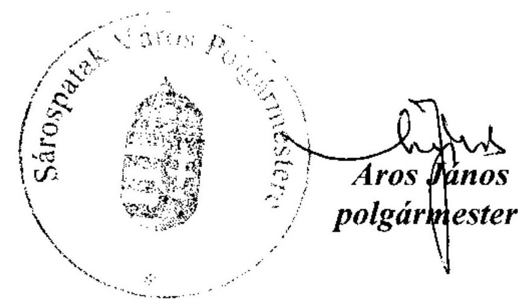

---

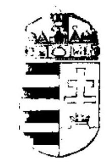

# Sárospatak Város Polgármesterétől 

3950 Sárospatak, Kossuth u. 44.
Tel.: 47/513-240 Fax: 47/311-404
E-mail: sarospatak@sarospatak.hu

Ikt.szám: $26 \mathrm{C} \times 2012$.

Tárgy: intézményi kiadások polgármesteri előzetes engedélyezése
Ügyintéző: Poncsák Ferenc
Telefon:47/513-255

## Valamennyi Intézményvezető részére

## Sárospatak   Székhelyén   1052

## Tisztelt Intézményvezető Asszony/Úr!

Az Állami Számvevőszék Sárospatak Város Önkormányzata pénzügyi helyzetének ellenőrzéséről készült jelentésében javasolja intézményei előirányzat-felhasználásának szoros kontrollját. Elfogadva ezen javaslatot, valamint az önkormányzat fizetőképességének megőrzése érdekében valamennyi intézmény számára - beleértve a Polgármesteri Hivatalt is - a következőket rendelem el:

- Az intézmények minden héten -február 27.-től kezdődően - 12 óráig a Polgármesteri Hivatal gazdálkodási irodavezetőjéhez juttassák el írásban az arra a hétre tervezett megrendelésük listáját/megnevezés, érték, egyéb megjegyzés/ engedélyezés céljából.
- Szerződések - beleértve a munkaviszonyt létesítő szerződéseket is - megkötésére ugyanez az engedélyezés szükséges.
- Rendkívüli esetekben - élet és vagyonvédelem, valamint az intézményt érő kár elkerülése érdekében - hétközbeli eseti kérelmek (sürgős esetben telefonon keresztül is) beadása indokolt esetben lehetséges.
- A finanszírozási igények csak az engedélyezett tételek - kivéve a 212.02.27. előtti megrendeléseket- kifizetésére irányulhatnak.
- Az előbbiek a saját bevételekből történő kifizetésekre is érvényesek.

Kérem a Tisztelt Intézményvezetőket, hogy az intézkedést tudomásul venni szíveskedjenek.

Sárospatak, 2012. február 21.
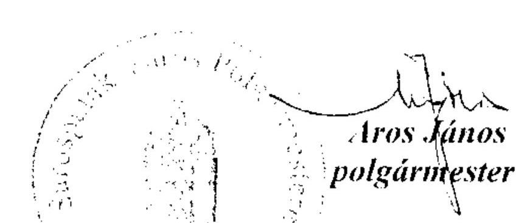
a másolat az eredetivével megegyezik

2012 FFRR 21
Sárospatak.

---

# Aros János úr   polgármester 

Sárospatak Város Önkormányzata
Sárospatak

## Tisztelt Polgármester Úr!

Köszönettel vettem a Sárospatak Város Önkormányzata pénzügyi helyzetének ellenőrzéséről készített jelentéstervezethez kapcsolódó észrevételekről és a megtett intézkedésről szóló tájékoztatását, egyben örömmel értesültem arról, hogy pénzügyi egyensúlyi helyzetük javítása érdekében intézkedéseket tett.

Az észrevételeivel kapcsolatban az alábbiakban tájékoztatom:
A folyó kiadások növekedésének okaként szerepelt a jelentéstervezetben az előző évben jogosulatlanul igénybevett térségi közoktatási normatíva és a hozzá kapcsolódó szja kiegészítés visszafizetése. A pénzügyi egyensúlyi helyzet vizsgálatakor a megállapítás, visszafizetés körülményeire és az azt követő intézkedésekre nem terjedt ki az ellenőrzés, ezért a jelentéstervezetben foglalt, a helyszíni ellenőrzés dokumentumai és adatai által kellően megalapozott megállapításokat fenntartjuk.

Az észrevételében foglaltaknak megfelelően a Képviselő-testület minden fejlesztésről szóló döntést tárgyalt és arról döntést hozott. A jelentéstervezetben foglaltak szerint a Képviselő-testületet a döntések előtt nem tájékoztatták maradéktalanul megfelelő információkkal a fejlesztésekhez kapcsolódóan a vállalt kötelezettségek teljes körére vonatkozó finanszírozási igényekről és azok pénzügyi helyzetre gyakorolt hatásairól.

---

A jelentéstervezetben tett megállapítás szerint a kötvény kibocsátásakor, a döntéskor nem számszerűsítették a törlesztési, a kamat- és - a deviza alapú kötelezettséget érintő árfolyamkockázatot, mely megállapítást Polgármester úr észrevételében megerősítette.

Az Ön észrevételében szereplő, az Önkormányzat lejárt szállítói tartozásainak okai kapcsán a jelentéstervezetben foglalt, a helyszíni ellenőrzés dokumentumai és adatai által kellően megalapozott megállapításokat fenntartjuk.

A likviditási terv készítésének elmulasztása vonatkozásában megítélésünk szerint az Ámr 201. § (1) bekezdése, az Áht. 136. § (1) bekezdés k) pontja, illetve - 2012. január 1-jétől - az Ávr. 122. § (3) bekezdése szerint kell eljárni. Az Önkormányzatnak a költségvetési évekre készített előirányzat-felhasználási ütemterve a finanszírozási műveletek bevételeit és kiadásait nem részletezte, a likviditás biztosítása érdekében nem mutatta be a folyószámlahitel, a munkabér-megelőlegezési hitel és a kötvényforrás felhasználásának alakulását.

A pénzmaradvány eredeti előirányzatként történő tervezésével kapcsolatos észrevétele alapján pontosítjuk a megállapítást.

Az önként vállalt feladatok között szereplő Árpád Vezér Gimnázium és Kollégium, a Vay Miklós Szakképző Iskola, a Farkas Ferenc Művészeti Iskola működtetésénél az állami normatív támogatás önkormányzati forrással való kiegészítésére tett észrevétel alapján pontosítjuk a megállapítást.

Az üres álláshely zárolásával kapcsolatos megállapításra tett észrevétele megalapozott, azt a jelentés véglegesítésekor figyelembe vesszük.

Végezetül megköszönöm Polgármester úrnak és munkatársainak az ellenőrzés során tanúsított hozzáállását, amellyel az Önkormányzatról szóló pénzügyi helyzetelemzés elkészítését segítették.

Budapest, 2012. április " 1 ".
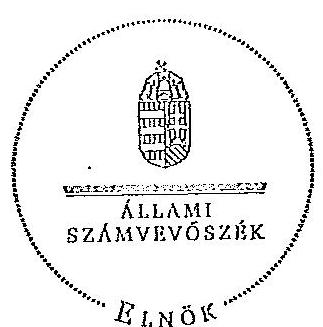

Tisztelettel:

Domokos László
