# ÁLLAMI <br> SZÁMVEVŐSZÉK 

## JELENTÉS

Sárvár Város Önkormányzata pénzügyi helyzetének ellenőrzéséről (43/4)

---

# Állami Számvevőszék 

Iktatószám: V-3126-014/2012.
Témaszám: 1015
Vizsgálat-azonosító szám: V0560157

## Az ellenőrzést felügyelte:

Dr. Varga Sándor
számvevő igazgató-helyettes
Az ellenőrzést vezette:
Renkó Zsuzsanna
számvevő tanácsos
Ellenőrzési csoportvezető:
Dér Lívia
számvevő tanácsos

Az ellenőrzést végezték:
Iszakné Dóczé Katalin
számvevő tanácsos

Pálfiné Pusztai Magdolna
számvevő tanácsos

---

# TARTALOMJEGYZÉK 

BEVEZETÉS ..... 9
I. ÖSSZEGZŐ MEGÁLLAPÍTÁSOK, KÖVETKEZTETÉSEK, JAVASLATOK ..... 13
II. RÉSZLETES MEGÁLLAPÍTÁSOK ..... 25

1. Az Önkormányzat kötelező és önként vállalt feladatai, a feladatellátás szervezeti keretei és annak változásai ..... 25
2. Az Önkormányzat pénzügyi egyensúlyi helyzetét befolyásoló tényezők ..... 30
2.1. A működési és a felhalmozási egyensúly változása ..... 32
2.2. Az Önkormányzat bevételeinek változása ..... 37
2.3. Az Önkormányzat működési és a felhalmozási célú kiadásainak változása ..... 41
3. Az Önkormányzat kötelezettségei ..... 46
3.1. Az Önkormányzat pénzintézeti kötelezettségeinek változása ..... 46
3.2. A szállítói kötelezettségek változása ..... 51
3.3. Egyéb kötelezettségek változása ..... 52
4. A pénzügyi egyensúly megteremtése érdekében hozott intézkedések ..... 56
5. Az ÁSZ által a korábbi években a pénzügyi egyensúly javítására tett szabályszerűségi és célszerűségi javaslatok hasznosulása ..... 59

---

# MELLÉKLETEK 

1. számú Működési és felhalmozási célú hiány/többlet a 2007-2010 közötti időszakban az Önkormányzat zárszámadási rendeleteiben (1 oldal)
2. számú Az Önkormányzat bevételei és kiadásai, valamint adósságszolgálata 2007-2010 között (1 oldal)
3/a. számú Az Önkormányzat 2007-2010. években megvalósított, 2010. december 31-ig befejezett fejlesztései és azok forrásösszetétele (1 oldal)
3/b. számú Az Önkormányzat 2010. december 31-én folyamatban lévő fejlesztési feladataira 2010. december 31-ig teljesített kifizetések és azok forrásösszetétele (1 oldal)
3/c. számú Az Önkormányzat 2010. december 31-én folyamatban lévő fejlesztési feladataira 2010. december 31-én fennálló kötelezettségek és azok forrásösszetétele (1 oldal)
3. számú Az önkormányzati feladatok ellátásában résztvevő gazdasági társaságok (1 oldal)

---

# RÖVIDÍTÉSEK JEGYZÉKE 

## Törvények

Áht $_{1}$
Áht $_{2}$
Art.
ÁSZ tv.
Gt.
Ötv.
Ptk.
Számv. tv.

## Rendeletek

Áhsz.

Ámr.

## Szórövidítések

áfa
ÁSZ
Beruházási Társulás
EDP hiány/egyenleg
EU
GDP
Gyógyfürdő Kft.
KEOP
jegyző
Ltp
Képviselő-testület
Kincstár
MÉDIA Kft.
NYDOP
Önkormányzat
polgármester
Polgármesteri hivatal
PPP konstrukció
szja
TÁVHŐ Kft.
TIOP
Víziközmű Társulat
az államháztartásról szóló 1992. évi XXXVIII. törvény
az államháztartásról szóló 2011. évi CXCV. törvény
az adózás rendjéről szóló 2003. évi XCII. törvény
az Állami Számvevőszékről szóló 2011. évi LXVI. törvény
a gazdasági társaságokról szóló 2006. évi IV. törvény
a helyi önkormányzatokról szóló 1990. évi LXV. törvény
Polgári Törvénykönyvről szóló 1959. évi IV. törvény
a számvitelről szóló 2000. évi C. törvény
az államháztartás szervezetei beszámolási és könyvvezetési kötelezettségének sajátosságairól szóló 249/2000. (XII. 24.) Korm. rendelet
az államháztartás működési rendjéről szóló 292/2009. (XII. 19.) Korm. rendelet
általános forgalmi adó
Állami Számvevőszék
Sárvár és Rábapaty környezetéért önkormányzati társulás
Uniós módszertan szerinti maastrichti kritériumoknak megfelelő számítás szerinti hiány/egyenleg
Európai Unió
Bruttó hazai termék
Sárvári Gyógyfürdő Korlátolt Felelősségű Társaság
Környezet és Energia Operatív Program
Sárvár Város Önkormányzatának jegyzője
Lakástakarékpénztár
Sárvár Város Képviselő-testülete
Magyar Államkincstár
Sárvári Média Műsorszolgáltató és Lapkiadó Közhasznú Nonprofit Kft.
Nyugat-dunántúli Operatív Program
Sárvár Város Önkormányzata
Sárvár Város Önkormányzatának polgármestere
Sárvár Város Önkormányzatának Polgármesteri Hivatala
Public Private Partnership (Partnerségi együttműködés közfeladatok ellátására a magánszektor bevonásával)
személyi jövedelemadó
SÁRVÁR TÁVHŐ Hőtermelő és Szolgáltató Kft.
Társadalomi Infrastruktúra Operatív Program
Sárvár Víziközmű Társulat

---

.

---

# ÉRTELMEZŐ SZÓTÁR 

bevételi kitettség

BUBOR

CLF módszer

EURIBOR
használhatósági fok
Kamatkockázat
kötelező közszolgáltatás

Közfeladat

Az önkormányzat pénzügyi helyzete olyan külső körülmények hatására is módosulhat, amelyekre az önkormányzatnak nincs hatása, emiatt bevételi kitettsége keletkezik. Pl. az önkormányzat bevételeinek alakulása függhet néhány nagy adózó gazdasági helyzetének, tevékenységének alakulásától, illetve székhelyének, telephelyének változásától.
Budapesti Bankközi Forint Hitelkamatláb. Irányadó, referencia jellegű kamatláb. Mértékét az MNB naponta állapítja meg a banki kamatok figyelembevételével. Közzététele naponta történik.
Az önkormányzatok költségvetése elemzésének eszköze. A módszer következetesen elkülöníti a folyó és a felhalmozási költségvetés bevételeit és kiadásait, azok költségvetési egyenlegeit. Bizonyos mértékig a vállalati gazdálkodás logikai elemeit érvényesíti az önkormányzatok pénzügyi, jövedelmi helyzetének vizsgálata során. Az értékelés a pénzügyi kapacitás fogalmát helyezi a középpontba.
A frankfurti bankközi piacon jegyzett, az Európai Központi Bank szabályainak megfelelően megállapított kínálati kamatláb. Az EURIBOR értékét a legfontosabb európai bankok hitelkínálatának kamatlábai alapján a Reuters ügynökség számolja ki és teszi közzé naponta. A magyar pénzintézetek is ezt használják viszonyítási alapnak EUR hitelek esetén.
Az eszközgazdálkodás vizsgálatának elemzése során használt mutató. Számításakor a tárgyi eszköz könyv szerinti (nettó) értékét viszonyítják a tárgyi eszköz bruttó (beszerzési/létesítési) értékéhez. A %-ban kifejezett mutató értéke annál kedvezőbb, minél közelebb áll a 100%-hoz. Csökkenése az eszköz állagának romlására, avulására utal, ami maga után vonja az üzemeltetési és fenntartási költségek növekedését is.
A változó kamatozású forint-, vagy a devizahitelek futamideje alatt a kamat emelkedése miatt fennálló kamatkockázat, melynek növekedése miatt nő a hitel törlesztő részlete.
A helyi önkormányzati feladatkörbe tartozó, a köztisztasággal és a településtisztasággal, valamint az élet- és vagyonbiztonsággal összefüggő egyes - közszolgáltatás útján megvalósuló - közfeladatok ellátása, amelynek kötelező igénybevételét külön jogszabály (törvény, helyi önkormányzati rendelet) határoz meg.
Állami, helyi, illetve kisebbségi önkormányzati feladat, amelynek ellátásáról az államnak, illetve az önkormányzatoknak kell gondoskodni. A hatályos szabályozás szerint közfeladatot törvény és önkormányzati rendelet álla-

---

LIBOR
önkormányzat többségi tulajdonában lévő gazdasági társaságok
pénzügyi kapacitás
pénzügyi kockázat
píthat meg. Az önkormányzatok által ellátandó feladatok keretszerű meghatározását az Ötv. tartalmazza.
Angol kifejezés, a London Interbank Offered Rate rövidítése. Jelentése: Londoni bankközi, referencia jellegű kínálati (hitel) kamatláb.
Az önkormányzat a gazdasági társaságban a szavazatok több mint ötven százalékával vagy a Ptk. 685/B. § (2)-(3) bekezdéseiben rögzített meghatározó befolyással rendelkezik. A befolyással rendelkező akkor rendelkezik egy jogi személyben meghatározó befolyással, ha annak tagja, illetve részvényese, és jogosult e jogi személy, vezető tisztségviselői vagy felügyelőbizottsága tagjai többségének megválasztására, illetve visszahívására, vagy a jogi személy más tagjaival, illetve részvényeseivel kötött megállapodás alapján egyedül rendelkezik a szavazatok több mint ötven százalékával (Ptk. 685/B. § (2) bek.). A meghatározó befolyás akkor is fennáll, ha a befolyással rendelkező számára e jogosultságok közvetett módon (köztes vállalkozásain keresztül, a Ptk. 685/B. § (3)-(4) bek. szerint) biztosítottak.
A helyi önkormányzat és az önkormányzat irányítása alá tartozó költségvetési szerv többségi tulajdonában, illetve többségi befolyása alatt álló gazdálkodó szervezet esetében hitelfelvétel, kölcsönfelvétel, garancia- vagy kezességvállalás, tartozásátvállalás, tartozás-elengedés, értékpapír kibocsátás, vásárlás, pénzügyi lízing, tartós bérleti szerződés, ingyenes vagyonjuttatás (így különösen: ajándékozás, ingyenes engedményezés), vagy követelésvásárlás, követelésengedményezés végrehajtására vonatkozóan az Áht; 100/M. § (4) bekezdése alapján az önkormányzat rendelkezik döntési jogosultsággal.
A pénzügyi kapacitás (financial capacity) az adósok hitelfelvételi képességének azon mértéke, ahol még anélkül tudják növelni az adósságot, hogy csökkenteniük kellene akár a jelenbeli, akár a jövőben esedékes kiadásaikat a fizetésképtelenség elkerülése érdekében. (Forrás: Az önkormányzati rendszer pénzügyi helyzete, ÁSZKUT tanulmány 2010.)
A működési kockázat egyik eleme. Megmutatkozhat a költségvetés nagyságrendjének, szerkezetének nem megalapozott módosításaiban, a bevételi és a kiadási előirányzatoktól lényegesen eltérő teljesítésekben, a nem megfelelő belső kontrollrendszer működésében, a tudatos károkozásokban, a biztosítások elmaradásában, a hibás fejlesztési döntésekben, a nem a terveknek megfelelő forrásfelhasználásokban. Jelentkezhet továbbá a bevételek és kiadások ütemkülönbsége miatt felvett folyószámla- és likvidhitelek költségvetési év végén fennálló egyenlege miatt, amely az önkormányzat költségvetésébe - akár tartósan - beépülő forráshiányt jelzi.

---

SNA
törlesztési kockázat

System of National Account, azaz a Nemzeti Számlák Rendszere, amely a gazdasági szektorok által létrehozott valamennyi terméket és szolgáltatást figyelembe veszi.
Annak a kockázata, hogy a megfelelő időben és mértékben a hitelt felvevőnél rendelkezésre állnak-e a pénzintézetek és egyéb szervek felé fennálló kötelezettségek visszafizetéséhez, a hitelek és kölcsönök törlesztéséhez szükséges pénzügyi források.
A törlesztési kockázatot növeli a kamat- és árfolyam növekedése, mivel ezekben az esetekben az adósságszolgálat nőhet. Törlesztési kockázatot okozhat a visszafizetésre tervezett forrás elérésének, teljesítésének bizonytalansága (pl. a visszafizetéshez tervezett tartalékolás elmaradt, a tervezettnél alacsonyabb a saját bevétel, a helyi adóból származó bevétel az adóalanyok, adóalapok csökkenése miatt nem teljesül).

---

.

---

# JELENTÉS 

## Sárvár Város Önkormányzata pénzügyi helyzetének ellenőrzéséről

## BEVEZETÉS

Az Állami Számvevőszék 2011. évtől érvényes stratégiája új irányt szabott a helyi önkormányzatok gazdálkodásának ellenőrzésében is. Az ÁSZ - küldetése és jövőképe szerint - szilárd szakmai alapokra támaszkodva értékteremtő ellenőrzéseivel és helyzetelemzéseivel az államháztartás egészében, így a helyi önkormányzati alrendszerben is elő kívánja segíteni a közpénzek és a közvagyon szabályos, gazdaságos, hatékony és eredményes felhasználását. E folyamat részeként - az államháztartási hiány alakulásának összetevőire is figyelemmel - végezzük az önkormányzati alrendszer pénzügyi helyzetelemzését.

Az államháztartás helyi szintjén a 304 városnak ${ }^{1}$ az általuk ellátott közszolgáltatások volumenére is tekintettel a közfeladatok ellátásában kiemelt szerepe van. E települések 2011. január 1-jei népessége 3169 ezer fő volt.

Feladataik és hatásköreik az Ötv. mellett különböző ágazati törvények által meghatározottak, miközben a feladatellátás szervezeti kereteit - ezen belül a gazdasági társaságok közszolgáltatások ellátásában betöltött szerepét - saját maguk határozzák meg. A gazdasági társaságok által ellátott feladatok esetén a gazdálkodás, továbbá az önkormányzatok pénzügyi egyensúlyi helyzetére ható közvetlen kockázatok egy része kikerült az önkormányzati alrendszerből. A többségi önkormányzati tulajdonban lévő társaságok gazdálkodásának körülményei befolyásolhatják a városok pénzügyi egyensúlyi helyzetének megítélésében rejlő kockázatokat.

Az áttekintett időszakban az önkormányzati forrásszabályozás elvei lényegesen nem változtak. Az önkormányzatok gazdasági mozgásterét a központi költségvetéstől való függőség mellett jelentősen befolyásolja a helyi adókivetési jog gyakorlása. A városok gazdálkodási szabadságának lényeges eleme, hogy anyagi lehetőségeik függvényében dönthettek arról, hogy feladataik közül azokat, amelyek megoldására az Ötv. szerint a települési önkormányzat nem kötelezhető, a megyei önkormányzat fenntartásába adhatták. E döntések differenciáltan érintették a városok pénzügyi helyzetét.

[^0]
[^0]:    ${ }^{1}$ A megyei jogú városok nélkül figyelembe vett városok száma 304 városi önkormányzatot jelent.

---

A városi önkormányzatok 2007-2010 között teljesített bevételeinek alakulását és összetételét a következő ábra szemlélteti:
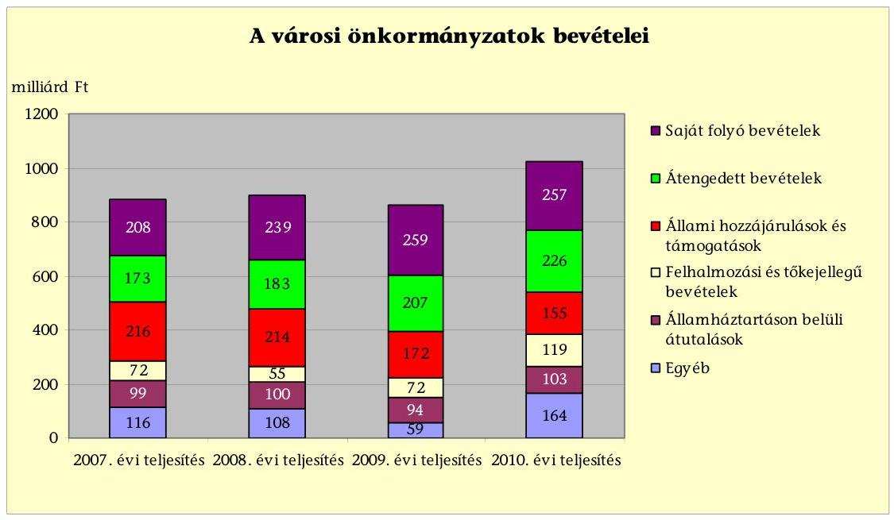

Az önkormányzati alrendszer pénzügyi helyzetértékelése során új elemzési módszereket alkalmazott az ellenőrzés. A költségvetési beszámoló adatok elemzése helyett az önkormányzat pénzügyi helyzetét a CLF módszerrel értékeltük, amelynek lényegét és számításának módszerét a jelentés 2. pontjában, és a jelentés 2. számú mellékletében ismertetjük részletesen.

Az új módszereken alapuló helyzetértékelés fontosságát az adja, hogy a helyi önkormányzatok bruttó adósságállománya ${ }^{2}$ a 2010. évi költségvetési beszámolók alapján 1248 milliárd Ft-ot tett ki. Ezen belül a 304 város adóssága 383 milliárd Ft volt, amely az önkormányzati alrendszer teljes adósságállományának 30,7%-át jelentette ${ }^{3}$.

A mérlegben kimutatott bruttó adósságállomány mellett az önkormányzatok számára az eszközállomány műszaki állapotának megőrzése is előbb-utóbb pénzügyi kötelezettséget jelent. Az elhasználódott eszközök pótlására forrást biztosító amortizációs (felújítási) alap képzésének ${ }^{4}$ elmaradása maga után vonhatja a feladatellátást kiszolgáló tárgyi eszközök állagának erőteljes romlását.

[^0]
[^0]:    ${ }^{2}$ Az önkormányzati mérlegbeszámolókból számított bruttó adósságállomány 2010. év végi összege magában foglalja a fejlesztési és a működési célú kötvénykibocsátások, a beruházási és fejlesztési hitelek, a működési célú hosszú lejáratú hitelek, a rövid lejáratú hitelek, váltótartozások miatti kötelezettségek teljes (2011-ben, illetve az azt követő években esedékes) állományát. Az önkormányzatok 2007. év végi mérleg szerinti adósságállománya 692 milliárd Ft volt.
    ${ }^{3}$ A fővárosi és a kerületi önkormányzatok adósságának figyelmen kívül hagyásával számított 977 milliárd Ft
 összegű bruttó adósságállományból a városok 39,2%-kal részesedtek.
    ${ }^{4}$ Erre a jelenlegi szabályozási környezetben nem kötelezi előírás az önkormányzatokat.

---

Emellett a 2007-2013-as időszakra meghirdetett, vissza nem térítendő EU-s fejlesztési forrásokhoz való hozzájutás lehetősége felerősítette az önkormányzati alrendszer fejlesztési igényeit, amelyek a felhalmozási költségvetési hiány folyamatos emelkedésén túl - az előírt jövőbeni fenntartási kötelezettség miatt tovább terhelhetik az önkormányzatok költségvetését ${ }^{5}$.

Az ÁSZ a 2011. évi ellenőrzési tervében 43. számú, az önkormányzatok gazdálkodási rendszerének ellenőrzése részeként áttekinti, és elemzi az önkormányzatok pénzügyi helyzetét. A gazdálkodás szabályszerűségét az ÁSZ az előző évek során ebben az önkormányzati körben is ellenőrizte. Jelen vizsgálatunk a tett javaslataink pénzügyi helyzetet érintő pontjainak hasznosítására utóellenőrzés jelleggel tér ki.

Az ellenőrzés megállapításait az Önkormányzat által kitöltött - teljességi nyilatkozattal megerősített - 27 tanúsítványon szolgáltatott adatokra alapoztuk. Ellenőrzési bizonyítékként használtuk fel továbbá:

- a képviselő-testületi és bizottsági előterjesztéseket, a döntés-előkészítés során készített dokumentumokat;
- a kötelezettségvállalások dokumentumait;
- a pénzügyi-számviteli nyilvántartásokat;
- az éves költségvetési beszámolókat;
- a költségvetési és zárszámadási rendeleteket.

Az ellenőrzés a 2007. január 1. - 2011. június 30. közötti időszakot öleli fel. A pénzintézeti kötelezettségek állományának vizsgálatakor az ellenőrzött időszak 2006. december 31. - 2011. június 30. közötti időszakra terjedt ki.

Az ellenőrzés során vizsgáltunk minden olyan körülményt és adatot, amely a program végrehajtásához kapcsolódott, és a pénzügyi helyzet alakulására hatást gyakorló releváns tények és folyamatok feltárásához szükségessé vált.

# Az ellenőrzés célja annak értékelése volt, hogy: 

- a vizsgált időszakban a kötelező és önként vállalt feladatok ellátását biztosító szervezeti keretekben, a feladatellátás módjában bekövetkezett változások milyen hatást gyakoroltak az Önkormányzat pénzügyi helyzetének alakulására;

[^0]
[^0]:    ${ }^{5}$ Az Állami Számvevőszék 2011. júniusában közzétett 1108. számú, a helyi önkormányzatok fejlesztési célú támogatási rendszerének ellenőrzéséről szóló jelentésében feltárta a fejlesztési folyamatok problémáit. A helyi önkormányzatok elsősorban azokat a fejlesztéseket valósították meg, amelyekhez támogatást lehetett igényelni. A fejlesztési célok közül a magasabb támogatási intenzitású pályázatokat részesítették előnyben. A fejlesztéssel megvalósuló létesítmények jövőbeli üzemeltetésének várható ráfordításait az önkormányzatok 71,9%-a nem mérte fel.

---

- az Önkormányzat pénzügyi - ezen belül működési és felhalmozási - egyensúlya mely tényezők hatására miként változott, és az Önkormányzat milyen intézkedéseket tett a pénzügyi egyensúly javítása érdekében;
- a költségvetési kiadások finanszírozása érdekében vállalt pénzintézeti kötelezettségek hogyan alakultak, továbbá milyen kötelezettségek fennállása befolyásolja az Önkormányzat jövőbeli pénzügyi helyzetét;
- hasznosultak-e a gazdálkodási rendszer korábbi ellenőrzése során a pénzügyi egyensúly javítására az ÁSZ által tett szabályszerűségi és célszerűségi javaslatok.

Az ellenőrzés típusa: szabályszerűségi vizsgálat.
A vizsgálat jogszabályi alapját az Állami Számvevőszékről szóló 2011. évi LXVI. törvény 1. § (3), 5. § (2)-(6) bekezdései, továbbá az Áht ${ }_{1}$ 120/A. § (1) bekezdése ${ }^{6}$ előírásai képezik.

Sárvár város Vas megyei település, lakosainak száma 14717 fő volt 2011. január 1-jén. Az Önkormányzat 2010. évi költségvetési beszámolója szerint 6334,8 millió Ft költségvetési bevételt ért el és 7833,2 millió Ft költségvetési kiadást teljesített, amely a 2007. évi költségvetési beszámolója szerinti 4732,1 millió Ft költségvetési bevétel 134,1%-a, míg a 4380,5 millió Ft teljesített költségvetési kiadás 178,8%-a volt. A 2010. december 31-én a könyvviteli mérleg szerint 15841,3 millió Ft értékű vagyonnal rendelkezett. Az Önkormányzat vagyona a 2006. év végi állományhoz viszonyítva 45,9%-kal nőtt, a tárgyi eszközök állományának 37,6%-os (2747,1 millió Ft-os), a kötvénykibocsátás miatti befektetett pénzügyi eszközök állományának 63,3%-os (1200,0 millió Ft-os), illetve a pénzeszköz állományának 408,8%-os (984,5 millió Ft-os) emelkedése következtében.

[^0]
[^0]:    ${ }^{6}$ 2012. január 1-jétől az Áht ${ }_{2}$ 61. § (2) bekezdés

---

# I. ÖSSZEGZŐ MEGÁLLAPÍTÁSOK, KÖVETKEZTETÉSEK, JAVASLATOK 

Az Önkormányzat - besorolása és adatszolgáltatása szerint - a működési célú kiadásainak ${ }^{7}$ a 2010. évben 71,3%-át 2218,4 millió Ft-ot a kötelező, 28,7%-át 892,4 millió Ft-ot az önként vállalt feladatai ellátására fordította. Az önként vállalt önkormányzati feladatok ellátására fordított kiadások nagyságrendje és súlya a 2007-2009. évek átlagában 953,8 millió Ft-ról (32,1%-ról) 61,4 millió Ft-tal (3,4 százalékponttal) 892,4 millió Ft-ra csökkent 2010-re. Az önként vállalt feladatai között a középfokú oktatás biztosítása, bölcsőde és zeneiskola fenntartása, a Nádasdy-Vár Művelődési Központ és Könyvtár, a Hivatásos Önkormányzati Tűzoltóság működtetése, továbbá egyházak, illetve egyház által fenntartott általános iskola, civil és egyéb szervezetek támogatása szerepelt. Az Önkormányzat pénzügyi egyensúlyi helyzetére az önként vállalt feladatok működési kiadásokon belüli súlya - az önként vállalt feladatokra fordított csökkenő működési kiadás mellett - nem volt hatással, mivel a működési kiadások forrása meghatározó mértékben - a Tűzoltóság esetében a vizsgált időszak átlagában 95,7%-ban, a középfokú oktatás esetén 81,4%-ban - költségvetési forrásból volt biztosított.
Az Önkormányzat feladatellátásának szervezeti struktúrája 2011. év június 30-án a következő volt:
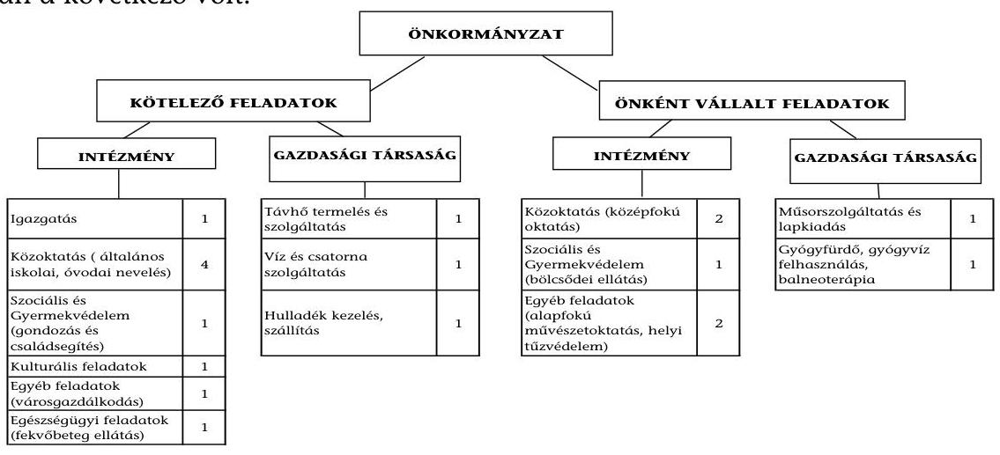

Az Önkormányzat feladatait 2011. június 30-án (a Polgármesteri hivatallal együtt) 14 költségvetési szervvel, 28 telephelyen és öt gazdasági társasággal látta el. A feladatellátásban résztvevő intézmények száma nem változott a vizsgált időszakban, míg a telephelyeinek száma a 2007. évi 29-ről eggyel csökkent, amely nem gyakorolt hatást az Önkormányzat pénzügyi egyensúlyi helyzetére. Az Önkormányzat három gazdasági társaságban kizárólagos

[^0]
[^0]:    ${ }^{7}$ A működési kiadások nem tartalmazták az egészségügyi ellátás kiadásait (Kórház, egészségügyi alapellátás), továbbá a kisebbségi önkormányzatok és a beruházási társulás feladatokhoz kapcsolódó működési kiadásait.

---

tulajdonnal, egy társaságban 75% feletti tulajdoni hányaddal ${ }^{8}$ rendelkezik. Az önkormányzati többségi tulajdonú gazdasági társaságok az önkormányzati kötelező feladatok közül a víz- és szennyvízkezelés, a távhőtermelés és szolgáltatás, az önként vállalt feladatok közül a gyógyfürdő működtetésében, a műsorszolgáltatás és lapkiadás területén kaptak szerepet. Az önkormányzati kötelező feladatok közül a hulladékkezelést és szállítást vállalkozási szerződés alapján végző gazdasági társaságban nem volt tulajdonrésze az Önkormányzatnak. Az Önkormányzat a műsorszolgáltatást és lapkiadást végző kizárólagos tulajdonú gazdasági társasága részére a vizsgált időszakban összesen 94,3 millió Ft összegben működési célú pénzeszközt adott át. A 164,9 millió Ft fejlesztési célú átadott pénzeszköz 98,7%-ában a víz- és szennyvízkezelést végző gazdasági társaság részesült. A gazdasági társaságok 12,0 millió Ft tagi kölcsönt kaptak az Önkormányzattól, illetve a Gyógyfürdő Kft. esetében 1200,0 millió Ft törzstőke emelés történt. A gazdasági társaságok - kivétel a Gyógyfürdő Kft. - pénzügyi egyensúlyi helyzete a 2010. évi saját tőke/jegyzett tőke aránya alapján stabil volt. A Gyógyfürdő Kft. esetében a saját tőke/jegyzett tőke arány a négy év átlagában 0,8 volt, úgy hogy a 2007-2008. évek vesztesége után a 2009-2010. évet eredménnyel zárta.

Az Önkormányzat - adatszolgáltatása - szerint a működési célú költségvetési kiadások nagyságrendje a 2010. évben (3110,8 millió Ft) 4,6%-kal (136 millió Ft-tal) volt magasabb a 2007-2009. években teljesített átlagos működési kiadásainál. A működési kiadás növekedését jellemzően a feladatbővülés (óvoda átvétel), illetve az inflációs hatások eredményezték. Az összes működési kiadások fedezetét jelentő működési célú bevételek jogcímeiben arányeltolódás volt jellemző a vizsgált időszakban. A 2007-2009. évek átlagában meghatározó 44,1%-os súlyú (1501,2 millió Ft átlagos összegű) állami támogatás részaránya 2010-re 35,1%-ra (1285,0 millió Ft-ra) csökkent. Az intézményi bevételek 10,2 százalékpontos (469,9 millió Ft-os) és a társult önkormányzatok hozzájárulása 0,3 százalékpontos (13,4 millió Ft-os) részarány-emelkedése történt, az önkormányzati támogatások 1,8 százalékpontos, 7,7 millió Ft-os csökkenése mellett.

Az egyes közszolgáltatások feladatellátásában részvevő intézmények működési kiadásai finanszírozásának forrásösszetételét a következő ábra szemlélteti:

[^0]
[^0]:    ${ }^{8}$ Ez az Önkormányzat minősített többségi tulajdonú gazdasági társasága.

---

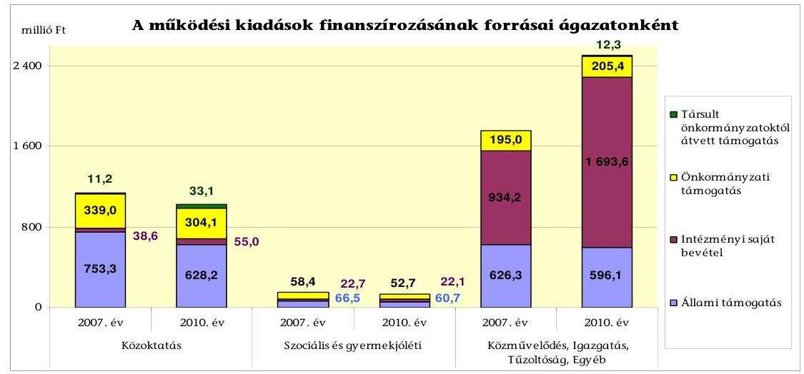

Az Önkormányzat esetében a 2007-2009. évek átlagáról a 2010. évre az állami támogatás 1501,2 millió Ft-ról 1285,0 millió Ft-ra (14,4%-kal) csökkent. Az állami támogatás csökkenése a vizsgált időszakban a közoktatási ágazatban volt a legjelentősebb a 124,0 millió Ft-os összegével, amely jellemzően az ellátotti létszám 31 fő csökkenésének az eredménye. A vizsgált időszakban a működési kiadások meghatározó részének (2007-ben 32,7%, 2010-ben 48,3%) finanszírozása az intézményi saját bevételekből történt a közművelődést, tűzoltóságot, igazgatást, Polgármesteri hivatalt magában foglaló egyéb ágazatban. Az intézményi saját bevételek vizsgált időszak alatti 77,9%-os növekedését jellemzően a helyi adóbevételek és az intézményi egyéb saját bevételek emelkedése eredményezte.

A vizsgált időszakban a kötelező és önként vállalt feladatok ellátását biztosító szervezeti keretekben, a feladatellátás módjában változás nem történt.

Az Önkormányzat folyó költségvetési egyenlege (működési jövedelem) 2007-2010 között minden évben működési forrástöbblet volt, amely folyamatosan nőtt és megduplázódott.
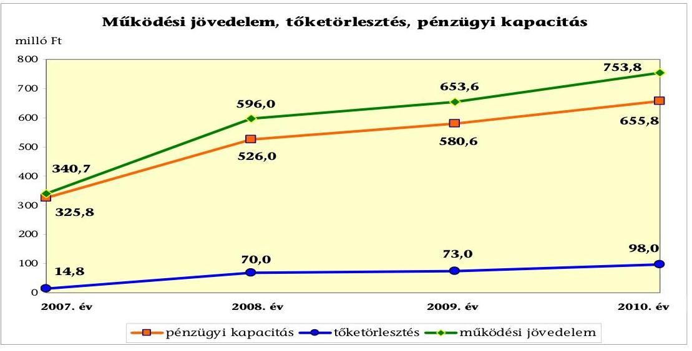

A 2007-2010. években keletkezett 2344,1 millió Ft működési többlet (jövedelem) mellett az Önkormányzat 255,8 millió Ft hitelt törlesztett. Az ellenőrzött idő-

---

szak pénzügyi kapacitása minden évben pozitív volt, kedvezően alakult, a 2007. évi 325,8 millió Ft-ról a 2010. évre megduplázódott, 330,0 millió Ft-tal nőtt. A pénzügyi kapacitás emelkedését meghatározó mértékben a folyó bevételek és kiadások különbségéből származó működési jövedelem (a 2007-2009. évek 530,1 millió Ft-os átlagáról 2010-re történő 223,7 millió Ft-os, 42,2%-os) növekedése adta, amelyet a működési kiadások növekedését meghaladó ütemű és mértékű működési bevétel-emelkedés eredményezett. A működési bevételnövekedés meghatározó részben a helyi adóbevételek (2007-2009. évek 1223,8 millió Ft-os átlagáról 2010-re 84,1 millió Ft-tal) és az egyéb saját bevételek (2007-2009. évek 1359,6 millió Ft-os átlagáról 2010-re 197,3 millió Ft-tal történő) emelkedésének az eredménye volt. A működési bevételek 292,8 millió Ft-os (6,5%-os) növekedése meghaladta a működési kiadások 69,1 millió Ft-os (1,7%-os) emelkedését. A működési kiadások emelkedése meghatározó részben a magánszemélyeknek történő működési célú pénzeszköz átadás 59,2 millió Ft-os (56,6%-os) növekedésének eredménye volt. Az Önkormányzat tőketörlesztési kötelezettségének a működési kiadásokhoz viszonyított nagyságrendje a 2007. évi 0,4%-ról a 2010. évre 2 százalékponttal nőtt, így sem volt jelentős. (A vizsgált időszakban a fennálló hosszúlejáratú hitelei után a teljesített tőketörlesztési kötelezettség összesen 255,8 millió Ft volt.) Az Önkormányzat pénzintézeti kötelezettsége a vizsgált időszakban átlagosan 1456,0 millió Ft volt. A 1200,0 millió Ft-os kötvény tőketörlesztése a 2012. évtől jelentkezik.

Az Önkormányzat a felhalmozási költségvetésében - a 2007. évet kivéve - felhalmozási forráshiánnyal rendelkezett. A felhalmozási forráshiány az időszakban folyamatosan emelkedett, a 2008. évi -216,8 millió Ft-ról 2009-re -298,4 millió Ft-ra. A 2010. évi kiugró (-2252,2 millió Ft) felhalmozási hiányt a Gyógyfürdő Kft-ben történő törzstőke emelés (1200,0 millió Ft összegben) és az előző években megkezdett és 2010. évben teljesült fejlesztési kiadások eredményezték. A pozitív nettó-működési jövedelem a 2007-2009. években (együttesen 1590,3 millió Ft volt) a felhalmozási forráshiányra (együttesen -504,3 millió Ft volt) fedezetet biztosított. A 2010. évben már csak a 29,1%-ra (655,8 millió Ft-ra) biztosított forrást a pozitív nettó működési jövedelem. A 2010. évi törzstőke emelés fedezete teljes egészében a 2008. évben kibocsátott kötvény, míg a fejlesztések forrása közel 60,0%-ban a realizált EU forrás volt.

A vizsgált időszak első három évében
 a bevételek 36,2%-át (1737,5 millió Ft-ot) a költségvetési támogatás és az szja bevétel jelentette, amely 2010. évre 249,3 millió Ft-tal (14,3%-kal) csökkent, 1488,2 millió Ft volt. Ezt ellensúlyozta a helyi adóbevételek, a társadalombiztosítási alaptól átvett bevételek és az egyéb működési bevételek 542,1 millió Ft-os (19,6%) növekedése. A bevételek esetén kiugró változás volt 2010. évre az előző időszakról, hogy a beindult fejlesztések forrásaként 1513,5 millió Ft EU-s támogatásban részesültek.

A 2007-2010. évek között az Önkormányzat a helyi iparűzési adót, vállalkozók kommunális adóját (melyet 2011. január 1-jétől megszüntetett) és a vendégéjszakák utáni idegenforgalmi adót alkalmazta. Az iparűzési adó és a vállalkozók kommunális adójának adómértéke a vizsgált időszakban nem változott, míg az idegenforgalmi adó összege 2009. január 1-jétől 6,7%-kal (300 Ft-ról 320 Ft-ra), 2011. január 1-jétől pedig 9,4%-kal (320 Ft-ról 350 Ft-ra) emelkedett. A folyó bevételek 27,1%-át adó helyi adókból és pótlékokból származó bevételek a 2007-2009. évek átlagában 1223,8 millió Ft-ot jelentettek. A 2010. év-

---

ben 1307,9 millió Ft bevételt realizált az Önkormányzat, az összes folyó bevétel 27,2%-át. A helyi adóbevételek 90,7%-át az iparűzési adó tette ki, további 7,3%-át az idegenforgalmi adó, 2,0%-át pedig a kommunális adó és pótlékok. Új helyi adónemet a vizsgált időszakban az Önkormányzat nem vezetett be.

Az Önkormányzat a 2007-2010. években teljesített 21 132,0 millió Ft költségvetési kiadása 75,7%-át működési célokra, a fennmaradó 24,3%-át fejlesztésre fordította. A teljesített működési kiadások meghatározó részét (60,6%-át) személyi juttatásokra és járulékaira fordította, amely az időszak alatt folyamatosan csökkent a 2007. évi 2586,0 millió Ft-ról (részaránya 65,9%) a 2010. évre 2188,4 millió Ft-ra (részaránya 54,0%). A dologi és egyéb folyó kiadások a 2007-2009. évek átlagáról 328,7 millió Ft-tal (27,6%-kal) nőttek a 2010. évre és 1519,8 millió Ft-ra teljesültek. A felhalmozási kiadások esetében is jelentős növekedés volt megfigyelhető. E kiadások a 2007-2009. évek átlagáról (310,1 millió Ft) 3361,0 millió Ft-tal (közel tizenkétszeresére) emelkedtek a 2010. évben, amelyből 1200,0 millió Ft-ot a Gyógyfürdő Kft. törzstőke⁹ emelése jelentett.

A befejezett felújítások és fejlesztések egy részét EU-s forrásokból finanszírozták. A 2007-2010. évek között teljesített 4385,3 millió Ft értékű fejlesztési és felújítási kiadás forrása a 1760,6 millió Ft (40,1%) értékű hazai- és EU-s támogatások mellett 1424,9 millió Ft saját bevétel (32,5%) és 1200,0 millió Ft kötvény (27,3%) bevétel volt. A 2010. december 31-én folyamatban lévő felújítási és fejlesztési feladatok végrehajtására 2007-2010. között 446,8 millió Ft kiadást teljesítettek, amelyre EU-s forrásból 359,7 millió Ft-ot (80,5%), saját bevételből 46,9 millió Ft-ot (10,5%) és hitelből 40,2 millió Ft-ot (9,0%) fordítottak. Az éves költségvetési rendeletekben nem mutatták be a beruházásokkal létrehozott létesítmények működtetése és fenntarthatósága érdekében várhatóan felmerülő költségvetési kiadásokat.

Az Önkormányzat 2010. december 31-én folyamatban lévő felújítási és fejlesztési feladatok 2010. évet követő kötelezettség-vállalásainak összege 1164,5 millió Ft volt, amelyből 116,3 millió Ft-ot hitelfelvételből, 968,9 millió Ft-ot már elnyert EU-s támogatásból és 79,3 millió Ft-ot saját bevételből terveznek biztosítani.

[^0]
[^0]:    ⁹ A Gyógyfürdő Kft. törzstőkeemelésének forrása az Önkormányzat által kibocsátott kötvény volt. Az Önkormányzat a gazdasági társaságtól származó osztalékbevétellel nem számolt, így a kötvénytörlesztés forrását a várhatóan növekvő helyi adóbevételekből tervezik biztosítani.

---

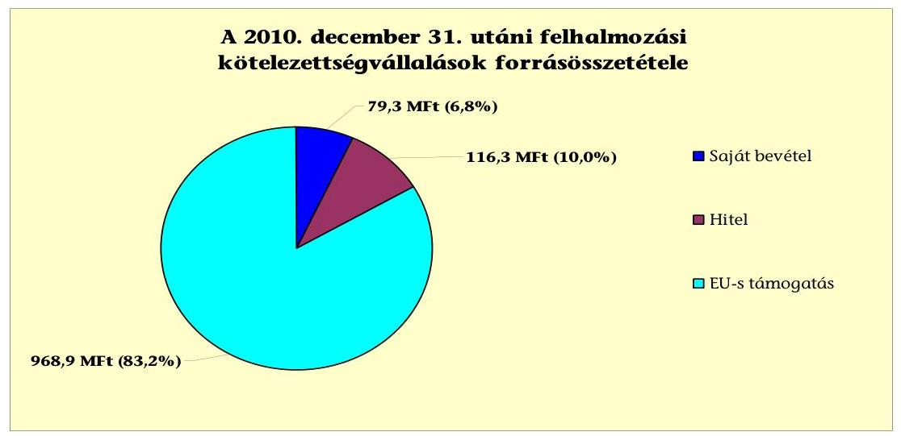

Az Önkormányzat mérleg szerinti pénzintézeti kötelezettsége a 2006. év végéről a 2011. év I. félév végére 674,2 millió Ft-ról 2165,2 millió Ft-ra nőtt, amelyből az árfolyamváltozás miatti különbözet 498,8 millió Ft volt. A 2011. év I. félév végén fennálló pénzintézeti kötelezettségek 78,5%-a (1698,8 millió Ft) egy CHF alapú kötvény kibocsátásból, 21,0%-a (455,3 millió Ft) hat hosszú lejáratú hitelből, valamint 0,5%-a (11,1 millió Ft) folyószámlahitel igénybevételéből keletkeztek. Az Önkormányzat a 2011. évi költségvetési rendeletében hitel felvételét nem tervezte.

Az Önkormányzat kötelezettségvállalásaira képviselő-testületi döntés alapján került sor, azonban az előterjesztésekben a hitelfelvételhez, kötvénykibocsátáshoz, a garancia és kezességvállaláshoz kapcsolódóan nem készítettek teljes körű tájékoztatást, nem mutatták be az így keletkezett kötelezettségek jövőbeni kamat- és - a devizaalapú kötelezettségeket érintő - árfolyamkockázatot és nem rendelkeztek a felvett hitelek és a kötvény visszafizetésének forrásairól.

Az Önkormányzat a kötvényt és a hiteleket a hitelcélnak megfelelően a Képviselő-testület által jóváhagyott, a költségvetésbe betervezett beruházásokhoz használta fel. Az Önkormányzat a CHF-ben fennálló pénzintézeti kötelezettségéből tőkét nem törlesztett, 376 ezer CHF (68,0 millió Ft) kamatot, és 55 ezer CHF (8,9 millió Ft) egyéb költséget, valamint 3,5 millió Ft garanciavállalási díjat fizetett. A HUF-ban fennálló hosszú lejáratú pénzintézeti kötelezettségeiből a vizsgált időszakban 226,3 millió Ft tőkét törlesztett és 130,3 millió Ft kamatot és egyéb költséget fizetett meg. A Beruházási Társulás által a 2010. évben megkötött 135,5 millió Ft összegű hitel törlesztése a 2015. évben kezdődik el, amelynek első részlete 6,7 millió Ft. A kötvény tőkefizetését 2012. év szeptember hónapban kell elkezdenie az Önkormányzatnak, amelynek összege 763 ezer CHF. A vizsgált években, az ütemezésnek megfelelően két hitelét fizette vissza az Önkormányzat. A kötvényforrásból származó bevétel befektetése 231,2 millió Ft kamatbevételt eredményezett az Önkormányzatnak, amely kedvező hatással volt a pénzügyi egyensúlyi helyzetének alakulására. Az Önkormányzat a pénzintézetek versenyeztetésével a 2010. évtől számlavezető bankot váltott, ezt követően a 2011. év I. félévben fennálló pénzintézeti kötelezettségeinek 91,2%-át a számlavezető bankja finanszírozta.

---

Az Önkormányzat a likviditási egyensúlyának biztosításához a vizsgált időszakban folyószámlahitelt vett igénybe, amelynek keretösszege 250,0 millió Ft volt. A vizsgált időszakban az átlagos napi állománya csökkenő tendenciát mutatott 2010. év végéig, majd a 2011. év I. félévben 20,4 millió Ft-os (63,9%-os) növekedés következett be, amelyet a szabad pénzeszközének féléves betétlekötése okozott.

A folyószámlahitel igénybevétele a 2007-2011. év I. félévében az alábbiak szerint alakult:

| Megnevezés | 2007. év | 2008. év | 2009. év | 2010. év | 2011. év I. <br> félév |
| :-- | :--: | :--: | :--: | :--: | :--: |
| Folyószámlahitel |  |  |  |  |  |
| Keretösszeg január 1-jén (millió Ft-ban) | 250,00 | 250,00 | 250,00 | 250,00 | 250,00 |
| Átlagos napi állomány (millió Ft-ban) | 70,8 | 48,2 | 33,0 | 31,9 | 52,3 |
| Folyószámlahitel-elzárt napok száma (nap) | 224 | 224 | 93 | 84 | 112 |
| Időszak végi egyenleg (állomány) | - | - | - | - | 11,1 |

A likviditás biztosítása az Önkormányzatnak 8,8 millió Ft kamatkiadást, és 1,5 millió Ft egyéb költség fizetésének kötelezettségét okozta.

Az Önkormányzat kötelezettségeinek 2010. december 31-i, valamint 2011. június 30-i állományát és várható alakulását a kötelezettségek lejáratáig a következő táblázat szemlélteti:

| Megnevezés | $\begin{gathered} \text { Állomány } \\ \text { 2010. december } 31 \text {-én } \end{gathered}$ |  |  | $\begin{gathered} \text { Állomány } \\ \text { 2011. június } 30 \text {-án } \end{gathered}$ |  |  | $\begin{gathered} \text { Várható } \\ \text { kötelezettség } \\ \text { a 2011-2013. } \\ \text { években } \end{gathered}$ |  | Várható kötelezettség a 2014. évtől |  |
| :--: | :--: | :--: | :--: | :--: | :--: | :--: | :--: | :--: | :--: | :--: |
|  | HUF-ban <br> (millió Ftban) | Devizában (összege, ezer CHFben) | Devizaneme | HUFban (millió Ft-ban) | Devizában (összege, ezer CHFben) | Devizaneme | HUFban (millió Ft-ban) | Devizában (összege, ezer CHFben) | HUFban (millió Ft-ban) | Devizában (összege, ezer CHFben) |
| Pénzintézeti kötelezettségek |  |  |  |  |  |  |  |  |  |  |
| Hosszú lejáratú hitelek | 458,6 |  | HUF | 455,3 |  | HUF | 307,7 |  | 350,7 |  |
| Sárvár Kristály Kötvény |  | 7632 | CHF |  | 7632 | CHF |  | 1284 |  | 6824 |
| Folyószámlahitel | 0,0 |  | HUF | 11,1 |  | HUF | 11,1 |  |  |  |
| Pénzintézeti kötelezettségek (összesen HUF-ban) | 458,6 |  | HUF | 466,4 |  | HUF | 318,8 |  | 350,7 |  |
| Pénzintézeti kötelezettségek (összesen CHF-ben) |  | 7632 | CHF |  | 7632 | CHF |  | 1284 |  | 6824 |
| Biztosítékok |  |  |  |  |  |  |  |  |  |  |
| Kezesség |  |  |  |  | 14732 | CHF |  |  |  |  |
| Kezesség |  |  |  | 150,0 |  | HUF |  |  |  |  |
| Szállítói tartozás | 706,8 |  | HUF | 80,1 |  | HUF | 80,1 |  |  |  |
| Összes kötelezettség HUF-ban | 1165,4 |  | HUF | 696,5 |  | HUF | 398,9 |  | 350,7 |  |
| Összes kötelezettség CHF-ben |  | 7632 | CHF |  | 22364 | CHF |  | 1284 |  | 6824 |

Az Önkormányzatnak pénzintézetekkel szemben fennálló kötelezettsége a 2011. év I. félév végén 466,4 millió Ft és 7632 ezer CHF volt. Ezek várható kötelezettsége (tőke, kamat és egyéb költség) a legutóbbi kamatfizetés feltételei alapján a 2011-2013. években 318,8 millió Ft és 1284 ezer CHF. Az Önkormányzatnak a 2011. év I. félévében szállítói tartozások címén 80,1 millió Ft fizetési kötelezettsége volt. A kezességvállalásaiból adódóan 14732 ezer CHF összegű terhe jelentkezhet, amennyiben a Gyógyfürdő Kft. a kibocsátott két kötvényére vonatkozó kötelezettségeit, továbbá a 150,0 millió Ft folyószámlahitel visszafizetését nem teljesíti. A 2011-2013. évek kötelezettségeinek teljesítésére figyelembe vehető 250,0 millió Ft hosszú lejáratú és 800,0 millió Ft rövid lejáratú betétek, a Víziközmű Társulat hiteleihez az Ltp számlán keletkező Önkormányzatra engedményezett bevételek, a 2010. december 31-én kimutatott 655,8 millió Ft nettó működési jövedelem, 100,2 millió Ft szabad pénzmaradvány, mérlegben kimutatott le nem járt határidejű, 698,1 millió Ft behajtható követelésállomány, valamint a forgalomképes besorolású nettó

---
 ingatlanvagyon értékesítéséből a helyi viszonyok alapján elérhető bevétel. A 2014. évet követően jelenleg ismert pénzintézeti kötelezettségei: 350,7 millió Ft és 6824 ezer CHF. A jelenlegihez képest változatlan működési jövedelemtermelő képességet feltételezve a várható fizetési kötelezettségek fedezetét a működési jövedelem biztosítani fogja.

Az Önkormányzat pénzügyi egyensúlya rövid és közép távon biztosított, a pénzügyi egyensúly hosszú távú megőrzésére kell felkészülnie. Az Önkormányzat tájékoztatása szerint figyelembe vehető további forrásokat az idegenforgalmi és iparűzési adóbevételek növekedése jelentheti, amelyet a fürdőfejlesztéshez kapcsolódó idegenforgalom növekedésére, új szálláshelyek építésére alapoznak. A további évekre szóló, jelenleg ismert pénzintézeti kötelezettségek teljesítését döntően meghatározza a Gyógyfürdő Kft. tevékenysége, amely a 2009-2010. években nyereséges volt, azonban osztalékot nem fizetett az Önkormányzat részére.

Az Önkormányzat 2011. év I. félév végi szállítói tartozása 80,1 millió Ft, melyből lejárt tartozása 1,7 millió Ft (2,1%) volt, ennek teljes összege 30 nap alatti lejáratú. A 2009-2010. években a kórháznak 3,6 millió Ft összegben átütemezett szállítói tartozása volt.

Az Önkormányzat a vizsgált időszakban összesen három esetben vállalt készfizető kezességet, ennek a 2011. év június 30-án nyilvántartott állománya 14732 ezer CHF és 150,0 millió Ft volt, ami az Önkormányzat kötelezettségállományának közel kétszeresét jelenti. Az Önkormányzat készfizető kezességvállalása a kizárólagos tulajdonú Gyógyfürdő Kft-nek a 7100 ezer CHF össznévértékű „Sárvári Gyógyforrás" és a 7632 ezer CHF össznévértékű „Sárvári Gyógyfürdő" kötvényeken alapuló fizetési kötelezettségei teljesítéséhez kapcsolódott. A kötvények bevételét a devizahitelek refinanszírozására, fürdőfejlesztésekhez kapcsolódó pályázatokhoz szükséges önerő biztosítására használta fel a Kft. A 150,0 millió Ft készfizető kezességvállalást ugyancsak a kizárólagos tulajdonú Gyógyfürdő Kft folyószámlahitelének biztosítékaként nyújtotta az Önkormányzat. A kötvények közül a 7632 ezer CHF össznévértékű kötvényének a tőketörlesztése 2012. szeptember hónaptól kezdődik el, összege 763 ezer CHF. A Kft. az elmúlt két évben nyereségesen gazdálkodott, azonban a kezességvállalások pénzügyi kockázatot jelenthetnek az Önkormányzat számára, tekintettel a devizaalapú kötelezettségek nagyságára.

A 2007-2011. év I. félévben követelés elengedés összesen 34,3 millió Ft összegben történt. A TÁVHŐ Kft részére egy alkalommal a 2009. évben, 12,0 millió Ft összegben nyújtott kamatmentes kölcsönt működési célra az Önkormányzat, amelynek visszafizetése megtörtént.

A Képviselő-testület egy beruházási hitel biztosítékaként 22,2 millió Ft - számviteli nyilvántartás szerinti nettó értékű - jelzálogjog alapításához és bejegyzéséhez járult hozzá. A jelzálogszerződésekkel érintett ingatlanok - 2010. december 31-én - a forgalomképes ingatlanok 1,2%-át jelentették. Az Önkormányzat 2011. június 30-án három folyamatban lévő peres eljárásban érintett alperesként, a terhére kimutatott perérték 32,1 millió Ft volt.

---

Az Önkormányzat többségi tulajdonú társaságai kötelezettségeinek 2010. december 31-i, valamint 2011. június 30-i állományát és várható alakulását a kötelezettségek lejáratáig a következő táblázat mutatja be:

| Megnevezés | $\begin{gathered} \text { Állomány } \\ \text { 2010. december } 31 \text {-én } \end{gathered}$ |  |  | $\begin{gathered} \text { Állomány } \\ \text { 2011. június } 30 \text {-án } \end{gathered}$ |  |  | Várható kötelezettség a 2011-2013. <br> években |  | Várható kötelezettség a 2014. évtől |  |
| :--: | :--: | :--: | :--: | :--: | :--: | :--: | :--: | :--: | :--: | :--: |
|  | HUF-ban <br> (millió Ftban) | Devizában (összege, ezer CHF/EURben) | Devizaneme | HUFban (millió Ft-ban) | Devizában (összege, ezer CHF/EURben) | Devizaneme | HUFban (millió Ft-ban) | Devizában (összege, ezer CHF/EURben) | HUFban (millió Ft-ban) | Devizában (összege, ezer CHF/EURben) |
| Hosszú lejáratú hitelek |  | 540 | EUR |  | 480 | EUR |  | 379 |  | 184 |
| Kötvény |  | 13681 | CHF |  | 13417 | CHF |  | 2968 |  | 11444 |
| Folyószámlahitel | 10,5 |  |  | 0 |  |  | 0 |  | 0 | 0,0 |
| Pénzintézeti kötelezettségek összesen EUR-ban: |  | 540 | EUR |  | 480 | EUR |  | 379 |  | 184 |
| Pénzintézeti kötelezettségek összesen CHF-ben: |  | 13681 | CHF |  | 13417 | CHF |  | 2968 |  | 11444 |
| Lizing kötelezettségek EUR-ban |  | 10 | EUR |  | 8 | EUR |  | 10 |  | 0 |
| Lizing kötelezettségek CHF-ben |  | 8 | CHF |  | 7 | CHF |  | 8 |  | 0 |
| Szállítói tartozás | 517,3 |  | HUF | 245,8 |  | HUF | 245,8 |  |  | 0 |
| Összes kötelezettség HUF-ban | 527,8 |  | HUF | 245,8 |  | HUF | 245,8 |  | 0 | 0 |
| Összes kötelezettség CHF-ben |  | 13689 | CHF |  | 13424 | CHF |  | 2976 |  | 11444 |
| Összes kötelezettség EUR-ban |  | 550 | EUR |  | 488,0 | EUR |  | 389 |  | 184 |

Az önkormányzati kötelezettségek növekedése mellett az Önkormányzat többségi befolyásával rendelkező gazdasági társaságok kötelezettségei is befolyásolhatják az Önkormányzat pénzügyi egyensúlyát. A társaságoknak a 2011. évtől 245,8 millió Ft szállítói tartozást, - amelyből a lejárt tartozás a 2011. év I. félévben 5,2 millió Ft volt - egy gazdasági társaságának, a Gyógyfürdő Kft.-nek 13424 ezer CHF és 488 ezer EUR kötelezettséget kell rendezni. Esetleges csőd, vagy felszámolási eljárás esetében az Önkormányzat korlátlan felelősséggel tartozik az önkormányzati tulajdonú gazdasági társaságának minden olyan kötelezettségéért, amelynek kielégítését a felszámolási eljárás során az adós társaság vagyona nem fedez, és ha a bíróság megállapítja az Önkormányzat korlátlan és teljes felelősségét. Azonban a Kft. pénzügyi egyensúlyi helyzete stabil volt a vizsgált időszakban.

Az Önkormányzat 2007-2010. évek között eszközállománya után 962,7 millió Ft összegű értékcsökkenést mutatott ki a számviteli nyilvántartásában, az elhasznált eszközök pótlására - kimutatása alapján - 632,1 millió Ft-ot (65,6%-át) fordított. Az elhasználódott eszközök pótlására az Önkormányzat tartalékot nem képzett, külön alapot nem hozott létre, nem mutatta be a zárszámadási rendeletében az eszközpótlásra fordított tényleges kiadásokat, az eszközök elhasználódási fokának alakulását.

Az Önkormányzat költségvetési támogatása és az szja bevételek együttes változásának kumulált egyenlege a vizsgált időszakban 130,8 millió Ft-tal csökkent. Ennek ellensúlyozására az Önkormányzat folytatta az előző években elkezdett kiadási megtakarítást eredményező és bevételt növelő intézkedéseit. A 2007-2011. év I. féléve között tett intézkedések hatására - adatszolgáltatása alapján - 106,6 millió Ft bevételi többletet, továbbá 141,0 millió Ft kiadási megtakarítást mutattak ki, az intézkedések eredményeként az Önkormányzat pénzügyi egyensúlyi helyzete javult. A bevételnövelő intézkedések között kimutatott adóhátralékok és lejárt bérleti díjak behajtása (58,4 millió Ft) az Önkormányzat kötelező feladata, ezeket figyelmen kívül hagyva 189,2 millió Ft volt a megtakarítás és többletbevétel egyenlege. A kiadási megtakarítások 90,0%-a (126,3 millió Ft) az elrendelt álláshely csökkentések eredménye. Az álláshelycsökkentő intézkedések 2007-2011. év I. féléve között önkormányzati szinten összesen 106 álláshely megszüntetését jelentették. Az álláshely megszüntetések 58,5%-a (62 fő) egészségügy, 31,1%-a (33 fő) közoktatás, 5,7%-a (6 fő) szociális, 4,7%-a (5 fő) a polgármesteri hivatal és egyéb területeket érintették. Egyes közszolgáltatási területeken - közoktatás, egészségügy - azonban feladatbővülések is voltak, amelyek 10 fő álláshely- és egyben létszámnövekedéssel jártak. Ennek következtében az időszak álláshelyeinek száma 96 fővel csökkent. A bevételnövelő intézkedések az eszközök értékesítéséhez, bérbeadásához a helyi adó mértékének növeléséhez, valamint a kedvezmények, mentességek csökkenéséhez, a szolgáltatások többletbevételéhez az intézményi térítési díjak emeléséhez kapcsolódtak.

Az utóellenőrzés a pénzügyi egyensúly javítására tett két szabályszerűségi javaslat hasznosítására terjedt ki. A két szabályszerűségi javaslatot az intézkedési terv szerinti határidőben megvalósították. A 2009. évtől a költségvetési rendeletekben az Áht. 8/A. § (7) bekezdésében előírtaknak megfelelően a finanszírozási célú pénzügyi műveletek költségvetési hiányt módosító költségvetési kiadásként és költségvetési bevételként nem szerepeltek. A 2008. évtől a zárszámadási és költségvetési rendeletek az Ámr-ben foglaltakat betartva elkülönítetten tartalmazták az európai uniós támogatással megvalósuló programok, projektek bevételeit és kiadásait.

Az Önkormányzat pénzügyi egyensúlyi helyzetét összegezve a következők emelhetők ki:

Sárvár Város Önkormányzatának pénzügyi egyensúlya rövid és középtávon biztosított. A pénzügyi egyensúly hosszú távú megőrzésére az Önkormányzatnak fel kell készülnie.

A 2007-2011. év I. félév időszakában a folyó bevételek növekvő arányban nyújtottak fedezetet a folyó kiadásokra és az adósságszolgálatra, pozitív és növekvő összegű működési jövedelem volt kimutatható. A likviditás fenntartása esetenkénti folyószámlahitel igénybevételével történt.

A fejlesztések során kialakított létesítmények jövőbeni működtetésének várható kiadásait nem számszerűsítették, a fejlesztések korlátozott mértékben teremtenek bevételi lehetőséget az Önkormányzat számára.

A folyamatban lévő fejlesztési feladatok jövőben teljesítendő kifizetéseire a fedezet rendelkezésre áll (EU támogatások, szabad pénzeszközök és a megkötött hitelszerződés formájában).

Az Önkormányzat pénzintézeti kötelezettségei a vizsgált időszakban növekedtek, melynek teljesítésére a fedezet biztosítottnak látszik.

A kizárólagos tulajdonú Gyógyfürdő Kft. esetében a vizsgált időszakban a saját tőke nem nyújtott fedezetet a jegyzett tőkére. Az Önkormányzat jövőbeni pénzügyi egyensúlyi helyzetét kedvezőtlenül befolyásolhatja a Kft. devizaalapú kötvénykibocsátásaihoz, valamint a folyószámla hiteléhez vállalt készfizető kezessége.

Az Állami Számvevőszékről szóló 2011. évi LXVI. törvény 33. § (1) bekezdésében foglaltak értelmében a jelentésben foglalt megállapításokhoz kapcsolódó intézkedési tervet köteles az ellenőrzött szervezet vezetője összeállítani és azt a jelentés kézhezvételétől számított harminc napon belül az ÁSZ részére megküldeni. Amennyiben az intézkedési tervet határidőben nem küldi meg a szervezet, vagy az továbbra sem elfogadható, az ÁSZ elnöke a hivatkozott törvény 33. § (3) bekezdés a)-b) pontjaiban foglaltakat érvényesítheti.

# A 2011. június 30-i pénzügyi egyensúlyi helyzet alapján az ellenőrzés intézkedést igénylő megállapításai és javaslatai a következők: 

## a polgármesternek

1. Az Önkormányzat pénzügyi egyensúlya rövid és középtávon biztosított. A pénzügyi egyensúly hosszú távú megőrzésére az Önkormányzatnak fel kell készülnie. A pénzintézeti kötelezettségek állománya emelkedett.

Javaslat:
Folyamatosan tájékoztassa a Képviselő-testületet az Önkormányzat pénzügyi egyensúlyi helyzetéről. Kezdeményezzen szükség esetén intézkedéseket a pénzügyi egyensúly hosszú távú fenntarthatósága érdekében.
2. Az Önkormányzatnak a 2014. évet követően a jelenleg ismert pénzintézeti kötelezettsége 350,7 millió Ft és 6824 ezer CHF, amelynek forrásszükségletét nem számszerűsítették.

Javaslat:
Képezzen elkülönített tartalékot a jövőbeni adósságszolgálat teljesítése érdekében.
3. Az Önkormányzat gazdasági társasága kötvénykibocsátásához tett kezességvállalása hosszútávon veszélyeztetheti az Önkormányzat pénzügyi egyensúlyát, a kötelező feladatai ellátását.

Javaslat:
Kísérje folyamatosan figyelemmel a 100%-os tulajdoni hányadú gazdasági társasága kötelezettségeinek alakulását, az Önkormányzat likviditására, pénzügyi-egyensúlyi helyzetére gyakorolt hatását.
4. A Képviselő-testületnek előterjesztett éves költségvetési
 rendeletekben nem mutatták be a beruházásokkal létrehozott létesítmények működtetésé és fenntarthatósága érdekében várhatóan felmerülő költségvetési kiadásokat.

---

Javaslat:
Vizsgálja felül teljes körűen a tervezett beruházásokat és a megvalósuló létesítmények fenntartásának jövőbeni pénzügyi kihatásait. Szükség esetén tegyen javaslatot a Képviselő-testületnek a tervezett beruházásokkal kapcsolatos döntések módosítására, amelyben figyelembe veszik az Önkormányzat pénzügyi lehetőségeit, és kötelező feladatellátás elsődlegességét.
5. A Képviselő-testület részére nem készítettek a hitelfelvételhez, kötvénykibocsátáshoz, a garancia és kezességvállaláshoz kapcsolódóan teljes körű tájékoztatást az így keletkezett kötelezettségek jövőbeni árfolyam-, kamat- és visszafizetési kockázatairól.

Javaslat:
Az adósságot keletkeztető kötelezettségvállalásról szóló döntéskor mutassa be a Képviselő-testületnek a jövőben várható árfolyam-, kamat- és törlesztési kockázatot. Kezességvállalás, garancia és helytállási kötelezettségvállalásról szóló döntésnél mutassa be a Képviselő-testületnek azok pénzügyi kockázatait.
6. Az Önkormányzat adósságot keletkeztető kötelezettségvállalásaira vonatkozó képviselő-testületi előterjesztések nem tartalmazták a visszafizetés forrásait.

Javaslat:
Gondoskodjon, hogy a jövőben az adósságot keletkeztető kötelezettségvállalásokról szóló képviselő-testületi előterjesztések tartalmazzák a visszafizetés forrásait.
7. A Képviselő-testületnek előterjesztett éves zárszámadási rendeleteikben nem mutatták be az eszközpótlásra fordított tényleges kiadásokat, az eszközök elhasználódási fokának alakulását.

Javaslat:
Mutassa be a Képviselő-testületnek évente a zárszámadási rendelet előterjesztésében az elszámolt értékcsökkenés összegét, és ezzel összevetve az elhasználódott eszközök pótlására fordított tényleges kiadásokat, az eszközök elhasználódási fokának alakulását.

A polgármester a helyszíni ellenőrzés lezárása után tájékoztatta az Állami Számvevőszéket az Önkormányzat megtett és tervezett intézkedéseiről, amelyet az Állami Számvevőszék nem ellenőrzött, arra vonatkozóan véleményt vagy megállapítást nem fogalmaz meg. Az ellenőrzés lezárását követően elvégzett intézkedéseket az Állami Számvevőszék utóellenőrzés keretében vizsgálhatja.

A polgármester tájékoztatása szerint a következő intézkedéseket tette és tervezi az Önkormányzat:

- a 2012. évtől esedékessé váló kötvény tőketörlesztéséhez a korábbi megtakarításokat nem tervezi igénybe venni, azt továbbra is tartalékként kezeli;
- a kamatkiadások mérséklése érdekében a folyószámla hitelkeretet 250,0 millió Ft-ról 200,0 millió Ft-ra tervezi csökkenteni a 2012. évtől.

---

# II. RÉSZLETES MEGÁLLAPÍTÁSOK 

## 1. Az ÖNKORMÁNYZAT KÖTELEZŐ ÉS ÖNKÉNT VÁLLALT FELADATAI, A FELADATELLÁTÁS SZERVEZETI KERETEI ÉS ANNAK VÁLTOZÁSAI

Az Önkormányzat a kötelező feladatait az Ötv. és az ágazati törvények által meghatározottnak tekinti, míg az önként vállalt feladatok körét és terjedelmét a Képviselő-testület az éves költségvetés elfogadásakor, a fedezet biztosításával egyidejűleg maga határozza meg ${ }^{10}$.

Az Önkormányzat - besorolása és adatszolgáltatása szerint - a működési célú költségvetési kiadásainak a 2010. évben 71,3%-át, 2218,4 millió Ft-ot a kötelező ${ }^{11}$, míg 28,7%-át, 892,4 millió Ft-ot az önként vállalt feladatai ellátására fordította ${ }^{12}$. Önként vállalt feladatai között a középiskolák ${ }^{13}$, bölcsőde és zeneiskola fenntartását, működtetését, a Nádasdy-Vár Művelődési Központ és Könyvtár, továbbá a Hivatásos Önkormányzati Tűzoltóság működtetését biztosították. Ezeken túl önként vállalt feladatként egyházak, illetve egyház által fenntartott általános iskola, civil és egyéb szervezetek támogatása szerepelt. Az önként vállalt önkormányzati feladatok ellátására fordított kiadások nagyságrendje és súlya a vizsgált időszak alatt a 2007-2009. évek átlagában 953,8 millió Ft-ról 61,4 millió Ft-tal, részaránya 32,1%-ról 3,4 százalékponttal csökkent, 2010-ben 892,4 millió Ft volt.

Az önként vállalt önkormányzati feladatok közül 2007-2009. évek átlagához képest a csökkenés a Hivatásos Önkormányzati Tűzoltóság működtetési kiadásaiban volt a legnagyobb 27,4 millió Ft (9,6%-os) mértékű. Emellett a közoktatás kiadáscsökkenése 12,3 millió Ft (3%-os), a közművelődési ágazaté 11,0 millió Ft (8,2%-os) úgy, hogy az egyházak, civil és egyéb szervezetek támogatási kiadása 11,9 millió Ft-tal (11,7%-kal) növekedett.

[^0]
[^0]:    ${ }^{10}$ A többször módosított 16/2007. (III. 22.) számú rendelet 6. § (2-4) bekezdései.
    ${ }^{11}$ Az előző három év átlagában 2974,8 millió Ft, 67,9% volt a kötelező önkormányzati feladatokra elszámolt működési kiadás.
    ${ }^{12}$ A kiadások nem tartalmazták az egészségügyi ellátás kiadásait (Kórház, egészségügyi alapellátás), továbbá a kisebbségi önkormányzatok és a beruházási társulás működési kiadásait.
    ${ }^{13}$ Gimnázium és szakközépiskola, illetve hozzájuk kapcsolódó kollégium fenntartása voltak.

---

A 2010. évi működési célú költségvetési kiadások és bevételek ${ }^{14}$ feladatonkénti megoszlását és azok finanszírozási arányait az Önkormányzat adatszolgáltatása szerint a következő táblázat mutatja be:

| Ellátott feladat | Működési <br> kiadás <br> összesen <br> (millió Ft) | Kötelező <br> feladatok <br> kiadásainak <br> részaránya <br> % | Működési <br> bevétel <br> összesen <br> (millió Ft) | Állami <br> támogatás <br> részaránya <br> % | Intézményi <br> saját bevétel <br> részaránya <br> % | Önkormány <br> zati <br> támogatás <br> részaránya <br> % | Társult <br> önkormány <br> zatoktól <br> átvett <br> támogatás <br> % |
| :--: | :--: | :--: | :--: | :--: | :--: | :--: | :--: |
| Óvodák | 261,6 | 100,0 | 266,4 | 47,9% | 9,8% | 39,4% | 2,9% |
| Általános iskolák | 359,5 | 100,0 | 356,8 | 55,7% | 1,6% | 35,6% | 7,1% |
| Gimnáziumok | 189,0 | 0,0 | 208,6 | 75,7% | 3,7% | 20,6% | 0,0% |
| Szakközépiskolák, <br> szakképző intézmények | 210,0 | 0,0 | 185,8 | 76,0% | 8,1% | 15,9% | 0,0% |
| Kollégiumok | 2,7 | 0,0 | 2,7 | 97,1% | 2,9% | 0,0% | 0,0% |
| Szociális intézmények | 71,8 | 100,0 | 83,3 | 41,3% | 21,8% | 36,9% | 0,0% |
| Gyermekjóléti intézmények | 51,3 | 0,0 | 52,2 | 50,5% | 7,5% | 42,0% | 0,0% |
| Közművelődési <br> intézmények | 123,0 | 0,0 | 132,8 | 9,6% | 10,5% | 70,6% | 9,3% |
| Egyéb intézmények | 478,3 | 33,8 | 502,4 | 60,6% | 17,2% | 22,2% | 0,0% |
| Igazgatási intézmények | 330,2 | 100,0 | 288,1 | 10,0% | 90,0% | 0,0% | 0,0% |
| Polgármesteri hivatalban <br> ellátott feladatok működési <br> kiadásai | 1033,4 | 100,0 | 1584,2 | 15,8% | 84,2% | 0,0% | 0,0% |
| Működési kiadá- <br> sok összesen | 3110,8 | 71,3% | 3663,3 | 35,1% | 48,4% | 15,3% | 1,2% |

Az Önkormányzat adatszolgáltatása szerint a működési célú kiadásának a vizsgált 2007-2010. évek átlagában - 36,9%-át közoktatási, 4,5%-át szociális és gyermekjóléti, a fennmaradó 58,6%-át egyéb feladatai (ebben 37,7%-ot jelentett a Polgármesteri hivatal) ellátására fordította. A működési célú kiadások nagyságrendje a 2010. évben 4,6%-kal (136,0 millió Ft-tal) volt magasabb a 2007-2009. évek átlagos (2975,0 millió Ft) működési kiadásainál. Az összes működési kiadások forrását jelentő működési célú bevételek a 2007-2009. évek átlagáról (3403,8 millió Ft) 259,5 millió Ft-tal (7,6%-kal) emelkedtek a 2010. évre.

Az Önkormányzat közoktatási feladatokra 2010. évre az előző három év átlagos kiadásához (1139,8 millió Ft) képest 10,3%-kal, 116,9 millió Ft-tal fordított kevesebbet. A közoktatási kiadások 63,0%-át a kötelező óvodai és általános iskolai feladatai, míg 37,0%-át az önként vállalt középfokú oktatás biztosítása során realizálta. A közoktatási feladatok működési kiadásaiból az állami támogatás részaránya 2007-2009. évek átlagáról a 2010-re, 66,1%-ról (752,2 millió Ft) 61,6%-ra (628,2 millió Ft) mérséklődött. Ez 16,5%-os (124,0 millió Ft-os) csökkenést jelentett, jellemzően az ellátotti létszám 31 fő-s csökkenésének az eredményeként.

A közoktatási területen az ellátottak száma a vizsgált időszakban az óvoda esetén emelkedést mutatott (összességében 34 fő, 6,8%-os volt a növekedés). Az általános iskolában a vizsgált időszakban 99 fővel (9,2%-kal) csökkent a tanulólét-

[^0]
[^0]:    ${ }^{14}$ A működési kiadások nem tartalmazták az egészségügyi ellátás kiadásait (Kórház, egészségügyi alapellátás), továbbá a kisebbségi önkormányzatok és a beruházási társulás feladatokhoz kapcsolódó működési kiadásait.

---

szám. Az önként vállalt középfokú oktatás esetén a tanulólétszám 34 fővel (3,0%-kal) nőtt. A 2007-ről 2010-re a fajlagos kiadások minden intézménytípusnál csökkentek. Az óvoda esetén 515,1 ezer Ft/főről 5,2%-kal, 488,1 ezer Ft/főre csökkent. Az általános iskolai ellátás esetén az 441,7 ezer Ft/főről 366,1 ezer Ft/főre, 17,1%-kal csökkentek. A középfokú oktatás esetén 355,7 ezer Ft/főről 3,5%-kal, 343,4 ezer Ft/főre mérséklődtek.

A közoktatási feladatokat 2010-ben 304,1 millió Ft-tal támogatta az Önkormányzat, amely az összes ágazati működési kiadás 29,8%-a volt. A 2007-2009. évek átlagához viszonyítva a közoktatás önkormányzati támogatása 17,2 millió Ft-tal csökkent úgy, hogy részaránya 1,6 százalékponttal emelkedett. Az intézményi saját bevételek és a fenntartásban társult önkormányzatok ${ }^{15}$ támogatása együttesen a három év átlagáról (65,0 millió Ft) 23,0 millió Ft-tal emelkedett 2010-re.

A szociális és gyermekjóléti intézményi feladatok ${ }^{16}$ működési kiadásai 10,5%-kal (14,5 millió Ft-tal) csökkentek a 2007-2009. évek átlagáról a 2010. évre. A többi ágazathoz hasonlóan itt is az állami támogatás volt a meghatározóbb bevételi forrás, amely a 2007-2009. évek átlagáról (68,7 millió Ft-ról) a 2010. évre arányában 1,2 százalékponttal, 8,0 millió Ft-tal csökkent.

Az összes működési célú kiadás legkisebb részarányát (a vizsgált időszakban 4,4%-át) a közművelődési intézmények fenntartására fordította az Önkormányzat. A működési kiadás finanszírozását a 2007-2009. évek átlagában 70,6%-ban (átlag 95,2 millió Ft-tal) az Önkormányzat és a társult önkormányzatok ${ }^{17}$ támogatása jelentette. Az állami támogatás 2010-ben a 2007-2010. években átlagosan a működési kiadások 14,8%-át finanszírozta. Összege 2010. évre 12,7 millió Ft volt, amely a 2007-2009. évek 22,3 millió Ft-os átlagos értékéről 43,0%-os csökkenést jelentett.

A vizsgált időszakban az egyéb feladatok ${ }^{18}$ működési kiadásainak részaránya az összes működési kiadásból a 2007-2009. évek átlagos (507,0 millió Ft) 17,0%-ról 2010-re 15,4%-ra csökkent a Hivatásos Önkormányzati Tűzoltóság működési kiadásainak 16,0 millió Ft-os kiadáscsökkenése miatt. A működési kiadásokat meghatározó részben állami támogatás finanszírozta, részaránya 1,6 százalékponttal (14,8 millió Ft-tal) csökkent a 2007-2009. évek átlagáról (319,3 millió Ft-ról) a 2010. évre. E feladatoknál a vizsgált időszak végére - a 2007-2009. évek átlagos 106,3 millió Ft értékéről - nőtt az önkormányzati támogatás részaránya (1,5 százalékponttal) és értéke is (5,4 millió Ft-tal).

[^0]
[^0]:    ${ }^{15}$ Az óvodai és az általános iskolai oktatás feladatának ellátásában vettek részt Bögöt, Porpác és Sitke települések önkormányzatai.
    ${ }^{16}$ Szociális alapellátás és önként vállalt feladatként a bölcsődei ellátás.
    ${ }^{17}$ Kistérségi társulás társönkormányzatai a könyvtár fenntartásához járulnak hozzá.
    ${ }^{18}$ A városüzemeltetési feladatok, az önként vállalt zeneiskola és a Hivatásos Önkormányzati Tűzoltóság fenntartása.

---

A Polgármesteri hivatal igazgatási és egyéb feladatainak ${ }^{19}$ kiadásai a 2010. évben a város és községgazdálkodási feladatok ${ }^{20}$, a támogatások valamint a társadalombiztosítási és szociális juttatások kiadásai emelkedésének következtében 29,1%-kal (307,0 millió Ft-tal) haladták meg a 2007-2009. évek átlagos kiadását. A működési kiadások fedezetét egyrészt biztosító állami támogatások a 2007-2009. évek átlagáról (338,7 millió
 Ft-ról) a 2010. évre 278,9 millió Ft-ra, 17,7%-kal (59,8 millió Ft-tal) csökkentek. A működési kiadások további forrását jelentő intézményi bevételek értéke 465,1 millió Ft-tal (40,9%-kal) nőttek $^{21}$ a vizsgált időszak első három évének átlagáról 2010-re.

Az Önkormányzat kötelező és önként vállalt feladatait $^{22}$ 2011. június 30-án 14 költségvetési szervvel és öt gazdasági társaság közreműködésével látta el. Az Önkormányzat feladatait 2007-ben négy önállóan, 10 részben önállóan gazdálkodó intézményben, 29 telephelyen látta el. A törvényi átsoroláson kívül az intézmények számában változás nem történt. A 2011. június 30-án négy önállóan működő és gazdálkodó, továbbá 10 önállóan működő költségvetési szervvel, 28 telephelyen biztosították közfeladataikat. Az egy telephely csökkenés az általános iskoláknál történt.

Az Önkormányzat feladatait 2011. június 30-án a következő intézménystruktúrával látta el:

- közoktatási feladatot végzett hat intézmény. Ebből óvodai ellátást két intézmény öt telephelyen, általános iskolai oktatást két intézmény két telephelyen és középiskolai oktatást két intézmény négy telephelyen biztosított;
- az egészségügyi ágazatban a Kórház, mint önállóan működő és gazdálkodó intézmény fekvőbeteg és járóbeteg-szakellátást biztosított öt telephelyen. Az egészségügyi alapellátást a Gondozási és Családsegítő Központ végezte székhelyén;
- szociális feladatokat végzett két telephelyen a Gondozási és Családsegítő Központ. Gyermekjóléti feladatként bölcsődei ellátást biztosítanak egy telephelyen;
- a kulturális feladatokat (Nádasdy-Vár Művelődési Központ és Könyvtár) egy intézmény látta el székhelyén;
- egyéb feladatok közül az önállóan működő intézmények gazdálkodását, az önkormányzati bérlakások, üzlethelység kezelését és a temető fenntartását a

[^0]
[^0]:    $^{19}$ Jellemzően költségvetési-pénzügyi feladatok, város- és községgazdálkodás, a helyi közutak és a közterületek fenntartása, a köz- és településtisztaság biztosítása, a parkfenntartás, közvilágítás, szociális segélyezési feladatokhoz kapcsolódott.
    $^{20}$ Zöldterület-kezelés, hulladékgazdálkodás, közvilágítás jellemzően.
    $^{21}$ E jelentős növekedést az intézményi bevételként elszámolt helyi adóbevételek 257,4 millió Ft-os (24,5%-os) és az egyéb sajátos működési bevételek 261,5 millió Ft-os (63,3%-os) növekedése eredményezte, ellensúlyozva az itt elszámolt átengedett központi adók csökkenő bevételét.
    $^{22}$ A kötelező és önként vállalt feladatok megbontása az Önkormányzat saját besorolása alapján történt.

---

Városgazdálkodási Szervezet, mint önállóan működő és gazdálkodó intézmény székhelyén végezte. Az egyéb feladatok között - mint önként vállalt önkormányzati feladatot - Hivatásos Önkormányzati Tűzoltóságot, mint önállóan működő és gazdálkodó intézményt tartottak fenn. Önként vállalt feladatként Zene- és Művészeti Iskolájában négy telephelyen zeneiskolai képzést nyújtottak;

- igazgatási feladatot látott el a Polgármesteri hivatal.

Az Önkormányzat feladatainak ellátásában 2011. június 30-án részt vett öt gazdasági társaság, amelyek közül a távhőtermelést és szolgáltatást végzőnek, a műsorszolgáltató és lapkiadónak, illetve a Gyógyfürdő Kft-nek kizárólagos tulajdonosa volt. A víz- és csatornaszolgáltatást végző Kft-ben 86,7%-os tulajdoni hányaddal rendelkezett. A hulladékkezelést és szállítást vállalkozási szerződés alapján végző gazdasági társaságban nem volt tulajdonrésze az Önkormányzatnak. Az önkormányzati feladatellátásban közreműködő gazdasági társaságok számában változás nem történt.

A három kizárólagos önkormányzati tulajdonú gazdasági társaság közül a Gyógyfürdő Kft. saját tőkéje 2700,4 millió Ft, jegyzett tőkéje 3079,7 millió Ft volt a 2010. év végén. A 2010. december 31-én a MÉDIA Kft. saját tőkéje 1,8 millió Ft, a jegyzett tőkéje 0,5 millió Ft volt. A TÁVHŐ Kft. saját tőkéje 421,4 millió Ft, a jegyzett tőkéje 75,3 millió Ft volt. A gazdasági társaságok esetén a saját tőke/jegyzett tőke aránya 2010-ben a Gyógyfürdő Kft. esetében 0,9 volt, a saját tőke nem nyújtott fedezetet a jegyzett tőkére $^{23}$. A mutató a másik két kizárólagos tulajdonú gazdasági társaság esetén 3,6 és 5,6, míg többségi tulajdonú vízszolgáltató Kft-nél 5,8 volt, stabil gazdálkodást jelentett.

Az Önkormányzat többségi tulajdonú gazdasági társaságai esetén a vizsgált időszakban csőd, illetve felszámolási eljárás nem indult, azonban pénzügyi helyzetük stabilitása miatt a következő beavatkozások történtek:

A Gyógyfürdő Kft. esetében a vizsgált időszak előtt (2004-2006. években) nyújtott 99,3 millió Ft tagi kölcsön visszafizetési követeléséről a Képviselő-testület döntése alapján lemondott az Önkormányzat, a tartozást elengedte, döntését határozatában $^{24}$ nem indokolta. A Gyógyfürdő által 2007-2008. években kibocsátott Sárvári Gyógyforrás (7100 ezer CHF) és Sárvári Gyógyfürdő (7632 ezer CHF) Kötvények esetében, továbbá 150,0 millió Ft folyószámlahitel kapcsán készfizető kezességet vállalt az Önkormányzat. A 2010. évben a fejlesztések fedezeteként törzstőke emelésre került sor 1200,0 millió Ft értékben, amellyel a gazdasági társaság pénzkészletét emelték. A vizsgált időszakban a Gyógyfürdő Kft. saját tőkéje nem biztosított fedezetet a jegyzett tőkére a vizsgált időszak egyik évében sem, emiatt a Számv. tv. 54. § (1) bekezdése és az Áhsz. 31. § (1) bekezdése alapján 455,2 millió Ft értékvesztést számolt el részesedése után az Önkormányzat. A Gt. 51. § előírása szerint a Gyógyfürdő Kft. rendelkezett a társasági formájára kötelezően előírt jegyzett tőkének megfelelő saját tőkével.

[^0]
[^0]:    $^{23}$ A saját tőke/jegyzett tőke aránya 2007-ben 0,8, 2008-ban 0,7, 2009-ben 0,8 volt. A társaság adózott eredménnyel a 2007-2008. években nem rendelkezett (-17,7 millió Ft és -13,2 millió Ft vesztesége volt). A 2009. évet 150,2 millió Ft, míg a 2010. évet 51,1 millió Ft adózott eredménnyel zárta.
    $^{24}$ 25/2007. (II. 15.) számú határozat

---

A Média Nonprofit Kft. esetében 2008 júliusában az Önkormányzat a társaság saját tőkéje rendezésére 3,5 millió Ft pótbefizetést teljesített. A gazdasági társaságokról szóló 2006. évi IV. törvény 160. § (1) bekezdése adta lehetőség alapján a társaság elhatározásából 2008 novemberében a törzstőkét a törvényi minimumra, 0,5 millió Ft-ra leszállította a veszteségek rendezése céljából. Az ezt követő évtől a gazdasági társaság saját tőkéje fedezetet biztosított a jegyzett tőkére.

A társaságok gazdálkodását, működését jellemző adatokat (tulajdoni hányad, saját tőke/jegyzett tőke arány stb.) a jelentés 4. számú melléklete mutatja be.

A vizsgált - 2007 és 2011. június 30-a közötti - időszakban intézményi- és feladatátvétel egy esetben történt.

Az Önkormányzat a 2007. augusztus 1-jétől a sitkei önkormányzattól átvette az óvodát, amely tagóvodaként működött tovább, egyben intézményfenntartói társulási megállapodást is kötöttek a közös fenntartására. A feladatátvétel 34,3 millió Ft kiadásnövekedést jelentett, azonban az Önkormányzattól nem igényelt többletforrást, mivel azt állami támogatás, intézményi saját bevétel és a társult önkormányzattól átvett támogatás finanszírozta teljes egészében. A vizsgált időszakban a feladatátvétel az Önkormányzat pénzügyi helyzetére nem volt hatással.

Az Önkormányzat államháztartáson kívüli szervezetek, egyházak, egyéb civil szervezetek részére nem adott át feladatot a vizsgált időszakban.

A vizsgált időszakban a kötelező- és önként vállalt feladatok ellátását biztosító szervezeti keretekben a feladatellátás módjában változás nem történt. Az önként vállalt feladatok aránya az Önkormányzat működésének biztonságát annak ellenére, hogy még 2010-ben is 28,7%-os arányú mértéket $^{25}$ képviselt, nem befolyásolta.

# 2. Az ÖNKORMÁNYZAT PÉNZÜGYI EGYENSÚLYI HELYZETÉT BEFOLYÁSOLÓ TÉNYEZŐK 

A hagyományos költségvetési szerkezet helyett az önkormányzat pénzügyi helyzetét a CLF módszerrel mutatjuk be, amelyben jobban elkülönülnek a vagyonnal kapcsolatos bevételek és kiadások az önkormányzati feladatokkal kapcsolatos közvetlen működtetési bevételektől és kiadásoktól. A módszer következetesen elkülöníti a folyó és a felhalmozási költségvetés bevételeit és kiadásait, azok költségvetési egyenlegeit. A saját folyó bevételek, valamint a saját felhalmozási bevételek nem tartalmazzák az előző évi pénzmaradványok felhasználásából származó pénzforgalom nélküli bevételeket $^{26}$.

[^0]
[^0]:    $^{25}$ Az Önkormányzat pénzügyi helyzetére az önként vállalt feladatok működési kiadásokon belüli súlya nem volt hatással, mivel a működési kiadások forrása meghatározó mértékben költségvetési forrásból volt biztosított. Az Önkormányzat adatszolgáltatása szerint a Hivatásos Önkormányzati Tűzoltóság esetében a vizsgált időszak átlagában 95,7%-ban, a középfokú oktatás esetén 81,4%-ban állami támogatás volt a működési kiadások forrása.
    $^{26}$ A költségvetési években kialakuló hiány finanszírozása az előző évi pénzmaradvány és a korábbi években képzett tartalékok felhasználásával is történhet.

---

A folyó költségvetés egyenlege, a működési jövedelem megmutatja, hogy az önkormányzat éves folyó bevétele fedezetet biztosít-e a kötelező és önként vállalt feladatellátáshoz kapcsolódó éves folyó kiadására. A működési jövedelem negatív értéke pénzügyileg fenntarthatatlan helyzetet jelez. A mutató pozitív értéke megtakarítást mutat, amely forrásul szolgálhat az önkormányzat fennálló kötelezettségei megfizetéséhez, valamint fejlesztéseihez.

A felhalmozási költségvetés pozitív értéke felhalmozási többletet mutat, amely a jövőbeni fejlesztések forrását biztosíthatja. Amennyiben a folyó költségvetési hiány finanszírozása a felhalmozási többletből történik, ez szűkebb értelemben vagyonfelélésnek tekinthető. Amennyiben a felhalmozási költségvetés megtakarítása fejlesztési célú hitelek, kötvények adósságszolgálatát finanszírozza, az változatlan vagyontömeg mellett, a korábban megelőlegezett tőkebevételek valós realizációjának tekinthető. A felhalmozási deficit által generált finanszírozási igény önmagában nem jár pénzügyi kockázattal, a pénzügyileg fenntartható beruházásokhoz kapcsolódó kötelezettségvállalás (adósságszolgálat) átlátható és szabályozott költségvetési gazdálkodással teljesíthető.

A módszer a pénzügyi kapacitás fogalmát helyezi a középpontba. Az adós hitelfelvételi képessége, hosszú távú fizetőképessége vagy bonitása a pénzügyi kapacitással, ezen belül is a nettó működési jövedelemmel jellemezhető. A nettó működési jövedelem negatív értéke az egyes költségvetési években jelentkező adósságszolgálat túlzott mértékére utal. $^{27}$ A nettó működési jövedelem negatív értékének felhalmozási többletből, vagy további hitelből történő finanszírozása pénzügyileg nem fenntartható gazdálkodást vetít előre. A pozitív értéket mutató nettó működési jövedelem fejlesztési kiadások fedezetét biztosíthatja, illetve a folyamatosan, évenként képződő pozitív nettó működési jövedelemből meghatározható a jövőben vállalható, teljesíthető éves adósságszolgálat, ily módon az a hitelösszeg, amely - a többi tényezőt, feltételt adottnak tekintve - visszafizetési kockázat nélkül felvehető.

A CLF módszer alapján a pénzügyi kapacitás mértéke az önkormányzat összevont, nettósított, a központi információs rendszerbe a Magyar Államkincstáron keresztül leadott éves költségvetési beszámolójának 80-as űrlapjában szerepeltetett adatok alapján került meghatározásra.

A számítási leírás némileg eltér az ÁSZ módszertanában korábban alkalmazott gyakorlattól. A jelen besorolás általános közgazdasági meggondolásokon alapul, amely megjelenik az SNA statisztikai módszertanában is. Folyó tételek alatt értjük azokat a kiadásokat és bevételeket, amelyek a gazdálkodó szervezet helyzetét automatikusan nem változtatják. Bevételi oldalon ilyenek az adók, a tényező jövedelmek, a transzferek $^{28}$, kiadási oldalon a transzferek és a szolgáltatás igénybevételével kapcsolatos működési kiadások. A folyó költségvetésben a bevételekben nem térül meg, a kiadásokban nem jelenik meg az amortizáció, a vagyoni helyzetet az egyenleg befolyásolja.

[^0]
[^0]:    $^{27}$ kivéve, ha annak finanszírozására a korábbi években képzett tartalékok fedezetet nyújtanak
    $^{28}$ Transzfer kiadásoknak nevezzük azokat a folyó és felhalmozási tételeket, amelyeket nem az adott önkormányzat használ fel szolgáltatásnyújtásra.

---

A folyó költségvetés egyenlege (működési jövedelem) tartalmazza a kamatbevételeket és a kamatkiadásokat is, mind a működési, mind a fejlesztési kamatot, valamint a visszatérülő és befizetendő áfa teljes összegét, mert ezek közgazdaságilag tényező jövedelmek. Nem tartalmazzák viszont a követelés elengedés miatt könyvelt bevételi és
 kiadási pénzforgalmi tételeket, mert valójában technikai elszámolási műveletnek minősülnek, a bevétel soha nem realizálódott, és költségvetési kiadás sem történt.

A felhalmozási költségvetésben a bevételek között a vagyon megőrzésére és bővítésére fordítható források jelennek meg. A felhalmozási vagy tőketételek módosítják a vagyon nagyságát. A privatizációs bevétel csökkenti a vagyont, a fizikai beruházás, pénzügyi befektetés növeli.

A nettó működési jövedelmet a tőketörlesztés levonásával a folyó költségvetés egyenlegéből származtatjuk.

# 2.1. A működési és a felhalmozási egyensúly változása CLF módszer szerinti önkormányzati adatok 

| Megnevezés | 2007.év | 2008. év | 2009. év | 2010. év |
| :--: | :--: | :--: | :--: | :--: |
| Folyó bevételek | 4267,1 | 4681,8 | 4582,1 | 4803,1 |
| Folyó kiadások | 3926,4 | 4085,8 | 3928,5 | 4049,3 |
| Működési jövedelem | 340,7 | 596,0 | 653,6 | 753,8 |
| Nettó működési jövedelem <br> =működési jövedelem - tőketörlesztés | 325,9 | 526,0 | 580,6 | 655,8 |
| Felhalmozási bevételek | 465,0 | 123,7 | 265,0 | 1531,7 |
| Felhalmozási kiadások | 454,1 | 340,5 | 563,4 | 3783,9 |
| Felhalmozási költségvetés egyenlege | 10,9 | $-216,8$ | $-298,4$ | $-2252,2$ |
| Finanszírozási műveletek nélküli (GFS) pozíció = működési jövedelem + felhalmozási költségvetés egyenlege | 351,6 | 379,2 | 355,2 | $-1498,4$ |
| Finanszírozási műveletek egyenlege | 170,2 | 1084,3 | $-62,2$ | 473,2 |
| Tárgyévi pénzügyi pozíció | 521,8 | 1463,5 | 293,0 | $-1025,2$ |
| Egyéb tájékoztató adatok |  |  |  |  |
| Összes kötelezettség* | 922,8 | 2181,8 | 2486,0 | 3096,6 |
| -ebből rövid lejáratú | 313,6 | 462,3 | 661,9 | 1040,4 |
| Folyószámlahitel napi átlagos állománya ** | 70,8 | 48,2 | 33,0 | 31,9 |
| Likvidhitel napi átlagos állománya** | 0,0 | 0,0 | 0,0 | 0,0 |
| Munkabérhitel napi átlagos állománya** | 0,0 | 0,0 | 0,0 | 0,0 |
| Finanszírozásba vonható eszközök: | 775,7 | 2239,3 | 2515,0 | 1470,1 |
| Tartós hitelviszonyt megtestesítő értékpapírok év végi állománya | 37,0 | 37,0 | 18,5 | 0,0 |
| Hosszú lejáratú bankbetétek év végi állománya | 0,0 | 1000,0 | 0,0 | 250,0 |
| Értékpapírok év végi állománya | 0,0 | 0,0 | 1,3 | 0,0 |
| Pénzeszközök (idegen pénzeszközök nélkül) év végi állománya | 738,7 | 1202,3 | 2495,2 | 1220,1 |

[^0]
[^0]:    * Az összes kötelezettséget a passzív pénzügyi elszámolások nélkül vettük figyelembe, mert a passzívák a pénzmanadvány elszámolás tételét közé tartoznak.
    ** A folyószámla, a likvid- és munkabérhitel átlagos állományát 365 nappal számítottuk és nem a fennálló napok számával vettük figyelembe.

---

A 2007-2010 közötti időszakban az Önkormányzat CLF módszer szerint besorolt kiadásainak és bevételeinek főbb jogcímek szerinti alakulását a jelentés 2. számú melléklete tartalmazza.

A folyó bevételek részét képező költségvetési támogatások jellemzően kötött normatív támogatás formájában tartalmaznak felhalmozási támogatásokat, amelyek értéke az évek sorrendjében 32,1 millió Ft, 8,3 millió Ft, 27,8 millió Ft és 13,2 millió Ft volt az Önkormányzat esetében. A folyó bevételeken belüli arányuk nem jelentős, $0,2-0,8 \%$ közötti volt, nem torzítja el a pénzügyi helyzetet bemutató adatokat, mutatókat, emiatt nem korrigáltuk a folyó bevételek értékét.

A vizsgált időszakban az Önkormányzat folyó költségvetési egyenlegének (működési jövedelmének) alakulását a következő ábra szemlélteti:
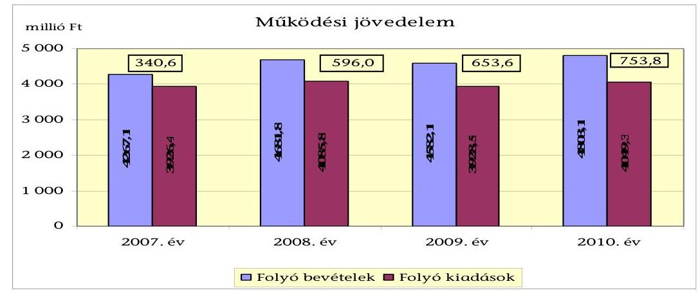

Az Önkormányzat folyó költségvetési egyenlege ${ }^{29}$ minden évben pozitív, tényleges megtakarítás volt, amely forrásul szolgálhatott az Önkormányzat fennálló tőketörlesztési kötelezettségeinek teljesítéséhez, valamint fejlesztéseinek finanszírozásához.

A pozitív folyó költségvetési egyenleg ellenére az Önkormányzat finanszírozása biztosítása érdekében 250,0 millió Ft-os folyószámlahitel keretszerződést kötött. A 2007-2010. évek átlagában a folyószámlahitellel zárt napok átlagos száma 156,2 nap, átlagos értéke 46,0 millió Ft volt. A vizsgált időszakban a folyószámlahitelnek nem volt év végi záró állománya. A 2011.év I. félévére a folyószámlahitellel zárt napok száma 112 nap, a napi átlagos értéke 52,3 millió Ft, illetve a záró állomány 11,1 millió Ft volt.

Az Önkormányzat a működőképessége megőrzését szolgáló kiegészítő támogatásra a vizsgált időszakban nem pályázott.

[^0]
[^0]:    ${ }^{29}$ A működési jövedelem 2007-ben a folyó kiadások 8,7\%-át (340,7 millió Ft-ot), a 2008. évben 14,6\%-át (596,0 millió Ft), 2009-ban 16,6\%-át (653,6 millió Ft-ot), a 2010. évben $18,6 \%$-át ( 753,8 millió Ft-ot) jelentette.

---

Az Önkormányzat nettó működési jövedelmének évenkénti alakulását az alábbi ábra szemlélteti:
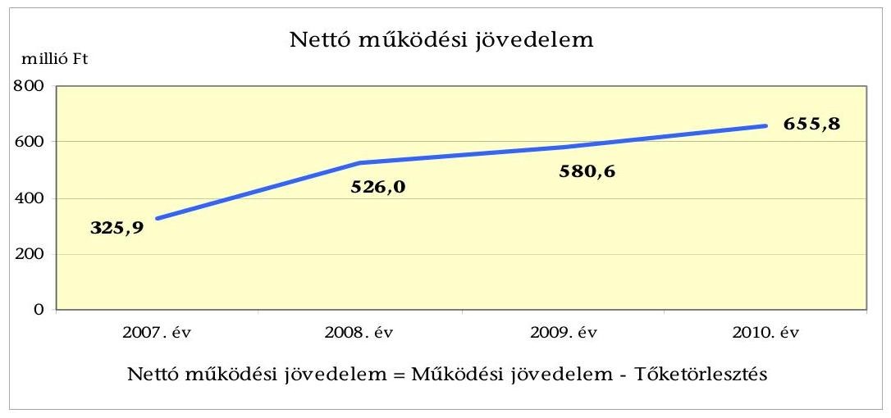

A nettó működési jövedelem ${ }^{30}$ értéke a folyó költségvetési pozíció mellett az adott költségvetési év adósságtörlesztésének hatását is tükrözi.

Az Önkormányzat pénzügyi kapacitása a 2007-2010. években pozitív értéket mutatott. A folyó költségvetés egyenlegének és a tőketörlesztésre (hiteltörlesztésre) fordított összegeknek évenkénti különbözete, vagyis a nettó működési jövedelem 2007-ben 325,9 millió Ft volt, addig 2010-ben ennek duplája, 655,8 millió Ft-ot tett ki. A pénzügyi kapacitás emelkedését meghatározó mértékben a folyó bevételek és kiadások különbségéből származó működési jövedelem növekedése eredményezte, amely a 2007. évben 340,7 millió Ft-ról folyamatos növekedés után a 2010. évre 753,8 millió Ft-ra alakult. Ez ellensúlyozta az Önkormányzat hiteltörlesztési kötelezettségének a 2007. évi 14,8 millió Ft-ról a 2010. évre 98,0 millió Ft-ra való jelentős emelkedését.

Az Önkormányzat felhalmozási költségvetésének egyenlege alakulását a következő ábra szemlélteti:
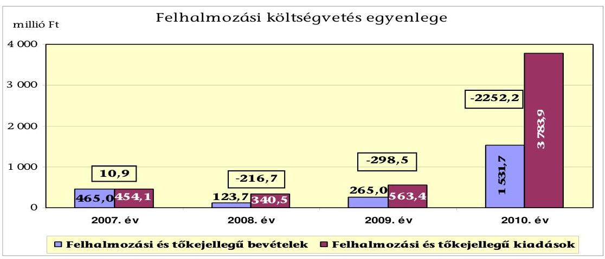

[^0]
[^0]:    ${ }^{30}$ pénzügyi kapacitás

---

Az Önkormányzat felhalmozási költségvetése - a 2007. évet kivéve - negatív volt, felhalmozási forráshiánnyal rendelkezett. A felhalmozási forráshiánynak a felhalmozási és tőke jellegű kiadásokhoz viszonyított aránya 2008-ban 63,6\% $(-216,7$ millió Ft), 2009-ben 53,0\% (-298,5 millió Ft) és 2010-ben 59,6\% $(-2252,2$ millió Ft) volt. A 2010. évben elszámolt kiugró felhalmozási kiadást egyrészt az 1200,0 millió Ft-ot kitevő Gyógyfürdő Kft.-ben történt törzstőke emelés, másrészt az előző években megkezdett és 2010. évben realizálódó 1584,0 millió Ft összegű fejlesztések eredményezték.

A folyó bevételek részét képező költségvetési támogatások jellemzően kötött normatív támogatás formájában a vizsgált időszakban összesen 81,4 millió Ft felhalmozási támogatásokat tartalmaztak. Ennek figyelembevételével a 2007-2010-ben kimutatott -2756,5 millió Ft összegű felhalmozási forráshiány 3,0\%-kal csökkenne.

A 2008-2010. évi felhalmozási forráshiány finanszírozása a pozitív működési jövedelemből, hosszú lejáratú hitelekből és kötvénykibocsátásból történt.

Az Önkormányzat fejlesztési, beruházási céllal 2004-2005. években 580,4 millió Ft-ot vett fel két hosszú lejáratú hitel formájában, a három felvett víziközműtársulati hitel összege pedig 69,8 millió Ft. A 2010-ben a Sárvár-Rábapaty szennyvízközmű beruházáshoz 40,2 millió Ft beruházási hitelt használt fel. A hitelekből 2010. december 31-én fennálló kötelezettség 458,6 millió Ft volt. Az Önkormányzat a 2008. évben kibocsátott kötvényből származó 1200,0 millió Ft-os bevételét lekötötte, majd a 2010. évben a Gyógyfürdő Kft. törzstőkéjének megemelésére használta fel. Az Önkormányzat a vizsgált időszakban csak kamatot törlesztett, tőkefizetési kötelezettsége 2012. évtől áll fenn. Európai uniós forrásból realizált bevétele a 2009-2010. években összesen 1513,5 millió Ft volt.

Az Önkormányzat a folyó és a felhalmozási költségvetésében együtt ${ }^{31}$ a 2007. évben 351,6 millió Ft, 2008. évben 379,2 millió Ft és a 2009. évben 355,2 millió Ft finanszírozási többlet jelentkezett. A 2010. évben viszont a jelentős felhalmozási forráshiánynak köszönhetően 1498,4 millió Ft hiány volt kimutatható.

Az Önkormányzat finanszírozási műveletei 2007-2010. évekbeli egyenlegének alakulását az alábbi ábra szemlélteti:

[^0]
[^0]:    ${ }^{31}$ Finanszírozási műveletek nélküli (GFS) pozíció, amely figyelmen kívül hagyja a pénzforgalom nélküli bevételeket és kiadásokat.

---

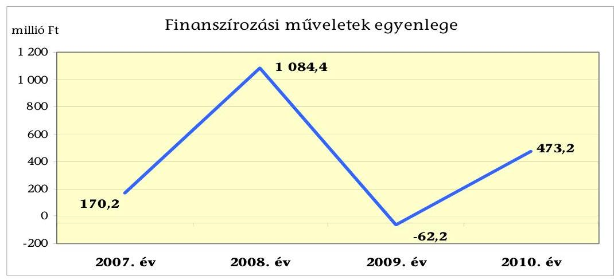

A nettó működési jövedelem és a felhalmozási költségvetés egyenlegének eredője mutatja az Önkormányzat évenkénti teljes finanszírozási igényét. A 2009. évet kivéve a finanszírozási célú pénzügyi műveletek pozitív értéke azt jelzi, hogy az éves költségvetések végrehajtása során szükség volt a pénzkészlet felhasználásán túl külső finanszírozási forrás igénybevételére is.

Az Önkormányzat a 2007. évben 235,8 millió Ft értékű értékpapírt értékesített. A 2008. évben 1200,0 millió Ft-nak megfelelő CHF alapú kötvényt bocsátottak ki. A 2009. évben nem volt külső finanszírozási forrásbevonás. A 2010. évben a jelentős finanszírozási többletet az 527,0 millió Ft egyéb finanszírozási bevételek jelentették, amelyek az EU projektekre elnyert előlegek voltak.

A finanszírozási célú műveleteket a vizsgált időszakban a jelentés 2. számú mellékletének 4.1-4.8 pontjai részletezik.

Az Önkormányzat zárszámadási rendeleteiben a működési és fejlesztési hiányt/többletet a hagyományos költségvetési szerkezet alapján mutatta be ${ }^{32}$, amelyről a jelentés 1. számú melléklete nyújt tájékoztatást. A zárszámadási rendeletben a bevételek és a kiadások tartalmazták a pénzforgalom nélküli bevételeket és kiadásokat is. Az Önkormányzat zárszámadási rendeleteiben minden évben többletet mutatott ki a 2007. évben 502,3 millió Ft, 2008-ban 1188,7 millió Ft, 2009-ben 2522,5 millió Ft, míg 2010. évben 677,1 millió Ft összegben.

Az Önkormányzat kamatbevételeinek és kamatkiadásainak alakulását az alábbi ábra mutatja:

[^0]
[^0]:    ${ }^{32}$ Nincs kötelező előírás a működési és fejlesztési hiány megállapításának módjára.

---

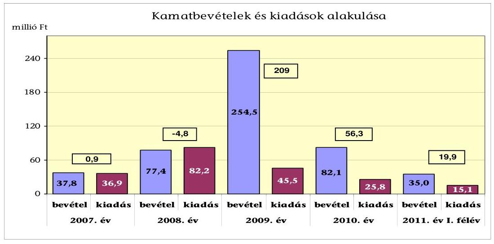

A kamatkiadások a 2007. évről a 2008. évre megduplázódtak (45,3 millió Ft-tal emelkedtek) a kibocsátott kötvény után fizetendő kamatok megjelenése miatt. A 2010. évre a 2007. évi értékük alá csökkentek, amelyet a kötvénynél és a beruházási hiteleknél alkalmazott referencia kamat mértékének kedvező változása eredményezett. Az Önkormányzat minden évben jelentős szabad pénzeszközökkel ${ }^{33}$ rendelkezett, így a befektetései és a lekötései is jelentősek voltak. A költségvetési bankszámlán lévő pénzeszközök után kapott kamatok folyamatosan nőttek 2009-ig, majd a kötvény felhasználás miatt 67,7\%-kal csökkentek, de így is jóval a fizetett kamatok összegei felett realizálódtak. A 2007-2011. év I. féléve között az Önkormányzat összesen 468,8 millió Ft kamatbevételt számolt el, amely a teljes kamatkiadásnak (205,5 millió Ft) több mint kétszerese volt.

# 2.2. Az Önkormányzat bevételeinek változása 

Az Önkormányzat folyó bevétele a 2007. évi 4267,1 millió Ft-ról a 2008. évi (9,7\%-os, 414,7 millió Ft-os) növekedést, majd a 2009. évi (2,1\%-os, 99,7 millió Ft-os) csökkenést követően 2010-re 4803,1 millió Ft-ra teljesültek. A vizsgált időszak első három évének átlagához (4510,3 millió Ft) képest a változás 6,4\%-os, 292,8 millió Ft-os növekedés volt. A 2011. év I. félévi folyó bevétel 2030,4 millió Ft volt.

Az Önkormányzat 2007-2011. június 30. között realizált, főbb folyó bevételi jogcímeinek számszaki adatait a következő ábra szemlélteti:

[^0]
[^0]:    ${ }^{33}$ Az Önkormányzatnak a 2007. évben 738,7 millió Ft, a 2008. évben 1202,3 millió Ft és 1000,0 millió Ft hosszú lejáratú bankbetétje volt. A 2009. évben 2459,2 millió Ft pénzeszköze volt, a 2010. évben 1220,1 millió Ft és 250,0 millió Ft hosszú lejáratú bankbetét állt rendelkezésére.

---

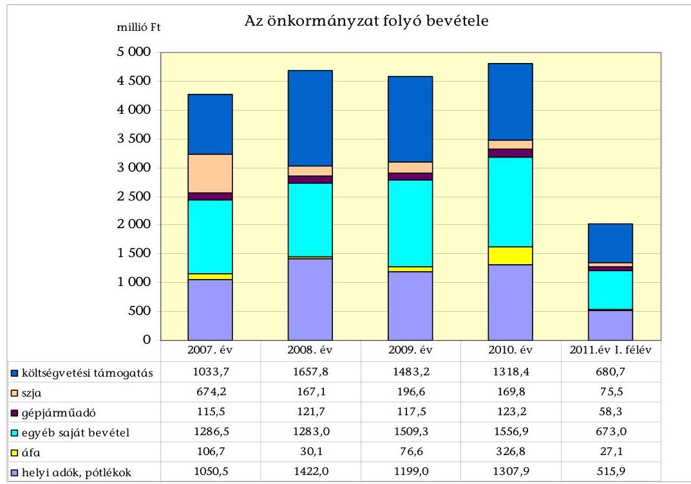

Az Önkormányzat 2007-2010. években realizált folyó bevételének a 36,5\%-át a költségvetési támogatás és az szja bevételek (összesen 6700,9 millió Ft) együttes összege adta. A központi költségvetésből kapott költségvetési támogatások és az
 szja bevétel 2010. évi együttes összege 1488,2 millió Ft volt, amely 249,3 millió Ft-tal (14,3%-kal) maradt el a megelőző három év átlagától (1737,5 millió Ft).

A költségvetési támogatások összege a 2008. évi 60,4%-os (624,1 millió Ft) növekedést³⁴ követően a központi forráskivonás hatására³⁵ folyamatosan csökkent. Az előző évihez képest 2009-ben 10,5%-kal (174,6 millió Ft-tal), 2010-ben 11,1%-kal (164,8 millió Ft) volt kevesebb. A központi támogatás részét képező normatív támogatások a 2007. évről 2008-ra jelentősen, 576,5 millió Ft-tal (74,7%-kal) nőttek. A növekedés a sitkei óvoda átvételéből, illetve a többi közoktatási intézménynél jelentkező együttes 69 fős ellátotti gyermeklétszám-emelkedéssel hozható összefüggésbe. A normatív támogatások a 2008-2009. évek között 35,9 millió Ft-tal (2,7%-kal), 2009-2010. évek között ennél erőteljesebben, 417,1 millió Ft-tal (31,8%-kal) csökkentek, amit a normatívák központi csökkentése, valamint a közoktatási ágazat ellátotti létszámának visszaesése³⁶ idézett elő. Az Önkormányzat személyi jövedelemadó bevétele csökkent a központi szabályozás változása és a visszaosztás alapját jelentő önkormányzati adóerőképességének növekedése miatt (iparűzési adóerő-képessége 2007-ben 707,8 millió Ft/fő, 2010. évben 833,6 millió Ft/fő volt).

[^0]
[^0]:    ³⁴ A 2007. évben kimutatott szja bevétel tartalmazott 524,9 millió Ft normatív alapon elosztott szja bevételrészt is.
    ³⁵ a 2007. évi bázishoz képest
    ³⁶ összességében 31 fő 2007-ről 2010-re (a 2008-ra 69 fő növekedés, majd 42 és 58 fő csökkenés eredőjeként)

---

Az Önkormányzat folyó (működési) bevételéből a helyi adóbevétel a vizsgált időszakban a 2007. évi 24,6% részarányról (1050,5 millió Ft) a 2008. évre 30,4%-os részarányra, 1422,0 millió Ft-ra emelkedett. A 2009. évre az előző évhez viszonyítva 4,2 százalékponttal (223,0 millió Ft-tal) csökkentek. A 2010-re részarányuk 27,2%, értékük 1307,9 millió Ft lett, a növekedés 9,1%-os (108,9 millió Ft-os) volt.

A Képviselő-testület a helyi adók közül³⁷ a helyi iparűzési adót, az idegenforgalmi adót és a vállalkozók kommunális adóját alkalmazta. A vizsgált időszakban új adónem bevezetésére nem került sor. A 2011. január 1-jétől - a helyi adókról szóló 1990. évi C. törvény 27-29. §-ai előírásának megfelelően - megszüntették a vállalkozók kommunális adóját. A helyi iparűzési adó mértéke 2007-2010. években nem változott. Az állandó jelleggel végzett tevékenység után fizetendő iparűzési adót a bevezethető adómértékben, 2%-ban határozták meg. Az ideiglenes jelleggel végzett iparűzési tevékenység után az adó mértéke 2000 Ft/naptári nap volt. Az iparűzési adó esetén a vizsgált időszakban az adómértékek nem változtak. A személyenként és vendégéjszakánként fizetendő idegenforgalmi adó összege egységesen 2009. január 1-jéig 300, majd 320 és 2011. január 1-jétől 350 Ft volt. A vállalkozók kommunális adójának adómértéke megszüntetéséig 2000 Ft/fő állományi létszám volt a vizsgált időszakban.

Az Önkormányzatnál a vizsgált időszakban a helyi adóbevétel hullámzó volt, amelyet az iparűzési adóbevételek (részarányuk a helyi adóbevételből 90,9%) változó összege okozott. Az iparűzési adóbevétel a vizsgált időszak kezdő évéről 2010. évre 209,1 millió Ft-tal (21,7%-kal) nőtt, a településen működő vállalkozások folyamatosan növekvő számának és az adóalap emelkedésével összefüggésben. (Az Önkormányzatnál a helyi iparűzési adók miatti bevételi kitettség nem áll fenn, mivel több nagy adózótól származik bevétele.) Az idegenforgalmi adóbevételek vizsgált időszak alatti növekedése is jelentős - 52,4 millió Ft, 89,7%-os - volt. A gyógyfürdő-fejlesztés eredményeként nőtt a vendégek száma, továbbá az adómérték is emelkedett.

Az állami támogatások (költségvetési támogatás és az szja átengedett bevétele) csökkenése miatti bevételkiesést³⁸ az Önkormányzat a helyi adóbevételek növelésén túl az egyéb saját bevételeinek növelésével pótolta. Az Önkormányzat egyéb saját bevételei a vizsgált időszakban folyamatosan emelkedtek a 2007-2009. évek 1359,6 millió Ft-os átlagos értékéről a 2010-re 14,5%-kal (197,3 millió Ft-tal) 1556,9 millió Ft-ra.

A 2007-2010. évek alatt az egyéb saját bevételek 59,6%-a az egészségügyi feladatokra a társadalombiztosítási alaptól átvett támogatásértékű bevétel formájában realizálódott. E bevételek nélkül az egyéb saját bevételek értéke 2007-2010. évek között összesen 2275,6 millió Ft volt. (A 2007. évben 413,5 millió Ft, a folyamatos emelkedést követően a 2010. évben 674,8 millió Ft volt.) A társadalombiztosítási alaptól átvett támogatásértékű bevételek nélküli egyéb saját bevételeket a térítési díjbevételek, az egyéb ingatlanok (vízszolgáltató és szennyvíz-elvezető rendszer, parkoló) bérbeadásából származó bevételek, az

[^0]
[^0]:    ³⁷ Az Önkormányzat többször módosított egységes szerkezetű, 43/2004. (XII. 16.) számú rendelete a helyi adókról.
    ³⁸ A 2007-2009 átlagáról a 2010. évre 249,3 millió Ft (14,3%).

---

előző évi költségvetési visszatérülések, valamint a hozam és kamatbevételek adták. Az egyéb saját bevételek tartalmaztak a vizsgált időszakban felhalmozási célú bevételeket³⁹ is átlagosan 5,6%-os részarányban. Az Önkormányzat a tulajdonosi részesedései után 2007-2010 között 34,3 millió Ft osztalékot vett fel⁴⁰.

A folyó bevételek között kimutatott áfa bevételek a 2007-2009. év átlagos 71,2 millió Ft-os értékéről a 2010. évre 326,8 millió Ft-ban realizálódtak. A 255,6 millió Ft-os, négy és félszeres növekedést a jelentős fejlesztési tevékenység indukálta. A 2009. évben az áfa bevétel 52,0%-a (39,8 millió Ft), a 2010. évben 61,0%-a (199,3 millió Ft) fordított áfa bevétel volt.

Az Önkormányzat felhalmozási bevételei a vizsgált időszakban a következők voltak:

| Megnevezés | 2007. év | 2008. év | 2009. év | 2010. év | 2011. év 1. félév |
| :--: | :--: | :--: | :--: | :--: | :--: |
| Tárgyi eszköz értékesítés | 212,9 | 49,8 | 7,4 | 1,7 | 147,4 |
| Egyéb saját tőkebevétel | 198,0 | 34,3 | 74,5 | 38,6 | 12,0 |
| Államháztartáson belülről kapott támogatás | 6,5 | 11,1 | 56,0 | 94,7 | 12,7 |
| EU-tól és külföldről kapott támogatások | 0,0 | 0,0 | 122,9 | 1376,4 | 396,4 |
| Államháztartáson kívülről kapott támogatás | 47,6 | 28,4 | 4,3 | 20,3 | 4,3 |
| Összes felhalmozási bevétel | 465,0 | 123,7 | 265,0 | 1531,7 | 572,8 |

A felhalmozási bevételek a 2007. évről a 2008. évre kimutatható jelentős csökkenés után 2009-2010. években folyamatosan emelkedtek. Értékük a 2010. évben kiugró 1531,7 millió Ft volt, amely az előző három év átlagának (284,6 millió Ft) több mint ötszöröse volt⁴¹.

Az összes felhalmozási bevétel 14,2%-a, 419,1 millió Ft⁴² a tárgyi eszköz értékesítésből keletkezett, amelyből 268,1 millió Ft-ot önkormányzati ingatlanok eladásából értek el. A legjelentősebb ingatlanértékesítésből származó bevétel a 2007. évben 212,5 millió Ft összegben realizálódott, amely során összesen 27616 m² beépítetlen földterületet értékesítettek gyógyszálló bővítése és a szállodát kiszolgáló parkoló építése céljára.

[^0]
[^0]:    ³⁹ A 2007. évben 60,2 millió Ft-ot, a 2008. évben 54,8 millió Ft-ot, a 2009. évben 54,3 millió Ft és a 2010. évben 148,3 millió Ft. A 2010. évi érték azért közel háromszorosa a megelőző évinek, mert a számviteli szabályozás változása miatt a felhalmozási kamatbevétel elkülönítve a 2010. évtől felhalmozási bevételként került elszámolásra 101,6 millió Ft összegben. Az évek összehasonlíthatósága indokolja a folyó bevételek közötti szerepeltetését.
    ⁴⁰ A vizsgált időszakban csak a RÁBAHŐ Kft.-től kaptak osztalékot, csökkenő összegben. A gazdasági társaságban az Önkormányzatnak 40% tulajdoni részesedése van, közfeladat ellátásában nem vett részt.
    ⁴¹ A jelentés 2. számú melléklete felhalmozási bevételi értékei eltérnek a táblázat adattartalmától. Az Önkormányzat a Kincstárnak leadott beszámolójában - így a jelentés 2. számú mellékletében is - az államháztartáson belülről kapott bevételek összegéből nem mutatta be elkülönítve az EU projektekhez kapcsolódó felhalmozási forrásokat (a 2009. évben 122,9 millió Ft-ot, a 2010. évben 1376,4 millió Ft-ot).
    ⁴² A 2011. első félévében kimutatott 147,4 millió Ft bevétel a fordított áfa elszámolása volt. E nélkül a tényleges bevétel a vizsgált időszakban 271,7 millió Ft.

---

A vizsgált időszakban az Önkormányzat a 2009-2010. években összesen 1513,5 millió Ft⁴³ EU-s támogatást realizált⁴⁴ hat pályázata keretében. A 2011. év első félévében teljesült EU-s támogatás 396,4 millió Ft volt, amelyet kettő már folyamatban lévő és egy újonnan induló beruházásához kapcsolódott. Az egyéb saját tőkebevételek⁴⁵ értéke a vizsgált időszakban 357,4 millió Ft volt. A 2007. évi értéke (198,0 millió Ft, amelynek 82,7% lakásértékesítés volt) és 42,6%-os részaránya is jelentősen csökkent a vizsgált időszak végére, a 2010. évben 38,6 millió Ft volt. Az Önkormányzat államháztartáson belülről és kívülről kapott támogatásként mutatta ki a fejlesztési feladatok végrehajtásához kapott, pályázat útján elnyert felhalmozási célú állami támogatásokat, a beruházási társulástól - pályázati önrészként a 2010. évben 280,2 millió Ft-ot, 2011. év első félévében 172,6 millió Ft-ot - és a vállalkozásoktól átvett felhalmozási célú pénzeszközöket. A felhalmozási célra átvett pénzeszközök értéke a 2008. évi 39,6 millió Ft-ról folyamatosan nőtt, míg részaránya ezzel ellentétesen a 2008. évi 32,0%-ról folyamatosan csökkent, 2010-ben 7,5% (114,6 millió Ft) volt.

# 2.3. Az Önkormányzat működési és a felhalmozási célú kiadásainak változása 

Az Önkormányzat folyó kiadása 2007-2011. június 30-a között főbb jogcímek szerinti bontásban az alábbiak szerint alakult:

| Megnevezés | 2007. év | 2008. év | 2009. év | 2010. év | 2011. év 1. félév |
| :--: | :--: | :--: | :--: | :--: | :--: |
| folyó kiadások | 3926,4 | 4085,8 | 3928,5 | 4049,3 | 2022,2 |
| Működési kiadások (kamatkiadás nélkül) | 3670,0 | 3773,7 | 3618,9 | 3708,3 | 1873,1 |
| Államháztartáson belülre átadott pénzeszközök | 5,1 | 7,0 | 9,2 | 25,0 | 10,8 |
| Transzferkiadások | 202,0 | 217,6 | 238,9 | 290,2 | 123,2 |
| -ebből: vállalkozásoknak | 3,8 | 3,8 | 5,9 | 7,0 | 4,2 |
| magánszemélyeknek | 91,9 | 103,5 | 118,6 | 163,9 | 63,0 |
| nonprofit szervezeteknek | 106,3 | 110,3 | 114,4 | 119,3 | 56,0 |
| Kamatkiadások | 36,9 | 82,2 | 45,5 | 25,8 | 15,1 |
| Előző évi pénzmaradvány átadás | 12,4 | 5,3 | 16,1 | 0,0 | 0,0 |

Az Önkormányzat összes folyó kiadása a 2007-2009. évek átlagában 3980,2 millió Ft volt, amely a 2010. évre 1,7%-kal (69,1 millió Ft-tal) emelkedett. Az Önkormányzat által teljesített kamatkiadások a vizsgált időszak első három évének 54,9 millió Ft átlagos értékéről jelentősen a 2010. évre 53%-kal

[^0]
[^0]:    ⁴³ Az elemi beszámolóban a 2009. évben 14,2 millió Ft EU forrás az államháztartáson belülről kapott felhalmozási támogatások között
    ⁴⁴  
    ⁴⁵

 szerepelt. Ezzel az összeggel csökkentettük az államháztartáson belülről kapott felhalmozási támogatások 56,0 millió Ft-os összegét (41,8 millió Ft volt ténylegesen), míg növeltük az EU-tól kapott támogatások 122,9 millió Ft-os értékét, amely 137,1 millió Ft volt ténylegesen. A 2009. évi 137,1 millió Ft és a 2010. évi 1376,4 millió Ft adja a realizált EU-s támogatás értékét.
    ${ }^{44}$ Az Önkormányzat elszámolása szerint 2010. december 31-én 581,4 millió Ft-ot mutatott ki az egyéb finanszírozási bevételei között, mint elnyert, de ténylegesen nem realizált EU támogatási előleget, így az összes EU forrása 2094,9 millió Ft volt.
    ${ }^{45}$ Jellemzően önkormányzati lakások, egyéb helyiségek értékesítéséből, cseréjéből származó bevételek és államháztartáson kívülről visszatérülő kölcsönbevételek voltak.

---

(29,1 millió Ft-tal) csökkentek, a vizsgált időszakban a folyó kiadások együttes, átlagos 1,1%-os részarányát képviselve. Az államháztartáson belülre átadott működési célú pénzeszközök a folyó kiadásokon belül átlagos 0,3% részarányt képviseltek. Az államháztartáson kívülre történő működési célú pénzeszközátadások (transzferkiadások) összege a 2007-2010. közötti időszakban folyamatosan, közel másfélszeresére, 88,2 millió Ft-tal emelkedett a társadalmi és szociálpolitikai juttatások, az egyház által fenntartott Katolikus Általános Iskola és a sport támogatások növekedése következményeként.
Az Önkormányzat kamatkiadások nélküli működési kiadásai főbb kiadásnemek szerinti bontásban az alábbiak szerint alakultak:
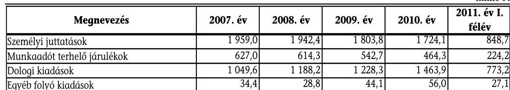

A működési kiadásokon belül a személyi juttatások teljesített kiadásai a létszámcsökkentések miatt minden évben csökkentek. A 2007-2009. évek 1901,7 millió Ft átlagkiadásához képest a 2010. évben 177,6 millió Ft-tal (9,3%-kal) kevesebb személyi juttatást teljesítettek ${ }^{46}$. A munkaadókat terhelő járulékok címén elszámolt kiadások összege a központi intézkedések és a csökkenő személyi juttatások hatására a vizsgált időszakban folyamatosan csökkent az időszak első három évében elszámolt átlagos 594,7 millió Ft-ról 464,3 millió Ft-ra (21,9%-kal). A dologi kiadások és egyéb folyó kiadások az Önkormányzatnál folyamatosan emelkedtek, 2010-ben 27,6%-kal (328,8 millió Ft-tal) voltak magasabbak a 2007-2009. évek átlagos 1191,1 millió Ft-os értékénél. Az előző évhez képest 2008-ra 133,0 millió Ft (12,3%), majd 55,4 millió Ft (4,5%) növekedés volt kimutatható. A 2010. évre 247,5 millió Ft-os (19,5%) növekedés történt az inflációt jóval meghaladó mértékben úgy, hogy az önkormányzati feladatellátásban változás nem történt.

A folyó kiadások a kórházi fekvőbeteg ellátás nélkül az alábbiak szerint alakultak:
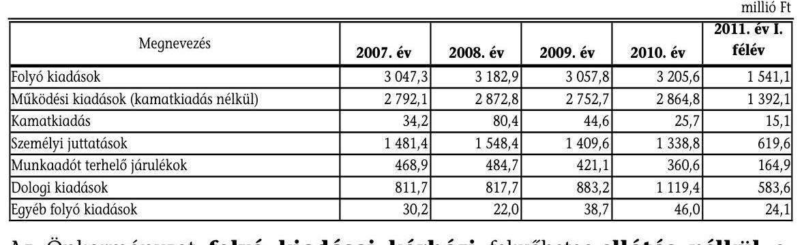

Az Önkormányzat folyó kiadásai kórházi fekvőbeteg-ellátás nélkül a 2007-2009. évek között átlagosan 3096,0 millió Ft-ot jelentettek. A 2010. évben az előző évek átlagához viszonyítva 3,5%-kal, 109,6 millió Ft-tal emelkedtek. A

[^0]
[^0]:    ${ }^{46}$ A vizsgált időszak alatt oktatási ágazatban 32 fő, az egészségügyi ágazatban a 2007. évben 62 fő, a Polgármesteri hivatalban 2 fő, a szociális ágazatban a 2010. évben 6 fő, míg az egyéb ágazatban a 2007-2010. évben 3 fő létszámcsökkenés történt.

---

folyó kiadásokon belül meghatározó volt a működési kiadások aránya (átlagosan 90,3%). A működési kiadásokon belül a személyi juttatások a 2007-2009. évek 1479,8 millió Ft átlaga alatt (141,0 millió Ft-tal, 9,5%) teljesült a 2010. évben. A dologi és az egyéb folyó kiadások 2010. évben kórházi fekvőbetegellátás nélkül teljesített kiadásai 25,6%-kal (297,6 millió Ft) meghaladták a 2007-2009. évek 867,8 millió Ft átlagát ${ }^{47}$.

A társadalombiztosítási alaptól átvett támogatásértékű bevétel 840,0 millió Ft-os vizsgált időszaki átlaga 96,1%-ban fedezte a fekvőbeteg ellátás 2007-2010. évek átlagos 874,0 millió Ft-os folyó kiadását. Az Önkormányzat a kórháznak a 2007-2008. években 142,0 millió Ft működési célú támogatást nyújtott. A 2009. évben nem nyújtottak támogatást, míg a 2010. évben a támogatás csupán 2,2 millió Ft volt.

A folyó és felhalmozási kiadások vizsgált időszakbeli alakulását, a teljesített kiadások folyó és felhalmozási célú felhasználásának arányait a következő grafikon szemlélteti:
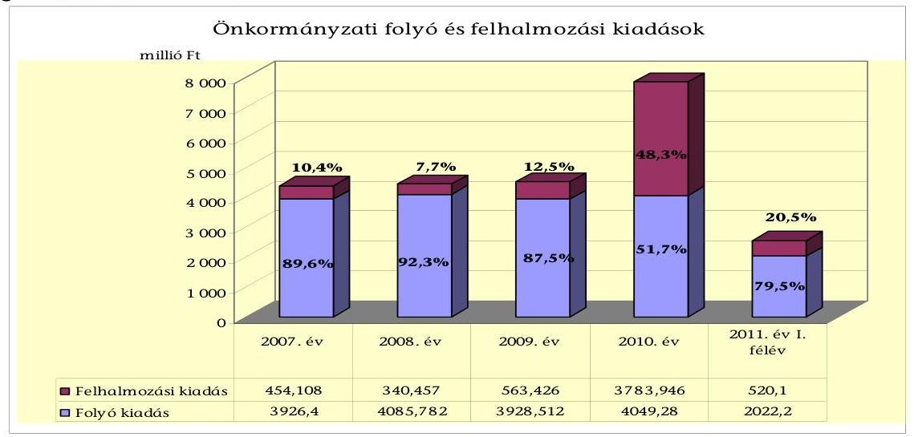

A folyó és felhalmozási kiadások 2010. évi aránya a 2007. évihez képest jelentősen változott, a felhalmozási kiadások aránya 37,9 százalékponttal növekedett a működési kiadások arányának terhére. A felhalmozási kiadások 2010-ben 3331,3 millió Ft-tal haladták meg a 2007-2009. évi 452,7 millió Ft-os átlagos kiadási szintet, ezzel szemben a 2010. évi folyó kiadások csupán 69,1 millió Ft-tal voltak magasabbak a 2007-2009. évi átlagos 3980,2 millió Ft-os szintnél.

Az Önkormányzat Beruházási Társulást hozott létre Rábapaty önkormányzatával a döntően KEOP forrásból megvalósuló „Sárvár-Rábasömjén városrész és Rábapaty községek csatornázása közös beruházásban" projektre 2009 novemberében. Az Önkormányzat adatszolgáltatása szerint a várható 1073,9 millió Ft összes bekerülési költségű beruházásra a 2010. évben - a projekt előkészítéssel együtt - 386,6 millió Ft-ot fordítottak. A 2011. év I. félévéig 255,4 millió Ft felhalmozási és 49,2 millió Ft folyó kiadás került elszámolásra a beruházási társulásnál.

[^0]
[^0]:    ${ }^{47}$ A kórházi fekvőbeteg ellátás ágazatban a 2008. évi emelkedés után a dologi és egyéb folyó kiadások csökkentek. A 2010-ben a dologi és egyéb folyó kiadás 354,5 millió Ft volt, amely az előző év adatait 3,9 millió Ft-tal (1,1%-kal) haladta meg.

---

A folyó és felhalmozási kiadások beruházási társulás nélküli vizsgált időszakbeli alakulását, a teljesített kiadások folyó és felhalmozási célú felhasználásának arányait a következő grafikon szemlélteti:
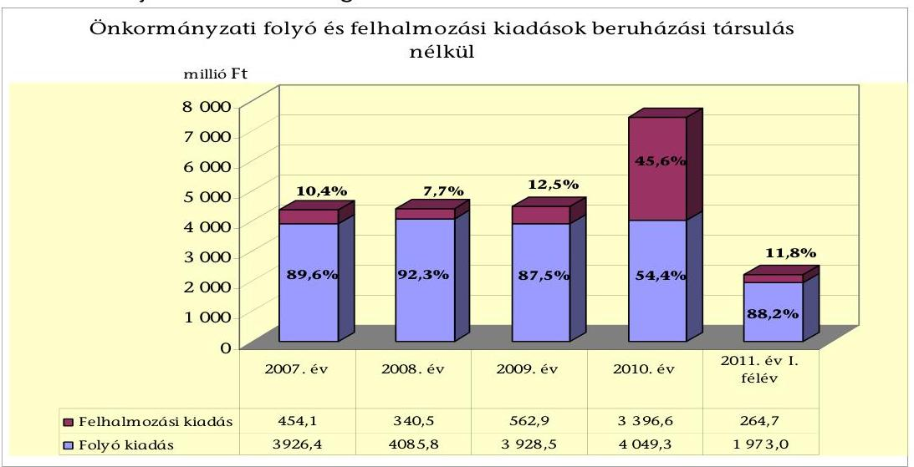

Az Önkormányzat beruházási társulás nélküli felhalmozási kiadásai 2010-ben 2944,1 millió Ft-tal haladták meg a 2007-2009. évi 452,5 millió Ft-os átlagos kiadási szintet. A 2010. évi felhalmozási kiadási arány 35,4 százalékpontos növekedését az 1200,0 millió Ft részesedés vásárlás és a vizsgált időszak első három évének 308,2 millió Ft-os fejlesztési kiadásának hatszorosára emelkedése idézte elő.

Az Önkormányzatnál a 2007-2010. években a befejezett fejlesztési feladatok teljes bekerülési költsége 4385,3 millió Ft volt, amelyből a beruházások összege 2172,3 millió Ft (49,5%) és a felújítások összege 2213,0 millió Ft (50,5%) volt. A 10,0 millió Ft bekerülési költség feletti beruházások és felújítások száma 2007-2010. között 34 darab, amelyek teljes bekerülési költsége 4004,6 millió Ft volt, a fejlesztések 91,3%-a volt. A 2007 és 2010 között kezdett és befejezett 4385,3 millió Ft értékű fejlesztések forrásmegoszlása 1735,5 millió Ft EU-s támogatás (39,6%), 25,1 millió Ft hazai támogatás (0,6%), 1424,9 millió Ft saját bevétel (32,5%) és 1200,0 millió Ft kötvény bevétel (27,3%) volt. Az itt bemutatott adatokat a jelentés 3/a. számú melléklete tartalmazza.

Az Önkormányzat folyamatban lévő fejlesztési feladatainak 2010. december 31-ig teljesített kiadása 446,8 millió Ft volt, amelynek forrása 359,7 millió Ft EU-s támogatás (80,5%), 46,9 millió Ft saját bevétel (10,5%) és 40,2 millió Ft hitel (9,0%) volt. Az itt bemutatott adatokat a jelentés 3/b. számú melléklete tartalmazza.

Az Önkormányzat 2010. december 31-én folyamatban lévő és a 2010. évet követő kötelezettségvállalásainak várható összege 1164,5 millió Ft, amelynek tervezett forrása 968,9 millió Ft EU-s támogatás (83,2%), 79,3 millió Ft saját bevétel (6,8%) és 116,3 millió Ft hitel ${ }^{48}(10,0\%)$. Az itt bemutatott adatokat a jelentés 3/c. számú melléklete tartalmazza.

[^0]
[^0]:    ${ }^{48}$ A 2010-ben megkötött hitelszerződés keretösszege 135,5 millió Ft volt.

---

Az Önkormányzat 2010. december 31-éig megvalósult fejlesztései közül a három legmagasabb költségű beruházás az Önkormányzat adatszolgáltatása szerint a következő volt:

- Az „emelt szintű járóbeteg szakellátó központ kialakítása Sárváron" projekt 2010. évben valósult meg 881,8 millió Ft összegben. A beruházáshoz eszközbeszerzés is kapcsolódott. A beruházás forrása 85,3%-ban (751,8 millió Ft-ban) EU-s támogatás, 129,5 millió Ft összegben (14,7%) saját bevétel volt.
- Az „egészségügyi rehabilitációs központ kialakítása" kiemelt projekthez, amihez orvosi eszközbeszerzés is kapcsolódott NYDOP pályázaton 791,0 millió Ft (90,1%) EU-s forrást nyertek el és használtak fel. Ezt 87,3 millió Ft (9,9%) saját forrással kiegészítve 878,3 millió Ft értékű beruházást hajtottak végre 2008-2010-ben.
- A sárvári távolsági autóbusz pályaudvar felújítását 2009-2010. évek között végezték el, amelynek bekerülési költsége 101,9 millió Ft volt. Ehhez 89,2 millió Ft EU-s támogatást és 12,7 millió Ft saját bevételt használtak fel. A felújítás során a közvilágítási rendszer korszerűsítése, vízvezeték rekonstrukció, akadálymentesítés, útfelújítás valósult meg.

Az Önkormányzat az éves költségvetési rendeletekben elkülönítetten nem mutatta be a beruházásokkal létrehozott létesítmények működtetése és fenntarthatósága érdekében várhatóan felmerülő költségvetési kiadásokat.
A gazdasági társaságok részére átadott pénzeszközök alakulását az alábbi grafikon mutatja be:
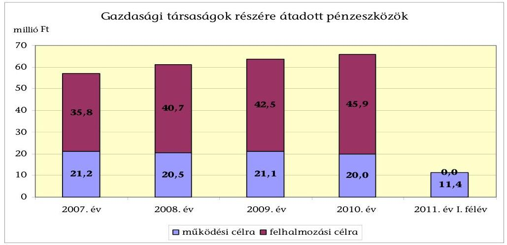

Az önkormányzati kötelező és önként vállalt feladatellátásban résztvevő gazdasági társaságoknak működési célra átadott pénzeszközök a vizsgált években azonos szinten alakultak. Az Önkormányzat a műsorszolgáltatást és lapkiadást végző kizárólagos tulajdonú gazdasági társasága működéséhez biztosított a vizsgált időszakban összesen 94,3 millió Ft működési támogatást. A 2007-2011. első féléve között fejlesztési célra átadott pénzeszközök összege 164,9 millió Ft volt, amely az összes támogatás 63,6%-át tette ki. A fejlesztési célú támogatás 98,7%-a (162,8 millió Ft) a Sárvár-VÍZ Kft-nek juttatott közműfejlesztési hozzájárulás volt. A 2008. évben a MÉDIA Kht. kapott 2,1 millió Ft fejlesztési forrást eszközbeszerzésre. A két gazdasági társaság által kapott támogatás az összes

---

bevételük 9,7%-át, illetve 10,7%-át jelentette. A gazdasági társaságok adatait a jelentés 4. számú melléklete tartalmazza ${ }^{49}$.

# 3. Az ÖNKORMÁNYZAT KÖTELEZETTSÉGEI 

### 3.1. Az Önkormányzat pénzintézeti kötelezettségeinek változása

Az Önkormányzat pénzintézeti kötelezettségeinek állománya a 2006. december 31-ei 674,2 millió Ft-ról 2010. december 31-re 2157,4 millió Ft-ra emelkedett, amely 2011. június 30-ra 7,8 millió Ft-tal növekedett (2165,2 millió Ft-ra). A 2011. június 30-án meglévő pénzintézeti kötelezettség 78,5%-a (1698,8 millió Ft) kötvénykibocsátásból keletkezett a fejlesztési hitel összege 455,3 millió Ft-ot tett ki.

A pénzintézeti kötelezettségek állományának alakulását a 2006-2011. év I. félév között az alábbi ábra szemlélteti:
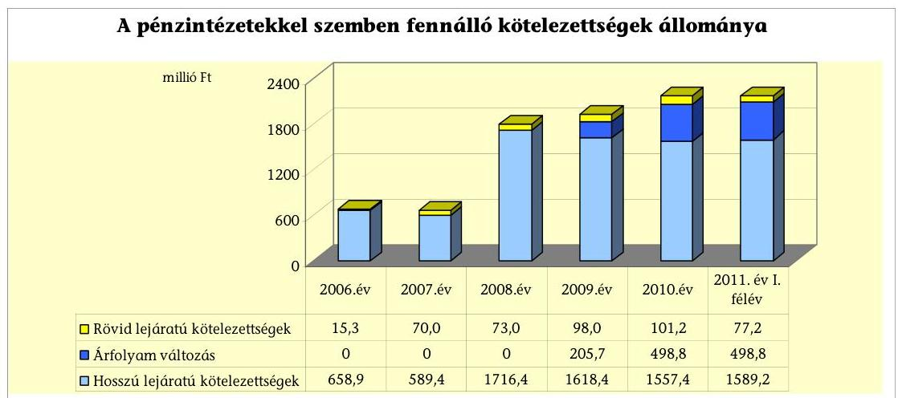

A 2011. év I. félévben fennálló pénzintézeti kötelezettségek a Víziközmű Társulat, az Önkormányzat és a Beruházási Társulás, fejlesztési és beruházási célú hosszú lejáratú hiteleinek felvételéből, egy CHF alapú kötvény kibocsátásából valamint folyószámlahitel igénybevételéből keletkeztek. A 2008. évben a pénzintézeti kötelezettségek állományának növekedését a 7632 ezer CHF (1200,0 millió Ft) összegű kötvény kibocsátása okozta. A hosszú lejáratú hitelek közül a vizsgált időszakban a Víziközmű Társulat két hitele (55,1 millió Ft) járt le. A Beruházási Társulás részéről egy 135,5 millió Ft összegű hitelfelvételről írtak alá szerződést, amelyből 2011. év I. félévéig 71,9 millió Ft-ot vettek igénybe. A rövid lejáratú kötelezettségek állományát a hosszú lejáratú hitelek tárgyévet követő fizetési kötelezettségei jelentették, és a 2011. év I. félévben tartalmazta a fennálló folyószámlahitel záró állományát is.

[^0]
[^0]:    ${ }^{49}$ A gazdasági társaságok adatközlése az eltérő számviteli elszámolás miatt nem egyezik az Önkormányzat elemi beszámolójában elszámolt adatokkal a támogatások tekintetében.

---

Az Önkormányzat nem rendelkezett a felvett hitelek és a kötvény visszafizetésének forrásairól. A hitelek előterjesztései nem tartalmazták az
 adósságot keletkeztető kötelezettségvállalások felső határát, ugyanakkor a költségvetési rendeletekben - az adósságszolgálati korlát figyelembevételével - határozták meg az adott évre vonatkozóan felvehető hitel összegét és bemutatták a hitelfelvételekkel összefüggő terheket, az adott költségvetési évre, valamint az azt követő évekre. Az Önkormányzat a kötelezettségvállalás során az adósságot keletkeztető kötelezettségvállalásának felső határát az áttekintett időszakban nem lépte túl.

Az Önkormányzat pénzintézeti kötelezettségvállalásaira minden esetben a Képviselő-testület döntése alapján került sor. A hosszú lejáratú hiteleknél közbeszerzéssel ${ }^{50}$ a kötvénynél a pénzintézetek versenyeztetésével történt meg a legkedvezőbb ajánlat kiválasztása. A döntéseket megalapozó előterjesztések a teljes futamidő várható kamat- és tőkefizetési kötelezettségek részletezését, a kamat- és árfolyamkockázatok bemutatását nem tartalmazták. Az Önkormányzat a pénzintézetek versenyeztetésével 2010. január 1-jétől számlavezető bankot váltott. A 2011. év I. félévben fennálló pénzintézeti kötelezettségvállalásainak 91,2%-át a számlavezető pénzintézete finanszírozta. A bankváltást követően, az Önkormányzat számlavezetője azonos volt a kötvénykibocsátást finanszírozó pénzintézettel.
Az Önkormányzat 2011. június 30-án CHF-ben fennálló adósságot keletkeztető pénzintézeti kötelezettségvállalása az alábbi volt:

| Megnevezés | Kibocsátás <br> időpontja | Összeg <br> ezer CHF- <br> ben | Kamat (referen- <br> cia kamat+ <br> kamatfelár) | Felhasználás célja: |
| :-- | :--: | :--: | :--: | :--: |
| "Sárvár <br> Kristály"kötvény | 2008.02.01 | 7632 | $3,15 \%$ | Fürdőfejlesztésre |

Az Önkormányzat a CHF-ben fennálló pénzintézeti kötelezettségéből 2011. június 30-ig tőkét nem törlesztett, 376 ezer CHF (68,0 millió Ft) kamatot, és 55 ezer CHF (8,9 millió Ft) egyéb költséget ${ }^{51}$, valamint 3,5 millió Ft garanciavállalási díjat fizetett. A devizában kibocsátott kötvénykötelezettség év végi könyvviteli mérleg szerinti értékének meghatározásakor az árfolyamváltozás miatti év végi értékeléseket a 2009-2010. évek között elvégezték az Önkormányzatnál. A 2008. évben a 7620 ezer CHF névértékben kibocsátott kötvény év végi mérleg szerinti értékéhez (1200,0 millió Ft) képest a 2010. évben 1698,8 millió Ft-ra nőtt, ami 41,6%-os (498,8 millió Ft) növekedést jelentett a kibocsátáskori kötelezettséghez képest. A kötvény tőketörlesztése 2012. szeptember hónaptól kezdődik, 763 ezer CHF összegben az Önkormányzat számára.

Annak megítéléséről, hogy a devizában fennálló kötvény visszavásárlása az Önkormányzat számára forintban összességében többletkiadást (árfolyamveszteség) vagy kiadási megtakarítást (árfolyamnyereség) eredményez a futamidő végén, a teljes kötelezettség rendezését követően lehet képet alkotni. Mindaddig, amíg törlesztési kötelezettség nem áll fenn (türelmi idő, moratórium), a tőkére vonatkoz-

[^0]
[^0]:    ${ }^{50}$ A közbeszerzési értékhatárt elérő hiteleknél.
    ${ }^{51}$ Átalánydíj címén havi $0,06 \%$ volt a díjmérték a kötvény össznévértékére vetítve a 2009. évben.

---

tatva nem értelmezhető sem az árfolyamveszteség, sem az árfolyamnyereség. Ugyanakkor a számviteli szabályok meghatározzák, hogy az árfolyamkülönbözetet év végén a kötelezettségek vagy követelések között a könyvviteli mérlegben nyilván kell tartani, azonban az árfolyamkülönbözet ebben az esetben ténylegesen nem képződött.

A kötvénykibocsátásból származó bevétel teljes összegét a kibocsátási célnak megfelelően az Önkormányzat gazdasági programjában meghatározott fürdőfejlesztésre használták fel. A kötvénykibocsátás bevételét 7632 CHF (1200,0 millió Ft-ot) a kizárólagos tulajdoni részesedésű gazdasági társaságának törzstőke emelésére fordították. A törzstőke felemeléséről 2010. január 28-án döntött a Képviselő-testület. Az Önkormányzat a 2008. évben kibocsátott kötvény teljes bevételét 2010. február 5-ig betétben helyezte el, ezt követően döntött a fejlesztési célú felhasználásáról.

A kötvényforrásból származó bevétel befektetése a kibocsátástól kezdődően, 2010. február 5-ig - a Kft. részére történő átutalásig - 231,2 millió Ft kamatbevételt eredményezett az Önkormányzatnak, amely kedvező hatással volt a pénzügyi helyzetének alakulására. A kamatbevételt elsősorban kötvénykamat fizetésére, a fennmaradó összeget az adott évi működési kiadások finanszírozására használták fel az Önkormányzatnál. Az elért kamatbevétel háromszorosa volt a kötvény 2011. június 30-ig teljesített (76,9 millió Ft) kamat- és egyéb költségeinek.
Az Önkormányzat 2011. június 30-án HUF-ban fennálló adósságot keletkeztető kötelezettségvállalásai az alábbiak voltak:

| Megnevezés | Szerződéskötés időpontja | Összeg millió Ftban | Kamat (referencia kamat+ kamatfelár) | Felhasználás célja: |
| :--: | :--: | :--: | :--: | :--: |
| 1.sz. Hosszú lejáratú <br> fejlesztési hitel | 2005.10.03 | 474,9 | 3 havi EURIBOR $+0,99 \%$ | Út- és közműépítés kivitelezése |
| 2.sz. Hosszú lejáratú beruházási hitel | 2004.01.28 | 111,6 | 6 havi BUBOR $+1 \%$ | "Beruházás a 21. századi iskolába" pályázathoz a saját terén kiegészítése. |
| 3.sz. Hosszú lejáratú beruházási hitel (Viziközmű társulati hitel) | 2003.12.29 | 33,2 | 3 havi BUBOR $+2 \%$ | Lakossági érdekeltségi hozzájárulás megelőlegezése |
| 4.sz. Hosszú lejáratú beruházási hitel (Viziközmű társulati hitel) | 2005.08.24 | 28,2 | 3 havi BUBOR $+2 \%$ | Lakossági érdekeltségi hozzájárulás megelőlegezése |
| 5.sz. Hosszú lejáratú beruházási hitel (Viziközmű társulati hitel) | 2006.05.04 | 13,8 | 3 havi BUBOR $+2 \%$ | Lakossági érdekeltségi hozzájárulás megelőlegezése |
| 6.sz. Hosszú lejáratú beruházási hitel | 2010.06.04 | 135,5 | 3 havi BUBOR $+2 \%$ | "Sikeres Magyarországért" program keretében felvett hitel |

Az Önkormányzat 2011. június 30-án HUF-ban fennálló hosszú lejáratú hitelszerződések közül 516,9 millió Ft keretösszegű hitel teljes összegét a vállalt hitelcélra, út- és közműberuházás, településrészek csatornázási beruházásához vette igénybe. A 33,2 millió Ft és 111,6 millió Ft keretösszegű hitelből 27,8 millió Ft-ot és 105,5 millió Ft-ot hívtak le, a hitelkeret 5,4 millió Ft és 6,1 millió Ft maradványát nem vették igénybe. A hitelből csatornaberuházást és tornaterem építését valósították meg. A 2010. évben a Beruházási Társulás által megkötött hitelszerződésből 71,8 millió Ft-ot használtak fel 2011. június 30-ig, ezt követően 37,8 millió Ft-ot és 25,9 millió Ft szabad kerettel rendelkeznek. A hitelt „A sikeres Magyarországért" program keretében a közműberuházáshoz vették igénybe. A lehívott összegeket a megjelölt hitelcélra fordították. A

---

Beruházási Társulás által a 2010. évben megkötött 135,5 millió Ft összegű hitel törlesztése a 2015. évben kezdődik el, amelynek első részlete 6,7 millió Ft. A hosszú lejáratú forinthiteleket nyújtó pénzintézet nem volt azonos az Önkormányzat számlavezetőjével.

Az Önkormányzat a likviditás fenntartása érdekében a vizsgált időszakban esetenként folyószámlahitelt vett igénybe.
A folyószámlahitel alakulását az alábbi táblázat mutatja be:

| Megnevezés | 2007. év | 2008. év | 2009. év | 2010. év | 2011. év I. <br> félév |
| :-- | --: | --: | --: | --: | --: | --: | --: | --: |
| I. Folyószámlahitel |  |  |  |  |  |
| a folyószámlahitel keretösszege január 1-jén | 250,0 | 250,0 | 250,0 | 250,0 | 250,0 |
| teljesített kamat és egyéb költség | 3,7 | 3,4 | 1,3 | 0,8 | 1,3 |

A folyószámlahitel kondíciói és egyéb költségei az alábbiak voltak ${ }^{52}$ :

| Megnevezés | Kamat (referencia+ <br> kamatfelár) | Egyéb költség |
| :-- | :-- | :-- |

A vizsgált időszakban a folyószámlahitel-keret összege nem változott, a 2007-2008. években volt a legnagyobb a folyószámlahitel átlagos napi állománya ${ }^{53}$ 70,8-48,2 millió Ft közötti értéket mutatott. Kedvezően változott az igénybevétele a 2009-2010. években, mivel az előző évekhez képest, a folyószámlahitellel zárt napok száma 58,5%-62,5%-kal (131-140 nappal) csökkent, átlagos napi állománya 33,0-31,9 millió Ft között változott. Az Önkormányzat folyószámlahitel igénybevétele növekedett a 2011. év I. félévig az előző évhez képest, emelkedett a hitellel zárt napok száma 33,3%-kal (28 nappal) az átlagos napi állománya 63,9%-kal (20,4 millió Ft-tal). A vizsgált időszakban év végén záró állománya nem volt, a 2011. év I. félévben 11,1 millió Ft volt az egyenlege. A forduló napi állománya a 2008. évben 79,7 millió Ft, a 2009. évben nem volt egyenlege, a 2010. évben 17,5 millió Ft, a 2011. év I. félévben 39,6 millió Ft volt. Az Önkormányzat a folyószámlahitelét a 2010. évtől csökkenő kamatkondíciók mellett tudta igénybe venni, a 2009. évtől a kamatfelár mértéke 2,3%-ról 1,25%-ra (45,7%-kal) mérséklődött, mivel a számlavezető bank 2010. évtől kedvezőbb kamatfeltételeket biztosított az Önkormányzat számára.

[^0]
[^0]:    ${ }^{52}$ A referencia kamat az alábbiak szerint alakult

    | MNB BUBOR fixing (átlagkamat) %-ban |  |  |  |  |
    | :-- | :-- | :-- | :-- | :-- | :-- | :-- |
    | 2007. évi | 2008. évi | 2009. évi | 2010. év | 2011. év I. <br> félév |
    | 7,83 | 8,75 | 8,66 | 5,47 | 6,00 |
    | 7,75 | 8,87 | 8,64 | 5,50 | 6,07 |

    ${ }^{53}$ A folyószámlahitellel zárt napok száma 365 nap/év.

---

Az átmeneti likviditási problémák folyószámlahitellel történt finanszírozása miatt az Önkormányzatnak a 2007. évtől 2011. június 30-ig összesen 10,4 millió Ft kamatkiadást és kapcsolódó egyéb költséget kellett megfizetnie. A 250,0 millió Ft összegű folyószámlahitelkeret szerződést évente meghosszabbították.

Az Önkormányzat 2011. év június 30-án fennálló hosszú lejáratú beruházási célú hitelei és a kötvénye esetében a kamatfizetési kötelezettségek alakulását jelentősen befolyásolta és jelenleg is befolyásolja a hitelfelvételkor, kötvénykibocsátáskor és az utolsó kamatfizetéskor alkalmazott referencia kamatok változása.

A kamatok változását a következő táblázat mutatja be:

| Megnevezés | Kibocsátási, lehivási | Utolsó fizetéskori | Változás \% |
| :--: | :--: | :--: | :--: |
|  | kamat (referencia + kamatfelár) \% |  |  |
| 3 havi CHF LIBOR (2008.01.21.-i szerződés) | 3,1167 | 0,64 | $-79,5 \%$ |
| 3 havi EURIBOR (2005.10.03.-i szerződés) | 3,061 | 1,751 | $-42,8 \%$ |
| 6 havi BUBOR (2004.01.28.-i szerződés) | 10,01 | 6,25 | $-37,6 \%$ |
| 3 havi BUBOR (2003.12.29.-i szerződés) | 14,26 | 8,08 | $-43,3 \%$ |
| 3 havi BUBOR (2005.08.24.-i szerződés) | 7,96 | 8,08 | 1,5\% |
| 3 havi BUBOR (2006.05.04.-i szerződés) | 8,75 | 8,08 | $-7,7 \%$ |
| 3 havi EURIBOR (2010.06.04.-i szerződés) | 3,6 | 3,4 | $-5,6 \%$ |

A kamat mértékének alakulása jelentős hatással volt a teljes futamidőre számított, várható kamatkötelezettség nagyságára. A kötvény esetében a kibocsátáskori induló kamathoz képest 79,5%-os csökkenés következett be. Kedvező tendencia figyelhető meg a beruházási hiteleknél, ahol 5,6-42,8% között csökkentek a kamatmértékek. A kedvező kamatváltozás következtében az Önkormányzat fizetési kötelezettsége - a forinthiteleknél - várhatóan az eredeti szerződésben rögzített feltételekhez képest csökken, a devizaalapú hiteleknél mérsékli az árfolyamváltozások hatását. Az
 Önkormányzat kötelezettségeinek állományát (beleértve a szállítói kötelezettségek állományát is) 2010. december 31-én és 2011. június 30-án valamint várható alakulását a kötelezettségek lejáratáig a következő táblázat szemlélteti:

| Megnevezés | Állomány 2010. december 31-én |  |  | Állomány 2011. június 30-án |  |  | Várható kötelezettség a 2011-2013. <br> években |  | Várható kötelezettség a 2014. évtől |  |
| :--: | :--: | :--: | :--: | :--: | :--: | :--: | :--: | :--: | :--: | :--: |
|  | HUF-ban <br> (millió Ft <br> ban) | Devizában (összege, ezer CHFben) | Devizamen | HUF-ban <br> (millió Ft <br> ban) | $\begin{aligned} & \text { Devizában } \\ & \text { (összege, } \\ & \text { ezer CHF- } \\ & \text { ben) } \end{aligned}$ | Devizamem | HUFban (millió Ft-ban) | $\begin{aligned} & \text { Devizában } \\ & \text { (összege, } \\ & \text { ezer CHF- } \\ & \text { ben) } \end{aligned}$ | HUFban (millió Ft-ban) | $\begin{aligned} & \text { Devizában } \\ & \text { (összege, } \\ & \text { ezer CHF- } \\ & \text { ben) } \end{aligned}$ |
| Pénzintézeti kötelezettségek |  |  |  |  |  |  |  |  |  |  |
| Hosszú lejáratú hitelek | 458,6 |  | HUF | 455,3 |  | HUF | 307,7 |  | 350,7 |  |
| Sárvár Kristály Kötvény |  | 7632 | CHF |  | 7632 | CHF |  | 1284 |  | 6824 |
| Folyószámlahitel | 0,0 |  | HUF | 11,1 |  | HUF | 11,1 |  |  |  |
| Pénzintézeti kötelezettségek összesen HUF-ban: | 458,6 |  | HUF | 466,4 |  | HUF | 318,8 |  | 350,7 |  |
| Pénzintézeti kötelezettségek összesen CHF-ben: |  | 7632 | CHF |  | 7632 | CHF |  | 1284 |  | 6824 |
| Biztosítékok |  |  |  |  |  |  |  |  |  |  |
| Kezesség |  |  |  |  | 14732 | CHF |  |  |  |  |
| Kezesség |  |  |  | 150,0 |  | HUF |  |  |  |  |
| Szállítói tartozás | 706,8 |  | HUF | 80,1 |  | HUF | 80,1 |  |  |  |
| Összes kötelezettség HUF-ban | 1165,4 |  | HUF | 696,5 |  | HUF | 398,9 |  | 350,7 |  |
| Összes kötelezettség CHF-ben |  | 7632 | CHF |  | 22364 | CHF |  | 1284 |  | 6824 |

---

Az Önkormányzatnak 2011. június 30-án fennálló pénzintézeti kötelezettsége 466,4 millió Ft és 7632 ezer CHF volt. Ezek várható kötelezettsége (tőke, kamat) a legutóbbi kamatfizetés feltételei alapján a 2011-2013. években 318,8 millió Ft és 1284 ezer CHF. Az Önkormányzatnak a 2011. év I. félévében a szállítói tartozások címén 80,1 millió Ft fizetési kötelezettsége keletkezett. A kezességvállalásaiból adódóan 14732 ezer CHF összegű terhe jelentkezhet, amennyiben egy kizárólagos tulajdonú társasága a kibocsátott két kötvényére vonatkozó kötelezettségeit, valamint a 150,0 millió Ft folyószámlahitel visszafizetését nem teljesíti.

A 2011-2013. években esedékes kötelezettségek teljesítésére a 100,2 millió Ft szabad pénzmaradványon túl, figyelembe vehető a mérlegben kimutatott 698,1 millió Ft le nem járt határidejű, behajtható követelésállomány, forgalomképes nettó értékű ingatlanvagyon értékesítéséből a helyi viszonyok alapján elérhető bevétel. Az Önkormányzat a kötelezettségek finanszírozását a lekötött 250,0 millió Ft hosszú lejáratú és 800,0 millió Ft rövid lejáratú betétlekötésekből, a Víziközmű Társulat hiteleihez az Ltp számlán keletkező Önkormányzatra engedményezett bevételekből, valamint adóbevételekből (iparűzési, idegenforgalmi) tervezi megoldani. A jelenlegi ismeretek szerint 350,7 millió Ft és 6824 ezer CHF a 2014. évtől várható pénzintézeti kötelezettsége az Önkormányzatnak, amelynek forrásszükségletét nem számszerűsítették. A jelenlegihez képest változatlan működési jövedelemtermelő képességet feltételezve - ahol a 2010. december 31-én kimutatott nettó működési jövedelem 655,8 millió Ft volt - a várható fizetési kötelezettségek fedezetét a működési jövedelem biztosítani fogja. Az Önkormányzat tájékoztatása szerint figyelembe vehető további források az idegenforgalmi és iparűzési adóbevételek növekedése jelentheti, amelyet a fürdőfejlesztéshez kapcsolódó idegenforgalom növekedésére, új szálláshelyek építésére alapoznak.

Az Önkormányzat gazdasági társaságtól és egyéb szervezettől kölcsönt nem kapott, a gazdasági társaságai veszteségrendezésére 2010. december 31-én nem volt kötelezettségvállalása.

# 3.2. A szállítói kötelezettségek változása 

Az Önkormányzat könyvviteli mérleg szerinti szállítói állománya az összes kötelezettségeken belül a 2007. évben 11,1\% (117,4 millió Ft), a 2008. évben 5,2\% (123,3 millió Ft), a 2009. évben 13,5\% (359,3 millió Ft) és a 2010. évben 18,6\%-os (706,8 millió Ft) arányt képviselt. A 2008. évi arány csökkenését a kötvénykibocsátás miatti kötelezettségnövekedés okozta. A szállítói állomány a 2007-2010. években folyamatosan növekedett, az előző évhez képest 5,0\%-291,4\%-196,7\%-kal, ami 5,9-236,0-347,5 millió Ft-os növekedést jelentett. A szállítói tartozás 2011. június 30-ra 80,1 millió Ft-ra, annak aránya a kötelezettségeken belül 2,8\%-ra csökkent.

A kórház szállítói állományának aránya az Önkormányzat összes szállítói állományán belül az évek sorrendjében a következők szerint alakult. A 2007. december 31-én 102,9 millió Ft 87,6\%, 2008-ban 91,7 millió Ft 74,4\%, 2009-ben 42,2 millió Ft 11,7\%, 2010-ben 34,7 millió Ft 4,9\%, 2011. június 30-án 23,3 millió Ft 29,1\% volt.

---

Az Önkormányzat a vizsgált időszakban folyamatosan rendelkezett lejárt szállítói tartozással, amelynek összege a 2007. évtől 2011. június 30-ig csökkenő tendenciát mutatott. A 2009. évtől a lejárt szállítói tartozások 30 napon belüli lejáratúak voltak. A 2010. évre az előző évhez képest 2,8 millió Ft-tal, (56,6\%-kal) a 2011. év I. félévére 0,5 millió Ft-tal (22,0\%-kal) csökkent a lejárt szállítói tartozások összege. A 2010. évben kimutatott összeg 88,4\%-a (1899,6 millió Ft) 1-3 nap közötti késedelmes teljesítésekhez kapcsolódtak, amelyek két energia- és távhőszolgáltatással, egy oktatással foglalkozó gazdasági társaság felé fennálló lejárt, elismert szállítói tartozások voltak. Az Önkormányzat lejárt szállítói tartozásának a 2007. évben 2,6\%-a (2,6 millió Ft) 1-60 nap közötti, a 2008. évben 55,7\%-a (3,0 millió Ft) volt. A 60 napon túli tartozása a 2007. évben 96,4 millió Ft-ot, a 2008. évben 2,4 millió Ft-ot tett ki, amely a lejárt tartozások 97,4\%-át illetve 44,3\%-át jelentette. A 61 napot meghaladó tartozások a 2007-2008. években 100\%-ban (94,4-2,4 millió Ft) a kórház tartozásai voltak. A 2007. évi összes lejárt szállítói tartozások 97,7\%-át (96,7 millió Ft-ot) a 2008. évben 67,6\%-át (3,6 millió Ft-ot) a kórház lejárt szállítói tartozásai képezték.
A lejárt szállítói tartozások összegének alakulását 2007-2011. év I. félévében az alábbi ábra szemlélteti.
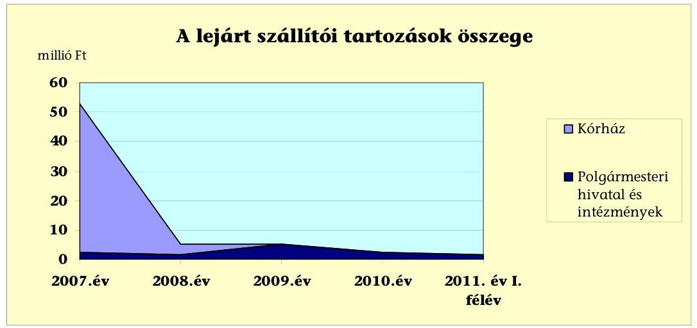

A Kórháznál jelentkező lejárt szállítói állományból a 2007-2008. években 0,3 millió Ft és 1,2 millió Ft (0,3\%, illetve 34,4\%-a) a 30-60 nap közötti, a 60 napot meghaladó tartozások az évek sorrendjében 96,4 millió Ft és 2,4 millió Ft (99,7\%, illetve 65,6\%) volt. A kórház adatszolgáltatása alapján a 2009. évtől lejárt szállítói tartozással nem rendelkezett. A 2009. évben az E-ON Energiaszolgáltató Kft.-vel kötött részletfizetési megállapodást, ennek figyelembevételével a 2009. év végén 538,0 millió Ft a 2010. év végén 3094,0 millió Ft kifizetést ütemeztek át.

# 3.3. Egyéb kötelezettségek változása 

Az Önkormányzat lízingszerződést nem kötött, PPP konstrukcióban megvalósuló beruházást nem hajtott végre. Az Önkormányzat a vizsgált időszakban

---

összesen három esetben tett kezességvállalást ${ }^{54}$, amelynek 2011. év június 30-án nyilvántartott állománya 14732 ezer CHF (3239,9 millió Ft) és 150,0 millió Ft volt. Az Önkormányzat készfizető kezességvállalása a kizárólagos tulajdonú gazdasági társasága 7100 ezer CHF össznévértékű „Sárvári Gyógyforrás" és a 7632 ezer CHF össznévértékű „Sárvári Gyógyfürdő" kötvényeken alapuló fizetési kötelezettségek teljesítéséhez kapcsolódott. A „Sárvári Gyógyforrás" elnevezésű kötvénysorozat 2007. évi kibocsátásának célja a Kft. devizahitelének kiváltása, és általános finanszírozási feladatok megvalósítása volt, a tőketörlesztése 2009. szeptember 30-án kezdődött el. A „Sárvári Gyógyfürdő" kötvényből származó bevételt fürdőfejlesztésekhez kapcsolódó pályázatokhoz szükséges önerő biztosítására használták fel, a tőketörlesztése 2012. szeptember hónaptól kezdődik, összege 763 ezer CHF. A 150,0 millió Ft készfizető kezességvállalást ugyancsak a kizárólagos tulajdonú Gyógyfürdő Kft. folyószámlahitel biztosítékaként nyújtotta az Önkormányzat.

Az Önkormányzatnál a 2007-2011. év I. féléve között követeléselengedés 34,3 millió Ft összegben történt. Az elengedett követelések döntően a vállalkozók kommunális adójához, a helyi iparűzési adóhoz, valamint méltányosság alapján a gépjárműadó, talajterhelési díj elengedéséhez kapcsolódott. A követelések elengedésére a Képviselő-testület jóváhagyásával, valamint az Art. 164. § (6) bekezdése értelmében a jegyző döntése alapján került sor, az adózók kérelmére.

Az Önkormányzat egy kizárólagos tulajdonú gazdasági társaságának nyújtott működési célú kamatmentes kölcsönt 12,0 millió Ft összegben a 2009. évben, amelynek visszafizetése megtörtént.

A vizsgálat ideje alatt a Képviselő-testület nem döntött újabb pénzintézeti kötelezettségvállalásról, a gazdasági társaságok részére történő tőkejuttatásokról.

Az Önkormányzat egy jelzálogjoggal érintett ingatlannal rendelkezett a helyszíni ellenőrzés megkezdésekor, amelynek 2010. december 31-i nettó értéke 22,2 millió Ft, a jelzálog nagysága 99,9 millió Ft volt. A forgalomképes ingatlanra 2007-ben jegyeztek be jelzálogjogot, a 111,6 millió Ft összegű beruházási hitel fedezeteként, az ingatlan nem a törzsvagyon része.

[^0]
[^0]:    ${ }^{54}$ Minden esetben a Képviselő-testület döntött a készfizető kezességvállalás engedélyezéséről.

---

A forgalomképes ingatlanok jelzálogjoggal való terheltségének megoszlását 2010. december 31-én az alábbi ábra mutatja:
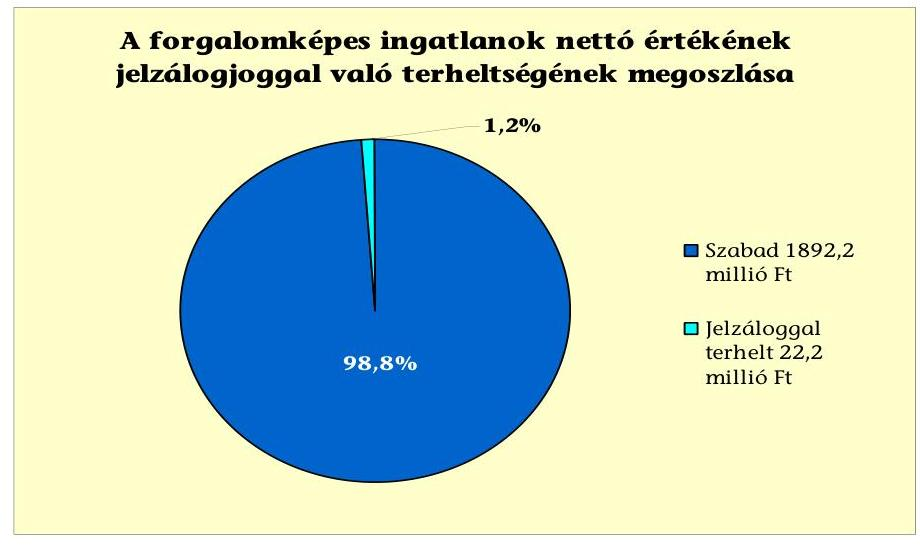

A forgalomképes ingatlanok nettó értékének mindössze 1,2\%-át, 22,2 millió Ft-ot tesz ki a jelzáloggal terhelt forgalomképes ingatlan nettó értéke. Ez alapján a jelzálogjog bejegyzések érdemben nem korlátozzák az Önkormányzat rendelkezési jogát a forgalomképes ingatlanjai felett, azok igénybevételét, értékesítését az Önkormányzat pénzügyi helyzetének javításához.

Az Önkormányzat 2011. június 30-án három folyamatban lévő peres eljárásban érintett alperesként, a terhére kimutatott perérték 32,1 millió Ft volt. A számlatartozásból eredő 15,1 millió Ft összegű követelés érvényesítése érdekében indított peres eljárásban 2011. október 6-án a megyei bíróság ítéletet hirdetett, amelyben a keresetet elutasította. A kórház ellen indított 10,0 millió Ft összegű kártérítési per az intézményben végzett műtéti beavatkozás hátrányos következményéhez és az orvosi tájékoztatási kötelezettség szabálytalan megsértéséhez kapcsolódott. Az ügy az elsőfokú eljárásban az orvosi szakértői vizsgálati szakaszban van. Az Önkormányzat terhére 7,0 millió Ft megfizetésére
 hozott határozatot a Vas Megyei Kormányhivatal. A korlátozási kártalanítás ügyében hozott közigazgatási határozat bírósági felülvizsgálatát kezdeményezte az Önkormányzat, a peres eljárásban jelenleg az igazságügyi ingatlanforgalmi szakértői vélemény készül. Az adatszolgáltatás alapján a kizárólagos tulajdonú gazdasági társaságok folyamatban lévő vagy lezárt peres eljárásban alperesként nem voltak érintettek.

---

Az Önkormányzat legalább 50\% vagy azt meghaladó tulajdonosi hányaddal rendelkező gazdasági társaságai kötelezettségeinek állománya:

| Megnevezés | Állomány 2010. december 31-én |  |  | Állomány 2011. június 30-án |  |  | Várható kötelezettség a 2011-2013. években |  | Várható kötelezettség a 2014. évtől |  |
| :--: | :--: | :--: | :--: | :--: | :--: | :--: | :--: | :--: | :--: | :--: |
|  | HUF-ban <br> (millió Ftban) | Devizában (összege, ezer CHF/EURben) | Deviza nem | HUF-ban <br> (millió Ftban) | Devizában (összege, ezer CHF/EURben) | Deviza <br> nem | HUFban (millió Ft-ban) | Devizában (összege, ezer CHF/EURben) | HUFban (millió Ft-ban) | ```Devizában (összege, ezer CHF/EUR-ben)``` |
| Hosszú lejáratú hitelek |  | 540 | EUR |  | 480 | EUR |  | 379 |  | 184 |
| Kötvény |  | 13681 | CHF |  | 13417 | CHF |  | 2968 |  | 11444 |
| Folyószámlahitel | 10,5 |  |  | 0 |  |  | 0 |  | 0 | 0,0 |
| Pénzintézeti kötelezettségek összesen EUR-ban: |  | 540 | EUR |  | 480 | EUR |  | 379 |  | 184 |
| Pénzintézeti kötelezettségek összesen CHF-ben: |  | 13681 | CHF |  | 13417 | CHF |  | 2968 |  | 11444 |
| Lizing kötelezettségek EUR-ban |  | 10 | EUR |  | 8 | EUR |  | 10 |  | 0 |
| Lizing kötelezettségek CHF-ben |  | 8 | CHF |  | 7 | CHF |  | 8 |  | 0 |
| Szállítói tartozás | 517,3 |  | HUF | 245,8 |  | HUF | 245,8 |  |  | 0 |
| Összes kötelezettség HUF-ban | 527,8 |  | HUF | 245,8 |  | HUF | 245,8 |  | 0 | 0 |
| Összes kötelezettség CHF-ben |  | 13689 | CHF |  | 13424 | CHF |  | 2976 |  | 11444 |
| Összes kötelezettség EUR-ban |  | 550 | EUR |  | 488,0 | EUR |  | 389 |  | 184 |

Az önkormányzati kötelezettségek növekedése mellett a minősített többségi tulajdonú társaságok kötelezettségei is befolyásolhatják az Önkormányzat pénzügyi egyensúlyát. A négy minősített önkormányzati többségi tulajdonú gazdasági társaságnak a 2011-2013. évek között 245,8 millió Ft szállítói kötelezettséget, - ebből a lejárt tartozás 2011. év I. félévben 5,2 millió Ft volt - egy gazdasági társaságának a Gyógyfürdő Kft.-nek 389 ezer EUR, 2976 ezer CHF tőke és kamatkötelezettséget kell teljesítenie. A 2014. évtől 11444 ezer CHF és 184 ezer EUR fizetési kötelezettsége várható. A Gyógyfürdő Kft. gazdálkodása az elmúlt két évben nyereséges volt. Az Önkormányzat számára azonban pénzügyi kockázatot jelenthet, hogy felszámolás esetén a bíróság megállapíthatja az Önkormányzat korlátlan és teljes felelősségét a fenti kötelezettségekkel érintett egy 86,7%-os tulajdoni hányadú és három kizárólagos önkormányzati tulajdonú gazdasági társaság után.

Az Önkormányzat a gazdasági társaságokról szóló 2006. évi IV. törvény 54. § (2) bekezdése alapján korlátlan felelősséggel tartozik azon gazdasági társaságának felszámolása esetében, amelyben az Önkormányzat az 52. § (2) bekezdése szerint a szavazatok legalább 75%-ával rendelkezik, így minősített befolyásszerzőnek minősül, továbbá a csődeljárásról és a felszámolási eljárásról szóló 1991. évi XLIX. törvény 63. § (2) bekezdése alapján a kizárólagos önkormányzati tulajdonú gazdasági társaságának minden olyan kötelezettségéért, amelynek kielégítését a felszámolási eljárás során az adós társaság vagyona nem fedez, ha a hitelezőinek a felszámolási eljárás során benyújtott keresete alapján a bíróság - az adós társaság felé érvényesített tartósan hátrányos üzletpolitikájára figyelemmel - megállapítja az önkormányzat korlátlan és teljes felelősségét.

Az Önkormányzat a 2007-2010. években a tárgyi eszközök után együttesen 962,7 millió Ft összegű értékcsökkenést számolt el a számviteli nyilvántartásában. Felújításra a négy év alatt 1917,4 millió Ft-ot fordítottak. A legnagyobb arányú (4,9 szeres növekedés) a 2010. évben következett be, az előző évhez viszonyítva, mivel a korábbi években megkezdett felújítások a 2010. évben

---

fejeződtek be. Ezek többek között a térségi rehabilitációs központ, járóbetegszakellátás, autóbusz-pályaudvar felújításai voltak.

A fejlesztések ellenére az eszközök használhatósági foka az egyes eszközcsoportokban különböző mértékkel elszámolt amortizáció elsődleges hatására önkormányzati szinte a négy év alatt 82,1%-ról 80,3%-ra csökkent, így az eszközök avultsága növekedett. A legkisebb mértékű elhasználódást az ingatlanok mutatták. A 2007-2010. években végzett felújítások hatására használhatósági fokuk csak 2,2 százalékponttal csökkent a 2010. évre a 2007. évi 90,9%-ról. Legjobban elhasználódtak az üzemeltetésre átadott eszközök (70,4%-ról 62,6%-ra), ezt követik az immateriális javak (21,6%-ról 16,9%-ra). A járművek elhasználódása csökkent, használhatósági fokuk 12,9%-ról 34%-ra, a gépek berendezéseknél 29,7%-ról 43,9%-ra emelkedett.

Az Önkormányzatnál a 2007-2010. években kimutatott 962,7 millió Ft értékcsökkenés összegének - kimutatása alapján - 65,6%-át (632,1 millió Ft-ot) eszközpótlásra fordítottak 2010. december 31-éig a befejezett, és 0,4%-át (3,8 millió Ft-ot) a folyamatban lévő beruházásokhoz. Az elhasználódott eszközök pótlására az Önkormányzat tartalékot nem képzett, külön alapot $^{55}$ nem hozott létre, nem mutatta be a zárszámadási rendeletében az eszközpótlásra fordított tényleges kiadásokat, az eszközök elhasználódási fokának alakulását.

# 4. A PÉNZÜGYI EGYENSÚLY MEGTEREMTÉSE ÉRDEKÉBEN HOZOTT INTÉZKEDÉSEK 

Az Önkormányzatnál a kiadáscsökkentő és bevételnövelő intézkedések a pénzügyi egyensúlyi helyzetnek a javítását célozták. A legjelentősebb mértékű kiadási megtakarítást feladatátszervezéssel járó létszámcsökkentési döntésekkel érte el. Az Önkormányzat adatszolgáltatása szerint a 2007-2011. év I. félévben kiadáscsökkentő intézkedések eredményeként 141,0 millió Ft megtakarítást realizált.

Az intézményeknél és a Polgármesteri hivatalban a feladatátszervezéssel járó 96 fő létszámcsökkentéssel 126,3 millió Ft (90,0%) megtakarítást számszerűsítettek a kiadáscsökkentő intézkedések eredményeként. További kiadási megtakarítást 14,7 millió Ft-ot (10,0%) a többletjuttatások csökkentésével - cafetéria egyes elemeinek megszűnése, csökkenése - miatti megtakarításból érte el az Önkormányzat.

[^0]
[^0]:    $^{55}$ Az Önkormányzat a jogszabályi előírások szerint erre nincs kötelezve.

---

A 2007-2011. év I. félévben végrehajtott kiadáscsökkentő intézkedések megoszlását az alábbi ábra szemlélteti:
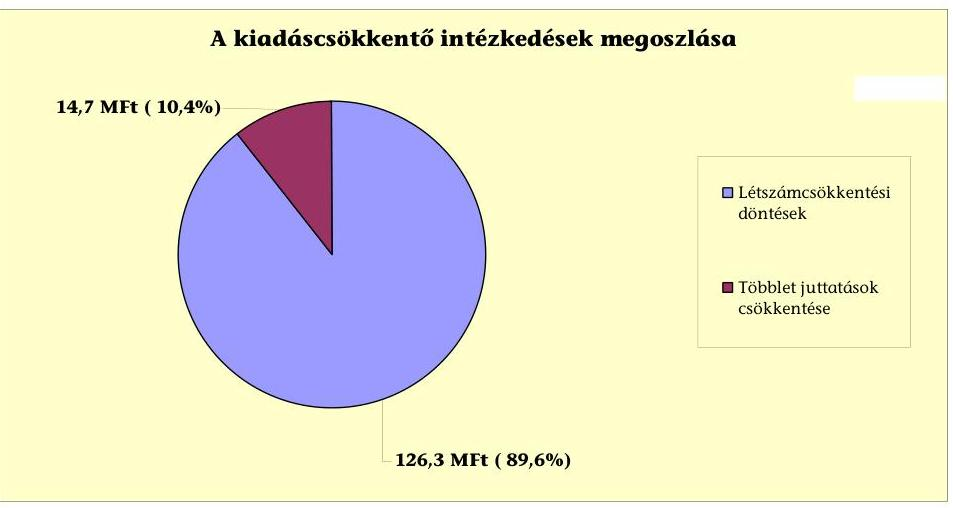

A létszámcsökkentő intézkedések következtében 2007-2010. évek között a Polgármesteri hivatalnál és intézményeknél összesen 106 álláshelyet szüntettek meg, a 2007. január 1-jei 813 fő induló létszám 13,0%-át. Az álláshely csökkenésből 67 (63,2%) a szakmai álláshely, 39 (36,8%) intézményüzemeltetéssel kapcsolatos álláshely volt. Egyes közszolgáltatási területeken - közoktatás, egészségügy - azonban feladatbővülések is voltak, amelyek 10 fő álláshely- és egyben létszámnövekedéssel is jártak. Ennek következtében az időszak álláshelyeinek száma 96 fővel csökkent.

A létszámcsökkentés eredményeként az Önkormányzat 2007. január 1-jei foglalkoztatott létszáma 813 főről 2010. december 31-re 717 főre, 11,8%-kal csökkent. A 2010. december 31-én betöltetlen álláshely nem volt.

Az Önkormányzat 2007-2010. éveket érintő létszámcsökkenésének alakulását az alábbi táblázat szemlélteti:

| Megnevezés (adatok fő-ben) |  | Közoktatás | Szociális és gyermekvédelem | Egészségügy | Polgármesteri hivatal | Egyéb | Összesen |
| :--: | :--: | :--: | :--: | :--: | :--: | :--: | :--: |
| 2007. január 1-jén jóváhagyott álláshelyek <br> száma |  | 323 | 61 | 259 | 70 | 100 | 813 |
| Megszüntetett álláshelyek száma |  | 33 | 6 | 62 | 2 | 3 | 106 |
| ebből: | üres álláshelyek <br> száma | 0 | 0 | 0 | 0 | 0 | 0 |
|  | szakmai álláshelyek <br> száma | 31 | 6 | 29 | 0 | 1 | 67 |
|  | intézmény- <br> üzemeltetéssel <br> kapcsolatos <br> álláshelyek száma | 2 | 0 | 33 | 2 | 2 | 39 |
| Álláshely növekedése |  | 1 | 0 | 9 | 0 | 0 | 10 |
| 2010. december 31-én záró álláshelyek <br> száma |  | 291 | 55 | 206 | 68 | 97 | 717 |
| 2007. január 1-jén foglalkoztatott létszám |  | 323 | 61 | 259 | 70 | 100 | 813 |
| Létszámcsökkenés |  | 33 | 6 | 62 | 2 | 3 | 106 |
| Létszámnövekedés |  | 1 | 0 | 9 | 0 | 0 | 10 |
| 2010. december 31-én foglalkoztatott létszám |  | 291 | 55 | 206 | 68 | 97 | 717 |

---

A helyi szervezési intézkedésekhez kapcsolódóan a 2007-2010. években 152,0 millió Ft központosított támogatást igényelt, és az igényelt összegnek megfelelő támogatásban részesült az Önkormányzat. A támogatás felhasználásával tartósan leépített létszám a 2007-2010. években 63 fő volt. A közoktatásban 15 fő (23,8%), a szociális és gyermekjóléti ellátásban 4 fő (6,3%), egészségügyben 41 fő (65,1%), a Polgármesteri hivatalban 2 fő (3,2%), az egyéb ágazatban (művelődés) 1 fő (1,6%) létszám leépítésre került sor.

A bevételnövelésre irányuló intézkedések eredményét az Önkormányzat adatszolgáltatása alapján 106,6 millió Ft összegben mutatta ki.
A 2007-2011. év I. félévben érvényesített bevételnövelő intézkedések eredményét az alábbi ábra mutatja:
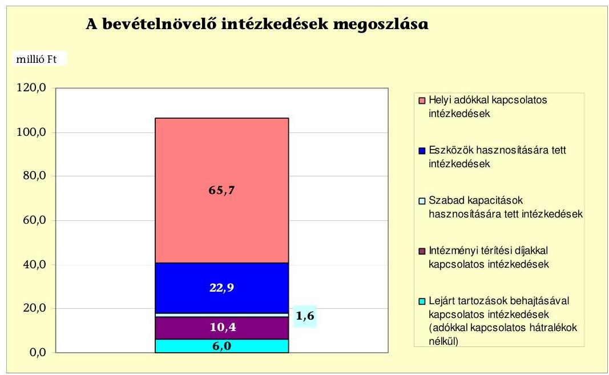

Az Önkormányzat adatszolgáltatása szerint, az eszközök értékesítése, bérbeadása 22,9 millió Ft-tal (21,5%-kal), a helyi adó mértékének növelése, valamint a kedvezmények, a mentesség csökkenése, az adóhátralékok 65,7 millió Ft-tal (61,6%-kal), továbbá a lejárt bérleti díjak eredményesebb behajtása miatti növekmény 6,0 millió Ft-tal (5,6%-kal), a szolgáltatások többletbevétele 1,6 millió Ft-tal (1,5%-kal), az intézményi térítési díjak emelése 10,4 millió Ft-tal (9,8%-kal) járult hozzá a költségvetési bevételek növeléséhez.

Az Önkormányzat kiadáscsökkentő és bevételnövelő intézkedései eredményeként 2007-2010. évek között összesen 247,6 millió Ft megtakarítást és többletbevételt mutatott ki. A bevételnövelő intézkedések között kimutatott adóhátralékok és lejárt bérleti díjak behajtása (58,4 millió Ft) az Önkormányzat kötelező feladata, ezeket figyelmen kívül hagyva 189,2 millió Ft volt a megtakarítás és többletbevétel egyenlege. Az intézkedésekkel ellensúlyozni tudta a költségvetési

---

támogatások növekedésének és az
 szja bevételek csökkenésének együttes egyenlegeként ${ }^{56}$ a 130,8 millió Ft-os csökkenését.

# 5. Az ÁSZ által a korábbi években a pénzügyi egyensúly javítására tett szabályszerűségi és célszerűségi javaslatok hasznosulása

Az ÁSZ az Önkormányzat gazdálkodási rendszerét a 2008. évben ellenőrizte. A jelentésében 15 szabályszerűségi és 10 célszerűségi javaslatot tett. A javaslatok közül a pénzügyi egyensúly javítására két szabályszerűségi javaslat vonatkozott.

A jelentést a Képviselő-testület a 2008. június 26-án tartott ülésén megismerte, és elfogadta a felelősöket és határidőket is tartalmazó intézkedési tervet.

A pénzügyi egyensúly javítására vonatkozó szabályszerűségi javaslatokat megvalósították. A hiányosságok megszüntetése érdekében készített intézkedési tervben foglaltak alapján a 2009. évtől a költségvetési rendeletekben az Áht. 8/A. § (7) bekezdésében előírtaknak megfelelően a finanszírozási célú pénzügyi műveletek költségvetési hiányt módosító költségvetési kiadásként és költségvetési bevételként nem szerepeltek. A 2008. évtől a zárszámadási és költségvetési rendeletek az Ámr-ben foglaltakat betartva elkülönítetten tartalmazták az európai uniós támogatással megvalósuló programok, projektek bevételeit és kiadásait.

Budapest, 2012. április 4.

Melléklet: $\quad 6 \mathrm{db}$
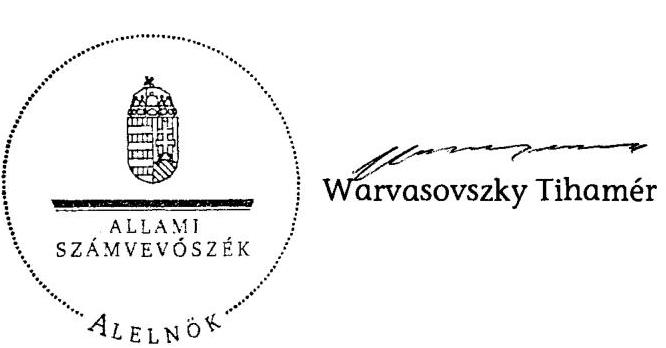

[^0]
[^0]:    ${ }^{56}$ A költségvetési támogatásokból és az átengedett szja-ból származó bevételek változását minden évben a 2007. évhez viszonyítottuk, majd azokat összegeztük. Ezeket a kumulált összegeket viszonyítottuk a vizsgált időszakban elért kiadási megtakarítások és bevételi többletek szintén kumulált összegéhez.

---

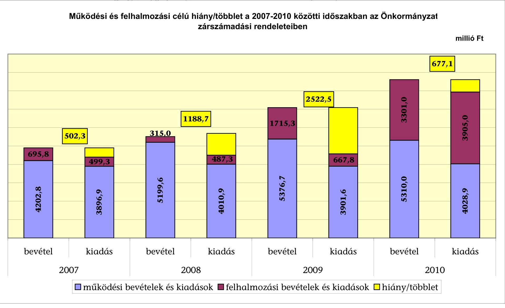

# 1. számú melléklet

## a V-3126-014/2011. számú számvevőszéki jelentéshez

### Működési és felhalmozási célú hiány/többlet a 2007-2010 közötti időszakban az Önkormányzat zárszámadási rendeleteiben

|  Működési és felhalmozási célú hiány/többlet a 2007-2010 közötti időszakban az Önkormányzat zárszámadási rendeleteiben | 2007 | 2008 | 2009 | 2010  |
| --- | --- | --- | --- | --- |
|  677,1 | 502,3 | 499,3 | 519,6 | 401,9  |
|  677,1 | 502,3 | 499,3 | 519,6 | 401,9  |
|  3301,0 | 3896,9 | 519,6 | 401,9 | 401,9  |
|  3905,0 | 4028,9 | 5376,7 | 5376,7 | 5376,7  |
|  4028,9 | 4028,9 | 5310,0 | 5310,0 | 5310,0  |

- működési bevételek és kiadások
- felhalmozási bevételek és kiadások
- hiány/többlet

---

Az Önkormányzat bevételei és kiadásai, valamint adósságszolgálata 2007-2010 között

|  1. FOLYÓ KÖLTSÉGVETÉS* | 2007. év | 2008. év | 2009. év | 2010. év  |
| --- | --- | --- | --- | --- |
|  1.1.1. Saját működési bevételek | 1463,4 | 1808,5 | 1806,5 | 2160,9  |
|  1.1.2. Költségvetési támogatás*** | 1033,7 | 1657,8 | 1483,2 | 1318,4  |
|  1.1.3. Elengedett bevételek | 789,7 | 288,8 | 314,1 | 293,0  |
|  1.1.4. Állambáztartáson belülről kapott támogatások | 957,7 | 914,6 | 961,1 | 1026,3  |
|  1.1.5. EU-tól és külföldről kapott bevételek | 0,0 | 0,0 | 0,0 | 0,0  |
|  1.1.6. Állambáztartáson kívülről kapott bevételek | 10,3 | 6,7 | 1,2 | 4,5  |
|  1.1.7. Előző évi pénzmaradvány átvétel | 12,4 | 5,3 | 15,1 | 0,0  |
|  1.1. Folyó bevételek =1.1.1.+1.1.2.+1.1.3.+1.1.4.+1.1.5.+1.1.6.+1.1.7 | 4267,1 | 4681,8 | 4582,1 | 4803,1  |
|  1.2.1. Működési kiadások kamatkiadások nélkül | 3670,0 | 3771,7 | 3618,9 | 3708,3  |
|  1.2.2. Állambáztartáson belülre átadott pénzeszközök | 5,1 | 7,0 | 9,2 | 25,0  |
|  1.2.3.1. vállalkozásoknak | 3,8 | 3,8 | 5,9 | 7,0  |
|  1.2.3.2. EU-nak, illetve külföldre | 0,0 | 0,0 | 0,0 | 0,0  |
|  1.2.3.3. magánszemélyeknek | 91,9 | 103,5 | 118,6 | 163,9  |
|  1.2.3.4. megvalósult szervezeteknek | 106,3 | 110,3 | 114,4 | 119,3  |
|  1.2.3. Transferkiadások (=1.2.3.1+1.2.3.2+1.2.3.3+1.2.3.4) | 202,0 | 217,6 | 238,9 | 290,2  |
|  1.2.4 Kamatkiadások | 36,9 | 82,2 | 45,5 | 25,8  |
|  1.2.5. Előző évi pénzmaradvány átadás | 12,4 | 5,3 | 16,1 | 0,0  |
|  1.2. Folyó kiadások = 1.2.1.+1.2.2.+1.2.3.+1.2.4.+1.2.5. | 3926,4 | 4085,8 | 3928,5 | 4049,3  |
|  1.3. Folyó költségvetés egyenlege MŰKÖDÉSI JÖVEDELEM (1.1. - 1.2.) | 340,7 | 596,0 | 653,6 | 753,8  |
|  2. FELHALMOZÁSI KÖLTSÉGVETÉS** |  |  |  |   |
|  2.1.1. Saját tőkebevételek | 410,8 | 84,2 | 81,9 | 40,2  |
|  2.1.2. Állambáztartáson belülről kapott támogatások | 6,5 | 11,1 | 178,9 | 1471,2  |
|  2.1.3. EU-tól és külföldről kapott támogatások | 0,0 | 2,1 | 0,0 | 0,0  |
|  2.1.4. Állambáztartáson kívülről kapott támogatások | 47,7 | 26,3 | 4,2 | 20,3  |
|  2.1. Felhalmozási bevételek (=2.1.1.+2.1.2+2.1.3+2.1.4.) | 465,0 | 123,7 | 265,0 | 1531,7  |
|  2.2.1. Saját beruházási kiadás árával | 131,3 | 118,4 | 135,3 | 867,1  |
|  2.2.2. Saját felújítási kiadás árával | 230,8 | 158,4 | 361,7 | 1584,0  |
|  2.2.3. Állambáztartáson belülre átadott pénzeszköz | 0,0 | 0,0 | 0,2 | 61,8  |
|  2.2.4. EU-nak és külföldnek adott pénzeszközök | 0,0 | 0,0 | 0,0 | 0,0  |
|  2.2.5. Állambáztartáson kívülre adott pénzeszközök | 67,0 | 63,7 | 66,2 | 51,0  |
|  2.2.6. Befektetési célú részesedések vásárlása | 3,0 | 0,0 | 0,0 | 1200,0  |
|  2.2. Felhalmozási kiadások (=2.2.1.+2.2.2.+2.2.3.+2.2.4.+2.2.5.+2.2.6.) | 432,1 | 340,5 | 563,4 | 3783,9  |
|  2.3. Felhalmozási költségvetés egyenlege (2.1. - 2.2.) | 32,9 | -216,8 | -298,4 | -2252,2  |
|  3. Finanszírozási műveletek nélküli (GFS) pozíció(1.3.+2.3.) | 373,6 | 379,2 | 355,2 | -1498,4  |
|  4. Finanszírozási műveletek |  |  |  |   |
|  4.1. Hitelfelvétel | 0,0 | 0,0 | 0,0 | 40,2  |
|  4.2. Hiteltörlesztés | 14,8 | 70,0 | 73,0 | 98,0  |
|  4.3. Forgatási és befektetési célú értékpapírok kibocsátása | 0,0 | 1200,0 | 0,0 | 0,0  |
|  4.4. Forgatási és befektetési célú értékpapírok beváltása | 0,0 | 0,0 | 0,0 | 0,0  |
|  4.5. Forgatási és befektetési célú értékpapírok értékesítése | 235,8 | 18,7 | 20,4 | 20,5  |
|  4.6. Forgatási és befektetési célú értékpapírok vásárlása | 0,0 | 0,0 | 1,3 | 0,0  |
|  4.7. Egyéb finanszírozási bevételek (függő, átfutó, kiegyenlítő) | -71,2 | 46,4 | 6,5 | 527,0  |
|  4.8. Egyéb finanszírozási kiadások (függő, átfutó, kiegyenlítő) | -20,4 | 110,7 | 14,8 | 16,6  |
|  4.9.Finanszírozási műveletek egyenlege (4.1. - 4.2.+4.3.-4.4+4.5.-4.6.+4.7.4.8.) | 170,2 | 1084,4 | -62,2 | 473,2  |
|  5. Tárgyévi pénzügyi pozíció (1.3.+ 2.3.+4.9.) | 543,8 | 1463,6 | 293,0 | -1025,2  |
|  6. Nettó működési jövedelem =működési jövedelem (1.3.) - tőketörlesztés (4.2+4.4) | 325,9 | 526,0 | 580,6 | 655,8  |
|  TÁJÉKOZTATÓ ADATOK |  |  |  |   |
|  Összes kötelezettség | 922,8 | 2181,8 | 2486,0 | 3096,6  |
|  ebből rövid lejáratú | 313,6 | 462,3 | 661,9 | 1040,4  |
|  Összes szállítói kötelezettség | 117,4 | 123,3 | 359,3 | 706,8  |
|  ebből lejárt (tanúsítványból) | 0,0 | 0,0 | 0,0 | 0,0  |
|  Pénz és tőkepiac kötelezettség (adósság) | 659,5 | 1789,4 | 1922,2 | 2157,4  |
|  ebből rövid lejáratú | 70,0 | 73,0 | 98,0 | 101,2  |
|  PPP szerződéses állomány jelenértéken (tanúsítványból) | 0,0 | 0,0 | 0,0 | 0,0  |
|  ebből lejárt szolgáltatási díj miatti kötelezettség | 0,0 | 0,0 | 0,0 | 0,0  |
|  Folyószámlahitel napi átlagos állománya (tanúsítványból) | 70,8 | 48,2 | 33,0 | 31,9  |
|  Likvidhitel napi átlagos állománya (tanúsítványból) | 0,0 | 0,0 | 0,0 | 0,0  |
|  Munkabérhitel napi átlagos állománya (tanúsítványból) | 0,0 | 0,0 | 0,0 | 0,0  |
|  Kezesség és garanciavállalások (tanúsítványból) | 0,0 | 0,0 | 0,0 | 0,0  |
|  Jogerős bírósági ítéletekből adódó kötelezettségek (tanúsítványból) | 0,0 | 0,0 | 0,0 | 0,0  |
|  Finanszírozásba bevonható eszközök | 775,7 | 2239,3 | 2515,0 | 1470,1  |
|  Tartós hitelviszonyt megtestesítő értékpapírok év végi állománya | 37,0 | 37,0 | 18,5 | 0,0  |
|  Hosszú lejáratú bankbetétek év végi állománya | 0,0 | 1000,0 | 0,0 | 250,0  |
|  Értékpapírok év végi állománya | 0,0 | 0,0 | 1,3 | 0,0  |
|  Pénzeszközök (idegen pénzeszközök nélkül) év végi állománya | 738,7 | 1202,3 | 2495,2 | 1220,1  |

- Bevételekben nem térül, a kiadásokban nem jelenik meg az amortizáció, a vagyoni helyzetet az egyenleg befolyásolja ** Bevételekben vagyon megőrzésre és bővítésre fordítható források. *** A folyó bevételek miatt képesülő költségvetési támogatások jellemzően kötött normatív támogatás formájában tartalmaznak felhalmozási támogatásokat, amelyek értéke az évek sorrendjében 32,1 millió Ft, 8,3 millió Ft, 27,8 millió Ft és 13,2 millió Ft. Folyó bevételeken belüli arányuk nem jelentős 0,2-0,8% közötti volt, nem torzítja el a pénzügyi helyzetet bemutató adatokat, mutatókat, emiatt nem korrigáltuk a folyó bevételek értékét.

---

|   |  |  |  |  |  |  |  |  |  |  |  |  |  |  |  |  |  |  |  |  |  |  |  |  |  |  |  |  |  |  |  |  |  |  |  |  |  |  |  |  |  |  |  |  |  |  |  |  |  |  |  |  |  |  |  |  |  |  |  |  |  |  |  |  |  |  |  |  |  |  |  |  |  |  |

  |  |  |  |  |  |  |  |  |  |  |  |  |  |  |  |  |  |  |  |  |  |  |  |  |  |  |  |  |  |  |  |  |  |  |  |  | 

---

## Az Önkormányzat 2010. december 31-én folyamatban lévő fejlesztési feladataira 2010. december 31-ig teljesített kifizetések és azok forrásösszetétele

|  Fejlesztési feladat (beruházás, felújítás) |  |  |  |  |  |  |  |  |  |  |  |  |  |  |  |  |  |  |  |  |  |  |  |  |  |  |  |  |  |  |  |  |  |  |  |  |  |  |  |  |  |  |  |  |  |  |  |  |  |  |  |  |  |  |  |  |  |  |  |  |  |  |  |  |  |  |  |  |  |  |  |  |  |  |  |  |  |  |  |  |  |  |  |  |  |  |  |  |  |  |  |  |  |  |  |  |  |  |  | 

---

Sárvár Város Önkormányzata

Az Önkormányzat 2010. december 31-én folyamatban lévő fejlesztési feladataira 2010. december 31-én fennálló kötelezettségek és azok forrásösszetétele

millió 21. jog 2010. december 31-e utáni kötelezettség-vállalások forrásösszetétele

|   |  |  |  |  |  |  |  |  |  |  |  |  |  |  |  |  |  |  |  |  |  |  |  |  |  |  |  |  |  |  |  |  |  |  |  |  |  |  |  |  |  |  |  |  |  |   |
| --- | --- | --- | --- | --- | --- | --- | --- | --- | --- | --- | --- | --- | --- | --- | --- | --- | --- | --- | --- | --- | --- | --- | --- | --- | --- | --- | --- | --- | --- | --- | --- | --- | --- | --- | --- | --- | --- | --- | --- | --- | --- | --- | --- | --- | --- |
|   |  |  |  |  |  |  |  |  |  |  |  |  |  |  |  |  |  |  |  |  |  |  |  |  |  |  |  |  |  |  |  |  |  |  |  |  |  |  |  |  |  |  |  |  |   |
|   |  |  |  |  |  |  |  |  |  |  |  |  |  |  |  |  |  |  |  |  |  |  |  |  |  |  |  |  |  |  |  |  |  |  |  |  |  |  |  |  |  |  |  |  |   |
|   |  | Fejlesztési feladat (beruházás, |  | Beruházás, |  |  |  |  |  |  |  |  |  |  |  |  |  |  |  |  |  |  |  |  |  |  |  |  |  |  |  |  |  |  |  |  |  |  |  |  |  |  |  |   |
|   | felújítás) |  | felújítás |  |  |  |  |  |  |  |  |  |  |  |  |  |  |  |  |  |  |  |  |  |  |  |  |  |  |  |  |  |  |  |  |  |  |  |  |  |  |  |  |   |
|   |  |  |  |  |  |  |  |  |  |  |  |  |  |  |  |  |  |  |  |  |  |  |  |  |  |  |  |  |  |  |  |  |  |  |  |  |  |  |  |  |  |  |  |   |
|   |  |  |  |  |  |  |  |  |  |  |  |  |  |  |  |  |  |  |  |  |  |  |  |  |  |  |  |  |  |  |  |  |  |  |  |  |  |  |  |  |  |  |  |   |
|   |  | Megnevezése |  |  |  |  |  |  |  |  |  |  |  |  |  |  |  |  |  |  |  |  |  |  |  |  |  |  |  |  |  |  |  |  |  |  |  |  |  |  |  |  |  |   |
|   |  |  |  |  |  |  |  |  |  |  |  |  |  |  |  |  |  |  |  |  |  |  |  |  |  |  |  |  |  |  |  |  |  |  |  |  |  |  |  |  |  |  |  |   |
|   |  |  |  |  |  |  |  |  |  |  |  |  |  |  |  |  |  |  |  |  |  |  |  |  |  |  |  |  |  |  |  |  |  |  |  |  |  |  |  |  |  |  |  |   |
|   |  |  |  |  |  |  |  |  |  |  |  |  |  |  |  |  |  |  |  |  |  |  |  |  |  |  |  |  |  |  |  |  |  |  |  |  |  |  |  |  |  |  |  |   |
|   |  |  |  |  |  |  |  |  |  |  |  |  |  |  |  |  |  |  |  |  |  |  |  |  |  |  |  |  |  |  |  |  |  |  |  |  |  |  |  |  |  |  |  |   |
|   |  |  |  |  |  |  |  |  |  |  |  |  |  |  |  |  |  |  |  |  |  |  |  |  |  |  |  |  |  |  |  |  |  |  |

  |  |  |  |  |  |  |  |  |   |
|   |  |  |  |  |  |  |  |  |  |  |  |  |  |  |  |  |  |  |  |  |  |  |  |  |  |  |  |  |  |  |  |  |  |  |  |  |  |  |  |  |  |  |  |   |
|   |  |  |  |  |  |  |  |  |  |  |  |  |  |  |  |  |  |  |  |  |  |  |  |  |  |  |  |  |  |  |  |  |  |  |  |  |  |  |  |  |  |  |  |   |
|   |  |  |  |  |  |  |  |  |  |  |  |  |  |  |  |  |  |  |  |  |  |  |  |  |  |  |  |  |  |  |  |  |  |  |  |  |  |  |  |  |  |  |  |   |
|   |  |  |  |  |  |  |  |  |  |  |  |  |  |  |  |  |  |  |  |  |  |  |  |  |  |  |  |  |  |  |  |  |  |  |  |  |  |  |  |  |  |  |  |   |
|   |  |  |  |  |  |  |  |  |  |  |  |  |  |  |  |  |  |  |  |  |  |  |  |  |  |  |  |  |  |  |  |  |  |  |  |  |  |  |  |  |  |  |  |   |
|   |  |  |  |  |  |  |  |  |  |  |  |  |  |  |  |  |  |  |  |  |  |  |  |  |  |  |  |  |  |  |  |  |  |  |  |  |  |  |  |  |  |  |  |   |
|   |  |  |  |  |  |  |  |  |  |  |  |  |  |  |  |  |  |  |  |  |  |  |  |  |  |  |  |  |  |  |  |  |  |  |  |  |  |  |  |  |  |  |  |   |
|   |  |  |  |  |  |  |  |  |  |  |  |  |  |  |  |  |  |  |  |  |  |  |  |  |  |  |  |  |  |  |  |  |  |  |  |  |  |  |  |  |  |  |  |   |
|   |  |  |  |  |  |  |  |  |  |  |  |  |  |  |  |  |  |  |  |  |  |  |  |  |  |  |  |  |  |  |  |  |  |  |  |  |  |  |  |  |  |  |  |   |
|   |  |  |  |  |  |  |  |  |  |  |  |  |  |  |  |  |  |  |  |  |  |  |  |  |  |  |  |  |  |  |  |  |  |  |  |  |  |  |  |  |  |  |  |   |
|   |  |  |  |  |  |  |  |  |  |  |  |  |  |  |  |  |  |  |  |  |  |  |  |  |  |  |  |  |  |  |  |  |  |  |  |  |  |  |  |  |  |  |  |   |
|   |  |  |  |  |  |  |  |  |  |  |  |  |  |  |  |  |  |  |  |  |  |  |  |  |  |  |  |  |  |  |  |  |  |  |  |  |  |  |  |  |  |  |  |   |
|   |  |  |  |  |  |  |  |  |  |  |  |  |  |  |  |  |  |  |  |  |  |  |  |  |  |  |  |  |  |  |  |  |  |  |  |  |  |  |  |  |  |  |  |   |
|   |  |  |  |  |  |  |  |  |  |  |  |  |  |  |  |  |  |  |  |  |  |  |  |  |  |  |  |  |  |  |  |  |  |  |  |  |  |  |  |  |  |  |  |   |
|   |  |  |  |  |  |  |  |  |  |  |  |  |  |  |  |  |  |  |  |  |  |  |  |  |  |  |  |  |  |  |  |  |  |  |  |  |  |  |  |  |  |  |  |   |
|   |  |  |  |  |  |  |  |  |  |  |  |  |  |  |  |  |  |  |  |  |  |  |  |  |  |  |  |  |  |  |  |  |  |  |  |  |  |  |  |  |  |  |  |   |
|   |  |  |  |  |  |  |  |  |  |  |  |  |  |  |  |  |  |  |  |  |  |  |  |  |  |  |  |  |  |  |  |  |  |  |  |  |  |  |  |  |  |  |  |   |
|   |  |  |  |  |  |  |  |  |  |  |  |  |  |  |  |  |  |  |  |  |  |  |  |  |  |  |  |  |  |  |  |  |  |  |  |  |  |  |  |  |  |  |  |   |
|   |  |  |  |  |  |  |  |  |  |  |  |  |  |  |  |  |  |  |  |  |  |  |  |  |  |  |  |  |  |  |  |  |  |  |  |  |  |  |  |  |  |  |  |   |

 |  |  |  |  |  |  |  |  |  |  |  |  |  |  |  |  |  |  |  |  |  |  |  |  |  |  |  |  |  |  |  |  |  |  |  |  |   |
|   |  |  |  |  |  |  |  |  |  |  |  |  |  |  |  |  |  |  |  |  |  |  |  |  |  |  |  |  |  |  |  |  |  |  |  |  |  |  |  |  |  |  |  |   |
|   |  |  |  |  |  |  |  |  |  |  |  |  |  |  |  |  |  |  |  |  |  |  |  |  |  |  |  |  |  |  |  |  |  |  |  |  |  |  |  |  |  |  |  |   |
|   |  |  |  |  |  |  |  |  |  |  |  |  |  |  |  |  |  |  |  |  |  |  |  |  |  |  |  |  |  |  |  |  |  |  |  |  |  |  |  |  |  |  |  |   |
|   |  |  |  |  |  |  |  |  |  |  |  |  |  |  |  |  |  |  |  |  |  |  |  |  |  |  |  |  |  |  |  |  |  |  |  |  |  |  |  |  |  |  |  |   |
|   |  |  |  |  |  |  |  |  |  |  |  |  |  |  |  |  |  |  |  |  |  |  |  |  |  |  |  |  |  |  |  |  |  |  |  |  |  |  |  |  |  |  |  |   |
|   |  |  |  |  |  |  |  |  |  |  |  |  |  |  |  |  |  |  |  |  |  |  |  |  |  |  |  |  |  |  |  |  |  |  |  |  |  |  |  |  |  |  |  |   |
|   |  |  |  |  |  |  |  |  |  |  |  |  |  |  |  |  |  |  |  |  |  |  |  |  |  |  |  |  |  |  |  |  |  |  |  |  |  |  |  |  |  |  |  |   |
|   |  |  |  |  |  |  |  |  |  |  |  |  |  |  |  |  |  |  |  |  |  |  |  |  |  |  |  |  |  |  |  |  |  |  |  |  |  |  |  |  |  |  |  |   |
|   |

---

Sárvár Város Önkormányzata 4. számú melléklet a V-3126-014/2012. számú Jelentéshez

Az önkormányzati feladatok ellátásában résztvevő gazdasági társaságok

milliá Ft-ban

|  Gazdasági társaság megnevezése | 2010. december 31-én | a gazdasági társaságnak szerződésre kötelezhető, feladatellátási szerződésre alapozottan az önkormányzat költségvetéséből nyújtott  |
| --- | --- | --- |
|   | önkormányzat | önkormányzat gazdasági társaságának  |
|   |  |  támogatási határozás  |
|  1. 100%-os tulajdoni hányadú gazdasági társaságnak |  |   |
|  Sárvári Gyógyfürdő Kft. | 100,0% | 0,9  |
|  Sárvári Média Nonprofit Kft. | 100,0% | 3,6  |
|  Sárvár UKVHÖ Kft. | 100,0% | 5,6  |
|  100%-os tulajdoni hányadú gazdasági társaságok összevonva |  |   |
|  Sárvári-Viz Kft. | 86,7% | 5,8  |
|  73,99%-os tulajdoni hányadú gazdasági társaságok összevonva |  |   |
|  Sárvári-HUKI Kft. | 0 | 0  |
|  egyéb, közfeladatot ellátó gazdasági társaságok |  |   |
|  Sárvári-HUKI Kft. |  |   |
|  100% |  |   |
|  0 |  |   |
|  0 |  |   |
|  0 |  |   |
|  0 |  |   |
|  0 |  |   |
|  0 |  |   |
|  0 |  |   |
|  0,0 |  |   |
|  0,0 |  |   |
|  0,0 |  |   |
|  0,0 |  |   |
|  0,0 |  |   |
|  0,0 |  |   |
|  0,0 |  |   |
|  0,0 |  |   |
|  0,0 |  |   |
|  0,0 |  |   |
|  0,0 |  |   |
|  0,0 |  |   |
|  0,0 |  |   |
|  0,0 |  |   |
|  0,0 |  |   |
|  0,0 |  |   |
|  0,0 |  |   |
|  0,0 |  |   |
|  0,0 |  |   |
|  0,0 |  |   |
|  0,0 |  |   |
|  0,0 |  |   |
|  0,0 |  |   |
|  0,0 |  |   |
|  0,0 |  |   |
|  0,0 |  |   |
|  0,0 |  |   |
|  0,0 |  |   |
|  0,0 |  |   |
|  0,0 |  |   |


