# JELENTÉS 

Sásd Város Önkormányzata pénzügyi helyzetének ellenőrzéséről $(43 / 4)$

---

# Állami Számvevőszék 

Iktatószám: V-3077-017/2012.
Témaszám: 1015
Vizsgálat-azonosító szám: V0560108

## Az ellenőrzést felügyelte:

Dr. Varga Sándor
számvevő igazgatóhelyettes
Az ellenőrzést vezette:
Renkó Zsuzsanna
számvevő tanácsos
Ellenőrzési csoportvezető:
Dér Lívia
számvevő tanácsos
Az ellenőrzést végezték:
Groholy Andrásné Reichert Margit
Hangyál Márta számvevő
számvevő tanácsos

---

# TARTALOMJEGYZÉK 

BEVEZETÉS ..... 9
I. ÖSSZEGZŐ MEGÁLLAPÍTÁSOK, KÖVETKEZTETÉSEK, JAVASLATOK ..... 13
II. RÉSZLETES MEGÁLLAPÍTÁSOK ..... 21

1. Az Önkormányzat kötelező és önként vállalt feladatai, a feladatellátás szervezeti keretei és annak változásai ..... 22
2. Az Önkormányzat pénzügyi egyensúlyi helyzetét befolyásoló tényezők ..... 26
2.1. A működési és a felhalmozási egyensúly változása ..... 28
2.2. Az Önkormányzat bevételeinek változása ..... 34
2.3. Az Önkormányzat múködési és felhalmozási célú kiadásainak változása ..... 36
3. Az Önkormányzat kötelezettségei ..... 39
3.1. Az Önkormányzat pénzintézeti kötelezettségeinek változása ..... 39
3.2. A szállítói kötelezettségek változása ..... 43
3.3. Egyéb kötelezettségek változása ..... 44
4. A pénzügyi egyensúly megteremtése érdekében hozott intézkedések eredménye ..... 46
5. Az ÁSZ által a korábbi években a pénzügyi egyensúly javítására tett szabályszerűségi és célszerűségi javaslatok hasznosulása ..... 48

---

# MELLÉKLETEK 

1. számú Múködési és felhalmozási célú hiány/többlet 2007-2010 közötti időszakban az Önkormányzat zárszámadási rendeleteiben (1 oldal)
2. számú Az Önkormányzat bevételei és kiadásai, valamint adósságszolgálata 2007-2010 között (1 oldal)
3/a. számú Az Önkormányzat 2007-2010. években megvalósított, 2010. december 31ig befejezett fejlesztései és azok forrásösszetétele (1 oldal)
3/b. számú Az Önkormányzat 2010. december 31-én folyamatban lévő fejlesztési feladataira 2010. december 31-ig teljesített kifizetések és azok forrásösszetétele (1 oldal)
3/c. számú Az Önkormányzat 2010. december 31-én folyamatban lévő fejlesztési feladataira 2010. december 31-én fennálló kötelezettségek és azok forrásöszszetétele (1 oldal)
3. számú Az önkormányzati feladatok ellátásában résztvevő gazdasági társaságok (1 oldal)

---

# RÖVIDÍTÉSEK JEGYZÉKE 

## Törvények

Áht $_{1}$
Áht $_{2}$
Csődtv.
Gt.
Ket.
Ötv.
Stabilitási törvény
Számv. tv.
Ptk

## Rendeletek

Áhsz.

## Szórövidítések

áfa
ÁMK
ÁSZ
BIOKOM Kft
BM
DDOP integrációs pályázat

DDOP
Városrehabilitáció

DRV Zrt.
EU
GDP
jegyzó
Képviselő-testület
Kistérségi társulás
NGM
ÖNHIKI
Önkormányzat
Pécsi Vízmú Zrt.
az államháztartásról szóló 1992. évi XXXVIII. törvény
az államháztartásról szóló 2011. évi CXCV. törvény
a csődeljárásról és a felszámolási eljárásról szóló 1991. évi XLIX. törvény
a gazdasági társaságokról szóló 2006. évi IV. törvény 2004. évi CXL. törvény a közigazgatási hatósági eljárás és szolgáltatás általános szabályairól
a helyi önkormányzatokról szóló 1990. évi LXV. törvény a 2011. évi CXCIV. törvény Magyarország gazdasági stabilitásáról
a számvitelről szóló 2000. évi C. törvény
a Polgári Törvénykönyvről szóló 1959. évi IV. törvény
az államháztartás szervezetei beszámolási és könyvvezetési kötelezettségének sajátosságairól szóló 249/2000. (XII. 24.) Korm. rendelet
általános forgalmi adó
Sásdi Általános Művelődési Központ
Állami Számvevőszék
BIOKOM Pécsi Környezetgazdálkodási Kft
Belügyminisztérium
„Sikeres Magyarország" Önkormányzati Infrastruktúra fejlesztési program, Város és Település rehabilitáció cél keretében: Művelődési Központ, Könyvtár és Zeneiskola funkcióváltás pályázat
„Sásd Város központjának kiterjesztése és megújítása a Polgármesteri hivatal akadálymentesített és modernizált épületbe való költöztetésével, valamint közpark - felújítással" elnevezésú pályázat
Dél-Dunántúli Regionális Vízmú Zrt
Európai Unió
Bruttó hazai termék
Sásd Város Önkormányzatának jegyzője
Sásd Város Képviselő-testülete
Sásdi Többcélú Kistérségi Társulás
Nemzetgazdasági Minisztérium
Önhibáján kívül hátrányos helyzetbe került önkormányzatok támogatása
Sásd Város Önkormányzata
Pécsi Vízmúveket Múködtető és Vagyonkezelő Zártkörúen Múködő Részvénytársaság

---

| polgármester | Sásd Város Önkormányzatának polgármestere |
| :-- | :-- |
| Polgármesteri hivatal | Sásd Város Önkormányzatának Polgármesteri hivatala |
| PPP konstrukció | Public Private Partnership (Partnerségi együttmúködés |
|  | közfeladatok ellátására a magánszektor bevonásával) |
| SzMSz | Az Önkormányzat Szervezeti és Múködési Szabályzatáról |
|  | szóló 14/2003. (XI.10.) számú rendelet |
| SzMSz | Az Önkormányzat Szervezeti és Múködési Szabályzatáról |
| szja | szóló 11/2010. (X.20.) számú rendelet |
| TEKI | személyi jövedelemadó |
| Városgazdálkodási Kft. | Területi Kiegyenlítést Szolgáló Támogatások |
|  | Sásd Városgazdálkodási Nonprofit Kft. |

---

# ÉRTELMEZŐ SZÓTÁR 

| BUBOR | Budapesti Bankközi Forint Hitelkamatláb. Irányadó, refe-   rencia jellegú kamatláb. Mértékét az MNB naponta álla-   pitja meg a banki kamatok figyelembevételével. Közzété-   tele naponta történik. |
| :--: | :--: |
| CLF módszer | Az önkormányzatok költségvetése elemzésének eszköze. A   módszer következetesen elkülöníti a folyó és a felhalmo-   zási költségvetés bevételeit és kiadásait, azok költségvetési   egyenlegeit. Bizonyos mértékig a vállalati gazdálkodás   logikai elemeit érvényesíti az önkormányzatok pénzügyi,   jövedelmi helyzetének vizsgálata során. Az értékelés a   pénzügyi kapacitás fogalmát helyezi a középpontba. |
| használhatósági fok | Az eszközgazdálkodás vizsgálatának elemzése során   használt mutató. Számításakor a tárgyi eszköz könyv sze-   rinti (nettó) értékét viszonyítják a tárgyi eszköz bruttó (be-   szerzési/létesítési) értékéhez. A \%-ban kifejezett mutató   értéke annál kedvezőbb, minél közelebb áll a 100\%-hoz.   Csökkenése az eszköz állagának romlására, avulására   utal, ami maga után vonja az üzemeltetési és fenntartási   költségek növekedését is. |
| kamatkockázat | A változó kamatozású forint-, vagy a devizahitelek futam-   ideje alatt a kamat emelkedése miatt fennálló kamatkoc-   kázat, melynek növekedése miatt nő a hitel törlesztő rész-   lete. |
| kötelező közszolgáltatás | A helyi önkormányzati feladatkörbe tartozó, a köztiszta-   sággal és a településtisztasággal, valamint az élet- és va-   gyonbiztonsággal összefüggő egyes - közszolgáltatás út-   ján megvalósuló - közfeladatok ellátása, amelynek köte-   lező igénybevételét külön jogszabály (törvény, helyi ön-   kormányzati rendelet) határoz meg. |
| közfeladat | Állami, helyi, illetve kisebbségi önkormányzati feladat,   amelynek ellátásáról az államnak, illetve az önkormán-   zatoknak kell gondoskodni. A hatályos szabályozás sze-   rint közfeladatot törvény és önkormányzati rendelet álla-   píthat meg. Az önkormányzatok által ellátandó feladatok   keretszerú meghatározását az Ötv. tartalmazza. |
| önkormányzat többségi   tulajdonában lévő gaz-   dasági társaságok | Az önkormányzat a gazdasági társaságban a szavazatok   több mint ötven százalékával vagy a Ptk. 685/B. § (2)-(3)   bekezdéseiben rögzített meghatározó befolyással rendelkezik. A befolyással rendelkező akkor rendelkezik egy jogi   személyben meghatározó befolyással, ha annak tagja,   illetve részvényese és jogosult e jogi személy vezető tiszts-   égviselői vagy felügyelőbizottsága tagjai többségének   megválasztására, illetve visszahívására, vagy a jogi sze-   mély más tagjaival, illetve részvényeseivel kötött megáll-   lapodás alapján egyedül rendelkezik a szavazatok több   mint ötven százalékával (Ptk. 685/B. § (2) bekezdés). A   meghatározó befolyás akkor is fennáll, ha a befolyással |

---

rendelkező számára e jogosultságok közvetett módon (köztes vállalkozásain keresztül, a Ptk. 685/B §. (3), (4) bekezdés szerint) biztosítottak.
A helyi önkormányzat és az önkormányzat irányítása alá tartozó költségvetési szerv többségi tulajdonában, illetve többségi befolyása alatt álló gazdálkodó szervezet esetében hitelfelvétel, kölcsönfelvétel, garancia- vagy kezességvállalás, tartozásátvállalás, tartozás-elengedés, értékpapír kibocsátás, vásárlás, pénzügyi lízing, tartós bérleti szerződés, ingyenes vagyonjuttatás (így különösen: ajándékozás, ingyenes engedményezés), vagy követelésvásárlás, követelésengedményezés végrehajtására vonatkozóan az Áht. 100/M. § (4) bekezdése alapján az önkormányzat rendelkezik döntési jogosultsággal.
pénzügyi kapacitás
pénzügyi kockázat
törlesztési kockázat

A pénzügyi kapacitás (financial capacity) az adósok hitelfelvételi képességének azon mértéke, ahol még anélkül tudják növelni az adósságot, hogy csökkenteniük kellene akár a jelenbeli, akár a jövőben esedékes kiadásaikat a fizetésképtelenség elkerülése érdekében. (Forrás: Az önkormányzati rendszer pénzügyi helyzete, ÁSZKUT tanulmány 2010.)
A múködési kockázat egyik eleme. Megmutatkozhat a költségvetés nagyságrendjének, szerkezetének nem megalapozott módosításaiban, a bevételi és a kiadási előirányzatoktól lényegesen eltérő teljesítésekben, a nem megfelelő belső kontrollrendszer múködésében, a tudatos károkozásokban, a biztosítások elmaradásában, a hibás fejlesztési döntésekben, a nem a terveknek megfelelő forrásfelhasználásokban. Jelentkezhet továbbá a bevételek és kiadások ütemkülönbsége miatt felvett folyószámla- és likvidhitelek költségvetési év végén fennálló egyenlege miatt, amely az önkormányzat költségvetésébe - akár tartósan - beépülő forráshiányt jelzi.
Annak a kockázata, hogy a megfelelő időben és mértékben a hitelt felvevőnél rendelkezésre állnak-e a pénzintézetek és egyéb szervek felé fennálló kötelezettségek visszafizetéséhez, a hitelek és kölcsönök törlesztéséhez szükséges pénzügyi források.
A törlesztési kockázatot növeli a kamat- és árfolyam növekedése, mivel ezekben az esetekben az adósságszolgálat nőhet. Törlesztési kockázatot okozhat a visszafizetésre tervezett forrás elérésének, teljesítésének bizonytalansága (pl. a visszafizetéshez tervezett tartalékolás elmaradt, a tervezettnél alacsonyabb a saját bevétel, a helyi adóból származó bevétel az adóalanyok, adóalapok csökkenése miatt nem teljesül).

---

szállítói kitettség
SNA

Az önkormányzat pénzügyi helyzete olyan külső körülmények hatására is módosulhat, amelyekre az önkormányzatnak nincs hatása, emiatt szállítói kitettsége keletkezik. Pl. a lejárt szállítói tartozások rendezése függhet attól, hogy a szállító milyen intézkedéseket foganatosít az önkormányzattal szemben.
System of National Account azaz a Nemzeti Számlák Rendszere, amely a gazdasági szektorok által létrehozott valamennyi terméket és szolgáltatást figyelembe veszi.

---

.

---

# JELENTÉS 

## Sásd Város Önkormányzata pénzügyi helyzetének ellenőrzéséről

## BEVEZETÉS

Az Állami Számvevőszék 2011. évtől érvényes stratégiája új irányt szabott a helyi önkormányzatok gazdálkodásának ellenőrzésében is. Az ÁSZ - küldetése és jövőképe szerint - szilárd szakmai alapokra támaszkodva értékteremtő ellenőrzéseivel és helyzetelemzéseivel az államháztartás egészében, így a helyi önkormányzati alrendszerben is elő kívánja segíteni a közpénzek és a közvagyon szabályos, gazdaságos, hatékony és eredményes felhasználását. E folyamat részeként - az államháztartási hiány alakulásának összetevőire is figyelemmel végezzük az önkormányzati alrendszer pénzügyi helyzetelemzését.

Az államháztartás helyi szintjén a 304 városnak ${ }^{1}$ az általuk ellátott közszolgáltatások volumenére is tekintettel a közfeladatok ellátásában kiemelt szerepe van. E települések 2011. január 1-jei népessége 3169 ezer fő volt.

Feladataik és hatásköreik az Ötv. mellett különböző ágazati törvények által meghatározottak, miközben a feladatellátás szervezeti kereteit - ezen belül a gazdasági társaságok közszolgáltatások ellátásában betöltött szerepét - saját maguk határozzák meg. A gazdasági társaságok által ellátott feladatok esetén a gazdálkodás, továbbá az önkormányzatok pénzügyi egyensúlyi helyzetére ható közvetlen kockázatok egy része kikerült az önkormányzati alrendszerből. A többségi önkormányzati tulajdonban lévő társaságok gazdálkodásának körülményei befolyásolhatják a városok pénzügyi egyensúlyi helyzetének megítélésében rejlő kockázatokat.

Az áttekintett időszakban az önkormányzati forrásszabályozás elvei lényegesen nem változtak. Az önkormányzatok gazdasági mozgásterét a központi költségvetéstől való függőség mellett jelentősen befolyásolja a helyi adókivetési jog gyakorlása. A városok gazdálkodási szabadságának lényeges eleme, hogy anyagi lehetőségeik függvényében dönthettek arról, hogy feladataik közül azokat, amelyek megoldására az Ötv. szerint a települési önkormányzat nem kötelezhető, a megyei önkormányzat fenntartásába adhatták. E döntések differenciáltan érintették a városok pénzügyi helyzetét.

[^0]
[^0]:    ${ }^{1}$ A megyei jogú városok nélkül figyelembe vett városok száma 304 városi önkormányzatot jelent.

---

A városi önkormányzatok 2007-2010 között teljesített bevételeinek alakulását és összetételét a következő ábra szemlélteti:

Az önkormányzati alrendszer pénzügyi helyzetértékelése során új elemzési módszereket alkalmazott az ellenőrzés. A költségvetési beszámoló adatok elemzése helyett az önkormányzat pénzügyi helyzetét a CLF módszerrel értékeltük, amelynek lényegét és számításának módszerét a jelentés 2. pontjában, és a jelentés 2 . számú mellékletében ismertetjük részletesen.

Az új módszereken alapuló helyzetértékelés fontosságát az adja, hogy a helyi önkormányzatok bruttó adósságállománya ${ }^{2}$ a 2010. évi költségvetési beszámolók alapján 1248 milliárd Ft-ot tett ki. Ezen belül a 304 város adóssága 383 milliárd Ft volt, amely az önkormányzati alrendszer teljes adósságállományának $30,7 \%$-át jelentette ${ }^{3}$.

A mérlegben kimutatott bruttó adósságállomány mellett az önkormányzatok számára az eszközállomány műszaki állapotának megőrzése is előbb-utóbb pénzügyi kötelezettséget jelent. Az elhasználódott eszközök pótlására forrást biztosító amortizációs (felújítási) alap képzésének ${ }^{4}$ elmaradása maga után vonhatja a feladatellátást kiszolgáló tárgyi eszközök állagának erőteljes romlását.

[^0]
[^0]:    ${ }^{2}$ Az önkormányzati mérlegbeszámolókból számított bruttó adósságállomány 2010. év végi összege magában foglalja a fejlesztési és a múködési célú kötvénykibocsátások, a beruházási és fejlesztési hitelek, a működési célú hosszú lejáratú hitelek, a rövid lejáratú hitelek, váltótartozások miatti kötelezettségek teljes (2011-ben, illetve az azt követő években esedékes) állományát. Az önkormányzatok 2007. év végi mérleg szerinti adósságállománya 692 milliárd Ft volt.
    ${ }^{3}$ A fővárosi és a kerületi önkormányzatok adósságának figyelmen kívül hagyásával számított 977 milliárd Ft összegű bruttó adósságállományból a városok 39,2\%-kal részesedtek.
    ${ }^{4}$ Erre a jelenlegi szabályozási környezetben nem kötelezi előírás az önkormányzatokat.

---

Emellett a 2007-2013-as időszakra meghirdetett, vissza nem térítendő EU-s fejlesztési forrásokhoz való hozzájutás lehetősége felerősítette az önkormányzati alrendszer fejlesztési igényeit, amelyek a felhalmozási költségvetési hiány folyamatos emelkedésén túl - az előírt jövőbeni fenntartási kötelezettség miatt tovább terhelhetik az önkormányzatok költségvetését ${ }^{5}$.

Az ÁSZ a 2011. évi ellenőrzési tervében 43. számú, az Önkormányzatok gazdálkodási rendszerének ellenőrzése részeként áttekinti, és elemzi az önkormányzatok pénzügyi helyzetét. A gazdálkodás szabályszerűségét az ÁSZ az előző évek során ebben az önkormányzati körben is ellenőrizte. Jelen vizsgálatunk a tett javaslataink pénzügyi helyzetet érintő pontjainak hasznosítására utóellenőrzés jelleggel tér ki.

Az ellenőrzés megállapításait az Önkormányzat által kitöltött - teljességi nyilatkozattal megerősített - 27 tanúsítványon szolgáltatott adatokra alapoztuk. Ellenőrzési bizonyítékként használtuk fel továbbá:

- a képviselő-testületi és bizottsági előterjesztéseket, a döntés-előkészítés során készített dokumentumokat;
- a kötelezettségvállalások dokumentumait;
- a pénzügyi-számviteli nyilvántartásokat;
- az éves költségvetési beszámolókat;
- a költségvetési és zárszámadási rendeleteket.

Az ellenőrzés a 2007. január 1. - 2011. június 30. közötti időszakot öleli fel. A pénzintézeti kötelezettségek állományának vizsgálatakor az ellenőrzött időszak 2006. december 31. - 2011. június 30. közötti időszakra terjedt ki.

Az ellenőrzés során vizsgáltunk minden olyan körülményt és adatot, amely a program végrehajtásához kapcsolódott és a pénzügyi helyzet alakulására hatást gyakorló releváns tények és folyamatok feltárásához szükségessé vált.

# Az ellenőrzés célja annak értékelése volt, hogy: 

- a vizsgált időszakban a kötelező- és önként vállalt feladatok ellátását biztosító szervezeti keretekben, a feladatellátás módjában bekövetkezett változások milyen hatást gyakoroltak az Önkormányzat pénzügyi helyzetének alakulására;

[^0]
[^0]:    ${ }^{5}$ Az Állami Számvevőszék 2011 júniusában közzétett 1108. számú, a helyi önkormányzatok fejlesztési célú támogatási rendszerének ellenőrzéséről szóló jelentésében feltárta a fejlesztési folyamatok problémáit. A helyi önkormányzatok elsősorban azokat a fejlesztéseket valósították meg, amelyekhez támogatást lehetett igényelni. A fejlesztési célok közül a magasabb támogatás intenzitású pályázatokat részesítették előnyben. A fejlesztéssel megvalósuló létesítmények jövőbeli üzemeltetésének várható ráfordításait az önkormányzatok $71,9 \%$-a nem mérte fel.

---

- az Önkormányzat pénzügyi - ezen belül múködési és felhalmozási - egyensúlya mely tényezők hatására miként változott, és az Önkormányzat milyen intézkedéseket tett a pénzügyi egyensúly javítása érdekében;
- a költségvetési kiadások finanszírozása érdekében vállalt pénzintézeti kötelezettségek hogyan alakultak, továbbá milyen kötelezettségek fennállása befolyásolja az Önkormányzat jövőbeli pénzügyi helyzetét;
- hasznosultak-e a gazdálkodási rendszer korábbi ellenőrzése során a pénzügyi egyensúly javítására az ÁSZ által tett szabályszerűségi és célszerűségi javaslatok.

Az ellenőrzés típusa: szabályszerűségi vizsgálat.
A vizsgálat jogszabályi alapját az Állami Számvevőszékről szóló 2011. évi LXVI. törvény 1. § (3), 5. § (2)-(6) bekezdései, továbbá az Áht ${ }_{1}$ 120/A. § (1) bekezdése ${ }^{6}$ előírásai képezik.

A Baranya megyei kisváros állandó lakosainak száma 2011. január 1-jén 3329 fő volt. A Polgármesteri hivatal mellett két költségvetési szervet fenntartó Önkormányzat 2011. évi költségvetésének bevételi főösszege 2031 millió Ft, a 2010. évi mérlegfőösszege 3016 millió Ft. A városban a 2007-2010. évek időszakában jelentős fejlesztések készültek el, melyek forrását a hazai- és EU-s támogatások mellett az Önkormányzat által felvett hitelek biztosították. Az Önkormányzat mérleg szerinti nettó ingatlanvagyona 2010. december 31-én 2177,8 millió Ft volt.

[^0]
[^0]:    ${ }^{6}$ 2012. január 1-jétől az Áht ${ }_{2}$ 61. § (2) bekezdés

---

# I. ÖSSZEGZŐ MEGÁLLAPÍTÁSOK, KÖVETKEZTETÉSEK, JAVASLATOK 

Az Önkormányzat - adatszolgáltatása szerint - a 2010. évi múködési költségvetési kiadásaiból ${ }^{7}$ ( 853,8 millió $\mathrm{Ft}^{8}$ ) 769,3 millió Ft-ot $(90,1 \%)$ a kötelezö feladatok, 84,5 millió Ft-ot $(9,9 \%)$ az önként vállalt feladatok ellátására fordított. A 2010. évben az önként vállalt feladatok finanszírozására fordított öszszeg részaránya 2,7 százalékponttal csökkent, a 2007-2009. évek átlagához viszonyítva. A vizsgált időszakban a múködési kiadásokon belül a kötelező feladatok finanszírozására fordított kiadások aránya 2,7 százalékponttal növekedett. Ennek oka, hogy a múködési költségvetési hiány folyamatos növekedésével, szűkült az Önkormányzat önként vállalt feladataihoz rendelt források köre. Az önként vállalt feladatok ${ }^{9}$ a lakásgazdálkodáshoz, a középiskolai és szakiskolai ellátáshoz, a felnőttoktatáshoz, az alapfokú múvészetoktatáshoz, a logopédiai szolgáltatáshoz, a gyógytestneveléshez, a foglalkoztatás megoldásában való közremúködéshez és a művészeti tevékenységek támogatásához kapcsolódtak.

Az Önkormányzat feladatellátásának szervezeti struktúráját az alábbi ábra szemlélteti:
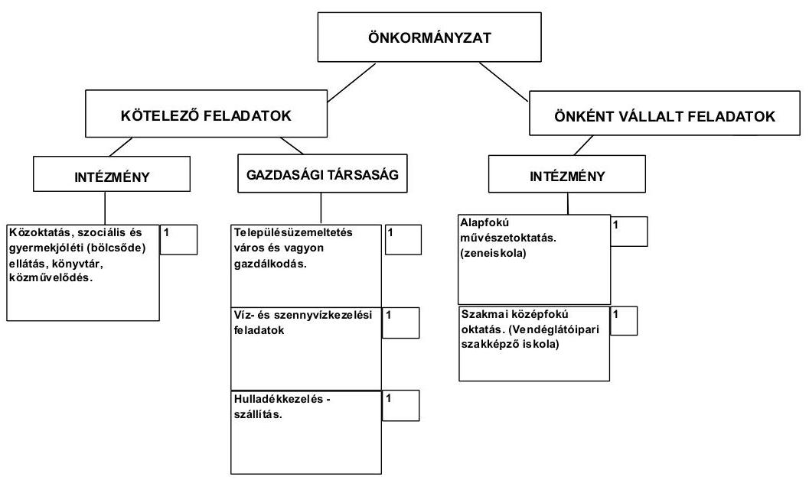

[^0]
[^0]:    ${ }^{7}$ Az Önkormányzat 2010. évi múködési kiadása 862,1 millió Ft volt.
    ${ }^{8}$ A múködési kiadások az OEP és a Társadalombiztosítási Alapból finanszírozott kiadások nélkül.
    ${ }^{9}$ Önként vállalt feladatait az Önkormányzat az SzMSz-ében határozta meg.

---

Az Önkormányzat feladatait 2011. június 30 -án (a Polgármesteri hivatallal együtt) három költségvetési szervvel, három gazdasági társasággal és a Kistérségi társulás társult tagjaként látta el. Az intézmény szervezeti átalakítások és intézményi összevonások ellenére a feladatellátás telephelyeinek száma a 2007. évi otről 2011. év I. félév végére nem változott. Az Önkormányzat egy gazdasági társaságban rendelkezik kizárólagos tulajdonnal, a feladatellátásban részt vevő másik két gazdasági társaságban tulajdoni részesedése az ellenőrzési időszakban nem volt. A BIOKOM Kft. közszolgáltatási szerződés keretében a hulladékkezelés-szállítást, a Pécsi Vízmú Zrt. vagyonkezelési és múködtetési szerződéssel a víz- és szennyvízkezelési feladatokat látta el. A saját tulajdonú gazdasági társaság a közterületek fenntartása, a temetők üzemeltetése, a köztisztasági, valamint a vagyonüzemeltetéssel összefüggő feladatok területén kapott szerepet az Önkormányzat feladatellátásában. A gazdasági társaságok a múködésükhöz az ellenőrzött időszakban összesen 17,3 millió Ft múködési célú pénzeszköz átadásban részesültek.

Az Önkormányzat múködési kiadásokra 2010-ben 853,8 millió Ft-ot fordított, amely 165,2 millió Ft-tal ( $16,6 \%$-kal) haladta meg a 2007-2009. évi ráfordítások 732,2 millió Ft-os átlagát. Ennek oka, hogy a múködési kiadásokon belül 67,3 millió Ft-tal növekedett az EU projektekhez kapcsolódó dologi kiadások összege.

Az egyes közszolgáltatások feladatellátásában résztvevő intézmények múködési kiadásainak finanszírozási forrását ágazatonként a következő ábra szemlélteti:
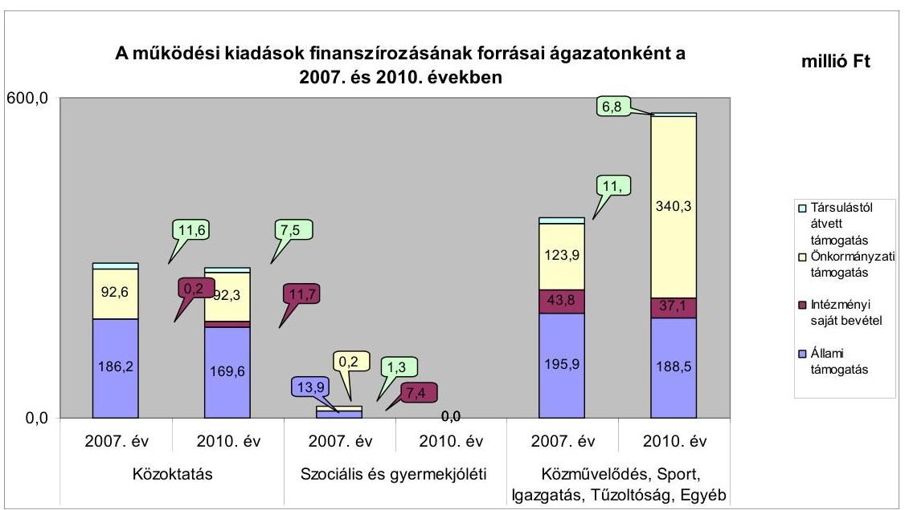

A közoktatási ágazatban a 2010. évben 2007-hez viszonyítva 8,9\%-kal (16,6 millió Ft-tal) csökkent az állami támogatás részaránya. A végrehajtott intézményi integráció eredményeként az összes múködési kiadás a 2007-2009. évek átlagához viszonyítva a 2010. évre 6,3\%-kal (300,2 millió Ft-ról 281,1 millió Ftra) csökkent. Ennek eredményeképpen az állami támogatás részarányának csökkenése a finanszírozáson belül nem járt együtt az önkormányzati támogatás emelkedésével. A szociális és gyermekjóléti feladatok ellátását a 2009. évtől

---

a Kistérségi társulás végezte. A közművelődés területén (216,4 millió Ft-tal) növekedett a vizsgált időszakban az önkormányzati támogatás részaránya. A 2010. évben végrehajtott feladatátszervezés során a mozgókönyvtári szolgáltatás és az ehhez biztosított költségvetési támogatás átkerült a Kistérségi társuláshoz. Ennek hatására megnövekedett az állami támogatásból nem finanszírozott feladatok aránya. A Polgármesteri hivatalban (egyéb ágazat) a múködési kiadások növekedését az EU-s pályázatokhoz elszámolt személyi és dologi kiadás növekménye okozta.

A 2007-2010. években az önkormányzati közszolgáltatások körében végrehajtott szervezeti változások, a feladatátadások összességében a kiadásokat 79,3 millió Ft-tal, a bevételeket 61,5 millió Ft-tal csökkentették, 17,8 millió Ft összegú megtakarítást eredményezve.

Az Önkormányzat folyó költségvetési egyenlege (működési jövedelme) a 2007. évben pozitív, a 2008-2010. években negatív összegű volt. A múködési jövedelem, tőketörlesztés, pénzügyi kapacitás alakulását az alábbi ábra mutatja:
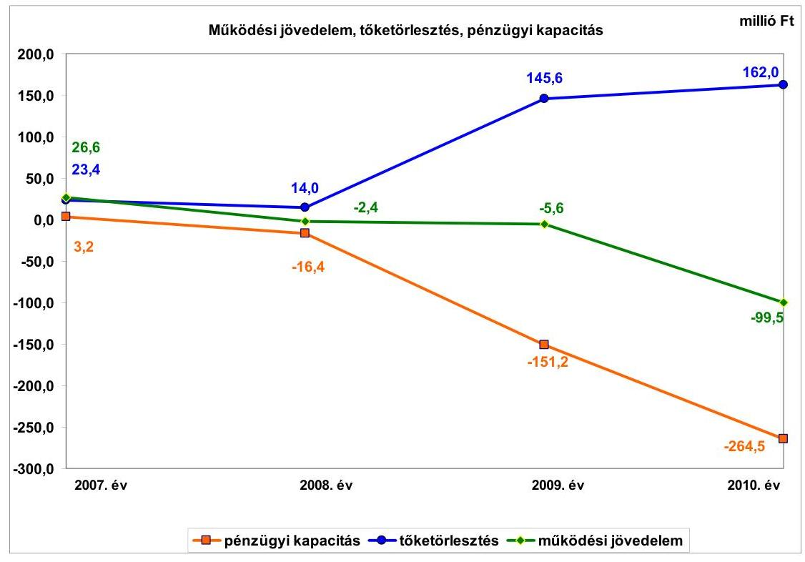

A múködési jövedelem 2007-ben múködési forrástöbbletet, 2008-2010 között múködési forráshiányt mutatott. A múködési forráshiány csökkentése érdekében pályázatot nyújtottak be a múködőképesség megőrzését szolgáló kiegészítő támogatásokra, az elnyert összeg az évek alatt folyamatosan csökkent. Az ÖNHIKI támogatás összege 2007-ben 54,3 millió Ft, 2008-ban 6,1 millió Ft, 2009-ben 23,2 millió Ft, 2010-ben 5,2 millió Ft, 2011-ben 5,9 millió Ft volt. A múködésképtelen helyi önkormányzatok támogatása jogcímen 2007-ben 10,0 millió Ft, 2008-ban 35,0 millió Ft, 2009-ben 8,0 millió Ft, 2010-ben 3,0 millió Ft vissza nem térítendő támogatást kaptak. Az ÖNHIKI és a múködésképtelen helyi önkormányzatok egyéb támogatása nélkül a folyó költségvetés egyenlege mindegyik évben múködési hiányt mutatott: 2007-ben

---

-37,7 millió Ft, 2008-ban -43,5 millió Ft, 2009-ben -36,8 millió Ft, 2010-ben $-107,7$ millió Ft.

Az Önkormányzat a 2007-2010. években 345,0 millió Ft hitelt törlesztett, a 2007-2011. év I. félév közötti időszakban, az utófinanszírozott pályázatok támogatásának megelőlegezésére éven belüli lejáratú hiteleket vett fel. A vizsgált időszakban igénybevett éven belüli lejáratú hitel összege 228,9 millió Ft volt.

Az adósságszolgálat, továbbá a felhalmozási forráshiány 2007-2010 között 445,4 millió Ft-ot tett ki. A pénzügyi egyensúly fenntartása külső források bevonásával volt biztosítható, az egyensúlyt 442,9 millió Ft hitel felvételével teremtették meg. 2008-tól a nettó múködési jövedelem negatív értéke mellett, a meglévő adósságot is újabb hitelek felvételével tudta visszafizetni. A tőketörlesztés a 2009. évben 145,6 millió Ft volt, melyből folyószámlahitel 101,7 millió Ft, likvidhitel 36,6 millió Ft, hosszú lejáratú hitel 7,3 millió Ft. A 2010. évben 162,0 millió Ft-ot törlesztettek, melyből folyószámlahitel törlesztés 105,1 millió Ft, likvidhitel törlesztés 44,9 millió Ft, hosszú lejáratú hiteltörlesztés 12,0 millió Ft volt.

A múködési célú költségvetési támogatás és az szja bevétel együttes öszszege az évek között lényeges eltérést nem mutatott, az összes költségvetési bevételen belüli aránya a 2010. évben egy százalékponttal (69,2\%) tért el, a 20072009. évek 70,2\%-os átlagától. A vizsgált időszakban az Önkormányzatnál helyi iparúzési adót, építményadót, vállalkozók kommunális adóját és magánszemélyek kommunális adóját vetették ki, melyek mértéke a vizsgált időszakban nem változott. Új helyi adót a vizsgált időszakban az Önkormányzat nem vetett ki. Az Önkormányzatnál a helyi adókból és pótlékokból származó bevételek aránya a folyó bevételekben a 2007-2009. években átlagosan 7,1\% (53,4 millió Ft) volt, amely a 2010. évre 9,0\%-ra (68,4 millió Ft-ra) növekedett. A 2009-ről 2010. évre történő 15,8 millió Ft-os növekedést az Önkormányzat hátralékok behajtására tett intézkedései okozták. A vizsgált években a felhalmozási célú bevételek jelentős ingadozását az államháztartáson belülről kapott, pályázatokból származó támogatások okozták. Közoktatási integráció fejlesztéséhez, csapadékvíz elvezetéshez, városrehabilitációhoz és EU-s programokhoz 2009-ben 112,8 millió Ft, a 2010. évben 208,3 millió Ft, a 2011. év I. félévben 69,8 millió Ft támogatásban részesült az Önkormányzat.

Az Önkormányzat pénzügyi egyensúlyi helyzetének alakulását jelentősen befolyásolta az Önkormányzat fejlesztési tevékenysége. A 20072010. évek időszakában a városrehabilitáció és a csapadékvíz elvezetés mellett 10 millió Ft alatti fejlesztések és felújítások készültek el 311,4 millió Ft összegben. A befejezett fejlesztés és felújítás forrása a 98,5 millió Ft saját erő és a 38,7 millió Ft hazai- és 124,1 millió Ft EU-s támogatások mellett 50,1 millió Ft hitelfelvétel volt. A 2010. december 31-én folyamatban lévő közoktatási integráció fejlesztési feladat az időszak legjelentősebb felújítása, melyre 20092010. években 85,4 millió Ft kiadást teljesítettek EU-s támogatásból. Az Önkormányzatnál 2010. december 31-én folyamatban lévő fejlesztési feladatok 2010. évet követő kötelezettségvállalásainak összege 888,1 millió Ft volt, amelyből 26,4 millió Ft-ot hitel felvételéből, 800,4 millió Ftot EU-s támogatásból, 52,0 millió Ft-ot hazai támogatásból és 9,3 millió Ft-ot

---

saját forrásból terveznek biztosítani. Az önrész biztosításához a hitelszerződést megkötötték, de a 2011. év I. félév végéig még nem vették igénybe.
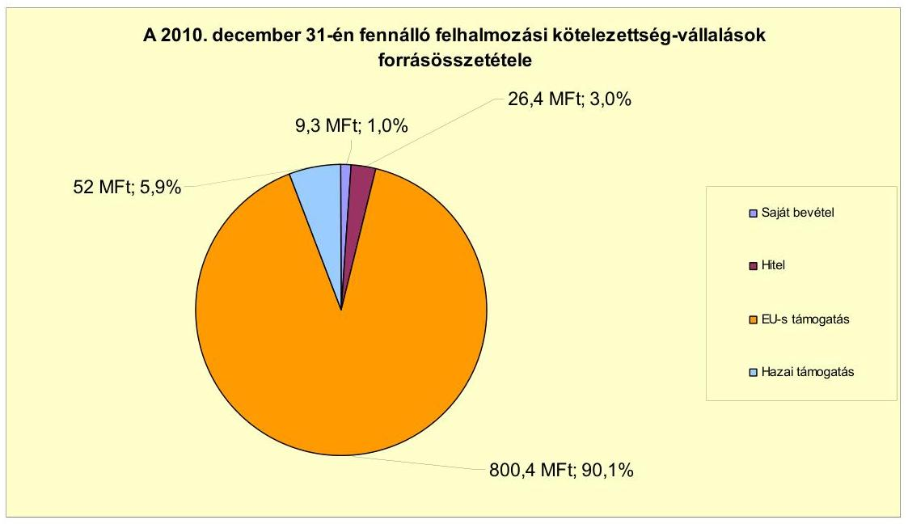

Az Önkormányzat mérleg szerinti pénzintézeti kötelezettsége a 2006. év végéről a 2011. év I. félév végére 58,5 millió Ft-ról 274,0 millió Ft-ra nőtt. A fennálló pénzintézeti kötelezettségek a folyószámlahitel mellett, nyolc hosszú lejáratú hitelből, valamint 11 rövid lejáratú hitel igénybevételéből keletkeztek.

Az Önkormányzat pénzintézeti kötelezettségvállalásaira képviselő-testületi döntés alapján került sor, azonban az előterjesztésekben nem mutatták be a tőketörlesztések, a hitelkamatok és egyéb költségek forrásait. A pénzintézeti kötelezettségek visszafizetésének forrását az előterjesztésekben nem számszerúsítették.

Az Önkormányzat a hosszú lejáratú hiteleit kettő kivételével mind lehívta, és a hitelcélnak megfelelően a Képviselő-testület által jóváhagyott, a költségvetésbe betervezett beruházásokhoz használta fel. Az Önkormányzatnak a fennálló hosszú lejáratú pénzintézeti kötelezettségeivel kapcsolatban, a vizsgált időszak alatt 67,3 millió Ft tőke- és kamattörlesztési kiadása keletkezett. A 2007-2011. év I. féléve között átmenetileg szabad pénzeszközeiből 1,9 millió Ft kamatbevételt realizált.

Az Önkormányzat költségvetésének pénzügyi egyensúlyát a vizsgált időszakban folyószámlahitel, és a pályázati támogatások megelőlegezését biztosító 366,7 millió Ft rövid lejáratú hitel igénybevételével biztosította. A folyószámlahitel állomány folyamatos fennállása és keretösszegének növekedése azt mutatja, hogy az Önkormányzatnál tartósan fennállt a finanszírozási igény, ami pénzügyi kockázatot jelent. Az EU támogatások utófinanszírozása miatt az Önkormányzat rövid lejáratú hitelszerződéseket kötött. Az éven belüli lejáratú hitelszerződésekből a 2011. június 30 -án fennálló kötelezettsége az Önkormányzatnak 138,0 millió Ft volt, melynek fedezetét a lehívásra kerülő EU támogatás biztosította.

---

Az Önkormányzat törlesztési kockázatát növeli, hogy a 2007-2009. évek átlagához viszonyítva ötödére csökkenő ÖNHIKI támogatás összegét is folyószámlahitellel pótolták.

A rövid lejáratú hitelek igénybevétele 10,6 millió Ft kamatkiadást eredményezett.

A folyószámlahitel igénybevétele a 2007-2011. év I. félévében a következők szerint alakult:

| Megnevezés | 2007. év | 2008. év | 2009. év | 2010. év | 2011. év I.   félév |
| :-- | :--: | :--: | :--: | :--: | :--: |
| Folyószámlahitel |  |  |  |  |  |
| Keretösszeg január 1-jén (millió Ft-ban) | 40,0 | 60,0 | 90,0 | 90,0 | 120,0 |
| Átlagos napi állomány (millió Ft-ban) | 49,0 | 55,4 | 66,7 | 86,0 | 111,3 |
| Folyószámla hitellel zárt napok száma (nap) | 365,0 | 366,0 | 365,0 | 365,0 | 180,0 |
| Egyenleg (állomány millió Ft-ban) | $x$ | $x$ | $x$ | 101,7 | 94,0 |

A folyószámlahitel igénybevétele, a likviditás biztosítása az Önkormányzatnak 20,9 millió Ft kamatkiadást okozott. Az Önkormányzat 2011 év I. félév végi szállítói tartozása 320,1 millió Ft, melyből a lejárt tartozás 45,8 millió Ft volt. A lejárt szállítói tartozások $31,2 \%$-a ( 14,3 millió Ft ) a 30 nap alatti tartozás, $31,0 \%$ ( 14,2 millió Ft) a 31-60 nap közötti tartozás és $37,8 \%$ ( 17,3 millió Ft) a 61-90 nap közötti tartozás. A megállapodással érintett (átütemezett) szállítói tartozások összege 265,2 millió Ft, melynek oka, hogy az ÁMK integrációs pályázat támogatási szerződése szerint, a szállító által az Önkormányzatnak benyújtott számla összegéből, a támogatási részt a közremúködő szervezet ${ }^{10}$ közvetlenül a szállítónak utalja. Az év végi szállítói tartozásállományból a megállapodással érintett rész a támogatási összeg, melyet a közremúködő szervezet még nem utalt át a szállítóknak.

Az Önkormányzat a gazdasági társasága részére fejlesztési és egyéb hitelek igénybevételéhez készfizető kezességet nem vállalt, kölcsönt nem nyújtott.

Az Önkormányzat kötelezettségeinek 2010. december 31-i, valamint 2011.június 30-i állományát és várható alakulását a kötelezettségek lejáratáig a következő táblázat szemlélteti:

| Megnevezés | Állomány 2010. december 31   én |  |  | Állomány 2011. június 30-án |  |  | Várható   kötelezettség 2011-   2013. években |  | Várható   kötelezettség 2014.   évtöl |  |
| :--: | :--: | :--: | :--: | :--: | :--: | :--: | :--: | :--: | :--: | :--: |
|  | HUF-ban   (millió Ft-   ban) | Devizitban   (összege,   ezer ...   ben) | Devize   nem | HUF-ban   (millió Ft-   ban) | Devizitban   (összege,   ezer ...   ben) | Devize   nem | HUF-ban   (millió Ft-   ban) | Devizitban   (összege,   ezer ...   ben) | HUF-ban   (millió Ft-   ban) | Devizitban   (összege,   ezer ...   ben) |
| Pénzintézeti kötelezettségek |  |  |  |  |  |  |  |  |  |  |
| Hosszú lejáratú pénzintézeti kötelezettségek | 50,6 | 0 | HUF | 42,0 | 0 | HUF | 10,8 | 0 | 39,8 | 0 |
| Ezen betül lejáratú pénzintézeti kötelezettségek | 112,6 | 0 | HUF | 138,0 | 0 | HUF | 138,0 | 0 | 0,0 | 0 |
| Folyószámla hitel | 101,7 | 0 | HUF | 94,0 | 0 | HUF | 94,0 | 0 | 0,0 | 0 |
| Pénzintézeti kötelezettségek összesen HUF-ban | 284,9 | 0 | HUF | 274,0 | 0 | HUF | 242,8 | 0 | 38,8 | 0 |
| Szállítás tartozás | 320,1 | 0 | HUF | 320,0 | 0 | HUF | 320,0 | 0 | 0,0 | 0 |
| Egyéb kötelezettségek | 3,8 | 0 | HUF | 3,8 | 0 | HUF | 3,8 | 0 | 0,0 | 0 |

[^0]
[^0]:    ${ }^{10}$ Nemzeti Fejlesztési Ügynökség

---

Az Önkormányzatnak pénzintézetekkel szemben fennálló kötelezettsége a 2011. I. félév végén 274 millió Ft volt. Ezek várható kötelezettsége (tőke, kamat és egyéb költség) a legutóbbi kamatfizetés feltételei alapján a 2011-2013. években 242,8 millió Ft. A mérlegében kimutatott egyéb kötelezettségek ( 3,8 millió Ft) az iparűzési adóelőleg túlfizetéséből származott. A 2011-2013. évek pénzintézeti kötelezettségeinek teljesítését a 138 millió Ft-os európai uniós támogatásból, a 2010. évi mérlegben kimutatott 27,2 millió Ft követelésállományból tervezik finanszírozni, valamint - az Önkormányzat nyilatkozata szerint - a kötelezettségekre fedezetet biztosíthat a jelzáloggal nem terhelt forgalomképes ingatlanvagyona is. A helyi sajátosságok, valamint kereslet hiányában azonban ezek az ingatlanok nehezen értékesíthetők. A 2011. június 30-i kötelezettség állományt figyelembe véve, az Önkormányzat 2014. évet követően esedékes pénzintézeti kötelezettsége 39,8 millió Ft. A további évekre szóló ismert pénzintézeti kötelezettségek teljesítését nem látjuk biztosítottnak, mivel a visszafizetés fedezetéül megjelölt tehermentes, fogalomképes ingatlanvagyon értékesítéséből a bevétel realizálása bizonytalan.

A 2007-2010. évek között az Önkormányzat felújításokra és az eszközök pótlására a kimutatott értékcsökkenés 1,3\%-ának megfelelő összeget, 3,9 millió Ft-ot fordított. Az eszközök használhatósági foka a 2007. évi 76,3\%-ról 2010-re 74,4\%-ra csökkent, amely az Önkormányzat kezelésében lévő eszközök használhatósági fokának romlását jelezte.

Az Önkormányzat - az adatszolgáltatása alapján - az ellenőrzött időszakban kiadási megtakarítást eredményező és bevételt növelő intézkedéseket tett. A 2007-2011. év I. féléve között tett intézkedések hatására 6,0 millió Ft bevételi többletet, továbbá 61,1 millió Ft kiadási megtakarítást mutattak ki. A kiadási megtakarítások $88,2 \%$-a az elrendelt álláshely csökkentések eredménye. Az álláshely-csökkentő intézkedések 2007-2011. év I. féléve között önkormányzati szinten összesen 34 álláshely megszüntetését jelentették. A feladatbővülések miatt közoktatási területen egy fő, egyéb területen két fő álláshely- és egyben létszámnövekedés is szükségessé vált. Ennek következtében az időszak álláshelyeinek száma 31 fővel csökkent. A bevételnövelő intézkedések adókedvezmények és mentességek csökkentésére vonatkoztak.

Az Önkormányzat pénzügyi egyensúlyi helyzetét összegezve a következők emelhetők ki:

Sásd Város Önkormányzatának pénzügyi egyensúlyi helyzete rövid távon veszélyeztetett.

A folyó bevételek 2008. évtől nem nyújtottak fedezetet a folyó kiadásokra és az adósságszolgálat finanszírozására. Az Önkormányzat múködését állandósult és növekvő folyószámlahitel igénybevételével tudta biztosítani.

A fejlesztésekhez szükséges önrészt hosszú lejáratú hitelekből, a szállítói finanszírozáson túli támogatások előfinanszírozását éven belüli lejáratú hitelekből fedezték.

A múködési jövedelem nem biztosított fedezetet az Önkormányzat növekvő adósságszolgálatára és a visszafizetés egyéb forrásait sem számszerűsítették.

---

A lejárt szállítói tartozások növekedése, valamint a 2009. évtől megjelenő 60 napon túli tartozások az Önkormányzat folyamatosan romló likviditási helyzetét és szállítói kitettségét mutatja.

A folyamatban lévő fejlesztési projektekhez szükséges források rendelkezésre állnak.

Az Állami Számvevőszékről szóló 2011. évi LXVI. törvény 33. § (1) bekezdésében foglaltak értelmében a jelentésben foglalt megállapításokhoz kapcsolódó intézkedési tervet köteles az ellenőrzött szervezet vezetője összeállítani és azt a jelentés kézhezvételétől számított harminc napon belül az ÁSZ részére megküldeni. Amennyiben az intézkedési tervet határidőben nem küldi meg a szervezet, vagy az továbbra sem elfogadható, az ÁSZ elnöke a hivatkozott törvény 33. § (3) bekezdés a)-b) pontjaiban foglaltakat érvényesítheti.

# A 2011. június 30-i pénzügyi egyensúlyi helyzet alapján az ellenőrzés intézkedést igénylő megállapításai és javaslatai a következők: 

## a Polgármesternek

1. Az Önkormányzat nettó működési jövedelme a 2008. évtől negatív volt. Az Önkormányzat által vállalt fejlesztési kiadások saját forrásának fedezete rövid távon a rendelkezésre álló hitelekből biztosított. Az Önkormányzat finanszírozásában a folyószámlahitel állandósult. Az Önkormányzat által tett intézményszervezeti átalakítások, kiadáscsökkentő és bevételnövelő intézkedések nem biztosítanak elegendő forrást a pénzügyi egyensúly helyreállításához. Az Önkormányzatnál nem biztosított a vállalt pénzintézeti és egyéb kötelezettségek fedezete. A müködési jövedelem prognosztizált csökkenése már rövid távon (a 2011-13. években) veszélyezteti az Önkormányzat pénzügyi egyensúlyát.

Javaslat:
Az Önkormányzat pénzügyi egyensúlyának gyors helyreállítása és hosszú távú fenntarthatósága érdekében kezdeményezze - felelősök és határidők megjelölésével - az alábbi intézkedések megtételét:
a) Tárja fel a bevételszerző és kiadáscsökkentő lehetőségeket. Intézkedjen a bevételek növeléséről, a kiadások csökkentéséről.
b) Vizsgálja meg az állandósult folyószámla és likvid hitel hosszú távú kötelezettséggé történő átalakításának jogi lehetőségét, és a Stabilitási törvény 10. §-ában előírt feltételek fennállása esetén kezdeményezze a Kormánynál ennek engedélyezését.
c) Képezzen egyensúlyi (elkülönített) tartalékot az adósságszolgálat teljesítése érdekében.
d) Mutassa be havonta legalább három évre kitekintően kötelezettségeinek finanszírozási forrásait.

---

2. A pénzintézeti kötelezettségek visszafizetési forrását nem számszerúsítették.

Javaslat:
Gondoskodjon, hogy a jövőben az adósságot keletkeztető kötelezettségvállalásokról szóló képviselő-testületi előterjesztések tételesen tartalmazzák a visszafizetés forrásait.
3. A 2007-2010. évek között az Önkormányzat felújításokra és az eszközök pótlására a kimutatott értékcsökkenés 1,3\%-ának megfelelő összeget, 3,9 millió Ft-ot fordított. Az eszközök használhatósági foka a 2007. évi 76,3\%-ról 2010-re 74,4\%-ra csökkent, amely az Önkormányzat kezelésében lévő eszközök használhatósági fokának romlását jelezte.

Javaslat:
Mutassa be a Képviselő-testületnek évente a zárszámadási rendelet előterjesztésében az értékcsökkenés összegét, és ezzel összevetve az elhasználódott eszközök pótlására fordított tényleges kiadásokat, az eszközök elhasználódási fokának alakulását.
4. Az Önkormányzatnak a 2011. év I. félév végi lejárt szállítói tartozása 45,8 millió Ft volt, ebből a 61 napot meghaladó tartozás $37,8 \%$-ot ( 17,3 millió Ft-ot) képviselt.

Javaslat:
Kezelje az Önkormányzat lejárt szállítói állományát, a szállítói kitettség és a jogszabályi következmények elkerülése érdekében. Gondoskodjon az okok feltárásáról, intézkedések megtételéről a lejárt tartozások mielőbbi rendezése érdekében.

A polgármester a helyszíni ellenőrzés lezárása után tájékoztatta az Állami Számvevőszéket az Önkormányzat megtett intézkedéseiről, amelyet az Állami Számvevőszék nem ellenőrzött, arra vonatkozóan véleményt vagy megállapítást nem fogalmaz meg. Az ellenőrzés lezárását követően elvégzett intézkedéseket az Állami Számvevőszék utóellenőrzés keretében vizsgálhatja.

A polgármester tájékoztatása szerint a következő intézkedéseket tette az Önkormányzat:

- A bevételek növelése érdekében a Képviselő-testület elrendelte a társulási kintlévőségek behajtását;
- A kiadások csökkentése érdekében 6,5 álláshelyet megszüntettek, továbbá a képviselői tiszteletdíjak folyósítását befagyasztották és egyes önként vállalt feladatok finanszírozását felfüggesztették;
- Az Önkormányzat pénzügyi helyzete javult azáltal, hogy az EU-s támogatás elszámolása megtörtént és a támogatásmegelőlegező hitelt 2012. márciusban visszafizették, a lejárt szállítói tartozás állományt kiegyenlítették.

---

# II. RÉSZLETES MEGÁLLAPÍTÁSOK 

## 1. Az ÖNKORMÁNYZAT KÖTELEZŐ ÉS ÖNKÉNT VÁLLALT FELADATAI, A FELADATELLÁTÁS SZERVEZETI KERETEI ÉS ANNAK VÁLTOZÁSAI

Az Önkormányzat kötelező és önként vállalt feladatait $\mathbf{S z M S z}_{1,2}$-ben rögzítette. Az Önkormányzat önként vállalt feladatai a lakásgazdálkodáshoz, a középiskolai és szakiskolai ellátáshoz, a felnőttoktatáshoz, az alapfokú művészetoktatáshoz, a logopédiai szolgáltatáshoz, a gyógytestneveléshez, a foglalkoztatás megoldásában való közreműködéshez és a művészeti tevékenységek támogatásához kapcsolódtak.

Az Önkormányzat - adatszolgáltatása szerint - a 2010. évi teljesített múködési kiadásainak a 90,1\%-a, 769,3 millió Ft a kötelező feladatok ellátását finanszírozta. A 2010. évben az összes múködési kiadás 9,9\%-át, 84,5 millió Ft-ot fordították az önként vállalt feladatok ellátására. Az önként vállalt feladatok finanszírozására fordított összeg részaránya 2,7 százalékponttal (7,9 millió Ft-tal) csökkent a 2007-2009. évek átlagához képest. A vizsgált időszakban, az Önkormányzat múködési költségvetésének hiánya folyamatosan növekedett. Ez okozta a múködési kiadásokon belül a kötelező feladatok finanszírozására fordított kiadások arányának eltolódását (növekedését).

Az Önkormányzat 2010. évi múködési kiadásait és azok finanszírozási arányait szemlélteti a következő - önkormányzati adatszolgáltatáson alapuló - táblázat főbb feladatonként:

| Ellátott feladat | Múködési kiadás összesen (millió Ft) | Kötelezo feladatok kiadásainak részaránya $\%$ | Múködési bevétel összesen (millió Ft) | Állami támogatás részaránya $\%$ | Intézményi saját bevétel részaránya $\%$ | Önkormányzati támogatás részaránya $\%$ | Társulástól átvett támogatás részaránya $\%$ |
| :--: | :--: | :--: | :--: | :--: | :--: | :--: | :--: |
| Önnállk | 39,9 | 100,0 | 39,9 | 61,4 | 0,0 | 34,2 | 4,4 |
| Állalános iskolák | 157,0 | 100,0 | 157,0 | 57,8 | 1,2 | 38,0 | 3,0 |
| Szakközépiskolák, szakképző intézmények | 60,2 | 0,0 | 60,2 | 72,9 | 14,8 | 12,3 | 0,0 |
| Közmóvelődési intézmények | 25,3 | 100,0 | 25,3 | 0,0 | 12,1 | 87,9 | 0,0 |
| Egyéb intézmények | 24,1 | 0,0 | 24,1 | 43,7 | 3,9 | 48,0 | 4,4 |
| Polgármesteri hivatal igazgatási kiadása | 113,2 | 100,0 | 113,2 | 16,3 | 3,4 | 74,3 | 6,0 |
| Polgármesteri hivatalban ellátott egyéb feladatok múködési kiadása | 434,2 | 100,0 | 434,2 | 39,2 | 7,0 | 53,8 | 0,0 |
| Múködési kiadások összesen | 853,9 | 90,1 | 853,9 | 41,9 | 5,7 | 50,7 | 1,7 |

A 2010. évben teljesített múködési kiadások finanszírozása 5,7\%-ban (48,7 millió Ft) intézményi saját bevételből, 41,9\%-ban (357,8 millió Ft) állami támogatásból, 50,7\%-ban (432,9 millió Ft) önkormányzati támogatásból, valamint $1,7 \%$-ban ( 14,5 millió Ft) a feladatok közös ellátására társult önkormányzatok hozzájárulásából történt. A finanszírozási forrásokon belül a költ-

---

ségvetési hozzájárulás részaránya 11,3 százalékponttal, a társult önkormányzatok hozzájárulása egy, az intézményi saját bevételek 0,3 százalékponttal csökkentek, ennek ellentételezéseként az önkormányzati támogatás aránya 12,6 százalékponttal emelkedett, a 2007-2009. évek átlagához viszonyítva. Az Önkormányzati szerepvállalás növekedését a finanszírozásban, az általános iskolai oktatás állami támogatásainak vizsgált időszakon belüli 16,7 millió Ft-os csökkenése okozta. Az ellátott gyermekek száma ugyanakkor, a 2007-2009. évek 399 fős átlagához képest, a 2010. évben mindössze nyolc fővel (391 főre) csökkent. A Kistérségi társulás önkormányzatai megállapodás hiányában, nem tudták igénybe venni a kistérségi feladatellátáshoz kapcsolt többletnormatívát.

A közoktatási ágazatban az összes múködési kiadás a 2007-2009. évek átlagához viszonyítva a 2010. évre 6,3 százalékponttal csökkent ( 300,2 millió Ftról 281,2 millió Ft-ra). Az ellátottak létszáma nyolc fővel ( $1,6 \%$-kal) csökkent, az egy óvodásra, tanulóra jutó kiadás összege 1822 Ft-tal (2,5\%-kal) emelkedett, állami támogatással való lefedettsége 8,7 százalékponttal csökkent. Az önként vállalt feladatként múködtetett szakképző intézményben az összes múködési kiadás 3,6 százalékponttal csökkent, a 2007-2009. évek 62,4 millió Ft-os átlagához viszonyítva. A szakképzés múködtetéséhez igénybevett állami támogatás mértéke a 2010. évben 11,3 százalékponttal emelkedett, a 2007-2009. évek 39,4 millió Ft-os átlagához viszonyítva. Az ágazatban a múködési kiadások csökkenését a vizsgált időszakban végrehajtott intézményi integráció okozta.

A közmúvelődési feladatok 2010. évi 25,3 millió Ft-os működési kiadásai 25,8 százalékponttal csökkentek a 2007-2009. évek 34,1 millió Ft-os átlagához viszonyítva. Ennek oka, a 2010. évben végrehajtott feladatellátás átszervezése. A társult településeken végzett mozgókönyvtári szolgáltatást átadták a Kistérségi társulásnak. Az erre a feladatra folyósított költségvetési támogatás, valamint a felmerült kiadások is a Kistérségi társuláshoz kerültek át.

A Polgármesteri hivatal igazgatási kiadásai a 2010. évi 113,2 millió Ft-ról 10,5 százalékponttal csökkentek a 2007-2009. évek 126,5 millió Ft-os átlagához viszonyítva. A kiadások csökkenése a takarékossági intézkedések keretében a hivatalt is érintő létszámcsökkentési döntésekkel hozható összefüggésbe.

A Polgármesteri hivatalban ellátott egyéb feladatok múködési kiadásainál a 2010. évben 65,3 százalékpontos növekedés tapasztalható a 2007-2009. évek 262,7 millió Ft-os átlagához viszonyítva. A változás a közmunka programok kiadásnövekedéséből, valamint az európai uniós pályázatok kapcsán felmerült, múködési kiadások növekedéséből (projektmenedzseri díjak, személyi jellegű kifizetések, TÁMOP, TIOP oktatás) adódott.

Az Önkormányzat a kötelező és az önként vállalt feladatait 2010. december 31én - a Polgármesteri hivatallal együtt - három költségvetési szervvel, egy kizárólagos önkormányzati tulajdonú gazdasági társasággal, valamint a Kistérségi társulás társult tagjaként, annak közremúködésével látta el.

---

Az Önkormányzati feladatellátásban részt vett továbbá még két olyan gazdasági társaság is, amelyben az Önkormányzat nem tulajdonos ${ }^{11}$.

Az Önkormányzat önállóan múködő és gazdálkodó költségvetési szervei az ÁMK és a Polgármesteri hivatal. Az ÁMK többcélú intézmény, amely a közoktatással kapcsolatos feladatait három telephelyen végzi. Az Általános Iskola és Pedagógiai Szakszolgálat, a Zeneiskola - Alapfokú Művészetoktatási Intézmény, az Óvoda és Bölcsőde szakmai önállósággal rendelkező szervezeti egységek. A Városi Könyvtár és Művelődési Központ telephelyen a közművelődéssel kapcsolatos feladatait látja el. Az önállóan müködő költségvetési szerv (Vendéglátóipari Szakképző iskola) gazdálkodási feladatait a Polgármesteri hivatal végezte.

Az intézmények - alapító okirataik szerint - összesen öt telephelyen múködtek. A feladatellátásban történt változások, amelyek a szociális és gyermekjóléti ellátásokat (házi segítségnyújtás, családsegítés, támogató szolgálat), valamint a gyermekjóléti szolgálat feladatait és a közművelődési feladatokat érintették, az intézmények és telephelyek számában változást nem okoztak.

Az Önkormányzat a közszolgáltatási feladatainak ellátásához egy többségi tulajdonú gazdasági társaságot alapított. A 100\%-ban önkormányzati tulajdonú Városgazdálkodási Kft. kötelező feladatként látja el a közterületek fenntartását, gondozását, a temetők üzemeltetését, a köztisztasági, valamint a vagyonüzemeltetéssel összefüggő önkormányzati kötelező feladatokat.

Az önkormányzati feladatellátásban 2011. április 27-től részt vevő DRV Zrt. üzemeltetői szerződés alapján működteti az önkormányzati tulajdonú víz- és szennyvízcsatorna hálózatot. A Képviselő-testület 2011. április 20-án azonnali hatállyal felmondta a Pécsi Vízmú Zrt.-vel a víz- és csatornahálózat üzemeltetésére 2007. november 21-én kötött vagyonkezelési és múködtetési szerződését. Ennek oka, hogy a Pécsi Vízmú Zrt. az Önkormányzattal szemben megállapított együttműködési kötelezettségét sorozatosan és súlyosan megszegte, illetve annak nem tett eleget. Az üzemeltetésre átadott vagyontárgyak átadás-átvételi eljárása (melyek az Önkormányzat mérlegében 619,4 millió Ft összegben szerepelnek) a vizsgálat idején még folyamatban volt. Közszolgáltatási feladatot - települési szilárd hulladékgyűjtés, szállítás és ártalommentesítés - látott el a város területén, az Önkormányzat tulajdonosi részesedése nélkül, a BIOKOM Kft.

[^0]
[^0]:    ${ }^{11}$ A víziközmú-hálózat üzemeltetési feladatait a Pécsi Vízmú Zrt.-től, 2011. április 26án a DRV Zrt. vette át. A társasággal az ugyanekkor megkötött részvény átruházási szerződés értelmében, az Önkormányzat egy darab 10 ezer Ft névértékű törzsrészvényt vásárolt, 10 ezer Ft-os vételáron. A részvényvásárlásra azért került sor, mert 2011. április 27 -től üzemeltetési szerződést kötöttek az önkormányzati tulajdonú víz és csatornahálózatra. Az egy darab törzsrészvény tulajdonlása lehetőséget biztosít az Önkormányzat számára, a részvénytársaság részvényesi gyűlésein való részvételre.

---

Az áttekintett időszakban az Önkormányzat intézményt, illetve feladatot nem vett át más önkormányzattól, egyháztól, egyéb civil szervezettől, gazdasági társaságtól és egyéb szervezettől.

Feladatátadás, a Polgármesteri hivatal egyéb feladatai közül ${ }^{12}$, a Kistérségi társulásnak történt. A szociális alapszolgáltatás (házi segítségnyújtás, családsegítés, támogató szolgálat), valamint a gyermekjóléti szolgálat feladatainak ellátása 2008. január 1-től a Kistérségi társulás keretében történt. Ennek következtében az Önkormányzatnál kilenc fővel csökkent a foglalkoztatotti létszám. 2010. január 1-től átadták a mozgókönyvtári feladatokat is a Kistérségi társulásnak. Az átadás a Polgármesteri hivatalban egy fő létszámleépítést eredményezett. A szociális és gyermekjóléti feladatok és a mozgókönyvtári szolgáltatás kistérségi társuláshoz történő átadásával a személyi és a dologi kiadások 79,3 millió Ft-tal, az állami támogatás és a saját bevétel 61,5 millió Ft-tal csökkentek. A feladatok átadása a 2008-2011. év I. féléve között összesen 17,8 millió Ft megtakarítást jelentett az Önkormányzatnak.

Az Önkormányzat 100\%-os tulajdonában álló közfeladatot ellátó gazdasági társaságánál a saját tőke összege 2010. évben - a jegyzett tőke leszállítása következtében - meghaladta a jegyzett tőke összegét ( 1,2 millió $\mathrm{Ft} / 0,5$ millió Ft). A 2007-2008 években a társaságnál a saját tőke folyamatosan a 3,0 millió Ft-os jegyzett tőke alatt maradt. A 2009. évben az Önkormányzat a kft. törzstőkéjét 0,5 millió Ft-ra leszállította, mindez az Önkormányzat pénzügyi kockázatát nem befolyásolta.

A gazdasági társaságok gazdálkodását, illetve múködését érintő adatokat (saját tőke, jegyzett tőke arányát, stb.) a jelentés 4. számú melléklete mutatja be.

Az önkormányzati feladatellátásban részt vevő gazdasági társaságok más gazdasági társaságokban nem szereztek érdekeltséget.

Az áttekintett időszak alatt csőd-, illetve felszámolási eljárás az önkormányzati érdekeltségű gazdasági társasággal szemben nem indult. A Képviselö-testület egy alkalommal döntött az egyszemélyes tulajdonában lévő gazdasági társaság átszervezéséről. A 2009. január 1-től a Városgazdálkodási Kht.-t kft.-vé alakította át, a törzstőke leszállítása mellett. Az új szervezet jogutódként múködött a kötelezettségek, illetve a követelések tekintetében. A feladatellátás köre is azonos maradt.

A közfeladatok ellátását biztosító gazdasági társaságoknak vagyonátadás, illetve vagyonkezelésbe adás az ellenőrzött időszakban nem történt, feladataik ellátásához üzemeltetésre, használatba kapták az önkormányzati tulajdont.

A 2007-2010. években az önkormányzati közszolgáltatások körében végrehajtott szervezeti változások, a feladatátadások összességében a kiadásokat

[^0]
[^0]:    ${ }^{12}$ A szociális alapszolgáltatási feladatok ellátása, a gyermekjóléti szolgálat, a mozgókönyvtár múködtetése a Polgármesteri hivatalon belül, kiadásainak nyilvántartása szakfeladaton történt.

---

79,3 millió Ft-tal, a bevételeket 61,5 millió Ft-tal csökkentették, 17,8 millió Ft összegű megtakarítást eredményezve.

# 2. Az ÖNKORMÁNYZAT PÉNZÜGYI EGYENSÚLYI HELYZETÉT BEFOLYÁSOLÓ TÉNYEZŐK 

A hagyományos költségvetési szerkezet helyett az önkormányzat pénzügyi helyzetét a CLF módszerrel mutatjuk be, amelyben jobban elkülönülnek a vagyonnal kapcsolatos bevételek és kiadások az önkormányzati feladatokkal kapcsolatos közvetlen múködtetési bevételektől és kiadásoktól. A módszer következetesen elkülöníti a folyó és a felhalmozási költségvetés bevételeit és kiadásait, azok költségvetési egyenlegeit. A saját folyó bevételek, valamint a saját felhalmozási bevételek nem tartalmazzák az előző évi pénzmaradványok felhasználásából származó pénzforgalom nélküli bevételeket ${ }^{13}$.

A folyó költségvetés egyenlege, a múködési jövedelem megmutatja, hogy az önkormányzat éves folyó bevétele fedezetet biztosít-e a kötelező és önként vállalt feladatellátáshoz kapcsolódó éves folyó kiadására. A múködési jövedelem negatív értéke pénzügyileg fenntarthatatlan helyzetet jelez. A mutató pozitív értéke megtakarítást mutat, amely forrásul szolgálhat az önkormányzat fennálló kötelezettségei megfizetéséhez, valamint fejlesztéseihez.

A felhalmozási költségvetés pozitív értéke felhalmozási többletet mutat, amely a jövőbeni fejlesztések forrását biztosíthatja. Amennyiben a folyó költségvetési hiány finanszírozása a felhalmozási többletből történik, ez szűkebb értelemben vagyonfelélésnek tekinthető. Amennyiben a felhalmozási költségvetés megtakarítása fejlesztési célú hitelek, kötvények adósságszolgálatát finanszírozza, az változatlan vagyontömeg mellett, a korábban megelőlegezett tőkebevételek valós realizációjának tekinthető. A felhalmozási deficit által generált finanszírozási igény önmagában nem jár pénzügyi kockázattal, a pénzügyileg fenntartható beruházásokhoz kapcsolódó kötelezettségvállalás (adósságszolgálat) átlátható és szabályozott költségvetési gazdálkodással teljesíthető.

A módszer a pénzügyi kapacitás fogalmát helyezi a középpontba. Az adós hitelfelvételi képessége, hosszú távú fizetőképessége vagy bonitása a pénzügyi kapacitással, ezen belül is a nettó múködési jövedelemmel jellemezhető. A nettó múködési jövedelem negatív értéke az egyes költségvetési években jelentkező adósságszolgálat túlzott mértékére utal. ${ }^{14}$ A nettó múködési jövedelem negatív értékének felhalmozási többletből, vagy további hitelből történő finanszírozása pénzügyileg nem fenntartható gazdálkodást vetít előre. A pozitív értéket mutató nettó múködési jövedelem fejlesztési kiadások fedezetét biztosíthatja, illetve a folyamatosan, évenként képződő pozitív nettó múködési jövedelemből meghatározható a jövőben vállalható, teljesíthető éves adósságszolgálat, ily

[^0]
[^0]:    ${ }^{13}$ A költségvetési években kialakuló hiány finanszírozása az előző évi pénzmaradvány és a korábbi években képzett tartalékok felhasználásával is történhet.
    ${ }^{14}$ kivéve, ha annak finanszírozására a korábbi években képzett tartalékok fedezetet nyújtanak

---

módon az a hitelösszeg, amely - a többi tényezőt, feltételt adottnak tekintve visszafizetési kockázat nélkül felvehető.

A CLF módszer alapján a pénzügyi kapacitás mértéke az önkormányzat összevont, nettósított, a központi információs rendszerbe a Magyar Államkincstáron keresztül leadott éves költségvetési beszámolójának 80-as űrlapjában szerepeltetett adatok alapján került meghatározásra.

A számítási leírás némileg eltér az ÁSZ módszertanában korábban alkalmazott gyakorlattól. A jelen besorolás általános közgazdasági meggondolásokon alapul, amely megjelenik az SNA statisztikai módszertanában is. Folyó tételek alatt értjük azokat a kiadásokat és bevételeket, amelyek a gazdálkodó szervezet helyzetét automatikusan nem változtatják. Bevételi oldalon ilyenek az adók, a tényező jövedelmek, a transzferek ${ }^{15}$, kiadási oldalon a transzferek és a szolgáltatás igénybevételével kapcsolatos múködési kiadások. A folyó költségvetésben a bevételekben nem térül meg, a kiadásokban nem jelenik meg az amortizáció, a vagyoni helyzetet az egyenleg befolyásolja.

A folyó költségvetés egyenlege (működési jövedelem) tartalmazza a kamatbevételeket és a kamatkiadásokat is, mind a múködési, mind a fejlesztési kamatot, valamint a visszatérülő és befizetendő áfa teljes összegét, mert ezek közgazdaságilag tényező jövedelmek. Nem tartalmazzák viszont a követelés elengedés miatt könyvelt bevételi és kiadási pénzforgalmi tételeket, mert valójában technikai elszámolási múveletnek minősülnek, a bevétel soha nem realizálódott, és költségvetési kiadás sem történt.

A felhalmozási költségvetésben a bevételek között a vagyon megőrzésére és bővítésére fordítható források jelennek meg. A felhalmozási vagy tőketételek módosítják a vagyon nagyságát. A privatizációs bevétel csökkenti a vagyont, a fizikai beruházás, a pénzügyi befektetés növeli.

A nettó múködési jövedelmet a tőketörlesztés levonásával a folyó költségvetés egyenlegéből származtatjuk.

[^0]
[^0]:    ${ }^{15}$ Transzfer kiadásoknak nevezzük azokat a folyó és felhalmozási tételeket, amelyeket nem az adott önkormányzat használ fel szolgáltatásnyújtásra.

---

# 2.1. A múködési és a felhalmozási egyensúly változása 

CLF módszer szerinti önkormányzati adatok

| Megnevezés | 2007. év | 2008. év | 2009. év | 2010. év |
| :--: | :--: | :--: | :--: | :--: |
| Folyó bevételek | 746,8 | 756,8 | 753,1 | 762,6 |
| Folyó kiadások | 720,2 | 759,2 | 758,7 | 862,1 |
| Müködési jövedelem | 26,6 | $-2,4$ | $-5,6$ | $-99,5$ |
| Nettó müködési jövedelem =müködési jövedelem - töketörlesztés | 3,2 | $-16,4$ | $-151,2$ | $-261,5$ |
| Felhalmozási bevételek | 12,8 | 25,3 | 153,9 | 216,6 |
| Felhalmozási kiadások | 32,0 | 52,5 | 169,9 | 254,6 |
| Felhalmozási költségvetés egyenlege | $-19,2$ | $-27,2$ | $-16,0$ | $-38,0$ |
| Finanszirozási múveletek nélküli (GFS) pozíció = müködési jövedelem + felhalmozási költségvetés egyenlege | 7,4 | $-29,6$ | $-21,6$ | $-137,5$ |
| Finanszirozási múveletek egyenlege | $-7,2$ | 28,6 | 38,4 | 142,5 |
| Tárgyévi pénzügyi pozíció | 0,2 | $-1,0$ | 16,8 | 5,0 |
| Egyéb tájékoztató adatok |  |  |  |  |
| Összes kötelezettség* | 59,9 | 84,5 | 156,3 | 605,4 |
| -ebből rövid lejáratú | 40,2 | 51,1 | 111,0 | 554,8 |
| Folyószámlahitel napi átlagos állománya ** | 49,0 | 55,4 | 66,7 | 86,0 |
| Likvidhitel napi átlagos állománya** | 0,0 | 0,0 | 0,1 | 0,8 |
| Munkabérhitel napi átlagos állománya** | 0,0 | 0,0 | 0,0 | 0,0 |
| Finanszirozásba vonható eszközök: | 2,6 | 1,6 | 18,3 | 23,3 |
| Tartós hitelviszonyt megtestesítő értékpapírok év végi állománya | 0,0 | 0,0 | 0,0 | 0,0 |
| Hosszú lejáratú bankbetétek év végi állománya | 0,0 | 0,0 | 0,0 | 0,0 |
| Értékpapírok év végi állománya | 0,0 | 0,0 | 0,0 | 0,0 |
| Pénzeszközök (idegen pénzeszközök nélkül) év végi állománya | 2,6 | 1,6 | 18,3 | 23,3 |

* Az összes kötelezettséget a passzív pénzügyi elszámolások nélkül vettük figyelembe, mert a passzívák a pénzmaradvány elszámolás tételei közé tartoznak.
** A folyószámla, a likvid- és a munkabérhitel átlagos állományát 365 napos osztószámmal és nem a fennálló napok számával vettük figyelembe.

A 2007-2010 közötti időszakban az Önkormányzat kiadásainak és bevételeinek alakulását a jelentés 2. számú melléklete tartalmazza.

---

A vizsgált időszakban az Önkormányzat folyó költségvetési egyenlege, múködési jövedelme a 2007. évben pozitív, a 2008-2010. években negatív összegú volt, melynek alakulását a következő ábra szemlélteti:
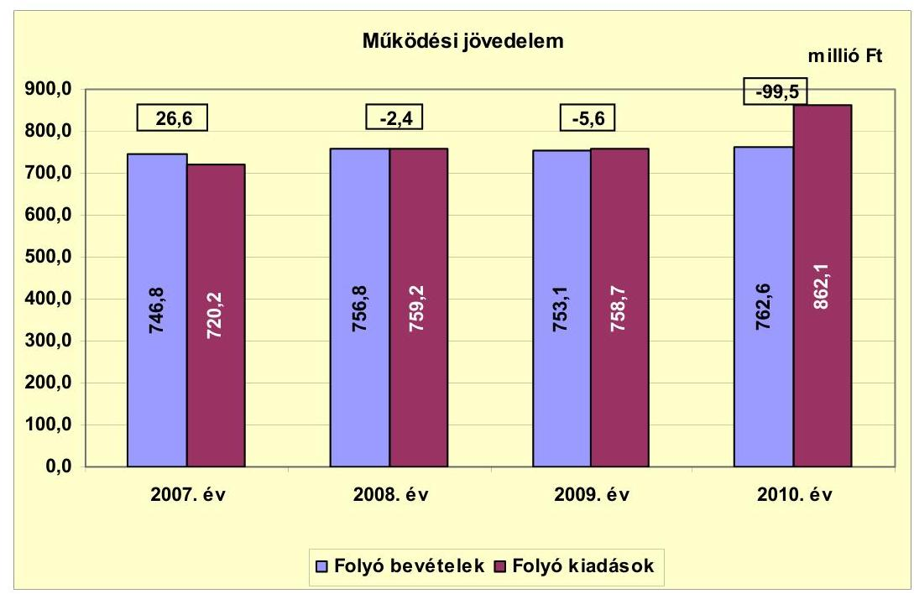

Az Önkormányzat folyó költségvetésének egyenlege (működési jövedelem) csak 2007-ben mutatott tényleges megtakarítást ( 26,6 millió Ft). A 2008. évben a folyó bevételek 10 millió Ft-os növekedése mellett a múködési kiadások 39 millió Ft-os növekedése okozta, hogy a 2007. évi múködési megtakarítás helyett a 2008. évben negatív múködési jövedelem keletkezett. A 2008. évi múködési kiadások növekedését a dologi kiadások 24,3 millió Ft-os növekedése okozta. A pályázati támogatással megvalósuló fejlesztésekhez múködési kiadások is kapcsolódnak, amelyek a 2010. évben a múködési kiadások ${ }^{16}$ növekedését, ezzel összefüggésben a múködési jövedelem negatív egyenlegének a növekedését okozták. A negatív múködési jövedelem pénzügyileg nem fenntartható helyzetet vetít elő.

A múködtetés biztosítása érdekében az Önkormányzat 2007-ben 54,3 millió Ft, 2008-ban 6,1 millió Ft, 2009-ben 23,2 millió Ft, 2010-ben 5,2 millió Ft, 2011ben 5,9 millió Ft ÖNHIKI támogatást kapott. A múködésképtelen helyi önkormányzatok egyéb támogatása 2007-ben 10 millió Ft, 2008-ban 35 millió Ft, 2009-ben 8 millió Ft, 2010-ben 3 millió Ft volt. Az ÖNHIKI támogatást a 20072009. években egyéb kiadások, a 2010. évben bérkiadások teljesítésére használták fel. A múködésképtelen helyi önkormányzatok egyéb támogatása vissza nem térítendő, célhoz/feladathoz nem kötött általános múködési támogatás volt. ÖNHIKI támogatás és a múködésképtelen helyi önkormányzatok egyéb támogatása jogcímeken az Önkormányzat 2007-2010 között évről évre csökkenő összegben részesült: 2007-ben 64,3 millió Ft-ban, 2008-ban 41,1 millió Ft-

[^0]
[^0]:    ${ }^{16}$ A személyi kiadások és járulékai 26,2 millió Ft-ot dologi kiadások 67,3 millió Ft-ot tettek ki.

---

ban, 2009-ben 31,2 millió Ft-ban, 2010-ben 8,2 millió Ft-ban. Az ÖNHIKI és a múködésképtelen helyi önkormányzatok egyéb támogatása nélkül a folyó költségvetés egyenlege mindegyik évben múködési hiányt mutat: 2007-ben -37,7 millió Ft, 2008-ban -43,5 millió Ft, 2009-ben -36,8 millió Ft, 2010-ben -107,7 millió Ft.

Az Önkormányzat nettó múködési jövedelmének évenkénti alakulását az alábbi ábra szemlélteti:
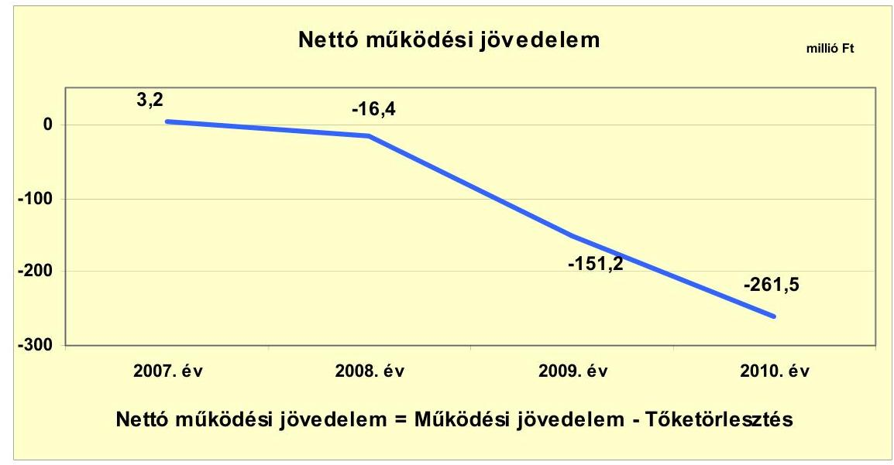

A nettó múködési jövedelem ${ }^{17}$ értéke a folyó költségvetési pozíció mellett az adott költségvetési év hiteltörlesztésének ${ }^{18}$ hatását is tükrözi. A pénzügyi kapacitás a 2007. évben pozitív egyenlegú volt, 2008-2010 között negatív értéket mutatott. A nettó múködési jövedelem folyamatos csökkenését a folyó bevételek és kiadások különbségéből származó múködési jövedelem csökkenése mellett a tőketörlesztés növekedése okozta. A 2009. évre a nettó múködési jövedelem a 2008. évhez viszonyítva 134,8 millió Ft-tal csökkent, amelyet a tőketörlesztés tíz és félszeres ( 14,0 millió Ft-ról 145,6 millió Ft-ra) emelkedése okozott. A 2010. évre a nettó múködési jövedelem a 2009. évhez viszonyítva 72,9\%-kal (110,3 millió Ft-tal) csökkent, amelyet részben a múködési jövedelem 93,9 millió Ft-os csökkenése, részben pedig a tőketörlesztés 11,3\%-os (145,6 millió Ft-ról 162,0 millió Ft-ra) emelkedése okozott.

Az Önkormányzat a 2007-2011. év I. félév közötti időszakban, az utófinanszírozott pályázatok támogatásának megelőlegezésére éven belüli lejáratú hiteleket vett fel. A vizsgált időszakban igénybevett éven belüli lejáratú hitel összege 228,9 millió Ft volt, melyből a 2011. I. félév végén 138,0 millió Ft kötelezettsége állt fenn. Az éven belüli lejáratú hitel év végi állománya a 2007. évi 4,5 millió Ft-ról a 2010. év végére 112,6 millió Ft-ra emelkedett. Ennek oka a két legna-

[^0]
[^0]:    ${ }^{17}$ Pénzügyi kapacitás
    ${ }^{18}$ Az Önkormányzat tőketörlesztési kötelezettsége 2007-ben 23,4 millió Ft, 2008-ban 14,0 millió Ft, 2009-ben 145,6 millió Ft, 2010-ben 162,0 millió Ft volt.

---

gyobb projekt ${ }^{19}$ finanszírozási igénye, amely a 2009. és a 2010. években jelentkezett.

A nettó múködési jövedelem negatív értéke mellett, a meglévő adósságszolgálatot is újabb hitelek felvételével tudja visszafizetni, ami az Önkormányzatnál az adósságspirál megindulását eredményezheti.

A felhalmozási költségvetés bevételeit, kiadásait és egyenlegét a következő ábra szemlélteti:
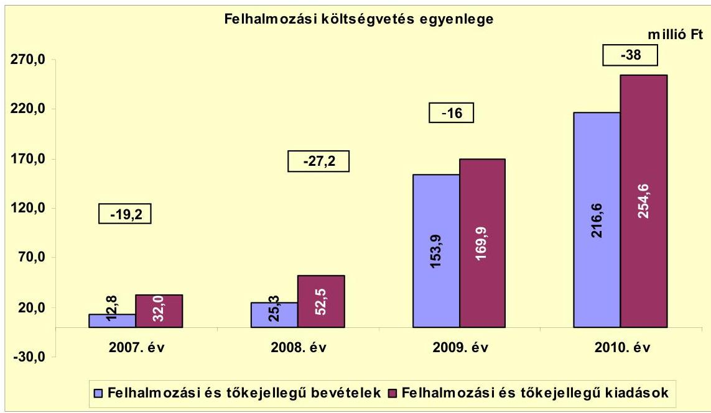

A 2007-2010. években az Önkormányzat felhalmozási költségvetésének egyenlege folyamatosan negatív előjelú volt, a felhalmozási és tőkejellegú bevételek nem nyújtottak fedezetet a kiadásokra. Az Önkormányzat fejlesztéseit kizárólag külső forrás igénybevételével valósította meg. A 2009-2010. években a pályázati támogatások bevonásával az Önkormányzat felhalmozási tevékenysége megélénkült. A 2009-ben kezdődött és még abban az évben EU-s támogatásból befejeződött a csapadékvíz elvezetés. A beruházásra az Önkormányzat 50,0 millió Ft kiadást teljesített. Ugyanebben az évben kezdődött és 2010-ben adták át, az EU-s támogatással megvalósult városrehabilitációs fejlesztést, melynek aktivált értéke 101,0 millió Ft volt. A 2010. december 31-én folyamatban lévő integrációs fejlesztésre 2010. december 31-ig 85,4 millió Ft-ot fizettek ki.

A felhalmozási forráshiánynak a felhalmozási és tőke jellegű kiadásokhoz viszonyított aránya 2007-ben $-60,0 \%$ ( $-19,2$ millió Ft), 2008-ban $-51,8 \%$ (-27,2 millió Ft), 2009-ben $-9,4 \%$ (-16 millió Ft), 2010-ben $-14,9 \%$ (-38 millió Ft) volt. A felhalmozási forráshiány teljes összegű finanszírozására a nettó múködési jövedelem egyik évben sem nyújtott fedezetet. A 2007. évben a múködési

[^0]
[^0]:    ${ }^{19}$ DDOP integrációs pályázat, Városközpont rehabilitációja

---

jövedelem pozitív egyenlege részben ( 3,2 millió Ft) fedezte a felhalmozási forráshiányt.

A felhalmozási költségvetés negatív egyenlege takarékos költségvetési gazdálkodás és pénzügyileg fenntartható ${ }^{20}$ beruházások esetén is magas pénzügyi kockázattal jár, mivel a 2008. évtől kezdődően az Önkormányzat múködési jövedelme is negatív előjelű volt.

A vizsgált időszakban jelentkező összes felhalmozási forráshiány 100,4 millió Ft volt, melyre a 2007. évi 2,5 millió Ft nyitó pénzkészlet és a felvett 97,9 millió Ft összegű fejlesztési hitel nyújtott fedezetet.

Az önkormányzat finanszírozási múveletei 2007-2010. évekbeli egyenlegét a következő ábra szemlélteti:
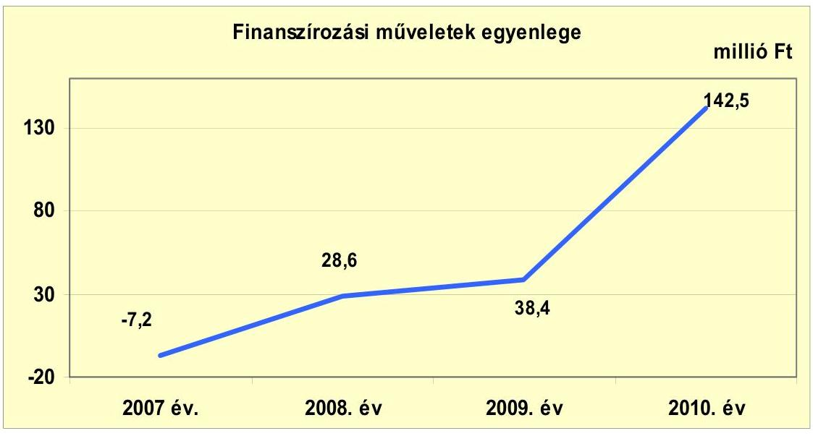

A finanszírozási célú pénzügyi műveletek pozitív értéke azt jelzi, hogy az éves költségvetések végrehajtása során szükség volt a pénzkészlet felhasználásán túl külső forrás igénybevételére is. Az Önkormányzat folyamatosan folyószámlahitel igénybevételére kényszerült, amely év végi állományának változása befolyásolta a finanszírozási múveletek egyenlegét. A külső források igénybevétele emelkedő tendenciát mutatott.

A 2009. évben a 190,1 millió Ft hitelfelvételből 92,1 millió Ft a folyószámlahitel, 34,0 millió Ft hosszú lejáratú hitel, 64,0 millió Ft az éven belüli lejáratú hitel. A 2010. évben az összes hitelfelvétel 328,2 millió Ft volt, melyből folyószámlahitel felvétel 180,9 millió Ft, likvidhitel felvétel 121,9 millió Ft, hosszú lejáratú hitelfelvétel 25,4 millió Ft.

[^0]
[^0]:    ${ }^{20}$ Az minősül pénzügyileg fenntartható beruházásnak, amelynek az újként megjelenő működtetési költségeire az Önkormányzat nettó múködési jövedelme még fedezetet nyújt.

---

A tőketörlesztés a 2009. évben 145,6 millió Ft volt, melyből folyószámlahitel 101,7 millió Ft, likvidhitel 36,6 millió Ft, hosszú lejáratú hitel 7,3 millió Ft. A 2010. évben 162,0 millió Ft-ot törlesztettek, melyből folyószámlahitel törlesztés 105,1 millió Ft, likvidhitel törlesztés 44,9 millió Ft, hosszú lejáratú hiteltörlesztés 12,0 millió Ft volt.

Az egyéb finanszírozási bevételek és kiadások nélkül a finanszírozási múveletek egyenlege 2007-ben -22,2 millió Ft, 2008-ban 26,7 millió Ft, 2009-ben 44,5 millió Ft, 2010-ben 142,5 millió Ft volt. A finanszírozási célú múveleteket a vizsgált időszakban a jelentés 2 . számú mellékletének 4.1-4.8 pontjai részletezik.

A 2009. évben DDOP integráció és a városrehabilitáció fejlesztési feladatok megvalósításához támogatás megelőlegező rövid lejáratú hitelt vett igénybe az Önkormányzat 117 millió Ft összegben. A 2010. évben 21,6 millió Ft hosszú lejáratú fejlesztési hitelt vett igénybe az Önkormányzat.

Az Önkormányzat teljes finanszírozási igénye ${ }^{21}$ a CLF módszer szerint folyamatosan növekvő tendenciát mutatott, 2007-ben -16,0 millió Ft, 2008-ban -43,6 millió Ft, 2009-ben -167,2 millió Ft, 2010-ben -299,5 millió Ft volt. Ennek fedezetét finanszírozási célú bevételekkel és folyószámla hitellel biztosították.

Az Önkormányzat zárszámadási rendeleteiben a múködési és fejlesztési hiányt/többletet a hagyományos költségvetési szerkezet alapján mutatta be ${ }^{22}$, amelyről a jelentés 1. számú melléklete nyújt tájékoztatást. A zárszámadási rendeletekben kimutatott múködési és felhalmozási bevételek tartalmazták a pénzmaradvány összegét is.

A zárszámadási rendeletek a 2007. évben 9,2 millió Ft pénzügyi többletet, a 2008. évben 28,7 millió Ft pénzügyi hiányt, a 2009. évben 13,6 millió Ft pénzügyi többletet, a 2010. évben pedig 135,3 millió Ft pénzügyi hiányt mutattak.

Az Önkormányzat kamatbevételeit és kamatkiadásait évenként a következő ábra mutatja be:
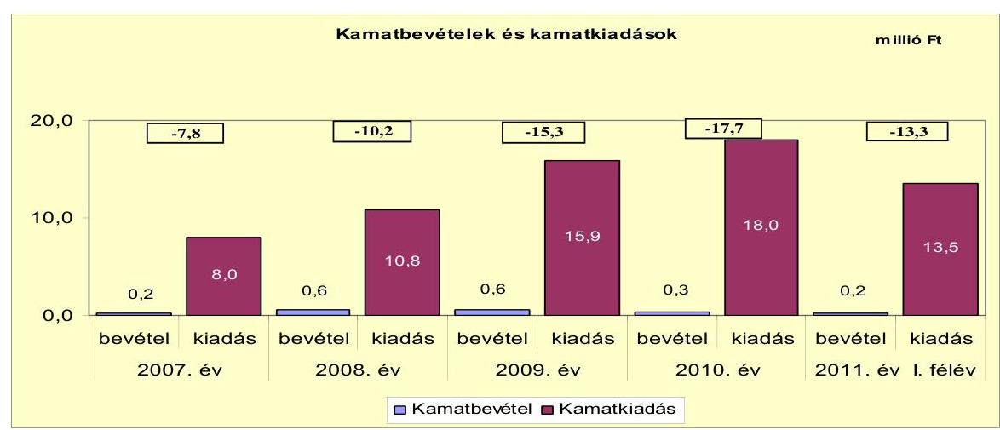

[^0]
[^0]:    ${ }^{21}$ a nettó múködési jövedelem és a felhalmozási költségvetés egyenlegeinek összege ${ }^{22}$ Nincs kötelező előírás a múködési és fejlesztési hiány megállapításának módjára.

---

A 2007-2011. év I. féléve között az Önkormányzat összesen 66,2 millió Ft kamatot fizetett meg. Az átmenetileg szabad pénzeszközök után realizált kamatbevétel a teljes kamatráfordítás 2,9\%-át (1,9 millió Ft) tette ki. Az Önkormányzat kamatbevételeinek és kamatkiadásainak egyenlege a 2007-2011. év I. félév időszakában negatív volt. A kamatkiadások 2007-2010 közötti folyamatos növekedését a pénzintézeti rövid és hosszú lejáratú kötelezettségek növekedése okozta.

A 2007-2011. év I. félév közötti rövid lejáratú pénzintézeti kötelezettségek összege 15,9 millió Ft-ról 232,0 millió Ft-ra, a folyószámlahitel keretösszege 40,0 millió Ftról 120,0 millió Ft-ra, a hosszú lejáratú pénzintézeti kötelezettségek összege 28,3 millió Ft-ról 42,0 millió Ft-ra növekedett. A kamatkiadások növekedésében a kamatkondíciók változása nem játszott szerepet, mivel a kamatfelár növekedését az átlagkamat csökkenése ellensúlyozta.

# 2.2. Az Önkormányzat bevételeinek változása 

Az Önkormányzat 2007-2010 között realizált bevételeinek főbb jogcímek szerinti adatait az alábbi ábra mutatja be:
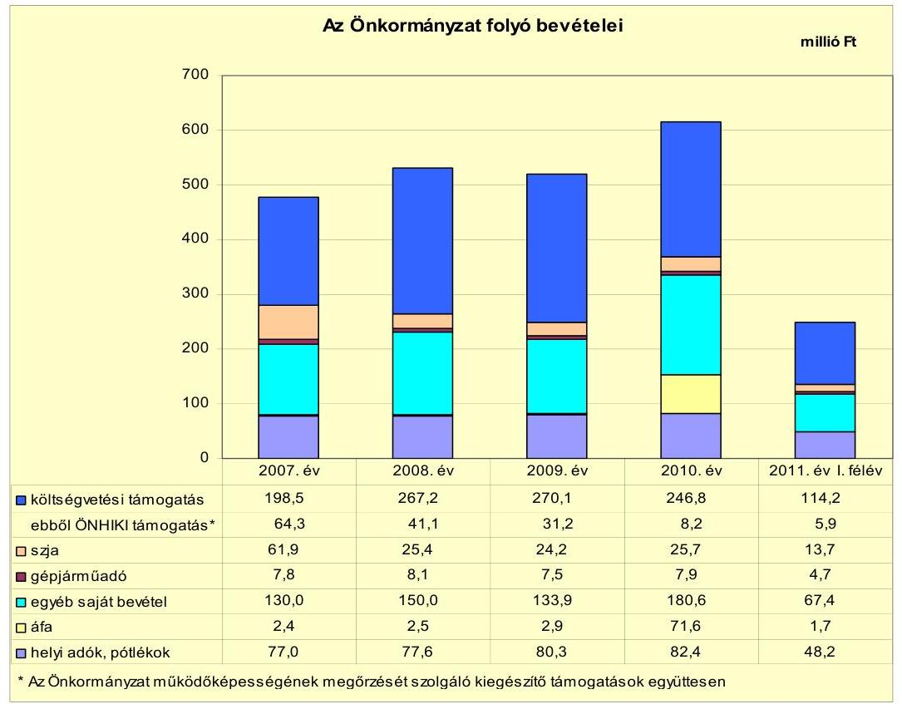

Az Önkormányzat folyó bevételei - a 2009. évet kivéve - folyamatosan növekedtek. A 2007. évi 746,8 millió Ft-ról 2008-ra 756,8 millió Ft-ra, 2009-re 753,1 Ft-ra, 2010-re 762,6 millió Ft-ra növekedtek. 2011. június 30 -ára a bevételek az előző évhez viszonyítva megközelítőleg időarányosan (45,5\%), 345,7 millió Ft összegben realizálódtak.

A múködési célú költségvetési támogatás és az szja bevétel együttes öszszege az évek között lényeges eltérést nem mutatott. A 2007-2009. évek átlagá-

---

hoz (528,2 millió Ft) viszonyítva a 2010. évre 3,7 millió Ft-tal kevesebb volt. A vizsgált időszakban a legmagasabb, 540,5 millió Ft-os bevételt a 2008. évben a helyi szervezési intézkedésekhez kapcsolódóan igényelt központosított támogatás miatt realizálták.

Az Önkormányzat 2007-2010 között az építményadó, a magánszemélyek kommunális adója, a vállalkozók kommunális adója és a helyi iparúzési adó adónemeket állapította meg, melyek mértéke a vizsgált időszakban nem változott. Az Önkormányzatnál a helyi adókból és pótlékokból származó bevételek aránya a folyó bevételekben a 2007-2009. években átlagosan 7,1\% (53,4 millió Ft) volt, amely a 2010. évre 9,0\%-ra (68,4 millió Ft-ra) növekedett. A 2009-ről 2010. évre bekövetkezett 15,8 millió Ft-os növekedés az Önkormányzat adóhátralék behajtására tett intézkedésének eredménye volt.

Az Önkormányzat felhalmozási bevételei a vizsgált időszakban a következőképpen alakultak:
millió Ft

| Megnevezés | 2007. év | 2008. év | 2009. év | 2010. év | 2011. év I.   félév |
| :-- | --: | --: | --: | --: | --: |
| Tárgyi eszköz értékesítés | 6,6 | 2,9 | 28,1 | 3,5 | 8,7 |
| Egyéb saját tőkebevétel | 0,9 | 0,8 | 2,3 | 2,4 | 0,0 |
| Államháztartáson belülről   kapott támogatás | 0,0 | 17,0 | 112,8 | 208,3 | 69,8 |
| EU-tól és külföldről kapott   támogatások | 3,9 | 2,7 | 0,0 | 0,6 | 0,0 |
| Államháztartáson kívülről   kapott támogatás | 1,4 | 1,9 | 10,7 | 1,8 | 1,3 |
| Összes felhalmozási bevétel | 12,8 | 25,3 | 153,9 | 216,6 | 79,8 |

A vizsgált években a felhalmozási célú bevételek jelentős ingadozásához hozzájárult az államháztartáson belülről kapott, pályázatokból származó támogatások 2009-2010. évi emelkedése.

A 2009. évben az Önkormányzat értékesítette az orfúi ingatlant, melyből 20,1 millió Ft, a sásdi iparterületi értékesítésből 8,0 millió Ft bevétel realizálódott.

A 2009. évben az államháztartáson kívülről 10,7 millió Ft céljellegú decentralizált támogatást kapott az Önkormányzat.

A 2009. évben a DDOP csapadékvíz elvezetés fejlesztési feladathoz 44,1 millió Ft, DDOP Városrehabilitáció fejlesztési feladathoz 48,7 millió Ft, EU-s programokhoz 20,0 millió Ft államháztartáson belüli támogatásban részesült az Önkormányzat.

A 2010. évben a DDOP integrációs fejlesztési feladathoz 130,6 millió Ft, TÁMOP pályázatból 57,8 millió Ft, városrehabilitáció fejlesztési feladathoz 19,2 millió Ft, csapadékvíz elvezetés fejlesztési feladathoz 0,7 millió Ft támogatásban részesült az Önkormányzat.

---

# 2.3. Az Önkormányzat múködési és felhalmozási célú kiadásainak változása 

Az Önkormányzat folyó kiadásai főbb jogcímek szerinti bontásban a 20072011. év I. félévben az alábbiak voltak:

| Megnevezés | 2007. év | 2008. év | 2009. év | 2010. év | 2011. év I.   félév |
| :--: | :--: | :--: | :--: | :--: | :--: |
| Folyó kiadások | 720,2 | 759,2 | 758,7 | 862,1 | 396,1 |
| Müködési kiadások (kamatkiadás nélkül) | 652,8 | 682,4 | 672,7 | 771,1 | 352,1 |
| Államháztartáson belülre átadott pénzeszközök | 0,7 | 1,6 | 0,7 | 0,0 | 0,0 |
| Transzferkiadások | 58,7 | 64,4 | 69,4 | 73,0 | 28,4 |
| -ebből: vállalkozásoknak | 0,1 | 0,0 | 0,4 | 0,5 | 0,0 |
| EU-nak, illetve külföldre | 0,0 | 0,0 | 0,0 | 0,0 | 0,0 |
| magánszemélyeknek | 47,7 | 54,5 | 58,3 | 63,1 | 24,6 |
| nonprofit szervezeteknek | 10,9 | 9,9 | 10,7 | 9,4 | 3,8 |
| Kamatkiadások | 8,0 | 10,8 | 15,9 | 18,0 | 13,5 |
| Előző évi pénzmaradvány átadás | 0,0 | 0,0 | 0,0 | 0,0 | 0,0 |

A folyó kiadásokon belül a múködési kiadások a 2007-2009. évek átlagát 2010ben $15,2 \%$-kal ( 101,8 millió Ft-tal) teljesítették túl. A közcélú és közhasznú foglalkoztatás növekedése a személyi juttatások 30,3 millió Ft-os növekedését okozta a 2010. évben. A pályázati támogatással megvalósuló fejlesztésekhez múködési kiadások is kapcsolódnak, amelyek a 2010. évben a múködési kiadások $^{23}$ növekedését okozták.

A DDOP Városközpont rehabilitáció fejlesztési feladathoz kapcsolódó múködési kiadások 5,9 millió Ft dologi kiadást, a DDOP oktatási integráció fejlesztési feladathoz 2,0 millió Ft személyi juttatás és járulékai, valamint 25,9 millió Ft dologi kiadás növekedést okoztak. A TÁMOP és DIGITÁR pályázatokhoz kapcsolódó feladatok az ÁMK intézménynél 28,5 millió Ft dologi, valamint 16,4 millió Ft személyi juttatás és járulékai kiadásnövekedést okozott.

A transzferkiadásokon belül a magánszemélyek pénzbeli szociális ellátásaira adott támogatások a 2010. évben 12,0\%-kal, 3,6 millió Ft-tal nőttek az előző évhez képest.

Az Önkormányzat folyó kiadásai kiemelt előirányzatok szerinti bontásban a 2007-2011. év I. félév között az alábbiak voltak:

[^0]
[^0]:    ${ }^{23}$ A személyi kiadások és járulékai 26,2 millió Ft-ot dologi kiadások 67,3 millió Ft-ot tettek ki.

---

| Megnevezés | 2007. év | 2008. év | 2009. év | 2010. év | 2011. év I.   félév |
| :-- | --: | --: | --: | --: | --: |
| Személyi juttatások | 387,6 | 383,2 | 375,5 | 431,6 | 185,5 |
| Munkaadót terhelő járulékok | 123,6 | 122,9 | 110,1 | 107,5 | 49,1 |
| Dologi kiadások | 128,8 | 153,1 | 171,8 | 220,8 | 109,0 |
| Egyéb folyó kiadások | 12,8 | 23,3 | 6,5 | 9,5 | 6,7 |

A személyi juttatások 2007-2009 között kis mértékben csökkentek, 2010-re a 2007-2009. évek 382,1 millió Ft-os átlagához viszonyítva 49,5 millió Ft-tal (13,0\%-kal) növekedtek a közhasznú és közcélú foglalkoztatás növekedése miatt.

A dologi kiadások 2007-2010 között folyamatosan növekedtek. A 2007-2009. évek átlagához ( 151,2 millió Ft) viszonyítva a 2010. évre 69,6 millió Ft-tal, $46,0 \%$-kal növekedtek, mely növekedés $96,6 \%$-át ( 67,3 millió Ft) a pályázati támogatással megvalósuló fejlesztésekhez kapcsolódó beszerzések okozták.

Az Önkormányzat folyó és a felhalmozási kiadásainak alakulását a vizsgált időszakban az alábbi ábra szemlélteti:
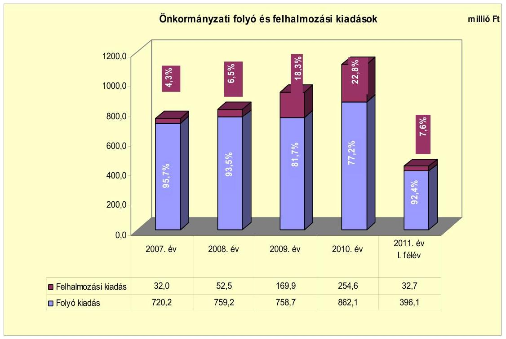

A múködési és felhalmozási kiadások arányának változásában 2007-2010 között a felhalmozási kiadások arányának folyamatos növekedése figyelhető meg. A felhalmozási kiadások részaránya a 2007. évi 4,3\%-ról ( 32 millió Ft) 2009. évre $18,3 \%$-ra ( 169,9 millió Ft), a 2010. évre $22,8 \%$-ra ( 254,6 millió Ft) növekedett. A 2009. és a 2010. évben a felhalmozási kiadások arányának növekedését a pályázati forrásból megkezdett fejlesztések eredményezték.

Az Önkormányzatnál a 2007-2010. években összesen 2 db 10 millió Ft feletti felújítás és 67 db 10 millió Ft alatti fejlesztés fejeződött be. A 311,4 millió Ft ér-

---

tékű fejlesztés és felújítás forrása 124,1 millió Ft EU-s támogatás (39,9\%), 98,5 millió Ft saját bevétel (31,6\%), 50,1 millió Ft hitel (16,1\%) és 38,7 millió Ft hazai támogatás $(12,4 \%)$ volt.

A 2010. december 31-én folyamatban lévő három felújítás tervezett bekerülési összege 981,2 millió Ft volt, amelyre 2010. december 31-éig 93,1 millió Ft kiadást teljesítettek. A folyamatban lévő fejlesztések pénzügyileg teljesített forrása 3,2 millió Ft (3,4\%) saját bevétel és 89,9 millió Ft (96,6\%) EU-s támogatás volt. A folyamatban lévő fejlesztések 2010. december 31-e utáni kötelezettsége 888,1 millió Ft, melynek forrása 26,4 millió Ft hitel (3,0\%), 800,4 millió Ft EU-s támogatás ( $90,1 \%$ ), 52 millió Ft hazai támogatás ( $5,9 \%$ ) és 9,3 millió Ft saját bevétel $(1,0 \%)$.

Az Önkormányzat három legmagasabb bekerülési költségű fejlesztése a következő volt:

- a DDOP városrehabilitáció, melynek során a városközpont kiterjesztése és megújítása, a Polgármesteri hivatal akadálymentesített és modernizált épületbe költöztetése, valamint közpark felújítása valósult meg. A felújítás 2009. áprilisban kezdődött és 2010. júliusban fejeződött be. Teljes bekerülési összege 101,1 millió Ft volt. A fejlesztés forrásösszetétele: 29,0 millió Ft hitel $(28,7 \%), 67,9$ millió Ft EU-s támogatás ( $67,2 \%$ ) és 4,2 millió Ft saját bevétel $(4,1 \%)$ volt;
- a DDOP integrációs pályázati támogatással megvalósuló integrált közoktatási és művelődési intézmény létrehozása 2009-ben kezdődött. A projekt keretében a művelődési központ, a könyvtár, a zeneiskola új helyre költözése mellett az ÁMK, az óvoda és bölcsőde felújítását, akadálymentesítését valósítják meg. A fejlesztési feladat teljes tervezett bekerülési összege 871,4 millió Ft, melyből 2010. december 31-éig 85,4 millió Ft fejlesztési kiadást teljesítettek. A 2010. év után fennálló kötelezettség 786,0 millió Ft, melynek forrása: 707,6 millió Ft EU-s támogatás ( $90,0 \%$ ), 52,0 millió Ft hazai támogatás $(6,6 \%)$ és 26,4 millió Ft hitel (3,4\%);
- DDOP forgalmi csomópont felújítása a 2009. évben kezdődött és várhatóan a 2011. évben fejeződik be, melynek teljes bekerülési összege 94 millió Ft. A felújítás a 66-os és a 611. számú főutak csomópontjára irányul, fő célja a közúti közlekedés biztonságának elősegítése és modernizálása. 2010. december 31-ig 2,1 millió Ft fejlesztési kiadást teljesítettek, a 2010. év után fennálló kötelezettség 91,9 millió Ft, melynek forrása 84,6 millió Ft EU-s támogatás $(92,1 \%)$ és 7,3 millió Ft saját bevétel $(7,9 \%)$.

Az Önkormányzatnak a 2011. év I. félévében beadott, elbírálás alatt álló pályázata nem volt.

Az Önkormányzat a 100\%-os önkormányzati tulajdonú Városgazdálkodási Nonprofit Kft. részére múködési célra 17,3 millió Ft-ot adott át 2007-2011. év I. félév között.

---

# 3. Az ÖNKORMÁNYZAT KÖTELEZETTSÉGEI 

### 3.1. Az Önkormányzat pénzintézeti kötelezettségeinek változása

Az Önkormányzat pénzintézeti kötelezettségeinek állománya 2006. december 31-től 2011. év I. félév végéig 58,5 millió Ft-ról 274,0 millió Ft-ra nőtt. A 2010. december 31-én fennálló pénzintézeti kötelezettségek 101,7 millió Ft folyószámla, 112,6 millió Ft éven belüli lejáratú, valamint 50,6 millió Ft hosszú lejáratú hitelből keletkeztek. A pénzintézeti kötelezettségek összetétele a 2009. évtől kedvezőtlenül alakult. A kötelezettségállományon belül megnövekedett a rövid lejáratú kötelezettségek aránya, melynek év végi állománya a fennálló folyószámlahitel összegét is tartalmazta. A vizsgált időszakban adósságszolgálatra az Önkormányzat 67,4 millió Ft-ot teljesített, amelyből a kamatkiadás 31,7 millió Ft volt.
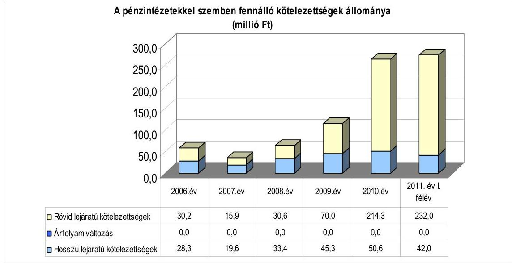

Az Önkormányzat pénzintézeti kötelezettségvállalásaira minden esetben a Kép-viselő-testület döntése alapján került sor. A kötelezettségvállalásból származó források felhasználási céljait meghatározták. Az adósságszolgálat felső határáról az éves költségvetési rendelettervezetek előterjesztésekor tájékoztatták a Képviselő-testületet és az adósságot keletkeztető kötelezettségvállalásoknál annak felső határát betartották. Az Önkormányzat a 2006-2011. év I. félév vége között létrejött nyolc hosszú lejáratú és 11 db éven belüli lejáratú hitelszerződésének mindegyikét a számlavezető bankjával kötötte. A hitelszerződések forint alapúak, így a deviza árfolyam változás hatása a kötelezettségek alakulását nem befolyásolta. A vizsgált időszakban számlavezető bankot nem váltottak.

Az adósságot keletkeztető kötelezettségvállalással megvalósított felhalmozási kiadások esetleges bevételt növelő, illetve kiadást csökkentő vonzatát, illetve ennek a fejlesztéshez, felújításhoz vállalt kötelezettségek visszafizetési forrásként való számbavételét a Képviselő-testület nem vizsgálta. A költségvetési rendelet mellékletében bemutatásra kerültek a lejáratig fizetendő tő-

---

ketörlesztés és kamatok összegei. Az előterjesztések azonban nem tartalmazták a törlesztések forrásainak bemutatását.

Az Önkormányzat fejlesztési céljainak megvalósításához, a pályázati források mellett, fejlesztési célú hiteleket vett igénybe. A forintban fennálló hosszú lejáratú pénzintézeti kötelezettségeket a következő táblázat mutatja be:

Az Ökormányzat 2011. június 30-án HUF-ban fennálló hosszú lejáratú adósságot keletkeztető kötelezettségvállalásai

| Megnevezés | Szerződéskötési   Kibocsátás   időpontja | Összeg   millió Ft-ban | Kamat (referencia kamat+   kamatfelár) | Felhasználás célja: |
| :-- | :--: | :--: | :--: | :-- |
| 3100/2003/0015. számú OTP | 2003.04 .18 | 23,0 | 3 havi BUBOR + 2,5\% | Rendezési terv, járdafelújitás. |
| 3100/2006/0065. számú OTP | 2006.07 .10 | 17,4 | 3 havi BUBOR + 1,5\% | Útfelújitás, ingatlanvásátrás. |
| 3100/2008/0083. számú OTP | 2008.07 .30 | 16,1 | 3 havi BUBOR + 2,5\% | DDOP pályázathoz önrész. |
| 3100/2009/002. számú OTP | 2009.01 .15 | 5,0 | 3 havi BUBOR + 3,5\% | DDOP pályázat, csap.csatorna. |
| 3100/2009/0072. számú OTP | 2009.06 .18 | 7,8 | 3 havi EURIBOR+2,5\% | DDOP Városreheb. önrész.bizt. |
| 3100/2009/0073. számú OTP | 2009.06 .18 | 21,2 | 3 havi EURIBOR+3,5\% | DDOP saját erős pótmunkákra. |
| 3100/2010/0086. számú OTP | 2010.08 .26 | 20,9 | 3 havi EURIBOR+MFB ref.   Kamat+1,5\% | DDOP integrációs pály. önerő. |
| 3100/2010/0239. számú OTP | 2010.12 .06 | 4,6 | 1 havi BUBOR + 4,5\% | DDOP integrációs pály. pótmunkák. |

Az Önkormányzat a beruházási hiteleket a céloknak megfelelően használta fel.
A 2003. évben felvett 23 millió Ft összegből, a városrendezési tervét készítették el, a közvilágítás korszerűsítésére 7,8 millió Ft-ot fordítottak. Az általános iskola tetőfelújítása, valamint út és járda felújítási munkák a hitelcélnak megfelelően elkészültek. A 2006. évi felhalmozási hitelből 3 millió Ft értékű ELMIB részvényt és a vízmú ügyfélszolgálati irodájának helyet adó ingatlant vásároltak, valamint a TEKI támogatással megvalósult útfelújítások 7,5 millió Ft-os saját forrását biztosították. A 2008. évben igénybevett célhitelből a DDOP pályázatok önrészéhez, valamint pályázatírásra 4,6 millió Ft-ot, a KEOP ivóvízminőség javító programra 1,7 millió Ft-ot fordítottak. A Meződi Önkormányzattól 1,8 millió Ft-ért ingatlant, az ELMIB-től 4,2 millió Ft névértékú részvényt vásároltak. A fonyódligeti údáló felújítására a hitelből 3,8 millió Ft-ot használtak fel. A 2009. évben három célhitel szerződést kötött az Önkormányzat. A Belterületi csapadékvíz elvezető hálózat fejlesztése, a Városközpont rehabilitációja DDOP pályázatok önerejének finanszírozására, valamint az utóbbi pályázat pótmunkáira biztosítottak fedezetet hitelből. A DDOP integrációs pályázat önerejéhez, a megrendelt pótmunkák fedezetére a 2010. évben két célhitel szerződést kötött az Önkormányzat.

Az Önkormányzat az éven túli lejáratú hiteleiből a DDOP integrációs pályázathoz az önrész finanszírozására, illetve a megrendelt pótmunkákra kötött két hitelszerződésből 13,2 millió Ft-ot a 2011. év I. félév végéig még nem használta fel.

---

Az Önkormányzat a müködtetési feladatainak finanszírozását a vizsgált időszakban folyószámlahitel és éven belüli lejáratú hitel igénybevételével tudta biztosítani.

A folyószámlahitel évenkénti alakulását az alábbi táblázat mutatja be:

|  |  |  |  |  | millió Ft-ban |
| :--: | :--: | :--: | :--: | :--: | :--: |
| Megnevezés | 2007. év | 2008. év | 2009. év | 2010. év | 2011. év I. félév |
| I. Folyószámlahitel |  |  |  |  |  |
| a folyószámlahitel keretösszege január 1-jén | 40,0 | 60,0 | 90,0 | 90,0 | 120,0 |
| teljesitett kamat és egyéb költség | 4,5 | 6,0 | 5,0 | 2,5 | 2,9 |
| a folyószámlahitel egyenlege január 1-jén | 38,9 | 42,6 | 58,5 | 87,8 | 101,7 |
| a folyószámlahitel fordulónapján fennálló egyenleg | 45,0 | 27,0 | 101,1 | 94,3 | 94,3 |

Az Önkormányzatnak 2007. január 1-jén 38,9 millió Ft, a 2009. év elején 58,5 millió Ft, a 2010. január 1-jén 87,8 millió Ft, majd az év végén 101,7 millió Ft folyószámlahitel tartozása volt. Az év végén fennálló folyószámlahitel állomány nagysága jelzi, hogy a pénzforgalmi kiadásokat a pénzforgalmi bevételek és a felvett hitelek mekkora összegben nem fedezték. A 2011. év I. félév végén a folyószámlahitel állomány 94,0 millió Ft-ra (7,6\%-kal) csökkent. Az áttekintett időszakban a tárgyévi pénzforgalmi kiadások finanszírozásához, egyre növekvő mértékben vettek igénybe folyószámlahitelt. A folyószámlahitel szerződés lejáratának, illetve megújításának fordulónapján fennálló folyószámlahitel egyenlege azt mutatja, hogy az Önkormányzatnál tartósan fennáll a finanszírozási igény, ami pénzügyi kockázatot jelent. Az Önkormányzat törlesztési kockázatát növeli - a 2007-2009. évek átlagához viszonyítva ötödére csökkent az ÖNHIKI támogatás összege (a 22,2 millió Ft-ról a 2011. évre 5,9 millió Ft-ra) - így a tartósan fennálló likviditási gondokat csak az egyre növekvő folyószámlahitel igénybevételével tudták kezelni.

A folyószámlahitel kondíciói és egyéb költségei a következők voltak: ${ }^{24}$

| Megnevezés | Kamat (referencia+ kamatfelár) | Egyéb költség |
| :--: | :--: | :--: |
| Folyószámlahitel |  |  |
| 2006.01.01-2007.01.31 | 3 havi BUBOR $+2,0 \%$ | 0,5\% rendelkezésre tartás, 0,5\% kezelési di |
| 2007.02.01-2008.06.01 | 3 havi BUBOR $+1,0 \%$ | 0,5\% rendelkezésre tartás, 0,5\% kezelési di |
| 2008.08.26-2009.01.01 | 3 havi BUBOR $+3,0 \%$ | 1,0\% rendelkezésre tartás, 0,5\% kezelési di |
| 2009.08.06-2010.07.23 | 1 havi BUBOR $+3,75 \%$ | 1,0\% rendelkezésre tartás, 0,5\% kezelési di |
| 2010.07.23-2011.06.30 | 1 havi BUBOR $+3,75 \%$ | 1,0\% rendelkezésre tartás, 0,5\% kezelési di |

[^0]
[^0]:    ${ }^{24}$ A referencia kamatok az alábbiak szerint alakultak:

    | MNB BUBOR fixing (átlagkamat) \%-ban |  |  |  |  |  |
    | :--: | :--: | :--: | :--: | :--: | :--: |
    | Referencia kamat | 2007. évi | 2008. évi | 2009. évi | 2010. évi | 2011. év I.   félév |
    1 havi BUBOR | 7,83 | 8,75 | 8,66 | 5,47 | 6,00 |  |
    3 havi BUBOR | 7,75 | 8,87 | 8,64 | 5,50 | 6,07 |  |

---

Az éven belüli lejáratú hitel állományának alakulását az alábbi táblázat mutatja be:
(millió Ft)

| II. Likvid hitel | 2007. év | 2008. év | 2009. év | 2010. év | 2011. év I. félév |
| :--: | :--: | :--: | :--: | :--: | :--: |
| a felvett likvid hitel összege december 31 -én | 4,5 | 13,5 | 64,0 | 121,9 | 25,0 |
| teljesített kamat és egyéb költség | 0,3 | 0,4 | 2,1 | 7,7 | 0,0 |
| a visszafizetett likvid hitel összege december 31-én | 0,0 | 9,9 | 36,6 | 44,9 | 0,0 |
| a likvid hitel egyenlege december 31-én | 4,5 | 8,1 | 35,5 | 112,6 | 138,0 |

Az Önkormányzat a 2007-2011. év I. félév közötti időszakban, az utófinanszírozott pályázatok ${ }^{25}$ támogatásának megelőlegezésére éven belüli lejáratú hiteleket vett fel. A vizsgált időszakban igénybevett éven belüli lejáratú hitel összege 228,9 millió Ft volt, melyből a 2011. I. félév végén 138,0 millió Ft kötelezettsége állt fenn.

Az áttekintett időszakban az éven belüli lejáratú hitel év végi állománya 4,5 millió Ft-ról a 2010. év végére 112,6 millió Ft-ra emelkedett. Ennek oka, a két legnagyobb projekt ${ }^{26}$ finanszírozási igénye a 2009. és a 2010. években jelentkezett.

Az Önkormányzat a 2007-2011. június 30. közötti időszakban minden egyes napot folyószámlahitellel zárt. A folyószámlahitel átlagos napi állománya ${ }^{27}$ a 2007. évi 49 millió Ft-ról 2010. évre 86 millió Ft-ra, a 2011. I. félév végén már 111,3 millió Ft-ra növekedett. A vizsgált időszakban folyamatosan növekedett a folyószámlahitel átlagos napi állománya. A folyószámlahitel igénybevétele az Önkormányzatnak a 2007-től 2011. év I. félév végéig összesen 20,9 millió Ft kamatkiadást okozott. A pályázati támogatások megelőlegezése miatt igénybevett éven belüli lejáratú hitel kamata a 2007-2011. év I. félév közötti időszakban 10,5 millió Ft kiadást jelentett az Önkormányzatnak.

A forintban felvett éven túli lejáratú hitelek esetében a kamatfizetési kötelezettségek alakulását befolyásolja az igénybevételkor (lehíváskor) és az utolsó kamatfizetéskor érvényes kamat alakulása, melyet a következő táblázat mutat be:

| Megnevezés | Lehíváskori | Utolsó fizetéskori | Változás \% |
| :--: | :--: | :--: | :--: |
|  | kamat (referencia + kamatfelár) \% |  |  |
| 3 havi BUBOR (2003.04.18-i szerződés) | 9,01 | 8,57 | $-0,44 \%$ |
| 3 havi BUBOR (2006.07.10-i szerződés) | 8,48 | 7,57 | $-0,91 \%$ |
| 3 havi BUBOR (2008.07.30-i szerződés) | 11,08 | 8,57 | $-2,51 \%$ |
| 3 havi BUBOR (2009.01.15-i szerződés) | 13,4 | 9,57 | $-3,83 \%$ |
| 3 havi EURIBOR (2009.06.18-i szerződés) | 5,02 | 5,01 | $-0,01 \%$ |
| 3 havi EURIBOR (2010.08.26-i szerződés) | 3,76 | 3,01 | $-0,75 \%$ |
| 1 havi BUBOR (2010.12.06-i szerződés) | 9,58 | 10,5 | 0,92\% |

[^0]
[^0]:    ${ }^{25}$ A 2007. évben TEUT, CÉDE és HEFOP pályázat, a 2008. évben AVOP, LEADER, LEKI pályázatok, a 2009-2010. években DDOP, TÁMOP, KEOP és az ÖNHIKI támogatások megelőlegezésére.
    ${ }^{26}$ DDOP integrációs pályázat, Városközpont rehabilitációja
    ${ }^{27}$ Fennálló folyószámla hitelállomány/365 nap

---

Az Önkormányzatnak a referencia kamat változásából a vizsgált időszakban többlet kamatfizetési kötelezettsége nem keletkezett.

Az Önkormányzat kötelezettségeinek állományát 2010. december 31-én és 2011. június 30-án, valamint várható alakulását a kötelezettségek lejáratáig a következő táblázat részletezi:

| Megnevezés | Alomany 2010. decembe 31   én |  |  | Alomany 2011. június 30-án |  |  | Várható kötelezettség 20112013. években |  | Várható kötelezettség 2014. évtól |  |
| :--: | :--: | :--: | :--: | :--: | :--: | :--: | :--: | :--: | :--: | :--: |
|  | HUF-ben (millió Ftben) | Devizitben (összege, ezer ... ben) | Devizit nem | HUF-ben (millió Ftben) | Devizitben (összege, ezer ... ben) | Devizit   nem | HUF-ben (millió Ftben) | Devizitben (összege, ezer ... ben) | HUF-ben (millió Ftben) | Devizitben (összege, ezer ... ben) |
| Pénzintézeti kötelezettségek |  |  |  |  |  |  |  |  |  |  |
| Hisszú rejézetú pénzintézeti kötelezettségek | 50,6 | 0 | HUF | 42,0 | 0 | HUF | 10,8 | 0 | 39,8 | 0 |
| Éven belüli lejáratú pénzintézeti kötelezettségek | 112,6 | 0 | HUF | 136,0 | 0 | HUF | 138,6 | 0 | 0,0 | 0 |
| Folyószánta hitel | 101,7 | 0 | HUF | 94,0 | 0 | HUF | 94,0 | 0 | 0,0 | 0 |
| Pénzintézeti kötelezettségek összesen HUF-ben | 284,9 | 0 | HUF | 274,0 | 0 | HUF | 242,8 | 0 | 39,8 | 0 |
| Szállító tartozás | 320,1 | 0 | HUF | 320,0 | 0 | HUF | 320,0 | 0 | 0,0 | 0 |
| Egyéb kötelezettségek | 3,8 | 0 | HUF | 3,8 | 0 | HUF | 3,8 | 0 | 0,0 | 0 |
| Összes kötelezettség | 588,8 | 0 | HUF | 597,8 | 0 | HUF | 596,6 | 0 | 39,8 | 0 |

Az Önkormányzat 2010. december 31-én fennálló összes kötelezettsége 588,8 millió Ft, amelyből a 2011-2013. években 566,6 millió Ft várható kötelezettsége keletkezik. Ennek teljesítését a 138 millió Ft-os európai uniós támogatásból, (ami az éven belüli lejáratú hitelek állományának fedezetét képezi) valamint a 2010. évi mérlegében kimutatott 27,2 millió Ft követelésállományból tervezi megoldani. Az Önkormányzat nyilatkozata szerint a kötelezettségekre fedezetet biztosíthat a jelzálogjoggal nem terhelt forgalomképes ingatlanvagyon. A helyi sajátosságok, valamint kereslet hiányában ezek az ingatlanok nehezen értékesíthetőek. A 2011. június 30-án fennálló, a további éveket terhelő 39,8 millió Ft pénzintézeti kötelezettség teljesítését nem látjuk biztosítottnak, mivel a visszafizetés fedezetéül megjelölt forgalomképes ingatlanvagyon értékesítéséből a bevétel realizálása bizonytalan.

# 3.2. A szállítói kötelezettségek változása 

Az Önkormányzat mérlegben kimutatott szállítói állománya és annak összes kötelezettségen belüli aránya a 2007. évben 7,9 millió Ft (9,4\%), a 2008. évben 11,5 millió Ft (10,5\%), a 2009. évben 23,5 millió Ft (8,6\%) volt. Ez az arány a 2010. évben 320,1 millió Ft-ra (51,5\%-ra) növekedett.

A mérleg szerinti szállítói kötelezettség a 2007. évről 2011. év I. félév végéig 7,9 millió Ft-ról 320,1 millió Ft-ra (negyvenszeresére) növekedett. Ennek egyik oka, hogy az EU-s támogatással megvalósuló beruházások szállítói kötelezettségeinek összege megjelent az Önkormányzat beszámolóiban. Kedvezőtlenül befolyásolta a szállítói kötelezettségállomány alakulását az Önkormányzat egyre nehezedő likviditási helyzete is. A mérlegben szerepeltetett szállítói kötelezettségállományból $265,2^{28}$ millió Ft átütemezett (megállapodással érintett) szállítói tartozás volt. Az EU-s pályázatokkal megvalósuló fejlesztések vállalko-

[^0]
[^0]:    ${ }^{28}$ A szállítói számlákból az EU-s és a hazai támogatások összege.

---

zói szerződéseiben rögzítették, hogy a kivitelező számláit a támogatás folyósítását követően egyenlíti ki az Önkormányzat.

A Önkormányzat lejárt szállítói tartozása a vizsgált időszakban folyamatosan nőtt. A lejárt szállítói tartozás 2007. évben 7,9 millió Ft volt, ami 2010. december 31-re 40,3 millió Ft-ra, 2011. év I. félév végére 45,8 millió Ft-ra nőtt. A 2010. évi 40,6 millió Ft-os lejárt tartozás 36,2\%-a, (14,6 millió Ft) 30 nap alatti, $24 \%$-a ( 9,7 millió Ft) 31-60 nap közötti, $37,6 \%$-a ( 15,1 millió Ft) pedig 61-90 nap közötti. Éven túli tartozása 0,9 millió Ft volt, melyet a 2011. I. félév végére pénzügyileg rendeztek. A 2011. év I. félév végén a 45,8 millió Ft lejárt szállítói tartozásból a 30 nap alatti tartozások részaránya 5 százalékponttal, 14,3 millió Ft-ra csökkent, a 31-60 nap közötti tartozások részaránya 7 százalékponttal 14,2 millió Ft-ra, a 61-90 nap közötti tartozások részaránya $14,1 \%$-al, 17,3 millió Ft-ra növekedett. Figyelembe véve a helyi önkormányzatok adósságrendezési eljárásáról szóló 1996. évi XXV. törvény 5. § (2) bekezdésében foglaltakat, a 60 napon túli tartozásállomány növekedése az Önkormányzat pénzügyi kockázatát is növelte.

Ha az Önkormányzatnál a tartozásállomány a 90 napot meghaladja, a polgármester a Képviselő-testület döntése alapján, nyolc napon belül köteles adósságrendezési eljárást kezdeményezni. Az államháztartás múködési rendjéről szóló 292/2009. (XII. 19.) Korm. rendelet 167. §-ában foglaltak szerint, amennyiben az önkormányzattal szemben adósságrendezési eljárást az adósságrendezési tv. 4. §a alapján nem kezdeményeztek és az államháztartásról szóló 1992. évi XXXVIII. törvény 100/F. § (6) bekezdése alapján a fennálló tartozás 30 napon túli és meghaladja az éves eredeti kiadás $10 \%$-át vagy a 150 millió Ft-ot, valamint a tartozás egy hónapon belül nem szorítható 30 nap alá, illetve ha a tartozás mértéke meghaladja az önkormányzati rendeletben meghatározott összeget, indokolt az önkormányzati biztos kirendelése.

Egyéb kiadás elmaradása az Önkormányzatnak nem volt.
A lejárt szállítói tartozások növekedése, valamint a 2009. évtől megjelenő 60 napon túli tartozások az Önkormányzat folyamatosan romló likviditási helyzetét mutatják.

# 3.3. Egyéb kötelezettségek változása 

Az Önkormányzatnak lízingszerződésből, garancia és kezességvállalásból, PPP konstrukciójú szerződésből eredő kötelezettsége a vizsgált időszakban nem volt, követelést nem engedett el. Intézménynek, más önkormányzatnak, gazdasági társaságának, civil szervezetnek kölcsönt nem nyújtottak.

Az Önkormányzat két alkalommal járult hozzá forgalomképes önkormányzati tulajdonban lévő ingatlanokon jelzálogjog bejegyzéséhez. Az I. ranghelyi egyetemleges jelzálogjogot az Önkormányzat folyószámla vezető pénzintézete javára, a 2011. évben felvett 25 millió Ft-os éven belüli lejáratú hitel, illetve a 2011. évi folyószámlahitel visszafizetésének biztosítékaként jegyezték be. A jelzálogjoggal terhelt öt forgalomképes ingatlanra összességében 145 millió Ft értékű jelzálogjog bejegyzése történt meg. A jelzáloggal terhelt forgalomképes ingatlanok számviteli nyilvántartás szerinti nettó értéke 2010. december 31-én 9,4 millió Ft volt, amelyekre a 145 millió Ft összegű fel-

---

vett hitel erejéig jegyezték be a jelzálogjogot. Az Önkormányzat összes forgalomképes ingatlanainak könyvszerinti nettó értéke 2010. december 31-én 149,0 millió Ft volt.
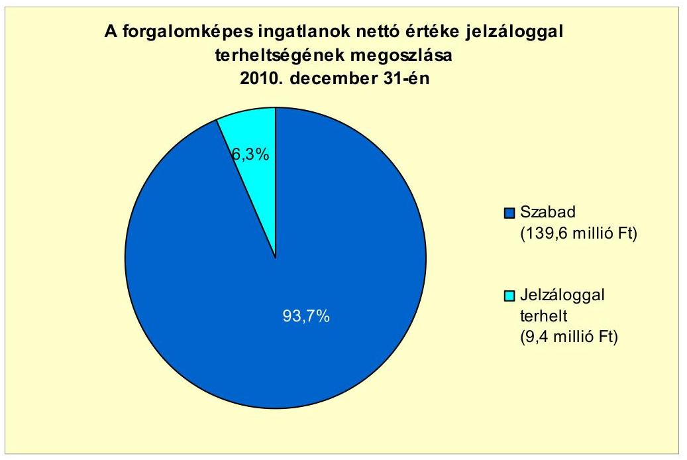

Az Önkormányzat alperesként peres eljárásban nem volt érintett. Jogerős határozattal lezárt, illetve nem lezárt peres eljárásból fizetési kötelezettsége nem keletkezett.

Az Önkormányzat egyszemélyes tulajdonú gazdasági társaságának, a Városgazdálkodási Kft.-nek a 2007- 2011. év I. félév vége közötti időszakban pénzintézettel szemben fennálló kötelezettsége nem volt. A 2010. év végi 2,6 millió Ft-os lejárt szállítói kötelezettségállománya a 2011. év I. félév végére nem változott.

A gazdasági társaság mérleg szerinti kötelezettségállománya kizárólag szállítói tartozásból állt, melynek alakulását a következő táblázat mutatja be:

Az Önkormányzat 50\%és azt meghaladó tulajdonosi hányaddal rendelkező társaságai kötelezettségeinek állománya 2010. december 31-én, és 2011. június 30-án, valamint várható alakulása a kötelezettségek lejáratáig

| Megnevezés | Állomány 2010. december 31-   én |  |  | Állomány 2011. június 30-án |  |  | Várható kötelezettség 20112013. években |  | Várható kötelezettség 2014. évtól |  |
| :--: | :--: | :--: | :--: | :--: | :--: | :--: | :--: | :--: | :--: | :--: |
|  | HUF-ban   (millió Ft-   ban) | Devizitban   (összeges,   ezer ...   ban) | Devizit   nem | HUF-ban   (millió Ft-   ban) | Devizitban   (összeges,   ezer ...   ban) | Devizit   nem | HUF-ban   (millió Ft-   ban) | Devizitban   (összeges,   ezer ...   ban) | HUF-ban   (millió Ft-   ban) | Devizitban   (összeges,   ezer ...   ban) |
| Pénzintézett kötelezettségek összesen: | 0 | 0 | HUF | 0 | 0 | HUF | 0 | 0 | 0 | 0 |
| Szállító tartozás | 2,6 | 0 | HUF | 2,6 | 0 | HUF | 2,6 | 0 | 0 | 0 |

Az önkormányzati kötelezettségek mellett, a minősített többségi tulajdonú gazdasági társaság 2010. év végi 2,6 millió Ft-os szállítói tartozása is befolyásol-

---

hatja az Önkormányzat pénzügyi egyensúlyát. Az Önkormányzat számára pénzügyi kockázatot jelent, hogy felszámolás esetén a bíróság megállapíthatja az Önkormányzat korlátlan és teljes felelősségét a fenti kötelezettséggel érintett kizárólagos önkormányzati tulajdonú gazdasági társaság után.

Az Önkormányzat a gazdasági társaságokról szóló 2006. évi IV. törvény 54. § (2) bekezdése alapján korlátlan felelősséggel tartozik azon gazdasági társaságának felszámolása esetében, amelyben az Önkormányzat az 52. § (2) bekezdése szerint a szavazatok legalább 75\%-ával rendelkezik, így minősített befolyásszerzőnek minősül, továbbá a csődeljárásról és a felszámolási eljárásról szóló 1991. évi XLIX. törvény 63. § (2) bekezdése alapján a kizárólagos önkormányzati tulajdonú gazdasági társaságának minden olyan kötelezettségéért, amelynek kielégítését a felszámolási eljárás során az adós társaság vagyona nem fedez, ha a hitelezőinek a felszámolási eljárás során benyújtott keresete alapján a bíróság - az adós társaság felé érvényesített tartósan hátrányos üzletpolitikájára figyelemmel - megállapítja az önkormányzat korlátlan és teljes felelősségét.

Az Önkormányzat a 2007-2010. években a tárgyi eszközök után 314,6 millió Ft összegű értékcsökkenést számolt el. Ebből az elhasználódott eszközök pótlására felújítási alapot nem képeztek ${ }^{29}$. A vizsgálattal érintett időszakban a felújítások összegéből eszközpótlásra 3,9 millió Ft-ot (az értékcsökkenés összegének 1,3\%-át) fordították. A fejlesztések és felújítások elsősorban az EU-s és hazai támogatások igénybevételével valósultak meg. Mindezek elsősorban az Önkormányzat ingatlanállományát és a belterületi útjait, csapadékvíz elvezetéshez kapcsolódó mútárgyakat érintették. Az Önkormányzat eszközállományának használhatósági foka a vizsgált időszakban folyamatosan csökkent. Ennek oka, hogy azoknál az eszközcsoportoknál (járművek, gépek, berendezések), ahol magas az amortizációs kulcs, az eszközpótlás elmaradt. A legkisebb mértékű elhasználódást az ingatlanok mutatták. A 2009-2010. években végzett beruházások hatására használhatósági fokuk csak négy százalékponttal csökkent a 2010. évre a 2007. évi 76,3\%-ról. Legjobban elhasználódtak a gépek, berendezések és felszerelések (43,2\%-ról 24,8\%-ra).

A vizsgált időszakban nem történt meg annak felmérése, hogy az eszközök elhasználódásának pótlása milyen kötelezettséget jelent az Önkormányzat számára.

# 4. A PÉNZÜGYI EGYENSÚLY MEGTEREMTÉSE ÉrDEKÉBEN HOZOTT INTÉZKEDÉSEK EREDMÉNYE 

A pénzügyi egyensúly javítása érdekében az Önkormányzat 2007-2011. év I. félév között kiadáscsökkentő intézkedésekről döntött, amelyeknek eredményeképpen az Önkormányzat adatszolgáltatása alapján összesen 61,1 millió Ft kiadási megtakarítás realizálódott a vizsgált időszak alatt.

[^0]
[^0]:    ${ }^{29}$ Az Önkormányzatnak az alapképzésre vonatkozóan nem volt jogszabályban előírt kötelezettsége.

---

A 2007-2011. év I. félévében végrehajtott kiadáscsökkentő intézkedések megoszlását a következő ábra szemlélteti:
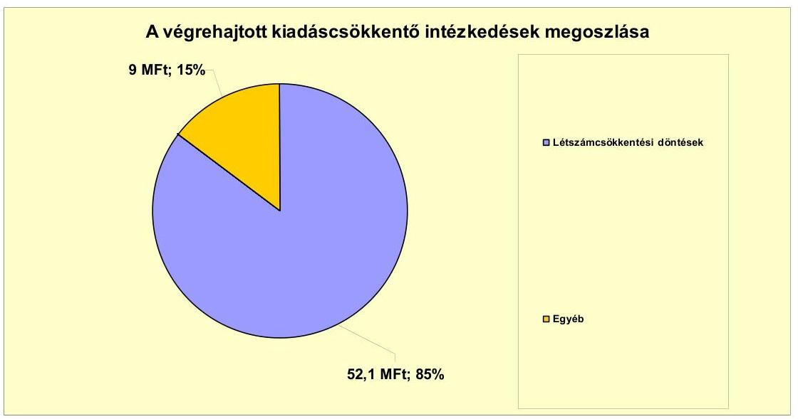

Az Önkormányzat kimutatása szerint a kiadási megtakarítások 85\%-a (52,1 millió Ft) a létszámcsökkentéssel kapcsolatban keletkezett. A Polgármesteri hivatal felújított, korszerü épületbe költözése, homlokzatszigetelés, nyilászárók cseréje miatt az Önkormányzat kilenc millió Ft realizált energiaköltségmegtakarítást mutatott ki nyilvántartásaiban.

Az Önkormányzat a 2007-2010. években a kiadások csökkentése érdekében létszámleépítéseket hajtott végre. A feladatok bővülése ugyanakkor álláshely- és létszámnövekedést is eredményezett. Ami a 2007. évben az Önkormányzatnál 2 fő karbantartó, a 2009. évben az ÁMK megalakulását követően egy fő intézményvezető alkalmazását jelentette.

Az Önkormányzat 2007-2010. éveket érintő összesített létszám változását az Önkormányzat adatszolgáltatása alapján az alábbi táblázat szemlélteti:

| Megnevezés (adatok fő-ben) | Közoktatás | Szociális és gyermekvédelmi | Egészségügy | Polgármesteri hivatal | Egyéb | Összesen |
| :--: | :--: | :--: | :--: | :--: | :--: | :--: |
| 2007. január 1-jén jóváhagyott álláshelyek száma | 106 | 9 | 0 | 31 | 27 | 175 |
| Megszintelett álláshelyek száma | 19 | 9 | 0 | 3 | 4 | 34 |
| 2008. üres álláshelyek száma | 0 | 0 | 0 | 0 | 1 | 0 |
| szakmai álláshelyek száma | 19 | 9 | 0 | 3 | 4 | 34 |
| intézmény-üzemeltetéssel kapcsolatos álláshelyek száma | 1 | 1 | 1 | 1 | 1 | 1 |
|  | 0 | 0 | 0 | 0 | 0 | 0 |
| Átáshely növekedése | 1 | 0 | 0 | 0 | 2 | 2 |
| 2010. december 31-én záró álláshelyek száma | 90 | 0 | 0 | 29 | 25 | 144 |
| 2007. január 1-jén foglalkoztatott létszám | 106 | 9 | 0 | 31 | 27 | 175 |
| Létszámcsökkentés | 19 | 9 | 0 | 3 | 4 | 34 |
| Létszámnövekedés | 1 | 0 | 0 | 0 | 2 | 2 |
| 2010. december 31-én foglalkoztatott létszám | 90 | 0 | 0 | 29 | 25 | 144 |

Az önkormányzati létszám az időszakban végrehajtott létszámcsökkentések és létszámnövekedések együttes hatásaként 31 fővel csökkent. A létszám és álláshelyek száma ezen időszak alatt megegyezett, a 2007. január 1-jén foglalkoztatott 175 föről 2010. december 31-ére 144 före (17,7\%-al) csökkent. A létszám leépítése a Képviselő-testület döntésein alapult.

---

Az egyes években bekövetkezett változások azonosan érintették a létszámadatokat, valamint az álláshelyek számának alakulását. Üres álláshely megszüntetés nem volt. A 2007-2010. években összesen 34 fő álláshelyet szüntettek meg, ebből 19 fő ( $55,9 \%$ ) a közoktatási, kilenc fő ( $26,5 \%$ ) szociális és gyermekvédelmi, két fő ( $5,8 \%$ ) polgármesteri hivatali, négy fő ( $11,8 \%$ ) egyéb területet érintett.

2007-2010 között végrehajtott létszámcsökkentési intézkedések során 23 tartósan leépített álláshely után igényelt támogatást az Önkormányzat, melynek ténylegesen folyósított összege 22,2 millió Ft volt. A támogatott létszámleépítés az összes létszámcsökkentés ( 34 fó) $67,6 \%$-a volt.

Az Önkormányzat a bevételei növelése érdekében csökkentette a helyi iparűzési adóban a kedvezmények, mentességek körét. Az Önkormányzat a bevételnövelő intézkedései eredményeként a 2007-2011. év I. félév között 6,0 millió Ft bevételi többletet mutatott ki.

Az Önkormányzat kiadáscsökkentő és bevételnövelő intézkedései eredményeként 2007-2011. év I. féléve között összesen 67,1 millió Ft kiadási megtakarítást és többletbevételt számolt el. A költségvetési támogatások és az szja bevételek 2007. évhez viszonyított együttes csökkenése 33,1 millió Ft volt. A megtakarítások, többletbevételek ellensúlyozni tudták a költségvetési támogatások és az szja bevételek csökkenését, valamint 34,0 millió Ft-tal javították az Önkormányzat pénzügyi egyensúlyát.

# 5. Az ÁSZ Által a korábBi ÉVEKben a pénzügyi egyensúly JAVÍTÁSÁRA TETT SZABÁLYSZERŰSÉGI ÉS CÉLSZERŰSÉGI JAVASLATOK HASZNOSULÁSA 

Az ÁSZ az Önkormányzat gazdálkodását a 2009. évben ellenőrizte. Az ellenőrzés tíz célszerűségi és nyolc szabályszerűségi javaslatot tett, melyek között nem volt a pénzügyi egyensúly javítására vonatkozó javaslat. A számvevői jelentést a Képviselő-testület megtárgyalta, az intézkedési tervet a 147/2009. (XII. 3.) számú határozatával elfogadta.

Budapest, 2012. április "f" "

Melléklet: $\quad 6 \mathrm{db}$
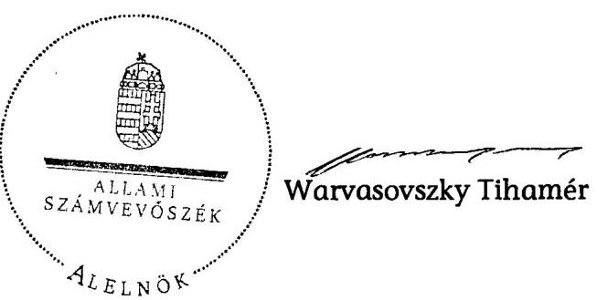

---

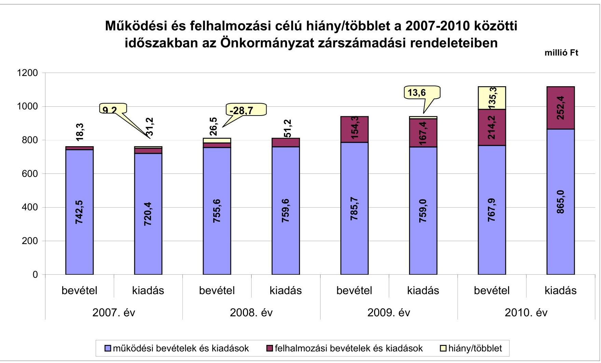

# Működési és felhalmozási célú hiány/többlet a 2007-2010 közötti időszakban az Önkormányzat zárszámadási rendeleteiben

|  I. számú melléklet | II. számú jelentéshez | III. felhalmozási felhálmozás | IV. felhalmozási felhálmozás | V. felhalmozási felhálmozás  |
| --- | --- | --- | --- | --- |
|  1200 | 13.6 | 13.6 | 13.6 | 13.6  |
|  13.7 | 13.6 | 13.7 | 13.7 | 13.7  |
|  13.8 | 13.8 | 13.8 | 13.8 | 13.8  |
|  13.9 | 13.9 | 13.9 | 13.9 | 13.9  |
|  14.0 | 14.0 | 14.0 | 14.0 | 14.0  |
|  14.1 | 14.1 | 14.1 | 14.1 | 14.1  |
|  14.2 | 14.2 | 14.2 | 14.2 | 14.2  |
|  14.3 | 14.3 | 14.3 | 14.3 | 14.3  |
|  14.4 | 14.4 | 14.4 | 14.4 | 14.4  |
|  14.5 | 14.5 | 14.5 | 14.5 | 14.5  |
|  14.6 | 14.6 | 14.6 | 14.6 | 14.6  |
|  14.7 | 14.7 | 14.7 | 14.7 | 14.7  |
|  14.8 | 14.8 | 14.8 | 14.8 | 14.8  |
|  14.9 | 14.9 | 14.9 | 14.9 | 14.9  |
|  15.0 | 15.0 | 15.0 | 15.0 | 15.0  |
|  15.1 | 15.1 | 15.1 | 15.1 | 15.1  |
|  15.2 | 15.2 | 15.2 | 15.2 | 15.2  |
|  15.3 | 15.3 | 15.3 | 15.3 | 15.3  |
|  15.4 | 15.4 | 15.4 | 15.4 | 15.4  |
|  15.5 | 15.5 | 15.5 | 15.5 | 15.5  |
|  15.6 | 15.6 | 15.6 | 15.6 | 15.6  |
|  15.7 | 15.7 | 15.7 | 15.7 | 15.7  |
|  15.8 | 15.8 | 15.8 | 15.8 | 15.8  |
|  15.9 | 15.9 | 15.9 | 15.9 | 15.9  |
|  16.0 | 16.0 | 16.0 | 16.0 | 16.0  |
|  16.1 | 16.1 | 16.1 | 16.1 | 16.1  |
|  16.2 | 16.2 | 16.2 | 16.2 | 16.2  |
|  16.3 | 16.3 | 16.3 | 16.3 | 16.3  |
|  16.4 | 16.4 | 16.4 | 16.4 | 16.4  |
|  16.5 | 16.5 | 16.5 | 16.5 | 16.5  |
|  16.6 | 16.6 | 16.6 | 16.6 | 16.6  |
|  16.7 | 16.7 | 16.7 | 16.7 | 16.7  |
|  16.8 | 16.8 | 16.8 | 16.8 | 16.8  |
|  16.9 | 16.9 | 16.9 | 16.9 | 16.9  |
|  17.0 | 17.0 | 17.0 | 17.0 | 17.0  |
|  17.1 | 17.1 | 17.1 | 17.1 | 17.1  |
|  17.2 | 17.2 | 17.2 | 17.2 | 17.2  |
|  17.3 | 17.3 | 17.3 | 17.3 | 17.3  |
|  17.4 | 17.4 | 17.4 | 17.4 | 17.4  |
|  17.5 | 17.5 | 17.5 | 17.5 | 17.5  |
|  17.6 | 17.6 | 17.6 | 17.6 | 17.6  |
|  17.7 | 17.7 | 17.7 | 17.7 | 17.7  |
|  17.8 | 17.8 | 17.8 | 17.8 | 17.8  |
|  17.9 | 17.9 | 17.9 | 17.9 | 17.9  |
|  18.0 | 18.0 | 18.0 | 18.0 | 18.0  |
|  18.1 | 18.1 | 18.1 | 18.1 | 18.1  |
|  18.2 | 18.2 | 18.2 | 18.2 | 18.2  |
|  18.3 | 18.3 | 18.3 | 18.3 | 18.3  |
|  18.4 | 18.4 | 18.4 | 18.4 | 18.4  |
|  18.5 | 18.5 | 18.5 | 18.5 | 18.5  |
|  18.6 | 18.6 | 18.6 | 18.6 | 18.6  |
|  18.7 | 18.7 | 18.7 | 18.7 | 18.7  |
|  18.8 | 18.8 | 18.8 | 18.8 | 18.8  |
|  18.9 | 18.9 | 18.9 | 18.9 | 18.9  |
|  18.10 | 18.10 | 18.10 | 18.10 | 18.10  |
|  18.11 | 18.11 | 18.11 | 18.11 | 18.11  |
|  18.12 | 18.12 | 18.12 | 18.12 | 18.12  |
|  18.13 | 18.13 | 18.13 | 18.13 | 18.13  |
|  18.14 | 18.14 | 18.14 | 18.14 | 18.14  |
|  18.15 | 18.15 | 18.15 | 18.15 | 18.15  |
|  18.16 | 18.16 | 18.16 | 18.16 | 18.16  |
|  18.17 | 18.17 | 18.17 | 18.17 | 18.17  |
|  18.18 | 18.18 | 18.18 | 18.18 | 18.18  |
|  18.19 | 18.19 | 18.19 | 18.19 | 18.19  |
|  18.20 | 18.20 | 18.20 | 18.20 | 18.20  |
|  18.21 | 18.21 | 18.21 | 18.21 | 18.21  |
|  18.22 | 18.22 | 18.22 | 18.22 | 18.22  |
|  18.23 | 18.23 | 18.23 | 18.23 | 18.23  |
|  18.24 | 18.24 | 18.24 | 18.24 | 18.24  |
|  18.25 | 18.25 | 18.25 | 18.25 | 18.25  |
|  18.26 | 18.26 | 18.26 | 18.26 | 18.26  |
|  18.27 | 18.27 | 18.27 | 18.27 | 18.27  |
|  18.28 | 18.28 | 18.28 | 18.28 | 18.28  |
|  18.29 | 18.29 | 18.29 | 18.29 | 18.29  |
|  18.30 | 18.30 | 18.30 | 18.30 | 18.30  |
|  18.31 | 18.31 | 18.31 | 18.31 | 18.31  |
|  18.32 | 18.32 | 18.32 | 18.32 | 18.32  |
|  18.33 | 18.33 | 18.33 | 18.33 | 18.33  |
|  18.34 | 18.34 | 18.34 | 18.34 | 18.34  |
|  18.35 | 18.35 | 18.35 | 18.35 | 18.35  |
|  18.36 | 18.36 | 18.36 | 18.36 | 18.36  |
|  18.37 | 18.37 | 18.37 | 18.37 | 18.37  |
|  18.38 | 18.38 | 18.38 | 18.38 | 18.38  |
|  18.39 | 18.39 | 18.39 | 18.39 | 18.39  |
|  18.40 | 18.40 | 18.40 | 18.40 | 18.40  |
|  18.41 | 18.41 | 18.41 | 18.41 | 18.41  |
|  18.42 | 18.42 | 18.42 | 18.42 | 18.42  |
|  18.43 | 18.43 | 18.43 | 18.43 | 18.43  |
|  18.44 | 18.44 | 18.44 | 18.44 | 18.44  |
|  18.45 | 18.45 | 18.45 | 18.45 | 18.45  |
|  18.46 | 18.46 | 18.46 | 18.46 | 18.46  |
|  18.47 | 18.47 | 18.47 | 18.47 | 18.47  |
|  18.48 | 18.48 | 18.48 | 18.48 | 18.48  |
|  18.49 | 18.49 | 18.49 | 18.49 | 18.49  |
|  18.50 | 18.50 | 18.50 | 18.50 | 18.50  |
|  18.51 | 18.51 | 18.51 | 18.51 | 18.51  |
|  18.52 | 18.52 | 18.52 | 18.52 | 18.52  |
|  18.53 | 18.53 | 18.53 | 18.53 | 18.53  |
|  18.54 | 18.54 | 18.54 | 18.54 | 18.54  |
|  18.55 | 18.55 | 18.55 | 18.55 | 18.55  |
|  18.56 | 18.56 | 18.56 | 18.56 | 18.56  |
|  18.57 | 18.57 | 18.57 | 18.57 | 18.57  |
|  18.58 | 18.58 | 18.58 | 18.58 | 18.58  |
|  18.59 | 18.59 | 18.59 | 18.59 | 18.59  |
|  18.60 | 18.60 | 18.60 | 18.60 | 18.60  |
|  18.61 | 18.61 | 18.61 | 18.61 | 18.61  |
|  18.62 | 18.62 | 18.62 | 18.62 | 18.62  |
|  18.63 | 18.63 | 18.63 | 18.63 | 18.63  |
|  18.64 | 18.64 | 18.64 | 18.64 | 18.64  |
|  18.65 | 18.65 | 18.65 | 18.65 | 18.65  |
|  18.66 | 18.66 | 18.66 | 18.66 | 18.66  |
|  18.67 | 18.67 | 18.67 | 18.67 | 18.67  |
|  18.68 | 18.68 | 18.68 | 18.68 | 18.68  |
|  18.69 | 18.69 | 18.69 | 18.69 | 18.69  |
|  18.70 | 18.70 | 18.70 | 18.70 | 18.70  |
|  18.71 | 18.71 | 18.71 | 18.71 | 18.71  |
|  18.72 | 18.72 | 18.72 | 18.72 | 18.72  |
|  18.73 | 18.73 | 18.73 | 18.73 | 18.73  |
|  18.74 | 18.74 | 18.74 | 18.74 | 18.74  |
|  18.75 | 18.75 | 18.75 | 18.75 | 18.75  |
|  18.76 | 18.76 | 18.76 | 18.76 | 18.76  |
|  18.77 | 18.77 | 18.77 | 18.77 | 18.77  |
|  18.78 | 18.78 | 18.78 | 18.78 | 18.78  |
|  18.79 | 18.79 | 18.79 | 18.79 | 18.79  |
|  18.80 | 18.80 | 18.80 | 18.80 | 18.80  |
|  18.81 | 18.81 | 18.81 | 18.81 | 18.81  |
|  18.82 | 18.82 | 18.82 | 18.82 | 18.82  |
|  18.83 | 18.83 | 18.83 | 18.83 | 18.83  |
|  18.84 | 18.84 | 18.84 | 18.84 | 18.84  |
|  18.85 | 18.85 | 18.85 | 18.85 | 18.85  |
|  18.86 | 18.86 | 18.86 | 18.86 | 18.86  |
|  18.87 | 18.87 | 18.87 | 18.87 | 18.87  |
|  18.88 | 18.88 | 18.88 | 18.88 | 18.88  |
|  18.89 | 18.89 | 18.89 | 18.89 | 18.89  |
|  18.90 | 18.90 | 18.90 | 18.90 | 18.90  |
|  18.91 | 18.91 | 18.91 | 18.91 | 18.91  |
|  18.92 | 18.92 | 18.92 | 18.92 | 18.92  |
|  18.93 | 18.93 | 18.93 | 18.93 | 18.93  |
|  18.94 | 18.94 | 18.94 | 18.94 | 18.94  |
|  18.95 | 18.95 | 18.95 | 18.95 | 18.95  |
|  18.96 | 18.96 | 18.96 | 18.96 | 18.96  |
|  18.97 | 18.97 | 18.97 | 18.97 | 18.97  |
|  18.98 | 18.98 | 18.98 | 18.98 | 18.98  |
|  18.99 | 18.99 | 18.99 | 18.99 | 18.99  |
|  19.00 | 19.00 | 19.00 | 19.00 | 19.00  |
|  19.01 | 19.01 | 19.01 | 19.01 | 19.01  |
|  19.02 | 19.02 | 19.02 | 19.02 | 19.02  |
|  19.03 | 19.03 | 19.03 | 19.03 | 19.03  |
|  19.04 | 19.04 | 19.04 | 19.04 | 19.04  |
|  19.05 | 19.05 | 19.05 | 19.05 | 19.05  |
|  19.06 | 19.06 | 19.06 | 19.06 | 19.06  |
|  19.07 | 19.07 | 19.07 | 19.07 | 19.07  |
|  19.08 | 19.08 | 19.08 | 19.08 | 19.08  |
|  19.09 | 19.09 | 19.09 | 19.09 | 19.09  |
|  19.10 | 19.10 | 19.10 | 19.10 | 19.10  |
|  19.11 | 19.11 | 19.11 | 19.11 | 19.11  |
|  19.12 | 19.12 | 19.12 | 19.12 | 19.12  |
|  19.13 | 19.13 | 19.13 | 19.13 | 19.13  |
|  19.14 | 19.14 | 19.14 | 19.14 | 19.14  |
|  19.15 | 19.15 | 19.15 | 19.15 | 19.15  |
|  19.16 | 19.16 | 19.16 | 19.16 | 19.16  |
|  19.17 | 19.17 | 19.17 | 19.17 | 19.17  |
|  19.18 | 19.18 | 19.18 | 19.18 | 19.18  |
|  19.19 | 19.19 | 19.19 | 19.19 | 19.19  |
|  19.20 | 19.20 | 19.20 | 19.20 | 19.20  |
|  19.21 | 19.21 | 19.21 | 19.21 | 19.21  |
|  19.22 | 19.22 | 19.22 | 19.22 | 19.22  |
|  19.23 | 19.23 | 19.23 | 19.23 | 19.23  |
|  19.24 | 19.24 | 19.24 | 19.24 | 19.24  |
|  19.25 | 19.25 | 19.25 | 19.25 | 19.25  |
|  19.26 | 19.26 | 19.26 | 19.26 | 19.26  |
|  19.27 | 19.27 | 19.27 | 19.27 | 19.27  |
|  19.28 | 19.28 | 19.28 | 19.28 | 19.28  |
|  19.29 | 19.29 | 19.29 | 19.29 | 19.29  |
|  19.30 | 19.30 | 19.30 | 19.30 | 19.30  |
|  19.31 | 19.31 | 19.31 | 19.31 | 19.31  |
|  19.32 | 19.32 | 19.32 | 19.32 | 19.32  |
|  19.33 | 19.33 | 19.33 | 19.33 | 19.33  |
|  19.34 | 19.34 | 19.34 | 19.34 | 19.34  |
|  19.35 | 19.35 | 19.35 | 19.35 | 19.35  |
|  19.36 | 19.36 | 19.36 | 19.36 | 19.36  |
|  19.37 | 19.37 | 19.37 | 19.37 | 19.37  |
|  19.38 | 19.38 | 19.38 | 19.38 | 19.38  |
|  19.39 | 19.39 | 19.39 | 19.39 | 19.39  |
|  19.40 | 19.40 | 19.40 | 19.40 | 19.40  |
|  19.41 | 19.41 | 19.41 | 19.41 | 19.41  |
|  19.42 | 19.42 | 19.42 | 19.42 | 19.42  |
|  19.43 | 19.43 | 19.43 | 19.43 | 19.43  |
|  19.44 | 19.44 | 19.44 | 19.44 | 19.44  |
|  19.45 | 19.45 | 19.45 | 19.45 | 19.45  |
|  19.46 | 19.46 | 19.46 | 19.46 | 19.46  |
|  19.47 | 19.47 | 19.47 | 19.47 | 19.47  |
|  19.48 | 19.48 | 19.48 | 19.48 | 19.48  |
|  19.49 | 19.49 | 19.49 | 19.49 | 19.49  |
|  19.50 | 19.50 | 19.50 | 19.50 | 19.50  |
|  19.51 | 19.51 | 19.51 | 19.51 | 19.51  |
|  19.52 | 19.52 | 19.52 | 19.52 | 19.52  |
|  19.53 | 19.53 | 19.53 | 19.53 | 19.53  |
|  19.54 | 19.54 | 19.54 | 19.54 | 19.54  |
|  19.55 | 19.55 | 19.55 | 19.55 | 19.55  |
|  19.56 | 19.56 | 19.56 | 19.56 | 19.56  |
|  19.57 | 19.57 | 19.57 | 19.57 | 19.57  |
|  19.58 | 19.58 | 19.58 | 19.58 | 19.58  |
|  19.59 | 19.59 | 19.59 | 19.59 | 19.59  |
|  19.60 | 19.60 | 19.60 | 19.60 | 19.60  |
|  19.61 | 19.61 | 19.61 | 19.61 | 19.61  |
|  19.62 | 19.62 | 19.62 | 19.62 | 19.62  |
|  19.63 | 19.63 | 19.63 | 19.63 | 19.63  |
|  19.64 | 19.64 | 19.64 | 19.64 | 19.64  |
|  19.65 | 19.65 | 19.65 | 19.65 | 19.65  |
|  19.66 | 19.66 | 19.66 | 19.66 | 19.66  |
|  19.67 | 19.67 | 19.67 | 19.67 | 19.67  |
|  19.68 | 19.68 | 19.68 | 19.68 | 19.68  |
|  19.69 | 19.69 | 19.69 | 19.69 | 19.69  |
|  19.70 | 19.70 | 19.70 | 19.70 | 19.70  |
|  19.71 | 19.71 | 19.71 | 19.71 | 19.71  |
|  19.72 | 19.72 | 19.72 | 19.72 | 19.72  |
|  19.73 | 19.73 | 19.73 | 19.73 | 19.73  |
|  19.74 | 19.74 | 19.74 | 19.74 | 19.74  |
|  19.75 | 19.75 | 19.75 | 19.75 | 19.75  |
|  19.76 | 19.76 | 19.76 | 19.76 | 19.76  |
|  19.77 | 19.77 | 19.77 | 19.77 | 19.77  |
|  19.78 | 19.78 | 19.78 | 19.78 | 19.78  |
|  19.79 | 19.79 | 19.79 | 19.79 | 19.79  |
|  19.790 | 19.80 | 19.79 | 19.79 | 19.79  |
|  19.791 | 19.80 | 19.791 | 19.791 | 19.791  |
|  19.792 | 19.81 | 19.792 | 19.792 | 19.792  |
|  19.793 | 19.82 | 19.793 | 19.793 | 19.793  |
|  19.794 | 19.83 | 19.794 | 19.794 | 19.794  |
|  19.794 | 19.84 | 19.794 | 19.794 | 19.794  |
|  19.795 | 19.85 | 19.795 | 19.795 | 19.795  |
|  19.795 | 19.86 | 19.795 | 19.795 | 19.795  |
|  19.796 | 19.87 | 19.796 | 19.796 | 19.796  |
|  19.796 | 19.887 | 19.797 | 19.796 | 19.796  |
|  19.797 | 19.8987 | 19.7988 | 19.798  |
|  19.798 | 19.900 | 19.800 | 19.7988 | 19.798  |
|  19.798 | 19.901 | 19.801 | 19.79888  |
|  19.799 | 19.901 | 19.801 | 19.79888  |
|  19.799 | 19.902 | 19.802 | 19.801  |
|  19.799 | 19.902 | 19.802 | 19.801  |
|  19.801 | 19.903 | 19.803 | 19.801  |
|  19.803 | 19.804 | 19.804 | 19.801  |
|  19.804 | 19.805 | 19.805 | 19.801  |
|  19.805 | 19.806 | 19.806 | 19.801  |
|  19.806 | 19.807 | 19.807 | 19.801  |
|  19.807 | 19.8087 | 19.8087 | 19.801  |
|  19.808 | 19.809 | 19.809 | 19.801  |
|  19.808 | 19.810 | 19.810 | 19.801  |
|  19.809 | 19.811 | 19.811 | 19.801  |
|  19.809 | 19.811 | 19.811 | 19.801  |
|  19.811 | 19.811 | 19.811 | 19.801  |
|  19.811 | 19.811 | 19.811 | 19.801  |
|  19.811 | 19.811 | 19.811 | 19.801  |
|  19.811 | 19.811 | 19.811 | 19.801  |
|  19.811 | 19.811 | 19.811 | 19.801  |
|  19.811 | 19.811 | 19.811 | 19.801  |
|  19.811 | 19.811 | 19.811 | 19.801  |
|  19.811 | 19.811 | 19.811 | 19.801  |
|  19.811 | 19.811 | 19.811 | 19.801  |
|  19.811 | 19.811 | 19.811 | 19.801  |
|  19.811 | 19.811 | 19.811 | 19.801  |
|  19.811 | 19.811 | 19.811 | 19.801  |
|  19.811 | 19.811 | 19.811 | 19.801  |
|  19.811 | 19.811 | 19.811 | 19.801  |
|  19.811 | 19.811 | 19.811 | 19.801  |
|  19.811 | 19.811 | 19.811 | 19.801  |
|  19.811 | 19.811 | 19.811 | 19.801  |
|  19.811 | 19.811 | 19.811 | 19.801  |
|  19.811 | 19.811 | 19.811 | 19.801  |
|  19.811 | 19.811 | 19.811 | 19.801  |
|  19.811 | 19.811 | 19.811 | 19.801  |
|  19.811 | 19.811 | 19.811 | 19.801  |
|  19.811 | 19.811 | 19.811 | 19.801  |
|  19.811 | 19.811 | 19.811 | 19.801  |
|  19.811 | 19.811 | 19.811 | 19.801  |
|  19.811 | 19.811 | 19.811 | 19.801  |
|  19.811 | 19.811 | 19.811 | 19.801  |
|  19.811 | 19.811 | 19.811 | 19.801  |
|  19.811 | 19.811 | 19.811 | 19.801  |
|  19.811 | 19.811 | 19.811 | 19.801  |
|  19.811 | 19.811 | 19.811 | 19.801  |

---

Az Önkormányzat bevételei és kiadásai, valamint adósságszolgálata 2007-2010 között

|  1. FOLVÓ KÖLTSÉGVETÉS* | 2007. | 2008. | 2009. | 2010.  |
| --- | --- | --- | --- | --- |
|  1.1.1. Saját müködési bevételek | 95,1 | 104,8 | 103,5 | 113,9  |
|  1.1.2. Költségvetési támogatás | 318,2 | 428,9 | 402,7 | 407,1  |
|  1.1.3. Átengedett bevételek | 231,2 | 132,4 | 135,7 | 144,5  |
|  1.1.4. Állambáztartáson belülről kapott támogatások | 92,4 | 83,8 | 109,9 | 91,0  |
|  1.1.5. EU-tól és külföldről kapott bevételek | 0,0 | 3,0 | 0,0 | 0,0  |
|  1.1.6. Állambáztartáson kívülről kapott bevételek | 9,9 | 3,9 | 1,3 | 6,1  |
|  1.1.7. Előző évi pénzmaradvány átvétel | 0,0 | 0,0 | 0,0 | 0,0  |
|  1.1. Folyó bevételek $=1.1 .1 .+1.1 .2 .+1.1 .3 .+1.1 .4 .+1.1 .5 .+1.1 .6 .+1.1 .7$. | 746,8 | 756,8 | 753,1 | 762,6  |
|  1.2.1. Müködési kiadások kamatkiadások nélkül | 652,8 | 682,4 | 672,7 | 771,1  |
|  1.2.2. Állambáztartáson belülre átadott pénzeszközök | 0,7 | 1,6 | 0,7 | 0,0  |
|  1.2.3.1. vállalkozásoknak | 0,1 | 0,0 | 0,4 | 0,5  |
|  1.2.3.2. EU-nak, illetve külföldre |  | 0,0 | 0,0 | 0,0  |
|  1.2.3.3. magánszemélyeknek | 47,7 | 54,5 | 58,3 | 63,1  |
|  1.2.3.4. nonprofit szervezeteknek | 10,9 | 9,9 | 10,7 | 9,4  |
|  1.2.3. Transzferkiadások ( $=1.2 .3 .1+1.2 .3 .2+1.2 .3 .3+1.2 .3 .4$ ) | 58,7 | 64,4 | 69,4 | 73,0  |
|  1.2.4 Kamatkiadások | 8,0 | 10,8 | 15,9 | 18,0  |
|  1.2.5. Előző évi pénzmaradvány átadás | 0,0 | 0,0 | 0,0 | 0,0  |
|  1.2. Folyó kiadások $=1.2 .1 .+1.2 .2 .+1.2 .3 .+1.2 .4 .+1.2 .5$. | 720,2 | 759,2 | 758,7 | 862,1  |
|  1.3. Folyó költségvetés egyenlege MÜKÖDÉSI JÖVEDELEM (1.1. - 1.2.) | 26,6 | $-2,4$ | $-5,6$ | $-99,5$  |
|  2. FELHALMOZÁSI KÖLTSÉGVETÉS** | 0,0 | 0,0 | 0,0 | 0,0  |
|  2.1.1. Saját tőkebevételek | 7,5 | 3,7 | 30,4 | 5,9  |
|  2.1.2. Állambáztartáson belülről kapott támogatások | 0,0 | 17,0 | 112,8 | 208,3  |
|  2.1.3. EU-tól és külföldről kapott támogatások | 3,9 | 2,7 | 0,0 | 0,6  |
|  2.1.4. Állambáztartáson kívülről kapott támogatások | 1,4 | 1,9 | 10,7 | 1,8  |
|  2.1. Felhalmozási bevételek ( $=2.1 .1 .+2.1 .2+2.1 .3+2.1 .4$.) | 12,8 | 25,3 | 153,9 | 216,6  |
|  2.2.1. Saját beruházási kiadás állíval | 13,7 | 25,0 | 32,9 | 39,1  |
|  2.2.2. Saját felújítási kiadás állíval | 11,7 | 18,8 | 127,4 | 209,0  |
|  2.2.3. Állambáztartáson belülre átadott pénzeszköz | 1,6 | 0,4 | 0,4 | 0,0  |
|  2.2.4. EU-nak és külföldnek adott pénzeszközök | 0,0 | 0,0 | 0,0 | 0,0  |
|  2.2.5. Állambáztartáson kívülre adott pénzeszközök | 1,2 | 4,1 | 4,0 | 2,5  |
|  2.2.6. Befektetési célú részesedések vásárlása | 3,8 | 4,2 | 5,2 | 4,0  |
|  2.2. Felhalmozási kiadások ( $=2.2 .1 .+2.2 .2 .+2.2 .3 .+2.2 .4 .+2.2 .5 .+2.2 .6$.) | 32,0 | 52,5 | 169,9 | 254,6  |
|  2.3. Felhalmozási költségvetés egyenlege (2.1. - 2.2.) | $-19,2$ | $-27,2$ | $-16,0$ | $-38,0$  |
|  3. Finanszírozási műveletek nélküli (GFS) pozíció(1.3.+2.3.) | 7,4 | $-29,6$ | $-21,6$ | $-137,5$  |
|  4. Finanszírozási műveletek | 0,0 | 0,0 | 0,0 | 0,0  |
|  4.1. Hitelfelvétel | 0,0 | 40,7 | 190,1 | 328,2  |
|  4.2. Hiteltörlesztés | 23,4 | 14,0 | 145,6 | 162,0  |
|  4.3. Forgatási és befektetési célú értékpapírok kibocsátása | 0,0 | 0,0 | 0,0 | 0,0  |
|  4.4. Forgatási és befektetési célú értékpapírok beváltása | 0,0 | 0,0 | 0,0 | 0,0  |
|  4.5. Forgatási és befektetési célú értékpapírok értékesítése | 1,2 | 0,0 | 0,0 | 0,0  |
|  4.6. Forgatási és befektetési célú értékpapírok vásárlása | 0,0 | 0,0 | 0,0 | 0,0  |
|  4.7. Egyéb finanszírozási bevételek (függő, átfutó, kiegyenlítő) | $-11,7$ | 0,7 | $-1,1$ | $-8,8$  |
|  4.8. Egyéb finanszírozási kiadások (függő, átfutó, kiegyenlítő) | $-26,7$ | $-1,2$ | 5,0 | 14,9  |
|  4.9.Finanszírozási műveletek egyenlege (4.1. - 4.2.+4.3.-4.4+4.5.-4.6.+4.7.-4.8.) | $-7,2$ | 28,6 | 38,4 | 142,5  |
|  5. Tárgvévi pénzügyi pozíció változás (1.3.+ 2.3.+4.9.) | 0,2 | $-1,0$ | 16,8 | 5,0  |
|  6. Nettó müködési jövedelem =müködési jövedelem (1.3.) - tőketörlesztés $(4.2+4.4)$ | 3,2 | $-16,4$ | $-151,2$ | $-261,5$  |
|  TÁJÉKOZTATÓ ADATOK |  |  |  |   |
|  Összes kötelezettség | 59,9 | 84,5 | 156,3 | 605,4  |
|  ebből rövid lejáratú | 40,2 | 51,1 | 111,0 | 554,0  |
|  Összes szállítói kötelezettség | 7,9 | 11,5 | 23,5 | 320,1  |
|  ebből lejárt (tanúsítványból) | 7,9 | 11,5 | 15,6 | 40,6  |
|  Pénz és tőkepízei kötelezettség (adósság) | 44,2 | 70,8 | 127,3 | 281,5  |
|  ebből rövid lejáratú | 24,6 | 37,4 | 82,0 | 230,8  |
|  PPP szerződéses állomány jelenértéken (tanúsítványból) | 0,0 | 0,0 | 0,0 | 0,0  |
|  ebből lejárt szolgáltatási díj miatti kötelezettség | 0,0 | 0,0 | 0,0 | 0,0  |
|  Folyószámfahíttel napi átlagos állománya (tanúsítványból) | 49,0 | 55,4 | 66,7 | 86,0  |
|  Likvidhítel napi átlagos állománya (tanúsítványból) | 0,0 | 0,0 | 0,2 | 0,3  |
|  Munkabérhítel napi átlagos állománya (tanúsítványból) | 0,0 | 0,0 | 0,0 | 0,0  |
|  Kezesség és garanciavállalások (tanúsítványból) | 0,0 | 0,0 | 0,0 | 0,0  |
|  Jegerős bírósági ítéletekből adódó kötelezettségek (tanúsítványból) | 0,0 | 0,0 | 0,0 | 0,0  |
|  Finanszírozásba bevonható eszközök: | 2,6 | 1,6 | 18,3 | 23,3  |
|  Tartós hitelviszonyt megtestesítő értékpapírok év végi állománya | 0,0 | 0,0 | 0,0 | 0,0  |
|  Hosszú lejáratú bankbetétek év végi állománya | 0,0 | 0,0 | 0,0 | 0,0  |
|  Értékpapírok év végi állománya | 0,0 | 0,0 | 0,0 | 0,0  |
|  Pénzeszközök (idegen pénzeszközök nélkül) év végi állománya | 2,6 | 1,6 | 18,3 | 23,3  |

[^0] [^0]: * Bevételekben nem térül, a kiadásokban nem jelenik meg az amortizáció, a vagyoni helyzetet az egyenleg befolyásolja ** Bevételekben vagyon megőrzésre és bővítésre fordítható források.

---

Az Önkormányzat 2007-2010. években megvalósított, 2010. december 31-ig befejezett fejlesztései és azok forrásösszetétele

|  Fejlesztési feladat (beruházás, felújítás) |  |  | Beruházás, felújítás |  |  | Teljes bekerülési költség |  |  |  |  |  |  |  |  |  |  |  |  |  |  |  |  |  |  |  |  |  |  |  |  |  |  |  |  |  |  |  |  |  |  |  |  |  |   |
| --- | --- | --- | --- | --- | --- | --- | --- | --- | --- | --- | --- | --- | --- | --- | --- | --- | --- | --- | --- | --- | --- | --- | --- | --- | --- | --- | --- | --- | --- | --- | --- | --- | --- | --- | --- | --- | --- | --- | --- | --- | --- | --- | --- | --- |
|   |  |  |  |  |  |  |  |  |  |  |  |  |  |  |  |  |  |  |  |  |  |  |  |  |  |  |  |  |  |  |  |  |  |  |  |  |  |  |  |  |  |  |  |   |
|   |  |  |  |  |  |  |  |  |  |  |  |  |  |  |  |  |  |  |  |  |  |  |  |  |  |  |  |  |  |  |  |  |  |  |  |  |  |  |  |  |  |  |  |   |
|   |  |  |  |  |  |  |  |  |  |  |  |  |  |  |  |  |  |  |  |  |  |  |  |  |  |  |  |  |  |  |  |  |  |  |  |  |  |  |  |  |  |  |  |   |
|   |  |  |  |  |  |  |  |  |  |  |  |  |  |  |  |  |  |  |  |  |  |  |  |  |  |  |  |  |  |  |  |  |  |  |  |  |  |  |  |  |  |  |  |   |
|   |  |  |  |  |  |  |  |  |  |  |  |  |  |  |  |  |  |  |  |  |  |  |  |  |  |  |  |  |  |  |  |  |  |  |  |  |  |  |  |  |  |  |  |   |
|   |  |  |  |  |  |  |  |  |  |  |  |  |  |  |  |  |  |  |  |  |  |  |  |  |  |  |  |  |  |  |  |  |  |  |  |  |  |  |  |  |  |  |  |   |
|   |  |  |  |  |  |  |  |  |  |  |  |  |  |  |  |  |  |  |  |  |  |  |  |  |  |  |  |  |  |  |  |  |  |  |  |  |  |  |  |  |  |  |  |   |
|   |  |  |  |  |  |  |  |  |  |  |  |  |  |  |  |  |  |  |  |  |  |  |  |  |  |  |  |  |  |  |  |  |  |  |  |  |  |  |  |  |  |  |  |   |
|   |  |  |  |  |  |  |  |  |  |  |  |  |  |  |  |  |  |  |  |  |  |  |  |  |  |  |  |  |  |  |  |  |  |  |  |  |  |  |  |  |  |  |  |   |
|   |  |  |  |  |  |  |  |  |  |  |  |  |  |  |  |  |  |  |  |  |  |  |  |  |  |  |  |  |  |  |  |  |  |  |  |  |  |  |  |  |  |  |  |   |
|   |  |  |  |  |  |  |  |  |  |  |  |  |  |  |  |  |  |  |  |  |  |  |  |  |  |  |  |  |  |  |  |  |  |  |  |  |  |  |  |  |  |  |  |   |
|   |  |  |  |  |  |  |  |  |  |  |  |  |  |  |  |  |  |  |  |  |  |  |  |  |  |  |  |  |  |  |  |  |  |  |  |  |  |  |  |  |  |  |  |   |
|   |  |  |  |  |  |  |  |  |  |  |  |  |  |  |  |  |  |  |  |  |  |  |  |  |  |  |  |  |  |  |  |  |  |  |  |  |  |  |  |  |  |  |  |   |
|   |  |  |  |  |  |  |  |  |  |  |  |  |  |  |  |  |  |  |  |  |  |  |  |  |  |  |  |  |  |  |  |  |  |  |  |  |  |  |  |  |  |  |  |   |
|   |  |  |  |  |  |  |  |  |  |  |  |  |  |  |  |  |  |  |  |  |  |  |  |  |  |  |  |  |  |  |  |  |  |  |  |  |  |  |  |  |  |  |  |   |
|   |  |  |  |  |  |  |  |  |  |  |  |  |  |  |  |  |  |  |  |  |  |  |  |  |  |  |  |  |  |  |  |  |  |  |  |  |  |  |  |  |  |  |  |   |
|   |  |  |  |  |  |  |  |  |  |  |  |  |  |  |  |  |  |  |  |  |  |  |  |  |  |  |  |  |  |  |  |  |  |  |  |  |  |  |  |  |  |  |  |   |
|   |  |  |  |  |  |  |  |  |  |  |  |  |  |  |  |  |  |  |  |  |  |  |  |  |  |  |  |  |  |  |  |  |  |  |  |  |  |  |  |  |  |  |  |   |
|   |  |  |  |  |  |  |  |  |  |  |  |  |  |  |  |  |  |  |  |  |  |  |  |  |  |  |  |  |  |  |  |  |  |  |  |  |  |  |  |  |  |  |  |   |
|   |  |  |  |  |  |  |  |  |  |  |  |  |  |  |  |  |  |  |  |  |  |  |  |  |  |  |  |  |  |  |  |  |  |  |  |  |  |  |  |  |  |  |  |   |
|   |  |  |  |  |  |  |  |  |  |  |  |  |  |  |  |  |  |  |  |  |  |  |  |  |  |  |  |  |  |  |  |  |  |  |  |  |  |  |  |  |  |  |  |   |
|   |  |  |  |  |  |  |  |  |  |  |  |  |  |  |  |  |  |  |  |  |  |  |  |  |  |  |  |  |  |  |  |  |  |  |  |  |  |  |  |  |  |  |  |   |
|   |  |  |  |  |  |  |  |  |  |  |  |  |  |  |  |  |  |  |  |  |  |  |  |  |  |  |  |  |  |  |  |  |  |  |  |  |  |  |  |  |  |  |  |   |
|   |  |  |  |  |  |  |  |  |  |  |  |  |  |  |  |  |  |  |  |  |  |  |  |  |  |  |  |  |  |  |  |  |  |  |  |  |  |  |  |  |  |  |  |   |
|   |  |  |  |  |  |  |  |  |  |  |  |  |  |  |  |  |  |  |  |  |  |  |  |  |  |  |  |  |  |  |  |  |  |  |  |  |  |  |  |  |  |  |  |   |
|   |  |  |  |  |  |  |  |  |  |  |  |  |  |  |  |  |  |  |  |  |  |  |  |  |  |  |  |  |  |  |  |  |  |  |  |  |  |  |  |  |  |  |  |   |
|   |  |  |  |  |  |  |  |  |  |  |  |  |  |  |  |  |  |  |  |  |  |  |  |  |  |  |  |  |  |  |  |  |  |  |  |  |  |  |  |  |  |  |  |   |
|   |  |  |  |  |  |  |  |  |  |  |  |  |  |  |  |  |  |  |  |  |  |  |  |  |  |  |  |  |  |  |  |  |  |  |  |  |  |  |  |  |  |  |  |   |
|   |  |  |  |  |  |  |  |  |  |  |  |  |  |  |  |  |  |  |  |  |  |  |  |  |  |  |  |  |  |  |  |  |  |  |  |  |  |  |  |  |  |  |  |   |
|   |  |  |  |  |  |  |  |  |  |  |  |  |  |  |  |  |  |  |  |  |  |  |  |  |  |  |  |  |  |  |  |  |  |  |  |  |  |  |  |  |  |  |  |   |
|   |  |  |  |  |  |  |  |  |  |  |  |  |  |  |  |  |  |  |  |  |  |  |  |  |  |  |  |  |  |  |  |  |  |  |  |  |  |  |  |  |  |  |  |   |
|   |

---

### Az Önkormányzat 2010. december 31-én folyamatban lévő fejlesztési feladataira 2010. december 31-ig teljesített kifizetések és azok forrásösszetétele

|  Fejlesztési feladat (beruházás, felújítás) | Beruházás, felújítás | Teljes bekerülési költség | 2006. dec. 31-ig teljesített kiadás | 2007. 2010. évvel közölt teljesített kiadás | 2007. 2010. évvel közölt teljesített kiadás | 2008. dec. 31-ig teljesített kiadás | 2007. 2010. évvel közölt teljesített kiadás | 2008. dec. 31-ig teljesített kiadás | 2007. 2010. évvel közölt teljesített kiadás | 2008. dec. 31-ig teljesített kiadás | 2007. 2010. évvel közölt teljesített kiadás | 2008. dec. 31-ig teljesített kiadás | 2007. 2010. évvel közölt teljesített kiadás | 2008. dec. 31-ig teljesített kiadás | 2007. 2010. évvel közölt teljesített kiadás | 2008. dec. 31-ig teljesített kiadás | 2007. 2010. évvel közölt teljesített kiadás | 2008. dec. 31-ig teljesített kiadás | 2007. 2010. évvel közölt teljesített kiadás | 2008. dec. 31-ig teljesített kiadás | 2007. 2010. évvel közölt teljesített kiadás | 2008. dec. 31-ig teljesített kiadás | 2007. 2010. évvel közölt teljesített kiadás | 2008. dec. 31-ig teljesített kiadás | 2007. 2010. évvel közölt teljesített kiadás | 2008. dec. 31-ig teljesített kiadás | 2007. 2010. évvel közölt teljesített kiadás | 2008. dec. 31-ig teljesített kiadás | 2007. 2010. évvel közölt teljesített kiadás | 2008. dec. 31-ig teljesített kiadás | 2007. 2010. évvel közölt teljesített kiadás | 2008. dec. 31-ig teljesített kiadás | 2007. 2010. évvel közölt teljesített kiadás | 2008. dec. 31-ig teljesített kiadás | 2007. 2010. évvel közölt teljesített kiadás | 2008. dec. 31-ig teljesített kiadás | 2007. 2010. évvel közölt teljesített kiadás | 2008. dec. 31-ig teljesített kiadás | 2007. 2010. évvel közölt teljesített kiadás | 2008. dec. 31-ig teljesített kiadás | 2007. 2010. évvel közölt teljesített kiadás | 2008. dec. 31-ig teljesített kiadás | 2007. 2010. évvel közölt teljesített kiadás | 2008. dec. 31-ig teljesített kiadás | 2007. 2010. évvel közölt teljesített kiadás | 2008. dec. 31-ig teljesített kiadás | 2007. 2010. évvel közölt teljesített kiadás | 2008. dec. 31-ig teljesített kiadás | 2007. 2010. évvel közölt teljesített kiadás | 2008. dec. 31-ig teljesített kiadás | 2007. 2010. évvel közölt teljesített kiadás | 2008. dec. 31-ig teljesített kiadás | 2007. 2010. évvel közölt teljesített kiadás | 2008. dec. 31-ig teljesített kiadás | 2007. 2010. évvel közölt teljesített kiadás | 2008. dec. 31-ig teljesített kiadás | 2007. 2010. évvel közölt teljesített kiadás | 2008. dec. 31-ig teljesített kiadás | 2007. 2010. évvel közölt teljesített kiadás | 2008. dec. 31-ig teljesített kiadás | 2007. 2010. évvel közölt teljesített kiadás | 2008. dec. 31-ig teljesített kiadás | 2007. 2010. évvel közölt teljesített kiadás | 2008. dec. 31-ig teljesített kiadás | 2007. 2010. évvel közölt teljesített kiadás | 2008. dec. 31-ig teljesített kiadás | 2007. 2010. évvel közölt teljesített kiadás | 2008. dec. 31-ig teljesített kiadás | 2007. 2010. évvel közölt teljesített kiadás | 2008. dec. 31-ig teljesített kiadás | 2007. 2010. évvel közölt teljesített kiadás | 2008. dec. 31-ig teljesített kiadás | 2007. 2010. évvel közölt teljesített kiadás | 2008. dec. 31-ig teljesített kiadás | 2007. 2010. évvel közölt teljesített kiadás | 2008. dec. 31-ig teljesített kiadás | 2007. 2010. évvel közölt teljesített kiadás | 2008. dec. 31-ig teljesített kiadás | 2007. 2010. évvel közölt teljesített kiadás | 2008. dec. 31-ig teljesített kiadás | 2007. 2010. évvel közölt teljesített kiadás | 2008. dec. 31-ig teljesített kiadás | 2007. 2010. évvel közölt teljesített kiadás | 2008. dec. 31-ig teljesített kiadás | 2007. 2010. évvel közölt teljesített kiadás | 2008. dec. 31-ig teljesített kiadás | 2007. 2010. évvel közölt teljesített kiadás | 2008. dec. 31-ig teljesített kiadás | 2007. 2010. évvel közölt teljesített kiadás | 2008. dec. 31-ig teljesített kiadás | 2007. 2010. évvel közölt teljesített kiadás | 2008. dec. 31-ig teljesített kiadás | 2007. 2010. évvel közölt teljesített kiadás | 2008. dec. 31-ig teljesített kiadás | 2007. 2010. évvel közölt teljesített kiadás | 2008. dec. 31-ig teljesített kiadás | 2007. 2010. évvel közölt teljesített kiadás | 2008. dec. 31-ig teljesített kiadás | 2007. 2010. évvel közölt teljesített kiadás | 2008. dec. 31-ig teljesített kiadás | 2007. 2010. évvel közölt teljesített kiadás | 2008. dec. 31-ig teljesített kiadás | 2007. 2010. évvel közölt teljesített kiadás | 2008. dec. 31-ig teljesített kiadás | 2007. 2010. évvel közölt teljesített kiadás | 2008. dec. 31-ig teljesített kiadás | 2007. 2010. évvel közölt teljesített kiadás | 2008. dec. 31-ig teljesített kiadás | 2007. 2010. évvel közölt teljesített kiadás | 2008. dec. 31-ig teljesített kiadás | 2007. 2010. évvel közölt teljesített kiadás | 2008. dec. 31-ig teljesített kiadás | 2007. 2010. évvel közölt teljesített kiadás | 2008. dec. 31-ig teljesített kiadás | 2007. 2010. évvel közölt teljesített kiadás | 2008. dec. 31-ig teljesített kiadás | 2007. 2010. évvel közölt teljesített kiadás | 2008. dec. 31-ig teljesített kiadás | 2007. 2010. évvel közölt teljesített kiadás | 2008. dec. 31-ig teljesített kiadás | 2007. 2010. évvel közölt teljesített kiadás | 2008. dec. 31-ig teljesített kiadás | 2007. 2010. évvel közölt teljesített kiadás | 2008. dec. 31-ig teljesített kiadás | 2007. 2010. évvel közölt teljesített kiadás | 2008. dec. 31-ig teljesített kiadás | 2007. 2010. évvel közölt teljesített kiadás | 2008. dec. 31-ig teljesített kiadás | 2007. 2010. évvel közölt teljesített kiadás | 2008. dec. 31-ig teljesített kiadás | 2007. 2010. évvel közölt teljesített kiadás | 2008. dec. 31-ig teljesített kiadás | 2007. 2010. évvel közölt teljesített kiadás | 2008. dec. 31-ig teljesített kiadás | 2007. 2010. évvel közölt teljesített kiadás | 2008. dec. 31-ig teljesített kiadás | 2007. 2010. évvel közölt teljesített kiadás | 2008. dec. 31-ig teljesített kiadás | 2007. 2010. évvel közölt teljesített kiadás | 2008. dec. 31-ig teljesített kiadás | 2007. 2010. évvel közölt teljesített kiadás | 2008. dec. 31-ig teljesített kiadás | 2007. 2010. évvel közölt teljesített kiadás | 2008. dec. 31-ig teljesített kiadás | 2007. 2010. évvel közölt teljesített kiadás | 2008. dec. 31-ig teljesített kiadás | 2007. 2010. évvel közölt teljesített kiadás | 2008. dec. 31-ig teljesített kiadás | 2007. 2010. évvel közölt teljesített kiadás | 2008. dec. 31-ig teljesített kiadás | 2007. 2010. évvel közölt teljesített kiadás | 2008. dec. 31-ig teljesített kiadás | 2007. 2010. évvel közölt teljesített kiadás | 2008. dec. 31-ig teljesített kiadás | 2007. 2010. évvel közölt teljesített kiadás | 2008. dec. 31-ig teljesített kiadás | 2007. 2010. évvel közölt teljesített kiadás | 2008. dec. 31-ig teljesített kiadás | 2007. 2010. évvel közölt teljesített kiadás | 2008. dec. 31-ig teljesített kiadás | 2008. dec. 31-ig teljesített kiadás | 2008. dec. 31-ig teljesített kiadás | 2008. dec. 31-ig teljesített kiadás | 2008. dec. 31-ig teljesített kiadás | 2008. dec. 31-ig teljesített kiadás | 2008. dec. 31-ig teljesített kiadás | 2008. dec. 31-ig teljesített kiadás | 2008. dec. 31-ig teljesített kiadás | 2008. dec. 31-ig teljesített kiadás | 2008. dec. 31-ig teljesített kiadás | 2008. dec. 31-ig teljesített kiadás | 2008. dec. 31-ig teljesített kiadás | 2008. dec. 31-ig teljesített kiadás | 2008. dec. 31-ig teljesített kiadás | 2008. dec. 31-ig teljesített kiadás | 2008. dec. 31-ig teljesített kiadás | 2008. dec. 31-ig teljesített kiadás | 2008. dec. 31-ig teljesített kiadás | 2008. dec. 31-ig teljesített kiadás | 2008. dec. 31-ig teljesített kiadás | 2008. dec. 31-ig teljesített kiadás | 2008. dec. 31-ig teljesített kiadás | 2008. dec. 31-ig teljesített kiadás | 2008. dec. 31-ig teljesített kiadás | 2008. dec. 31-ig teljesített kiadás | 2008. dec. 31-ig teljesített kiadás | 2008. dec. 31-ig teljesített kiadás | 2008. dec. 31-ig teljesített kiadás | 2008. dec. 31-ig teljesített kiadás | 2008. dec. 31-ig teljesített kiadás | 2008. dec. 31-ig teljesített kiadás | 2008. dec. 31-ig teljesített kiadás | 2008. dec. 31-ig teljesített kiadás | 2008. dec. 31-ig teljesített kiadás | 2008. dec. 31-ig teljesített kiadás | 2008. dec. 31-ig teljesített kiadás | 2008. dec. 31-ig teljesített kiadás | 2008. dec. 31-ig teljesített kiadás | 2008. dec. 31-ig teljesített kiadás | 2008. dec. 31-ig teljesített kiadás | 2008. dec. 31-ig teljesített kiadás | 2008. dec. 31-ig teljesített kiadás | 2008. dec. 31-ig teljesített kiadás | 2008. dec. 31-ig teljesített kiadás | 2008. dec. 31-ig teljesített kiadás | 2008. dec. 31-ig teljesített kiadás | 2008. dec. 31-ig teljesített kiadás | 2008. dec. 31-ig teljesített kiadás | 2008. dec. 31-ig teljesített kiadás | 2008. dec. 31-ig teljesített kiadás | 2008. dec. 31-ig teljesített kiadás | 2008. dec. 31-ig teljesített kiadás | 2008. dec. 31-ig teljesített kiadás | 2008. dec. 31-ig teljesített kiadás | 2008. dec. 31-ig teljesített kiadás | 2008. dec. 31-ig teljesített kiadás | 2008. dec. 31-ig teljesített kiadás | 2008. dec. 31-ig teljesített kiadás | 2008. dec. 31-ig teljesített kiadás | 2008. dec. 31-ig teljesített kiadás | 2008. dec. 31-ig teljesített kiadás | 2008. dec. 31-ig teljesített kiadás | 2008. dec. 31-ig teljesített kiadás | 2008. dec. 31-ig teljesített kiadás | 2008. dec. 31-ig teljesített kiadás | 2008. dec. 31-ig teljesített kiadás | 2008. dec. 31-ig teljesített kiadás | 2008. dec. 31-ig teljesített kiadás | 2008. dec. 31-ig teljesített kiadás | 2008. dec. 31-ig teljesített kiadás | 2008. dec. 31-ig teljesített kiadás | 2008. dec. 31-ig teljesített kiadás | 2008. dec. 31-ig teljesített kiadás | 2008. dec. 31-ig teljesített kiadás | 2008. dec. 31-ig teljesített kiadás | 2008. dec. 31-ig teljesített kiadás | 2008. dec. 31-ig teljesített kiadás | 2008. dec. 31-ig teljesített kiadás | 2008. dec. 31-ig teljesített kiadás | 2008. dec. 31-ig teljesített kiadás | 2008. dec. 31-ig teljesített kiadás | 2008. dec. 31-ig teljesített kiadás | 2008. dec. 31-ig teljesített kiadás | 2008. dec. 31-ig teljesített kiadás | 2008. dec. 31-ig teljesített kiadás | 2008. dec. 31-ig teljesített kiadás | 2008. dec. 31-ig teljesített kiadás | 2008. dec. 31-ig teljesített kiadás | 2008. dec. 31-ig teljesített kiadás | 2008. dec. 31-ig teljesített kiadás | 2008. dec. 31-ig teljesített kiadás | 2008. dec. 31-ig teljesített kiadás | 2008. dec. 31-ig teljesített kiadás | 2008. dec. 31-ig teljesített kiadás | 2008. dec. 31-ig teljesített kiadás | 2008. dec. 31-ig teljesített kiadás | 2008. dec. 31-ig teljesített kiadás | 2008. dec. 31-ig teljesített kiadás | 2008. dec. 31-ig teljesített kiadás | 2008. dec. 31-ig teljesített kiadás | 2008. dec. 31-ig teljesített kiadás | 2008. dec. 31-ig teljesített kiadás | 2008. dec. 31-ig teljesített kiadás | 2008. dec. 31-ig teljesített kiadás | 2008. dec. 31-ig teljesített kiadás | 2008. dec. 31-ig teljesített kiadás | 2008. dec. 31-ig teljesített kiadás | 2008. dec. 31-ig teljesített kiadás | 2008. dec. 31-ig teljesített kiadás | 2008. dec. 31-ig teljesített kiadás | 2008. dec. 31-ig teljesített kiadás | 2008. dec. 31-ig teljesített kiadás | 2008. dec. 31-ig teljesített kiadás | 2008. dec. 31-ig teljesített kiadás | 2008. dec. 31-ig teljesített kiadás | 2008. dec. 31-ig teljesített kiadás | 2008. dec. 31-ig teljesített kiadás | 2008. dec. 31-ig teljesített kiadás | 2008. dec. 31-ig teljesített kiadás | 2008. dec. 31-ig teljesített kiadás | 2008. dec. 31-ig teljesített kiadás | 2008. dec. 31-ig teljesített kiadás | 2008. dec. 31-ig teljesített kiadás | 2008. dec. 31-ig teljesített kiadás | 2008. dec. 31-ig teljesített kiadás | 2008. dec. 31-ig teljesített kiadás | 2008. dec. 31-ig teljesített kiadás | 2008. dec. 31-ig teljesített kiadás | 2008. dec. 31-ig teljesített kiadás | 2008. dec. 31-ig teljesített kiadás | 2008. dec. 31-ig teljesített kiadás | 2008. dec. 31-ig teljesített kiadás | 2008. dec. 31-ig teljesített kiadás | 2008. dec. 31-ig teljesített kiadás | 2008. dec. 31-ig teljesített kiadás | 2008. dec. 31-ig teljesített kiadás | 2008. dec. 31-ig teljesített kiadás | 2008. dec. 31-ig teljesített kiadás | 2008. dec. 31-ig teljesített kiadás | 2008. dec. 31-ig teljesített kiadás | 2008. dec. 31-ig teljesített kiadás | 2008. dec. 31-ig teljesített kiadás | 2008. dec. 31-ig teljesített kiadás | 2008. dec. 31-ig teljesített kiadás | 2008. dec. 31-ig teljesített kiadás | 2008. dec. 31-ig teljesített kiadás | 2008. dec. 31-ig teljesített kiadás | 2008. dec. 31-ig teljesített kiadás | 2008. dec. 31-ig teljesített kiadás | 2008. dec. 31-ig teljesített kiadás | 2008. dec. 31-ig teljesített kiadás | 2008. dec. 31-ig teljesített kiadás | 2008. dec. 31-ig teljesített kiadás | 2008. dec. 31-ig teljesített kiadás | 2008. dec. 31-ig teljesített kiadás | 2008. dec. 31-ig teljesített kiadás | 2008. dec. 31-ig teljesített kiadás | 2008. dec. 31-ig teljesített kiadás | 2008. dec. 31-ig teljesített kiadás | 2008. dec. 31-ig teljesített kiadás | 2008. dec. 31-ig teljesített kiadás | 2008. dec. 31-ig teljesített kiadás | 2008. dec. 31-ig teljesített kiadás | 2008. dec. 31-ig teljesített kiadás | 2008. dec. 31-ig teljesített kiadás | 2008. dec. 31-ig teljesített kiadás | 2008. dec. 31-ig teljesített kiadás | 2008. dec. 31-ig teljesített kiadás | 2008. dec. 31-ig teljesített kiadás | 2008. dec. 31-ig teljesített kiadás | 2008. dec. 31-ig teljesített kiadás | 2008. dec. 31-ig teljesített kiadás | 2008. dec. 31-ig teljesített kiadás | 2008. dec. 31-ig teljesített kiadás | 2008. dec. 31-ig teljesített kiadás | 2008. dec. 31-ig teljesített kiadás | 2008. dec. 31-ig teljesített kiadás | 2008. dec. 31-ig teljesített kiadás | 2008. dec. 31-ig teljesített kiadás | 2008. dec. 31-ig teljesített kiadás | 2008. dec. 31-ig teljesített kiadás | 2008. dec. 31-ig teljesített kiadás | 2008. dec. 31-ig teljesített kiadás | 2008. dec. 31-ig teljesített kiadás | 2008. dec. 31-ig teljesített kiadás | 2008. dec. 31-ig teljesített kiadás | 2008. dec. 31-ig teljesített kiadás | 2008. dec. 31-ig teljesített kiadás | 2008. dec. 31-ig teljesített kiadás | 2008. dec. 31-ig teljesített kiadás | 2008. dec. 31-ig teljesített kiadás | 2008. dec. 31-ig teljesített kiadás | 2008. dec. 31-ig teljesített kiadás | 2008. dec. 31-ig teljesített kiadás | 2008. dec. 31-ig teljesített kiadás | 2008. dec. 31-ig teljesített kiadás | 2008. dec. 31-ig teljesített kiadás | 2008. dec. 31-ig teljesített kiadás | 2008. dec. 31-ig teljesített kiadás | 2008. dec. 31-ig teljesített kiadás | 2008. dec. 31-ig teljesített kiadás | 2008. dec. 31-ig teljesített kiadás | 2008. dec. 31-ig teljesített kiadás | 2008. dec. 31-ig teljesített kiadás | 2008. dec. 31-ig teljesített kiadás | 2008. dec. 31-ig teljesített kiadás | 2008. dec. 31-ig teljesített kiadás | 2008. dec. 31-ig teljesített kiadás | 2008. dec. 31-ig teljesített kiadás | 2008. dec. 31-ig teljesített kiadás | 2008. dec. 31-ig teljesített kiadás | 2008. dec. 31-ig teljesített kiadás | 2008. dec. 31-ig teljesített kiadás | 2008. dec. 31-ig teljesített kiadás | 2008. dec. 31-ig teljesített kiadás | 2008. dec. 31-ig teljesített kiadás | 2008. dec. 31-ig teljesített kiadás | 2008. dec. 31-ig teljesített kiadás | 2008. dec. 31-ig teljesített kiadás | 2008. dec. 31-ig teljesített kiadás | 2008. dec. 31-ig teljesített kiadás | 2008. dec. 31-ig teljesített kiadás | 2008. dec. 31-ig teljesített kiadás | 2008. dec. 31-ig teljesített kiadás | 2008. dec. 31-ig teljesített kiadás | 2008. dec. 31-ig teljesített kiadás | 2008. dec. 31-ig teljesített kiadás | 2008. dec. 31-ig teljesített kiadás | 2008. dec. 31-ig teljesített kiadás | 2008. dec. 31-ig teljesített kiadás | 2008. dec. 31-ig teljesített kiadás | 2008. dec. 31-ig teljesített kiadás | 2008. dec. 31-ig teljesített kiadás | 2008. dec. 31-ig teljesített kiadás | 2008. dec. 31-ig teljesített kiadás | 2008. dec. 31-ig teljesített kiadás | 2008. dec. 31-ig teljesített kiadás | 2008. dec. 31-ig teljesített kiadás | 2008. dec. 31-ig teljesített kiadás | 2008. dec. 31-ig teljesített kiadás | 2008. dec. 31-ig teljesített kiadás | 2008. dec. 31-ig teljesített kiadás | 2008. dec. 31-ig teljesített kiadás | 2008. dec. 31-ig teljesített kiadás | 2008. dec. 31-ig teljesített kiadás | 2008. dec. 31-ig teljesített kiadás | 2008. dec. 31-ig teljesített kiadás | 2008. dec. 31-ig teljesített kiadás | 2008. dec. 31-ig teljesített kiadás | 2008. dec. 31-ig teljesített kiadás | 2008. dec. 31-ig teljesített kiadás | 2008. dec. 31-ig teljesített kiadás | 2008. dec. 31-ig teljesített kiadás | 2008. dec. 31-ig teljesített kiadás | 2008. dec. 31-ig teljesített kiadás | 2008. dec. 31-ig teljesített kiadás | 2008. dec. 31-ig teljesített kiadás | 2008. dec. 31-ig teljesített kiadás | 2008. dec. 31-ig teljesített kiadás | 2008. dec. 31-ig teljesített kiadás | 2008. dec. 31-ig teljesített kiadás | 2008. dec. 31-ig teljesített kiadás | 2008. dec. 31-ig teljesített kiadás | 2008. dec. 31-ig teljesített kiadás | 2008. dec. 31-ig teljesített kiadás | 2008. dec. 31-ig teljesített kiadás | 2008. dec. 31-ig teljesített kiadás | 2008. dec. 31-ig teljesített kiadás | 2008. dec. 31-ig teljesített kiadás | 2008. dec. 31-ig teljesített kiadás | 2008. dec. 31-ig teljesített kiadás | 2008. dec. 31-ig teljesített kiadás | 2008. dec. 31-ig teljesített kiadás | 2008. dec. 31-ig teljesített kiadás | 2008. dec. 31-ig teljesített kiadás | 2008. dec. 31-ig teljesített kiadás | 2008. dec. 31-ig teljesített kiadás | 2008. dec. 31-ig teljesített kiadás | 2008. dec. 31-ig teljesített kiadás | 2008. dec. 31-ig teljesített kiadás | 2008. dec. 31-ig teljesített kiadás | 2008. dec. 31-ig teljesített kiadás | 2008. dec. 31-ig teljesített kiadás | 2008. dec. 31-ig teljesített kiadás | 2008. dec. 31-ig teljesített kiadás | 2008. dec. 31-ig teljesített kiadás | 2008. dec. 31-ig teljesített kiadás | 2008. dec. 31-ig teljesített kiadás | 2008. dec. 31-ig teljesített kiadás | 2008. dec. 31-ig teljesített kiadás | 2008. dec. 31-ig teljesített kiadás | 2008. dec. 31-ig teljesített kiadás | 2008. dec. 31-ig teljesített kiadás | 2008. dec. 31-ig teljesített kiadás | 2008. dec. 31-ig teljesített kiadás | 2008. dec. 31-ig teljesített kiadás | 2008. dec. 31-ig teljesített kiadás | 2008. dec. 31-ig teljesített kiadás | 2008. dec. 31-ig teljesített kiadás | 2008. dec. 31-ig teljesített kiadás | 2008. dec. 31-ig teljesített kiadás | 2008. dec. 31-ig teljesített kiadás | 2008. dec. 31-ig teljesített kiadás | 2008. dec. 31-ig teljesített kiadás | 2008. dec. 31-ig teljesített kiadás | 2008. dec. 31-ig teljesített kiadás | 2008. dec. 31-ig teljesített kiadás | 2008. dec. 31-ig teljesített kiadás | 2008. dec. 31-ig teljesített kiadás | 2008. dec. 31-ig teljesített kiadás | 2008. dec. 31-ig teljesített kiadás | 2008. dec. 31-ig teljesített kiadás | 2008. dec. 31-ig teljesített kiadás | 2008. dec. 31-ig teljesített kiadás | 2008. dec. 31-ig teljesített kiadás | 2008. dec. 31-ig teljesített kiadás | 2008. dec. 31-ig teljesített kiadás | 2008. dec. 31-ig teljesített kiadás | 2008. dec. 31-ig teljesített kiadás | 2008. dec. 31-ig teljesített kiadás | 2008. dec. 31-ig teljesített kiadás | 2008. dec. 31-ig teljesített kiadás | 2008. dec. 31-ig teljesített kiadás | 2008. dec. 31-ig teljesített kiadás | 2008. dec. 31-ig teljesített kiadás | 2008. dec. 31-ig teljesített kiadás | 2008. dec. 31-ig teljesített kiadás | 2008. dec. 31-ig teljesített kiadás | 2008. dec. 31-ig teljesített kiadás | 2008. dec. 31-ig teljesített kiadás | 2008. dec. 31-ig teljesített kiadás | 2008. dec. 31-ig teljesített kiadás | 2008. dec. 31-ig teljesített kiadás | 2008. dec. 31-ig teljesített kiadás | 2008. dec. 31-ig teljesített kiadás | 2008. dec. 31-ig teljesített kiadás | 2008. dec. 31-ig teljesített kiadás | 2008. dec. 31-ig teljesített kiadás | 2008. dec. 31-ig teljesített kiadás | 2008. dec. 31-ig teljesített kiadás | 2008. dec. 31-ig teljesített kiadás | 2008. dec. 31-ig teljesített kiadás | 2008. dec. 31-ig teljesített kiadás | 2008. dec. 31-ig teljesített kiadás | 2008. dec. 31-ig teljesített kiadás | 2008. dec. 31-ig teljesített kiadás | 2008. dec. 31-ig teljesített kiadás | 2008. dec. 31-ig teljesített kiadás | 2008. dec. 31-ig teljesített kiadás | 2008. dec. 31-ig teljesített kiadás | 2008. dec. 31-ig teljesített kiadás | 2008. dec. 31-ig teljesített kiadás | 2008. dec. 31-ig teljesített kiadás | 2008. dec. 31-ig teljesített kiadás | 2008. dec. 31-ig teljesített kiadás | 2008. dec. 31-ig teljesített kiadás | 2008. dec. 31-ig těsítas | 2008. dec. 31-ig těsítas | 2008. dec. 31-ig těsítas | 2008. dec. 31-ig těsítas | 2008. dec. 31-ig těsítas | 2008. dec. 31-ig těsítas | 2008. dec. 31-ig těsítas | 2008. dec. 31-ig těsítas | 2008. dec. 31-ig těsítas | 2008. dec. 31-ig těsítas | 2008. dec. 31-ig těsítas | 2008. dec. 31-ig těsítas | 2008. dec. 31-ig těsítas | 2008. dec. 31-ig těsítas | 2008. dec. 31-ig těsítas | 2008. dec. 31-ig těsítas | 2008. dec. 31-ig těsítas | 2008. dec. 31-ig těsítas | 2008. dec. 31-ig těsítas | 2008. dec. 31-ig těsítas | 2008. dec. 31-ig těsítas | 2008. dec. 31-ig těsítas | 2008. dec. 31-ig těsítas | 2008. dec. 31-ig těsítas | 2008. dec. 31-ig těsítas | 2008. dec. 31-ig těsítas | 2008. dec. 31-ig těsítas | 2008. dec. 31-ig těsítas | 2008. dec. 31-ig těsítas | 2008. dec. 31-ig těsítas | 2008. dec. 31-ig těsítas | 2008. dec. 31-ig těsítas | 2008. dec. 31-ig těsítas | 2008. dec. 31-ig těsítas | 2008. dec. 31-ig těsítas | 2008. dec. 31-ig těsítas | 2008. dec. 31-ig těsítas | 2008. dec. 31-ig těsítas | 2008. dec. 31-ig těsítas | 2008. dec. 31-ig těsítas | 2008. dec. 31-ig těsítas | 2008. dec. 31-ig těsítas | 2008. dec. 31-ig těsítas | 2008. dec. 31-ig těsítas | 2008. dec. 31-ig těsítas | 2008. dec. 31-ig těsítas | 2008. dec. 31-ig těsítas | 2008. dec. 31-ig těsítas | 2008. dec. 31-ig těsítas | 2008. dec. 31-ig těsítas | 2008. dec. 31-ig těsítas | 2008. dec. 31-ig těsítas | 2008. dec. 31-ig těsítas | 2008. dec. 31-ig těsítas | 2008. dec. 31-ig těsítas | 2008. dec. 31-ig těsítas | 2008. dec. 31-ig těsítas | 2008. dec. 31-ig těsítas | 2008. dec. 31-ig těsítas | 2008. dec. 31-ig těsítas | 2008. dec. 31-ig těsítas | 208. dec. 31-ig těsítas | 2008. dec. 31-ig těsítas | 2008. dec. 31-ig těsítas | 2008. dec. 31-ig těsítas | 208. dec. 31-ig těsítas | 2008. dec. 31-ig těsítas | 2008. dec. 31-ig těsítas | 2008. dec. 31-ig těsítas | 2008. dec. 31-ig těsítas | 2008. dec. 31-ig těsítas | 208. dec. 31-ig těsítas | 2008. dec. 31-ig těsítas | 208. dec. 31-ig těsítas | 208. dec. 31-ig těsítas | 2008. dec. 31-ig těsítas | 208. dec. 31-ig těsítas | 208. dec. 31-ig těsítas | 208. dec. 31-ig těsítas | 2008. dec. 31-ig těsítas | 208. dec. 31-ig těsítas | 208. dec. 31-ig těsítas | 208. dec. 31-ig těsítas | 208. dec. 31-ig těsítas | 208. dec. 31-ig těsítas | 208. dec. 31-ig těsítas | 208. dec. 31-ig těsítas | 208. dec. 31-ig těsítas | 208. dec. 31-ig těsítas | 208. dec. 31-ig těsítas | 208. dec. 31-ig těsítas | 208. dec. 31-ig těsítas | 208. dec. 31-ig těsítas | 208. dec. 31-ig těsítas | 208. dec. 31-ig těsítas | 208. dec. 31-ig těsítas | 208. dec. 31-ig těsítas | 208. dec. 31-ig těsítas | 208. dec. 31-ig těsítas | 208. dec. 31-ig těsítas | 208. dec. 31-ig těsítas | 208. dec. 31-ig těsítas | 208. dec. 31-ig těsítas | 208. dec. 31-ig těsítas | 208. dec. 31-ig těsítas | 208. dec. 31-ig těsítas | 208. dec. 31-ig těsítas | 208. dec. 31-ig těsítas | 208. dec. 31-ig těsítas | 208. dec. 31-ig těsítas | 208. dec. 31-ig těsítas | 208. dec. 31-ig těsítas | 208. dec. 31-ig těsítas | 208. dec. 31-ig těsítas | 208. dec. 31-ig těsítas | 208. dec. 31-ig těsítas | 208. dec. 31-ig těsítas | 208. dec. 31-ig těsítas | 208. dec. 31-ig těsítas | 208. dec. 31-ig těsítas | 208. dec. 31-ig těsítas | 208. dec. 31-ig těsítas | 208. dec. 31-ig těsítas | 208. dec. 31-ig těsítas | 208. dec. 31-ig těsítas | 208. dec. 31-ig těsítas | 208. dec. 31-ig těsítas | 208. dec. 31-ig těsítas | 208. dec. 31-ig těsítas | 208. dec. 31-ig těsítas | 208. dec. 31-ig těsítas | 208. dec. 31-ig těsítas | 208. dec. 31-ig těsítas | 208. dec. 31-ig těsítas | 208. dec. 31-ig těsítas | 208. dec. 31-ig těsítas | 208. dec. 31-ig těsítas | 208. dec. 31-ig těsítas | 208. dec. 31-ig těsítas | 208. dec. 31-ig těsítas | 208. dec. 31-ig těsítas | 208. dec. 31-ig těsítas | 208. dec. 31-ig těsítas | 208. dec. 31-ig těsítas | 208. dec. 31-ig těsítas | 208. dec. 31-ig těsítas | 208. dec. 31-ig těsítas | 208. dec. 31-ig těsítas | 208. dec. 31-ig těsítas | 208. dec. 31-ig těsítas | 208. dec. 31-ig těsítas | 208. dec. 31-ig těsítas | 208. dec. 31-ig těsítas | 208. dec. 31-ig těsítas | 208. dec. 31-ig těsítas | 208. dec. 31-ig těsítas | 208. dec. 31-ig těsítas | 208. dec. 31-ig těsítas | 208. dec. 31-ig těsítas | 208. dec. 31-ig těsítas | 208. dec. 31-ig těsítas | 208. dec. 31-ig těsítas | 208. dec. 31-ig těsítas | 208. dec. 31-ig těsítas | 208. dec. 31-ig těsítas | 208. dec. 31-ig těsítas | 208. dec. 31-ig těsítas | 208. dec. 31-ig těsítas | 208. dec. 31-ig těsítas | 208. dec. 31-ig těsítas | 208. dec. 31-ig těsítas | 208. dec. 31-ig těsítas | 208. dec. 31-ig těsítas | 208. dec. 31-ig těsítas | 208. dec. 31-ig těsítas | 208. dec. 31-ig těsítas | 208. dec. 31-ig těsítas | 208. dec. 31-ig těsítas | 208. dec. 31-ig těsítas | 208. dec. 31-ig těsítas | 208. dec. 31-ig těsítas | 208. dec. 31-ig těsítas | 208. dec. 31-ig těsítas | 208. dec. 31-ig těsítas | 208. dec. 31-ig těsítas | 208. dec. 31-ig těsítas | 208. dec. 31-ig těsítas | 208. dec. 31-ig těsítas | 208. dec. 31-ig t | 208. 31-ig t | 208. 31-ig t | 208. dec. 31-ig t | 208. dec. 31-ig t | 208. 31-ig t | 208. dec. 31-ig t | 208. dec. 31-ig t | 208. dec. 31-ig t | 208. 31-ig t | 208. 31-ig t | 208. 31-ig t | 208. 31-ig t | 208. 31-ig t | 208. 31-ig t | 208. 31-ig t | 208. 31 t | 208. 31 t | 208. 31 t | 208. 31 t | 208. 31 t | 208. 31 t | 208. 31 t | 208. 31 t | 208. 31 t | 208. 31 t | 208. 31 t | 208. 31 t | 208. 31 t | 208. 31 t | 208. 31 t | 208. 31 t | 208. 31 t | 208. 31 t | 208. 31 t | 208. 31 t | 208. 31 t | 208. 31 t | 208. 31 t | 208. 31 t | 208. 31 t | 208. 31 t | 208. 31 t | 208. 31 t | 208. 31 t | 208. 31 t | 208. 31 t | 208. 31 t | 208. 31 t | 208. 31 t | 208. 31 t | 208. 31 t | 208. 31 t | 208. 31 t | 208. 31 t | 208. 31 t | 208. 31 t | 208. 31 t | 208. 31 t | 208. 31 t | 208. 31 t | 208. 31 t | 208. 31 t | 208. 31 t | 208. 31 t | 208. 31 t | 208. 31 t | 208. 31 t | 208. 31 t | 208. 31 t | 208. 31 t | 208. 31 t | 208. 31 t | 208. 31 t | 208. 31 t | 208. 31 t | 208. 31 t | 208. 31 t | 208. 31 t | 208. 31 t | 208. 31 t | 208. 31 t | 208. 31 t | 208. 31 t | 208. 31 t | 208. 31 t | 208. 31 t | 208. 31 t | 208. 31 t | 208. 31 t | 208. 31 t | 208. 31 t | 208. 31 t | 208. 31 t | 208. 31 t | 208. 31 t | 208. 31 t | 208. 31 t | 208. 31 t | 208. 31 t | 208. 31 t | 208. 31 t | 208. 31 t | 208. 31 t | 208. 31 t | 208. 31 t | 208. 31 t | 208. 31 t | 208. 31 t | 208. 31 t | 208. 31 t | 208. 31 t | 208. 31 t | 208. 31 t | 2

---

Sásd Város Önkormányzata

Az Önkormányzat 2010. december 31-én folyamatban lévő fejlesztési feladataira 2010. december 31-én fennálló kötelezettségek és azok forrásösszetétele

nélki Ft-ban

|  |   |   |   |   |   |   |   |   |   |   |   |   |   |   |   |   |   |   |   |   |   |   |   |   |   |   |   |   |   |   |   |   |   |   |   |   |   |   |   |   |   |   |   |   |   |   |   |   |   |   |   |   |   |   |   |   |   |   |   |   |   |   |   |   |   |   |   |   |   |   |   |   |   |   |   |   |   |   |   |   |   |   |   |   |   |   |   |   |   |   |   |   |   |   |   |   |   |   |   |   |  

---

## Az önkormányzati feladatok ellátásában résztvevő gazdasági társaságok

|  Gazdasági társaság megnevezése |  |  |  |  |  |  |  |  |  |  |  |  |  |  |  |  |  |  |  |  |  |  |  |  |  |   |
| --- | --- | --- | --- | --- | --- | --- | --- | --- | --- | --- | --- | --- | --- | --- | --- | --- | --- | --- | --- | --- | --- | --- | --- | --- | --- | --- |
|   |  |  |  |  |  |  |  |  |  |  |  |  |  |  |  |  |  |  |  |  |  |  |  |  |  |   |
|   |  |  |  |  |  |  |  |  |  |  |  |  |  |  |  |  |  |  |  |  |  |  |  |  |  |   |
|   |  |  |  |  |  |  |  |  |  |  |  |  |  |  |  |  |  |  |  |  |  |  |  |  |  |   |
|   |  |  |  |  |  |  |  |  |  |  |  |  |  |  |  |  |  |  |  |  |  |  |  |  |  |   |
|   | Gazdasági társaság megnevezése | önkormányzat | önkormányzat gazdasági társaságának | saját tőke, | kötelező | önként vállalt | hosszu lejáratú |  |  |  |  |  |  |  |  |  |  |  |  |  |  |  |  |  |  |   |
|   |  |  |  |  | feladathoz | feladathoz | feladathoz |  |  |  |  |  |  |  |  |  |  |  |  |  |  |  |  |  |  |   |
|   |  |  |  |  |  |  |  |  |  |  |  |  |  |  |  |  |  |  |  |  |  |  |  |  |  |   |
|   |  | tulajdoni hányada |  |  |  |  |  |  |  |  |  |  |  |  |  |  |  |  |  |  |  |  |  |  |  |   |
|   |  |  |  |  |  |  |  |  |  |  |  |  |  |  |  |  |  |  |  |  |  |  |  |  |  |   |
|   |  |  |  |  |  |  |  |  |  |  |  |  |  |  |  |  |  |  |  |  |  |  |  |  |  |   |
|   |  |  |  |  |  |  |  |  |  |  |  |  |  |  |  |  |  |  |  |  |  |  |  |  |  |   |
|   |  |  |  |  |  |  |  |  |  |  |  |  |  |  |  |  |  |  |  |  |  |  |  |  |  |   |
|   |  |  |  |  |  |  |  |  |  |  |  |  |  |  |  |  |  |  |  |  |  |  |  |  |  |   |
|   |  |  |  |  |  |  |  |  |  |  |  |  |  |  |  |  |  |  |  |  |  |  |  |  |  |   |
|   |  |  |  |  |  |  |  |  |  |  |  |  |  |  |  |  |  |  |  |  |  |  |  |  |  |   |
|   |  |  |  |  |  |  |  |  |  |  |  |  |  |  |  |  |  |  |  |  |  |  |  |  |  |   |
|   |  |  |  |  |  |  |  |  |  |  |  |  |  |  |  |  |  |  |  |  |  |  |  |  |  |   |
|   |  |  |  |  |  |  |  |  |  |  |  |  |  |  |  |  |  |  |  |  |  |  |  |  |  |   |
|   |  |  |  |  |  |  |  |  |  |  |  |  |  |  |  |  |  |  |  |  |  |  |  |  |  |   |
|   |  |  |  |  |  |  |  |  |  |  |  |  |  |  |  |  |  |  |  |  |  |  |  |  |  |   |
|   |  |  |  |  |  |  |  |  |  |  |  |  |  |  |  |  |  |  |  |  |  |  |  |  |  |   |
|   |  |  |  |  |  |  |  |  |  |  |  |  |  |  |  |  |  |  |  |  |  |  |  |  |  |   |
|   |  |  |  |  |  |  |  |  |  |  |  |  |  |  |  |  |  |  |  |  |  |  |  |  |  |   |
|   |  |  |  |  |  |  |  |  |  |  |  |  |  |  |  |  |  |  |  |  |  |  |  |  |  |   |
|   |  |  |  |  |  |  |  |  |  |  |  |  |  |  |  |  |  |  |  |  |  |  |  |  |  |   |
|   |  |  |  |  |  |  |  |  |  |  |  |  |  |  |  |  |  |  |  |  |  |  |  |  |  |   |
|   |  |  |  |  |  |  |  |  |  |  |  |  |  |  |  |  |  |  |  |  |  |  |  |  |  |   |
|   |  |  |  |  |  |  |  |  |  |  |  |  |  |  |  |  |  |  |  |  |  |  |  |  |  |   |
|   |  |  |  |  |  |  |  |  |  |  |  |  |  |  |  |  |  |  |  |  |  |  |  |  |  |   |
|   |  |  |  |  |  |  |  |  |  |  |  |  |  |  |  |  |  |  |  |  |  |  |  |  |  |   |
|   |  |  |  |  |  |  |  |  |  |  |  |  |  |  |  |  |  |  |  |  |  |  |  |  |  |   |
|   |  |  |  |  |  |  |  |  |  |  |  |  |  |  |  |  |  |  |  |  |  |  |  |  |  |   |
|   |  |  |  |  |  |  |  |  |  |  |  |  |  |  |  |  |  |  |  |  |  |  |  |  |  |   |
|   |  |  |  |  |  |  |  |  |  |  |  |  |  |  |  |  |  |  |  |  |  |  |  |  |  |   |
|   |  |  |  |  |  |  |  |  |  |  |  |  |  |  |  |  |  |  |  |  |  |  |  |  |  |   |
|   |  |  |  |  |  |  |  |  |  |  |  |  |  |  |  |  |  |  |  |  |  |  |  |  |  |   |
|   |  |  |  |  |  |  |  |  |  |  |  |  |  |  |  |  |  |  |  |  |  |  |  |  |  |   |
|   |  |  |  |  |  |  |  |  |  |  |  |  |  |  |  |  |  |  |  |  |  |  |  |  |  |   |
|   |  |  |  |  |  |  |  |  |  |  |  |  |  |  |  |  |  |  |  |  |  |  |  |  |  |   |
|   |  |  |  |  |  |  |