# ÁLLAMI   SZÁMVEVŐSZÉK 

## JELENTÉS

Siklós Város Önkormányzata pénzügyi helyzetének ellenőrzéséről (43/4)

---

# Állami Számvevőszék 

Iktatószám: V-3078-024/2012.
Témaszám: 1015
Vizsgálat-azonosító szám: V0560109

## Az ellenőrzést felügyelte:

Dr. Varga Sándor
számvevő igazgatóhelyettes

## Az ellenőrzést vezette:

## Renkó Zsuzsanna

számvevő tanácsos

## Ellenőrzési csoportvezető:

## Kántor Ilona

számvevő tanácsos

## Az ellenőrzést végezték:

## Eigner György Zoltán Moder Beatrix

számvevő tanácsos számvevő

---

# TARTALOMJEGYZÉK 

BEVEZETÉS ..... 7
I. ÖSSZEGZŐ MEGÁLLAPÍTÁSOK, KÖVETKEZTETÉSEK, JAVASLATOK ..... 11
II. RÉSZLETES MEGÁLLAPÍTÁSOK ..... 24

1. Az Önkormányzat kötelező és önként vállalt feladatai, a feladatellátás szervezeti keretei és annak változásai ..... 24
2. Az Önkormányzat pénzügyi egyensúlyi helyzetét befolyásoló tényezők ..... 31
2.1. A működési és a felhalmozási egyensúly változása ..... 33
2.2. Az Önkormányzat bevételeinek változása ..... 38
2.3. Az Önkormányzat működési és felhalmozási célú kiadásainak változása ..... 41
3. Az Önkormányzat kötelezettségei ..... 45
3.1. Az Önkormányzat pénzintézeti kötelezettségeinek változása ..... 45
3.2. A szállítói kötelezettségek változása ..... 53
3.3. Egyéb kötelezettségek változása ..... 55
4. A pénzügyi egyensúly megteremtése érdekében hozott intézkedések eredménye ..... 59
5. Az ÁSZ által a korábbi években a pénzügyi egyensúly javítására tett szabályszerűségi és célszerűségi javaslatok hasznosulása ..... 64

---

# MELLÉKLETEK 

1. számú Működési és felhalmozási célú hiány/többlet a 2007-2010 közötti időszakban az Önkormányzat zárszámadási rendeleteiben (1 oldal)
2. számú Az Önkormányzat bevételei és kiadásai, valamint adósságszolgálata 2007-2010 között (1 oldal)
3/a. számú Az Önkormányzat 2007-2010. években megvalósított, 2010. december 31-ig befejezett fejlesztései és azok forrásösszetétele (1 oldal)
3/b. számú Az Önkormányzat 2010. december 31-én folyamatban lévő fejlesztési feladataira 2010. december 31-ig teljesített kifizetések és azok forrásösszetétele (1 oldal)
3/c. számú Az Önkormányzat 2010. december 31-én folyamatban lévő fejlesztési feladataira 2010. december 31-én fennálló kötelezettségvállalásai és azok forrásösszetétele (1 oldal)
3. számú Az önkormányzati feladatok ellátásában résztvevő gazdasági társaságok (1 oldal)

---

# RÖVIDÍTÉSEK JEGYZÉKE 

## Törvények

Áht.
Ötv.
Stabilitási törvény

Számv. tv.
új Áht.

## Rendeletek

Áhsz.

SzMSz

## Szórövidítések

áfa
ÁSZ
DDRVÍZ NKft.
ESZI
EU
GDP
jegyző
Képviselő-testület
Könyvtár
Körjegyzőség
Művelődési Központ
OEP
Önkormányzat
polgármester
Polgármesteri hivatal
PPP konstrukció
Siklósi Közoktatási Intézmény
szja
Társulás
Tűzoltóság
az államháztartásról szóló 1992. évi XXXVIII. törvény
a helyi önkormányzatokról szóló 1990. évi LXV. törvény
Magyarország gazdasági stabilitásáról szóló 2011. évi CXCIV. törvény
a számvitelről szóló 2000. évi C. törvény
az államháztartásról szóló 2011. évi CXCV. törvény
az államháztartás szervezetei beszámolási és könyvvezetési kötelezettségének sajátosságairól szóló 249/2000. (XII. 24.) Korm. rendelet

Siklós Város Önkormányzatának Képviselő-testülete által többször módosított 21/1998. (XII. 2.) számú határozattal jóváhagyott Polgármesteri Hivatal Szervezeti és Működési Szabályzata
általános forgalmi adó
Állami Számvevőszék
Dél-dunántúli Regionális Ivóvízminőség-javító NKft.
Egyesített Szociális Intézmények
Európai Unió
Bruttó hazai termék
Siklós Város Önkormányzatának jegyzője
Siklós Város Képviselő-testülete
Siklósi Városi Könyvtár
Siklósi Körjegyzőség
Örsi Ferenc Művelődési Központ
Országos Egészségbiztosítási Pénztár
Siklós Város Önkormányzata
Siklós Város Önkormányzatának polgármestere
Siklós Város Önkormányzatának Polgármesteri hivatala
Public Private Partnership (Partnerségi együttműködés közfeladatok ellátására a magánszektor bevonásával)
Siklósi Gimnázium, Szakiskola, Általános Iskola, Óvoda, Bölcsőde és Alapfokú Művészetoktatási Intézmény személyi jövedelemadó
Siklósi Többcélú Kistérségi Társulás
Siklós Város Önkormányzatának Hivatásos Tűzoltósága

---

.

---

# ÉRTELMEZŐ SZÓTÁR 

| BUBOR | Budapesti Bankközi Forint Hitelkamatláb. Irányadó, refe-   rencia jellegű kamatláb. Mértékét az MNB naponta álla-   pítja meg a banki kamatok figyelembevételével. Közzété-   tele naponta történik. |
| :--: | :--: |
| CLF módszer | Az önkormányzatok költségvetése elemzésének eszköze. A   módszer következetesen elkülöníti a folyó és a felhalmo-   zási költségvetés bevételeit és kiadásait, azok költségvetési   egyenlegeit. Bizonyos mértékig a vállalati gazdálkodás   logikai elemeit érvényesíti az önkormányzatok pénzügyi,   jövedelmi helyzetének vizsgálata során. Az értékelés a   pénzügyi kapacitás fogalmát helyezi a középpontba. |
| használhatósági fok | Az eszközgazdálkodás vizsgálatának elemzése során   használt mutató. Számításakor a tárgyi eszköz könyv szer-   inti (nettó) értékét viszonyítják a tárgyi eszköz bruttó (be-   szerzési/létesítési) értékéhez. A %-ban kifejezett mutató   csökkenése az eszköz állagának romlására, avulására   utal, ami maga után vonja az üzemeltetési és fenntartási   költségek növekedését is. |
| kamatkockázat | A változó kamatozású forint-, vagy a devizahitelek futam-   ideje alatt a kamat emelkedése miatt fennálló kamatkocká-   zat, melynek növekedése miatt nő a hitel törlesztő rész-   lete. |
| kötelező közszolgáltatás | A helyi önkormányzati feladatkörbe tartozó, a köztiszta-   sággal és a településtisztasággal, valamint az élet- és va-   gyonbiztonsággal összefüggő egyes - közszolgáltatás út-   ján megvalósuló - közfeladatok ellátása, amelynek köte-   lező igénybevételét külön jogszabály (törvény, helyi ön-   kormányzati rendelet) határoz meg. |
| közfeladat | Állami, helyi, illetve kisebbségi önkormányzati feladat,   amelynek ellátásáról az államnak, illetve az önkormán-   zatoknak kell gondoskodni. A hatályos szabályozás sze-   rint közfeladatot törvény és önkormányzati rendelet álla-   píthat meg. Az önkormányzatok által ellátandó feladatok   keretszerű meghatározását az Ötv. tartalmazza. |
| LIBOR | Angol kifejezés, a London Interbank Offered Rate rövidíté-   se. Jelentése: Londoni bankközi, referencia jellegű kínálati   (hitel) kamatláb. |
| önkormányzat többségi   tulajdonában lévő gaz-   dasági társaságok | Az önkormányzat a gazdasági társaságban a szavazatok   több mint ötven százalékával vagy a Ptk. 685/B. § (2)-(3)   bekezdéseiben rögzített meghatározó befolyással rendelkezik. A befolyással rendelkező akkor rendelkezik egy jogi   személyben meghatározó befolyással, ha annak tagja,   illetve részvényese és jogosult e jogi személy vezető tisztsé-   gviselői vagy felügyelőbizottsága tagjainak többségének   megválasztására, illetve visszahívására, vagy a jogi sze-   méllyel más tagjaival, illetve részvényeseivel kötött megálla-   podás alapján egyedül rendelkezik a szavazatok több |

---

pénzügyi kapacitás
pénzügyi kockázat
törlesztési kockázat

SNA
mint ötven százalékával (Ptk. 685/B. § (2) bek.). A meghatározó befolyás akkor is fennáll, ha a befolyással rendelkező számára e jogosultságok közvetett módon (köztes vállalkozásain keresztül, a Ptk. 685/B §. (3),(4) bek. szerint) biztosítottak.
A helyi önkormányzat és az önkormányzat irányítása alá tartozó költségvetési szerv többségi tulajdonában, illetve többségi befolyása alatt álló gazdálkodó szervezet esetében hitelfelvétel, kölcsönfelvétel, garancia- vagy kezességvállalás, tartozásátvállalás, tartozás-elengedés, értékpapír kibocsátás, vásárlás, pénzügyi lízing, tartós bérleti szerződés, ingyenes vagyonjuttatás (így különösen: ajándékozás, ingyenes engedményezés), vagy követelésvásárlás, követelésengedményezés végrehajtására vonatkozóan az Áht. 100/M. § (4) bekezdése alapján az önkormányzat rendelkezik döntési jogosultsággal.
A pénzügyi kapacitás (financial capacity) az adósok hitelfelvételi képességének azon mértéke, ahol még anélkül tudják növelni az adósságot, hogy csökkenteniük kellene akár a jelenbeli, akár a jövőben esedékes kiadásaikat a fizetésképtelenség elkerülése érdekében.
A működési kockázat egyik eleme. Megmutatkozhat a költségvetés nagyságrendjének, szerkezetének nem megalapozott módosításaiban, a bevételi és a kiadási előirányzatoktól lényegesen eltérő teljesítésekben, a nem megfelelő belső kontrollrendszer működésében, a tudatos károkozásokban, a biztosítások elmaradásában, a hibás fejlesztési döntésekben, a nem a terveknek megfelelő forrásfelhasználásokban. Jelentkezhet továbbá a bevételek és kiadások ütemkülönbsége miatt felvett folyószámla- és likvidhitelek költségvetési év végén fennálló egyenlege miatt, amely az önkormányzat költségvetésébe - akár tartósan - beépülő forráshiányt jelzi.
Annak a kockázata, hogy a megfelelő időben és mértékben a hitelt felvevőnél rendelkezésre állnak-e a pénzintézetek és egyéb szervek felé fennálló kötelezettségek visszafizetéséhez, a hitelek és kölcsönök törlesztéséhez szükséges pénzügyi források.
A törlesztési kockázatot növeli a kamat- és árfolyam növekedése, mivel ezekben az esetekben az adósságszolgálat nőhet. Törlesztési kockázatot okozhat a visszafizetésre tervezett forrás elérésének, teljesítésének bizonytalansága (pl. a visszafizetéshez tervezett tartalékolás elmaradt, a tervezettnél alacsonyabb a saját bevétel, a helyi adóból származó bevétel az adóalanyok, adóalapok csökkenése miatt nem teljesül).
System of National Account, azaz a Nemzeti Számlák Rendszere, amely a gazdasági szektorok által létrehozott valamennyi terméket és szolgáltatást figyelembe veszi.

---

# JELENTÉS   Siklós Város Önkormányzata pénzügyi helyzetének ellenőrzéséről 

## BEVEZETÉS

Az Állami Számvevőszék 2011. évtől érvényes stratégiája új irányt szabott a helyi önkormányzatok gazdálkodásának ellenőrzésében is. Az ÁSZ - küldetése és jövőképe szerint - szilárd szakmai alapokra támaszkodva értékteremtő ellenőrzéseivel és helyzetelemzéseivel az államháztartás egészében, így a helyi önkormányzati alrendszerben is elő kívánja segíteni a közpénzek és a közvagyon szabályos, gazdaságos, hatékony és eredményes felhasználását. E folyamat részeként - az államháztartási hiány alakulásának összetevőire is figyelemmel - végezzük az önkormányzati alrendszer pénzügyi helyzetelemzését.

Az államháztartás helyi szintjén a 304 városnak ${ }^{1}$ az általuk ellátott közszolgáltatások volumenére is tekintettel a közfeladatok ellátásában kiemelt szerepe van. E települések 2011. január 1-jei népessége 3169 ezer fő volt.

Feladataik és hatásköreik az Ötv. mellett különböző ágazati törvények által meghatározottak, miközben a feladatellátás szervezeti kereteit - ezen belül a gazdasági társaságok közszolgáltatások ellátásában betöltött szerepét - saját maguk határozzák meg. A gazdasági társaságok által ellátott feladatok esetén a gazdálkodás, továbbá az önkormányzatok pénzügyi egyensúlyi helyzetére ható közvetlen kockázatok egy része kikerült az önkormányzati alrendszerből. A többségi önkormányzati tulajdonban lévő társaságok gazdálkodásának körülményei befolyásolhatják a városok pénzügyi egyensúlyi helyzetének megítélésében rejlő kockázatokat.

Az áttekintett időszakban az önkormányzati forrásszabályozás elvei lényegesen nem változtak. Az önkormányzatok gazdasági mozgásterét a központi költségvetéstől való függőség mellett jelentősen befolyásolja a helyi adókivetési jog gyakorlása. A városok gazdálkodási szabadságának lényeges eleme, hogy anyagi lehetőségeik függvényében dönthettek arról, hogy feladataik közül azokat, amelyek megoldására az Ötv. szerint a települési önkormányzat nem kötelezhető, a megyei önkormányzat fenntartásába adhatták. E döntések differenciáltan érintették a városok pénzügyi helyzetét.

[^0]
[^0]:    ${ }^{1}$ A megyei jogú városok nélkül figyelembe vett városok száma 304 városi önkormányzatot jelent.

---

A városi önkormányzatok 2007-2010 között teljesített bevételeinek alakulását és összetételét a következő ábra szemlélteti:

Az önkormányzati alrendszer pénzügyi helyzetértékelése során új elemzési módszereket alkalmazott az ellenőrzés. A költségvetési beszámoló adatok elemzése helyett az önkormányzat pénzügyi helyzetét a CLF módszerrel értékeljük, amelynek lényegét és számításának módszerét a jelentés 2. pontjában, és a jelentés 2. számú mellékletében ismertetjük részletesen.

Az új módszereken alapuló helyzetértékelés fontosságát az adja, hogy a helyi önkormányzatok bruttó adósságállománya ${ }^{2}$ a 2010. évi költségvetési beszámolók alapján 1248 milliárd Ft-ot tett ki. Ezen belül a 304 város adóssága 383 milliárd Ft volt, amely az önkormányzati alrendszer teljes adósságállományának 30,7 %-át jelentette ${ }^{3}$.

A mérlegben kimutatott bruttó adósságállomány mellett az önkormányzatok számára az eszközállomány műszaki állapotának megőrzése is előbb-utóbb pénzügyi kötelezettséget jelent. Az elhasználódott eszközök pótlására forrást biztosító amortizációs (felújítási) alap képzésének ${ }^{4}$ elmaradása maga után vonhatja a feladatellátást kiszolgáló tárgyi eszközök állagának erőteljes romlását.

[^0]
[^0]:    ${ }^{2}$ Az önkormányzati mérlegbeszámolókból számított bruttó adósságállomány 2010. év végi összege magában foglalja a fejlesztési és a működési célú kötvénykibocsátások, a beruházási és fejlesztési hitelek, a működési célú hosszú lejáratú hitelek, a rövid lejáratú hitelek, váltótartozások miatti kötelezettségek teljes (2011-ben, illetve az azt követő években esedékes) állományát. Az önkormányzatok 2007. év végi mérleg szerinti adósságállománya 692 milliárd Ft volt.
    ${ }^{3}$ A fővárosi és a kerületi önkormányzatok adósságának figyelmen kívül hagyásával számított 977 milliárd Ft összegű bruttó adósságállományból a városok 39,2\%-kal részesedtek.
    ${ }^{4}$ Erre a jelenlegi szabályozási környezetben nem kötelezi előírás az önkormányzatokat.

---

Emellett a 2007-2013-as időszakra
 meghirdetett, vissza nem térítendő EU-s fejlesztési forrásokhoz való hozzájutás lehetősége felerősítette az önkormányzati alrendszer fejlesztési igényeit, amelyek a felhalmozási költségvetési hiány folyamatos emelkedésén túl - az előírt jövőbeni fenntartási kötelezettség miatt tovább terhelhetik az önkormányzatok költségvetését ${ }^{5}$.

Az ÁSZ a 2011. évi ellenőrzési tervében 43. számú, az Önkormányzatok gazdálkodási rendszerének ellenőrzése részeként áttekinti, és elemzi az önkormányzatok pénzügyi helyzetét. A gazdálkodás szabályszerűségét az ÁSZ az előző évek során ebben az önkormányzati körben is ellenőrizte. Jelen vizsgálatunk a tett javaslataink pénzügyi helyzetet érintő pontjainak hasznosítására utóellenőrzés jelleggel tér ki.

Az ellenőrzés megállapításait az Önkormányzat által kitöltött - teljességi nyilatkozattal megerősített - 27 tanúsítványon szolgáltatott adatokra alapoztuk. Ellenőrzési bizonyítékként használtuk fel továbbá:

- a képviselő-testületi és bizottsági előterjesztéseket, a döntés-előkészítés során készített dokumentumokat;
- a kötelezettségvállalások dokumentumait;
- a pénzügyi-számviteli nyilvántartásokat;
- az éves költségvetési beszámolókat;
- a költségvetési és zárszámadási rendeleteket.

Az ellenőrzés a 2007. január 1. - 2011. június 30. közötti időszakot öleli fel. A pénzintézeti kötelezettségek állományának vizsgálatakor az ellenőrzött időszak 2006. december 31. - 2011. június 30. közötti időszakra terjedt ki.

Az ellenőrzés során vizsgáltunk minden olyan körülményt és adatot, amely a program végrehajtásához kapcsolódott és a pénzügyi helyzet alakulására hatást gyakorló releváns tények és folyamatok feltárásához szükségessé vált.

# Az ellenőrzés célja annak értékelése volt, hogy: 

- a vizsgált időszakban a kötelező és önként vállalt feladatok ellátását biztosító szervezeti keretekben, a feladatellátás módjában bekövetkezett változások milyen hatást gyakoroltak az Önkormányzat pénzügyi helyzetének alakulására;

[^0]
[^0]:    ${ }^{5}$ Az Állami Számvevőszék 2011 júniusában közzétett 1108. számú, a helyi önkormányzatok fejlesztési célú támogatási rendszerének ellenőrzéséről szóló jelentésében feltárta a fejlesztési folyamatok problémáit. A helyi önkormányzatok elsősorban azokat a fejlesztéseket valósították meg, amelyekhez támogatást lehetett igényelni. A fejlesztési célok közül a magasabb támogatási intenzitású pályázatokat részesítették előnyben. A fejlesztéssel megvalósuló létesítmények jövőbeli üzemeltetésének várható kiadásait az önkormányzatok 71,9 %-a nem mérte fel.

---

- az Önkormányzat pénzügyi - ezen belül működési és felhalmozási - egyensúlya mely tényezők hatására miként változott, és az Önkormányzat milyen intézkedéseket tett a pénzügyi egyensúly javítása érdekében;
- a költségvetési kiadások finanszírozása érdekében vállalt pénzintézeti kötelezettségek hogyan alakultak, továbbá milyen kötelezettségek fennállása befolyásolja az Önkormányzat jövőbeli pénzügyi helyzetét;
- hasznosultak-e a gazdálkodási rendszer korábbi ellenőrzése során a pénzügyi egyensúly javítására az ÁSZ által tett szabályszerűségi és célszerűségi javaslatok.

Az ellenőrzés típusa: szabályszerűségi vizsgálat.
A vizsgálat jogszabályi alapját az Állami Számvevőszékről szóló 2011. évi LXVI. törvény 1. § (3), 5. § (2)-(6) bekezdései, továbbá az Áht. 120/A. § (1) bekezdése előírásai képezik.

Az 1977-ben városi jogot kapott Siklós város Baranya megyében, a Villány hegységtől délre fekvő település. Siklós város lakosainak száma 2011. január 1-jén 10191 fő volt. A 2010. évi önkormányzati választást követően az Önkormányzat 12 tagú Képviselő-testületének munkáját három állandó bizottság segítette. A helyi önkormányzat mellett a 2010. évi önkormányzati választásokat követően négy ${ }^{6}$ kisebbségi önkormányzat működött. A polgármester a 2002. évi önkormányzati képviselő és polgármester választás óta tölti be tisztségét, a jegyző személye a 2009. évben ${ }^{7}$ változott.

Az Önkormányzat feladatainak végrehajtása érdekében 2011. június 30-án három önállóan működő és gazdálkodó, továbbá három önállóan működő költségvetési szervet működtetett. A feladatok ellátásában részt vett négy gazdasági társasága. Az Önkormányzat a 2010. évi zárszámadási rendelete szerint 4825,9 millió Ft költségvetési bevételt ért el és 5021,0 millió Ft költségvetési kiadást teljesített, a költségvetési bevételek 30,8%-kal (1135,6 millió Ft-tal), a költségvetési kiadások 35,2%-kal (1305,9 millió Ft-tal) haladták meg az előző év adatát. Az Önkormányzat 2010. december 31-én a könyvviteli mérleg szerint 12273,0 millió Ft értékű vagyonnal rendelkezett, amely 12,3%-kal (1343,9 millió Ft-tal) magasabb volt a 2009. évinél.

[^0]
[^0]:    ${ }^{6}$ Cigány, horvát, német, szerb kisebbségi önkormányzatok.
    ${ }^{7}$ A jegyző 2009. július 1-jétől 2011. december 31-éig töltötte be a tisztségét.

---

# I. ÖSSZEGZŐ MEGÁLLAPÍTÁSOK, KÖVETKEZTETÉSEK, JAVASLATOK 

Az Önkormányzat - az adatszolgáltatása szerint ${ }^{8}$ - a 2010. évi működési költségvetési kiadásaiból ( 1748,1 millió Ft) 1465,5 millió Ft-ot ( 83,8 % ) a kötelező feladatok, 282,6 millió Ft-ot ( 16,2 % ) az önként vállalt feladatok ellátására fordított. Az önként vállalt feladatok a középiskolák fenntartásához, a bölcsődei ellátáshoz, a művészetoktatási tevékenységhez, valamint a közművelődési tevékenységből a Siklósi Vár hasznosításához kapcsolódtak. A kötelező és önként vállalt feladatok besorolását az Önkormányzat végezte el.

Az Önkormányzat - adatszolgáltatása szerint - a működési célú költségvetési kiadásaiból a kötelező feladatok ellátására a 2007-2009. években átlagosan 1562,2 millió Ft-ot - a működési kiadások 79,4%-át -, a 2010. évben 1465,5 millió Ft-ot ( 83,8 %-ot) fordított. A működési kiadások a 2010. évre - a 2007-2009. évek 1967,5 millió Ft-os éves átlaghoz viszonyítva - 11,2%-kal (219,4 millió Ft-tal), míg a kötelező feladatokra fordított kiadások - a 2007-2009. évek átlagához viszonyítva - ennél kisebb mértékben, 6,2%-kal ( 96,7 millió Ft-tal) csökkentek. A működési kiadások csökkenésében a 2007. évi ESZI átadásának, a 2008. évben megkezdett és a 2009. évben befejezett közoktatási intézmények számának csökkenésével járó integrációjának és a 2008-2010 között végrehajtott létszámcsökkentésekkel elért kiadás-megtakarításnak volt döntő szerepe. Az Önkormányzat a kötelező feladatokra a 2011. évben (létszámcsökkentési intézkedések miatt) - az előző évhez képest - 7,0%-kal (103,4 millió Ft-tal) kevesebb kiadást tervezett.

Az önként vállalt feladatokra fordított kiadások a vizsgált időszakban évente folyamatosan - a 2007-2009. évek éves átlagos 405,3 millió Ft-ról (a működési kiadások átlagos 20,6%-áról) a 2010. évre 282,6 millió Ft-ra (16,2%-ra) - csökkentek. Ezek összegében és - a működési kiadásokhoz viszonyított arányában is jelentős csökkenés a 2008. évben következett be. A 2008. évben az önként vállalt feladatokra fordított kiadás 197,2 millió Ft-tal ( 36,0 %-kal) csökkent az előző évhez képest, amelynek oka az önként vállalt feladatot (szakosított ellátást biztosító Idősek Otthona) is ellátó ESZI Társulásnak történő átadása volt. Az Önkormányzat pénzügyi egyensúlyi helyzetére kedvező hatást gyakorolt az önként vállalt feladatokra fordított kiadások csökkenése.

A kötelező feladatokra fordított kiadások a 2007. évről a 2010. évre 2,8%-kal ( 41,9 millió Ft), az önként vállalt feladatokra fordított kiadások 48,4%-kal (265,5 millió Ft) csökkentek.

[^0]
[^0]:    ${ }^{8}$ A jelentés 2. számú mellékletének folyó kiadások sorának adatai, és az Önkormányzat adatszolgáltatása szerinti működési kiadások közötti eltérés oka, hogy az adatszolgáltatásban nem szerepelnek az OEP által finanszírozott védőnői szolgálat, a segélyek, a víz,- csatornaszolgáltatás normatív támogatása, a kisebbségi önkormányzatok támogatása, és az EU-s pályázatokhoz kapcsolódó egyszeri bér és dologi kiadások összege.

---

Az Önkormányzat feladatellátásának szervezeti struktúráját 2011. június 30-án a következő ábra szemlélteti:
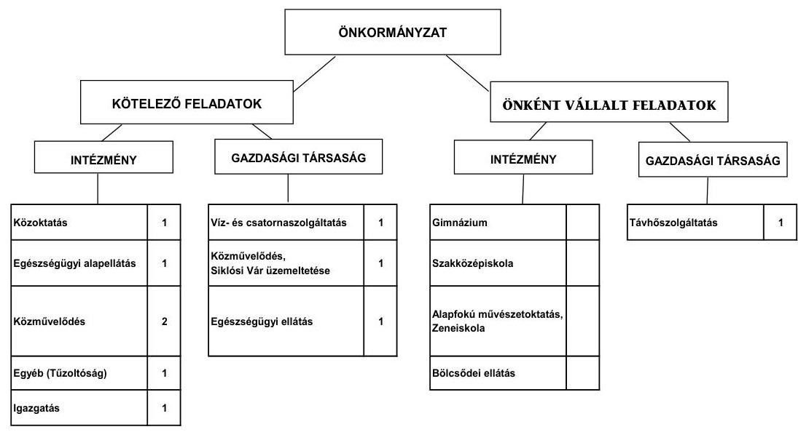

Az Önkormányzat a vizsgált időszakban kórházat nem tartott fent. Az önként vállalt feladatokat a kötelező feladatokat ellátó intézmények, és kizárólagos tulajdonában lévő gazdasági társaságai végezték. Az Önkormányzat feladatait 2010. december 31-én (a Polgármesteri hivatallal együtt) öt költségvetési szervvel és öt gazdasági társasággal látta el, amelyek száma 2011. év I. félév végére hat költségvetési szervre és négy gazdasági társaságra változott. Az intézményszervezeti átalakítások következtében a feladatellátás telephelyeinek száma 2007. január 1-jei 11-ről 2011. év I. félév végére 13-ra nőtt, a költségvetési szervek száma azonban 11-ről hatra csökkent. A kötelező és az önként vállalt feladatok ellátását biztosító szervezeti keretekben és a feladatellátás módjában végrehajtott szervezeti változások a működési kiadásoknál a 2007. évhez képest a 2010. évben - az Önkormányzat számításai szerint - 307,5 millió Ft megtakarítást jelentettek, amelyek kedvező hatást gyakoroltak az Önkormányzat pénzügyi egyensúlyi helyzetére.

Az Önkormányzat 2011. év I. félévében - közművelődési feladatellátás biztosítása érdekében - alapította a Művelődési Központot. Egy kizárólagos tulajdonú az egészséges ivóvíz biztosítása érdekében alapított - gazdasági társaságot 2011. februárban végelszámolással megszüntettek. Az Önkormányzat 2011. június 30-án kettő gazdasági társaságban kizárólagos tulajdonnal, kettő társaságban 50% alatti tulajdoni hányaddal rendelkezett. A gazdasági társaságok az egészségügy, a távhőszolgáltatás, a közművelődés, és a víz- és csatornaszolgáltatás területén kaptak szerepet az Önkormányzat feladatellátásában. A gazdasági társaságok közül egy kizárólagos önkormányzati tulajdonban álló társaság a működéséhez az ellenőrzött időszakban az Önkormányzattól összesen 26,1 millió Ft rendszeres működési célú pénzeszközátadásban részesült. A társaság a közművelődési feladatot közművelődési megállapodás alapján látta el, a gazdasági társaság által készített - a vállalt feladatok teljesítéséről szóló beszámolókat a Képviselő-testület elfogadta.

---

Az egyes közszolgáltatások feladatellátásában résztvevő intézmények működési kiadásainak finanszírozási forrásait ágazatonként a 2007. és 2010. években a következő ábra szemlélteti:
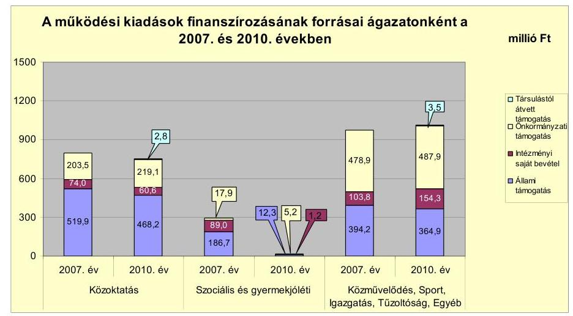

Az Önkormányzat működési kiadásokra 2010-ben 1748,1 millió Ft-ot fordított, amely 307,5 millió Ft-tal ( 15,0 %-kal) alacsonyabb a 2007. évinél. A működési kiadások 79,1%-át az intézményi körben realizálták.

A közoktatási ágazat működési kiadásai a 2008-2009. évi intézményi integráció eredményeként 5,9%-kal ( 46,7 millió Ft-tal) csökkentek. A közoktatási normatívák, valamint az intézményi saját bevétel - a pályázati források 2010. évi beszűkülése miatti - csökkenése az önkormányzati (és Társulástól átvett) támogatás mértékének 7,7%-os ( 15,6 millió Ft-os) emelkedését tette szükségessé.

A szociális és gyermekjóléti ágazatban teljesített működési kiadások 93,6%-os (274,9 millió Ft-os) csökkenését a 2007. év végén a Társulásnak működtetésre átadott intézmény miatti kiadáscsökkenés eredményezte.

Az Önkormányzat folyó költségvetés egyenlege (működési jövedelem) 2007-2010 között működési forrástöbbletet mutatott.
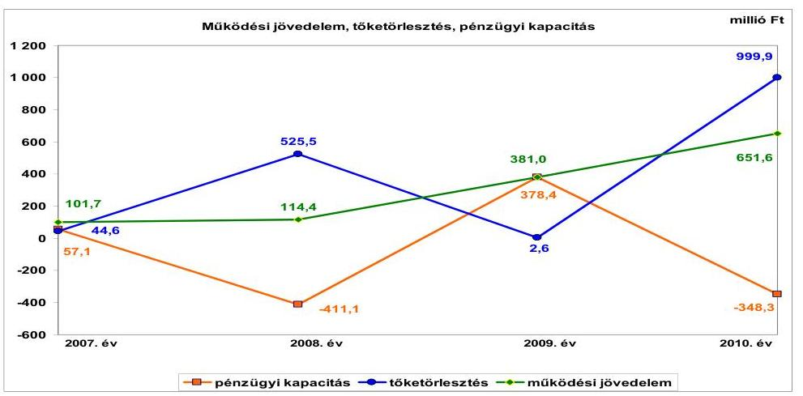

---

A 2007-2010. évek között a működési jövedelem folyamatosan emelkedett, a 2007-2008. években a folyó bevételek folyó kiadásokat meghaladó ütemű növekedése miatt, a 2009-2010. években a folyó kiadások csökkenése miatt. A működési jövedelem 2008-ról 2009-re tapasztalt 266,6 millió Ft-os növekedésében szerepe volt a folyó bevételek - előző évhez képest - 8,8%-os (201,1 millió Ft-os) növekedésének, valamint a működési kiadások körében - a közoktatási intézménynél 2009-ben végrehajtott ( 31,4 millió Ft megtakarítással járó) létszámcsökkentési intézkedések és a közoktatási ágazatban az intézményi integráció eredményeként - elért 49,6 millió Ft megtakarításnak. A működési jövedelem 2009-ről 2010-re tapasztalt 270,6 millió Ft-os növekedését a folyó bevételek - előző évhez képest - 5,7%-os (148,0 millió Ft-os) emelkedése és döntően a kamatkiadások - előző évhez képest - 48,3%-os (120,1 millió Ft-os) csökkenése eredményezte. Az Önkormányzat pénzügyi kapacitásában (nettó működési jövedelmében) a legnagyobb változást 2007-ről 2008-ra a kötvénykibocsátásból származó bevétel egy részének az ellenőrzött időszakot megelőzően felvett 525,5 millió Ft hosszú lejáratú hitelek törlesztésére történt felhasználás, 2009-ről 2010-re a kötvényvisszavásárlásból adódó 999,9 millió Ft fizetési kötelezettség okozta. Az Önkormányzat a vizsgált időszakban ÖNHIKI és vis maior támogatásban nem részesült.

Az Önkormányzat a feladatai ellátása érdekében a 2007-2009. években évente átlagosan 2439,7 millió Ft, a 2010. évben - az előző három év éves átlagához képest - 12,6%-kal (307,6 millió
 Ft-tal) több 2747,3 millió Ft folyó bevételt teljesített. A folyó bevételeken belül a költségvetési támogatás és az átengedett szja együttes értéke a 2007-2009. években évente átlagosan 1583,3 millió Ft (a folyó kiadások 62,9%-a), a 2010. évben 1532,7 millió Ft (a folyó kiadások 55,8%-a), a 2011. év I. félévében 726,7 millió Ft (a folyó kiadások 58,9%-a) volt.

A folyó bevételeken belül a helyi adóbevétel összege 2007-2009. években évente átlagosan 301,3 millió Ft (a folyó bevételeken belüli éves aránya 12,4%) volt. A 2010. évre a helyi adóbevétel összege - a megelőző három év éves átlagához képest - 3,9%-kal (11,8 millió Ft-tal) 289,5 millió Ft-ra csökkent, alapvetően az iparűzési adóból 2010-ben befolyt bevétel - a megelőző három év átlagához képest - 18,9 millió Ft-os csökkenése miatt. Az áfából származó bevételek a 2007-2008. évek évi átlagos 52,3 millió Ft-hoz képest a 2009-re több mint ötszörösére, a 2010. évre közel tízszeresére emelkedtek a megnövekedett összegű fejlesztési kiadások teljesítésével összefüggő fordított áfa-bevétel elszámolása (2009-ben 241,0 millió Ft, 2010-ben 466,7 millió Ft) miatt. Az Önkormányzat egyéb saját bevételeinek a 2007. évi 301,9 millió Ft-ról 2008-ra 407,6 millió Ft-ra történt növekedését döntően a - fel nem használt kötvényforrás lekötéséből realizált - kamatbevétel előző évhez képest 150,0 millió Ft-os növekedése okozta.

Az Önkormányzat működési és felhalmozási kiadásai együttesen a 2008. évben 13,8%-kal (370,8 millió Ft-tal), a 2009. évben 38,7%-kal (1038,1 millió Ft-tal, a 2010. évben 87,3%-kal (2339,8 millió Ft-tal) haladták meg a 2007. évit. A költségvetési kiadások 2008-2010 közötti átlagos növekedési üteme 23,6% volt. A folyó kiadásokon belül a személyi juttatások összege 2007-ről 2009-re 14,6%-kal (164,0 millió Ft-tal) csökkent elsősorban az ESZI átadása miatti létszámcsökkenés, továbbá a közoktatást és a Polgármesteri hivatalt érintő létszámcsökkentések (összesen 152 fő) hatására. Az Önkormányzat dologi kiadásai 2007-ről 2008-ra 9,3%-kal (183,0 millió Ft-tal) növekedtek, mivel a 2008. január 1-jén alapított Körjegyzőség dologi kiadásai meghaladták a 2007. decemberben átadott intézmény (ESZI) dologi kiadásait. A kamatkiadások - 2007-hez képest - 2008. évi 79,3 millió Ft-os (179,4%-os) növekedését a kötvénykibocsátással kapcsolatos kamatfizetés, a 2009. évi 125,1 millió Ft-os (101,3%-os) növekedését a kötvénykibocsátóval kötött szolgáltatási szerződés alapján fizetett 105,9 millió Ft összegű díj - Számv. tv. előírását megsértve kamatkiadásként történt elszámolása okozta. A felhalmozási kiadások aránya az összes kiadáson belül a 2007. évi 16,9%-ról (452,3 millió Ft) a 2010. évre 58,3%-ra (2473,0 millió Ft-tal) nőtt az Önkormányzat 2009-2010 közötti intenzív - több, magas bekerülési költségű projekt megvalósításával járó - fejlesztési tevékenysége miatt.

A kialakult pénzügyi egyensúlyi helyzetet jelentősen befolyásolta az Önkormányzat elmúlt időszaki fejlesztési tevékenysége. A 2010. december 31-éig befejezett fejlesztések 23,0%-át kötvénybevételből (578,5 millió Ft), 14,1%-át beruházási hitelből (356,5 millió Ft) fedezték. A 2007-2010. évek időszakában befejezett 2521,8 millió Ft értékű fejlesztés és felújítás forrása - a pénzintézeti forrásokon kívül - 36,4% (918,9 millió Ft) saját erő és 26,5% (667,9 millió Ft) hazai és EU-s támogatás volt. A beruházásokkal létrehozott létesítmények működtetése és fenntarthatósága érdekében várhatóan felmerülő költségvetési kiadásokat a Képviselő-testületnek előterjesztett éves költségvetési rendelettervezetekben nem számszerűsítették.

A 2010. december 31-én folyamatban lévő fejlesztési feladatok végrehajtására 2007-2010. között 3384,5 millió Ft kiadást teljesítettek, amelyre hitelből 779,6 millió Ft-ot (23,0%), kötvényforrásból 1095,4 millió Ft-ot (32,4%) fordítottak. Az EU-s támogatásból megvalósult fejlesztések finanszírozása - az utófinanszírozás ellenére, a pénzintézeti forrásoknak köszönhetően - 2010. év végéig likviditási gondot nem okozott, azonban a 2011. évben a „Megújuló Vár a Tenkes alján" elnevezésű projekt kiadásait - az utófinanszírozás, valamint a saját források elégtelensége miatt - már csak faktorálással tudták teljesíteni.

Az Önkormányzatnál a 2010. december 31-én folyamatban lévő fejlesztési feladatok 2010. évet követő kötelezettségvállalásainak összege 3914,4 millió Ft volt, amelyből 150,0 millió Ft-ot beruházási hitelből (a beruházási hitel óvadéki letétszámlán elhelyezett összege), 2986,0 millió Ft-ot EU-s támogatásból és 4,9 millió Ft-ot hazai támogatásból, valamint 773,5 millió Ft-ot saját forrásból terveznek biztosítani.

A 2010. december 31-én fennállt felhalmozási kötelezettségvállalásokat és azok forrásösszetételét a következő ábra mutatja be:

---

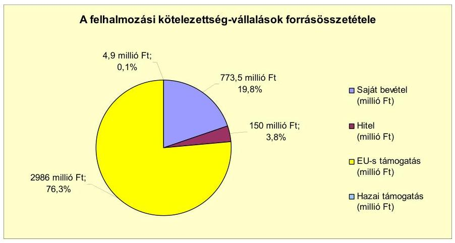

A 2010. év végén folyamatban lévő fejlesztések pénzügyi kockázatát rövid távon csökkenti, hogy az Önkormányzat e fejlesztésekkel kapcsolatban fennálló kötelezettségeiből 2011. szeptember 30-ig 1052,0 millió Ft összegű kiadást (407,2 millió Ft EU-s támogatás, és 644,8 saját forrás felhasználásával) már teljesített. A saját forrást az év közben keletkezett működési jövedelem biztosította.

Az Önkormányzatnál a 2011. évben beadott, elbírálás alatt álló pályázat nem volt.

Az Önkormányzat mérleg szerinti, pénzintézetekkel szembeni kötelezettsége a 2006. év végi 631,7 millió Ft-ról - illetve a 2006-2009. évek átlagos 2214,5 millió Ft-os kötelezettségéhez képest - 2010. december 31-re 4628,5 millió Ft-ra, a 2011. év I. félév végére 5000,5 millió Ft-ra nőtt, amelyből az árfolyamváltozás miatti különbözet 1092,3 millió Ft volt. A pénzintézetekkel szemben fennálló kötelezettségek 2200,0 millió Ft kötvény kibocsátásából, 1000,0 millió Ft hosszú lejáratú hitelből, 63,0 millió Ft rövid lejáratú hitel igénybevételéből, 260,9 millió Ft folyószámlahitel állományból, valamint 384,3 millió Ft faktoring szolgáltatás igénybevételéből keletkeztek. Az Önkormányzat az elfogadott 2011. évi költségvetési rendeletében a folyószámlahitel igénybevételén túl egyéb hitel felvételt nem tervezett, a helyszíni vizsgálat befejezésének időpontjáig egy rövid lejáratú likviditási hitelt vett igénybe.

Az Önkormányzat pénzintézetekkel szembeni kötelezettségvállalásaira képviselő-testületi döntés alapján, a pénzintézetek versenyeztetésével került sor, az előterjesztésekben bemutatták a kamat- és - a deviza alapú kötelezettségeket érintő - árfolyamkockázatot, azonban a kötelezettségek visszafizetésének forrásait nem számszerűsítették.

Az Önkormányzat az 1000,0 millió Ft összegű felhalmozási célú hitelt 2010. december 31-ig teljes összegében lehívta, és - a hitel biztosítékaként óvadéki betétszámlán elhelyezett 150,0 millió Ft kivételével - a hitelcélnak megfelelően, a kötvénykibocsátás céljaként meghatározott fejlesztések befejezéséhez felhasználta. A kötvénykibocsátás összesen 3200,0 millió Ft bevételéből 2200,0 millió Ft-ot (68,8%-ot) - a kötvénykibocsátás céljának megfelelően - a vizsgált időszakot megelőzően felvett hosszú lejáratú hitelek - összesen 526,1 millió Ft kötelezettséget jelentő - visszafizetésére és 1673,9 millió Ft-ot a tervezett fejlesztési

---

feladatainak finanszírozásához használt fel. A kötvényforrásból óvadéki betétszámlán kezelt 1000,0 millió Ft-ból 5327 ezer CHF névértékű kötvénycsomagot az Önkormányzat visszavásárolt, amelynek során - a pénzügyi egyensúlyi helyzetet gyengítve - 152,3 millió Ft árfolyamvesztesége keletkezett. A CHF-ben fennálló pénzintézettel szembeni kötelezettsége után 1721239 CHF (305,7 millió Ft) kamatot, 772296 CHF (141,8 millió Ft) és 8,0 millió Ft egyéb költséget fizetett, a kötvénycsomag visszavásárlása után fennmaradó 14785000 CHF tőketartozásból tőkét nem törlesztett. A kötvénytartozás után a tőketörlesztés első alkalommal 2013. április 30-án esedékes, amelynek összege negyedévente 369,6 ezer CHF. A kötelezettségek teljesítésének időpontjaiban alkalmazott CHF/HUF konverziós árfolyamok alapján 2011. június 30-ig az összes teljesített kötelezettség 455,5 millió Ft volt. Az Önkormányzat a forintban fennálló, hosszú lejáratú pénzintézettel szembeni kötelezettségéből 2011. június 30-ig tőkét nem törlesztett, 74,4 millió Ft kamatot, valamint 8,0 millió Ft egyéb költséget fizetett meg. A tőketörlesztés első alkalommal 2012. április 15-én esedékes, amelynek összege félévente 31,5 millió Ft. A 2007-2011. év I. féléve között átmenetileg szabad pénzeszközeiből 369,0 millió Ft kamatbevételt realizált.

Az Önkormányzat költségvetésének pénzügyi egyensúlyát a vizsgált időszakban folyószámlahitel, a 2007. évben a likviditását munkabérmegelőlegezési hitel, továbbá a 2010. évben és a 2011. év I. félévben - összesen 553,7 millió Ft összegű fejlesztési célú támogatás megelőlegezésére kötött - faktoring szolgáltatás, valamint egy alkalommal - 2011. május 26-án - szállítói finanszírozással támogatott fejlesztéshez kapcsolódó számlák saját erő tartalmához igénybevett 63,0 millió Ft összegű rövid lejáratú hitel igénybevételével tudta biztosítani.

A folyószámlahitel, és munkabér-megelőlegezési hitel igénybevétele a 2007-2011. év I. félév között az alábbiak szerint alakult:

| Megnevezés | 2007. év | 2008. év | 2009. év | 2010. év* | 2011. év I.   félév* |
| :--: | :--: | :--: | :--: | :--: | :--: |
| Folyószámlahitel |  |  |  |  |  |
| Keretösszeg január 1-án (millió Ft-ban) | 200,0 | 200,0 | 200,0 | 200,0 | 250,0 |
| Átlagos napi állomány (millió Ft-ban) | 166,0 | 162,3 | 166,2 | 216,9 | 276,4 |
| Folyószámla hitellel zárt napok száma (nap) | 365 | 366 | 365 | 365 | 181 |
| Egyenleg (állomány) | x | x | x | 224,7 | 260,9 |
| Munkabér-megelőlegezési hitel |  |  |  |  |  |
| Keretösszeg január 1-án (millió Ft-ban) | 0,0 |  |  |  |  |
| Átlagos napi állomány (millió Ft-ban) | 1,0 |  |  |  |  |
| Munkabér-megelőlegezési hitellel zárt napok száma (nap) | 49 |  |  |  |  |
| Egyenleg (állomány) | x | x | x |  |  |

* A folyószámlahitel-keretet 2010. április 2-től 250,0 millió Ft-ra, majd 2011. március 1-től 300,0 millió Ft-ra emelték.
**Munkabér-megelőlegezési hitelt az Önkormányzat 2007. február 1-jétől 50,0 millió Ft összegben 49 napon át vett igénybe.

Az Önkormányzat a vizsgált időszakban minden nap igénybe vett folyószámlahitelt. Az év végén fennálló folyószámlahitel állomány folyamatosan emelkedett, a fordulónapi állományok közelítették a teljes hitelkeret összegét, az ellenőrzött időszakban két alkalommal vált szükségessé a folyószámlahitel-keret emelése, amely a likviditási nehézségek fokozódását, és az Önkormányzat pénzügyi egyensúlyi helyzetének romlását jelzi. A likviditás folyószámlahitellel, munkabér-megelőlegezési hitellel és követelés faktorálással történő biztosítása 2011. június 30-ig az Önkormányzatnak 81,2 millió Ft kamatkiadást, és 4,1 millió Ft egyéb költség fizetésének kötelezettségét okozta.

---

Az Önkormányzat 2011. év I. félév végi szállítói tartozása 489,5 millió Ft, amelyből 371,8 millió Ft (76,0%) lejárt határidejű volt, az átütemezett szállítói tartozások összege 9,3 millió Ft. A lejárt szállítói tartozás állomány a szállítói finanszírozású EU-s fejlesztések lejárt szállítói tartozása nélkül 282,7 millió Ft volt. A lejárt szállítói tartozások között a 2008. évtől valamennyi évben volt 90 napon túli lejárt szállítói tartozásállomány, a 2011. június 30-án lejárt tartozásokból 118,6 millió Ft meghaladta a 90 napot, amelynek 48,9%-a (58,0 millió Ft) a szállítói finanszírozású EU-s fejlesztések lejárt szállítói tartozása. Az Önkormányzatnál a 90 napot meghaladó, szállítók felé fennálló kötelezettségek miatt - a helyi önkormányzatok adósságrendezési eljárásáról szóló 1996. évi XXV. törvényben foglalt - intézkedéseket nem tettek.

Az Önkormányzat az ellenőrzött időszakban PPP konstrukció keretében beruházást nem végzett, garancia- és kezességvállalásból kötelezettsége nem keletkezett. A 2011. év I. félév végén négy lízingszerződés alapján állt fenn 2896 CHF és 3,8 millió Ft
 kötelezettsége. A gazdasági társaságai részére az Önkormányzat a vizsgált időszakban két alkalommal, összesen 8,0 millió Ft összegű tagi kölcsönt nyújtott.

A folyószámlahitel-keret, valamint a beruházási hitel biztosítékaként a Képviselő-testület hozzájárult 718,4 millió Ft - számviteli nyilvántartás szerinti - nettó értékű (2675,0 millió Ft becsült értékű) ingatlanon jelzálogjog alapításához és bejegyzéséhez. A jelzálogszerződésekkel érintett ingatlanok közül - az Önkormányzat ingatlan nyilvántartása szerint - öt a korlátozottan forgalomképes törzsvagyon körébe tartozik. A korlátozottan forgalomképes ingatlanvagyon nettó értékéből 3,7%-ot (114,9 millió Ft) képviselnek a jelzáloggal terhelt ingatlanok. A jelzálogszerződéssel érintett forgalomképes ingatlanok nettó értéke a forgalomképes ingatlanvagyon 82,0%-át (603,6 millió Ft) jelentik, amely jelentősen korlátozza az Önkormányzat rendelkezési jogát a forgalomképes ingatlanjai felett, azok értékesítését az Önkormányzat pénzügyi egyensúlyi helyzetének javításához, jövőbeni kötelezettségeinek teljesítéséhez.

Az Önkormányzat kötelezettségeinek 2010. december 31-i, valamint 2011. június 30-i állományát és várható alakulását a kötelezettségek lejáratáig a következő táblázat szemlélteti:

| Megnevezés | Állomány 2010. december 31   én |  |  | Állomány 2011. június 30 -án |  |  | Várható kötelezettség   2011-2013. években |  | Várható kötelezettség   2014. évtől |  |
| :--: | :--: | :--: | :--: | :--: | :--: | :--: | :--: | :--: | :--: | :--: |
|  | HUF-ban   (millió. Ft-   ban) | Devizában   (összeges   ezer CHF-   ban) | Devizá-   nem | HUF-ban   (millió. Ft-   ban) | Devizában   (összeges   ezer CHF-   ban) | Devizá-   nem | HUF-ban   (millió Ft-   ban) | Devizában   (összeges   ezer CHF-   ban) | HUF-ban   (millió Ft-   ban) | Devizában   (összeges   ezer CHF-   ban) |
| Pénzintézet kötelezettségek |  |  |  |  |  |  |  |  |  |  |
| "Bikbai Vár és Termál" kötvény |  | 14785,0 | CHF |  | 14785,0 | CHF |  | 1474,6 |  | 16300,0 |
| Beruházási hitel | 1000,0 |  | HUF | 1000,0 |  | HUF | 441,0 |  | 1554,7 |  |
| Folyószámlahitel | 224,7 |  | HUF | 260,6 |  | HUF | 260,6 |  |  |  |
| Égadó Brutt hitel |  |  |  | 63,0 |  | HUF | 66,3 |  |  |  |
| Felsorolt szolgáltatástól származó kötelezettség | 111,5 |  | HUF | 584,0 |  | HUF | 590,0 |  |  |  |
| Pénzintézet kötelezettségei összesen HUF-ban | 1336,2 |  |  | 1808,1 |  |  | 1163,5 |  | 1554,7 |  |
| Pénzintézet kötelezettségei összesen CHF-ban |  | 14785,0 |  |  | 14785,0 |  |  | 1474,6 |  | 16300,0 |
| Lógó kötelezettségek CHF-ban |  | 7,1 | CHF |  | 2,9 | CHF |  | 2,9 |  |  |
| Lógó kötelezettségei HUF-ban |  | 4,7 | HUF | 3,6 |  | HUF | 4,1 |  | 3,5 |  |
| Elvállalt tartozás | 309,0 |  | HUF | 489,5 |  | HUF | 489,5 |  |  |  |
| Kötelezettségek összesen HUF-ban | 1649,9 |  |  | 2201,4 |  |  | 1657,5 |  | 1555,5 |  |
| Kötelezettségek összesen CHF-ban |  | 14792,8 |  |  | 14787,9 |  |  | 1477,5 |  | 16300,5 |

Az Önkormányzatnak pénzintézetekkel szemben fennálló kötelezettsége a 2011. év I. félév végén 1708,1 millió Ft és 14785000 CHF volt. Ezek várható kö-

---

telezettsége (tőke, kamat és egyéb költség) a legutóbbi kamatfizetés feltételei alapján a 2011-2013. években 1163,9 millió Ft és 1474561 CHF. Az Önkormányzatnak a 2011. évben szállítói tartozások címén 489,5 millió Ft, lízingkötelezettség alapján 2927 CHF és 4,1 millió Ft fizetési kötelezettsége keletkezik. A 2011-2013. évek kötelezettségeinek teljesítésére - az ellenőrzés megállapításai szerint - figyelembe vehető 377,6 millió Ft mérlegben kimutatott követelésállomány, a fejlesztési hitelből óvadéki betétszámlán elhelyezett 150,0 millió Ft, a faktorszerződésekkel megelőlegezett, 2011-ben lehívható 426,9 millió Ft támogatási összeg. További forrás lehet a keletkező működési jövedelem, amelynek összege a vizsgált időszakban folyamatosan növekedett, a 2010. évben 651,6 millió Ft volt.

A 2014. évtől a futamidők végéig várható kötelezettsége - a 2011. június 30-án ismert kötelezettségek alapján - 16306482 CHF és 1555,3 millió Ft. Ezekre figyelembe vehető forrás a termálfürdő üzemeltetési szerződése alapján a 2015. évtől a kötelezettségek lejártáig - szerződésszerű teljesítés esetén - befolyó, összesen 684 millió Ft bérleti díjbevétel, valamint az évről évre képződő működési jövedelem lehet, amely alapján - figyelemmel a gazdasági környezet változékonyságára - hosszú távon a kötelezettségek teljesítése bizonytalan.

Az Önkormányzat kizárólagos tulajdonában lévő két gazdasági társaságnak 2011. június 30-án pénzintézetekkel szemben kötelezettsége nem állt fenn, a gazdasági társaságok kötelezettségét szállítói tartozás (46,8 millió Ft), lízingszerződés miatti kötelezettség (2,2 millió Ft) és az Önkormányzat felé fennálló kölcsöntörlesztési kötelezettség (4,0 millió Ft) alkotta. Ezek alapján a gazdasági társaságoknak a 2011-2013. évek között 52,5 millió Ft, a 2014. évben 0,5 millió Ft fizetési kötelezettsége jelentkezik. Az Önkormányzat számára a gazdasági társaságainál fennálló kötelezettségállomány pénzügyi kockázatot nem jelent, mivel a kötelezettségekre fedezetet nyújt a társaságok mérlegében kimutatott 57,6 millió Ft követelésállomány, illetve a gazdasági társaságok jegyzett tőkéjét 50,4 millió Ft-tal meghaladó saját tőke összege.

Az Önkormányzat eszközállományának állapota, az eszközök pótlására fordítandó pénzeszközök nagysága is befolyásolhatja az Önkormányzat pénzügyi egyensúlyi helyzetét. Az Önkormányzat nem vizsgálta, hogy az elhasználódott eszközök pótlása milyen kötelezettséget jelent számára. Az eszközállománya után a 2007-2010. években 967,9 millió Ft összegű értékcsökkenést mutatott ki, a felújítási kiadásokra 1637,5 millió Ft-ot fordítottak, az elszámolt felújítások és fejlesztések együttes összege a 2007-2010. években 2928,4 millió Ft volt.

Az Önkormányzat az ellenőrzött időszakban bevételt növelő és kiadási megtakarítást eredményező intézkedéseket tett. A 2007-2011. év I. féléve között tett intézkedések hatására 574,1 millió Ft bevételi többletet, továbbá 254,9 millió Ft kiadási megtakarítást mutattak ki. A kiadáscsökkentő intézkedések a feladatellátás szakmai színvonalának növelése mellett a takarékos szemléletű gazdálkodást, a működőképesség megőrzését, kiemelten a pénzügyi egyensúlyi helyzet javítását célozták meg. A kiadási megtakarítások 58,9%-a (150,0 millió Ft) az elrendelt álláshely-csökkentések eredménye. Az álláshelycsökkentő intézkedések 2007-2011. év I. féléve között önkormányzati szinten összesen 188 álláshely (ebből 0,5 üres álláshely) megszüntetését jelentették.

---

Egyes közszolgáltatási területeken (közoktatási, gyermekjóléti, közművelődési, városüzemeltetési feladatok, Tűzoltóság) azonban feladatbővülések voltak, amelyek a vizsgált időszakban összesen 31 fős álláshely- és egyben létszámnövekedéssel is jártak. Ezek együttes hatásaként az időszak álláshelyeinek száma 157 fővel csökkent.

A 2007-2011. év I. félév között érvényesített bevételnövelő intézkedések eredményeképpen az Önkormányzat - az ÁSZ által nem ellenőrzött kimutatása szerint - 574,1 millió Ft bevételt realizált. A realizált bevételből 305,2 millió Ft (53,2%) eszközhasznosításból, 252,7 millió Ft (44,0%) a helyi adókkal kapcsolatos intézkedések hatására, 8,3 millió Ft (1,4%) a szabad kapacitások hasznosítására, további 7,9 millió Ft (1,4%) az intézményi térítési díjak emelésére tett intézkedések alapján keletkezett.

Az utóellenőrzés a pénzügyi egyensúly javítására tett egy szabályszerűségi és egy célszerűségi javaslat hasznosítására terjedt ki. A finanszírozási célú pénzügyi műveletek költségvetési bevételként, illetve kiadásként történő bemutatásának tiltására vonatkozó szabályszerűségi javaslat nem teljesült. A célszerűségi javaslat teljesült, a költségvetési rendelettervezetek eredeti előirányzatként tartalmazták az előző évről áthúzódó kötelezettségekkel kapcsolatos kiadások teljesítéséhez a fedezetet, az előző évi pénzmaradvány igénybevételét.

Az Önkormányzat pénzügyi egyensúlyi helyzetét összegezve a következők emelhetők ki:

Siklós Város Önkormányzata pénzügyi egyensúlya rövid távon biztosított. A pénzügyi egyensúly középtávú megteremtésére, hosszú távú fenntartására az Önkormányzatnak fel kell készülnie.

Az Önkormányzat működési jövedelme a vizsgált időszakban pozitív volt és folyamatosan emelkedett. A működési jövedelem a 2007. és 2009. években biztosította az adósságszolgálat finanszírozását. A 2008. és a 2010. években a hitelek előtörlesztése, és a kötvény egy részének visszaváltása negatív pénzügyi kapacitást eredményezett. Az önként vállalt feladatokra fordított kiadások aránya és mértéke csökkent, amely a végrehajtott szervezeti változásokkal együtt kedvező hatást gyakorolt a pénzügyi egyensúlyi helyzetre.

A hazai és EU-s támogatással megvalósuló felhalmozási feladatok előlegen és szállítói finanszírozáson túli folyószámlahitelből történt előfinanszírozása kockázatot jelent. A felhalmozási kiadások finanszírozásához egyéb likvidhitel és faktoring szolgáltatás igénybevétele is szükségessé vált. A fejlesztések során kialakított létesítmények jövőbeni működtetésének várható kiadásait nem számszerűsítették, azonban a fejlesztések bevételi lehetőséget teremtenek az Önkormányzat számára. A kockázatot csökkenti a tervezett felhalmozási feladatok saját bevételeinek rendelkezésre állása. A kockázatot csökkentheti a termálfürdő üzemeltetési szerződése alapján várhatóan befolyó bérleti díjbevétel.

A pénzügyi egyensúlyi helyzet szempontjából kockázatot jelent, hogy a pénzintézetekkel szembeni kötelezettségei növekedtek, a visszafizetés forrásait nem számszerűsítették. A fizetőképesség szempontjából kockázatot jelent a kötvénykibocsátásból fennálló tartozás 2013. évtől induló tőketörlesztési kötelezettsége.

---

Állandósult a folyószámlahitel igénybevétel. A szállítói tartozás, azon belül a lejárt szállítói tartozás állománya emelkedett. A kockázatot csökkenti a faktoring szolgáltatással megelőlegezett, 2011. évben lehívható támogatási összeg.

Kizárólagos tulajdonú gazdasági társaságai pénzügyi egyensúlyi helyzete stabil.

Az Állami Számvevőszékről szóló 2011. évi LXVI. törvény 33. § (1) bekezdésében foglaltak értelmében a jelentésben foglalt megállapításokhoz kapcsolódó intézkedési tervet köteles az ellenőrzött szervezet vezetője összeállítani és azt a jelentés kézhezvételétől számított harminc napon belül az ÁSZ részére megküldeni. Amennyiben az intézkedési tervet határidőben nem küldi meg a szervezet, vagy az továbbra sem elfogadható, az ÁSZ elnöke a hivatkozott törvény 33. § (3) bekezdés a)-b) pontjaiban foglaltakat érvényesítheti.

# A 2011. június 30-i pénzügyi egyensúlyi helyzet alapján az ellenőrzés intézkedést igénylő megállapításai a következők: 

## a Polgármesternek

1. Az Önkormányzat nettó működési jövedelme - az adott év tőketörlesztés hatásának erősödése miatt - 2008-ban és 2010-ben negatív volt. Az Önkormányzat finanszírozása a vizsgált időszakban egyre növekvő arányú folyószámlahitel igénybevételével volt biztosítható, az Önkormányzat finanszírozásában a folyószámlahitel állandósult. A vállalt pénzintézetekkel szembeni és egyéb kötelezettségek fedezete csak részben biztosított középtávon, a kötelezettségek visszafizetésének forrásait nem számszerűsítették. Az Önkormányzat által tett intézmény-szervezeti átalakítások, kiadáscsökkentő és bevételnövelő intézkedések nem biztosítanak elegendő forrást a pénzügyi egyensúly helyreállításához. A Képviselő-testületnek előterjesztett éves költségvetési rendeletekben nem mutatták be a beruházásokkal létrehozott létesítmények működtetését
 és fenntarthatósága érdekében várhatóan felmerülő költségvetési kiadásokat. Az Önkormányzat pénzügyi egyensúlya középtávon veszélyeztetett.

Javaslat:
Az Önkormányzat pénzügyi egyensúlyának középtávon történő biztosítása és hosszú távú fenntarthatósága érdekében kezdeményezze - felelősök és határidők megjelölésével - az alábbi intézkedések megtételét:
a) Terjesszen a Képviselő-testület elé kibontakozási programot a pénzügyi egyensúlyi helyzet javítása és hosszú távú megőrzése érdekében.
b) Tárjon fel további bevételszerző és kiadáscsökkentő lehetőségeket. Ütemezze a bevételek beszedését a jövőben jelentkező fizetési kötelezettségeihez.
c) Képezzen egyensúlyi (elkülönített) tartalékot az adósságszolgálat teljesítése érdekében.
d) Mutassa be a Képviselő-testületnek félévente legalább három évre kitekintően a kötelezettségek teljes körére szóló finanszírozási tervet, a források számszerúsített megjelölésével. Gondoskodjon továbbá arról, hogy a jövőben az adósságot ke-

---

letkeztető kötelezettségvállalásokról szóló képviselő-testületi előterjesztések tételesen tartalmazzák a visszafizetés forrásait.
e) Vizsgálja meg az állandósult folyószámla és likvid hitel hosszú távú kötelezettséggé történő átalakításának jogi lehetőségét, és a Stabilitási törvény 10. §-ában előírt feltételek fennállása esetén kezdeményezze a Kormánynál ennek engedélyezését.
f) Vizsgálja felül a folyamatban lévő és a tervezett beruházásokat, és mutassa be a Képviselő-testületnek a megvalósuló létesítmények fenntarthatóságának pénzügyi hatásait. Az Önkormányzat pénzügyi egyensúlyi helyzete szempontjából kedvező támogatás-finanszírozási lehetőségeket vegye igénybe. Szükség esetén tegyen javaslatot a Képviselő-testületnek a tervezett beruházásokkal kapcsolatos döntések módosítására, amelyben figyelembe veszik az Önkormányzat pénzügyi lehetőségeit, és a kötelező feladatellátás elsődlegességét.
2. A Képviselő-testületnek előterjesztett éves zárszámadási rendeleteikben nem mutatták be az Önkormányzat eszközei után tárgyévben elszámolt értékcsökkenés összegét, az eszközpótlásra fordított tényleges kiadásokat, az eszközök elhasználódási fokának alakulását.

Javaslat:
Mutassa be a Képviselő-testületnek évente a zárszámadási rendelet előterjesztésében az értékcsökkenés összegét, és ezzel összevetve az elhasználódott eszközök pótlására fordított tényleges kiadásokat, az eszközök elhasználódási fokának alakulását.
3. Az Önkormányzat lejárt szállítói állománya 2011. június 30-án 371,8 millió Ft, amelyből a 90 napot meghaladó tartozásállomány 118,6 millió Ft volt.

Javaslat:
Vizsgálja meg az Önkormányzat lejárt szállítói állományát és a helyi önkormányzatok adósságrendezési eljárásáról szóló 1996. évi XXV. törvény 5. §-ának (2) bekezdése alapján kezdeményezze a Képviselő-testület döntését az adósságrendezési eljárás megindításáról.
4. Az utóellenőrzés a pénzügyi egyensúly javítására tett szabályszerűségi javaslat hasznosítására terjedt ki, amely szerint a jegyző biztosítsa, hogy a költségvetési rendelettervezetek bevételi és kiadási főösszegei az Áht. 8/A. (7) bekezdése alapján ne tartalmazzanak finanszírozási célú pénzügyi műveleteket. A Képviselő-testület által elfogadott intézkedési tervben a javaslat végrehajtásának határideje 2008. szeptember 11-e volt, amelynek azonban nem tettek eleget, így a pénzügyi egyensúly javítására tett javaslatunk nem teljesült.

Javaslat:
Tegyen intézkedést arra, hogy a költségvetési rendelettervezetek, és az elfogadott költségvetési rendeletek bevételi és kiadási főösszegei az új Áht. 5. § (1)-(3) bekezdései, továbbá a 23. § (2) bekezdés a) és c) pontjai alapján ne tartalmazzanak a 73. § szerinti finanszírozási célú pénzügyi műveleteket.

---

# a jegyzőnek 

Az Önkormányzat a folyószámlahitel-keretszerződés megkötése során az Ötv. 88. § (1) bekezdés b) pontjának 2011. december 31-éig hatályos előírását megsértve hozzájárult - az Önkormányzat ingatlan nyilvántartása szerint - korlátozottan forgalomképes ingatlanokon jelzálogjog alapításához és bejegyzéséhez. Az Önkormányzat hatályos vagyongazdálkodási rendeletének 6. § (1) bekezdésének előírása szerint a korlátozottan forgalomképes önkormányzati vagyon biztosítékul adásáról a Képviselőtestület jogosult dönteni.

Javaslat:
Gondoskodjon arról, hogy az Önkormányzat kötelezettségeinek fedezeteként 2012. január 1-jét követően a nemzeti vagyonról szóló 2011. évi CXCVI. törvény 3. § (1) bekezdés 6. pontjával, az 5. § (2) bekezdés c) pontjával, és a 6. § (6) bekezdésével összhangban a nemzeti vagyon körébe tartozó, korlátozottan forgalomképes törzsvagyont ne terhelje meg, kivéve, ha arról az Önkormányzat a rendeletében a megterhelést megengedően rendelkezik. ${ }^{9}$

A polgármester a helyszíni ellenőrzés lezárása után tájékoztatta az Állami Számvevőszéket az Önkormányzat megtett intézkedéseiről, amelyet az Állami Számvevőszék nem ellenőrzött, arra vonatkozóan véleményt vagy megállapítást nem fogalmaz meg. Az ellenőrzés lezárását követően elvégzett intézkedéseket az Állami Számvevőszék utóellenőrzés keretében vizsgálhatja.

A polgármester tájékoztatása szerint a következő intézkedéseket tette az Önkormányzat:

- a hitelállomány 2011. év I. félév és 2011. év vége között 389,6 millió Ft-tal csökkent, amelyhez 102,4 millió Ft hiteltörlesztési támogatás is hozzájárult;
- a hitelállomány további csökkentése érdekében a Képviselő-testület 2012. évi költségvetési rendeletében a folyószámlahitel-keretet 2012. április 15-től 300,0 millió Ft-ról 250,0 millió Ft-ra csökkentette;
- a fejlesztési hitelállomány hosszú távú biztonságos kezelése érdekében - a Képviselő-testület felhatalmazása alapján - megkezdték a tárgyalásokat a termálfürdő tulajdonjogának teljes vagy részleges értékesítésére, amelynek bevételét hiteltörlesztésre kívánják fordítani;
- a szállító állomány 2011. év I. félév és 2011. év vége között 161,3 millió Ft-tal csökkent, azon belül a lejárt szállítói állomány 45,1 millió Ft-tal mérséklődött.

[^0]
[^0]:    ${ }^{9}$ Felhívjuk a figyelmet arra, hogy az ellenőrzéssel érintett időszakot követően, 2012. március 31-én hatályba lépett az egyes közpénzügyi tárgyú törvényeknek az államháztartás önkormányzati alrendszerét érintő módosításáról, és azok más törvényekkel való összhangjának biztosításáról szóló 2012. évi XVII. törvény, amely módosítja az államháztartásról szóló 2011. évi CXCV. törvény 84. §-ának (4) bekezdését. A jogszabály változását a javaslat végrehajtása során figyelembe kell venni.

---

# II. RÉSZLETES MEGÁLLAPÍTÁSOK 

## 1. Az ÖNKORMÁNYZAT KÖTELEZŐ ÉS ÖNKÉNT VÁLLALT FELADATAI, A FELADATELLÁTÁS SZERVEZETI KERETEI ÉS ANNAK VÁLTOZÁSAI

Az Önkormányzat a kötelezően ellátandó feladatait az Ötv. és az ágazati törvényekben meghatározottaknak tekinti, az önként vállalt feladatok köréről az SzMSz-ben rendelkezett, azok terjedelmét az éves költségvetési rendeletekben az adott évi költségvetés forrásainak ismeretében határozta meg. Az önként vállalt feladatai közé sorolta a gimnázium, a szakképző iskola és a bölcsőde működtetését, a művészeti oktatást (zeneiskola), valamint a Siklósi Vár megőrzését, gyarapítását, helyreállítását, hasznosítását, közösségi térként való felhasználását.

A 2010. évi működési kiadások feladatonkénti megoszlását és azok finanszírozási arányait - az Önkormányzat adatszolgáltatása alapján - az alábbi táblázat mutatja be:

| Eltátott feladat | Működési   kiadás   összesen   (millió Ft) | Kötelező   feladatok   kiadásainak   részaránya   % | Működési   bevétel   összesen   (millió Ft) | Állami   támogatás   részaránya   % | Intézményi   saját bevétel   részaránya   % | Önkormányzati   támogatás   részaránya   % | Társulásoktól   átvett támogatás   részaránya   % |
| :--: | :--: | :--: | :--: | :--: | :--: | :--: | :--: |
| Óvodák | 179,2 | 100,0 | 179,2 | 53,4 | 7,3 | 38,5 | 0,5 |
| Általános iskolák | 365,4 | 100,0 | 365,4 | 58,3 | 10,1 | 31,2 | 0,4 |
| Gimnázium | 153,2 | 0,0 | 153,2 | 73,2 | 3,4 | 23,5 | 0,2 |
|  | 41,2 | 0,0 | 53,0 | 89,2 | 10,8 | 0,0 | 0,0 |
| Szakképző intézmény |  |  |  |  |  |  |  |
| Gyermelybéti   intézmények | 18,7 | 100,0 | 18,7 | 65,7 | 6,5 | 27,8 | 0,0 |
| Közművelődési   intézmények | 60,9 | 100,0 | 60,9 | 16,9 | 3,7 | 79,4 | 0,0 |
| Sportlétesítmények | 23,4 | 100,0 | 23,4 | 0,0 | 20,8 | 78,4 | 0,0 |
| Egyéb intézmények | 331,5 | 76,5 | 351,5 | 85,9 | 6,7 | 5,4 | 0,0 |
|  | 208,9 | 100,0 | 208,9 | 14,2 | 5,0 | 79,1 | 1,7 |
| Polgármesteri hivatal   igazgatási kiadásai |  |  |  |  |  |  |  |
| Polgármesteri   hivatal által ellátott   egyéb feladatok   működési kiadásai | 365,9 | 97,1 | 365,9 | 6,7 | 29,0 | 64,7 | 0,0 |
| Működési kiadá-   sok összesen | 1748,1 | 83,8 | 1780,1 | 47,5 | 12,1 | 40,0 | 0,4 |

Az Önkormányzat - adatszolgáltatása szerint ${ }^{10}$ - a működési célú költségvetési kiadásaiból a kötelező feladatok ellátására a 2007-2009. években átlagosan 1562,2 millió Ft-ot - a működési kiadások 79,4%-át -, a 2010. évben 1465,5 millió Ft-ot (83,8%-ot) fordított. A csökkenő kiadások ellenére a kötelező feladatok összes működési kiadáson belüli 4,4 százalékpontos emelkedését a kötelező feladatok ellátására fordított kiadások csökkenését meghaladó mértékű működési kiadáscsökkenés okozta. A működési kiadások a 2010. évre - a

[^0]
[^0]:    ${ }^{10}$ Az Önkormányzat zárszámadási rendelete és az adatszolgáltatása szerinti működési kiadások közötti eltérés oka, hogy az adatszolgáltatásban nem szerepelnek az OEP által finanszírozott védőnői szolgálat, a segélyek, a víz-, csatornaszolgáltatás normatív támogatása, a kisebbségi önkormányzatok támogatása, és az EU-s pályázatokhoz kapcsolódó egyszeri bér és dologi kiadások összege.

---

2007-2009. évek 1967,5 millió Ft-os éves átlaghoz viszonyítva - 11,2%-kal (219,4 millió Ft-tal), míg a kötelező feladatokra fordított kiadások - a 2007-2009. évek átlagához viszonyítva - ennél kisebb mértékben, 6,2%-kal (96,7 millió Ft-tal) csökkentek.

A működési kiadások csökkenésében a 2007. évi ESZI átadásának (69,2 millió Ft), a 2008. évben megkezdett és a 2009. évben befejezett közoktatási intézmények számának csökkenésével járó integrációjának és a 2008-2010 között végrehajtott létszámcsökkentésekkel elért kiadásmegtakarításnak volt döntő szerepe.

Az Önkormányzat adatszolgáltatása alapján az önként vállalt feladatokra fordított kiadások a vizsgált időszakban évente folyamatosan - a 2007-2009. évek éves átlagos 405,3 millió Ft-ról (a működési kiadások átlagos 20,6%-áról) a 2010. évre 282,6 millió Ft-ra (16,2%-ra) - csökkentek. Ezek összegében és - a működési kiadásokhoz viszonyított - arányában is jelentős csökkenés a 2008. évben következett be. A 2008. évben az önként vállalt feladatokra fordított kiadás 197,2 millió Ft-tal (36,0%-kal), a működési kiadásokon belüli aránya 17,2%-ra csökkent az előző évhez képest, amelynek oka az önként vállalt feladatot (szakosított ellátást biztosító Idősek Otthona) is ellátó ESZI Társulásnak történő átadása volt. A 2009. évben az önként vállalt feladatokra fordított kiadás összege - az előző évhez képest - további 33,9 millió Ft-tal (9,7%-kal) csökkent a 2008. évben megkezdett és 2009-ben befejezett közoktatási intézményi integráció következtében, amely a gimnáziumi és a szakiskolai feladatellátást is érintette. Az Önkormányzat pénzügyi helyzetére kedvező hatást gyakorolt az önként vállalt feladatokra fordított kiadások csökkenése.

Az Önkormányzat működési kiadásaiból a 2007-2009. években évente átlagosan 801,2 millió Ft-ot - a működési kiadások 40,7%-át - a 2010. évben 738,8 millió Ft-ot - a működési kiadás 42,3%-át - a közoktatási ágazat ${ }^{11}$ kiadásaira fordított. A közoktatási működési kiadások - az intézményi integráció következtében - annak ellenére 62,4 millió Ft-tal (7,8%-kal) csökkentek a 2007-2009. évek működési kiadásaihoz képest, hogy a 2008. évben közoktatási feladatot vettek át - másik település intézményének megszűnése miatt -, valamint a
 2009. évben az óvodai telephelyek száma (intézményátvétel miatt) eggyel nőtt.

A szociális és gyermekjóléti feladatokra fordított intézményi működési kiadás összege a 2007. évben 293,5 millió Ft - a működési kiadások 14,3%-a volt, amely a következő évre - az ESZI átadása miatt - 16,0 millió Ft-ra csökkent.

A közművelődési, a sport-, a Polgármesteri hivatal igazgatási és egyéb feladatai, valamint az egyéb intézmények ${ }^{12}$ által ellátott feladatok kiadásaira a 2007-2009. években évente átlagosan 1056,7 millió Ft-ot, a működési kiadások 53,7%-át fordították. E feladatok kiadásaira 2010-ben - a 2007-2009. évek át-

[^0]
[^0]:    ${ }^{11}$ a közoktatási ágazat intézményei: óvodák, általános iskolák, középiskolák (gimnázium és szakképző iskola)
    ${ }^{12}$ Az Önkormányzat egyéb intézményei a művészetoktatást végző Zeneiskola és a Hivatásos Tűzoltóság voltak.

---

lagához képest - 66,0 millió Ft-tal (6,2%-kal) kevesebbet, 990,7 millió Ft-ot (56,7%-ot) fordítottak, alapvetően a Polgármesteri hivatal igazgatási és egyéb feladataira teljesített működési kiadások 98,5 millió Ft-os (14,6%-os) csökkenése miatt.

A közművelődési és sportfeladatokra 2007-2009. években évente átlagosan 55,1 millió Ft-ot (a működési kiadások 2,8%-át), a 2010. évben 84,2 millió Ft-ot (a működési kiadások 4,8%-át) fordítottak.

A Tűzoltóság működési kiadásai a 2008. évben az előző évhez képest 30,8%-kal (64,3 millió Ft-tal) emelkedtek a központi intézkedés alapján végrehajtott létszámnövekedés hatására. Az egyéb intézményi feladatok finanszírozására (Tűzoltóság, művészetoktatás) a 2007-2009. években évente átlagosan 328,2 millió Ft-ot (16,7%-ot), a 2010. évben 331,6 millió Ft-ot (19,0%) használtak fel.

A közoktatási ágazat kiadásainak finanszírozását a 2007-2009. években évente átlagosan 521,9 millió Ft-ban (65,1%-ban) állami támogatás finanszírozta, amely 2010-re - a közoktatási normatívák csökkenése miatt - 10,3%-kal (53,7 millió Ft-tal) 468,2 millió Ft-ra (a működési kiadások 63,4%-ára) csökkent. A közoktatási intézményi saját bevételek összege (és az ágazat évi átlagos működési kiadásaihoz viszonyított aránya) a 2007-2009. években évente átlagosan 67,9 millió Ft (8,5%) volt, amely a 2010. évre 60,6 millió Ft-ra (8,2%) csökkent, döntően a működési célú pályázati támogatási lehetőségek szűkülése miatt.

Az intézményi saját bevételek 2007-2009 között tartalmazták a gimnázium által 2007-2009 között elnyert, illetve a szakképző iskola által 2007-ben elnyert (sportcélú, továbbképzési, eszközbeszerzési) működési célú támogatásokat is, viszont a 2010. évben az intézmények a működésükhöz pályázati támogatásban már nem részesültek.

Az állami támogatások, valamint a saját bevételek csökkenését az önkormányzati támogatások emelésével (és társult településektől átvett támogatással) kompenzálták. A közoktatási ágazat működését szolgáló bevételek forrásösszetételében az önkormányzati támogatás részaránya a 2007-2009. években évente átlagosan 209,7 millió Ft (26,2%) volt, amely a 2010. évben 219,1 millió Ft-ra, 4,5%-kal emelkedett. (A közoktatási ágazat működési kiadásait 2010-ben 2,8 millió Ft-tal (0,4%) egészítette ki a társult önkormányzatoktól átvett támogatás.)

A szociális és gyermekjóléti feladatok működési kiadásait finanszírozó forrásokon belül az állami támogatás 2007-ről a 2010. évre történő 186,7 millió Ft-os (64,6%-os) csökkenését az ESZI 2007. évi Társulás részére történő (működtetési célú) átadása okozta. Az Önkormányzat a szociális alapszolgáltatásokat és szakosított ellátást, gyermekvédelmi alapellátást nyújtó (ESZI) intézményének fenntartói jogát 2007. decemberben átadta a Társulásnak, az időszak további éveiben ezen intézménnyel kapcsolatosan kiadás nem keletkezett. Az Önkormányzat a vizsgált években önként vállalt feladatként a gyermekvédelmi alapellátás keretében bölcsődét működtetett.

A sport- és a közművelődési feladatok működési bevételeiből az állami hozzájárulás összege - a 2007-2009. évek 25,7 millió Ft átlagához képest - 15,4

---

millió Ft-tal (59,9%-kal), 10,3 millió Ft-ra csökkent a 2010. évben, mert a közgyűjteményi és közművelődési feladatokra biztosított központi támogatás összevonásra került a települési önkormányzatok üzemeltetési, igazgatási és sportfeladataival. Az intézményi saját bevételek összege a 2007-2009. évek 9,1 millió Ft-os átlagához képest 2,0 millió Ft-tal (22,0%-kal) 7,1 millió Ft-ra csökkent. A 2010. évre - az előző három év átlagához képest - megemelkedett működési kiadásokat az állami hozzájárulás és az intézményi saját bevételek csökkenése mellett az önkormányzati támogatás (2007-2009. évek átlagához képest) 46,6 millió Ft-os (129,6%-os) növekedése kompenzálta.

Az egyéb intézményi (művészeti oktatás, tűzoltósági feladatok) feladatoknál az állami támogatás összege a 2007-2010. években évente átlagosan 301,8 millió Ft volt, amely nem változott a 2010. évre (301,8 millió Ft). A vizsgált időszakban az egyéb intézmények között figyelembe vett Tűzoltóság normatív állami hozzájárulása és saját bevétele együttes összege minden évben meghaladta a működési kiadásokat (ez okozta, hogy az Önkormányzat 2010. évi működési kiadásait meghaladták a működési bevételei), önkormányzati támogatásra nem volt szükség.

A Polgármesteri hivatal igazgatási és egyéb feladataira teljesített működési kiadásokat finanszírozó állami támogatás együttes összege a 2007. évről a 2008. évre 16,0%-kal (16,8 millió Ft-tal) emelkedett, a 2008. évben alapított Körjegyzőség után járó (alap- és ösztönző) támogatás, valamint az egyszeri bérpolitikai intézkedésként kapott állami támogatás együttes hatására. Az állami támogatások a 2007-2009. években évente átlagosan 99,2 millió Ft-ot (a működési kiadások 2007-2009. évi átlagának 14,7%-át), a 2010. évben 52,9 millió Ft-ot (9,2%-ot) tették ki. E feladatok átlagos kiadásait a 2007-2009. években évente átlagosan a saját bevételek 14,6%-a (98,4 millió Ft), az önkormányzati támogatás 70,4%-a (473,9 millió Ft) finanszírozta. A saját bevételek összege 2010-ben 116,7 millió Ft-ra (a működési kiadások 20,4%-ára) - az előző három év átlagához képest összegében nem számottevően (18,6%-kal) - emelkedett. Az Önkormányzati támogatás 2010-ben, a megelőző három év átlagához képest 15,2%-kal (72,1 millió Ft-tal) 401,8 millió Ft-ra (a működési kiadások 69,9%-a) csökkent.

Az Önkormányzat működési célú kiadásaihoz biztosított állami támogatás összege - évente folyamatosan csökkenő tendencia mellett - a 2007-2009. években évente átlagos 1017,2 millió Ft-ról a 2010. évre 16,9%-kal (171,8 millió Ft-tal) 845,4 millió Ft-ra csökkent, részben a feladatellátás központi szerepvállalása mérséklődésének, részben az intézményátadás hatására.

Az Önkormányzat működési célú feladatainak ellátásához biztosított intézményi saját bevételek 2007-2009. évi átlaga 246,5 millió Ft volt, összege a 2010. évre 12,3%-kal (30,4 millió Ft-tal) 216,1 millió Ft-ra csökkent. A saját bevételek csökkenésének elsődleges oka az ESZI Társulás részére történt átadása - amely a 2008. évben már 88,3 millió Ft saját bevétel kiesést jelentett -, és a középiskolák 2010. évi pályázati támogatási lehetőségeinek - 2007-2008. évekhez képest 21,8 millió Ft támogatáscsökkenést jelentő beszűkülése volt.

---

A 2008. évtől a közoktatási ágazatban a társulási, valamint a Körjegyzőség megalapítása miatt a finanszírozásban megjelent társulási támogatások a működési kiadások finanszírozásához csekély mértékben (0,2%-0,4%) járultak hozzá.

Az Önkormányzat - kimutatása szerint - a kötelező és az önként vállalt feladatait 2006. december 31-én a Polgármesteri hivatal mellett egy önállóan gazdálkodó, kilenc részben önállóan gazdálkodó költségvetési szervvel 11 telephelyen látta el. A feladatellátás racionalizálása érdekében (közoktatási intézményi integráció, szociális intézmény átadása, közoktatási intézményátvétele) tett intézkedések következményeként 2011. június 30-án az Önkormányzat feladatait a Polgármesteri hivatal mellett kettő ${ }^{13}$ önállóan működő és gazdálkodó költségvetési szerve, három önállóan működő költségvetési szerve ${ }^{14}$ összesen 13 telephelyen, továbbá négy gazdasági társasága látta el.

A kötelező és az önként vállalt feladatok ellátásának biztonsága érdekében a szervezeti keretekben és a feladatellátás módjában végrehajtott szervezeti változások a működési - azon belül a kötelező, valamint az önként vállalt feladatokra fordított - kiadások (2007-ről 2010-re 15,0%-os, 307,5 millió Ft-os) csökkenését eredményezték, így összességében kedvező hatást gyakoroltak az Önkormányzat pénzügyi helyzetére.

A közoktatási feladatokat 2010. évben és 2011. június 30-án is egy intézmény (Siklósi Közoktatási Intézmény) összesen hét telephelyen végezte, ebből három óvodai, kettő-kettő általános iskolai és középiskolai telephely volt.

Az Önkormányzat a feladatellátás struktúrájának racionalizálása érdekében a 2007. évben részleges integrációt hajtott végre, amelynek során kettő óvodát kettő iskolához integráltak, Matty községtől az általános iskolai közoktatási feladatokat (13 tanulót) a 2008. évben a Siklósi Közoktatási Intézmény vette át. A 2009. évben - a Vókány községgel alapított közoktatási intézményfenntartó társulás miatt - az óvodai telephelyek száma (30 gyermek) eggyel emelkedett.

Az Önkormányzat a szociális és gyermekvédelmi feladatellátás keretében a 2007. évtől a szociális alapszolgáltatást, szakosított ellátást és gyermekvédelmi alapellátást (bölcsőde) nyújtó Siklósi Közoktatási Intézmény fenntartói jogát a 2008. évtől (a bölcsődei feladat nélkül) átadta a Társulásnak. A feladatátadás a szociális alapszolgáltatások területén 123 ellátotti létszám, a szakosított ellátást nyújtó Idősek Otthonában 159 fős csökkenéssel járt. Az Önkormányzat a gyermekvédelmi alapellátás területén 2011. július 1-jétől - a Siklósi Közoktatási Intézmény keretében - bölcsődét (egy telephelyen) tartott fenn.

Az igazgatási feladatokat a Polgármesteri hivatal látta el, feladatai a 2008. január 1-jétől Matty Községgel alapított Körjegyzőség feladataival bővültek. Az egészségügyi alapellátás keretében védőnői szolgálatot tartottak fenn.

Az Önkormányzat közművelődési és kulturális feladatait ellátó intézménye a Könyvtár, valamint a 2011. évben alapított Művelődési Központ volt.

[^0]
[^0]:    ${ }^{13}$ Siklósi Közoktatási Intézmény, Tűzoltóság
    ${ }^{14}$ Védőnői Szolgálat, Városi Könyvtár, Örsi Ferenc Művelődési Központ

---

A kulturális feladatok egy részét - közművelődési megállapodás alapján - a kizárólagos önkormányzati tulajdonban álló Várszínház NKft. látta el a Siklósi Vár területén. A Siklósi Vár 2010. évben megkezdődött felújítási munkálatai miatt szükségessé vált új közösségi és közművelődési színtér biztosítása, amelynek az Önkormányzat 2011-ben a Művelődési Központ (egy telephelyen) megalapításával tett eleget.

Az Önkormányzat feladatainak ellátásában 2010-ben részt vett továbbá három kizárólagos tulajdonú és kettő kisebbségi befolyással rendelkező gazdasági társasága. Az Önkormányzat 2011. június 30-án kizárólagos tulajdonában lévő gazdasági társaságai a közművelődési feladatok, valamint a távhőszolgáltatás, a kisebbségi befolyással rendelkező gazdasági társasága az egészséges ivóvízellátás és csatornaszolgáltatás (29,9% önkormányzati tulajdoni hányaddal), valamint az egészségügyi ellátás (19,1% önkormányzati tulajdoni hányaddal) területén kaptak szerepet az önkormányzati feladatellátásban.

A szemétszállítási, a helyi tömegközlekedési feladatokat kettő olyan gazdasági társaság látta el, amelyekben az Önkormányzat tulajdoni részesedéssel nem rendelkezett. A temetkezéssel, valamint a kéményseprő-ipari szolgáltatással kapcsolatos kötelező feladatok ellátásában egyéni vállalkozók vettek részt.

Az Önkormányzat egy kizárólagos önkormányzati tulajdonban álló gazdasági társasága (DDRVÍZ NKft.) megszüntetéséről döntött 2011-ben, mert a társaság az alapítás célját - EU-s támogatással ivóvízminőség-javító projekt a kistérségben - nem érte el. A társaság 2011. február 17-én megszűnt.

Az Önkormányzat kisebbségi befolyással rendelkező gazdasági társaságai a vizsgált években rendszeres vagy eseti jelleggel pénzeszközátadásban nem részesültek.

Az ellenőrzött időszakban az Önkormányzat ${ }^{15}$ a jogszabályi kötelezettségének eleget téve a lakossági települési hulladék gyűjtését és szállítását, a helyi közlekedést, a kéményseprő-ipari szolgáltatást, valamint a köztemető fenntartását és üzemeltetését közszolgáltatási szerződés révén biztosította. A Képviselő-testület helyi rendeletekben ${ }^{16}$ döntött a kötelező közszolgáltatások díjairól. A szolgáltatást biztosító gazdasági társaságok, egyéni vállalkozók az Önkormányzattól rendszeres működési célú pénzeszközátadásban nem
 részesültek.

A közfeladatot ellátó gazdasági társaságoknál az ellenőrzött időszakban tőkeemelést nem kellett végrehajtani. A gazdasági társaságoknál 2010-ben a saját tőke/jegyzett tőke aránya 1,6-17,2 közötti értéket mutatott. Az egyik kizárólagos önkormányzati tulajdonban álló gazdasági társaság 2010. évi adózott eredménye negatív volt, azonban jelentős összegű pozitív eredménytartalékkal rendelkezett.

[^0]
[^0]:    ${ }^{15}$ az Ötv. 8. § (1) bekezdésében, valamint az egyes helyi közszolgáltatások kötelező igénybevételéről szóló 1995. évi XLII. tv. 1. § (1) bekezdésében foglaltak alapján
    ${ }^{16}$ az Ötv. 16. § (1) bekezdésében kapott felhatalmazás alapján, valamint az árak megállapításáról szóló 1990. évi LXXXVII. tv. 7. § (1) bekezdése alapján

---

Az Önkormányzat 19,1%-os (3,3 millió Ft) tulajdoni hányaddal rendelkezik a Siklósi Kórház NKft-ben. A fekvő- és járóbeteg-szakellátást végző gazdasági társaság részére felhalmozási és működési célú pénzeszközátadás nem volt. Az Önkormányzat - kizárólagos tulajdoni hányaddal - a 2008. évben EU támogatás igénybevétele céljából alapította a DDRVÍZ NKft. gazdasági társaságot. Tervezett feladata az Önkormányzat gesztorságával benyújtandó ivóvízminőség-javítást célzó pályázat előkészítése és lebonyolítása lett volna, azonban az EU-s pályázat támogatást nem nyert, így a gazdasági társaság - végelszámolással - 2011. február 17-én megszűnt. Az Önkormányzat a vizsgált időszakban a gazdasági társaság számára pénzeszközt nem adott át.

Az Önkormányzat az ellenőrzött időszakban további három (borászati, autópálya építő, távközlési) gazdasági társaságban rendelkezett, 0,7%-0,8% közötti tulajdoni részesedéssel, amelyek az önkormányzati feladatellátásban nem vettek részt, feléjük az Önkormányzat pénzeszközátadást nem teljesített.

A kötelező és önként vállalt feladatok ellátásában 2007-2010 között közreműködő gazdasági társaságok - eredményes gazdálkodásuk, stabil pénzügyi helyzetük miatt - az Önkormányzat pénzügyi helyzetére kockázatot nem jelentettek.

A vizsgált időszakban az Önkormányzat kizárólagos tulajdonában álló gazdasági társaságait érintő átszervezés nem történt, a társaságok csőd- vagy felszámolási eljárás alatt nem álltak. A gazdasági társaságok gazdálkodását, illetve működését érintő adatokat (saját tőke, jegyzett tőke aránya, a feladatellátáshoz biztosított vagyon, a fennálló kötelezettségek, önkormányzati támogatás) a jelentés 4. sz. melléklete mutatja be.

Az Önkormányzat a 2008. évben közoktatási feladatot (tagintézmény átvétele nélkül) ${ }^{17}$, 2009. évben egy tagóvodát vett át más önkormányzatoktól. A feladat- és intézményátvétel összességében 18,4 millió Ft kiadási többletet jelentett 2008-2011. év I. félév közötti időszakban az Önkormányzatnak.

Az intézményt, illetve feladatot átadó önkormányzatok intézményracionalizálással indokolták döntésüket. Az Önkormányzat számításba vette - az átvett feladatok, intézmények után igényelhető - emelt összegű normatív állami hozzájárulásnak a feladatellátás biztonságára gyakorolt hatását.

Az Önkormányzat 2011. február 1-jével - gazdasági társaságtól (Várszínház Nkft.) történt közművelődési feladat átvételével - megalapította az önállóan működő Művelődési Központot, amelyet közművelődési megállapodással a Várszínház NKft. működtet.

A vizsgált időszak legnagyobb költségvetési kiadás-bevételt érintő intézkedése a szociális intézmény (2007. évben az ESZI) társulási fenntartásba történő átadása volt.

A Képviselő-testület a költségvetési egyensúly javítása érdekében 2007. évben döntött az ESZI átadásáról. A 2008. évtől a Társulás által működtetett ESZI a

[^0]
[^0]:    ${ }^{17}$ A 2007-ben megszűnt Mattyi Általános Iskola tanulói 2008. január 1-jétől a Siklósi Közoktatási Intézmény ellátotti létszámát emelték.

---

2007. évhez hasonlóan szociális alapellátást, szakosított ellátást, valamint gyermekvédelmi alapellátást nyújtott. Az Önkormányzat adatszolgáltatása szerint a 2007. évben az ESZI működési kiadásaihoz 17,3 millió Ft önkormányzati támogatást nyújtott, a későbbi években önkormányzati támogatásra nem volt szükség.

Az Önkormányzatnál 2007-2011. június 30. között a kötelező és önként vállalt feladatok ellátását biztosító szervezeti keretekben, a feladatellátás módjában bekövetkezett változások - az Önkormányzat kimutatásai szerint - összességében a kiadásokat 1051,1 millió Ft-tal, a bevételeket 1001,5 millió Ft-tal csökkentették, 49,6 millió Ft összegű megtakarítást eredményezve, amely kedvező hatással volt az Önkormányzat pénzügyi helyzetére.

# 2. AZ ÖNKORMÁNYZAT PÉNZÜGYI EGYENSÚLYI HELYZETÉT BEFOLYÁSOLÓ TÉNYEZŐK 

A hagyományos költségvetési szerkezet helyett az Önkormányzat pénzügyi helyzetét a CLF módszerrel mutatjuk be, amelyben jobban elkülönülnek a vagyonnal kapcsolatos bevételek és kiadások az önkormányzati feladatokkal kapcsolatos közvetlen működtetési bevételektől és kiadásoktól. A módszer következetesen elkülöníti a folyó és a felhalmozási költségvetés bevételeit és kiadásait, azok költségvetési egyenlegeit. A saját folyó bevételek, valamint a saját felhalmozási bevételek nem tartalmazzák az előző évi pénzmaradványok felhasználásából származó pénzforgalom nélküli bevételeket ${ }^{18}$.

A folyó költségvetés egyenlege, a működési jövedelem megmutatja, hogy az Önkormányzat éves folyó bevétele fedezetet biztosít-e a kötelező és önként vállalt feladatellátáshoz kapcsolódó éves folyó kiadására. A működési jövedelem negatív értéke pénzügyileg fenntarthatatlan helyzetet jelez. A mutató pozitív értéke megtakarítást mutat, amely forrásul szolgálhat az Önkormányzat fennálló kötelezettségei megfizetéséhez, valamint fejlesztéseihez.

A felhalmozási költségvetés pozitív értéke felhalmozási többletet mutat, amely a jövőbeni fejlesztések forrását biztosíthatja. Amennyiben a folyó költségvetési hiány finanszírozása a felhalmozási többletből történik, ez szűkebb értelemben vagyonfelélésnek tekinthető. Amennyiben a felhalmozási költségvetés megtakarítása fejlesztési célú hitelek, kötvények adósságszolgálatát finanszírozza, az változatlan vagyontömeg mellett, a korábban megelőlegezett tőkebevételek valós realizációjának tekinthető. A felhalmozási deficit által generált finanszírozási igény önmagában nem jár pénzügyi kockázattal, a pénzügyileg fenntartható beruházásokhoz kapcsolódó kötelezettségvállalás (adósságszolgálat) átlátható és szabályozott költségvetési gazdálkodással teljesíthető.

A módszer a pénzügyi kapacitás fogalmát helyezi a középpontba. Az adós hitelfelvételi képessége, hosszú távú fizetőképessége vagy bonitása a pénzügyi kapacitással, ezen belül is a nettó működési jövedelemmel jellemezhető. A nettó működési jövedelem negatív értéke az egyes költségvetési években jelent-

[^0]
[^0]:    ${ }^{18}$ A költségvetési években kialakuló hiány finanszírozása az előző évi pénzmaradvány és a korábbi években képzett tartalékok felhasználásával is történhet.

---

kező adósságszolgálat túlzott mértékére utal ${ }^{19}$. A nettó működési jövedelem negatív értékének felhalmozási többletből, vagy további hitelből történő finanszírozása pénzügyileg nem fenntartható gazdálkodást vetít előre. A pozitív értéket mutató nettó működési jövedelem fejlesztési kiadások fedezetét biztosíthatja, illetve a folyamatosan, évenként képződő pozitív nettó működési jövedelemből meghatározható a jövőben vállalható, teljesíthető éves adósságszolgálat, ily módon az a hitelösszeg, amely - a többi tényezőt, feltételt adottnak tekintve - visszafizetési kockázat nélkül felvehető.

A CLF módszer alapján a pénzügyi kapacitás mértéke az Önkormányzat összevont, nettósított, a központi információs rendszerbe a Magyar Államkincstáron keresztül leadott éves költségvetési beszámolójának 80-as űrlapjában szerepeltetett adatok alapján került meghatározásra.

A számítási leírás némileg eltér az ÁSZ módszertanában korábban alkalmazott gyakorlattól. A jelen besorolás általános közgazdasági meggondolásokon alapul, amely megjelenik az SNA statisztikai módszertanában is. Folyó tételek alatt értjük azokat a kiadásokat és bevételeket, amelyek a gazdálkodó szervezet helyzetét automatikusan nem változtatják. Bevételi oldalon ilyenek az adók, a tényező jövedelmek, a transzferek ${ }^{20}$, kiadási oldalon a transzferek és a szolgáltatás igénybevételével kapcsolatos működési kiadások. A folyó költségvetésben a bevételekben nem térül meg, a kiadásokban nem jelenik meg az amortizáció, a vagyoni helyzetet az egyenleg befolyásolja.

A folyó költségvetés egyenlege (működési jövedelem) tartalmazza a kamatbevételeket és a kamatkiadásokat is, mind a működési, mind a fejlesztési kamatot, valamint a visszatérülő és befizetendő áfa teljes összegét, mert ezek közgazdaságilag tényező jövedelmek. Nem tartalmazzák viszont a követelés elengedés miatt könyvelt bevételi és kiadási pénzforgalmi tételeket, mert valójában technikai elszámolási műveletnek minősülnek, a bevétel soha nem realizálódott, és költségvetési kiadás sem történt.

A felhalmozási költségvetésben a bevételek között a vagyon megőrzésére és bővítésére fordítható források jelennek meg. A felhalmozási vagy tőketételek módosítják a vagyon nagyságát. A privatizációs bevétel csökkenti a vagyont, a fizikai beruházás, pénzügyi befektetés növeli.

A nettó működési jövedelmet a tőketörlesztés levonásával a folyó költségvetés egyenlegéből származtatjuk.

[^0]
[^0]:    ${ }^{19}$ kivéve, ha annak finanszírozására a korábbi években képzett tartalékok fedezetet nyújtanak
    ${ }^{20}$ Transzferkiadásoknak nevezzük azokat a folyó és felhalmozási tételeket, amelyeket nem az adott önkormányzat használ fel szolgáltatásnyújtásra.

---

# 2.1. A működési és a felhalmozási egyensúly változása 

CLF módszer szerinti önkormányzati adatok

| Megnevezés | 2007 | 2008 | 2009 | 2010 |
| :--: | :--: | :--: | :--: | :--: |
| Folyó bevételek * | 2330,6 | 2389,2 | 2599,3 | 2747,3 |
| Folyó kiadások | 2228,9 | 2274,8 | 2218,3 | 2095,7 |
| Működési jövedelem | 101,7 | 114,4 | 381,0 | 651,6 |
| Nettó működési jövedelem =működési jövedelem - tőketörlesztés | 57,1 | $-411,1$ | 378,4 | $-348,3$ |
| Felhalmozási bevételek | 311,2 | 283,6 | 66,3 | 1008,0 |
| Felhalmozási kiadások | 452,3 | 777,2 | 1501,0 | 2925,3 |
| Felhalmozási költségvetés egyenlege | $-141,1$ | $-493,6$ | $-1434,7$ | $-1917,3$ |
| Finanszírozási műveletek nélküli (GFS) pozíció = működési jövedelem + felhalmozási költségvetés egyenlege | $-39,4$ | $-379,2$ | $-1053,7$ | $-1265,7$ |
| Finanszírozási műveletek egyenlege | 34,9 | 1454,5 | 1246,9 | 144,1 |
| Tárgyévi pénzügyi pozíció | $-4,5$ | 1075,3 | 193,2 | $-1121,6$ |
| Egyéb tájékoztató adatok |  |  |  |  |
| Összes kötelezettség** | 886,3 | 3623,2 | 3599,9 | 5141,6 |
| -ebből rövid lejáratú | 241,3 | 294,7 | 274,3 | 727,6 |
| Folyószámlahitel napi átlagos állománya*** | 186,0 | 182,3 | 166,2 | 216,9 |
| Likvidhitel napi átlagos állománya*** | 0,0 | 0,0 | 0,0 | 17,8 |
| Munkabérhitel napi átlagos állománya*** | 0,1 | 0,0 | 0,0 | 0,0 |
| Finanszírozásba vonható eszközök: | 14,1 | 2315,4 | 1282,5 | 160,9 |
| Tartós hitelviszonyt megtestesítő értékpapírok év végi állománya | 0,3 | 1226,3 | 0,3 | 0,3 |
| Hosszú lejáratú bankbetétek év végi állománya | 0,0 | 1000,0 | 800,0 | 0,0 |
| Pénzeszközök (idegen pénzeszközök nélkül) év végi állománya | 13,8 | 89,1 | 482,2 | 160,6 |

* A költségvetési támogatásból a felhalmozási célú összeget az Önkormányzat adatszolgáltatása szerinti mértékben vettük figyelembe a Felhalmozási bevételek soron.
** Az összes kötelezettséget a passzív pénzügyi elszámolások nélkül vettük figyelembe, mert a passzívák a pénzmaradvány elszámolás tételei közé tartoznak.
*** A folyószámla, a likvid- és a munkabérhitel átlagos állományát 365 napos osztószámmal és nem a fennálló napok számával vettük figyelembe.

Az Önkormányzat felhalmozási céllal alakult társaságban - a DDRVÍZ NKft.-n kívül ${ }^{21}$ - gesztor szerepet nem töltött be, a CLF módszer szerint figyelembe vett felhalmozási bevételek és kiadások kizárólag a saját gazdálkodásának eredményét mutatják be. Az Önkormányzat kiadásainak és bevételeinek főbb jogcímeit, valamint adósságszolgálatának adatait részletesen a jelentés 2. számú melléklete tartalmazza.

[^0]
[^0]:    ${ }^{21}$ A társaság a megalapításának célját - regionális ivóvíz minőségjavító projekt végrehajtása a kistérségben - nem érte el, felhalmozási kiadást nem teljesített, a 2011. évben végelszámolással megszűnt.

---

Az Önkormányzat folyó költségvetésének egyenlege (működési jövedelem) 2007-2010 között működési forrástöbbletet mutatott, amelyet a következő ábra szemléltet:
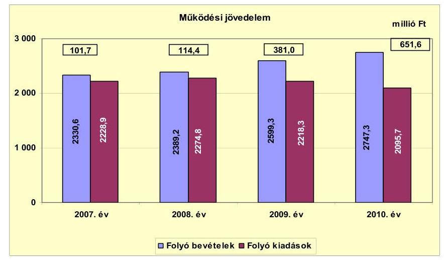

Az ellenőrzött időszakban folyamatosan pozitív összegű folyó költségvetési egyenleg (működési
 jövedelem) 2008-ról 2009-re tapasztalt 266,6 millió Ft-os növekedésében döntő szerepe volt az áfa-bevételek 149,1%-os (196,3 millió Ft-os) növekedésének, valamint a működési kiadások körében - a létszámcsökkentési intézkedések és intézményi integráció eredményeként, továbbá a többletjuttatások csökkentése révén - elért 185,6 millió Ft megtakarításnak. A 2009. évi felhalmozási feladatokra fordított kiadások teljesítésével összefüggő fordított áfa-bevétel a 2008. évi 55,1 millió Ft-ról 2009-re több mint háromszorosára, 241,0 millió Ft-ra emelkedett. A 2010. évi működési jövedelem előző évhez viszonyított 270,6 millió Ft-os növekedésében szintén az áfabevételek előző évhez viszonyított 228,6 millió Ft-os növekedése volt a meghatározó. A 2010. évben a fordított áfa-bevétel az előző évhez képest 93,7%-kal (225,7 millió Ft-tal) emelkedett.

A folyó kiadásokban 2009-ben - az előző évhez képest - tapasztalt 2,5%-os (56,5 millió Ft) csökkenést alapvetően a létszám, valamint a többletjuttatások csökkentésére irányuló döntésekkel elért 36,7 millió Ft megtakarítás eredményezte. A 2010. évi folyó kiadások - az előző évhez képest - 122,6 millió Ft-os (5,5%-os) csökkenésében a kötvény visszavásárlása miatti kamatkiadások 120,1 millió Ft-os (48,3%-os) csökkenésének volt döntő szerepe. A folyó kiadások változásában jelentős szerepe volt az önként vállalt feladatokra fordított kiadások csökkenésének.

A folyó kiadások a 2008. évben - az előző évhez képest - 2,1%-kal (45,9 millió Ft-tal) emelkedtek, 2009-re 2,5%-kal (56,5 millió Ft-tal), 2010-re 5,5%-kal (122,6 millió Ft-tal) csökkentek. Az Önkormányzat az önként vállalt feladatok kiadásaira 2007-2009. években évente átlagosan 405,3 millió Ft-ot fordított. A 2010. évben az önként vállalt feladatokra fordított kiadások a megelőző három év éves átlagához képest 30,2%-kal (122,6 millió Ft-tal) csökkentek.

Az Önkormányzat a vizsgált időszakban ÖNHIKI támogatásban nem részesült. A 2007-2010. években keletkezett működési jövedelem összesen 1248,7 millió Ft megtakarítást mutatott.

---

A működési jövedelemben évente elért megtakarítások forrásul szolgálhattak az Önkormányzat fennálló tőketörlesztési kötelezettségeinek $^{22}$ teljesítéséhez, valamint fejlesztései részbeni finanszírozásához.

A nettó működési jövedelem évenkénti változását a 2007-2010. években a következő ábra szemlélteti:
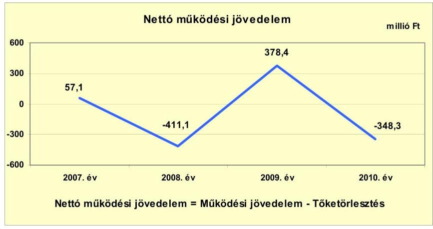

A nettó működési jövedelem - a pozitív működési jövedelem folyamatos emelkedése ellenére a tőketörlesztés negatív hatásának erősödése miatt - a 2008. és a 2010. évben negatív értéket mutatott. A 2008. évi negatív nettó működési jövedelem oka a kötvénykibocsátásból származó bevétel egy részének az ellenőrzött időszakot megelőzően felvett hosszú lejáratú hitelek törlesztéséhez (525,5 millió Ft) történt felhasználása volt. A 2008. évi 114,4 millió Ft működési jövedelem összegét közel 4,6-szoros mértékben haladta meg a hitelekhez kapcsolódó törlesztés. Az Önkormányzatnak a 2009. évben tőketörlesztési kötelezettsége - az előző év refinanszírozása miatt mindössze 2,6 millió Ft volt, amely a pénzügyi kapacitás - előző évhez képest történt jelentős javulását eredményezte. A 2009. évről a 2010. évre történt 726,7 millió Ft-os csökkenést a - a kiugróan magas (651,6 millió Ft) működési jövedelem ellenére, az azt 53,5%-kal (348,3 millió Ft-tal) meghaladó - kötvényvisszavásárlásból adódó 999,9 millió Ft törlesztési kötelezettség okozta.

A nettó működési jövedelem 2008. és 2010. évi negatív értékét az adott év tőketörlesztése jelentősen befolyásolta, amelyre a működési jövedelem 2008-ban és 2010-ben nem biztosított fedezetet. Ennek ellenére a tőketörlesztésekre 2008-ban a kötvényforrás, 2010-ben a kötvényforrás óvadéki betétszámlán rendelkezésre álló összege fedezetet biztosított. A 2008. és 2010. évben a tőketörlesztés fedezeteként a rendelkezésre álló finanszírozási bevételt figyelembevételével a nettó működési jövedelem 2008. évi értéke 114,4 millió Ft-ra, a 2010. évi értéke 651,6 millió Ft-ra módosul.

[^0]
[^0]:    $^{22}$ A 2007. évi működési jövedelem forrásul szolgálhatott a 44,6 millió Ft hiteltörlesztéshez. A 2008. évi hiteltörlesztés, továbbá a 2010. évi kötvény visszavásárlás fedezete egyaránt kötvényforrás volt.

---

Az Önkormányzat felhalmozási költségvetésének egyenlege a vizsgált időszakban hiányt mutatott. A felhalmozási költségvetés egyenlegét a 2007-2010. években a következő ábra szemlélteti:
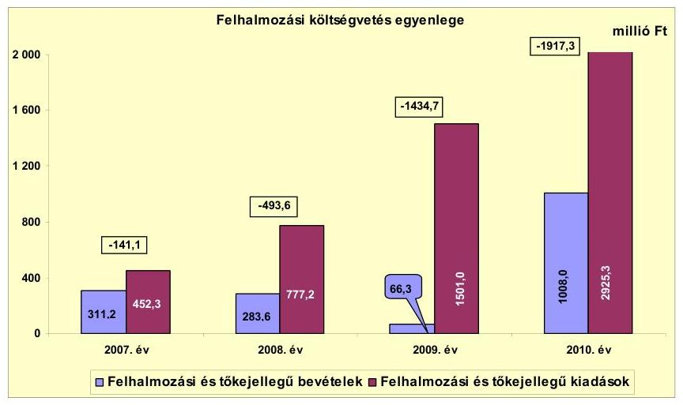

A vizsgált időszakban jelentkező összes felhalmozási forráshiány 3986,7 millió Ft volt. A felhalmozási költségvetés hiánya $^{23}$ - az előző évhez viszonyítva - 2008-ban 249,8%-kal (352,5 millió Ft-tal), 2009-ben 190,7%-kal (941,1 millió Ft-tal), 2010-ben 33,6%-kal (482,6 millió Ft-tal) emelkedett, amelynek oka a fejlesztések saját forrásának hiánya volt. A 2010. évi 1917,3 millió Ft felhalmozási forráshiány annak ellenére alakult ki, hogy a felhalmozási bevételek a fejezeti szintű (Norvég finanszírozási mechanizmus, EU-s) támogatások igénybevétele miatt az előző évhez képest több mint tizenötszörösére (1008,0 millió Ft-ra) növekedtek. A felhalmozási forráshiány fedezetére igénybe vehető működési jövedelem - a 2007. évi 44,6 millió Ft hiteltörlesztésre fordított összegen felül - mindössze annak 30,2%-ára (1204,1 millió Ft) biztosíthatott fedezetet. További forrásbevonásra a kötvényforrásból $^{24}$ és a 2010. évben felvett felhalmozási célú hitelből együtt összesen 2674,6 millió Ft összegben (a felhalmozási költségvetés 2007-2010 közötti hiányának 67,1%-a) került sor.

Az Önkormányzat tárgyévi pénzügyi pozíciója $^{25}$ 2008-tól folyamatosan gyengült, a 2010. évben a folyó és felhalmozási költségvetések egyenlege együtt sem nyújtottak elégséges forrást a finanszírozási kötelezettségek, finanszírozási bevételekből nem fedezett többletére. A 2008. évben, a folyamatban lévő fejlesztések miatt jelentkező 493,6 millió Ft felhalmozási költségvetési hiány ellenére - kiugróan magas 1075,2 millió Ft pozitív eredmény a kötvényforrásból felhasznált bevétel eredménye. Az Önkormányzat pénzügyi pozíciója a 2009. évben pozitív 193,2 millió Ft, a 2010. évben negatív 1121,5 millió Ft. A tárgyévi pénzügyi pozíció gyengülésében a 2009. évben a felhalmozási hiány

[^0]
[^0]:    $^{23}$ A felhalmozási költségvetés 2007-2009. években évente átlagosan 689,8 millió Ft volt. A 2010. évben - a megelőző három év éves átlagához képest 178%-kal (1227,5 millió Ft-tal) 1917,3 millió Ft-ra emelkedett.
    $^{24}$ A 2008. évi hitelek kiváltása (525,5 millió Ft), és a kötvény egy részének (999,9 millió Ft) visszavásárlása után fennmaradó kötvényforrás 1674,6 millió Ft.
    $^{25}$ a folyó, a felhalmozási és a finanszírozási műveletek egyenlege együtt

---

(1434,7 millió Ft), 2010-ben a felhalmozási hiány (1917,3 millió Ft) és a finanszírozási egyenleg (-144,2 millió Ft) együttesen volt a meghatározó.

Az Önkormányzat finanszírozási műveleteinek egyenlegét a 2007-2010. években a következő ábra szemlélteti:
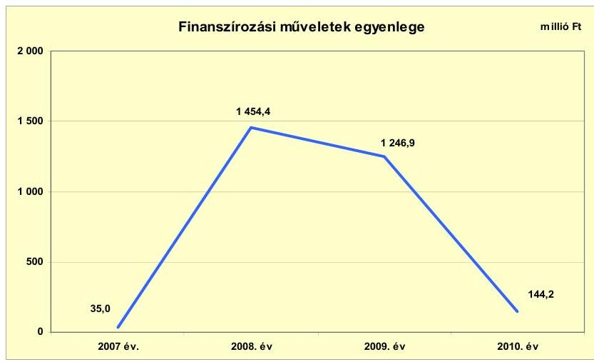

A finanszírozási műveletek egyenlege a vizsgált években pozitív volt, a 2007. évről a 2008. évre 1419,6 millió Ft-tal (több mint negyvenszeresére) emelkedett. Ennek oka döntően a kötvénykibocsátás finanszírozási célú bevétele (3200,0 millió Ft), valamint a korábbi években felvett hosszú lejáratú hitelek törlesztéséhez (525,5 millió Ft) és a kötvényből történt óvadéki betét (1200,0 millió Ft) lekötéséhez kapcsolódó finanszírozási kiadások együttes hatása volt. A finanszírozási műveletek pozitív egyenlege 2010-ben az előző évhez képest 1102,8 millió Ft-tal (88,4%-kal) csökkent, mert az 1000,0 millió Ft felhalmozási célú hitel felvétele mellett az Önkormányzat 999,9 millió Ft-ot a kötvény visszavásárlásra fordított. A finanszírozási célú műveleteket a jelentés 2. számú mellékletének 4.1-4.8. pontjai részletezik.

Az Önkormányzat 2007-2010. évi zárszámadási rendeleteiben és 2011. év I. félévi beszámolójában meghatározta a felhalmozási, illetve működési bevételek és kiadások főösszegét $^{26}$, amelyet a jelentés 1. számú melléklete szemlélteti. A 2007. évi zárszámadási rendeletben 17,8 millió Ft, 2008-ban 363,2 millió Ft, 2009-ben 29,6 millió Ft és 2010-ben 1272,3 millió Ft költségvetési hiányt mutattak ki, amely a CLF módszer alapján számított működési jövedelem és felhalmozási költségvetés egyenlegétől az igénybevett pénzmaradvány összegével tért el.

[^0]
[^0]:    $^{26}$ Nincs kötelező előírás a működési és fejlesztési többlet, hiány megállapításának módjára.

---

Az Önkormányzat 2007-2011. év I. félév között teljesített kamatbevételeit és kamatkiadásait a következő ábra szemlélteti:
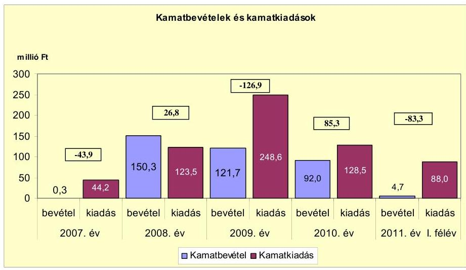

A kamatbevétel a 2007. évi 0,3 millió Ft-ról a 2008. évre (több mint ötszázszorosára) 150,3 millió Ft-ra emelkedett, a 2008-ban kibocsátott 3200,0 millió Ft kötvénybevétel fel nem használt összegének lekötéséből származó kamatbevétel miatt. A kamatbevételek 2009-2011. év I. félév között folyamatosan mérséklődtek a 2009. évtől intenzíven megkezdett fejlesztésekhez igénybevett kötvényforrás csökkenése miatt. Az Önkormányzat a vizsgált időszakban a kamatbevételeket a pénzintézetekkel szemben fennálló kötelezettségekkel összefüggő kamat és egyéb díjfizetési kötelezettségei teljesítéséhez használta fel.

A kamatkiadások 2007-ről 2008-ra 79,3 millió Ft-tal (79,4%-kal) emelkedtek a kötvénykibocsátás miatt. A kamatkiadásokban a 2009. évben tapasztalt -2008-hoz és 2010-hez képest is kiugróan magas - növekedést az okozta, hogy a 2009. évben a kötvénykibocsátóval a 2009. évre kötött szerződés alapján a „fizetőügynöki díjként" teljesített 105,9 millió Ft-ot a Számv. tv. 16. § (3) bekezdését megsértve kamatkiadásként könyvelték. Az Áhsz. 9. számú mellékletében foglaltakkal ellentétesen a „fizetőügynöki díj"-ként kifizetett összeget az 55621. „Pénzügyi szolgáltatások kiadásainak teljesítése" főkönyvi számla helyett az 57322. „Felhalmozási célú kamatkiadások teljesítése" főkönyvi számlán számolták el.

# 2.2. Az Önkormányzat bevételeinek változása 

Az Önkormányzat feladatai ellátása érdekében a 2007-2009. években évente átlagosan 2439,7 millió Ft folyó bevételt teljesített. A 2010. évben - az előző három év éves átlagához képest - 12,6%-kal (307,6 millió Ft-tal) több 2747,3 millió Ft folyó bevételt teljesített. A folyó bevételek körében leginkább meghatározó volt a költségvetési támogatás és az átengedett bevételek együttes összege, amelyek 2007-2010 között évente átlagosan 1624,4 millió Ft-ot (64,5%-ot) tettek ki. A folyó bevételek között a második legnagyobb súllyal az egyéb saját bevétel bírt, amelyek átlagos költségvetési súlya 373,2 millió Ft (14,8%) volt a vizsgált időszakban.

---

Az Önkormányzat 2007-2011. év I. félév közötti időszakban realizált főbb folyó bevételi jogcímeinek számszaki adatait az alábbi diagram szemlélteti:
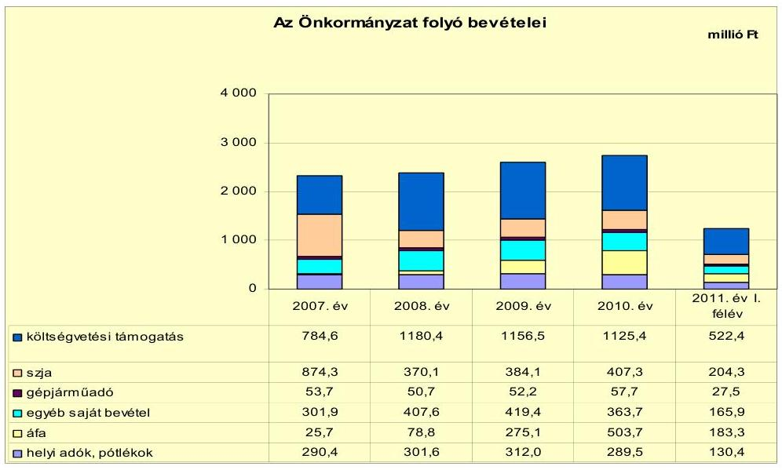

A költségvetési támogatás és az átengedett szja együttes értéke a 2007-2009. években évente átlagosan 1583,3 millió Ft (a folyó kiadások 62,9%-a), a 2010. évben 1532,7 millió Ft (a folyó kiadások 55,8%-a), a 2011. év I. félévében 726,7 millió Ft (a folyó kiadások 58,9%-a) volt.

A 2007. évről a 2008. évre a költségvetési támogatás összege 395,8 millió Ft-tal (50,4%-kal) emelkedett, az szja összege ezt meghaladóan 504,2 millió Ft-tal (57,7%-kal) csökkent. A költségvetési támogatások összege 2008-2010 között évente átlagosan 2,4%-kal (27,5 millió Ft-tal) csökkent, az szja összege ebben az időszakban évente átlagosan 4,7%-kal (18,6 millió Ft-tal) emelkedett.

Az áfából származó bevételek a 2007-2008. évek évi átlagos 52,3 millió Ft-hoz képest a 2009-re több mint ötszörösére, a 2010. évre közel tízszeresére emelkedtek a megnövekedett összegű fejlesztési kiadások teljesítésével összefüggő fordított áfa-bevétel elszámolása (2009-ben 241,0 millió Ft, 2010-ben 466,7 millió Ft) miatt.

A folyó bevételeken belül a helyi adóbevétel összege 2007-2009. években évente átlagosan 301,3 millió Ft (a folyó bevételeken belüli éves aránya 12,4%) volt. A 2010. évre a helyi adóbevétel összege - az előző évek átlagához képest - 3,9%-kal (11,8 millió Ft-tal) 289,5 millió Ft-ra csökkent.

A helyi adóbevételek csökkenését döntően az okozta, hogy míg 2007-2009 között évente folyamatosan emelkedett az iparűzési adóból befolyt bevétel, azonban 2010-re a vállalkozások adóalapjának csökkenése miatt 10,9%-kal (18,9 millió Ft-tal)
 csökkent. Az iparűzési adó csökkenését mindössze 40,2%-ban (7,6 millió Ft-tal) ellentételezte az szja-kiegészítés. A vizsgált időszakban az Önkormányzatnak - az iparűzési adón felül - az építményadóból, a telekadóból, a kommunális adóból és az idegenforgalmi adóból keletkezett bevétele. Az Önkormányzat 2008. január 1-jétől a kommunális adó mértékét a korábbi 10 ezer Ft/ingatlanról 14 ezer Ft/ingatlanra, az építményadó mértékét a II., és III. övezeti besorolásban lévő ingatlanok esetében a 2007. évi $250 \mathrm{Ft} / \mathrm{m}^{2}$-ről $300 \mathrm{Ft} / \mathrm{m}^{2}$-re emelte. A telekadó

---

a beépítetlen belterületi földterületek után a 2007. évi $100 \mathrm{Ft} / \mathrm{m}^{2}$-enkénti mértékéről 2008. január 1-jétől $150 \mathrm{Ft} / \mathrm{m}^{2}$-re emelkedett.

A helyi adók egyes adónemeihez kapcsolódóan az adómértékek emeléséből az Önkormányzatnak a vizsgált időszakban összesen 58,7 millió Ft bevételi többlete származott, amely részben kompenzálta a helyi adóbevételben tapasztalt bevételcsökkenést, valamint kedvező hatást gyakorolt a pénzügyi helyzetre.

A gépjárműadóból származó bevétel a 2007-2009. években átlagosan évi 52,2 millió Ft volt, amely a 2010. évre 57,7 millió Ft-ra (10,5%-kal) emelkedett, az adómértékek központilag szabályozott 15,0%-os emelkedése miatt.

Az Önkormányzat egyéb saját bevételeinek a 2007. évi 301,9 millió Ft-ról 2008-ra 407,6 millió Ft-ra történt növekedését döntően - a fel nem használt kötvényforrás lekötéséből realizált - kamatbevétel előző évhez képest 150,0 millió Ft-os növekedése okozta. Az egyéb saját bevételek 2010-ben - az előző évhez képest - 55,7 millió Ft-tal (13,3%-kal) csökkentek, részben a kamatbevételek 29,7 millió Ft-os (24,4%-os), részben vagyoni értékű jog értékesítéséből származó bevételek 29,1 millió Ft-os (98%-os) csökkenése eredményeként.

A 2009. évben vagyoni értékű jog értékesítéséhez kapcsolódóan az Önkormányzatnak 29,7 millió Ft bevétele származott, amely a 2008. évben megkezdett Tenkes-hegyi vízvezeték kiépítéséhez csatlakozó telektulajdonosok 2009. évi közműfejlesztési hozzájárulásainak összege volt. A 2010. évi költségvetési rendelet eredeti előirányzatként tartalmazta a Tenkes-hegyi út kiépítéséhez kapcsolódó tulajdonosi hozzájárulás 49,9 millió Ft összegét, azonban a projektre benyújtott pályázat elhúzódó döntése miatt e jogcímen 2010-ben mindössze 0,6 millió Ft bevételt realizáltak.

Az Önkormányzatnak a tulajdonosi részesedései után a vizsgált időszakban összesen 1,6 millió Ft osztalékbevétele (a távközlési társaság részvényei után) származott.

Az Önkormányzat 2007-2011. év I. félév között teljesített felhalmozási bevételei az alábbiak szerint alakultak:

| Megnevezés | 2007. év | 2008. év | 2009. év | 2010. év | 2011. év I. félév |
| :--: | :--: | :--: | :--: | :--: | :--: |
| Tárgyi eszköz értékesítés | 14,8 | 16,3 | 2,1 | 32,8 | 1,5 |
| Egyéb saját tőkebevétel | 34,9 | 11,9 | 6,2 | 105,9 | 1,1 |
| Államháztartáson belülről kapott támogatás | 237,0 | 245,3 | 50,3 | 858,4 | 323,3 |
| -abból felhalmozási célú* | 208,8 | 199,1 | 33,0 | 194,4 | 0,0 |
| Államháztartáson kívülről kapott támogatás | 24,5 | 10,1 | 7,7 | 10,9 | 0,0 |
| Összes felhalmozási bevétel | 311,2 | 283,8 | 66,3 | 1008,0 | 325,9 |

* Az Önkormányzat adatszolgáltatása alapján ez a sor tartalmazza a felhalmozási támogatásokat.

A vizsgált években a felhalmozási bevételek jelentős ingadozását elsősorban az államháztartáson belülről - évente változó összegben - kapott felhalmozási célú támogatások okozták.

Az Önkormányzat az Idősek Otthona rekonstrukcióhoz 2007-ben 189,0 millió Ft, 2008-ban 183,1 millió Ft címzett támogatást vett igénybe. A 2010. évben az

---

államháztartáson belülről - a vizsgált éveket tekintve kiugróan magas - 858,4 millió Ft összegű kapott támogatások az intézmények és a Siklósi Vár felújításához, útfelújításokhoz és konyhafelújításhoz kapcsolódtak.

Az egyéb saját tőkebevétel összege 2009-ről (6,2 millió Ft) 2010-re több mint tizenhétszeresére (105,9 millió Ft-tal) emelkedett az önkormányzati tulajdonú lakások, helyiségek, valamint a telekértékesítésekből (volt határőrlaktanya eladásából) befolyt bevételek emelkedése miatt.

# 2.3. Az Önkormányzat működési és felhalmozási célú kiadásainak változása 

Az Önkormányzat működési és felhalmozási kiadásai együttesen a 2008. évben 13,8%-kal (370,8 millió Ft-tal), a 2009. évben 38,7%-kal (1038,1 millió Ft-tal), a 2010. évben 87,3%-kal (2339,8 millió Ft-tal) haladták meg a 2007. évit, amely 2681,2 millió Ft volt. A költségvetési kiadások átlagos növekedési üteme 23,6% volt, amely a folyó működési kiadások évi átlagos 2,0%-os csökkenése, és a felhalmozási kiadások évi átlagos 86,6%-os növekedésének együttes hatása.

Az Önkormányzat folyó kiadásai főbb jogcímek szerinti bontásban a 2007-2011. év I. félév közötti időszakban az alábbiak voltak:

| Megnevezés | 2007. év | 2008. év | 2009. év | 2010. év | 2011. év I.   félév |
| :-- | --: | --: | --: | --: | --: |
| Folyó kiadások | 2228,9 | 2274,8 | 2218,3 | 2095,7 | 1135,3 |
| Működési kiadások (kamatkiadás nélkül) | 2014,9 | 1937,5 | 1773,1 | 1782,7 | 969,9 |
| Államháztartáson belülre átadott   pénzeszközök | 0,4 | 9,1 | 4,3 | 1,9 | 2,2 |
| Transzferkiadások | 169,4 | 203,7 | 192,1 | 180,8 | 75,2 |
| -ebből: vállalkozásoknak | 34,8 | 29,1 | 27,4 | 20,6 | 3,7 |
| EU-ra, illetve külföldre | 0,0 | 0,0 | 0,0 | 0,0 | 0,0 |
| magánszemélyeknek | 112,8 | 152,3 | 149,5 | 148,8 | 68,6 |
| nonprofit szervezeteknek | 21,8 | 22,3 | 15,2 | 11,4 | 2,9 |
| Kamatkiadások | 44,2 | 123,5 | 248,6 | 128,5 | 88,0 |
| Előző évi pénzmaradvány átadás | 0,0 | 1,0 | 0,2 | 1,8 | 0,0 |

Az Önkormányzat folyó kiadásai főbb kiadásnemek szerinti bontásban az alábbiak voltak:

|  |  |  |  |  | millió Ft |
| :-- | --: | --: | --: | --: | --: |
| Megnevezés | 2007. év | 2008. év | 2009. év | 2010. év | 2011. év I.   félév |
| Személyi juttatások | 1126,1 | 1012,9 | 962,1 | 1014,2 | 442,8 |
| Munkaadót terhelő járulékok | 358,8 | 320,3 | 281,2 | 253,9 | 115,5 |
| Dologi kiadások | 495,5 | 541,8 | 513,5 | 487,5 | 403,4 |
| Egyéb folyó kiadások | 34,5 | 62,5 | 16,3 | 27,1 | 8,2 |

A folyó kiadásokon belül a személyi juttatások összege 2007-ről 2009-re 14,6%-kal (164,0 millió Ft-tal) csökkent elsősorban az ESZI átadása miatti létszámcsökkenés, továbbá a közoktatást és a Polgármesteri hivatalt érintő létszámcsökkentések hatására. A 2010. évben - az előző évhez képest - 5,4%-os (52,1 millió Ft-os) kiadásnövekedést a közcélú foglalkoztatottak létszámának előző évhez képest - 46 fős emelkedése okozta. A munkaadókat terhelő járulékok összege 2007-2010 közötti időszakban folyamatos, összesen 104,9 millió Ft-os csökkenését a létszámcsökkenés mellett befolyásolta a tételes egészség-

---

ügyi hozzájárulás 2010. január 1-jei megszűnése, illetve a munkaadói járulék mértékének csökkenése (2010. január 1-jétől 29%-ról 27%-ra).

Az Önkormányzat dologi kiadásai 2007-ről 2008-ra 9,3%-kal (495,5 millió Ft-tal) növekedtek, mivel a 2008. január 1-jén alapított Körjegyzőség dologi kiadásai meghaladták a 2007. decemberben átadott intézmény (ESZI) dologi kiadásait.

Az államháztartáson kívülre történő működési célú pénzeszközátadások (transzferkiadások) összege - az előző évekhez viszonyítva - 2008-ban 20,2%-kal (34,3 millió Ft-tal) emelkedett, amelynek elsődleges oka a közcélú foglalkoztatáshoz kapcsolódó kifizetések 35,0%-os (39,5 millió Ft-os) növekedése volt.

A kamatkiadások - az előző évekhez képest - 2008. évi 79,3 millió Ft-os (179,4%-os) növekedését a kötvénykibocsátással kapcsolatos kamatfizetés, a 2009. évi 125,1 millió Ft (101,3%-os) növekedését a kötvénykibocsátóval kötött szolgáltatási szerződés alapján fizetett díj kamatkiadásként történt elszámolása okozta.

A felhalmozási kiadások aránya az összes kiadáson belül a 2007. évi 16,9%-ról (452,3 millió Ft) a 2010. évre 58,3%-ra (2473,0 millió Ft-tal) nőtt az Önkormányzat 2009-2010 közötti intenzív - hat, magas bekerülési költségű projekt megvalósításával járó - fejlesztési tevékenysége miatt.

Az Önkormányzat folyó és felhalmozási kiadásainak alakulását, a teljesített kiadások működési és felhalmozási felhasználásának arányait a 2007-2011. év I. félév közötti időszakban a következő ábra mutatja be:
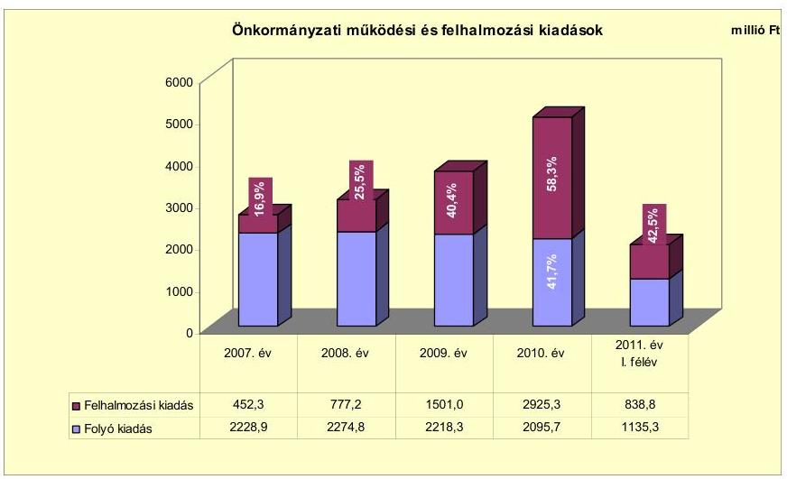

Az Önkormányzat költségvetésében elszámolt felhalmozási kiadások aránya 2007-2010 között folyamatosan emelkedett, a 2008. évben 8,6 százalékponttal, a 2009. évben 14,9 százalékponttal, a 2010. évben 17,9 százalékponttal volt magasabb az előző évinél. Az Önkormányzat folyó és felhalmozási kiadásai arányának változását a 2007-2011. év I. féléve között megvalósuló fejlesztések éves nagyságrendje befolyásolta. A felhalmozási kiadások nagyság-

---

rendjét az önkormányzati szándék mellett, a saját források rendelkezésre állása és a pályázati források elnyerhetősége határozta meg.

Az Önkormányzatnál a vizsgált időszakban befejezett és folyamatban lévő fejlesztések együttes tervezett bekerülési költsége 9708,7 millió Ft volt, amellyel szemben a 2007-2010. évben összesen 5636,0 millió Ft teljesítés történt. Az önkormányzati fejlesztések (nagyságrendjüket tekintve) döntően a termálfürdő építéséhez, a termelő infrastruktúra kiépítéséhez, az önkormányzati intézmények és a Siklósi Vár felújításához kapcsolódtak.

Az Önkormányzat 2010. év végéig befejezett fejlesztéseinek összege 2521,8 millió Ft volt, amelyek forrásmegoszlása 918,9 millió Ft (36,4%) saját bevétel, 356,5 millió Ft (14,1%) hitelforrás, 578,5 millió Ft (23,0%) kötvénybevétel, 87,8 millió Ft (3,5%) EU-s támogatás, 580,1 millió Ft (23,0%) hazai támogatás volt. A befejezett fejlesztésekhez kapcsolódóan a vizsgált időszakot megelőzően 270,3 millió Ft, a vizsgált időszakban 2251,5 millió Ft teljesítés történt. A fejlesztések a tervezettnél 112,0 millió Ft-tal több kiadással a tervezett alatt maradó finanszírozási források és támogatások mellett valósultak meg, amely a saját források tervezettet 210,7 millió Ft-tal meghaladó igénybevételével járt. A fejlesztésekkel létrehozott létesítmények működtetése és jövőbeni fenntarthatósága érdekében várhatóan felmerülő költségvetési kiadásokra vonatkozóan a Képviselő-testületnek előterjesztett költségvetési rendeletek számításokat nem tartalmaztak.

Az Önkormányzat folyamatban lévő - a vizsgált időszakban megkezdett, de a 2010. évet követő időszakban befejezni tervezett - fejlesztéseinek tervezett bekerülési költsége 5212,7 millió Ft, amelyből a 2007-2010. években teljesített kiadás 3384,5 millió Ft (64,9%) volt ${ }^{27}$. E feladatok megvalósítása érdekében az Önkormányzat 856,9 millió Ft (25,3%) saját bevételt, 779,6 millió Ft (23,0%) hitelforrást, 1095,4 millió Ft (32,5%) kötvényből származó bevételt, 610,7 millió Ft (18,0%) EU-s támogatást, és 41,9 millió Ft (1,2%) hazai támogatást vett igénybe. Az Önkormányzat 2010. december 31-én folyamatban lévő felhalmozási célú feladataival kapcsolatban vállalt kötelezettsége összesen 3914,4 millió Ft, amelynek várható forrása 773,5 millió Ft (19,8%) saját bevétel, 150,0 millió Ft (3,8%) hitel, 2986,0 millió Ft (76,3%) EU-s támogatás, 4,9 millió Ft (0,1%) hazai támogatás. A folyamatban lévő fejlesztések finanszírozása rövid távon - a vizsgált időszakban tapasztalt tendenciát feltételezve - a képződő működési jövedelemből biztosított.

Az Önkormányzat - egymással részben összefüggő - legmagasabb bekerülési költségű beruházása a „Termálfürdő építése", az ahhoz kapcsolódó „Termál kút és vezeték kiépítése", a Siklósi Vár felújításához kapcsolódóan a „Megújuló Vár a Tenkes alján"
 és a „Siklós-Mohács turisztikai tengely létrehozása" elnevezésű feladatokhoz kapcsolódott.

A „Termálfürdő építése" elnevezésű projekt a 2008. évben indult, a tervezett bekerülési költsége 2486,1 millió Ft. A projekt műszaki átadás-átvétele 2010. évben megtörtént. A közel $5000 \mathrm{~m}^{2}$ nagyságú területen négy kültéri, kilenc beltéri me-

[^0]
[^0]:    ${ }^{27}$ A 2010. év végén öt felújítás, és kilenc fejlesztési feladat volt folyamatban.

---

dence, szauna-részleg, sportpályák, kiszolgáló helyiségek valósultak meg. Az Önkormányzat a termálfürdő megvalósítására vonatkozó közbeszerzési hirdetményben tervezésre, kivitelezésre, valamint a 25 évig tartó üzemeltetésre kért árajánlatot. A termálfürdőt a közbeszerzési eljárás során nyertes kivitelező üzemelteti. A „Termálfürdő építése" projektre 2010. december 31-ig teljesített kiadás 2336,1 millió Ft volt, amelyből a saját forrás 461,1 millió Ft (19,7\%), a beruházási hitel 779,6 millió Ft (33,4\%), a kötvényforrás 1095,4 millió Ft (46,9\%) volt. A jóteljesítési garanciaként visszatartott 150,0 millió Ft (beruházási hitelből történő) kifizetése az egy éves üzemelést követően esedékes, amelyet követően a feladat tervezett teljes bekerülési költsége kifizetésre kerül. A termálfürdőt vállalkozó üzemelteti, az Önkormányzatnál működtetési kiadás nem jelentkezett, az üzemeltetési szerződés szerint 25 év alatt összesen 800 millió Ft bérleti díjbevétel várható.

A „Termál kút és vezeték kiépítése" elnevezésű projekt szorosan kapcsolódott a termálfürdő megvalósításához. A 2006. évben már Képviselő-testületi döntés született a vezeték építéséről, a megvalósítása megkezdődött, a projekttel kapcsolatban a vizsgált időszakot megelőzően az Önkormányzat 115,8 millió Ft kiadást teljesített. A projekt tervezett bekerülési költsége 456,3 millió Ft volt, amelyhez az Önkormányzat 69,2 millió Ft-ot saját bevételből, 387,1 millió Ft-ot hitelforrásból tervezett biztosítani. A beruházás a 2010. évben befejeződött, a tervezett bekerülési költséget 37,8 millió Ft-tal (8,3\%-kal) meghaladó teljesítéssel. A tényleges bekerülési költség 17,3\%-át (85,4 millió Ft-ot) saját forrásból finanszírozták, amely a tervezett saját bevétel összegét 23,4\%-kal (16,2 millió Ft-tal) meghaladta. A hitel igénybevétele a tervezettnél 50,2\%-kal (194,2 millió Ft-tal) alacsonyabb összegben valósult meg, az így kiesett forrást és a többlet-beruházási költséget összesen 215,8 millió Ft kötvénybevételből származó forrás bevonásával finanszírozták. A projekt a 2010. évben - a tervezett műszaki tartalommal - 7325 méter gerincvezeték, vízműtelep és közbenső víztározó építésével megvalósult.

A „Megújuló Vár a Tenkes alján" EU támogatásban részesített projekt a 2005. évben már benyújtott, de akkor elutasított pályázat alapján valósult meg. A projekt tervezett bekerülési költsége 951,3 millió Ft volt, amelyhez az Önkormányzat 142,7 millió Ft (15,0\%) saját bevételt és 808,6 millió Ft (85,0\%) támogatás igénybevételt tervezett. A Siklósi Vár a Magyar Állam kiemelten védett műemléke, az Önkormányzat a Kincstári Vagyoni Igazgatósággal kötött szerződés alapján vagyonkezelői joggal rendelkezik. A Siklósi Vár felújításához az 1047/2010. (II. 26.) számú Kormányhatározat alapján 100,0 millió Ft támogatást kapott az Önkormányzat. A projekttel kapcsolatosan a 2007-2010 között teljesített kiadás 382,6 millió Ft volt, amelyhez a 2010. évig a támogatás késedelme miatt átmenetileg a tervezettet 109,6\%-kal meghaladóan, 299,1 millió Ft saját forrás igénybevételére volt szükség. A projekt 2011. április 30-án műszakilag befejeződött. Az Önkormányzat 2011. szeptember 30-áig a projekttel kapcsolatosan összesen 955,3 millió Ft kiadást teljesített, amelyhez 760,3 millió Ft (94,0\%) EU-s támogatást vett igénybe. A megítélt támogatásból fennmaradt 48,3 millió Ft-ot (6,0\%-ot) a projektzárás után utalják az Önkormányzatnak. A projekt utófinanszírozása 2010. év végén és 2011. évben már pénzügyi nehézséget okozott, fejlesztéssel kapcsolatos szállítói számlák kifizetését faktorálással tudta megoldani. A projekt keretében a Siklósi Vár déli és keleti szárnyának külső-belső felújítása, az udvar burkolatcseréje, gépészet és lift kialakítása valósult meg.

A Siklósi Vár felújításához kapcsolódott a „Siklós-Mohács turisztikai tengely létrehozása" elnevezésű projekt, amelynek keretében a Siklósi Vár felhajtóhídját, a barbakánt, a Kanizsai Dorottya-kertet és a kápolnát újították fel, valamint $190 \mathrm{~m}^{2}$ területű látogatóközpontot építettek. A projekt tervezett bekerülési költsége 571,3 millió Ft, amelyhez az Önkormányzat 114,3 millió Ft (20,0\%) saját bevételt tervezett biztosítani az elnyert 457,0 millió Ft (80,0\%) hazai támogatás

---

mellett. A beruházás a 2010. évben kezdődött, műszakilag 2011. június 30-án befejeződött. Az Önkormányzat a projekttel kapcsolatban 2010. december 31-ig 96,0 millió Ft, 2011. év I. félév végéig további 105,5 millió $\mathrm{Ft}^{28}$ kiadást teljesített.

Az Önkormányzat a 2011. évben felhalmozási feladat megvalósítása érdekében pályázatot nem nyújtott be.

Az Önkormányzat kizárólagos önkormányzati tulajdonában álló gazdasági társasága (Várszínház NKft.) működéséhez 26,1 millió Ft-ot adott át a vizsgált időszakban. A működési célú pénzeszközátadás - nagyságából adódóan - az Önkormányzat pénzügyi helyzetére nem jelentett kockázatot.

A közművelődési feladatot ellátó gazdasági társaság számára átadott működési célú pénzeszközök éves nagysága a gazdasági társaság által szervezett előadások, rendezvények számától függött, összege a 2007. évben 2,8 millió Ft, a 2008. évben 12,3 millió Ft, a 2009. évben 3,0 millió Ft, a 2010. évben 8,0 millió Ft volt.

A kizárólagos önkormányzati tulajdonú gazdasági társaság részére nyújtott támogatást a 4. számú melléklet mutatja be.

# 3. Az ÖNKORMÁNYZAT KÖTELEZETTSÉGEI 

### 3.1. Az Önkormányzat pénzintézeti kötelezettségeinek változása

Az Önkormányzat pénzintézetekkel szemben fennálló kötelezettségeinek állománya a 2006. december 31-i 631,7 millió Ft-ról 2010. december 31-re 4628,5 millió Ft-ra, több mint 7,3-szeresére nőtt. A 2006. és 2007. december 31-én fennálló pénzintézetekkel szembeni kötelezettségeknek átlagosan 79,8\%-a beruházási és fejlesztési hitelekből, valamint 20,2\%-a folyószámlahitel igénybevételéből állt. A 2010. év végén fennálló pénzintézetekkel szembeni kötelezettség 2200,0 millió Ft fejlesztési célú kötvénykibocsátásból, 1000,0 millió Ft hosszú lejáratú fejlesztési hitelből, 224,7 millió Ft év végi folyószámlahitelállományból, 111,5 millió Ft faktor ügylet miatti kötelezettségből, továbbá 1092,3 millió Ft árfolyamváltozásból ${ }^{29}$ keletkezett.

Az árfolyamváltozás hatása befolyásolja a kötelezettségek alakulását, azonban annak mértéke előre pontosan nem határozható meg, csak várakozáson alapuló tendenciák jelezhetők. Annak megítéléséről, hogy a devizában kibocsátott kötvé-

[^0]
[^0]:    ${ }^{28}$ 2011. szeptember 30-ig összesen 370,8 millió Ft-ot
    ${ }^{29}$ Az Önkormányzat a 2008. és 2009. évben a Számv.tv. 60. § (2) bekezdésében foglalt előírás ellenére, a devizában fennálló kötelezettségét a mérlegben nem a mérlegforduló-napján érvényes devizaárfolyamon számított forintértéken, hanem kibocsátáskori Ft névértéken mutatta ki. A 2008. és 2009. évi árfolyamváltozás összege a helyszíni ellenőrzés során a devizában fennálló kötelezettség alapján - a Magyar Nemzeti Bank adott év december 31-i deviza középárfolyama alapján - került megállapításra. Az árfolyamváltozás korrekciója miatt a jelentésben bemutatott 2008. és 2009. évi pénzintézeti kötelezettségek összege eltér a CLF modellben kimutatott összegtől. A 2010. évben az Önkormányzat a devizában fennálló kötelezettségét a Számv. tv. előírásainak megfelelően mutatta ki.

---

nyért kapott forinthoz képest a kötvény visszafizetése, illetve visszavásárlása az Önkormányzat számára összességében többletkiadást (árfolyamveszteség) vagy megtakarítást (árfolyamnyereség) eredményez a futamidő végén, a teljes kötelezettség rendezését követően lehet képet alkotni. Mindaddig, amíg törlesztési kötelezettség nem áll fenn (türelmi idő, moratórium), a tőkére vonatkoztatva nem értelmezhető sem az árfolyamveszteség, sem az árfolyamnyereség. Ugyanakkor a számviteli szabályok meghatározzák, hogy az árfolyam-különbözetet év végén a kötelezettségek vagy követelések között a könyvviteli mérlegben nyilván kell tartani, azonban az árfolyam-különbözet valójában nem realizált.

A 2011. június 30-án fennálló pénzintézetekkel szembeni kötelezettségek a 2010. évi kötelezettségeket 8,0\%-kal (372,0 millió Ft-tal) meghaladva, 5000,5 millió Ft-ra emelkedtek. A növekedést a folyószámlahitel-állomány 36,2 millió Ft-os emelkedése, a 63,0 millió Ft egyéb rövid lejáratú hitelfelvétel miatti kötelezettség és a 2011. évben faktoring szolgáltatás igénybevételére kötött szerződés miatti 272,8 millió Ft-os kötelezettség növekedés okozta.

Az Önkormányzat pénzintézetekkel szemben fennálló kötelezettségeinek állományát 2006. december 31-től 2011. június 30-ig a következő ábra szemlélteti:
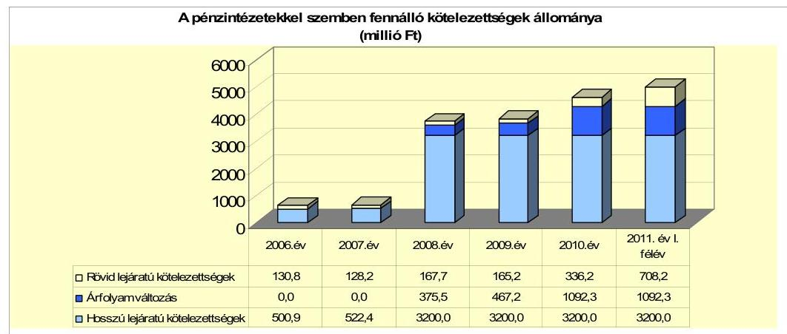

Az Önkormányzat pénzintézettekkel szembeni kötelezettségvállalásaira minden esetben Képviselő-testületi döntés alapján került sor, a pénzintézetek kiválasztása versenyeztetés útján történt. A döntések során a kötelezettségvállalásból származó források felhasználási céljait meghatározták. Az adósságot keletkeztető kötelezettségvállalás felső határát ${ }^{30}$ a döntéskor figyelembe vették, azt az áttekintett időszakban nem lépték túl. A Képviselő-testület döntéseit megalapozó előterjesztések tartalmazták a teljes futamidő alatt várható kamat- és tőkefizetési kötelezettséget, kitértek a kamat- és - a deviza alapú kötelezettséget érintő - árfolyamkockázatra, azonban a kötelezettségek visszafizetésének forrásait nem számszerűsítették ${ }^{31}$.

[^0]
[^0]:    ${ }^{30}$ az Ötv. 88. § (2) bekezdése alapján
    ${ }^{31}$ Az előterjesztésben a kötvénykibocsátás alapján keletkező várható kötelezettségek mellett bemutatták a kötvényforrásból megvalósítandó termálfürdő várható nettó árbevételét, azonban a bemutatott fizetési kötelezettség teljesítéséhez szükséges összes forrást nem nevesítették és számszerűsítették.

---

Az Önkormányzat 2010. december 31-én valamint 2011. június 30-án CHF-ben fennálló adósságot keletkeztető kötelezettségvállalása azonosan az alábbi volt:

| Megnevezés | Szerződéskötési   Kibocsátás   időpontja | Összeg   ezer CHF-ben | Kibocsátási   lehiński   árfolyam | Kamat   (referencia   kamat*   kamatfelár) | Felhasználás célja: |
| :--: | :--: | :--: | :--: | :--: | :--: |
| "Siklósi Vár és Termál" kötvény | 2008.02.28 | 20112 | 159,11 | 6 havi CHF LIBOR   +1,5\% | Beruházási hitelek kiváltása   Termálfürdő fejlesztés Siklósi   Vár felújítása |

A „Siklósi Vár és Termál" kötvény kibocsátásának ${ }^{32}$ célja a korábban felvett beruházási hitelek kiváltása, a termálfürdő beruházás megvalósításához szükséges forrás, valamint a - pályázati források bevonásával megvalósított - Siklósi Vár felújításához szükséges saját forrás biztosítása volt. Az Önkormányzat a kötvénykibocsátásból származó bevételből a 2008-2010. évek között 2200,0 millió Ft-ot használt fel a meghatározott célokra. A fennálló beruházási hitelek kiváltására a 2008. évben 526,1 millió Ft-ot fordított, a 2008-2010. évek között összesen 1673,9 millió Ft összegben a kitűzött fejlesztési feladatok finanszírozását biztosította. A kötvényből származó forrást a felhasználásig - a felhasználások várható ütemezését figyelembe véve - betétként lekötötték. A fejlesztésekhez fel nem használt 1000,0 millió Ft kötvényforrás óvadéki betétszámlán került elhelyezésre, amelynek felhasználásával a 2010. évben 5327 ezer CHF névértékű kötvénycsomagot az Önkormányzat visszavásárolt. Az óvadéki betétszámlán elhelyezett összeg a felhasználásig kamatozott, a kapott kamat mértéke meghaladta a kötvény után teljesítendő kamat mértékét.

A teljes 20112 ezer CHF névértékű kötvénycsomag forint ellenértéke a kibocsátáskori árfolyamon 3200,0 millió Ft volt. A kötvény kibocsátásakor a Garantiqa Hitelgarancia Zrt. 2200,0 millió Ft összegű készfizető kezességet nyújtott ${ }^{33}$. A forgalmazó, egyben a kötvényeket lejegyző bank - a közte és az Önkormányzat között létrejött, a kötvénykibocsátásból eredő forrás felhasználásáról szóló megállapodásban - a kezességvállalással biztosított összegen felüli rész óvadéki betétként történő elhelyezését írta elő. A megállapodás értelmében az óvadéki betét az Önkormányzat kérelmére - legkorábban a kötvény kibocsátását követő egy év múlva - a bank előzetes engedélyével szabadítható fel ${ }^{34}$,
 illetve felhasználható a kötvények visszaváltására. Mivel a bank az óvadéki betét felszabadítását az Ön-

[^0]
[^0]:    ${ }^{32}$ A kötvénykibocsátást finanszírozó pénzintézet nem azonos az Önkormányzat számlavezetőjével, a kötvénykibocsátás feltételeként nem írtak elő számlavezetést.
    ${ }^{33}$ A kezességvállalás díja nem az Önkormányzatot terhelte, mivel a forgalmazói szerződés értelmében a jegyzési garanciavállalási díj kivételével a kötvény forgalomba hozatalával kapcsolatos valamennyi szolgáltatás díjmentes.
    ${ }^{34}$ A megállapodás értelmében a zárolás feloldására irányuló kérelmet a bank abban az esetben teljesíti, ha „az Önkormányzat által rendelkezésére bocsátott, illetve egyébként rendelkezésére álló információk alapján úgy ítéli meg, hogy az Önkormányzat saját bevételei és költségvetése alapján képes lesz maradéktalanul eleget tenni a kötvénykibocsátásból eredő tőke- és kamatfizetési kötelezettségéinek".

---

kormányzat többszöri kezdeményezése ellenére nem engedélyezte ${ }^{35}$, így a tervezett beruházások megvalósításához egyéb külső forrás bevonása vált szükségessé. Ezért az Önkormányzat úgy döntött, hogy az óvadéki betétszámlán elhelyezett összeg erejéig visszavásárolja a kötvény egy részét, annak érdekében, hogy a tervezett beruházások befejezéséhez - az adósságot keletkeztető kötelezettségvállalás felső határának betartásával - újabb hitelt vehessen igénybe.

Az Önkormányzat a devizában fennálló pénzintézettel szembeni kötelezettségéből - 2011. június 30-ig - 1721239 CHF kamatot, valamint 8,0 millió Ft jegyzési garanciavállalási díjat és 772296 CHF fizető ügynöki díjat ${ }^{36}$ fizetett. A kamatfizetések időpontjaiban alkalmazott CHF/HUF konverziós árfolyamok alapján 2011. június 30-ig az összes teljesített kötelezettség 455,5 millió Ft (305,7 millió Ft kamat és 149,8 millió Ft egyéb költség) volt. Az 5327 ezer CHF névértékű kötvénycsomag 2010. május 3-i értéknappal történt visszavásárlása során az Önkormányzatnak 152,3 millió Ft árfolyamvesztesége keletkezett. ${ }^{37}$ A fennmaradó 14785 ezer CHF kötvénytartozás után a tőketörlesztés első alkalommal 2013. április 30-án esedékes, amelynek összege negyedévente 369,6 ezer CHF.

Az Önkormányzat 2010. december 31-én forintban fennálló adósságot keletkeztető pénzintézettel szembeni kötelezettségvállalása az alábbi volt:

| Megnevezés | Szerződéskötés/   Kibocsátás   időpontja | Összeg   millió HUF-ban | Kamat (referencia kamat   kamatfelár) | Felhasználás célja: |
| :--: | :--: | :--: | :--: | :--: |
| Beruházási hitel | 2010.04.01 | 1000 | 3 havi BUBOR $+4,5 \%$ | Sökös Vár- és termáltürdü   beruházás |

A hitel felvétele a kötvénykibocsátás céljaként meghatározott fejlesztések befejezése érdekében vált szükségessé, a kötvénykibocsátásból származó forrásból az óvadéki betétként visszatartott összeg erejéig. A folyósított hitelösszegből 850,0 millió Ft-ot az Önkormányzat a hitelcélnak megfelelően felhasznált 2011. június 30-ig, további 150,0 millió Ft óvadéki betétszámlán állt rendelkezésre. A hitelszerződésben a hitelt folyósító pénzintézet ${ }^{38}$ a folyósítás feltételeként 1100,0 millió Ft értékű ingatlan keretbiztosítéki jelzálogjog-bejegyzést, valamint a tőkeösszeg 80,0%-áig terjedő készfizető kezességvállalást határozott

[^0]
[^0]:    ${ }^{35}$ Az Önkormányzat óvadéki betét felszabadítására irányuló kérelmeinek visszautasítását a bank azzal indokolta, hogy a reálgazdaságban tapasztalható negatív tendenciákat figyelembe véve az Önkormányzat pénzügyi helyzete nem javult jelentősen, és a fürdő projekthez nem készült a bank számára is elfogadható megvalósíthatósági tanulmány cash-flow számításokkal, így a finanszírozás megtérülése a bank ismeretei szerint a projektből nem biztosított.
    ${ }^{36}$ A forgalmazói szerződés értelmében a szerződés bármely pontja írásban, közös megegyezéssel módosítható, és figyelemmel a feleket terhelő együttműködési kötelezettségre, megfelelően mérlegelik a másik fél által előterjesztett módosítási javaslatot. Ennek értelmében az Önkormányzat hozzájárult a forgalmazó szerződés kiegészítéséhez, mely alapján a bank 2009. április 1. napjától 2010. április 30. napjáig a kifizető és kamatszámító ügynöki szolgáltatásokért átalánydíjat határozott meg.
    ${ }^{37}$ A kötvény lejárat előtti visszaváltása a forgalmazói szerződés alapján díjmentes, így az árfolyamveszteségen felül többletköltsége az Önkormányzatnak nem keletkezett.
    ${ }^{38}$ A hitelt folyósító pénzintézet egyben az Önkormányzat számlavezetője.

---

meg. A Garantiqa Hitelgarancia Zrt. és a hitelt folyósító pénzintézet között létrejött kezességi szerződésben 640,0 millió Ft összegű amortizálódó kezességi összeg került meghatározásra. Miután így a hitelszerződésben foglalt folyósítási feltételek teljes egészében nem teljesültek, a hitelező pénzintézet 150,0 millió Ft-ot a folyósított hitelből visszatartott, azt óvadéki betétként kezeli. Az óvadéki betétszámlán lévő összeg után a pénzintézet - a hitel után fizetendő kamatmértékkel azonos - kamatot fizet.

A készfizető kezesség biztosítása oly módon történt, hogy a Garantiqa Hitelgarancia Zrt. az Önkormányzat pénzintézettel szembeni kötelezettségvállalásaihoz kapcsolódóan fennálló készfizető kezességvállalásának összegét a korábbi - a kötvénykibocsátás során vállalt - 2200,0 millió Ft-ról 2400,0 millió Ft-ra emelte, egyidejűleg a kötvénykibocsátáshoz kapcsolódó kezességi összeget 1760,0 millió Ft-ra csökkentette, amelyet a kötvényforgalmazó elfogadott.

Az Önkormányzat a forintban fennálló, hosszú lejáratú pénzintézettel szembeni kötelezettségéből - 2011. június 30-ig - 74,4 millió Ft kamatot, valamint 8,0 millió Ft egyéb költséget ${ }^{39}$ fizetett. A tőketörlesztés első alkalommal 2012. április 15-én esedékes, amelynek összege félévente 31,5 millió Ft.

Az Önkormányzat 2007-2011. június 30. között az átmenetileg szabad pénzeszközei lekötéséből és az óvadéki betétekből - az Önkormányzat kimutatása szerint - 369,0 millió Ft kamatbevételt realizált. A kamatbevételből 362,5 millió Ft keletkezett a kötvény kibocsátásából származó átmenetileg szabad forrás befektetéséből és az óvadéki betétszámlán lévő összegből, 4,6 millió Ft a beruházási hitelből óvadéki betétszámlán kezelt összegből, és 1,9 millió Ft az intézmények elszámolási számlái pozitív egyenlegeinek látra szóló kamataiból. A kötvény kibocsátásából létrejött forrás befektetéséből realizált kamatbevétel a kötvények után 2011. június 30-ig teljesített 305,7 millió Ft kamatkifizetésnek a 118,6%-a volt, a kötvény után teljesített összes - 455,5 millió Ft kamat és egyéb - kiadás 79,6%-át tette ki. A kamatbevételt az Önkormányzat a kötvény után teljesítendő kamatok és egyéb költségek fizetésére használta fel.

Az Önkormányzat működésének pénzügyi egyensúlyát és likviditását a vizsgált időszakban folyószámlahitellel, továbbá a 2007. évben a likviditását munkabér-hitel igénybevételével tudta biztosítani. A folyószámlahitel és a munkabér-megelőlegezési hitel alakulását a 2007-2011. év I. félév időszakában az alábbi táblázat mutatja be:

| Megnevezés | 2007. év | 2008. év | 2009. év | 2010. év | 2011. év I.   félév |
| :-- | :--: | :--: | :--: | :--: | :--: |
| I. Folyószámlahitel |  |  |  |  |  |
| a folyószámlahitel keretösszege január 1-jén | 200,0 | 200,0 | 200,0 | 200,0 | 250,0 |
| teljesített kamat és egyéb költség | 16,2 | 17,7 | 18,2 | 17,4 | 11,8 |
| II. Munkabér megelőlegezési hitel |  |  |  |  |  |
| Igénybevett hitel összesen: | 50,0 |  |  |  |  |
| teljesített kamat és egyéb költség | 0,6 |  |  |  |  |

[^0]
[^0]:    ${ }^{39}$ Garantiqa Hitelgarancia Zrt. készfizető kezességvállalásának díja.

---

A folyószámlahitel és munkabér-megelőlegezési hitel kondíciói és egyéb költségei a következők voltak ${ }^{40}$:

| Megnevezés | Kamat (referencia+ kamatfelár) | Egyéb költség |
| :--: | :--: | :--: |
| Folyószámlahitel |  |  |
| 2007. május 5-ig | 3 havi BUBOR $+0,25 \%$ | évi 0,5\% kezelési költség,   évi 0,5\% rendelk.tartási jutalék |
| 2007. május 6. - 2010. április 1. | 3 havi BUBOR $+0,75 \%$ | 6 havi 0,5\% kezelési költség,   6 havi 0,5\% rendelk.tartási jutalék |
| 2010. április 2.-től | 1 havi BUBOR $+2,85 \%$ | 6 havi 1\% rendelk.tartási jutalék |
| Munkabér megelőlegezési hitel |  |  |
| 2007. év | 3 havi BUBOR+0,5\% | 6 havi 0,5\% kezelési költség |

Az Önkormányzatnál folyószámlahitelt - a 2007-2010. évek pozitív, folyamatosan növekvő működési jövedelme ellenére - a felhalmozási hiány átmeneti finanszírozásához valamennyi évben igénybe vettek. A vizsgált időszak elején rendelkezésre álló 200,0 millió Ft-os folyószámlahitel-keretet 2010. április 2-től 250,0 millió Ft-ra, majd 2011. március 1-jétől december 15-ig tartó időszakra 300,0 millió Ft-ra emelték, a működési jövedelem növekedési ütemét meghaladó mértékben emelkedő felhalmozási hiány miatt, amely a likviditási nehézségek fokozódását, és az Önkormányzat pénzügyi helyzetének romlását jelzi.

Az Önkormányzat 2007. január 1. és 2011. június 30. között minden nap igénybe vett folyószámlahitelt. Az átlagos napi állomány a 2009. évben volt a legalacsonyabb, 166,2 millió Ft, a 2011. év I. félévében volt a legmagasabb, 276,4 millió Ft. Az év végén fennálló folyószámlahitel-állomány a 2006-2009. évek átlagában 148,0 millió Ft volt, amely a 2010. év végére 51,8%-kal (224,7 millió Ft-ra) emelkedett. A 2011. június 30-án fennálló folyószámlahitelállomány a 2010. év végi állományt 16,1%-kal meghaladva, 260,9 millió Ft-ra növekedett. Az ellenőrzött időszakban a folyószámlahitel-keret szerződések lejáratának, illetve felülvizsgálatának ${ }^{41}$ időpontjában az Önkormányzat folyószámlahitel állománya - a 2010. évi fordulónap kivételével - elérte, illetve meghaladta a hitelkeret összegének 99,0%-át ${ }^{42}$. Az Önkormányzat gazdálkodásában a folyószámlahitel igénybevétele állandósult. Az áttekintett időszakot jellemző likviditási problémák folyószámlahitellel történő finanszírozása az Önkormányzatnak a 2007. január 1-jétől 2011. június 30-ig terjedő időszakban összesen 81,4 millió Ft kamat- és egyéb kiadással járt.

Az Önkormányzat a vizsgált időszakban egy alkalommal, a 2007. évben a munkabérek kifizetéséhez 50,0 millió Ft munkabér-megelőlegezési hitelt vett

[^0]
[^0]:    ${ }^{40}$ A referenciakamatok az alábbiak szerint alakultak:

    | MNB BUBOR fixing (átlagkamat) \%-ban |  |  |  |  |
    | :-- | :-- | :-- | :-- | :-- |
    | Referencia kamat | 2007. évi | 2008. évi | 2009. évi | 2010. év | 2011. év I. |
    | 1 havi BUBOR | 7,83 | 8,75 | 8,66 | 5,47 | 6,00 |
    | 3 havi BUBOR | 7,75 | 8,87 | 8,64 | 5,50 | 6,07 |

    41 A folyószámla hitelkeret szerződések három évre szóltak, évenkénti felülvizsgálattal.
    ${ }^{42}$ A fordulónapi folyószámlahitel állomány 2007-ben 199,6 millió Ft, 2008-ban 198,1 millió Ft, 2009-ben 197,9 millió Ft, 2010-ben 118,0 millió Ft, illetve 2011. február 28-án - a hitelkeret szerződés módosítása előtti napon - 248,3 millió Ft volt.

---

igénybe. Az igénybe vett munkabér-megelőlegezési hitel után kamat címén az Önkormányzat összesen 0,6 millió Ft-ot fizetett ki.

Az Önkormányzat 2010. december 22-én és 2011. április 19-én a Siklósi Vár felújításához kapcsolódó, 2010. szeptember 1. és december 31., illetve 2011. január 1. és 2011. április 30. közötti elszámolási időszakra benyújtható kifizetési kérelmek alapján lehívható támogatások - összesen 553,7 millió Ft összegű támogatás - megelőlegezésére
 faktoring szolgáltatási szerződéseket kötött. A faktorcég a várható támogatások összegének 90,0%-át, összesen 498,3 millió Ft-ot előlegezett meg. Az Önkormányzat faktoring szolgáltatás miatt fennálló kötelezettsége 2010. december 31-én 111,5 millió Ft, 2011. június 30-án 384,2 millió Ft volt, amelyek után a 2010. évben 3,3 millió Ft kamat és egyéb költséget ${ }^{43}$ teljesített, a 2011. évben várható költség 11,0 millió Ft.

Az Önkormányzat 2011. május 26-án a „Siklós-Mohács turisztikai tengely létrehozása" elnevezésű, - szállítói finanszírozással - támogatott fejlesztéshez kapcsolódó számlák saját erő tartalmához 63,0 millió Ft rövid lejáratú hitelt vett igénybe. A hitel kamata 1 havi BUBOR +4% kamatfelár, lejárata 2011. november 30. A hitel alapján az Önkormányzatnak a 2011. évben 63,0 millió Ft tőketörlesztési, és 3,3 millió Ft kamatfizetési kötelezettsége keletkezik.

A 2011. június 30-án fennálló - kötvénykibocsátásból és hosszú lejáratú hitelfelvételből adódó - kötelezettségekből a kamatfizetési kötelezettségek alakulását jelentősen befolyásolta - és a jövőben is befolyásolja - a kibocsátáskori és az utolsó fizetéskori referenciakamatok változása, amelyet az alábbi táblázat mutat be:

| Megnevezés | Kibocsátási, lehívási | Utolsó fizetéskori | Változás \% |
| :--: | :--: | :--: | :--: |
|  | kamat (referencia + kamatfelár) \% |  |  |
| 6 havi CHF LIBOR | 4,3092 | 1,5875 | $-63,2 \%$ |
| 3 havi BUBOR | 9,75 | 10,6 | 8,7\% |

A deviza alapú kötelezettsége esetében - ha a kötvény kibocsátása óta a referenciakamat nem változott volna - az Önkormányzatnak a kibocsátáskor érvényes referencia kamattal számolva 2550223 CHF (465,4 millió $\mathrm{Ft}^{44}$) fizetési kötelezettsége jelentkezett volna, azonban a kamatcsökkenés következtében ténylegesen 828984 CHF-fel (159,7 millió Ft-tal) kevesebb fizetési kötelezettséget kellett teljesítenie.

A referenciakamatok mértéke és a CHF/HUF árfolyam változatlansága esetén a kamatfizetési kötelezettség 405,8 millió Ft lett volna, a ténylegesen teljesített 305,7 millió Ft-tal szemben. Így az Önkormányzatnak a kibocsátáskori feltételekhez képest - a csökkenő kamatmérték következtében jelentkező 159,7 millió Ft kötelezettségcsökkenés, és az árfolyam emelkedése miatti 59,6 millió Ft kötelezettségnövekedés alapján - a kamat- és árfolyamváltozás együttes hatására 100,1 millió Ft-tal kevesebb kamatfizetési kötelezettséget kellett teljesítenie. A pénzintézettel szemben forintban fennálló hosszú lejáratú kötelezettsége esetében a hitel felvételekor érvényes referenciakamattal számolva 72,0 millió Ft kamatfizetési kötelezettsége keletkezett volna az Önkormányzatnak, a kamatváltozások következtében ténylegesen 2,4 millió Ft-tal - 3,3%-kal - többet, 74,4 millió Ft kamatfizetést kellett teljesítenie.

Az Önkormányzat kötelezettségeinek állományát 2010. december 31-én és 2011. június 30-án, valamint várható alakulását a kötelezettségek lejártáig az alábbi táblázat részletezi:

| Megnevezés | Állomány 2010. december 31-én |  |  | Állomány 2011. június 30-án |  |  | Várható kötelezettség 2011-2013. években |  | Várható kötelezettség 2014. évtől |  |
| :--: | :--: | :--: | :--: | :--: | :--: | :--: | :--: | :--: | :--: | :--: |
|  | HUF-ban   (millió Ft -   ban) | Devizában (összege,   ezer CHF -   ban) | Deviza   nem | HUF-ban   (millió Ft -   ban) | Devizában (összege,   ezer CHF -   ban) | Deviza   nem | HUF-ban   (millió Ft -   ban) | Devizában (összege,   ezer CHF -   ban) | HUF-ban   (millió Ft -   ban) | Devizában (összege,   ezer CHF -   ban) |
| Pénzintézeti kötelezettségek |  |  |  |  |  |  |  |  |  |  |
| "Sötösi Vár és Termál" kötvény |  | 14795,0 | CHF |  | 14795,0 | CHF |  | 1474,6 |  | 16306,3 |
| Berufsizási hitel | 1000,0 |  | HUF | 1000,0 |  | HUF | 441,5 |  | 1554,7 |  |
| Folyószámla | 224,7 |  | HUF | 260,9 |  | HUF | 260,9 |  |  |  |
| Egyéb rövid lejáratú hitel |  |  |  | 63,0 |  | HUF | 66,3 |  |  |  |
| Faktoring szolgáltatásból származó kötelezettség | 111,5 |  | HUF | 384,2 |  | HUF | 590,2 |  |  |  |
| Pénzintézeti kötelezettségek összesen HUF-ban: | 1336,2 |  | HUF | 1708,1 |  | HUF | 1103,9 |  | 1554,7 |  |
| Pénzintézeti kötelezettségek összesen CHF-ban: |  | 14795,0 | CHF |  | 14795,0 | CHF |  | 1474,6 |  | 16306,3 |
| Lizing kötelezettségek CHF-ban |  | 7,1 | CHF |  | 2,0 | CHF |  | 2,0 |  |  |
| Lizing kötelezettségek HUF-ban | 4,7 |  | HUF | 3,8 |  | HUF | 4,1 |  | 0,6 |  |
| Szállító tartozás | 389,0 |  | HUF | 489,0 |  | HUF | 489,0 |  |  |  |
| Kötelezettségek összesen HUF-ban: | 1649,8 |  | HUF | 2201,4 |  | HUF | 1657,9 |  | 1550,3 |  |
| Kötelezettségek összesen CHF-ban: |  | 14792,1 | CHF |  | 14797,9 | CHF |  | 1477,5 |  | 16306,3 |

Az Önkormányzat 2010. december 31-én fennálló összes kötelezettségállománya alapján - az utolsó kamatfizetéskor érvényes kamatmértékek figyelembevételével - a 2011-2013. években az esedékes fizetési kötelezettségek várható összege ${ }^{45} 1477488$ CHF és 1657,5 millió Ft.

A devizában fennálló fizetési kötelezettség a kötvény és egy lízingszerződés esedékes tőke- és kamatfizetési kötelezettsége. A forintban jelentkező fizetési kötelezettséget 441,5 millió Ft-ban a hosszú lejáratú hitel, 722,4 millió Ft-ban a folyószámla és egyéb rövid lejáratú likvidhitel, valamint a követelés faktorálás alapján esedékes tőketörlesztés és kamatfizetés, további 489,5 millió Ft-ban az év végi szállítói állomány, valamint 4,1 millió Ft összegben három forintban fizetendő lízingszerződés alapján fennálló kötelezettség alkotja.

A várható kötelezettségek teljesítésére - az ellenőrzés megállapítása szerint - figyelembe vehető forrás 377,6 millió Ft 2010. évi mérlegben kimutatott követelésállomány, a fejlesztési hitelből óvadéki betétszámlán elhelyezett 150,0 millió $\mathrm{Ft}^{46}$, a faktorszerződések alapján megelőlegezett - 2011. évben várható - 426,9 millió Ft támogatási összeg. További forrás a keletkező működési jövedelem lehet, amelynek összege a vizsgált időszakban folyamatosan növekedett, a 2010. évben 651,6 millió Ft volt. Ezek alapján, amennyiben a felhalmozási hiányt az

[^0]
[^0]:    ${ }^{43}$ A faktoring szolgáltatási szerződés alapján az Önkormányzatot a faktorkamaton felül egyszeri szerződéskötési-, minősítési- és faktordíj terhelte.
    ${ }^{44}$ A forint összeg meghatározása a kamatfizetések teljesítésekor ténylegesen alkalmazott konverziós árfolyamok alapján történt.

---

Önkormányzat mérsékelni tudja, illetve megszünteti, az egyéb feltételek (működési feltételek, gazdasági környezet, kamat és árfolyamszint) változatlansága, illetve kedvező változása esetén a források fedezetet nyújthatnak a kötelezettségekre.

A 2014. évtől a futamidők végéig várható kötelezettsége - a 2011. június 30-án fennálló kötelezettségek alapján - 16306482 CHF összegben a kötvény esedékes tőketörlesztési és kamatfizetési kötelezettségéből, 1555,3 millió Ft összegben a hosszú lejáratú hitel és egy lízingszerződés alapján teljesítendő tőketörlesztési és kamatfizetési kötelezettségből adódik. Ezekre figyelembe vehető forrás a termálfürdő üzemeltetési szerződése alapján - szerződésszerű teljesítés esetén - a 2015. évtől a kötelezettségek lejártáig befolyó, összesen 684,0 millió Ft bérleti díjbevétel, valamint az évről évre képződő működési jövedelem lehet, amely alapján, hosszú távon a kötelezettségek teljesítése - figyelemmel a gazdasági környezet változékonyságára - bizonytalan.

Az Önkormányzatnál a pénzügyi egyensúly javítása, a meglévő adósságállomány kezelése, a várható kötelezettségek teljesítéséhez szükséges források biztosítása érdekében adósságkezelési programot, illetve likviditási koncepciót nem készítettek.

# 3.2. A szállítói kötelezettségek változása 

Az Önkormányzat mérleg szerinti szállítói kötelezettsége a 2006-2009. években átlagosan 74,1 millió Ft volt ${ }^{47}$, amely a folyamatban lévő fejlesztések miatt a 2010. év végére 309,0 millió Ft-ra, a 2011. év I. félév végére 489,5 millió Ft-ra növekedett. Az összes szállítói állományból a fejlesztésekkel kapcsolatos számlák alapján fennálló tartozás a 2010. évben 80,8%-ot (249,7 millió Ft), 2011. június 30-án 80,6%-ot (394,4 millió Ft) képviselt. Az Önkormányzat összes kötelezettsége a 2006. december 31-i 978,2 millió Ft-ról 2010. december 31-re 5171,8 millió Ft-ra, közel 5,3-szeresére nőtt, a szállítói állomány ugyanezen időszak alatt 3,7-szeresére - 224,1 millió Ft-tal - emelkedett. Az összes kötelezettség növekedési üteme meghaladta a szállítói állomány növekedési ütemét, így a szállítói állomány összes kötelezettségen belüli aránya a 2006. december 31-ei 8,6%-ról a 2010. év végére 6,0%-ra csökkent ${ }^{48}$. A 2011. év I. félév végi 489,5 millió Ft szállítói állomány a 2011. június 30-án fennálló összes, 5769,5 millió Ft kötelezettség 8,5%-át tette ki.

Az év végi lejárt szállítói állomány a 2006-2009. években átlagosan 57,5 millió Ft volt ${ }^{49}$, amely a 2010. év végére 278,6 millió Ft-ra, a 2011. év első félévében 371,8 millió Ft-ra emelkedett. Az év végi szállítói kötelezettségekből

[^0]
[^0]:    ${ }^{45}$ A 2011-2013. évi várható kötelezettségek körében a hosszú lejáratú kötelezettségek tartalmazzák a 2011. évben már megfizetett kamat és tőketörlesztéseket is.
    ${ }^{46}$ Az óvadéki betét a hitel törlesztésére felhasználható.

---

az összes lejárt szállítói tartozás a 2006-2009. években átlagosan 77,6%-ot ${ }^{50}$, 2010-ben 90,2%-ot, 2011. június 30-án 76,0%-ot képviselt.

A lejárt szállítói állomány emelkedésének oka részben az volt, hogy a 2010-2011. év I. félév időszakában az EU-s pályázatok - a támogatási szerződések szerint - szállítói finanszírozásúak voltak és az Önkormányzat a számláknak csak az önrészét fizette ki. A pályázatokat irányító szervezet

[^0]
[^0]:    ${ }^{47}$ A mérleg szerinti szállítói kötelezettségek állománya a 2006. év végén 84,4 millió Ft, a 2007. év végén 82,2 millió Ft, a 2008. év végén 90,9 millió Ft, a 2009. év végén 39,0 millió Ft volt.
    ${ }^{48}$ A 2006-2009. évek átlagos szállítói kötelezettsége a 2006-2009. évek átlagos összes kötelezettségén belül 3,1%-os arányt képviselt, melyhez képest a szállítói kötelezettségek összes kötelezettségen belüli aránya a 2010. év végére növekedett.
    ${ }^{49}$ Az év végi lejárt szállítói állomány a 2006-ban 70,7 millió Ft, a 2007-ben 75,4 millió Ft, a 2008-ban 54,4 millió Ft, a 2009-ben 29,5 millió Ft volt.

---
 a számlák fennmaradó részét közvetlenül a szállítónak térítette meg. Az Önkormányzat a számla kifizetéséről megérkezett értesítést követően könyvelhette le a teljesítést. A szállítói finanszírozású EU-s pályázatokhoz kapcsolódó lejárt szállítói kötelezettség aránya az összes lejárt szállítói állományon belül a 2010. évben 48,9% (136,1 millió Ft), 2011. június 30-án 24% (89,1 millió Ft) volt. Az állomány növekedését okozta továbbá, hogy a beruházási hitelből óvadéki betétként visszatartott 150,0 millió Ft-ot az Önkormányzat a termálfürdő beruházás számláinak kiegyenlítésére nem tudta felhasználni ${ }^{51}$. Mindezeken felül, a 2010. év végén a szállítói tartozásokra felhasználható bevételtől esett el az Önkormányzat a társasági adóról és az osztalékadóról szóló 1996. évi LXXXI. tv. 2010. december 16-tól hatályos módosítása következtében ${ }^{52}$. Ez az Önkormányzatnak a 2010. év decemberében - a 2009. évi iparűzési adóelőleg kiegészítéséből származó bevételhez képest - 24,1 millió Ft bevételkiesést okozott.

A 2011. június 30-án fennálló összes lejárt szállítói tartozásállományból 121,4 millió Ft (32,6%) nem haladja meg a 30 napot, 112,3 millió Ft (30,2%) a 31 és 60 nap közötti, 19,5 millió Ft (5,3%) a 61 és 90 nap közötti, 118,6 millió Ft (31,9%) a 91 és 365 nap közötti tartozásállomány. A 2011. évben 9,3 millió Ft szállítói kötelezettség átütemezésére egy önkormányzati intézmény kötött megállapodásokat ${ }^{53}$.

A szállítói finanszírozású EU-s fejlesztésekhez kapcsolódó lejárt szállítói kötelezettség nélkül számított év végi lejárt szállítói állomány 2010. évben 142,5 millió Ft, a 2011. év I. félévben 282,7 millió Ft volt.

Az EU-s pályázatok szállítói finanszírozási formájában az Önkormányzat a számviteli előírásoknak megfelelően eljárva a számlák teljes összegét szállítói kötelezettségként nyilvántartásba vette. Ugyanakkor a szállítóknak csak a számlák rá eső önrészét fizette ki. Ezt követően a számlákat és a kifizetési kérelmeket benyújtotta a támogatást folyósító szervezetnek, amely ellenőrizte az önrész kiegyenlítését, majd a szállító részére kifizette a számlák támogatással megegyező részét. Az Önkormányzat a támogatást folyósító szervezet - a számlák támogatási részének kifizetését igazoló - értesítését követően könyvelhette le a számlák teljes összegére vonatkozó szállítói kötelezettség kiegyenlítését.

[^0]
[^0]:    ${ }^{50}$ Az év végi szállítói kötelezettségekből 2006-ban 83,8%-a, 2007-ben 91,7%-a, 2008-ban 59,8%-a, 2009-ben 75,6%-a volt a lejárt szállítói tartozás.
    ${ }^{51}$ A termálfürdő beruházással kapcsolatos kiegyenlítetlen számlák összege 2010. év végén 65,3 millió Ft, 2011. június 30-án 96,0 millió Ft volt.
    ${ }^{52}$ A módosított jogszabály az adóelőleg kiegészítési kötelezettséget azon kettős könyvvitelt vezető adózók részére írja elő, amelyeknek éves szinten számított árbevétele meghaladja 100 millió Ft. (A korábbi szabályozás 50 millió Ft-ot meghaladó árbevétel esetén írta elő az adóelőleg kiegészítési kötelezettséget.)
    ${ }^{53}$ A Siklósi Közoktatási Intézmény három gazdasági társasággal kötött megállapodást a lejárt határidejű tartozásai fizetési határidejének átütemezésére.

---

A lejárt szállítói tartozások között a 90 napon túli lejárt szállítói tartozásállomány 2008-ban 6,5 millió Ft (11,9%), 2009-ben 7,1 millió Ft (24,0%) volt, amely 2010. december 31-ére 85,9 millió Ft-ra (30,8%-ra), 2011. június 30-ára 118,6 millió Ft-ra (31,9%-ra) ${ }^{54}$ növekedett. A 2011. június 30-án fennálló 90 napon túli lejárt szállítói tartozásból az EU-s fejlesztésekhez kapcsolódó lejárt szállítói tartozás összege 58,0 millió Ft volt.

Az Önkormányzatnál a 90 napot meghaladó, szállítók felé fennálló kötelezettségek miatt - a helyi önkormányzatok adósságrendezési eljárásáról szóló 1996. évi XXV. törvény 5. § (2) bekezdésében foglaltak ellenére - a Polgármester nem kezdeményezett adósságrendezési eljárást ${ }^{55}$.

Az Önkormányzatnak a 2007-2011. év I. félév közötti időszakban egyéb kiadás elmaradása nem volt.

# 3.3. Egyéb kötelezettségek változása 

Az Önkormányzat az ellenőrzött időszakban PPP konstrukció keretében beruházást nem végzett, garancia és kezességvállalással kapcsolatos kötelezettségvállalása nem volt. Az Önkormányzatnak a 2010. év végén, illetve 2011. június 30-án négy pénzügyi lizingszerződés alapján állt fenn fizetési kötelezettsége. A lizingszerződéseket a 2006. évben egy traktor és egy személygépkocsi, a 2008. és a 2010. évben személygépkocsi beszerzésére kötötték. A lizingszerződésekből egy forint alapú, kettő CHF alapú ${ }^{56}$, forintban teljesítendő, egy CHF alapú, devizában teljesítendő, futamidejük 50-65 hónap. A lízingdíjból 2011. június 30-án 2896 CHF és 3,8 millió HUF tőketartozás állt fenn, amely alapján a 2011-2013. években 2927 CHF és 4,1 millió Ft, 2014-ben további 0,6 millió Ft tőke és kamatfizetési kötelezettség válik esedékessé.

A 2007-2010. évek között az elengedett követelések bruttó összege 7,6 millió Ft, 2011. I. félévében további 1,7 millió Ft volt, amely a helyi adókövetelés és kapcsolódó bírságok, pótlékok törlése volt méltányosság, elévülés, illetve behajthatatlanság címén.

Az Önkormányzat a 2007-2011. június 30. közötti időszakban kettő gazdasági társaság részére nyújtott rövid lejáratú kölcsönöket, összesen 8,0 millió Ft összegben, amelyekből 2011. június 30-án 4,0 millió Ft követelése állt fenn.

- Az Önkormányzat a Távhő NKft. részére 2009. november 12-én nyolc hónap lejáratra 4,0 millió Ft kölcsönt nyújtott a halaszthatatlan felújítási munkák

[^0]
[^0]:    ${ }^{54}$ A 2011. június 30-án fennálló, 90 napon túli lejárt tartozásállományból 61,4 millió Ft összegű számla kiegyenlítése a 2010. évben, 57,2 millió Ft összegű számla kiegyenlítése a 2011. január-március közötti időszakban lett volna esedékes.
    ${ }^{55}$ A 2011. július 12-ig hatályos előírás szerint, amennyiben az elismert tartozás az esedékességet követő 90. napon is fennáll, a polgármester a Képviselő-testület döntésétől függetlenül 8 napon belül köteles az adósságrendezési eljárást kezdeményezni.
    ${ }^{56}$ Az Önkormányzatnak nincs információja arra vonatkozólag, hogy a két forintban teljesítendő, CHF alapú lízingnél mennyi a tőke és kamat CHF-ben fizetendő összege, a finanszírozó által havonta meghatározott összegek alapján fizeti a részleteket.

---

költségeihez, amelyet az NKft. a kölcsönszerződés szerint 2010. július 12-ig visszafizetett.

- A Várszínház NKft. működéséhez 2011. április 5-én és május 4-én 2-2 millió Ft kölcsönt nyújtott, a kölcsönök lejárata a folyósítástól számított egy év. A kölcsönből 2011. június 30-án 4 millió Ft követelése állt fenn az Önkormányzatnak.

Az Önkormányzat adósságot keletkeztető pénzintézetekkel szembeni kötelezettségvállalásaihoz a folyószámlahitelek és a 2010. évi fejlesztési célú hitel esetében kapcsolódott önkormányzati tulajdonú ingatlanon jelzálogjog alapítása.

Az Önkormányzat a vizsgált időszakban érvényes, valamennyi folyószámlahitelkeret szerződés megkötésekor hozzájárult önkormányzati tulajdonú ingatlanokon keretbiztosítéki jelzálogjog alapításához és bejegyzéséhez. A 2010. június 30-án hatályban lévő, 2010. április 1-jén kötött folyószámlahitelkeret szerződés során - 300,0 millió Ft biztosított keret erejéig - hozzájárultak négy forgalomképes ingatlanon, és - az Ötv. 88. § (1) bekezdésének b) pontjának 2011. december 31-ig hatályos előírása ${ }^{57}$ ellenére - öt korlátozottan forgalomképes ingatlanon jelzálogjog alapításához és bejegyzéséhez. A 2012. január 1-jétől hatályos, a nemzeti vagyonról szóló 2011. évi CXCVI. törvény 3. § (1) bekezdés 6. pontja és a 6. § (6) bekezdése alapján az Önkormányzat a korlátozottan forgalomképes törzsvagyonával rendelkezhet, amennyiben ezt helyi rendeletében szabályozza.

A biztosítékként felajánlott - az Önkormányzat ingatlan nyilvántartása szerint korlátozottan forgalomképes öt ingatlan közül négy ingatlan ${ }^{58}$ nem tartozik azon ingatlanok körébe, amelyek a törvény erejénél fogva tartoznak a korlátozottan forgalomképes önkormányzati törzsvagyonba, kötelező feladatellátást nem szolgálnak. A Képviselő-testület saját hatáskörben dönthet a forgalomképes vagyoni körbe történő átsorolásukról, azonban erről a jelzálogszerződés megkötéséig az Önkormányzat nem gondoskodott. Az Önkormányzat hatályos vagyongazdálkodási rendeletének 6. § (1) bekezdésében foglalt szabályozás - amely szerint a korlátozottan forgalomképes önkormányzati vagyon biztosítékul adásáról a Képviselő-testület jogosult dönteni - a 2011. december 31-ig hatályos Ötv. 88. § (1) bekezdés b) pontjába ütközött, ezért a Képviselő-testület a vagyongazdálkodási rendelet alapján nem rendelkezhetett jogszerűen a korlátozottan forgalomképes vagyontárgyak hitelfedezethez történő bevonásáról.

A biztosítékként felajánlott forgalomképes ingatlanok számviteli nyilvántartás szerinti nettó értéke 421,6 millió Ft, a korlátozottan forgalomképes ingatlanok nettó értéke 114,9 millió Ft, becsült értékük 430,0 millió Ft, illetve 244,9 millió Ft volt.

[^0]
[^0]:    ${ }^{57}$ A Magyarország helyi önkormányzatairól szóló CLXXXIX. törvény 156. § (1) bekezdése 2012. január 1-jén hatályon kívül helyezte.
    ${ }^{58}$ A 0311 helyrajzi számú ingatlan funkcióját vesztett vásártér, jelenleg üres földterület, a 2022 helyrajzi számú ingatlan önkormányzati feladatellátást nem szolgál, jelenleg bérbeadással hasznosítja az Önkormányzat, a 604 és a 791/3 helyrajzi számú ingatlanok üresen álló épületek.

---

Az Önkormányzat a 2010. évi 1000,0 millió Ft hosszú lejáratú fejlesztési hitel felvétele során, a hitelszerződés megkötésekor - 1100,0 millió Ft, mint biztosított keret erejéig - hozzájárult a beruházással érintett önkormányzati tulajdonú forgalomképes ingatlanon jelzálogjog alapításához és bejegyzéséhez. A jogi biztosítékként felajánlott ingatlan számviteli nyilvántartás szerinti nettó értéke 2010. december 31-én 182,0 millió Ft, becsült értéke 2000,0 millió Ft volt. ${ }^{59}$

Az Önkormányzati ingatlanok jelzáloggal való terheltségét 2011. június 30-án a következő ábra szemlélteti:
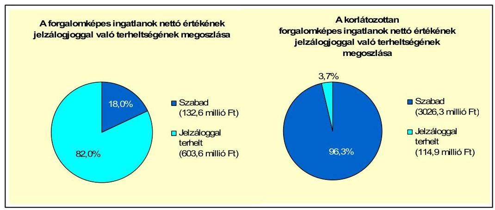

A törzsvagyon ${ }^{60}$ könyvszerinti nettó értéke 7767,8 millió Ft, ebből a korlátozottan forgalomképes ingatlanok nettó értéke 3141,2 millió Ft, amelyből a jelzáloggal terhelt ingatlanok 114,9 millió Ft-os nettó értéke 3,7%-ot képvisel. Az összes forgalomképes ingatlan számviteli nyilvántartás szerinti nettó értéke 736,2 millió Ft, amelyből a jelzáloggal terhelt ingatlanok 603,6 millió Ft-os nettó értéke 82,0%-ot képvisel. A jelzálogjog-bejegyzések korlátozzák az Önkormányzat rendelkezési jogát a forgalomképes ingatlanjai felett, azok igénybevételét, értékesítését az Önkormányzat pénzügyi helyzetének javításához, jövőbeni kötelezettségeinek teljesítéséhez.

Az Önkormányzat többségi tulajdonában lévő gazdasági társaságoknak ${ }^{61}$ 2010. december 31-én, és 2011. június 30-án pénzintézetekkel szemben kötelezettsége nem állt fenn.

A gazdasági társaságok folyószámlahitelt, illetve egyéb rövid lejáratú hitelt nem vettek igénybe. A Távhő NKft. 2004. július 19-én 40,9 millió Ft, változó kamatozású (3 havi BUBOR + 1%), 5 éves futamidejú hitelt vett fel gépberuházásra (lízing kiváltására), amelyet a hitelszerződésnek megfelelően 2009. november 30-ig visszafizetett. A hitel után 2007. január 1-ig 23,6 millió Ft tőkét és 8,5 millió Ft kamatot fizetett, 2007. január 1-jétől a hitel lejáratáig 17,3 millió Ft tőketörlesztést és 2,7 millió Ft kamatfizetést teljesített.

[^0]
[^0]:    ${ }^{59}$ A számviteli nyilvántartás szerinti nettó érték és a becsült érték nagyarányú eltérését az okozza, hogy 2010. december 31-én a - pénzügyileg befejezetlen - fürdőberuházás aktiválása még nem történt meg.
    ${ }^{60}$ Az Önkormányzati törzsvagyont a forgalomképtelen és a korlátozottan forgalomképes vagyonelemek képezik.
    ${ }^{61}$ Az Önkormányzat kizárólagos tulajdonában lévő Távhő NKft. és a Várszínház NKft.

---

A Várszínház NKft-nek az Önkormányzat felé - a 2011. évben kapott tagi kölcsön miatt - 2011. június 30-án 4,0 millió Ft kötelezettsége állt fenn. A Távhő NKft-nek
 egy lízingszerződés alapján állt fenn fizetési kötelezettsége. A lízingszerződést a 2007. évben 84 hónapos futamidőre egy haszongépjármű beszerzésére kötötték. A lízingdíjból 2010. december 31-én 2,6 millió Ft, 2011. június 30-án 2,2 millió Ft tőketartozás állt fenn.

A többségi tulajdonú gazdasági társaságok év végi szállítói állománya a 2007-2009. évek átlagában 11,9 millió Ft volt, amely a 2010. év végére 33,8 millió Ft-ra, 2011. június 30-ra 46,8 millió Ft-ra növekedett. A 2011. június 30-i szállítói kötelezettség teljes egészében a Távhő NKft. szállítói tartozása volt.

A Várszínház NKft. szállítói tartozása a 2007-2009. évek átlagos 3,4 millió Ft-os szállítói állományához képest 2010-re 0,5 millió Ft-ra csökkent, 2011. június 30-án szállítói kötelezettsége nem volt. A Távhő NKft. szállítói kötelezettsége a 2007-2009. évek átlagában 8,5 millió Ft volt, amely 2010-re 33,3 millió Ft-ra, 2011. június 30-ára 46,8 millió Ft-ra növekedett.

A gazdasági társaságoknak lejárt szállítói tartozása a 2007-2009. években nem volt. A 2010. év végi 15,3 millió Ft, valamint a 2011. június 30-án fennálló 36,7 millió Ft állomány a Távhő NKft. lejárt határidejú tartozása. A Távhő NKft. lejárt szállítói tartozásának növekedését a szolgáltatási díjhátralékok (lejárt határidejú vevőkövetelések) összegének emelkedése okozta. A szállítói kötelezettségre fedezetet nyújthat a társaság mérlegében kimutatott 57,6 millió Ft követelésállomány, illetve a jegyzett tőkét 50,4 millió Ft-tal meghaladó saját tőke összege.

A kizárólagos önkormányzati tulajdonban lévő gazdasági társaságok kötelezettségállománya 2010. december 31-én 36,4 millió Ft volt, a 2011. június 30-án fennálló összes kötelezettség 53,0 millió $\mathrm{Ft}^{62}$, amelyet 46,8 millió Ft szállítói tartozás, lízingszerződés miatti 2,2 millió Ft kötelezettség és az Önkormányzat felé fennálló - tagi kölcsönből adódó - 4,0 millió Ft kötelezettség alkot. Ezek alapján a gazdasági társaságoknak a 2011-2013. évek között 52,5 millió Ft, a 2014. évben 0,5 millió Ft fizetési kötelezettsége jelentkezik.

Az Önkormányzat a gazdasági társaságokról szóló 2006. évi IV. törvény 54. § (2) bekezdése alapján korlátlan felelősséggel tartozik azon gazdasági társaságának felszámolása esetében, amelyben az Önkormányzat az 52. § (2) bekezdése szerint a szavazatok legalább 75%-ával rendelkezik, így minősített befolyásszerzőnek minősül, továbbá a csődeljárásról és a felszámolási eljárásról szóló 1991. évi XLIX. törvény 63. § (2) bekezdése alapján a kizárólagos önkormányzati tulajdonú gazdasági társaságának minden olyan kötelezettségéért, amelynek kielégítését a felszámolási eljárás során az adós társaság vagyona nem fedez, ha a hitelezőinek a felszámolási eljárás során benyújtott keresete alapján a bíróság az adós társaság felé érvényesített tartósan hátrányos üzletpolitikájára figyelemmel - megállapítja az önkormányzat korlátlan és teljes felelősségét.

[^0]
[^0]:    ${ }^{62}$ A bemutatott kötelezettségállomány nem tartalmazza a munkavállalókkal és a központi költségvetéssel szemben fennálló rövid lejáratú kötelezettségek összegét.

---

Az Önkormányzat számára a gazdasági társaságainál fennálló kötelezettségállomány pénzügyi kockázatot nem jelent, mivel a kötelezettségekre fedezetet nyújt a társaságok mérlegében kimutatott követelésállomány.

Az Önkormányzat a 2007. év és 2011. június 30. közötti időszakban kötelezettséget keletkeztető peres eljárásban nem volt érintett.

Az Önkormányzat eszközállományának állapota, az eszközök pótlására fordítandó pénzeszközök nagysága is befolyásolhatja az Önkormányzat pénzügyi helyzetét. A vizsgált időszakban az Önkormányzatnál nem történt meg annak felmérése, hogy az eszközök elhasználódása, amortizációja fedezetének biztosítása mekkora forrásokat igényel, az elhasználódott eszközök pótlására tartalékot nem képeztek, külön alapot nem hoztak létre ${ }^{63}$. A felújításokra, eszközök pótlására elsősorban az intézmények működőképességének biztosítása, a feladatellátás szakmai színvonalának növelése érdekében - döntően a pályázati rendszerből elnyerhető források által meghatározottan - került sor. Az Önkormányzatnál a tárgyi eszközök után a 2007-2010. években kimutatott értékcsökkenés összege 967,9 millió Ft volt. A felújítási kiadások között a kimutatott értékcsökkenés 169,2%-ának megfelelő összeget, 1637,5 millió Ft-ot számoltak el ${ }^{64}$. A számvitelben elszámolt felújítások és fejlesztések együttes összege a 2007-2010. években 2928,4 millió Ft, amely több mint háromszorosa az ugyanezen időszakban kimutatott értékcsökkenés összegének. Ennek ellenére az Önkormányzat befektetett tárgyi eszközeinek használhatósági foka folyamatosan - a 2007. évi 86,6%-ról, 2008-ban 85,8%-ra, 2009-ben 83,7%-ra, 2010-ben 81,9%-ra - az áttekintett időszakban összesen 4,7 százalékponttal csökkent, mert a felhalmozási kiadásokból 2534,6 millió Ft befejezetlen beruházás aktiválása 2010. december 31-ig nem történt meg.

# 4. A PÉNZÜGYI EGYENSÚLY MEGTEREMTÉSE ÉRDEKÉBEN HOZOTT INTÉZKEDÉSEK EREDMÉNYE 

Az Önkormányzat a 2007-2011. június 30. közötti időszakban folyamatosan bevételnövelő és kiadáscsökkentő intézkedéseket tett, hogy alkalmazkodjon a központi finanszírozási rendszer változása miatti forráscsökkenéshez.

Az Önkormányzat kiadáscsökkentő intézkedései a takarékos szemléletű gazdálkodást, a pénzügyi helyzet javítását célozták meg. A 2007-2011. év I. félévében az intézményátszervezések, a létszámcsökkentések, a feladatváltozások, valamint az egyéb takarékossági intézkedések hatásaként - az Önkormányzat kimutatása szerint - együttesen 254,9 millió Ft kiadási megtakarítás keletkezett.

[^0]
[^0]:    ${ }^{63}$ Amortizációs alap képzésére az önkormányzatokat jogszabály nem kötelezi.
    ${ }^{64}$ A felújításra elszámolt kiadások tartalmazzák a Siklósi Vár felújításával kapcsolatos kiadásokat.

---

Az Önkormányzat által a 2007-2011. év I. félévében tett kiadáscsökkentő intézkedések területeit, összegeit és megoszlását a következő ábra szemlélteti:
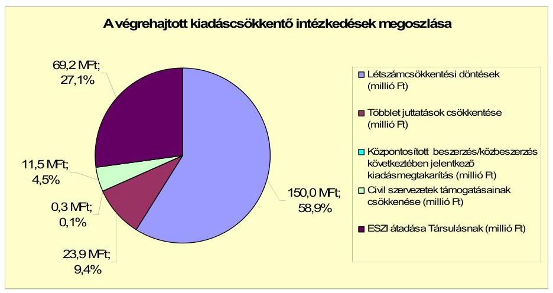

A vizsgált időszakban a létszámcsökkentési döntések következtében összesen 150,0 millió Ft kiadási megtakarítása keletkezett az Önkormányzatnak, amely 58,9%-a a végrehajtott kiadáscsökkentő intézkedésekből adódó megtakarításnak.

Ezen belül a közoktatási intézményhálózat többlépcsős, 2008. és 2009. évben végrehajtott, integrációja keretében a pedagógus létszám 17,5 fős és az intézményüzemeltetéssel kapcsolatos álláshelyek 33 fővel történő csökkentése, valamint a Polgármesteri hivatal belső átszervezése során végrehajtott 13 fős létszámcsökkentés együttesen 147,1 millió Ft kiadásmegtakarítást eredményezett. A határozott idejű alkalmazások megszüntetése 2007-2011. év I. félévében 2,9 millió Ft kiadási megtakarítással járt.

Az Önkormányzat a 2009. évtől csökkentette a többletjuttatásokat, amely az áttekintett időszakban 23,9 millió Ft (9,4%) kiadási megtakarítást eredményezett.

A többletjuttatások csökkentésén belül a közalkalmazottak és munkavállalók részére korábban adott cafeteria juttatások megszüntetése 15,3 millió Ft kiadáscsökkenést, a besorolási béren felüli bérek (illetményeltérítések) megszüntetése 8,6 millió Ft kiadásmegtakarítást jelentett.

A civil szervezetek támogatásának csökkentésével az Önkormányzat a vizsgált időszakban 11,5 millió Ft (4,5%) kiadáscsökkentést ért el. A szociális és gyermekjóléti feladatokat ellátó ESZI 2008-tól történő átadása a Társulásnak az Önkormányzatnál 69,2 millió Ft (27,1%) kiadási megtakarítást jelentett. A központosított közbeszerzés 0,3 millió Ft (0,1%) megtakarítást eredményezett.

---

Az önkormányzati álláshelyek és a foglalkoztatottak számát a 2007-2010. évek között a következő táblázat mutatja be:

| Megnevezés (adatok fő-ben) | Közoktatás | Szociális és gyermekvédelem | Egészségügy | Polgármesteri hivatal | Egyéb | Összesen |
| :--: | :--: | :--: | :--: | :--: | :--: | :--: |
| 2007. január 1-jén jóváhagyott álláshelyek száma | 262 | 117 | 6 | 69 | 67 | 521 |
| Megszüntetett álláshelyek száma | 51 | 112 |  | 13 | 7 | 163 |
| ebből | üres álláshelyek száma | 0,5 |  |  |  | 0,5 |
|  | szakmai álláshelyek száma | 17,5 | 107 |  | 13 | 1 | 138,5 |
|  | intézmény-üzemeltetéssel kapcsolatos álláshelyek száma | 33 | 5 |  |  | 6 | 44 |
| Álláshely növekedése | 8 | 2 |  |  |  | 31 |
| 2010. december 31-én záró álláshelyek száma | 220 | 7 | 6 | 56 | 60 | 369 |
| 2007. január 1-jén foglalkoztatott létszám | 262 | 117 | 6 | 69 | 67 | 521 |
| Létszámcsökkenés | 51 | 112 |  | 13 | 7 | 163 |
| Létszámnövekedés | 8 | 2 |  | 0 | 20 | 31 |
| 2010. december 31-én foglalkoztatott létszám | 220 | 7 | 6 | 56 | 60 | 369 |

Az Önkormányzatnál 2007. január 1-jén a jóváhagyott álláshelyek száma és az induló létszám 521 fő volt, a 2010. év végére a záró álláshelyek száma és a záró létszám is 369 főre csökkent. Az áttekintett időszakban az Önkormányzatnál 183 álláshelyet szüntettek meg, és 31 álláshelyet létesítettek, a foglalkoztatottak létszáma 152 fővel csökkent. A megszüntetett 183 álláshelyből 119-et az éves költségvetési rendeletek jóváhagyása során ${ }^{65}$, további 64 álláshelyet a 2007-2010. közötti időszakban az év közben hozott létszámcsökkentő intézkedésekkel szüntetett meg a Képviselő-testület. A megszüntetett álláshelyek közül 0,5 üres álláshely, 138,5 fő (75,7%) ágazati szakmai, 44 fő (24,0%) intézményüzemeltetéshez, fenntartáshoz kapcsolódó volt.

A legnagyobb, 112 álláshelyet (61,2%-ot) jelentő csökkenést a szociális és gyermekvédelmi ágazatban hajtották végre. E változás a 2007. év közben hozott öt fő létszámcsökkentési intézkedés ${ }^{66}$ és az ESZI - 2008. január 1-jétől Társulásnak történt átadása (107 fős álláshely csökkenés) miatt következett be. A közoktatási intézmények létszámát - a csökkenő gyermeklétszám, a pedagógusok kötelező óraszámának növekedése miatt, valamint a szervezeti keretek racionalizálása következtében - a 2007-2010. évek között összesen 51 fővel (27,9%) csökkentették. A Polgármesteri hivatalnál összesen 13 álláshelyet (7,1%) szüntettek meg, a belső szervezeti átalakítások során ${ }^{67}$. Az egyéb területen hét - a településüzemeltetési feladatok csökkenése miatt a 2007. évben három, a Könyvtárnál a 2010. évben négy - álláshelyet (3,8%) szüntettek meg.

Az ellenőrzött időszakban az Önkormányzat intézményeinél feladatnövekedés, illetve központi intézkedések miatt 31 álláshely létesítését engedélyezte a Képviselő-testület.

[^0]
[^0]:    ${ }^{65}$ A 2008. évi költségvetési rendelet elfogadása során a szociális és gyermekvédelmi ágazatban 107, a Polgármesteri hivatalnál 6 álláshelyet, a 2009. évi költségvetési rendelet elfogadása során a közoktatási ágazatban 2, a Polgármesteri hivatalnál 4 álláshelyet szüntetett meg a Képviselő-testület.
    ${ }^{66}$ A 2007. évben év közben hozott intézkedéssel az ESZI-nél 4 álláshelyet, a bölcsődénél 1 álláshelyet szüntetett meg a Képviselő-testület.
    ${ }^{67}$ Év közben hozott intézkedéssel 3 álláshelyet szüntettek meg, 10 álláshelyet az áttekintett időszak költségvetési rendeletei jóváhagyása során szüntettek meg, a nyugdíjazás és egyéb ok miatti természetes létszámcsökkenést az engedélyezett álláshelyek számában érvényesítették.

---

A közoktatási ágazatban, a 2008. és 2009. évben, az óvodai csoportok számának növekedése (a Siklósi Közoktatási Intézményhez csatlakozó mattyi, vokányi óvoda) miatt kilenc álláshelyet létesítettek. A bölcsődei álláshelyek számát az ellátotti létszám növekedése miatt - a 2010. évi költségvetési rendelet elfogadása során - kettő fővel emelték, az egyéb ágazatokban egy fővel a mozgókönyvtári feladatok ellátása, két fővel a Művelődési ház üzemeltetése érdekében, két fővel a településüzemeltetési feladatok növekedése miatt bővítették az álláshelyek számát a 2008. évben. A Tűzoltóság álláshelyeinek száma, és a foglalkoztatottak száma is egyúttal 15 fővel növekedett.
 a 2009. évben.

A 2011. év I. félévében a Képviselő-testület a Siklósi Közoktatási Intézménynél további öt álláshely (két pedagógus és három technikai álláshely) megszüntetéséről döntött, így a vizsgált időszakban összesen 188 megszüntetett álláshely volt, amely a végrehajtott 31 álláshely növeléssel együttesen az Önkormányzatnál az álláshelyek számának és egyúttal a foglalkoztatottak létszámának 157 fős csökkenését okozta.

A helyi szervezési intézkedések végrehajtásához az Önkormányzat az áttekintett időszak alatt 51,8 millió Ft központi költségvetési támogatást vett igénybe, amelynek felhasználásával 34 fő álláshelyet tartósan leépített. A létszámcsökkenés 81,4%-ához (149 fő) központi támogatás nem kapcsolódott, mivel a 107 főt a Társulás keretében változatlanul működő ESZI foglalkoztatott tovább, valamint 42 álláshely megszüntetésére nyugdíjazást követően, illetve határozott időre létesített álláshelyek megszüntetésével került sor.

A 2007-2011. év I. félévben érvényesített bevételnövelő intézkedések főbb bevételi jogcímek szerinti számszerűsíthető hatását a következő ábra szemlélteti:
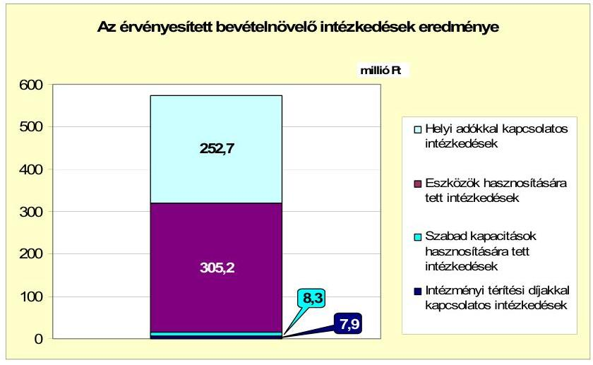

Az Önkormányzat - az ÁSZ által nem ellenőrzött kimutatása szerint - a bevételnövelő intézkedések hatására az ellenőrzött időszakban 574,1 millió Ft bevételt realizált. A bevétel 53,2%-a (305,2 millió Ft) eszközhasznosításból, 44,0%-a (252,7 millió Ft) a helyi adókkal kapcsolatos intézkedések hatására, 1,4%-a (8,3 millió Ft) a szabad kapacitások hasznosítására, további 1,4%-a (7,9 millió Ft) az intézményi térítési díjak emelésére tett intézkedések alapján keletkezett.

---

- A helyi adókkal kapcsolatos intézkedések hatására elért 252,7 millió Ft bevételből 72,7%-a, 183,6 millió Ft - jegyzői intézkedés alapján végrehajtott adóbehajtási tevékenységből származott. A magánszemélyek kommunális adójának, valamint az építményadó és a telekadó mértékének változtatásából 58,7 millió Ft, adóalany feltárásból 10,4 millió Ft bevétele keletkezett az Önkormányzatnak.

A 2009. évtől 4000 Ft-tal (40%-kal) emelték a magánszemélyek éves kommunális adóját, valamint a telekadó m²-enkénti összegét 50 Ft-tal (50%-kal), az építményadó m²-enkénti összegét a 2. és 3. övezetben 100 Ft-tal (40%-kal) emelték. Az Önkormányzat által meghatározott adómértékek nem érik el a törvényben meghatározott mérték felső határát.

- Az eszközök hasznosítására tett intézkedésekből elért 305,2 millió Ft bevétel 84,9%-a (259,1 millió Ft) ingatlan és egyéb tárgyi eszközök értékesítéséből, 15,1%-a (46,1 millió Ft) bérbeadás útján történő hasznosításból származott.

A 2010. évben az Önkormányzatnak 90,3 millió Ft bevétele származott ingatlan (volt határőrlaktanya) értékesítéséből, a többi évben a feleslegessé vált tárgyi eszközök értékesítéséből keletkezett bevétele. A 2006. évben megvalósított új vásárcsarnok működtetésére a 2007. évben megkötött szerződést az Önkormányzat - mivel a bérlő a bérleti díjfizetési kötelezettségének nem tett eleget - a 2008. évben felbontotta, és a vásárcsarnokot maga üzemelteti, így a beszedett bérleti díjak és az üzemeltetés költségei közötti különbözetből bevételi többlete keletkezett. Az Önkormányzati bérlakások számának növekedéséből, valamint a vízi közművek üzemeltetésével kapcsolatos szerződés módosítása következtében további többletbevétel keletkezett az Önkormányzatnál.

- A 2010. évben a Siklósi Közoktatási Intézmény vezetése a bevételek növelése érdekében a szabad konyhai kapacitásának hasznosítására intézkedéseket tett, a lakosság részére ételhordós ételkiszállítást biztosítanak, a mattyi óvoda számára biztosítják az ebéd előállítását, valamint igény szerint vállalnak rendezvényeket. A Siklósi Közoktatási Intézmény étkezési térítési díjait az áttekintett időszakban két alkalommal, 2008-ban átlagosan 5,7%-kal, 2011-ben átlagosan 13,4%-kal emelték.

A 2007-2011. év I. félév közötti időszakban a költségvetési támogatások 1238,6 millió Ft-tal növekedtek, az szja-bevételek 1694,3 millió Ft-tal csökkentek, így a központi intézkedések hatására összességében az Önkormányzatnál

[^0]
[^0]:    A 2011. évi szerződésmódosítás értelmében a közművek üzemeltetője az üzemeltetésre átadott vagyon értéke alapján fizeti, míg korábban a szolgáltatási területen elfogyasztott víz mennyisége alapján fizette a használati díjat.
    Az egyes gyermekjóléti ellátási formák szabályozásáról szóló 28/1997. (X. 29.) sz. Önkormányzati rendelet az intézményi étkezési térítési díjakat négy kategóriában (bölcsőde, óvodai étkezés, általános iskolai étkeztetés, gimnáziumi és szakképző iskolai étkeztetés) határozza meg. Ezek egyszerű számtani átlaga a 2007. évben 175,0 Ft, a 2008. évben 185,0 Ft, a 2011. évben 210,8 Ft.
    A fejlesztési támogatással csökkentett költségvetési támogatásból és az átengedett szja-ból származó bevételek változását minden évben a 2007. évhez viszonyítottuk, majd azokat összegeztük. (A 2011. év I. félévi adatát a 2007. évi teljesítés feléhez viszonyítva állapítottuk meg a változást.)

---

455,7 millió Ft bevételkiesés jelentkezett. A bemutatott kiadáscsökkentő és bevételnövelő intézkedések - az ÁSZ által nem ellenőrzött önkormányzati kimutatás szerint - összességében 829,0 millió Ft többletforrást eredményeztek, amelyek a központi források csökkenésének ellentételezésén túl az Önkormányzat pénzügyi helyzetére kedvező hatást gyakoroltak.

# 5. Az ÁSZ Által a korábbi években a pénzügyi egyensúly javítására tett szabályszerűségi és célszerűségi javaslatok hasznosulása 

Az ÁSZ az Önkormányzat gazdálkodási rendszerét a 2008. évben ellenőrizte átfogó jelleggel. A jelentést a Képviselő-testület megtárgyalta, a jegyző által készített felelősöket és határidőt tartalmazó intézkedési tervet a 194/2008. (IX. 11.) számú határozatával elfogadta.

A gazdálkodási rendszer korábbi ellenőrzése során tett javaslatok közül a pénzügyi egyensúly javítására egy szabályszerűségi és egy célszerűségi javaslat vonatkozott. A célszerűségi javaslat teljesült, a költségvetési rendelettervezetek eredeti előirányzatként tartalmazták az előző évről áthúzódó kötelezettségekkel kapcsolatos kiadások teljesítéséhez a fedezetet, az előző évi pénzmaradvány igénybevételét. A finanszírozási célú pénzügyi műveletek költségvetési bevételként, illetve kiadásként történő bemutatásának tiltására vonatkozó szabályszerűségi javaslat nem teljesült, a költségvetési rendelettervezetek költségvetési bevételei és költségvetési kiadásai az Áht. 8/A. § (7) bekezdése előírása ellenére tartalmaztak finanszírozási célú pénzügyi műveleteket.

Budapest, 2012. április "f6"

Melléklet: 6 db
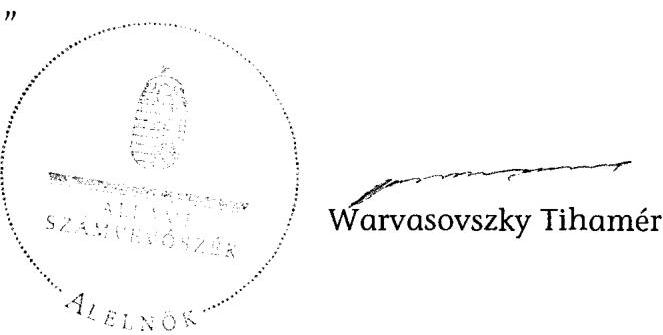

---

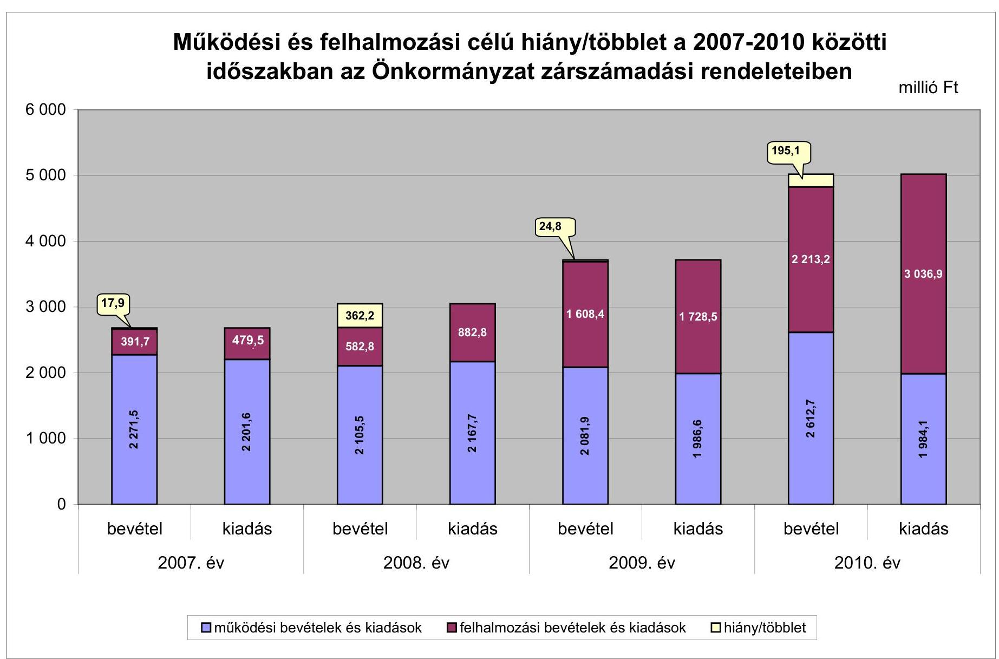

# Működési és felhalmozási célú hiány/többlet a 2007-2010 közötti időszakban az Önkormányzat zárszámadási rendeleteiben

|  I. számú melléklet | II. számú felhalmozási cél | III. felhalmozási felhalmozásai felhalmozásai felhalmozásai felhalmozásai felhalmozásai felhalmozásai felhalmozásai felhalmozásai felhalmozásai felhalmozásai felhalmozásai felhalmozásai felhalmozásai felhalmozásai felhalmozásai felhalmozásai felhalmozásai felhalmozásai felhalmozásai felhalmozásai felhalmozásai felhalmozásai felhalmozásai felhalmozásai felhalmozásai felhalmozásai felhalmozásai felhalmozásai felhalmozásai felhalmozásai felhalmozásai felhalmozásai felhalmozásai felhalmozásai felhalmozásai felhalmozásai felhalmozásai felhalmozásai felhalmozásai felhalmozásai felhalmozásai

---

Az Önkormányzat bevételei és kiadásai, valamint adósságszolgálata 2007-2010 között

|  1. FOLYÓ KÖLTSÉGVETÉS* | 2007. | 2008. | 2009. | 2010.  |
| --- | --- | --- | --- | --- |
|  1.1.1. Saját működési bevételek | 513,0 | 655,7 | 861,7 | 994,6  |
|  1.1.2. Költségvetési támogatás* | 784,6 | 1180,4 | 1156,5 | 1125,4  |
|  1.1.3. Átengedett bevételek | 928,0 | 420,9 | 436,4 | 465,2  |
|  1.1.4. Állambáztartáson belülről kapott támogatások | 100,0 | 128,1 | 137,8 | 154,8  |
|  1.1.5. EU-tól és külföldről kapott bevételek | 0,0 | 0,0 | 0,0 | 0,0  |
|  1.1.6. Állambáztartáson kívülről kapott bevételek | 5,0 | 3,1 | 6,6 | 5,5  |
|  1.1.7. Előző évi pénzmaradvány átvétel | 0,0 | 1,0 | 0,3 | 1,8  |
|  1.1. Folyó bevételek =1.1.1.+1.1.2.+1.1.3.+1.1.4.+1.1.5.+1.1.6.+1.1.7. | 2330,6 | 2389,2 | 2599,3 | 2747,3  |
|  1.2.1. Működési kiadások kamatkiadások nélkül | 2014,9 | 1937,5 | 1773,1 | 1782,7  |
|  1.2.2. Állambáztartáson belülre átadott pénzeszközök | 0,4 | 9,1 | 4,3 | 1,9  |
|  1.2.3.1. vállalkozásoknak | 34,8 | 29,1 | 27,4 | 20,6  |
|  1.2.3.2. EU-nak, illetve külföldre | 0,0 | 0,0 | 0,0 | 0,0  |
|  1.2.3.3. magánszemélyeknek | 112,8 | 152,3 | 149,5 | 148,8  |
|  1.2.3.4. nonprofit szervezeteknek | 21,8 | 22,3 | 15,2 | 11,4  |
|  1.2.3. Transzferkiadások (=1.2.3.1.+1.2.3.2.+1.2.3.3.+1.2.3.4.) | 169,4 | 203,7 | 192,1 | 180,8  |
|  1.2.4 Kamatkiadások | 44,2 | 123,5 | 248,6 | 128,5  |
|  1.2.5. Előző évi pénzmaradvány átadás | 0,0 | 1,0 | 0,2 | 1,8  |
|  1.2. Folyó kiadások = 1.2.1.+1.2.2.+1.2.3.+1.2.4.+1.2.5. | 2228,9 | 2274,8 | 2218,3 | 2095,7  |
|  1.3. Folyó költségvetés egyenlege MŰKÖDÉSI JÖVEDELEM (1.1. - 1.2.) | 101,7 | 114,4 | 381,0 | 651,6  |
|  2. FELHALMOZÁSI KÖLTSÉGVETÉS** | 0,0 | 0,0 | 0,0 | 0,0  |
|  2.1.1. Saját tökebevételek | 49,7 | 28,2 | 8,3 | 138,7  |
|  2.1.2. Állambáztartáson belülről kapott támogatások | 237,0 | 245,3 | 50,3 | 858,4  |
|  2.1.3. EU-tól és külföldről kapott támogatások | 0,0 | 0,0 | 0,0 | 0,0  |
|  2.1.4. Állambáztartáson kívülről kapott támogatások | 24,5 | 10,1 | 7,7 | 10,9  |
|  2.1. Felhalmozási bevételek (=2.1.1.+2.1.2+2.1.3+2.1.4.) | 311,2 | 283,6 | 66,3 | 1008,0  |
|  2.2.1. Saját beruházási kiadás áfával | 129,0 | 147,8 | 1343,5 | 1789,5  |
|  2.2.2. Saját felújítási kiadás áfával | 321,5 | 623,9 | 145,9 | 1134,8  |
|  2.2.3. Állambáztartáson belülre átadott pénzeszköz | 1,8 | 4,9 | 7,6 | 0,8  |
|  2.2.4. EU-nak és külföldnek adott pénzeszközök | 0,0 | 0,0 | 0,0 | 0,0  |
|  2.2.5. Állambáztartáson kívülre adott pénzeszközök | 0,0 | 0,1 | 4,0 | 0,2  |
|  2.2.6. Befektetési célú részesedések vásárlása | 0,0 | 0,5 | 0,0 | 0,0  |
|  2.2. Felhalmozási kiadások (=2.2.1.+2.2.2.+2.2.3.+2.2.4.+2.2.5.+2.2.6.) | 452,3 | 777,2 | 1501,0 | 2925,3  |
|  2.3. Felhalmozási költségvetés egyenlege (2.1. - 2.2.) | -141,1 | -493,6 | -1434,7 | -1917,3  |
|  3. Finanszírozási műveletek nélküli (GFS) pozíció(1.3.+2.3.) | -39,4 | -379,2 | -1053,7 | -1265,7  |
|  4. Finanszírozási műveletek | 0,0 | 0,0 | 0,0 | 0,0  |
|  4.1. Hitelfelvétel | 63,6 | 42,6 | 0,0 | 1171,1  |
|  4.2. Hiteltörlesztés | 44,6 | 525,5 | 2,6 | 0,0  |
|  4.3. Forgatási és befektetési célú értékpapírok kibocsátása | 0,0 | 3200,0 | 0,0 | 0,0  |
|  4.4. Forgatási és befektetési célú értékpapírok beváltása | 0,0 | 0,0 | 0,0 | 999,9  |
|  4.5. Forgatási és befektetési célú értékpapírok értékesítése | 0,0 | 0,0 | 1269,0 | 0,0  |
|  4.6. Forgatási és befektetési célú értékpapírok vásárlása | 0,0 | 1226,0 | 0,0 | 0,0  |
|  4.7. Egyéb finanszírozási bevételek (függő, átfutó, kiegyenlítő) | 1,3 | 6,1 | -11,8 | -74,7  |
|  4.8. Egyéb finanszírozási kiadások (függő, átfutó, kiegyenlítő) | -14,7 | 42,8 | 7,7 | -47,7  |
|  4.9.Finanszírozási műveletek egyenlege (4.1. -

 4.2.+4.3.-4.4+4.5.-4.6.+4.7.-4.8.) | 35,0 | 1454,4 | 1246,9 | 144,2  |
|  5. Tárgyévi pénzügyi pozíció (1.3.+ 2.3.+4.9.) | $-4,4$ | 1075,2 | 193,2 | $-1121,5$  |
|  6. Nettó működési jövedelem =működési jövedelem (1.3.) - tőketörlesztés $(4.2+4.4)$ | 57,1 | $-411,1$ | 378,4 | $-348,3$  |
|  TÁJÉKOZTATÓ ADATOK |  |  |  |   |
|  Összes kötelezettség | 886,3 | 3623,2 | 3599,9 | 5141,6  |
|  ebből rövid lejáratú | 241,3 | 294,7 | 274,3 | 727,6  |
|  Összes szállítói kötelezettség | 82,2 | 90,9 | 39,0 | 309,0  |
|  ebből lejárt (tanúsítványból) | 75,4 | 54,4 | 29,5 | 278,6  |
|  Pénz és tőkepiaci kötelezettség (adósság) | 650,6 | 3367,7 | 3365,2 | 4628,5  |
|  ebből rövid lejáratú | 128,2 | 167,7 | 165,2 | 336,2  |
|  PPP szerződéses állomány jelenértéken (tanúsítványból) | 0,0 | 0,0 | 0,0 | 0,0  |
|  ebből lejárt szolgáltatási díj miatti kötelezettség | 0,0 | 0,0 | 0,0 | 0,0  |
|  Folyószámlhitel napi átlagos állománya (tanúsítványból) | 186,0 | 182,3 | 166,2 | 216,9  |
|  Likvidhitel napi átlagos állománya (tanúsítványból) | 0,0 | 0,0 | 0,0 | 17,8  |
|  Munkabérhitel napi átlagos állománya (tanúsítványból) | 0,1 | 0,0 | 0,0 | 0,0  |
|  Kezesség és garanciavállalások (tanúsítványból) | 0,0 | 0,0 | 0,0 | 0,0  |
|  Jogerős bírósági ítéletekből adódó kötelezettségek (tanúsítványból) | 0,0 | 0,0 | 0,0 | 0,0  |
|  Finanszírozásba bevonható eszközök: | 14,1 | 2315,4 | 1282,5 | 160,9  |
|  Tartós hitelviszonyt megtestesítő értékpapírok év végi állománya | 0,3 | 1226,3 | 0,3 | 0,3  |
|  Hosszú lejáratú bankbetétek év végi állománya | 0,0 | 1000,0 | 800,0 | 0,0  |
|  Értékpapírok év végi állománya | 0,0 | 0,0 | 0,0 | 0,0  |
|  Pénzeszközök (idegen pénzeszközök nélkül) év végi állománya | 13,8 | 89,1 | 482,2 | 160,6  |

[^0] [^0]: * A költségvetési támogatásból a felhalmozási célú összeget az Önkormányzat adatszolgáltatása szerinti mértékben vettük figyelembe, a 2.1.2. soron **Bevételekben vagyon megőrzésre és bővítésre fordítható források.

---

Sikiós Város Önkormányzata

Az Önkormányzat 2007-2010. években megvalósított, 2010. december 31-ig befejezett fejlesztései és azok forrásösszetétele

millió Ft.hat

|  Fejlesztési feladat (beruházás, felújítás) |  |  | Beruházás, felújítás |  | Teljes bekerülési költség |  |  |  |  |  |  |  |  |  |  |  |  |  |  |  |  |  |  |  |  |  |  |  |  |  |  |  |  |  |  |  |  |  |  |  |  |  |   |
| --- | --- | --- | --- | --- | --- | --- | --- | --- | --- | --- | --- | --- | --- | --- | --- | --- | --- | --- | --- | --- | --- | --- | --- | --- | --- | --- | --- | --- | --- | --- | --- | --- | --- | --- | --- | --- | --- | --- | --- | --- | --- | --- | --- | --- |
|   |  |  |  |  |  |  |  |  |  |  |  |  |  |  |  |  |  |  |  |  |  |  |  |  |  |  |  |  |  |  |  |  |  |  |  |  |  |  |  |  |  |  |  |   |
|   |  |  |  |  |  |  |  |  |  |  |  |  |  |  |  |  |  |  |  |  |  |  |  |  |  |  |  |  |  |  |  |  |  |  |  |  |  |  |  |  |  |  |  |   |
|   |  |  |  |  |  |  |  |  |  |  |  |  |  |  |  |  |  |  |  |  |  |  |  |  |  |  |  |  |  |  |  |  |  |  |  |  |  |  |  |  |  |  |  |   |
|   |  |  |  |  |  |  |  |  |  |  |  |  |  |  |  |  |  |  |  |  |  |  |  |  |  |  |  |  |  |  |  |  |  |  |  |  |  |  |  |  |  |  |  |   |
|   |  |  |  |  |  |  |  |  |  |  |  |  |  |  |  |  |  |  |  |  |  |  |  |  |  |  |  |  |  |  |  |  |  |  |  |  |  |  |  |  |  |  |  |   |
|   |  |  |  |  |  |  |  |  |  |  |  |  |  |  |  |  |  |  |  |  |  |  |  |  |  |  |  |  |  |  |  |  |  |  |  |  |  |  |  |  |  |  |  |   |
|   |  |  |  |  |  |  |  |  |  |  |  |  |  |  |  |  |  |  |  |  |  |  |  |  |  |  |  |  |  |  |  |  |  |  |  |  |  |  |  |  |  |  |  |   |
|   |  |  |  |  |  |  |  |  |  |  |  |  |  |  |  |  |  |  |  |  |  |  |  |  |  |  |  |  |  |  |  |  |  |  |  |  |  |  |  |  |  |  |  |   |
|   |  |  |  |  |  |  |  |  |  |  |  |  |  |  |  |  |  |  |  |  |  |  |  |  |  |  |  |  |  |  |  |  |  |  |  |  |  |  |  |  |  |  |  |   |
|   |  |  |  |  |  |  |  |  |  |  |  |  |  |  |  |  |  |  |  |  |  |  |  |  |  |  |  |  |  |  |  |  |  |  |  |  |  |  |  |  |  |  |  |   |
|   |  |  |  |  |  |  |  | 

 |  |  |  |  |  |  |  |  |  |  |  |  |  |  |  |  |  |  |  |  |  |  |  |  |  |  |  |  |  |  |  |  |  |  |  |   |
|   |  |  |  |  |  |  |  |  |  |  |  |  |  |  |  |  |  |  |  |  |  |  |  |  |  |  |  |  |  |  |  |  |  |  |  |  |  |  |  |  |  |  |  |   |
|   |  |  |  |  |  |  |  |  |  |  |  |  |  |  |  |  |  |  |  |  |  |  |  |  |  |  |  |  |  |  |  |  |  |  |  |  |  |  |  |  |  |  |  |   |
|   |  |  |  |  |  |  |  |  |  |  |  |  |  |  |  |  |  |  |  |  |  |  |  |  |  |  |  |  |  |  |  |  |  |  |  |  |  |  |  |  |  |  |  |   |
|   |  |  |  |  |  |  |  |  |  |  |  |  |  |  |  |  |  |  |  |  |  |  |  |  |  |  |  |  |  |  |  |  |  |  |  |  |  |  |  |  |  |  |  |   |
|   |  |  |  |  |  |  |  |  |  |  |  |  |  |  |  |  |  |  |  |  |  |  |  |  |  |  |  |  |  |  |  |  |  |  |  |  |  |  |  |  |  |  |  |   |
|   |  |  |  |  |  |  |  |  |  |  |  |  |  |  |  |  |  |  |  |  |  |  |  |  |  |  |  |  |  |  |  |  |  |  |  |  |  |  |  |  |  |  |  |   |
|   |  |  |  |  |  |  |  |  |  |  |  |  |  |  |  |  |  |  |  |  |  |  |  |  |  |  |  |  |  |  |  |  |  |  |  |  |  |  |  |  |  |  |  |   |
|   |  |  |  |  |  |  |  |  |  |  |  |  |  |  |  |  |  |  |  |  |  |  |  |  |  |  |  |  |  |  |  |  |  |  |  |  |  |  |  |  |  |  |  |   |
|   |  |  |  |  |  |  |  |  |  |  |  |  |  |  |  |  |  |  |  |  |  |  |  |  |  |  |  |  |  |  |  |  |  |  |  |  |  |  |  |  |  |  |  |   |
|   |  |  |  |  |  |  |  |  |  |  |  |  |  |  |  |  |  |  |  |  |  |  |  |  |  |  |  |  |  |  |  |  |  |  |  |  |  |  |  |  |  |  |  |   |
|   |  |  |  |  |  |  |  |  |  |  |  |  |  |  |  |  |  |  |  |  |  |  |  |  |  |  |  |  |  |  |  |  |  |  |  |  |  |  |  |  |  |  |  |   |
|   |  |  |  |  |  |  |  |  |  |  |  |  |  |  |  |  |  |  |  |  |  |  |  |  |  |  |  |  |  |  |  |  |  |  |  |  |  |  |  |  |  |  |  |   |
|   |  |  |  |  |  |  |  |  |  |  |  |  |  |  |  |  |  |  |  |  |  |  |  |  |  |  |  |  |  |  |  |  |  |  |  |  |  |  |  |  |  |  |  |   |
|   |  |  |  |  |  |  |  |  |  |  |  |  |  |  |  |  |  |  |  |  |  |  |  |  |  |  |  |  |  |  |  |  |  |  |  |  |  |  |  |  |  |  |  |   |
|   |  |  |  |  |  |  |  |  |  |  |  |  |  |  |  |  |  |  |  |  |  |  |  |  |  |  |  |  |  |  |  |  |  |  |  |  |  |  |  |  |  |  |  |   |
|   |  |  |  |  |  |  |  |  |  |  |  |  |  |  |  |  |  |  |  |  |  |  |  |  |  |  |  |  |  |  |  |  |  |  |  |  |  |  |  |  |  |  |  |   |
|   |  |  |  |  |  |  |  |  |  |  |  |  |  |  |  |  |  |  |  |  |  |  |  |  |  |  |  |  |  |  |  |  |  |  |  |  |  |  |  |  |  |  |  |   |

 |  |  |  |  |  |  |  |  |  |  |  |  |  |  |  |  |  |   |
|   |  |  |  |  |  |  |  |  |  |  |  |  |  |  |  |  |  |  |  |  |  |  |  |  |  |  |  |  |  |  |  |  |  |  |  |  |  |  |  |  |  |  |  |   |
|   |  |  |  |  |  |  |  |  |  |  |  |  |  |  |  |  |  |  |  |  |  |  |  |  |  |  |  |  |  |  |  |  |  |  |  |  |  |  |  |  |  |  |  |   |
|   |

---

### **Az Önkormányzat 2010. december 31-én folyamatban lévő fejlesztési feladataira 2010. december 31-ig teljesített kifizetések és azok forrásösszetétele**

|   | Fejlesztési feladat (beruházás, felújítás) |  | Beruházás, felújítás |  |  |  |  |  |  |  |  |  |  |  |  |  |  |  |  |  |  |  |  |  |  |  |  |  |  |  |  |  |  |  |  |  |  |  |  |  |  |  |  |  |  |  |  |  |  |  |  |  |  |  |  |  |  |  |  |  |  |  |  |  |  |  |  |  |  |  |  |  |  |  |  |  |  |  |  |  |  |  |  |  |  |  |  |  |  |  |  |  |  |  |  |  |  |  |  |  |  |  | 

---

Siklós Város Önkormányzata

Az Önkormányzat 2010. december 31-én folyamatban lévő fejlesztési feladataira 2010. december 31-én fennálló kötelezettségek és azok forrásösszetétele

millió Ft-ban

|   | Fejlesztési feladat (beruházás, felújítás) |  | Beruházás, felújítás |  |  | Teljes bekerülési költség (2010. dec. 31-ig) |  |  |  |  |  |  |  |  |  |  |  |  |  |  |  |  |  |  |  |  |  |  |  |  |  |  |  |  |  |  |  |  |  |  |  |  |  |   |
| --- | --- | --- | --- | --- | --- | --- | --- | --- | --- | --- | --- | --- | --- | --- | --- | --- | --- | --- | --- | --- | --- | --- | --- | --- | --- | --- | --- | --- | --- | --- | --- | --- | --- | --- | --- | --- | --- | --- | --- | --- | --- | --- | --- | --- |
|   |  |  |  |  |  |  |  |  |  |  |  |  |  |  |  |  |  |  |  |  |  |  |  |  |  |  |  |  |  |  |  |  |  |  |  |  |  |  |  |  |  |  |   |
|   | Fejlesztési feladat (beruházás, felújítás) |  |  | Beruházás, felújítás |  |  | Teljes bekerülési költség (2010. dec. 31-ig) |  |  |  |  |  |  |  |  |  |  |  |  |  |  |  |  |  |  |  |  |  |  |  |  |  |  |  |  |  |  |  |  |  |  |  |   |
|   |  |  |  |  |  |  |  |  |  |  |  |  |  |  |  |  |  |  |  |  |  |  |  |  |  |  |  |  |  |  |  |  |  |  |  |  |  |  |  |  |  |  |   |
|   |  |  |  |  |  |  |  |  |  |  |  |  |  |  |  |  |  |  |  |  |  |  |  |  |  |  |  |  |  |  |  |  |  |  |  |  |  |  |  |  |  |  |   |
|   |  | Megnevezése |  |  |  |  |  |  |  |  |  |  |  |  |  |  |  |  |  |  |  |  |  |  |  |  |  |  |  |  |  |  |  |  |  |  |  |  |  |  |  |  |   |
|   |  |  |  |  |  |  |  |  |  |  |  |  |  |  |  |  |  |  |  |  |  |  |  |  |  |  |  |  |  |  |  |  |  |  |  |  |  |  |  |  |  |  |   |
|   |  |  |  |  |  |  |  |  |  |  |  |  |  |  |  |  |  |  |  |  |  |  |  |  |  |  |  |  |  |  |  |  |  |  |  |  |  |  |  |  |  |  |   |
|   |  |  |  |  |  |  |  |  |  |  |  |  |  |  |  |  |  |  |  |  |  |  |  |  |  |  |  |  |  |  |  |  |  |  |  |  |  |  |  |  |  |  |   |
|   |  |  |  |  |  |  |  |  |  |  |  |  |  |  |  |  |  |  |  |  |  |  |  |  |  |  |  |  |  |  |  |  |  |  |  |  |  |  |  |  |  |  |   |
|   |  |  |  |  |  |  |  |  |  |  |  |  |  |  |  |  |  |  |  |  |  |  |  |  |  |  |  |  |  |  |  |  |  |  |  |  |  |  |  |  |  |  |   |
|   |  |  |  |  |  |  |  |  |  |  |  |  |

  |  |  |  |  |  |  |  |  |  |  |  |  |  |  |  |  |  |  |  |  |  |  |  |  |  |  |  |  |  |   |
|   |  |  |  |  |  |  |  |  |  |  |  |  |  |  |  |  |  |  |  |  |  |  |  |  |  |  |  |  |  |  |  |  |  |  |  |  |  |  |  |  |  |  |   |
|   |  |  |  |  |  |  |  |  |  |  |  |  |  |  |  |  |  |  |  |  |  |  |  |  |  |  |  |  |  |  |  |  |  |  |  |  |  |  |  |  |  |  |   |
|   |  |  |  |  |  |  |  |  |  |  |  |  |  |  |  |  |  |  |  |  |  |  |  |  |  |  |  |  |  |  |  |  |  |  |  |  |  |  |  |  |  |  |   |
|   |  |  |  |  |  |  |  |  |  |  |  |  |  |  |  |  |  |  |  |  |  |  |  |  |  |  |  |  |  |  |  |  |  |  |  |  |  |  |  |  |  |  |   |
|   |  |  |  |  |  |  |  |  |  |  |  |  |  |  |  |  |  |  |  |  |  |  |  |  |  |  |  |  |  |  |  |  |  |  |  |  |  |  |  |  |  |  |   |
|   |  |  |  |  |  |  |  |  |  |  |  |  |  |  |  |  |  |  |  |  |  |  |  |  |  |  |  |  |  |  |  |  |  |  |  |  |  |  |  |  |  |  |   |
|   |  |  |  |  |  |  |  |  |  |  |  |  |  |  |  |  |  |  |  |  |  |  |  |  |  |  |  |  |  |  |  |  |  |  |  |  |  |  |  |  |  |  |   |
|   |  |  |  |  |  |  |  |  |  |  |  |  |  |  |  |  |  |  |  |  |  |  |  |  |  |  |  |  |  |  |  |  |  |  |  |  |  |  |  |  |  |  |   |
|   |  |  |  |  |  |  |  |  |  |  |  |  |  |  |  |  |  |  |  |  |  |  |  |  |  |  |  |  |  |  |  |  |  |  |  |  |  |  |  |  |  |  |   |
|   |  |  |  |  |  |  |  |  |  |  |  |  |  |  |  |  |  |  |  |  |  |  |  |  |  |  |  |  |  |  |  |  |  |  |  |  |  |  |  |  |  |  |   |
|   |  |  |  |  |  |  |  |  |  |  |  |  |  |  |  |  |  |  |  |  |  |  |  |  |  |  |  |  |  |  |  |  |  |  |  |  |  |  |  |  |  |  |   |
|   |  |  |  |  |  |  |  |  |  |  |  |  |  |  |  |  |  |  |  |  |  |  |  |  |  |  |  |  |  |  |  |  |  |  |  |  |  |  |  |  |  |  |   |
|   |  |  |  |  |  |  |  |  |  |  |  |  |  |  |  |  |  |  |  |  |  |  |  |  |  |  |  |  |  |  |  |  |  |  |  |  |  |  |  |  |  |  |   |
|   |  |  |  |  |  |  |  |  |  |  |  |  |  |  |  |  |  |  |  |  |  |  |  |  |  |  |  |  |  |  |  |  |  |  |  |  |  |  |  |  |  |  |   |
|   |  |  |  |  |  |  |  |  |  |  |  |  |  |  |  |  |  |  |  |  |  |  |  |  |  |  |  |  |  |  |  |  |  |  |  |  |  |  |  |  |  |  |   |
|   |  |  |  |  |  |  |  |  |  |  |  |  |  |  |  |  |  |  |  |  |  |  |  |  |  |  |  |  |  |  |  |  |  |  |  |  |  |  |  |  |  |  |   |
|   |  |  |  |  |  |  |  |  |  |  |  |  |  |  |  |  |  |  |  |  |  |  |  |  |  |  |  |  |  |  |  |  |  |  |  |  |  |  |  |  |  |  |   |
|   |  |  |

  |  |  |  |  |  |  |  |  |  |  |  |  |  |  |  |  |  |  |  |  |  |  |  |  |  |  |  |  |  |  |  |  |  |  |  |  |  |  |  |   |
|   |  |  |  |  |  |  |  |  |  |  |  |  |  |  |  |  |  |  |  |  |  |  |  |  |  |  |  |  |  |  |  |  |  |  |  |  |  |  |  |  |  |  |   |
|   |  |  |  |  |  |  |  |  |  |  |  |  |  |  |  |  |  |  |  |  |  |  |  |  |  |  |  |  |  |  |  |  |  |  |  |  |  |  |  |  |  |  |   |
|   |  |  |  |  |  |  |  |  |  |  |  |  |  |  |  |  |  |  |  |  |  |  |  |  |  |  |  |  |  |  |  |  |  |  |  |  |  |  |  |  |  |  |   |
|   |  |  |  |  |  |  |  |  |  |  |  |  |  |  |  |  |  |  |  |  |  |  |  |  |  |  |  |  |  |  |  |  |  |  |  |  |  |  |  |  |  |  |   |
|   |  |  |  |  |  |  |  |  |  |  |  |  |  |  |  |  |  |  |  |  |  |  |  |  |  |  |  |  |  |  |  |  |  |  |  |  |  |  |  |  |  |  |   |
|   |  |  |  |  |  |  |  |  |  |  |  |  |  |  |  |  |  |  |  |  |  |  |  |  |  |  |  |  |  |  |  |  |  |  |  |  |  |  |  |  |  |  |   |
|   |  |  |  |  |  |  |  |  |  |  |  |  |  |  |  |  |  |  |  |  |  |  |  |  |  |  |  |  |  |  |  |  |  |  |  |  |  |  |  |  |  |  |   |
|   |

---

### 4. számú melléklet a V-3078-024/2012. számú jelentéshez

### **Az önkormányzati feladatok ellátásában résztvevő gazdasági társaságok**

|  Gazdasági társaság
megnevezése | 2010. december 31-én | a gazdasági társaságnak szerződéses kötelezettségre, feladatellátási szerződésre alapozottan
az önkormányzat költségvetéséből nyújtott  |
| --- | --- | --- |
|   | önkormányzat
gazdasági
társaságának
száma | saját tőke,
jegyzett tőke
aránya  |
|   |  | rendelkezésre álló nettó vagyon  |
|  I. 100%-os tulajdoni hányadú gazdasági társaságok: |  |   |
|  Siklósi Távhő NKft. | 100,0 | 0,0  |
|  Várszínház NKft. | 100,0 | 0,0  |
|  DORVÍZ NKft. (2011. február 17-én megszűnt) | 100,0 | 0,0  |
|  100%-os tulajdoni hányadú gazdasági társaságok összesen | x | x  |
|  II. 75-99%-os tulajdoni hányadú gazdasági társaságok: |  |   |
|  75-99%-os tulajdoni hányadú gazdasági társaságok összesen | x | x  |
|  75% feletti tulajdoni hányadú gazdasági társaságok összesen | x | x  |
|  III. 51-74%-os tulajdoni hányadú gazdasági társaságok összesen | x | x  |
|  IV. egyéb, közfeladatot ellátó gazdasági társaságok: |  |   |
|  Tenkesvíz Kft. | 29,9 | 0,0  |
|  Siklósi Kórház NKft. | 19,1 | 0,0  |
|  Pannon Volán Zrt. | 0,0 | 0,0  |
|  BIOKOM Zrt. | 0,0 | 0,0  |
|  Egyéb, közfeladatot ellátó gazdasági társaságok összesen | x | x  |
|  Összesen | x | x  |

