# ÁLLAMI   SZÁMVEVŐSZÉK 

## JELENTÉS

Siófok Város Önkormányzata pénzügyi helyzetének ellenőrzéséről (43/4)

---

# Állami Számvevőszék 

Iktatószám: V-3116-016/2012.
Témaszám: 1015
Vizsgálat-azonosító szám: V0560147

## Az ellenőrzést felügyelte:

Dr. Varga Sándor
számvevő igazgatóhelyettes
Az ellenőrzést vezette:
Renkó Zsuzsanna
számvevő tanácsos
Ellenőrzési csoportvezető:
Kántor Ilona
számvevő tanácsos
Az ellenőrzést végezték:
Gelencsér Zoltán
Pappné dr. Szamosi Éva
számvevő tanácsos
számvevő tanácsos

---

# TARTALOMJEGYZÉK 

BEVEZETÉS ..... 9
I. ÖSSZEGZŐ MEGÁLLAPÍTÁSOK, KÖVETKEZTETÉSEK, JAVASLATOK ..... 13
II. RÉSZLETES MEGÁLLAPÍTÁSOK ..... 26

1. Az Önkormányzat kötelező és önként vállalt feladatai, a feladatellátás szervezeti keretei és annak változásai ..... 26
2. Az Önkormányzat pénzügyi egyensúlyi helyzetét befolyásoló tényezők ..... 33
2.1. A működési és a felhalmozási egyensúly változása ..... 35
2.2. Az Önkormányzat bevételeinek változása ..... 41
2.3. Az Önkormányzat folyó és felhalmozási célú kiadásainak változása ..... 44
3. Az Önkormányzat kötelezettségei ..... 50
3.1. Az Önkormányzat pénzintézeti kötelezettségeinek változása ..... 50
3.2. A szállítói kötelezettségek változása ..... 56
3.3. Egyéb kötelezettségek változása ..... 57
4. A pénzügyi egyensúly megteremtése érdekében hozott intézkedések eredménye ..... 61
5. Az ÁSZ által a korábbi években a pénzügyi egyensúly javítására tett szabályszerűségi és célszerűségi javaslatok hasznosulása ..... 65

---

# MELLÉKLETEK 

1. számú Múködési és felhalmozási célú hiány/többlet a 2007-2010 közötti időszakban az Önkormányzat zárszámadási rendeleteiben (1 oldal)
2. számú Az Önkormányzat bevételei és kiadásai, valamint adósságszolgálata 2007-2010 között (1 oldal)
3/a. számú Az Önkormányzat 2007-2010. években megvalósított, 2010. december 31ig befejezett fejlesztései és azok forrásösszetétele (3 oldal)
3/b. számú Az Önkormányzat 2010. december 31-én folyamatban lévő fejlesztési feladataira 2010. december 31-ig teljesített kifizetések és azok forrásösszetétele (1 oldal)
3/c. számú Az Önkormányzat 2010. december 31-én folyamatban lévő fejlesztési feladataira 2010. december 31-én fennálló kötelezettségek és azok forrásöszszetétele (1 oldal)
3/d. számú Az Önkormányzat által beadott, elbírálás alatti pályázati forrásból megvalósítani tervezett fejlesztéseihez kapcsolódó kötelezettségvállalásai és azok forrásösszetétele (1 oldal)
3. számú Az önkormányzati feladatok ellátásában résztvevő gazdasági társaságok (1 oldal)

---

# RÖVIDÍTÉSEK JEGYZÉKE 

## Törvények

Áht.
Gt.
Ötv.
Ptk

## Rendeletek

Áhsz.
2009. évi költségvetési rendelet
2010. évi költségvetési rendelet
2011. évi költségvetési rendelet

## Szórövidítések

áfa
ÁSZ
CHF
EU
EUR
jegyzó
Képviselő-testület
Kollégium
Kórház
OEP
Önkormányzat
polgármester
Polgármesteri hivatal
SIOK
szja
SzMSz
Tourinform Iroda
Többcélú Kistérségi Társulás
Városi Tűzoltóság
az államháztartásról szóló 1992. évi XXXVIII. törvény a gazdasági társaságokról szóló 2006. évi IV. törvény a helyi önkormányzatokról szóló1990. évi LXV. törvény a Polgári Törvénykönyvről szóló 1959.évi IV. törvény
az államháztartás szervezetei beszámolási és könyvvezetési kötelezettségének sajátosságairól szóló 249/2000. (XII. 24.) Korm. rendelet

Siófok Város Önkormányzatának 2/2009. (II. 27.) számú rendelete az Önkormányzat 2009. évi költségvetéséről
Siófok Város Önkormányzatának 1/2010. (II. 26.) számú rendelete az Önkormányzat 2010. évi költségvetéséről
Siófok Város Önkormányzatának 1/2011. (II. 28.) számú rendelete az Önkormányzat 2011. évi költségvetéséről
általános forgalmi adó
Állami Számvevőszék
svájci frank
Európai Unió
euró
Siófok Város Önkormányzatának jegyzője
Siófok Város Képviselő-testülete
Siófok Város Kollégiuma
Siófok Város Kórház-Rendelőintézete
Országos Egészségbiztosítási Pénztár
Siófok Város Önkormányzata
Siófok Város Önkormányzatának polgármestere
Siófok Város Önkormányzatának Polgármesteri hivatala
Siófoki Integrált Oktatási Központ
személyi jövedelemadó
Siófok Város Önkormányzatának 11/2007. (IV. 11.) számú rendelete a Szervezeti és Múködési Szabályzatról
Siófok Városi Önkormányzat Tourinform Iroda
Siófok és Környéke Többcélú Kistérségi Társulás
Siófok Város Hivatásos Önkormányzati Tűzoltósága

---

.

---

# ÉRTELMEZŐ SZÓTÁR 

bevételi kitettség

BUBOR

CLF módszer

EURIBOR
használhatósági fok
kamatkockázat
kötelező közszolgáltatás

Az önkormányzat pénzügyi helyzete olyan külső körülmények hatására is módosulhat, amelyekre az önkormányzatnak nincs hatása, emiatt bevételi kitettsége keletkezik. Pl. az önkormányzat bevételeinek alakulása függhet néhány nagy adózó gazdasági helyzetének, tevékenységének alakulásától, illetve székhelyének, telephelyének változásától.
Budapesti Bankközi Forint Hitelkamatláb. Irányadó, referencia jellegű kamatláb. Mértékét az MNB naponta állapítja meg a banki kamatok figyelembevételével. Közzététele naponta történik.
Az önkormányzatok költségvetése elemzésének eszköze. A módszer következetesen elkülöníti a folyó és a felhalmozási költségvetés bevételeit és kiadásait, azok költségvetési egyenlegeit. Bizonyos mértékig a vállalati gazdálkodás logikai elemeit érvényesíti az önkormányzatok pénzügyi, jövedelmi helyzetének vizsgálata során. Az értékelés a pénzügyi kapacitás fogalmát helyezi a középpontba.
A frankfurti bankközi piacon jegyzett, az Európai Központi Bank szabályainak megfelelően megállapított kínálati kamatláb. Az EURIBOR értékét a legfontosabb európai bankok hitelkínálatának kamatlábai alapján a Reuters ügynökség számolja ki és teszi közzé naponta. A magyar pénzintézetek is ezt használják viszonyítási alapnak EUR hitelek esetén.
Az eszközgazdálkodás vizsgálatának elemzése során használt mutatató. Számításakor a tárgyi eszköz könyv szerinti (nettó) értékét viszonyítják a tárgyi eszköz bruttó (beszerzési/létesítési) értékéhez. A \%-ban kifejezett mutató csökkenése az eszköz állagának romlására, avulására utal, ami maga után vonja az üzemeltetési és fenntartási költségek növekedését is.
A változó kamatozású forint-, vagy a devizahitelek futamideje alatt a kamat emelkedése miatt fennálló kamatkockázat, melynek növekedése miatt nő a hitel törlesztő részlete.
A helyi önkormányzati feladatkörbe tartozó, a köztisztasággal és a településtisztasággal, valamint az élet- és vagyonbiztonsággal összefüggő egyes - közszolgáltatás útján megvalósuló - közfeladatok ellátása, amelynek kötelező igénybevételét külön jogszabály (törvény, helyi önkormányzati rendelet) határoz meg.

---

közfeladat

LIBOR
önkormányzat többségi tulajdonában lévő gazdasági társaságok
pénzügyi kapacitás
pénzügyi kockázat

Állami, helyi, illetve kisebbségi önkormányzati feladat, amelynek ellátásáról az államnak, illetve az önkormányzatoknak kell gondoskodni. A hatályos szabályozás szerint közfeladatot törvény és önkormányzati rendelet állapíthat meg. Az önkormányzatok által ellátandó feladatok keretszerú meghatározását az Ötv. tartalmazza.
Angol kifejezés, a London Interbank Offered Rate rövidítése. Jelentése: Londoni bankközi, referencia jellegú kínálati (hitel) kamatláb.
Az önkormányzat a gazdasági társaságban a szavazatok több mint ötven százalékával vagy a Ptk. 685/B. § (2)-(3) bekezdéseiben rögzített meghatározó befolyással rendelkezik. A befolyással rendelkező akkor rendelkezik egy jogi személyben meghatározó befolyással, ha annak tagja, illetve részvényese és jogosult e jogi személy vezető tisztségviselői vagy felügyelőbizottsága tagjai többségének megválasztására, illetve visszahívására, vagy a jogi személy más tagjaival, illetve részvényeseivel kötött megállapodás alapján egyedül rendelkezik a szavazatok több mint ötven százalékával (Ptk. 685/B. § (2) bekezdés). A meghatározó befolyás akkor is fennáll, ha a befolyással rendelkező számára e jogosultságok közvetett módon (köztes vállalkozásain keresztül, a Ptk. 685/B §. (3),(4) bekezdés szerint) biztosítottak.
A helyi önkormányzat és az önkormányzat irányítása alá tartozó költségvetési szerv többségi tulajdonában, illetve többségi befolyása alatt álló gazdálkodó szervezet esetében hitelfelvétel, kölcsönfelvétel, garancia- vagy kezességvállalás, tartozásátvállalás, tartozás-elengedés, értékpapír kibocsátás, vásárlás, pénzügyi lízing, tartós bérleti szerződés, ingyenes vagyonjuttatás (így különösen: ajándékozás, ingyenes engedményezés), vagy követelésvásárlás, követelésengedményezés végrehajtására vonatkozóan az Áht. 100/M. § (4) bekezdése alapján az önkormányzat rendelkezik döntési jogosultsággal.
A pénzügyi kapacitás (financial capacity) az adósok hitelfelvételi képességének azon mértéke, ahol még anélkül tudják növelni az adósságot, hogy csökkenteniük kellene akár a jelenbeli, akár a jövőben esedékes kiadásaikat a fizetésképtelenség elkerülése érdekében. (Forrás: Az önkormányzati rendszer pénzügyi helyzete, ÁSZKUT tanulmány 2010.)
A múködési kockázat egyik eleme. Megmutatkozhat a költségvetés nagyságrendjének, szerkezetének nem megalapozott módosításaiban, a bevételi és a kiadási előirányzatoktól lényegesen eltérő teljesítésekben, a nem megfelelő belső kontrollrendszer múködésében, a tudatos károkozásokban, a biztosítások elmaradásában, a hibás fejlesztési döntésekben, a nem a terveknek megfelelő forrásfelhasználásokban. Jelentkezhet továbbá a bevételek és

---

törlesztési kockázat

SNA
kiadások ütemkülönbsége miatt felvett folyószámla- és likvidhitelek költségvetési év végén fennálló egyenlege miatt, amely az önkormányzat költségvetésébe - akár tartósan - beépülő forráshiányt jelzi.
Annak a kockázata, hogy a megfelelő időben és mértékben a hitelt felvevőnél rendelkezésre állnak-e a pénzintézetek és egyéb szervek felé fennálló kötelezettségek visszafizetéséhez, a hitelek és kölcsönök törlesztéséhez szükséges pénzügyi források.
A törlesztési kockázatot növeli a kamat- és árfolyam növekedése, mivel ezekben az esetekben az adósságszolgálat nőhet. Törlesztési kockázatot okozhat a visszafizetésre tervezett forrás elérésének, teljesítésének bizonytalansága (pl. a visszafizetéshez tervezett tartalékolás elmaradt, a tervezettnél alacsonyabb a saját bevétel, a helyi adóból származó bevétel az adóalanyok, adóalapok csökkenése miatt nem teljesül).
System of National Account, azaz a Nemzeti Számlák Rendszere, amely a gazdasági szektorok által létrehozott valamennyi terméket és szolgáltatást figyelembe veszi.

---

.

---

# JELENTÉS 

## Siófok Város Önkormányzata pénzügyi helyzetének ellenőrzéséről

## BEVEZETÉS

Az Állami Számvevőszék 2011. évtől érvényes stratégiája új irányt szabott a helyi önkormányzatok gazdálkodásának ellenőrzésében is. Az ÁSZ - küldetése és jövőképe szerint - szilárd szakmai alapokra támaszkodva értékteremtő ellenőrzéseivel és helyzetelemzéseivel az államháztartás egészében, így a helyi önkormányzati alrendszerben is elő kívánja segíteni a közpénzek és a közvagyon szabályos, gazdaságos, hatékony és eredményes felhasználását. E folyamat részeként - az államháztartási hiány alakulásának összetevőire is figyelemmel végezzük az önkormányzati alrendszer pénzügyi helyzetelemzését.

Az államháztartás helyi szintjén a 304 városnak ${ }^{1}$ az általuk ellátott közszolgáltatások volumenére is tekintettel a közfeladatok ellátásában kiemelt szerepe van. E települések 2011. január 1-jei népessége 3169 ezer fő volt.

Feladataik és hatásköreik az Ötv. mellett különböző ágazati törvények által meghatározottak, miközben a feladatellátás szervezeti kereteit - ezen belül a gazdasági társaságok közszolgáltatások ellátásában betöltött szerepét - saját maguk határozzák meg. A gazdasági társaságok által ellátott feladatok esetén a gazdálkodás, továbbá az önkormányzatok pénzügyi egyensúlyi helyzetére ható közvetlen kockázatok egy része kikerült az önkormányzati alrendszerből. A többségi önkormányzati tulajdonban lévő társaságok gazdálkodásának körülményei befolyásolhatják a városok pénzügyi egyensúlyi helyzetének megítélésében rejlő kockázatokat.

Az áttekintett időszakban az önkormányzati forrásszabályozás elvei lényegesen nem változtak. Az önkormányzatok gazdasági mozgásterét a központi költségvetéstől való függőség mellett jelentősen befolyásolja a helyi adókivetési jog gyakorlása. A városok gazdálkodási szabadságának lényeges eleme, hogy anyagi lehetőségeik függvényében dönthettek arról, hogy feladataik közül azokat, amelyek megoldására az Ötv. szerint a települési önkormányzat nem kötelezhető, a megyei önkormányzat fenntartásába adhatták. E döntések differenciáltan érintették a városok pénzügyi helyzetét.

[^0]
[^0]:    ${ }^{1}$ A megyei jogú városok nélkül figyelembe vett városok száma 304 városi önkormányzatot jelent.

---

A városi önkormányzatok 2007-2010 között teljesített bevételeinek alakulását és összetételét a következő ábra szemlélteti:

Az önkormányzati alrendszer pénzügyi helyzetértékelése során új elemzési módszereket alkalmazott az ellenőrzés. A költségvetési beszámoló adatok elemzése helyett az önkormányzat pénzügyi helyzetét a CLF módszerrel értékeljük, amelynek lényegét és számításának módszerét a jelentés 2. pontjában, és a jelentés 2 . számú mellékletében ismertetjük részletesen.

Az új módszereken alapuló helyzetértékelés fontosságát az adja, hogy a helyi önkormányzatok bruttó adósságállománya ${ }^{2}$ a 2010. évi költségvetési beszámolók alapján 1248 milliárd Ft-ot tett ki. Ezen belül a 304 város adóssága 383 milliárd Ft volt, amely az önkormányzati alrendszer teljes adósságállományának $30,7 \%$-át jelentette ${ }^{3}$.

A mérlegben kimutatott bruttó adósságállomány mellett az önkormányzatok számára az eszközállomány műszaki állapotának megőrzése is előbb-utóbb pénzügyi kötelezettséget jelent. Az elhasználódott eszközök pótlására forrást biztosító amortizációs (felújítási) alap képzésének ${ }^{4}$ elmaradása maga után vonhatja a feladatellátást kiszolgáló tárgyi eszközök állagának erőteljes romlását.

[^0]
[^0]:    ${ }^{2}$ Az önkormányzati mérlegbeszámolókból számított bruttó adósságállomány 2010. év végi összege magában foglalja a fejlesztési és a múködési célú kötvénykibocsátások, a beruházási és fejlesztési hitelek, a működési célú hosszú lejáratú hitelek, a rövid lejáratú hitelek, váltótartozások miatti kötelezettségek teljes (2011-ben, illetve az azt követő években esedékes) állományát. Az önkormányzatok 2007. év végi mérleg szerinti adósságállománya 692 milliárd Ft volt.
    ${ }^{3}$ A fővárosi és a kerületi önkormányzatok adósságának figyelmen kívül hagyásával számított 977 milliárd Ft összegű bruttó adósságállományból a városok 39,2\%-kal részesedtek.
    ${ }^{4}$ Erre a jelenlegi szabályozási környezetben nem kötelezi előírás az önkormányzatokat.

---

Emellett a 2007-2013-as időszakra meghirdetett, vissza nem térítendő EU-s fejlesztési forrásokhoz való hozzájutás lehetősége felerősítette az önkormányzati alrendszer fejlesztési igényeit, amelyek a felhalmozási költségvetési hiány folyamatos emelkedésén túl - az előírt jövőbeni fenntartási kötelezettség miatt tovább terhelhetik az önkormányzatok költségvetését ${ }^{5}$.

Az ÁSZ a 2011. évi ellenőrzési tervében 43. számú, az Önkormányzatok gazdálkodási rendszerének ellenőrzése részeként áttekinti, és elemzi az önkormányzatok pénzügyi helyzetét. A gazdálkodás szabályszerűségét az ÁSZ az előző évek során ebben az önkormányzati körben is ellenőrizte. Jelen vizsgálatunk a tett javaslataink pénzügyi helyzetet érintő pontjainak hasznosítására utóellenőrzés jelleggel tér ki.

Az ellenőrzés megállapításait az Önkormányzat által kitöltött - teljességi nyilatkozattal megerősített - 27 tanúsítványon szolgáltatott adatokra alapoztuk. Ellenőrzési bizonyítékként használtuk fel továbbá:

- a képviselő-testületi és bizottsági előterjesztéseket, a döntés-előkészítés során készített dokumentumokat;
- a kötelezettségvállalások dokumentumait;
- a pénzügyi-számviteli nyilvántartásokat;
- az éves költségvetési beszámolókat;
- a költségvetési és zárszámadási rendeleteket.

Az ellenőrzés a 2007. január 1. - 2011. június 30. közötti időszakot öleli fel. A pénzintézeti kötelezettségek állományának vizsgálatakor az ellenőrzött időszak 2006. december 31. - 2011. június 30. közötti időszakra terjedt ki.

Az ellenőrzés során vizsgáltunk minden olyan körülményt és adatot, amely a program végrehajtásához kapcsolódott és a pénzügyi helyzet alakulására hatást gyakorló releváns tények és folyamatok feltárásához szükségessé vált.

# Az ellenőrzés célja annak értékelése volt, hogy: 

- a vizsgált időszakban a kötelező- és önként vállalt feladatok ellátását biztosító szervezeti keretekben, a feladatellátás módjában bekövetkezett változások milyen hatást gyakoroltak az Önkormányzat pénzügyi helyzetének alakulására;

[^0]
[^0]:    ${ }^{5}$ Az Állami Számvevőszék 2011 júniusában közzétett 1108. számú, a helyi önkormányzatok fejlesztési célú támogatási rendszerének ellenőrzéséről szóló jelentésében feltárta a fejlesztési folyamatok problémáit. A helyi önkormányzatok elsősorban azokat a fejlesztéseket valósították meg, amelyekhez támogatást lehetett igényelni. A fejlesztési célok közül a magasabb támogatási intenzitású pályázatokat részesítették előnyben. A fejlesztéssel megvalósuló létesítmények jövőbeli üzemeltetésének várható ráfordításait az önkormányzatok $71,9 \%$-a nem mérte fel.

---

- az Önkormányzat pénzügyi - ezen belül múködési és felhalmozási - egyensúlya mely tényezők hatására miként változott, és az Önkormányzat milyen intézkedéseket tett a pénzügyi egyensúly javítása érdekében;
- a költségvetési kiadások finanszírozása érdekében vállalt pénzintézeti kötelezettségek hogyan alakultak, továbbá milyen kötelezettségek fennállása befolyásolja az Önkormányzat jövőbeli pénzügyi helyzetét;
- hasznosultak-e a gazdálkodási rendszer korábbi ellenőrzése során a pénzügyi egyensúly javítására az ÁSZ által tett szabályszerűségi és célszerűségi javaslatok.

Az ellenőrzés típusa: szabályszerűségi vizsgálat.
A vizsgálat jogszabályi alapját az Állami Számvevőszékről szóló 2011. évi LXVI. törvény 1. §. (3), 5. § (2)-(6) bekezdései, továbbá az Áht. 120/A. § (1) bekezdése ${ }^{6}$ előírásai képezik.

Siófok város lakosságszáma 2011. január 1-jén 24916 fő volt. Az Önkormányzat a 2010. évben 21295,4 millió Ft bevételből gazdálkodott. Az Önkormányzat vagyona a vizsgált időszakban 16045,5 millió Ft-tal (27,6\%-kal) nőtt, 2010. december 31-én 74249,3 millió Ft-ban realizálódott. A Képviselő-testület az Önkormányzat 2011. évi költségvetési rendeletét 14780,5 millió Ft bevételi és kiadási főösszeggel hagyta jóvá. Az Önkormányzat kötelező és önként vállalt feladatait 2011. június 30 -án nyolc költségvetési szervvel és hét gazdasági társasággal látta el.

A 2010. évi választásokat követően a polgármester személye nem változott. A jegyző személye 2010. szeptember 1-jétől változott, a pénzügyi feladatokat is ellátó Közgazdasági osztály vezetésére 2010. január 1-jétől új osztályvezetőt neveztek ki.

[^0]
[^0]:    ${ }^{6}$ A jogszabályi hivatkozás 2012. január 1-jétől az államháztartásról szóló 2011. évi CXCV. törvény 61. § (2) bekezdésére módosult.

---

# I. ÖSSZEGZŐ MEGÁLLAPÍTÁSOK, KÖVETKEZTETÉSEK, JAVASLATOK 

Az Önkormányzat - adatszolgáltatása szerint - a 2010. évi 7127,2 millió Ft működési célú költségvetési kiadásból 6667,8 millió Ft-ot ( $93,6 \%$-ot) a kötelező feladatok, 459,4 millió Ft-ot ( $6,4 \%$-ot) az önként vállalt feladatok ellátására fordított. A 2010. évi kötelező feladatok kiadásai a 2007-2009. évek átlagához viszonyítva 355,6 millió Ft-tal, 0,2 százalékponttal ( $93,4 \%$-ról 93,6\%ra) növekedtek, az önként vállalt feladatok kiadásai 14,8 millió Ft-tal növekedtek, arányuk azonban 0,2 százalékponttal ( $6,6 \%$-ról $6,4 \%$-ra) csökkent. A 2011. évi költségvetésben az önként vállalt feladatokra tervezett előirányzat összege a 2010. évi költségvetési kiadáshoz viszonyítva arányában és összegében is csökkenő. Az önként vállalt feladatokra tervezett 2011. évi előirányzat összege 269,9 millió Ft volt, amely a tervezett kiadási előirányzat 4,3\%-át jelentette. Az előirányzat a 2010. évi kiadáshoz viszonyítva 189,6 millió Ft-tal (41,3\%-kal) - összhangban az Önkormányzat 2011. költségvetési koncepciójával, az intézmények múködtetésének, a szakmai színvonal megőrzésének elsődleges szempontjával - mérséklődött, amelyet a közművelődési, sport, szociálpolitikai támogatások és egyéb önként vállalt feladatokkal összefüggő támogatások tervezett összegeinek csökkentése okozott. Az Önkormányzat által besorolt önként vállalt feladatok a turisztikai szolgáltatások ellátásához, művészeti képzéshez, általános iskolai speciális tagozat és kollégium fenntartásához, közoktatási és közművelődési, önkormányzati pályázati alapok, városi kulturális rendezvények, sportegyesületek, fürdőegylet és úszásoktatás, civil szervezetek támogatásához kapcsolódtak.
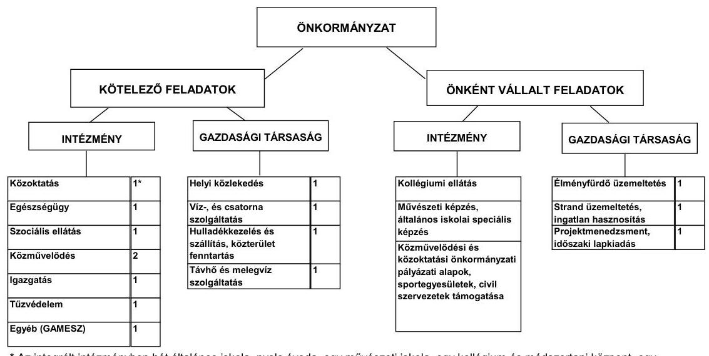
*Az integrált intézményben hét általános iskola, nyolc óvoda, egy művészeti iskola, egy kollégium és módszertani központ, egy gyermekjöléti szolgálat és ifjúságvédelmi központ tagintézményként múködik.

Az Önkormányzat a kötelező és önként vállalt feladatait 2011. június 30-án (a Polgármesteri hivatallal együtt) nyolc költségvetési szervvel, önként vállalt feladatait, valamint a közszolgáltatási szerződésekben foglalt helyi menetrend

---

szerinti autóbusszal történő személyszállítási feladatokat, a vízszolgáltatási, szennyvízkezelési feladatokat, továbbá a hulladékkezelést és szállítást, közterü-let-fenntartást, és a távhő-, melegvíz-szolgáltatást hét gazdasági társaság keretében látta el. A köztemetők üzemeltetési és kegyeleti közszolgáltatási feladatainak ellátását egyéni vállalkozó megbízásával biztosította.

A vizsgált időszakban végrehajtott intézményszervezeti átalakítások és intézményi összevonások, valamint az intézmény átvételek és átadások következtében az Önkormányzat által fenntartott és múködtetett intézmények száma 2007. év elejéről 2011. év I. félév végére 29 intézményről 8 intézményre, a telephelyek száma 45 -ről 42 telephelyre csökkent. Az intézményi átszervezés, feladatátrendezés az Önkormányzat adatszolgáltatása alapján összesen 324,3 millió Ft kiadási (ebből személyi juttatások és járulékaik 288,8 millió Ft, dologi kiadás 35,5 millió Ft) és 324,3 millió Ft bevételi előirányzat csökkenéssel járt.

Az Önkormányzat négy gazdasági társaságban kizárólagos tulajdonnal, négy társaságban 50,0\% alatti tulajdoni hányaddal rendelkezik (az 50,0\% alatti önkormányzati tulajdonú gazdasági társaságok közül egy gazdasági társaság nem vett részt az önkormányzati feladatok ellátásában). A gazdasági társaságok távhőszolgáltatás, melegvíz szolgáltatás, hulladékkezelés-szállítás, közterület fenntartás, strand- és élményfürdő üzemeltetés, úszásoktatás, vizes műtárgyak, köztéri szökőkutak és ivókutak karbantartása, üzemeltetése területén kaptak szerepet az Önkormányzat feladatellátásában. Az Önkormányzat a vizsgált időszakban a gazdasági társaságoknak külön megállapodás alapján összesen 41,8 millió Ft működési és 27,3 millió Ft fejlesztési célú pénzeszközátadást teljesített. A megállapodásokban rögzített cél szerinti felhasználást a gazdasági társaságok teljesítették.

Az Önkormányzat múködési kiadásokra 2010-ben 7127,2 millió Ft-ot fordított, amely 1073,6 millió Ft-tal (17,7\%-kal) haladta meg a 2007. évi ráfordításokat. A 2010. évi múködési kiadások 62,2\%-át az intézményi körben realizálták, a kiadások 37,8\%-át fordították a Polgármesteri hivatal költségvetésében tervezett önkormányzati feladatokra. Az egyes közszolgáltatások feladatellátásában résztvevő intézmények 2007. és 2010. évi múködési kiadásainak finanszírozási forrásösszetételét ágazatonként a következő ábra szemlélteti:

---

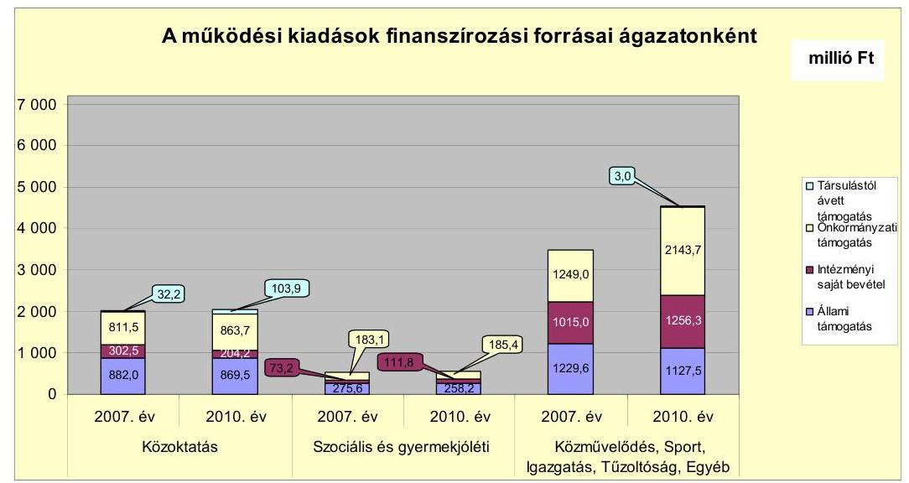

A közoktatási feladatok finanszírozása 2007. évben a 6053,7 millió Ft összes működési kiadás finanszírozásának 33,5\%-át (2028,2 millió Ft-ot) jelentette, amely 2010. évben 28,6\%-ra csökkent, összege 2041,3 millió Ft-ra nőtt. A közoktatási finanszírozási arány csökkenése a közoktatási intézményhálózat 2008. évben a szakmai feladatok integrációjával végrehajtott - az addig négy önálló gazdasági jogkörrel múködő általános iskola és részben önálló gazdasági jogkörrel múködő további 15 közoktatási intézmény, egy művészetoktatási intézmény és egy bölcsőde szakmai integrációjával egy integrált intézmény kialakítására irányuló - átszervezése és a múködési kiadások növekedésének együttes hatására következett be. A finanszírozási források arányai 2010. évben a 20072009. évek átlagaihoz képest a meghatározónak tekinthető állami hozzájárulás és önkormányzati támogatás források esetében számottevően nem módosultak (az állami hozzájárulás aránya 42,3\%-ról 42,6\%-ra növekedett, az önkormányzati támogatás $42,2 \%$-ról, $42,3 \%$-ra növekedett). A szociális és gyermekjóléti feladatokra a múködési kiadás finanszírozásából 2007. évben 531,9 millió Ft-ot ( $8,8 \%$ ) fordítottak, amely 2010. évre 555,4 millió Ft-ra növekedett, aránya a múködési finanszírozásból 7,8\%-ra csökkent. A közművelődés, igazgatás, túzoltóság és egyéb feladatokra fordított finanszírozás öszszege és aránya a múködési kiadás finanszírozásából a 2007. évi 3493,6 millió Ft-ról (57,7\%) 4530,5 millió Ft-ra (63,5\%) növekedett. A közművelődési intézmények vizsgált időszakban végrehajtott szakmai integrációja csökkentette, míg az igazgatási és egyéb feladatok kiadásnövekedése (közművelődési, sport és egyéb támogatások, áfa kiadás, tartalék jellegű előirányzatok) jelentősen növelte a finanszírozási szükségletet. A múködési finanszírozási forrásból az állami támogatás részaránya a 2007. évi 39,4\%-ról (2387,2 millió Ft-ról) 2010. évre 31,6\%-ra (2255,3 millió Ft-ra), az intézményi saját bevételek részaránya 23,0\%-ról (1390,6 millió Ft-ról) 22,1\%-ra csökkent, összege 1572,3 millió Ft-ra növekedett. Az önkormányzati támogatások aránya 2007. évi 37,1\%-ról (2243,7 millió Ft-ról) 2010. évre 44,8\%-ra (3192,7 millió Ft-ra), a társult önkormányzatoktól átvett támogatás 0,5\%-ról (32,2 millió Ft-ról) 1,5\%-ra (106,9 millió Ft-ra) növekedett.

Az Önkormányzat kizárólagos tulajdonában lévő négy gazdasági társaságnál a vizsgált időszakban nem indult felszámolási és csődeljárás, végel-

---

számolással történő megszüntetésükre sem került sor, közülük kettő gazdasági társaságnál azonban a tőke megfelelési mutató évről évre csökkenő, gazdálkodásuk a 2010. évben veszteséges volt. (A 2010. évben a Balaton és Sió Nonprofit Kft. esetében azonban a saját tőke meghaladta a jegyzett tőke összegét, a Siótour Kft. teljes üzletrésze pedig 2011. május hónapban a Balaton-parti Kft. tulajdonába került.)

A kötelező és az önként vállalt feladatok ellátását biztosító szervezeti keretekben, a feladatellátás módjában bekövetkezett, 324,3 millió Ft kiadási és bevételi előirányzat csökkenést okozó változások - az Önkormányzat adatszolgáltatása szerint - összesen 281,2 millió Ft költségvetési kiadási megtakarítást eredményeztek a vizsgált időszakban, amely 176,2 millió Ft összegben a kötelező feladatok ellátását, 105,0 millió Ft összegben az önként vállalt feladatok körét érintette.

A 2007-2010. években a múködési jövedelem, tőketörlesztés, valamint a pénzügyi kapacitás változásának tendenciáját az alábbi grafikon szemlélteti:
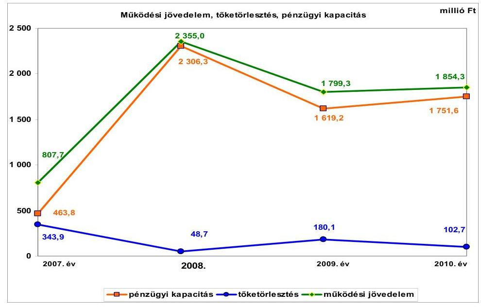

Az Önkormányzat folyó költségvetés egyenlege a vizsgált időszakban múködési forrástöbbletet mutatott, 2007-ben 807,7 millió Ft-ot, 2008-ban 2355,0 millió Ft-ot, 2009-ben 1799,3 millió Ft-ot, valamint 2010-ben 1854,3 millió Ft-ot tett ki. A folyó költségvetés egyenlege a 2008. évben volt a legmagasabb, amelyet a folyó bevétel folyó kiadást meghaladó mértékű emelkedése eredményezett. A folyó bevétel növekedésére hatással volt a költségvetési támogatás és szja bevételnek elsősorban a bérpolitikai intézkedések eredményeként, valamint az óvodai, általános iskolai ellátottak számának növekedéséből következő együttes emelkedése, a helyi adóbevételek, az OEP támogatás, a közmunka támogatásának, valamint az előző évi költségvetési kiegészítés emelkedése. A folyó kiadások növekedését a személyi juttatások és járulékok bérpolitikai intézkedésekkel összefüggő növekedése, a közüzemi díjak, valamint az Önkormányzat által folyósított ellátások emelkedése határozta meg. A 2008. évről a működési jövedelem a 2009-2010. évekre csökkent. A folyó bevételek csökkenését okozta elsősorban a 2009. évben a költségvetési támogatás intéz-

---

mény visszaadással, a központosított és egyéb központi támogatás bérintézkedési változásokkal összefüggő mérséklődése, az OEP támogatás, valamint a 2010. évben a realizált helyi adóbevételek visszaesése. A 2010. évi múködési jövedelem növekedését az előző évhez képest elsősorban az OEP támogatás emelkedése eredményezte, a folyó kiadások a folyó bevételnél nagyobb ütemű csökkenése mellett. A folyó kiadások 2009. évről 2010. évre történő csökkenése kiemelten a személyi juttatások és járulékok intézményi visszaadással, a 2010. évben a Tourinform iroda megszűntetésével, a kollégiumi feladatellátás átszervezésével összefüggő mérséklődéséből adódott.

A múködési jövedelmet - az Önkormányzat adatszolgáltatása alapján - a kiemelten kötelező feladatot ellátó SIOK 2008. évi átszervezésének forrásmegtakarító hatása 2009. évben 70,5 millió Ft-tal, 2010. évben 96,0 millió Ft-tal növelte. A múködési jövedelmet az önként vállalt feladatok körében végrehajtott feladatászervezések megtakarításai 2010. évben 56,0 millió Ft-tal emelték.

Az Önkormányzat tőketörlesztése a felvett hitelek nagyságrendjétől, a kamatkondícióitól, a tőketörlesztés ütemezésétől, a futamidőktől függően változó volt. A felvett hitel összege a felhalmozási költségvetésnek a növekvő beruházási kiadásokból adódó növekvő hiánya miatt a 2008. évről a 2009. évre több, mint tízszeresére, a 2009. évről a 2010. évre a beruházások forrásigénye és az átmeneti likviditási gondok áthidalása miatt a felvett hitel összege a kétszeresére emelkedett. A 2010. évben felvett 986,0 millió Ft hitelből a folyószámlahitel 2010. december 31-én fennálló kötelezettsége összege 522,0 millió Ft-ot tett ki. A tőketörlesztés a 2007. évről a 2008. évre csökkent, mivel a 2000-2005. között felvett, illetve társulástól átvállalt hat hitel visszafizetése a 2007. évben fejeződött be. A 2010. december 31-én még fennálló 2005-2006. években felvett három hitel tőketörlesztése a 2008. év II. negyedévétől kezdődött meg, amelynek következményeként a tőketörlesztés összege a 2008. évi 48,7 millió Ft-ról a 2009. évre 180,1 millió Ft-ra (3,7-szeresére) nőtt.

A pénzügyi kapacitás (nettó működési jövedelem) a 2007. évi 463,8 millió Ft-ról a 2010. évre 1751,6 millió Ft-ra, közel négyszeresére nőtt, amelyet a múködési jövedelem növekedése és a tőketörlesztés együttes hatása eredményezett. A 2007. évben a múködési jövedelem 807,7 millió Ft, a tőketörlesztés 343,9 millió Ft volt, amellyel szemben a 2010. évi múködési jövedelem 1854,3 millió Ft-ra (129,6\%-kal), valamint a tőketörlesztés 102,7 millió Ft-ra (70,0\%-kal) változtak. A vizsgált időszakban a 2008. évben volt a folyó bevétel (12 281,1 millió Ft) a legmagasabb, amelynek következményeként ugyanebben az évben volt a pénzügyi kapacitás összege a legnagyobb, 2306,3 millió Ft. A pénzügyi kapacitás a 2009. évre az előző évhez viszonyítva 1619,2 millió Ft-ra (29,8\%-kal) csökkent, mert a múködési jövedelem - a folyó bevétel visszaesése és a folyó kiadás emelkedése miatt - 555,7 millió Ft-tal (23,6\%-kal) csökkent, és a tőketörlesztés a 2005-2006. években felvett hitelek 2008. év II. negyedévében elkezdett tőketörlesztése miatt, több mint háromszorosára, 131,4 millió Ft-tal nőtt. A pénzügyi kapacitás a 2007-2010. években összességében kedvezően alakult, mivel az Önkormányzat adósságszolgálatára tízszeres fedezetet nyújtott az évente képződő múködési jövedelem.

A 2007-2010. években az Önkormányzat felhalmozási költségvetésének egyenlege folyamatosan negatív volt. A felhalmozási forráshiánynak a

---

felhalmozási kiadásokhoz viszonyított aránya 2007-ben 10,1\%-ot (-179,2 millió Ft), 2008-ban 40,0\%-ot (-1741,3 millió Ft), 2009-ben 44,6\%-ot (-2779,8 millió Ft), 2010-ben 45,5\%-ot ( $-4389,0$ millió Ft) tett ki. A vizsgált időszakban a felhalmozási forráshiány összesen -9089,3 millió Ft volt, amelyre fedezetet nyújtott az Önkormányzat múködési jövedelme, hitelfelvételei, valamint a 2010. évi fejlesztési célú kötvény kibocsátásából származó bevételek együttes összege. A növekvő felhalmozási forráshiány oka, hogy az államháztartáson belülről kapott támogatások évenkénti növekvő összege - a saját tőkebevételek 2007. évihez viszonyított csökkenő összege mellett -, nem tudta ellensúlyozni a felhalmozási kiadások növekedését, ezen belül a beruházások növekvő forrásigényét.

Az Önkormányzat folyó bevétele a 2007-2009. évek között átlagosan 11116,1 millió Ft volt, amelyet a 2010. évben 11519,7 millió Ft-ban teljesült folyó bevétel 403,6 millió Ft-tal (3,6\%-kal) haladta meg. A növekedés kiemelten a 2010. évben realizált OEP támogatás, az áfa bevétel és helyi adóbevétel öszszegeinek a 2007-2009. évi átlagaihoz viszonyított növekedésének az eredménye. A folyó bevételek teljesítéséhez a helyi adóbevételek a 2007-2009. években átlagosan 23,4\%-kal, a 2010. évben 22,8\%-kal járultak hozzá. Az Önkormányzat nyilvántartásában mintegy 50 ezer adóalanyt tartott nyilván, ebből 2500 társas vállalkozás, és 1380-1800 egyéni vállalkozó volt. A helyi adóbevételek jelentős részét a társas vállalkozások és magánszemélyek fizették be, ezért e bevételből eredő kitettsége hosszú távon kockázatot nem jelent. A folyó bevételek összetétele érdemben nem változott a vizsgált időszakban. Az Önkormányzat felhalmozási bevétele növekvő tendenciát mutatott a vizsgált időszakban. A 2010. évben a felhalmozási bevétel 5265,8 millió Ft-ot tett ki, amely 2715,9 millió Ft-tal (106,5\%-kal) haladta meg a 2007-2009. évi felhalmozási bevételek átlagos összegét, a 2549,9 millió Ft-ot. A növekedés kiemelten az államháztartáson belülről - felújításokra, fejlesztésekre - kapott támogatásból keletkezett. A befejezett és a folyamatban lévő felújításokra, beruházásokra 2010. december 31-ig 22 410,1 millió Ft-ot teljesítettek, amelyet 7085,3 millió Ft (31,6\%) összegben saját bevételből, 1110,6 millió Ft (4,9\%) összegben hitelből, 1617,4 millió Ft (7,2\%) összegben kötvényforrásból, 8870,2 millió Ft (39,6\%) összegben EU-s támogatásból, valamint 3726,6 millió Ft összegben hazai támogatásból ellentételeztek. Az Önkormányzatnál a felhalmozási hiány által generált finanszírozási igény a 2009. évtől növelte a pénzügyi kockázatot, mert a működési jövedelem képződése az adósságszolgálat teljesítésén felül a felhalmozási költségvetés hiányának teljes fedezetére nem biztosított forrást.

A 2010. évben az Önkormányzat folyó kiadásai 9665,4 millió Ft-ot tettek ki, amely 203,3 millió Ft-tal ( $2,1 \%$-kal) haladta meg a 2007-2009. évi folyó kiadások átlagos összegét, a 9462,2 millió Ft-ot. A növekedés elsősorban a dologi kiadások, a kamatkiadások, valamint transzfer kiadások - 2007-2009. évi átlagához viszonyított - növekedéséből adódott. A dologi kiadások növekedését a közüzemi díjak emelkedése, a kamatkiadások kedvezőtlen változását a kötvényforrás után elszámolt kamatnövekedés, valamint a transzfer kiadások emelkedését az Önkormányzat által folyósított ellátások összegének emelkedése okozták.

Az Önkormányzat 2010. évi felhalmozási kiadása 9654,8 millió Ft-ban teljesült, amely 5538,2 millió Ft-tal (134,5\%-kal) volt több a 2007-2009. évi fel-

---

halmozási kiadások átlagos összegénél, a 4116,6 millió Ft-nál. A növekedés kiemelten az Önkormányzat növekvő felújítási és beruházási feladataival, valamint a 2010. évi befektetési célú részesedések vásárlásával függött össze. A folyamatban lévő fejlesztéseknél a 2010. december 31-e utáni és a 2011-2014. éveket érintő kötelezettségvállalások teljesítésére tervezett saját bevétel 1771,6 millió Ft összege a nettó múködési jövedelem vizsgált időszakbeli tendenciája - annak a 2009. évről a 2010. évre való növekedésére - szempontjából felhalmozási kockázatot nem jelent. Az Önkormányzatnak azonban finanszírozási kockázattal kell számolnia, ha a kötvényforrás visszafizetésére nem képződik megfelelő mértékű forrás.

A befejezett fejlesztések jelentős részét támogatásból fedezték. A 2007-2010. években befejezett felhalmozási feladatokra összesen 20653,6 millió Ft-ot fordítottak, amelynek forrása 6672,6 millió Ft (32,3\%) saját erő, 12399,8 millió Ft (60,0\%) hazai és EU-s támogatás, 1110,6 millió Ft (5,4\%) hitelfelvétel, valamint 470,6 millió Ft (2,3\%) kötvényforrás volt. A 2010. december 31-én folyamatban lévő fejlesztési feladatok végrehajtására 2010. december 31-ig 1756,5 millió Ft kiadást teljesítettek, amelyhez hitelt nem vettek fel. Az EU-s támogatásból megvalósult fejlesztések előfinanszírozása likviditási gondot nem okozott, a kötelezettségvállalások teljesítésére a forrás rendelkezésre állt. A 2010. december 31-én folyamatban lévő fejlesztési feladatok 2010. évet követő kötelezettségvállalásainak összege 8620,1 millió Ft volt, amelyből 1771,6 millió Ft-ot (20,6\%) saját bevételből, 565,9 millió Ft-ot (6,6\%) kötvényforrásból, 6270,7 millió Ft-ot (72,7\%) EU-s támogatásból és 11,9 millió Ft-ot $(0,1 \%)$ hazai támogatásból terveznek biztosítani. Hitelfelvétellel a fejlesztések megvalósításához nem számoltak. A 2011. év I. félévében két felújítás, valamint négy fejlesztés indult, összesen 1234,9 millió Ft tervezett bekerülési költséggel. A fejlesztés során kialakított létesítmények, valamint a folyamatban lévő létesítményfejlesztések várható kiadásait, fenntarthatóságát számszerúsítették. A fejlesztések közül elsősorban egy befejezett és hét folyamatban lévő, az Önkormányzat fenntartásában maradó létesítmény befejezése teremt - az eszközhasználati díjakból, bérleti díjakból, rendezvények szervezéséből, fizető mélygarázs parkolási díjából - folyamatos bevétel növelési lehetőséget. A folyamatban lévő és EU-s támogatással megvalósuló 12 projekt közül négy projektnél vette igénybe az Önkormányzat az állam által biztosított előfinanszírozást. Négy projekthez, elsősorban az eszközbeszerzésekhez, valamint egy projekt előkészítő szakaszhoz kapcsolódott szállítói finanszírozás. A vizsgált időszakban az EU-s támogatással megvalósuló projektek előfinanszírozásához, az önerő biztosításához a források a kötvénymaradvány és a saját bevétel formájában rendelkezésre álltak.

---

A 2010. december 31-ig fennálló felhalmozási kötelezettségvállalások forrásöszszetételét az alábbi grafikon szemlélteti.
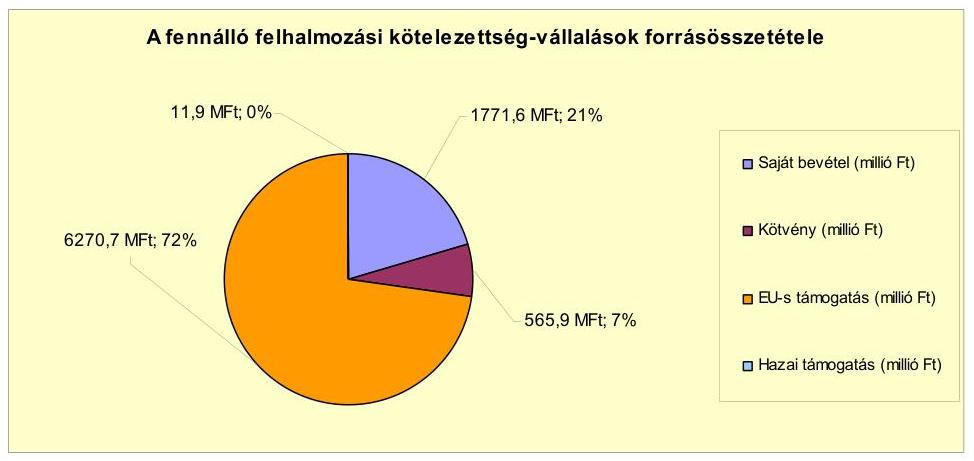

Az Önkormányzat által 2011. év I. félévében beadott, elbírálás alatt álló pályázatok tervezett teljes bekerülési költsége 93,2 millió Ft.

Az Önkormányzat által a 2010-2014. évekre vállalt kötelezettségek összege 8713,3 millió Ft volt, amelyből 2352,0 millió Ft-ot (26,9\%) saját bevételből, 6349,4 millió Ft-ot ( $72,8 \%$ ) EU-s támogatásból és 11,9 millió Ft-ot ( $0,3 \%$ ) hazai támogatásból terveztek biztosítani.

Az Önkormányzat mérleg szerinti pénzintézeti kötelezettsége a 2006. év végéről a 2010. december 31-éig 4,7-szeresére, 1101,3 millió Ft-ról 5153,6 millió Ft-ra növekedett. A pénzintézeti kötelezettség 2011. év I. félév végi állománya 5141,0 millió Ft, amely kettő kötvény kibocsátásából, három, vizsgált időszakban felvett és három 2007. január 1-je előtt kötött hosszú lejáratú hitelből, továbbá folyószámlahitel igénybevételéből keletkezett.

Az Önkormányzat pénzintézeti kötelezettségvállalásaira minden esetben képviselő-testületi döntés alapján került sor. A kötelezettségvállalásból származó források felhasználási céljait meghatározták. Az adósságszolgálat alakulásáról az éves költségvetési rendelettervezetek előterjesztésekor tájékoztatták a Képviselő-testületet. Az adósságot keletkeztető kötelezettségvállalások felső határát betartották. A kötvények kibocsátásáról és a hosszú lejáratú hitelek felvételéről szóló előterjesztésekben a Képviselő-testület tájékoztatása megtörtént a kamat- és tőkefizetési kötelezettségről, azonban a visszafizetés forrásait nem számszerúsítették.

Az Önkormányzat a vizsgált időszakban egy EUR alapú és egy forint alapú kötvény kibocsátásáról döntött 2375,4 ezer EUR, illetve 2323,0 millió Ft összegben. Az EUR alapú kötvény 20 éves futamidejú, változó kamatozású, kibocsátásának időpontja 2009. május hó, tőketörlesztés kezdete 2010. január 1., a tőketörlesztés első részlete 7,6 millió Ft ( 28,5 ezer Ft EUR) volt. A forint alapú kötvény 20 éves futamidejú, változó kamatozású, kibocsátására 2010. július hóban került sor, a tőketörlesztés kezdete 2011. január 1., a tőketörlesztés első részlete 30,2 millió Ft volt. A kötvénykibocsátásból származó bevételt a Képvise-lő-testület által meghatározott fejlesztési célokra használták fel. A kötvények kibocsátásából származó pénzintézeti kötelezettségre az Önkormányzat 2011.

---

június 30 -áig 109,2 millió Ft tőke- és 227,4 millió Ft kamatfizetést teljesített. A kötvénykibocsátásból származó, a kibocsátási célokra felhasználható forrásaik maradványa 2011. június 30 -án 272,3 millió Ft volt. A kötvényforrás befektetéséből 78,1 millió Ft kamatbevételt realizáltak.

Az Önkormányzat a vizsgált időszakban három forint alapú fejlesztési hitelszerződést kötött, (kettő hitelszerződés hat, illetve kettő önálló hitelcélt tartalmazott) amelyek összességében 1103,8 millió Ft-tal növelték az Önkormányzat kötelezettségállományát. A vizsgált időszakban további három - 2007. január l-je előtt kötött - hitelszerződésből származó kötelezettséget törlesztettek. Az Önkormányzat a szerződések szerinti hitelkereteit teljes egészében felhasználta. A hitelek törlesztésének megkezdésére 2008. április 1-jétől, 2008. július 1jétől, 2009. augusztus 1-jétől, 2010. október 1-jétől, illetve 2011. augusztus 1jétől került sor. A tőketörlesztések első részlete összességében 32,2 millió Ft volt. A hosszú lejáratú fejlesztési hitelek törlesztésére az Önkormányzat 2011. június 30 -áig 201,0 millió Ft tőke- és 184,8 millió Ft kamatfizetést teljesített. A vizsgált időszakban kötött hitelszerződések 1652,6 millió Ft 2014. évet követő törlesztési kötelezettséggel járnak.

Az Önkormányzat költségvetésének likviditását a vizsgált időszakban folyószámlahitel igénybevételével tudta biztosítani.

A folyószámlahitel igénybevétele a 2007-2011. év I. félévében az alábbiak szerint alakult:

| Megnevezés | 2007. év | 2008. év | 2009. év | 2010. év | 2011. év I.   félév |
| :-- | :--: | :--: | :--: | :--: | :--: |
| Folyószámlahitel |  |  |  |  |  |
| Keretösszeg január 1-jén (millió Ft-ban) | 600,0 | 600,0 | 600,0 | 600,0 | 600,0 |
| Átlagos napi álomány (millió Ft-ban) | 318,6 | 17,2 | 53,8 | 349,8 | 313,8 |
| Folyószámla hitellel zárt napok száma (nap) | 177 | 1 | 16 | 149 | 126 |
| Egyenleg ( időszak végi álomány) | x | x | x | 522,0 | 509,5 |

A likviditás biztosítása az Önkormányzatnak a vizsgált időszakban 60,2 millió Ft kamatkiadást okozott. Az Önkormányzat 2011. év I. félév végi szállítói tartozása 412,1 millió Ft, melyből 60 napon belüli lejárt tartozása 286,2 millió Ft volt. A lejárt határidejű szállítói tartozások között el nem ismert tartozásokat és EU-s támogatások finanszírozásával összefüggő tartozásokat nem mutattak ki. Az Önkormányzat egy gazdasági társasága és költségvetési szervei részére fejlesztési hitel, illetve lizingszerződések igénybevételéhez készfizető kezességet vállalt 111,5 millió Ft összegben, amelynek során figyelemmel voltak az Ötv. 88. § (2) bekezdésében foglalt, az Önkormányzat adósságot keletkeztető éves kötelezettség vállalásának felső határára. Az Önkormányzat kezességvállalással összefüggő kiadást a vizsgált időszakban nem teljesített. A 2010. év végére a kezességgel kapcsolatos kötelezettség 52,3 millió Ftra, 2011. év I. félév végére 49,1 millió Ft-ra csökkent. Az Önkormányzat két alkalommal nyújtott tagi kölcsönt, illetve visszatérítendő pénzeszközt gazdasági társasága, illetve egyéb szervezet részére összesen 553,4 millió Ft értékben.

---

Az Önkormányzat kötelezettségeinek 2010. december 31-ei, valamint 2011. június 30 -ai állományát és várható alakulását a kötelezettségek lejáratáig a következő táblázat szemlélteti:

| Megnevezés | Állomány 2010. december 31   én |  |  | Állomány 2011. június 30 -án |  |  | Várható kötelezettség   2011-2013. években |  | Várható kötelezettség   2014. évtöl |  |
| :--: | :--: | :--: | :--: | :--: | :--: | :--: | :--: | :--: | :--: | :--: |
|  | HUF-ban   (millió. Ft-   ban) | Devizában   (összegy,   ezer ...   ban) | Devizó   nem | HUF-ban   (millió Ft-   ban) | Devizában   (összegy,   ezer   ban) | Devizó   nem | HUF-ban   (millió Ft-   ban) | Devizában   (összegy,   ezer ...-ben) | HUF-ban   (millió Ft-   ban) | Devizában   (összegy,   ezer ...-ben) |
| Pénzintézeti kötelezettségek |  |  |  |  |  |  |  |  |  |  |
| Sorbik Jövőjéért I. Kólvény |  | 2256,7 | EUR |  | 2197,3 | EUR |  | 672,1 |  | 2724,3 |
| Sorbik Jövőjéért II. Kólvény | 2323,0 |  |  | 2292,8 |  |  | 896,6 |  | 3321,6 |  |
| Fojtészítési hitelék | 1579,5 |  |  | 1840,6 |  |  | 436,8 |  | 1652,6 |  |
| Fojtészítette hitel | 502,0 |  |  | 509,5 |  |  | 509,5 |  |  |  |
| Pénzintézeti kötelezettségek összesen HUF-ban | 4524,5 |  |  | 4412,7 |  |  | 1842,3 |  | 4074,2 |  |
| Pénzintézeti kötelezettségek összesen EURO-ban |  | 2256,7 |  |  | 2197,3 |  |  | 672,1 |  | 2724,3 |
| Biztosilékok |  |  |  |  |  |  |  |  |  |  |
| Rámösség | 52,3 |  |  | 49,1 |  |  |  |  |  |  |
| Biztosilékok összesen | 52,3 |  |  | 49,1 |  |  |  |  |  |  |
| Üzínig kötelezettségok |  | 255,0 | CHF |  | 238,9 | CHF |  | 158,2 |  | 198,2 |
| Szabály tartozás | 225,2 |  |  | 412,1 |  |  | 412,1 |  |  |  |
| Egyéb kötelezettségok | 497,5 |  |  | 489,5 |  |  |  | 1105,8 |  | 679,0 |

Az Önkormányzatnak pénzintézetekkel szemben fennálló kötelezettsége a 2011. év I. félév végén 4412,7 millió Ft és 2197,3 ezer EUR volt. Ezek várható kötelezettsége (tőke, kamat és egyéb költség) a legutóbbi kamatfizetés feltételei alapján a 2011-2013. években 1842,3 millió Ft, továbbá 672,1 ezer EUR. További kötelezettségként jelentkezik az Önkormányzat által vállalt 49,1 millió Ft kezesség, 238,9 ezer CHF lízingkötelezettség, valamint az egyéb kötelezettségek körében a Termofok Kft. - Siótour Kft. által birtokolt - teljes üzletrész megvásárlása 489,5 millió Ft-os kötelezettsége a 2011. június 30-i állapot szerint. (A 2011-2013. években várható kötelezettség szállítói tartozásból 412,1 millió Ft, lízingszerződésekből 158,5 ezer CHF, valamint az üzletrészvásárlásból 1105,8 ezer EUR.) A 2011-2013. években várható kötelezettségek teljesítésére - az Önkormányzat tájékoztatása szerint - a figyelembe vehető a 2011. évben és - várhatóan - a következő években képződő pozitív nettó működési jövedelem és az 550,3 millió Ft 2010. év végi behajtható követelésállományból származó forrás.

Az Önkormányzat 2014. évet követően jelenleg ismert pénzintézeti kötelezettségei: 4974,2 millió Ft és 2724,3 ezer EUR, továbbá a lízingszerződések 106,5 ezer CHF kötelezettsége, valamint 679,0 ezer EUR üzletrész vásárlási kötelezettség. A 2014. évtől várható kötelezettségek teljesítésére az Önkormányzat tájékoztatása szerint figyelembe vehető a következő években várhatóan képződő pozitív nettó múködési jövedelem, valamint a törzsvagyoni körbe nem tartozó forgalomképes ingatlanvagyon. A kötvények és a hitelek törlesztésének kockázatát növelheti az Önkormányzat számára kedvezőtlen hitelkamat növekedés bekövetkezése, valamint a devizában nyilvántartott kötelezettség - a forint árfolyamromlása miatt bekövetkező - növekedése. További törlesztési kockázatot jelenthet a következő években képződő nettó múködési jövedelem vizsgált időszakra jellemző tendenciától eltérő - kedvezőtlen alakulása.

Az Önkormányzat 50\% és azt meghaladó tulajdonosi hányaddal rendelkező társaságai kötelezettségeinek állományát az alábbi táblázat mutatja be:

---

| Megnevezés | Állomány 2010. december 31   én |  |  | Állomány 2011. június 30-áa |  |  | Várható kötelezettség   2011-2013. években |  | Várható kötelezettség   2014. évtől |  |
| :--: | :--: | :--: | :--: | :--: | :--: | :--: | :--: | :--: | :--: | :--: |
|  | HUF-ban   (mibú Ft-   ban) | Devizában   (összegy.   ezer   ban) | Devize   nem | HUF-ban   (mibú Ft-   ban) | Devizában   (összegy.   ezer   ban) | Devize   nem | HUF-ban   (mibú Ft-   ban) | Devizában   (összegy.   ezer ...-ban) | HUF-ban   (mibú Ft-   ban) | Devizában   (összegy.   ezer ...-ban) |
| Hosszú tejéteki Hée (HUF) | 251,40 |  |  | 231,70 |  |  | 166,00 |  | 116,30 |  |
| Hosszú tejéteki Hée (EUR) |  | 2000,50 | EUR |  | 1993,80 | EUR |  | 1367,30 |  | 927,60 |
| Folyószámoltást | 296,00 |  |  | 225,90 |  |  | 225,90 |  | 0,00 |  |
| Pénzintézet kötelezettséget összesen: | 507,40 | 2000,50 | EUR | 457,60 | 1993,80 | EUR | 391,90 | 1367,30 | 116,30 | 927,60 |
| Szállító tartozás | 296,90 |  |  | 160,80 |  |  | 160,80 |  |  |  |

A társaságoknak a 2011. évtől 457,6 millió Ft és 1993,8 ezer EUR pénzintézeti kötelezettséget, 165,8 millió Ft szállítói tartozást kell törleszteniük, illetve rendezniük. Esetleges csőd, vagy felszámolási eljárás esetén a bíróság korlátlan és teljes felelősséget állapíthat meg az Önkormányzat terhére, amely az Önkormányzat számára helytállási kötelezettséget jelenthet. A pénzintézeti és szállítói kötelezettséggel rendelkező gazdasági társaságok (Termofok Kft. és Balatonparti Kft.) pénzügyi egyensúlyi helyzete - adatszolgáltatásuk szerint - stabil, saját tőke/jegyzett tőke aránymutatójuk 2009. és 2010. évben növekvő, gazdálkodásuk 2009. és 2010. évben nyereséges.

Az Önkormányzat zárszámadási rendeletei tartalmazták az évente elszámolt értékcsökkenés önkormányzati vagyonra gyakorolt hatását, a rendeletekben részletesen bemutatták az évente teljesített felújítási kiadásokat célonként. Az Önkormányzat 2007-2010 között eszközállománya után 3800,2 millió Ft összegű értékcsökkenést mutatott ki, az elhasznált eszközök felújítására 570,2 millió Ft-ot, eszközbeszerzésekre - adatszolgáltatása szerint - 432,0 millió Ft-ot fordított.

Az Önkormányzat az ellenőrzött időszakban kiadási megtakarítást eredményező és bevételt növelő intézkedéseket tett. A 2007-2011. év I. féléve között tett intézkedések hatására - adatszolgáltatása alapján - 3136,2 millió Ft bevételi többletet, továbbá 281,2 millió Ft kiadási megtakarítást mutatott ki. A megtakarításokból 105,0 millió Ft (a megtakarítás 37,3\%-a) az önként vállalt feladatokat ellátó intézmények megszüntetéséhez, átszervezéséhez kapcsolódott. A kötelező feladatokhoz kapcsolódó létszámcsökkenések, átszervezések eredménye 176,2 millió Ft ( $62,7 \%$ ) megtakarítást jelentett. A kiadási megtakarítások 100\%-a az elrendelt álláshely csökkentések eredménye. Az álláshelycsökkentő intézkedések a 2007-2010. évek között önkormányzati szinten összesen 87 fő álláshely (ebből üres álláshely nem volt) megszüntetést és ugyancsak 87 fő létszámcsökkenést is jelentettek. Egyes közszolgáltatási területeken azonban feladatbővülések is voltak, amelyek álláshely- és egyben létszámnövekedéssel is jártak. Ennek következtében az időszak álláshelyeinek száma, és a foglalkoztatottak száma a csökkenések és növekedések egyenlegeként ténylegesen 39 fővel nőtt. A bevételnövelő intézkedések elsősorban ingatlanok értékesítéséhez és bérbeadásához, bérleti díjak emeléséhez kapcsolódtak, együttes hatásuk 3136,2 millió Ft bevétel növekmény volt. A bevételnövelő intézkedések számszerúsített összegéből 999,2 millió Ft (31,9\%) a helyi adókhoz, 2137,0 millió Ft $(68,1 \%)$ az eszközök hasznosításához kapcsolódott.

Az utóellenőrzés a pénzügyi egyensúly javítására a 2008. évben tett három szabályszerűségi és egy célszerűségi javaslat hasznosítására terjedt ki. A javaslatok megvalósítására felelősök és határidők megjelölésével intézkedési terv ké-

---

szült. A javaslatok közül egy szabályszerűségi javaslat nem valósult meg. Az Áht.-ban előírtak ellenére a 2009. évi költségvetési rendelet kiadási főösszegének megállapításakor finanszírozási célú pénzügyi műveleteket is figyelembe vettek költségvetési hiányt módosító kiadásként. A jegyző személye 2010. szeptember 1-jétől változott, ezért nem kezdeményezzük a polgármesternél, hogy vizsgálja meg a felelősség felvetésének lehetőségét.

Az Önkormányzat pénzügyi egyensúlyi helyzetét összegezve a következők emelhetők ki:

Siófok Város Önkormányzata pénzügyi egyensúlya rövid és középtávon biztosított. A pénzügyi egyensúly hosszú távú megőrzésére az Önkormányzatnak fel kell készülnie.

Az Önkormányzat működési jövedelme és pénzügyi kapacitása a vizsgált időszakban pozitív volt. A folyó bevételek fedezetet nyújtottak a folyó kiadásokra és az adósságszolgálatra. A folyó bevételek teljesítéséhez a helyi adóbevételek a 2007-2009. években átlagosan 23,4\%-kal, a 2010. évben 22,8\%-kal járultak hozzá. Az Önkormányzat nyilvántartásában mintegy 50 ezer adóalanyt tartott nyilván, ebből 2500 társas vállalkozás, és 1380-1800 egyéni vállalkozó volt. A helyi adóbevétel társas vállalkozástól és magánszemélyektől származik, ezért e bevételből eredő kitettsége hosszú távon kockázatot nem jelent. Az önként vállalt feladatok teljesítésére fordított kiadások összes kiadáson belüli csökkenő aránya nem jelent pénzügyi kockázatot.

A fejlesztések során kialakított, valamint a folyamatban lévő fejlesztések várható kiadásait, fenntarthatóságát számszerúsítették. Az Önkormányzat fenntartásában maradó létesítmények folyamatos bevételnövelési lehetőséget teremtenek. Az EU-s támogatással megvalósuló fejlesztési feladatok előfinanszírozásához, az önerő biztosításához a források a kötvényből származó bevételek maradványa és saját bevétel formájában rendelkezésre állnak.

A rövid és középtávú kötelezettségek teljesítése kockázatot nem jelent, teljesítésükre a követelésállományból, valamint a kedvező tendenciájú nettó múködési jövedelemből származó forrás fedezetet nyújt. A hosszú távú kötelezettségek teljesítésének kockázatát befolyásolhatja a kamat- és árfolyamkockázat változása. A növekvő szállítói kötelezettségek teljesítése kockázatot nem jelentett, a pénzügyi egyensúlyi helyzetet alapvetően nem befolyásolta.

A kizárólagos önkormányzati tulajdonú gazdasági társaságok pénzügyi egyensúlyi helyzete stabil, azonban kötelezettségeik nem teljesítése az Önkormányzat számára helytállási kötelezettséget jelenthetnek.

Az Állami Számvevőszékről szóló 2011. évi LXVI. törvény 33. § (1) bekezdésében foglaltak értelmében a jelentésben foglalt megállapításokhoz kapcsolódó intézkedési tervet köteles az ellenőrzött szervezet vezetője összeállítani és azt a jelentés kézhezvételétől számított harminc napon belül az ÁSZ részére megküldeni. Amennyiben az intézkedési tervet határidőben nem küldi meg a szervezet, vagy az továbbra sem elfogadható, az ÁSZ elnöke a hivatkozott törvény 33. § (3) bekezdés a)-b) pontjaiban foglaltakat érvényesítheti.

---

# A 2011. június 30-i pénzügyi egyensúlyi helyzet alapján az ellenőrzés intézkedést igénylő megállapításai és javaslatai a következők: 

## a Polgármesternek

1. Az Önkormányzat pénzügyi egyensúlyi helyzete rövid és középtávon biztosított. A pénzügyi egyensúly hosszú távú megőrzésére az Önkormányzatnak fel kell készülnie. A hosszú távú kötelezettségek teljesítésének kockázatát befolyásolhatja a kamat-, és árfolyamkockázat változása.

Javaslat:
Folyamatosan tájékoztassa a Képviselő-testületet az Önkormányzat pénzügyi egyensúlyi helyzetéről. Kezdeményezzen szükség esetén intézkedéseket a pénzügyi egyensúly hosszú távú fenntarthatósága érdekében.

A kamat- és árfolyamkockázat pénzügyi egyensúlyt veszélyeztető növekedése esetén képezzen elkülönített tartalékot az adósságszolgálat hosszú távú teljesítése érdekében.
2. Az Önkormányzat kizárólagos tulajdonú gazdasági társaságainak pénzintézeti kötelezettsége 2011. június 30 -án 457,6 millió Ft és 1993,8 ezer EUR, szállítói kötelezettsége 165,8 millió Ft volt, amely kötelezettségek nem teljesítése hatással lehet az Önkormányzat likviditására, pénzügyi egyensúlyi helyzetére.

Javaslat:
Kísérje folyamatosan figyelemmel a kizárólagos tulajdonú gazdasági társaságok kötelezettségeinek alakulását, az Önkormányzat likviditására, pénzügy-egyensúlyi helyzetére gyakorolt hatását. Tegye meg a szükséges és lehetséges intézkedéseket a tulajdonosi érdekek védelme érdekében.
3. Az Önkormányzat adósságot keletkeztető kötelezettségvállalásaira vonatkozó képvi-selő-testületi előterjesztésekben nem számszerűsítették a visszafizetés forrásait.

Javaslat:
Gondoskodjon, hogy a jövőben az adósságot keletkeztető kötelezettségvállalásokról szóló képviselő-testületi előterjesztések számszerűsítetten tartalmazzák a visszafizetés forrásait.
4. Az utóellenőrzés a pénzügyi egyensúly javítására tett három szabályszerűségi és egy célszerűségi javaslatra terjedt ki. A javaslatok közül egy szabályszerűségi javaslat nem valósult meg. Az Áht.-ban előírtak ellenére a 2011. évi költségvetési rendelet kiadási főösszegének megállapításakor finanszírozási célú pénzügyi műveleteket is figyelembe vettek költségvetési hiányt módosító kiadásként.

Javaslat:
Tegyen intézkedést arra, hogy a költségvetési rendelettervezetek és az elfogadott költségvetési rendeletek kiadási főösszegei az államháztartásról szóló 2011. évi CXCV. törvény 5. § (2)-(3) bekezdései, továbbá a 23. § (2) bekezdés a) és c) pontjai alapján ne tartalmazzanak a 73. § szerinti finanszírozási célú pénzügyi műveleteket.

---

# II. RÉSZLETES MEGÁLLAPÍTÁSOK 

## 1. Az ÖNKORMÁNYZAT KÖTELEZŐ ÉS ÖNKÉNT VÁLLALT FELADATAI, A FELADATELLÁTÁS SZERVEZETI KERETEI ÉS ANNAK VÁLTOZÁSAI

Az Önkormányzat kötelező és önként vállalt feladatainak körét az SzMSz-ben rögzítette. Kötelező feladatait az Ötv. és az ágazati törvények figyelembevételével állapította meg, míg az önként vállalt feladatok terjedelmét az éves költségvetési rendeleteiben, anyagi lehetőségei függvényében határozta meg. A vizsgált időszakban az Önkormányzat által besorolt önként vállalt feladatok a turisztikai szolgáltatások ellátásához, művészeti képzéshez, általános iskolai speciális tagozat és kollégium fenntartásához, közoktatási és közművelődési, önkormányzati pályázati alapok, városi kulturális rendezvények, sportegyesületek, fürdőegylet és úszásoktatás, civil szervezetek támogatásához kapcsolódtak.

Az Önkormányzat adatszolgáltatása szerint a 2010. évi 7127,2 millió Ft múködési célú költségvetési kiadásból 6667,8 millió Ft-ot ( $93,6 \%$-ot) a kötelező feladatok, 459,4 millió Ft-ot ( $6,4 \%$-ot) az önként vállalt feladatok ellátására fordított. A 2011. évi költségvetésben az önként vállalt feladatokra tervezett előirányzat összege 269,9 millió Ft volt, amely a tervezett kiadási előirányzat 4,3\%át jelentette. Az előirányzat a 2010. évi kiadáshoz viszonyítva 189,6 millió Fttal ( $41,3 \%$-kal) csökkent, amelyet meghatározóan a közművelődési, sport, szociálpolitikai támogatások és egyéb önként vállalt feladatokkal összefüggő támogatások tervezett összegeinek csökkentése okozott.

A 2010. évben az önként vállalt feladatok aránya a közoktatásban ${ }^{7} 8,3 \%$ (168,4 millió Ft), az egyéb feladatok ellátásában ${ }^{8} 17,7 \%$ ( 86,5 millió Ft), a Polgármesteri hivatalban kimutatott feladatok támogatásánál ${ }^{9} 7,6 \%$ (204,5 millió Ft) volt.

[^0]
[^0]:    ${ }^{7}$ speciális tagozat kiadásai és kollégium fenntartása
    ${ }^{8}$ Tourinform Iroda, művészeti iskola, Városi Kincstár által ellátott egyéb feladatok
    ${ }^{9}$ közoktatási és közművelődési önkormányzati pályázati alapok, városi kulturális rendezvények, sportegyesületek, fürdőegylet és úszásoktatás támogatása, civil szervezetek támogatása

---

A 2010. évi múködési kiadások ágazatonkénti megoszlását, és azok finanszírozását a következő táblázat mutatja be:

| Ellátott feladat | Múködési kiadás összesen (millió Ft) | Kötélezö feladatok kiadásaínak részaránya \% | Múködési bevétel összesen (millió Ft) | Állami támogatás részaránys $\%$ | Intézményi saját bevétel részaránya \% | Önkormányzat támogatás részaránya \% | Társulástól átvett támogatás részaránya \% |
| :--: | :--: | :--: | :--: | :--: | :--: | :--: | :--: |
| Övodák | 667,8 | 100,0 | 667,8 | 34,6 | 11,4 | 49,6 | 4,4 |
| Általános iskolák | 1236,0 | 97,5 | 1236,0 | 50,2 | 8,2 | 35,4 | 6,2 |
| Kollégiumok | 137,5 | 0,0 | 137,5 | 12,7 | 18,9 | 68,4 | 0,0 |
| Szociális intézmények | 519,2 | 100,0 | 519,2 | 46,8 | 21,5 | 31,7 | 0,0 |
| Gyermekjöléti intézmények | 36,2 | 100,0 | 36,2 | 42,7 | 0,0 | 57,3 | 0,0 |
| Közművelődési intézmények | 308,1 | 100,0 | 308,1 | 1,9 | 45,8 | 52,3 | 0,0 |
| Egyéb intézmények | 824,9 | 89,5 | 824,9 | 41,7 | 43,2 | 15,1 | 0,0 |
| Polgármesteri hivatal igazgatási kiadásaí | 706,3 | 100,0 | 706,3 | 0,0 | 0,0 | 100,0 | 0,0 |
| Polgármesteri   hivatalban ellátott   egyéb feladatok   múködési kiadásaí | 2691,2 | 92,4 | 2691,2 | 28,9 | 28,2 | 42,8 | 0,1 |
| Összesen | 7127,2 | 93,6 | 7127,2 | 31,6 | 22,1 | 44,8 | 1,5 |

Az önként vállalt feladatok aránya az általános iskolai oktatás kiadásaiból $2,4 \%$ és $2,6 \%$ között alakult, összege a vizsgált időszakban csökkenő mértékű volt (a 2007-2009. évi átlagos 33,0 millió Ft-tal szemben 2010. évben 30,9 millió Ft-ra mérséklődött a speciális oktatásban résztvevők számának csökkenése miatt). A Kollégium kiadása a 2007-2009. évek 154,1 millió Ft átlagához képest a 2010. évben 137,5 millió Ft-ra ( $10,8 \%$-kal) csökkent, amelyet a Kollégium megszüntetése (ellátottak számának csökkenése) okozott. Az egyéb feladatoknál a 2007-2010. években az önként vállalt feladatok aránya 26,7\%ról $17,7 \%$-ra módosult, összege is csökkenő irányú (a 2007. évi 109,2 millió Fttal és a 2008. évi 99,7 millió Ft-tal szemben 2010. évben 86,5 millió Ft volt), amelyet a Tourinform iroda 2010. évi megszüntetése okozott. A Polgármesteri hivatal feladatainak támogatásából az önként vállalt feladatok aránya a 2007. évi 6,7\%-ról (118,3 millió Ft-ról) a 2010. évre 7,6\%-ra (204,5 millió Ft-ra) növekedett a közművelődési, sport és egyéb támogatások növekedése miatt, a közbenső mindkét évben 7,4\% volt (170,6 illetve,181,5 millió Ft).

Az Önkormányzat adatszolgáltatása szerint a közoktatási feladatok ellátására 2007-2009. között átlagosan 2150,6 millió Ft-ot fordítottak. A 2010. évi közoktatási kiadás 2041,3 millió Ft volt, amely a 2007-2009. évi 2150,6 millió Ft átlagos kiadás $94,9 \%$-át jelentette. A közoktatási kiadások 2007-2009. évben átlagosan az összes múködési kiadás $31,8 \%$-át tették ki, amely 2010. évben 28,6\%-ra csökkent. A közoktatási kiadások összes múködési kiadáson belüli arányának és összegének csökkenését meghatározóan az általános iskolai intézményrendszer múködtetésére fordított kiadások arányának és összegének intézményrendszer átalakítása miatti csökkenése okozta.

A közoktatási feladatok finanszírozási arányai 2010. évben a 2007-2009. évek átlagaihoz képest - a meghatározónak tekinthető állami hozzájárulás és önkormányzati támogatás források esetében - számottevően nem módosultak. A

---

2007-2009. évek átlagos állami hozzájárulás aránya 42,3\% (910,4 millió Ft), önkormányzati támogatás aránya 42,2\% (908,5 millió Ft) volt, amely 2010. évre $42,6 \%$-ra ( 869,5 millió Ft-ra) illetve 42,3\%-ra ( 863,7 millió Ft-ra) módosult.

A szociális és gyermekvédelmi feladatokra az Önkormányzat adatszolgáltatása szerint, 2007-2009. között átlagosan 524,5 millió Ft-ot fordítottak. A 2010. évi kiadás 519,2 millió Ft volt, amely a 2007-2009. évi átlagos kiadáshoz viszonyítva 1,0\%-os csökkenést jelent.

A gyermekjóléti feladatellátásra a 2010. évben 36,2 millió Ft-ot fordítottak, amely 3,3\%-kal (1,2 millió Ft-tal) alacsonyabb az intézmény múködésének kezdetét jelentő 2009. évi kiadásnál. A feladatellátást 2009. évben 41,1\%-ban (15,4 millió Ft) állami hozzájárulásból és $58,9 \%$-ban ( 22,1 millió Ft) önkormányzati támogatásból finanszírozták. A finanszírozás arányai a 2010. évben $42,7 \%$-ra ( 15,5 millió Ft-ra) illetve 57,3\%-ra ( 20,7 millió Ft-ra) módosultak.

A közmúvelődési feladatokra a 2007-2009. évek 288,0 millió Ft-os átlagához viszonyítva a 2010. évben 308,1 millió Ft kiadás merült fel, amely 7,0\%-os kiadásnövekedést jelentett az átlaghoz képest. A kiadások növekedését a 2010. évben alapított Balatoni Regionális Történeti Kutatóintézet, Könyvtár és Kálmán Imre Emlékház múködtetése okozta.

A közművelődési kiadásokat az Önkormányzat adatszolgáltatása szerint a 20072009. években évente átlagosan 5,5 millió Ft (1,9\%) összegben állami hozzájárulásból, 94,0 millió Ft (32,6\%) összegben intézményi saját bevételből, 188,5 millió Ft ( $65,5 \%$ ) összegben önkormányzati támogatásból finanszírozták. A 2010. évben az állami hozzájárulás részaránya nem, összege nem számottevően változott, míg a saját intézményi bevétel aránya $45,8 \%$-ra ( 47,1 millió Ft-tal) növekedett, az önkormányzati támogatás részaránya 52,3\%-ra (27,2 millió Ft-tal) csökkent. A finanszírozási források vizsgált időszakot érintő aránymódosulását meghatározóan az intézményi saját bevételek folyamatos és dinamikus növekedése és az önkormányzati támogatás csökkenése együttesen okozta.

Az igazgatási intézmények kiadása a 2007-2009. évek átlagos 776,9 millió Ft kiadásához viszonyítva a 2010. évben 706,3 millió Ft-ra, 9,1\%-kal csökkent. A kiadások csökkenését meghatározóan az igazgatási szakfeladatokon elszámolt személyi juttatás (jutalom, végkielégítés, jubileumi jutalom stb.) és az ezzel összefüggő munkaadói járulék kiadások csökkenése okozta. Az igazgatási kiadásokat önkormányzati támogatásból finanszírozták.

A Városi Tüzoltóság kiadásai a 2007. évről a 2008. évre 15,7\%-kal (50,6 millió Ft-tal) növekedtek, 2008. évről 2009. évre 2,2\%-kal (8,4 millió Fttal), 2010. évben 7,8\%-kal (28,6 millió Ft-tal) csökkentek. Az intézményi kiadásokat a vizsgált időszakban átlagosan 92,9\%-ban állami hozzájárulásból, 5,6\%-ban intézményi saját bevételekből és 1,5\%-ban önkormányzati támogatásból finanszírozták.

Az egyéb feladatokra fordított kiadás a 2008. és 2009. évben 15,0\%-kal (61,4 millió Ft-tal) és 16,3\%-kal ( 76,7 millió Ft-tal) növekedett, 2010. évben az előző évihez viszonyítva 10,7\%-kal (58,4 millió Ft-tal) csökkent, amelyet meghatározóan a Tourinform Iroda 2010. évi megszüntetése miatti kiadáscsökkenés okozott. A kiadásokat a vizsgált időszakban átlagosan 7,6\%-ban állami

---

hozzájárulásból, 65,1\%-ban intézményi saját bevételekből és 27,3\%-ban önkormányzati támogatásból finanszírozták.

A Polgármesteri hivatalban ellátott feladatok kiadásaira a 2007-2009. évek átlagában 2175,4 millió Ft-ot, a 2010. évben 2691,2 millió Ft-ot fordítottak, amely a 2007-2009. évi átlagos kiadást 23,7\%-kal haladta meg. A kiadásnövekedést a közművelődési, sport és egyéb támogatások, az áfa kiadások növekedése okozta, amelyet teljes egészében önkormányzati támogatásból finanszíroztak. A kiadásokat a vizsgált időszakban átlagosan 40,8\%-ban állami hozzájárulásból, 35,6\%-ban intézményi saját bevételekből és 23,6\%-ban önkormányzati támogatásból finanszírozták.

Az Önkormányzat a kötelező és önként vállalt feladatait 2011. június 30-án nyolc költségvetési szervvel, öt gazdasági társasággal ${ }^{10}$ látta el, valamint a helyi menetrend szerinti autóbusszal történő személyszállítási feladatok, a vízszolgáltatási és szennyvízkezelési feladatok, továbbá a köztemetők üzemeltetési és kegyeleti közszolgáltatási feladatainak ellátását közszolgáltatási szerződés megkötése útján, kettő gazdasági társaság és egy egyéni vállalkozó megbízásával biztosította. A költségvetési szervek közül négy önállóan működő és gazdálkodó és négy önállóan működő jogkörrel rendelkezett. A költségvetési szervek 42 telephelyen működtek.

A közoktatási feladatokat ellátó óvodák és általános iskolák társulási ${ }^{11}$ formában működtek, a kollégium az Önkormányzat saját fenntartású intézménye. Az óvodai ellátást és az általános iskolai oktatási feladatokat társulás keretében fenntartott egy önállóan működő intézménnyel, 12 óvodai és 10 általános iskolai telephelyen látták el, a kollégium egy telephellyel rendelkezett. Az igazgatási és az egészségügyi (fekvőbeteg ellátás) feladatokat egy-egy önállóan működő és gazdálkodó szervvel (Polgármesteri hivatal, Kórház), egy-egy telephelyen látták el. A szociális és gyermekvédelmi feladatok ellátását egy önállóan működő intézménynyel (Gondozási Központ) négy telephelyen biztosították. A kulturális feladatokat kettő önállóan működő intézménnyel (Kálmán Imre Kulturális Központ, Balatoni Regionális Kutatóintézet, Könyvtár és Kálmán Imre Emlékház), négy telephelyen látták el. Az egyéb feladatok keretében a közoktatási, szociális és kulturális intézmények pénzügyi, gazdasági, számviteli feladatainak ellátását egy önállóan működő és gazdálkodó intézmény (Városi Kincstár) végezte. A tüzvédelem feladatait egy önállóan működő és gazdálkodó intézmény (Városi Tűzoltóság) látta el. A két intézmény kilenc telephelyen működött.

[^0]
[^0]:    ${ }^{10}$ A gazdasági társaságok közül az Önkormányzat négy gazdasági társaság kizárólagos tulajdonosa, a további kettő - közszolgáltatást ellátó - gazdasági társaságban nem rendelkezett tulajdonnal, illetve $0,1 \%$-os tulajdoni részaránnyal rendelkezett. A kizárólagos önkormányzati tulajdonú gazdasági társaságok a 2010. évben - vagyonuk Bala-ton-parti Kft.-be történő apportálását követően - holdingba szerveződtek, ezért számuk - a 2011. június 30 -ai állapotnak megfelelően - egy gazdasági társaságra csökkent. A költségvetési szervek és telephelyeik száma a 2010. december 31-i állapothoz képest nem változott.
    ${ }^{11}$ A közoktatási feladatok társult ellátására a Siófok Városi Önkormányzat, Nagyberény, Balatonendréd, Balatonvilágos és Ádánd Községi Önkormányzatok 2008. július 1-jei hatállyal társulási szerződést kötöttek. A társulási szerződést Balatonvilágos Község Önkormányzata társult tagsági jogviszonyának 2009. augusztus 1-ei megszűnése miatt módosították.

---

Az Önkormányzat által fenntartott és múködtetett intézmények száma 2006. évről 2011. év I. félév végére 29 intézményről 8 intézményre, a telephelyek száma 45 -ről 42 telephelyre csökkent. Az intézmények és a telephelyek száma az alábbiak szerint változott:

- A 2007. évben az önállóan és részben önállóan gazdálkodó intézmények száma a közoktatási feladatok vonatkozásában négy részben önálló intézménnyel (Általános Iskola, Óvoda Balatonvilágos, Óvoda, Balatonendréd, Óvoda, Nagyberény) bővült. A kulturális feladatot ellátó intézmények szakmai integrációja következtében az intézmények száma háromról egy intézményre csökkent (a Városi Könyvtár és a Múzeum által ellátott feladatokat integrálták a Kálmán Imre Kulturális Központ szervezetébe).
- A 2008. évben az Önkormányzat a közoktatási feladatainak szakmai integrációja keretében létrehozta a SIOK-ot és az addig önálló gazdálkodási jogkörrel működő négy általános iskolát és a részben önálló gazdasági jogkörrel működő további 15 közoktatási intézményt, egy művészetoktatási intézményt és egy bölcsődét jogutódlással megszüntette. A megszüntetett intézmények által ellátott feladatokat egyidejűleg a SIOK intézményi szervezetébe integrálta. A szakmai integráción túlmenően a közoktatási feladatellátás a társulásban ellátott feladatok bővülése miatt kettő intézménnyel (Általános Iskola, Óvoda, Ádánd) bővült. További változás volt, hogy az egyéb intézmények körében az Önkormányzat az intézményei gazdálkodási feladatainak ellátására kincstári szervezetté alakította az addig gazdasági és műszaki ellátó és szolgáltató szervezetként működő intézményét, valamint jogutód nélkül megszüntette a Családsegítő Központot.
- A 2009. évben három telephellyel csökkent a közoktatási feladatokat ellátó intézményrendszer (megszűnt a balatonvilágosi óvoda és iskola társulásban történő működtetése), továbbá egy általános iskolai telephelyet megszüntettek.
- A 2010. évben a közoktatási feladatok a kollégiumot érintően egy telephelylyel csökkentek, az önállóan működő kulturális intézmények száma egy intézménnyel ${ }^{12}$ növekedett, az egyéb körbe tartozó, önállóan működő és gazdálkodó intézmények száma egy intézmény megszüntetése ${ }^{13}$ miatt csökkent.

Az Önkormányzat a kötelező feladatok közül az igazgatási, a közművelődési, a szociális és gyermekjóléti és a tűzvédelmi feladatokat az általa fenntartott és működtetett intézmények útján, közoktatási (óvodai ellátás és általános iskolai oktatás) feladatait társulás szervezeti keretében biztosította. A városüzemeltetéssel összefüggő távhő- és melegvíz-ellátás feladatait, a közterület fenntartást, hulladékkezelés és -szállítást önkormányzati tulajdoni részesedéssel bíró gazdasági társaságaival látta el. A helyi menetrend szerinti autóbusszal történő személyszállítási feladatok, a vízszolgáltatási és a szennyvízkezelési feladatok, valamint a köztemetők üzemeltetési és a kegyeleti közszolgáltatási feladatok ellátását közszolgáltatási szerződés megkötése útján, szolgáltató cégek megbízá-

[^0]
[^0]:    ${ }^{12}$ Megalapították a Balatoni Regionális Történeti Kutatóintézet, Könyvtár és Kálmán Imre Emlékház önállóan működő jogkörű közművelődési intézményt.
    ${ }^{13}$ 2010. évben az Önkormányzat megszüntette a Tourinform Irodát.

---

sával biztosította. Az Önkormányzat az önként vállalt feladatok közül a kollégiumi, a művészeti oktatási és a turisztikai szolgáltatási feladatokat saját intézményeivel látta el. Az Önkormányzat gazdasági társaságai ${ }^{14}$ útján látta el az önként vállalt feladatok körében az időszaki lapkiadási és projektmenedzselési tevékenységet, strandüzemeltetést, úszásoktatást és az élményfürdő üzemeltetési feladatokat, valamint az épületállomány karbantartási, üzemeltetési feladatait, a vizes műtárgyak valamint a köztéri szökőkutak és ivókutak üzemeltetési feladatait. A vizsgált időszakban feladatellátás kiszervezése nem történt.

Az Önkormányzat 2010. december 31-én nyolc gazdasági társaságban ${ }^{15}$ rendelkezett tulajdoni részesedéssel. A tulajdonosi részesedés aránya négy gazdasági társaság esetében 100\%-os mértékű, négy gazdasági társaság esetében $50 \%$ alatti. A vizsgált időszakban az $50 \%$-ot meghaladó önkormányzati tulajdonú gazdasági társaságok száma 2010. évben egy társasággal növekedett ${ }^{16}$ és csökkent ${ }^{17}$.

Az államháztartáson kívüli szervezetek (egyházak, civil szervezetek) részére a 2007-2010. években feladatátadás és tőlük átvétel nem történt.

Az Önkormányzat a vizsgált időszakban hat közoktatási intézmény (kettő általános iskola és négy óvoda) települési önkormányzattól ${ }^{18}$ történő átvételéről és kettő intézmény (egy általános iskola és egy óvoda) önkormányzatnak történő átadásáról ${ }^{19}$ döntött. A feladat átvételével az óvodai ellátottak száma 178 fővel az általános iskolai tanulók száma 273 fővel bővült. A feladatátadás következtében 34 fő óvodai ellátottal és 92 fő általános iskolai tanulóval csökkent.

A vizsgált időszakban történt feladatátvételek az Önkormányzat adatszolgáltatása alapján összességében 717,1 millió Ft kiadási ${ }^{20}$ és 717,1 millió Ft be-

[^0]
[^0]:    ${ }^{14}$ A felsorolt tevékenységeket a kizárólagos önkormányzati tulajdonú Termofok Kft., Siótour Kft., a Balaton-parti Kft. és a Balaton és Sió Nonprofit Kft. látta el a vizsgált időszakban.
    ${ }^{15}$ Az Önkormányzat tulajdonosi részesedése a Termofok Kft.-ben, a Balaton- parti Kft.ben, a Balaton és Sió Nonprofit Kft.-ben és a Siótour Kft.-ben 100\%-os mértékű, az AVE Zöldfok Zrt.-ben 25,956\%, a Dunántúli Regionális Vízmú Zrt.-ben 0,1\%, a Balatoni Hajózási Zrt.-ben 27,97\%, a Municipál Zrt.-ben 0,02\% mértékű volt. A Balaton-parti Kft. 2011. évben további három kizárólagos tulajdonú gazdasági társaság vagyonának apportálását követően holding formában múködik.
    ${ }^{16}$ Az Önkormányzat üzletrész adásvételi szerződéssel szerzett kizárólagos tulajdont a Siótour Kft.-ben.
    ${ }^{17}$ Az Önkormányzat 2009. évben eladta a Zöldfok Kft.-ben tulajdonolt 25,0\%-os üzletrészét, ezt követően a korábbi 50,956\%-os tulajdoni hányada 25,956\%-ra csökkent.
    ${ }^{18}$ Balatonvilágos Községi Önkormányzattól 2007. évben egy általános iskola és egy óvoda, Balatonendréd és Nagyberény Községi Önkormányzatoktól 2007. évben egy-egy óvoda, Ádánd Községi Önkormányzattól 2008. évben egy általános iskola és egy óvoda került átvételre.
    ${ }^{19}$ 2009. évben Balatonvilágos Községi Önkormányzatnak egy óvoda és egy általános iskola került átadásra.
    ${ }^{20}$ ebből személyi juttatások és járulékaik 414,5 millió Ft, dologi kiadás 144,2 millió Ft

---

vételi előirányzat növekedést okoztak. A feladatátadás 205,5 millió Ft kiadási ${ }^{21}$ és 205,5 millió Ft bevételi előirányzat csökkenéssel járt.

A vizsgált időszakban történt átszervezések, feladatátrendezések keretében megszüntették a Siófok Városi Tourinform Irodát, ${ }^{22}$ átalakították a közoktatási feladatellátás intézményi szervezeti kereteit, átszervezték a kollégiumi feladatellátást.

A Tourinform Iroda jogutód nélküli megszüntetésére 2010. évben került sor. Az Önkormányzat a közoktatási feladatainak ellátását az átalakítást megelőző (2007. december 31-ei állapot) széles körű, gazdasági jogosítványokkal felruházott intézményrendszer helyett, egy szakmailag integrált szervezettel (SIOK) látta el. Az önállóan múködő ${ }^{23}$ SIOK és 19 tagintézménye gazdasági feladatait a Kép-viselő-testület döntése értelmében a Városi Kincstár látta el. A kollégiumi feladatellátás átszervezése keretében a korábban kettő telephelyen folytatott tevékenységet egy telephelyre koncentrálta és ezen, 2011. június 30 -áig középiskolai kollégiumi ellátást biztosított, a jövőben használatba adási megállapodás alapján felsőfokú oktatási intézmény múködtetését biztosítja.

Az intézményi átszervezés, feladatátrendezés az Önkormányzat adatszolgáltatása alapján összesen 324,3 millió Ft kiadási (ebből személyi juttatások és járulékaik 288,8 millió Ft, dologi kiadás 35,5 millió Ft) és 324,3 millió Ft bevételi előirányzat csökkenéssel járt. Az intézkedések hatására az Önkormányzat rendelkezésére álló forrásokból 281,2 millió Ft önkormányzati támogatás megtakarítás képződött.

A feladatátvételek, -átadások, intézményi átszervezés és feladatátrendezés együttes hatására az Önkormányzat kiadási előirányzata a személyi juttatások és járulékaik 105,9 millió Ft-os, a dologi kiadások 81,3 millió Ft összegű növekedése miatt 187,2 millió Ft-tal növekedett, amelyet 173,0 millió Ft összegben állami támogatásból és 14,2 millió Ft összegben saját bevételből finanszíroztak.

A vizsgált időszakban az Önkormányzat adatszolgáltatása alapján feladatellátás kiszerződésére, kiszervezésére nem került sor.

Az Önkormányzat többségi tulajdonában lévő gazdasági társaságoknál a vizsgált időszakban nem indult felszámolási és csődeljárás, végelszámolással történő megszüntetésükre sem került sor, közülük kettő gazdasági társaságnál azonban a tőke megfelelési mutató évről évre csökkenő, gazdálkodásuk a 2010. évben veszteséges volt. (A 2010. évben a Balaton és Sió Nonprofit Kft. esetében azonban a saját tőke meghaladta a jegyzett tőke összegét, a Siótour Kft. teljes üzletrésze pedig 2011. május hónapban a Balaton-parti Kft. tulajdonába került.) Az Önkormányzat a vizsgált időszakban kettő, kizárólagos önkormányzati tulajdonú gazdasági társaságánál összesen 229,9 millió Ft tőkeemelést hajtott végre. A gazdasági társaságok múködésére, gazdálkodására vonatkozó adatokat a jelentés 4 . számú melléklete mutatja be.

[^0]
[^0]:    ${ }^{21}$ ebből személyi juttatások és járulékaik 141,5 millió Ft, dologi kiadás 64,0 millió Ft
    ${ }^{22}$ Az irodát a Képviselő-testület 51/2010. (IV. 29.) számú határozatával szüntették meg.
    ${ }^{23}$ A SIOK 2008. december 31-ig részben önálló gazdálkodási jogkörrel rendelkezett.

---

A vizsgált időszakban a gazdasági társaságok közül a Balaton-parti Kft. saját tőke/jegyzett tőke aránymutatója és adózott eredménye növekvő, a Termofok Kft. esetében a 2007. és a 2008. évre jellemző veszteséges gazdasági eredmény a 2009. és 2010. évre nyereségesre módosult, a saját tőke/jegyzett tőke mutató évről évre növekedett. A Balaton és Sió Nonprofit Kft. esetében a tőke megfelelési mutató évről évre csökkenő, a 2007-2009. évek nyereséges gazdálkodása a 2010. évre veszteségessé vált. (A 2010. évi adózott eredmény -34,1 millió Ft volt.) A Siótour Kft. a múködése három évében veszteségesen gazdálkodott, a 2010. évi adózott eredménye -18,1 millió Ft volt.

A kettő veszteségesen múködő gazdasági társaság esetében - a saját tőke/jegyzett tőke arány további romlása esetén - az Önkormányzat rövid távon további tőkeemelésre kényszerülhet.

A kötelező és az önként vállalt feladatok ellátását biztosító szervezeti keretekben, a feladatellátás módjában bekövetkezett változások összesen 281,2 millió Ft költségvetési kiadási megtakarítást eredményeztek a vizsgált időszakban, amely 176,2 millió Ft összegben a kötelező feladatok ellátását, 105,0 millió Ft összegben az önként vállalt feladatok körét érintette.

# 2. Az ÖNKORMÁNYZAT PÉNZÜGYI EGYENSÚLYI HELYZETÉT BEFOLYÁSOLÓ TÉNYEZŐK 

A hagyományos költségvetési szerkezet helyett az Önkormányzat pénzügyi helyzetét a CLF módszerrel mutatjuk be, amelyben jobban elkülönülnek a vagyonnal kapcsolatos bevételek és kiadások az önkormányzati feladatokkal kapcsolatos közvetlen múködtetési bevételektől és kiadásoktól. A módszer következetesen elkülöníti a folyó és a felhalmozási költségvetés bevételeit és kiadásait, azok költségvetési egyenlegeit. A saját folyó bevételek, valamint a saját felhalmozási bevételek nem tartalmazzák az előző évi pénzmaradványok felhasználásából származó pénzforgalom nélküli bevételeket ${ }^{24}$.

A folyó költségvetés egyenlege, a múködési jövedelem megmutatja, hogy az Önkormányzat éves folyó bevétele fedezetet biztosít-e a kötelező és önként vállalt feladatellátáshoz kapcsolódó éves folyó kiadására. A múködési jövedelem negatív értéke pénzügyileg fenntarthatatlan helyzetet jelez. A mutató pozitív értéke megtakarítást mutat, amely forrásul szolgálhat az Önkormányzat fennálló kötelezettségei megfizetéséhez, valamint fejlesztéseihez.

A felhalmozási költségvetés pozitív értéke felhalmozási többletet mutat, amely a jövőbeni fejlesztések forrását biztosíthatja. Amennyiben a folyó költségvetési hiány finanszírozása a felhalmozási többletből történik, ez szűkebb értelemben vagyonfelélésnek tekinthető. Amennyiben a felhalmozási költségvetés megtakarítása fejlesztési célú hitelek, kötvények adósságszolgálatát finanszírozza, az változatlan vagyontömeg mellett, a korábban megelőlegezett tőkebevételek valós realizációjának tekinthető. A felhalmozási deficit által generált finanszírozási igény önmagában nem jár pénzügyi kockázattal, a pénz-

[^0]
[^0]:    ${ }^{24}$ A költségvetési években kialakuló hiány finanszírozása az előző évi pénzmaradvány és a korábbi években képzett tartalékok felhasználásával is történhet.

---

ügyileg fenntartható beruházásokhoz kapcsolódó kötelezettségvállalás (adósságszolgálat) átlátható és szabályozott költségvetési gazdálkodással teljesíthető.

A módszer a pénzügyi kapacitás fogalmát helyezi a középpontba. Az adós hitelfelvételi képessége, hosszú távú fizetőképessége vagy bonitása a pénzügyi kapacitással, ezen belül is a nettó múködési jövedelemmel jellemezhető. A nettó múködési jövedelem negatív értéke az egyes költségvetési években jelentkező adósságszolgálat túlzott mértékére utal. ${ }^{25}$ A nettó múködési jövedelem negatív értékének felhalmozási többletből, vagy további hitelből történő finanszírozása pénzügyileg nem fenntartható gazdálkodást vetít előre. A pozitív értéket mutató nettó múködési jövedelem fejlesztési kiadások fedezetét biztosíthatja, illetve a folyamatosan, évenként képződő pozitív nettó múködési jövedelemből meghatározható a jövőben vállalható, teljesíthető éves adósságszolgálat, ily módon az a hitelösszeg, amely - a többi tényezőt, feltételt adottnak tekintve visszafizetési kockázat nélkül felvehető.

A CLF módszer alapján a pénzügyi kapacitás mértéke az Önkormányzat összevont, nettósított, a központi információs rendszerbe a Magyar Államkincstáron keresztül leadott éves költségvetési beszámolójának 80-as űrlapjában szerepeltetett adatok alapján került meghatározásra.

A számítási leírás némileg eltér az ÁSZ módszertanában korábban alkalmazott gyakorlattól. A jelen besorolás általános közgazdasági meggondolásokon alapul, amely megjelenik az SNA statisztikai módszertanában is. Folyó tételek alatt értjük azokat a kiadásokat és bevételeket, amelyek a gazdálkodó szervezet helyzetét automatikusan nem változtatják. Bevételi oldalon ilyenek az adók, a tényező jövedelmek, a transzferek ${ }^{26}$, kiadási oldalon a transzferek és a szolgáltatás igénybevételével kapcsolatos múködési kiadások. A folyó költségvetésben a bevételekben nem térül meg, a kiadásokban nem jelenik meg az amortizáció, a vagyoni helyzetet az egyenleg befolyásolja.

A folyó költségvetés egyenlege (múködési jövedelem) tartalmazza a kamatbevételeket és a kamatkiadásokat is, mind a múködési, mind a fejlesztési kamatot, valamint a visszatérülő és befizetendő áfa teljes összegét, mert ezek közgazdaságilag tényező jövedelmek. Nem tartalmazzák viszont a követelés elengedés miatt könyvelt bevételi és kiadási pénzforgalmi tételeket, mert valójában technikai elszámolási múveletnek minősülnek, a bevétel soha nem realizálódott, és költségvetési kiadás sem történt.

A felhalmozási költségvetésben a bevételek között a vagyon megőrzésére és bővítésére fordítható források jelennek meg. A felhalmozási vagy tőketételek módosítják a vagyon nagyságát. A privatizációs bevétel csökkenti a vagyont, a fizikai beruházás, pénzügyi befektetés növeli.

[^0]
[^0]:    ${ }^{25}$ kivéve, ha annak finanszírozására a korábbi években képzett tartalékok fedezetet nyújtanak
    ${ }^{26}$ Transzfer kiadásoknak nevezzük azokat a folyó és felhalmozási tételeket, amelyeket nem az adott önkormányzat használ fel szolgáltatásnyújtásra.

---

A nettó működési jövedelmet a tőketörlesztés levonásával a folyó költségvetés egyenlegéből származtatjuk.

# 2.1. A müködési és a felhalmozási egyensúly változása 

CLF módszer szerinti önkormányzati adatok

| Megnevezés | 2007 | 2008 | 2009 | millió Ft |
| :--: | :--: | :--: | :--: | :--: |
| Folyó bevételek | 9202,9 | 12281,1 | 11864,3 | 11519,7 |
| Folyó kiadások | 8395,2 | 9926,1 | 10065,0 | 9665,4 |
| Müködési jövedelem | 807,7 | 2355,0 | 1799,3 | 1854,3 |
| Nettó müködési jövedelem   múködési jövedelem - tőketörlesztés | 463,8 | 2306,3 | 1619,2 | 1751,6 |
| Felhalmozási bevételek | 1588,1 | 2609,3 | 3452,3 | 5265,8 |
| Felhalmozási kiadások | 1767,3 | 4350,6 | 6232,1 | 9654,8 |
| Felhalmozási költségvetés egyenlege | $-179,2$ | $-1741,3$ | $-2779,8$ | $-4389,0$ |
| Finanszírozási műveletek nélküli (GFS) pozíció = müködési jövedelem + felhalmozási költségvetés egyenlege | 628,5 | 613,7 | $-980,5$ | $-2534,7$ |
| Finanszírozási műveletek egyenlege | $-79,8$ | $-145,2$ | 1137,9 | 3181,7 |
| Tárgyévi pénzügyi pozíció | 548,7 | 468,5 | 157,4 | 647,0 |
| Egyéb tájékoztató adatok |  |  |  |  |
| Összes kötelezettség* | 1397,3 | 1348,8 | 2661,8 | 5939,7 |
| -ebből rövid lejáratú | 446,4 | 548,4 | 820,2 | 1165,0 |
| Folyószámlahitel napi átlagos állománya ** | 154,5 | 0,0 | 2,4 | 142,8 |
| Likvidhitel napi átlagos állománya** | 0,0 | 0,0 | 0,0 | 0,0 |
| Munkabérhitel napi átlagos állománya** | 0,0 | 0,0 | 0,0 | 0,0 |
| Finanszírozásba vonható eszközök: | 1259,1 | 1727,6 | 1885,0 | 2532,1 |
| Tartós hitelviszonyt megtestesitő értékpapírok év végi állománya | 0,0 | 0,0 | 0,0 | 0,0 |
| Hosszú lejáratú bankbetétek év végi állománya | 0,0 | 0,0 | 0,0 | 0,0 |
| Értékpapírok év végi állománya | 0,0 | 0,0 | 0,0 | 0,0 |
| Pénzeszközök (idegen pénzeszközök nélkül) év végi állománya | 1259,1 | 1727,6 | 1885,0 | 2532,1 |

* Az összes kötelezettséget a passzív pénzügyi elszámolások nélkül vettük figyelembe, mert a passzívák a pénzmaradvány elszámolás tételei közé tartoznak.
** A folyószámla, a lévid- és a munkabérhitel átlagos állományát 365 napos osztószámmal és nem a fennálló napok számával vettük figyelembe.

A 2007-2010. között az Önkormányzat kiadásainak és bevételeinek főbb jogcímei, valamint az adósságszolgálatának adatait részletesen a jelentés 2. számú melléklete tartalmazza ${ }^{27}$.

[^0]
[^0]:    ${ }^{27}$ A folyó bevételek és folyó kiadások, valamint a felhalmozási bevételek és kiadások tartalmazzák a konzorciumi szerződés alapján, 13 kistérség hulladékgazdálkodási társulása közremüködésével és pénzügyi hozzájárulásával megvalósult „Dél-Balaton és Sióvölgye Térségi Regionális Szilárdhulladék-gazdálkodási Rendszer" elnevezésű projekt müködési, felhalmozási bevételeit és kiadásait.

---

Az Önkormányzat folyó bevételeiből és folyó kiadásaiból álló költségvetési egyenlegét (működési jövedelmét) a 2007-2010. években a következő ábra szemlélteti:
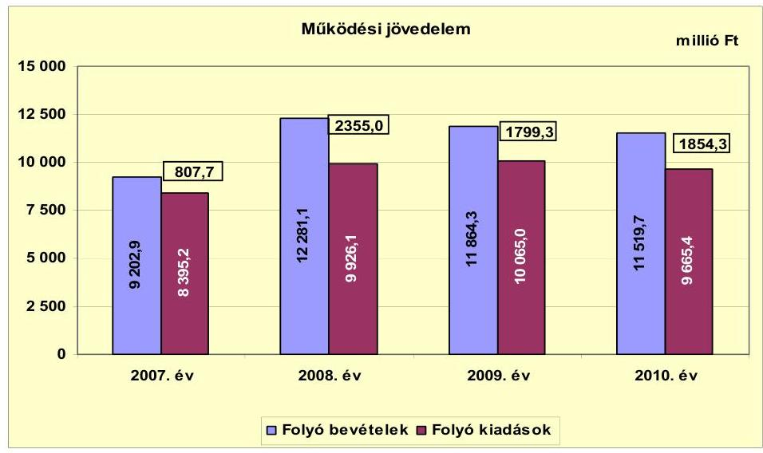

Az Önkormányzat folyó költségvetéséből többlet keletkezett a vizsgált időszakban. A múködési jövedelem értéke a 2007-2010. években összesen 6816,3 millió Ft, minden évben pozitív volt. A vizsgált időszakban a működési jövedelem 2007-2009. évi átlagának ( 1654,0 millió Ft-nak) az aránya a folyó kiadások 2007-2009. évi átlagához ( 9462,1 millió Ft-hoz) viszonyítva 17,5\%-ot, tett ki, a 2010. évre a múködési jövedelem folyó kiadásokhoz viszonyított aránya 19,2\%-ra emelkedett. A múködési jövedelem a 2007. évi 807,7 millió Ft-ról 2008-ra 2355,0 millió Ft-ra (191,5\%-kal) nőtt, amelyet a folyó bevétel folyó kiadást meghaladó mértékű emelkedése eredményezett. A 2007. évről a 2008. évre a folyó bevétel 3078,2 millió Ft-tal ( $33,4 \%$-kal), a folyó kiadás 1530,9 millió Ft-tal ( $18,3 \%$-kal) emelkedett. A folyó bevétel növekedésére hatással volt a költségvetési támogatás és szja bevételnek elsősorban a bérpolitikai intézkedések eredményeként, valamint az óvodai, általános iskolai ellátottak számának növekedéséből következő együttes emelkedése, a helyi adóbevételek, az OEP támogatás, a közmunka támogatásának, valamint az előző évi költségvetési kiegészítés emelkedése. A folyó kiadások növekedését a személyi juttatások és járulékok bérpolitikai intézkedésekkel összefüggő növekedése, a közüzemi díjak, valamint az Önkormányzat által folyósított ellátások emelkedése határozta meg. A 2008. évről a múködési jövedelem a 2009-2010. évekre csökkent. A folyó bevétel csökkenését okozta elsősorban a 2009. évben a költségvetési támogatás intézmény visszaadással ${ }^{28}$, a központosított és egyéb központi támogatás bérintézkedési változásokkal összefüggő mérséklődése, az OEP támogatás, valamint a 2010. évben a realizált helyi adóbevételek visszaesése. A folyó kiadások 2009. évről 2010. évre történő csökkenése kiemelten a személyi juttatások és járulékok intézményi visszaadással, a 2010. évben a Tourinform iroda megszüntetésével, a kollégiumi feladatellátás átszervezésével összefüggő mérséklődéséből adódott.

[^0]
[^0]:    ${ }^{28}$ A balatonvilágosi óvodát és intézményt a 2009. évben adták vissza Balatonvilágos Község Önkormányzatának.

---

A múködési jövedelmet - az Önkormányzat adatszolgáltatása alapján - a kiemelten kötelező feladatot ellátó SIOK átszervezésének forrásmegtakarító hatása a 2009. évben 70,5 millió Ft-tal, a 2010. évben 96,0 millió Ft-tal növelte. A múködési jövedelmet az önként vállalt feladatok körében végrehajtott feladatátszervezések megtakarításai a 2010. évben 56,0 millió Ft-tal emelték. A kötelező és önként vállalt feladatok ellátását biztosító szervezeti keretekben, a feladatellátás módjában bekövetkezett változások - az Önkormányzat adatszolgáltatása alapján - a 2009-2010. években a folyó költségvetés egyenlegét összesen 222,5 millió Ft-tal növelték.

Az Önkormányzat az ellenőrzött időszakban működőképességének megőrzését szolgáló kiegészítő támogatásra nem pályázott.

A 2007-2010. években az Önkormányzat nettó működési jövedelmének évenkénti változását az alábbi ábra szemlélteti:
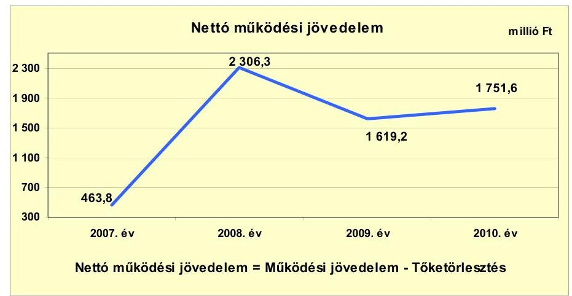

Az Önkormányzat pénzügyi kapacitása - nettó múködési jövedelem - a vizsgált időszakban pozitív volt. A folyó költségvetés egyenlegének és a tőketörlesztésre (hiteltörlesztés és forgatási és befektetési célú értékpapírok beváltása) fordított összegeknek évenkénti különbözete a nettó múködési jövedelem a folyó költségvetési pozíció mellett az adott költségvetési év adósságtörlesztésének hatását is tükrözi.

A múködési jövedelem növekedése és a 2005-2007. évben felvett hitelek tőketörlesztése együttes hatása eredményeként a 2010. évi 1751,6 millió Ft nettó múködési jövedelem meghaladta a 2007-2009. évek nettó múködési jövedelmének átlagát, amely 1463,1 millió Ft volt. A múködési jövedelem növekedését elősegítette az intézmény és feladat megszüntetéssel, átszervezéssel járó létszámcsökkentések 2010. évi kiadáscsökkentő hatása (152,0 millió Ft), valamint a helyi adókkal kapcsolatos intézkedések 2010. évre kimutatott bevételnövelő hatása (268,4 millió Ft). A vizsgált időszakban a 2008. évben volt a folyó bevétel (12 281,1 millió Ft) a legmagasabb, amelynek következményeként ugyanebben az évben volt a pénzügyi kapacitás összege a legnagyobb, 2306,3 millió Ft. A 2008. évi múködési jövedelem növekedését az előző évhez képest kiemelten a költségvetési támogatás és szja bevétel együttes növekedése, az OEP támogatás, az előző évi költségvetési kiegészítés, a helyi adóbevételek emelkedése eredményezte a folyó kiadások a folyó bevételnél mérsékeltebb ütemú növeke-

---

dése mellett. A 2010. évi múködési jövedelem növekedését az előző évhez képest elsősorban az OEP támogatás emelkedése eredményezte, a folyó kiadások a folyó bevételnél nagyobb ütemű csökkenése mellett. A pénzügyi kapacitás a 2009. évre az előző évhez viszonyítva 1619,2 millió Ft-ra (29,8\%-kal) csökkent, mert a múködési jövedelem - a folyó bevétel visszaesése és a folyó kiadás emelkedése miatt - 555,7 millió Ft-tal ( $23,6 \%$-kal) csökkent, és a tőketörlesztés a 2005-2006. években felvett hitelek 2008. év II. negyedévétől elkezdett tőketörlesztése miatt, több mint háromszorosára, 131,4 millió Ft-tal nőtt. A pénzügyi kapacitás összességében kedvezően alakult, mivel az Önkormányzat adósságszolgálatára tízszeres fedezetet nyújtott az évente képződő múködési jövedelem. A 2011-2013. években az Önkormányzat adatszolgáltatása alapján a kötvények tőketörlesztése ( 367,0 millió Ft és 356,3 ezer EUR) valamint a felvett hitelek törlesztése ( 306,4 millió Ft) figyelembevételével a múködési jövedelem képződésének változatlan feltétele mellett a nettó múködési jövedelem csökkenhet.

A folyó bevételek között számba vett költségvetési támogatás összege 2007-ben 76,3 millió Ft, 2008-ban 34,8 millió Ft, 2009-ben 44,2 millió Ft, 2010-ben 12,6 millió Ft fejlesztési célú támogatást tartalmazott. A fejlesztési célú támogatások figyelembevétele nélkül számított nettó múködési jövedelem 2007-ben 387,5 millió Ft-ot, 2008-ban 2271,5 millió Ft-ot, 2009-ben 1575,0 millió Ft-ot és 2010-ben 1739,0 millió Ft-ot tett ki. A költségvetési támogatások felhalmozási célú költségvetési támogatásokkal történő korrekciója esetén sem módosult volna a nettó múködési jövedelem előjele és tendenciája.

A 2007-2010. években az Önkormányzat felhalmozási költségvetésének egyenlege folyamatosan negatív összegű volt, amelyet a következő ábra szemléltet:
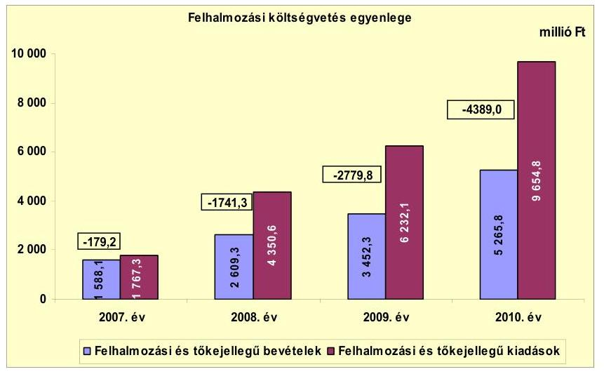

A vizsgált időszakban a felhalmozási forráshiány összesen -9089,3 millió Ft volt, amelyre fedezetet nyújtott az Önkormányzat múködési jövedelme, hitelfelvételei, valamint a 2010. évi fejlesztési célú kötvény kibocsátásából származó bevételek együttes összege. A 2010. évi -4389,0 millió Ft összegű forráshiány -2822,3 millió Ft-tal ( $180,2 \%$-kal) haladta meg a 2007-2009. évi forráshiány átlagos összegét, a -1566,7 millió Ft-ot. A növekvő felhalmozási forráshiány oka, hogy az államháztartáson belülről kapott támogatások évenkénti növekvő öszszege - a saját tőkebevételek 2007. évihez viszonyított csökkenő összege mellett -, nem tudta ellensúlyozni a felhalmozási kiadások növekedését, ezen belül a beruházások növekvő forrásigényét.

---

A felhalmozási bevételek és kiadások között számba vett „Dél-Balaton és Sió-völgye Térségi Regionális Szilárdhulladék-gazdálkodási Rendszer" projekt megvalósítása során a hulladékgazdálkodási társulások nélkül számított felhalmozási költségvetés egyenlege a 2007. évben -126,0 millió Ft-ot, a 2008. évben -1503,7 millió Ft-ot, a 2009. évben -2353,0 millió Ft-ot, valamint 2010-ben -3674,5 millió Ft-ot tett ki. A felhalmozási költségvetés egyenlegének a hulladékgazdálkodási társulások adataival történő korrekciója esetén sem módosult volna a felhalmozási költségvetés egyenlegének előjele és tendenciája.

Az Önkormányzatnál a felhalmozási hiány által generált finanszírozási igény a 2009. évtől növelte a pénzügyi kockázatot, mert a múködési jövedelem képződése az adósságszolgálat teljesítésén felül a felhalmozási költségvetés hiányának teljes fedezetére nem biztosított forrást.

Az Önkormányzatnak a CLF módszer szerint 2007-ben 284,6 millió Ft, 2008-ban 565,0 millió Ft pénzügyi többlete keletkezett. A 2009-2010. években - a 2008. évhez évenként viszonyított nettó múködési jövedelem csökkenő összege és a felhalmozási költségvetés növekvő hiánya miatt - -1160,6 és -2637,4 millió Ft finanszírozási hiánya ${ }^{29}$ keletkezett, amelynek finanszírozását a finanszírozási célú bevételek, ezen belül a 2010. évben 2323,0 millió Ft összegű kötvényforrás biztosította.

A finanszírozási múveletek 2007-2010. évekbeli egyenlegét a következő ábra szemlélteti:
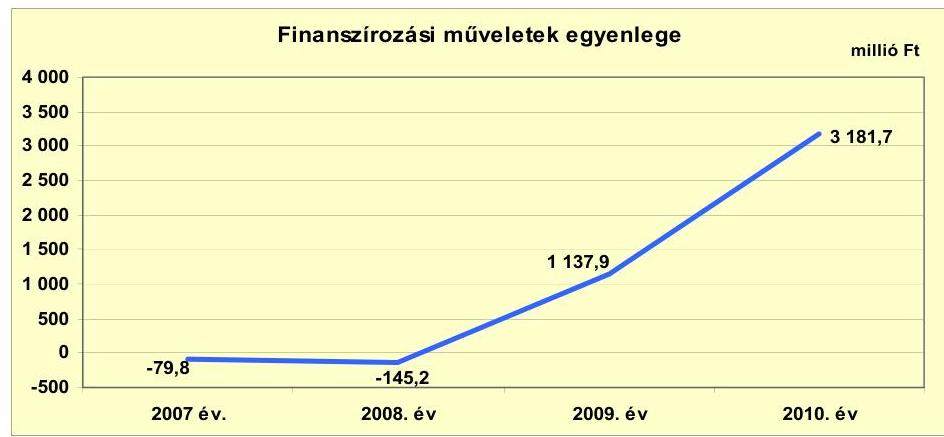

A finanszírozási célú műveleteket a jelentés 2. számú mellékletének 4.1-4.8. pontjai részletezik. A finanszírozási múveletek egyenlege 2007-2008. években negatív összegű lett (-79,8 és -145,2 millió Ft), mivel a hiteltörlesztés összege meghaladta a hitelfelvételekét. A 2009-2010. években finanszírozási többlet keletkezett (1137,9 és 3181,7 millió Ft), amely azt jelzi, hogy az éves költségvetések végrehajtása során a hitel felvétel és a kötvénykibocsátás összege meghaladta a hitelfizetés összegét. A 2009-2010. években a hitelfelvétel 478,8 és 986,0 millió Ft-ot, a kötvénykibocsátás 677,0 és 2323,0 millió Ft-ot tett ki, valamint a tőketörlesztés 180,1 és 102,7 millió Ft-ban realizálódott. A tőketörlesztés a 2007. évről a 2008. évre csökkent, mivel a 2000-2005. között felvett, illetve társulástól átvállalt hat hitel visszafizetése a 2007. évben fejeződött be. A 2010. december 31-én még fennálló 2005-2006. években felvett három hitel tőketör-

[^0]
[^0]:    ${ }^{29}$ A nettó múködési jövedelem és a felhalmozási költségvetés egyenlegeinek összege.

---

lesztése a 2008. év II. negyedévétől kezdődött meg, amelynek következményeként a tőketörlesztés összege a 2008. évi 48,7 millió Ft-ról a 2009. évre 180,1 millió Ft-ra (3,7-szeresére) nőtt.

Az Önkormányzat zárszámadási rendeleteiben a múködési és fejlesztési többletet a hagyományos költségvetési szerkezet alapján mutatta be ${ }^{30}$, amelyről a jelentés 1. számú melléklete nyújt tájékoztatást. A zárszámadási rendeletek a 2007-2010. évekre 834,1 millió Ft, 951,7 millió Ft, 1164,8 millió Ft, valamint 1867,2 millió Ft bevételi többletet jeleztek.

A 2007-2011. június 30-a között az Önkormányzat összesen 473,1 millió Ft kamatot fizetett meg. Az átmenetileg szabad pénzeszközein realizált kamatbevétel 431,4 millió Ft volt.

Az Önkormányzat 2007-2011. év I. félév közötti kamatbevételeit és kamatkiadásait a következő ábra mutatja:
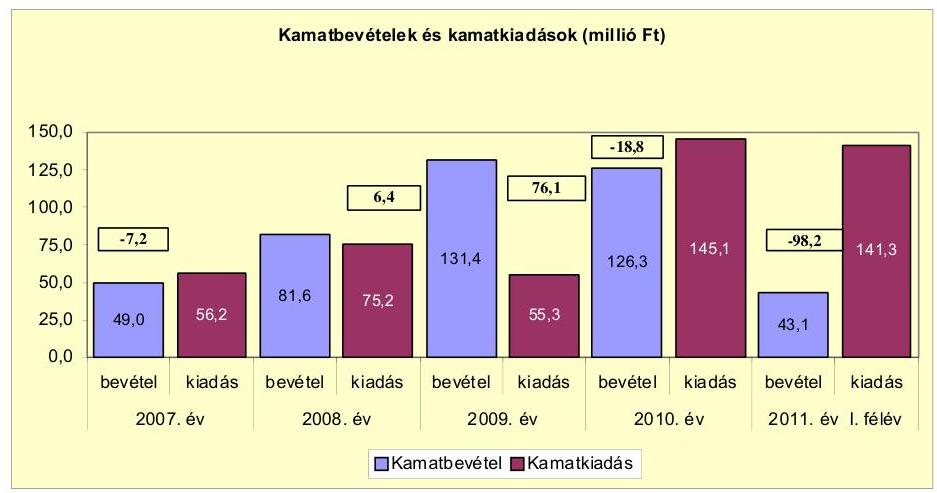

A 2009-2010. évi 131,4 és 126,3 millió Ft kamatbevétel - 2008. évhez viszonyított - növekedésének oka a lekötött betét és a tagi kölcsön után fizetett kamat növekedése mellett, hogy a 2009-2010. évi 677,0 és 2323,0 millió Ft összegű kötvénykibocsátást követően az átmenetileg szabad kötvényforrás lekötéséből származó kamatbevétel a 2009. évben 27,0 millió Ft-ot, a 2010. évben 33,1 millió Ft-ot tett ki. A 2009. évben a 2008. évhez képest a lekötött betét kamatnövekedése 25,2 millió Ft-ot ( $51,9 \%$-ot), a 2010. évben a 2008. évhez viszonyítva a lekötött betét kamatnövekedése 9,6 millió Ft-ot (19,7\%-ot) tett ki. A tagi kölcsön kamata a 2010. évben 28,2 millió Ft kamatbevételt jelentett.

A 2011. év I. félévében teljesített kamatbevétel csökkenését (-83,2 millió Ft-ot, $65,9 \%$-ot) elsősorban az okozta, hogy a szabad kötvényforrás után realizált kamatbevétel 17,0 millió Ft-ra ( $48,7 \%$-kal) csökkent. A kamatkiadások 2010. és 2011. év I. félévi növekedése kiemelten a kötvényforrás után elszámolt kamat-

[^0]
[^0]:    ${ }^{30}$ Nincs kötelező előírás a működési és fejlesztési hiány megállapításának módjára.

---

növekedésből ${ }^{31}$, valamint a folyószámlahitel 2009. évhez viszonyított 2010. évi kamatnövekedéséből ( 27,7 millió Ft-ból ${ }^{32}$ ) adódott. A 2010. évben és a 2011. év I. félévében a kamatbevételek már nem nyújtottak fedezetet a kötvények után elszámolt növekvő kamatkiadásokra annak ellenére, hogy a hosszú lejáratú hitelek kamata 2010-re 3,4 millió Ft-tal (11,3\%-kal), 2011. év I. félévére 4,4 millió Ft-tal ( $16,5 \%$-kal) mérséklődtek.

# 2.2. Az Önkormányzat bevételeinek változása 

Az Önkormányzat folyó bevételei a 2007. évi 9202,9 millió Ft-ról a 2010. évre 11519,7 millió Ft-ra emelkedtek, 2011. június 30 -án 5466,4 millió Ft volt. A folyó bevételek főbb bevételi jogcímenkénti adatait az alábbi táblázat részletezi és grafikon mutatja be:
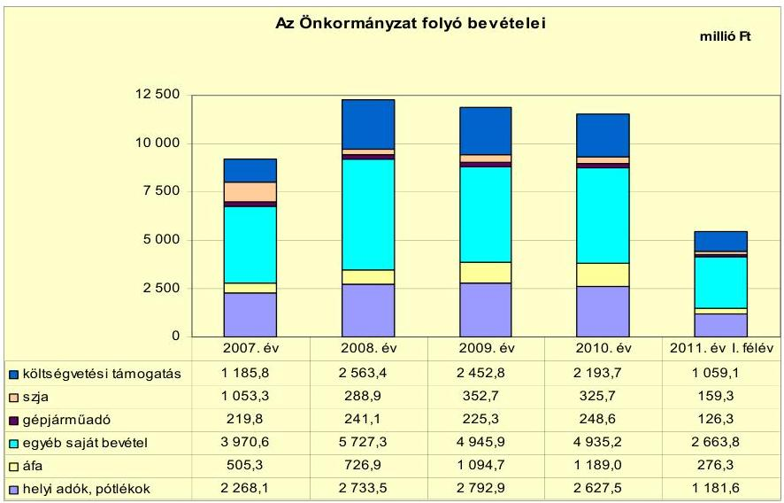

A költségvetési támogatás és szja együttes bevétele 2008-ban volt a legmagasabb, 2852,3 millió Ft, amelyet több tényező együttes hatása eredményezett.

A költségvetési támogatás és szja együttes bevételének 2008. évi növekedésére hatással volt a 2007-ben más önkormányzatoktól egy iskola és három óvoda, valamint 2008-ban egy iskola és óvoda átvétele. A 2008. évben a költségvetési támogatás összegét az intézmény átvételek hatása 91,6 millió Ft-tal, az üdülővendégek tartózkodási ideje alapján beszedett idegenforgalmi adó után igényelt normatív hozzájárulás összege 50,0 millió Ft-tal, a központi bérpolitikai intézkedések és egyéb központi támogatások ${ }^{33} 349,5$ millió Ft-tal növelték.

A 2008. évtől a realizált költségvetési támogatás és szja bevétele csökkenő tendenciájú volt, amelyben szerepet játszott a 2007-ben a másik önkormányzattól

[^0]
[^0]:    ${ }^{31}$ 2010-ben a kötvény után elszámolt kamat 84,2 millió Ft-tal (5,6-szeres), a 2011. év I. félévében 4,0 millió Ft-tal (3,9\%-kal) növekedett az előző évhez képest.
    ${ }^{32}$ A 2009. évben a folyószámlahitel kamata 0,3 millió Ft volt.
    ${ }^{33}$ eseti kereset kiegészítés, a 2007. év után járó 13. havi illetmény 2008. évi elszámolása

---

átvett iskola és óvoda 2009. évi visszaadása ${ }^{34}$, valamint a 2010. évben a kollégiumi feladatellátás átszervezése. Az intézmények visszaadásának hatása 2009-ben 22,5 millió Ft, 2010-ben 54,1 millió Ft, valamint 2011. év I. félévében 27,1 millió Ft támogatás kiesést jelentett. A kollégiumi feladatellátás átszervezése 2010-ben 17,5 millió Ft támogatás kiesést okozott. Az üdülővendégek tartózkodási ideje alapján beszedett idegenforgalmi adó után igényelt normatív hozzájárulás csökkenése 2010-ben 232,0 millió Ft-ot, a központosított és az egyéb központi támogatás együttes kiesése a 2009. évben összesen 234,7 millió Ft-ot jelentett. Az Önkormányzat az ellenőrzött időszakban működőképességének megőrzését szolgáló kiegészítő támogatásra nem pályázott és vis maior támogatást nem kapott.

A helyi adókból befolyt bevételek a 2007-2009. években átlagosan 2598,2 millió Ft-ot tettek ki, a 2010. évre az átlaghoz képest 29,3 millió Ft-tal (1,1\%-kal) növekedtek. A folyó bevételek teljesítéséhez a helyi adóbevételek a 2007-2009. években átlagosan 23,4\%-kal, a 2010. évben 22,8\%-kal járultak hozzá. A helyi adóbevételek a 2007. évi 2268,1 millió Ft-ról a 2008. évre 2733,5 millió Ft-ra (20,5\%-kal), a 2008. évről a 2009. évre 2792,9 millió Ft-ra ( $2,2 \%$-kal) emelkedtek. A növekedést eredményezte az idegenforgalmi adó mértékének emelése ${ }^{35}$, a Polgármesteri hivatal adóalanyokat érintő ellenőrzéseinek gyakorisága, a nem fizető adóalanyoknak inkasszók benyújtása, valamint az építményadó bevallások és a földhivatali ingatlan nyilvántartás összevetéséből, az építményadót nem fizetők feltárása. A bevételek a 2009. évi 2792,9 millió Ft-ról a 2010. évre 2627,5 millió Ft-ra csökkentek. A bevételek évenkénti változása elsősorban az iparűzési adó évenként realizált bevételeivel függött öszsze ${ }^{36}$. Az iparűzési adó a 2009. évi 1638,5 millió Ft-ról a 2010. évre 1467,7 millió Ft-ra ( $10,5 \%$-kal) csökkent, amelynek oka elsősorban az adót nem fizető vállalkozások fizetőképtelensége, valamint a feltöltési kötelezettség mértékhatárának növekedése ${ }^{37}$ volt. Az iparűzési adó 2010-re történő csökkenése mellett, az idegenforgalmi adó mértékének 2009-2010. évi növekedése ellenére, a tartózkodás utáni beszedett idegenforgalmi adó összege a 2009. évi 251,0 millió Ft-ról 2010-re 208,3 millió Ft-ra csökkent. Oka, hogy 2010-ben a szálláshely szolgáltatók és a szállodák vendégforgalma visszaesett. Az építményadó, az üdülők és a tartózkodás után fizetett idegenforgalmi adó bevételek együttes növekménye 2007-2010. között összesen 129,7 millió Ft-ot (36,0\%ot) képviselt. A 2007-2011. év I. féléve között új adót az Önkormányzat nem vetett ki. Az Önkormányzat nyilvántartásában mintegy 50 ezer adóalanyt tartott nyilván, ebből 2500 társas vállalkozás, és 1380-1800 egyéni vállalkozó volt. A helyi adóbevételek jelentős részét a társas vállalkozások és magánszemélyek fizették be, ezért e bevételből eredő kitettsége hosszú távon kockázatot nem je-

[^0]
[^0]:    ${ }^{34}$ Az intézményeket Balatonvilágos Község Önkormányzatának adták vissza.
    ${ }^{35}$ Az idegenforgalmi adó mértéke személyenként és vendégéjszakánként a 2008. évtől egységesen 340 Ft volt, 2009-től 370 Ft-ra nőtt.
    ${ }^{36}$ Az iparűzési adó 2007-ben 1221,0 millió Ft-ot (az éves helyi adóbevételből 53,8\%-ot), 2008-ban 1516,1 millió Ft-ot (az éves helyi adóbevételből 55,4\%-ot), 2009-ben 1638,5 millió Ft-ot (az éves helyi adóbevételből 58,7\%-ot), valamint 2010-ben 1467,7 millió Ft-ot (az éves helyi adóbevételből 55,9\%-ot) tett ki.
    ${ }^{37}$ A feltöltési kötelezettség értékhatára 2010-ben 50 millió Ft-ról 100 millió Ft-ra nőtt.

---

lent. Az Önkormányzatnak van lehetősége új helyi adó bevezetésére (például telekadó), de nem tervezi új adónem bevezetését.

A realizált egyéb saját folyó bevétel 2008-ban volt a legmagasabb 5727,3 millió Ft összeggel. A növekedést a 820,5 millió Ft-ban a könyvviteli nyilvántartásban elszámolt - az EU-s támogatással megvalósult - hulladékkezelő rendszer üzemeltetési joga átengedéséből realizált bevétele, valamint az államháztartáson belülről kapott támogatások - elsősorban a Kórház részére nyújtott OEP támogatás, a közmunka támogatása, a helyi önkormányzatoktól, a Többcélú Kistérségi Társulástól feladatellátásra átvett támogatások, az előző évi költségvetési kiegészítés -, 3442,4 millió Ft bevétele eredményezte. A Kórház részére nyújtott OEP támogatás a 2007-2009. évek átlagos 2351,1 millió Ft öszszegéről a 2010. évre 2698,3 millió Ft-ra (14,8\%-kal) nőtt, a 2011. év I. félévében 1213,9 millió Ft-ban ( $45,0 \%$-ban) realizálódott. Az OEP támogatás 2010. évi növekedését eredményezte, hogy 2010-től a korábbi három hónap helyett két havonta történt a finanszírozás, amely a bevezetés évében egy plusz havi bevételt jelentett.

Az Önkormányzat a vizsgált években összesen három gazdasági társaságtól ${ }^{38}$ kapott osztalékot, amely 126,1 millió Ft-ot tett ki. Ebből egy, 26,0\% tulajdoni hányadú gazdasági társaságától 2007. évben 24,2 millió Ft, 2008. évben 23,6 millió Ft, 2009. évben 32,9 millió Ft, 2010. évben 40,3 millió Ft osztalékot kapott. További egy-egy $8,0 \%$-os és $0,1 \%$-os tulajdoni hányadú gazdasági társaságaitól összesen 5,1 millió Ft osztalék bevételt realizált.

Az Önkormányzat felhalmozási bevételei a 2007-2011. június 30-a között az alábbiak voltak:

| Megnevezés | 2007. év | 2008. év | 2009. év | 2010. év | 2011. év I.   félév |
| :-- | --: | --: | --: | --: | --: |
| Tárgyi eszköz értékesítés | 990,6 | 544,8 | 26,2 | 119,7 | 256,9 |
| Egyéb saját tőkebevétel | 19,6 | 21,1 | 773,1 | 60,1 | 3,8 |
| Âllamháztartáson belülröl   kapott támogatás | 519,4 | 2016,7 | 2632,6 | 5079,4 | 66,5 |
| Âllamháztartáson kivülröl   kapott támogatás | 58,5 | 26,7 | 20,4 | 6,6 | 0,8 |
| Összes felhalmozási bevétel | 1588,1 | 2609,3 | 3452,3 | 5265,8 | 328,0 |

Az államháztartáson belülről kapott támogatások folyamatban lévő fejlesztésekre vonatkozó pályázatok eredményeképpen elsősorban intézmények felújítására, bővítésére, eszközök beszerzésének támogatására, a Kórház fejlesztésére, akadálymentesítésre, valamint hulladékgazdálkodási projekt megvalósítására nyújtottak forrást. Az Önkormányzatnak tárgyi eszközei értékesítése után a vizsgált időszakban 1938,2 millió Ft bevétele volt, amely a 2009-2010. évekre csökkenő tendenciát mutatott. Oka, hogy az értékesítésre kijelölt ingat-

[^0]
[^0]:    ${ }^{38}$ a Zöldfok Kft.-től (2010-től AVE Zöldfok Zrt.), a BAHART Zrt.-től, a DRV-től

---

lanokat a kereslet visszaesése miatt, az Önkormányzat értékesíteni nem tudta ${ }^{39}$. Az egyéb saját tőkebevételek 2009. évben realizált 773,1 millió Ft összegére hatással volt, hogy a Zöldfok Kft.-ben lévő tartós részesedéséből az Önkormányzat 761,5 millió Ft összegben értékesített. Az államháztartáson kívülről kapott támogatások lakossági támogatással megvalósuló közmúfejlesztésekre, visszatérített (munkáltatói, lakásvásárlási) támogatásokra, panelprogramra történő társasházi befizetésekre vonatkoztak, és a vizsgált időszakban 113,0 millió Ft-ban realizálódtak. Az Önkormányzat feladatellátásában részt vevő gazdasági társaságok bevételeit a 4. számú melléklet mutatja be.

# 2.3. Az Önkormányzat folyó és felhalmozási célú kiadásainak változása 

Az Önkormányzat folyó kiadásai főbb jogcímek szerinti bontásban 20072011. június 30. között az alábbiak voltak:

| Megnevezés | 2007. év | 2008. év | 2009. év | 2010. év | $\begin{gathered} \text { millió Ft } \\ 2011 . \text { év I. } \\ \text { félév } \end{gathered}$ |
| :--: | :--: | :--: | :--: | :--: | :--: |
| Folyó kiadások | 8395,2 | 9926,1 | 10065,0 | 9665,4 | 5023,7 |
| Müködési kiadások (kamatkiadás nélkül)* | 7703,7 | 9000,0 | 9069,9 | 8640,8 | 3962,4 |
| Âllamháztartáson belülre átadott pénzeszközök | 2,3 | 30,3 | 32,2 | 28,3 | 0,6 |
| Transzferkiadások | 413,2 | 573,3 | 554,1 | 535,4 | 204,0 |
| -ebből: vállalkozásoknak | 35,2 | 117,5 | 76,1 | 98,1 | 45,3 |
| EU-nak, illetve külföldre | 0,0 | 0,3 | 0,0 | 0,0 | 0,1 |
| magánszemélyeknek | 283,3 | 301,0 | 292,0 | 328,7 | 133,2 |
| nonprofit szervezeteknek | 94,7 | 154,5 | 186,0 | 108,6 | 25,4 |
| Kamatkiadások | 56,2 | 75,2 | 55,3 | 145,1 | 141,3 |
| Előző évi pénzmaradvány átadás | 219,8 | 247,3 | 353,5 | 315,8 | 715,4 |

*A müködési kiadások között vettük számba a személyi juttatásokat, a munkaadót terhelő járulékot, a dologi kiadásokat, valamint az egyéb folyó kiadásokat kamatkiadás nélkül.

A folyó kiadások 2007-2010. évi átlagos összegén ( 9512,9 millió Ft-on) belül a kamatkiadás nélküli múködési kiadások átlaga 8603,6 millió Ft-ot ( $90,4 \%$-ot) képviselt. A 2009. évben az intézményi átvételek kiadásnövelő hatása 2009ben 209,7 millió Ft-ot, az előző évi pénzmaradvány átadás növekedése 106,2 millió Ft-ot, a dologi kiadások emelkedése 150,5 millió Ft-ot jelentett a folyó kiadások körében. A folyó kiadások 2010. és 2011. év I. félévi csökkenésében a 2009. évi intézmény átadások ${ }^{40}$ kiadáscsökkentő hatása 160,8 millió Ft-ot ${ }^{41}$, a Tourinform iroda megszüntetése, a kollégiumi feladatellátás és a SIOK átszervezésének hatása -324,3 millió Ft-ot ${ }^{42}$, a transzferkiadások mérséklődése -350,1 millió Ft-ot jelentett.

[^0]
[^0]:    ${ }^{39}$ A 2009. évben a vagyonértékesítés eredeti előirányzata 1500,0 millió Ft, a 2010. évben 800,0 millió Ft volt.
    ${ }^{40}$ a balatonvilágosi óvoda és iskola visszaadása Balatonvilágos Község Önkormányzatának
    ${ }^{41}$ személyi juttatások, munkaadót terhelő járulékok, dologi kiadás
    ${ }^{42}$ személyi juttatások, munkaadót terhelő járulékok, dologi kiadás

---

Az Önkormányzat folyó kiadásai közül, a főbb kiadás nemek az alábbiak voltak:

| Megnevezés | 2007. év | 2008. év | 2009. év | 2010. év | 2011. év I.   félév |
| :-- | --: | --: | --: | --: | --: |
| Személyi juttatások | 3446,6 | 3822,5 | 3816,9 | 3675,5 | 1707,9 |
| Munkaadót terhelő járulékok | 1093,4 | 1215,9 | 1138,7 | 965,6 | 434,5 |
| Dologi kiadások | 3039,3 | 3868,6 | 4019,1 | 3832,6 | 1726,0 |
| Egyéb folyó kiadások | 124,4 | 93,0 | 95,2 | 167,1 | 94,0 |

A kamatkiadás nélküli múködési kiadások 2007-2010. évi 8603,6 millió Ft-os átlagán belül az Önkormányzat személyi juttatásokra és a munkaadókat terhelő járulékokra teljesített átlagos kiadása 4793,8 millió Ft-ot ( $55,7 \%$-ot) tett ki. A személyi juttatások és a munkaadókat terhelő járulékok teljesített kiadására 2008-ban hatással volt a 2007-2008. évi bérpolitikai intézkedésekkel összefüggő költségvetési támogatás 349,5 millió Ft-tal, az intézményi átvételek 112,2 millió Ft-tal. Ez utóbbi jogcímeken teljesített kiadások 2010-re folyamatosan csökkentek, amelynél az intézményátadások, a Tourinform iroda megszüntetése, a kollégiumi feladatellátás és a SIOK átszervezése 2009-2011. év I. féléve között öszszesen 430,4 millió Ft személyi juttatás és munkaadót terhelő járulék csökkenést jelentett.

A vizsgált időszakban a dologi kiadásokra teljesített kiadás 2009-ben volt a legnagyobb 4019,1 millió Ft összeggel, majd 2010-re 3832,6 millió Ft-ra (4,6\%$\mathrm{kal})$ csökkent. A 2009. évi kiadásban egyrészt éreztette hatását a szolgáltatási kiadások - a közüzemi díjemelkedések, az energia díjemelkedések, a karbantartási, kisjavítási szolgáltatások igénybevételének hatására történt - növekedése, amely a 2008. évi 1604,2 millió Ft-ról 2009-re 1646,6 millió Ft-ra ( $2,6 \%$-kal) nőtt, másrészt az áfa kiadás emelkedése. A 2008-ban a dologi kiadások között számba vett áfa kiadás 965,7 millió Ft-ról 2009-re 1066,0 millió Ft-ra (10,4\%$\mathrm{kal})$ emelkedett. A dologi kiadások 2010. évi csökkenése elsősorban a karbantartási, kisjavítási szolgáltatások kiadás csökkenésének, valamint a balatonvilágosi intézményi átadások következménye. Együttes kiadáscsökkentő hatásuk 118,7 millió Ft volt.

Az Önkormányzat kórházi fekvőbeteg ellátás nélküli folyó kiadása és kamatkiadás nélküli múködési kiadása, valamint ezen belül a főbb kiadás nemek az alábbiak voltak:

|  |  |  |  |  |  |
| :-- | --: | --: | --: | --: | --: |
| Megnevezés | 2007. év | 2008. év | 2009. év | 2010. év | 2011. év I.   félév |
| Folyó kiadások | 5891,5 | 7118,1 | 7206,8 | 6825,6 | 3564,1 |
| Müködési kiadások (kamatkiadás nélkül) | 5205,9 | 6200,6 | 6227,9 | 5808,4 | 2506,2 |
| Kamatkiadás | 56,2 | 75,2 | 55,3 | 145,1 | 141,3 |
| Személyi juttatások | 2293,2 | 2568,1 | 2575,3 | 2483,5 | 1080,3 |
| Munkaadót terhelő járulékok | 722,2 | 812,5 | 768,1 | 644,9 | 279,1 |
| Dologi kiadások | 2084,3 | 2745,8 | 2822,1 | 2552,5 | 1068,2 |
| Egyéb folyó kiadások | 106,2 | 74,2 | 62,4 | 127,5 | 78,6 |

A kórház nélküli kiadások és az Önkormányzat összes folyó kiadása változása között tendenciájában nincs számottevő különbség. Ennek oka, hogy a kórház pénzügyi helyzete nem torzította az Önkormányzat pénzügyi helyzetét. A vizsgált időszakban a Kórház személyi juttatásokra és a munka-

---

adót terhelő járulékokra fordított kiadása (7090,3 millió Ft) az Önkormányzat személyi juttatásokra és a munkaadót terhelő járulékokra teljesített kiadásán (21 317,5 millió Ft-on) belül 33,3\%-ot képviselt. A Kórház személyi juttatásokra és a munkaadót terhelő járulékokra tejesített kiadása a 2007-2009. évi átlagos 1598,2 millió Ft összegéről a 2010. évre 1512,7 millió Ft-ra (5,4\%-kal) mérséklődött, amely a személyhez kapcsolódó költségtérítések és hozzájárulások, a munkaadót terhelő járulékok százalékos mértéke csökkenésének az eredménye. A dologi kiadások a 2007-2009. év átlagos 1091,6 millió Ft összegéről a 2010. évben 1280,1 millió Ft-ra ( $17,3 \%$-kal) nőttek, amely elsősorban a betegforgalom növekedésével összefüggő készletbeszerzések növekedéséből adódott. Az Önkormányzat a nővérszálló működéséhez 2007. évben 2,6 millió Ft-tal járult hozzá, valamint a 2007-2009. között az intézmény részére 208,5 millió Ft költségvetési támogatást adott át. Eszközbeszerzéseire a Kórház az Önkormányzattól a 2009. évben 20,0 millió Ft fejlesztési célú támogatást kapott.

A folyó és felhalmozási kiadások évenkénti változását és a teljesített kiadások felhasználásának arányait a következő grafikon szemlélteti:
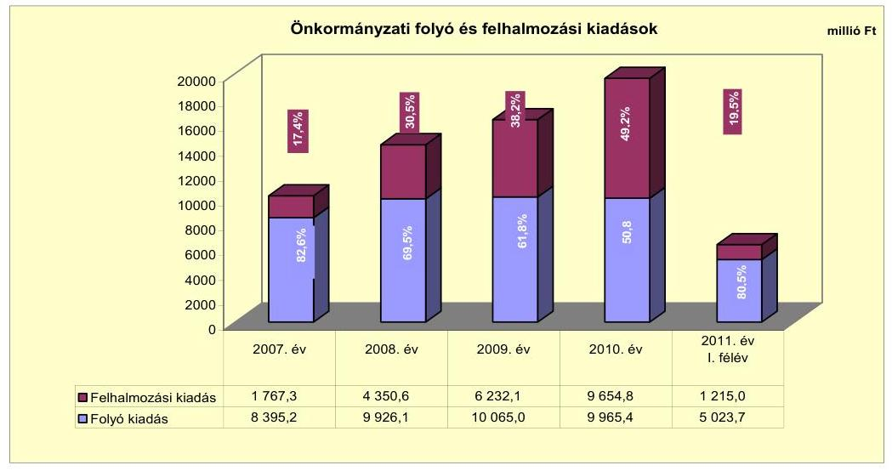

A vizsgált időszakban folyamatosan, a 2007. évi 1767,3 millió Ft-ról 2010-re 9654,8 millió Ft-ra (5,5-szeresére) nőtt a felhalmozási kiadások összege. A változás az Önkormányzat növekvő felújítási és beruházási feladataival, valamint a 2009-2010. évi befektetési célú részesedések vásárlásával függött öszsze. A 2007-2010. évek között a Kórház fejlesztésére 222,0 millió Ft-ot, a könyvtár építésére 1004,6 millió Ft-ot, a Polgármesteri hivatal akadálymentesítésére 50,8 millió Ft-ot, valamint a szilárdhulladék-gazdálkodási rendszer kiépítésére 11339,8 millió Ft-ot fordítottak.

Az Önkormányzat felhalmozási feladatok megvalósítása érdekében intenzív felhalmozási tevékenységet folytatott, melynek eredményeként a 2007-2010. között 6818,3 millió Ft-tal (6,4-szeresére) emelkedett a beruházási, 356,8 millió Ft-tal (5,8-szeresére) a felújítási feladatokra fordított kiadás. Az Önkormányzat a 2009. évben 388,5 millió Ft, a 2010. évben 510,4 millió Ft befektetési célú részesedést vásárolt, amelynek forrásait a 2009-2010. években további részesedések értékesítésből realizált összesen 761,9 millió Ft bevétel, valamint a 2010. évi, a részesedések bevételével korrigált 179,4 millió Ft saját tőkebevétel biztosította.

---

A folyó és felhalmozási kiadások évenkénti alakulását és a teljesített kiadások felhasználásának arányait a „Dél-Balaton és Sió-völgye Térségi Regionális Szilárd-hulladék-gazdálkodási Rendszer" projekt megvalósításában részt vevő hulladékgazdálkodási társulások ${ }^{43}$ adatai nélkül, figyelembe véve az Önkormányzatot illető bevételeket és kiadásokat, az alábbi táblázat és grafikon mutatja be:
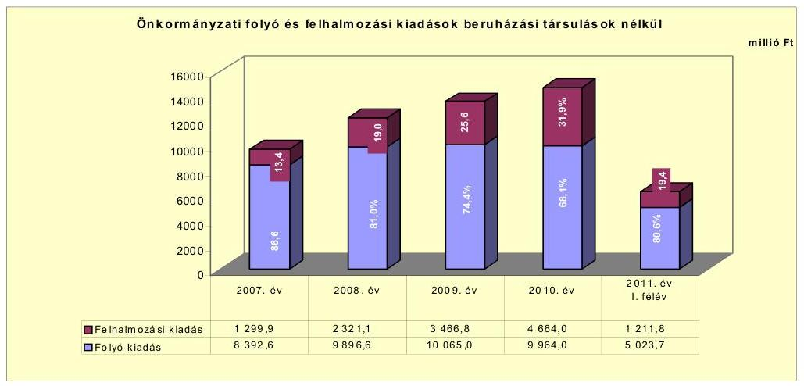

A hulladékgazdálkodási társulások kiadásai nélkül figyelembe vett folyó és felhalmozási kiadások változása az önkormányzati összes kiadáshoz hasonlóan változott a vizsgált időszakban. A felhalmozási kiadások összege a 2007. évi 1299,9 millió Ft-ról 2010-re 4664,0 millió Ft-ra (3,6-szeresére) nőtt az összes kiadáson belül. A növekmény mutatja, hogy az Önkormányzat a „Dél-Balaton és Sió-völgye Térségi Regionális Szilárdhulladék-gazdálkodási Rendszer" projekt megvalósításán felül évente növekvő forrásokat vont be felújítási és fejlesztési feladatai finanszírozásába.

A vizsgált években a „Dél-Balaton és Sió-völgye Térségi Regionális Szilárdhulladékgazdálkodási Rendszer" projekt magvalósításához kapcsolódó teljesített kiadás 11380,4 millió Ft, a teljesített bevétel 11941,2 millió Ft volt, amelyből az Önkormányzatra jutó kiadás 1090,7 millió Ft (a projekt teljes kiadásának 9,6\%-a), a bevétel 1144,5 millió Ft (a projekt teljes bevételének 9,6\%-a) volt.

Az Önkormányzat által 2007-2010. között megvalósított, 10,0 millió Ft értékhatár feletti befejezett felújítások száma 24, a fejlesztések száma 111 volt. Az elvégzett felújítások és fejlesztések bekerülési költsége (áfa-val) 20653,6 millió Ft volt, amelyet 6672,6 millió Ft (32,3\%) összegben saját bevételből, 1110,6 millió Ft (5,4\%) összegben hitelből, 470,6 millió Ft (2,3\%) öszszegben kötvényforrásból, 8673,2 millió Ft (42,0\%) összegben EU-s támogatásból, 3726,6 millió Ft (18,0\%) összegben hazai támogatásból valósultak meg. Az EU-s támogatásból megvalósult fejlesztések előfinanszírozása likviditási gondot nem okozott, a kötelezettségvállalások teljesítésére a forrás rendelkezésre állt.

[^0]
[^0]:    ${ }^{43}$ A támogatási szerződés mellékletét képező konzorcionális szerződést 13 hulladékgazdálkodási társulás tagönkormányzatai írták alá.

---

A 2010. december 31-én folyamatban lévő felújítások száma kettő, a fejlesztések száma tizenhárom volt. A 2011. év I. félévében két felújítás, valamint négy fejlesztés indult. A folyamatban lévő felújítások és fejlesztések várható teljes bekerülési költsége összesen (áfa-val) 10376,6 millió Ft volt, amelyet 2010. december 31-ig 412,7 millió Ft összegben (4,0\%) saját bevételből, 1146,8 millió Ft összegben (11,1\%) kötvényforrásból, 197,0 millió Ft összegben (1,9\%) EU-s támogatásból finanszíroztak. A 2010. december 31-e utáni kötelezettségvállalásokat várhatóan 1771,6 millió Ft összegben (17,1\%) saját bevételből, 565,9 millió Ft (5,4\%) kötvényforrásból 6270,7 millió Ft összegben (60,4\%) EU-s támogatásból, valamint 11,9 millió Ft összegben (0,1\%) hazai támogatásból ellentételezik.

Az Önkormányzatnak kettő beadott és elbírálás alatt lévő pályázata volt, melyeket 2011. év I. félévében nyújtott be EU-s támogatások elnyerésére. A pályázatokban vállalt kötelezettség összesen 93,2 millió Ft-ot tett ki, amelyet 14,6 millió Ft összegben (15,7\%) saját bevételből és 78,6 millió Ft összegben (84,3\%) EU-s támogatásból terveztek ellentételezni. A helyszíni ellenőrzés időszakáig döntés a pályázatok befogadásáról nem született.

A befejezett és a folyamatban lévő fejlesztésekre 2010. december 31-ig 22 410,1 millió Ft-ot teljesítettek, amelyet 7085,3 millió Ft (31,6\%) összegben saját bevételből, 1110,6 millió Ft (4,9\%) összegben hitelből, 1617,4 millió Ft (7,2\%) összegben kötvényforrásból, 8870,2 millió Ft (39,6\%) összegben EU-s támogatásból, valamint 3726,6 millió Ft összegben hazai támogatásból ellentételeztek.

A fejlesztés során kialakított létesítmények, valamint a folyamatban lévő létesítményfejlesztések várható kiadásait, fenntarthatóságát számszerúsítették. A fejlesztések közül elsősorban egy befejezett és hét folyamatban lévő, az Önkormányzat fenntartásában maradó létesítmény befejezése teremt - az eszközhasználati díjakból, bérleti díjakból, rendezvények szervezéséből, fizető mélygarázs parkolási díjából - folyamatos bevételnövelési lehetőséget. A folyamatban lévő és EU-s támogatással megvalósuló projekteknél - összesen 12 projekt négy projektnél vette igénybe az Önkormányzat az állam által biztosított előfinanszírozást. Négy projekthez, elsősorban az eszközbeszerzésekhez, valamint egy projekt előkészítő szakaszhoz kapcsolódott szállítói finanszírozás. A vizsgált időszakban az EU-s támogatással megvalósuló projektek előfinanszírozásához, az önerő biztosításához a források a kötvénymaradvány és a saját bevétel formájában rendelkezésre álltak.

A folyó fejlesztéseknél a 2010. december 31-e utáni és a 2011-2014. éveket érintő kötelezettségvállalások teljesítésére tervezett saját bevétel 1771,6 millió Ft összege a nettó működési jövedelem vizsgált időszakbeli tendenciája - annak a 2009. évről a 2010. évre való növekedésére - szempontjából felhalmozási kockázatot nem jelent. Az Önkormányzatnak azonban finanszírozási kockázattal kell számolnia, ha a kötvényforrás visszafizetésére nem képződik megfelelő mértékű forrás.

---

A vizsgált időszakban az Önkormányzat adatszolgáltatása alapján a kiemelt infrastrukturális beruházások az alábbiak voltak:

- a 2006. évben kezdődött „Dél-Balaton és Sió-völgye Térségi Regionális Szilárdhul-ladék-gazdálkodási Rendszer" beruházás teljes bekerülési költsége - múködési költségek nélkül - 14629,6 millió Ft volt, amely 2406,4 millió Ft összegben (16,4\%) saját bevételből 8635,7 millió Ft összegben (59\%) EU-s támogatásból és 3587,5 millió Ft összegben (24,6\%) hazai támogatásból valósult meg a 2007-2010. és az azt megelőző évben. A fejlesztés a Dél-Dunántúli régió három megyéjének 204 települését foglalta magába. A fejlesztés során elkészült, illetve kialakításra került négy hulladéklerakó központ, kettő komposztáló telep, 11 hulladékgyűjtő udvar, egy átrakó állomás, valamint 805 hulladékgyűjtő sziget.
- A 2009. évben indult Balatoni Regionális Könyvtár fejlesztés várható teljes bekerülési költsége 1400,0 millió Ft volt. A beruházásra 2010. december 31ig kötvényforrásból 1004,6 millió Ft-ot ( $71,8 \%$-ot) fordítottak. 2010. december 31-e után a beruházás a tervezettek szerint további 54,0 millió Ft (3,8\%) saját bevételből, valamint 341,4 millió Ft összegben (24,4\%) kötvényforrásból valósul meg. Az új épület alapterülete $3681,45 \mathrm{~m}^{2}$, amelyhez $147,1 \mathrm{~m}^{2}$ terasz kapcsolódik.
- „Átfogó fejlesztés Siófok Város Kórház-Rendelőintézetében a fenntartható, magas technológiai színvonalú ellátási környezet megteremtésére" elnevezésű, 2010-ben indult projekt várható teljes bekerülési költsége 2403,6 millió Ft-ra alakult. A fejlesztést a tervezettek szerint 240,4 millió Ft (10\%) saját bevételből és 2163,2 millió Ft (90\%) EU-s forrásból finanszírozzák. A projekt átfogó célja a decentralizáltan elhelyezkedő vertikálisan is szétszabdalt diagnosztikai és terápiai egységek centralizálása, központi műtő és központi sterilizáló létrehozása mellett. Az új építés tervezett alapterülete $1480 \mathrm{~m}^{2}$. A rekonstrukcióval, felújítással, átalakítással érintett alapterület a tervezettek szerint összesen $1540 \mathrm{~m}^{2}$.
- A tervezettek szerint a 2009-2014. között megvalósuló „Somi hulladéklerakó fejlesztése hulladék előválogató telepítésével" beruházás várható teljes bekerülési költsége 2783,1 millió Ft. A beruházás a tervezettek szerint 417,4 millió Ft (15\%) saját bevételből és 2365,7 millió Ft (85\%) EU-s támogatásból valósul meg. A projekt eredményeként létrejövő korszerű hulladékkezelési technológia alkalmazható vegyes hulladék válogatására, ebből következően a lerakásra kerülő hulladékmennyiség csökkentésére.

---

Az Önkormányzat a gazdasági társaságai és a kiemelt közfeladatot ellátó gazdasági társaság részére 2007-2010. között a következő pénzeszközátadásokat teljesítette:
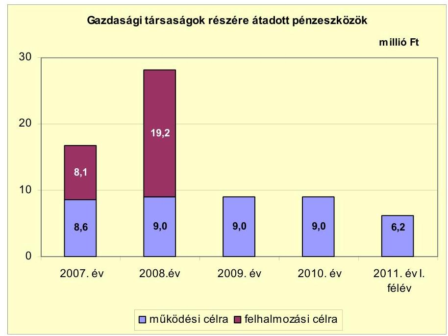

Az Önkormányzat a vizsgált időszakban a gazdasági társaságok részére külön megállapodás alapján múködési célra 41,8 millió Ft-ot, felhalmozási célra 27,3 millió Ft pénzeszközt adott át. A múködési célú átadások a média szolgáltatások igénybevételét, valamint a helyi közlekedést támogatták. A felhalmozási pénzeszközátadások elsősorban a csapadékvíz elvezetését biztosították. A vizsgált időszakban a KAPOS VOLÁN Autóbusz-közlekedési Zrt. részére átadott múködési pénzeszköz összesen 35,4 millió Ft-ot tett ki, melyből 18,9 millió Ft a költségvetési támogatás és 16,5 millió Ft az Önkormányzat vissza nem térítendő támogatása volt. A megállapodásokban rögzített célszerinti felhasználást a gazdasági társaságok teljesítették.

# 3. Az ÖNKORMÁNYZAT KÖTELEZETTSÉGEI 

### 3.1. Az Önkormányzat pénzintézeti kötelezettségeinek változása

Az Önkormányzat pénzintézeti kötelezettségeinek állománya 2006. december 31-étől 2010. december 31-éig 4,7-szeresére, 1101,3 millió Ft-ról 5153,6 millió Ft-ra növekedett, amely a 2011. év I. félév végéig a tőketörlesztések miatt 5141,0 millió Ft-ra (12,6 millió Ft-tal) csökkent. A pénzintézeti kötelezettség állomány a 2007. és 2008. évben az előző évihez képest csökkent 104,3 millió Ft-tal ( $9,5 \%$-kal), illetve 17,2 millió Ft-tal ( $1,3 \%$-kal), a 2009. és 2010. évben jelentős mértékben növekedett 981,6 millió Ft-tal (100,2\%-kal), illetve 3192,2 millió Ft-tal ( $162,8 \%$-kal). A 2006. évi 1101,3 millió Ft kötelezettség állományból a rövid lejáratú kötelezettség összege 179,1 millió Ft (16,3\%), a hosszú lejáratú kötelezettség összege 922,2 millió Ft ( $83,7 \%$ ) volt. A 2009. és a

---

2010. évet jellemző pénzintézeti kötelezettség növekedés meghatározóan a hosszú lejáratú hitelek felvétele és kettő önkormányzati kötvény kibocsátása miatt következett be.
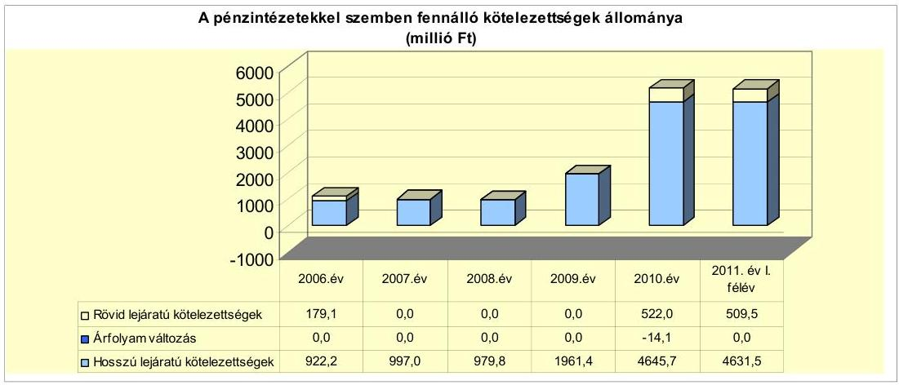

Az árfolyamváltozás hatása is befolyásolja a kötelezettségek alakulását, azonban annak mértéke előre pontosan nem határozható meg, csak várakozásokon alapuló tendenciák jelezhetőek. Annak megítéléséről, hogy a devizában kibocsátott kötvényekért, a kötvények visszavásárlásakor jelentkező forintban számított kötelezettség többletkiadást (árfolyamveszteség), vagy megtakarítást (árfolyamnyereség) eredményez a futamidő végén, a teljes kötelezettség rendezését követően lehet képet alkotni. Mindaddig, amíg törlesztési kötelezettség nem áll fenn (türelmi idő, moratórium), a tőkére vonatkoztatva nincs lehetőség realizált árfolyamveszteség, vagy árfolyamnyereség elszámolására. Ugyanakkor a számviteli szabályok meghatározzák, hogy az árfolyam különbözetet év végén a kötelezettségek, vagy a követelések között a könyvviteli mérlegben nyilván kell tartani, azonban az árfolyam különbözet valójában nem realizált.

Az Önkormányzat a 2010. év végéig az EUR-ban kibocsátott kötvénye tőketörlesztése után 14,1 millió Ft árfolyamnyereséget realizált.

Az Önkormányzat pénzintézeti kötelezettségvállalásaira minden esetben képviselő-testületi döntés alapján került sor. A kötelezettségvállalásból származó források felhasználási céljait meghatározták. Az adósságszolgálat alakulásáról az éves költségvetési rendelettervezetek előterjesztésekor tájékoztatták a Képviselő-testületet. Az adósságot keletkeztető kötelezettségvállalások felső határát betartották. A kötvények kibocsátásáról és a hosszú lejáratú hitelek felvételéről szóló előterjesztésekben a Képviselő-testület tájékoztatása megtörtént a kamat- és tőkefizetési kötelezettségről. A költségvetési rendeletek mellékleteiben bemutatták a lejáratig fizetendő tőketörlesztés és kamatok összegeit, a visszafizetés forrásait azonban nem számszerúsítették.

A vizsgált időszakban a Képviselő-testület a 2009. és a 2010. évben egy EURalapú (2375,4 ezer EUR), illetve egy forintalapú kötvény (2323,0 millió Ft) kibocsátásáról, a 2007., 2008. és 2010. évben összesen 1841,5 millió Ft összegben három hosszú lejáratú fejlesztési célú hitelfelvételről, továbbá minden évben folyószámlahitel felvételéről döntött.

---

Az Önkormányzat 2007-2010 közötti években EUR-ban fennálló adósságot keletkeztető kötelezettségvállalása 2010. december 31-i állapot szerint az alábbi volt:

| Megnevezés | Szerződéskötési   kibocsátás   időpontja | Összeg   ezer EUR-   ban | Kibocsátású   lethiási   ártolyam | Kamat (referencia kamat+   kamatfelár) | Felhasználás célja: |
| :--: | :--: | :--: | :--: | :--: | :--: |
| Siófok Jövőjéért I. kötvény | 2009.05 .19 | 2375,4 | 284,99 | 3 havi EURIBOR+ 3,5\% | Tagi kölcsön nyújtása Termofok Kft. részére:   - Siófoki Kórház klimatizálása,   - Galérius Wellness Centrum bővitésére,   - biomassza erőmű létesítésére |

A Képviselő-testület döntése értelmében a 2375,4 ezer EUR, zártkörű, 20 éves futamidejű változó kamatozású kötvény kibocsátásával finanszírozható a beruházásokhoz kapcsolódó számlák kifizetése, források átadása és önerő biztosítása a Termofok Kft. részére (a gazdasági társaság gázmotoros blokkerőmú beruházást és ahhoz kapcsolódóan a siófoki kórház klimatizálását valósítja meg, illetve a gázmotorok mellé biomassza erőművet telepít). A kötvények kibocsátására több pénzintézettől kértek ajánlatot, az Önkormányzat számára legkedvezőbb ajánlat alapján a számlavezető bank kapott megbízást kötvénykibocsátásra. A kötvénykibocsátással összefüggő egyéb költségként, szerződéskötési dí címen 2,5 millió Ft terhelte az Önkormányzatot. Az Önkormányzat a vizsgált időszakban számlavezető pénzintézetet nem váltott. A kötvény törlesztésére 2010. január 1-jétől került sor. A tőketörlesztés első részlete 7,6 millió Ft (28,5 ezer EUR) volt.

A Siófok Jövőjéért I. kötvény kibocsátásból származó forrásból - kimutatásaik szerint - 544,4 millió Ft-ot a Termofok Kft.-nek nyújtott tagi kölcsön felhasználásával a kibocsátás céljának megfelelően a gazdasági társaság 2009. és 2010. évben 172,7 millió Ft összegben a siófoki kórház klimatizálására, 348,1 millió Ft összegben a Galérius Wellness Centrum bővítésére és 23,6 millió Ft összegben biomassza erőmű létesítésére fordította. A kötvény kibocsátásából származó forrás maradványa 2011. június 30-án 132,6 millió Ft volt. A kötvényforrás befektetéséből 44,0 millió Ft kamatbevételt realizáltak, amely a kibocsátás céljára felhasználható kötvényforrás maradványával együtt elkülönített számlán állt rendelkezésre. Az EUR alapú kötvény kibocsátásából származó pénzintézeti kötelezettségre az Önkormányzat 2011. június 30 -áig 48,8 millió Ft ( 178,2 ezer EUR) tőke-, 60,1 millió Ft (219,2 ezer EUR) kamatfizetést, egyéb költségként 2,5 millió Ft kifizetést teljesített.

---

Az Önkormányzat 2010. december 31-én forintban fennálló, hosszú lejáratú adósságot keletkeztető kötelezettségvállalásai az alábbiak voltak:

| Megnevezés | Szerződéskötés/   Kibocsátás   időpontja | Összeg   millió HUF   ban | Kamat (referencia   kamat+ kamatfelár) | Felhasználás célja: |
| :--: | :--: | :--: | :--: | :--: |
| Siófok Jövőjéért II.   Kötvény | 2010.07 .26 | 2323,0 | 3 havi BUBOR+ 2,0\% | Könyvtár építése, viztorony felújítása, út, járda,   közmúépítés, Polgármesteri hivatal   fütéskorszerúsitése, szabadtéri színpad   rekonstrukciója, parkoló építése, bölcsőde   fejlesztése, Vitma utcaí csapadékvízelvezető   árok kapacitásnövelése, pályázati önerő |
| Fejlesztési hitel 1. | 2005.09 .06 | 207,9 | 3 havi EURIBOR+ 0,79\% | Szennyvizelvezetés, szennyvíztisztitás |
| Fejlesztési hitel 2. | 2005.09 .06 | 329,8 | 3havi EURIBOR+ 1,29\% | Közcisk építése |
| Fejlesztési hitel 3. | 2006.10 .24 | 200,0 | 3 havi EURIBOR+ 1,55\% | Közút építése, infrastrukturális beruházás |
| Fejlesztési hitel 4. | 2007.08 .27 | 239,7 | 3 havi EURIBOR+ 1,5\% | Általános beruházási célok |
| Fejlesztési hitel 5. | 2007.08 .27 | 25,3 | 3 havi EURIBOR+ 1,0\% | Közokitatási célú beruházások |
| Fejlesztési hitel 6. | 2007.08 .27 | 7,2 | 3 havi EURIBOR+ 1,0\% | Kulturális és sport célú beruházások |
| Fejlesztési hitel 7. | 2007.08 .27 | 67,8 | 3 havi EURIBOR+ 1,0\% | Önkormányzati infrastruktura fejlesztés (panel   plusz program) |
| Fejlesztési hitel 8. | 2007.08 .27 | 8,5 | 3 havi EURIBOR+ 1,0\% | Egésziségügy szolgálatások fejlesztése |
| Fejlesztési hitel 9. | 2008.12 .31 | 463,9 | 3 havi EURIBOR+ 1,49\% | Általános beruházási célok |
| Fejlesztési hitel 10. | 2008.12 .31 | 286,1 | 3 havi EURIBOR+ 1,0\% | Kulturális és sport célú infrastruktura kialakítása |
| Fejlesztési hitel 11. | 2010.03 .18 | 5,3 | 3 havi BUBOR+ 2,0\% | Siófok- Kilili viziközmú társulati hitelének   átvállalása |

A 20 éves futamidejű, változó kamatozású, zártkörű, Siófok Jövőjéért II. kötvény kibocsátásával 2323,0 millió Ft összegben forrást biztosítottak az Önkormányzat intézményi és közmű infrastruktúráját érintő beruházásokra és rekonstrukciókra, valamint pályázatok önerejére. A kötvény törlesztésére 2011. január 1-jétől került sor, a tőketörlesztés első részlete 30,2 millió Ft volt. A kötvény kibocsátásából származó bevételt az Önkormányzat - kimutatása szerint - a Képviselő-testület által elfogadott célokra használta fel 2183,3 millió Ft öszszegben, a kibocsátás céljaira felhasználható forrás maradványa 2011. június 30-án 139,7 millió Ft volt.

A 2010. évben és 2011. I. félévben a könyvtár építésére 1129,2 millió Ft-ot, viztorony felújítására (Fő tér rekonstrukció) 240,2 millió Ft-ot, út, járda, közmú és parkolók építésére 318,5 millió Ft-ot, a Polgármesteri hivatal fűtéskorszerűsítésére és a szabadtéri színpad rekonstrukciójára 118,2 millió Ft-ot, bölcsőde fejlesztésre és egyéb önkormányzati beruházásokra 235,1 millió Ft-ot, pályázati önerő biztosítására 142,1 millió Ft-ot fordítottak.

A kötvényből származó forrás befektetéséből származó kamatbevétel összege 34,1 millió $\mathrm{Ft}^{44}$ volt. A kötvénykibocsátással összefüggő egyéb költségként, forgalomba hozatali díj címen 4,3 millió Ft terhelte az Önkormányzatot. A forint alapú kötvény kibocsátásából származó pénzintézeti kötelezettségre az Önkormányzat 2011. június 30 -áig 60,4 millió Ft tőke-, és 167,3 millió Ft kamatfizetést teljesített.

Az Önkormányzat a vizsgált időszakban három - összesen 1841,5 millió Ft öszszegű - fejlesztési hitelszerződést kötött, amelyből kettő hitelszerződés hat illetve kettő önálló hitelcélt tartalmazott. A vizsgált időszakban további három - 2007. január l-je előtt kötött - hitelszerződésből származóan 303,3 millió Ft

[^0]
[^0]:    ${ }^{44}$ A kamatbevétel és a 139,7 millió Ft forrásmaradvány 2011. augusztus hónapban került felhasználásra.

---

kötelezettséget törlesztett. A 2007-2010. között megkötött hitelszerződések és forintban igénybe vett hitelek összességében 1103,8 millió Ft-tal növelték az Önkormányzat kötelezettségállományát. Az Önkormányzat a szerződések szerinti hitelkereteit 2007-2010. években teljes egészében felhasználta.

Az Önkormányzat a vizsgált időszakban, kimutatásai szerint a hosszú lejáratú fejlesztési hitelek forrásait a hitelcélokkal egyezően, 703,6 millió Ft összegben közutak építésére, város rehabilitációra, közvilágítás fejlesztésére, létesítmény felújításra, 25,3 millió Ft összegben közoktatási beruházásokra, 293,3 millió Ft összegben közművelődési feladatokra, kulturális és sport célú infrastruktúra kialakítására használta fel. További 67,8 millió Ft összegben panel plusz program kiadásait, 8,5 millió Ft összegben egészségügyi szolgáltatások fejlesztését, és 5,3 millió Ft összegben vízi közmű társulati hitel átvállalását finanszírozták.

A hitelek törlesztésének megkezdésére 2008. április 1-jétől, 2008. július 1-jétől, 2009. augusztus 1-jétől, 2010. október 1-jétől, illetve 2011. augusztus 1-jétől került sor. A tőketörlesztések első részlete összességében 32,2 millió Ft volt. A hoszszú lejáratú fejlesztési hitelek törlesztésére az Önkormányzat 2011. június 30áig 201,0 millió Ft tőke-, 184,8 millió Ft kamat-, és egyéb költségként, 4,3 millió Ft fizetést teljesített. A vizsgált időszakban a kötvény és hosszú lejáratú hitel forrásokból refinanszírozást nem végeztek.

Az Önkormányzat a múködtetési feladatainak finanszírozását a vizsgált időszakban folyószámlahitel igénybevételével tudta biztosítani, amelynek alakulását az alábbi táblázat mutatja be:

| Megnevezés | 2007. év | 2008. év | 2009. év | 2010. év | 2011. év I.   félév |
| :-- | --: | --: | --: | --: | --: |
| Folyószámlahitel |  |  |  |  |  |
| a folyószámlahitel keretösszege január 1-jén | 600,0 | 600,0 | 600,0 | 600,0 | 600,0 |
| teljesített kamat és egyéb költség | 19,6 | 0,0 | 0,4 | 26,0 | 12,2 |

A folyószámlahitel kamatai ${ }^{45}$ és egyéb költségei a következők voltak:

| Megnevezés | Kamat (referencia+ kamatfelár) | Egyéb költség |
| :--: | :--: | :--: |
| Folyószámlahitel |  |  |
| 2007-2009. év | 3 havi BUBOR $+0,9 \%$ |  |
| 2010-2011. év | 1 havi BUBOR $+1,5 \%$ | 0,5\% rend.tart.jutalék |

Az Önkormányzatnál a folyószámlahitellel zárt napok száma a vizsgált időszakban a likvidítási helyzet változásának megfelelően eltérő tendenciákat mutatott. 2007-ről 2008-ra 177 napról 1 napra csökkent, majd 2009-ről 2010-re 16 napról 149 napra nőtt. A folyószámlahitel - 365 nap figyelembevételével számolt - átlagos állománya a 2007. évi 154,5 millió Ft átlagos napi állományról 2010. évre 142,8 millió Ft-ra, 7,6\%-kal csökkent. (Az átlagos állomány 2011 év. I. félévben 108,2 millió Ft volt, amely a 2010. évihez képest $24,2 \%$-kal csökkent.) A folyószámla hitellel zárt napok alapján számolva - az Önkormányzat

[^0]
[^0]:    ${ }^{45}$ A referenciakamat az alábbiak szerint alakult:

    | MNB BUBOR fixing (állagkamat) \%-ban |  |  |  |  |
    | :-- | :-- | :-- | :-- | :-- | :-- |
    | 2007. évl | 2008. évl | 2009. évl | 2010. évl | 2011. év I.   félév |
    1 havi BUBOR | 7,83 | 8,75 | 8,66 | 5,47 | 6,00 |
    2 havi BUBOR | 7,75 | 8,87 | 8,64 | 5,50 | 6,07 |

---

kimutatása szerint - a hitel átlagos napi állománya a 2007. évi 318,6 millió Ftról a 2010. évre 349,8 millió Ft-ra, 9,8\%-kal nőtt. A vizsgált időszakban a folyamatos likviditás folyószámlahitel igénybevételével történő biztosítása az Önkormányzatnak 60,2 millió Ft kamatfizetési kötelezettséget jelentett.

A vizsgált időszakban az Önkormányzat munkabér-megelőlegezési és egyéb likvid hitelt nem vett igénybe.

Az alapkamat mértékének változása és az árfolyamváltozás jelentősen befolyásolja a folyó kötelezettségek és a jövőbeni kötelezettségek alakulását is, jelentős hatással van a teljes futamidőre számított várható kamatkötelezettség nagyságára, mértékük azonban előre pontosan nem határozható meg. A jelenlegi kötvények és a fejlesztési hitelek esetében a kamatfizetési kötelezettségek alakulását jelentősen befolyásolta és jelenleg is befolyásolja a kibocsátáskori és az utolsó kamatfizetéskori kamatok változása, amelyet az alábbi táblázat mutat be:

| Megnevezés | Kibocsátási, lehívási | Utolsó fizetéskori | Változás \% |
| :--: | :--: | :--: | :--: |
|  | kamat (referencia + kamatfelár) \% |  |  |
| 3 havi EURIBOR (2009.05.19.-i szerződés) | 4,75 | 5,031 | $5,9 \%$ |
| 3 havi BUBOR (2010.07.26.-i szerződés) | 7,31 | 8,1 | $10,8 \%$ |
| 3 havi EURIBOR (2005.09.06.-i szerződés) | 4,512 | 2,009 | $-55,5 \%$ |
| 3 havi EURIBOR (2005.09.06.-i szerződés) | 5,012 | 2,509 | $-49,9 \%$ |
| 3 havi EURIBOR (2006.10.24.-i szerződés) | 5,524 | 3,206 | $-42,0 \%$ |
| 3 havi EURIBOR (2007.08.27.-i szerződés) | 4,473 | 3,037 | $-32,1 \%$ |
| 3 havi EURIBOR (2007.08.27.-i szerződés) | 3,973 | 2,537 | $-36,1 \%$ |
| 3 havi EURIBOR (2007.08.27.-i szerződés) | 3,973 | 2,537 | $-36,1 \%$ |
| 3 havi EURIBOR (2007.08.27.-i szerződés) | 3,97 | 2,537 | $-36,1 \%$ |
| 3 havi EURIBOR (2007.08.27.-i szerződés) | 3,973 | 2,537 | $-36,1 \%$ |
| 3 havi EURIBOR (2007.08.27.-i szerződés) | 3,973 | 2,537 | $-36,1 \%$ |
| 3 havi EURIBOR (2008.12.31.-i szerződés) | 2,21 | 3,1288 | $41,6 \%$ |
| 3 havi EURIBOR (2008.12.31.-i szerződés) | 1,798 | 2,62 | $45,7 \%$ |
| 3 havi BUBOR (2010.03.18.-i szerződés) | 10,4 | 10,4 | $0,0 \%$ |

A kötvények és hosszú lejáratú fejlesztési hitelek kamata a törlesztés megkezdésétől 2011. június 30 -áig terjedő időszakban az Önkormányzat számára - az induló kamatfeltételekhez viszonyítva - összességében kedvezően változott. Amennyiben a kötvények kamata nem változott volna, az Önkormányzatnak kibocsátáskori kamattal számolva 2011. június 30 -áig 231,4 ezer EUR és 168,2 millió Ft kamatfizetési kötelezettsége jelentkezik. A változások miatt 12,2 ezer EUR-val és 0,8 millió Ft-tal kisebb fizetési kötelezettséget kellett teljesítenie. A fejlesztési hitelek utolsó fizetéskori kamata nyolc szerződés esetében jelentős mértékben (32,1-55,5\% között) csökkent, egy szerződés esetében nem változott, míg kettő szerződés esetében 41,6\% illetve 45,7\%-os mértékben növekedett a kibocsátási kamathoz képest. Az Önkormányzatnak a hosszú lejáratú hitelek esetében lehívási kamattal számolva 2011. június 30 -ig 228,5 millió Ft kamatfizetési kötelezettsége jelentkezett volna. A kamat változása - a hitelek többségét jellemzően csökkenése - miatt 43,4 millió Ft-tal kisebb fizetési kötelezettséget kellett teljesítenie. A 2009. évben devizában (EUR) keletkezett kötelezettség 2009. december 31-ei állománya után az Áhsz. 33. § (2) bekezdés c) pontjában foglaltak ellenére nem számoltak el nem realizált árfolyam különbözetet (veszteséget vagy nyereséget) és ezt nem rögzítették a saját tőke változásaként. A 2010. évi devizában nyilvántartott kötelezettségállomány értékelése az Áhsz.-ben előírtak szerint megtörtént.

---

Az Önkormányzat pénzintézeti kötelezettségeinek állománya 2010. december 31-én 4524,5 millió Ft és 2256 ezer EUR volt. (A kötelezettség állomány 2011. június 30 -ára 4412,7 millió Ft-ra és 2197,3 ezer EUR-ra csökkent a törlesztések miatt.) A 2011-2013. években teljesítendő kötelezettségek várható összege 1842,3 millió Ft és 672,1 ezer EUR. A 2014. évtől várható kötelezettség összege 4974,2 millió Ft és 2724,3 ezer EUR.

| Megnevezés | Állomány 2010. december 31   én |  |  | Állomány 2011. június 30 -án |  |  | Várható kötelezettség 2011. 2013. években |  | Várható kötelezettség 2014. évtöl |  |
| :--: | :--: | :--: | :--: | :--: | :--: | :--: | :--: | :--: | :--: | :--: |
|  | HUF-ban   (mibiz. Ft-   ban) | Devizitban   (hözsöge   ezer   ban) | Devizit   nem | HUF-ban   (mibiz. Ft-   ban) | Devizitban   (hözsöge   ezer   ban) | Devizit   nem | HUF-ban   (mibiz Ft-   ban) | Devizitban   (hözsöge   ezer   ban) | HUF-ban   (mibiz Ft-   ban) | Devizitban   (hözsöge   ezer   ban) |
| Pénzintézeti kötelezettségek |  |  |  |  |  |  |  |  |  |  |
| Global. (budgást) - kötvény |  | 2256,7 | EUR |  | 2197,3 | EUR |  | 672,1 |  | 2724,3 |
| Global. (budgást i) - kötvény | 2323,0 |  |  | 2262,6 |  |  | 896,0 |  | 3321,6 |  |
| Fajtécsítési hitelek | 1679,9 |  |  | 1649,6 |  |  | 436,8 |  | 1652,6 |  |
| Fajtrőszámla hitel | 522,0 |  |  | 509,0 |  |  | 509,0 |  |  |  |
| Pénzintézeti kötelezettségek összesen HUF-ban | 4524,5 |  |  | 4412,7 |  |  | 1842,3 |  | 4574,2 |  |
| Pénzintézeti kötelezettségek összesen EURO-ban |  | 2256,7 |  |  | 2197,3 |  |  | 672,1 |  | 2724,3 |
| Elutazítálok |  |  |  |  |  |  |  |  |  |  |
| Szuzsodig | 52,3 |  |  | 49,1 |  |  |  |  |  |  |
| Biztosítékok összesen | 52,3 |  |  | 49,1 |  |  |  |  |  |  |
| Lióing kötelezettségek |  | 265,0 | CHF |  | 238,9 | CHF |  | 156,5 |  | 106,5 |
| Szabitő tartozás | 529,2 |  |  | 412,1 |  |  | 412,1 |  |  |  |
| Égyek kötelezettségek | 457,5 |  |  | 409,5 |  |  |  | 1105,8* |  | 679,0* |

* Adatok ezer EUR-ban

A 2011-2013. évekre, és a 2014. évtől várható kötelezettségek teljesítésére az Önkormányzat tájékoztatása szerint figyelembe vehető a 2011. évben és - várhatóan - a következő években képződő nettó működési jövedelem, 550,3 millió Ft 2010. év végi követelésállományból behajtható forrás, valamint a törzsvagyon körébe nem tartozó forgalomképes ingatlanvagyon. A kötvények és a hitelek törlesztésének kockázatát növelheti az Önkormányzat számára kedvezőtlen hitelkamat növekedés bekövetkezése, valamint a devizában nyilvántartott kötelezettség - a forint árfolyamromlása miatt bekövetkező - növekedése. További törlesztési kockázatot jelenthet a következő években képződő nettó működési jövedelem - vizsgált időszakra jellemző tendenciától eltérő kedvezőtlen alakulása.

# 3.2. A szállítói kötelezettségek változása 

Az Önkormányzat és költségvetési szerveinek szállítói állománya 2011. június 30-án 412,1 millió Ft volt, amely a 6567,2 millió Ft értékű összes kötelezettség 6,3\%-a volt. A mérleg szerinti szállító kötelezettség 2006-2008. évek között a megelőző évihez képest csökkent (a 2007. évre 11,1\%-kal, 24,9 millió Fttal, a 2008. évre 54,4\%kal, 108,4 millió Ft-tal). A 2009. és 2011. évben a tartozás jelentős mértékben növekedett, az előző évihez képest 4,2-szeres (290,4 millió Ft) illetve 1,9-szeres (191,8 millió Ft) mértékben. A 2011. június 30-án fennálló 412,1 millió Ft szállítói tartozásból a Kórház kötelezettsége 116,9 millió Ft $(28,4 \%)$ volt.

Az Önkormányzat szállítói tartozásai tekintetében átütemezésre nem került sor. A szállítói kötelezettségeken belül a lejárt szállítói tartozások összegének változása alapvetően az Önkormányzat likviditási helyzetétől függött. Ennek romlása okozta azt, hogy a 2009. évben az Önkormányzat csak késedelmesen tudta teljesíteni a 113,5 millió Ft értékű, részvény vételár megfizetésére vonat-

---

kozó kötelezettségét, amely a lejárt szállítói tartozások nagymértékű növekedését okozta. A lejárt szállítói állomány 2010. évi csökkenését (138,2 millió Ft-ról 46,5 millió Ft-ra, 36\%-ról 21,1\%-ra) követően - a likviditási problémák erősödésének eredményeként - ismét jelentős növekedés következett be (a lejárt szállítói tartozások összege 2011. június 30 -ára a 2010. év végi állományhoz képest 6,2-szeresére, 286,2 millió Ft-ra növekedett). A 2007. és 2010. évek közötti időszakban a lejárt szállítói tartozások 98,8\%-át, (194,1 millió Ft-ot) a 30 nap alatti tartozásállomány tette ki, 2,4 millió Ft lejárt szállítói tartozás 31 és 60 nap közötti lejáratú volt. Ezzel szemben a 2011. év I. félév végén jelentkező lejárt szállítói állomány lejárat szerinti összetétele kedvezőtlen irányba módosult. (A lejárt 286,2 millió Ft összegű tartozás 49,3\%-a, 141,2 millió Ft 31 és 60 nap közötti, ami szintén a likviditással kapcsolatos nehézségek növekedése miatt következett be.) A lejárt határidejú szállítói tartozások között el nem ismert tartozásokat és EU-s támogatások finanszírozásával összefüggő tartozásokat nem mutattak ki.

A Kórháznak a vizsgált időszakban - az Önkormányzat adatszolgáltatása szerint - nem volt lejárt szállítói tartozása. Az Önkormányzatnak a vizsgált időszakban - kimutatása szerint - nem volt egyéb kiadási elmaradása.

# 3.3. Egyéb kötelezettségek változása 

Az Önkormányzatnak, valamint költségvetési szerveinek ${ }^{46}$ eszközök bérlésére irányuló lizingszerződésekből fennálló kötelezettsége 2011. június 30 -án összesen 238,9 ezer CHF volt. A lámpatestek lízingelésére vonatkozó hét szerződés egyaránt 10 éves időtartamra szól, a legkésőbbi lejárata 2017. augusztus 5 -én esedékes. A szerződések 2011-2013. évekre számított kötelezettsége 158,5 ezer CHF. A jelenlegi kondíciókkal számolva 2014-től a futamidő végéig terjedő kötelezettség 106,5 ezer CHF (a kötelezettség számított összege tartalmazza a kamatfizetés összegét is).

Az Önkormányzatnak 2011. június 30 -án nyilvántartott garancia kötelezettsége nem volt. Az Önkormányzat egy gazdasági társasága és költségvetési szervei részére fejlesztési hitel, illetve líingszerződések igénybevételéhez készfizető kezességet vállalt 111,5 millió Ft összegben, amelynek során figyelemmel voltak az Ötv. 88. § (2) bekezdésében foglalt, az Önkormányzat adósságot keletkeztető éves kötelezettségvállalásának felső határára. A kezességvállalásának öszszes kötelezettsége 2010. év végén 52,3 millió Ft, 2011. év I. félév végén 49,1 millió Ft volt, amelyekkel kapcsolatban a helyszíni vizsgálat lefolytatásáig fizetési kötelezettsége nem merült fel.

A fennálló hét kezességvállalás közül egy, az Önkormányzat kizárólagos tulajdonában álló gazdasági társaság, a Balaton-parti Kft. részére - 2011. június 30án - vállalt, 24,9 millió Ft összegű készfizető kezesség, amely a Kft. által - partrendezési beruházás fedezetére - felvett hitel visszafizetésének biztosítéka. A további hat - összesen 24,2 millió Ft összegű kezesség - a K\&H Eszközlízing Kft.-vel szemben fennálló mögöttes kötelezettség, melynek alapja az Önkormányzat köz-

[^0]
[^0]:    ${ }^{46}$ Humán GAMESZ, Széchenyi István Általános Iskola, Vak Bottyán János Általános Iskola, Beszédes József Általános Iskola, Somogyi József Általános Iskola

---

oktatási intézményeiben végrehajtott villamossági korszerűsítés eredményeképpen, az Önkormányzat költségvetési szervei által lámpatestek bérlésére kötött lizingszerződések biztosítéka.

Az Önkormányzat a vizsgált időszakban PPP konstrukció keretében nem végzett beruházást.

Az Önkormányzat a 2007-2010. évek között, átlagban évi 18,2 millió Ft öszszegben engedett el követeléseket. Ezt jelentősen meghaladja a 2009. évben elengedett követelések összege ( 30,3 millió Ft). A korábbi adóbehajtási gyakorlat felülvizsgálata eredményeként a több éve fennálló adókötelezettségeket is áttekintették az új szempontrendszernek megfelelően, ennek hatására a 2009. évi adóelengedések összege megemelkedett a korábbi években az Önkormányzat által nem vizsgált követelések elengedésével. A 2011. év I. félévben elengedett követelések összege 12,6 millió Ft volt, melynek 71,7\%-a ( 9,1 millió Ft) helyi adó, $6,3 \%$-a ( 0,8 millió Ft ) késedelmi pótlék, $22,1 \%$-a ( 2,8 millió Ft) bírság követelés volt. A 2007-2010. években átlagosan a követelések 9,8\%-át ( 7,2 millió Ft) méltányosság jogcímen, 31,0\%-át ( 22,6 millió Ft) felszámolással összefüggő fizetésképtelenség miatt, 59,2\%-át (43,2 millió) behajthatatlanság, elévülés jogcímen engedték el.

A követelés elengedésre vonatkozó döntéseket az Önkormányzat vagyonrendelete 2008. december 19-i módosítása óta teljes körűen, az Áht. 108. § (2) bekezdésének megfelelően szabályozta az Önkormányzat. Ezt megelőzően a rendelet nem tartalmazta a nem adójogi jogviszonyból származó követelés elengedésének szabályait, azonban erre - az Önkormányzat adatszolgáltatása szerint - nem is került sor. Az adókötelezettségek elengedéséről az Önkormányzat ügyrendje, majd SzMSz-e rendelkezett. Az elengedésre vonatkozó döntéseket - az Áht. 108. § (2) bekezdésének megfelelően - önkormányzati rendeletben, valamint az SzMSz-ben meghatározott eljárás eredményeképpen, az arra jogosultak hozták meg.

Az Önkormányzat 2007. és 2011. év I. félév között két alkalommal nyújtott tagi kölcsönt, illetve visszatérítendő pénzeszközt kizárólagos tulajdonban lévő gazdasági társaságának, valamint egyéb szervezetnek, összesen 553,4 millió Ft összegben.

A Termofok Kft.-nek 2009. július 10-én kelt tagi kölcsön keretszerződés aláírása óta folyósított 544,4 millió Ft lejárata 2019. december 31. (A tagi kölcsönnel forrást biztosítottak a Termofok Kft. beruházásalhoz ${ }^{47}$, a kölcsön törlesztésének ütemezését megállapodásban rögzítették.) Az Önkormányzat a Római Katolikus Egyház Siófok-Kiliti Egyházközössége számára - a Siófok-Kiliti Honvéd u. 36. szám alatt található ingatlan átalakítási munkáira - nyújtott 9,0 millió Ft visszatérítendő támogatást, amelynek visszafizetési határideje 2013. december 31-e.

Az Önkormányzat adatszolgáltatása alapján a tulajdonában álló ingatlanokon - a szerződések szerint - 2011. június 30 -án jelzálogterhelés nem volt. A hitelszerződésekben az Önkormányzat kötelezettségeinek

[^0]
[^0]:    ${ }^{47}$ Gázmotoros blokkerőmú beruházás és az ahhoz kapcsolódó Kórház klimatizálás megvalósítása, valamint a gázmotorok mellé az üzembiztonság fokozása érdekében biomassza-erőmú telepítése.

---

biztosítékaként nem ingatlanvagyonát terhelték, hanem bankszámláján fennálló számlaköveteléseket ${ }^{48}$ rögzítették.

A korábbi hitelszerződésekben vállalt és 2010. december 31-ig teljesített kötelezettségekre korábban bejegyzett jelzálog jogosultságok ingatlan-nyilvántartásból való törlését az Önkormányzat részéről nem kezdeményezték, a jelzálogbejegyzések törlésére vonatkozó intézkedéseket a helyszíni vizsgálat idején kezdték meg.

A Képviselő-testület a 10/2010. (II. 25.) számú határozatával döntött a Termofok Kft. - Siótour Kft. által birtokolt - 478,3 millió Ft névértékű teljes üzletrészének 50,0 millió Ft és 2519,4 ezer EUR összegű vételárért, részletekben történő megvásárlásáról. Az Önkormányzat a siófoki Galerius fürdő ingatlanvagyon tőkekivonása miatt a Termofok Kft. törzstőkéjének 696,6 millió Ft-tal történő leszállításáról rendelkezett. Az üzletrész adásvételi szerződésből származó, részletekben történő törlesztési kötelezettsége 2015. évben jár le. Az Önkormányzat az üzletrész megvásárlásával és a törzstőke leszállításával biztosítani kívánta a Termofok Kft. beruházásában megvalósult fürdőberuházáshoz a Kft. által felvett hosszú lejáratú fejlesztési hitel törlesztésének forrását, és a fürdőingatlan feletti teljes körű tulajdonosi érdekeltséget. Az üzletrész adásvételi szerződésből eredő kötelezettség 2010. december 31-ei állománya 497,5 millió Ft volt, amely 2011. június 30 -ára 489,5 millió Ft-ra mérséklődött. A 2011-2013. években teljesítendő kötelezettségek várható összege 1105,8 ezer EUR. A 2014. évtől várható kötelezettség összege 679,0 ezer EUR.
2011. június 30 -án az Önkormányzatnak kettő, kizárólagos tulajdonú gazdasági társaságának (Termofok Kft.) egy, jogerős határozattal le nem zárt peres eljárása volt, amelyből a jövőben fizetési kötelezettsége keletkezhet. Ezek együttes perértéke 22,8 millió Ft, melynek 93,4\%-át ( 21,3 millió Ft-ot) a Termofok Kft.-vel szemben indított, pótmunka és vállalkozói díj megfizetése iránti perérték jelenti.

Az Önkormányzatnak, intézményeinek és 50\% feletti tulajdoni hányadú gazdasági társaságainak - adatszolgáltatásuk szerint - jogerős határozattal lezárt, de ki nem fizetett kötelezettsége nincs. Az Önkormányzat a vizsgált időszakban gazdasági társaságától nem vett igénybe kölcsönt.

[^0]
[^0]:    ${ }^{48}$ A számlavezető pénzintézet esetében zálogjog biztosítása az Önkormányzat számlakövetelése erejéig, nem számlavezető, hitelező pénzintézet esetében inkasszó jogosultság biztosítása.

---

Az Önkormányzat többségi tulajdonú gazdasági társaságai kötelezettségeinek állománya és annak várható jövőbeni alakulása a következő:

| Megnevezés | Állomány 2010. december 31   én |  |  | Állomány 2011. június 30-án |  |  | Várható   kötelezettség 2011-   2013. években |  | Várható   kötelezettség 2014.   évtől |  |
| :--: | :--: | :--: | :--: | :--: | :--: | :--: | :--: | :--: | :--: | :--: |
|  | HUF-ban   (mibb Ft-   ban) | Devizában   (összege.   ezer   ban) | Devizis   nem | HUF-ban   (mibb Ft-   ban) | Devizában   (összege.   ezer   ban) | Devizis   nem | HUF-ban   (mibb Ft-   ban) | Devizában   (összege   ezer   ban) | HUF-ban   (mibb Ft-   ban) | Devizában   (összege   ezer   ban) |
| Hosszú lejáratú hitel (HUF) | 251,4 |  |  | 231,7 |  |  | 166,0 |  | 116,3 |  |
| Hosszú lejáratú hitel (EUR) |  | 2050,5 | EUR |  | 1993,8 | EUR |  | 1567,3 |  | 927,6 |
| Folyószámlahitel | 256,0 |  |  | 225,0 |  |  | 225,9 |  | 0,0 |  |
| Pénzintözeli kötelezettségek összesen: | 507,4 | 2050,5 | EUR | 457,6 | 1993,8 | EUR | 391,6 | 1367,3 | 116,3 | 927,6 |
| Szállítási tartozás | 356,9 |  |  | 165,8 |  |  | 165,8 |  |  |  |

Az Önkormányzat négy kizárólagos tulajdonú gazdasági társaságának ${ }^{49}$ 2011. június 30-án fennálló összes kötelezettsége 623,4 millió Ft és 1993,8 ezer EUR volt. A forintban fennálló kötelezettségekből a hosszú lejáratú hitelek állománya 231,7 millió Ft, a folyószámlahitel állománya 225,9 millió Ft, a szállítói tartozás 165,8 millió Ft volt. Lízingszerződésből eredő kötelezettségük nem állt fenn. Az EUR-ban fennálló tartozások teljes egészében hosszú lejáratú hitelből származnak. A 2011-2013. években esedékes kötelezettségek várható összege 557,7 millió Ft és 1367,3 ezer EUR. A 2014. után várható kötelezettség összege 118,3 millió Ft, 927,6 ezer EUR. A vizsgált időszakban az Önkormányzat egy gazdasági társaságának - a Termofok Kft.-nek - nyújtott tagi kölcsönt 544,4 millió Ft értékben. A kizárólagos tulajdonú gazdasági társaságok Önkormányzattal szemben fennálló kötelezettsége 2011. június 30-án 513,7 millió Ft volt, egyéb kötelezettségeik értéke 23,9 millió Ft volt.

Az Önkormányzat a gazdasági társaságokról szóló 2006. évi IV. törvény 54. § (2) bekezdése alapján korlátlan felelősséggel tartozik azon gazdasági társaságának felszámolása esetében, amelyben az Önkormányzat az 52. § (2) bekezdése szerint a szavazatok legalább 75\%-ával rendelkezik, így minősített befolyásszerzőnek minősül, továbbá a csődeljárásról és a felszámolási eljárásról szóló 1991. évi XLIX. törvény 63. § (2) bekezdése alapján a kizárólagos önkormányzati tulajdonú gazdasági társaságának minden olyan kötelezettségéért, amelynek kielégítését a felszámolási eljárás során az adós társaság vagyona nem fedez, ha a hitelezőinek a felszámolási eljárás során benyújtott keresete alapján a bíróság - az adós társaság felé érvényesített tartósan hátrányos üzletpolitikájára figyelemmel - megállapítja az önkormányzat korlátlan és teljes felelősségét.

Az Önkormányzat - kimutatásai alapján - a 2007-2010. években a tárgyi eszközök után együttesen 3800,2 millió Ft értékcsökkenést számolt el. Felújításra összesen nettó (áfa nélkül) 570,2 millió Ft-ot, az elszámolt értékcsökkenés 15,0\%-át fordította, eszközbeszerzésekre - kimutatása szerint - 432,0 millió Ftot teljesített. (A számvitelben elszámolt értékcsökkenés összegéből alapot nem különített el.) A számvitelben elszámolt beruházás összege 15 867,1 millió Ft volt. Az önkormányzati szintű használhatósági fok mutató a 2007-2009. évek átlagát jelentő évi 89,2\%-ról 2010. évre 88,3\%-ra, 0,9 százalékponttal csökkent. A vizsgált időszakban nem használtak fel az éves értékcsökkenés összegét elérő,

[^0]
[^0]:    ${ }^{49}$ A kizárólagos önkormányzati tulajdonú Balaton és Sió Nonprofit Kft., a Termofok Kft., a Siotour Kft. és a Balaton-parti Kft.

---

vagy azt meghaladó felújítási forrást. Az aktivált felújítások értéke a 2010. évben 334,6 millió Ft volt, amely $326,2 \%$-kal haladta meg a 78,5 millió Ft értékű, 2007. és 2009. közötti felújítási kiadások éves átlagát. Az Önkormányzat kimutatásai szerint a 2007-2010. években megvalósított, 2010. december 31-ig befejezett fejlesztéseiből és folyamatban lévő fejlesztési feladataiból eszközpótlást nem teljesített. A 2010. után befejeződő fejlesztéseknél várhatóan eszközpótlásra nem kerül sor. Az Önkormányzat zárszámadási rendeletei tartalmazták az évente elszámolt értékcsökkenés önkormányzati vagyonra gyakorolt hatását, a rendeletekben részletesen bemutatták az évente teljesített felújítási kiadásokat célonként.

# 4. A PÉNZÜGYI EGYENSÚLY MEGTEREMTÉSE ÉrDEKÉBEN HOZOTT INTÉZKEDÉSEK EREDMÉNYE 

A Képviselő-testület a 2007-2010. közötti időszakra vonatkozó gazdasági programjában meghatározott célok között a stabil gazdálkodást, valamint az ezt elősegítő szerkezetátalakító intézményfejlesztést határozott meg. A célok végrehajtása érdekében folyamatosan bevételnövelő, valamint kiadáscsökkentő intézkedéseket tett. A 2007-2011. év I. féléve közötti időszakban a Képviselőtestület jellemzően az éves költségvetési rendeletek elfogadásával, valamint évközben egyedi határozatokban hozott bevételnövelő és kiadáscsökkentő döntéseket. A kiadáscsökkentő és bevételnövelő intézkedések - a döntést megalapozó előterjesztések alapján - a stabil gazdálkodást és a hatékonyabb feladatellátást célozták. Az Önkormányzat kiadáscsökkentő intézkedésként a 2007-2010. között feladatmegszüntetéssel, átszervezéssel járó létszámcsökkentéseket hajtott végre. A 2011. év I. félévét érintő kiadáscsökkentő intézkedéseket nem hoztak. Az Önkormányzat a 2007. év és 2011. június 30. közötti időszakban - adatszolgáltatása alapján, amelyet az ellenőrzés elfogadott - a kiadást csökkentő intézkedések eredményeként 281,2 millió Ft megtakarítást mutatott ki, amelyből 105,0 millió Ft (a megtakarítás 37,3\%-a) az önként vállalt feladatokat ellátó intézmények megszüntetéséhez, átszervezéséhez kapcsolódott. Az Önkormányzatnál az intézmény, feladatmegszüntetéssel, átszervezéssel együtt járó létszámcsökkentés - adatszolgáltatása alapján - 2009-ben 70,5 millió Ft, 2010-ben 152,0 millió Ft, valamint 2011. év I. félévében 58,7 millió Ft kiadáscsökkenést eredményezett.

A kötelező feladatokhoz kapcsolódó létszámcsökkenések, átszervezések eredménye 176,2 millió Ft $(62,6 \%)$ megtakarítást jelentett, amely a SIOK átszervezéséhez kapcsolódott. Az álláshely- és a létszámcsökkenés alakulása a következő volt: a 2008. évben a SIOK tagintézményeinél az intézményüzemeltetés körében öt fő csökkenés történt, a 2009. évben a SIOK tagintézményeiben a technikai dolgozók és a pedagógusok létszáma 26 fővel csökkent.

Az önként vállalt feladatok körében a Képviselő-testület 2010. áprilisi döntése alapján a Tourinform Irodát 2010. május 15 -ével jogutód nélkül megszüntette. A döntés kiadáscsökkentő hatása az Önkormányzat adatszolgáltatása alapján 34,0 millió Ft ( $12,1 \%$ ) volt. Az álláshelyek és a foglalkoztatottak számának csökkenése hat főt tett ki. A Képviselő-testület döntése alapján a kollégiumi feladatellátást 2010. évben átszervezték. Az Önkormányzat kimutatása alapján a döntés kiadáscsökkentő hatása -71,0 millió Ft-ot $(25,2 \%)$ tett ki. A döntés következtében az álláshelyek és a foglalkoztatottak száma 21 fővel mérséklődött.

---

A 2007-2010. között az intézmény- és feladatmegszüntetéssel, intézményi átszervezéssel járó intézkedésekkel egyidejűleg a Képviselő-testület további hat alkalommal hozott az álláshelyek, valamint a foglalkoztatott létszám csökkentésére irányuló döntést.

A 2007. évben a Kollégiumban egy fő nevelőtanári álláshelyet és létszámot csökkentettek. A 2008. évben a Családsegítő Központ jogutód nélküli megszüntetésével összefüggően 17 fő álláshely és létszám csökkentésére került sor. A 2009. évben az álláshelyek és a foglalkoztatottak száma a Polgármesteri hivatalban hét fővel, a SIOK Művészeti Iskolájában egy fővel mérséklődött. A 2009-2010. években az egyéb ágazatban számba vett intézményeknél az álláshely és a létszámcsökkenés három főt tett ki.

Az álláshelyek és a foglalkoztatottak számát 22 fővel csökkentette továbbá két intézmény ${ }^{50}$ visszaadása a Balatonvilágos Község Önkormányzatának.

A 2007-2010. évek között az Önkormányzat - adatszolgáltatása alapján - intézményeinél és a Polgármesteri hivatalban ${ }^{51}$ az álláshelyek és a foglalkoztatottak számát azonosan összesen 109-109 fővel csökkentették. Az Önkormányzat intézményei közötti létszámmozgás figyelmen kívül hagyásával a tényleges létszámcsökkenés önkormányzati szinten 87 fő volt. A képviselő-testületi döntések alapján az álláshelyek és a foglalkoztatottak számának 87 fős csökkenésén belül a szakmai álláshelyek számának csökkenése 82 fő ( $94,3 \%$ ) az intézményüzemeltetéssel kapcsolatos álláshelyek megszüntetése öt fő (5,7\%) volt.

A közoktatási ágazatban az álláshelyek és a foglalkoztatottak száma 76 fővel csökkent, amelyből kilenc főt az egyéb ágazatban számba vett Városi Kincstárban foglalkoztattak tovább. A szociális és gyermekvédelem ágazatban az álláshelyek és a foglalkoztatottak száma 17 fővel mérséklődött, amelyből hét főt a SIOKban és hat fôt a Városi Kincstárban foglalkoztattak a későbbiekben. A Polgármesteri hivatalban az álláshelyek és a foglalkoztatottak száma hét fővel, az egyéb ágazatban az álláshelyek és a foglalkoztatottak száma kilenc fővel csökkent.

A 87 fő létszám csökkenésből prémium évekre ment két fő, nyugdíjba ment három fő. A vizsgált időszakban a Képviselő-testület az álláshelyek és foglalkoztatottak számával azonosan 148-148 fő növekedésről döntött. Az Önkormányzat intézményei közötti létszámmozgás figyelmen kívül hagyásával a tényleges létszámnövekedés önkormányzati szinten 126 fő volt. A 126 fő növekedésből 71 fő (56,3\%) új feladatellátáshoz, 55 fő (43,7\%) egyéb létszámfejlesztéshez kapcsolódott.

A 2007. évben: a balatonvilágosi általános iskola és óvoda, a nagyberényi óvoda, valamint a balatonendrédi óvoda tagintézményként történő csatlakozása következtében az álláshely és a létszámnövekedés 36 fő lett; a Városi Tűzoltóságnál az álláshely és a létszám nyolc fővel bővült, amelyet a III. szervezési kategóriába sorolt tűzoltóság létszámelőírásai indokoltak (egyéb létszámfejlesztés); a Családsegítő Központban és a Gondozási Központban az álláshely és a létszám növekedése egyaránt egy-egy fő volt, a növekedések a kistérségi feladatellátáshoz kapcsolódtak.

[^0]
[^0]:    ${ }^{50}$ a balatonvilágosi óvoda és iskola
    ${ }^{51}$ a szervezetek közötti létszámmozgások létszámcsökkentő hatását is figyelembe véve

---

A 2008. évben: az ádándi általános iskola és óvoda csatlakozása után az álláshely és a létszámnövekedés 32 főt tett ki; a Városi Tűzoltóságnál az álláshely és a létszám a tűzoltósági szervezési kategória létszámelőírásai miatt két fővel bővült (egyéb létszámfejlesztés); a Kórháznál az álláshely és a létszámnövekedés mértéke az ápolásszakmai előírások teljesítése érdekében 30 főben (egyéb létszámfejlesztés) realizálódott.

A 2009. évben: a Kórháznál az álláshely és a létszám az ápolásszakmai előírások teljesítése érdekében 15 fővel emelkedett (egyéb létszámfejlesztés).

A 2010. évben: a Gondozási Központban az álláshely- és a létszámnövekedés egy főt tett ki, amelyet a házi segítségnyújtás múködési engedélymódosítása tett szükségessé.

A létszámcsökkentési és -növelési döntések együttesen az álláshelyek és a foglalkoztatottak számát azonosan, összesen 39 fővel növelték. (Ha figyelembe vesszük, hogy a Kórházban a foglalkoztatottak száma 45 fővel nőtt, az ádándi, balatonendrédi, nagyberényi intézmények átvétele 46 fő növekedést eredményezett, akkor a Polgármesteri hivatalban és a Kórházon kívüli intézményeknél összesen 52 fő létszámcsökkenés történt.)

Az álláshelyek és foglalkoztatottak számának változását az alábbiak szemléltetik:

| Megnevezés (adatok fő-ben) | Közoktatás | Szociális és gyermekvédelem | Egészségiagy | Polgármesteri hivatal | Egyéb | Összesen |
| :--: | :--: | :--: | :--: | :--: | :--: | :--: |
| 2007. január 1-jén jóváhagyott álláshelyek száma | 500 | 66 | 530 | 144 | 168 | 1410 |
| Megszyméedt álláshelyek száma | 76 | 17 | 0 | 7 | 8 | 109 |
| 2008. üres álláshelyek száma | 0 | 0 | 0 | 0 | 0 | 0 |
|  | (csakmal álláshelyek száma | 71 | 17 | 0 | 7 | 8 | 104 |
|  | (nékmény-iztemeltetéssel kapcsolatos |  |  |  |  |  |  |
|  |  |  |  |  |  |  |  |
|  |  | 5 | 0 | 0 | 0 | 0 | 5 |
| Alláshely növekedése | 75 | 3 | 45 | 0 | 25 | 148 |
| 2010. december 31-én záró álláshelyek száma ${ }^{52}$ | 499 | 54 | 575 | 137 | 164 | 1449 |
| 2007. január 1-jén foglalkoztatott létszám | 500 | 66 | 530 | 144 | 168 | 1410 |
| Látszámcsökkenés | 76 | 17 | 0 | 7 | 8 | 109 |
| Létszámnövekedés | 75 | 3 | 45 | 0 | 25 | 148 |
| 2010. december 31-én foglalkoztatott létszám ${ }^{53}$ | 499 | 54 | 575 | 137 | 164 | 1449 |

${ }^{52}$ Az egyéb ágazetban a 2008. évi költségvetési rendelet a nyitó álláshelyek számát két fővel megnövelte.

Az Önkormányzatnál - adatszolgáltatása alapján - üres álláshely nem volt. A két fő prémium évek programban részt vett létszám után az Önkormányzat 2009-ben 8,4 millió Ft, valamint 2010-ben 8,3 millió Ft támogatást kapott.

A Képviselő-testület, a polgármester, valamint az Önkormányzat Pénzügyi és Tulajdonosi Bizottsága ${ }^{52}$ 2007-2011. június 30-a között - az Önkormányzat adatszolgáltatása alapján, amelyet az ellenőrzés elfogadott - összesen 3136,2 millió Ft összegü bevételnövelő intézkedéseket hozott.

A bevételnövelő intézkedések számszerúsített összegéből 999,2 millió Ft (31,9\%) a helyi adókhoz, 2137,0 millió Ft (68,1\%) az eszközök hasznosításához kapcsolódott.

[^0]
[^0]:    ${ }^{52}$ A polgármester, valamint az Önkormányzat Pénzügyi és Tulajdonosi Bizottsága döntéseit a Képviselő-testület jóváhagyta.

---

Az idegenforgalmi adó és az építményadó mértékének növelése az Önkormányzat számára összesen 999,2 millió Ft helyi adóbevételt jelentett. Az idegenforgalmi adó mértéke a 2006. évről a 2007. évre személyenként és vendégéjszakánként az I. övezetben 310 Ft-ról 340 Ft-ra változott, a 2008. évtől egységesen 340 Ft volt, 2009-től 370 Ft-ra nőtt. Az adó mértékének növelése 2007-2011. év I. féléve között 120,4 millió Ft többletbevételt eredményezett. Az üdülésre, pihenésre alkalmas épületek után, melyek nem minősültek lakásnak, az idegenforgalmi adó mértéke a hasznos alapterület után a 2006. évi $900 \mathrm{Ft} / \mathrm{m}^{2}$-ről 2007-re $1000 \mathrm{Ft} / \mathrm{m}^{2}$-re nőtt, majd 2010-től $1200 \mathrm{Ft} / \mathrm{m}^{2}$-re változott. Az adó mértékének növelése 2007-2011. év I. féléve között 214,2 millió Ft többletbevételt eredményezett. Az építményadó az I. övezetben az előző évi $500 \mathrm{Ft} / \mathrm{m}^{2}$-rel szemben $600 \mathrm{Ft} / \mathrm{m}^{2}$-re, illetve $900 \mathrm{Ft} / \mathrm{m}^{2}$-re, a nem lakás céljára szolgáló épület, épületrész esetében $900 \mathrm{Ft} / \mathrm{m}^{2}$-re emelkedett. A 2007. évtől a II. övezetben az adó mértéke egységesen $600 \mathrm{Ft} / \mathrm{m}^{2}$ volt. Az adó mértékének növelése 2007-2011. év I. féléve között 664,6 millió Ft többletbevételt eredményezett. A 2011. évtől az üdülő után fizetendő idegenforgalmi adót, az építményadón belül szabályozták, mértéke nem változott.

Az Önkormányzatnál a vizsgált időszakban az ingatlanok eladásából 2032,5 millió Ft $(95,1 \%)$, az ingatlanok bérbeadásából, valamint a bérleti díjak emelkedéséből 104,5 millió Ft $(4,9 \%)$ bevétele keletkezett.

Az Önkormányzat bevételnövelésre irányuló intézkedéseinek eredményét a 2007-2011. év I. féléve közötti időszakban a következő ábra szemlélteti:
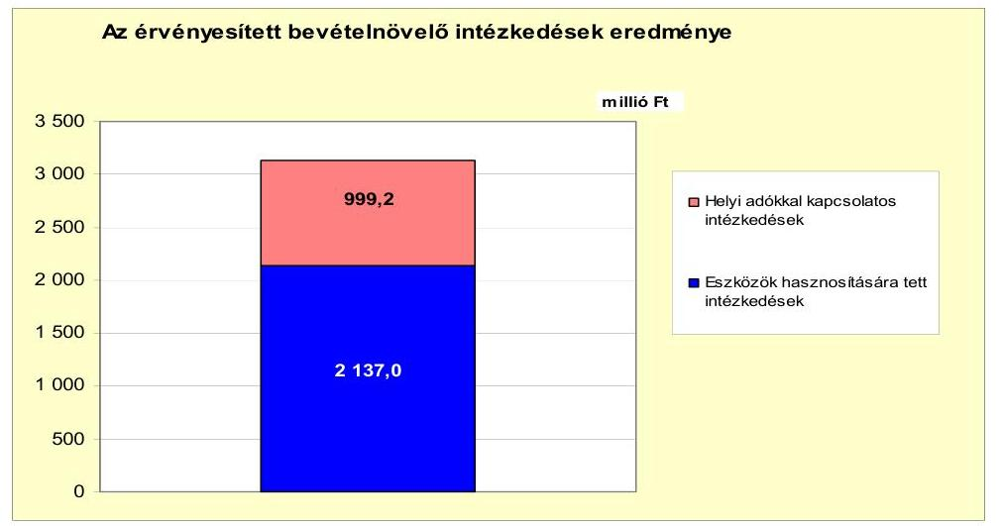

A kiadáscsökkentő és bevételnövelő intézkedések az Önkormányzat pénzügyi egyensúlyát javították, együttes hatásuk a vizsgált időszakban 3417,4 millió Ft volt.

Az Önkormányzat pénzügyi egyensúlyát tovább javította, hogy a 2007-2011. év I. féléve között a központi támogatás és az szja együttes növekménye 1458,1 millió Ft volt.

---

# 5. Az ÁSZ Által a korábBi ÉVEKben a pénzügYi eGyENSÚLY JAVÍTÁSÁRA TETT SZABÁLYSZERŰSÉGI ÉS CÉLSZERŰSÉGI JAVASLATOK HASZNOSULÁSA 

Az ÁSZ az Önkormányzat gazdálkodását a 2008. évben ellenőrizte. A pénzügyi egyensúlyi helyzetre vonatkozóan a jegyző részére három szabályszerűségi és egy célszerűségi javaslatot tett.

A javaslatok megvalósítására - a polgármesternek címzett javaslatot figyelembe véve - felelősök és határidők megjelölésével intézkedési terv készült. Az intézkedési tervet a Képviselő-testület a 172/2008. (XII. 8.) számú határozatával fogadta el.

A javaslatok realizálása keretében a 2009-2011. évi költségvetési rendeletek tartalmazták az EU-s forrásokkal megvalósuló fejlesztések bevételi és kiadási előirányzatait, a többéves kihatással járó EU-s feladatok előirányzatait éves bontásban, valamint az előző évi pénzmaradvány igénybevételét.

A jegyző részére tett javaslatok közül egy javaslat nem valósult meg. Az Áht. 8/A. § (7) bekezdésében ${ }^{53}$ előírtak ellenére a 2009. évi költségvetési rendelet kiadási főösszegének megállapításakor finanszírozási célú pénzügyi műveletet is figyelembe vettek költségvetési hiányt módosító kiadásként.

A 2009. évi költségvetési rendelet kiadási főösszegében hiteltörlesztést is figyelembe vettek. A 2010. és 2011. évi költségvetési rendeletek kiadási főösszegében az adósságszolgálatra tervezett kifizetések szintén megjelentek.

Budapest, 2012. április " 16 "

Melléklet: $\quad 7 \mathrm{db}$
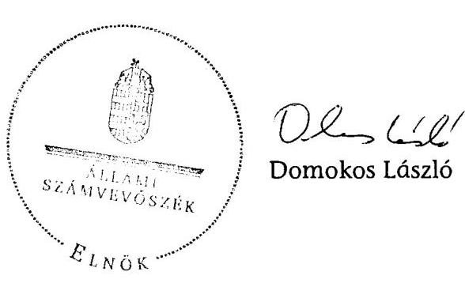

[^0]
[^0]:    ${ }^{53}$ 2012. január 1-jétől szabályozzák az államháztartásról szóló 2011. évi CXCV. törvény 5. § (1)-(3) bekezdései, továbbá a 23. § (2) bekezdés a) és c) pontjai, valamint 73. $\S-a$.

---

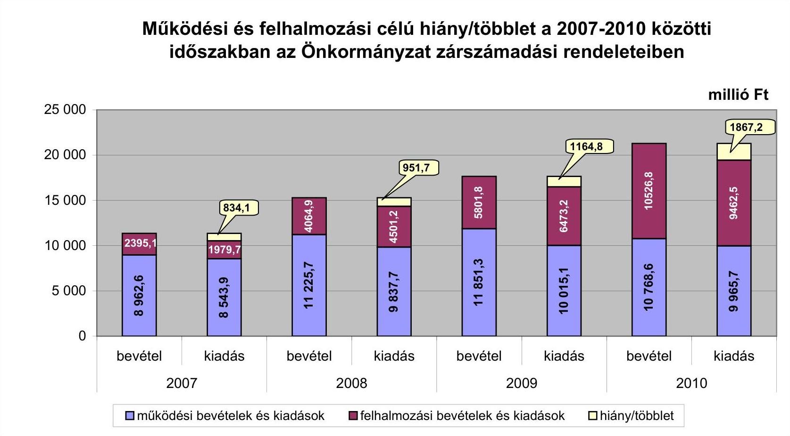

# Működési és felhalmozási célú hiány/többlet a 2007-2010 közötti időszakban az Önkormányzat zárszámadási rendeleteiben

|  I. számú melléklet | II. számú jelentéshez  |
| --- | --- |
|  25 000 | 20 000  |
|  15 000 | 15 000  |
|  10 000 | 10 000  |
|  5 000 | 5 000  |
|  0 | 0  |

**Működési bevételek és kiadások** - felhalmozási bevételek és kiadások - hiány/többlet

---

Az Önkormányzat bevételei és kiadásai, valamint adósságszolgálata 2007-2010 között

|  1. FOLYÓ KÖLTSÉGVETÉS* | 2007. év | 2008. év | 2009. év | 2010. év  |
| --- | --- | --- | --- | --- |
|  1.1.1. Saját müködési bevételek | 3902,7 | 5481,8 | 5483,0 | 5042,8  |
|  1.1.2. Költségvetési támogatás | 1185,8 | 2563,4 | 2452,8 | 2193,7  |
|  1.1.3. Atengedett bevételek | 1273,2 | 530,3 | 578,0 | 574,4  |
|  1.1.4. Állambáztartáson belülről kapott támogatások | 2606,8 | 3442,4 | 2979,3 | 3378,1  |
|  1.1.5. EU-tól és külföldről kapott bevételek | 5,1 | 0,0 | 10,5 | 4,5  |
|  1.1.6. Állambáztartáson kívülről kapott bevételek | 9,5 | 15,9 | 7,2 | 8,5  |
|  1.1.7. Elúző évi pénzmaradvány átvétel | 219,8 | 247,3 | 353,5 | 317,7  |
|  1.1. Folyó bevételek $=1.1 .1 .+1.1 .2 .+1.1 .3 .+1.1 .4 .+1.1 .5 .+1.1 .6 .+1.1 .7$. | 9202,9 | 12281,1 | 11864,3 | 11519,7  |
|  1.2.1. Müködési kiadások kamatkiadások nélkül | 7703,7 | 9000,0 | 9069,9 | 8640,8  |
|  1.2.2. Állambáztartáson belülre átadott pénzeszközök | 2,3 | 30,3 | 32,2 | 28,3  |
|  1.2.3.1. vállalkozásoknak | 35,2 | 117,5 | 76,1 | 98,1  |
|  1.2.3.2. EU-nak, illetve külföldre | 0,0 | 0,3 | 0,0 | 0,0  |
|  1.2.3.3. magáncysmélyeknek | 283,3 | 301,0 | 292,0 | 328,7  |
|  1.2.3.4. nonprofit szervezeteknek | 94,7 | 154,5 | 186,0 | 108,4  |
|  1.2.3. Transferkiadások ( $=1.2 .3 .1+1.2 .3 .2+1.2 .3 .3+1.2 .3 .4$ ) | 413,2 | 573,3 | 554,1 | 535,4  |
|  1.2.4 Kamatkiadások | 56,2 | 75,2 | 55,3 | 145,1  |
|  1.2.5. Elúző évi pénzmaradvány átadás | 219,8 | 247,3 | 353,5 | 315,8  |
|  1.2. Folyó kiadások $=1.2 .1 .+1.2 .2 .+1.2 .3 .+1.2 .4 .+1.2 .5$. | 8395,2 | 9926,1 | 10065,0 | 9665,4  |
|  1.3. Folyó költségvetés egyenlege MÚKÖDÉSI JÖVEDELEM (1.1. - 1.2.) | 807,7 | 2355,0 | 1799,3 | 1854,3  |
|  2. FELHALMOZÁSI KÖLTSÉGVETÉS** |  |  |  |   |
|  2.1.1. Saját tökebevételek | 1010,2 | 565,9 | 799,3 | 179,8  |
|  2.1.2. Állambáztartáson belülről kapott támogatások | 519,4 | 2016,7 | 2632,6 | 5079,4  |
|  2.1.3. EU-tól és külföldről kapott támogatások | 0,0 | 0,0 | 0,0 | 0,0  |
|  2.1.4. Állambáztartáson kívülről kapott támogatások | 58,5 | 26,7 | 20,4 | 6,6  |
|  2.1. Felhalmozási bevételek ( $=2.1 .1 .+2.1 .2+2.1 .3+2.1 .4$ ) | 1588,1 | 2609,3 | 3452,3 | 5265,8  |
|  2.2.1. Saját beruházási kiadás állíva | 1261,4 | 3735,3 | 5081,6 | 8079,7  |
|  2.2.2. Saját felújítási kiadás állíva | 74,5 | 27,9 | 213,7 | 431,3  |
|  2.2.3. Állambáztartáson belülre átadott pénzeszköz | 5,9 | 28,1 | 67,3 | 1,0  |
|  2.2.4. EU-nak és külföldnek adott pénzeszközök | 0,0 | 0,0 | 0,0 | 0,0  |
|  2.2.5. Állambáztartáson kívülre adott pénzeszközök | 425,4 | 463,4 | 481,0 | 632,4  |
|  2.2.6. Befektetési célú részesedések vásárlása | 0,0 | 96,0 | 388,5 | 510,4  |
|  2.2. Felhalmozási kiadások ( $=2.2 .1 .+2.2 .2 .+2.2 .3 .+2.2 .4 .+2.2 .5 .+2.2 .6$ ) | 1767,3 | 4350,6 | 6232,1 | 9654,8  |
|  2.3. Felhalmozási költségvetés egyenlege (2.1. - 2.2.) | $-179,2$ | $-1741,3$ | $-2779,8$ | $-4389,0$  |
|  3. Finanszírozási műveletek nélküli (GFS) pozíció(1.3.+2.3.) | 628,5 | 613,7 | $-980,5$ | $-2534,7$  |
|  4. Finanszírozási műveletek |  |  |  |   |
|  4.1. Hitelfelvétel | 236,4 | 31,5 | 478,8 | 986,0  |
|  4.2. Hiteltörlesztés | 343,9 | 48,7 | 180,1 | 68,8  |
|  4.3. Forgatási és befektetési célú értékpapírok kibocsátása | 0,0 | 0,0 | 677,0 | 2323,0  |
|  4.4. Forgatási és befektetési célú értékpapírok beváltása | 0,0 | 0,0 | 0,0 | 33,9  |
|  4.5. Forgatási és befektetési célú értékpapírok értékesítése | 0,0 | 0,0 | 0,0 | 0,0  |
|  4.6. Forgatási és befektetési célú értékpapírok vásárlása | 0,0 | 0,0 | 0,0 | 0,0  |
|  4.7. Egyéb finanszírozási bevételek (függő, átfutó, kiegyenlítő) | 13,0 | 158,7 | 47,4 | $-28,8$  |
|  4.8. Egyéb finanszírozási kiadások (függő, átfutó, kiegyenlítő) | $-14,7$ | 286,7 | $-114,8$ | $-4,2$  |
|  4.9.Finanszírozási műveletek egyenlege (4.1. - 4.2.+4.3.-4.4+4.5.-4.6.+4.7.-4.8.) | $-79,8$ | $-145,2$ | 1137,9 | 3181,7  |
|  5. Tárgyévi pénzügyi pozíció (1.3.+ 2.3.+4.9.) | 548,7 | 468,5 | 157,4 | 647,0  |
|  6. Nettó müködési jövedelem =müködési jövedelem (1.3.) - tüketörlesztés (4.2+4.4) | 463,8 | 2306,3 | 1619,2 | 1751,6  |
|  TÁJÉKOZTATÓ ADATOK |  |  |  |   |
|  Összes kötelezettség | 1397,3 | 1348,8 | 2661,8 | 5939,7  |
|  ebből rövid lejáratú | 446,4 | 548,4 | 820,2 | 1165,0  |
|  Összes szállítói kötelezettség | 199,3 | 90,9 | 381,3 | 220,2  |
|  ebből lejárt (tanúsítványból) | 5,9 | 5,9 | 138,2 | 46,5  |
|  Pénz és tőkepiaci kötelezettség (adósság) | 997,0 | 979,8 | 1961,4 | 5153,6  |
|  ebből rövid lejáratú | 48,2 | 180,2 | 120,1 | 770,7  |
|  PPP szerződéses állomány jelenértéken (tanúsítványból) | 0,0 | 0,0 | 0,0 | 0,0  |
|  ebből lejárt szolgáltatási díj miatti kötelezettség | 0,0 | 0,0 | 0,0 | 0,0  |
|  Folyószámlabítel napi átlagos állománya (tanúsítványból) | 154,5 | 0,0 | 2,4 | 142,8  |
|  Likvidítitel napi átlagos állománya (tanúsítványból) | 0,0 | 0,0 | 0,0 | 0,0  |
|  Munkabérhítel napi átlagos állománya (tanúsítványból) | 0,0 | 0,0 | 0,0 | 0,0  |
|  Kezesség és garancíavállalások (tanúsítványból) | 94,3 | 81,4 | 66,9 | 52,3  |
|  Jogerős bírósági téletekből adódó kötelezettségek (tanúsítványból) | 0,0 | 0,0 | 0,0 | 0,0  |
|  Finanszírozásba bevonható eszközök: | 1259,1 | 1727,6 | 1885,0 | 2532,1  |
|  Tartós hitelviszonyt megtestesítő értékpapírok év végi állománya | 0,0 | 0,0 | 0,0 | 0,0  |
|  Hosszú lejáratú bankbetétek év végi állománya | 0,0 | 0,0 | 0,0 | 0,0  |
|  Értékpapírok év végi állománya | 0,0 | 0,0 | 0,0 | 0,0  |
|  Pénzeszközök (idegen pénzeszközök nélkül) év végi állománya | 1259,1 | 1727,6 | 1885,0 | 2532,1  |

[^0] [^0]: * Bevételekben nem térül, a kiadásokban nem jelenik meg az amortizáció, a vagyoni helyzetet az egyenleg befolyásolj ** Bevételekben vagyon megőrzésre és bővítésre fordítható források

---

Sídője Város Önkormányzata

3/a. számú melléklet/ a V-3116-016/2012. számú jelentéshez

Az Önkormányzat 2007-2010. években megvalósított, 2010. december 31-ig befejezett fejlesztései és azok forrásösszetelete

|  |   |   |   |   |   |   |   |   |   |   |   |   |   |   |   |   |   |   |   |   |   |   |   |   |   |   |   |   |   |   |   |   |   |   |
| --- | --- | --- | --- | --- | --- | --- | --- | --- | --- | --- | --- | --- | --- | --- | --- | --- | --- | --- | --- | --- | --- | --- | --- | --- | --- | --- | --- | --- | --- | --- | --- | --- | --- | --- |
|   | Fejlesztési feladat (beruházás, felújítás) |  |  |  |  |  |  |  |  |  |  |  |  |  |  |  |  |  |  |  |  |  |  |  |  |  |  |  |  |  |  |  |  |   |
|   |  |  |  |  |  |  |  |  |  |  |  |  |  |  |  |  |  |  |  |  |  |  |  |  |  |  |  |  |  |  |  |  |  |   |
|   |  |  |  |  |  |  |  |  |  |  |  |  |  |  |  |  |  |  |  |  |  |  |  |  |  |  |  |  |  |  |  |  |  |   |
|   |  |  |  |  |  |  |  |  |  |  |  |  |  |  |  |  |  |  |  |  |  |  |  |  |  |  |  |  |  |  |  |  |  |   |
|   |  |  |  |  |  |  |  |  |  |  |  |  |  |  |  |  |  |  |  |  |  |  |  |  |  |  |  |  |  |  |  |  |  |   |
|   |  |  |  |  |  |  |  |  |  |  |  |  |  |  |  |  |  |  |  |  |  |  |  |  |  |  |  |  |  |  |  |  |  |   |
|   |  |  |  |  |  |  |  |  |  |  |  |  |  |  |  |  |  |  |  |  |  |  |  |  |  |  |  |  |  |  |  |  |  |   |
|   |  |  |  |  |  |  |  |  |  |  |  |  |  |  |  |  |  |  |  |  |  |  |  |  |  |  |  |  |  |  |  |  |  |   |
|   |  |  |  |  |  |  |  |  |  |  |  |  |  |  |  |  |  |  |  |  |  |  |  |  |  |  |  |  |  |  |  |  |  |   |
|   |  |  |  |  |  |  |  |  |  |  |  |  |  |  |  |  |  |  |  |  |  |  |  |  |  |  |  |  |  |  |  |  |  |   |
|   |  |  |  |  |  |  |  |  |  |  |  |  |  |  |  |  |  |  |  |  |  |  |  |  |  |  |  |  |  |  |  |  |  |   |
|   |  |  |  |  |  |  |  |  |  |  |  |  |  |  |  |  |  |  |  |  |  |  |  |  |  |  |  |  |  |  |  |  |  |   |
|   |  |  |  |  |  |  |  |  |  |  |  |  |  |  |  |  |  |  |  |  |  |  |  |  |  |  |  |  |  |  |  |  |  |   |
|   |  |  |  |  |  |  |  |  |  |  |  |  |  |  |  |  |  |  |  |  |  |  |  |  |  |  |  |  |  |  |  |  |  |   |
|   |  |  |  |  |  |  |  |  |  |  |  |  |  |  |  |  |  |  |  |  |  |  |  |  |  |  |  |  |  |  |  |  |  |   |
|   |  |  |  |  |  |  |  |  |  |  |  |  |  |  |  |  |  |  |  |  |  |  |  |  |  |  |  |  |  |  |  |  |  |   |
|   |  |  |  |  |  |  |  |  |  |  |  |  |  |  |  |  |  |  |  |  |  |  |  |  |  |  |  |  |  |  |  |  |  |   |
|   |  |  |  |  |  |  |  |  |  |  |  |  |  |  |  |  |  |  |  |  |  |  |  |  |  |  |  |  |  |  |  |  |  |   |
|   |  |  |  |  |  |  |  |  |  |  |  |  |  |  |  |  |  |  |  |  |  |  |  |  |  |  |  |  |  |  |  |  |  |   |
|   |  |  |  |  |  |  |  |  |  |  |  |  |  |  |  |  |  |  |  |  |  |  |  |  |  |  |  |  |  |  |  |  |  |   |
|   |  |  |  |  |  |  |  |  |  |  |  |  |  |  |  |  |  |  |  |  |  |  |  |  |  |  |  |  |  |  |  |  |  |   |
|   |  |  |  |  |  |  |  |  |  |  |  |  |  |  |  |  |  |  |  |  |  |  |  |  |  |  |  |  |  |  |  |  |  |   |
|   |  |  |  |  |  |  |  |  |  |  |  |  |  |  |  |  |  |  |  |  |  |  |  |  |  |  |  |  |  |  |  |  |  |   |
|   |  |  |  |  |  |  |  |  |  |  |  |  |  |  |  |  |  |  |  |  |  |  |  |  |  |  |  |  |  |  |  |  |  |   |
|   |  |  |  |  |  |  |  |  |  |  |  |  |  |  |  |  |  |  |  |  |  |  |  |  |  |  |  |  |  |  |  |  |  |   |
|   |  |  |  |  |  |  |  |  |  |  |  |  |  |  |  |  |  |  |  |  |  |  |  |  |  |  |  |  |  |  |  |  |  |   |
|   |  |  |  |  |  |  |  |  |  |  |  |  |  |  |  |  |  |  |  |  |  |  |  |  |  |  |  |  |  |  |  |  |  |   |
|   |  |  |  |  |  |  |  |  |  |  |  |  |  |  |  |  |  |  |  |  |  |  |  |  |  |  |  |  |  |  |  |  |  |   |
|   |  |  |  |  |  |  |  |  |  |  |  |  |  |  |  |  |  |  |  |  |  |  |  |  |  |  |  |  |  |  |  |  |  |   |
|   |  |  |  |  |  |  |  |  |  |  |  |  |  |  |  |  |  |  |  |  |  |  |  |  |  |  |  |  |  |  |  |  |  |   |
|   |  |  |  |  |  |  |  |  |  |  |  |  |  |  |  |  |  |  |  |  |  |  |  |  |  |  |  |  |  |  |  |  |  |   |
|   |  |  |  |  |  |  |  |  |  |  |  |  |  |  |  |  |  |  |  |  |  |  |  |  |  |  |  |  |  |  |  |  |  |   |
|   |

---

|   |  |  |  |  |  |  |  |  |  |  |  |  |  |  |  |  |  |  |  |  |  |  |  |  |  |  |  |  |  |  |  |  |  |  |  |  |  |  |  |  |  |  |  |  |  |  |  |  |  |  |  |  |  |  |  |  |  |  |  |  |  |  |  |  |  |  |  |  |  |  |  |  |  |  |  |  |  |  |  |  |  |  |  |  |  |  |  |  |  |  |  |  |  |  |  |  |  |  |  |  |  |  | 

---

|   |  |  |  |  |  |  |  |  |  |  |  |  |  |  |  |  |  |  |  |  |  |  |  |  |  |  |  |  |  |  |  |  |  |  |  |  |  |  |  |  |  |  |  |  |  |  |  |  |  |  |  |  |  |  |  |  |  |  |  |  |  |  |  |  |  |  |  |  |  |  |  |  |  |  |  |  |  |  |  |  |  |  |  |  |  |  |  |  |  |  |  |  |  |  |  |  |  |  |  |  |  | 

---

Sötök Város Önkormányzata

Az Önkormányzat 2015. december 31-én folyamatban lévő fejlesztési feladataira 2015. december 31-ig teljesített kifizetések és azok forrásösszetétele

métki Ft

|  |   |   |   |   |   |   |   |   |   |   |   |   |   |   |   |   |   |   |   |   |   |   |   |   |   |   |   |   |   |   |   |   |   |   |
| --- | --- | --- | --- | --- | --- | --- | --- | --- | --- | --- | --- | --- | --- | --- | --- | --- | --- | --- | --- | --- | --- | --- | --- | --- | --- | --- | --- | --- | --- | --- | --- | --- | --- |
|   |  |  |  |  |  |  |  |  |  |  |  |  |  |  |  |  |  |  |  |  |  |  |  |  |  |  |  |  |  |  |  |  |  |   |
|   |  |  |  |  |  |  |  |  |  |  |  |  |  |  |  |  |  |  |  |  |  |  |  |  |  |  |  |  |  |  |  |  |  |   |
|   |  |  |  |  |  |  |  |  |  |  |  |  |  |  |  |  |  |  |  |  |  |  |  |  |  |  |  |  |  |  |  |  |  |   |
|   |  |  |  |  |  |  |  |  |  |  |  |  |  |  |  |  |  |  |  |  |  |  |  |  |  |  |  |  |  |  |  |  |  |   |
|   |  |  |  |  |  |  |  |  |  |  |  |  |  |  |  |  |  |  |  |  |  |  |  |  |  |  |  |  |  |  |  |  |  |   |
|   |  |  |  |  |  |  |  |  |  |  |  |  |  |  |  |  |  |  |  |  |  |  |  |  |  |  |  |  |  |  |  |  |  |   |
|   |  |  |  |  |  |  |  |  |  |  |  |  |  |  |  |  |  |  |  |  |  |  |  |  |  |  |  |  |  |  |  |  |  |   |
|   |  |  |  |  |  |  |  |  |  |  |  |  |  |  |  |  |  |  |  |  |  |  |  |  |  |  |  |  |  |  |  |  |  |   |
|   |  |  |  |  |  |  |  |  |  |  |  |  |  |  |  |  |  |  |  |  |  |  |  |  |  |  |  |  |  |  |  |  |  |   |
|   |  |  |  |  |  |  |  |  |  |  |  |  |  |  |  |  |  |  |  |  |  |  |  |  |  |  |  |  |  |  |  |  |  |   |
|   |  |  |  |  |  |  |  |  |  |  |  |  |  |  |  |  |  |  |  |  |  |  |  |  |  |  |  |  |  |  |  |  |  |   |
|   |  |  |  |  |  |  |  |  |  |  |  |  |  |  |  |  |  |  |  |  |  |  |  |  |  |  |  |  |  |  |  |  |  |   |
|   |  |  |  |  |  |  |  |  |  |  |  |  |  |  |  |  |  |  |  |  |  |  |  |  |  |  |  |  |  |  |  |  |  |   |
|   |  |  |  |  |  |  |  |  |  |  |  |  |  |  |  |  |  |  |  |  |  |  |  |  |  |  |  |  |  |  |  |  |  |   |
|   |  |  |  |  |  |  |  |  |  |  |  |  |  |  |  |  |  |  |  |  |  |  |  |  |  |  |  |  |  |  |  |  |  |   |
|   |  |  |  |  |  |  |  |  |  |  |  |  |  |  |  |  |  |  |  |  |  |  |  |  |  |  |  |  |  |  |  |  |  |   |
|   |  |  |  |  |  |  |  |  |  |  |  |  |  |  |  |  |  |  |  |  |  |  |  |  |  |  |  |  |  |  |  |  |  |   |
|   |  |  |  |  |  |  |  |  |  |  |  |  |  |  |  |  |  |  |  |  |  |  |  |  |  |  |  |  |  |  |  |  |  |   |
|   |  |  |  |  |  |  |  |  |  |  |  |  |  |  |  |  |  |  |  |  |  |  |  |  |  |  |  |  |  |  |  |  |  |   |
|   |  |  |  |  |  |  |  |  |  |  |  |  |  |  |  |  |  |  |  |  |  |  |  |  |  |  |  |  |  |  |  |  |  |   |
|   |  |  |  |  |  |  |  |  |  |  |  |  |  |  |  |  |  |  |  |  |  |  |  |  |  |  |  |  |  |  |  |  |  |   |
|   |  |  |  |  |  |  |  |  |  |  |  |  |  |  |  |  |  |  |  |  |  |  |  |  |  |  |  |  |  |  |  |  |  |   |
|   |  |  |  |  |  |  |  |  |  |  |  |  |  |  |  |  |  |  |  |  |  |  |  |  |  |  |  |  |  |  |  |  |  |   |
|   |  |  |  |  |  |  |  |  |  |  |  |  |  |  |  |  |  |  |  |  |  |  |  |  |  |  |  |  |  |  |  |  |  |   |
|   |  |  |  |  |  |  |  |  |  |  |  |  |  |  |  |  |  |  |  |  |  |  |  |  |  |  |  |  |  |  |  |  |  |   |
|   |  |  |  |  |  |  |  |  |  |  |  |  |  |  |  |  |  |  |  |  |  |  |  |  |  |  |  |  |  |  |  |  |  |   |
|   |  |  |  |  |  |  |  |  |  |  |  |  |  |  |  |  |  |  |  |  |  |  |  |  |  |  |  |  |  |  |  |  |  |   |
|   |  |  |  |  |  |  |  |  |  |  |  |  |  |  |  |  |  |  |  |  |  |  |  |  |  |  |  |  |  |  |  |  |  |   |
|   |  |  |  |  |  |  |  |  |  |  |  |  |  |  |  |  |  |  |  |  |  |  |  |  |  |  |  |  |  |  |  |  |  |   |
|   |  |  |  |  |  |  |  |  |  |  |  |  |  |  |  |  |  |  |  |  |  |  |  |  |  |  |  |  |  |  |  |  |  |   |
|   |  |  |  |  |  |  |  |  |  |  |  |  |  |  |  |  |  |  |  |  |  |  |  |  |  |  |  |  |  |  |  |  |  |   |
|   |

---

Szőtie Város Önkormányzati 2010. december 31-én folyamatos lévő fejlesztési feladataira 2010. december 31-én fennálló kötelezettségek és azok forrásösszeletei

|  |   |   |   |   |   |   |   |   |   |   |   |   |   |   |   |   |   |   |   |   |   |   |   |   |   |   |   |   |   |   |   |   |   |   |   |   |   |   |   |   |   |   |   |   |   |   |   |   |   |   |   |   |   |   |   |   |   |   |   |   |   |   |   |   |   |   |   |   |   |   |   |   |   |   |   |   |   |   |   |   |   |   |   |   |   |   |   |   |   |   |   |   |   |   |   |   |   |   |   |   |

---

### **Az Önkormányzat által beadott, elbírálás alatti pályázati forrásból megvalósítani tervezett fejlesztéseihez kapcsolódó kötelezettségvállalásai és azok forrásösszetétele**

|  1. | 2. | 3. | 4. | 5. | 6. | 7. | 8. | 9. | 10. | 11. | 12. | 13. | 14. | 15. | 16. | 17. | 18. | 19. | 20.  |
| --- | --- | --- | --- | --- | --- | --- | --- | --- | --- | --- | --- | --- | --- | --- | --- | --- | --- | --- | --- |
|  1. Felújítások |  |  |  |  |  |  |  |  |  |  |  |  |  |  |  |  |  |  |   |
|  2. 10 millió Ft alatti felújítások |  |  |  |  | 0,0 | 0,0 | 0,0 | 0,0 | 0,0 | 0,0 |  | 0,0 |  | 0,0 |  | 0,0 |  | 0,0 |   |
|  3. Fejújítások összesen |  |  |  |  | 0,0 | 0,0 | 0,0 | 0,0 | 0,0 | 0,0 |  | 0,0 |  | 0,0 |  | 0,0 |  | 0,0 |   |
|  4. Fejlesztések |  |  |  |  |  |  |  |  |  |  |  |  |  |  |  |  |  |  |   |
|  5. Galérius fürdő napkollektoros rendszer telepítése KEOP-4.2.0-A |  | 1/2011 (II.28) költségvetési rendelet | 2011 | 2012 | 59,8 | 0,0 | 0,0 | 59,8 | 9,8 | 0,0 |  | 0,0 |  | 50,0 |  | 0,0 |  | 0,0 |   |
|  6. Energetikai korszerűsítés a Csárdaréti úti óvodába költségvetési rendelet |  | 1/2011 (II.28) költségvetési rendelet | 2011 | 2012 | 33,8 | 0,0 | 0,0 | 33,8 | 5,0 | 0,0 |  | 0,0 |  | 28,6 |  | 0,0 |  | 0,0 |   |
|  7. 10 millió Ft alatti fejlesztések |  |  |  |  | 0,0 | 0,0 | 0,0 | 0,0 | 0,0 | 0,0 |  | 0,0 |  | 0,0 |  | 0,0 |  | 0,0 |   |
|  8. Fejlesztések összesen |  |  |  |  | 93,2 | 0,0 | 0,0 | 93,2 | 14,6 | 0,0 |  | 0,0 |  | 78,6 |  | 0,0 |  | 0,0 |   |
|  9. Összesen |  |  |  |  | 93,2 | 0,0 | 0,0 | 93,2 | 14,6 | 0,0 |  | 0,0 |  | 78,6 |  | 0,0 |  | 0,0 |   |

*A = ha a forrás már rendelkezésre áll.

B = ha a forrás közbeszerzési eljárása folyamatban van.

C = ha a forrás közbeszerzési eljárása még nem indult el, a forrás nem áll rendelkezésre.

---

# Az önkormányzati feladatok ellátásában résztvevő gazdasági társaságok

|  Gazdasági társaság megnevezése | 2010. december 31-én | a gazdasági társaságnak szerződéses kötelezettségre, feladat ellátási szerződésre alapozottan az önkormányzat költségvetéséből nyújtott  |
| --- | --- | --- |
|   | önkormányzat | önkormányzat  |
|   |  | gazdasági  |
|   |  | társaságának  |
|   |  | tulaidoni hányada  |
|  100%-os tulajdoni hányada gazdasági társaságok: |  |   |
|  Balaton és Sió Nonprofit Kft. |  | 100  |
|  Termofok Kft. |  | 100  |
|  Siotour Kft. |  | 100  |
|  Balaton-parti Kft. |  | 100  |
|  100%-os tulajdoni hányada gazdasági társaságok: | x | x  |
|  75%-feletti tulajdoni hányada gazdasági társaságok összesen | x | x  |
|  91-74%-os tulajdoni hányada gazdasági társaságok összesen | x | x  |
|  Balaton Hajózási Zrt. | 28,0 | 0,0  |
|  AVE Zöldfok Zrt. | 26,0 | 0,0  |
|  Dunántúli Regionális Vízmű Zrt.* | 0,1 | 0,0  |
|  Municipál Rt.** | 0,0 | 0,0  |
|  KAPOS VOLÁN |  |   |
|  Autóbvazkózlekedési Zrt. | 0,0 | 0,0  |
|  Egyéb, közfeladatot ellátó gazdasági társaságok összesen | x | x  |
|  Önkormányzat tulajdoni hányada a Municipál Rt.-ben: 0,1% |  |   |

* Az Önkormányzat tulajdoni hányada a Dunántúli Regionális Vízmű Zrt.-ben: 0,1% ** Az Önkormányzat tulajdoni hányada a Municipál Rt.-ben: 0,02%