# ÁLLAMI   SZÁMVEVŐSZÉK 

## JELENTÉS

Szarvas Város Önkormányzata pénzügyi helyzetének ellenőrzéséről (43/4)

---

# Állami Számvevőszék 

Iktatószám: V-3081-020/2012.
Témaszám: 1015
Vizsgálat-azonosító szám: V0560112

## Az ellenőrzést felügyelte:

Dr. Varga Sándor
számvevő igazgatóhelyettes
Az ellenőrzést vezette:
Renkó Zsuzsanna
számvevő tanácsos
Az ellenőrzés csoportvezetője:
Csepreginé Tancsik Erzsébet
számvevő tanácsos
Az ellenőrzést végezték:

| Kisapáti Angéla | Palágyiné dr. |
| :-- | :-- |
| számvevő tanácsos | Gömöri Katalin |
|  | számvevő |

---

# TARTALOMJEGYZÉK 

BEVEZETÉS ..... 7
I. ÖSSZEGZŐ MEGÁLLAPÍTÁSOK, KÖVETKEZTETÉSEK, JAVASLATOK ..... 11
II. RÉSZLETES MEGÁLLAPÍTÁSOK ..... 24

1. Az Önkormányzat kötelező és önként vállalt feladatai, a feladatellátás szervezeti keretei és annak változásai ..... 24
2. Az Önkormányzat pénzügyi egyensúlyi helyzetét befolyásoló tényezők ..... 29
2.1. A működési és a felhalmozási egyensúly változása ..... 31
2.2. Az Önkormányzat bevételeinek változása ..... 35
2.3. Az Önkormányzat múködési és a felhalmozási célú kiadásainak változása. ..... 38
3. Az Önkormányzat kötelezettségei ..... 43
3.1. Az Önkormányzat pénzintézeti kötelezettségeinek változása ..... 43
3.2. A szállítói kötelezettségek változása ..... 50
3.3. Egyéb kötelezettségek változása ..... 51
4. A pénzügyi egyensúly megteremtése érdekében hozott intézkedések eredménye ..... 55
5. Az ÁSZ által a korábbi években a pénzügyi egyensúly javítására tett szabályszerűségi és célszerűségi javaslatok hasznosulása ..... 57

---

# MELLÉKLETEK 

1. számú Múködési és felhalmozási célú hiány/többlet az Önkormányzat zárszámadási rendeleteiben (1 oldal)
2. számú Az Önkormányzat bevételei és kiadásai, valamint adósságszolgálata 2007-2010 között (1 oldal)
3/a. számú Az Önkormányzat 2007-2010. években megvalósított, 2010. december 31ig befejezett fejlesztései és azok forrásösszetétele (1 oldal)
3/b. számú Az Önkormányzat 2010. december 31-én folyamatban lévő fejlesztési feladataira 2010. december 31-ig teljesített kifizetések és azok forrásösszetétele (1 oldal)
3/c. számú Az Önkormányzat 2010. december 31-én folyamatban lévő fejlesztési feladataihoz kapcsolódó 2010. évet követő kötelezettségvállalásai és azok forrásösszetétele (1 oldal)
3/c1. számú Az Önkormányzat 2011. év I. félévben saját forrásból megvalósított fejlesztései és azok forrásösszetétele (1 oldal)
3/d. számú Az Önkormányzat által beadott, elbírálás alatti pályázati forrásból megvalósítani tervezett fejlesztéseihez kapcsolódó kötelezettségvállalásai és azok forrásösszetétele (1 oldal)
3. számú Az önkormányzati feladatok ellátásában résztvevő gazdasági társaságok (1 oldal)
4. számú Szarvas Város Önkormányzat polgármesterének észrevetele (2 oldal)
5. számú Szarvas Város Önkormányzat polgármesterének észrevételére adott válasz (1 oldal)

---

# RÖVIDÍTÉSEK JEGYZÉKE 

## Törvények

Áht $_{1}$
Áht $_{2}$
Ötv.
Számv. tv.

## Rendeletek

Áhsz.
$\mathrm{SzMSz}_{1}$
$\mathrm{SzMSz}_{2}$
vagyongazdálkodási rendelet

## Szórövidítések

áfa
ÁSZ
EU
gazdasági program $_{1}$
gazdasági program $_{2}$
Gyógy-Termál Kft.
HEFOP
jegyző
Képviselő-testület
Komép Kft.
közoktatási intézmény
megyei önkormányzat
Önkormányzat
polgármester
Polgármesteri hivatal
PPP konstrukció
szakképzés szervezési társulás
az államháztartásról szóló 1992. évi XXXVIII. törvény az államháztartásról szóló 2011. évi CXCV. törvény a helyi önkormányzatokról szóló 1990. évi LXV. törvény a számvitelről szóló 2000. évi C. törvény
az államháztartás szervezetei beszámolási és könyvvezetési kötelezettségének sajátosságairól szóló 249/2000. (XII. 24.) Korm. rendelet
Szarvas Város Önkormányzatának 7/2007. (III. 23.) számú rendelete Szarvas Város Önkormányzata és szervei szervezeti és múködési szabályairól
Szarvas Város Önkormányzatának 4/2011. (II. 25.) számú rendelete Szarvas Város Önkormányzata Képviselőtestületének szervezeti és múködési szabályairól
Szarvas Város Önkormányzatának 21/1992. (IX. 7.) számú és $7 / 2005$. (IV. 21.) számú rendelete az Önkormányzat vagyonáról és a vagyongazdálkodás szabályairól
általános forgalmi adó
Állami Számvevőszék
Európai Unió
Szarvas Város Önkormányzatának 108/2007. (III. 22.) számú határozatával elfogadott Gazdasági Program
Szarvas Város Önkormányzatának 139/2011. (III. 24.) számú határozatával elfogadott Gazdasági Program
Szarvasi Gyógy-Termál Kft.
Humán Erőforrás Operatív Program
Szarvas Város Önkormányzatának jegyzője
Szarvas Város Képviselő-testülete
Szarvasi Komép Kft.
Szarvas Város Önkormányzatának Vajda Péter Gimnázium, Szakképző Iskola, Kollégium, Általános Iskola, Óvoda, Nyilvános Könyvtár Intézménye
Békés Megyei Önkormányzat
Szarvas Város Önkormányzata
Szarvas Város Önkormányzatának polgármestere
Szarvas Város Önkormányzatának Polgármesteri hivatala Public Private Partnership (Partnerségi együttmúködés közfeladatok ellátására a magánszektor bevonásával) Berettyó-Körös Szakképzés Szervezési Társulás

---

szakképző intézmény
szja
TISZK
többcélú társulás
tűzoltóság

Békés Megyei Székely Mihály Szakképző Iskola Intézmény (2007. augusztus 1-jétől a közoktatási intézmény intézményegysége)
személyi jövedelemadó
Térségi Integrált Szakképző Központ
Körös-szögi Kistérség Többcélú Társulása
Szarvas Város Önkormányzatának Hivatásos Tűzoltó Parancsnokság Intézménye

---

# ÉRTELMEZŐ SZÓTÁR 

banki kitettség

BUBOR

CLF módszer

EURIBOR
kamatkockázat
kötelező közszolgáltatás
közfeladat

LIBOR
minősített többséget biztosító befolyás
biztosító befolyás

Az önkormányzat pénzügyi helyzete olyan külső körülmények hatására is módosulhat, amelyekre az önkormányzatnak nincs hatása, emiatt banki kitettsége keletkezik. Pl: rövid távú kötelezettségek fennállása esetén kizárólag a bank egyoldalú döntésén múlik, hogy továbbra is biztosít-e hitelt az önkormányzatnak, valamint azt milyen feltételekkel bocsátja az önkormányzat rendelkezésére.
Budapesti Bankközi Forint Hitelkamatláb. Irányadó, referencia jellegű kamatláb. Mértékét az MNB naponta állapítja meg a banki kamatok figyelembevételével. Közzététele naponta történik.
Az önkormányzatok költségvetése elemzésének eszköze. A módszer következetesen elkülöníti a folyó és a felhalmozási költségvetés bevételeit és kiadásait, azok költségvetési egyenlegeit. Bizonyos mértékig a vállalati gazdálkodás logikai elemeit érvényesíti az önkormányzatok pénzügyi, jövedelmi helyzetének vizsgálata során. Az értékelés a pénzügyi kapacitás fogalmát helyezi a középpontba.
A frankfurti bankközi piacon jegyzett, az Európai Központi Bank szabályainak megfelelően megállapított kínálati kamatláb. Az EURIBOR értékét a legfontosabb európai bankok hitelkínálatának kamatlábai alapján a Reuters ügynökség számolja ki és teszi közzé naponta. A magyar pénzintézetek is ezt használják viszonyítási alapnak EUR hitelek esetén.
A változó kamatozású forint-, vagy a devizahitelek futamideje alatt a kamat emelkedése miatt fennálló kamatkockázat, melynek növekedése miatt nő a hitel törlesztő részlete.
A helyi önkormányzati feladatkörbe tartozó, a köztisztasággal és a településtisztasággal, valamint az élet- és vagyonbiztonsággal összefüggő egyes - közszolgáltatás útján megvalósuló - közfeladatok ellátása, amelynek kötelező igénybevételét külön jogszabály (törvény, helyi önkormányzati rendelet) határoz meg.
Állami, helyi, illetve kisebbségi önkormányzati feladat, amelynek ellátásáról az államnak, illetve az önkormányzatoknak kell gondoskodni. A hatályos szabályozás szerint közfeladatot törvény és önkormányzati rendelet állapíthat meg. Az önkormányzatok által ellátandó feladatok keretszerü meghatározását az Ötv. tartalmazza.
Angol kifejezés, a London Interbank Offered Rate rövidítése. Jelentése: Londoni bankközi, referencia jellegű kínálati (hitel) kamatláb.
Minősített többséget biztosító befolyásnak számít, ha az önkormányzat a gazdasági társaságban közvetlenül, vagy - a Ptk. 685/B. § (3) bekezdésében előírtaknak megfelelően megállapított módon - közvetve a szavazatok legalább hetvenöt százalékával rendelkezik.

---

önkormányzat többségi tulajdonában lévő gazdasági társaságok
pénzügyi kapacitás
pénzügyi kockázat

SNA

Az önkormányzat a gazdasági társaságban a szavazatok több mint ötven százalékával vagy a Ptk. 685/B. § (2)-(3) bekezdéseiben rögzített meghatározó befolyással rendelkezik. A befolyással rendelkező akkor rendelkezik egy jogi személyben meghatározó befolyással, ha annak tagja, illetve részvényese, és jogosult e jogi személy vezető tisztségviselői vagy felügyelőbizottsága tagjai többségének megválasztására, illetve visszahívására, vagy a jogi személy más tagjaival, illetve részvényeseivel kötött megállapodás alapján egyedül rendelkezik a szavazatok több mint ötven százalékával (Ptk. 685/B. § (2) bek.). A meghatározó befolyás akkor is fennáll, ha a befolyással rendelkező számára e jogosultságok közvetett módon (köztes vállalkozásain keresztül, a Ptk. 685/B §. (3),(4) bek. szerint) biztosítottak.

A helyi önkormányzat és az önkormányzat irányítása alá tartozó költségvetési szerv többségi tulajdonában, illetve többségi befolyása alatt álló gazdálkodó szervezet esetében hitelfelvétel, kölcsönfelvétel, garancia- vagy kezességvállalás, tartozásátvállalás, tartozáselengedés, értékpapírkibocsátás, vásárlás, pénzügyi lízing, tartós bérleti szerződés, ingyenes vagyonjuttatás (így különösen: ajándékozás, ingyenes engedményezés), vagy követelésvásárlás, követelésengedményezés végrehajtására vonatkozóan az Áht1 100/M. § (4) bekezdése alapján az önkormányzat rendelkezik döntési jogosultsággal.
A pénzügyi kapacitás (financial capacity) az adósok hitelfelvételi képességének azon mértéke, ahol még anélkül tudják növelni az adósságot, hogy csökkenteniük kellene akár a jelenbeli, akár a jövőben esedékes kiadásaikat a fizetésképtelenség elkerülése érdekében. (Forrás: Az önkormányzati rendszer pénzügyi helyzete, ÁSZKUT tanulmány 2010.
A múködési kockázat egyik eleme. Megmutatkozhat a költségvetés nagyságrendjének, szerkezetének nem megalapozott módosításaiban, a bevételi és a kiadási előirányzatoktól lényegesen eltérő teljesítésekben, a nem megfelelő belső kontrollrendszer múködésében, a tudatos károkozásokban, a biztosítások elmaradásában, a hibás fejlesztési döntésekben, a nem a terveknek megfelelő forrásfelhasználásokban. Jelentkezhet továbbá a bevételek és kiadások ütemkülönbsége miatt felvett folyószámla- és likvidhitelek költségvetési év végén fennálló egyenlege miatt, amely az önkormányzat költségvetésébe - akár tartósan - beépülő forráshiányt jelzi.
System of National Account azaz a Nemzeti Számlák Rendszere, amely a gazdasági szektorok által létrehozott valamennyi terméket és szolgáltatást figyelembe veszi.

---

# JELENTÉS 

## Szarvas Város Önkormányzata pénzügyi helyzetének ellenőrzéséről

## BEVEZETÉS

Az Állami Számvevőszék 2011. évtől érvényes stratégiája új irányt szabott a helyi önkormányzatok gazdálkodásának ellenőrzésében is. Az ÁSZ - küldetése és jövőképe szerint - szilárd szakmai alapokra támaszkodva értékteremtő ellenőrzéseivel és helyzetelemzéseivel az államháztartás egészében, így a helyi önkormányzati alrendszerben is elő kívánja segíteni a közpénzek és a közvagyon szabályos, gazdaságos, hatékony és eredményes felhasználását. E folyamat részeként - az államháztartási hiány alakulásának összetevőire is figyelemmel végezzük az önkormányzati alrendszer pénzügyi helyzetelemzését.

Az államháztartás helyi szintjén a 304 városnak ${ }^{1}$ az általuk ellátott közszolgáltatások volumenére is tekintettel a közfeladatok ellátásában kiemelt szerepe van. E települések 2011. január 1-jei népessége 3169 ezer fő volt.

Feladataik és hatásköreik az Ötv. mellett különböző ágazati törvények által meghatározottak, miközben a feladatellátás szervezeti kereteit - ezen belül a gazdasági társaságok közszolgáltatások ellátásában betöltött szerepét - saját maguk határozzák meg. A gazdasági társaságok által ellátott feladatok esetén a gazdálkodás, továbbá az önkormányzatok pénzügyi egyensúlyi helyzetére ható közvetlen kockázatok egy része kikerült az önkormányzati alrendszerből. A többségi önkormányzati tulajdonban lévő társaságok gazdálkodásának körülményei befolyásolhatják a városok pénzügyi egyensúlyi helyzetének megítélésében rejlő kockázatokat.

Az áttekintett időszakban az önkormányzati forrásszabályozás elvei lényegesen nem változtak. Az önkormányzatok gazdasági mozgásterét a központi költségvetéstől való függőség mellett jelentősen befolyásolja a helyi adókivetési jog gyakorlása. A városok gazdálkodási szabadságának lényeges eleme, hogy anyagi lehetőségeik függvényében dönthettek arról, hogy feladataik közül azokat, amelyek megoldására az Ötv. szerint a települési önkormányzat nem kötelezhető, a megyei önkormányzat fenntartásába adhatták. E döntések differenciáltan érintették a városok pénzügyi helyzetét.

[^0]
[^0]:    ${ }^{1}$ A megyei jogú városok nélkül figyelembe vett városok száma 304 városi önkormányzatot jelent.

---

A városi önkormányzatok 2007-2010 között teljesített bevételeinek alakulását és összetételét a következő ábra szemlélteti:

Az önkormányzati alrendszer pénzügyi helyzetértékelése során új elemzési módszereket alkalmazott az ellenőrzés. A költségvetési beszámoló adatok elemzése helyett az önkormányzat pénzügyi helyzetét a CLF módszerrel értékeltük, amelynek lényegét és számításának módszerét a jelentés 2. pontjában és a jelentés 2 . számú mellékletében ismertetjük részletesen.

Az új módszereken alapuló helyzetértékelés fontosságát az adja, hogy a helyi önkormányzatok bruttó adósságállománya ${ }^{2}$ a 2010. évi költségvetési beszámolók alapján 1248 milliárd Ft-ot tett ki. Ezen belül a 304 város adóssága 383 milliárd Ft volt, amely az önkormányzati alrendszer teljes adósságállományának $30,7 \%$-át jelentette ${ }^{3}$.

A mérlegben kimutatott bruttó adósságállomány mellett az önkormányzatok számára az eszközállomány műszaki állapotának megőrzése is előbb-utóbb pénzügyi kötelezettséget jelent. Az elhasználódott eszközök pótlására forrást biztosító amortizációs (felújítási) alap képzésének ${ }^{4}$ elmaradása maga után vonhatja a feladatellátást kiszolgáló tárgyi eszközök állagának erőteljes romlá-

[^0]
[^0]:    ${ }^{2}$ Az önkormányzati mérlegbeszámolókból számított bruttó adósságállomány 2010. év végi összege magában foglalja a fejlesztési és a működési célú kötvénykibocsátások, a beruházási és fejlesztési hitelek, a működési célú hosszú lejáratú hitelek, a rövid lejáratú hitelek, váltótartozások miatti kötelezettségek teljes (2011-ben, illetve az azt követő években esedékes) állományát. Az önkormányzatok 2007. év végi mérleg szerinti adósságállománya 692 milliárd Ft volt.
    ${ }^{3}$ A fővárosi és a kerületi önkormányzatok adósságának figyelmen kívül hagyásával számított 977 milliárd Ft összegű bruttó adósságállományból a városok 39,2\%-kal részesedtek.
    ${ }^{4}$ Erre a jelenlegi szabályozási környezetben nem kötelezi előírás az önkormányzatokat.

---

sát. Emellett a 2007-2013-as időszakra meghirdetett, vissza nem térítendő EU-s fejlesztési forrásokhoz való hozzájutás lehetősége felerősítette az önkormányzati alrendszer fejlesztési igényeit, amelyek a felhalmozási költségvetési hiány folyamatos emelkedésén túl - az előírt jövőbeni fenntartási kötelezettség miatt tovább terhelhetik az önkormányzatok költségvetését ${ }^{5}$.

Az ÁSZ a 2011. évi ellenőrzési tervében 43. számú, az Önkormányzatok gazdálkodási rendszerének ellenőrzése részeként áttekinti és elemzi az önkormányzatok pénzügyi helyzetét. A gazdálkodás szabályszerűségét az ÁSZ az előző évek során ebben az önkormányzati körben is ellenőrizte. Jelen vizsgálatunk a tett javaslataink pénzügyi helyzetet érintő pontjainak hasznosítására utóellenőrzés jelleggel tér ki.

Az ellenőrzés megállapításait az Önkormányzat által kitöltött - teljességi nyilatkozattal megerősített - 27 tanúsítványon szolgáltatott adatokra alapoztuk. Ellenőrzési bizonyítékként használtuk fel továbbá:

- a képviselő-testületi és bizottsági előterjesztéseket, a döntés-előkészítés során készített dokumentumokat;
- a kötelezettségvállalások dokumentumait;
- a pénzügyi-számviteli nyilvántartásokat;
- az éves költségvetési beszámolókat;
- a költségvetési és zárszámadási rendeleteket.

Az ellenőrzés a 2007. január 1. - 2011. június 30. közötti időszakot öleli fel. A pénzintézeti kötelezettségek állományának vizsgálatakor az ellenőrzött időszak 2006. december 31. - 2011. június 30. közötti időszakra terjedt ki.

Az ellenőrzés során vizsgáltunk minden olyan körülményt és adatot, amely a program végrehajtásához kapcsolódott és a pénzügyi helyzet alakulására hatást gyakorló releváns tények és folyamatok feltárásához szükségessé vált.

# Az ellenőrzés célja annak értékelése volt, hogy: 

- a vizsgált időszakban a kötelező és önként vállalt feladatok ellátását biztosító szervezeti keretekben, a feladatellátás módjában bekövetkezett változások milyen hatást gyakoroltak az Önkormányzat pénzügyi helyzetének alakulására;

[^0]
[^0]:    ${ }^{5}$ Az Állami Számvevőszék 2011 júniusában közzétett 1108. számú, a helyi önkormányzatok fejlesztési célú támogatási rendszerének ellenőrzéséről szóló jelentésében feltárta a fejlesztési folyamatok problémáit. A helyi önkormányzatok elsősorban azokat a fejlesztéseket valósították meg, amelyekhez támogatást lehetett igényelni. A fejlesztési célok közül a magasabb támogatási intenzitású pályázatokat részesítették előnyben. A fejlesztéssel megvalósuló létesítmények jövőbeli üzemeltetésének várható ráfordításait az önkormányzatok $71,9 \%$-a nem mérte fel.

---

- az Önkormányzat pénzügyi - ezen belül múködési és felhalmozási - egyensúlya mely tényezők hatására miként változott és az Önkormányzat milyen intézkedéseket tett a pénzügyi egyensúly javítása érdekében;
- a költségvetési kiadások finanszírozása érdekében vállalt pénzintézeti kötelezettségek hogyan alakultak, továbbá milyen kötelezettségek fennállása befolyásolja az Önkormányzat jövőbeli pénzügyi helyzetét;
- hasznosultak-e a gazdálkodási rendszer korábbi ellenőrzése során a pénzügyi egyensúly javítására az ÁSZ által tett szabályszerűségi és célszerűségi javaslatok.

Az ellenőrzés típusa: szabályszerűségi vizsgálat.
A vizsgálat jogszabályi alapját az Állami Számvevőszékről szóló 2011. évi LXVI. törvény 1. §. (3), 5. § (2)-(6) bekezdései, továbbá az Áht ${ }_{1}$ 120/A. § (1) bekezdése ${ }^{6}$ előírásai képezik.

Szarvas város lakosainak száma 2011. január 1-jén 17181 fő volt. Az Önkormányzat költségvetésének főösszege a 2007. évi 2500,6 millió Ft-ról 2010-re 4427,7 millió Ft-ra emelkedett a tervezett felhalmozási bevételek és kiadások növekedésének hatására. Az Önkormányzat 2010. december 31-én a könyvviteli mérleg szerint 15963,7 millió Ft értékű vagyonnal rendelkezett. Az Önkormányzat vagyona a 2007. év végi állományhoz viszonyítva 14,5\%-kal emelkedett 2010-re. Ez döntő részben az ingatlanvagyon 14,3\%-os, illetve a pénzkészlet 22,5\%-os növekedéséből származott. A vagyon növekedésével egyidejűleg a kötelezettségek állománya is emelkedett 29,3\%-kal a 2008. évi 1000,0 millió Ft kötvénykibocsátás hatására.

Az Önkormányzat a kötelező és önként vállalt feladatainak ellátása érdekében 2007. január 1-jén kilenc, 2010. december 31-én hat költségvetési intézményt múködtetett. A feladatok ellátásában 2007-ben öt, 2010-ben hat gazdasági társasága vett részt. Az Önkormányzat költségvetési szerveiben foglalkoztatottak 2007. évi 495 fő nyitó létszáma 41 fővel csökkent év végére. Ezt a 2007-ben a Többcélú Társulásnak átadott szociális és gyermekjóléti feladatok, illetve a megyei önkormányzattól átvett szakképzési feladatok létszámának együttes hatása okozta. A 2007. évi 454 fő záró létszám a 2010. év végére 429 főre csökkent elsősorban a Képviselő-testület által elrendelt létszámcsökkentések következtében.

[^0]
[^0]:    ${ }^{6}$ 2012. január 1-jétől 2011. évi CXCV. tv 61. § (2) bekezdés

---

# I. ÖSSZEGZŐ MEGÁLLAPÍTÁSOK, KÖVETKEZTETÉSEK, JAVASLATOK 

Az Önkormányzat - adatszolgáltatása szerint - a 2010. évi 2796,8 millió Ft öszszegű működési költségvetési kiadásaiból 1806,6 millió Ft-ot (64,6\%) a kötelező feladatok, 990,2 millió Ft-ot (35,4\%) az önként vállalt feladatok ellátására fordított. A 2007-2009. évek között a tárgyévi múködési kiadásokból átlagosan kevesebbet, azok 26,6\%-át - 683,0 millió Ft-ot - fordították az önként vállalt feladatokra. Az Önkormányzat pénzügyi egyensúlyának fenntarthatóságára hosszú távon kihatással lehet az önként vállalt feladatokra fordított múködési kiadások 2007-2010. évek közötti növekvő összege és aránya. Az Önkormányzat - besorolása szerint - a 2007-2010. években a kötelező feladatok ellátása mellett önként vállalt feladatnak tekintette a középfokú oktatási (középiskolai, szakképzési), a kollégiumi, a szakképzés szervezési, a közgyűjteményi, a közművelődési, az alapfokú művészetoktatási feladatokat, az idősek átmeneti elhelyezésének biztosítását, a gyermekjóléti szolgálat, a pedagógiai szakszolgálat múködtetését. Többségi tulajdonú gazdasági társaságai útján látta el a gyógyfürdő üzemeltetési, színházi, turisztikai, kábeltelevízió szolgáltatási önként vállalt feladatokat. A helyi közösségi közlekedés megszervezésében egy, a járóbeteg-szakellátásban két olyan gazdasági társaság múködött közre, amelyekben az Önkormányzat tulajdoni hányaddal nem rendelkezett. A Polgármesteri hivatalban az önként vállalt feladatok keretében támogatták a civil szervezeteket, a pályázat előkészítő feladatokat, valamint a színházi, gyógyfürdő üzemeltetési, turisztikai önként vállalt feladatokat ellátó gazdasági társaságokat.

Az Önkormányzat feladatellátásának szervezeti struktúráját mutatja be a következő ábra:
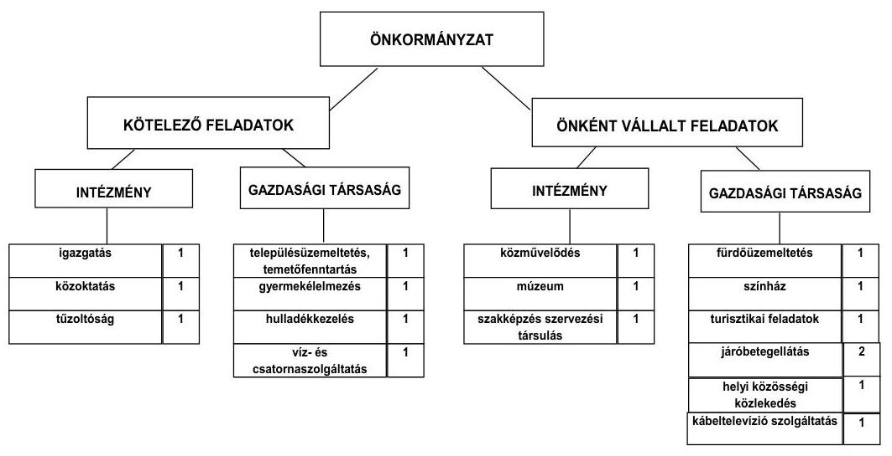

Az Önkormányzat feladatait 2011. június 30-án (a Polgármesteri hivatallal együtt) hat költségvetési szervvel, 11 gazdasági társasággal, a 2007. évtől a többcélú társulás által fenntartott szociális és gyermekjóléti feladatokat ellátó

---

intézményen keresztül, továbbá vállalkozó háziorvosok útján látta el. A Képvi-selő-testület több alkalommal intézményátszervezési, -összevonási, gazdálkodási jogkört megváltoztató döntést hozott, aminek következtében a 2007-2011. év I. félév között az intézmények száma kilencről hatra, a kötelező és az önként vállalt feladatellátás telephelyeinek száma 26 -ról 20 -ra csökkent. Az Önkormányzat öt gazdasági társaságban 75\% feletti tulajdonnal rendelkezett, amelyből négy társaságban kizárólagos tulajdonnal, egy gazdasági társaságban 51-75\% közötti, öt társaságban 50\% alatti tulajdoni hányaddal bírt. A gazdasági társaságok a településüzemeltetés, a hulladékkezelés, a sportlétesítmények üzemeltetése, a közétkeztetés, a víz- és csatornaszolgáltatás kötelező feladatokban, továbbá a fentiekben bemutatott önként vállalt feladatokban vettek részt.

Az egyes közszolgáltatások 2007. és 2010. évi kiadásainak finanszírozási forrásösszetételét a következő ábra szemlélteti:
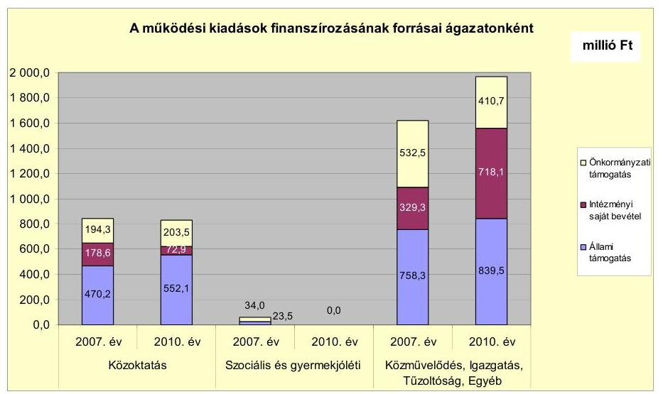

A közoktatási ágazatban a 2007. évi kiugróan magas intézményi saját bevételt részben a szakképző intézmény átvételénél a 2007. év II. félévre járó normatíva átvett pénzeszközként, intézményi saját bevételként történő megjelenése, részben pedig az általános iskolai feladatokra múködési célú pályázati forrás elnyerése okozta. Az állami támogatásnak a 2010. évre történő növekedése a szakképzési feladatok után járó magasabb állami normatíva miatt következett be. A szociális és gyermekjóléti ágazatban kiadás a 2010. évben azért nem jelentkezett, mert a feladatot 2007 februárjától a többcélú társulás intézménye útján látták el. A feladatellátást a 2007-2011. év I. félévében a Polgármesteri hivatalban kimutatott 59,3 millió Ft összegű pénzeszközátadással támogatták. A közművelődési, igazgatási, tűzoltósági, egyéb feladatoknál a 2010. évben az Önkormányzat által folyósított szociális és gyermekvédelmi ellátásokhoz, valamint a múködési célú pályázatokhoz kapcsolódó kifizetések és bevételek növekedése okozta a saját bevétel 2,2-szeresére, valamint az állami támogatás 81,2 millió Ft-tal történt emelkedését.

Az Önkormányzat a vizsgált időszakban egy közoktatási intézménybe szervezte az óvodai, általános iskolai, középfokú oktatási, kollégiumi, könyvtári feladatokat, valamint egy intézménybe vonta össze a közművelődési és alapfokú

---

művészetoktatási feladatokat. A szakképzési feladatokat a 2007. évben vette vissza a megyei önkormányzattól. A szociális és gyermekjóléti feladatokat ellátó intézményét 2007 februárjától adta át a többcélú társulásnak. Az intézkedések - az Önkormányzat adatszolgáltatása szerint - a költségvetési kiadásokban a 2007. évtől 2011. június 30 -áig összesen 486,2 millió Ft kiadáscsökkenést eredményeztek. Az intézkedések a személyi juttatásoknál, járulékainál és a dologi kiadásoknál együttesen 545,5 millió Ft kiadáscsökkenéssel, a pénzeszközátadásoknál 59,3 millió Ft kiadásnövekedéssel jártak. Az intézkedések bevételi kihatásai 15,2 millió Ft bevételcsökkenést jelentettek, mivel a saját bevétel 281,6 millió Ft-tal csökkent, ugyanakkor az állami támogatás - a szakképző intézmény átvétele következtében megnövekedett állami támogatás miatt 266,4 millió Ft-tal nőtt. A feladatátvételek és -átadások következtében összességében 471,0 millió Ft-tal kevesebb kiadást kellett az Önkormányzatnak teljesítenie az intézkedéseket megelőző időszakhoz képest. Az Önkormányzat a vizsgált időszakban új feladatként vállalta a szakképzés szervezési társulás fenntartását 2008 decemberétől, valamint az ipari parkban az inkubátorház múködtetését a 2011. évtől.

A gazdasági társaságoknak az ellenőrzött időszakban összesen 730,3 millió Ft múködési és 233,0 millió Ft fejlesztési célú pénzeszközt adott át az Önkormányzat. A múködési célú pénzeszközátadás 66,2\%-át (483,1 millió Ft-ot) a város-, temető-, sportlétesítmény-, inkubátorház-üzemeltetési, hulladékszállítási feladatokat ellátó Komép Kft. kapta. A többségi tulajdonban lévő társaságok pénzügyi helyzete a 2010. évi saját tőke/jegyzett tőke aránya, valamint pozitív értékű adózott eredményük alapján a 2010. évben stabil volt.

Az Önkormányzatnál a folyó költségvetés egyenlege (működési jövedelem) 2007-2010 között múködési forrástöbbletet mutatott.
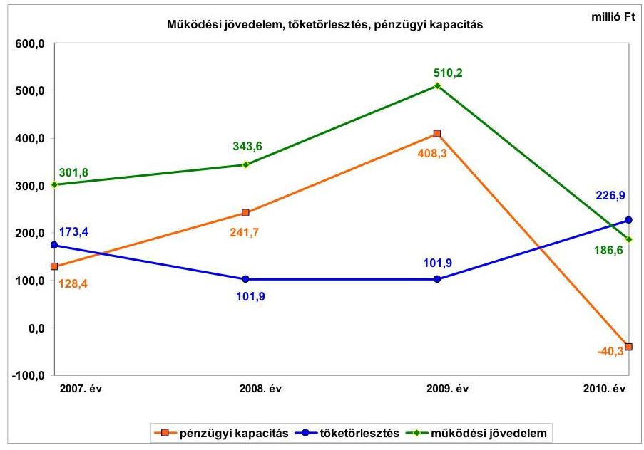

A múködési jövedelem 323,6 millió Ft-os csökkenését 2009-ről 2010-re elsősorban a kamatkiadások finanszírozása után fennmaradó kamatbevétel 73,8 millió Ft-os, a normatív állami hozzájárulás 104,3 millió Ft-os visszaesése és a pályázatokkal kapcsolatos - következő évben részben megtérülő - múkö-

---

dési kiadások növekedése okozta. Az Önkormányzat pénzügyi kapacitása (nettó múködési jövedelme) az előző évhez képest 2009-re 166,6 millió Ft-tal nőtt alapvetően az óvadéki betétben elhelyezett kötvénybevételből származó kamat miatt. Az Önkormányzat törlesztési kötelezettsége 2007-2009-ben is jelentős volt, amely 2010-ben - a kötvénytörlesztés megkezdésének hatására - több mint duplájára emelkedett. Az emelt összegű tőketörlesztésre már nem nyújtott fedezetet a tárgyévben képződő működési jövedelem, ezért a pénzügyi kapacitás 2010-re negatív előjelűvé változott.

A felhalmozási költségvetés bevételeit, kiadásait és egyenlegét 2007-2010 között évről évre a következő ábra szemlélteti:
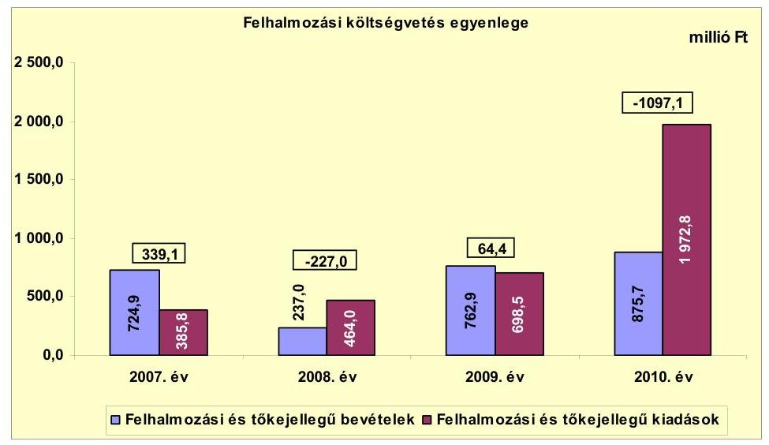

Az Önkormányzat felhalmozási költségvetésének egyenlege 2007-ben és 2009ben pozitív volt. A 2008. és 2010. években felhalmozási forráshiány keletkezett, amely előrelátó, tudatos költségvetési gazdálkodás és pénzügyileg fenntartható beruházások esetén nem jár magas pénzügyi kockázattal. A felhalmozási költségvetés 2010. évi kiemelkedő forráshiánya az EU-s projektek támogatásának megelőlegezése, saját forrásának biztosítása, a víziszínpad építéséhez felhalmozási célú pénzeszközátadás biztosítása miatt keletkezett. A forráshiányt az előző évi pénzmaradványból - amelynek részét képezi a kötvénybevétel is - finanszírozták.

A helyi adóbevételek aránya a folyó bevételekben a 2007-2009. években átlagosan $18,9 \%$ ( 608,0 millió Ft) volt, amely a 2010. évre $16,9 \%$-ra ( 589,8 millió Ft-ra) csökkent a folyó bevételek növekedésének, a helyi adó bevételek visszaesésének együttes hatására. A helyi adóbevétel 2010. évi visszaeséséhez hozzájárult az iparűzési adó mértékének 0,05\%-kal - a gazdasági válságra tekintettel - történt csökkentése 2009. január 1-jétől.

Az Önkormányzat stabil pénzügyi egyensúlyi helyzetéhez, a pozitív működési jövedelem keletkezéséhez hozzájárult, hogy a folyó bevételek a vizsgált időszakban folyamatosan növekedtek. Azok összege a 2007. évi 2842,3 millió Ftról 2008-ra 3037,8 millió Ft-ra nőtt a szakképző intézmény átvételéhez kapcso-

---

lódó normatív hozzájárulás-többlet következtében. A folyó bevételek 2009-re 3299,4 millió Ft-ra, 2010-re 3398,8 millió Ft-ra emelkedtek a fordított áfa ${ }^{7}$, a kamatbevételek, a múködési célú pályázati támogatások (esélyegyenlőség a közoktatásban TÁMOP projekt), a közfoglalkoztatásra kapott költségvetési támogatás bevételnövelő hatására. 2009-ről 2010-re az eseti folyó bevételek növekedése meghaladta a kamatbevétel és a normatív állami hozzájárulás csökkenését. E két bevétel 2010. évi együttesen 212,6 millió Ft-os csökkenése kedvezőtlenül befolyásolta a pénzügyi egyensúlyt, csökkentette a múködési jövedelmet is.

Az Önkormányzat folyó kiadásai a 2007. évi 2540,5 millió Ft-ról 2008-ra 153,7 millió Ft-tal, 2694,2 millió Ft-ra növekedtek a szakképző intézmény átvételének és a tűzoltóságnál végrehajtott létszámfejlesztés eredményeként. A folyó kiadások a 2009. évre 2789,2 millió Ft-ra, a 2010. évre 3212,2 millió Ft-ra emelkedtek. A növekedést elsősorban a dologi kiadások 2010. évi 237,2 millió Ft-os és a közcélú foglalkoztatásra folyósított szociális ellátás 2009-re 112,2 millió Ft-tal, 2010-re 174,3 millió Ft-tal történt emelkedése okozta. A dologi kiadások növekedését 2009-ről 2010-re legnagyobb mértékben a fordított áfa 151,9 millió Ft-os és a szakképzés szervezési társulás TISZK kiadásainak 81,1 millió Ft-os emelkedése befolyásolta. A pénzügyi egyensúlyi helyzetet a folyó kiadások - közcélú foglalkoztatás, fordított áfa és TISZK pályázat miatti növekedése nem érintette kedvezőtlenül a vizsgált időszakban, mivel azokhoz bevételnövekedés is kapcsolódott.

A pénzügyi egyensúlyi helyzet alakulását jelentősen befolyásolta az Önkormányzat elmúlt időszaki fejlesztési tevékenysége. A befejezett fejlesztések 24,3\%-át pénzintézeti forrásokból fedezték. A 2010. december 31-ig megvalósított 2514,3 millió Ft értékű fejlesztés és felújítás forrása a saját erő, a hazai és EU-s támogatások mellett 17,0 millió Ft - a 2007. évet megelőzően felvett - hitel $(0,7 \%)$ és 593,0 millió Ft kötvénykibocsátásból származó bevétel (23,6\%) volt. A 2010. december 31-én folyamatban lévő fejlesztési feladatok végrehajtására 2007-2010 között 561,0 millió Ft kiadást teljesítettek, amelyre a kötvénybevételből 158,6 millió Ft-ot (28,3\%) fordítottak. Az EU-s támogatás kiutalások 2010. évi késedelme miatt a fejlesztések nincsenek teljes körűen pénzügyileg lezárva, azonban az EU-s támogatásból megvalósult fejlesztések előfinanszírozása nem okozott likviditási gondot. A kifizetések teljesítésének fedezete egyrészt támogatási előlegekből, másrészt a szükséges saját forrás a kötvénybevételből, a még hiányzó támogatások megelőlegezése az átmenetileg szabad pénzmaradványból és folyó évi bevételből biztosított volt.

[^0]
[^0]:    ${ }^{7}$ A fordított áfa számviteli elszámolási szabályok miatti technikai jellegű bevétel, amelynek a kiadási oldalon is megtörtént az elszámolása.

---

Az Önkormányzat 2010. december 31-én folyamatban lévő fejlesztéseihez a 2010. évet követően esedékes kötelezettségvállalásainak összege 1781,9 millió Ft volt, melynek forrásait az alábbi ábra szemlélteti:
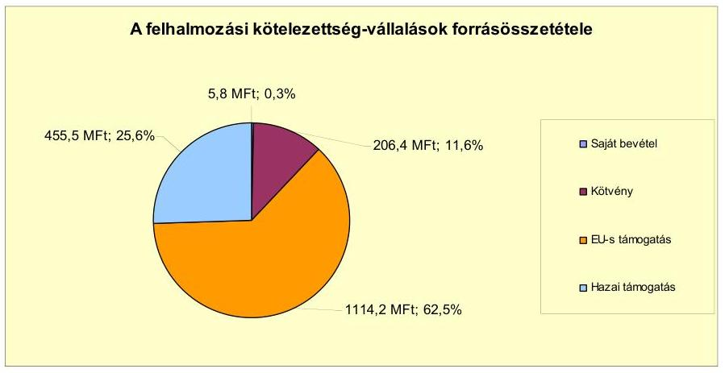

Az Önkormányzat 2010. év végén elbírálás alatt álló, illetve 2011-ben benyújtott pályázatainak tervezett teljes bekerülési költsége 5370,1 millió Ft. Ebből 284,2 millió Ft-ot a tervezett hitelfelvételből, 442,9 millió Ft-ot a kibocsátott kötvényforrás maradványából, 4026,0 millió Ft-ot EU-s támogatásból, 616,4 millió Ft-ot hazai támogatásból és 0,6 millió Ft saját bevételből terveznek biztosítani. Az Önkormányzat a 2011. év I. félévében saját, meglévő forrásból 34,5 millió Ft értékben indított el és valósított meg felújítást, beruházást, amelyeket saját és kötvényből származó bevételből finanszírozott.

Az önkormányzati feladatellátásban résztvevő gazdasági társaságoknak átadott múködési célú pénzeszközök a 2007. évi 139,2 millió Ft-ról 2008-ra 171,8 millió Ft-ra változtak, majd 2008-ról 2010-re 16,5 millió Ft-tal növekedtek. Ezek a múködési célú pénzeszközátadások az Önkormányzat pénzügyi egyensúlyi helyzetének, múködési jövedelmének alakulását alapvetően nem befolyásolták. A Gyógy-Termál Kft-nek 2008-tól évente átlagosan 33,8 millió Ft pénzeszközt adott át az Önkormányzat a gyógyfürdő üzemeltetés során keletkező veszteség ellensúlyozására. Az Önkormányzat a fürdő üzemeltetését közvetlenül nem megtérülő feladatnak, várospolitikai érdeknek tekintette. Hoszszabb távon azonban kockázatot jelenthet az Önkormányzat pénzügyi egyensúlyi helyzetére a gyógyfürdő veszteségének finanszírozása. Az Önkormányzat fejlesztési célra a víziszínpad építésére adott át gazdasági társaságának 2010ben 174,0 millió Ft-ot, 2011. év I. félévében 54 millió Ft-ot, amely növelte a beruházási költségvetés 2010. évi negatív egyenlegét. A gazdasági társaságok szerződés alapján, számadási kötelezettséggel kaptak pénzeszközt az Önkormányzattól.

Az Önkormányzat mérleg szerinti pénzintézeti kötelezettsége a 2006. év végi 848,6 millió Ft-ról 2011. év I. félév végére 1230,8 millió Ft-tal, 2079,4 millió Ft-ra emelkedett a kötvénykibocsátások elsődleges hatására. A pénzintézeti kötelezettségek növekedésével párhuzamosan az Önkormányzat befektetett eszközeinek mérlegben kimutatott nettó értéke 1722,1 millió Ft-tal gyarapodott. Az Önkormányzatnál a Számv. tv-ben és az Áhsz-ben foglaltak ellenére nem végezték el a devizában fennálló kötelezettségek év végi értékelését a 20062010. években, ezért a mérleg szerinti pénzintézeti kötelezettségek állománya

---

nem tartalmazta az árfolyamváltozások hatását. A mérleg szerinti pénzintézeti kötelezettségekhez képest az árfolyamváltozás - el nem számolt - hatása a 2010. év végén 620,9 millió Ft volt. A fennálló pénzintézeti kötelezettségek két kötvénykibocsátásból és négy hosszú lejáratú - a 2007. évet megelőzően felvett - hitelből keletkeztek. Az Önkormányzat az elfogadott 2011. évi költségvetési rendelete alapján múködési célú hitel felvételét tervezte 136,2 millió Ft összegben. A tervezett hitel összegét a forrásszabályozás változása miatt kieső normatív költségvetési támogatás és szja összegében határozta meg. A hitelt a helyszíni vizsgálat befejezésének időpontjáig nem vette fel.

Az Önkormányzat vizsgált időszakban tett pénzintézeti kötelezettségvállalásaira, a 2007. és 2008. évi kötvénykibocsátásra versenyeztetést követően képviselőtestületi döntés alapján került sor. Az előterjesztésekben bemutatták a kamatés - a deviza alapú kötelezettségeket érintő - árfolyamkockázatot. A két kötvénykibocsátás 2000,0 millió Ft bevételéből 1342,4 millió Ft-ot - a kötvénykibocsátások céljának megfelelően - használtak fel. A kötvénybevételből még felhasználható összeg 657,6 millió Ft volt 2011. június 30 -án, amelyet óvadéki betétben tartottak. Ebből csak banki jóváhagyással vehet igénybe forrást az Önkormányzat.

Az Önkormányzat a HUF-ban fennálló pénzintézeti kötelezettségeiből 2011. június 30 -ig 78,7 millió Ft tőkét, 21,5 millió Ft kamatot fizetett meg. A CHF-ben fennálló pénzintézeti kötelezettségeiből 3675,4 ezer CHF (690,2 millió Ft) és 87,8 millió Ft tőkét törlesztett, illetve 857 ezer CHF ( 147,8 millió Ft) és 38,4 millió Ft kamatot fizetett. Az Önkormányzat az EUR-ban fennálló pénzintézeti kötelezettségeiből 94,3 ezer EUR ( 25,5 millió Ft) tőkét, 301,3 ezer EUR ( 84,6 millió Ft) és 8,3 millió Ft kamatot fizetett. A két kötvénykibocsátáshoz kapcsolódóan 6,4 millió Ft egyszeri díffizetés történt. A hosszú lejáratú kötelezettségek mindegyikének törlesztése folyamatban van. Legutóbb a „Szarvas 2018" kötvény törlesztése kezdődött meg a 2011. év II. negyedévében, 94,3 ezer EUR összegben. A 2007-2011. év I. féléve között átmenetileg szabad pénzeszközeiből 657,5 millió Ft kamatbevételt, valamint a devizanemváltások hatására 141,8 millió Ft árfolyamnyereséget realizált. A devizában fennálló pénzintézeti kötelezettségek törlesztésekor 0,5 millió Ft árfolyamnyereség és 134,5 millió Ft árfolyamveszteség keletkezett 2011. június 30-ig.

Az önkormányzati költségvetés pénzügyi egyensúlyúnak biztosításához nem volt szükség a vizsgált időszakban folyószámlahitel, munkabérmegelőlegezési hitel és egyéb rövid lejáratú hitel igénybevételére.

Az Önkormányzatnál a szállítói kötelezettség folyamatosan növekvő nagyságrendú volt, a 2007. év végi 22,3 millió Ft-ról 2008-ra már 35,4 millió Ft-ra emelkedett. A 2009-2010. években a szállítói állomány 72,8 millió Ft-ra, majd 124,8 millió Ft-ra történt növekedését a beruházások nagyságrendjének, az ehhez kapcsolódóan benyújtott szállítói számlák értékének emelkedése okozta. A 2007-2011. év I. félév közötti időszakban a lejárt szállítói tartozások több mint háromszorosára, 25,6 millió Ft-ra növekedtek. A lejárt szállítói tartozások emelkedését 2007-2011. I. félévben nem likviditási probléma, hanem egyrészt a beruházási szállítók által benyújtott, elismert beruházási számlák - pályázati elszámolhatóságának szállító általi biztosításáig, a számla mögöttes múszaki tartalmának támogató elvárása szerinti kimutatásáig - 1-60 napig

---

visszatartott kifizetése okozta. Másrészt a 2010. évben és 2011. év I. félévében a 90 napon túli szállítói tartozásból egy szállító esetében a 10,5 millió Ft értékű szállítói számlák kifizetését visszatartotta az Önkormányzat a szállító felé fennálló követelés miatt, annak rendezéséig. A 2010. évi mérlegben és a 2011. év I. félévi mérlegjelentésben az Önkormányzat a Számv. tv-ben és az Áhsz-ben foglaltak ellenére 0,9 millió Ft értékben nem megfelelő, vitatott teljesítésű szállítói számlákat elismert szállítói tartozásként mutatott ki.

A mérlegben kimutatott 90 napon túli tartozásokra nem kezdeményeztek adósságrendezési eljárást, mivel 2010-ben a kisebb tételeket a mérleg fordulónapját követően pénzügyileg rendezték, a fennmaradó tartozásokat részben követelés fedezetére visszatartották. A tartozások másik részét a számviteli előírás ellenére szerepeltették a szállítói tartozások mérlegértékében. Az Önkormányzat többi lejárt szállítói tartozása 1-60 nap közötti volt, amelyek összege nem haladta meg az Áht ${ }_{1}$-ben előírt értékhatárt, ezért az Önkormányzat nem volt kötelezett önkormányzati biztos kijelölésére. Átütemezett szállítói tartozások nem voltak.

Az Önkormányzat két gazdasági társaságának és a többcélú társulásnak egyegy hitelfelvételéhez készfizető kezességet vállalt. A nyilvántartott kezességvállalás 2011. június 30 -án 61,2 millió Ft volt. A gazdasági társaságok részére az Önkormányzat kölcsönt nem nyújtott.

Az Önkormányzat kötelezettségeinek 2010. december 31-i, valamint 2011. június 30-i állományát és várható alakulását a kötelezettségek lejáratáig a következő táblázat szemlélteti:

| Megnevezés | Állomány 2010. december 31 -én |  |  | Állomány 2011. június 30 -án |  |  | Várható kötelezettség 2011-2013.   években |  | Várható kötelezettség 2014. évtől |  |
| :--: | :--: | :--: | :--: | :--: | :--: | :--: | :--: | :--: | :--: | :--: |
|  | HUF-ban   (millió Ft-   ban) | Devizában (összege, ezer ... ban) | Deviza   nem | HUF-ban   (millió Ft-   ban) | Devizában (összege, ezer ... ban) | Deviza   nem | HUF-ban   (millió Ft   ban) | Devizában (összege, ezer ... ban) | HUF-ban   (millió Ft   ban) | Devizában (összege, ezer ... ban) |
| Pénzintézeti kötelezettségek |  |  |  |  |  |  |  |  |  |  |
| Szociális bérlakáshitel 2001. | 5,5 |  |  | 3,6 |  |  | 5,7 |  | 0,0 |  |
| Szociális bérlakáshitel 2002. | 4,0 |  |  | 1,3 |  |  | 4,1 |  | 0,0 |  |
| Beruházási hitel 2004. |  | 2015,8 | CHF |  | 1835,0 | CHF |  | 1068,7 |  | 1007,0 |
| Beruházási hitel 2006. |  | 381,0 | CHF |  | 347,7 | CHF |  | 191,1 |  | 198,6 |
| *Szarvas 2017* kötvény |  | 5585,3 | CHF |  | 5186,1 | CHF |  | 2536,9 |  | 3249,3 |
| *Szarvas 2018* kötvény |  | 3773,6 | EUR |  | 3679,2 | EUR |  | 981,0 |  | 3511,3 |
| Pénzintézeti kötelezettségek összesen HUF-ban: | 9,5 |  |  | 4,9 |  |  | 9,8 |  | 0,0 |  |
| Pénzintézeti kötelezettségek összesen CHF-ben: |  | 7982,1 | CHF |  | 7368,8 | CHF |  | 3796,7 |  | 4454,9 |
| Pénzintézeti kötelezettségek összesen EUR-ban: |  | 3773,6 | EUR |  | 3679,2 | EUR |  | 981,0 |  | 3511,3 |
| Biztosítékok |  |  |  |  |  |  |  |  |  |  |
| Kezesség | 63,5 |  |  | 61,2 |  |  | - |  | - |  |
| Biztosítékok összesen: | 63,5 |  |  | 61,2 |  |  | - |  | - |  |
| Szállítási tartozás | 124,8 |  |  | 29,1 |  |  | 29,1 |  | 0,0 |  |
| Pénzintézeti kötelezettségek, biztosítékok, szállítói tartozás összesen HUF-ban: | 197,8 |  |  | 95,2 |  |  | 38,9 |  | 0,0 |  |

Az Önkormányzat pénzintézetekkel szemben fennálló tőke- és kamatkötelezettsége a 2011. év I. félév végén 4,9 millió Ft, 7368,8 ezer CHF és 3679,2 ezer EUR volt. Ezek várható kötelezettsége (tőke és kamat) a legutóbbi kamatfizetés feltételei alapján a 2011-2013. években 9,8 millió Ft, 3796,7 ezer CHF, továbbá 981,0 ezer EUR. Az Önkormányzat fizetési kötelezettsége 2011. június 30-án szállítói tartozások címén 29,1 millió Ft volt. A 2011-2013. évek kötelezettségei-

---

nek teljesítésére figyelembe vehető a - saját bevételeket (helyi adókat is) figyelembe véve - képződő működési jövedelem, 79,7 millió Ft mérlegben kimutatott követelésállomány és a forgalomképes nettó ingatlanvagyon. Az Önkormányzat adatszolgáltatása szerint a 2010. év végén a finanszírozásba vonható 2034,1 millió Ft pénzeszköz - 46,8 millió Ft kivételével - kötelezettséggel terhelt, ezért a törlesztések fedezeteként nem vehető figyelembe. A jelenlegi gazdasági helyzetben a kötelezettségek fedezetének biztosításánál kockázatot jelenthet a követelésállomány behajthatósága, illetve a forgalomképes ingatlanvagyon valós forgalomképessége. Az Önkormányzat 61,2 millió Ft összegben vállalt kezességet két gazdasági társasága és a többcélú társulás által felvett hitelekhez.

Az Önkormányzat jelenleg ismert pénzintézeti kötelezettségei (tőke, kamat) 2014. évtől: 4454,9 ezer CHF és 3511,3 ezer EUR. Az Önkormányzat tájékoztatása szerint a tőke- és kamatkötelezettségek teljesítésére figyelembe vehető források a működési jövedelemtermelő képesség változatlan feltételezése mellett a növekvő saját bevételek (elsősorban a helyi adók). Ezek növelhetők még a törlesztéskor meglévő forgalomképes ingatlanvagyon értékesítésével.

A 2014-től esedékes jelenleg ismert pénzintézeti kötelezettségek teljesítését jelenleg nem látjuk megfelelően biztosítottnak, ha - a 2010. évhez hasonlóan - a helyi adóbevételt is magukba foglaló folyó bevételek és a folyó kiadások egyenlegeként csökkenő működési jövedelem képződik. Így az Önkormányzat pénzügyi kapacitása a növekvő tőketörlesztési kötelezettségek hatására, a csökkenő működési jövedelem mellett akár tartósan negatív is lehet. Az Önkormányzat pénzintézeti és egyéb kötelezettségei teljesítésének kockázata az árfolyamnövekedés hatására emelkedhet. További kockázatot jelent, hogy az Önkormányzat a biztosítéki engedményezési szerződésben csak 2014-ig vállalta fedezetként a legalább 561,4 millió Ft helyi adóbevétel tervezését. Másrészt az éves költségvetési rendeletekben nem számszerúsítették a többéves kihatású kötelezettségek visszafizetési forrását.

Az Önkormányzat pénzügyi egyensúlyát esetleges felszámolási eljárás esetén befolyásolhatják a minősített önkormányzati többségi befolyással rendelkező gazdasági társaságok kötelezettségei. Ez akkor következhet be, ha a bíróság az adós társaság felé érvényesített tartósan hátrányos üzletpolitikára figyelemmel - megállapítja az Önkormányzat korlátlan és teljes felelősségét. Az Önkormányzat minősített többségi befolyásával rendelkező öt gazdasági társaság kötelezettségeit a következő táblázat mutatja be:

| Megnevezés | Állomány   2010. december 31 -én |  |  | Állomány   2011. június 30 -én |  |  | Várható kötelezettség 2011-2013.   években |  | Várható kötelezettség 2014. évtől |  |
| :--: | :--: | :--: | :--: | :--: | :--: | :--: | :--: | :--: | :--: | :--: |
|  | HUF-ban   (millió Ftban) | Devizában (összege, ezer ...ben) | Devizsnem | HUF-ban   (millió Ftban) | Devizában (összege, ezer ...ben) | Devizsnem | HUF-ban   (millió Ftban) | Devizában (összege, ezer ...ben) | HUF-ban   (millió Ftban) | Devizában (összege, ezer ...ben) |
| Folyószámtahitelsk | 18,4 |  |  | 14,4 |  |  | 14,4 |  | - |  |
| Hosszú lejáratú hitel | 6,7 |  |  | 5,0 |  |  | 7,3 |  | - |  |
| Pénzintézeti kötelezettségek összesen | 25,1 |  |  | 19,4 |  |  | 21,7 |  | - |  |
| Lizing kötelezettségek | 0,1 |  |  | 6,7 |  |  | 7,3 |  | 1,5 |  |
| Szállítói tartozás | 54,5 |  |  | 89,6 |  |  | 89,6 |  | - |  |
| Pénzintézeti kötelezettségek, biztosítékok, szállítói tartozás összesen HUF-ban: | 79,7 |  |  | 115,7 |  |  | 118,6 |  | 1,5 |  |

---

A társaságoknak a 2011. évtől 21,7 millió Ft pénzintézeti kötelezettséget, 89,6 millió Ft szállítói tartozást és 8,8 millió Ft lízingkötelezettséget kell rendezniük. A kötelezettségek jelenlegi nagyságrendje - az önkormányzati költségvetés nagyságára tekintettel - nem jelent az Önkormányzat számára komoly pénzügyi kockázatot, mivel az érintett társaságok nyereségesek.

Az Önkormányzat 2007-2010 között az eszközállománya után 1543,5 millió Ft összegű értékcsökkenést mutatott ki, miközben - az Önkormányzat kimutatása szerint - a felújításokból és beruházásokból az elhasznált eszközök pótlására fordított összeg 1216,2 millió Ft volt. A 2007-2010. évek között aktivált felújítások, beruházások értéke 2540,3 millió Ft volt.

Az Önkormányzat az ellenőrzött időszakban kiadási megtakarítást eredményező és bevételt növelő intézkedéseket tett. A 2007-2011. év I. féléve között - az Önkormányzat által nyújtott adatszolgáltatás szerint - 12,2 millió Ft bevételi többlet, továbbá 799,0 millió Ft kiadási megtakarítás keletkezett, ezáltal az Önkormányzat pénzügyi egyensúlyi helyzete javult. A kiadási megtakarítások 46,2\%-át az elrendelt létszámcsökkentések eredményezték, amelyek hatása 2007-ben mindössze 8,3 millió Ft kiadásmegtakarítást jelentett a felmentési idők kitöltése miatt. Az álláshely-csökkentő intézkedések 2007-2011. év I. féléve között önkormányzati szinten összesen 170 álláshely megszüntetést (és ezzel 170 fő létszámcsökkentést) jelentettek. Megszüntetett üres álláshely nem volt. A közoktatási intézményben a 2007. és a 2008. években a szakképző intézmény és a könyvtári feladatok átvételével feladatbővülés miatt 91 álláshely létesült, a tűzoltóságnál a 2007. évben kormányzati intézkedés hatására 11 álláshelyet, a Szarvasi Általános Művelődési Központnál a 2009. évben két - korábban megszüntetett - álláshelyet engedélyezett a Képviselő-testület. A bevételnövelő intézkedések az építményadó-mentesség megszüntetéséhez és eszközök értékesítéséhez kapcsolódtak.

Az utóellenőrzés a pénzügyi egyensúly javítására tett egy szabályszerűségi javaslat hasznosítására terjedt ki, amelyet az intézkedési terv szerinti határidőben megvalósítottak.

Az Önkormányzat pénzügyi egyensúlyi helyzetét összegezve a következők emelhetők ki:

Szarvas Város Önkormányzat pénzügyi egyensúlya rövid távon biztosított. A pénzügyi egyensúly középtávú helyreállítására és hosszú távú megőrzésére az Önkormányzatnak fel kell készülnie.

A hosszú lejáratú kötelezettségek fedezete rövid távon (2011-2013.) a képződő működési jövedelemből döntő mértékben biztosított. A törlesztés során azonban - a csökkenő működési jövedelem miatt - egyre inkább be kell vonnia egyéb, finanszírozási célú forrásokat. Középtávon (2014. évtől) a tőketörlesztés fedezete működési jövedelemből - várhatóan - nem lesz biztosított.

Az Önkormányzat pénzmaradványa alapvetően feladattal terhelt, fejlesztési célokra lekötött forrás, amelyet ezért törlesztésre nem használhat fel.

---

A rövid lejáratú kötelezettségek fedezete biztosítottnak látszik. Szállítói tartozásait tudja fizetni az Önkormányzat, rövid lejáratú hitele nincs.

Az Önkormányzat múködési jövedelme a vizsgált időszakban pozitív volt. Öszszege 2010-től az előző évhez képest csökkenő tendenciájú a normatív állami hozzájárulás csökkenése miatt. A folyó bevételek - a folyó kiadások finanszírozása után - 2010-ben nem nyújtottak először teljes egészében fedezetet a tőketörlesztésre.

Az önként vállalt feladataira fordított kiadások növekvő összege és aránya a csökkenő működési jövedelem mellett kockázatot jelent a pénzügyi egyensúly jövőbeni alakulására.

A folyamatban lévő fejlesztési projektekhez, a benyújtott pályázatokhoz szükséges saját erőhöz a források rendelkezésre állnak.

Az Önkormányzat többségi tulajdonában lévő gazdasági társaságok pénzügyi helyzete 2010. évben stabil. A gazdasági társaságok az Önkormányzat pénzügyi egyensúlyi helyzetére nincsenek kedvezőtlen hatással annak ellenére, hogy azok többsége rendelkezik lejárt határidejú szállítói tartozással.

Az Állami Számvevőszékről szóló 2011. évi LXVI. törvény 33. § (1) bekezdésében foglaltak értelmében a jelentésben foglalt megállapításokhoz kapcsolódó intézkedési tervet köteles az ellenőrzött szervezet vezetője összeállítani és azt a jelentés kézhezvételétől számított harminc napon belül az ÁSZ részére megküldeni. Amennyiben az intézkedési tervet határidőben nem küldi meg a szervezet, vagy az továbbra sem elfogadható, az ÁSZ elnöke a hivatkozott törvény 33. § (3) bekezdés a)-b) pontjaiban foglaltakat érvényesítheti.

# A 2011. június 30-i pénzügyi egyensúlyi helyzet alapján az ellenőrzés intézkedést igénylő megállapításai és javaslatai a következők: 

## a Polgármesternek

1. Az Önkormányzat pénzügyi egyensúlya rövid távon biztosított. A pénzügyi egyensúly középtávú helyreállítására és hosszú távú megőrzésére az Önkormányzatnak fel kell készülnie. A vállalt pénzintézeti kötelezettségek fedezete nem biztosított középtávon (a 2014. évtől), mivel a jelenleg ismert feltételek alapján számított múködési jövedelem - a csökkenő normatív állami hozzájárulás mellett - középtávon nem nyújt fedezetet a tőketörlesztés összegére. A vizsgált időszakban végrehajtott bevételnövelő és kiadáscsökkentő intézkedések, a feladatellátás racionalizálása ellenére, elsősorban a költségvetési támogatás csökkenése miatt az Önkormányzat nettó múködési jövedelme a 2010. évben negatív volt. Az Önkormányzat pénzügyi egyensúlyának fenntarthatóságára hosszú távon kihatással lehet az önként vállalt feladatokra fordított múködési kiadások növekvő összege és aránya.

Javaslat:
Az Önkormányzat pénzügyi egyensúlyának középtávon történő helyreállítása és hosszú távú fenntarthatósága érdekében kezdeményezze - felelősök és határidők megjelölésével - az alábbi intézkedések megtételét:

---

a) Tárjon fel további bevételszerző és kiadáscsökkentő lehetőségeket;
b) Terjesszen a Képviselő-testület elé a pénzügyi egyensúlyi helyzet középtávú helyreállítását és hosszú távú megőrzését biztosító programot;
c) Továbbra is tartsa fenn az elkülönített (kockázatkezelési) tartalékot és bővítse ki az egyensúlyi tartalékképzési feladattal, a jövőbeni adósságszolgálat teljesítése érdekében;
d) Vizsgálja felül az intézményi szerkezetet és az intézményfinanszírozás módját. Tegyen javaslatot a Képviselő-testületnek a feladatellátás további racionalizálására;
e) Tekintse át az önként vállalt feladatok finanszírozhatóságát a kötelező feladatellátás elsődlegességének biztosítása érdekében, a gazdasági program áttekintésével összhangban és mutassa be a Képviselő-testületnek a megoldás lehetőségét;
f) Mutassa be a Képviselő-testületnek félévente legalább három évre kitekintően a kötelezettségek teljes körére szóló finanszírozási tervet, a források számszerűsített megjelölésével.
2. Az Önkormányzat lejárt szállítói tartozásállománya a 2010. év végén 22,4 millió Ft, 2011. év I. féléve végén 25,6 millió Ft volt. Ebből 90 napon túli kötelezettség 2010ben 12,2 millió Ft, 2011. június 30 -án 11,4 millió Ft volt. Az Önkormányzat a mérlegben kimutatott 90 napon túli tartozásokra nem kezdeményezett adósságrendezési eljárást, mivel 2010-ben a kisebb tételeket a mérleg fordulónapját követően pénzügyileg rendezték. Az ebből 2010-ben még fennmaradó tartozás és a 2011. június 30-i tartozás egyik részét követelés fedezetére visszatartották. Másik része el nem ismert szállítói tartozás volt, amelyet a számviteli előírás ellenére szerepeltettek a szállítói tartozások mérlegértékében. Az Önkormányzat többi lejárt szállítói tartozása 1-60 nap közötti volt, amelyek összege nem haladta meg az Áht, 100/F. § (6) bekezdése, 2012. január 1-jétől az Áht ${ }_{2}$ 71. § (4) bekezdése szerinti értékhatárt, ezért az Önkormányzat nem volt kötelezett önkormányzati biztos kijelölésére.

Javaslat:
Gondoskodjon a Polgármesteri hivatal és a további költségvetési szervek lejárt szállítói tartozásai okainak feltárásáról, a lejárt tartozások mielőbbi rendezéséről!

# a Jegyzönek 

1. Az Önkormányzat fennálló pénzintézeti és egyéb kötelezettségei teljesítésének kockázata emelkedhet a fennálló kötelezettségeket érintő árfolyam-emelkedés hatására.

Javaslat:
Kísérje figyelemmel a jövőbeni várható árfolyamkockázatokat és legalább félévente tájékoztassa a Képviselő-testületet azok alakulásáról!

---

2. Az Önkormányzat a vizsgált időszakban rendelkezett devizában fennálló kötelezettséggel, melyek év végi értékelését a Számv. tv. 60. § (2) bekezdésének és az Áhsz. 33. § (1) bekezdésének előírásai ellenére nem végezte el.

Javaslat:
Gondoskodjon arról, hogy a devizában fennálló kötelezettségeket a Számv. tv. 60. § (2) bekezdésének és az Áhsz. 33. § (1) bekezdésének előírásai alapján év végén értékeljék és a változásokat a számviteli nyilvántartásokban rögzítsék!
3. A 2010. évi mérlegben és a 2011. év I. félévi mérlegjelentésben - a Számv. tv. 68. § (5) bekezdés a) pontjában foglaltakat megsértve, az Áhsz. 36. § (2) bekezdés a) pontjában foglaltak ellenére - 0,9 millió Ft értékben kimutattak nem megfelelő, vitatott teljesítésű szállítói számlákat elismert szállítói tartozásként.

Javaslat:
Gondoskodjon a Számv. tv. 68. § (5) bekezdés a) pontjában és az Áhsz. 36. § (2) bekezdés a) pontjában foglaltak alapján arról, hogy az áruszállításból, a szolgáltatás teljesítéséből származó, általános forgalmi adót is tartalmazó, forintban teljesítendő kötelezettségek közül csak az elismert számlák összegét mutassák ki a mérlegben!

---

# II. RÉSZLETES MEGÁLLAPÍTÁSOK 

## 1. Az ÖNKORMÁNYZAT KÖTELEZŐ ÉS ÖNKÉNT VÁLLALT FELADATAI, A FELADATELLÁTÁS SZERVEZETI KERETEI ÉS ANNAK VÁLTOZÁSAI

A Képviselő-testület az önkormányzati feladatokról az $\mathrm{SzMSz}_{1,2}$-ben rendelkezett, az önként vállalt feladatok terjedelmét az éves költségvetési rendeletekben az adott évi költségvetés forrásainak ismeretében határozta meg. Az Önkormányzat - besorolása szerint - a 2007-2010. években a kötelező feladatok ellátása mellett önként vállalt feladatnak tekintette a középfokú oktatási (középiskolai, szakképzési), a kollégiumi, a szakképzés szervezési, a közgyűjteményi, a közművelődési, az alapfokú művészetoktatási feladatokat, az idősek átmeneti elhelyezésének biztosítását, a gyermekjóléti szolgálat, a pedagógiai szakszolgálat működtetését. Gazdasági társaságok útján látta el a gyógyfürdő üzemeltetési, színházi, turisztikai, kábeltelevízió szolgáltatási feladatokat, a helyi közösségi közlekedés megszervezését és a járóbeteg-szakellátásban való közreműködést. A Polgármesteri hivatalban az önként vállalt feladatok keretében támogatták a civil szervezeteket, a pályázat előkészítő feladatokat, valamint az önként vállalt feladatokat ellátó gazdasági társaságokat.
Az Önkormányzat 2010. évi múködési kiadásait és azok finanszírozási arányait szemlélteti a következő - önkormányzati adatszolgáltatáson alapuló - táblázat ${ }^{8}$ főbb feladatonként:

| Ellátott feladat | Müködési kiadás összesen (millió Ft) | Kötelező feladatok kiadásainak részaránya \% | Müködési bevétel összesen (millió Ft) | Állami támogatás részaránya $\%$ | Intézményi saját bevétel részaránya $\%$ | Önkormányzati támogatás részaránya $\%$ |
| :--: | :--: | :--: | :--: | :--: | :--: | :--: |
| Övodák | 84,8 | 100,0\% | 84,8 | 47,4\% | 7,7\% | 44,9\% |
| Általános iskolák | 224,0 | 100,0\% | 224,0 | 56,3\% | 5,2\% | 38,5\% |
| Önnnáziumok | 142,3 | 0,0\% | 142,3 | 68,5\% | 7,7\% | 23,8\% |
| Szakközépiskolák, szakképző intézmények | 330,1 | 0,0\% | 330,1 | 77,5\% | 11,4\% | 11,1\% |
| Kollégiumok | 47,4 | 0,0\% | 47,4 | 68,3\% | 13,0\% | 18,7\% |
| Közművelődési intézmények | 72,8 | 34,0\% | 72,8 | 19,4\% | 18,7\% | 61,9\% |
| Tüzoltóság | 235,4 | 99,0\% | 235,4 | 96,0\% | 1,0\% | 3,0\% |
| Egyéb intézmények | 77,5 | 0,0\% | 77,5 | 47,1\% | 16,9\% | 36,0\% |
| Polgármesteri hivatal igazgatási kiadásai | 481,9 | 98,6\% | 481,9 | 6,7\% | 24,7\% | 68,6\% |
| Polgármesteri hivatalban ellátott egyéb feladatok múködési kiadásai | 1100,7 | 69,5\% | 1100,7 | 48,2\% | 51,8\% | 0,0\% |
| Müködési kiadások összesen | 2796,8 | 64,6\% | 2796,8 | 49,7\% | 28,3\% | 22,0\% |

[^0]
[^0]:    ${ }^{8}$ A táblázatban feltüntetett összes múködési kiadás 330 millió Ft-tal magasabb, mint a 2. számú melléklet múködési kiadások (kamatkiadás nélkül) és kamatkiadás sorainak összege. Ezt az alábbiak együttes hatása okozta: a 2. számú melléklet érintett sorai nem tartalmazzák a múködési célú pénzeszközátadásokat, illetve a fenti táblázat adatai nem tartalmazzák a kisebbségi önkormányzatok, a szakképzés szervezési társulás, a fordított áfa és a felhalmozási célú kamat miatt keletkezett kiadásokat.

---

Az Önkormányzat - adatszolgáltatása szerint - a 2010. évben a 2796,8 millió Ft összegű működési kiadásaiból 1806,6 millió Ft-ot (64,6\%) a kötelező feladatok, 990,2 millió Ft-ot ( $35,4 \%$ ) az önként vállalt feladatok ellátására fordított. A 2007-2009. évek között a tárgyévi múködési kiadások átlagosan 73,4\%-át - 1885,0 millió Ft-ot - fordította a kötelező, 26,6\%-át - 683,0 millió Ftot - az önként vállalt feladatok ellátására. Az önként vállalt feladatok 2010. évi növekedését a Polgármesteri hivatalban kimutatott pályázati feladatokhoz kapcsolódó működési kiadásnövekedés okozta. Az Önkormányzat pénzügyi egyensúlyának fenntarthatóságára hosszú távon kihatással lehet az önként vállalt feladatokra fordított múködési kiadások növekvő összege és aránya (ez az arány a 2011. évi tervadatok alapján $32,7 \%$ körül várható).

Az összes múködési kiadáson belül a közoktatási ágazat kiadásai a 2007. évben 843,0 millió Ft-ot (33,4\%) tettek ki, amelyek 2008-ban 972,0 millió Ft-ra ( $37,2 \%$ ) emelkedtek a szakképző intézmény megyei önkormányzattól 2007 júliusában történt visszavétele miatt. A 2009. évben azonban 100,2 millió Ft, a 2010. évben további 43,3 millió Ft kiadáscsökkenés következett be, mert a tanulói létszámcsökkenésre tekintettel az általános és középfokú oktatásban feladatracionalizálási, valamint pedagógus álláshelymegszüntetési intézkedéseket foganatosított az Önkormányzat. A szociális és gyermekjóléti ágazatokban a 2008-2010. években már nem tartott fenn intézményt az Önkormányzat az intézmény többcélú társulásnak történő 2007. február 1-jei átadása ${ }^{9}$ miatt. A 2007. évben az ágazatok kiadásainak összege 57,6 millió Ft volt ( $2,3 \%$-os arány).

A Polgármesteri hivatal múködési kiadásai a 2010. évben az összes múködési kiadáson belül 1582,6 millió Ft-ot (56,6\%-os arányt), a 2007-2009. évek között átlagosan 1258,1 millió Ft-ot ( $49,0 \%$-os arányt), képviseltek. A múködési kiadások a 2009. évről a 2010. évre 274,5 millió Ft-tal növekedtek, amelyet a közcélú foglalkoztatásra magánszemélyeknek átadott pénzeszközök, az önkormányzati tulajdonú gazdasági társaságok múködéséhez való hozzájárulások, a város- és községgazdálkodási szolgáltatások, továbbá a 2010. évi országgyúlési és önkormányzati képviselő választások múködési kiadásai okoztak.

A közoktatási ágazat múködési kiadásait finanszírozó forrásokon belül az állami támogatás összege és részaránya a 2007. évi 470,2 millió Ft-ról (55,8\%-ról) a 2008. évben 662,3 millió Ft-ra ( $68,1 \%$ ) emelkedett a szakképző intézmény megyei önkormányzattól történt átvétele miatt. Az ágazatban az intézményi saját bevétel összege a 2007. évben 178,6 millió Ft ( $21,2 \%$-os arányú) volt, míg a 2008-2010. években átlagosan 72,2 millió Ft-ot ( $8,2 \%$-os arányt) képviselt. A 2007. évi kiugróan magas intézményi saját bevételt részben az okozta, hogy a szakképző intézmény átvétele miatt a 2007. év II. félévre járó normatívát a közoktatási intézmény átvett pénzeszközként, intézményi saját bevételként mutatta ki, részben pedig az általános iskolai feladatokra múködési célú pályázati forrást nyert el a közoktatási intézmény.

[^0]
[^0]:    ${ }^{9}$ Az Önkormányzat a 2008-2011. év I. félévéig összesen 59,3 millió Ft összegű pénzeszközátadással támogatta a többcélú társulást a szociális és gyermekjóléti feladatok ellátásához.

---

A közmúvelődési, tűzoltósági, egyéb intézményi feladatoknál az állami támogatás összege a 2007. évi 296,9 millió Ft-ról (74,3\%) a 2008. évre 325,9 millió Ft-ra ( $82,1 \%$ ) emelkedett a tűzoltóságnak a 2008. évben bérpolitikai intézkedésként nyújtott magasabb költségvetési támogatás miatt.

Az igazgatási kiadásokon belül a 2008. évben az állami támogatás összege 80,2 millió Ft-ra növekedett a 2007. és 2009-2010. évek átlagosan 29,4 millió Ft állami támogatásához képest. Ezt az okozta, hogy a 2008. évben az Önkormányzat egyszeri bérpolitikai intézkedésként 59,2 millió Ft állami támogatásban részesült.

Az Önkormányzat feladatait 2011. június 30-án (a Polgármesteri hivatallal együtt) hat költségvetési szervvel, 11 gazdasági társasággal ${ }^{10}$, a többcélú társulás szociális és gyermekjóléti feladatokat ellátó intézményével, továbbá vállalkozó háziorvosok útján látta el.

A vizsgált időszakban az Önkormányzatnál az intézmények számában és az ellátott feladatok körében is változás következett be, mivel a Képviselőtestület több alkalommal intézményátszervezési, -összevonási, gazdálkodási jogkört megváltoztató döntést hozott, továbbá feladatok átvételéről, átadásáról és újabb önként vállalt feladat ellátásáról döntött. A 2007-2011. év I. félév között az intézmények száma kilencről hatra, a kötelező és az önként vállalt feladatellátás telephelyeinek száma 26 -ról 20-ra csökkent.

Az intézmények közül 2011. június 30-án kötelező feladatot látott el a közoktatási intézmény (az óvodai nevelés, általános iskolai oktatás, könyvtári feladat tekintetében), valamint a tűzoltóság. A részben önállóan gazdálkodó Városi Könyvtár intézmény megszüntetését követően - a feladatellátás addigi párhuzamosságait is megszüntetve - 2008 augusztusától a közoktatási intézmény látta el a könyvtári feladatot.

Az Önkormányzat a kötelező szociális és gyermekvédelmi feladatokat 2007 februárjától a többcélú társulás intézménye keretében végezte. Az egészségügyi alapellátásból a háziorvosi szolgálatot vállalkozó háziorvosokkal látta el.

A kötelező feladatok ellátásában részt vett három kizárólagos önkormányzati tulajdonban lévő gazdasági társaság, továbbá két olyan gazdasági társaság, amelyekben az Önkormányzat tulajdonosi részesedése 50\% alatti volt:

- a településüzemeltetéssel, a temetőfenntartással, a települési szilárd és folyékony hulladékszállítással, a sportlétesítmények üzemeltetésével kapcsolatos feladatokat a Komép Kft. látta el;
- a közoktatási intézmény tanulóinak étkeztetését a Gyermekélelmezési Nonprofit Kft. végezte;

[^0]
[^0]:    ${ }^{10}$ A 11 gazdasági társaság közül négy az Önkormányzat kizárólagos tulajdonában volt, kettőben többségi, kettőben kisebbségi részesedése volt, háromban nem volt részesedése az Önkormányzatnak.

---

- a távhőszolgáltatási feladatok az Önkormányzat kizárólagos tulajdonában lévő Gyógy-Termál Kft.-hez tartoztak;
- a települési szilárd hulladék ártalmatlanítását az Önkormányzat 39,1\%-os tulajdonában lévő Regionális Hulladékkezelő Kft. végezte;
- az Önkormányzat 4,5\%-os tulajdonában lévő Békés Megyei Vízmúvek Zrt. feladata volt az ivóvíz-szolgáltatás és a szennyvízelvezetés.

Az Önkormányzat önként vállalt feladatainak ellátásában 2011. június 30-án a Polgármesteri hivatalon és a közoktatási intézményen kívül részt vett három intézménye, a többcélú társulás intézménye, három kizárólagos és kettő többségi önkormányzati tulajdonban lévő gazdasági társasága, továbbá három olyan gazdasági társaság is, amelyekben az Önkormányzatnak nem volt tulajdonosi részesedése. A szakképzés szervezési társulást 2008 decemberében alapították. Az Önkormányzat két további intézményéhez tartoztak a közgyűjteményi (múzeumi), illetve a közművelődési ${ }^{11}$ (rendezvényszervezés, mozi üzemeltetés) és alapfokú művészetoktatási feladatok.

Az Önkormányzat 2007. január 1-jén még külön intézményben látta el az óvodai és általános iskolai, és további külön intézményben a középfokú oktatási feladatokat. A 2008. év augusztusától egy közoktatási intézménybe szervezte az óvodai, általános iskolai, gimnáziumi, szakközépiskolai és szakképzési, valamint kollégiumi közoktatási feladatokat. Az egységes közoktatási intézmény kialakításával lehetővé vált az intézményegységek között az áttanítás megszervezése, ezzel a feladatellátás racionalizálása, a pedagóguslétszám további csökkentése. Az alapfokú művészetoktatási intézmény megszüntetése után 2008 augusztusától a Képviselő-testület a Szarvasi Általános Művelődési Központhoz integrálta az alapfokú művészetoktatási feladatokat.

Az idősek átmeneti otthona, a gyermekjóléti szolgálat és a pedagógiai szakszolgálat múködtetését a 2007. évtől a többcélú társulás útján végezték. Az Önkormányzat fekvőbeteg-szakellátási feladatokat nem látott el.

Az Önkormányzat kizárólagos tulajdonában lévő Gyógy-Termál Kft. a gyógyfürdő üzemeltetési, a Regionális Színház Kft. színházi (és szabadtéri színházi) feladatokban vett részt. A 2011. évtől a Komép Kft. az ipari parkban található inkubátorház üzemeltetését végezte. Az Önkormányzat többségi tulajdonában lévő Körös-szögi Kistérségi Területfejlesztési Nonprofit Kft. a turisztikai feladatok ellátásában múködött közre, az Informatikai Kft. kábeltelevízió szolgáltatást végzett.

Az Önkormányzat közremúködött a helyi közösségi közlekedési közszolgáltatás megszervezésében a Körös Volán Zrt. útján, továbbá a járóbeteg-szakellátást biztosító gazdasági társaságok számára üzemeltetésre adta át a tulajdonában lévő ingatlanjait. Ezekben a gazdasági társaságokban az Önkormányzatnak nem volt tulajdonosi részesedése.

[^0]
[^0]:    ${ }^{11}$ A közművelődési feladatot ellátó intézmény látta el a közösségi színtér fenntartásának kötelező önkormányzati feladatát is.

---

A Képviselő-testület 2007 áprilisában döntött a 641 tanulóval rendelkező szakképző intézmény megyei önkormányzattól történő visszavételéről ${ }^{12}$.

Az intézkedést - a megyei önkormányzat saját intézményszerkezetét érintő döntési szándékán túl - elsődlegesen a szakképzés helyben tartása indokolta. Ezenfelül a szakképzés bővülése tette lehetővé az Önkormányzat számára pályázat benyújtását a térségi szakképző központ létesítéséhez.

A Képviselő-testület 2007 februárjától adta át a többcélú társulásnak a szociális és gyermekjóléti feladatokat ellátó intézményét. A feladatátadás a szociális alapellátások területén 274 ellátottat, a szakosított ellátást nyújtó idősek átmeneti otthonában 24 fő, a bölcsődében 65 gyermek ellátottat érintett.

A feladatok átadását a központi költségvetés által a többcélú társulásoknak nyújtott jelentős többlettámogatás és az Önkormányzat kiadáscsökkentő szándéka motiválta.

A Képviselő-testület a 2007. augusztus 1. napjával létrehozott közoktatási intézmény önálló főzőkonyhai tevékenységét megszüntette, a gyermekétkeztetést a Gyermekélelmezési Nonprofit Kft.-nek adta át.

Az intézkedés a párhuzamosságok kiszűrését célozta, mivel az általános iskola és az óvoda részére az étkeztetési feladatokat már korábban is ez a gazdasági társaság látta el.

A bemutatott intézkedések - az Önkormányzat adatszolgáltatása szerint - a költségvetési kiadásokban a 2007. évtől 2011. június 30 -áig összesen 486,2 millió Ft kiadáscsökkenést eredményeztek. Az intézkedések a személyi juttatásoknál, járulékainál és a dologi kiadásoknál együttesen 545,5 millió Ft kiadáscsökkenéssel, a pénzeszközátadásoknál 59,3 millió Ft kiadásnövekedéssel jártak. Az intézkedések bevételi kihatásai 15,2 millió Ft bevételcsökkenést jelentettek, mivel a saját bevétel 281,6 millió Ft-tal csökkent, ugyanakkor az állami támogatás - a szakképző intézmény átvétele miatt - 266,4 millió Ft-tal nőtt. A feladatátvételek és -átadások összességében 471,0 millió Ft megtakarítással jártak.

A szakképző intézmény átvétele a vizsgált időszakban a szakképzés magas állami támogatása miatt 97,3 millió Ft-tal több bevételt eredményezett az Önkormányzatnál, mint amennyi kiadásnövekedéssel a feladat járt. A szociális és gyermekjóléti intézmény átadása a vizsgált időszakban a feladat ellátásához a többcélú társulásnak átadott 59,3 millió Ft levonása mellett is összességében 373,7 millió Ft megtakarítást eredményezett. A főzőkonyha gazdasági társaságnak történő átadása nem eredményezett sem a kiadási, sem a bevételi oldalon változást. A konyhai feladatok kiszervezéséhez kapcsolódó személyi juttatás és járulékcsökkenés nem eredményezett kiadáscsökkenést, mivel azzal szemben a dologi kiadások - a vásárolt élelmezési szolgáltatás miatt - ugyanakkora összeggel növekedtek. A bevételi oldalon azért nem következett be változás, mert a térítési díj bevételt a főzőkonyha kiszervezését követően is a közoktatási intézmény szedte be.

[^0]
[^0]:    ${ }^{12}$ A szakképző intézményt az Önkormányzat 2001-ben adta át a megyei önkormányzatnak.

---

A vizsgált időszakban az Önkormányzat hat többségi tulajdonában lévő gazdasági társaságánál átszervezés nem történt, csőd- és felszámolási eljárás nem indult. Az Önkormányzat többségi részesedésű gazdasági társaságainak pénzügyi helyzete stabil volt, mivel a kötelező feladatokat ellátó társaságoknál a 2010. évben a saját tőke/jegyzett tőke aránya 1,3 és 2,8 értéket, az önként vállalt feladatokat ellátó társaságoknál 1,1 és 2,1 közötti értéket, míg az Általános Informatikai Kft.-nél 84,9 értéket mutatott. A vizsgált időszakban a gazdasági társaságok adózott eredménye - a Gyógy-Termál Kft. 2007. évi, a Gyermekélelmezési Nonprofit Kft. 2007. és 2008. évi, valamint a Regionális Színház Kft. 2008. évi negatív eredménye kivételével - pozitív összegű volt. A Gyógy-Termál Kft. eredménytartaléka a vizsgált időszak minden évében negatív volt.

A 2009. évben az Önkormányzat két kizárólagos és egy többségi tulajdonú gazdasági társasága a gazdasági társaságokról szóló 2006. évi IV. törvény 365. § (3) bekezdése értelmében közhasznú társaságból nonprofit kft.-vé alakult át. Az önkormányzati feladatok ellátásában résztvevő gazdasági társaságok gazdálkodásának és múködésének részletes adatait a jelentés 4 . számú melléklete mutatja be.

# 2. Az ÖNKORMÁNYZAT PÉNZÜGYI EGYENSÚLYI HELYZETÉT BEFOLYÁSOLÓ TÉNYEZŐK 

A hagyományos költségvetési szerkezet helyett az Önkormányzat pénzügyi helyzetét a CLF módszerrel mutatjuk be, amelyben jobban elkülönülnek a vagyonnal kapcsolatos bevételek és kiadások az önkormányzati feladatokkal kapcsolatos közvetlen múködtetési bevételektől és kiadásoktól. A módszer következetesen elkülöníti a folyó és a felhalmozási költségvetés bevételeit és kiadásait, azok költségvetési egyenlegeit. A saját folyó bevételek, valamint a saját felhalmozási bevételek nem tartalmazzák az előző évi pénzmaradványok felhasználásából származó pénzforgalom nélküli bevételeket ${ }^{13}$.

A folyó költségvetés egyenlege, a múködési jövedelem megmutatja, hogy az Önkormányzat éves folyó bevétele fedezetet biztosít-e a kötelező és önként vállalt feladatellátáshoz kapcsolódó éves folyó kiadására. A múködési jövedelem negatív értéke pénzügyileg fenntarthatatlan helyzetet jelez. A mutató pozitív értéke megtakarítást mutat, amely forrásul szolgálhat az Önkormányzat fennálló kötelezettségei megfizetéséhez, valamint fejlesztéseihez.

A felhalmozási költségvetés pozitív értéke felhalmozási többletet mutat, amely a jövőbeni fejlesztések forrását biztosíthatja. Amennyiben a folyó költségvetési hiány finanszírozása a felhalmozási többletből történik, ez szűkebb értelemben vagyonfelélésnek tekinthető. Amennyiben a felhalmozási költségvetés megtakarítása fejlesztési célú hitelek, kötvények adósságszolgálatát finanszírozza, az változatlan vagyontömeg mellett, a korábban megelőlegezett tőkebevételek valós realizációjának tekinthető. A felhalmozási deficit által generált finanszírozási igény önmagában nem jár pénzügyi kockázattal, a pénz-

[^0]
[^0]:    ${ }^{13}$ A költségvetési években kialakuló hiány finanszírozása az előző évi pénzmaradvány és a korábbi években képzett tartalékok felhasználásával is történhet.

---

ügyileg fenntartható beruházásokhoz kapcsolódó kötelezettségvállalás (adósságszolgálat) átlátható és szabályozott költségvetési gazdálkodással teljesíthető.

A módszer a pénzügyi kapacitás fogalmát helyezi a középpontba. Az adós hitelfelvételi képessége, hosszú távú fizetőképessége vagy bonitása a pénzügyi kapacitással, ezen belül is a nettó múködési jövedelemmel jellemezhető. A nettó múködési jövedelem negatív értéke az egyes költségvetési években jelentkező adósságszolgálat túlzott mértékére utal. ${ }^{14}$ A nettó múködési jövedelem negatív értékének felhalmozási többletből vagy további hitelből történő finanszírozása pénzügyileg nem fenntartható gazdálkodást vetít előre. A pozitív értéket mutató nettó múködési jövedelem fejlesztési kiadások fedezetét biztosíthatja, illetve a folyamatosan, évenként képződő pozitív nettó múködési jövedelemből meghatározható a jövőben vállalható, teljesíthető éves adósságszolgálat, ily módon az a hitelösszeg, amely - a többi tényezőt, feltételt adottnak tekintve visszafizetési kockázat nélkül felvehető.

A CLF módszer alapján a pénzügyi kapacitás mértéke az Önkormányzat összevont, nettósított, a központi információs rendszerbe a Magyar Államkincstáron keresztül leadott éves költségvetési beszámolójának 80-as űrlapjában szerepeltetett adatok alapján került meghatározásra.

A CLF módszer szerinti számításhoz képest a jelentés 2. számú mellékletében a folyó bevételek közé tartozó költségvetési támogatás összegét csökkentettük a felhalmozási célú költségvetési támogatással, amellyel a felhalmozási bevételek összegét növeltük. Ennek összege 2007-ben 291,4 millió Ft, 2008-ban 96,6 millió Ft, 2009-ben 84,4 millió Ft, 2010-ben 92,1 millió Ft, 2011. év I. félévében 173,6 millió Ft volt.

A számítási leírás némileg eltér az ÁSZ módszertanában korábban alkalmazott gyakorlattól. A jelen besorolás általános közgazdasági meggondolásokon alapul, amely megjelenik az SNA statisztikai módszertanában is. Folyó tételek alatt értjük azokat a kiadásokat és bevételeket, amelyek a gazdálkodó szervezet helyzetét automatikusan nem változtatják. Bevételi oldalon ilyenek az adók, a tényező jövedelmek, a transzferek ${ }^{15}$, kiadási oldalon a transzferek és a szolgáltatás igénybevételével kapcsolatos múködési kiadások. A folyó költségvetésben a bevételekben nem térül meg, a kiadásokban nem jelenik meg az amortizáció, a vagyoni helyzetet az egyenleg befolyásolja.

A folyó költségvetés egyenlege (múködési jövedelem) tartalmazza a kamatbevételeket és a kamatkiadásokat is, mind a múködési, mind a fejlesztési kamatot, valamint a visszatérülő és befizetendő áfa teljes összegét, mert ezek közgazdaságilag tényező jövedelmek. Nem tartalmazzák viszont a követelés elengedés miatt könyvelt bevételi és kiadási pénzforgalmi tételeket, mert valójában technikai elszámolási múveletnek minősülnek, a bevétel soha nem realizálódott, és költségvetési kiadás sem történt.

[^0]
[^0]:    ${ }^{14}$ kivéve, ha annak finanszírozására a korábbi években képzett tartalékok fedezetet nyújtanak
    ${ }^{15}$ Transzferkiadásoknak nevezzük azokat a folyó és felhalmozási tételeket, amelyeket nem az adott önkormányzat használ fel szolgáltatásnyújtásra.

---

A felhalmozási költségvetésben a bevételek között a vagyon megőrzésére és bővítésére fordítható források jelennek meg. A felhalmozási vagy tőketételek módosítják a vagyon nagyságát. A privatizációs bevétel csökkenti a vagyont, a fizikai beruházás, pénzügyi befektetés növeli.

A nettó múködési jövedelmet a tőketörlesztés levonásával a folyó költségvetés egyenlegéből származtatjuk.

# 2.1. A müködési és a felhalmozási egyensúly változása 

|  |  |  |  | millió Ft |
| :--: | :--: | :--: | :--: | :--: |
| Megnevezés | 2007. év | 2008. év | 2009. év | 2010. év |
| Folyó bevételek | 2842,3 | 3037,8 | 3299,4 | 3398,8 |
| Folyó kiadások | 2540,5 | 2694,2 | 2789,2 | 3212,2 |
| Müködési jövedelem | 301,8 | 343,6 | 510,2 | 186,6 |
| Nettó müködési jövedelem -müködési jövedelem - tőketörlesztés | 128,4 | 241,7 | 408,3 | $-40,3$ |
| Felhalmozási bevételek* | 724,9 | 237,0 | 762,9 | 875,7 |
| Felhalmozási kiadások | 385,6 | 464,0 | 696,5 | $-1972,8$ |
| Felhalmozási költségvetés egyenlege | 339,1 | $-227,0$ | 64,4 | $-1097,1$ |
| Finanszirozási múveletek nélküli (GFS) pozíció = müködési jövedelem + felhalmozási költségvetés egyenlege | 640,9 | 116,6 | 574,6 | $-910,5$ |
| Finanszirozási múveletek egyenlege | 782,8 | 939,0 | $-33,0$ | $-311,7$ |
| Tárgyévi pénzügyi pozíció | 1423,7 | 1055,6 | 541,6 | $-1222,2$ |
| Egyéb tájékoztató adatok |  |  |  |  |
| Összes kötelezettség** | 1733,9 | 2659,6 | 2614,2 | 2369,4 |
| -ebből rövid lejáratú | 184,7 | 214,8 | 396,3 | 427,1 |
| Folyószámlahitel napi átlagos állománya | 0,0 | 0,0 | 0,0 | 0,0 |
| Likvidhitel napi átlagos állománya | 0,0 | 0,0 | 0,0 | 0,0 |
| Munkabérhitel napi átlagos állománya | 0,0 | 0,0 | 0,0 | 0,0 |
| Finanszirozásba vonható eszközök: | 1715,1 | 2754,8 | 3280,6 | 2042,6 |
| Tartós hitelviszonyt megtestesítő értékpapírok év végi állománya | 47,5 | 31,6 | 15,8 | 0,0 |
| Hosszú lejáratú bankbetétek év végi állománya | 0,0 | 0,0 | 0,0 | 0,0 |
| Értékpapírok év végi állománya | 0,0 | 0,0 | 0,0 | 0,0 |
| Pénzeszközök (idegen pénzeszközök nélkül) év végi állománya | 1667,6 | 2723,2 | 3264,8 | 2042,6 |

* A költségvetési támogatásból a felhalmozási célú összeget az Önkormányzat adatszolgáltatása szerinti mértékben vettük figyelembe.
** Az összes kötelezettséget a passzív pénzügyi elszámolások nélkül vettük figyelembe, mert a passzívák a pénzmaradvány elszámolás tételei közé tartoznak.

A részletes adatokat a jelentés 2. számú melléklete mutatja be. A CLF módszer szerint figyelembe vett folyó és felhalmozási bevételek és kiadások alakulását elhanyagolható mértékben befolyásolta, hogy azok az Önkormányzat gesztor szerepéből adódóan 2009-2010-ben a szakképzés szervezési társulás adatait is tartalmazták ${ }^{16}$.

A vizsgált időszakban az Önkormányzat folyó költségvetési egyenlege, müködési jövedelme pozitív összegú volt, amelyet a 2007-2010. évekre a következő ábra szemléltet:

[^0]
[^0]:    ${ }^{16}$ A 2009-2010. években a szakképzés szervezési társulás bevételi főösszege a pénzmaradvány igénybevétele nélkül 2009-ben 165,1 millió Ft, 2010-ben 154,7 millió Ft, kiadási főösszege 2009-ben 87,1 millió Ft és 2010-ben 183,9 millió Ft volt.

---

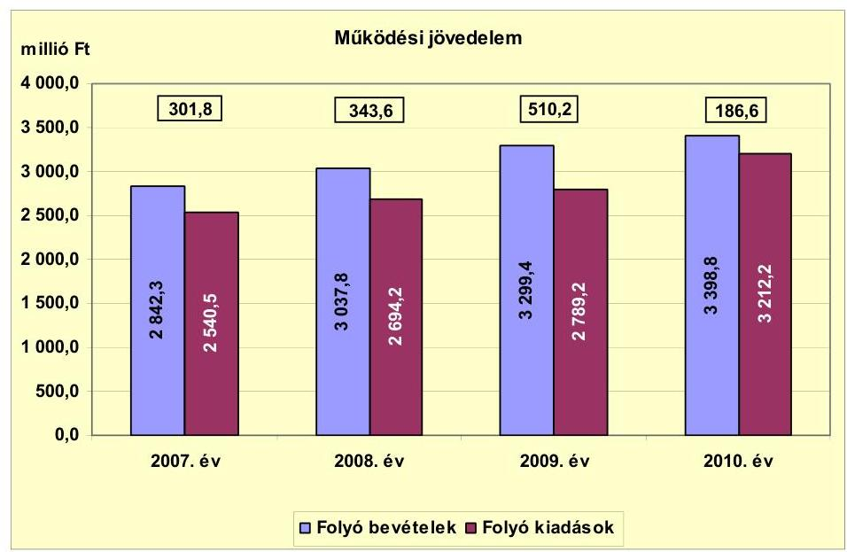

A múködési jövedelem 2009-ről 2010-re tapasztalt 323,6 millió Ft csökkenésére hatással volt a kamatkiadások finanszírozása után fennmaradó kamatbevétel - a csökkenő óvadéki betétállomány miatti - visszaesése ( 73,8 millió Ft) és a normatív állami hozzájárulás csökkenése ( 104,3 millió Ft). A múködési jövedelem csökkenéséhez hozzájárult a közcélú foglalkoztatásra a résztvevő rászorultaknak átadott - költségvetési támogatással nem finanszírozott - pénzeszközök (+15,6 millió Ft) és a pályázatokkal kapcsolatos - következő évben beérkező pályázati támogatásból részben megtérülő - múködési célú kiadások növekedése. A vizsgált időszakban a múködési jövedelem megtakarítást mutatott, amely forrásul szolgálhatott az Önkormányzat fennálló tőketörlesztési kötelezettségeinek teljesítéséhez, valamint fejlesztéseinek finanszírozásához.

A nettó múködési jövedelem ${ }^{17}$ értéke a folyó költségvetési pozíció mellett az adott költségvetési év adósságtörlesztésének hatását is tükrözi. A pénzügyi kapacitás változását a 2007-2010. években a következő diagram szemlélteti:
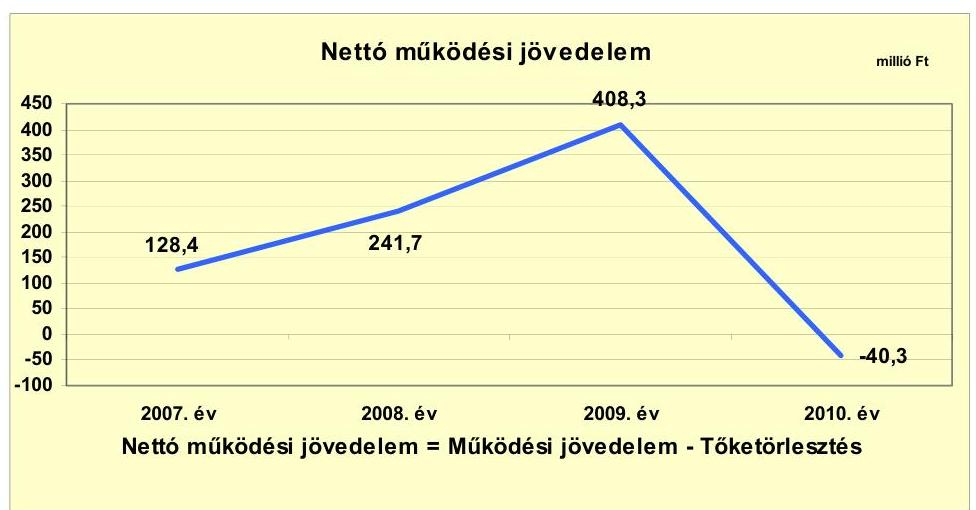

[^0]
[^0]:    ${ }^{17}$ pénzügyi kapacitás

---

Az Önkormányzat pénzügyi kapacitása a 2007-2009. években folyamatosan növekvő pozitív értéket, majd a 2010. évre negatív egyenleget mutatott. A nettó múködési jövedelem - változó nagyságrendú tőketörlesztés ${ }^{18}$ mellett - a négy év alatt 2009-ről 2010-re változott a legnagyobb mértékben, 440,9 millió Ft-tal csökkent. A 2010. évi csökkenést alapvetően a kötvénytörlesztés 2010. évi megkezdése ( 125,0 millió Ft) és a folyó bevételek és kiadások különbségéből származó múködési jövedelem 2009-ről 2010. évre tapasztalt 323,6 millió Ft csökkenése okozta.

Az Önkormányzat felhalmozási költségvetésének egyenlege 2007-ben és 2009-ben pozitív, 2008-ban és 2010-ben negatív összegú volt, amely előrelátó, tudatos költségvetési gazdálkodás és pénzügyileg fenntartható ${ }^{19}$ beruházások esetén nem jár magas pénzügyi kockázattal. A felhalmozási költségvetés egyenlegét 2007-2010 között évről évre a következő ábra szemlélteti:
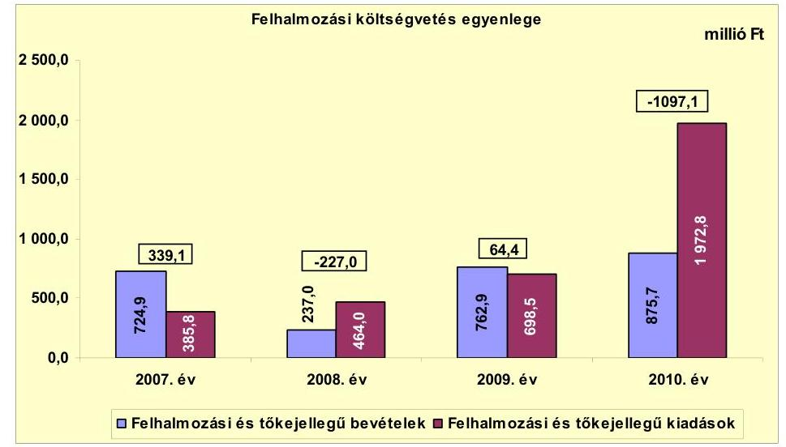

A felhalmozási költségvetés 2010. évi kiemelkedő negatív egyenlegének keletkezéséhez hozzájárult az EU-s projektek támogatásának megelőlegezése, saját forrásának biztosítása, a víziszínpad építéséhez felhalmozási célú pénzeszközátadás biztosítása belső finanszírozás útján (az előző évi pénzmaradványból, amelynek részét képezte a kötvénybevétel maradványa is).

A 2008. évi 227,0 millió Ft felhalmozási forráshiányra a 2008. január elsején rendelkezésre álló 1667,6 millió Ft pénzkészlet (amely tartalmazta a 2007. évi kötvénykibocsátás bevételét is) és a 2008. évben keletkezett 241,7 millió Ft nettó működési jövedelem felhasználása ${ }^{20}$ fedezetet nyújtott. A 2010. évi 1097,1 millió Ft felhalmozási forráshiányra a 2010. január elsejei 3264,8 millió Ft nyitó pénzkészlet nyújtott fedezetet, amely a 2007-2008. évi kötvénykibocsátásokból származó bevétel maradványát is magába foglalta.

[^0]
[^0]:    ${ }^{18}$ Az Önkormányzat tőketörlesztési kötelezettsége 2007-ben 173,4 millió Ft, 2008-2009ben évi 101,9 millió Ft, 2010-ben 226,9 millió Ft volt.
    ${ }^{19}$ Az minősül pénzügyileg fenntartható beruházásnak, amelynek újként megjelenő, illetve többletként mutatkozó múködtetési költségeire az Önkormányzat nettó múködési jövedelme a következő években is fedezetet nyújt.
    ${ }^{20}$ Az évenkénti adatokat a jelentés 2. számú melléklete mutatja be.

---

Az Önkormányzat évenkénti teljes finanszírozása ${ }^{21}$ a CLF módszer szerint 2007-ben 467,5 millió Ft, 2008-ban 14,7 millió Ft, 2009-ben 472,7 millió Ft többletet mutatott. 2010-ben az Önkormányzat teljes finanszírozási igénye 1137,4 millió Ft volt, amelynek finanszírozását az előző évek pénzmaradványának igénybevétele biztosította.

Az Önkormányzat finanszírozási múveletei 2007-2010. évekbeli egyenlegét a következő ábra szemlélteti:
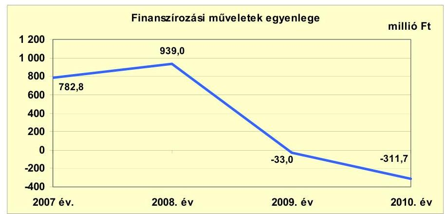

A finanszírozási múveletek egyenlege a 2007. és 2008. évi két kötvénykibocsátás - 1000,0-1000,0 millió Ft összegű - finanszírozási célú bevétele miatt pozitív volt. A 2009. évre az előző évhez képest 972,0 millió Ft-tal csökkent és negatívvá változott az egyenleg, mert minimális finanszírozási célú bevétel mellett 101,9 millió Ft hiteltörlesztés történt. A finanszírozási múveletek hiánya a 2010. évre tovább növekedett, amelyre hatással volt a „Szarvas 2017" kötvény törlesztésének megkezdése. A finanszírozási célú műveleteket a jelentés 2. számú mellékletének 4.1-4.8. pontjai részletezik.

Az Önkormányzat 2007-2010. évi zárszámadási rendeleteiben és a 2011. év I. félévi beszámolójában meghatározta a felhalmozási, illetve múködési bevételek és kiadások főösszegét ${ }^{22}$, amelyet a jelentés 1. számú melléklete szemléltet. A zárszámadási rendeletekben bevételi többletet mutattak ki 2007-ben 645,4 millió Ft, 2008-ban 863,3 millió Ft, 2009-ben 3308,7 millió Ft és 2010-ben 740,7 millió Ft összegben. Ez a CLF módszer alapján számított múködési jövedelem és felhalmozási költségvetés egyenlegét minden évben meghaladta alapvetően az igénybevett pénzmaradvány hatására.

Az Önkormányzat kamatbevételeinek és -kiadásainak egyenlege pozitív volt a 2007-2011. év I. félév közötti időszakban, az egyenleg változását a következő ábra mutatja be:

[^0]
[^0]:    ${ }^{21}$ a nettó múködési jövedelem és a beruházási költségvetés egyenlegeinek összege
    ${ }^{22}$ Nincs kötelező előírás a múködési és fejlesztési többlet, hiány megállapításának módjára.

---

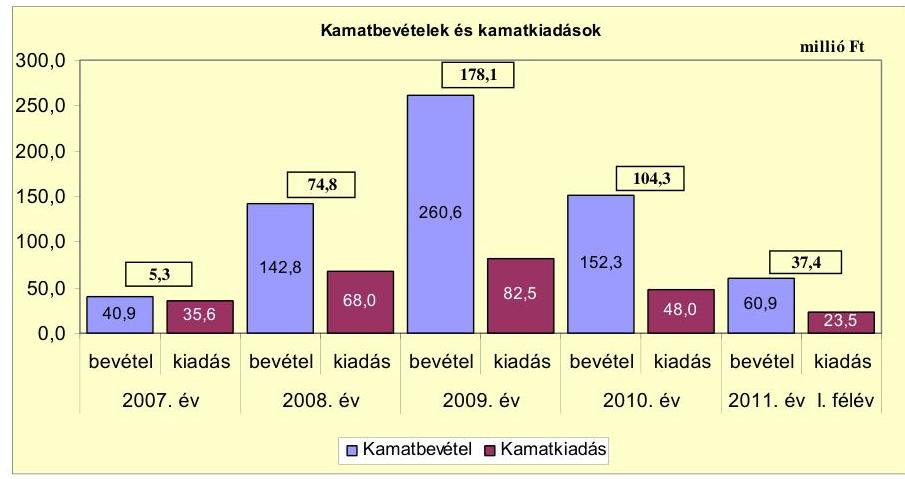

A kamatbevételek 2007-ről 2009-re tapasztalt emelkedését a 2007-ben és 2008ban kibocsátott 1000,0-1000,0 millió Ft kötvénybevétel lekötéséből származó kamat eredményezte. A kamatbevételek 2010. évi visszaesése az óvadéki betétszámlán elhelyezett kötvénybevétel felhasználásával függött össze. Az Önkormányzat az eredeti előirányzatot meghaladóan befolyt kamatbevételeket fejlesztési tartalékba helyezte.

# 2.2. Az Önkormányzat bevételeinek változása 

Az Önkormányzat folyó bevételei folyamatosan növekedtek, a 2007. évi 2842,3 millió Ft-ról 2008-ra 3037,8 millió Ft-ra, 2009-re 3299,4 millió Ft-ra, 2010-re 3398,8 millió Ft-ra. A bevételek elsősorban a fordított áfa, a kamatbevételek, illetve múködési célú pályázati támogatások, a közfoglalkoztatásra kapott költségvetési támogatás bevételnövelő és a normatív állami hozzájárulás bevételcsökkentő hatására változtak. A 2011. év I. félévében a bevételek az előző évi bevétel 44,4\%-ában, 1507,4 millió Ft összegben teljesültek.

Az Önkormányzat 2007-2011. év I. félév között realizált főbb folyó bevételi jogcímeinek számszaki adatait a következő táblázat részletezi és grafikon mutatja be:
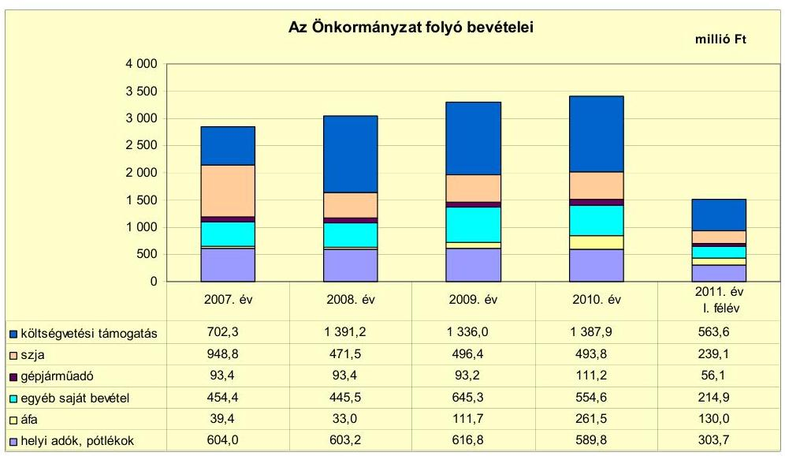

---

Az Önkormányzat költségvetési támogatás és átengedett szja bevételeinek együttes összege a 2008-2010. években érdemben nem változott: 2008-ban 1862,7 millió Ft, 2009-ben 1832,4 millió Ft és 2010-ben 1881,7 millió Ft volt. Az együttes bevétel a 2007. évi 1651,1 millió Ft-ról 2008-ra 211,6 millió Ft-tal nőtt a szakképző intézmény-átvétel 2008. évi normatív költségvetési támoga-tás-növelő hatására. Az előző évhez képest a 2008. évre az szja 477,3 millió Ftos csökkenését és a költségvetési támogatás ugyanakkora összegű emelkedését az okozta, hogy 2008-tól költségvetési támogatás jogcímen finanszírozták a tűzoltóság által ellátott feladatokat és a korábbi években szja-ból finanszírozott normatív hozzájárulásokat. A költségvetési támogatás 2010. évi 51,9 millió Ftos emelkedése elsősorban a normatív állami hozzájárulás 104,3 millió Ft-os csökkenéséből és a közfoglalkoztatásra kapott költségvetési támogatás 158,7 millió Ft-os emelkedéséből származott.

Az Önkormányzatnál a helyi adókból és pótlékokból származó bevételek aránya a folyó bevételekben a 2007-2009. években átlagosan 18,9\% (608,0 millió Ft) volt, amely a 2010. évre 16,9\%-ra (589,8 millió Ft-ra) csökkent. A helyi adóbevételek 2008-ról 2009-re bekövetkezett 13,6 millió Ft-os növekedéséhez hozzájárult az építményadó-kedvezmény 2009. január 1-jei megszüntetése. A 2010. évben az előző évhez képest 27,0 millió Ft-tal (4,4\%-kal) csökkentek a helyi adóbevételek elsősorban az iparúzési adó mértékének 2009. január 1-jétől 2,0\% helyett 1,95\%-ban történt megállapítása, illetve a gazdasági válság hatására az iparúzési adóalap csökkenése miatt. Az iparúzési adó és az építményadó mértéke nem éri el a törvényi adómérték felső határát.

Az Önkormányzat a 2007-2011. években három helyi adónemet, a helyi iparúzési adót, az építményadót és az idegenforgalmi adót alkalmazott. Az iparúzési adónál 2007. január 1-jétől az adómérték felső határát, 2\%-ot állapított meg, amelyet 2009. január 1-jétől - a gazdasági válságra tekintettel - 1,95\%-ra csökkentett. Az építményadó mértéke a vizsgált időszakban nem változott, a lakások után $70 \mathrm{Ft} / \mathrm{m}^{2}$, a nem lakás céljára szolgáló építmények után $150 \mathrm{Ft} / \mathrm{m}^{2}$, az üdülők után $600 \mathrm{Ft} / \mathrm{m}^{2}$ volt. Ezek az adómérték 2011. január 1-jétől érvényes felső határa ( $1100 \mathrm{Ft} / \mathrm{m}^{2}$ ) alatt voltak. Az idegenforgalmi adó mértéke 2007-2010 között nem módosult, $300 \mathrm{Ft} /$ éj/fő volt, amely megegyezik az adómérték felső határával.

A gépjármúadóból származó bevétel a 2007-2009. években átlagosan 93,3 millió Ft volt, amely 2010-re 19,2\%-kal, 111,2 millió Ft-ra emelkedett a gépjármúadó alapjának, mértékének 2010. január 1-jétől hatályos változása következtében. Az áfa bevétel összege a 2008. évről a 2009. évre 78,7 millió Ft-tal, 2009-ről 2010-re 149,8 millió Ft-ra emelkedett alapvetően a fordított áfa ${ }^{23}$ elszámolás hatására.

[^0]
[^0]:    ${ }^{23}$ A fordított áfa elszámolás azt jelenti, hogy az áfa múködési mechanizmusával ellentétben értékesítéskor nem az eladó fizeti meg a számlában foglalt összeg után az áfát, hanem a vevő (jelen esetben az Önkormányzat vagy intézménye). A számviteli elszámolási szabályok miatt a fordított áfa elszámolás technikai jellegű, bevétel- és kiadásnövelő pénzügyi kihatása 2009-ben 77,7 millió Ft, 2010-ben 229,6 millió Ft volt. A 2011. év I. félévében a bevételnövelő hatás 119,0 millió Ft, a kiadásnövelő hatás 114,8 millió Ft volt.

---

Az Önkormányzat egyéb saját bevételeinek ${ }^{24}$ a 2008. évi 445,5 millió Ftról 2009-ra 645,3 millió Ft-ra történt növekedését a kötvénybevétel befektetéséből származó kamatbevételek 117,8 millió Ft-os és az államháztartáson belülről múködési célra átvett (pályázati) pénzeszközök 90,7 millió Ft-os emelkedése okozta. Az egyéb saját bevételek 2009-ről 2010-re bekövetkezett csökkenése elsősorban a kamatbevételek 108,3 millió Ft-os visszaeséséhez kapcsolódott.

Az Önkormányzat 2007-2011. év I. félév között két gazdasági társaságától öszszesen 57,8 millió Ft osztalékban részesült az azokban lévő tulajdonrésze alapján. A kábel tv-t üzemeltető társaságtól kapta az osztalék 97,7\%-át (56,5 millió Ft-ot), a Dél-Alföldi Regionális Fejlesztési Zrt.-től a 2,3\%-át (1,3 millió Ft-ot). Az Önkormányzat osztalékról nem mondott le: a Komép Kft. nyereségének eredménytartalékba helyezéséről határozatot hozott az egyes években; a három nonprofit kft. esetleges eredményét jogszabályi előírás alapján kellett eredménytartalékba helyezni.

Az Önkormányzat felhalmozási bevételei a 2007-2011. év I. félév közötti időszakban a következők voltak:

| Megnevezés | 2007. év | 2008. év | 2009. év | 2010. év | 2011. év   I. félév |
| :-- | --: | --: | --: | --: | --: |
| Tárgyi eszköz értékesítés | 27,3 | 26,6 | 26,9 | 100,5 | 0,4 |
| Egyéb saját tőkebevétel | 85,8 | 92,9 | 16,3 | 4,0 | 2,2 |
| Felhalmozási célú   költségvetési támogatás | 291,4 | 96,6 | 84,4 | 92,1 | 173,6 |
| Államháztartáson belülről   kapott támogatás | 288,8 | 8,2 | 582,1 | 610,0 | 199,4 |
| Államháztartáson kívülről   kapott támogatás | 31,6 | 12,7 | 53,2 | 69,1 | 14,7 |
| Összes felhalmozási bevétel | 724,9 | 237,0 | 762,9 | 875,7 | 390,3 |

A vizsgált években a felhalmozási célú bevételek jelentős ingadozásához hozzájárult az államháztartáson belülről kapott - elsősorban a Fő téri általános iskola rekonstrukciója, a szakrendelő, az ipari park és a belvízelvezetés fejlesztése projektekhez kapcsolódó - támogatások, támogatási előlegek 2009-2010. évi emelkedése. A tárgyi eszközértékesítés bevétele 2010-ben egy gazdasági társaságnak eladott telek ( 85,5 millió Ft) miatt emelkedett közel négyszeresére az előző évekhez képest. Az egyéb saját tőkebevételek 2007-2008. évi magasabb összegét az egyháznak átadott ingatlanra tekintettel kapott kártalanítás összege (2007-ben 80 millió Ft, 2008-ban 85 millió Ft) eredményezte. A felhalmozási célú költségvetési támogatás 2007. évi és 2011. év I. félévi magasabb összege döntően a belterületi vízrendezésre kapott 200,0 millió Ft-os, illetve 105,0 millió Ft-os és az EU önerő alapból folyósított 74,9 millió Ft-os, valamint 34,1 millió Ft-os támogatásból, továbbá a nemzetiségi színházak fejlesztésére 2011. évben kapott 22,5 millió Ft támogatásból tevődött össze. Az államháztartáson kívülről kapott bevételek 2009-2010. évi emelkedését a 2009-től múködő

[^0]
[^0]:    ${ }^{24}$ Az egyéb saját bevételek részét képezték az intézményi múködési bevételek, a hozamés kamatbevételek, az osztalék, a talajterhelési díj, a vagyoni értékű jog értékesítése, az államháztartáson belülről és kívülről átvett pénzeszközök, előző évi pénzmaradvány átvétele.

---

szakképzés szervezési társulásnak a vállalkozások által utalt szakképzési hozzájárulás okozta.

# 2.3. Az Önkormányzat múködési és a felhalmozási célú kiadásainak változása. 

Az Önkormányzat folyó kiadásai főbb jogcímek szerinti bontásban 2007-2011. június 30. között az alábbiak voltak:

| Megnevezés | 2007. év | 2008. év | 2009. év | 2010. év | $\begin{gathered} \text { millió Ft } \\ 2011 . \text { év } \\ \text { I. félév } \end{gathered}$ |
| :--: | :--: | :--: | :--: | :--: | :--: |
| Folyó kiadások | 2540,5 | 2694,2 | 2789,2 | 3212,2 | 1382,4 |
| Müködési kiadások (kamatkiadás nélkül) | 2112,8 | 2268,4 | 2161,8 | 2418,8 | 1145,2 |
| Államháztartáson belülre átadott pénzeszközök | 135,2 | 24,9 | 22,3 | 30,6 | 18,4 |
| Transzferkiadások | 252,3 | 326,7 | 503,1 | 704,3 | 178,8 |
| -ebből: vállalkozásoknak | 29,7 | 93,6 | 139,1 | 164,5 | 26,2 |
| magánszemélyeknek | 168,3 | 183,7 | 301,6 | 482,9 | 125,1 |
| nonprofit szervezeteknek | 54,3 | 49,4 | 62,4 | 56,9 | 27,5 |
| Kamatkiadások | 35,6 | 68,0 | 82,5 | 48,0 | 23,5 |
| Előző évi pénzmaradvány átadás | 4,6 | 6,2 | 19,5 | 10,5 | 16,5 |

Az Önkormányzat folyó kiadásai főbb kiadásnemek szerinti bontásban az alábbiak voltak:

| Megnevezés | 2007. év | 2008. év | 2009. év | 2010. év | 2011. év   I. félév |
| :-- | --: | --: | --: | --: | --: |
| Személyi juttatások | 1109,0 | 1197,2 | 1137,8 | 1147,4 | 559,2 |
| Munkaadót terhelő járulékok | 357,3 | 384,1 | 347,2 | 309,2 | 149,1 |
| Dologi kiadások | 570,7 | 633,5 | 646,2 | 883,4 | 396,4 |
| Egyéb folyó kiadások | 75,8 | 53,6 | 30,6 | 78,8 | 40,5 |

A folyó kiadásokon belül a személyi juttatások összege 2007-ről 2008-ra 8,0\%-kal, 88,2 millió Ft-tal növekedett a megyei önkormányzattól átvett szakképző intézmény, a tűzoltóságnál végrehajtott létszámfejlesztés, a többcélú társulásnak átadott szociális feladatok, az önkormányzati gazdasági társaságnak átadott konyha és a közoktatást érintő létszámcsökkentések együttes hatására. A személyi juttatások összege 2008-ról 2010-re 4,2\%-kal, 49,8 millió Ft-tal csökkent az álláshely-megszüntetések és a 13. havi illetmény megszűnése következtében.

A munkaadókat terhelő járulékok összege a 2007-ről 2008-ra 7,5\%-kal, 26,8 millió Ft-tal nőtt az átvett és átadott feladatok, az álláshelymegszüntetések növelő és csökkentő hatásának egyenlegeként. A 2008-2010. közötti időszakban a járulékok folyamatos, összesen 74,9 millió Ft-os csökkenését az álláshely-megszüntetések mellett befolyásolta a tételes egészségügyi hozzájárulás 2010. január 1-jei megszűnése, illetve a munkaadói járulék mértékének csökkenése (2010. január 1-jétől 29\%-ról 27\%-ra).

Az Önkormányzat dologi kiadásai 2007-ről 2008-ra 11,0\%-kal, 62,8 millió Ft-tal növekedtek, mivel a más szervtől átvett szakképző intézmény dologi kiadásai meghaladták a más szervnek átadott feladatok miatti dologi kiadáscsökkenést. A 2008-ról 2010-re bekövetkezett 249,9 millió Ft dologi kiadásemelkedés alapvetően a fordított áfa és a szakképzés szervezési társulás TISZK pá-

---

lyázata kiadásaiból származott. Az Önkormányzatnál 2011. év I. félévében az előző évhez viszonyítva a személyi juttatások 48,7\%-ra (559,2 millió Ft), a járulékok 48,2\%-ra (149,1 millió Ft), a dologi kiadások 44,9\%-ra (396,4 millió Ft) teljesültek.

Az államháztartáson belülre átadott múködési célú pénzeszközök 2007. évi magas összegét egyszeri kiadás, a többcélú társulásnak 2007. február 1-jével átadott szociális intézményt 2007-ben megillető normatív költségvetési támogatás (111,1 millió Ft) továbbutalása okozta.

Az államháztartáson kívülre történő múködési célú pénzeszközátadások (transzferkiadások) összege a 2007-2010. közötti időszakban folyamatosan, közel háromszorosára, 452 millió Ft-tal emelkedett. Ezt egyrészt az önkormányzati feladatokat ellátó Komép Kft.-nek átadott pénzeszközök - a feladatok finanszírozási módjának változása (2009. január 1-jétől kiszámlázott szolgáltatás, azaz dologi kiadás helyett átadott pénzeszköz) miatti - emelkedéséből származott. A kiadások növekedéséhez hozzájárult még a gyógyfürdőüzemeltetést végző kft.-nek a 2008-2010. években évente átlagosan átadott évi 33,8 millió Ft pénzeszköz. A közcélú foglalkoztatásra magánszemélyeknek folyósított szociális ellátás - 2009-ben 112,2 millió Ft-os, 2010-re 174,3 millió Fttal növekvő - összege hozzájárult a kiadások további emelkedéséhez.

A folyó és felhalmozási kiadásokat, a teljesített kiadások múködési és felhalmozási célú felhasználásának arányait a 2007-2011. év I. félév közötti időszakban az alábbi ábra mutatja be:
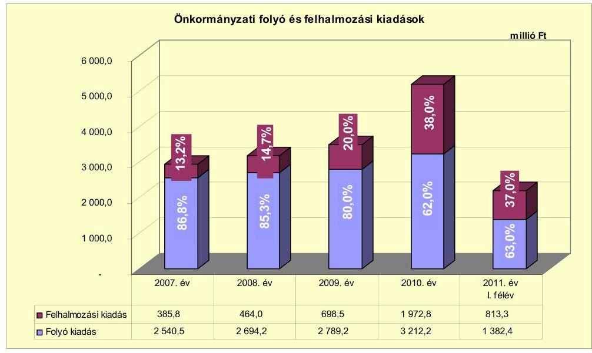

A folyó és felhalmozási kiadások arányainak változása a 2007-2010. évek között a felhalmozási kiadások arányának emelkedését mutatta. A felhalmozási kiadások aránya folyamatosan, 2007-2010 között összességében 24,8 százalékponttal, összege 1587,0 millió Ft-tal emelkedett. A felhalmozási kiadások arányának növekedését a sikeres pályázatok révén megkezdett fejlesztések, a kötvénykibocsátásból származó bevétel saját forrásként és támogatás-megelőlegezésként történő felhasználása eredményezte. A felhal-

---

mozási kiadások 2011. év I. félévi aránya az előző évhez képest nem változott jelentősen, $37,0 \%$ volt.

Az Önkormányzatnál a 2010. december 31-ig befejezett ${ }^{25}$ - 22 db tíz millió Ft feletti és 266 db tíz millió Ft alatti bekerülési költségű - felújítás és fejlesztés költsége 2514,3 millió Ft volt. Ebből a fejlesztések összege 2470,4 millió Ft $(98,2 \%)$ és a felújítások összege 43,9 millió Ft $(1,8 \%)$ volt. A befejezett 2514,3 millió Ft értékű fejlesztés forrása 287,0 millió Ft saját bevételből (11,4\%), 17,0 millió Ft - a 2007. év előtt lehívott - hitelből ( $0,7 \%$ ), 593,0 millió Ft kötvényforrásból (23,6\%), 1075,3 millió Ft EU-s támogatás (42,8\%) és 542,0 millió Ft hazai támogatásból (21,5\%) tevődött össze. A 2006. december 31-ig teljesített kiadások összege 64,2 millió Ft, a 2007-2010. években teljesített kiadások összege 2450,1 millió Ft volt. Az EU-s támogatás kiutalások 2010. évi késedelme miatt a fejlesztések nincsenek pénzügyileg teljes körűen lezárva, azonban az EU-s támogatásból megvalósult fejlesztések előfinanszírozása nem okozott likviditási gondot. A kifizetések teljesítésének fedezete - egyrészt a támogatási előlegekből, az átmenetileg szabad pénzmaradványból és felhalmozási bevételből, másrészt a szükséges saját forrás a kötvénybevételből - biztosított volt.

Az Önkormányzat a 2010. év végén folyamatban lévő ${ }^{26}$ - 10 db tíz millió Ft alatti és 11 db tíz millió Ft feletti bekerülési költségű - fejlesztési feladataira 2010. december 31-ig 561,0 millió Ft-ot fizetett ki. Ennek forrását 30,6 millió Ft saját bevétel (5,4\%), 158,6 millió Ft kibocsátott kötvényből származó bevétel (28,3\%), 314,5 millió Ft EU-s támogatás (56,1\%) és 57,3 millió Ft hazai támogatás (10,2\%) képezte. A folyamatban lévő feladatoknál a 2010. év utánra vállalt kötelezettség összege 1781,9 millió Ft volt, amelynek forrásai 5,8 millió Ft saját bevételből, 206,4 millió Ft kötvényből származó bevételből, 1114,2 millió Ft EU-s támogatásból és 455,5 millió Ft hazai támogatásból tevődnek össze.

Az Önkormányzat saját forrásból indított - 17 db tíz millió Ft alatti és két db tíz millió Ft feletti bekerülési költségű - felújítást és fejlesztést valósított meg a 2011. év I. félévében, amelyekhez 34,5 millió Ft kiadás kapcsolódott. A kiadások forrását 4,5 millió Ft saját bevétel és 30,0 millió Ft kötvényből származó bevétel képezte.

Az Önkormányzat 2010. december 31-ig beadott hét db, elbírálás alatt álló pályázatában ${ }^{27}$ a 2010. év utánra vállalt kötelezettség 3291,4 millió Ft volt. Ennek forrásaként 145,2 millió Ft tervezett hitelfelvétellel (4,4\%), 2150,1 millió Ft EU-s támogatással (65,3\%), 599,9 millió Ft hazai támogatással (18,2\%) és 396,2 millió Ft összegben a korábban kibocsátott köt-

[^0]
[^0]:    ${ }^{25}$ A 2010. december 31-ig befejezett fejlesztések adatait a jelentés 3/a. számú melléklete tartalmazza.
    ${ }^{26}$ A 2010. év végén folyamatban lévő fejlesztések adatait a jelentés 3/b. és 3/c., a 2011. év I. félévben saját forrásból megvalósított fejlesztések adatait a jelentés 3/c1. számú melléklete tartalmazza.
    ${ }^{27}$ A 2010. december 31-én elbírálás alatt álló és 2011-ben benyújtott pályázatokkal kapcsolatos adatokat a jelentés 3/d. számú melléklete mutatja be.

---

vényforrás maradványának igénybevételével (12,1\%) terveztek. A források - a kötvénybevétel kivételével - csak két pályázatnál (szárazmalom helyreállítása és kerékpárút építés) álltak az Önkormányzat rendelkezésére a helyszíni ellenőrzés idején.
2011. évben a helyszíni ellenőrzés megkezdéséig kilenc pályázatot adott be az Önkormányzat. A pályázatokban vállalt kötelezettség 2078,7 millió Ft volt, amelyhez 0,6 millió Ft saját bevétellel, 139,0 millió Ft tervezett hitelfelvétellel (6,7\%), 1875,9 millió Ft EU-s támogatással ( $90,2 \%$ ), 16,5 millió Ft hazai támogatással ( $0,8 \%$ ) és 46,7 millió Ft összegben a korábban kibocsátott kötvényforrás maradványának igénybevételével ( $2,3 \%$ ) terveztek. A pályázatok elbírálása folyamatban van.

Az Önkormányzat vizsgált időszakban megvalósult és folyamatban lévő fejlesztései közül a legnagyobb költségigényű az alábbi három beruházás volt:

- a Fő téri Általános Iskola infrastruktúrájának 2009-2010-ben megvalósult fejlesztésével (tetőtér beépítése, szaktantermek és egyéb helyiségek kialakítása, akadálymentesítés, elektromos-, víz- és szennyvízhálózat felújítása, fűtéskorszerűsítés, nyílászárók cseréje, hőszigetelés, kapcsolódó eszközbeszerzések) egyetlen telephelyen megoldották az általános iskolai oktatást. A projekt bekerülési költsége 569,5 millió Ft volt, amelyből 50,3 millió Ft-ot ( $8,8 \%$ ) kötvényből származó bevételből, 491,6 millió Ft-ot ( $86,3 \%$ ) EU-s támogatásból és 27,6 millió Ft-ot ( $4,9 \%$ ) hazai támogatásból fedeztek;
- a Szarvas Város Önkormányzat Szakorvosi rendelőjének komplex kistérségi szakrendelővé fejlesztése projekt 2010-ben megkezdődött és műszakilag 2011-ben fejeződött be. A projekt keretében elvégezték a meglévő egészségügyi szakrendelő átalakítását, korszerűsítését, a lapostetős épületrész magastetővel történő ellátását. A fejlesztés részeként orvostechnikai eszközöket és azt alátámasztó infókommunikációs eszközöket vásároltak. A projekt 581,6 millió Ft tervezett bekerülési költségéből 2010. december 31-ig 80,9 millió Ft volt a teljesített kiadás, amelynek forrása 4,1 millió Ft kötvénybevétel, 72,8 millió Ft EU-s támogatás és 4,0 millió Ft hazai támogatás volt. A projektből 2010. december 31-én 500,7 millió Ft kötelezettség állt fent. Ezt 5,0-5,0\%-ban kötvénybevételből ( 25,0 millió Ft) és EU Önerő Alap támogatásból ( 25,0 millió Ft), 90,0\%-ban EU-s támogatásból ( 450,7 millió Ft) finanszírozták;
- a Szarvas Város belterületi vízelvezetés IV-V-VI. ütemének megvalósításával a település teljes területén megoldják a csapadékvíz-elvezetést. A 444,4 millió Ft tervezett bekerülési költségű projekt támogatási szerződését 2010-ben kötötték meg. A projekt megvalósítása folyamatban van, a befejezési határidő 2011. november 30. A projekttel kapcsolatban 2010. december 31-ig 18,4 millió Ft volt a teljesített kiadás, amelynek fedezete 1,8 millió Ft összegben ( $9,8 \%$ ) kötvénybevételből és 16,6 millió Ft összegben ( $90,2 \%$ ) hazai támogatásból volt biztosított. A projektből 2010. december 31-én 426,0 millió Ft kötelezettség állt fent. Ezt 10,0\%-ban kötvénybevételből (42,6 millió Ft) és 90,0\%-ban hazai támogatásból ( 383,4 millió Ft) tervezték finanszírozni.

---

Az Önkormányzat által a gazdasági társaságok részére átadott múködési és felhalmozási célú pénzeszközöket ${ }^{28}$ az alábbi diagram mutatja be a 2007-2011. év I. félévére:
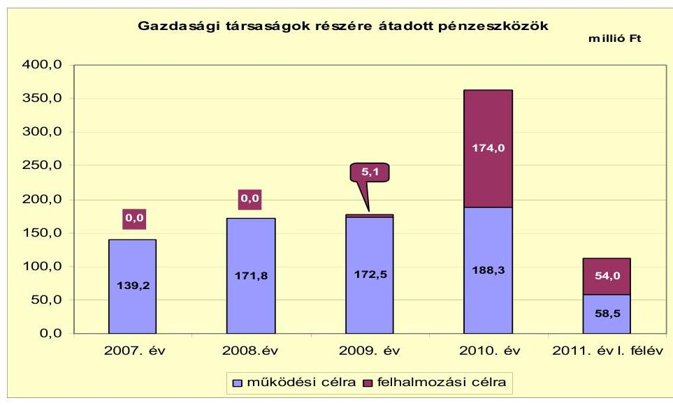

Az önkormányzati feladatellátásban résztvevő gazdasági társaságoknak átadott múködési célú pénzeszközök évről évre növekvő összege az Önkormányzat pénzügyi helyzetének, múködési jövedelmének alakulását alapvetően nem befolyásolta. A 2010. évben a múködési jövedelem erőteljesen (323,6 millió Fttal) visszaesett, miközben 2010-ben az előző évhez képest csak 15,8 millió Ft-tal volt magasabb a múködési célú pénzeszközátadás. A Gyógy-Termál Kft.-nek 2008-2010-ben évente átlagosan 33,8 millió Ft pénzeszközt adott át az Önkormányzat - az üzemeltető által megállapított, önköltség alatti belépődíjak, az oktatási intézmények részére biztosított térítésmentes használat miatt - a gyógyfürdő üzemeltetés során keletkező veszteség ellensúlyozására. Az Önkormányzat a fürdőt nem gazdaságossági, hanem várospolitikai érdekek szem előtt tartásával üzemelteti. Hosszabb távon azonban kockázatot jelenthet az Önkormányzat pénzügyi helyzetére a gyógyfürdő veszteségének finanszírozása. A gazdasági társaságoknak átadott pénzeszközök 2010. és 2011. évi ugrásszerű növekedését az Önkormányzat által a Regionális Színház Kft.-nek víziszínpad építéséhez átadott fejlesztési célú pénzeszköz okozta, amely hozzájárult a beruházási költségvetés 2010. évi negatív egyenlegéhez. A gazdasági társaságok szerződés alapján, számadási kötelezettséggel kaptak pénzeszközt az Önkormányzattól.

A gazdasági társaságok adatszolgáltatása szerint a 2007-2011. év I. félév közötti időszakban egy többségi önkormányzati tulajdonú gazdasági társaságnál, 2007-ben 6,9 millió Ft összegben hajtottak végre veszteséges gazdálkodás miatti tőkeemelést. Az Önkormányzat az önköltség alatti ár- és díjmegállapítás ellen-

[^0]
[^0]:    ${ }^{28}$ A társaságok adatszolgáltatása szerinti önkormányzati pénzeszközátadás a Komép Kft. esetében a 2007-2008. években magába foglalja az Önkormányzat által múködési és felhalmozási célra átadott pénzeszközöket (2007-ben 15,7 millió Ft, 2008-ban 18,6 millió Ft), illetve a társaság által a közfeladatok ellátásáért leszámlázott és az Önkormányzat által dologi kiadásként kifizetett összegeket (2007-ben 93,9 millió Ft, 2008ban 94,3 millió Ft ).

---

tételezésére - a gyógyfürdőt üzemeltető kft.-n kívül - más társaságnak nem adott át pénzeszközt. Az önkormányzati közfeladatokat ellátó gazdasági társaságoknak átadott múködési és felhalmozási célú pénzeszközöket a jelentés 4. számú melléklete mutatja be.

# 3. Az ÖNKORMÁNYZAT KÖTELEZETTSÉGEI 

### 3.1. Az Önkormányzat pénzintézeti kötelezettségeinek változása

Az Önkormányzatnak 2006. december 31-én 848,6 millió Ft pénzintézeti kötelezettség állománya volt, amely a 2007. év végére 1648,5 millió Ft-ra, 2008. év végére 2546,6 millió Ft-ra emelkedett a 2007. és 2008. évi kötvénykibocsátások és a hiteltörlesztések miatt. A kötelezettségek állománya - a köt-vény- és hiteltörlesztések hatására - az előző évhez képest 2009. év végére 2444,8 millió Ft-ra, 2010. év végére 2217,9 millió Ft-ra csökkent. Az Önkormányzat pénzintézeti kötelezettség állománya 2007. január 1-jétől 2011. június 30 -áig összességében 1230,8 millió Ft-tal emelkedett a kötvénykibocsátások, a hitel- és kötvénytörlesztések hatására azzal, hogy az Önkormányzatnak 2011. év I. félév végén mindemellett jelentős nagyságrendű ( 1642,0 millió Ft) pénzkészlete volt. A pénzintézeti kötelezettségek növekedésével párhuzamosan az Önkormányzat befektetett eszközeinek mérlegben kimutatott nettó értéke 2006ról 2010-re 1722,1 millió Ft-tal gyarapodott.

Az Önkormányzatnak a 2007-2011. év I. félév közötti időszakban öt - a 2007. év előtt felvett - hosszú lejáratú hitelből tevődött össze a hitelállománya, amelyből a Csatornamú Társulattól átvállalt 6,5 millió Ft hitelt 2008-ban viszszafizették. Az Önkormányzat 2010. év végén és 2011. június 30 -án fennálló pénzintézeti kötelezettségei két kötvénykibocsátásból és négy hosszú lejáratú hitelből keletkeztek.

Az Önkormányzat mérlegében kimutatott, pénzintézeteknél fennálló kötele-zettség-állományát a 2006-2011. év I. félév közötti időszakban az alábbi ábra szemlélteti:
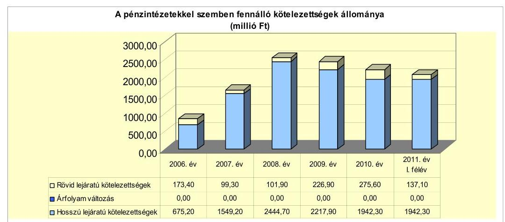

Az Önkormányzat a 2006-2010. években a Számv. tv. 60. § (2) bekezdésében foglalt előírást megsértve, az Áhsz. 33. § (1) bekezdésében foglaltak ellenére a

---

devizában fennálló kötelezettségek év végi értékelését - a Számv. tv. 60. §-a szerinti árfolyamon - nem végezte el. Az év végi értékelések elmaradása miatt a mérleg szerinti kötelezettségek állománya nem tartalmazta az árfolyamváltozások hatását. Az Önkormányzat - árfolyamváltozás hatását is tartalmazó 2010. december 31-i pénzintézeti kötelezettsége - 222,68 Ft/CHF és 278,75 Ft/EUR árfolyamon - 2838,8 millió Ft volt. Ez a mérleg szerinti pénzintézeti kötelezettségállományt $28,0 \%$-kal, 620,9 millió Ft-tal haladta meg.

Annak megítéléséről, hogy a hitelek visszafizetésekor jelentkező forint kötelezettség többletkiadást (árfolyamveszteség) vagy kiadáscsökkenést (árfolyamnyereség) eredményez a futamidő végén, a teljes kötelezettség rendezését követően lehet képet alkotni. Mindaddig, amíg törlesztési kötelezettség nem áll fenn (türelmi idő, moratórium), a tőkére vonatkoztatva nem értelmezhető sem az árfolyamveszteség, sem az árfolyamnyereség. Ugyanakkor a számviteli szabályok meghatározzák, hogy az árfolyam-különbözetet év végén a kötelezettségek között a könyvviteli mérlegben nyilván kell tartani, azonban árfolyam-különbözet ebben az esetben ténylegesen nem realizálódott.

Az Önkormányzat 2007-2011. évi költségvetési rendeletei múködési forráshiányt nem tartalmaztak. A felhalmozási forráshiány fedezetét a 2007-2008. években kötvénykibocsátás bevétellel, illetve a 2009-2010. években pénzmaradvány igénybevétellel tervezték. Az Önkormányzatnál likviditási problémák nem voltak. A pénzfelhasználás optimalizálására kiskincstári rendszert múködtettek.

A 2007-2010. években az Önkormányzat hosszú lejáratú pénzintézeti kötelezettségvállalásaira (2007-ben és 2008-ban kötvénykibocsátás) képviselőtestületi döntés alapján, a pénzintézetek versenyeztetésével került sor. Az előterjesztésekben a kötelezettségvállalások kamat- és árfolyamkockázatait bemutatták. Az Önkormányzat az adósságot keletkeztető kötelezettségvállalásának felső határát a 2007-2008. években hozott kötvény-kibocsátási döntésekkel - az Ötv ${ }^{29}$. előírását betartva - nem lépte túl. Az Önkormányzat számlavezetője azonos volt a két kötvénykibocsátást finanszírozó pénzintézettel.

Az Önkormányzat 2011. június 30-án HUF-ban fennálló adósságot keletkeztető kötelezettségvállalása az alábbi volt:

| Megnevezés | Szerződéskötés   időpontja | Összeg   ezer HUF-ban | Kamat   (referencia   kamat+   kamatfelár) | Felhasználás célja: |
| :-- | :--: | :--: | :--: | :--: |
| Szociális bérlakáshitel 2001. | 2001. október 29. | 48231,0 | $7,0 \%$ | Szociális bérlakásépítés |
| Szociális bérlakáshitel 2002. | 2002. november 13. | 36000,0 | $5,0 \%$ | Szociális bérlakásépítés |

Az Önkormányzat a 2011. június 30-án HUF-ban fennálló hitelszerződések közül a 48,2 millió Ft keretösszegű hitel teljes összegét a vállalt hitelcélra, szociális bérlakásépítésre igénybe vette. A 36,0 millió Ft keretösszegű hitelből 35,4 millió Ft-ot hívtak le 2002-ben, a hitelkeret 0,6 millió Ft maradványát nem vették igénybe. A két hitelhez kapcsolódóan hiteltörlesztésre 78,7 millió Ft-ot, kamatfizetésre 21,5 millió Ft-ot fordítottak 2011. év I. félév végéig. A lehívott összege-

[^0]
[^0]:    ${ }^{29}$ 2012. január 1-jétől a Magyarország gazdasági stabilitásáról szóló 2011. évi CXCIV. törvény 10. § (3) bekezdés

---

ket a hitelcélnak megfelelően használták fel. A forinthiteleket egyéb fizetési kötelezettség nem terhelte. A hosszú lejáratú forinthiteleket nyújtó pénzintézet nem volt azonos az Önkormányzat számlavezetőjével.

Az Önkormányzat 2011. június 30-án CHF-ben fennálló hosszú lejáratú adósságot keletkeztető kötelezettségvállalásai a következők voltak:

| Megnevezés | Szerződéskötés/   Kibocsátás   időpontja | Összeg   az első lehívás,   kibocsátás   devizanemében | Lehivási   árfolyam | Kamat   (referencia kamat+   kamatfelár) | Felhasználás célja: |
| :--: | :--: | :--: | :--: | :--: | :--: |
| Beruházási hitel 2004. | 2004. december 21. | 645,6 millió Ft | - | 3 havi BUBOR   $+0,6 \%$ | Az OTP Bank Rt.-nél fennállt 645,6   millió Ft összegü hosszú lejáratú   beruházási célú önkormányzati   hitelek átvállalása |
| Beruházási hitel 2006. | 2006. június 30. | 1125,8 ezer CHF | 178,0 Ft/CHF | 3 havi CHF LIBOR   $+0,49 \%$ | PHARE I-II., AVOP, ROP   projektekhez saját forrás   biztosítása |
| "Szarvas 2017"   kötvény | 2007. október 24. | 1000,0 millió Ft | - | 6 havi BUBOR   $+0,49 \%$ | Az Önkormányzat fejlesztési   céljainak megvalósítása, pályázati   önerő biztosítása |

Az Önkormányzat 645,6 millió Ft hitelt hívott le a 2004. december 21-én a K\&H Bank Rt.-vel kötött hosszú lejáratú hitelszerződés alapján az OTP Bank Rt.-nél fennálló tíz beruházási hitelének egyösszegű kiegyenlítésére. Az Önkormányzat élt a hitelszerződésben biztosított devizanemváltás lehetőségével. Első alkalommal 2005. február 9-én történt devizanemváltás 155,15 Ft/CHF árfolyamon 4160,9 ezer CHF összegben. Az Önkormányzat a devizanemváltásokból 72,6 millió Ft árfolyamnyereséget realizált. A lehívott hitelből 2011. június 30-ig 2253,3 ezer CHF ( 401,7 millió Ft) összeget visszafizetett. A megfizetett kamat - a kamatfizetéskor érvényes devizanem alapján - HUF-ban 7,1 millió Ft, CHF-ben 449,1 ezer CHF ( 73,5 millió Ft) volt. Az Önkormányzat a tőketörlesztés során 0,5 millió Ft árfolyamnyereséget és 58,8 millió Ft árfolyamveszteséget realizált 2011. június 30-ig.

A 2006. június 30-án kötött hitelszerződés alapján a több devizanemben igénybe vehető 200,4 millió Ft hitelkeretet az Önkormányzat 1125,8 ezer CHF összegben hívta le 2006. július 5-én. A hitel futamideje alatt két alkalommal történt devizanemváltás, amelyből 26,7 millió Ft realizált árfolyamnyereség származott. A lehívott hitelből 2011. június 30-ig HUF-ban 87,8 millió Ft, CHFben 224,8 ezer CHF ( 43,6 millió Ft) összeget visszafizettek. A kamatfizetés HUFban 11,6 millió Ft, CHF-ben 32,7 ezer CHF ( 5,7 millió Ft) volt 2011. év I. félév végéig. A törlesztéskor realizált árfolyamveszteség 2011. év I. félév végéig 9,9 millió Ft volt. A hosszú lejáratú devizahiteleket nyújtó pénzintézet azonos volt az Önkormányzat számlavezetőjével.

Az Önkormányzat 2007. október 24-én „Szarvas 2017" kötvényt bocsátott ki 1000,0 millió Ft összegben, amelyet 2007. november 14-én váltottak át először CHF-re 6535,9 ezer CHF összegben. A kötvénykibocsátás tíz év futamidővel, azonnal kezdődő, félévenkénti kamatfizetési kötelezettséggel történt. A kötvény törlesztése első alkalommal - a türelmi idő miatt - 2010. március 31-én volt esedékes. A kötvénykibocsátásból származó bevételt - a kötvénykibocsátásról szóló okirat alapján - óvadéki betétszámlán helyezték el.

Az óvadéki betétszámláról történő igénybevételhez szükséges a kibocsátó bank (kötvénytulajdonos) hozzájárulása. Az igénybevételhez az Önkormányzatnak be

---

kell nyújtania a kibocsátó bankhoz a mindenkori költségvetésben rögzített vagyongyarapodási céljait, a beruházásra vonatkozó képviselő-testületi határozatot, számlát vagy egyéb számviteli dokumentumot.

A „Szarvas 2017" kötvény kibocsátásából származó bevétel a 2007-2009. években az óvadéki betétben kamatozott. Felhasználás először 2010-ben volt 309,3 millió Ft, majd 2011. év I. félévében 33,1 millió Ft összegben.

A kötvénykibocsátásból származó bevételből 2010-ben elsősorban ingatlanvásárlásra, ivóvíz-rekonstrukcióra, Kőrös-holtág rehabilitáció során pénzeszközátadásra, integrált városfejlesztésre, útfelújításokra, 2011. év I. félévben ingatlanvásárlásokra és üzletrészvásárlásra történt felhasználás.

Az Önkormányzatnál 2011. június 30-ig a kötvényből származó bevétel fel nem használt maradványa 657,6 millió Ft volt. A kötvénykibocsátáshoz kapcsolódóan 2011. június 30 -ig tőketörlesztés címén 1197,3 ezer CHF (244,9 millió Ft) kifizetést teljesítettek. Az Önkormányzat a tőketörlesztés során 65,3 millió Ft árfolyamveszteséget, a devizanemváltások miatt 42,5 millió Ft árfolyamnyereséget realizált 2011. június 30-ig. A kötvénykibocsátással kapcsolatban 0,2 millió Ft egyszeri díjat fizettek meg. 2011. június 30 -ig 250,7 millió Ft kamatbevételt értek el. Az elért kamatbevétel közel háromszorosa volt a kötvény 2011. június 30 -ig teljesített kamatfizetésének ${ }^{30}$ ( 88,3 millió Ft). A kamatbevételt elsősorban kötvénykamat fizetésére, a fennmaradó összeget tőketörlesztésre fordították. A kötvénykibocsátó pénzintézet azonos volt az Önkormányzat számlavezetőjével.

Az Önkormányzat 2011. június 30 -án EUR-ban fennálló hosszú lejáratú adósságot keletkeztető kötelezettségvállalása ${ }^{31}$ az alábbi volt:

| Megnevezés | Kibocsátás   időpontja | Összeg   a kibocsátás   devizanemében | Kibocsátási   árfolyam | Kamat   (referencia kamat+   kamatfelár) | Felhasználás célja: |
| :-- | :--: | :--: | :--: | :--: | :-- |

Az Önkormányzat 2008. december 16-án „Szarvas 2018" kötvényt bocsátott ki 1000,0 millió Ft összegben, amelyet 2009. január 9-én 265,0 Ft/EUR árfolyamon átváltott EUR-ra 3773,6 ezer EUR összegben. Ezt követően devizanemváltás nem volt. A kötvénykibocsátás tíz év futamidővel, 2009. április 30-án kezdődő, félévenkénti kamatfizetési kötelezettséggel történt. A kötvény törlesztése első alkalommal - a türelmi idő miatt - 2011. április 30-án volt esedékes. A kötvénykibocsátásból származó bevételt - a kötvénykibocsátásról szóló okirat

[^0]
[^0]:    ${ }^{30}$ A „Szarvas 2017" kötvénynél HUF-ban 19,7 millió Ft, CHF-ben 375,2 ezer CHF ( 68,6 millió Ft) kamatfizetést teljesített az Önkormányzat.
    ${ }^{31}$ A „Szarvas 2018" kötvény kibocsátásához kapcsolódó konkrétan megnevezett fejlesztési cél elsősorban, de nem kizárólagosan a következő projektekhez önerő biztosítása volt: közoktatási intézmény, óvodák infrastrukturális fejlesztése; ipari park fejlesztése; Fő téri Általános Iskola infrastrukturális fejlesztése; játszótér bővítése, felújítása; térfigyelő kamerák elhelyezése; gyalogtúra útvonalak kialakítása; autóbusz megállóhelyek felújítása; Mitrovszky-kastély rekonstrukciójának befejezése.

---

alapján, a korábban kibocsátott kötvénnyel egyező lehívási feltételekkel - óvadéki betétszámlán helyezték el.

A „Szarvas 2018" kötvény kibocsátásából származó 1000,0 millió Ft bevételt az Önkormányzat teljes egészében felhasználta, 2009-ben 180,7 millió Ft, 2010-ben 819,3 millió Ft összegben.

A kötvénykibocsátásból származó bevételből 2009-ben 180,7 millió Ft összegben elsősorban ingatlanvásárlásokra, belterületi belvízelvezetés beruházásra, 2010ben 819,3 millió Ft összegben a Fő téri iskola és a közoktatási intézmény óvodáinak infrastrukturális fejlesztése, a szarvasi ipari park fejlesztése, gyalogtúra útvonalak kialakítása, belterületi utak fejlesztése, víziszínpad végleges kialakításához pénzeszközátadás céljára, ingatlan- és üzletrészvásárlás célokra történt felhasználás.

A kötvénykibocsátáshoz kapcsolódóan tőketörlesztés először a 2011. évben történt. 2011. június 30 -ig tőketörlesztés címén 94,3 ezer EUR ( 25,5 millió Ft), törlesztéshez kapcsolódó árfolyamveszteség címén 0,5 millió Ft, jegyzési garanciavállalási és kötvény-kibocsátási dí címén egyszeri 6,2 millió Ft kifizetést teljesítettek. 2011. június 30 -ig 109,7 millió Ft kamatbevételt értek el. Az elért kamatbevétel $18,1 \%$-kal, 16,8 millió Ft-tal haladta meg a kötvény 2011. június 30 -ig teljesített kamatfizetését ${ }^{32}$ ( 92,9 millió Ft). A kamatbevételt elsősorban kötvénykamat fizetésére, a fennmaradó összeget tőketörlesztésre fordították. Az Önkormányzat a szabad fejlesztési tartaléka (amely magába foglalta az eredeti előirányzatot meghaladóan befolyt kamatbevételeket is) terhére 2008-ban kötvény kockázatkezelési tartalékot hozott létre, amelynek összege 2011. június 30 -án 79,0 millió Ft volt. A kötvénykibocsátó pénzintézet azonos volt az Önkormányzat számlavezetőjével.

Az Önkormányzat 2011. június 30-ig a HUF-ban fennálló pénzintézeti kötelezettségeiből 78,7 millió Ft tőkét, 21,5 millió Ft kamatot fizetett meg. A CHF-ben fennálló pénzintézeti kötelezettségeiből 3675,4 ezer CHF ( 690,2 millió Ft) és 87,8 millió Ft tőkét törlesztett, illetve 857 ezer CHF ( 147,8 millió Ft) és 38,4 millió Ft kamatot fizetett. Az Önkormányzat az EUR-ban fennálló pénzintézeti kötelezettségeiből 94,3 ezer EUR ( 25,5 millió Ft) tőkét, 301,3 ezer EUR ( 84,6 millió Ft), továbbá 8,3 millió Ft kamatot fizetett. A két kötvénykibocsátáshoz kapcsolódóan 6,4 millió Ft egyszeri díffizetés történt. A 2007-2011. év I. féléve között átmenetileg szabad pénzeszközeiből 657,5 millió Ft kamatbevételt, valamint a devizanemváltások hatására 141,8 millió Ft árfolyamnyereséget realizált. A devizában fennálló kötelezettségek törlesztésekor 0,5 millió Ft árfolyamnyereség és 134,5 millió Ft árfolyamveszteség keletkezett.

Az Önkormányzat nem rendelkezik olyan hitelkeret szerződéssel, amelyből még nem történt lehívás. Az Önkormányzat a pénzügyi egyensúlyának biztosításához 2007-2011. év I. félév között nem vett igénybe sem folyószámla-, sem munkabér-megelőlegezési, sem egyéb likvid hitelt. Az Önkormányzat az elfogadott 2011. évi költségvetési rendelete alapján - múködési bevételi többlete és felhalmozási forráshiánya ellenére - 136,2 millió Ft múködési célú hitel

[^0]
[^0]:    ${ }^{32}$ A „Szarvas 2018" kötvénynél HUF-ban 8,3 millió Ft, EUR-ban 301,3 ezer EUR (84,6 millió Ft) kamatfizetést teljesített az Önkormányzat.

---

felvételével számolt. A tervezett hitel összegét a forrásszabályozás változása miatt kieső normatív költségvetési támogatás és szja összegében határozták meg. A hitelt azonban a helyszíni vizsgálat befejezésének időpontjáig nem vették fel.

Az Önkormányzat a 2011. június 30 -án fennálló beruházási célú hitelei és kötvényei után - a kamatfizetéskor érvényes devizanemtől függően - 857,0 ezer CHF (147,8 millió Ft), 301,3 ezer EUR ( 84,6 millió Ft) és 68,2 millió Ft kamatot fizetett meg. Az Önkormányzat 2011. június 30 -án fennálló, hosszú lejáratú beruházási hitelekből és kötvényekből származó kötelezettségei esetében a referencia kamat változása jelentősen befolyásolta és jelenleg is befolyásolja a kamatfizetési kötelezettségek alakulását. A kamatok változását az alábbi táblázat mutatja be:

| Megnevezés | Kibocsátási, lehlvási | Utolsó fizetéskor | Változás \% |
| :--: | :--: | :--: | :--: |
|  | kamat (referencia + kamatfelár) \% |  |  |
| 3 havi CHF LIBOR (2004.12.21-ei hitelszerződés alapján Ft-ban lehlvott beruházási hitelt 2005.02.09-én váltották át először CHF-re) | 1,45 | 0,87583 | $-39,6 \%$ |
| 3 havi CHF LIBOR (2006.06.30-ai beruházási hitelszerződés) | 2,01 | 0,66583 | $-66,9 \%$ |
| 6 havi CHF LIBOR (a 2007.10.24-én Ft-ban kibocsátott "Szarvas 2017" kötvényt 2007.11.14-én váltották át először CHF-re) | 2,84 | 0,73 | $-74,3 \%$ |
| 6 havi EURIBOR (a 2008.12.16-án Ft-ban kibocsátott "Szarvas 2018" kötvényt 2009.01.09-én váltották át EUR-ra) | 4,845 | 3,265 | $-32,6 \%$ |

Az Önkormányzat 2010. december 31-én devizában fennálló kötelezettségei (két hitel, két kötvény) változó kamatozásúak voltak. A megfizetett kamatfelár a 2007-2011. év I. félév közötti időszakban nem változott egyik kötelezettségnél sem. Az Önkormányzat 2011. augusztus 18 -án hozzájárult a „Szarvas 2017" kötvény 0,49\% kamatfelárának egy kamatfizetési időszakra szóló 1,5 százalékpontos emeléséhez. A kamatfelár emelés 38,7 ezer CHF többlet kamatkiadást jelentett az előző kamatfizetési időszakhoz képest.

A „Szarvas 2017" kötvény esetében az Önkormányzat alkalmazta a devizanemváltást, ezért a kötvényt kibocsátó bank élt a kötvényokiratban foglalt lehetőségével: „a banki kitettség árfolyamkockázatból adódó növekedésének korlátozása céljából" felvetette az egyoldalú devizanemváltás vagy a teljes futamidőre a kamatfelár 2,5 százalékpontos növelésének lehetőségét. A felek egyeztetést folytattak, amelynek eredményeként a Képviselő-testület a 2011. augusztus 18 -ai ülésén egy kamatperiódusra (2011. március 31.-2011. szeptember 30.) engedélyezte, hogy a kamatfelár 1,5 százalékponttal 0,49\%-ról 1,99\%-ra emelkedjen. Ez azzal a kockázattal jár, hogy a bank az árfolyam kedvezőtlen alakulásakor újra kezdeményezheti a devizanemváltást vagy a kamatfelár emelését (kizárólag a kötvényokiratban foglaltak mértékéig).

Az Önkormányzat kötelezettségeinek 2010. december 31-i és 2011. június 30-i állományát és várható alakulását a kötelezettségek lejáratáig a következő táblázat szemlélteti:

---

| Megnevezés | {Állomány   2010. december 31-én   HUF-ban   (mibió Ft-   ban)} |  | {Állomány   2011. június 30-án   HUF-ban   (mibió Ft-   ban)} |  |  | {Várható   kötelezettség   2011-2013.   években   HUF-ban   (mibió Ft-   ban)} |  | {Várható   kötelezettség   2014. évtől   HUF-ban   (mibió Ft-   ban)} |  |
| :--: | :--: | :--: | :--: | :--: | :--: | :--: | :--: | :--: | :--: |
|  |  |  |  |  |  |  |  |  |  |
|  |  |  |  |  |  |  |  |  |  |
| Pénzintézeti kötelezettségek |  |  |  |  |  |  |  |  |  |
| Szociális bérlakáshitel 2001. | 5,5 |  |  | 3,6 |  |  | 5,7 |  | 0,0 |  |
| Szociális bérlakáshitel 2002. | 4,0 |  |  | 1,3 |  |  | 4,1 |  | 0,0 |  |
| Beruházási hitel 2004. |  | 2015,8 | CHF |  | 1835,0 | CHF |  | 1068,7 |  | 1007,0 |
| Beruházási hitel 2006. |  | 381,0 | CHF |  | 347,7 | CHF |  | 191,1 |  | 198,6 |
| "Szervas 2017" kötvény |  | 5565,3 | CHF |  | 5186,1 | CHF |  | 2536,9 |  | 3249,3 |
| "Szervas 2018" kötvény |  | 3773,6 | EUR |  | 3679,2 | EUR |  | 981,0 |  | 3511,3 |
| Pénzintézeti kötelezettségek összesen HUF-ban: | 9,5 |  |  | 4,9 |  |  | 9,8 |  | 0,0 |  |
| Pénzintézeti kötelezettségek összesen CHF-ben: |  | 7982,1 | CHF |  | 7368,8 | CHF |  | 3796,7 |  | 4454,9 |
| Pénzintézeti kötelezettségek összesen EUR-ben: |  | 3773,6 | EUR |  | 3679,2 | EUR |  | 981,0 |  | 3511,3 |
| Biztositékok |  |  |  |  |  |  |  |  |  |  |
| Kezesség | 63,5 |  |  | 61,2 |  |  | - |  | - |  |
| Biztositékok összesen: | 63,5 |  |  | 61,2 |  |  | - |  | - |  |
| Szállító tartozás | 124,8 |  |  | 29,1 |  |  | 29,1 |  | 0,0 |  |
| Pénzintézeti kötelezettségek, biztositékok, szállítói tartozás összesen HUF-ban: | 197,8 |  |  | 95,2 |  |  | 38,9 |  | 0,0 |  |

Az Önkormányzatnak pénzintézetekkel szemben fennálló kötelezettsége a 2010. év végén 9,5 millió Ft, 7982,1 ezer CHF és 3773,6 ezer EUR volt. Ezek várható kötelezettsége (tőke és kamat) a legutóbbi kamatfizetés feltételei alapján a 2011-2013. években 9,8 millió Ft, 3796,7 ezer CHF és 981,0 ezer EUR. Az Önkormányzatnak a 2011-2013. évekre szállítói tartozások címén 29,1 millió Ft fizetési kötelezettsége keletkezett. A kezességvállalásaiból adódóan 61,2 millió Ft összegű terhe jelentkezhet, amennyiben két társasága és a többcélú társulás a hitelekre vonatkozó kötelezettségeit nem teljesíti.

A 2011-2013. években esedékes kötelezettségek teljesítésére - a képződő múködési jövedelmen túl - figyelembe vehető 79,7 millió Ft mérlegben kimutatott követelésállomány és a forgalomképes ingatlanvagyon. Az Önkormányzat adatszolgáltatása szerint a 2010. év végén a finanszírozásba vonható 2034,1 millió Ft pénzeszköz - 46,8 millió Ft kivételével - kötelezettséggel terhelt, ezért a törlesztések fedezeteként nem vehető figyelembe. A követelésállomány esetében kockázatot jelent annak behajthatósága, illetve a forgalomképes ingatlanvagyon értékesíthetősége a jelenlegi piaci viszonyok között.

A jelenlegi gazdasági helyzetben a kötelezettségek fedezetének biztosításánál az Önkormányzat várospolitikai szempontból nem lát forrást az ingatlan értékesítésben, inkább azok állományának megőrzésére, növelésére, illetve a müködési kiadások csökkentésére törekszik.

Az Önkormányzat gazdasági társaságtól és egyéb szervezettől kölcsönt nem kapott. A gyógyfürdőt üzemeltető gazdasági társasága 2010. évi veszteségének rendezésére 2011. június 30-án 2,0 millió Ft kötelezettségvállalással rendelkezett.

A 2014. évtől az Önkormányzat várható tőke- és kamatkötelezettsége 4454,9 ezer CHF és 3511,3 ezer EUR. Ezekre az Önkormányzat tájékoztatása szerint figyelembe vehető források a saját bevételek (elsősorban a helyi adóbevételek). Az Önkormányzatnak a saját folyó bevételeiből elsődlegesen a folyó

---

kiadások finanszírozását, majd a tőketörlesztést kell biztosítania. A helyi adókat is magukba foglaló folyó bevételek a 2010. évben a folyó kiadások finanszírozását követően már nem nyújtottak teljes egészében fedezetet tőketörlesztésre. Így a kötelezettségek teljesítésére alapvetően a képződő működési jövedelem és a törlesztések időszakában meglévő forgalomképes ingatlanvagyon nyújthat fedezetet. A 2014-től esedékes jelenleg ismert pénzintézeti kötelezettségek teljesítését nem látjuk megfelelően biztosítottnak, mivel

- a helyi adóbevételt is magukba foglaló folyó bevételek és a folyó kiadások egyenlegeként 2010-re csökkenő működési jövedelem képződött a normatív állami hozzájárulás és a kötvénybevétel befektetéséből származó kamatbevétel csökkenése miatt. Ennek hatására 2010-ben a működési jövedelem már nem nyújtott fedezetet a tőketörlesztésre;
- az Önkormányzat a biztosítéki engedményezési szerződésben csak 2014-ig vállalta fedezetként legalább 561,4 millió Ft helyi adó bevétel tervezését - a két beruházási hitelből és a két kötvénykibocsátásból származó - deviza alapú kötelezettségeinek teljesítésére. Ezenfelül az éves költségvetési rendeletekben nem számszerúsítették a többéves kihatású kötelezettségek visszafizetési forrását. Az Önkormányzat pénzintézeti és egyéb kötelezettségei teljesítésének kockázata az árfolyam-növekedés hatására emelkedhet.

Az Önkormányzat a 2004. december 21-én kelt, időközben többször módosított biztosítéki engedményezési szerződésben a két beruházási hitelből és a két kötvénykibocsátásból származó deviza alapú kötelezettség fedezetére a bankra engedményezte a helyi adó és pótlék, bírságköveteléseket. Az Önkormányzat vállalta, hogy 2014 évig a költségvetésében minimum 561,4 millió Ft helyi adóbevételt tervez. A 2007-2011. év I. félév közötti időszakban a tervezett előirányzat a vállalás alatt volt, azonban a befolyt helyi adók, pótlékok összege minden évben meghaladta a vállalt összeget. A 2010. évi 589,8 millió Ft helyi adóbevételnek 38,5\%át (226,9 millió Ft-ot) tette ki a 2010. évi hitel- és kötvénykötelezettség törlesztése.

# 3.2. A szállítói kötelezettségek változása 

Az Önkormányzat december 31-i szállítói állománya a kötelezettségeken belül 2006-ban 14,0\% (149,0 millió Ft), 2007-ben 1,3\% (22,3 millió Ft), 2008-ban 1,3\% (35,4 millió Ft), 2009-ben 2,8\% (72,8 millió Ft) és 2010-ben 5,3\% (124,8 millió Ft) arányt képviselt. A 2007. évi magas arány csökkenését a szállítói állomány csökkenése és a kötvénykibocsátás miatti kötelezettségnövekedés együtt okozta. 2011. június 30-ra a szállítói tartozás 29,1 millió Ftra, annak aránya a kötelezettségeken belül 1,4\%-ra csökkent.

Az Önkormányzat a 2006-2011. év I. félév időszakában folyamatosan rendelkezett lejárt szállítói állománnyal ${ }^{33}$. A 2006-2009. években a lejárt szállítói tartozások 1-60 nap közöttiek voltak. A 2007-2011. év I. félév időszakában a 60 nap alatti lejárt szállítói tartozások nem likviditási probléma, hanem döntően a beruházási szállítók által benyújtott, elismert

[^0]
[^0]:    ${ }^{33}$ Az Önkormányzatnál a lejárt szállítói tartozások összege a 2006. év végén 77,1 millió Ft, 2007-ben 8,0 millió Ft, 2008-ban 3,0 millió Ft, 2009-ben 7,5 millió Ft, 2010-ben 22,4 millió Ft és 2011. június 30-án 25,6 millió Ft volt.

---

beruházási számlák visszatartott kifizetése miatt keletkeztek. A 2010. évben 1-60 nap közötti volt a lejárt tartozások 45,5\%-a (10,2 millió Ft), 91-365 közötti a $42,9 \%-a(9,6$ millió Ft$)$, éven túli a $11,6 \%-a(2,6$ millió Ft). 2011. június 30 -án a lejárt tartozások 55,6\%-a (14,2 millió Ft) 30 nap alatti, $44,4 \%$-a (11,4 millió Ft) éven túli volt. Az Önkormányzat 1-60 nap között lejárt szállítói tartozásainak összege nem haladta meg az Áht ${ }_{1} 100 /$ F. § (6) bekezdése ${ }^{34}$ szerinti értékhatárt, ezért az Önkormányzat nem volt kötelezett önkormányzati biztos kijelölésére. Az Önkormányzat a mérlegben kimutatott 90 napon túli tartozások vonatkozásában nem kezdeményezett adósságrendezési eljárást, mivel 2010-ben a kisebb tételeket a mérleg fordulónapját követően pénzügyileg rendezték, a fennmaradó tartozásokra pedig a következő intézkedéseket tették:

- 2010-ben a 91 napon túli tartozások 82,0\%-át, 2011. június 30 -án az éven túli tartozások $92,1 \%$-át képezte egy hulladékkezeléssel foglalkozó gazdasági társaság felé fennálló lejárt, elismert szállítói tartozás (2011. június 30 -án már 10,5 millió Ft), amelyet visszatartottak egy követelés fedezetére.

Az Önkormányzat részvételével alakult hulladékgazdálkodási társulás a regionális hulladéktároló üzemeltetési szerződésében foglaltak nem megfelelő teljesítése miatt követeléssel élt a hulladékkezeléssel foglalkozó társaság felé. Az Önkormányzat visszatartotta a társaság által benyújtott, elismert szállítói számlák kiegyenlítését a hulladékgazdálkodási társulás követelése miatt. A követelés érvényesítése érdekében - egyezség hiányában - az Önkormányzat a hulladékgazdálkodási társulás tagjaként per indítását kezdeményezte az 565/2011. (IX. 22.) számú határozatában.

- A 2010. év végén a 91 napon túli, 2011. június 30 -án az éven túli tartozások része volt egy ügyviteli tanácsadással foglalkozó gazdasági társaság felé fennálló szállítói tartozás ( 0,9 millió Ft). A társasággal kötött megbízási szerződésben foglaltak teljesítését nem fogadta el teljes körűen az Önkormányzat, a felek egyeztetést folytattak emiatt. A vitatott teljesítésű szállítói számlákat elismert szállítói tartozásként - a Számv. tv. 68. § (5) bekezdés a) pontjában foglaltakat megsértve, az Áhsz. 36. § (2) bekezdés a) pontjában foglaltak ellenére - a 2010. év végi és 2011. év I. félévi záráskor a mérlegben, mérlegjelentésben szerepeltették ${ }^{35}$.

Az Önkormányzatnak a vizsgált időszakban nem volt átütemezési megállapodással érintett szállítói állománya, kórházat nem tartott fenn. Az Önkormányzatnak a 2006. december 31. és a 2011. június 30. közötti időszakban egyéb kiadáselmaradása nem volt.

# 3.3. Egyéb kötelezettségek változása 

Az Önkormányzat lízingszerződést nem kötött, garanciavállalást nem tett, PPP konstrukcióban megvalósuló beruházást nem hajtott végre. A 2011. június 30án nyilvántartott 61,2 millió Ft kezességvállalás az önkormányzati többségi

[^0]
[^0]:    ${ }^{34}$ 2012. január 1-jétől az Áht ${ }_{2}$ 71. § (4) bekezdése
    ${ }^{35}$ Az érintett számlákat 2011. április 29-én küldték vissza a szállítónak, amely a helyszíni ellenőrzés megkezdéséig nem emelt kifogást ez ellen. A számviteli nyilvántartásokból a 2011. III. negyedévi zárás során vezették ki a számlákat.

---

tulajdonban lévő két társaságának és a többcélú társulásnak hitelfelvételhez tett kezességvállalásából adódik.

Az elengedett követelések összege a 2007-2011. június 30. közötti időszakban 10,4 millió Ft volt, amelyből a behajthatatlan követelések összege 1,4 millió Ft-ot tett ki. Az elengedett követeléseket döntően a bírság, a késedelmi pótlék, a köztemetési költségtérítés és az építményadó követelések képezték. Az Önkormányzat pénzügyi egyensúlyára az elengedett követelések nagyságukat tekintve nem voltak jelentős hatással.

Az Önkormányzat két HEFOP pályázat előfinanszírozására együttesen 14,8 millió Ft kölcsönt nyújtott a többcélú társulásnak 2007-ben. A kölcsönök visszafizetése 2008-2009-ben megtörtént. Az Önkormányzat saját gazdasági társaságától kölcsönt nem vett igénybe a 2007-2011. június 30. közötti időszakban. Az Önkormányzat intézményeinek, gazdasági társaságoknak éstöbbcélú társuláson kívül - egyéb szervezeteknek kölcsönt nem nyújtott.

Az Önkormányzat négy jelzálogjoggal és egyidejűleg elidegenítési és terhelési tilalommal érintett, négy csak jelzálogjoggal érintett és egy elidegenítési tilalommal terhelt ingatlannal rendelkezett 2011. június 30 -án.

A jelzáloggal terhelt ingatlanok 2010. december 31-i nettó értéke 435,0 millió Ft, a jelzálog nagysága 121,7 millió Ft volt. Az Önkormányzatnál 2011. június 30 -án hitelekhez kapcsolódó jelzálog négy korlátozottan forgalomképes szociális bérlakás (nettó érték: 384,6 millió Ft, jelzálog összege 84,2 millió Ft), egy forgalomképes üzlet és egy forgalomképes termál fűtőmú (nettó érték: 47,8 millió Ft, jelzálog összege 35,4 millió Ft) ingatlanokat terhelt. Támogatáshoz kapcsolódó jelzálog egy forgalomképes üzlet (nettó érték: 2,6 millió Ft, jelzálog összege 1,8 millió Ft) és egy korlátozottan forgalomképes külterületi föld (nettó érték: 1,6 millió Ft, jelzálog összege 0,3 millió Ft) ingatlanon volt.

Az Önkormányzat a Szentesi úti bérlakásépítés hitel- és jelzálogszerződéseinek 2001. évi jóváhagyásakor nem tartotta be Ötv. 88. § (1) bekezdés b) pontjában ${ }^{36}$ foglalt előírást, mert hitelfedezetként korlátozottan forgalomképes ingatlant ${ }^{37}$ jelölt meg. További három ingatlan a hitelfelvétel és jelzálogbejegyzés engedélyezésének időpontjában (2001. és 2002. évek) forgalomképes volt, azokat 2003-2004-ben sorolták át a korlátozottan forgalomképes körbe. Az átsorolásnál nem voltak figyelemmel az Ötv. 88. § (1) bekezdés b) pontjában foglalt előírásra: a korábban hitelfedezetként megjelölt forgalomképes vagyont az Ötv-ben foglalt tiltás ellenére átminősítették korlátozottan forgalomképessé. Az Önkormányzat a szociális bérlakásépítésre felvett hiteleinek folyamatos törlesztését biztosította, likviditási gondja nincs. Az érintett lakások jelzáloga rész-

[^0]
[^0]:    ${ }^{36}$ A 2012. január 1-jét követően a nemzeti vagyonról szóló 2011. évi CXCVI. törvény 3. § 6. pontjával, az 5. § (2) bekezdés c) pontjával, és a 6. § (6) bekezdésével összhangban a nemzeti vagyon körébe tartozó, korlátozottan forgalomképes törzsvagyont ne terhelje meg, kivéve, ha arról az Önkormányzat a rendeletében a megterhelést megengedően rendelkezik.
    ${ }^{37}$ A vagyongazdálkodási rendelet 2001-ben a Szentesi úti bérlakásépítésnek helyet adó ingatlant már korlátozottan forgalomképes vagyonként jelölte meg.

---

ben lejárt, illetve 2012-ben lejár, ezért a jelzálogjog érvényesítése nem jelent pénzügyi helyzetet befolyásoló, valós veszélyt az Önkormányzat számára. A forgalomképes és korlátozottan forgalomképes önkormányzati ingatlanok jelzáloggal történt terhelését 2010. december 31 -én az alábbi ábra szemlélteti:
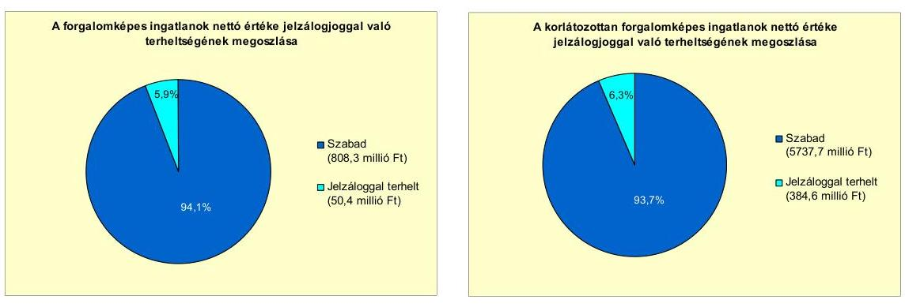

A forgalomképes ingatlanok nettó értékének 5,9\%-át, 50,4 millió Ft-ot tesz ki a jelzáloggal terhelt forgalomképes ingatlan nettó értéke, amelyekről a jelzálog törlése folyamatban van. Ez alapján a jelzálogjog bejegyzések érdemében nem korlátozzák az Önkormányzat rendelkezési jogát a forgalomképes ingatlanjai felett, azok igénybevételét, értékesítését az Önkormányzat pénzügyi helyzetének javításához.

Az Önkormányzat ellen peres eljárás - amely jövőbeni fizetési kötelezettséget jelenthet - nem volt folyamatban 2011. június 30 -án.

Az Önkormányzat 50\%-ot és azt meghaladó tulajdonosi hányaddal rendelkezik hat társaságában, amelyek kötelezettségeinek állományát 2010. december 31-én és 2011. június 30-án, valamint azok várható összegét a kötelezettségek lejáratáig az alábbi táblázat mutatja be:
millió Ft-ban

| Megnevezés | 2010. december 31-én |  |  | Állomány   2011. június 30-án |  |  | Várható kötelezettség 2011-2013.   években |  | Várható kötelezettség 2014. évtől |  |
| :--: | :--: | :--: | :--: | :--: | :--: | :--: | :--: | :--: | :--: | :--: |
|  | HUF-ban (millió Ftban) | Devizában (összege, ezer ...-ben) | Deviza   nem | HUF-ban (millió Ftban) | Devizában (összege, ezer ...ben) | Deviza   nem | HUF-ban (millió Ftban) | Devizában (összege, ezer ...-ben) | HUF-ban (millió Ftban) | Devizában (összege, ezer ...-ben) |
| Folyószámfahitatek | 18,4 |  |  | 14,4 |  |  | 14,4 |  | - |  |
| Hosszú lejáratú hitel | 6,7 |  |  | 5,0 |  |  | 7,3 |  | - |  |
| Pénzintézeti kötelezettségek összesen: | 25,1 |  |  | 19,4 |  |  | 21,7 |  | - |  |
| Lizing kötelezettségek | 0,1 |  |  | 6,7 |  |  | 7,3 |  | 1,5 |  |
| Szállítói tartozás | 63,6 |  |  | 89,6 |  |  | 89,6 |  | - |  |
| Pénzintézeti kötelezettségek, biztosítékok, szállitói tartozás összesen HUF-ban: | 88,8 |  |  | 115,7 |  |  | 118,6 |  | 1,5 |  |

Az önkormányzati kötelezettségek növekedése mellett a minősített többségi tulajdonú társaságok kötelezettségei is befolyásolhatják az Önkormányzat pénzügyi egyensúlyát. Az öt minősített önkormányzati többségi tulajdonú gazdasági társaságnak a 2011. évtől 21,7 millió Ft pénzintézeti tőke- és kamatkötelezettséget, 8,8 millió Ft lízing- és 89,6 millió Ft szállítói tartozást kell rendezniük. Az Önkormányzat számára pénzügyi kockázatot jelenthet, hogy felszámolás esetén a bíróság megállapíthatja az Önkormányzat korlátlan és teljes felelőssé-

---

gét a fenti kötelezettségekkel érintett egy 86,7\%-os tulajdoni hányadú és négy kizárólagos önkormányzati tulajdonú gazdasági társaság után. A kötelezettségek jelenlegi nagyságrendje - az önkormányzati költségvetés nagyságára tekintettel - nem jelent az Önkormányzat számára komoly pénzügyi kockázatot.

Az Önkormányzat a gazdasági társaságokról szóló 2006. évi IV. törvény 54. § (2) bekezdése alapján korlátlan felelősséggel tartozik azon gazdasági társaságának felszámolása esetében, amelyben az Önkormányzat az 52. § (2) bekezdése szerint a szavazatok legalább 75\%-ával rendelkezik, így minősített befolyásszerzőnek minősül, továbbá a csődeljárásról és a felszámolási eljárásról szóló 1991. évi XLIX. törvény 63. § (2) bekezdése alapján a kizárólagos önkormányzati tulajdonú gazdasági társaságának minden olyan kötelezettségéért, amelynek kielégítését a felszámolási eljárás során az adós társaság vagyona nem fedez, ha a hitelezőinek a felszámolási eljárás során benyújtott keresete alapján a bíróság - az adós társaság felé érvényesített tartósan hátrányos üzletpolitikájára figyelemmel - megállapítja az Önkormányzat korlátlan és teljes felelősségét.

Az Önkormányzat az immateriális javai és tárgyi eszközei ${ }^{38}$ után a 2007-2010. években együttesen 1543,5 millió Ft értékcsökkenést számolt el ${ }^{39}$. Az Önkormányzat a 2007-2011. év I. félév közötti időszakban évről évre növekvő összegben, összesen 2540,3 millió Ft értékben aktivált - főként ingatlanokat érintő - felújítást és beruházást. Az aktivált fejlesztések kizárólag az Önkormányzat kezelésében lévő vagyont érintették. Az átadott eszközökön a vizsgált időszakban az Önkormányzat nem aktivált beruházást, felújítást. Az Önkormányzat kezelésében lévő eszközök használhatóságát javították, a használhatósági fok mutató csökkenését megállították a 2007-2010. években aktivált fejlesztések. Ezt alátámasztja az önkormányzati kezelésű eszközökre számított használhatósági fok mutató változása is. A mutató a 2007. évi 85,3\%-hoz képest 2008-ra 2,2 százalékponttal csökkent, majd a 2008. évhez képest 2009-re és 2010-re nem változott. A 2007-2009. évekre számított átlagos használhatósági fok az üzemeltetésre átadott eszközöknél 75,0\%, az önkormányzati kezelésű vagyonnál $83,2 \%$ volt, majd a 2010 . évre $70,5 \%$ és $81,3 \%$ volt. A saját kezelésben lévő és az átadott vagyon használhatósága közötti különbség az átadott eszközöknél a felújítás, beruházás elmaradását, a magasabb leírási kulccsal rendelkező, gyorsabban avuló vagyontárgyak (építmények, gépek, berendezések) létét jelzi.

Az Önkormányzat az eszközök pótlására az értékcsökkenésnek megfelelő öszszegű tartalékot nem képzett ${ }^{40}$. Az éves költségvetési rendeletekben a vízmú vagyon pótlására, felújítására tartalékot, az önkormányzati lakások és bérlemények felújítására, karbantartására pénzeszközátadást, az intézmények karbantartására igénylés alapján felosztható előirányzatot szerepeltetett. A 2007-2010. években befejeződött, illetve a 2010. december 31-én folyamatban lévő beruházások, felújítások 2010. december 31-ig pénzügyileg teljesített kiadásaiból az Önkormányzat 1216,2 millió Ft-ot fordított 2010. december 31-ig

[^0]
[^0]:    ${ }^{38}$ beleértve az üzemeltetésre, kezelésre átadott eszközöket is
    ${ }^{39}$ 2007-ben 429,4 millió Ft-ot, 2008-ban 369,8 millió Ft-ot, 2009-ben 364,3 millió Ft-ot és 2010-ben 380,0 millió Ft-ot
    ${ }^{40}$ Az Önkormányzatot nem kötelezi előírás arra, hogy tartalékot, illetve alapot képezzen az elhasználódott eszközök pótlására.

---

eszközpótlásra (rekonstrukcióra, felújításra). Ez 21,2\%-kal (327,3 millió Ft-tal) a 2007-2010. években elszámolt amortizáció alatt maradt.

# 4. A PÉNZÜGYI EGYENSÚLY MEGTEREMTÉSE ÉrDEKÉBEN HOZOTT INTÉZKEDÉSEK EREDMÉNYE 

Az Önkormányzat a 2007-2011. év I. félév között a gazdasági program ${ }_{1,2}$-ban, továbbá a 2007. és 2008. évi költségvetési koncepciókban határozta meg a költségtakarékos, racionális szervezeti keretek kialakításának, továbbá a pedagógusok kötelező óraszámának növekedése miatti intézkedések megtételének követelményét. Ezek érdekében intézményátszervezési, létszámcsökkentési, valamint egyéb kiadáscsökkentő intézkedéseket foganatosított, amelyek együttes nagyságát - az Önkormányzat által nyújtott adatszolgáltatás alapján - a vizsgált időszakra 799,0 millió Ft összegben mutatta ki.

Az Önkormányzat által a 2007-2011. év I. félév között tett kiadáscsökkentő intézkedések területeit, összegeit és százalékos megoszlását a következő ábra szemlélteti:
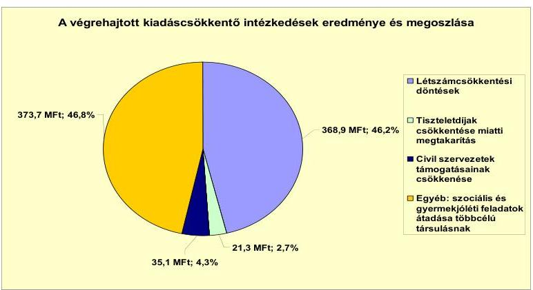

A vizsgált időszakban a létszámcsökkentési döntések - az önkormányzati adatszolgáltatás alapján - összesen 368,9 millió Ft ( $46,2 \%$ ) megtakarítást jelentettek. A 2007. évben a létszámcsökkentések mindössze 8,3 millió Ft kiadáscsökkenést jelentettek a felmentési idők kitöltése miatt. A megtakarításokon belül a közoktatási intézményben a pedagógus álláshelyek csökkentése, továbbá a Polgármesteri hivatalban átszervezéssel végrehajtott egy fő létszámcsökkentés 180,1 millió Ft kiadási megtakarítással járt. A határozott idejű alkalmazások megszüntetése 125,6 millió Ft, négy fő prémiumévek programba történő átirányítása 63,2 millió Ft kiadási megtakarítást hozott 2007-2011. év I. félév között.

Az Önkormányzat a 2009. évben döntött a képviselői tiszteletdíjak csökkentéséről, amelynek kiadáscsökkentő hatása 21,3 millió Ft volt ( $2,7 \%$-a) a 2009. évtől 2011. év I. félév végéig. A civil szervezetek támogatásának csökkentésével az Önkormányzat a vizsgált időszakban 35,1 millió Ft (4,4\%) kiadáscsökkentést ért el. A szociális és gyermekjóléti feladatok többcélú társulásnak 2007 februárjától történő átadása 373,7 millió Ft (46,8\%) kiadáscsökkenést jelentett. A vizsgált időszakban az összes kiadáscsökkentő intézkedésből az önként vállalt feladatok ellátásához (képviselői tiszteletdíjak, civil szervezetek támogatása, idősek átmeneti otthona) kapcsolódott 89,4 millió Ft.

---

A kiadást csökkentő intézkedések ellenére az Önkormányzatnál a vizsgált időszakban a teljesített költségvetési kiadások (a növekvő költségvetési bevételek mellett) folyamatosan növekedtek.

Az Önkormányzatnál a 2007-2010. évek között az önkormányzati létszám és álláshelyek alakulását a következő táblázat mutatja be:

| Megnevezés (adatok fő-ben) |  | Közoktatás | Szociális és gyermekvédelem | Polgármesteri hivatal | Egyéb | Összesen |
| :--: | :--: | :--: | :--: | :--: | :--: | :--: |
| 2007. január 1 -ján jóváhagyott álláshelyek száma |  | 239 | 99 | 81 | 83 | 602 |
| Megszüntetett álláshelyek száma |  | 52 | 99 | 1 | 15 | 167 |
| abból: üres álláshelyek száma |  | 0 | 0 | 0 | 0 | 0 |
|  |  | 31 | 77 | 1 | 10 | 119 |
|  | intézmény-cizemeltetéssel kapcsolatos álláshelyek száma | 21 | 22 | 0 | 0 | 43 |
| Álláshely növekedése |  | 91 | 0 | 0 | 13 | 104 |
| 2010. december 31-én záró álláshelyek száma |  | 278 | 0 | 80 | 81 | 439 |
| 2007. január 1 -ján foglalkoztatott létszám |  | 238 | 99 | 76 | 82 | 495 |
| Létszámcsökkenés |  | 52 | 99 | 1 | 10 | 167 |
| Létszámnövekedés |  | 91 | 0 | 0 | 13 | 104 |
| 2010. december 31-án foglalkoztatott létszám |  | 277 | 0 | 75 | 77 | 429 |

Az Önkormányzat által engedélyezett álláshelyek száma a 2007-2010. évek között 63 darabbal csökkent. A legnagyobb álláshelycsökkenés ( 99 álláshely, $59,3 \%$ ) - a szociális és gyermekjóléti intézmény többcélú társulásnak történő átadása miatt - a szociális és gyermekvédelmi ágazatban volt. A közoktatásban 52 álláshely ( $31,1 \%$ ) szűnt meg, ami a csökkenő gyermeklétszám, a pedagógusok kötelező óraszámának növekedése, valamint a szervezeti keretek racionalizálása miatti pedagógus álláshelyek csökkentésének, továbbá a konyhai feladatok gazdasági társasághoz történő kiszervezésének következménye. Az egyéb területen (a könyvtárnál, a tűzoltóságnál, a Szarvasi Általános Művelődési Központnál) 15 álláshelyet ( $9,0 \%$ ) szüntettek meg. A Polgármesteri hivatalban egy álláshely $(0,6 \%)$ megszüntetésére került sor a 2007-2010. évek között.

A 2011. év I. félévében a Képviselő-testület a közoktatási intézménynél a feladatellátás racionálisabb megszervezése következtében további három pedagógus álláshely megszüntetéséről döntött, így a vizsgált időszakban összesen 170 megszüntetett álláshely ( 170 fő létszámcsökkenés) volt. A foglalkoztatottak létszáma 63 fővel csökkent, mivel a 2007-2011. év I. félév között az Önkormányzatnál összesen 104 álláshelyet létesítettek, ami 104 fő létszámnövekedést jelentett. A közoktatási intézményben a 2007. és a 2008. években a szakképző intézmény és a könyvtári feladatok átvételével feladatbővülés miatt 91 álláshely létesült. A tűzoltóságnál jogszabályi előírás, a Szarvasi Általános Művelődési Központnál önkormányzati rendelet alapján a 2007. és a 2009. években összesen 13 álláshely növekedés történt. Az Önkormányzatnál és intézményeinél a vizsgált időszakban megszüntetett üres álláshely nem volt. Az Önkormányzat a létszámcsökkentésekhez kapcsolódóan a vizsgált időszakban összesen 89,2 millió Ft támogatást vett igénybe, a támogatás felhasználásával tartósan leépített álláshelyek száma 33 darab volt.

A 2007-2011. év I. félévben érvényesített bevételnövelő intézkedések főbb bevételi jogcímek szerinti számszerűsíthető hatását a következő ábra szemlélteti:

---

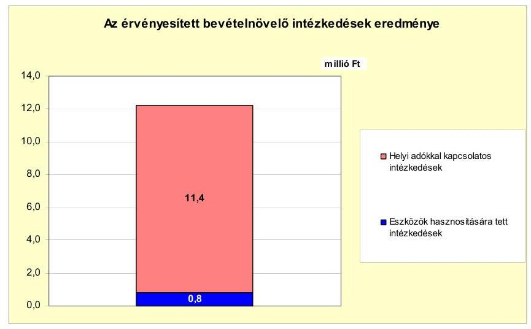

Az Önkormányzat - az általa nyújtott adatszolgáltatás szerint - a bevételnövelő intézkedések hatására 2007-től 2011. év I. félév végéig 12,2 millió Ft bevételt realizált. Ennek 93,5\%-át (11,4 millió Ft-ot) az építményadónál a garázsok utáni mentesség megszüntetésével kapcsolatos intézkedésből, 6,5\%-át ( 0,8 millió Ft-ot) az eszközök hasznosítására (értékesítésre) tett intézkedésekből érte el.

Az Önkormányzat az iparúzési adó mértékét 2009. január 1-jétől 2,0\% helyett 1,95\%-ban állapította meg. Az alacsonyabb iparúzési adómérték is hozzájárult az iparúzési adóalap visszaesése mellett a 2010. évi helyi adóból származó bevétel 27,0 millió Ft-os csökkenéséhez.

Az Önkormányzatnál a központi intézkedések hatására a 2007-2010. évi tényés a 2011. év I. félévi tervadatok alapján az szja bevételeknél jelentkezett 1719,1 millió Ft bevételkiesés, amelyet a költségvetési támogatás 2110,0 millió Ft-tal történő növekedése, továbbá a bemutatott kiadáscsökkentő és bevételnövelő intézkedések ellentételeztek.

# 5. Az ÁSZ Által a korábBi ÉVEKben a PÉnzüGyi eGYensúly JAVÍTÁSÁRA TETT SZABÁLYSZERŰSÉGI ÉS CÉLSZERŰSÉGI JAVASLATOK HASZNOSULÁSA 

Az ÁSZ az Önkormányzat gazdálkodási rendszerét a 2007. évben ellenőrizte átfogó jelleggel. A gazdálkodási rendszer korábbi ellenőrzése során tett javaslatok közül a pénzügyi egyensúly javítására vonatkozott egy szabályszerűségi javaslat. A jegyzőnek tett javaslat arra irányult, hogy az Áht ${ }_{1}$ 8/A. § (7) bekezdésében ${ }^{41}$ foglaltakkal összhangban a költségvetési rendelettervezetben a költségvetési bevételi és kiadási előirányzatok főösszegei ne tartalmazzák a finanszírozási célú pénzügyi műveletek bevételeit, illetve kiadásait.

[^0]
[^0]:    ${ }^{41}$ 2012. január 1-jétől hatályát vesztette az Áht ${ }_{2}$ 110. § (2) bekezdése alapján. Az Áht ${ }_{2}$ 72. §-ában foglalt előírás szerint a költségvetési bevételek-kiadások és a finanszírozási célú pénzügyi műveletek bevétele-kiadása továbbra is elkülönül egymástól.

---

A javaslat megvalósítása érdekében a Képviselő-testület a 15/2008. (I. 24.) számú határozatával elfogadta a számvevői jelentésben foglaltak végrehajtására készített, felelősöket és határidőket is tartalmazó intézkedési tervet. A javaslat teljes mértékben megvalósult, mivel a 2008. évtől az Önkormányzat a költségvetési rendeleteiben az Áht ${ }_{1}$ elöírásainak megfelelően, finanszírozási célú pénzügyi műveletek nélkül mutatta be a költségvetési bevételi és kiadási előirányzatok főösszegeit.

Budapest, 2012. április "16"
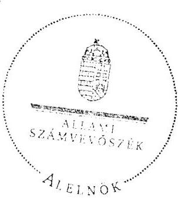

Wárvasovszky Tihamér

Melléklet: $\quad 10 \mathrm{db}$

---

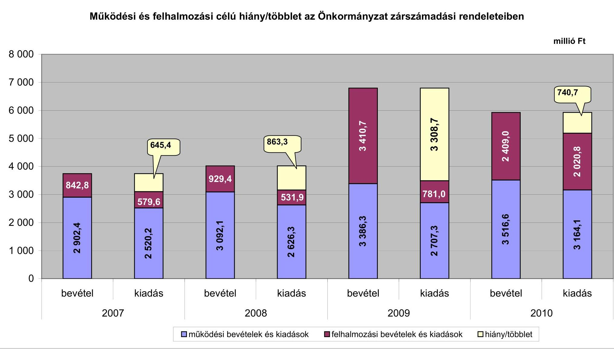

# Működési és felhalmozási célú hiány/többlet az Önkormányzat zárszámadási rendeleteiben

|  Müködési és felhalmozási célú hiány/többlet | 2007 | 2008 | 2009 | 2010  |
| --- | --- | --- | --- | --- |
|  2007 | 645.4 | 863.3 | 781.0 | 351.6  |
|  2008 | 623.4 | 823.4 | 781.0 | 338.3  |
|  2009 | 645.4 | 863.3 | 781.0 | 351.6  |
|  2010 | 645.4 | 863.3 | 781.0 | 338.3  |

*müködési bevételek és kiadások*

*felhalmozási bevételek és kiadások*

*hiány/többlet*

---

Az Önkormányzat bevételei és kiadásai, valamint adósságszolgálata 2007-2010 között

|  1. FOLVÓ KÖLTSÉGVETÉS* | 2007. év | 2008. év | 2009. év | 2010. év  |
| --- | --- | --- | --- | --- |
|  1.1.1. Saját müködési bevételek | 874,5 | 959,2 | 1152,6 | 1149,9  |
|  1.1.2. Költségvetési támogatás *** | 702,3 | 1391,2 | 1336,0 | 1387,9  |
|  1.1.3. Anegedett bevételek | 1042,2 | 564,9 | 589,6 | 605,0  |
|  1.1.4. Állambáztartáson belülről kapott támogatások | 210,0 | 98,7 | 189,5 | 222,5  |
|  1.1.5. EU-tól és külföldről kapott bevételek | 0,4 | 0,2 | 0,0 | 0,0  |
|  1.1.6. Állambáztartáson kívülről kapott bevételek | 8,6 | 17,4 | 12,2 | 23,0  |
|  1.1.7. Előző évi pénzmaradvány átvétel | 4,3 | 6,2 | 19,5 | 10,5  |
|  1.1. Folyó bevételek $=1.1 .1 .+1.1 .2 .+1.1 .3 .+1.1 .4 .+1.1 .5 .+1.1 .6 .+1.1 .7$. | 2842,3 | 3037,8 | 3299,4 | 3398,8  |
|  1.2.1. Müködési kiadások kamatikiadások nélkül | 2112,8 | 2268,4 | 2161,8 | 2418,8  |
|  1.2.2. Állambáztartáson belülre átadott pénzeseközök | 135,2 | 24,9 | 22,3 | 30,6  |
|  1.2.3.1. vállalkozásoknak | 29,7 | 93,6 | 139,1 | 164,5  |
|  1.2.3.2. EU-nak, illetve külföldre | 0,0 | 0,0 | 0,0 | 0,0  |
|  1.2.3.3. megáncsenélyeknek | 168,3 | 183,7 | 301,6 | 482,9  |
|  1.2.3.4. nonprofit szervezeteknek | 54,3 | 49,4 | 62,4 | 56,9  |
|  1.2.3. Transferkiadások ( $=1.2 .3 .1+1.2 .3 .2+1.2 .3 .3+1.2 .3 .4$ ) | 252,3 | 326,7 | 503,1 | 704,3  |
|  1.2.4 Kamatikiadások | 35,6 | 60,0 | 82,5 | 48,0  |
|  1.2.5. Előző évi pénzmaradvány átadás | 4,6 | 6,2 | 19,5 | 10,5  |
|  1.2. Folyó kiadások $=1.2 .1 .+1.2 .2 .+1.2 .3 .+1.2 .4 .+1.2 .5$. | 2540,5 | 2694,2 | 2789,2 | 3212,2  |
|  1.3. Folyó költségvetés egyenlege MÜKÖDÉSI JÖVEDELEM (1.1. - 1.2.) | 301,8 | 343,6 | 510,2 | 186,6  |
|  2. FELHALMOZÁSI KÖLTSÉGVETÉS** |  |  |  |   |
|  2.1.1. Saját tökebevételek | 113,1 | 119,5 | 43,2 | 104,5  |
|  2.1.2. Állambáztartáson belülről kapott támogatások*** | 580,2 | 104,8 | 666,5 | 702,1  |
|  2.1.3. EU-tól és külföldről kapott támogatások | 0,0 | 0,0 | 0,0 | 0,0  |
|  2.1.4. Állambáztartáson kívülről kapott támogatások | 31,6 | 12,7 | 53,2 | 69,1  |
|  2.1. Felhalmozási bevételek ( $=2.1 .1 .+2.1 .2+2.1 .3+2.1 .4$ ) | 724,9 | 237,0 | 762,9 | 875,7  |
|  2.2.1. Saját beruházási kiadás átfaval | 278,3 | 435,6 | 631,1 | 1683,7  |
|  2.2.2. Saját felújítási kiadás átfával | 11,2 | 14,6 | 4,8 | 21,8  |
|  2.2.3. Állambáztartáson belülre átadott pénzeseköz | 77,4 | 9,4 | 30,4 | 85,8  |
|  2.2.4. EU-nak és külföldnek adott pénzeseközök | 0,0 | 0,3 | 0,0 | 0,0  |
|  2.2.5. Állambáztartáson kívülre adott pénzeseközök | 4,0 | 4,1 | 22,2 | 177,4  |
|  2.2.6. Befektetési célú részesedések vásárlása | 14,9 | 0,0 | 10,0 | 4,1  |
|  2.2. Felhalmozási kiadások ( $=2.2 .1 .+2.2 .2 .+2.2 .3 .+2.2 .4 .+2.2 .5 .+2.2 .6$ ) | 305,8 | 464,0 | 698,5 | 1972,8  |
|  2.3. Felhalmozási költségvetés egyenlege (2.1. - 2.2.) | 339,1 | $-227,0$ | 64,4 | $-1097,1$  |
|  3. Finanszírozási műveletek nélküli (GFS) pozíció(1.3.+2.3.) | 640,9 | 116,6 | 574,6 | $-910,5$  |
|  4. Finanszírozási műveletek |  |  |  |   |
|  4.1. Hitelfelvétel | 0,0 | 0,0 | 0,0 | 0,0  |
|  4.2. Hiteltörlesztés | 173,4 | 101,9 | 101,9 | 101,9  |
|  4.3. Forgatási és befektetési célú értékpapírok kibocsátása | 1000,0 | 1000,0 | 0,0 | 0,0  |
|  4.4. Forgatási és befektetési célú értékpapírok beváltása | 0,0 | 0,0 | 0,0 | 125,0  |
|  4.5. Forgatási és befektetési célú értékpapírok értékesítése | 15,8 | 15,8 | 15,8 | 15,8  |
|  4.6. Forgatási és befektetési célú értékpapírok vásárlása | 0,0 | 0,0 | 0,0 | 0,0  |
|  4.7. Egyéb finanszírozási bevételek (függő, átfutó, kiegyenlítő) | $-11,3$ | 4,6 | $-9,4$ | $-90,7$  |
|  4.8. Egyéb finanszírozási kiadások (függő, átfutó, kiegyenlítő) | 48,3 | $-20,5$ | $-62,5$ | 9,9  |
|  4.9.Finanszírozási műveletek egyenlege (4.1. - 4.2.+4.3.-4.4+4.5.-4.6.+4.7.-4.8.) | 782,8 | 939,0 | $-33,0$ | $-311,7$  |
|  5. Tárgyévi pénzügyi pozíció (1.3.+ 2.3.+4.9.) | 1423,7 | 1055,0 | 541,6 | $-1222,2$  |
|  6. Nettó müködési jövedelem =müködési jövedelem (1.3.) - tőketörlesztés | 128,4 | 241,7 | 408,3 | $-40,3$  |
|  TÁJÉKOZTATÓ ADATOK |  |  |  |   |
|  Összes kötelezettség | 1733,9 | 2659,6 | 2614,2 | 2369,4  |
|  ebből rövid lejáratú | 184,7 | 214,8 | 396,3 | 427,1  |
|  Összes szállítói kötelezettség | 22,3 | 35,4 | 72,8 | 124,8  |
|  ebből lejárt (tanúsítványból) | 0,0 | 3,0 | 7,5 | 12,4  |
|  Pénz és tőkepínci kötelezettség (adósság) | 1648,5 | 2546,6 | 2444,8 | 2217,9  |
|  ebből rövid lejáratú | 99,3 | 101,9 | 226,9 | 275,6  |
|  PPP szerződéses állomány jelenértéken (tanúsítványból) | 0,0 | 0,0 | 0,0 | 0,0  |
|  ebből lejárt szolgáltatási díj miatti kötelezettség | 0,0 | 0,0 | 0,0 | 0,0  |
|  Folyószámlahitel napi átlagos állománya (tanúsítványból) | 0,0 | 0,0 | 0,0 | 0,0  |
|  Likvidítétel napi átlagos állománya (tanúsítványból) | 0,0 | 0,0 | 0,0 | 0,0  |
|  Munkabérítétel napi átlagos állománya (tanúsítványból) | 0,0 | 0,0 | 0,0 | 0,0  |
|  Kezesség és garanciavállalások (tanúsítványból) | 67,7 | 58,7 | 67,0 | 63,5  |
|  Jogerős bírósági ítéletekből adódó kötelezettségek (tanúsítványból) | 0,0 | 0,0 | 0,0 | 0,0  |
|  Finanszírozásba bevonható eszközök: | 1715,1 | 2754,8 | 3280,6 | 2042,6  |
|  Tartós hitelviszonyt megtestesítő értékpapírok év végi állománys | 47,5 | 31,6 | 15,0 | 0,0  |
|  Hosszú lejáratú bankbetétek év végi állománya | 0,0 | 0,0 | 0,0 | 0,0  |
|  Értékpapírok év végi állománya | 0,0 | 0,0 | 0,0 | 0,0  |
|  Pénzeseközök (idegen pénzeseközök nélkül) év végi állománya | 1667,6 | 2723,2 | 3264,8 | 2042,6  |

- Bevételekben nem tétől, a kiadásokban nem jelenik meg az amortizáció, a vagyoni helyzetet az egyentég befolyásolja. ** Bevételekben vagyon megőrzésre és bővítésre fordítható források. *** A költségvetési támogatásból a felhalmozási célú összeget az Önkormányzat adatszolgáltatása szerinti mértékben vettük figyelembe, a 2.1.2. soron.

---

Szarvas Város Önkormányzata

Az Önkormányzat 2007-2010. években megvalósított, 2010. december 31-ig befejezett fejlesztései és azok forrásösszstétele

mibió Ft-ban

|  |   |   |   |   |   |   |   |   |   |   |   |   |   |   |   |   |   |   |   |   |   |   |   |   |   |   |   |   |   |   |   |   |   |   |
| --- | --- | --- | --- | --- | --- | --- | --- | --- | --- | --- | --- | --- | --- | --- | --- | --- | --- | --- | --- | --- | --- | --- | --- | --- | --- | --- | --- | --- | --- | --- | --- | --- | --- |
|   |  |  |  |  |  |  |  |  |  |  |  |  |  |  |  |  |  |  |  |  |  |  |  |  |  |  |  |  |  |  |  |  |  |   |
|   |  |  |  |  |  |  |  |  |  |  |  |  |  |  |  |  |  |  |  |  |  |  |  |  |  |  |  |  |  |  |  |  |  |   |
|   |  |  |  |  |  |  |  |  |  |  |  |  |  |  |  |  |  |  |  |  |  |  |  |  |  |  |  |  |  |  |  |  |  |   |
|   |  |  |  |  |  |  |  |  |  |  |  |  |  |  |  |  |  |  |  |  |  |  |  |  |  |  |  |  |  |  |  |  |  |   |
|   |  |  |  |  |  |  |  |  |  |  |  |  |  |  |  |  |  |  |  |  |  |  |  |  |  |  |  |  |  |  |  |  |  |   |
|   |  |  |  |  |  |  |  |  |  |  |  |  |  |  |  |  |  |  |  |  |  |  |  |  |  |  |  |  |  |  |  |  |  |   |
|   |  |  |  |  |  |  |  |  |  |  |  |  |  |  |  |  |  |  |  |  |  |  |  |  |  |  |  |  |  |  |  |  |  |   |
|   |  |  |  |  |  |  |  |  |  |  |  |  |  |  |  |  |  |  |  |  |  |  |  |  |  |  |  |  |  |  |  |  |  |   |
|   |  |  |  |  |  |  |  |  |  |  |  |  |  |  |  |  |  |  |  |  |  |  |  |  |  |  |  |  |  |  |  |  |  |   |
|   |  |  |  |  |  |  |  |  |  |  |  |  |  |  |  |  |  |  |  |  |  |  |  |  |  |  |  |  |  |  |  |  |  |   |
|   |  |  |  |  |  |  |  |  |  |  |  |  |  |  |  |  |  |  |  |  |  |  |  |  |  |  |  |  |  |  |  |  |  |   |
|   |  |  |  |  |  |  |  |  |  |  |  |  |  |  |  |  |  |  |  |  |  |  |  |  |  |  |  |  |  |  |  |  |  |   |
|   |  |  |  |  |  |  |  |  |  |  |  |  |  |  |  |  |  |  |  |  |  |  |  |  |  |  |  |  |  |  |  |  |  |   |
|   |  |  |  |  |  |  |  |  |  |  |  |  |  |  |  |  |  |  |  |  |  |  |  |  |  |  |  |  |  |  |  |  |  |   |
|   |  |  |  |  |  |  |  |  |  |  |  |  |  |  |  |  |  |  |  |  |  |  |  |  |  |  |  |  |  |  |  |  |  |   |
|   |  |  |  |  |  |  |  |  |  |  |  |  |  |  |  |  |  |  |  |  |  |  |  |  |  |  |  |  |  |  |  |  |  |   |
|   |  |  |  |  |  |  |  |  |  |  |  |  |  |  |  |  |  |  |  |  |  |  |  |  |  |  |  |  |  |  |  |  |  |   |
|   |  |  |  |  |  |  |  |  |  |  |  |  |  |  |  |  |  |  |  |  |  |  |  |  |  |  |  |  |  |  |  |  |  |   |
|   |  |  |  |  |  |  |  |  |  |  |  |  |  |  |  |  |  |  |  |  |  |  |  |  |  |  |  |  |  |  |  |  |  |   |
|   |  |  |  |  |  |  |  |  |  |  |  |  |  |  |  |  |  |  |  |  |  |  |  |  |  |  |  |  |  |  |  |  |  |   |
|   |  |  |  |  |  |  |  |  |  |  |  |  |  |  |  |  |  |  |  |  |  |  |  |  |  |  |  |  |  |  |  |  |  |   |
|   |  |  |  |  |  |  |  |  |  |  |  |  |  |  |  |  |  |  |  |  |  |  |  |  |  |  |  |  |  |  |  |  |  |   |
|   |  |  |  |  |  |  |  |  |  |  |  |  |  |  |  |  |  |  |  |  |  |  |  |  |  |  |  |  |  |  |  |  |  |   |
|   |  |  |  |  |  |  |  |  |  |  |  |  |  |  |  |  |  |  |  |  |  |  |  |  |  |  |  |  |  |  |  |  |  |   |
|   |  |  |  |  |  |  |  |  |  |  |  |  |  |  |  |  |  |  |  |  |  |  |  |  |  |  |  |  |  |  |  |  |  |   |
|   |  |  |  |  |  |  |  |  |  |  |  |  |  |  |  |  |  |  |  |  |  |  |  |  |  |  |  |  |  |  |  |  |  |   |
|   |  |  |  |  |  |  |  |  |  |  |  |  |  |  |  |  |  |  |  |  |  |  |  |  |  |  |  |  |  |  |  |  |  |   |
|   |  |  |  |  |  |  |  |  |  |  |  |  |  |  |  |  |  |  |  |  |  |  |  |  |  |  |  |  |  |  |  |  |  |   |
|   |  |  |  |  |  |  |  |  |  |  |  |  |  |  |  |  |  |  |  |  |  |  |  |  |  |  |  |  |  |  |  |  |  |   |
|   |  |  |  |  |  |  |  |  |  |  |  |  |  |  |  |  |  |  |  |  |  |  |  |  |  |  |  |  |  |  |  |  |  |   |
|   |  |  |  |  |  |  |  |  |  |  |  |  |  |  |  |  |  |  |  |  |  |  |  |  |  |  |  |  |  |  |  |  |  |   |
|   |

---

Szarvas Város Önkormányzata

Sfz. számú melléklet a V-3081-020/2012. számú Jelenléshez

Az Önkormányzat 2010. december 31-én folyamatban lévő fejlesztési feladataira 2010. december 31-ig teljesített kifizetések és azok forrásösszetétele

milliő Ft-ban

|  |   |   |   |   |   |   |   |   |   |   |   |   |   |   |   |   |   |   |   |   |   |   |   |   |   |   |   |   |   |   |   |   |   |   |
| --- | --- | --- | --- | --- | --- | --- | --- | --- | --- | --- | --- | --- | --- | --- | --- | --- | --- | --- | --- | --- | --- | --- | --- | --- | --- | --- | --- | --- | --- | --- | --- | --- | --- |
|   | Fejlesztési feladat (beruházás, felújítás) |  | Beruházás, felújítás |  |  |  |  |  |  |  |  |  |  |  |  |  |  |  |  |  |  |  |  |  |  |  |  |  |  |  |  |  |   |
|  Rázusa | Megnevezése | Képviselő-testületi határozat száma | kezdete | tervezett befeje-zése | Terv (tisztelt határozat) | Tány (tisztelt határozat) | Eltérés (v.) (tisztelt határozat) |  |  |  |  |  |  |  |  |  |  |  |  |  |  |  |  |  |  |  |  |  |  |  |  |  |   |
|  1 | 2 | 3 | 4 | 5 | 6 | 7 | 8 | 9 | 10 | 11 | 12 | 13 | 14 | 15 | 16 | 17 | 18 | 19 | 20 | 21 | 22 | 23 | 24 | 25 | 26 | 27 | 28 | 29 | 30 | 31 |  |   |
|   | Fejűjtások |  |  |  |  |  |  |  |  |  |  |  |  |  |  |  |  |  |  |  |  |  |  |  |  |  |  |  |  |  |  |  |   |
|   | 2.10. indító Ft alatti felújítások | 0 | 0 | 0 | 0 | 0 | 0 | 0 | 0 | 0 | 0 | 0 | 0 | 0 | 0 | 0 | 0 | 0 | 0 | 0 | 0 | 0 | 0 | 0 | 0 | 0 | 0 | 0 | 0 | 0 | 0 | 0  |
|   | 3. Fejűtősszé összesen |  |  |  | 0 | 0 | 0 | 0 | 0 | 0 | 0 | 0 | 0 | 0 | 0 | 0 | 0 | 0 | 0 | 0 | 0 | 0 | 0 | 0 | 0 | 0 | 0 | 0 | 0 | 0 | 0 | 0  |
|   | 4. Fejlesztések |  |  |  |  |  |  |  |  |  |  |  |  |  |  |  |  |  |  |  |  |  |  |  |  |  |  |  |  |  |  |  |   |
|   |  | 526/2010. (VII. 19.) | 2010 | 2011 | 100,0 | 50,0 | -50,0 | 0,0 | 50,0 | 0,0 | 0,0 | 0,0 | 0,0 | 0,0 | 0,0 | 0,0 | 0,0 | 0,0 | 0,0 | 0,0 | 0,0 | 0,0 | 0,0 | 0,0 | 0,0 | 0,0 | 0,0 | 0,0 | 0,0 | 0,0 | 0,0 | 0  |
|   | Ingatlan vásárlás Plexkóva Kft. 40 |  |  |  |  |  |  |  |  |  |  |  |  |  |  |  |  |  |  |  |  |  |  |  |  |  |  |  |  |  |  |  |   |
|   | Rantéjsárol-hálózat fejlesztése a Szarvasí Grósházával összekötő 4404 jelű út | 293/2009. |  |  |  |  |  |  |  |  |  |  |  |  |  |  |  |  |  |  |  |  |  |  |  |  |  |  |  |  |  |  |   |
|   | 6. mérték | (4.21.) | 2010 | 2011 | 132,1 | 16,1 | -116,0 | 0,0 | 16,1 | 0,0 | 0,0 | 0,0 | 0,0 | 0,0 | 0,0 | 0,0 | 0,0 | 0,0 | 0,0 | 0,0 | 0,0 | 0,0 | 0,0 | 0,0 | 0,0 | 0,0 | 0,0 | 0,0 | 0,0 | 0,0 | 0,0 | 0  |
|   | Szarvas Város Önkormányzata Szakorvosi Rendefőjének komplex különségi | 571/2007. |  |  |  |  |  |  |  |  |  |  |  |  |  |  |  |  |  |  |  |  |  |  |  |  |  |  |  |  |  |  |   |
|   | 7. szakrendetővé fejlesztése | (XII. 20.) | 2010 | 2011 | 581,6 | 80,9 | -500,7 | 0,0 | 80,9 | 80,9 | 0,0 | 0,0 | 0,0 | 0,0 | 0,0 | 0,0 | 0,0 | 0,0 | 0,0 | 0,0 | 0,0 | 0,0 | 0,0 | 0,0 | 0,0 | 0,0 | 0,0 | 0,0 | 0,0 | 0,0 | 0,0 | 0  |
|   | Gyatogóra olvonalak kialakítási a turisztikai attrakciók elérése érdekében a Söténeim Magyarország közepén, | 649/2008. |  |  |  |  |  |  |  |  |  |  |  |  |  |  |  |  |  |  |  |  |  |  |  |  |  |  |  |  |  |  |   |
|   | 8. Szarvason | (XII. 19.) | 2010 | 2011 | 140,3 | 126,9 | -13,4 | 0,0 | 126,9 | 0,0 | 0,0 | 0,0 | 0,0 | 0,0 | 0,0 | 0,0 | 0,0 | 0,0 | 0,0 | 0,0 | 0,0 | 0,0 | 0,0 | 0,0 | 0,0 | 0,0 | 0,0 | 0,0 | 0,0 | 0,0 | 0,0 | 0  |
|   | Szarvas Város belterületi útjainak fejlesztése az ipari területek megközelíthetőségének javítása és a 44-es számú főközlekedési út | 555/2008. |  |  |  |  |  |  |  |  |  |  |  |  |  |  |  |  |  |  |  |  |  |  |  |  |  |  |  |  |  |  |   |
|   | 9. lehermentesítése érdekében | (X. 16.) | 2010 | 2011 | 378,6 | 202,5 | -176,1 | 0,3 | 202,2 | 202,5 | 0,0 | 0,0 | 0,0 | 0,0 | 0,0 | 0,0 | 0,0 | 0,0 | 0,0 | 0,0 | 0,0 | 0,0 | 0,0 | 0,0 | 0,0 | 0,0 | 0,0 | 0,0 | 0,0 | 0,0 | 0,0 | 0  |
|   | Szarvas Város Belterületi útjainak fejlesztése, a 44-es számú út és a 10. halváros lehermentesítése, - II. ütem | 520/2009. |  |  |  |  |  |  |  |  |  |  |  |  |  |  |  |  |  |  |  |  |  |  |  |  |  |  |  |  |  |  |   |
|   | 10. halváros lehermentesítése, - II. ütem | (IX. 24.) | 2010 | 2011 | 251,8 | 8,4 | -243,4 | 0,0 | 8,4 | 8,4 | 0,0 | 0,0 | 0,0 | 0,0 | 0,0 | 0,0 | 0,0 | 0,0 | 0,0 | 0,0 | 0,0 | 0,0 | 0,0 | 0,0 | 0,0 | 0,0 | 0,0 | 0,0 | 0,0 | 0,0 | 0,0 | 0  |
|   | Ténségi összefogás a közösségi közlekedés feltételeinek javításáért a 11. Szarvas Ködörségben | 612/2009. |  |  |  |  |  |  |  |  |  |  |  |  |  |  |  |  |  |  |  |  |  |  |  |  |  |  |  |  |  |  |   |
|   | 11. Szarvas Ködörségben | (X. 29.) | 2011 | 2012 | 181,7 | 24,0 | -157,7 | 0,0 | 24,0 | 0,0 | 6,5 | 0,6 | -5,9 | A | 0,0 | 0,0 | 0,0 | 0,0 | 0,0 | 0,0 | 0,0 | 0,0 | 0,0 | 0,0 | 0,0 | 0,0 | 0,0 | 0,0 | 0,0 | 0,0 | 0,0 | 0  |
|   | Szarvas Város közösségi terének és információs szolgálatának infrastruktúrála | 640/2009. |  |  |  |  |  |  |  |  |  |  |  |  |  |  |  |  |  |  |  |  |  |  |  |  |  |  |  |  |  |  |   |
|   | 12. fejlesztése | (XI. 19.) | 2010 | 2011 | 55,6 | 0,9 | -54,7 | 0,0 | 0,9 | 0,9 | 0,0 | 0,0 | 0,0 | 0,0 | 0,0 | 0,0 | 0,0 | 0,0 | 0,0 | 0,0 | 0,0 | 0,0 | 0,0 | 0,0 | 0,0 | 0,0 | 0,0 | 0,0 | 0,0 | 0,0 | 0,0 | 0  |
|   | Szarvas Város Polgármesteri Hivatalának akadálymentesítése az esélyegyenlőség | 522/2009. |  |  |  |  |  |  |  |  |  |  |  |  |  |  |  |  |  |  |  |  |  |  |  |  |  |  |  |  |  |  |   |
|   | 13. biztosításának érdekében | (IX. 24.) | 2010 | 2011 | 33,3 | 2,4 | -30,9 | 0,0 | 2,4 | 2,4 | 0,0 | 0,0 | 0,0 | 0,0 | 0,0 | 0,0 | 0,0 | 0,0 | 0,0 | 0,0 | 0,0 | 0,0 | 0,0 | 0,0 | 0,0 | 0,0 | 0,0 | 0,0 | 0,0 | 0,0 | 0,0 | 0  |
|   | Szarvas Város belterületi bekövetvezete | 65/2010. |  |  |  |  |  |  |  |  |  |  |  |  |  |  |  |  |  |  |  |  |  |  |  |  |  |  |  |  |  |  |   |
|   | 14. IV-V VII. ütem megvalósítása | (II.05.) | 2010 | 2011 | 444,4 | 18,4 | -426,0 | 0,0 | 18,4 | 0,0 | 0,0 | 0,0 | 0,0 | 0,0 | 0,0 | 0,0 | 0,0 | 0,0 | 0,0 | 0,0 | 0,0 | 0,0 | 0,0 | 0,0 | 0,0 | 0,0 | 0,0 | 0,0 | 0,0 | 0,0 | 0,0 | 0  |
|   | Szekely Mihály tér rekreációs célú | 744/2010. |  |  |  |  |  |  |  |  |  |  |  |  |  |  |  |  |  |  |  |  |  |  |  |  |  |  |  |  |  |  |   |
|   | 15. megújítása | (XII. 16.) | 2010 | 2011 | 13,5 | 0,5 | -13,0 | 0,0 | 0,5 | 0,5 | 0,0 | 0,0 | 0,0 | 0,0 | 0,0 | 0,0 | 0,0 | 0,0 | 0,0 | 0,0 | 0,0 | 0,0 | 0,0 | 0,0 | 0,0 | 0,0 | 0,0 | 0,0 | 0,0 | 0,0 | 0,0 | 0  |
|   | 16. 10. millió Ft alatti fejlesztések * | 10 db |  |  |  |  |  |  |  |  |  |  |  |  |  |  |  |  |  |  |  |  |  |  |  |  |  |  |  |  |  |  |   |
|   | 17. Fejlesztések összesen |  |  |  | 2 342,9 | 581,0 | -1 781,9 | 3,8 | 557,2 | 295,6 | 36,5 | 59,6 | -6,9 |  | 0,0 | 0,0 | 0,0 | 0,0 | 0,0 | 0,0 | 0,0 | 0,0 | 0,0 | 0,0 | 0,0 | 0,0 | 0,0 | 0,0 | 0,0 | 0,0 | 0,0 | 0,0 | 0  |
|   | 18. Mindösszesen |  |  |  | 2 342,9 | 581,0 | -1 781,9 | 3,8 | 557,2 | 295,6 | 36,5 | 59,6 | -6,9 |  | 0,0 | 0,0 | 0,0 | 0,0 | 0,0 | 0,0 | 0,0 | 0,0 | 0,0 | 0,0 | 0,0 | 0,0 | 0,0 | 0,0 | 0,0 | 0,0 | 0,0 | 0,0 | 0  |

- kiviteli tervek, engedélyes tervek azokra a beruházásokra, amelyekre 2010. december 31.-én még nem volt pályázat benyújtva, illetve nem nyert a pályázat

*A= ha a forrás már rendelkezésre áll.

B= ha a forrás közbeszerzési eljárása folyamatban van.

C= ha a forrás közbeszerzési eljárása még nem indult el, a forrás nem áll rendelkezésre.

---

Szansas Város Önkormányzata

Az Önkormányzat 2010. december 31-én folyamatosan lévő fejlesztési feladatalhoz kapcsolódó 2010. évet követő kötelezettségvállalásai és azok forrásösszetelek!

|  |   |   |   |   |   |   |   |   |   |   |   |   |   |   |   |   |   |   |   |   |   |   |   |   |   |   |   |   |   |   |   |   |   |   |   |   |   |   |   |   |   |   |   |   |   |   |   |   |   |   |   |   |   |   |   |   |   |   |   |   |   |   |   |   |   |   |   |   |   |   |   |   |   |   |   |   |   |   |   |   |   |   |   |   |   |   |   |   |   |   |   |   |   |   |   |   |   |   |   |   |

---

Szarvas Város Önkormányzata

Az Önkormányzat 2011. év I. félévben saját forrásból megvalósított fejlesztései és azok forrásösszetétele

mibió Ft-ben

|   |  |  |  |  |  |  |  |  |  |  |  |  |  |  |  |  |  |  |  |  |  |  |  |  |  |  |  |  |  |  |  |  |  |  |  |  |  |  |  |  |  |  |  |  |  |  |  |  |  |  |  |  |  |  |  |  |  |  |  |  |  |  |  |  |  |  |  |  |  |  |  |  |  |  |  |  |  |  |  |  |  |  |  |  |  |  |  |  |  |  |  |  |  |  |  |  |  |  |  |  | 

---

Szarvas Város Önkormányzata 3/d. számú melléklet a V-3081-020/2012. számú Jelenléshez

Az Önkormányzat által beadott, elbírálás alatti pályázati forrásból megvalósítani tervezett fejlesztéseihez kapcsolódó kötelezettségvállalásai és azok forrásösszetétele

milliö Ft-ban

|  Sorszám | Fejlesztési feladat (beruházás, felújítás) |  |  |  |  |  |  |  |  |  |  |  |  |  |  |  |  |  |  |  |  |  |  |  |  |  |   |
| --- | --- | --- | --- | --- | --- | --- | --- | --- | --- | --- | --- | --- | --- | --- | --- | --- | --- | --- | --- | --- | --- | --- | --- | --- | --- | --- | --- |
|   |  |  |  |  |  |  |  |  |  |  |  |  |  |  |  |  |  |  |  |  |  |  |  |  |  |  |   |
|   |  | Megnevezése |  |  |  |  |  |  |  |  |  |  |  |  |  |  |  |  |  |  |  |  |  |  |  |  |   |
|   |  |  |  |  |  |  |  |  |  |  |  |  |  |  |  |  |  |  |  |  |  |  |  |  |  |  |   |
|  1 |  | 2 |  |  |  |  |  |  |  |  |  |  |  |  |  |  |  |  |  |  |  |  |  |  |  |  |   |
|   |  |  |  |  |  |  |  |  |  |  |  |  |  |  |  |  |  |  |  |  |  |  |  |  |  |  |   |
|   |  |  |  |  |  |  |  |  |  |  |  |  |  |  |  |  |  |  |  |  |  |  |  |  |  |  |   |
|   |  |  |  |  |  |  |  |  |  |  |  |  |  |  |  |  |  |  |  |  |  |  |  |  |  |  |   |
|   |  |  |  |  |  |  |  |  |  |  |  |  |  |  |  |  |  |  |  |  |  |  |  |  |  |  |   |
|   |  |  |  |  |  |  |  |  |  |  |  |  |  |  |  |  |  |  |  |  |  |  |  |  |  |  |   |
|   |  |  |  |  |  |  |  |  |  |  |  |  |  |  |  |  |  |  |  |  |  |  |  |  |  |  |   |
|   |  |  |  |  |  |  |  |  |  |  |  |  |  |  |  |  |  |  |  |  |  |  |  |  |  |  |   |
|   |  |  |  |  |  |  |  |  |  |  |  |  |  |  |  |  |  |  |  |  |  |  |  |  |  |  |   |
|   |  |  |  |  |  |  |  |  |  |  |  |  |  |  |  |  |  |  |  |  |  |  |  |  |  |  |   |
|   |  |  |  |  |  |  |  |  |  |  |  |  |  |  |  |  |  |  |  |  |  |  |  |  |  |  |   |
|   |  |  |  |  |  |  |  |  |  |  |  |  |  |  |  |  |  |  |  |  |  |  |  |  |  |  |   |
|   |  |  |  |  |  |  |  |  |  |  |  |  |  |  |  |  |  |  |  |  |  |  |  |  |  |  |   |
|   |  |  |  |  |  |  |  |  |  |  |  |  |  |  |  |  |  |  |  |  |  |  |  |  |  |  |   |
|   |  |  |  |  |  |  |  |  |  |  |  |  |  |  |  |  |  |  |  |  |  |  |  |  |  |  |   |
|   |  |  |  |  |  |  |  |  |  |  |  |  |  |  |  |  |  |  |  |  |  |  |  |  |  |  |   |
|   |  |  |  |  |  |  |  |  |  |  |  |  |  |  |  |  |  |  |  |  |  |  |  |  |  |  |   |
|   |  |  |  |  |  |  |  |  |  |  |  |  |  |  |  |  |  |  |  |  |  |  |  |  |  |  |   |
|   |  |  |  |  |  |  |  |  |  |  |  |  |  |  |  |  |  |  |  |  |  |  |  |  |  |  |   |
|   |  |  |  |  |  |  |  |  |  |  |  |  |  |  |  |  |  |  |  |  |  |  |  |  |  |  |   |
|   |  |  |  |  |  |  |  |  |  |  |  |  |  |  |  |  |  |  |  |  |  |  |  |  |  |  |   |
|   |  |  |  |  |  |  |  |  |  |  |  |  |  |  |  |  |  |  |  |  |  |  |  |  |  |  |   |
|   |  |  |  |  |  |  |  |  |  |  |  |  |  |  |  |  |  |  |  |  |  |  |  |  |  |  |   |
|   |  |  |  |  |  |  |  |  |  |  |  |  |  |  |  |  |  |  |  |  |  |  |  |  |  |  |   |
|   |  |  |  |  |  |  |  |  |  |  |  |  |  |  |  |  |  |  |  |  |  |  |  |  |  |  |   |
|   |  |  |  |  |  |  |  |  |  |  |  |  |  |  |  |  |  |  |  |  |  |  |  |  |  |  |   |
|   |  |  |  |  |  |  |  |  |  |  |  |  |  |  |  |  |  |  |  |  |  |  |  |  |  |  |   |
|   |  |  |  |  |  |  |  |  |  |  |  |  |  |  |  |  |  |  |  |  |  |  |  |  |  |  |   |
|   |  |  |  |  |  |  |  |  |  |  |  |  |  |  |  |  |  |  |  |  |  |  |  |  |  |  |   |
|   |  |  |  |  |  |  |  |  |  |  |  |  |  |  |  |  |  |  |  |  |  |  |  |  |  |  |   |
|   |  |  |  |  |  |  |  |  |  |  |  |  |  |  |  |  |  |  |  |  |  |  |  |  |  |  |   |
|   |  |  |  |  |  |  |  |  |  |  |  |  |  |  |  |  |  |  |  |  |  |  |  |  |  |  |   |
|   |

---

Szarvas Város Önkormányzata 4. számú melléklet a V-3081-020/2012. számú Jelentéshez

Az önkormányzati feladatok ellátásában résztvevő gazdasági társaságok 4. számú melléklet mifió Ft-ban

|  Gazdasági társaság megnevezése |  |  |  |  |  |  |  |  |  |  |  |  |  |  |  |  |  |  |   |
| --- | --- | --- | --- | --- | --- | --- | --- | --- | --- | --- | --- | --- | --- | --- | --- | --- | --- | --- | --- |
|   | Önkormányzat | Önkormányzat gazdasági társaságának | saját tőke, jegyző tőke aránya | kötelező feladathoz | önként vállalt feladathoz | hosszú lejáratú hóeltól, kölvényből | tízingből | lejárt szállító állományból | müködési célra átadott pénzeszköz | felhalmozási célra átadott pénzeszköz |  |  |  |  |  |  |  |  |   |
|   | tulajdoni hányada |  |  |  |  |  |  |  |  |  |  |  |  |  |  |  |  |  |   |
|   |  |  |  |  |  |  |  | rendelt nettó vagyon | fennálló kötelezettség | 2007. | 2008. | 2009. | 2010. | 2011. év
1. félév. | 2007. | 2008. | 2009. | 2010. | 2011.év
1. félév.  |
|  I. 100%-os tulajdoni hányadú gazdasági társaságok: |  |  |  |  |  |  |  |  |  |  |  |  |  |  |  |  |  |  |   |
|  Szarvasi KOMEP Városgazdálkodási Kft. | 100% | 0% | 2,8 | 191,2 | 381,2 | 0,0 | 0,0 | 3,7 | 109,6 | 112,9 | 98,1 | 121,5 | 41,0 | 0,0 | 0,0 | 0,0 | 0,0 | 0,0 | 0,0  |
|  Szarvasi Gyermek-élelmezési Nonprofit Kft. | 100% | 0% | 1,3 | 138,6 | 0,0 | 0,0 | 0,0 | 1,3 | 0,0 | 0,0 | 0,0 | 0,0 | 0,0 | 0,0 | 0,0 | 0,0 | 0,0 | 0,0 | 0,0  |
|  Szarvasi Gyógy-Termál Kft. | 100% | 0% | 1,7 | 54,6 | 599,3 | 0,0 | 0,0 | 1,7 | 0,0 | 30,0 | 36,4 | 35,0 | 0,0 | 0,0 | 0,0 | 0,0 | 0,0 | 0,0 | 0,0  |
|  Regionális Színház Nonprofit Kft. | 100% | 0% | 2,1 | 0,0 | 64,7 | 0,0 | 0,0 | 0,0 | 24,5 | 25,0 | 29,0 | 26,7 | 12,2 | 0,0 | 0,0 | 5,1 | 174,0 | 54,0 |   |
|  100%-os tulajdoni hányadú gazdasági társaságok összesen | x | x | x | 384,4 | 1 045,2 | 0,0 | 0,0 | 6,7 | 134,1 | 167,9 | 163,5 | 183,2 | 53,2 | 0,0 | 0,0 | 5,1 | 174,0 | 54,0 |   |
|  II. 75-99%-os tulajdoni hányadú gazdasági társaságok: |  |  |  |  |  |  |  |  |  |  |  |  |  |  |  |  |  |  |   |
|  Körös-szőgi Kistérségi Területfejlesztési Nonprofit Kft. | 86,7% | 0% | 1,1 | 0,0 | 3,6 | 6,7 | 0,0 | 2,2 | 3,0 | 4,0 | 9,0 | 5,2 | 5,3 | 0,0 | 0,0 | 0,0 | 0,0 | 0,0 |   |
|  75-99%-os tulajdoni hányadú gazdasági társaságok összesen | x | x | x | 0,0 | 3,6 | 6,7 | 0,0 | 2,2 | 3,0 | 4,0 | 9,0 | 5,2 | 5,3 | 0,0 | 0,0 | 0,0 | 0,0 | 0,0 |   |
|  75% feletti tulajdoni hányadú gazdasági társaságok összesen | x | x | x | 384,4 | 1 048,8 | 6,7 | 0,0 | 8,9 | 137,1 | 171,8 | 172,5 | 188,3 | 58,5 | 0,0 | 0,0 | 5,1 | 174,0 | 54,0 |   |
|  III. 51-74%-os tulajdoni hányadú gazdasági társaságok: |  |  |  |  |  |  |  |  |  |  |  |  |  |  |  |  |  |  |   |
|  Szarvasi Általános Informatikai Kft. | 51,8% | 0% | 84,9 | 0,0 | 0,0 | 0,0 | 0,0 | 9,1 | 0,0 | 0,0 | 0,0 | 0,0 | 0,0 | 0,0 | 0,0 | 0,0 | 0,0 | 0,0 |   |
|  51-74%-os tulajdoni hányadú gazdasági társaságok összesen | x | x | x | 0,0 | 0,0 | 0,0 | 0,0 | 9,1 | 0,0 | 0,0 | 0,0 | 0,0 | 0,0 | 0,0 | 0,0 | 0,0 | 0,0 | 0,0 |   |
|  IV. egyéb, közfeladatot ellátó gazdasági társaságok: |  |  |  |  |  |  |  |  |  |  |  |  |  |  |  |  |  |  |   |
|  Regionális Hulladékkezelő Kft. | 39,1% | 0% | 2,8 | 231,3 | 0,0 | 0,0 | 0,0 | 0,7 | 0,0 | 0,0 | 0,0 | 0,0 | 0,0 | 0,0 | 0,0 | 0,0 | 0,0 | 0,0 |   |
|  Békés Megyei Vízművek Zrt. | 4,5% | 0% | 1,4 | 623,0 | 0,0 | 211,7 | 257,9 | 76,4 | 0,0 | 0,0 | 0,0 | 0,0 | 0,0 | 0,0 | 0,0 | 0,0 | 0,0 | 0,0 |   |
|  Szarvasi Szakorvosi Egészségügyi Szolgáltató Kft. | 0% | 0% | 10,1 | 0,0 | 163,7 | 0,0 | 0,0 | 0,0 | 0,0 | 0,0 | 0,0 | 0,0 | 0,0 | 0,0 | 0,0 | 0,0 | 0,0 | 0,0 |   |
|  Szarvasi Tüdőgyógyász Egészségügyi Szolgáltató Kft. | 0% | 0% | 14,3 | 0,0 | 22,8 | 0,0 | 0,0 | 0,0 | 0,0 | 0,0 | 0,0 | 0,0 | 0,0 | 0,0 | 0,0 | 0,0 | 0,0 | 0,0 |   |
|  Körös Volán Zrt. | 0% | 0% | 2,0 | 0,0 | 0,0 | 0,0 | 0,0 | 0,0 | 2,0 | 0,0 | 0,0 | 0,0 | 0,0 | 0,0 | 0,0 | 0,0 | 0,0 | 0,0 |   |
|  egyéb, közfeladatot ellátó gazdasági társaságok összesen | x | x | x | 854,3 | 186,4 | 211,7 | 257,9 | 77,1 | 2,0 | 0,0 | 0,0 | 0,0 | 0,0 | 0,0 | 0,0 | 0,0 | 0,0 | 0,0 |   |
|  Összesen | x | x | x | 1 238,7 | 1 235,2 | 218,4 | 257,9 | 95,1 | 139,2 | 171,8 | 172,5 | 188,3 | 58,5 | 0,0 | 0,0 | 5,1 | 174,0 | 54,0 |   |

---

# SZARVAS VÁROS ÖNKORMÁNYZATA 5540 - S Z A R V A S, Szabadság u. 25-27. Telefon: 66/311-122 Telefax: 66/311-704 

1.2790/2012. ikt.sz.

Ü.i.: dr. Melis J./Jambrik R.

Tárgy:
Észrevétel a V-3081-16/2012. sz. ÁSZ jelentés tervezetére

Állami Számvevőszék
Warvasovszky Tihamér Alelnök Úr részére

## Budapest

Pf. 54.
1364
Tisztelt Alelnök Úr!

A fenti számú ÁSZ-jelentés tervezetével kapcsolatban az alábbi észrevételt kívánom tenni.
Teljes mértékben egyetértünk a jelentés részletes megállapításaival és azok tartalmával.
Ugyanakkor úgy ítéljük meg, hogy a jelentés 23-24-25. oldalain megfogalmazott, intézkedést igénylő megállapítások és javaslatok nincsenek összhangban az említett részletes megállapításokkal. Így különösen a polgármester részére javasolt a.) és d.) pont további bevételszerzést és kiadáscsökkentést, valamint intézményszerkezeti felülvizsgálatot, racionalizálást ír elő annak ellenére, hogy a részletes megállapítások 59. oldalán pontosan kifejtésre került a vizsgált időszakban tett valamennyi kiadáscsökkentő-bevételnövelő intézkedés.

A jelentés tartalmazza a 38. oldalon, hogy „az önkormányzat az eredeti előirányzatot meghaladóan befolyt kamatbevételeket fejlesztési tartalékba helyezte", amely nevezetesen azon kockázatkezelési tartalék, amely egyensúlyi tartalékként szolgál a jövőbeni adósságszolgálat teljesítése érdekében. Így a polgármester részére c.) pontban előírt kötelezettség már egy teljesített elvárás.

A jelentésben a polgármester részére előírt b.) pontban foglalt kötelezés (kibontakozási program készítése) az előzőek alapján -megítélésünk szerint- azért nem indokolt, mert az előzőekben leírtak szerint a megtett és jelenleg is folyamatban lévő bevételnövelést,

---

kiadáscsökkentést eredményező intézkedések, valamint a több mint tíz éve töretlenül folytatott racionalizálás a kibontakozás alapja, a stabil gazdálkodás talpköve Szarvason.

Megjegyezni kívánjuk, hogy Szarvas Város Önkormányzata nem csak a vizsgált időszakban tette meg racionalizáló intézkedéseit, hanem a képviselő-testületek 1998 óta folyamatosan hozták és hozzák meg azon döntéseiket, amelyek az önkormányzat legoptimálisabb múködését célozzák azzal, hogy feladat-elhagyás és minőségromlás ne történjen. Ez a folyamat az ellenőrzési időszakban és azt követően sem fejeződött még be.

Kérjük, hogy ezen észrevételeket befogadni és a jelentés végleges tartalmába beépíteni szíveskedjenek.

Szarvas, 2012. február 24.

Tisztelettel:
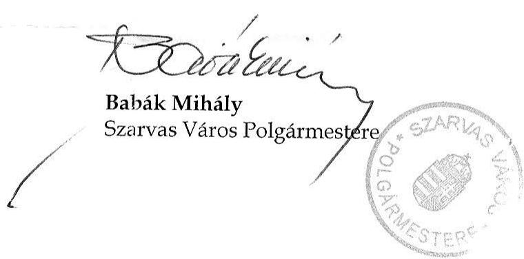

---

# Bapák Mihály úr   polgármester 

Szarvas Város Önkormányzata

## Szarvas

## Tisztelt Polgármester Úr!

Köszönettel vettem észrevételét Szarvas Város Önkormányzata pénzügyi helyzetének ellenőrzéséről készített jelentéstervezetben foglalt megállapításokra, melyben arról tájékoztat, hogy egyetért a részletes megállapítások tartalmával.

Az intézményi feladatok racionalizálása, valamint a bevételek növelése és a kiadások csökkentése érdekében a 2007. és 2008. években tett intézkedéseinek, továbbá a kockázatkezelési tartalék létrehozásának jelentőségét elismerjük. Az Önkormányzat pénzügyi egyensúlyi helyzetére vonatkozó, a helyszíni ellenőrzés dokumentumai és adatai által kellően megalapozott megállapításokat a jelentéstervezet tartalmazza.

A bevételnövelő és a kiadáscsökkentő intézkedések, valamint kiadási megtakarítás kedvező hatással volt az önkormányzat pénzügyi egyensúlyi helyzetére. A 2007. és 2008. években kibocsátott, devizára átváltott kötvény, valamint a csökkenő működési és a negatív nettó működési jövedelem következtében a pénzügyi egyensúly középtávú helyreállítása és hosszú távú megőrzése érdekében szükségesnek tartott intézkedéseket a jelentéstervezet tartalmazza.

Nagyra értékelem a kockázatkezelési tartalék létrehozását az árfolyam- és kamatkockázatok kezelésére tett intézkedéseit. A kockázatkezelési tartalék célját kibővítve - pénzügyi lehetőségei függvényében - a tartalék képzés hasznos lehet annak érdekében, hogy az fedezetül szolgáljon és forrást biztosítson a jövőbeni pénzintézeti kötelezettségek teljesítéséhez.

Végül megköszönöm Polgármester úrnak és munkatársainak az ellenőrzés során tanúsított hozzáállását, amellyel az Önkormányzatról szóló pénzügyi helyzetelemzés elkészítését segítették.

Budapest, 2012. április " $\sqrt{1}$ ".