# ÁLLAMI   SZÁMVEVŐSZÉK 

## JELENTÉS

Százhalombatta Város Önkormányzata pénzügyi helyzetének ellenőrzéséről (43/4)

---

# Állami Számvevőszék 

Iktatószám: V-3110-030/2012.
Témaszám: 1015
Vizsgálat-azonosító szám: V0560141

## Az ellenőrzést felügyelte:

Dr. Varga Sándor
számvevő igazgatóhelyettes
Az ellenőrzést vezette:
Renkó Zsuzsanna
számvevő tanácsos
Ellenőrzési csoportvezető:
Puchy Márta
számvevő tanácsos

## Az ellenőrzést végezték:

| Ébner Vilmosné | Pályi Katalin Ágnes | Csényi István |
| :-- | :-- | :-- |
| számvevő tanácsos | számvevő | számvevő tanácsos |

---

# TARTALOMJEGYZÉK 

BEVEZETÉS ..... 7
I. ÖSSZEGZŐ MEGÁLLAPÍTÁSOK, KÖVETKEZTETÉSEK, JAVASLATOK ..... 11
II. RÉSZLETES MEGÁLLAPÍTÁSOK ..... 20

1. Az Önkormányzat kötelező és önként vállalt feladatai, a feladatellátás szervezeti keretei és annak változásai ..... 20
2. Az Önkormányzat pénzügyi egyensúlyi helyzetét befolyásoló tényezők ..... 25
2.1. A működési és a felhalmozási egyensúly változása ..... 27
2.2. Az Önkormányzat bevételeinek változása ..... 32
2.3. Az Önkormányzat működési és a felhalmozási célú kiadásainak változása ..... 34
3. Az Önkormányzat kötelezettségei ..... 39
3.1. Az Önkormányzat pénzintézetekkel szembeni kötelezettségeinek változása ..... 39
3.2. A szállítói kötelezettségek változása ..... 40
3.3. Egyéb kötelezettségek változása ..... 40
4. A pénzügyi egyensúly megteremtése érdekében hozott intézkedések ..... 45
5. Az ÁSZ által a korábbi években a pénzügyi egyensúly javítására tett szabályszerűségi és célszerűségi javaslatok hasznosulása ..... 48

---

# MELLÉKLETEK 

1. számú Működési és felhalmozási célú hiány/többlet a 2007-2010 közötti időszakban az Önkormányzat zárszámadási rendeleteiben (1 oldal)
2. számú Az Önkormányzat bevételei és kiadásai, valamint adósságszolgálata 2007-2010 között (1 oldal)
3/a. számú Az Önkormányzat 2007-2010. években megvalósított, 2010. december 31-ig befejezett fejlesztései és azok forrásösszetétele (5 oldal)
3/b. számú Az Önkormányzat 2010. december 31-én folyamatban lévő fejlesztési feladataira 2010. december 31-ig teljesített kifizetések és azok forrásösszetétele (1 oldal)
3/c. számú Az Önkormányzat 2010. december 31-én folyamatban lévő fejlesztési feladataira 2010. december 31-én fennálló kötelezettségek és azok forrásösszetétele (1 oldal)
3/d. számú Az Önkormányzat által beadott, elbírálás alatt álló pályázati forrásból megvalósítani tervezett fejlesztéseihez kapcsolódó kötelezettségvállalásai és annak forrásösszetétele (1 oldal)
3. számú Az önkormányzati feladatok ellátásában résztvevő gazdasági társaságok (1 oldal)

---

# RÖVIDÍTÉSEK JEGYZÉKE 

## Törvények

Áht $_{1}$
Áht $_{2}$
helyi adókról szóló törvény
Gt.
Gyvt.
Ötv.
Ptk.
Számv. tv.
Szoc.tv.

## Rendeletek

Áhsz.

SzMSz

## Szórövidítések

áfa
ÁSZ
BATTA-INVEST Kft.
BATTAI Uszoda Kft.
EU
Halom Televízió Kft.
jegyző
Képviselő-testület
KMOP
Korshak Kft.
Önkormányzat
polgármester
Polgármesteri hivatal
PRO-MED Bt.
az államháztartásról szóló 1992. évi XXXVIII. törvény az államháztartásról szóló 2011. évi CXCV. törvény a helyi adókról szóló 1990. évi C. törvény a gazdasági társaságokról szóló 2006. évi IV. törvény a gyermekek védelméről és a gyámügyi igazgatásról szóló 1997. évi XXXI. törvény
a helyi önkormányzatokról szóló 1990. évi LXV. törvény
a Polgári Törvénykönyvről szóló 1959.évi IV. törvény a számvitelről szóló 2000. évi C. törvény
a szociális igazgatásról és szociális ellátásról szóló 1993. évi III. törvény
az államháztartás szervezetei beszámolási és könyvvezetési kötelezettségének sajátosságairól szóló 249/2000. (XII. 24.) Korm. rendelet
Százhalombatta Város Önkormányzata Képviselőtestülete 3/2011. (II. 14.) számú rendelete Képviselőtestület és Szervei Szervezeti és Működési Szabályzatáról, amely a 33/2002. (XII. 23.) számú rendeletet hatályon kívül helyezte
általános forgalmi adó
Állami Számvevőszék
BATTA-INVEST Befektetési és Szolgáltatást Szervező Korlátolt Felelősségű Társaság
BATTAI Uszoda Üzemeltető és Ingatlanfejlesztő Korlátolt Felelősségű Társaság
Európai Unió
Halom Televízió Nonprofit Korlátolt Felelősségű Társaság
Százhalombatta Város Önkormányzatának Jegyzője
Százhalombatta Város Képviselő-testülete
Közép-magyarországi Regionális Operatív Program
Korshak Ingatlanberuházó, Forgalmazó, Kereskedelmi és Szolgáltató Korlátolt Felelősségű Társaság
Százhalombatta Város Önkormányzata
Százhalombatta Város Önkormányzatának Polgármestere
Százhalombatta Város Önkormányzatának Polgármesteri Hivatala
PRO-MED Egészségügyi és Szociális Szolgáltató Betéti Társaság

---

| PROMOTION SERVICE Kft. | PROMOTION SERVICE Marketing-Kommunikációs   Nonprofit Korlátolt Felelősségű Társaság |
| :-- | :-- |
| SNA | System of National Account, azaz a Nemzeti Számlák   Rendszere, amely a gazdasági szektorok által létreho-   zott valamennyi terméket és szolgáltatást figyelembe   veszi |
| SZÁKOM Kft. | SZÁKOM Százhalombattai Kommunális Szolgáltató   Korlátolt Felelősségű Társaság |
| szja | személyi jövedelemadó |
| város | Százhalombatta város |
| VSZK | Százhalombatta Önkormányzat Városi Szabadidő   Központ |

---

# ÉRTELMEZŐ SZÓTÁR 

CLF módszer
használhatósági fok
kötelező közszolgáltatás
közfeladat
önkormányzat többségi tulajdonában lévő gazdasági társaságok

Az önkormányzatok költségvetése elemzésének eszköze. A módszer következetesen elkülöníti a folyó és a felhalmozási költségvetés bevételeit és kiadásait, azok költségvetési egyenlegeit. Bizonyos mértékig a vállalati gazdálkodás logikai elemeit érvényesíti az önkormányzatok pénzügyi, jövedelmi helyzetének vizsgálata során. Az értékelés a pénzügyi kapacitás fogalmát helyezi a középpontba.
Az eszközgazdálkodás vizsgálatának elemzése során használt mutató. Számításakor a tárgyi eszköz könyv szerinti (nettó) értékét viszonyítják a tárgyi eszköz bruttó (beszerzési/létesítési) értékéhez. A mutató százalékban kifejezett csökkenése az eszköz állagának romlására, avulására utal, ami maga után vonja az üzemeltetési és fenntartási költségek növekedését is.
A helyi önkormányzati feladatkörbe tartozó, a köztisztasággal és a településtisztasággal, valamint az élet- és vagyonbiztonsággal összefüggő egyes - közszolgáltatás útján megvalósuló - közfeladatok ellátása, amelynek kötelező igénybevételét külön jogszabály (törvény, helyi önkormányzati rendelet) határozza meg.
Állami, helyi, illetve kisebbségi önkormányzati feladat, amelynek ellátásáról az államnak, illetve az önkormányzatoknak kell gondoskodni. A hatályos szabályozás szerint közfeladatot törvény és önkormányzati rendelet állapíthat meg. Az önkormányzatok által ellátandó feladatok keretszerű meghatározását az Ötv. tartalmazza.
Az önkormányzat a gazdasági társaságban a szavazatok több mint ötven százalékával vagy a Ptk. 685/B. § (2)-(3) bekezdéseiben rögzített meghatározó befolyással rendelkezik. A befolyással rendelkező akkor rendelkezik egy jogi személyben meghatározó befolyással, ha annak tagja, illetve részvényese és jogosult e jogi személy vezető tisztségviselői vagy felügyelőbizottsága tagjai többségének megválasztására, illetve visszahívására, vagy a jogi személy más tagjaival, illetve részvényeseivel kötött megállapodás alapján egyedül rendelkezik a szavazatok több mint ötven százalékával (Ptk. 685/B. § (2) bekezdés). A meghatározó befolyás akkor is fennáll, ha a befolyással rendelkező számára e jogosultságok közvetett módon (köztes vállalkozásain keresztül, a Ptk. 685/B. § (3)-(4) bekezdései szerint) biztosítottak.
A helyi önkormányzat és az önkormányzat irányítása alá tartozó költségvetési szerv többségi tulajdonában, illetve többségi befolyása alatt álló gazdálkodó szervezet esetében hitelfelvétel, kölcsönfelvétel, garancia- vagy kezességvállalás, tartozásátvállalás, tartozás-elengedés, értékpapír kibocsátás, vásárlás, pénzügyi lízing, tartós bérleti szerző-

---

pénzügyi kapacitás

SNA
dés, ingyenes vagyonjuttatás (így különösen: ajándékozás, ingyenes engedményezés), vagy követelésvásárlás, követelésengedményezés végrehajtására vonatkozóan az Áht.; 100/M. § (4) bekezdése alapján az önkormányzat rendelkezik döntési jogosultsággal.
A pénzügyi kapacitás (financial capacity) az adósok hitelfelvételi képességének azon mértéke, ahol még anélkül tudják növelni az adósságot, hogy csökkenteniük kellene akár a jelenbeli, akár a jövőben esedékes kiadásaikat a fizetésképtelenség elkerülése érdekében. (Forrás: Az önkormányzati rendszer pénzügyi helyzete, ÁSZKUT tanulmány 2010.)
System of National Account azaz a Nemzeti Számlák Rendszere, amely a gazdasági szektorok által létrehozott valamennyi terméket és szolgáltatást figyelembe veszi.

---

# JELENTÉS 

## Százhalombatta Város Önkormányzata pénzügyi helyzetének ellenőrzéséről

## BEVEZETÉS

Az Állami Számvevőszék 2011. évtől érvényes stratégiája új irányt szabott a helyi önkormányzatok gazdálkodásának ellenőrzésében is. Az ÁSZ - küldetése és jövőképe szerint - szilárd szakmai alapokra támaszkodva értékteremtő ellenőrzéseivel és helyzetelemzéseivel az államháztartás egészében, így a helyi önkormányzati alrendszerben is elő kívánja segíteni a közpénzek és a közvagyon szabályos, gazdaságos, hatékony és eredményes felhasználását. E folyamat részeként - az államháztartási hiány alakulásának összetevőire is figyelemmel végezzük az önkormányzati alrendszer pénzügyi helyzetelemzését.

Az államháztartás helyi szintjén a 304 városnak ${ }^{1}$ az általuk ellátott közszolgáltatások volumenére is tekintettel a közfeladatok ellátásában kiemelt szerepe van. E települések 2011. január 1-jei népessége 3169 ezer fő volt.

Feladataik és hatásköreik az Ötv. mellett különböző ágazati törvények által meghatározottak, miközben a feladatellátás szervezeti kereteit - ezen belül a gazdasági társaságok közszolgáltatások ellátásában betöltött szerepét - saját maguk határozzák meg. A gazdasági társaságok által ellátott feladatok esetén a gazdálkodás, továbbá az önkormányzatok pénzügyi egyensúlyi helyzetére ható közvetlen kockázatok egy része kikerült az önkormányzati alrendszerből. A többségi önkormányzati tulajdonban lévő társaságok gazdálkodásának körülményei befolyásolhatják a városok pénzügyi egyensúlyi helyzetének megítélésében rejlő kockázatokat.

Az áttekintett időszakban az önkormányzati forrásszabályozás elvei lényegesen nem változtak. Az önkormányzatok gazdasági mozgásterét a központi költségvetéstől való függőség mellett jelentősen befolyásolja a helyi adókivetési jog gyakorlása. A városok gazdálkodási szabadságának lényeges eleme, hogy anyagi lehetőségeik függvényében dönthettek arról, hogy feladataik közül azokat, amelyek megoldására az Ötv. szerint a települési önkormányzat nem kötelezhető, a megyei önkormányzat fenntartásába adhatták. E döntések differenciáltan érintették a városok pénzügyi helyzetét.

[^0]
[^0]:    ${ }^{1}$ A megyei jogú városok nélkül figyelembe vett városok száma 304 városi önkormányzatot jelent.

---

A városi önkormányzatok 2007-2010 között teljesített bevételeit és összetételét az alábbi ábra szemlélteti:
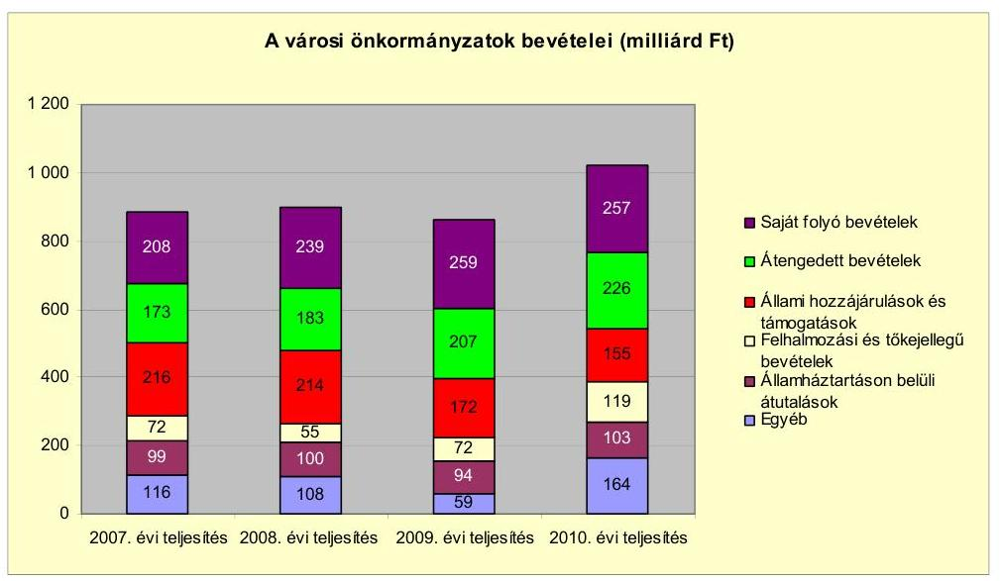

Az önkormányzati alrendszer pénzügyi helyzetértékelése során új elemzési módszereket alkalmazott az ellenőrzés. A költségvetési beszámoló adatok elemzése helyett az önkormányzat pénzügyi helyzetét a CLF módszerrel értékeljük, amelynek lényegét és számításának módszerét a jelentés 2. pontjában, és a jelentés 2. számú mellékletében ismertetjük részletesen.

Az új módszereken alapuló helyzetértékelés fontosságát az adja, hogy a helyi önkormányzatok bruttó adósságállománya ${ }^{2}$ a 2010. évi költségvetési beszámolók alapján 1248 milliárd Ft-ot tett ki. Ezen belül a 304 város adóssága 383 milliárd Ft volt, amely az önkormányzati alrendszer teljes adósságállományának $30,7 \%$-át jelentette ${ }^{3}$.

A mérlegben kimutatott bruttó adósságállomány mellett az önkormányzatok számára az eszközállomány műszaki állapotának megőrzése is előbb-utóbb pénzügyi kötelezettséget jelent. Az elhasználódott eszközök pótlására forrást biztosító amortizációs (felújítási) alap képzésének ${ }^{4}$ elmaradása maga után vonhatja a feladatellátást kiszolgáló tárgyi eszközök állagának erőteljes romlását. Emellett a 2007-2013-as időszakra meghirdetett, vissza nem térítendő EU-s fejlesztési forrásokhoz való hozzájutás lehetősége felerősítette az önkormányzati

[^0]
[^0]:    ${ }^{2}$ Az önkormányzati mérlegbeszámolókból számított bruttó adósságállomány 2010. év végi összege magában foglalja a fejlesztési és a működési célú kötvénykibocsátások, a beruházási és fejlesztési hitelek, a működési célú hosszú lejáratú hitelek, a rövid lejáratú hitelek, váltótartozások miatti kötelezettségek teljes (2011-ben, illetve az azt követő években esedékes) állományát. Az önkormányzatok 2007. év végi mérleg szerinti adósságállománya 692 milliárd Ft volt.
    ${ }^{3}$ A fővárosi és a kerületi önkormányzatok adósságának figyelmen kívül hagyásával számított 977 milliárd Ft összegű bruttó adósságállományból a városok 39,2\%-kal részesedtek.
    ${ }^{4}$ Erre a jelenlegi szabályozási környezetben nem kötelezi előírás az önkormányzatokat.

---

alrendszer fejlesztési igényeit, amelyek a felhalmozási költségvetési hiány folyamatos emelkedésén túl - az előírt jövőbeni fenntartási kötelezettség miatt tovább terhelhetik az önkormányzatok költségvetését ${ }^{5}$.

Az ÁSZ a 2011. évi ellenőrzési tervében 43. számú, az Önkormányzatok gazdálkodási rendszerének ellenőrzése részeként áttekinti, és elemzi az önkormányzatok pénzügyi helyzetét. A gazdálkodás szabályszerűségét az ÁSZ az előző évek során ebben az önkormányzati körben is ellenőrizte. Jelen vizsgálatunk a tett javaslataink pénzügyi helyzetet érintő pontjainak hasznosítására utóellenőrzés jelleggel tér ki.

Az ellenőrzés megállapításait az Önkormányzat által kitöltött - teljességi nyilatkozattal megerősített - 27 tanúsítványon szolgáltatott adatokra alapoztuk. Ellenőrzési bizonyítékként használtuk fel továbbá:

- a képviselő-testületi és bizottsági előterjesztéseket, a döntés-előkészítés során készített dokumentumokat;
- a kötelezettségvállalások dokumentumait;
- a pénzügyi-számviteli nyilvántartásokat;
- az éves költségvetési beszámolókat;
- a költségvetési és zárszámadási rendeleteket.

Az ellenőrzés a 2007. január 1. - 2011. június 30. közötti időszakot öleli
 fel. A pénzintézeti kötelezettségek állományának vizsgálatakor az ellenőrzött időszak 2006. december 31. - 2011. június 30. közötti időszakra terjedt ki.

Az ellenőrzés során vizsgáltunk minden olyan körülményt és adatot, amely a program végrehajtásához kapcsolódott és a pénzügyi helyzet alakulására hatást gyakorló releváns tények és folyamatok feltárásához szükségessé vált.

# Az ellenőrzés célja annak értékelése volt, hogy: 

- a vizsgált időszakban a kötelező- és önként vállalt feladatok ellátását biztosító szervezeti keretekben, a feladatellátás módjában bekövetkezett változások milyen hatást gyakoroltak az Önkormányzat pénzügyi helyzetének alakulására;
- az Önkormányzat pénzügyi - ezen belül működési és felhalmozási - egyensúlya mely tényezők hatására miként változott, és az Önkormányzat milyen intézkedéseket tett a pénzügyi egyensúly javítása érdekében;

[^0]
[^0]:    ${ }^{5}$ Az Állami Számvevőszék 2011 júniusában közzétett 1108. számú, a helyi önkormányzatok fejlesztési célú támogatási rendszerének ellenőrzéséről szóló jelentésében feltárta a fejlesztési folyamatok problémáit. A helyi önkormányzatok elsősorban azokat a fejlesztéseket valósították meg, amelyekhez támogatást lehetett igényelni. A fejlesztési célok közül a magasabb támogatási intenzitású pályázatokat részesítették előnyben. A fejlesztéssel megvalósuló létesítmények jövőbeli üzemeltetésének várható ráfordításait az önkormányzatok $71,9 \%$-a nem mérte fel.

---

- a költségvetési kiadások finanszírozása érdekében vállalt pénzintézeti kötelezettségek hogyan alakultak, továbbá milyen kötelezettségek fennállása befolyásolja az Önkormányzat jövőbeli pénzügyi helyzetét;
- hasznosultak-e a gazdálkodási rendszer korábbi ellenőrzése során a pénzügyi egyensúly javítására az ÁSZ által tett szabályszerűségi és célszerűségi javaslatok.

Az ellenőrzés típusa: szabályszerűségi vizsgálat.
A vizsgálat jogszabályi alapját az Állami Számvevőszékről szóló 2011. évi LXVI. törvény 1. § (3) bekezdése, 5. § (2)-(6) bekezdései, továbbá az Áht. 120/A. § (1) bekezdése előírásai képezik.

Százhalombatta város Pest megyében, Budapesttől 27 kilométerre a Duna nyugati partján helyezkedik el. A város területe 2806 hektár, lakosságszáma 2011. január 1-jén 18615 fő.

Az Önkormányzat 2011. évi módosított költségvetése 15,2 milliárd Ft, az Önkormányzat vagyona 2010. december 31-én 42,4 milliárd Ft.

Az Önkormányzat illetékességi területén négy kisebbségi önkormányzat működik. Az Önkormányzat feladatait 18 költségvetési szervvel és hat kizárólagos önkormányzati tulajdonú gazdasági társaság részvételével látja el.

---

# I. ÖSSZEGZŐ MEGÁLLAPÍTÁSOK, KÖVETKEZTETÉSEK, JAVASLATOK 

Az Önkormányzat - adatszolgáltatása szerint - a 2010. évi működési költségvetési kiadásaiból (7063,9 millió Ft-ból) 2225,1 millió Ft-ot (31,5\%-ot) a kötelező feladatok, 4838,8 millió Ft-ot (68,5\%-ot) az önként vállalt feladatok ellátására fordított ${ }^{6}$. Az Önkormányzat besorolása szerint a 2007-2010. években a kötelező feladatai ellátása mellett önként vállalt feladatnak tekintette a középfokú oktatást (gimnázium és szakközépiskola), nevelési tanácsadást, múzeum működtetését, autista gyermekek fejlesztő foglalkozását, gyermekélelmezésben a pótreggeli biztosítását, a hajléktalan ellátást, uszoda és erdei iskola fenntartását, az egészségügyi szűrőprogramot, a kultúra és a sport, valamint egyéb közösségi tevékenységek támogatását az éves költségvetési rendeletekben meghatározottak alapján. Az önként vállalt feladatokat jellemzően a kötelező feladatok ellátását biztosító intézmények végzik.

Az Önkormányzat feladatellátásának szervezeti struktúráját 2011. június 30-án az alábbi ábra szemlélteti:
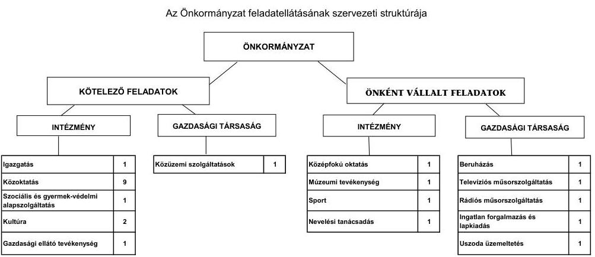

Az Önkormányzat feladatait 2011. június 30-án (a Polgármesteri hivatallal együtt) 18 költségvetési szervvel és hat kizárólagos önkormányzati tulajdonú gazdasági társaság részvételével látta el. Az áttekintett időszakban az intézményeknél nem került sor szervezeti átalakításra, intézmény átvételre és átadásra, számukban nem történt változás. A költségvetési szervek közül négy önállóan működő és gazdálkodó, 14 önállóan működő volt, a 2008. évtől a telephelyek száma (28) - egy közművelődési feladatok végzését szolgáló telephellyel - 29-re nőtt. A gazdasági társaságok az egészséges ivóvízellátás, vízrendezés és belvíz elvezetés, csatornaszolgáltatás, hulladékgazdálkodás, temető fenntartás, vagyonkezelés és forgalmazás, önkormányzati tulajdonú ingatlanok- és az uszoda üzemeltetés, televíziós és rádiós műsorszolgáltatás, városi újság- és lapkiadás területeken kaptak szerepet az Önkormányzat feladat-

[^0]
[^0]:    ${ }^{6}$ A működési kiadások tartalmazzák a feladatellátáshoz kapcsolódó transzferkiadásokat (pénzbeli szociális juttatások és nonprofit szervezetek támogatása), azonban nem tartalmazzák a kisebbségi önkormányzatok és az egészségügy kiadásait.

---

ellátásában. Az egészségügyi alapellátást - felnőtt- és gyermek háziorvosi, valamint fogorvosi - magánpraxisokon keresztül biztosítja, a kötelező ügyeleti szolgálatot gazdasági társaság nyújtja, amelyben az Önkormányzat nem tulajdonos.

A közszolgáltatást ellátó gazdasági társaságok számára az Önkormányzat az ellenőrzött időszakban 635,4 millió Ft működési célú és 54,7 millió Ft fejlesztési célú pénzeszközt adott át. A gazdasági társaságokkal kötött támogatási szerződésekben rögzített célokra átadott pénzeszközök célszerinti felhasználását az Önkormányzat ellenőrizte. Az önkormányzati feladatellátásban részt vevő kizárólagos tulajdonú gazdasági társaságok pénzügyi helyzete - a gazdasági társaságok adatszolgáltatása alapján - a 2010. évben változó volt. A saját tőke/jegyzett tőke aránya alapján három gazdasági társaság helyzete stabilnak tekinthető, ugyanakkor három gazdasági társaság veszteséggel zárta az évet, amelyek közül a PROMOTION SERVICE Kft. saját tőkéje a médiapiac szűküléséből következően elszenvedett több éves veszteség miatt 2010. évtől negatív összegű volt.

Az egyes közfeladatok működési kiadásainak finanszírozási forrásait ágazatonként a 2007. és a 2010. években az alábbi ábra szemlélteti:
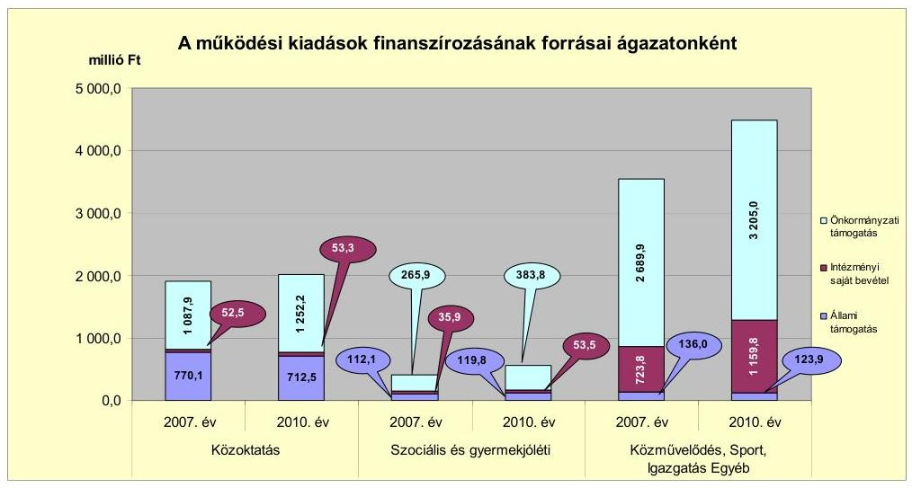

Az Önkormányzat összes működési bevétele a 2010. évben 7063,9 millió Ft volt. A működési kiadásokra fordított összeg a 2010. évben 769,1 millió Ft-tal (12,2\%-kal) haladta meg a 2007-2009. évek 6294,8 millió Ft összegű átlagát. A közoktatás a 2010. évi 2018,0 millió Ft működési kiadásának az előző három év átlagához (1972,4 millió Ft-hoz) viszonyított 45,6 millió Ft-os emelkedését az ellátottak létszámának növekedése, valamint az Önkormányzat önként vállalt feladatainak bővülése idézte elő. A működési kiadások finanszírozásában ezzel párhuzamosan az önkormányzati támogatás részaránya a 2007-2009. évek 1136,6 millió Ft összegű átlagához képest 115,6 millió Ft-tal (10,2\%-kal) a 2010. évre 1252,2 millió Ft-ra nőtt. A szociális és gyermekjóléti feladatok ellátására fordított kiadások a 2010. évben 557,2 millió Ft-ot tettek ki, amely a 20072009. évek átlagát (500,5 millió Ft-ot) 56,7 millió Ft-tal (11,3\%-kal) haladta meg. A növekedés hátterében az ellátottak pénzbeli juttatásainak növelése és új támogatási formák bevezetése állt. A kiadások finanszírozása eltolódott az önkormányzati támogatás felé, a 2010. évben 378,4 millió Ft-összegben

---

50,9 millió Ft-tal (15,3\%-kal) haladta meg az előző három év átlagát (332,9 millió Ft). A közművelődés, sport, igazgatás, valamint egyéb intézményekre és feladatokra fordított kiadások a 2010. évben összesen 4488,7 millió Ft-ot tettek ki, amely 666,8 millió Ft-tal (17,4\%-kal) haladta meg a 2007-2009. évek 3821,9 millió Ft összegű átlagát. A növekedés oka elsősorban a kulturális és sportrendezvények számának és körének bővülése, valamint a Polgármesteri hivatalnál végrehajtott személyi juttatás emelése, továbbá a fordított áfa befizetések emelkedése volt. A finanszírozás összetételében az intézményi saját bevételek összege a 2010. évben 1159,7 millió Ft volt, amely 241,5 millió Ft-os (26,3\%-os) növekedést jelentett az előző három év 918,2 millió Ft-os átlagához képest.

A vizsgált időszakban a kötelező és az önként vállalt feladatok ellátását biztosító szervezeti keretekben bekövetkezett változás - egy telephellyel való bővülés - az Önkormányzat pénzügyi egyensúlyi helyzetének alakulására nem volt hatással. A feladatellátás módja a vizsgált időszakban nem változott.

Az Önkormányzat folyó költségvetés egyenlege (működési jövedelem) a 2007-2010. évek között működési forrástöbbletet mutatott, amelyet az alábbi grafikon szemléltet:
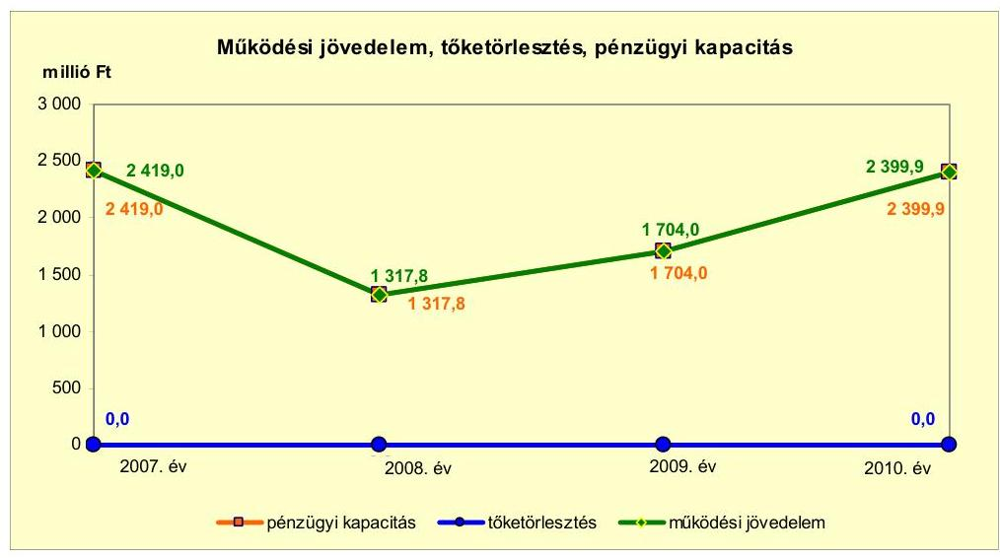

A működési jövedelem minden évben pozitív volt, a vizsgált időszakban összesen 7840,7 millió Ft forrástöbblet keletkezett. A működési jövedelem a 2007. évről a 2008. évre történő 1101,2 millió Ft-os csökkenését elsősorban a személyi juttatások és járulékai, valamint a dologi kiadások növekedései okozták. A 2008. évről a 2009. évre 386,2 millió Ft-tal nőtt a működési jövedelem, elsősorban a folyó bevételek iparűzési adóbevételekből származó emelkedése miatt. A 2009. évről a 2010. évre a működési jövedelem 695,9 millió Ft-tal nőtt, amely a bevételkiesést meghaladó mértékű kiadáscsökkenésből eredt, hátterében elsősorban az előző évben - a Főtér beruházáshoz a Korshak Kft. által felvett hitelhez kapcsolódóan - elhelyezett óvadéki betét torzító hatásának megszűnése állt. A 2010. évben keletkezett 2399,9 millió Ft működési jövedelem a 2007-2009. évek átlagához viszonyítva 586,3 millió Ft (32,3\%-os) növekedést jelent. A működési jövedelem - és egyúttal a pénzügyi kapacitás - kedvező alakulásának oka, hogy a folyó bevételek növekedése rendre meghaladta a folyó

---

kiadások növekedési ütemét, illetve a 2010. évben a folyó bevételek csökkenése elmaradt a folyó kiadások csökkenéséhez képest.

A működési és a nettó működési jövedelem az Önkormányzat esetében azonos értéket mutatott, mivel hitelfelvétellel összefüggő tőketörlesztési kötelezettsége az áttekintett időszakban nem volt, illetve forgatási és befektetési célú értékpapírok beváltására sem került sor.

Az Önkormányzat felhalmozási költségvetésének egyenlege mind a négy évben negatív összegű volt, a 2007-2010. években összesen 11463,5 millió Ft felhalmozási forráshiány jelentkezett. A 2007. és a 2010. években jelentkező (3836,0 millió Ft és 3992,0 millió Ft) kiugróan magas forráshiányt a 2007. évben 2074,8 millió Ft értékű, a 2010. évben 4117,7 millió Ft értékű felújítások és beruházások, illetve telekvásárlások befolyásolták.

Az Önkormányzat folyó bevétele a 2007-2009. években átlagosan 9389,1 millió Ft volt, a 2010. évre 10 181,0 millió Ft-ra nőtt, a 2011. év I. félévében 4707,0 millió Ft-ra teljesült. A költségvetési támogatások és az átengedett szja együttes értéke a 2007-2009. években átlagosan 1229,3 millió Ft, a 2010. évben 968,8 millió Ft, a 2011. év I. félévében 467,4 millió Ft volt. A folyó bevételek között kimutatott költségvetési támogatásból a 2008. évben 13,0 millió Ft, a 2009. évben 5,9 millió Ft, a 2010. évben 4,2 millió Ft volt a működési célra kapott vis major támogatás. A helyi adókból és pótlékokból a 2007-2009. években átlagosan 6196,2 millió Ft bevétel származott, amely a 2010. évre a gazdasági válság adózókra gyakorolt negatív hatásának következtében 4699,4 millió Ft-ra csökkent. Az Önkormányzat felhalmozási bevétele a 2007-2009. években átlagosan 784,9 millió Ft volt, a 2010. évben 538,2 millió Ft-ra csökkent, majd a 2011. év I. félévében 195,6 millió Ft volt. A felhalmozási bevételekből a 2007-2011. év I. féléve között 1140,1 millió Ft telek és ingatlan, továbbá egyéb tárgyi eszköz értékesítéséből, valamint állami támogatásból, 1330,9 millió Ft részvényértékesítésből, befektetési célú részesedések után kapott osztalékbevételből, egy kizárólagos tulajdonú gazdasági társaságnál a 2008. évben végrehajtott 500,0 millió Ft összegű tőkekivonásból, illetve államkötvények kamatából származott.

Az Önkormányzat folyó kiadása a 2007-2009. években átlagosan 7575,5 millió Ft, a 2010. évben 7781,1 millió Ft volt, 2,7\%-kal emelkedett. A transzferkiadások a folyó kiadásoknak a 2007-2009. években átlagosan 17,8\%-át, a 2010. évben 9,7\%-át jelentették. A csökkenés oka, hogy a 2007-2009. évek átlagát jelentősen torzította a Korshak Kft. hosszú lejáratú hiteléhez a 2009. évben nyújtott 2000 millió forint összegű óvadéki betét. A személyi juttatások és járulékok együttes összege a 2007-2009. években átlagosan 3185,5 millió Ft, a 2010. évben 3177,5 millió Ft volt. A személyi jellegű kifizetések a 2008. évben voltak a legmagasabbak (3281,6 millió Ft), hátterében illetményfejlesztés, jutalom és béren kívüli juttatások kifizetése állt. A dologi kiadások 2010. évi 3531,1 millió Ft összege a 2007-2009. évek átlagához (2731,2 millió Ft-hoz) viszonyítva 799,9 millió Ft (29,3\%) növekedést jelentett, amelyet jellemzően a fordított áfa befizetések emelkedése okozott. Az Önkormányzatnál a 2007-2010. évek között a felhalmozási kiadások 14 356,3 millió Ft-ot jelentettek, amelynek mindössze 3,5\%-a kapcsolódott 10,0 millió Ft alatti felújításhoz, illetve fejlesztéshez. Az Önkormányzat 100,0 millió Ft-os értéket meghaladó be-

---

ruházásai 2007-2010. években jellemzően középület felújítás-átalakítás és akadálymentesítés, út- és járdarekonstrukciós munkák, földterület, telek és ingatlan vásárlás voltak, valamint 2010. évben műszakilag befejeződött a legnagyobb, 2501,9 millió Ft teljes bekerülési költségű beruházás, a Szent István tér és Barátság Művelődési Központ rekonstrukciója.

Az Önkormányzat pénzügyi egyensúlyi helyzetét az elmúlt időszak fejlesztési tevékenysége érdemben nem befolyásolta. A befejezett fejlesztések közel 90,0\%-át saját bevételből fedezték. A 2007-2010. évek időszakában megvalósított 9798,7 millió Ft értékű beruházás és felújítás forrása 8771,5 millió Ft (89,5\%) saját erő mellett mindössze 962,9 millió Ft (9,8\%) EU-s és 64,3 millió Ft $(0,7 \%)$ hazai támogatás volt. A 2010. december 31-én folyamatban lévő fejlesztési feladatok végrehajtására 2007-2010. évek között 41,6 millió Ft kiadást teljesítettek saját forrásból. A fejlesztések finanszírozása az Önkormányzat számára likviditási gondot nem okozott.

Az Önkormányzat 2010. december 31-én folyamatban lévő fejlesztési feladatok 2010. évet követő kötelezettségvállalásainak összege 1687,3 millió Ft volt, amelyből 1011,9 millió Ft-ot (60,0\%) saját forrásból, valamint 675,4 millió Ft-ot (40,0\%) EU-s támogatásból terveznek biztosítani.

Az Önkormányzat 2010. december 31-e utáni felhalmozási kötelezettségvállalásainak forrásösszetételét az alábbi ábra szemlélteti:
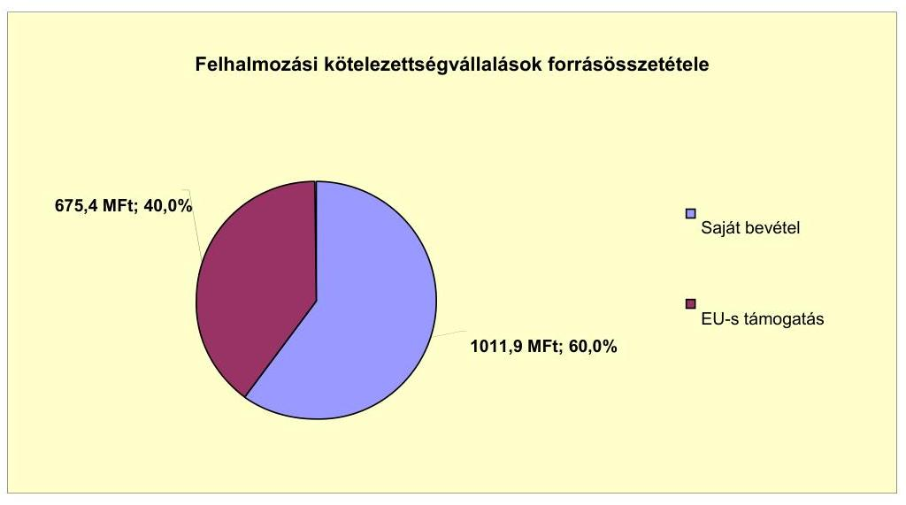

A vizsgált időszakban az Önkormányzatnak egy beadott, elbírálás alatt álló pályázata volt. A Kőrösi Csoma Sándor Általános Iskola és Alapfokú Művészetoktatási Intézményben pályázati forrásból megvalósítandó sport infrastruktúra fejlesztéshez és felújításhoz kapcsolódóan a 2010. évet követően az Önkormányzatnak 15,0 millió Ft kötelezettségvállalása keletkezett, amelynek tervezett forrása 3,0 millió Ft (20,0\%) saját bevétel és 12,0 millió Ft (80,0\%) hazai támogatás.

Az Önkormányzatnak a 2007-2011. év I. félévben pénzintézettel szemben fennálló kötelezettsége nem volt, a helyszíni vizsgálat alatt hitel igénybevételről, illetve kötvénykibocsátásról szóló döntést nem készítettek elő.

---

Az Önkormányzat 2011. év I. félév végi szállítói tartozása 1777,3 millió Ft volt. A szállítókkal szemben fennálló kötelezettségeken belül átütemezési megállapodással érintett és lejárt tartozások nem voltak.

Az áttekintett időszakban az Önkormányzat részéről 42 garanciavállalással kapcsolatos kötelezettségvállalás történt. Az Önkormányzat a 2007. évben 28 db, a 2008. évben 13 db óvadéki betét elhelyezése melletti garanciát vállalt a város területén lévő társasházak, lakásszövetkezetek közös tulajdonú részeinek felújítására, korszerűsítésére felvett hiteleivel kapcsolatban. A vállalt garanciák összességében 157,8 millió Ft-ot tettek ki. A kötelezettségből 2011. június 30-án az állomány 98,9 millió Ft-ot jelentett, mivel az adósok hiteltörlesztésének elmaradása miatt az Önkormányzatnak 58,9 millió Ft fizetési kötelezettséget teljesítenie kellett. Az Önkormányzattal szemben az áttekintett időszakban érvényesített garanciák összegéből 2011. június 30-ig - öt kötelezettségvállaláshoz kapcsoló - összesen 1,1 millió Ft térült meg. Ugyancsak óvadéki betét melletti garanciát vállalt az Önkormányzat a kizárólagos tulajdonában lévő gazdasági társasága (Korshak Kft.) által, a város főterén megvalósított „Főtér Projekt" (közművesítés, lakások, üzlet-, és irodahelyiségek, mélygarázs és konferencia központ építése) beruházás megvalósításához felvett hosszú lejáratú hitelhez kapcsolódóan. A vállalt garancia összege 2000,0 millió Ft volt (a kötelezettség 2010. március 3-án megszűnt).

Az Önkormányzat négy kizárólagos tulajdonú gazdasági társasága részére összesen nyolc alkalommal nyújtott tagi kölcsönt. A társaságok részére nyújtott tagi kölcsönök összege összesen 223,6 millió Ft volt. A gazdasági társaságok az Önkormányzat felé kölcsöntartozásból eredő kötelezettségeiknek a megállapodásokban foglaltaknak megfelelően eleget tettek.

Az Önkormányzatnak jelzáloggal terhelt ingatlana 2011. június 30-án nem volt, az összes forgalomképes ingatlanának nettó értéke 2515,8 millió Ft-ot képviselt 2010. december 31-én.

Az Önkormányzat és a kizárólagos tulajdonú gazdasági társaságai 2011. június 30-án jogerős határozattal lezárt, de ki nem fizetett peres eljárásban nem voltak érintve. Az Önkormányzat alperesként öt, felperesként egy jogerős határozattal nem lezárt peres eljárásban érintett. A kizárólagos tulajdonú gazdasági társaságainak jogerős határozattal nem lezárt peres eljárása 2011. június 30-án nem volt.

Az Önkormányzat kötelezettségeinek 2010. december 31-i, és 2011. június 30-i állományát, valamint azok várható értékeit - a kötelezettség lejáratáig - a következő táblázat mutatja be:

---

| Megnevezés | Állomány   2010.   december 31.   én | Állomány   2011. június   30 -án | Várható   kötelezettség   a 2011-2013.   években | Várható   kötelezettség   a 2014. évtől |
| :--: | :--: | :--: | :--: | :--: |
|  | HUF-ban   (millió Ft-ban) | HUF-ban   (millió Ft-ban) | HUF-ban   (millió Ft-ban) | HUF-ban   (millió Ft-ban) |
| Biztosítékok: (Garancia) | 124,5 | 98,9 | 36,1 | 62,8 |
| Szállítói tartozás | 71,2 | 1777,3 | 1777,3 | 0,0 |
| Összes kötelezettség: | 195,7 | 1876,2 | 1813,4 | 62,8 |

A 2011-2013. években a jelenleg ismert összes kötelezettség (1813,4 millió Ft) teljesítésére figyelembe vehető források: a szállítói tartozásokra az Önkormányzat a 2011. évi költségvetésében biztosított forrásokon túl, a 2011. év I. féléves beszámolóban kimutatott 5396,5 millió Ft pénzkészlet; a garancia vállalások fedezetét pedig a már elhelyezett óvadéki betétek biztosítják. Az Önkormányzatnak a 2014. évtől esedékes jelenleg ismert kötelezettségei 62,8 millió Ft-ot tesznek ki, amelyek garanciavállalásból származnak. Az ezek teljesítésére figyelembe vehető források óvadéki betétként rendelkezésre állnak.

A kizárólagos önkormányzati tulajdonú gazdasági társaságok kötelezettségei is befolyásolhatják az Önkormányzat likviditási, pénzügyi egyensúlyi helyzetét. Az Önkormányzat kizárólagos tulajdonú gazdasági társaságai kötelezettségeinek 2010. december 31-ei és 2011. június 30-ai állományát, valamint azok várható értékeit - a felmerülő kamatokat is figyelembe véve - a kötelezettség lejártáig, az alábbi táblázat mutatja be:

| Megnevezés | Állomány 2010. december 31-én |  |  | Állomány 2011. június 30-án |  |  | Várható kötelezettség a 2011-2013. években |  | Várható kötelezettség a 2014. évtől |  |
| :--: | :--: | :--: | :--: | :--: | :--: | :--: | :--: | :--: | :--: | :--: |
|  | HUF-ban   (millió Ft -   ban) | Devizában   (kivizsgáló   az EUR-   ban) | Devizánani | HUF-ban   (millió Ft -   ban) | Devizában   (kivizsgáló   az EUR-   ban) | Devizánani | HUF-ban   (millió Ft -   ban) | Devizában   (kivizsgáló   az EUR-   ban) | HUF-ban   (millió Ft -   ban) | Devizában   (kivizsgáló   az EUR-   ban) |
| Pénzintézeti kötelezettségek | 0,0 | 10158,1 | EUR | 0,0 | 5002,7 | EUR | 0,0 | 2203,2 | 0,0 | 12528,7 |
| Lízing kötelezettségek | 0,0 | 0,0 | HUF | 0,1 | 0,0 | HUF | 0,1 | 0,0 | 0,0 | 0,0 |
| Szállító tartozás | 63,1 | 6,0 | HUF | 40,0 | 0,0 | HUF | 40,0 | 0,0 | 0,0 | 0,0 |
| Összes kötelezettség: HUF-ban | 64,2 |  |  | 40,7 |  |  | 40,7 |  | 0,0 |  |
| Összes kötelezettség: EUR-ban |  | 10158,1 |  |  | 9502,7 |  |  | 2203,2 |  | 12528,7 |

Az eszközök használhatósága is hatást gyakorol az Önkormányzat pénzügyi egyensúlyi helyzetére. Az Önkormányzat eszközállományának átlagos használhatósági foka 2007-2010 között 3,1 százalékponttal ( $87,7 \%$-ról $84,6 \%$-ra) csökkent. A vizsgált időszakban megtörtént annak felmérése, hogy az eszközök elhasználódása, amortizációja fedezetének biztosítása mekkora forrást igényel az Önkormányzatnál. A felújításokra, az eszközök pótlására öt éves - évente felülvizsgált - intézmény felújítási program keretében került sor. Az Önkormányzat a 2007-2010. években a tárgyi eszközök után 1702,6 millió Ft összegű értékcsökkenést számolt el. Felújításra 1722,6 millió Ft-ot fordítottak, a beruházások összege 5859,6 millió Ft volt.

Az Önkormányzat az ellenőrzött időszakban kiadási megtakarítást eredményező és bevételt növelő intézkedéseket is tett. A 2007-2011. év I. féléve között tett intézkedések hatásaként 609,1 millió Ft bevételi többletet, továbbá 200,6 millió Ft kiadási megtakarítást mutatott ki az Önkormányzat. A bevételnövelő intézkedések kapcsán keletkezett - az Önkormányzat adatszolgáltatása szerint - többletbevétel $97,7 \%$-a a helyi adók, valamint a lejárt tartozások

---

behajtása vonatkozásában tett intézkedésekhez kapcsolódtak. A kiadási megtakarítások $90,9 \%$-a a végrehajtott álláshely csökkentés, a többletjuttatások csökkentése, a helyettesítések és az adójutalék megszüntetésének eredményeként keletkezett. Az álláshely-csökkentő intézkedések 2007-2011. év I. féléve között önkormányzati szinten összesen 28 álláshely (ebből 15 üres álláshely) megszüntetését jelentették. Egyes közszolgáltatási területeken azonban feladatbővülések is voltak, amelyek álláshely és egyben létszámnövekedéssel is jártak, ennek következtében az időszak álláshelyeinek száma 14-gyel nőtt. Az áttekintett időszakban az Önkormányzat pénzügyi egyensúlyát a végrehajtott kiadáscsökkentő és bevételnövelő intézkedések összesen 809,7 millió Ft-tal javították. A 2007-2011. év I. félév között a központi támogatások (költségvetési támogatás és szja) összességében 545,3 millió Ft-tal csökkentek. A vizsgált időszakban a központi támogatások csökkenése és a kiadási megtakarítást eredményező és a bevételt növelő intézkedések eredményeként keletkezett forrástöbblet egyenlege összességében 264,4 millió Ft volt.

Az ÁSZ az Önkormányzat gazdálkodási rendszerét a 2010. évben ellenőrizte, amely során a pénzügyi egyensúlyi helyzetre vonatkozóan szabályszerűségi, illetve célszerűségi javaslatot nem tett.

Százhalombatta Város Önkormányzat pénzügyi egyensúlya rövid és közép távon biztosított. A pénzügyi egyensúlyi helyzet hosszú távú megőrzésére az Önkormányzatnak fel kell készülnie.

A folyó bevételek összegének emelkedése meghaladta a folyó kiadások összegének növekedését.

Az önként vállalt feladatokra fordított kiadások aránya és mértéke magas, folyamatosan emelkedik.

Az Önkormányzatnak lejárt, vagy átütemezett szállítói tartozásai és pénzintézetekkel szembeni kötelezettségei nem voltak.

A folyamatban lévő fejlesztési projektekhez, a benyújtott pályázatokhoz szükséges saját források rendelkezésre állnak.

Kizárólagos tulajdonú gazdasági társaságai pénzügyi helyzete kockázatot hordoz az Önkormányzat számára. Három kizárólagos önkormányzati tulajdonú gazdasági társaság veszteségesen gazdálkodott.

Az Állami Számvevőszékről szóló 2011. évi LXVI. törvény 33. § (1) bekezdésében foglaltak értelmében a jelentésben foglalt megállapításokhoz kapcsolódó intézkedési tervet köteles az ellenőrzött szervezet vezetője összeállítani és azt a jelentés kézhezvételétől számított harminc napon belül az ÁSZ részére megküldeni. Amennyiben az intézkedési tervet határidőben nem küldi meg a szervezet, vagy az továbbra sem elfogadható, az ÁSZ elnöke a hivatkozott törvény 33. § (3) bekezdés a)-b) pontjaiban foglaltakat érvényesítheti.

---

# A 2011. június 30-i pénzügyi egyensúlyi helyzet alapján az ellenőrzés intézkedést igénylő megállapításai és javaslatai a következők:

## a Polgármesternek

1.  Az Önkormányzat pénzügyi egyensúlyi helyzete rövid és közép távon biztosított, hosszú távon azonban kockázatot hordozhat magában.

Javaslat:
Folyamatosan tájékoztassa a Képviselő-testületet az Önkormányzat pénzügyi egyensúlyi helyzetéről. Kezdeményezzen szükség esetén intézkedéseket a pénzügyi egyensúly hosszú távú fenntarthatósága érdekében.
2. Az Önkormányzat kizárólagos tulajdonú gazdasági társaságainak kötelezettsége 2011. június 30-án 40,7 millió Ft, valamint 9502,7 ezer EUR volt, amely kötelezettségek nem teljesítése hatással lehet az Önkormányzat likviditására, pénzügyi egyensúlyi helyzetére.

Javaslat:
Mutassa be félévente a Képviselő-testületnek a kizárólagos tulajdonú gazdasági társaságai aktuális pénzügyi helyzetét. Tegye meg a szükséges és lehetséges intézkedéseket a tulajdonosi érdekek védelme érdekében.

A polgármester a helyszíni ellenőrzés lezárása után tájékoztatta az Állami Számvevőszéket az Önkormányzat megtett és tervezett intézkedéseiről, amelyet az Állami Számvevőszék nem ellenőrzött, arra vonatkozóan véleményt, vagy megállapítást nem fogalmaz meg. Az ellenőrzés lezárását követően elvégzett intézkedéseket az Állami Számvevőszék utóellenőrzés keretében vizsgálhatja.

A polgármester tájékoztatása szerint a következő intézkedéseket tervezi és tette meg az Önkormányzat:

- A Képviselő-testület tájékoztatása az adott évi költségvetési rendeletalkotás, annak módosítása, valamint a következő évre szóló koncepció elkészítése során folyamatosan megtörténik. Az Önkormányzat pénzügyi egyensúlyi helyzetéről a 2011. évi zárszámadási rendelet megalkotása során tervezi a polgármester a Képviselő-testületet tájékoztatni.
- A kizárólagos önkormányzati tulajdonú gazdasági társaságok aktuális pénzügyi helyzetét a féléves, illetve éves beszámoló keretében tárgyalja a Képviselő-testület. A beszámolók tárgyalása és abból a következtetések levonása során elsődleges a tulajdonosi érdek védelme. Ezen szempontok alapján 2012 januárjában a BATTA INVEST Kft.-nek a SZÁKOM Kft.-be való beolvadásáról döntött a Képviselő-testület.

---

# II. RÉSZLETES MEGÁLLAPÍTÁSOK 

## 1. AZ ÖNKORMÁNYZAT KÖTELEZŐ ÉS ÖNKÉNT VÁLLALT FELADATAI, A FELADATELLÁTÁS SZERVEZETI KERETEI ÉS ANNAK VÁLTOZÁSAI

Az Önkormányzat a kötelező, valamint az önként vállalt feladatait az SzMSz-ben részletesen nem rögzítette ${ }^{7}$. Az önként vállalt feladatok ellátását, annak mértékét és módját a Képviselő-testület döntése alapján - a lakosság igényeinek és az Önkormányzat anyagi lehetőségeinek figyelembe vételével - a mindenkori éves költségvetési rendeletben rögzítették. Az Önkormányzat kötelező feladatai mellett önként vállalt feladatnak tekintette a középfokú oktatást (gimnázium és szakközépiskola), a nevelési tanácsadást, autista gyermekek fejlesztő foglalkozását, gyermekélelmezésben a pótreggeli biztosítását, a hajléktalan ellátást, uszoda, erdei iskola, valamint a múzeum fenntartását, egészségügyi szűrőprogramok, kulturális és sport programok, továbbá egyéb közösségi tevékenységek támogatását.

A 2010. évi működési költségvetési kiadások ${ }^{8}$ feladatonkénti megoszlását és azok finanszírozási részarányait az alábbi táblázat mutatja be:

| Ellátott feladat | Működési   kiadás   összesen   (millió Ft) | Kötelező   feladatok   kiadásainak   részaránya   \% | Működési   bevétel   összesen   (millió Ft) | Állami   támogatás   részaránya   \% | Intézményi   saját bevétel   részaránya   \% | Önkormányzati   támogatás   részaránya   \% |
| :--: | :--: | :--: | :--: | :--: | :--: | :--: |
| Óvodák | 496,8 | 32,2 | 496,8 | 32,0 | 0,2 | 67,8 |
| Általános iskolák | 1151,3 | 34,7 | 1151,3 | 33,4 | 1,3 | 65,3 |
| Gimnázium | 180,2 | 54,6 | 180,2 | 54,4 | 0,2 | 45,4 |
| Szakközépiskola,   szakképző intézmény | 189,7 | 56,6 | 189,7 | 37,5 | 19,1 | 43,4 |
| Szociális intézmények | 546,6 | 30,4 | 546,6 | 20,6 | 9,8 | 69,6 |
| Gyermekjóléti   intézmények | 10,6 | 69,3 | 10,6 | 69,3 | 0,0 | 30,7 |
| Közművelődési   intézmények | 467,9 | 7,4 | 467,9 | 1,5 | 5,9 | 92,6 |
| Sportlétesítmények | 503,0 | 19,1 | 503,0 | 1,5 | 17,6 | 80,9 |
| Egyéb intézmények | 500,8 | 63,0 | 500,8 | 14,0 | 49,0 | 37,0 |
| Polgármesteri hivatal   igazgatási kiadásai | 1468,6 | 47,1 | 1468,6 | 2,7 | 44,4 | 52,9 |
| Polgármesteri hivatalban   ellátott egyéb feladatok   működési kiadásai | 1548,4 | 9,4 | 1548,4 | 0,0 | 9,4 | 90,6 |
| Működési kiadá-   sok összesen | 7063,9 | 31,5 | 7063,9 | 13,5 | 18,0 | 68,5 |

[^0]
[^0]:    ${ }^{7}$ Erre jogszabályi előírás nem kötelezi az Önkormányzatot.
    ${ }^{8}$ Az Önkormányzat adatszolgáltatása szerint a működési kiadások 53,8 millió Ft-tal magasabb összegűek voltak, mint a jelentés 2. számú mellékletében a működési kiadások kamatkiadások nélküli összege ( 7010,1 millió Ft). A működési kiadások tartalmazzák a feladatellátáshoz kapcsolódó transzfer kiadásokat (pénzbeli szociális juttatások és nonprofit szervezetek támogatását), azonban nem tartalmazzák a kisebbségi önkormányzatok és az egészségügyi ellátás kiadásait.

---

Az Önkormányzat adatszolgáltatása szerint a működési célú költségvetési kiadás a vizsgált időszak átlagában növekvő tendenciát mutatott. Összege a 2010. évben 7063,9 millió Ft volt, amely 769,1 millió Ft-tal ( $12,2 \%$-kal) haladta meg a 2007-2009. évek 6294,8 millió Ft-os átlagát. A működési kiadások 31,5\%-át (2225,1 millió Ft-ot) a kötelező, míg 68,5\%-át (4838,8 millió Ft-ot) pedig az önként vállalt feladatok ellátására fordították a 2010. évben. A 20072009. évek átlagában a kötelező feladatok ellátására fordított kiadások részaránya $32,8 \%$ (2063,1 millió Ft), az önként vállalt feladatok részaránya 67,2\% (4231,7 millió Ft) volt. Az önként vállalt feladatok ellátására fordított kiadások részaránya - az Önkormányzat kedvező pénzügyi lehetőségeiből adódóan - az előző évek átlagához képest a 2010. évben 1,3\%-kal nőtt, amely az Önkormányzat pénzügyi egyensúlyát nem veszélyeztette.

A vizsgált időszakban a működési célú költségvetési bevételek szintén növekedtek, amelynek hátterében elsősorban az önkormányzati támogatás részarányának emelése állt. A 2007-2009. évek 4231,7 millió Ft összegű átlagához viszonyítva az önkormányzati támogatás 609,4 millió Ft-tal (14,4\%-kal) 4841,1 millió Ft-ra nőtt. Ezzel párhuzamosan az intézményi saját bevételek 251,6 millió Ft-tal ( $24,8 \%$ ) növekedtek az előző három év 1015,0 millió Ft-os átlagához képest, összegük a 2010. évben 1266,6 millió Ft volt. A növekedés ellensúlyozta az állami támogatások előző három éves átlagához (1048,1 millió Ft) viszonyított 91,9 millió Ft-os ( $8,8 \%$-os), 956,2 millió Ft-ra történő - a normatív támogatások alacsonyabb összegei miatti - csökkenését a 2010. évben.

Az önkormányzati feladatok kiadásai és azok finanszírozása a 20072010. évek között az alábbiak voltak:

- A közoktatási feladatokra a 2010. évben az összes működési kiadás 28,6\%-át (2018,0 millió Ft-ot) fordította az Önkormányzat, amely a 20072009. évek átlagához (1972,4 millió Ft-hoz) képest 45,6 millió Ft ( $2,3 \%$ ) növekedést jelentett. A közoktatásra fordított kiadások emelkedését az óvodai neveltek és a tanulók létszámának bővülése, valamint az ellátási színvonal emelése ${ }^{9}$ befolyásolta. A közoktatás kiadásainak finanszírozását a 2010. évben 1252,2 millió Ft-ban ( $62,1 \%$-ban) az önkormányzati támogatás, 712,5 millió Ft-ban ( $35,3 \%$-ban) az állami támogatás, és 53,3 millió Ft-ban ( $2,6 \%$-ban) az intézményi saját bevételek fedezték. Az önkormányzati támogatás összege az előző évek átlagához (1136,6 millió Ft) képest 115,6 millió Ft-tal ( $10,2 \%$-kal) 1252,2 millió Ft-ra nőtt a 2010. évre. Az állami támogatás összege az előző évek átlagához (782,2 millió Ft-hoz) viszonyítva 69,7 millió Ft-tal ( $8,9 \%$-kal) csökkent, ezzel párhuzamosan az intézményi saját bevételek 0,4 millió Ft-tal ( $0,8 \%$-kal) csökkentek az előző három év 53,7 millió Ft-os átlagához képest. A finanszírozás összetételének változását elsősorban az Önkormányzat által biztosított önként vállalt feladatok bővülése okozta.

[^0]
[^0]:    ${ }^{9}$ logopédiai ellátás, gyógytestnevelés, mindennapos testnevelés bevezetése az oktatási intézményekben, erdei iskola működtetése, gyermekélelmeztetésben pótreggeli biztosítása, ingyenes tankönyvellátás

---

- Szociális és gyermekjóléti feladatok ellátására a 2010. évben az összes működési kiadás 7,9\%-át (557,2 millió Ft-ot) fordította az Önkormányzat, amely 56,7 millió Ft-tal ( $11,3 \%$-kal) haladta meg a 2007-2009. évek (500,5 millió Ft-os) átlagát. A kiadások növekedése az ellátottak pénzbeli juttatásaival, az aktív korúak ellátásával, az óvodáztatási és a közlekedési támogatással ${ }^{10}$ függött össze. Az Önkormányzat kötelező feladatát képező aktív korúak ellátására vonatkozóan a Szoc.tv. határozza meg a jogosultak körét, illetve az ellátás összegét, míg az óvodáztatási támogatás szabályait elsődlegesen a Gyvt. rögzíti. A szociális ágazat kiadásainak finanszírozását 383,8 millió Ft-ban ( $68,9 \%$-ban) az önkormányzati támogatás, 119,8 millió Ft-ban ( $21,5 \%$-ban) az állami támogatás, és 53,6 millió Ft-ban ( $9,6 \%$-ban) az intézményi saját bevételek fedezték a 2010. évben. Az önkormányzati támogatás részaránya a 2007-2009. évek átlagához (332,9 millió Ft-hoz) képest 50,9 millió Ft-tal ( $15,3 \%$-kal) nőtt, az intézményi bevételek - a térítési díjak emelése következtében - 10,5 millió Ft-tal ( $24,4 \%$-kal) emelkedtek a 2007-2009. évek 43,1 millió Ft-os átlaghoz képest a 2010. évben. Ezzel szemben az állami támogatások 119,8 millió Ft összege 4,8 millió Ft-tal (3,8%kal) csökkent a 2007-2009. év átlagához (124,5 millió Ft-hoz) képest.
- A közművelődési és sport intézmények működésének kiadása 970,9 millió Ft volt a 2010. évben, amely 26,0 millió Ft-tal ( $2,8 \%$ ) haladta meg a 2007-2009. évek átlagát ( 944,9 millió Ft-ot). A kiadások növekedését az intézmények által szervezett programok számának, illetve a programok körének bővülése okozta. A működési kiadások finanszírozását 1,5\%-ban (14,4 millió Ft-ban) az állami támogatás, 11,9\%-ban (116,1 millió Ft-ban) az intézményi saját bevétel és $86,6 \%$-ban ( 840,4 millió Ft-ban) az önkormányzati támogatás biztosította a 2010. évben. Az állami támogatás összege 12,5 millió Ft-tal ( $46,5 \%$-kal) csökkent a 2007-2009. évek átlagához (26,9 millió Ft-hoz) képest, míg az intézményi bevételekből 2010-ben befolyt 116,2 millió Ft 13,2 millió Ft-tal ( $10,1 \%$-kal) maradt el az előző három év 129,3 millió Ft-os átlagához viszonyítva. Az önkormányzati támogatás azonban 51,6 millió Ft-tal ( $6,5 \%$-kal) haladta meg a 2007-2009. évi 788,8 millió Ft-os átlagát.
- Az Önkormányzat a 2010. évben a Polgármesteri hivatal igazgatási feladatainak ${ }^{11}$ ellátására 1468,6 millió Ft-ot, az összes működési kiadások 20,8\%-át fordította. A Polgármesteri hivatal kiadásai a 2007-2009. évek átlagához (1266,8 millió Ft-hoz) viszonyítva 201,8 millió Ft-tal ( $15,9 \%$-kal) a 2010. évre nőttek a végrehajtott illetményfejlesztés, jutalom és béren kívüli juttatások kifizetése miatt. A finanszírozás aránya a 2010. évben az alábbiak szerint alakult: az állami támogatás $2,7 \%$-ot ( 39,3 millió Ft-ot), az intézményi bevétel $44,4 \%$-ot ( 652,4 millió Ft-ot), az önkormányzati támogatás $52,9 \%$-ot ( 776,9 millió Ft-ot) tett ki. Az állami támogatás 6,7 millió Ft-tal ( $85,6 \%$-kal) csökkent a 2007-2009. évek átlagához ( 46,0 millió Ft-hoz) képest a 2010. évben. Ezzel párhuzamosan az intézményi saját bevételek 53,4 mil-

[^0]
[^0]:    ${ }^{10}$ A 65. életévet be nem töltött nyugdíjasok, illetve kisgyermekes családok számára az Önkormányzat támogatást nyújt a város közigazgatási területén belüli közlekedéshez.
    ${ }^{11}$ közhatalmi tevékenységek, általános közigazgatási feladatok, önkormányzati szolgáltatások és a költségvetési pénzellátás technikai feladatai

---

millió Ft-tal (8,9\%-kal) haladták meg az előző három év 599,0 millió Ft-os átlagos összegét, illetve az önkormányzati támogatás 155,1 millió Ft-tal (24,9\%-kal) nőtt a 2007-2009. évek átlagához (621,8 millió Ft-hoz) viszonyítva.

- Az egyéb intézmények körébe tartozó Nevelési Tanácsadó, illetve Gazdasági Ellátó Intézet finanszírozására 500,8 millió Ft-ot, a működési kiadások 7,1\%-át fordította az Önkormányzat a 2010. évben. A működési kiadások a 2007-2009. évek átlagához (496,7 millió Ft-hoz) viszonyítva 4,1 millió Ft-tal (0,8\%-kal) emelkedtek. Az állami támogatás összege a 2010. évben 70,1 millió Ft volt, amely 10,9 millió Ft-tal (18,5\%-kal) haladta meg a 2007-2009. évek átlagát (59,2 millió Ft-ot). Az intézményi saját bevételek 2010. évi 245,4 millió Ft összege 55,5 millió Ft-os (29,2\%-os) növekedést mutatott - a közétkeztetés térítési díjainak emelésével összefüggésben - az előző három év 189,9 millió Ft-os átlagos összegéhez képest. Ezzel szemben az önkormányzati támogatás összege a 2010. évben 185,3 millió Ft-ra csökkent, amely 62,3 millió Ft-tal (25,2\%-kal) maradt el a 2007-2009. évek 247,6 millió Ft átlagától.
- A Polgármesteri hivatalban kimutatott egyéb feladatok ${ }^{12}$ ellátására 1548,4 millió Ft-ot biztosított az Önkormányzat 2010. évben, amely 434,9 millió Ft-tal (39,1\%) haladta meg a 2007-2009. évek átlagát (1113,5 millió Ft-ot). Hátterében elsősorban a fordított áfa befizetések emelkedése állt. A működési kiadások fedezetét a 2010. évben 0,1 millió Ft állami támogatás, 145,7 millió Ft (9,4\%) intézményi saját bevétel és 1402,6 millió Ft (90,6\%) önkormányzati támogatás biztosította ${ }^{13}$. Az állami támogatás összege a 2007-2009. évek átlagához (9,4 millió Ft-hoz) viszonyítva 9,3 millió Ft-tal (99,3\%-kal) csökkent. Ezzel párhuzamosan az önkormányzati támogatás összege a 2007-2009. évi 1104,1 millió Ft átlagához képest 298,5 millió Ft-tal (27\%-kal) emelkedett.

Az Önkormányzat kötelező és önként vállalt feladatait 2011. június 30-án a Polgármesteri hivatallal együtt 18 költségvetési szerv és hat kizárólagos önkormányzati tulajdonú gazdasági társaság részvételével látta el. A költségvetési szervek közül négy önállóan működő és gazdálkodó, 14 önállóan működő költségvetési szerv - alapító okirataik szerint - összesen 29 telephelyen működtek ${ }^{14}$.

Közoktatási feladatokat 10 önállóan működő költségvetési szerv, - öt óvoda, négy általános iskola és egy középiskola - 12 telephelyen látta el. Egy önállóan működő és gazdálkodó szociális intézmény öt telephelyen, három önállóan működő kulturális intézmény hat telephelyen, egy önállóan működő és gaz-

[^0]
[^0]:    ${ }^{12}$ városüzemeltetési, környezetvédelmi, állategészségügyi feladatok, közutak, hidak, alagutak üzemeltetése, polgári védelmi tevékenység, köztemető fenntartása, közvilágítás, komp- és révközlekedés biztosítása
    ${ }^{13}$ A város iparűzési adóerő-képessége alapján az szja-ból az áttekintett időszak valamennyi évében az Önkormányzatnak befizetési kötelezettsége keletkezett, amely csökkentette az állami támogatás összegét.
    ${ }^{14}$ 2006. december 31-én négy önállóan gazdálkodó, 14 részben önállóan gazdálkodó intézmény volt, amelyek 28 telephelyen működtek.

---

dálkodó sport intézmény három telephelyen végezte az önkormányzati feladatok ellátását. A Gazdasági Ellátó Intézet önállóan működő és gazdálkodó, és az önállóan működő Nevelési Tanácsadó szintén egy-egy telephellyel működtek. Az igazgatási feladatokat a Polgármesteri hivatal látja el, mint önállóan működő és gazdálkodó költségvetési szerv.

Az áttekintett időszakban az intézmények száma nem változott, azonban a telephelyek száma 2006. december 31-hez - 28 telephelyhez - képest eggyel nőtt, mivel a Dunafüredi Közösségi Ház a 2008. évtől a Barátság Kulturális Központ telephelyeként végzi tevékenységét.

Az Önkormányzat hat gazdasági társaságban kizárólagos önkormányzati tulajdonnal rendelkezett. A kötelező közszolgáltatási feladatok ellátásában a 2007-2010. években a SZÁKOM Kft. hat telephelyen biztosította az egészséges ivóvízellátást, vízrendezést és belvíz elvezetést, csatornaszolgáltatást, hulladékgazdálkodást, valamint a temető fenntartását. A gazdasági társaság az ellenőrzött időszakban az Önkormányzattól működési, illetve fejlesztési célú pénzeszközt nem kapott. A társaság pénzügyi helyzete a 2010. évi saját tőke/jegyzett tőke aránya (1,2) alapján stabil, gazdálkodása az áttekintett időszakban nyereséges volt. A társaság osztalékot nem fizetett, az adózott nyereséget az eredménytartalék növelésére fordították. Az önként vállalt feladatok ellátásában résztvevő további öt kizárólagos önkormányzati tulajdonú gazdasági társaság jellemzően vagyonkezelés és forgalmazás, uszoda, valamint önkormányzati tulajdonú ingatlanüzemeltetés, televíziós és rádiós műsorszolgáltatás, városi újság- és lapkiadás területeken működnek ${ }^{15}$. Az önkormányzati feladatellátásban résztvevő kizárólagos tulajdonú gazdasági társaságok pénzügyi helyzete - a gazdasági társaságok adatszolgáltatása szerint - a 2010. évben változó volt. A saját tőke/jegyzett tőke aránya alapján három gazdasági társaság helyzete stabilnak tekinthető, ugyanakkor három gazdasági társaság veszteséggel zárta az évet. A PROMOCION SERVICE Kft. saját tőkéje a médiapiac szűküléséből következően elszenvedett több éves veszteség miatt a 2010. évtől negatív összegű volt.

Az Önkormányzat az egészségügyi alapellátást - felnőtt- és gyermek háziorvosi, valamint fogorvosi - magánpraxisokon keresztül biztosítja. A kötelező ügyeleti szolgáltatást egy gazdasági társaság nyújtja, amelyben az Önkormányzat nem tulajdonos, azonban a vizsgált időszakban 122,0 millió Ft működési célú pénzeszközt adott a társaság részére.

Az Önkormányzat feladatellátásában résztvevő gazdasági társaságok jellemző adatait a 4. sz. melléklet tartalmazza.

Az Önkormányzat a 2007-2010. évek között települési önkormányzattól, önkormányzati társulástól, egyháztól, gazdasági társaságtól, illetve egyéb szervezettől feladatot nem vett át és számukra nem adott át. Intézményi feladatellátásban átszervezés nem történt.

[^0]
[^0]:    ${ }^{15}$ BATTA-INVEST Kft., BATTAI Uszoda Kft., Halom Televízió Kft., Korshak Kft., PROMOTION SERVICE Kft.

---

A vizsgált időszakban a kötelező és az önként vállalt feladatok ellátását biztosító szervezeti keretekben bekövetkezett változás - egy telephellyel való bővülés - az Önkormányzat pénzügyi helyzetének alakulására nem volt hatással. A feladatellátás módja a vizsgált időszakban nem változott.

# 2. Az ÖNKORMÁNYZAT PÉNZÜGYI EGYENSÚLYI HELYZETÉT BEFOLYÁSOLÓ TÉNYEZŐK 

A hagyományos költségvetési szerkezet helyett az Önkormányzat pénzügyi helyzetét a CLF módszerrel mutatjuk be, amelyben jobban elkülönülnek a vagyonnal kapcsolatos bevételek és kiadások az önkormányzati feladatokkal kapcsolatos közvetlen működtetési bevételektől és kiadásoktól. A módszer következetesen elkülöníti a folyó és a felhalmozási költségvetés bevételeit és kiadásait, azok költségvetési egyenlegeit. A saját folyó bevételek, valamint a saját felhalmozási bevételek nem tartalmazzák az előző évi pénzmaradványok felhasználásából származó pénzforgalom nélküli bevételeket ${ }^{16}$.

A folyó költségvetés egyenlege, a működési jövedelem megmutatja, hogy az Önkormányzat éves folyó bevétele fedezetet biztosít-e a kötelező és önként vállalt feladatellátáshoz kapcsolódó éves folyó kiadásaira. A működési jövedelem negatív értéke pénzügyileg fenntarthatatlan helyzetet jelez. A mutató pozitív értéke megtakarítást mutat, amely forrásul szolgálhat az Önkormányzat fennálló kötelezettségei megfizetéséhez, valamint fejlesztéseihez.

A felhalmozási költségvetés pozitív értéke felhalmozási többletet mutat, amely a jövőbeni fejlesztések forrását biztosíthatja. Amennyiben a folyó költségvetési hiány finanszírozása a felhalmozási többletből történik, ez szűkebb értelemben vagyonfelélésnek tekinthető. Amennyiben a felhalmozási költségvetés megtakarítása fejlesztési célú hitelek, kötvények adósságszolgálatát finanszírozza, az változatlan vagyontömeg mellett, a korábban megelőlegezett tőkebevételek valós realizációjának tekinthető. A felhalmozási deficit által generált finanszírozási igény önmagában nem jár pénzügyi kockázattal, a pénzügyileg fenntartható beruházásokhoz kapcsolódó kötelezettségvállalás (adósságszolgálat) átlátható és szabályozott költségvetési gazdálkodással teljesíthető.

A módszer a pénzügyi kapacitás fogalmát helyezi a középpontba. Az adós hitelfelvételi képessége, hosszú távú fizetőképessége, vagy bonitása a pénzügyi kapacitással, ezen belül is a nettó működési jövedelemmel jellemezhető. A nettó működési jövedelem negatív értéke az egyes költségvetési években jelentkező adósságszolgálat túlzott mértékére utal. ${ }^{17}$ A nettó működési jövedelem negatív értékének felhalmozási többletből, vagy további hitelből történő finanszírozása pénzügyileg nem fenntartható gazdálkodást vetít előre. A pozitív értéket mutató nettó működési jövedelem fejlesztési kiadások fedezetét biztosíthatja, illetve a folyamatosan, évenként képződő pozitív nettó működési jövedelemből

[^0]
[^0]:    ${ }^{16}$ A költségvetési években kialakuló hiány finanszírozása az előző évi pénzmaradvány és a korábbi években képzett tartalékok felhasználásával is történhet.
    ${ }^{17}$ kivéve, ha annak finanszírozására a korábbi években képzett tartalékok fedezetet nyújtanak

---

meghatározható a jövőben vállalható, teljesíthető éves adósságszolgálat, ily módon az a hitelösszeg, amely - a többi tényezőt, feltételt adottnak tekintve - visszafizetési kockázat nélkül felvehető.

A CLF módszer alapján a pénzügyi kapacitás mértéke az Önkormányzat összevont, nettósított, a központi információs rendszerbe a Magyar Államkincstáron keresztül leadott éves költségvetési beszámolójának 80-as űrlapjában szerepeltetett adatok alapján került meghatározásra.

A számítási leírás némileg eltér az ÁSZ módszertanában korábban alkalmazott gyakorlattól. A jelen besorolás általános közgazdasági meggondolásokon alapul, amely megjelenik az SNA statisztikai módszertanában is. Folyó tételek alatt értjük azokat a kiadásokat és bevételeket, amelyek a gazdálkodó szervezet helyzetét automatikusan nem változtatják. Bevételi oldalon ilyenek az adók, a tényező jövedelmek, a transzferek, kiadási oldalon a transzferek ${ }^{18}$ és a szolgáltatás igénybevételével kapcsolatos működési kiadások. A folyó költségvetésben a bevételekben nem térül meg, a kiadásokban nem jelenik meg az amortizáció, a vagyoni helyzetet az egyenleg befolyásolja.

A folyó költségvetés egyenlege (működési jövedelem) tartalmazza a kamatbevételeket és a kamatkiadásokat is, mind a működési, mind a fejlesztési kamatot, valamint a visszatérülő és befizetendő áfa teljes összegét, mert ezek közgazdaságilag tényező jövedelmek. Nem tartalmazzák viszont a követelés elengedés miatt könyvelt bevételi és kiadási pénzforgalmi tételeket, mert valójában technikai elszámolási műveletnek minősülnek, a bevétel soha nem realizálódott, és költségvetési kiadás sem történt.

A felhalmozási költségvetésben a bevételek között a vagyon megőrzésére és bővítésére fordítható források jelennek meg. A felhalmozási, vagy tőketételek módosítják a vagyon nagyságát. A privatizációs bevétel csökkenti a vagyont, a fizikai beruházás, pénzügyi befektetés növeli.

A nettó működési jövedelmet a tőketörlesztés levonásával a folyó költségvetés egyenlegéből származtatjuk.

[^0]
[^0]:    ${ }^{18}$ Transzfer kiadásoknak nevezzük azokat a folyó és felhalmozási tételeket, amelyeket nem az adott önkormányzat használ fel szolgáltatásnyújtásra.

---

# 2.1. A működési és a felhalmozási egyensúly változása 

CLF módszer szerinti önkormányzati adatok

| Megnevezés | 2007. év | 2008. év | 2009. év | 2010. év |
| :--: | :--: | :--: | :--: | :--: |
| Folyó bevételek | 8939,9 | 8478,0 | 10749,4 | 10181,0 |
| Folyó kiadások | 6520,8 | 7160,2 | 9045,5 | 7781,1 |
| Működési jövedelem | 2419,0 | 1317,8 | 1704,0 | 2399,9 |
| Nettó működési jövedelem =működési jövedelem - tőketörlesztés | 2419,0 | 1317,8 | 1704,0 | 2399,9 |
| Felhalmozási bevételek | 720,6 | 1497,1 | 136,9 | 538,2 |
| Felhalmozási kiadások | 4556,6 | 3486,5 | 1783,1 | 4530,1 |
| Felhalmozási költségvetés egyenlege | $-3836,0$ | $-1989,3$ | $-1646,2$ | $-3992,0$ |
| Finanszírozási műveletek nélküli (GFS) pozíció = működési jövedelem + felhalmozási költségvetés egyenlege | $-1417,0$ |
 | $-671,5$ | 57,7 | $-1592,1$ |
|---|---|---|---|
| Finanszírozási műveletek egyenlege | 2173,8 | 351,3 | 7473,0 | $-767,9$ |
| Tárgyévi pénzügyi pozíció | 756,8 | $-320,3$ | 7530,7 | $-2360,0$ |
| Egyéb tájékoztató adatok |  |  |  |  |
| Összes kötelezettség* | 598,3 | 291,8 | 485,9 | 848,0 |
| -ebből rövid lejáratú | 598,3 | 291,8 | 485,9 | 848,0 |
| Finanszírozásba vonható eszközök: | 9072,8 | 8329,9 | 8390,6 | 6018,5 |
| Tartós hitelviszonyt megtestesítő értékpapírok év végi állománya | 36,4 | 24,3 | 12,1 | 0,0 |
| Hosszú lejáratú bankbetétek év végi állománya | 0,0 | 0,0 | 0,0 | 130,4 |
| Értékpapírok év végi állománya | 7868,4 | 7457,8 | 0,0 | 0,0 |
| Pénzeszközök (idegen pénzeszközök nélkül) év végi állománya | 1168,0 | 847,8 | 8378,5 | 5888,1 |

* Az összes kötelezettséget a passzív pénzügyi elszámolások nélkül vettük figyelembe, mert a passzívák a pénzmaradvány elszámolás tételei közé tartoznak.

A 2007-2010. évek között az Önkormányzat kiadásainak és bevételeinek főbb jogcímeit, valamint adósságszolgálatának adatait részletesen a jelentés 2. számú melléklete tartalmazza.

Az Önkormányzat folyó bevételeit és folyó kiadásait, a működési jövedelmét a 2007-2010. évek közötti időszakban a következő ábra szemlélteti:
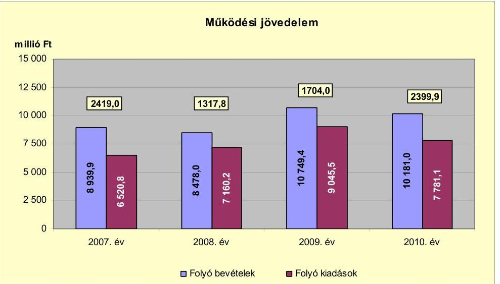

---

A folyó költségvetés egyenlege a 2007-2010. években változó nagyságrendű pozitív összeget, összesen 7840,7 millió Ft forrástöbbletet mutatott, amely az Önkormányzat számára fedezetül szolgált kötelezettségei megfizetéséhez, valamint a megvalósított fejlesztések finanszírozásához. Az Önkormányzat sem folyószámlahitelt, sem munkabér-megelőlegezési hitelt a vizsgált időszakban nem vett igénybe.

A folyó bevételek összegének emelkedése meghaladta a folyó kiadások összegének növekedését, így a működési jövedelem a 2007-2009. évek átlagához (1813,6 millió Ft-hoz) viszonyítva a 2010. évben 586,3 millió Ft-tal (32,3\%-kal) 2399,9 millió Ft-ra növekedett. Mind a folyó bevételek, mind a folyó kiadások szempontjából kiugróan magas értéket mutatott a 2009. év. A folyó bevételek 2010. évi növekedésében - az ipari parkba költöző új adózók számának az emelkedése - meghatározó volt a 6329,1 millió Ft helyi iparűzési adó bevétel teljesülése, amely 1506,6 millió Ft-tal (31,2\%-kal) haladta meg az előző évit. A folyó kiadásokat a Korshak Kft. - Főtér beruházáshoz kapcsolódó - hiteléhez elhelyezett 2000 millió Ft összegű óvadéki betét emelte meg. A megkötött óvadéki szerződés értelmében az elhelyezett óvadéki összegre a pénzintézet évi 7,5\% kamatot fizetett, amely az Önkormányzat költségvetési számláján íródott jóvá. A lekötés a 2010. évben lejárt, az óvadékot visszafizették. A folyó bevételek között kimutatott költségvetési támogatásból a 2008. évben 13,0 millió Ft, a 2009. évben 5,9 millió Ft, a 2010. évben 4,2 millió Ft volt a működési célra kapott vis major támogatás, amelynek mértéke az Önkormányzat folyó bevételéhez képest elhanyagolható mértéket (0,1-0,2\%-os) jelentett. A vizsgált időszakban 1244,8 millió Ft fordított áfa bevétel keletkezett, amely azonban csak technikailag növelte a bevételeket és a kiadásokat.

Az Önkormányzat pénzügyi kapacitása (nettó működési jövedelme) a folyó költségvetési pozíciót tükrözi a vizsgált időszakban, mivel tőketörlesztési kötelezettsége 2007-2010 között egyik évben sem volt. A nettó működési jövedelem alakulását a 2007-2010. évek között a következő ábra szemlélteti:
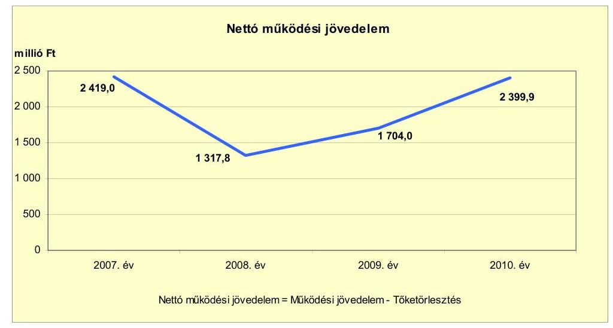

A nettó működési jövedelem minden évben pozitív volt, azonban a 2007. évi 2419,0 millió Ft-ról a 2008. évre 1101,2 millió Ft-tal közel felére, 1317,8 millió Ft-ra csökkent. A csökkenést befolyásolta, hogy a 2008. évben a

---

folyó bevételek (8478,0 millió Ft) 5,2\%-kal (461,9 millió Ft-tal) maradtak el a 2007. évhez (8939,9 millió Ft-hoz) képest, amelynek hátterében elsősorban a helyi adóbevételek visszaesése állt. Ugyanakkor a folyó kiadások (7160,2 millió Ft) 9,8\%-kal (639,4 millió Ft-tal) emelkedtek az előző év 6520,8 millió Ft-os összegéhez képest. Hátterében elsősorban az előző évhez képest a 2008. évi személyi juttatások és járulékaik (3026,6 millió Ft-ról 3281,6 millió Ft-ra), valamint a dologi kiadások (2453,4 millió Ft-ról 2789,0 millió Ft-ra) emelkedése állt. A 2009. évben a folyó bevételek növekedése meghaladta a folyó kiadások növekedését. A 2010. évben - az előző évhez képest - már 40,8\%-kal, 695,9 millió Ft-tal (2399,9 millió Ft-ra) nőtt a működési jövedelem. A 2009. évhez (10 749,4 millió Ft-hoz) viszonyítva 568,4 millió Ft folyó bevételkiesés keletkezett, ugyanakkor a folyó kiadások erőteljes, (1264,4 millió Ft-os) csökkenése eredményezte a működési jövedelem emelkedését. A bevételkiesés jelentős része - a hatósági adóellenőrzések, illetve adófeltöltések miatti visszafizetés következtében - a helyi iparűzési adónemet érintette. A kiadások csökkenésének hátterében a Főtér beruházáshoz kapcsolódóan előző évben elhelyezett két milliárd forint összegű óvadék torzító hatásának megszűnése állt.

Az Önkormányzat felhalmozási költségvetésének egyenlege mind a négy évben negatív összegű volt. A felhalmozási költségvetés bevételeit, kiadásait és egyenlegét a 2007-2010. évek között a következő ábra szemlélteti:
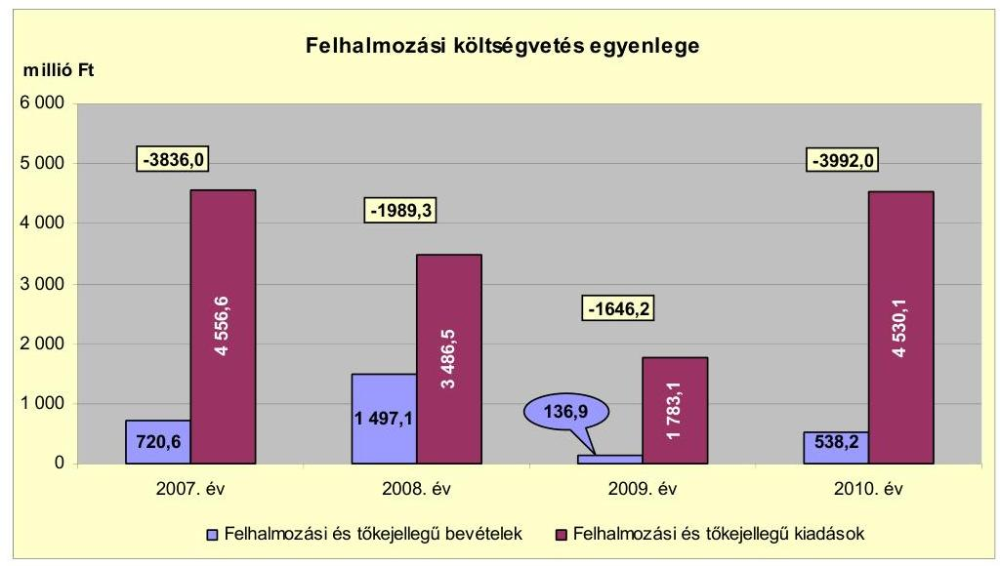

Az áttekintett időszakban a felhalmozási kiadások minden évben meghaladták a felhalmozási bevételeket. A felhalmozási bevételek a 20072010. évek között jellemzően pályázaton elnyert állami támogatásból, részvényértékesítésből befolyó bevételekből, befektetési célú részesedések után kapott osztalékbevételekből ${ }^{19}$, államkötvények kamatából, illetve kizárólagos tulajdonú gazdasági társaságnál végrehajtott tőkekivonásból származtak. A 2007. és a 2010. években jelentkező forráshiányt több magas bekerülési költségű felújítás, beruházás, valamint telekvásárlás miatti felhalmozási kiadás

[^0]
[^0]:    ${ }^{19}$ A 2007-2010 között keletkezett osztalékbevételek az ELMŰ Nyrt. (38,1 millió Ft), a Mátrai Erőmű Zrt. (0,3 millió Ft) voltak.

---

okozta. A 2007. év legjelentősebb összegű beruházásai a Matrica Múzeum felújítása (330,8 millió Ft), Média Civil Központ felújítása, (139,2 millió Ft), út- és járdarekonstrukciós munkák (184,9 millió Ft), valamint a városi csapadékvíz kiépítési projekt (371,3 millió Ft) voltak. A 2010. év legjelentősebb beruházásai a VSZK strand, sportpálya és sportcsarnok felújítása (85,2 millió Ft), a Polgármesteri hivatal épület felújítása (43,9 millió Ft), út- és járdarekonstrukciós munkálatok (388,0 millió Ft), általános iskolák akadálymentesítése (292,7 millió Ft), valamint a Szent István tér és Barátság Művelődési Központ rekonstrukciója (2501,9 millió Ft) voltak.

A felhalmozási forráshiányt a 2007-2009. években az adott év nettó működési jövedelme és a finanszírozási műveletek pozitív egyenlege finanszírozta. A 2010. évben az Önkormányzat nettó működési jövedelme (2399,9 millió Ft) és pénzügyi eredményének ( $-767,9$ millió Ft) együttes összege már nem lett volna elegendő a felhalmozási költségvetés 3992,0 millió Ft-os forráshiányának finanszírozására, azonban arra az előző években megképződött működési jövedelme fedezetet nyújtott.

Az Önkormányzat teljes finanszírozási hiánya ${ }^{20}$ a CLF módszer szerint a 2007. évben 1417,0 millió Ft, a 2008. évben 671,5 millió Ft, míg a 2010. évben 1592,1 millió Ft volt. A 2009. évben 57,7 millió Ft finanszírozási többlet keletkezett. Az Önkormányzat finanszírozási célú műveleteinek egyenlegét a vizsgált időszakban az alábbi ábra szemlélteti:
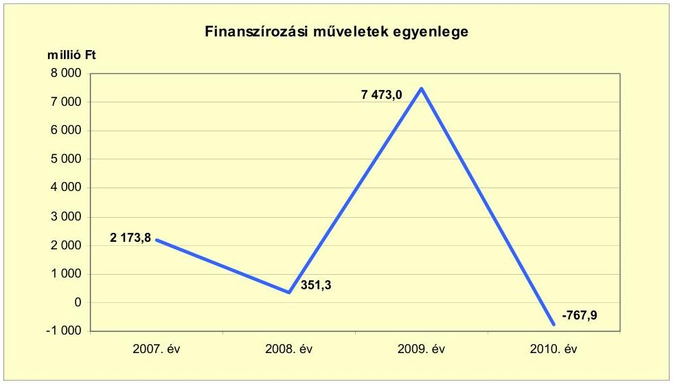

A finanszírozási célú műveletek pozitív egyenlege 2007-2009. években azt mutatja, hogy az éves költségvetések végrehajtása során szükség volt az előző években keletkezett szabad pénzmaradvány igénybevételén túl a forgatási és befektetési célú értékpapírok - Magyar Államkötvény és diszkont kincstárjegyek - repó-ügyletek ${ }^{21}$ keretében történő értékesítésén keresztül külső forrás igénybevételére is. A vizsgált időszakban hitelfelvételre, kötvénykibocsátásra nem került sor. A 2010. évben keletkezett 767,9 millió Ft-os negatív egyenleg a függő,

[^0]
[^0]:    ${ }^{20}$ a nettó működési jövedelem és a felhalmozási költségvetés eredője
    ${ }^{21}$ értékpapír-visszavásárlási megállapodás

---

átfutó, kiegyenlítő tételek egyenlege ${ }^{22}$, a bevételeket meghaladó kiadások következménye. A finanszírozási célú műveleteket a jelentés 2. számú mellékletének 4.1.-4.8. pontjai részletezik.

Az Önkormányzat zárszámadási rendeleteiben a működési és a felhalmozási hiányt a CLF módszertől eltérő szerkezetben mutatta be ${ }^{23}$, amelyről a jelentés 1. számú melléklete nyújt tájékoztatást. A 2007. és a 2010. évi zárszámadási rendeletekben - az Önkormányzat adatszolgáltatása szerint - forráshiányt mutattak ki. A Képviselő-testület a 2007. évben 915,1 millió Ft bevételi hiánnyal fogadta el a zárszámadási rendeletet, amely 2003,7 millió Ft működési többletből és 2918,8 millió Ft felhalmozási forráshiányból adódott. A 2010. évben realizált 140,9 millió Ft működési többlet szintén nem kompenzálta a beruházások miatt kialakult 1733,0 millió Ft felhalmozási hiányt, így az Önkormányzatnál összesen 1592,1 millió Ft forráshiány jelentkezett.

Az Önkormányzat kamatbevételeit a 2007-2011. év I. féléve között évenként a következő ábra mutatja be:
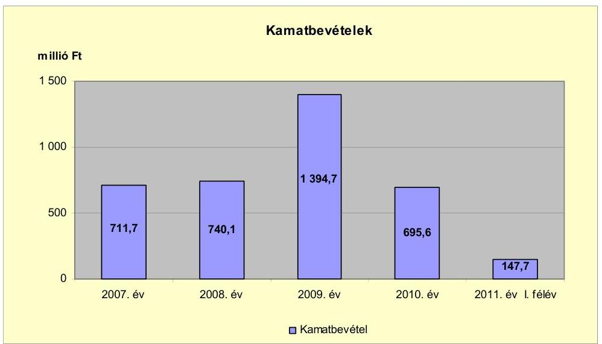

Az Önkormányzat hitellel és kötvénnyel sem rendelkezett, lejárt szállítói tartozása nem volt, így a vizsgált időszakban kamatfizetési kötelezettsége nem keletkezett. Az átmenetileg szabad pénzeszközei lekötése után kapott, kamat, illetve a forgatási és befektetési célú értékpapírok hozamaiból keletkezett bevétel az áttekintett időszakban 3689,8 millió Ft-ot jelentett, amelyet az Önkormányzat a működési kiadások finanszírozására fordította. A 2009. évben realizált kiugróan magas 1394,7 millió Ft összegű kamatbevételek hátterében az államkötvények és diszkont kincstárjegyek beváltása állt. Az Önkormányzat számára előnyösebb volt az így befolyt összeg bankbetétben történő elhelyezése.

[^0]
[^0]:    ${ }^{22}$ A támogatásból megvalósuló, műszakilag befejezett, de pénzügyileg le nem zárt projektek esetében a támogatás beérkezéséig a kiadások összegéből csak az önerő kerül elszámolásra, a támogatási rész a függő tételek között szerepelt a támogatás beérkezéséig.
    ${ }^{23}$ Nincs kötelező előírás a működési és felhalmozási hiány megállapításának módjára.

---

# 2.2. Az Önkormányzat bevételeinek változása 

Az Önkormányzat folyó bevételei a 2010. évben 10 181,0 millió Ft összegben 4,8\%-kal (791,9 millió Ft-tal) haladták meg a 2007-2009. évek átlagát (9389,1 millió Ft-ot). A 2011. év I. félévében a folyó bevétel 4707,0 millió Ft összegben teljesült. A növekedés hátterében elsősorban a helyi adóbevételek, főként a helyi iparűzési adóból befolyt bevételek emelkedése állt. Az Önkormányzat a 2007-2011. év I. félév között realizált folyó bevételeinek kiemelt számszaki adatait a következő ábra mutatja be:
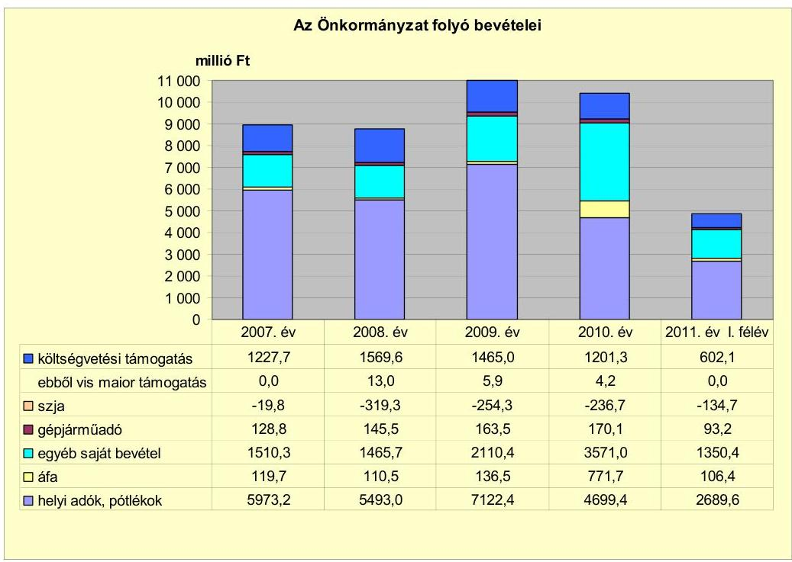

A költségvetési támogatások és az átengedett szja együttes értéke a 2007-2009. években átlagosan 1229,3 millió Ft, a 2010. évben 968,8 millió Ft, a 2011. év I. félévében 467,4 millió Ft volt. Az átengedett bevételek esetében az elszámolási szabályok változása miatt a 2007-2010. közötti időszakban összesen 750,9 millió Ft szja bevételkiesés keletkezett. Az Önkormányzatnál a bevételkiesést a költségvetési támogatásából befolyt 575,9 millió Ft-os többlet amelyből 27,8 millió Ft az óvodai és tanulói létszám emelkedésének eredménye - nem ellensúlyozta. A költségvetési támogatások és az átengedett szja együttes összege a 2008. évben volt a legmagasabb, 1263,3 millió Ft értékben, amely elsősorban a központi támogatások előző évhez viszonyított 354,9 millió Ft-os növekedésére vezethető vissza. Az Önkormányzatnak a költségvetési támogatások és az átengedett szja jogcímeken a 2010. évben együttesen 968,8 millió Ft bevétele keletkezett, amelynek oka, hogy az Önkormányzat az szja tekintetében továbbra is befizető pozícióban volt. Emellett a költségvetési támogatásokból befolyt bevételek a 2007-2009. évek átlagához (1427,1 millió Ft) képest 221,6 millió Ft-tal (5,5\%-kal) 1205,5 millió Ft-ra estek vissza. Az átengedett szja és a költségvetési támogatások együttes összege 2007-2010 között a bázisévhez (2007. évhez) viszonyítva összesen 175,0 millió Ft kumulált bevételkiesést eredményezett.

---

Az átengedett központi adók közül a gépjárműadóból befolyt bevételek az áttekintett időszakban növekvő tendenciát mutattak, amelyből az Önkormányzat 2007-2010 között a bázisévhez (2007. évhez) viszonyítva 92,7 millió Ft kumulált bevételi többletet realizált. A gépjárműadóból befolyt bevételek az áttekintett időszakban - az autópark bővülésének következtében - folyamatosan emelkedtek, a 2010. évben érték el a legmagasabb 170,1 millió Ft-os összeget.

Az Önkormányzat 2007-2010 között négy helyi adót - a telekadót, az építményadót, a vállalkozók kommunális adóját és az iparűzési adót - vetett ki. Az Önkormányzat folyó bevételének a helyi adó bevételek a 2007. évben 66,8\%-át (5973,2 millió Ft-ot), és a 2010. évben 46,2\%-át (4699,4 millió Ft-ot) tették ki. A 2009. évben befolyt 7122,4 millió Ft helyi adóbevételek jelentős része (6329,1 millió Ft) a helyi iparűzési adóból keletkezett. A helyi iparűzési adó mértékében ( $2,0 \%$ ) a vizsgált időszakban változás nem következett be. A helyi adó többletbevétele az ipari parkba költöző új adózóknak köszönhető, az adóalanyok gazdasági válság előtti prosperálását tükrözi. A helyi adóbevételek, így az iparűzési adóbevételek 2010. évi csökkenése a gazdasági válság negatív hatásával függ össze.

Az Önkormányzat a kizárólagos tulajdonú gazdasági társaságainak működésének eredményéből osztalékban nem részesült 2007-2010 között.

Az Önkormányzat felhalmozási bevételeit a vizsgált időszakban az alábbi táblázat szemlélteti:
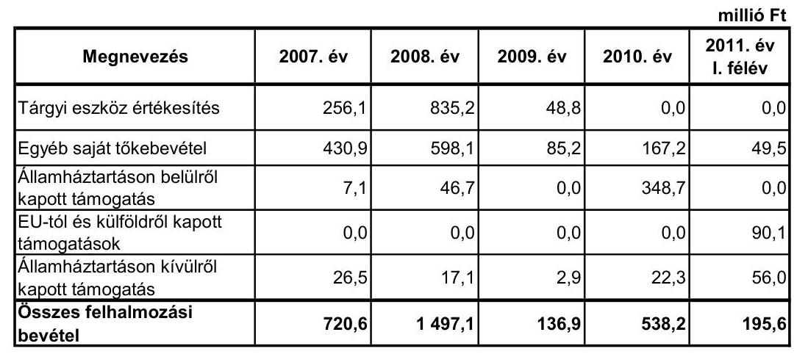

Az Önkormányzat összes felhalmozási célú bevétele a 2007-2009. években átlagosan 784,9 millió Ft volt, amely - 246,7 millió Ft-tal (31,4\%-kal) - 538,2 millió Ft-ra csökkent a 2010. évre.

A felhalmozási bevételeken belül a tárgyi eszközértékesítés, valamint az egyéb saját tőkebevételek képviselték a legmagasabb - a vizsgált időszak átlagában mintegy $80,0 \%$-os - részarányt. Telek és ingatlan, továbbá egyéb tárgyi eszköz értékesítéséből, valamint állami támogatásból a 20072011. év I. féléve között 1140,1 millió Ft bevétel keletkezett. A részvényértékesítésből, befektetési célú részesedések után kapott osztalékbevételből, továbbá egy kizárólagos tulajdonú gazdasági társaságnál a 2008. évben végrehajtott 500,0 millió Ft összegű tőkekivonásból, valamint az államkötvények kamatából összesen 1330,9 millió Ft egyéb saját tőkebevétel származott. A 2007-2008.

---

években kimutatott tárgyi eszközértékesítésből az ingatlan és telekértékesítés mellett a legjelentősebb tétel, összesen 1057,7 millió Ft a társasházak országos 1/3-os energiatakarékossági pályázaton elnyert állami támogatásból ${ }^{24}$ származott, amely növelte az Önkormányzat felhalmozási bevételeit. Az egyéb saját tőkebevételek többnyire részvényértékesítésből, az Önkormányzat befektetési célú részesedései után kapott osztalék bevételből, valamint az államkötvények kamatából származtak. Az áttekintett időszakban az Önkormányzat a BATTAINVEST Kft. jegyzett tőkéjének leszállításáról döntött. A tőkekivonás eredményeként a 2008. évben az Önkormányzatnak 500,0 millió Ft tőkebevétele keletkezett, amely a vizsgált időszakban realizált összes egyéb saját tőkebevétel $37,6 \%$-át tette ki.

# 2.3. Az Önkormányzat működési és a felhalmozási célú kiadásainak változása 

A vizsgált időszakban az Önkormányzat folyó kiadásai főbb jogcímek szerinti bontásban az alábbiak voltak:

| Megnevezés | 2007. év | 2008. év | 2009. év | 2010. év | 2011. év   I. félév |
| :--: | :--: | :--: | :--: | :--: | :--: |
| Folyó kiadások | 6520,8 | 7160,2 | 9045,5 | 7781,1 | 3512,5 |
| Működési kiadások (kamatkiadás nélkül) | 5816,3 | 6396,7 | 6431,7 | 7010,1 | 3126,8 |
| Államháztartáson belülre átadott pénzeszközök | 11,0 | 9,0 | 12,0 | 13,0 | 3,0 |
| Transzferkiadások | 693,5 | 754,5 | 2601,7 | 758,0 | 382,8 |
| -ebből: vállalkozásoknak | 264,0 | 286,8 | 2164,8 | 239,9 | 119,3 |
| EU-nak, illetve külföldre | 1,2 | 0,0 | 0,0 | 0,0 | 0,0 |
| magánszemélyeknek | 160,1 | 170,5 | 191,0 | 208,5 | 115,5 |
| nonprofit szervezeteknek | 268,2 | 297,2 | 245,9 | 309,6 | 148,0 |
| Kamatkiadások | 0,0 | 0,0 | 0,0 | 0,0 | 0,0 |
| Előző évi pénzmaradvány átadás | 0,0 | 0,0 | 0,0 | 0,0 | 0,0 |

Az Önkormányzat teljesített folyó kiadásai a 2010. évben 2,7\%-kal (205,6 millió Ft-tal) 7781,1 millió Ft-ra nőttek az előző három év 7575,5 millió Ft-os átlagához viszonyítva. A folyó kiadások a 2009. évben voltak a legmagasabbak 9045,5 millió Ft összeggel, amelynek oka, hogy a Korshak Kft. hiteléhez kapcsolódóan az Önkormányzat két milliárd forint összegű óvadéki betétet helyezett el. A működési kiadások a 2007-2009. évek átlagához (6214,9 millió Fthoz) viszonyítva 795,2 millió Ft-tal (12,8\%-kal) 7010,1 millió Ft-ra nőttek a 2010. évben. Az államháztartáson belülre átadott pénzeszközök, valamint az EU-nak, illetve külföldre teljesített transzferkiadások ${ }^{25}$ összege a vizsgált időszak

[^0]
[^0]:    ${ }^{24}$ Az állami támogatás összege az Önkormányzat adatszolgáltatása és könyvviteli elszámolása szerint a tárgyi eszközök és immateriális javak értékesítése között került elszámolásra.
    ${ }^{25}$ Az Önkormányzat az árvíz sújtotta Székelyudvarhely részére - a 2006. évben - egymillió Ft támogatást hagyott jóvá, amely felhasználására üzemanyagkártyát biztosított. A támogatási hitelkeretet a támogatott 1,2 millió Ft értékben vette igénybe, így a különbözetet ( 0,2 millió Ft-ot) a Képviselő-testület a 2007. évi költségvetésben biztosította. További egy millió Ft támogatást hagytak jóvá a 2007. évben a Görögországot sújtó természeti katasztrófa károsultjai számára.

---

átlagában alig változott, mértékük az Önkormányzat költségvetéséhez viszonyítva elhanyagolható. Az áttekintett időszakban a magánszemélyeknek és nonprofit szervezeteknek nyújtott támogatások növekedtek, a 2010. évben összesen elérték az 518,1 millió Ft-ot, amely a 2007-2009. évek átlagához (444,3 millió Ft-hoz) viszonyítva 16,6\%-os ( 73,8 millió Ft-os) növekedést jelentett. Hátterében részben a támogatott alapítványok, egyesületek és egyéb nonprofit szervezetek számának emelkedése, a megítélt támogatások magasabb összege állt, továbbá az ellátottak számának emelkedése, valamint az Önkormányzat által nyújtott újonnan bevezetett támogatási formák - óvodáztatási és közlekedési támogatás - voltak.

A vizsgált időszakban az Önkormányzat kiemelt kiadási előirányzatainak teljesülését az alábbi táblázat szemlélteti:

|  |  |  |  |  | millió Ft |
| :-- | --: | --: | --: | --: | --: |
| Megnevezés | 2007. év | 2008. év | 2009. év | 2010. év | 2011. év   I. félév |
| Személyi juttatások | 2310,0 | 2516,1 | 2510,8 | 2540,1 | 1139,5 |
| Munkaadót terhelő járulékok | 716,6 | 765,5 | 737,6 | 637,4 | 296,7 |
| Dologi kiadások | 2453,4 | 2789,0 | 2951,2 | 3531,1 | 1528,6 |
| Egyéb folyó kiadások | 136,3 | 277,7 | 62,2 | 170,8 | 44,6 |

A személyi juttatások és járulékok folyó kiadásokon belüli aránya 20072009. években folyamatosan csökkent, 2007-ben 46,4\% (3026,6, millió Ft), 2008-ban 45,8\% (3281,6 millió Ft), 2009-ben 35,9\% (3248,4 millió Ft) volt. A 2010. évben a személyi juttatások és járulékok 3177,5 millió Ft összege a 20072009. évek átlagához ( 3185,5 millió Ft) viszonyítva 8,0 millió Ft-os ( $0,3 \%$-os) csökkenést jelentett. A 2008. évben 3281,6 millió Ft személyi juttatások és munkaadót terhelő járulékok emelkedését a Polgármesteri hivatalnál és az intézményeknél dolgozó köztisztviselők és közalkalmazottak 4,5\%-os illetményfejlesztése, valamint jutalom és béren kívüli juttatások kifizetései eredményezték.

Az Önkormányzatnál a dologi kiadások a 2010. évi 3531,1 millió Ft összege a 2007-2009. évek átlagához (2731,2 millió Ft) viszonyítva 799,9 millió Ft (29,3\%) növekedést jelent. Hátterében elsősorban a fordított áfa befizetések emelkedése állt.

A folyó és a felhalmozási kiadásokat a vizsgált időszakban az alábbi ábra szemlélteti:

---

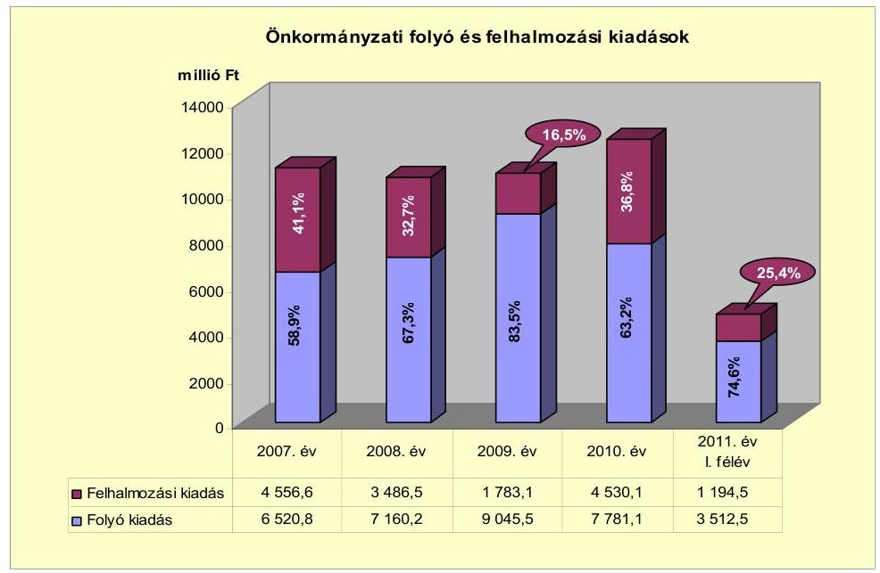

A felhalmozási kiadások aránya az összes kiadáson belül a 2007-2009. évek 30,2\%-os átlagáról ( 3275,4 millió Ft-ról), a 2010. évre 36,8\%-ra (4530,1 millió Ft-ra) nőtt. A felhalmozási kiadások összege a 2007. és a 2010. években volt a legmagasabb 4556,6 millió Ft, valamint 4530,1 millió Ft összegben. A felhalmozási kiadások részaránya az összes kiadás tekintetében a 2007. évben $41,4 \%$, míg a 2010. évben $36,8 \%$ volt. Tekintettel arra, hogy a beruházások nagy része a 2010. évben befejeződött, a folyamatban lévő beruházásokból eredő felhalmozási kiadások a 2011. év I. félévében 1194,5 millió Ft-ra mérséklődtek és az összes kiadás $25,4 \%$-ára estek vissza.

Az Önkormányzat 2007-2010 között bruttó 9798,7 millió Ft teljes bekerülési költségű felújítást és beruházást valósított meg, amelynek forrásösszetétele 8771,4 millió Ft saját erő, 962,9 millió Ft EU-s és 64,4 millió Ft hazai támogatás. A tényleges pénzügyi teljesítés 2010. december 31-ig 9056,7 millió Ft volt, mivel a műszakilag befejezett beruházáshoz kapcsolódó szerződések alapján benyújtott egyes számlák pénzügyi teljesítése áthúzódott a 2011. évre, illetve a pályázati támogatás nem érkezett be. Az önkormányzati fejlesztések döntően középületek és közterületek felújításából, intézmények korszerűsítéséből, infrastrukturális fejlesztésekből, valamint gépek, berendezések beszerzéséből tevődtek össze. Az Önkormányzat a 2007-2010. években megvalósított, 2010. december 31-ig befejezett fejlesztéseit és azok forrásösszetételét a jelentés 3/a. számú melléklete tartalmazza.

A 2010. december 31-éig befejezett, egyenként 10,0 millió Ft feletti bekerülési költségű önálló felújítások, illetve beruházások közül a legjelentősebbek az alábbiak voltak:

- A 2010. évben megvalósított út- és járdarekonstrukciós munkák teljes bekerülési költsége 388,0 millió Ft volt, amelyet az Önkormányzat teljes egészében saját forrásból finanszírozott. A beruházás a tervezett műszaki tartalommal és bekerülési költséggel valósult meg, a műszaki átadás-átvételre a szerződésben rögzített 2010. augusztus 17-i teljesítési határidőig sor került. A beruházás keretében megtörtént a Damjanich utca teljes felújítása. A teljes

---

út- és járdaburkolat elbontásra került, új pályaszerkezet készült, továbbá új csapadékvíz csatorna épült meg. A műszaki átadás-átvételi eljárást követően az érintett hatóságok a forgalomba helyezési engedélyt, valamint a vízjogi üzemeltetési engedélyt kiadták.

- Az Önkormányzat a Főtér rekonstrukciójához kapcsolódóan a 2009. december 15-én kelt támogató levél értelmében összesen 833,3 millió Ft vissza nem térítendő EU-s támogatást nyert. A „Százhalombatta Város Önkormányzatának Szent István Tér rekonstrukciója érdekében végrehajtott integrált fejlesztése" tárgyú KMOP-5.2.1/B-2f-2009-0004 azonosító számú projekt Támogatási Szerződésének megkötésére 2010. február hónapban került sor. A projekt a tervezett műszaki tartalommal valósult meg, amelynek keretében megújult a Szent István Tér és sor került a Barátság Művelődési Központ rekonstrukciójára, azonban a projekt pénzügyi elszámolása, adminisztratív zárása még folyamatban van. A beruházás teljes bekerülési költsége 2501,9 millió Ft, a projekt elszámolható költsége 2045,0 millió Ft volt, az el nem számolható költségek az Önkormányzat által biztosítandó saját forrás arányát növelték. A beruházás forrása a fentiek értelmében 805,3 millió Ft (32,2\%) EU támogatás, amelyhez az Önkormányzat 1696,6 millió Ft (67,8\%) saját bevételt biztosított.

Az Önkormányzat folyamatban lévő beruházásainak, felújításainak várható teljes bekerülési költsége 1740,4 millió Ft, amelyből a 2010. december 31-ig pénzügyileg teljesített kiadás összege 41,6 millió Ft volt. A 2010. évet követő kötelezettségvállalásainak összege 1687,3 millió Ft, amelyből 1011,9 millió Ft-ot ( $60,0 \%$-ot) saját forrásból, valamint 675,4 millió Ft-ot ( $40,0 \%$-ot) EU-s támogatásból terveznek biztosítani. A legnagyobb - mintegy 480,8 millió Ft teljes bekerülési költségű folyamatban lévő beruházás az Óvárosi Óvoda létesítése. Az Önkormányzat folyamatban lévő fejlesztéseit és azok forrásösszetételét a jelentés 3/b. és 3/c. számú mellékletei tartalmazzák.

- A zöldmezős beruházás keretében az Óváros városrészben $1182,8 \mathrm{~m}^{2}$ hasznos alapterületű óvoda teljes körű kivitelezésére kerül sor, amelyre vonatkozóan az Önkormányzat a közbeszerzési eljárást a 2010. évben lefolytatta, a nyertes ajánlattevővel a szerződést megkötötte. A beruházás forrása teljes mértékben saját bevétel volt, a megvalósításhoz külső forrást az Önkormányzat nem igényelt. A teljesített kiadások összege 2007-2010 között 2,0 millió Ft volt. Az óvoda létesítéséhez kapcsolódó 2010. évet követő kötelezettségvállalások összege 480,8 millió Ft, forrása az Önkormányzat saját bevétele.

Az Önkormányzatnak a vizsgált időszakban egy beadott, elbírálás alatt álló pályázata volt. Az Önkormányzat 2011. április hónapban nyújtott be pályázatot - az önkormányzati feladatellátást szolgáló fejlesztéshez kapcsolódó központosított előirányzatokból származó támogatás igénybevételének részletes feltételeiről szóló 7/2011. (III. 9.) BM rendelet alapján - iskolai és utánpótlás sport infrastruktúra-fejlesztés és felújítás támogatására. Az Önkormányzat beadott, elbírálás alatt álló pályázati forrásból megvalósítani tervezett fejlesztéseihez kapcsolódó kötelezettségvállalásait és azok forrásösszetételét a jelentés 3/d. számú melléklete tartalmazza.

---

- A pályázat keretében a Kőrösi Csoma Sándor Általános Iskola és Alapfokú Művészetoktatási Intézményben a tornaterem és gyógytornaterem padlóburkolatának cseréjét és a világítási rendszer korszerűsítését, valamint sporteszközök beszerzését tervezik megvalósítani. A beruházásnak köszönhetően egy magas műszaki színvonalú, akadálymentes tornaterem és gyógytornaterem jönne létre, amely nemcsak az iskolai testnevelés, de a városi tömeg- és egyesületi sport igényeit is kiszolgálja. A pályázati forrásból tervezett fejlesztéshez kapcsolódóan a 2010. évet követően az Önkormányzatnak 15,0 millió Ft kötelezettségvállalása keletkezett, amelynek forrása 3,0 millió Ft $(20,0 \%)$ saját bevétel és 12,0 millió Ft $(80,0 \%)$ hazai támogatás.

Az Önkormányzat által gazdasági társaságoknak átadott pénzeszközök összegét 2007. év és 2011. év I. félév között a következő ábra szemlélteti:
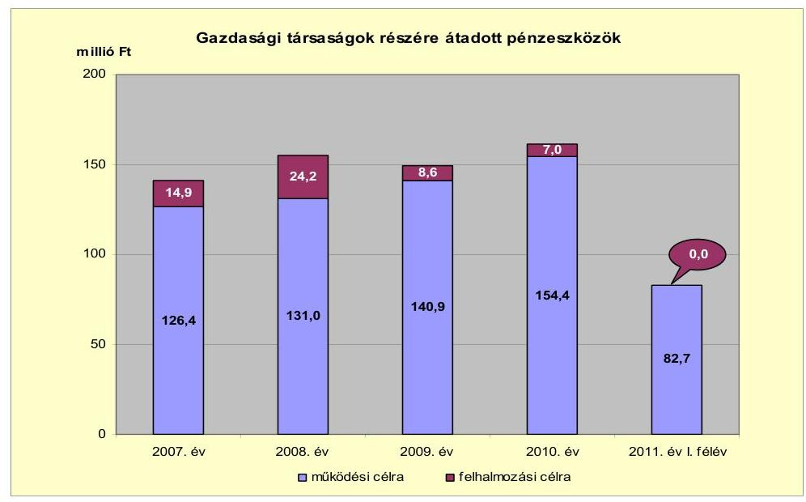

A vizsgált időszakban az Önkormányzat a kizárólagos tulajdonú gazdasági társaságai közül a Korshak Kft., a PROMOTION SERVICE Kft., a Halom Televízió Kft., valamint a BATTA-INVEST Kft. részére - a támogatási szerződésben meghatározott célra - összesen 513,4 millió Ft-ot adott át a társaságok üzleti tervében szereplő működési költségek biztosítására. Felhalmozási célú pénzeszköz átadásban a PROMOTION SERVICE Kft., a Halom Televízió Kft., valamint a BATTA-INVEST Kft. részesült összesen 54,7 millió Ft összegben, amelyet eszközbeszerzésre fordítottak. A kötelező közfeladat ellátásban résztvevő PRO-MED Bt. részére működési célra átadott 122,0 millió Ft fedezetet nyújtott a kötelező orvosi ügyeleti ellátás biztosítására. Az Önkormányzat az átadott pénzeszközök célszerinti felhasználását ellenőrizte.

---

# 3. Az ÖNKORMÁNYZAT KÖTELEZETTSÉGEI 

### 3.1. Az Önkormányzat pénzintézetekkel szembeni kötelezettségeinek változása

Az Önkormányzatnak a 2007-2011. év I. félévben pénzintézettel szembeni kötelezettségei nem voltak, a helyszíni vizsgálat alatt hitel igénybevételről, illetve kötvénykibocsátásról szóló döntést nem készítettek elő.

Az Önkormányzat egyéb kötelezettségeinek 2010. december 31-i és 2011. június 30-i állományát, valamint azok várható értékeit - a kötelezettség lejártáig - a következő táblázat mutatja be:

| Megnevezés | Állomány   2010.   december 31-én | Állomány   2011. június   30-án | Várható   kötelezettség   a 2011-2013.   években | Várható   kötelezettség   a 2014. évtől |
| :--: | :--: | :--: | :--: | :--: |
|  | HUF-ban   (millió Ft-ban) | HUF-ban   (millió Ft-ban) | HUF-ban   (millió Ft-ban) | HUF-ban   (millió Ft-ban) |
| Biztosítékok: (Garancia) | 124,5 | 98,9 | 36,1 | 62,8 |
| Szállítói tartozás | 71,2 | 1777,3 | 1777,3 | 0,0 |
| Összes kötelezettség: | 195,7 | 1876,2 | 1813,4 | 62,8 |

Az Önkormányzat adatszolgáltatása alapján a szállítói tartozása - a kizárólagos önkormányzati tulajdonú gazdasági társaságok nélkül - a 2010. év végén 71,2 millió Ft, 2011. június 30-án 1777,3 millió Ft volt, amelyek lejárt tartozást nem tartalmaztak. A biztosítékok (garanciák) a városban lévő társasházak, lakásszövetkezetek - közös tulajdonú részeinek felújításához, korszerűsítéséhez felvett - pénzintézeti hiteleihez kapcsolódtak. Az Önkormányzat által - kimutatása szerint - vállalt garanciákból származó kötelezettségének összege 2010. december 31-én (41 kötelezettségvállaláshoz kapcsolódóan) 124,5 millió Ft volt. A 2011. június 30-án fennálló kötelezettségek összege (27 kötelezettségvállaláshoz kapcsolódóan) 98,9 millió Ft-ot tett ki. A 2011. év I. félév végén garanciavállalásból származó kötelezettségekből - a garancianyújtásra vonatkozó szerződések alapján - a 2011-2013. években nyolc db, a 2014. évtől 19 db jár le 36,1 millió Ft, illetve 62,8 millió Ft összegben.

A 2011-2013. években a jelenleg ismert összes kötelezettség (1813,4 millió Ft) teljesítésére figyelembe vehető források: a szállítói tartozásokra az Önkormányzat 2011. évi költségvetésében biztosított forrásokon túl, a 2011. év I. féléves beszámolóban kimutatott 5396,5 millió Ft pénzkészlet; a garancia vállalások fedezetét a már elhelyezett óvadéki betétek biztosítják.

Az Önkormányzatnak a 2014. évtől esedékes jelenleg ismert kötelezettségei 62,8 millió Ft-ot tesznek ki, amelyek garanciavállalásból származnak. Az ezek teljesítésére figyelembe vehető források óvadéki betétként rendelkezésre állnak.

---

# 3.2. A szállítói kötelezettségek változása 

Az Önkormányzat - könyvviteli mérleg szerinti - összes kötelezettségeinek és ezen belül a szállítókkal szemben fennálló kötelezettségeinek állományát az alábbi táblázat tartalmazza:
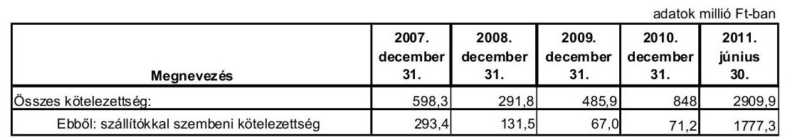

Az Önkormányzat összes kötelezettségének állománya a 2011. év I. félév végén a 2010. év végi állomány több mint 3,4-szeresére (2061,9 millió Ft-tal) nőtt. A kötelezettségállomány növekedését a szállítókkal szembeni tartozások 1706,1 millió Ft-os és az egyéb rövidlejáratú kötelezettségek (még ki nem fizetett működési és felhalmozási célú támogatások) 355,8 millió Ft-os növekedése okozta. A szállítókkal szemben fennálló kötelezettségeinek állománya a 2007. év végi 293,4 millió Ft-ról a 2009. év végére - folyamatos csökkenés mellett 67,0 millió Ft-ra (a 2007. évi állomány 22,8\%-ára) süllyedt. Az állomány a 2010. évi kismértékű (4,2 millió Ft-os, $6,3 \%$-os) emelkedést követően a 2011. év I. félév végére 1777,3 millió Ft-ra (a 2010. év végi állomány közel 25-szörösére) nőtt. A 2011. év I. félév végi nagymértékű (1706,1 millió Ft-os) szállítói állománynövekedést a beruházási szállítók 878,9 millió Ft-os (95,5-szeres), valamint a különböző szolgáltatások igénybe vételéhez és egyéb beszerzésekhez kapcsolódó tartozások 827,2 millió Ft-os (több mint 14-szeres) növekedése okozta. A szállítókkal szemben fennálló kötelezettségek állománya az összes kötelezettségen belül a 2007. évben 49,0\%-ot képviselt, 2008-ban 45,1\%-ot, 2009-ben $13,8 \%$-ot, 2010-ben $8,4 \%$-ot, a 2011. év I. félévében $61,1 \%$-ot tett ki.

A szállítókkal szemben fennálló kötelezettségeken belül átütemezési megállapodással érintett és lejárt tartozások a vizsgált időszakban nem voltak.

Az Önkormányzatnak az áttekintett időszakban egyéb kiadás elmaradásai - ki nem fizetett esedékes személyi jellegű juttatás, munkaadókat terhelő járulékok, peres eljárásokból függő kötelezettség, szállítói késedelmi kamat - nem voltak.

### 3.3. Egyéb kötelezettségek változása

A 2007-2011. év I. félév közötti időszakban az Önkormányzat részéről 42 garanciavállalással kapcsolatos kötelezettségvállalás történt. Az Önkormányzat a 2007. évben 28 db, a 2008. évben 13 db óvadéki betét elhelyezése melletti garanciát vállalt a város területén lévő társasházak, lakásszövetkezetek közös tulajdonú részeinek felújítására, korszerűsítésére felvett hiteleivel kapcsolatban. Az elhelyezett óvadéki betétek összege - az Önkormányzat kimutatása szerint - 2007-ben 116,6 millió Ft, 2008-ban 41,2 millió Ft (összesen 157,8 millió Ft) volt. Az óvadéki betétek összege 2011. június 30-án 98,9 millió Ft-ot tett ki, mivel az adósok hiteltörlesztésének elmaradása miatt az Önkormányzatnak 58,9 millió Ft fizetési kötelezettséget teljesítenie kellett.

---

A 2011. június 30-ig összesen beváltott garancia 14 társasház esetében teljes körű volt, amelyek az Önkormányzatnak 40,3 millió Ft kiadást jelentettek. Részleges garancia beváltásra 14 társasház hiteléhez kapcsolódóan került sor, összesen 18,6 millió Ft összegben. Lakásszövetkezetek hiteleihez kapcsolódóan garancia beváltás nem történt 2011. június 30-áig.

Az Önkormányzattal szemben az áttekintett időszakban érvényesített garanciák összegéből 2011. június 30-ig - öt kötelezettségvállaláshoz kapcsoló - összesen 1,1 millió Ft térült meg.

Ugyancsak óvadéki betét melletti garanciát vállalt az Önkormányzat - a 2009. évben - a kizárólagos tulajdonában lévő gazdasági társasága (Korshak Kft.) által, a város főterén megvalósított Főtér Projekt (közművesítés, lakások, üzlet-, és irodahelyiségek, mélygarázs és konferencia központ építése) beruházás megvalósításához felvett hosszú lejáratú hitelhez kapcsolódóan. A vállalt garancia összege 2000,0 millió Ft volt. Az óvadéki szerződés megkötésére 2009. október 20-án, a betét elhelyezésére 2009. október 27-én került sor. Az óvadékul elhelyezett betét lekötésének lejárataként a Kft. által megvalósítandó projekt jogerős használatba vételi engedélyének kiadását követő 30. napot határozták meg. A projekt használatba vételi engedélye 2010. február 3-án jogerőre emelkedett, a pénzintézet az óvadéki betétet felszabadította és 2010. március 3-án jóváírta az Önkormányzat bankszámláján.

Az Önkormányzat 2007-2011. év I. félév között lízingszerződést nem kötött, PPP konstrukció ${ }^{26}$ keretében nem végzett beruházást.

Az Önkormányzatnál a vizsgált időszakban az elengedett követelések összege 4,5 millió Ft volt. Az elengedett követelések 80,6\%-a (3,6 millió Ft) lakbértartozások (lakások, átmeneti szálló), 9,4\%-a (0,4 millió Ft) közműkölcsön tartozások elengedése, 10,0\%-a (0,5 millió Ft) egyéb követelések (bírságok, bérleti díjak, jogtalanul felvett segélyek visszakövetelése) elengedése volt. A döntéshozók - a vagyongazdálkodási rendelet ${ }^{27}$ előírásainak megfelelően - a Képviselőtestület bizottságai és a polgármester voltak.

Az Önkormányzat 2007-2011. év I. félév között intézményei, más önkormányzatok, egyéb (nem többségi tulajdonában lévő) gazdasági társaságok és civil szervezetek számára nem nyújtott kölcsönt.

Az Önkormányzat a többségi tulajdonában lévő gazdasági társaságok közül négy társaság részére összesen nyolc alkalommal nyújtott tagi kölcsönt:

- a BATTA-INVEST Kft. számára - a Matrica Múzeum felújításához - a 2007. július 9-én kelt megállapodás alapján, 2007. szeptember 20-ai lejárattal, 60,5 millió Ft és a 2007. augusztus 28-án kelt megállapodás alapján, 2007. november 30-ai lejárattal, 42,0 millió Ft-ot. A Kft. a kölcsöntartozásokat a megállapodásban rögzítetteknek megfelelően törlesztette;

- a PROMOTION SERVICE Kft. részére üzletrész átruházáshoz kapcsolódóan a 2007. december 8-ai megállapodás alapján, 2008. november 30-ai lejárattal, 1,3 millió Ft-ot. A kapott kölcsönt a Kft. a megállapodásban foglalt határidőre visszafizette. Az Önkormányzat még további három alkalommal nyújtott kölcsönt a Kft. számára. A 2010. január 4-én kelt tagi kölcsön szerződés

[^0]
[^0]:    ${ }^{26}$ Public Private Partnership (Partnerségi együttműködés közfeladatok ellátására a magánszektor bevonásával)
    ${ }^{27}$ az Önkormányzat vagyonáról és a vagyonnal való gazdálkodás szabályairól szóló többször módosított 39/1996. (XII. 27.) számú rendelet

--- alapján „a 91.1 frekvencia beindításához" 2,8 millió Ft-ot, a 2010. június 1-jén kelt megállapodás alapján „a Kft. közszolgálati feladatainak ellátására" 6,0 millió Ft-ot, a 2010. augusztus 5-i megállapodás alapján „a frekvenciabővítéshez beadandó pályázathoz szükséges feltételek biztosítására" 20,0 millió Ft-ot. Mindhárom kölcsön esetében a visszafizetés határidejét 2011. december 15-ében határozták meg;
- a SZÁKOM Kft. számára „a folyamatos likviditás biztosítása céljából" a 2010. január 4-én kelt és 2010. október 1-jén módosított megállapodás alapján, 2010. november 30-ai lejáratra - 60,0 millió Ft-ot. A kapott kölcsönt a Kft. határidőben visszafizette;
- a Korshak Kft. részére „a 2011. évi január és február havi zavartalan üzemeltetés érdekében" a 2010. december 20-án kelt megállapodás alapján 31,0 millió Ft-ot, 2011. december 15-ei lejárattal. A kölcsön összege után a Kft. kamatot köteles fizetni, amelynek mértéke - tekintettel a Ptk. 232. § előírásaira megegyezik a jegybanki alapkamattal. A Kft. - adatszolgáltatása szerint 2011. június 30-áig kamat címén 0,4 millió Ft-ot fizetett az Önkormányzatnak.

Az Önkormányzatnak egy jelzáloggal terhelt ingatlana volt 2010. december 31-én. A Képviselő-testület az Önkormányzat gazdasági társasága (Korshak Kft.) beruházási hitelének biztosítékaként 2776 millió Ft értékű jelzálogjog alapításához és bejegyzéséhez járult hozzá. A jelzáloggal érintett forgalomképes ingatlan a 2298/10 helyrajzi számú, 41,0 millió Ft nettó értékű (154,3 millió Ft becsült értékű), beépített terület megnevezésű ingatlan. A jelzálogjogot a Földhivatal 2011. március 31-én törölte az ingatlan tulajdoni lapjáról. Az Önkormányzat összes forgalomképes ingatlanának nettó értéke 2515,8 millió Ft volt 2010. december 31-én.

Az Önkormányzat forgalomképes ingatlanainak 2010. december 31-ei nettó értékéből a jelzáloggal terhelt és a tehermentes (szabad) ingatlanok részarányát az alábbi ábra szemlélteti:

---

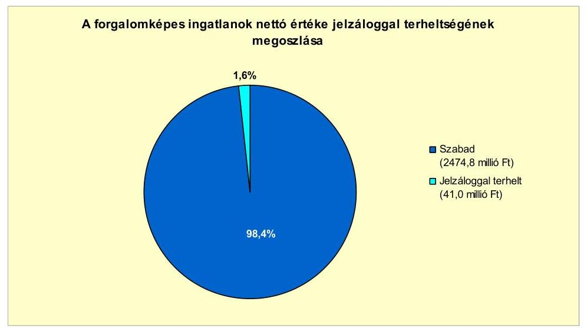

Az Önkormányzat és kizárólagos tulajdonú gazdasági társaságai 2011. június 30-án jogerős határozattal lezárt, de ki nem fizetett peres eljárásban nem voltak érintve. Az Önkormányzat alperesként öt, felperesként egy jogerős határozattal nem lezárt peres eljárásban érintett. A jogerős határozattal nem lezárt peres eljárások perértéke (összesen 184,2 millió Ft) az Önkormányzat alperesi perbeli pozícióban 182,2 millió Ft-ot, felperesi perbeli pozícióban 2,0 millió Ft-ot képvisel. Az Önkormányzat alperesi perbeli pozícióinak perértékéből 82,3\%-ot (150,0 millió Ft-ot) egy ingatlan beruházás kapcsán, a Helyi Építési Szabályzat módosítása okán indított kártérítési per képvisel. Többségi tulajdonú gazdasági társaságai jogerős határozattal nem lezárt peres eljárásban nem voltak érintettek 2011. június 30-án.

Az Önkormányzat kizárólagos tulajdonú gazdasági társaságai kötelezettségeinek 2010. december 31-i és 2011. június 30-i állományát, valamint azok várható értékeit - a felmerülő kamatokat is figyelembe véve - a kötelezettség lejártáig, az alábbi táblázat mutatja be:

| Megnevezés | Állomány   2010. december 31-én |  |  | Állomány   2011. június 30-án |  |  | Várható kötelezettség a 2011-2013.   években |  | Várható kötelezettség a 2014. évtől |  |
| :--: | :--: | :--: | :--: | :--: | :--: | :--: | :--: | :--: | :--: | :--: |
|  | HUF-ban   (millió Ft)   (ezer) | Összegben   (összegig.   szer EUR)   (ezer) |  | Összes   nem | HUF-ban   (millió Ft)   (ezer) | Összegben   (összegig.   szer EUR)   (ezer) |  | HUF-ban   (millió Ft)   (ezer) | Összegben   (összegig.   szer EUR)   (ezer) | HUF-ban   (millió Ft)   (ezer) |
| Pénzintézeti kötelezettségek | 0,0 | 10158,1 | EUR | 0,0 | 9502,7 | EUR | 0,0 | 2203,2 | 0,0 | 12528,1 |
| Lízing kötelezettségek | 0,5 | 0,0 | HUF | 0,1 | 0,0 | HUF | 0,1 | 0,0 | 0,0 | 0,0 |
| Szállítói tartozás | 63,7 | 0,5 | HUF | 40,6 | 0,5 | HUF | 40,6 | 0,5 | 0,0 | 0,0 |
| Összes kötelezettség: HUF-ban | 64,2 |  |  | 40,7 |  |  | 40,7 |  | 0,0 |  |
| Összes kötelezettség: EUR-ban |  | 10158,1 |  |  | 9502,7 |  |  | 2203,2 |  | 12528,7 |

Az Önkormányzatnak 2010. december 31-én hat kizárólagos önkormányzati tulajdonú gazdasági társasága volt. A gazdasági társaságok közül csak egy - a Korshak Kft. - rendelkezett pénzintézeti kötelezettséggel 2010. december 31-én és 2011. június 30-án.

A Korshak Kft. a 2008. augusztus 11-én megkötött szerződéssel 2570,0 millió Ft összegű beruházási hitelt vett fel a Főtér Projekt megvalósítására. A Kft.-ből a 2009. július 28-án kelt szerződéssel kivált a Korshak Capital Kft., a kiválással a

---

hitelszerződés és biztosítékai vonatkozásában jogutód a Korshak Kft. lett. A vagyonmegosztást követően az Önkormányzat a 2010. február 26-án kelt üzletrészátruházási szerződéssel megszerezte a Korshak Kft. 100\%-os tulajdoni hányadát. A hitelszerződést a felek 2010. július 19-én módosították. A módosított szerződésben - többek között - a hitel összegét HUF-ról EUR-ra konvertálták (10 158,1 ezer EUR), valamint rögzítették az EUR-ban esedékes törlesztő részletek időpontjait és összegeit, lehetővé téve az esetleges EUR/HUF devizanemcserét. A 2011. március 31-én és június 30-án esedékes tőketörlesztéseket és kamatfizetéseket a Kft. EUR-ban teljesítette.

A hat kizárólagos tulajdonú gazdasági társaságnak 2010. december 31-én összesen 63,7 millió Ft, 2011. év I. félév végén 40,6 millió Ft összegű szállítói tartozása állt fenn, amelyben a lejárt állomány 9,5 millió Ft, illetve 15,1 millió Ft volt. A gazdasági társaságok közül egy társaság (Halom Televízió Kft.) lízingszerződésből eredő kötelezettséggel is rendelkezett 2011. június 30-án. A Kft. a 2005. augusztus 3-án kelt szerződéssel egy 3,7 millió Ft bruttó értékű személygépkocsit lízingelt 72 hónapos futamidőre. A társaság lízingkötelezettsége 2010. december 31-én 0,5 millió Ft, 2011. június 30-án 0,1 millió Ft volt.

Az Önkormányzat a Gt. 54. § (2) bekezdése alapján korlátlan felelősséggel tartozik azon gazdasági társaságának felszámolása esetében, amelyben az Önkormányzat az 52. § (2) bekezdése szerint a szavazatok legalább 75\%-ával rendelkezik, így minősített befolyásszerzőnek minősül, továbbá a csődeljárásról és a felszámolási eljárásról szóló 1991. évi XLIX. törvény 63. § (2) bekezdése alapján a kizárólagos önkormányzati tulajdonú gazdasági társaságának minden olyan kötelezettségéért, amelynek kielégítését a felszámolási eljárás során az adós társaság vagyona nem fedezi, ha a hitelezőinek a felszámolási eljárás során benyújtott keresete alapján a bíróság - az adós társaság felé érvényesített tartósan hátrányos üzletpolitikájára figyelemmel - megállapítja az önkormányzat korlátlan és teljes felelősségét.

A vizsgált időszakban megtörtént annak felmérése, hogy az eszközök elhasználódása, amortizációja fedezetének biztosítása mekkora forrásokat igényel az Önkormányzatnál. A felújításokra, az eszközök pótlására öt éves - évente felülvizsgált - intézmény felújítási program keretében, elsősorban az intézmények működőképességének biztosítása érdekében, illetve a szakhatósági előírások figyelembevételével került sor. Az Önkormányzat a 2007-2010. években a tárgyi eszközök után 1702,6 millió Ft összegű értékcsökkenést számolt el. Felújításra 1722,6 millió Ft-ot fordítottak. A számvitelben elszámolt beruházások összege 5859,6 millió Ft volt. Az elhasználódott eszközök pótlására az Önkormányzat külön alapot nem hozott létre.

Az eszközök használhatósága is hatást gyakorol az Önkormányzat pénzügyi helyzetére. Az Önkormányzat eszközállományának átlagos használhatósági foka a 2007-2010. évek között 3,1 százalékponttal (87,7\%-ról 84,6\%-ra) csökkent. Ezen belül az átlagos használhatósági fok mutatója a saját használatban lévő eszközök esetében 2,3 százalékponttal (87,2\%-ról 84,9\%-ra), az üzemeltetésre átadott eszközök esetében 6,9 százalékponttal (89,8\%-ról 82,9\%-ra) csökkent. Az átlagos használhatósági fok a 2010. év végén kiugróan alacsony volt az immateriális javak, illetve a járművek eszközcsoportokban (33,7\%, illetve 20,2\%).

---

A vizsgált időszakban megvalósított fejlesztések (5859,6 millió Ft), felújítások (1722,6 millió Ft) az összes eszközállomány átlagos használhatósági fokának alakulására pozitív hatással voltak. A mutató értéke az előző évhez viszonyítva 2008-ban 0,8, 2009-ben 1,4, 2010-ben 0,9 százalékponttal csökkent. A saját használatban lévő eszközök esetében a mutató értéke az előző évihez képest 2008-ra 0,3, 2009-re 1,3, 2010-re 0,7 százalékponttal csökkent.

# 4. A PÉNZÜGYI EGYENSÚLY MEGTEREMTÉSE ÉRDEKÉBEN HOZOTT INTÉZKEDÉSEK 

Az Önkormányzatnál - adatszolgáltatása szerint - a 2007-2011. év I. félév közötti időszakban a kiadáscsökkentő intézkedések következtében összesen 200,6 millió Ft kiadási megtakarítás keletkezett. A kiadási megtakarításból a létszámcsökkentési döntésekhez (a közterület felügyelők létszámának csökkentése) kapcsolódóan 39,9 millió Ft (19,9\%), a többlet juttatások mérséklése következtében 76,4 millió Ft (38,1\%), a helyettesítések miatt 33,9 millió Ft (16,9\%) volt a kiadási megtakarítás. A tiszteletdíjak csökkentése vonzataként 4,0 millió Ft (2,0\%), a beszerzési szerződések felülvizsgálata következtében 2,3 millió Ft (1,1\%), a központosított beszerzések kapcsán 7,8 millió Ft (3,9\%) kiadási megtakarítás keletkezett. A vásárolt közszolgáltatások szűkítése 4,3 millió Ft (2,1\%), az egyéb intézkedés (adójutalék megszüntetése) 32,0 millió Ft (16,0\%) kiadási megtakarítást eredményeztek. A kiadási megtakarítások amelyek egyik évben sem érték el az Önkormányzat költségvetéseiben eredeti előirányzatként tervezett összes költségvetési kiadásának 0,8\%-át - közel egy negyede (23,1\%-a) az önként vállalt feladatokhoz kapcsolódott.
A 2007-2011. év I. félév között végrehajtott kiadáscsökkentő intézkedések eredményeként keletkezett számszerűsített megtakarítások egyes területek közötti megoszlását az alábbi ábra szemlélteti:
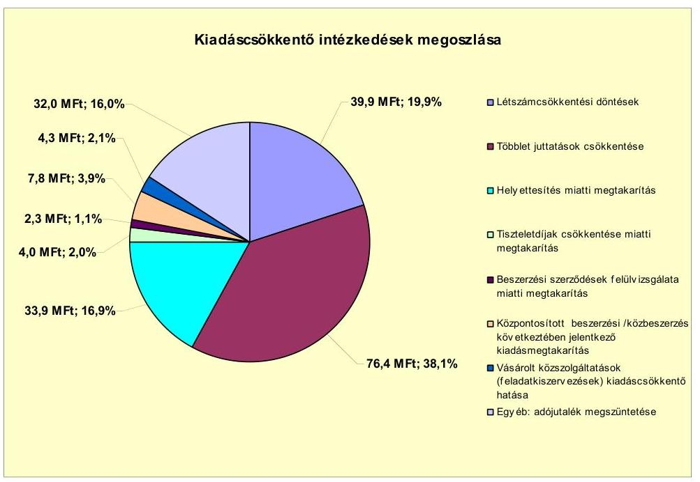

---

Az Önkormányzatnál a 2007-2010 közötti években az álláshely és a létszámváltozásokat az alábbi táblázat mutatja be:

| Megnevezés (száma tízben) | Közoktatás | Szociális és gyermekvédelmi | Egészségügy | Polgármesteri hivatal | Egyéb | Összesen |
| :--: | :--: | :--: | :--: | :--: | :--: | :--: |
| 2007. január 1-jén jóváhagyott álláshelyek száma | 410 | 97 | 0 | 151 | 127 | 785 |
| Megszüntetett álláshelyek száma | 2 | 6 | 0 | 20 | 0 | 28 |
| ebből üres álláshelyek száma | 0 | 0 | 0 | 16 | 0 | 16 |
| szakmai álláshelyek száma | 0 | 6 | 0 | 0 | 0 | 6 |
| Vállomány-csámadtatással kapcsolatos álláshelyek száma | 2 | 0 | 0 | 0 | 0 | 2 |
| Álláshely növekedése | 22 | 17 | 0 | 0 | 0 | 39 |
| 2010. december 31-én záró álláshelyek száma | 433 | 106 | 0 | 131 | 130 | 830 |
| 2007. január 1-jén foglalkoztatott létszám | 410 | 97 | 0 | 122 | 127 | 756 |
| Létszámcsökkenés | 2 | 6 | 0 | 6 | 0 | 14 |
| Létszámnövekedés | 22 | 17 | 0 | 10 | 0 | 49 |
| 2010. december 31-én foglalkoztatott létszám | | 433 | 106 | 0 | 126 | 130 | 757 |

A Képviselő-testület által engedélyezett álláshelyek száma a 2007-2010. évek között - 28 álláshely megszüntetést és 42 új álláshely létesítést követően - összességében 14-el nőtt. A legtöbb új álláshely a közoktatásban (22 álláshely, $52,4 \%$ ) létesült. Az általános és középiskolai oktatási, valamint az óvodai nevelési feladatok bővülése miatt négy fejlesztő pedagógusi, három iskolapszichológusi, kettő konduktori, egy logopédusi, kilenc oktatói és nevelői, egy rendszergazdai és két karbantartói álláshelyet szerveztek. A szociális és gyermekvédelmi ágazatban 17 új álláshelyet ( $40,5 \%$ ) engedélyezett a Képviselő-testület, amelyek az idősgondozó kapacitásnövekedéséhez kapcsolódó gondozói álláshelyek voltak. Az egyéb területen három álláshelyet ( $7,1 \%$ ) fejlesztett az Önkormányzat, amelyek az egyes intézményekben a feladatbővüléshez kapcsolódtak (a könyvtárban fotóarchívum létesítéséhez, a művelődési központban ifjúságvédelmi feladatokhoz, a múzeumban és a gazdasági ellátó szervezetben gazdasági feladatok ellátásához). A legnagyobb számú álláshely csökkenés (20 álláshely, 71,4\%) a Polgármesteri hivatalban következett be, amelyből 15 üres és öt szakmai álláshely volt. A megszüntetett szakmai álláshelyek a közterület felügyelőket érintették. Az üres álláshelyek megszüntetése a Képviselő-testület által engedélyezett, de megfelelő képzettségű és gyakorlatú munkaerő hiánya miatt a Polgármesteri hivatalban létre nem hozott „kabinet" miatt vált szükségessé. A közoktatásban kettő álláshelyet szüntettek meg, amelyek az iskolai konyha feladatainak átadásával kapcsolatos konyhai dolgozói álláshelyek voltak. A szociális és gyermekvédelmi ágazatban az addigi kistérségi feladatellátás megszűnése miatt a 2008. évben négy, a 2009. évben kettő (összesen 6) szakmai álláshely szűnt meg.

Az áttekintett időszakban a foglalkoztatottak létszáma - 14 fős csökkenést és 52 fős növekedést követően - összességében 38 fővel emelkedett. A foglalkoztatottak létszámának növekedése és csökkenése - a Polgármesteri hivatal kivételével - a Képviselő-testület által engedélyezett új álláshelyek betöltéséhez, illetve a megszüntetett álláshelyekhez kapcsolódtak. A Polgármesteri hivatalban a foglalkoztatottak létszámának csökkenését (hat főt) a közterület felügyelők létszámának öt fővel történő csökkentése és egy fő nyugdíjazása okozta. A létszám növekedése (10 fő) a tartósan távollévők feladatainak ellátására határozott idejű szerződéssel alkalmazott munkavállalók foglalkoztatásának a következménye volt.

---

Az Önkormányzat létszámcsökkentésekhez kapcsolódóan központosított támogatást 2007-2010 között nem igényelt.

A kiadáscsökkentő intézkedések mellett az Önkormányzat 2007. és 2011. június 30. között - adatszolgáltatása alapján - az alábbiakban számszerűsített bevételnövelő intézkedéseket tette:
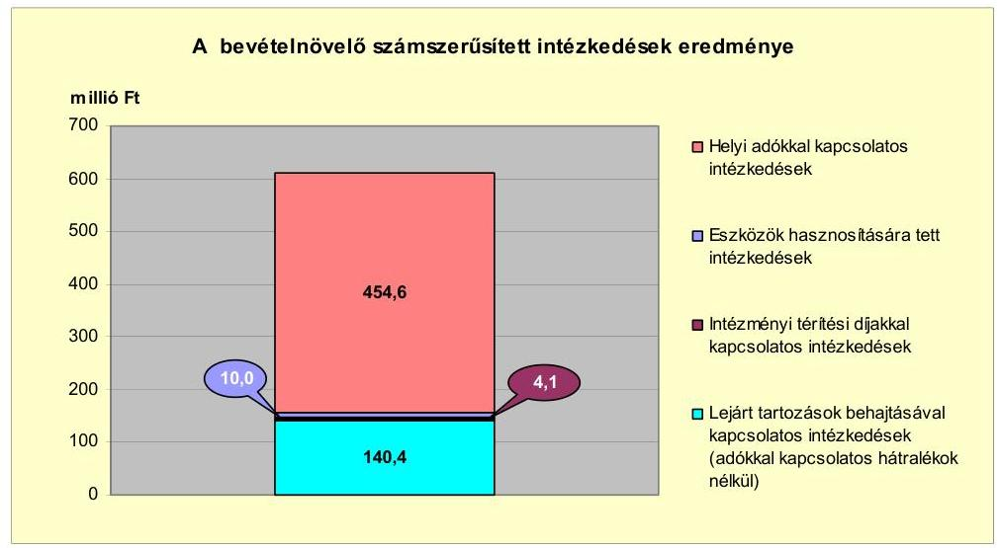

A bevételnövelésére irányuló intézkedések eredménye - az Önkormányzat adatszolgáltatása alapján - 2007-2011. év I. félévben összesen 609,1 millió Ft volt. A helyi adókkal kapcsolatos intézkedések eredményeként keletkezett bevételnövekmény 39,4\%-a (179,1 millió Ft) - az Önkormányzat nyilvántartásai szerint - a kedvezmények, mentességek csökkentéséből és az egyes adómértékek emeléséből származott. Az Önkormányzat az építményadó mértékét 2009. január 1-jétől 800,0 Ft/m²-ről 1100,0 Ft/m²-re, a telekadó mértékét 209,0 Ft/m²-ről 250,0 Ft/m²-re, a vállalkozások kommunális adója mértékét 2000,0 Ft/főről, 2100,0 Ft/főre növelte (a vállalkozások kommunális adóját az Önkormányzat 2011. január 1-jétől megszüntette).

Az áttekintett időszakban a kiadáscsökkentő és bevételnövelő intézkedések összesen 809,7 millió Ft-tal javították az Önkormányzat pénzügyi egyensúlyát. A 2007-2011. év I. félév között a központi támogatások (költségvetési támogatás és az átengedett szja) összességében 545,3 millió Ft-tal csökkentek. A vizsgált időszakban a központi támogatások csökkenése és a kiadási megtakarítást eredményező és bevételt növelő intézkedések eredményeként keletkezett forrástöbblet egyenlege összességében 264,4 millió Ft volt.

---

5.  Az ÁSZ Által a korábbi években a pénzügyi egyensúly javítására tett szabályszerűségi és célszerűségi javaslatok hasznosulása

Az ÁSZ az Önkormányzat gazdálkodási rendszerét a 2010. évben ellenőrizte, amely során a pénzügyi egyensúlyi helyzetre vonatkozóan szabályszerűségi, illetve célszerűségi javaslatot nem tett.

Budapest, 2012. április "9"

Melléklet: $7 \mathrm{db}$
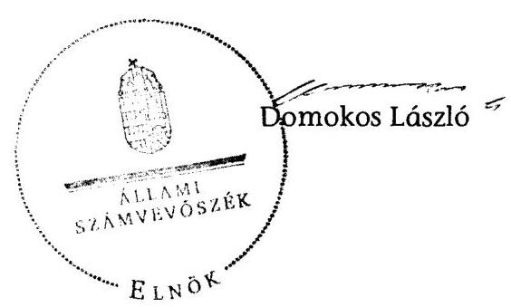

---

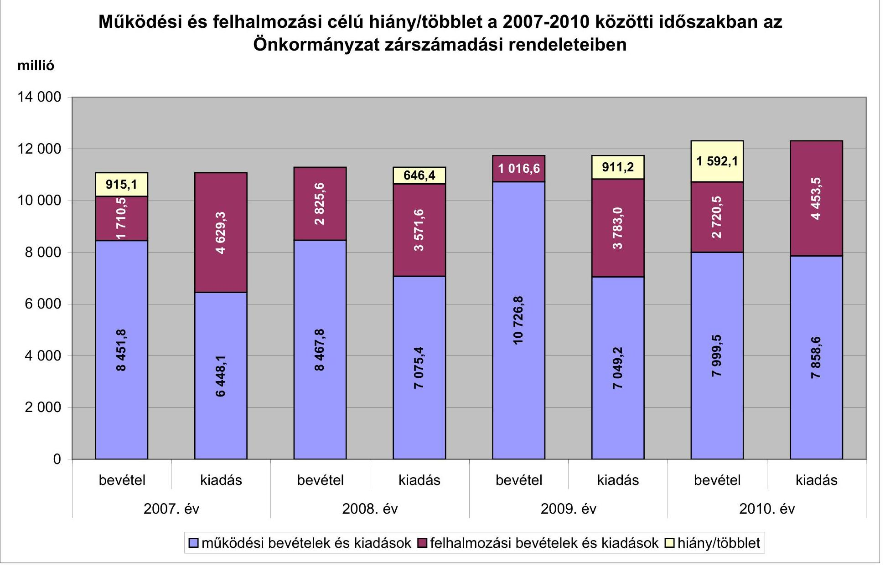

# Működési és felhalmozási célú hiány/többlet a 2007-2010 közötti időszakban az Önkormányzat zárszámadási rendeleteiben

|  év | 2007. év | 2008. év | 2009. év | 2010. év  |
| --- | --- | --- | --- | --- |
|  működési bevételek és kiadások | 7 075.4 | 10 726.8 | 10 726.8 | 10 726.8  |
|  felhalmozási bevételek és kiadások | 8 487.8 | 9 571.6 | 9 571.6 | 9 571.6  |
|  felhalmozási bevételek és kiadások | 8 451.8 | 9 625.0 | 9 625.0 | 9 625.0  |
|  működési bevételek és kiadások | 8 451.8 | 9 625.0 | 9 625.0 | 9 625.0  |
|  felhalmozási bevételek és kiadások | 8 451.8 | 9 625.0 | 9 625.0 | 9 625.0  |
|  működési bevételek és kiadások | 8 451.8 | 9 625.0 | 9 625.0 | 9 625.0  |
|  felhalmozási bevételek és kiadások | 8 451.8 | 9 625.0 | 9 625.0 | 9 625.0  |
|  működési bevételek és kiadások | 8 451.8 | 9 625.0 | 9 625.0 | 9 625.0  |
|  felhalmozási bevételek és kiadások | 8 451.8 | 9 625.0 | 9 625.0 | 9 625.0  |
|  működési bevételek és kiadások | 8 451.8 | 9 625.0 | 9 625.0 | 9 625.0  |
|  felhalmozási bevételek és kiadások | 8 451.8 | 9 625.0 | 9 625.0 | 9 625.0  |
|  működési bevételek és kiadások | | 8 451.8 | 9 625.0 | 9 625.0 | 9 625.0  |
|  felhalmozási bevételek és kiadások | 8 451.8 | 9 625.0 | 9 625.0 | 9 625.0  |
|  működési bevételek és kiadások | 8 451.8 | 9 625.0 | 9 625.0 | 9 625.0  |
|  felhalmozási bevételek és kiadások | 8 451.8 | 9 625.0 | 9 625.0 | 9 625.0  |
|  működési bevételek és kiadások | 8 451.8 | 9 625.0 | 9 625.0 | 9 625.0  |
|  felhalmozási bevételek és kiadások | 8 451.8 | 9 625.0 | 9 625.0 | 9 625.0  |
|  működési bevételek és kiadások | 8 451.8 | 9 625.0 | 9 625.0 | 9 625.0  |
|  felhalmozási bevételek és kiadások | 8 451.8 | 9 625.0 | 9 625.0 | 9 625.0  |
|  működési bevételek és kiadások | 8 451.8 | 9 625.0 | 9 625.0 | 9 625.0  |
|  felhalmozási bevételek és kiadások | 8 451.8 | 9 625.0 | 9 625.0 | 9 625.0  |
|  működési bevételek és kiadások | 8 451.8 | 9 625.0 | 9 625.0 | 9 625.0  |
|  felhalmozási bevételek és kiadások | 8 451.8 | 9 625.0 | 9 625.0 | 9 625.0  |
|  működési bevételek és kiadások | 8 451.8 | 9 625.0 | 9 625.0 | 9 625.0  |
|  felhalmozási bevételek és kiadások | 8 451.8 | 9 625.0 | 9 625.0 | 9 625.0  |
|  működési bevételek és kiadások | 8 451.8 | 9 625.0 | 9 625.0 | 9 625.0  |
|  felhalmozási bevételek és kiadások | 8 451.8 | 9 625.0 | 9 625.0 | 9 625.0  |
|  működési bevételek és kiadások | 8 451.8 | 9 625.0 | 9 625.0 | 9 625.0  |
|  felhalmozási bevételek és kiadások | 8 451.8 | 9 625.0 | 9 625.0 | 9 625.0  |
|  működési bevételek és kiadások | 8 451.8 | 9 625.0 | 9 625.0 | 9 625.0  |
|  felhalmozási bevételek és kiadások | 8 451.8 | 9 625.0 | 9 625.0 | 9 625.0  |
|  működési bevételek és kiadások | 8 451.8 | 9 625.0 | 9 625.0 | 9 625.0  |
|  felhalmozási bevételek és kiadások | 8 451.8 | 9 625.0 | 9 625.0 | 9 625.0  |
|  működési bevételek és kiadások | 8 451.8 | 9 625.0 | 9 625.0 | 9 625.0  |
|  felhalmozási bevételek és kiadások | 8 451.8 | 9 625.0 | 9 625.0 | 9 625.0  |
|  működési bevételek és kiadások | 8 451.8 | 9 625.0 | 9 625.0 | 9 625.0  |
|  felhalmozási bevételek és kiadások | 8 451.8 | 9 625.0 | 9 625.0 | 9 625.0  |
|  működési bevételek és kiadások | 8 451.8 | 9 625.0 | 9 625.0 | 9 625.0  |
|  felhalmozási bevételek és kiadások | 8 451.8 | 9 625.0 | 9 625.0 | 9 625.0  |
|  működési bevételek és kiadások | 8 451.8 | 9 625.0 | 9 625.0 | 9 625.0  |
|  felhalmozási bevételek és kiadások | 8 451.8 | 9 625.0 | 9 625.0 | 9 625.0  |
|  működési bevételek és kiadások | 8 451.8 | 9 625.0 | 9 625.0 | 9 625.0  |
|  felhalmozási bevételek és kiadások | 8 451.8 | 9 625.0 | 9 625.0 | 9 625.0  |
|  működési bevételek és kiadások | 8 451.8 | 9 625.0 | 9 625.0 | 9 625.0  |
|  felhalmozási bevételek és kiadások | 8 451.8 | 9 625.0 | 9 625.0 | 9 625.0  |
|  működési bevételek és kiadások | 8 451.8 | 9 625.0 | 9 625.0 | 9 625.0  |
|  felhalmozási bevételek és kiadások | 8 451.8 | 9 625.0 | 9 625.0 | 9 625.0  |
|  működési bevételek és kiadások | 8 451.8 | 9 625.0 | 9 625.0 | 9 625.0  |
|  felhalmozási bevételek és kiadások | 8 451.8 | 9 625.0 | 9 625.0 | 9 625.0  |
|  működési bevételek és kiadások | 8 451.8 | 9 625.0 | 9 625.0 | 9 625.0  |
|  felhalmozási bevételek és kiadások | 8 451.8 | 9 625.0 | 9 625.0 | 9 625.0  |
|  működési bevételek és kiadások | 8 451.8 | 9 625.0 | 9 625.0 | 9 625.0  |
|  felhalmozási bevételek és kiadások | 8 451.8 | 9 625.0 | 9 625.0 | 9 625.0  |
|  működési bevételek és kiadások | 8 451.8 | 9 625.0 | 9 625.0 | 9 625.0  |
|  felhalmozási bevételek és kiadások | 8 451.8 | 9 625.0 | 9 625.0 | 9 625.0  |
|  működési bevételek és kiadások | 8 451.8 | 9 625.0 | 9 625.0 | 9 625.0  |
|  felhalmozási bevételek és kiadások | 8 451.8 | 9 625.0 | 9 625.0 | 9 625.0  |
|  működési bevételek és kiadások | 8 451.8 | 9 625.0 | 9 625.0 | 9 625.0  |
|  felhalmozási bevételek és kiadások | 8 451.8 | 9 625.0 | 9 625.0 | 9 625.0  |
|  működési bevételek és kiadások | 8 451.8 | 9 625.0 | 9 625.0 | 9 625.0  |
|  felhalmozási bevételek és kiadások | 8 451.8 | 9 625.0 | 9 625.0 | 9 625.0  |
|  működési bevételek és kiadások | 8 451.8 | 9 625.0 | 9 625.0 | 9 625.0  |
|  felhalmozási bevételek és kiadások | 8 451.8 | 9 625.0 | 9 625.0 | 9 625.0  |
|  működési bevételek és kiadások | 8 451.8 | 9 625.0 | 9 625.0 | 9 625.0  |
|  felhalmozási bevételek és kiadások | 8 451.8 | 9 625.0 | 9 625.0 | 9 625.0  |
|  működési bevételek és kiadások | 8 451.8 | 9 625.0 | 9 625.0 | 9 625.0  |
|  felhalmozási bevételek és kiadások | 8 451.8 | 9 625.0 | 9 625.0 | 9 625.0  |
|  működési bevételek és kiadások | 8 451.8 | 9 625.0 | 9 625.0 | 9 625.0  |
|  felhalmozási bevételek és kiadások | 8 451.8 | 9 625.0 | 9 625.0 | 9 625.0  |
|  működési bevételek és kiadások | 8 451.8 | 9 625.0 | 9 625.0 | 9 625.0  |
|  felhalmozási bevételek és kiadások | 8 451.8 | 9 625.0 | 9 625.0 | 9 625.0  |
|  működési bevételek és kiadások | 8 451.8 | 9 625.0 | 9 625.0 | 9 625.0  |
|  felhalmozási bevételek és kiadások | 8 451.8 | 9 625.0 | 9 625.0 | 9 625.0  |
|  működési bevételek és kiadások | 8 451.8 | | 9 625.0 | 9 625.0 | 9 625.0  |
|  felhalmozási bevételek és kiadások | 8 451.8 | 9 625.0 | 9 625.0 | 9 625.0  |
|  működési bevételek és kiadások | 8 451.8 | 9 625.0 | 9 625.0 | 9 625.0  |
|  felhalmozási bevételek és kiadások | 8 451.8 | 9 625.0 | 9 625.0 | 9 625.0  |
|  működési bevételek és kiadások | 8 451.8 | 9 625.0 | 9 625.0 | 9 625.0  |
|  felhalmozási bevételek és kiadások | 8 451.8 | 9 625.0 | 9 625.0 | 9 625.0  |
|  működési bevételek és kiadások | 8 451.8 | 9 625.0 | 9 625.0 | 9 625.0  |
|  felhalmozási bevételek és kiadások | 8 451.8 | 9 625.0 | 9 625.0 | 9 625.0  |
|  működési bevételek és kiadások | 8 451.8 | 9 625.0 | 9 625.0 | 9 625.0  |
|  felhalmozási bevételek és kiadások | 8 451.8 | 9 625.0 | 9 625.0 | 9 625.0  |
|  működési bevételek és kiadások | 8 451.8 | 9 625.0 | 9 625.0 | 9 625.0  |
|  felhalmozási bevételek és kiadások | 8 451.8 | 9 625.0 | 9 625.0 | 9 625.0  |
|  működési bevételek és kiadások | 8 451.8 | 9 625.0 | 9 625.0 | 9 625.0  |
|  felhalmozási bevételek és kiadások | 8 451.8 | 9 625.0 | 9 625.0 | 9 625.0  |
|  működési bevételek és kiadások | 8 451.8 | 9 625.0 | 9 625.0 | 9 625.0  |
|  felhalmozási bevételek és kiadások | 8 451.8 | 9 625.0 | 9 625.0 | 9 625.0  |
|  működési bevételek és kiadások | 8 451.8 | 9 625.0 | 9 625.0 | 9 625.0  |
|  felhalmozási bevételek és kiadások | 8 451.8 | 9 625.0 | 9 625.0 | 9 625.0  |
|  működési bevételek és kiadások | 8 451.8 | 9 625.0 | 9 625.0 | 9 625.0  |
|  felhalmozási bevételek és kiadások | 8 451.8 | 9 625.0 | 9 625.0 | 9 625.0  |
|  működési bevételek és kiadások | 8 451.8 | 9 625.0 | 9 625.0 | 9 625.0  |
|  felhalmozási bevételek és kiadások | 8 451.8 | 9 625.0 | 9 625.0 | 9 625.0  |
|  működési bevételek és kiadások | 8 451.8 | 9 625.0 | 9 625.0 | 9 625.0  |
|  felhalmozási bevételek és kiadások | 8 451.8 | 9 625.0 | 9 625.0 | 9 625.0  |
|  működési bevételek és kiadások | 8 451.8 | 9 625.0 | 9 625.0 | 9 625.0  |
|  felhalmozási bevételek és kiadások | 8 451.8 | 9 625.0 | 9 625.0 | 9 625.0  |
|  működési bevételek és kiadások | 8 451.8 | 9 625.0 | 9 625.0 | 9 625.0  |
|  felhalmozási bevételek és kiadások | 8 451.8 | 9 625.0 | 9 625.0 | 9 625.0  |
|  működési bevételek és kiadások | 8 451.8 | 9 625.0 | 9 625.0 | 9 625.0  |
|  felhalmozási bevételek és kiadások | 8 451.8 | 9 625.0 | 9 625.0 | 9 625.0  |
|  működési bevételek és kiadások | 8 451.8 | 9 625.0 | 9 625.0 | 9 625.0  |
|  felhalmozási bevételek és kiadások | 8 451.8 | 9 625.0 | 9 625.0 | 9 625.0  |
|  működési bevételek és kiadások | 8 451.8 | 9 625.0 | 9 625.0 | 9 625.0  |
|  felhalmozási bevételek és kiadások | 8 451.8 | 9 625.0 | 9 625.0 | 9 625.0  |
|  működési bevételek és kiadások | 8 451.8 | 9 625.0 | 9 625.0 | 9 625.0  |
|  felhalmozási bevételek és kiadások | 8 451.8 | 9 625.0 | 9 625.0 | 9 625.0  |
|  működési bevételek és kiadások | 8 451.8 | 9 625.0 | 9 625.0 | 9 625.0  |
|  felhalmozási bevételek és kiadások | 8 451.8 | 9 625.0 | 9 625.0 | 9 625.0  |
|  működési bevételek és kiadások | 8 451.8 | 9 625.0 | 9 625.0 | 9 625.0  |
|  felhalmozási bevételek és kiadások | 8 451.8 | 9 625.0 | 9 625.0 | 9 625.0  |
|  működési bevételek és kiadások | 8 451.8 | 9 625.0 | 9 625.0 | 9 625.0  |
|  felhalmozási bevételek és kiadások | 8 451.8 | 9 625.0 | 9 625.0 | 9 625.0  |
|  működési bevételek és kiadások | 8 451.8 | 9 625.0 | 9 625.0 | 9 625.0  |
|  felhalmozási bevételek és kiadások | 8 451.8 | 9 625.0 | 9 625.0 | 9 625.0  |
|  működési bevételek és kiadások | 8 451.8 | 9 625.0 | 9 625.0 | 9 625.0  |
|  felhalmozási bevételek és kiadások | 8 451.8 | 9 625.0 | 9 625.0 | 9 625.0  |
|  működési bevételek és kiadások | 8 451.8 | 9 625.0 | 9 625.0 | 9 625.0  |
|  felhalmozási bevételek és kiadások | 8 451.8 | 9 625.0 | 9 625.0 | 9 625.0  |
|  működési bevételek és kiadások | 8 451.8 | 9 625.0 | 9 625.0 | 9 625.0  |
|  felhalmozási bevételek és kiadások | 8 451.8 | 9 625.0 | 9 625.0 | 9 625.0  |
|  működési bevételek és kiadások | 8 451.8 | 9 625.0 | 9 625.0 | 9 625.0  |
|  felhalmozási bevételek és kiadások | 8 451.8 | 9 625.0 | 9 625.0 | 9 625.0  |
|  működési bevételek és kiadások | 8 451.8 | 9 625.0 | 9 625.0 | 9 625.0 | 9 625.0  |
|  felhalmozási bevételek és kiadások | 8 451.8 | 9 625.0 | 9 625.0 | 9 625.0 | 9 625.0 | 9 625.0  |
|  felhalmozási bevételek és kiadások | 8 451.8 | 9 625.0 | 9 625.0 | 9 625.0 | 9 625.0 | 9 625.0 | 9 625.0  |
|  felhalmozási bevételek és kiadások | 8 451.8 | 9 625.0 | 9 625.0 | 9 625.0 | 9 625.0 | 9 625.0 | 9 625.0 | 9 625.0 | 9 625.0  |
|  felhalmozási bevételek és kiadások | 8 451.8 | 9 625.0 | 9 625.0 | 9 625.0 | 9 625.0 | 9 625.0 | 9 625.0 | 9 625.0 | 9 625.0  |
|  felhalmozási bevételek és kiadások | 8 451.8 | 9 625.0 | 9 625.0 | 9 625.0 | 9 625.0 | 9 625.0 | 9 625.0 | 9 625.0 | 9 625.0 | 9 625.0 | 9 625.0 | 9 625.0 | 9 625.0 | 9 625.0 | 9 625.0 | 9 625.0 | 9 625.0 | 9 625.0 | 9 625.0 | 9 625.0 | 9 625.0 | 9 625.0 | 9 625.0 | 9 625.0 | 9 625.0 | 9 625.0 | 9 625.0 | 9 625.0 | 9 625.0 | 9 625.0 | 9 625.0 | 9 625.0 | 9 625.0 | 9 625.0 | 9 625.0 | 9 625.0 | 9 625.0 | 9 625.0 | 9 625.0 | 9 625.0 | 9 625.0 | 9 625.0 | 9 625.0 | 9 625.0 | 9 625.0 | 9 625.0 | 9 625.0 | 9 625.0 | 9 625.0 | 9 625.0 | 9 625.0 | 9 625.0 | 9 625.0 | 9 625.0 | 9 625.0 | 9 625.0 | 9 625.0 | 9 625.0 | 9 625.0 | 9 625.0 | 9 625.0 | 9 625.0 | 9 625.0 | 9 625.0 | 9 625.0 | 9 625.0 | 9 625.0 | 9 625.0 | 9 625.0 | 9 625.0 | 9 625.0 | 9 625.0 | 9 625.0 | 9 625.0 | 9 625.0 | 9 625.0 | 9 625.0 | 9 625.0 | 9 625.0 | 9 625.0 | 9 625.0 | 9 625.0 | 9 625.0 | 9 625.0 | 9 625.0 | 9 625.0 | 9 625.0 | 9 625.0 | 9 625.0 | 9 625.0 | 9 625.0 | 9 625.0 | 9 625.0 | 9 625.0 | 9 625.0 | 9 625.0 | 9 625.0 | 9 625.0 | 9 625.0 | 9 625.0 | 9 625.0 | 9 625.0 | 9 625.0 | 9 625.0 | 9 625.0 | 9 625.0 | 9 625.0 | 9 625.0 | 9 625.0 | 9 625.0 | 9 625.0 | 9 625.0 | 9 625.0 | 9 625.0 | 9 625.0 | 9 625.0 | 9 625.0 | 9 625.0 | 9 625.0 | 9 625.0 | 9 625.0 | 9 625.0 | 9 625.0 | 9 625.0 | 9 625.0 | 9 625.0 | 9 625.0 | 9 625.0 | 9 625.0 | 9 625.0 | 9 625.0 | 9 625.0 | 9 625.0 | 9 625.0 | 9 625.0 | 9 625.0 | 9 625.0 | 9 625.0 | 9 625.0 | 9 625.0 | 9 625.0 | 9 625.0 | 9 625.0 | 9 625.0 | 9 625.0 | 9 625.0 | 9 625.0 | 9 625.0 | 9 625.0 | 9 625.0 | 9 625.0 | 9 625.0 | 9 625.0 | 9 625.0 | 9 625.0 | 9 625.0 | 9 625.0 | 9 625.0 | 9 625.0 | 9 625.0 | 9 625.0 | 9 625.0 | 9 625.0 | 9 625.0 | 9 625.0 | 9 625.0 | 9 625.0 | 9 625.0 | 9 625.0 | 9 625.0 | 9 625.0 | 9 625.0 | 9 625.0 | 9 625.0 | 9 625.0 | 9 625.0 | 9 625.0 | 9 625.0 | 9 625.0 | 9 625.0 | 9 625.0 | 9 625.0 | 9 625.0 | 9 625.0 | 9 625.0 | 9 625.0 | 9 625.0 | 9 625.0 | 9 625.0 | 9 625.0 | 9 625.0 | 9 625.0 | 9 625.0 | 9 625.0 | 9 625.0 | 9 625.0 | 9 625.0 | 9 625.0 | 9 625.0 | 9 625.0 | 9 625.0 | 9 625.0 | 9 625.0 | 9 625.0 | 9 625.0 | 9 625.0 | 9 625.0 | 9 625.0 | 9 625.0 | 9 625.0 | 9 625.0 | 9 625.0 | 9 625.0 | 9 625.0 | 9 625.0 | 9 625.0 | 9 625.0 | 9 625.0 | 9 625.0 | 9 625.0 | 9 625.0 | 9 625.0 | 9 625.0 | 9 625.0 | 9 625.0 | 9 625.0 | 9 625.0 | 9 625.0 | 9 625.0 | 9 625.0 | 9 625.0 | 9 625.0 | 9 625.0 | 9 625.0 | 9 625.0 | 9 625.0 | 9 625.0 | 9 625.0 | 9 625.0 | 9 625.0 | 9 625.0 | 9 625.0 | 9 625.0 | 9 625.0 | 9 625.0 | 9 625.0 | 9 625.0 | 9 625.0 | 9 625.0 | 9 625.0 | 9 625.0 | 9 625.0 | 9 625.0 | 9 625.0 | 9 625.0 | 9 625.0 | 9 625.0 | 9 625.0 | 9 625.0 | 9 625.0 | 9 625.0 | 9 625.0 | 9 625.0 | 9 625.0 | 9 625.0 | 9 625.0 | 9 625.0 | 9 625.0 | 9 625.0 | 9 625.0 | 9 625.0 | 9 625.0 | 9 625.0 | 9 625.0 | 9 625.0 | 9 625.0 | 9 625.0 | 9 625.0 | 9 625.0 | 9 625.0 | 9 625.0 | 9 625.0 | 9 625.0 | 9 625.0 | 9 625.0 | 9 625.0 | 9 625.0 | 9 625.0 | 9 625.0 | 9 625.0 | 9 625.0 | 9 625.0 | 9 625.0 | 9 625.0 | 9 625.0 | 9 625.0 | 9 625.0 | 9 625.0 | 9 625.0 | 9 625.0 | 9 625.0 | 9 625.0 | 9 625.0 | 9 625.0 | 9 625.0 | 9 625.0 | 9 625.0 | 9 625.0 | 9 625.0 | 9 625.0 | 9 625.0 | 9 625.0 | 9 625.0 | 9 625.0 | 9 625.0 | 9 625.0 | 9 625.0 | 9 625.0 | 9 625.0 | 9 625.0 | 9 625.0 | 9 625.0 | 9 625.0 | 9 625.0 | 9 625.0 | 9 625.0 | 9 625.0 | 9 625.0 | 9 625.0 | 9 625.0 | 9 625.0 | 9 625.0 | 9 625.0 | 9 625.0 | 9 625.0 | 9 625.0 | 9 625.0 | 9 625.0 | 9 625.0 | 9 625.0 | 9 625.0 | 9 625.0 | 9 625.0 | 9 625.0 | 9 625.0 | 9 625.0 | 9 625.0 | 9 625.0 | 9 625.0 | 9 625.0 | 9 625.0 | 9 625.0 | 9 625.0 | 9 625.0 | 9 625.0 | 9 625.0 | 9 625.0 | 9 625.0 | 9 625.0 | 9 625.0 | 9 625.0 | 9 625.0 | 9 625.0 | 9 625.0 | 9 625.0 | 9 625.0 | 9 625.0 | 9 625.0 | 9 625.0 | 9 625.0 | 9 625.0 | 9 625.0 | 9 625.0 | 9 625.0 | 9 625.0 | 9 625.0 | 9 625.0 | 9 625.0 | 9 625.0 | 9 625.0 | 9 625.0 | 9 625.0 | 9 625.0 | 9 625.0 | 9 625.0 | 9 625.0 | 9 625.0 | 9 625.0 | 9 625.0 | 9 625.0 | 9 625.0 | 9 625.0 | 9 625.0 | 9 625.0 | 9 625.0 | 9 625.0 | 9 625.0 | 9 625.0 | 9 625.0 | 9 625.0 | 9 625.0 | 9 625.0 | 9 625.0 | 9 625.0 | 9 625.0 | 9 625.0 | 9 625.0 | 9 625.0 | 9 625.0 | 9 625.0 | 9 625.0 | 9 625.0 | 9 625.0 | 9 625.0 | 9 625.0 | 9 625.0 | 9 625.0 | 9 625.0 | 9 625.0 | 9 625.0 | 9 625.0 | 9 625.0 | 9 625.0 | 9 625.0 | 9 625.0 | 9 625.0 | 9 625.0 | 9 625.0 | 9 625.0 | 9 625.0 | 9 625.0 | 9 625.0 | 9 625.0 | 9 625.0 | 9 625.0 | 9 625.0 | 9 625.0 | 9 625.0 | 9 625.0 | 9 625.0 | 9 625.0 | 9 625.0 | 9 625.0 | 9 625.0 | 9 625.0 | 9 625.0 | 9 625.0 | 9 625.0 | 9 625.0 | 9 625.0 | 9 625.0 | 9 625.0 | 9 625.0 | 9 625.0 | 9 625.0 | 9 625.0 | 9 625.0 | 9 625.0 | 9 625.0 | 9 625.0 |

---

Az Önkormányzat bevételei és kiadásai, valamint adósságszolgálata 2007-2010 között

|  1. FOLYÓ KÖLTSÉGVETÉS* | 2007. | 2008. | 2009. | 2010.  |
| --- | --- | --- | --- | --- |
|  1.1.1. Saját működési bevételek | 7253,5 | 6808,1 | 9131,9 | 6657,1  |
|  1.1.2. Költségvetési támogatás | 1227,7 | 1582,6 | 1470,9 | 1205,5  |
|  1.1.3. Átengedett bevételek | 108,9 | $-173,7$ | $-90,9$ | $-66,5$  |
|  1.1.4. Állambáztartáson belülről kapott támogatások | 349,1 | 72,4 | 77,5 | 72,7  |
|  1.1.5. EU-tól és külföldről kapott bevételek | 0,6 | 0,5 | 0,5 | 0,0  |
|  1.1.6. Állambáztartáson kívülről kapott bevételek | 0,1 | 0,1 | 0,0 | 2163,7  |
|  1.1.7. Előző évi pénzmaradvány átvétel | 0,0 | 180,0 | 159,4 | 148,5  |
|  1.1. Folyó bevételek $=1.1 .1.+1.1 .2.+1.1 .3.+1.1 .4.+1.1 .5.+1.1 .6.+1.1 .7$. | 8939,9 | 8470,0 | 10749,4 | 10181,0  |
|  1.2.1. Működési kiadások kamatkiadások nélkül | 5816,3 | 6396,7 | 6431,7 | 7010,1  |
|  1.2.2. Állambáztartáson belülre átadott pénzeszközök | 11,0 | 9,0 | 12,0 | 13,0  |
|  1.2.3.1. vállalkozásoknak | 264,0 | 286,8 | 2164,8 | 240,0  |
|  1.2.3.2. EU-nak, illetve külföldre | 1,2 | 0,0 | 0,0 | 0,0  |
|  1.2.3.3. magánszemélyeknek | 160,1 | 170,5 | 191,0 | 208,5  |
|  1.2.3.4. nonprofit szervezeteink | 268,2 | 297,2 | 245,9 | 309,6  |
|  1.2.3.1. Transferkiadások ( $=1.2 .3 .1+1.2 .3 .2+1.2 .3 .3+1.2 .3 .4$ ) | 693,5 | 754,5 | 2601,7 | 758,0  |
|  1.2.4 Kamatkiadások | 0,0 | 0,0 | 0,0 | 0,0  |
|  1.2.5. Előző évi pénzmaradvány átadás | 0,0 | 0,0 | 0,0 | 0,0  |
|  1.2. Folyó kiadások $=1.2 .1 .+1.2 .2 .+1.2 .3 .+1.2 .4 .+1.2 .5$. | 6520,8 | 7160,2 | 9045,5 | 7781,1  |
|  1.3. Folyó költségvetés egyenlege MŰKÖDÉSI JÖVEDELEM (1.1. - 1.2.) | 2419,0 | 1317,8 | 1704,0 | 2399,9  |
|  2. FELHALMOZÁSI KÖLTSÉGVETÉS** | 0,0 | 0,0 | 0,0 | 0,0  |
|  2.1.1. Saját tőkebevételek | 687,0 | 1433,3 | 134,0 | 167,2  |
|  2.1.2. Állambáztartáson belülről kapott támogatások | 7,1 | 46,7 | 0,0 | 348,7  |
|  2.1.3. EU-tól és külföldről kapott támogatások | 0,0 | 0,0 | 0,0 | 0,0  |
|  2.1.4. Állambáztartáson kívülről kapott támogatások | 26,5 | 17,1 | 2,9 | 22,3  |
|  2.1. Felhalmozási bevételek ( $=2.1 .1 .+2.1 .2+2.1 .3+2.1 .4$ ) | 720,6 | 1497,1 | 136,9 | 538,2  |
|  2.2.1. Saját beruházási kiadás állva | 1219,2 | 1412,7 | 1093,1 | 3033,5  |
|  2.2.2. Saját felújítási kiadás állva | 916,4 | 788,9 | 354,7 | 279,2  |
|  2.2.3. Állambáztartáson belülre átadott pénzeszköz | 15,0 | 7,1 | 0,0 | 0,0  |
|  2.2.4. EU-nak és külföldnek adott pénzeszközök | 1,0 | 0,0 | 2,0 | 0,0  |
|  2.2.5. Állambáztartáson kívülre adott pénzeszközök | 1661,3 | 1120,2 | 321,3 | 535,9  |
|  2.2.6. Befektetési célú részesedések vásárlása | 743,8 | 149,6 | 12,0 | 681,5  |
|  2.2. Felhalmozási kiadások ( $=2.2 .1 .+2.2 .2 .+2.2 .3 .+2.2 .4 .+2.2 .5 .+2.2 .6$ ) | 4556,6 | 3486,5 | 1783,1 | 4530,1  |
|  2.3. Felhalmozási költségvetés egyenlege (2.1. - 2.2.) | $-3836,0$ | $-1989,3$ | $-1646,2$ | $-3992,0$  |
|  3. Finanszírozási műveletek nélküli (GFS) pozíció(1.3.+2.3.) | $-1417,0$ | $-671,5$ | 57,7 | $-1592,1$  |
|  4. Finanszírozási műveletek | 0,0 | 0,0 | 0,0 | 0,0  |
|  4.1. Hitelletvétel | 0,0 | 0,0 | 0,0 | 0,0  |
|  4.2. Hitelbírlesztés | 0,0 | 0,0 | 0,0 | 0,0  |
|  4.3. Forgatási és befektetési célú értékpapírok kibocsátása | 0,0 | 0,0 | 0,0 | 0,0  |
|  4.4. Forgatási és befektetési célú értékpapírok beváltása | 0,0 | 0,0 | 0,0 | 0,0  |
|  4.5. Forgatási és befektetési célú értékpapírok értékesítés | 2088,5 | 424,1 | 7471,5 | 0,0  |
|  4.6. Forgatási és befektetési célú értékpapírok vásárlása | 0,0 | 0,0 | 0,0 | 0,0  |
|  4.7. Egyéb finanszírozási bevételek (függő, átfutó, kiegyenlítő) | 13,9 | 5,3 | 7,9 | $-47,9$  |
|  4.8. Egyéb finanszírozási kiadások (függő, átfutó, kiegyenlítő) | $-71,4$ | 78,1 | 6,4 | 700,0  |
|  4.9.Finanszírozási műveletek egyenlege (4.1. - 4.2.+4.3.-4.4+4.5.-4.6.+4.7.-4.8.) | 2173,8 | 351,3 | 7473,0 | $-767,9$  |
|  5. Tárgyévi pénzügyi pozíció (1.3.+ 2.3.+4.9.) | 756,8 | $-320,3$ | 7530,7 | $-2360,0$  |
|  6. Nettó működési jövedelem =működési jövedelem (1.3.) - tőketörlesztés (4.2+4.4) | 2419,0 | 1317,8 | 1704,0 | 2399,9  |
|  TÁJÉKOZTATÓ ADATOK |  |  |  |   |
|  Összes kötelezettség | 598,3 | 291,8 | 485,9 | 848,0  |
|  ebből rövid lejáratú | 598,3 | 291,8 | 485,9 | 848,0  |
|  Összes szállítói kötelezettség | 293,4 | 131,5 | 67,0 | 71,2  |
|  ebből lejárt (tanúsítványból) | 0,0 | 0,0 | 0,0 | 0,0  |
|  Pénz és tőkepénzi kötelezettség (adósság) | 0,0 | 0,0 | 0,0 | 0,0  |
|  ebből rövid lejáratú | 0,0 | 0,0 | 0,0 | 0,0  |
|  PPP szerződéses állomány jelenértéken (tanúsítványból) | 0,0 | 0,0 | 0,0 | 0,0  |
|  ebből lejárt szolgáltatási díj miatti kötelezettség | 0,0 | 0,0 | 0,0 | 0,0  |
|  Folyószámlahitel napi átlagos állománya (tanúsítványból) | 0,0 | 0,0 | 0,0 | 0,0  |
|  Likvidhitel napi átlagos állománya (tanúsítványból) | 0,0 | 0,0 | 0,0 | 0,0  |
|  Munkabérhitel napi átlagos állománya (tanúsítványból) | 0,0 | 0,0 | 0,0 | 0,0  |
|  Kezesség és garanciavállalások (tanúsítványból) | 116,6 | 41,2 | 0,0 | 0,0  |
|  Jogerős bírósági ítéletekből adódó kötelezettségek (tanúsítványból) | 0,0 | 0,0 | 0,0 | 0,0  |
|  Finanszírozásba bevonható eszközök: | 9072,8 | 8329,9 | 8390,6 | 6018,5  |
|  Tartós hitelviszonyt megtestesítő értékpapírok év végi állománya | 56,4 | 24,3 | 12,1 | 0,0  |
|  Hosszú lejáratú bankbetétek év végi állománya | 0,0 | 0,0 | 0,0 | 130,4  |
|  Értékpapírok év végi állománya | 7868,4 | 7457,8 | 0,0 | 0,0  |
|  Pénzeszközök (idegen pénzeszközök nélkül) év végi állománya | 1168,0 | 847,8 | 8370,5 | 5888,1  |

- Bevételekben nem térül, a kiadásokban nem jelenítik meg az amortizációt, a vagyoni helyzetet az egyenleg befolyásolja. Bevételekben vagyon megőrzésre és felújításra fordítható források.

---

Szabadszállás Város Önkormányzati

Az Önkormányzat a 2007-2010. években megvalósított, 2010. december 31-ig befejeződött fejlesztései és azok forrásbiztosítása

|   |  |  |  |  |  |  |  |  |  |  |  |  |  |  |  |  |  |  |  |  |  |  |  |  |  |  |  |  |  |  |  |  |  |  |  |  |  |  |   |
| --- | --- | --- | --- | --- | --- | --- | --- | --- | --- | --- | --- | --- | --- | --- | --- | --- | --- | --- | --- | --- | --- | --- | --- | --- | --- | --- | --- | --- | --- | --- | --- | --- | --- | --- | --- | --- | --- | --- |
|   |  |  |  |  |  |  |  |  |  |  |  |  |  |  |  |  |  |  |  |  |  |  |  |  |  |  |  |  |  |  |  |  |  |  |  |  |  |   |
|   |  | Fejlesztési feladat (beruházás, felújítás) |  |  |  |  |  |  |  |  |  |  |  |  |  |  |  |  |  |  |  |  |  |  |  |  |  |  |  |  |  |  |  |  |  |  |  |   |
|   |  |  |  |  |  |  |  |  |  |  |  |  |  |  |  |  |  |  |  |  |  |  |  |  |  |  |  |  |  |  |  |  |  |  |  |  |  |   |
|   |  |  |  |  |  |  |  |  |  |  |  |  |  |  |  |  |  |  |  |  |  |  |  |  |  |  |  |  |  |  |  |  |  |  |  |  |  |   |
|   |  |  |  |  |  |  |  |  |  |  |  |  |  |  |  |  |  |  |  |  |  |  |  |  |  |  |  |  |  |  |  |  |  |  |  |  |  |   |
|   |  |  |  |  |  |  |  |  |  |  |  |  |  |  |  |  |  |  |  |  |  |  |  |  |  |  |  |  |  |  |  |  |  |  |  |  |  |   |
|   |  |  |  |  |  |  |  |  |  |  |  |  |  |  |  |  |  |  |  |  |  |  |  |  |  |  |  |  |  |  |  |  |  |  |  |  |  |   |
|   |  |  |  |  |  |  |  |  |  |  |  |  |  |  |  |  |  |  |  |  |  |  |  |  |  |  |  |  |  |  |  |  |  |  |  |  |  |   |
|   |  |  |  |  |  |  |  |  |  |  |  |  |  |  |  |  |  |  |  |  |  |  |  |  |  |  |  |  |  |  |  |  |  |  |  |  |  |   |
|   |  |  |  |  |  |  |  |  |  |  |  |  |  |  |  |  |  |  |  |  |  |  |  |  |  |  |  |  |  |  |  |  |  |  |  |  |  |   |
|   |  |  |  |  |  |  |  |  |  |  |  |  |  |  |  |  |  |  |  |  |  |  |  |  |  |  |  |  |  |  |  |  |  |  |  |  |  |   |
|   |  |  |  |  |  |  |  |  |  |  |  |  |  |  |  |  |  |  |  |  |  |  |  |  |  |  |  |  |  |  |  |  |  |  |  |  |  |   |
|   |  |  |  |  |  |  |  |  |  |  |  |  |  |  |  |  |  |  |  |  |  |  |  |  |  |  |  |  |  |  |  |  |  |  |  |  |  |   |
|   |  |  |  |  |  |  |  |  |  |  |  |  |  |  |  |  |  |  |  |  |  |  |  |  |  |  |  |  |  |  |  |  |  |  |  |  |  |   |
|   |  |  |  |  |  |  |  |  |  |  |  |  |  |  |  |  |  |  |  |  |  |  |  |  |  |  |  |  |  |  |  |  |  |  |  |  |  |   |
|   |  |  |  |  |  |  |  |  |  |  |  |  |  |  |  |  |  |  |  |  |  |  |  |  |  |  |  |  |  |  |  |  |  |  |  |  |  |   |
|   |  |  |  |  |  |  |  |  |  |  |  |  |  |  |  |  |  |  |  |  |  |  |  |  |  |  |  |  |  |  |  |  |  |  |  |  |  |   |
|   |  |  |  |  |  |  |  |  |  |  |  |  |  |  |  |  |  |  |  |  |  |  |  |  |  |  |  |  |  |  |  |  |  |  |  |  |  |   |
|   |  |  |  |  |  |  |  |  |  |  |  |  |  |  |  |  |  |  |  |  |  |  |  |  |  |  |  |  |  |  |  |  |  |  |  |  |  |   |
|   |  |  |  |  |  |  |  |  |  |  |  |  |  |  |  |  |  |  |  |  |  |  |  |  |  |  |  |  |  |  |  |  |  |  |  |  |  |   |
|   |  |  |  |  |  |  |  |  |  |  |  |  |  |  |  |  |  |  |  |  |  |  |  |  |  |  |  |  |  |  |  |  |  |  |  |  |  |   |
|   |  |  |  |  |  |  |  |  |  |  |  |  |  |  |  |  |  |  |  |  |  |  |  |  |  |  |  |  |  |  |  |  |  |  |  |  |  |   |
|   |  |  |  |  |  |  |  |  |  |  |  |  |  |  |  |  |  |  |  |  |  |  |  |  |  |  |  |  |  |  |  |  |  |  |  |  |  |   |
|   |  |  |  |  |  |  |  |  |  |  |  |  |  |  |  |  |  |  |  |  |  |  |  |  |  |  |  |  |  |  |  |  |  |  |  |  |  |   |
|   |  |  |  |  |  |  |  |  |  |  |  |  |  |  |  |  |  |  |  |  |  |  |  |  |  |  |  |  |  |  |  |  |  |  |  |  |  |   |
|   |  |  |  |  |  |  |  |  |  |  |  |  |  |  |  |  |  |  |  |  |  |  |  |  |  |  |  |  |  |  |  |  |  |  |  |  |  |   |
|   |  |  |  |  |  |  |  |  |  |  |  |  |  |  |  |  |  |  |  |  |  |  |  |  |  |  |  |  |  |  |  |  |  |  |  |  |  |   |
|   |  |  |  |  |  |  |  |  |  |  |  |  |  |  |  |  |  |  |  |  |  |  |  |  |  |  |  |  |  |  |  |  |  |  |  |  |  |   |
|   |  |  |  |  |  |  |  |  |  |  |  |  |  |  |  |  |  |  |  |  |  |  |  |  |  |  |  |  |  |  |  |  |  |  |  |  |  |   |
|   |  |  |  |  |  |  |  |  |  |  |  |  |  |  |  |  |  |  |  |  |  |  |  |  |  |  |  |  |  |  |  |  |  |  |  |  |  |   |
|   |  |  |  |  |  |  |  |  |  |  |  |  |  |  |  |  |  |  |  |  |  |  |  |  |  |  |  |  |  |  |  |  |  |  |  |  |  |   |
|   |  |  |  |  |  |  |  |  |  |  |  |  |  |  |  |  |  |  |  |  |  |  |  |  |  |  |  |  |  |  |  |  |  |  |  |  |  |   |
|   |  |  |  |  |  |  |  |  |  |  |  |  |  |  |  |  |  |  |  |  |  |  |  |  |  |  |  |  |  |  |  |  |  |  |  |  |  |   |
|   |

---

Százhalombatta Város Önkormányzata

Az Önkormányzat a 2007-2010. években megvalósított 2010. december 31-ig befejezett fejlesztései és azok forrásbiztosításai

|   |  |  |  |  |  |  |  |  |  |  |  |  |  |  |  |  |  |  |  |  |  |  |  |  |  |  |  |  |  |  |  |  |  |  |  |  |  |  |  |   |
| --- | --- | --- | --- | --- | --- | --- | --- | --- | --- | --- | --- | --- | --- | --- | --- | --- | --- | --- | --- | --- | --- | --- | --- | --- | --- | --- | --- | --- | --- | --- | --- | --- | --- | --- | --- | --- | --- | --- | --- |
|   |  |  |  |  |  |  |  |  |  |  |  |  |  |  |  |  |  |  |  |  |  |  |  |  |  |  |  |  |  |  |  |  |  |  |  |  |  |  |   |
|   |  | Fejlesztési feladat (beruházás, felújítás) |  |  |  |  |  |  |  |  |  |  |  |  |  |  |  |  |  |  |  |  |  |  |  |  |  |  |  |  |  |  |  |  |  |  |  |   |
|   |  |  | | | | | | | | | | | | | | | | | | | | | | | | | | | | | | | | | | | | | |
| | | | | | | | | | | | | | | | | | | | | | | | | | | | | | | | | | | | | | | |
| | | | | | | | | | | | | | | | | | | | | | | | | | | | | | | | | | | | | | | |
| | | | | | | | | | | | | | | | | | | | | | | | | | | | | | | | | | | | | | | |
| | | | | | | | | | | | | | | | | | | | | | | | | | | | | | | | | | | | | | | |
| | | | | | | | | | | | | | | | | | | | | | | | | | | | | | | | | | | | | | | |
| | | | | | | | | | | | | | | | | | | | | | | | | | | | | | | | | | | | | | | |
| | | | | | | | | | | | | | | | | | | | | | | | | | | | | | | | | | | | | | | |
| | | | | | | | | | | | | | | | | | | | | | | | | | | | | | | | | | | | | | | |
| | | | | | | | | | | | | | | | | | | | | | | | | | | | | | | | | | | | | | | |
| | | | | | | | | | | | | | | | | | | | | | | | | | | | | | | | | | | | | | | |
| | | | | | | | | | | | | | | | | | | | | | | | | | | | | | | | | | | | | | | |
| | | | | | | | | | | | | | | | | | | | | | | | | | | | | | | | | | | | | | | |
| | | | | | | | | | | | | | | | | | | | | | | | | | | | | | | | | | | | | | | |
| | | | | | | | | | | | | | | | | | | | | | | | | | | | | | | | | | | | | | | |
| | | | | | | | | | | | | | | | | | | | | | | | | | | | | | | | | | | | | | | |
| | | | | | | | | | | | | | | | | | | | | | | | | | | | | | | | | | | | | | | |
| | | | | | | | | | | | | | | | | | | | | | | | | | | | | | | | | | | | | | | |
| | | | | | | | | | | | | | | | | | | | | | | | | | | | | | | | | | | | | | | |
| | | | | | | | | | | | | | | | | | | | | | | | | | | | | | | | | | | | | | | |
| | | | | | | |
 Salahdolentette Vörös Önkormányzata

Az Önkormányzat a 2007-2010. évadóan megvalósított 2010. december 31-ig befogvatt fejlesztései és azok forrásísszeletiek

Az Önkormányzat a 2007-2010. évadóan megvalósított 2010. december 31-ig befogvatt fejlesztésben beépítését

|   |  |  |  |  |  |  |  |  |  |  |  |  |  |  |  |  |  |  |  |  |  |  |  |  |  |  |  |  |  |  |  | Adat 31:1
szó |  |  |  |   |
| --- | --- | --- | --- | --- | --- | --- | --- | --- | --- | --- | --- | --- | --- | --- | --- | --- | --- | --- | --- | --- | --- | --- | --- | --- | --- | --- | --- | --- | --- | --- | --- | --- | --- | --- | --- | --- |
|   |  |  |  |  |  |  |  |  |  |  |  |  |  |  |  |  |  |  |  |  |  |  |  |  |  |  |  |  |  |  |  |  |  |  |  |   |
|   |  | Fejlesztési feladat (beruházás, felújítás) |  |  |  |  |  |  |  |  |  |  |  |  |  |  |  |  |  |  |  |  |  |  |  |  |  |  |  |  |  |  |  |  |  |   |
|   |  |  |  |  |  |  |  |  |  |  |  |  |  |  |  |  |  |  |  |  |  |  |  |  |  |  |  |  |  |  |  |  |  |  |  |   |
|   |  |  |  |  |  |  |  |  |  |  |  |  |  |  |  |  |  |  |  |  |  |  |  |  |  |  |  |  |  |  |  |  |  |  |  |   |
|   |  |  |  |  |  |  |  |  |  |  |  |  |  |  |  |  |  |  |  |  |  |  |  |  |  |  |  |  |  |  |  |  |  |  |  |   |
|   |  |  |  |  |  |  |  |  |  |  |  |  |  |  |  |  |  |  |  |  |  |  |  |  |  |  |  |  |  |  |  |  |  |  |  |   |
|   |  |  |  |  | 
 | | | | | | | | | | | | | | | | | | | | | | | | | | | | | | | | |
| | | | | | | | | | | | | | | | | | | | | | | | | | | | | | | | | | | | | |
| | | | | | | | | | | | | | | | | | | | | | | | | | | | | | | | | | | | | |
| | | | | | | | | | | | | | | | | | | | | | | | | | | | | | | | | | | | | |
| | | | | | | | | | | | | | | | | | | | | | | | | | | | | | | | | | | | | |
| | | | | | | | | | | | | | | | | | | | | | | | | | | | | | | | | | | | | |
| | | | | | | | | | | | | | | | | | | | | | | | | | | | | | | | | | | | | |
| | | | | | | | | | | | | | | | | | | | | | | | | | | | | | | | | | | | | |
| | | | | | | | | | | | | | | | | | | | | | | | | | | | | | | | | | | | | |
| | | | | | | | | | | | | | | | | | | | | | | | | | | | | | | | | | | | | |
| | | | | | | | | | | | | | | | | | | | | | | | | | | | | | | | | | | | | |
| | | | | | | | | | | | | | | | | | | | | | | | | | | | | | | | | | | | | |
| | | | | | | | | | | | | | | | | | | | | | | | | | | | | | | | | | | | | |
| | | | | | | | | | | | | | | | | | | | | | | | | | | | | | | | | | | | | |
| | | | | | | | | | | | | | | | | | | | | | | | | | | | | | | | | | | | | |
| | | | | | | | | | | | | | | | | | | | | | | | | | | | | | | | | | | | | |
| | | | | | | | | | | | | | | | | | | | | | | | | | | | | | | | | | | | | |
| | | | | | | | | | | | | | | | | | | | | | | | | | | | | | | | | | | | | |
| | | | | | | | | | | | | | | | | | | | | | | | | | | | | | | | | | | | | |
| | | | | | | | | | | | | | | | | | | | | | | | | | | | | | | | | | | | | |
| | | | | | | | | | | | | | | | | | | | | | | | | | | | | | | | | | | | | |
| | | | | | | | | | | | | | | | | | | | | | | | | | | | | | | | | | | | | |
| | | | | | | | | | | | | |
 Sárbogárd Város Önkormányzata

Az Önkormányzat a 2007-2010. évi többes megrövidített 2010. december 31-ig befogadott fejlesztővel és azok forrásbiztosításával Sásd Város Önkormányzata

Az Önkormányzat a 2007-2010. év adóan megvalósított 2010. december 31-ig befogadó fejlesztései és azok forrására átéve

|   |  |  |  |  |  |  |  |  |  |  |  |  |  |  |  |  |  |  |  |  |  |  |  |  |  |  |  |  |  |  |  |  |  |  |  |  |  |  |  |  |   |
| --- | --- | --- | --- | --- | --- | --- | --- | --- | --- | --- | --- | --- | --- | --- | --- | --- | --- | --- | --- | --- | --- | --- | --- | --- | --- | --- | --- | --- | --- | --- | --- | --- | --- | --- | --- | --- | --- | --- | --- | --- |
|   |  |  |  |  |  |  |  |  |  |  |  |  |  |  |  |  |  |  |  |  |  |  |  |  |  |  |  |  |  |  |  |  |  |  |  |  |  |  |  |   |
|   |  |  |  |  |  |  |  |  |  |  |  |  |  |  |  |  |  |  |  |  |  |  |  |  |  |  |  |  |  |  |  |  |  |  |  |  |  |  |  |   |
|   |  |  |  |  |  |  |  |  |  |  |  |  |  |  |  |  |  |  |  |  |  |  |  |  |  |  |  |  |  |  |  |  |  |  |  |  |  |  |  |   |
|   |  |  |  |  |  |  |  |  |  |  |  |  |  |  |  |  |  |  |  |  |  |  |  |  |  |  |  |  |  |  |  |  |  |  |  |  |  |  |  |   |
|   |  |  |  |  |  |  |  |  |  |  |  |  |  |  |  |  |  |  |  |  |  |  |  |  |  |  |  |  |  |  |  |  |  |  |  |  |  |  |  |   |
|   |  |  | | | | | | | | | | | | | | | | | | | | | | | | | | | | | | | | | | | | | | |
| | | | | | | | | | | | | | | | | | | | | | | | | | | | | | | | | | | | | | | |
| | | | | | | | | | | | | | | | | | | | | | | | | | | | | | | | | | | | | | | |
| | | | | | | | | | | | | | | | | | | | | | | | | | | | | | | | | | | | | | | |
| | | | | | | | | | | | | | | | | | | | | | | | | | | | | | | | | | | | | | | |
| | | | | | | | | | | | | | | | | | | | | | | | | | | | | | | | | | | | | | | |
| | | | | | | | | | | | | | | | | | | | | | | | | | | | | | | | | | | | | | | |
| | | | | | | | | | | | | | | | | | | | | | | | | | | | | | | | | | | | | | | |
| | | | | | | | | | | | | | | | | | | | | | | | | | | | | | | | | | | | | | | |
| | | | | | | | | | | | | | | | | | | | | | | | | | | | | | | | | | | | | | | |
| | | | | | | | | | | | | | | | | | | | | | | | | | | | | | | | | | | | | | | |
| | | | | | | | | | | | | | | | | | | | | | | | | | | | | | | | | | | | | | | |
| | | | | | | | | | | | | | | | | | | | | | | | | | | | | | | | | | | | | | | |
| | | | | | | | | | | | | | | | | | | | | | | | | | | | | | | | | | | | | | | |
| | | | | | | | | | | | | | | | | | | | | | | | | | | | | | | | | | | | | | | |
| | | | | | | | | | | | | | | | | | | | | | | | | | | | | | | | | | | | | | | |
| | | | | | | | | | | | | | | | | | | | | | | | | | | | | | | | | | | | | | | |
| | | | | | | | | | | | | | | | | | | | | | | | | | | | | | | | | | | | | | | |
| | | | | | | | | | | | | | | | | | | | | | | | | | | | | | | | | | | | | | | |
| | | | | |
 Százhalombatta Város Önkormányzata

Százhalombatta Város Önkormányzata

20. számú melléklet a V-3110-836/2012. számú „Művítéshez”

Az Önkormányzat 2010. december 31-én folyamatos lévő fejlesztési feladataira 2010. december 31-ig teljesített kifizetések és azok forrásösszabálata

nélét Főben
 Százhalombatta Város Önkormányzata

Az Önkormányzat 2010. december 31-én folyamatban lévő fejlesztési feladataira 2010. december 31-én fennálló kötelezettségek és azok forrásfedezetében
 |   |   |   |   |   |   |   |   |   |   |   |   |   |   |   |   |   |   |   |   |   |   |   |   |   |   |   |   |   |   |   |   |   |   |   |
|   |   |   |   |   |   |   |   |   |   |   |   |   |   |   |   |   |   |   |   |   |   |   |   |   |   |   |   |   |   |   |   |   |   |   |
|   |   |   |   |   |   |   |   |   |   |   |   |   |   |   |   |   |   |   |   |   |   |   |   |   |   |   |   |   |   |   |   |   |   |   |
|   |   |   |   |   |   |   |   |   |   |   |   |   |   |   |   |   |   |   |   |   |   |   |   |   |   |   |   |   |   |   |   |   |   |   |
|   |   |   |   |   |   |   |   |   |   |   |   |   |   |   |   |   |   |   |   |   |   |   |   |   |   |   |   |   |   |   |   |   |   |   |
|   |   |   |   |   |   |   |   |   |   |   |   |   |   |   |   |   |   |   |   |   |   |   |   |   |   |   |   |   |   |   |   |   |   |   |
|   |   |   |   |   |   |   |   |   |   |   |   |   |   |   |   |   |   |   |   |   |   |   |   |   |   |   |   |   |   |   |   |   |   |   |
|   |   |   |   |   |   |   |   |   |   |   |   |   |   |   |   |   |   |   |   |   |   |   |   |   |   |   |   |   |   |   |   |   |   |   |
|   |   |   |   |   |   |   |   |   |   |   |   |   |   |   |   |   |   |   |   |   |   |   |   |   |   |   |   |   |   |   |   |   |   |   |
|   |   |   |   |   |   |   |   |   |   |   |   |   |   |   |   |   |   |   |   |   |   |   |   |   |   |   |   |   |   |   |   |   |   |   |
|   |   |   |   |   |   |   |   |   |   |   |   |   |   |   |   |   |   |   |   |   |   |   |   |   |   |   |   |   |   |   |   |   |   |   |
|   |   |   |   |   |   |   |   |   |   |   |   |   |   |   |   |   |   |   |   |   |   |   |   |   |   |   |   |   |   |   |   |   |   |   |
|   |   |   |   |   |   |   |   |   |   |   |   |   |   |   |   |   |   |   |   |   |   |   |   |   |   |   |   |   |   |   |   |   |   |   |
|   |   |   |   |   |   |   |   |   |   |   |   |   |   |   |   |   |   |   |   |   |   |   |   |   |   |   |   |   |   |   |   |   |   |   |
|   |   |   |   |   |   |   |   |   |   |   |   |   |   |   |   |   |   |   |   |   |   |   |   |   |   |   |   |   |   |   |   |   |   |   |
|   |   |   |   |   |   |   |   |   |   |   |   |   |   |   |   |   |   |   |   |   |   |   |   |   |   |   |   |   |   |   |   |   |   |   |
|   |   |   |   |   |   |   |   |   |   |   |   |   |   |   |   |   |   |   |   |   |   |   |   |   |   |   |   |   |   |   |   |   |   |   |
|   |   |   |   |   |   |   |   |   |   |   |   |   |   |   |   |   |   |   |   |   |   |   |   |   |   |   |   |   |   |   |   |   |   |   |
|   |   |   |   |   |   |   |   |   |   |   |   |   |   |   |   |   |   |   |   |   |   |   |   |   |   |   |   |   |   |   |   |   |   |   |
|   |   |   |   |   |   |   |   |   |   |   |   |   |   |   |   |   |   |   |   |   |   |   |   |   |   |   |   |   |   |   |   |   |   |   |
|   |   |   |   |   |   |   |   |   |   |   |   |   |   |   |   |   |   |   |   |   |   |   |   |   |   |   |   |   |   |   |   |   |   |   |
|   |   |   |   |   |   |   |   |   |   |   |   |   |   |   |   |   |   |   |   |   |   |   |   |   |   |   |   |   |   |   |   |   |   |   |
|   |   |
 |  |  |  |  |  |  |  |  |  |  |  |  |  |  |  |  |  |  |  |  |  |  |  |  |  |  |  |  |  |  |  |   |
|   |  |  |  |  |  |  |  |  |  |  |  |  |  |  |  |  |  |  |  |  |  |  |  |  |  |  |  |  |  |  |  |  |  |   |
|   |  |  |  |  |  |  |  |  |  |  |  |  |  |  |  |  |  |  |  |  |  |  |  |  |  |  |  |  |  |  |  |  |  |   |
|   |  |  |  |  |  |  |  |  |  |  |  |  |  |  |  |  |  |  |  |  |  |  |  |  |  |  |  |  |  |  |  |  |  |   |
|   |  |  |  |  |  |  |  |  |  |  |  |  |  |  |  |  |  |  |  |  |  |  |  |  |  |  |  |  |  |  |  |  |  |   |
|   |  |  |  |  |  |  |  |  |  |  |  |  |  |  |  |  |  |  |  |  |  |  |  |  |  |  |  |  |  |  |  |  |  |   |
|   |  |  |  |  |  |  |  |  |  |  |  |  |  |  |  |  |  |  |  |  |  |  |  |  |  |  |  |  |  |  |  |  |  |   |
|   |  |  |  |  |  |  |  |  |  |  |  |  |  |  |  |  |  |  |  |  |  |  |  |  |  |  |  |  |  |  |  |  |  |   |
|   |  |  |  |  |  |  |  |  |  |  |  |  |  |  |  |  |  |  |  |  |  |  |  |  |  |  |  |  |  |  |  |  |  |   |
|   |

---

### **Az Önkormányzat által beadott, elbírálás alatt álló pályázati forrásból megvalósítani tervezett fejlesztéseihez kapcsolódó kötelezettségvállalásai és annak forrásösszetétele**

|  Fejlesztési feladat (beruházás, felújítás) |  | Beruházás, felújítás |  |  |  |  |  |  |  |  |  |  |  |  |  |  |  |  |  |  |  |  |  |  |  |  |  |  |  |  |  |  |  |  |  |  |  |  |  |  |  |  |  |  |  |  |  |  |  |  |  |  |  |  |  |  |  |  |  |  |  |  |  |  |  |  |  |  |  |  |  |  |  |  |  |  |  |  |  |  |  |  |  |  |  |  |  |  |  |  |  |  |  |  |  |  |  |  |  |  |  | 

---

Százhalombatta Város Önkormányzata 4. számú melléklet a V-3110-030/2012. számú Jelentéshez

Az önkormányzati feladatok ellátásában résztvevő gazdasági társaságok

|  Gazdasági társaság megnevezése |  |  |  |  |  |  |  |  |  |  |  |  |  |  |  |  |  |  |  |  |  |  |  |  |  |   |
| --- | --- | --- | --- | --- | --- | --- | --- | --- | --- | --- | --- | --- | --- | --- | --- | --- | --- | --- | --- | --- | --- | --- | --- | --- | --- | --- |
|   |  |  |  |  |  |  |  |  |  |  |  |  |  |  |  |  |  |  |  |  |  |  |  |  |  |   |
|   |  |  |  |  |  |  |  |  |  |  |  |  |  |  |  |  |  |  |  |  |  |  |  |  |  |   |
|   |  |  |  |  |  |  |  |  |  |  |  |  |  |  |  |  |  |  |  |  |  |  |  |  |  |   |
|  Gazdasági társaság megnevezése | önkormányzat | önkormányzat gazdasági társaságának | saját tőke, jegyzett tőke aránya | kötelező feladathoz | önként vállalt feladathoz | hosszú lejáratú hitelből, kötvényből | lízingből | lejárt szállítói állományból | működési célú pénzeszköz átadás | felhalmozási célú pénzeszköz átadás |  |  |  |  |  |  |  |  |  |  |  |  |  |  |  |   |
|   | tulajdoni hányada |  |  |  |  |  |  |  | rendelt nettó vagyon | fennálló kötelezettség | 2007. | 2008. | 2009. | 2010. | 2011. év 1. félév | 2007. | 2008. | 2009. | 2010. | 2011. év 1. félév |  |  |  |  |   |
|  I. 100%-os tulajdoni hányadú gazdasági társaságok: |  |  |  |  |  |  |  |  |  |  |  |  |  |  |  |  |  |  |  |  |  |  |  |  |  |   |
|  "SZÁKOM" Kft. | 100 | 0 | 1,2 | 5028,0 | 0,0 | 0,0 | 0,0 | 0,0 | 0,0 | 0,0 | 0,0 | 0,0 | 0,0 | 0,0 | 0,0 | 0,0 | 0,0 | 0,0 | 0,0 | 0,0 | 0,0 | 0,0 |  |  |   |
|  BÁTTAI Uszoda Kft. | 100 | 0 | 0,81 | 0,0 | 0,0 | 0,0 | 0,0 | 0,0 | 0,0 | 0,0 | 0,0 | 0,0 | 0,0 | 0,0 | 0,0 | 0,0 | 0,0 | 0,0 | 0,0 | 0,0 | 0,0 | 0,0 |  |  |   |
|  Korshak Kft. | 100 | 0 | 0,65 | 0,0 | 0,0 | 2570,0 | 0,0 | 0,0 | 0,0 | 0,0 | 0,0 | 9,9 | 9,9 | 0,0 | 0,0 | 0,0 | 0,0 | 0,0 | 0,0 | 0,0 | 0,0 | 0,0 |  |  |   |
|  PROBOTION SERVICE Nonprofit Kft. | 100 | 0 | -0,40 | 0,0 | 0,0 | 0,0 | 0,0 | 8,5 | 0,0 | 20,0 | 15,0 | 16,5 | 12,8 | 0,0 | 16,7 | 3,0 | 0,0 | 0,0 | 0,0 | 0,0 | 0,0 |  |  |  |   |
|  Halom Tv Nonprofit Kft. | 100 | 0 | 1,65 | 0,0 | 0,0 | 0,0 | 0,5 | 0,0 | 74,4 | 77,0 | 80,9 | 89,1 | 44,0 | 14,9 | 6,7 | 5,6 | 7,0 | 0,0 | 0,0 | 0,0 | 0,0 |  |  |  |   |
| BÁTTA-INVEST Kft. | 100 | 0 | 1,23 | 0,0 | 0,0 | 0,0 | 0,0 | 1,0 | 18,0 | 18,0 | 18,0 | 9,9 | 0,0 | 0,0 | 0,8 | 0,0 | 0,0 | 0,0 | 0,0 | 0,0 | 0,0 |  |  |  |   |
| 100%-os tulajdoni hányadú gazdasági társaságok összesen | x | x | x | 5028,0 | 0,0 | 2570,0 | 0,5 | 9,5 | 92,4 | 115,0 | 113,9 | 125,4 | 66,7 | 14,9 | 24,2 | 8,6 | 7,0 | 0,0 | 0,0 | 0,0 | 0,0 |  |  |  |   |
| II. 75-99%-os tulajdoni hányadú gazdasági társaságok: |  |  |  |  |  |  |  |  |  |  |  |  |  |  |  |  |  |  |  |  |  |  |  |  |  |   |
| 75-99%-os tulajdoni hányadú gazdasági társaságok összesen | x | x | x | 0,0 | 0,0 | 0,0 | 0,0 | 0,0 | 0,0 | 0,0 | 0,0 | 0,0 | 0,0 | 0,0 | 0,0 | 0,0 | 0,0 | 0,0 | 0,0 | 0,0 | 0,0 |  |  |  |   |
| 75% feletti tulajdoni hányadú gazdasági társaságok összesen | x | x | x | 5028,0 | 0,0 | 2570,0 | 0,5 | 9,5 | 92,4 | 115,0 | 113,9 | 125,4 | 66,7 | 14,9 | 24,2 | 8,6 | 7,0 | 0,0 | 0,0 | 0,0 | 0,0 |  |  |  |   |
| III. 51-74%-os tulajdoni hányadú gazdasági társaságok: |  |  |  |  |  |  |  |  |  |  |  |  |  |  |  |  |  |  |  |  |  |  |  |  |  |   |
| 51-74%-os tulajdoni hányadú gazdasági társaságok összesen | x | x | x | 0,0 | 0,0 | 0,0 | 0,0 | 0,0 | 0,0 | 0,0 | 0,0 | 0,0 | 0,0 | 0,0 | 0,0 | 0,0 | 0,0 | 0,0 | 0,0 | 0,0 | 0,0 |  |  |  |   |
| IV. egyéb, közfeladatot ellátó gazdasági társaságok: |  |  |  |  |  |  |  |  |  |  |  |  |  |  |  |  |  |  |  |  |  |  |  |  |  |   |
| PRO-MED Bt. | 0,0 | 0,0 | 22,0 | 0,0 | 0,0 | 0,0 | 0,0 | 9,0 | 34,0 | 16,0 | 27,0 | 29,0 | 16,0 | 0,0 | 0,0 | 0,0 | 0,0 | 0,0 | 0,0 | 0,0 | 0,0 |  |  |  |   |
| egyéb, közfeladatot ellátó gazdasági társaságok összesen | x | x | x | 0,0 | 0,0 | 0,0 | 0,0 | 9,0 | 34,0 | 16,0 | 27,0 | 29,0 | 16,0 | 0,0 | 0,0 | 0,0 | 0,0 | 0,0 | 0,0 | 0,0 | 0,0 |  |  |  |   |
| Összesen | x | x | x | 5028,0 | 0,0 | 2570,0 | 0,5 | 18,5 | 126,4 | 131,0 | 140,9 | 154,4 | 82,7 | 14,9 | 24,2 | 8,6 | 7,0 | 0,0 | 0,0 | 0,0 | 0,0 |  |  |  |   |