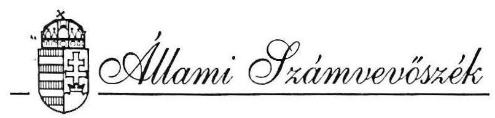
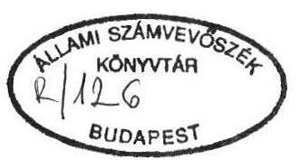
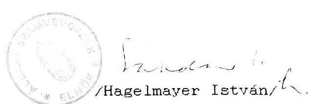

# JELENTÉS 

a Fiatal Demokraták Szövetsége
1991. évi gazdálkodása törvényességének vizsgálatáról

---

# Az ellenőrzést vezette: 

dr. Elek János főtanácsos

## Az ellenőrzést végezték:

dr. Dotterweich Antal tanácsos
Hoffmann István számvevő
Bárczai Tibor szakértő
dr. Velényi János szakértő

---

Állami Számvevöszék
V-1019-4/92.
Tsz: 119 .

# J e l e n t é s 

a Fiatal Demokraták Szövetsége
1991. évi gazdálkodása törvényességének vizsgálatáról

## I.

A vizsgálat célja, idôszaka, módszere, körülményei

A pártok gazdálkodásának törvényességét, az Állami Számvevöszékről szóló 1989. évi XXXVIII. tv, valamint a pártok müködéséről és gazdálkodásáról szóló, többször módosított 1989. évi XXXIII. tv (továbbiakban: párttörvény) felhatalmazása alapján, kizárólag az Állami Számvevöszék (ASZ) jogosult és köteles vizsgálni.

A Fiatal Demokraták Szövetsége (továbbiakban: párt) az 1990. évi általános országgyúlési választásokon elért eredménye alapjárt - a párttörvényben elöirt elosztási szabályok szerint rendszeres állami költségvetési támogatásban részesül. Ennek megfelelően a párt 1991. évben összesen 76.572 K Ft állami támogatást kapott.

A vizsgálat célja annak ellenörzése volt, hogy a párt gazdálkodása mennyiben felelt meg a párttörvény elöírásainak, továbbá betartották-e a könyvvitel-, a számvitel bizonylati rendjéről szóló és a gazdálkodással összefüggö egyéb hatályos rendelkezések elöírásait.

A vizsgálat az 1991. évi gazdálkodásra, annak törvényességére terjedt ki, a Magyar Közlöny 1991. évi 28. számában közzétett ASZ általános ellenőrzési program szempontjai alapján.

---

Ellenörzésre került az 1991. évi gazdálkodásról közzétett pénzügyi zárómérleg teljeskörúsége, pontossága, a könyvvezetés gyakorlata, bizonylati rendjének betartása. Az ASZ vizsgálat elsósorban arra irányult, hogy a párt múködéséhez szabályszerűen igénybevehető forrásokat használt-e fel, gazdálkodása megfelel -e a párttörvényben megengedett tevékenységeknek és betartotta-e ezzel összefüggésben a pénzügyi-számviteli elöirásokat. A vizsgálat lefolytatására a párt Központi Hivatalában került sor 1992. szeptember 1 és 25 . között.

# II. 

A párt 1991. évi pénzügyi zárómérlegének vizsgálata

A párt a Magyar Közlöny 1992. évi 33. számában tette közzé az 1991. évi gazdálkodásáról készített pénzügyi zárómérleget (1. sz. melléklet), a párttörvény mellékletében elöirt szerkezetben és a párttörvény 9. paragrafusában rögzített határidöre.

### 1.1. Altalános megállapítások

A pénzügyi zárómérleg pontosságának és teljeskörüségének vizsgálata során az ellenörzés az alábbiakat állapította meg:

A közzétett pénzügyi zárómérleg nem tekinthető teljeskörűnek és pontosnak, mivel elkészitésének idöpontjában a gazdasági események teljeskörü dokumentációja nem állt rendelkezésre és a közzétételt követöen is érkeztek be bizonylatok a párt könyvvezetését végzö kít-hez. Ezt alátámasztjảk a kft által a vizsgálat során átadott kiegészitő anyagok, valamint fókönyvi kivonatok.

Torzította a pénzügyi zárómérleget, hogy több esetben hibásan kontírozták a gazdasági események bizonylatait, döntően a kiadási oldalt érintőleg.

A pénzügyi zárómérleg nem tartalmazza az önálló jogi személynek minősülő csoportok bevételi és kiadási adatait.

---

# 1.2. A pénzügyi zárómérleg bevételi oldalát érintő megállapítások 

A pénzügyi zárómérlegben Tagdíjak címen 697 E Ft szerepel. A szúrópróbaszerú ellenörzés megállapítása szerint azonban helytelen kontirozás következtében egyes esetekben tagdijként könyveltek nem tagdijnak minösülő bevételeket, továbbá az is elöfordult, hogy tagdijat egyéb bevételként könyveltek.

Az állami költségvetésböl származó támogatást mind részleteiben, mind föösszegében - a fökönyvi számlák és az alapbizonylatok alapján - helyesen mutatta ki a párt 76.572 E Ft összegben. Az állami költségvetésböl származó támogatások között szerepel a parlamenti frakció szakértói díjaira kapott 12.090 E Ft összeg. A kialakult gyakorlatot a vizsgálat törvénysértónek tartja, mivel az országgyulési képviselök tiszteletdijáról, költségtérítéséröl és kedvezményeiról szóló módosított 1990. évi LVI. tv. elöirása szerint az összeg a pártok képviselö csoportjait illeti meg, a pénz kifizetésére az Országgyülés Hivatala lenne jogosult. A jelenlegi helyzetben a pártokhoz utalt szakértói dij törvényellenes többlettámogatást biztosít, mivel a kamatok a párt vagyonát gyarapítják, továbbá lehetöséget biztosít átmeneti likviditási problémák megoldásához, amelyekre egyébként hitelt kellene felvenni.

Az egyéb hozzájárulások mérlegsoron feltüntetett 5.049 E Ft összeg nem pontos. A vonatkozó fókönyvi számlák 5.418 E Ft követel egyenleget mutatnak az 1992. április 30-i állapot szerint. Az eltérés oka, hogy a párt pénzügyi zárómérlege az 1992. március 24-i fókönyvi kivonat alapján készült. A mérlegben közölt összeget az is torzítja, hogy egy magánszemélytöl származó, a DAC-alapítvány javára eszközölt 15 E Ft összegủ befizetés is található a mérlegben, amelyet helyesen átfutó tételként kellett volna kezelni. A mérleg külföldi magánszemélytöl származó hozzájárulást nem rögzít, azonban a vonatkozó fókönyvi számlán 3.530 Ft összeg található. A mérlegben belföldi nem jogi személytöl származó hozzájárulás nem szerepel, pedig a 9322 sz. ilyen elnevezésú fókönyvi számlán 15 E Ft összeget könyveltek le.

A párt propaganda tevékenységéből származó bevétel a közzétett pénzügyi zárómérlegben nem található, holott a 941 sz. propaganda tevékenység bevétele elnevezésú fókönyvi számlán - vidék

---

és Eudapest együttesen - 69 E Ft-ot kitevö propaganda tevékenységböl származó bevétel szerepel. A jelzett összeg a párt jelvényének, továbbá a FIDESZ PRESS újság árusításából, valamint rekiámból származó bevetelböl adódik. Ezenkivül a 979. sz. "egyéb bevétel" fökönyvi számlán szerepel 5 E Ft pólóértékesítésböl származó bevétel, ami ugyancsak propaganda tevékenységböl eredö bevételnek minösül. A tagdijak között feltüntetett újság elöfizetési dijat is helyesen e soron kellett volna kimutatni.

A pénzügyi zárómérleg a párt gazdálkodó tevékenységéböl származó bevételt nem tartalmazza, azonban 951. sz. "bérleti dijak" elnevezésú számlán bérleti dij címén 12,5 E Ft jelenik meg.

Az egyéb bevétel jogcímenkénti bontása megtörtént, azonban a pénzügyi zárómérlegben kamat címén szerepeltetett 701 E Ft összeg pontatlan, az 1991. ápr. 30-i fökönyvi kivonat szerint ugyanis a kamatbevétel összege 843 E Ft, a 971. sz. "kamatbevételek" elnevezésú számla adatai alapján. Az egyéb bevétel "egyéb" adata is pontatlan, az ápr. 30-i fökönyvi kivonat összegénél kisebb összeg található a mérlegben.

# 1.3. A pénzügyi zárómérleg kiadási oldalát érintő megállapítások 

A hozzájárulások juttatása a párt országgyülési csoportja számára mérlegsoron 219 E Ft szerepel, holott ez a fökönyvi számla alapján 287 E Ft.

A hozzájárulások juttatása a párt helyi szervei számára mérlegsoron 19.692 E Ft jelenik meg, mint tényleges kiadás. Ezzel szemben a vizsgálat megállapította, hogy az évzáró fökönyvi kivonat ezen a címen 14.344 E Ft összeget tartalmaz, mint elszámolást. A párt a halmozódás elkerülése végett az elszámolásra kiadott 19.692 E Ft összegú hozzájárulási juttatást tényleges kiadásként kezelte és szerepeltette a zárómérlegében, ezt a körülményt azonban nem jelölte. A pénzügyi zárómérleg szerkezeti felépítése nem teszi lehetővé, illetve kizárja, hogy a párt eleget tegyen a helyi szervezeteinek juttatott hozzájárulások és a ténylegesen felmerült költségek feltüntetésének, halmozo-dás-mentesen.

---

A hozzájárulások juttatása más társadalmi szervezetek számára mèrlegsoron 1.142 E Ft szerepel. Ezzel szemben megállapította a vizsgálat, hogy a tényleges kiadás ettöl eltéró, mivel a DAC-alapítvány részére adott támogatás - helytelenül - mindkét vonatkozó analitikus számlán költségként lett elszámolva, így a szerepeltetett összeg halmozódást tartalmaz.

Hozzájárulások juttatása külföldi intézmények, szervezetek, személyek számára mérlegsor adatot nem tartalmaz, holott a párt 1991. évben Vilniusba szállított 15 E Ft értékú gyógyszert, támogatásként.

A munkabérek mérlegsoron 17.317 E Ft szerepel, ez az összeg - a fókönyvi kivonat és a számlák tanúsága szerint - 17.321 E Ft.

A költségtérítések, napidíjak mérlegsor 8.284 E Ft-ot tartalmaz, ez ténylegesen 8.413 E Ft, mivel a különféle egyéb költségek között - helytelenül - szerepeltettek 129 E Ft összeget, amely ténylegesen költségtérítésnek minösül.

A pénzügyi zárómérleg adók, illetékek sora nem tartalmaz adatot, pedig - a vizsgálat megállapítása szerint - a pártnál a tárgyévben személyi jövedelemadó, előzetesen felszámított általános forgalmi adó és munkaadói járulék merült fel, illetve került elszámolásra. Figyelemmel arra, hogy a párttörvény 1. sz. mellékletéhez kitöltési útmutató nem készült, így egyes pártoknál a pénzügyi zárómérleg kitöltése terén különbözö gyakorlat alakult ki. A vizsgálat ezért jelzi, hogy indokolt lenne a pénzügyi zárómérleg módosítása, egyes sorai kitöltésének, illetve tartalmának definiálása.

A helyiségek bérlete mérlegsoron szereplő 1.520 E Ft költség nem pontos, ugyanis az egyéb költségek között különféle terembérleti díjakat számoltak el, összesen 160 E Ft értékben.

A sajtó- és propagandaköltségek mérlegsoron 4.191 E Ft-ot mutattak ki, amely ténylegesen 4.212 E Ft, tekintettel arra, hogy az egyéb költségek között helytelenül 26 E Ft összegben propagandaköltséget számoltak el.

---

# 1.4. A közzétett pénzügyi zárómérleg megitélése 

A párt ténvéges pénzügyi helyzetét nem tükrözi vissza pontosan a közzétett zárómérleg C része, mivel:

- a kiadási oldalon a párt helyi szervei számára folyósított hozzájárulások esetében nem a tényleges költségekkel számoltak, hanem csupán a kiadásként feltüntetett összeggel;
- a hozzájárulások juttatása más társadalmi szervezetek számára mérlegsor, mint az elözőekben már megállapításra került, halmozódást tartalmaz;
- a bevételi oldalon a tárgyévben felvett hiteleket a zárómérlegben nem jelenítették meg;
- és nem szerepel a halmozott hiány az előző gazdasági évről.

## 2. A pénzügyi zárómérleg megalapozottságát szolgáló könyvvizsgálati megállapítások

A párt a lehetséges könyvvezetési módozatok közül 1991-ben az egyszerusitett kettös könyvvitelt választotta. A könyvvezetést szerzödés alapján a TAXURG Adótanácsadó és Könyvelö Kft végezte a párt részére.

A központi könyvvezetés - az önálló jogi személy csoportok kivételével - valamennyi szervezet gazdasági eseményére kiterjedt. A könyvelés gépi adatfeldolgozással valósul meg, a párt által átadott bizonylatokat a kft kontirozza. A kontirozás alapjául számlarend-tükör szolgál, azonban számlarend nem készült. A számlarend hiányának is tudható be, hogy az egyes mérlegsorok tartalma nem egyértelmú, ugyanazon jogcim számos esetben különbözö fókönyvi számlákon kerül rögzítésre.

A bizonylatok kontirozása teljeskörűen megtörtént, a kontirozás azonban egyes esetekben nem megfelelö. Az észlelt hibák a jelentés 1. pontjában kerültek ismertetésre. Jelezni kell, hogy az elkövetett hibák jelentős része a mérlegkészitést megelözően korrigálásra került. Igy pl. a 91. sz. "tagdijbevételek" fókönyvi számla egyenlege nem tartalmazza az év közben helytelenül a számlára könyvelt tagdijtámogatások összegét.

---

A számlatükörrel összefüggésben is jelezni szükséges, hogy egyes, az egyszerüsitett számlakeretben elöirt számlák, nem szerepelnek pl. ló. "állóeszközök értékcsökkenése" megnevezésú számla. Ez azt is maga után vonja, hogy a könyvelés is eltér részben az általános gyakorlattól. Igy pl. az általános forgalmi adó nem jelenik meg a 4. számlaosztályban, az a beszerzéskor költségként került elszámolásra. A vizsgálat az általánostól eltérő gyakorlatot jelzi, de ennek okát a jogi szabályozás hiányosságaiban, az elöirások pártokra történö alkalmazásának nem megvalósithatóságában látja.

A vizsgálat megállapítása szerint azonban - egyes esetekben - a kialakított számlatükör alkalmazása nem következetes. Igy többek között; a számlatükörben szereplő 391. belföldi kft törzsbetét megnevezésú számla nincs megnyitva, a 393. kft-nek atadott vagyon számla alkalmazása nem következetes, a 899. egyéb ráfordítások számlán került elszámolásra a vagyonátadás.

A könyvviteli zárlatok megtörténtek, azonban a végleges fókönyvi kivonat a mérlegkészités és megjelentetés idópontja után készült el, igy a közzétett pénzügyi zárómérleg csak közbensó állapotot tükröz.

A megállapított hiányosságok kiküszöbölése érdekében javaslatok tétele nem indokolt, figyelemmel arra, hogy 1992. január 1-jével hatályba lépett a számvitelról szóló 1991. évi XVIII. tv. amely új elveket és szabályokat határoz meg.

# 3. Az analitikus nyilvántartások és bizonylati rend ellenörzése 

3.1. A fökönyvhöz kapcsolódó nyilvántartások a következök:

- személyi jövedelemadó köteles kifizetések.
- szállitók követelései.
- szigorú számadású nyomtatványok.

Ezeket a nyilvántartásokat megfelelően vezetik. Hiányosság, hogy a menetlevelekröl, valamint a belföldi kiküldetési rendelvényekről - amelyek szintén a szigorú számadású nyomtatványok közé sorolhatók - nyilvántartást nem fektettek fel.

---

A beszerzett vagy adományozott állóeszközökröl, ellentétesen a könyvvitel rendjéről szóló rendelet elöirásaival, egyedi allóeszköz nyilvántartási lapot nem fektettek fel.
3.2. A bizonylatok kiállitása és dokumentáltsága - szúrópróbaszeruen vizsgálva - néhány esetben nem felel meg az elöirt alaki és tartalmi követelményeknek, igy pl.

- a Vas megyei szervezetnél a pénztárkiadási bizonylatokról hiányzik az összeg átvevöjének aláírása, a kifizetö megnevezésének feltüntetése;
- a közlekedési költségek elszámolásánál jellemzö, hogy a belföldi utazásokhoz a kiküldetési rendelvenyt hiányosan állitják ki;
- üzemanyagköltség elszámolásnál, SZJA törvénybe, továbbá a saját gépjármú hivatalos használatáért járóköltségtérítésröl szló 9/1991.(V.16.)KHVM rendeletbe ütközöen nem az útvonal alapján történö norma szerinti elszámolást alkalmazták néhány esetben, hanem benzinszámla alapján térítették meg a költségeket;
- a külföldi kiküldetések és elszámolások ellenörzése során megállapításra került, hogy 1991. évben 89 esetben igényeltek kiküldetéshez valutát. Ebböl három személy február 18.-i dátummal 1.634 angol fontot igenyelt és vett fel, amely összeggel jelen vizsgálat napjáig nem számoltatták el öket;
- megbizási szerzödéseknél kifogásolja a vizsgálat, hogy azokat nem teljeskörüen töltik ki /pl. a megbizás tárgya feltüntetésének elmaradása/;
- kirivó esetnek minösül egy személy esetében az a gyakorlat, hogy saját gépjármú használata a munkaviszony létesitésének feltétele volt, havi 3500 km erejéig gépjármu átalányt állapították meg, de a munkavállalót nem kötelezték gépjármú-használat-nyilvántartás /útnyilvántartás/ vezetésére, 500 km-en felül. Ez a gyakorlat ellentétes a magánszemélyek jövedemadójáról szóló 1990. évi CII. törvénnyel módosított 1989. évi XLV. tv 2. sz.

---

sz. mellékletének III. e! pontjában, illetve a törvény 30. paragrafusának (6) bekezdésében foglaltakkal.

E törvenyellenes gyakorlatot sulyosbitja az a tény, hogy a munkavállaló a párt gépjármúvét is igénybe vette egyes hónapokban, miközben a havi gépjármúátalány összeget is változatlanul folyósitották.

A bizonylati elv és fegyelem betartása, amelynek feltételeit a számvitel bizonylati rendjéről szóló rendelet határoztá meg, javult az előző AöZ vizsgálat megállapításaihoz képest.

# 4. A párt gazdálkodó tevékenységének vizsgálata a párttörvény 6. paragrafusa alapján 

A párt - a szúrópróbaszerú vizsgálat és a párt Központi Hivatala vezetőinek nyilatkozata szerint - a pártot szimbolizáló tárgyakat árusított a törvényben engedélyezett gazdálkodó tevékenység keretében.

Az elmúlt évi vizsgálat megállapítása, hogy egy ízben került sor nem tulajdonban lévő helyiség bérbeadására, jelen vizsgálat megállapítása szerint e törvénysértó tevékenység megszünt.

Megállapításra került, hogy a párt 15 millió Ft összegú hitelt nyújtott évi $40 \%$ kamat kikötése mellett egy betéti társaság részére. A vizsgálat szerint a hitelnyújtás ellentétes a párttörvény 6. paragrafusa (4) bekezdésének, valamint a pénzintézetekröl és a pénzintézeti tevékenységröl szóló 1991. évi LXIX. tv. 8. paragrafusa (1) bekezdése elöírásaival. A párttörvény 10. paragrafusa (4) bekezdése elsó mondatában említett felhívást a vizsgálat nem tart indokoltnak, miután a hitelnyújtás már megszunt, eseti tevékenység volt.

Budapest, 1992. október 30.

Melléklet: 1 db

---

A FIDESZ
1991. évi pénzügyi zárómérlege

## Ezer forintban

A) Tényleges bevételek

1. Tagdijak ..... 697
2. Állami költségvetésbôl származó támogatás
a) alapösszeg ..... 25000
b) a pártra adott szavaza- tok arányában kapott összeg ..... 39392
c) szakértői támogatás ..... 12090
d) idöközi választásra ka- pott összeg ..... 90
3. Egyéb hozzájárulások
a) jogi személyektól ..... 5030
ebből 5000 E Ft fe- letti hozzájáru- lás a következö belfölditól: Demokratikus Poli- tikai Kultúráért Alapítvány ..... 5000
b) Magánszemélyektól ..... 19
4. A párt propagandátevékenységéből ..... -
5. A párt gazdálkodó tevékenységéből
a) bérbevétel
b) értékpapirból szírmazó bevétel ..... -
6. A párt által alapított vállalkozások nyere- ségéből származó bevétel ..... -
7. Egyéb bevétel
a) kamat ..... 701
b) eszközértékesítés ..... 200
c) biztosítási kártérítés ..... 481
d) egyéb ..... 252
1634
Összes pénzbevétel a gazdasági évben ..... 83952
B) Tényleges kiadások
8. Hozzájárulások juttatása
a) a párt országgyúlési cso- portja számára ..... 219
b) a párt helyi szervei szá- mára ..... 19692
c) a párt által fenntartott vagy támogatott intézmények számára ..... -
d) más társadalmi szerve- zetek számára ..... 1142
e) külföldi intézmények, szervezetek, személyek számára ..... -
21053
9. Személyzeti költségek
a) munkabérek ..... 17312
b) költségtérítések, napi- díjak ..... 8284
c) társadalombiztosítási hozzájárulások ..... 5782
d) szociális, fúdülési támogatások ..... 60
10. Általános költségek
a) adók, illetékek ..... -
b) épületek fenntartása, karbantartása, közüze- mi díjai ..... 1804
c) helyiségek bérlete ..... 1520
d) adminisztrációs és pos- taköltségek ..... 7489
e) különféle egyéb költsé- gek ..... 22982
33795
11. Sajtó- és propagandaköltségek ..... 4191
12. A választásokkal kapcsolatos költségek ..... 753
13. Egyéb tevékenységgel kapcsolatos költsé- gek ..... 16865
Összes kiadás a gazdasági évben ..... 108095
C) Tényleges pénzügyi helyzet a gazdasági év zárásakor
Bevételek a gazdasági évben ..... 83952
Kiadások a gazdasági évben ..... 108095
Hiány a gazdasági évben ..... -24143
Herter Róbert s. k., ügyvezetó igazgató