# ÁLLAMI   SZÁMVEVŐSZÉK 

## JELENTÉS

## Szécsény Város Önkormányzata pénzügyi helyzetének ellenőrzéséről (43/4)

---

# Állami Számvevőszék 

Iktatószám: V-3107-023/2012.
Témaszám: 1015
Vizsgálat-azonosító szám: V0560138

## Az ellenőrzést felügyelte:

Dr. Varga Sándor
számvevő igazgatóhelyettes
Az ellenőrzést vezette:
Renkó Zsuzsanna
számvevő tanácsos
Ellenőrzési csoportvezető:
Puchy Márta
számvevő tanácsos
Az ellenőrzést végezték:
Bus András Péter
számvevő

Tóth László
számvevő tanácsos

---

# TARTALOMJEGYZÉK 

BEVEZETÉS ..... 9
I. ÖSSZEGZŐ MEGÁLLAPÍTÁSOK, KÖVETKEZTETÉSEK, JAVASLATOK ..... 13
II. RÉSZLETES MEGÁLLAPÍTÁSOK ..... 26

1. Az Önkormányzat kötelező és önként vállalt feladatai, a feladatellátás szervezeti keretei és annak változásai ..... 26
2. Az Önkormányzat pénzügyi egyensúlyi helyzetét befolyásoló tényezők ..... 30
2.1. A működési és a felhalmozási egyensúly változása ..... 32
2.2. Az Önkormányzat bevételeinek változása ..... 37
2.3. Az Önkormányzat működési és felhalmozási célú kiadásainak változása ..... 39
3. Az Önkormányzat kötelezettségei ..... 43
3.1. Az Önkormányzat pénzintézeti kötelezettségeinek változása ..... 43
3.2. Szállítói kötelezettségek változása ..... 48
3.3. Egyéb kötelezettségek változása ..... 49
4. A pénzügyi egyensúly megteremtése érdekében hozott intézkedések ..... 52
5. Az ÁSZ által a korábbi években a pénzügyi egyensúly javítására tett szabályszerűségi és célszerűségi javaslatok hasznosulása ..... 55

## MELLÉKLETEK

1. számú Működési és felhalmozási célú hiány/többlet a 2007-2010 közötti időszakban az Önkormányzat zárszámadási rendeleteiben (1 oldal)
2. számú Az Önkormányzat bevételei és kiadásai, valamint adósságszolgálata 2007-2010 között (1 oldal)
3/a. számú Az Önkormányzat 2007-2010. években megvalósított, 2010. december 31-ig befejezett fejlesztései és azok forrásösszetétele (1 oldal)
3/b. számú Az Önkormányzat 2010. december 31-én folyamatban lévő fejlesztési feladataira 2010. december 31-ig teljesített kifizetések és azok forrásösszetétele (1 oldal)
3/c. számú Az Önkormányzat 2010. december 31-én folyamatban lévő fejlesztési feladataira 2010. december 31-én fennálló kötelezettségek és azok forrásösszetétele (1 oldal)
3. számú Az önkormányzati feladatok ellátásában résztvevő gazdasági társaságok (1 oldal)

---

.

---

# RÖVIDÍTÉSEK JEGYZÉKE 

## Törvények

Áht.
Ötv.
Gt.
Ptk.
Stabilitási törvény

## Rendeletek

2007. évi költségvetési rendelet
2007. évi zárszámadási rendelet
2008. évi zárszámadási rendelet
2009. évi zárszámadási rendelet
2010. évi zárszámadási rendelet
2011. évi költségvetési rendelet

Áhsz.

Szrszápos Egészségbiztosítási Pénztár
Önhibájukon kívül hátrányos helyzetben lévő települési
az államháztartásról szóló 1992. évi XXXVIII. törvény a helyi önkormányzatokról szóló 1990. évi LXV. törvény a gazdasági társaságokról szóló 2006. évi IV. törvény a Polgári Törvénykönyvről szóló 1959. évi IV. törvény Magyarország Gazdasági Stabilitásáról szóló 2011. évi CXCIV. törvény

Szécsény Város Önkormányzata Képviselő-testületének 4/2007. (II. 14.) számú rendelete az Önkormányzat 2007. évi költségvetéséről
Szécsény Város Önkormányzata Képviselő-testületének 11/2008. (IV. 16.) számú rendelete az Önkormányzat 2007. évi költségvetésének végrehajtásáról
Szécsény Város Önkormányzata Képviselő-testületének 7/2009. (IV. 22.) számú rendelete az Önkormányzat 2008. évi költségvetésének végrehajtásáról
Szécsény Város Önkormányzata Képviselő-testületének 9/2010. (IV. 28.) számú rendelete az Önkormányzat 2009. évi költségvetésének végrehajtásáról
Szécsény Város Önkormányzata Képviselő-testületének 11/2011. (IV. 20.) számú rendelete az Önkormányzat 2010. évi költségvetésének végrehajtásáról

Szécsény Város Önkormányzata Képviselő-testületének 4/2011.(II. 09.) számú rendelete az Önkormányzat 2011. évi költségvetéséről
az államháztartás szervezetei beszámolási és könyvvezetési kötelezettségének sajátosságairól szóló 249/2000. (XII. 24.) Korm. rendelet

Szécsény Város Önkormányzatának többször módosított 3/2007. (II. 1.) számú rendelete az Önkormányzat Szervezeti és Működési Szabályzatáról

## Szórövidítések

áfa
ÁSZ
CHF
EU
ÉMOP
HUF
jegyző
Képviselő-testület
Kormány
OEP
ÖNHIKI
általános forgalmi adó
Állami Számvevőszék
svájci frank
Európai Unió
Észak-Magyarországi Operatív Program
Forint
Szécsény Város Önkormányzatának Jegyzője
Szécsény Város Önkormányzatának Képviselő-testülete
Magyarország Kormánya
Országos Egészségbiztosítási Pénztár
Önhibájukon kívül hátrányos helyzetben lévő települési

---

|  | önkormányzatok támogatása |
| :-- | :-- |
| Önkormányzat | Szécsény Város Önkormányzata |
| polgármester | Szécsény Város Önkormányzatának Polgármestere |
| Polgármesteri hivatal | Szécsény Város Önkormányzatának Polgármesteri Hivatala |
|  |  |
| szja | személyi jövedelemadó |

---

# ÉRTELMEZŐ SZÓTÁR 

| BUBOR | Budapesti Bankközi Forint Hitelkamatláb. Irányadó, refe-   rencia jellegű kamatláb. Mértékét az MNB naponta álla-   pítja meg a banki kamatok figyelembevételével. Közzété-   tele naponta történik. |
| :--: | :--: |
| CLF módszer | Az önkormányzatok költségvetése elemzésének eszköze. A   módszer következetesen elkülöníti a folyó és a felhalmo-   zási költségvetés bevételeit és kiadásait, azok költségvetési   egyenlegeit. Bizonyos mértékig a vállalati gazdálkodás   logikai elemeit érvényesíti az önkormányzatok pénzügyi,   jövedelmi helyzetének vizsgálata során. Az értékelés a   pénzügyi kapacitás fogalmát helyezi a középpontba. |
| EURIBOR | A frankfurti bankközi piacon jegyzett, az Európai Közpon-   ti Bank szabályainak megfelelően megállapított kínálati   kamatláb. Az EURIBOR értékét a legfontosabb európai   bankok hitelkínálatának kamatlábai alapján a Reuters   ügynökség számolja ki és teszi közzé naponta. A magyar   pénzintézetek is ezt használják viszonyítási alapnak EUR   hitelek esetén. |
| használhatósági fok | Az eszközgazdálkodás vizsgálatának elemzése során   használt mutató. Számításakor a tárgyi eszköz könyv szer-   inti (nettó) értékét viszonyítják a tárgyi eszköz bruttó (be-   szerzési/létesítési) értékéhez. A mutató százalékban kifeje-   zett értékének csökkenése az eszköz állagának romlására,   avulására utal, ami maga után vonja az üzemeltetési és   fenntartási költségek növekedését is. |
| kamatkockázat | A változó kamatozású forint-, vagy a devizahitelek futam-   ideje alatt a kamat emelkedése miatt fennálló kamatkocká-   zat, melynek növekedése miatt nő a hitel törlesztő rész-   lete. |
| kötelező közszolgáltatás | A helyi önkormányzati feladatkörbe tartozó, a köztiszta-   sággal és a településtisztasággal, valamint az élet- és va-   gyonbiztonsággal összefüggő egyes - közszolgáltatás út-   ján megvalósuló - közfeladatok ellátása, amelynek köte-   lező igénybevételét külön jogszabály (törvény, helyi ön-   kormányzati rendelet) határoz meg. |
| közfeladat | Állami, helyi, illetve kisebbségi önkormányzati feladat,   amelynek ellátásáról az államnak, illetve az önkormán-   zatoknak kell gondoskodni. A hatályos szabályozás sze-   rint közfeladatot törvény és önkormányzati rendelet álla-   píthat meg. Az önkormányzatok által ellátandó feladatok   keretszerű meghatározását az Ötv. tartalmazza. |
| LIBOR | Angol kifejezés, a London Interbank Offered Rate rövidíté-   se. Jelentése: Londoni bankközi, referencia jellegű kínálati   (hitel) kamatláb. |

---

önkormányzat többségi tulajdonában lévő gazdasági társaságok
pénzügyi kapacitás
pénzügyi kockázat

SNA

Az önkormányzat a gazdasági társaságban a szavazatok több mint ötven százalékával vagy a Ptk. 685/B. § (2)-(3) bekezdéseiben rögzített meghatározó befolyással rendelkezik. A befolyással rendelkező akkor rendelkezik egy jogi személyben meghatározó befolyással, ha annak tagja, illetve részvényese, és jogosult e jogi személy vezető tisztségviselői vagy felügyelőbizottsága tagjainak többségének megválasztására, illetve visszahívására, vagy a jogi személy más tagjaival, illetve részvényeseivel kötött megállapodás alapján egyedül rendelkezik a szavazatok több mint ötven százalékával (Ptk. 685/B. § (2) bekezdés). A meghatározó befolyás akkor is fennáll, ha a befolyással rendelkező számára e jogosultságok közvetett módon (köztes vállalkozásain keresztül, a Ptk. 685/B. § (3)-(4) bekezdései szerint) biztosítottak.
A helyi önkormányzat és az önkormányzat irányítása alá tartozó költségvetési szerv többségi tulajdonában, illetve többségi befolyása alatt álló gazdálkodó szervezet esetében hitelfelvétel, kölcsönfelvétel, garancia- vagy kezességvállalás, tartozásátvállalás, tartozáselengedés, értékpapírkibocsátás, vásárlás, pénzügyi lízing, tartós bérleti szerződés, ingyenes vagyonjuttatás (így különösen: ajándékozás, ingyenes engedményezés), vagy követelésvásárlás, követelésengedményezés végrehajtására vonatkozóan az Áht. 100/M. § (4) bekezdése alapján az önkormányzat rendelkezik döntési jogosultsággal.
A pénzügyi kapacitás (financial capacity) az adósok hitelfelvételi képességének azon mértéke, ahol még anélkül tudják növelni az adósságot, hogy csökkenteniük kellene akár a jelenbeli, akár a jövőben esedékes kiadásaikat a fizetésképtelenség elkerülése érdekében. (Forrás: Az önkormányzati rendszer pénzügyi helyzete, ÁSZKUT tanulmány 2010.)
A működési kockázat egyik eleme. Megmutatkozhat a költségvetés nagyságrendjének, szerkezetének nem megalapozott módosításaiban, a bevételi, és a kiadási előirányzatoktól lényegesen eltérő teljesítésekben, a nem megfelelő belső kontrollrendszer működésében, a tudatos károkozásokban, a biztosítások elmaradásában, a hibás fejlesztési döntésekben, a nem a terveknek megfelelő forrásfelhasználásokban. Jelentkezhet továbbá a bevételek és kiadások ütemkülönbsége miatt felvett folyószámla- és likvidhitelek költségvetési év végén fennálló egyenlege miatt, amely az önkormányzat költségvetésébe - akár tartósan - beépülő forráshiányt jelzi.
System of National Account, azaz a Nemzeti Számlák Rendszere, amely a gazdasági szektorok által létrehozott valamennyi terméket és szolgáltatást figyelembe veszi.

---

szállítói kitettség
törlesztési kockázat

Az önkormányzat pénzügyi helyzete olyan külső körülmények hatására is módosulhat, amelyekre az önkormányzatnak nincs hatása, emiatt szállítói kitettsége keletkezik. Pl. a lejárt szállítói tartozások rendezése függhet attól, hogy a szállító milyen intézkedéseket foganatosít az önkormányzattal szemben.
Annak a kockázata, hogy a megfelelő időben és mértékben a hitelt felvevőnél rendelkezésre állnak-e a pénzintézetek és egyéb szervek felé fennálló kötelezettségek visszafizetéséhez, a hitelek és kölcsönök törlesztéséhez szükséges pénzügyi források.
A törlesztési kockázatot növeli a kamat- és árfolyam növekedése, mivel ezekben az esetekben az adósságszolgálat nőhet. Törlesztési kockázatot okozhat a visszafizetésre tervezett forrás elérésének, teljesítésének bizonytalansága (pl. a visszafizetéshez tervezett tartalékolás elmaradt, a tervezettnél alacsonyabb a saját bevétel, a helyi adóból származó bevétel az adóalanyok, adóalapok csökkenése miatt nem teljesül).

---

.

---

# JELENTÉS 

## Szécsény Város Önkormányzata pénzügyi helyzetének ellenőrzéséről

## BEVEZETÉS

Az Állami Számvevőszék 2011. évtől érvényes stratégiája új irányt szabott a helyi önkormányzatok gazdálkodásának ellenőrzésében is. Az ÁSZ - küldetése és jövőképe szerint - szilárd szakmai alapokra támaszkodva értékteremtő ellenőrzéseivel és helyzetelemzéseivel az államháztartás egészében, így a helyi önkormányzati alrendszerben is elő kívánja segíteni a közpénzek és a közvagyon szabályos, gazdaságos, hatékony és eredményes felhasználását. E folyamat részeként - az államháztartási hiány alakulásának összetevőire is figyelemmel - végezzük az önkormányzati alrendszer pénzügyi helyzetelemzését.

Az államháztartás helyi szintjén a 304 városnak${ }^{1}$ az általuk ellátott közszolgáltatások volumenére is tekintettel a közfeladatok ellátásában kiemelt szerepe van. E települések 2011. január 1-jei népessége 3169 ezer fő volt.

Feladataik és hatásköreik az Ötv. mellett különböző ágazati törvények által meghatározottak, miközben a feladatellátás szervezeti kereteit - ezen belül a gazdasági társaságok közszolgáltatások ellátásában betöltött szerepét - saját maguk határozzák meg. A gazdasági társaságok által ellátott feladatok esetén a gazdálkodás, továbbá az önkormányzatok pénzügyi egyensúlyi helyzetére ható közvetlen kockázatok egy része kikerült az önkormányzati alrendszerből. A többségi önkormányzati tulajdonban lévő társaságok gazdálkodásának körülményei befolyásolhatják a városok pénzügyi egyensúlyi helyzetének megítélésében rejlő kockázatokat.

Az áttekintett időszakban az önkormányzati forrásszabályozás elvei lényegesen nem változtak. Az önkormányzatok gazdasági mozgásterét a központi költségvetéstől való függőség mellett jelentősen befolyásolja a helyi adókivetési jog gyakorlása. A városok gazdálkodási szabadságának lényeges eleme, hogy anyagi lehetőségeik függvényében dönthettek arról, hogy feladataik közül azokat, amelyek megoldására az Ötv. szerint a települési önkormányzat nem kötelezhető, a megyei önkormányzat fenntartásába adhatták. E döntések differenciáltan érintették a városok pénzügyi helyzetét.

[^0]
[^0]:    ${ }^{1}$ A megyei jogú városok nélkül figyelembe vett városok száma 304 városi önkormányzatot jelent.

---

A városi önkormányzatok 2007-2010 között teljesített bevételeit és összetételét az alábbi ábra szemlélteti:
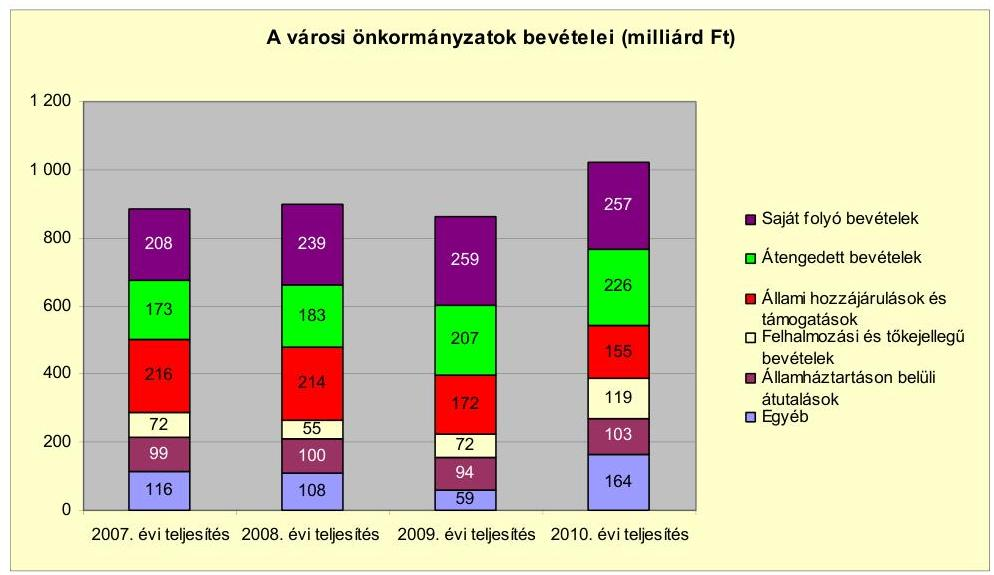

Az önkormányzati alrendszer pénzügyi helyzetértékelése során új elemzési módszereket alkalmazott az ellenőrzés. A költségvetési beszámoló adatok elemzése helyett az Önkormányzat pénzügyi helyzetét a CLF módszerrel értékeljük, amelynek lényegét és számításának módszerét a jelentés 2. pontjában, és a jelentés 2. számú mellékletében ismertetjük részletesen.

Az új módszereken alapuló helyzetértékelés fontosságát az adja, hogy a helyi önkormányzatok bruttó adósságállománya${ }^{2}$ a 2010. évi költségvetési beszámolók alapján 1248 milliárd Ft-ot
 tett ki. Ezen belül a 304 város adóssága 383 milliárd Ft volt, amely az önkormányzati alrendszer teljes adósságállományának 30,7%-át jelentette³.

A mérlegben kimutatott bruttó adósságállomány mellett az önkormányzatok számára az eszközállomány műszaki állapotának megőrzése is előbb-utóbb pénzügyi kötelezettséget jelent. Az elhasználódott eszközök pótlására forrást biztosító amortizációs (felújítási) alap képzésének⁴ elmaradása maga után vonhatja a feladatellátást kiszolgáló tárgyi eszközök állagának erőteljes romlását. Emellett a 2007-2013-as időszakra meghirdetett, vissza nem térítendő EU-s fejlesztési forrásokhoz való hozzájutás lehetősége felerősítette az önkormányzati alrendszer fejlesztési igényeit, amelyek a felhalmozási költségvetési hiány fo-

[^0]
[^0]:    ² Az önkormányzati mérlegbeszámolókból számított bruttó adósságállomány 2010. év végi összege magában foglalja a fejlesztési és a működési célú kötvénykibocsátások, a beruházási és fejlesztési hitelek, a működési célú hosszú lejáratú hitelek, a rövid lejáratú hitelek, váltótartozások miatti kötelezettségek teljes (2011-ben, illetve az azt követő években esedékes) állományát. Az önkormányzatok 2007. év végi mérleg szerinti adósságállománya 692 milliárd Ft volt.
    ³ A fővárosi és a kerületi önkormányzatok adósságának figyelmen kívül hagyásával számított 977 milliárd Ft összegű bruttó adósságállományból a városok 39,2%-kal részesedtek.
    ⁴ Erre a jelenlegi szabályozási környezetben nem kötelezi előírás az önkormányzatokat.

---

lyamatos emelkedésén túl - az előírt jövőbeni fenntartási kötelezettség miatt tovább terhelhetik az önkormányzatok költségvetését⁵.

Az ÁSZ a 2011. évi ellenőrzési tervében 43. számú, az Önkormányzatok gazdálkodási rendszerének ellenőrzése részeként áttekinti, és elemzi az önkormányzatok pénzügyi helyzetét. A gazdálkodás szabályszerűségét az ÁSZ az előző évek során ebben az önkormányzati körben is ellenőrizte. Jelen vizsgálatunk a tett javaslataink pénzügyi helyzetet érintő pontjainak hasznosítására utóellenőrzés jelleggel tér ki.

Az ellenőrzés megállapításait az Önkormányzat által kitöltött - teljességi nyilatkozattal megerősített - 27 tanúsítványon szolgáltatott adatokra alapoztuk. Ellenőrzési bizonyítékként használtuk fel továbbá:

- a képviselő-testületi és bizottsági előterjesztéseket, a döntés-előkészítés során készített dokumentumokat;
- a kötelezettségvállalások dokumentumait;
- a pénzügyi-számviteli nyilvántartásokat;
- az éves költségvetési beszámolókat;
- a költségvetési és zárszámadási rendeleteket.

Az ellenőrzés a 2007. január 1. - 2011. június 30. közötti időszakot öleli fel. A pénzintézeti kötelezettségek állományának vizsgálatakor az ellenőrzött időszak 2006. december 31. - 2011. június 30. közötti időszakra terjedt ki.

Az ellenőrzés során vizsgáltunk minden olyan körülményt és adatot, amely a program végrehajtásához kapcsolódott és a pénzügyi helyzet alakulására hatást gyakorló releváns tények és folyamatok feltárásához szükségessé vált.

# Az ellenőrzés célja annak értékelése volt, hogy: 

- a vizsgált időszakban a kötelező és önként vállalt feladatok ellátását biztosító szervezeti keretekben, a feladatellátás módjában bekövetkezett változások milyen hatást gyakoroltak az Önkormányzat pénzügyi helyzetének alakulására;
- az Önkormányzat pénzügyi - ezen belül működési és felhalmozási - egyensúlya mely tényezők hatására miként változott, és az Önkormányzat milyen intézkedéseket tett a pénzügyi egyensúly javítása érdekében;

[^0]
[^0]:    ⁵ Az Állami Számvevőszék 2011 júniusában közzétett 1108. számú, a helyi önkormányzatok fejlesztési célú támogatási rendszerének ellenőrzéséről szóló jelentésében feltárta a fejlesztési folyamatok problémáit. A helyi önkormányzatok elsősorban azokat a fejlesztéseket valósították meg, amelyekhez támogatást lehetett igényelni. A fejlesztési célok közül a magasabb támogatási intenzitású pályázatokat részesítették előnyben. A fejlesztéssel megvalósuló létesítmények jövőbeli üzemeltetésének várható ráfordításait az önkormányzatok 71,9%-a nem mérte fel.

---

- a költségvetési kiadások finanszírozása érdekében vállalt pénzintézeti kötelezettségek hogyan alakultak, továbbá milyen kötelezettségek fennállása befolyásolja az Önkormányzat jövőbeli pénzügyi helyzetét;
- hasznosultak-e a gazdálkodási rendszer korábbi ellenőrzése során a pénzügyi egyensúly javítására az ÁSZ által tett szabályszerűségi és célszerűségi javaslatok.

Az ellenőrzés típusa: szabályszerűségi vizsgálat.
A vizsgálat jogszabályi alapját az Állami Számvevőszékről szóló 2011. évi LXVI. törvény 1. §. (3), 5. § (2)-(6) bekezdései, továbbá az Áht. 120/A. § (1) bekezdése előírásai képezik.

Szécsény város lakosainak száma 2011. január 1-jén 5765 fő volt. A 2010. évi választásokat követően az Önkormányzat kilenctagú képviselő-testületének munkáját három állandó bizottság segítette. A helyi Önkormányzat mellett egy kisebbségi önkormányzat működött. A polgármester a 2010. évi választásokat követően, a jegyző 2012. január 1-jétől tölti be a tisztségét.

Az Önkormányzat a 2010. évi költségvetési beszámolója szerint - a finanszírozási célú bevételekkel és kiadásokkal, valamint a pénzmaradvánnyal együtt 2007,5 millió Ft költségvetési bevételt ért el és 1959,7 millió Ft költségvetési kiadást teljesített. Az Önkormányzat költségvetési bevételei a 2007. évről a 2010. évre 1815,2 millió Ft-ról 192,3 millió Ft-tal (10,6%-kal), a költségvetési kiadásai 1753,6 millió Ft-ról 206,1 millió Ft-tal, (11,8%-kal) emelkedtek. Az Önkormányzat vagyona a 2007. év végi 4255,6 millió Ft-ról 2010. december 31-re 794,4 millió Ft-tal (18,7%-kal) 5050,0 millió Ft-ra növekedett.

Az Önkormányzat kötelező feladatait az Ötv. és az ágazati törvények szerint meghatározottnak tekintette. Az önként vállalt feladatok a bölcsődei ellátáshoz⁶, a gimnáziumi, a szakközépiskolai és szakmai középfokú oktatáshoz, a helyi televízió műsorszolgáltatáshoz, a település társadalmi szervezeteinek támogatásához kapcsolódtak.

[^0]
[^0]:    ⁶ A Gyermekek védelemről és a gyámügyi igazgatásról szóló 1997. évi XXXI. törvény 94. § (3) bekezdése szerint azon települési önkormányzat, amelynek területén 10000 főnél kevesebb állandó lakos él, nem köteles bölcsödét működtetni.

---

# I. ÖSSZEGZŐ MEGÁLLAPÍTÁSOK, KÖVETKEZTETÉSEK, JAVASLATOK 

Az Önkormányzat - adatszolgáltatása szerint - a 2007-2009. évek közötti időszakban átlagosan a működési kiadások (1039,3 millió Ft) 95,0%-át (987,3 millió Ft-ot) fordította a kötelező, 5,0%-át (52,0 millió Ft-ot) az önként vállalt feladatok ellátására. A 2010. évben a kötelező és önként vállalt feladatok aránya nem változott, a 1218,3 millió Ft működési kiadásból⁷ az Önkormányzat 1157,4 millió Ft-ot a kötelező, 60,9 millió Ft-ot az önként vállalt feladatok ellátására fordított.

Az önként vállalt feladatok a bölcsődei ellátáshoz⁸, a gimnáziumi, a szakközépiskolai és szakmai középfokú oktatáshoz, a helyi televízió műsorszolgáltatáshoz, a település társadalmi szervezeteinek támogatásához kapcsolódtak.

Az Önkormányzat feladatellátásának szervezeti struktúráját a 2011. június 30-ai állapot szerint az alábbi ábra szemlélteti:

Az Önkormányzat feladatellátásának szervezeti struktúrája
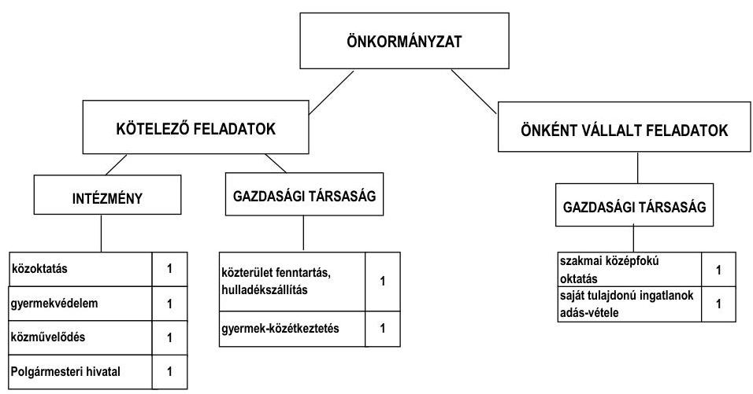

Az Önkormányzat feladatait 2011. június 30-án négy költségvetési szervvel (a Polgármesteri hivatallal együtt) és négy gazdasági társaság keretében látta el, amelyekben az Önkormányzat kizárólagos tulajdonnal rendelkezett. A

[^0]
[^0]:    ⁷ A működési kiadások tartalmazták a jelentés 2. számú melléklet 1.2 pontjában bemutatott működési kiadásokat kamatkiadások nélkül, az államháztartáson belülre átadott pénzeszközöket, a transzfer- és a kamatkiadásokat. A működési kiadások nem tartalmazták azonban az egészségügyi ellátást biztosító OEP által finanszírozott védőnői szolgálat, valamint a cigány kisebbségi önkormányzat működési célú kiadásait.
    ⁸ A Gyermekek védelemről és a gyámügyi igazgatásról szóló 1997. évi XXXI. törvény 94. § (3) bekezdése szerint azon települési önkormányzat, amelynek területén 10000 főnél kevesebb állandó lakos él, nem köteles bölcsödét működtetni.

---

gazdasági társaságok gyermek- és közétkeztetés, temetőüzemeltetés, intézmény karbantartás, takarítás, közterület fenntartás, hulladékkezelés-szállítás, szakképző középfokú oktatás, valamint az önkormányzati tulajdonú ingatlanok forgalmazása területén kaptak szerepet az Önkormányzat feladatellátásában. A gazdasági társaságok az ellenőrzött időszakban összesen 120,0 millió Ft működési célú pénzeszközátadásban részesültek. A gazdasági társaságok által nyújtott adatszolgáltatás alapján 2010. december 31-én a saját tőke/jegyzett tőke aránya -1,0 és 10,6 között alakult a társaságoknál, kettő társaságnál a saját tőke a 2007-2010. évek között alacsonyabb volt a jegyzett tőkénél a veszteséges gazdálkodásuk miatt.

Az Önkormányzatnak tulajdonosi kötelezettsége - a Gt. 143. § (3) bekezdésében foglaltak alapján - a gazdasági társaság vagyoni helyzetének rendezése (pótbefizetés előírása, törzstőke leszállítása, a társaság más formába történő átalakítása, jogutód nélküli megszüntetése). A Képviselő-testület a 2008. és a 2010. években veszteségesen gazdálkodó Szécsényi Gyermek-és Közétkeztetési Nonprofit Kft. feladatait - gyermek- és közétkeztetést, valamint munkahelyi étkeztetést - 2011. augusztusban átszervezte a Szécsényi AGRO-HELP Nonprofit Kft.-be. A Képviselő-testület a társaság végelszámolással történő megszüntetéséről döntött⁹. A Kft. követeléseinek értéke 8,6 millió Ft, kötelezettségeinek összege 18,4 millió Ft, a végelszámoláshoz a Képviselő-testület maximum 10,0 millió Ft összegben fedezetet biztosított¹⁰. A társaság végelszámolásának kezdő időpontja 2011. december 16.

Az Önkormányzat kizárólagos tulajdonában lévő Szécsényi Városfejlesztő Szolgáltató Kft. az EU-s pályázatokhoz kapcsolódó projektmenedzselési feladatokat végezte, működtetését a támogatási szerződés a 2009. évi aláírásától számított legalább 5 évig fenn kell tartani. Saját tőkéje a 2008-2010. években nem érte el a társasági formájára kötelezően előírt jegyzett tőke (0,5 millió Ft) értékét. A Gt. szerint, amennyiben a gazdasági társaság egymást követő két teljes üzleti évben nem rendelkezik a társasági formájára előírt jegyzett tőkének megfelelő összegű saját tőkével és a szükséges saját tőke biztosításáról nem gondoskodtak, köteles elhatározni más gazdasági társasággá való átalakulását, vagy rendelkeznie kell jogutód nélküli megszüntetéséről.

[^0]
[^0]:    ⁹ a Képviselő-testület 307/2011. (XII. 12.) számú határozata
    ¹⁰ a Képviselő-testület 308/2011. (XII. 12.) számú határozata

---

Az egyes közfeladatok a 2007. és a 2010. évi működési kiadásainak finanszírozási összetételét ágazatonként az alábbi ábra szemlélteti:
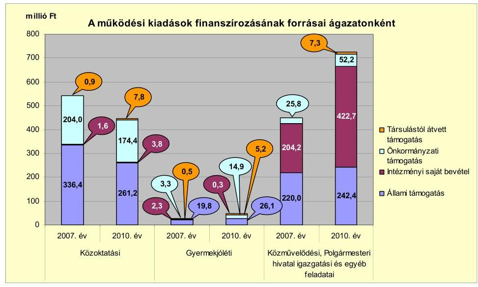

A közoktatás ágazati kiadásainak finanszírozásában a 2007-2009. évek átlagához viszonyítva a 2010. évre az állami támogatás összege 315,0 millió Ft-ról 261,2 millió Ft-ra (17,1%-kal), az önkormányzati támogatás 191,3 millió Ft-ról 174,4 millió Ft-ra (8,8%-kal) csökkent. A csökkenést a közoktatási normatívák számítási rendszerének módosulása, valamint az óvodában és az általános iskolában ellátottak számának - a 2007-2009. évi 1074 főről a 2010. évre 978 főre történt - csökkenése okozta. A közművelődési, Polgármesteri hivatal igazgatási és egyéb feladatai működési kiadásai 2007-2010 között emelkedtek, a közcélú foglalkoztatottak számának és juttatásainak, valamint a szociális juttatások és az átadott pénzeszközök növekedése miatt. A kiadások finanszírozási forrásösszetételét befolyásolta, hogy a közművelődési intézmény önkormányzati támogatása a 2007. évi 25,8 millió Ft-ról 102,3%-kal (26,4 millió Ft-tal) a 2010. évre 52,2 millió Ft-ra emelkedett. Az intézményi saját bevételek és az állami támogatások csökkenését az önkormányzati támogatás emelésével kompenzálták.

Az Önkormányzatnál a vizsgált időszakban a kötelező és önként vállalt feladatok ellátását biztosító szervezeti keretekben, a feladatellátás módjában bekövetkezett változások a pénzügyi egyensúlyi helyzet alakulását nem befolyásolták.

---

Az Önkormányzat folyó költségvetés egyenlege (működési jövedelem) a 2007-2009. években működési forrástöbbletet, a 2010. évben forráshiányt mutatott, melyet az alábbi ábra szemléltet:
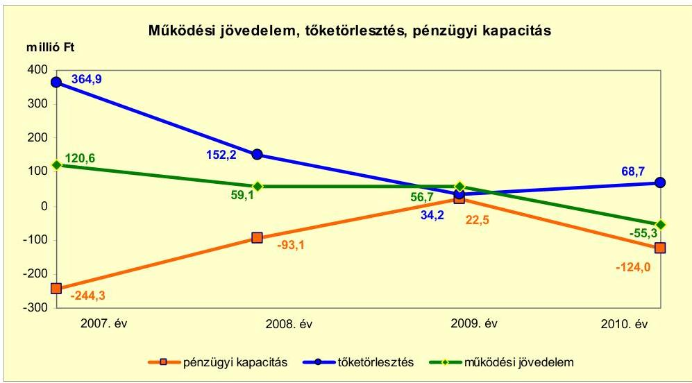

Az Önkormányzat a 2007. évben 112,7 millió Ft, a 2008. évben 67,7 millió Ft, a 2009. évben 57,8 millió Ft, a 2010. évben 33,4 millió Ft ÖNHIKI támogatásban részesült. Az Önkormányzat működési jövedelme az ÖNHIKI támogatás nélkül a 2007. évben 7,9 millió Ft, 2008. évben -8,6 millió Ft, a 2009. évben -1,1 millió Ft, a 2010. évben -88,7 millió Ft volt. A működési jövedelem 2007-2010 között folyamatosan csökkent. A legnagyobb változás 2009-2010 között volt. A működési jövedelem 112,0 millió Ft-tal (71,5%-kal)
 esett vissza, mivel 2010-ben az előző évhez viszonyítva a folyó kiadások 13,2%-kal (143,5 millió Ft-tal) növekedtek, mint a folyó bevételek 2,8%-os (31,5 millió Ft-os) növekedése. A folyó kiadások emelkedését a személyi juttatások - a közcélú foglalkoztatottak számának és juttatásának, az állományba nem tartozók juttatásának - 36,8 millió Ft-os, valamint a dologi kiadások - a beruházási és felújítási pályázatokhoz kapcsolódó vásárolt közszolgáltatások, az áfa kiadás, valamint normatíva és ÖNHIKI előleg visszafizetés $^{11}$ - 53,1 millió Ft-os növekedése okozta. Az Önkormányzat pénzügyi kapacitása (nettó működési jövedelme) a 2007-2008. és a 2010. években negatív, azonban a 2009. évben pozitív értéket mutatott. A nettó működési jövedelem a 2007. évben a rövid-, a likvid- és a hosszú lejáratú hitelek, a 2008. évben a hosszú lejáratú hitel tőketörlesztése miatt volt negatív a pozitív működési jövedelem ellenére. A 2010. évi negatív működési jövedelem értékét a működési költségvetés negatív egyenlege, a hiteltörlesztés előző évhez viszonyított 26,4 millió Ft-os (77,2%-os) növekedése határozta meg, valamint megkezdődött a kibocsátott kötvény visszavásárlása. A 2007. évi tőketörlesztési kiadásból a fejlesztési hitelek törlesztésére 119,3 millió Ft-ot, a működési hitelek törlesztésére 245,6 millió Ft-ot teljesített az Önkormányzat. A 2008. évben a tőketörlesztés az előző évhez viszonyítva 212,7 millió Ft-tal csökkent. A 2008. évben a fejlesztési hitelek 119,5 millió Ft, a

[^0]
[^0]:    $^{11}$ Az Önkormányzat nem volt jogosult a kiegészítő állami támogatásra, az igénybe vett 10,0 millió Ft előleget vissza kellett fizetnie.

---

működési hitelek törlesztése 32,7 millió Ft volt. A 2009. évi tőketörlesztésre 34,2 millió Ft-ot, a 2010. évi tőketörlesztésre és kötvény beváltásra 68,7 millió Ft-ot fizetett az Önkormányzat.

A pénzügyi egyensúlyi helyzet alakulását jelentősen befolyásolta a vizsgált időszak fejlesztési tevékenysége. Az Önkormányzat felhalmozási költségvetésének egyenlege a 2007-2010. években összesen 224,2 millió Ft felhalmozási forráshiányt mutatott, a 2007-2008. évek között és a 2010. évben negatív, a 2009. évben pozitív volt. A befejezett fejlesztéseket saját forrásból, kölcsön visszatérüléséből, a hazai és EU-s támogatásokból, hitel felvételéből és kötvény kibocsátásából valósították meg. A felhalmozási kiadások 2007-2009 közötti átlaga 350,1 millió Ft volt, amely a 2010. évre 348,7 millió Ft-tal (99,6%-kal) 698,8 millió Ft-ra emelkedett a beruházási kiadások csökkenésének és a felújítási kiadások növekedésének együttes hatására.

Az Önkormányzat folyó bevétele a 2007-2009. évek 1128,0 millió Ft átlagához képest a 2010. évben 45,0 millió Ft-tal (4,0%-kal) 1173,0 millió Ft-ra emelkedett a saját működési bevételek és az államháztartáson belülről kapott támogatások növekedése miatt. Az ellenőrzött időszakban a költségvetési támogatások és az átengedett szja bevételek együttesen a 2007-2009. évi átlag 789,2 millió Ft-ról a 2010. évre 69,0 millió Ft-tal (8,7%-kal) 720,2 millió Ft-ra csökkentek a központi támogatáselosztás változása, továbbá az óvodában és az iskolában az ellátottak létszáma és a város lakosságszáma folyamatos csökkenésének a hatására. A saját bevételek növelése érdekében a 2008. évtől az Önkormányzat idegenforgalmi adót vetett ki, amely évenként 0,7 millió Ft-tal járult hozzá a bevételek növekedéséhez az ellenőrzött időszakban.

Az Önkormányzat folyó kiadása a 2007-2009. évek 1049,2 millió Ft-os átlagához viszonyítva a 2010. évre 179,1 millió Ft-tal (17,1%-kal) 1228,3 millió Ft-ra emelkedett a működési és transzferkiadások (azok a folyó és felhalmozási kiadások, amelyeket nem az adott Önkormányzat használ fel szolgáltatásnyújtásra) növekedésének hatására. A transzferkiadások az ellenőrzött időszakban folyamatosan, a 2007-2009. évek 107,1 millió Ft-os átlagához viszonyítva 47,9 millió Ft-tal (44,7%-kal) a 2010. évre 155,0 millió Ft-ra emelkedtek. A transzferkiadásokon belül kiemelkedő a magánszemélyeknek átadott pénzeszközök összegének emelkedése, melyet a társadalom- és szociálpolitikai juttatások növekedése okozott. A személyi juttatások 2007-2009. évek közötti 493,5 millió Ft átlaga a 2010. évre 53,6 millió Ft-tal (10,9%-kal) növekedett a Polgármesteri hivatalban és az intézményekben ellátott feladatok bővülése, és az ehhez kapcsolódó foglalkoztatotti létszám kiadásainak emelkedése, valamint a közoktatási ágazatban végrehajtott létszámcsökkentés együttes hatása miatt. Az üzemeltetést, intézményfenntartást biztosító dologi kiadások és egyéb folyó kiadások 2007-2009 közötti 266,5 millió Ft átlaga a 2010. évre 93,7 millió Ft-tal (35,2%-kal) növekedett az infláció, valamint a Polgármesteri hivatalnál ellátott feladatok bővülése miatt.

Az Önkormányzat 2010. december 31-ig befejezett fejlesztései jelentős részét EU-s és hazai támogatási forrásokból fedezte. A 2007-2010. évek időszakában 1303,1 millió Ft értékű beruházás és felújítás finanszírozását 206,1 millió Ft-tal (15,8%-kal) a saját forrás, 259,1 millió Ft-tal (19,9%-kal) a hazai, 818,4 millió Ft-tal (62,8%-kal) az EU-s támogatások, valamint a kötvénykibocsátás fejlesztési célú részéből származó 19,5 millió Ft-tal (1,5%-kal) biztosította. A 2010. december 31-én folyamatban lévő fejlesztési feladat végrehajtására 2007-2010 között 253,4 millió Ft kiadást teljesítettek, amelyre hitelből 27,7 millió Ft-ot (10,9%-ot), EU-s támogatásból 225,7 millió Ft-ot (89,1%-ot) fordítottak.

Az Önkormányzat 2010. december 31-én folyamatban lévő fejlesztési feladatából a 2010. évet követő év kötelezettségvállalásának összege 524,2 millió Ft volt, amelynek forrás összetételét az alábbi grafikon szemlélteti:
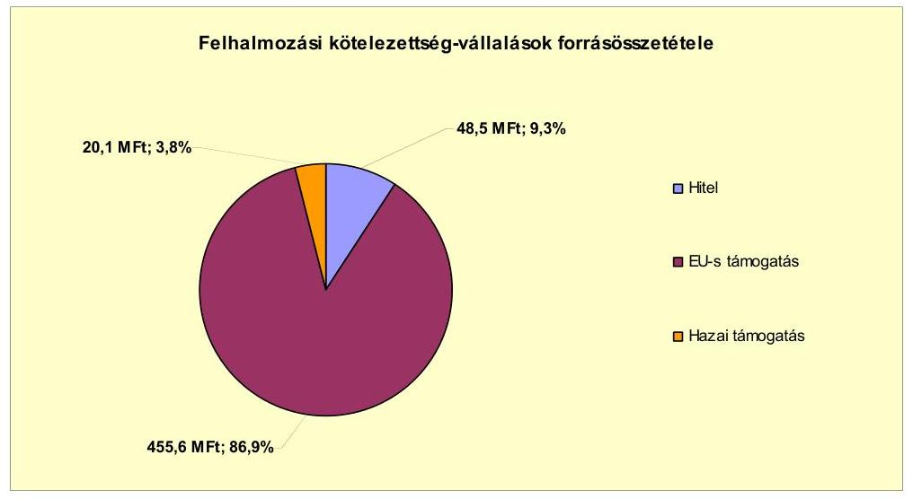

Az Önkormányzat mérleg szerinti pénzintézettel szembeni kötelezettsége a 2006. év végi 382,4 millió Ft-ról 145,5 millió Ft-tal, 528,0 millió Ft-ra nőtt a 2011. év I. félév végére. A 2011. június 30-án fennálló pénzintézettel szembeni kötelezettségek két (a 270,0 millió Ft-os és a 76,2 millió Ft-os) hosszú lejáratú hitelből, egy (140 millió Ft-os) kibocsátott kötvényből, kettő (a 35,2 millió Ft-os, illetve a 18,0 millió Ft-os) támogatás-megelőlegező rövid lejáratú hitelből, folyószámlahitelből és hivatali célra használt 3,1 millió Ft-os személyautóvásárlási kölcsönből keletkeztek. Az Önkormányzat a 2011. évben további hitel felvételét nem tervezte.

Az Önkormányzat fennálló pénzintézettel szembeni kötelezettségvállalásaira Képviselő-testületi döntés alapján került sor. A Képviselő-testület döntéseit megalapozó előterjesztések nem tartalmazták a teljes futamidő várható tőkefizetési kötelezettségeinek - a 2010-ben felvett hosszú lejáratú hitelt, valamint a két támogatásmegelőlegező hitelt kivéve - és a kötelezettségvállalás visszafizetés forrásainak bemutatását, nem tértek ki a teljes futamidő alatt várható kamatfizetési kötelezettségek, az árfolyam- és kamatkockázat és az adósságszolgálati korlát bemutatására. A kötvény kibocsátással kapcsolatban a Képviselő testületi ülésen szóban ismertették az árfolyam- és a kamatkockázatokat. A könyvvizsgálói vélemény megállapította, hogy az Önkormányzat megfelel az Ötv. 88. § (2) bekezdésében foglaltaknak, azonban a 2007-2009. évi költségvetési beszámolók adatai szerint a 2007. évben 96,3 millió Ft-tal, 2008-ban 51,5 millió Ft-tal és 2009-ben 3,5 millió Ft-tal az Önkormányzat az adósságot keletkeztető kötelezettségvállalás felső határát túllépte.

---

A kötvényt az Önkormányzat 2007. december 19-én HUF-ban jegyezte le, majd 2008. január 16-án - a kamatfizetési értesítő adatai szerint - átkonvertálta CHF alapúra. Az Önkormányzatnál szerződésmódosítás nem állt rendelkezésre. A 2008. január 16-án a referenciakamat 6 havi BUBOR-ról 6 havi CHF LIBOR-ra változott. Az Önkormányzat a lejegyzett 914 ezer CHF értékű kötvény törlesztését 2010. szeptember 20-án kezdte meg 36,6 ezer CHF értékben, 2011. június 30-ig 73,1 ezer CHF értékben tőkét törlesztett, 104,7 ezer CHF (19,3 ezer Ft) kamatot, és 0,9 millió Ft egyéb költséget fizetett. Az Önkormányzat a kötvényből és a hosszú lejáratú hitelekből származó forrást a Képviselő-testület által jóváhagyott célokra, a költségvetésbe betervezett beruházásokhoz, illetve korábbi pénzintézettel szembeni kötelezettségeinek kiváltására használta fel. Az Önkormányzat a CHF-ben fennálló pénzintézeti kötelezettségeiből - a Polgármesteri hivatali célú személyautó-vásárlási kölcsönt kivételével - 790,0 ezer CHF tőkét törlesztett, illetve kötvényt váltott be, és 522,8 ezer CHF (95,1 millió Ft) kamatot fizetett. Az Önkormányzat 2008. október 6-án CHF alapú kölcsönszerződést kötött egy a számlavezető pénzintézetén kívüli pénzintézettel hivatali feladatok ellátására használt személyautó-vásárlására, amely vételára 6,1 millió Ft volt. Az Önkormányzat által biztosított önerő 3,0 millió Ft és a kölcsön összege is 3,1 millió Ft volt. A kölcsön kamata fix 5,75%. A felvett 3,1 millió Ft hitelből 2011. június 30-ig 1,3 millió Ft-ot teljesített, a fennálló hitelállomány 1,8 millió Ft, a kifizetett kamat 0,4 millió Ft volt. Az Önkormányzat a HUF-ban 2011. június 30-án fennálló pénzintézeti kötelezettségeiből a hosszú lejáratú beruházási hitelből tőkét nem törlesztett, azonban 1,5 millió Ft kamatot fizetett. A 2007-2011. év I. féléve között átmenetileg szabad pénzeszközeiből 10,8 millió Ft kamatbevételt realizált.

Az Önkormányzat működésének pénzügyi egyensúlyát a vizsgált időszakban folyószámlahitel és két rövid lejáratú támogatás-megelőlegező hitel igénybevételével tudta biztosítani. A támogatás-megelőlegező hitelekből a 35,2 millió Ft-os hitelt 2011 októberében visszafizette, a 18,0 millió Ft-os hitel törlesztése 2012-ben válik esedékessé. Az Önkormányzat gazdálkodásában a folyószámlahitel állandósult, év végi állománya a 2009. évi 27,1 millió Ft-ról 26,6 millió Ft-tal (98,2%-kal) a 2010. évre 53,7 millió Ft-ra emelkedett.

A kialakult tartós hiány miatt igénybe vett folyószámlahitel a 2007-2011. év I. félévében az alábbiak szerint alakult:

| Megnevezés | 2007. év | 2008. év | 2009. év | 2010. év | 2011. év   I. félév |
| :-- | --: | --: | --: | --: | --: |
| Folyószámlahitel |  |  |  |  |  |
| Keretösszeg január 1-jén (millió Ft-ban) | 40,0 | 40,0 | 40,0 | 40,0 | 60,0 |
| Átlagos napi állomány (millió Ft-ban) | 0,0 | 16,0 | 21,4 | 49,2 | 54,5 |
| Folyószámla hitellel zárt napok száma (nap) | 0,0 | 172,0 | 154,0 | 213,0 | 177,0 |
| Egyenleg (állomány december 31.) | 0,0 | 0,0 | 27,1 | 53,7 | 42,0 |

A likviditás biztosítása - támogatás-megelőlegező- és folyószámlahitellel - az Önkormányzatnak 10,3 millió Ft kamatkiadást okozott. Az Önkormányzat a kizárólagos tulajdonú gazdasági társasága részére a vizsgált időszakban három alkalommal, összesen 83,6 millió Ft összegben nyújtott éven belüli lejáratú tagi kölcsönt, amelyek visszafizetése határidőben megtörtént, így 2011. június 30-án az Önkormányzatnak ilyen követelése nem volt. A Képviselő-

---

testület négy alkalommal döntött követelés elengedésről összesen 0,6 millió Ft összegben.

Az Önkormányzat kötelezettségeinek 2010. december 31-i, valamint 2011. június 30-ai állományát és várható összegeit a felmerülő kamatokat és díjakat is figyelembe véve a kötelezettségek lejáratáig az alábbi táblázat szemlélteti:

| Megnevezés | Állomány   2010. december 31-én |  |  | Állomány   2011. június 30-én |  |  | Várható kötelezettség a 2011-2013.   években |  | Várható kötelezettség a 2014. évtől |  |
| :--: | :--: | :--: | :--: | :--: | :--: | :--: | :--: | :--: | :--: | :--: |
|  | HUF-ban   (millió Ftban) | Devizában (összege, ezer CHFben) | Deviza   nem | HUF-ban   (millió Ftban) |

 Devizában (összege, ezer CHFben) | Devizenem | HUF-ban (millió Ftban) | Devizában (összege, ezer CHFben) | HUF-ban (millió Ftban) | Devizában (összege, ezer CHFben) |
| Pénzintézeti kötelezettségek |  |  |  |  |  |  |  |  |  |  |
| Polyisozámla-hitel | 53,7 | - | - | 43,0 | - | - | 43,0 | - | - | - |
| 35.161 E Ft-os támogatást megelölegező hitel | 35,2 | - | - | 25,1 | - | - | 25,6 | - | - | - |
| 18.000 E Ft-os támogatást megelölegező hitel | 0,0 | - | - | 6,7 | - | - | 18,4 | - | - | - |
| 76.153 E Ft-os beruházási hitel | 27,7 | - | - | 51,3 | - | - | 22,4 | - | 66,1 | - |
| Pénzintézeti kötelezettségek összesen HUF-ban: | 116,6 | 0,0 | 0 | 126,1 | - | - | 109,4 | - | 86,1 | - |
| 270.000 E Ft-os hosszú lejáratú hitel | - | 1060,6 | CHF | - | 986,6 | CHF | - | 439,4 |  | 677,2 |
| "Szécsény 2007" kötvény | - | 877,5 | CHF | - | 841,0 | CHF | - | 245,2 |  | 766,5 |
| Kölcsön hivatal személyzet vásárlásra | 2,0 |  | CHF | 1,8 |  | CHF | 1,4 |  | 0,5 |  |
| Pénzintézeti kötelezettségek összesen CHF-ben: | - | 1938,1 | CHF | - | 1827,6 | CHF | - | 684,6 |  | 1443,7 |
| Szállító tartozás | 48,2 | - | - | 76,4 | - | - | 76,4 | - | - | - |
| Egyéb kiadás elmaradás | 36,7 | - | - | 22,0 | - | - | 22,0 |  |  |  |
| Kötelezettségek | 8,0 | - | - | 8,0 | - | - | 8,0 | - |  | - |

Az Önkormányzatnak a pénzintézetekkel szemben fennálló kötelezettsége a 2011. év I. félév végén 126,1 millió Ft, valamint 1827,6 ezer CHF volt, amelyek összesen 528,0 millió Ft-ot tettek ki. Ezek várható kötelezettsége (tőke-, kamat- és egyéb költség) a legutóbbi kamatfizetés feltételei alapján a 2011-2013. években 109,4 millió Ft, valamint 684,6 ezer CHF. Az Önkormányzat 2011. év I. félév végi szállítói tartozása 76,4 millió Ft, amelyből a lejárt tartozás állománya 72,7 millió Ft volt. 2011. június 30-án a lejárt szállítói tartozás állományának 1,6%-a (1,2 millió Ft) éven túli, 52,9%-a (38,4 millió Ft) 91-365 nap közötti volt. A lejárt szállítói tartozásállományból a 61-90 nap közötti állomány 14,3%-ot (10,4 millió Ft-ot), a 30-60 nap közötti állomány 17,6%-ot (12,8 millió Ft-ot), a 30 nap alatti állomány pedig 13,6%-ot (9,9 millió Ft-ot) képviselt. Az Önkormányzatnak a 2011. évben szállítói tartozások és egyéb kiadás elmaradások rendezése, valamint jogerős végzéssel lezárt, de ki nem fizetett kötelezettségek címén 106,4 millió Ft fizetési kötelezettsége keletkezett. A 2011-2013. évek kötelezettségeinek teljesítésére figyelembe vehető 62,1 millió Ft mérlegben kimutatott behajtható követelésállomány, a jelzálogjoggal nem terhelt forgalomképes ingatlanvagyon. A 2014. évet követően jelenleg ismert pénzintézeti kötelezettségei: 1443,7 ezer CHF és 86,1 millió Ft. A pénzintézeti kötelezettségek visszafizetésének forrásai a helyszíni ellenőrzés időpontjában nem ismertek. Az Önkormányzat 2010. december 31-i összes kötelezettségállománya a mérleg főösszeg 15,2%-át jelentette.

---

A Képviselő-testület a fennálló Szécsény Kötvény és a két hosszú lejáratú hitel biztosítékaként kettő forgalomképes $^{12}$ ingatlanon járult hozzá jelzálogjog alapításához és bejegyzéséhez. A pénzintézetek csak jelzálogfedezet mellett vállalták a kötvény lejegyzését és a hosszú lejáratú hitelek biztosítását, ehhez az Önkormányzat az igazgatási és az intézményi feladatellátást szolgáló ingatlanokat volt kénytelen jelzálogfedezetként felajánlani.

Az önkormányzati kötelezettségek növekedése mellett a kizárólagos önkormányzati tulajdonú gazdasági társaságok kötelezettségei is befolyásolhatják a pénzügyi egyensúlyt (az EUR-ban és a CHF-ben fennálló kötelezettségeket az Önkormányzat gazdasági társaságai HUF-ban adták meg). A gazdasági társaságok kötelezettségeit az alábbi tábla szemlélteti:

| Megnevezés | Állomány   2010. december 31-   én |  | Állomány   2011. június 30-án |  | Várható   kötelezettség   a 2011-2013.   években |  |
| :--: | :--: | :--: | :--: | :--: | :--: | :--: |
|  | HUF-ban   (millió Ft-   ban) | Deviza nem | HUF-ban   (millió Ft-   ban) | Deviza nem | HUF-ban (millió Ft-   ban) |  |
| MKB Bank Kölcsön | 0,3 | EUR | 0,2 | EUR | 0,2 |  |
| Folyószámlahibel | 2,2 | HUF | 2,0 | HUF | 2,0 |  |
| Rulirozó hitel | 3,5 | HUF | 3,5 | HUF | 3,5 |  |
| Pénzintézeti kötelezettségek összesen: | 6,0 | - | 5,7 | - | 5,7 |  |
| Lizing kötelezettségek | 1,5 | CHF | 1,2 | CHF | 1,2 |  |
| Szállítói tartozás | 29,2 | HUF | 39,1 | HUF | 39,1 |  |

A társaságoknak a 2011. évtől 5,7 millió Ft pénzintézeti kötelezettséget, 1,2 millió Ft lízing-kötelezettséget és 39,1 millió Ft szállítói tartozást kell rendezniük. Esetleges csőd- vagy felszámolási eljárás esetén a bíróság korlátlan és teljes felelősséget állapíthat meg az Önkormányzat terhére, amely 46,0 millió Ft-os fizetési kötelezettséget jelenthet.

Az Önkormányzatnál az ellenőrzött időszakban felmérték, hogy az eszközök elhasználódása, amortizációja fedezetének biztosítása mekkora forrásokat igényel az Önkormányzatnál. Az Önkormányzat 2007-2010 között eszközállománya után 500,6 millió Ft összegű értékcsökkenést mutatott ki. A 2007-2010. években megvalósított fejlesztésekből (felújítás és beruházás) 995,5 millió Ft az eszközök korszerűsítését eredményezte. Az elhasználódott eszközök pótlására az Önkormányzat tartalékot nem képzett, külön alapot nem hozott létre, $^{13}$ azt saját bevételből, pénzintézeti kötelezettségvállalásból származó forrásból, EU-s és hazai támogatásból biztosította.

Az Önkormányzat - adatszolgáltatása szerint - az ellenőrzött időszakban kiadási megtakarítást eredményező és bevételt növelő intézkedéseket tett. A 2007-2011. év I. féléve között hozott intézkedések hatására 95,1 millió Ft bevételi többletet, továbbá 240,0 millió Ft kiadási megtakarítást mutatott ki az

[^0]
[^0]:    $^{12}$ Az Önkormányzat a törzsvagyonba tartozó korlátozottan forgalomképes ingatlanokat átminősítette forgalomképessé.
    $^{13}$ Tartalék képzésére és külön alap létrehozására az Önkormányzatot nem kötelezi semmilyen előírás.

---

adatszolgáltatásában, ezáltal az Önkormányzat a pénzügyi egyensúlyi helyzetét javította. A kiadási megtakarítások 70,1%-a a létszámcsökkentési intézkedések eredménye volt. Az álláshely-csökkentő intézkedések 2007-2011. év I. féléve között önkormányzati szinten összesen 85 betöltött álláshely megszüntetését jelentették. Egyes közszolgáltatási területeken azonban átszervezések, feladatbővülések is voltak, amelyek álláshely- és egyben létszámnövekedéssel is jártak. Ennek következtében az időszak önkormányzati álláshelyeinek száma összesen 9 fővel, a foglalkoztatottak száma 18 fővel csökkent. A bevétel növelésére irányuló intézkedések helyi adókkal kapcsolatos intézkedésekhez, bérleti díjak emeléséhez, lejárt tartozások behajtására tett intézkedésekhez kapcsolódtak. A helyi adókkal kapcsolatos intézkedésekkel összesen 20,8 millió Ft-tal növelte az Önkormányzat a bevételeit, az idegenforgalmi adó bevezetésével 1,5 millió Ft, a magánszemélyek kommunális adója mértékének növelésével 2,2 millió Ft, a kedvezmények és mentességek eltörlésével 17,1 millió Ft bevételhez jutott. A közoktatási intézmény terembérleti díjainak emelésével 1,2 millió Ft bevételnövekedést ért el.

Az utóellenőrzés a pénzügyi egyensúly javítására tett egy szabályszerűségi javaslat hasznosítására terjedt ki, amelyet a Képviselő-testület által elfogadott intézkedési terv szerinti határidőben megvalósítottak, mivel a költségvetéstervezés megalapozottsága érdekében a helyi adóhátralékok behajtásából származó tervezett bevételeket a 2011. évi költségvetési rendeletben eredeti előírástként szerepeltették.

# Az Önkormányzat pénzügyi egyensúlyi helyzetét összegezve a következők emelhetők ki: 

Szécsény Város Önkormányzatának pénzügyi egyensúlyi helyzete rövid távon veszélyeztetett.

A működési jövedelem folyamatosan csökkent. A folyó bevételek - a 2009. év kivételével - nem nyújtottak fedezetet a folyó kiadások és az adósságszolgálat teljesítésére. Működését állandósult folyószámlahitel igénybevételével tudta biztosítani.

Az Önkormányzat működési jövedelme - az ÖNHIKI támogatás nélkül - a 2008. évtől negatív volt. Az Önkormányzat amellett, hogy ÖNHIKI támogatásban részesült, olyan fejlesztéseket végzett, amelyekből jelentős összegű kötelezettségei keletkeztek.

Kockázatot jelent a támogatással megvalósuló beruházások rövid lejáratú hitelből történő előfinanszírozása.

Az Önkormányzat folyamatosan éven túli lejárt szállítói állománnyal rendelkezett.

A pénzügyi egyensúly megtartására, ezen belül a folyószámlahitel kiváltására, továbbá fejlesztési célra hosszú lejáratú hitelt és kötvényforrást vett igénybe. A refinanszírozást követő intézkedések ellenére a forráshiány folyamatosan képződött.

---

Az Önkormányzat az adósságszolgálatára vonatkozóan a forrásokat nem számszerűsítette.

Az Önkormányzat egy kizárólagos tulajdonában lévő gazdasági társaságának saját tőkéje nem érte el - a társasági formájára kötelezően előírt - jegyzett tőke értékét, amely az Önkormányzat számára a jövőben helytállási vagy intézkedési kötelezettséget jelenthet.

Az Állami Számvevőszékről szóló 2011. évi LXVI. törvény 33. § (1) bekezdésében foglaltak értelmében a jelentésben foglalt megállapításokhoz kapcsolódó intézkedési tervet köteles az ellenőrzött szervezet vezetője összeállítani és azt a jelentés kézhezvételétől számított harminc napon belül az ÁSZ részére megküldeni. Amennyiben az intézkedési tervet határidőben nem küldi meg a szervezet, vagy az továbbra sem elfogadható, az ÁSZ elnöke a hivatkozott törvény 33. § (3) bekezdés a)-b) pontjaiban foglaltakat érvényesítheti.

# A 2011. június 30-i pénzügyi egyensúlyi helyzet alapján az ellenőrzés intézkedést igénylő megállapításai és javaslatai a következők: 

## a Polgármesternek

1. Az Önkormányzat pénzügyi egyensúlya rövid távon veszélyeztetett. Az Önkormányzat nettó működési jövedelme a 2007-2008. és a 2010. években negatív értéket mutatott. Mérleg szerinti pénzintézeti kötelezettsége a 2006. év végi 382,4 millió Ftról 145,5 millió Ft-tal a 2011. év I. félév végére, 528,0 millió Ft-ra nőtt.

Javaslat:
Az Önkormányzat pénzügyi egyensúlyának gyors helyreállítása és hosszú távú fenntarthatósága érdekében:
a) Tárja fel a további bevételszerző és kiadáscsökkentő lehetőségeket;
b) Terjesszen a Képviselő-testület elé reorganizációs programot a kedvezőtlen pénzügyi folyamatok megállítására, a pénzügyi egyensúlyi helyzet gyors stabilizálására;
c) Képezzen egyensúlyi tartalékot az adósságszolgálat teljesítése érdekében;
d) Mutassa be havonta legalább három évre kitekintően kötelezettségeinek finanszírozási forrásait.
2. Az Önkormányzat gazdálkodásában a folyószámlahitel állandósult, év végi állománya a 2009. évi 27,1 millió Ft-ról 26,6 millió Ft-tal (98,2%-kal) a 2010. évre 53,7 millió Ft-ra emelkedett.

Javaslat:
Vizsgálja meg az állandósult folyószámla- és likvid hitel hosszú távú kötelezettséggé történő átalakításának jogi lehetőségét, és a Stabilitási törvény 10. §-ában előírt feltételek fennállása esetén kezdeményezze a Kormánynál ennek engedélyezését.

---

3. Az Önkormányzat 2011. év I. félév végi szállítói tartozása 76,4
 millió Ft, amelyből a lejárt tartozás állománya 72,7 millió Ft volt. 2011. június 30-án a lejárt szállítói tartozás állományának 1,6%-a (1,2 millió Ft) éven túli, 52,9%-a (38,4 millió Ft) 91-365 nap közötti volt. A lejárt szállítói tartozásállományból a 61-90 nap közötti állomány 14,3%-ot (10,4 millió Ft-ot), a 30-60 nap közötti állomány 17,6%-ot (12,8 millió Ft-ot), a 30 nap alatti állomány pedig 13,6%-ot (9,9 millió Ft-ot) képviselt.

Javaslat:
Kezelje az Önkormányzat lejárt szállítói állományát, a szállítói kitettség és a jogszabályi következmények elkerülése érdekében.
4. Az Önkormányzat kizárólagos tulajdonában lévő Szécsényi Városfejlesztő Szolgáltató Kft. saját tőkéje a 2008-2010. években nem érte el a társasági formájára kötelezően előírt jegyzett tőke (0,5 millió Ft) értékét. A Gt. szerint, amennyiben a gazdasági társaság egymást követő két teljes üzleti évben nem rendelkezik a társasági formájára előírt jegyzett tőkének megfelelő összegű saját tőkével és a szükséges saját tőke biztosításáról nem gondoskodtak, köteles elhatározni más gazdasági társasággá való átalakulását, vagy rendelkeznie kell jogutód nélküli megszüntetéséről.

Javaslat:
Terjesszen intézkedési tervet a Képviselő-testület elé a kizárólagos tulajdonú gazdasági társasága pénzügyi egyensúlyi helyzetének stabilizálása érdekében.
5. A pénzintézeti kötelezettségek visszafizetésének forrásai jelenleg nem ismertek.

Javaslat:
Gondoskodjon, hogy a jövőben az adósságot keletkeztető kötelezettségvállalásokról szóló képviselő-testületi előterjesztések tételesen tartalmazzák a visszafizetés forrásait.
6. A Képviselő-testület döntéseit megalapozó előterjesztések nem tartalmazták a teljes futamidő várható tőkefizetési kötelezettségeknek és - a 2010-ben felvett hosszú lejáratú hitelt, valamint a két támogatásmegelőlegező hitelt kivéve - a kötelezettségvállalás visszafizetés forrásainak bemutatását, nem tértek ki a teljes futamidő alatt várható kamatfizetési kötelezettségek, az árfolyam- és kamatkockázat és az adósságszolgálati korlát bemutatására.

Javaslat:
Az adósságot keletkeztető kötelezettségvállalásról szóló döntéskor mutassa be a Képviselő-testületnek a jövőben várható - árfolyam-, kamat-, és törlesztési - kockázatot.

A polgármester a helyszíni ellenőrzés lezárása után tájékoztatta az Állami Számvevőszéket az Önkormányzat megtett és tervezett intézkedéseiről, amelyet az Állami Számvevőszék nem ellenőrzött, arra vonatkozóan véleményt, vagy megállapítást nem fogalmaz meg. Az ellenőrzés lezárását követően elvégzett intézkedéseket az Állami Számvevőszék utóellenőrzés keretében vizsgálhatja.

---

A polgármester tájékoztatása szerint a következő intézkedéseket tette és tervezi az Önkormányzat:

- A saját bevétel növelése érdekében a 2012. évtől a Képviselő-testület 300/2011. (XI. 29.) számú határozatával a nem lakás céljára szolgáló helységek bérleti díjait 4%-kal megemelte, továbbá az Önkormányzat 24/2011. (XI. 30.) számú rendeletével a közterület-használat címén fizetendő díjakat is 4%-kal növelte. Az Önkormányzat 25/2011. (XI. 30.) számú rendeletével 2012. január 1-jétől a kommunális adó összegét 67%-kal megemelte.
- A Képviselő-testület 11/2012. (I. 24.) számú határozatában döntött az Önkormányzat Hunyag Község Önkormányzatával fenntartott körjegyzőség 2012. április 30-i hatállyal történő megszüntetéséről.
- Célul tűzte ki az Önkormányzat az intézmények szabad termeinek bérbeadásából származó, valamint a kizárólag önkormányzati tulajdonban lévő gazdasági társaságok saját bevételeinek növelését.

---

# II. RÉSZLETES MEGÁLLAPÍTÁSOK 

## 1. Az ÖNKORMÁNYZAT KÖTELEZŐ ÉS ÖNKÉNT VÁLLALT FELADATAI, A FELADATELLÁTÁS SZERVEZETI KERETEI ÉS ANNAK VÁLTOZÁSAI

Az Önkormányzat kötelező és önként vállalt feladatainak ellátását az SzMSz-ben rögzítette. Önként vállalt feladatként határozták meg a bölcsődei ellátást $^{14}$, a gimnáziumi, a szakközépiskolai és szakmai középfokú oktatást, a helyi televízió műsorszolgáltatást, a település társadalmi szervezeteinek támogatását. Az önként vállalt feladatokra fordítható források nagyságát az éves költségvetési rendeletekben rögzítették.

Az Önkormányzat - adatszolgáltatása szerint - a 2007-2009. évek közötti időszakban átlagosan a működési kiadások (1039,3 millió Ft) 95,0%-át (987,3 millió Ft-ot) fordította a kötelező, 5,0%-át (52,0 millió Ft-ot) az önként vállalt feladatok ellátására. A 2010. évben a kötelező és önként vállalt feladatok aránya nem változott, a 1218,3 millió Ft működési kiadásból az Önkormányzat 1157,4 millió Ft-ot a kötelező, 60,9 millió Ft-ot az önként vállalt feladatok ellátására fordított.

A működési kiadások tartalmazták a jelentés 2. számú melléklet 1.2 pontjában bemutatott működési kiadásokat kamatkiadások nélkül, az államháztartáson belülre átadott pénzeszközöket, a transzfer- és a kamatkiadásokat. A működési kiadások nem tartalmazták azonban az egészségügyi ellátást biztosító OEP által finanszírozott védőnői szolgálat, valamint a cigány kisebbségi önkormányzat működési célú kiadásait.

Az Önkormányzat adatszolgáltatása alapján a működési célú kiadások a 2007-2009. évek átlagához (1039,3 millió Ft-hoz) viszonyítva a 2010. évre 17,2%-kal (179,0 millió Ft-tal) 1218,3 millió Ft-ra nőttek. A változást a Polgármesteri hivatalnál és a gyermekjóléti intézménynél kimutatott feladatok $^{15}$ kiadásainak növekedése okozta.

[^0]
[^0]:    $^{14}$ A Gyermekek védeleméről és a gyámügyi igazgatásról szóló 1997. évi XXXI. törvény 94. § (3) bekezdése szerint azon települési önkormányzat, amelynek területén 10000 főnél kevesebb állandó lakos él, nem köteles bölcsődét működtetni.
    $^{15}$ közbeszerzési díjak, közcélú foglalkoztatás, akcióterületi terv, egyéb oktatással kapcsolatos vásárolt közszolgáltatás, a gyermekjóléti szolgáltatás, jelzőrendszeres házi segítségnyújtás, közösségi szolgáltatás

---

Az Önkormányzat 2010. évi működési kiadásait és azok finanszírozási arányait főbb feladatonként az alábbi táblázat szemlélteti:

| Ellátott feladat | Működési   kiadás   összesen   (millió Ft) | Kötelező   feladatok   kiadásainak   részaránya   % | Működési   bevétel   összesen   (millió Ft) | Állami   támogatás   részaránya   % | Intézményi   saját bevétel   részaránya   % | Önkormányzati   támogatás   részaránya   % | Társulástól   átvett   támogatás   részaránya   % |
| :--: | :--: | :--: | :--: | :--: | :--: | :--: | :--: |
| Óvoda | 108,7 | 100,0 | 108,7 | 49,8 | 0,0 | 49,9 | 0,3 |
| Általános iskola | 267,3 | 100,0 | 267,3 | 58,4 | 1,4 | 37,4 | 2,8 |
| Gimnázium | 40,9 | 50,0 | 40,9 | 78,4 | 0,0 | 21,6 | 0,0 |
| Szakközépiskola,   szakképző intéz-   mény | 30,3 | 0,0 | 30,3 | 62,2 | 0,0 | 37,8 | 0,0 |
| Gyermekjóléti   intézmény | 46,5 | 99,2 | 46,5 | 56,2 | 0,6 | 31,9 | 11,3 |
| Közművelődési   intézmény | 57,9 | 100,0 | 57,9 | 0,0 | 9,9 | 90,2 | 0,0 |
| Polgármesteri hivatal   igazgatási kiadásai | 264,5 | 100,0 | 264,5 | 4,8 | 95,4 | 0,0 | 0,0 |
| Polgármesteri   hivatalban ellátott   egyéb feladatok   működési kiadásai | 402,2 | 97,3 | 402,2 | 57,3 | 40,9 | 0,0 | 1,8 |
| Működési kiadá-   sok összesen | 1218,3 | 95,0 | 1218,3 | 43,5 | 35,0 | 19,8 | 1,7 |

A közoktatási ágazat $^{16}$ kiadása a 2007-2009. években átlagosan 515,8 millió Ft, az összes működési kiadás 49,6%-a volt. Az ágazat kiadása a 2010. évben 447,2 millió Ft-ra (13,3%-kal) csökkent a 13. havi illetmény megszűnése és a foglalkoztatottak számának csökkenése miatt. A működési kiadásokat finanszírozó forrásokon belül a 2007-2009. évek átlagához viszonyítva a 2010. évre az állami támogatás összege 315,0 millió Ft-ról 261,2 millió Ft-ra (17,1%-kal), az önkormányzati támogatás 191,3 millió Ft-ról 174,4 millió Ft-ra (8,8%-kal) csökkent. A csökkenést a közoktatási normatívák számítási rendszerének módosulása, valamint az óvodában és az általános iskolában ellátottak számának - a 2007-2009. évi 1074 főről a 2010. évre 978 főre történt - csökkenése okozta. Az intézményi saját bevétel 2,1 millió Ft-ról 3,8 millió Ft-ra (81,0%-kal) emelkedett a beszedett bérleti díjak (tornaterem, oktatóterem) növekedéséből. A társult önkormányzatoktól $^{17}$ átvett támogatás 7,3 millió Ft-ról 7,8 millió Ft-ra (6,8%-kal) nőtt az előző évet megillető támogatás tárgyévben történt elszámolásából és beszedéséből.

A gyermekjóléti intézményi $^{18}$ feladatok működési kiadásai a 2007-2009. évi átlag 33,4 millió Ft-ról a 2010. évre 13,1 millió Ft-tal (39,2%-kal) 46,5 millió Ft-ra nőttek az ellátottak, valamint a foglalkoztatottak számának emelkedése miatt. A működési kiadásokat finanszírozó forrásokon belül a 2007-2009. évek átlagához viszonyítva a 2010. évre az állami támogatás összege 23,3 millió Ft-ról 26,1 millió Ft-ra (12,0%-kal), az önkormányzati támogatás 9,1 millió Ft-ról 14,9 millió Ft-ra (63,7%-kal) nőtt. A jelzőrendszeres házi segítségnyújtás működtetésére és a közösségi feladat ellátására a 2010. évben állami normatívát nem lehetett igényelni. A jelzőrendszeres házi segítségnyújtás további működte-

[^0]
[^0]:    $^{16}$ óvoda, általános iskola, gimnázium, szakközépiskola
    $^{17}$ Nagylóc, Nógrádszakál községek önkormányzatai
    $^{18}$ Szécsény Kistérség Szociális Szolgáltató Központ és Gyermekjóléti Szolgálat

---

tésére pályázatot nyújtott be az Önkormányzat. A pályázati támogatás (alap és teljesítménytámogatás) és a működtetési kiadás közötti különbség finanszírozására a társulásban résztvevő önkormányzatok $^{19}$ kötelezettséget vállaltak 0,9 millió Ft összegben. A szociális kistérség fejlesztése pályázat benyújtásakor a közösségi feladat ellátását állami normatívából finanszírozták. A pályázat támogatási szerződésében a feladatellátásra ötéves kötelezettségvállalás történt. Az intézményi saját bevétel részaránya a 2007. évben volt a legmagasabb 9,1% (2,4 millió Ft), a 2009. évben a legalacsonyabb 0,2% (0,1 millió Ft), amely alakulását az ellátottak száma és a térítési díj változása határozta meg. A társult önkormányzatoktól a 2007-2010. évek között átvett támogatások 1,9% (0,5 millió Ft-ban) 11,3%-ban (5,2 millió Ft-ban) járultak hozzá a kiadásokhoz, az ellátottak száma alakulásának megfelelően.

A közművelődési, a Polgármesteri hivatal igazgatási és egyéb feladatai $^{20}$ működési kiadásai a 2007-2009. évek 490,1 millió Ft átlagához viszonyítva a 2010. évre 724,5 millió Ft-ra (47,8%-kal) nőttek. A növekedést a közcélú foglalkoztatottak számának és juttatásának, valamint a szociális juttatások és az átadott pénzeszközök kiadásainak emelkedése okozta. A kiadások finanszírozási összetételét befolyásolta, hogy a közművelődési intézmény önkormányzati támogatása 34,1 millió Ft-ról 52,2 millió Ft-ra (53,1%-kal) emelkedett, mivel az állami támogatások és az intézményi saját bevételek csökkenését az önkormányzati támogatás emelésével kompenzálták. Az egyéb intézményi feladatok állami támogatása a 2007-2009. évek átlagához viszonyítva a 2010. évre 219,1 millió Ft-ról 242,4 millió Ft-ra (10,6%-kal), az intézményi saját bevétel 234,7 millió Ft-ról 422,6 millió Ft-ra (80,1%-kal), a társult önkormányzattól átvett támogatás $^{21}$ 2,2 millió Ft-ról 7,3 millió Ft-ra (231,8%-kal) nőtt.

Az Önkormányzat kötelező és önként vállalt feladatait 2011. június 30-án négy költségvetési szervvel és négy kizárólagos önkormányzati tulajdonban lévő gazdasági társasággal biztosította. Kötelező feladatot látott el egy önállóan működő és gazdálkodó költségvetési szerv a közoktatásban $^{22}$. A szociális szolgáltató és gyermekvédelmi, valamint a közművelődési feladatokat egy-egy önállóan működő intézmény végezte. Az igazgatási feladatok ellátását az önállóan működő és gazdálkodó Polgármesteri hivatal biztosította. A kötelező feladatok ellátásában részt vett az Önkormányzat kettő kizárólagos tulajdonú gazdasági társasága, amelyek a

 temető üzemeltetési, intézmény karbantartási, takarítási, közterület-fenntartási, hulladékkezelési, -szállítási, továbbá a gyermek- és közétkeztetés szolgáltatási feladatokat biztosították. Az önként vállalt feladatok ellátásában részt vett az Önkormányzat két kizárólagos tulajdonú gazdasági társasága, amelyek szakmai középfokú oktatási és egyéb

[^0]
[^0]:    ${ }^{19}$ Hollókő, Ludányhalászi, Magyargéc, Nagylóc, Nógrádmegyer, Nógrádsipek, Nógrádszakál, Piliny, Rimóc, Szécsényfelfalu községek önkormányzatai
    ${ }^{20}$ A Polgármesteri hivatal igazgatási és egyéb feladatai tartalmazzák az Önkormányzat igazgatási, a területi igazgatási, a közvilágítási, a települési hulladékkezelési, a város- és községgazdálkodási, az ingatlan üzemeltetési, a pénzbeli szociális ellátási kiadását, a települési társadalmi szervezetek feladatai támogatását.
    ${ }^{21}$ Hugyag Község Önkormányzata
    ${ }^{22}$ A II. Rákóczi Ferenc Bölcsőde, Óvoda, Általános Iskola, Gimnázium és Szakközépiskola végezte a gimnáziumi és szakközépiskolai oktatást is.

---

feladatokat, valamint az önkormányzati tulajdonú ingatlanok forgalmazását végezték.

A körjegyzőség kialakítása, az intézmények átalakítása miatt az Önkormányzat telephelyeinek száma a 2006. december 31-ei 15-ről 2010. december 31-re 27 telephelyre emelkedett. A telephelyek (területi irodák) számának emelkedését a 2007. évben végrehajtott szervezeti intézkedések befolyásolták:

- A térségi feladatellátás színvonalának javítása és újabb állami támogatás ${ }^{23}$ igénybevételéhez az Önkormányzat 2007. szeptember 1-től körjegyzőséget alakított Hugyag Község Önkormányzatával.
- Az Önkormányzat a gimnáziumot és szakközépiskolát ${ }^{24}$ jogutódlással megszüntette. Az iskola ${ }^{25}$ 2007. június 30-ig működött közös fenntartású közoktatási intézményként. 2007. július 1-jétől az intézményeket II. Rákóczi Ferenc Bölcsőde, Óvoda, Általános Iskola, Gimnázium és Szakközépiskola elnevezéssel összevonta.
- A gyermekjóléti és családsegítői feladatokra 11 önkormányzat társult és 2007. augusztus 1-jétől megalakította az önállóan gazdálkodó intézményt ${ }^{26}$.

Az Önkormányzat 2007-2011. június 30. között közszolgáltatási feladatot nem vett át más önkormányzattól, társulástól, egyháztól, gazdasági társaságtól, egyéb szervezettől és e szervezeteknek nem adott át feladatot.

Az Önkormányzat a szakmai középfokú oktatást és egyéb vállalkozási tevékenységet ${ }^{27}$ egyaránt végző kizárólagos tulajdonú közhasznú társaságát 2007. december 31-i fordulónappal átalakította két nonprofit kft.-vé. Az átalakulással létrejött, jogelőd társaság mezőgazdasági oktató, termelő és értékesítő tevékenységet végzett, továbbá a jogelőd Kht.-ból kivált gazdasági társaság látta el a városüzemeltetési feladatokat.

A gazdasági társaságok által nyújtott adatszolgáltatás alapján 2010. december 31-én a társaságoknál a saját tőke/jegyzett tőke aránya -1,0 és 10,6 között alakult, két társaságnál a saját tőke a 2007-2010. évek között kevesebb volt a jegyzett tőkénél a veszteséges gazdálkodásuk miatt.

Az Önkormányzatnak tulajdonosi kötelezettsége - a Gt. 143. § (3) bekezdésében foglaltak alapján - a gazdasági társaság vagyoni helyzetének rendezése (pótbefizetés előírása, törzstőke leszállítása, a társaság más formába történő átalakí-

[^0]
[^0]:    ${ }^{23}$ A 2007. évben 4 hónapra 1,5 millió Ft, a 2008. évben 4,4 millió Ft, a 2009. évben 3,6 millió Ft, a 2010. évben 3,0 millió Ft normatívát igényelt az Önkormányzat a körjegyzőség működtetéséhez.
    ${ }^{24}$ Kőrösi Csoma Sándor Gimnázium és Szakközépiskola
    ${ }^{25}$ II. Rákóczi Ferenc Általános Iskola, Óvoda és Bölcsőde
    ${ }^{26}$ Szécsény Kistérség Szociális Szolgáltató Központ és Gyermekjóléti Szolgálat
    ${ }^{27}$ állattenyésztés, növénytermesztés, valamint 2007. december 31-ig közterület fenntartás és hulladékkezelés

---

tása, jogutód nélküli megszüntetése). A gazdasági társaságoknál a helyszíni ellenőrzés befejezéséig csődeljárás nem volt folyamatban. A Képviselő-testület a 207/2011. (VIII. 30.) számú határozatában a 2008. és a 2010. években veszteségesen gazdálkodó Szécsényi Gyermek-és Közétkeztetési Nonprofit Kft. feladatait - gyermek- és közétkeztetést, valamint munkahelyi étkeztetést - átszervezte a Szécsényi AGRO-HELP Nonprofit Kft.-be. A Képviselő-testület a 307/2011. (XII. 12.) számú határozatában a társaság végelszámolással történő megszűntetéséről döntött. A Kft. követeléseinek értéke 8,6 millió Ft, kötelezettségeinek összege 18,4 millió Ft, a végelszámoláshoz a Képviselő-testület a 308/2011. (XII. 12.) számú határozatában maximum 10,0 millió Ft összegben fedezetet biztosított. A társaság végelszámolásának kezdő időpontja 2011. december 16.

Az Önkormányzat kizárólagos tulajdonában lévő Szécsényi Városfejlesztő Szolgáltató Kft. az EU-s pályázatokhoz kapcsolódó projektmenedzselési feladatokat végezte, működtetését a támogatási szerződés 2009. évi aláirásától számított hét évig fenn kell tartani. Saját tőkéje a 2008-2010. években nem érte el a társasági formájára kötelezően előírt jegyzett tőke (0,5 millió Ft) értékét. A Gt. 51. § (1) bekezdése szerint amennyiben a gazdasági társaság egymást követő két teljes üzleti évben nem rendelkezik a társasági formájára előírt jegyzett tőkének megfelelő összegű saját tőkével és a szükséges saját tőke biztosításáról nem gondoskodtak, köteles elhatározni más gazdasági társasággá való átalakulását, vagy rendelkeznie kell jogutód nélküli megszüntetéséről.

A gazdasági társaságok részére az önkormányzati feladatok ellátásához átadott vagyonnak a számvitelben nyilvántartott értéke nulla forint volt, mivel az értékcsökkenést a korábbi években már 100%-ban elszámolták. Az önkormányzati feladatok ellátásában résztvevő gazdasági társaságok jellemző adatait a jelentés 4. számú melléklete mutatja be.

Az Önkormányzatnál a vizsgált időszakban a kötelező és önként vállalt feladatok ellátását biztosító szervezeti keretekben, a feladatellátás módjában bekövetkezett változások a pénzügyi egyensúlyi helyzet alakulását nem befolyásolták, kivéve, ha végelszámolási, felszámolási eljárás kötelezettséget keletkeztet.

# 2. AZ ÖNKORMÁNYZAT PÉNZÜGYI EGYENSÚLYI HELYZETÉT BEFOLYÁSOLÓ TÉNYEZŐK 

A hagyományos költségvetési szerkezet helyett az Önkormányzat pénzügyi helyzetét a CLF módszerrel mutatjuk be, amelyben jobban elkülönülnek a vagyonnal kapcsolatos bevételek és kiadások az önkormányzati feladatokkal kapcsolatos közvetlen működtetési bevételektől és kiadásoktól. A módszer következetesen elkülöníti a folyó és a felhalmozási költségvetés bevételeit és kiadásait, azok költségvetési egyenlegeit. A saját folyó bevételek, valamint a saját felhalmozási bevételek nem tartalmazzák az előző évi pénzmaradványok felhasználásából származó pénzforgalom nélküli bevételeket ${ }^{28}$.

[^0]
[^0]:    ${ }^{28}$ A költségvetési években kialakuló hiány finanszírozása az előző évi pénzmaradvány és a korábbi években képzett tartalékok felhasználásával is történhet.

---

A folyó költségvetés egyenlege, a működési jövedelem megmutatja, hogy az önkormányzat éves folyó bevétele fedezetet biztosít-e a kötelező és önként vállalt feladatellátáshoz kapcsolódó éves folyó kiadására. A működési jövedelem negatív értéke pénzügyileg fenntarthatatlan helyzetet jelez. A mutató pozitív értéke megtakarítást mutat, amely forrásul szolgálhat az önkormányzat fennálló kötelezettségei megfizetéséhez, valamint fejlesztéseihez.

A felhalmozási költségvetés pozitív értéke felhalmozási többletet mutat, amely a jövőbeni fejlesztések forrását biztosíthatja. Amennyiben a folyó költségvetési hiány finanszírozása a felhalmozási többletből történik, ez szűkebb értelemben vagyonfelélésnek tekinthető. Amennyiben a felhalmozási költségvetés megtakarítása fejlesztési célú hitelek, kötvények adósságszolgálatát finanszírozza, az változatlan vagyontömeg mellett, a korábban megelőlegezett tőkebevételek valós realizációjának tekinthető. A felhalmozási deficit által generált finanszírozási igény önmagában nem jár pénzügyi kockázattal, a pénzügyileg fenntartható beruházásokhoz kapcsolódó kötelezettségvállalás (adósságszolgálat) átlátható és szabályozott költségvetési gazdálkodással teljesíthető.

A módszer a pénzügyi kapacitás fogalmát helyezi a középpontba. Az adós hitelfelvételi képessége, hosszú távú fizetőképessége vagy bonitása a pénzügyi kapacitással, ezen belül is a nettó működési jövedelemmel jellemezhető. A nettó működési jövedelem negatív értéke az egyes költségvetési években jelentkező adósságszolgálat túlzott mértékére utal. ${ }^{29}$ A nettó működési jövedelem negatív értékének felhalmozási többletből, vagy további hitelből történő finanszírozása pénzügyileg nem fenntartható gazdálkodást vetít előre. A pozitív értéket mutató nettó működési jövedelem fejlesztési kiadások fedezetét biztosíthatja, illetve a folyamatosan, évenként képződő pozitív nettó működési jövedelemből meghatározható a jövőben vállalható, teljesíthető éves adósságszolgálat, ily módon az a hitelösszeg, amely - a többi tényezőt, feltételt adottnak tekintve - visszafizetési kockázat nélkül felvehető.

A CLF módszer alapján a pénzügyi kapacitás mértéke az Önkormányzat összevont, nettósított, a központi információs rendszerbe a Magyar Államkincstáron keresztül leadott éves költségvetési beszámolójának 80-as űrlapjában szerepeltetett adatok alapján került meghatározásra.

A számítási leírás némileg eltér az ÁSZ módszertanában korábban alkalmazott gyakorlattól. A jelen besorolás általános közgazdasági meggondolásokon alapul, amely megjelenik az SNA statisztikai módszertanában is. Folyó tételek alatt értjük azokat a kiadásokat és bevételeket, amelyek a gazdálkodó szervezet helyzetét automatikusan nem változtatják. Bevételi oldalon ilyenek az adók, a tényező jövedelmek, a transzferek, kiadási oldalon a transzferek ${ }^{30}$ és a szolgáltatás igénybevételével kapcsolatos működési kiadások. A folyó költségvetésben a bevételekben nem térül meg, a kiadásokban nem jelenik meg az amortizáció, a vagyoni helyzetet az egyenleg befolyásolja.

[^0]
[^0]:    ${ }^{29}$ kivéve, ha annak finanszírozására a korábbi években képzett tartalékok fedezetet nyújtanak
    ${ }^{30}$ Transzferkiadásoknak nevezzük azokat a folyó és felhalmozási tételeket, amelyeket nem az adott önkormányzat használ fel szolgáltatásnyújtásra.

---

A folyó költségvetés egyenlege (működési jövedelem) tartalmazza a kamatbevételeket és a kamatkiadásokat is, mind a működési, mind a fejlesztési kamatot, valamint a visszatérülő és befizetendő áfa teljes összegét, mert ezek közgazdaságilag tényező jövedelmek. Nem tartalmazzák viszont a követelés elengedés miatt könyvelt bevételi és kiadási pénzforgalmi tételeket, mert valójában technikai elszámolási műveletnek minősülnek, a bevétel soha nem realizálódott, és költségvetési kiadás sem történt.

A felhalmozási költségvetésben a bevételek között a vagyon megőrzésére és bővítésére fordítható források jelennek meg. A felhalmozási, vagy tőketételek módosítják a vagyon nagyságát. A privatizációs bevétel csökkenti a vagyont, a fizikai beruházás, pénzügyi befektetés növeli.

A nettó működési jövedelmet a tőketörlesztés levonásával a folyó költségvetés egyenlegéből származtatjuk.

# 2.1. A működési és a felhalmozási egyensúly változása 

Az Önkormányzat pénzügyi egyensúlyi helyzetét a 2007-2010. években a CLF módszer alkalmazásával az alábbi táblázat mutatja be:

|  |  |  |  | millió Ft |
| :--: | :--: | :--: | :--: | :--: |
| Megnevezés | 2007. év | 2008. év | 2009. év | 2010. év |
| Folyó bevételek | 1148,5 | 1093,9 | 1141,5 | 1173,0 |
| Folyó kiadások | 1027,9 | 1034,8 | 1084,8 | 1228,3 |
| Működési jövedelem | 120,6 | 59,1 | 56,7 | $-55,3$ |
| Nettó működési jövedelem   =működési jövedelem - tőketörlesztés | $-244,3$ | $-93,1$ | 22,5 | $-124,0$ |
| Felhalmozási bevételek | 182,5 | 162,5 | 547,5 | 632,3 |
| Felhalmozási kiadások | 368,4 | 181,2 | 500,7 | 698,8 |
| Felhalmozási költségvetés egyenlege | $-185,8$ | $-18,7$ | 46,8 | $-66,5$ |
| Finanszírozási műveletek nélküli (GFS)   pozíció = működési jövedelem +   felhalmozási költségvetés egyenlege | $-65,2$ | 40,4 | 103,5 | $-121,8$ |
| Finanszírozási műveletek egyenlege | 96,1 | $-100,2$ | $-28,2$ | 48,5 |
| Tárgyévi pénzügyi pozíció | 30,8 | $-59,8$ | 75,3 | $-73,3$ |
| Egyéb tájékoztató adatok |  |  |  |  |
| Összes kötelezettség* | 626,3 | 542,3 | 767,6 | 768,4 |
| -ebből rövid lejáratú | 273,3 | 186,4 | 441,7 | 352,9 |
| Folyószámlahitel napi átlagos állománya ** | 0,0 | 16,0 | 21,4 | 49,2 |
| Likvidhitel napi átlagos állománya** | 0,0 | 0,0 | 0,0 | 0,1

 |
| Munkabérhitel napi átlagos állománya** | 0,0 | 0,0 | 0,0 | 0,0 |
| Finanszírozásba vonható eszköz: | 80,7 | 20,8 | 96,2 | 22,9 |
| Pénzeszközök (idegen pénzeszközök   nélkül) év végi állománya | 80,7 | 20,8 | 96,2 | 22,9 |

* Az összes kötelezettséget a passzív pénzügyi elszámolások nélkül vettük figyelembe, mert a passzívák a pénzmaradvány elszámolás tételei közé tartoznak.
** A folyószámla, a likvid- és a munkabérhitel átlagos állományát 365 napos osztószámmal, és nem a hitel igénybevételi napok számával vettük figyelembe.

A 2007-2010. évek közötti időszakban az Önkormányzat folyó kiadásainak és bevételeinek főbb jogcímek szerinti, továbbá adósságállományának adatait részletesen a jelentés 2. számú melléklete tartalmazza.

---

Az Önkormányzat folyó bevételeit, kiadásait, a működési jövedelmet a 2007-2010. évek között az alábbi ábra szemlélteti:
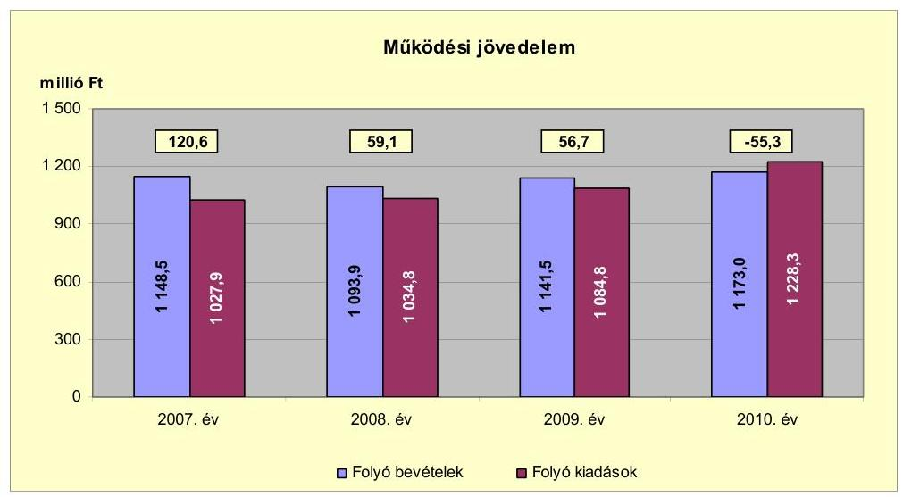

A 2007-2009. években az Önkormányzat folyó költségvetési egyenlege, működési jövedelme pozitív, a 2010. évben negatív összegű volt.

A működési jövedelem a 2007. évről a 2008. évre 61,5 millió Ft-tal csökkent, a folyó bevételek 54,6 millió Ft-os csökkenése és a folyó kiadások 6,9 millió Ft-os növekedése együttes hatására. Az Önkormányzat a 2007. évben 112,7 millió Ft, a 2008. évben 67,7 millió Ft, a 2009. évben 57,8 millió Ft, a 2010. évben 33,4 millió Ft ÖNHIKI támogatásban részesült. Az Önkormányzat működési jövedelme az ÖNHIKI támogatás nélkül a 2007. évben 7,9 millió Ft, a 2008. évben -8,6 millió Ft, a 2009. évben -1,1 millió Ft, a 2010. évben -88,7 millió Ft volt. A 2008. évben az állami támogatás a 2007. évhez viszonyítva 24,7 millió Ft-tal növekedett, ugyanakkor az átengedett személyi jövedelemadó 93,5 millió Ft-tal csökkent. A 2008. évről a 2009. évre a működési jövedelem 2,4 millió Ft-tal csökkent, a 2010. évben az előző évhez viszonyítva 112,0 millió Ft-tal esett vissza, mivel a 2010. évben a 2009. évhez viszonyítva a folyó kiadások magasabb mértékben 13,2%-kal (143,5 millió Ft-tal) emelkedtek, mint a folyó bevételek 2,8%-os (31,5 millió Ft-os) növekedése. A folyó kiadások változását a személyi juttatások - a közcélú foglalkoztatottak számának és juttatásának, az állományba nem tartozók juttatásának - 36,8 millió Ft-os, valamint a dologi kiadások - a beruházási és felújítási pályázatokhoz kapcsolódó szolgáltatások (vásárolt közszolgáltatások), az áfa kiadás, valamint normatíva és ÖNHIKI visszafizetés - 53,1 millió Ft-os növekedése okozta. Az ellenőrzött időszakban a működési jövedelem együttes összege 181,1 millió Ft megtakarítást mutatott, amely forrásul szolgálhatott az Önkormányzat fennálló tőketörlesztési kötelezettségeinek teljesítéséhez, valamint felhalmozási kiadásainak finanszírozásához.

Az Önkormányzat a 2007-2011. év I. félév között évente ÖNHIKI támogatására pályázatot nyújtott be az általa ellátott feladatok működtetésének támogatására és működőképességének fenntartása érdekében. Az Önkormányzat az évek során összesen 348,9 millió Ft támogatásban részesült, amely folyó bevételeinek 2,8%-9,8%-át tette ki. A támogatások összegéből

---

198,4 millió Ft volt a személyi és dologi kiadások támogatása, 150,5 millió Ft a feladathoz nem kötött helyi támogatás volt. Az Önkormányzat a feladathoz nem kötött támogatást 83,7 millió Ft összegben intézményfinanszírozásra, 48,3 millió Ft összegben közüzemi számlák kiegyenlítésére, 8,0 millió Ft összegben városüzemeltetési és 10,5 millió Ft összegben gyermekétkeztetési feladatokra használta fel.

A nettó működési jövedelem ${ }^{31}$ értéke a folyó költségvetési pozíció mellett az adott költségvetési év adósságtörlesztésének hatását is tükrözte. Az alábbi grafikon 2007-2010 között évenként a nettó működési jövedelmet mutatja:
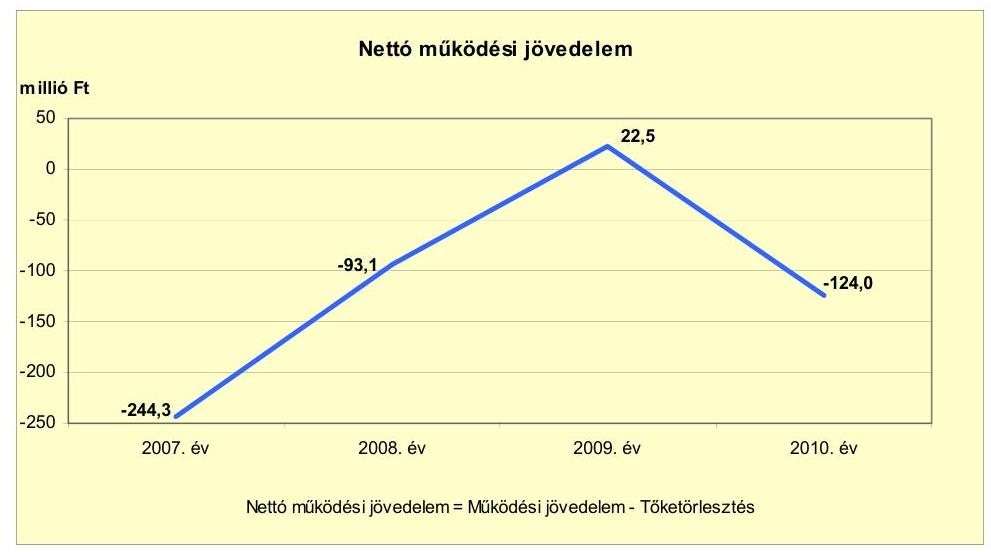

Az Önkormányzat pénzügyi kapacitása (nettó működési jövedelem) a 2007-2008. és a 2010. években negatív, azonban a 2009. évben pozitív értéket mutatott. A nettó működési jövedelem a 2007. évben a rövid, a likvid- és a hosszú lejáratú hitelek tőketörlesztése, a 2008. évben a hosszú lejáratú hitel tőketörlesztése miatt vett fel negatív értéket a pozitív működési jövedelem ellenére. A 2010. évi negatív működési jövedelem alakulását a működési költségvetés negatív egyenlege, a hiteltörlesztés előző évhez viszonyított 26,4 millió Ft-os (77,2%-os) növekedése határozta meg, valamint megkezdődött a kibocsátott kötvény visszavásárlása. Az Önkormányzat romló pénzügyi egyensúlyi helyzete további negatív működési jövedelem mellett a 2012. évtől kockázatot jelent a kötelező feladatok ellátása, a gazdálkodás stabilitása tekintetében.

Az Önkormányzatnál (a CLF módszer alapján) a 2009. évben a fejlesztési kiadások fedezete biztosított volt. A 2007-2008. és a 2010. években az Önkormányzat felhalmozási költségvetésének egyenlege negatív összegű volt, amely körültekintő költségvetési gazdálkodás és pénzügyileg fenntartható ${ }^{32}$ beruházások esetén nem jár magas pénzügyi kockázattal, amennyiben a felhalmozási hiányra a nettó működési jövedelem fedezetet nyújt.

[^0]
[^0]:    ${ }^{31}$ pénzügyi kapacitás
    ${ }^{32}$ Pénzügyileg fenntartható az a beruházás, ahol az újként megjelenő vagy többletként jelentkező működtetési költségekre az Önkormányzat nettó működési jövedelme a következő években is fedezetet nyújt.

---

A felhalmozási költségvetés egyenlegét a 2007-2010. közötti években az alábbi ábra szemlélteti:
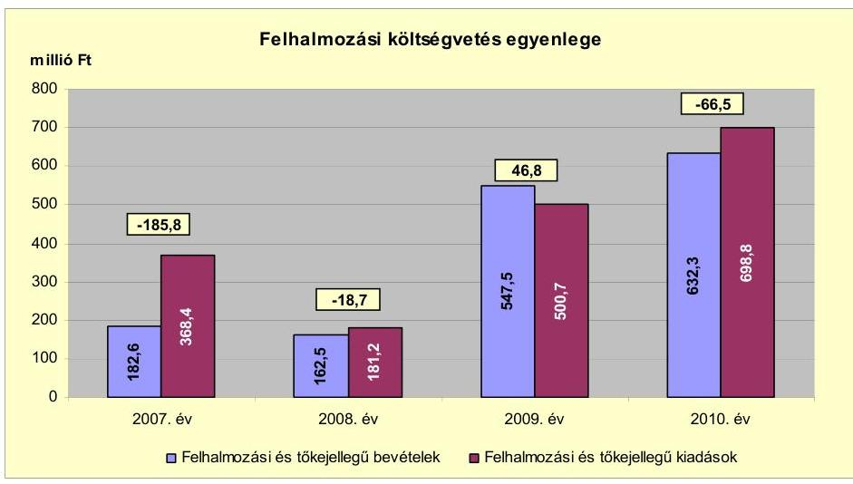

Az Önkormányzat felhalmozási bevétele a 2007-2009. évek között átlagosan 297,5 millió Ft volt, a 2010. évben az előző évek átlagához viszonyítva 334,8 millió Ft-tal (112,5%-kal) 632,3 millió Ft-ra nőtt a saját tőkebevételek és az államháztartáson belülről kapott támogatások növekedésének hatására. A felhalmozási kiadások 2007-2009 közötti átlaga 350,1 millió Ft volt, amely a 2010. évre 348,7 millió Ft-tal (99,6%-kal) 698,8 millió Ft-ra emelkedett a beruházási kiadások csökkenésének és a felújítási kiadások növekedésének együttes hatására. A vizsgált időszakban keletkezett, összesen 224,2 millió Ft felhalmozási forráshiányra a 2006. évi 33,7 millió Ft fejlesztési célú pénzmaradvány, a kötvénykibocsátásból felhasznált 19,5 millió Ft bevétel, továbbá a hazai és EU-s támogatásokból 171,0 millió Ft nyújtott fedezetet.

Az Önkormányzat a 2007-2010. évi zárszámadási rendeletek mellékleteiben - a CLF módszertől eltérő módon - állapította meg költségvetési egyensúlyát, amelyről a jelentés 1. számú melléklete nyújt tájékoztatást. A zárszámadási rendeletekben bemutatott költségvetési bevételek és kiadások főösszegei finanszírozási bevételeket és kiadásokat is tartalmaztak. A zárszámadási rendeletekben 2008-ban 19,2 millió Ft, 2010-ben 103,1 millió Ft forráshiányt, 2007-ben 53,9 millió Ft, 2009-ben 105,4 millió Ft bevételi többletet mutattak ki.

Az Önkormányzat finanszírozási műveletek nélküli bevételeinek és kiadásainak egyenlege a CLF módszer szerint a forráshiány a 2007. évben 65,2 millió Ft, a 2010. évben 121,8 millió Ft volt. A 2008. évben 40,4 millió Ft, a 2009. évben 103,5 millió Ft forrástöbblet keletkezett.

Az Önkormányzat évenkénti finanszírozási igényét, a finanszírozási műveletei egyenlegét a 2007-2010. években az alábbi ábra szemlélteti:

---

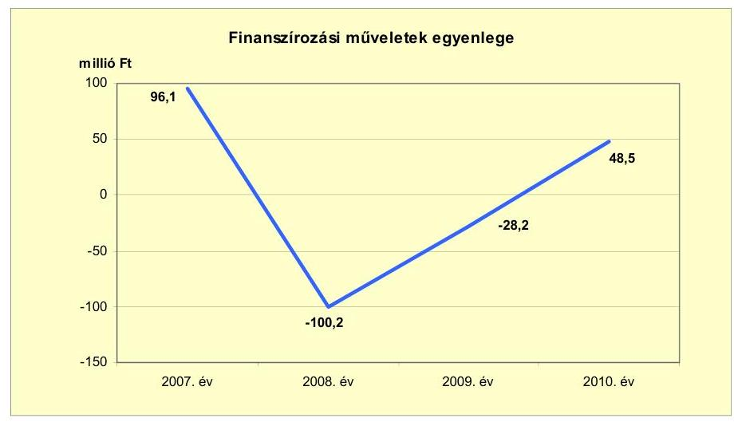

A finanszírozási többlet a 2007. és a 2010. években azt jelzi, hogy az éves költségvetés végrehajtása során szükség volt az előző években keletkezett tartalékok igénybevételén túl, külső finanszírozás - a 2007. évben 138,2 millió Ft rövid lejáratú és 172,2 millió Ft fejlesztési célú hitelfelvétel, valamint 140,0 millió Ft értékben kötvénykibocsátás - igénybevételére is. A 2010. évben 35,2 millió Ft rövid lejáratú, 53,7 millió Ft likvid és 27,6 millió Ft fejlesztési célú hitelt vett igénybe az Önkormányzat. A 2007. évben 145,6 millió Ft rövid lejáratú, 100,0 millió Ft likvid és 119,3 millió Ft fejlesztési hitelt törlesztett az Önkormányzat. A 2008. évben 152,2 millió Ft volt a teljesített fejlesztési hiteltörlesztés. A 2009. évben 32,7 millió Ft, a 2010. évben 59,8 millió Ft rövid lejáratú hitelt törlesztettek. A finanszírozási célú műveleteket a vizsgált időszakban a jelentés 2. számú mellékletének 4.1-4.8 pontjai részletezik.

Az Önkormányzat kamatbevételeit és kamatkiadásait 2007-2011. év I. féléve között az alábbi ábra mutatja:
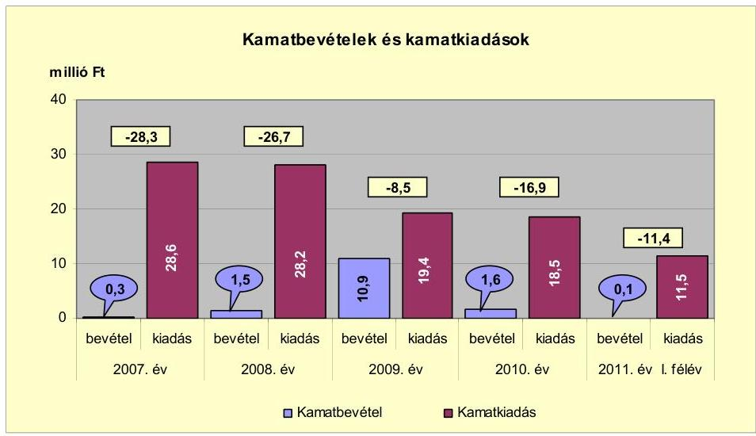

Az Önkormányzat a 2007-2011. év I. félév között összesen 106,2 millió Ft kamatkiadást teljesített. Az átmenetileg szabad pénzeszközöket az Önkormányzat tartós betét lekötésbe helyezte, amelyből a 2009. évben 10,9 millió Ft kamatbevételt ért el. Az Önkormányzat 2007-2010. évi kamatfizetési kötelezettségének

---

alakulását kedvezően befolyásolta a korábban és az ellenőrzött időszakban felvett hosszú lejáratú fejlesztési hiteleinek referencia kamat és kamatfelár csökkenése. Az ellenőrzött időszakban realizált kamatbevétel a teljes kamatráfordítás 13,6%-át (14,4 millió Ft-ot) tette ki.

# 2.2. Az Önkormányzat bevételeinek változása 

Az Önkormányzat folyó bevétele a 2007-2009. években átlagosan 1128,0 millió Ft volt. A 2010. évben a folyó bevétel az előző három év átlagához képest 45,0 millió Ft-tal (4,0%-kal) 1173,0 millió Ft-ra emelkedett a saját működési bevételek és az államháztartáson belülről kapott támogatások növekedése miatt. A folyó bevétel a 2011. év I. félévében 523,7 millió Ft-ra teljesült. Az Önkormányzat folyó bevételeit 2007-2011. év június 30. között jogcímenként az alábbi grafikon mutatja be:
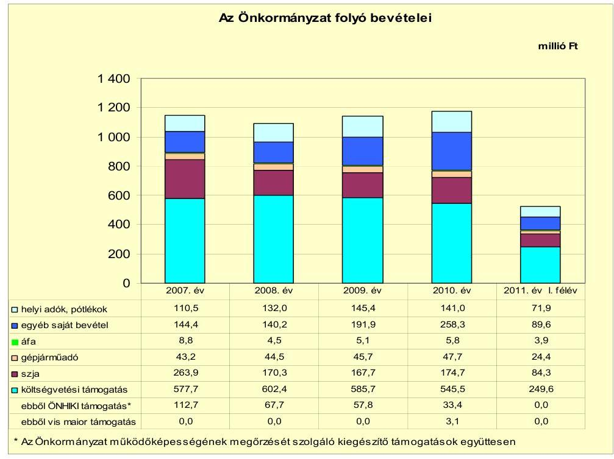

A költségvetési támogatások és az átengedett szja bevételek együttesen a 2007-2009. évi átlag 789,2 millió Ft-ról a 2010. évre 69,0 millió Ft-tal (8,7%-kal) 720,2 millió Ft-ra csökkentek a központi támogatáselosztás változása, továbbá az óvodában és az iskolában az ellátottak létszáma és a város lakosságszáma ${ }^{33}$ folyamatos csökkenésének a hatására. Az Önkormányzatnál a 2007-2011. év I. félév között végrehajtott 95,1 millió Ft összegű bevételnövelő, valamint a 240,0 millió Ft összegű kiadáscsökkentő intézkedések kompenzálták a költségvetési támogatások és átengedett szja bevételek a 2007-2010. években bekövetkezett 107,5 millió Ft összegű, valamint a 2011. év I. félév végéig az

[^0]
[^0]:    ${ }^{33}$ Az Önkormányzat összevont, nettósított, a központi információs rendszerbe a Magyar Államkincstáron keresztül leadott éves költségvetési beszámolójának 31-es űrlapjában szerepeltetett adatok szerint a város lakosságszáma a 2006. évi 6446 főről a 2010. évre 268 fővel (4,2%-kal) 6178 főre csökkent.

---

előző év azonos időszakához viszonyított 26,2 millió Ft-os csökkenését. Az Önkormányzat a vizsgált időszak minden évében ÖNHIKI támogatásban részesült, a 2011. évi támogatás 77,3 millió Ft volt, amelyet a 2011. év júliusában folyósítottak.

Az átengedett központi adók közül a gépjárműadóból származó bevétel a 2007-2009. évi átlaghoz (44,5 millió Ft-hoz) viszonyítva a 2010. évre 7,2%-kal, (3,2 millió Ft-tal) 47,7 millió Ft-ra emelkedett a gépjárműadó alap mértékének és az egyes mentességi kategóriákat érintő központi módosítások következtében.

Az Önkormányzat egyéb saját bevételei a 2007-2009. évi átlag 158,8 millió Ft-ról a 2010. évre 62,7%-kal (99,5 millió Ft-tal) 258,3 millió Ft-ra növekedtek. Az emelkedésben meghatározó volt az államháztartáson belülről működési célra átvett (a közhasznú foglalkoztatás támogatására, a társult önkormányzatoktól a közoktatás, a körjegyzőség, a gyermekjóléti szolgálat működésére, valamint a többcélú kistérségi társulástól a közoktatás és humán szolgáltatás támogatására) pénzeszközök összege.

A saját bevételek növelése érdekében az Önkormányzat 2008. október 1-jei hatállyal bevezette az idegenforgalmi adót. Az ellenőrzött időszak alatt az Önkormányzat három helyi adónemet, a helyi iparűzési adót, a magánszemélyek kommunális adóját és az idegenforgalmi adót alkalmazta. A helyi iparűzési adó bevétel a 2007-2009. évi átlag 110,8 millió Ft-ról a 2010. évre 10,1 millió Ft-tal (9,1%-kal) nőtt. A helyi adóbevételek növekedését a fokozott adóellenőrzések
 és behajtási intézkedések - munkabérből letiltás, hatósági átutalási megbízás (inkasszó) - hatása eredményezte. Az Önkormányzat a 2010. évben 26,4 millió Ft-ot realizált az adóhátralékok beszedéséből. A 2009. évtől az idegenforgalmi adó bevezetése évente 0,7 millió Ft többletbevételt eredményezett az Önkormányzat folyó költségvetésében.

Az Önkormányzat felhalmozási bevételei az ellenőrzött időszakban az alábbiak voltak:

| Megnevezés | 2007. év | 2008. év | 2009. év | 2010. év | 2011. év   I. félév |
| :-- | --: | --: | --: | --: | --: |
| Tárgyi eszköz értékesítés | 13,3 | 77,6 | 8,0 | 8,5 | 0,0 |
| Egyéb saját tőkebevétel | 3,2 | 13,7 | 6,3 | 86,4 | 4,1 |
| Államháztartáson belülről   kapott támogatás | 133,4 | 60,5 | 519,3 | 528,1 | 263,5 |
| ÉU-tól és külföldről kapott   támogatások | 0,0 | 0,0 | 0,0 | 0,0 | 0,0 |
| Államháztartáson kívülről   kapott támogatás | 32,7 | 10,7 | 13,9 | 9,3 | 7,3 |
| Összes felhalmozási   bevétel | $\mathbf{1 8 2 , 6}$ | $\mathbf{1 6 2 , 5}$ | $\mathbf{5 4 7 , 5}$ | $\mathbf{6 3 2 , 3}$ | $\mathbf{2 7 4 , 9}$ |

Az ellenőrzött időszakban a felhalmozási célú bevételek változóan alakultak:

- A 2009. évben befolyt 547,5 millió Ft felhalmozási bevétel 94,8\%-át képezte a Polgármesteri hivatal és az intézmények akadálymentesítésére és a szerve-

---

zetfejlesztésére, az utak felújítására, az intézmények fejlesztésére, a Gyermekjóléti központ kialakítására, ingatlan kártalanításra a központi költségvetési szervektől kapott támogatásértékű felújítási bevételek összege.

- Az Önkormányzat a 2010. évben 632,3 millió Ft felhalmozási bevételt realizált. Az egyéb saját tőkebevételek között számolták el az Önkormányzat kizárólagos tulajdonú gazdasági társaságának telekvásárlásra és pályázati finanszírozásra adott 81,6 millió Ft kölcsön visszatérülését. Az EU-s forrásokból felújítási célú támogatásban részesült az Önkormányzat 475,7 millió Ft értékben utak felújítására, a Gyermekjóléti központ kialakítására, az alapfokú oktatási intézmények felújítására és a történelmi városmag rehabilitáció II. ütemére.

# 2.3. Az Önkormányzat működési és felhalmozási célú kiadásainak változása 

Az Önkormányzat folyó kiadásait főbb jogcímek szerinti bontásban a 2007-2011. év I. félév között az alábbi táblázat tartalmazza:

| Megnevezés | 2007. év | 2008. év | 2009. év | 2010. év | 2011. év   I. félév |
| :--: | :--: | :--: | :--: | :--: | :--: |
| Folyó kiadások | 1027,9 | 1034,8 | 1084,8 | 1228,3 | 485,6 |
| Működési kiadások (kamatkiadás nélkül) | 908,1 | 892,4 | 942,1 | 1051,9 | 396,5 |
| Államháztartáson belülre átadott pénzeszközök | 1,1 | 5,2 | 1,1 | 2,9 | 0,5 |
| Transzferkiadások | 90,1 | 109,0 | 122,2 | 155,0 | 77,1 |
| -ebből: vállalkozásoknak | 6,0 | 11,9 | 15,7 | 24,1 | 6,2 |
| EU-nak, illetve külföldre | 0,0 | 0,0 | 0,0 | 0,0 | 0,0 |
| magánszemélyeknek | 56,2 | 61,5 | 63,7 | 83,1 | 50,4 |
| nonprofit szervezeteknek | 27,9 | 35,6 | 42,8 | 47,8 | 20,5 |
| Kamatkiadások | 28,6 | 28,2 | 19,4 | 18,5 | 11,5 |
| Előző évi pénzmaradvány átadás | 0,0 | 0,0 | 0,0 | 0,0 | 0,0 |

A folyó kiadások a 2007-2009. évek 1049,2 millió Ft-os átlagához viszonyítva a 2010. évre 179,1 millió Ft-tal ( $17,1 \%$-kal) 1228,3 millió Ft-ra emelkedtek. A folyó kiadások között meghatározó volt a működési kiadások 2007-2009. évi 914,2 millió Ft átlagához viszonyított, a 2010. évre 1051,9 millió Ft-ra történt növekedése.

A transzferkiadások az ellenőrzött időszakban folyamatosan, a 2007-2009. évek 107,1 millió Ft-os átlagához viszonyítva a 2010. évre 47,9 millió Ft-tal ( $44,7 \%$-kal) 155,0 millió Ft-ra emelkedtek, a folyó kiadáson belüli aránya a 2010. évben $12,6 \%$ volt. A transzferkiadásokon belül kiemelkedő a magánszemélyeknek átadott pénzeszközök összegének emelkedése, melyet a társadalom- és szociálpolitikai juttatások növekedése okozott.

A 2007-2011. év I. félév között a kiemelt jogcímek szerinti működési célú kiadási előirányzatok teljesítési adatait az alábbi táblázat tartalmazza:

---

| Megnevezés | 2007. év | 2008. év | 2009. év | 2010. év | 2011. év   I. félév |
| :-- | --: | --: | --: | --: | --: |
| Személyi juttatások | 497,7 | 476,9 | 505,8 | 547,1 | 234,1 |
| Munkaadót terheli járulékok | 160,5 | 153,0 | 149,1 | 144,6 | 61,3 |
| Dologi kiadások | 218,0 | 254,7 | 270,8 | 323,9 | 86,7 |
| Egyéb folyó kiadások | 31,9 | 7,8 | 16,4 | 36,3 | 14,2 |

A személyi juttatások 2007-2009. évek közötti 493,5 millió Ft átlaga a 2010. évre 53,6 millió Ft-tal ( $10,9 \%$-kal) növekedett a Polgármesteri hivatalban és az intézményekben ellátott feladatok bővülése ${ }^{34}$, és az ehhez kapcsolódó foglalkoztatotti létszám kiadásainak növekedése, valamint a közoktatási ágazatban végrehajtott létszámcsökkentés együttes hatása miatt.

Az üzemeltetést, intézményfenntartást biztosító dologi kiadások és egyéb folyó kiadások 2007-2009 közötti 266,5 millió Ft átlaga a 2010. évre 93,7 millió Ft-tal ( $35,2 \%$-kal) növekedett az infláció, valamint a Polgármesteri hivatalnál ellátott feladatok bővülése miatt.

Az Önkormányzat folyó és felhalmozási kiadásai részarányának változását a 2007-2011. év I. féléve között megvalósuló beruházások éves nagysága befolyásolta. A felhalmozási és folyó kiadásokon belül a felhalmozási kiadások részaránya a 2007-2009. évi átlaghoz viszonyítva 350,1 millió Ft-ról ( $25,0 \%$-ról) a 2010. évre 698,8 millió Ft-ra ( $36,3 \%$-ra) emelkedett az Önkormányzat nagy értékű beruházásai miatt.

A folyó és felhalmozási kiadásokat, a teljesített kiadások működési és felhalmozási célú felhasználásának arányait a 2007-2011. év I. félév között az alábbi grafikon szemlélteti:
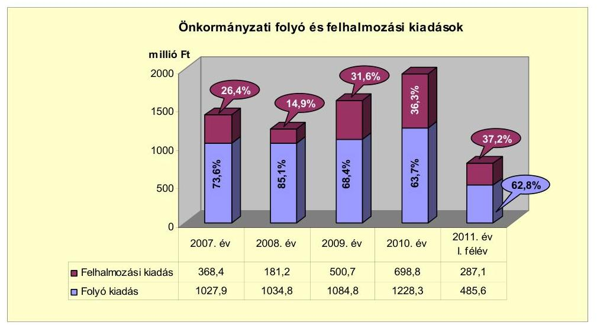

Az Önkormányzatnál a 2007-2010. évek között a folyó és felhalmozási kiadások részarányainak változása a felhalmozási kiadások részarányának emelkedését mutatta. A felhalmozási kiadások részaránya a 2007-2009. évek

[^0]
[^0]:    ${ }^{34}$ körjegyzőség kialakítása, közcélú foglalkoztatás bővítése, gyermekjóléti szolgáltatás kialakítása

---

24,3\%-os átlagáról 12,0 százalékponttal, 348,7 millió Ft-tal emelkedett. A felhalmozási kiadások részarányának növekedését a sikeres pályázatok révén megkezdett és megvalósított fejlesztések eredményezték.

Az Önkormányzat által 2007-2010 között megvalósított felújítási és beruházási munkák együttes kiadása 1303,1 millió Ft volt. A fejlesztési kiadások 6,9\%-a ( 89,8 millió Ft) 10,0 millió Ft alatti felújításokhoz és fejlesztésekhez kapcsolódott. A felújítások közül 12 projekt értéke ${ }^{35}$ haladta meg a 10,0 millió Ft-os értékhatárt. Az Önkormányzat a felújítások és a beruházások teljes bekerülési költségének 15,8\%-át (206,1 millió Ft-ot) saját, 1,5\%-át (19,5 millió Ft-ot) kötvény bevételből, 62,8\%-át (818,4 millió Ft-ot) EU-s, 19,9\%-át (259,1 millió Ft-ot) hazai támogatásból finanszírozta. Az Önkormányzat a 2007-2010. években megvalósított, 2010. december 31-ig befejezett fejlesztéseit és azok forrásösszetételét a 3/a. számú melléklet tartalmazza.

Az Önkormányzatnak 2010. december 31-én egy fejlesztési feladata -ÉMOP-3.1.2/A-2f-2009-0001 Szécsény történelmi városmagjának rehabilitációja - volt folyamatban. A fejlesztési feladat várható bekerülési költsége ${ }^{36}$ 777,6 millió Ft. A kiadásokat 9,8\%-ban ( 76,2 millió Ft összegben) fejlesztési célú hitelből, 87,6\%-ban ( 681,3 millió Ft összegben) EU-s és 2,6\%-ban (20,1 millió Ft összegben) hazai támogatásból tervezik megvalósítani. A projekt bekerülési költségeire a 2010. év végéig 253,4 millió Ft kiadást teljesítettek. A 2011. évtől esedékes kötelezettségvállalások összege ${ }^{37} 524,2$ millió Ft, amelyet 9,3\%-ban ( 48,5 millió Ft összegben) fejlesztési célú hitelből, 86,9\%-ban ( 455,6 millió Ft összegben) EU-s és 3,8\%-ban (20,1 millió Ft összegben) hazai támogatásból finanszíroznak. Az Önkormányzat 2010. december 31-én folyamatban lévő fejlesztési feladatára a 2010. december 31-ig teljesített kifizetéseket és azok forrásösszetételét a jelentés 3/b. számú melléklete, a 2010. december 31-én fennálló kötelezettségeit és azok forrásösszetételét a 3/c. számú melléklet tartalmazza.

Az Önkormányzatnak 2011. június 30-án nem volt fejlesztési célra beadott, elbírálás alatt lévő pályázata.

A 2007-2010. években az Önkormányzat három legmagasabb bekerülési költségű beruházásai a következők voltak:

- ÉMOP-3.1.2/A-2f-2009-0001 Szécsény történelmi városmagjának rehabilitációja. Szécsény városában a történelmi városmag helyreállításának II. ütemében „Funkcióbővítő település rehabilitáció" pályázat keretében teljesedik ki a városmag eredeti funkciójának visszanyerése. Az építési munkák a befejezésükhöz közelednek. A projekt második ütemében Szécsény tágabb történeti városmagja újul meg. A projekt keretén belül visszaállításra került az egykori Pintér ház eredeti kúria jellegű épülete, felújították a Városházát, az Erzsébet teret, az evangélikus templomot, a Rákóczi úti járdát, parkot és parkolót, továbbá korszerűsítették a közvilágítást, megvalósították

[^0]
[^0]:    ${ }^{35}$ utak felújítása, a Polgármesteri hivatal és az általános iskola akadálymentesítése, az oktatási intézmények és a ravatalozó felújítása
    ${ }^{36}$ jelentés 3/b számú melléklet 9. sorszám
    ${ }^{37}$ Jelentés 3/c számú melléklet 8. sorszám

---

a Művelődési Ház épületének műemléki környezetbe illő rehabilitációját és akadálymentesítését.

- A szélessávú internethálózat kiépítése 199,5 millió Ft bekerülési költséggel valósult meg a 2006-2008. években. A projekt keretében optikai gerinchálózaton alapuló kábeltelevíziós széles sávú internetes hálózat épült ki, mely biztosítja a szolgáltatás elérését Szécsény és a közigazgatásilag hozzá tartozó Pösténypuszta és Benczúrfalva lakossága és a közintézmények számára. A beruházást a 2006. évben kezdték el és 2008. december 31-ig befejezték. A fejlesztés forrásösszetétele 20,4 millió Ft (10,2\%) saját bevétel, 149,3 millió Ft EU-s ( $74,8 \%$ ) és 29,9 millió Ft (15,0\%) hazai támogatás volt.
- Az autóbusz pályaudvar építés teljes bekerülési költsége 140,2 millió Ft volt, melyből a 2007. évben 103,9 millió Ft került kifizetésre. A város keleti részén a 2006-2007. évben 5688 négyzetméter alapterületű autóbusz pályaudvar létesült, melyen nyolc induló és három érkező járat indítására és fogadására épült kocsiállás, a hozzá tartozó további hét autóbusz és külső személygépkocsi parkolóval. A 2007. évben kifizetett beruházási érték forrása 3,9 millió Ft (3,8\%) önkormányzati saját bevétel, 100,0 millió Ft (96,2\%) hazai támogatás volt.

A gazdasági társaságok részére átadott pénzeszközök a 2007-2011. év I. félév közötti alakulását az alábbi táblázat mutatja be:
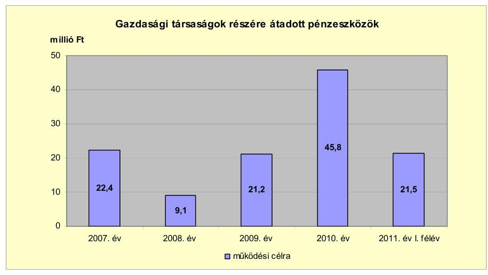

Az Önkormányzat gazdasági társaságai a 2007-2011. év I. félév között - a gazdasági társaságok adatszolgáltatása szerint - 120,0 millió Ft működési célú pénzeszközt adott át. A gazdasági társaságok részére működési célra átadott pénzeszközök a 2007-2009. évek átlagához (17,6 millió Ft) viszonyítva a 2010. évre 160,2\%-kal (28,2 millió Ft-tal) 45,8 millió Ft-ra nőttek. A növekedést a gyermek- és közétkeztetési feladatok támogatási rendjének változása okozta, mert a 2010. évtől az étkeztetési kiadások fedezetét működési célú pénzeszköz átadásként biztosították a feladatot ellátó gazdasági társaság részére.

Az Önkormányzat gazdasági társaságai részére átadott pénzeszközök bemutatását a 4. sz. melléklet tartalmazza.

---

# 3. Az ÖNKORMÁNYZAT KÖTELEZETTSÉGEI 

### 3.1. Az Önkormányzat pénzintézeti kötelezettségeinek
 változása

Az Önkormányzat pénzintézeti kötelezettségeinek állománya 2006. december 31-ei 382,4 millió Ft-ról 2010. december 31-ig több mint 1,4-szeresére, 550,1 millió Ft-ra, 2011. június 30-ig közel 1,4-szeresére, 528,0 millió Ft-ra nőtt kötvénykibocsátás, hosszú lejáratú hitelfelvétel, rövid lejáratú támogatásmegelőlegező hitel felvétel és folyószámlahitel igénybevétel miatt.

A 2011. június 30-ai pénzintézeti kötelezettségek két hosszú lejáratú hitelből, egy kibocsátott kötvényből, kettő támogatásmegelőlegező rövid lejáratú hitelből, folyószámlahitelből és Polgármesteri hivatali célokra használt személyautó-vásárlási kölcsönből keletkeztek.

Az Önkormányzat könyvviteli mérlegében kimutatott, pénzintézetekkel szemben fennálló kötelezettség-állományát a 2006-2011. év I. félév közötti időszakban az alábbi ábra szemlélteti:
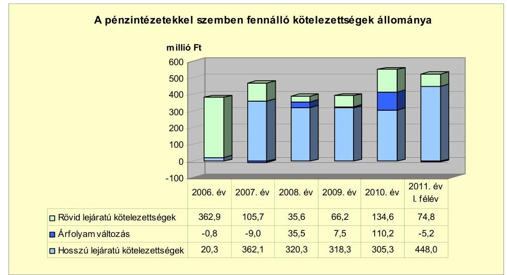

A pénzintézetekkel szemben fennálló kötelezettségek állományának a 2007. és a 2010. évi emelkedését a 2007. évi kötvénykibocsátás (140 millió Ft), illetve a 2010. évben felvett hosszú lejáratú forinthitel (76,2 millió Ft) okozta.

Az Önkormányzat valamennyi rövid és hosszú lejáratú pénzintézeti kötelezettsége - a Polgármesteri hivatali célú személyautó-vásárlási kölcsön kivételével - a számlavezető pénzintézetével szemben állt fenn, a számlavezető és a finanszírozó ugyanaz a pénzintézet volt.

Az Önkormányzat fennálló pénzintézetekkel szemben fennálló kötelezettségvállalásaira képviselő-testületi döntés alapján került sor. Versenyeztetésre két esetben került sor. Az Önkormányzat a 2005. évben felvett hosszú lejáratú hitelről közbeszerzési eljárás keretében, a 2011. évben felvett támogatásmegelőlegező hitel felvételéről két árajánlat bekérését követően döntött${ }^{38}$. A kötelezettségvállalásból származó források felhasználási céljait meghatározták. A Képviselő-testület döntéseit megalapozó előterjesztések nem tartalmazták a teljes futamidő várható tőkefizetési kötelezettségeket és - a 2010-ben felvett hosszú lejáratú hitelt, valamint a két támogatásmegelőlegező hitelt kivéve - a kötelezettségvállalás visszafizetési forrását. A Képviselő-testület részére nem mutatták be a teljes futamidő alatt várható kamatfizetési kötelezettségeket, az árfolyam- és kamatkockázatokat, valamint az adósságszolgálati korlátot. A kötvénykibocsátással kapcsolatban a képviselő-testületi ülésen szóban ismertették az árfolyam- és kamatkockázatokat. A könyvvizsgálói vélemény megállapította, hogy az Önkormányzat megfelel az Ötv. 88. § (2) bekezdésében foglaltaknak, azonban a 2007-2009. évi költségvetési beszámolók adatai szerint a 2007. évben 96,3 millió Ft-tal, a 2008. évben 51,5 millió Ft-tal és a 2009. évben 3,5 millió Ft-tal az Önkormányzat az adósságot keletkeztető kötelezettségvállalás felső határát túllépte.

Az Önkormányzat 2011. június 30-án CHF-ben fennálló adósságot keletkeztető pénzintézetekkel szembeni kötelezettségvállalásai - a kizárólag forintban bemutatott hivatali célú személyautó-vásárlási kölcsön kivételével - az alábbiak voltak:

| Megnevezés | Szerződéskötési   kibocsátás   időpontja | Összeg   ezer CHF-ben | Kibocsátási/lehivási   árfolyam | Kamat (referencia   kamat+ kamatfelár) | Felhasználás célja: |
| :-- | :--: | :--: | :--: | :--: | :-- |
| Önkormányzat beruházási   hitele | 2005. 09. 29 | 1703 | 158,5 | 3 havi CHF LIBOR   Kamatláb Bázis + 4\% | Fennálló hitelek kiváltása,   Szécsény város komplex   városfejlesztése |
| "Szécsény 2007" kötvény | 2007. 12. 19 | 914 | 153,2 | 6 havi BUBOR + 2\% | Folyószámla hitel kiváltása,   fejlesztési feladatok |

# A hitel felvételéből és a kötvény kibocsátásából származó forrásokat az Önkormányzat 100%-ban felhasználta. 

- A beruházási hitelből származó forrás 55,6%-át (150,0 millió Ft-ot) korábban felvett hiteleinek kiváltására, 44,4%-át (120,0 millió Ft-ot) Szécsény Város komplex városfejlesztésére fordította. A felvett 1703,5 ezer CHF hitelből 2011. június 30-ig 716,9 ezer CHF-et teljesített, a fennálló hitelállomány 986,6 ezer CHF (217,0 millió Ft), a kifizetett kamat 418,1 ezer CHF (75760 ezer Ft) volt.
- A kötvény kibocsátásának célja a korábban felvett folyószámlahitel kiváltása 100,0 millió Ft értékben (a lejegyzett összeg 71,4%-a) és a következő évek felhalmozási célú költségvetési kiadásainak (új fejlesztések) 40,0 millió Ft értékben (a lejegyzett összeg 28,6%-a) történő finanszírozása volt. A kötvényt az Önkormányzat 2007. december 19-én HUF-ban jegyezte le, majd 2008. január 16-án - a kamatfizetési értesítő adatai szerint - átkonvertálta CHF alapúra. Az Önkormányzatnál a szerződésmódosítás nem állt rendelkezésre. A szerződés módosításával a referenciakamat 6 havi BUBORról 6 havi CHF LIBOR-ra változott, a 2,0%-os kamatfelár változatlan maradt. Az Önkormányzat a lejegyzett 914 ezer CHF értékű kötvény törlesztését 2010. szeptember 20-án kezdte meg 36,6 ezer CHF értékben, 2011. június 30-ig 73,1 ezer CHF értékben tőkét törlesztett, 104,7 ezer CHF (19,3 ezer Ft) kamatot, és 0,9 millió Ft egyéb költséget fizetett. A kötvényállományból fennálló kötelezettség 2011. június 30-án 841,0 ezer CHF volt. Az Önkormányzat a kötvényből származó szabad forrásait nem fektette be.

Az Önkormányzat 2008. október 6-án CHF alapú kölcsönszerződést kötött egy a számlavezető pénzintézetén kívüli pénzintézettel hivatali feladatok ellátására használt személyautó-vásárlására, amely vételára 6,1 millió Ft volt. Az Önkormányzat által biztosított önerő 3,0 millió Ft és a kölcsön összege is 3,1 millió Ft volt. A kölcsön kamata fix 5,75%. A felvett 3,1 millió Ft hitelből 2011. június 30-ig 1,3 millió Ft-ot teljesített, a fennálló hitelállomány 1,8 millió Ft, a kifizetett kamat 0,4 millió Ft volt.

A devizában fennálló kötelezettségek alakulását az árfolyamváltozás hatása is befolyásolja, azonban annak mértéke előre pontosan nem határozható meg, csak várakozásokon alapuló tendenciák jelezhetők.

Annak megítéléséről, hogy a devizában kibocsátott kötvényért és felvett hitelért kapott forinthoz képest a kötvény visszavásárlásakor, illetve a hitel visszafizetésekor jelentkező forint kötelezettség többletkiadást (árfolyamveszteséget) vagy megtakarítást (árfolyamnyereséget) eredményez-e a futamidő végén, a teljes kötelezettség rendezését követően lehet képet alkotni. Mindaddig, amíg törlesztési kötelezettség nem áll fenn (türelmi idő, moratórium), a tőkére vonatkoztatva nem értelmezhető sem az árfolyamveszteség, sem az árfolyamnyereség. Ugyanakkor a számviteli szabályok meghatározzák, hogy az árfolyam-különbözetet év végén a kötelezettségek vagy követelések között a könyvviteli mérlegben nyilván kell tartani.

Az Önkormányzat 2010. december 31-én forintban fennálló adósságot keletkeztető pénzintézeti kötelezettségvállalása az alábbi volt:

| Megnevezés | Szerződéskötés/   Kibocsátás   időpontja | Összeg   ezer HUF-ban | Kamat (referencia   kamat+ kamatfelár) | Felhasználás célja: |
| :-- | :--: | :--: | :-- | :-- |
| Önkormányzat 76.153.000 Ft-os   beruházási hitele | 2010. 07. 27 | 76153 | 3 havi EURIBOR + 2\%   refinanszírozási   kamatfelár + 2 \% | Szécsény történelmi   városmagjának   rehabilitációja II. ütem |

A hitelből származó forrást az Önkormányzat a Szécsény történelmi városmag rehabilitációja II. üteméhez szükséges önrész biztosításához vette igénybe, és 2011. június 30-ig 51,3 millió Ft-ot (67,4%-ot) hívott le és használt fel. A helyszíni ellenőrzés befejezéséig újabb lehívásra nem került sor, annak tervezett ideje nem volt ismert, az a beruházási cél függvényében alakul. A hitel első törlesztő részlete 2011. decemberében lesz esedékes. A 2011. június 30-ig kifizetett kamat 1,5 millió Ft volt.

Az Önkormányzat a vizsgált időszakban működőképességét, pénzügyi egyensúlyát csak folyószámlahitel igénybevételével tudta biztosítani. A vizsgált időszakban az Önkormányzat munkabér-megelőlegezési hitelt nem vett igénybe. A folyószámlahitel alakulását az alábbi táblázat mutatja be:

---

| Megnevezés | 2007. év | 2008. év | 2009. év | 2010. év | 2011. év   I. félév |
| :-- | :--: | :--: | :--: | :--: | :--: |
| Keretösszeg január 1-jén (millió Ft-ban) | 40,0 | 40,0 | 40,0 | 40,0 | 60,0 |
| Átlagos napi állomány (millió Ft-ban) | - | 16,0 | 21,4 | 49,2 | 54,5 |
| Folyószámla hitellel zárt napok száma (nap) | - | 172 | 154 | 213 | 177 |
| Egyenleg (állomány december 31.) | - | - | 27,1 | 53,7 | 42,0 |
| Teljesített kamat és egyéb költség | 1,6 | 1,3 | 1,0 | 1,9 | 2,0 |

A folyószámlahitel kamata 1 napi BUBOR referencia kamat és 2,0% kamatfelár volt, egyéb költsége nem volt${ }^{39}$. A 2007. január 1-jén fennálló 40,0 millió Ft-os folyószámlahitel-keretet 2010. július 12-én 50,0%-kal megemelték (60,0 millió Ft lett). Az Önkormányzat a 2007. évben nem, a 2008. évben 172 napon, a 2009. évben 154 napon, 2010-ben 213 napon és 2011-ben (2011. június 30-ig) 177 napon vett igénybe folyószámlahitelt. Az átlagos napi állomány${ }^{40}$ 2008-tól 2011. év I. félévéig folyamatosan emelkedett. Az Önkormányzat gazdálkodásában a folyószámlahitel állandósult, év végi állománya a 2009. évi 27,1 millió Ft-ról 26,6 millió Ft-tal (98,2%-kal) a 2010. évre 53,7 millió Ft-ra emelkedett. Az áttekintett időszakban a folyamatos likviditás biztosítása érdekében igénybe vett folyószámlahitel az Önkormányzatnak a 2007. évtől 2011. június 30-ig összesen 7,8 millió Ft kamatkiadást eredményezett, egyéb kiadást nem jelentett.

Az Önkormányzat 2011. június 30-ai pénzintézetekkel szembeni kötelezettségállományát a 2010. évben felvett és lehívott 35,2 millió Ft-os és a 2011. évben felvett 18,0 millió Ft-os (az igénybevett összeg 2011. június 30-ig 6,7 millió Ft volt) rövid lejáratú támogatás-megelőlegező hitelek növelték. A 2010-ben és 2011-ben felvett támogatás-megelőlegező rövid lejáratú forinthiteleknek egyéb költsége nem volt. A kamatuk 1 havi BUBOR referenciakamat${ }^{41}$ és 2%, illetve 3% volt.

A támogatás-megelőlegező hitelek után 2011. június 30-ig kifizetett kamat 2,4 millió Ft volt. A 2010-ben felvett támogatás-megelőlegező hitel visszafizetése 2011. októberében megtörtént, a 2011-ben felvett hitel törlesztése 2012. áprilisában esedékes.

A referencia kamat mértékének alakulása jelentős hatással van az adott devizanemben kifejezett, a teljes futamidőre számított, várható kamatkiadás nagyságára. Az Önkormányzat jelenleg fennálló hosszú lejáratú pénzintézeti kötelezettségei esetében a kamatfizetési kötelezettségek alakulását is jelentősen befolyásolta a kamatok (referencia kamat és kamatfelár) változása, melyet az alábbi táblázat mutat be:

[^0]
[^0]:    ${ }^{39}$ Az 1 napi BUBOR referencia kamat átlaga 2007-ben 7,78%, 2008-ban 8,41%, 2009-ben 8,39%, 2010-ben 4,95% és 2011. év június 30-án 5,33% volt.
    ${ }^{40}$ A folyószámlahitellel zárt napok számának figyelembe vételével számított érték.
    ${ }^{41}$ Az 1 havi napi BUBOR referencia kamat átlaga 2007-ben 7,83%, 2008-ban 8,75%, 2009-ben 8,66%, 2010-ben 5,47% és 2011. év június 30-án 6,00% volt.

---

| Megnevezés | Kibocsátási, lehívási | Utolsó fizetéskori | Változás \% |
| :--: | :--: | :--: | :--: |
|  | kamat (referencia + kamatfelár) \% |  |  |
| 3 havi CHF LIBOR (270 millió Ft-os hitel, 2005. 09. 29.-i szerződés) | 4,77 | 4,175 | -12,5 % |
| 6 havi CHF LIBOR (Szécsény 2007 kötvény, 2007. 12. 19.-i szerződés) | 4,805 | 2,05 | -57,3 % |
| 3 havi EURIBOR (76,2 millió Ft-os hitel, 2010. 07. 27.-i szerződés) | 4,761 | 5,537 | 16,3 % |

Amennyiben a referenciakamat nem változott volna, az Önkormányzatnak a CHF-ben felvett 270,0 millió Ft-os hitele és kibocsátott Szécsény 2007 kötvénye után
 a kibocsátáskori kamattal számolva 2011. június 30-ig 353,7 ezer CHF, illetve 302,9 ezer CHF kamatfizetési kötelezettsége jelentkezett volna. A változások miatt a 270,0 millió Ft-os hitel esetében 64,4 ezer CHF-fel, a kötvénye esetében 35,0 ezer CHF-fel kevesebb fizetési kötelezettséget kellett teljesítenie. A HUF alapú 76,2 millió Ft-os hitele után a kibocsátáskori referenciakamattal számolva 2011. június 30-ig 1,3 millió Ft kamatfizetési kötelezettsége jelentkezett volna, de a referencia kamat ${ }^{42}$ kedvezőtlen változásának hatására 0,1 millió Ft-tal több fizetési kötelezettséget kellett teljesítenie.

Az Önkormányzat kötelezettségeinek állományát 2010. december 31-én és 2011. június 30-án, valamint azok várható alakulását - a felmerülő kamatokat és díjakat is figyelembe véve - a kötelezettségek lejáratáig az alábbi táblázat mutatja be:

| Megnevezés | Állomány 2010. december 31-én |  |  | Állomány 2011. június 30-án |  |  | Várható kötelezettség a 2011-2013.   években |  | Várható kötelezettség a 2014. évtől |
| :--: | :--: | :--: | :--: | :--: | :--: | :--: | :--: | :--: | :--: |
|  | HUF-ban   (millió Ft)   ban) | Devizétben (összege, ezer CHFban) | Devizétben | HUF-ban (millió Ft)   ban) | Devizétben (összege, ezer CHFban) | Devizétben   (n) | HUF-ban (millió Ft)   ban) | Devizétben (összege, ezer CHFban) | HUF-ban (millió Ft)   ban) |
| Pénzintézeti kötelezettségek |  |  |  |  |  |  |  |  |  |
| Folyószámla-hitel | 53,7 | - | - | 43,0 | - | - | 43,0 | - | - |
| 35.161 E Ft-os támogatást megelőlegző hitel | 35,2 | - | - | 25,1 | - | - | 25,6 | - | - |
| 18.000 E Ft-os támogatást megelőlegező hitel | 0,0 | - | - | 8,7 | - | - | 18,4 | - | - |
| 76.153 E Ft-os beruházási hitel | 27,7 | - | - | 51,3 | - | - | 22,4 | - | 86,1 |
| Pénzintézeti kötelezettségek összesen HUF-ban: | 116,8 | 0,0 | 0 | 126,1 | - | - | 109,4 | - | 86,1 |
| 270.000 E Ft-os hosszú lejáratú hitel | - | 1080,6 | CHF | - | 986,6 | CHF | - | 439,4 | 677,2 |
| "Szécsény 2007" kötvény | - | 677,5 | CHF | - | 841,0 | CHF | - | 245,2 | 766,5 |
| Kölcsön tivatali személyautó vásárlásra | 2,0 |  | CHF | 1,8 |  | CHF | 1,4 |  | 0,5 |
| Pénzintézeti kötelezettségek összesen CHF-ben: | - | 1758,1 | CHF | - | 1827,6 | CHF | - | 684,6 | 1443,7 |
| Szállító tartozás | 48,2 | - | - | 76,4 | - | - | 76,4 | - | - |
| Egyéb kiadás elmaradás | 36,7 | - | - | 22,0 | - | - | 22,0 |  |  |
| Kötelezettségek | 8,0 | - | - | 8,0 | - | - | 8,0 | - | - |

Az Önkormányzatnak pénzintézetekkel szemben fennálló kötelezettsége a 2011. év I. félév végén 126,1 millió Ft, valamint 1827,6 ezer CHF volt. Ezek várható kötelezettsége (tőke, kamat és egyéb költség) a legutóbbi kamatfizetés feltételei alapján a 2011-2013. években 109,4 millió Ft, valamint 684,6 ezer CHF. Az Önkormányzatnak a 2011. évben szállítói tartozások és egyéb kiadás elmaradások rendezése, valamint jogerős végzéssel lezárt, de ki nem fizetett kötelezettségek címén 106,4 millió Ft fizetési kötelezettsége keletkezett. A 2011-2013. évek kötelezettségeinek teljesítésére figyelembe vehető 62,1 millió Ft könyvviteli mérlegben kimutatott követelésállomány, a jel-

[^0]
[^0]:    ${ }^{42} 3$ havi EURIBOR-hoz kötött referenciakamatot határoztak meg a hitelszerződésben.

---

zálogjoggal nem terhelt forgalomképes ingatlanvagyon. A 2014. évet követően jelenleg ismert pénzintézetekkel szembeni kötelezettségei (tőke, kamat és egyéb költség): 1443,7 ezer CHF és 86,1 millió Ft. A pénzintézeti kötelezettségek visszafizetésének forrásai a helyszíni ellenőrzés időpontjában nem ismertek.

Az Önkormányzatnál 2011. június 30-tól a helyszíni vizsgálat idejéig további hitel-igénybevételről, illetve kötvénykibocsátásról szóló döntést nem készítettek elő.

# 3.2. Szállítói kötelezettségek változása 

Az Önkormányzat összes kötelezettségeinek állománya 2006. december 31-én 513,3 millió Ft, 2011. június 30-án 741,4 millió Ft, a szállítókkal szemben fennálló kötelezettségek összes kötelezettséghez viszonyított aránya 2006. december 31-én $14,5 \%, 2011$. június 30-án $10,3 \%$ volt.

Az Önkormányzat szállítói állománya 2006. december 31-ei 74,3 millió Ftról 2011. június 30-ig ( $2,8 \%$-kal) 76,4 millió Ft-ra nőtt. A növekedés nem volt folyamatos, 2007-ben 93,5\%-kal emelkedett, 2008-ban 14,4\%-kal csökkent, 2009-ben $21,2 \%$-kal nőtt, 2010-ben $67,7 \%$-kal csökkent az előző évhez képest. A 2006. december 31-ei mérlegben kimutatott szállítói kötelezettségből a le nem járt tartozásállomány 4,8 millió Ft-ot, a 2011. június 30-ai kötelezettségből 3,7 millió Ft-ot tett ki.

Az Önkormányzat lejárt szállítói tartozás állományait és egyéb kiadás elmaradásait az alábbi táblázat tartalmazza:

| Megnevezés | 2006.   december 31. | 2007.   december 31. | 2008.   december 31. | 2009.   december 31. | 2010.   december 31. | 2011.   június 31. |
| :-- | --: | --: | --: | --: | --: | --: |
| Lejárt szállitói tartozás | 69,5 | 138,8 | 118,1 | 143,2 | 45,2 | 72,7 |
| Egyéb kiadáselmaradás | 8,8 | 23,4 | 23,0 | 26,8 | 36,7 | 22,0 |

Az Önkormányzat lejárt szállítói tartozásai és egyéb kiadáselmaradásai az áttekintett időszakban változó képet mutattak. A lejárt szállítói tartozásállomány évenként változott, 2009-ben kiugróan magas volt, de a 2006. évhez viszonyítva 2011. június 30-ra mindössze 4,6\%-kal (3,2 millió Fttal) növekedett, és összetétele sem változott jelentősen.

- A lejárt szállítói tartozásállomány 2009. évben történt emelkedésének oka (a 2009. év végén 143,2 millió Ft) az volt, hogy jelentősen és folyamatosan növekedett az éven túli lejárt szállítói kötelezettségek állománya a 2007-2009. években, maximumát 2009-ben érte el, 93,8 millió Ft volt. Az Önkormányzat ugyanis vitában állt a szemétszállítást végző gazdasági társasággal. Az Önkormányzat a szolgáltatásért nem fizetett, mivel a céggel szemben hasonló nagyságrendű követelésállománnyal rendelkezett. A 2010. évben a felek peren kívül megállapodtak, így 2010. december 31-én az éven túli, lejárt szállítói tartozásállomány 5,3 millió Ft-ra csökkent.

---

- 2011. június 30-án a lejárt szállítói tartozásállományának 1,6\%-a (1,2 millió Ft) volt éven túli, $52,9 \%$-a ( 38,4 millió Ft ) 91-365 nap közötti. A 61-90 nap közötti állomány $14,3 \%$-ot ( 10,4 millió Ft ), a $30-60$ nap közötti állomány $17,6 \%$-ot ( 12,8 millió Ft ), a 30 nap alatti állomány pedig $13,6 \%$-ot ( 9,9 millió Ft) képviselt a lejárt szállítói tartozásállományból.

Az Önkormányzat 2011. június 30-án fennálló 30 napon túli tartozása ( 62,8 millió Ft) volt, az éves eredeti költségvetési kiadás ( 1685,1 millió Ft) 3,7\%-a.

Az egyéb kiadás-elmaradás állomány 2007-2010. években történt növekedése (a 2006. évi 8,8 millió Ft-tal szemben a 2010. évben már 36,7 millió Ft) a ki nem fizetett képviselő-testületi tiszteletdíjak és járulékaik miatt volt. Egy peres eljárás volt, amelyből adódóan 2006-2011. években 8,0 millió Ft függő kötelezettséget tartottak nyilván. Az egyéb kiadási elmaradások összegét növelte a 2007-2010. években a szemétszállító cég jölteljesítési jutalékának összege 7,3 millió Ft, amely a szerződés lejártakor, annak megfelelő teljesítése esetén visszajárt volna a cégnek.

Az Önkormányzat a 2007-2010. években, valamint a 2011. év I. félévében a lejárt szállítói kötelezettségek átütemezésével kapcsolatos előterjesztést nem tárgyalt. Az áttekintett időszakban a szállítói tartozásokkal kapcsolatban fizetés átütemezésére az Önkormányzatnál nem került sor.

# 3.3. Egyéb kötelezettségek változása 

A 2007-2011. év I. félévben az Önkormányzat líingszerződést nem kötött, önkormányzati garancia- és kezességvállalást nem nyújtott, továbbá az Önkormányzat PPP konstrukcióban ${ }^{43}$ végzett beruházásban, fejlesztésben nem vett részt.

A Képviselő-testület négy alkalommal döntött követelés elengedésről összesen 0,6 millió Ft összegben. A követeléselengedés két magánszemély lakástámogatási kölcsönét, négy fő vízdíjhátralékát, és egy elhunyt magánszemély behajthatatlan lakbér, víz- és csatornadíj hátralékát érintette.

Az Önkormányzat 2007-2011. év I. féléve között intézményei, más önkormányzatok és civil szervezetek számára nem nyújtott kölcsönt. Az Önkormányzat a kizárólagos tulajdonú gazdasági társasága, a város-rehabilitáció lebonyolítására kötelezően létrehozott projektcége részére éven belüli lejáratra 2008. augusztus 5-én 16,0 millió Ft, 2008. október 27-én 2,6 millió Ft és 2010. február 1-jén 65,0 millió Ft tagi kölcsönt adott „Szécsény történelmi városmagjának rehabilitációja II."-hoz kapcsolódóan. A kamat mértéke a jegybanki alapkamattal volt azonos, a visszafizetés határidőben megtörtént. A Nógrád Megyei Szakképzés-Szervezési Társulás részére 2009. január 20-án pályázati önrész biztosítására 630 ezer Ft kamatmentes kölcsönt biztosított éven belüli lejáratra. A visszafizetés határidőben megtörtént.

[^0]
[^0]:    ${ }^{43}$ Public Private Partnership (Partnerségi együttműködés közfeladatok ellátására a magánszektor bevonásával)

---

A Képviselő-testület a fennálló Szécsény Kötvény és a két hosszú lejáratú hitel biztosítékaként kettő forgalomképes ${ }^{44}$ ingatlanon járult hozzá jelzálogjog alapításához és bejegyzéséhez. A Művelődési ház és a Polgármesteri hivatal ingatlanokat összesen 446,2 millió Ft nagyságú jelzáloggal terhelték. A forgalomképes ingatlanok nettó értéke 92,3 millió Ft, ezekből a jelzálogjoggal terhelteké 54,3 millió Ft (becsült értékük ekkor 515,0 millió Ft) volt 2010. december 31-én, amelyet az alábbi grafikon szemléltet:
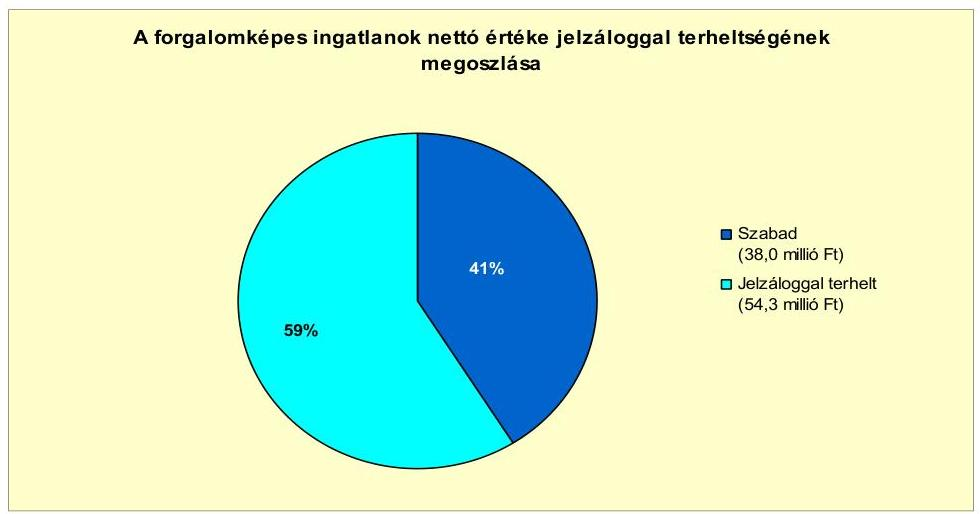

Az Önkormányzat eladósodása és a jelzálogjog bejegyzése között összefüggés van, mivel a pénzintézetek csak jelzálogfedezet mellett vállalták a kötvény lejegyzését és a hosszú lejáratú hitelek biztosítását. Az eladósodásnak a vagyoni helyzetre gyakorolt negatív hatását mutatja, hogy az Önkormányzat az igazgatási és az intézményi feladatellátást szolgáló ingatlanokat volt kénytelen jelzálogfedezetként felajánlani.

Az Önkormányzat 2011. június 30-án egy jogerős határozattal lezárt, de ki nem fizetett peres eljárásban volt érintett magánszemélyek ingatlanján történő csapadékvíz-vezeték létesítése miatt, a peres eljárásból fennálló függő kötelezettség 8,0 millió Ft volt. A jogerős határozatban előírt csapadékvízelvezető megépítését az Önkormányzat 2011-ben elkezdte, a beruházás befejezését követően, várhatóan 2012-ben törlődik a 8,0 millió Ft-os peres eljárásból fennálló függő kötelezettség.

Az Önkormányzat a gazdasági társaságaitól kölcsönt nem vett igénybe, azoknak nem tartozik.

[^0]
[^0]:    ${ }^{44}$ Az Önkormányzat a törzsvagyonba tartozó korlátozottan forgalomképes ingatlanokat átminősítette forgalomképessé.

---

Az Önkormányzat összesen négy minősített többségű önkormányzati tulajdonban lévő gazdasági társasággal rendelkezett. Ezek kötelezettségeinek állományát 2010. december 31-én és 2011. június 30-án, valamint a kötelezettségeik várható alakulását a lejáratig az alábbi
 táblázat mutatja be ${ }^{45}$:

| Megnevezés | Állomány   2010. december 31-én |  | Állomány   2011. június 30-án |  | Várható kötelezettség a 2011-2013. években |  |
| :--: | :--: | :--: | :--: | :--: | :--: | :--: |
|  | HUF-ban   (millió Ftban) | Deviza nem | HUF-ban   (millió Ftban) | Deviza nem | HUF-ban (millió Ftban) |  |
| MKB Bank Kölcsön | 0,3 | EUR | 0,2 | EUR | 0,2 |  |
| Folyószámlahitel | 2,2 | HUF | 2,0 | HUF | 2,0 |  |
| Rulirozó hitel | 3,5 | HUF | 3,5 | HUF | 3,5 |  |
| Pénzintézeti kötelezettségek összesen: | 6,0 | - | 5,7 | - | 5,7 |  |
| Lizing kötelezettségek | 1,5 | CHF | 1,2 | CHF | 1,2 |  |
| Szállítói tartozás | 29,2 | HUF | 39,1 | HUF | 39,1 |  |

A gazdasági társaságok közül 2011. június 30-án az Önkormányzatnak egy kizárólagos tulajdonú társaságánál állt fenn hosszú lejáratú hitel tartozása 0,2 millió Ft összegben. A társaságnak a 2011-2013. között összesen 0,2 millió Ft fizetési kötelezettsége keletkezik a hitelhez kapcsolódóan ${ }^{46}$. Egy kizárólagos tulajdonú társaságnak állt fenn 2011. június 30-án folyószámlahitel tartozása 2,0 millió Ft, rulírozó hitel ${ }^{47}$ tartozása 3,5 millió Ft összegben, valamint gépjármű lízingszerződésből származó kötelezettsége 1,2 millió Ft értékben ${ }^{48}$, amelyek teljesítése 2011-2013 között esedékes. A négy gazdasági társaság szállítói tartozásainak állománya 2011. június 30-án 39,1 millió Ft volt.

Az Önkormányzat a Gt. 54. § (2) bekezdése alapján korlátlan felelősséggel tartozik azon gazdasági társaságának felszámolás esetében, amelyben az Önkormányzat az 52. § (2) bekezdése szerint a szavazatok legalább 75%-ával rendelkezik, így minősített befolyásszerzőnek minősül, továbbá a csődeljárásról és a felszámolási eljárásról szóló 1991. évi XLIX. törvény 63. § (2) bekezdése alapján a kizárólagos önkormányzati tulajdonú gazdasági társaságának minden olyan kötelezettségéért, amelynek kielégítését a felszámolási eljárás során az adós társaság vagyona nem fedez, ha a hitelezőinek a felszámolási eljárás során benyújtott

[^0]
[^0]:    ${ }^{45}$ Az EUR-ban fennálló hosszú lejáratú hitel és a CHF-ben fennálló lízingkötelezettség összegét az Önkormányzat gazdasági társaságainak a finanszírozó pénzintézetek EUR-ban és CHF-ben nem, csak HUF-ban adták meg, ahogy a törlesztéssel kapcsolatos információkat is csak HUF-ban közölték az Önkormányzattal.
    ${ }^{46}$ Az Önkormányzat gazdasági társasága részéről - adatok hiányában - az EUR-ban fennálló pénzintézeti kötelezettségről az adatszolgáltatás HUF-ban történt.
    ${ }^{47}$ A hitelszerződés szerint: a hitelkeretből az Adós hitelkeret rendelkezésre tartásának időtartama alatt jogosult lehívni egyedi kölcsönösszegeket és a hitelkeret nyilvántartására szolgáló számlaszámra jogosult fizetéseket teljesíteni, azonban a lehívások alapján kifolyósított, egy időpontban fennálló kölcsön összege a hitelkeret hatálya alatt egyetlen alkalommal sem haladhatja meg a meghatározott hitelkeret összegét.
    ${ }^{48}$ Az Önkormányzat gazdasági társasága részéről - adatok hiányában - a CHF-ben fennálló pénzintézeti lízingkötelezettségről az adatszolgáltatás Ft-ban történt.

---

keresete alapján a bíróság - az adós társaság felé érvényesített tartósan hátrányos üzletpolitikájára figyelemmel - megállapítja az Önkormányzat korlátlan és teljes felelősségét.

Az Önkormányzat gazdasági társaságainak peres eljárásból adódó fizetési kötelezettségei nem álltak fent. Az Önkormányzat gazdasági társasága a részére nyújtott kölcsönt határidőben visszafizette, 2011. június 30-án az Önkormányzat gazdasági társaságainak ilyen kötelezettsége nem volt.

A pénzügyi egyensúlyi helyzetet befolyásolhatja az Önkormányzat eszközeinek állapota, használhatósági foka, az eszközök pótlására fordítandó pénzeszközök nagysága. A 2007-2011. év I. félévében nem történt meg annak felmérése, hogy az elhasználódott eszközök pótlása milyen kötelezettséget jelent az Önkormányzat számára. A felújításokra, az eszközök pótlására elsősorban az intézmények működőképességének biztosítása, illetve a szakhatósági előírások figyelembevételével került sor. Az Önkormányzat a 2007-2010. években a tárgyi eszközök után 500,6 millió Ft összegű értékcsökkenést mutatott ki. Az elhasználódott eszközök pótlására az Önkormányzat tartalékot nem képzett, külön alapot nem hozott létre ${ }^{49}$, azt saját bevételből, pénzintézeti kötelezettségvállalásból származó forrásból, EU-s és hazai támogatásból végezte. A 2007-2010. években megvalósított fejlesztésekből (felújítás és beruházás) 995,5 millió Ft az eszközök korszerűsítését eredményezte.

Az Önkormányzat eszközállományának átlagos használhatósági foka 2007-2010 között 3,5 százalékponttal (83,8%-ról 80,3%-ra) csökkent.

A 2010. évben a használhatósági fok mutatója kiugróan alacsony az immateriális javak, a gépek, berendezések, felszerelések és a járművek eszközcsoportokban. Az immateriális javak - amelyek bruttó értéke (26,8 millió Ft) a 2010. év végén az összes bruttó eszközérték 0,5%-át tette ki - használhatósági foka a 2007. évi 38,7%-ról a 2010. évre 25,5%-ra csökkent. A gépek, berendezések, felszerelések eszközcsoport - melynek bruttó értéke (377,2 millió Ft) a 2010. év végén az összes bruttó eszközérték 6,5%-át tette ki - használhatósági foka a 2007. évi 33,7%-ról a 2010. évre 51,5%-ra növekedett. A járművek eszközcsoport - melynek bruttó értéke (6,2 millió Ft) a 2010. év végén az összes bruttó eszközérték 0,1%-át tette ki - használhatósági foka a 2007. évi 32,6%-ról a 2010. évre 56,58%-ra nőtt. A legnagyobb arányt képviselő ingatlanok és vagyoni értékű jogok állománya 2010-ben 4348,0 millió Ft volt, használhatósági foka 2007-ről 2010-re 90,7%-ról 88,0%-ra csökkent. Az átadott eszközök 2010-es állománya 1067,4 millió Ft volt, használhatóságának mértéke 70,3%-ról 61,0%-ra csökkent.

# 4. A PÉNZÜGYI EGYENSÚLY MEGTEREMTÉSE ÉRDEKÉBEN HOZOTT INTÉZKEDÉSEK

A Képviselő-testület a 2007-2011. években a költségvetési tervjavaslat előkészítése során a költségvetési hiány csökkentése érdekében áttekintette a feladatai ellátásához szükséges kiadások és bevételek mértékét, összetételét, változtatási le-

[^0]
[^0]:    ${ }^{49}$ Tartalék képzésére és külön alap létrehozására az Önkormányzatot nem kötelezi semmilyen előírás.

---

hetőségét, amely alapján bevételnövelő, valamint kiadáscsökkentő intézkedéseket hozott.

Az Önkormányzat kimutatása szerint a kiadáscsökkentő intézkedések eredményeként a 2007-2011. év I. félévében összesen 240,0 millió Ft megtakarítás keletkezett, amely megoszlását az alábbi ábra szemlélteti:
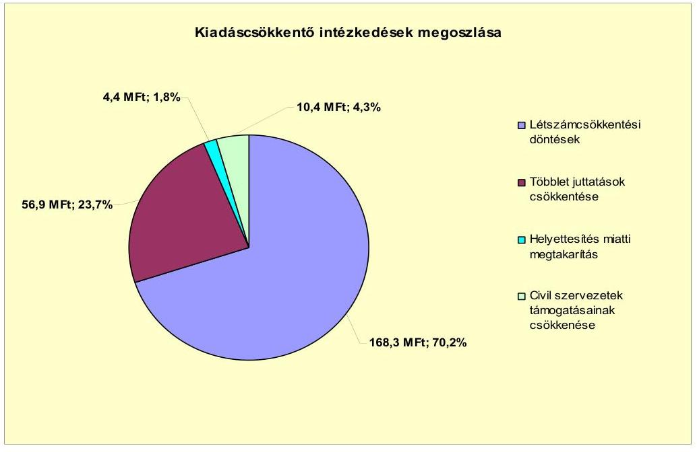

A kiadáscsökkentő intézkedések - a valamennyi közalkalmazottat érintő cafetéria elvonásokat kivéve - a közoktatási területet és az önként vállalt feladatok körében a civil szervezetek részére nyújtott támogatásokat érintették. A Polgármesteri hivatalt érintő kiadáscsökkentésről a Képviselő-testület nem döntött. A közoktatás területén végzett létszámcsökkentési döntésekkel az Önkormányzat adatszolgáltatása szerint a 2007-2011. év I. félévében összesen 168,3 millió Ft-ot (közoktatási átszervezéssel járó létszámcsökkentéssel 154,6 millió Ft, a határozott idejű alkalmazások megszüntetésével 0,8 millió Ft, valamint a logopédusok és gyógypedagógusok túlóráinak megszüntetésével 12,9 millió Ft) takarított meg. A többletjuttatások csökkentése révén 56,9 millió Ft megtakarítást realizáltak (a közoktatásban a minőségi munkavégzésért járó kereset kiegészítések zárolásával 5,1 millió Ft-ot, a valamennyi közalkalmazottat érintő cafeteria elemek csökkentésével, majd megszüntetésével 45,4 millió Ft-ot, a törzsgárda jutalom eltörlésével 6,4 millió Ft-ot) az Önkormányzat kimutatása szerint. A közoktatási helyettesítések racionalizálásával 4,4 millió Ft megtakarítást értek el. A vizsgált időszakban az önként vállalt feladatai körében, a civil szervezetek támogatását összesen 10,4 millió Ft-tal csökkentette az Önkormányzat.

---

A 2007. évi költségvetési rendeletben jóváhagyott álláshelyek száma 219 fő, a 2010. évi zárszámadási rendelet szerint 2010. december 31-én 210 fő volt, így 2007. január 1. és 2010. december 31. között az álláshelyek száma kilenccel csökkent. Az Önkormányzat 2007-2010. évek álláshely és létszám adatait az alábbi táblázat mutatja be:

| Megnevezés (adatok fő-ben) | Közoktatás | Szociális és gyermekvédelmi | Egészségügy | Polgármesteri hivatal | Egyéb | Összesen |
| :--: | :--: | :--: | :--: | :--: | :--: | :--: |
| 2007. január 1-én jóváhagyott álláshelyek száma | 163 | 9 | 3 | 60 | 8 | 219 |
| Megszüntetett álláshelyek száma | 18 | 3 | 3 | 14 | 2 | 34 |
| abból: üres álláshelyek száma |  |  |  |  |  | 3 |
| szakmai álláshelyek száma | 5 |  |  | 4 | 2 | 11 |
| intézmény-üzemeltetéssel kapcsolatos álláshelyek száma | 12 |  |  | 10 |  | 22 |
| Álláshely-növekedés | 2 | 11 |  | 10 | 2 | 25 |
| 2010. december 31-én záró álláshelyek száma | 127 | 16 | 3 | 46 | 8 | 210 |
| 2007. január 1-én foglalkoztatott létszám | 146 | 5 | 3 | 60 | 8 | 222 |
| Létszámcsökkentés | 23 |  |  | 20 | 3 | 46 |
| Létszámnövekedés | 13 | 11 |  |  | 4 | 28 |
| 2010. december 31-én foglalkoztatott létszám | 136 | 16 | 3 | 40 | 9 | 204 |

A foglalkoztatott létszám önkormányzati szinten 2007-2010 között összesen 18 fővel csökkent. A Polgármesteri hivatalban 20 fővel csökkent a foglalkoztatottak száma. A Képviselő-testület a közoktatási intézmény vonatkozásában évente áttekintette a nevelési évben/tanévben indítható csoportok, osztályok számát, létszámigényét, valamint a kötelező óraszámok alakulását, továbbá az üzemeltetéssel kapcsolatos feladatokat, így átszervezéseket hajtott végre, amelynek alapján a vizsgált időszakban összesen tíz fővel csökkent a foglalkoztatottak száma. A szociális és gyermekvédelmi ágazatban (a Szécsény Kistérség Humánszolgáltató Intézményfenntartó Társulás keretében ellátott házi segítségnyújtási feladatok végzésében résztvevő közalkalmazottak állományba vétele miatt) 11 fős, valamint az egyéb (közművelődés) ágazatban egy fős létszámnövekedés történt, az egészségügyi ágazatban nem változott a foglalkoztatottak létszáma. Üres álláshely megszüntetésére nem került sor.

A helyi szervezési intézkedések végrehajtásához az Önkormányzat az áttekintett időszak alatt 10,2 millió Ft központi költségvetési támogatásban részesült. A támogatás felhasználásával nyolc (hat fő közoktatási, egy fő kulturális, egy fő polgármesteri hivatali informatikai feladatokat érintő) álláshelyet tartósan megszüntettek. Az Önkormányzat a létszámcsökkentések után a nyolc érintett dolgozót intézményeinél és gazdasági társaságainál nem alkalmazta.
A kiadáscsökkentő intézkedések mellett az Önkormányzat a kimutatása szerint az alábbiakban számszerűsített bevételnövelő intézkedéseket tette a 2007-2011. év I. féléve között:
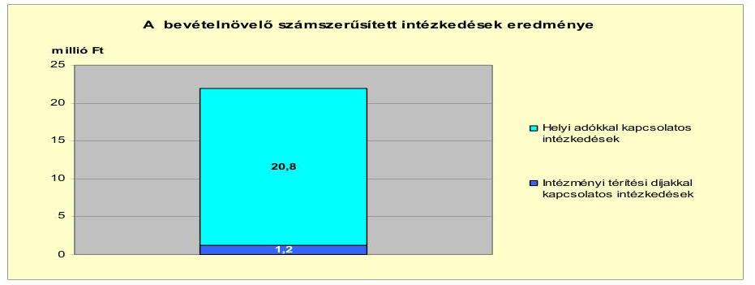

---

A bevétel növelésére irányuló intézkedések számszerűsített összege 22,0 millió Ft volt. A helyi adókkal kapcsolatos intézkedésekkel összesen 20,8 millió Ft-tal növelte az Önkormányzat a bevételeit, az idegenforgalmi adó bevezetésével 1,5 millió Ft, a magánszemélyek kommunális adója mértékének növelésével 2,2 millió Ft, a kedvezmények és mentességek eltörlésével 17,1 millió Ft bevételhez jutott. A közoktatási intézmény terembérleti díjainak emelésével 1,2 millió Ft bevételnövekedést ért el.

A 2007-2011. év I. félévében végrehajtott kiadáscsökkentő és bevételnövelő intézkedések az Önkormányzat pénzügyi egyensúlyi helyzetét - adatszolgáltatása alapján - összesen 262,0 millió Ft-tal javították. Együttes hatásuk eredményeként az Önkormányzat ellensúlyozni tudta
 a költségvetési támogatások és átengedett szja bevételek a 2007-2010. években bekövetkezett 107,5 millió Ft összegű, valamint a 2011. év I. félév végéig az előző év azonos időszakához viszonyított 26,2 millió Ft-os csökkenését.

# 5. Az ÁSZ által a korábbi években a pénzügyi egyensúly javítására tett szabályszerűségi és célszerűségi javaslatok hasznosulása

Az ÁSZ az Önkormányzat gazdálkodási rendszerét a 2010. évben ellenőrizte átfogó jelleggel. Az ÁSZ a feltárt hiányosságok megszüntetésére a polgármesternek és a jegyzőnek összesen 15 szabályszerűségi és hat célszerűségi javaslatot tett, ezek közül egy szabályszerűségi javaslat vonatkozott a pénzügyi egyensúly javítására. A javaslatok hasznosítására az Önkormányzat intézkedési tervet készített a felelősök és a határidők megjelölésével, amelyet a Képviselő-testület elfogadott. A pénzügyi egyensúly javítása érdekében tett szabályszerűségi javaslatot az Önkormányzat hasznosította, mivel a költségvetéstervezés megalapozottsága érdekében a helyi adóhátralékok behajtásából származó tervezett bevételeket a 2011. évi költségvetési rendeletben eredeti előirányzatként szerepeltették.

Budapest, 2012. április " 16 "

Melléklet: $\quad 6 \mathrm{db}$
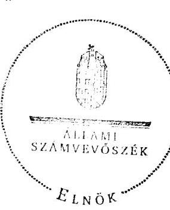

Domokos László

---

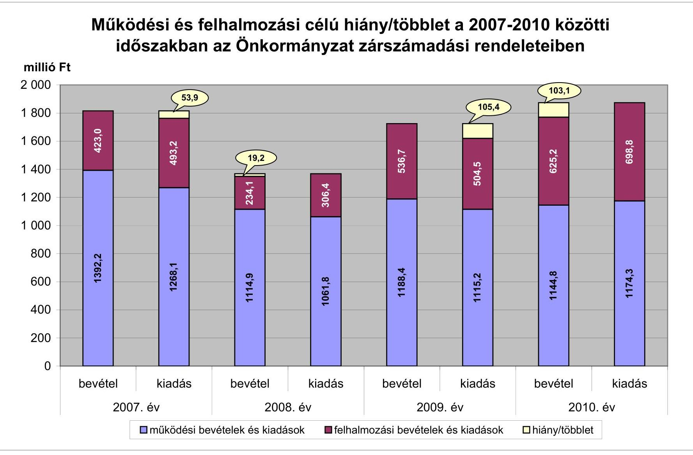

# Működési és felhalmozási célú hiány/többlet a 2007-2010 közötti időszakban az Önkormányzat zárszámadási rendeleteiben

|  év | működési bevételek és kiadások | felhalmozási bevételek és kiadások | hiány/többlet  |
| --- | --- | --- | --- |
|  2007. év | 53.9 | 114.9 | 115.2  |
|  2008. év | 53.9 | 114.9 | 115.2  |
|  2009. év | 53.9 | 114.9 | 115.2  |
|  2010. év | 53.9 | 114.9 | 115.2  |

---

# Az Önkormányzat bevételei és kiadásai, valamint adósságszolgálata 2007-2010 között

|   |  |  |  | millió Ft  |
| --- | --- | --- | --- | --- |
|  1. FOLYÓ KÖLTSÉGVETÉS* | 2007. év | 2008. év | 2009. év | 2010. év  |
|  1.1.1. Saját működési bevételek | 189,2 | 174,1 | 218,5 | 200,5  |
|  1.1.2. Költségvetési támogatás** | 577,7 | 602,4 | 585,7 | 545,5  |
|  1.1.3. Átengedett bevételek | 307,1 | 214,8 | 213,4 | 222,4  |
|  1.1.4. Állambáztartáson belülről kapott támogatások | 74,4 | 100,6 | 127,3 | 203,2  |
|  1.1.5. EU-ról és külföldiről kapott bevételek | 0,0 | 1,5 | 3,7 | 0,0  |
|  1.1.6. Állambáztartáson kívülről kapott bevételek | 0,1 | 0,5 | 0,9 | 1,4  |
|  1.1.7. Előző évi pénzmaradvány átvétel | 0,0 | 0,0 | 0,0 | 0,0  |
|  1.1. Folyó bevételek =1.1.1.+1.1.2.+1.1.3.+1.1.4.+1.1.5.+1.1.6.+1.1.7. | 1 148,5 | 1 093,9 | 1 141,5 | 1 173,0  |
|  1.2.1. Működési kiadások kamatkiadások nélkül | 908,1 | 892,4 | 942,1 | 1 051,9  |
|  1.2.2. Állambáztartáson belülre átadott pénzeszközök | 1,1 | 5,2 | 1,1 | 2,9  |
|  1.2.3.1. vállalkozásoknak | 6,0 | 11,9 | 13,7 | 24,1  |
|  1.2.3.2. EU-nak, illetve külföldre | 0,0 | 0,0 | 0,0 | 0,0  |
|  1.2.3.3. magánszemélyeknek | 56,2 | 61,5 | 63,7 | 83,1  |
|  1.2.3.4. nonprofit szervezeteknek | 27,9 | 35,6 | 42,8 | 47,8  |
|  1.2.3. Transferkiadások (=1.2.3.1+1.2.3.2+1.2.3.3+1.2.3.4) | 90,1 | 109,0 | 122,2 | 155,0  |
|  1.2.4 Kamatkiadások | 28,6 | 28,2 | 19,4 | 18,5  |
|  1.2.5. Előző évi pénzmaradvány átadás | 0,0 | 0,0 | 0,0 | 0,0  |
|  1.2. Folyó kiadások = 1.2.1.+1.2.2.+1.2.3.+1.2.4.+1.2.5. | 1 027,9 | 1 034,8 | 1 084,8 | 1 228,3  |
|  1.3. Folyó költségvetés egyenlege MŰKÖDÉSI JÖVEDELEM (1.1. - 1.2.) | 120,6 | 59,1 | 56,7 | -55,3  |
|  2. FELHALMOZÁSI KÖLTSÉGVETÉS*** |  |  |  |   |
|  2.1.1. Saját tökebevételek | 16,5 | 91,3 | 14,3 | 94,9  |
|  2.1.2. Állambáztartáson belülről kapott támogatások | 133,4 | 60,5 | 519,3 | 528,1  |
|  2.1.3. EU-ról és külföldiről kapott támogatások | 0,0 | 0,0 | 0,0 | 0,0  |
|  2.1.4. Állambáztartáson kívülről kapott támogatások | 33,7 | 10,7 | 13,9 | 9,3  |
|  2.1. Felhalmozási bevételek (=2.1.1.+2.1.2+2.1.3+2.1.4.) | 182,6 | 162,5 | 547,5 | 632,3  |
|  2.2.1. Saját beruházási kiadás állománnyal | 296,1 | 47,8 | 13,1 | 28,6  |
|  2.2.2. Saját felújítási kiadás állománnyal | 9,5 | 81,2 | 477,3 | 602,8  |
|  2.2.3. Állambáztartáson belülre átadott pénzeszköz | 8,8 | 0,2 | 0,0 | 0,0  |
|  2.2.4. EU-nak és külföldnek adott pénzeszközök | 0,0 | 0,0 | 0,0 | 0,0  |
|  2.2.5. Állambáztartáson kívülre adott pénzeszközök | 54,0 | 49,8 | 10,3 | 67,4  |
|  2.2.6. Befektetési célú részesedések vásárlása | 0,0 | 2,2 | 0,0 | 0,0  |
|  2.2. Felhalmozási kiadások (=2.2.1.+2.2.2.+2.2.3.+2.2.4.+2.2.5.+2.2.6.) | 368,4 | 181,2 | 500,7 | 698,8  |
|  2.3. Felhalmozási költségvetés egyenlege (2.1. - 2.2.) | -185,8 | -18,7 | 46,8 | -66,5  |
|  3. Finanszírozási műveletek nélküli (GFS) pozíció(1.3.+2.3.) | -65,2 | 40,4 | 103,5 | -121,8  |
|  4. Finanszírozási műveletek |  |  |  |   |
|  4.1. Hitelfelvétel | 310,4 | 49,5 | 27,1 | 116,5  |
|  4.2. Hiteltörlesztés | 364,9 | 152,2 | 34,2 | 60,6  |
|  4.3. Forgatási és befektetési célú értékpapírok kibocsátása | 140,0 | 0,0 | 0,0 | 0,0  |
|  4.4. Forgatási és befektetési célú értékpapírok beváltása | 0,0 | 0,0 | 0,0 | 8,1  |
|  4.5. Forgatási és befektetési célú értékpapírok értékesítése | 0,0 | 0,0 | 0,0 | 0,0  |
|  4.6. Forgatási és befektetési célú értékpapírok vásárlása | 0,0 | 0,0 | 0,0 | 0,0  |
|  4.7. Egyéb finanszírozási bevételek (függő, átfutó, kiegyenlítő) | 2,8 | 1,3 | -1,6 | -35,4  |
|  4.8. Egyéb finanszírozási kiadások (függő, átfutó, kiegyenlítő) | -7,8 | -1,2 | 19,5 | -36,1  |
|  4.9.Finanszírozási műveletek egyenlege (4.1. - 4.2.+4.3.-4.4+4.5.-4.6.+4.7.-4.8.) | 96,1 | -100,2 | -28,2 | 48,5  |
|  5. Tárgyévi pénzügyi pozíció (1.3.+ 2.3.+4.9.) | 30,8 | -59,8 | 75,3 | -73,3  |
|  6. Nettó működési jövedelem =működési jövedelem (1.3.) - töketörlesztés (4.2+4.4) | -244,3 | -93,1 | 22,5 | -124,0  |
|  TÁJÉKOZTATÓ ADATOK |  |  |  |   |
|  Összes kötelezettség | 626,3 | 542,3 | 767,6 | 768,4  |
|  ebből rövid lejáratú | 273,3 | 186,4 | 441,7 | 352,9  |
|  Összes szállítói kötelezettség | 143,9 | 123,1 | 149,2 | 48,2  |
|  ebből lejárt (tanúsítványból) | 138,8 | 118,1 | 143,2 | 45,2  |
|  Pénz és tőkepiaci kötelezettség (adósság) | 458,8 | 391,4 | 392,0 | 550,1  |
|  ebből rövid lejáratú | 105,7 | 35,6 | 66,2 | 134,6  |
|  PPP szerződéses állomány jelenértéken (tanúsítványból) | 0,0 | 0,0 | 0,0 | 0,0  |
|  ebből lejárt szolgáltatási díj miatti kötelezettség | 0,0 | 0,0 | 0,0 | 0,0  |
|  Folyószámlabítol napi átlagos állománya (tanúsítványból) | 0,0 | 16,0 | 21,4 | 49,2  |
|  Likvidítitol napi átlagos állománya (tanúsítványból) | 0,0 | 0,0 | 0,0 | 0,1  |
|  Munkabérítitol napi átlagos állománya (tanúsítványból) | 0,0 | 0,0 | 0,0 | 0,0  |
|  Kezesség és garanciavállalások (tanúsítványból) | 0,0 | 0,0 | 0,0 | 0,0  |
|  Jogerős bírósági ítéletekből adódó kötelezettségek (tanúsítványból) | 0,0 | 0,0 | 0,0 | 0,0  |
|  Finanszírozásba bevonható eszközök: | 80,7 | 20,8 | 96,2 | 22,9  |
|  Tartós hitelviszonyt megtestesítő értékpapírok év végi állománya | 0,0 | 0,0 | 0,0 | 0,0  |
|  Hosszú lejáratú bankbetétek év végi állománya | 0,0 | 0,0 | 0,0 | 0,0  |
|  Értékpapírok év végi állománya | 0,0 | 0,0 | 0,0 | 0,0  |
|  Pénzeszközök (idegen pénzeszközök nélkül) év végi állománya | 80,7 | 20,8 | 96,2 | 22,9  |

- Bevételekben nem térül, a kiadásokban nem jelenik meg az amortizáció, a vagyoni helyzetet az egyenleg befolyásolja ** A költségvetési támogatásból a felhalmozási célú összeget az Önkormányzat adatszolgáltatása szerinti mértékben vettük figyelembe a 2.1.2 soron *** Bevételekben vagyon megőrzésre és bővítésre fordítható források.

---

Szécsény Város Önkormányzata

Sz. számú melléklet e V-3107-023/2012. számú Jelenéshez

Az Önkormányzat 2007-2010. években megvalósított, 2010. december 31-ig befejezett fejlesztései és azok forrásösszetétele

millió Ft-ban

|  Fejlesztési feladat (beruházás, felújítás) | Beruházás, felújítás | Teljes bekerülési költség | 2010. december 31-ig megvalósított beruházás forrásosságú költség | Átköveti költség | Elővére (10-12. év) | Elővére (11-12. év) | Elővére (11-12. év) | Elővére (11-12. év) | Elővére (11-12. év) | Elővére (11-12. év) | Elővére (11-12. év) | Elővére (11-12. év) | Elővére (11-12. év) | Elővére (11-12. év) | Elővére (11-12. év) | Elővére (11-12. év) | Elővére (11-12. év) | Elővére (11-12. év) | Elővére (11-12. év) | Elővére (11-12. év) | Elővére (11-12. év) | Elővére (11-12. év) | Elővére (11-12. év) | Elővére (11-12. év) | Elővére (11-12. év) | Elővére (11-12. év) | Elővére (11-12. év) | Elővére (11-12. év) | Elővére (11-12. év) | Elővére (11-12. év) | Elővére (11-12. év) | Elővére (11-12. év) | Elővére (11-12. év) | Elővére (11-12. év) | Elővére (11-12. év) | Elővére (11-12. év) | Elővére (11-12. év) | Elővére (11-12. év) | Elővére (11-12. év) | Elővére (11-12. év) | Elővére (11-12. év) | Elővére (11-12. év) | Elővére (11-12. év) | Elővére (11-12. év) | Elővére (11-12. év) | Elővére (11-12. év) | Elővére (11-12. év) | Elővére (11-12. év) | Elővére (11-12. év) | Elővére (11-12. év) | Elővére (11-12. év) | Elővére (11-12. év) | Elővére (11-12. év) | Elővére (11-12. év) | Elővére (11-12. év) | Elővére (11-12.
 év) | Elővére (11-12. év) | Elővére (11-12. év) | Elővére (11-12. év) | Elővére (11-12. év) | Elővére (11-12. év) | Elővére (11-12. év) | Elővére (11-12. év) | Elővére (11-12. év) | Elővére (11-12. év) | Elővére (11-12. év) | Elővére (11-12. év) | Elővére (11-12. év) | Elővére (11-12. év) | Elővére (11-12. év) | Elővére (11-12. év) | Elővére (11-12. év) | Elővére (11-12. év) | Elővére (11-12. év) | Elővére (11-12. év) | Elővére (11-12. év) | Elővére (11-12. év) | Elővére (11-12. év) | Elővére (11-12. év) | Elővére (11-12. év) | Elővére (11-12. év) | Elővére (11-12. év) | Elővére (11-12. év) | Elővére (11-12. év) | Elővére (11-12. év) | Elővére (11-12. év) | Elővére (11-12. év) | Elővére (11-12. év) | Elővére (11-12. év) | Elővére (11-12. év) | Elővére (11-12. év) | Elővére (11-12. év) | Elővére (11-12. év) | Elővére (11-12. év) | Elővére (11-12. év) | Elővére (11-12. év) | Elővére (11-12. év) | Elővére (11-12. év) | Elővére (11-12. év) | Elővére (11-12. év) | Elővére (11-12. év) | Elővére (11-12. év) | Elővére (11-12. év) | Elővére (11-12. év) | Elővére (11-12. év) | Elővére (11-12. év) | Elővére (11-12. év) | Elővére (11-12. év) | Elővére (11-12. év) | Elővére (11-12. év) | Elővére (11-12. év) | Elővére (11-12. év) | Elővére (11-12. év) | Elővére (11-12. év) | Elővére (11-12. év) | Elővére (11-12. év) | Elővére (11-12. év) | Elővére (11-12. év) | Elővére (11-12. év) | Elővére (11-12. év) | Elővére (11-12. év) | Elővére (11-12. év) | Elővére (11-12. év) | Elővére (11-12. év) | Elővére (11-12. év) | Elővére (11-12. év) | Elővére (11-12. év) | Elővére (11-12. év) | Elővére (11-12. év) | Elővére (11-12. év) | Elővére (11-12. év) | Elővére (11-12. év) | Elővére (11-12. év) | Elővére (11-12. év) | Elővére (11-12. év) | Elővére (11-12. év) | Elővére (11-12. év) | Elővére (11-12. év) | Elővére (11-12. év) | Elővére (11-12. év) | Elővére (11-12. év) | Elővére (11-12. év) | Elővére (11-12. év) | Elővére (11-12. év) | Elővére (11-12. év) | Elővére (11-12. év) | Elővére (11-12. év) | Elővére (11-12. év) | Elővére (11-12. év) | Elővére (11-12. év) | Elővére (11-12. év) | Elővére (11-12. év) | Elővére (11-12. év) | Elővére (11-12. év) | Elővére (11-12. év) | Elővére (11-12.
 év) | Elővére (11-12. év) | Elővére (11-12. év) | Elővére (11-12. év) | Elővére (11-12. év) | Elővére (11-12. év) | Elővére (11-12. év) | Elővére (11-12. év) | Elővére (11-12. év) | Elővére (11-12. év) | Elővére (11-12. év) | Elővére (11-12. év) | Elővére (11-12. év) | Elővére (11-12. év) | Elővére (11-12. év) | Elővére (11-12. év) | Elővére (11-12. év) | Elővére (11-12. év) | Elővére (11-12. év) | Elővére (11-12. év) | Elővére (11-12. év) | Elővére (11-12. év) | Elővére (11-12. év) | Elővére (11-12. év) | Elővére (11-12. év) | Elővére (11-12. év) | Elővére (11-12. év) | Elővére (11-12. év) | Elővére (11-12. év) | Elővére (11-12. év) | Elővére (11-12. év) | Elővére (11-12. év) | Elővére (11-12. év) | Elővére (11-12. év) | Elővére (11-12. év) | Elővére (11-12. év) | Elővére (11-12. év) | Elővére (11-12. év) | Elővére (11-12. év) | Elővére (11-12. év) | Elővére (11-12. év) | Elővére (11-12. év) | Elővére (11-12. év) | Elővére (11-12. év) | Elővére (11-12. év) | Elővére (11-12. év) | Elővére (11-12. év) | Elővére (11-12. év) | Elővére (11-12. év) | Elővére (11-12. év) | Elővére (11-12. év) | Elővére (11-12. év) | Elővére (11-12. év) | Elővére (11-12. év) | Elővére (11-12. év) | Elővére (11-12. év) | Elővére (11-12. év) | Elővére (11-12. év) | Elővére (11-12. év) | Elővére (11-12. év) | Elővére (11-12. év) | Elővére (11-12. év) | Elővére (11-12. év) | Elővére (11-12. év) | Elővére (11-12. év) | Elővére (11-12. év) | Elővére (11-12. év) | Elővére (11-12. év) | Elővére (11-12. év) | Elővére (11-12. év) | Elővére (11-12. év) | Elővére (11-12. év) | Elővére (11-12. év) | Elővére (11-12. év) | Elővére (11-12. év) | Elővére (11-12. év) | Elővére (11-12. év) | Elővére (11-12. év) | Elővére (11-12. év) | Elővére (11-12. év) | Elővére (11-12. év) | Elővére (11-12. év) | Elővére (11-12. év) | Elővére (11-12. év) | Elővére (11-12. év) | Elővére (11-12. év) | Elővére (11-12. év) | Elővére (11-12. év) | Elővére (11-12. év) | Elővére (11-12. év) | Elővére (11-12. év) | Elővére (11-12. év) | Elővére (11-12. év) | Elővére (11-12. év) | Elővére (11-12. év) | Elővére (11-12. év) | Elővére (11-12. év) | Elővére (11-12. év) | Elővére (11-12. év) | Elővére (11-12. év) | Elővére (11-12. év) | Elővére (11-12.
 év) | Elővére (11-12. év) | Elővére (11-12. év) | Elővére (11-12. év) | Elővére (11-12. év) | Elővére (11-12. év) | Elővére (11-12. év) | Elővére (11-12. év) | Elővére (11-12. év) | Elővére (11-12. év) | Elővére (11-12. év) | Elővére (11-12. év) | Elővére (11-12. év) | Elővére (11-12. év) | Elővére (11-12. év) | Elővére (11-12. év) | Elővére (11-12. év) | Elővére (11-12. év) | Elővére (11-12. év) | Elővére (11-12. év) | Elővére (11-12. év) | Elővére (11-12. év) | Elővére (11-12. év) | Elővére (11-12. év) | Elővére (11-12. év) | Elővére (11-12. év) | Elővére (11-12. év) | Elővére (11-12. év) | Elővére (11-12. év) | Elővére (11-12. év) | Elővére (11-12. év) | Elővére (11-12. év) | Elővére (11-12. év) | Elővére (11-12. év) | Elővére (11-12. év) | Elővére (11-12. év) | Elővére (11-12. év) | Elővére (11-12. év) | Elővére (11-12. év) | Elővére (11-12. év) | Elővére (11-12. év) | Elővére (11-12. év) | Elővére (11-12. év) | Elővére (11-12. év) | Elővére (11-12. év) | Elővére (11-12. év) | Elővére (11-12. év) | Elővére (11-12. év) | Elővére (11-12. év) | Elővére (11-12. év) | Elővére (11-12. év) | Elővére (11-12. év) | Elővére (11-12. év) | Elővére (11-12. év) | Elővére (11-12. év) | Elővére (11-12. év) | Elővére (11-12. év) | Elővére (11-12. év) | Elővére (11-12. év) | Elővére (11-12. év) | Elővére (11-12. év) | Elővére (11-12. év) | Elővére (11-12. év) | Elővére (11-12. év) | Elővére (11-12. év) | Elővére (11-12. év) | Elővére (11-12. év) | Elővére (11-12. év) | Elővére (11-12. év) | Elővére (11-12. év) | Elővére (11-12. év) | Elővére (11-12. év) | Elővére (11-12. év) | Elővére (11-12. év) | Elővére (11-12. év) | Elővére (11-12. év) | Elővére (11-12. év) | Elővére (11-12. év) | Elővére (11-12. év) | Elővére (11-12. év) | Elővére (11-12. év) | Elővére (11-12. év) | Elővére (11-12. év) | Elővére (11-12. év) | Elővére (11-12. év) | Elővére (11-12. év) | Elővére (11-12. év) | Elővére (11-12. év) | Elővére (11-12. év) | Elővére (11-12. év) | Elővére (11-12. év) | Elővére (11-12. év) | Elővére (11-12. év) | Elővére (11-12. év) | Elővére (11-12. év) | Elővére (11-12. év) | Elővére (11-12. év) | Elővére (11-12. év) | Elővére (11-12. év) | Elővére (11-12. év) | Elővére (11-12.
 év) | Elővére (11-12. év) | Elővére (11-12. év) | Elővére (11-12. év) | Elővére (11-12. év) | Elővére (11-12. év) | Elővére (11-12. év) | Elővére (11-12. év) | Elővére (11-12. év) | Elővére (11-12. év) | Elővére (11-12. év) | Elővére (11-12. év) | Elővére (11-12. év) | Elővére (11-12. év) | Elővére (11-12. év) | Elővére (11-12. év) | Elővére (11-12. év) | Elővére (11-12. év) | Elővére (11-12. év) | Elővére (11-12. év) | Elővére (11-12. év) | Elővére (11-12. év) | Elővére (11-12. év) | Elővére (11-12. év) | Elővére (11-12. év) | Elővére (11-12. év) | Elővére (11-12. év) | Elővére (11-12. év) | Elővére (11-12. év) | Elővére (11-12. év) | Elővére (11-12. év) | Elővére (11-12. év) | Elővére (11-12. év) | Elővére (11-12. év) | Elővére (11-12. év) | Elővére (11-12. év) | Elővére (11-12. év) | Elővére (11-12. év) | Elővére (11-12. év) | Elővére (11-12. év) | Elővére (11-12. év) | Elővére (11-12. év) | Elővére (11-12. év) | Elővére (11-12. év) | Elővére (11-12. év) | Elővére (11-12. év) | Elővére (11-12. év) | Elővére (11-12. év) | Elővére (11-12. év) | Elővére (11-12. év) | Elővére (11-12. év) | Elővére (11-12. év) | Elővére (11-12. év) | Elővére (11-12. év) | Elővére (11-12. év) | Elővére (11-12. év) | Elővére (11-12. év) | Elővére (11-12. év) | Elővére (11-12. év) | Elővére (11-12. év) | Elővére (11-12. év) | Elővére (11-12. év) | Elővére (11-12. év) | Elővére (11-12. év) | Elővére (11-12. év) | Elővére (11-12. év) | Elővére (11-12. év) | Elővére (11-12. év) | Elővére (11-12. év) | Elővére (11-12. év) | Elővére (11-12. év) | Elővére (11-12. év) | Elővére (11-12. év) | Elővére (11-12. év) | Elővére (11-12. év) | Elővére (11-12. év) | Elővére (11-12. év) | Elővére (11-12. év) | Elővére (11-12. év) | Elővére (11-12. év) | Elővére (11-12. év) | Elővére (11-12. év) | Elővére (11-12. év) | Elővére (11-12. év) | Elővére (11-12. év) | Elővére (11-12. év) | Elővére (11-12. év) | Elővére (11-12. év) | Elővére (11-12. év) | Elővére (11-12. év) | Elővére (11-12. év) | Elővére (11-12. év) | Elővére (11-12. év) | Elővére (11-12. év) | Elővére (11-12. év) | Elővére (11-12. év) | Elővére (11-12. év) | Elővére (11-12. év) | Elővére (11-12. év) | Elővére (11-12. év) | Elővére (11-12.
 év) | Elővére (11-12. év) | Elővére (11-12. év) | Elővére (11-12. év) | Elővére (11-12. év) | Elővére (11-12. év) | Elővére (11-12. év) | Elővére (11-12. év) | Elővére (11-12. év) | Elővére (11-12. év) | Elővére (11-12. év) | Elővére (11-12. év) | Elővére (11-12. év) | Elővére (11-12. év) | Elővére (11-12. év) | Elővére (11-12. év) | Elővére (11-12. év) | Elővére (11-12. év) | Elővére (11-12. év) | Elővére (11-12. év) | Elővére (11-12. év) | Elővére (11-12. év) | Elővére (11-12. év) | Elővére (11-12. év) | Elővére (11-12. év) | Elővére (11-12. év) | Elővére (11-12. év) | Elővére (11-12. év) | Elővére (11-12. év) | Elővére (11-12. év) | Elővére (11-12. év) | Elővére (11-12. év) | Elővére (11-12. év) | Elővére (11-12. év) | Elővére (11-12. év) | Elővére (11-12. év) | Elővére (11-12. év) | Elővére (11-12. év) | Elővére (11-12. év) | Elővére (11-12. év) | Elővére (11-12. év) | Elővére (11-12. év) | Elővére (11-12. év) | Elővére (11-12. év) | Elővére (11-12. év) | Elővére (11-12. év) | Elővére (11-12. év) | Elővére (11-12. év) | Elővére (11-12. év) | Elővére (11-12. év) | Elővére (11-12. év) | Elővére (11-12. év) | Elővére (11-12. év) | Elővére (11-12. év) | Elővére (11-12. év) | Elővére (11-12. év) | Elővére (11-12. év) | Elővére (11-12. év) | Elővére (11-12. év) | Elővére (11-12. év) | Elővére (11-12. év) | Elővére (11-12. év) | Elővére (11-12. év) | Elővére (11-12. év) | Elővére (11-12. év) | Elővére (11-12. év) | Elővére (11-12. év) | Elővére (11-12. év) | Elővére (11-12. év) | Elővére (11-12. év) | Elővére (11-12. év) | Elővére (11-12. év) | Elővére (11-12. év) | Elővére (11-12. év) | Elővére (11-12. év) | Elővére (11-12. év) | Elővére (11-12. év) | Elővére (11-12. év) | Elővére (11-12. év) | Elővére (11-12. év) | Elővére (11-12. év) | Elővére (11-12. év) | Elővére (11-12. év) | Elővére (11-12. év) | Elővére (11-12. év) | Elővére (11-12. év) | Elővére (11-12. év) | Elővére (11-12. év) | Elővére (11-12. év) | Elővére (11-12. év) | Elővére (11-12. év) | Elővére (11-12. év) | Elővére (11-12. év) | Elővére (11-12. év) | Elővére (11-12. év) | Elővére (11-12. év) | Elővére (11-12. év) | Elővére (11-12. év) | Elővére (11-12. év) | Elővére (11-12.
 év) | Elővére (11-12. év) | Elővére (11-12. év) | Elővére (11-12. év) | Elővére (11-12. év) | Elővére (11-12. év) | Elővére (11-12. év) | Elővére (11-12. év) | Elővére (11-12. év) | Elővére (11-12. év) | Elővére (11-12. év) | Elővére (11-12. év) | Elővére (11-12. év) | Elővére (11-12. év) | Elővére (11-12. év) | Elővére (11-12. év) | Elővére (11-12. év) | Elővére (11-12. év) | Elővére (11-12. év) | Elővére (11-12. év) | Elővére (11-12. év) | Elővére (11-12. év) | Elővére (11-12. év) | Elővére (11-12. év) | Elővére (11-12. év) | Elővére (11-12. év) | Elővére (11-12. év) | Elővére (11-12. év) | Elővére (11-12. év) | Elővére (11-12. év) | Elővére (11-12. év) | Elővére (11-12. év) | Elővére (11-12. év) | Elővére (11-12. év) | Elővére (11-12. év) | Elővére (11-12. év) | Elővére (11-12. év) | Elővére (11-12. év) | Elővére (11-12. év) | Elővére (11-12. év) | Elővére (11-12. év) | Elővére (11-12. év) | Elővére (11-12. év) | Elővére (11-12. év) | Elővére (11-12. év) | Elővére (11-12. év) | Elővére (11-12. év) | Elővére (11-12. év) | Elővére (11-12. év) | Elővére (11-12. év) | Elővére (11-12. év) | Elővére (11-12. év) | Elővére (11-12. év) | Elővére (11-12. év) | Elővére (11-12. év) | Elővére (11-12. év) | Elővére (11-12. év) | Elővére (11-12. év) | Elővére (11-12. év) | Elővére (11-12. év) | Elővére (11-12. év) | Elővére (11-12. év) | Elővére (11-12. év) | Elővére (11-12. év) | Elővére (11-12. év) | Elővére (11-12. év) | Elővére (11-12. év) | Elővére (11-12. év) | Elővére (11-12. év) | Elővére (11-12. év) | Elővére (11-12. év) | Elővére (11-12. év) | Elővére (11-12. év) | Elővére (11-12. év) | Elővére (11-12. év) | Elővére (11-12. év) | Elővére (11-12. év) | Elővére (11-12. év) | Elővére (11-12. év) | Elővére (11-12. év) | Elővére (11-12. év) | Elővére (11-12. év) | Elővére (11-12. év) | Elővére (11-12. év) | Elővére (11-12. év) | Elővére (11-12. év) | Elővére (11-12. év) | Elővére (11-12. év) | Elővére (11-12. év) | Elővére (11-12. év) | Elővére (11-12. év) | Elővére (11-12. év) | Elővére (11-12. év) | Elővére (11-12. év) | Elővére (11-12. év) | Elővére (11-12. év) | Elővére (11-12. év) | Elővére (11-12. év) | Elővére (11-12. év) | Elővére (11-12.
 év) | Elővére (11-12. év) | Elővére (11-12. év) | Elővére (11-12. év) | Elővére (11-12. év) | Elővére (11-12. év) | Elővére (11-12. év) | Elővére (11-12. év) | Elővére (11-12. év) | Elővére (11-12. év) | Elővére (11-12. év) | Elővére (11-12. év) | Elővére (11-12. év) | Elővére (11-12. év) | Elővére (11-12. év) | Elővére (11-12. év) | Elővére (11-12. év) | Elővére (11-12. év) | Elővére (11-12. év) | Elővére (11-12. év) | Elővére (11-12. év) | Elővére (11-12. év) | Elővére (11-12. év) | Elővére (11-12. év) | Elővére (11-12. év) | Elővére (11-12. év) | Elővére (11-12. év) | Elővére (11-12. év) | Elővére (11-12. év) | Elővére (11-12. év) | Elővére (11-12. év) | Elővére (11-12. év) | Elővére (11-12. év) | Elővére (11-12. év) | Elővére (11-12. év) | Elővére (11-12. év) | Elővére (11-12. év) | Elővére (11-12. év) | Elővére (11-12. év) | Elővére (11-12. év) | Elővére (11-12. év) | Elővére (11-12. év) | Elővére (11-12. év) | Elővére (11-12. év) | Elővére (11-12. év) | Elővére (11-12. év) | Elővére (11-12. év) | Elővére (11-12. év) | Elővére (11-12. év) | Elővére (11-12. év) | Elővére (11-12. év) | Elővére (11-12. év) | Elővére (11-12. év) | Elővére (11-12. év) | Elővére (11-12. év) | Elővére (11-12. év) | Elővére (11-12. év) | Elővére (11-12. év) | Elővére (11-12. év) | Elővére (11-12. év) | Elővére (11-12. év) | Elővére (11-12. év) | Elővére (11-12. év) | Elővére (11-12. év) | Elővére (11-12. év) | Elővére (11-12. év) | Elővére (11-12. év) | Elővére (11-12. év) | Elővére (11-12. év) | Elővére (11-12. év) | Elővére (11-12. év) | Elővére (11-12. év) | Elővére (11-12. év) | Elővére (11-12. év) | Elővére (11-12. év) | Elővére (11-12. év) | Elővére (11-12. év) | Elővére (11-12. év) | Elővére (11-12. év) | Elővére (11-12. év) | Elővére (11-12. év) | Elővére (11-12. év) | Elővére (11-12. év) | Elővére (11-12. év) | Elővére (11-12. év) | Elővére (11-12. év) | Elővére (11-12. év) | Elővére (11-12. év) | Elővére (11-12. év) | Elővére (11-12. év) | Elővére (11-12. év) | Elővére (11-12. év) | Elővére (11-12. év) | Elővére (11-12. év) | Elővére (11-12. év) | Elővére (11-12. év) | Elővére (11-12. év) | Elővére (11-12. év) | Elővére (11-12. év) | Elővére (11-12. év) | Elővére (11-12.
 év) | Elővére (11-12. év) | Elővére (11-12. év) | Elővére (11-12. év) | Elővére (11-12. év) | Elővére (11-12. év) | Elővére (11-12. év) | Elővére (11-12. év) | Elővére (11-12. év) | Elővére (11-12. év) | Elővére (11-12. év) | Elővére (11-12. év) | Elővére (11-12. év) | Elővére (11-12. év) | Elővére (11-12. év) | Elővére (11-12. év) | Elővére (11-12. év) | Elővére (11-12. év) | Elővére (11-12. év) | Elővére (11-12. év) | Elővére (11-12. év) | Elővére (11-12. év) | Elővére (11-12. év) | Elővére (11-12. év) | Elővére (11-12. év) | Elővére (11-12. év) | Elővére (11-12. év) | Elővére (11-12. év) | Elővére (11-12. év) | Elővére (11-12. év) | Elővére (11-12. év) | Elővére (11-12. év) | Elővére (11-12. év) | Elővére (11-12. év) | Elővére (11-12. év) | Elővére (11-12. év) | Elővére (11-12. év) | Elővére (11-12. év) | Elővére (11-12. év) | Elővére (11-12. év) | Elővére (11-12. év) | Elővére (11-12. év) | Elővére (11-12. év) | Elővére (11-12. év) | Elővére (11-12. év) | Elővére (11-12. év) | Elővére (11-12. év) | Elővére (11-12. év) | Elővére (11-12. év) | Elővére (11-12. év) | Elővére (11-12. év) | Elővére (11-12. év) | Elővére (11-12. év) | Elővére (11-12. év) | Elővére (11-12. év) | Elővére (11-12. év) | Elővére (11-12. év) | Elővére (11-12. év) | Elővére (11-12. év) | Elővére (11-12. év) | Elővére (11-12. év) | Elővére (11-12. év) | Elővére (11-12. év) | Elővére (11-12. év) | Elővére (11-12. év) | Elővére (11-12. év) | Elővére (11-12. év) | Elővére (11-12. év) | Elővére (11-12. év) | Elővére (11-12. év) | Elővére (11-12. év) | Elővére (11-12. év) | Elővére (11-12. év) | Elővére (11-12. év) | Elővére (11-12. év) | Elővére (11-12. év) | Elővére (11-12. év) | Elővére (11-12. év) | Elővére (11-12. év) | Elővére (11-12. év) | Elővére (11-12. év) | Elővére (11-12. év) | Elővére (11-12. év) | Elővére (11-12. év) | Elővére (11-12. év) | Elővére (11-12. év) | Elővére (11-12. év) | Elővére (11-12. év) | Elővére (11-12. év) | Elővére (11-12. év) | Elővére (11-12. év) | Elővére (11-12. év) | Elővére (11-12. év) | Elővére (11-12. év) | Elővére (11-12. év) | Elővére (11-12. év) | Elővére (11-12. év) | Elővére (11-12. év) | Elővére (11-12. év) | Elővére (11-12.
 év) | Elővére (11-12. év) | Elővére (11-12. év) | Elővére (11-12. év) | Elővére (11-12. év) | Elővére (11-12. év) | Elővére (11-12. év) | Elővére (11-12. év) | Elővére (11-12. év) | Elővére (11-12. év) | Elővére (11-12. év) | Elővére (11-12. év) | Elővére (11-12. év) | Elővére (11-12. év) | Elővére (11-12. év) | Elővére (11-12. év) | Elővére (11-12. év) | Elővére (11-12. év) | Elővére (11-12. év) | Elővére (11-12. év) | Elővére (11-12. év) | Elővére (11-12. év) | Elővére (11-12. év) | Elővére (11-12. év) | Elővére (11-12. év) | Elővére (11-12. év) | Elővére (11-12. év) | Elővére (11-12. év) | Elővére (11-12. év) | Elővére (11-12. év) | Elővére (11-12. év) | Elővére (11-12. év) | Elővére (11-12. év) | Elővére (11-12. év) | Elővére (11-12. év) | Elővére (11-12. év) | Elővére (11-12. év) | Elővére (11-12. év) | Elővére (11-12. év) | Elővére (11-12. év) | Elővére (11-12. év) | Elővére (11-12. év) | Elővére (11-12. év) | Elővére (11-12. év) | Elővére (11-12. év) | Elővére (11-12. év) | Elővére (11-12. év) | Elővére (11-12. év) | Elővére (11-12. év) | Elővére (11-12. év) | Elővére (11-12. év) | Elővére (11-12. év) | Elővére (11-12. év) | Elővére (11-12. év) | Elővére (11-12. év) | Elővére (11-12. év) | Elővére (11-12. év) | Elővére (11-12. év) | Elővére (11-12. év) | Elővére (11-12. év) | Elővére (11-12. év) | Elővére (11-12. év) | Elővére (11-12. év) | Elővére (11-12. év) | Elővére (11-12. év) | Elővére (11-12. év) | Elővére (11-12. év) | Elővére (11-12. év) | Elővére (11-12. év) | Elővére (11-12. év) | Elővére (11-12. év) | Elővére (11-12. év) | Elővére (11-12. év) | Elővére (11-12. év) | Elővére (11-12. év) | Elővére (11-12. év) | Elővére (11-12. év) | Elővére (11-12. év) | Elővére (11-12. év) | Elővére (11-12. év) | Elővére (11-12. év) | Elővére (11-12. év) | Elővére (11-12. év) | Elővére (11-12. év) | Elővére (11-12. év) | Elővére (11-12. év) | Elővére (11-12. év) | Elővére (11-12. év) | Elővére (11-12. év) | Elővére (11-12. év) | Elővére (11-12. év) | Elővére (11-12. év) | Elővére (11-12. év) | Elővére (11-12. év)

---

Szécsény Város Önkormányzata

Szécsény Város Önkormányzata

2/6. számú melléklet a V-3107-023/2012. számú Jelenléshez

Az Önkormányzat 2010. december 31-én folyamatban lévő fejlesztési feladataira 2010. december 31-ig teljesített kifizetések és azok forrásösszetétele

millió Ft-ban

|   |  |  |  |  |  |  |  |  |  |  |  |  |  |  |  |  |  |  |  |  |  |  |  |  |  |  |  |  |  |  |  |  |  |  |  |  |  |  |  |  |  |  |  |  |  |   |
| --- | --- | --- | --- | --- | --- | --- | --- | --- | --- | --- | --- | --- | --- | --- | --- | --- | --- | --- | --- | --- | --- | --- | --- | --- | --- | --- | --- | --- | --- | --- | --- | --- | --- | --- | --- | --- | --- | --- | --- | --- | --- | --- | --- | --- | --- | --- |
|   | Fejlesztési feladat (beruházás, felújítás) |  |  |  |  |  |  |  |  |  |  |  |  |  |  |  |  |  |  |  |  |  |  |  |  |  |  |  |  |  |  |  |  |  |  |  |  |  |  |  |  |  |  |  |  |   |
|   |  |  |  |  |  |  |  |  |  |  |  |  |  |  |  |  |  |  |  |  |  |  |  |  |  |  |  |  |  |  |  |  |  |  |  |  |  |  |  |  |  |  |  |  |   |
|   |  |  |  |  |  |  |

 |  |  |  |  |  |  |  |  |  |  |  |  |  |  |  |  |  |  |  |  |  |  |  |  |  |  |  |  |  |  |  |  |  |  |  |  |  |  |   |
|   |  |  |  |  |  |  |  |  |  |  |  |  |  |  |  |  |  |  |  |  |  |  |  |  |  |  |  |  |  |  |  |  |  |  |  |  |  |  |  |  |  |  |  |  |   |
|   |  |  |  |  |  |  |  |  |  |  |  |  |  |  |  |  |  |  |  |  |  |  |  |  |  |  |  |  |  |  |  |  |  |  |  |  |  |  |  |  |  |  |  |  |   |
|   |  |  |  |  |  |  |  |  |  |  |  |  |  |  |  |  |  |  |  |  |  |  |  |  |  |  |  |  |  |  |  |  |  |  |  |  |  |  |  |  |  |  |  |  |   |
|   |  |  |  |  |  |  |  |  |  |  |  |  |  |  |  |  |  |  |  |  |  |  |  |  |  |  |  |  |  |  |  |  |  |  |  |  |  |  |  |  |  |  |  |  |   |
|   |  |  |  |  |  |  |  |  |  |  |  |  |  |  |  |  |  |  |  |  |  |  |  |  |  |  |  |  |  |  |  |  |  |  |  |  |  |  |  |  |  |  |  |  |   |
|   |  |  |  |  |  |  |  |  |  |  |  |  |  |  |  |  |  |  |  |  |  |  |  |  |  |  |  |  |  |  |  |  |  |  |  |  |  |  |  |  |  |  |  |  |   |
|   |  |  |  |  |  |  |  |  |  |  |  |  |  |  |  |  |  |  |  |  |  |  |  |  |  |  |  |  |  |  |  |  |  |  |  |  |  |  |  |  |  |  |  |  |   |
|   |  |  |  |  |  |  |  |  |  |  |  |  |  |  |  |  |  |  |  |  |  |  |  |  |  |  |  |  |  |  |  |  |  |  |  |  |  |  |  |  |  |  |  |  |   |
|   |  |  |  |  |  |  |  |  |  |  |  |  |  |  |  |  |  |  |  |  |  |  |  |  |  |  |  |  |  |  |  |  |  |  |  |  |  |  |  |  |  |  |  |  |   |
|   |  |  |  |  |  |  |  |  |  |  |  |  |  |  |  |  |  |  |  |  |  |  |  |  |  |  |  |  |  |  |  |  |  |  |  |  |  |  |  |  |  |  |  |  |   |
|   |  |  |  |  |  |  |  |  |  |  |  |  |  |  |  |  |  |  |  |  |  |  |  |  |  |  |  |  |  |  |  |  |  |  |  |  |  |  |  |  |  |  |  |  |   |
|   |  |  |  |  |  |  |  |  |  |  |  |  |  |  |  |  |  |  |  |  |  |  |  |  |  |  |  |  |  |  |  |  |  |  |  |  |  |  |  |  |  |  |  |  |   |
|   |  |  |  |  |  |  |  |  |  |  |  |  |  |  |  |  |  |  |  |  |  |  |  |  |  |  |  |  |  |  |  |  |  |  |  |  |  |  |  |  |  |  |  |  |   |
|   |  |  |  |  |  |  |  |  |  |  |  |  |  |  |  |  |  |  |  |  |  |  |  |  |  |  |  |  |  |  |  |  |  |  |  |  |  |  |  |  |  |  |  |  |   |
|   |  |  |  |  |  |  |  |  |  |  |  |  |  |  |  |  |  |  |  |  |  |  |  |  |  |  |  |  |  |  |  |  |  |  |  |  |  |  |  |  |  |  |  |  |   |
|   |  |  |  |  |  |  |  |  |  |  |  |  |  |  |  |  |  |  |  |  |  |  |  |  |  |  |  |  |  |  |  |  |  |  |  |  |  |  |  |  |  |  |  |  |   |
|   |  |  |  |  |  |  |  |  |  |  |  |  |  |  |  |  |  |  |  |  |  |  |  |  |  |  |  |  |  |  |  |  |  |  |  |  |  |  |  |  |  |  |  |  |   |

 |  |  |  |  |  |  |  |  |  |  |  |  |  |  |  |  |  |  |  |  |  |  |  |  |  |  |  |  |  |  |  |  |  |  |  |  |  |  |  |  |  |  |  |  |  |   |
|   |  |  |  |  |  |  |  |  |  |  |  |  |  |  |  |  |  |  |  |  |  |  |  |  |  |  |  |  |  |  |  |  |  |  |  |  |  |  |  |  |  |  |  |  |   |
|   |  |  |  |  |  |  |  |  |  |  |  |  |  |  |  |  |  |  |  |  |  |  |  |  |  |  |  |  |  |  |  |  |  |  |  |  |  |  |  |  |  |  |  |  |   |
|   |  |  |  |  |  |  |  |  |  |  |  |  |  |  |  |  |  |  |  |  |  |  |  |  |  |  |  |  |  |  |  |  |  |  |  |  |  |  |  |  |  |  |  |  |   |
|   |  |  |  |  |  |  |  |  |  |  |  |  |  |  |  |  |  |  |  |  |  |  |  |  |  |  |  |  |  |  |  |  |  |  |  |  |  |  |  |  |  |  |  |  |   |
|   |  |  |  |  |  |  |  |  |  |  |  |  |  |  |  |  |  |  |  |  |  |  |  |  |  |  |  |  |  |  |  |  |  |  |  |  |  |  |  |  |  |  |  |  |   |
|   |  |  |  |  |  |  |  |  |  |  |  |  |  |  |  |  |  |  |  |  |  |  |  |  |  |  |  |  |  |  |  |  |  |  |  |  |  |  |  |  |  |  |  |  |   |
|   |  |  |  |  |  |  |  |  |  |  |  |  |  |  |  |  |  |  |  |  |  |  |  |  |  |  |  |  |  |  |  |  |  |  |  |  |  |  |  |  |  |  |  |  |   |
|   |  |  |  |  |  |  |  |  |  |  |  |  |  |  |  |  |  |  |  |  |  |  |  |  |  |  |  |  |  |  |  |  |  |  |  |  |  |  |  |  |  |  |  |  |   |
|   |  |  |  |  |  |  |  |  |  |  |  |  |  |  |  |  |  |  |  |  |  |  |  |  |  |  |  |  |  |  |  |  |  |  |  |  |  |  |  |  |  |  |  |  |   |
|   |  |  |  |  |  |  |  |  |  |  |  |  |  |  |  |  |  |  |  |  |  |  |  |  |  |  |  |  |  |  |  |  |  |  |  |  |  |  |  |  |  |  |  |  |   |
|   |  |  |  |  |  |  |  |  |  |  |  |  |  |  |  |  |  |  |  |  |  |  |  |  |  |  |  |  |  |  |  |  |  |  |  |  |  |  |  |  |  |  |  |  |   |
|   |  |  |  |  |  |  |  |  |  |  |  |  |  |  |  |  |  |  |  |  |  |  |  |  |  |  |  |  |  |  |  |  |  |  |  |  |  |  |  |  |  |  |  |  |   |
|   |  |  |  |  |  |  |  |  |  |  |  |  |  |  |  |  |  |  |  |  |  |  |  |  |  |  |  |  |  |  |  |  |  |  |  |  |  |  |  |  |  |  |  |  |   |

---

Szécsény Város Önkormányzata

Szécsény Város Önkormányzata

Az Önkormányzat 2010. december 31-én folyamatban lévő fejlesztési feladataira 2010. december 31-én fennálló kötelezettségek és azok forrásösszeférése

sz003.Ft.hu

|   |  |  |  |  |  |  |  |  |  |  |  |  |  |  |  |  |  |  |  |  |  |  |  |  |  |  |  |  |  |  |  |  |  |  |  |  |  |  |  |  |  |  |  |   |
| --- | --- | --- | --- | --- | --- | --- | --- | --- | --- | --- | --- | --- | --- | --- | --- | --- | --- | --- | --- | --- | --- | --- | --- | --- | --- | --- | --- | --- | --- | --- | --- | --- | --- | --- | --- | --- | --- | --- | --- | --- | --- | --- | --- | --- |
|   |  |  |  |  |  |  |  |  |  |  |  |  |  |  |  |  |  |  |  |  |  |  |  |  |  |  |  |  |  |  |  |  |  |  |  |  |  |  |  |  |  |  |   |
|   |  |  |  |  |  |  |  |  |  |  |  |  |  |  |  |  |  |  |  |  |  |  |  |  |  |  |  |  |  |  |  |  |  |  |  |  |  |  |  |  |  |  |   |

  |  |  |  |  |  |  |  |  |  |  |  |   |
|   |  |  |  |  |  |  |  |  |  |  |  |  |  |  |  |  |  |  |  |  |  |  |  |  |  |  |  |  |  |  |  |  |  |  |  |  |  |  |  |  |  |  |   |
|   |  |  |  |  |  |  |  |  |  |  |  |  |  |  |  |  |  |  |  |  |  |  |  |  |  |  |  |  |  |  |  |  |  |  |  |  |  |  |  |  |  |  |   |
|   |  |  |  |  |  |  |  |  |  |  |  |  |  |  |  |  |  |  |  |  |  |  |  |  |  |  |  |  |  |  |  |  |  |  |  |  |  |  |  |  |  |  |   |
|   |  |  |  |  |  |  |  |  |  |  |  |  |  |  |  |  |  |  |  |  |  |  |  |  |  |  |  |  |  |  |  |  |  |  |  |  |  |  |  |  |  |  |   |
|   |  |  |  |  |  |  |  |  |  |  |  |  |  |  |  |  |  |  |  |  |  |  |  |  |  |  |  |  |  |  |  |  |  |  |  |  |  |  |  |  |  |  |   |
|   |  |  |  |  |  |  |  |  |  |  |  |  |  |  |  |  |  |  |  |  |  |  |  |  |  |  |  |  |  |  |  |  |  |  |  |  |  |  |  |  |  |  |   |
|   |  |  |  |  |  |  |  |  |  |  |  |  |  |  |  |  |  |  |  |  |  |  |  |  |  |  |  |  |  |  |  |  |  |  |  |  |  |  |  |  |  |  |   |
|   |  |  |  |  |  |  |  |  |  |  |  |  |  |  |  |  |  |  |  |  |  |  |  |  |  |  |  |  |  |  |  |  |  |  |  |  |  |  |  |  |  |  |   |
|   |  |  |  |  |  |  |  |  |  |  |  |  |  |  |  |  |  |  |  |  |  |  |  |  |  |  |  |  |  |  |  |  |  |  |  |  |  |  |  |  |  |  |   |
|   |  |  |  |  |  |  |  |  |  |  |  |  |  |  |  |  |  |  |  |  |  |  |  |  |  |  |  |  |  |  |  |  |  |  |  |  |  |  |  |  |  |  |   |
|   |  |  |  |  |  |  |  |  |  |  |  |  |  |  |  |  |  |  |  |  |  |  |  |  |  |  |  |  |  |  |  |  |  |  |  |  |  |  |  |  |  |  |   |
|   |  |  |  |  |  |  |  |  |  |  |  |  |  |  |  |  |  |  |  |  |  |  |  |  |  |  |  |  |  |  |  |  |  |  |  |  |  |  |  |  |  |  |   |
|   |  |  |  |  |  |  |  |  |  |  |  |  |  |  |  |  |  |  |  |  |  |  |  |  |  |  |  |  |  |  |  |  |  |  |  |  |  |  |  |  |  |  |   |
|   |  |  |  |  |  |  |  |  |  |  |  |  |  |  |  |  |  |  |  |  |  |  |  |  |  |  |  |  |  |  |  |  |  |  |  |  |  |  |  |  |  |  |   |
|   |  |  |  |  |  |  |  |  |  |  |  |  |  |  |  |  |  |  |  |  |  |  |  |  |  |  |  |  |  |  |  |  |  |  |  |  |  |  |  |  |  |  |   |
|   |  |  |  |  |  |  |  |  |  |  |  |  |  |  |  |  |  |  |  |  |  |  |  |  |  |  |  |  |  |  |  |  |  |  |  |  |  |  |  |  |  |  |   |
|   |  |  |  |  |  |  |  |  |  |  |  |  |  |  |  |  |  |  |  |  |  |  |  |  |  |  |  |  |  |  |  |  |  |  |  |  |  |  |  |  |  |  |   |
|   |  |  |  |  |  |  |  |  |  |  |  |  |  |  |  |  |  |  |  |  |

 |  |  |  |  |  |  |  |  |  |  |  |  |  |  |  |  |  |  |  |  |  |  |  |   |
|   |  |  |  |  |  |  |  |  |  |  |  |  |  |  |  |  |  |  |  |  |  |  |  |  |  |  |  |  |  |  |  |  |  |  |  |  |  |  |  |  |  |  |   |
|   |  |  |  |  |  |  |  |  |  |  |  |  |  |  |  |  |  |  |  |  |  |  |  |  |  |  |  |  |  |  |  |  |  |  |  |  |  |  |  |  |  |  |   |
|   |  |  |  |  |  |  |  |  |  |  |  |  |  |  |  |  |  |  |  |  |  |  |  |  |  |  |  |  |  |  |  |  |  |  |  |  |  |  |  |  |  |  |   |
|   |  |  |  |  |  |  |  |  |  |  |  |  |  |  |  |  |  |  |  |  |  |  |  |  |  |  |  |  |  |  |  |  |  |  |  |  |  |  |  |  |  |  |   |
|   |  |  |  |  |  |  |  |  |  |  |  |  |  |  |  |  |  |  |  |  |  |  |  |  |  |  |  |  |  |  |  |  |  |  |  |  |  |  |  |  |  |  |   |
|   |  |  |  |  |  |  |  |  |  |  |  |  |  |  |  |  |  |  |  |  |  |  |  |  |  |  |  |  |  |  |  |  |  |  |  |  |  |  |  |  |  |  |   |
|   |  |  |  |  |  |  |  |  |  |  |  |  |  |  |  |  |  |  |  |  |  |  |  |  |  |  |  |  |  |  |  |  |  |  |  |  |  |  |  |  |  |  |   |
|   |  |  |  |  |  |  |  |  |  |  |  |  |  |  |  |  |  |  |  |  |  |  |  |  |  |  |  |  |  |  |  |  |  |  |  |  |  |  |  |  |  |  |   |
|   |  |  |  |  |  |  |  |  |  |  |  |  |  |  |  |  |  |  |  |  |  |  |  |  |  |  |  |  |  |  |  |  |  |  |  |  |  |  |  |  |  |  |   |
|   |  |  |  |  |  |  |  |  |  |  |  |  |  |  |  |  |  |  |  |  |  |  |  |  |  |  |  |  |  |  |  |  |  |  |  |  |  |  |  |  |  |  |   |
|   |  |  |  |  |  |  |  |  |  |  |  |  |  |  |  |  |  |  |  |  |  |  |  |  |  |  |  |  |  |  |  |  |  |  |  |  |  |  |  |  |  |  |   |
|   |

---

## **Az önkormányzati feladatok ellátásában résztvevő gazdasági társaságok**

|  Gazdasági társaság
megnevezése |  |  |  |  |  |  |  |  |  |  | a gazdasági társaságnak szerződéses kötelezettségre, feladatellátási szerződésre alapozottan
az Önkormányzat költségvetéséből |  |  |  |  |  |  |  |  |  |  |  |  |   |
| --- | --- | --- | --- | --- | --- | --- | --- | --- | --- | --- | --- | --- | --- | --- | --- | --- | --- | --- | --- | --- | --- | --- | --- |
|   | Önkormányzat | Önkormányzat
gazdasági
társaságának | saját tőke,
jegyzett tőke
aránya | kötelező
feladathoz | önként vállalt
feladathoz | hosszú lejáratú
hitelből,
kövényből | lizingből | lejárt szállító
állományból |  | működési célú pénzeszköz átadás |  |  |  |  |  |  |  |  |  |  |  |   |
|   | tulajdoni hányada |  |  |  |  |  |  |  |  |  |  |  |  |  |  |  |  |  |  |  |  |  |   |
|   |  |  |  |  |  |  |  |  |  |  |  |  |  |  |  |  |  |  |  |  |  |  |   |
|   |  |  |  |  |  |  |  |  |  |  |  |  |  |  |  |  |  |  |  |  |  |  |   |
|  I. 100%-os tulajdoni hányadú gazdasági társaságok: |  |  |  |  |  |  |  |  |  |  |  |  |  |  |  |  |  |  |  |  |  |  |   |
|  Szécsényi Gyermek- és
Közétkeztetési Nonprofit Kft. | 100% | 0 | -1,0 | 0 | 0 | 0 | 0 | 8,5 | 0 | 0 | 0 | 24,8 | 10,1 | 0 | 0 | 0 | 0 | 0 | 0 | 0 |  |   |
|  Szécsényi Agro-Help
Nonprofit Kft. | 100% | 0 | 2,9 | 0 | 0 | 0 | 0 | 7,6 | 22,4 | 0 | 0 | 0 | 0 | 0 | 0 | 0 | 0 | 0 | 0 | 0 |  |   |
|  Szécsényi
Városüzemeltetési Nonprofit
Kft. | 100% | 0 | 10,6 | 0 | 0 | 0,3 | 0 | 13,1 | 0 | 9,1 | 21,2 | 21 | 11,4 | 0 | 0 | 0 | 0 | 0 | 0 | 0 |  |   |
|  Szécsényi Városfejlesztő
Közhasznú Kft. | 100% | 0 | -0,6 | 0 | 0,5 | 0 | 0 | 0 | 0 | 0 | 0 | 0

 | 0 | 0 | 0 | 0 | 0 | 0 | 0 | 0 |  |   |
|  100%-os tulajdoni hányadú gazdasági társaságok összesen | x | x | x | 0 | 0,5 | 0,3 | 0 | 29,2 | 22,4 | 9,1 | 21,2 | 45,8 | 21,5 | 0 | 0 | 0 | 0 | 0 | 0 | 0 |  |   |
|  II. 75-99%-os tulajdoni hányadú gazdasági társaságok: |  |  |  |  |  |  |  |  |  |  |  |  |  |  |  |  |  |  |  |  |  |  |   |
|  75-99%-os tulajdoni hányadú gazdasági társaságok összesen | x | x | x | 0 | 0 | 0 | 0 | 0 | 0 | 0 | 0 | 0 | 0 | 0 | 0 | 0 | 0 | 0 | 0 | 0 |  |   |
|  75% feletti tulajdoni hányadú gazdasági társaságok összesen | x | x | x | 0 | 0 | 0 | 0 | 0 | 0 | 0 | 0 | 0 | 0 | 0 | 0 | 0 | 0 | 0 | 0 | 0 |  |   |
|  III. 51-74%-os tulajdoni hányadú gazdasági társaságok: |  |  |  |  |  |  |  |  |  |  |  |  |  |  |  |  |  |  |  |  |  |  |   |
|  51-74%-os tulajdoni hányadú gazdasági társaságok összesen | x | x | x | 0 | 0 | 0 | 0 | 0 | 0 | 0 | 0 | 0 | 0 | 0 | 0 | 0 | 0 | 0 | 0 | 0 |  |   |
|  IV. Egyéb, közfeladatot ellátó gazdasági társaságok: |  |  |  |  |  |  |  |  |  |  |  |  |  |  |  |  |  |  |  |  |  |  |   |
|  egyéb, közfeladatot ellátó gazdasági társaságok összesen | x | x | x | 0 | 0 | 0 | 0 | 0 | 0 | 0 | 0 | 0 | 0 | 0 | 0 | 0 | 0 | 0 | 0 | 0 |  |   |
|  Összesen | x | x | x | 0 | 0,5 | 0,3 | 0 | 29,2 | 22,4 | 9,1 | 21,2 | 45,8 | 21,5 | 0 | 0 | 0 | 0 | 0 | 0 | 0 |  |   |

