# ÁLLAMI   SZÁMVEVŐSZÉK 

## JELENTÉS

## Szendrő Város Önkormányzata pénzügyi helyzetének ellenőrzéséről (43/4)

---

# Állami Számvevőszék 

Iktatószám: V-3086-023/2012.
Témaszám: 1015
Vizsgálat-azonosító szám: V0560117

## Az ellenőrzést felügyelte:

Dr. Varga Sándor
számvevő igazgatóhelyettes
Az ellenőrzést vezette:
Renkó Zsuzsanna
számvevő tanácsos
Ellenőrzési csoportvezető:
Bialkó Zsolt Gyula
számvevő tanácsos

## Az ellenőrzést végezték:

| Veres Jánosné | Batkiné Vas Anna |
| :-- | :-- |
| számvevő tanácsos | számvevő tanácsos |

---

# TARTALOMJEGYZÉK 

BEVEZETÉS ..... 7
I. ÖSSZEGZŐ MEGÁLLAPÍTÁSOK, KÖVETKEZTETÉSEK, JAVASLATOK ..... 11
II. RÉSZLETES MEGÁLLAPÍTÁSOK ..... 22

1. Az Önkormányzat kötelezeő és önként vállalt feladatai, a feladatellátás szervezeti keretei és annak változásai ..... 22
2. Az Önkormányzat pénzügyi egyensúlyi helyzetét befolyásoló tényezők ..... 25
2.1. A működési és a felhalmozási egyensúly változása ..... 27
2.2. Az Önkormányzat bevételeinek változása ..... 33
2.3. Az Önkormányzat folyó és felhalmozási célú kiadásainak változása ..... 37
3. Az Önkormányzat kötelezettségei ..... 40
3.1. Az Önkormányzat pénzintézeti kötelezettségeinek változása ..... 40
3.2. A szállítói kötelezettségek változása ..... 43
3.3. Egyéb kötelezettségek változása ..... 45
4. A pénzügyi egyensúly megteremtése érdekében hozott intézkedések eredménye ..... 46
5. Az ÁSZ által a korábbi években a pénzügyi egyensúly javítására tett szabályszerűségi és célszerűségi javaslatok hasznosulása ..... 47

---

# MELLÉKLETEK 

| 1. számú | Múködési és felhalmozási célú hiány/többlet a 2007-2010 közötti időszakban az Önkormányzat zárszámadási rendeleteiben |
| :--: | :--: |
| 2. számú | Az Önkormányzat bevételei és kiadásai, valamint adósságszolgálata 2007-2010 között |
| 3/a. számú | Az Önkormányzat 2007-2010. években megvalósított, 2010. december 31-ig befejezett fejlesztései és azok forrásösszetétele |
| 3/b. számú | Az Önkormányzat 2010. december 31-én folyamatban lévő fejlesztési feladataira 2010. december 31-ig teljesített kifizetések és azok forrásösszetétele |
| 3/c. számú | Az Önkormányzat 2010. december 31-én folyamatban lévő fejlesztési feladataira 2010. december 31-én fennálló kötelezettségek és azok forrásösszetétele |
| 3/d. számú | Az Önkormányzat által beadott, elbírálás alatti, pályázati forrásból megvalósítani tervezett fejlesztéseihez kapcsolódó kötelezettségvállalásai és azok forrásösszetétele |
| 4. számú | Az önkormányzati feladatok ellátásában résztvevő gazdasági társaságok |

---

# RÖVIDÍTÉSEK JEGYZÉKE 

## Törvények

Áht.
Ötv.
Ptk.
Stabilitási törvény

## Rendeletek

SzMSz

## Szórövidítések

áfa
ÁSZ
EU
intézményi társulás
jegyzó
Képviselő-testület
Közhasznú Kft.
LEKI támogatás
ÖNHIKI támogatás
Önkormányzat
polgármester
Polgármesteri hivatal szja
Többcélú társulás
az államháztartásról szóló 1992. évi XXXVIII. törvény a helyi önkormányzatokról szóló 1990. évi LXV. törvény a Polgári Törvénykönyvről szóló 1959. évi IV. törvény Magyarország gazdasági stabilitásáról szóló 2011. évi CXCIV. tv.

Szendrő Város Önkormányzatának 9/1995. (VI. 28.) számú rendelete az Önkormányzat Szervezeti és Múködési Szabályzatáról
általános forgalmi adó
Állami Számvevőszék
Európai Unió
Felső-Bódvavölgye Általános Iskola Közoktatási Intézményi Társulás
Szendrő Város Önkormányzatának címzetes főjegyzője
Szendrő Város Képviselő-testülete
Bódva-Szuha Völgyi Területfejlesztési Kht., majd BódvaSzuha Völgyi Területfejlesztési Nonprofit Közhasznú Kft.
leghátrányosabb helyzetú kistérségek felzárkóztatásának támogatása
önhibájukon kívül hátrányos helyzetben lévő önkormányzatok támogatása
Szendrő Város Önkormányzata
Szendrő Város Önkormányzatának polgármestere
Szendrő Város Önkormányzatának Polgármesteri Hivatala személyi jövedelemadó
Edelényi Kistérség Többcélú Társulása

---

.

---

# ÉRTELMEZŐ SZÓTÁR 

| BUBOR | Budapesti Bankközi Forint Hitelkamatláb. Irányadó, refe-   rencia jellegú kamatláb. Mértékét az MNB naponta állapítja meg a banki kamatok figyelembevételével. Közzététele naponta történik. |
| :--: | :--: |
| CLF módszer | Az önkormányzatok költségvetése elemzésének eszköze. A módszer következetesen elkülöníti a folyó és a felhalmozási költségvetés bevételeit és kiadásait, azok költségvetési egyenlegeit. Bizonyos mértékig a vállalati gazdálkodás logikai elemeit érvényesíti az önkormányzatok pénzügyi, jövedelmi helyzetének vizsgálata során. Az értékelés a pénzügyi kapacitás fogalmát helyezi a középpontba. |
| használhatósági fok | Az eszközgazdálkodás vizsgálatának elemzése során használt mutató. Számításakor a tárgyi eszköz könyv szerinti (nettó) értékét viszonyítják a tárgyi eszköz bruttó (beszerzési/létesítési) értékéhez. A mutató százalékban kifejezett értékének csökkenése az eszköz állagának romlására, avulására utal, ami maga után vonja az üzemeltetési és fenntartási költségek növekedését is. |
| kamatkockázat | A változó kamatozású forint-, vagy devizahitelek futamideje alatt a kamat emelkedése miatt fennálló kockázat, amely kamatnövekedés következtében nő a hitel törlesztő részlete. |
| közfeladat | Állami, helyi, illetve kisebbségi önkormányzati feladat, amelynek ellátásáról az államnak, illetve az önkormányzatoknak kell gondoskodni. A hatályos szabályozás szerint közfeladatot törvény és önkormányzati rendelet állapíthat meg. Az önkormányzatok által ellátandó feladatok keretszerú meghatározását az Ötv. tartalmazza. |
| önkormányzat többségi tulajdonában lévő gazdasági társaságok | Az önkormányzat a gazdasági társaságban a szavazatok több mint ötven százalékával, vagy a Ptk. 685/B. § (2)-(3) bekezdéseiben rögzített, meghatározó befolyással rendelkezik. A befolyással rendelkező akkor rendelkezik egy jogi személyben meghatározó befolyással, ha annak tagja, illetve részvényese és jogosult e jogi személy vezető tisztségviselői vagy felügyelőbizottsága tagjai többségének megválasztására, illetve visszahívására, vagy a jogi személy más tagjaival, illetve részvényeseivel kötött megállapodás alapján egyedül rendelkezik a szavazatok több mint ötven százalékával (Ptk. 685/B. § (2) bek.). A meghatározó befolyás akkor is fennáll, ha a befolyással rendelkező számára e jogosultságok közvetett módon (köztes vállalkozásain keresztül, a Ptk. 685/B. § (3), (4) bek. szerint) biztosítottak. |
|  | A helyi önkormányzat és az önkormányzat irányítása alá tartozó költségvetési szerv többségi tulajdonában, illetve többségi befolyása alatt álló gazdálkodó szervezet esetében hitelfelvétel, kölcsönfelvétel, garancia- vagy kezességválla- |

---

pénzügyi kapacitás
pénzügyi kockázat

SNA
szállítói kitettség
törlesztési kockázat
lás, tartozásátvállalás, tartozás-elengedés, értékpapír kibocsátás, vásárlás, pénzügyi lízing, tartós bérleti szerződés, ingyenes vagyonjuttatás (így különösen: ajándékozás, ingyenes engedményezés), vagy követelésvásárlás, követelésengedményezés végrehajtására vonatkozóan az Áht. 100/M. § (4) bekezdése alapján az önkormányzat rendelkezik döntési jogosultsággal.
A pénzügyi kapacitás (financial capacity) az adósok hitelfelvételi képességének azon mértéke, ahol még anélkül tudják növelni az adósságot, hogy csökkenteniük kellene akár a jelenbeli, akár a jövőben esedékes kiadásaikat a fizetésképtelenség elkerülése érdekében. (Forrás: Az önkormányzati rendszer pénzügyi helyzete, ÁSZKUT tanulmány 2010.) A múködési kockázat egyik eleme. Megmutatkozhat a költségvetés nagyságrendjének, szerkezetének nem megalapozott módosításaiban, a bevételi, kiadási előirányzatoktól lényegesen eltérő teljesítésekben, a nem megfelelő belső kontrollrendszer múködésében, a tudatos károkozásokban, a biztosítások elmaradásában, a hibás fejlesztési döntésekben, a nem a terveknek megfelelő forrásfelhasználásokban. Jelentkezhet továbbá a bevételek és kiadások ütemkülönbsége miatt felvett folyószámla- és likvidhitelek költségvetési év végén fennálló egyenlegeként, amely az önkormányzat költségvetésébe - akár tartósan - beépülő forráshiányt jelzi. System of National Account, azaz a Nemzeti Számlák Rendszere, amely a gazdasági szektorok által létrehozott valamennyi terméket és szolgáltatást figyelembe veszi.
Az önkormányzat pénzügyi helyzete olyan külső körülmények hatására is módosulhat, amelyekre az önkormányzatnak nincs hatása, emiatt szállítói kitettsége keletkezik. Pl.: a lejárt szállítói tartozások rendezése függhet attól, hogy a szállító milyen intézkedéseket foganatosít az önkormányzattal szemben.
Annak a kockázata, hogy a megfelelő időben és mértékben a hitelt felvevőnél rendelkezésre állnak-e a pénzintézetek és egyéb szervek felé fennálló kötelezettségek visszafizetéséhez, a hitelek és kölcsönök törlesztéséhez szükséges pénzügyi források.
A törlesztési kockázatot növeli a kamat- és árfolyam növekedése, mivel ezekben az esetekben az adósságszolgálat nőhet. Törlesztési kockázatot okozhat a visszafizetésre tervezett forrás elérésének, teljesítésének bizonytalansága (pl. a visszafizetéshez tervezett tartalékolás elmaradt, a tervezettnél alacsonyabb a saját bevétel, a helyi adóból származó bevétel az adóalanyok, adóalapok csökkenése miatt nem teljesül).

---

# JELENTÉS 

## Szendrő Város Önkormányzata pénzügyi helyzetének ellenőrzéséről

## BEVEZETÉS

Az Állami Számvevőszék 2011. évtől érvényes stratégiája új irányt szabott a helyi önkormányzatok gazdálkodásának ellenőrzésében is. Az ÁSZ - küldetése és jövőképe szerint - szilárd szakmai alapokra támaszkodva értékteremtő ellenőrzéseivel és helyzetelemzéseivel az államháztartás egészében, így a helyi önkormányzati alrendszerben is elő kívánja segíteni a közpénzek és a közvagyon szabályos, gazdaságos, hatékony és eredményes felhasználását. E folyamat részeként - az államháztartási hiány alakulásának összetevőire is figyelemmel végezzük az önkormányzati alrendszer pénzügyi helyzetelemzését.

Az államháztartás helyi szintjén a 304 városnak ${ }^{1}$ az általuk ellátott közszolgáltatások volumenére is tekintettel a közfeladatok ellátásában kiemelt szerepe van. E települések 2011. január 1-jei népessége 3169 ezer fő volt.

Feladataik és hatásköreik az Ötv. mellett különböző ágazati törvények által meghatározottak, miközben a feladatellátás szervezeti kereteit - ezen belül a gazdasági társaságok közszolgáltatások ellátásában betöltött szerepét - saját maguk határozzák meg. A gazdasági társaságok által ellátott feladatok esetén a gazdálkodás, továbbá az önkormányzatok pénzügyi egyensúlyi helyzetére ható közvetlen kockázatok egy része kikerült az önkormányzati alrendszerből. A többségi önkormányzati tulajdonban lévő társaságok gazdálkodásának körülményei befolyásolhatják a városok pénzügyi egyensúlyi helyzetének megítélésében rejlő kockázatokat.

Az áttekintett időszakban az önkormányzati forrásszabályozás elvei lényegesen nem változtak. Az önkormányzatok gazdasági mozgásterét a központi költségvetéstől való függőség mellett jelentősen befolyásolja a helyi adókivetési jog gyakorlása. A városok gazdálkodási szabadságának lényeges eleme, hogy anyagi lehetőségeik függvényében dönthettek arról, hogy feladataik közül azokat, amelyek megoldására az Ötv. szerint a települési önkormányzat nem kötelezhető, a megyei önkormányzat fenntartásába adhatták. E döntések differenciáltan érintették a városok pénzügyi helyzetét.

[^0]
[^0]:    ${ }^{1}$ A megyei jogú városok nélkül figyelembe vett városok száma 304 városi önkormányzatot jelent.

---

A városi önkormányzatok 2007-2010 között teljesített bevételeit és azok összetételét a következő ábra szemlélteti:

Az önkormányzati alrendszer pénzügyi helyzetértékelése során új elemzési módszereket alkalmaz az ellenőrzés. A költségvetési beszámoló adatok elemzése helyett az Önkormányzat pénzügyi helyzetét a CLF módszerrel értékeljük, amelynek lényegét és számításának módszerét a jelentés 2. pontjában, és a jelentés 2 . számú mellékletében ismertetjük részletesen.

Az új módszereken alapuló helyzetértékelés fontosságát az adja, hogy a helyi önkormányzatok bruttó adósságállománya ${ }^{2}$ a 2010. évi költségvetési beszámolók alapján 1248 milliárd Ft-ot tett ki. Ezen belül a 304 város adóssága 383 milliárd Ft volt, amely az önkormányzati alrendszer teljes adósságállományának $30,7 \%$-át jelentette ${ }^{3}$.

A mérlegben kimutatott bruttó adósságállomány mellett az önkormányzatok számára az eszközállomány műszaki állapotának megőrzése is előbb-utóbb pénzügyi kötelezettséget jelent. Az elhasználódott eszközök pótlására forrást biztosító amortizációs (felújítási) alap képzésének ${ }^{4}$ elmaradása maga után vonhatja a feladatellátást kiszolgáló tárgyi eszközök állagának erőteljes romlását. Emellett a 2007-2013-as időszakra meghirdetett, vissza nem térítendő EU-s fej-

[^0]
[^0]:    ${ }^{2}$ Az önkormányzati mérlegbeszámolókból számított bruttó adósságállomány 2010. év végi összege magában foglalja a fejlesztési és a múködési célú kötvénykibocsátások, a beruházási és fejlesztési hitelek, a múködési célú hosszú lejáratú hitelek, a rövid lejáratú hitelek, váltótartozások miatti kötelezettségek teljes (2011-ben, illetve az azt követő években esedékes) állományát. Az önkormányzatok 2007. év végi mérleg szerinti adósságállománya 692 milliárd Ft volt.
    ${ }^{3}$ A fővárosi és a kerületi önkormányzatok adósságának figyelmen kívül hagyásával számított 977 milliárd Ft összegű bruttó adósságállományból a városok 39,2\%-kal részesedtek.
    ${ }^{4}$ Erre a jelenlegi szabályozási környezetben nem kötelezi előírás az önkormányzatokat.

---

lesztési forrásokhoz való hozzájutás lehetősége felerősítette az önkormányzati alrendszer fejlesztési igényeit, amelyek a felhalmozási költségvetési hiány folyamatos emelkedésén túl - az előírt jövőbeni fenntartási kötelezettség miatt tovább terhelhetik az önkormányzatok költségvetését ${ }^{5}$.

Az ÁSZ a 2011. évi ellenőrzési tervében a 43. számú, az Önkormányzatok gazdálkodási rendszerének ellenőrzése részeként áttekinti és elemzi az önkormányzatok pénzügyi helyzetét. A gazdálkodás szabályszerűségét az ÁSZ az előző évek során ebben az önkormányzati körben is ellenőrizte. Jelen vizsgálatunk a tett javaslataink pénzügyi helyzetet érintő pontjainak hasznosítására utóellenőrzés jelleggel tér ki.

Az ellenőrzés megállapításait az Önkormányzat által kitöltött - teljességi nyilatkozattal megerősített - 27 tanúsítványon szolgáltatott adatokra alapoztuk. Ellenőrzési bizonyítékként használtuk fel továbbá:

- a képviselő-testületi és bizottsági előterjesztéseket, a döntés-előkészítés során készített dokumentumokat;
- a kötelezettségvállalások dokumentumait;
- a pénzügyi-számviteli nyilvántartásokat;
- az éves költségvetési beszámolókat;
- a költségvetési és zárszámadási rendeleteket.

Az ellenőrzés a 2007. január 1-2011. június 30. közötti időszakot öleli fel. A pénzintézeti kötelezettségek állományának vizsgálatakor az ellenőrzött időszak 2006. december 31-2011. június 30. közötti időszakra terjedt ki.

Az ellenőrzés során vizsgáltunk minden olyan körülményt és adatot, amely a program végrehajtásához kapcsolódott és a pénzügyi helyzet alakulására hatást gyakorló, releváns tények és folyamatok feltárásához szükségessé vált.

# Az ellenőrzés célja annak értékelése, hogy: 

- a vizsgált időszakban a kötelező- és önként vállalt feladatok ellátását biztosító szervezeti keretekben, a feladatellátás módjában bekövetkezett változások milyen hatást gyakoroltak az Önkormányzat pénzügyi helyzetének alakulására;
- az Önkormányzat pénzügyi - ezen belül múködési és felhalmozási - egyensúlya mely tényezők hatására miként változott, és az Önkormányzat milyen intézkedéseket tett a pénzügyi egyensúly javítása érdekében;

[^0]
[^0]:    ${ }^{5}$ Az Állami Számvevőszék 2011 júniusában közzétett, 1108. számú, a helyi önkormányzatok fejlesztési célú támogatási rendszerének ellenőrzéséről szóló jelentésében feltárta a fejlesztési folyamatok problémáit. A helyi önkormányzatok elsősorban azokat a fejlesztéseket valósították meg, amelyekhez támogatást lehetett igényelni. A fejlesztési célok közül a magasabb támogatás intenzitású pályázatokat részesítették előnyben. A fejlesztéssel megvalósuló létesítmények jövőbeli üzemeltetésének várható ráfordításait az önkormányzatok $71,9 \%$-a nem mérte fel.

---

- a költségvetési kiadások finanszírozása érdekében vállalt pénzintézeti kötelezettségek hogyan alakultak, továbbá milyen kötelezettségek fennállása befolyásolja az Önkormányzat jövőbeli pénzügyi helyzetét;
- hasznosultak-e a gazdálkodási rendszer korábbi ellenőrzése során a pénzügyi egyensúly javítására az ÁSZ által tett szabályszerűségi és célszerűségi javaslatok.

Az ellenőrzés típusa: szabályszerűségi vizsgálat.
A vizsgálat jogszabályi alapját az Állami Számvevőszékről szóló 2011. évi LXVI. törvény 1. §. (3), 5. § (2)-(6) bekezdései, továbbá az Áht. 120/A. § (1) bekezdése előírásai képezik.

Szendrő város lakosainak száma 2011. január 1-jén 4119 fő volt. Az Önkormányzat az éves költségvetési beszámolója (80-as űrlap) szerint a 2010. évben 1790,2 millió Ft költségvetési bevételt ért el, és 1773,8 millió Ft költségvetési kiadást teljesített. Az Önkormányzat 2010. december 31-én a könyvviteli mérleg szerint 3513,5 millió Ft értékű vagyonnal rendelkezett. Az Önkormányzat vagyona a 2007. év végi állományhoz viszonyítva 10,6\%-kal (336,5 millió Ft-tal) növekedett. Az eszközérték növekedésében 323,6 millió Ft-tal a befektetett eszközök - ezen belül a tárgyi eszközök - állománynövekedése volt a meghatározó. A források között a saját tőke állományának 235,8 millió Ft-os és a kötelezettségek állományának 75,9 millió Ft-os növekedése adta az állományváltozás döntő hányadát. Az Önkormányzat a 2011. évi költségvetési rendeletében a költségvetési bevételi főösszeget 2097,8 millió Ft-ban, a kiadási főösszeget 2196,3 millió Ft-ban, a hiány összegét 98,5 millió Ft-ban állapította meg. A forráshiány finanszírozására ÖNHIKI támogatás iránti igény benyújtását határozták meg.

---

# I. ÖSSZEGZŐ MEGÁLLAPÍTÁSOK, KÖVETKEZTETÉSEK, JAVASLATOK 

Az Önkormányzat - adatszolgáltatása szerint - a 2010. évi múködési költségvetési kiadásaiból (1496,8 millió Ft) 1424,9 millió Ft-ot ( $95,2 \%$ ) a kötelező feladatok, 71,9 millió Ft-ot ( $4,8 \%$ ) az önként vállalt feladatok ellátására fordított. Az önként vállalt feladatok alapfokú művészetoktatási intézmény, átmeneti elhelyezést nyújtó időskorúak gondozóházának működtetéséhez, közművelődési és sport feladatok, valamint társadalmi szervezetek támogatásához, továbbá városüzemeltetési és körzeti orvosi ügyelet feladatok biztosításához kapcsolódtak. Az önként vállalt feladatokra fordított kiadások összege döntően nem befolyásolta az Önkormányzat müködésének biztonságát.

Az Önkormányzat feladatellátásának szervezeti struktúrája
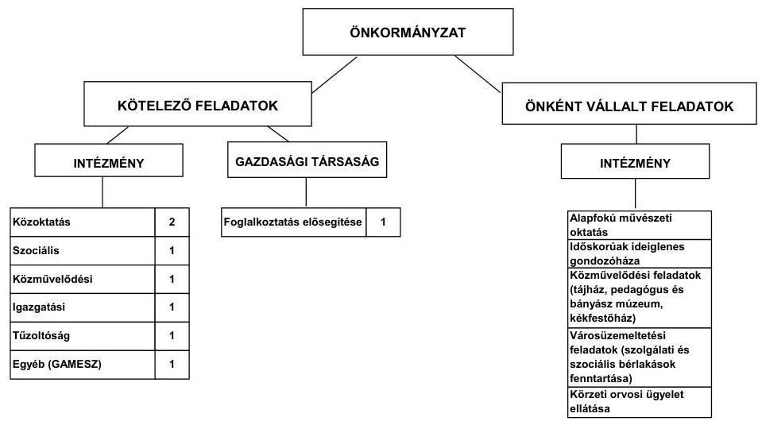

Az Önkormányzat feladatait 2011. június 30 -án (a Polgármesteri hivatallal együtt) hét költségvetési szervvel és egy gazdasági társaság keretében látta el. A 2007-ben más önkormányzattól átvett közoktatási intézmény miatt a feladatellátás telephelyeinek száma a 2007. évi kilencről 2011. év I. félév végére 10-re nőtt. Az Önkormányzat egy gazdasági társaságban tulajdonos, 50\% alatti tulajdoni hányaddal rendelkezik. A gazdasági társaság a foglalkoztatás elősegítése területén, a közfoglalkoztatás szervezésében, lebonyolításában kapott szerepet az Önkormányzat feladatellátásában. A gazdasági társaság a múködéséhez az ellenőrzött időszakban támogatásban nem részesült az Önkormányzattól. Az önként vállalt feladatokat a 2007-2011. év június 30. közötti időszakban az Önkormányzatnál nem önálló szervezeti keretek között látták el az intézmények.

Az Önkormányzat teljesített múködési kiadásai szerkezetét tekintve 2010-ben a meghatározó arányt, 76,6\%-ot (1146,3 millió Ft-ot) az igazgatás és egyéb ágazat (közművelődés, sport, hivatásos tűzoltóság, GAMESZ, Polgármesteri hivatal)

---

együttes kiadásai képviselték. A múködési kiadásokon belül a közoktatási feladatokat ellátó intézmények teljesített kiadása 19,1\% (286,5 millió Ft), a szoci-ális- és gyermekvédelmi feladatokat ellátó intézményé 4,3\% (64,0 millió Ft) volt. A múködési kiadások 2010. évi ágazatonkénti megoszlása lényegesen nem tért el a 2007-2009. évek átlagától, így annak arányváltozása a pénzügyi egyensúlyra nem volt hatással.

Az egyes közszolgáltatások feladatellátásában résztvevő intézmények múködési kiadásainak 2007. és 2010. évi finanszírozási forrásösszetételét a következő ábra szemlélteti:
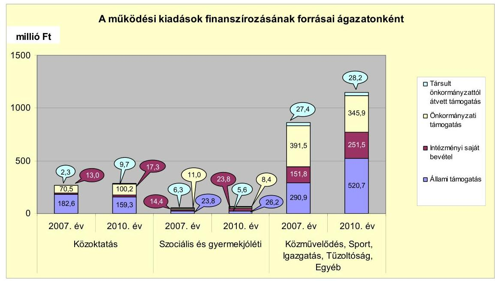

Az Önkormányzatnál 2007-2010 között nőtt az állami támogatás, a saját intézményi-, valamint a társult önkormányzattól átvett támogatás bevételek aránya és összege. A finanszírozási források 2007-2010 közötti összetételének változása ezen időszak alatt összességében az önkormányzati támogatási igény 4,0\%-os, (18,5 millió Ft-os) csökkenéséhez (ezáltal önkormányzati kiadáscsökkenéshez) vezetett. A vizsgált időszakban a kötelező és az önként vállalt feladatok ellátását biztosító szervezeti keretekben, a feladatellátás módjában bekövetkezett változás az Önkormányzat pénzügyi egyensúlyi helyzetének alakulására lényeges hatással nem volt. A 2007. július 31-től megalakult intézményi társulás az általános iskolai oktatás feladatoknál összességében - az Önkormányzat adatszolgáltatása szerint - a kiadásokat 81,5 millió Ft-tal, a bevételeket 57,9 millió Ft-tal emelte meg. A feladatátvétel az Önkormányzatnak 2007. szeptember 1-jétől 2011. június 30 -áig összességében 23,6 millió Ft összegű működési kiadásemelkedést eredményezett. Ez a többletkiadás a közoktatási ágazat 2007-2010. évi összes múködési kiadásainak (1173,3 millió Ft) a 2,0\%át tette ki.

---

Az Önkormányzat folyó költségvetési egyenlege (múködési jövedelme) a 20072009. években negatív, a 2010. évben pozitív egyenleget ${ }^{6}$ mutatott. A múködési jövedelem hiányának mérséklésében, illetve a forrástöbblet képződésében az ÖNHIKI és a múködésképtelen önkormányzatok támogatásának jelentős szerepe volt.
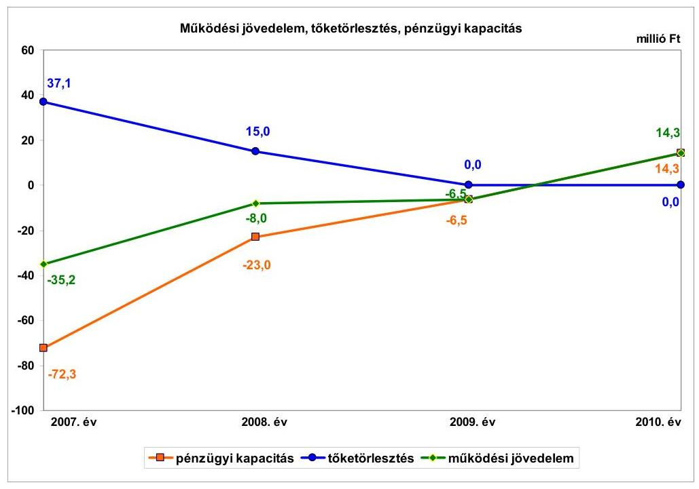

A 2007. évi folyó költségvetésben annak ellenére forráshiány keletkezett, hogy az Önkormányzat 33,0 millió Ft ÖNHIKI támogatást kapott. A 2008. évben a folyó költségvetés hiányának előző évihez viszonyított, 27,2 millió Ft-os csökkenését az államháztartáson belülről kapott támogatások emelkedése eredményezte. 2008-ban 5,1 millió Ft ÖNHIKI és 10,0 millió Ft múködésképtelen önkormányzatok támogatásában részesült az Önkormányzat. A folyó bevételek 2008. évi, további növekedésében a pályázatokon nyert, egyszeri, illetve évenként változó összegű központi támogatások, valamint a Többcélú társulástól átvett támogatásértékű bevételek emelkedése volt a meghatározó. A múködési jövedelem negatív egyenlegének előző évihez viszonyított, 2009. évi mérséklődésében 32,9 millió Ft ÖNHIKI és 6,0 millió Ft múködésképtelen önkormányzatok támogatásának volt döntő szerepe, mert ezen bevételek nélkül a múködési költségvetés hiánya a 2007. évit is meghaladta volna. A folyó költségvetés 2010-ben pozitív egyenleget mutatott, melyhez jelentősen hozzájárult a 13,0 millió Ft múködésképtelen önkormányzatok támogatása.

Az Önkormányzat a 2007-2010. években ÖNHIKI (71,0 millió Ft) és múködésképtelen önkormányzatok támogatása (29,0 millió Ft) címén együttesen 100,0 millió Ft vissza nem térítendő támogatásban részesült. Az ÖNHIKI támogatás nélkül számított múködési jövedelem 2007-ben -68,2 millió Ft, 2008-ban

[^0]
[^0]:    ${ }^{6}$ A folyó költségvetés hiánya 2007-ben a folyó kiadások 2,8\%-át (35,2 millió Ft-ot), 2008-ban 0,6\%-át ( 8,0 millió Ft-ot), 2009-ben 0,4\%-át ( 6,5 millió Ft-ot) tette ki, a 2010. évi forrástöbblet a folyó kiadások 0,9\%-át (14,3 millió Ft-ot) jelentette.

---

-13,1 millió Ft, 2009-ben -39,4 millió Ft, az Önkormányzat 2010-ben nem kapott ÖNHIKI támogatást. Az ÖNHIKI és múködésképtelen önkormányzatok támogatásának együttes összege nélkül számított múködési jövedelem 20072010 között, az évek sorrendjében -68,2 millió Ft, -23,1 millió Ft, -45,4 millió Ft és 1,3 millió Ft.

Az Önkormányzat pénzügyi kapacitása (nettó múködési jövedelme) a 20072009. években negatív, a 2010. évben ( 14,3 millió Ft) pozitív értéket mutatott. A nettó múködési jövedelem a 2007. évben volt a legalacsonyabb, amikor a folyó költségvetésben a legnagyobb ( 35,2 millió Ft-os) hiány keletkezett és 37,1 millió Ft hiteltörlesztés is terhelte a múködési jövedelmet. A 2007. évi adósságszolgálatot 22,1 millió Ft munkabér-megelőlegezési és 15,0 millió Ft folyószámlahitel visszafizetése képezte. A 2008. évben 49,3 millió Ft-tal csökkent a nettó múködési jövedelem negatív egyenlege a folyó költségvetési hiány 27,2 millió Ft-os és az adósságszolgálat 22,1 millió Ft-os előző évhez viszonyított mérséklődése következtében. A 2008. évben 15,0 millió Ft folyószámlahitelt törlesztettek. A 2009-2010. években az Önkormányzatnak hiteltörlesztési kötelezettsége nem állt fenn, a nettó múködési jövedelem megegyezett a múködési jövedelem összegével.
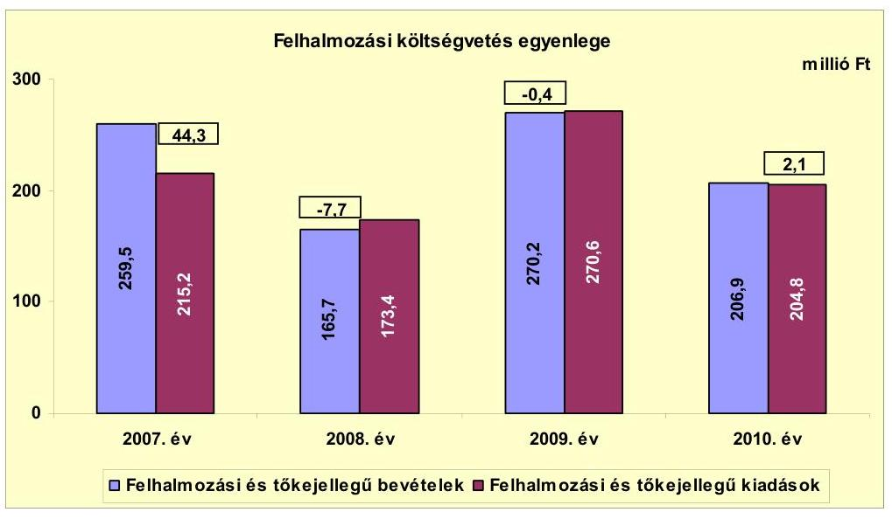

A felhalmozási költségvetés egyenlege 2007-ben és 2010-ben pozitív, 2008-2009-ben negatív volt. A 2007. évi felhalmozási bevételi többlet döntően egy hazai támogatású fejlesztési feladat 41,0 millió Ft-os utófinanszírozása miatt keletkezett. A 2008. évi felhalmozási forráshiány ( 7,7 millió Ft) jelentős részét az előző évi felhalmozási célú pénzmaradvány ( 6,7 millió Ft) fedezte, 1,0 millió Ft-ot folyószámlahitelből biztosítottak. A 2009. évben a felhalmozási költségvetési egyenleg ( $-0,4$ millió Ft) 7,3 millió Ft-tal javult az előző évihez képest, a felhalmozási költségvetés az egyensúlyi állapotot megközelítette. A 2010. évben a felhalmozási bevételek 2,1 millió Ft-tal meghaladták a felhalmozási kiadásokat. A felhalmozási kiadások finanszírozása 2007-2010 között összességében nem okozott jelentős problémát az Önkormányzat likvidításában.

---

Az Önkormányzat folyó bevételei 2007-2010 között növekvő tendenciát mutattak. A folyó bevételek között leginkább meghatározó a költségvetési támogatás és az szja együttes összege (3910,6 millió Ft) volt, amelyek ezen időszakban a folyó bevételek $68,7 \%$-át tették ki. A folyó bevételek között jelentős súlyt képviselt még az egyéb saját bevétel (1407,4 millió Ft), amelynek aránya 24,7\%-ot jelentett. A folyó bevételekben a legnagyobb, 161,9 millió Ft-os emelkedés - az előző évihez viszonyítva - a 2008. évben következett be, melynek több mint felét, 85,0 millió Ft-ot az egyéb saját bevételek, ezen belül döntően az államháztartáson belülről kapott támogatások ( 75,2 millió Ft-os) növekménye adta. A 2010. évben az egyéb saját bevételek előző évihez viszonyított, 109,6 millió Ftos növekedése eredményezte a folyó költségvetési egyensúly helyreállását. Az egyéb saját bevétel emelkedését döntően az árvízi védekezések során az Önkormányzat által nyújtott szolgáltatások rendkívüli bevétele, a kártérítési bevétel és a támogatásértékű bevételek növekménye (összesen 98,1 millió Ft) okozta.

A felhalmozási bevételek 2007-2010 között összesen 902,3 millió Ft forrást biztosítottak a fejlesztési feladatokhoz, melynek 88,7\%-át az államháztartáson belülről származó támogatások ( 800,3 millió Ft) adták. A felhalmozási bevételekben a legjelentősebb változás - 104,5 millió Ft-os növekedés - a 2009. évben következett be, amikor az iskola felújítására 130,3 millió Ft támogatást kapott az Önkormányzat. A költségvetési támogatásban LEKI támogatás címén a 2007. év során 14,7 millió Ft, 2008-ban 6,1 millió Ft, 2009-ben 19,5 millió Ft, 2010-ben 20,0 millió Ft támogatásban részesült, vis maior támogatásként 2007-ben 44,4 millió Ft-ot, 2008-ban 2,0 millió Ft-ot, 2010-ben 41,2 millió Ft-ot kapott az Önkormányzat.

A folyó kiadások 2007-2010 között 5726,0 millió Ft-ot tettek ki. Folyamatosan - bár évről évre csökkenő mértékben - emelkedtek, a növekedés átlagos üteme 7,7\%-os (104,4 millió Ft) volt. A folyó kiadások növekedését elsősorban a - 2007-2010. évekbeli folyó kiadások 45,6\%-át (2611,7 millió Ft-ot) jelentő személyi juttatások létszámnövekedéssel összefüggő emelkedése határozta meg.

A felhalmozási kiadások 2007-2010 közötti összege 864,0 millió Ft volt, mely a 2008. évben 7,7 millió Ft-tal, 2009-ben 0,4 millió Ft-tal meghaladta a felhalmozási bevételeket. A végrehajtott fejlesztési feladatoktól, illetve azok adott évi ütemétől függően változott a felhalmozásra fordított kiadás, legmagasabb összeget (270,6 millió Ft-ot) a 2009. évben ért el. A 2009. évi felhalmozási kiadásokban az iskola felújítására (142,2 millió Ft), önkormányzati utak felújítására (57,2 millió Ft), alapfokú művészetoktatási intézmény fejlesztésére (21,3 millió Ft), orvosi rendelő akadálymentesítésére (10,5 millió Ft) teljesített kiadások voltak a legjelentősebbek.

A 2010. december 31-éig befejezett fejlesztések értéke 860,2 millió Ft volt, melyekre 2006. december 31-éig 41,0 millió Ft-ot, a 2007-2010. években 819,2 millió Ft-ot fizettek ki. A 2007-2010 között teljesített kiadások forrása 158,1 millió Ft (19,3\%) saját forrás, 260,6 millió Ft (31,8\%) EU-s támogatás és 400,5 millió Ft (48,9\%) hazai támogatás volt. A 2010. december 31-én folyamatban lévő fejlesztési feladatok végrehajtására 2007-2010 között 29,9 millió Ft kiadást teljesítettek, melyben az önkormányzati forrás 11,6 millió Ft, az EU-s támogatás 18,3 millió Ft volt. Az EU-s támogatásból

---

megvalósult fejlesztések egyikének 2010. évi finanszírozása átmeneti likviditási gondot okozott, melyet 23,7 millió Ft támogatás-megelőlegezési hitel felvételével hidaltak át.

Az Önkormányzatnál 2010. december 31-én folyamatban lévő fejlesztési feladatok miatt fennálló kötelezettségek összege 255,0 millió Ft volt, amelyből 18,3 millió Ft-ot ( $7,2 \%$-ot) saját forrásból, 236,7 millió Ft-ot ( $92,8 \%$ ot) EU-s támogatásból terveznek biztosítani. A folyamatban lévő fejlesztések 2010. december 31-én fennálló felhalmozási kötelezettségeinek forrásösszetételét és annak megoszlását a következő ábra szemlélteti:
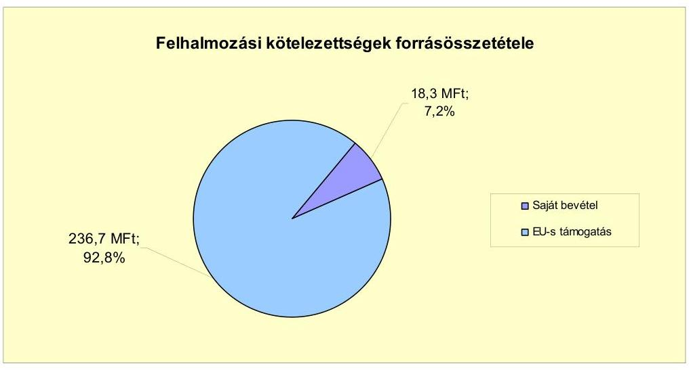

Az Önkormányzat által beadott, elbírálás alatt álló pályázatok tervezett, teljes bekerülési költsége 513,4 millió Ft volt, amelyhez 22,4 millió Ft (4,4\%) önkormányzati saját forrás biztosítása mellett, 491,0 millió Ft (95,6\%) EU-s támogatás igénybevételét tervezik.

Az Önkormányzat mérleg szerinti pénzintézeti kötelezettsége 2006. december 31-e és 2010. december 31-e között évről évre nőtt, a 2011. év I. féléve végén 41,0 millió Ft volt, mely folyószámlahitel igénybevételéből keletkezett.

Az Önkormányzat kötelezettségvállalásaira - a 2007-2008. évi munkabérmegelőlegezési hitelek kivételével - képviselő-testületi döntés alapján került sor, azonban az előterjesztésekben nem mutatták be a kamatkockázatokat.

Az Önkormányzat múködésének pénzügyi egyensúlyát, fizetőképességét a 2007-2010. években folyószámlahitel és munkabér-megelőlegezési hitel igénybevételével tudta biztosítani. A 2010. évben egy alkalommal, átmeneti likviditási problémájának megoldására, 23,7 millió Ft rövid lejáratú hitelt is vett igénybe, melyet két részletben - 2010. január 25-én és június 28-án - vett fel és 2010. november 11-én fizetett vissza.

A folyószámla- és munkabér-megelőlegezési hitel 2007-2011. év I. féléve közötti igénybevételét a következő tábla mutatja be:

---

| Megnevezés | 2007. év | 2008. év | 2009. év | 2010. év | 2011. év   I. félév |
| :-- | --: | --: | --: | --: | --: |
| Folyószámlahitel |  |  |  |  |  |
| Keretösszeg január 1-jén (millió Ft-ban) | 15,0 | 15,0 | 45,0 | 45,0 | 45,0 |
| Átagos, napi állomány (millió Ft-ban) | 15,0 | 17,5 | 25,3 | 31,1 | 36,1 |
| Folyószámla hitellel zárt napok száma (nap) | 365 | 365 | 365 | 365 | 181 |
| Időszak végi záró állomány (millió Ft-ban) | 15,0 | - | 9,1 | 14,1 | 41,0 |
| Munkabér-megelőlegezési hitel |  |  |  |  |  |
| Keretösszeg január 1-jén (millió Ft-ban) | 28,0 | 28,0 | 30,0 | 28,0 | 32,0 |
| Átagos, napi állomány (millió Ft-ban) | 20,0 | 22,4 | 22,7 | 28,2 | 27,9 |
| Munkabér-megelőlegezési hitellel zárt napok száma (nap) | 305 | 300 | 288 | 348 | 168 |
| Időszak végi záró állomány (millió Ft-ban) | - | - | - | 32,0 | - |

A folyószámlahitel-állomány a hitelszerződés lejáratának időpontjában a 2007. és a 2008. évben - a hitelkeret teljes összegével egyező - 15,0 millió Ft, 2009-ben 35,2 millió Ft, 2010-ben 36,7 millió Ft volt, a visszafizetések az újabb hitel folyósításával párhuzamosan történtek. 2007-2011. év I. féléve között a minden nap igénybevett - folyószámlahitel tartós és növekvő mértékű bevonása a kiadások fedezetének biztosításába az Önkormányzat pénzügyi egyensúlyi helyzetének folyamatos romlását jelezte. A likviditás fenntartásában a munkabér-megelőlegezési hitel is - figyelemmel az igénybevételi napok számára - jelentős szerepet töltött be, ugyanis a 2007-2010. évek időszakában a naptári napok 85,0\%-ában (évente átlagosan 313,3 napon), a 2011. év I. féléve során a naptári napok $92,8 \%$-ában ( 168 napon) igénybe vették ezt a hitelfajtát. A folyószámla- és munkabér-megelőlegezési hitelek - napi átlagos állományuk együttes összege alapján - 2009-ben a folyó és felhalmozási kiadások 2,7\%-át (48,0 millió Ft-ot), míg 2010-ben a 3,3\%-át (59,3 millió Ft-ot) finanszírozták.

A likviditás biztosítása az Önkormányzatnak 22,1 millió Ft kamat- és egyéb kiadás fizetésének kötelezettségét okozta. Az Önkormányzat 2011. év I. félév végi szállítói kötelezettségállománya 90,4 millió Ft, melyből a lejárt tartozás 88,6 millió Ft volt, ezen belül 60 napon túl 77,1 millió Ft, 90 napon túl 76,8 millió Ft járt le. Ennek oka - az Önkormányzat tájékoztatása szerint - egyrészt, hogy az árvízi védekezéssel kapcsolatos, 62,3 millió Ft rendkívüli kiadásra az Önkormányzat költségvetésében nem állt rendelkezésre fedezet, a fizetési kötelezettség központi forrásból történő finanszírozására benyújtott pályázatukra pedig 2011. november 9-éig nem született döntés. Másrészt a múködtetéshez kapcsolódó, összesen 17,4 millió Ft összegű (karbantartási, szolgáltatási, élelmiszer, közüzemi díj stb.) számlákat pénzeszköz hiányában nem fizették ki, továbbá 7,8 millió Ft, fejlesztési feladattal és 2,9 millió Ft iskolatej-programmal összefüggő kiadás teljesítését az ezekre benyújtott fizetési igényeik kielégítése után tudják csak rendezni. Egyéb intézkedést nem tettek az eladósodást jelző, magas szállítói tartozás mérséklésére, megszüntetésére, annak ellenére, hogy az jelentősen rontja az Önkormányzat pénzügyi egyensúlyi helyzetét.

Az Önkormányzat kötelezettségeinek 2011. június 30-i állományát és a kötelezettségek lejáratáig várható állományát a következő táblázat szemlélteti:

---

| Megnevezés | Állomány   2010.   december 31-én   (millió Ft-ban) | Állomány   2011.   június 30-án   (millió Ft-ban) | Várható   kötelezettség a   2011-2013.   években   (millió Ft-ban) | Várható   kötelezettség a   2014. évtől   (millió Ft-ban) |
| :-- | --: | --: | --: | :--: |
| Pénzintézeti kötelezettségek |  |  |  |  |
| folyószámlahibel | 14,1 | 41,0 | 44,4 | - |
| munkabér-megelőlegezési hitel | 32,0 | - | 1,4 | - |
| Pénzintézeti kötelezettségek   összesen | 46,1 | 41,0 | 45,8 | - |
| Szállítói tartozás | 120,2 | 90,4 | 91,5 | - |
| Egyéb kiadáselmaradás | 9,0 | 17,8 | 17,8 | - |
| Kötelezettségek összesen | $\mathbf{1 7 5 , 3}$ | $\mathbf{1 4 9 , 2}$ | $\mathbf{1 5 5 , 1}$ | - |

Az Önkormányzatnak pénzintézetekkel szemben fennálló kötelezettsége a 2011. év I. féléve végén 41,0 millió Ft volt, mely alapján az ezt követő időszakban várható kötelezettség ( 41,0 millió Ft tőketörlesztés és 4,8 millió Ft kamatkiadás) 45,8 millió $\mathrm{Ft}^{7}$. Az Önkormányzatnak a 2011. év I. féléve végére szállítói tartozás és egyéb kiadáselmaradás címén 108,2 millió Ft fizetési kötelezettsége keletkezett, melynek kamatokkal növelt összege a tárgyév végéig várhatóan 109,1 millió Ft fizetési kötelezettséget jelent. A 2011-2013. évek kötelezettségeinek teljesítésére figyelembe vehető 86,9 millió Ft, mérlegben kimutatott követelésállomány. Az Önkormányzat a kötelezettségeket teljes egészében további kiadáscsökkentő, bevételnövelő intézkedésekkel, vagy külső forrásból tudja csak teljesíteni.

Az Önkormányzat az ellenőrzött időszakban kiadási megtakarítást eredményező és bevételt növelő intézkedéseket tett. A 2007-2011. év I. féléve között tett intézkedések hatására 20,3 millió Ft bevételi többletet, továbbá 34,0 millió Ft kiadási megtakarítást mutattak ki. A bevételnövelő intézkedések, kommunális adó és intézményi térítési díjak emeléséhez kapcsolódtak. A kiadási megtakarítások 76,2\%-a ( 25,9 millió Ft) az elrendelt többletjuttatás, 16,2\%-a ( 5,5 millió Ft) helyettesítés miatti megtakarítás, 7,6\%-a ( 2,6 millió Ft) jutalom kifizetés megszüntetés eredménye. A bevételnövelő intézkedések kommunális adó és intézményi térítési díjak emeléséhez kapcsolódtak.

Az Önkormányzatnál a költségvetési támogatás és szja bevételek az előző évhez viszonyítva 2008-ban és 2009-ben emelkedtek, a 2010. évtől csökkentek. A központi támogatások 2010. évi 7,6 millió Ft-os csökkenését az Önkormányzat által kimutatott (ÁSZ által nem ellenőrzött) kiadási megtakarítás és bevételnövelés ellensúlyozta. Ez hozzájárult az Önkormányzat pénzügyi egyensúlyának javításához.

Az ÁSZ az Önkormányzat gazdálkodási rendszerét a 2009. évben ellenőrizte átfogó jelleggel, melynek során 21 szabályszerűségi és 15 célszerűségi javaslatot tett. Az utóellenőrzés a pénzügyi egyensúly javítására tett két szabályszerűségi javaslat hasznosítására terjedt ki. A javaslatok a költségvetési rendelettervezet pénzügyi bizottsági véleményezésre történő előterjesztésére, valamint a

[^0]
[^0]:    ${ }^{7}$ a 2011-ben kötött folyószámla-hitelkeret szerződés alapján, mivel az Önkormányzatnak hosszú lejáratú kötelezettségvállalásból 2011. év I. féléve végén nem állt fenn kötelezettsége

---

költségvetési hiány finanszírozási célú pénzügyi műveletek nélküli megállapítására irányultak, amelyeket az intézkedési terv szerinti határidőben megvalósítottak.

Az Önkormányzat pénzügyi egyensúlyi helyzetét összegezve a következők emelhetők ki:

Szendrő Város Önkormányzatának pénzügyi egyensúlyi helyzete rövid távon veszélyeztetett.

A folyó bevételei 2007-2009 között ÖNHIKI és a működésképtelen önkormányzatoknak nyújtott támogatás igénybevételével sem biztosított fedezetet a folyó kiadásokra és az adósságszolgálatra. A 2010. évben a nettó működési jövedelme pozitív volt, ebben szerepet játszott, hogy 2009-től megszűnt az adósságszolgálata és kapott múködésképtelen önkormányzatok támogatását. A pénzügyi kapacitás pozitív értékét ekkor úgy érték el, hogy - a várost 2010-ben többször sújtó - árvíz okozta kár helyreállításának szállítói számláit részben nem fizették ki. A lejárt szállítói számlák miatti kötelezettség közvetlenül veszélyezteti az Önkormányzat múködését.

Az Önkormányzat a tartós múködési forráshiányt nem ellensúlyozta megfelelő szintű bevételnövelő- és kiadáscsökkentő intézkedéssel. Múködését állandósult és növekvő folyószámlahitel, valamint munkabérhitel igénybevételével tudta biztosítani.

Kötelezettségeinek szerkezete kedvezőtlen, a pénzintézettel szemben fennálló kötelezettségei, az egyéb kiadási elmaradásai és a szállítói tartozásai is rövid lejáratúak.

A folyamatban lévő fejlesztései megvalósításához saját bevétel igénybevételt terveztek, amely nem biztosított. A fejlesztések során kialakított létesítmények jövőbeni múködtetésének várható kiadásait nem számszerűsítették.

Az Állami Számvevőszékről szóló 2011. évi LXVI. törvény 33. § (1) bekezdésében foglaltak értelmében a jelentésben foglalt megállapításokhoz kapcsolódó intézkedési tervet köteles az ellenőrzött szervezet vezetője összeállítani, és azt a jelentés kézhezvételétől számított harminc napon belül az ÁSZ részére megküldeni. Amennyiben az intézkedési tervet határidőben nem küldi meg a szervezet, vagy az továbbra sem elfogadható, az ÁSZ elnöke a hivatkozott törvény 33. § (3) bekezdés a)-b) pontjaiban foglaltakat érvényesítheti.

# A 2011. június 30-i pénzügyi egyensúlyi helyzet alapján az ellenőrzés intézkedést igénylő megállapításai és javaslatai a következők: 

## a polgármesternek

1. Az Önkormányzat pénzügyi egyensúlya rövid távon veszélyeztetett. A nettó múködési jövedelme az elmúlt időszakban - a 2010. évi kivételével - negatív volt. Az Önkormányzat finanszírozása a vizsgált időszakban folyószámla- és munkabérmegelőlegezési hitel igénybevételével volt biztosítható. Kötelezettségei rövid lejáratúak. Az Önkormányzat által tett intézményszervezeti átalakítások, kiadáscsökkentő

---

és bevételnövelő intézkedések nem biztosítanak elegendő forrást a pénzügyi egyensúly helyreállításához.

Javaslat:
Az Önkormányzat pénzügyi egyensúlyának gyors helyreállítása és hosszú távú fenntarthatósága érdekében kezdeményezze - felelősök és határidők megjelölésével - az alábbi intézkedések megtételét:
a) tárja fel a bevételszerző és kiadáscsökkentő lehetőségeket;
b) intézkedjen a bevételek növelésére, a kintlévőségek behajtására, a kiadások csökkentésére;
c) terjesszen a Képviselő-testület elé reorganizációs programot a kedvezőtlen pénzügyi folyamatok megállítására, a pénzügyi egyensúlyi helyzet gyors stabilizálására;
d) kezdeményezze az intézmények finanszírozásának napi kontrollját. Szűkítse a jóváhagyott előirányzatok felhasználásának lehetőségeit;
e) vizsgálja felül az önként vállalt feladatok finanszírozhatóságát, s hozzon intézkedéseket a kötelező feladatok ellátásának biztosítása érdekében;
f) mutassa be havonta legalább három évre kitekintően kötelezettségeinek finanszírozási forrásait;
g) vizsgálja meg az állandósult folyószámlahitel hosszú távú kötelezettséggé történő átalakításának jogi lehetőségét, és a Stabilitási törvény 10. §-ában előírt feltételek fennállása esetén kezdeményezze a Kormánynál ennek engedélyezését.
2. A folyamatban lévő fejlesztések saját forrás igénye 18,3 millió Ft, az elbírálás alatt lévő pályázatoké 22,4 millió Ft.

Javaslat:
a) Mérje fel a folyamatban lévő beruházásokkal kapcsolatos kötelezettségek átütemezésének pénzügyi és jogi lehetőségeit, illetve hatásait. Szükség esetén kezdeményezze a Képviselő-testületnél annak átütemezését;
b) vizsgálja felül teljes körűen a tervezett beruházásokat és a megvalósuló létesítmények fenntartásának jövőbeni pénzügyi kihatásait;
c) szükség esetén tegyen javaslatot a Képviselő-testületnek a tervezett beruházásokkal kapcsolatos döntések módosítására, amelyben figyelembe veszik az Önkormányzat pénzügyi lehetőségeit és a kötelező feladatellátás elsődlegességét.
3. Az Önkormányzat lejárt szállítói tartozásának rendezése nem történt meg a helyszíni ellenőrzés lezárásáig.

---

Javaslat:
Kezelje az Önkormányzat lejárt szállítói állományát, a szállítói kitettség és a jogszabályi következmények elkerülése érdekében.

A polgármester a helyszíni ellenőrzés lezárása után tájékoztatta az Állami Számvevőszéket az Önkormányzat megtett és tervezett intézkedéseiről, amelyet az Állami Számvevőszék nem ellenőrzött, arra vonatkozóan véleményt vagy megállapítást nem fogalmaz meg. Az ellenőrzés lezárását követően elvégzett intézkedéseket az Állami Számvevőszék utóellenőrzés keretében vizsgálhatja.

A polgármester tájékoztatása szerint a következő intézkedéseket tette és tervezi az Önkormányzat:

- előterjesztése alapján a Képviselő-testület megbízta a Pénzügyi Bizottságot, hogy tekintse át az önként vállalt feladatok finanszírozhatóságát, valamint az intézmények vezetőivel tételesen vizsgálja meg a bevételszerző és kiadást csökkentő lehetőségeket, azokra vonatkozóan dolgozzon ki javaslatokat, és építsék be az Önkormányzat 2012. évi költségvetési rendeletébe,
- a lakosságot és a vállalkozásokat 2012. március 15 -ig kiértesítik a fennálló adókötelezettségeikről és esetleges tartozásaikról. Felhívta a jegyző figyelmét, vizsgálja meg újabb behajtási eszközök igénybevételének lehetőségét, az adóalanyok fokozott ellenőrzésének személyi és anyagi feltételeit,
- a 2010. évi árvízi védekezéssel kapcsolatos rendkívüli kiadások finanszírozására benyújtott vis maior pályázat elbírálása érdekében 2012. március 11-ig levélben fordul a belügyminiszterhez,
- az állandósult folyószámlahitel hosszú távú kötelezettséggé alakításának jogi lehetőségét a költségvetési rendelet-tervezet előkészítése során megvizsgálja,
- a tervezett beruházások során megvalósuló létesítmények fenntartásának pénzügyi kihatásait szakemberek bevonásával megvizsgálja 2012. március 30 -ig.

A helyszíni ellenőrzés lezárását követően a polgármester által tett észrevételt és tájékoztatást, valamint az arra adott válaszlevelet a jelentés 5 . és 6 . számú mellékletei tartalmazzák.

---

# II. RÉSZLETES MEGÁLLAPÍTÁSOK 

## 1. Az ÖNKORMÁNYZAT KÖTELEZEŐ ÉS ÖNKÉNT VÁLLALT FELADATAI, A FELADATELLÁTÁS SZERVEZETI KERETEI ÉS ANNAK VÁLTOZÁSAI

Az Önkormányzat a kötelező és az önként vállalt feladatok körét az SzMSz-ben határozta meg. Az Önkormányzat az önként vállalt feladatai közé sorolta az alapfokú művészetoktatást, az átmeneti elhelyezést nyújtó időskorúak gondozóházának működtetését, a közművelődési-, a sport-, valamint a társadalmi szervezetek támogatását, továbbá a városüzemeltetési és a körzeti orvosi ügyeleti feladatok ellátását. Az önként vállalt feladatok támogatásának mértékét az Önkormányzat az éves költségvetési rendeletekben, az anyagi lehetőségei mértékében határozta meg.

Az Önkormányzat - adatszolgáltatása alapján - 2010-ben a teljesített múködési kiadásain ( 1496,8 millió $\mathrm{Ft}^{8}$ ) belül 1424,9 millió Ft-ot ( $95,2 \%$ ) fordított kötelezö feladatainak ellátására. Az önként vállalt feladatokra teljesített múködési kiadások összege 71,9 millió $\mathrm{Ft}\left(4,8 \%{ }^{9}\right)$ volt, ami 20,9\%-kal, 12,4 millió Ft-tal haladta meg a 2007-2009. évek átlagát. Az önként vállalt feladatokra fordított kiadások összege döntően nem befolyásolta az Önkormányzat múködésének biztonságát.

Az Önkormányzat 2010. évi teljesített múködési költségvetési kiadásain (1496,8 millió Ft) belül 1199,1 millió Ft összegű kiadás az intézmények ( $80,1 \%$ ), a többi - az Önkormányzat adatszolgáltatása szerint - a Polgármesteri hivatal költségvetési beszámolójában jelent meg. Az Önkormányzat teljesített múködési kiadásai szerkezetét tekintve 2010-ben a meghatározó arányt, 76,6\%-ot (1146,3 millió Ft-ot) az igazgatás és egyéb ágazat (közművelődés, sport, hivatásos tűzoltóság, GAMESZ, Polgármesteri hivatal) együttes kiadásai képviselték. A múködési kiadásokon belül a közoktatási feladatokat ellátó intézmények teljesített kiadása 19,1\% (286,5 millió Ft), a szociális- és gyermekvédelmi feladatokat ellátó intézményé $4,3 \%$ ( 64,0 millió Ft) volt. A múködési kiadások 2010. évi ágazatonkénti megoszlása - az intézményi társulás 2007. évi megalakítása ellenére - lényegesen nem tért el a 2007-2009. évek átlagától, így a múködési kiadások arányváltozása a pénzügyi egyensúlyt nem befolyásolta.

A múködési kiadások átlagos mértéke és megoszlása ágazatonként a 2007-2009. években a következő volt: közoktatás $22,5 \%$ (295,6 millió Ft), szociális $5,1 \%$ ( 67,0 millió Ft), közművelődés $3,7 \%$ ( 48,6 millió Ft), igazgatás és egyéb 72,5\% ( 954,3 millió Ft ).

[^0]
[^0]:    ${ }^{8}$ A jelentés 1. számú mellékletében kimutatott 2010. évi múködési kiadáshoz képest 76,3 millió Ft-tal kevesebb, mert nem tartalmazza az egészségügyi ágazat 60,6 millió Ft-os, a kisebbségi önkormányzatok 1,6 millió Ft-os és a területi körzeti igazgatási feladatok 14,1 millió Ft-os múködési kiadását.
    ${ }^{9}$ Az önként vállalt feladatok besorolását az Önkormányzat végezte el.

---

Az intézmények 2010. évi teljesített összes múködési költségvetési kiadását (1199,1 millió Ft) 55,7\%-ban (668,0 millió Ft) állami, 22,0\%-ban (263,5 millió Ft) önkormányzati támogatás, az önkormányzati szintű múködési kiadásokat (1496,8 millió Ft) 47,2\%-ban állami (706,2 millió Ft) és 30,4\%-ban (454,5 millió Ft) önkormányzati, 2,9\%-ban (43,5 millió Ft) társult önkormányzattól átvett támogatás és 19,5\%-ban (292,6 millió Ft) intézményi saját bevétel finanszírozta.

A 2010. évi múködési kiadásokat és azok finanszírozási arányait főbb feladatonként - az Önkormányzat adatszolgáltatása alapján - a következő táblázat foglalja össze:

A 2010. évi müködési kiadások feladatonkénti megoszlása és azok finanszírozása

| Ellátott feladat | Müködési   kiadás   összesen   (millió Ft) | Kötelező   feladatok   kiadásainak   részaránya   $\%$ | Müködési   bevétel   összesen   (millió Ft) | Állami   támogatás   részaránya   $\%$ | Intézményi   saját bevétel   részaránya   $\%$ | Önkormányzati   támogatás   részaránya   $\%$ | Társulástól átvett   támogatás   részaránya   $\%$ |
| :--: | :--: | :--: | :--: | :--: | :--: | :--: | :--: |
| Övodák | 50,3 | 100,0 | 50,3 | 63,2 | 0,2 | 36,5 | 0,2 |
| Általános iskolák | 236,2 | 100,0 | 236,2 | 54,0 | 7,3 | 34,7 | 4,0 |
| Szociális   intézmények | 64,0 | 64,1 | 64,0 | 41,0 | 37,2 | 13,1 | 8,7 |
| Közművelődési   intézmények | 36,2 | 100,0 | 36,2 | 0,0 | 6,7 | 15,4 | 77,9 |
| Igazgatási   intézmények | 16,1 | 100,0 | 16,1 | 0,0 | 0,0 | 100,0 | 0,0 |
| Egyéb intézmények | 796,3 | 94,4 | 796,3 | 60,6 | 22,7 | 16,7 | 0,0 |
| Polgármesteri   hivatalban ellátott   feladatok müködési   kiadásai | 297,7 | 98,5 | 297,7 | 12,8 | 23,0 | 64,2 | 0,0 |
| Müködési kiadá-   sok összesen | 297,7 | 95,2 | 297,7 | 47,2 | 19,5 | 30,4 | 2,9 |

A finanszírozási források 2007-2010 közötti összetételének változása az Önkormányzat pénzügyi helyzetére kedvező hatással volt. Ebben az időszakban az Önkormányzatnál nőtt az állami támogatás, a saját intézményi-, valamint a társult önkormányzattól átvett támogatás bevételek aránya és öszszege Ez összességében ezen időszak alatt az önkormányzati támogatási igény 4,0\%-os, 18,5 millió Ft-os csökkenéséhez (ezáltal önkormányzati kiadáscsökkenéshez) vezetett.

Az önkormányzati feladatok múködési kiadásainak finanszírozásában meghatározó szerepe az állami támogatásnak volt. Részaránya 2007-ben 41,9\%, 2008ban $47,2 \%$, 2009-ben 53,2\% 2010-ben $47,2 \%$ volt. Összege - az Önkormányzat kimutatása szerint - 2010-ben 76,2 millió Ft-tal haladta meg a 2007-2009. évek 630,0 millió Ft-os átlagát. Az intézményi saját bevételek aránya 2007-2010 között a múködési bevételeken belül 4,4 százalékponttal, összege 63,2\%-kal, 113,3 millió Ft-tal nőtt. Ebben az Önkormányzat által évenként végrehajtott térítési díjemelésnek és a szociális ellátások térítési díja önköltségalapú számítása 2008. évi bevezetésének volt meghatározó szerepe.

---

Az Önkormányzat feladatait az alábbi intézménystruktúrával látta el 2007-2011. év június 30. között:

- a közoktatási feladatokat két intézmény (ebből 1 óvoda, 1 általános iskola, ezen belül önként vállalt feladatként alapfokú művészeti oktatást) látott el;
- a szociális és gyermekvédelmi feladatellátást (házi segítségnyújtás, családsegítés, nappali szociális ellátás, gyermekjóléti szolgáltatás, valamint önként vállalt feladatként 15 fő ellátott részére idősek átmeneti elhelyezését és gondozását) egy önkormányzati intézmény végezte;
- a közművelődési (kultúra, múzeum, könyvtár, önként vállalt feladatként a többcélú társulásban részvevő önkormányzatok részére mozgókönyvtár) feladatok ellátását egy intézmény végezte;
- az egyéb kötelező és önként vállalt feladatok körében a tűzoltósági tevékenységet egy intézmény, a helyi közlekedési-, víz-, csatorna-, hulladék-szállítási- és vagyonkezelést, illetve az egyéb közszolgáltatással, közművelődéssel, közoktatással kapcsolatos kötelező, valamint az önként vállalt városüzemeltetési feladatokat (szociális- és szolgálati lakások fenntartása, körzeti orvosi ügyelet) feladatokat egy intézmény (GAMESZ) látta el;
- az igazgatási feladatokat a Polgármesteri hivatal végezte.

Az Önkormányzat 100\%-os tulajdonában gazdasági társaság nem volt, egy gazdasági társaságban rendelkezett 25\% alatti ( $9,1 \%$-os) tulajdoni hányaddal, részletes adatait a 4. számú melléklet tartalmazza. A gazdasági társaság a múködéséhez 2007-2011. év I. féléve között támogatásban nem részesült az Önkormányzattól. Az Önkormányzat által 2007-2010 között a 6,4 millió Ft átadott pénzeszköz a közfoglalkoztatással összefüggő önkormányzati önrészt biztosította.

Az Önkormányzat a kötelező és önként vállalt feladatait 2007. január 1-jén a Polgármesteri hivatal mellett két önállóan gazdálkodó és négy részben önállóan gazdálkodó költségvetési intézménnyel látta el. A Polgármesteri hivatal és az intézmények összesen kilenc telephelyen múködtek. A 2007-2010. években az önkormányzati feladatellátást biztosító intézményszerkezetben szervezeti változás - egy esetben - a közoktatási feladatokhoz kapcsolódott. Az Önkormányzat 2007-ben hat helyi önkormányzattal általános iskolai közoktatási feladatok ellátására intézményfenntartó társulást hozott létre. A társulásos feladatellátás következményeként az intézményi telephelyek száma az előző évi kilencről tízre nőtt.

Az Önkormányzat 2007. augusztus 16-tól 87 fő általános iskolai tanuló oktatását vette át Égerszög, Galvács, Perkupa, Szőlősardó, Teresztenye, Varbóc Községek Önkormányzataitól. A telephelyek száma eggyel nőtt, mivel a társult önkormányzatok közül csak Perkupában volt általános iskola.

Az Önkormányzat 2007-2011. év I. félévében feladatot más önkormányzatnak nem adott át. Feladatellátás szolgáltatási szerződéssel való kiszervezésére nem került sor. Az önkormányzati feladatellátásban az intézmények mellett egyéb szervezetek nem vettek részt.

---

A 2007. július 31-től megalakult intézményi társulás az általános iskolai oktatás feladatoknál összességében - az Önkormányzat adatszolgáltatása szerint - a kiadásokat 81,5 millió Ft-tal, a bevételeket 57,9 millió Ft-tal emelte meg. A feladatátvétel az Önkormányzatnak 2007. szeptember 1-jétől 2011. június 30 -áig összességében 23,6 millió Ft összegű működési kiadásemelkedést okozott. Ez a többletkiadás a közoktatási ágazat 2007-2010. évi összes múködési kiadásainak (1173,3 millió Ft) a 2,0\%-át tette ki.

A vizsgált időszakban a kötelező és az önként vállalt feladatok ellátását biztosító szervezeti keretekben, a feladatellátás módjában bekövetkezett változások az Önkormányzat pénzügyi helyzetének alakulására lényeges hatással nem voltak.

# 2. Az ÖNKORMÁNYZAT PÉNZÜGYI EGYENSÚLYI HELYZETÉT BEFOLYÁSOLÓ TÉNYEZŐK 

A hagyományos költségvetési szerkezet helyett az Önkormányzat pénzügyi helyzetét a CLF módszerrel mutatjuk be, amelyben jobban elkülönülnek a vagyonnal kapcsolatos bevételek és kiadások az önkormányzati feladatokkal kapcsolatos közvetlen múködtetési bevételektől és kiadásoktól. A módszer következetesen elkülöníti a folyó és a felhalmozási költségvetés bevételeit és kiadásait, azok költségvetési egyenlegeit. A saját folyó bevételek, valamint a saját felhalmozási bevételek nem tartalmazzák az előző évi pénzmaradványok felhasználásából származó pénzforgalom nélküli bevételeket ${ }^{10}$.

A folyó költségvetés egyenlege, a múködési jövedelem megmutatja, hogy az Önkormányzat éves folyó bevétele fedezetet biztosít-e a kötelező és önként vállalt feladatellátáshoz kapcsolódó, éves folyó kiadására. A múködési jövedelem negatív értéke pénzügyileg fenntarthatatlan helyzetet jelez. A mutató pozitív értéke megtakarítást mutat, amely forrásul szolgálhat az Önkormányzat fennálló kötelezettségei megfizetéséhez, valamint fejlesztéseihez.

A felhalmozási költségvetés pozitív értéke felhalmozási többletet mutat, amely a jövőbeni fejlesztések forrását biztosíthatja. Amennyiben a folyó költségvetési hiány finanszírozása a felhalmozási többletből történik, ez szűkebb értelemben vagyonfelélésnek tekinthető. Amennyiben a felhalmozási költségvetés megtakarítása fejlesztési célú hitelek, kötvények adósságszolgálatát finanszírozza, az változatlan vagyontömeg mellett, a korábban megelőlegezett tőkebevételek valós realizációjának tekinthető. A felhalmozási deficit által generált finanszírozási igény önmagában nem jár pénzügyi kockázattal, a pénzügyileg fenntartható beruházásokhoz kapcsolódó kötelezettségvállalás (adósságszolgálat) átlátható és szabályozott költségvetési gazdálkodással teljesíthető.

A módszer a pénzügyi kapacitás fogalmát helyezi a középpontba. Az adós hitelfelvételi képessége, hosszú távú fizetőképessége vagy bonitása a pénzügyi kapacitással, ezen belül is a nettó múködési jövedelemmel jellemezhető. A net-

[^0]
[^0]:    ${ }^{10}$ A költségvetési években kialakuló hiány finanszírozása az előző évi pénzmaradvány és a korábbi években képzett tartalékok felhasználásával is történhet.

---

tó múködési jövedelem negatív értéke az egyes költségvetési években jelentkező adósságszolgálat túlzott mértékére utal ${ }^{11}$. A nettó múködési jövedelem negatív értékének felhalmozási többletből, vagy további hitelből történő finanszírozása pénzügyileg nem fenntartható gazdálkodást vetít előre. A pozitív értéket mutató nettó múködési jövedelem fejlesztési kiadások fedezetét biztosíthatja, illetve a folyamatosan, évenként képződő pozitív nettó múködési jövedelemből meghatározható a jövőben vállalható, teljesíthető, éves adósságszolgálat, ily módon az a hitelösszeg, amely - a többi tényezőt, feltételt adottnak tekintve visszafizetési kockázat nélkül felvehető.

A CLF módszer alapján a pénzügyi kapacitás mértéke az Önkormányzat összevont, nettósított, a központi információs rendszerbe a Magyar Államkincstáron keresztül leadott éves költségvetési beszámolójának 80-as űrlapjában szerepeltetett adatok alapján került meghatározásra.

A számítási leírás némileg eltér az ÁSZ módszertanában korábban alkalmazott gyakorlattól. A jelen besorolás általános közgazdasági meggondolásokon alapul, amely megjelenik az SNA statisztikai módszertanában is. Folyó tételek alatt értjük azokat a kiadásokat és bevételeket, amelyek a gazdálkodó szervezet helyzetét automatikusan nem változtatják. Bevételi oldalon ilyenek az adók, a tényező jövedelmek, a transzferek ${ }^{12}$, kiadási oldalon a transzferek és a szolgáltatás igénybevételével kapcsolatos múködési kiadások. A folyó költségvetésben a bevételekben nem térül meg, a kiadásokban nem jelenik meg az amortizáció, a vagyoni helyzetet az egyenleg befolyásolja.

A folyó költségvetés egyenlege (múködési jövedelem) tartalmazza a kamatbevételeket és a kamatkiadásokat is, mind a múködési, mind a fejlesztési kamatot, valamint a visszatérülő és befizetendő áfa teljes összegét, mert ezek közgazdaságilag tényező jövedelmek. Nem tartalmazzák viszont a követelés elengedés miatt könyvelt bevételi és kiadási pénzforgalmi tételeket, mert valójában technikai elszámolási múveletnek minősülnek, a bevétel soha nem realizálódott és költségvetési kiadás sem történt.

A felhalmozási költségvetésben a bevételek között a vagyon megőrzésére és bővítésére fordítható források jelennek meg. A felhalmozási vagy tőketételek módosítják a vagyon nagyságát. A privatizációs bevétel csökkenti a vagyont, a fizikai beruházás, pénzügyi befektetés növeli.

A nettó múködési jövedelmet a tőketörlesztés levonásával, a folyó költségvetés egyenlegéből származtatjuk.

[^0]
[^0]:    ${ }^{11}$ kivéve, ha annak finanszírozására a korábbi években képzett tartalékok fedezetet nyújtanak
    ${ }^{12}$ Transzfer kiadásoknak nevezzük azokat a folyó és felhalmozási tételeket, amelyeket nem az adott önkormányzat használ fel szolgáltatásnyújtásra.

---

# 2.1. A múködési és a felhalmozási egyensúly változása 

CLF módszer szerinti önkormányzati adatok

| Megnevezés | 2007. év | 2008. év | 2009. év | 2010. év |
| :--: | :--: | :--: | :--: | :--: |
| Folyó bevételek | 1220,6 | 1382,5 | 1504,2 | 1583,3 |
| Folyó kiadások | 1255,8 | 1390,5 | 1510,7 | 1569,0 |
| Müködési jövedelem | $-35,2$ | $-8,0$ | $-6,5$ | 14,3 |
| Nettó müködési jövedelem   = müködési jövedelem - töketörlesztés | $-72,3$ | $-23,0$ | $-6,5$ | 14,3 |
| Felhalmozási bevételek* | 259,5 | 165,7 | 270,2 | 206,9 |
| Felhalmozási kiadások | 215,2 | 173,4 | 270,6 | 204,8 |
| Felhalmozási költségvetés egyenlege | 44,3 | $-7,7$ | $-0,4$ | 2,1 |
| Finanszírozási múveletek nélküli (GFS) pozíció = müködési jövedelem + felhalmozási költségvetés egyenlege | 9,1 | $-15,7$ | $-6,9$ | 16,4 |
| Finanszírozási múveletek egyenlege | $-1,1$ | $-18,0$ | 19,4 | $-10,4$ |
| Tárgyévi pénzügyi pozíció | 8,0 | $-33,7$ | 12,5 | 6,0 |
| Egyéb tájékoztató adatok |  |  |  |  |
| Összes kötelezettség** | 70,7 | 60,6 | 142,8 | 188,3 |
| - ebből rövid lejáratú | 61,1 | 51,4 | 137,5 | 184,9 |
| Folyószámlahitel napi átlagos állománya *** | 15,0 | 17,5 | 25,3 | 31,1 |
| Likvidhitel napi átlagos állománya*** | 0,0 | 0,0 | 0,0 | 13,8 |
| Munkabérhitel napi átlagos állománya*** | 20,0 | 22,4 | 22,7 | 28,2 |
| Finanszírozásba vonható eszközök: | 39,1 | 5,4 | 17,9 | 23,8 |
| Tartós hitelviszonyt megtestesítő értékpapírok év végi állománya | 0,0 | 0,0 | 0,0 | 0,0 |
| Hosszú lejáratú bankbetétek év végi állománya | 0,0 | 0,0 | 0,0 | 0,0 |
| Értékpapírok év végi állománya | 0,0 | 0,0 | 0,0 | 0,0 |
| Pénzeszközök (idegen pénzeszközök nélkül) év végi állománya | 39,1 | 5,4 | 17,9 | 23,8 |

* A felhalmozási bevételekben a költségvetési támogatás az Önkormányzat adatszolgáltatása szerinti összegben szerepel.
** Az összes kötelezettséget a passzív pénzügyi elszámolások nélkül vettük figyelembe, mert a passzívák a pénzmaradvány-elszámolás tételei közé tartoznak.
*** A folyószámla-, a likvid- és a munkabérhitel átlagos állományát 365 napos osztószámmal, és nem a hitel-igénybevételi napok számával vettük figyelembe.

Az Önkormányzat 2007-2010 közötti bevételeinek, kiadásainak és adósságszolgálatának részletes adatait a jelentés 2. számú melléklete mutatja be.

A 2007-2010. évek folyó költségvetési egyenlegeit (a müködési jövedelmet) a következő ábra szemlélteti:

---

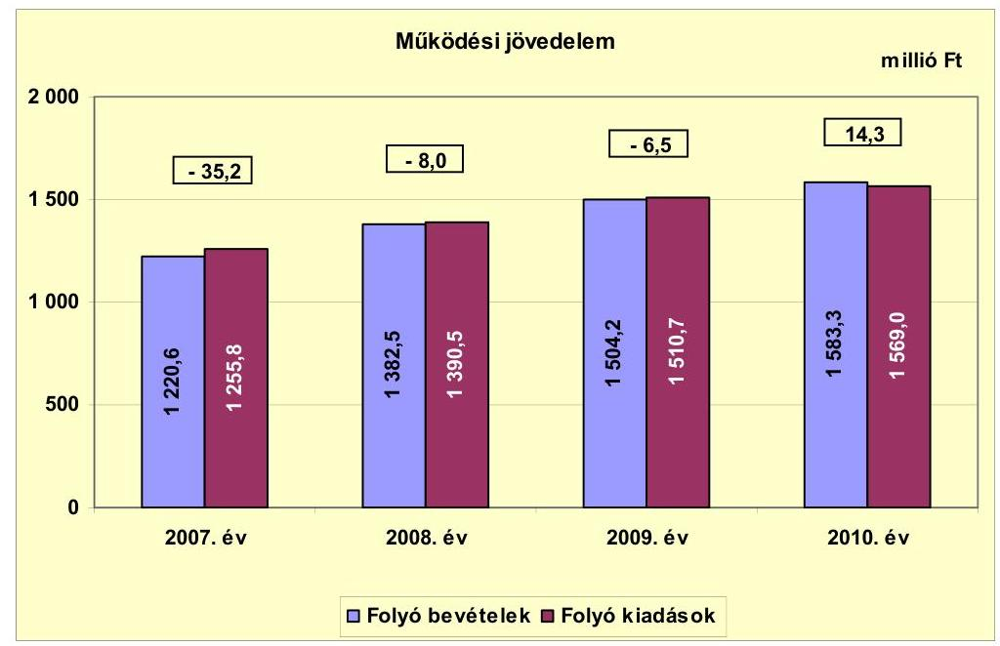

A múködési jövedelem a 2007-2009. években negatív, míg a 2010. évben pozitív egyenleget mutatott. A 2007. évi folyó költségvetésben annak ellenére forráshiány keletkezett, hogy az Önkormányzat 33,0 millió Ft ÖNHIKI támogatást kapott. A 2008. évben a folyó költségvetés hiányának előző évhez viszonyított, 27,2 millió Ft-os ( $22,7 \%$-os) csökkenését a folyó bevételek folyó kiadásokat (22,7 millió Ft-tal) meghaladó növekedése eredményezte. A folyó bevételekben az államháztartáson belülről kapott támogatások 2007. évihez viszonyított emelkedése volt a meghatározó. A kapott támogatásokban a pályázatokon nyert, egyszeri, illetve évenként változó összegű támogatások (mezőgazdasági, humánerőforrás-fejlesztési, tűzoltósági, gyermekvédelmi, mozgáskorlátozottak támogatása, 2007. évi jövedelemkülönbség-mérséklés elszámolása), a Többcélú társulástól átvett pénzeszközök (mozgókönyvtár, orvosi ügyelet, közoktatás támogatása), a közfoglalkoztatás támogatása jelentek meg. Ugyancsak a támogatások részét képezte 2008-ban 5,1 millió Ft ÖNHIKI támogatás és 10,0 millió Ft múködésképtelen helyi önkormányzatok támogatása. A múködési jövedelem 2009-ben 1,5 millió Ft-tal javult az előző évihez képest, de negatív egyenlegú maradt. A 2009. évben kapott 32,9 millió Ft ÖNHIKI és 6,0 millió Ft múködésképtelen önkormányzatok támogatása jelentősen hozzájárult a folyó költségvetési hiány csökkenéséhez. A múködési jövedelem a 2010. évben 20,8 millió Ft-tal nőtt a 2009. évihez képest, és 14,3 millió Ft-os, pozitív összeget mutatott. A folyó költségvetés javulásában a 13,0 millió Ft múködésképtelen önkormányzatok támogatásának volt döntő szerepe.

Az Önkormányzat a 2007-2011. évi költségvetéseit hiánnyal tervezte, melynek ellensúlyozására ezen időszakban összesen 530,8 millió Ft ÖNHIKI támogatásra pályázott. A 2007. évben 33,0 millió Ft, 2008-ban 5,1 millió Ft, 2009-ben 32,9 millió Ft - összesen 71,0 millió Ft - (a 2011. év II. félévében 24,0 millió Ft) támogatásban részesült, mely a 2007-2010. években benyújtott igények (432,3 millió Ft) 16,4\%-a volt. Az ÖNHIKI támogatás nélkül számított múködési jövedelem 2007-ben -68,2 millió Ft, 2008-ban -13,1 millió Ft, 2009-ben -39,4 millió Ft, az Önkormányzat 2010-ben nem kapott ÖNHIKI támogatást. Múködésképtelen önkormányzatok egyéb támogatása címén 2008-ban

---

10,0 millió Ft, 2009-ben 6,0 millió Ft és 2010-ben 13,0 millió Ft - összesen 29,0 millió Ft - vissza nem térítendő, célhoz nem kötött támogatásban is részesültek, melyet dologi kiadásaik finanszírozására használtak fel. A két jogcímen elszámolt támogatások együttesen a múködési jövedelem hiányát a 2007. évben (33,0 millió Ft-tal) közel a felére, 2008-ban ( 15,1 millió Ft-tal) a harmadára, 2009-ben ( 38,9 millió Ft-tal) a hetedére csökkentették. A 2010. évben a múködésképtelen önkormányzatok támogatása - az a nélkül is pozitív - múködési jövedelmet 13,0 millió Ft-tal emelte, javítva az Önkormányzat pénzügyi helyzetét. A múködést segítő támogatások együttes összege nélkül számított múködési jövedelem 2007-2010 között, az évek sorrendjében -68,2 millió Ft, -23,1 millió Ft, -45,4 millió Ft és 1,3 millió Ft.

A 2007-2009. évi negatív folyó költségvetési egyenleg miatt, illetve a 2010. évi múködési forrástöbblet ellenére az Önkormányzat 2007-2010-ben folyószámlaés munkabér-megelőlegezési hitel, 2010-ben támogatás-megelőlegezési ${ }^{13}$ hitel felvételére is kényszerült múködtetési és fejlesztési feladatainak ellátása érdekében. A folyószámlahitel napi átlagos állománya 2007-2010 között folyamatosan, legnagyobb mértékben ( $44,6 \%$-kal, 7,8 millió Ft-tal) a 2009. évben emelkedett az előző évihez képest, a folyó bevételek és kiadások ütemkülönbsége miatt.

Az Önkormányzat 2007-2010. évi nettó múködési jövedelmét a következő ábra szemlélteti:
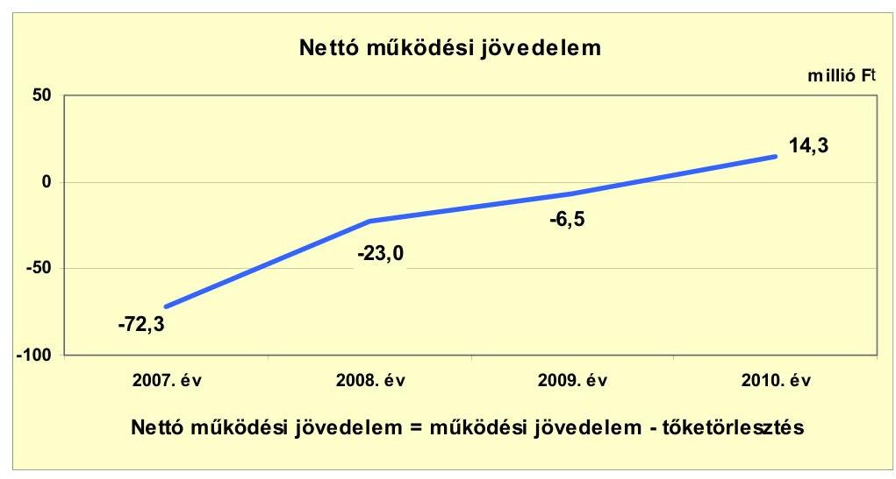

Az Önkormányzat pénzügyi kapacitása (nettó múködési jövedelme) a 20072009. években negatív, a 2010. évben - 20,8 millió Ft-os, előző évhez viszonyított növekedés következtében - pozitív értéket mutatott. A nettó múködési jövedelem a 2007. évben volt a legalacsonyabb, amikor a folyó költségvetésben a legnagyobb ( 35,2 millió Ft-os) hiány keletkezett és 37,1 millió Ft - mun-kabér-megelőlegezési és folyószámla - hiteltörlesztés is terhelte a múködési jövedelmet. A 2008. évben 49,3 millió Ft-tal csökkent a nettó múködési jövedelem negatív egyenlege. A nettó múködési jövedelem 2008. évi javulását a folyó

[^0]
[^0]:    ${ }^{13}$ Egy EU-s támogatás megelőlegezésére 23,7 millió Ft-ot vettek fel, amit éven belül viszsza is fizettek.

---

költségvetés hiányának 27,2 millió Ft-os és az adósságszolgálat (15,0 millió Ft folyószámlahitel törlesztése) 22,1 millió Ft-os előző évhez viszonyított mérséklődése eredményezte. A 2009-2010. években az Önkormányzatnak hiteltörlesztési kötelezettsége nem állt fenn, a nettó múködési jövedelem megegyezett a múködési jövedelem összegével.

Az Önkormányzat felhalmozási költségvetésének egyenlege 2007-ben és 2010-ben többletet, 2008-2009-ben hiányt mutatott, melyet a következő ábra szemléltet:
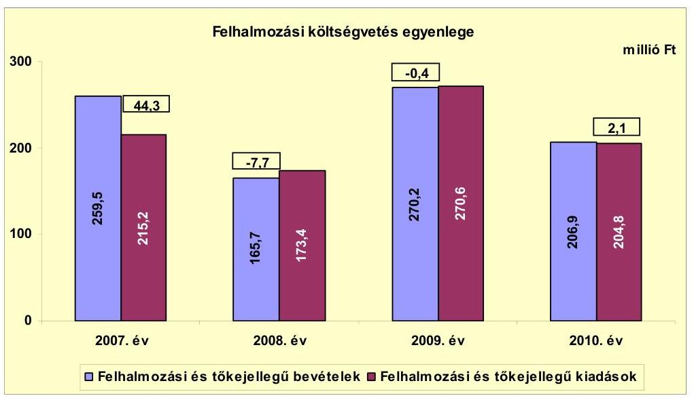

A felhalmozási forráshiánynak a felhalmozási és tőke jellegű kiadásokhoz viszonyított aránya 2008-ban 4,4\% (-7,7 millió Ft), 2009-ben 0,1\% (-0,4 millió Ft) volt. A 2007. évi felhalmozási bevételi többlet döntően egy hazai támogatású fejlesztési feladat (Tűztér-projekt) 2006-ban kifizetett, 41,0 millió Ft-os kiadásának 2007. évi utófinanszírozása miatt keletkezett. A felhalmozási költségvetés az áthúzódó finanszírozás nélkül (számított egyenlege 3,3 millió Ft) is egyensúlyban volt. A 2008. évi felhalmozási forráshiány ( 7,7 millió Ft) jelentős részét az előző évi felhalmozási célú pénzmaradvány ( 6,7 millió Ft) fedezte. Az előző évi pénzmaradvány-bevétel figyelembevételével a felhalmozási költségvetés tényleges hiánya 2008-ban mindössze 1,0 millió Ft-ot jelentett, melyre folyószámlahitelből biztosítottak fedezetet. A 2009. évben a felhalmozási költségvetési egyenleg ( $-0,4$ millió Ft) 7,3 millió Ft-tal javult az előző évihez képest, a felhalmozási költségvetés az egyensúlyi állapotot megközelítette. A 2010. évben a felhalmozási bevételek 2,1 millió Ft-tal meghaladták a felhalmozási kiadásokat, a felhalmozási költségvetés pozitív egyenleggel zárt. A felhalmozási kiadások finanszírozása 2007-2010 között összességében nem okozott jelentős problémát az Önkormányzat likviditásában.

Az Önkormányzat teljes finanszírozási igénye ${ }^{14}$ a CLF módszer szerint 2007ben -28,0 millió Ft, 2008-ban -30,7 millió Ft, 2009-ben -6,9 millió Ft volt, amelyek finanszírozását az előző évi pénzmaradvány, illetve folyószámlahitel

[^0]
[^0]:    ${ }^{14}$ a nettó múködési jövedelem és a felhalmozási költségvetés eredője

---

igénybevételével biztosították. A 2010. évet 16,4 millió Ft finanszírozási többlettel zárta az Önkormányzat, melyben jelentős szerepet játszott mind a folyó, mind a felhalmozási bevételek azonos célú kiadásokét meghaladó mértékű növekedése. A kiadások mérsékelt növekedése, illetve teljesítésük következő évre történő áthúzódása azonban a szállítói kötelezettségek - 2009. év végi állományhoz viszonyított - 11,8 millió Ft-os (120,2 millió Ft-ra) emelkedésével járt.

Az Önkormányzat 2011. évi költségvetésében a tervezett bevételek és kiadások különbözete -98,5 millió Ft teljes finanszírozási igényt mutatott, melynek fedezetét - a 2011. évi költségvetési rendelet alapján - a Képviselő-testület ÖNHIKI támogatás igénybevételével kívánta biztosítani, illetve likviditását folyószámlahitellel ${ }^{15}$ egyensúlyban tartani.

Az Önkormányzat finanszírozási múveleteinek 2007-2010. évekbeli egyenlegét a következő ábra szemlélteti:
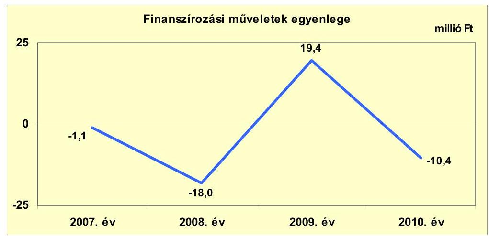

A 2007. évben a finanszírozási műveletek egyenlegét 15,0 millió Ft likvid hitelfelvétel és 37,1 millió Ft visszafizetés, valamint együttesen 19,3 millió Ft egyéb finanszírozási (függő, átfutó, kiegyenlítő) műveletek - melyben jellemzően előző évi kiadásmegtérülés szerepelt - képezték. A 2008. évben 15,0 millió Ft hiteltörlesztés mellett 15,9 millió Ft egyéb finanszírozási kiadás jelentkezett, melyeket 12,9 millió Ft egyéb finanszírozási bevétel mérsékelt. A 2009. évben a finanszírozási műveletek pozitív egyenlegét 9,1 millió Ft folyószámlahitel felvétele és 21,6 millió Ft egyéb finanszírozási kiadás megtérülése, valamint 11,3 millió Ft egyéb finanszírozási bevétel visszatérítése alakította. A finanszírozási műveletek egyenlege 2010-ben 37,0 millió Ft folyószámlahitel felvételéből, valamint 43,3 millió Ft egyéb finanszírozási bevétel visszatérítéséből és 4,1 millió Ft egyéb finanszírozási kiadásból állt. A 2007-2010. évek finanszírozási műveleteit a jelentés 2. számú mellékletének 4.1-4.8. pontjai részletezik.

[^0]
[^0]:    ${ }^{15}$ Az Önkormányzat rendelkezésére állt 2010. július 27-étől 2011. július 23-áig 45,0 millió Ft folyószámla-hitelkeret, amit a 2011 júliusában kötött, újabb folyószámlahitelkeret szerződéssel ismét biztosított a pénzintézet.

---

Az Önkormányzat 2007-2010. évi zárszámadási rendeleteinek mellékleteiben mérlegszerűen bemutatott ${ }^{16}$ múködési és fejlesztési célú - 2008-ban - hiányt, illetve - 2007-ben, 2009-ben és 2010-ben - többletet a jelentés 1. számú melléklete szemlélteti. A zárszámadási rendeletekben bemutatott múködési és fejlesztési célú bevételek - múködési és felhalmozási részre bontva - az előző évi pénzma-radvány-igénybevétel összegét, valamint a múködési célú bevételek és kiadások a finanszírozási múveleteket ${ }^{17}$ is tartalmazzák. Az Önkormányzat által kimutatott összes bevétel és kiadás egyenlegeként számított és a Képviselő-testület által jóváhagyott hiány/többlet évenként a 2. számú melléklet tárgyévi pénzügyi pozíció adataitól a pénzmaradvány-igénybevétel összegével tér el.

A forráshiány finanszírozását biztosító likvidhitelek, illetve a szállítói kötelezettségek emelkedése együtt járt a kamatkiadások folyamatos növekedésével. Az Önkormányzat évenkénti kamatbevételeit, kamatkiadásait és azok egyenlegét a következő ábra mutatja:
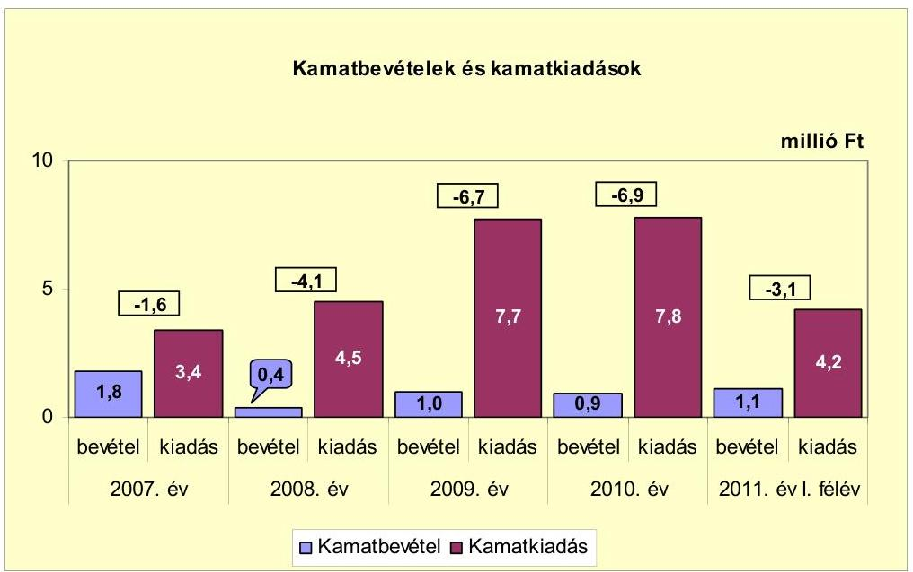

A kamatkiadások és kamatbevételek negatív egyenlegének 2009. évi jelentős, 3,6 millió Ft-os növekedéséhez a folyószámlahitel napi, átlagos állományának - 2008-ról 2009-re 7,8 millió Ft-tal történt - emelkedése miatti kamatteher 1,2 millió Ft-tal, a munkabér-megelőlegezési hitel igénybevétele után fizetett kamat további 0,8 millió Ft-tal járult hozzá. Az Önkormányzat 2007-2011. év I. féléve között összesen 27,6 millió Ft kamatot fizetett meg, az elért 5,2 millió Ft kamatbevétel a teljes kamatráfordítás $18,8 \%$-át tette ki. A kamatbevételt az adóbeszedési számlákon és a pályázati támogatások elkülönített számláin lévő egyenlegek után realizálták. A kamatkiadások és kamatbevételek folyamatosan negatív egyenlege évről évre növekvő mértékben mérsékelte az Önkormányzat múködési jövedelmét.

[^0]
[^0]:    ${ }^{16}$ Nincs kötelező előírás a múködési és fejlesztési hiány megállapításának módjára. Az Önkormányzat az adott évi múködési célú bevételeinek és kiadásainak mérlegében szerepeltette a finanszírozási múveleteket is.
    ${ }^{17}$ likvid hitel felvétele, visszafizetése, átfutó bevételek, kiadások

---

# 2.2. Az Önkormányzat bevételeinek változása 

Az Önkormányzat folyó bevételei 2007-2010 között növekvő tendenciát mutattak. A folyó bevételek között leginkább meghatározó a költségvetési támogatás és az szja együttes összege ( 3910,6 millió Ft) volt, amelyek ezen időszakban a folyó bevételek $68,7 \%$-át tették ki. A folyó bevételek között jelentős súlyt képviselt még az egyéb saját bevétel (1407,4 millió Ft), amelynek aránya 24,7\%-ot jelentett.

Az Önkormányzat 2007-2011. év I. féléve között realizált, összesen 6364,9 millió Ft folyó bevételének főbb jogcímek szerinti részletezését a következő grafikon mutatja be:
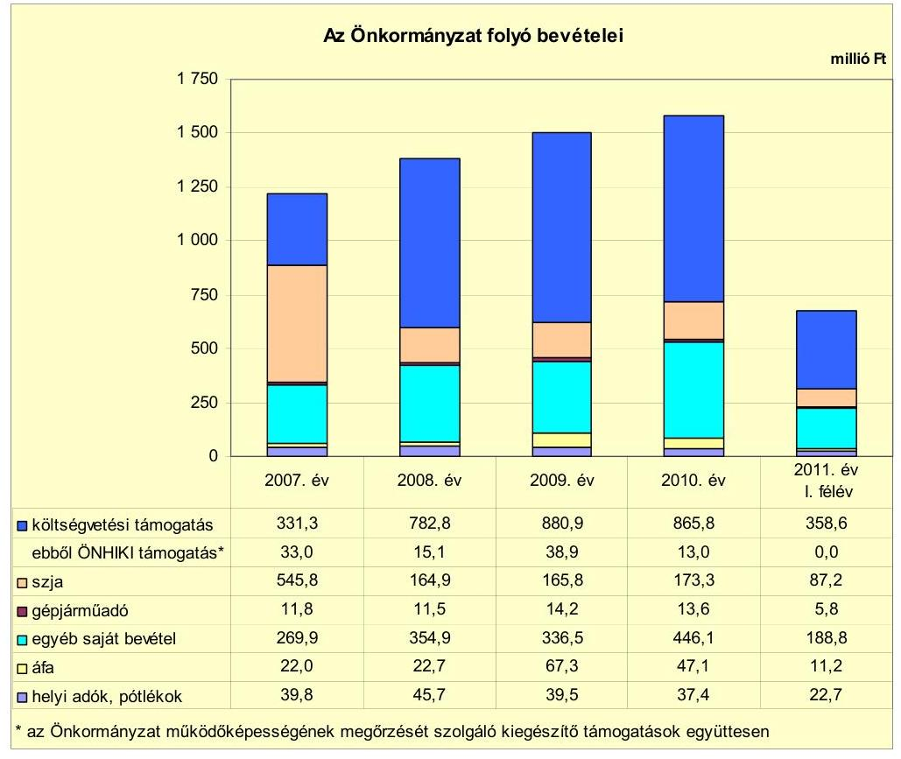

A folyó bevételekben a legnagyobb, 161,9 millió Ft-os emelkedés - az előző évihez viszonyítva - a 2008. évben következett be, melynek több mint felét, 85,0 millió Ft-ot az egyéb saját bevételek, ezen belül döntően az államháztartáson belülről kapott támogatások ( 75,2 millió Ft-os) növekménye adta. Az államháztartáson belülről kapott támogatásokban legjelentősebbek a pályázatokon nyert, egyszeri, illetve évenként változó összegű támogatások (mezőgazdasági, humánerőforrás-fejlesztési, tűzoltósági, mozgáskorlátozottaknak járó, gyermekvédelmi támogatás, 2007. évi jövedelemkülönbség-mérséklés elszámolása összes növekménye 32,5 millió Ft), a Többcélú társulástól átvett pénzeszközök (mozgókönyvtár, orvosi ügyelet, közoktatás támogatása összes növekménye 29,1 millió Ft), a közfoglalkoztatás támogatása (növekménye 11,2 millió Ft). A folyó bevételek 2008. évi, előző évihez viszonyított emelkedéséhez a költségvetési támogatás (53,6 millió Ft-os) és szja bevétel 17,0 millió Ft-os) növekedése is hozzájárult. A költségvetési támogatásban a bérpolitikai intézkedé-

---

sek, az önkormányzati tűzoltóság kiegészítő támogatása, az alapfokú művészetoktatás, nyári gyermekétkeztetés, felzárkóztatást segítő támogatás jelent meg. A folyó bevételek 2009. évi, 121,7 millió Ft-os növekedésének jelentős részét, 98,1 millió Ft-ot a költségvetési támogatás, ezen belül a normatív kötött felhasználású támogatás emelkedése eredményezte. A folyó bevételek 2010. évi, 79,1 millió Ft-os növekedését az egyéb saját bevételek 109,6 millió Ft-os (32,6\%-os) emelkedése biztosította, melyen belül a szolgáltatási, bérleti díj (49,8 millió Ft-os) és a kártérítési (22,4 millió Ft-os), valamint a támogatásértékű bevételek ( 25,9 millió Ft-os) növekedése volt a meghatározó.

A költségvetési támogatás 2007-ről 2008-ra 451,5 millió Ft-tal nőtt, míg az szja 380,9 millió Ft-tal csökkent, így e két bevételi jogcímen összesen 70,6 millió Ft-tal több forráshoz jutott az Önkormányzat a 2008. évben. A költségvetési támogatás - a 2007. évi 33,0 millió Ft ÖNHIKI támogatáshoz képest - 2008ban 5,1 millió Ft ÖNHIKI és 10,0 millió Ft működésképtelen önkormányzatok támogatását tartalmazott. A költségvetési támogatás és az szja a 2009. évben 99,0 millió Ft-tal (10,4\%-kal) tovább nőtt a 2008. évihez viszonyítva, az egyszeri jellegű, illetve évente változó mértékű támogatások (pedagógusok anyagi ösztönzése, bérpolitikai intézkedések, felzárkóztatást segítő, nyári gyermekétkeztetés, alapfokú művészetoktatás támogatása) miatt. Az Önkormányzat 2009-ben 32,9 millió Ft ÖNHIKI és 6,0 millió Ft működésképtelen önkormányzatok támogatásában részesült. A 2010. évben 7,6 millió Ft-tal ( $0,7 \%$-kal) volt alacsonyabb a költségvetési támogatás és az szja az előző évinél, melyben a működőképességet segítő támogatások 25,9 millió Ft-os csökkenése jelentős szerepet játszott. A 2010. évben múködésképtelen önkormányzatok támogatása címén 13,0 millió Ft-ot kapott az Önkormányzat.

A működőképességet segítő támogatások 2007-2010. évekbeli, együttes összege 100,0 millió Ft, a folyó bevételekhez viszonyított aránya 1,8\% volt. Az ÖNHIKI és működésképtelen önkormányzatok támogatása - 2007-ben 33,0 millió Fttal, 2008-ban 15,1 millió Ft-tal, 2009-ben 38,9 millió Ft-tal - hozzájárult a folyó költségvetés hiányának csökkentéséhez, illetve 2010-ben a pozitív múködési jövedelem 13,0 millió Ft-tal történt növeléséhez.

A gépjármúadóból származó bevétel (51,1 millió Ft) a 2007-2010. években nem mérvadó az Önkormányzat költségvetésében, részaránya 0,8-1,0\% közötti volt. Összegének változása a gépjármúadó alapjának, mértékének és az egyes mentességi kategóriákat érintő központi módosításoknak a következménye.

Az Önkormányzat egyéb saját bevételei (1407,4 millió Ft) 2007-2010 között - a 2009. év kivételével - összességében növekvő tendenciát mutattak, és a folyó bevételek közel egynegyedét adták. Az egyéb saját bevételek a 2010. évben nőttek a legintenzívebben, az előző évihez képest 109,6 millió Ft-tal, 32,6\%-kal emelkedtek. A növekedésben egyrészt a szolgáltatási és bérleti díj bevételek, valamint a kártérítési bevétel emelkedésének volt jelentős hatása. A szolgáltatási díjbevételek - az árvízi védekezéssel összefüggő - szolgáltatások (étkeztetés, gépjárművel végzett mentesítés, kárelhárítás, egészségügyi szolgáltatás biztosítása) 22,6 millió Ft-os ellenértékével, valamint egyéb szolgáltatá-

---

soknál ${ }^{18}$ elért, összesen 20,0 millió Ft-os többletbevétellel növekedtek. A bérleti díj (munkagépek bérbeadása) 7,2 millió Ft-tal, a kártérítési bevétel - tűzesettel összefüggésben kapott összeg miatt - 22,4 millió Ft-tal nőtt az előző évihez képest. Az egyéb saját bevételek 2010. évi növekedéséhez az államháztartáson belülről kapott támogatások (233,6 millió Ft) 25,9 millió Ft-tal járultak hozzá. Évenként, a benyújtott igényektől és a pályázatok sikerétől függően, eltérő öszszegben biztosítottak forrást az önkormányzati feladatok - az egészségügyi, az anya-, gyermekvédelmi ellátásra, gyógyúszásra, humánerőforrás fejlesztésre, kistérségi feladatokban történő részvételre (közoktatási, mozgókönyvtári, családsegítési, gyermekjóléti feladatok, házi segítségnyújtás, idősgondozás) - megoldására.

Az áfa bevételek, visszatérülések együttes összege (159,1 millió Ft) a 20072010. években a folyó bevételeknek (5690,6 millió Ft-nak) mindössze a 2,8\%-át képezte, nem gyakorolt jelentős hatást az Önkormányzat pénzügyi helyzetére.

Az Önkormányzatnak a 2007-2010. években háromféle helyi adóból, a helyi iparűzési adóból, a magánszemélyek kommunális adójából és a vállalkozók kommunális adójából származott bevétele. Ezen időszakban a helyi iparűzési adónál megállapított adómérték ${ }^{19}$ a törvényi maximumtól az állandó tevékenység esetében $10 \%$-kal, az ideiglenes tevékenység esetében $20 \%$-kal alacsonyabb volt. A magánszemélyek kommunális adóját a 2008. évtől - a megelőző időszak adómértékének kétszeresére - 10 ezer Ft/adótárgy adómértékre emelték, mely $16,7 \%$-kal a megállapítható felső határ alatt maradt. A vállalkozók kommunális adójánál a maximális ( 2000 Ft/átlagos statisztikai létszám) adómértéket alkalmazták.

A helyi adókból és pótlékokból származó bevételek a 2008. évtől csökkenő tendenciát mutattak. A folyó bevételeken belüli arányuk a 2007-2010. években mindössze $2,9 \%$ ( 162,4 millió Ft), döntően nem befolyásolták az Önkormányzat pénzügyi helyzetét. A helyi adók és pótlékok bevétele a 2008. évi 2,9 millió Ft-os ( $10,6 \%$-os), előző évihez viszonyított növekedést követően, a 2009. és a 2010. évben a 2007. évi szint alá csökkent, összefüggésben az adófizetési képesség romlásával. Az Önkormányzat tájékoztatása szerint a 2010. évben a helyi adók és pótlékok kétharmadát jelentő helyi iparűzési adóbevétel ( 22,8 millió Ft) közel felét öt vállalkozás befizetése képezte. A magánszemélyek kommunális adója mértékének kétszeresére emelése - a 2007. évben realizált bevételhez képest - a 2008. évben mindössze 2,0 millió Ft (25,3\%) többletbevételt eredményezett. Az Önkormányzat a helyi adókból származó bevételek növelése érdekében a magánszemélyek kommunális adója mértékének emelésén - és a folyamatosan végzett adóbehajtási tevékenységen - túl a 2007-2010. években nem tett további intézkedést.

[^0]
[^0]:    ${ }^{18}$ régészeti feltárásnál végzett szolgáltatás, megvalósíthatósági tanulmány készítése, karbantartási szolgáltatás
    ${ }^{19}$ az állandó jelleggel végzett tevékenységnél $1,8 \%$, az ideiglenes jelleggel végzett tevékenység esetén 4 ezer Ft/naptári nap

---

A tárgyévi, múködést szolgáló bevételeket és kiadásokat összehasonlítva az Önkormányzat folyó bevételei csak a 2010. évben nyújtottak fedezetet a folyó kiadásokra.

Az Önkormányzat felhalmozási bevételei a 2007-2011. év I. féléve időszakában a következők voltak:

| Megnevezés | 2007. év | 2008. év | 2009. év | 2010. év | 2011. év   I. félév |
| :-- | --: | --: | --: | --: | --: |
| Tárgyi eszköz értékesítés | 16,8 | 5,0 | 35,5 | 0,8 | 0,0 |
| Egyéb saját tőkebevétel | 0,2 | 0,2 | 0,2 | 0,2 | 0,1 |
| Államháztartáson belülről   kapott támogatás | 210,4 | 153,9 | 230,5 | 205,5 | 141,9 |
| Államháztartáson kívülről   kapott támogatás | 32,1 | 6,6 | 4,0 | 0,4 | 0,8 |
| Összes felhalmozási bevétel | 259,5 | 165,7 | 270,2 | 206,9 | 142,8 |

Az Önkormányzat felhalmozási bevétele 2007-ről 2008-ra 93,8 millió Ft-tal, több mint egyharmaddal csökkent, majd a 2009. évi 104,5 millió Ft-os, közel kétharmados növekedést követően, 2010-re 63,3 millió Ft-tal, 23,4\%-kal ismét csökkent. A 2007-2008. évek közötti változásban az államháztartáson belülről és kívülről kapott támogatások - 56,5 millió Ft-tal és 25,5 millió Ft-tal - összesen 82,0 millió Ft-tal történt csökkenésének volt döntő szerepe. Az Önkormányzat 2007-ben vis maior támogatásként 44,4 millió Ft-ot, LEKI támogatásként 14,7 millió Ft-ot kapott, 2008-ban ugyanezeken a jogcímeken 2,0 millió Ft és 6,1 millió Ft támogatásban részesült. A 2009. évi növekedést az államháztartáson belülről kapott támogatások 76,6 millió Ft-os (ebből az iskola felújítására 130,3 millió Ft, LEKI támogatásként 19,5 millió Ft, egyéb feladatok megszűnése miatti támogatáscsökkenés mellett), valamint a tárgyi eszköz értékesítésből származó bevételek 30,5 millió Ft-os növekedése eredményezte. Ugyanezen bevételi tételek együttes, 59,7 millió Ft-os csökkenése miatt csökkent a felhalmozási bevétel a 2009-2010. évek között. Az államháztartáson belülről kapott támogatásban, 2010-ben 41,2 millió Ft vis maior és 20,0 millió Ft LEKI támogatás volt.

Az Önkormányzatnak tárgyi eszköz értékesítésböl ${ }^{20}$ a 2007. és a 2009. években volt számottevő (együttesen 52,3 millió Ft) bevétele, amely 2007-ben ingatlan, 2009-ben jármú, gép és kábeltévé-hálózat értékesítés eredménye. A 2007-2011. év I. féléve között a tárgyi eszköz értékesítésből származó bevétel a felhalmozási kiadásoknak (904,6 millió Ft-nak) mindössze a 6,4\%-át (58,1 millió Ft-ot) finanszírozta.

A felhalmozási bevétel legjelentősebb összetevője, az államháztartáson belülről kapott támogatások 800,3 millió Ft-os összege a 2007-2010 közötti időszakban az összes felhalmozási bevétel $88,7 \%$-át adta. Az államháztartáson belül-

[^0]
[^0]:    ${ }^{20}$ A tárgyi eszköz értékesítésből származó bevétel az összes felhalmozási bevételen belül a 2007-2011. év I. féléve között 10,2\%-os részarányt képviselt.

---

ről származó támogatások, támogatásértékű bevételek egyszeri jellegűek, az Önkormányzat által pályázott fejlesztési feladatok ${ }^{21}$ nagyságához és évenkénti megvalósítási üteméhez igazodó források. Az államháztartáson belülről 20072010 között kapott támogatások együttes összege az ezen időszaki összes felhalmozási kiadás ( 864,0 millió Ft) 92,6\%-ára biztosított forrást. Az államháztartáson kívülről kapott támogatások a 2007. évben teljesültek a legmagasabb összegben ( 32,1 millió Ft), melyek a szennyvízcsatorna-hálózat építéséhez kapcsolódó lakossági befizetésekből, jólteljesítési garancia érvényesítéséből és tűzoltósági pályázathoz történő hozzájárulásból keletkeztek.

A 2007-2010 között kapott, összesen 87,6 millió Ft vis maior támogatás és 60,3 millió Ft LEKI támogatás (együtt: 147,9 millió Ft) az államháztartáson belülről származó támogatásoknak a 18,5\%-át tette ki, évente változó összeggel javítva a felhalmozási költségvetés egyenlegét.

# 2.3. Az Önkormányzat folyó és felhalmozási célú kiadásainak változása 

Az Önkormányzat folyó kiadásai főbb jogcímek szerinti bontásban a következők voltak:

| Megnevezés | 2007. év | 2008. év | 2009. év | 2010. év | 2011. év   I. félév |
| :--: | :--: | :--: | :--: | :--: | :--: |
| Folyó kiadások | 1255,8 | 1390,5 | 1510,7 | 1569,0 | 731,5 |
| Müködési kiadások (kamatkiadás nélkül) | 1074,2 | 1202,2 | 1334,6 | 1374,0 | 634,3 |
| Államháztartáson belülre átadott pénzeszközök | 0,3 | 0,9 | 0,9 | 0,5 | 4,3 |
| Transzferkiadások | 177,9 | 182,9 | 167,5 | 186,7 | 88,7 |
| ebből: magánszemélyeknek | 173,3 | 177,9 | 162,0 | 181,7 | 83,9 |
| nonprofit szervezeteknek | 4,6 | 5,0 | 5,5 | 5,0 | 4,8 |
| Kamatkiadások | 3,4 | 4,5 | 7,7 | 7,8 | 4,2 |

Az Önkormányzat folyó kiadásai 2007-2010 között folyamatosan - bár évről évre csökkenő mértékben - emelkedtek, a növekedés átlagos üteme 7,7\%-os volt. A folyó kiadások a 2010. évben a 2007-2009. évek átlagát (1385,7 millió Ft-ot) 183,3 millió Ft-tal (13,2\%-kal) haladták meg.

A folyó kiadások főbb jogcímek szerinti összetételét a következő tábla részletezi:

|  |  |  |  |  | millió Ft |
| :--: | :--: | :--: | :--: | :--: | :--: |
| Megnevezés | 2007. év | 2008. év | 2009. év | 2010. év | 2011. év   I. félév |
| Személyi juttatások | 566,1 | 628,2 | 698,8 | 718,6 | 332,5 |
| Munkaadót terhelő járulékok | 180,7 | 200,0 | 192,9 | 172,0 | 85,1 |
| Dologi kiadások | 297,9 | 366,3 | 417,5 | 468,2 | 211,6 |
| Egyéb folyó kiadások | 33,0 | 12,2 | 33,1 | 23,0 | 9,3 |

[^0]
[^0]:    ${ }^{21}$ tornacsarnok, szennyvízcsatorna létesítése, orvosi rendelő, iskola felújítása, eszközfejlesztése, óvoda bővítése, útfelújítások, valamint egyéb felújítások, eszközbeszerzések

---

A folyó kiadásokban a legnagyobb hányadot, 45,1-46,3\%-ot képviselő személyi juttatások 2007-2010 között folyamatosan növekedtek ${ }^{22}$. Az emelkedés a Polgármesteri hivatal és az önkormányzati intézmények személyi állományánál, valamint a közfoglalkoztatásban jelentkező létszámnövekedés következménye.

A dologi kiadások - évente csökkenő mértékben, de - szintén emelkedtek a 2007-2010. évek között, elsősorban az infláció hatásának ellensúlyozásaként. A dologi kiadások a 2010. évben a 2007-2009. évek átlagát (360,6 millió Ft-ot) 107,6 millió Ft-tal ( $29,8 \%$-kal) haladták meg, melyben jelentős hatása volt az árvizi védekezéssel összefüggő kiadásoknak.

Az egyéb folyó kiadások - a folyó kiadásokon belüli 0,9-2,6\%-os részarányukkal - nem gyakoroltak jelentős hatást az Önkormányzat múködési költségvetésére.

Az összes kiadásban a folyó kiadás aránya - a 2007-2009. évek átlagának (1385,7 millió Ft-nak) arányához ( $86,3 \%$-hoz) viszonyítva a 2010. évben 2,2 százalékponttal ( $88,5 \%$-ra, 1569,0 millió Ft-ra) nőtt. Az Önkormányzatnál a 2009. évben volt a legmagasabb a felhalmozási kiadás összege ${ }^{23}$ (270,6 millió Ft) és összes kiadáson belüli aránya ( $15,2 \%$ ), azonban a felhalmozási költségvetés egyenlege a fejlesztési feladatokhoz központi költségvetésből kapott támogatások hatására javult a megelőző évihez képest. A folyó kiadás és felhalmozási kiadás évenkénti adatait és összes kiadáson belüli arányait a következő grafikon szemlélteti:
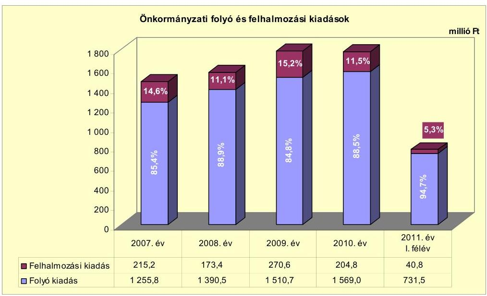

[^0]
[^0]:    ${ }^{22}$ Az Önkormányzatnál nem hajtottak végre létszámcsökkentést eredményező intézkedést.
    ${ }^{23}$ A 2009. évi legjelentősebb fejlesztési feladatokra: oktatási intézmények felújítására 163,5 millió Ft-ot, akadálymentesítésre 10,5 millió Ft-ot, útfelújításra 57,2 millió Ft-ot fordítottak, melyek központi támogatással valósultak meg.

---

Az Önkormányzat a 2010. december 31-éig befejezett fejlesztéseire 860,2 millió Ft-ot fordított, melyből 2006. december 31-ig 41,0 millió Ft-ot, 2007-2010 között 819,2 millió Ft-ot fizetett ki. A 2007-2010 között felhasznált összegnek a 15,6\%-a (133,8 millió Ft) a 10 millió Ft egyedi beszerzési érték alatti fejlesztésekhez kapcsolódott. A 15 darab, 10 millió Ft egyedi beszerzési érték feletti, befejezett beruházás és felújítás összértéke 726,4 millió Ft volt, melyhez a 20072010. években 685,4 millió Ft kifizetés kapcsolódott. A 2010. december 31-éig befejezett fejlesztések forrását 158,1 millió Ft összegben önkormányzati saját forrás, 260,6 millió Ft összegben EU-s és 441,5 millió Ft összegben hazai támogatás képezte. A hazai támogatás összegéből 401,5 millió Ft volt a 2007-2010 között teljesített kiadások fedezete.

Ezen időszakban az Önkormányzat legmagasabb bekerülési költségű beruházásai, felújításai, infrastrukturális fejlesztései a következők voltak:

- a helyi általános iskola felújításának teljes bekerülési költsége 219,3 millió Ft volt, melynek forrását 204,1 millió Ft EU-s és 15,2 millió Ft hazai támogatás képezte. A fejlesztési feladatot a 2009-2010. években valósították meg;
- a 2007. évben 83,3 millió Ft, a 2008. évben 83,3 millió Ft, a 2009. évben 57,2 millió Ft teljes bekerülési költséggel útfelújításokat, aszfaltozásokat hajtott végre az Önkormányzat. A fejlesztési feladatokat teljes egészében központosított támogatás finanszírozta;
- a Tűztér-projekt keretében a tűzesetek keletkezésének feltárását, a térfigyelés eszközrendszerét bővítették, amely 2005-ben kezdődött és a 2007. évben fejeződött be. Teljes bekerülési költségét, 55,6 millió Ft-ot EU-s támogatás biztosította.

A 2010. december 31-én folyamatban lévő, négy - 10 millió Ft feletti - fejlesztési feladat várható, teljes bekerülési költségéből, 284,9 millió Ft-ból a 2010. év végéig 29,9 millió Ft-ot fizettek ki. A teljesített fejlesztési kiadások forrása 11,6 millió Ft ( $38,8 \%$ ) saját forrás és 18,3 millió Ft ( $61,2 \%$ ) EU-s támogatás volt. A folyamatban lévő fejlesztésekkel összefüggő, 2010. december 31-én fennálló, 255,0 millió Ft kötelezettséget 18,3 millió Ft (7,2\%) önkormányzati forrás és 236,7 millió Ft (92,8\%) EU-s támogatás fedezi.

Az Önkormányzat által benyújtott és 2011. június 30-án elbírálás alatt álló, öt pályázatban az együttesen 513,4 millió Ft teljes bekerülési költségű projekteket 22,4 millió Ft (4,4\%) önkormányzati forrásból és 491,0 millió Ft (95,6\%) EUs támogatásból tervezik megvalósítani. Ezen projektek kiadási és bevételi előirányzatait a 2011. évre megtervezték úgy, hogy az éves költségvetés bevételi és kiadási főösszegének különbségeként 98,5 millió Ft hiánnyal számoltak.

A 2010. december 31-ig befejezett fejlesztési feladatok adatait a 3/a. számú, a folyamatban lévő fejlesztési feladatok adatait a 3/b. és 3/c. számú, a 2011. év I. félévében elbírálás alatt álló pályázatokban foglalt projektek adatait a 3/d. számú mellékletek mutatják be.

---

# 3. Az ÖNKORMÁNYZAT KÖTELEZETTSÉGEI 

### 3.1. Az Önkormányzat pénzintézeti kötelezettségeinek változása

Az Önkormányzat pénzintézeti kötelezettségeinek állománya 2006. december 31-e és 2010. december 31-e között rövid lejáratú hitelekből állt, és öszszességében növekedett. A 2011. év I. félév végi, 41,0 millió Ft-os pénzintézeti kötelezettségállomány a 2006. év végihez viszonyítva 3,9 millió Ft-os (10,5\%os) emelkedést, a 2010. év végihez képest 5,1 millió Ft-os ( $11,1 \%$-os) csökkenést mutatott. A 2010. év végi, 46,1 millió Ft-os pénzintézeti kötelezettségállományt 14,1 millió Ft-os folyószámlahitel és 32,0 millió Ft-os munkabér-megelőlegezési hitel, a 2011. június 30 -ai állományt folyószámlahitel képezte ${ }^{24}$.

Az Önkormányzat pénzintézetekkel szemben, a 2007-2010. évek végén, illetve 2011. június 30 -án fennálló kötelezettségeit a következő ábra mutatja be:
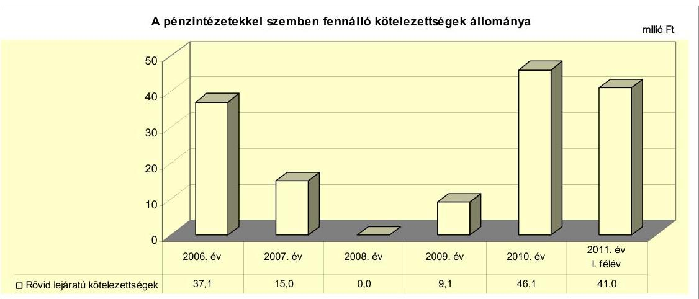

Az Önkormányzat a forráshiány kezelése érdekében a 2007-2011. évi költségvetési rendeleteiben ÖNHIKI támogatás igénybevételével, a „finanszirozási feltételek biztositása érdekében" múködési célú hitel felvételével számolt.

Az Önkormányzat 2007-2011. év I. félévi pénzintézeti kötelezettségvállalásaira - a folyószámla-hitelkeret-, valamint az éven belüli lejáratú hitelszerződések megkötésére - képviselő-testületi döntés alapján került sor, azonban a munka-bér-megelőlegezési hitelek felvételét csak a 2009. évtől előzte meg képviselőtestületi döntés. A hitel-igénybevételek előterjesztéseiben nem mutatták be a kamatkockázatokat. Az Önkormányzatnál nem vizsgálták, ám nem is lépték túl az adósságot keletkeztető kötelezettségvállalás felső határát. A képviselőtestületi határozatokban a folyószámlahitel visszafizetési forrásaiként - a források konkrét számszerúsítése nélkül - a saját bevételeket jelölték meg, továbbá a 2008. évi kötelezettségvállalástól kezdődően egy forgalomképes ingatlan jelzáloggal történő megterheléséhez is hozzájárultak. A 2009. évben kötött,

[^0]
[^0]:    ${ }^{24}$ Az Önkormányzatnak a 2007-2011. I. félév közötti időszakban nem volt hosszú lejáratú, illetve devizaalapú pénzintézeti kötelezettsége.

---

23,7 millió Ft - EU-s támogatás megelőlegezését szolgáló, likviditási - hitelszerződés esetében a hitel-visszafizetés fedezete a megelőlegezett pályázati támogatás volt. A hiteleket minden esetben a számlavezető pénzintézettől vették igénybe.

Az Önkormányzat pénzügyi egyensúlyát, fizetőképességét - benne felhalmozási forráshiányának finanszírozását - a 2007-2011. év I. félévében folyó-számla- és munkabér-megelőlegezési hitelek igénybevételével tudta biztosítani. Az évenkénti folyószámla- és munkabér-megelőlegezési hiteleket a következő táblázat mutatja be:

| Megnevezés | 2007. év | 2008. év | 2009. év | 2010. év | 2011. év   I. félév |
| :--: | :--: | :--: | :--: | :--: | :--: |
| I. Folyószámlahitel |  |  |  |  |  |
| a folyószámlahitel keretösszege január 1-jén | 15,0 | 15,0 | 45,0 | 45,0 | 45,0 |
| napi, átlagos állomány (millió Ft-ban) | 15,0 | 17,5 | 25,3 | 31,1 | 36,1 |
| teljesített kamat és egyéb költség | 1,5 | 1,7 | 3,0 | 3,1 | 1,7 |
| II. Munkabér-megelőlegezési hitel |  |  |  |  |  |
| igénybevett hitel összesen | 288,0 | 328,2 | 344,6 | 356,0 | 179,9 |
| napi, átlagos állomány (millió Ft-ban) | 20,0 | 22,4 | 22,7 | 28,2 | 27,9 |
| teljesített kamat és egyéb költség | 1,2 | 2,1 | 2,9 | 2,7 | 1,4 |

Az Önkormányzat rendelkezésére álló folyószámlahitel-keret 2008 szeptemberétől a háromszorosára ( 45,0 millió Ft-ra), a folyószámlahitel napi, átlagos állománya évről évre növekedett. Ezen külső forrás napi, átlagos állománya a legnagyobb mértékben ( 7,8 millió Ft-tal, $44,6 \%$-kal) a 2009. évben nőtt, amikor mind a folyó, mind a felhalmozási kiadások előző évihez viszonyított növekedése a legmagasabb volt. A hitelállomány a hitelszerződés lejáratának időpontjában 2007-ben és 2008-ban - a hitel teljes összegével egyező - 15,0 millió Ft, 2009-ben 35,2 millió Ft, 2010-ben 36,7 millió Ft volt, a visszafizetések az újabb hitel folyósításával párhuzamosan történtek. A 2007-2011. év I. féléve között minden nap igénybevett folyószámlahitel tartós és növekvő mértékú bevonása a kiadások fedezetének biztosításába az Önkormányzat pénzügyi helyzetének folyamatos romlását jelezte.

A munkabér-megelőlegezési hitellel zárt napok száma a 2007. évi 305 napról - a 2008. évi 300, majd 2009. évi 288 napra csökkenést követően - 2010-re 348 napra ( $14,1 \%$-kal) növekedett. A munkabér-megelőlegezési hitel napi, átlagos állománya 2007-2010 között folyamatosan emelkedett, a 2010. évben 28,2 millió Ft volt, mely a 2011. év I. félévében mindössze $1,1 \%$-kal, 0,3 millió Ft-tal maradt el a 2010. évi szinttől. A munkabér-megelőlegezési hitel napi, átlagos állománya - 365 nap helyett - a tényleges igénybevételi napokkal számolva 2007-2011. év I. féléve időszakában az évek sorrendjében 23,9 millió Ft, 27,3 millió Ft, 28,7 millió Ft, 29,5 millió Ft és 30,0 millió Ft volt. Az igénybevételi napokkal számított napi, átlagos állomány folyamatos növekedése a rendszeres személyi juttatások emelkedésével függött össze. Az igénybevételi napok számának növekedése, a hitel visszafizetésének elhúzódása pedig azt jelzi, hogy a munkabér-megelőlegezési hitel is jelentős szerepet töltött be a likviditás fenntartásában.

A folyószámla- és munkabér-megelőlegezési hitelek - az együttes, napi, átlagos állományuk alapján - az összes folyó és felhalmozási kiadásnak

---

2007-ben a 2,4\%-át (35,0 millió Ft-ot), 2008-ban a 2,6\%-át (39,9 millió Ft-ot), 2009-ben a $2,7 \%$-át ( 48,0 millió Ft-ot), 2010-ben a $3,3 \%$-át ( 59,3 millió Ft-ot) finanszírozták. A folyó és felhalmozási kiadások hitelek által finanszírozott aránya a 2011. év I. félévében $8,3 \%$ ( 64,0 millió Ft ) volt.

A 2010. évben egy fejlesztési feladat pályázati támogatásának megelőlegezése céljából 23,7 millió Ft hitelt vett igénybe az Önkormányzat. A 2010. január 252010. november 11. közötti időszakban fennálló hitelhez kapcsolódóan 0,8 millió Ft kamat- és egyéb kiadást fizettek ki.

A hitelek növekvő összegű igénybevételével kapcsolatos kamat- és egyéb kiadások 2007-2010 között folyamatosan, 2010-re 6,6 millió Ft-ra emelkedtek. A likviditás biztosítása érdekében felvett hitelek kamat- és egyéb kiadásai 2007-2011. év I. féléve között összesen 22,1 millió Ft terhet jelentettek az Önkormányzat számára.

A rövid lejáratú hitelek (folyószámla- és munkabér-megelőlegezési) kondíciói a következők voltak ${ }^{25}$ :

| Megnevezés | Kamat (referencia + kamatfelár) | Egyéb költség |
| :-- | :--: | :--: |
| Folyószámlahitel |  |  |
| 2007.01.01-2007.09.25. | 3 havi BUBOR $+1,5 \%$ | $0,5 \%$ hitelkezelési dij |
| 2007.09.26-2008.09.25. | 3 havi BUBOR $+0,7 \%$ | $0,5 \%$ hitelkezelési dij |
| 2008.09.25-2009.08.26. | 3 havi BUBOR $+3,0 \%$ | $0,5 \%$ kezelési dij +   $1,0 \%$ rendelkezésre tart. jut. |
| 2009.08.26-2011.07.23. | 1 havi BUBOR $+3,5 \%$ | $0,5 \%$ kezelési dij +   $1,0 \%$ rendelkezésre tart. jut. |
| Munkabér-megelölegezési hitel |  |  |
| $2007-2011 . \text { év }$ | 3 havi BUBOR $+0,7 \%$ | 0 |

Az Önkormányzat 2010. december 31-ei és 2011. június 30-ai kötelezettségeinek állományát és a 2011. évben, valamint az azt követő években várható kötelezettségeket a következő táblázat mutatja:

| Megnevezés | Állomány   2010.   december 31-én   (millió Ft-ban) | Állomány   2011.   június 30-én   (millió Ft-ban) | Várható   kötelezettség a   2011-2013.   években   (millió Ft-ban) | Várható   kötelezettség a   2014. évtöl   (millió Ft-ban) |
| :-- | :--: | :--: | :--: | :--: |
| Folyószámlahitel | 14,1 | 41,0 | 44,4 | - |
| Munkabér-megelölegezési hitel | 32,0 | - | 1,4 | - |
| Pénzintézeti kötelezettségek   összesen | 46,1 | 41,0 | 45,8 | - |
| Szállitói tartozás | 120,2 | 90,4 | 91,5 | - |
| Egyéb kiadás elmaradás | 9,0 | 17,8 | 17,8 | - |
| Kötelezettségek összesen | 175,3 | 149,2 | 155,1 | - |

| MNB BUBOR fixing (álogkamati \%-ban |  |  |  |  |  |
| :--: | :--: | :--: | :--: | :--: | :--: |
| Referencia kamat | 2007. év | 2008. év | 2009. év | 2010. év | 2011.év   1. félév |
| 1 havi BUBOR | 0 | 0 | 8,66 | 5,47 | 6,00 |
| 25 3 havi BUBOR | 7,75 | 8,87 | 8,64 | 5,50 | 6,07 |

---

Az Önkormányzatnak a 2011-2012. évek időszakában várható pénzintézeti kötelezettsége 45,8 millió Ft. Ebből a folyószámlahitel igénybevételével összefüggésben ${ }^{26}$ - figyelemmel a 2011. június 30 -ai hitelállományra és a 2011. év I. félévben kifizetett kamat ( 1,7 millió Ft-os) összegére - 44,4 millió Ft a várható kötelezettség. A munkabér-megelőlegezési hitel igénybevételével kapcsolatos várható kamatteher szintén a 2011. év I. félévében teljesített kamatkiadás 1,4 millió Ft összegével kalkulálható. Az Önkormányzat a pénzintézeti kötelezettségeit - 2010. évi szabad pénzmaradvány hiányában - további kiadáscsökkentő, bevételnövelő intézkedésekkel, 86,9 millió Ft összegű követeléseinek ${ }^{27}$ behajtásával, vagy külső forrásból tudja teljesíteni.

A 2013. évtől várható kötelezettségek összege nem ismert, mivel az Önkormányzat a 2011. év I. féléve végéig hosszú lejáratú kötelezettséget nem vállalt.

Az Önkormányzat kötelezettségeinek állománya 2010. december 31-én 188,3 millió Ft, 2011. június 30 -án 149,2 millió Ft volt. Ez pénzintézeti kötelezettségekből, szállítói tartozásból és egyéb kiadáselmaradásból tevődött össze.

# 3.2. A szállítói kötelezettségek változása 

Az Önkormányzat mérleg szerinti szállítói kötelezettségállománya a 2008. évi csekély mértékű csökkenést követően a 2009. év végére az előző évihez képest közel hatszorosára, 108,4 millió Ft-ra ( 90,2 millió Ft-tal) növekedett. A növekményből - az Önkormányzat tájékoztatása szerint - 59,7 millió Ft a fejlesztési feladatokkal kapcsolatos szállítói finanszírozási megoldással összefüggésben keletkezett. (Ennek lényege, hogy a közremúködő szervezet a fejlesztési feladatot végző szállítót nem az Önkormányzaton keresztül, hanem közvetlenül, de az Önkormányzat által benyújtott elszámolások jóváhagyását követően finanszírozta. Az önkormányzati nyilvántartásban - a szállítóállományban tehát szerepelt a kiegyenlítetlen szállítói számla értéke, melynek kifizetése függött az elszámolás benyújtásának időpontjától és minőségétől, mivel a kifizetési igénybejelentés hiánypótlásai késleltették a számla ellenértékének kiegyenlítését.) A szállítói kötelezettségállomány a 2010. évben további 11,8 millió Fttal, 120,2 millió Ft-ra nőtt. A 2010. év végi szállítói állományban az árvízi védekezéssel kapcsolatos kiadások 62,3 millió Ft-ot jelentettek, melyeknek központi forrásból történő finanszírozására pályázott az Önkormányzat.

A szállítókkal szembeni kötelezettségeken belül a lejárt szállítói tartozás a 2007-2011. év I. félév időszakában folyamatosan és intenzíven emelkedett. Az Önkormányzat tájékoztatása szerint, részben a fejlesztési feladatok szállítói finanszírozásának módja, részben az árvízi védekezéssel összefüggő, költségvetésben nem tervezett, rendkívüli kiadások nyilvántartásba vett, de központi támogatás hiányában kiegyenlítetlen számlái miatt, továbbá mert a múködtetéshez kapcsolódó (karbantartási, szolgáltatási, élelmiszer, közüzemi díj stb.) számlák teljes körére sem volt meg a finanszírozási forrása. A szállítói tartozás

[^0]
[^0]:    ${ }^{26}$ Az Önkormányzat 2011. július 25-2012. július 20. közötti időszakra - az előző szerződés lejártával egy időben - újabb, 45,0 millió Ft-os folyószámla-hitelkeret szerződést kötött, a lejárt hitelkeretével azonos kamatkondíciók mellett.
    ${ }^{27}$ az Önkormányzat 2011. június 30-ai, könyvviteli mérleg szerinti követelésállománya

---

növekedése az Önkormányzat pénzügyi helyzetének romlását jelzi. A szállítókkal szembeni tartozás a 2007. év végi 4,5 millió Ft-ról 2008-ban 7,9 millió Fttal, 2009-ben további 35,7 millió Ft-tal, majd a 2010. év végére 65,2 millió Fttal, 113,3 millió Ft-ra növekedett. A 2009. év végi lejárt szállítói tartozásállományban a fejlesztési feladatok kiadásai finanszírozásának - kifizetési igénybejelentéssel összefüggő - nehézkessége (59,7 millió Ft), a 2010. évben az árvizi védekezés miatt keletkezett kötelezettségek finanszírozatlansága (62,3 millió Ft) jelent meg. A 2010. év végi szállítói kötelezettségből 29,8 millió Ft-ot, ebben a lejárt szállítói tartozásból 24,7 millió Ft-ot a 2011. év I. féléve folyamán kiegyenlítettek, melynek következtében a 2011. június 30 -án fennálló szállítói kötelezettség 90,4 millió Ft-ra, a lejárt szállítóállomány 88,6 millió Ft-ra csökkent. Az Önkormányzat pénzügyi egyensúlyának stabilitását veszélyeztető, lejárt szállítóállomány további csökkentésére, kezelésére a 2011. év I. félévében egyéb intézkedést nem tettek.

A 2011. év I. féléve végén fennálló szállítói- és lejárt tartozásállományban a fejlesztési feladatok szállítói finanszírozásával összefüggő kötelezettség 7,8 millió Ft, az iskolatej-programmal kapcsolatos - utófinanszírozás miatti - tartozás 2,9 millió Ft, összesen 10,7 millió Ft volt. Ezen két tétel nélkül a 2011. június 30 -ai szállítóállomány 79,7 millió Ft-ot, ebből a lejárt tartozás 77,9 millió Ft-ot tett ki.

A 2010. év végi lejárt szállítói tartozásállomány 20,9\%-a (23,6 millió Ft) volt a 30 nap alatti lejáratú. A lejárt szállítói tartozás 8,2\%-a ( 9,3 millió Ft) 31-60 nap közötti, 9,5\%-a (10,7 millió Ft) 61-90 nap közötti, 58,2\%-a (66,0 millió Ft) 91365 nap közötti fizetési késedelemben és $3,2 \%$-a ( 3,7 millió Ft) éven túl lejárt tartozás volt. A 2010. év végére a (113,3 millió Ft) lejárt szállítói tartozásállományban a 91-365 nap között és az éven túl lejárt tartozások együttes összege (69,7 millió Ft) és aránya (64,1\%) jelentös növekedést mutatott az előző év végi összeghez ( 4,9 millió Ft-hoz) és hányadhoz ( $10,2 \%$-hoz) viszonyítva. A 2011. év I. féléve végére 76,8 millió Ft-ra - a lejárt szállítói tartozás $86,7 \%$-ára - növekedett a 90 napot meghaladóan lejárt tartozások állománya, melyben 62,3 millió Ft az árvizi védekezéssel összefüggő lejárt tartozás, és amelynek vis maior-támogatásból történő kifizetésére benyújtott pályázat elbírálása 2011. november 9-én folyamatban volt. A 2011. június 30 -ai tartozásállományból 60 napon túl 77,1 millió Ft járt le. A 2011. év I. félév végi szállítói tartozásállományban vitatott tétel - az Önkormányzat tájékoztatása szerint nem volt.

Az Önkormányzat kiadáselmaradásai a hivatásos tűzoltóságnál a személyi állomány személyi jellegú juttatásai - ruházati költségtérítés, munkaruha- és alapfelszerelés-juttatás, illetve cafeteria-juttatás 2006-ban 0,7 millió Ft, 2007ben 2,8 millió Ft, 2011. I. félévben 6,3 millió Ft -, valamint az önkormányzati képviselők tiszteletdíja és azok járulékai - 2007-ben 10,0 millió Ft, 2008-ban 20,5 millió Ft, 2009-ben 9,8 millió Ft, 2010-ben 9,0 millió Ft és 2011. I. félévben 11,5 millió Ft - kifizetésének elmaradása, illetve következő évre áthúzódása miatt keletkeztek. A kiadáselmaradás 2010. december 31-én 9,0 millió Ft volt, ami 2011. június 30 -ára 17,8 millió Ft-ra nőtt.

Mind a 2011. június 30 -án fennálló szállítói tartozásállomány, mind a megnövekedett egyéb kiadáselmaradás - a folyószámla-hitelkeret szinte teljes kimerítésével együtt - az Önkormányzat pénzügyi helyzetének romlását jelzi.

---

# 3.3. Egyéb kötelezettségek változása 

Az Önkormányzatnak - nem a törzsvagyona részét képező - egy ingatlana terhelt jelzáloggal. A forgalomképes ingatlant a 2008. évben kötött folyó-számla-hitelkeret szerződésben ajánlották fel 45,0 millió Ft-os hitelkeret fedezeteként. Az ingatlanon a jelzálogteher - a 2009-2011. években évente megkötött folyószámla-hitelkeret szerződések fedezeti biztosítékaként - 2011. június 30 -án fennállt. A jelzáloggal terhelt ingatlan 2010. december 31-ei, számviteli nyilvántartás szerinti, nettó értéke 29,6 millió Ft volt, mely az önkormányzati forgalomképes ingatlanok nettó értékének (61,6 millió Ft-nak) közel felét ( $48,1 \%$ át) tette ki.

Az Önkormányzat forgalomképes ingatlanainak 2010. december 31-ei nettó értékéből a jelzáloggal terhelt és a tehermentes (szabad) ingatlanok részarányát a következő ábra szemlélteti:
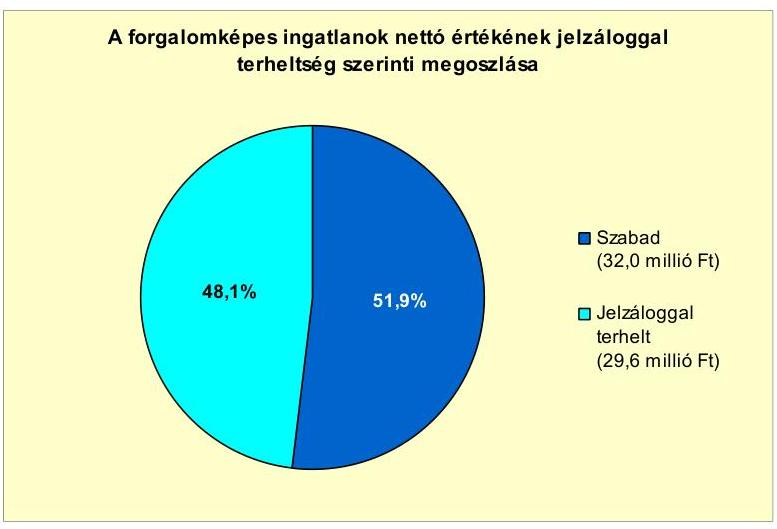

Az Önkormányzat az immateriális javai és tárgyi eszközei ${ }^{28}$ után a 2007-2010. években együttesen 352,0 millió Ft összegű értékcsökkenést számolt el ${ }^{29}$. Az immateriális javak és tárgyi eszközök állományának értéke a beruházások, felújítások eredményeként 2007-2010 között évről évre növekedett, a 2010. év végén a bruttó érték 4185,8 millió Ft, a nettó érték 3341,6 millió Ft volt. Az Önkormányzat immateriális javainak és tárgyi eszközeinek együttes használhatósági foka ${ }^{30}$ a 2007. évi 83,5\%-ról folyamatos (2008-ban 82,2\%ra, 2009-ben $81,9 \%$-ra) csökkenés mellett a 2010. évre $79,8 \%$-ra csökkent, az elszámolt, terv szerinti értékcsökkenés miatt. Az immateriális javaknál és - a tárgyi eszközök közül - az ingatlanok, a gépek, berendezések, felszerelések és az átadott eszközök csoportjainál csökkent, a járművek eszközcsoportnál nőtt a 2010. év végi nettó értéknek a bruttó értékhez viszonyított aránya a 2007-2009. évek átlagértékéhez képest. A használhatósági fok az immateriális javaknál

[^0]
[^0]:    ${ }^{28}$ beleértve az üzemeltetésre, kezelésre átadott eszközöket is
    ${ }^{29}$ 2007-ben 94,6 millió Ft-ot, 2008-ban 88,3 millió Ft-ot, 2009-ben 62,8 millió Ft-ot és 2010-ben 106,3 millió Ft-ot
    ${ }^{30}$ az immateriális javak, tárgyi eszközök nettó értékének a bruttó értékéhez viszonyított aránya

---

13,6 százalékponttal (39,8\%-ról 26,2\%-ra), az ingatlanoknál 1,1 százalékponttal ( $91,6 \%$-ról $90,5 \%$-ra), a gépek, berendezések, felszerelések eszközcsoportnál 15,7 százalékponttal ( $48,1 \%$-ról $32,4 \%$-ra) és az átadott eszközöknél 9,0 százalékponttal ( $84,7 \%$-ról $75,7 \%$-ra) csökkent 2007-ről 2010-re. A használhatósági fok a jármúvek eszközcsoportban 5,6 százalékponttal ( $11,9 \%$-ról $17,5 \%$-ra) növekedett a 2010. évi állománynövekedés - traktorbeszerzés 12,5 millió Ft, térítésmentes átvétel 2,0 millió Ft - eredményeként.

A 2007-2010. években - az Önkormányzat kimutatása szerint - a felhalmozási kiadásokból felújításra 544,7 millió Ft-ot fordítottak, mely az ezen időszakban elszámolt ( 352,0 millió Ft) értékcsökkenést $54,7 \%$-kal haladta meg. A 10 millió Ft feletti egyedi értékű felújítások kiadásainak 51,9\%-át (269,2 millió Ftot) az intézmények múködőképességének biztosítása, illetve $55,5 \%$-át ${ }^{31}$ (288,1 millió Ft-ot) a szakhatósági előírásoknak való megfelelés érdekében, $33,3 \%$-át ( 172,9 millió Ft-ot) belterületi utak felújítására használták fel. A 2007-2010. években elszámolt, 304,4 millió Ft beruházási kiadásból eszközpótlásra fordított felhasználást az Önkormányzat nem mutatott ki.

# 4. A PÉNZÜGYI EGYENSÚLY MEGTEREMTÉSE ÉrDEKÉBEN HOZOTT INTÉZKEDÉSEK EREDMÉNYE 

Az Önkormányzat kimutatása szerint ${ }^{32}$ a 2007-2011. év I. féléve időszakában a kiadáscsökkentő intézkedések hatásaként 34,0 millió Ft megtakarítást értek el, melynek $76,2 \%$-a ( 25,9 millió Ft) a többletjuttatások csökkentésének, $16,2 \%$-a ( 5,5 millió Ft) aljegyző helyettesítés miatti megtakarítás, 7,6\%-a ( 2,6 millió Ft) jutalom kifizetés megszüntetés eredménye.

A 2007-2010. években az Önkormányzat kiadáscsökkentő intézkedések területeinek a megoszlását az alábbi diagram szemlélteti:
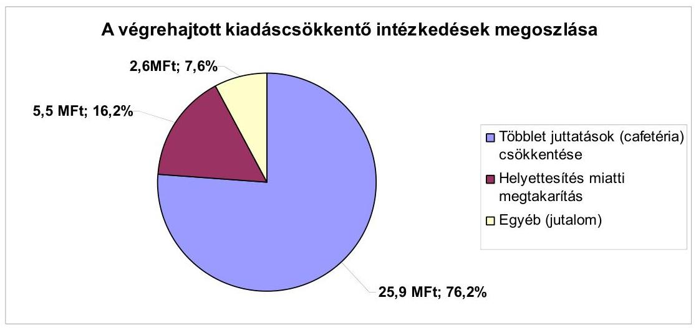

[^0]
[^0]:    ${ }^{31}$ A szakhatósági előírásoknak való megfelelés érdekében végrehajtott felújítások nemcsak intézményeket érintettek (pl.: orvosi rendelő akadálymentesítése).
    ${ }^{32}$ A kimutatás adatait az ÁSZ nem ellenőrizte.

---

A kiadáscsökkentő intézkedések mellett az Önkormányzat 2007-2011 évek között az alábbiakban számszerúsített ${ }^{33}$ bevételnövelő intézkedéseket tette:
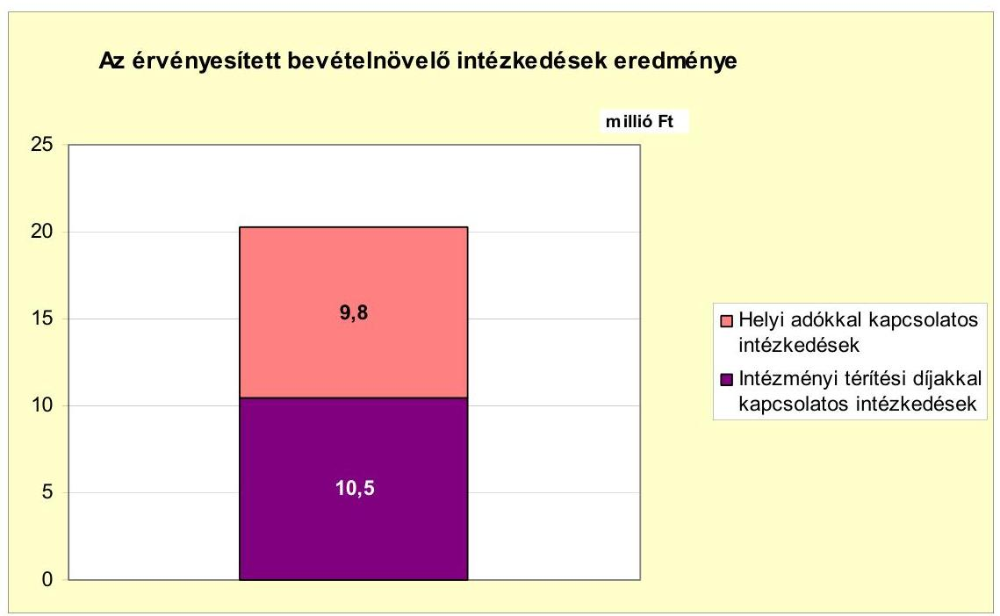

Az Önkormányzat - kimutatásai szerint - intézkedései eredményeként 20072011. évek között összesen 20,3 millió Ft-tal növelte a bevételeit. Ebből 9,8 millió Ft-os bevételnövekedést eredményezett a kommunális adó mértékének 2008. január 1-jétől a Képviselő-testület általi megemelése. Az intézményi térítési díjak évenkénti emelése következtében 2007-2011 évek között összesen 10,5 millió Ft volt a bevételi többlet.

Az Önkormányzatnál a költségvetési támogatás és szja bevételek az előző évhez viszonyítva 2008-ban 8,0\%-kal (70,6 millió Ft-tal), 2009-ben 10,4\%-kal ( 99,0 millió Ft-tal) emelkedtek. A 2010. évtől a változás ellentétes irányú volt, az Önkormányzat költségvetési támogatása és az szja bevételei együttesen 0,7\%-kal, 7,6 millió Ft-tal csökkentek az előző évhez képest. A központi támogatások 2010. évi 7,6 millió Ft-os csökkenését az Önkormányzat által kimutatott (ÁSZ által nem ellenőrzött) 34,0 millió Ft-os kiadási megtakarítás és a 20,3 millió Ft-os bevételnövelés ellensúlyozta. Ez hozzájárult az Önkormányzat pénzügyi egyensúlyának javításához.

# 5. Az ÁSZ Által a korÁbbi ÉVEKben a PÉNZÜGYi EGYENSÚLY JAVÍTÁSÁRA TETT SZABÁLYSZERŰSÉGI ÉS CÉLSZERŰSÉGI JAVASLATOK HASZNOSULÁSA 

Az ÁSZ az Önkormányzat gazdálkodási rendszerét a 2009. évben ellenőrizte átfogó jelleggel, melynek során 21 szabályszerűségi és 15 célszerűségi javaslatot

[^0]
[^0]:    ${ }^{33}$ Az adatokat az ÁSZ nem ellenőrizte.

---

tett. A szabályszerűségi javaslatok közül kettő kapcsolódott a pénzügyi egyensúly javításához. A jelentést a Képviselő-testület a 2010. április 22-én tartott ülésén megismerte. A javaslatok megvalósítására intézkedési tervet készítettek, amely teljes körűen tartalmazta a javaslatokat, meghatározta a feladatok elvégzéséért felelősöket és a feladatok elvégzésének határidejét.

A pénzügyi egyensúly javítását szolgáló szabályszerűségi javaslatokat az intézkedési tervben foglalt határidőre hasznosították.

A polgármester - a jegyző előkészítésében - előterjesztette pénzügyi bizottsági véleményezésre a 2010. évi költségvetési javaslatot. A jegyző a 2010. évi költségvetési rendelet előkészítése során finanszírozási célú pénzügyi műveleteket költségvetési hiányt módosító költségvetési kiadásként nem vett figyelembe.

Budapest, 2012. április , 16 "

Melléklet: $\quad 7 \mathrm{db}$
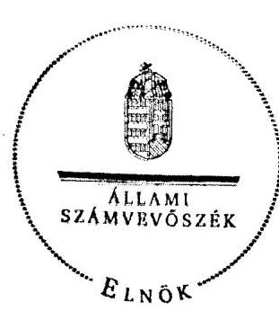

Domokos László

---

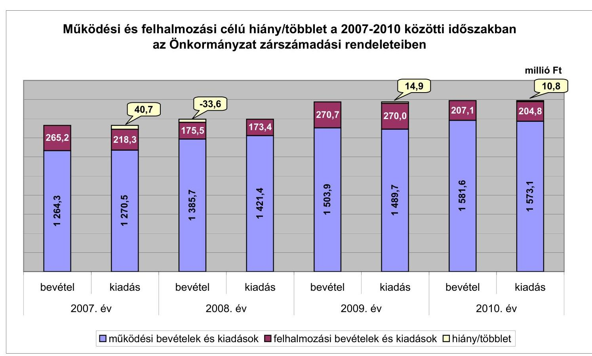

# Működési és felhalmozási célú hiány/többlet a 2007-2010 közötti időszakban az Önkormányzat zárszámadási rendeleteiben

|  I. számú melléklet | II. számú melléklet | III. számú felhalmozási cél | IV. számú felhalmozási felhalmozás | V. számú felhalmozási felhalmozás | VI. számú felhalmozási felhalmozás  |
| --- | --- | --- | --- | --- | --- |
|  14.9 | 276.8 | 1 264.3 | 1 264.3 | 1 264.3 | 1 264.3  |
|  15.8 | 175.4 | 1 385.5 | 1 385.5 | 1 385.5 | 1 385.5  |
|  16.7 | 176.5 | 1 421.4 | 1 421.4 | 1 421.4 | 1 421.4  |
|  17.6 | 175.4 | 1 503.9 | 1 503.9 | 1 503.9 | 1 503.9  |
|  18.5 | 176.5 | 1 581.6 | 1 581.6 | 1 581.6 | 1 581.6  |
|  19.9 | 175.4 | 1 589.7 | 1 589.7 | 1 589.7 | 1 589.7  |
|  20.7 | 176.5 | 1 584.8 | 1 584.8 | 1 584.8 | 1 584.8  |
|  21.6 | 176.5 | 1 583.1 | 1 583.1 | 1 583.1 | 1 583.1  |
|  22.5 | 176.5 | 1 582.1 | 1 582.1 | 1 582.1 | 1 582.1  |
|  23.6 | 176.5 | 1 581.6 | 1 581.6 | 1 581.6 | 1 581.6  |
|  24.9 | 176.5 | 1 580.8 | 1 580.8 | 1 580.8 | 1 580.8  |
|  25.7 | 176.5 | 1 581.6 | 1 581.6 | 1 581.6 | 1 581.6  |
|  26.5 | 176.5 | 1 582.1 | 1 582.1 | 1 582.1 | 1 582.1  |
|  27.6 | 176.5 | 1 583.1 | 1 583.1 | 1 583.1 | 1 583.1  |
|  28.5 | 176.5 | 1 582.1 | 1 582.1 | 1 582.1 | 1 582.1  |
|  29.9 | 176.5 | 1 583.1 | 1 583.1 | 1 583.1 | 1 583.1  |
|  30.7 | 176.5 | 1 582.1 | 1 582.1 | 1 582.1 | 1 582.1  |
|  31.6 | 176.5 | 1 583.1 | 1 583.1 | 1 583.1 | 1 583.1  |
|  32.5 | 176.5 | 1 582.1 | 1 582.1 | 1 582.1 | 1 582.1  |
|  33.6 | 176.5 | 1 583.1 | 1 583.1 | 1 583.1 | 1 583.1  |
|  34.9 | 176.5 | 1 582.1 | 1 582.1 | 1 582.1 | 1 582.1  |
|  35.7 | 176.5 | 1 583.1 | 1 583.1 | 1 583.1 | 1 583.1  |
|  36.5 | 176.5 | 1 582.1 | 1 582.1 | 1 582.1 | 1 582.1  |
|  37.6 | 176.5 | 1 583.1 | 1 583.1 | 1 583.1 | 1 583.1  |
|  38.5 | 176.5 | 1 582.1 | 1 582.1 | 1 582.1 | 1 582.1  |
|  39.9 | 176.5 | 1 583.1 | 1 583.1 | 1 583.1 | 1 583.1  |
|  40.7 | 176.5 | 1 582.1 | 1 582.1 | 1 582.1 | 1 582.1  |
|  41.6 | 176.5 | 1 582.1 | 1 582.1 | 1 582.1 | 1 582.1  |
|  42.5 | 176.5 | 1 582.1 | 1 582.1 | 1 582.1 | 1 582.1  |
|  43.6 | 176.5 | 1 582.1 | 1 582.1 | 1 582.1 | 1 582.1  |
|  44.9 | 176.5 | 1 582.1 | 1 582.1 | 1 582.1 | 1 582.1  |
|  45.7 | 176.5 | 1 582.1 | 1 582.1 | 1 582.1 | 1 582.1  |
|  46.5 | 176.5 | 1 582.1 | 1 582.1 | 1 582.1 | 1 582.1  |
|  47.6 | 176.5 | 1 582.1 | 1 582.1 | 1 582.1 | 1 582.1  |
|  48.5 | 176.5 | 1 582.1 | 1 582.1 | 1 582.1 | 1 582.1  |
|  49.9 | 176.5 | 1 582.1 | 1 582.1 | 1 582.1 | 1 582.1  |
|  50.7 | 176.5 | 1 582.1 | 1 582.1 | 1 582.1 | 1 582.1  |
|  51.6 | 176.5 | 1 582.1 | 1 582.1 | 1 582.1 | 1 582.1  |
|  52.5 | 176.5 | 1 582.1 | 1 582.1 | 1 582.1 | 1 582.1  |
|  53.6 | 176.5 | 1 582.1 | 1 582.1 | 1 582.1 | 1 582.1  |
|  54.9 | 176.5 | 1 582.1 | 1 582.1 | 1 582.1 | 1 582.1  |
|  55.7 | 176.5 | 1 582.1 | 1 582.1 | 1 582.1 | 1 582.1  |
|  56.5 | 176.5 | 1 582.1 | 1 582.1 | 1 582.1 | 1 582.1  |
|  57.6 | 176.5 | 1 582.1 | 1 582.1 | 1 582.1 | 1 582.1  |
|  58.5 | 176.5 | 1 582.1 | 1 582.1 | 1 582.1 | 1 582.1  |
|  59.9 | 176.5 | 1 582.1 | 1 582.1 | 1 582.1 | 1 582.1  |
|  60.7 | 176.5 | 1 582.1 | 1 582.1 | 1 582.1 | 1 582.1  |
|  61.6 | 176.5 | 1 582.1 | 1 582.1 | 1 582.1 | 1 582.1  |
|  62.5 | 176.5 | 1 582.1 | 1 582.1 | 1 582.1 | 1 582.1  |
|  63.6 | 176.5 | 1 582.1 | 1 582.1 | 1 582.1 | 1 582.1  |
|  64.5 | 176.5 | 1 582.1 | 1 582.1 | 1 582.1 | 1 582.1  |
|  65.7 | 176.5 | 1 582.1 | 1 582.1 | 1 582.1 | 1 582.1  |
|  66.5 | 176.5 | 1 582.1 | 1 582.1 | 1 582.1 | 1 582.1  |
|  67.6 | 176.5 | 1 582.1 | 1 582.1 | 1 582.1 | 1 582.1  |
|  68.5 | 176.5 | 1 582.1 | 1 582.1 | 1 582.1 | 1 582.1  |
|  69.9 | 176.5 | 1 582.1 | 1 582.1 | 1 582.1 | 1 582.1  |
|  70.7 | 176.5 | 1 582.1 | 1 582.1 | 1 582.1 | 1 582.1  |
|  71.6 | 176.5 | 1 582.1 | 1 582.1 | 1 582.1 | 1 582.1  |
|  72.5 | 176.5 | 1 582.1 | 1 582.1 | 1 582.1 | 1 582.1  |
|  73.6 | 176.5 | 1 582.1 | 1 582.1 | 1 582.1 | 1 582.1  |
|  74.9 | 176.5 | 1 582.1 | 1 582.1 | 1 582.1 | 1 582.1  |
|  75.7 | 176.5 | 1 582.1 | 1 582.1 | 1 582.1 | 1 582.1  |
|  76.5 | 176.5 | 1 582.1 | 1 582.1 | 1 582.1 | 1 582.1  |
|  77.6 | 176.5 | 1 582.1 | 1 582.1 | 1 582.1 | 1 582.1  |
|  78.5 | 176.5 | 1 582.1 | 1 582.1 | 1 582.1 | 1 582.1  |
|  79.9 | 176.5 | 1 582.1 | 1 582.1 | 1 582.1 | 1 582.1  |
|  80.7 | 176.5 | 1 582.1 | 1 582.1 | 1 582.1 | 1 582.1  |
|  81.6 | 176.5 | 1 582.1 | 1 582.1 | 1 582.1 | 1 582.1  |
|  82.5 | 176.5 | 1 582.1 | 1 582.1 | 1 582.1 | 1 582.1  |
|  83.6 | 176.5 | 1 582.1 | 1 582.1 | 1 582.1 | 1 582.1  |
|  84.5 | 176.5 | 1 582.1 | 1 582.1 | 1 582.1 | 1 582.1  |
|  85.7 | 176.5 | 1 582.1 | 1 582.1 | 1 582.1 | 1 582.1  |
|  86.5 | 176.5 | 1 582.1 | 1 582.1 | 1 582.1 | 1 582.1  |
|  87.6 | 176.5 | 1 582.1 | 1 582.1 | 1 582.1 | 1 582.1  |
|  88.5 | 176.5 | 1 582.1 | 1 582.1 | 1 582.1 | 1 582.1  |
|  89.9 | 176.5 | 1 582.1 | 1 582.1 | 1 582.1 | 1 582.1  |
|  90.7 | 176.5 | 1 582.1 | 1 582.1 | 1 582.1 | 1 582.1  |
|  91.6 | 176.5 | 1 582.1 | 1 582.1 | 1 582.1 | 1 582.1  |
|  92.5 | 176.5 | 1 582.1 | 1 582.1 | 1 582.1 | 1 582.1  |
|  93.6 | 176.5 | 1 582.1 | 1 582.1 | 1 582.1 | 1 582.1  |
|  94.5 | 176.5 | 1 582.1 | 1 582.1 | 1 582.1 | 1 582.1  |
|  95.7 | 176.5 | 1 582.1 | 1 582.1 | 1 582.1 | 1 582.1  |
|  96.5 | 176.5 | 1 582.1 | 1 582.1 | 1 582.1 | 1 582.1  |
|  97.6 | 176.5 | 1 582.1 | 1 582.1 | 1 582.1 | 1 582.1  |
|  98.5 | 176.5 | 1 582.1 | 1 582.1 | 1 582.1 | 1 582.1  |
|  99.9 | 176.5 | 1 582.1 | 1 582.1 | 1 582.1 | 1 582.1  |
|  100.7 | 176.5 | 1 582.1 | 1 582.1 | 1 582.1 | 1 582.1  |
|  101.7 | 176.5 | 1 582.1 | 1 582.1 | 1 582.1 | 1 582.1  |
|  102.7 | 176.5 | 1 582.1 | 1 582.1 | 1 582.1 | 1 582.1  |
|  103.7 | 176.5 | 1 582.1 | 1 582.1 | 1 582.1 | 1 582.1  |
|  104.7 | 176.5 | 1 582.1 | 1 582.1 | 1 582.1 | 1 582.1  |
|  105.7 | 176.5 | 1 582.1 | 1 582.1 | 1 582.1 | 1 582.1  |
|  106.7 | 176.5 | 1 582.1 | 1 582.1 | 1 582.1 | 1 582.1  |
|  107.7 | 176.5 | 1 582.1 | 1 582.1 | 1 582.1 | 1 582.1  |
|  108.7 | 176.5 | 1 582.1 | 1 582.1 | 1 582.1 | 1 582.1  |
|  109.7 | 176.5 | 1 582.1 | 1 582.1 | 1 582.1 | 1 582.1  |
|  110.7 | 176.5 | 1 582.1 | 1 582.1 | 1 582.1 | 1 582.1  |
|  111.7 | 176.5 | 1 582.1 | 1 582.1 | 1 582.1 | 1 582.1  |
|  112.7 | 176.5 | 1 582.1 | 1 582.1 | 1 582.1 | 1 582.1  |
|  113.7 | 176.5 | 1 582.1 | 1 582.1 | 1 582.1 | 1 582.1  |
|  114.7 | 176.5 | 1 582.1 | 1 582.1 | 1 582.1 | 1 582.1  |
|  115.7 | 176.5 | 1 582.1 | 1 582.1 | 1 582.1 | 1 582.1  |
|  116.7 | 176.5 | 1 582.1 | 1 582.1 | 1 582.1 | 1 582.1  |
|  117.7 | 176.5 | 1 582.1 | 1 582.1 | 1 582.1 | 1 582.1  |
|  118.7 | 176.5 | 1 582.1 | 1 582.1 | 1 582.1 | 1 582.1  |
|  119.7 | 176.5 | 1 582.1 | 1 582.1 | 1 582.1 | 1 582.1  |
|  120.7 | 176.5 | 1 582.1 | 1 582.1 | 1 582.1 | 1 582.1  |
|  121.7 | 176.5 | 1 582.1 | 1 582.1 | 1 582.1 | 1 582.1  |
|  122.7 | 176.5 | 1 582.1 | 1 582.1 | 1 582.1 | 1 582.1  |
|  123.7 | 176.5 | 1 582.1 | 1 582.1 | 1 582.1 | 1 582.1  |
|  124.7 | 176.5 | 1 582.1 | 1 582.1 | 1 582.1 | 1 582.1  |
|  125.7 | 176.5 | 1 582.1 | 1 582.1 | 1 582.1 | 1 582.1  |
|  126.7 | 176.5 | 1 582.1 | 1 582.1 | 1 582.1 | 1 582.1  |
|  127.7 | 176.5 | 1 582.1 | 1 582.1 | 1 582.1 | 1 582.1  |
|  128.7 | 176.5 | 1 582.1 | 1 582.1 | 1 582.1 | 1 582.1  |
|  129.7 | 176.5 | 1 582.1 | 1 582.1 | 1 582.1 | 1 582.1  |
|  130.7 | 176.5 | 1 582.1 | 1 582.1 | 1 582.1 | 1 582.1  |
|  131.7 | 176.5 | 1 582.1 | 1 582.1 | 1 582.1 | 1 582.1  |
|  132.7 | 176.5 | 1 582.1 | 1 582.1 | 1 582.1 | 1 582.1  |
|  133.7 | 176.5 | 1 582.1 | 1 582.1 | 1 582.1 | 1 582.1  |
|  134.7 | 176.5 | 1 582.1 | 1 582.1 | 1 582.1 | 1 582.1  |
|  135.7 | 176.5 | 1 582.1 | 1 582.1 | 1 582.1 | 1 582.1  |
|  136.7 | 176.5 | 1 582.1 | 1 582.1 | 1 582.1 | 1 582.1  |
|  137.7 | 176.5 | 1 582.1 | 1 582.1 | 1 582.1 | 1 582.1  |
|  138.7 | 176.5 | 1 582.1 | 1 582.1 | 1 582.1 | 1 582.1  |
|  139.7 | 176.5 | 1 582.1 | 1 582.1 | 1 582.1 | 1 582.1  |
|  140.7 | 176.5 | 1 582.1 | 1 582.1 | 1 582.1 | 1 582.1  |
|  141.7 | 176.5 | 1 582.1 | 1 582.1 | 1 582.1 | 1 582.1  |
|  142.7 | 176.5 | 1 582.1 | 1 582.1 | 1 582.1 | 1 582.1  |
|  143.7 | 176.5 | 1 582.1 | 1 582.1 | 1 582.1 | 1 582.1  |
|  144.7 | 176.5 | 1 582.1 | 1 582.1 | 1 582.1 | 1 582.1  |
|  145.7 | 176.5 | 1 582.1 | 1 582.1 | 1 582.1 | 1 582.1  |
|  146.7 | 176.5 | 1 582.1 | 1 582.1 | 1 582.1 | 1 582.1  |
|  147.7 | 176.5 | 1 582.1 | 1 582.1 | 1 582.1 | 1 582.1  |
|  148.7 | 176.5 | 1 582.1 | 1 582.1 | 1 582.1 | 1 582.1  |
|  149.7 | 176.5 | 1 582.1 | 1 582.1 | 1 582.1 | 1 582.1  |
|  150.7 | 176.5 | 1 582.1 | 1 582.1 | 1 582.1 | 1 582.1  |
|  151.7 | 176.5 | 1 582.1 | 1 582.1 | 1 582.1 | 1 582.1  |
|  152.7 | 176.5 | 1 582.1 | 1 582.1 | 1 582.1 | 1 582.1  |
|  153.7 | 176.5 | 1 582.1 | 1 582.1 | 1 582.1 | 1 582.1  |
|  154.7 | 176.5 | 1 582.1 | 1 582.1 | 1 582.1 | 1 582.1  |
|  155.7 | 176.5 | 1 582.1 | 1 582.1 | 1 582.1 | 1 582.1  |
|  156.7 | 176.5 | 1 582.1 | 1 582.1 | 1 582.1 | 1 582.1  |
|  157.7 | 176.5 | 1 582.1 | 1 582.1 | 1 582.1 | 1 582.1  |
|  158.7 | 176.5 | 1 582.1 | 1 582.1 | 1 582.1 | 1 582.1  |
|  159.7 | 176.5 | 1 582.1 | 1 582.1 | 1 582.1 | 1 582.1  |
|  160.7 | 176.5 | 1 582.1 | 1 582.1 | 1 582.1 | 1 582.1  |
|  161.7 | 176.5 | 1 582.1 | 1 582.1 | 1 582.1 | 1 582.1  |
|  162.7 | 176.5 | 1 582.1 | 1 582.1 | 1 582.1 | 1 582.1  |
|  163.7 | 176.5 | 1 582.1 | 1 582.1 | 1 582.1 | 1 582.1  |
|  164.7 | 176.5 | 1 582.1 | 1 582.1 | 1 582.1 | 1 582.1  |
|  165.7 | 176.5 | 1 582.1 | 1 582.1 | 1 582.1 | 1 582.1  |
|  166.7 | 176.5 | 1 582.1 | 1 582.1 | 1 582.1 | 1 582.1  |
|  167.7 | 176.5 | 1 582.1 | 1 582.1 | 1 582.1 | 1 582.1  |
|  168.7 | 176.5 | 1 582.1 | 1 582.1 | 1 582.1 | 1 582.1  |
|  169.7 | 176.5 | 1 582.1 | 1 582.1 | 1 582.1 | 1 582.1  |
|  170.7 | 176.5 | 1 582.1 | 1 582.1 | 1 582.1 | 1 582.1  |
|  171.7 | 176.5 | 1 582.1 | 1 582.1 | 1 582.1 | 1 582.1  |
|  172.7 | 176.5 | 1 582.1 | 1 582.1 | 1 582.1 | 1 582.1  |
|  173.7 | 176.5 | 1 582.1 | 1 582.1 | 1 582.1 | 1 582.1  |
|  174.7 | 176.5 | 1 582.1 | 1 582.1 | 1 582.1 | 1 582.1  |
|  175.7 | 176.5 | 1 582.1 | 1 582.1 | 1 582.1 | 1 582.1  |
|  176.7 | 176.5 | 1 582.1 | 1 582.1 | 1 582.1 | 1 582.1  |
|  177.7 | 176.5 | 1 582.1 | 1 582.1 | 1 582.1 | 1 582.1  |
|  178.7 | 176.5 | 1 582.1 | 1 582.1 | 1 582.1 | 1 582.1  |
|  179.7 | 176.5 | 1 582.1 | 1 582.1 | 1 582.1 | 1 582.1  |
|  180.7 | 176.5 | 1 582.1 | 1 582.1 | 1 582.1 | 1 582.1  |
|  181.7 | 176.5 | 1 582.1 | 1 582.1 | 1 582.1 | 1 582.1  |
|  182.7 | 176.5 | 1 582.1 | 1 582.1 | 1 582.1 | 1 582.1  |
|  182.7 | 176.5 | 1 582.1 | 1 582.1 | 1 582.1 | 1 582.1  |
|  183.7 | 176.5 | 1 582.1 | 1 582.1 | 1 582.1 | 1 582.1  |
|  184.7 | 176.5 | 1 582.1 | 1 582.1 | 1 582.1 | 1 582.1  |
|  185.7 | 176.5 | 1 582.1 | 1 582.1 | 1 582.1  |
|  186.7 | 176.5 | 1 582.1 | 1 582.1 | 1 582.1 | 1 582.1  |
|  187.7 | 176.5 | 1 582.1 | 1 582.1 | 1 582.1  |
|  188.7 | 176.5 | 1 582.1 | 1 582.1 | 1 582.1  |
|  189.7 | 176.5 | 1 582.1 | 1 582.1 | 1 582.1  |
|  190.7 | 176.5 | 1 582.1 | 1 582.1 | 1 582.1  |
|  191.7 | 176.5 | 1 582.1 | 1 582.1 | 1 582.1  |
|  192.7 | 176.5 | 1 582.1 | 1 582.1 | 1 582.1  |
|  193.7 | 176.5 | 1 582.1 | 1 582.1 | 1 582.1  |
|  194.7 | 176.5 | 1 582.1 | 1 582.1 | 1 582.1  |
|  195.7 | 176.5 | 1 582.1 | 1 582.1 | 1 582.1  |
|  196.7 | 176.5 | 1 582.1 | 1 582.1 | 1 582.1  |
|  197.7 | 176.5 | 1 582.1 | 1 582.1 | 1 582.1  |
|  198.7 | 176.5 | 1 582.1 | 1 582.1 | 1 582.1  |
|  199.7 | 176.5 | 1 582.1 | 1 582.1 | 1 582.1  |
|  199.7 | 176.5 | 1 582.1 | 1 582.1 | 1 582.1  |
|  199.7 | 176.5 | 1 582.1 | 1 582.1 | 1 582.1  |
|  199.7 | 176.5 | 1 582.1 | 1 582.1 | 1 582.1  |
|  199.7 | 176.5 | 1 582.1 | 1 582.1 | 1 582.1 | 1 582.1  |
|  199.7 | 176.5 | 1 582.1 | 1 582.1 | 1 582.1  |
|  199.7 | 176.5 | 1 582.1 | 1 582.1 | 1 582.1 | 1 582.1  |
|  199.7 | 176.5 | 1 582.1 | 1 582.1 | 1 582.1  |
|  199.7 | 176.5 | 1 582.1 | 1 582.1 | 1 582.1 | 1 582.1  |
|  199.7 | 176.5 | 1 582.1 | 1 582.1 | 1 582.1  |
|  199.7 | 176.5 | 1 582.1 | 1 582.1 | 1 582.1  |
|  199.7 | 176.5 | 1 582.1 | 1 582.1 | 1 582.1  |
|  199.7 | 176.5 | 1 582.1 | 1 582.1 | 1 582.1  |
|  199.7 | 176.5 | 1 582.1 | 1 582.1 | 1 582.1  |

---

|  Az Önkormányzat bevételei és kiadásai, valamint adósságszolgálata 2007-2010 között |  |  |  |   |
| --- | --- | --- | --- | --- |
|  1. FOLYÓ KÖLTSÉGVETÉS | 2007. | 2008. | 2009. | 2010.  |
|  1.1.1. Saját müködési bevételek | 175,6 | 199,6 | 234,1 | 279,5  |
|  1.1.2. Költségvetési támogatás | 331,3 | 782,8 | 880,9 | 865,8  |
|  1.1.3. Átengedett bevételek | 557,6 | 176,4 | 180,0 | 186,9  |
|  1.1.4. Államháztartáson belülről kapott támogatások | 147,6 | 222,8 | 207,7 | 233,6  |
|  1.1.5. EU-tól és külföldről kapott bevételek | 0,0 | 0,0 | 0,0 | 0,0  |
|  1.1.6. Államháztartáson kívülről kapott bevételek | 8,5 | 0,9 | 1,5 | 17,5  |
|  1.1.7. Előző évi pénzmaradvány átvétel | 0,0 | 0,0 | 0,0 | 0,0  |
|  1.1. Folyó bevételek ( $=1.1 .1 .+1.1 .2 .+1.1 .3 .+1.1 .4 .+1.1 .5 .+1.1 .6 .+1.1 .7$.) | 1220,6 | 1382,5 | 1504,2 | 1583,3  |
|  1.2.1. Müködési kiadások kamatikiadások nélkül | 1074,2 | 1202,2 | 1334,6 | 1374,0  |
|  1.2.2. Államháztartáson belülre átadott pénzeszközök | 0,3 | 0,9 | 0,9 | 0,5  |
|  1.2.3.1. vállalkozásoknak | 0,0 | 0,0 | 0,0 | 0,0  |
|  1.2.3.2. EU-nak, illetve külföldre | 0,0 | 0,0 | 0,0 | 0,0  |
|  1.2.3.3. magánszemélyeknek | 173,3 | 177,9 | 162,0 | 181,7  |
|  1.2.3.4. nonprofit szervezeteknek | 4,6 | 5,0 | 5,5 | 5,0  |
|  1.2.3. Transferkiadások ( $=1.2 .3 .1+1.2 .3 .2+1.2 .3 .3+1.2 .3 .4$ ) | 177,9 | 182,9 | 167,5 | 186,7  |
|  1.2.4 Kamatkiadások | 3,4 | 4,5 | 7,7 | 7,8  |
|  1.2.5. Előző évi pénzmaradvány átadás | 0,0 | 0,0 | 0,0 | 0,0  |
|  1.2. Folyó kiadások ( $=1.2 .1 .+1.2 .2 .+1.2 .3 .+1.2 .4 .+1.2 .5$.) | 1255,8 | 1390,5 | 1510,7 | 1569,0  |
|  1.3. Folyó költségvetés egyenlege MÜKÖDÉSI JÓVEDELEM ( $=1.1 .-1.2$.) | $-35,2$ | $-8,0$ | $-6,5$ | 14,3  |
|  2. FELHALMOZÁSI KÖLTSÉGVETÉS |  |  |  |   |
|  2.1.1. Saját tökebevételek | 17,0 | 5,2 | 35,7 | 1,0  |
|  2.1.2. Államháztartáson belülről kapott támogatások | 210,4 | 153,9 | 230,5 | 205,5  |
|  2.1.3. EU-tól és külföldről kapott támogatások | 0,0 | 0,0 | 0,0 | 0,0  |
|  2.1.4. Államháztartáson kívülről kapott támogatások | 32,1 | 6,6 | 4,0 | 0,4  |
|  2.1. Felhalmozási bevételek ( $=2.1 .1 .+2.1 .2 .+2.1 .3 .+2.1 .4$.) | 259,5 | 165,7 | 270,2 | 206,9  |
|  2.2.1. Saját beruházási kiadás áfával | 189,3 | 27,7 | 32,7 | 54,7  |
|  2.2.2. Saját felújítási kiadás áfával | 12,8 | 145,7 | 236,1 | 150,1  |
|  2.2.3. Államháztartáson belülre átadott pénzeszköz | 0,0 | 0,0 | 0,0 | 0,0  |
|  2.2.4. EU-nak és külföldnek adott pénzeszközök | 0,0 | 0,0 | 0,0 | 0,0  |
|  2.2.5. Államháztartáson kívülre adott pénzeszközök | 13,1 | 0,0 | 1,8 | 0,0  |
|  2.2.6. Befektetési célú részesedések vásárlása | 0,0 | 0,0 | 0,0 | 0,0  |
|  2.2. Felhalmozási kiadások ( $=2.2 .1 .+2.2 .2 .+2.2 .3 .+2.2 .4 .+2.2 .5 .+2.2 .6$.) | 215,2 | 173,4 | 270,6 | 204,8  |
|  2.3. Felhalmozási költségvetés egyenlege ( $=2.1 .-2.2$.) | 44,3 | $-7,7$ | $-0,4$ | 2,1  |
|  3. Finanszírozási műveletek nélküli (GFS) pozíció ( $=1.3 .+2.3$.) | 9,1 | $-15,7$ | $-6,9$ | 16,4  |
|  4. Finanszírozási műveletek |  |  |  |   |
|  4.1. Hitelfelvétel | 15,0 | 0,0 | 9,1 | 37,0  |
|  4.2. Hiteltörlesztés | 37,1 | 15,0 | 0,0 | 0,0  |
|  4.3. Forgatási és befektetési célú értékpapírok kibocsátása | 0,0 | 0,0 | 0,0 | 0,0  |
|  4.4. Forgatási és befektetési célú értékpapírok beváltása | 0,0 | 0,0 | 0,0 | 0,0  |
|  4.5. Forgatási és befektetési célú értékpapírok értékesítése | 0,0 | 0,0 | 0,0 | 0,0  |
|  4.6. Forgatási és befektetési célú értékpapírok vásárlása | 0,0 | 0,0 | 0,0 | 0,0  |
|  4.7. Egyéb finanszírozási bevételek (függő, átfutó, kiegyenlítő) | 1,7 | 12,9 | $-11,3$ | $-43,3$  |
|  4.8. Egyéb finanszírozási kiadások (függő, átfutó, kiegyenlítő) | $-19,3$ | 15,9 | $-21,6$ | 4,1  |
|  4.9.Finanszírozási műveletek egyenlege ( $=4.1 .-4.2 .+4.3 .-4.4 .+4.5 .-4.6 .+4.7 .-4.8$.) | $-1,1$ | $-18,0$ | 19,4 | $-10,4$  |
|  5. Tárgyévi pénzügyi pozíció ( $=1.3 .+2.3 .+4.9$.) | 8,0 | $-33,7$ | 12,5 | 6,0  |
|  6. Nettó müködési jövedelem = müködési jövedelem (1.3.) - tőketörlesztés (4.2.+4.4.) | $-72,3$ | $-23,0$ | $-6,5$ | 14,3  |
|  TÁJÉKOZTATÓ ADATOK |  |  |  |   |
|  Összes kötelezettség | 70,7 | 60,6 | 142,8 | 188,3  |
|  ebből rövid lejáratú | 61,1 | 51,4 | 137,5 | 184,9  |
|  Összes szállítói kötelezettség | 18,4 | 18,2 | 108,4 | 120,2  |
|  ebből lejárt (tanúsítványból) | 4,5 | 12,4 | 48,1 | 113,3  |
|  Pénz- és tőkepizci kötelezettség (adósság) | 15,0 | 0,0 | 9,1 | 46,1  |
|  ebből rövid lejáratú | 15,0 | 0,0 | 9,1 | 46,1  |
|  PPP szerződéses állomány jelenértéken (tanúsítványból) | 0,0 | 0,0 | 0,0 | 0,0  |
|  ebből lejárt szolgáltatási díj miatti kötelezettség | 0,0 | 0,0 | 0,0 | 0,0  |
|  Folyószámlahitel napi átlagos állománya (tanúsítványból) | 15,0 | 17,5 | 25,3 | 31,1  |
|  Likvidhitel napi átlagos állománya (tanúsítványból) | 0,0 | 0,0 | 0,0 | 13,8  |
|  Munkahérhitel napi átlagos állománya (tanúsítványból) | 20,0 | 22,4 | 22,7 | 28,2  |
|  Kezesség- és garanciavállalások (tanúsítványból) | 0,0 | 0,0 | 0,0 | 0,0  |
|  Jogerős bírósági itéletekből adódó kötelezettségek (tanúsítványból) | 0,0 | 0,0 | 0,0 | 0,0  |
|  Finanszírozásba bevonható eszközök: | 39,1 | 5,4 | 17,9 | 23,8  |
|  Tartós hitelviszonyt megtestesítő értékpapírok év végi állománya | 0,0 | 0,0 | 0,0 | 0,0  |
|  Hosszú lejáratú bankbetétek év végi állománya | 0,0 | 0,0 | 0,0 | 0,0  |
|  Értékpapírok év végi állománya | 0,0 | 0,0 | 0,0 | 0,0  |
|  Pénzeszközök (idegen pénzeszközök nélküli) év végi állománya | 39,1 | 5,4 | 17,9 | 23,8  |

---

Szendről Város Önkormányzata

Sz. számú melléklet a V-3086-019/2012. számú Jelenléshez

Az Önkormányzat 2007-2010. években megvalósított, 2010. december 31-ig befejezett fejlesztései és azok forrásösszetétele

millió Ft-ban

|  |   |   |   |   |   |   |   |   |   |   |   |   |   |   |   |   |   |   |   |   |   |   |   |   |   |   |   |   |   |   |   |   |   |   |   |   |   |   |   |   |   |   |   |   |   |   |   |   |   |   |   |   |   |   |   |   |   |   |   |   |   |   |   |   |   |   |   |   |   |   |   |   |   |   |   |   |   |   |   |   |   |   |   |   |   |   |   |   |   |   |   |   |   |   |   |   |   |   |   |   |  

---

Szendő Város Önkormányzata

Az Önkormányzat 2010. december 31-én folyamatban lévő fejlesztési feladataira 2010. december 31-ig teljesített kifizetések és azok forrásösszetétele

milliá Ft-ban

|  |   |   |   |   |   |   |   |   |   |   |   |   |   |   |   |   |   |   |   |   |   |   |   |   |   |   |   |   |   |   |   |   |   |   |
| --- | --- | --- | --- | --- | --- | --- | --- | --- | --- | --- | --- | --- | --- | --- | --- | --- | --- | --- | --- | --- | --- | --- | --- | --- | --- | --- | --- | --- | --- | --- | --- | --- | --- |
|   | Fejlesztési feladat (beruházás, felújítás) |  | Beruházás, felújítás |  |  |  |  |  |  |  |  |  |  |  |  |  |  |  |  |  |  |  |  |  |  |  |  |  |  |  |  |  |   |
|  N |  |  |  |  |  |  |  |  |  |  |  |  |  |  |  |  |  |  |  |  |  |  |  |  |  |  |  |  |  |  |  |  |   |
|   | Fejlesztési feladat (beruházás, felújítás) |  | Beruházás, felújítás |  |  |  |  |  |  |  |  |  |  |  |  |  |  |  |  |  |  |  |  |  |  |  |  |  |  |  |  |  |   |
|  1 | 2 | 3 | 4 | 5 | 6 | 7 | 8 | 9 | 10 | 11 | 12 | 13 | 14 | 15 | 16 | 17 | 18 | 19 | 20 | 21 | 22 | 23 | 24 | 25 | 26 | 27 | 28 | 29 | 30 | 31 |  |   |
|  1. | Felújítások |  |  |  |  |  |  |  |  |  |  |  |  |  |  |  |  |  |  |  |  |  |  |  |  |  |  |  |  |  |  |  |   |
|   |  |  |  |  |  |  |  |  |  |  |  |  |  |  |  |  |  |  |  |  |  |  |  |  |  |  |  |  |  |  |  |  |   |
|   |  |  |  |  |  |  |  |  |  |  |  |  |  |  |  |  |  |  |  |  |  |  |  |  |  |  |  |  |  |  |  |  |   |
|   |  |  |  |  |  |  |  |  |  |  |  |  |  |  |  |  |  |  |  |  |  |  |  |  |  |  |  |  |  |  |  |  |   |
|   |  |  |  |  |  |  |  |  |  |  |  |  |  |  |  |  |  |  |  |  |  |  |  |  |  |  |  |  |  |  |  |  |   |
|   |  |  |  |  |  |  |  |  |  |  |  |  |  |  |  |  |  |  |  |  |  |  |  |  |  |  |  |  |  |  |  |  |   |
|   |  |  |  |  |  |  |  |  |  |  |  |  |  |  |  |  |  |  |  |  |  |  |  |  |  |  |  |  |  |  |  |  |   |
|   |  |  |  |  |  |  |  |  |  |  |  |  |  |  |  |  |  |  |  |  |  |  |  |  |  |  |  |  |  |  |  |  |   |
|   |  |  |  |  |  |  |  |  |  |  |  |  |  |  |  |  |  |  |  |  |  |  |  |  |  |  |  |  |  |  |  |  |   |
|   |  |  |  |  |  |  |  |  |  |  |  |  |  |  |  |  |  |  |  |  |  |  |  |  |  |  |  |  |  |  |  |  |   |
|   |  |  |  |  |  |  |  |  |  |  |  |  |  |  |  |  |  |  |  |  |  |  |  |  |  |  |  |  |  |  |  |  |   |
|   |  |  |  |  |  |  |  |  |  |  |  |  |  |  |  |  |  |  |  |  |  |  |  |  |  |  |  |  |  |  |  |  |   |
|   |  |  |  |  |  |  |  |  |  |  |  |  |  |  |  |  |  |  |  |  |  |  |  |  |  |  |  |  |  |  |  |  |   |
|   |  |  |  |  |  |  |  |  |  |  |  |  |  |  |  |  |  |  |  |  |  |  |  |  |  |  |  |  |  |  |  |  |   |
|   |  |  |  |  |  |  |  |  |  |  |  |  |  |  |  |  |  |  |  |  |  |  |  |  |  |  |  |  |  |  |  |  |   |
|   |  |  |  |  |  |  |  |  |  |  |  |  |  |  |  |  |  |  |  |  |  |  |  |  |  |  |  |  |  |  |  |  |   |
|   |  |  |  |  |  |  |  |  |  |  |  |  |  |  |  |  |  |  |  |  |  |  |  |  |  |  |  |  |  |  |  |  |   |
|   |  |  |  |  |  |  |  |  |  |  |  |  |  |  |  |  |  |  |  |  |  |  |  |  |  |  |  |  |  |  |  |  |   |
|   |  |  |  |  |  |  |  |  |  |  |  |  |  |  |  |  |  |  |  |  |  |  |  |  |  |  |  |  |  |  |  |  |   |
|   |  |  |  |  |  |  |  |  |  |  |  |  |  |  |  |  |  |  |  |  |  |  |  |  |  |  |  |  |  |  |  |  |   |
|   |  |  |  |  |  |  |  |  |  |  |  |  |  |  |  |  |  |  |  |  |  |  |  |  |  |  |  |  |  |  |  |  |   |
|   |  |  |  |  |  |  |  |  |  |  |  |  |  |  |  |  |  |  |  |  |  |  |  |  |  |  |  |  |  |  |  |  |   |
|   |  |  |  |  |  |  |  |  |  |  |  |  |  |  |  |  |  |  |  |  |  |  |  |  |  |  |  |  |  |  |  |  |   |
|   |  |  |  |  |  |  |  |  |  |  |  |  |  |  |  |  |  |  |  |  |  |  |  |  |  |  |  |  |  |  |  |  |   |
|   |  |  |  |  |  |  |  |  |  |  |  |  |  |  |  |  |  |  |  |  |  |  |  |  |  |  |  |  |  |  |  |  |   |
|   |  |  |  |  |  |  |  |  |  |  |  |  |  |  |  |  |  |  |  |  |  |  |  |  |  |  |  |  |  |  |  |  |   |
|   |  |  |  |  |  |  |  |  |  |  |  |  |  |  |  |  |  |  |  |  |  |  |  |  |  |  |  |  |  |  |  |  |   |
|   |  |  |  |  |  |  |  |  |  |  |  |  |  |  |  |  |  |  |  |  |  |  |  |  |  |  |  |  |  |  |  |  |   |
|   |  |  |  |  |  |  |  |  |  |  |  |  |  |  |  |  |  |  |  |  |  |  |  |  |  |  |  |  |  |  |  |  |   |
|   |  |  |  |  |  |  |  |  |  |  |  |  |  |  |  |  |  |  |  |  |  |  |  |  |  |  |  |  |  |  |  |  |   |
|   |  |  |  |  |  |  |  |  |  |  |  |  |  |  |  |  |  |  |  |  |  |  |  |  |  |  |  |  |  |  |  |  |   |
|   |  |  |  |  |  |  |  |  |  |  |  |  |  |  |  |  |  |  |  |  |  |  |  |  |  |  |  |  |  |  |  |  |   |
|   |

---

Szendrő Város Önkormányzata

Az Önkormányzat 2010. december 31-én folyamatban lévő fejlesztési feladataira 2010. december 31-én fennálló kötelezettségek és azok forrásösszetétele

millió Próso

|  |   |   |   |   |   |   |   |   |   |   |   |   |   |   |   |   |   |   |   |   |   |   |   |   |   |   |   |   |   |   |   |   |   |   |   |   |   |   |   |   |   |   |   |   |   |   |   |   |   |   |   |   |   |   |   |   |   |   |   |   |   |   |   |   |   |   |   |   |   |   |   |   |   |   |   |   |   |   |   |   |   |   |   |   |   |   |   |   |   |   |   |   |   |   |   |   |   |   |   |  

---

### Az Önkormányzat által beadott, elbírálás alatti, pályázati forrásból megvalósítani tervezett fejlesztéseihez kapcsolódó kötelezettségvállalásai és azok forrásösszetétele

|  Fejlesztési feladat (beruházás, felújítás) |  | Beruházás, felújítás |  |  |  |  |  |  |  |  |  |  |  |  |  |  |  |  |  |  |  |  |  |  |  |  |  |  |  |  |  |  |  |  |  |  |  |  |  |  |  |  |  |  |  |  |  |  |  |  |  |  |  |  |  |  |  |  |  |  |  |  |  |  |  |  |  |  |  |  |  |  |  |  |  |  |  |  |  |  |  |  |  |  |  |  |  |  |  |  |  |  |  |  |  |  |  |  |  |  |  | 

---

## Az önkormányzati feladatok ellátásában résztvevő gazdasági társaságok

|  Gazdasági társaság megnevezése |  |  |  |  |  |  |  |  |  |  |  |  |  |  |  |  |  |  |  |  |  |   |
| --- | --- | --- | --- | --- | --- | --- | --- | --- | --- | --- | --- | --- | --- | --- | --- | --- | --- | --- | --- | --- | --- | --- |
|   |  |  |  |  |  |  |  |  |  |  |  |  | a gazdasági társaságnak szerződéses kötelezettségre, feladatellátási szerződésre alapozottan az önkormányzati költségvetéséből nyújtott |  |  |  |  |  |  |  |  |   |
|   |  |  |  |  |  |  |  |  |  |  |  |  |  |  |  |  |  |  |  |  |  |   |
|  Gazdasági társaság megnevezése | önkormányzati | önkormányzati gazdasági társaságának | saját tőke, argyrett tőke | kötelező feladathoz | önként vállalt feladathoz | hosszú lejáratú hiteőtől, kötvényből | lizingból | lejárt szállító állományból |  | működésre átadott pénzeszköz |  |  |  |  |  |  |  |  |  |  |  |   |
|   | tulajdoni hányada |  |  |  |  |  |  |  |  |  |  |  |  |  |  |  |  |  |  |  |  |   |
|   |  |  |  |  |  |  |  |  |  |  |  |  |  |  |  |  |  |  |  |  |  |   |
|  1.100%-os tulajdoni hányada gazdasági társaságok: |  |  |  |  |  |  |  |  |  |  |  |  |  |  |  |  |  |  |  |  |  |   |
|  100%-os tulajdoni hányada gazdasági társaságok | x | x | x | 0 | 0 | 0 | 0 | 0 | 0 | 0 | 0 | 0 | 0 | 0 | 0 | 0 | 0 | 0 | 0 | 0 | 0 | 0  |
|  Gazszesti |  |  |  |  |  |  |  |  |  |  |  |  |  |  |  |  |  |  |  |  |  |   |
|  2. 75-99%-os tulajdoni hányada gazdasági társaságok: | x | x | x | 0 | 0 | 0 | 0 | 0 | 0 | 0 | 0 | 0 | 0 | 0 | 0 | 0 | 0 | 0 | 0 | 0 | 0 | 0  |
|  75-99%-os tulajdoni hányada gazdasági társaságok | x | x | x | 0 | 0 | 0 | 0 | 0 | 0 | 0 | 0 | 0 | 0 | 0 | 0 | 0 | 0 | 0 | 0 | 0 | 0 | 0  |
|  75%-os tulajdoni hányada gazdasági társaságok | x | x | x | 0 | 0 | 0 | 0 | 0 | 0 | 0 | 0 | 0 | 0 | 0 | 0 | 0 | 0 | 0 | 0 | 0 | 0 | 0  |
|  0. 51-74%-os tulajdoni hányada gazdasági társaságok: |  |  |  |  |  |  |  |  |  |  |  |  |  |  |  |  |  |  |  |  |  |   |
|  51-74%-os tulajdoni hányada gazdasági társaságok | x | x | x | 0 | 0 | 0 | 0 | 0 | 0 | 0 | 0 | 0 | 0 | 0 | 0 | 0 | 0 | 0 | 0 | 0 | 0 | 0  |
|  V. egyéb, közfeladatot ellátó gazdasági társaságok: |  |  |  |  |  |  |  |  |  |  |  |  |  |  |  |  |  |  |  |  |  |   |
|  Bódva-Szuka Végül Térület - bekezdési hánynőtt től | 9,1% | 0 | 9,9 | 0 | 0 | 0 | 0 | 0,6 | 0 | 0 | 0 | 0 | 0 | 0 | 0 | 0 | 0 | 0 | 0 | 0 | 0 | 0  |
|  V. egyéb, közfeladatot ellátó gazdasági társaságok | x | x | x | 0 | 0 | 0 | 0 | 0,6 | 0 | 0 | 0 | 0 | 0 | 0 | 0 | 0 | 0 | 0 | 0 | 0 | 0 | 0  |
|  Gazszesti |  |  |  |  |  |  |  |  |  |  |  |  |  |  |  |  |  |  |  |  |  |   |
|  Gazszesti | x | x | x | 0 | 0 | 0 | 0 | 0,6 | 0 | 0 | 0 | 0 | 0 | 0 | 0 | 0 | 0 | 0 | 0 | 0 | 0 | 0  |