# ÁLLAMI   SZÁMVEVŐSZÉK 

## JELENTÉS

Szentgotthárd Város Önkormányzata pénzügyi helyzetének ellenőrzéséről (43/4)

---

# Állami Számvevőszék 

Iktatószám: V-3127-016/2012.
Témaszám: 1015
Vizsgálat-azonosító szám: V0560158

## Az ellenőrzést felügyelte:

Dr. Varga Sándor
számvevő igazgatóhelyettes
Az ellenőrzést vezette:
Renkó Zsuzsanna
számvevő tanácsos
Ellenőrzési csoportvezető:
Csepreginé Tancsik Erzsébet
számvevő tanácsos
Az ellenőrzést végezték:
Bencsik Árpád Ritecz Tibor
számvevő számvevő tanácsos

---

# TARTALOMJEGYZÉK 

BEVEZETÉS ..... 9
I. ÖSSZEGZŐ MEGÁLLAPÍTÁSOK, KÖVETKEZTETÉSEK, JAVASLATOK ..... 13
II. RÉSZLETES MEGÁLLAPÍTÁSOK ..... 24

1. Az Önkormányzat kötelező és önként vállalt feladatai, a feladatellátás szervezeti keretei és annak változásai ..... 24
2. Az Önkormányzat pénzügyi egyensúlyi helyzetét befolyásoló tényezők ..... 27
2.1. A működési és felhalmozási egyensúly változása ..... 30
2.2. Az Önkormányzat bevételeinek változása ..... 35
2.3. Az Önkormányzat működési és a felhalmozási célú kiadásainak változása ..... 37
3. Az Önkormányzat kötelezettségei ..... 42
3.1. Az Önkormányzat pénzintézeti kötelezettségeinek változása ..... 42
3.2. A szállítói kötelezettségek változása ..... 49
3.3. Egyéb kötelezettségek változása ..... 49
4. A pénzügyi egyensúly megteremtése érdekében hozott intézkedések eredménye ..... 53
5. Az ÁSZ által a korábbi években a pénzügyi egyensúly javítására tett szabályszerűségi és célszerűségi javaslatok hasznosulása ..... 57

---

# MELLÉKLETEK 

1. számú Működési és felhalmozási célú hiány/többlet az Önkormányzat zárszámadási rendeleteiben (1 oldal)
2. számú Az Önkormányzat bevételei és kiadásai, valamint adósságszolgálata 2007-2010 között (1 oldal)
3/a. számú Az Önkormányzat 2007-2010. években megvalósított, 2010. december 31-ig befejezett fejlesztései és azok forrásösszetétele (1 oldal)
3/b. számú Az Önkormányzat 2010. december 31-én folyamatban lévő fejlesztési feladataira 2010. december 31-ig teljesített kifizetések és azok forrásösszetétele (1 oldal)
3/c. számú Az Önkormányzat 2010. december 31-én folyamatban lévő fejlesztési feladataira 2010. december 31-én fennálló kötelezettségvállalásai és azok forrásösszetétele (1 oldal)
3/d. számú Az Önkormányzat által beadott, elbírálás alatti pályázati forrásból megvalósítani tervezett fejlesztéseihez kapcsolódó kötelezettségvállalásai és azok forrásösszetétele (1 oldal)
3. számú Az önkormányzati feladatok ellátásában résztvevő gazdasági társaságok (1 oldal)

---

# RÖVIDÍTÉSEK JEGYZÉKE 

## Törvények

Áht $_{1}$
Áht $_{2}$
Csődtv.
Gt.
Ötv.
Ptk
Stabilitási tv.
Számv. tv.
Rendeletek
Áhsz
$\mathrm{SzMSz}_{1}$
$\mathrm{SzMSz}_{2}$

Vagyongazdálkodási rendelet
2007. évi költségvetési rendelet
2008. évi költségvetési rendelet
2009. évi költségvetési rendelet
2010. évi költségvetési rendelet
2011. évi költségvetési rendelet
2007. évi zárszámadási rendelet
2008. évi zárszámadási rendelet
az államháztartásról szóló 1992. évi XXXVIII. törvény
az államháztartásról szóló 2011. évi CXCV. törvény
a csődeljárásról és a felszámolási eljárásról szóló 1991. évi XLIX. törvény
a gazdasági társaságokról szóló 2006. évi IV. törvény
a helyi önkormányzatokról szóló 1990. évi LXV. törvény
a Polgári Törvénykönyvről szóló 1959. évi IV. törvény
a Magyarország gazdasági stabilitásáról szóló 2011. évi CXCIV. törvény
a számvitelről szóló 2000. évi C. törvény
az államháztartás szervezetei beszámolási és könyvvezetési kötelezettségének sajátosságairól szóló 249/2000. (XII. 24.) Korm. rendelet
a Képviselő-testület Szentgotthárd Város Önkormányzata Szervezeti és Működési szabályzatáról szóló 9/1995. (III. 30.) számú rendelete, hatályos 2011. február 1-jéig
a Képviselő-testület Szentgotthárd Város Önkormányzata Szervezeti és Működési szabályzatáról szóló 2/2011. (I. 27.) számú rendelete
Szentgotthárd Város Önkormányzata Képviselőtestületének 4/2001. (II. 1.) számú rendelete az Önkormányzat vagyonáról
Szentgotthárd Város Önkormányzata Képviselő-testületének 5/2007. (III. 1.) számú rendelete Szentgotthárd Város Önkormányzatának 2007. évi költségvetéséről
Szentgotthárd Város Önkormányzata Képviselő-testületének 4/2008. (II. 28.) számú rendelete Szentgotthárd Város Önkormányzatának 2008. évi költségvetéséről
Szentgotthárd Város Önkormányzata Képviselő-testületének 3/2009. (II. 26.) számú. rendelete Szentgotthárd Város Önkormányzatának 2009. évi költségvetéséről
Szentgotthárd Város Önkormányzata Képviselő-testületének 5/2010. (II. 25.) számú. rendelete Szentgotthárd Város Önkormányzatának 2010. évi költségvetéséről
Szentgotthárd Város Önkormányzata Képviselő-testületének 6/2011. (II. 24.) számú rendelete Szentgotthárd Város Önkormányzatának 2010. évi költségvetéséről
Szentgotthárd Város Önkormányzata Képviselő-testületének 8/2008. (III. 28.) számú rendelete Szentgotthárd Város Önkormányzatának 2007. évi zárszámadásáról
Szentgotthárd Város Önkormányzata Képviselő-testületének 8/2009. (III. 26.) számú rendelete Szentgotthárd Város Önkormányzatának 2008. évi zárszámadásáról

---

2009. évi zárszámadási rendelet

2010. évi zárszámadási rendelet

## Szórövidítések

áfa
ÁSZ
ÁSZKUT
EU
GDP
Gotthárd-Therm Kft.
jegyző
Képviselő-testület
NGM
OEP
Önkormányzat
Önkormányzati Közszolgáltató Vállalat
polgármester
Polgármesteri hivatal

PPP konstrukció
Régióhő Kft.
szja
Többcélú társulás
Városi Televízió Kft.

Szentgotthárd Város Önkormányzata Képviselő-testületének 11/2010. (IV. 1.) számú rendelete Szentgotthárd Város Önkormányzatának 2009. évi zárszámadásáról
Szentgotthárd Város Önkormányzata Képviselő-testületének 16/2011. (IV. 28.) számú rendelete Szentgotthárd Város Önkormányzatának 2010. évi zárszámadásáról
általános forgalmi adó
Állami Számvevőszék
az Állami Számvevőszék Kutató Intézete
Európai Unió
Bruttó hazai termék
Gotthárd-Therm Fürdő és Idegenforgalmi Szolgáltató Korlátolt Felelősségű Társaság
Szentgotthárd Város Önkormányzatának jegyzője
Szentgotthárd Város Képviselő-testülete
Nemzetgazdasági Minisztérium
Országos Egészségbiztosítási Pénztár
Szentgotthárd Város Önkormányzata
Önkormányzati Közszolgáltató Vállalat Szentgotthárd
Szentgotthárd Város Önkormányzatának polgármestere
Szentgotthárd Város Önkormányzatának Polgármesteri hivatala
Public Private Partnership (Partnerségi együttműködés közfeladatok ellátására a magánszektor bevonásával)
Regionális Hőszolgáltató Korlátolt Felelősségű Társaság
személyi jövedelemadó
Szentgotthárd Város és Térsége Többcélú Kistérségi Társulás
Szentgotthárd Városi Televízió és Kábelüzemeltető Nonprofit Korlátolt Felelősségű Társaság

---

# ÉRTELMEZŐ SZÓTÁR 

banki kitettség

bevételi kitettség

BUBOR

CLF módszer

GDP- Bruttó hazai termék
használhatósági fok
kamatkockázat
kötelező közszolgáltatás

Az önkormányzat pénzügyi helyzete olyan külső körülmények hatására is módosulhat, amelyekre az önkormányzatnak nincs hatása, emiatt banki kitettsége keletkezik. Pl.: rövid távú kötelezettségek fennállása esetén kizárólag a bank egyoldalú döntésén múlik, hogy továbbra is biztosít hitelt az önkormányzatnak, valamint azt milyen feltételekkel bocsátja az önkormányzat rendelkezésére.
Az önkormányzat pénzügyi helyzete olyan külső körülmények hatására is módosulhat, amelyekre az önkormányzatnak nincs hatása, emiatt bevételi kitettsége keletkezik. Pl. az önkormányzat bevételeinek alakulása függhet néhány nagy adózó gazdasági helyzetének, tevékenységének alakulásától, illetve székhelyének, telephelyének változásától.
Budapesti Bankközi Forint Hitelkamatláb. Irányadó, referencia jellegű kamatláb. Mértékét az MNB naponta állapítja meg a banki kamatok figyelembevételével. Közzététele naponta történik.
Az önkormányzatok költségvetése elemzésének eszköze. A módszer következetesen elkülöníti a folyó és a felhalmozási költségvetés bevételeit és kiadásait, azok költségvetési egyenlegeit. Bizonyos mértékig a vállalati gazdálkodás logikai elemeit érvényesíti az önkormányzatok pénzügyi, jövedelmi helyzetének vizsgálata során. Az értékelés a pénzügyi kapacitás fogalmát helyezi a középpontba.
A gazdaság által az adott időszakban előállított, végső felhasználásra szánt termékek és szolgáltatások piaci áron meghatározott értéke.
Az eszközgazdálkodás vizsgálatának elemzése során használt mutató. Számításakor a tárgyi eszköz könyv szerinti (nettó) értékét viszonyítják a tárgyi eszköz bruttó (beszerzési/létesítési) értékéhez. A %-ban kifejezett mutató csökkenése az eszköz állagának romlására, avulására utal, ami maga után vonja az üzemeltetési és fenntartási költségek növekedését is.
A változó kamatozású forint-, vagy a devizahitelek futamideje alatt a kamat emelkedése miatt fennálló kamatkockázat, melynek növekedése miatt nő a hitel törlesztő részlete.
A helyi önkormányzati feladatkörbe tartozó, a köztisztasággal és a településtisztasággal, valamint az élet- és vagyonbiztonsággal összefüggő egyes - közszolgáltatás útján megvalósuló - közfeladatok ellátása, amelynek kötelező igénybevételét külön jogszabály (törvény, helyi önkormányzati rendelet) határoz meg.

---

közfeladat
önkormányzat többségi tulajdonában lévő gazdasági társaságok
pénzügyi kapacitás
pénzügyi kockázat

Állami, helyi, illetve kisebbségi önkormányzati feladat, amelynek ellátásáról az államnak, illetve az önkormányzatoknak kell gondoskodni. A hatályos szabályozás szerint közfeladatot törvény és önkormányzati rendelet állapíthat meg. Az önkormányzatok által ellátandó feladatok keretszerű meghatározását az Ötv. tartalmazza.
Az önkormányzat a gazdasági társaságban a szavazatok több mint ötven százalékával vagy a Ptk. 685/B. § (2)-(3) bekezdéseiben rögzített meghatározó befolyással rendelkezik. A befolyással rendelkező akkor rendelkezik egy jogi személyben meghatározó befolyással, ha annak tagja, illetve részvényese, és jogosult e jogi személy vezető tisztségviselői vagy felügyelőbizottsága tagjainak többségének megválasztására, illetve visszahívására, vagy a jogi személy más tagjaival, illetve részvényeseivel kötött megállapodás alapján egyedül rendelkezik a szavazatok több mint ötven százalékával (Ptk. 685/B. § (2) bekezdés). A meghatározó befolyás akkor is fennáll, ha a befolyással rendelkező számára e jogosultságok közvetett módon (köztes vállalkozásain keresztül, a Ptk. 685/B. § (3),(4) bekezdés szerint) biztosítottak. A helyi önkormányzat és az önkormányzat irányítása alá tartozó költségvetési szerv többségi tulajdonában, illetve többségi befolyása alatt álló gazdálkodó szervezet esetében hitelfelvétel, kölcsönfelvétel, garancia- vagy kezességvállalás, tartozásátvállalás, tartozáselengedés, értékpapírkibocsátás, vásárlás, pénzügyi lízing, tartós bérleti szerződés, ingyenes vagyonjuttatás (így különösen: ajándékozás, ingyenes engedményezés), vagy követelésvásárlás, követelésengedményezés végrehajtására vonatkozóan az Áht. 100/M. § (4) bekezdése alapján az önkormányzat rendelkezik döntési jogosultsággal.
A pénzügyi kapacitás (financial capacity) az adósok hitelfelvételi képességének azon mértéke, ahol még anélkül tudják növelni az adósságot, hogy csökkenteniük kellene akár a jelenbeli, akár a jövőben esedékes kiadásaikat a fizetésképtelenség elkerülése érdekében. (Forrás: Az önkormányzati rendszer pénzügyi helyzete, ÁSZKUT tanulmány 2010.)
A működési kockázat egyik eleme. Megmutatkozhat a költségvetés nagyságrendjének, szerkezetének nem megalapozott módosításaiban, a bevételi és a kiadási előirányzatoktól lényegesen eltérő teljesítésekben, a nem megfelelő belső kontrollrendszer működésében, a tudatos károkozásokban, a biztosítások elmaradásában, a hibás fejlesztési döntésekben, a nem a terveknek megfelelő forrásfelhasználásokban. Jelentkezhet továbbá a bevételek és kiadások ütemkülönbsége miatt felvett folyószámla- és likvid hitelek költségvetési év végén fennálló egyenlege miatt, amely az önkormányzat költségvetésébe - akár tartósan - beépülő forráshiányt jelzi.

---

szállítói kitettség
törlesztési kockázat

SNA

Az önkormányzat pénzügyi helyzete olyan külső körülmények hatására is módosulhat, amelyekre az önkormányzatnak nincs hatása, emiatt szállítói kitettsége keletkezik. Pl. a lejárt szállítói tartozások rendezése függhet attól, hogy a szállító milyen intézkedéseket foganatosít az önkormányzattal szemben.
Annak a kockázata, hogy a megfelelő időben és mértékben a hitelt felvevőnél rendelkezésre állnak-e a pénzintézetek és egyéb szervek felé fennálló kötelezettségek visszafizetéséhez, a hitelek és kölcsönök törlesztéséhez szükséges pénzügyi források.
A törlesztési kockázatot növeli a kamat- és árfolyam növekedése, mivel ezekben az esetekben az adósságszolgálat nőhet. Törlesztési kockázatot okozhat a visszafizetésre tervezett forrás elérésének, teljesítésének bizonytalansága (pl. a visszafizetéshez tervezett tartalékolás elmaradt, a tervezettnél alacsonyabb a saját bevétel, a helyi adóból származó bevétel az adóalanyok, adóalapok csökkenése miatt nem teljesül).
System of National Account, azaz a Nemzeti Számlák Rendszere, amely a gazdasági szektorok által létrehozott valamennyi terméket és szolgáltatást figyelembe veszi.

---

.

---

# JELENTÉS 

## Szentgotthárd Város Önkormányzata pénzügyi helyzetének ellenőrzéséről

## BEVEZETÉS

Az Állami Számvevőszék 2011. évtől érvényes stratégiája új irányt szabott a helyi önkormányzatok gazdálkodásának ellenőrzésében is. Az ÁSZ - küldetése és jövőképe szerint - szilárd szakmai alapokra támaszkodva értékteremtő ellenőrzéseivel és helyzetelemzéseivel az államháztartás egészében, így a helyi önkormányzati alrendszerben is elő kívánja segíteni a közpénzek és a közvagyon szabályos, gazdaságos, hatékony és eredményes felhasználását. E folyamat részeként - az államháztartási hiány alakulásának összetevőire is figyelemmel - végezzük az önkormányzati alrendszer pénzügyi helyzetelemzését.

Az államháztartás helyi szintjén a 304 városnak ${ }^{1}$ az általuk ellátott közszolgáltatások volumenére is tekintettel a közfeladatok ellátásában kiemelt szerepe van. E települések 2011. január 1-jei népessége 3169 ezer fő volt.

Feladataik és hatásköreik az Ötv. mellett különböző ágazati törvények által meghatározottak, miközben a feladatellátás szervezeti kereteit - ezen belül a gazdasági társaságok közszolgáltatások ellátásában betöltött szerepét - saját maguk határozzák meg. A gazdasági társaságok által ellátott feladatok esetén a gazdálkodás, továbbá az önkormányzatok pénzügyi egyensúlyi helyzetére ható közvetlen kockázatok egy része kikerült az önkormányzati alrendszerből. A többségi önkormányzati tulajdonban lévő társaságok gazdálkodásának körülményei befolyásolhatják a városok pénzügyi egyensúlyi helyzetének megítélésében rejlő kockázatokat.

Az áttekintett időszakban az önkormányzati forrásszabályozás elvei lényegesen nem változtak. Az önkormányzatok gazdasági mozgásterét a központi költségvetéstől való függőség mellett jelentősen befolyásolja a helyi adókivetési jog gyakorlása. A városok gazdálkodási szabadságának lényeges eleme, hogy anyagi lehetőségeik függvényében dönthettek arról, hogy feladataik közül azokat, amelyek megoldására az Ötv. szerint a települési önkormányzat nem kötelezhető, a megyei önkormányzat fenntartásába adhatták. E döntések differenciáltan érintették a városok pénzügyi helyzetét.

[^0]
[^0]:    ${ }^{1}$ A megyei jogú városok nélkül figyelembe vett városok

 száma 304 városi önkormányzatot jelent.

---

A városi önkormányzatok 2007-2010 között teljesített bevételeinek alakulását és összetételét a következő ábra szemlélteti:

Az önkormányzati alrendszer pénzügyi helyzetértékelése során új elemzési módszereket alkalmazott az ellenőrzés. A költségvetési beszámoló adatok elemzése helyett az önkormányzat pénzügyi helyzetét a CLF módszerrel értékeltük, amelynek lényegét és számításának módszerét a jelentés 2. pontjában, és a jelentés 2. számú mellékletében ismertetjük részletesen.

Az új módszereken alapuló helyzetértékelés fontosságát az adja, hogy a helyi önkormányzatok bruttó adósságállománya ${ }^{2}$ a 2010. évi költségvetési beszámolók alapján 1248 milliárd Ft-ot tett ki. Ezen belül a 304 város adóssága 383 milliárd Ft volt, amely az önkormányzati alrendszer teljes adósságállományának 30,7%-át jelentette ${ }^{3}$.

A mérlegben kimutatott bruttó adósságállomány mellett az önkormányzatok számára az eszközállomány műszaki állapotának megőrzése is előbb-utóbb pénzügyi kötelezettséget jelent. Az elhasználódott eszközök pótlására forrást biztosító amortizációs (felújítási) alap képzésének ${ }^{4}$ elmaradása maga után vonhatja a feladatellátást kiszolgáló tárgyi eszközök állagának erőteljes romlását. Emellett a 2007-2013-as időszakra meghirdetett, vissza nem térítendő EU-s fejlesztési forrásokhoz való hozzájutás lehetősége felerősítette az önkormányzati alrendszer fejlesztési igényeit, amelyek a felhalmozási költségvetési hiány folyamatos emelkedésén túl - az előírt jövőbeni fenntartási kötelezettség miatt - tovább terhelhetik az önkormányzatok költségvetését ${ }^{5}$.

Az ÁSZ a 2011. évi ellenőrzési tervében 43. számú, az Önkormányzatok gazdálkodási rendszerének ellenőrzése részeként áttekinti, és elemzi az önkormányzatok pénzügyi helyzetét. A gazdálkodás szabályszerűségét az ÁSZ az előző évek során ebben az önkormányzati körben is ellenőrizte. Jelen vizsgálatunk a tett javaslataink pénzügyi helyzetet érintő pontjainak hasznosítására utóellenőrzés jelleggel tér ki.

Az ellenőrzés megállapításait az Önkormányzat által kitöltött - teljességi nyilatkozattal megerősített - 27 tanúsítványban szolgáltatott adatokra alapoztuk. Az ellenőrzés megállapításait alátámasztó dokumentumként használtuk fel továbbá:

- a képviselő-testületi és bizottsági előterjesztéseket, a döntés-előkészítés során készített dokumentumokat;
- a kötelezettségvállalások dokumentumait;
- a pénzügyi-számviteli nyilvántartásokat;
- az éves költségvetési beszámolókat;
- a költségvetési és zárszámadási rendeleteket.

Az ellenőrzés a 2007. január 1. - 2011. június 30. közötti időszakot öleli fel. A pénzintézeti kötelezettségek állományának vizsgálatakor az ellenőrzött időszak 2006. december 31. - 2011. június 30. közötti időszakra terjedt ki.

Az ellenőrzés során vizsgáltunk minden olyan körülményt és adatot, amely a program végrehajtásához kapcsolódott és a pénzügyi helyzet alakulására hatást gyakorló releváns tények és folyamatok feltárásához szükségessé vált.

# Az ellenőrzés célja annak értékelése volt, hogy: 

- a vizsgált időszakban a kötelező és önként vállalt feladatok ellátását biztosító szervezeti keretekben, a feladatellátás módjában bekövetkezett változások milyen hatást gyakoroltak az Önkormányzat pénzügyi helyzetének alakulására;

[^0]
[^0]:    ${ }^{5}$ Az Állami Számvevőszék 2011 júniusában közzétett 1108. számú, a helyi önkormányzatok fejlesztési célú támogatási rendszerének ellenőrzéséről szóló jelentésében feltárta a fejlesztési folyamatok problémáit. A helyi önkormányzatok elsősorban azokat a fejlesztéseket valósították meg, amelyekhez támogatást lehetett igényelni. A fejlesztési célok közül a magasabb támogatási intenzitású pályázatokat részesítették előnyben. A fejlesztéssel megvalósuló létesítmények jövőbeli üzemeltetésének várható ráfordításait az önkormányzatok 71,9%-a nem mérte fel.

---

- az Önkormányzat pénzügyi - ezen belül működési és felhalmozási - egyensúlya mely tényezők hatására miként változott, és az Önkormányzat milyen intézkedéseket tett a pénzügyi egyensúly javítása érdekében;
- a költségvetési kiadások finanszírozása érdekében vállalt pénzintézeti kötelezettségek hogyan alakultak, továbbá milyen kötelezettségek fennállása befolyásolja az Önkormányzat jövőbeli pénzügyi helyzetét;
- hasznosultak-e a gazdálkodási rendszer korábbi ellenőrzése során a pénzügyi egyensúly javítására az ÁSZ által tett szabályszerűségi és célszerűségi javaslatok.

Az ellenőrzés típusa: szabályszerűségi vizsgálat.
A vizsgálat jogszabályi alapját az Állami Számvevőszékről szóló 2011. évi LXVI. törvény 1. §. (3), 5. § (2)-(6) bekezdései, továbbá az Áht ${ }_{1}$ 120/A. § (1) bekezdése ${ }^{6}$ előírásai képezik.

Szentgotthárd Város lakosainak száma 2011. január 1-jén 8839 fő volt. Az Önkormányzat a 2010. évi költségvetési beszámolója szerint 1689,6 millió Ft költségvetési bevételt ért el, és 2261,6 millió Ft költségvetési kiadást teljesített. Az Önkormányzat 2010. december 31-én a könyvviteli mérleg szerint 7418,7 millió Ft értékű vagyonnal rendelkezett, ami a 2007. év végi állományhoz viszonyítva 0,8%-kal emelkedett. A polgármester a 2010. évi önkormányzati képviselő és polgármester választás óta tölti be tisztségét, a jegyző személye nem változott.

[^0]
[^0]:    ${ }^{6}$ 2012. január 1-jétől az Áht ${ }_{2}$ 61. § (2) bekezdés

---

# I. ÖSSZEGZŐ MEGÁLLAPÍTÁSOK, KÖVETKEZTETÉSEK, JAVASLATOK 

Az Önkormányzat - adatszolgáltatása szerint - a 2010. évi működési költségvetési kiadásaiból (1191,6 millió Ft) ${ }^{7}$ 869,9 millió Ft-ot (73,0%) a kötelező feladatok, 321,7 millió Ft-ot (27,0%) az önként vállalt feladatok ellátására fordított. Az Önkormányzat pénzügyi egyensúlyának fenntarthatóságára hosszú távon kihatással lehet az önként vállalt feladatokra fordított működési kiadások nagysága. Az önként vállalt feladatok - az Önkormányzat besorolása szerint - szakorvosi ellátás biztosításához, nevelési tanácsadó, középfokú oktatási intézmény, kollégium, zeneiskola fenntartásához, városi televízió, termálfürdő és élménypark üzemeltetéshez kapcsolódtak.
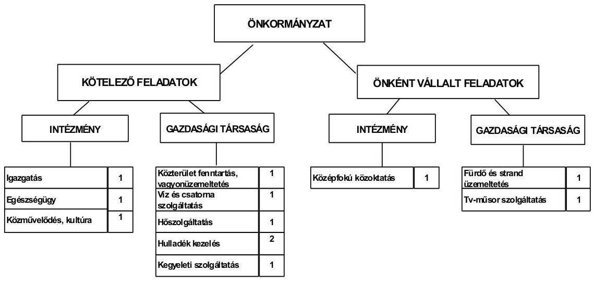

Az Önkormányzat feladatait 2011. június 30-án (a Polgármesteri hivatallal együtt) négy költségvetési szervvel, nyolc gazdasági társasággal és a Többcélú társulás tagjaként látta el. Az Önkormányzat két - 2010. évig három - gazdasági társaságban kizárólagos tulajdonnal, kettő társaságban 50% alatti tulajdoni részesedéssel rendelkezik, négy a feladatellátásban résztvevő gazdasági társaságban tulajdoni részesedéssel nem rendelkezik. A gazdasági társaságok a közterület fenntartás, hulladékkezelés, vagyonüzemeltetési feladatok, fizető parkolók, fürdőüzemeltetés, kábel-tv szolgáltatás, távhőszolgáltatás, a víz- és szennyvízkezelés, valamint a kegyeleti szolgáltatás területén kaptak szerepet az Önkormányzat feladatellátásában. Az önként vállalt feladatok közül a fürdőüzemeltetés az Önkormányzat pénzügyi egyensúlyi helyzetére negatívan hatott.

[^0]
[^0]:    ${ }^{7}$ A működési kiadások összege eltér az Önkormányzat beszámolójában szereplő költségvetési működési kiadás értékétől, mert nem tartalmazza az egészségügyi ellátást ellátó intézmény, illetve a kisebbségi önkormányzatok adatait, valamint az Önkormányzat finanszírozási célú pénzügyi műveleteit.

---

Az Önkormányzat 2007. és 2010. évi működési kiadásai finanszírozásának forrásösszetételét ágazatonként a következő ábra szemlélteti:
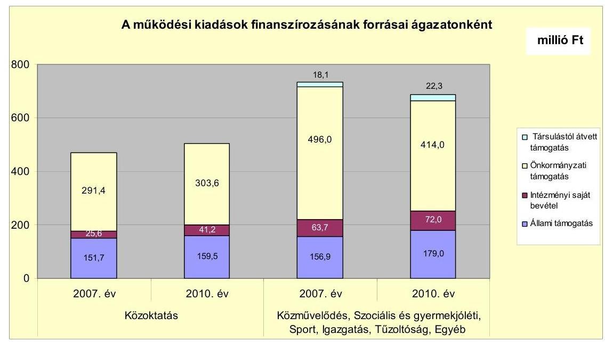

Az Önkormányzat működési kiadásai tartalmazták a Többcélú társulás felé közoktatási, valamint szociális és gyermekjóléti feladatok végzéséhez teljesített kifizetéseket. A feladatok végzéséhez a Többcélú társulás igényelte az állami hozzájárulásokat, így ezek az Önkormányzat bevételei között nem jelennek meg. Ezért magas (átlagosan 61,2%) az önkormányzati támogatás részaránya. A feladatok finanszírozása a vizsgált időszakban emellett átlagosan 27,6%-ban állami hozzájárulásból, 9,3%-ban intézményi saját bevételből és 1,9%-ban társulástól átvett támogatásból történt.

Az Önkormányzat működési jövedelme a 2007-2009. években működési többletet, a 2010. évben működési forráshiányt mutatott.
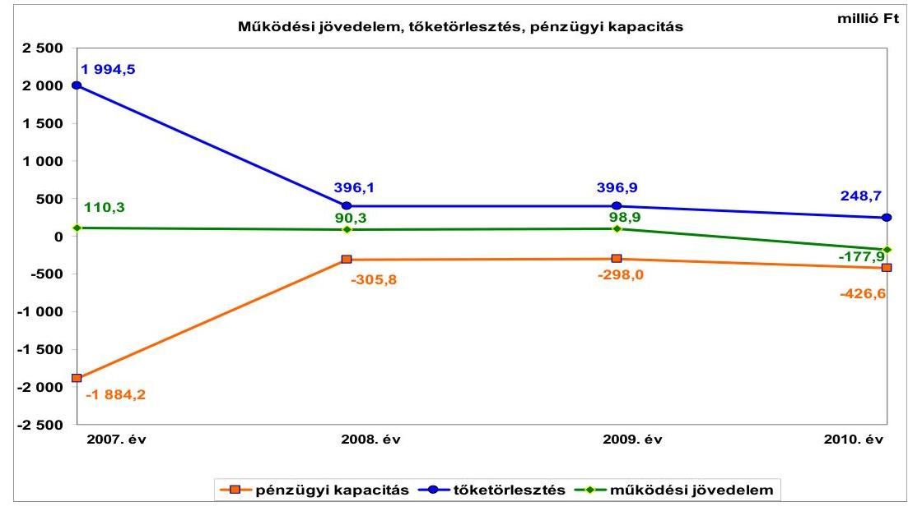

---

A működési jövedelem egyenlegének 2010. évi hiányát elsősorban saját működési bevételek, ezen belül a helyi adóbevételek, továbbá a költségvetési támogatások előző évhez viszonyított csökkenése, valamint a transzferkiadások növekedése okozta. A teljesített transzferkiadásokon belül jelentős volt az Önkormányzat - fürdőüzemeltetést végző - gazdasági társaságának kötvénykibocsátásához kapcsolódó kezességvállalás beváltásából adódó 111,5 millió Ft kifizetés.

Az Önkormányzat pénzügyi kapacitása a 2008-2009. években növekedett, azt követően csökkent az előző évhez viszonyítva, mindemellett folyamatosan negatív értéket mutatott. Az Önkormányzat nettó működési jövedelmének 2007. évi kiugróan alacsony értéke a fürdő beruházáshoz kapcsolódó - tagi kölcsön nyújtásához felvett - 1510,0 millió Ft összegű hosszú lejáratú hitel visszafizetéséből adódott. A törlesztés forrásául a fürdőüzemeltetést végző gazdasági társaság - önkormányzati kezességvállalással biztosított - kötvénykibocsátása szolgált. Ezt követően a pénzügyi kapacitás javulását a hiteltörlesztés csökkenése eredményezte.

Az Önkormányzat felhalmozási költségvetése egyenlegének alakulását évről évre a következő ábra szemlélteti:
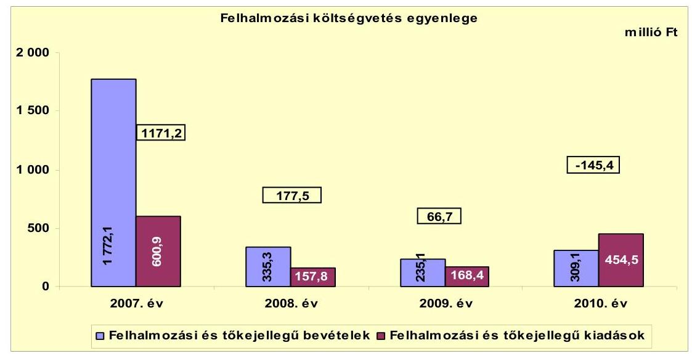

A felhalmozási bevételek (és a forrástöbblet) 2007. évi nagyságát a támogatási kölcsönök államháztartáson kívülről történő visszatérüléséből származó 1546,9 millió Ft eredményezte. Ennek 97,6%-a (1510,0 millió Ft) az Önkormányzat gazdasági társaságának fürdő beruházásához a 2004. évben biztosított felhalmozási célú tagi kölcsön visszatérüléséből adódott. A felhalmozási költségvetés egyenlegének alakulására hatással voltak az államháztartáson kívülre adott felhalmozási pénzeszközök is. A 2007., 2009-2010. években az államháztartáson kívülre, felhalmozási céllal teljesített 545,7 millió Ft kiadás 82,7%-a (451,2 millió Ft) az Önkormányzat fürdőüzemeltetést végző gazdasági társaságának nyújtott tagi kölcsönök összegéből adódott.

Az Önkormányzat realizált folyó bevétele a 2010. évben a 2007-2009. évek átlagához viszonyítva 153,1 millió Ft-tal (10,0%-kal) 1380,5 millió Ft-ra csökkent. Az Önkormányzatnak a 2011. év I. félévben - időarányosan számítva - a 2010. évihez hasonló nagyságú folyó bevétele keletkezett. A folyó bevételeken belül a helyi adóbevétel jelentős részét képező iparűzési adóból származó bevétel folyamatosan csökkent. Az Önkormányzat által realizált iparűzési adóbevételének jelentős része egy, az autóiparban érdekelt gazdasági társaságtól származott. A vállalkozás által 2010. évben fizetett iparűzési adó összességében 9,5%-kal (41,5 millió Ft-tal) volt kevesebb a 2007. évi 437,1 millió Ft-nál a gazdasági válság miatt. Ez a helyi iparűzési adóbevétel magas aránya miatt az Önkormányzat pénzügyi egyensúlyi helyzetére kockázatot jelentett.

Az Önkormányzat folyó kiadásainak mintegy 70%-a a kiemelt (személyi, dologi) működési előirányzatok teljesítéséhez kapcsolódott. Az Önkormányzat átlagosan a folyó kiadások 38,7%-át személyi juttatásokra és a munkaadókat terhelő járulékokra fordította. Az üzemeltetést, intézményfenntartást biztosító dologi kiadások folyó kiadásokhoz viszonyított aránya átlagosan 27,7% volt a vizsgált években.

Az Önkormányzat pénzügyi egyensúlyi helyzetének alakulását jelentősen befolyásolta az elmúlt időszaki fejlesztési tevékenységének finanszírozási igénye. A felújítások forrását 15,9%-ban hitel (18 millió Ft), 43,5%-ban támogatás (49,2 millió Ft), 40,6%-ban saját bevétel (45,8 millió Ft) képezte. A befejezett beruházások 13,4%-ban hitelből (95,8 millió Ft), 52,4%-ban támogatásokból (373,4 millió Ft), és 34,2%-ban saját bevételekből (244,2 millió Ft) fedezték. A vizsgált időszakban az Önkormányzat legmagasabb bekerülési költségű beruházása a St. Gotthard Spa & Wellnes fürdő szabadtéri fejlesztésének munkái voltak, amelyet 100%-ban hazai támogatásból finanszíroztak. A megvalósult felújítások, beruházások finanszírozásának magas, 290,0 millió Ft önerő szükséglete (35,1%) az Önkormányzat pénzügyi egyensúlyi helyzetére negatív hatással volt.

Az Önkormányzat 2010. december 31-én folyamatban lévő fejlesztéseihez 2007-2010. között 3,7 millió Ft kiadást teljesítettek, a 2010. évet követően esedékes kötelezettségvállalásainak összege 95,8 millió Ft, melynek 79,0%-át EU-s támogatásból (75,7 millió Ft), és 21,0%-át saját bevételből (20,1 millió Ft) tervezik finanszírozni. Az EU-s támogatásból megvalósítandó fejlesztések
 előfinanszírozásához, valamint az önerőhöz szükséges saját források, az állandósuló folyószámlahitel következtében, rövid távon nem biztosítottak.

Az Önkormányzat a 2011. évben egy fejlesztést valósított meg 7,7 millió Ft értékben, amelyet hazai támogatásból finanszíroztak. Az Önkormányzat által beadott, elbírálás alatt álló pályázatok tervezett teljes bekerülési költsége 22,5 millió Ft volt, amelyet 4,5 millió Ft (20,0%) saját bevételből, és 18,0 millió Ft (80,0%) hazai támogatásból terveznek biztosítani.

Az Önkormányzat feladatellátásában résztvevő gazdasági társaságok közül működési pénzeszközátadásban, szerződés alapján 2007-ben egy gazdasági társaság részesült ötmillió Ft összegben. Az Önkormányzat az ellenőrzött időszakban két gazdasági társasága részére, megállapodások alapján - tagi kölcsönön kívül - összesen 91,5 millió Ft fejlesztési célú pénzeszközt adott át.

---

Az Önkormányzat mérleg szerinti pénzintézeti kötelezettsége a 2006. év végéről a 2011. év I. félév végére 1683,1 millió Ft-ról 251,7 millió Ft-ra (1431,4 millió Ft-tal) csökkent. A 2011. év I. félév végén fennálló pénzintézeti kötelezettségek egy hosszú lejáratú hitelből, valamint folyószámlahitelből keletkeztek. Az Önkormányzat az elfogadott 2011. évi költségvetési rendelete alapján további hitel felvételét nem tervezte.

A Képviselő-testület hitelfelvételre vonatkozó döntéseit megalapozó előterjesztések nem tartalmazták a kamat- és a deviza alapú kötelezettségeket érintő árfolyamkockázatot, a kötelezettségvállalás visszafizetési forrásainak, valamint - a teljes futamidőre - a várható kamat- és tőkefizetési kötelezettségeinek a bemutatását.

Az Önkormányzat működésének pénzügyi egyensúlyát a vizsgált időszakban folyószámla- és munkabér-megelőlegezési hitel és négy alkalommal összesen 131,0 millió Ft összegű rövid lejáratú hitel igénybevételével tudta biztosítani, az utóbbiakat 2007. június 4-e és 2008. december 22-e között vette fel és 2007. szeptember 17-e és 2009. április 30-a között fizetett vissza. Az Önkormányzat a fejlesztések forrásául 2004-2008. évek között öt hosszú lejáratú hitelt vett igénybe, 1936,2 millió Ft összeggel, amelyek közül a 2009. év végéig négy hosszú lejáratú hitelt (1905,7 millió Ft) visszafizetett.

A folyószámla- és munkabér-megelőlegezési hitel igénybevétele a 2007-2011. év I. félévében az alábbiak szerint alakult:

| Megnevezés | 2007. év | 2008. év | 2009. év | 2010. év | 2011. 1. félév |
| :-- | :--: | :--: | :--: | :--: | :--: |
| Folyószámlahitel |  |  |  |  |  |
| Keretösszeg január 1-jén (millió Ft-ban) | 300,0 | 320,0 | 300,0 | 275,0 | 275,0 |
| Átlagos napi állomány (millió Ft-ban) | 266,2 | 266,6 | 219,0 | 231,1 | 213,0 |
| Folyószámla hitellel zárt napok száma (napi) | 365,0 | 366,0 | 357,0 | 364,0 | 181,0 |
| Egyenleg (időszak végi állomány) | 318,5 | 297,4 | 245,6 | 273,0 | 236,4 |
| Munkabér-megelőlegezési hitel |  |  |  |  |  |
| Keretösszeg január 1-jén (millió Ft-ban) | 35,0 | 37,0 | 20,0 | 25,0 | 25,0 |
| Átlagos napi állomány (millió Ft-ban) | 12,6 | 11,1 | 8,7 | 8,3 | 6,7 |
| Munkabér-megelőlegezési hitellel zárt napok   száma (napi) | 21,0 | 32,0 | 28,0 | 69,0 | 4,0 |
| Egyenleg (időszak végi állomány) | 0,0 | 0,0 | 0,0 | 0,0 | 0,0 |

A folyószámlahitel tartóssá válására - a folyó bevételek csökkenése mellett - a Gotthárd-Therm Kft.-nek nyújtott - összesen 526,7 millió Ft - tagi kölcsön és az érvényesített önkormányzati kezességvállalásból eredő 111,5 millió Ft összegű kezességbeváltás is hatással volt. A folyószámla- és a munkabér-megelőlegezési hitelekből eredő likviditás biztosítása az Önkormányzatnak 102,2 millió Ft kamatkiadást és 3,7 millió Ft egyéb költséget jelentett. A fejlesztési feladatok biztosítására felvett négy rövid lejáratú hitel után az Önkormányzat 2,4 millió Ft kamatot és 2,2 millió Ft kezelési költséget fizetett. Az Önkormányzat 2011. év I. félév végi szállítói tartozása 19,0 millió Ft, melyből lejárt tartozás 0,1 millió Ft volt. Az Önkormányzat gazdasági társaságai részére a fejlesztési és egyéb hitelek igénybevételéhez készfizető kezességet vállalt 120,2 millió Ft és 14351,8 ezer CHF összegben.

Az Önkormányzati Közszolgáltató Vállalat esetében 70,2 millió Ft és 71,7 ezer CHF összegű hitelre, a Gotthárd-Therm Kft. esetében 14 280,1 ezer CHF alapú kötvénykibocsátásra, a Régióhő Kft. esetében 20 millió Ft értékű hitelre és a

---

Szentgotthárd Városi Televízió és Kábelüzemeltető Nonprofit Kft. esetében 30 millió Ft folyószámlahitelre vállalt kezességet az Önkormányzat, mint tulajdonos.
2011. június 30-án kezességgel kapcsolatos kötelezettség 12,4 millió Ft és 13 896,3 ezer CHF volt. A 2011. évben a Gotthárd-Therm Kft. a kötvénykibocsátásból származó kötelezettségeinek nem tudott eleget tenni, ezért a bank a kezességvállalást érvényesítette 111,5 millió Ft értékben. Az önként vállalt feladatot ellátó gazdasági társaság kötvény kibocsátásához nyújtott önkormányzati kezességvállalás, valamint a kezességbeváltás veszélyezteti az önkormányzat kötelező feladatainak ellátását. Az Önkormányzat 2007-2010. években a Gotthárd-Therm Kft. részére 6 alkalommal összesen 526,7 millió Ft összegben (négy alkalommal, összesen 176,8 millió Ft összegben a működés zavartalan biztosítására, egy esetben 22,7 millió Ft összegben a kötvénykibocsátás kamatainak kifizetéséhez és egy esetben 327,2 millió Ft összegben beruházásra) nyújtott tagi kölcsönt, amelyekből a 2007. évben összesen 364,0 millió Ft visszafizetése került a kötvényértékesítés bevételéből.

Az Önkormányzat kötelezettségeinek 2010. december 31-i, valamint 2011. június 30-i állományát és várható alakulását a kötelezettségek lejáratáig a következő táblázat szemlélteti:

| Megnevezés | Állomány 2010. december 31   én |  |  | Állomány 2011. június 30-án |  |  | Várható kötelezettség 2011. 2013. években |  | Várható kötelezettség 2014. évtől |  |
| :--: | :--: | :--: | :--: | :--: | :--: | :--: | :--: | :--: | :--: | :--: |
|  | HUF-ban   (millió Ftban) | Devizában (összege, ezer) CHF-ben) | Devizis   nem | HUF-ban   (millió Ftban) | Devizában (összege, ezer CHFben) | Devizis   nem | HUF-ban (millió Ftban) | Devizában (összege, ezer ezer CHF-ben) | HUFban (millió Ft-ban) | Devizában (összege, ezer ezer CHF-ben) |
| Pénzintézeti kötelezettségek |  |  |  |  |  |  |  |  |  |  |
| Azuny J. Ált. Isk. villanyhálózat felújítás | 18,3 |  | HUF | 15,7 |  | HUF | 11,7 |  | 10,3 |  |
| Folyószámla és munkabérmégelőlegezési hitel | 273,0 |  | HUF | 236,0 |  | HUF |  |  | 0,0 |  |
| Pénzintézeti kötelezettségek összesen HUF-ban: | 291,3 |  | HUF | 251,7 |  | HUF | 11,7 |  | 10,3 |  |
| Biztosítékok |  |  |  |  |  |  |  |  |  |  |
| Önkormányzati Köszolgáltató Vállalat 14/1/1 beruh | 3,3 |  | HUF | 2,9 |  | HUF |  |  |  |  |
| Önkormányzati Köszolgáltató Vállalat 14/1/3 beruh | 1,9 |  | HUF | 1,9 |  | HUF |  |  |  |  |
| Önkormányzati Köszolgáltató Vállalat 14/1/2 beruh |  | 42,4 | CHF |  | 36,0 | CHF |  |  |  |  |
| Önkormányzati Köszolgáltató Vállalat Folyószámla | 5,6 |  | HUF | 7,6 |  | HUF |  |  |  |  |
| Régióhő Kft. | 9,5 |  | HUF | 0,0 |  | HUF |  |  |  |  |
| Gotthárd Therm Kft. |  | 13860,5 | CHF |  | 13860,5 | CHF |  | 2164,0 |  | 14545,6 |
| Biztosítékok összesen HUFban: | 20,3 |  | HUF | 12,4 |  | HUF |  |  |  |  |
| Biztosítékok összesen CHFben: |  | 13 902,7 | CHF |  | 13 896,3 | CHF |  | 2164,0 |  | 14545,6 |
| Gúing kötelezettségek | 0,5 |  | HUF | 0,1 |  | HUF | 0,5 |  |  |  |
| Szállítói tartozás | 15,0 |  | HUF | 19,0 |  | HUF | 19,0 |  |  |  |
| Egyéb kötelezettségek HUFban: | 15,5 |  | HUF | 19,1 |  | HUF | 19,1 |  |  |  |
| Összes kötelezettség HUFban: | 327,1 |  | HUF | 283,2 |  | HUF | 266,8 |  | 10,3 |  |
| Összes kötelezettség CHFben: |  | 13 902,7 | CHF |  | 13 896,3 | CHF |  | 2164,0 |  | 14545,6 |

Az Önkormányzatnak pénzintézetekkel szemben fennálló kötelezettsége a 2011. év I. félév végén 251,7 millió Ft volt. Ezek várható kötelezettsége (tőke, kamat és egyéb költség) a legutóbbi kamatfizetés feltételei alapján a 2011-2013. években 11,7 millió Ft. Az Önkormányzatnak a 2011. évben szállítói tartozások címén 19,0 millió fizetési kötelezettsége keletkezett. A 2011-2013.

---

évek kötelezettségeinek teljesítésére figyelembe vehető 267,1 millió Ft mérlegben kimutatott követelésállomány és a forgalomképes nettó ingatlanvagyon. Az Önkormányzat 2010. év végén szabad pénzmaradvánnyal nem rendelkezett. A 2014. évet követően jelenleg ismert pénzintézeti kötelezettsége 10,3 millió Ft, amelynek fedezete a saját bevételekből biztosított.

A Gotthárd-Therm Kft. által - a fürdő fejlesztés megvalósításához - kibocsátott kötvényhez kapcsolódó - 2011. június 30-án fennálló - 13 860,3 ezer CHF összegű önkormányzati kezességvállalás az Önkormányzat szempontjából rövid és hosszú távon is pénzügyi kockázatot jelent. A Gotthárd Therm Kft. részére adott készfizető kezességvállalással az Önkormányzat megsértette az Ötv. 80. § (3) bekezdésében előírtakat, amely szerint az önkormányzat olyan vállalkozásban vehet részt, amelyben felelőssége nem haladja meg vagyoni hozzájárulásának (140,0 millió Ft) mértékét. A kötvény tőketörlesztése a 2012. évben kezdődik 462680 CHF összeggel. A társaság nem fizetése esetén a bank az esedékes kamat, illetve - a tőketörlesztés 2012. évi megkezdését követően - a tőketörlesztő-részlet összegét azonnali beszedési megbízással az Önkormányzat bankszámlájáról a Ptk. 272. §-a alapján lehívhatja, ezzel az Önkormányzatot fizetésképtelen helyzetbe hozhatja, veszélyeztetve az önkormányzati kötelező és egyéb önként vállalt feladatok finanszírozását.

Az Önkormányzat kizárólagos tulajdonú társaságai kötelezettségeinek 2010. december 31-ei, valamint 2011. június 30-i állományát és várható alakulását a következő táblázat mutatja be:

| Megnevezés | Állomány 2010. december 31-én |  |  |

 Állomány 2011. június 30-án |  |  | Várható kötelezettség 2011-2013. években |  | Várható kötelezettség 2014. évtől |  |
| :--: | :--: | :--: | :--: | :--: | :--: | :--: | :--: | :--: | :--: | :--: |
|  | HUF-ban   (millió Ft   ban) | Devizában (összege, ezer CHFben) | Deviza nem | HUF-ban   (millió Ft   ban) | Devizában (összege, ezer CHFben) | Deviza   nem | HUF-ban (millió Ft-ban) | Devizában (összege, ezer CHFben) | HUF-ban (millió Ft-ban) | Devizában (összege, ezer CHFben) |
| Önkormányzati Közigáltató Vállalat 14/1/1 beruh | 3,3 |  | HUF | 2,9 |  | HUF | 3,2 |  | 12,2 |  |
| Önkormányzati Közigáltató Vállalat 14/1/3 beruh | 1,9 |  | HUF | 1,9 |  | HUF | 1,6 |  | 0,0 |  |
| Önkormányzati Közigáltató Vállalat 14/1/2 beruh |  | 42,4 | CHF |  | 36,0 | CHF |  | 40,1 |  | 6,2 |
| Önkormányzati Közigáltató Vállalat Folyószámla | 5,6 |  | HUF | 7,6 |  | HUF |  |  |  |  |
| Gotthárd Therm Kft |  | 13860,3 | CHF |  | 13860,3 | CHF |  | 2164,0 |  | 14 545,6 |
| Pénzintézeti kötelezettségek összesen HUF-ban: | 10,8 |  | HUF | 12,4 |  | HUF | 4,8 |  | 12,2 |  |
| Pénzintézeti kötelezettségek összesen CHF-ben: |  | 13 902,7 | CHF |  | 13 896,3 | CHF |  | 2 204,1 |  | 14 551,8 |
| Önkormányzati Közigáltató Vállalat | 2,3 |  | HUF | 2,1 |  | HUF | 2,1 |  |  |  |
| Gotthárd Therm Kft | 25,6 |  | HUF | 31,0 |  | HUF | 31,0 |  |  |  |
| Szállítói tartozás összesen: | 27,9 | 0,0 | HUF | 33,1 | 0,0 | HUF | 33,1 | 0,0 | 0,0 | 0,0 |
| Összes kötelezettség HUF-ban: | 38,7 | 0,0 | HUF | 45,5 | 0,0 | HUF | 35,8 | 0,0 | 12,2 | 0,0 |
| Összes kötelezettség CHF | 0,0 | 13 902,7 | CHF | 0,0 | 13 896,3 | CHF | 0,0 | 2 204,1 | 0,0 | 14 551,8 |

Az önkormányzati kötelezettségek csökkenése ellenére az Önkormányzat kizárólagos tulajdonában lévő gazdasági társaságok kötelezettségei kedvezőtlenül befolyásolják az Önkormányzat pénzügyi egyensúlyi helyzetét. A társaságoknak a 2011-2013. évek között 4,8 millió Ft és 2204,1 ezer CHF, majd a 2014. évet követően 12,2 millió Ft és 14551,8 ezer CHF pénzintézeti kötelezettség-tartozást kell rendezniük. A gazdasági társaságok 2011. június 30-án fennálló 33,1 millió Ft összegű szállítói, 12,4 millió Ft és 13 896,3 ezer CHF hiteltartozása, valamint 5,1 millió Ft peres eljárásból eredő kötelezettségei az Önkormányzat számára helytállási kötelezettséget jelenthetnek.

A vizsgált időszakban nem történt meg annak felmérése, és a Képviselőtestületnek előterjesztett zárszámadási rendeletekben történő bemutatása, hogy az eszközök elhasználódása, amortizációja fedezetének biztosítása mekkora forrásokat igényel az Önkormányzatnál. Az elhasználódott eszközök pótlására az Önkormányzat tartalékot nem képzett, külön alapot nem hozott létre. A 2007-2010. években a tárgyi eszközök után 840,3 millió Ft összegű értékcsökkenést számoltak el, ugyanezen időszak alatt felújításra 85,1 millió Ft-ot, beruházásra 561,9 millió Ft-ot fordítottak.

A 2007-2011. év I. féléve között tett intézkedések hatására 724,1 millió Ft bevételi többletet, továbbá 33,9 millió Ft kiadási megtakarítást mutattak ki az Önkormányzatnál. A kiadási megtakarítások 44,9%-a az elrendelt álláshelycsökkentések eredménye. Az álláshelycsökkentő intézkedések 2007-2011. év I. féléve között önkormányzati szinten összesen 12 álláshely megszüntetését jelentették. A bevételnövelő intézkedések között szerepelt új helyi adónem, a telekadó bevezetése, a helyi adók mértékének növelése és a kedvezmények csökkentése, az ingatlanok és a Városi Televízió Kft.-ben lévő tulajdonrész értékesítése és a lejárt tartozások behajtása. A megtett intézkedések nem biztosítanak elegendő forrást a pénzügyi egyensúly helyreállításához.

Az utóellenőrzés a pénzügyi egyensúly javítására tett egy szabályszerűségi javaslat hasznosítására terjedt ki, amelyet teljesítettek.

Az Önkormányzat pénzügyi egyensúlyi helyzetét összegezve a következők emelhetők ki:

Szentgotthárd Város Önkormányzatának pénzügyi egyensúlyi helyzete rövid távon veszélyeztetett.

Működését állandósult folyószámla- és munkabér-megelőlegezési hitel igénybevételével tudta biztosítani.

A 2007-2010. években a folyó bevételek nem nyújtottak fedezetet a folyó kiadásokra és az adósságszolgálatra. Az Önkormányzat által tett kiadáscsökkentő és bevételnövelő intézkedések nem biztosítanak elegendő forrást a pénzügyi egyensúly helyreállításához.

A működési kockázatot növeli az egy adózótól való bevételi kitettség.
A Gotthárd-Therm Kft. lejárt szállítói tartozás állománya, a részére adott tagi kölcsön, a kötvény kibocsátásához nyújtott önkormányzati kezességvállalás, valamint a kezességvállalás veszélyezteti az önkormányzat kötelező feladatainak ellátását.

---

A folyamatban lévő fejlesztésekhez vállalt önerő és az európai uniós támogatások előfinanszírozásához források nem állnak rendelkezésre. Ezeket az Önkormányzat folyószámlahitelből tervezi finanszírozni, amely felhalmozási kockázatot hordoz.

Az Önkormányzat hosszú lejárú fejlesztési hitele nem befolyásolja a pénzügyi egyensúlyi helyzetet.

Az Önkormányzat kizárólagos tulajdonú gazdasági társaságai szállítói és hiteltartozása, peres eljárásból eredő kötelezettsége az Önkormányzat számára helytállási kötelezettséget jelenthetnek.

Az Állami Számvevőszékről szóló 2011. évi LXVI. törvény 33. § (1) bekezdésében foglaltak értelmében a jelentésben foglalt megállapításokhoz kapcsolódó intézkedési tervet köteles az ellenőrzött szervezet vezetője összeállítani és azt a jelentés kézhezvételétől számított harminc napon belül az ÁSZ részére megküldeni. Amennyiben az intézkedési tervet határidőben nem küldi meg a szervezet, vagy az továbbra sem elfogadható, az ÁSZ elnöke a hivatkozott törvény 33. (3) bekezdés a)-b) pontjaiban foglaltakat érvényesítheti.

# A 2011. június 30-i pénzügyi egyensúlyi helyzet alapján az ellenőrzés intézkedést igénylő megállapításai és javaslatai a következők: 

## a Polgármesternek

1. Az Önkormányzat pénzügyi egyensúlyi helyzete rövid távon veszélyeztetett. Az Önkormányzat nettó működési jövedelme a vizsgált időszakban negatív volt. A folyamatban lévő fejlesztésekhez vállalt önerő és az európai uniós támogatások előfinanszírozásához források nem állnak rendelkezésre. Az Önkormányzat finanszírozásában a folyószámla- és munkabér-megelőlegezési hitel állandósult. Az Önkormányzat által tett kiadáscsökkentő és bevételnövelő intézkedések nem biztosítanak elegendő forrást a pénzügyi egyensúly helyreállításához. Az Önkormányzat pénzügyi egyensúlyának fenntarthatóságára hosszú távon kihatással lehet az önként vállalt feladatokra fordított működési kiadások nagysága. Az önként vállalt feladatot ellátó gazdasági társasága kötvénykibocsátásához kapcsolódó önkormányzati kezességvállalás, valamint a gazdasági társaság veszteséges gazdálkodása már rövid távon is veszélyezteti az Önkormányzat pénzügyi egyensúlyát, a kötelező feladatok ellátását. Az Önkormányzat kizárólagos tulajdonában lévő gazdasági társaságok 2011. június 30-án fennálló 33,1 millió Ft összegű szállítói, 12,4 millió Ft és 13 896,3 ezer CHF hiteltartozása, valamint 5,1 millió Ft peres eljárásból eredő kötelezettségei az Önkormányzat számára helytállási kötelezettséget jelenthetnek.

Javaslat:
Az Önkormányzat pénzügyi egyensúlyának gyors helyreállítása és hosszú távú fenntarthatósága érdekében kezdeményezze - felelősök és határidők megjelölésével - az alábbi intézkedések megtételét:
a) tárja fel a bevételszerző és kiadáscsökkentő lehetőségeket. Intézkedjen a bevételek növelésére, a kintlévőségek behajtására, a kiadások csökkentésére;

---

b) vizsgálja meg az állandósult folyószámla- és likvid hitel hosszú távú kötelezettséggé történő átalakításának jogi lehetőségét, és a Stabilitási törvény 10. §-ában előírt feltételek fennállása esetén kezdeményezze a Kormánynál ennek engedélyezését;
c) képezzen egyensúlyi (elkülönített) tartalékot az adósságszolgálat teljesítése érdekében;
d) tekintse át az önként vállalt feladatok finanszírozhatóságát a kötelező feladatellátás elsődlegességének biztosítása érdekében, mutassa be a Képviselő-testületnek a megoldás lehetőségeit, és szükség esetén a gazdasági program módosításának igényét;
e) kísérje folyamatosan figyelemmel a kizárólagos tulajdonában lévő gazdasági társaságok kötelezettségeinek alakulását, az Önkormányzat likviditására, pénzügyi egyensúlyi helyzetére gyakorolt hatását. Terjesszen intézkedési tervet a Képviselő-testület elé a kizárólagos tulajdonú gazdasági társaságok pénzügyi helyzetének stabilizálása érdekében;
f) mérje fel a folyamatban lévő beruházásokkal kapcsolatos kötelezettségek átütemezésének pénzügyi és jogi lehetőségeit illetve hatásait. Szükség esetén kezdeményezze a támogató szervezetnél annak átütemezését;
g) mutassa be a Képviselő-testületnek havonta legalább három évre kitekintően a kötelezettségeinek finanszírozási forrásait.
2. A vizsgált időszakban nem történt meg annak felmérése és a Képviselő-testületnek előterjesztett zárszámadási rendeletekben történő bemutatása, hogy az eszközök elhasználódása, amortizációja fedezetének biztosítása mekkora forrásokat igényel az Önkormányzatnál.

Javaslat:
Mutassa be a Képviselő-testületnek évente a zárszámadási rendelet előterjesztésében az értékcsökkenés összegét, és ezzel összevetve az elhasználódott eszközök pótlására fordított tényleges kiadásokat, az eszközök elhasználódási fokának alakulását.
3. A Gotthárd-Therm Kft. által - a fürdő fejlesztés megvalósításához - kibocsátott kötvényhez kapcsolódó - 2011. június 30-án fennálló - 13 860,3 ezer CHF összegű önkormányzati kezességvállalás az Önkormányzat szempontjából rövid és hosszú távon is pénzügyi kockázatot jelent. A kötvény tőketörlesztése a 2012. évben kezdődik 462680 CHF összeggel. A társaság nem fizetése esetén a bank az esedékes kamat, illetve - a tőketörlesztés 2012. évi megkezdését követően - a tőketörlesztő-részlet összegét azonnali beszedési megbízással az Önkormányzat bankszámlájáról a Ptk. 272. §-a alapján lehívhatja, ezzel az Önkormányzatot fizetésképtelen helyzetbe hozhatja, veszélyeztetve az önkormányzati kötelezően ellátandó feladatok finanszírozását. A folyószámlahitel tartóssá válásához a folyó bevételek csökkenése mellett a Gotthárd-Therm Kft.-nek nyújtott tagi kölcsön és az érvényesített kezességvállalás is jelentősen hozzájárult. Az önként vállalt feladatot ellátó gazdasági társaság kötvény kibocsátásához nyújtott önkormányzati kezességvállalás, valamint a kezességvállalás veszélyezteti az Önkormányzat kötelező feladatainak ellátását.

---

Javaslat:
Intézkedjen a Gotthárd-Therm Kft. részére adott készfizető kezességvállalással történt túlterjeszkedés kapcsán - az Ötv. 80. § (3) bekezdésében előírtak be nem tartása miatt, amely szerint az önkormányzat olyan vállalkozásban vehet részt, amelyben felelőssége nem haladja meg vagyoni hozzájárulásának mértékét - a személyes felelősség kivizsgálása iránt. Gondoskodjon, hogy a 2012. január 1-jét követően a nemzeti vagyonról szóló 2011. évi CXCVI. törvény 9. § (2) bekezdés előírása szerint az önkormányzat olyan vállalkozásban vegyen részt, amelyben felelőssége nem haladja meg vagyoni hozzájárulásának mértékét.

# a Jegyzõnek 

A Képviselő-testület hitelfelvételre vonatkozó döntéseit megalapozó előterjesztések nem tartalmazták a kamat- és - a deviza alapú kötelezettségeket érintő - árfolyamkockázatot, a kötelezettségvállalás visszafizetési forrásainak, valamint a teljes futamidőre a várható kamat- és tőkefizetési kötelezettségeinek a bemutatását.

Javaslat:
Gondoskodjon, hogy a jövőben az adósságot keletkeztető kötelezettségvállalásokról szóló képviselő-testületi előterjesztések tételesen tartalmazzák a visszafizetés forrásait, valamint mutassák be a kamat- és árfolyamkockázat várható kihatásait. Kísérje figyelemmel a jövőbeni várható árfolyam, kamat, valamint visszafizetési, kezességvállalás kockázatait, és legalább félévente tájékoztassa a Képviselő-testületet a teljes futamidőre várható kamat- és tőkefizetési kötelezettség alakulásáról.

A polgármester a helyszíni ellenőrzés lezárása után tájékoztatta az Állami Számvevőszéket az Önkormányzat megtett intézkedéseiről, amelyet az Állami Számvevőszék nem ellenőrzött, arra vonatkozóan véleményt vagy megállapítást nem fogalmaz meg. Az
 ellenőrzés lezárását követően elvégzett intézkedéseket az Állami Számvevőszék utóellenőrzés keretében vizsgálhatja.

A polgármester tájékoztatása szerint a következő intézkedéseket tette:

- a 2012. évi költségvetés készítése során a tervezett hiány összegét a korábbi éveknél kisebb összegben, 206,0 millió Ft-ban határozták meg;
- a kiadások csökkentése, a bevételek növelése, valamint a kötelezettségek alakulásának figyelemmel kísérésére érdekében továbbra is beszámolási kötelezettséget írt elő az intézmények és a kizárólagos tulajdonában lévő gazdasági társaságok vezetői részére;
- folytatni kell a kiadások csökkentésére eddig tett intézkedéseket;
- tárgyalásokat kell folytatni a Gotthárd I. kötvényt lejegyző bankkal az árfolyamkockázatok csökkentése érdekében,
- a Gotthárd Therm Kft. ügyvezetőjének továbbra is havonta be kell számolni a társaság pénzügyi helyzetéről, a megvalósuló feladatokról, a felmerülő problémákról;
- továbbra is keresni kell a Gotthárd Therm Kft.-ben lévő önkormányzati üzletrész értékesítésének lehetőségét.

---

# II. RÉSZLETES MEGÁLLAPÍTÁSOK 

## 1. Az ÖNKORMÁNYZAT KÖTELEZŐ ÉS ÖNKÉNT VÁLLALT FELADATAI, A FELADATELLÁTÁS SZERVEZETI KERETEI ÉS ANNAK VÁLTOZÁSAI

Az Önkormányzat SzMSz ${ }_{1,2}$-ében kötelező feladatait az Ötv. által meghatározottnak tekinti, az önként vállalt feladatokat az $\mathrm{SzMSz}_{1,2}$ III. fejezete részletesen taglalta.

Az Önkormányzat - adatszolgáltatása szerint - a 2010. évi költségvetési kiadásainak 73,0\%-át, (869,4 millió Ft-ot) a kötelező, 27,0\%-át (322,2 millió Ft-ot) az önként vállalt feladatok ellátására fordította. Az Önkormányzat önként vállalt feladatai - besorolása alapján - szakorvosi ellátás biztosításához, nevelési tanácsadó, középfokú oktatási intézmény, kollégium, zeneiskola fenntartásához, városi televízió fenntartásához, valamint termálfürdő és élménypark üzemeltetéséhez kapcsolódnak.

Az Önkormányzat adatszolgáltatása szerint a kötelező és önként vállalt feladatok ellátására fordított működési kiadásainak aránya a 2007-2010. évek között számottevően nem változott. A kötelező feladatok kiadásainak aránya a 2007. évben $72,1 \%$, a 2008. évben $74,8 \%$, a 2009. évben $73,9 \%$, a 2010. évben $73,0 \%$, az önként vállalt feladatok kiadásainak aránya a 2007. évben $27,9 \%$, a 2008. évben $25,2 \%$, a 2009. évben $26,1 \%$, a 2010. évben $27,0 \%$ volt. Az Önkormányzat pénzügyi egyensúlyának fenntarthatóságára hosszú távon kihatással lehet az önként vállalt feladatokra fordított működési kiadások nagysága.

A 2010. évi működési kiadások ágazatonkénti megoszlását, és azok finanszírozását az alábbi táblázat mutatja:

| Ellátott feladat | Működési kiadás összesen (millió Ft) | Kötelező feladatok kiadásainak részaránya % | Működési bevétel összesen (millió Ft) | Állami támogatás részaránya % | Intézményi saját bevétel részaránya % | Önkormányzati támogatás részaránya % | Társulástól átvett támogatás részaránya % |
| :--: | :--: | :--: | :--: | :--: | :--: | :--: | :--: |
| Szakközépiskolák, szakképző intézmények | 227,5 | 0,0 | 227,5 | 63,8 | 16,6 | 19,6 | 0,0 |
| Kollégiumok | 23,8 | 0,0 | 23,8 | 59,9 | 14,9 | 25,2 | 0,0 |
| Közművelődési intézmények | 32,4 | 100,0 | 32,4 | 18,3 | 7,1 | 57,0 | 17,6 |
| Polgármesteri hivatal igazgatási kiadásai | 259,7 | 100,0 | 259,7 | 7,3 | 2,5 | 83,9 | 6,3 |
| Polgármesteri hivatalban ellátott egyéb feladatok működési kiadásai | 648,2 | 89,1 | 648,2 | 23,8 | 9,7 | 66,4 | 0,1 |
| Működési kiadások összesen | 1191,6 | 73,0 | 1191,6 | 28,4 | 9,5 | 60,2 | 1,9 |

*A táblázat Polgármesteri hivatalban ellátott egyéb feladatok működési kiadása sora tartalmazza az Önkormányzat által a Többcélú társulás felé közművelődési, illetve szociális és gyermekjóléti feladatok végzéséhez teljesített kifizetéseit.
** A kiadások összesen sora eltér az Önkormányzat beszámolójában szereplő költségvetési működési kiadás értékétől, mert a táblázat nem tartalmazza az egészségügyi ellátást ellátó intézmény, illetve a kisebbségi önkormányzatok adatait, valamint az Önkormányzat finanszírozási célú pénzügyi műveleteit.

---

A 2010. évi működési kiadások a 2007-2009. évek átlagához viszonyítva összeségében $1,1 \%$-kal ( 13,7 millió Ft-tal) csökkentek.

Az Önkormányzatnál a közoktatási feladatokra fordított kiadás részaránya a működési kiadásokon belül a 2010. évben 42,3\% (504,3 millió Ft) volt. Így a közoktatási feladatellátás részaránya a működési kiadásokon belül 2010-ben a 2007-2009. évek részarányának átlagához ( $39 \%$-hoz) képest 3,3 százalékponttal lett magasabb. Összességében a közoktatási feladatellátásra fordított kiadás 34,2 millió Ft-tal ( $7,3 \%$-kal) volt magasabb a 2007-2009. években közoktatási feladatokra fordított kiadások átlagánál, 470,1 millió Ft-nál az ellátottak számának növekedése következtében. A Polgármesteri hivatal igazgatási feladatellátására fordított kiadás részaránya a működési kiadásokon belül a 2010. évben $21,8 \%$ ( 259,7 millió Ft) volt. Ez az arány 4,3 százalékponttal, 55,0 millió Ft-tal alacsonyabb volt a 2007-2009. évek átlagánál, 26,1\%-nál (314,7 millió Ft-nál) a személyi juttatások és a munkaadókat terhelő járulékok csökkenése következtében.

A működési kiadások finanszírozásának forrásösszetételében a vizsgált időszakban nem történt lényegi változás. A 2010. évben a 2007-2009. évek átlagához viszonyítva az állami támogatás részaránya egy százalékponttal, 8,7 millió Ft-tal ( 338,5 millió Ft-ra), az intézményi saját bevételek 0,3 százalékponttal, 2,3 millió Ft-tal ( 113,2 millió Ft-ra), a társulástól átvett támogatás 0,1 százalékponttal, 0,1 millió Ft-tal ( 22,6 millió Ft-ra) növekedett. Az önkormányzati támogatás részaránya 1,4 százalékponttal, 24,7 millió Ft-tal ( 717,3 millió Ft-ra) csökkent az összes működési kiadás csökkenésével párhuzamosan. Összességében a 2010-ben a 2007-2009. évek átlagához képest az állami támogatás részaránya 3,6 százalékponttal, az intézményi saját bevételek részaránya 3,3 százalékponttal, a társulástól átvett támogatás 5,6 százalékponttal lett magasabb, az önkormányzati támogatás részaránya 2,3 százalékponttal lett alacsonyabb.

Az Önkormányzatnál a közoktatási feladatokat a 2010. évben 31,6\%-ban ( 159,5 millió Ft) állami támogatásból, $8,2 \%$-ban ( 41,2 millió Ft) intézményi saját bevételből, $60,2 \%$-ban ( 303,6 millió Ft) önkormányzati támogatásból finanszírozták. A közművelődési feladatoknál a 2010. évben az állami támogatás részaránya $18,3 \%$ ( 5,9 millió Ft), az intézményi saját bevétel részaránya $7,1 \%$ ( 2,3 millió Ft), a társulástól átvett támogatás ${ }^{8}$ részaránya $17,6 \%$ ( 5,7 millió Ft), az önkormányzati támogatás részaránya $57,0 \%$ ( 18,5 millió Ft) volt. A fenti feladatok finanszírozásának forrásösszetételében a vizsgált időszakban nem történt lényegi változás. Az Önkormányzat a szociális és gyermekjóléti feladatokat minden évben 100\%-ban önkormányzati támogatásból finanszírozta.

Az Önkormányzat működési kiadásai tartalmazták a Többcélú társulás felé közoktatási, valamint szociális és gyermekjóléti feladatok végzéséhez teljesített kifizetéseket. Ugyanakkor az Önkormányzat bevételei között a Többcélú társulás által a feladatok végzéséhez igényelt állami hozzájárulások összegei nem jelennek meg. Ezért magas a közoktatási, valamint 100% a szociális és gyermekjóléti feladatok esetében az önkormányzati támogatás részaránya.

[^0]
[^0]:    ${ }^{8}$ Mozgó könyvtári feladatokra.

---

Az Önkormányzat kötelező és önként vállalt feladatai szervezeti kereteiben a vizsgált időszakban nem történt változás. Az Önkormányzat kötelező és önként vállalt feladatait ${ }^{9}$ 2011. június 30 -án a Polgármesteri hivatallal együtt négy önállóan működő és gazdálkodó költségvetési szervvel, nyolc gazdasági társasággal ${ }^{10}$ és a Többcélú társulással végeztette el. A költségvetési intézmények telephelyeinek száma 15 volt. Az intézmények és telephelyeik számában a 2007. évhez képest változás nem volt.

Az Önkormányzat a 2005. évben a Többcélú társulás fenntartásába adta a Szentgotthárdi Integrált Általános Iskola, Gimnázium és Alapfokú Művészetoktatási Intézményt, a Városi Óvodát, a Városi Gondozási Központot, és a Családsegítő és Gyermekjóléti Szolgálatot. Így az Önkormányzat kötelező közoktatási, valamint szociális és gyermekjóléti feladatait a Többcélú társulás végzi.

Kötelező feladatot lát el három költségvetési szerv, alapító okirataik szerint összesen 13 telephelyen működnek. Egészségügyi alapellátási feladatokat egy intézmény hét telephellyel, közművelődési, kulturális feladatokat öt telephelyen egy intézmény végez (könyvtár) ${ }^{11}$. Igazgatási feladatokat a Polgármesteri hivatal végez.

A kötelező feladatainak ellátásában részt vesz hat gazdasági társaság, amelyek közül egynek kizárólagos tulajdonosa az Önkormányzat. A kizárólagos tulajdonú gazdasági társaság ${ }^{12}$ közterület fenntartást, hulladékkezelést, vagyonüzemeltetési feladatokat és fizető parkolók üzemeltetését végzi. A kegyeleti közszolgáltatást, a települési folyékony hulladékkezelést, a szilárd hulladékszállítást szerződések alapján végző három gazdasági társaságban az Önkormányzat tulajdoni részesedéssel nem rendelkezik. A víz- és csatornaszolgáltatási feladatokat egy, az Önkormányzat 4,6\%-os tulajdoni részesedésű, a hőszolgáltatást egy, az Önkormányzat 31,1\%-os tulajdoni részesedésű gazdasági társasága végezte.

Az Önkormányzat önként vállalt feladatainak ellátásában két intézménye vesz részt. Egészségügyi szakellátási feladatokat egy - kötelező feladatokat is ellátó - intézményben végeztek. Az Önkormányzat középfokú közoktatási feladatait egy intézmény (szakképző iskola és kollégium) látja el két telephellyel. Az önként vállalt középfokú (gimnázium), illetve zeneiskolai oktatást a Többcélú társulás végzi. Saját gazdasági társaságai közül 2010. év végéig kettő, azt követően egy látott el önként vállalt feladatokat. Az Önkormányzat önként vállalt feladatai közül a televízió műsorszolgáltatást egy gazdasági társaság ${ }^{13}$ végezte.

[^0]
[^0]:    ${ }^{9}$ A kötelező és önként vállalt feladatok megbontása az Önkormányzat saját besorolása alapján történt.
    ${ }^{10}$ Ebből az Önkormányzat kettőnek volt kizárólagos részesedésű tulajdonosa.
    ${ }^{11}$ Emellett együttműködési megállapodás alapján egy kulturális egyesület is lát el közművelődési feladatokat.
    ${ }^{12}$ Önkormányzati Közszolgáltató Vállalat
    ${ }^{13}$ A gazdasági társaságban 2010. év szeptemberéig az Önkormányzatnak kizárólagos tulajdonú részesedése volt, amit azt követően a Képviselő-testület döntése alapján értékesített. A gazdasági társaság az értékesítést követően is végezte a televízió műsorszolgáltatást, csak nem önkormányzati tulajdonú társaságként.

---

A strand- és fürdőszolgáltatási feladatokat az Önkormányzat egy kizárólagos tulajdonú gazdasági társaságával látja el.

Az Önkormányzat a 2007. évben tíz, a 2010. évben kilenc gazdasági társaságban rendelkezett részesedéssel, amelyek közül a 2007. évben három, a 2010. évben kettő az Önkormányzat kizárólagos tulajdonában volt. Az Önkormányzat kizárólagos tulajdonában lévő gazdasági társaságok az Önkormányzat feladatellátásában részt vettek. Az Önkormányzatnak a 2007-2010. években $50 \%$ alatti részesedése hét társaságban volt, amelyek közül kettő látott el önkormányzati közfeladatot. Az Önkormányzat gazdasági társaságai közül öt az önkormányzati feladatellátásban nem vett részt.

A vizsgált időszakban az Önkormányzatnál intézmény és feladat átvételére, átadására nem került sor. Nem történt továbbá intézményi átszervezés, feladatkiszervezés sem.

Az Önkormányzati kizárólagos tulajdonosi részesedésű gazdasági társaságai közül a vizsgált időszakban egy esetben került sor átalakulásra. Az Önkormányzat kábel televíziós szolgáltatását végző közhasznú társaság 2009. évben nonprofit kft.-vé alakult át.

Az ellenőrzési időszak alatt csőd, illetve felszámolási eljárás az önkormányzati kizárólagos tulajdonosi részesedésű gazdasági társaságaival szemben nem indult. Az Önkormányzat kizárólagos tulajdonosi részesedésű gazdasági társaságai közül a fürdőüzemeltetést végző társaság minden évben veszteséges volt, amely az Önkormányzat pénzügyi kockázatát növeli. A fürdőüzemeltetést végző gazdasági társaság pénzügyi helyzetére tekintettel az Önkormányzattól a 2007., 2009., 2010. években működési és felhalmozási célra összesen 526,7 millió Ft tagi kölcsönt kapott. Emellett a 2010. évben az Önkormányzatnak a gazdasági társaság részére adott kezességvállalás beváltásából 111,5 millió Ft kiadása volt. Erre azért került sor, mert a gazdasági társaság
 a kötvénykibocsátásból származó kamatfizetési kötelezettségének nem tett eleget. A kábeltelevíziós szolgáltatást végző gazdasági társaság a 2010. évben, a vagyonüzemeltetést végző gazdasági társaság a 2007. és a 2010. években volt veszteséges. A két utóbbi gazdasági társaság vesztesége az Önkormányzat pénzügyi helyzetére nem volt hatással. A gazdasági társaságok tőkejuttatásban (pótbefizetésben, tőkeemelésben) nem részesültek.

A társaságok gazdálkodását, illetve működését érintő adatokat a jelentés 4. számú melléklete mutatja be.

# 2. Az ÖNKORMÁNYZAT PÉNZÜGYI EGYENSÚLYI HELYZETÉT BEFOLYÁSOLÓ TÉNYEZŐK 

A hagyományos költségvetési szerkezet helyett az Önkormányzat pénzügyi helyzetét a CLF módszerrel mutatjuk be, amelyben jobban elkülönülnek a vagyonnal kapcsolatos bevételek és kiadások az önkormányzati feladatokkal kapcsolatos közvetlen működtetési bevételektől és kiadásoktól. A módszer következetesen elkülöníti a folyó és a felhalmozási költségvetés bevételeit és kiadásait, azok költségvetési egyenlegeit. A saját folyó bevételek, valamint a sa-

---

ját felhalmozási bevételek nem tartalmazzák az előző évi pénzmaradványok felhasználásából származó pénzforgalom nélküli bevételeket ${ }^{14}$.

A folyó költségvetés egyenlege, a működési jövedelem megmutatja, hogy az önkormányzat éves folyó bevétele fedezetet biztosít-e a kötelező és önként vállalt feladatellátáshoz kapcsolódó éves folyó kiadására. A működési jövedelem negatív értéke pénzügyileg fenntarthatatlan helyzetet jelez. A mutató pozitív értéke megtakarítást mutat, amely forrásul szolgálhat az Önkormányzat fennálló kötelezettségei megfizetéséhez, valamint fejlesztéseihez.

A felhalmozási költségvetés pozitív értéke felhalmozási többletet mutat, amely a jövőbeni fejlesztések forrását biztosíthatja. Amennyiben a folyó költségvetési hiány finanszírozása a felhalmozási többletből történik, ez szűkebb értelemben vagyonfelélésnek tekinthető. Amennyiben a felhalmozási költségvetés megtakarítása fejlesztési célú hitelek, kötvények adósságszolgálatát finanszírozza, az változatlan vagyontömeg mellett, a korábban megelőlegezett tőkebevételek valós realizációjának tekinthető. A felhalmozási deficit által generált finanszírozási igény önmagában nem jár pénzügyi kockázattal, a pénzügyileg fenntartható beruházásokhoz kapcsolódó kötelezettségvállalás (adósságszolgálat) átlátható és szabályozott költségvetési gazdálkodással teljesíthető.

A módszer a pénzügyi kapacitás fogalmát helyezi a középpontba. Az adós hitelfelvételi képessége, hosszú távú fizetőképessége vagy bonitása a pénzügyi kapacitással, ezen belül is a nettó működési jövedelemmel jellemezhető. A nettó működési jövedelem negatív értéke az egyes költségvetési években jelentkező adósságszolgálat túlzott mértékére utal. ${ }^{15}$ A nettó működési jövedelem negatív értékének felhalmozási többletből, vagy további hitelből történő finanszírozása pénzügyileg nem fenntartható gazdálkodást vetít előre. A pozitív értéket mutató nettó működési jövedelem fejlesztési kiadások fedezetét biztosíthatja, illetve a folyamatosan, évenként képződő pozitív nettó működési jövedelemből meghatározható a jövőben vállalható, teljesíthető éves adósságszolgálat, ily módon az a hitelösszeg, amely - a többi tényezőt, feltételt adottnak tekintve visszafizetési kockázat nélkül felvehető.

A CLF módszer alapján a pénzügyi kapacitás mértéke az Önkormányzat összevont, nettósított, a központi információs rendszerbe a Magyar Államkincstáron keresztül leadott éves költségvetési beszámolójának 80-as űrlapjában szerepeltetett adatok ${ }^{16}$ alapján került meghatározásra.

A számítási leírás némileg eltér az ÁSZ módszertanában korábban alkalmazott gyakorlattól. A jelen besorolás általános közgazdasági meggondolásokon alapul, amely megjelenik az SNA statisztikai módszertanában is. Folyó tételek

[^0]
[^0]:    ${ }^{14}$ A költségvetési években kialakuló hiány finanszírozása az előző évi pénzmaradvány és a korábbi években képzett tartalékok felhasználásával is történhet.
    ${ }^{15}$ kivéve, ha annak finanszírozására a korábbi években képzett tartalékok fedezetet nyújtanak
    ${ }^{16}$ A 2008. évben az Önkormányzat Magyar Államkincstárhoz leadott elemi beszámolójának költségvetési támogatás sora a kapott 300,0 millió Ft-os fejlesztési célú támogatáshoz kapcsolódóan módosításra került.

---

alatt értjük azokat a kiadásokat és bevételeket, amelyek a gazdálkodó szervezet helyzetét automatikusan nem változtatják. Bevételi oldalon ilyenek az adók, a tényező jövedelmek, a transzferek ${ }^{17}$, kiadási oldalon a transzferek és a szolgáltatás igénybevételével kapcsolatos működési kiadások. A folyó költségvetésben a bevételekben nem térül meg, a kiadásokban nem jelenik meg az amortizáció, a vagyoni helyzetet az egyenleg befolyásolja.

A folyó költségvetés egyenlege (működési jövedelem) tartalmazza a kamatbevételeket és a kamatkiadásokat is, mind a működési, mind a fejlesztési kamatot, valamint a visszatérülő és befizetendő áfa teljes összegét, mert ezek közgazdaságilag tényező jövedelmek. Nem tartalmazzák viszont a követelés elengedés miatt könyvelt bevételi és kiadási pénzforgalmi tételeket, mert valójában technikai elszámolási műveletnek minősülnek, a bevétel soha nem realizálódott, és költségvetési kiadás sem történt.

A felhalmozási költségvetésben a bevételek között a vagyon megőrzésére és bővítésére fordítható források jelennek meg. A felhalmozási vagy tőketételek módosítják a vagyon nagyságát. A privatizációs bevétel csökkenti a vagyont, a fizikai beruházás, pénzügyi befektetés növeli.

A nettó működési jövedelmet a tőketörlesztés levonásával a folyó költségvetés egyenlegéből származtatjuk.

[^0]
[^0]:    ${ }^{17}$ Transzferkiadásoknak nevezzük azokat a folyó és felhalmozási tételeket, amelyeket nem az adott önkormányzat használ fel szolgáltatásnyújtásra.

---

# 2.1. A működési és felhalmozási egyensúly változása 

## CLF módszer szerinti önkormányzati adatok

| Megnevezés | 2007. év | 2008. év | 2009. év | 2010. év |
| :--: | :--: | :--: | :--: | :--: |
| Folyó bevételek | 1581,6 | 1513,5 | 1505,7 | 1380,5 |
| Folyó kiadások | 1471,3 | 1423,2 | 1406,8 | 1558,4 |
| Működési jövedelem | 110,3 | 90,3 | 98,9 | $-177,9$ |
| Nettó működési jövedelem   =működési jövedelem - tőketörlesztés | $-1884,2$ | $-305,8$ | $-298,0$ | $-426,6$ |
| Felhalmozási bevételek | 1772,1 | 335,3 | 235,1 | 309,1 |
| Felhalmozási kiadások | 600,9 | 157,8 | 168,4 | 454,5 |
| Felhalmozási költségvetés egyenlege | 1171,2 | 177,5 | 66,7 | $-145,4$ |
| Finanszírozási műveletek nélküli (GFS) pozíció = működési jövedelem + felhalmozási költségvetés egyenlege | 1281,5 | 267,8 | 165,6 | $-323,3$ |
| Finanszírozási műveletek egyenlege | $-1289,9$ | $-272,1$ | 134,2 | $-0,9$ |
| Tárgyévi pénzügyi pozíció | $-8,4$ | $-4,3$ | 299,8 | $-324,2$ |
| Egyéb tájékoztató adatok |  |  |  |  |
| Összes kötelezettség* | 462,1 | 583,0 | 327,6 | 363,6 |
| -ebből rövid lejáratú | 435,9 | 560,4 | 308,8 | 348,4 |
| Folyószámlahitel napi átlagos állománya ** | 266,2 | 266,6 | 219,0 | 231,0 |
| Likvidhitel napi átlagos állománya** | 16,0 | 26,0 | 0,0 | 0,0 |
| Munkabérhitel napi átlagos állománya** | 12,6 | 11,1 | 8,7 | 8,3 |
| Finanszírozásba vonható eszközök: | 68,6 | 364,2 | 364,0 | 39,9 |
| Tartós hitelviszonyt megtestesítő értékpapírok év végi állománya | 0,0 | 0,0 | 0,0 | 0,0 |
| Hosszú lejáratú bankbetétek év végi állománya | 0,0 | 0,0 | 0,0 | 0,0 |
| Értékpapírok év végi állománya | 0,0 | 300,0 | 0,0 | 0,0 |
| Pénzeszközök (idegen pénzeszközök nélkül) év végi állománya | 68,6 | 64,2 | 364,0 | 39,9 |

* Az összes kötelezettséget a passzív pénzügyi elszámolások nélkül vettük figyelembe, mert a passzívák a pénzmaradvány elszámolás tételei közé tartoznak.
** A folyószámla, a likvid- és a munkabérhitel átlagos állományát 365 napos osztószámmal és nem a fennálló napok számával vettük figyelembe.

Az Önkormányzat 2007-2010 közötti kiadásainak és bevételeinek főbb jogcímei, valamint adósságszolgálatának adatait részletesen a jelentés 2. számú melléklete tartalmazza.

---

Az Önkormányzat működési jövedelme a 2007-2009. években pozitív, a 2010. évben negatív összegű volt, melynek alakulását a következő ábra szemlélteti:
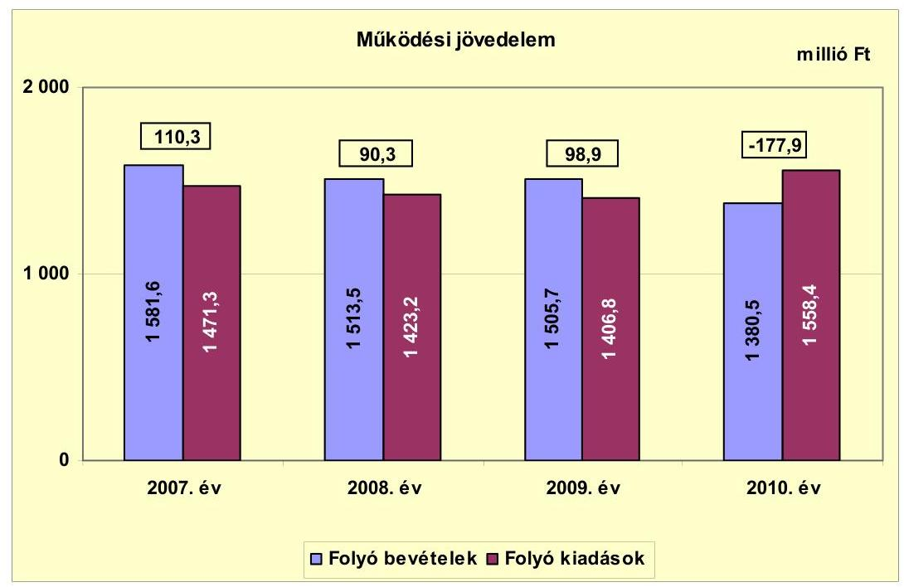

A működési jövedelem a vizsgált időszakban összességében 121,6 millió Ft folyó bevételi többletet mutatott. A 2010. évben mutatkozó hiányt 35,9\%-ban a saját működési bevételek, ezen belül a helyi adóbevételek - 131,3 millió Ft-os csökkenése, továbbá a költségvetési támogatások előző évhez viszonyított 41,0 millió Ft-os csökkenése, valamint a transzferkiadások 99,3 millió Ft-os növekedése okozta. A teljesített 240,5 millió Ft transzferkiadásokon belül 111,5 millió Ft az Önkormányzat - fürdőüzemeltetést végző - gazdasági társaságának kötvénykibocsátásához kapcsolódó kezességvállalás beváltásából adódott.

A folyó bevételek a 2007. évben 38,3 millió Ft, a 2008. évben 22,3 millió Ft, a 2009. évben 23,5 millió Ft, a 2010. évben 5,8 millió Ft felhalmozási célú támogatási bevételt (központosított, illetve CÉDE ${ }^{18}$ támogatást) is tartalmaztak, amelyek a működési jövedelmet növelték.

Az Önkormányzat az önhibájukon kívül hátrányos helyzetben lévő települési önkormányzatok támogatásában, a tartósan fizetésképtelen helyzetbe került helyi önkormányzatok adósságrendezésére irányuló hitelfelvétel visszterhes kamattámogatásában, valamint a működésképtelen helyi önkormányzatok egyéb támogatásában nem részesült.

[^0]
[^0]:    ${ }^{18}$ önkormányzati fejlesztési feladatok támogatása területi kötöttség nélkül

---

A nettó működési jövedelem ${ }^{19}$ értéke a folyó költségvetési pozíció mellett az adott költségvetési év adósságtörlesztésének hatását is tükrözi, amelyet az alábbi diagram szemléltet:
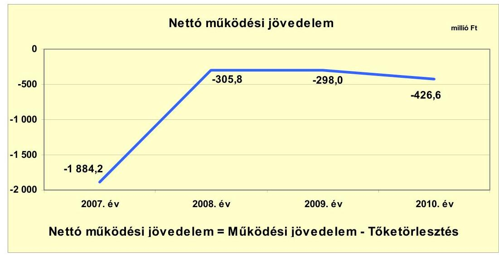

Az Önkormányzat nettó működési jövedelmének 2007. évi kiugró értéke a fürdőberuházáshoz kapcsolódó 1510,0 millió Ft összegű hosszú lejáratú hitel törlesztéséből adódott. A törlesztés forrásául a fürdőüzemeltetést végző gazdasági társaság kötvénykibocsátása szolgált. Az Önkormányzat nettó működési jövedelme 2010-re a 2007. évhez viszonyítva -1884,2 millió Ft-ról 1457,6 millió Ft-tal ( $77,4 \%$-kal), -426,6 millió Ft-ra növekedett. A pénzügyi kapacitás javulását a hiteltörlesztések 2007. évi kiugróan magas, 1994,5 millió Ft összegéhez viszonyított csökkenése eredményezte. Ennek 75,7\%-át a fürdőberuházáshoz kapcsolódó 1510,0 millió Ft összegű hitel törlesztése tette ki.

Az Önkormányzat felhalmozási költségvetése egyenlegének alakulását évről évre a következő ábra szemlélteti:
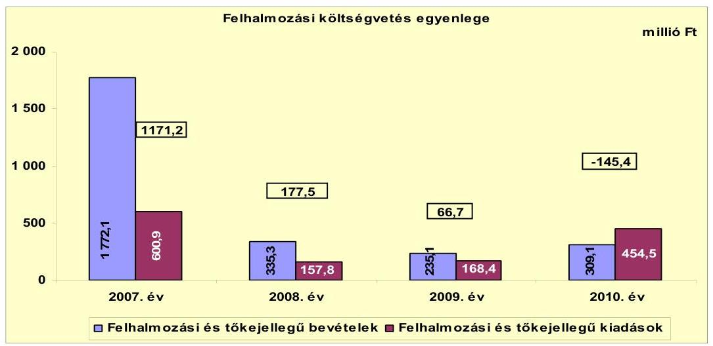

[^0]
[^0]:    ${ }^{19}$ pénzügyi kapacitás

---

A felhalmozási bevételek (és a forrástöbblet) 2007. évi nagyságát az egyéb saját tőkebevételeken belül, a támogatási kölcsönök államháztartáson kívülről történő visszatérüléséből származó 1546,9 millió Ft eredményezte. Ennek 97,6\%-a (1510,0 millió Ft) az Önkormányzat gazdasági társaságának fürdőberuházásához 2004. évben biztosított felhalmozási célú tagi kölcsön visszatérüléséből adódott. A felhalmozási kiadások a 2008. évben 73,7\%-kal (443,1 millió Ft-tal) csökkentek, ezt követően a 2009. évben 6,7\%-kal (10,6 millió Ft-tal), a 2010. évben 169,9\%-kal (286,1 millió Ft-tal) növekedtek az előző évhez képest. A 2010. évben képződött felhalmozási forráshiányra fejlesztési célú hitel nyújtott fedezetet.

A felhalmozási költségvetés egyenlegének alakulására hatással voltak az államháztartáson kívülre adott felhalmozási pénzeszközök is. Összegük a 2007. évben 373,5 millió Ft, a 2009. évben 95,1 millió Ft, és a 2010. évben 77,1 millió Ft volt. A három évben fenti jogcímen teljesített 545,7 millió Ft kiadás 82,7\%-a (451,2 millió Ft) az Önkormányzat kizárólagos tulajdonában lévő - fürdőüzemeltetést végző - gazdasági társaságának nyújtott tagi kölcsönök összegéből adódott.

Az Önkormányzat évenkénti teljes finanszírozási igénye ${ }^{20}$ a CLF módszer szerint 2007-ben -713,0 millió Ft, 2008-ban -128,3 millió Ft, 2009-ben -231,3 millió Ft, 2010-ben -572,0 millió Ft összesen -1644,6 millió Ft volt. A teljes finanszírozási igény 2007. és 2010. évi kiugró értékét a felhalmozási kiadások többi évhez képest magas összegei eredményezték.

Az Önkormányzat finanszírozási műveletei egyenlegének 2007-2010. évekbeli alakulását a következő ábra szemlélteti:
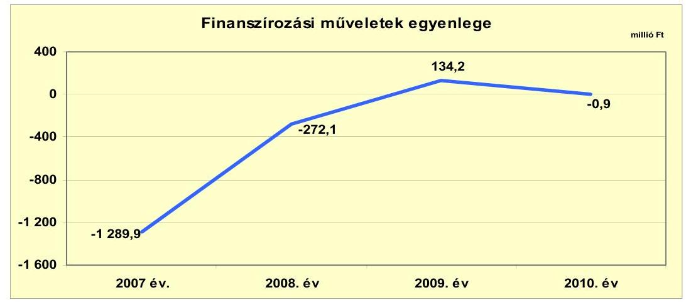

A finanszírozási műveletek egyenlege a 2007. évben a korábbi években felvett, hosszú lejáratú, 1510 millió Ft összegű fejlesztési hitel visszafizetése következtében lett negatív. A finanszírozási
 műveletek 2008. évi egyenlegét elsősorban a 300,0 millió Ft összegű értékpapír vásárlás eredményezte. A 2009. évre az előző évhez képest 406,3 millió Ft-tal emelkedett és pozitívvá változott az egyenleg 300,0 millió Ft értékű értékpapír-értékesítés következtében. A 2010. évben a

[^0]
[^0]:    ${ }^{20}$ a nettó működési jövedelem és a felhalmozási költségvetés eredője

---

hitelfelvételek és az egyéb finanszírozási célú bevételek összege a hiteltörlesztések és az egyéb finanszírozási célú kiadások összegéhez viszonyítva közel azonos nagyságúak voltak. A finanszírozási célú műveleteket a vizsgált időszakban a jelentés 2. számú mellékletének 4.1-4.8 pontjai részletezik.

Az Önkormányzat a költségvetési hiányt a 2007-2010. évi zárszámadási rendeleteiben a hagyományos költségvetési szerkezettől eltérően ${ }^{21}$ mutatta be, amelyről a jelentés 1. számú melléklete nyújt tájékoztatást. Az Önkormányzat rendeleteiben minden évben pénzügyi hiányt mutattak ki. A kimutatott hiány összege a 2007-2010. években összesen 1845,9 millió Ft volt.

Az Önkormányzat kamatbevételeinek és kiadásainak az egyenleg változását a következő ábra mutatja be:
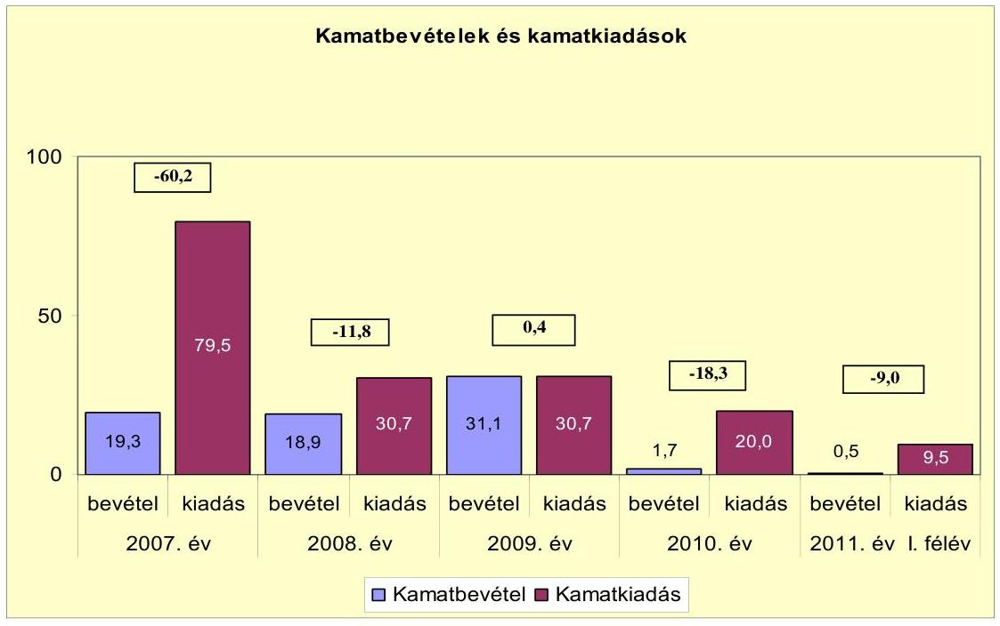

A pénzintézeti kötelezettségek (passzív pénzügyi elszámolások nélkül) a 2006. december 31-ei 1683,1 millió Ft-ról 2011. június 30-ra 251,7 millió Ft-ra csökkentek, amely együtt járt a kamatkiadások csökkenésével. A pénzintézeti kötelezettségek csökkenését elsősorban a fürdőberuházáshoz kapcsolódó 1510,0 millió Ft összegű hosszú lejáratú hitel 2007. évi törlesztése eredményezte. A törlesztés forrásául szolgáló kötvénykibocsátással kapcsolatos kamatkiadások nem az Önkormányzatot, hanem gazdasági társaságát terhelték. A 2010. évre a kamatkiadások a 2009. évhez képest 10,7 millió Ft-tal (34,9\%-kal) csökkentek, a 2011. év I. félév adatát tekintve a kamatkiadás összege időarányosan az előző évhez hasonlóan alakul. A 2007. év és a 2011. év I. félév között az Önkormányzat összesen 170,4 millió Ft kamatot fizetett meg, mely 2,4-szerese volt az átmenetileg szabad pénzeszközeiből elért 71,5 millió Ft kamatbevételnek.

[^0]
[^0]:    ${ }^{21}$ Az adósságszolgálati kiadásokat, és a 2008. évben értékpapír vásárlásból származó kiadást a működési és felhalmozási kiadások részének tekintette.

---

# 2.2. Az Önkormányzat bevételeinek változása 

Az Önkormányzat 2007-2011. év I. félév között realizált főbb folyó bevételi jogcímeinek számszaki adatait az alábbi táblázat részletezi és grafikon mutatja be:
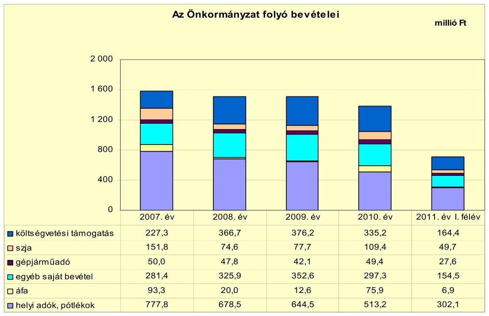

Az Önkormányzat realizált folyó bevétele a 2010. évben a 2007-2009 évek átlagához (amely 1533,6 millió Ft összeget tett ki) viszonyítva 153,1 millió Ft-tal, 10,0\%-kal, 1380,5 millió Ft-ra csökkent. Az Önkormányzatnak a 2011. év I. félévben - időarányosan számítva - a 2010. évihez hasonló nagyságú, 705,2 millió Ft folyó bevétele keletkezett.

A költségvetési támogatásból és szja-ból a 2007-2009. évek átlagához, 424,8 millió Ft-hoz viszonyítva a 2010. évben 4,7\%-kal (19,8 millió Ft-tal) több bevétel realizálódott. A 2008. és 2009. évben a költségvetési támogatások és az szja normatív módon elosztott része közötti központi szabályozás változása miatt emelkedett a támogatások összege és csökkent az szja. Az Önkormányzatnak a 2011. év I. félévben - időarányosan számítva - a 2010. évihez hasonló nagyságú költségvetési támogatás és szja bevétele keletkezett.

A Képviselő-testület a helyi adók közül az iparűzési adót, az idegenforgalmi adót és a vállalkozások kommunális adóját vezette be a vizsgált időszakot megelőzően. A vizsgált időszakban új adónem bevezetésére nem került sor. Az iparűzési adót a bevezethető adómérték 2\%-os maximumában határozták meg. A 2007-2010. években az iparűzési adó mértéke nem változott, az idegenforgalmi adó és a kommunális adó mértéke azonban folyamatosan emelkedett.

---

A helyi adóbevétel jelentős részét ${ }^{22}$ képező iparűzési adóból származó bevétel a központi jogszabályváltozás ${ }^{23}$ ellenére folyamatosan csökkent. Az Önkormányzatnak iparűzési adóból a 2010. évben 487,2 millió Ft bevétele képződött, amely 195,6 millió Ft-tal (28,6\%-kal) volt kevesebb a 2007-2009. évek átlagánál.

Az Önkormányzat 2007-2010. években realizált iparűzési adóbevételének 65,2\%-a (1653,2 millió Ft) egy, az autóiparban érdekelt gazdasági társaságtól származott. A gazdasági társaság által fizetett iparűzési adó értéke a 2008. évben 4,8\%-kal (20,9 millió Ft-tal) növekedett, a 2009. évben 20,9\%-kal (95,6 millió Ft-tal) csökkent az előző évhez képest. A vállalkozás által 2010. évben fizetett iparűzési adó összességében 9,5\%-kal (41,5 millió Ft-tal) volt kevesebb a 2007. évi 437,1 millió Ft-nál, a gazdasági válság miatt. A fent leírtak, a helyi iparűzési adóbevétel magas aránya miatt az Önkormányzat pénzügyi helyzetére kockázatot jelentenek.

Az Önkormányzat kizárólagos tulajdonú gazdasági társaságaitól osztalék bevételben nem részesült. Az Önkormányzat a tulajdonosi részesedései után 2007-2010 között 0,4 millió Ft osztalékot vett fel, amely egy 50\% részesedés alatti gazdasági társaság ${ }^{24}$ befizetéséből adódott.

Az Önkormányzat felhalmozási bevételei a vizsgált időszakban a következők voltak:

| Megnevezés | 2007. év | 2008. év | 2009. év | 2010. év | 2011. év   I. félév |
| :-- | --: | --: | --: | --: | --: |
| Tárgyi eszköz értékesítés | 65,1 | 7,1 | 192,8 | 33,5 | 68,5 |
| Egyéb saját tőkebevétel | 1610,3 | 7,0 | 13,6 | 253,3 | 8,5 |
| Államháztartáson belülről   kapott támogatás | 79,5 | 307,4 | 8,9 | 10,8 | 46,4 |
| EU-tól és külföldről kapott   támogatások | 0,0 | 0,0 | 1,2 | 9,0 | 0,0 |
| Államháztartáson kívülről   kapott támogatás | 17,2 | 13,8 | 18,6 | 2,5 | 18,2 |
| Összes felhalmozási bevétel | 1772,1 | 335,3 | 235,1 | 309,1 | 141,6 |

A felhalmozási bevétel 2007. évi nagyságát az egyéb saját tőkebevételek ${ }^{25}$ összege eredményezte, ez a bevételek 90,9\%-át jelentette. Az egyéb saját tőke-

[^0]
[^0]:    ${ }^{22}$ Az iparűzési adóbevétel a helyi adóbevételnek a 2007. évben 98,3\%-át, a 2008. évben 97,7\%-át, a 2009. évben 96,4\%-át, a 2010. évben 94,9\%-át jelentette.
    ${ }^{23}$ A helyi adókról szóló törvényt módosító 2007. évi CXXVI. törvény 2008. január 1-jétől 2009. július 1-jéig az adóalap új megosztását vezette be, ami az Önkormányzat számára kedvezőbb volt.
    ${ }^{24}$ A gazdasági társaság az Önkormányzat feladatellátásában nem vett részt.
    ${ }^{25}$ Önkormányzati lakások, egyéb helyiségek értékesítéséből, cseréjéből, tartós részesedések értékesítéséből, valamint támogatási kölcsönök államháztartáson kívülről történő visszatérüléséből származó bevételek.

---

bevételeken belül 2007. évben kiemelkedő a támogatási kölcsönök államháztartáson kívülről történő visszatérüléséből származó 1546,9 millió Ft bevétel. Ez döntően az Önkormányzat gazdasági társaságának fürdőberuházásához 2004. évben biztosított, 1510,0 millió Ft felhalmozási célú tagi kölcsön visszatérüléséből származott, amely a felhalmozási bevételek 85,2\%-át tette ki. Az egyéb saját tőkebevételek a 2010. évi felhalmozási bevételek 81,9\%-át jelentették, ennek nagyságát 71,0\%-ban a 180,0 millió Ft összegű tartós részesedés (a kábel televíziós szolgáltatást végző gazdasági társaság) értékesítése eredményezte ${ }^{26}$.

Az államháztartáson belülről kapott támogatás a 2008. évi felhalmozási bevétel 91,7\%-át jelentette, ennek 97,6\%-a (300,0 millió Ft) a szentgotthárdi fürdőfejlesztéshez kapott felhalmozási célú állami támogatásból származott.

A tárgyi eszköz értékesítéshez kapcsolódó, kiemelkedő 2009. évi árbevétel a felhalmozási bevételek 82,0\%-át tette ki. A tárgyi eszközökhöz kapcsolódó bevételek 99,6\%-a (192,1 millió Ft) üzletek értékesítéséből származott. A bevételeket az Önkormányzat felhalmozási és működési célokra is fordította.

# 2.3. Az Önkormányzat működési és a felhalmozási célú kiadásainak változása 

Az Önkormányzat működési kiadásai főbb jogcímek szerinti bontásban az alábbiak voltak:

| Megnevezés | 2007. év | 2008. év | 2009. év | 2010. év | 2011. év I.   félév |
| :--: | :--: | :--: | :--: | :--: | :--: |
| Folyó kiadások | 1471,3 | 1423,2 | 1406,8 | 1558,4 | 666,8 |
| Működési kiadások (kamatkiadás nélkül) | 957,3 | 1027,8 | 963,3 | 1001,2 | 446,7 |
| Államháztartáson belülre átadott pénzeszközök | 295,5 | 225,5 | 271,6 | 296,7 | 157,3 |
| Transzferkiadások | 138,1 | 139,2 | 141,2 | 240,5 | 53,3 |
| ebből: vállalkozásoknak | 7,6 | 3,3 | 0,9 | 129,2 | 1,9 |
| magánszemélyeknek | 60,2 | 67,8 | 84,2 | 66,0 | 30,7 |
| nonprofit szervezeteknek | 70,3 | 68,1 | 56,1 | 45,3 | 20,7 |
| Kamatkiadások | 79,5 | 30,7 | 30,7 | 20,0 | 9,5 |
| Előző évi pénzmaradvány átadás | 0,9 | 0,0 | 0,0 | 0,0 | 0,0 |

A transzferkiadásokon belül 2010. évben államháztartáson kívülre, vállalkozásoknak teljesített kiadás összege kiemelkedően magas volt az előző évekhez képest. A vállalkozásoknak teljesített transzferkiadás 86,3\%-a (111,5 millió Ft) az Önkormányzat - fürdőüzemeltetést végző - gazdasági társaságának kötvénykibocsátásához kapcsolódó kezességvállalás beváltásából adódott. A kezességvállalás érvényesítésére azért került sor, mert a gazdasági társaság a kötvénykibocsátásából származó kamatfizetési kötelezettségének nem tudott eleget tenni.

[^0]
[^0]:    ${ }^{26}$ Emellett 73,3 millió Ft árbevétel keletkezett építési telek, illetve önkormányzati lakás értékesítéséből.

---

A folyó kiadások mintegy 70\%-át kitevő kiemelt működési előirányzatok teljesítési adatait az alábbi táblázat tartalmazza:

| Megnevezés | 2007. év | 2008. év | 2009. év | 2010. év | 2011. év 1.   félév |
| :-- | --: | --: | --: | --: | --: |
| Személyi juttatások | 440,1 | 457,5 | 434,6 | 432,5 | 196,2 |
| Munkaadót terhelő járulékok | 135,2 | 140,9 | 129,3 | 112,8 | 51,4 |
| Dologi kiadások | 358,9 | 418,2 | 382,8 | 441,2 | 193,2 |
| Egyéb folyó kiadások | 12,3 | 7,6 | 12,7 | 13,1 | 5,9 |

Az Önkormányzat a 2007. évben a folyó kiadások 39,1\%-át (575,3 millió Ft-ot), a 2008. évben 42,0\%-át (598,4 millió Ft-ot), a 2009. évben 40,1\%-át (563,9 millió Ft-ot), a 2010. évben 35,0\%-át (545,3 millió Ft-ot), a 2011. I. félévben 37,1\%-át (247,6 millió Ft-ot) személyi juttatásokra és a munkaadókat terhelő járulékokra fordította. Az üzemeltetést, intézményfenntartást biztosító dologi kiadások folyó kiadásokhoz viszonyított aránya átlagosan 27,7\% volt a vizsgált években ${ }^{27}$.

A személyi juttatások 2008-ban 3,9\%-kal (17,4 millió Ft-tal) nőttek az előző évhez képest, azt követően minden évben csökkentek. A 2008. évi növekményből 8,3 millió Ft az intézményeknél, 9,1 millió Ft a Polgármesteri hivatal kiadásainál jelentkezett. A Polgármesteri hivatal személyi juttatás növekményéből 3,0 millió Ft (32,9\%) a helyi és országos népszavazás lebonyolításából adódott. A munkaadót terhelő járulékok a 2007. évről a 2008. évre 5,7 millió Ft-tal (4,2\%-kal) növekedtek, a 2008. évről a 2009. évre 11,6 millió Ft-tal (8,2\%-kal), a 2009. évről a 2010. évre 16,5 millió Ft-tal (12,8\%-kal) csökkentek. A vizsgált időszakban a 2007. évhez képest 2010. évre a munkaadót terhelő járulékok 16,6\%-os, 22,4 millió Ft-os csökkenése következett be. A vizsgált időszakban a munkaadókat terhelő járulékok mértéke központi szabályozás miatt csökkent, másrészt a járulékok a kifizetett személyi juttatások változásával párhuzamosan
 csökkentek.

Az Önkormányzat dologi kiadásainak alakulása változatos képet mutat. A dologi kiadások a 2007. évről a 2008. évre 59,3 millió Ft-tal (16,5%-kal), a 2009. évről a 2010. évre 58,4 millió Ft-tal (15,3%-kal) növekedtek, a 2008. évről a 2009. évre 35,4 millió Ft-tal (8,5%-kal) csökkentek.

A dologi kiadásokon belül a 2008. évben kiemelkedő a szolgáltatási kiadások ${ }^{28}$ 16,5%-os (24,3 millió Ft-os) növekedése, 171,8 millió Ft-os összege az előző évi 147,5 millió Ft-hoz képest. Ugyanakkor a szolgáltatási kiadások a 2009. évben 8,7%-kal (15,0 millió Ft-tal) csökkentek 2008. évhez képest ${ }^{29}$. A dologi kiadások 2010. évi összegének változását elsősorban a szolgáltatási kiadásokon belül a

[^0]
[^0]:    ${ }^{27}$ A 2007. évben 24,4%, a 2008. évben 29,4%, a 2009. évben 27,2%, a 2010. évben 28,3%, a 2011. év I. félévben 29,0%.
    ${ }^{28}$ Ezen belül meghatározó a közüzemi díjak 10,7 millió Ft-os (22,2%-os) növekedése.
    ${ }^{29}$ Ezen belül meghatározó az egyéb üzemeltetéshez kapcsolódó szolgáltatási kiadások 17,7 millió Ft-os (22,6%-os) csökkenése.

---

közüzemi díjak ${ }^{30}$, és emellett az áfa kiadások ${ }^{31}$ növekedése okozta. Az áfa kiadások növekedésében szerepet játszott 2009. július 1-jétől az áfa kulcs 20%-ról 25%-ra történő emelésére vonatkozó központi jogszabályváltozás, valamint a 2010. évben teljesített 49,5 millió Ft fordított áfa befizetés is.

A folyó és felhalmozási kiadásokat, a teljesített kiadások működési és felhalmozási célú felhasználásának arányait a 2007-2011. év I. félév közötti időszakban az alábbi ábra mutatja be:
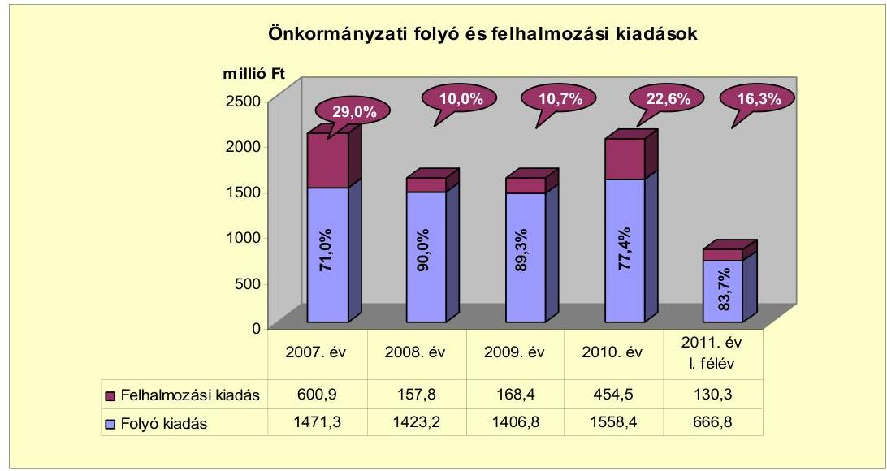

A működési és felhalmozási kiadások arányának változásában 2007-2010 között hullámzás figyelhető meg. A felhalmozási kiadások 2007. évi kimagasló összege elsősorban a 373,5 millió Ft államháztartáson kívülre adott felhalmozási pénzeszközök ${ }^{32}$ és a 153,8 millió Ft teljes bekerülési költségű, élményfürdő melletti út, parkoló építés értékéből adódott. A felhalmozási kiadások 2010. évi összegének 65,7%-a a 298,6 millió Ft teljes bekerülési költségű fürdőfejlesztéshez kapcsolódott.

A 2007-2010. évek között megvalósított, 2010. december 31-ig befejezett, 10 millió Ft teljes bekerülési költség feletti felújítások száma kettő, a beruházások száma öt volt.

A befejezett ${ }^{33}$ felújításokra 113,0 millió Ft-ot, a beruházásokra 713,4 millió Ft-ot fordítottak ${ }^{34}$ a vizsgált időszakban. A felújítások forrását 18,0 millió Ft

[^0]
[^0]:    ${ }^{30}$ A közüzemi díjak a 2010. évben a 2007. évhez viszonyítva 14,8 millió Ft-tal (30,2%-kal) lettek magasabbak.
    ${ }^{31}$ Az áfa kiadások a 2010. évben a 2007. évhez viszonyítva 58,1 millió Ft-tal (81,2%-kal) lettek magasabbak, a 2009. évhez képest megduplázódtak (66,1 millió Ft-tal növekedtek).
    ${ }^{32}$ Ennek 87,6%-a (327,2 millió Ft) az Önkormányzat fürdő üzemeltetést végző gazdasági társaságának nyújtott kölcsön összegéből adódott.
    ${ }^{33}$ A 10 millió Ft egyedi bekerülési értéket el nem érő munkákkal együtt.
    ${ }^{34}$ Ebből egy felújítást és fejlesztést is tartalmazó projekthez kapcsolódóan 41,9 millió Ft kifizetése 2011. évre áthúzódott.

---

hitel (15,9%), 23,5 millió Ft EU-s támogatás (20,8%), 25,7 millió Ft hazai támogatás (22,7%), 45,8 millió Ft önkormányzati saját bevétel (40,6%) képezte. A felújítások így összességében 49,2 millió Ft (43,5%) támogatás igénybevételével valósultak meg. A felújítások tényleges ráfordításai együttesen nem érték el a tervezett összeget, 5,4 millió Ft-tal alatta maradtak. A megvalósított beruházások forrását 95,8 millió Ft hitel (13,4%), 33,3 millió Ft EU-s támogatás (4,7%), 340,1 millió Ft hazai támogatás (47,7%), 244,2 millió Ft önkormányzati saját bevétel (34,2%) képezte. A beruházások így összességében 373,4 millió Ft (52,4%) támogatás igénybevételével valósultak meg. A beruházások tényleges ráfordításai sem érték el együttesen a tervezett összeget, 17,8 millió Ft-tal alatta maradtak. A befejezett felújítások és beruházások nagy önerő szükséglete az Önkormányzat pénzügyi helyzetére negatív hatással volt.

A 2010. december 31-én folyamatban lévő felújítások, és beruházások tervezett bekerülési költsége együttesen 93,7 millió Ft${ }^{35}$ volt, a várható tényleges bekerülési költség 99,5 millió Ft. Ebből 2010. év végéig 3,7 millió Ft-ot teljesítettek, a még fennálló kifizetési kötelezettség ezekkel kapcsolatban várhatóan 95,8 millió Ft lesz. A 2010. december 31-ig teljesített kifizetések 37,8%-át EU-s támogatásból (1,4 millió Ft), és 62,2%-át saját bevételből (2,3 millió Ft) finanszírozták. A 2010. december 31-e után fennálló kifizetési kötelezettség 79,0%-át EU-s támogatásból (75,7 millió Ft), és 21,0%-át saját bevételből (20,1 millió Ft) tervezik finanszírozni. Összességében a felújítások és beruházások teljes megvalósulásakor, a már teljesített és a még várható kifizetések 77,5%-ára EU-s támogatás (77,1 millió Ft), és 22,5%-ára saját bevétel (22,4 millió Ft) biztosít fedezetet. Az EU-s támogatásból megvalósítandó fejlesztések előfinanszírozásához, valamint az önerőhöz szükséges saját források az állandósult folyószámlahitel következtében rövid távon nem biztosítottak.

Az Önkormányzat beadott, elbírálás alatti pályázati forrásból egy projektet ${ }^{36}$ tervez megvalósítani, melynek tervezett összköltsége 22,5 millió Ft, amelynek saját bevételből származó forrásrésze 20,0% (4,5 millió Ft), a hazai támogatás aránya 80,0% (18,0 millió Ft).

Az Önkormányzat a 2011. évben informatikai infrastruktúra-fejlesztést valósított meg 7,7 millió Ft értékben, amelyet hazai támogatásból finanszírozták.

Az Önkormányzat 2007-2010. években megvalósított, illetve 2010. december 31-én fennálló fejlesztési feladatokhoz kapcsolódó kötelezettségeinek összegzését a 3/a-3/d. számú mellékletei tartalmazzák.

A vizsgált időszakban a három legmagasabb bekerülési költségű beruházás:

- A St. Gotthard Spa & Wellnes fürdő szabadtéri fejlesztésének munkái 298,6 millió Ft teljes bekerülési költséggel. A beruházást 2010-ben kezdték el és fejezték be. A fejlesztést 100%-ban hazai támogatásból finanszírozták.

[^0]
[^0]:    ${ }^{35}$ Az összeg tartalmazza a Szentgotthárd-Farkasfa településrész ivóvízminőség-javítása, 2 fordulós projekt 2011. évben induló II. ütemének 38,1 millió Ft-os tervezett bekerülési értékét is, amely a jelentés 3/c. mellékletének 10. sorában szerepel.
    ${ }^{36}$ A városi sporttelep öltözőinek felújítását.

---

- Az élményfürdő melletti út, parkolóépítés 153,8 millió Ft teljes bekerülési költséggel. A beruházást 2007-ben kezdték el és fejezték be. A fejlesztést az Önkormányzat 100%-ban saját bevételéből valósította meg.
- Az István király utca rekonstrukciós munkái 71,1 millió Ft teljes bekerülési költséggel. A fejlesztést 2008-ban kezdték el és 2009. évben fejezték be. A beruházást fejlesztési célú hitelből finanszírozták.

Az Önkormányzat által a gazdasági társaságok részére - tagi kölcsönön kívül átadott működési és felhalmozási célú pénzeszközök alakulását az alábbi diagram mutatja be a 2007-2011. év I. félév közötti időszakban:
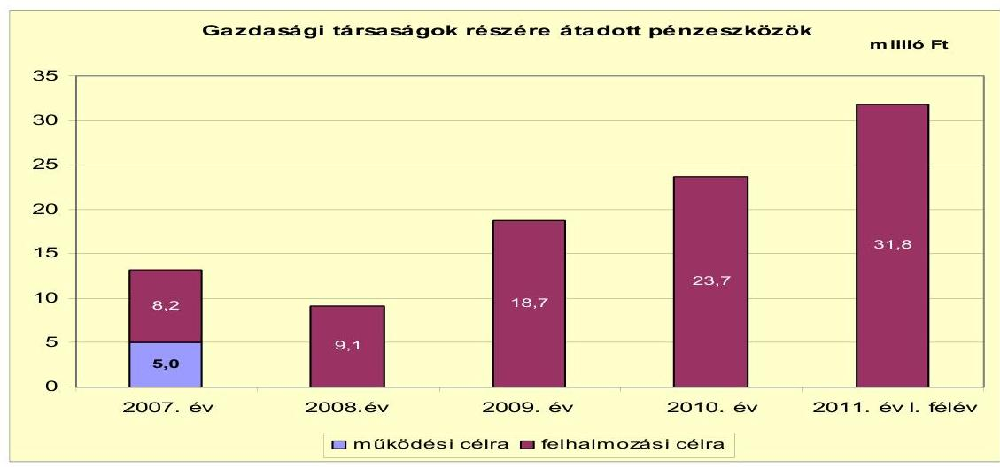

Az Önkormányzat működési pénzeszközt, szerződés alapján a 2007-ben egy, a feladatellátásban résztvevő gazdasági társaság ${ }^{37}$ részére adott. A 2007-2010. évek között az Önkormányzat által kötött megállapodások alapján - két gazdasági társaságnak - átadott felhalmozási célú pénzeszköz összege 91,5 millió Ft volt.

A vizsgált években a kiemelt közfeladatot ellátó gazdasági társaságok közül a víz- és csatornaszolgáltatási feladatokat végző társaság minden évben kapott felhalmozási célú pénzeszközt, összesen 51,5 millió Ft${ }^{38}$ összegben. Emellett az önkormányzati feladatellátásban résztvevő, termálfürdő üzemeltetést végző, kizárólagos tulajdonú gazdasági társaságnak adott át fejlesztési célú pénzeszközt az Önkormányzat és a társaság között a 2009. évben létrejött megállapodás alapján. Ennek összege a 2009. évben 5,0 millió Ft-ot 2010-ben 10,0 millió Ft-ot, a 2011. év I. félévében 25,0 millió Ft-ot tett ki.

A gazdasági társaságok által ellátott közszolgáltatásokhoz kapcsolódó szolgáltatási és egyéb díjak (hulladék- és folyékonyhulladék-szállítási, temetkezési, ivóvíz-szolgáltatási, szennyvízelvezetési, valamint a közterület-használati

[^0]
[^0]:    ${ }^{37}$ A 2010. évben értékesített városi tv-t üzemeltető gazdasági társaság részére nyújtott 5 millió Ft-ot.
    ${ }^{38}$ Az önkormányzati pénzeszközátadás a gazdasági társaság összes bevételéhez viszonyított aránya 0,2-0,3% között volt.

---

díj) megállapítása a Képviselő-testület feladat- és hatáskörébe tartozik, azok meghatározása önkormányzati rendelettel, határozattal történik. A szolgáltatási díjakra tekintettel, a feladatellátásban résztvevő gazdasági társaságok részére az önkormányzat pénzeszközöket nem adott át.

A társaságok önkormányzati pénzeszközátadásból származó bevételeit a jelentés 4. számú melléklete mutatja be.

# 3. Az ÖNKORMÁNYZAT KÖTELEZETTSÉGEI 

### 3.1. Az Önkormányzat pénzintézeti kötelezettségeinek változása

Az Önkormányzat rövid és hosszú lejáratú kötelezettségeinek állománya 2006. december 31-ről 2010. december 31-ig 1841,9 millió Ft-ról 363,6 millió Ft-ra, 2011. június 30-ra 281,5 millió Ft-ra csökkent. A pénzintézeti kötelezettségek állománya 2006. december 31-én 1683,1 millió Ft, 2010. december 31-én 291,3 millió Ft, 2011. június 30-án 251,7 millió Ft volt.
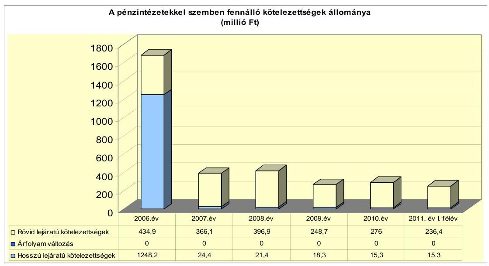

A Képviselő-testület 2004 szeptemberében 1510 millió Ft értékű (EUR alapú) hitelt vett fel a termálprojekt lebonyolítására, amely a 2006. évben kimutatott 1683,1 millió Ft összegű pénzintézeti kötelezettségállomány 89,7%-át jelentette.

Az Önkormányzat, valamint a 100%-os tulajdonú gazdasági társasága a Gotthárd-Therm Kft., továbbá az ERSTE Bank Hungary Nyrt. a 2007. évben forrás-felhasználási megállapodást kötött, amely szerint a Gotthárd-Therm Kft. 14280150 CHF értékű kötvénykibocsátás bevételéből visszafizették az Önkormányzat által a termálprojekt lebonyolítására felvett, 1510 millió Ft értékű EUR alapú hitelt.

Az 1510 millió Ft összegű fejlesztési hitel, valamint a 2005. évben felvett 1304347 CHF összegű hosszú lejáratú hitel visszafizetésével a 2007. év végi pénzintézeti kötelezettségállomány a 2006. decemberi állománynak a 23,2%-ára csökkent. A pénzintézeti kötelezettségállomány 2007. évi csökkenésével a

---

vizsgált időszakban nem járt együtt a pénzügyi egyensúlyi helyzet javulása, az Önkormányzat 100%-os tulajdonában lévő Gotthárd-Therm Kft. részére - kötvénykibocsátásából eredő kötelezettségei és likviditási nehézségei miatt - nyújtott 526,7 millió Ft tagi kölcsön és a 111,5 millió Ft összegben érvényesített kezességvállalás beváltása következtében.

Az Önkormányzat 2007-2010. évek között meglévő - rövid és hosszú lejáratú hitelei közül hat svájci frank alapú, egy euró alapú és kettő forint alapú volt.

A 2007-2008. években a Számv. tv. 60. § (2) bekezdésében foglalt előírást megsértve, az Áhsz. 33. § (1) bekezdésében foglaltak ellenére a devizában fennálló kötelezettségek év végi értékelését - a Számv. tv. 60. §-a szerinti árfolyamon nem végezte el. Az év végi értékelések elmaradása miatt a mérleg szerinti kötelezettségek állománya nem tartalmazta az árfolyamváltozások hatását.

Ezeknél a szerződéseknél a deviza árfolyamváltozás hatása is befolyásolja a kötelezettségek alakulását, azonban annak mértéke előre pontosan nem határozható meg, csak várakozásokon alapuló tendenciák jelezhetők. Annak megítéléséről, hogy a hitelek visszafizetésekor jelentkező forint kötelezettség többletkiadást (árfolyamveszteség) vagy kiadáscsökkenést (árfolyamnyereség) eredményez a futamidő végén, a teljes kötelezettség rendezését követően lehet képet alkotni. Mindaddig, amíg törlesztési kötelezettség nem áll fenn (türelmi idő, moratórium), a tőkére vonatkoztatva nem értelmezhető sem az árfolyamveszteség, sem az árfolyamnyereség. Ugyanakkor a számviteli szabályok meghatározzák, hogy az árfolyam-különbözetet év végén a kötelezettségek vagy követelések között a könyvviteli mérlegben nyilván kell tartani, azonban árfolyam különbözet ebben az esetben ténylegesen nem képződött.

Az Önkormányzat a deviza alapú hiteleit a 2007-2010. években visszafizette, amelyek esetében nyereséget és árfolyamveszteséget egyaránt realizált. Az
 Önkormányzat tájékoztatása szerint a hosszú futamidejú devizahitelek visszafizetésekor 11,1 millió Ft árfolyamnyereség és 9,4 millió Ft árfolyamveszteség realizálódott, összességében 1,7 millió Ft volt az árfolyamnyereség.

A Gotthárd-Therm Kft.-vel társberuházásban megvalósuló Szentgotthárdi élménypark beruházás saját erő biztosítására az Önkormányzat által felvett 1510,0 millió Ft értékű, EUR alapú hitel 2007. évi visszafizetésekor nem számoltak el árfolyamveszteséget ${ }^{39}$, mert a Gotthárd-Therm Kft., az Önkormányzat és a hitelt folyósító Erste Bank Hungary Nyrt. forrás-felhasználási megállapodása szerint a Gotthárd-Therm Kft. kötvénykibocsátásból származó bevételéből visszafizették az Önkormányzat teljes tartozásállományát.

A termálberuházás befejezését követően 2005. május 5-ei képviselő-testületi ülésen felvetődött, hogy a Gotthárd-Therm Kft. finanszírozási gondjai miatt az Önkormányzat 1510,0 millió Ft összegű hitelének kötelezettségeit a Kft. a megállapodás ellenére nem képes teljesíteni. Felmerült, hogy a Gotthárd-Therm Kft. 2 milliárd Ft értékű zártkörű kötvénykibocsátást végez, amelyhez az Önkormányzat kezességet vállal. Erről a Képviselő-testület a 115/2007. (V. 8.) számú határo-

[^0]
[^0]:    ${ }^{39}$ Az árfolyam a hitel felvételkori (2004. november 30.) 244,9Ft/EUR-ról a visszafizetés (2007. augusztus 31.) időpontjára 254,06 EUR/Ft-ra emelkedett.

---

zattal döntött, amely határozatát a 182/2007. (VI. 27.) számú határozatával módosította 2,2 milliárd Ft értékű kötvénykibocsátásra.

Az Önkormányzat a 2007-2011. év I. félévében folyószámla- és munkabérmegelőlegezési hitelt ${ }^{40}$, valamint négy esetben - pályázati támogatás megelőlegezésére - egyéb likvid hitelt vett igénybe.

A hosszú lejáratú adósságot keletkeztető kötelezettségvállalások során betartották az Ötv. előírását, a 2008-2010. években nem lépték túl az adósságot keletkeztető kötelezettségvállalás felső határát. A 2007. évben a Gotthárd-Therm Kft.-vel társberuházásban megvalósuló szentgotthárdi élménypark beruházás saját erő biztosítására felvett 1510 millió Ft hitel visszafizetése miatti hitelfelvételi korlát túllépés nem történt, mivel a hitel visszafizetése a Gotthárd-Therm Kft. által - kötvény kibocsátásából származó - visszafizetett, felhalmozási célú bevételből történt.

Az Önkormányzat pénzintézeti kötelezettségvállalásaira minden esetben képviselő-testületi döntés alapján került sor. A Képviselő-testület döntését megelőzte a pályáztatás, illetve az ajánlatkérés. A kapott ajánlatok - a szerződésekben foglaltaknak megfelelően - tartalmazták a hitelkamat, a hitelkezelési díj, a rendelkezésre tartási jutalék, a hitelbírálat díját, a szerződés előtörlesztésének és a szerződés módosításának költségeit, a futamidőt és a kamatfizetés esedékességét.

A vizsgált időszakban a hitelfelvételt kettő esetben pályáztatták, a többi esetben a helyi szabályozás előírása szerint kértek ajánlatot a helyi szabályozásnak megfelelően.

A Képviselő-testület hitelfelvételre vonatkozó döntéseit megalapozó előterjesztések nem tartalmazták a kamat és a deviza alapú kötelezettségek esetében az árfolyamkockázatot, a kötelezettségvállalás visszafizetési forrásainak, valamint - a teljes futamidőre - a várható kamat- és tőkefizetési kötelezettségeknek a bemutatását.

A hiteleket a számlavezető bankon kívül, további két bank finanszírozta. Számlavezető bankot a vizsgált időszakban az Önkormányzat nem váltott.

Az Önkormányzatnak a 2010. év végére - a kezességvállalás kivételével - nem volt devizában fennálló pénzintézeti kötelezettsége.

[^0]
[^0]:    ${ }^{40}$ A vizsgált időszakban fennálló folyószámlahitelek és munkabér-megelőlegezési hitelek évente a bankszámla-vezetési szerződéshez kapcsolódtak.

---

Az Önkormányzat 2011. június 30-án Ft-ban fennálló, adósságot keletkeztető kötelezettségvállalását mutatja a következő táblázat:

| Megnevezés | Szerződéskötés   időpontja | Összeg   millió   HUF-ban | Kamat (referencia   kamat+   kamatfelár) | Felhasználás   célja: |
| :-- | :--: | :--: | :--: | :--: |
| Arany János Általános   Iskola villamoshálózat   felújítás | 2004.04.19 | 30,5 | 6 hónapos   BUBOR $+1 \%$ | Az iskola   villamos-   hálózat   felújítása |

Az Önkormányzatnak 2011. június 30-án devizában fennálló hosszú lejáratú hitele nem volt.

A hosszú lejáratú pénzintézeti kötelezettségek forrásait az Önkormányzat a hitelfelvétel céljának megfelelően hasznosította. Fejlesztési feladatok forrásául öt hosszú lejáratú hitelt vett igénybe:
2004. április 19-én 30,5 millió Ft értékben az Arany János Általános Iskola villanyhálózat felújítására, 2016. február 15-ei lejárattal.
2004. december 1-jén (a Gotthárd-Therm Kft.-vel társberuházásban) megvalósuló szentgotthárdi élménypark beruházás saját erő biztosítására 1510,0 millió Ft (6165,8 ezer EUR) értékű hitelt vettek fel, amelyet 2007. évben visszafizettek.
2005. augusztus 5-én a 2005. évi költségvetésben szereplő fejlesztési célok finanszírozására igénybevett 635,1 ezer CHF (102,9 millió Ft) értékű hitelüket 2008. évben visszafizettek.
2005. október 4-én "E" közigazgatás fejlesztése Szentgotthárd és Őriszentpéter kistérségeiben" projektre 1304,3 ezer CHF (205,6 millió Ft) értékben vettek igénybe hitelt, amelyet a 2007. évben visszafizettek.
2008. május 30-án Szentgotthárd Város területén a Fürdőhöz vezető István király utca kiépítésére és parkoló építésére 487,6 ezer CHF (87,2 millió Ft) értékű hitelt vettek fel, amelyet a 2009. évben visszafizettek.

Az Önkormányzat négy esetben rövid lejáratú hitelt vett igénybe a fejlesztésekhez kapcsolódó támogatások megelőlegezésére és az önerő biztosítására. A hiteleket 2007. június 4-e és 2008. december 22-e között vette fel és 2007. szeptember 17-e és 2009. április 30-a között fizette vissza.
2007. június 4-én 50,8 millió Ft értékben CHF alapú hitelt vettek fel élményfürdő megnyitás finanszírozása áthidaló hiteleként négy hónapos futamidőre.
2007. november 30-án 13,1 millió Ft értékben CHF alapú hitelt vettek fel közutak burkolat felújítása állami támogatás megelőlegezésére és az önerő biztosítására négy hónapos futamidőre.
2008. január 31-én 30,0 millió Ft értékben CHF alapú hitelt vettek fel út és csapadékvíz elvezetési rendszer és közvilágítás megvalósítása feladathoz nyolc hónapos futamidőre.

---

2008. december 22-én 37,0 millió Ft hitelt vettek fel illegális hulladéklerakó megszüntetésére, játszótér, illetve útburkolat felújítás feladatának ellátásához a támogatás megelőlegezésére és a saját erő biztosítására, amelynek futamideje négy hónap volt.

Az Önkormányzat évente újrakötötte a folyószámla- és munkabérmegelőlegezési hitelek keretszerződéseit, amelyből a folyószámlahitel átlagos napi állománya a 2007-2011. év I. félévében 266,2 millió Ft, 266,6 millió Ft, 219,0 millió Ft, 231,1 millió Ft és 213,0 millió Ft volt. A munkabérmegelőlegezési hitel átlagos napi állománya a vizsgált időszakban 12,6 millió Ft, 11,1 millió Ft, 8,7 millió Ft, 8,3 millió Ft és 6,7 millió Ft volt. Az igénybevett folyószámla- és munkabér-megelőlegezési hitel után fizetett kamat és egyéb költség 105,9 millió Ft volt, az egyéb likvid hitelek esetében 5,0 millió Ft kamatot fizetett az Önkormányzat. A hosszú lejáratú hitelek esetében ezek a kiadások 65,3 millió Ft összeget tettek ki a 2007-2011. év I. félév időszakában.

|  |  |  |  |  | millió Ft-ban |  |
| :--: | :--: | :--: | :--: | :--: | :--: | :--: |
| Megnevezés | 2007. év | 2008. év | 2009. év | 2010. év | 2011. év   I. félév |  |
| I. Folyószámlahitel |  |  |  |  |  |  |
| a folyószámlahitel keretösszege   január 1-jén | 300,0 | 320,0 | 300,0 | 275,0 | 275,0 |  |
| teljesített kamat és egyéb költség | 23,6 | 27,4 | 25,4 | 19,5 | 9,4 |  |
| II. Munkabér megelőlegezési hitel |  |  |  |  |  |  |
| Igénybevett hitel összesen: | 35,0 | 49,0 | 71,0 | 99,0 | 27,0 |  |
| teljesített kamat és egyéb költség | 0,1 | 0,1 | 0,1 | 0,3 | 0,0 |  |

A folyószámla- és munkabér-megelőlegezési hitelek kondíciói és egyéb költségei alakulását az alábbi táblázat mutatja be ${ }^{41}$:

| Megnevezés | Kamat (referencia+ kamatfelár) | Egyéb költség |
| :--: | :--: | :--: |
| Folyószámlahitel |  |  |
| 2007. év | évi 3 havi BUBOR $+0,7$ | Kezelési ktg. évi 0,2 rendelkezésre tart.jut. évi 0,3 |
| 2008. év | $\begin{gathered} \text { évi } 3 \text { havi BUBOR }+0,7 \text { 2008.05.01-től } \\ 3 \text { havi BUBOR }+1,3 \end{gathered}$ | Kezelési ktg. évi 0,2 rendelkezésre tart.jut. évi 0,3 |
| 2009. év | $\begin{gathered} \text { évi } 1 \text { havi BUBOR }+2,4 \end{gathered}$ | rendelkezésre tart.jut. évi 0,15 |
| 2010-11. év | $\begin{gathered} \text { évi } 1 \text { havi BUBOR }+2,4 \end{gathered}$ | rendelkezésre tart.jut. évi 0,15 |
| Munkabér megelőlegezési hitel |  |  |
| 2007. év | $\begin{gathered} \text { évi } 3 \text { havi BUBOR }+0,7 \end{gathered}$ | 0 |
| 2008. év | $\begin{gathered} \text { évi } 3 \text { havi BUBOR }+0,7 \text { 2008.05.01-től } \\ 3 \text { havi BUBOR }+1,3 \end{gathered}$ | 0 |
| 2009. év | $\begin{gathered} \text { évi } 3 \text { havi BUBOR }+1,4 \end{gathered}$ | 0 |
| 2010-2011. év | $\begin{gathered} \text { évi } 1 \text { havi BUBOR }+2,4 \end{gathered}$ | 0 |

${ }^{41}$ A referencia kamat az alábbiak szerint alakult:

| MNB BUBOR fixing (állagkamat) %-ban |  |  |  |  |  |
| :--: | :--: | :--: | :--: | :--: | :--: |
| Referencia kamat | 2007. évi | 2008. évi | 2009. évi | 2010. évi | $\begin{gathered} 2011 . \text { év I. } \\ \text { félév } \end{gathered}$ |
| 1 havi BUBOR | 7,83 | 8,75 | 8,66 | 5,47 | 6,00 |
| 3 havi BUBOR | 7,75 | 8,87 | 8,64 | 5,50 | 6,07 |

---

A folyószámla- és munkabér-megelőlegezési hitelek kondíciói minden újrakötés esetében változtak. A kamatfelár változása a kamatfizetési kötelezettségek alakulását jelentősen nem befolyásolta. A kamatfelár a 2007. évtől a 2011. évre 0,7%-ról 2,4%-ra emelkedett, azonban a referencia kamat 2008. évtől 2011. év I. félévéig több mint 2,5 százalékponttal csökkent.

Az Önkormányzat minden évben a folyószámlahitel szerződés lejárata zárónapján jelentős hitelállománnyal rendelkezett. Az állandósult folyószámlahitel összege 2007. március 28-án 241,3 millió Ft, 2007. május 31-én 233 millió Ft, 2008. május 30-án 229,7 millió Ft, 2009. május 29-én 185,1 millió Ft, 2009. július 28-án 241,3 millió Ft, 2010. július 27-én 259,3 millió Ft, 2011. július 26-án 258,7 millió Ft volt.

Az Önkormányzatnak a vizsgált időszak alatt - 2009. évben kilenc nap, a 2010. évben egy nap kivételével - folyamatosan igénybe kellett vennie a folyószámlahitel keretét. A vizsgált időszakban a folyószámlahitel - 365 napra számolt - napi állománya 266,2 millió Ft és 213,0 millió Ft között mozgott. A munkabér-megelőlegezési hitellel zárt napok száma 21 nap és 69 nap között volt és az átlagos napi állománya 6,7 millió Ft és a 12,6 millió Ft között helyezkedett el.

A 2010. december 31-i folyószámlahitel állomány 273,0 millió Ft, a munkabérmegelőlegezési hitel állománya 0 Ft volt.

A folyószámlahitel tartóssá válásához nagymértékben hozzájárult a GotthárdTherm Kft.-nek hat esetben ${ }^{42}$ nyújtott 526,7 millió Ft tagi kölcsön és
 érvényesített ${ }^{43}$ kezességvállalás.

Az Önkormányzat kötelezettségeinek 2010. december 31-ei és 2011. június 30-ai állományát és várható alakulását a kötelezettségek lejáratáig a következő táblázat szemlélteti:

[^0]
[^0]:    ${ }^{42}$ Az Önkormányzat négy esetben működésre, egy esetben a kötvény után fizetendő kamathoz, egy esetben pedig beruházásra nyújtott tagi kölcsönt.
    ${ }^{43}$ A Gotthárd-Therm Kft. kötvénykibocsátása során vállalt önkormányzati kezességvállalás érvényesítésére a 2010. októberében 111,5 millió Ft összegben került sor.

---

| Megnevezés | $\begin{gathered} \text { Állomány } \\ \text { 2010. december } 31-\mathrm{en} \end{gathered}$ |  |  | $\begin{gathered} \text { Állomány } \\ 2011 . \text { június } 30-\mathrm{an} \end{gathered}$ |  |  | Várható kötelezettség 2011. 2013. években |  | Várható kötelezettség 2014. évtől |  |
| :--: | :--: | :--: | :--: | :--: | :--: | :--: | :--: | :--: | :--: | :--: |
|  | HUF-ban   (millió Ft -   ban) | Devizában (összege, ezer) CHF-ben) |  | Devizaban   (millió   Ft-ban) | $\begin{aligned} & \text { HUF-ban } \\ & \text { (millió } \\ & \text { Ft-ban) } \end{aligned}$ | $\begin{aligned} & \text { Devizában } \\ & \text { (összege, ezer } \\ & \text { CHF-ben) } \end{aligned}$ | $\begin{aligned} & \text { Devizab } \\ & \text { (millió Ft } \\ & \text { ban) } \end{aligned}$ | $\begin{aligned} & \text { HUF-ban } \\ & \text { (millió Ft } \\ & \text { ban) } \end{aligned}$ | $\begin{aligned} & \text { Devizában } \\ & \text { (összege, } \\ & \text { ezer CHF- } \\ & \text { ben) } \end{aligned}$ | $\begin{aligned} & \text { HUF-ban } \\ & \text { (millió Ft- } \\ & \text { ban) } \end{aligned}$ | $\begin{aligned} & \text { Devizában } \\ & \text { (összege, } \\ & \text { ezer CHF- } \\ & \text { ben) } \end{aligned}$ |
| Pénzintézeti kötelezettségek |  |  |  |  |  |  |  |  |  |  |
| Az üny LÁlt.hk. villanybálózati tvizjítás | 18,3 |  | HUF | 15,7 |  | HUF | 11,7 |  | 10,3 |  |
| Folyószámla és munkabérmegelőlegezési hitel | 273,0 |  | HUF | 236,0 |  | HUF |  |  |  |  |
| Pénzintézeti kötelezettségek összesen HUF-ban: | 291,3 |  | HUF | 251,7 |  | HUF | 11,7 |  | 10,3 |  |
| Biztosítékok |  |  |  |  |  |  |  |  |  |  |
| Önkormányzati Közszolgáltató Vállalat 14/1/1 beruh | 3,3 |  | HUF | 2,9 |  | HUF |  |  |  |  |
| Önkormányzati Közszolgáltató Vállalat 14/1/1 beruh | 1,9 |  | HUF | 1,9 |  | HUF |  |  |  |  |
| Önkormányzati Közszolgáltató Vállalat 14/1/2 beruh |  | 42,4 | CHF |  | 36,0 | CHF |  |  |  |  |
| Önkormányzati Közszolgáltató Vállalat Folyószámla | 5,6 |  | HUF | 7,6 |  | HUF |  |  |  |  |
| Régióhő Kft. | 9,5 |  | HUF | 0,0 |  | HUF |  |  |  |  |
| Gottbárd-Therm Kft. |  | 13860,3 | CHF |  | 13860,3 | CHF |  | 2164,0 |  | 14545,6 |
| Biztosítékok összesen HUFban: | 20,3 |  | HUF | 12,4 |  | HUF |  |  |  |  |
| Biztosítékok összesen CHFben: |  | 13902,7 | CHF |  | 13896,3 | CHF |  | 2164,0 |  | 14545,6 |
| Látog kötelezettségek | 0,5 |  | HUF | 0,1 |  | HUF | 0,1 |  |  |  |
| Szállítói tartozás | 15,0 |  | HUF | 19,0 |  | HUF | 19,0 |  |  |  |
| Egyéb kötelezettségek HUFban: | 15,5 |  | HUF | 19,1 |  | HUF | 19,1 |  |  |  |
| Összes kötelezettség HUFban: | 327,1 |  | HUF | 283,2 |  | HUF | 30,8 |  | 10,3 |  |
| Összes kötelezettség CHFben: |  | 13902,7 | CHF |  | 13896,3 | CHF |  | 2164,0 |  | 14545,6 |

Az Önkormányzatnak pénzintézetekkel szemben fennálló kötelezettsége a 2011. év I. félév végén 251,7 millió Ft volt. A 2011-2013. években a pénzintézeti kötelezettségek várható állománya - a kamatokkal és egyéb költségekkel együtt - 11,7 millió Ft, a 2014. évet követő időszakban 10,3 millió Ft összeget tesz ki. A 2011-2013. évek kötelezettségeinek teljesítésére figyelembe vehető 267,1 millió Ft mérlegben kimutatott követelésállomány és a forgalomképes nettó ingatlanvagyon. Az Önkormányzat szabad pénzmaradvánnyal a 2010. év végén nem rendelkezett. A 2014. évet követően jelenleg ismert pénzintézeti kötelezettsége 10,3 millió Ft, amelynek fedezete a saját bevételekből biztosított.

Az Önkormányzat 2011-2014. évekre szóló gazdasági programja szerint az elkövetkező négy évre hitelfelvétellel ${ }^{44}$ nem számol. A folyó kiadások biztosításával az Önkormányzat jelenlegi színvonalon történő működtetését tartják az Önkormányzat legfontosabb célkitűzésének.

A Gotthárd-Therm Kft. által a fürdő fejlesztés megvalósításához 2011. június 30-án fennálló 13 860,3 ezer CHF összegű kibocsátott kötvényhez kapcsolódó önkormányzati kezességvállalás az Önkormányzat szempontjából rövid és hosszú távon is pénzügyi kockázatot jelent. A Gotthárd-Therm Kft. részére adott készfizető kezességvállalással az Önkormányzat megsértette az Ötv. 80. § (3) bekezdésében előírtakat, amely szerint az önkormányzat olyan vállalkozásban vehet részt, amelyben felelőssége nem haladja meg vagyoni hozzájárulásának (140,0 millió Ft) mértékét. A kötvény tőketörlesztése a 2012.

[^0]
[^0]:    ${ }^{44}$ A jegyző tájékoztatása alapján a korábbi folyószámlahitel összegét meghaladó tartós kötelezettségvállalást nem terveznek.

---

évben kezdődik 462680 CHF összeggel. A társaság nem fizetése esetén a bank az esedékes kamat, illetve - a tőketörlesztés 2012. évi megkezdését követően - a tőke törlesztő részlet összegét azonnali beszedési megbízással az Önkormányzat bankszámlájáról a Ptk. 272. §-a alapján lehívhatja, ezzel az Önkormányzatot fizetésképtelen helyzetbe hozhatja, veszélyeztetve az önkormányzati kötelező és egyéb önkéntesen vállalt feladatok finanszírozását.

# 3.2. A szállítói kötelezettségek változása 

Az Önkormányzat szállítókkal szemben év végén fennálló kötelezettségeinek állománya a 2007. december 31-ről a 2010. év végéig folyamatosan csökkent 30,7 millió Ft, 24,2 millió Ft, 15,8 millió Ft, 15,1 millió Ft volt. Ezen belül a lejárt szállítói tartozás az évek sorrendjében 16,4 millió Ft (53,4\%), 13,8 millió Ft (53,1\%), 5,9 millió Ft (37,4\%), 1,2 millió Ft (8,2\%). A szállítói kötelezettség 2011. június 30-án 19,0 millió Ft-ra nőtt, amelyből a lejárt szállítói tartozás mindösszesen 0,1 millió Ft-ot (0,6\%) tett ki.

Az Önkormányzat átütemezett, lejárt szállítói kötelezettséggel a vizsgált időszakban nem rendelkezett. Egyéb kiadáselmaradást a vizsgált időszakban nem mutattak ki.

### 3.3. Egyéb kötelezettségek változása

Az Önkormányzat 2005-ben négymillió Ft értékű autó lízingszerződést kötött, az ebből fennálló kötelezettsége 2010. december 31-én 0,5 millió Ft volt. Az Önkormányzat 2005. júniusától 2011. szeptemberéig fennálló lízingszerződés ideje alatt 1,1 millió Ft kamatot fizetett, valamint 0,5 millió Ft árfolyamvesztesége keletkezett.

Az Önkormányzat 14 esetben vállalt készfizető kezességet a gazdasági társaságai folyószámla, rövid és hosszú lejáratú hiteleinek igénybevételéhez, valamint kötvénykibocsátásához összesen 2667,5 millió Ft (120,2 millió Ft és 14351,8 ezer CHF) tartozásállományra. Az összes kezességvállalás 95,1%-a (14 280,1 ezer CHF) a Gotthárd-Therm Kft. kötvénykibocsátásához, 3,1%-a (70,2 millió Ft és 71,7 ezer CHF) az Önkormányzati Közszolgáltató Vállalat, 1,1%-a (30 millió Ft) a Városi Televízió Kft., továbbá 0,7%-a (20 millió Ft) a Régióhő Kft. hitelfelvételeinek a biztosítékához kapcsolódott. Az Önkormányzat 2011. június 30-án fennálló kezességvállalásának értéke - a hitelek egy részének visszafizetése ellenére - 3051 millió Ft (12,4 millió Ft és 13 896,3 ezer CHF) volt, a devizában fennálló kötelezettségek árfolyamváltozás miatti növekedése következtében.

A kezességvállalás érvényesítésére a Gotthárd-Therm Kft. kezességvállalása esetében 2010. október 10-én került sor 111,5 millió Ft értékben, mert a Gotthárd-Therm Kft. a kötvénykibocsátásából származó fizetési kötelezettségének nem tett eleget. A kezességvállalás az Önkormányzat szempontjából rövid és hosszú távon is pénzügyi kockázatot jelent. A társaság nem fizetése esetén a bank az esedékes kamat, illetve - a tőketörlesztés megkezdésekor - a tőke törlesztő részlet összegét azonnali beszedési megbízással az Önkormányzat bankszámlájáról a Ptk. 272. §-a alapján lehívja, ezzel az önkormányzatot fizetésképtelen helyzetbe hozhatja, veszélyeztetve az önkormányzati feladatok finanszírozását. A

---

Gotthárd-Therm Kft. részére adott készfizető kezességvállalással az Önkormányzat megsértette az Ötv. 80. § (3) bekezdésében előírtakat, amely szerint az önkormányzat olyan vállalkozásban vehet részt, amelyben felelőssége nem haladja meg vagyoni hozzájárulásának (140,0 millió Ft) mértékét.

A vizsgált időszakban a Képviselő-testület követelés elengedéséről egy esetben döntött, amikor a 186/2009. (VI. 24.) számú határozatával 0,7 millió Ft értékben késedelmi kamatot engedett el. A behajthatatlan követelés leírása előtt a Pénzügyi Bizottság előterjesztést tárgyalt meg, amelyben bemutatták a követelés történetét, a behajtásra tett intézkedéseket, azok eredménytelenségének okait. A jegyző a vizsgált időszakban nyolc esetben pótlék, egy esetben bírság és egy esetben gépjárműadó követelést engedett el 1,7 millió Ft értékben. Az Áht ${ }_{1}$ 108. § (2) bekezdés ${ }^{45}$ előírása szerint az Önkormányzat rendeletben meghatározta a követelés elengedésének szabályait.

A követelés elengedése az Önkormányzat Vagyongazdálkodási rendelete 39-40. §-ai előírásának megfelelően a Képviselő-testület döntését követően történt, míg a helyi adók pótlékait, bírságait az adózás rendjéről szóló 2003. évi XCII. tv. 134. §-a alapján a jegyző jogosult elengedni.

Az Önkormányzat egy esetben a Cigány Kisebbségi Önkormányzatnak pályázati forrás megelőlegezésére (60 ezer Ft) kölcsönt adott, amelynek visszafizetése nem történt meg.

Az Önkormányzat 2007-2010. évek között a kizárólagos tulajdonában lévő gazdasági társasága részére (Gotthárd-Therm Kft.) hat alkalommal összesen 526,7 millió Ft összegben nyújtott tagi kölcsönt. Ebből 176,7 millió Ft-ot a működés zavartalan biztosításához, egy esetben
 kötvény kamatának fizetéséhez 22,7 millió Ft-ot és egy alkalommal fejlesztéshez 327,2 millió Ft-ot, amelyekből a 2007. évben összesen 364,0 millió Ft – a kötvénykibocsátás bevételéből – visszafizetésre került.

A Képviselő-testület 14 esetben ${ }^{46}$ beruházáshoz, egy esetben keretbiztosítási jelzáloghoz kapcsolódóan jelzálogjog alapításához és bejegyzéséhez járult hozzá. A vizsgált időszakra vonatkozóan a jelzálog megállapodásokkal érintett ingatlanok számviteli nyilvántartás szerinti nettó értéke 376,6 millió Ft volt.

Az Önkormányzat üzlethelyiségeket, lakóházat, raktárakat, szántót, gyep és más a törzsvagyon körébe nem tartozó vagyontárgyakkal járult hozzá jelzálogjog alapításához és bejegyzéséhez.

Az összes forgalomképes ingatlan vagyonnyilvántartás szerinti értéke a 2010. év végén 954,8 millió Ft volt, melyből 2010. december 31-én jelzáloggal terhelt ingatlanok 293,7 millió Ft-os (30,8%-os) értéket képviseltek.

Az Önkormányzat egy alkalommal járult hozzá forgalomképtelen ingatlanon, a Magyar Állam javára elidegenítési és terhelési tilalom bejegyzéséhez állami

[^0]
[^0]:    ${ }^{45}$ 2012. január 1-től az Áht ${ }_{2}$ 97. § (2) bekezdése
    ${ }^{46}$ Ebből 11 esetben a jelzálogjog 2007. szeptember 3-án lejárt.

---

támogatású bérlakás program vissza nem térítendő támogatás igénybevételéhez kapcsolódóan.

A jelzáloggal terhelt ingatlanok között nem szerepelt a forgalomképtelen, állami támogatással megvalósított, a 2010. december 31-én a számviteli nyilvántartásban kimutatott 62,3 millió Ft értékű bérlakás-ingatlan.

A jelzáloggal terhelt forgalomképes ingatlanok nettó értékének megoszlását 2010. december 31-én a következő grafikon szemlélteti:
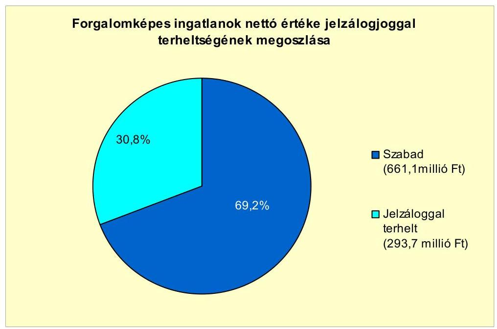

Az Önkormányzatnak a vizsgált időszakban folyamatban lévő peres eljárása nem volt.

---

Az Önkormányzat 50%-ot és azt meghaladó tulajdonosi hányaddal rendelkezik három társaságában, amelyek kötelezettségeinek állományát 2010. december 31-én és 2011. június 30-án, valamint azok várható összegét a kötelezettségek lejáratáig az alábbi táblázat mutatja be:

| Megnevezés | Állomány 2010. december 31-én |  |  | Állomány 2011. június 30-án |  |  | Várható kötelezettség 2011-2013.   években |  | Várható kötelezettség 2014. évtől |  |
| :--: | :--: | :--: | :--: | :--: | :--: | :--: | :--: | :--: | :--: | :--: |
|  | HUF-ban   (millió Ftban) | Devizában (összege, ezer ...ben) | Deviza   nem | HUFban (millió Ft-ban) | Devizában (összege, ezer ... ben) | Deviza   nem | HUFban (millió Ft-ban) | Devizában (összege, ezer ... ben) | HUFban (millió Ft-ban) | Devizában (összege, ezer ... ben) |
| Önkormányzati Közszolgáltató Vállalat 14/1/1 | 3,3 |  | HUF | 2,9 |  | HUF | 3,2 |  | 12,2 |  |
| Önkormányzati Közszolgáltató Vállalat 14/1/2 | 1,9 |  | HUF | 1,9 |  | HUF | 1,6 |  |  |  |
| Önkormányzati Közszolgáltató Vállalat 14/1/2 |  | 42,4 | CHF |  | 36,0 | CHF |  | 40,1 |  | 6,2 |
| Önkormányzati Közszolgáltató Vállalat | 5,6 |  | HUF | 7,6 |  | HUF |  |  |  |  |
| Gotthárd Therm Kft |  | 13860,3 | CHF |  | 13860,3 | CHF |  | 2164,0 |  | 14545,6 |
| Pénzintézeti kötelezettségek összesen HUF-ban: | 10,8 |  | HUF | 12,4 |  | HUF | 4,8 |  | 12,2 |  |
| Pénzintézeti kötelezettségek összesen CHF-ben: |  | 13 902,7 | CHF |  | 13 896,3 | CHF |  | 2 204,1 |  | 14 551,8 |
| Önkormányzati Közszolgáltató Vállalat | 2,3 |  | HUF | 2,1 |  | HUF | 2,1 |  |  |  |
| Gotthárd Therm Kft | 25,6 |  | HUF | 31,0 |  | HUF | 31,0 |  |  |  |
| Szállítói tartozás összesen: | 27,9 |  | HUF | 33,1 |  | HUF | 33,1 |  |  |  |
| Összes kötelezettség HUFban: | 38,7 |  | HUF | 45,5 |  | HUF | 35,8 |  | 12,2 |  |
| Összes kötelezettség CHFben: |  | 13 902,7 | CHF |  | 13 896,3 | CHF |  | 2 204,1 |  | 14 551,8 |

Az Önkormányzat 100%-os tulajdonában lévő Gotthárd-Therm Kft. a vizsgálat időpontjában folyamatban lévő peres eljárásban 5,1 millió Ft perértékben volt érintett alperesként. Az AQUAPROFIT Zrt. a sikerdíját pereli, amelynek alapja az általuk 2004. március 16-án megkötött szerződés.

Az Önkormányzat kizárólagos tulajdonú gazdasági társaságai pénzintézeti kötelezettsége 2011. június 30-án 12,4 millió Ft, továbbá 13 896,3 ezer CHF volt, valamint 33,1 millió Ft szállítói állománnyal rendelkeztek, amelyből 13,1 millió Ft 30 napon belül lejárt szállítói állomány.

Az önkormányzati kötelezettségek csökkenése ellenére az Önkormányzat kizárólagos tulajdonában lévő gazdasági társaságok kötelezettségei kedvezőtlenül befolyásolják az Önkormányzat pénzügyi egyensúlyi helyzetét. A kettő kizárólagos önkormányzati tulajdonú gazdasági társaság a 2011. évtől 16 755,9 ezer CHF és 17,0 millió Ft pénzintézeti tőke és kamatkötelezettséggel, valamint 33,1 millió Ft szállítói állománnyal rendelkezett. A Gotthárd-Therm Kft. esetében a kötvénykibocsátás kötelezettségeinek nem teljesítése miatt 2010. októberében érvényesítette a bank az Önkormányzat terhére a kezességvállalást.

A vizsgált időszakban nem történt meg annak felmérése és a Képviselőtestületnek előterjesztett zárszámadási rendeletekben történő bemutatása, hogy az eszközök felújításának, illetve az elhasználódásának pótlása mekkora forrásokat igényel az Önkormányzatnál. A felújításokra, ezen belül az eszközök pótlására az Önkormányzat pénzügyi lehetőségének függvényében,

---

elsősorban a működőképességének biztosítása, illetve a szakhatósági előírások figyelembevételével került sor.

Az Önkormányzat a 2007-2010. években a tárgyi eszközök után 840,3 millió Ft összegű értékcsökkenést számolt el. Az Önkormányzat a 2007-2010 közötti időszakban összesen 647,0 millió Ft értékben aktivált – főként ingatlanokat érintő – felújítást és beruházást. Felújításra az Önkormányzat az értékcsökkenés összegének a 10,1%-át (85,1 millió Ft-ot), beruházásra 66,9%-át (561,9 millió Ft-ot) fordította. Az elhasználódott eszközök pótlására tartalékot nem képzett, külön alapot nem hozott létre.

Útburkolat felújítást, parkolóépítést, városközpont fejlesztést, gyógyfürdő fejlesztést hajtott végre, a háziorvosi rendelő épületének akadálymentesítése és energiahatékony felújítása a helyszíni ellenőrzés idején folyamatban volt.

Az elhasználódottság ${ }^{47}$ az eszközökre vonatkoztatva a 2007. évi 20,6%-ról a 2010. évre 32,7%-ra változott. Az elhasználódottság mértéke a 2007. évről a 2010. évre az immateriális javak esetében 76,5%-ról 83,5%-ra, az ingatlanok és vagyoni értékű jogok esetében 13,9%-ról 19,1%-ra, a gépek berendezések esetében 82,0%-ról 84,1%-ra, a járművek esetében 75,6%-ról 100%-ra, míg az üzemeltetésre átadott eszközök esetében 24,4%-ról 67,7%-ra emelkedett. (Az eszközökön belül az immateriális javak 1,4%-os, az ingatlanok és vagyoni értékű jogok 74,6%-os, a gépek berendezések 6,4%-os, a járművek 0,1%-os és az üzemeltetésre átadott eszközök 17,5%-os arányt képviseltek.)

Az épületeken, építményeken pénzügyileg teljesült fejlesztés hatására az ingatlanok és vagyoni értékű jogok számvitelben kimutatott nettó értéke a 2007-2010. közötti években 29,1 millió Ft-tal, a gépek berendezések esetében 3,1 millió Ft-tal emelkedett, míg a járműveknél 2,1 millió Ft-tal csökkent.

A fejlesztések, felújítások közül a 38,1 millió Ft bekerülési költségű „Szentgotthárd-Farkasfa településrész ivóvízminőség-javítása” projekt növeli az üzemeltetésre átadott eszközök nettó értékét, összeségében azonban az üzemeltetésre átadott eszközök nettó értéke a 2007-2010. években 689,0 millió Ft-tal csökkent.

# 4. A PÉNZÜGYI EGYENSÚLY MEGTEREMTÉSE ÉRDEKÉBEN HOZOTT INTÉZKEDÉSEK EREDMÉNYE 

A 2007-2010. években a kiadáscsökkentő intézkedések hatásaként együttesen 33,9 millió Ft összegű kiadási megtakarítást mutatott ki az Önkormányzat. Az intézkedések között szerepelt létszámcsökkentés, cafetéria elemek megszüntetése, közalkalmazotti bértáblán felüli bérek és pótlékok elvonása, helyettesítés belső munkatárssal történő biztosítása, a civil szervezetek támogatásainak csökkenése, valamint a bölcsődei feladat átszervezése.

[^0]
[^0]:    ${ }^{47}$ Elhasználódottság = eszköz nettó értéke/eszköz bruttó értéke

---

Az Önkormányzat által a 2007-2011. év I. félév között foganatosított kiadáscsökkentő intézkedések területeit, összegeit és százalékos megoszlását a következő ábra szemlélteti:
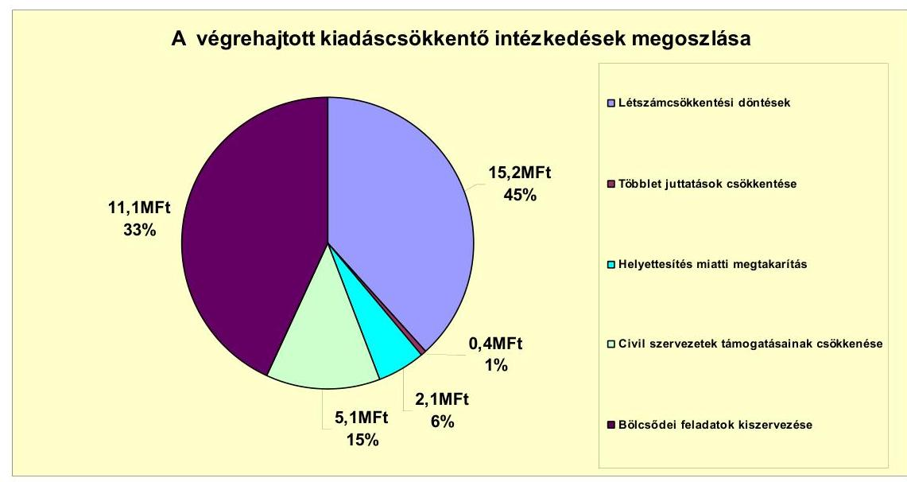

A személyi változásokat érintő döntések a 2010. évben 10,3 millió Ft, a 2011. év I. félév végéig 4,9 millió Ft kiadás csökkenést jelentettek az Önkormányzat számára. Az oktatási intézmények racionalizálásáról szóló döntés folytatásaként a 2009. évi költségvetési rendeletben a cafetéria elemeket csökkentették, a közalkalmazotti bértáblán felüli béreket és pótlékokat elvonták, így a 2010. évben 0,2 millió Ft további megtakarítást mutattak ki. A 2010. és a 2011. évi költségvetési rendeletekben a külső pályázatíró szolgáltatási szerződését megszüntették, illetve egy labor asszisztens helyettesítéssel történő ellátásáról döntöttek, amelyek következtében a 2010. évben 0,6 millió Ft, majd a 2011. évben további 1,5 millió Ft kiadási megtakarítást értek el. A 2008-2011. évi költségvetési rendeletekben a civil szervezetek támogatását csökkentették, a 2010. évben 4,1 millió Ft, a 2011. évben 0,9 millió Ft kiadáscsökkenést értek el.

A sportegyesületi támogatást fokozatosan a 2007. évi 4 millió Ft-ról a 2011. évre 2 millió Ft-ra csökkentették, a civil alap támogatási keretét a 2008. évi 1 millió Ft-ról megszüntették.

A 2010. július 1-jétől a bölcsődét közalapítvány működtette, amelyhez az Önkormányzat speciális célú támogatást adott. A Képviselő-testület a bölcsődei feladatok átszervezéséről döntött ${ }^{48}$ és a bölcsődei feladatokat az óvodát is működtető alapítványnak adták át.

A bölcsőde működtetéshez adott támogatás a 2010. évben 5,4 millió Ft-tal, a 2011. évben 5,7 millió Ft-tal csökkent.

A bölcsőde működtetéséhez a 2010. évre az Önkormányzat 20,0 millió Ft támogatást tervezett, melyből az első félévben 10 millió Ft, a második félévben csak

[^0]
[^0]:    ${ }^{48}$ 120/2010. (V. 12.) számú határozat alapján a feladatellátást a közalapítványtól átadták az óvodát fenntartó alapítványnak.

---

4,6 millió Ft hozzájárulást fizetett, így az Önkormányzat 5,4 millió Ft megtakarítást mutatott ki. A 2011. év I. félévében az Önkormányzat 5,7 millió Ft támogatás-megtakarítást realizált.

Az önkormányzati létszám és álláshelyek 2007-2010. évek közötti alakulását a következő táblázat mutatja be:

| Megnevezés   (adatok fő-ben) | Közoktatás | Szociális és gyermekvédelem | Egészségügy | Polgármesteri hivatat | Egyéb | Összesen |
| :--: | :--: | :--: | :--: | :--: | :--: | :--: |
| 2007. január 1-jén jóváhagyott álláshelyek száma | 50 | 0 | 42 | 59 | 8 | 159 |
| Megszüntetett álláshelyek száma | 0 | 0 | 9 | 2 | 1 | 12 |
| ebből: | üres álláshelyek száma | 0 | 0 | 0 | 0 | 0 |
|  | szakmai álláshelyek száma | 0 | 0 | 9 | 2 | 1 | 12 |
| 2010. december 31-én záró álláshelyek száma | 50 | 0 | 33 | 57 | 7 | 147 |

 | 147 |
| 2007. január 1-jén foglalkoztatott létszám | 50 | 0 | 42 | 59 | 8 | 159 |
| Létszámcsökkenés | 0 | 0 | 9 | 2 | 1 | 12 |
| 2010. december 31-én foglalkoztatott létszám | 50 | 0 | 33 | 57 | 7 | 147 |

A Képviselő-testület a III. Béla Szakképző Iskola és Kollégium létszámracionalizálásáról döntött, amelynek értelmében az intézmény egy dolgozóját prémium évek keretében foglalkoztatták tovább, valamint a 2009. évi költségvetés előkészítésekor a Könyvtár dolgozói létszámát egy fővel csökkentették. A Polgármesteri hivatal igazgatási feladatai ellátását érintően egy fő köztisztviselő és egy ügykezelő megüresedett álláshelyét szüntették meg.

Az egészségügyben foglalkoztatottak közül a 2008. évtől hat${ }^{49}$, majd a 2010. évtől újabb három fő${ }^{50}$ feladatát vállalkozói jogviszonyban látták el, a megüresedett álláshelyeket az Önkormányzat a 2008. évi, illetve a 2010. évi költségvetési rendeletében megszüntette. A 2007. január 1-jei 159 fő létszám és az álláshelyek száma 2010. december 31-re 147-re csökkent.

A Képviselő-testület az önkormányzati megtakarítási program${ }^{51}$ megvalósítását támogatta, amelynek ugyan a vizsgált időszakban kimutatható eredménye nem volt.

A létszámleépítéshez kapcsolódóan a 2007-2010. évekre a prémiuméves pedagógus foglalkoztatásához összesen 4,6 millió Ft, a könyvtári dolgozó leépítéséhez 3,2 millió Ft központosított támogatást igényeltek és kaptak meg.

A 2007-2011. év I. félévében érvényesített bevételnövelő intézkedések főbb bevételi jogcímek szerinti számszerűsíthető hatását a következő ábra szemlélteti:

[^0]
[^0]:    ${ }^{49}$ egy fő háziorvos asszisztens, egy fő védőnő, egy fő foglalkoztatás-egészségügyi asszisztens, egy fő kalemnővér, egy fő nőgyógyász uh. szakorvos és egy fő fül-orr-gégész szakorvos
    ${ }^{50}$ egy fő háziorvos, egy fő háziorvos asszisztens, egy fő nőgyógyász szakorvos
    ${ }^{51}$ 308/2010. (XII. 15.) számú határozat

---

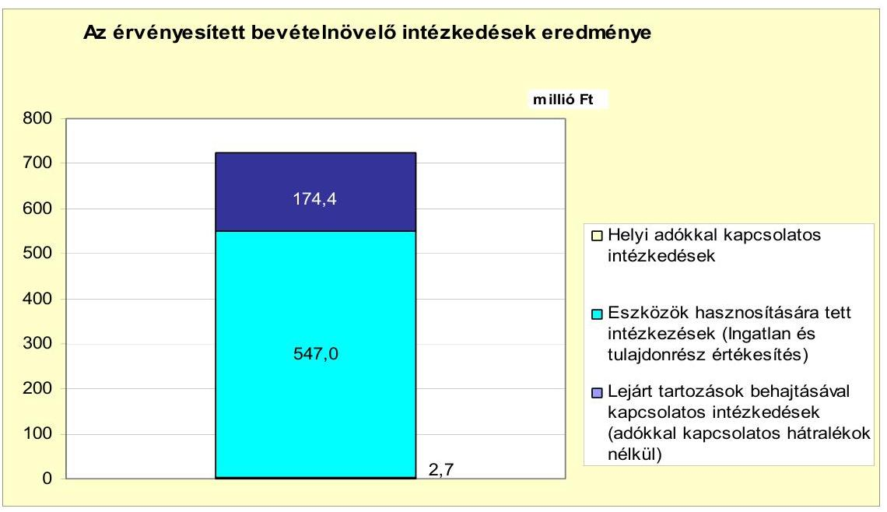

Az Önkormányzat kimutatásai szerint bevételnövelő intézkedések a 2007-2011. év I. félévében 724,1 millió Ft bevételt eredményeztek.

Az Önkormányzat a bevételek növelése érdekében új adót vezetett be, a helyi adók mértékének növelését, illetve a kedvezmények, mentességek csökkentését rendelte el. A végrehajtott intézkedések nélkül a helyi adók és pótlékok 174,4 millió Ft összegű további csökkenése következett volna be. Az Önkormányzat a bevételek növelése érdekében a működéshez nélkülözhető forgalomképes ingatlanjait értékesítésre meghirdette és ezek közül 48 ingatlant értékesített (367,0 millió Ft értékben), továbbá eladta a Városi Televízió Kft.-ben lévő tulajdonrészesedését (180,0 millió Ft-ért). Követelését peres eljárás lefolytatásával érvényesítette 4,6 millió Ft értékben.

Az Önkormányzat központi támogatásokból származó bevételei a 2007. évhez képest az időszak egészét tekintve összességében nőttek. Ennek ellenére az Önkormányzat folytatta a - vizsgált időszakot megelőző években elkezdett - kiadási megtakarítást eredményező és bevételt növelő intézkedéseit. A 2007-2011. év I. féléve között tett intézkedések hatására 724,1 millió Ft bevételi többletet, továbbá 33,9 millió Ft kiadási megtakarítást mutattak ki. Az intézkedések az Önkormányzat pénzügyi egyensúlyára pozitív hatással voltak, mert az Önkormányzat adatszolgáltatása szerint - összességében 758,0 millió Ft-tal - javítottak a költségvetés egyensúlyán, azonban a megtett intézkedések továbbra sem biztosítanak elegendő forrást a pénzügyi egyensúly helyreállításához.

Az intézkedések pénzügyi eredményeit a hitelek törlesztése és a kimutatott fejlesztések mellett a működés zavartalan biztosítására is felhasználták.

---

# 5. Az ÁSZ által a korábbi években a pénzügyi egyensúly javítására tett szabályszerűségi és célszerűségi javaslatok hasznosulása

Az ÁSZ az Önkormányzat gazdálkodási rendszerének 2007. évi ellenőrzése során egy szabályszerűségi javaslatot tett. A jelentést a Képviselő-testület a 2007. augusztus 29-ei ülésén megismerte és a feltárt hiányosság megszüntetése érdekében a 191/2007. (VIII. 29.) számú határozatával elfogadta a felelősök és a határidők megjelölésével elkészített intézkedési tervet.

A szabályszerűségi javaslat az adósságot keletkeztető éves kötelezettségvállalás felső határának figyelembevételére vonatkozott, amelyet az Ötv. 88. § (2)(4) bekezdésében előírtak szerint betartottak.

Budapest, 2012. április 11.

Melléklet: $\quad 7 \mathrm{db}$
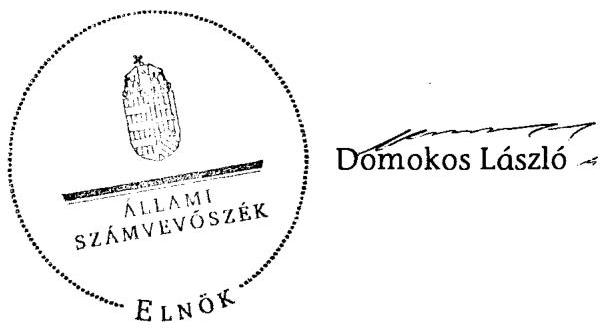

---

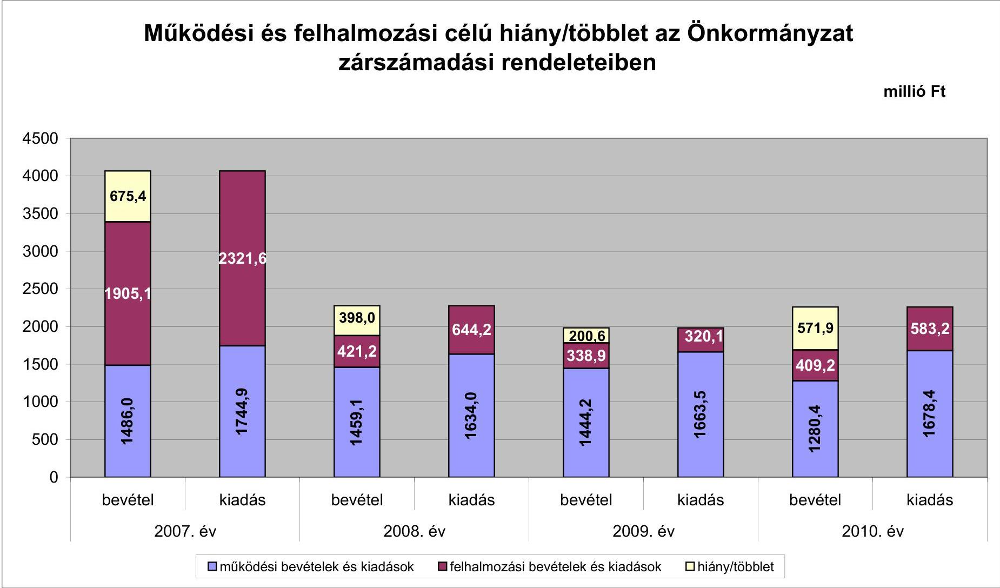

# Működési és felhalmozási célú hiány/többlet az Önkormányzat zárszámadási rendeleteiben

|  év | 1. számú melléklet | 2. számú jelentéshez  |
| --- | --- | --- |
|  1. | 4500 | 4000  |
|  2. | 675.4 | 575.4  |
|  3. | 2321.6 | 2321.6  |
|  4. | 1805.1 | 1805.1  |
|  5. | 398.0 | 398.0  |
|  6. | 644.2 | 644.2  |
|  7. | 2008.4 | 2008.4  |
|  8. | 320.1 | 320.1  |
|  9. | 571.9 | 571.9  |
|  10. | 583.2 | 583.2  |
|  11. | 1678.4 | 1678.4  |
|  12. | 1444.2 | 1444.2  |
|  13. | 1663.5 | 1663.5  |
|  14. | 1280.4 | 1280.4  |
|  15. | 1678.4 | 1678.4  |
|  16. | 1444.2 | 1444.2  |
|  17. | 1280.4 | 1280.4  |
|  18. | 1663.5 | 1663.5  |
|  19. | 1280.4 | 1280.4  |
|  20. | 1663.5 | 1663.5  |
|  21. | 1280.4 | 1280.4  |
|  22. | 1444.2 | 1444.2  |
|  23. | 1663.5 | 1663.5  |
|  24. | 1444.2 | 1444.2  |
|  25. | 1280.4 | 1280.4  |
|  26. | 1444.2 | 1444.2  |
|  27. | 1280.4 | 1280.4  |
|  28. | 1663.5 | 1663.5  |
|  29. | 1280.4 | 1280.4  |
|  30. | 1663.5 | 1663.5  |
|  31. | 1280.4 | 1280.4  |
|  32. | 1444.2 | 1444.2  |
|  33. | 1663.5 | 1663.5  |
|  34. | 1280.4 | 1280.4  |
|  35. | 1444.2 | 1444.2  |
|  36. | 1280.4 | 1280.4  |
|  37. | 1280.4 | 1280.4  |
|  38. | 1663.5 | 1663.5  |
|  39. | 1280.4 | 1280.4  |
|  40. | 1663.5 | 1663.5  |
|  41. | 1280.4 | 1280.4  |
|  42. | 1444.2 | 1444.2  |
|  43. | 1663.5 | 1663.5  |
|  44. | 1280.4 | 1280.4  |
|  45. | 1280.4 | 1280.4  |
|  46. | 1280.4 | 1280.4  |
|  47. | 1280.4 | 1280.4  |
|  48. | 1663.5 | 1663.5  |
|  49. | 1280.4 | 1280.4  |
|  50. | 1280.4 | 1280.4  |
|  51. | 1280.4 | 1280.4  |
|  52. | 1280.4 | 1280.4  |
|  53. | 1280.4 | 1280.4  |
|  54. | 1280.4 | 1280.4  |
|  55. | 1280.4 | 1280.4  |
|  56. | 1280.4 | 1280.4  |
|  57. | 1280.4 | 1280.4  |
|  58. | 1663.5 | 1663.5  |
|  59. | 1280.4 | 1280.4  |
|  60. | 1280.4 | 1280.4  |
|  61. | 1280.4 | 1280.4  |
|  62. | 1280.4 | 1280.4  |
|  63. | 1280.4 | 1280.4  |
|  64. | 1280.4 | 1280.4  |
|  65. | 1280.4 | 1280.4  |
|  66. | 1280.4 | 1280.4  |
|  67. | 1280.4 | 1280.4  |
|  68. | 1280.4 | 1280.4  |
|  69. | 1280.4 | 1280.4  |
|  70. | 1280.4 | 1280.4  |
|  71. | 1280.4 | 1280.4  |
|  72. | 1280.4 | 1280.4  |
|  73. | 1280.4 | 1280.4  |
|  74. | 1280.4 | 1280.4  |
|  75. | 1280.4 | 1280.4  |
|  76. | 1280.4 | 1280.4  |
|  77. | 1280.4 | 1280.4  |
|  78. | 1280.4 | 1280.4  |
|  79. | 1280.4 | 1280.4  |
|  80. | 1280.4 | 1280.4  |
|  81. | 1280.4 | 1280.4  |
|  82. | 1280.4 | 1280.4  |
|  83. | 1280.4 | 1280.4  |
|  84. | 1280.4 | 1280.4  |
|  85. | 1280.4 | 1280.4  |
|  86. | 1280.4 | 1280.4  |
|  87. | 1280.4 | 1280.4  |
|  88. | 1280.4 | 1280.4  |
|  89. | 1280.4 | 1280.4  |
|  90. | 1280.4 | 1280.4  |
|  91. | 1280.4 | 1280.4  |
|  92. | 1280.4 | 1280.4  |
|  93. | 1280.4 | 1280.4  |
|  94. | 1280.4 | 1280.4  |
|  95. | 1280.4 | 1280.4  |
|  96. | 1280.4 | 1280.4  |
|  97. | 1280.4 | 1280.4  |
|  98. | 1280.4 | 1280.4  |
|  99. | 1280.4 | 1280.4  |
|  100. | 1280.4 | 1280.4  |
|  101. | 1280.4 | 1280.4  |
|  102. | 1280.4 | 1280.4  |
|  103. | 1280.4 | 1280.4  |
|  104. | 1280.4 | 1280.4  |
|  105. | 1280.4 | 1280.4  |
|  106. | 1280.4 | 1280.4  |
|  107. | 1280.4 | 1280.4  |
|  108. | 1280.4 | 1280.4  |
|  109. | 1280.4 | 1280.4  |
|  110. | 1280.4 | 1280.4  |
|  111. | 1280.4 | 1280.4  |
|  112. | 1280.4 | 1280.4  |
|  113. | 1280.4 | 1280.4  |
|  114. | 1280.4 | 1280.4  |
|  115. | 1280.4 | 1280.4  |
|  116. | 1280.4 | 1280.4  |
|  117. | 1280.4 | 1280.4  |
|  118. | 1280.4 | 1280.4  |
|  119. | 1280.4 | 1280.4  |
|  120. | 1280.4 | 1280.4  |
|  121. | 1280.4 | 1280.4  |
|  122. | 1280.4 | 1280.4  |
|  123. | 1280.4 | 1280.4  |
|  124. | 1280.4 | 1280.4  |
|  125. | 1280.4 |

 | 1280.4  |
|  126. | 1280.4 | 1280.4  |
|  127. | 1280.4 | 1280.4  |
|  128. | 1280.4 | 1280.4  |
|  129. | 1280.4 | 1280.4  |
|  1210. | 1280.4 | 1280.4  |
|  1211. | 1280.4 | 1280.4  |
|  1212. | 1280.4 | 1280.4  |
|  1213. | 1280.4 | 1280.4  |
|  1214. | 1280.4 | 1280.4  |
|  1215. | 1280.4 | 1280.4  |
|  1216. | 1280.4 | 1280.4  |
|  1217. | 1280.4 | 1280.4  |
|  1218. | 1280.4 | 1280.4  |
|  1219. | 1280.4 | 1280.4  |
|  1220. | 1280.4 | 1280.4  |
|  1221. | 1280.4 | 1280.4  |
|  1222. | 1280.4 | 1280.4  |
|  1223. | 1280.4 | 1280.4  |
|  1224. | 1280.4 | 1280.4  |
|  1225. | 1280.4 | 1280.4  |
|  1226. | 1280.4 | 1280.4  |
|  1227. | 1280.4 | 1280.4  |
|  1228. | 1280.4 | 1280.4  |
|  1229. | 1280.4 | 1280.4  |
|  1230. | 1280.4 | 1280.4  |
|  1231. | 1280.4 | 1280.4  |
|  1232. | 1280.4 | 1280.4  |
|  1233. | 1280.4 | 1280.4  |
|  1234. | 1280.4 | 1280.4  |
|  1235. | 1280.4 | 1280.4  |
|  1236. | 1280.4 | 1280.4  |
|  1237. | 1280.4 | 1280.4  |
|  1238. | 1280.4 | 1280.4  |
|  1239. | 1280.4 | 1280.4  |
|  1240. | 1280.4 | 1280.4  |
|  1241. | 1280.4 | 1280.4  |
|  1242. | 1280.4 | 1280.4  |
|  1243. | 1280.4 | 1280.4  |
|  1244. | 1280.4 | 1280.4  |
|  1245. | 1280.4 | 1280.4  |
|  1246. | 1280.4 | 1280.4  |
|  1247. | 1280.4 | 1280.4  |
|  1248. | 1280.4 | 1280.4  |
|  1249. | 1280.4 | 1280.4  |
|  1250. | 1280.4 | 1280.4  |
|  1251. | 1280.4 | 1280.4  |
|  1252. | 1280.4 | 1280.4  |
|  1253. | 1280.4 | 1280.4  |
|  1254. | 1280.4 | 1280.4  |
|  1255. | 1280.4 | 1280.4  |
|  1256. | 1280.4 | 1280.4  |
|  1257. | 1280.4 | 1280.4  |
|  1258. | 1280.4 | 1280.4  |
|  1259. | 1280.4 | 1280.4  |
|  1260. | 1280.4 | 1280.4  |
|  1261. | 1280.4 | 1280.4  |
|  1262. | 1280.4 | 1280.4  |
|  1263. | 1280.4 | 1280.4  |
|  1264. | 1280.4 | 1280.4  |
|  1265. | 1280.4 | 1280.4  |
|  1266. | 1280.4 | 1280.4  |
|  1267. | 1280.4 | 1280.4  |
|  1268. | 1280.4 | 1280.4  |
|  1269. | 1280.4 | 1280.4  |
|  1270. | 1280.4 | 1280.4  |
|  1271. | 1280.4 | 1280.4  |
|  1272. | 1280.4 | 1280.4  |
|  1273. | 1280.4 | 1280.4  |
|  1274. | 1280.4 | 1280.4  |
|  1275. | 1280.4 | 1280.4  |
|  1276. | 1280.4 | 1280.4  |
|  1277. | 1280.4 | 1280.4  |
|  1278. | 1280.4 | 1280.4  |
|  1279. | 1280.4 | 1280.4  |
|  1280. | 1280.4 | 1280.4  |
|  1281. | 1280.4 | 1280.4  |
|  1282. | 1280.4 | 1280.4  |
|  1283. | 1280.4 | 1280.4  |
|  1284. | 1280.4 | 1280.4  |
|  1285. | 1280.4 | 1280.4  |
|  1286. | 1280.4 | 1280.4  |
|  1287. | 1280.4 | 1280.4  |
|  1288. | 1280.4 | 1280.4  |
|  1289. | 1280.4 | 1280.4  |
|  1290. | 1280.4 | 1280.4  |
|  1291. | 1280.4 | 1280.4  |
|  1292. | 1280.4 | 1280.4  |
|  1293. | 1280.4 | 1280.4  |
|  1294. | 1280.4 | 1280.4  |
|  1295. | 1280.4 | 1280.4  |
|  1296. | 1280.4 | 1280.4  |
|  1297. | 1280.4 | 1280.4  |
|  1298. | 1280.4 | 1280.4  |
|  1299. | 1280.4 | 1280.4  |
|  1300. | 1280.4 | 1280.4  |
|  1301. | 1280.4 | 1280.4  |
|  1302. | 1280.4 | 1280.4  |
|  1303. | 1280.4 | 1280.4  |
|  1304. | 1280.4 | 1280.4  |
|  1305. | 1280.4 | 1280.4  |
|  1306. | 1280.4 | 1280.4  |
|  1307. | 1280.4 | 1280.4  |
|  1308. | 1280.4 | 1280.4  |
|  1309. | 1280.4 | 1280.4  |
|  1310. | 1280.4 | 1280.4  |
|  1311. | 1280.4 | 1280.4  |
|  1312. | 1280.4 | 1280.4  |
|  1313. | 1280.4 | 1280.4  |
|  1314. | 1280.4 | 1280.4  |
|  1315. | 1280.4 | 1280.4  |
|  1316. | 1280.4 | 1280.4  |
|  1317. | 1280.4 | 1280.4  |
|  1318. | 1280.4 | 1280.4  |
|  1319. | 1280.4 | 1280.4  |
|  1320. | 1280.4 | 1280.4  |
|  1321. | 1280.4 | 1280.4  |
|  1322. | 1280.4 | 1280.4  |
|  1323. | 1280.4 | 1280.4  |
|  1324. | 1280.4 | 1280.4  |
|  1325. | 1280.4 | 1280.4  |
|  1326. | 1280.4 | 1280.4  |
|  1327. | 1280.4 | 1280.4  |
|  1328. | 1280.4 | 1280.4  |
|  1329. | 1280.4 | 1280.4  |
|  1330. | 1280.4 | 1280.4  |
|  1331. | 1280.4 | 1280.4  |
|  1332. | 1280.4 | 1280.4  |
|  1333. | 1280.4 | 1280.4  |
|  1334. | 1280.4 | 1280.4  |
|  1335. | 1280.4 | 1280.4  |
|  1336. | 1280.4 | 1280.4  |
|  1337. | 1280.4 | 1280.4  |
|  1338. | 1280.4 | 1280.4  |
|  1339. | 1280.4 | 1280.4  |
|  1340. | 1280.4 | 1280.4  |
|  1341. | 1280.4 | 1280.4  |
|  1342. | 1280.4 | 1280.4  |
|  1343. | 1280.4 | 1280.4  |
|  1344. | 1280.4 | 1280.4  |
|  1345. | 1280.4 | 1280.4  |
|  1346. | 1280.4 | 1280.4  |
|  1347. | 1280.4 | 1280.4  |
|  1348. | 1280.4 | 1280.4  |
|  1349. | 1280.4 | 1280.4  |
|  1350. | 1280.4 | 1280.4  |
|  1351. | 1280.4 | 1280.4  |
|  1352. | 1280.4 | 1280.4  |
|  1353. | 1280.4 | 1280.4  |
|  1354. | 1280.4 | 1280.4  |
|  1355. | 1280.4 | 1280.4  |
|  1356. | 1280.4 | 1280.4  |
|  1357. | 1280.4 | 1280.4  |
|  1358. | 1280.4 | 1280.4  |
|  1359. | 1280.4 | 1280.4  |
|  1360. | 1280.4 | 1280.4  |
|  1361. | 1280.4 | 1280.4  |
|  1362. | 1280.4 | 1280.4  |
|  1363. | 1280.4 | 1280.4  |
|  1364. | 1280.4 | 1280.4  |
|  1365. | 1280.4 | 1280.4  |
|  1366. | 1280.4 | 1280.4  |
|  1367. | 1280.4 | 1280.4  |
|  1368. | 1280.4 | 1280.4  |
|  1369. | 1280.4 | 1280.4  |
|  1370. | 1280.4 | 1280.4  |
|  1371. | 1280.4 | 1280.4  |
|  1372. | 1280.4 | 1280.4  |
|  1373. | 1280.4 | 1280.4  |
|  1374. | 1280.4 | 1280.4  |
|  1375. | 1280.4 | 1280.4  |
|  1376. | 1280.4 | 1280.4  |
|  1377. | 1280.4 | 1280.4  |
|  1378. | 1280.4 | 1280.4  |
|  1379. | 1280.4 | 1280.4  |
|  1380. | 1280.4 | 1280.4  |
|  1381. | 1280.4 | 1280.4  |
|  1382. | 1280.4 | 1280.4  |
|  1383. | 1280.4 | 1280.4  |
|  1384. | 1280.4 | 1280.4  |
|  1385. | 1280.4 | 1280.4  |
|  1386. | 1280.4 | 1280.4  |
|  1387. | 1280.4 | 1280.4  |
|  1388. | 1280.4 | 1280.4  |
|  1389. | 1280.4 | 1280.4  |
|  1390. | 1280.4 | 1280.4  |
|  1391. | 1280.4 | 1280.4  |
|  1392. | 1280.4 | 1280.4  |
|  1393. | 1280.4 | 1280.4  |
|  1394. | 1280.4 | 1280.4  |
|  1395. | 1280.4 | 1280.4  |
|  1396. | 1280.4 | 1280.4  |
|  1397. | 1280.4 | 1280.4  |
|  1398. | 1280.4 | 1280.4  |
|  1399. | 1280.4 | 1280.4  |
|  1399. | 1280.4 | 1280.4  |
|  1390. | 1280.4 | 1280.4  |
|  1391. | 1280.4 | 1280.4  |
|  1391. | 1280.4 | 1280.4  |
|  13911. | 1280.4 | 1280.4  |
|  13912. | 1280.4 |

 | 1280.4  |
|  13913. | 1280.4 | 1280.4  |
|  13913. | 1280.4 | 1280.4  |
|  13913. | 1280.4 | 1280.4  |
|  13913. | 1280.4 | 1280.4  |
|  13913. | 1280.4 | 1280.4  |
|  13913. | 1280.4 | 1280.4  |
|  13913. | 1280.4 | 1280.4  |
|  13913. | 1280.4 | 1280.4  |
|  13913. | 1280.4 | 1280.4  |
|  13913. | 1280.4 | 1280.4  |
|  13913. | 1280.4 | 1280.4  |
|  13913. | 1280.4 | 1280.4  |
|  13913. | 1280.4 | 1280.4  |
|  13913. | 1280.4 | 1280.4  |
|  13913. | 1280.4 | 1280.4  |
|  13913. | 1280.4 | 1280.4  |
|  13913. | 1280.4 | 1280.4  |
|  13913. | 1280.4 | 1280.4  |
|  13913. | 1280.4 | 1280.4  |
|  13913. | 1280.4 | 1280.4  |
|  13913. | 1280.4 | 1280.4  |
|  13913. | 1280.4 | 1280.4  |
|  13913. | 1280.4 | 1280.4  |
|  13913. | 1280.4 | 1280.4  |
|  13913. | 1280.4 | 1280.4  |
|  13913. | 1280.4 | 1280.4  |
|  13913. | 1280.4 | 1280.4  |
|  13913. | 1280.4 | 1280.4  |
|  13913. | 1280.4 | 1280.4  |
|  13913. | 1280.4 | 1280.4  |
|  

---

Az Önkormányzat bevételei és kiadásai, valamint adósságszolgálata 2007-2010 között

|  1. FOLYÓ KÖLTSÉGVETÉS* | 2007. év | 2008. év | 2009. év | 2010. év  |
| --- | --- | --- | --- | --- |
|  1.1.1. Saját működési bevételek | 994,2 | 830,4 | 801,0 | 701,5  |
|  1.1.2. Költségvetési támogatás | 227,3 | 366,7 | 376,2 | 335,2  |
|  1.1.3. Átengedett bevételek | 201,8 | 122,4 | 119,8 | 158,9  |
|  1.1.4. Állambáztartáson belülről kapott támogatások | 155,3 | 173,7 | 171,5 | 177,3  |
|  1.1.5. EU-tól és külföldről kapott bevételek | 0,0 | 2,5 | 24,7 | 3,7  |
|  1.1.6. Állambáztartáson kívülről kapott bevételek | 2,1 | 17,8 | 12,5 | 3,9  |
|  1.1.7. Előző évi pénzmaradvány átvétel | 0,9 | 0,0 | 0,0 | 0,0  |
|  1.1. Folyó bevételek $=1.1 .1 .+1.1 .2 .+1.1 .3 .+1.1 .4 .+1.1 .5 .+1.1 .6 .+1.1 .7$. | 1581,6 | 1513,5 | 1505,7 | 1380,5  |
|  1.2.1. Működési kiadások kamatkiadások nélkül | 957,3 | 1027,8 | 963,3 | 1001,2  |
|  1.2.2. Állambáztartáson belülre átadott pénzeszközök | 295,5 | 225,5 | 271,6 | 296,7  |
|  1.2.3.1. vállalkozásoknak | 7,6 | 3,3 | 0,9 | 129,2  |
|  1.2.3.2. EU-nak, illetve külföldre | 0,0 | 0,0 | 0,0 | 0,0  |
|  1.2.3.3. magáncélszemélyeknek | 60,2 | 67,8 | 84,2 | 66,0  |
|  1.2.3.4. nonprofit szervezeteknek | 70,3 | 68,1 | 56,1 | 45,3  |
|  1.2.3. Transzferkiadások ( $=1.2 .3 .1+1.2 .3 .2+1.2 .3 .3+1.2 .3 .4$ ) | 138,1 | 139,2 | 141,2 | 240,5  |
|  1.2.4 Kamatkiadások | 79,5 | 30,7 | 30,7 | 20,0  |
|  1.2.5. Előző évi pénzmaradvány átadás | 0,0 | 0,0 | 0,0 | 0,0  |
|  1.2. Folyó kiadások $=1.2 .1 .+1.2 .2 .+1.2 .3 .+1.2 .4 .+1.2 .5$. | 1471,3 | 1423,2 | 1406,8 | 1558,4  |
|  1.3. Folyó költségvetés egyenlege MŰKÖDÉSI JÖVEDELEM (1.1. - 1.2.) | 110,3 | 90,3 | 98,9 | -177,9  |
|  2. FELHALMOZÁSI KÖLTSÉGVETÉS |  |  |  |   |
|  2.1.1. Saját tökebevételek | 1675,4 | 14,1 | 206,4 | 286,9  |
|  2.1.2. Állambáztartáson belülről kapott támogatások | 79,5 | 307,4 | 8,9 | 10,8  |
|  2.1.3. EU-tól és külföldről kapott támogatások | 0,0 | 0,0 | 1,2 | 9,0  |
|  2.1.4. Állambáztartáson kívülről kapott támogatások | 17,2 | 13,9 | 18,6 | 2,4  |
|  2.1. Felhalmozási bevételek ( $=2.1 .1 .+2.1 .2+2.1 .3+2.1 .4$ ) | 1772,1 | 335,3 | 235,1 | 309,1  |
|  2.2.1. Saját beruházási kiadás áfával | 182,3 | 107,9 | 45,5 | 332,3  |
|  2.2.2. Saját felújítási kiadás áfával | 37,1 | 40,6 | 18,9 | 23,6  |
|  2.2.3. Állambáztartáson belülre átadott pénzeszköz | 4,5 | 0,2 | 8,9 | 21,5  |
|  2.2.4. EU-nak és külföldnek adott pénzeszközök | 3,4 | 0,0 | 0,0 | 0,0  |
|  2.2.5. Állambáztartáson kívülre adott pénzeszközök | 373,5 | 9,1 | 95,1 | 77,1  |
|  2.2.6. Befektetési célú részesedések vásárlása | 0,0 | 0,0 | 0,0 | 0,0  |
|  2.2. Felhalmozási kiadások ( $=2.2 .1 .+2.2 .2 .+2.2 .3 .+2.2 .4 .+2.2 .5 .+2.2 .6$ ) | 600,9 | 157,8 | 168,4 | 454,5  |
|  2.3. Felhalmozási költségvetés egyenlege (2.1. - 2.2.) | 1171,2 | 177,5 | 66,7 | -145,4  |
|  3. Finanszírozási műveletek nélküli (GFS) pozíció(1.3.+2.3.) | 1281,5 | 267,8 | 165,6 | -323,3  |
|  4. Finanszírozási műveletek |  |  |  |   |
|  4.1. Hitelfelvétel | 701,9 | 423,8 | 245,6 | 273,0  |
|  4.2. Hiteltörlesztés | 1994,5 | 396,1 | 396,9 | 248,7  |
|  4.3. Forgatási és befektetési célú értékpapírok kibocsátása | 0,0 | 0,0 | 0,0 | 0,0  |
|  4.4. Forgatási és befektetési célú értékpapírok beváltása | 0,0 | 0,0 | 0,0 | 0,0  |
|  4.5. Forgatási és befektetési célú értékpapírok értékesítése | 0,0 | 0,0 | 300,0 | 0,0  |
|  4.6. Forgatási és befektetési célú értékpapírok vásárlása | 0,0 | 300,0 | 0,0 | 0,0  |
|  4.7. Egyéb finanszírozási bevételek (függő, átfutó, kiegyenlítő) | 2,5 | 1,2 | -2,9 | -28,6  |
|  4.8. Egyéb finanszírozási kiadások (függő, átfutó, kiegyenlítő) | -0,2 | 1,0 | 11,6 | -3,4  |
|  4.9.Finanszírozási műveletek egyenlege (4.1. - 4.2.+4.3.-4.4+4.5.-4.6.+4.7.-4.8.) | -1289,9 | -272,1 | 134,2 | -0,9  |
|  5. Tárgyévi pénzügyi pozíció (1.3.+ 2.3.+4.9.) | -8,4 | -4,3 | 299,8 | -324,2  |
|  6. Nettó működési jövedelem =működési jövedelem (1.3.) - tőketörlesztés (4.2+4.4) | -1884,2 | -305,8 | -298,0 | -426,6  |
|  TÁJÉKOZTATÓ ADATOK |  |  |  |   |
|  Összes kötelezettség | 462,1 | 583,0 | 327,6 | 363,6  |
|  ebből rövid lejáratú | 435,9 | 560,4 | 308,8 | 348,4  |
|  Összes szállítói kötelezettség | 30,7 | 24,2 | 15,8 | 15,1  |
|  ebből lejárt (tanúsítványból) | 16,4 | 13,8 | 5,9 | 1,2  |
|  Pénz és tőkepiaci kötelezettség (adósság) | 390,5 | 418,3 | 267,0 | 291,3  |
|  ebből rövid lejáratú | 366,1 | 396,9 | 248,7 | 276,0  |
|  PPP szerződéses állomány jelenértéken (tanúsítványból) | 0,0 | 0,0 | 0,0 | 0,0  |
|  ebből lejárt szolgáltatási díj miatti kötelezettség | 0,0 | 0,0 | 0,0 | 0,0  |
|  Folyószámlahitel napi átlagos állománya (tanúsítványból)** | 266,2 | 266,6 | 219,0 | 231,1  |
|  Likvidhitel napi átlagos állománya (tanúsítványból)** | 16,0 | 26,0 | 0,0 | 0,0  |
|  Munkabérhitel napi átlagos állománya (tanúsítványból)** | 12,6 | 11,1 | 8,7 | 8,3  |
|  Kezesség és garanciavállalások (tanúsítványból) | 2544,0 | 2579,0 | 2585,0 | 2611,0  |
|  Jogelős bírósági ítéletekből adódó kötelezettségek (tanúsítványból) | 0,0 | 0,0 | 0,0 | 0,0  |
|  Finanszírozásba bevonható eszközök: | 68,6 | 364,2 | 364,0 | 39,9  |
|  Tartós hitelkölcsönnyel megtestesítő értékpapírok év végi állománya | 0,0 | 0,0 | 0,0 | 0,0  |
|  Hosszú lejáratú bankbetétek év végi állománya | 0,0 | 0,0 | 0,0 | 0,0  |
|  Értékpapírok év végi állománya | 0,0 | 300,0 | 0,0 | 0,0  |
|  Pénzeszközök (idegen pénzeszközök nélkül) év végi állománya | 68,6 | 64,2 | 364,0 | 39,9  |

[^0] [^0]: * Bevételekben vagyon megőrzésre és bővítésre fordítható források. ** A folyószámla, a likvid- és a munkabérhitel átlagos állományát 365 napos osztószámmal és nem a fennálló napok számával vettük figyelembe.

---

## Az Önkormányzat 2007-2010. években megvalósított, 2010. december 31-ig befejezett fejlesztései és azok forrásösszetétele

|  Személy | Fejlesztési feladat (beruházás, felújítás) |  | Beruházás, felújítás |  |  |  |  |  |  |  |  |  |  |  |  |  |  |  |  |  |  |  |  |  |  |  |  |  |  |  |  |  |  |  |  |  |  |  |  |  |  |  |  |  |  |  |  |  |  |  |  |   |
| --- | --- | --- | --- | --- | --- | --- | --- | --- | --- | --- | --- | --- | --- | --- | --- | --- | --- | --- | --- | --- | --- | --- | --- | --- | --- | --- | --- | --- | --- | --- | --- | --- | --- | --- | --- | --- | --- | --- | --- |

 --- | --- | --- | --- | --- | --- | --- | --- | --- | --- | --- | --- | --- | --- |
|   |  |  |  |  |  |  |  |  |  |  |  |  |  |  |  |  |  |  |  |  |  |  |  |  |  |  |  |  |  |  |  |  |  |  |  |  |  |  |  |  |  |  |  |  |  |  |  |  |  |  |   |
|   |  |  |  |  |  |  |  |  |  |  |  |  |  |  |  |  |  |  |  |  |  |  |  |  |  |  |  |  |  |  |  |  |  |  |  |  |  |  |  |  |  |  |  |  |  |  |  |  |  |  |   |
|   |  |  |  |  |  |  |  |  |  |  |  |  |  |  |  |  |  |  |  |  |  |  |  |  |  |  |  |  |  |  |  |  |  |  |  |  |  |  |  |  |  |  |  |  |  |  |  |  |  |  |   |
|   |  |  |  |  |  |  |  |  |  |  |  |  |  |  |  |  |  |  |  |  |  |  |  |  |  |  |  |  |  |  |  |  |  |  |  |  |  |  |  |  |  |  |  |  |  |  |  |  |  |   |
|   |  |  |  |  |  |  |  |  |  |  |  |  |  |  |  |  |  |  |  |  |  |  |  |  |  |  |  |  |  |  |  |  |  |  |  |  |  |  |  |  |  |  |  |  |  |  |  |  |  |   |
|   |  |  |  |  |  |  |  |  |  |  |  |  |  |  |  |  |  |  |  |  |  |  |  |  |  |  |  |  |  |  |  |  |  |  |  |  |  |  |  |  |  |  |  |  |  |  |  |  |  |   |
|   |  |  |  |  |  |  |  |  |  |  |  |  |  |  |  |  |  |  |  |  |  |  |  |  |  |  |  |  |  |  |  |  |  |  |  |  |  |  |  |  |  |  |  |  |  |  |  |  |  |   |
|   |  |  |  |  |  |  |  |  |  |  |  |  |  |  |  |  |  |  |  |  |  |  |  |  |  |  |  |  |  |  |  |  |  |  |  |  |  |  |  |  |  |  |  |  |  |  |  |  |  |   |
|   |  |  |  |  |  |  |  |  |  |  |  |  |  |  |  |  |  |  |  |  |  |  |  |  |  |  |  |  |  |  |  |  |  |  |  |  |  |  |  |  |  |  |  |  |  |  |  |  |  |   |
|   |  |  |  |  |  |  |  |  |  |  |  |  |  |  |  |  |  |  |  |  |  |  |  |  |  |  |  |  |  |  |  |  |  |  |  |  |  |  |  |  |  |  |  |  |  |  |  |  |  |   |
|   |  |  |  |  |  |  |  |  |  |  |  |  |  |  |  |  |  |  |  |  |  |  |  |  |  |  |  |  |  |  |  |  |  |  |  |  |  |  |  |  |  |  |  |  |  |  |  |  |  |   |
|   |  |  |  |  |  |  |  |  |  |  |  |  |  |  |  |  |  |  |  |  |  |  |  |  |  |  |  |  |  |  |  |  |  |  |  |  |  |  |  |  |  |  |  |  |  |  |  |  |  |   |
|   |  |  |  |  |  |  |  |  |  |  |  |  |  |  |  |  |  |  |  |  |  |  |  |  |  |  |  |  |  |  |  |  |  |  |  |  |  |  |  |  |  |  |  |  |  |  |  |  |  |   |
|   |  |  |  |  |  |  |  |  |  |  |  |  |  |  |  |  |  |  |  |  |  |  |  |  |  |  |  |  |  |  |  |  |  |  |  |  |  |  |  |  |  |  |  |  |  |  |  |  |  |   |
|   |  |  |  |  |  |  |  |  |  |  |  |  |  |  |  |  |  |  |  |  |  |  |  |  |  |  |  |  |  |  |  |  |  |  |  |  |  |  |  |  |  |  |  |  |  |  |  |  |  |   |
|   |  | 

 |  |  |  |  |  |  |  |  |  |  |  |  |  |  |  |  |  |  |  |  |  |  |  |  |  |  |  |  |  |  |  |  |  |  |  |  |  |  |  |  |  |  |  |  |  |  |  |   |
|   |  |  |  |  |  |  |  |  |  |  |  |  |  |  |  |  |  |  |  |  |  |  |  |  |  |  |  |  |  |  |  |  |  |  |  |  |  |  |  |  |  |  |  |  |  |  |  |  |   |
|   |  |  |  |  |  |  |  |  |  |  |  |  |  |  |  |  |  |  |  |  |  |  |  |  |  |  |  |  |  |  |  |  |  |  |  |  |  |  |  |  |  |  |  |  |  |  |  |  |   |
|   |  |  |  |  |  |  |  |  |  |  |  |  |  |  |  |  |  |  |  |  |  |  |  |  |  |  |  |  |  |  |  |  |  |  |  |  |  |  |  |  |  |  |  |  |  |  |  |  |   |
|   |  |  |  |  |  |  |  |  |  |  |  |  |  |  |  |  |  |  |  |  |  |  |  |  |  |  |  |  |  |  |  |  |  |  |  |  |  |  |  |  |  |  |  |  |  |  |  |  |   |
|   |  |  |  |  |  |  |  |  |  |  |  |  |  |  |  |  |  |  |  |  |  |  |  |  |  |  |  |  |  |  |  |  |  |  |  |  |  |  |  |  |  |  |  |  |  |  |  |  |   |
|   |  |  |  |  |  |  |  |  |  |  |  |  |  |  |  |  |  |  |  |  |  |  |  |  |  |  |  |  |  |  |  |  |  |  |  |  |  |  |  |  |  |  |  |  |  |  |  |  |   |
|   |  |  |  |  |  |  |  |  |  |  |  |  |  |  |  |  |  |  |  |  |  |  |  |  |  |  |  |  |  |  |  |  |  |  |  |  |  |  |  |  |  |  |  |  |  |  |  |  |   |
|   |  |  |  |  |  |  |  |  |  |  |  |  |  |  |  |  |  |  |  |  |  |  |  |  |  |  |  |  |  |  |  |  |  |  |  |  |  |  |  |  |  |  |  |  |  |  |  |  |   |
|   |  |  |  |  |  |  |  |  |  |  |  |  |  |  |  |  |  |  |  |  |  |  |  |  |  |  |  |  |  |  |  |  |  |  |  |  |  |  |  |  |  |  |  |  |  |  |  |  |   |
|   |  |  |  |  |  |  |  |  |  |  |  |  |  |  |  |  |  |  |  |  |  |  |  |  |  |  |  |  |  |  |  |  |  |  |  |  |  |  |  |  |  |  |  |  |  |  |  |  |   |
|   |  |  |  |  |  |  |  |  |  |  |  |  |  |  |  |  |  |  |  |  |  |  |  |  |  |  |  |  |  |  |  |  |  |  |  |  |  |  |  |  |  |  |  |  |  |  |  |  |   |
|   |  |  |  |  |  |  |  |  |  |  |  |  |  |  |  |  |  |  |  |  |  |  |  |  |  |  |  |  |  |  |  |  |  |  |  |  |  |  |  |  |  |  |  |  |  |  |  |  |   |
|   |  |  |  |  |  |  |  |  |  |  |  |  |  |  |  |  |  |  |  |  |  |  |  |  |  |  |  |  |  |  |  |  |  |  |  |  |  |  |  |  |  |  |  |  |  |  |  |  |   |
|   |  |  |  |  |  |  |  |  |  |  |  |  |  |  |  |  |  |  |  |  |  |  |  |  |  |  |  |  |  |  |  |  |  |  |  |  |  |  |  |  |  |  |  |  |  |  |  |  |   |
|   |  |  |  |  |  |  |  |  |  |  |  |  |  |  |  |  |  |  |  |  |  | 

 |  |  |  |  |  |  |  |  |  |  |  |  |  |  |  |  |  |  |  |  |  |  |  |  |  |  |  |   |
|   |  |  |  |  |  |  |  |  |  |  |  |  |  |  |  |  |  |  |  |  |  |  |  |  |  |  |  |  |  |  |  |  |  |  |  |  |  |  |  |  |  |  |  |  |  |  |  |  |  |   |
|   |  |  |  |  |  |  |  |  |  |  |  |  |  |  |  |  |  |  |  |  |  |  |  |  |  |  |  |  |  |  |  |  |  |  |  |  |  |  |  |  |  |  |  |  |  |  |  |  |  |   |
|   |  |  |  |  |  |  |  |  |  |  |  |  |  |  |  |  |  |  |  |  |  |  |  |  |  |  |  |  |  |  |  |  |  |  |  |  |  |  |  |  |  |  |  |  |  |  |  |  |  |   |
|   |

---

### **Az Önkormányzat 2010. december 31-én folyamatban lévő fejlesztési feladataira 2010. december 31-ig teljesített kifizetések és azok forrásösszetétele**

|  1. | Fejlesztési feladat (beruházás, felújítás) |  | Beruházás, felújítás |  |  | Teljes bekerülési költség |  |  | 2006. dec. 31-ig teljesített kiadás | 2007-2010. évek között teljesített kiadás | 2007-2010. évek között teljesített kiadás | 2008. dec. 31-ig teljesített kiadás | 2009. dec. 31-ig teljesített kiadás | 2010. december 31-ig pénzügyileg teljesített beruházás forrásösszetétele |  |  |  |  |  |  |  |  |  |  |  |  |  |  |  |  |  |  |  |  |  |  |  |  |  |  |  |  |  |  |  |  |  |  |  |  |  |  |  |  |  |  |  |  |  |  |  |  |  |  |  |  |  |  |  |  |  |  |  |  |  |  |  |  |  |  |  |  |  |  |  |  |  |  |  |  |  |  |  |  |  |  |  |  |  |  |  |  |  |  |  |  |  |  |  |  |  |  |  | 

---

### 30. számú melléklet a V-3127-016/2012. számú Jelenéshez

|   | Fejlesztési feladat (beruházás, felújítás) |  | Beruházás, |  |  |  |  |  |  |  |  |  |  |  |  |  |  |  |  |  |  |  |  |  |  |  |  |  |  |  |  |  |  |  |  |  |  |  |  |  |  |  |  |  |  |  |  |  |   |
| --- | --- | --- | --- | --- | --- | --- | --- | --- | --- | --- | --- | --- | --- | --- | --- | --- | --- | --- | --- | --- | --- | --- | --- | --- | --- | --- | --- | --- | --- | --- | --- | --- | --- | --- | --- | --- | --- | --- | --- | --- | --- | --- | --- | --- | --- | --- | --- | --- | --- | --- |
|   |  |  |  |  |  |  |  |  |  |  |  |  |  |  |  |  |  |  |  |  |  |  |  |  |  |  |  |  |  |  |  |  |  |  |  |  |  |  |  |  |  |  |  |  |  |  |  |   |
|   | Fejlesztési feladat (beruházás, felújítás) |  |  |  |  |  |  |  |  |  |  |  |  |  |  |  |  |  |  |  |  |  |  |  |  |  |  |  |  |  |  |  |  |  |  |  |  |  |  |  |  |  |  |  |  |  |  |   |
|   |  |  |  |  |  |  |  |  |  |  |  |  |  |  |  |  |  |  |  |  |  |  |  |  |  |  |  |  |  |  |  |  |  |  |  |  |  |  |  |  |  |  |  |  |  |  |   |
|   | Fejlesztési feladat (beruházás, felújítás) |  |  |  |  |  |  |  |  |  |  |  |  |  |  |  |  |  |  |  |  |  |  |  |  |  |  |  |  |  |  |  |  |  |  |  |  |  |  |  |  |  |  |  |  |  |   |
|   |  |  |  |  |  |  |  |  |  |  |  |  |  |  |  |  |  |  |  |  |  |  |  |  |  |  |  |  |  |  |  |  |  |  |  |  |  |  |  |  |  |  |  |  |  |  |   |
|   | Fejlesztési feladat (beruházás, felújítás) |  |  |  |  |  |  |  |  |  |  |  |  |  |  |  |  |  |  |  |  |  |  |  |  |  |  |  |  |  |  |  |  |  |  |  |  |  |  |  |  |  |  |  |  |  |   |
|   |  |  |  |  |  |  |  |  |  |  |  |  |  |  |  |  |  |  |  |  |  |  |  |  |  |  |  |  |  |  |  |  |  |  |  |  |  |  |  |  |  |  |  |  |  |  |   |
|   |  |  |  |  |  |  |  |  |  |  |  |  |  |  |  |  |

  |  |  |  |  |  |  |  |  |  |  |  |  |  |  |  |  |  |  |  |  |  |  |  |  |  |  |  |  |  |   |
|   |  |  |  |  |  |  |  |  |  |  |  |  |  |  |  |  |  |  |  |  |  |  |  |  |  |  |  |  |  |  |  |  |  |  |  |  |  |  |  |  |  |  |  |  |  |  |   |
|   |  |  |  |  |  |  |  |  |  |  |  |  |  |  |  |  |  |  |  |  |  |  |  |  |  |  |  |  |  |  |  |  |  |  |  |  |  |  |  |  |  |  |  |  |  |  |   |
|   |  |  |  |  |  |  |  |  |  |  |  |  |  |  |  |  |  |  |  |  |  |  |  |  |  |  |  |  |  |  |  |  |  |  |  |  |  |  |  |  |  |  |  |  |  |  |   |
|   |  |  |  |  |  |  |  |  |  |  |  |  |  |  |  |  |  |  |  |  |  |  |  |  |  |  |  |  |  |  |  |  |  |  |  |  |  |  |  |  |  |  |  |  |  |  |   |
|   |  |  |  |  |  |  |  |  |  |  |  |  |  |  |  |  |  |  |  |  |  |  |  |  |  |  |  |  |  |  |  |  |  |  |  |  |  |  |  |  |  |  |  |  |  |  |   |
|   |  |  |  |  |  |  |  |  |  |  |  |  |  |  |  |  |  |  |  |  |  |  |  |  |  |  |  |  |  |  |  |  |  |  |  |  |  |  |  |  |  |  |  |  |  |  |   |
|   |  |  |  |  |  |  |  |  |  |  |  |  |  |  |  |  |  |  |  |  |  |  |  |  |  |  |  |  |  |  |  |  |  |  |  |  |  |  |  |  |  |  |  |  |  |  |   |
|   |  |  |  |  |  |  |  |  |  |  |  |  |  |  |  |  |  |  |  |  |  |  |  |  |  |  |  |  |  |  |  |  |  |  |  |  |  |  |  |  |  |  |  |  |  |  |   |
|   |  |  |  |  |  |  |  |  |  |  |  |  |  |  |  |  |  |  |  |  |  |  |  |  |  |  |  |  |  |  |  |  |  |  |  |  |  |  |  |  |  |  |  |  |  |  |   |
|   |  |  |  |  |  |  |  |  |  |  |  |  |  |  |  |  |  |  |  |  |  |  |  |  |  |  |  |  |  |  |  |  |  |  |  |  |  |  |  |  |  |  |  |  |  |  |   |
|   |  |  |  |  |  |  |  |  |  |  |  |  |  |  |  |  |  |  |  |  |  |  |  |  |  |  |  |  |  |  |  |  |  |  |  |  |  |  |  |  |  |  |  |  |  |  |   |
|   |  |  |  |  |  |  |  |  |  |  |  |  |  |  |  |  |  |  |  |  |  |  |  |  |  |  |  |  |  |  |  |  |  |  |  |  |  |  |  |  |  |  |  |  |  |  |   |
|   |  |  |  |  |  |  |  |  |  |  |  |  |  |  |  |  |  |  |  |  |  |  |  |  |  |  |  |  |  |  |  |  |  |  |  |  |  |  |  |  |  |  |  |  |  |  |   |
|   |  |  |  |  |  |  |  |  |  |  |  |  |  |  |  |  |  |  |  |  |  |  |  |  |  |  |  |  |  |  |  |  |  |  |  |  |  |  |  |  |  |  |  |  |  |  |   |
|   |  |  |  |  |  |  |  |  |  |  |  |  |  |  |  |  |  |  |  |  |  |  |  |  |  |  |  |  |  |  |  |  |  |  |  |  |  |  |  |  |  |  |  |  |  |  |   |
|   |  |  |  |  |  |  |  |  |  |  |  |  |  |  |  |  |  |  |  |  |  |  |  |  |  |  |  |  |  |  |  |  |

  |  |  |  |  |  |  |  |  |  |  |  |  |  |   |
|   |  |  |  |  |  |  |  |  |  |  |  |  |  |  |  |  |  |  |  |  |  |  |  |  |  |  |  |  |  |  |  |  |  |  |  |  |  |  |  |  |  |  |  |  |  |  |   |
|   |  |  |  |  |  |  |  |  |  |  |  |  |  |  |  |  |  |  |  |  |  |  |  |  |  |  |  |  |  |  |  |  |  |  |  |  |  |  |  |  |  |  |  |  |  |  |   |
|   |  |  |  |  |  |  |  |  |  |  |  |  |  |  |  |  |  |  |  |  |  |  |  |  |  |  |  |  |  |  |  |  |  |  |  |  |  |  |  |  |  |  |  |  |  |  |   |
|   |  |  |  |  |  |  |  |  |  |  |  |  |  |  |  |  |  |  |  |  |  |  |  |  |  |  |  |  |  |  |  |  |  |  |  |  |  |  |  |  |  |  |  |  |  |  |   |
|   |  |  |  |  |  |  |  |  |  |  |  |  |  |  |  |  |  |  |  |  |  |  |  |  |  |  |  |  |  |  |  |  |  |  |  |  |  |  |  |  |  |  |  |  |  |  |   |
|   |  |  |  |  |  |  |  |  |  |  |  |  |  |  |  |  |  |  |  |  |  |  |  |  |  |  |  |  |  |  |  |  |  |  |  |  |  |  |  |  |  |  |  |  |  |  |   |
|   |  |  |  |  |  |  |  |  |  |  |  |  |  |  |  |  |  |  |  |  |  |  |  |  |  |  |  |  |  |  |  |  |  |  |  |  |  |  |  |  |  |  |  |  |  |  |   |
|   |  |  |  |  |  |  |  |  |  |  |  |  |  |  |  |  |  |  |  |  |  |  |  |  |  |  |  |  |  |  |  |  |  |  |  |  |  |  |  |  |  |  |  |  |  |  |   |
|   |  |  |  |  |  |  |  |  |  |  |  |  |  |  |  |  |  |  |  |  |  |  |  |  |  |  |  |  |  |  |  |  |  |  |  |  |  |  |  |  |  |  |  |  |  |  |   |
|   |  |  |  |  |  |  |  |  |  |  |  |  |  |  |  |  |  |  |  |  |  |  |  |  |  |  |  |  |  |  |  |  |  |  |  |  |  |  |  |  |  |  |  |  |  |  |   |
|   |  |  |  |  |  |  |  |  |  |  |  |  |  |  |  |  |  |  |  |  |  |  |  |  |  |  |  |  |  |  |  |  |  |  |  |  |  |  |  |  |  |  |  |  |  |  |   |
|   |  |  |  |  |  |  |  |  |  |  |  |  |  |  |  |  |  |  |  |  |  |  |  |  |  |  |  |  |  |  |  |  |  |  |  |  |  |  |  |  |  |  |  |  |  |  |   |
|   |

---

### **Az Önkormányzat által beadott, elbírálás alatti pályázati forrásból megvalósítani tervezett fejlesztéseihez kapcsolódó kötelezettségvállalásai és azok forrásösszetétele**

|  Fejlesztési feladat (beruházás, felújítás) |  | Beruházás, felújítás |  |  |  |  |  |  |  |  |  |  |  |  |  |  |  |  |  |  |  |  |  |  |  |  |  |  |  |  |  |  |  |  |  |  |  |  |  |  |  |  |  |  |  |  |  |  |  |  |  |  |  |  |  |  |  |  |  |  |  |  |  |  |  |  |  |  |  |  |  |  |  |  |  |  |  |  |  |  |  |  |  |  |  |  |  |  |  |  |  |  |  |  |  |  |  |  |  |  |  | 

---

Szentgotthárd Város Önkormányzata 4. számú melléklet a V-3127-016/2012. számú Jelentéshez

Az önkormányzati feladatok ellátásában résztvevő gazdasági társaságok

millió Ft-ban

|  Gazdasági társaság megnevezése | önkormányzati | önkormányzat gazdasági társaságának | saját tőke, jegyzett tőke aránya | kötelező feladathoz | önként vállalt feladathoz | hosszú lejáratú hiteleiből, kötvényből | lizingből | lejárt szállítóállományból | működési célra átadott pénzeszköz | felhalmozási célra átadott pénzeszköz  |
| --- | --- |

 --- | --- | --- | --- | --- | --- | --- | --- | --- |
|   | tulajdoni hányada |  |  |  |  |  |  |  | 2007. | 2008.  |
|  3. 100%-os tulajdoni hányadú gazdasági társaságok: |  |  |  |  |  |  |  |  |  |   |
|  Önkormányzati Közszolgáltató kiadatai | 100,0 | 0,0 | 0,9 | 0,0 | 0,0 | 14,8 | 0,0 | 1,0 | 0,0 | 0,0  |
|  Gotthárd Therm Kft. | 100,0 | 0,0 | 1,1 | 0,0 | 3144,5 | 3086,4 | 0,0 | 5,4 | 0,0 | 0,0  |
|  100%-os tulajdoni hányadú gazdasági társaságok összesen | x | x | x | 0,0 | 3144,5 | 3101,2 | 0,0 | 6,4 | 0,0 | 0,0  |
|  III. 75-99%-os tulajdoni hányadú gazdasági társaságok: |  |  |  |  |  |  |  |  |  |   |
|  75-99%-os tulajdoni hányadú gazdasági társaságok összesen | x | x | x | 0,0 | 3144,5 | 3101,2 | 0,0 | 6,4 | 0,0 | 0,0  |
|  75% feletti tulajdoni hányadú gazdasági társaságok összesen | x | x | x | 0,0 | 6289,0 | 6202,3 | 0,0 | 12,8 | 0,0 | 0,0  |
|  III. 51-74%-os tulajdoni hányadú gazdasági társaságok összesen | x | x | x | 0,0 | 6289,0 | 6202,3 | 0,0 | 12,8 | 0,0 | 0,0  |
|  IV. egyéb, közfeladatot ellátó gazdasági társaságok: |  |  |  |  |  |  |  |  |  |   |
|  VASIVIZ Zrt. | 4,6 | 0,0 | 1,3 | 89,1 | 0,0 | 179,5 | 0,0 | 0,0 | 0,0 | 0,0  |
|  Megülhő Kft. | 31,1 | 0,0 | 1,1 | 0,0 | 0,0 | 37,7 | 0,0 | 3,2 | 0,0 | 0,0  |
|  Mióles Körmend Kft. | 0,0 | 0,0 | 4,7 | 3,7 | 0,0 | 59,3 | 0,1 | 0,0 | 0,0 | 0,0  |
|  Yos Megyei vagyonkezelő Kft. | 0,0 | 0,0 | 10,2 | 0,0 | 0,0 | 30,0 | 6,4 | 0,0 | 0,0 | 0,0  |
|  SZIGETI SZÁM-ADÓ Kft. | 0,0 | 0,0 | 6,2 | 0,0 | 0,0 | 3,5 | 0,0 | 0,0 | 0,0 | 0,0  |
|  Szentgotthárd Város Tv Kft. | 0,0 | 0,0 | 6,7 | 0,0 | 0,0 | 0,0 | 0,0 | 10,7 | 5,0 | 0,0  |
|  egyéb, közfeladatot ellátó gazdasági társaságok összesen | x | x | x | 92,8 | 0,0 | 310,0 | 6,5 | 13,9 | 5,0 | 0,0  |
|  Összesen | x | x | x | 92,8 | 12578,0 | 12714,6 | 6,5 | 39,5 | 5,0 | 0,0  |

