# ÁLLAMI   SZÁMVEVŐSZÉK 

## JELENTÉS

Szikszó Város Önkormányzata pénzügyi helyzetének ellenőrzéséről (43/4)

---

# Állami Számvevőszék 

Iktatószám: V-3087-019/2012.
Témaszám: 1015
Vizsgálat-azonosító szám: V0560118

## Az ellenőrzést felügyelte:

Dr. Varga Sándor
számvevő igazgatóhelyettes
Az ellenőrzést vezette:
Renkó Zsuzsanna
számvevő tanácsos
Ellenőrzési csoportvezető:
Bialkó Zsolt Gyula
számvevő tanácsos
Az ellenőrzést végezték:
Mokánszkiné Mengyi Andrea Ujvári Józsefné
számvevő tanácsos
számvevő tanácsos

---

# TARTALOMJEGYZÉK 

BEVEZETÉS ..... 9
I. ÖSSZEGZŐ MEGÁLLAPÍTÁSOK, KÖVETKEZTETÉSEK, JAVASLATOK ..... 13
II. RÉSZLETES MEGÁLLAPÍTÁSOK ..... 27

1. Az Önkormányzat kötelező és önként vállalt feladatai, a feladatellátás szervezeti keretei és annak változásai ..... 27
2. Az Önkormányzat pénzügyi egyensúlyi helyzetét befolyásoló tényezők ..... 32
2.1. A működési és a felhalmozási egyensúly változása ..... 34
2.2. Az Önkormányzat bevételeinek változása ..... 40
2.3. Az Önkormányzat működési és felhalmozási célú kiadásainak változása ..... 42
3. Az Önkormányzat kötelezettségei ..... 47
3.1. Az Önkormányzat pénzintézeti kötelezettségeinek változása ..... 47
3.2. A szállítói kötelezettségek változása ..... 52
3.3. Egyéb kötelezettségek változása ..... 53
4. A pénzügyi egyensúly megteremtése érdekében hozott intézkedések eredménye ..... 55
5. Az ÁSZ által a korábbi években a pénzügyi egyensúly javítására tett szabályszerűségi és célszerűségi javaslatok hasznosulása ..... 59

---

# MELLÉKLETEK 

1. számú Működési és felhalmozási célú hiány/többlet a 2007-2010 közötti időszakban az Önkormányzat zárszámadási rendeleteiben (1 oldal)
2. számú Az Önkormányzat bevételei és kiadásai, valamint adósságszolgálata 2007-2010 között (1 oldal)
3/a. számú Az Önkormányzat 2007-2010. években megvalósított, 2010. december 31-ig befejezett fejlesztései és azok forrásösszetétele (1 oldal)
3/b. számú Az Önkormányzat 2010. december 31-én folyamatban lévő fejlesztési feladataira 2010. december 31-ig teljesített kifizetések és azok forrásösszetétele (1 oldal)
3/c. számú Az Önkormányzat 2010. december 31-én folyamatban lévő fejlesztési feladataira 2010. december 31-én fennálló kötelezettségek és azok forrásösszetétele (1 oldal)
3/d. számú Az Önkormányzat által beadott, elbírálás alatti pályázati forrásból megvalósítani tervezett fejlesztéseihez kapcsolódó kötelezettségvállalásai és azok forrásösszetétele (1 oldal)
3. számú Az önkormányzati feladatok ellátásában résztvevő gazdasági társaságok (1 oldal)

---

# RÖVIDÍTÉSEK JEGYZÉKE 

| Törvények |  |
| :--: | :--: |
| $\AA_{\text {Aht }_{1}}$ | az államháztartásról szóló 1992. évi XXXVIII. törvény |
| $\AA_{\text {Aht }_{2}}$ | az államháztartásról szóló 2011. évi CXCV. törvény |
| Ötv. | a helyi önkormányzatokról szóló 1990. évi LXV. törvény |
| Számv. tv. | a számvitelről szóló 2000. évi C. törvény |
| Rendeletek |  |
| $\AA_{\mathrm{Amr}_{1}}$ | az államháztartás működési rendjéről szóló 217/1998. (XII. 30.) Korm. rendelet |
| $\AA_{\mathrm{Amr}_{2}}$ | az államháztartás működési rendjéről szóló 292/2009. (XII. 19.) Korm. rendelet |
| Ávr. | 368/2011. (XII. 31.) Korm. rendelet az államháztartásról szóló törvény végrehajtásáról |
| Áhsz. | az államháztartás szervezetei beszámolási és könyvvezetési kötelezettségének sajátosságairól szóló 249/2000. (XII. 24.) Korm. rendelet |
| Szórövidítések |  |
| áfa | általános forgalmi adó |
| ÁSZ | Állami Számvevőszék |
| EU | Európai Unió |
| ÉMOP | Észak-Magyarországi Operatív Program |
| Idősek klubja | Szikszó Város Önkormányzatának Idősek klubja |
| jegyző | Szikszó Város Önkormányzatának jegyzője |
| Képviselő-testület | Szikszó Város Képviselő-testülete |
| Kistérségi társulás | Szikszói Többcélú Kistérségi Társulás |
| OEP | Országos Egészségbiztosítási Pénztár |
| ÖNHIKI | Önhibáján kívül hátrányos helyzetbe került önkormányzatok kiegészítő támogatása |
| Önkormányzat polgármester | Szikszó Város Önkormányzata |
| Polgármesteri hivatal szja | Szikszó Város Önkormányzatának polgármestere   Szikszó Város Önkormányzatának Polgármesteri hivatala személyi jövedelemadó |

---

.

---

# ÉRTELMEZŐ SZÓTÁR 

banki kitettség

bevételi kitettség

BUBOR

CLF módszer

EURIBOR
használhatósági fok
kamatkockázat

Az önkormányzat pénzügyi helyzete olyan külső körülmények hatására is módosulhat, amelyekre az önkormányzatnak nincs hatása, emiatt banki kitettsége keletkezik. Pl.: rövid távú kötelezettségek fennállása esetén kizárólag a bank egyoldalú döntésén múlik, hogy továbbra is biztosít-e hitelt az önkormányzatnak, valamint azt milyen feltételekkel bocsátja az önkormányzat rendelkezésére.
Az önkormányzat pénzügyi helyzete olyan külső körülmények hatására is módosulhat, amelyekre az önkormányzatnak nincs hatása, emiatt bevételi kitettsége keletkezik. Pl.: az önkormányzat bevételeinek alakulása függhet néhány nagy adózó gazdasági helyzetének, tevékenységének alakulásától, illetve székhelyének, telephelyének változásától.
Budapesti Bankközi Forint Hitelkamatláb. Irányadó, referencia jellegű kamatláb. Mértékét az MNB naponta állapítja meg a banki kamatok figyelembevételével. Közzététele naponta történik.
Az önkormányzatok költségvetése elemzésének eszköze. A módszer következetesen elkülöníti a folyó és a felhalmozási költségvetés bevételeit és kiadásait, azok költségvetési egyenlegeit. Bizonyos mértékig a vállalati gazdálkodás logikai elemeit érvényesíti az önkormányzatok pénzügyi, jövedelmi helyzetének vizsgálata során. Az értékelés a pénzügyi kapacitás fogalmát helyezi a középpontba.
A frankfurti bankközi piacon jegyzett, az Európai Központi Bank szabályainak megfelelően megállapított kínálati kamatláb. Az EURIBOR értékét a legfontosabb európai bankok hitelkínálatának kamatlábai alapján a Reuters ügynökség számolja ki és teszi közzé naponta. A magyar pénzintézetek is ezt használják viszonyítási alapnak EUR hitelek esetén.
Az eszközgazdálkodás vizsgálatának elemzése során használt mutató. Számításakor a tárgyi eszköz könyv szerinti (nettó) értékét viszonyítják a tárgyi eszköz bruttó (beszerzési/létesítési) értékéhez. A %-ban kifejezett mutató értéke annál kedvezőbb, minél közelebb áll a 100%-hoz. Csökkenése az eszköz állagának romlására, avulására utal, ami maga után vonja az üzemeltetési és fenntartási költségek növekedését is.
A változó kamatozású forint-, vagy a devizahitelek futamideje alatt a kamat emelkedése miatt fennálló kamatkockázat, melynek növekedése miatt nő a hitel törlesztő részlete.

---

kötelező közszolgáltatás
közfeladat

LIBOR
önkormányzat többségi tulajdonában lévő gazdasági társaságok
pénzügyi kapacitás

A helyi önkormányzati feladatkörbe tartozó, a köztisztasággal és a településtisztasággal, valamint az élet- és vagyonbiztonsággal összefüggő egyes - közszolgáltatás útján megvalósuló - közfeladatok ellátása, amelynek kötelező igénybevételét külön jogszabály (törvény, helyi önkormányzati rendelet) határoz meg.
Állami, helyi, illetve kisebbségi önkormányzati feladat, amelynek ellátásáról az államnak, illetve az önkormányzatoknak kell gondoskodni. A hatályos szabályozás szerint közfeladatot törvény és önkormányzati rendelet állapíthat meg. Az önkormányzatok által ellátandó feladatok keretszerú meghatározását az Ötv. tartalmazza.
Angol kifejezés, a London Interbank Offered Rate rövidítése. Jelentése: Londoni bankközi, referencia jellegű kínálati (hitel) kamatláb.
Az önkormányzat a gazdasági társaságban a szavazatok több mint ötven százalékával vagy a Ptk. 685/B. § (2)-(3) bekezdéseiben rögzített meghatározó befolyással rendelkezik. A befolyással rendelkező akkor rendelkezik egy jogi személyben meghatározó befolyással, ha annak tagja, illetve részvényese és jogosult e jogi személy vezető tisztségviselői vagy felügyelőbizottsága tagjainak többségének megválasztására, illetve visszahívására, vagy a jogi személy más tagjaival, illetve részvényeseivel kötött megállapodás alapján egyedül rendelkezik a szavazatok több mint ötven százalékával (Ptk. 685/B. § (2) bek.). A meghatározó befolyás akkor is fennáll, ha a befolyással rendelkező számára e jogosultságok közvetett módon (köztes vállalkozásain keresztül, a Ptk. 685/B. § (3),(4) bek. szerint) biztosítottak.
A helyi önkormányzat és az önkormányzat irányítása alá tartozó költségvetési szerv többségi tulajdonában, illetve többségi befolyása alatt álló gazdálkodó szervezet esetében hitelfelvétel, kölcsönfelvétel, garancia- vagy kezességvállalás, tartozásátvállalás, tartozás-elengedés, értékpapír kibocsátás, vásárlás, pénzügyi lízing, tartós bérleti szerződés, ingyenes vagyonjuttatás (így különösen: ajándékozás, ingyenes engedményezés), vagy követelésvásárlás, követelésengedményezés végrehajtására vonatkozóan az Áht${ }_{1}$ 100/M. § (4) bekezdése alapján az önkormányzat rendelkezik döntési jogosultsággal.
A pénzügyi kapacitás (financial capacity) az adósok hitelfelvételi képességének azon mértéke, ahol még anélkül tudják növelni az adósságot, hogy csökkenteniük kellene akár a jelenbeli, akár a jövőben esedékes kiadásaikat a fizetésképtelenség elkerülése érdekében. (Forrás: Az önkormányzati rendszer pénzügyi helyzete, ÁSZKUT tanulmány 2010.)

---

pénzügyi kockázat
rulírozó hitel
szállítói kitettség
törlesztési kockázat

SNA

A működési kockázat egyik eleme. Megmutatkozhat a költségvetés nagyságrendjének, szerkezetének nem megalapozott módosításaiban, a bevételi és a kiadási előirányzatoktól lényegesen eltérő teljesítésekben, a nem megfelelő belső kontrollrendszer működésében, a tudatos károkozásokban, a biztosítások elmaradásában, a hibás fejlesztési döntésekben, a nem a terveknek megfelelő forrásfelhasználásokban. Jelentkezhet továbbá a bevételek és kiadások ütemkülönbsége miatt felvett folyószámla- és likvidhitelek költségvetési év végén fennálló egyenlege miatt, amely az önkormányzat költségvetésébe - akár tartósan - beépülő forráshiányt jelzi.
Rulírozó hitel alatt egy olyan hiteltípust értünk, amely esetében a hitelintézet a nála vezetett számla mellé biztosít egy hitelkeretet. E hitelkeretet az ügyfél tetszőlegesen használhatja fel, illetve a felhasznált pénz törlesztése is tetszőleges ütemben zajlik.
Az önkormányzat pénzügyi helyzete olyan külső körülmények hatására is módosulhat, amelyekre az önkormányzatnak nincs hatása, emiatt szállítói kitettsége keletkezik. Pl.: a lejárt szállítói tartozások rendezése függhet attól, hogy a szállító milyen intézkedéseket foganatosít az önkormányzattal szemben.
Annak a kockázata, hogy a megfelelő időben és mértékben a hitelt felvevőnél rendelkezésre állnak-e a pénzintézetek és egyéb szervek felé fennálló kötelezettségek visszafizetéséhez, a hitelek és kölcsönök törlesztéséhez szükséges pénzügyi források.
A törlesztési kockázatot növeli a kamat- és árfolyam növekedése, mivel ezekben az esetekben az adósságszolgálat nőhet. Törlesztési kockázatot okozhat a visszafizetésre tervezett forrás elérésének, teljesítésének bizonytalansága (pl. a visszafizetéshez tervezett tartalékolás elmaradt, a tervezettnél alacsonyabb a saját bevétel, a helyi adóból származó bevétel az adóalanyok, adóalapok csökkenése miatt nem teljesül).
System of National Account, azaz a Nemzeti Számlák Rendszere, amely a gazdasági szektorok által létrehozott valamennyi terméket és szolgáltatást figyelembe veszi.

---

.

---

# JELENTÉS 

## Szikszó Város Önkormányzata pénzügyi helyzetének ellenőrzéséről

## BEVEZETÉS

Az Állami Számvevőszék 2011. évtől érvényes stratégiája új irányt szabott a helyi önkormányzatok gazdálkodásának ellenőrzésében is. Az ÁSZ – küldetése és jövőképe szerint – szilárd szakmai alapokra támaszkodva értékteremtő ellenőrzéseivel és helyzetelemzéseivel az államháztartás egészében, így a helyi önkormányzati alrendszerben is elő kívánja segíteni a közpénzek és a közvagyon szabályos, gazdaságos, hatékony és eredményes felhasználását. E folyamat részeként – az államháztartási hiány alakulásának összetevőire is figyelemmel – végezzük az önkormányzati alrendszer pénzügyi helyzetelemzését.

Az államháztartás helyi szintjén a 304 városnak${ }^{1}$ az általuk ellátott közszolgáltatások volumenére is tekintettel a közfeladatok ellátásában kiemelt szerepe van. E települések 2011. január 1-jei népessége 3169 ezer fő volt.

Feladataik és hatásköreik az Ötv. mellett különböző ágazati törvények által meghatározottak, miközben a feladatellátás szervezeti kereteit – ezen belül a gazdasági társaságok közszolgáltatások ellátásában betöltött szerepét – saját maguk határozzák meg. A gazdasági társaságok által ellátott feladatok esetén a gazdálkodás, továbbá az önkormányzatok pénzügyi egyensúlyi helyzetére ható közvetlen kockázatok egy része kikerült az önkormányzati alrendszerből. A többségi önkormányzati tulajdonban lévő társaságok gazdálkodásának körülményei befolyásolhatják a városok pénzügyi egyensúlyi helyzetének megítélésében rejlő kockázatokat.

Az áttekintett időszakban az önkormányzati forrásszabályozás elvei lényegesen nem változtak. Az önkormányzatok gazdasági mozgásterét a központi költségvetéstől való függőség mellett jelentősen befolyásolja a helyi adókivetési jog gyakorlása. A városok gazdálkodási szabadságának lényeges eleme, hogy anyagi lehetőségeik függvényében dönthettek arról, hogy feladataik közül azokat, amelyek megoldására az Ötv. szerint a települési önkormányzat nem kötelezhető, a megyei önkormányzat fenntartásába adhatták. E döntések differenciáltan érintették a városok pénzügyi helyzetét.

[^0]
[^0]:    ${ }^{1}$ A megyei jogú városok nélkül figyelembe vett városok száma 304 városi önkormányzatot jelent.

---

A városi önkormányzatok 2007-2010 között teljesített bevételeinek alakulását és összetételét a következő ábra szemlélteti:

Az önkormányzati alrendszer pénzügyi helyzetértékelése során új elemzési módszereket alkalmazott az ellenőrzés. A költségvetési beszámoló adatok elemzése helyett az önkormányzat pénzügyi helyzetét a CLF módszerrel értékeltük, amelynek lényegét és számításának módszerét a jelentés
 2. pontjában, és a jelentés 2. számú mellékletében ismertetjük részletesen.

Az új módszereken alapuló helyzetértékelés fontosságát az adja, hogy a helyi önkormányzatok bruttó adósságállománya ${ }^{2}$ a 2010. évi költségvetési beszámolók alapján 1248 milliárd Ft-ot tett ki. Ezen belül a 304 város adóssága 383 milliárd Ft volt, amely az önkormányzati alrendszer teljes adósságállományának $30,7 \%$-át jelentette ${ }^{3}$.

A mérlegben kimutatott bruttó adósságállomány mellett az önkormányzatok számára az eszközállomány műszaki állapotának megőrzése is előbb-utóbb pénzügyi kötelezettséget jelent. Az elhasználódott eszközök pótlására forrást biztosító amortizációs (felújítási) alap képzésének ${ }^{4}$ elmaradása maga után vonhatja a feladatellátást kiszolgáló tárgyi eszközök állagának erőteljes romlását. Emellett a 2007-2013-as időszakra meghirdetett, vissza nem térítendő EU-s

[^0]
[^0]:    ${ }^{2}$ Az önkormányzati mérlegbeszámolókból számított bruttó adósságállomány 2010. év végi összege magában foglalja a fejlesztési és a működési célú kötvénykibocsátások, a beruházási és fejlesztési hitelek, a működési célú hosszú lejáratú hitelek, a rövid lejáratú hitelek, váltótartozások miatti kötelezettségek teljes (2011-ben, illetve az azt követő években esedékes) állományát. Az önkormányzatok 2007. év végi mérleg szerinti adósságállománya 692 milliárd Ft volt.
    ${ }^{3}$ A fővárosi és a kerületi önkormányzatok adósságának figyelmen kívül hagyásával számított 977 milliárd Ft összegű bruttó adósságállományból a városok 39,2\%-kal részesedtek.
    ${ }^{4}$ Erre a jelenlegi szabályozási környezetben nem kötelezi előírás az önkormányzatokat.

---

fejlesztési forrásokhoz való hozzájutás lehetősége felerősítette az önkormányzati alrendszer fejlesztési igényeit, amelyek a felhalmozási költségvetési hiány folyamatos emelkedésén túl - az előírt jövőbeni fenntartási kötelezettség miatt - tovább terhelhetik az önkormányzatok költségvetését ${ }^{5}$.

Az ÁSZ a 2011. évi ellenőrzési tervében 43. számú, az Önkormányzatok gazdálkodási rendszerének ellenőrzése részeként áttekinti, és elemzi az önkormányzatok pénzügyi helyzetét. A gazdálkodás szabályszerűségét az ÁSZ az előző évek során ebben az önkormányzati körben is ellenőrizte. Jelen vizsgálatunk a tett javaslataink pénzügyi helyzetet érintő pontjainak hasznosítására utóellenőrzés jelleggel tér ki.

Az ellenőrzés megállapításait az Önkormányzat által kitöltött - teljességi nyilatkozattal megerősített - 27 tanúsítványon szolgáltatott adatokra alapoztuk. Ellenőrzési bizonyítékként használtuk fel továbbá:

- a képviselő-testületi és bizottsági előterjesztéseket, a döntés-előkészítés során készített dokumentumokat;
- a kötelezettségvállalások dokumentumait;
- a pénzügyi-számviteli nyilvántartásokat;
- az éves költségvetési beszámolókat;
- a költségvetési és zárszámadási rendeleteket.

Az ellenőrzés a 2007. január 1. - 2011. június 30. közötti időszakot öleli fel. A pénzintézeti kötelezettségek állományának vizsgálatakor az ellenőrzött időszak 2006. december 31. - 2011. június 30. közötti időszakra terjedt ki.

Az ellenőrzés során vizsgáltunk minden olyan körülményt és adatot, amely a program végrehajtásához kapcsolódott és a pénzügyi helyzet alakulására hatást gyakorló releváns tények és folyamatok feltárásához szükségessé vált.

# Az ellenőrzés célja annak értékelése volt, hogy: 

- a vizsgált időszakban a kötelező- és önként vállalt feladatok ellátását biztosító szervezeti keretekben, a feladatellátás módjában bekövetkezett változások milyen hatást gyakoroltak az Önkormányzat pénzügyi helyzetének alakulására;
- az Önkormányzat pénzügyi - ezen belül működési és felhalmozási - egyensúlya mely tényezők hatására miként változott, és az Önkormányzat milyen intézkedéseket tett a pénzügyi egyensúly javítása érdekében;

[^0]
[^0]:    ${ }^{5}$ Az Állami Számvevőszék 2011. júniusában közzétett 1108. számú, a helyi önkormányzatok fejlesztési célú támogatási rendszerének ellenőrzéséről szóló jelentésében feltárta a fejlesztési folyamatok problémáit. A helyi önkormányzatok elsősorban azokat a fejlesztéseket valósították meg, amelyekhez támogatást lehetett igényelni. A fejlesztési célok közül a magasabb támogatási intenzitású pályázatokat részesítették előnyben. A fejlesztéssel megvalósuló létesítmények jövőbeli üzemeltetésének várható ráfordításait az önkormányzatok 71,9%-a nem mérte fel.

---

- a költségvetési kiadások finanszírozása érdekében vállalt pénzintézeti kötelezettségek hogyan alakultak, továbbá milyen kötelezettségek fennállása befolyásolja az Önkormányzat jövőbeli pénzügyi helyzetét;
- hasznosultak-e a gazdálkodási rendszer korábbi ellenőrzése során a pénzügyi egyensúly javítására az ÁSZ által tett szabályszerűségi és célszerűségi javaslatok.

Az ellenőrzés típusa: szabályszerűségi vizsgálat.
A vizsgálat jogszabályi alapját az Állami Számvevőszékről szóló 2011. évi LXVI. törvény 1. § (3), 5. § (2)-(6) bekezdései, továbbá az Áht ${ }_{1}$ 120/A. § (1) bekezdése ${ }^{6}$ előírásai képezik.

Szikszó város állandó lakosainak száma 2011. január 1-jén 5395 fő volt. A 2010. évi önkormányzati képviselő és polgármester választást követően az önkormányzati döntéseket nyolctagú Képviselő-testület hozza meg. A településen három - cigány, lengyel és ruszin - kisebbségi önkormányzat működik.

Az Önkormányzat a 2010. évben 1532,7 millió Ft bevételt és 1497,7 millió Ft kiadást teljesített, a könyvviteli mérleg szerinti vagyona 3879,8 millió Ft volt.

[^0]
[^0]:    ${ }^{6}$ 2012. január 1-jétől Áht ${ }_{2}$. 61. § (2) bekezdése

---

# I. ÖSSZEGZŐ MEGÁLLAPÍTÁSOK, KÖVETKEZTETÉSEK, JAVASLATOK 

Az Önkormányzat adatszolgáltatása szerint - mely nem tartalmazta az OEP által finanszírozott feladatokra fordított és a kisebbségi önkormányzati feladatokra teljesített kiadásokat - a 2010. évi (1330,8 millió Ft) működési költségvetési kiadásaiból 1163,1 millió Ft-ot ( $87,4 \%$ ) a kötelező feladatok, 167,7 millió Ft-ot ( $12,6 \%$ ) az önként vállalt feladatok ellátására fordított. Az Önkormányzat adatszolgáltatása alapján az önként vállalt feladatok a középfokú - gimnáziumi és szakiskolai - oktatáshoz, az alapfokú művészetoktatáshoz, sportszolgáltatáshoz és városgazdálkodási feladatokhoz kapcsolódtak. Ezen kívül hozzájárultak civil szervezetek működésének finanszírozásához.

Az Önkormányzat feladatellátásának szervezeti struktúráját a következő ábra szemlélteti:
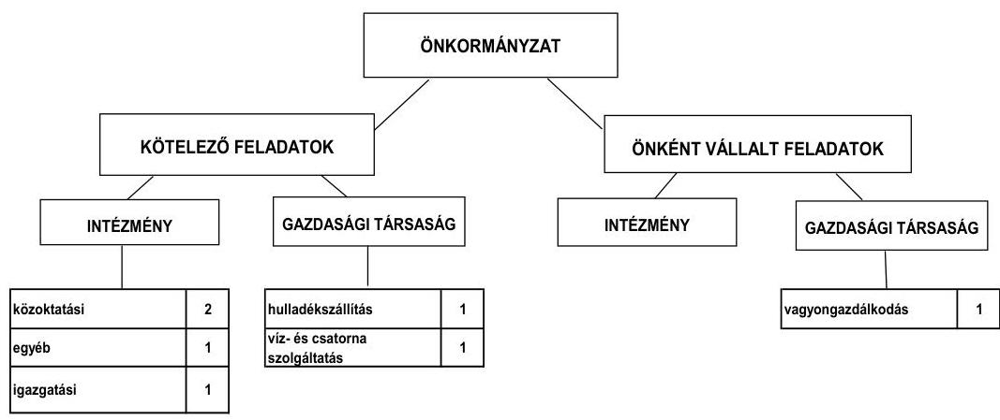

Az Önkormányzat feladatait 2011. június 30-án (Polgármesteri hivatallal együtt) négy költségvetési szervvel, egy kizárólagos és egy minősített többségi tulajdonában levő gazdasági társasággal látta el. A feladatellátásban részt vett egy további gazdasági társaság is, melyben az Önkormányzat nem rendelkezett tulajdoni részesedéssel. Az intézmények száma az áttekintett időszakban két intézmény megszüntetése miatt csökkent. Az Idősek klubja a 2007. évben jogutód nélkül, a közművelődési-, könyvtári- és alapfokú művészetoktatási feladatokat ellátó közművelődési intézmény átszervezés során, önkormányzati intézmények részére történő feladatátadás miatt szűnt meg. Az alapfokú művészetoktatás iránti igény növekedése miatt az intézmények telephelyeinek száma kettővel emelkedett a 2007. évben. Az önként vállalt és kötelező feladatok ellátásában bekövetkezett változások az Önkormányzat fizetőképességét, pénzügyi egyensúlyi helyzetét kedvezően befolyásolták, az ellenőrzött időszakban - az Önkormányzat adatszolgáltatása alapján - összesen 164,0 millió Ft megtakarítást eredményeztek. Az Önkormányzat feladatátszervezésről hozott döntését követően 2011. július 1-jétől megállapodás alapján a Kistérségi társulás látja el a családsegítéssel, házi segítségnyújtással és gyermekjóléti ellátással kapcsolatos feladatokat, egyházi szervezet gondoskodik az idősek nappali ellátásáról és a szociális étkeztetésről. A feladatok átadása - az Önkormányzat előzetes szá-

---

mítása alapján - kedvezően fogja befolyásolni az Önkormányzat pénzügyi egyensúlyi helyzetét, a 2011. II. félévben 2,6 millió Ft megtakarítást eredményezhet.

A gazdasági társaságok a hulladékkezelés és -szállításban, víz- és csatornaszolgáltatás, sportlétesítmény üzemeltetésben, utak, járdák tisztántartásában, parkok gondozásában, valamint az önkormányzati bérlakások- és ipari park üzemeltetésének területén kaptak szerepet.

A vizsgált időszakban a kötelező- és önként vállalt feladatok ellátását biztosító szervezeti keretekben történt változások az intézmények számának csökkentésével jártak. A költségvetési szervek és a gazdasági társaságok között feladatátrendeződés nem volt. Az önként vállalt feladatok és az intézmények számának csökkentésével, valamint a gyermekjóléti és szociális feladatok átadásával elért megtakarítás az Önkormányzat pénzügyi egyensúlyi helyzetét kedvezően befolyásolta, a megtakarítások kedvező hatása - az Önkormányzat számítása alapján - a jövőben is érvényesül.

Az egyes közszolgáltatások 2007. és 2010. évi működési kiadásai finanszírozásának forrásait ágazatonként a következő ábra szemlélteti:
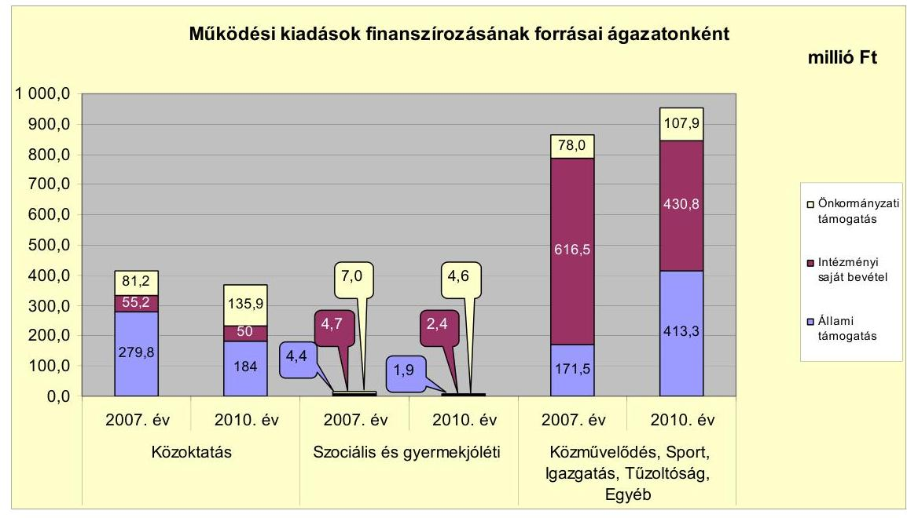

Az Önkormányzat adatszolgáltatása szerint a 2010. évben a kötelező és önként vállalt feladatait 599,2 millió Ft (45,0\%) állami támogatásból, 483,2 millió Ft (36,3\%) intézményi saját bevételből, 248,4 millió Ft (18,7\%) önkormányzati támogatásból finanszírozta. A 2007. és a 2010. években a finanszírozási forrásokon belül az állami támogatás részaránya növekvő tendenciát mutatott. A 2010. évben az állami támogatás 82,5 millió Ft-tal haladta meg a megelőző három év állami támogatásának (516,7 millió Ft összegű) átlagát, ez az állami támogatás bevételeken belüli részarányának 4,5 százalékpontos növekedését eredményezte. A közoktatási ágazatban az állami támogatás részarányának csökkenését a feladatmutató változása okozta. A Polgármesteri hivatalban teljesített feladatok ellátására felhasznált állami támogatás a 2010. évben 383,2 millió Ft volt, amely 146,5 millió Ft-tal meghaladta az előző há-

---

rom év 236,7 millió Ft összegű átlagát. A Polgármesteri hivatal által ellátott feladatokra fordított állami támogatás növekedését a közfoglalkoztatás és a társadalom- és szociálpolitikai feladatok arányának kiadásokon belüli 9,3 százalékpontos növekedése eredményezte. (Az Önkormányzat adatszolgáltatása alapján a 2010. évi 299,3 millió Ft társadalom- és szociálpolitikai kiadás 110,5 millió Ft-tal haladta meg a megelőző három év kiadási átlagát.)

A 2007-2010. években az Önkormányzat a kizárólagos tulajdonú gazdasági társasága részére 88,1 millió Ft működési célú pénzeszközt adott át. A pénzeszközátadásra évenként megújított közüzemi szerződés alapján került sor, melyben meghatározták a társaság által ellátandó önkormányzati feladatokat, a pénzeszközátadás összegét és az azzal való elszámolás határidejét. Az Önkormányzat az ellenőrzött időszakban a gazdasági társaságok részére kölcsönt nem folyósított, garancia- és kezességvállalási kötelezettséget nem tett. A gazdasági társaságok saját tőkéje meghaladta a jegyzett tőke összegét. Ennek ellenére a kizárólagos önkormányzati tulajdonban levő gazdasági társaság veszteséges gazdálkodása, és a társaságok lejárt határidejű szállítói tartozásának állománya az Önkormányzat pénzügyi egyensúlyának megőrzésében kockázatot jelentenek.

A működési jövedelem, a tőketörlesztés és a pénzügyi kapacitás alakulását a 2007-2010. években a következő ábra szemlélteti:
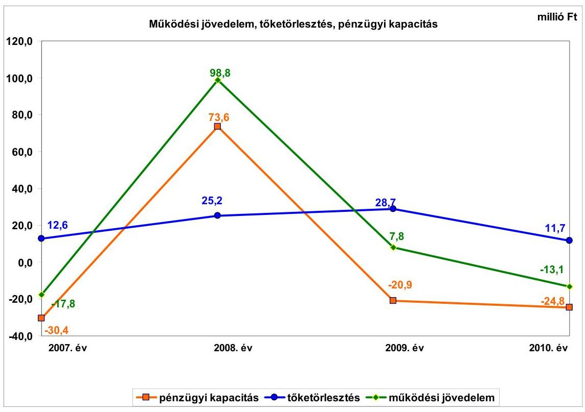

Az Önkormányzat folyó költségvetési egyenlege (működési jövedelem) a 2007. és a 2010. években működési forráshiányt, 2008-2009 között működési forrástöbbletet mutatott. A működési jövedelem a 2008. évben jelentős mértékben 116,6 millió Ft-tal (98,8 millió Ft-ra) emelkedett a 2007. évi negatív értékhez viszonyítva. A növekedés döntő hányadát a működési kiadások 63,0 millió Ft-os - az Idősek klubja megszüntetése és a közművelődési-, könyvtári- és alapfokú művészetoktatási feladatokat ellátó közművelődési intézmény átszervezése miatti - csökkenése okozta. A 2009. és a 2010. években a működési jövedelem évről évre csökkent. A csökkenést a 2009. évben elsősorban a vállalkozások részére átadott pénzeszközök előző évihez viszonyított 28,0%-os (64,9 millió Ft-os) növekedése, 2010-ben a helyi iparűzési adóbevételek 21,3%-os (15,3 millió Ft-os) csökkenése okozta. A 2008. évben a folyó költségvetés egyenlege az adósságszolgálatra fedezetet nyújtott. Az éves adósságszolgálat a 2008. évre kétszeresére (25,2 millió Ft-ra) növekedett az előző évhez képest, azonban a működési jövedelem nagy mértékű növekedése következtében (a 2007. évi -17,8 millió Ft-os forráshiányt követően a 2008. évben 98,8 millió Ft forrástöbblet alakult ki) a nettó működési jövedelemben is javulás volt megfigyelhető. A pénzügyi kapacitás a 2009. évben (94,5 millió Ft-tal) -20,9 millió Ft-ra csökkent az előző évhez viszonyítva a működési jövedelem csökkenése következtében. A 2010. évben további 3,9 millió Ft-tal (-24,8 millió Ft-ra) csökkent, a tőketörlesztés összegének - rulírozó hitel visszafizetése miatti 59,2%-os (17,0 millió Ft-os) - csökkenése nem tudta ellensúlyozni a működési jövedelem csökkenését.

Az Önkormányzat működőképességének megőrzéséhez 2008-ban 10,0 millió
 Ft - működésképtelen önkormányzatok egyéb támogatásából -, 2009-ben 16,1 millió Ft támogatásban - ebből 5,6 millió Ft-ot személyi jellegű juttatásokra, 5,0 millió Ft-ot dologi kiadásokra az ÖNHIKI-ből és 5,5 millió Ft-ot a működésképtelen önkormányzatok egyéb támogatásából - részesült. Az összes támogatás (26,1 millió Ft) 40,6%-a (10,6 millió Ft) a működési hiány csökkentését szolgálta, illetve 59,4%-a (15,5 millió Ft) feladathoz nem kötött támogatás volt. Az Önkormányzat működési jövedelme a kapott ÖNHIKI és működésképtelen önkormányzatok egyéb támogatása nélkül a 2008. évben 98,8 millió Ft helyett 88,8 millió Ft, a 2009. évben 7,8 millió Ft helyett -8,3 millió Ft lett volna.

A vizsgált időszakban az Önkormányzat felhalmozási költségvetésének egyenlege a 2007. évben -45,8 millió Ft, a 2008. évben -25,0 millió Ft, majd a 2009-2010. években pozitív összegű - 45,7 millió Ft és 48,2 millió Ft - volt, így 2007-2010 között összesen 23,1 millió Ft felhalmozási forrástöbbletet mutatott. Az Önkormányzat teljes finanszírozási igénye - a nettó működési jövedelem és a felhalmozási költségvetés egyenlegének összege - a 2007. évben a CLF módszer szerint 76,2 millió Ft volt, amelyhez a 18,4 millió Ft finanszírozási célú bevétel részben biztosított fedezetet, finanszírozásba vonható szabad pénzeszközökkel nem rendelkeztek. A hiányzó forrást folyószámlahitellel és rulírozó hitellel biztosították. A 2008-2010. években az Önkormányzatnak finanszírozási többlete volt. A 2008. évben a nettó működési jövedelem (73,6 millió Ft) és a felhalmozási forráshiány (-25,0 millió Ft) 48,6 millió Ft finanszírozási többletet eredményezett. A felhalmozási forrástöbblet következtében 2009-ben 24,8 millió Ft, 2010-ben 23,4 millió Ft finanszírozási többlet keletkezett az Önkormányzatnál a negatív nettó működési jövedelem (2009-ben -20,9 millió Ft, 2010-ben -24,8 millió Ft) ellenére. A 2009-2010-ben keletkezett felhalmozási forrástöbblet az Önkormányzat folyamatban lévő fejlesztéseinek saját forrásaként szolgál. Az Önkormányzatnál az EU-s és hazai támogatásból megvalósuló projektek előfinanszírozása miatt a felhalmozási bevételek és kiadások teljesülése időben egymástól eltért, ami a pénzügyi egyensúlyi helyzetre kedvezőtlen hatást gyakorolva finanszírozási problémákhoz vezetett. A fejlesztések előfinanszírozásának kockázatát növelte, hogy az Önkormányzat a finanszírozási

---

problémák megoldása érdekében a saját bevételek részbeni kiváltása érdekében fejlesztési célú hiteleket, míg a likviditási problémák megoldása érdekében rulírozó-, munkabér-megelőlegezési- és folyószámlahiteleket vett igénybe.

Az Önkormányzat folyó bevétele a 2007-2009 évek átlagához (1316,6 millió Ft) viszonyítva 2010-re 1334,1 millió Ft-ra, 1,3%-kal (17,5 millió Ft-tal) emelkedett. Az Önkormányzatnál a költségvetési támogatások és az átengedett szja együttes összegében jelentős változás nem következett be. A helyi adó bevételek 2007-től 2009-ig folyamatosan növekedtek, majd 2010-ben 14,1%-kal (12,8 millió Ft-tal) csökkentek az előző évhez (90,8 millió Ft) viszonyítva, melyet elsősorban a helyi iparűzési adóbevétel (15,3 millió Ft-os) csökkenése okozott.

Az Önkormányzat felhalmozási bevételei a 2007-2009. évek átlagához (100,2 millió Ft) viszonyítva 98,3%-kal (198,7 millió Ft-ra) növekedtek a 2010. évben. A növekedést elsősorban az Önkormányzat pályázati tevékenysége keretében realizált források eredményezték.

Az Önkormányzat folyó kiadásai a 2007-2009. évek átlagához (1287,0 millió Ft) viszonyítva a 2010. évre 4,7%-kal (1347,2 millió Ft-ra) növekedtek. A szociális intézmény megszüntetése, valamint a közművelődési, könyvtári és alapfokú művészetoktatási intézmény átszervezése miatt 2008-ban 6,2%-kal (81,2 millió Ft-tal) csökkentek a folyó kiadások az előző évhez viszonyítva. A folyó kiadások 2009. évi 7,1%-os (86,8 millió Ft-os) növekedésében a gazdasági társaságának átadott működési célú pénzeszközök 64,9 millió Ft-os emelkedése, a 2010. évben az árvíz- és belvízvédelemmel kapcsolatos tevékenység kiadásai (69,3 millió Ft) - amelyekre költségvetési támogatásban részesült - játszottak jelentős szerepet az előző évhez viszonyítva.

A pénzügyi egyensúlyi helyzet alakulását jelentősen befolyásolta az Önkormányzat elmúlt időszaki fejlesztési tevékenysége. A befejezett fejlesztések jelentős részét - az EU-s és hazai támogatásokon kívül - saját bevételekből (29,8%-át, 286,1 millió Ft-ot) fedezték, mely a pénzügyi egyensúlyi helyzet alakulására, az Önkormányzat fizetőképességére kedvezőtlen hatást gyakorolt. A 2010. december 31-én folyamatban lévő fejlesztési feladatok végrehajtására 2007-2010 között 25,6 millió Ft kiadást teljesítettek, amelyre a saját bevételekből 20,6 millió Ft-ot (40,8%) fordítottak. Az EU-s támogatásból megvalósult fejlesztések előfinanszírozása az Önkormányzatnál likviditási nehézségeket okozott, amelynek enyhítésére folyamatosan rulírozó- és folyószámlahitelt vett igénybe.

Az Önkormányzat 2010. december 31-én folyamatban lévő fejlesztési feladatai 2010. évet követő kötelezettségvállalásainak összege 891,4 millió Ft volt, amelyből 129,4 millió Ft-ot saját bevételből, 30,0 millió Ft-ot hitel felvételéből, 678,5 millió Ft-ot EU-s támogatásból és 53,5 millió Ft-ot hazai támogatásból terveznek biztosítani. A tervezett 30,0 millió Ft-os hitel felvétele a már megkötött hitelszerződés alapján a felhalmozási kiadásra a finanszírozási forrást biztosítja. Az Önkormányzat a 2011. évben négy fejlesztési feladat megvalósítását kezdte meg, amelyek tervezett értéke összesen 18,3 millió Ft volt. A költségvetési rendeletekben a fejlesztések forrásaként a saját bevételeket jelölték meg.

---

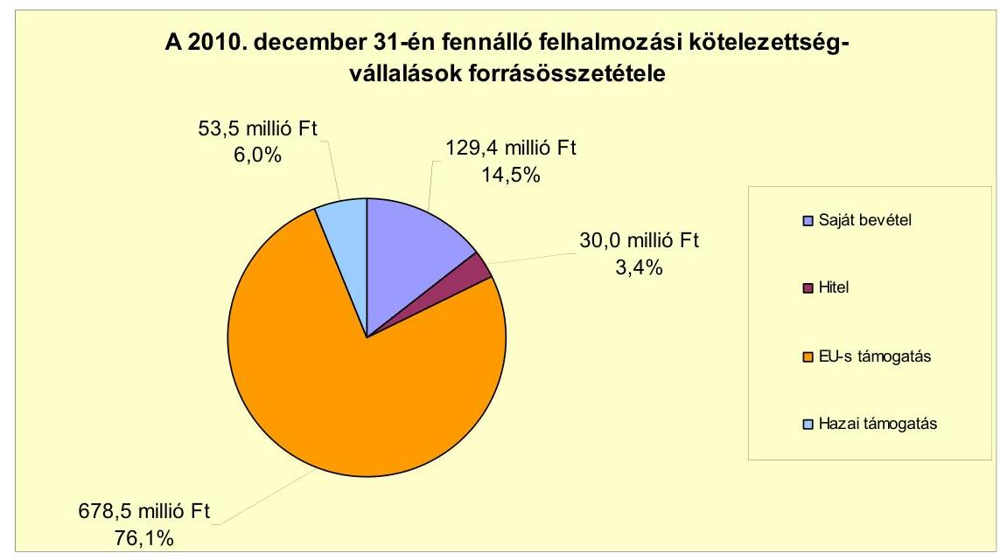

Az Önkormányzat által a 2011-2012. évekre vállalt - 2010. december 31-én folyamatban lévő és a 2011. évben indult fejlesztések, felújítások - felhalmozási célú kötelezettségek összege 909,7 millió Ft volt, amelyből 147,7 millió Ft-ot saját bevételből, 30,0 millió Ft-ot hitel felvételéből, 678,5 millió Ft-ot EU-s támogatásból és 53,5 millió Ft-ot hazai támogatásból terveznek biztosítani. A hitelszerződés megkötése 2009. július 2-án megtörtént. A 2011-2012. évekre vállalt felhalmozási célú kiadások fedezeteként szolgáló 147,7 millió Ft saját bevétel esetleges nem teljesülése a fejlesztések pénzügyi kockázatát növeli.

Az Önkormányzat által benyújtott három pályázat - amelyek esetében az elbírálás a helyszíni vizsgálat befejezéséig nem zárult le - tervezett teljes bekerülési költsége összesen 467,5 millió Ft, amelynek forrása 100,4 millió Ft saját bevétel, 347,1 millió Ft EU-s támogatás és 20,0 millió Ft hazai támogatás.

Az Önkormányzat mérleg szerinti pénzintézeti kötelezettsége a 2007. évi nyitó 156,1 millió Ft-ról a 2010. év végére 185,9 millió Ft-ra nőtt, a 2011. év I. félév végére 180,4 millió Ft-ra változott. A pénzintézeti kötelezettség - amely a rövid- és hosszú lejáratú, forint alapú hitelfelvételek, valamint a törlesztések együttes hatására - 2010-ben 46,1 millió Ft-tal (33,1%-kal) volt magasabb a 2007-2009. évek 139,7 millió Ft összegű átlagos hitelállománynál.

A pénzintézeti kötelezettségvállalásokra képviselő-testületi döntés alapján került sor, az előterjesztésekben bemutatták a hitelek felhasználási célját, a hitel igénybevételt terhelő várható kamat- és egyéb költségeket. A kötelezettségvállalások során az Ötv-ben foglalt adósságszolgálati korlát felső határát betartották. A döntéseket tartalmazó határozatokban a hitelek visszafizetésének forrását azonban nem határozták meg.

A vizsgált időszakban hat beruházási, felújítási feladat megvalósítása érdekében 54,7 millió Ft összegben hitelszerződést kötött az Önkormányzat a számlavezető pénzintézettel. A 2009. évben a közlekedési utak és az iskola konyhájának felújításához, eszközbeszerzéséhez és az iskolaépület akadálymentesítésének megvalósításához forrást biztosító szerződésekben rögzítettek alapján

---

23,7 millió Ft összegű hitel lehívása és a célnak megfelelő felhasználása megtörtént. Az inkubátorházhoz kapcsolódó 30,0 millió Ft-os és az óvodaépület akadálymentesítését szolgáló 1,0 millió Ft-os hitelkeretet 2011. június 30-ig nem vették igénybe, azok lehívását 2011. év II. félévében megkezdték.

Az Önkormányzat pénzügyi egyensúlyának biztosítása érdekében folyószámlahitelt és a 2011. évben munkabér-megelőlegezési hitelt vett igénybe.

A folyószámlahitel és munkabér-megelőlegezési hitel 2007-2011. év I. félévében az alábbiak szerint alakult:

| Megnevezés | 2007. év | 2008. év | 2009. év | 2010. év | 2011. év I.   félév |
| :-- | --: | --: | --: | --: | --: |
| Folyószámlahitel |  |  |  |  |  |
| Keretösszeg január 1-jén (millió Ft-ban) | 0,0 | 80,0 | 120,0 | 120,0 | 120,0 |
| Átlagos napi állomány (millió Ft-ban) | 33,6 | 51,0 | 30,1 | 49,8 | 107,1 |
| Folyószámlahitellel zárt napok száma (nap) | 125 | 352 | 226 | 184 | 181 |
| Egyenleg (állomány) | 55,0 | 30,7 | 0,0 | 96,6 | 102,9 |
| Munkabér-megelőlegezési hitel | - | - | - | - | 0,0 |
| Keretösszeg január 1-jén (millió Ft-ban) | - | - | - | - | 2,7 |
| Átlagos napi állomány (millió Ft-ban) | - | - | - | - | 50,0 |
| Munkabér-megelőlegezési hitellel zárt napok száma (nap) | - | - | - | - | 0,0 |
| Egyenleg (állomány) | - | - | - | - | 0,0 |

Az Önkormányzat a 2007-2009 években a likviditási problémáinak megoldása érdekében - a folyószámlahitel mellett - évente két-két alkalommal egyéb likvidhitelt (rulírozó hitelt) vett igénybe, melyek összege 10,0 millió Ft, 20 millió Ft, illetve 60 millió Ft volt. Az igénybevett hiteleket költségvetési éven belül visszafizették.

A folyószámlahitellel terhelt napok száma a 2008. évtől kezdődően csökkenő tendenciát mutatott. A folyószámlahitellel terhelt napok száma a 2010. évben 184 nap volt, amely 50 nappal kevesebb a 2007-2010. évek folyószámlahitellel terhelt napjainak átlagától. A 2011. év I. félévében - a 2010. évi beruházási szállítói állomány csökkentésére teljesített kifizetések, valamint a fejlesztési kiadások növekedésének hatására - időarányosan növekedett.

A Képviselő-testület a folyószámlahitel-keretet a 2009. évben 40,0 millió Ft-tal megemelte. A folyószámlahitel igénybevételét, a hitelkeret megemelését, munkabér-megelőlegezési hitel igénybevételét részben a helyi adóbevételek időszakos beérkezése tette szükségessé. A rövid lejáratú finanszírozási célú hitelek igénybevételének szükségességét EU-s támogatásból megvalósuló fejlesztések utófinanszírozása miatti források megelőlegezése és a 2011. évben - a fejlesztésekhez szükséges - ingatlanvásárlás miatti átmeneti forráshiány indokolta. A 2007-2009. években 10,0-60,0 millió Ft közötti összegben igénybevett egyéb rövid lejáratú (rulírozó) hitel szerződésének lejárata miatt kieső finanszírozási forrást folyószámlahitellel pótolta az Önkormányzat.

Az átmeneti likviditási problémák megoldása az Önkormányzatnak 2007-től 2011. június 30-ig 23,1 millió Ft kamatkiadást és 4,1 millió Ft egyéb költségfizetési kötelezettséget jelentett. Az Önkormányzat 2011. január 1-jén nem rendelkezett munkabér-megelőlegezési hitellel, a rendelkezésére álló hitelkeret 20,0 millió Ft volt. A 2011. év I. félévében két alkalommal vették igénybe a

---

munkabér-megelőlegezési hitelt, amit a felvételt követő néhány napon belül visszafizettek.

Az Önkormányzat kötelezettségeinek 2011. június 30-ai állományát és várható alakulását a kötelezettség lejártáig a következő táblázat szemlélteti:

| Megnevezés | Állomány 2010. december 31-én | Állomány 2011. június 30-án | Várható kötelezettség 2011-2013. években | Várható kötelezettség 2014. évtől |
| :--: | :--: | :--: | :--: | :--: |
|  | HUF-ban (millió Ft-ban) | HUF-ban (millió Ft-ban) | HUF-ban (millió Ft-ban) | HUF-ban (millió Ft-ban) |
| Pénzintézeti kötelezettségek |  |  |  |  |
| Magyar Fejlesztési Bank (XXI. sz. iskola felúj) | 65,3 | 53,5 | 43,0 | 25,8 |
| OTP Bank Nyit. (ber.hitel útfelújításra) | 5,4 | 5,4 | 1,2 | 6,3 |
| OTP Bank Nyit. (ber.hitel iskola akadálymentesítésre) | 2,1 | 2,1 | 0,4 |

 | 2,5 |
| OTP Bank Nyit. (ber.hitel útfelújítás) | 11,3 | 11,3 | 2,6 | 13,9 |
| OTP Bank Nyit. (ber.hitel konyhafelújítás) | 5,2 | 5,2 | 1,1 | 6,0 |
| OTP Bank Nyit. (ber.hitel óvoda akadálymentesítés) | 0,0 | 0,0 | 0,2 | 1,1 |
| OTP Bank Nyit. (ber.hitel inkubátorház kialakítás) | 0,0 | 0,0 | 6,8 | 36,6 |
| OTP Bank Nyit. Folyószámlatitel | 96,6 | 102,9 | 102,9 | - |
| Pénzintézeti kötelezettségek összesen HUF-ban: | 185,9 | 180,4 | 158,2 | 92,2 |
| Szállítói tartozás | 106,5 | 34,9 | 34,9 | - |

Az Önkormányzat 2010. december 31-ei hosszú lejáratú pénzintézeti kötelezettségeinek állományából 65,3 millió Ft-ot (73,1%-ot) tett ki a „XXI. századi iskola" fejlesztési program megvalósításához 2004. évben igénybevett hitelből fennálló tőke- és kamattartozás. Az ellenőrzött időszakban - útfelújításra, akadálymentesítésre és konyha felújításra - igénybevett 24,0 millió Ft fejlesztési célú hitel a hosszú lejáratú pénzintézeti kötelezettségek 26,96%-át tette ki.

Az Önkormányzat 2011. június 30-ig pénzintézeti kötelezettségeiből 60,7 millió Ft tőkét törlesztett és 59,9 millió Ft kamatot fizetett meg. A hiteltörlesztések az ellenőrzött időszakot megelőzően a 2004. évben felvett „XXI. századi iskola" fejlesztési program megvalósításához igénybevett hitel és két gépjárművásárlás miatt vállalt lízingkötelezettség visszafizetéséhez kapcsolódtak, a 2009-ben felvett hitelek tőketörlesztése 2012. év I. félévében kezdődik. A 2012. évben az ellenőrzött időszakban igénybevett hitelek törlesztése 1,4 millió Ft, a 2004. évben felvett hitel törlesztése 11,7 millió Ft - összesen 13,1 millió Ft - forrást igényel. Az ellenőrzött időszakot követően igénybevett, illetve azt követően tervezett hitellehívás realizálódása esetén a hitelek 2012. évi törlesztése további 1,8 millió Ft-os kiadással járnak.

Az Önkormányzatnak pénzintézetekkel szemben fennálló kötelezettsége a 2011. év I. félév végén 180,4 millió Ft volt. A kötelezettségek összege (tőke, kamat és egyéb költség) a legutóbbi kamatfizetés feltételei alapján a 2011-2013. években 158,2 millió Ft. A hosszú lejáratú beruházási hitelek kamatfizetési kötelezettségére összességében kedvezőtlenül hatott - a hitelszerződésekben rögzített kamatokhoz képest az utolsó kamatfizetéskor ismert - a kamatok mértékében bekövetkezett változás, amely a „XXI. századi iskola" fejlesztési programhoz igénybevett hitel kamatfizetési kötelezettségét megnövelte, a 2009. évben felvett hitelek esetében csökkentette. Az Önkormányzat számára pénzügyi kockázatot jelent, hogy a hitelek visszafizetési forrását nem határozták meg, továbbá hogy a kötelezettségek teljesítéséhez bevonható vagyon nem nyújt fedezetet a 2010. december 31-én fennálló tőketartozás és kamatfizetési kötelezettség összegére.

---

Az Önkormányzat szállítói kötelezettség miatti tartozása a 2008. és a 2010. évben az összes kötelezettség 26,4%-át (62,7 millió Ft), illetve 30,3%-át (106,5 millió Ft) tette ki, a 2007. és 2009. években ez az arány 9,1% (21,2 millió Ft) és 7,8% (14,3 millió Ft) volt. A szállítói kötelezettségek növekedését a 2008. évben a beruházási szállítók, a 2010. évben a beruházási szállítók és az árvízi védekezés miatti szállítói állomány növekedése okozta. Az ellenőrzött időszakban a lejárt határidejű szállítói tartozások állománya növekedett. A 2010. évben 13,8 millió Ft-tal, 2011. I. félév végén 1,0 millió Ft-tal haladta meg a 2007-2009. évek lejárt határidejű szállítói tartozások 24,9 millió Ft átlagállományát. Az állománynövekedés ellenére 2010. december 31-ig a lejárt határidejű szállítói tartozások összes kötelezettségen belüli aránya csökkenő tendenciát mutatott. A szállítói tartozások állományán belül a lejárt határidejű tartozások részaránya 2007-2009. években átlagosan 74,6%-ot (24,9 millió Ft) tett ki. A 2011. év I. félév végére a lejárt határidejű szállítói tartozások a szállítói tartozások állományán belül jelentősen - a 2010. december 31-ei 36,3%-os (38,6 millió Ft) arányról 74,6%-ra (25,8 millió Ft) - emelkedtek.

A lejárt határidejű tartozásokon belül nőtt a fizetési késedelem napjainak száma. A 2007-2009. években az összes lejárt határidejű tartozás 30 napon belüli volt, 2011. év I. félév végén a lejárt határidejű tartozások 45,5%-a (6,7 millió Ft) volt 30 napon belüli, 43,8%-a (15,3 millió Ft) 90 napot meghaladó lejárt határidejű tartozás volt. A 90 nap és 365 nap közötti lejárt határidejű tartozások 2011. év I. félév végén fennálló állományából 13,4 millió Ft az Önkormányzat által befogadott, majd utólag vitatott három beruházási szállítói számla ki nem egyenlítéséből származott. Az Önkormányzat az elvégzett feladatok és a számla végösszegét érintően élt kifogással. A vitatott tételek rendezése érdekében az Önkormányzat és a szállítók között a helyszíni ellenőrzés befejezéséig megállapodás nem jött létre. A tartozásokból 0,5 millió Ft 2011. október 19-ig kiegyenlítésre került, 1,4 millió Ft 2011. december 31-ig (fennálló vevőköveteléssel szemben) kompenzáció keretében realizálódik.

Az Önkormányzat a 2007-2011. év I. félévében garancia- és kezességvállalási kötelezettséget nem tett, gazdasági társaságok részére kölcsönt nem folyósított. Az Önkormányzat 2010. december 31-én jelzálogjoggal, elidegenítési és terhelési tilalommal terhelt ingatlanainak könyv szerinti értéke 369,6 millió Ft volt. Pályázat útján elnyert támogatással létrehozott és az Önkormányzat tulajdonában levő bérlakásokra - 251,9 millió Ft értékű ingatlanra - a Magyar Állam javára jegyeztek be elidegenítési és terhelési tilalmat. A felhalmozási célú hitelek fedezeteként 117,7 millió Ft értékű vagyonra jelzálogjogot jegyeztettek be. A forgalomképes ingatlanok értéke 68,1 millió Ft volt, így a hitelek fedezetére - az Ötv.-ben$^7$ foglaltak ellenére - 49,6 millió Ft értékben a törzsvagyon részét képező korlátozottan forgalomképes ingatlanokat is bevontak.

[^0]
[^0]:    $^7$ 2012. január 1-jétől hatályon kívül helyezte a Magyarország helyi önkormányzatairól szóló 2011. évi CLXXXIX. törvény 144. § (1) bekezdése a 156. § (1) bekezdés a) pontjában foglalt kijelölés alapján. A nemzeti vagyonról szóló 2011. évi CXCVI. törvény 6. § (1) és (5) bekezdésében a forgalomképtelen önkormányzati törzsvagyon terhelési tilalmát rögzítették. E § (6) bekezdése meghatározta a korlátozottan forgalomképes önkormányzati vagyon körét, azonban annak terhelését nem tiltotta meg.

---

A 2011-2013. években a várható 55,3 millió Ft adósságszolgálat valamint 102,9 millió Ft folyószámlahitel visszafizetésének teljesítésére figyelembe vehető a 2010. december 31-én a könyvviteli mérlegben kimutatott és rendelkezésre álló 39,6 millió Ft vevő és adósállomány, 25,3 millió Ft kölcsönfolyósításból származó követelés. A pénzintézeti kötelezettségek teljesítésének kockázatát növeli, hogy a kötelezettségek teljesítésére bevonható vagyon 2010. december 31-ei könyv szerinti értéke nem éri el a 2011-2013. években és a 2014. évet követő időszakban várható tőketörlesztés és kamatfizetés összegét.

Az Önkormányzat gazdasági társaságai pénzintézetekkel szemben fennálló tartozása 2010. december 31-én 25,0 millió Ft, 2011. év I. félév végén 25,3 millió Ft volt. A tartozás az Önkormányzat kizárólagos tulajdonában levő gazdasági társasága által igénybevett átmeneti finanszírozási problémák megoldására szolgáló likvidhitelből származott. Figyelembe véve az egyik gazdasági társaság tartósan veszteséges tevékenységét, az Önkormányzat gazdasági társaságai pénzintézeti kötelezettségei és lejárt határidejű szállítói tartozásai az Önkormányzat pénzügyi egyensúlyi helyzetének alakulására kockázatot jelentenek.

Az Önkormányzat pénzügyi egyensúlyi helyzetét befolyásolhatja eszközeinek állapota, használhatósági foka, az eszközök pótlására fordított összegek nagysága. Az Önkormányzat az ellenőrzött időszakban tárgyi eszközeinek értéke után 506,2 millió Ft értékcsökkenést számolt el, az elhasználódott eszközök pótlására 458,3 millió Ft fordított. Az elhasználódott eszközök pótlása nem volt teljes körű, a tárgyi eszközök használhatósági foka folyamatosan romlott, 86,4%-ról 80,0%-ra csökkent. Az Önkormányzat az elhasználódott eszközök pótlására tartalékot nem képzett.

Az Önkormányzat az ellenőrzött időszakban kiadási megtakarítást eredményező és bevételt növelő intézkedéseket tett. A 2007-2010. évek között tett intézkedések hatására 70,5 millió Ft bevételi többletet, továbbá 146,5 millió Ft kiadási megtakarítást mutattak ki. A kiadási megtakarítások 60,2%-a (88,2 millió Ft) az elrendelt álláshely-csökkentések eredménye. Megszüntetésre került egy szociális intézmény, valamint átszervezésre a művelődési, könyvtári és alapfokú művészetoktatási intézmény. Az intézménymegszüntetés és a feladatátszervezés 54,9 millió Ft dologi kiadás-megtakarítást eredményezett. A megtett intézkedések a pénzügyi egyensúlyi helyzetre kedvezően hatottak. Az Önkormányzatnál az időszak álláshelyeinek száma összességében 22 fővel csökkent, mivel az álláshely-csökkentő intézkedések és feladatátszervezések eredményeként a Polgármesteri hivatalnál 1 fő álláshely növekedésre, míg az Önkormányzat többi intézményénél 23 fő álláshely csökkenésre került sor. A bevételnövelő intézkedések hatására az Önkormányzat - kimutatása alapján a 2007-2010. években és a 2011. év I. félévében összesen 139,9 millió Ft többletbevételt ért el. A többletbevétel 15,2%-át (21,2 millió Ft-ot) a helyi adórendeletek módosításával, az adómérték változtatásával, 84,8%-át (118,7 millió Ft-ot) eszközök hasznosítására tett intézkedésekkel érték el.

Az Önkormányzat a 2011. évben a költségvetési támogatások és átengedett szja összegének csökkenésével tervez az előző évhez viszonyítva. A költségvetési rendeletben tervezett költségvetési támogatás és átengedett szja összege 410,0 millió Ft-tal maradhat el a 2010. évitől. A 2011. év I. félévében az Ön-

---

kormányzat - kimutatása szerint - a kiadáscsökkentő intézkedéseinek eredményeként 30,2 millió Ft megtakarítást, míg bevételnövelő intézkedéseinek eredményeként 69,4 millió Ft bevételi többletet ért el.

A Képviselő-testület döntése alapján 2011. július 1-jétől az Önkormányzat átadta a Kistérségi társulás részére a gyermekjóléti szolgálat, a családsegítés és a házi segítségnyújtás feladatok ellátását. A feladatátadással egyidejűleg 3 fő közalkalmazottként a Kistérségi társuláshoz áthelyezésre kerül.

Az utóellenőrzés a pénzügyi egyensúly javítására tett két szabályszerűségi javaslat hasznosítására terjedt ki. Az egyik, az intézkedési terv szerinti határidőben megvalósult. A másik javaslat nem teljesült, mivel az Önkormányzat költségvetési rendeletei az Ámr 2. 36. § (1) bekezdés h) és l) pontjainak$^8$ előírása ellenére továbbra sem tartalmazták a többéves kihatással járó feladatok előirányzatait éves bontásban, valamint elkülönítetten az EU-s forrásból finanszírozott támogatásból megvalósuló programok, projektek bevételeit, kiadásait.

Az Önkormányzat pénzügyi egyensúlyi helyzetét összegezve a következők emelhetők ki:

Szikszó Város Önkormányzatának pénzügyi egyensúlyi helyzete rövid távon veszélyeztetett.

A folyó bevételei 2009-ben nem nyújtottak fedezetet a folyó kiadásokra és az adósságszolgálatra, a 2010. évben már a folyó kiadásokra sem. Ezért működését a vizsgált időszakban folyószámlahitel, valamint 2011-től munkabér-megelőlegezési hitel igénybevételével tudta biztosítani. A szállítói tartozásállománya folyamatosan emelkedett, a lejárt szállítói tartozások döntő részének rendezésével kapcsolatban nem történt megegyezés.

A fejlesztései finanszírozására hosszú lejáratú hiteleket vett igénybe. A jövőbeli adósságszolgálatra a tendenciájában csökkenő összegű működési jövedelem nem biztosít fedezetet, és az egyéb források sem számszerűsítettek. Az adósságszolgálat törlesztésére igénybe vehető 2010. december 31-i mérlegben kimutatott vagyonérték nem nyújt fedezetet.

Kockázatot jelent, hogy a folyamatban lévő fejlesztések saját forrásigénye jelentős, erre a működésből nem képződik fedezet. A fejlesztések befejezése érdekében hitelfelvételt is terveztek, mely növeli az eladósodottságot. A jelentős összegű EU-s támogatással megvalósuló beruházások előfinanszírozása fokozhatja a likviditási gondokat.

A fejlesztések során kialakított létesítmények jövőbeni működtetésének várható kiadásait nem számszerűsítették.

Kockázatot jelent az Önkormányzat számára a kizárólagos tulajdonú gazdasági társaságának folyószámlahitel- és lejárt szállítói tartozásállománya.

[^0]
[^0]:    $^8$ 2012. január 1-től az Ámr 24. § (1) bekezdés a)
 és bd) pontjai, valamint az Áht${ }_{2}$ 24. § (4) bekezdés b) pontja

---

Az Állami Számvevőszékről szóló 2011. évi LXVI. törvény 33. § (1) bekezdésében foglaltak értelmében a jelentésben foglalt megállapításokhoz kapcsolódó intézkedési tervet köteles az ellenőrzött szervezet vezetője összeállítani és azt a jelentés kézhezvételétől számított harminc napon belül az ÁSZ részére megküldeni. Amennyiben az intézkedési tervet határidőben nem küldi meg a szervezet, vagy az továbbra sem elfogadható, az ÁSZ elnöke a hivatkozott törvény 33. § (3) bekezdés a)-b) pontjaiban foglaltakat érvényesítheti.

# A 2011. június 30-i pénzügyi egyensúlyi helyzet alapján az ellenőrzés intézkedést igénylő megállapításai és javaslatai a következők: 

## a Polgármesternek

1. az Önkormányzat pénzügyi egyensúlya rövid távon veszélyeztetett. A nettó működési jövedelme az elmúlt időszakban - a 2008. év kivételével - negatív volt. A 2011-2012. évekre vállalt és tervezett felhalmozási célú kiadások fedezeteként szolgáló saját bevétel realizálása, esetleges nem teljesülése a fejlesztések pénzügyi kockázatát növelheti. A 2011-2013. években várható adósságszolgálat visszafizetésének teljesítésére figyelembe vehető 2010. december 31-én rendelkezésre álló vevő és adósállomány, kölcsönfolyósításból származó követelés nem nyújt fedezetet. Az Önkormányzat finanszírozása a vizsgált időszakban likviditási-, folyószámla és munka-bér-megelőlegezési hitel igénybevételével volt biztosítható. Az Önkormányzat által tett intézményszervezeti átalakítások, kiadáscsökkentő és bevételnövelő intézkedések nem biztosítanak elegendő forrást a pénzügyi egyensúly helyreállításához.

Javaslat:
Az Önkormányzat pénzügyi egyensúlyának gyors helyreállítása és hosszú távú fenntarthatósága érdekében kezdeményezze - felelősök és határidők megjelölésével - az alábbi intézkedések megtételét:
a) tárja fel a bevételszerző és kiadáscsökkentő lehetőségeket;
b) intézkedjen a bevételek növelésére, a kintlévőségek behajtására, a kiadások csökkentésére;
c) terjesszen a Képviselő-testület elé reorganizációs programot a kedvezőtlen pénzügyi folyamatok megállítására, a pénzügyi egyensúlyi helyzet gyors stabilizálására;
d) képezzen egyensúlyi (elkülönített) tartalékot az adósságszolgálat teljesítése érdekében;
e) mérje fel a folyamatban lévő beruházásokkal kapcsolatos kötelezettségek átütemezésének pénzügyi és jogi lehetőségeit és hatásait. Szükség esetén kezdeményezze az átütemezést;
f) mutassa be havonta legalább három évre kitekintően kötelezettségeinek finanszírozási forrásait.

---

2. Az elbírálás alatt lévő pályázatok saját forrásigénye meghaladja a 100 millió Ft-ot. A saját bevétel esetleges nem teljesülése a tervezetthez képest a fejlesztések pénzügyi kockázatát növeli.

Javaslat:
Vizsgálja felül teljes körűen a tervezett beruházásokat és azok fenntartásának jövőbeni pénzügyi kihatásait. Szükség esetén tegyen javaslatot a Képviselő-testületnek a tervezett beruházásokkal kapcsolatos döntések módosítására, amelyben figyelembe veszik az Önkormányzat pénzügyi lehetőségeit, és a kötelező feladatellátás elsődlegességét.
3. Az Önkormányzatnál szállítói kitettség növeli a pénzügyi kockázatot, mivel lejárt szállítói tartozásának rendezése a helyszíni ellenőrzés lezárásáig nem történt meg.

Javaslat:
Kezelje az Önkormányzat lejárt szállítói állományát, a szállítói kitettség és a jogszabályi következmények elkerülése érdekében.
4. A kizárólagos önkormányzati tulajdonban levő gazdasági társaság veszteséges gazdálkodása, és a társaságok lejárt határidejű szállítói tartozásának állománya az Önkormányzat pénzügyi egyensúlyának megőrzésében kockázatot jelentenek.

Javaslat:
Terjesszen intézkedési tervet a Képviselő-testület elé a gazdasági társaság pénzügyi egyensúlyi helyzetének stabilizálása érdekében.
5. A felhalmozási célú hitelek fedezeteként 117,7 millió Ft értékű vagyonra jelzálogjogot jegyeztettek be. A forgalomképes ingatlanok értéke 68,1 millió Ft volt, így a hitelek fedezetére - az Ötv.-ben foglaltak ellenére - 49,6 millió Ft értékben a törzsvagyon részét képező korlátozottan forgalomképes ingatlanokat is bevontak.

Javaslat:
Gondoskodjon arról, hogy az Önkormányzat kötelezettségeinek fedezeteként 2012. január 1-jét követően a nemzeti vagyonról szóló 2011. évi CXCVI. törvény 3. § 6. pontjával, az 5. § (2) bekezdés c) pontjával, és a 6. § (6) bekezdésével összhangban a nemzeti vagyon körébe tartozó, korlátozottan forgalomképes törzsvagyont ne terhelje meg, kivéve, ha arról az Önkormányzat a rendeletében a megterhelést megengedően rendelkezik. ${ }^{9}$

[^0]
[^0]:    ${ }^{9}$ Felhívjuk a figyelmet arra, hogy az ellenőrzéssel érintett időszakot követően, 2012. március 31-én hatályba lépett az egyes közpénzügyi tárgyú törvényeknek az államháztartás önkormányzati alrendszerét érintő módosításáról, és azok más törvényekkel való összhangjának biztosításáról szóló 2012. évi XVII. törvény, amely módosítja az államháztartásról szóló 2011. évi CXCV. törvény 84. §-ának (4) bekezdését. A jogszabály változását a javaslat végrehajtása során figyelembe kell venni.

---

6. Az Önkormányzat gazdálkodási rendszerét érintő előző ellenőrzés pénzügyi egyensúly javítására tett szabályszerűségi javaslata nem valósult meg, mivel az Önkormányzat költségvetési rendeletei az Ámr 2 36. § (1) bekezdés h) és i) pontjainak előírása ellenére továbbra sem tartalmazták az EU-s forrásból finanszírozott támogatásból megvalósuló programok, projektek bevételeit, kiadásait, valamint az Áht${ }_{2}$ 24. § (4) bekezdés b) pontja előírása ellenére a többéves kihatással járó feladatok előirányzatait éves bontásban.

Javaslat:
Gondoskodjon az Önkormányzat gazdálkodási rendszerét érintő előző ellenőrzés nem hasznosult javaslatainak végrehajtásáról. Intézkedjen - az Önkormányzat gazdálkodási rendszerét érintő előző ellenőrzés nem hasznosult szabályszerűségi javaslatával kapcsolatban - a fegyelmi felelősség kivizsgálása iránt.

A polgármester a helyszíni ellenőrzés lezárása után tájékoztatta az Állami Számvevőszéket az Önkormányzat megtett intézkedéseiről, amelyet az Állami Számvevőszék nem ellenőrzött, arra vonatkozóan véleményt vagy megállapítást nem fogalmaz meg. Az ellenőrzés lezárását követően elvégzett intézkedéseket az Állami Számvevőszék utóellenőrzés keretében vizsgálhatja.

A polgármester tájékoztatása szerint a következő intézkedéseket tette az Önkormányzat:

- az ingatlanvagyon-katasztert aktualizálták,
- a 2012. évi költségvetésben az EU-s forrásból megvalósuló programok, projektek bevételeit, kiadásait évenkénti bontásban szerepeltették.

---

# II. RÉSZLETES MEGÁLLAPÍTÁSOK 

## 1. Az ÖNKORMÁNYZAT KÖTELEZŐ ÉS ÖNKÉNT VÁLLALT FELADATAI, A FELADATELLÁTÁS SZERVEZETI KERETEI ÉS ANNAK VÁLTOZÁSAI

A Képviselő-testület nem határozta meg az Önkormányzat kötelező és az önként vállalt feladatait. Kötelező feladatának tekintette az Ötv. és az ágazati törvények által előírt feladatokat, önként vállalt feladatként végezte a középfokú - gimnáziumi és szakiskolai - oktatást, az alapfokú művészetoktatást, sport és városgazdálkodási feladatokat, civil szervezetek támogatását.

Az Önkormányzat adatszolgáltatása, kötelező és önként vállalt feladatok besorolása alapján működési célú költségvetési kiadásaiból a 2010. évi beszámolója szerint 1163,1 millió Ft-ot (87,4%-ot) a kötelező feladatok, 167,7 millió Ft-ot (12,6%-ot) önként vállalt feladatok ellátására fordított.

Az Önkormányzat 2010. évi működési kiadásait és azok finanszírozási arányait főbb feladatonként a következő táblázat${ }^{10}$ szemlélteti:

| Ellátott feladat | Működési kiadás összesen (millió Ft) | Kötelező feladatok kiadásainak részaránya % | Működési bevétel összesen (millió Ft) | Állami támogatás részaránya % | Intézményi saját bevétel részaránya % | Önkormányzati támogatás részaránya % |
| :--: | :--: | :--: | :--: | :--: | :--: | :--: |
| Óvodák | 58,2 | 100,0% | 58,2 | 49,3% | 0,6% | 50,1% |
| Általános iskolák | 185,1 | 82,0% | 185,1 | 50,4% | 16,1% | 33,6% |
| Gimnáziumok | 113,0 | 0,0% | 113,0 | 49,5% | 15,8% | 34,7% |
| Szakközépiskolák, szakképző intézmények | 13,6 | 0,0% | 13,6 | 45,6% | 14,6% | 39,8% |
| Szociális intézmények | 9,0 | 0,0% | 9,0 | 21,6% | 26,7% | 51,7% |
| Egyéb intézmények | 80,9 | 100,0% | 80,9 | 22,6% | 53,7% | 23,7% |
| Polgármesteri hivatal igazgatási kiadásai | 181,2 | 100,0% | 181,2 | 6,5% | 44,6% | 48,9% |
| Polgármesteri hivatalban ellátott egyéb feladatok működési kiadásai | 689,8 | 98,9% | 689,8 | 55,6% | 44,4% | 0,0% |
| Működési kiadások összesen | 1330,8 | 87,4% | 1330,8 | 45,0% | 36,3% | 18,7% |

[^0]
[^0]:    ${ }^{10}$ A táblázat összes működési kiadása 9,4 millió Ft-tal eltér a költségvetési beszámolóban elszámolt 1. számú mellékletben bemutatott kiadások összegétől, mivel a táblázat nem tartalmazza a kisebbségi önkormányzatok működési kiadásait, valamint az egészségügyi szakfeladaton elszámolt, OEP által finanszírozott kiadásokat. A 2. számú mellékletben szereplő működési kiadások 16,4 millió Ft-tal haladják meg a táblázat működési kiadásait, mivel a táblázat kiadásai nem tartalmazzák a kisebbségi önkormányzati kiadásokat, az OEP által finanszírozott kifizetéseket, valamint 7,0 millió Ft (felhalmozási célú) kamatkiadást.

---

Az Önkormányzat adatszolgáltatása alapján a működési kiadása a 2008. évben a szociális feladatellátást végző intézmény megszűnése és a feladatmutatók változása miatt az előző évhez képest 76,4 millió Ft-tal (5,9%-kal), 1221,9 millió Ft-ra csökkent, az ezt követő években mérsékelt ütemben növekedett. A 2010. évben teljesített működési kiadás 1330,8 millió Ft volt, mely 54,6 millió Ft-tal (4,3%-kal) haladta meg az előző három év működési kiadásainak átlagát (1276,2 millió Ft-ot).

Az Önkormányzat kötelező és önként vállalt feladatai ellátására fordított kiadásainak aránya a 2007-2010. években csekély mértékben változott. Ezen időszakban a kötelező feladatok kiadási arányának legalacsonyabb értéke 84,8%, a legmagasabb értéke - a 2010. évben - 87,4% volt, amely 1,8 százalékponttal haladta meg a 2007-2009. évek kötelező feladatellátásra fordított kiadások arányának 85,6%-os átlagát. Az arányeltolódást egy önként vállalt feladatokat ellátó intézmény 2007. évi megszűnése, továbbá a középfokú oktatási intézmények feladatmutatójának csökkenése eredményezték. A 2010. évben az államháztartáson kívülre (egyház részére egyszeri jelleggel) nyújtott támogatás miatt az önként vállalt feladatokhoz kapcsolódó kiadások összege csökkent az előző évekhez képest, ami hozzájárult a kötelező és önként vállalt kiadások összetételében jelentkező arányeltolódáshoz.

Az Önkormányzat adatszolgáltatása szerint a 2010. évben a működési célú kiadásaiból 369,9 millió Ft-ot (27,8%-ot) közoktatási, 9,0 millió Ft-ot (0,7%-ot) szociális (családsegítés és gyermekjóléti), 80,9 millió Ft-ot (6,1%-ot) az élelmezési feladatokat ellátó intézmények fenntartására fordított. A Polgármesteri hivatalban ellátott igazgatási feladatokra 181,2 millió Ft (13,6%) és az egyéb önkormányzati feladatokra 689,8 millió Ft (51,8%) működési kiadást teljesítettek a 2010. évben. A 2007-2010. években az egyes ágazatok működési kiadásainak változása az Önkormányzat működési kiadásainak összetételében, szerkezetében jelentős változást nem eredményezett.

A 2010. évben a közoktatásra fordított kiadások (369,9 millió Ft) 35,3 millió Ft-tal - négy százalékponttal - maradtak el a 2007-2009. években teljesített közoktatási kiadások 405,2 millió Ft összegű átlagától, amit az oktatásban résztvevő tanulólétszám csökkenése okozott. Az idősek részére szállást biztosító intézmény 2007. évi megszűnésével a kiadások összetétele nem változott jelentősen, mivel a szociális kiadások 2007. évi működési kiadásokon belüli részaránya 1,2% (16,1 millió Ft) volt, a megszűnést követően az aránya nem érte el az egy százalékot. A Polgármesteri hivatalban a 2010. évben feladatra elszámolt kiadások aránya a 2007-2009. évek 572,4 millió Ft átlagához hasonlítva 117,4 millió Ft-tal - 7,1 százalékponttal - növekedett. A növekedést túlnyomórészt a társadalompolitikai és szociális juttatások, valamint a közmunkaprogram keretében teljesített kifizetések - 2007-2009. évi 188,8 millió Ft átlagos kiadásához képest - 110,5 millió Ft-os növekedése okozta.

Az Önkormányzat a 2010. évben kötelező és önként vállalt feladatait 599,2 millió Ft (45,0%) állami támogatásból, 483,2 millió Ft (36,3%) intézményi saját bevételből, 248,4 millió Ft (18,7%) önkormányzati támogatásból finanszírozta. A 2007. és a 2010. években a finanszírozási forrásokon belül az állami támogatás részaránya növekvő tendenciát mutatott.
 A 2010. évben az állami támogatás 82,5 millió Ft-tal haladta meg a megelőző három év állami támogatásának 516,7 millió Ft összegű átlagát, ez az állami támogatás bevételeken belüli részarányának 4,5 százalékpontos növekedését eredményezte.

A 2007-2009. években a közoktatási feladatokra felhasznált állami támogatás mértékének aránya 2007-2009 között csökkenő tendenciát mutatott, jelentős mértékben a 2008. évben - a feladatmutató csökkenése miatt az előző évhez képest - 10,2 százalékponttal (46,5 millió Ft-tal, 279,8 millió Ft-ról 233,3 millió Ft-ra) mérsékelte. A Polgármesteri hivatalban a szakfeladatra elszámolt kiadások finanszírozásában a 2010. évben az állami támogatás összege 383,2 millió Ft volt, amely 146,5 millió Ft-tal haladta meg az előző három év 236,7 millió Ft átlagát. A Polgármesteri hivatal által ellátott feladatok finanszírozásában az állami támogatás növekvő tendenciáját a közfoglalkoztatás és a társadalompolitikai és szociális feladatok arányának növekedése eredményezte.

Az Önkormányzat kötelező és önként vállalt feladatait 2011. június 30-án négy - három önállóan gazdálkodó és működő, valamint egy önállóan működő - költségvetési szervvel, egy kizárólagos és egy minősített többségi tulajdonában levő gazdasági társasággal látta el. A feladatellátásban részt vett egy nem önkormányzati tulajdonú gazdasági társaság is. A Polgármesteri hivatal látta el az önállóan működő költségvetési szerv gazdálkodási feladatait.

Az Önkormányzat költségvetési szervei közül két intézmény vett részt a közoktatási feladatok ellátásában. Egy önállóan működő és gazdálkodó költségvetési szerv látta el a gimnáziumi, szakiskolai, és az alapfokú oktatási feladatokat, valamint a közművelődési feladatok keretében a könyvtári szolgáltatást. Az óvodai nevelési feladatokat ellátó intézmény önállóan működő költségvetési szerv volt. Az önkormányzati Konyha, Gyermekélelmezési Intézmény óvodai, iskolai, munkahelyi és szociális étkeztetési feladatokat látott el önállóan működő és gazdálkodó költségvetési szervként. A Polgármesteri hivatal a közmunka, a közhasznú és közcélú foglalkoztatási, a vagyonkezelési, az idősek nappali ellátásával összefüggő és egyéb közszolgáltatási feladatokat látott el.

Az Önkormányzat a háziorvosi ellátásról vállalkozó háziorvossal, a hétvégi orvosi ügyelet biztosításáról a Kistérségi társulással kötött megállapodás útján gondoskodott. Az Önkormányzat 2011. július 1-jétől a Kistérségi társulással kötött megállapodás útján látta el a családsegítés és a házi segítségnyújtás alapszolgáltatási feladatokat. Az önkormányzati feladatátadás várhatóan megtakarítást fog eredményezni az Önkormányzat számára.

Az Önkormányzat kötelező feladatellátásában két gazdasági társaság vett részt, feladatellátási, illetve közüzemi szolgáltatási megállapodás alapján. A hulladék gyűjtését, szállítását, kezelését végző gazdasági társaság kizárólagos önkormányzati tulajdonban volt, míg a víz- és csatornaszolgáltatást végző gazdasági társaságban az Önkormányzat nem rendelkezett tulajdoni részesedéssel. Az Önkormányzat önként vállalt feladatainak ellátásában 2011. június 30-án mindkét önkormányzati tulajdonban levő gazdasági társaság részt vett.

Az önként vállalt feladatok közül az ipari park üzemeltetését, sportlétesítmények üzemeltetését, utak, járdák tisztántartását, parkok gondozását, önkormányzati bérlakások üzemeltetését végezték a gazdasági társaságok.

A 2007-2011. év I. félév végéig a költségvetési szervek, illetve a gazdasági társaságok által ellátott feladatok között átrendeződés nem volt, azonban a 2007. évben intézmények megszűnése miatt az intézmények száma kettővel csökkent. Az önkormányzati feladatellátásban résztvevő gazdasági társaságok száma az ellenőrzött időszakban nem változott.

A Képviselő-testület az Idősek klubja részben önállóan gazdálkodó költségvetési szerv megszüntetéséről 2007. évben döntött. A költségvetési szerv 2007. július 1-jei hatállyal megszűnt, a feladat ellátására más költségvetési szervet nem hoztak létre, más szervezetet nem bíztak meg. A költségvetési szerv megszüntetésére az intézmény ideiglenes működési engedélyének lejártát követően került sor, mivel az Önkormányzat nem tudta biztosítani a működési engedély megszerzéséhez szükséges személyi és tárgyi feltételeket.

Az Önkormányzat nem tudta végrehajtani a jogszabályok által előírt szakmai létszámnorma betartásához szükséges létszámbővítést, valamint forráshiány miatt az egy főre eső minimum lakótér biztosítása érdekében szükséges épületrész bővítését.

Az Idősek klubjának megszüntetése 2007. július 1-jétől 2011. június 30-ig - az Önkormányzat adatszolgáltatása szerint - 32,4 millió Ft kiadási megtakarítást eredményezett.

A 2007. évben a közművelődési, könyvtári szolgáltatás és alapfokú művészetoktatási feladatokat ellátó intézmény jogutóddal történő megszüntetéséről döntött a Képviselő-testület. A megszűnést követően az intézmény egyetemes jogutódja - a Szepsi Iskola ${ }^{11}$ - az alapfokú művészetoktatással és a könyvtári szolgáltatással kapcsolatos feladatokat, míg a közművelődési tevékenységet a Polgármesteri hivatal látta el. A Képviselő-testület a feladatok átszervezéséről azok gazdaságosabb ellátása érdekében döntött. Az intézmények számának csökkenése a telephelyek számát nem módosította, sőt az alapfokú művészetoktatást igénybevevők számának növekedése miatt az oktatási célokat szolgáló telephelyek száma kettővel emelkedett.

A vizsgált időszakban az önként vállalt feladatot ellátó intézmény megszüntetése és a feladatátszervezés a pénzügyi helyzetet kedvezően befolyásolta, hatásukra csökkent a foglalkoztatottak létszáma, ezzel együtt csökkentek a személyi juttatások és az azt terhelő járulékok kiadásai, az intézkedések 2011. év I. félév végéig 164,0 millió Ft megtakarítást eredményeztek az Önkormányzat számára.

A Képviselő-testület a feladatellátás gazdaságosságának, hatékonyságának és célszerűségének figyelembevételével 2011. július 1-jei hatállyal feladatok átadásáról döntött. Az átszervezés következtében átadásra kerültek a Szikszói Városi Óvoda, Alapszolgáltatási Központ és Védőnői Szolgálat által ellátott családsegítéssel, házi segítségnyújtással, és gyermekjóléti, védőnői szolgáltatással, idősek nappali ellátásával kapcsolatos feladatok. Az átszervezés eredményeként - feladatellátásra kötött megállapodás alapján - 2011. július 1-jétől a Kistérségi társulás látja el a családsegítéssel, házi segítségnyújtással, és gyermekjóléti szolgáltatással kapcsolatos feladatokat, egyházi szervezet az idősek nappali ellátását és a szociális étkeztetési feladatokat. Az alapellátás köréből a védőnői szolgálatot és egyéb szociális feladatokat a Polgármesteri hivatal látja el a feladatok átrendezését követően.

Az Önkormányzat adatszolgáltatása szerint a családsegítéssel, házi segítségnyújtással és gyermekjóléti, védőnői szolgáltatással, idősek nappali ellátásával kapcsolatos feladatok Kistérségi társulás részére történő átadása a 2011. év II. félévében összesen 5,8 millió Ft megtakarítást eredményezhetnek. Az Önkormányzat számításai szerint az intézkedéssel éves szinten a személyi juttatások kiadásait várhatóan 8,8 millió Ft-tal, a dologi kiadásokat 2,8 millió Ft-tal, összesen 11,6 millió Ft-tal csökkenti. Ettől kisebb mértékű a bevételkiesés, a normatív állami támogatás 5,8 millió Ft-tal, a saját bevételek 1,0 millió Ft-tal csökkennek. A 2011. év II. félévi megtakarításból az önként vállalt szociális feladatok egyházi szervezet részére történő átadása 2,6 millió Ft megtakarítást eredményezhet.

Az önként vállalt és kötelező feladatok ellátásában 2011. június 30-a után bekövetkezett változások az Önkormányzat jövőbeni fizetőképességét, pénzügyi helyzetét kedvezően befolyásolják.

Az Önkormányzat a kizárólagos tulajdonában levő gazdasági társaság részére az önkormányzati feladatok ellátása érdekében 2007-2011. év I. félévében 88,1 millió Ft működési célú pénzeszközt adott át. A pénzeszközátadásra évenként megújított közüzemi szerződés alapján került sor, melyben rögzítették a gazdasági társaság által ellátandó feladatokat, a feladatok végrehajtásának forrásául szolgáló önkormányzati pénzeszközátadás összegét, az átadott pénzeszköz felhasználásával való elszámolási kötelezettséget, annak határidejét. A kizárólagos és minősített többségi önkormányzati tulajdonban levő gazdasági társaságok saját tőkéje a 2010. december 31-ei mérlegadatok szerint meghaladta a jegyzett tőke összegét. Ennek ellenére a kizárólagos önkormányzati tulajdonban levő gazdasági társaság veszteséges gazdálkodása, és a társaságok lejárt határidejű szállítói tartozásának állománya az Önkormányzat pénzügyi egyensúlyának megőrzésében kockázatot jelentenek. A gazdasági társaságok gazdálkodását, illetve működését érintő adatokat a 4. számú melléklet mutatja be.

A vizsgált időszakban a kötelező és önként vállalt feladatok ellátását biztosító szervezeti keretekben nem volt változás, a költségvetési szervek és a gazdasági társaságok között feladatátrendeződés nem volt. Az önként vállalt feladatok, az - intézményi átszervezések során - az intézmények számának csökkentésével valamint a gyermekjóléti és szociális feladatok átadásával elért megtakarítás az Önkormányzat pénzügyi helyzetét kedvezően befolyásolta, a megtakarítások hatása a jövőben is kedvezően érvényesül.

# 2. Az ÖNKORMÁNYZAT PÉNZÜGYI EGYENSÚLYI HELYZETÉT BEFOLYÁSOLÓ TÉNYEZŐK 

A hagyományos költségvetési szerkezet helyett az Önkormányzat pénzügyi helyzetét a CLF módszerrel mutatjuk be, amelyben jobban elkülönülnek a vagyonnal kapcsolatos bevételek és kiadások az önkormányzati feladatokkal kapcsolatos közvetlen működtetési bevételektől és kiadásoktól. A módszer következetesen elkülöníti a folyó és a felhalmozási költségvetés bevételeit és kiadásait, azok költségvetési egyenlegeit. A saját folyó bevételek, valamint a saját felhalmozási bevételek nem tartalmazzák az előző évi pénzmaradványok felhasználásából származó pénzforgalom nélküli bevételeket ${ }^{12}$.

A folyó költségvetés egyenlege, a működési jövedelem megmutatja, hogy az Önkormányzat éves folyó bevétele fedezetet biztosít-e a kötelező és önként vállalt feladatellátáshoz kapcsolódó éves folyó kiadásaira. A működési jövedelem negatív értéke pénzügyileg fenntarthatatlan helyzetet jelez. A mutató pozitív értéke megtakarítást mutat, amely forrásul szolgálhat az önkormányzat fennálló kötelezettségei megfizetéséhez, valamint fejlesztéseihez.

A felhalmozási költségvetés pozitív értéke felhalmozási többletet mutat, amely a jövőbeni fejlesztések forrását biztosíthatja. Amennyiben a folyó költségvetési hiány finanszírozása a felhalmozási többletből történik, ez szűkebb értelemben vagyonfelélésnek tekinthető. Amennyiben a felhalmozási költségvetés megtakarítása fejlesztési célú hitelek, kötvények adósságszolgálatát finanszírozza, az változatlan vagyontömeg mellett, a korábban megelőlegezett tőkebevételek valós realizációjának tekinthető. A felhalmozási deficit által generált finanszírozási igény önmagában nem jár pénzügyi kockázattal, a pénzügyileg fenntartható beruházásokhoz kapcsolódó kötelezettségvállalás (adósságszolgálat) átlátható és szabályozott költségvetési gazdálkodással teljesíthető.

A módszer a pénzügyi kapacitás fogalmát helyezi a középpontba. Az adós hitelfelvételi képessége, hosszú távú fizetőképessége vagy bonitása a pénzügyi kapacitással, ezen belül is a nettó működési jövedelemmel jellemezhető. A nettó működési jövedelem negatív értéke az egyes költségvetési években jelentkező adósságszolgálat túlzott mértékére utal. ${ }^{13}$ A nettó működési jövedelem negatív értékének felhalmozási többletből, vagy további hitelből történő finanszírozása pénzügyileg nem fenntartható gazdálkodást vetít előre. A pozitív értéket mutató nettó működési jövedelem fejlesztési kiadások fedezetét biztosíthatja, illetve a folyamatosan, évenként képződő pozitív nettó működési jövedelemből meghatározható a jövőben vállalható, teljesíthető éves adósságszolgálat, ily módon az a hitelösszeg, amely - a többi tényezőt, feltételt adottnak tekintve - visszafizetési kockázat nélkül felvehető.

A CLF módszer alapján a pénzügyi kapacitás mértéke az Önkormányzat összevont, nettósított, a központi információs rendszerbe a Magyar Államkincstáron keresztül leadott éves költségvetési beszámolójának 80-as űrlapjában szerepeltetett adatok alapján került meghatározásra.

A számítási leírás némileg eltér az ÁSZ módszertanában korábban alkalmazott gyakorlattól. A jelen besorolás általános közgazdasági meggondolásokon alapul, amely megjelenik az SNA statisztikai módszertanában is. Folyó tételek alatt értjük azokat a kiadásokat és bevételeket, amelyek a gazdálkodó szervezet helyzetét automatikusan nem változtatják. Bevételi oldalon ilyenek az adók, a tényezőjövedelmek, a transzferek ${ }^{14}$, kiadási oldalon a transzferek és a szolgáltatás igénybevételével kapcsolatos működési kiadások. A folyó költségvetésben a bevételekben nem térül meg, a kiadásokban nem jelenik meg az amortizáció, a vagyoni helyzetet az egyenleg befolyásolja.

A folyó költségvetés egyenlege (működési jövedelem) tartalmazza a kamatbevételeket és a kamatkiadásokat is, mind a működési, mind a fejlesztési kamatot,
 valamint a visszatérülő és befizetendő áfa teljes összegét, mert ezek közgazdaságilag tényezőjövedelmek. Nem tartalmazzák viszont a követeléselengedés miatt könyvelt bevételi és kiadási pénzforgalmi tételeket, mert valójában technikai elszámolási műveletnek minősülnek, a bevétel soha nem realizálódott, és költségvetési kiadás sem történt.

A felhalmozási költségvetésben a bevételek között a vagyon megőrzésére és bővítésére fordítható források jelennek meg. A felhalmozási vagy tőketételek módosítják a vagyon nagyságát. A privatizációs bevétel csökkenti a vagyont, a fizikai beruházás, pénzügyi befektetés növeli.

A nettó működési jövedelmet a tőketörlesztés levonásával a folyó költségvetés egyenlegéből származtatjuk.

[^0]
[^0]:    ${ }^{14}$ Transzferkiadásoknak nevezzük azokat a folyó és felhalmozási tételeket, amelyeket nem az adott önkormányzat használ fel szolgáltatásnyújtásra.

---

# 2.1. A működési és a felhalmozási egyensúly változása 

CLF módszer szerinti önkormányzati adatok

| Megnevezés | 2007 | 2008 | 2009 | millió Ft |
| :--: | :--: | :--: | :--: | :--: |
| Folyó bevételek | 1294,4 | 1329,8 | 1325,6 | 1334,1 |
| Folyó kiadások | 1312,2 | 1231,0 | 1317,8 | 1347,2 |
| Működési jövedelem | $-17,8$ | 98,8 | 7,8 | $-13,1$ |
| Nettó működési jövedelem   =működési jövedelem - tőketörlesztés | $-30,4$ | 73,6 | $-20,9$ | $-24,8$ |
| Felhalmozási bevételek | 25,7 | 77,0 | 197,8 | 198,7 |
| Felhalmozási kiadások | 71,5 | 102,0 | 152,1 | 150,5 |
| Felhalmozási költségvetés egyenlege | $-45,8$ | $-25,0$ | 45,7 | 48,2 |
| Finanszírozási műveletek nélküli (GFS) pozíció = működési jövedelem + felhalmozási költségvetés egyenlege | $-63,6$ | 73,8 | 53,5 | 35,1 |
| Finanszírozási műveletek egyenlege | 3,8 | $-28,8$ | $-11,2$ | 41,6 |
| Tárgyévi pénzügyi pozíció | $-59,8$ | 45,0 | 42,3 | 76,7 |
| Egyéb tájékoztató adatok |  |  |  |  |
| Összes kötelezettség* | 233,5 | 237,0 | 183,7 | 350,8 |
| -ebből rövid lejáratú | 150,5 | 166,8 | 101,5 | 280,2 |
| Folyószámlahitel napi átlagos állománya ** | 33,6 | 51,0 | 30,1 | 49,8 |
| Likvidhitel napi átlagos állománya** | 0,1 | 0,1 | 2,0 | 0,0 |
| Munkabérhitel napi átlagos állománya** | 0,0 | 0,0 | 0,0 | 0,0 |
| Finanszírozásba vonható eszközök: | 7,0 | 52,0 | 94,2 | 171,0 |
| Tartós hitelviszonyt megtestesítő értékpapírok év végi állománya | 0,1 | 0,1 | 0,1 | 0,1 |
| Hosszú lejáratú bankbetétek év végi állománya | 0,0 | 0,0 | 0,0 | 0,0 |
| Értékpapírok év végi állománya | 0,0 | 0,0 | 0,0 | 0,0 |
| Pénzeszközök (idegen pénzeszközök nélkül) év végi állománya | 6,9 | 51,9 | 94,1 | 170,9 |

* Az összes kötelezettséget a passzív pénzügyi elszámolások nélkül vettük figyelembe, mert a passzívák a pénzmaradvány elszámolás tételei közé tartoznak.
** A folyószámla, a likvid- és a munkabérhitel átlagos állományát 365 napos osztószámmal és nem a fennálló napok számával vettük figyelembe.

A részletes pénzügyi adatokat a jelentés 2. számú melléklete mutatja be.

---

Az Önkormányzat folyó költségvetési egyenlegének, működési jövedelmének alakulását a 2007-2010. években a következő ábra szemlélteti:
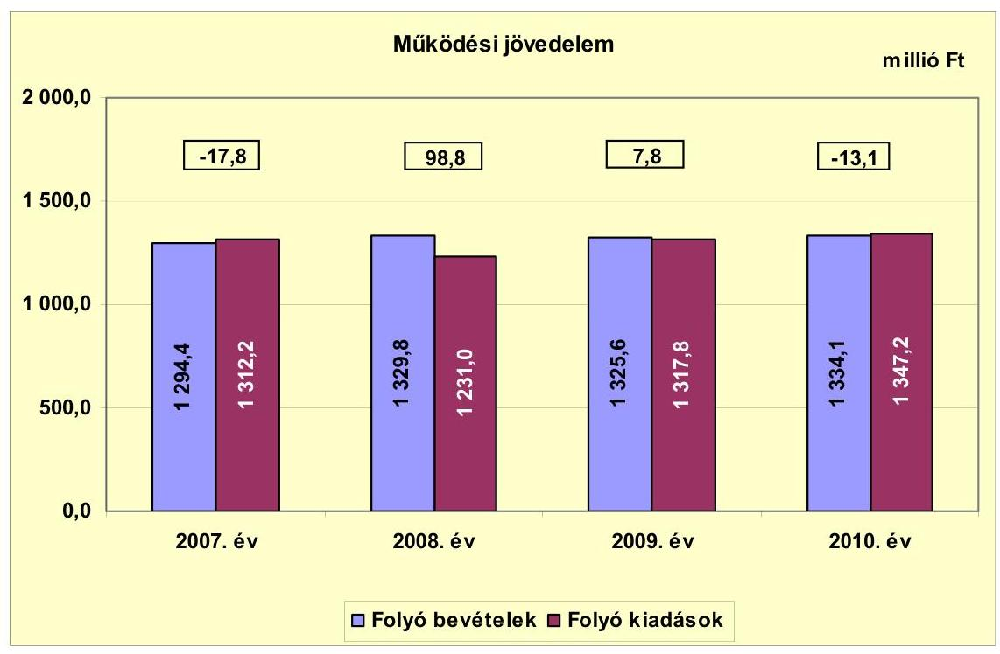

A 2007. és a 2010. évben az Önkormányzat folyó költségvetési egyenlege, működési jövedelme negatív (működési forráshiány), a 2008-2009. években pozitív (működési forrástöbblet) összegű volt. A 2007. évi működési forráshiányt követően a 2008. évben 98,8 millió Ft működési forrástöbblet alakult ki az Önkormányzatnál. A működési forrástöbbletet a működési kiadások (63 millió Ft-os) - az Idősek klubja megszüntetése, valamint a közművelődési, könyvtári és alapfokú művészetoktatási feladatokat ellátó közművelődési intézmény átszervezése miatti - csökkenése eredményezte. A 2009. és a 2010. években a működési jövedelem évről évre csökkent. A működési jövedelem csökkenésében a 2009. évben a vállalkozásoknak ${ }^{15}$ átadott pénzeszközök 28,0%-os (64,9 millió Ft-os) növekedése, a 2010. évben a helyi iparűzési adóbevételek 21,3%-os ( 15,3 millió Ft-os) csökkenése játszott szerepet.

A 2010. évben a folyó bevételek és folyó kiadások alakulásában szerepet játszottak az Önkormányzat árvíz- és belvízvédelemmel kapcsolatos feladatai, amelyek ellátására a Vis maior alapból 59,1 millió Ft költségvetési támogatásban részesült.

A működési jövedelem a kapott ÖNHIKI és működésképtelen önkormányzatok támogatása nélkül a 2008. évben 98,8 millió Ft helyett 88,8 millió Ft, a 2009. évben 7,8 millió Ft helyett -8,3 millió Ft lett volna.

[^0]
[^0]:    ${ }^{15}$ Az Önkormányzat gazdasági társaságának átadott működési célú pénzeszköz, amely a kötelező és önként vállalt feladatok ellátását szolgálta.

---

A pénzügyi kapacitás a vizsgált időszakban a 2008. év kivételével negatív értéket mutatott. A nettó működési jövedelem ${ }^{16}$ értéke a folyó költségvetési pozíció mellett az adott költségvetési év adósságtörlesztésének hatását is tükrözi.

Az Önkormányzat nettó működési jövedelmének évenkénti alakulását a 2007-2010. években az alábbi ábra szemlélteti:
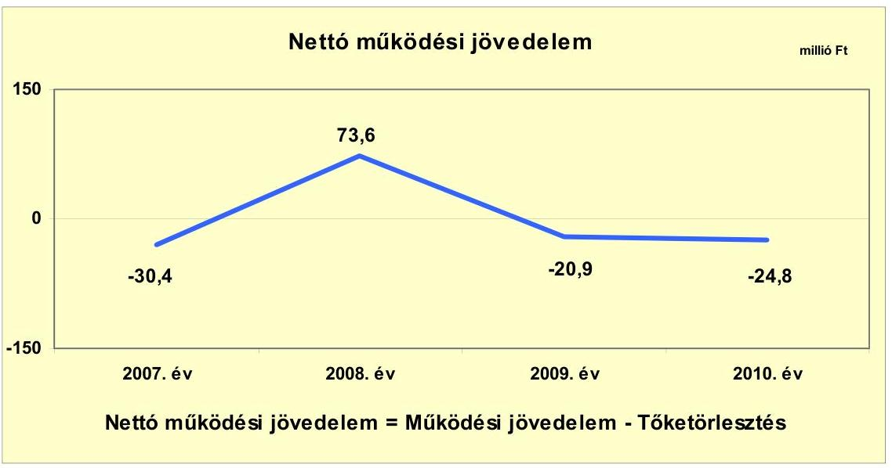

A vizsgált időszakban az Önkormányzatnál összességében -2,5 millió Ft nettó működési jövedelem képződött. A 2007-2010. években képződött összes működési jövedelem ( 75,7 millió Ft) a hitelekhez kapcsolódó tőketörlesztés összegére ( 78,2 millió Ft) nem nyújtott fedezetet. Az éves adósságszolgálat a 2008. évre kétszeresére ( 25,2 millió Ft-ra) emelkedett az előző évhez képest, azonban a működési jövedelem nagy mértékű növekedése következtében (a 2007. évi 17,8 millió Ft-os forráshiányt követően a 2008. évben 98,8 millió Ft forrástöbblet alakult ki) a nettó működési jövedelemben is kiugró javulás figyelhető meg. A pénzügyi kapacitás a 2009. évben ismét negatív összegű lett (-20,9 millió Ft), a működési jövedelem ( 91,0 millió Ft-os) csökkenése következtében. A 2010. évben a nettó működési jövedelem tovább csökkent 3,9 millió Ft-tal (-24,8 millió Ft-ra) az előző évhez viszonyítva. A változás mértékének alakulásában szerepet játszott a működési jövedelem 7,8 millió Ft-ról -13,1 millió Ft-ra (20,9 millió Ft-tal) való csökkenése, melyet a tőketörlesztés összegének csökkenése - az előző évi 28,7 millió Ft-hoz viszonyítva 59,2%-kal (17,0 millió Ft-tal) volt alacsonyabb összegű - sem tudott ellensúlyozni. A tőketörlesztés összegének változását elsősorban az igénybe vett rulírozó hitel 2009. évi visszafizetése okozta.

A 2007-2010. években az Önkormányzat felhalmozási költségvetésének egyenlege a 2007-2008. években negatív, majd a 2009-2010. években pozitív összegű volt.

[^0]
[^0]:    ${ }^{16}$ pénzügyi kapacitás

---

A felhalmozási költségvetés egyenlegét 2007-2010 között a következő ábra szemlélteti:
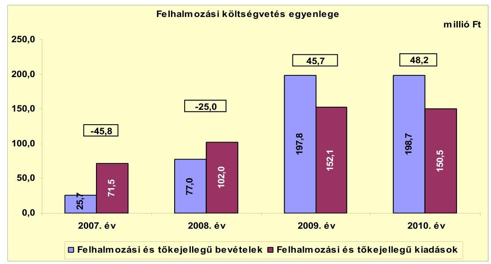

A felhalmozási forráshiánynak a felhalmozási és tőke jellegű kiadásokhoz viszonyított aránya 2007-ben 64,1% (-45,8 millió Ft), 2008-ban 24,5% $(-25,0$ millió Ft$)$ volt. A felhalmozási forrástöbblet felhalmozási és tőke jellegű kiadásokhoz viszonyított aránya 2009-ben 30,0% (45,7 millió Ft), 2010-ben 32,0% (48,2 millió Ft) volt. A 2007. évben a felhalmozási kiadásokra ( 71,5 millió Ft) az Önkormányzat bevételei ( 25,7 millió Ft) nem nyújtottak fedezetet. A 2008. évi -25,0 millió Ft-os felhalmozási forráshiányra a folyó költségvetésben keletkezett 98,8 millió Ft jövedelem fedezetet biztosított. A 2009-2010-ben keletkezett felhalmozási forrástöbblet az Önkormányzat folyamatban lévő fejlesztéseinek saját forrásaként szolgál. Az Önkormányzatnál az EU-s és hazai támogatásból megvalósuló projektek előfinanszírozása miatt a felhalmozási bevételek és kiadások teljesülése időben egymástól eltért, ami finanszírozási problémákhoz vezetett, növelve ezzel a pénzügyi kockázatot. Az Önkormányzat a felhalmozási kiadások finanszírozásához tervezett saját bevételek egy részét fejlesztési célú hitelekkel váltotta ki, a likviditási problémák megoldása érdekében rulírozó- és folyószámlahiteleket vett igénybe, annak ellenére, hogy a vizsgált időszakban összesen 23,1 millió Ft felhalmozási forrástöbblet keletkezett.

Az Önkormányzat teljes finanszírozási igénye ${ }^{17}$ a 2007. évben a CLF módszer szerint 76,2 millió Ft volt, amelyre a 18,4 millió Ft finanszírozási célú bevétel nem nyújtott fedezetet ${ }^{18}$. A 2008-2010. években az Önkormányzat finanszírozási többlettel rendelkezett. A 2008. évben 48,6 millió Ft finanszírozási többlet keletkezett, mivel a nettó működési jövedelem ( 73,6 millió Ft) a felhalmozási forráshiány összegét ( $-25,0$ millió Ft) meghaladta. A 2009. és a 2010. évben a felhalmozási forrástöbblet (2009-ben 45,7 millió Ft és 2010-ben 48,2 millió Ft) 2009-ben 24,8 millió Ft, míg 2010-ben 23,4 millió Ft finanszírozási többletet

[^0]
[^0]:    ${ }^{17}$ a nettó működési jövedelem és a felhalmozási költségvetés egyenlegének összege
    ${ }^{18}$ Az Önkormányzat rendelkezésére álló pénzeszközök összege 2007. január 1-jén 66,7 millió Ft, amely kötelezettségvállalással terhelt volt.

---

eredményezett az Önkormányzatnál a negatív nettó működési jövedelem ellenére (2009-ben -20,9 millió Ft, 2010-ben -24,8 millió Ft).

Az Önkormányzat finanszírozási műveletei 2007-2010. évek közötti egyenlegének alakulását a következő ábra szemlélteti:
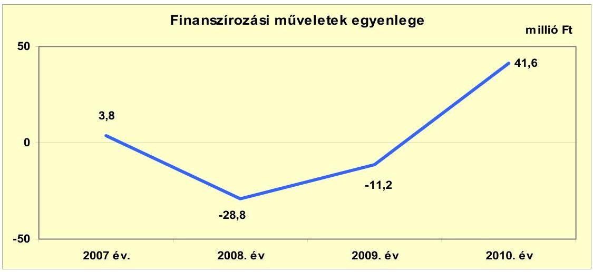

A finanszírozási pénzügyi műveletek 2007. és 2010. évi pozitív egyenlege azt jelzi, hogy az éves költségvetések végrehajtása során szükség volt az előző években keletkezett pénzmaradvány igénybevételén túl külső finanszírozás rulírozó, folyószámla- és munkabér-megelőlegezési hitelek - bevonására is. A finanszírozási műveletek - 28,8 millió Ft-os egyenlegét a 2008. évben részben ${ }^{19}$ az okozta, hogy az Önkormányzat beszámolója szerint ebben az évben hitelt nem vett fel, azonban fennálló hiteltartozásaiból 25,2 millió Ft-ot törlesztett. A finanszírozási műveletek egyenlegének összege a 2009. és a 2010. évben emelkedett, mivel a 2009. évben 23,7 millió Ft hitel felvételére ${ }^{20}$ és 28,7 millió Ft hitel törlesztésére került sor. A 2010. évi növekedést további 69,7 millió Ft hitelfelvétel, valamint a hitelek törlesztésének 17,0 millió Ft-os (11,7 millió Ft) csökkenése okozta az előző évhez viszonyítva. A finanszírozási célú műveleteket a vizsgált időszakban a jelentés 2. számú mellékletének 4.1-4.8. pontjai részletezik.

Az Önkormányzat a 2007. évi zárszámadási rendeletében 11,0 millió Ft bevételi hiányt, míg a 2008-2010. években bevételi többletet mutatott ki. A kimutatott bevételi többlet összege a 2008. évben 69,3 millió Ft, a 2009. évben 53,5 millió Ft, a 2010. évben 35,0 millió Ft volt. A megállapított bevételek és kiadások - a 2007. év kivételével - az Áht, 8/A. § (7) bekezdés előírásának megfelelően pénzügyi műveleteket (finanszírozási célú bevételeket és kiadásokat) nem tartalmaztak. Az Önkormányzat által a zárszámadási rendeletekben megállapított működési és fejlesztési többletet az 1. számú melléklet szemlélteti.

[^0]
[^0]:    ${ }^{19}$-3,5 millió Ft a függő-, átfutó-, kiegyenlítő tételek eredménye volt.
    ${ }^{20}$ Felvett fejlesztési hitelek voltak: 5,1 millió Ft és 11,3 millió Ft útfelújításra, 2,1 millió Ft intézmény akadálymentesítésére, 5,2 millió Ft konyhafelújításra.

---

A 2007-2010 között az Önkormányzat összesen 54,6 millió Ft kamatot fizetett meg. Az átmenetileg szabad pénzeszközei befektetéséből származó kamatbevétel a teljes kamatráfordítás 6,8%-át (3,7 millió Ft-ot) tette ki.

Az Önkormányzat kamatbevételeinek és kamatkiadásainak alakulását a következő ábra mutatja:
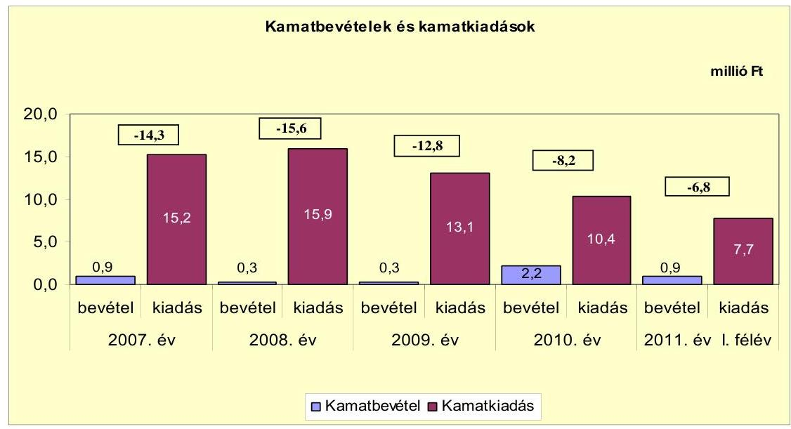

A kamatbevételek összege a vizsgált időszakban a számlavezető pénzintézet által a költségvetési bankszámlákon lévő pénzeszközök után fizetett kamatot tartalmazta. Átmenetileg szabad pénzeszközök lekötéséből származó kamatbevétellel az Önkormányzat nem rendelkezett. A 2007-2009. évek átlag kamatbevételéhez (
 0,5 millió Ft) viszonyítva a 2010. év kamatbevétele magasabb volt (2,2 millió Ft), amelyet az elkülönített bankszámlán lévő - EU-s projektekhez kapcsolódó - támogatási előleg összege után kaptak. A kamatkiadások a 2008. évben 4,6%-kal (0,7 millió Ft-tal) növekedtek, majd 2009-ben 17,5%-kal (2,8 millió Ft-tal), 2010-ben 20,6%-kal (2,7 millió Ft-tal) csökkentek az előző évhez viszonyítva. A kamatkiadások változása a rulírozó hitel visszafizetésével és folyószámlahitel igénybevételével függött össze.

A 2011. évre az Önkormányzat a kamatkiadások csökkenésével számol, a költségvetési rendeletben tervezett 9,0 millió Ft kamatkiadás 13,5%-kal (1,4 millió Ft-tal) kevesebb a 2010. évitől, a hitelek állományának csökkenése miatt.

---

# 2.2. Az Önkormányzat bevételeinek változása 

Az Önkormányzat folyó bevétele a 2007-2009 évek átlagához (1316,6 millió Ft) viszonyítva 2010-re 1334,1 millió Ft-ra, 1,3%-kal (17,5 millió Ft-tal) emelkedett.

Az Önkormányzat működőképességének megőrzéséhez 2008-2009. években ${ }^{21}$ összesen 26,1 millió Ft kiegészítő támogatásban részesült. A támogatás 40,6%-a (10,6 millió Ft) a működési hiány csökkentését szolgálta, illetve 59,4%-a (15,5 millió Ft) feladathoz nem kötött támogatás volt.

Az Önkormányzat 2007-2010 között realizált főbb bevételi jogcímeinek számszaki adatait, összetételének változását az alábbi ábra mutatja be:
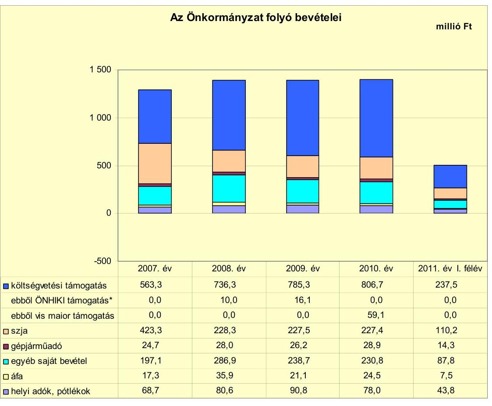

* Az Önkormányzat működőképességének megőrzését szolgáló kiegészítő támogatások együttesen

Az Önkormányzat a 2007-2010. években összesen 3998,1 millió Ft költségvetési támogatásban és átengedett szja-ban részesült. A költségvetési tá-

[^0]
[^0]:    ${ }^{21}$ Az Önkormányzat a 2007., a 2010. évben és a 2011. év I. félévében működőképességének megőrzését szolgáló kiegészítő támogatásban nem részesült. A 2009. évben személyi jellegű juttatásokra 5,6 millió Ft-ot, dologi kiadásokra 5,0 millió Ft-ot kapott az önhibáján kívül hátrányos helyzetbe került önkormányzatok kiegészítő támogatásából. Ezen kívül a működésképtelen helyi önkormányzatok egyéb támogatása címen a 2008. évben 10,0 millió Ft-ban, a 2009. évben 5,5 millió Ft-ban részesült.

---

mogatások, és az átengedett szja együttes összegében jelentős változás nem következett be. A vizsgált időszakban - a jelentésben bemutatott CLF módszer szerint - az Önkormányzat a központi szabályozórendszer változásai következtében összesen 220,3 millió Ft-tal kevesebb költségvetési támogatásban és átengedett szja-ban részesült a 2006. évhez viszonyítva. A 2011. év I. félévében 347,7 millió Ft költségvetési támogatásban és átengedett szja-ban részesült az Önkormányzat.

Az Önkormányzat helyi adó bevételei 2007-től 2009-ig folyamatosan növekedtek, majd 2010-ben 14,1%-kal (12,8 millió Ft-tal) csökkentek az előző évhez viszonyítva. Az Önkormányzat által megállapított helyi adók az iparűzési adó, az építményadó, az idegenforgalmi adó, telekadó (2007 februárjától megszűnt) voltak. A magánszemélyek kommunális adójának mértékét 2009. január 1-jétől $9400 \mathrm{Ft} / \mathrm{m}^{2}$-rel kevesebb összegben vetették ki, mint a 2008. évben. A magánszemélyek kommunális adója mértékének csökkentése a 2010. évtől éreztette hatását, mivel a 2009. évben a kieső kommunális adóbevétel összegét (11,6 millió Ft) a helyi iparűzési adóbevételből származó többlet (21,6 millió Ft) ellensúlyozni tudta. Azonban a 2010. évben a helyi iparűzési adóbevétel (15,3 millió Ft-tal) csökkent az előző évhez viszonyítva, így az a magánszemélyek kommunális adója mértékének csökkentéséből származó bevételi kiesésre már nem nyújtott fedezetet.

A magánszemélyek kommunális adójának mértéke 2007. január 1-jétől $10000 \mathrm{Ft} / \mathrm{m}^{2}$ volt, amely a 2008. évben $14400 \mathrm{Ft} / \mathrm{m}^{2}$-re emelkedett. Ezt követően 2009-től $5000 \mathrm{Ft} / \mathrm{m}^{2}$-ben került megállapításra.

A helyi iparűzési adó mértéke az állandó jelleggel végzett iparűzési tevékenység esetében a vizsgált időszakban 2% volt.

Az építményadót az Önkormányzat illetékességi területén vetette ki minden nem lakás céljára szolgáló épületre, illetve a magánszemélyek tulajdonában lévő üzlet, műhely, raktár, illetve azon helyiségekre, amelyek a lakás nem életvitelszerű használatát szolgálják. Alapja az építmény $\mathrm{m}^{2}$-ben számított hasznos alapterület volt, mértéke a 2007. évi $480 \mathrm{Ft} / \mathrm{m}^{2}$-ről 2008-tól $500 \mathrm{Ft} / \mathrm{m}^{2}$-ra, majd 2011-től $520 \mathrm{Ft} / \mathrm{m}^{2}$-re nőtt.

Az idegenforgalmi adó mértéke a 2007. évben személyenként és vendégéjszakánként 50 Ft volt, amely a vizsgált időszakban nem változott.

A telekadó mértéke az Önkormányzat illetékességi területén lévő beépítetlen belterületi földrészlet után 2007. január 1-jén $110 \mathrm{Ft} / \mathrm{m}^{2}$ volt, amely 2008. január 1-jétől $120 \mathrm{Ft} / \mathrm{m}^{2}$-re emelkedett. A telekadót az Önkormányzat 2008. február 20-án megszüntette, mivel az előterjesztésben megfogalmazottak szerint a bevezetése a kívánt célt (költségvetési bevételi forrás biztosítását) nem érte el.

Az Önkormányzat a vizsgált időszakban gazdasági társaságaitól osztalékban nem részesült. Az egyes években nyereségesen működő gazdasági társaságai által elért adózott eredményt (a vizsgált időszakban összesen 1,6 millió Ft) eredménytartalékba helyeztette. Az Önkormányzat által a gazdasági társaságai részére átadott működési és felhalmozási célú pénzeszközök összegét a 4. számú melléklet tartalmazza.

---

Az Önkormányzat felhalmozási bevételeit a vizsgált időszakban jogcímenként a következő táblázat tartalmazza:

| Megnevezés | 2007. év | 2008. év | 2009. év | 2010. év | 2011. év I.   félév |
| :-- | --: | --: | --: | --: | --: |
| Tárgyi eszköz értékesítés | 0,6 | 0,7 | 81,6 | 4,9 | 60,9 |
| Egyéb saját tőkebevétel | 0,9 | 1,2 | 0,6 | 0,7 | 12,1 |
| Államháztartáson belülről   kapott támogatás | 21,7 | 72,3 | 113,4 | 185,7 | 72,1 |
| Államháztartáson kívülről   kapott támogatás | 2,5 | 2,8 | 2,2 | 7,4 | 0,2 |
| Összes felhalmozási bevétel | 25,7 | 77,0 | 197,8 | 198,7 | 145,3 |

Az Önkormányzat felhalmozási bevételei a vizsgált időszak utolsó két évében jelentősen növekedtek. A változásra legszámottevőbb hatással az államháztartáson belülről kapott támogatások és támogatásértékű bevételek voltak, amelyeket az Önkormányzat pályázati tevékenysége befolyásolt. Az Önkormányzatnak tárgyi eszközök, járművek és ingatlanok értékesítéséből a 2009. évben 81,6 millió Ft bevétele származott, mely az előző évekhez viszonyítva kiugróan magas volt. Értékesítésre az Önkormányzat tulajdonában lévő telkek, gépjármű és üzletrész kerültek.

# 2.3. Az Önkormányzat működési és felhalmozási célú kiadásainak változása 

Az Önkormányzat működési kiadásai a vizsgált időszakban főbb jogcímek szerinti bontásban az alábbiak voltak:

|  |  |  |  |  | millió Ft   2011. év I.   félév |
| :--: | :--: | :--: | :--: | :--: | :--: |
| Megnevezés | 2007. év | 2008. év | 2009. év | 2010. év |  |
| Folyó kiadások | 1312,2 | 1231,0 | 1317,8 | 1347,2 | 529,6 |
| Működési kiadások (kamatkiadás nélkül) | 883,3 | 816,3 | 818,8 | 920,8 | 421,2 |
| Államháztartáson belülre átadott pénzeszközök | 20,5 | 2,2 | 4,9 | 4,1 | 2,5 |
| Transzferkiadások | 390,0 | 396,6 | 481,0 | 411,9 | 98,2 |
| -ebből: vállalkozásoknak | 226,8 | 232,0 | 296,9 | 238,0 | 22,5 |
| EU-nak, illetve külföldre | 0,0 | 0,0 | 0,0 | 0,3 | 0,0 |
| magánszemélyeknek | 151,1 | 154,0 | 164,7 | 167,7 | 73,7 |
| nonprofit szervezeteknek | 12,1 | 10,6 | 19,4 | 5,9 | 2,0 |
| Kamatkiadások | 15,2 | 15,9 | 13,1 | 10,4 | 7,7 |
| Előző évi pénzmaradvány átadás | 3,2 | 0,0 | 0,0 | 0,0 | 0,0 |

Az Önkormányzat folyó kiadásai 2008-ban 6,2%-kal (81,2 millió Ft-tal) csökkentek a szociális intézmény megszüntetése ${ }^{22}$, valamint a közművelődési, könyvtári és alapfokú művészetoktatási intézmény átszervezése (az Önkormányzat kimutatása szerint összesen 40,5 millió Ft) miatt az előző évhez viszonyítva. A folyó kiadások 2009. évi 7,1%-os (86,8 millió Ft-os) növekedésében a

[^0]
[^0]:    ${ }^{22}$ Idősek klubja

---

vállalkozásoknak (gazdasági társaságának) átadott működési célú pénzeszközök 64,9 millió Ft-os emelkedése, a 2010. évi 2,2%-os (29,4 millió Ft) növekedésében az árvíz- és belvízvédelemmel kapcsolatos tevékenység kiadásai (69,3 millió Ft) játszottak jelentős szerepet az előző évhez viszonyítva.

Az Önkormányzat működési kiadásai ${ }^{23}$ a vizsgált időszakban a következőképpen alakultak:

| Megnevezés | 2007. év | 2008. év | 2009. év | 2010. év | 2011. év I.   félév |
| :-- | --: | --: | --: | --: | --: |
| Személyi juttatások | 476,1 | 412,4 | 455,9 | 482,5 | 202,9 |
| Munkaadót terhelő járulékok | 152,9 | 130,6 | 123,4 | 115,9 | 51,8 |
| Dologi kiadások | 191,7 | 194,9 | 177,7 | 225,1 | 124,5 |
| Egyéb folyó kiadások | 5,6 | 4,6 | 2,9 | 4,2 | 4,7 |

Az Önkormányzatnál a személyi juttatások és a munkaadókat terhelő járulékok összege a 2010. évben 2,5%-kal (14,6 millió Ft-tal) növekedett a 2007-2009. évek átlagához (583,8 millió Ft) viszonyítva. Az egyes kiadási jogcímek közötti arányeltolódás miatt azonban a személyi juttatások és munkaadókat terhelő járulékok aránya a folyó kiadásokon belül a 2010. évre 1,0 százalékponttal (44,4%-ra) csökkent a 2007-2009. évek átlagához (45,4%) viszonyítva. A személyi juttatások 2008-ra 13,4%-kal (63,7 millió Ft-tal) csökkentek a 2007. évhez viszonyítva az Idősek klubja megszüntetése, valamint a közművelődési, könyvtári és alapfokú művészetoktatási feladatok átszervezése következtében. Ezt követően a személyi juttatások 2009-ben 10,5%-kal (43,5 millió Ft-tal) 2010-ben 5,8%-kal (26,6 millió Ft-tal) emelkedtek az előző évhez viszonyítva.

Az árvíz- és belvízvédelemmel kapcsolatos tevékenység kiadásaiból a 2010. évben a személyi juttatások összege 2,8 millió Ft, a munkaadót terhelő járulékok összege 0,6 millió Ft volt.

A dologi kiadások 2008-ban nem növekedtek számottevően a 2007. évhez viszonyítva. A 2009. évben azonban 8,8%-kal (17,2 millió Ft-tal) csökkentek, majd a 2010. évben 26,7%-kal (47,4 millió Ft-tal) növekedtek az előző évhez viszonyítva. A dologi kiadások 2010. évi növekedését elsősorban az árvíz- és belvízvédelemmel kapcsolatos tevékenység dologi kiadásai - 65,8 millió Ft - okozták.

[^0]
[^0]:    ${ }^{23}$ A táblázatban és a 2. számú mellékletben szereplő működési kiadások eltérését a kisebbségi önkormányzatok kiadásai, és a kamatkiadások eltérő módon való szerepeltetése okozza.

---

Az Önkormányzatnál a folyó és felhalmozási kiadások alakulását, a teljesített kiadások működési és felhalmozási felhasználásának arányait a vizsgált időszakban az alábbi ábra mutatja:
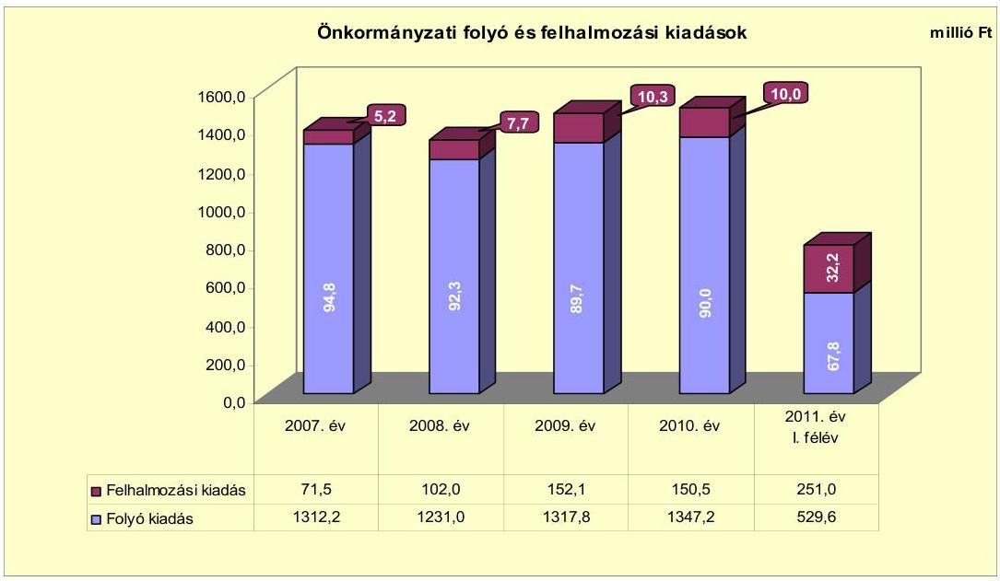

A teljesített összes kiadáson belül a felhalmozási kiadások aránya a 2008. évben 2,5 százalékponttal (7,7%-ra), a 2009. évben 2,6 százalékponttal (10,3%-ra) növekedett, majd a 2010. évben 0,3 százalékponttal (10,0%-ra) csökkent az előző évhez viszonyítva, a költségszerkezet változása következtében.

A vizsgált időszakban az Önkormányzat befejezett és folyamatban levő felújításainak és fejlesztéseinek tervezett összege összesen 1845,4 millió Ft volt. Az Önkormányzat a 2007-2010. években 8 projekt megvalósítását végezte EU-s források felhasználásával. A 2007-2010. években az Önkormányzat megvalósított és folyamatban lévő fejlesztései településrész korszerűsítésére, Ipari Park létesítésére, önkormányzati intézmények felújítására, szennyvíz-ivóvíz hálózat felújítására, hulladékátrakó állomás létesítésére, szilárd burkolatú úthálózat burkolat-felújítására irányultak.

Az Önkormányzatnál a 2007-2010. években befejezett felújítási és fejlesztési feladatok összes
 költségvetési kiadása 959,9 millió Ft volt, amelyből a fejlesztések összege 679,4 millió Ft (70,8%) és a felújítások összege 280,5 millió Ft (29,2%) volt. A projektek döntő többsége utófinanszírozású beruházás volt, amely az Önkormányzat likviditási helyzetére, fizetőképességére kedvezőtlen hatást gyakorolt és folyószámlahitel felvételét tette szükségessé. A befejezett 959,9 millió Ft értékű fejlesztés forrásmegoszlása: 522,4 millió Ft EU-s támogatás (54,4%), 127,8 millió Ft hazai támogatás (13,3%), 286,1 millió Ft saját bevétel (29,8%), 23,6 millió Ft (2,5%) felhalmozási célú hitelfelvétel volt. A 2007-2010. években teljesített kiadások összege 457,9 millió Ft volt, míg a további 502,0 millió Ft kiadást 2006. december 31-ig teljesítették.

Az Önkormányzat 2010. december 31-én folyamatban lévő (4 db) felújítási és fejlesztési feladatainak tervezett nagysága 917,0 millió Ft, a 2010.

---

december 31-ig teljesített kiadások tényleges összege 25,6 millió Ft volt. A folyamatban lévő fejlesztések 2010. december 31-ig teljesített kiadásainak forrása 20,6 millió Ft (80,5%) saját bevétel, 5,0 millió Ft EU-s támogatás (19,5%). A források a fejlesztések esetében az EU-s és a hazai támogatásoknál utólagosan álltak rendelkezésre. A 2010. december 31-én folyamatban lévő felújítások és fejlesztések 2010. évet követő kötelezettségvállalásainak összege 891,4 millió Ft volt, amelynek forrása 129,4 millió Ft (14,5%) saját bevétel, 30,0 millió Ft hitel (3,4%), 678,5 millió Ft EU-s támogatás (76,1%), és 53,5 millió Ft hazai támogatás (6,0%). Az Önkormányzat a 2011. évben négy fejlesztési feladat megvalósítását kezdte meg saját forrásból, amelyek tervezett értéke összesen 18,3 millió Ft. A 2011-2012. évekre vállalt felhalmozási célú kiadások fedezeteként szolgáló 147,7 millió Ft saját bevétel esetleges nem teljesülése a fejlesztések pénzügyi kockázatát növeli.

A 2011. évben az Önkormányzat három pályázatot nyújtott be, amelyek elbírálása a helyszíni ellenőrzés befejezésének időpontjáig nem zárult le. A benyújtott pályázatokkal megvalósítani kívánt projektek bekerülési költsége összesen 467,5 millió Ft, amelynek forrása 100,4 millió Ft (21,5%) saját bevétel, 347,1 millió Ft (74,2%) EU-s támogatás és 20,0 millió Ft (4,3%) hazai támogatás.

Az Önkormányzat befejezett és folyamatban lévő fejlesztései közül a legnagyobb költségigényű az alábbi három beruházás volt:

- Az Önkormányzat határozata alapján a 2005-2007. években valósította meg Phare program keretében Főtér beruházásának I. komponensét. A projekt keretében a központi park és közterület felújítása történt meg térburkolattal, virágosítással, fásítással, utcabútorok és kandeláberek elhelyezésével, valamint parkolók kialakításával. A projekt megvalósítási költsége 521,1 millió Ft, amelynek forrása 95,1 millió Ft (18,2%) saját bevétel, 406,2 millió Ft (78,0%) EU-s támogatás és 19,8 millió Ft (3,8%) hazai támogatás volt. A Főtér beruházás II. komponensének megvalósítására a Képviselő-testület 2008. évi határozata alapján kerül sor ÉMOP keretében a 2011-2012. években. A II. komponens célja a Város centrumának fejlesztése a közszféra és a magánszféra együttműködése által. Ennek keretében sor kerül közlekedésfejlesztésre, Okmányiroda és kistérségi központ kialakítására, parkolók felújítására és a Református Parókia felújítására. A projekt tervezett bekerülési költsége 424,2 millió Ft, amelynek forrása 80,8 millió Ft (19,0%) saját bevétel és 343,4 millió Ft (81,0%) EU-s támogatás. A projekt megvalósítására az Önkormányzat 2010. december 31-ig 9,0 millió Ft-ot költött saját bevételei terhére.
- A Képviselő-testület a 2008. évben döntött az óvoda épületének felújításáról, amelynek megvalósítására ÉMOP keretében a 2010-2012. években kerül sor. A projekt keretében sor kerül az óvoda épületének bővítésére két csoportszobával (integrált bölcsődei csoporttal), épület akadálymentesítésére, valamint az épület kiegészítésére a legszükségesebb hiányzó helyiségekkel. A fejlesztés tervezett összköltsége 100,2 millió Ft, amelynek forrása 5,0 millió Ft (5,0%) saját bevétel és 95,2 millió Ft (95,0%) EU-s támogatás. A megvalósításhoz 2010. december 31-ig 2,1 millió Ft saját bevételt használt fel az Önkormányzat.

---

- Az Önkormányzat a 2008. évben döntött Inkubátorház létesítéséről, amelynek megvalósítására ÉMOP keretében kerül sor a 2010-2011. években. A fejlesztés célja, hogy a kezdő vállalkozások elhelyezésére alkalmas irodák és műhelyek kerüljenek kialakításra a volt művelődési házban. A projekt tervezett megvalósítási költsége 306,1 millió Ft, amelynek forrása 31,2 millió Ft (10,2%) saját bevétel, 30,0 millió Ft (9,8%) fejlesztési célú hitel$^{24}$ és 244,9 millió Ft (80,0%) EU-s támogatás. A fejlesztés megvalósításához 2010. december 31-ig 9,5 millió Ft saját bevételt és 5,0 millió Ft EU-s támogatást használtak fel.

Az Önkormányzat gazdasági társaságai részére működési célra adott át pénzeszközöket, melynek alakulását a következő ábra szemlélteti:
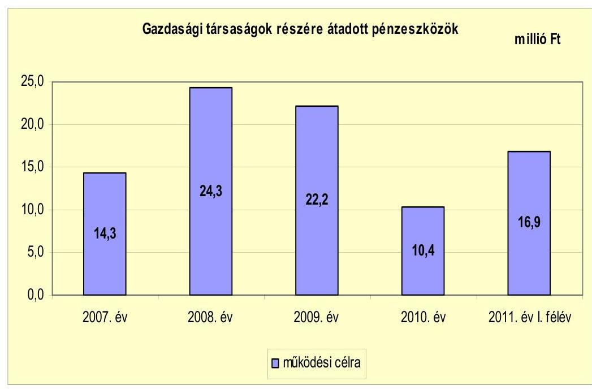

A gazdasági társaságok részére átadott pénzeszközök összege 2007-2011. év I. féléve között 88,1 millió Ft volt. Ezt teljes egészében a Turul Provincia Város-üzemeltetési- és Közszolgáltató Nonprofit Kft. kapta, amelynek feladata a sportlétesítmények üzemeltetése, közterület-fenntartás, hulladékkezelés és -szállítás, a városi temető üzemeltetése és az önkormányzati bérlakásokkal való gazdálkodás. A gazdasági társaságok tőkejuttatásban nem részesültek. Az Önkormányzat által a gazdasági társaságai részére adott pénzeszközöket a 4. sz. melléklet tartalmazza.

[^0]
[^0]:    $^{24}$ A hitelszerződés megkötésére 2009. július 2-án sor került.

---

# 3. Az ÖNKORMÁNYZAT KÖTELEZETTSÉGEI 

### 3.1. Az Önkormányzat pénzintézeti kötelezettségeinek változása

Az Önkormányzat pénzintézeti kötelezettségeinek állománya könyvviteli mérlegének adatai szerint a 2007-2010. években eltérő irányban változott az egymást követő években. A 2010. évben 185,9 millió Ft, a 2011. év I. félévében 180,4 millió Ft volt a pénzintézeti kötelezettségek állománya, amely a rövid- és hosszú lejáratú hitel felvételek, valamint a törlesztések együttes hatására 2010-ben 46,2 millió Ft-tal (33,1%-kal) volt magasabb a 2007-2009. évek (139,7 millió Ft összegű) átlagos hitelállományánál.

Az Önkormányzat 2011. június 30-ai pénzintézeti kötelezettségei az ellenőrzött időszakot megelőzően felvett épület felújítási és a vizsgált időszakban (2009-ben) igénybevett (négy) beruházási, felújítási célokat szolgáló hitelek, valamint a folyószámlahitel állományból származó - forintban fennálló - kötelezettségek voltak.

Az Önkormányzat pénzintézeteknél fennálló kötelezettségállományát a 2007-2010. években és 2011. év I. félévében az alábbi ábra szemlélteti:
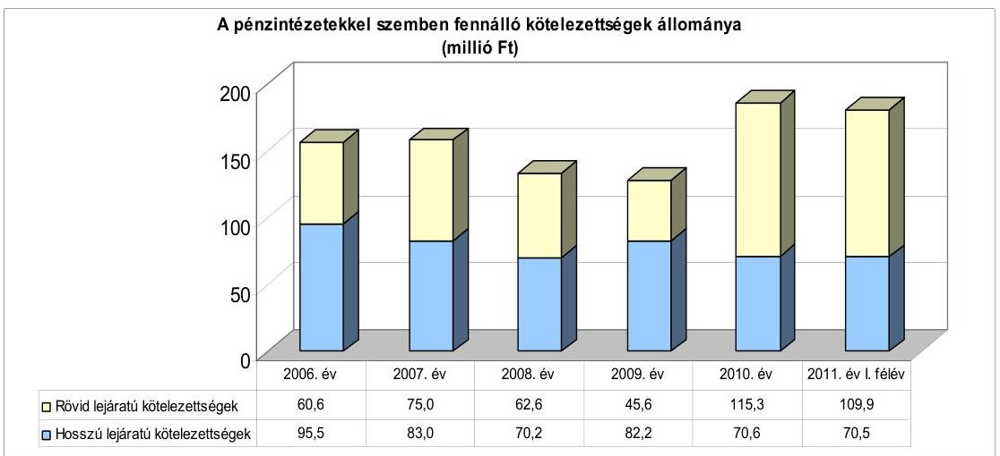

Az Önkormányzat 2010. december 31-ei hosszú lejáratú pénzintézeti kötelezettség állományából 46,8 millió Ft-ot (66,4%-ot) tett ki a „XXI. századi iskola" fejlesztési program megvalósításához 2004. évben igénybevett (117,0 millió Ft) hitelből fennálló tartozás. A hitelből 2010. december 31-én fennálló tőketartozás 58,5 millió Ft volt, azonban abból a következő évben esedékes 11,7 millió Ft törlesztő részletet a rövid lejáratú kötelezettségek tartalmazták. A hosszú lejáratú pénzintézeti kötelezettségekből 23,7 millió Ft (33,6%) a 2009. évben felvett beruházási, felújítási célokat szolgáló hitelfelvételből származott.

A Képviselő-testület 2009. évi döntése alapján az Önkormányzat hat hosszú lejáratú hitel hitelszerződésben 54,7 millió Ft hitel felvételére kötött hitelszerződést a számlavezető pénzintézettel, melyből 2011. június 30-ig 23,7 millió Ft-ot hívott le. A 2007-2008. évek végén 80,0 millió Ft,

---

2009-2010. év végén és 2011. június 30-án 120,0 millió Ft folyószámlahitel-kerettel rendelkezett az Önkormányzat. Az igénybevett folyószámlahitel átlagos napi állománya a 2007-2010. években 30,1 millió Ft és 51,0 millió Ft között volt, a 2011. év I. félévében 107,1 millió Ft-ra emelkedett.

A 2007-2011. évi zárszámadási rendeletekben bemutatták az adott költségvetési évet terhelő adósságszolgálati kötelezettséget, a hiteltörlesztés összegét és az azt terhelő kamatkötelezettséget. Az Önkormányzat pénzintézeti kötelezettségvállalásai minden esetben képviselő-testületi döntésen alapultak. A Képviselő-testület a döntését a hitelfelvételek felhasználási célját, a hitel igénybevételét terhelő várható kamatkiadásokat és egyéb költségeket tartalmazó előterjesztések alapján hozta meg. A kötelezettségvállalásról szóló határozatok tartalmazták a hitelfelvétel biztosítékául felajánlott ingatlanokra történő jelzálogjog bejegyzéshez való hozzájárulást, azonban a hitel visszafizetésének forrását nem határozták meg. A Képviselő-testület a hitelfelvételről szóló határozatban arra vállalt kötelezettséget, hogy a pénzintézeti kötelezettségek és azok terheinek visszafizetéséhez szükséges forrásokat a mindenkori költségvetésében biztosítja, azokat az adott évi költségvetési rendeletekben megtervezi és jóváhagyja. A pénzintézeti kötelezettségvállalást megelőzően megvizsgálták az Ötv. 88. § (2) bekezdésében foglalt adósságszolgálati korlát felső határát, annak betartásáról a határozatban nyilatkoztak. Az ellenőrzött időszakban az adósságszolgálati korláton belül vállaltak kötelezettséget.

Az Önkormányzat hosszú lejáratú hitelfelvételéből származó 2010. december 31-én fennálló pénzintézeti kötelezettségeket az alábbi táblázat tartalmazza:

| Megnevezés | Szerződéskötés/   Kibocsátás   időpontja | Összeg   ezer HUF-ban | Kamat (referencia kamat+   kamatfelár) | Felhasználás célja: |
| :-- | :--: | :--: | :--: | :-- |
| "Beruházás a XXI. századi iskolába" |  |  |  | Gimnázium, szakképző és   általános iskola épületeinek   felújítása |
| OTP Bank Nyit. 1-2-09-3400-0175-0 sz. | 2004.06.29 | 58,5 | 6 havi BUBOR +1% | Vásártér és Bársonypatak   közötti útfelújítás |
| OTP Bank Nyit. 1-2-09-3400-0175-0 sz. | 2009.07.03 | 5,1 | 3 havi EURIBOR + évi 3,5% |  |
| OTP Bank Nyit. 1-2-09-3400-0224-1 sz. | 2009.07.02 | 2,1 | 3 havi EURIBOR + évi 2,5% | általános iskola épületének   akadálymentesítése |
| OTP Bank Nyit. 1-2-09-3400-0226-3 sz. | 2009.07.02 | 11,3 | 3 havi EURIBOR + évi 3,5% | Dózsa Gy. u. felújítása |
| OTP Bank Nyit. 1-2-09-3400-0219-3 sz | 2009.07.02 | 5,2 | 3 havi EURIBOR + évi 2,5% |  |

A vizsgált időszakban a számlavezető pénzintézettel kötött - a közlekedési utak felújításához, az iskola konyhájának felújításához, eszközbeszerzéséhez és az iskolaépület akadálymentesítésének megvalósításához forrást biztosító - szerződésekben rögzített hitelek lehívása és a célnak megfelelő felhasználásuk megtörtént. A 2010. évben elkezdődött a hitelkamatok és egyéb költségek szerződés szerinti kifizetése, a tőketartozás törlesztése - halasztott tőketörlesztéssel - a 2012. év I. félévében kezdődik, a hitelek lejárati ideje 2029. március 5-e. A 2012. évben az ellenőrzött időszakban igénybevett hitelek tőketörlesztése 1,4 millió Ft, a 2004. évben felvett hitel törlesztése 11,7 millió Ft, összesen 13,1 millió Ft forrást igényel.

Az óvoda épületének akadálymentesítéséhez és az inkubátorház kialakításához tervezett - összesen 31,0 millió Ft - hitelt 2011. június 30-ig nem vette igénybe az Önkormányzat. A hitelek rendelkezésre tartási ideje 2012. már-

---

cius 4-e. Az óvodai nevelés ellátására szolgáló épület akadálymentesítéséhez rendelkezésre álló 1,0 millió Ft hitelkeretet 2011. szeptember hónapban igénybe vették. Az inkubátorházhoz kapcsolódó 30,0 millió Ft-os hitelkeretből 1,7 millió Ft lehívását 2011. november hónapban, a kivitelezés megkezdését követően kezdeményezte az Önkormányzat. Az ellenőrzött időszakot követően igénybevett és azt követően tervezett hitellehívás realizálódása esetén a hitelek 2012. évi tőketörlesztése további 1,8 millió Ft-ot igényel.

Az ellenőrzött időszakban - a 2007. évet megelőzően felvett hitelek miatt hosszú lejáratú pénzintézeti kötelezettség törlesztésére a 2007-2010. években és 2011. év I. félévében összesen 60,8 millió Ft-ot fordított az Önkormányzat. A vizsgált időszakot megelőzően a „XXI. századi iskola" fejlesztési program megvalósításához igénybevett
 hitel és két gépjárművásárlás miatt vállalt lízingkötelezettség visszafizetésére teljesített kifizetéseket az Önkormányzat. Az iskola épületeinek felújítására igénybevett hitel lejárati ideje 2015. december 15-e, éves törlesztő részlete 11,7 millió Ft, tőketörlesztésre összesen 58,5 millió Ft-ot teljesítettek. A gépjárművásárláshoz kapcsolódó - 2007. január 1-jén fennálló 2,3 millió Ft - hitelt a 2007-2008. években teljes egészében visszafizette az Önkormányzat.

A 2007-2011. év I. félévében a beruházási hitelek kamatainak megfizetésére 59,9 millió Ft-ot, egyéb költségekre 0,5 millió Ft-ot fordítottak, melyből a 2009. évben felvett hitelek kamata 1,8 millió Ft, egyéb költsége 0,4 millió Ft volt.

Az elkülönített számlán levő, fejlesztésekhez kapcsolódó pénzeszközök hasznosítása 2,2 millió Ft kamatbevételt eredményezett az Önkormányzatnak, amit a fejlesztésekhez szükséges önerő biztosításához használtak fel.

Az Önkormányzat működésének pénzügyi egyensúlyát a vizsgált időszakban folyószámlahitel igénybevételével, a 2011. év I. félévében a folyószámlahitel mellett munkabér-megelőlegezési hitel felvételével tudta biztosítani.

Az igénybevett folyószámla- és munkabér-megelőlegezési hitel adatait az alábbi táblázat mutatja be:

| Megnevezés | 2007. év | 2008. év | 2009. év | 2010. év | 2011. év I.   félév |
| :-- | --: | --: | --: | --: | --: |
| I. Folyószámlahitel |  |  |  |  |  |
| a folyószámlahitel keretösszege január 1-jén | 0,0 | 80,0 | 120,0 | 120,0 | 120,0 |
| teljesített kamat és egyéb költség | 1,0 | 5,3 | 3,3 | 3,5 | 5,5 |
| II. Munkabér megelőlegezési hitel |  |  |  |  |  |
| igénybevett hitel összesen: | 0 | 0 | 0 | 0 | 20,0 |
| teljesített kamat és egyéb költség | 0 | 0 | 0 | 0 | 0,6 |

---

A folyószámla- és munkabér-hitelek kondíciói és egyéb költségei a következők voltak ${ }^{25}$ :

| Megnevezés | Kamat (referencia+ kamatfelár) | Egyéb költség |
| :-- | :--: | :--: |
| Folyószámlahitel |  |  |
| 2007.08.15-től - 2008.07.28-ig | 3 havi BUBOR $+1,25 \%$ | $0,5 \%$ kez. ktsg $+0,0 \%$ rend.tart.jut. |
| 2008.07.28-tól - 2009.06.29-ig | 3 havi BUBOR $+2,5 \%$ | $0,5 \%$ kez. ktsg $+0,5 \%$ rend.tart.jut. |
| 2009.06.30-tól - 2010.06.28-ig | 1 havi BUBOR $+3,5 \%$ | $0,5 \%$ kez. ktsg $+1,5 \%$ rend.tart.jut. |
| 2010.07.02-től - 2011.06.30-ig | 1 havi BUBOR $+3,5 \%$ | $0,5 \%$ kez. ktsg $+2,0 \%$ rend.tart.jut. |
| Munkabér megelőlegezési hitel |  |  |
| 2011.05.09 - 2011. 06.02 | OTP irányadó Ft kamat | $0,5 \%$ kez. ktsg $+0,5 \%$ rend.tart.jut. |

Az Önkormányzat folyószámlahitellel terhelt napjainak száma a 2008. évben az előző évhez képest jelentősen - 125 napról 352 napra - emelkedett, majd 2009-ben és 2010-ben csökkent, az előző évekhez képest. A folyószámlahitellel terhelt napok száma 2010-ben 184 volt, amely 50 nappal volt kevesebb a 2007-2009. évek folyószámlahitellel terhelt napjainak átlagától. 2011. június 30-ig a folyószámlahitellel zárt napok száma 181 nap volt - a 2010. évi működési hiány miatt felhalmozódott szállítói kötelezettségek kiegyenlítése, valamint a hiányzó fejlesztési források miatt - időarányosan növekedést mutatott.

A folyószámlahitel átlagos napi állománya a 2010. évben 49,8 millió Ft, a 2011. év I. félévében 107,1 millió Ft volt, ez utóbbi 68,9 millió Ft-tal meghaladta a 2007-2009. évek folyószámlahitel átlagos állományát is. Képviselő-testület döntése alapján a folyószámla hitelkeret összegét 2009. június 30-tól 40 millió Ft-tal megemelték. A folyószámla hitelszerződés lejáratakor a fennálló tartozás nagysága nem indokolta a folyószámla hitelkeret megemelését. A folyószámlahitel tartozás 2008. június 28-ai szerződés lejáratakor 59,7 millió Ft volt, a 2009. június 6-ai és a 2010. június 28-ai szerződés lejáratakor nem volt tartozása az Önkormányzatnak. A folyószámlahitel igénybevételét, a hitelkeret megemelését és a munkabér megelőlegezési hitel igénybevételét - az Önkormányzat saját bevételein belül jelentős részarányt kitevő ${ }^{26}$ - a helyi adóbevételek megelőlegezése, a 2011. évben indult fejlesztések megvalósításához szükséges ingatlanvásárlás fedezetének ${ }^{27}$ biztosítása, az EU-s támogatásokból megvalósuló beruházások előfinanszírozása, valamint a 2007-2009. években még rendelkezésre álló egyéb likvid hitel megszűnése miatti finanszírozási forrás kiesés tette szükségessé.

Az Önkormányzat a 2007. április 13. és 2009. augusztus 28. közötti időszakban hat alkalommal éven belüli lejáratú likvidhitelt (rulírozó hitelt) vett igénybe, két alkalommal 10,0 millió Ft-ot, háromszor 20,0 millió Ft-ot, egy esetben 60,0 millió Ft-ot, melyeket költségvetési éven belül visszafizetett. Az

[^0]
[^0]:    ${ }^{25}$ A referencia kamat az alábbiak szerint alakult:

    | MNB BUBOR fixing (átlagkamat) \%-ban |  |  |  |  |
    | :-- | :-- | :-- | :-- | :-- | :-- |
    | Referencia kamat | 2007. évi | 2008. év | 2009. év | 2010. év | 2011.június |
    |  |  |  |  |  | 30 -ig |
    | havi BUBOR | 7,83 | 8,75 | 8,66 | 5,47 | 6,00 |
    | 3 havi BUBOR | 7,75 | 8,87 | 8,84 | 5,50 | 6,07 |
    | 6 havi BUBOR | 7,68 | 8,98 | 8,62 | 5,53 | 6,08 |

    26 A helyi adóbevételek az Önkormányzat működési bevételein belül átlagosan 6,3\%-os részarányt képviseltek a 2007-2011. év I. félévében.
    ${ }^{27}$ Az ingatlanok vásárlásához 18,5 millió Ft folyószámlahitelt vettek igénybe.

---

Önkormányzat rulírozó hitelt - annak 2009. augusztus 28-ai visszafizetését követően - nem vett igénybe, és a 2009. december 21-én lejárt hitelkeretszerződést nem újította meg.

A rulírozó hitel, a folyószámla- és munkabér-megelőlegezési hitel igénybevétele ${ }^{28}$ nélkül a pénzügyi egyensúly nem volt biztosítható. A rendszeresen jelentkező likviditási problémák finanszírozása (folyószámla-, munkabérmegelőlegezési és egyéb likvidhitelek) az Önkormányzatnak a 2007-től 2011. június 30-ig összesen 23,1 millió Ft kamat és 4,1 millió Ft egyéb költség megfizetését eredményezte.

A hosszú lejáratú beruházási hitelek kamatfizetési kötelezettségeinek alakulását jelentősen befolyásolta és jelenleg is befolyásolja a kibocsátáskori és az utolsó kamatfizetéskor ismert kamatok változása, melyeket a következő táblázat mutat be:

| Megnevezés | Kibocsátási, lehivási kamat (referencia + kamatfelár) $\%$ | Utolsó fizetéskor | Változás \% |
| :--: | :--: | :--: | :--: |
| 6 havi BUBOR + évi $1 \%$ (2004. 06.29-ai szerződés (XXI.sz. iskola felúj.)) | 12,41 | 7 | $-43,6 \%$ |
| 3 havi EURIBOR + évi 3,5\% (2009. 07-03-ai szerződés köst.ülfelúj.) | 4,608 | 4,8 | $4,2 \%$ |
| 3 havi EURIBOR + évi 2,5\% (2009. 07-02-ai szerződés isk.akadálym.) | 3,068 | 3,6 | 23,9\% |
| 3 havi EURIBOR + évi 3,5\% (2009. 07-02-ai szerződés D GY.ülfelúj.) | 4,608 | 4,6 | $4,2 \%$ |
| 3 havi EURIBOR + évi 2,5\% (2009. 07-02-ai szerződés D GY.ülfelúj.) | 3,608 | 3,6 | 5,3\% |

A hitelfelvételkor és az utolsó kamatfizetéskor ismert fizetendő kamatmértékek változása az Önkormányzat kamatfizetési kötelezettségére összességében kedvezőtlen hatással volt. A 6 havi BUBOR változása csökkentette, a 3 havi EURIBOR növelte az Önkormányzatot terhelő kamatköltséget.

Az Önkormányzat kötelezettségvállalásaiból származó tartozások és azok kamata miatti várható összes kötelezettség alakulását a következő táblázat mutatja:

| Megnevezés | Állomány 2010.   december 31-én | Állomány   2011. június   30 -án | Várható   kötelezettség   2011-2013.   években | Várható   kötelezettség   2014. évtől |
| :--: | :--: | :--: | :--: | :--: |
|  | HUF-ban (millió   Ft-ban) | HUF-ban (millió   Ft-ban) | HUF-ban (millió   Ft-ban) | HUF-ban (millió   Ft-ban) |
| Pénzintézeti kötelezettségek |  |  |  |  |
| Magyar Fejlesztési Bank (XXI. sz. iskola felúj.) | 65,3 | 53,5 | 43,0 | 25,8 |
| OTP Bank Nyit. (ber.hitel útfelújításra) | 5,4 | 5,4 | 1,2 | 6,3 |
| OTP Bank Nyit. (ber.hitel iskola akadálymentesítésre) | 2,1 | 2,1 | 0,4 | 2,5 |
| OTP Bank Nyit. ( ber.hitel útfelújítás) | 11,3 | 11,3 | 2,6 | 13,9 |
| OTP Bank Nyit. (ber.hitel konyhafelújítás) | 5,2 | 5,2 | 1,1 | 6,0 |
| OTP Bank Nyit. (ber.hitel óvoda akadálymentesítés) | 0,0 | 0,0 | 0,2 | 1,1 |
| OTP Bank Nyit. (ber.hitel inkubátorház kialakítás) | 0,0 | 0,0 | 8,8 | 36,6 |
| OTP Bank Nyit Folyószámlahitel | 96,6 | 102,9 | 102,9 | - |
| Pénzintézeti kötelezettségek összesen HUF-ban: | 185,9 | 180,4 | 158,2 | 92,2 |
| Szállító tartozás | 106,5 | 34,9 | 34,9 | - |

Az Önkormányzat által a 2007-2010. években vállalt 24,0 millió Ft hosszú lejáratú pénzintézeti kötelezettségek összege 2010. december 31-én teljes egészében fennállt, mert az igénybevett hitelek tőketörlesztése 2011. június 30-ig nem kezdődött meg. Az Önkormányzat számára pénzügyi kockázatot jelent a korábban felvett fejlesztési hitel tőketörlesztése és kamatfizetése mellett újabb hitelek igénybevétele. Az Önkormányzat pénzügyi kockázatát növeli, hogy a hitelek visszafizetési forrását nem határozták meg. A visszafizetéshez szükséges források megteremtése érdekében az Önkormányzat - a családsegítés, házi segítségnyújtás, gyermekjóléti ellátás, idősek nappali ellátása feladatok átadásával - kiadáscsökkentő intézkedéseket tett. Az intézkedések hatására képződő Önkormányzat által számított - megtakarítás részben fedezetet nyújt majd a hiteltörlesztések teljesítésére, ami az Önkormányzat pénzügyi kockázatát kedvezően befolyásolja.

A 2011-2013. években a várható 55,3 millió Ft adósságszolgálat valamint 102,9 millió Ft likvidhitel visszafizetésének teljesítésére figyelembe vehető a 2010. december 31-én a könyvviteli mérlegben kimutatott és rendelkezésre álló 39,6 millió Ft vevő és adósállomány, 25,3 millió Ft kölcsönfolyósításból származó követelés. A pénzintézeti kötelezettségek teljesítéséhez 2010. december 31-én felhasználható szabad pénzmaradvánnyal nem rendelkezett az Önkormányzat. A pénzintézeti kötelezettségek teljesítésének kockázatát növeli, hogy a 2010. december 31-én a kötelezettségek teljesítésére bevonható vagyon könyv szerinti értéke nem érte el a várható tőketörlesztés és kamatfizetés összegét.

# 3.2. A szállítói kötelezettségek változása 

Az Önkormányzat szállítói kötelezettség miatti tartozása a 2007. és a 2009. években nem érte el az összes kötelezettség 10\%-át, aránya 9,1\% (21,2 millió Ft) és 7,8\% (14,3 millió Ft) volt, míg a 2008. évben 22,8\%-át (47,0 millió Ft), a 2010. évben 30,3\%-át (38,6 millió Ft) tette ki. A szállítók 2010. év
 végi állománya 106,5 millió Ft volt, mely az előző évekhez képest jelentősen emelkedett, 73,8 millió Ft-tal meghaladta a megelőző három év szállítói kötelezettség záróállományának átlagát. A 2010. évben a lejárt határidejű szállítói tartozások az előző évi 8,2 millió Ft-ról 36,6 millió Ft-ra emelkedtek. A szállítói kötelezettségek 2011. év I. félévi kiegyenlítését követően a szállítók tartozásállománya 2011. év I. félév végén 34,9 millió Ft volt, amely 6,5%-kal haladta meg a 2007-2009. évek átlagát.

A lejárt határidejű szállítói tartozások állománya növekedett, a 2010. évben 13,8 millió Ft-tal, a 2011. év I. félév végén 1,0 millió Ft-tal haladta meg a 2007-2009. évek 24,9 millió Ft lejárt határidejű tartozásainak átlagállományát. A növekedés ellenére a lejárt határidejű szállítói tartozások összes szállítói kötelezettségen belüli aránya 2010. december 31-ig folyamatosan csökkent, ezt követően 2011. év I. félévében növekedett. A 2007-2010. évek lejárt határidejű szállítói tartozásainak szállítói kötelezettségen belüli átlagos aránya 74,6% volt, ami a 2010. év végére 36,3%-ra csökkent, a 2011. év I. félév végére 74,2%-ra változott.

A 2007-2009. években valamennyi lejárt határidejű tartozás 30 napon belüli volt. A 2011. év I. félév végére növekedett a fizetési késedelem, a lejárt határidejű szállítói tartozások 45,5%-a (15,8 millió Ft) volt 30 napon belüli lejáratú, 8,6%-a (3,0 millió Ft) 31 és 60 napon, 2,1%-a (0,7 millió Ft) 61 és 90 napon belüli lejáratú, 43,8%-a (15,3 millió Ft) 91 és 365 napon belüli határidejű tartozás volt.

---

A 2011. év I. félév végén a 90 és 365 nap közötti lejárt határidejű tartozás öt, összesen 15,3 millió Ft összegű szállítói számla ki nem egyenlítéséből származott. A Főtér II. komponensű beruházáshoz kapcsolódó tervdokumentációról szóló 8,0 millió Ft, a felszíni vízelvezetés tanulmánytervének elkészítéséről szóló 4,6 millió Ft, valamint az akadálymentesítési munkálatokhoz kapcsolódó 0,8 millió Ft összegű számlákat az Önkormányzat befogadta, majd ezt követően, utólag vitatta azok helyességét. Az Önkormányzat az elvégzett feladatok és a számla végösszegét érintően élt kifogással:

- A Főtér II. komponensű beruházáshoz kapcsolódó 8,0 millió Ft értékű tervdokumentáció készítéséről szóló számla kiegyenlítése - a szállítói szerződésben foglaltak szerint - a projekthez kapcsolódó támogatási szerződés megkötését követően vált esedékessé. A támogatási szerződés 2011. június 20-án aláírásra került, azonban a tervdokumentáció pontatlansága miatt a kiegyenlítés nem történt meg.
- A felszíni vízelvezetés tanulmánytervének elkészítési díját tartalmazó 4,6 millió Ft összegű tartozás nem került kiegyenlítésre, mert az Önkormányzat a számla végösszegét aránytalanul magasnak ítélte meg.
- Az általános iskola 0,8 millió Ft összegű akadálymentesítési munkálatait a pályázatot támogató szerv nem ismerte el, ezért az Önkormányzat a számlát nem fizette ki.

A vitatott tételek rendezése érdekében a helyszíni ellenőrzés befejezéséig megállapodás nem jött létre. A lejárt határidejű kötelezettségekből 1,4 millió Ft szállítói tartozás 2011. december 31-ig (fennálló vevőköveteléssel szemben) kompenzáció keretében realizálódik, további 0,5 millió Ft pedig a helyszíni ellenőrzés megkezdéséig kiegyenlítésre került.

# 3.3. Egyéb kötelezettségek változása 

Az Önkormányzat garancia- és kezességvállalási kötelezettséget nem tett, gazdasági társaságok részére kölcsönt nem folyósított.

Az Önkormányzat 2010. december 31-én jelzálogjoggal, elidegenítési és terhelési tilalommal terhelt ingatlanainak könyv szerinti értéke 369,6 millió Ft volt. Pályázat útján elnyert támogatással létrehozott és az Önkormányzat tulajdonában levő bérlakásokra - 251,9 millió Ft értékű ingatlanra - a Magyar Állam javára jegyeztek be elidegenítési és terhelési tilalmat. Az Önkormányzat a hitelfelvételek visszafizetésének fedezeteként 117,7 millió Ft értékű vagyonra jelzálogjog bejegyzéséhez járult hozzá. Ebből a forgalomképes ingatlanok értéke 68,1 millió Ft volt, így a hitelek fedezetére az Ötv. 88. § (1) bekezdésének b) pontjában $^{29}$ foglaltak ellenére 49,6 millió Ft értékben a törzsvagyon részét képező korlátozottan forgalomképes ingatlanokat is bevontak. Az Önkormány-

[^0]
[^0]:    $^{29}$ 2012. január 1-jétől hatályon kívül helyezte a Magyarország helyi önkormányzatairól szóló 2011. évi CLXXXIX. törvény 144. § (1) bekezdése a 156. § (1) bekezdés a) pontjában foglalt kijelölés alapján. A nemzeti vagyonról szóló 2011. évi CXCVI. törvény 6. § (1) és (5) bekezdésében a forgalomképtelen önkormányzati törzsvagyon terhelési tilalmát rögzítették. E § (6) bekezdése meghatározta a korlátozottan forgalomképes önkormányzati vagyon körét, azonban annak terhelését nem tiltotta meg.

---

zat korlátozottan forgalomképes ingatlanainak könyv szerinti értéke 2010. december 31-én 1339,3 millió Ft volt.

A „XXI. századi iskola" felújítási programhoz igénybevett beruházási hitelhez kapcsolódóan továbbá a 2009. évben felvett beruházási hitelek miatt jelzálogjoggal terhelték a sportcsarnok épületét, a rendezvényszervezéshez használt „Borok háza" épületét, pincéjét és az irodaépületet.

A jelzálogjoggal és elidegenítési tilalommal terhelt ingatlanok nettó értékének forgalomképes és korlátozottan forgalomképes ingatlanok nettó értékén belüli arányát az alábbi ábra szemlélteti:
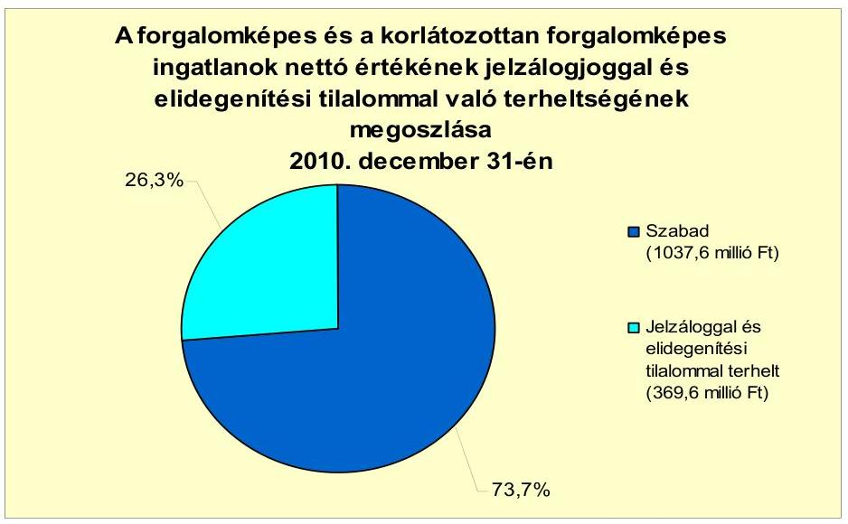

Az Önkormányzat kizárólagos tulajdonában levő gazdasági társasága átmeneti finanszírozási problémák megoldása érdekében likvidhitelt vett igénybe, melyből 2010. december 31-én 25,0 millió Ft, 2011. június 30-án 25,3 millió Ft volt a pénzintézetekkel szemben fennálló tartozása. A kizárólagos és minősített többségi tulajdonban levő társaság 2010. év végi szállítói tartozása 22,7 millió Ft, a 2011. év I. félév végén 21,4 millió Ft volt, melyből a lejárt határidejű tartozások állománya 100% közeli volt. A gazdasági társaságok pénzintézeti, illetve szállítói kötelezettségei nem voltak befolyással az Önkormányzat pénzügyi helyzetére, a pénzügyi egyensúly megtartásában nem jelentettek kockázatot.
„Az Önkormányzat a gazdasági társaságokról szóló 2006. évi IV. törvény 54. § (2) bekezdése alapján korlátlan felelősséggel tartozik azon gazdasági társaságának felszámolása esetében, amelyben az Önkormányzat az 52. § (2) bekezdése szerint a szavazatok legalább 75%-ával rendelkezik, így minősített befolyásszerzőnek minősül, továbbá a csődeljárásról és a felszámolási eljárásról szóló 1991. évi XLIX. törvény 63. § (2) bekezdése alapján a kizárólagos önkormányzati tulajdonú gazdasági társaságának minden olyan kötelezettségéért, amelynek kielégítését a felszámolási eljárás során az adós társaság vagyona nem fedez, ha a hitelezőinek a felszámolási eljárás során benyújtott keresete alapján a bíróság - az adós társaság felé érvényesített tartósan hátrányos üzletpolitikájára figyelemmel - megállapítja az önkormányzat korlátlan és teljes felelősségét."

Az Önkormányzat pénzügyi helyzetét befolyásolhatja az eszközeinek állapota, használhatósági foka, az eszközök pótlására fordított pénzeszközök nagysága.

---

Az Önkormányzat a 2007-2010. években a tárgyi eszközök után együttesen 506,2 millió Ft értékcsökkenést számolt el. A vizsgált időszakban nem történt meg annak felmérése, hogy az eszközök elhasználódásának, amortizációjának pótlása milyen kötelezettséget jelent az Önkormányzat számára. A felújításokra, az eszközök pótlására az Önkormányzat pénzügyi lehetőségeinek függvényében - elsősorban az intézmények működőképessége biztosításának figyelembe vételével - került sor. Az Önkormányzat kimutatása szerint négy év alatt 280,5 millió Ft értékben elvégzett felújításokon túl 203,0 millió értékben fejlesztési kiadást is teljesítettek.

Az Önkormányzat tárgyi eszközeinek értéke a 2007-2010 közötti időszakban 171,8 millió Ft-tal (5,6%-kal) növekedett. A tárgyi eszközök 2010. december 31-ei eszközök bruttó értéke összesen 3224,6 millió Ft volt.

Az Önkormányzat 2007-2010 között eszközállománya után 506,2 millió Ft összegű értékcsökkenést mutatott ki, az elhasználódott eszközök pótlására 458,3 millió Ft-ot fordított.

A tárgyi eszközök használhatósági foka az ellenőrzött időszakban folyamatosan 86,4%-ról 80%-ra csökkent, mivel az eszközök elhasználódása nagyobb mértékű volt, mint azok felújítására, pótlására fordított kiadások nagysága.

# 4. A PÉNZÜGYI EGYENSÚLY MEGTEREMTÉSE ÉRDEKÉBEN HOZOTT INTÉZKEDÉSEK EREDMÉNYE 

Az Önkormányzat a kiadáscsökkentő és bevételnövelő intézkedések meghozatalával a gazdálkodás átláthatóbbá tételét, az Önkormányzat pénzügyi helyzetének a javítását, valamint a feladatellátás szakmai színvonalának emelését kívánta elérni.

A 2007-2010. évek és a 2011. év I. félév között a kiadáscsökkentő intézkedéseinek pénzügyi hatásai - az Önkormányzat kimutatása szerint - beavatkozási területenként az alábbiak voltak:

---

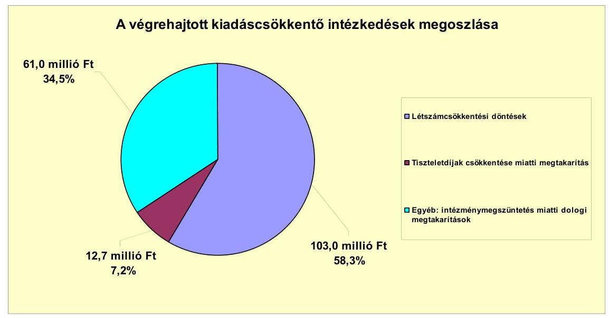

A 2007-2010. években és a 2011. év I. félévében az Önkormányzat kimutatása szerint az intézményi átszervezések, a feladatváltozások, valamint a takarékossági intézkedések hatásaként együttesen 176,7 millió Ft kiadási megtakarítást ért el. Ennek 58,3%-a (103,0 millió Ft) a létszámcsökkentésekből (intézménymegszüntetéssel és feladatátszervezéssel összefüggő álláshely megszüntetés) származott.

Az Önkormányzat az Idősek klubjának megszüntetéséről döntött 2007. július 1-jei hatállyal. Az intézkedéssel az Önkormányzatnál engedélyezett álláshelyek száma hárommal csökkent.
2007. július 15-tel a Petőfi Sándor Művelődési Központ, Könyvtár és Alapfokú Művészetoktatási Intézményt az Önkormányzat jogutód nélkül megszüntette. 10 fő esetében a Gimnázium, 4 fő esetében a Polgármesteri hivatal volt a munkajogi jogutód. Az intézkedéssel 15 álláshely megszüntetésére került sor.

Az intézménymegszüntetéssel és feladatátszervezésekkel kapcsolatban az Önkormányzatnak - kimutatása szerint - a dologi kiadások terén 61,0 millió Ft (34,5%) megtakarítása keletkezett a vizsgált időszakban.

Az Önkormányzat kimutatása szerint az Idősek klubjának megszüntetéséből 13,4 millió Ft megtakarítást, a közművelődési, könyvtári és alapfokú művészetoktatási feladatok átszervezése 47,6 millió Ft megtakarítást eredményezett a dologi kiadásokban.

További kiadáscsökkentő intézkedés hatásaként az Önkormányzat a vizsgált időszakban az előzőeken kívül a kimutatása szerint 12,7 millió Ft megtakarítást ért el. A megtakarítást a képviselők, képviselő-testületi bizottsági tagok, tanácsnokok tiszteletdíjáról szóló önkormányzati rendelet módosítása eredményeként jelentkező képviselői tiszteletdíj csökkenés eredményezte.

A Képviselő-testület döntése alapján 2011. július 1-jétől a Kistérségi társulás részére a gyermekjóléti szolgálat, a családsegítés és a házi segítségnyújtás feladatok ellátását az Önkormányzat átadta. A feladatátadással egyidejűleg 3 fő közalkalmazottként a Kistérségi társuláshoz áthelyezésre került. A döntés ered-

---

ményeként - az előzetes számításaik alapján - a várható megtakarítás éves szinten 7,0 millió Ft lesz.

Az Önkormányzat álláshelyeinek száma 2007. január 1-jéről 2010. december 31-re 11,6%-kal, 189 főről 167 főre csökkent.

Az önkormányzati álláshelyek száma és a foglalkoztatottak létszáma a vizsgált időszakban az alábbiak szerint alakult:

| Megnevezés (adatok fő-ben) | Közoktatás | Szociális és gyermekvédelem | Egészségügy | Polgármesteri hivatal | Egyéb | Összesen |
| :--: | :--: | :--: | :--: | :--: | :--: | :--: |
| 2007. január 1-jén jóváhagyott álláshelyek száma | 111 | 13 | 3 | 32 | 30 | 189 |
| Megszüntetett álláshelyek száma | 2 | 3 |  |  | 18 | 23 |
| ebből | szakmai álláshelyek száma | 2 | 3 |  | 18 | 23 |
| Álláshely növekedése |  |  |  | 1 |  | 1 |
| 2010. december 31-én záró álláshelyek száma | 109 | 10 | 3 | 33 | 12 | 167 |
| 2007. január 1-jén foglalkoztatott létszám | 98 | 13 | 3 | 31 | 27 | 172 |
| Létszámcsökkenés | 7 | 5 |  | 1 | 18 | 31 |
| Létszámnövekedés | 13 | 1 |  | 1 | 3 | 18 |
| 2010. december 31-én foglalkoztatott létszám | 104 | 9 | 3 | 31 | 12 | 159 |

A létszámcsökkentő intézkedések következtében az Önkormányzat kimutatása szerint 2007. január 1. és 2010. december
 31. között a Polgármesteri hivatalnál és az intézményeknél a nyilvántartások szerint összesen 23 álláshelyet szüntettek meg, amelyek teljes egészében ágazati szakmai feladatok ellátásához kapcsolódó álláshelyek voltak. A Polgármesteri hivatalnál azonban feladatbővülés is volt - a feladatátszervezések következtében -, amely álláshely- és egyben létszámnövekedéssel is járt. Ennek következtében az időszak álláshelyeinek száma összességében 22 fővel csökkent. A megszüntetett álláshelyekből üres álláshely nem volt.

A létszámcsökkentések végrehajtásához az Önkormányzat - kimutatása szerint - 2007-2010. években 11,3 millió Ft központosított költségvetési támogatásban részesült. A támogatás felhasználásával 11 álláshelyet tartósan megszüntettek. A létszámcsökkenés 52,2%-ához (12 álláshely) központi támogatás nem kapcsolódott. A létszámcsökkentésben érintett dolgozók továbfoglalkoztatására az Önkormányzat intézményeinél, gazdasági társaságainál nem volt lehetőség.

---

A kiadáscsökkentő intézkedések mellett az Önkormányzat kimutatása szerint az alábbiakban számszerűsített bevételnövelő intézkedéseket tette:
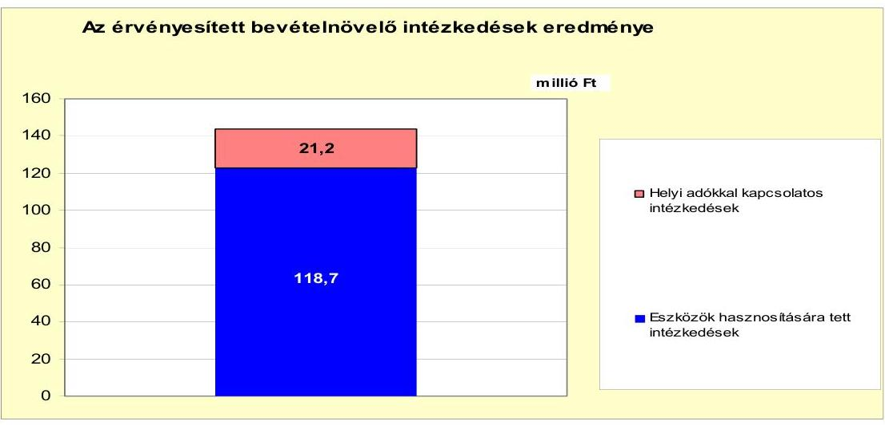

A bevételnövelő intézkedések hatására az Önkormányzat - kimutatása alapján - a 2007-2010. években és a 2011. év I. félévében összesen 139,9 millió Ft többletbevételt ért el. A többletbevétel 15,2%-át (21,2 millió Ft-ot) a helyi adórendeletek módosításával, az adómérték változtatásával, 84,8%-át (118,7 millió Ft-ot) eszközök hasznosítására tett intézkedésekkel érték el.

A vizsgált időszakban az Önkormányzatnál új adónem bevezetésére nem került sor. Az Önkormányzat élve a jogszabályi lehetőségekkel, az építményadó mértékét 2007. január 1-jétől $480 \mathrm{Ft} / \mathrm{m}^{2}$-ben, 2008. január 1-jétől $500 \mathrm{Ft} / \mathrm{m}^{2}$-ben és 2011. január 1-jétől $520 \mathrm{Ft} / \mathrm{m}^{2}$-ben állapította meg. Így kimutatása szerint a vizsgált időszakban 3,1 millió Ft bevételi többletet ért el.

Helyi adókkal kapcsolatos intézkedések keretében az Önkormányzat a magánszemélyekre kivetett kommunális adó mértékét 2007. január 1-jétől $7000 \mathrm{Ft} / \mathrm{m}^{2}$-ről $10000 \mathrm{Ft} / \mathrm{m}^{2}$-re, 2008. január 1-jétől $14400 \mathrm{Ft} / \mathrm{m}^{2}$-re emelte. Az adó mértékét 2009. január 1-jétől $5000 \mathrm{Ft} / \mathrm{m}^{2}$-re csökkentették, majd 2011. január 1-jétől $15000 \mathrm{Ft} / \mathrm{m}^{2}$-re emelték. A változtatásokkal összességében 18,1 millió Ft többletbevételt értek el a kimutatásaik alapján.

Az Önkormányzat a 2007-2010. években összesen - a jelentésben bemutatott CLF módszer szerint - 220,3 millió Ft-tal kevesebb állami támogatásban és átengedett szja-ban részesült, amely az Önkormányzat pénzügyi helyzetére kedvezőtlenül hatott. A kieső bevételeket a 2007-2010. években meghozott kiadáscsökkentő (146,5 millió Ft) és bevételnövelő (70,5 millió Ft) intézkedésekkel nem tudták pótolni. A 2011. évre az Önkormányzat az állami támogatás csökkenésével tervez az előző évhez viszonyítva. A költségvetési rendeletben tervezett 624,1 millió Ft költségvetési támogatás és átengedett szja 39,6%-kal (410,0 millió Ft-tal) maradhat el a 2010. évitől. A kieső állami támogatás ellensúlyozására szolgál az Önkormányzat kimutatása szerint a 2011. év I. félévében a bevételnövelő intézkedések hatására elért 69,4 millió Ft, valamint a kiadáscsökkentő intézkedések hatására jelentkező 30,2 millió Ft. Az így elért bevételi többlet és kiadási megtakarítás összege (99,6 millió Ft) a kieső állami támogatás és átengedett szja időarányos részére (205,0 millió Ft) nem nyújt fedezetet.

---

# 5. Az ÁSZ által a korábbi években a pénzügyi egyensúly javítására tett szabályszerűségi és célszerűségi javaslatok hasznosulása

Az ÁSZ a 2008. évben végzett vizsgálatának megállapításairól készült jelentésében a pénzügyi egyensúly javítására kettő szabályszerűségi javaslat vonatkozott. A javaslatok hasznosulása érdekében készített intézkedési tervet a Képviselő-testület jóváhagyta, a feladatok végrehajtásáért felelős személyeket és a feladatok végrehajtásának határidejét meghatározta. A javaslatoknak megfelelően az Önkormányzat a költségvetési rendelet-tervezetének összeállítása során finanszírozási célú bevételeket és kiadásokat költségvetési bevételként és kiadásként nem mutatott ki.

A pénzügyi egyensúly javítására tett másik javaslat nem teljesült, mivel az Önkormányzat költségvetési rendeletei az Ámr. 2. § 36. (1) bekezdés h) és l) pontjainak előírása[^0] ellenére továbbra sem tartalmazták a többéves kihatással járó feladatok előirányzatait éves bontásban, valamint elkülönítetten az EU-s forrásból finanszírozott támogatásból megvalósuló programok, projektek bevételeit, kiadásait.

Budapest, 2012. április 11.

Melléklet: 7 db
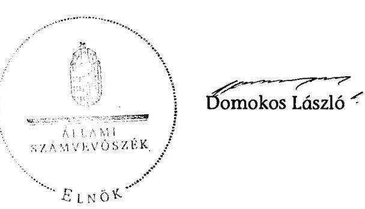

[^0]:  ${ }^{30}$ 2012. január 1-jétől az Ávr. 24. § (1) bekezdés a) és bd) pontjai, valamint az Áht 24. § (4) bekezdés b) pontja

---

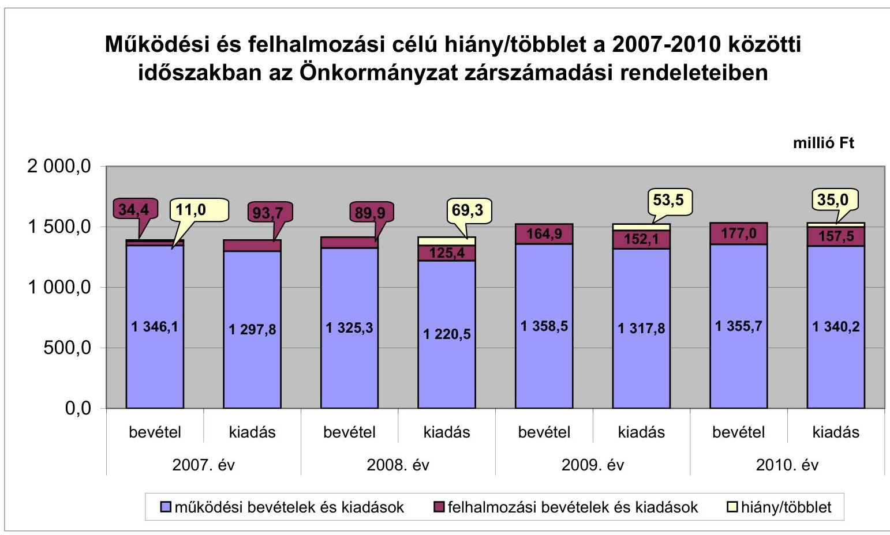

# Működési és felhalmozási célú hiány/többlet a 2007-2010 közötti időszakban az Önkormányzat zárszámadási rendeleteiben

|  I. számú melléklet | II. számú melléklet | III. számú felhalmozási cél | IV. számú felhalmozási felhalmozásai felhalmozásai felhalmozásai felhalmozásai felhalmozásai felhalmozásai felhalmozásai felhalmozásai felhalmozásai felhalmozásai felhalmozásai felhalmozásai felhalmozásai felhalmozásai felhalmozásai felhalmozásai felhalmozásai felhalmozásai felhalmozásai felhalmozásai felhalmozásai felhalmozásai felhalmozásai felhalmozásai felhalmozásai felhalmozásai felhalmozásai felhalmozásai felhalmozásai felhalmozásai felhalmozásai felhalmozásai felhalmozásai felhalmozásai felhalmozásai felhalmozásai felhalmozásai felhalmozásai felhalmozásai felhalmozásai

---

Az Önkormányzat bevételei és kiadásai, valamint adósságszolgálata 2007-2010 között

|  1. FOLYÓ KÖLTSÉGVETÉS* | 2007. év | 2008. év | 2009. év | 2010. év  |
| --- | --- | --- | --- | --- |
|  1.1.1. Saját működési bevételek | 208,6 | 287,3 | 235,0 | 222,9  |
|  1.1.2. Költségvetési támogatás | 563,3 | 736,3 | 785,3 | 806,7  |
|  1.1.3. Átengedett bevételek | 448,1 | 256,2 | 253,8 | 256,2  |
|  1.1.4. Állambáztartáson belülről kapott támogatások | 40,1 | 30,2 | 30,3 | 28,1  |
|  1.1.5. EU-nő és külföldről kapott bevételek | 0,0 | 0,0 | 0,0 | 0,0  |
|  1.1.6. Állambáztartáson kívülről kapott bevételek | 31,2 | 19,8 | 21,2 | 20,1  |
|  1.1.7. Előző évi pénzmaradvány átvétel | 1,1 | 0,0 | 0,0 | 0,0  |
|  1.1. Folyó bevételek $=1.1.1.+1.1.2.+1.1.3.+1.1.4.+1.1.5.+1.1.6.+1.1.7.$ | 1294,4 | 1329,8 | 1325,6 | 1334,1  |
|  1.2.1. Működési kiadások kamatkiadások nélkül | 883,3 | 816,3 | 818,8 | 920,8  |
|  1.2.2. Állambáztartáson belülre átadott pénzeszközök | 20,5 | 2,2 | 4,9 | 4,1  |
|  1.2.3.1. vállalkozásoknak | 226,8 | 232,0 | 296,9 | 238,0  |
|  1.2.3.2. EU-nak, illetve külföldre | 0,0 | 0,0 | 0,0 | 0,3  |
|  1.2.3.3. magánszemélyeknek | 151,1 | 154,0 | 164,7 | 167,7  |
|  1.2.3.4. nonprofit szervezeteknek | 12,1 | 10,6 | 19,4 | 5,9  |
|  1.2.3. Transferkiadások ( $=1.2.3.1+1.2.3.2+1.2.3.3+1.2.3.4$ ) | 390,0 | 396,6 | 481,0 | 411,9  |
|  1.2.4 Kamatkiadások | 15,2 | 15,9 | 13,1 | 10,4  |
|  1.2.5. Előző évi pénzmaradvány átadás | 3,2 | 0,0 | 0,0 | 0,0  |
|  1.2. Folyó kiadások $=1.2.1.+1.2.2.+1.2.3.+1.2.4.+1.2.5.$ | 1312,2 | 1231,0 | 1317,8 | 1347,2  |
|  1.3. Folyó költségvetés egyenlege MŰKÖDÉSI JÖVEDELEM (1.1. - 1.2.) | -17,8 | 98,8 | 7,8 | -13,1  |
|  2. FELHALMOZÁSI KÖLTSÉGVETÉS** | 0,0 | 0,0 | 0,0 | 0,0  |
|  2.1.1. Saját tőkebevételek | 1,5 | 1,9 | 82,2 | 5,6  |
|  2.1.2. Állambáztartáson belülről kapott támogatások | 21,7 | 72,3 | 113,4 | 185,7  |
|  2.1.3. EU-nő és külföldről kapott támogatások | 0,0 | 0,0 | 0,0 | 0,0  |
|  2.1.4. Állambáztartáson kívülről kapott támogatások | 2,5 | 2,8 | 2,2 | 7,4  |
|  2.1. Felhalmozási bevételek ( $=2.1.1.+2.1.2+2.1.3+2.1.4$.) | 25,7 | 77,0 | 197,8 | 198,7  |
|  2.2.1. Saját beruházási kiadás állíval | 64,1 | 88,5 | 50,6 | 43,6  |
|  2.2.2. Saját felújítási kiadás állíval | 3,5 | 0,0 | 90,6 | 67,7  |
|  2.2.3. Állambáztartáson belülre átadott pénzeszköz | 0,0 | 0,0 | 0,0 | 0,0  |
|  2.2.4. EU-nak és külföldnek adott pénzeszközök | 0,0 | 0,0 | 0,0 | 0,0  |
|  2.2.5. Állambáztartáson kívülre adott pénzeszközök | 3,9 | 13,8 | 10,9 | 59,2  |
|  2.2.6. Befektetési célú részesedések vásárlása | 0,0 | 0,0 | 0,0 | 0,0  |
|  2.2. Felhalmozási kiadások ( $=2.2.1.+2.2.2.+2.2.3.+2.2.4.+2.2.5.+2.2.6$.) | 71,5 | 102,0 | 152,1 | 170,5  |
|  2.3. Felhalmozási költségvetés egyenlege (2.1. - 2.2.) | -45,8 | -25,0 | 45,7 | 28,2  |
|  3. Finanszírozási műveletek nélküli (GFS) pozíció(1.3.+2.3.) | -63,6 | 73,8 | 53,5 | -42,1  |
|  4. Finanszírozási műveletek | 0,0 | 0,0 | 0,0 | 0,0  |
|  4.1. Hitelfelvétel | 18,4 | 0,0 | 23,7 | 69,7  |
|  4.2. Hiteltörlesztés | 12,6 | 25,2 | 28,7 | 11,7  |
|  4.3. Forgatási és befektetési célú értékpapírok kibocsátása | 0,0 | 0,0 | 0,0 | 0,0  |
|  4.4. Forgatási és befektetési célú értékpapírok beváltása | 0,0 | 0,0 | 0,0 | 0,0  |
|  4.5. Forgatási és befektetési célú értékpapírok értékesítése | 0,0 | 0,0 | 0,0 | 0,0  |
|  4.6. Forgatási és befektetési célú értékpapírok vásárlása | 0,0 | 0,0 | 0,0 | 0,0  |
|  4.7. Egyéb finanszírozási bevételek (függő, átfutó, kiegyenlítő) | -6,7 | 1,1 | -3,2 | -34,2  |
|  4.8. Egyéb finanszírozási kiadások (függő, átfutó, kiegyenlítő) | -4,7 | 4,7 | 3,0 | -17,8  |
|  4.9.Finanszírozási műveletek egyenlege (4.1. - 4.2.+4.3.-4.4+4.5.-4.6.+4.7.-4.8.) | 3,8 | -28,8 | -11,2 | 41,6  |
|  5. Tárgyévi pénzügyi pozíció (1.3.+ 2.3.+4.9.) | -59,8 | 45,0 | 42,3 | 76,7  |
|  6. Nettó működési jövedelem =működési jövedelem (1.3.) - tőketörlesztés (4.2+4.4) | -30,4 | 73,6 | 29,9 | -24,4  |
|  TÁJÉKOZTATÓ ADATOK |  |  |  |   |
|  Összes kötelezettség | 233,5 | 237,0 | 183,7 | 350,8  |
|  ebből rövid lejáratú | 150,5 | 166,8 | 101,5 | 280,2  |
|  Összes szállítói kötelezettség | 21,2 | 62,7 | 14,3 | 106,5  |
|  ebből lejárt (tanúsítványból) | 19,3 | 47,0 | 8,2 | 38,6  |
|  Pénz és tőkepiaci kötelezettség (adósság) | 158,0 | 132,8 | 127,8 | 185,9  |
|  ebből rövid lejáratú | 75,0 | 62,6 | 45,6 | 115,3  |
|  PPP szerződéses állomány jelenértéken (tanúsítványból) | 0,0 | 0,0 | 0,0 | 0,0  |

 ebből lejárt szolgáltatási díj miatti kötelezettség | 0,0 | 0,0 | 0,0 | 0,0  |
|  Folyószámlahitel napi átlagos állománya (tanúsítványból) | 33,6 | 51,0 | 30,1 | 49,8  |
|  Likvidhitel napi átlagos állománya (tanúsítványból) | 0,1 | 0,1 | 2,0 | 0,0  |
|  Munkabérhitel napi átlagos állománya (tanúsítványból) | 0,0 | 0,0 | 0,0 | 0,0  |
|  Kezesség és garanciavállalások (tanúsítványból) | 0,0 | 0,0 | 0,0 | 0,0  |
|  Jogerős bírósági ítéletekből adódó kötelezettségek (tanúsítványból) | 0,0 | 0,0 | 0,0 | 0,0  |
|  Finanszírozásba bevonható eszközök: | 7,0 | 52,0 | 94,2 | 171,6  |
|  Tartós hitelviszonyt megtestesítő értékpapírok év végi állománya | 0,1 | 0,1 | 0,1 | 0,1  |
|  Hosszú lejáratú bankbetétek év végi állománya | 0,0 | 0,0 | 0,0 | 0,0  |
|  Értékpapírok év végi állománya | 0,0 | 0,0 | 0,0 | 0,0  |
|  Pénzeszközök (idegen pénzeszközök nélkül) év végi állománya | 6,9 | 51,9 | 94,1 | 170,9  |

- Bevételekben nem térül, a kiadásokban nem jelenik meg az amortizáció, a vagyoni helyzetet az egyenleg befolyásolja. Bevételekben vagyon megőrzésre és bővítésre fordítható források.

---

Szíkszó Város Önkormányzata

Az Önkormányzat 2007-2010 években megvalósított, 2010. december 31-ig befejezett fejlesztései és azok forrásösszetevői

millió Ft-ban

|  Fejlesztési feladat (beruházás, felújítás) |  | Beruházás, felújítás |  | Teljes bekerülési költség |  |  |  |  |  |  |  |  |  |  |  |  |  |  |  |  |  |  |  |  |  |  |  |  |  |  |  |  |  |  |  |  |  |  |  |  |  |  |   |
| --- | --- | --- | --- | --- | --- | --- | --- | --- | --- | --- | --- | --- | --- | --- | --- | --- | --- | --- | --- | --- | --- | --- | --- | --- | --- | --- | --- | --- | --- | --- | --- | --- | --- | --- | --- | --- | --- | --- | --- | --- | --- | --- | --- | --- |
|   |  |  |  |  |  |  |  |  |  |  |  |  |  |  |  |  |  |  |  |  |  |  |  |  |  |  |  |  |  |  |  |  |  |  |  |  |  |  |  |  |  |  |   |
|   |  |  |  |  |  |  |  |  |  |  |  |  |  |  |  |  |  |  |  |  |  |  |  |  |  |  |  |  |  |  |  |  |  |  |  |  |  |  |  |  |  |  |   |
|   |  |  |  |  |  |  |  |  |  |  |  |  |  |  |  |  |  |  |  |  |  |  |  |  |  |  |  |  |  |  |  |  |  |  |  |  |  |  |  |  |  |  |   |
|   |  |  |  |  |  |  |  |  |  |  |  |  |  |  |  |  |  |  |  |  |  |  |  |  |  |  |  |  |  |  |  |  |  |  |  |  |  |  |  |  |  |  |   |
|   |  |  |  |  |  |  |  |  |  |  |  |  |  |  |  |  |  |  |  |  |  |  |  |  |  |  |  |  |  |  |  |  |  |  |  |  |  |  |  |  |  |  |   |
|   |  |  |  |  |  |  |  |  |  |  |  |  |  |  |  |  |  |  |  |  |  |  |  |  |  |  |  |  |  |  |  |  |  |  |  |  |  |  |  |  |  |  |   |
|   |  |  |  |  |  |  |  |  |  |  |  |  |  |  |  |  |  |  |  |  |  |  |  |  |  |  |  |  |  |  |  |  |  |  |  |  |  |  |  |  |  |  |   |
|   |  |  |  |  |  |  |  |  |  |  |  |  |  |  |  |  |  |  |  |  |  |  |  |  |  |  |  |  |  |  |  |  |  |  |  |  |  |  |  |  |  |  |   |
|   |  |  |  |  |  |  |  |  |  |  |  |  |  |  |  |  |  |  |  |  |  |  |  |  |  |  |  |  |  |  |  |  |  |  |  |  |  |  |  |  |  |  |   |
|   |  |  |  |  |  |  |  |  |  |  |  |  |  |  |  |  |  |  |  |  |  |  |  |  |  |  |  |  |  |  |  |  |  |  |  |  |  |  |  |  |  |  |   |
|   |  |  |  |  |  |  |  |  |  |  |  |  |  |  |  |  |  |  |  |  |  |  |  |  |  |  |  |  |  |  |  |  |  |  |  |  |  |  |  |  |  |  |   |
|   |  |  |  |  |  |  |  |  |  |  |  |  |  |  |  |  |  |  |  |  |  |  |  |  |  |  |  |  |  |  |  |  |  |  |  |  |  |  |  |  |  |  |   |
|   |  |  |  |  |  |  |  |  |  |  |  |  |  |  |  |  |  |  |  |  |  |  |  |  |  |  |  |  |  |  |  |  |  |  |  |  |  |  |  |  |  |  |   |
|   |  |  |  |  |  |  |  |  |  |  |  |  |  |  |  |  |  |  |  |  |  |  |  |  |  |  |  |  |  |  |  |  |  |  |  |  |  |  |  |  |  |  |   |

 |  |  |  |  |  |  |  |  |  |  |  |  |  |  |  |  |  |  |  |  |  |  |  |  |  |  |  |  |  |  |   |
|   |  |  |  |  |  |  |  |  |  |  |  |  |  |  |  |  |  |  |  |  |  |  |  |  |  |  |  |  |  |  |  |  |  |  |  |  |  |  |  |  |  |  |   |
|   |  |  |  |  |  |  |  |  |  |  |  |  |  |  |  |  |  |  |  |  |  |  |  |  |  |  |  |  |  |  |  |  |  |  |  |  |  |  |  |  |  |  |   |
|   |  |  |  |  |  |  |  |  |  |  |  |  |  |  |  |  |  |  |  |  |  |  |  |  |  |  |  |  |  |  |  |  |  |  |  |  |  |  |  |  |  |  |   |
|   |  |  |  |  |  |  |  |  |  |  |  |  |  |  |  |  |  |  |  |  |  |  |  |  |  |  |  |  |  |  |  |  |  |  |  |  |  |  |  |  |  |  |   |
|   |  |  |  |  |  |  |  |  |  |  |  |  |  |  |  |  |  |  |  |  |  |  |  |  |  |  |  |  |  |  |  |  |  |  |  |  |  |  |  |  |  |  |   |
|   |  |  |  |  |  |  |  |  |  |  |  |  |  |  |  |  |  |  |  |  |  |  |  |  |  |  |  |  |  |  |  |  |  |  |  |  |  |  |  |  |  |  |   |
|   |  |  |  |  |  |  |  |  |  |  |  |  |  |  |  |  |  |  |  |  |  |  |  |  |  |  |  |  |  |  |  |  |  |  |  |  |  |  |  |  |  |  |   |
|   |  |  |  |  |  |  |  |  |  |  |  |  |  |  |  |  |  |  |  |  |  |  |  |  |  |  |  |  |  |  |  |  |  |  |  |  |  |  |  |  |  |  |   |
|   |  |  |  |  |  |  |  |  |  |  |  |  |  |  |  |  |  |  |  |  |  |  |  |  |  |  |  |  |  |  |  |  |  |  |  |  |  |  |  |  |  |  |   |
|   |  |  |  |  |  |  |  |  |  |  |  |  |  |  |  |  |  |  |  |  |  |  |  |  |  |  |  |  |  |  |  |  |  |  |  |  |  |  |  |  |  |  |   |
|   |  |  |  |  |  |  |  |  |  |  |  |  |  |  |  |  |  |  |  |  |  |  |  |  |  |  |  |  |  |  |  |  |  |  |  |  |  |  |  |  |  |  |   |
|   |  |  |  |  |  |  |  |  |  |  |  |  |  |  |  |  |  |  |  |  |  |  |  |  |  |  |  |  |  |  |  |  |  |  |  |  |  |  |  |  |  |  |   |
|   |  |  |  |  |  |  |  |  |  |  |  |  |  |  |  |  |  |  |  |  |  |  |  |  |  |  |  |  |  |  |  |  |  |  |  |  |  |  |  |  |  |  |   |
|   |  |  |  |  |  |  |  |  |  |  |  |  |  |  |  |  |  |  |  |  |  |  |  |  |  |  |  |  |  |  |  |  |  |  |  |  |  |  |  |  |  |  |   |
|   |  |  |  |  |  |  |  |  |  |  |  |  |  |  |  |  |  |  |  |  |  |  |  |  |  |  |  |  |  |  |  |  |  |  |  |  |  |  |  |  |  |  |   |
|   |  |  |  |  |  |  |  |  |  |  |  |  |  |  |  |  |  |  |  |  |  |  |  |  |  |  |  |  |  |  |  |  |  |  |  |  |  |  |  |  |  |  |   |
|   |  |  |  |  |  |  |  |  |  |  |  |  |  |  |  |  |  |  |  |  |  |  |  |  |  |  |  |  |  |  |  |  |  |  |  |  |  |  |  |  |  |  |   |
|   |

---

### Az Önkormányzat 2010. december
 31-én folyamatban lévő fejlesztési feladataira 2010. december 31-ig teljesített kifizetések és azok forrásösszetétele

|   | Fejlesztési feladat (beruházás, felújítás) | Beruházás, felújítás |  |  |  |  |  |  |  |  |  |  |  |  |  |  |  |  |  |  |  |  |  |  |  |  |  |  |  |  |  |  |  |  |  |  |  |  |  |  |  |   |
| --- | --- | --- | --- | --- | --- | --- | --- | --- | --- | --- | --- | --- | --- | --- | --- | --- | --- | --- | --- | --- | --- | --- | --- | --- | --- | --- | --- | --- | --- | --- | --- | --- | --- | --- | --- | --- | --- | --- | --- | --- | --- | --- |
|   |  |  |  |  |  |  |  |  |  |  |  |  |  |  |  |  |  |  |  |  |  |  |  |  |  |  |  |  |  |  |  |  |  |  |  |  |  |  |  |  |  |   |
|   |  |  |  |  |  |  |  |  |  |  |  |  |  |  |  |  |  |  |  |  |  |  |  |  |  |  |  |  |  |  |  |  |  |  |  |  |  |  |  |  |  |   |
|   |  |  |  |  |  |  |  |  |  |  |  |  |  |  |  |  |  |  |  |  |  |  |  |  |  |  |  |  |  |  |  |  |  |  |  |  |  |  |  |  |  |   |
|   |  |  |  |  |  |  |  |  |  |  |  |  |  |  |  |  |  |  |  |  |  |  |  |  |  |  |  |  |  |  |  |  |  |  |  |  |  |  |  |  |  |   |
|   |  |  |  |  |  |  |  |  |  |  |  |  |  |  |  |  |  |  |  |  |  |  |  |  |  |  |  |  |  |  |  |  |  |  |  |  |  |  |  |  |  |   |
|   |  |  |  |  |  |  |  |  |  |  |  |  |  |  |  |  |  |  |  |  |  |  |  |  |  |  |  |  |  |  |  |  |  |  |  |  |  |  |  |  |  |   |
|   |  | Fejlesztési feladat (beruházás, felújítás) |  | Beruházás, felújítás |  |  |  |  |  |  |  |  |  |  |  |  |  |  |  |  |  |  |  |  |  |  |  |  |  |  |  |  |  |  |  |  |  |  |  |  |  |   |
|   |  |  |  |  |  |  |  |  |  |  |  |  |  |  |  |  |  |  |  |  |  |  |  |  |  |  |  |  |  |  |  |  |  |  |  |  |  |  |  |  |  |   |
|   |  |  |  |  |  |  |  |  |  |  |  |  |  |  |  |  |  |  |  |  |  |  |  |  |  |  |  |  |  |  |  |  |  |  |  |  |  |  |  |  |  |   |
|   |  |  |  |  |  |  |  |  |  |  |  |  |  |  |  |  |  |  |  |  |  |  |  |  |  |  |  |  |  |  |  |  |  |  |  |  |  |  |  |  |  |   |
|   |  |  |  |  |  |  |  |  |  |  |  |  |  |  |  |  |  |  |  |  |  |  |  |  |  |  |  |  |  |  |  |  |  |  |  |  |  |  |  |  |  |   |
|   |  |  |  |  |  |  |  |  |  |  |  |  |  |  |  |  |  |  |  |  |  |  |  |  |  |  |  |  |  |  |  |  |  |  |  |  |  |  |  |  |  |   |
|   |  |  |  |  |  |  |  |  |  |  |  |  |  |  |  |  |  |  |  |  |  |  |  |  |  |  |  |  |  |  |  |  |  |  |  |  |  |  |  |  |  |   |
|   |  |  |  |  |  |  |  |  |  |  |  |  |  |  |  |  |  |  |  |  |  |  |  |  |  |  |  |  |  |  |  |  |  |  |  |  |  |  |  |  |  |   |
|   |  |  |  |  |  |  |  |  |  |  |  |  |  |  |  |  |  |  |  |  |  |  |  |  |  |  |  |  |  |  |  |  |  |  |  |  |  |  |  |  |  |   |
|   |  |  |  |  |  |  |  |  |  |  |  |  |  |  |  |  |  |  |  |  |  |  |  |  |  |  |  |  |  |  |  |  |  |  |  |  |  |  |  |  |  |   |
|   |  |  |  |  |  |  |  |  |  |  |  |  |  |  |  |  |  |  |  |  |  |  |  |  |  |  |  |  |  |  |  |  |  |  |  |  |  |  |  |  |  |

 |   |  |  |  |  |  |  |  |  |  |  |  |  |  |  |  |  |  |  |  |  |  |  |  |  |  |  |  |  |  |  |  |  |  |  |  |  |  |  |  |  |  |   |
|   |  |  |  |  |  |  |  |  |  |  |  |  |  |  |  |  |  |  |  |  |  |  |  |  |  |  |  |  |  |  |  |  |  |  |  |  |  |  |  |  |  |   |
|   |  |  |  |  |  |  |  |  |  |  |  |  |  |  |  |  |  |  |  |  |  |  |  |  |  |  |  |  |  |  |  |  |  |  |  |  |  |  |  |  |  |   |
|   |  |  |  |  |  |  |  |  |  |  |  |  |  |  |  |  |  |  |  |  |  |  |  |  |  |  |  |  |  |  |  |  |  |  |  |  |  |  |  |  |  |   |
|   |  |  |  |  |  |  |  |  |  |  |  |  |  |  |  |  |  |  |  |  |  |  |  |  |  |  |  |  |  |  |  |  |  |  |  |  |  |  |  |  |  |   |
|   |  |  |  |  |  |  |  |  |  |  |  |  |  |  |  |  |  |  |  |  |  |  |  |  |  |  |  |  |  |  |  |  |  |  |  |  |  |  |  |  |  |   |
|   |  |  |  |  |  |  |  |  |  |  |  |  |  |  |  |  |  |  |  |  |  |  |  |  |  |  |  |  |  |  |  |  |  |  |  |  |  |  |  |  |  |   |
|   |  |  |  |  |  |  |  |  |  |  |  |  |  |  |  |  |  |  |  |  |  |  |  |  |  |  |  |  |  |  |  |  |  |  |  |  |  |  |  |  |  |   |
|   |  |  |  |  |  |  |  |  |  |  |  |  |  |  |  |  |  |  |  |  |  |  |  |  |  |  |  |  |  |  |  |  |  |  |  |  |  |  |  |  |  |   |
|   |  |  |  |  |  |  |  |  |  |  |  |  |  |  |  |  |  |  |  |  |  |  |  |  |  |  |  |  |  |  |  |  |  |  |  |  |  |  |  |  |  |   |
|   |  |  |  |  |  |  |  |  |  |  |  |  |  |  |  |  |  |  |  |  |  |  |  |  |  |  |  |  |  |  |  |  |  |  |  |  |  |  |  |  |  |   |
|   |  |  |  |  |  |  |  |  |  |  |  |  |  |  |  |  |  |  |  |  |  |  |  |  |  |  |  |  |  |  |  |  |  |  |  |  |  |  |  |  |  |   |
|   |  |  |  |  |  |  |  |  |  |  |  |  |  |  |  |  |  |  |  |  |  |  |  |  |  |  |  |  |  |  |  |  |  |  |  |  |  |  |  |  |  |   |
|   |  |  |  |  |  |  |  |  |  |  |  |  |  |  |  |  |  |  |  |  |  |  |  |  |  |  |  |  |  |  |  |  |  |  |  |  |  |  |  |  |  |   |
|   |  |  |  |  |  |  |  |  |  |  |  |  |  |  |  |  |  |  |  |  |  |  |  |  |  |  |  |  |  |  |  |  |  |  |  |  |  |  |  |  |  |   |
|   |  |  |  |  |  |  |  |  |  |  |  |  |  |  |  |  |  |  |  |  |  |  |  |  |  |  |  |  |  |  |  |  |  |  |  |  |  |  |  |  |  |   |
|   |  |  |  |  |  |  |  |  |  |  |  |  |  |  |  |  |  |  |  |  |  |  |  |  |  |  |  |  |  |  |  |  |  |  |  |  |  |  |  |  |  |   |
|   |  |  |  |  |  |  |  |  |  |  |  |  |  |  |  |  |  |  |  |  |  |  |  |  |  |  |  |  |  |  |  |  |  |  |  |  |  |  |  |  |  |   |
|   |  |  |  |  |  |  |  |  |  |  |  |  |  |  |  |  |  |  |  |  |  |  |  |  |  |  |  |  |  |  |  |  |  |  |  |  |  |  |  |  |  |   |

  |  |  |  |  |  |  |  |  |  |  |  |  |  |  |  |  |  |  |  |  |  |  |  |  |  |  |  |  |  |  |  |  |  |  |  |   |
|   |  |  |  |  |  |  |  |  |  |  |  |  |  |  |  |  |  |  |  |  |  |  |  |  |  |  |  |  |  |  |  |  |  |  |  |  |  |  |  |  |  |   |
|   |  |  |  |  |  |  |  |  |  |  |  |  |  |  |  |  |  |  |  |  |  |  |  |  |  |  |  |  |  |  |  |  |  |  |  |  |  |  |  |  |  |   |
|   |  |  |  |  |  |  |  |  |  |  |  |  |  |  |  |  |  |  |  |  |  |  |  |  |  |  |  |  |  |  |  |  |  |  |  |  |  |  |  |  |  |   |
|   |

---

Szítszó Város Önkormányzata

Az Önkormányzat 2010. december 31-én folyamatosan lévő fejlesztési feladatokra 2010. december 31-én fennálló kötelezettségek és azok forrásösszegétele

mibió Ft-ban

|   | Fejlesztési feladat (beruházás, felújítás) | Beruházás, felújítás | Teljes bekerülési költség (2010. dec. 31-ig) |  |  |  |  |  |  |  |  |  |  |  |  |  |  |  |  |  |  |  |  |  |  |  |  |  |  |  |  |  |  |  |  |  |  |  |  |  |  |  |  |  |  |  |  |  |  |  |  |  |  |  |  |  |  |  |  |  |  |  |  |  |  |  |  |  |  |  |  |  |  |  |  |  |  |  |  |  |  |  |  |  |  |  |  |  |  |  |  |  |  |  |  |  |  |  |  |  |  |  | 

---

### Az Önkormányzat által beadott, elbírálás alatt lévő pályázati forrásból megvalósítani tervezett fejlesztéseihez kapcsolódó kötelezettségvállalásai és azok forrásösszetétele

|  Fejlesztési feladat (beruházás, felújítás) |  | Beruházás, felújítás |  |  |  |  |  |  |  |  |  |  |  |  |  |  |  |  |  |  |  |  |  |  |  |  |  |  |  |  |  |  |  |  |  |  |  |  |  |  |  |  |  |  |  |  |  |  |  |  |  |  |  |  |  |  |  |  |  |  |  |  |  |  |  |  |  |  |  |  |  |  |  |  |  |  |  |  |  |  |  |  |  |  |  |  |  |  |  |  |  |  |  |  |  |  |  |  |  |  |  | 

---

### Az önkormányzati feladatok ellátásában résztvevő gazdasági társaságok

|  Gazdasági társaság
megnevezése |  |  |  |  |  |  |  |  |  |  | a gazdasági társaságnak szerződéses kötelezettségre, feladatellátási szerződésre alapozottan
az önkormányzat költségvetéséből nyújtott |  |  |  |  |  |  |  |  |  |  |  |  |  |  |   |
| --- | --- | --- | --- | --- | --- | --- | --- | --- | --- | --- | --- | --- | --- | --- | --- | --- | --- | --- | --- | --- | --- | --- | --- | --- | --- |
|   | Önkormányzat | Önkormányzat
gazdasági
társaságának
aránya | saját tőke,
jegyzett tőke
aránya | kötelező
feladathoz | önként vállalt
feladathoz | hosszú lejáratú
hitelből,
kölcsönből | lízingből | lejárt szállító
állományból |  | működési célra átadott pénzeszköz |  |  |  |  |  |  |  |  |  |  |  |  |  |   |
|   | tulajdoni hányada |  |  |  |  |  |  |  |  |  |  |  |  |  |  |  |  |  |  |  |  |  |  |  |   |
|   |  |  |  |  |  | rendelt nettó vagyon |  | fennálló kötelezettség |  |  | 2007. | 2008. | 2009. | 2010. | 2011. év 1.
félév | 2007. | 2008. | 2009. | 2010. | 2011. év 1.
félév |  |  |  |  |   |
|  I. 100%-os tulajdoni hányadú gazdasági társaságok: |  |  |  |  |  |  |  |  |  |  |  |  |  |  |  |  |  |  |  |  |  |  |  |  |   |
|  Turul Provincia
Városüzemeltetési- és
Közszolgáltató Nonprofit Kft. | 100 |  | 1,1 | 9,0 | 81,1 | 0,0 | 0,0 | 17,9 | 14,3 | 24,3 | 22,2 | 10,4 | 16,9 | 0,0 | 0,0 | 0,0 | 0,0 | 0,0 | 0,0 |  |  |  |  |   |
|  100%-os tulajdoni hányadú
gazdasági társaságok: | 1 |  | x | 9,0 | 81,1 | 0,0 | 0,0 | 17,9 | 14,3 | 24,3 | 22,2 | 10,4 | 16,9 | 0,0 | 0,0 | 0,0 | 0,0 | 0,0 | 0,0 |  |  |  |  |   |
|  összesen
II. 75-99%-os tulajdoni hányadú gazdasági társaságok: |  |  |  |  |  |  |  |  |  |  |  |  |  |  |  |  |  |  |  |  |  |  |  |  |   |
|  Iparl Park Kft. | 98 | 0 | 1,60 | 0,0 | 0,0 | 0,0 | 0,0 | 3,5 | 0,0 | 0,0 | 0,0 | 0,0 | 0,0 | 0,0 | 0,0 | 0,0 | 0,0 | 0,0 | 0,0 |  |  |  |  |   |
|  75-99%-os tulajdoni
hányadú gazdasági
társaságok összesen:
12% feletti tulajdoni
hányadú gazdasági
társaságok összesen. | 1 | 0 | x | 0,0 | 0,0 | 0,0 | 0,0 | 3,5 | 0,0 | 0,0 | 0,0 | 0,0 | 0,0 | 0,0 | 0,0 | 0,0 | 0,0 | 0,0 | 0,0 |  |  |  |  |   |
|  II. 51-74%-os tulajdoni hányadú gazdasági társaságok: |  |  |  |  |  |  |  |  |  |  |  |  |  |  |  |  |  |  |  |  |  |  |  |  |   |
|  51-74%-os tulajdoni
hányadú gazdasági
társaságok összesen. | 0 | 0 | 0,0 | 0,0 | 0,0 | 0,0 | 0,0 | 0,0 | 0,0 | 0,0 | 0,0 | 0,0 | 0,0 | 0,0 | 0,0 | 0,0 | 0,0 | 0,0 | 0,0 |  |  |  |  |   |
|  IV. egyéb, közfeladatot ellátó gazdasági társaságok: |  |  |  |  |  |  |  |  |  |  |  |  |  |

  |  |  |  |  |  |  |  |  |  |  |   |
|  SZIKSZÓ VÚ Koncessziós
Fizgazdálkodási Kft. | 0 | 0 | 20,2 | 1077,2 | 0,0 | 100,0 | 0,0 | 0,0 | 0,0 | 0,0 | 0,0 | 0,0 | 0,0 | 0,0 | 0,0 | 0,0 | 0,0 | 0,0 | 0,0 |  |  |  |  |   |
|  egyéb, közfeladatot ellátó
gazdasági társaságok
összesen | 1 | 0 | x | 1 077,2 | 0,0 | 100,0 | 0,0 | 0,0 | 0,0 | 0,0 | 0,0 | 0,0 | 0,0 | 0,0 | 0,0 | 0,0 | 0,0 | 0,0 | 0,0 |  |  |  |  |   |
|  Összesen | 9 | 6 | 20,2 | 1 088,2 | 81,1 | 100,0 | 0,0 | 21,4 | 14,3 | 24,3 | 22,2 | 10,4 | 16,9 | 0,0 | 0,0 | 0,0 | 0,0 | 0,0 | 0,0 |  |  |  |  |   |

