# ÁLLAMI   SZÁMVEVŐSZÉK

## JELENTÉS

## Tamási Város Önkormányzata pénzügyi helyzetének ellenőrzéséről (43/4)

---

# Állami Számvevőszék

Iktatószám: V-3125-021/2012.
Témaszám: 1015
Vizsgálat-azonosító szám: V0560156

## Az ellenőrzést felügyelte:

Dr. Varga Sándor
számvevő igazgatóhelyettes
Az ellenőrzést vezette:
Renkó Zsuzsanna
számvevő tanácsos
Ellenőrzési csoportvezető:
Kántor Ilona
számvevő tanácsos
Az ellenőrzést végezték:
Dr. Horváth Klára Tóth Tamás
számvevő tanácsos számvevő tanácsos

---

# TARTALOMJEGYZÉK

BEVEZETÉS ..... 9
I. ÖSSZEGZŐ MEGÁLLAPÍTÁSOK, KÖVETKEZTETÉSEK, JAVASLATOK ..... 13
II. RÉSZLETES MEGÁLLAPÍTÁSOK ..... 26

1.  Az Önkormányzat kötelező és önként vállalt feladatai, a feladatellátás szervezeti keretei és annak változásai ..... 26
2.  Az Önkormányzat pénzügyi egyensúlyi helyzetét befolyásoló tényezők ..... 31
2.1. A működési és a felhalmozási egyensúly változása ..... 34
2.2. Az Önkormányzat bevételeinek változása ..... 39
2.3. Az Önkormányzat működési és a felhalmozási célú kiadásainak változása ..... 42
3.  Az Önkormányzat kötelezettségei ..... 46
3.1. Az Önkormányzat pénzintézetekkel szembeni kötelezettségeinek változása ..... 46
3.2. A szállítói kötelezettségek változása ..... 55
3.3. Egyéb kötelezettségek változása ..... 56
4.  A pénzügyi egyensúly megteremtése érdekében hozott intézkedések eredménye ..... 59
5.  Az ÁSZ által a korábbi években a pénzügyi egyensúly javítására tett szabályszerűségi és célszerűségi javaslatok hasznosulása ..... 62

---

# MELLÉKLETEK

1.  számú Működési és felhalmozási célú hiány/többlet a 2007-2010 közötti időszakban az Önkormányzat zárszámadási rendeleteiben (1 oldal)
2.  számú Az Önkormányzat bevételei és kiadásai, valamint adósságszolgálata 2007-2010 között (1 oldal)
3/a. számú Az Önkormányzat 2007-2010. években megvalósított, 2010. december 31-ig befejezett fejlesztései és azok forrásösszetétele (2 oldal)
3/b. számú Az Önkormányzat 2010. december 31-én folyamatban lévő fejlesztési feladataira 2010. december 31-ig teljesített kifizetések és azok forrásösszetétele (2 oldal)
3/c. számú Az Önkormányzat 2010. december 31-én folyamatban lévő fejlesztési feladataira 2010. december 31-én fennálló kötelezettségek és azok forrásösszetétele ( 1 oldal)
3/d. számú Az Önkormányzat által beadott, elbírálás alatti pályázati forrásból megvalósítani tervezett fejlesztéseihez kapcsolódó kötelezettségvállalásai és azok forrásösszetétele (1 oldal)
4.  számú Az önkormányzati feladatok ellátásában résztvevő gazdasági társaságok (1 oldal)

---

# RÖVIDÍTÉSEK JEGYZÉKE

## Törvények

Adósságrendezési tv.
Áht. 1
Áht. 2
Kbt.
Ötv.
Ptk.
Stabilitási tv.

## Rendeletek

Ámr.
Ávr.

## Szórövidítések

áfa
ÁSZ
EU
GESZ
gimnázium
Gyógyfürdő
Innovációs Központ Kft.
Iskolai társulás
jegyző
Képviselő-testület
Közoktatási társulás
megyei önkormányzat óvoda
Óvodai társulás
Önkormányzat
ÖNHIKI
polgármester
Polgármesteri hivatal
PPP konstrukció
szakképző iskola
a helyi önkormányzatok adósságrendezési eljárásáról szóló 1996. évi XXV. törvény
az államháztartásról szóló 1992. évi XXXVIII. törvény
az államháztartásról szóló 2011. évi CXCV. törvény
a közbeszerzésekről szóló 2003. évi CXXIX. törvény
a helyi önkormányzatokról szóló 1990. évi LXV. törvény
a Polgári Törvénykönyvről szóló 1959.évi IV. törvény
a Magyarország gazdasági stabilitásáról szóló 2011. évi CXCIV. törvény
az államháztartás működési rendjéről szóló 292/2009. (XII. 19.) Korm. rendelet
az államháztartásról szóló törvény végrehajtásáról rendelkező 368/2011. (XII. 31.) Korm. rendelet
általános forgalmi adó
Állami Számvevőszék
Európai Unió
Gazdasági Ellátó Szervezet
Béri Balog Ádám Gimnázium és Kollégium
Ability Gyógyfürdő
Tamási Innovációs Központ Nonprofit Kft.
Tamási Környéki Önkormányzatok Általános Iskolai Társulása
Tamási Város Önkormányzatának jegyzője
Tamási Város Képviselő-testülete
Tamási Városkörnyéki Önkormányzatok Közoktatási Társulása
Tolna Megyei Önkormányzat
Tamási Aranyerdő Óvoda
Tamási Környéki Önkormányzatok Óvodai Társulása
Tamási Város Önkormányzata
önhibáján kívül hátrányos helyzetben lévő önkormányzatok támogatása
Tamási Város Önkormányzatának polgármestere
Tamási Város Önkormányzatának Polgármesteri hivatala Public Private Partnership (Partnerségi együttműködés közfeladatok ellátására a magánszektor bevonásával)
Vályi Péter Szakképző Iskola és Kollégium

---

| SzMSz | Tamási Város Önkormányzati Képviselő-testületének 8/2003. (IV. 6.) számú rendelete Tamási Város Önkormányzatának Szervezeti és Működési Szabályzatáról személyi jövedelemadó |
| :--: | :--: |
| szja | Törségi Integrált Szakképző Központ |
| TISZK | Tamási és Simontornya Többcélú Kistérségi Társulás |
| Többcélú társulás oktatási nevelési intézmény | Tamási és Környéke Oktatási és Nevelési Intézmény   Építő és Városüzemeltető Kft. |
| Városüzemeltető Kft. | Tamási Közös Víz- és Csatornamű Kft. |
| Vízmű Kft. | Lajtha László Zeneiskola és Alapfokú Művészetoktatási Tagintézmény |

---

# ÉRTELMEZŐ SZÓTÁR

| BUBOR | Budapesti Bankközi Forint Hitelkamatláb. Irányadó, refe-   rencia jellegű kamatláb. Mértékét az MNB naponta álla-   pítja meg a banki kamatok figyelembevételével. Közzété-   tele naponta történik. |
| :--: | :--: |
| CLF módszer | Az önkormányzatok költségvetése elemzésének eszköze. A   módszer következetesen elkülöníti a folyó és a felhalmo-   zási költségvetés bevételeit és kiadásait, azok költségvetési   egyenlegeit. Bizonyos mértékig a vállalati gazdálkodás   logikai elemeit érvényesíti az önkormányzatok pénzügyi,   jövedelmi helyzetének vizsgálata során. Az értékelés a   pénzügyi kapacitás fogalmát helyezi a középpontba. |
| EURIBOR | A frankfurti bankközi piacon jegyzett, az Európai Közpon-   ti Bank szabályainak megfelelően megállapított kínálati   kamatláb. Az EURIBOR értékét a legfontosabb európai   bankok hitelkínálatának kamatlábai alapján a Reuters   ügynökség számolja ki és teszi közzé naponta. A magyar   pénzintézetek is ezt használják viszonyítási alapnak EUR   hitelek esetén. |
| használhatósági fok | Az eszközgazdálkodás vizsgálatának elemzése során   használt mutató. Számításakor a tárgyi eszköz könyv sze-   rinti (nettó) értékét viszonyítják a tárgyi eszköz bruttó (be-   szerzési/létesítési) értékéhez. A \%-ban kifejezett mutató   értéke annál kedvezőbb, minél közelebb áll a 100\%-hoz.   Csökkenése az eszköz állagának romlására, avulására   utal, ami maga után vonja az üzemeltetési és fenntartási   költségek növekedését is. |
| kamatkockázat | A változó kamatozású forint-, vagy a devizahitelek futam-   ideje alatt a kamat emelkedése miatt fennálló kamatkoc-   kázat, amelynek növekedése miatt nő a hitel törlesztő   részlete. |
| kezességvállalás kocká-   zata | A kezesség egy szerződést biztosító járulékos mellékkötele-   zettség, amely egy másik kötelezettség teljesítését biztosít-   ja. A kockázat abban van, hogy a kezes helytállási kötele-   zettsége ahhoz a kötelezettséghez igazodik, amelyért ő   kezességet vállalt, kötelezettsége azonban nem lehet sú-   lyosabb, mint az adós által vállaltak, de kiterjedhet a ke-   zesség elvállalása utáni mellékszolgáltatásokra is, ha a   kezes ezek kikötéséről tudott (Ptk. 272-276. §-ai alapján). |
| kötelező közszolgáltatás | A helyi önkormányzati feladatkörbe tartozó, a köztiszt-   sággal és a településtisztasággal, valamint az élet- és va-   gyonbiztonsággal összefüggő egyes - közszolgáltatás út-   ján megvalósuló - közfeladatok ellátása, amelynek köte-   lező igénybevételét külön jogszabály (törvény, helyi ön-   kormányzati rendelet) határoz meg. |

---

közfeladat

LIBOR
önkormányzat többségi tulajdonában lévő gazdasági társaságok
pénzügyi kapacitás

Állami, helyi, illetve kisebbségi önkormányzati feladat, amelynek ellátásáról az államnak, illetve az önkormányzatoknak kell gondoskodni. A hatályos szabályozás szerint közfeladatot törvény és önkormányzati rendelet állapíthat meg. Az önkormányzatok által ellátandó feladatok keretszerű meghatározását az Ötv. tartalmazza.
Angol kifejezés, a London Interbank Offered Rate rövidítése. Jelentése: Londoni bankközi, referencia jellegű kínálati (hitel) kamatláb.
Az önkormányzat a gazdasági társaságban a szavazatok több mint ötven százalékával vagy a Ptk. 685/B. § (2)-(3) bekezdéseiben rögzített meghatározó befolyással rendelkezik. A befolyással rendelkező akkor rendelkezik egy jogi személyben meghatározó befolyással, ha annak tagja, illetve részvényese és jogosult e jogi személy vezető tisztségviselői vagy felügyelőbizottsága tagjai többségének megválasztására, illetve visszahívására, vagy a jogi személy más tagjaival, illetve részvényeseivel kötött megállapodás alapján egyedül rendelkezik a szavazatok több mint ötven százalékával (Ptk. 685/B. § (2) bek.). A meghatározó befolyás akkor is fennáll, ha a befolyással rendelkező számára e jogosultságok közvetett módon (köztes vállalkozásain keresztül, a Ptk. 685/B §. (3),(4) bek. szerint) biztosítottak.
A helyi önkormányzat és az önkormányzat irányítása alá tartozó költségvetési szerv többségi tulajdonában, illetve többségi befolyása alatt álló gazdálkodó szervezet esetében hitelfelvétel, kölcsönfelvétel, garancia- vagy kezességvállalás, tartozásátvállalás, tartozás-elengedés, értékpapír kibocsátás, vásárlás, pénzügyi lízing, tartós bérleti szerződés, ingyenes vagyonjuttatás (így különösen: ajándékozás, ingyenes engedményezés), vagy követelésvásárlás, követelésengedményezés végrehajtására vonatkozóan az Áht. 100/M. § (4) bekezdése alapján az önkormányzat rendelkezik döntési jogosultsággal.
A pénzügyi kapacitás (financial capacity) az adósok hitelfelvételi képességének azon mértéke, ahol még anélkül tudják növelni az adósságot, hogy csökkenteniük kellene akár a jelenbeli, akár a jövőben esedékes kiadásaikat a fizetésképtelenség elkerülése érdekében. (Forrás: Az önkormányzati rendszer pénzügyi helyzete, ÁSZKUT tanulmány 2010.

---

pénzügyi kockázat

törlesztési kockázat

SNA
szállítói kitettség

A működési kockázat egyik eleme. Megmutatkozhat a költségvetés nagyságrendjének, szerkezetének nem megalapozott módosításaiban, a bevételi és a kiadási előirányzatoktól lényegesen eltérő teljesítésekben, a nem megfelelő belső kontrollrendszer működésében, a tudatos károkozásokban, a biztosítások elmaradásában, a hibás fejlesztési döntésekben, a nem a terveknek megfelelő forrásfelhasználásokban. Jelentkezhet továbbá a bevételek és kiadások ütemkülönbsége miatt felvett folyószámla- és likvidhitelek költségvetési év végén fennálló egyenlege miatt, amely az önkormányzat költségvetésébe - akár tartósan beépülő forráshiányt jelzi.
Annak a kockázata, hogy a megfelelő időben és mértékben a hitelt felvevőnél rendelkezésre állnak-e a pénzintézetek és egyéb szervek felé fennálló kötelezettségek visszafizetéséhez, a hitelek és kölcsönök törlesztéséhez szükséges pénzügyi források.
A törlesztési kockázatot növeli a kamat- és árfolyam növekedése, mivel ezekben az esetekben az adósságszolgálat nőhet. Törlesztési kockázatot okozhat a visszafizetésre tervezett forrás elérésének, teljesítésének bizonytalansága (pl. a visszafizetéshez tervezett tartalékolás elmaradt, a tervezettnél alacsonyabb a saját bevétel, a helyi adóból származó bevétel az adóalanyok, adóalapok csökkenése miatt nem teljesül).
System of National Account, azaz a Nemzeti Számlák Rendszere, amely a gazdasági szektorok által létrehozott valamennyi terméket és szolgáltatást figyelembe veszi.
Az önkormányzat pénzügyi helyzete olyan külső körülmények hatására is módosulhat, amelyekre az önkormányzatnak nincs hatása, emiatt szállítói kitettsége keletkezik. Pl. a lejárt szállítói tartozások rendezése függhet attól, hogy a szállító milyen intézkedéseket foganatosít az önkormányzattal szemben.

---

.

---

# JELENTÉS

## Tamási Város Önkormányzata pénzügyi helyzetének ellenőrzéséről

## BEVEZETÉS

Az Állami Számvevőszék 2011. évtől érvényes stratégiája új irányt szabott a helyi önkormányzatok gazdálkodásának ellenőrzésében is. Az ÁSZ - küldetése és jövőképe szerint - szilárd szakmai alapokra támaszkodva értékteremtő ellenőrzéseivel és helyzetelemzéseivel az államháztartás egészében, így a helyi önkormányzati alrendszerben is elő kívánja segíteni a közpénzek és a közvagyon szabályos, gazdaságos, hatékony és eredményes felhasználását. E folyamat részeként - az államháztartási hiány alakulásának összetevőire is figyelemmel végezzük az önkormányzati alrendszer pénzügyi helyzetelemzését.

Az államháztartás helyi szintjén a 304 városnak ${ }^{1}$ az általuk ellátott közszolgáltatások volumenére is tekintettel a közfeladatok ellátásában kiemelt szerepe van. E települések 2011. január 1-jei népessége 3169 ezer fő volt.

Feladataik és hatásköreik az Ötv. mellett különböző ágazati törvények által meghatározottak, miközben a feladatellátás szervezeti kereteit - ezen belül a gazdasági társaságok közszolgáltatások ellátásában betöltött szerepét - saját maguk határozzák meg. A gazdasági társaságok által ellátott feladatok esetén a gazdálkodás, továbbá az önkormányzatok pénzügyi egyensúlyi helyzetére ható közvetlen kockázatok egy része kikerült az önkormányzati alrendszerből. A többségi önkormányzati tulajdonban lévő társaságok gazdálkodásának körülményei befolyásolhatják a városok pénzügyi egyensúlyi helyzetének megítélésében rejlő kockázatokat.

Az áttekintett időszakban az önkormányzati forrásszabályozás elvei lényegesen nem változtak. Az önkormányzatok gazdasági mozgásterét a központi költségvetéstől való függőség mellett jelentősen befolyásolja a helyi adókivetési jog gyakorlása. A városok gazdálkodási szabadságának lényeges eleme, hogy anyagi lehetőségeik függvényében dönthettek arról, hogy feladataik közül azokat, amelyek megoldására az Ötv. szerint a települési önkormányzat nem kötelezhető, a megyei önkormányzat fenntartásába adhatták. E döntések differenciáltan érintették a városok pénzügyi helyzetét.

[^0]
[^0]:    ${ }^{1}$ A megyei jogú városok nélkül figyelembe vett városok száma 304 városi önkormányzatot jelent.

---

A városi önkormányzatok 2007-2010 között teljesített bevételeinek alakulását és összetételét a következő ábra szemlélteti:

Az önkormányzati alrendszer pénzügyi helyzetértékelése során új elemzési módszereket alkalmazott az ellenőrzés. A költségvetési beszámoló adatok elemzése helyett az önkormányzat pénzügyi helyzetét a CLF módszerrel értékeljük, amelynek lényegét és számításának módszerét a jelentés 2. pontjában, és a jelentés 2. számú mellékletében ismertetjük részletesen.

Az új módszereken alapuló helyzetértékelés fontosságát az adja, hogy a helyi önkormányzatok bruttó adósságállománya ${ }^{2}$ a 2010. évi költségvetési beszámolók alapján 1248 milliárd Ft-ot tett ki. Ezen belül a 304 város adóssága 383 milliárd Ft volt, amely az önkormányzati alrendszer teljes adósságállományának $30,7 \%$-át jelentette ${ }^{3}$.

A mérlegben kimutatott bruttó adósságállomány mellett az önkormányzatok számára az eszközállomány műszaki állapotának megőrzése is előbb-utóbb pénzügyi kötelezettséget jelent. Az elhasználódott eszközök pótlására forrást biztosító amortizációs (felújítási) alap képzésének ${ }^{4}$ elmaradása maga után vonhatja a feladatellátást kiszolgáló tárgyi eszközök állagának erőteljes romlását.

[^0]
[^0]:    ${ }^{2}$ Az önkormányzati mérlegbeszámolókból számított bruttó adósságállomány 2010. év végi összege magában foglalja a fejlesztési és a működési célú kötvénykibocsátások, a beruházási és fejlesztési hitelek, a működési célú hosszú lejáratú hitelek, a rövid lejáratú hitelek, váltótartozások miatti kötelezettségek teljes (2011-ben, illetve az azt követő években esedékes) állományát. Az önkormányzatok 2007. év végi mérleg szerinti adósságállománya 692 milliárd Ft volt.
    ${ }^{3}$ A fővárosi és a kerületi önkormányzatok adósságának figyelmen kívül hagyásával számított 977 milliárd Ft összegű bruttó adósságállományból a városok 39,2\%-kal részesedtek.
    ${ }^{4}$ Erre a jelenlegi szabályozási környezetben nem kötelezi előírás az önkormányzatokat.

---

Emellett a 2007-2013-as időszakra meghirdetett, vissza nem térítendő EU-s fejlesztési forrásokhoz való hozzájutás lehetősége felerősítette az önkormányzati alrendszer fejlesztési igényeit, amelyek a felhalmozási költségvetési hiány folyamatos emelkedésén túl - az előírt jövőbeni fenntartási kötelezettség miatt tovább terhelhetik az önkormányzatok költségvetését ${ }^{5}$.

Az ÁSZ a 2011. évi ellenőrzési tervében 43. számú, az Önkormányzatok gazdálkodási rendszerének ellenőrzése részeként áttekinti, és elemzi az önkormányzatok pénzügyi helyzetét. A gazdálkodás szabályszerűségét az ÁSZ az előző évek során ebben az önkormányzati körben is ellenőrizte. Jelen vizsgálatunk a tett javaslataink pénzügyi helyzetet érintő pontjainak hasznosítására utóellenőrzés jelleggel tér ki.

Az ellenőrzés megállapításait az Önkormányzat által kitöltött - teljességi nyilatkozattal megerősített - 27 tanúsítványon szolgáltatott adatokra alapoztuk. Ellenőrzési bizonyítékként használtuk fel továbbá:

- a képviselő-testületi és bizottsági előterjesztéseket, a döntés-előkészítés során készített dokumentumokat;
- a kötelezettségvállalások dokumentumait;
- a pénzügyi-számviteli nyilvántartásokat;
- az éves költségvetési beszámolókat;
- a költségvetési és zárszámadási rendeleteket.

Az ellenőrzés a 2007. január 1. - 2011. június 30. közötti időszakot öleli fel. A pénzintézeti kötelezettségek állományának vizsgálatakor az ellenőrzött időszak 2006. december 31. - 2011. június 30. közötti időszakra terjedt ki.

Az ellenőrzés során vizsgáltunk minden olyan körülményt és adatot, amely a program végrehajtásához kapcsolódott és a pénzügyi helyzet alakulására hatást gyakorló releváns tények és folyamatok feltárásához szükségessé vált.

# Az ellenőrzés célja annak értékelése volt, hogy: 

- a vizsgált időszakban a kötelező és önként vállalt feladatok ellátását biztosító szervezeti keretekben, a feladatellátás módjában bekövetkezett változások milyen hatást gyakoroltak az Önkormányzat pénzügyi helyzetének alakulására;

[^0]
[^0]:    ${ }^{5}$ Az Állami Számvevőszék 2011 júniusában közzétett 1108. számú, a helyi önkormányzatok fejlesztési célú támogatási rendszerének ellenőrzéséről szóló jelentésében feltárta a fejlesztési folyamatok problémáit. A helyi önkormányzatok elsősorban azokat a fejlesztéseket valósították meg, amelyekhez támogatást lehetett igényelni. A fejlesztési célok közül a magasabb támogatási intenzitású pályázatokat részesítették előnyben. A fejlesztéssel megvalósuló létesítmények jövőbeli üzemeltetésének várható ráfordításait az önkormányzatok $71,9 \%$-a nem mérte fel.

---

- az Önkormányzat pénzügyi - ezen belül működési és felhalmozási - egyensúlya mely tényezők hatására miként változott, és az Önkormányzat milyen intézkedéseket tett a pénzügyi egyensúly javítása érdekében;
- a költségvetési kiadások finanszírozása érdekében vállalt pénzintézeti kötelezettségek hogyan alakultak, továbbá milyen kötelezettségek fennállása befolyásolja az Önkormányzat jövőbeli pénzügyi helyzetét;
- hasznosultak-e a gazdálkodási rendszer korábbi ellenőrzése során a pénzügyi egyensúly javítására az ÁSZ által tett szabályszerűségi és célszerűségi javaslatok.

Az ellenőrzés típusa: szabályszerűségi vizsgálat.
A vizsgálat jogszabályi alapját az Állami Számvevőszékről szóló 2011. évi LXVI. törvény 1. § (3), 5. § (2)-(6) bekezdései, továbbá az Áht. 1 120/A. § (1) bekezdése előírásai képezik.

Tamási város lakosainak száma a 2011. január 1-én 8449 fő volt. Az Önkormányzat az éves költségvetési beszámolója szerint a 2010. évben 4479,1 millió Ft költségvetési bevételt és 3986,8 millió Ft költségvetési kiadást teljesített. A 2010. december 31-i könyvviteli mérleg alapján 7690,4 millió Ft értékű vagyonnal rendelkeztek. Az eszközök közül a tárgyi eszközök állománya 4862,6 millió Ft, a forgóeszközök állománya 500,2 millió Ft volt. Az Önkormányzat az oktatási feladatait Közoktatási társulás keretében, a szociális és gyermekjóléti feladatokat a Többcélú társulás által és az egészségügyi feladatokat vállalkozási szerződések alapján látta. Az Önkormányzat a városüzemeltetési feladatai ellátására gazdasági társaságokkal közszolgáltatási szerződéseket kötött. Az Önkormányzat a 2008-2011. évek között gyógyfürdőfejlesztést hajtott végre.

---

# I. ÖSSZEGZŐ MEGÁLLAPÍTÁSOK, KÖVETKEZTETÉSEK, JAVASLATOK 

Az Önkormányzat - adatszolgáltatása szerint - a 2010. évi 1948,8 millió Ft összegű működési költségvetési kiadásaiból ${ }^{6} 1633,1$ millió Ft-ot ( $83,8 \%$-ot) a kötelező feladatok, 315,7 millió Ft-ot ( $16,2 \%$ ) az önként vállalt feladatok ellátására fordított. Az önként vállalt feladatok besorolását az Önkormányzat végezte el. Az önként vállalt feladatok a gimnázium, szakközépiskola és a kollégium, bölcsőde, fenntartásához, a civil szervezetek, a sport- valamint a polgárőrség támogatásához, a helytörténeti emlékek gyűjtéséhez és gondozásához, a fogyatékos gyermeket fejlesztő felkészítéséhez, a közösségi tér biztosításához, illetve a Többcélú társulás működtetéséhez kapcsolódtak. Az önként vállalt feladatokra 2007-2009. évek átlagában 535,1 millió Ft-ot (a három év összes működési kiadás átlagának $25,7 \%$-át), a 2010. évben 315,7 millió Ft-ot ( $16,2 \%$-ot) vettek igénybe. Az önként vállalt feladatokra fordított kiadások 219,4 millió Ft-os ( $41,0 \%$-os) csökkenését a szakképző iskola megyei önkormányzat részére történő átadása okozta, amely az Önkormányzat pénzügyi egyensúlyi helyzetére nem volt hatással.

Az Önkormányzat 2007. és 2010. évi működési kiadásainak ágazatonkénti finanszírozási összetételét a következő ábra szemlélteti:
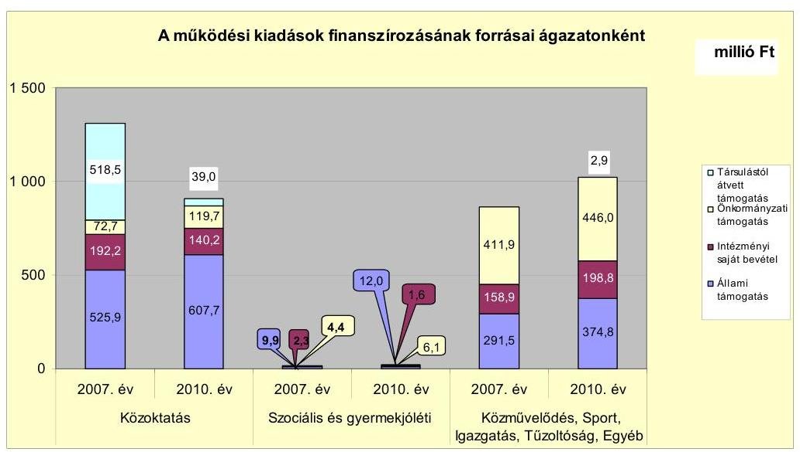

A közoktatási ágazat működési kiadásainak finanszírozásában az átvett pénzeszközök csökkenése meghatározó volt, mert a 2007. évben az Óvodai társulás és Iskolai társulás részére nyújtott állami támogatás az átvett pénzeszközök között szerepelt, a 2010. évben viszont mint állami támogatás jelent meg a forrá-

[^0]
[^0]:    ${ }^{6}$ Az éves beszámolók és az Önkormányzat adatszolgáltatása szerinti működési kiadások közötti eltérés oka, hogy az adatszolgáltatásban nem szerepel a kisebbségi önkormányzatokra, a háziorvosi és védőnői feladatokra vonatkozó, és a fejlesztési kiadásokhoz tartozó kamat kiadások összege.

---

sok között. Az intézményi bevételek csökkenését a szakképző iskola megyei önkormányzat részére történő átadásának hatása idézte elő. A gyermekjóléti, a közművelődési, a tűzvédelmi, az igazgatási, a polgármesteri hivatali működési kiadások finanszírozáshoz igénybevett források összetétele az összes bevétel növekedése ellenére lényegesen nem változott.

A művészeti oktatási, a pedagógiai szakszolgálati és a tűzvédelmi feladatokra a 2007-2009. évek átlagához viszonyítva a 2010. évben 24,1 millió Ft-tal többet fordítottak. A kiadás növekedésének oka az oktatásban résztvevők számának emelkedése (az oktatásban résztvevő tanulók száma a 2007-2009. évek 288 fős átlagáról 2010. évben 531 főre emelkedett), valamint a GESZ megszüntetése volt. A Polgármesteri hivatalban ellátott feladatokra a 2007-2009. évek átlagához képest a 2010. évben már 99,9 millió Ft-tal nagyobb összeget fordítottak. A kiadás növekedésének oka a közfoglalkoztatottak számának dinamikus emelkedése (a létszám a 2007-2009. évek tíz fő átlagáról 2010. évre 131 főre nőtt), a szociális kiadásra fordított önkormányzati támogatás és a fizetendő áfa növekedése volt.

Az Önkormányzat feladatellátásának szervezeti struktúráját a következő ábra szemlélteti ${ }^{7}$ :
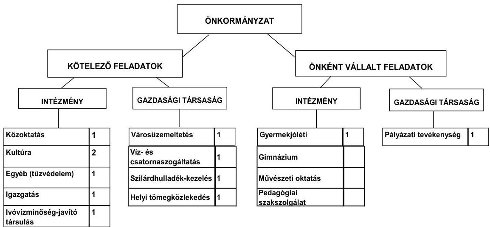

Az Önkormányzat feladatait 2011. június 30-án (a Polgármesteri hivatallal együtt) hét költségvetési szervvel és öt gazdasági társasággal látta el. Az önként vállalt feladatok közül a gimnáziumi és művészeti oktatási, valamint a pedagógiai szakszolgálati feladatokat a kötelező közoktatási feladatot ellátó oktatási nevelési intézmény keretében biztosították. Az Önkormányzat kórházat, szociális, illetőleg sportintézményt nem tartott fent.

Az intézményszervezeti átalakítások és intézményi összevonások következtében a költségvetési szervek száma a 2007. év elejétől tízről 2011. év I. félév végére hétre csökkent, a telephelyeinek száma 17-ről 20-ra nőtt. Az Önkormányzat kettő gazdasági társaságban kizárólagos tulajdonnal, egy társaságban 50%

[^0]
[^0]:    ${ }^{7}$ a 2011. június 30-i állapotnak megfelelően

---

alatti tulajdoni hányaddal rendelkezik. Az ellenőrzött időszakban a két kizárólagos tulajdonú gazdasági társaság csődeljárás, felszámolási eljárás alatt nem állt, az Innovációs Központ Kft. pénzügyi egyensúlyi helyzete a 2010. évi saját tőke/jegyzett tőke arányai alapján stabil volt. A Városüzemeltető Kft. esetében romló pénzügyi egyensúlyi helyzet volt megfigyelhető, a saját tőke/jegyzett tőke aránya a 2008. évtől folyamatosan 100,0\% alatti volt (2008-ban 86,5%, 2009-ben 88,3%, 2010-ben 89,7%). A városüzemeltetési, pályázatírási- és menedzselési, víz- és szennyvízkezelési, hulladékkezelési, szállítási, helyi tömegközlekedési feladatok ellátására további kettő olyan gazdasági társasággal kötöttek közszolgáltatási szerződést, amelyekben az Önkormányzatnak tulajdoni részesedése nem volt. A vizsgált időszakban a kötelező és az önként vállalt feladatok ellátásának biztosítása, a feladat ellátásának módjában bekövetkezett változások - az Óvodai társulás és az Iskolai társulás átvétele, valamint a szakképző iskola átadása - az önkormányzat pénzügyi egyensúlyi helyzetére nem voltak hatással.

Az Önkormányzat folyó költségvetési egyenlege (működési jövedelem) a 2007-2009. évek között forráshiányt mutatott, a 2010. évben a folyó bevételek fedezetet biztosítottak a folyó kiadásokra, amely a gyógyfürdő beruházás visszaigényelt áfájának volt köszönhető. A 2007-2009. években a negatív működési jövedelem mérséklődött, amelynek oka a kamatbevételekből, a helyi és a gépjármű adóból és a saját működési bevételekből származó bevételek folyamatos emelkedése volt. Az Önkormányzat a 2007-2011. év I. negyedévben összesen 248,6 millió Ft ÖNHIKI-s és működésképtelen önkormányzatok egyéb támogatásában részesült, amely mérsékelte a működési hiányt, ezáltal javította az Önkormányzat pénzügyi egyensúlyi helyzetét. Az Önkormányzatnál az ÖNHIKI és a működésképtelen önkormányzatok egyéb támogatása bevételek nélkül a működési jövedelem 2007-2009. években nagyobb hiányt eredményezett. A működési jövedelem növekedésére kedvező hatással volt az önként vállalt feladatokra fordított kiadások mérséklődése.

Az Önkormányzat pénzügyi kapacitásának, működési jövedelmének, tőketörlesztésének alakulását a 2007-2010. években az alábbi ábra mutatja be:
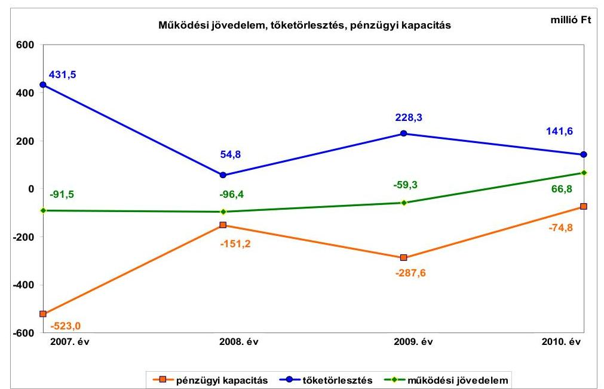

---

Az Önkormányzat pénzügyi kapacitása a vizsgált időszak minden évében negatív értéket, de összességében mérséklődő hiányt jelzett. A 2007-2009. évi negatív működési jövedelmek nem nyújtottak fedezetet a tőketörlesztésekre. A pénzügyi kapacitás a 2007. és a 2009. évi kiugróan magas negatív értékét a hiteltörlesztések drasztikus megemelkedése mellett, a negatív működési jövedelmek okozták. A működési jövedelem kedvező irányú változásában szerepet játszott az, bevételnövelő intézkedések mellett az átmeneti forrást teremtő szabad pénzeszközök lekötéséből származó bevételnövekmény hatására a folyó bevételek 2010. évre a 2007-2009. évek átlagához képest 254,3 millió Ft-tal (11,5\%) nőttek. A növekedésben a gyógyfürdő beruházás 102,7 millió Ft-os áfájának a visszaigénylése és a fordított áfa elszámolása volt meghatározó. A folyó kiadások növekménye viszont csak 65,5 millió Ft ( $2,9 \%$ ) volt, amelyre alapvetően a kiadáscsökkentő intézkedések - létszámcsökkentés, 10\%-os előirányzat zárolás - voltak hatással. A tőketörlesztések a 2008. és a 2010. években 54,8 millió Ft-tal és 141,6 millió Ft-tal kevésbé rontották az Önkormányzat pénzügyi kapacitását.

A 2007-2010. években az Önkormányzat felhalmozási költségvetésének egyenlege negatív összegű volt és összesen 860,2 millió Ft felhalmozási forráshiányt mutatott. A felhalmozási költségvetés negatív egyenlege a 2007. évről a 2008. évre csökkent, majd a 2008-2010. években folyamatosan nőtt. A változás a beruházási tevékenység felgyorsulásból és az EU-s projektek finanszírozásából eredt, amelyek utólagos finanszírozás mellett kerültek megvalósításra. A negatív egyenleg a fennálló negatív működési jövedelem mellett az Önkormányzat számára pénzügyi kockázattal járt.

A pénzügyi egyensúly fenntartása külső források bevonásával volt biztosítható. Az Önkormányzat a 2007-2010. években összesen 856,2 millió Ft hitelt törlesztett. A tőketörlesztés a működési és a felhalmozási forráshiány együtt 1716,5 millió Ft-ot tett ki, amelyre a 2007. január 1-jén rendelkezésre álló 76,8 millió Ft pénzkészlet mellett további fedezetül 139,7 millió Ft hitel felvételével és 1500,0 millió Ft kötvénykibocsátással teremtették meg. Újabb külső források bevonásának elkerülését csak pozitív nettó jövedelmet eredményező gazdálkodás mellett lehet végrehajtani. A pénzügyi egyensúlyi helyzet javításához az Önkormányzat részéről további bevételnövelő és kiadási megtakarítás szolgálhat forrásul.

A 2007-2010. években a folyó bevételek közül a helyi adók és a gépjárműadó többlet bevételei 30,9 millió Ft-tal, továbbá az ÖNHIKI és a működésképtelen önkormányzatok támogatása 165,8 millió Ft-tal javították az Önkormányzat pénzügyi egyensúlyi helyzetét. A helyi adók mértékében a 2010-2011. években kettő adónem tekintetében végrehajtott kisebb változtatások nem eredményeztek jelentős adóbevételi többletet, a pénzügyi egyensúlyi helyzetre nagyobb befolyással az adóhátralékok behajtásának 2009-2010. években 79,8 millió Ft bevételi többletet jelentő eredményessége volt. A helyi adó bevételek többféle adónemből és ezernél nagyobb számú adóalanytól származott. Az egyéb bevételek változó teljesítésében a szakképző iskola megyei önkormányzat részére történő átadásának hatásai voltak a legnagyobbak. A folyó bevételek emelkedésében 2008-2010. évek alatt szerepet játszott a fordított áfa elszámolása is, összesen 451,6 millió Ft összegben. Az Önkormányzat felhalmozási bevételei a 2007-2009 évek 462,5 millió Ft-os átlagához képest a 2010. évben

---

1152,1 millió Ft-ra nőttek. A felhalmozási bevételek 2009-2010. évi emelkedését leginkább a kettő legnagyobb fejlesztés pályázati forrásainak (488,3 millió Ft és 783,7 millió Ft) és a megszűnt szennyvíztársulat tagjai befizetéseinek teljesítése (140,4 millió Ft-tal) határozta meg.

A folyó kiadások változásában a közoktatási intézmények 2007-2008. évi átvétele, átadása, a fordított áfa bevezetése és a közcélú foglalkoztatás jelentős bővülése volt meghatározó. A folyó kiadások 2008. évi 184,7 millió Ft-os növekedését az előző évhez képest elsősorban a központi bérpolitikai intézkedések hatása eredményezte. A 2008. évben a szakképző iskola normatíváját egész évben - második félévben is - az Önkormányzat igényelte és államháztartáson belülre átadott pénzeszközként adta át a megyei önkormányzatnak. Ez okozta az államháztartáson belülre átadott pénzeszközök 141,3 millió Ft-os 2008. évi emelkedését az előző évhez képest. A folyó kiadások 2009. évi 484,9 millió Ft-os csökkenését legnagyobb mértékben a szakképző iskola megyei önkormányzat részére történő átadása idézte elő. Az Önkormányzat a 2007-2010. években együttesen 3399,8 millió Ft-ot fordított fejlesztési feladatai finanszírozására. A felhalmozási kiadások 2008. évi mérséklődését a címzett támogatásból megvalósított művelődési ház rekonstrukciójának 2007. évi befejezése idézte elő. A felhalmozási kiadások összege és költségvetésen belüli aránya 2009-2011. év I. féléve között folyamatosan emelkedett, mely a három legnagyobb beruházás kivitelezésének megkezdése és egy beruházás vizsgált időszak alatti megvalósítása miatt következett be.

Az Önkormányzat pénzügyi egyensúlyi helyzetének alakulását jelentősen befolyásolta a vizsgált és az azt megelőző időszakban végzett, de azok kötelezettségeit illetően a vizsgált időszakra is hatást gyakorló fejlesztési tevékenysége. A befejezett fejlesztések 9,6\%-át (242,2 millió Ft-ot) pénzintézeti forrásokból fedezték. A 2007-2010. évek időszakában 3313,1 millió Ft fejlesztés és felújítás forrása a saját erő, a hazai- és EU-s támogatások mellett 242,2 millió Ft hitelfelvétel $(7,3 \%)$ és 446,5 millió Ft kötvény bevétel $(13,5 \%)$ volt. A 2010. december 31-én folyamatban lévő fejlesztési feladatok végrehajtására a 20072010. évek között 649,0 millió Ft kiadást teljesítettek, amelyre kötvényforrásból 256,4 millió Ft-ot (39,5\%) fordítottak. Az EU-s támogatásból megvalósult fejlesztések finanszírozása az Önkormányzatnál az utólagos finanszírozás következtében likviditási gondot okozott, mert a fejlesztések következtében növekedett a lejárt szállítói tartozások nagysága. Az Önkormányzat a Gyógyfürdőt 25 évre üzemeltetésbe adta, összesen nettó 470 millió Ft-ért, amelyből a beruházás nem térül meg.

A 2010. december 31-én folyamatban lévő fejlesztési feladatok kötele-zettség-vállalásainak összege 1669,5 millió Ft volt, amelyből 148,9 millió Ft-ot saját forrásból, 1055,1 millió Ft-ot EU-s támogatásból, 12,4 millió Ft-ot hazai támogatásból és 453,1 millió Ft-ot kötvényből terveznek biztosítani. A tervezett saját bevételi forrás - a forgalomképes ingatlanok értékesíthetőségének kétségessége miatt - kockázatot jelent a vállalt fejlesztések jövőbeni finanszírozhatósága szempontjából.

---

Az Önkormányzatnál a 2010. december 31-én fennálló felhalmozási kötelezettségvállalások forrásösszetételét a következő ábra szemlélteti.
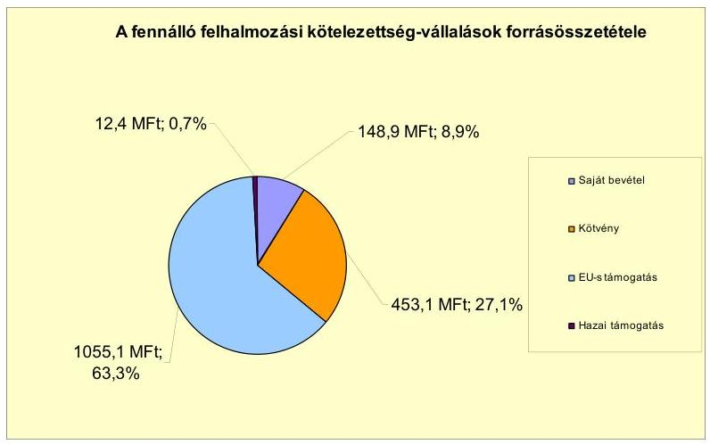

Az Önkormányzat által 2011. év I. félévben beadott, elbírálás alatt álló pályázatok tervezett teljes bekerülési költsége 1493,7 millió Ft. Az Önkormányzat a 2010-2013. évekre tervezett felhalmozási kötelezettségeit 493,7 millió Ft-ot saját bevételből, 1000,0 millió Ft-ot EU-s támogatásból tervezi biztosítani. Sikeres pályázat esetén a saját forrás tervezett összegének biztosítása - tekintettel arra, hogy a jelenleg ismert működési jövedelem nem nyújt fedezetet a szükséges saját erő biztosításához - elegendő saját bevétel hiányában újabb pénzintézeti forrás igénybevételét követelheti meg, amely a pénzügyi kockázatot növeli.

Az Önkormányzat mérleg szerinti pénzintézetekkel szembeni kötelezettsége a 2006. év december 31-ről a 2011. év I. félév végére 254,2 millió Ft-ról 2140,3 millió Ft-ra nőtt, amelyet kettő, összesen 51,5 millió Ft-os hosszúlejáratú fejlesztési és működési hitel igénybevétele, kettő, összesen 1500,0 millió Ft névértékű kötvénykibocsátás, a devizában fennálló kötelezettségek 431,5 millió Ft összegű árfolyamváltozása, a folyószámlahitel 2007-2009. évi 110,5 millió Ft átlagának és a 2010. év végi 162,6 millió Ft állományának 294,3 millió Ft-ra történő emelkedése, a korábban felvett 114,1 millió Ft összegű hitelek, továbbá az EUR-ban kibocsátott kötvény 102720 EUR törlesztése együttesen okozott.

Az Önkormányzat a 2007-2010. évek alatt ÖNHIKI és működésképtelen önkormányzatok egyéb támogatása bevételekben részesült és emellett jelentős mértékű fejlesztéseket végzett, mely hozzájárult a pénzügyi kockázat növekedéséhez. Az Önkormányzat a gazdasági társaságnak az előírt szerződés alapján adott át pénzeszközt.

A kötelezettségvállalásokra képviselő-testületi döntést követően került sor, azonban az előterjesztésekben nem mutatták be a kötelezettségvállalások visszafizetési forrásait, a teljes futamidőre várható kamat-és tőkefizetési kötelezettséget, az adósságszolgálati korlátot és - a devizaalapú kötelezettségeket érintő - árfolyamkockázatot. A hiteleket nyújtó pénzintézeteket - a két kötvény és a 2010. évi folyószámlahitel kivételével -, mivel a hitelek a Kbt-ben előírt értékhatárt nem érték el, nem versenyeztették.

---

Az Önkormányzat a hitelkereteket, a kötvények összegét banki jóváhagyás mellett igénybe vette, a Képviselő-testület által jóváhagyott célok szerint feladatokra, a költségvetésbe tervezett felhalmozási feladatok megvalósítására, valamint működési kiadások teljesítéséhez használta fel. Az Önkormányzat a CHF-ben fennálló pénzintézeti kötelezettségeiből tőkét nem - a tőketörlesztés kezdő időpontja 2012. szeptember 30-a, összege 210149 CHF - törlesztett, azonban a folyó kiadások terhére 238313 CHF (41,9 millió Ft) kamatot és 291017 CHF (59,1 millió Ft) és további 8,0 millió Ft egyéb költséget, ügynöki díjat fizetett.

Az EUR-ban fennálló pénzintézeti kötelezettségeiből 2011. április 1-jén 102720 EUR ( 27,4 millió Ft) tőkét törlesztett, a folyó kiadások terhére 365060 EUR ( 98,6 millió Ft) kamatot és 2978 EUR ( 0,8 millió Ft) és további 2,2 millió Ft egyéb költséget fizetett. A törlesztés során az igénybevételkor fennálló átlagárfolyamhoz viszonyítva 0,1 millió Ft árfolyamnyereséget értek el. Az Önkormányzat a két kötvény kibocsátása miatt számlavezető bankot váltott. Ezt követően a korábbi számlavezetők a fejlesztési hitel ügyleti kamatának emelésével, illetve a CHF-ben fennálló kötvény esetében az ügynöki díj bevezetésével módosították a finanszírozási struktúrát, amely a pénzügyi egyensúlyi helyzetre kedvezőtlenül hatott. A forint- és devizaalapú hosszú lejáratú pénzintézeti kötelezettségek miatt a vizsgált időszakban összesen 51,2 millió Ft tőkét törlesztettek és 169,4 millió Ft kamatot, valamint 70,8 millió Ft egyéb költséget fizettek. A 2007-2011. év I. félév között átmenetileg szabad pénzeszközeiből 80,9 millió Ft kamatbevételt realizált az Önkormányzat.

Az Önkormányzat költségvetésének pénzügyi egyensúlyát a vizsgált időszakban csak folyamatosan fennálló folyószámlahitellel, összesen 705,6 millió Ft rövid lejáratú hitel igénybevételével, és a 2007. évben még munkabér megelőlegezési hitellel tudta biztosítani, amely a pénzügyi kockázatot emeli.

A folyószámlahitel és a munkabér-megelőlegezési hitel igénybevétele a 20072011. év I. félévében az alábbiak szerint alakult:

| Megnevezés | 2007. év | 2008. év | 2009. év | 2010. év | 2011. év I.   félév |
| :--: | :--: | :--: | :--: | :--: | :--: |
| Folyószámlahitel |  |  |  |  |  |
| Keretösszeg január 1-jén (millió Ft-ban) | 184,0 | 200,0 | 200,0 | 200,0 | 300,0 |
| Átlagos napi egyenleg (millió Ft-ban) | 100,2 | 112,6 | 172,6 | 134,4 | 204,1 |
| Folyószámlá hitellel zárt napok száma (nap) | 312 | 342 | 365 | 300 | 140 |
| Egyenleg (állomány) | 191,3 | 140,3 | 0,0 | 162,6 | 294,3 |
| Munkabér-megelőlegezési hitel |  |  |  |  |  |
| Keretösszeg január 1-jén (millió Ft-ban) | - | - | - | - | - |
| Átlagos napi egyenleg (millió Ft-ban) | 45,8 | - | - | - | - |
| Munkabér-megelőlegezési hitellel zárt napok száma (nap) | 189 | - | - | - | - |
| Egyenleg (állomány) | - | - | - | - | - |

A likviditás biztosítása 89,9 millió Ft kamatkiadást és 3,9 millió Ft egyéb költségfizetési kötelezettséget jelentett az Önkormányzat számára.

Az Önkormányzat szállítói tartozása a 2007-2009. évek átlagában 213,1 millió Ft, a 2010. év végén 622,3 millió Ft, a 2011. év I. félév végén 508,7 millió Ft, amelyből a lejárt tartozás a 2007-2009. évek átlagában 165,2 millió Ft, a 2010. év végén 356,3 millió Ft, a 2011. év I. félév végén 450,7 millió Ft volt. Az Önkormányzat költségvetési szerveinél a vizsgált időszakban a lejárt szállítói állomány folyamatosan emelkedett, a hazai és uniós támogatással megvalósuló, elismert tartozások miatt. A 2011. június 30-án a

---

61-90 nap közötti lejárt szállítói tartozás összege 121,5 millió Ft, a 90 napot meghaladó lejárt tartozások összege 148,0 millió Ft volt, amely a hitelezők adósságrendezési eljárás kezdeményezési joga miatt a pénzügyi kockázatot növelte. Az Önkormányzat kizárólagos tulajdonában lévő gazdasági társasága Városüzemeltető Kft. - részére folyószámlahitel igénybevételéhez készfizető kezességet vállalt 50,0 millió Ft összegben és 8,0 millió Ft kölcsönt nyújtott, amely az esetleges helytállás miatt kezességvállalási kockázatot, a gazdasági társaság likvidítási problémái miatt törlesztési kockázatot jelent.

Az Önkormányzat kötelezettségeinek 2010. december 31-i, valamint 2011. június 30-i állományát és várható alakulását a kötelezettségek lejáratáig a következő táblázat szemlélteti:
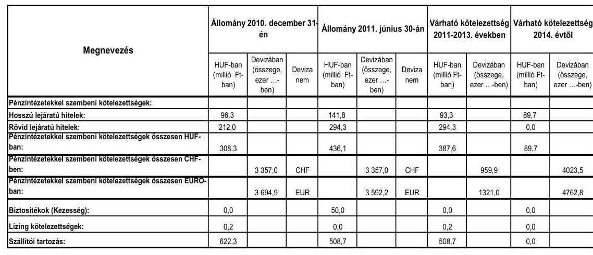

Az Önkormányzatnak pénzintézetekkel szemben fennálló kötelezettsége a 2011. év I. félév végén 436,1 millió Ft, 3357000 CHF és 3592225 EUR volt. Ezek várható kötelezettsége (tőke, kamat és egyéb költség) a legutóbbi kamatfizetés feltételei alapján a 2011-2013. években 387,6 millió Ft, 959945 CHF, továbbá 1320987 EUR. A 2011-2013. évek kötelezettségeinek teljesítésére figyelembe vehető a 2010. évi mérlegben kimutatott 4,5 millió Ft szabad pénzmaradvány (a kötelezettségekkel terhelt pénzmaradvány összege 402,1 millió Ft), az 52,7 millió Ft követelésállomány, amely a teljes kötelezettségállományra nem nyújt fedezetet. A 2014. évet követően, a helyszíni vizsgálatkor ismert pénzintézeti kötelezettségek - árfolyamváltozások nélkül számított - összege kamatokkal együtt: 89,7 millió Ft, valamint 4023458 CHF és 4762819 EUR. A további évekre szóló, helyszíni vizsgálatkor ismert pénzintézeti kötelezettségek teljesítése a folyószámlahitel tartóssá válása, a finanszírozási források meghatározása, és a fedezet hiánya miatt nem biztosított.

Az önkormányzati kötelezettségek növekedése mellett az Önkormányzat kizárólagos tulajdonában lévő gazdasági társaságainak kötelezettségei is hatással lehetnek a pénzügyi egyensúlyra.

---

Az Önkormányzat kizárólagos tulajdonú gazdasági társaságai kötelezettségeinek 2011. június 30-i állományát és várható alakulását a kötelezettségek lejáratáig a következő táblázat mutatja be:

| Megnevezés | Állomány 2010. december 31-én |  |  | Állomány 2011. június 30-án |  |  | Várható kötelezettség   2011-2013. években |  |
| :--: | :--: | :--: | :--: | :--: | :--: | :--: | :--: | :--: |
|  | HUF-ban   (millió Ft-ban) | Devizában (összege, ezer ...ban) | Deviza   nem | HUF-ban   (millió Ft-ban) | Devizában (összege, ezer ...ban) | Deviza   nem | HUF-ban   (millió Ft-ban) | Devizában (összege, ezer ...ban) |
| Pénzintézetekkel szembeni kötelezettségek: |  |  |  |  |  |  |  |  |
| Hosszú lejáratú hitelek: | 1,3 |  |  | 1,2 |  |  | 1,2 |  |
| Rövid lejáratú hitelek: | 58,1 |  |  | 53,9 |  |  | 53,9 |  |
| Pénzintézetekkel szembeni kötelezettségek összesen HUFban: | 59,4 |  |  | 55,1 |  |  | 55,1 |  |
| Lizing kötelezettségek: |  | 3,8 | CHF |  | 0,0 | CHF |  | 0,0 |
| Szállítói tartozás: | 24,1 |  |  | 14,9 |  |  | 14,9 |  |

Az Önkormányzat minősített többségű tulajdonú (kettő kizárólagos tulajdonú) gazdasági társaságainak a 2007-2009. évek átlagában 28,2 millió Ft, a 2010. év végén 59,4 millió Ft, a 2011. év I. félév végén 55,1 millió Ft pénzintézeti kötelezettsége, a 2007-2009. évek átlagában 14,3 millió Ft, a 2010. év végén 24,1 millió Ft, a 2011. év I. félév végén 14,9 millió Ft szállítói tartozása állt fent. A 2011. június 30-án fennálló összes kötelezettség 70,0 millió Ft volt. A Városüzemeltető Kft.-nek a pénzügyi egyensúlyi helyzete a tartós folyószámlahitel és az emelkedő, lejárt szállítói állomány miatt rosszabbodott, az önkormányzat kezességvállalása is a pénzügyi egyensúlyi helyzet romlása miatt történt. Esetleges csőd, vagy felszámolási eljárás esetén a bíróság korlátlan és teljes felelősséget állapíthat meg az Önkormányzat terhére. A kizárólagos tulajdonú gazdasági társaság javára tett kezességvállalások során a Képviselő-testület részére nem készítettek tájékoztatást az így keletkezett kötelezettségek jövőbeni kockázatairól.

Az Önkormányzat 2007-2010 között eszközállománya után 452,1 millió Ft összegű értékcsökkenést mutatott ki, miközben felújításra, beruházásra 2539,5 millió Ft-ot fordított, amelyből az eszközök pótlására 165,9 millió Ft-ot költöttek. Az intenzív felhalmozási tevékenység ellenére az eszközök használhatósági foka a 2007-2009. évek átlagában $84,3 \%$, folyamatosan gyengülő, a 2010. évben $78,9 \%$ volt, amelynek oka, hogy a 2008-2009. években megkezdett három beruházás - iskola, gyógyfürdő, járó beteg szakellátó - aktiválása a 2010. évben még nem történt meg.

Az Önkormányzat költségvetési támogatásból, szja-ból származó bevételei a 2007. évhez képest az időszak egészét tekintve összességében 872,8 millió Ft-tal nőttek. A költségvetési támogatás, és az szja együttes összege 2007-2009. évek átlagában 1262,0 millió Ft volt, amely a 2010. évben 1148,2 millió Ft-ra, 9,0\%-kal csökkent. Kiadási megtakarítást és bevételt növelő intézkedések hatására az Önkormányzat által elkészített kimutatás szerint a 2007-2011. év I. féléve között 366,6 millió Ft bevételi többlet és 154,9 millió Ft kiadási megtakarítás keletkezett. Kiadási megtakarításként kilenc álláshelyet, létszámot, többletjuttatásokat, civil szervezetek támogatását és költségvetési keretet csökkentettek. A bevételnövelő intézkedések helyi adókhoz és eszközök hasznosításához kapcsolódtak. Ezek az intézkedések az Önkormányzat pénzügyi egyensúlyi helyzetét javították, azonban nem biztosítottak elegendő forrást a pénzügyi egyensúly helyreállításhoz (amelyet a pénzügyi kapacitás alakulása is mutat),

---

ezért a kötelezettségek teljesítése csak további kiadáscsökkentő és bevételnövelő intézkedések útján elért megtakarítások, valamint egyéb külső források bevonásával lehetséges. A közoktatási intézményeknél és a Polgármesteri hivatalnál végrehajtott átszervezés, feladatbővülés, továbbá a feladatmegszüntetés miatt az álláshelyek és egyúttal a foglalkoztatottak száma 2007-2010 között összesen 87 -tel - a kiadási megtakarítást eredményező kilenc álláshely, létszám csökkenésre is figyelemmel - növekedett. A feladatbővülést az Óvodai és Iskolai társulások székhelyének átvétele okozta. E változás önkormányzati szinten megtakarítást nem eredményezett.

Az utóellenőrzés a pénzügyi egyensúly javítására a 2009. évben tett négy szabályszerűségi és kettő célszerűségi javaslatra terjedt ki. A javaslatok közül négyet hasznosítottak, kettőt nem hajtottak végre. A több éves kihatással járó döntések és az EU-s feladatok előirányzatainak, bevételeinek és kiadásainak költségvetési rendeletben való rögzítésére, a költségvetési és a zárszámadás készítési folyamatok szabályozottságára, valamint az intézkedési terv készítésére vonatkozó javaslatok megvalósultak. A vizsgált időszakban nem készítettek likviditási tervet és évente végzett számítások alapján nem történt tájékoztatás arról, hogy az adósságot keletkeztető hosszúlejáratú kötelezettségvállalásokat milyen feltételek biztosítása mellett tudják teljesíteni.

# Tamási Város Önkormányzatának pénzügyi egyensúlyi helyzete rövid távon veszélyeztetett. 

A működési jövedelem a 2007-2009. években negatív a 2010. évben pozitív volt, amely a vizsgált időszakban nem nyújtott fedezetet az adósságszolgálatra. A likviditást az állandósult és növekvő folyószámlahitel, egyéb likvid hitel, munkabér hitel igénybevétele mellett ÖNHIKI és vis maior támogatás biztosította. A működés pénzügyi egyensúlya érdekében a kötvényforrásból is történt felhasználás. Az önként vállalt feladatokra fordított kiadások aránya és mértéke csökkent.

A felhalmozási bevételek nem nyújtottak fedezetet a felhalmozási kiadásokra. A támogatásból megvalósult felhalmozási feladatok előfinanszírozása, valamint a beruházások többletköltségének kiegyenlítése is terhelte a gazdálkodást. A Gyógyfürdő fejlesztés teljes bekerülési költségének több mint felét saját forrás finanszírozta. Egy pályázati szakaszban lévő beruházás saját forrásának biztosíthatósága saját bevételekből a működési jövedelemtermelő képesség miatt kockázatot jelent. Nem történt meg a beruházások működtetése, fenntartása során várhatóan felmerülő költségvetési kiadások és bevételek számszerűsítése.

A pénzintézeti kötelezettségek növekedése a felvett hitelek, a kibocsátott kötvények mellett, a törlesztési feltételek módosulása, és az árfolyamveszteség együttes hatására következett be. A felvett hitelek és kötvények jövőbeni törlesztésének forrásait nem számszerűsítették. A pénzügyi pozíciót a kötvények törlesztésének megkezdése tovább gyengíti. A lejárt szállítói tartozás folyamatosan emelkedett, amelyet alapvetően a támogatással megvalósult beruházások finanszírozási nehézsége okozott.

A kötelező feladatot ellátó, kizárólagos tulajdonú gazdasági társaság pénzügyi egyensúlyi helyzete nem stabil, saját tőke/jegyzett tőke mutatója csökkent, kö-

---

telezettségeinek állománya nőtt, folyószámlahitele tartóssá vált. A kötelezettségek nem teljesítése az Önkormányzat számára helytállási kötelezettséget jelenthet.

Az Állami Számvevőszékről szóló 2011. évi LXVI. törvény 33. § (1) bekezdésében foglaltak értelmében a jelentésben foglalt megállapításokhoz kapcsolódó intézkedési tervet köteles az ellenőrzött szervezet vezetője összeállítani és azt a jelentés kézhezvételétől számított harminc napon belül az ÁSZ részére megküldeni. Amennyiben az intézkedési tervet határidőben nem küldi meg a szervezet, vagy az továbbra sem elfogadható, az ÁSZ elnöke a hivatkozott törvény 33. § (3) bekezdés a)-b) pontjaiban foglaltakat érvényesítheti.

# A 2011. június 30-i pénzügyi egyensúlyi helyzet alapján az ellenőrzés intézkedést igénylő megállapításai és javaslatai a következők: 

## a Polgármesternek:

1.  Az Önkormányzat nettó működési jövedelme az elmúlt időszakban negatív volt. A felhalmozási bevételek nem nyújtottak fedezetet a felhalmozási kiadásokra. Az Önkormányzat által vállalt folyamatban levő és a jövőbeni fejlesztési kötelezettségek fedezete rövid távon nem biztosított. Az Önkormányzat finanszírozása a vizsgált időszakban egyre növekvő arányú folyószámlahitel igénybevételével volt biztosítható. Az Önkormányzat működési célra hosszú lejáratú hitelből és kötvényből származó bevételt vett igénybe. Az Önkormányzat szállítói kötelezettségeinek állománya emelkedett. Az Önkormányzat által tett intézményszervezeti átalakítások, kiadáscsökkentő és bevételnövelő - a helyi adókkal kapcsolatos - intézkedések nem biztosítanak elegendő forrást a pénzügyi egyensúly helyreállításhoz. A vállalt pénzintézeti és egyéb kötelezettségek fedezete nem biztosított rövid távon (2011-2013. években), középtávon (2013. év után), hosszútávon (2014. év után a kötelezettségek lejártáig). Az Önkormányzat pénzügyi egyensúlya rövid távon veszélyeztetett.

Javaslat:
Az Önkormányzat pénzügyi egyensúlyának gyors helyreállítása és hosszú távú fenntarthatósága érdekében kezdeményezze - felelősök és határidők megjelölésével - az alábbi intézkedések megtételét:
a) Tárja fel a bevételszerző és kiadáscsökkentő lehetőségeket. Intézkedjen a bevételek növelésére, a kintlévőségek behajtására, a kiadások csökkentésére.
b) Terjesszen a Képviselő-testület elé reorganizációs programot a kedvezőtlen pénzügyi folyamatok megállítására, a pénzügyi egyensúlyi helyzet gyors stabilizálására.
c) Gondoskodjon arról, hogy a gazdálkodás során a rendelkezésre álló források biztosítsák a kiadások fedezetét.
d) Képezzen egyensúlyi (elkülönített) tartalékot az adósságszolgálat teljesítése érdekében.

---

e) Mérje fel a folyamatban lévő beruházásokkal kapcsolatos kötelezettségek átütemezésének pénzügyi és jogi lehetőségeit, illetve hatásait. Szükség esetén kezdeményezze a finanszírozóknál és a kivitelezőknél annak átütemezését.
f) Vizsgálja felül teljes körűen a tervezett beruházásokat és a megvalósuló létesítmények fenntartásának jövőbeni pénzügyi kihatásait. Szükség esetén tegyen javaslatot a Képviselő-testületnek a tervezett beruházásokkal kapcsolatos döntések módosítására, amelyben figyelembe veszik az Önkormányzat pénzügyi lehetőségeit, és a kötelező feladatellátás elsődlegességét.
g) Vizsgálja meg az állandósult folyószámlahitel hosszú távú kötelezettséggé történő átalakításának jogi lehetőségét, és a Stabilitási tv. 10. §-ában előírt feltételek fennállása esetén kezdeményezze a Kormánynál. ennek engedélyezését.
h) Kezdeményezze az intézmények finanszírozásának napi kontrollját. Szűkítse a jóváhagyott előirányzatok felhasználásának lehetőségeit.
i) Vizsgálja felül az önként vállalt feladatok finanszírozhatóságát, és hozzon intézkedéseket a kötelező feladatok ellátásának biztosítása érdekében.
j) Mutassa be havonta a féléven belül esedékes kötelezettségeinek finanszírozási forrásait.
2. Az Önkormányzat adósságot keletkeztető kötelezettségvállalásaira vonatkozó képviselő-testületi előterjesztések nem tartalmazták a visszafizetés forrásait, az adósságszolgálati korlátot. A Képviselő-testület részére nem készítettek a hitelfelvételhez, a kötvénykibocsátáshoz és a kezességvállaláshoz kapcsolódóan teljes körű tájékoztatást az így keletkezett kötelezettségek jövőbeni (árfolyam, kamat, visszafizetési) kockázatairól.

Javaslat:
a) Az adósságot keletkeztető kötelezettségvállalásról szóló döntéskor mutassa be a Képviselő-testületnek a jövőben várható - árfolyam-, kamat- és törlesztési - kockázatot. Kezességvállalás, garancia és helytállási kötelezettségvállalásról szóló döntésnél mutassa be a Képviselő-testületnek azok pénzügyi kockázatait.
b) Gondoskodjon, hogy a jövőben az adósságot keletkeztető kötelezettségvállalásokról szóló képviselő-testületi előterjesztések tételesen tartalmazzák a visszafizetés forrásait.
3. Az Önkormányzat a kizárólagos tulajdonú gazdasági társaságainak kötelezettsége 2011. június 30-án 70,0 millió Ft volt, amely kötelezettség nem teljesítése hatással lehet az Önkormányzat likviditására, pénzügyi egyensúlyi helyzetére. A kötelező feladatot ellátó, kizárólagos tulajdonban levő gazdasági társaság saját tőke/jegyzett tőke mutatója a 2008. és a 2010. években $100 \%$ alá csökkent, a folyószámla hitele tartóssá vált.

Javaslat:
a) Kísérje folyamatosan figyelemmel a kizárólagos tulajdonú gazdasági társaságok kötelezettségeinek alakulását, a pénzügyi egyensúlyi helyzetét, az Önkormány-

---

zatnak a gazdasági társaságai felé fennálló követeléseit, nyújtott kölcsöneit, az Önkormányzat likviditására, pénzügyi-egyensúlyi helyzetére gyakorolt hatását. Tegye meg a szükséges és lehetséges intézkedéseket a tulajdonosi érdekek védelme érdekében.
b) Terjesszen intézkedési tervet a Képviselő-testület elé a kötelező feladatot ellátó kizárólagos tulajdonú gazdasági társaság pénzügyi egyensúlyi helyzetének stabilizálása érdekében.
4. Az Önkormányzat költségvetési szerveinél a vizsgált időszakban a lejárt szállítói állomány folyamatosan emelkedett - 2011. június 30-án 450,7 millió Ft volt, ebből 6190 nap közötti tartozás 121,5 millió Ft-ot tett ki, a 90 napot meghaladó tartozás 148,0 millió Ft volt, - amely a pénzügyi kockázatot a hitelezők adósságrendezési eljárást kezdeményező jogosultsága miatt növeli.

Javaslat:
Kezelje az Önkormányzat lejárt szállítói állományát a szállítói kitettség és a jogszabályi következmények elkerülése érdekében.
5. Az ÁSZ az Önkormányzat gazdálkodási rendszerét a 2009. évben ellenőrizte, amelynek során a pénzügyi egyensúly javítására négy szabályszerűségi és kettő célszerűségi javaslatot tett, amelyekből egy szabályszerűségi és egy célszerűségi javaslat nem valósult meg.

Javaslat:
a) Intézkedjen - az Önkormányzat gazdálkodási rendszerét érintő előző ellenőrzés nem hasznosult, likviditási terv készítésére vonatkozó szabályszerűségi javaslatával kapcsolatban - a fegyelmi felelősség kivizsgálása iránt.
b) Gondoskodjon, hogy évente végzett számítások alapján az adósságot keletkeztető hosszúlejáratú kötelezettségvállalások teljesítési feltételei a Képviselő-testület számára bemutatásra kerüljenek.

# a Jegyzőnek: 

1. Az ÁSZ által elvégzett utóellenőrzés megállapította, hogy a likviditási terv készítésére és szükség szerinti aktualizálására vonatkozó javaslatot nem hajtották végre.

Javaslat:
Gondoskodjon az Áht. 2 78. § (2) bekezdésben foglaltak alapján likviditási terv készítéséről, és az Ávr. 122. § (2)-(3) bekezdése szerint havonta történő felülvizsgálatáról.

---

# II. RÉSZLETES MEGÁLLAPÍTÁSOK 

## 1. Az ÖNKORMÁNYZAT KÖTELEZŐ ÉS ÖNKÉNT VÁLLALT FELADATAI, A FELADATELLÁTÁS SZERVEZETI KERETEI ÉS ANNAK VÁLTOZÁSAI

Az Önkormányzat kötelező feladatait az Ötv. és az ágazati törvények figyelembevételével az SzMSz-ben állapította meg. A 2010. évben az Önkormányzat adatszolgáltatása szerint a 1948,8 millió Ft működési célú költségvetési kiadásból 1633,1 millió Ft-ot ( $83,8 \%$-ot) fordítottak a kötelező feladatok ellátására. Az önként vállalt feladatok tárgyában a Képviselő-testület az éves költségvetéseiben a fedezet biztosításával egyidejűleg foglalt állást. A 2007-2010. években az önként vállalt feladatok a gimnázium, a szakképző iskola és a kollégium, bölcsőde fenntartásához, a civil szervezetek, a sport, valamint a polgárőrség támogatásához, a helytörténeti emlékek gyűjtéséhez és gondozásához, a fogyatékos gyermeket fejlesztő felkészítéséhez, a közösségi tér biztosításához, illetve a Többcélú társulás működtetéséhez kapcsolódtak ${ }^{8}$.

Az önként vállalt feladatokra 2007-2009. évek átlagában 535,1 millió Ft-ot (a háromévi működési kiadások átlagának 25,7\%-át), a 2010. évben 315,7 millió Ft-ot ( $16,2 \%$-ot) fordítottak. Az önként vállalt feladatokra fordított kiadások 219,4 millió Ft-os ( $41,0 \%$-os) csökkenését alapvetően a szakképző iskola megyei önkormányzat részére történő átadása okozta. Az önként vállalt feladatok csökkenése az Önkormányzat pénzügyi helyzetére nem volt hatással. A 2010. évben az önként vállalt feladatok aránya a közoktatásban 18,5\% (2007-ben 36,3%, 2008-ban 27,1% és 2009-ben 17,2%), a gyermekjóléti szolgálat és az egyéb feladatok ${ }^{9}$ tekintetében is $100,0 \%$ (a vizsgált időszak minden évében $100 \%$ volt), és a Polgármesteri hivatalban kimutatott feladatoknál 8,3% (2007-2008. években 9,5%, 2009 évben 11,0\%) volt. A 2011. év terv adatai alapján az önként vállalt feladatokra 340,0 millió Ft-ot (16,4\%) terveztek fordítani a működési költségvetésből, amely a 2010. évi tényleges adatnál 24,3 millió Ft-tal ( $7,7 \%$-kal) több.

[^0]
[^0]:    ${ }^{8}$ A kötelező és önként vállalt feladatok besorolása az Önkormányzat döntése alapján történt.
    ${ }^{9}$ zene-, képző-, ipar- és színművészet, oktatási feladatok, pedagógiai szakszolgálati feladatok

---

A 2010. évi működési kiadások feladatonkénti megoszlását és azok finanszírozási arányait az alábbi táblázat mutatja be:

| Ellátott feladat | Működési kiadás összesen (millió Ft) | Kötelező feladatok kiadásainak részaránya \% | Működési bevétel összesen (millió Ft) | Állami támogatás részaránya \% | Intézményi saját bevétel részaránya \% | Önkormányzati támogatás részaránya \% | Társulástól átvett támogatás részaránya \% |
| :--: | :--: | :--: | :--: | :--: | :--: | :--: | :--: |
| Óvodák* | 182,8 | 100,0\% | 182,8 | 63,1\% | 9,8\% | 23,0\% | 4,1\% |
| Általános iskolák* | 556,2 | 100,0\% | 556,2 | 63,1\% | 18,6\% | 12,6\% | 5,7\% |
| Gimnáziumok* | 167,8 | 0,0\% | 167,8 | 84,1\% | 11,2\% | 4,7\% | 0,0\% |
| Gyermekjóléti intézmények | 19,7 | 0,0\% | 19,7 | 60,9\% | 6,2\% | 30,9\% | 0,0\% |
| Közművelődési intézmények | 95,0 | 100,0\% | 95,0 | 21,5\% | 20,4\% | 58,1\% | 0,0\% |
|  | 111,7 | 19,2\% | 111,7 | 66,3\% | 14,5\% | 16,6\% | 2,6\% |
| Egyéb intézmények |  |  |  |  |  |  |  |
| Polgármesteri hivatal igazgatási kiadásai | 348,9 | 100,0\% | 348,9 | 1,2\% | 22,8\% | 76,0\% | 0,0\% |
| Polgármesteri hivatalban ellátott egyéb feladatok működési kiadásai | 466,9 | 91,7\% | 466,9 | 59,1\% | 17,9\% | 23,0\% | 0,0\% |
| Működési kiadások összesen | 1948,8 | 63,6\% | 1948,8 | 51,1\% | 17,5\% | 29,3\% | 2,1\% |

A közoktatási feladatokra az Önkormányzat a 2007-2009. években átlagosan 1162,8 millió Ft-ot a 2010. évben 906,6 millió Ft-ot fordított, amely az összes működési kiadás $55,8 \%$-át, és $46,5 \%$-át tette ki. A közoktatási feladatokra fordított kiadások csökkenésében meghatározó szerepet a szakképző iskola megyei önkormányzat részére történő 2008. évi átadása jelentette ${ }^{10}$. A közoktatás kiadásait a 2007-2009. években átlagosan 692,5 millió Ft (a három év összes működési kiadás átlagának a $33,2 \%$-át) állami támogatásból, 147,3 millió Ft ( $7,1 \%$-át) intézményi saját bevételből, 118,2 millió Ft ( $5,7 \%$-át) önkormányzati támogatásból és 204,7 millió Ft ( $9,8 \%$-át) társulási támogatásból fedezték ${ }^{11}$. A 2010. évben a közoktatás kiadásaira 607,7 millió Ft (31,2\%) állami támogatást, 140,2 millió Ft ( $7,2 \%$ ) intézményi saját bevételt, 119,7 millió Ft (6,1\%) önkormányzati támogatást és 39,0 millió Ft (2,0%) társulási támogatást fordított az Önkormányzat. Összességében a 2010. évre a közoktatás kiadásai finanszírozásában 2,0\%-kal csökkent az állami hozzájárulások és $7,8 \%$-kal a társulástól átvett támogatások aránya. Az állami támogatás csökkenésében a szakiskola átadása játszott szerepet, a társulástól átvett támogatások csökkenését az okozta, hogy 2008. évtől már Óvodai és Iskolai társulások állami támogatását már a helyükön - a költségvetési támogatások között mutatták ki. A saját bevételek és az önkormányzati támogatás aránya kis mértékben emelkedett ( $0,1 \%$-kal és $0,5-\%$-kal).

A gyermekjóléti feladatok ellátása érdekében az önkormányzat bölcsődét működtetett, amelyre a 2007-2009 évek átlagában a működési kiadások 0,9\%-át,

[^0]
[^0]:    ${ }^{10}$ A szakképző iskola 2007. évi működési kiadása 471,8 millió Ft-ot (21,6\%) tett ki a működési kiadásokon belül.
    ${ }^{11}$ A 2007. évi bevételek megítélése tekintetében torzító hatást okoz az, hogy az Óvodai társulás és az Iskolai társulás székhelyeinek a megváltozáskor az oktatási normatívákat nem az Önkormányzat igényelte (hanem Regöly Község Önkormányzata). A 2007. évi óvodai és általános iskolai normatívák a társulástól átvett támogatásban szerepeltek a költségvetési beszámolóban az Önkormányzatnál, nem az állami támogatás adataiban.

---

a 2010. évben 1,0\%-át fordították. A szociális feladatok ellátását az Önkormányzat a Többcélú társulás keretében biztosította. A közművelődési feladatokra a 2007-2009. évek átlagában 93,6 millió Ft-hoz képest a 2010. évben 95,0 millió Ft-ot használtak fel, amely az összes működési kiadás 4,5\%-át, és 4,9\%-át tette ki. Az Önkormányzat az igazgatási intézményi feladatokra a 2007-2009. évek átlagában 356,1 millió Ft-ot és a 2010. évben 348,9 millió Ft-ot fordított, amely az összes működési kiadás $17,1 \%$-át, és $17,9 \%$-át tette ki. E feladatok kiadásai tekintetében a vizsgált időszakban lényeges változás nem történt.

Az Önkormányzat az egyéb feladatok között mutatta ki és látta el a művészeti oktatási és a pedagógiai szakszolgálati feladatokat, a tűzvédelmi feladatokat, továbbá a 2007. év I. félévében a GESZ által ellátott feladatokat. Az egyéb feladatokra a 2007-2009. évek 87,3 millió Ft átlagához viszonyítva a 2010. évben 111,4 millió Ft-ot fordított az Önkormányzat, amely az összes működési kiadás $4,2 \%$, és $5,7 \%$-át tette ki. A kiadás növekedésének oka a művészeti oktatás feladatainak, ezáltal az oktatásban résztvevők számának emelkedése (a 2007-2009. évek 288 fő átlagáról 2010. évben 531 főre emelkedett), valamint a GESZ megszüntetése volt. A növekvő egyéb kiadások fedezetét 2010. évben a 2007-2009. évek átlagaihoz képest a növekvő összegű állami támogatás 15,9 millió Ft (a három év összes működési kiadás átlagának az 1,0\%-a), intézményi saját bevétel 5,5 millió Ft ( $0,3 \%$-a) és önkormányzati támogatás 1,0 millió Ft ( $0,2 \%$-a) együttesen teremtette meg.

A Polgármesteri hivatalban ellátott feladatokra ${ }^{12}$ a 2007-2009. évek átlagában 367,0 millió Ft-ot és a 2010. évben már 466,9 millió Ft-ot fordítottak, amely az összes működési kiadás $17,7 \%$-át, és $24,0 \%$-át tette ki. A kiadás növekedésének oka a közfoglalkoztatottak számának dinamikus emelkedése (a 2007-2010. évek alatt 121 fővel nőtt), a szociális kiadásra fordított önkormányzati támogatás, és a fizetendő áfa növekedése volt. A feladat finanszírozásához kapcsolódó állami támogatás, intézményi bevétel és az önkormányzati támogatás aránya egyaránt nőtt a 2010. évben a 2007-2009. évek átlagos bevételi arányaihoz képest (az állami támogatás 3,7\%-kal, az intézményi bevételek 2,0\%-kal és az önkormányzati támogatások 0,7\%-kal).

A működési bevételek a 2007-2009. éves átlagához (2085,7 millió Ft) képest 2010. évben 1948,8 millió Ft összegben realizálódtak. A működési bevételek tekintetében a 2010. évben 136,9 millió Ft-os (6,6\%-os) csökkenés ${ }^{13}$ volt tapasztalható. A csökkenést a társulási támogatás összegének 163,9 millió Ft-os (79,6\%-os) és az állami támogatás 30,5 millió Ft-os (3,0\%-os) mérséklődése, mellett, az intézményi bevételek 54,4 millió Ft-os (1,2\%-os) és az önkormányza-

[^0]
[^0]:    ${ }^{12}$ Városgazdálkodás, települési hulladékkezelés- és vízellátás, közvilágítás, temetőfenntartás, orvosi ügyelet, sportlétesítmények fenntartása, sport támogatása, szociális segélyezés, szociális támogatás (Többcélú társulásnak átadás), közcélú foglalkoztatás.
    ${ }^{13}$ A folyó bevételek 2010. évben a 2007-2009 évek átlagához képest 254,3 millió Ft-tal (11,5\%-kal) nőttek, ezzel szemben a működési bevételek 136,9 millió Ft-tal (6,6\%-kal) csökkentek. Az eltérés abból adódik, hogy a működési bevételek az OEP támogatást, a gyógyfürdő beruházás visszaigényelt áfáját és a beruházások fordított áfáját nem tartalmazták.

---

ti támogatás 2,9 millió Ft-os (1,0\%-os) emelkedése határozta meg. A finanszírozás összetételének módosulását, a források csökkenését a közoktatásban végrehajtott szervezeti változások (az Óvodai társulás és az Iskolai társulások székhelyének a megváltozása és a szakképző iskola átadása) határozták meg.

Az Óvodai társulás és az Iskolai társulás átvétele következtében 2008. évben 197 fővel nőtt, a szakképző intézet átadása miatt 2009. évben 110 fővel csökkent és a minőségi fejlesztések miatt 2010. évben 13 fővel nőtt a közoktatásban foglalkoztatottak létszáma.

Az Önkormányzat a kötelező feladatok közül az igazgatási, az alapfokú oktatási, a közművelődési, a tűzvédelmi feladatokat saját intézményei útján, a gyermekjóléti szolgálattal összefüggő és szociális feladatokat a Többcélú társulás által, illetve egy alapítványi óvoda támogatásával biztosította. Az önként vállalt feladatok közül a bölcsődei, a szakképző iskolai, a gimnáziumi és művészeti iskolai feladatokat saját intézménnyel látta el.

Az Önkormányzat feladatait 2011. június 30-án (a Polgármesteri hivatallal együtt) hét költségvetési szervvel és öt gazdasági társasággal látta el. Az intézményszervezeti átalakítások és intézményi összevonások következtében a költségvetési szervek száma a 2007. január 1-jén fenntartott 10-ről 2011. év I. félév végére hétre csökkent, telephelyeinek száma 17-ről 20-ra nőtt ${ }^{14}$.

Az intézmények és a telephelyek számában a 2007-2011. év I. félév alatt bekövetkezett változást a szakképző iskolai feladat átadása, a Közoktatási társulás (az oktatási és nevelési intézmény) létrehozása, valamint társulások megszüntetése és létrehozása határozta meg.

Az Önkormányzat a 2007. évben az általános iskolai oktatási feladatokat Regöly Község Önkormányzatával, az óvodai nevelési feladatokat Regöly és Szárazd Községek Önkormányzataival az Iskolai társulással látta el. A Képviselő-testület az Óvodai társulás és az Iskolai társulás fenntartásában résztvevő önkormányzatokkal együtt döntött arról, hogy a társulások székhelyeit 2007. szeptember 1-jétől Tamási városba helyezi át. A társulás székhelyének változása az Önkormányzatnál közalkalmazotti-, gyermek- és tanulólétszám növekedéssel is járt. A Képviselő-testület 2007. június 30-val megszüntette a GESZ-t és a feladatait a Polgármesteri hivatalba integrálta. Az intézmények száma így eggyel, a telephelyek száma tízzel nőtt a 2006. évihez képest.

A 2007. évben a szakképző iskola önállóan gazdálkodó intézménnyé alakult át, majd az Önkormányzat 2008. július 1-jével a megyei önkormányzat részére átadta. A Képviselő-testület 2008. év I. félév végén megszüntette az Óvodai társulást és a feladatait az Iskolai társulás átalakításával az új Közoktatási társulásba integrálta. 2008. június 30-án önállóan gazdálkodó szervként megalapította az oktatási és nevelési intézményt, és megszüntette az óvoda, a zeneiskola és a gimnázium önálló intézményi státuszát. A feladatok átadásával és összevonásával a 2008. évben néggyel csökkent az intézmények száma.

[^0]
[^0]:    ${ }^{14}$ A telephelyek száma a 2007. január 1-jei 17-ről az év végére a székhelyváltozás miatt 27-re nőtt, majd a 2009. év végére 20-ra csökkent, amely a vizsgált időszak végéig változatlan maradt.

---

A 2009. évben megszűnt a Területfejlesztési társulás, mint önálló intézmény és a telephelyként fenntartott 1. számú iskola.

A 2010. évben több településsel közösen önállóan működő és gazdálkodó szervként létrehozták a Dél-Dunántúli Régió Ivóvízminőség-javító Önkormányzati Társulást.

Az Önkormányzat egészségügyi intézményt nem tartott fenn, a háziorvosi, a fogorvosi és az iskolaorvosi feladatok ellátására vállalkozási szerződéseket kötöttek. A védőnői ellátást szakfeladat keretében közalkalmazott foglalkoztatásával biztosították. A járó beteg ellátással feladatvállalási szerződés alapján végezték. Az igazgatási feladatokat a Polgármesteri hivatal látta el.

Az Önkormányzat a 2007-2010. években három gazdasági társaságban rendelkezett részesedéssel. Kettő, az Önkormányzat kizárólagos tulajdonában lévő gazdasági társasága közül a Városüzemeltető Kft. kötelező városüzemeltetési, városgondnoksági feladatokat látott el. A Képviselő-testület önként vállalt feladataként alapította az Innovációs Központ Kft.-t, alapfeladatának a pályázatfigyelést, a pályázatírást és a projekt menedzseri feladatok ellátását határozta meg, elsősorban az EU-s pályázatok tekintetében. Az Önkormányzat egy gazdasági társaságban, a Vízmű Kft.-ben 36,1\%-os tulajdoni hányaddal rendelkezett. A Vízmű Kft. a kötelező feladatellátás keretében víz- és csatornaszolgáltatást biztosít a város lakosai és vállalkozásai számára. Az ellenőrzött időszakban a két kizárólagos tulajdonú gazdasági társaság csődeljárás, felszámolási eljárás alatt nem állt, az Önkormányzatnak a vizsgált időszakban veszteségesen gazdálkodó gazdasági társaságai felé tőkepótlásról nem kellett gondoskodnia ${ }^{15}$. A kizárólagos önkormányzati tulajdonban lévő társaságok közül az Innovációs Központ Kft. pénzügyi helyzete 2010. évi saját tőke/jegyzett tőke aránya alapján (231,4\%) stabil volt. A Városüzemeltető Kft. saját tőke/jegyzett tőke aránya - a 2008. évi veszteséges gazdálkodás miatt - a 2008. évtől folyamatosan 100,0\% alatti volt, de nem csökkent 50,0\% alá. A gazdasági társaságok gazdálkodását, illetve működését érintő adatokat a számvevőszéki jelentés 4. számú melléklete mutatja be.

Az Önkormányzat megbízásából a 2007-2011. év I. féléve között közszolgáltatási szerződések alapján látott el további két gazdasági társaság önkormányzati kötelező feladatokat ${ }^{16}$. A BIOKOM Pécsi Városüzemeltetési és Környezetgazdálkodási Kft. végezte a települési szilárd hulladékszállítási feladatokat, illetve a Gemenc VOLÁN Zrt. látta el az autóbusszal végzett menetrend szerinti helyi személyszállítási feladatot. A 2007-2011. év I. félév közötti időszakban új közfeladat ellátás kiszervezése nem történt.

Az államháztartáson kívüli szervezetek részére a 2007-2010. évek között feladatátadás nem történt.

[^0]
[^0]:    ${ }^{15}$ A Városüzemeltető Kft. a 2006. évi veszteségei miatt a 2007. évben 40,0 millió Ft tőkeemelésben részesült.
    ${ }^{16}$ Az Önkormányzat e gazdasági társaságokban tulajdonosi részesedéssel nem rendelkezett.

---

Az Önkormányzatnál a 2007. évben egy esetben másik települési önkormányzattól történt feladat átvétel. A közoktatásban végrehajtott szervezet átalakítás az Óvodai társulás és Iskolai társulás székhelyének megváltoztatása volt. A feladatátvétel következtében az Önkormányzatnál a 2007-2011. év I. féléve között az Önkormányzat által kimutatott kiadások és bevételek különbözete 18,3 millió Ft többletet eredményezett.

Az Önkormányzat a közoktatási feladatátvétel (Óvodai társulása és Iskolai társulás) önkormányzati kiadásokra és bevételekre gyakorolt számszerűsített költségvetési hatásait az intézkedés évére és az azt követő időszak éveire összegezve (kumuláltan) dolgozta ki. Ennek megfelelően a kiadásokra gyakorolt hatása 2007-ben 621,8 millió Ft, 2008-ban 775,2 millió Ft, 2009-ben 726,5 millió Ft, 2010-ben 728,4 millió Ft valamint 2011. év I. félévében 369,8 millió Ft volt. A bevételekre gyakorolt hatás 2007-ben 629,0 millió Ft-ot, 2008-ban 776,2 millió Ft-ot, 2009-ben 728,4 millió Ft-ot, 2010-ben 736,6 millió Ft-ot, valamint 2011. év I. félévében 369,1 millió Ft. A vizsgált időszak kumulált kiadásai 3221,8 millió Ft-ot és a bevételek 3240,1 millió Ft-ot tettek ki.

A 2008. évben az Önkormányzatnál egy intézmény átadása valósult meg. A szakképző iskola megyei önkormányzat részére történt átadásában nem a költségcsökkentés játszott szerepet, hanem a TISZK megalapításával az EU-s pályázati források megszerzésének a bővülő lehetősége. Ezért a szakképző iskola átadása az Önkormányzat számításai szerint 1343,8 millió Ft kiadás csökkenéssel és ugyanekkora összegű bevétel csökkenéssel párosult, megtakarítás nem keletkezett.

Az Önkormányzat a közoktatási feladatátadás (szakképző iskola) önkormányzati kiadásokra és bevételekre gyakorolt számszerűsített költségvetési hatásait az intézkedés évére és az azt követő időszak éveire összegezve (kumuláltan a 2008. féléves adatok alapján) dolgozta ki. A kiadásokra és a bevételekre gyakorolt hatása évente azonos összegű volt, 2008-ban 184,1 millió Ft, 2009-ben 463,9 millió Ft, 2010-ben 463,9 millió Ft valamint 2011. év I. félévében 231,9 millió Ft volt. A három év kumulált kiadásai 1343,8 millió Ft-ot és a kumulált bevételek 1343,8 millió Ft-ot tettek ki.

Az Önkormányzat által a 2007-2011. év I. félév közötti időszakban megvalósított kiadásokat érintő, az intézmények átvételére és átadására irányuló intézkedések hatásaként az Önkormányzat kiadásai 1878,0 millió Ft-tal (3221,8 millió Ft és a 1343,8 millió Ft különbözete) növekedtek. Az Önkormányzat bevételei a megtett intézkedések hatására 1896,3 millió Ft-tal (3240,1 millió Ft és a 1343,8 millió Ft különbözete) emelkedtek. Az Önkormányzat adatszolgáltatása alapján a megtett intézkedések érdemi hatással nem voltak az Önkormányzat pénzügyi helyzetére.

# 2. Az ÖNKORMÁNYZAT PÉNZÜGYI EGYENSÚLYI HELYZETÉT BEFOLYÁSOLÓ TÉNYEZŐK

A hagyományos költségvetési szerkezet helyett az Önkormányzat pénzügyi helyzetét a CLF módszerrel mutatjuk be, amelyben jobban elkülönülnek a vagyonnal kapcsolatos bevételek és kiadások az önkormányzati feladatokkal kapcsolatos közvetlen működtetési bevételektől és kiadásoktól. A módszer következetesen elkülöníti a folyó és a felhalmozási költségvetés bevételeit és kiadásait, azok költségvetési egyenlegeit. A saját folyó bevételek, valamint a sa-

---

ját felhalmozási bevételek nem tartalmazzák az előző évi pénzmaradványok felhasználásából származó pénzforgalom nélküli bevételeket ${ }^{17}$.

A folyó költségvetés egyenlege, a működési jövedelem megmutatja, hogy az Önkormányzat éves folyó bevétele fedezetet biztosít-e a kötelező és önként vállalt feladatellátáshoz kapcsolódó éves folyó kiadásaira. A működési jövedelem negatív értéke pénzügyileg fenntarthatatlan helyzetet jelez. A mutató pozitív értéke megtakarítást mutat, amely forrásul szolgálhat az önkormányzat fennálló kötelezettségei megfizetéséhez, valamint fejlesztéseihez.

A felhalmozási költségvetés pozitív értéke felhalmozási többletet mutat, amely a jövőbeni fejlesztések forrását biztosíthatja. Amennyiben a folyó költségvetési hiány finanszírozása a felhalmozási többletből történik, ez szűkebb értelemben vagyonfelélésnek tekinthető. Amennyiben a felhalmozási költségvetés megtakarítása fejlesztési célú hitelek, kötvények adósságszolgálatát finanszírozza, az változatlan vagyontömeg mellett, a korábban megelőlegezett tőkebevételek valós realizációjának tekinthető. A felhalmozási deficit által generált finanszírozási igény önmagában nem jár pénzügyi kockázattal, a pénzügyileg fenntartható beruházásokhoz kapcsolódó kötelezettségvállalás (adósságszolgálat) átlátható és szabályozott költségvetési gazdálkodással teljesíthető.

A módszer a pénzügyi kapacitás fogalmát helyezi a középpontba. Az adós hitelfelvételi képessége, hosszú távú fizetőképessége vagy bonitása a pénzügyi kapacitással, ezen belül is a nettó működési jövedelemmel jellemezhető. A nettó működési jövedelem negatív értéke az egyes költségvetési években jelentkező adósságszolgálat túlzott mértékére utal. ${ }^{18}$ A nettó működési jövedelem negatív értékének felhalmozási többletből, vagy további hitelből történő finanszírozása pénzügyileg nem fenntartható gazdálkodást vetít előre. A pozitív értéket mutató nettó működési jövedelem fejlesztési kiadások fedezetét biztosíthatja, illetve a folyamatosan, évenként képződő pozitív nettó működési jövedelemből meghatározható a jövőben vállalható, teljesíthető éves adósságszolgálat, ily módon az a hitelösszeg, amely - a többi tényezőt, feltételt adottnak tekintve - visszafizetési kockázat nélkül felvehető.

A CLF módszer alapján a pénzügyi kapacitás mértéke az Önkormányzat összevont, nettósított, a központi információs rendszerbe a Magyar Államkincstáron keresztül leadott éves költségvetési beszámolójának 80-as űrlapjában szerepeltetett adatok alapján került meghatározásra.

A számítási leírás némileg eltér az ÁSZ módszertanában korábban alkalmazott gyakorlattól. A jelen besorolás általános közgazdasági meggondolásokon alapul, amely megjelenik az SNA statisztikai módszertanában is. Folyó tételek alatt értjük azokat a kiadásokat és bevételeket, amelyek a gazdálkodó szervezet helyzetét automatikusan nem változtatják. Bevételi oldalon ilyenek az adók, a

[^0]
[^0]:    ${ }^{17}$ A költségvetési években kialakuló hiány finanszírozása az előző évi pénzmaradvány és a korábbi években képzett tartalékok felhasználásával is történhet.
    ${ }^{18}$ kivéve, ha annak finanszírozására a korábbi években képzett tartalékok fedezetet nyújtanak

---

tényező jövedelmek, a transzferek ${ }^{19}$, kiadási oldalon a transzferek és a szolgáltatás igénybevételével kapcsolatos működési kiadások. A folyó költségvetésben a bevételekben nem térül meg, a kiadásokban nem jelenik meg az amortizáció, a vagyoni helyzetet az egyenleg befolyásolja.

A folyó költségvetés egyenlege (működési jövedelem) tartalmazza a kamatbevételeket és a kamatkiadásokat is, mind a működési, mind a fejlesztési kamatot, valamint a visszatérülő és befizetendő áfa teljes összegét, mert ezek közgazdaságilag tényező jövedelmek. Nem tartalmazzák viszont a követelés elengedés miatt könyvelt bevételi és kiadási pénzforgalmi tételeket, mert valójában technikai elszámolási műveletnek minősülnek, a bevétel soha nem realizálódott, és költségvetési kiadás sem történt.

A felhalmozási költségvetésben a bevételek között a vagyon megőrzésére és bővítésére fordítható források jelennek meg. A felhalmozási vagy tőketételek módosítják a vagyon nagyságát. A privatizációs bevétel csökkenti a vagyont, a fizikai beruházás, pénzügyi befektetés növeli.

A nettó működési jövedelmet a tőketörlesztés levonásával a folyó költségvetés egyenlegéből származtatjuk.

[^0]
[^0]:    ${ }^{19}$ Transzfer kiadásoknak nevezzük azokat a folyó és felhalmozási tételeket, amelyeket nem az adott önkormányzat használ fel szolgáltatásnyújtásra.

---

# 2.1. A működési és a felhalmozási egyensúly változása 

CLF módszer szerinti önkormányzati adatok

| Megnevezés | 2007. év | 2008. év | 2009. év | 2010. év |
| :--: | :--: | :--: | :--: | :--: |
| Folyó bevételek | 2232,6 | 2412,4 | 1964,6 | 2417,9 |
| Folyó kiadások | 2324,1 | 2508,8 | 2023,9 | 2351,1 |
| Működési jövedelem | $-91,5$ | $-96,4$ | $-59,3$ | 86,8 |
| Nettó működési jövedelem nműködési jövedelem - töketörlesztés | $-523,0$ | $-151,2$ | $-287,6$ | $-74,8$ |
| Felhalmozási bevételek | 389,8 | 239,4 | 758,3 | 1152,1 |
| Felhalmozási kiadások | 650,5 | 321,7 | 933,6 | 1494,0 |
| Felhalmozási költségvetés egyenlege | $-260,7$ | $-82,3$ | $-175,4$ | $-341,9$ |
| Finanszírozási műveletek nélküli (GFS) pozíció + működési jövedelem + felhalmozási költségvetés egyenlege | $-352,2$ | $-178,7$ | $-234,7$ | $-275,1$ |
| Finanszírozási műveletek egyenlege | 567,6 | $-29,5$ | 856,4 | 12,1 |
| Tárgyévi pénzügyi pozíció | 215,4 | $-208,3$ | 621,8 | $-263,0$ |
| Egyéb tájékoztató adatok |  |  |  |  |
| Összes kötelezettség* | 1073,1 | 1210,8 | 2415,0 | 2785,0 |
| -ebből rövid lejáratú | 322,8 | 363,5 | 689,6 | 970,6 |
| Folyószámlahitel napi átlagos állománya ** | 100,2 | 112,6 | 172,8 | 134,4 |
| Likvidhitel napi átlagos állománya** | 107,4 | 4,6 | 65,8 | 50,0 |
| Munkabérhitel napi átlagos állománya** | 23,2 | 0,0 | 0,0 | 0,0 |
| Finanszírozásba vonható eszközök: | 292,2 | 84,0 | 705,7 | 442,8 |
| Tartós hitelviszonyt megtestesítő értékpapírok év végi állománya | 0,0 | 0,0 | 0,0 | 0,0 |
| Hosszú lejáratú bankbetétek év végi állománya | 32,3 | 26,4 | 0,0 | 0,0 |
| Értékpapírok év végi állománya | 0,0 | 0,0 | 0,0 | 0,0 |
| Pénzeszközök (idegen pénzeszközök nélkül) év végi állománya | 259,8 | 57,6 | 705,7 | 442,8 |

* Az összes kötelezettséget a passzív pénzügyi elszámolások nélkül vettük figyelembe, mert a passzívák a pénzmaradvány elszámolás tételei közé tartoznak.
** A folyószámla, a likvid- és a munkabérhitel átlagos állományát 365 napos osztószámmal és nem a fennálló napok számával vettük figyelembe.

A 2007-2010 között az Önkormányzat kiadásainak és bevételeinek főbb jogcímeit, valamint adósságszolgálatának adatait részletesen a jelentés 2. számú melléklete tartalmazza.

Az Önkormányzat folyó költségvetési egyenlegének (működési jövedelem) alakulását a 2007-2010. években a következő ábra szemlélteti:
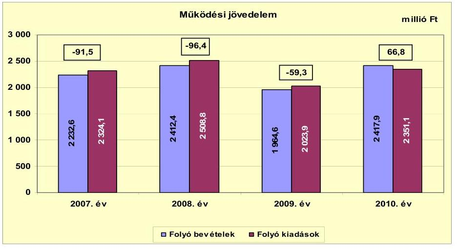

---

A vizsgált időszakban az Önkormányzat folyó költségvetési egyenlege 2007-2009. években negatív volt. Az Önkormányzat folyó bevételei a 2010. évben fedezték a folyó kiadásokat, amely a gyógyfürdő beruházás visszaigényelt áfájának ( 102,7 millió Ft) volt köszönhető. A működési jövedelem javulásának az oka, a kamatbevételekből, a helyi és a gépjármű adóból, valamint a saját működési bevételekből származó bevételek folyamatos emelkedése volt. A vizsgált időszak egészét tekintve a működési jövedelem 180,4 millió Ft negatív értéket mutatott. A működési forráshiány finanszírozását az Önkormányzat folyószámlahitelből és éven belüli likvidhitelből, kötvényből ${ }^{20}$ biztosította.

Az Önkormányzat a 2007-2010. években összesen 165,8 millió Ft ÖNHIKI-s és működésképtelen önkormányzatok egyéb támogatásában részesült, amely mérsékelte működési hiányát, ezáltal javította a pénzügyi helyzetét. Három évben volt sikeres az Önkormányzat a kötelező feladatok zökkenőmentes ellátás érdekében ÖNHIKI-re benyújtott pályázata (2007. évben 51,5 millió Ft, 2008. évben 56,7 millió Ft és 2009 évben 13,6 millió Ft). Működésképtelen önkormányzatok egyéb támogatása címen az Önkormányzat a 2007-2010. években célhoz kötötten összesen 44,0 millió Ft-ot kapott. Az Önkormányzat 2011. évi pénzügyi helyzetének romlását jelzi, hogy a 2011. év I-III. negyedévben kapta a vizsgált időszakban legmagasabb, 82,8 millió Ft - 60 napon túli élelmiszer és közüzemi számlák kiegyenlítésére, az alapfokú nevelési és oktatási intézmények működőképességének fenntartására, illetve egyéb kötelező feladatellátáshoz kapcsolódó működési forráshiány mérséklésére nyújtott ÖNHIKI támogatást.

Az Önkormányzatnál az ÖNHIKI és a működésképtelen önkormányzatok egyéb támogatása címen kapott bevételek nélkül a működési jövedelem 2007-ben -151,0 millió Ft, 2008-ban -168,1 millió Ft, 2009-ben -75,9 millió Ft és 2010-ben 48,8 millió Ft volt.

Az Önkormányzat nettó működési jövedelmét a 2007-2010. években az alábbi ábra szemlélteti:
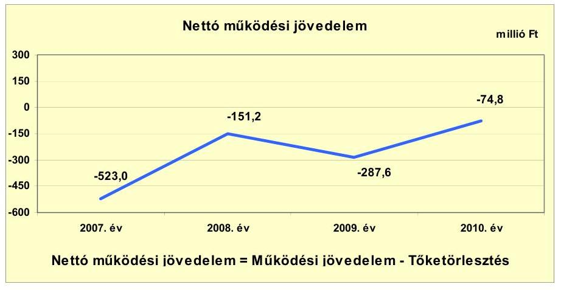

[^0]
[^0]:    ${ }^{20}$ Az Önkormányzat az 500 millió Ft-os DÁM kötvényéből 2007-2008. években működési kiadást is teljesített.

---

Az Önkormányzat pénzügyi kapacitása (nettó működési jövedelem) a vizsgált időszak minden évében negatív értéket mutatott. A nettó működési jövedelem értéke a folyó költségvetési egyenleg mellett az adott költségvetési év adósságtörlesztésének hatását is tükrözi. A 2007-2009. évek negatív működési jövedelme nem nyújtott fedezetet a tőketörlesztésekre. A pénzügyi kapacitás a 2007. és a 2009. évi kiugróan negatív értékét a magas 431,5 millió Ft-os és 228,3 millió Ft-os hiteltörlesztések és a negatív működési jövedelmek okozták. A 2010. évben a javuló a pénzügyi kapacitást nem csak tartós hatást kifejtő kiadási megtakarítás - létszámcsökkentés - alapozta meg, hanem átmeneti hatást biztosító bevétel növekedés - szabad pénzeszköz lekötés - is. Az átmenetileg szabad pénzeszköz lekötés elmaradása - amely a pénzügyi kockázatot növeli -, valamint a kettő kötvény tőketörlesztésének megkezdése ${ }^{21}$ következtében a pénzügyi kapacitás ismét kedvezőtlen irányban változott.

Az Önkormányzat a vizsgált időszakban folyamatosan negatív nettó működési jövedelme eladósodását, annak további hitelből történő finanszírozása a pénzügyileg nem fenntartható gazdálkodást jelzi.

A 2007-2010. években a felhalmozási költségvetés egyenlegét a következő ábra szemlélteti:
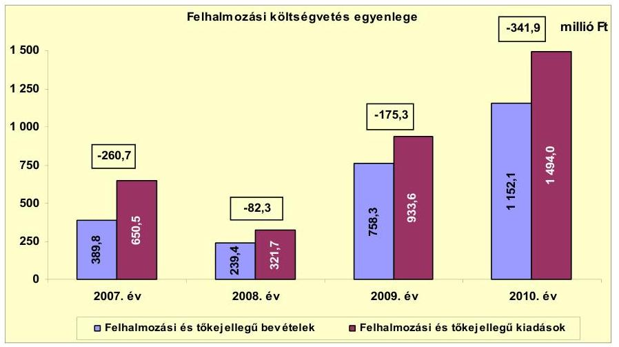

A felhalmozási forráshiánynak a felhalmozási kiadásokhoz viszonyított aránya a 2007. évben $40,1 \%$, a 2008. évben $25,6 \%$, a 2009. évben $18,8 \%$ és a 2010. évben $22,9 \%$ volt. A felhalmozási költségvetés a vizsgált időszakban minden évben - a 2008. évtől folyamatosan növekvő összegű - hiányt mutatott. A 2007-2010. években az Önkormányzat felhalmozási költségvetésének egyenlege összesen 860,2 millió Ft felhalmozási forráshiányt keletkeztetett. Ez a fennálló negatív működési jövedelem mellett az Önkormányzat számára kockázattal jár, mivel a folyó gazdálkodás során nem képződött fedezet a felhalmozási hiány finanszírozására. A tőketörlesztés és a felhalmozási forráshiány 1716,5 millió Ft-ot tett ki, amelyre a 2007. január 1-jén rendelkezésre álló 76,8 millió Ft pénzkészlet mellett, a további fedezetet - a felvett hitelekből az

[^0]
[^0]:    ${ }^{21}$ A 2007. évben felvett 500,0 millió Ft svájci frank alapú kötvény tőketörlesztése 2012. évben, és a 2009. évben felvett 1000,0 millió Ft euró alapú kötvény tőketörlesztése 2011. évben kezdődik.

---

Önkormányzat kimutatásai szerint 139,7 millió Ft erejéig - hitel felvételével és 1500 millió Ft kötvénykibocsátással teremtették meg. Újabb külső források bevonásának elkerülését csak pozitív nettó jövedelmet eredményező gazdálkodás mellett lehet végrehajtani.

Az Önkormányzat a 2007-2010. évi zárszámadási rendeleteiben és a 2011. év I. félévi beszámolójában a működési és fejlesztési hiányt a hagyományos költségvetési szerkezet alapján mutatta be ${ }^{22}$, amelyről a jelentés 1. számú melléklete nyújt tájékoztatást. A zárszámadási rendeletekben a bevételek és a kiadások különbözeteként a 2007-ben 289,6 millió Ft-ot, 2008-ban 130,1 millió Ft-ot, 2009-ben 699,5 millió Ft-ot, illetve 2010-ben 492,3 millió Ft-ot mutattak ki, amely a kötvények fel nem használt, de feladattal terhelt része.

Az Önkormányzat finanszírozási műveleteinek egyenlegét a 2007-2010. években a következő ábra szemlélteti:
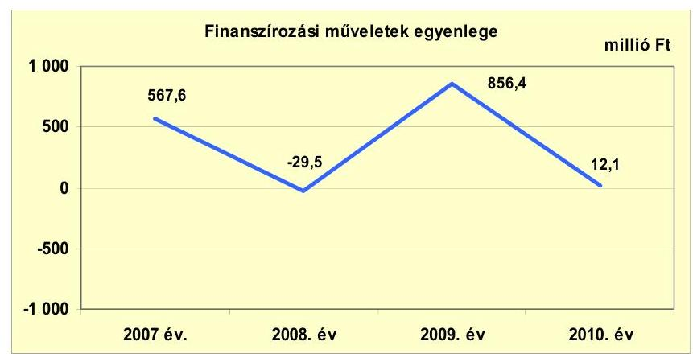

A finanszírozási célú műveleteket a jelentés 2. számú mellékletének 4.1-4.8. pontjai részletezik. A finanszírozási célú pénzügyi műveletek 2007. és 2009. évi pozitív összegeiben - a hitelfelvételen, a hiteltörlesztésen és az egyéb finanszírozási bevételen és kiadáson felül - a 2007. évben kibocsátott 500,0 millió Ft névértékű kötvényből, továbbá a 2009. évben kibocsátott 1000,0 millió Ft névértékű kötvényből származó bevételek hatása jelenik meg.

[^0]
[^0]:    ${ }^{22}$ Nincs kötelező előírás a működési és fejlesztési hiány megállapításának módjára.

---

Az Önkormányzat kamatbevételeit és kamatkiadásait a 2007-2010. években a következő ábra mutatja be:
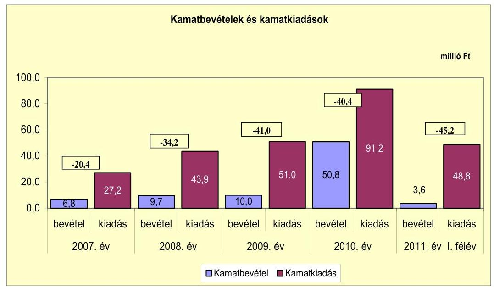

Az Önkormányzat kamat kiadásai és bevételei 2007-2010. években folyamatosan emelkedtek. A 2010. évben a kamat kiadások és bevételek egyaránt jelentősen megemelkedtek a 2009. évhez képest. Ennek oka, hogy a kamatkiadásokban már megjelent az 500,0 millió Ft-os kötvény kamatfizetése, a kamatbevételeket pedig növelte az 1000,0 millió Ft-os kötvény fel nem használt részének lekötéséből származó hozam. A 2011. év I. félévében a három legnagyobb beruházás ${ }^{23}$ kifizetései miatt csökkent a leköthető pénzeszközök mennyisége, ezért az Önkormányzat kamat bevételei lecsökkentek.

[^0]
[^0]:    ${ }^{23}$ Integrált mikro térségi oktatási központ kialakítása, Gyógyfürdő és a járó beteg szakellátó központ fejlesztése.

---

# 2.2. Az Önkormányzat bevételeinek változása

Az Önkormányzat folyó bevétele a 2007-2011. június 30. közötti időszakban összesen 10027,5 millió Ft volt, amely főbb bevételi jogcímeinek adatait az alábbi táblázat részletezi és grafikon mutatja be:
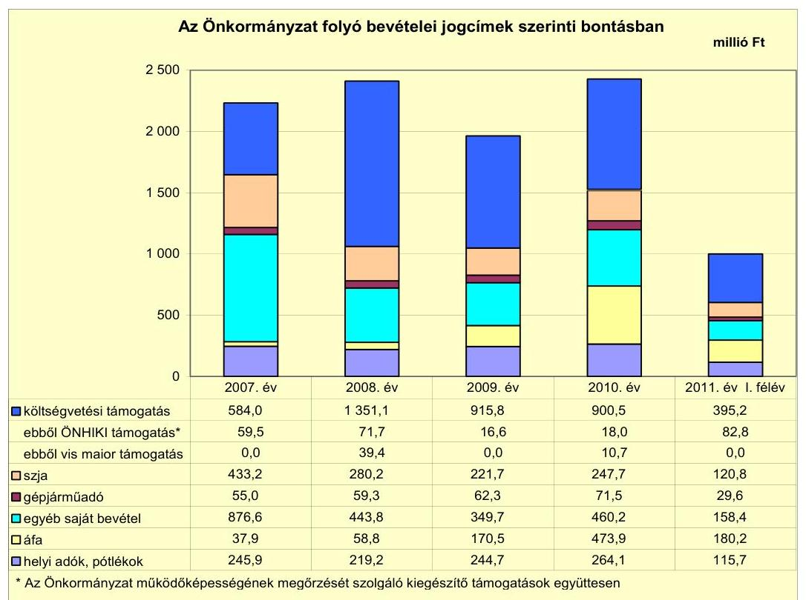

A költségvetési támogatás és az átengedett szja együttesen a 2007. évben 1017,2 millió Ft, a 2008. évben 1631,3 millió Ft, a 2009. évben 1137,8 millió Ft és a 2010. évben 1148,2 millió Ft volt. A 2011. év I. félévében a költségvetési támogatás és az átengedett szja együttes összege 516,0 millió Ft volt, amely 58,1 millió Ft-tal ( $10,1 \%$-kal) kevesebb a 2010. évi időarányos összegnél.

A költségvetési támogatások és az átengedett szja együttes összege a 2008. évben 614,1 millió Ft-tal ( $60,4 \%$-kal) volt nagyobb az előző évi bevételeinél. A növekedést az okozta, hogy a 2007. évben az Óvodai társulás és az Iskolai társulás normatív támogatását nem az Önkormányzat igényelte, ez a 2007. évi költségvetési beszámolóban az átvett pénzeszközök között szerepelt. A növekedésben szerepet játszott továbbá a 2008. évi központi bérpolitikai intézkedések, a közszférában foglalkoztatottak eseti kereset kiegészítésének és a 2007. év után járó 13. havi illetmény 2008. évi elszámolása - összesen 108,4 millió Ft - hatása is. A költségvetési támogatások és az átengedett szja együttes összege a 2009. évben 493,5 millió Ft-tal ( $30,2 \%$-kal) volt kevesebb a 2008. évi bevételeinél. Ennek oka a szakképző iskola megyei önkormányzat részére történő átadása. A csökkenéshez hozzájárult az is, hogy az ÖNHIKI-re és a működésképtelen önkormányzatok támogatására összesen a 2009. évben befolyt összeg 54,9 millió Ft-tal volt kevesebb az előző évben kapott összegénél. A költségvetési támogatás és az szja együttes összege 20072009. évek átlagában 1262,0 millió Ft-ot tett ki, 2010. évben az Önkormányzat

---

1148,2 millió Ft-ot kapott ezen a címen. 2010. évben az előző három év átlagához képest a költségvetési támogatás és az szja együttes összege 113,8 millió Ft-tal ( $9,0 \%$-kal) csökkent.

A helyi adókból beszedett bevételek a 2007-2009 évek 236,6 millió Ft-os átlagához képest a 2010. évben 264,1 millió Ft-ra nőttek. A 27,5 millió Ft-os ( $11,6 \%$-os) növekedést - a 2008. évi csökkenést követően - a helyi iparűzési adóbevétel emelkedése (nőtt az adózók fizetőképessége), illetve a javuló adóhatósági munka okozta, amelyek javították a pénzügyi helyzetet. Az Önkormányzatnak 2011. év I. félévében helyi adóból 115,7 millió Ft (a 2010. évi bevétel $43,8 \%$-a) realizálódott. A helyi iparűzési adó - amely több mint ezer adóalanytól származott - az Önkormányzat helyi adó bevételeinek 2007. évben a $95,4 \%$-át ( 234,6 millió Ft-ot), 2008. évben a $94,5 \%$-át (207,2 millió Ft-ot), 2009. évben a $94,7 \%$-át ( 231,8 millió Ft-ot) és 2010. évben a $95,9 \%$-át (253,3 millió Ft-ot) tette ki. Az Önkormányzatnak a 2007-2011. év I. féléve közötti időszakban idegenforgalmi adóból, telekadóból és iparűzési adóból származott bevétele. A helyi adók mértékében 2010-2011. években végrehajtott változtatás nem eredményezett adóbevételi többletet, a pénzügyi helyzetre nem gyakorolt pozitív hatást, mert 2007. évtől folyamatosan csökkent az idegenforgalmi szálláshelyet igénybevevők száma és az ideiglenes tevékenység után fizetendő adó összege elenyésző volt az összes helyi adóbevételen belül.

A vizsgált években az Önkormányzat a helyi iparűzési adónál, az állandó jelleggel végzett tevékenység után a maximális adómértéket, a $2 \%$-ot alkalmazta, az ideiglenes jelleggel végzettnél a 2007-2009. évek alatt a piaci tevékenységre 1000 Ft/nap és az egyéb tevékenységre $3000 \mathrm{Ft} /$ nap adómértéket állapított meg. 2010. január 1-jétől megszüntették a piaci tevékenységre fizetendő helyi iparűzési adót és az egyéb tevékenység esetében $4000 \mathrm{Ft} /$ napra emelték az adó mértékét. A telekadó mértéke a 2007-2011. év I. féléve között nem változott (első évben 30 $\mathrm{Ft} / \mathrm{m}^{2}$, második évtől $10 \mathrm{Ft} / \mathrm{m}^{2}$-rel emelkedett és a nyolcadik évtől $100 \mathrm{Ft} / \mathrm{m}^{2}$ ). Az idegenforgalmi adó mértéke - tartózkodás után - a 2007-2010. években 250 Ft/éj/fő, a 2011. január 1-jétől $300 \mathrm{Ft} /$ éj/fő volt. Az idegenforgalmi adó mértéke üdülőépület után - a 2007-2011. év I. féléve között $350 \mathrm{Ft} / \mathrm{m}^{2}$ volt. Az Önkormányzat a telekadónál és az idegenforgalmi adónál nem élt a törvényi maximum lehetőségével.

Az egyéb saját bevételek 2008. évi 432,8 millió Ft-os csökkenését 2007. évhez képest Óvodai és Iskolai társulási székhely változása ${ }^{24}$, illetve a szakképző iskola 2008. II. félévtől a megyei önkormányzat részére történő átadása ${ }^{25}$ eredményezte, amely utóbbi a 2009. évi csökkenésben is szerepet játszott, mert a bázis évben még félévnyi bevétel szerepelt, illetve a 2008. évi bevételek között még megjelent egyszeri jelleggel a címzett beruházásból megvalósított művelődési központ rekonstrukciójához garanciális javításokra kapott működési célú

[^0]
[^0]:    ${ }^{24}$ A 2007. évben a székhelyváltozás miatt az oktatási normatíva Regöly Község Önkormányzatától egész évi, Nagykónyi és Szakály Községek Önkormányzataitól 2007. szeptember 1-jétől az Önkormányzatnál támogatásértékű működési bevételként jelent meg.
    ${ }^{25}$ A szakképző iskolának jelentős saját bevétele keletkezett a tanulók gyakorlati foglalkoztatásához kapcsolódó mezőgazdasági tevékenységéből és az építőipari vállalkozási tevékenységből, az ebből származó bevételkiesés az előző évi tényszámok alapján 2008. év II. félévében 25,0 millió Ft bevételkiesést okozott az Önkormányzat számára.

---

pénzeszköz átvétel is. A kamatbevételek és a költségvetési szervektől átvett előző évi pénzmaradvány átvételének emelkedése okozta 2009. évről 2010. évre az egyéb saját bevételek 110,5 millió Ft-os (31,6\%) növekedését.

Az áfa bevételek az előző évekhez viszonyított 2009. évi 111,7 millió Ft-os és a 2010. évi 303,4 millió Ft-os növekedését alapvetően a fordított áfa elszámolás bevezetése idézte elő.

Az Önkormányzatnak a Vízmű Kft. 36,1\%-os tulajdon része után osztalékból a 2008. évben 1,3 millió Ft, valamint üzemeltetési díjból 2008. évben 6,0 millió Ft és 2010. évben 1,0 millió Ft, a vizsgált időszakban összesen 8,3 millió Ft bevétele származott.

Az Önkormányzat felhalmozási bevételei a 2007-2010. években a következőképpen alakultak:

| Megnevezés | 2007. év | 2008. év | 2009. év | 2010. év | 2011. év I.   félév |
| :-- | --: | --: | --: | --: | --: |
| Tárgyi eszköz értékesítés | 1,8 | 65,9 | 10,2 | 93,5 | 145,8 |
| Egyéb saját tőkebevétel | 14,5 | 14,1 | 44,6 | 1,7 | 0,4 |
| Államháztartáson belülről   kapott támogatás | 306,5 | 132,4 | 689,9 | 916,5 | 623,2 |
| EU-tól és külföldről kapott   támogatások | 0,0 | 0,0 | 0,0 | 0,0 | 0,0 |
| Államháztartáson kívülről   kapott támogatás | 67,0 | 27,0 | 13,6 | 140,4 | 10,0 |
| Összes felhalmozási bevétel | 389,8 | 239,4 | 758,3 | 1152,1 | 779,4 |

Az Önkormányzat felhalmozási bevételei a 2007-2009 évek 462,5 millió Ft-os átlagához képest a 2010. évben 1152,1 millió Ft-ra nőttek. Az államháztartáson belülről kapott támogatásokat a folyamatban lévő fejlesztésekre vonatkozó EU-s és hazai pályázatokra kapta az Önkormányzat. A támogatások 2008-2011. év I. féléve közötti időszakban jelentkező növekedést a gyógyfürdő-, az integrált mikro térségi oktatási központ- és a járó beteg szakellátó központ EU-s pályázati forrásból megvalósuló fejlesztési (kivitelezési) tevékenység bővülése - illetve a hozzájuk kapcsolódó támogatás kifizetések - eredményezte. Az államháztartáson kívülről kapott támogatások a 2007-2009. évek 35,9 millió Ft-os átlagához képest a 2010. évben 140,4 millió Ft-ra nőttek. A 2010. évi növekedést a megszűnt szennyvíztársulat tagjai befizetéseinek a lakossági lakás-takarék-pénztárakból való átvétele okozta. A tárgyi eszköz értékesítés a vizsgált időszakban minden évben történt, összesen 317,2 millió Ft értékben. Az értékesítés a 2008. év, 2010. év és 2011. év I. félévében volt számottevő, amelyekben az ipar- és az üdülőterületek értékesítése volt a meghatározó. A 2011. év I. félévi tárgyi eszköz értékesítés volt a vizsgált időszakban a legmagasabb összegű (148,5 millió Ft), amely az év hátralévő részében még növekedhet.

---

# 2.3. Az Önkormányzat működési és a felhalmozási célú kiadásainak változása

Az Önkormányzat folyó kiadásai főbb jogcímek szerinti bontásban 2007-2011. június 30. között a következők szerint alakult:

| Megnevezés | 2007. év | 2008. év | 2009. év | 2010. év | 2011. év I.   félév |
| :-- | --: | --: | --: | --: | --: |
| Folyó kiadások | 2324,1 | 2508,8 | 2023,9 | 2351,1 | 1105,9 |
| Működési kiadások (kamatkiadás nélkül) | 2003,0 | 2046,1 | 1777,5 | 2033,5 | 1005,1 |
| Államháztartáson belülre átadott   pénzeszközök | 96,2 | 237,5 | 23,7 | 24,3 | 6,3 |
| Transzferkiadások | 119,0 | 122,7 | 132,9 | 116,3 | 45,7 |
| -ebből: vállalkozásoknak | 5,5 | 9,4 | 9,8 | 7,3 | 2,4 |
| EU-nak, illetve külföldre | 0,0 | 0,0 | 0,0 | 0,9 | 0,0 |
| magánszemélyeknek | 88,5 | 91,9 | 105,2 | 92,3 | 42,4 |
| nonprofit szervezeteknek | 25,0 | 21,4 | 17,9 | 15,8 | 0,9 |
| Kamatkiadások | 27,3 | 43,9 | 51,0 | 91,2 | 48,8 |
| Előző évi pénzmaradvány átadás | 78,6 | 58,6 | 38,8 | 85,8 | 0,0 |

A folyó kiadások 2008. évi 184,7 millió Ft-os növekedését az előző évhez képest elsősorban a központi bérpolitikai intézkedések ${ }^{26}$ hatása eredményezte. A személyi juttatások annak ellenére nőttek, hogy a szakképző iskola a II. félévtől már a megyei önkormányzat fenntartásában volt. A 2008. évben a szakképző iskola normatíváját egész évben - második félévben is - az Önkormányzat igényelte le és államháztartáson belülre átadott pénzeszközként adta át a megyei Önkormányzatnak, így a szakképző iskola az egész éves kiadása még az Önkormányzatnál jelentkezett. Ez okozta az államháztartáson belülre átadott pénzeszközök 141,3 millió Ft-os 2008. évi emelkedését az előző évhez képest. A folyó kiadások 2009. évi 484,9 millió Ft-os csökkenését legnagyobb mértékben a szakképző iskola megyei önkormányzat részére történő átadása határozta meg. A folyó kiadások 2010. évi ismételt növekedését az előző évhez képest a fordított áfa és a közcélú foglalkoztatás jelentős növekedése eredményezte.

Az Önkormányzat folyó kiadásai közül, a főbb kiadásnemek szerinti bontásban az alábbiak voltak:

| Megnevezés | 2007. év | 2008. év | 2009. év | 2010. év | 2011. év I.   félév |
| :-- | --: | --: | --: | --: | --: |
| Személyi juttatások | 1038,5 | 1063,6 | 890,4 | 953,0 | 448,9 |
| Munkaadót terhelő járulékok | 329,4 | 328,2 | 249,7 | 236,0 | 118,3 |
 Dologi kiadások | 588,6 | 633,4 | 607,6 | 793,7 | 417,3 |
| Egyéb folyó kiadások | 46,5 | 20,9 | 29,8 | 50,8 | 20,6 |

Az Önkormányzat a személyi juttatásokra és a munkaadókat terhelő járulékokra 2007-2009. évek átlagában 1299,9 millió Ft-ot 2010. évben 1189,0 millió Ft-ot fordított, amely 110,9 millió Ft-os ( $8,5 \%$ ) csökkenést takar, amelynek oka a közoktatásban történt változás (az Óvodai társulás és az Iskolai társulások székhelyének a megváltozása és a szakképző iskola átadása) volt.

[^0]
[^0]:    ${ }^{26}$ A közszférában foglalkoztatottak eseti kereset kiegészítésének és a 2007. év után járó 13. havi illetmény 2008. évi elszámolása.

---

A 87 fős létszámnövekedésben az Óvodai társulás és az Iskolai társulások átvétele (197 fő létszámnövekedés), illetve a szakképző intézet átadása (110 fő létszámcsökkenés) játszott szerepet. A 2007. évben már jelentkezett a létszámnövekedés hatása, mert az Óvodai társulás és az Iskolai társulások székhelyeinek megváltozása 2007. szeptember 1-jén történt, de a két társulás egész éves bevétele (az állam és az önkormányzatok által finanszírozottan) és kiadása került az Önkormányzat 2007. évi beszámolójában kimutatásra.

A dologi kiadásokra 2007-2009. évek átlagában 606,9 millió Ft-ot 2010. évben 793,7 millió Ft-ot költöttek, amely 183,8 millió Ft-os (30,1\%) növekedést mutat. A növekedés oka a fejlesztések áfájának a növekedése volt. A 2009. évre az előző évhez képest az államháztartáson belülre átadott pénzeszközök 213,8 millió Ft-os csökkenésének indoka a szakképző iskola 2009. II. félévi normatívájának átadása (192,5 millió Ft) volt.

A folyó és felhalmozási kiadásokat a 2007-2010. években a következő grafikon szemlélteti:
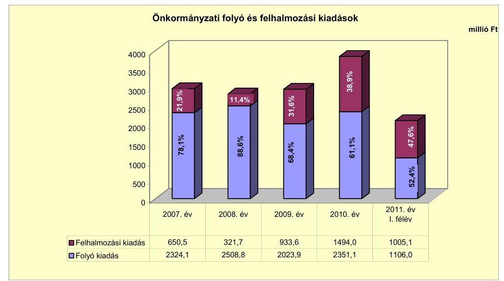

Az Önkormányzat a 2007-2010. években együttesen 3399,8 millió Ft-ot fordított fejlesztési feladatai finanszírozására. Az önkormányzati fejlesztések döntően középületek felújításából, önkormányzati intézmények korszerűsítéséből, gyógyfürdőfejlesztésből, továbbá ivóvíz-, szennyvíz-, kerékpárút hálózat fejlesztésekből tevődött össze. A felhalmozási kiadások 2008. évben csökkentek az előző évhez képest, mert a közbeszerzési eljárások elhúzódása miatt kevesebb fejlesztés indult, illetve a bázis évben befejeződött a címzett támogatásból megvalósított művelődési ház rekonstrukciója. A felhalmozási kiadások összege és kiadások közötti aránya a 2009-2011. év I. féléve között folyamatosan emelkedett, amely a három legnagyobb beruházás kivitelezésének megkezdése miatt következett be.

A 2007-2010 között 24 darab 10,0 millió Ft teljes bekerülési költség feletti befejezett fejlesztés és felújítás összes teljesített kiadása 3106,5 millió Ft, a 10 millió Ft alatti fejlesztéseké 206,6 millió Ft volt. Az Önkormányzat a 20072010. években megvalósított, 2010. december 31-éig befejezett fejlesztéseinek forrását 431,8 millió Ft összegben (13,0\%) önkormányzati saját bevétel,

---

242,2 millió Ft összegben (7,3\%) hitel, 446,5 millió Ft összegben (13,5\%) kötvényből származó bevétel, 1096,1 millió Ft EU-s támogatás, valamint 1096,5 millió Ft összegben (33,1\%) hazai támogatás képezte.
2010. december 31-én az Önkormányzatnál öt (ebből a gyógyfürdő fejlesztése és járó beteg szakellátó központ fejlesztését voltak a legnagyobb összegűek) EU-s támogatással megvalósuló fejlesztés volt folyamatban. A 2010. december 31-én folyamatban lévő fejlesztési feladatok kötelezettség-vállalásainak összege 1669,5 millió Ft volt, amelyből 148,9 millió Ft-ot ( $8,9 \%$ ) saját forrásból, 1055,1 millió Ft-ot (63,3\%) EU-s támogatásból, 12,4 millió Ft-ot ( $0,7 \%$ ) hazai támogatásból és 453,1 millió Ft-ot ( $27,1 \%$ ) kötvényből terveztek biztosítani.

Az Önkormányzat 2010. december 31-én folyamatban lévő fejlesztési feladataihoz kapcsolódó 2010. év utáni kötelezettségvállalások 1669,5 millió Ft-ot tettek ki, amely fedezetére 148,8 millió Ft összegben ( $8,9 \%$ ) önkormányzati saját bevétel, 453,1 millió Ft összegben ( $27,1 \%$ ) kötvényből származó bevétel, 1055,2 millió Ft (63,2\%) EU-s támogatás, valamint 12,4 millió Ft ( $0,8 \%$ ) összegben hazai támogatás szolgál. A tervezett saját bevételi forrás - a forgalomképes ingatlanok értékesíthetőségének kétségessége miatt - kockázatot jelent a vállalt fejlesztések jövőbeni finanszírozhatósága szempontjából.

A Képviselő-testület döntése alapján egy beadott és elbírálás alatt lévő pályázattal rendelkezett 2011. év I. félévének a végén. A "Geotermikus energiahasznosítás és közműrendszer kiépítése Tamásiban" című beadott pályázat tervezett bekerülési költsége 1493,7 millió Ft-ot tett ki. A kötelezettségvállalás forrásösszetételében 493,7 millió Ft-tal ( $33,1 \%$ ) részesedett a saját bevételből származó és 1000,0 millió Ft-tal ( $66,9 \%$ ) részesedett az EU-s támogatásból származó tervezett forrás. Amennyiben az Önkormányzat pályázata sikeres lesz a saját forrás tervezett összegének biztosítása - tekintettel arra, hogy a jelenleg ismert működési jövedelem nem nyújt fedezetet a szükséges saját erőbiztosításához - elegendő saját bevétel hiányában újabb pénzintézeti forrás igénybevételét követelheti meg, amely a pénzügyi kockázatot növeli. Az Önkormányzat által vállalt jövőbeni fejlesztési kötelezettségek fedezete rövid távon sem biztosított.

Az Önkormányzat három legmagasabb bekerülési költségű beruházása a vizsgált időszakban EU-s pályázatokhoz kapcsolódott. A fejlesztések közül az integrált mikro térségi oktatási központ kialakítása (oktatási nevelési intézmény) fejeződött be 2010. december 31-ig.

Az Iskola átalakítás beruházás EU-s támogatással (integrált mikro térségi oktatási központ kialakítása DDOP-3.1.2./2F-2f-2009-0006) fejlesztés 2008. évben indult és 2010. évben fejeződött be. A beruházás az oktatási nevelési intézmény korszerűsítésére, bővítésére és akadálymentesítésére terjedt ki, amely magában foglalt telephely megszüntetést is. A projekt teljes tervezett bekerülési költsége a támogatási szerződés szerint $95,0 \%$-os EU-s támogatás mellett 1256,1 millió Ft volt. A fejlesztés teljes tényleges bekerülési költsége a tervezettel szemben 1500,0 millió Ft-ra (243,9 millió Ft-tal és 19,4\%-kal) emelkedése ${ }^{27}$, valamint a

[^0]
[^0]:    ${ }^{27}$ A 3/a mellékletben a 2010. december 31-ig felmerült költségek szerepeltek (1333,3 millió Ft), a beruházás teljes pénzügyi elszámolása 2011. évre húzódott át. 2011. évben a beruházás érdekében további 166,7 millió Ft került kifizetésre.

---

forrásösszetétel előnytelen változása ${ }^{28}$ kedvezőtlenül hatott az Önkormányzat pénzügyi helyzetére.

Az Önkormányzat a Tamási városban élményfürdő megvalósítása (Gyógyfürdő fejlesztése EU-s támogatással) érdekében 2008-ban sikeresen pályázott (DDOP-2.1.1/B-2F-2009-0003). A fürdőfejlesztés célja egy regionális jelentőséggel bíró termál- és élményfürdő megvalósítása volt. A projekt tervezett bekerülési költsége 1517,9 millió Ft, ehhez képest a beruházás várható bekerülési költsége 118,1 millió Ft-tal 1636,0 millió Ft-ra növekedett. A fejlesztésnél a támogatás mértéke $45,9 \%$ volt ( 697,0 millió Ft EU-s támogatás), a fennmaradó $54,1 \%$-ot ( 820,9 millió Ft-ot) az Önkormányzat a kötvény bevételből tervezte a 3/b melléklet szerint finanszírozni. A 3/c melléklet szerint a 2010. évet követő kötelezettségvállalás forrásösszetétele a várható tény adatok szerint EU támogatás 472,4 millió Ft, kötvény 453,1 millió Ft és saját bevétel 111,3 millió Ft. Az Önkormányzat pénzügyi helyzetét kedvezőtlenül befolyásolhatja a fejlesztés többletköltségei saját forrás részének a megteremtése.

Az Önkormányzat a 2009. májusban megkötött üzemeltetési szerződés alapján a Gyógyfürdőt 25 évre üzemeltetésbe adta, összesen nettó 470,0 millió Ft-ért (a vállalkozó díjfizetési kötelezettsége 2014-2025-ig évi 20,0 millió Ft, 2025-2035-ig évi 23,0 millió Ft), amelyből a beruházás nem térül meg. A Gyógyfürdő használatba vétele 2011. augusztus 31-én valósult meg.

Az Önkormányzat a járó beteg szakellátó központjának a fejlesztését (DDOP-2007-3.1.3.B) 2009. évben kezdte meg. A támogatási szerződés szerint a projekt költségvetése 421,4 millió Ft volt, amelyre 400,0 millió Ft ( $94,9 \%$ ) EU-s támogatást és 21,4 millió Ft ( $5,1 \%$ ) saját bevételt kívántak fordítani. A fejlesztés várható bekerülési költsége előre nem látható többlet ráfordítások miatt 432,1 millió Ft-ra változott.

Az Önkormányzat a 2007-2010. évek alatt ÖNHIKI és működésképtelen önkormányzatok egyéb támogatása bevételekben részesült és emellett jelentős mértékű fejlesztéseket végzett, mely hozzájárult a pénzügyi kockázat növekedéséhez.

A Képviselő-testületnek előterjesztett éves költségvetési rendeletekben nem mutatták be a beruházásokkal létrehozott létesítmények működtetése és fenntarthatósága érdekében várhatóan felmerülő költségvetési kiadásokat.

A vizsgált években az Önkormányzat csak a kizárólagos tulajdonában lévő Innovációs Központ Kft.-nek adott át a 2007-2009. években összesen 24,6 millió Ft (évi 8,2 millió Ft) működési célú pénzeszközt. Az éves költségvetésekben jóváhagyott pénzeszköz átadásokhoz az Önkormányzat az Innovációs Központ Kft.-vel évente megbízási szerződéseket kötött, amelyek kötelező és önként vállalt önkormányzati feladatok ellátását tartalmazta. A Városüzemeltető Kft. a 2006. évi veszteségei miatt a 2007. évben 40,0 millió Ft-ot tőkeemelés címen és a fürdőfejlesztéshez 8,0 millió Ft tagi kölcsönt kapott az Önkormányzattól. A Városüzemeltető Kft. kötelezettségállományának folyamatos emelkedése (2007. év 50,3 millió Ft; 2008. év 67,9 millió Ft; 2009. év 109,6 millió Ft; 2010. év 117,4 millió Ft), az Önkormányzat pénzügyi helyzetére kockázatot jelent, a

[^0]
[^0]:    ${ }^{28}$ A források közük az EU-s támogatás 173,7 millió Ft-tal csökkent és a kötvényforrás 227,7 millió Ft-tal nőtt a tervezetthez képest.

---

gazdasági társaságban való tulajdoni részesedéséből fakadó korlátlan felelőssége miatt.

Az Önkormányzat gazdasági társaságai részére átadott pénzeszközöket a 4. számú melléklet tartalmazza.

# 3. Az ÖNKORMÁNYZAT KÖTELEZETTSÉGEI 

### 3.1. Az Önkormányzat pénzintézetekkel szembeni kötelezettségeinek változása

Az Önkormányzat pénzintézetekkel szembeni kötelezettségeinek állománya 2006. december 31-től 2010. december 31-ig 8,2 szeresére, 254,2 millió Ft-ról 2090,0 millió Ft-ra, a 2011. év I. félév végére 2140,3 millió Ft-ra nőtt. A 2006. december 31-én fennálló pénzintézeti kötelezettség hosszúlejáratú fejlesztési hitelekből és folyószámlahitelből tevődött össze. A 2010. év végi pénzintézetekkel szembeni kötelezettségek 4,2\%-a hosszúlejáratú felhalmozási célú hitelekből, 13,2\%-a folyószámla hitelből, 82,6\%-a kötvények kibocsátásából keletkezett. A 2011. június 30-án fennálló pénzintézeti kötelezettségek 3,9\%-át a hosszúlejáratú felhalmozási és működési célú hitelek, 13,8\%-át a folyószámla hitel, 82,3\%-át a kötvényekből származó kötelezettségek jelentették.

Az Önkormányzat pénzintézetekkel szemben fennálló kötelezettség-állományát a 2006. december 31. és 2011. év I. félév között az alábbi ábra szemlélteti:
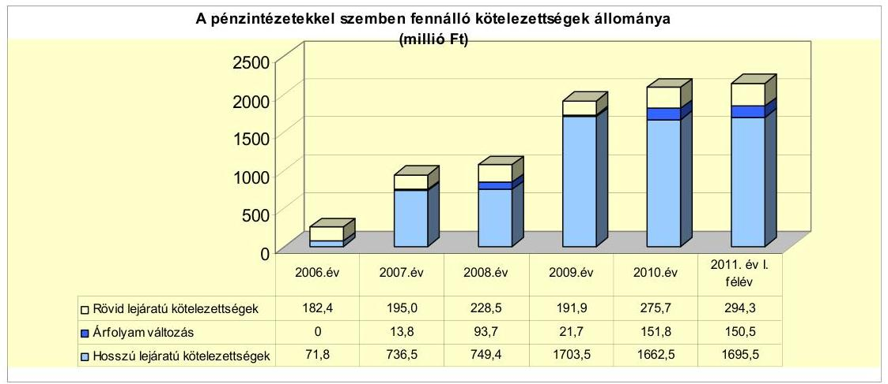

A pénzintézetekkel szembeni kötelezettségek állományának 2006. december 31. és 2011. év I. félév közötti összesen 1886,1 millió Ft-os növekedését az alábbiak befolyásolták:

- a 2006. december 31-én fennálló 71,8 millió Ft hosszú lejáratú kötelezettség három fejlesztési hitelszerződésből keletkezett, két hitelszerződés alapján a pénzintézet hitelkeretet nyitott ( 64,8 millió Ft és 3,5 millió Ft), amelyekből 2006-ban 26,0 millió Ft-ot hívtak le, a fennmaradó 42,3 millió Ft-ot 2007. december 31-ig hívták le, a hitelek törlesztése a 2008-2009. években megkezdődött,

---

- a 2008. évben kötött hitelszerződés alapján 1,5 millió Ft hosszú lejáratú fejlesztési hitelt vettek igénybe, amelynek törlesztése a 2008. évben megkezdődött,
- 2007-ben 3357000 CHF - 500,0 millió Ft - összegben, 2009-ben 3694945 EUR - 1000,0 millió Ft - összegben kötvényt bocsátottak ki,
- a folyószámlahitel állománya a 2007-2009. évek 110,5 millió Ft-os átlagáról a 2011. év I. félévére 294,3 millió Ft-ra nőtt,
- 2011-ben, 50 millió Ft hosszú lejáratú, működési hitel igénybevétele vált szükségessé működési kiadásokra,
- a devizában fennálló kötelezettségek CHF és EUR árfolyamváltozása hatására 431,5 millió Ft kötelezettség keletkezett a 2007-2011. év I. fél közötti időszakban.

Az Önkormányzat a költségvetések forráshiánya, az adósság kezelése érdekében bevételnövelő és kiadáscsökkentő intézkedéseket hozott, továbbá működési és felhalmozási célú hitelfelvételről, valamint kötvény kibocsátásról döntött. A 2007-2011. év I. félévében a költségvetés végrehajtása során jelentkező likviditási problémákat folyószámla-, egyéb likvid hitel, továbbá a 2007. évben munkabér-megelőlegezési hitel igénybevételével oldották meg. Az Önkormányzat pénzintézetekkel szembeni kötelezettségvállalásaira minden esetben képviselő-testületi döntés alapján került sor. A hiteleket nyújtó pénzintézeteket - a két kötvény és a 2010. évi folyószámlahitel kivételével-, mivel a hitelek a Kbt-ben előírt értékhatárt nem érték el, nem versenyeztették. A kötelezettségvállalásból származó források felhasználási céljait meghatározták. A Képviselőtestület döntéseit megalapozó előterjesztések a visszafizetés forrásait, a várható kamat és tőkefizetési kötelezettség évenkénti és teljes futamidőre vonatkozó összegét, az adósságszolgálati korlát bemutatását nem tartalmazták. A pénzintézeti kötelezettségvállalásokat megelőzően azok kamatkockázatát nem vizsgálták. A deviza alapú kötvénykibocsátás döntései előtt nem vizsgálták a különböző devizák várható árfolyamváltozásait, az árfolyamkockázat várható kihatásait, a Képviselő-testületnek nem mutatták be. Az Önkormányzat az adósságot keletkeztető kötelezettségvállalások felső határát ${ }^{29}$ a 2007-2010. években nem lépte túl. Az adósságot keletkeztető kötelezettségvállalás felső határa ${ }^{30}$ a 2007. évben 214,3 millió Ft, a 2008. évben 191,9 millió Ft, a 2009. évben 161,9 millió Ft, a 2010. évben 304,2 millió Ft volt. A hitelek, a kötvények felhasználásáról, a szabad források befektetéséből származó bevételek alakulásáról, valamint a kamat és tőkefizetési kötelezettség alakulásáról a Képviselő-testületet évente két alkalommal tájékoztatták.

A 2007-2011. év I. félévében az Önkormányzat kétszer - 2007. szeptember 1-jén és 2010. január 1-jén - változtatott számlavezető pénzintézetet. Mindkét váltás a kötvények kibocsátásához kapcsolódott. A számlavezető pénzintézet váltás oka az volt, hogy az ajánlati feltételek csak a számlavezetéssel

[^0]
[^0]:    ${ }^{29}$ az Ötv. 88. § (2) bekezdése
    ${ }^{30}$ az éves költségvetési beszámolók szerint

---

együtt voltak érvényesek és a kötvények tervezett kibocsátásakor a kötvényt forgalmazó pénzintézet nem volt azonos a számlavezetővel.

A 2007. évben kibocsátott kötvény miatti számlavezetés váltást követően két hosszúlejáratú fejlesztési célú hitelszerződésnél történt a korábbi számlavezető részéről egyoldalú szerződés módosítás.

A 2006. július 5-én megkötött, 64,8 millió Ft-os hitelkeretet nyújtó, 11 fejlesztési célt és önálló hitelkeretet, valamint a 3,5 millió Ft-os hitelkeretet nyújtó két fejlesztési célt és önálló hitelkeretet tartalmazó szerződést a korábbi számlavezető, finanszírozó módosította. A finanszírozó a 2008. december 30-án kelt "hitelszerződés átárazása" tárgyú levelében az Önkormányzati üzletági Üzletszabályzat I. 4. pontjára és a „pénzügyi válság eredményeként fellépett új piaci körülményekre" hivatkozva az alkalmazott ügyleti kamatot a 64,8 millió Ft összegű kötelezettség után a korábbi 1,9\%-hoz képest 1,6 százalékponttal, illetve a 3,5 millió Ft összegű kötelezettség után, a korábbi 1,5\%-hoz viszonyítva 1,0 százalékponttal emelte meg.

A 2009. évben az akkor még számlavezető - a 2007. évben kibocsátott kötvényt forgalmazó pénzintézet - a forgalmazói szerződés kiegészítését kezdeményezte, amelyet a Képviselő-testület elfogadott. A szerződés kiegészítése alapján, a kamat kondíciók változtatása nélkül az Önkormányzatnak 2009. július 14-től a szerződés lejártáig, 2027. augusztus 31-ig havonta esedékes, várhatóan összesen 1613225 CHF összegű ügynöki díjfizetési kötelezettsége keletkezik.

A forgalmazói szerződés kiegészítéséről készült megállapodás 4. pontja értelmében „az átalánydíj mértéke évi 2,0\%-5,0\% közötti díjmérték, mely az adott év január első banki napján fennálló kötvényállomány össznévértékére vetített százalékos díjmérték".

---

Az Önkormányzat forintban fennálló, hosszú lejáratú adósságot keletkeztető pénzintézeti kötelezettségvállalásai 2011. június 30-án az alábbiak voltak:

| Megnevezés | Szerződéskötési Kibocsátás | Összeg millió HUF-ben | Kamat (referencia kamat+ kamatfelár) | Felhasználás célja: |
| :--: | :--: | :--: | :--: | :--: |
| 1 Szennyvízhitel | 2006.12.22 | 45,8 | 3 havi EURIBOR + évi 2,5\% | Szennyvízelvezetési és szennyvíztisztítási beruházás |
| 2/1 Vegyes célhitel: Járda felújítás | 2006.07.05 | 3,1 | 3 havi EURIBOR + évi 1,9\% | Járda felújítása útőförésztői Wúrót iskotáig |
| 2/2 Vegyes célhitel: Laktanya | 2006.07.05 | 1,3 | 3 havi EURIBOR + évi 1,9\% | Laktanya iparterület infrastruktúra kiépítés II. ütem |
| 2/3 Vegyes célhitel: Dózsa u. I. | 2006.07.05 | 3,8 | 3 havi EURIBOR + évi 1,9\% | Dózsa György u. + iparterület infrastruktúra kiépítés I. ütem |
| 2/4 Vegyes célhitel: Dózsa u. II. | 2006.07.05 | 10,8 | 3 havi EURIBOR + évi 1,9\% | Dózsa György u. + iparterület infrastruktúra kiépítés II. ütem |
| 2/5 Vegyes célhitel: Bíróság I. | 2006.07.05 | 4,8 | 3 havi EURIBOR + évi 1,9\% | Bíróság épület homlokzati felújítása I. ütem |
| 2/6 Vegyes célhitel: Bíróság II. | 2006.07.05 | 10,6 | 3 havi EURIBOR + évi 1,9\% | Bíróság épület belső felújítás II. ütem |
| 2/7 Vegyes célhitel: Gimnázium | 2006.07.05 | 3,6 | 3 havi EURIBOR + évi 1,9\% | Gimnázium épületének rekonstrukciója |
| 2/8 Vegyes célhitel: Ügyelet | 2006.07.05 | 1,4 | 3 havi EURIBOR + évi 1,9\% | Központi ügyelet kialakítása, rendelőintézet részleges felújítása |
| 2/9 Vegyes célhitel: Műv ház | 2006.07.05 | 20,8 | 3 havi EURIBOR + évi 1,9\% | Művelődési Központ épületének rekonstrukciója |
| 2/10 Vegyes célhitel: Buszmegálló | 2006.07.05 | 3,0 | 3 havi EURIBOR + évi 1,9\% | Buszmegálló építése központban |
| 2/11 Vegyes célhitel: Várhegy u. | 2006.07.05 | 4,0 | 3 havi EURIBOR + évi 1,9\% | Várhegy utca aszfaltozása |
| 3/1 Kishenye I | 2006.07.06 | 1,7 | 3 havi EURIBOR + évi 1,5\% | Kishenyei ivóvízhálózat kiépítése I. ütem |
| 3/2 Kishenye II. | 2006.07.06 | 1,8 | 3 havi EURIBOR + évi 1,5\% | Kishenyei ivóvízhálózat kiépítése II. ütem |
| 4 Volkswagen Transporter | 2008.07.21 | 1,5 | 1 havi BUBOR + évi 5,29\% | Volkswagen Transporter 2.5 TDI típusú gépjármű vásárlás |
| 550 Milliós hitel | 2011.06.28 | 50,0 | 1 havi BUBOR + évi 5,5\% | Ingatlanértékesítési bevételek előfinanszírozás |

Az Önkormányzat 2011. június 30-án forintban fennálló, hosszúlejáratú pénzintézetekkel szembeni kötelezettségei öt hitelszerződésen alapultak, amelyek alapján összesen 165,6 millió adóssága keletkezett ${ }^{31}$. A rendelkezésre álló hitelkeretek 2011. június 30-ig lehívásra és felhasználásra kerültek.

Az Önkormányzat kimutatása szerint a hosszú lejáratú, fejlesztési hitelek forrásait - a hitelcélokkal egyezően - intézményi és egyéb beruházási és felújítási feladatokra használta fel. Szennyvíz beruházásokra és ivóvízhálózat bővítésére 49,3 millió Ft-ot, ingatlanok felújítására, infrastruktúra kiépítésére, jármű vásárlásra 66,3 millió Ft-ot fordítottak.

A 2011. évi költségvetésben az Önkormányzat 460,0 millió Ft bevételt tervezett ingatlanok értékesítéséből. A megjelölt ingatlanok egy része a fürdő körüli építési telkek voltak, amelyeket egészségügyi és idegenforgalmi befektetések céljából kívántak hasznosítani. Az ingatlanok másik részét az EU-s támogatással létrehozott mikro-térségi oktatási központ kialakítása miatt felszabadult iskola épületek képezték. A tervezett értékesítések 2011. június 30-ig nem valósultak meg. A bevételkiesés miatt a működés finanszírozásához „ingatlanértékesítési bevételek előfinanszírozása" céllal 50,0 millió Ft jelzálogalapú hitelt vettek igénybe.

A 2007-2011. év I. féléve között az Önkormányzat a forintban fennálló hosszú lejáratú hitelek után 23,8 millió Ft tőkét törlesztett, valamint 28,9 millió Ft kamatkiadást és 0,6 millió Ft egyéb költséget teljesített.

[^0]
[^0]:    ${ }^{31}$ A 2010. december 31-én összesen négy szerződésből álló hosszú lejáratú kötelezettség összege 115,6 millió Ft volt.

---

Az Önkormányzat 2011. június 30-án CHF-ben fennálló, adósságot keletkeztető pénzintézetekkel szembeni kötelezettségvállalása az alábbi volt:

| Megnevezés | Szerződéskötés/   kibocsátás   időpontja | Összeg   ezer CHF-ben | Kibocsátás//lehívási   árfolyam | Kamat (referencia kamat+   kamatfelár) | Felhasználás célja: |
| :-- | :--: | :--: | :--: | :--: | :-- |
| Dám Kötvény | 2007.08.31 | 3357,0 | 151 HUF/CHF | 8 havi LIBOR CHF+ évi 0,45\% | Termálfürdő vásárlása és egyéb   kiadások fedezete |

A 2007. évben CHF-ben kibocsátott - 500,0 millió Ft névértékű - kötvény 20 éves lejáratú, zárt körben forgalmazott volt, amelynek visszafizetése öt év türelmi idő után - a tőketörlesztés kezdő időpontja 2012. szeptember 30-a, összege 210149 CHF - évente kétszer esedékes. A devizában fennálló pénzintézettel szembeni kötelezettségből 2011. június 30-ig tőkét nem törlesztettek, ezért realizált árfolyamnyereség és árfolyamveszteség sem keletkezett. A kötvény összegének visszafizetését és a kamat megfizetését biztosító kötelezettségvállalást a forgalmazó pénzintézet felé az Önkormányzatnak nem kellett tenni. A kötvénykibocsátás dokumentumában a kibocsátás céljaként a kibocsátó beruházási tevékenységének finanszírozását és hitelszerkezetének konszolidálását fogalmazták meg. A kötvényt a jegyzést követően forintra váltották és annak teljes felhasználásáig forintszámlán tartották.

A kötvénykibocsátásból származó 500,0 millió Ft bevételt az Önkormányzat a 2007-2008. években felhasználta.

A 2007. évben termálfürdő és camping megvásárlására 156,0 millió Ft-ot ${ }^{32}$, a Városüzemeltető Kft. törzstőke emelésére 40,0 millió Ft-ot, fürdőfejlesztéshez kölcsön nyújtására 8,0 millió Ft-ot, fürdő téliesítésére 4,0 millió Ft-ot, bírósági épületnél térburkolat kiépítésére 3,1 millió Ft-ot, kötvénykibocsátás költségére 1,3 millió Ft-ot, működési hitel kamatára 4,6 millió Ft-ot, egyéb működési kiadásra 50,0 millió Ft-ot, kieső ingatlanértékesítések pótlására 83,0 millió Ft-ot, a 2008. évben egyéb beruházási és működési kiadásokra 150,0 millió Ft-ot fordítottak.

A kötvény szabad forrásának befektetéséből a 2008. évben 16,6 millió Ft bevétel keletkezett, amelyet működési kiadásokra használtak fel.

A 2007-2011. év I. féléve között az Önkormányzat a CHF-ben fennálló adóssága miatt 529330 CHF - 109,1 millió Ft - kiadást teljesített, amelyből a kamatkiadás 238313 CHF - 41,9 millió Ft -, az egyéb költség, ügynöki díj 291017 CHF - 59,1 millió Ft -, és további 8,0 millió Ft volt.

Az Önkormányzat 2011. június 30-án EUR-ban fennálló, adósságot keletkeztető pénzintézetekkel szembeni kötelezettségvállalása az alábbi volt:

| Megnevezés | Szerződéskötés/   kibocsátás   időpontja | Összeg   ezer EUR-ben | Kibocsátás//lehívási   árfolyam | Kamat (referencia kamat+   kamatfelár) | Felhasználás célja: |
| :--: | :--: | :--: | :--: | :--: | :--: |
| Termési Holmapjáért | 2009.10.12 | 3694,9 | 270,84 HUF/EUR | 8 hónapos EURIBOR +évr 5,6\% | Mikrotérségi oktatási központ   kiadációása és fürdőfejlesztés |

A 2009. évben EUR-ban kibocsátott - 1000,0 millió Ft névértékű - kötvény 20 éves lejáratú, zárt körben forgalmazott volt, amelynek visszafizetése kettő év

[^0]
[^0]:    ${ }^{32}$ A termálfürdő és camping megvásárlása - a beszedett bérleti díjakból - a 2010. évben 1,3 millió Ft bevételt eredményezett, amelyet működési kiadásokra fordítottak.

---

türelmi idő után - a tőketörlesztés kezdő időpontja 2001. április 1-je, összege 102720 EUR - évente kétszer esedékes. A kötvénykibocsátás dokumentumában a kibocsátás céljaként két beruházást határoztak meg, ahol a fejlesztések elszámolható költségét és a finanszírozás forrását is feltüntették. A dokumentumban a kötvény visszafizetését és a kamat megfizetését biztosító kötelezettségvállalásokat
 is rögzítették.

A kötvényből származó fizetési kötelezettségek teljesítése miatt a pénzintézet a következő biztosítékokat írta elő: zálogjog bankszámla-követelésen, az Önkormányzat költségvetési elszámolási alszámláján, hitelbiztosító pénzintézet kezességvállalása, a kötvényből finanszírozott fürdő üzemeltetéséből származó követelés engedményezése, jelzálogjog a fürdő ingatlanra, a kötvénykibocsátásból származó forrás óvadékként történő zárolása, annak tényleges fejlesztési célra történő felhasználásáig.

A kötvényt a jegyzést követően nem váltották át forintra, annak felhasználásáig devizaszámlán tartották. A kibocsátást követően 2011. év I. félévéig 99,3\%-át használták fel.

A termálfürdő fejlesztésére 689,4 millió Ft-ot, a mikro térségi oktatási központ kialakítására 303,8 millió Ft-ot fordítottak.

A kötvény szabad forrásának befektetéséből a 2010-2011. években 64,3 millió Ft bevétel keletkezett, amelyet működési kiadásra használtak fel.

A 2010-2011. év I. féléve között az Önkormányzat az EUR-ban fennálló adóssága miatt összesen 470758 EUR - 129,0 millió Ft - kiadást teljesített, amelyből a kamatkiadás 365060 EUR - a 98,6 millió Ft -, az egyéb költség 2978 EUR 0,8 millió Ft -, és további 2,2 millió Ft volt, törlesztésre 102720 EUR-t 27,4 millió Ft-ot - fordítottak, amely az igénybevételkor fennálló átlagárfolyamhoz viszonyítva 0,1 millió Ft árfolyamnyereséget eredményezett.

Az Önkormányzat működésének pénzügyi egyensúlyát a vizsgált időszakban folyószámla- és egyéb likvid hitel, valamint a 2007. évben munkabér megelőlegezési hitel igénybevételével tudta biztosítani. A folyó-számla- és munkabér megelőlegezési hitel alakulását 2007-2011. év I. félévben az alábbi táblázat mutatja be:

| Megnevezés | 2007. év | 2008. év | 2009. év | 2010. év | 2011. év I.   félév |
| :-- | --: | --: | --: | --: | --: |
| I. Folyószámlahitel |  |  |  |  |  |
| a folyószámlahitel keretösszege január 1-jén | 184,0 | 200,0 | 200,0 | 200,0 | 300,0 |
| teljesített kamat és egyéb költség | 9,3 | 11,7 | 19,4 | 9,6 | 7,8 |
| II. Munkabér megelőlegezési hitel |  |  |  |  |  |
| Igénybevett hitel összesen: | 285,6 | 0,0 | 0,0 | 0,0 | 0,0 |
| teljesített kamat és egyéb költség | 4,3 | 0,0 | 0,0 | 0,0 | 0,0 |

---

A folyószámla-, munkabér megelőlegezési és egyéb likvid hitel kamatai és egyéb költségei az alábbiak voltak ${ }^{33}$ :

| Megnevezés | Kamat (referencia+ kamatfelár) | Egyéb költség |
| :--: | :--: | :--: |
| Folyószámlahitel |  |  |
| 2007.01.01.-2007.08.31. | 3 havi BUBOR + 1\% | kezelési költség: 0,25\% |
| 2007.09.01.-2008.08.29. | 1 havi BUBOR+évi 0,45\% | egyszeri 0,25\% |
| 2008.08.30.-2009.08.28. | 1 havi BUBOR $+2,5 \%$ | egyszeri 0,25\% |
| 2009.08.29-2009.12.31. | 1 hónapos BUBOR $+2,5 \%$ | egyszeri 0,25\% + rend.tart, jutalék 0,75\% |
| 2010.02.25.-2011.02.24. | 1 havi BUBOR+évi 1,5\% | 0 |
| 2011.02.25.-2012.04.02. | 1 havi BUBOR+évi 1,5\% | 0 |
| Munkabér megelőlegezési hitel |  |  |
| 2007.03.01.- 2007.08.01. | 3 havi BUBOR + 1\% | $0,0 \%$ |
| Egyéb kikvid hitel |  |  |
| 2007. 03.09.-2007.08.31. | 3 havi BUBOR +1\% | kezelési költség: 0,25\% |
| 2007. 05.14.-2007.09.07. | 3 havi BUBOR +1\% | kezelési költség: 0,25\% |
| 2007. 07.02.-2007.09.03. | 1 havi BUBOR $+0,45 \%$ | $0,00 \%$ |
| 2008. 12.10.-2009.06.15. | 1 havi BUBOR $+3,5 \%$ | egyszeri kezelési költség: 0,25\% |
| 2009. 06.02.-2009.09.29. | 1 havi BUBOR $+5,5 \%$ | egyszeri kezelési költség: 0,25\% |
| 2009. 09.30.-2009.12.31. | 1 havi BUBOR $+5,5 \%$ | egyszeri kezelési költség: 0,25\% |
| 2010. 01.01.-2010.06.30. | 1 havi BUBOR $+5,5 \%$ | egyszeri kezelési költség: 0,25\% |
| 2009. 07.01.-2011.06.30. | 1 havi BUBOR $+5,5 \%$ | egyszeri kezelési költség: 0,25\% |

Az Önkormányzat fizetőképességét csak folyamatos folyószámlahitel igénybevételével tudta fenntartani, amely a pénzügyi kockázatot növeli. A tartós likviditási hiány miatt a folyószámlahitellel zárt napok száma - 2007-ben 312 nap, 2008-ban 342 nap, 2009-ben 363 nap -, valamint a szerződések lejáratának időpontjában fennálló állomány összege a 2007-2009. évek között folyamatosan - 2007-ben 84,5 millió Ft, 2008-ban 90,7 millió Ft, 2009-ben 129,9 millió Ft - emelkedett. A folyószámlahitellel zárt napok száma a 2010. évben - az év végén fennálló állomány 162,6 millió Ft-ra való növekedése mellett - 305 napra csökkent. A csökkenés oka, hogy a 2010. január 1-jei számlavezető pénzintézet váltás miatt, az új folyószámlahitel megszerzése érdekében közbeszerzési eljárást kellett lefolytatni, és ennek időszakára (2010. január és február hónapban) a 2009. évi kötvény forgalmazója a kötvényből átmeneti kifizetést engedélyezett. A 2011. évben azonban ismét nőtt, az I. félévben 181 nap volt a folyószámlahitellel zárt napok száma. A 2010. január 1-jei pénzintézeti váltással a kamatkondíciók az 1 havi BUBOR+évi 2,5\%-ról 1 havi BUBOR+évi 1,5\%-ra csökkentek. Átlagos napi állománya szintén folyamatosan emelkedett, 2007-ben 117,3 millió Ft, 2008-ban 120,2 millió Ft, 2009-ben 173,8 millió Ft, 2010-ben 160,9 millió Ft, a 2011. év I. félévében 204,7 millió Ft volt. A likviditás folyószámlahitellel történő biztosítása 56,1 millió Ft kamat költséget és 1,7 millió Ft egyéb kiadást jelentett az Önkormányzatnak.

A likviditási nehézségek miatt a 2007. évben 285,6 millió Ft munkabér megelőlegezési hitelt vettek fel, amelynek átlagos napi állománya ${ }^{34} 23,2$ millió Ft, a

| MNB BUBOR füigg (átlagkamati\%-iban |  |  |  |  |  |
| :--: | :--: | :--: | :--: | :--: | :--: |
| Referencia kamat | 2007. évi | 2008. évi | 2009. évi | 2010. évi | 2011. év I.   félév |
| 1 havi BUBOR | 7,83 | 8,75 | 8,66 | 5,47 | 6,00 |
| 3 havi BUBOR | 7,75 | 8,87 | 8,64 | 5,50 | 6,07 |

[^0]
[^0]:    ${ }^{34} 365$ nappal számolva

---

hitellel zárt napok száma 185 nap volt. Kamatköltségre 4,3 millió Ft-ot fordítottak. A 2007. szeptember 1-jei számlavezető pénzintézet váltás a folyószámlahitel igénybevételénél a kamatkondíciókat és a kezelési költségeket változtatta meg $^{35}$. A munkabér megelőlegezési hitel igénybevételére a számlavezető pénzintézet váltást megelőzően került sor, ezért többletkiadás nem jelentkezett.

A 2007-2009. években nyolc alkalommal, összesen 705,6 millió Ft egyéb likvid hitelt vettek fel, amelynek a kamat költsége 29,5 millió Ft, egyéb költsége 2,2 millió Ft volt. A 2010. december 31-én meglévő 50,0 millió Ft-os állományt a 2011. év I. félévben visszafizették.

Az egyéb likvid hitelek felvételére a beruházások saját erejének megelőlegezése, fürdő vásárláshoz foglaló fizetése és a tervezett ingatlanértékesítési bevételek elmaradása miatt volt szükség.

A 2011. év I. félévét követően, a helyszíni ellenőrzés befejezéséig az Önkormányzat további kötvénykibocsátásról és hitelfelvételről szóló döntést nem készített elő.

A 2011. év I. félévében fennálló hosszú lejáratú hitelek és kötvények esetében a kamatfizetési kötelezettség alakulását jelentősen befolyásolta a lehívási, kibocsátási és az utolsó kamatfizetési kamat változása, amelyet az alábbi táblázat mutat be:

| Megnevezés | Kibocsátási, lehívási   kamat (referencia + kamatfelár) $\%$ | Utolsó fizetéskori   kamatfelár) $\%$ | Változás $\%$ |
| :-- | --: | --: | --: |
| 1. sz. 3 havi EURIBOR HUF (2005.02.11.-i szerződés) | 7,1 | 3,513 | $-50,5 \%$ |
| 2./1-11. sz. 3 havi EURIBOR HUF (2006.07.05.-i szerződés) | 6,855 | 4,731 | $-31,0 \%$ |
| 3./1-2. sz. 3 havi EURIBOR HUF (2006.07.06.-i szerződés) | 6,055 | 3,731 | $-38,4 \%$ |
| 4. sz. 1 havi BUBOR (2008.07.21.-i szerződés) | 15,46 | 21,43 | $38,6 \%$ |
| 5. sz. 1 havi EURIBOR (2011.06.28.-i szerződés) | 11,55 | 11,67 | $1,0 \%$ |
| 1. sz. kötvény 6 havi LIBOR CHF (2007.08.31-i szerződés) | 3,83 | 0,69 | $-82,0 \%$ |
| 2. sz. kötvény 6 havi EURIBOR EUR ( 2009.10.12.-i szerződés) | 6,616 | 6,741 | $1,9 \%$ |

A forint alapú hosszúlejáratú hitelek esetében a lehívási kamattal számolva 2011. június 30-ig 67,9 millió Ft kamatfizetési kötelezettsége keletkezett volna az Önkormányzatnak. A kamat csökkenése miatt 36,0 millió Ft-tal kevesebb fizetési kötelezettséget kellett teljesíteni. A CHF-ben kibocsátott kötvénynél a 2011. év I. félévben a kibocsátáskori kamattal számolva a kamatfizetési kötelezettség 450006 CHF lett volna. A kamat csökkenése miatt 211693 CHF-el kevesebb fizetési kötelezettség keletkezett. Az EUR-ban kibocsátott kötvénynél a 2011. év I. félévben a kibocsátáskori kamattal számolva a kamatfizetési kötelezettség 363288 EUR lett volna. A kamat növekedése miatt 1722 EUR-val többet kellett fizetni. A kamatváltozások következtében az Önkormányzatnak összesen 74,0 millió Ft-tal kevesebb kötelezettséget kellett teljesíteni a 2007-2011. év I. félév között.

[^0]
[^0]:    ${ }^{35}$ A három havi BUBOR + 1,0\%-os kamat egy havi BUBOR + évi 0,45\% kamatra, a kezelési díj évi $0,25 \%$-ról, egyszeri $0,25 \%$-ra módosult.

---

A kötelezettségek 2011-2013. évi és az azt követő időszakban várható - a felmerülő kamat és egyéb költségekkel együtt - alakulását a kötelezettségek lejártáig a következő táblázat mutatja be:

| Megnevezés | Állomány 2010. december 31   én |  |  | Állomány 2011. június 30-án |  |  | Várható kötelezettség 2011-2013. években |  | Várható kötelezettség 2014. évtől |  |
| :--: | :--: | :--: | :--: | :--: | :--: | :--: | :--: | :--: | :--: | :--: |
|  | HUF-ban   (millió Ft-   ban) | Devizában   (összege,   ezer ...   ban) | Devizs   nem | HUF-ban   (millió Ft-   ban) | Devizában   (összege,   ezer ...   ban) | Devizs   nem | HUF-ban   (millió Ft-   ban) | Devizában   (összege,   ezer ...   ban) | HUF-ban   (millió Ft   ban) | Devizában   (összege,   ezer ...   ban) |
| Pénzintézetekkel szembeni kötelezettségek: |  |  |  |  |  |  |  |  |  |  |
| Hosszú lejáratú hitelek: | 98,3 |  |  | 141,8 |  |  | 93,3 |  | 89,7 |  |
| Rövid lejáratú hitelek: | 212,0 |  |  | 294,3 |  |  | 294,3 |  | 0,0 |  |
| Pénzintézetekkel szembeni kötelezettségek összesen HUF-ban: | 308,3 |  |  | 436,1 |  |  | 387,6 |  | 89,7 |  |
| Pénzintézetekkel szembeni kötelezettségek összesen CHF-ben: |  | 3357,0 | CHF |  | 3357,0 | CHF |  | 959,9 |  | 4623,5 |
| Pénzintézetekkel szembeni kötelezettségek összesen EURO-ban: |  | 3594,9 | EUR |  | 3592,2 | EUR |  | 1321,0 |  | 4762,6 |
| Biztosítékok (Kezesség): | 0,0 |  |  | 50,0 |  |  | 0,0 |  | 0,0 |  |
| Lízing kötelezettségek: | 0,2 |  |  | 0,0 |  |  | 0,3 |  | 0,0 |  |
| Szállítási tartozás: | 622,3 |  |  | 508,7 |  |  | 508,7 |  | 0,0 |  |

Az Önkormányzatnak a 2011-2013. években 896,5 millió Ft, valamint 959945 CHF és 1320987 EUR fizetési kötelezettséget kell teljesíteni, amely a várható kamatterheket és ügynöki díjat is tartalmazza. A kötelezettségek teljesítésére figyelembe vehető a 2010. évi mérlegben kimutatott 4,5 millió Ft szabad pénzmaradvány (a kötelezettségekkel terhelt pénzmaradvány összege 402,1 millió Ft), az 52,7 millió Ft követelésállomány. A 2014. évtől várható, a helyszíni ellenőrzés időszakában ismert pénzintézetekkel szembeni kötelezettség összege - a jelentkező kamatterhekkel együtt 89,7 millió Ft, valamint 4023458 CHF és 4762819 EUR, amelynek fedezetét az Önkormányzat nem számszerűsítette.

Az Önkormányzat pénzintézetek felé fennálló kötelezettségeinek növekedése fokozódó törlesztési kockázatot jelent, kedvezőtlenül hat a pénzügyi helyzetre. A 2011-2013. években esedékes kötelezettségekre a szabad pénzmaradvány, a követelések és a szabad felhasználású forgalomképes ingatlanok könyvviteli nyilvántartásban kimutatott nettó értéke nem nyújt fedezetet. A 2011-2013. éveket követő esedékes kötelezettségek finanszírozását, azok lejártáig a forgalomképes ingatlanok könyvszerinti értéknél magasabb piaci értéken történő értékesítéséből tervezik.

Az Állami Számvevőszékről szóló 2011. évi LXVI. törvény 32. § (5) bekezdése alapján a 2011. december 1-jén megtartott zárómegbeszélés keretében lefolytatott egyeztetés során az alpolgármester nyilatkozata szerint, a 2014. és az azt követő évek kötelezettségeinek teljesítését az alábbi módon és forrásból tervezik megoldani: meglevő kettő önkormányzati forgalomképes ingatlan, feladatátszervezés kapcsán megüresedett kettő, korlátozottan forgalomképes ingatlan forgalomképessé átminősítését követő, valamint, 2011. októberben az Önkormányzat tulajdonába került ingatlan értékesítésével. Az értékesíteni tervezett ingatlanok számviteli nyilvántartás szerinti értéke összesen 104,7 millió Ft, szakértői becsléseken alapuló tervezett értékesítési bevétel összesen 906,8 millió Ft.

Az Önkormányzat pénzügyi egyensúlya rövid, közép- és hosszú távon veszélyeztetett.

---

# 3.2. A szállítói kötelezettségek változása 

Az Önkormányzat szállítókkal szemben fennálló kötelezettségeinek állománya a könyvviteli mérleg adatai alapján a 2007-2009. évek átlagához képest 2,9 szeresére, 213,1 millió Ft-ról a 2010. év végére 622,3 millió Ft-ra, 2011. év I. félévre 508,7 millió Ft-ra nőtt, a kötelezettségeken belüli arányuk 2007-ről 2011. év I. félévre 10,3\%-ról 18,7\%-ra változott. A szállítói tartozás növekedését alapvetően a hazai és uniós támogatással megvalósuló beruházások okozták.

Az év végi szállítói állomány többségét - a 2008. évben 64,6\%-ot (68,9 millió Ft), a 2009. évben 69,8\%-ot (294,3 millió Ft), a 2010. évben 71,5\%-ot (445,2 millió Ft) és a 2011. év I. félévben 60,7\%-ot (308,9 millió Ft) - a felhalmozási kiadásokhoz kapcsolódó kötelezettségek alkották.

A lejárt szállítói tartozások állományának három évi átlaga 165,2 millió Ft-ról a 2010. évben 356,3 millió Ft-ra, a 2011. I. félévben 450,7 millió Ft-ra, közel háromszorosára (272,8\%) nőtt. Likviditási gondok miatt a 61-90 nap, a 91-365 nap közötti és az éven túli lejárt állomány együttes részaránya a vizsgált évek alatt folyamatosan emelkedett, a 2010. év december 31-én a teljes lejárt szállítói állomány $38,4 \%$-a ( 136,8 millió Ft), a 2011. június 30 -án $59,8 \%$-a (269,5 millió Ft) volt.

Az Önkormányzat adatszolgáltatása szerint a lejárt szállítói állomány emelkedését egyrészt a felhalmozási kiadások teljesítéséhez szükséges saját források rendelkezésre állásának nehézségei - bankszámlapénz hiány, kötvényből történő kifizetések késedelme -, másrészt a támogatások kifizetésének esetenkénti elhúzódása okozták. Az EUR alapú kötvényt forgalmazó pénzintézet kifizetési kérelmet követő felülvizsgálata, a formai és tartalmi okokból hiánypótlásra visszaküldött kifizetési kérelmek teljesítése esetenként 60 napot is igénybe vett.

A 2007-2011. év I. félév között a 61 és 90 nap közötti lejárt szállítói tartozások állománya 2007-ben 6,9 millió Ft, 2008-ban 2,7 millió Ft, 2009-ben 15,1 millió Ft, 2010-ben 25,2 millió Ft és 2011. június 30 -án 121,5 millió Ft volt. A lejárt szállítói tartozások növekedését a felhalmozási feladatok miatti likviditási problémák okozták.

Az Adósságrendezési tv. 4. § (1) bekezdés és (2) bekezdése a) és b) pontja szerint az adósságrendezési eljárást a hitelező akkor kezdeményezheti, ha az általa megküldött számlát vagy számlaadásra nem kötelezett hitelező esetében az általa küldött fizetési felszólítást, ezek átvételét, illetve - a később esedékessé váló követelés tekintetében - az esedékességet követő 60 napon belül az Önkormányzat nem vitatta és nem fizette ki, valamint az elismert tartozását az esedékességet követő 60 napon belül nem fizette meg. A hitelezők ezen jogosultsága az Önkormányzat pénzügyi kockázatát növeli.

A vizsgált időszakban a 90 napon túli, lejárt szállítói tartozások állománya 2007-ben 38,7 millió Ft, 2008-ban 12,7 millió Ft, 2009-ben 40,2 millió Ft, 2010-

---

ben 111,6 millió Ft és 2011. június 30 -án 148,0 millió Ft volt ${ }^{36}$. A 2007-2011. év I. félévében a 90 napon túli, lejárt szállítói tartozások miatt az adósságrendezési eljárást a polgármester nem kezdeményezte, amellyel megsértette az Adósságrendezési tv. 5. § (2) bekezdésében ${ }^{37}$ előírtakat.

Egyéb kiadás elmaradás az önkormányzati adatszolgáltatás szerint nem volt.

# 3.3. Egyéb kötelezettségek változása 

Az Önkormányzat 2010. évi mérlegében kimutatott 0,2 millió Ft lízingdíj tartozás egy gépjármű beszerzéséből adódott, amelynek törlesztését a 2011. év I. negyedévben fizették ki.

A 2011. év I. félévében nyilvántartott garancia kötelezettség nem volt. Kezességet a 2009-2011. években három alkalommal vállaltak, a 2009. évben 40 millió Ft, a 2010. évben 50 millió Ft és 2011. év I. félévében 50 millió Ft összegben. A 2011. év I. félévében meglévő állomány 50 millió Ft volt, amellyel kapcsolatban a helyszíni vizsgálat lefolytatásáig beváltott fizetési kötelezettség nem keletkezett. A Képviselő-testület részére nem készítettek tájékoztatást az így keletkezett kötelezettségek jövőbeni kockázatairól.

A kezességvállalásokra a kizárólagos önkormányzati tulajdonú Városüzemeltető Kft. folyószámlahitel keretének évenkénti megújítása miatt került sor, a cég likviditásának megőrzése érdekében.

Az Önkormányzat egyik kizárólagos önkormányzati tulajdonában álló gazdasági társaságának - a Városüzemeltető Kft.-nek - nyújtott tagi kölcsönt a 2007. évben. A 8,0 millió Ft-os kölcsönre a fürdő üzemeltetéséhez szükséges beruházások elvégzése érdekében került sor. A kölcsön visszafizetése a 2012. évben esedékes.

A Városüzemeltető Kft. kötelezettségével kapcsolatban vállalt kezesség és a nyújtott kölcsön az Önkormányzat pénzügyi helyzete szempontjából az esetleges helytállás miatt a kezesség vállalása kockázatát, a gazdasági társaság likvidítási problémái miatt a vissza nem fizetés kockázatát jelenti.

A 2011. év június 30 -án kettő forgalomképes ingatlant terhelt jelzálogjog, elidegenítési és terhelési tilalom. A terhelt ingatlanok nyilvántartott nettó értéke 2010. december 31 -én 168,1 millió Ft, becsült értéke 170,6 millió Ft volt. A jelzálogjog értéke 1050,0 millió Ft, amelyet a 2009. évben kibocsátott kötvény, valamint a 2011. évben igénybevett hosszúlejáratú hitel erejéig két pénzintézet javára jegyeztek be egy beépítetlen belterületi és a strandfürdő elnevezésű ingatlanra.

[^0]
[^0]:    ${ }^{36}$ A 90 napon túli lejárt szállítói tartozások közül az éven túli tartozások összege 2007ben 22,8 millió Ft, 2009-ben 0,1 millió Ft, 2010-ben 13,6 millió Ft, a 2011. év június 30án 15,1 millió Ft volt, a 2008. évben nem volt éven túli tartozás.
    ${ }^{37}$ Az Adósságrendezési tv. 5. § (2) bekezdése 2011. július 13-tól változott, ennek értelmében a polgármester a Képviselő-testület döntése alapján köteles az adósságrendezési eljárást megindítani.

---

A forgalomképes ingatlanok jelzálogjoggal történt terhelését 2010. december 31-én az alábbi ábra szemlélteti:
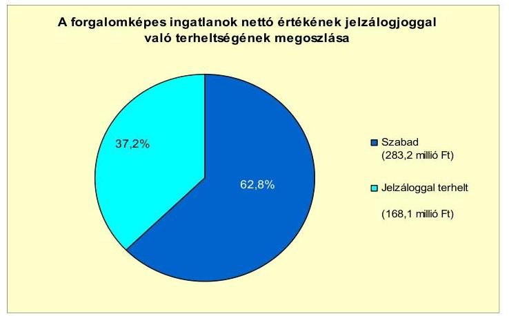

Az Önkormányzat egy folyamatban levő peres eljárásban érintett alperesként. A perérték 622,8 millió Ft, a per tárgya Pári Községi Önkormányzat és az Önkormányzat közti vagyon megosztása. A perben jogerős bírósági döntés még nem született, negatív kimenetele az Önkormányzat pénzügyi egyensúlya szempontjából kockázatot jelent.

A vizsgált időszakban PPP konstrukció keretében nem valósítottak meg fejlesztést, követelést nem engedtek el.

Az Önkormányzat kettő gazdasági társaságban kizárólagos tulajdoni részesedéssel rendelkezett.

Az Önkormányzat kizárólagos tulajdoni hányaddal rendelkező gazdasági társaságai kötelezettségeinek állományát 2010. december 31-én, 2011. június 30án, valamint várható alakulását a fennálló kötelezettségek lejártáig a következő táblázat mutatja be:

| Megnevezés | Állomány 2010. december 31-   én |  |  | Állomány 2011. június 30-án |  |  | Várható   kötelezettség 2011-   2013. években |  |
| :--: | :--: | :--: | :--: | :--: | :--: | :--: | :--: | :--: |
|  | HUF-ban   (millió Ft-   ban) | Devizában   (összege,   ezer ...-   ben) | Deviza   nem | HUF-ban   (millió Ft-   ban) | Devizában   (összege,   ezer ...-   ben) | Deviza   nem | HUF-ban   (millió Ft-   ban) | Devizában   (összege,   ezer ...-   ben) |
| Pénzintézetekkel szembeni kötelezettségek: |  |  |  |  |  |  |  |  |
| Rövid lejáratú hitelek: | 58,1 |  |  | 53,9 |  |  | 53,9 |  |
| Hosszú lejáratú hitelek : | 1,3 |  |  | 1,2 |  |  | 1,2 |  |
| Pénzintézetekkel szembeni kötelezettségek összesen HUF-ban: | 59,4 |  |  | 55,1 |  |  | 55,1 |  |
| Lízing kötelezettségek: |  | 3,8 | CHF |  | 0,0 | CHF |  | 0,0 |
| Szállítói tartozás: | 24,1 |  |  | 14,9 |  |  | 14,9 |  |

A gazdasági társaságok 2011. június 30-án forintban fennálló pénzintézetekkel szembeni kötelezettsége a Városüzemeltető Kft. tartóssá vált folyószámlahiteléből, rövid lejáratú hitelből és az Innovációs Központ Kft. gépjármű vásárláshoz igénybevett hosszú lejáratú hiteléből adódott. A rövid és hosszú lejáratú hitelek 2013. évben járnak le. Az Innovációs Központ Kft. folyószámlahitel állománnyal 2010. december 30-án és 2011. június 30-án nem rendelkezett.

---

A Városüzemeltető Kft. lízingdíj tartozása a 2010. december 31-én 3777,2 CHF, amely a városüzemeltetéshez használt gépek beszerzéséből adódott. Az utolsó törlesztést 2011. év I. félévben kifizették.

A Városüzemeltető Kft. szállítókkal szemben fennálló kötelezettségeinek állománya a 2007-2009. évek átlagához képest 1,6-szorosára, 8,9 millió Ft-ról a 2010. év végére 21,2 millió Ft-ra, 2011. év I. félévre 14,3 millió Ft-ra nőtt. A lejárt szállító tartozások állományának három évi átlaga 6,1 millió Ft-ról a 2010. évben háromszorosára (327,9\%-ra) 20,0 millió Ft-ra, a 2011. I. félévben 8,9 millió Ft-ra nőtt. A szállítói tartozás növekedését likviditási problémák okozták.

A gazdasági társaságok 2011-2013. években várható pénzintézeti kötelezettsége 55,1 millió Ft, amely kötelezettség nem teljesítése hatással lehet az Önkormányzat likviditására, pénzügyi egyensúlyi helyzetére és az Önkormányzat számára korlátlan felelőssége miatt kockázatot jelent.

Az Önkormányzat a gazdasági társaságokról szóló 2006. évi IV. törvény 54. § (2) bekezdése alapján korlátlan felelősséggel tartozik azon gazdasági társaságának felszámolása esetében, amelyben az Önkormányzat az 52. § (2) bekezdése szerint a szavazatok legalább 75\%-ával rendelkezik, így minősített befolyásszerzőnek minősül, továbbá a csődeljárásról és a felszámolási eljárásról szóló 1991. évi XLIX. törvény 63. § (2) bekezdése alapján a kizárólagos önkormányzati tulajdonú gazdasági társaságának minden olyan kötelezettségéért, amelynek kielégítését a felszámolási eljárás során az adós társaság vagyona nem fedez, ha a hitelezőinek a felszámolási eljárás során benyújtott keresete alapján a bíróság - az adós társaság felé érvényesített tartósan hátrányos üzletpolitikájára figyelemmel - megállapítja az Önkormányzat korlátlan és teljes felelősségét.

A 2007-2010. években a befektetett eszközök után a számvitelben összesen 452,1 millió Ft összegű értékcsökkenést számoltak el. A vizsgált időszakban az Önkormányzatnál nem történt meg annak felmérése, hogy az eszközök elhasználódása, amortizációja fedezetének biztosítása mekkora forrásokat igényel. Az elszámolt értékcsökkenésekből az eszközök pótlására külön alapot nem képeztek ${ }^{38}$, a felújításokat, fejlesztéseket hazai és EU-s támogatásokból, hitelekből, kötvénykibocsátásból, saját bevételből valósították meg. A vizsgált években felújítási és fejlesztési feladatokra az elszámolt értékcsökkenés több, mint ötszörösét (561,7\%), 2539,5 millió Ft-ot költöttek ${ }^{39}$, amelyből az eszközpótlásra fordított összeg 165,9 millió Ft volt. A megvalósított felújítások és felhalmozási feladatok az eszközök használhatóságát javították. Az eszközök használhatósági foka a felújítások, és felhalmozási kiadások elszámolt értékcsökkenést meghaladó mértéke ellenére folyamatosan a 2007. évi 82,7\%-ról a 2010. évben 78,9\%-ra csökkent. A csökkenés oka, hogy a 2008-2009. években megkezdett három beruházás - iskola, gyógyfürdő, járó beteg szakellátó - aktiválása a műszaki átadás hiányában a 2010. évben még nem történt meg.

[^0]
[^0]:    ${ }^{38}$ A hatályos jogszabályok nem kötelezik az önkormányzatokat arra, hogy eszközpótlásra alapot képezzenek.
    ${ }^{39}$ áfa nélkül

---

# 4. A PÉNZÜGYI EGYENSÚLY MEGTEREMTÉSE ÉRDEKÉBEN HOZOTT INTÉZKEDÉSEK EREDMÉNYE 

Az Önkormányzat 2006-2010. évekre vonatkozó gazdasági programjában általános feladatként határozta meg, hogy „a Képviselő-testületnek munkája során mindig törekednie kell arra, hogy a város pénzügyi egyensúlya stabil legyen. A kiadásokat az ésszerűség határáig csökkenteni kell, a bevételek növeléséhez pedig a helyi erőforrásokra és a pályázatokon elnyerhető összegekre kell támaszkodni." A kiadáscsökkentő és bevételnövelő intézkedések megtételéről költségvetési rendeletekben, egyedi határozatokban döntöttek, az intézkedések a pénzügyi helyzet javítását célozták.

A 2007-2011. év I. félév kiadáscsökkentő intézkedéseinek területeit a következő ábra szemlélteti:
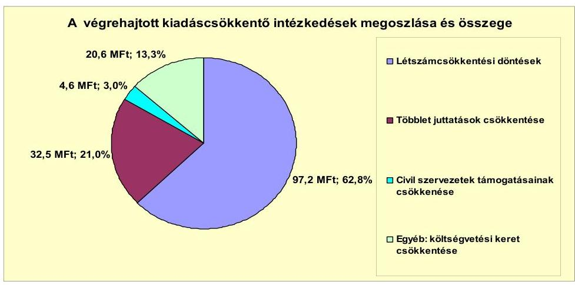

A kiadáscsökkentő intézkedések hatásaként 154,9 millió Ft megtakarítást mutatott ki az Önkormányzat az általa készített adatszolgáltatás szerint a 2007-2011. év I. félév közötti időszakban.

A megtakarítást eredményező kiadáscsökkentő intézkedések során feladat megszűnés, átszervezés, határozott idejű alkalmazás megszüntetése következtében összesen kilenc fővel - 2007-ben a Polgármesteri hivatalban öt fővel, 2008-ban az oktatási intézményekben négy fővel - csökkent a létszám. A létszámcsökkentések osztályvezetői, pedagógus, gépkocsivezetői, kisegítő és közmunka-irányító munkaköröket érintettek. A vizsgált időszakban elért megtakarítás 97,2 millió Ft volt.

A többletjuttatások körében az étkezési utalványok megvonásával és a Polgármesteri hivatal köztisztviselői teljesítményösztönzésére tervezett céljuttatás, a civil szervezetek támogatásának, valamint a költségvetési szervek működési kiadásainak 10,0\%-os csökkentésével értek el összesen 57,7 millió Ft-os megtakarítást.

A 2007. és a 2010. éveket érintő önkormányzati létszám és álláshely változását, az alábbi táblázat részletezi:

---

| Megnevezés (adatok fő-ben) |  | Közoktatás | Szociális és gyermekvédelem | Egészségügy | Polgármesteri hivatal | Egyéb | Összesen |
| :--: | :--: | :--: | :--: | :--: | :--: | :--: | :--: |
| 2007. január 1-jén jóváhagyott álláshelyek száma |  | 158 | 5 | 8 | 60 | 35 | 264 |
| Megszüntetett álláshelyek száma |  | 114 | 0 | 1 | 9 | 11 | 135 |
| 2008. 1.jena álláshelyek száma |  | 0 | 0 | 0 | 0 | 0 | 0 |
|  | (szakma) álláshelyek száma | 61 | 0 | 0 | 1 | 0 | 62 |
|  | intézmény-üzemeltetéssel kapcsolatos   (álláshelyek száma | 33 | 0 | 1 | 6 | 11 | 53 |
| Adáshely növekedése |  | 214 | 3 | 0 | 5 | 0 | 222 |
| 2010. december 31-én záró álláshelyek száma |  | 206 | 8 | 5 | 38 | 24 | 201 |
| 2007. január 1-jén foglalkoztatott létszám |  | 158 | 5 | 6 | 60 | 35 | 264 |
| Látszámcsökkentés |  | 114 | 0 | 1 | 9 | 11 | 135 |
| Látszámnövekedés |  | 214 | 3 | 0 | 5 | 0 | 222 |
| 2010. december 31-én foglalkoztatott létszám |  | 206 | 8 | 5 | 38 | 24 | 201 |

Az Önkormányzatnál az engedélyezett álláshelyek száma és a munkavégzésre irányuló jogviszonyban lévők száma (foglalkoztatott létszám) a vizsgált időszakban megegyezett, üres álláshely nem volt. A 2007. január 1-jei 264 álláshely, (és a foglalkoztatott létszám) 87 fővel (33,0\%-kal), a 2010. év végére 351 főre nőtt, amely kiadás növekedést ${ }^{40}$ okozott, azonban az állami támogatás és az önkormányzatok által átadott pénzeszközök ezt finanszírozták. A változást a közoktatási intézményeknél és a Polgármesteri hivatalnál végrehajtott átszervezés, feladatbővülés, és a feladatmegszüntetéssel járó álláshely, létszámcsökkenés együttes hatása okozta. A megszüntetett álláshelyek száma (és foglalkoztatott létszám csökkenése) 135 fő, amelyből a szakmai álláshelyek száma 82 fő, az intézmény üzemeltetéssel kapcsolatos álláshelyek száma 53 fő volt, az engedélyezett álláshelyek bővülése (és a foglalkoztatottak létszámának növekedése) 222 fő volt.

A 2007. évben az Óvodai társulás és Iskolai társulás székhelyének átvétele, és a GESZ megszüntetése a közoktatásban 197 fő (190 fő társulásoktól és hét fő a megszűnt GESZ-ből) létszámnövekedést jelentett. A 2008. évben a Közoktatási társulás megalakítása miatt további négy fővel bővült a közoktatás létszáma (a Polgármesteri hivatalhoz 2007-ben a GESZ-ből áthelyezett dolgozókkal). A 20082010. években a gyereklétszám növekedése és új művészeti ágak bevezetése miatt 13 fővel nőtt a létszám.

A bölcsődében a gyereklétszám emelkedése tette szükségessé a 2007. évi három fős létszámbővítést.

A Polgármesteri hivatalban 2007-től egy fő polgármesteri tanácsadó állás betöltésével, és a GESZ-től áthelyezett négy fő révén öt fővel bővült a létszám.

A 2007-2010. években a kiadáscsökkentő intézkedések mellett ${ }^{41}$ olyan - összesen 126 főt érintő - feladat átszervezéssel és megszüntetéssel járó álláshely és létszámcsökkentést is végrehajtottak, amely megtakarítást nem eredményezett.

A 2007. évben a GESZ megszüntetésével az alkalmazott 11 főt a Polgármesteri hivatalban (négy fő), és a közoktatási intézményeknél (hét fő) foglalkoztatták tovább. A 2008. évben a Polgármesteri hivatalhoz helyezett négy főt a közoktatási ágazatba helyezték át.

[^0]
[^0]:    ${ }^{40}$ az Önkormányzat adatszolgáltatása nem számszerűsítette
    ${ }^{41}$ amely kilenc főt érintett

---

A 2008. évben a közoktatási ágazatban a szakképző iskola megyei önkormányzatnak történő átadásával 110 fő álláshelyét szüntették meg. A feladat átadásával az Önkormányzatnál tényleges megtakarítás az önkormányzati saját forrást nem igénylő finanszírozás miatt nem jelentkezett. Az átadást a TISZK létrehozása indokolta.

Az egészségügyi ágazatban a 2010. évben egy fő takarítói állást megszüntettek, megtakarítás az Országos Egészségbiztosítási Pénztár finanszírozása miatt nem keletkezett.

Az összes kiadáscsökkentő intézkedésből az önként vállalt feladat ellátásához a civilszervezeteknek átadott támogatások csökkentése kapcsolódott, amely a kimutatott megtakarítások 3,0\%-a (4,7 millió Ft) volt.

A helyi szervezési intézkedések végrehajtásához a 2007-2010. években az Önkormányzat 17,3 millió Ft központi költségvetési támogatásban részesült, amelynek felhasználásával nyolc fő létszámot épített le tartósan.

A kiadáscsökkentő intézkedések mellett az Önkormányzat a 2007-2011. év I. félév időszakában, kimutatásai szerint bevételnövelő intézkedéseket is tett, amelyek hatását az alábbi ábra tartalmazza:
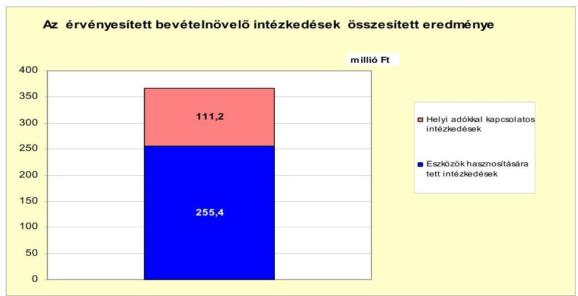

Az Önkormányzat adatszolgáltatása szerint bevételnövelő intézkedések összesen 366,6 millió Ft bevételi többletet eredményeztek a 2007-2011. év I. félévben, amelynek 30,3\%-a a helyi adókkal kapcsolatos intézkedések, 69,7\%-a az eszközök hasznosításának eredményeként keletkezett.

Az Önkormányzat a 2007-2011. év I. félévéig az adó mértékének emeléséből 0,8 millió Ft, adómentesség megszüntetéséből 0,7 millió Ft, adóhátralékok behajtásából 109,7 millió Ft többletbevételt realizált.

A Képviselő-testület 2011. január 1-jei hatállyal 50 Ft/m²-el felemelte az idegenforgalmi adó mértékét, és megszüntette a 70 év felettiek adómentességét. A javuló behajtási munka hatására az adóhátralékokból befolyt adóbevétel 2007-ről (13,2 millió Ft) 2010-re (47,6 millió Ft) 3,6-szorosra emelkedett.

Az eszközök hasznosítására tett intézkedésekkel eszközök értékesítéséből 246,7 millió Ft, bérbeadásból 8,7 millió Ft többletbevételt értek el.

---

Az értékesítésekből származó többletbevétel lakótelkek, ipar és üdülő területek, egyéb földterület, lakások eladásából tevődött össze. A bérbeadásból befolyt többlet bevétel hirdető felület, üzlethelyiség és földterület bérleti díjának emeléséből, valamint kemping hasznosításából adódott.

Az intézményi térítési díjak emelése a kalkulált nyersanyagköltség emelkedésével azonos mértékben történt, ezért a vizsgált időszak alatt az Önkormányzat számára jövedelmet nem eredményezett.

Az Önkormányzat költségvetési támogatásból, és szja-ból származó bevételei együttesen a 2007. évhez képest a 2008-2011. év I. félévében összességében 872,8 millió Ft-tal növekedtek. A kiadáscsökkentő és bevételnövelő intézkedések a vizsgált időszakban pozitív hatással voltak a pénzügyi egyensúlyra, azonban nem biztosítottak elegendő forrást a pénzügyi egyensúly helyreállításhoz. Az Önkormányzat adatszolgáltatásai szerint a - közoktatási intézményfenntartó társulás átszervezése miatti - központi támogatásokat a kiadási megtakarítások és bevételnövelő intézkedések eredményeképpen további 521,3 millió Ft-tal tudták növelni.

# 5. Az ÁSZ Által a korábbi években a pénzügyi egyensúly javítására tett szabályszerűségi és célszerűségi javaslatok hasznosulása 

Az ÁSZ az Önkormányzat gazdálkodási rendszerét a 2009. évben ellenőrizte, amelynek során a pénzügyi egyensúly javítására négy szabályszerűségi és kettő célszerűségi javaslatot tett. A javaslatok a likviditási terv készítésére és szükség szerinti aktualizálására, a több éves kihatással járó döntések és az európai uniós feladatok előirányzatainak, bevételeinek és kiadásainak költségvetési rendeletben való rögzítésére, a költségvetési és a zárszámadás készítési folyamatok szabályozottságára, a hosszúlejáratú kötelezettségek finanszírozási feltételeinek évenkénti bemutatására, valamint intézkedési terv készítésére vonatkoztak. A javaslatok megvalósítása érdekében intézkedési tervet készítettek, amely a felelősöket és határidőket is tartalmazta. A javaslatok közül négyet hasznosítottak, kettőt nem hajtottak végre. Az Ámr. 201. § (1) bekezdésében ${ }^{42}$ szabályozottak ellenére a vizsgált időszakban nem készítettek likviditási tervet, továbbá évente végzett számítások alapján nem történt tájékoztatás arról, hogy az adósságot keletkeztető hosszúlejáratú kötelezettségvállalásokat milyen feltételek biztosítása mellett tudják teljesíteni.

Budapest, 2012. április 16.

Melléklet: $\quad 7 \mathrm{db}$
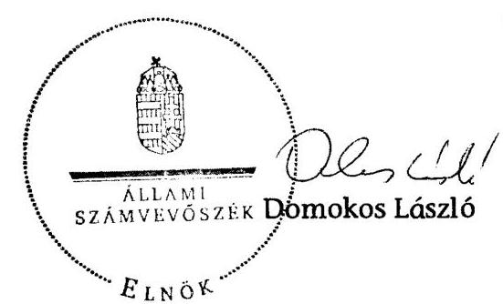

[^0]
[^0]:    ${ }^{42}$ 2012. január 1-jétől a likviditási terv készítési kötelezettséget az Áht. 78. § (2) bekezdése tartalmazza.

---

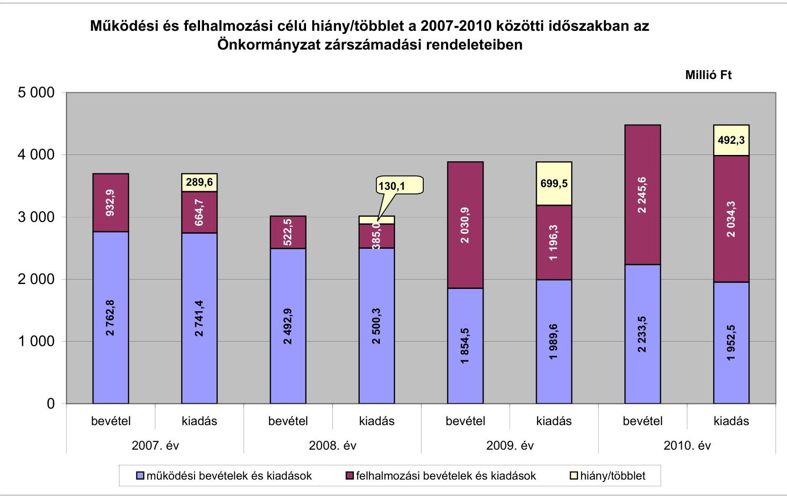

# Működési és felhalmozási célú hiány/többlet a 2007-2010 közötti időszakban az Önkormányzat zárszámadási rendeleteiben

|  Málló Ft | 2007. év | 2008. év | 2009. év | 2010. év  |
| --- | --- | --- | --- | --- |
|  5 000 | 4 000 | 3 000 | 2 762.8 | 1 900.0  |
|  4 000 | 3 000 | 2 741.4 | 1 854.5 | 1 100.1  |
|  3 000 | 2 762.8 | 1 854.5 | 1 100.1 | 1 100.1  |
|  2 000 | 1 000 | 999.5 | 699.5 | 699.5  |
|  0 | 0 | 0 | 0 | 0  |
|  bevétel | kiadás | bevétel | kiadás | bevétel  |
|  2007. év | 2008. év | 2009. év | 2010. év | 2010. év  |
|  működési bevételek és kiadások | felhalmozási bevételek és kiadások | hiány/többlet |  |   |

---

Az Önkormányzat bevételei és kiadásai, valamint adósságszolgálata 2007-2010 között

|  1. FOLYÓ KÖLTSÉGVETÉS* | 2007. év | 2008. év | 2009. év  |
| --- | --- | --- | --- |
|  1.1.1. Saját működési bevételek | 420,3 | 411,3 | 503,6  |
|  1.1.2. Költségvetési támogatás | 584,0 | 1351,1 | 915,8  |
|  1.1.3. Átengedett bevételek | 489,7 | 339,6 | 284,0  |
|  1.1.4. Állambáztartáson belülről kapott támogatások | 640,3 | 222,4 | 212,2  |
|  1.1.5. EU-tól és külföldről kapott bevételek | 0,3 | 0,0 | 0,2  |
|  1.1.6. Állambáztartáson kívülről kapott bevételek | 19,4 | 29,4 | 1,9  |
|  1.1.7. Előző (évi) pénzmaradvány átvétel | 78,6 | 58,6 | 38,8  |
|  1.1. Folyó bevételek $+1.1 .1 .+1.1 .2 .+1.1 .3 .+1.1 .4 .+1.1 .5 .+1.1 .6 .+1.1 .7$. | 2232,6 | 2412,4 | 1964,6  |
|  1.2.1. Működési kiadások kamatkiadások nélkül | 2003,0 | 2046,1 | 1777,5  |
|  1.2.2. Állambáztartáson belülre átadott pénzeszközök | 96,2 | 237,5 | 23,7  |
|  1.2.3.1. vállalkozásoknak | 5,5 | 9,4 | 5,8  |
|  1.2.3.2. EU-nak, illetve külföldre | 0,0 | 0,0 | 0,0  |
|  1.2.3.3. magánszemélyeknek | 88,5 | 91,9 | 105,2  |
|  1.2.3.4. nonprofit szervezeteknek | 25,0 | 21,4 | 17,9  |
|  1.2.3. Transferkiadások ( $+1.2 .3 .1+1.2 .3 .2+1.2 .3 .3+1.2 .3 .4$. ) | 119,0 | 122,7 | 132,9  |
|  1.2.4 Kamatkiadások | 27,3 | 43,9 | 51,0  |
|  1.2.5. Előző (évi) pénzmaradvány átadás | 78,6 | 58,6 | 38,8  |
|  1.2. Folyó kiadások $+1.2 .1 .+1.2 .2 .+1.2 .3 .+1.2 .4 .+1.2 .5$. | 2324,1 | 2508,8 | 2023,9  |
|  1.3. Folyó költségvetés egyenlege MŰKÖDÉSI JÖVEDELEM (1.1. - 1.2.) | $-91,5$ | $-96,4$ | $-59,3$  |
|  2. FELHALMOZÁSI KÖLTSÉGVETÉS** | 0,0 | 0,0 | 0,0  |
|  2.1.1. Saját tőkebevételek | 16,3 | 80,0 | 54,8  |
|  2.1.2. Állambáztartáson belülről kapott támogatások | 306,5 | 132,4 | 689,9  |
|  2.1.3. EU-tól és külföldről kapott támogatások | 0,0 | 0,0 | 0,0  |
|  2.1.4. Állambáztartáson kívülről kapott támogatások | 67,0 | 27,0 | 13,6  |
|  2.1. Felhalmozási bevételek ( $+2.1 .1 .+2.1 .2+2.1 .3+2.1 .4$. ) | 389,8 | 239,4 | 758,3  |
|  2.2.1. Saját beruházási kiadás állával | 408,7 | 235,4 | 844,8  |
|  2.2.2. Saját felújítási kiadás állával | 166,2 | 28,2 | 15,7  |
|  2.2.3. Állambáztartáson belülre átadott pénzeszköz | 0,0 | 32,4 | 30,0  |
|  2.2.4. EU-nak és külföldnek adott pénzeszközök | 0,0 | 0,0 | 0,0  |
|  2.2.5. Állambáztartáson kívülre adott pénzeszközök | 35,6 | 25,3 | 43,2  |
|  2.2.6. Befektetési célú részesedések vásárlása | 40,0 | 0,5 | 0,0  |
|  2.2. Felhalmozási kiadások ( $+2.2 .1 .+2.2 .2 .+2.2 .3 .+2.2 .4 .+2.2 .5 .+2.2 .6$. ) | 650,5 | 321,7 | 933,6  |
|  2.3. Felhalmozási költségvetés egyenlege (2.1. - 2.2.) | $-260,7$ | $-82,3$ | $-175,4$  |
|  3. Finanszírozási műveletek nélküli (GFS) pozíció(1.3.+2.3.) | $-352,2$ | $-178,7$ | $-234,7$  |
|  4. Finanszírozási műveletek | 0,0 | 0,0 | 0,0  |
|  4.1. Hitelfelvétel | 475,1 | 87,4 | 52,1  |
|  4.2. Hiteltörlesztés | 431,5 | 54,8 | 228,3  |
|  4.3. Forgatási és befektetési célú értékpapírok kibocsátása | 500,0 | 0,0 | 1000,0  |
|  4.4. Forgatási és befektetési célú értékpapírok beváltása | 0,0 | 0,0 | 0,0  |
|  4.5. Forgatási és befektetési célú értékpapírok értékesítése | 0,0 | 0,0 | 0,0  |
|  4.6. Forgatási és befektetési célú értékpapírok vásárlása | 0,0 | 0,0 | 0,0  |
|  4.7. Egyéb finanszírozási bevételek (függő, átfutó, kiegyenlítő) | 26,7 | $-20,7$ | 35,7  |
|  4.8. Egyéb finanszírozási kiadások (függő, átfutó, kiegyenlítő) | 2,7 | 41,4 | 3,2  |
|  4.9.Finanszírozási műveletek egyenlege (4.1. - 4.2.+4.3.-4.4+4.5.-4.6.+4.7.-4.8.) | 567,6 | $-29,6$ | 856,4  |
|  5. Tárgyévi pénzügyi pozíció (1.3.+ 2.3.+ 4.9.) | 215,4 | $-208,3$ | 621,7  |
|  6. Nettó működési jövedelem =működési jövedelem (1.3.) - tőketörlesztés (4.2+4.4) | $-523,0$ | $-151,2$ | $-287,6$  |
|  TÁJÉKOZTATÓ ADÁTOK |  |  |   |
|  Összes kötelezettség | 1073,1 | 1210,8 | 2415,0  |
|  ebből rövid lejáratú | 322,8 | 363,5 | 689,6  |
|  Összes szállítói kötelezettség | 111,0 | 106,9 | 421,5  |
|  ebből lejárt (tanúsítványból) | 94,0 | 94,0 | 307,7  |
|  Pénz és tőkepiaci kötelezettség (adósság) | 945,3 | 1071,6 | 1917,1  |
|  ebből rövid lejáratú | 195,0 | 228,5 | 191,9  |
|  PPP szerződéses állomány jelenértéken (tanúsítványból) | 0,0 | 0,0 | 0,0  |
|  ebből lejárt szolgáltatási díj miatti kötelezettség | 0,0 | 0,0 | 0,0  |
|  Folyószámlálótól napi átlagos állománya (tanúsítványból) | 100,2 | 112,6 | 172,8  |
|  Likvidületi napi átlagos állománya (tanúsítványból) | 107,4 | 4,6 | 65,8  |
|  Munkahézületi napi átlagos állománya (tanúsítványból) | 23,2 | 0,0 | 0,0  |
|  Kezesség és garanciavállalások (tanúsítványból) | 0,0 | 0,0 | 40,0  |
|  Jogerős bírósági ítéletekből adódó kötelezettségek (tanúsítványból) | 0,0 | 0,0 | 0,0  |
|  Finanszírozásba bevonható eszközök: | 292,2 | 84,0 | 705,7  |
|  Tartós hitelviszonyi megtestesítő értékpapírok és végi állománya | 0,0 | 0,0 | 0,0  |
|  Hosszú lejáratú bankbetétek és végi állománya | 32,3 | 26,4 | 0,0  |
|  Értékpapírok és végi állománya | 0,0 | 0,0 | 0,0  |
|  Pénzeszközök (idegen pénzeszközök nélküli) és végi állomány: | 259,8 | 57,6 | 705,7  |

[^0] [^0]: * Bevételekben nem tétel, a kiadásokban nem jelenik meg az amortizáció, a vagyoni helyzetet az egyenleg befolyásolja ** Bevételekben vagyon megőrzésre és bővítésre fordítható források. A költségvetési támogatások köréből ki lettek véve a felhalmozási célú bevételek és azok a 2.1.2. pontba kerültek.

---

|   |  |  |  |  |  |  |  |  |  |  |  |  |  |  |  |  |  |  |  |  |  |  |  |  |  |  |  |  |  |  |  |  |  |  |  |  |  |  |  |  |  |  |  |  |  |  |   |
| --- | --- | --- | --- | --- | --- | --- | --- | --- | --- | --- | --- | --- | --- | --- | --- | --- | --- | --- | --- | --- | --- | --- | --- | --- | --- | --- | --- | --- | --- | --- | --- | --- | --- | --- | --- | --- | --- | --- | --- | --- | --- | --- | --- | --- | --- | --- | --- |
|   |  |  |  |  |  |  |  |  |  |  |  |  |  |  |  |  |  |  |  |  |  |  |  |  |  |  |  |  |  |  |  |  |  |  |  |  |  |  |  |  |  |  |  |  |  |   |
|   |  |  |  |  |  |  |  |  |  |  |  |  |  |  |  |  |  |  |  |  |  |  |  |  |  |  |  |  |  |  |  |  |  |  |  |  |  |  |  |  |  |
 | | | | |
| | | | | | | | | | | | | | | | | | | | | | | | | | | | | | | | | | | | | | | | | | | | | | | |
| | | | | | | | | | | | | | | | | | | | | | | | | | | | | | | | | | | | | | | | | | | | | | | |
| | | | | | | | | | | | | | | | | | | | | | | | | | | | | | | | | | | | | | | | | | | | | | | |
| | | | | | | | | | | | | | | | | | | | | | | | | | | | | | | | | | | | | | | | | | | | | | | |
| | | | | | | | | | | | | | | | | | | | | | | | | | | | | | | | | | | | | | | | | | | | | | | |
| | | | | | | | | | | | | | | | | | | | | | | | | | | | | | | | | | | | | | | | | | | | | | | |
| | | | | | | | | | | | | | | | | | | | | | | | | | | | | | | | | | | | | | | | | | | | | | | |
| | | | | | | | | | | | | | | | | | | | | | | | | | | | | | | | | | | | | | | | | | | | | | | |
| | | | | | | | | | | | | | | | | | | | | | | | | | | | | | | | | | | | | | | | | | | | | | | |
| | | | | | | | | | | | | | | | | | | | | | | | | | | | | | | | | | | | | | | | | | | | | | | |
| | | | | | | | | | | | | | | | | | | | | | | | | | | | | | | | | | | | | | | | | | | | | | | |
| | | | | | | | | | | | | | | | | | | | | | | | | | | | | | | | | | | | | | | | | | | | | | | |
| | | | | | | | | | | | | | | | | | | | | | | | | | | | | | | | | | | | | | | | | | | | | | | |
| | | | | | | | | | | | | | | | | | | | | | | | | | | | | | | | | | | | | | | | | | | | | | | |
| | | | | | | | | | | | | | | | | | | | | | | | | | | | | | | | | | | | | | | | | | | | | | | |
| | | | | | | | | | | | | | | | | | | | | | | | | | | | | | | | | | | | | | | | | | | | | | | | |   |  |  |  |  |  |  |  |  |  |  |  |  |  |  |  |  |  |  |   |
|---|---|---|---|---|---|---|---|---|---|---|---|---|---|---|---|---|---|---|---|
|   |  |  |  |  |  |  |  |  |  |  |  |  |  |  |  |  |  |  |  |  |  |  |  |  |  |  |  |  |  |  |  |  |  |  |  |  |  |  |  |  |  |  |  |  |  |   |
|   |  |  |  |  |  |  |  |  |  |  |  |  |  |  |  |  |  |  |  |  |  |  |  |  |  |  |  |  |  |  |  |  |  |  |  |  |  |  |  |  |  |  |  |  |  |   |
|   |  |  |  |  |  |  |  |  |  |  |  |  |  |  |  |  |  |  |  |  |  |  |  |  |  |  |  |  |  |  |  |  |  |  |  |  |  |  |  |  |  |  |  |  |  |   |
|   |  |  |  |  |  |  |  |  |  |  |  |  |  |  |  |  |  |  |  |  |  |  |  |  |  |  |  |  |  |  |  |  |  |  |  |  |  |  |  |  |  |  |  |  |  |   |
|   |  |  |  |  |  |  |  |  |  |  |  |  |  |  |  |  |  |  |  |  |  |  |  |  |  |  |  |  |  |  |  |  |  |  |  |  |  |  |  |  |  |  |  |  |  |   |
|   |  |  |  |  |  |  |  |  |  |  |  |  |  |  |  |  |  |  |  |  |  |  |  |  |  |  |  |  |  |  |  |  |  |  |  |  |  |  |  |  |  |  |  |  |  |   |
|   |  |  |  |  |  |  |  |  |  |  |  |  |  |  |  |  |  |  |  |  |  |  |  |  |  |  |  |  |  |  |  |  |  |  |  |  |  |  |  |  |  |  |  |  |  |   |
|   |  |  |  |  |  |  |  |  |  |  |  |  |  |  |  |  |  |  |  |  |  |  |  |  |  |  |  |  |  |  |  |  |  |  |  |  |  |  |  |  |  |  |  |  |  |   |
|   |  |  |  |  |  |  |  |  |  |  |  |  |  |  |  |  |  |  |  |  |  |  |  |  |  |  |  |  |  |  |  |  |  |  |  |  |  |  |  |  |  |  |  |  |  |   |
|   |  |  |  |  |  |  |  |  |  |  |  |  |  |  |  |  |  |  |  |  |  |  |  |  |  |  |  |  |  |  |  |  |  |  |  |  |  |  |  |  |  |  |  |  |  |   |
|   |  |  |  |  |  |  |  |  |  |  |  |  |  |  |  |  |  |  |  |  |  |  |  |  |  |  |  |  |  |  |  |  |  |  |  |  |  |  |  |  |  |  |  |  |  |   |
|   |

---

|   |  |  |  |  |  |  |  |  |  |  |  |  |  |  |  |  |  |  |  |  |  |  |  |  |  |  |  |  |  |  |  |  |  |  |  |  |  |  |  |  |  |  |  |  |  |  |  |  |  |  |  |   |
|---|---|---|---|---|---|---|---|---|---|---|---|---|---|---|---|---|---|---|---|---|---|---|---|---|---|---|---|---|---|---|---|---|---|---|---|---|---|---|---|---|---|---|---|---|---|---|---|---|---|---|---|---|
|   |  |  |  |  |  |  |  |  |  |  |  |  |  |  |  |  |  |  |  |  |  |  |  |  |  |  |  |  |  |  |  |  |  |  |  |  |  |  |  |  |  |  |  |  |  |  |  |  |  |  |  |   |
|   |  |  |  |  |  |  |  |  |  |  |  |  |  |  |  |  |  |  |  |  |  |  |  |  |  |  |  |  |  |  |  |  |  |  |  |  |
 | | | | | | | | | | | | | | | |
| | | | | | | | | | | | | | | | | | | | | | | | | | | | | | | | | | | | | | | | | | | | | | | | | | | | | |
| | | | | | | | | | | | | | | | | | | | | | | | | | | | | | | | | | | | | | | | | | | | | | | | | | | | | |
| | | | | | | | | | | | | | | | | | | | | | | | | | | | | | | | | | | | | | | | | | | | | | | | | | | | | |
| | | | | | | | | | | | | | | | | | | | | | | | | | | | | | | | | | | | | | | | | | | | | | | | | | | | | |
| | | | | | | | | | | | | | | | | | | | | | | | | | | | | | | | | | | | | | | | | | | | | | | | | | | | | |
| | | | | | | | | | | | | | | | | | | | | | | | | | | | | | | | | | | | | | | | | | | | | | | | | | | | | |
| | | | | | | | | | | | | | | | | | | | | | | | | | | | | | | | | | | | | | | | | | | | | | | | | | | | | |
| | | | | | | | | | | | | | | | | | | | | | | | | | | | | | | | | | | | | | | | | | | | | | | | | | | | | |
| | | | | | | | | | | | | | | | | | | | | | | | | | | | | | | | | | | | | | | | | | | | | | | | | | | | | |
| | | | | | | | | | | | | | | | | | | | | | | | | | | | | | | | | | | | | | | | | | | | | | | | | | | | | |
| | | | | | | | | | | | | | | | | | | | | | | | | | | | | | | | | | | | | | | | | | | | | | | | | | | | | |
| | | | | | | | | | | | | | | | | | | | | | | | | | | | | | | | | | | | | | | | | | | | | | | | | | | | | |
| | | | | | | | | | | | | | | | | | | | | | | | | | | | | | | | | | | | | | | | | | | | | | | | | | | | | |
| | | | | | | | | | | | | | | | | | | | | | | | | | | | | | | | | | | | | | | | | | | | | | | | | | | | | |
| | | | | | | | | | | | | | | | | | | | | | | | | | | | | | | | | | | | | | | | | | | | | | | | | | | | | | | | | | | | | | | | | | | | | | | | | | | | | | | |
| | | | | | | | | | | | | | | | | | | | | | | | | | | | | | | | | | | | | | | | | | | | | | | | | | | | |
| | | | | | | | | | | | | | | | | | | | | | | | | | | | | | | | | | | | | | | | | | | | | | | | | | | | |
| | | | | | | | | | | | | | | | | | | | | | | | | | | | | | | | | | | | | | | | | | | | | | | | | | | | |
| | | | | | | | | | | | | | | | | | | | | | | | | | | | | | | | | | | | | | | | | | | | | | | | | | | | |
| | | | | | | | | | | | | | | | | | | | | | | | | | | | | | | | | | | | | | | | | | | | | | | | | | | | |
| | | | | | | | | | | | | | | | | | | | | | | | | | | | | | | | | | | | | | | | | | | | | | | | | | | | |
| | | | | | | | | | | | | | | | | | | | | | | | | | | | | | | | | | | | | | | | | | | | | | | | | | | | |
| | | | | | | | | | | | | | | | | | | | | | | | | | | | | | | | | | | | | | | | | | | | | | | | | | | | |
| | | | | | | | | | | | | | | | | | | | | | | | | | | | | | | | | | | | | | | | | | | | | | | | | | | | |
| | | | | | | | | | | | | | | | | | | | | | | | | | | | | | | | | | | | | | | | | | | | | | | | | | | | |
| | | | | | | | | | | | | | | | | | | | | | | | | | | | | | | | | | | | | | | | | | | | | | | | | | | | |
| | | | | | | | | | | | | | | | | | | | | | | | | | | | | | | | | | | | | | | | | | | | | | | | | | | | |
| | | | | | | | | | | | | | | | | | | | | | | | | | | | | | | | | | | | | | | | | | | | | | | | | | | | |
| | | | | | | | | | | | | | | | | | | | | | | | | | | | | | | | | | | | | | | | | | | | | | | | | | | | |
| |

---

# 2010. december 31-én fennálló kötelezettségek és azok forrásbaazatétele

| | | | | | | | | | | | |  |  |  |  |  |  |  |  |  |  |  |  |  |  |  |  |  |  |  |  |  |  |  |  |  |  |  |  |  |  |  |  |  |  |  |  |  |  |  |  |  |  |  |  |  |  |  |  |  |  |  |  |  |  |  |  |  |  |  |  |  |  |  |  |  |  |  |  |  |  |  |  |  |  |  |  |  |  |  |  |  |  |  |  |  |  |  |  | 

---

### Az Önkormányzat által beadott, elbírálás alatti pályázati forrásból megvalósítani tervezett fejlesztéseihez kapcsolódó kötelezettségvállalásai és azok forrásösszetétele

|  Fejlesztési feladat (beruházás, felújítás) |  |  | Beruházás, felújítás |  |  |  |  |  |  |  |  |  |  |  |  |  |  |  |  |  |  |  |  |  |  |  |  |  |  |  |  |  |  |  |  |  |  |  |  |  |  |  |  |  |  |  |  |  |  |  |  |  |  |  |  |  |  |  |  |  |  |  |  |  |  |  |  |  |  |  |  |  |  |  |  |  |  |  |  |  |  |  |  |  |  |  |  |  |  |  |  |  |  |  |  |  |  |  |  |  |  |  | 

---

# Az önkormányzati feladatok ellátásában résztvevő gazdasági társaságok

|  Gazdasági társaság megnevezése | 2010. december 31-én | a gazdasági társaságnak szerződéses kötelezettségre, feladat ellátási szerződésre alapozottan az önkormányzat költségvetéséből nyújtott  |
| --- | --- | --- |
|   | önkormányzat | önkormányzat az alábbi is megyített tőke  |
|   |  | és a tábai  |
|   |  | feladathozó feladat  |
|   |  | 2007.  |
|   |  | 2008.  |
|   |  | 2009.  |
|   |  | 2010. év 1.  |
|   |  | 2011. év 1.  |
|   |  | 2012. év 1.  |
|   |  | 2013. év 1.  |
|   |  | 2014. év 1.  |
|   |  | 2015. év 1.  |
|   |  | 2016. év 1.  |
|   |  | 2017. év 1.  |
|   |  | 2018. év 1.  |
|   |  | 2019. év 1.  |
|   |  | 2020. év 1.  |
|   |  | 2021. év 1.  |
|   |  | 2022. év 1.  |
|   |  | 2023. év 1.  |
|   |  | 2024. év 1.  |
|   |  | 2025. év 1.  |
|   |  | 2026. év 1.  |
|   |  | 2027. év 1.  |
|   |  | 2028. év 1.  |
|   |  | 2029. év 1.  |
|   |  | 2030. év 1.  |
|   |  | 2031. év 1.  |
|   |  | 2032. év 1.  |
|   |  | 2033. év 1.  |
|   |  | 2034. év 1.  |
|   |  | 2035. év 1.  |
|   |  | 2036. év 1.  |
|   |  | 2037. év 1.  |
|   |  | 2038. év 1.  |
|   |  | 2039. év 1.  |
|   |  | 2040. év 1.  |
|   |  | 2041. év 1.  |
|   |  | 2042. év 1.  |
|   |  | 2043. év 1.  |
|   |  | 2044. év 1.  |
|   |  | 2045. év 1.  |
|   |  | 2046. év 1.  |
|   |  | 2047. év 1.  |
|   |  | 2048. év 1.  |
|   |  | 2049. év 1.  |
|   |  | 2050. év 1.  |
|   |  | 2051. év 1.  |
|   |  | 2052. év 1.  |
|   |  | 2053. év 1.  |
|   |  | 2054. év 1.  |
|   |  | 2055. év 1.  |
|   |  | 2056. év 1.  |
|   |  | 2057. év 1.  |
|   |  | 2058. év 1.  |
|   |  | 2059. év 1.  |
|   |  | 2060. év 1.  |
|   |  | 2061. év 1.  |
|   |  | 2062. év 1.  |
|   |  | 2063. év 1.  |
|   |  | 2064. év 1.  |
|   |  | 2065. év 1.  |
|   |  | 2066. év 1.  |
|   |  | 2067. év 1.  |
|   |  | 2068. év 1.  |
|   |  | 2069. év 1.  |
|   |  | 2070. év 1.  |
|   |  | 2071. év 1.  |
|   |  | 2072. év 1.  |
|   |  | 2073. év 1.  |
|   |  | 2074. év 1.  |
|   |  | 2075. év 1.  |
|   |  | 2076. év 1.  |
|   |  | 2077. év 1.  |
|   |  | 2078. év 1.  |
|   |  | 2079. év 1.  |
|   |  | 2080. év 1.  |
|   |  | 2081. év 1.  |
|   |  | 2082. év 1.  |
|   |  | 2083. év 1.  |
|   |  | 2084. év 1.  |
|   |  | 2085. év 1.  |
|   |  | 2086. év 1.  |
|   |  | 2087. év 1.  |
|   |  | 2088. év 1.  |
|   |  | 2089. év 1.  |
|   |  | 2090. év 1.  |
|   |  | 2091. év 1.  |
|   |  | 2092. év 1.  |
|   |  | 2093. év 1.  |
|   |  | 2094. év 1.  |
|   |  | 2095. év 1.  |
|   |  | 2096. év 1.  |
|   |  | 2097. év 1.  |
|   |  | 2098. év 1.  |
|   |  | 2099. év 1.  |
|   |  | 2090. év 1.  |
|   |  | 2091. év 1.  |
|   |  | 2092. év 1.  |
|   |  | 2093. év 1.  |
|   |  | 2094. év 1.  |
|   |  | 2095. év 1.  |
|   |  | 2096. év 1.  |
|   |  | 2097. év 1.  |
|   |  | 2098. év 1.  |
|   |  | 2099. év 1.  |
|   |  | 2090. év 1.  |
|   |  | 2091. év 1.  |
|   |  | 2092. év 1.  |
|   |  | 2093. év 1.  |
|   |  | 2094. év 1.  |
|   |  | 2095. év 1.  |
|   |  | 2096. év 1.  |
|   |  | 2097. év 1.  |
|   |  | 2098. év 1.  |
|   |  | 2099. év 1.  |
|   | | 2090. év 1. |
| | | 2091. év 1. |
| | | 2092. év 1. |
| | | 2093. év 1. |
| | | 2094. év 1. |
| | | 2095. év 1. |
| | | 2096. év 1. |
| | | 2097. év 1. |
| | | 2098. év 1. |
| | | 2099. év 1. |
| | | 2090. év 1. |
| | | 2091. év 1. |
| | | 2092. év 1. |
| | | 2093. év 1. |
| | | 2094. év 1. |
| | | 2095. év 1. |
| | | 2096. év 1. |
| | | 2097. év 1. |
| | | 2098. év 1. |
| | | 2099. év 1. |
| | | 2090. év 1. |
| | | 2091. év 1. |
| | | 2092. év 1. |
| | | 2093. év 1. |
| | | 2094. év 1. |
| | | 2095. év 1. |
| | | 2096. év 1. |
| | | 2097. év 1. |
| | | 2098. év 1. |
| | | 2099. év 1. |
| | | 2090. év 1. |
| | | 2091. év 1. |
| | | 2092. év 1. |
| | | 2093. év 1. |
| | | 2094. év 1. |
| | | 2095. év 1. |
| | | 2096. év 1. |
| | | 2097. év 1. |
| | | 2098. év 1. |
| | | 2099. év 1. |
| | | 2090. év 1. |
| | | 2091. év 1. |
| | | 2092. év 1. |
| | | 2093. év 1. |
| | | 2094. év 1. |
| | | 2095. év 1. |
| | | 2096. év 1. |
| | | 2097. év 1. |
| | | 2098. év 1. |
| | | 2099. év 1. |
| | | 2090. év 1. |
| | | 2091. év 1. |
| | | 2092. év 1. |
| | | 2093. év 1. |
| | | 2094. év 1. |
| | | 2095. év 1. |
| | | 2096. év 1. |
| | | 2097. év 1. |
| | | 2098. év 1. |
| | | 2099. év 1. |
| | | 2090. év 1. |
| | | 2091. év 1. |
| | | 2092. év 1. |
| | | 2093. év 1. |
| | | 2094. év 1. |
| | | 2095. év 1. |
| | | 2096. év 1. |
| | | 2097. év 1. |
| | | 2098. év 1. |
| | | 2099. év 1. |
| | | 2090. év 1. |
| | | 2091. év 1. |
| | | 2092. év 1. |
| | | 2093. év 1. |
| | | 2094. év 1. |
| | | 2095. év 1. |
| | | 2096. év 1. |
| | | 2097. év 1. |
| | | 2098. év 1. |
| | | 2099. év 1. |
| | | 2090. év 1. |
| | | 2091. év 1. |
| | | 2092. év 1. |
| | | 2093. év 1. |
| | | 2094. év 1. |
| | | 2095. év 1. |
| | | 2096. év 1. |
| | | 2097. év 1. |
| | | 2098. év 1. |
| | | 2099. év 1. |
| | | 2090. év 1. |
| | | 2091. év 1. |
| | | 2092. év 1. |
| | | 2093. év 1. |
| | | 2094. év 1. |
| | | 2095. év 1. |
| | | 2096. év 1. |
| | | 2097. év 1. |
| | | 2098. év 1. |
| | | 2099. év 1. |
| | | 2090. év 1. |
| | | 2091. év 1. |
| | | 2092. év 1. |
| | | 2093. év 1. |
| | | 2094. év 1. |
| | | 2095. év 1. |
| | | 2096. év 1. |
| | | 2097. év 1. |
| | | 2098. év 1. |
| | | 2099. év 1. |
| | | 2090. év 1. |
| | | 2091. év 1. |
| | | 2092. év 1. |
| | | 2093. év 1. |
| | | 2094. év 1. |
| | | 2095. év 1. |
| | | 2096. év 1. |
| | | 2097. év 1. |
| | | 2098. év 1. |
| | | 2099. év 1. |
| | | 2090. év 1. |
| | | 2091. év 1. |
| | | 2092. év 1. |
| | | 2093. év 1. |
| | | 2094. év 1. |
| | | 2095. év 1. |
| | | 2096. év 1. |
| | | 2097. év 1. |
| | | 2098. év 1. |
| | | 2099. év 1. |
| | | 2090. év 1. |
| | | 2091. év 1. |
| | | 2092. év 1. |
| | | 2093. év 1. |
| | | 2094. év 1. |
| | | 2095. év 1. |
| | | 2096. év 1. |
| | | 2097. év 1. |
| | | 2098. év 1. |
| | | 2099. év 1. |
| | | 2090. év 1. |
| | | 2091. év 1. |
| | | 2092. év 1. |
| | | 2093. év 1. |
| | | 2094. év 1. |
| | | 2095. év 1. |
| | | 2096. év 1. |
| | | 2097. év 1. |
| | | 2098. év 1. |
| | | 2099. év 1. |
| | | 2090. év 1. |
| | | 2091. év 1. |
| | | 2092. év 1. |
| | | 2093. év 1. |
| | | 2094. év 1. |
| | | 2095. év 1. |
| | | 2096. év 1. |
| | | 2097. év 1. |
| | | 2098. év 1. |
| | | 2099. év 1. |
| | | 2090. év 1. |
| | | 2091. év 1. |
| | | 2092. év 1. |
| | | 2093. év 1. |
| | | 2094. év 1. |
| | | 2095. év 1. |
| | | 2096. év 1. |
| | | 2097. év 1. |
| | | 2098. év 1. |
| | | 2099. év 1. |
| | | 2090. év 1. |
| | | 2091. év 1. |
| | | 2092. év 1. |
| | | 2093. év 1. |
| | | 2094. év 1. |
| | | 2095. év 1. |
| | | 2096. év 1. |
| | | 2097. év 1. |
| | | 2098. év 1. |
| | | 2099. év 1. |
| | | 2090. év 1. |
| | | 2091. év 1. |
| | | 2092. év 1. |
| | | 2093. év 1. |
| | | 2094. év 1. |
| | | 2095. év 1. |
| | | 2096. év 1. |
| | | 2097. év 1. |
| | | 2098. év 1. |
| | | 2099. év 1. |
| | | 2090. év 1. |
| | | 2091. év 1. |
| | | 2092. év 1. |
| | | 2093. év 1. |
| | | 2094. év 1. |
| | | 2095. év 1. |
| | | 2096. év 1. |
| | | 2097. év 1. |
| | | 2098. év 1. |
| | | 2099. év 1. |
| | | 2090. év 1. |
| | | 2091. év 1. |
| | | 2092. év 1. |
| | | 2093. év 1. |
| | | 2094. év 1. |
| | | 2095. év 1. |
| | | 2096. év 1. |
| | | 2097. év 1. |
| | | 2098. év 1. |
| | | 2099. év 1. |
| | | 2090. év 1. |
| | | 2091. év 1. |
| | | 2092. év 1. |
| | | 2093. év 1. |
| | | 2094. év 1. |
| | | 2095. év 1. |
| | | 2096. év 1. |
| | | 2097. év 1. |
| | | 2098. év 1. |
| | | 2099. év 1. |
| | | 2090. év 1. |
| | | 2091. év 1. |
| | | 2092. év 1. |
| | | 2093. év 1. |
| | | 2094. év 1. |
| | | 2095. év 1. |
| | | 2096. év 1. |
| | | 2097. év 1. |
| | | 2098. év 1. |
| | | 2099. év 1. |
| | | 2090. év 1. |
| | | 2091. év 1. |
| | | 2092. év 1. |
| | | 2093. év 1. |
| | | 2094. év 1. |
| | | 2095. év 1. |
| | | 2096. év 1. |
| | | 2097. év 1. |
| | | 2098. év 1. |
| | | 2099. év 1. |
| | | 2090. év 1. |
| | | 2091. év 1. |
| | | 2092. év 1. |
| | | 2093. év 1. |
| | | 2094. év 1. |
| | | 2095. év 1. |
| | | 2096. év 1. |
| | | 2097. év 1. |
| | | 2098. év 1. |
| | | 2099. év 1. |
| | | 2090. év 1. |
| | | 2091. év 1. |
| | | 2092. év 1. |
| | | 2093. év 1. |
| | | 2094. év 1. |
| | | 2095. év 1. |
| | | 2096. év 1. |
| | | 2097. év 1. |
| | | 2098. év 1. |
| | | 2099. év 1. |
| | | 2090. év 1. |
| | | 2091. év 1. |
| | | 2092. év 1. |
| | | 2093. év 1. |
| | | 2094. év 1. |
| | | 2095. év 1. |
| | | 2096. év 1. |
| | | 2097. év 1. |
| | | 2098. év 1. |
| | | 2099. év 1. |
| | | 2090. év 1. |
| | | 2091. év 1. |
| | | 2092. év 1. |
| | | 2093. év 1. |
| | | 2094. év 1. |
| | | 2095. év 1. |
| | | 2096. év 1. |
| | | 2097. év 1. |
| | | 2098. év 1. |
| | | 2099. év 1. |
| | | 2090. év 1. |
| | | 2091. év 1. |
| | | 2092. év 1. |
| | | 2093. év 1. |
| | | 2094. év 1. |
| | | 2095. év 1. |
| | | 2096. év 1. |
| | | 2097. év 1. |
| | | 2098. év 1. |
| | | 2099. év 1. |
| | | 2090. év 1. |
| | | 2091. év 1. |
| | | 2092. év 1. |
| | | 2093. év 1. |
| | | 2094. év 1. |
| | | 2095. év 1. |
| | | 2096. év 1. |
| | | 2097. év 1. |
| | | 2098. év 1. |
| | | 2099. év 1. |
| | | 2090. év 1. |
| | | 2091. év 1. |
| | | 2092. év 1. |
| | | 2093. év 1. |
| | | 2094. év 1. |
| | | 2095. év 1. |
| | | 2096. év 1. |
| | | 2097. év 1. |
| | | 2098. év 1. |
| | | 2099. év 1. |
| | | 2090. év 1. |
| | | 2091. év 1. |
| | | 2092. év 1. |
| | | 2093. év 1. |
| | | 2094. év 1. |
| | | 2095. év 1. |
| | | 2096. év 1. |
| | | 2097. év 1. |
| | | 2098. év 1. |
| | | 2099. év 1. |
| | | 2090. év 1. |
| | | 2091. év 1. |
| | | 2092. év 1. |
| | | 2093. év 1. |
| | | 2094. év 1. |
| | | 2095. év 1. |
| | | 2096. év 1. |
| | | 2097. év 1. |
| | | 2098. év 1. |
| | | 2099. év 1. |
| | | 2090. év 1. |
| | | 2091. év 1. |
| | | 2092. év 1. |
| | | 2093. év 1. |
| | | 2094. év 1. |
| | | 2095. év 1. |
| | | 2096. év 1. |
| | | 2097. év 1. |
| | | 2098. év 1. |
| | | 2099. év 1. |
| | | 2090. év 1. |
| | | 2091. év 1. |
| | | 2092. év 1. |
| | | 2093. év 1. |
| | | 2094. év 1. |
| | | 2095. év 1. |
| | | 2096. év 1. |
| | | 2097. év 1. |
| | | 2098. év 1. |
| | | 2099. év 1. |
| | | 2090. év 1. |
| | | 2091. év 1. |
| | | 2092. év 1. |
| | | 2093. év 1. |
| | | 2094. év 1. |
| | | 2095. év 1. |
| | | 2096. év 1. |
| | | 2097. év 1. |
| | | 2098. év 1. |
| | | 2099. év 1. |
| | | 2090. év 1. |
| | | 2091. év 1. |
| | | 2092. év 1. |
| | | 2093. év 1. |
| | | 2094. év 1. |
| | | 2095. év 1. |
| | | 2096. év 1. |
| | | 2097. év 1. |
| | | 2098. év 1. |
| | | 2099. év 1. |
| | | 2090. év 1. |
| | | 2091. év 1. |
| | | 2092. év 1. |
| | | 2093. év 1. |
| | | 2094. év 1. |
| | | 2095. év 1. |
| | | 2096. év 1. |
| | | 2097. év 1. |
| | | 2098. év 1. |
| | | 2099. év 1. |
| | | 2090. év 1. |
| | | 2091. év 1. |
| | | 2092. év 1. |
| | | 2093. év 1. |
| | | 2094. év 1. |
| | | 2095. év 1. |
| | | 2096. év 1. |
| | | 2097. év 1. |
| | | 2098. év 1. |
| | | 2099. év 1. |
| | | 2090. év 1. |
| | | 2091. év 1. |
| | | 2092. év 1. |
| | | 2093. év 1. |
| | | 2094. év 1. |
| | | 2095. év 1. |
| | | 2096. év 1. |
| | | 2097. év 1. |
| | | 2098. év 1. |
| | | 2099. év 1. |
| | | 2090. év 1. |
| | | 2091. év 1. |
| | | 2092. év 1. |
| | | 2093. év 1. |
| | | 2094. év 1. |
| | | 2095. év 1. |
| | | 2096. év 1. |
| | | 2097. év 1. |
| | | 2098. év 1. |
| | | 2099. év 1. |
| | | 2090. év 1. |
| | | 2091. év 1. |
| | | 2092. év 1. |
| | | 2092. év 1. |
| | | 2093. év 1. |
| | | 2094. év 1. |
| | | 2095. év 1. |
| | | 2096. év 1. |
| | | 2097. év 1. |
| | | 2098. év 1. |
| | | 2099. év 1. |
| | | 2099. év 1. |
| | | 2098. év 1. |
| | | 2099. év 1. |
| | | 2099. év 1. |
| | | 2090. év 1. |
| | | 2091. év 1. |
| | | 2099. év 1. |
| | | 2091. év 1. |
| | | 2091. év 1. |
| | | 2092. év 1. |
| | | 2092. év 1. |
| | | 2092. év 1. |
| | | 2093. év 1. |
| | | 2094. év 1. |
| | | 2095. év 1. |
| | | 2096. év 1. |
| | | 2097. év 1. |
| | | 2098. év 1. |
| | | 2099. év 1. |
| | | 2099. év 1. |
| | | 2098. év 1. |
| | | 2099. év 1. |
| | | 2099. év 1. |
| | | 2091. év 1. |
| | | 2098. év 1. |
| | 2099. év 1. |
| | | 2091. év 1. |
| | | 2091. év 1. |
| | | 2098. év 1. |
| | | 2099. év 1. |
| | | 2091. év 1. |
| | | 2098. év 1. |
| | | 2099. év 1. |
| | | 2099. év 1. |
| | | 2091. év 1. |
| | | 2091. év 1. |
| | | 2099. év 1. |
| | | 2091. év 1. |
| | | 2098. év 1. |
| | | 2018. év 1.
| | | 2019. év 1.
| | | 2018. év 1.
| | | 2019. év 1.
| | | 2011. év 1.
| | | 2019. év 1.
| | | 2018. év 1.
| | | 2018. év 1.
| | | 2011. év 1.
| | | 2018. év 1.
| | | 2018. év 1.
| | | 2019. év 1.
| | | 2018. év 1.
| | | 2018. év 1.
| | | 2018. év 1.
| | | 2018. év 1.
| | | 2019. év 1.
| | | 2018. év 1.
| | | 2018. év 1.
| | | 2018. év 1.
| | | 2018. év 1.
| | | 2018. év 1.
| | | 2018. év 1.
| | | 2018. év 1.
| | | 2018. év 1.
| | | 2018. év 1.
| | | 2018. év 1.
| | | 2018. év 1.
| | | 2018. év 1.
| | | 2018. év 1.
| | | 2018. év 1.
| | | 2018. év 1.
| | | 2018. év 1.
| | | 2018. év 1.
| | | 2018. év 1.
| | 2018. év 1.
| | 2018. év 1.
| | 2018. év 1.
| | 2018. év 1.
| | 2018. év 1.
| | 2018. év 1.
| | 2018. év 1.
| | 2018. év 1.
| | 2018. év 1.
| | 2018. év 1.
| | 2018. év 1.
| | 2018. év 1.
| | 2018. év 1.
| | 2018. év 1.
| | 2018. év 1.
| | 2018. év 1.
| | 2018. év 1.
| | 2018. év 1.
| | 2018. év 1.
| | 2018. év 1.
| | 2018. év 1.
| | 2018. év 1.
| | 2018. év 1.
| | 2018. év 1.
| | 2018. év 1.
| | 2018. év 1.
| | 2018. év 1.
| | 2018. év 1.
| | 2018. év 1.
| | 2018. év 1.
