# ÁLLAMI   SZÁMVEVŐSZÉK 

## JELENTÉS

Tápiószele Város Önkormányzata pénzügyi helyzetének ellenőrzéséről (43/4)

---

# Állami Számvevőszék 

Iktatószám: V-3111-20/2012.
Témaszám: 1015
Vizsgálat-azonosító szám: V0560142

## Az ellenőrzést felügyelte:

Dr. Varga Sándor
számvevő igazgatóhelyettes
Az ellenőrzést vezette:
Renkó Zsuzsanna
számvevő tanácsos
Ellenőrzési csoportvezető:
Bíró Zsolt
számvevő tanácsos
Az ellenőrzést végezték:

| Dr. Csapó Anna | Szudi Ferencné | Molnár Antal Lászlóné |
| :-- | :-- | :-- |
| számvevő tanácsos | számvevő | számvevő |

---

# TARTALOMJEGYZÉK 

BEVEZETÉS ..... 9
I. ÖSSZEGZŐ MEGÁLLAPÍTÁSOK, KÖVETKEZTETÉSEK, JAVASLATOK ..... 13
II. RÉSZLETES MEGÁLLAPÍTÁSOK ..... 24

1. Az Önkormányzat kötelező és önként vállalt feladatai, a feladatellátás szervezeti keretei és annak változásai ..... 24
2. Az Önkormányzat pénzügyi egyensúlyi helyzetét befolyásoló tényezők ..... 27
2.1. A működési és a felhalmozási egyensúly változása ..... 29
2.2. Az Önkormányzat bevételeinek változása ..... 34
2.3. Az Önkormányzat működési és a felhalmozási célú kiadásainak változása ..... 36
3. Az Önkormányzat kötelezettségei ..... 40
3.1. Az Önkormányzat pénzintézeti kötelezettségeinek változása ..... 40
3.2. A szállítói kötelezettségek változása ..... 45
3.3. Egyéb kötelezettségek változása ..... 45
4. A pénzügyi egyensúly megteremtése érdekében hozott intézkedések eredménye ..... 47
5. Az ÁSZ által a korábbi években a pénzügyi egyensúly javítására tett szabályszerűségi és célszerűségi javaslatok hasznosulása ..... 49

---

# MELLÉKLETEK 

1. számú Működési és felhalmozási célú többlet az Önkormányzat zárszámadási rendeleteiben (1 oldal)
2. számú Az Önkormányzat bevételei és kiadásai, valamint adósságszolgálata 2007-2010 között (1 oldal)
3/a. számú Az Önkormányzat 2007-2010. években megvalósított, 2010. december 31-ig befejezett fejlesztései és azok forrásösszetétele (1 oldal)
3/b. számú Az Önkormányzat által beadott, elbírálás alatti pályázati forrásból megvalósítani tervezett fejlesztéseihez kapcsolódó kötelezettségvállalásai és azok forrásösszetétele (1 oldal)
3. számú Az önkormányzati feladatok ellátásában résztvevő gazdasági társaságok (1 oldal)

---

# RÖVIDÍTÉSEK JEGYZÉKE 

## Törvények

Áht.,
Áht. 2
ÁSZ tv.
Ötv.
Ptk.

## Rendeletek

Áhsz.
az államháztartásról szóló 1992. évi XXXVIII. törvény
az államháztartásról szóló 2011. évi CXCV. törvény
Állami Számvevőszékről szóló 2011. évi LXVI. törvény
a helyi önkormányzatokról szóló 1990. évi LXV. törvény
a Polgári Törvénykönyvről szóló 1959. évi IV. törvény
az államháztartás szervezetei beszámolási és könyvvezetési kötelezettségének sajátosságairól szóló 249/2000. (XII. 24.) Korm. rendelet

SzMSz
Tápiószele Város Képviselő-testületének 7/2011. (IV. 1.) számú rendelete a Képviselő-testület Szervezeti és Működési Szabályzatáról
vagyongazdálkodási rendelet

## Szórövidítések

áfa
ÁSZ
EU
Intézményfenntartó társulás
jegyző
Képviselő-testület
Művelődési Ház
Önkormányzat
polgármester
Polgármesteri hivatal

PPP konstrukció
szja
Társulás
Tápiószele Város Képviselő-testületének 10/2007. (VI. 29.) számú rendelete az Önkormányzat vagyonáról és a vagyontárgyak feletti tulajdonosi jogok gyakorlásáról
általános forgalmi adó
Állami Számvevőszék
Európai Unió
Tápiószele Székhelyű Közös Fenntartású Családsegítő és Gyermekjóléti Szolgálat.
Tápiószele Város Önkormányzatának jegyzője
Tápiószele Város Képviselő-testülete
Simonffy Kálmán Könyvtár és Művelődési Ház Tápiószele
Tápiószele Város Önkormányzata
Tápiószele Város Önkormányzatának polgármestere
Tápiószele Város Önkormányzatának Polgármesteri Hivatala
Public Private Partnership (Partnerségi együttműködés közfeladatok ellátására a magánszektor bevonásával)
személyi jövedelemadó
Tápió-vidéki Többcélú Kistérségi Társulás

---

.

---

# ÉRTELMEZŐ SZÓTÁR 

bevételi kitettség

CLF módszer
használhatósági fok
kamatkockázat
kötelező közszolgáltatás
közfeladat
önkormányzat többségi tulajdonában lévő gazdasági társaságok

Az önkormányzat pénzügyi helyzete olyan külső körülmények hatására is módosulhat, amelyekre az önkormányzatnak nincs hatása, emiatt bevételi kitettsége keletkezik. Pl. az önkormányzat bevételeinek alakulása függhet néhány nagy adózó gazdasági helyzetének, tevékenységének alakulásától, illetve székhelyének, telephelyének változásától.
Az önkormányzatok költségvetése elemzésének eszköze. A módszer következetesen elkülöníti a folyó és a felhalmozási költségvetés bevételeit és kiadásait, azok költségvetési egyenlegeit. Bizonyos mértékig a vállalati gazdálkodás logikai elemeit érvényesíti az önkormányzatok pénzügyi, jövedelmi helyzetének vizsgálata során. Az értékelés a pénzügyi kapacitás fogalmát helyezi a középpontba.
Az eszközgazdálkodás vizsgálatának elemzése során használt mutató. Számításakor a tárgyi eszköz könyv szerinti (nettó) értékét viszonyítják a tárgyi eszköz bruttó (beszerzési/létesítési) értékéhez. A %-ban kifejezett mutató értéke annál kedvezőbb, minél közelebb áll a 100%-hoz. Csökkenése az eszköz állagának romlására, avulására utal, ami maga után vonja az üzemeltetési és fenntartási költségek növekedését is.
A változó kamatozású forint-, vagy a devizahitelek futamideje alatt a kamat emelkedése miatt fennálló kamatkockázat, melynek növekedése miatt nő a hitel törlesztő részlete.
A helyi önkormányzati feladatkörbe tartozó, a köztisztasággal és a településtisztasággal, valamint az élet- és vagyonbiztonsággal összefüggő egyes - közszolgáltatás útján megvalósuló - közfeladatok ellátása, amelynek kötelező igénybevételét külön jogszabály (törvény, helyi önkormányzati rendelet) határoz meg.
Állami, helyi, illetve kisebbségi önkormányzati feladat, amelynek ellátásáról az államnak, illetve az önkormányzatoknak kell gondoskodni. A hatályos szabályozás szerint közfeladatot törvény és önkormányzati rendelet állapíthat meg. Az önkormányzatok által ellátandó feladatok keretszerű meghatározását az Ötv. tartalmazza.
Az önkormányzat a gazdasági társaságban a szavazatok több mint ötven százalékával vagy a Ptk. 685/B. § (2)-(3) bekezdéseiben rögzített meghatározó befolyással rendelkezik. A befolyással rendelkező akkor rendelkezik egy jogi személyben meghatározó befolyással, ha annak tagja, illetve részvényese és jogosult e jogi személy vezető tisztségviselői vagy felügyelőbizottsága tagjainak többségének megválasztására, illetve visszahívására, vagy a jogi személy más tagjaival, illetve részvényeseivel kötött megállapodás alapján egyedül rendelkezik a szavazatok több mint ötven százalékával (Ptk. 685/B. § (2) bekezdés). A meghatározó befolyás akkor is fennáll, ha a befolyással rendelkező számára e jogosultságok közvetett módon (köztes vállalkozásain keresztül, a Ptk. 685/B. § (3)-(4) bekezdés szerint) biztosítottak.
A helyi önkormányzat és az önkormányzat irányítása alá tartozó költségvetési szerv többségi tulajdonában, illetve többségi befolyása alatt álló gazdálkodó szervezet esetében hitelfelvétel, kölcsönfelvétel, garancia- vagy kezességvállalás, tartozásátvállalás, tartozás-elengedés, értékpapír kibocsátás, vásárlás, pénzügyi lízing, tartós bérleti szerződés, ingyenes vagyonjuttatás (így különösen: ajándékozás, ingyenes engedményezés), vagy követelésvásárlás, követelésengedményezés végrehajtására vonatkozóan az Áht. ${ }_{1}$ 100/M. § (4) bekezdése alapján az önkormányzat rendelkezik döntési jogosultsággal.
pénzügyi kapacitás
pénzügyi kockázat
törlesztési kockázat

A pénzügyi kapacitás (financial capacity) az adósok hitelfelvételi képességének azon mértéke, ahol még anélkül tudják növelni az adósságot, hogy csökkenteniük kellene akár a jelenbeli, akár a jövőben esedékes kiadásaikat a fizetésképtelenség elkerülése érdekében. (Forrás: Az önkormányzati rendszer pénzügyi helyzete, ÁSZKUT tanulmány 2010.)
A működési kockázat egyik eleme. Megmutatkozhat a költségvetés nagyságrendjének, szerkezetének nem megalapozott módosításaiban a bevételi, és a kiadási előirányzatoktól lényegesen eltérő teljesítésekben, a nem megfelelő belső kontrollrendszer működésében, a tudatos károkozásokban, a biztosítások elmaradásában, a hibás fejlesztési döntésekben, a nem a terveknek megfelelő forrásfelhasználásokban. Jelentkezhet továbbá a bevételek és kiadások ütemkülönbsége miatt felvett folyószámla- és likvidhitelek költségvetési év végén fennálló egyenlege miatt, amely az önkormányzat költségvetésébe - akár tartósan - beépülő forráshiányt jelzi.
Annak a kockázata, hogy a megfelelő időben és mértékben a hitelt felvevőnél rendelkezésre állnak-e a pénzintézetek és egyéb szervek felé fennálló kötelezettségek visszafizetéséhez, a hitelek és kölcsönök törlesztéséhez szükséges pénzügyi források.
A törlesztési kockázatot növeli a kamat- és árfolyam növekedése, mivel ezekben az esetekben az adósságszolgálat nőhet. Törlesztési kockázatot okozhat a visszafizetésre tervezett forrás elérésének, teljesítésének bizonytalansága (pl. a visszafizetéshez tervezett tartalékolás elmaradt, a tervezettnél alacsonyabb a saját bevétel, a helyi adóból származó bevétel az adóalanyok, adóalapok csökkenése miatt nem teljesül).

---

SNA System of National Account, azaz a Nemzeti Számlák Rendszere, amely a gazdasági szektorok által létrehozott valamennyi terméket és szolgáltatást figyelembe veszi.

---

.

---

# JELENTÉS 

## Tápiószele Város Önkormányzata pénzügyi helyzetének ellenőrzéséről

## BEVEZETÉS

Az Állami Számvevőszék 2011. évtől érvényes stratégiája új irányt szabott a helyi önkormányzatok gazdálkodásának ellenőrzésében is. Az ÁSZ - küldetése és jövőképe szerint - szilárd szakmai alapokra támaszkodva értékteremtő ellenőrzéseivel és helyzetelemzéseivel az államháztartás egészében, így a helyi önkormányzati alrendszerben is elő kívánja segíteni a közpénzek és a közvagyon szabályos, gazdaságos, hatékony és eredményes felhasználását. E folyamat részeként - az államháztartási hiány alakulásának összetevőire is figyelemmel - végezzük az önkormányzati alrendszer pénzügyi helyzetelemzését.

Az államháztartás helyi szintjén a 304 városnak ${ }^{1}$ az általuk ellátott közszolgáltatások volumenére is tekintettel a közfeladatok ellátásában kiemelt szerepe van. E települések 2011. január 1-jei népessége 3169 ezer fő volt.

Feladataik és hatásköreik az Ötv. mellett különböző ágazati törvények által meghatározottak, miközben a feladatellátás szervezeti kereteit - ezen belül a gazdasági társaságok közszolgáltatások ellátásában betöltött szerepét - saját maguk határozzák meg. A gazdasági társaságok által ellátott feladatok esetén a gazdálkodás, továbbá az önkormányzatok pénzügyi egyensúlyi helyzetére ható közvetlen kockázatok egy része kikerült az önkormányzati alrendszerből. A többségi önkormányzati tulajdonban lévő társaságok gazdálkodásának körülményei befolyásolhatják a városok pénzügyi egyensúlyi helyzetének megítélésében rejlő kockázatokat.

Az áttekintett időszakban az önkormányzati forrásszabályozás elvei lényegesen nem változtak. Az önkormányzatok gazdasági mozgásterét a központi költségvetéstől való függőség mellett jelentősen befolyásolja a helyi adókivetési jog gyakorlása. A városok gazdálkodási szabadságának lényeges eleme, hogy anyagi lehetőségeik függvényében dönthettek arról, hogy feladataik közül azokat, amelyek megoldására az Ötv. szerint a települési önkormányzat nem kötelezhető, a megyei önkormányzat fenntartásába adhatták. E döntések differenciáltan érintették a városok pénzügyi helyzetét.

[^0]
[^0]:    ${ }^{1}$ A megyei jogú városok nélkül figyelembe vett városok száma 304 városi önkormányzatot jelent.

---

A városi önkormányzatok 2007-2010 között teljesített bevételeinek alakulását és összetételét a következő ábra szemlélteti:

Az önkormányzati alrendszer pénzügyi helyzetértékelése során új elemzési módszereket alkalmazott az ellenőrzés. A költségvetési beszámoló adatok elemzése helyett az önkormányzat pénzügyi helyzetét a CLF módszerrel értékeltük, amelynek lényegét és számításának módszerét a jelentés 2. pontjában, és a jelentés 2. számú mellékletében ismertetjük részletesen.

Az új módszereken alapuló helyzetértékelés fontosságát az adja, hogy a helyi önkormányzatok bruttó adósságállománya ${ }^{2}$ a 2010. évi költségvetési beszámolók alapján 1248 milliárd Ft-ot tett ki. Ezen belül a 304 város adóssága 383 milliárd Ft volt, amely az önkormányzati alrendszer teljes adósságállományának 30,7%-át jelentette ${ }^{3}$.

A mérlegben kimutatott bruttó adósságállomány mellett az önkormányzatok számára az eszközállomány műszaki állapotának megőrzése is előbb-utóbb pénzügyi kötelezettséget jelent. Az elhasználódott eszközök pótlására forrást biztosító amortizációs (felújítási) alap képzésének ${ }^{4}$ elmaradása maga után vonhatja a feladatellátást kiszolgáló tárgyi eszközök állagának erőteljes romlását.

[^0]
[^0]:    ${ }^{2}$ Az önkormányzati mérlegbeszámolókból számított bruttó adósságállomány 2010. év végi összege magában foglalja a fejlesztési és a működési célú kötvénykibocsátások, a beruházási és fejlesztési hitelek, a működési célú hosszú lejáratú hitelek, a rövid lejáratú hitelek, váltótartozások miatti kötelezettségek teljes (2011-ben, illetve az azt követő években esedékes) állományát. Az önkormányzatok 2007. év végi mérleg szerinti adósságállománya 692 milliárd Ft volt.
    ${ }^{3}$ A fővárosi és a kerületi önkormányzatok adósságának figyelmen kívül hagyásával számított 977 milliárd Ft összegű bruttó adósságállományból a városok 39,2%-kal részesedtek.
    ${ }^{4}$ Erre a jelenlegi szabályozási környezetben nem kötelezi előírás az önkormányzatokat.

---

Emellett a 2007-2013-as időszakra meghirdetett, vissza nem térítendő EU-s fejlesztési forrásokhoz való hozzájutás lehetősége felerősítette az önkormányzati alrendszer fejlesztési igényeit, amelyek a felhalmozási költségvetési hiány folyamatos emelkedésén túl - az előírt jövőbeni fenntartási kötelezettség miatt - tovább terhelhetik az önkormányzatok költségvetését ${ }^{5}$.

Az ÁSZ a 2011. évi ellenőrzési tervében 43. számú, az Önkormányzatok gazdálkodási rendszerének ellenőrzése részeként áttekinti, és elemzi az önkormányzatok pénzügyi helyzetét. A gazdálkodás szabályszerűségét az ÁSZ az előző évek során ebben az önkormányzati körben is ellenőrizte. Jelen vizsgálatunk a tett javaslataink pénzügyi helyzetet érintő pontjainak hasznosítására utóellenőrzés jelleggel tér ki.

Az ellenőrzés megállapításait az Önkormányzat által
 kitöltött - teljességi nyilatkozattal megerősített - 27 tanúsítványon szolgáltatott adatokra alapoztuk. Ellenőrzési bizonyítékként használtuk fel továbbá:

- a képviselő-testületi és bizottsági előterjesztéseket, a döntés-előkészítés során készített dokumentumokat;
- a kötelezettségvállalások dokumentumait;
- a pénzügyi-számviteli nyilvántartásokat;
- az éves költségvetési beszámolókat;
- a költségvetési és zárszámadási rendeleteket.

Az ellenőrzés a 2007. január 1. - 2011. június 30. közötti időszakot öleli fel. A pénzintézeti kötelezettségek állományának vizsgálatakor az ellenőrzött időszak 2006. december 31. - 2011. június 30. közötti időszakra terjedt ki.

Az ellenőrzés során vizsgáltunk minden olyan körülményt és adatot, amely a program végrehajtásához kapcsolódott és a pénzügyi helyzet alakulására hatást gyakorló releváns tények és folyamatok feltárásához szükségessé vált.

# Az ellenőrzés célja annak értékelése volt, hogy: 

- a vizsgált időszakban a kötelező- és önként vállalt feladatok ellátását biztosító szervezeti keretekben, a feladatellátás módjában bekövetkezett változások milyen hatást gyakoroltak az Önkormányzat pénzügyi helyzetének alakulására;

[^0]
[^0]:    ${ }^{5}$ Az Állami Számvevőszék 2011. júniusában közzétett 1108. számú, a helyi önkormányzatok fejlesztési célú támogatási rendszerének ellenőrzéséről szóló jelentésében feltárta a fejlesztési folyamatok problémáit. A helyi önkormányzatok elsősorban azokat a fejlesztéseket valósították meg, amelyekhez támogatást lehetett igényelni. A fejlesztési célok közül a magasabb támogatási intenzitású pályázatokat részesítették előnyben. A fejlesztéssel megvalósuló létesítmények jövőbeli üzemeltetésének várható ráfordításait az önkormányzatok 71,9%-a nem mérte fel.

---

- az Önkormányzat pénzügyi - ezen belül működési és felhalmozási - egyensúlya mely tényezők hatására miként változott, és az Önkormányzat milyen intézkedéseket tett a pénzügyi egyensúly javítása érdekében;
- a költségvetési kiadások finanszírozása érdekében vállalt pénzintézeti kötelezettségek hogyan alakultak, továbbá milyen kötelezettségek fennállása befolyásolja az Önkormányzat jövőbeli pénzügyi helyzetét;
- hasznosultak-e a gazdálkodási rendszer korábbi ellenőrzése során a pénzügyi egyensúly javítására az ÁSZ által tett szabályszerűségi és célszerűségi javaslatok.

Az ellenőrzés típusa: szabályszerűségi vizsgálat.
A vizsgálat jogszabályi alapját az Állami Számvevőszékről szóló 2011. évi LXVI. törvény 1. § (3), 5. § (2)-(6) bekezdései, továbbá az Áht., 120/A. § (1) bekezdése ${ }^{6}$ előírásai képezik.

Tápiószele város lakosainak száma 2011. január 1-jén 6153 fő volt. Az Önkormányzat 2010. december 31-én a könyvviteli mérleg szerint 2,8 milliárd Ft értékű vagyonnal rendelkezett, amelynek 92,9%-a (2,6 milliárd Ft) ingatlanvagyon. A vagyont terhelő kötelezettségek állománya a 2010. év végén 0,9 milliárd Ft, amelyből a fejlesztési célú kötvényállomány értéke 0,8 milliárd Ft. Az Önkormányzat 2010. évi költségvetési beszámolója szerint a finanszírozási műveletek és a pénzmaradvány igénybevétele nélkül 1,2 milliárd Ft költségvetési bevételt és 1,8 milliárd Ft költségvetési kiadást teljesített. Fejlesztési kiadásokra 0,7 milliárd Ft-ot fordított.

[^0]
[^0]:    ${ }^{6}$ 2012. január 1-jétől az Áht. 261. § (2) bekezdése.

---

# I. ÖSSZEGZŐ MEGÁLLAPÍTÁSOK, KÖVETKEZTETÉSEK, JAVASLATOK 

Az Önkormányzat - adatszolgáltatása szerint - a 2010. évi működési költségvetési kiadásaiból ${ }^{7}$ (1096 millió Ft) 1071,9 millió Ft-ot (97,8%-ot) a kötelező feladatok, 24,1 millió Ft-ot (2,2%-ot) az önként vállalt feladatok ellátására fordított. Az önként vállalt feladatokra teljesített működési kiadások nem veszélyeztették a kötelező feladatok ellátását, mivel 2007-2011. év I. féléve között lényeges eltérés ${ }^{8}$ nem volt, a kiadások részaránya 1,9% és 2,4%, az értéke 15,6 és 24,1 millió Ft között mozgott. Az önként vállalt feladatok a Művelődési házban a tájház fenntartásához és rendezvényszervezéshez, a Polgármesteri hivatalban a civil szervezetek működésének támogatásához, testvérvárosi kapcsolatok ápolásához, iskolabusz üzemeltetéséhez, lapkiadáshoz (önkormányzati híradó) kapcsolódtak. Az Önkormányzat önként vállalt feladatai körében a vizsgált időszakban nem történt változás.

Az Önkormányzat feladatellátásának szervezeti struktúráját a következő ábra szemlélteti:
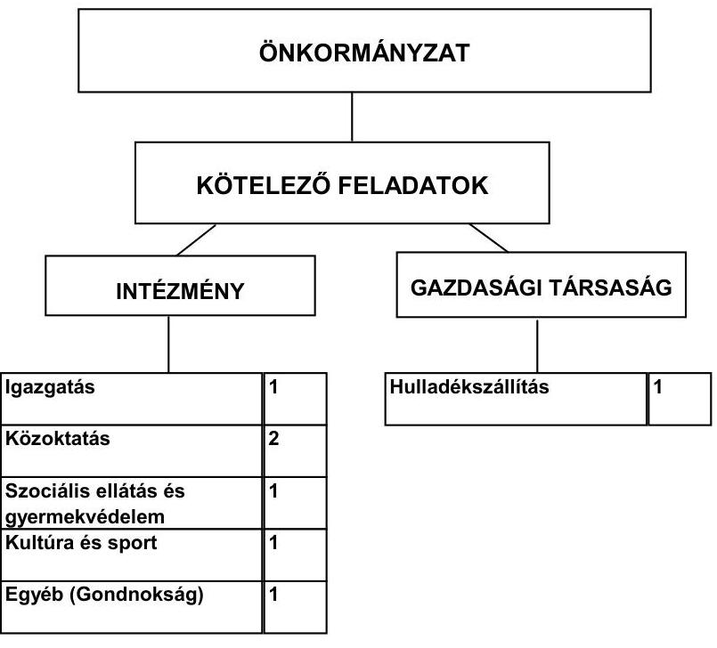

[^0]
[^0]:    ${ }^{7}$ A CLF módszer szerint 1127 millió Ft volt a folyó kiadás 2010-ben. Az eltérést az egészségügyi feladatok (13,7 millió Ft), a Cigány Kisebbségi Önkormányzat (0,1 millió Ft) és a felhalmozási kamat kiadásai (17,2 millió Ft) okozták.
    ${ }^{8}$ Az önként vállalt feladatokra fordított kiadások évenkénti alakulása az összes működési kiadások arányában: 2007. évben 2,2% (15,7 millió Ft), 2008. évben 1,9% (15,6 millió Ft), 2009. évben 2,4% (21,2 millió Ft), 2010. évben 2,2% (24,1 millió Ft), 2011. évben 2,3% (20,6 millió Ft).

---

Az Önkormányzat feladatait 2011. június 30-án (a Polgármesteri hivatallal együtt) hat költségvetési szervvel és közszolgáltatási szerződés alapján egy gazdasági társasággal látta el. Az Önkormányzat költségvetési szervei feladatukat 2011. év I. félév végén nyolc telephelyen látták el, az intézmények telephelyeinek számában az áttekintett időszakban nem történt változás. A vizsgált időszakban két esetben került sor feladatátadásra, 2008-tól jogszabályi változás következtében Nagykáta Önkormányzatához került az építésügyi feladat, valamint 2009-től a házi segítségnyújtás feladatainak ellátását a Társulás végezte. A feladatellátás módjában bekövetkezett változások hatására a működési kiadások 2008-2009. években összesen 14,6 millió Ft megtakarítást jelentettek az Önkormányzatnak. A Társulásban látták el a belső ellenőri feladatokat, valamint a Társulással kötött megállapodás alapján, az Önkormányzat, mint gesztor - intézményfenntartó társulásban - látta el a családsegítő, gyermekjóléti szolgálat és a nevelési tanácsadás feladatait.

Az Önkormányzatnak a vizsgálattal érintett években legalább 50%, vagy azt meghaladó tulajdoni hányadba tartozó gazdasági társasága nem volt. Közszolgáltatási szerződés alapján a hulladékkezelési közszolgáltatást végző gazdasági társaságban az Önkormányzat saját tulajdoni részarányának összege 0,1 millió Ft (0,034%) volt.

Az egyes közszolgáltatások feladatellátásában résztvevő költségvetési szervek működési kiadásainak finanszírozási összetételét a következő ábra szemlélteti a 2007. és a 2010. években:
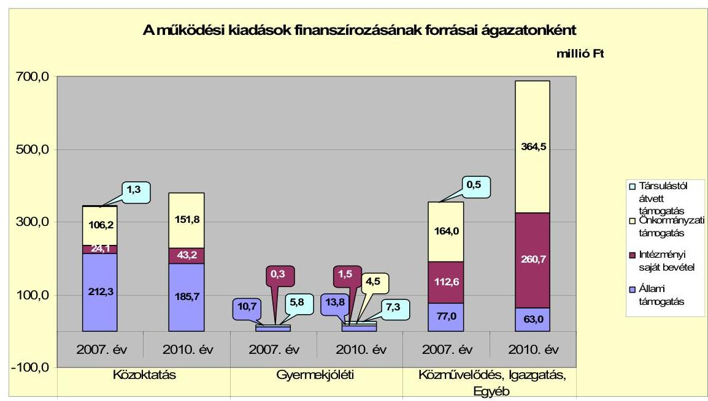

A közoktatási ágazat finanszírozásában az állami támogatás részaránya a 2007-2009 évek átlagához viszonyítva 204,5 millió Ft-ról 185,7 millió Ft-ra (9,2%-kal) csökkent a 2010. évben, a közoktatási normatívák számítási rendszerének módosulása miatt. Az intézményi bevétel a 2007-2009. évek 27 millió Ft átlagához képest a 2010. évben 43,2 millió Ft-ra (16,2 millió Ft-tal, 60%-kal) emelkedett, mert a kedvezményesen és az ingyenesen étkezők normatív támogatását - az Önkormányzat és az intézmény sajátos elszámolása miatt - saját bevételként számolták el. Az állami támogatások csökkenését az önkormány-

---

zati támogatás emelésével kompenzálták. A gyermekjóléti feladatokra 2010-ben 10,3 millió Ft-tal többet (27,1 millió Ft-ot) fordítottak, mint 2007-ben, mert 2008-tól az Önkormányzat, mint gesztor látta el még három településen is ezeket a feladatokat. Az Intézményfenntartó társulásban ellátott feladatokhoz az állami támogatás és a társult önkormányzatok támogatásán kívül egyre növekvő összegben (2009-ben 4,4 millió Ft, 9,4%, 2010-ben 4,5 millió Ft 16,6%) kellett az Önkormányzatnak hozzájárulnia, mert 2008-ban nagyobb alapterületű épületbe költözött a gyermekjóléti feladatokat ellátó intézmény és megemelkedtek a fenntartási kiadások. A központi forrásszabályozás változása miatt az Önkormányzat közművelődési, valamint a Polgármesteri hivatal igazgatási és egyéb feladatai állami támogatásának részaránya az összes bevételen belül a 2007-2009. évek 17,4% (74,4 millió Ft) átlagáról a 2010. évre 9,2%-ra (63 millió Ft-ra) csökkent. Az állami támogatások változása miatt az intézményi saját bevételek és az önkormányzati támogatás együttes összege a 2007-2009. évek átlagához képest 353,5 millió Ft-ról a 2010. évben 625,2 millió Ft-ra emelkedett.

A vizsgált időszakban a kötelező és önként vállalt feladatok ellátását biztosító szervezeti keretekben, a feladatellátás módjában bekövetkezett változások nem veszélyeztették az Önkormányzat pénzügyi egyensúlyi helyzetét.

Az Önkormányzat folyó költségvetésének egyenlegét (működési jövedelmét) az alábbi ábra mutatja:
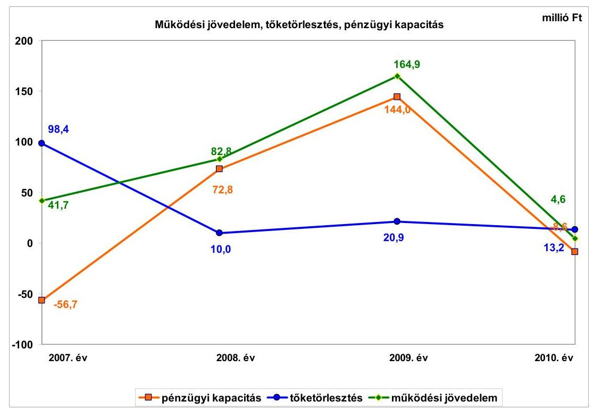

A működési jövedelem a 2008. évben főként a saját működési bevételek és a költségvetési támogatás növekedésének hatására emelkedett, a gyermekjóléti feladatok intézményfenntartó társulásban történő ellátása miatt. A 2009. évben a működési jövedelem növekedését az iparűzési adóbevétel, valamint a kötvénybevétel befektetéséből és a betétlekötésből származó hozam és kamat-

---

bevételek növekedése eredményezte. A 2010. évben csökkent a működési jövedelem, mert a saját működési bevételek, az átengedett bevételek és a támogatásértékű működési bevételek növekedését meghaladóan emelkedtek a működési kiadások az új iskolaépítéssel kapcsolatos készletbeszerzések, szolgáltatási kiadások és személyi juttatások növekedésének hatására. A működési jövedelem a 2011. év I. félévi folyó költségvetés adatai alapján 34,4 millió Ft volt.

A folyó bevételek fedezetet nyújtottak a folyó kiadásokra, azonban a működési jövedelem a 2007. és a 2010. években a tőketörlesztést nem biztosította. A nettó működési jövedelem a 2007. évben negatív volt, amelyet a 41,7 millió Ft működési jövedelmet meghaladó 98,4 millió Ft folyószámla- és hosszú lejáratú hitellel kapcsolatos tőketörlesztés okozott. A 2008. évben a működési jövedelemből 10 millió Ft-ot fordítottak a 2007. évben felvett fejlesztési hitel törlesztésére. A 2009. évben működési jövedelemből a fejlesztési hitel törlesztésére 12,3 millió Ft-ot és a folyószámlahitel visszafizetésére 8,6 millió Ft-ot fordítottak. A 2010. évben a folyó bevételek 67,3 millió Ft-os növekedését meghaladta a folyó kiadások 227,6 millió Ft-os - az új iskola építése miatti személyi és dologi kiadások - emelkedése. Ennek következtében a működési jövedelem 4,6 millió Ft volt és nem nyújtott fedezetet a 13,2 millió Ft fejlesztési hitel törlesztésére.

Az Önkormányzat felhalmozási költségvetésének egyenlege a 2007. évben negatív volt, a felhalmozási kiadások 3,9 millió Ft-tal meghaladták a felhalmozási bevételeket, a hiányt folyószámlahitelből finanszírozták. A 2008. évben az iskolaépítésre pályázat útján nyert és december hónapban rendelkezésre állt 300 millió Ft támogatás eredményeként a felhalmozási bevételek fedezetet biztosítottak a felhalmozási kiadások teljesítésére. Az Önkormányzatnak a 2009. és a 2010. években saját tőkebevétele nem keletkezett, a felhalmozási célú bevétele a pályázatokhoz nyert támogatásból származott. A felhalmozási kiadások a fejlesztések (az iskolaépítés, a könyvtár és a díszpark létrehozása, kerékpárút építése) hatására növekedtek, amelyre nem nyújtottak fedezetet a felhalmozási bevételek. A felhalmozási forráshiányt folyószámlahitelből és a 2008. évi kötvénykibocsátásból származó bevételből finanszírozták.

A folyó bevételeknek a 2010. évi 213,9 millió Ft-os növekedését a 2007-2009. évek átlagához képest a saját működési bevételek és a költségvetési támogatás növekedése eredményezte. A költségvetési támogatás és az szja bevétel együttes összege 33,9 millió Ft-tal növekedett a 2007-2009. évek átlagához képest a központi támogatáselosztás változása következtében. A 2009. évben az egyéb saját bevétel a kötvénybevétel átmenetileg szabad pénzeszközeinek befektetéséből és a folyószámlán rendelkezésre álló forrás betétként való elhelyezéséből származó 85,9 millió Ft kamatbevétel hatására növekedett. Az áfa bevétel 2007-2009 évek átlagához képest 119,5 millió Ft-tal emelkedett a 2010. évben, amelyből az iskolaépítéshez kapcsolódó fordított áfa bevétel 128,4 millió Ft volt. A fordított áfa technikai elszámolása miatt ez nem valós bevétel. A helyi adókból, pótlékokból befolyó bevétel 2007-2009. évek átlagához képest 44,4 millió Ft-tal nőtt a 2010. évre főként az iparűzési adóbevétel emelkedésének hatására. Az iparűzési adó mértéke a vizsgált időszakban a törvényi maximum (2%) alatt, 1,75% volt. Az iparűzési adóbevétel több mint 70%-a egy adóalanytól származott, amely kockázatot jelent a bevételi kitettség miatt.

---

A felhalmozási bevételek összege a 2007-2009. évek átlagához viszonyítva 2010-ben 141,3 millió Ft-tal csökkent,
 mert a 2008. évben az Önkormányzat pályázat útján az iskolaépítésre 300 millió Ft-ot, egyéb pályázatokkal kapcsolatosan 40,5 millió Ft-ot nyert. Ez eredményezte a felhalmozási bevételek 2008. évi kiugró összegét.

Az Önkormányzatnál 2007-2009. évek átlagához képest a folyó kiadások 305,8 millió Ft-tal emelkedtek 2010-ben, nagyrészt a működési kiadások 262,7 millió Ft-os, a magánszemélyeknek fizetett pénzbeli (szociális) juttatás 26,7 millió Ft-os és a kamatkiadás 2,4 millió Ft-os növekedésének hatására. A személyi juttatásra teljesített kiadás a 2007-2009. évek átlagához képest 54 millió Ft-tal nőtt a feladatbővülés miatt a létszámnövekedés következtében. A munkaadót terhelő járulékokra teljesített kiadás 2007-2009. évek átlagához képest 4,1 millió Ft-tal csökkent a központi intézkedések hatására. A dologi kiadások a 2007-2009. évek átlagához képest 217,6 millió Ft-os növekedését az áfa, a készletbeszerzések (elsősorban az új iskola építésével kapcsolatban), az üzemeltetési, fenntartási szolgáltatások többletkiadása okozta.

Az Önkormányzatnál a 2007-2010 közötti időszakban megvalósított és 2010. december 31-ig befejezett felújítások és fejlesztések tényleges bekerülési költsége összesen 1214,3 millió Ft volt, a forrásösszetétele 258,7 millió Ft saját bevételből, 4,4 millió Ft fejlesztési hitelből, 466,9 millió Ft deviza alapú kötvénykibocsátásból származó bevételből, 114,8 millió Ft EU-s és 369,5 millió Ft hazai támogatásból állt. Az iskolaépítéssel kapcsolatban nem számszerűsítették a várható kiadásokat, ezért a jövőbeni üzemeltetés kockázatot jelenthet és befolyásolhatja az Önkormányzat pénzügyi egyensúlyát. A 2011. év I. félévben indított Polgármesteri hivatal komplex akadálymentesítése projekt várható 30 millió Ft-os bekerülési költségéből 1,5 millió Ft-ot önkormányzati saját forrásból és 28,5 millió Ft-ot EU-s támogatásból finanszírozzák. A folyamatban lévő fejlesztés támogatásának előfinanszírozása az Önkormányzat tájékoztatása szerint az iparűzési adóbevételből nem okoz finanszírozási problémát. Elbírálás alatt lévő pályázata 2010. december 31-én a zöldhulladék kezelésével kapcsolatban volt. A megvalósítani tervezett projekt bekerülési költsége 10,3 millió Ft, a forrásösszetételét 4,1 millió Ft saját bevétel, 5,3 millió Ft EU-s és 0,9 millió Ft hazai támogatás fogja képezni.

Az Önkormányzat mérleg szerinti pénzintézeti kötelezettsége a 2006. év végéről a 2011. év I. félév végére 99,2 millió Ft-ról 868,9 millió Ft-ra nőtt, amelyből az árfolyamváltozás miatti különbözet 310,8 millió Ft volt. A fennálló pénzintézeti kötelezettségek a folyószámlahitel igénybevételéből, egy hosszú lejáratú fejlesztési hitelből és egy fejlesztési célú kötvénykibocsátásból keletkeztek.

Az Önkormányzat pénzintézeti kötelezettségvállalásaira képviselő-testületi döntés alapján került sor, azonban nem nevesítették a visszafizetés forrásait és nem mutatták be a kamat- és árfolyamváltozásban rejlő kockázatot.

A 2007. év előtt a fejlesztések finanszírozására igénybe vett folyószámlahitel kiváltására 2007-ben 646,3 ezer CHF (101 millió Ft) fejlesztési hitelt vettek fel, a hitel kiváltásával javult az Önkormányzat pénzügyi pozíciója. 2011-ben a fejlesztési hitel törlesztésével kapcsolatos állományváltozást az Áhsz.-ben foglal-

---

taktól eltérően nem könyveltek, ezért a 2011. év I. féléves mérlegjelentésben nem a valóságnak megfelelően mutatták be a hitel állományát.

A 2008. július 10-én kibocsátott, 20 év futamidejű, svájci frank alapú (500 millió Ft) kötvényét az Önkormányzat 2011. október hónaptól kezdte el törleszteni (41,3 ezer CHF). Az Önkormányzat a kötvénybevételt 2008-2010 között az általános iskola épületének építésére, valamint a közösségi könyvtár és diszpark kialakítására nyert EU-s támogatás megelőlegezésére fordította. A fejlesztési hitelt 2007-ben a folyószámlahitel kiváltására és a gyermekjóléti feladatokat ellátó intézményhez kapcsolódó ingatlanvásárlásra használták fel. A CHF-ben fennálló fejlesztési hitelből a vizsgált időszak alatt 274,7 ezer CHF ( 50 millió Ft) tőkét törlesztett, és 77,6 ezer CHF ( 13,5 millió Ft) kamatot fizetett. A kötvénykötelezettséghez kapcsolóan 5 millió Ft szervezési díjat és 280,5 ezer CHF ( 54,1 millió Ft) kamatot teljesített 2008-2011. év I. félév között. A kötvénykibocsátás átmenetileg szabad pénzeszközeiből - annak végleges felhasználásáig - 95 millió Ft kamatbevételt realizált.

A hitel- és kötvény-kötelezettségek törlesztési kockázatot jelentenek a jövőben, mert a kötelezettségvállaláskor a visszafizetési forrást nem jelölték meg. A kockázat emelkedhet a fennálló kötelezettségeket érintő kamat- és árfolyam emelkedés hatására is. A visszafizetéshez szükséges pénzügyi források rendelkezésre állását részben látjuk biztosítottnak abban az esetben, ha a működési jövedelemtermelő képesség a 2010. évi iskolaépítéssel kapcsolatos egyszeri kiadásemelkedést követően visszaáll a 2008-2009. évek szintjére. A 2011. év I. félévi folyó költségvetés pozitív egyenlege ( 34,4 millió Ft) alapján feltételezzük a működési jövedelemtermelő képesség változatlanságát.

Az Önkormányzat 2007-2011. években - a 2009. év kivételével - az eredeti költségvetésekben a költségvetés egyensúlya érdekében működési célú hitel felvételét tervezte. A 2007-2008. és a 2010-2011. évi költségvetési rendeletekben a költségvetési bevételek és kiadások egyenlegeként nem mutatták ki a költségvetési hiány összegét és finanszírozásának módját. A költségvetési kiadások és bevételek főösszegeinek megállapításánál finanszírozási célú pénzügyi műveleteket is figyelembe vettek. Ezzel megsértették az Áht. ${ }_{1}$-ben foglaltakat.

Az Önkormányzatnak az ellenőrzött években szüksége volt a likviditás biztosításához időszakosan folyószámlahitelre. A 2009-2010. évek és 2011. év I. félév végén nem volt folyószámlahitel állománya. Munkabér-megelőlegezési hitel vagy egyéb likviditási célú rövid lejáratú hitel felvétele nem volt a vizsgált időszakban. A folyószámlahitel igénybevétele a 2007-2011. év I. félévében az alábbiak szerint alakult:

| Folyószámlahitel | 2007. év | 2008. év | 2009. év | 2010. év | 2011. év I.   félév |
| :-- | :--: | :--: | :--: | :--: | :--: |
| Keretösszeg január 1-jén (millió Ft-ban) | 100,0 | 100,0 | 100,0 | 100,0 | 100,0 |
| Átlagos napi állomány (millió Ft-ban) | 19,5 | 3,8 | 7,0 | 3,0 | 0,3 |
| Folyószámla hitellel zárt napok száma (nap) | 172 | 149 | 152 | 135 | 26 |
| Egyenleg (állomány) | 6,2 | 8,6 | - | - | - |

A likviditás biztosítása az Önkormányzatnak 4,1 millió Ft kamatkiadást és 0,3 millió Ft egyéb költség fizetésének kötelezettségét okozta a vizsgált időszakban. Az Önkormányzat 2011. év I. félév végi szállítói tartozása 23,6 millió Ft, melyből 0,2 millió Ft 30 nap alatti lejárt tartozás volt. Átüteme-

---

zett szállítói tartozás nem volt. Az Önkormányzat a szállítói állománnyal kapcsolatban állományváltozást az Áhsz.-ben foglaltaktól eltérően nem könyvelt, ezért a 2011. év I. félévi mérlegjelentésben nem a szállító analitikának megfelelően mutatta be a szállítói állományát.

Az Önkormányzat a vizsgált időszakban gazdasági társaságnak és egyéb szervezetek részére 27,4 millió Ft kölcsönt nyújtott, amelyből 2011. év I. félév végén - 2012-ben esedékes - követelése 21,5 millió Ft.

A Képviselő-testület hitel biztosítékaként jelzálogjog alapításhoz és bejegyzéshez a 646,3 ezer CHF ( 101 millió Ft) fejlesztési hitel felvételével összefüggésben járult hozzá a vizsgált időszakban. A pénzintézet a jelzálog bejegyzésénél nem a nettó értéket vette figyelembe. Forgalomképes ingatlanvagyona a nettó érték alapján 6\%-ban (333,7 millió Ft nettó értékből 19,8 millió Ft nettó értékű ingatlan) jelzáloggal terhelt. A hitel biztosítékaként kettő korlátozottan forgalomképes ingatlan is jelzáloggal terhelt, amely miatt az Önkormányzatnál megsértették az Ötv-ben ${ }^{9}$ foglaltakat, mert a fejlesztési hitel fedezeteként a törzsvagyon nem használható fel. A vagyongazdálkodási rendelet szerint az Önkormányzat vagyona - a forgalomképtelen vagyon kivételével - megterhelhető.

Az Önkormányzat kötelezettségeinek 2010. december 31-i, valamint 2011. június 30-i állományát és várható alakulását a kötelezettségek lejáratáig a következő táblázat szemlélteti:

| Megnevezés | Állomány 2010. december 31-én |  |  | Állomány 2011. június 30-án |  |  | Várható kötelezettség 2012-2013. években |  | Várható kötelezettség 2014. évtől |  |
| :--: | :--: | :--: | :--: | :--: | :--: | :--: | :--: | :--: | :--: | :--: |
|  | HUF-ben (millió Ftben) | Devizában (összége, ezer CHFben) | Deviza nem | HUF-ben (millió Ftben) | Devizában (összége, ezer CHFben) | Deviza nem | HUF-ben (millió Ftben) | Devizában (összége, ezer CHFben) | HUF-ben (millió Ftben) | Devizában (összége, ezer CHFben) |
| Pénzintézeti kötelezettségek |  |  |  |  |  |  |  |  |  |  |
| fejlesztési hitel |  | 403,9 | CHF |  | 371,6 | CHF |  | 221,1 |  | 224,1 |
| "Tápiószele fejlődéséért" kötvény |  | 3529,8 | CHF |  | 3529,8 | CHF |  | 447,9 |  | 3937,0 |
| Pénzintézeti kötelezettségek összesen CHF-ben: |  | 3933,7 | CHF |  | 3901,4 | CHF |  | 669,0 |  | 4161,1 |
| Kezesség |  |  |  | 28,4 |  |  |  |  |  |  |
| Szállítói tartozás | 22,7 |  |  | 23,6 |  |  | 23,6 |  |  |  |

Az Önkormányzatnak pénzintézetekkel szemben fennálló kötelezettsége a 2011. év I. félév végén 3901,4 ezer CHF volt, amelynek 90,5\%-a (3529,8 ezer CHF) a kötvénykibocsátásból, 9,5\%-a (371,6 ezer CHF) fejlesztési hiteltartozásból állt. Ezek várható kötelezettsége (tőke, kamat és egyéb költség) a legutóbbi kamatfizetés feltételei alapján a 2011-2013. években 669,0 ezer CHF. Az Önkormányzatnak a 2011. évben szállítói tartozások rendezése címén 23,6 millió Ft fizetési kötelezettsége keletkezett. A csatornatársulat által felvett hitel miatt az Önkormányzatra eső készfizető kezességvállalás 28,4 millió Ft volt, amellyel kapcsolatban a vizsgált időszakban nem kellett kiadást teljesítenie. A 2011-2013. évek kötelezettségeinek teljesítésére figyelembe vehető 5,4 millió Ft szabad pénzmaradvány, valamint az eladhatóságot és a behajthatóságot feltételezve a jelzáloggal nem terhelt forgalomképes ingatlanvagyon értékesítéséből és 49,0 millió Ft mérlegben kimutatott köve-

[^0]
[^0]:    ${ }^{9}$ 2012. január 1-jétől az Ötv. 88. § (1) bekezdés b) pontja hatályát vesztette.

---

telésállomány behajtásából származó forrás. A 2014. évet követően jelenleg ismert pénzintézeti kötelezettségei: 4161,1 ezer CHF. Az ezek teljesítésére figyelembe vehető források - a polgármester és a jegyző nyilatkozata szerint - jelenleg nem ismertek ugyan, de „a mindenkori költségvetési rendeletekben megtervezett helyi adóbevételek" erre vélhetően fedezetet biztosítanak. A 2014 utáni évektől a jelenleg ismert pénzintézeti kötelezettségek teljesítését a 2011. év I. félévi működési jövedelem alapján részben látjuk biztosítottnak, feltételezve a jövedelemtermelő képesség változatlanságát. Az Önkormányzatnak a pénzügyi egyensúlya javításához, a fennálló kötelezettségeinek a teljesítéséhez a jövőben bevételnövelő és kiadáscsökkentő intézkedéseket kell hoznia.

Az Önkormányzat 2007-2010 között eszközállománya után 165,1 millió Ft összegű értékcsökkenést mutatott ki, miközben az elhasznált eszközök pótlására 67,3 millió Ft-ot fordított. Az Önkormányzatnál a Képviselő-testületnek előterjesztett éves zárszámadási rendeletekben nem mutatták be az Önkormányzat eszközei után tárgyévben elszámolt értékcsökkenés összegét, az eszközpótlásra fordított tényleges kiadásokat, az eszközök használhatósági fokának alakulását.

Az Önkormányzat kimutatása szerint a vizsgált időszakban a feladatok átszervezésével és feladatmegszűnéssel
 kapcsolatban hat fő létszámcsökkentést hajtott végre, amely 31,6 millió Ft kiadási megtakarítást eredményezett. A gyermekjóléti, az egészségügyi, a könyvtári, és a városgondnoksági feladatoknál jelentkező feladatbővülés, valamint az új iskola üzemeltetése miatt a vizsgált időszakban összességében 19 álláshelyet létesítettek.

Az ellenőrzött időszakban az Önkormányzat kimutatása szerint bevételt növelő intézkedéseket tettek. A 2007-2011. év I. féléve között tett intézkedések hatására 166,9 millió Ft bevételi többletet mutattak ki, amelyek helyi adók mértékének növekedéséhez, eszközök hasznosításához kapcsolódtak.

Az Önkormányzat pénzügyi egyensúlyi helyzetét összegezve a következők emelhetők ki:

Tápiószele város Önkormányzatának pénzügyi egyensúlyi helyzete középtávon veszélyeztetett.

A folyó bevételek fedezetet nyújtottak a folyó kiadásokra, azonban a működési jövedelem a 2007. és a 2010. években a tőketörlesztést nem biztosította.

Az iparűzési adóbevétel meghatározó része egy adóalanytól származik, amely kockázatot jelent a bevételi kitettség miatt.

A likviditás biztosításához időszakosan folyószámlahitelre volt szükség.
A folyamatban lévő egy fejlesztés felhalmozási kockázatot nem jelent, mert a támogatás előfinanszírozása az iparűzési adóbevételből nem okoz finanszírozási problémát. Az iskolaépítéssel kapcsolatban nem számszerűsítették a várható kiadásokat, ezért a jövőbeni üzemeltetés kockázatot jelenthet és befolyásolhatja az Önkormányzat pénzügyi egyensúlyát.

---

A fejlesztési hitel- és kötvény-kötelezettségek törlesztési kockázatot jelentenek a jövőben, mert a kötelezettségvállaláskor a visszafizetési forrást nem jelölték meg. Az egyéb kötelezettségek közül a csatornatársulat által felvett hitelre vállalt készfizető kezesség beváltás esetén kedvezőtlenül befolyásolhatja az Önkormányzat pénzügyi egyensúlyát.

Az Állami Számvevőszékről szóló 2011. évi LXVI. törvény 33. § (1) bekezdésében foglaltak értelmében a jelentésben foglalt megállapításokhoz kapcsolódó intézkedési tervet köteles az ellenőrzött szervezet vezetője összeállítani és azt a jelentés kézhezvételétől számított harminc napon belül az ÁSZ részére megküldeni. Amennyiben az intézkedési tervet határidőben nem küldi meg a szervezet, vagy az továbbra sem elfogadható, az ÁSZ elnöke a hivatkozott törvény 33. § (3) bekezdés a)-b) pontjaiban foglaltakat érvényesítheti.

# A 2011. június 30-i pénzügyi egyensúlyi helyzet alapján az ellenőrzés intézkedést igénylő megállapításai és javaslatai a következők: 

## a Polgármesternek

1. A folyó bevételek fedezetet nyújtottak a folyó kiadásokra, azonban a működési jövedelem a 2007. és a 2010. években a tőketörlesztést nem biztosította. A nettó működési jövedelem 2010. évben negatív volt, a vállalt pénzintézeti kötelezettségek fedezete részben biztosított középtávon. Az iparűzési adóbevétel meghatározó része egy adóalanytól származik, amely kockázatot jelent a bevételi kitettség miatt.

Javaslat:
Az Önkormányzat pénzügyi egyensúlyának középtávon történő helyreállítása és hosszú távú fenntarthatósága érdekében kezdeményezze - felelősök és határidők megjelölésével - az alábbi intézkedések megtételét:
a) Tárja fel a bevételszerző és kiadáscsökkentő lehetőségeket. Ütemezze a bevételek beszedését a jövőben jelentkező fizetési kötelezettségeihez;
b) Terjesszen a Képviselő-testület elé kibontakozási programot a pénzügyi egyensúlyi helyzet javítása, és hosszú távú megőrzése érdekében;
c) Képezzen egyensúlyi (elkülönített) tartalékot az adósságszolgálat teljesítése érdekében;
d) Mutassa be a Képviselő-testületnek félévente legalább három évre kitekintően a kötelezettségek teljes körére szóló finanszírozási tervet, a források számszerűsített megjelölésével.
2. A Képviselő-testület az adósságot keletkeztető kötelezettségvállalásokról szóló döntését megalapozó előterjesztés (kötvénykibocsátás és fejlesztési hitel) nem tartalmazta a kötelezettségvállalás visszafizetési forrásainak a bemutatását, a kamat- és árfolyamváltozásban rejlő kockázatokat.

---

Javaslat:
a) Gondoskodjon, hogy a jövőben az adósságot keletkeztető kötelezettségvállalásokról szóló képviselő-testületi előterjesztések tételesen tartalmazzák a visszafizetés forrásait.
b) Az adósságot keletkeztető kötelezettségvállalásról szóló döntéskor mutassa be a Képviselő-testületnek a jövőben várható - árfolyam-, kamat- és törlesztési - kockázatot.
3. A Képviselő-testületnek előterjesztett éves zárszámadási rendeleteikben nem mutatták be az Önkormányzat eszközei után tárgyévben elszámolt értékcsökkenés összegét, az eszközpótlásra fordított tényleges kiadásokat, az eszközök használhatósági fokának alakulását.

Javaslat:
Mutassa be a Képviselő-testületnek évente a zárszámadási rendelet előterjesztésében az értékcsökkenés összegét, és ezzel összevetve az elhasználódott eszközök pótlására fordított tényleges kiadásokat, az eszközök használhatósági fokának alakulását.
4. A 2007-2008. és a 2010-2011. évi költségvetési rendeletekben nem mutatták ki a költségvetési hiány összegét és finanszírozásának módját, ezzel megsértették az Áht. $_{1}$ 8/A. § (1) bekezdésében és - 2010-től - a 69. § (1) bekezdés b), c) és d) pontjaiban foglaltakat. A 2007-2011. évi költségvetési rendeletekben az Áht. $_{1}$ 8/A. § (7) bekezdése ellenére finanszírozási célú műveleteket számoltak el a költségvetési bevételek és kiadások főösszegeinek megállapításakor.

Javaslat:
Intézkedjen, hogy a jövőben a költségvetési rendeletekben az Áht. $_{2}$ 23. § (2) bekezdés c)-e) pontjainak megfelelően mutassák be a költségvetési egyenleg összegét, részletezzék a költségvetési hiány belső és külső finanszírozási módjának működési és felhalmozási cél szerinti tagolását. Biztosítsa az Áht. $_{2}$ 72. § a) pontja alapján, hogy a költségvetési bevételek és költségvetési kiadásokon kívül határozzák meg a finanszírozási célú bevételeket és kiadásokat.

# a Jegyzõnek 

1. 2011. év I. félévben az Áhsz. 47. § (1) bekezdése ellenére a fejlesztési hitel törlesztésével és a szállítói kötelezettség változásával kapcsolatban nem könyvelték le az állományváltozásokat, ezért a 2011. év I. félévi mérlegjelentésben nem valós adatokat mutattak be.

Javaslat:
Gondoskodjon arról, hogy a jövőben legalább negyedévenként az Áhsz. 47. § (1) bekezdésében előírtaknak megfelelően számolják el a fejlesztési hitel törlesztésével és a szállítói kötelezettség változásával kapcsolatos állományváltozásokat.

---

2. Az Önkormányzat hatályos vagyongazdálkodási rendelete szerint az Önkormányzat vagyona - a forgalomképtelen vagyon kivételével - megterhelhető. A szabályozásra figyelemmel az Önkormányzat a fejlesztési hitel fedezeteként az Ötv. 88. § (1) bekezdés b) pontjának 2011. december 31-éig hatályos előírását megsértve hozzájárult kettő korlátozottan forgalomképes ingatlanokon jelzálogjog alapításához és bejegyzéséhez.

Javaslat:
Gondoskodjon arról, hogy az Önkormányzat kötelezettségeinek fedezeteként 2012. január 1-jét követően a nemzeti vagyonról szóló 2011. évi CXCVI. törvény 3. § 6. pontjával, az 5. § (2) bekezdés c) pontjával, és a 6. § (6) bekezdésével összhangban a nemzeti vagyon körébe tartozó, korlátozottan forgalomképes törzsvagyont ne terhelje meg, kivéve, ha arról az Önkormányzat a rendeletében a megterhelést megengedően rendelkezik. $^{10}$

[^0]
[^0]:    $^{10}$ Felhívjuk a figyelmet arra, hogy az ellenőrzéssel érintett időszakot követően, 2012. március 31-én hatályba lépett az egyes közpénzügyi tárgyú törvényeknek az államháztartás önkormányzati alrendszerét érintő módosításáról, és azok más törvényekkel való összhangjának biztosításáról szóló 2012. évi XVII. törvény, amely módosítja az államháztartásról szóló 2011. évi CXCV. törvény 84. §-ának (4) bekezdését. A jogszabály változását a javaslat végrehajtása során figyelembe kell venni.

---

# II. RÉSZLETES MEGÁLLAPÍTÁSOK 

## 1. Az ÖNKORMÁNYZAT KÖTELEZŐ ÉS ÖNKÉNT VÁLLALT FELADATAI, A FELADATELLÁTÁS SZERVEZETI KERETEI ÉS ANNAK VÁLTOZÁSAI

Az Önkormányzat kötelező feladatait az Ötv. és az ágazati törvények által meghatározottnak tekintette. Önként vállalt feladatai körét az SzMSz 1. számú melléklete tartalmazta. Az önként vállalt feladatok a Művelődési Házban a tájház fenntartásához és rendezvényszervezéshez, a Polgármesteri hivatalban a civil szervezetek működésének támogatásához, testvérvárosi kapcsolatok ápolásához, iskolabusz üzemeltetéséhez, lapkiadáshoz (önkormányzati híradó) kapcsolódtak. Az Önkormányzat önként vállalt feladatai körében a vizsgált időszakban nem történt változás.

A 2010. évi működési kiadások kötelező feladatonkénti megoszlását és azok finanszírozási arányait a következő táblázat mutatja be:

| Ellátott feladat | Működési   kiadás   összesen   (millió Ft) | Kötelező   feladatok   kiadásainak   részaránya   % | Működési   bevétel   összesen   (millió Ft) | Állami   támogatás   részaránya   % | Intézményi   saját bevétel   részaránya   % | Önkormányzati   támogatás   részaránya   % | Társulástól átvett   támogatás   részaránya |
| :--: | :--: | :--: | :--: | :--: | :--: | :--: | :--: |
| Övodák | 84,5 | 100 | 84,5 | 62,6 |  | 37,4 | 0 |
| Általános iskolák | 296,2 | 100 | 296,2 | 44,8 | 14,6 | 40,6 |  |
| Gyermekjóléti   intézmények | 27,1 | 100,0 | 27,1 | 51,0 | 5,5 | 16,7 | 26,8 |
| Közművelődési   intézmények | 24,0 | 71,1 | 24,0 |  | 12,3 | 87,7 | 0 |
| Egyéb intézmények | 146,3 | 100 | 146,3 |  | 28,0 | 72,0 | 0 |
| Polgármesteri hivatal   igazgatási kiadásai | 289,4 | 99,2 | 289,4 |  | 17,7 | 82,3 | 0 |
| Polgármesteri   hivatalban ellátott   egyéb feladatok   működési kiadása | 228,5 | 93,4 | 228,5 | 27,6 | 72,4 |  | 0 |
| Működési kiadá-   sok összesen | 1096,0 | 97,8 | 1096,0 | 24,0 | 27,9 | 47,5 | 0,7 |

Az Önkormányzat - adatszolgáltatása szerint - a 2010. évi 1096,0 millió Ft költségvetési kiadásból $^{11}$ 1071,9 millió Ft-ot (97,8 %-ot) a kötelező feladatok, 24,1 millió Ft-ot (2,2 %-ot) az önként vállalt feladatok ellátására fordított. A működési kiadásaiból 380,7 millió Ft-ot (34,7 %-ot) közoktatási, 27,1 millió Ft-ot (2,5 %-ot) szociális és gyermekjóléti, 688,2 millió Ft-ot (62,8 %-ot) közművelődési, sport, igazgatás és egyéb intézmények fenntartására fordított a 2010. évben. Az önként vállalt feladatokra teljesített működési kiadások nem veszélyeztették a kötelező feladatok ellátását, mivel 2007-2011. év I. féléve között lénye-

[^0]
[^0]:    $^{11}$ A CLF módszer szerint 1127 millió Ft volt a folyó kiadás 2010-ben. Az eltérést az egészségügyi feladatok (13,7 millió Ft), a Cigány Kisebbségi Önkormányzat (0,1 millió Ft) és a felhalmozási kamat kiadásai (17,2 millió Ft) okozták.

---

ges eltérés $^{12}$ nem volt, a kiadások részaránya 1,9 % és 2,4 %, az értéke 15,6 és 24,1 millió Ft között mozgott.

A közoktatási ágazat finanszírozásában az állami támogatás részaránya a 2007-2009 évek átlagához $^{13}$ viszonyítva 204,5 millió Ft-ról 185,7 millió Ft-ra (9,2 %-kal) csökkent 2010 évben. Az ellátottak számának kis mértékű $^{14}$ emelkedése ellenére az állami támogatás összegének csökkenését a közoktatási normatívák számítási rendszerének módosulása okozta. Az intézményi bevétel a 2007-2009. évek 27 millió Ft átlagához képest a 2010. évben 43,2 millió Ft-ra (16,2 millió Ft-tal, 60 %-kal) emelkedett. Az intézményi bevétel növekedését az okozta, hogy a kedvezményesen és az ingyenesen étkezők normatív támogatását - az Önkormányzat és az intézmény sajátos elszámolása miatt - saját bevételként számolták el. A vizsgált időszakban a kedvezményesen és az ingyenesen étkezők száma emelkedett. $^{15}$ Az állami támogatások csökkenését az önkormányzati támogatás emelésével kompenzálták. Az önkormányzati támogatás 30,9-39,9% (106,2 millió Ft-151,8 millió Ft) között alakult. A Társulástól 2007-2008. években átvett támogatások összességében 1,7 millió Ft-tal (0,2 %-kal) járultak hozzá a kiadásokhoz.

A Társulással kötött megállapodás alapján 2008. augusztus 31-ig a pedagógiai szakszolgálat feladatait az Önkormányzat látta el, amelyhez a Társulás által igényelt kiegészítő állami támogatást átadták.

Az Önkormányzat gyermekjóléti feladatainak működési kiadásaira a 2007. évben 16,8 millió Ft-ot (az összes működési kiadás 2,4%-át), a 2010. évben 27,1 millió
 Ft-ot (2,5%-át) fordított. Az időszakban a működési kiadások növekedése a családsegítő és gyermekjóléti szolgálat feladatainak átszervezésének hatására emelkedett. A feladat ellátásának bővülése miatt (Intézményfenntartó társulás) a foglalkoztatottak létszáma 2007. évről 2008. évre 7 főről 11 főre emelkedett, amely 2011. év I. félévéig változatlan volt. A gyermekjóléti feladatok állami támogatása a 2007. évben 10,7 millió Ft (63,7%) volt. A 2008. évtől kezdődően az állami támogatás összege évenként folyamatosan emelkedett. A feladat ellátása 2008. évben 26,6 millió Ft volt, az állami támogatás mértéke 50,8% (13,5 millió Ft). A feladatellátás működési kiadása az előző évhez képest 9,8 millió Ft-tal (58,3%-kal) nőtt a gyermekjóléti feladattal kapcsolatos létszámnövekedés miatt. A 2009. évi 28,2 millió Ft működési kiadás és az állami támogatás összege és részaránya 2008. évhez viszonyítva nem mutat lényeges változást, az állami támogatás összege 13,9 millió Ft (49,3%) volt. Az Intézményfenntartó társulásban ellátott feladatokhoz az állami támogatás és a

[^0]
[^0]:    ${ }^{12}$ Az önként vállalt feladatokra fordított kiadások évenkénti alakulása az összes működési kiadások arányában: 2007. évben 2,2% (15,7 millió Ft), 2008. évben 1,9% (15,6 millió Ft), 2009. évben 2,4% (21,2 millió Ft), 2010. évben 2,2% (24,1 millió Ft), 2011. évben 2,3% (20,6 millió Ft).
    ${ }^{13}$ Az állami támogatás 2007-ben 212,3 millió Ft, 2008-ban 202,9 millió Ft, 2009-ben 198,3 millió, amelyek átlaga 204,5 millió Ft volt.
    ${ }^{14}$ Az óvodai nevelésnél és az általános iskolai oktatásnál a 2007-2009. évek átlagához képest 4-4 fővel növekedett az ellátottak száma 2010-ben.
    ${ }^{15}$ A kedvezményesen és az ingyenesen étkezők száma 2009-ben 4187 fő, 2010-ben 6587 fő volt.

---

társult önkormányzatok támogatásán kívül egyre növekvő összegben (2007-ben még nem kellett hozzájárulnia, 2008-ban 2,4 millió Ft (9,2%), 2009-ben 4,4 millió Ft (15,6%), 2010-ben 4,5 millió Ft (16,6%)) kellett az Önkormányzatnak hozzájárulnia. Ennek az volt az oka, hogy 2008-ban nagyobb alapterületű épületbe költözött a gyermekjóléti feladatokat ellátó intézmény és megemelkedtek a fenntartási kiadások.

A közművelődési, a Polgármesteri hivatal igazgatási és egyéb ${ }^{16}$ feladatainak kiadásai a 2007-2009. évek 428,1 millió Ft átlagához viszonyítva a 2010. évben 260,1 millió Ft-tal több, 688,2 millió Ft volt. A működési kiadások 2008. évi növekedését többek között az előző évi normatív támogatás visszafizetése és a földvédelmi járulék, 2010-ben a fordított áfa befizetési kötelezettség, valamint az „Út a munkába programban" 60 fő foglalkoztatása kiadásai okozták. A központi forrásszabályozás miatt az Önkormányzat közművelődési, valamint a Polgármesteri hivatal igazgatási és egyéb feladatai állami támogatásának részaránya az összes bevételen belül a 2007-2009. évek 17,4%-os (74,4 millió Ft-os) átlagáról a 2010. évre 9,2%-ra (63 millió Ft-ra) csökkent. Az állami támogatások változása miatt az intézményi saját bevételek és az önkormányzati támogatás együttes összege a 2007-2009. évek átlagához képest 353,5 millió Ft-ról a 2010. évben 625,2 millió Ft-ra emelkedett.

Az Önkormányzat kötelező és önként vállalt feladatait 2011. év I. félév végén (a Polgármesteri hivatallal együtt) hat költségvetési szervvel látta el, az intézmények száma 2007. január 1-je óta változatlan. Az önként vállalt feladatokat a Művelődési Ház és a Polgármesteri hivatal látta el. Az Önkormányzat költségvetési szervei feladatukat 2011. év I. félév végén nyolc telephelyen látták el, az intézmények telephelyeinek számában az áttekintett időszakban nem történt változás. Az Önkormányzat költségvetési intézményei közül kettő közoktatási, egy szociális, egy közművelődési és egy egyéb ${ }^{17}$ feladatokat látott el 2011. év I. félév végén. Az Önkormányzat intézményei közül egy önállóan működő és gazdálkodó, négy ${ }^{18}$ önállóan működő volt. Igazgatási feladatokat a Polgármesteri hivatal látta el.

Közszolgáltatási szerződés alapján a hulladékkezelési (kommunális szilárd hulladékgyűjtés, szállítás, elhelyezés, szelektív hulladékkezelés) közszolgáltatást az „ÖKOVÍZ" Önkormányzati Kommunális és Víziközmű Üzemeltető Kft. végezte. A gazdasági társaságban az Önkormányzat saját tulajdoni részarányának összege 0,1 millió Ft (0,034%). A feladatellátásában résztvevő gazdasági társaság gazdálkodásához, működéséhez az Önkormányzat nem adott át pénzeszközt 2007-2011. év I. félév közötti időszakban. A jelentés 4. számú melléklete tartalmazza a gazdasági társaság főbb adatait.

[^0]
[^0]:    ${ }^{16}$ Az egyéb önkormányzati feladatok működési kiadásai tartalmazták többek között a városüzemeltetési, ivóvízellátási feladatokat a sportegyesületek, civil szervezetek támogatását, tájház fenntartását.
    ${ }^{17}$ Tápiószele Város Gondnoksága. Az intézményen belül az Önkormányzat 1995. augusztus 1-je óta látja el a településen az ivóvíz szolgáltatást.
    ${ }^{18}$ A négy önállóan működő intézmény közoktatási, szociális, kulturális és városüzemeltetési feladatot látott el.

---

Az Önkormányzat a házi szociális gondozás és a belső ellenőri feladatokat társulás keretében látja el.

A társulásban résztvevő önkormányzatok részére feladatellátási szerződés alapján a Társulás biztosítja a házi szociális gondozást, a szociális étkeztetést. A belső ellenőri feladatok ellátása társulási megállapodás alapján történik.

Az Önkormányzat a Társulással kötött megállapodás alapján, mint gesztor intézményfenntartó társulásban - látja el a családsegítő, gyermekjóléti szolgálat és a nevelési tanácsadás feladatait. Az Intézményfenntartó társulásban négy önkormányzat ${ }^{19}$ vesz részt.

Az Önkormányzatnál 2007. és 2011. év I. félév közötti időszakban két esetben került sor feladatátadásra:

- A 2008. évi jogszabályi változás következtében az építésügyi hatósági feladat ellátása Nagykáta Önkormányzatához került, amely egy fő létszámcsökkenést eredményezett. A feladatátadással a működési kiadások 14 millió Ft-tal csökkentek, amely 3,2 millió Ft állami támogatás csökkenést okozott.
- Az Önkormányzat 2008. december hónapban döntött arról, hogy a házi segítségnyújtás feladatának ellátását társulás formájában kívánja 2009. évtől kezdődően ellátni. Az intézkedés hatására az alkalmazottak száma kettő fővel csökkent, amely 7,8 millió Ft működési kiadás csökkentést jelentett. A házi segítségnyújtás feladatának átszervezésével az állami támogatás 4 millió Ft-tal csökkent.

A feladatellátás módjában bekövetkezett változások hatására a működési kiadások 2008-2009. években összesen 14,6 millió Ft megtakarítást jelentettek az Önkormányzatnak. A vizsgált időszakban a kötelező és önként vállalt feladatok ellátását biztosító szervezeti keretekben, a feladatellátás módjában bekövetkezett változások nem veszélyeztették az Önkormányzat pénzügyi egyensúlyi helyzetét.

Az Önkormányzatnak a vizsgálattal érintett években legalább 50% vagy azt meghaladó tulajdoni hányadba tartozó gazdasági társasága nem volt.

# 2. Az ÖNKORMÁNYZAT PÉNZÜGYI EGYENSÚLYI HELYZETÉT BEFOLYÁSOLÓ TÉNYEZŐK 

A hagyományos költségvetési szerkezet helyett az Önkormányzat pénzügyi helyzetét a CLF módszerrel mutatjuk be, amelyben jobban elkülönülnek a vagyonnal kapcsolatos bevételek és kiadások az önkormányzati feladatokkal kapcsolatos közvetlen működtetési bevételektől és kiadásoktól. A módszer következetesen elkülöníti a folyó és a felhalmozási költségvetés bevételeit és kiadásait, azok költségvetési egyenlegeit. A saját folyó bevételek, valamint a sa-

[^0]
[^0]:    ${ }^{19}$ Tápiószele, Farmos, Tápióbicske és Tápiógyörgye települések.

---

ját felhalmozási bevételek nem tartalmazzák az előző évi pénzmaradványok felhasználásából származó pénzforgalom nélküli bevételeket ${ }^{20}$.

A folyó költségvetés egyenlege, a működési jövedelem megmutatja, hogy az Önkormányzat éves folyó bevétele fedezetet biztosít-e a kötelező és önként vállalt feladatellátáshoz kapcsolódó éves folyó kiadására. A működési jövedelem negatív értéke pénzügyileg fenntarthatatlan helyzetet jelez. A mutató pozitív értéke megtakarítást mutat, amely forrásul szolgálhat az Önkormányzat fennálló kötelezettségei megfizetéséhez, valamint fejlesztéseihez.

A felhalmozási költségvetés pozitív értéke felhalmozási többletet mutat, amely a jövőbeni fejlesztések forrását biztosíthatja. Amennyiben a folyó költségvetési hiány finanszírozása a felhalmozási többletből történik, ez szűkebb értelemben vagyonfelélésnek tekinthető. Amennyiben a felhalmozási költségvetés megtakarítása fejlesztési célú hitelek, kötvények adósságszolgálatát finanszírozza, az változatlan vagyontömeg mellett, a korábban megelőlegezett tőkebevételek valós realizációjának tekinthető. A felhalmozási deficit által generált finanszírozási igény önmagában nem jár pénzügyi kockázattal, a pénzügyileg fenntartható beruházásokhoz kapcsolódó kötelezettségvállalás (adósságszolgálat) átlátható és szabályozott költségvetési gazdálkodással teljesíthető.

A módszer a pénzügyi kapacitás fogalmát helyezi a középpontba. Az adós hitelfelvételi képessége, hosszú távú fizetőképessége vagy bonitása a pénzügyi kapacitással, más néven a nettó működési jövedelemmel jellemezhető. A nettó működési jövedelem negatív értéke az egyes költségvetési években jelentkező adósságszolgálat túlzott mértékére utal. ${ }^{21}$ A nettó működési jövedelem negatív értékének felhalmozási többletből, vagy további hitelből történő finanszírozása pénzügyileg nem fenntartható gazdálkodást vetít előre. A pozitív értéket mutató nettó működési jövedelem fejlesztési kiadások fedezetét biztosíthatja, illetve a folyamatosan, évenként képződő pozitív nettó működési jövedelemből meghatározható a jövőben vállalható, teljesíthető éves adósságszolgálat, ily módon az a hitelösszeg, amely - a többi tényezőt, feltételt adottnak tekintve - visszafizetési kockázat nélkül felvehető.

A CLF módszer alapján a pénzügyi kapacitás értékét az Önkormányzat összevont, nettósított, a központi információs rendszerbe a Magyar Államkincstáron keresztül leadott éves költségvetési beszámolójának 80-as űrlapjában szerepeltetett adatok alapján került meghatározásra.

A számítási leírás némileg eltér az ÁSZ módszertanában korábban alkalmazott gyakorlattól. A jelen besorolás általános közgazdasági meggondolásokon alapul, amely megjelenik az SNA statisztikai módszertanában is. Folyó tételek alatt értjük azokat a kiadásokat és bevételeket, amelyek a gazdálkodó szervezet helyzetét automatikusan nem változtatják. Bevételi oldalon ilyenek az adók, a

[^0]
[^0]:    ${ }^{20}$ A költségvetési években kialakuló hiány finanszírozása az előző évi pénzmaradvány és a korábbi években képzett tartalékok felhasználásával is történhet.
    ${ }^{21}$ kivéve, ha annak finanszírozására a korábbi években képzett tartalékok fedezetet nyújtanak

---

tényező jövedelmek, a transzferek ${ }^{22}$, kiadási oldalon a transzferek és a szolgáltatás igénybevételével kapcsolatos működési kiadások. A folyó költségvetésben a bevételekben nem térül meg, a kiadásokban nem jelenik meg az amortizáció, a vagyoni helyzetet az egyenleg befolyásolja.

A folyó költségvetés egyenlege (működési jövedelem) tartalmazza a kamatbevételeket és a kamatkiadásokat is, mind a működési, mind a fejlesztési kamatot, valamint a visszatérülő és befizetendő áfa teljes összegét, mert ezek közgazdaságilag tényező jövedelmek. Nem tartalmazzák viszont a követelés elengedés miatt könyvelt bevételi és kiadási pénzforgalmi tételeket, mert valójában technikai elszámolási műveletnek minősülnek, a bevétel soha nem realizálódott, és költségvetési kiadás sem történt.

A felhalmozási költségvetésben a bevételek között a vagyon megőrzésére és bővítésére fordítható források jelennek meg. A felhalmozási vagy tőketételek módosítják a vagyon nagyságát. A privatizációs bevétel csökkenti a vagyont, a fizikai beruházás, pénzügyi befektetés növeli.

A nettó működési jövedelmet a tőketörlesztés levonásával a folyó költségvetés egyenlegéből származtatjuk.

# 2.1. A működési és a felhalmozási egyensúly változása 

CLF módszer szerinti önkormányzati adatok

| Megnevezés | 2007. év | 2008. év | 2009. év | 2010.év |
| :--: | :--: | :--: | :--: | :--: |
| Folyó bevételek | 775,4 | 913,3 | 1064,3 | 1131,6 |
| Folyó kiadások | 733,7 | 830,5 | 899,4 | 1127,0 |
| Működési jövedelem | 41,7 | 82,8 | 164,9 | 4,6 |
| Nettó működési jövedelem   =működési jövedelem - tőketörlesztés | -56,7 | 72,8 | 144,0 | -8,6 |
| Felhalmozási bevételek | 92,8

 | 340,5 | 59,1 | 22,8 |
| Felhalmozási kiadások | 96,7 | 147,9 | 237,2 | 698,2 |
| Felhalmozási költségvetés egyenlege | $-3,9$ | 192,6 | $-178,1$ | $-675,4$ |
| Finanszírozási műveletek nélküli (GFS) pozíció = működési jövedelem + felhalmozási költségvetés egyenlege | 37,8 | 275,4 | $-13,2$ | $-670,8$ |
| Finanszírozási műveletek egyenlege | 22,9 | 476,7 | $-27,6$ | $-80,8$ |
| Tárgyévi pénzügyi pozíció | 60,7 | 752,1 | $-40,8$ | $-751,6$ |
| Egyéb tájékoztató adatok |  |  |  |  |
| Összes kötelezettség* | 121,2 | 743,6 | 758,4 | 920,2 |
| -ebből rövid lejáratú | 36,1 | 32,8 | 41,1 | 67,8 |
| Folyószámlahitel napi átlagos állománya ** | 19,5 | 3,8 | 7,0 | 3,0 |
| Likvidhitel napi átlagos állománya** | 0,0 | 0,0 | 0,0 | 0,0 |
| Munkabérhitel napi átlagos állománya** | 0,0 | 0,0 | 0,0 | 0,0 |
| Finanszírozásba bevonható eszközök: | 62,1 | 814,2 | 773,4 | 21,8 |
| Tartós hitelviszonyt megtestesítő értékpapírok év végi állománya | 0,0 | 0,0 | 0,0 | 0,0 |
| Hosszú lejáratú bankbetétek év végi állománya | 0,0 | 0,0 | 0,0 | 0,0 |
| Értékpapírok év végi állománya | 0,0 | 0,0 | 0,0 | 0,0 |
| Pénzeszközök (idegen pénzeszközök nélkül) év végi állománya | 62,1 | 814,2 | 773,4 | 21,8 |

* Az összes kötelezettséget a passzív pénzügyi elszámolások nélkül vettük figyelembe, mert a passzívák a pénzmaradvány elszámolás tételei közé tartoznak.
** A folyószámla, a likvid- és a munkabérhitel átlagos állományát 365 napos osztószámmal és nem a fennálló napok számával vettük figyelembe.

[^0]
[^0]:    ${ }^{22}$ Transzfer kiadásoknak nevezzük azokat a folyó és felhalmozási tételeket, amelyeket nem az adott önkormányzat használ fel szolgáltatásnyújtásra.

---

Az Önkormányzat bevételeit és kiadásait, valamint adósságszolgálatát 2007-2010 között részletesen a jelentés 2. számú melléklete tartalmazza.

A vizsgált időszakban az Önkormányzat folyó költségvetési egyenlege, működési jövedelme 2007-2010. években pozitív összegű volt, amelyet a következő ábra szemléltet.
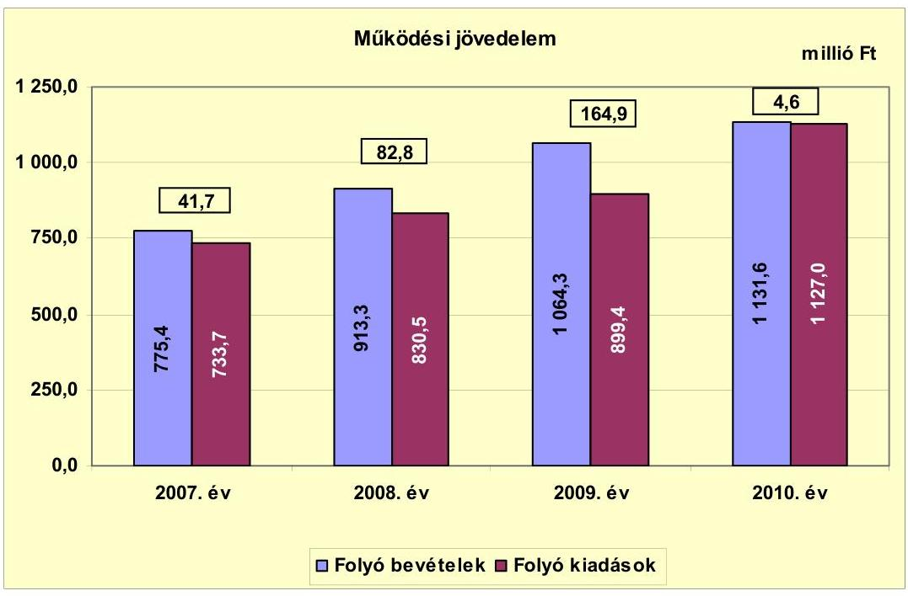

Az Önkormányzat folyó költségvetési egyenlege a 2007-2010. években forrástöbbletet mutatott. A vizsgált időszakban az összes működési jövedelemből 294 millió Ft megtakarítás volt, amely az Önkormányzat fennálló kötelezettségei megfizetéséhez és fejlesztéseihez fedezetül szolgálhatott.

A működési jövedelem az előző évhez képest a 2008. évben 41,1 millió Ft-tal nőtt, főként a saját működési bevételek és a költségvetési támogatás növekedésének hatására, a gyermekjóléti feladatok intézményfenntartó társulásban történő ellátása miatt. A 2009. évben a működési jövedelem növekedését az iparűzési adóbevétel 64,9 millió Ft-os, valamint a kötvénybevétel befektetéséből és a betétlekötésből származó hozam és kamatbevételek 63,3 millió Ft-os növekedése eredményezte. A 2009. évi folyó kiadások növekedését a kamatkiadások 17,2 millió Ft-os, a vásárolt közszolgáltatások 15,8 millió Ft-os, valamint a magánszemélyeknek átadott pénzeszközök 14,7 millió Ft-os növekedése okozta.

A 2010. évben 160,3 millió Ft-tal csökkent a működési jövedelem, mert a folyó bevétel 67,3 millió Ft-os növekedését meghaladóan emelkedett 227,6 millió Ft-tal a folyó kiadás. A 2010. évben a folyó bevételek emelkedtek nagyrészt a saját működési bevételek 29,2 millió Ft-os, az átengedett bevételek 26,8 millió Ft-os és a támogatásértékű működési bevételek 8,4 millió Ft-os növekedésének eredményeként. A 2010. évben a folyó kiadások főként az új iskolaépítéssel kapcsolatos működési kiadások hatására emelkedtek, amelyet az áfa 121,9 millió Ft-os, a készletbeszerzések 39 millió Ft-os, a szolgáltatási kiadások 14,9 millió Ft-os és a személyi juttatások 38,8 millió Ft-os növekedése okozott.

---

Az Önkormányzat nettó működési jövedelmét 2007-2010 között a következő ábra szemlélteti:
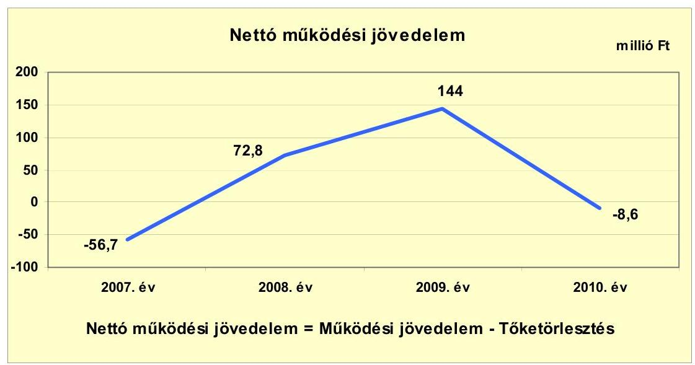

A folyó bevételek fedezetet nyújtottak a folyó kiadásokra, azonban a működési jövedelem a 2007. és a 2010. években a tőketörlesztést nem biztosította. A nettó működési jövedelem a 2007. évben negatív volt, amelyet a 41,7 millió Ft működési jövedelmet meghaladó 98,4 millió Ft tőketörlesztés okozott.

A tőketörlesztés a 2007. évben 98,4 millió Ft volt. A 2007. évben felvett svájci frank alapú 101 millió Ft fejlesztési hitelkeretből visszafizették a 2006. évi fejlesztések finanszírozására felhasznált folyószámla- és hosszú lejáratú hitel tartozását.

A nettó működési jövedelem a 2008. és a 2009. évben pozitív, a 2010. évben negatív volt. A 2010. évben a folyó bevételek 67,3 millió Ft-os növekedését meghaladta a folyó kiadások 227,6 millió Ft-os - az új iskola építése miatti személyi és dologi kiadások - emelkedése, amelynek következtében a működési jövedelem 4,6 millió Ft volt és nem nyújtott fedezetet a 13,2 millió Ft fejlesztési hitel törlesztésére.

Az Önkormányzat felhalmozási költségvetésének egyenlegét 2007-2010 között a következő ábra szemlélteti:

---

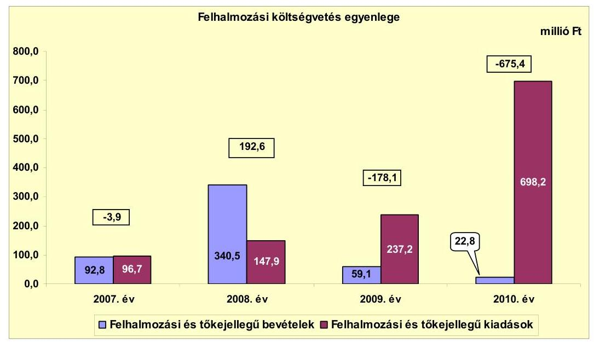

Az Önkormányzat felhalmozási költségvetésének egyenlege a 2007. évben negatív volt, a felhalmozási kiadások 3,9 millió Ft-tal meghaladták a felhalmozási bevételeket. A 2007. évben a felhalmozási kiadásokat a belső úthálózat felújítására (12,9 millió Ft-ot), valamint az Egészségügyi szolgálat bővítésére (37,8 millió Ft-ot) és ingatlanok vásárlására (12,5 millió Ft-ot), beruházások tervezésére (6,2 millió Ft-ot) fordították. A felhalmozási bevételek termőföld eladásából (6,1 millió Ft), önkormányzati ingatlanok értékesítéséből (11,7 millió Ft) és támogatásértékű felhalmozási bevételből (75 millió Ft) származtak, amelyek részben fedezték a felhalmozási kiadásokat, a hiányt folyószámlahitelből finanszírozták.

A 2008. évben az iskolaépítésre pályázat útján nyert és december hónapban rendelkezésre állt 300 millió Ft támogatás eredményeként a felhalmozási bevételek fedezetet biztosítottak a felhalmozási kiadások teljesítésére. Az Önkormányzatnak a 2009. és a 2010. években saját tőkebevétele nem keletkezett, a felhalmozási célú bevétele a pályázatokhoz nyert támogatásból származott. A felhalmozási kiadások a fejlesztések (az iskolaépítés, a könyvtár és a díszpark létrehozása, kerékpárút építése) hatására növekedtek, amelyre nem nyújtottak fedezetet a felhalmozási bevételek.

A felhalmozási forráshiányt folyószámlahitelből és a 2008. évi kötvénykibocsátásból származó bevételből finanszírozták. A felhalmozási forráshiánynak a felhalmozási és tőkejellegű kiadásokhoz viszonyított aránya 2007-ben 4% (3,9 millió Ft), 2009-ben 178,1 millió Ft (75,1%), 2010-ben 96,7% (675,4 millió Ft) volt.

---

Az Önkormányzat finanszírozási műveletei 2007-2010 közötti egyenlegének alakulását a következő ábra szemlélteti:
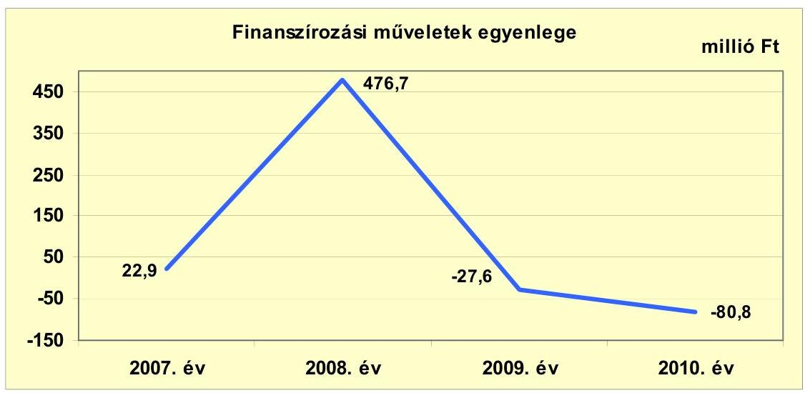

Az Önkormányzatnál a 2007-2010. években a finanszírozási műveletek egyenlege hitelfelvételből és hiteltörlesztésből, forgatási és befektetési célú értékpapírok kibocsátásából, valamint egyéb finanszírozási bevételekből és kiadásokból származott. A finanszírozási többlet a 2007. évben az egyéb finanszírozási bevételek és kiadások 20,3 millió Ft-os pozitív egyenlegéből, valamint a hiteltörlesztést 2,6 millió Ft-tal meghaladó hitelfelvételből, a 2008. évben az 502,1 millió Ft-os kötvénykibocsátásból keletkezett.

A finanszírozási hiányt a 2009. évben 20,9 millió Ft, a 2010. évben 13,2 millió Ft hiteltörlesztés, valamint az egyéb finanszírozási bevételek és kiadások 2009. évi 6,7 millió Ft-os, és 2010. évi 67,6 millió Ft-os negatív egyenlege okozta. (A finanszírozási célú műveleteket a vizsgált időszakban a jelentés 2. számú mellékletének 4.1-4.8 pontjai részletezik.)

A működési és felhalmozási célú hiány/többlet alakulását ${ }^{23}$ az Önkormányzat 2007-2010. évi zárszámadási rendeletei alapján az 1. számú melléklet tartalmazza. Bevételi többletet mutattak ki a zárszámadási rendeletekben. A bevételek tartalmazzák az előző évi pénzmaradvány felhasználásából származó pénzforgalom nélküli bevételeket is.

Az Önkormányzat kamatbevételeit és kamatkiadásait 2007-2011. év I. félév között a következő ábra mutatja be:

[^0]
[^0]:    ${ }^{23}$ Nincs kötelező előírás a működési és fejlesztési többlet, hiány megállapításának módjára.

---

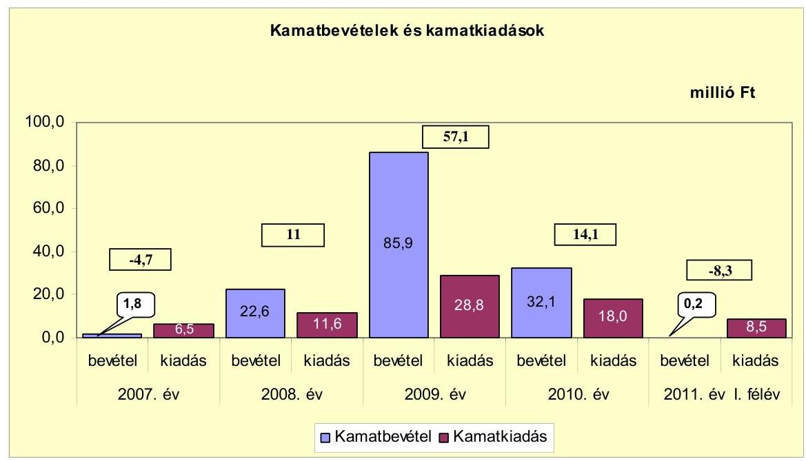

Az Önkormányzatnak 2007-2011. év I. félév között összesen 73,4 millió Ft kamatkiadása volt. A kamatkiadás a fejlesztési hitel és a kötvényforrás igénybevétele utáni fizetési kötelezettség volt. A kamatbevételből 95 millió Ft a 2008. évben kibocsátott kötvény befektetésével összefüggésben keletkezett, 47,6 millió Ft az intézmények és a Polgármesteri hivatal bankszámláin rendelkezésre állt forrás pénzintézeti betétként való lekötéséből származott. Az átmenetileg szabad pénzeszközeinek befektetéséből realizált 142,6 millió Ft kamatbevétel 69,2 millió Ft-tal meghaladta a kamatkiadásokat.

# 2.2. Az Önkormányzat bevételeinek változása 

A folyó bevételek összege a 2007. évben 775,4 millió Ft, a 2008. évben 913,3 millió Ft, a 2009. évben 1064,3 millió Ft, valamint a 2010. évben 1131,6 millió Ft volt. A 2010. évi folyó bevételeknek a 2007-2009. évek átlagához viszonyított 213,9 millió Ft-os (23,3%-os) növekedését az átengedett bevételek 22,3 millió Ft-os csökkenését meghaladó saját működési bevétel, költségvetési támogatás és államháztartáson belülről kapott támogatás 236,3 millió Ft-os növekedése eredményezte.

Az Önkormányzat 2007-2011. év I. féléve között realizált folyó bevételei főbb jogcímeinek számszaki adatait a következő grafikon mutatja be:

---

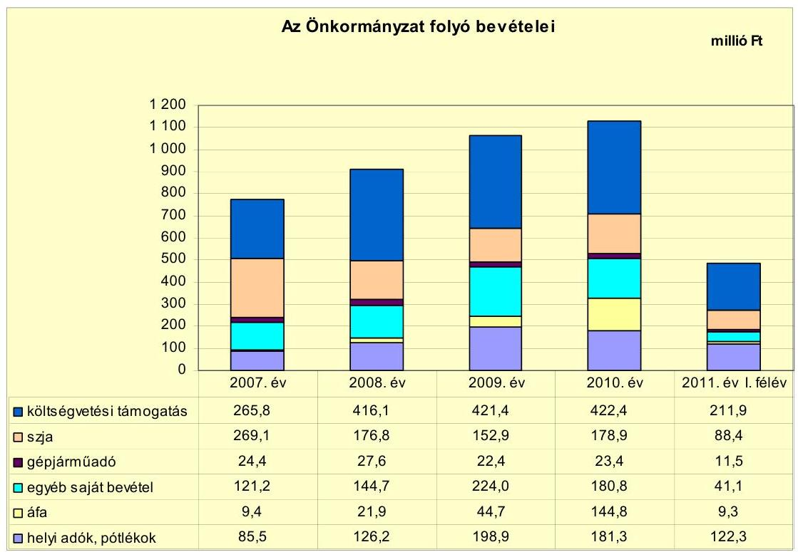

Az Önkormányzat költségvetési támogatása a vizsgált időszakban növekedett. Az előző évhez képest a 2008. évben 150,3 millió Ft-tal nőtt, nagyrészt a normatív hozzájárulás 65,3 millió Ft-os, a normatív kötött felhasználású támogatások 59,1 millió Ft-os és a központosított előirányzatok 7,9 millió Ft-os emelkedésének eredményeként. Az Önkormányzat költségvetési támogatása és az szja bevétele 2010-ben 33,9 millió Ft-tal növekedett a 2007-2009 évek átlagához képest a központi támogatáselosztás változása következtében.

A vizsgált időszakban az egyéb saját bevétel változóan alakult. A 2009. évben elsősorban a kötvénybevétel átmenetileg szabad pénzeszközeinek befektetéséből (51,4 millió Ft) és a folyószámlán rendelkezésre álló forrás betétként való elhelyezéséből (34,5 millió Ft) származó kamatbevétel hatására növekedett. A 2009. évben a 85,9 millió Ft kamatbevétel 38,3%-a volt az egyéb saját bevételeknek. A 2010. évben csökkent a kamatbevétel a kötvény után 25,1 millió Ft és a lekötött betétek után 7 millió Ft volt, mert a kötvénybevételt és az addig pénzintézetnél lekötött támogatást felhasználták az iskolaépítés finanszírozására. Az áfa bevétel 2007-2009 évek átlagához képest 119,5 millió Ft-tal emelkedett a 2010. évben, amelyből az iskolaépítéshez kapcsolódó fordított áfa bevétel 128,4 millió Ft volt. A fordított áfa technikai elszámolása miatt ez nem valós bevétel.

Az Önkormányzatnál a helyi adókból és pótlékokból származó bevételek folyó bevételeken belüli aránya a 2007. évben 11%, a 2008. évben 13,8%, a 2009. évben 18,7%, a 2010. évben 16% volt. A helyi adókból, pótlékokból befolyó bevétel az előző évhez képest a 2008. évben 40,7 millió Ft-tal, a 2009. évben 72,7 millió Ft-tal több volt. Az iparűzési adóbevétel több mint 70%-a egy adóalanytól származott, amely kockázatot jelent a bevételi kitettség miatt. Az iparűzési adóbevétel az adóalap emelkedés hatására a 2008. évben 37,5 millió

---

Ft-tal és a 2009. évben 64,9 millió Ft-tal nőtt. A városban működő vállalkozásoktól befolyt iparűzési adóbevétel ${ }^{24}$ 2007-2010 között 1,6-szeresére, 86,1 millió Ft-tal növekedett. A 2007. évben két új adó bevezetéséről döntött az Önkormányzat. Az építményadót 2007. január 1-jétől vezették be garázs, raktár után $100 \mathrm{Ft} / \mathrm{m}^{2}$, más építmények után $300 \mathrm{Ft} / \mathrm{m}^{2}$ volt, amely döntés 2007-2010. év I. félév között 74,7 millió Ft-tal több adóbevételt eredményezett. Az építményadót 2009. január 1-jétől - garázs és raktár kivételével - építményenként
 $300 \mathrm{Ft} / \mathrm{m}^{2}$ ről $500 \mathrm{Ft} / \mathrm{m}^{2}$-re emelték, amelyből 24 millió Ft-tal több bevétel származott. A kommunális adót 2007. január 1-jétől ingatlanonként 8000 Ft-ban, külterületi tanyás ingatlanonként 2500 Ft-ban állapították meg, amely döntés 2007-2011. év I. félév között 43,2 millió Ft-tal több adóbevételt eredményezett.

Az Önkormányzat számára a vizsgált időszakban gazdasági társaság nem fizetett osztalékot.

Az Önkormányzat felhalmozási bevételei a vizsgált időszakban:

| Megnevezés | 2007. év | 2008. év | 2009. év | 2010. év | 2011. év I.   félév |
| :-- | --: | --: | --: | --: | --: |
| Tárgyi eszköz értékesítés | 6,1 | 0,3 | 0,0 | 0,0 | 0,0 |
| Egyéb saját tőkebevétel | 11,7 | 4,9 | 0,0 | 0,4 | 0,0 |
| Államháztartáson belülről   kapott támogatás | 75,0 | 335,3 | 59,1 | 22,4 | 6,6 |
| EU-tól és külföldről kapott   támogatások | 0,0 | 0,0 | 0,0 | 0,0 | 0,0 |
| Államháztartáson kívülről   kapott támogatás | 0,0 | 0,0 | 0,0 | 0,0 | 0,0 |
| Összes felhalmozási bevétel | 92,8 | 340,5 | 59,1 | 22,8 | 6,6 |

Az Önkormányzatnál a tárgyi eszközök értékesítéséből származó bevétel a 2007-2008. években telek és ingatlan eladásából származott. Az egyéb saját tőkebevételek az önkormányzati lakások értékesítéséért kapott bevételekből és magánszemélyeknek, civilszervezeteknek adott támogatási kölcsönök visszatérüléséből keletkeztek. Az államháztartáson belülről kapott támogatás a központi költségvetési szervtől nyertes pályázat alapján biztosított összeg volt. Pályázatuk alapján a 2007. évben 26,1 millió Ft-ot az egészségügyi szolgálat bővítésére, a 2008. évben iskolaépítésre 300 millió Ft-ot, az óvoda nyílászáróinak cseréjére 10,7 millió Ft-ot, az utak aszfaltszőnyegezésére 5,3 millió Ft-ot, a 2009. évben az óvoda felújítására 16,6 millió Ft-ot nyertek.

# 2.3. Az Önkormányzat működési és a felhalmozási célú kiadásainak változása 

Az Önkormányzat folyó kiadásai főbb jogcímek szerinti bontásban a következők voltak:

[^0]
[^0]:    ${ }^{24}$ Helyi iparűzési adó mértéke 1,75\%. A helyi adókról szóló 1990. évi C. törvény 40. § (1) bekezdés c) pontjában megállapított adómérték 2\%.

---

| Megnevezés | 2007. év | 2008. év | 2009. év | 2010. év | 2011. év I.   félév |
| :--: | :--: | :--: | :--: | :--: | :--: |
| Folyó kiadások | 733,7 | 830,5 | 899,4 | 1127,0 | 450,1 |
| Működési kiadások (kamatkiadás nélkül) | 612,6 | 688,5 | 723,5 | 937,6 | 359,0 |
| Államháztartáson belülre átadott pénzeszközök | 0,4 | 0,0 | 0,0 | 12,5 | 6,7 |
| Transzferkiadások | 114,2 | 130,4 | 147,1 | 158,9 | 75,9 |
| -ebből: vállalkozásoknak | 0,0 | 0,0 | 0,0 | 0,0 | 0,0 |
| EU-nak, illetve külföldre | 0,0 | 0,0 | 0,0 | 0,0 | 0,0 |
| magánszemélyeknek | 107,9 | 123,9 | 138,6 | 150,2 | 72,2 |
| nonprofit szervezeteknek | 6,3 | 6,5 | 8,5 | 8,7 | 3,7 |
| Kamatkiadások | 6,5 | 11,6 | 28,8 | 18,0 | 8,5 |
| Előző évi pénzmaradvány átadás | 0,0 | 0,0 | 0,0 | 0,0 | 0,0 |

Az Önkormányzatnál 2007-2010 között a folyó kiadások folyamatosan emelkedtek, a 2010. évben a 2007-2009. évek átlagához képest 305,8 millió Ft-tal (37,2\%-kal) növekedtek. A vizsgált időszakban a működési kiadások kamatkiadások nélkül a 2010. évben 262,7 millió Ft-tal ( $38,9 \%$-kal) nőttek a 2007-2009-es évek átlagához képest. A transzferkiadások a 2008. évben 16,2 millió Ft-tal, a 2009. évben 16,7 millió Ft-tal nőttek, a magánszemélyeknek fizetett pénzbeli (szociális) juttatás következtében. Az államháztartáson belülre átadott pénzeszköz a 2010. évben működési célú pénzeszközátadás volt költségvetési szervnek. A 2009. évi kamatkiadásból 2,3 millió Ft-ot a 2007. évben felvett fejlesztési hitel és 25,3 millió Ft-ot a kötvénykibocsátás után fizettek.

Az Önkormányzat folyó kiadásai kiemelt működési előirányzatok szerinti bontásban a következők voltak:

|  |  |  |  |  | millió Ft |
| :-- | --: | --: | --: | --: | --: |
| Megnevezés | 2007. év | 2008. év | 2009. év | 2010. év | 2011. év I.   félév |
| Személyi juttatások | 334,7 | 353,0 | 366,6 | 405,4 | 189,9 |
| Munkaadót terhelő járulékok | 107,1 | 113,0 | 106,1 | 104,6 | 49,2 |
| Dologi kiadások | 168,8 | 202,3 | 248,7 | 424,0 | 115,7 |
| Egyéb folyó kiadások | 2,0 | 20,2 | 2,1 | 3,6 | 4,2 |

Az Önkormányzatnál a személyi juttatásra 2010. évben teljesített kiadás a 2007-2009. évek átlagához képest 54 millió Ft-tal nőtt a feladatbővülés miatt bekövetkezett létszámnövekedés hatására. A foglalkoztatottak száma a közoktatásban a 2010. évben 10 fővel, a gyermekjóléti ellátásban 2008. évben négy fővel, az egészségügyi ellátásban 2008. és 2009. években egy-egy fővel, a Polgármesteri hivatalban és a Gondnokságnál három fővel nőtt.

A munkaadót terhelő járulékokra teljesített kiadás a 2010. évben a 2007-2009. évek átlagához képest 4,1 millió Ft-tal csökkent, a központi intézkedések hatására.

A dologi kiadások a 2010. évben 217,6 millió Ft-tal nőttek a 2007-2009. évek átlagához képest. A 2010. évben a 2009. évhez képest a nagyarányú növekedést az áfa 121,9 millió Ft-os, a készletbeszerzések 39 millió Ft-os (ebből a kis értékű tárgyi eszköz beszerzés 27,5 millió Ft-os) többlet kiadása okozta az új iskola építése miatt.

---

Az egyéb folyó kiadás a 2007. évhez képest a 2008. évben 18,2 millió Ft-tal nőtt a különféle költségvetési befizetések 11,1 millió Ft-os, az adók, díjak, befizetések 5 millió Ft-os és a realizált árfolyamveszteség 2,1 millió Ft-os növekedése miatt.

Az Önkormányzat folyó és felhalmozási kiadásait a 2007-2011. év I. féléve között a következő ábra mutatja:
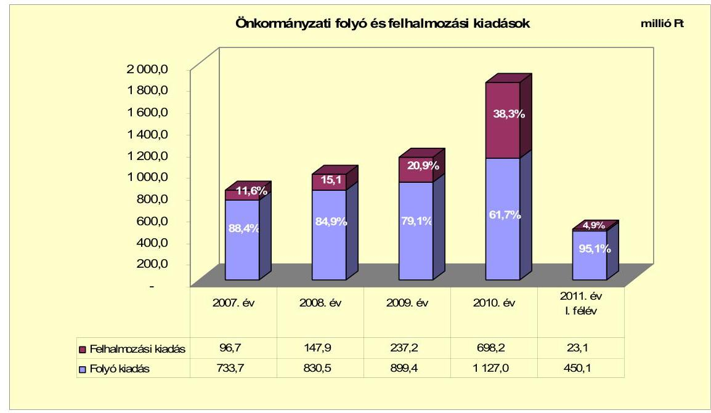

Az Önkormányzatnál a CLF módszer szerint számított folyó kiadás és felhalmozási kiadás együttes összege növekvő tendenciát mutatott, a 2007. évben 830,4 millió Ft, a 2008. évben 978,4 millió Ft, a 2009. évben 1136,6 millió Ft, a 2010. évben pedig 1825,2 millió Ft volt. A folyó és a felhalmozási kiadások összegén belül a felhalmozási kiadások összege és aránya folyamatosan emelkedett. A felhalmozási kiadásokból beruházásokra, felújításokra a 2007. évben 87,5 millió Ft-ot, a 2008. évben 145,1 millió Ft-ot fordítottak. Az általános iskola építésére a 2009. évben 173,9 millió Ft-ot ( $15,3 \%$-ot), a 2010. évben 595,5 millió Ft-ot ( $32,6 \%$-ot) teljesítettek. A 2009. évi folyó kiadások növekedését a működési kiadások, az áfa 20,9 millió Ft-os és a vásárolt közszolgáltatások 15,8 millió Ft-os, valamint a kamatkiadások 17,2 millió Ft-os és a magánszemélyeknek átadott pénzeszközök 14,7 millió Ft-os növekedése okozta. A 2010. évben a folyó kiadások főként a működési kiadások hatására emelkedtek, az áfa 121,9 millió Ft-os, a készletbeszerzések 39 millió Ft-os, a szolgáltatási kiadások 14,9 millió Ft-os, és a személyi juttatások 38,8 millió Ft-os növekedésének hatására. Ennek jelentős része az új építésű iskola berendezésével, felszerelésével és az iskolában alkalmazottak számának növekedésével függ össze.

A 2007-2010 közötti időszakban megvalósított és 2010. december 31-ig befejezett felújítások és fejlesztések száma 28 db volt, amelyből 20 db volt a tízmillió forint alattiak száma. A tényleges bekerülési költség összesen 1214,3 millió Ft volt, ebből a 10 millió Ft alattiak 157,8 millió Ft-ba kerültek. A befejezett fejlesztések forrásösszetétele 258,7 millió Ft (21,3\%) saját bevételből, 4,4 millió Ft ( $0,3 \%$ ) hitelből, 466,9 millió Ft (38,5\%) kötvény kibocsátásból származó bevételből, 114,8 millió Ft (9,5\%) EU-s és 369,5 millió Ft (30,4\%) hazai támogatásból állt. Az Önkormányzat 2007-2010. években megvalósított, 2010. december 31-ig befejezett fejlesztéseit és annak forrásösszetételét a 3/a. számú melléklet tartalmazza.

Az Önkormányzatnál 2010. december 31-én folyamatban lévő felújítási és fejlesztési feladat nem volt.

Az Önkormányzatnál 2011. év I. félévben indított projekt a Polgármesteri hivatal komplex akadálymentesítése, amelynek várható 30 millió Ft bekerülési költségét 1,5 millió Ft (5\%) önkormányzati saját forrásból és 28,5 millió Ft (95\%) EU-s támogatásból finanszírozzák. A folyamatban lévő fejlesztés előfinanszírozása az Önkormányzat tájékoztatása szerint az iparűzési adóbevételből nem okoz finanszírozási problémát. Az Önkormányzatnak 2010. december 31-én elbírálás alatt lévő pályázata a zöldhulladék kezelésével kapcsolatban volt. A megvalósítani tervezett projekt bekerülési költsége 10,3 millió Ft, a forrásösszetételét 4,1 millió Ft (40\%) saját bevétel, 5,3 millió Ft (51\%) EU-s és 0,9 millió Ft (9\%) hazai támogatás fogja képezni. Az Önkormányzat által beadott, elbírálás alatti pályázati forrásból megvalósítani tervezett fejlesztéseihez kapcsolódó kötelezettségvállalásait és azok forrásösszetételét a 3/b. számú melléklet tartalmazza.

A vizsgált időszakban befejeződött három legjelentősebb fejlesztés a következő volt:

- a 2009-2010. évben felső tagozatos diákoknak általános iskolát építettek. Az épület kétszintes, $12+5$ szaktanterem van benne. A bekerülési költsége 797 millió Ft volt. A fejlesztés 30,1 millió Ft saját bevételből, 466,9 millió Ft kötvénykibocsátásból származó bevételből és 300 millió Ft hazai támogatásból valósult meg;
- a 2008. évben a közlekedésbiztonsági célú 2178 m hosszú kerékpárút 83,9 millió Ft-os bekerülési költségű építését 27,1 millió Ft saját forrásból és 56,8 millió Ft EU-s forrásból finanszírozták;
- a 2010. évben könyvtár és $360 \mathrm{~m}^{2}$ díszpark létesítése 60,7 millió Ft-os bekerülési költségű fejlesztés 11,7 millió Ft saját bevételből, valamint 49 millió Ft EU-s támogatásból valósult meg.

Az iskolaépítéssel kapcsolatban nem számszerűsítették a várható kiadásokat, ezért a jövőbeni üzemeltetés kockázatot jelenthet és befolyásolhatja az Önkormányzat pénzügyi egyensúlyát. Az Önkormányzat a 2007-2011. év I. félév közötti időszakban nem nyújtott gazdasági társaság részére működési és felhalmozási célú önkormányzati támogatást.

---

# 3. Az ÖNKORMÁNYZAT KÖTELEZETTSÉGEI 

### 3.1. Az Önkormányzat pénzintézeti kötelezettségeinek változása

Az Önkormányzat mérleg szerinti pénzintézeti kötelezettsége a 2006. év végéről a 2011. év I. félév végére 99,2 millió Ft-ról 868,9 millió Ft-ra nőtt, amelyből az árfolyamváltozás miatti különbözet 310,8 millió Ft volt. Fennálló pénzintézeti kötelezettségei folyószámlahitel igénybevételéből, kötvénykibocsátásból és fejlesztési hiteltartozásból keletkeztek. A 2011. év I. félévben a fejlesztési hitel tőketörlesztésére 7,1 millió Ft-ot teljesítettek. A tőketörlesztésre jutó árfolyam különbözet ${ }^{25}$ 2,1 millió Ft. Az Önkormányzat a fejlesztési hitel törlesztésével kapcsolatban állományváltozást az Áhsz. 47. § (1) bekezdésében foglaltaktól eltérően nem könyvelt, ezért a 2011. év I. féléves mérlegjelentésben nem a valóságnak megfelelően mutatta be a hitel állományát.

Az Önkormányzat pénzintézetekkel szemben fennálló kötelezettség-állományát a 2007-2011. év I. félévben ${ }^{26}$ a következő ábra szemlélteti:
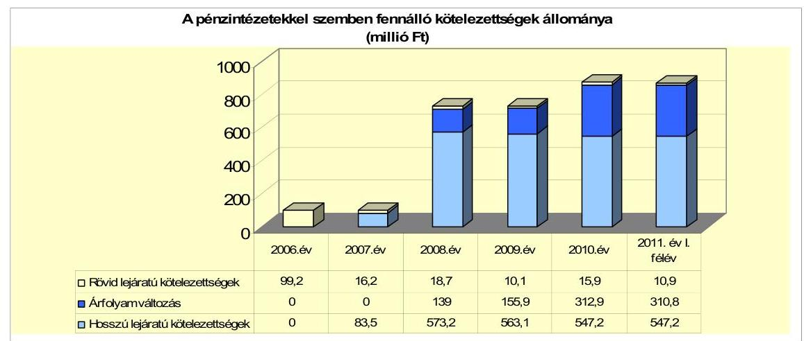

Az Önkormányzat pénzintézeti kötelezettségvállalásaira képviselő-testületi döntés alapján került sor. Az adósságot keletkeztető kötelezettségvállalásoknál vizsgálták az adósságszolgálati korlátot, annak felső határát 2007-2011. év I. félévben nem lépték
 túl. A kötelezettségvállalásokból származó források felhasználási céljait meghatározták. A fejlesztési hitelt az eddigi fejlesztéseket finanszírozó folyószámlahitel kiváltására, a kötvényt beruházások (iskolaépítés, csatorna, kerékpárút) önerejének biztosítására tervezték fordítani. A fejlesztési hitel felvételére kötött szerződés szerint a hitel a folyó beruházásokhoz, valamint a hitelkeret 72%-a korábbi hitel törlesztésére szabadon felhasználható volt. A Képviselő-testület döntését megalapozó előterjesztésekben a teljes futamidő várható kamat- és tőkefizetési kötelezettségeit bemutat-

[^0]
[^0]:    ${ }^{25}$ Az árfolyam-különbözet számítása a lehíváskori árfolyamhoz (156,24 Ft/CHF) történt.
    ${ }^{26}$ A 2011. év I. félév végi fejlesztési hitelállomány nem a mérlegjelentés alapján került bemutatásra, az módosításra került a törlesztés összegével.

---

ták. Azonban a visszafizetés forrásait nem határozták meg és a kamat- és árfolyamváltozásban rejlő kockázatot nem mutatták be.

Az Önkormányzat 2011. június 30-án CHF-ben fennálló adósságot keletkeztető pénzintézeti kötelezettségvállalása az alábbi volt:

| Megnevezés | Szerződéskötés/   Kibocsátás   időpontja | Összeg   ezer CHF-ben | Kibocsátás/lehívási   árfolyam | Kamat (referencia kamat+   kamatfelár) | Felhasználás célja: |
| :-- | :--: | :--: | :--: | :--: | :--: |
| fejlesztési hitel | 2007. 01. 31 | 646,3 | 156,24 | $2,13583 \%+1,95 \%$ | Az eddigi fejlesztésekre   felvett hitel kiváltása |
| "Tápöszéle fejlődéséért"   kötvény | 2008. 07. 10 | 3529,8 | 141,65 | $2,97 \%+1,8 \%$ | Pályázati önerő biztosítása az   Önkormányzat vagyonát   gyarapító pályázatoknál |

A fejlesztési hitelt az Önkormányzat számlavezető bankja folyósította a 2007. évben. A fejlesztési hitelt a 2007. évben felhasználták, ellenértékének (101 millió Ft) 95,6%-át (96,6 millió Ft-ot) a 2006. évi fejlesztések folyószámlahitelből finanszírozott összegének törlesztésére, 3,4%-át (4,4 millió Ft-ot) a gyermekjóléti feladatokat ellátó intézményhez kapcsolódó ingatlanvásárlásra fordították. A hitel kiváltásával javult az Önkormányzat pénzügyi pozíciója. A folyószámlahitel törlesztésének összege meghaladta a szerződésben korábbi hitel visszafizetésére fordítható mérték alapján számított összeget, amelyet a pénzintézet nem kifogásolt.

A kötvény kibocsátója és lejegyzője - a 2008. évben - nem a számlavezető bank volt. A hitel felvételére közbeszerzési eljárást írtak ki, a kötvénykibocsátás előkészítésekor öt pénzintézettől kértek és négytől kaptak ajánlatot.

Az Önkormányzat a kötvény ellenértékéből (500 millió Ft-ból) 2009-2010 között 466,9 millió Ft-ot (93,4%-ot) az általános iskola építésére fordított. A közösségi könyvtár létrehozására, valamint díszpark kialakítására nyert EU-s támogatás megelőlegezésére 2010-ben 33,1 millió Ft-ot használt fel.

Az Önkormányzat a CHF-ben fennálló pénzintézeti kötelezettségeiből 2011. június 30-ig a fejlesztési hitel után 274669 CHF (50 millió Ft) tőkét törlesztett, 77613 CHF (13,5 millió Ft) kamatot fizetett. A kötvény visszafizetése 2011. október hónaptól kezdődik. A kötvénykötelezettséghez kapcsolódóan 5 millió Ft szervezési díjat és 280540 CHF (54,1 millió Ft) kamatot teljesített 2008-2011. év I. féléve között. A CHF-ben történt tőketörlesztés az Önkormányzatnak 5,1 millió Ft árfolyam-veszteséget okozott.

Az árfolyamváltozás hatása is befolyásolja a kötelezettségek alakulását, azonban annak mértéke előre pontosan nem határozható meg, csak várakozásokon alapuló tendenciák jelezhetők. A számviteli szabályok előírják, hogy az árfolyam különbözetet év végén a kötelezettségek vagy követelések között a könyvviteli mérlegben nyilván kell tartani, azonban az árfolyam különbözet valójában nem realizált. Annak megítéléséről, hogy a devizában kibocsátott kötvényekért és felvett hitelekért kapott forinthoz képest a kötvények visszavásárlásakor, illetve a hitelek visszafizetésekor jelentkező forint kötelezettség többletkiadást (árfolyamveszteség) vagy megtakarítást (árfolyamnyereség) eredményez a futamidő végén, a teljes kötelezettség rendezését követően lehet képet alkotni. Mindaddig, amíg törlesztési kötelezettség nem áll fenn (türelmi idő, moratórium), a tőkére vonatkoztatva nem értelmezhető sem az árfolyamveszteség, sem az árfolyamnyereség.

---

A 2007-2010. évek között a kötvénybevétel átmenetileg szabad pénzeszközeinek befektetésével összesen 95 millió Ft kamatot realizált. Az Önkormányzat kimutatása szerint a befektetésből származó többletbevételből a kötvény kamattörlesztésére 46,5 millió Ft-ot, a kibocsátással kapcsolatos szervezési díjra 5 millió Ft-ot, a befektetések tanácsadási díjára 9,1 millió Ft-ot, fejlesztési feladatokra 31,7 millió Ft-ot, működési kiadásokra 2,7 millió Ft-ot fordítottak. A kötvénykibocsátásból származó források szabadon, a pénzintézet korlátozása nélkül befektethetőek voltak, a kibocsátásból származó forrás felhasználásához bejelentési, adatszolgáltatási kötelezettséget a pénzintézet nem írt elő.

Az Önkormányzat a 2009. év kivételével 2007-2011 között az eredeti költségvetésekben a költségvetés egyensúlya érdekében működési célú hitel felvételét ${ }^{27}$ tervezte. A 2007-2008. és a 2010-2011. évi költségvetési rendeletekben a költségvetési bevételek és kiadások egyenlegeként nem mutatták be a költségvetési hiány összegét és finanszírozásának módját, ezzel megsértették az Áht. 1 8/A. § (1) bekezdésében és - 2010-től - a 69. § (1) bekezdés b), c) és d) pontjaiban foglaltakat ${ }^{28}$. A 2007-2011. években a költségvetési kiadások és bevételek főösszegeinek megállapításánál finanszírozási célú pénzügyi műveleteket is figyelembe vettek. Ezzel az Önkormányzat az Áht. ${ }_{1} 8 /$ A. § (7) bekezdésében ${ }^{29}$ előírtakat nem tartotta be.

A 2007-2011. években a bevételek és kiadások főösszegeinek megállapításánál nem mutatták be elkülönítetten a 2007-2008. és a 2010-2011. években a tervezett működési célú hitel felvételét, valamint 2007-2010 között a hiteltörlesztéseket és 2010-ben az előző évi pénzmaradvány igénybevételét.

Az Önkormányzat likviditásának biztosításához a vizsgált időszakban folyószámlahitel felvételére volt szükség. Állománya azonban nem vált tartóssá, 2009-2010. évek és a 2011. év I. félév végén nem volt visszafizetetlen folyószámlahitel. A 2007. év előtt a fejlesztéseket folyószámlahitelből finanszírozták és a felhalmozódott 96,6 millió Ft állományt kiváltották hosszú lejáratú fejlesztési hitelre. A vizsgált időszakban a hitelkeret összege nem változott. Munkabér megelőlegezési hitel vagy egyéb likviditási célú rövid lejáratú hitel felvétele nem volt a vizsgált időszakban. A folyószámlahitel alakulását a következő táblázat mutatja be:

| Megnevezés | 2007. év | 2008. év | 2009. év | 2010. év | 2011. év I.   félév |
| :-- | --: | --: | --: | --: | --: |
| A folyószámlahitel keretösszege január 1-jén | 100 | 100 | 100 | 100 | 100 |
| Állagos napi állománya | 19,5 | 3,8 | 7,0 | 3,0 | 0,3 |
| Folyószámlahitellel zárt napok száma | 172 | 149 | 152 | 135 | 26 |
| Egyenleg (állomány december 31-én) | 6,2 | 8,6 | 0,0 | 0,0 | 0,0 |
| Teljesített kamat és egyéb költség | 2,4 | 0,5 | 1,1 | 0,5 | 0,05 |

A folyószámlahitellel zárt napok száma, átlagos napi állománya 2007-2010 között csökkent, a 2011. év I. félévben történt igénybevétel nagysága nem je-

[^0]
[^0]:    ${ }^{27}$ 2007-ben 27,1 millió Ft, 2008-ban 41,7 millió Ft, 2010-ben 41,2 millió Ft, 2011-ben 49,4 millió Ft működési célú hitel felvételét tervezték.
    ${ }^{28}$ 2012. január 1-jétől az Áht. 2 23. § (2) bekezdés c)-e) pontjai.
    ${ }^{29}$ 2012. január 1-jétől az Áht. 2 72. § a) pont.

---

lentős. Az átmeneti likviditási problémák miatt igénybevett folyószámlahitel az Önkormányzatnak a 2007-től 2011. év I. félévig összesen 4,1 millió Ft kamatkiadást és 0,4 millió Ft egyéb költséget okozott. A folyószámlahitel kondícióit a következő táblázat mutatja:

| Megnevezés | Ügyleti kamat | Egyéb költség |
| :--: | :--: | :--: |
| 2006. június 26-tól | $11 \%$ | $1 \%$ kezelési költség és 0,5\%   rendelkezésre tartási jutalék |
| 2009. október 15-tól | $14 \%$ | $1 \%$ kezelési költség és 0,5\%   rendelkezésre tartási jutalék |

A 2011. június 30-án fennálló kötvény és a fejlesztési hitel esetében a kamatfizetési kötelezettségek alakulását jelentősen, kedvező irányban befolyásolta és jelenleg is befolyásolja a kibocsátáskori és az utolsó kamatfizetési referencia kamatok változása, melyet az alábbi táblázat mutat be:

| Megnevezés | Kibocsátási, lehívási | Utolsó fizetéskori | Változás \% |
| :--: | :--: | :--: | :--: |
|  | kamat (referencia + kamatfelár) \% |  |  |
| 3 havi CHF LIBOR (fejlesztési hitel) | $2,13583+1,95$ | $1,11+1,95$ | $-25,1 \%$ |
| 6 havi CHF LIBOR (kötvény) | $2,97+1,8$ | $0,24167+1,8$ | $-57,2 \%$ |

A vizsgált időszakban az utolsó kamatfizetés a kötvény esetében 2011. április 1-jén, a fejlesztési hitel esetében 2011. június 30-án volt.

Az alapkamat mértékének alakulása jelentős hatással van a kamatkötelezettség nagyságára. Amennyiben a referencia kamat nem változott volna, az Önkormányzatnak a kibocsátáskori referencia kamattal számolva 2011. június 30-ig a kötvény esetében 463025 CHF (89,8 millió Ft) ${ }^{29}$ kamatfizetési kötelezettsége jelentkezett volna. A változások miatt azonban 182485 CHF-el (35,7 millió Ft-tal) ${ }^{30}$ kevesebb fizetési kötelezettséget kellett teljesítenie, mint amivel a szerződés megkötésekor számolnia kellett. A fejlesztési hitel esetében a lehívási referencia kamattal számolva 2011. június 30-ig 16,9 millió Ft kamatfizetési kötelezettsége jelentkezett volna az Önkormányzatnak. A változások (2009. évig folyamatosan növekvő, ezt követően mintegy felére csökkenő referencia kamat) miatt azonban ténylegesen 3,4 millió Ft-tal kevesebb (13,5 millió Ft)$)^{29}$ fizetési kötelezettséget kellett teljesítenie. Az árfolyamváltozás miatt a fejlesztési hitellel kapcsolatos tőketörlesztés növekedésének értéke 7,1 millió Ft volt a vizsgált időszakban. A referencia kamat csökkenése nem tudta ellensúlyozni az árfolyam növekedés hatását, amely miatt 3,7 millió Ft-tal több kötelezettséget teljesített az Önkormányzat.

Az Önkormányzatnál 2007-2010 között a kötvény és a fejlesztési hitel számviteli törvény szerinti év végi értékelése megtörtént. A helyszíni vizsgálat alatt további hitel igénybevételről, illetve kötvénykibocsátásról szóló döntést nem készítettek elő.

[^0]
[^0]:    ${ }^{30}$ A kibocsátáskori referencia kamattal és a negyedévente kimutatott tényleges árfolyammal számítva.

---

Az Önkormányzat kötelezettségeinek 2010. december 31-i, és 2011. június 30-i állományát, valamint azok várható értékeit - a felmerülő kamatokat és díjakat is figyelembe véve - a kötelezettség lejártáig, a következő táblázat mutatja be:

| Megnevezés | Állomány 2010. december 31-én |  |  | Állomány 2011. június 30-   án |  |  | Várható kötelezettség 2011-2013. években |  | Várható kötelezettség 2014. évtől |  |
| :--: | :--: | :--: | :--: | :--: | :--: | :--: | :--: | :--: | :--: | :--: |
|  | HUF-ban   (mibö. Ft.   ban) | Devizában   (összegy.   ezer CHF-   ban) | Deviza   nem | HUF-ban   (mibö. Ft.   ban) | Devizában   (összegy.   ezer CHF-   ban) | Deviza   nem | HUF-ban   (mibö. Ft.   ban) | Devizában   (összegy.   ezer CHF-   ban) | HUF-ban   (mibö. Ft.   ban) | Devizában   (összeges   ezer CHF-   ban) |
| Pénzintézeti kötelezettségek |  | 

 |  |  |  |  |  |  |  |  |
| fejlesztési hitel |  | 453,9 | CHF |  | 371,6 | CHF |  | 221,1 |  | 224,1 |
| "Tájékoztató fejlődésében" kötvény |  | 3529,8 | CHF |  | 3529,6 | CHF |  | 447,0 |  | 3537,0 |
| Pénzintézeti kötelezettségek összesen CHF-ben: |  | 3933,7 | CHF |  | 3901,4 | CHF |  | 669,0 |  | 4 161,1 |
| Kezesség |  |  |  | 28,4 |  |  |  |  |  |  |
| Szállítói tartozás | 22,7 |  |  | 23,8 |  |  | 23,8 |  |  |  |

Az Önkormányzat pénzintézeti kötelezettségeinek állománya 2010. december 31-én 3933,7 ezer CHF-ből tevődött össze, amelynek 89,7%-a (3529,8 ezer CHF) a kötvénykibocsátásból, 10,3%-a (403,9 ezer CHF) fejlesztési hiteltartozásból állt. Ezek miatt a 2011-2013. években várhatóan 669 ezer CHF tőke- és kamatkötelezettséget ${ }^{31}$ kell teljesítenie.

Az Önkormányzat 2011. év I. félév végi szállítói tartozása 23,6 millió Ft, a csatorna-társulat által felvett hitelhez kapcsolódó kezességvállalásból származó kötelezettsége 28,4 millió Ft volt. A 2011-2013. években az összes kötelezettség teljesítésére figyelembe vehető 5,4 millió Ft szabad pénzmaradvány, valamint az eladhatóságot és a behajthatóságot feltételezve a jelzáloggal nem terhelt forgalomképes ingatlanvagyon értékesítéséből és 49,0 millió Ft mérlegben kimutatott követelésállomány behajtásából származó forrás.

Az Önkormányzat 2014. évtől esedékes jelenleg ismert pénzintézeti kötelezettségei: 4161,1 ezer CHF. Az ezek teljesítésére figyelembe vehető források - a polgármester és a jegyző nyilatkozata szerint - jelenleg nem ismertek ugyan, de „a mindenkori költségvetési rendeletekben megtervezett helyi adóbevételek" erre vélhetően fedezetet biztosítanak. A 2014 utáni évektől a jelenleg ismert pénzintézeti kötelezettségek teljesítését részben látjuk biztosítottnak abban az esetben, ha a működési jövedelemtermelő képesség a 2010. évi iskolaépítéssel kapcsolatos egyszeri kiadásemelkedést követően visszaáll a 2008-2009. évek szintjére. A 2011. év I. félévi folyó költségvetés pozitív egyenlege (34,4 millió Ft) alapján feltételezzük a működési jövedelemtermelő képesség változatlanságát. Az Önkormányzatnak a pénzügyi egyensúlya javításához, a fennálló kötelezettségeinek a teljesítéséhez a jövőben bevételnövelő és kiadáscsökkentő intézkedéseket kell hoznia. A tőketörlesztés jövőbeni összegét a kamat- és árfolyamváltozás is befolyásolhatja.

[^0]
[^0]:    ${ }^{31}$ A várható kamatkötelezettségeket a devizában fennálló kötelezettségeknél az utolsó kamatkondícióval számoltuk.

---

# 3.2. A szállítói kötelezettségek változása 

Az Önkormányzat szállítókkal szemben fennálló kötelezettségeinek állománya 2007. január 1-jéről 2010. december 31-re 56,0 millió Ft-ról ${ }^{32} 22,7$ millió Ft-ra (59,5%-kal), kötelezettségeken belüli aránya 28%-ról 2,5%-ra csökkent. A 2007. év eleji állományból az egészségügyi központ bővítése miatt 37,7 millió Ft év közben vált esedékessé, ez okozta az állományemelkedést. A szállítói kötelezettségek átlagos állománya ${ }^{33} 3,9$ millió Ft volt 2007-2009 között. A szállítói kötelezettség a 2009. évhez képest 2010. év végére több mint hat és félszeresére, 19,3 millió Ft-tal emelkedett. A növekedést az okozta, hogy vállalkozási szerződés alapján az iskolaépítés 42 millió Ft-os számlájából 22 millió Ft 2010-ben, 20 millió Ft 2011. év III. negyedévében esedékes. A szállítói állomány a szállítói analitika alapján 2011. június 30-án 23,6 millió Ft volt, 2010-hez képest 0,9 millió Ft-tal (4%-kal) emelkedett. Az Önkormányzat a szállítói állománnyal kapcsolatban állományváltozást az Áhsz. 47. § (1) bekezdésében foglaltaktól eltérően nem könyvelt a 2011. év I. félévében, ezért a 2011. év I. féléves mérlegjelentésben nem a szállító analitikának megfelelően mutatta be a szállítói állományát.

Az Önkormányzatnak 2007-ben 2,7 millió Ft, 2008. évben 0,4 millió Ft, 2009-ben 1,3 millió Ft, 2010-ben 0,1 millió Ft, 2011. év I. félévben 0,2 millió Ft lejárt szállítói tartozása volt, amely mind 30 nap alatti tartozás. Egyéb kiadáselmaradás, átütemezett szállítói tartozás a vizsgált időszakban nem volt.

### 3.3. Egyéb kötelezettségek változása

Az Önkormányzat a vizsgált időszak alatt nem végzett PPP konstrukcióban beruházást. Egy munkagépet lízingelt 2005-2009 között, amelyre 14,1 millió Ft tőkét és 2,1 millió Ft kamatot teljesített. Készfizető kezességvállalási szerződés alapján, a Tápiómenti Települések Csatornamű Vízgazdálkodási Társulat által 2011. év I. félévig kimutatott 350 millió Ft kötelezettség után az Önkormányzatra jutó kezességvállalás összege 28,4 millió Ft. Az Önkormányzatnak a készfizető kezessége miatt még nem keletkezett fizetési kötelezettsége a vizsgált időszakban.

A Tápiómenti Települések Csatornamű Vízgazdálkodási Társulat összes fennálló vagy a jövőben esedékessé váló fizetési kötelezettség biztosítására - a társulatban résztvevő 20 település és a hitelt nyújtó pénzintézet - készfizető kezességvállalási szerződést kötött 2009. december 7-én maximum 1286,6 millió Ft erejéig. A szerződés alapján az Önkormányzatra kimutatott kezességvállalási rész maximuma 104,2 millió Ft (a teljes összeg 8,1%-a).

Az Önkormányzat 2007-2011. év I. félév között összesen 5,1 millió Ft adópótlék és adóbírság követeléséről méltányossági alapon mondott le. A jegyző határozatban rendelkezett a késedelmesen, vagy meg nem fizetett adó miatt kiszabott

[^0]
[^0]:    ${ }^{32}$ Auditálási eltérés miatt 22,2 millió Ft-tal több az állomány összege, mint a Kincstárnak leadott beszámolóban.
    ${ }^{33}$ A szállítói kötelezettség 2007-ben 5,3 millió Ft, 2008-ban és 2009-ben 3,3 millió Ft volt.

---

pótlék/bírság egy részének elengedéséről és a fennmaradó összeg részletekben történő visszafizetésének engedélyezéséről, amely többségében az adós rossz anyagi helyzetére tekintettel benyújtott kérelem alapján történt.

Az Önkormányzat 2007-2011. év I. félévig intézményeinek, más önkormányzatnak kölcsönt nem nyújtott. A vizsgált időszakban egyéb gazdasági társaságnak 0,4 millió Ft, helyi egyesületeknek, kluboknak 27 millió Ft kölcsönt nyújtott pályázati pénzeszközök megelőlegezésére, amelyből 5,9 millió Ft megtérült. A 2011. év I. félév végén a kölcsönnyújtásból eredő, a szerződés szerint 2012-ben esedékes követelés 21,5 millió Ft volt.

Az Önkormányzat 2011. év I. félév végén négy forgalomképes és kettő korlátozottan forgalomképes ingatlanán szerepelt jelzálogjog bejegyzés 646,3 ezer CHF összegben (101 millió Ft), amelyek a deviza alapú fejlesztési hitel felvételéhez kapcsolódtak. A pénzintézet a jelzálog bejegyzésénél nem a nettó értéket vette figyelembe. A jelzáloggal terhelt, forgalomképes ingatlanok számviteli nyilvántartás szerinti együttes nettó értéke 2010. december 31-én 19,8 millió Ft, az összes forgalomképes ingatlan könyvszerinti nettó értéke 333,7 millió Ft. A forgalomképes ingatlanok nettó értékének megoszlását a jelzáloggal terhelt és nem terhelt ingatlanok között 2010. december 31-én a következő ábra szemlélteti:
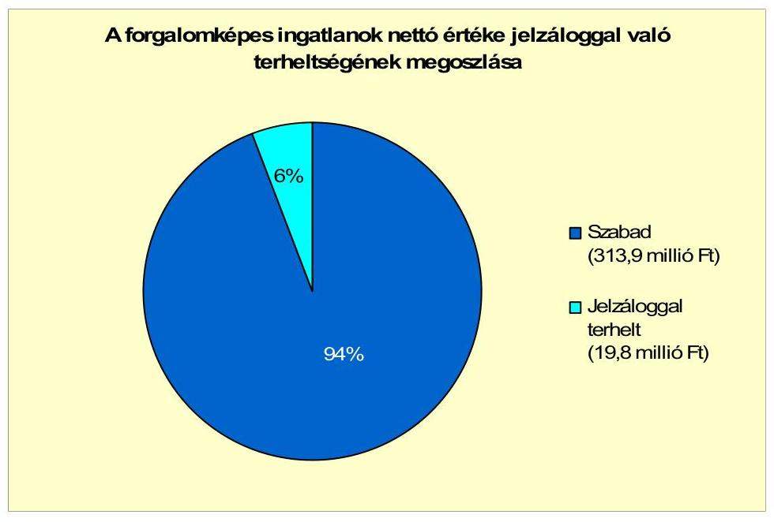

A két jelzáloggal terhelt, korlátozottan forgalomképes ingatlan nettó értéke 2010. december 31-én 14,2 millió Ft volt, amely az összes korlátozottan forgalomképes ingatlan 1461,7 millió Ft-os nettó értékének 1%-a. Az Önkormányzatnál megsértették az Ötv. 88. § (1) bekezdés b) pontjában ${ }^{34}$ foglaltakat, mert a fejlesztési hitel fedezeteként a kettő korlátozottan forgalomképes ingatlant, mint törzsvagyont ajánlották fel. A vagyongazdálkodási rendelet 17. §-a szerint az Önkormányzat vagyona - a forgalomképtelen vagyon kivételével - megterhelhető.

[^0]
[^0]:    ${ }^{34}$ 2012. január 1-jétől az Ötv. 88. § (1) bekezdés b) pontja hatályát vesztette.

---

Az Önkormányzatnak jogerős határozattal lezárt, de ki nem fizetett peres eljárásból adódó kötelezettsége nem volt a vizsgált időszakban. Jogerős határozattal nem lezárt peres eljárásból 1,1 millió Ft követelése van folyamatban, amely a korábbi polgármesteri tisztséget betöltő személlyel összefüggésben, jogalap nélküli gazdagodás jogcímén keletkezett perből származott.

Az Önkormányzatnak a vizsgálattal érintett években legalább 50% vagy azt meghaladó tulajdoni hányadba tartozó gazdasági társasága nem volt.

Az Önkormányzat a 2007-2010. években a befektetett eszközei után 165,1 millió Ft összegű értékcsökkenést mutatott ki, ugyanakkor felújításra az elszámolt értékcsökkenés 33,4%-át, 55,2 millió Ft-ot, beruházásokra több mint ötszörösét, 874,6 millió Ft-ot fordítottak.

A költségvetési beszámolókban kimutatott immateriális javak, ingatlanok, gépek, járművek, átadott eszközök bruttó értéke 2007-2010 között összességében 1184,2 millió Ft-tal (64,1%-kal), az elszámolt értékcsökkenésük 128,3 millió Ft-tal (43,7%-kal) emelkedett. Az eszközök bruttó értékének növekedését a kötvénybevételből 2010-ben megvalósult új iskolaépület aktiválása okozta, amely miatt az eszközök elhasználódási szintje 15,9%-ról 13,9%-ra csökkent. Az Önkormányzat kimutatása szerint a fejlesztések, felújítások bekerülési összegéből 67,3 millió Ft-ot fordított eszközpótlásra.

A felújításokra, az eszközök pótlására az Önkormányzat - a pályázati lehetőségeket kihasználva - a pénzügyi lehetőségének függvényében, elsősorban az intézmények működőképességének biztosítása, illetve a szakhatósági előírások figyelembevételével került sor. Az Önkormányzatnál a Képviselő-testületnek előterjesztett éves zárszámadási rendeletekben nem mutatták be az Önkormányzat eszközei után tárgyévben elszámolt értékcsökkenés összegét, az eszközpótlásra fordított tényleges kiadásokat, az eszközök használhatósági fokának alakulását.

# 4. A PÉNZÜGYI EGYENSÚLY MEGTEREMTÉSE ÉRDEKÉBEN HOZOTT INTÉZKEDÉSEK EREDMÉNYE 

Az Önkormányzatnál a vizsgált időszakban a feladatok átszervezésével és feladatmegszűnéssel kapcsolatban hat fő létszámcsökkentést hajtottak végre. Az Önkormányzat kimutatása szerint ezzel kapcsolatban 2007-2011. év I. félév között összesen 31,6 millió Ft személyi juttatás és járulék kiadási megtakarítást értek el.

Az Önkormányzatnál a vízdíjak és a piaci helypénzek beszedésével kapcsolatos feladatok átszervezésével 9,7 millió Ft (2 fő) kiadáscsökkenést értek el. Az építésügyi hatósági feladatok és a házi segítségnyújtás feladatainak átadása miatt 14,6 millió Ft (3 fő) megtakarítás keletkezett. Az óvodánál 2007-ben 1 fő élelmezésvezetői állás megszűnt, amely 7,3 millió Ft megtakarítást eredményezett.

Az Önkormányzatnál a fentieken túl (nyugdíjba vonulás miatt) még 2 fővel csökkent a létszám, amelynél nem volt kimutatható kiadás megtakarítás.

---

Az Önkormányzatnál a 2007-2010. években megvalósult létszámváltozásokat a következő táblázat mutatja:

| Megnevezés (adatok fő-ben) |  |  |  |  |  |  |
| :--: | :--: | :--: | :--: | :--: | :--: | :--: |
| 2007. január 1-jén jóváhagyott álláshelyek száma |  |  |  |  |  |  |
| Megszüntetett álláshelyek száma |  |  |  |  |  |  |
| adódi üres álláshelyek száma |  |  |  |  |  |  |
|  |  |  |  |  |  |  |
|  |  |  |  |  |  |  |
|  |  |  |  |  |  |  |
|  |  |  |  |  |  |  |
| intézmény-üzemeltetéssel kapcsolatos álláshelyek száma |  |  |  |  |  |  |
|  |  |  |  |  |  |  |
| Álláshely növekedése |  |  |  |  |  |  |
| 2010. december 31-án záró álláshelyek száma |  |  |

  |  |  |  |
| 2007. január 1-jén foglalkoztatott létszám |  |  |  |  |  |  |
|  |  |  |  |  |  |  |
| Létszámcsökkenés |  |  |  |  |  |  |
| Létszámnövekedés |  |  |  |  |  |  |
| 2010. december 31-én foglalkoztatott létszám |  |  |  |  |  |  |

A vizsgált időszakban feladatbővülés miatt 19 álláshelyet létesítettek, amelyek az alábbi területeken történtek: új általános iskolában 10 fős üzemeltetési létszám, a gyermekjóléti feladatok intézményfenntartó társulásban történő ellátása miatt 4 fő, egészségügyi feladatoknál 1 fő védőnő, 1 fő ápolónő, a Polgármesteri hivatalban 1 fő könyvtáros, a Gondnokságnál 2 fő.

A 2007-2010 közötti időszakban összességében megszüntettek 8 és létesítettek 19 álláshelyet, amelynek egyenlege alapján 11-gyel nőtt az álláshelyek száma. A megszüntetett álláshelyek 50%-a szakmai és 50%-a intézményüzemeltetéssel kapcsolatos volt.

A Képviselő-testület 2007-2011. év I. féléve között - az Önkormányzat adatszolgáltatása alapján - 166,9 millió Ft bevételnövelő intézkedést hozott. Az intézkedések 88,6%-a (147,9 millió Ft) a helyi adókhoz, 11,4%-a (19 millió Ft) az eszközök hasznosításához kapcsolódott.

Az Önkormányzat a 2007-2011. év I. félév között a következőkben számszerűsített bevételnövelő intézkedéseket tette:
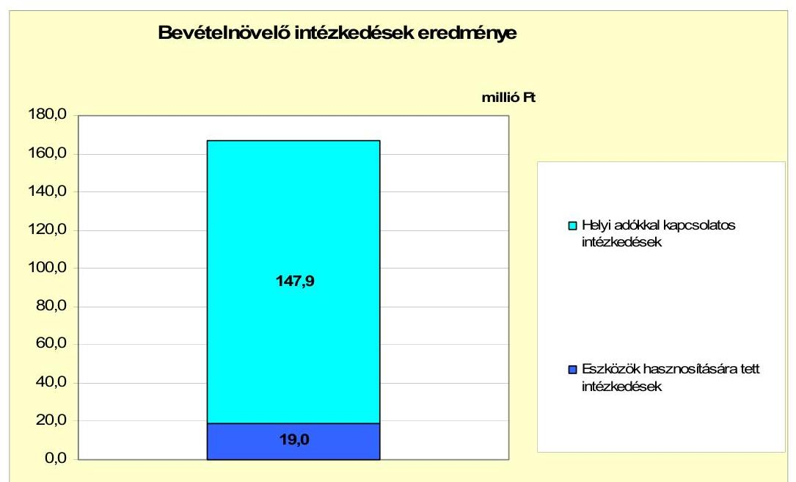

---

A bevételek, ezen belül a helyi adókból származó bevételek növelése érdekében az Önkormányzat 2007. január 1-jétől az építményadó és a magánszemélyek kommunális adójának bevezetéséről döntött. Az adók bevezetésének hatására a helyi adókból származó bevétel a 2006. évhez képest 117,9 millió Ft-tal nőtt 2007-2011. év I. féléve között, amely a helyi adókkal kapcsolatos intézkedésekből származó többletbevétel 79,7%-a.

A helyi adó mértékét az építményadónál - 2009. január 1-jétől $300 \mathrm{Ft} / \mathrm{m}^{2}$-ről $500 \mathrm{Ft} / \mathrm{m}^{2}$-ra - emelték, amely miatt a vizsgált időszakban 24 millió Ft többletbevételt mutattak ki. Az adóhátralékok behajtásából a vizsgált időszakban 6 millió Ft folyt be.

Az eszközök hasznosítására tett intézkedések érdekében hozott döntés hatásaként 19 millió Ft többletbevételt mutatott ki az Önkormányzat, amelyből 18 millió Ft az ingatlanok eladásából, továbbá egy millió Ft egy eszköz bérbeadásából származott. Az ingatlanok értékesítéséből származó bevételt az Önkormányzat fejlesztéseinek finanszírozására, és a parlagfű-mentesítési teher csökkentésére használta fel, amellyel pénzügyi egyensúlya javult, mivel kevesebb folyószámlahitelt kellett igénybe vennie.

A 2007. évhez viszonyítva a 2008-2011. év I. félév között az Önkormányzat költségvetési támogatása és az átengedett szja összege 244,7 millió Ft-tal növekedett, amely nem okozott a központi támogatásokban forráskiesést. A kiadáscsökkentő és a bevételnövelő intézkedések összességében 198,5 millió Ft-tal tovább javították az Önkormányzat pénzügyi helyzetét.

# 5. Az ÁSZ által a korábbi években a pénzügyi egyensúly javítására tett szabályszerűségi és célszerűségi javaslatok hasznosulása 

Az Önkormányzatnál a vizsgált időszakban az ÁSZ nem végzett átfogó ellenőrzést.

Budapest, 2012. április " 11 "

Melléklet: $\quad 5 \mathrm{db}$

---

Tápiószele Város Önkormányzata

1. számú melléklet
a V-3111-20/2012. számú jelentéshez

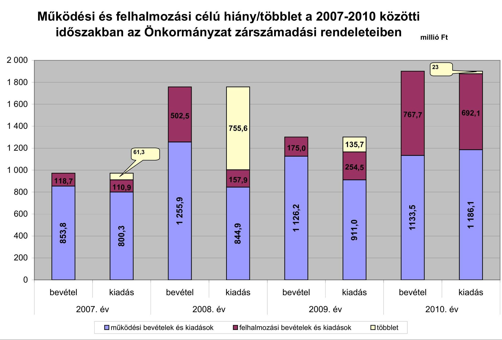

---

Az Önkormányzat bevételei és kiadásai, valamint adósságszolgálata 2007-2010 között

|  1. FOLYÓ KÖLTSÉGVETÉS | 2007. év | 2008. év | 2009. év | 2010. év  |
| --- | --- | --- | --- | --- |
|  1.1.1. Saját működési bevételek | 160,7 | 247,8 | 402,8 | 432,0  |
|  1.1.2. Költségvetési támogatás* | 265,8 | 416,1 | 421,4 | 422,4  |
|  1.1.3. Átengedett bevételek | 293,8 | 204,3 | 175,4 | 202,2  |
|  1.1.4. Állambáztartáson belülről kapott támogatások | 54,2 | 44,9 | 64,7 | 74,7  |
|  1.1.5. EU-tól és külföldről kapott bevételek | 0,2 | 0,0 | 0,0 | 0,0  |
|  1.1.6. Állambáztartáson kívülről kapott bevételek | 0,7 | 0,2 | 0,0 | 0,3  |
|  1.1.7. Előző évi pénzmaradvány átvétel | 0,0 | 0,0 | 0,0 | 0,0  |
|  1.1. Folyó bevételek $=1.1.1.+1.1.2.+1.1.3.+1.1.4.+1.1.5.+1.1.6.+1.1.7.$ | 775,4 | 913,3 | 1064,3 | 1131,6  |
|  1.2.1. Működési kiadások kamatkiadások nélkül | 612,6 | 688,5 | 723,5 | 937,6  |
|  1.2.2. Állambáztartáson belülre átadott pénzeszközök | 0,4 | 0,0 | 0,0 | 12,5  |
|  1.2.3.1. vállalkozásoknak | 0,0 | 0,0 | 0,0 | 0,0  |
|  1.2.3.2. EU-nak, illetve külföldre | 0,0 | 0,0 | 0,0 | 0,0  |
|  1.2.3.3. magáncélmélyeknek | 107,9 | 123,9 | 138,6 | 150,3  |
|  1.2.3.4. nonprofit szervezeteknek | 6,3 | 6,5 | 8,5 | 8,7  |
|  1.2.3. Transzferkiadások ( $=1.2.3.1+1.2.3.2+1.2.3.3+1.2.3.4$ ) | 114,2 | 130,4 | 147,1 | 158,9  |
|  1.2.4 Kamatkiadások | 6,5 | 11,6 | 28,8 | 18,0  |
|  1.2.5. Előző évi pénzmaradvány átadás | 0,0 | 0,0 | 0,0 | 0,0  |
|  1.2. Folyó kiadások $=1.2.1.+1.2.2.+1.2.3.+1.2.4.+1.2.5.$ | 733,7 | 830,5 | 899,4 | 1127,0  |
|  1.3. Folyó költségvetés egyenlege MŰKÖDÉSI JÖVEDELEM (1.1. - 1.2.) | 41,7 | 82,8 | 164,9 | 4,6  |
|  2. FELHALMOZÁSI KÖLTSÉGVETÉS |  |  |  |   |
|  2.1.1. Saját tőkebevételek | 17,8 | 5,2 | 0,0 | 0,4  |
|  2.1.2. Állambáztartáson belülről kapott támogatások | 75,0 | 335,3 | 59,1 | 22,4  |
|  2.1.3. EU-tól és külföldről kapott támogatások | 0,0 | 0,0 | 0,0 | 0,0  |
|  2.1.4. Állambáztartáson kívülről kapott támogatások | 0,0 | 0,0 | 0,0 | 0,0  |
|  2.1. Felhalmozási bevételek ( $=2.1.1.+2.1.2+2.1.3+2.1.4$.) | 92,8 | 340,5 | 59,1 | 22,8  |
|  2.2.1. Saját beruházási kiadás áfával | 71,9 | 117,3 | 202,4 | 673,0  |
|  2.2.2. Saját felújítási kiadás áfával | 15,6 | 27,8 | 30,1 | 5,3  |
|  2.2.3. Állambáztartáson belülre átadott pénzeszköz | 9,2 | 2,3 | 0,0 | 0,0  |
|  2.2.4. EU-nak és külföldnek adott pénzeszközök | 0,0 | 0,0 | 0,0 | 0,0  |
|  2.2.5. Állambáztartáson kívülre adott pénzeszközök | 0,0 | 0,0 | 4,0 | 19,3  |
|  2.2.6. Befektetési célú részesedések vásárlása | 0,0 | 0,5 | 0,7 | 0,6  |
|  2.2. Felhalmozási kiadások ( $=2.2.1.+2.2.2.+2.2.3.+2.2.4.+2.2.5.+2.2.6$.) | 96,7 | 147,9 | 237,2 | 698,2  |
|  2.3. Felhalmozási költségvetés egyenlege (2.1. - 2.2.) | -3,9 | 192,6 | -178,1 | -675,4  |
|  3. Finanszírozási műveletek nélküli (GFS) pozíció(1.3.+2.3.) | 37,8 | 275,4 | -13,2 | -670,8  |
|  4. Finanszírozási műveletek |  |  |  |   |
|  4.1. Hitelfelvétel | 101,0 | 2,5 | 0,0 | 0,0  |
|  4.2. Hiteltörlesztés | 98,4 | 10,0 | 20,9 | 13,2  |
|  4.3. Forgatási és befektetési célú értékpapírok kibocsátása | 0,0 | 502,1 | 0,0 | 0,0  |
|  4.4. Forgatási és befektetési célú értékpapírok beváltása | 0,0 | 0,0 | 0,0 | 0,0  |
|  4.5. Forgatási és befektetési célú értékpapírok értékesítése | 0,0 | 0,0 | 0,0 | 0,0  |
|  4.6. Forgatási és befektetési célú értékpapírok vásárlása | 0,0 | 0,0 | 0,0 | 0,0  |
|  4.7. Egyéb finanszírozási bevételek (függő, átfutó, kiegyenlítő) | 2,7 | -3,5 | 1,3 | -27,7  |
|  4.8. Egyéb finanszírozási kiadások (függő, átfutó, kiegyenlítő) | -17,6 | 14,4 | 8,0 | 39,9  |
|  4.9.Finanszírozási műveletek egyenlege (4.1. - 4.2.+4.3.-4.4+4.5.-4.6.+4.7.-4.8.) | 22,9 | 476,7 | -27,6 | -80,8  |
|  5. Tárgyévi pénzügyi pozíció (1.3.+ 2.3.+4.9.) | 60,7 | 752,1 | -40,8 | -751,6  |
|  6. Nettó működési jövedelem =működési jövedelem (1.3.) - tőketörlesztés $(4.2+4.4)$ | -56,7 | 72,8 | 144,0 | -8,6  |
|  TÁJÉKOZTATÓ ADATOK |  |  |  |   |
|  Összes kötelezettség | 121,2 | 743,6 | 758,4 | 920,2  |
|  ebből rövid lejáratú | 36,1 | 32,8 | 41,1 | 67,8  |
|  Összes szállítói kötelezettség | 5,3 | 3,3 | 3,3 | 22,7  |
|  ebből lejárt (tanúsítványból) | 2,7 | 0,4 | 1,3 | 0,1  |
|  Pénz és tőkeplati kötelezettség (adósság) | 99,7 | 730,9 | 729,1 | 876,0  |
|  ebből rövid lejáratú | 16,2 | 20,1 | 11,8 | 23,6  |
|  PPP szerződéses állomány jelenértéken (tanúsítványból) | 0,0 | 0,0 | 0,0 | 0,0  |
|  ebből lejárt szolgáltatási díj miatti kötelezettség | 0,0 | 0,0 | 0,0 | 0,0  |
|  Folyószámlabítól napi átlagos állománya (tanúsítványból) | 19,5 | 3,8 | 7,0 | 3,0  |
|  Likvidítótel napi átlagos állománya (tanúsítványból) | 0,0 | 0,0 | 0,0 | 0,0  |
|  Munkabérhítel napi átlagos állománya (tanúsítványból) | 0,0 | 0,0 | 0,0 | 0,0  |
|  Kezesség és garanciavállalások (tanúsítványból) | 0,0 | 0,0 | 0,0 | 28,3  |
|  Jogerős bírósági ítéletekből adódó kötelezettségek (tanúsítványból) | 0,0 | 0,0 | 0,0 | 0,0  |
|  Finanszírozásba bevonható eszközök; | 62,1 | 814,2 | 773,4 | 21,8  |
|  Tartós hitelviszonyt megtestesítő értékpapírok év végi állománya | 0,0 | 0,0 | 0,0 | 0,0  |
|  Hosszú lejáratú bankbetétek év végi állománya | 0,0 | 0,0 | 0,0 | 0,0  |
|  Értékpapírok év végi állománya | 0,0 | 0,0 | 0,0 | 0,0  |
|  Pénzeszközök (idegen pénzeszközök nélkül) év végi állománya | 62,1 | 814,2 | 773,4 | 21,8  |

[^0] [^0]: * A költségvetési támogatásból a felhalmozási célú összeget az Önkormányzat adatszolgáltatása szerinti mértékben vettük figyelembe a 2.1.2. soron

---

## **Az Önkormányzat 2007-2010. évben megvalósított, 2010. december 31-ig befejezett fejlesztései és azok forrásfedezete**

|   |  |  |  |

  |  |  |  |  |  |  |  |  |  |  |  |  |  |  |  |  |  |  |  |  |  |  |  |  |  |  |  |  |  |  |  |  |  |  |  |  |  |  |  |  |  |   |
| --- | --- | --- | --- | --- | --- | --- | --- | --- | --- | --- | --- | --- | --- | --- | --- | --- | --- | --- | --- | --- | --- | --- | --- | --- | --- | --- | --- | --- | --- | --- | --- | --- | --- | --- | --- | --- | --- | --- | --- | --- | --- | --- | --- | --- | --- | --- |
|   |  |  |  |  |  |  |  |  |  |  |  |  |  |  |  |  |  |  |  |  |  |  |  |  |  |  |  |  |  |  |  |  |  |  |  |  |  |  |  |  |  |  |  |  |   |
|   |  |  |  |  |  |  |  |  |  |  |  |  |  |  |  |  |  |  |  |  |  |  |  |  |  |  |  |  |  |  |  |  |  |  |  |  |  |  |  |  |  |  |  |  |   |
|   |  |  |  |  |  |  |  |  |  |  |  |  |  |  |  |  |  |  |  |  |  |  |  |  |  |  |  |  |  |  |  |  |  |  |  |  |  |  |  |  |  |  |  |  |   |
|   |  |  |  |  |  |  |  |  |  |  |  |  |  |  |  |  |  |  |  |  |  |  |  |  |  |  |  |  |  |  |  |  |  |  |  |  |  |  |  |  |  |  |  |  |   |
|   |  |  |  |  |  |  |  |  |  |  |  |  |  |  |  |  |  |  |  |  |  |  |  |  |  |  |  |  |  |  |  |  |  |  |  |  |  |  |  |  |  |  |  |  |   |
|   |  |  |  |  |  |  |  |  |  |  |  |  |  |  |  |  |  |  |  |  |  |  |  |  |  |  |  |  |  |  |  |  |  |  |  |  |  |  |  |  |  |  |  |  |   |
|   |  |  |  |  |  |  |  |  |  |  |  |  |  |  |  |  |  |  |  |  |  |  |  |  |  |  |  |  |  |  |  |  |  |  |  |  |  |  |  |  |  |  |  |  |   |
|   |  |  |  |  |  |  |  |  |  |  |  |  |  |  |  |  |  |  |  |  |  |  |  |  |  |  |  |  |  |  |  |  |  |  |  |  |  |  |  |  |  |  |  |  |   |
|   |  |  |  |  |  |  |  |  |  |  |  |  |  |  |  |  |  |  |  |  |  |  |  |  |  |  |  |  |  |  |  |  |  |  |  |  |  |  |  |  |  |  |  |  |   |
|   |  |  |  |  |  |  |  |  |  |  |  |  |  |  |  |  |  |  |  |  |  |  |  |  |  |  |  |  |  |  |  |  |  |  |  |  |  |  |  |  |  |  |  |  |   |
|   |  |  |  |  |  |  |  |  |  |  |  |  |  |  |  |  |  |  |  |  |  |  |  |  |  |  |  |  |  |  |  |  |  |  |  |  |  |  |  |  |  |  |  |  |   |
|   |  |  |  |  |  |  |  |  |  |  |  |  |  |  |  |  |  |  |  |  |  |  |  |  |  |  |  |  |  |  |  |  |  |  |  |  |  |  |  |  |  |  |  |  |   |
|   |  |  |  |  |  |  |  |  |  |  |  |  |  |  |  |  |  |  |  |  |  |  |  |  |  |  |  |  |  |  |  |  |  |  |  |  |  |  |  |  |  |  |  |  |   |
|   |  |  |  |  |  |  |  |  |  |  |  |  |  |  |  |  |  |  |  |  |  |  |  |  |  |  |  |  |  |  |  |  |  |  |  |  |  |  |  |  |  |  |  |  |   |
|   |  |  |  |  |  |  |  |  |  |  |  |  |  |  |  |  |  |  |  |  |  |  |  |  |  |  |  |  |  |  |  |  |  |  |  |  |  |  |  |  |  |  |  |  |   |
|   |  |  |  |  |  |  |  |  |  |  |  |  |  |  |  |  |  |  |  |  |  |  |  |  |  |  |  |  |  |  |  |  |  |  |  |  |  |  |  |  |  |  |  |  |   |
|   |  |  |  |

 |  |  |  |  |  |  |  |  |  |  |  |  |  |  |  |  |  |  |  |  |  |  |  |  |  |  |  |  |  |  |  |  |  |  |  |  |  |  |  |  |   |
|   |  |  |  |  |  |  |  |  |  |  |  |  |  |  |  |  |  |  |  |  |  |  |  |  |  |  |  |  |  |  |  |  |  |  |  |  |  |  |  |  |  |  |  |  |   |
|   |  |  |  |  |  |  |  |  |  |  |  |  |  |  |  |  |  |  |  |  |  |  |  |  |  |  |  |  |  |  |  |  |  |  |  |  |  |  |  |  |  |  |  |  |   |
|   |  |  |  |  |  |  |  |  |  |  |  |  |  |  |  |  |  |  |  |  |  |  |  |  |  |  |  |  |  |  |  |  |  |  |  |  |  |  |  |  |  |  |  |  |   |
|   |  |  |  |  |  |  |  |  |  |  |  |  |  |  |  |  |  |  |  |  |  |  |  |  |  |  |  |  |  |  |  |  |  |  |  |  |  |  |  |  |  |  |  |  |   |
|   |  |  |  |  |  |  |  |  |  |  |  |  |  |  |  |  |  |  |  |  |  |  |  |  |  |  |  |  |  |  |  |  |  |  |  |  |  |  |  |  |  |  |  |  |   |
|   |  |  |  |  |  |  |  |  |  |  |  |  |  |  |  |  |  |  |  |  |  |  |  |  |  |  |  |  |  |  |  |  |  |  |  |  |  |  |  |  |  |  |  |  |   |
|   |  |  |  |  |  |  |  |  |  |  |  |  |  |  |  |  |  |  |  |  |  |  |  |  |  |  |  |  |  |  |  |  |  |  |  |  |  |  |  |  |  |  |  |  |   |
|   |  |  |  |  |  |  |  |  |  |  |  |  |  |  |  |  |  |  |  |  |  |  |  |  |  |  |  |  |  |  |  |  |  |  |  |  |  |  |  |  |  |  |  |  |   |
|   |  |  |  |  |  |  |  |  |  |  |  |  |  |  |  |  |  |  |  |  |  |  |  |  |  |  |  |  |  |  |  |  |  |  |  |  |  |  |  |  |  |  |  |  |   |
|   |  |  |  |  |  |  |  |  |  |  |  |  |  |  |  |  |  |  |  |  |  |  |  |  |  |  |  |  |  |  |  |  |  |  |  |  |  |  |  |  |  |  |  |  |   |
|   |  |  |  |  |  |  |  |  |  |  |  |  |  |  |  |  |  |  |  |  |  |  |  |  |  |  |  |  |  |  |  |  |  |  |  |  |  |  |  |  |  |  |  |  |   |
|   |  |  |  |  |  |  |  |  |  |  |  |  |  |  |  |  |  |  |  |  |  |  |  |  |  |  |  |  |  |  |  |  |  |  |  |  |  |  |  |  |  |  |  |  |   |
|   |  |  |  |  |  |  |  |  |  |  |  |  |  |  |  |  |  |  |  |  |  |  |  |  |  |  |  |  |  |  |  |  |  |  |  |  |  |  |  |  |  |  |  |  |   |
|   |  |  |  |  |  |  |  |  |  |  |  |  |  |  |  |  |  |  |  |  |  |  |  |  |  |  |  |  |  |  |  |  |  |  |  |  |  |  |  |  |  |  |  |  |   |
|   |  |  |  |  |  |  |  |  |  |  |  |  |  |  |  |  |  |  |  |  |  |  |  |  |  |  |  |  |  |  |  |  |  |  |  |  |  |  |  |  |  |  |  |  |   |
|   |

---

Az Önkormányzat által beadott, elbírálás alatti pályázati forrásból megvalósítani tervezett fejlesztéseihez kapcsolódó kötelezettségvállalásai és azok forrásösszetétele

|  ㅁ
Törzsszám | Fejlesztési feladat (beruházás, felújítás) |  | Beruházás, felújítás |  |  |  |  |  |  |  |  |  |  |  |  |  |  |  |  |  |  |   |
| --- | --- | --- | --- | --- | --- | --- | --- | --- | --- | --- | --- | --- | --- | --- | --- | --- | --- |

 | --- | --- | --- | --- | --- |
|   | Megnevezése |  |  |  |  |  |  |  |  |  |  |  |  |  |  |  |  |  |  |  |  |   |
|   |  | Képviselőtestületi határozat száma |  |  |  |  |  |  |  |  |  |  |  |  |  |  |  |  |  |  |  |   |
|  1 | 2 | 3 | 4 | 5 | 6 | 7 | 8 | 9 | 10 | 11 | 12 | 13 | 14 | 15 | 16 | 17 | 18 | 19 | 20 |  |  |   |
|  1. Felújítások |  |  |  |  |  |  |  |  |  |  |  |  |  |  |  |  |  |  |  |  |  |   |
|  2. Akadálymentesítés (Önkormányzati ügyfélszolgálathoz való egyenlő esélyű hozzáférés biztosítása: a Tápiószelei Polgármesteri Hivatal komplex akadálymentesítése) | 206/2010./12. 17/ számú határozat | 2011 | 2012 |  | 30 | 30,0 | 0,0 | 30,0 | 1,5 | A | 0,0 |  | 0,0 |  | 28,5 |  | A | 0,0 |  | igen |  |   |
|  3. 10 millió Ft alatti felújítások |  | 0 |  |  | 0,0 | 0,0 | 0,0 | 0,0 | 0,0 |  | 0,0 |  | 0,0 |  | 0,0 |  | 0,0 |  | 0,0 |  |  |   |
|  4. Felújítások összesen |  |  |  |  | 30,0 | 30,0 | 0,0 | 30,0 | 1,5 |  | 0,0 |  | 0,0 |  | 28,5 |  | 0,0 |  |  |  |  |   |
|  5. Fejlesztések |  |  |  |  |  |  |  |  |  |  |  |  |  |  |  |  |  |  |  |  |  |   |
|  6. Zöldhulladék kezelés Tápiószelén | 168/2009. (X. 29.) számú határozat | 2010 | 2010 |  | 10,3 | 0,0 | 0,0 | 10,3 | 4,1 | A | 0,0 |  | 0,0 |  | 5,3 |  | A | 0,9 |  | A | nem |   |
|  7. 10 millió Ft alatti fejlesztések |  | 0 |  |  | 0,0 | 0,0 | 0,0 | 0,0 | 0,0 |  | 0,0 |  | 0,0 |  | 0,0 |  | 0,0 |  |  |  |  |   |
|  8. Fejlesztések összesen |  |  |  |  | 10,3 | 0,0 | 0,0 | 10,3 | 4,1 |  | 0,0 |  | 0,0 |  | 5,3 |  | 0,9 |  |  |  |  |   |
|  9. Összesen |  |  |  |  | 40,3 | 30,0 | 0,0 | 40,3 | 5,6 |  | 0,0 |  | 0,0 |  | 33,8 |  | 0,9 |  |  |  |  |   |

*A= ha a forrás már rendelkezésre áll,* B= ha a forrás közbeszerzési eljárása folyamatban van, C= ha a forrás közbeszerzési eljárása még nem indult el, a forrás nem áll rendelkezésre.

---

## 4. számú melléklet a V-3111-20/2012. számú jelentéshez

## **Az önkormányzati feladatok ellátásában résztvevő gazdasági társaságok**

|  Gazdasági társaság
megnevezése |  |  |  |  |  |  |  |  |  |  |  |  |  |  |  |  |  |  |  |  |  |  |  |  |  |  |  |  |  |  |  |  |  |  |  |  |  |   |
| --- | --- | --- | --- | --- | --- | --- | --- | --- | --- | --- | --- | --- | --- | --- | --- | --- | --- | --- | --- | --- | --- | --- | --- | --- | --- | --- | --- | --- | --- | --- | --- | --- | --- | --- | --- | --- | --- | --- |
|   |  |  |  |  |  |  |  |  |  |  |  |  |  |  |  |  |  |  |  |  |  |  |  |  |  |  |  |  |  |  |  |  |  |  |  |  |  |   |
|  Gazdasági társaság
megnevezése | önkormányzat | önkormányzat
gazdasági
társaságának | saját tőke,
jegyzett tőke
aránya | kötelező
feladathoz | önként vállalt
feladathoz | hosszú lejáratú
hitelből,
kövvényből |  |  |  |  |  |  |  |  |  |  |  |  |  |  |  |  |  |  |  |  |  |  |  |  |  |  |  |  |  |  |  |   |
|   | tulajdoni hányada |  |  |  |  |  |  |  |  |  |  |  |  |  |  |  |  |  |  |  |  |  |  |  |  |  |  |  |  |  |  |  |  |  |  |  |   |
|   |  |  |  |  |  |  |  |  |  |  |  |  |  |  |  |  |  |  |  |  |  |  |  |  |  |  |  |  |  |  |  |  |  |  |  |  |   |
|  I. 100%-os
tulajdoni hányadú gazdasági társaságok: |  |  |  |  |  |  |  |  |  |  |  |  |  |  |  |  |  |  |  |  |  |  |  |  |  |  |  |  |  |  |  |  |  |  |  |  |   |
|  100%-os
tulajdoni hányadú gazdasági társaságok | x | x | x | 0 | 0 | 0 | 0 | 0 | 0 | 0 | 0 | 0 | 0 | 0 | 0 | 0 | 0 | 0 | 0 | 0 | 0 | 0 | 0 | 0 | 0 | 0 | 0 | 0 | 0 | 0 | 0 | 0 | 0 | 0 | 0 | 0  |
|  II. 75-99%-os
tulajdoni hányadú gazdasági társaságok: |  |  |  |  |  |  |  |  |  |  |  |  |  |  |  |  |  |  |  |  |  |  |  |  |  |  |  |  |  |  |  |  |  |  |  |  |   |
|  75-99%-os
tulajdoni hányadú gazdasági társaságok | x | x | x | 0 | 0 | 0 | 0 | 0 | 0 | 0 | 0 | 0 | 0 | 0 | 0 | 0 | 0 | 0 | 0 | 0 | 0 | 0 | 0 | 0 | 0 | 0 | 0 | 0 | 0 | 0 | 0 | 0 | 0 | 0 | 0 | 0  |
|  75% feletti
tulajdoni hányadú gazdasági társaságok összesen | x | x | x | 0 | 0 | 0 | 0 | 0 | 0 | 0 | 0 | 0 | 0 | 0 | 0 | 0 | 0 | 0 | 0 | 0 | 0 | 0 | 0 | 0 | 0 | 0 | 0 | 0 | 0 | 0 | 0 | 0 | 0 | 0 | 0 | 0  |
|  III. 51-74%-os
tulajdoni hányadú gazdasági társaságok: |  |  |  |  |  |  |  |  |  |  |  |  |  |  |  |  |  |  |

  |  |  |  |  |  |  |  |  |  |  |  |  |  |  |  |  |  |   |
|  51-74%-os tulajdoni hányadú gazdasági társaságok összesen | x | x | x | 0 | 0 | 0 | 0 | 0 | 0 | 0 | 0 | 0 | 0 | 0 | 0 | 0 | 0 | 0 | 0 | 0 | 0 | 0 | 0 | 0 | 0 | 0 | 0 | 0 | 0 | 0 | 0 | 0 | 0 | 0 | 0 | 0  |
|  IV. egyéb, közfeladatot ellátó gazdasági társaságok: |  |  |  |  |  |  |  |  |  |  |  |  |  |  |  |  |  |  |  |  |  |  |  |  |  |  |  |  |  |  |  |  |  |  |  |  |   |
|  "ÖKOVÍZ" Kft | 0,034% |  |  | 1,8 | 0 | 0 | 0 | 0 | 0 | 89,6 | 0 | 0 | 0 | 0 | 0 | 0 | 0 | 0 | 0 | 0 | 0 | 0 | 0 | 0 | 0 | 0 | 0 | 0 | 0 | 0 | 0 | 0 | 0 | 0 | 0 | 0  |
|  egyéb, közfeladatot ellátó gazdasági társaságok összesen | x | x | x | 0 | 0 | 0 | 0 | 0 | 89,6 | 0 | 0 | 0 | 0 | 0 | 0 | 0 | 0 | 0 | 0 | 0 | 0 | 0 | 0 | 0 | 0 | 0 | 0 | 0 | 0 | 0 | 0 | 0 | 0 | 0 | 0 | 0  |
|  Összesen | x | x | x | 0 | 0 | 0 | 0 | 0 | 89,6 | 0 | 0 | 0 | 0 | 0 | 0 | 0 | 0 | 0 | 0 | 0 | 0 | 0 | 0 | 0 | 0 | 0 | 0 | 0 | 0 | 0 | 0 | 0 | 0 | 0 | 0  |

