# ÁLLAMI   SZÁMVEVŐSZÉK 

## JELENTÉS

Tiszafüred Város Önkormányzata pénzügyi helyzetének ellenőrzéséről (43/4)

---

# Állami Számvevőszék 

Iktatószám: V-3101-022/2012.
Témaszám: 1015
Vizsgálat-azonosító szám: V0560132

## Az ellenőrzést felügyelte:

Dr. Varga Sándor
számvevő igazgatóhelyettes
Az ellenőrzést vezette:
Renkó Zsuzsanna
számvevő tanácsos
Ellenőrzési csoportvezető:
Lingné Rajz Borbála
számvevő tanácsos
Az ellenőrzést végezték:
Szihalminé Kovács Zsuzsanna Luhály Matild
számvevő tanácsos számvevő

---

# TARTALOMJEGYZÉK 

BEVEZETÉS ..... 9
I. ÖSSZEGZŐ MEGÁLLAPÍTÁSOK, KÖVETKEZTETÉSEK, JAVASLATOK ..... 13
II. RÉSZLETES MEGÁLLAPÍTÁSOK ..... 25

1. Az Önkormányzat kötelező és önként vállalt feladatai, a feladatellátás szervezeti keretei és annak változásai ..... 25
2. Az Önkormányzat pénzügyi egyensúlyi helyzetét befolyásoló tényezők ..... 29
2.1. A működési és a felhalmozási egyensúly változása ..... 31
2.2. Az Önkormányzat bevételeinek változása ..... 37
2.3. Az Önkormányzat múködési és felhalmozási célú kiadásainak változása ..... 39
3. Az Önkormányzat kötelezettségei ..... 42
3.1. Az Önkormányzat pénzintézeti kötelezettségeinek változása ..... 42
3.2. A szállítói kötelezettségek változása ..... 48
3.3. Egyéb kötelezettségek változása ..... 49
4. A pénzügyi egyensúly megteremtése érdekében hozott intézkedések eredménye ..... 52
5. Az ÁSZ által a korábbi években a pénzügyi egyensúly javítására tett szabályszerűségi és célszerűségi javaslatok hasznosulása ..... 55

---

# MELLÉKLETEK 

1. számú Múködési és felhalmozási célú hiány/többlet a 2007-2010 közötti időszakban az Önkormányzat zárszámadási rendeleteiben (1 oldal)
2. számú Az Önkormányzat bevételei és kiadásai, valamint adósságszolgálata 2007-2010 között (1 oldal)
3/a. számú Az Önkormányzat 2007-2010. években megvalósított, 2010. december 31ig befejezett fejlesztései és azok forrásösszetétele (1 oldal)
3/b. számú Az Önkormányzat 2010. december 31-én folyamatban lévő fejlesztési feladataira 2010. december 31-ig teljesített kifizetések és azok forrásösszetétele (1 oldal)
3/c. számú Az Önkormányzat 2010. december 31-én folyamatban lévő fejlesztési feladataira 2010. december 31-én fennálló kötelezettségek és azok forrásöszszetétele (1 oldal)
3. számú Az önkormányzati feladatok ellátásában résztvevő gazdasági társaságok (1 oldal)

---

# RÖVIDÍTÉSEK JEGYZÉKE 

## Törvények

Áht.
Art.
Csődtv.
Gt.
Ötv.
Számv. tv.

## Rendeletek

Ámr.
Áhsz.

SzMSz

## Szórövidítések

áfa
ÁSZ
EU
jegyzó
Képviselő-testület
Kistérségi Társulás
Kossuth Lajos Gimnázium
Megyei Önkormányzat
OEP
ÖNHIKI
Önkormányzat
polgármester
Polgármesteri hivatal
PPP konstrukció
szja
Zeneiskola
az államháztartásról szóló 1992. évi XXXVIII. törvény
az adózás rendjéről szóló 2003. évi XCII. törvény
a csődeljárásról és a felszámolási eljárásról szóló 1991. évi XLIX. törvény
a gazdasági társaságokról szóló 2006. évi IV. törvény
a helyi önkormányzatokról szóló 1990. évi LXV. törvény
a számvitelről szóló 2000. évi C. törvény
az államháztartás múködési rendjéről szóló 292/2009. (XII. 19.) Korm. rendelet
az államháztartás szervezetei beszámolási és könyvvezetési kötelezettségének sajátosságairól szóló 249/2000. (XII. 24.) Korm. rendelet

Tiszafüred Város 2/2007. (II. 15.) számú rendelete az Önkormányzat Képviselő-testületének Szervezeti és Múködési Szabályzatáról
általános forgalmi adó
Állami Számvevőszék
Európai Unió
Tiszafüred Város Önkormányzatának jegyzője
Tiszafüred Város Képviselő-testülete
Tiszafüred Kistérség Többcélú Társulása
Kossuth Lajos Gimnázium, Szakképző Iskola, Általános Iskola, Pedagógiai Szakszolgálat és Kollégium
Jász-Nagykun-Szolnok Megyei Önkormányzat
Országos Egészségbiztosítási Pénztár
Önhibáján kívül hátrányos helyzetben lévő helyi önkormányzatok támogatása
Tiszafüred Város Önkormányzata
Tiszafüred Város Önkormányzatának polgármestere
Tiszafüred Város Önkormányzatának Polgármesteri Hivatala
Public Private Partnership (Partnerségi együttmúködés közfeladatok ellátására a magánszektor bevonásával)
személyi jövedelemadó
Fekete László Zeneiskola-Alapfokú Művészetoktatási Intézmény

---

.

---

# ÉRTELMEZŐ SZÓTÁR 

| BUBOR | Budapesti Bankközi Forint Hitelkamatláb. Irányadó, referencia jellegú kamatláb. Mértékét az MNB naponta állapítja meg a banki kamatok figyelembevételével. Közzététele naponta történik. |
| :--: | :--: |
| CLF módszer | Az önkormányzatok költségvetése elemzésének eszköze. A módszer következetesen elkülöníti a folyó és a felhalmozási költségvetés bevételeit és kiadásait, azok költségvetési egyenlegeit. Bizonyos mértékig a vállalati gazdálkodás logikai elemeit érvényesíti az önkormányzatok pénzügyi, jövedelmi helyzetének vizsgálata során. Az értékelés a pénzügyi kapacitás fogalmát helyezi a középpontba. |
| Használhatósági fok | Az eszközgazdálkodás vizsgálatának elemzése során használt mutató. Számításakor a tárgyi eszköz könyv szerinti (nettó) értékét viszonyítják a tárgyi eszköz bruttó (beszerzési/létesítési) értékéhez. A \%-ban kifejezett mutató csökkenése az eszköz állagának romlására, avulására utal, ami maga után vonja az üzemeltetési és fenntartási költségek növekedését is. |
| kamatkockázat | A változó kamatozású forint-, vagy a devizahitelek futamideje alatt a kamat emelkedése miatt fennálló kamatkockázat, melynek növekedése miatt nő a hitel törlesztő részlete. |
| kötelező közszolgáltatás | A helyi önkormányzati feladatkörbe tartozó, a köztisztasággal és a településtisztasággal, valamint az élet- és vagyonbiztonsággal összefüggő egyes - közszolgáltatás útján megvalósuló - közfeladatok ellátása, amelynek kötelező igénybevételét külön jogszabály (törvény, helyi önkormányzati rendelet) határoz meg. |
| közfeladat | Állami, helyi, illetve kisebbségi önkormányzati feladat, amelynek ellátásáról az államnak, illetve az önkormányzatoknak kell gondoskodni. A hatályos szabályozás szerint közfeladatot törvény és önkormányzati rendelet állapíthat meg. Az önkormányzatok által ellátandó feladatok keretszerú meghatározását az Ötv. tartalmazza. |
| önkormányzat többségi tulajdonában lévő gazdasági társaságok | Az önkormányzat a gazdasági társaságban a szavazatok több mint ötven százalékával vagy a Ptk. 685/B. § (2)-(3) bekezdéseiben rögzített meghatározó befolyással rendelkezik. A befolyással rendelkező akkor rendelkezik egy jogi személyben meghatározó befolyással, ha annak tagja, illetve részvényese és jogosult e jogi személy vezető tisztségviselői vagy felügyelőbizottsága tagjai többségének megválasztására, illetve visszahívására, vagy a jogi személy más tagjaival, illetve részvényeseivel kötött megállapodás alapján egyedül rendelkezik a szavazatok több mint ötven százalékával (Ptk. 685/B. § (2) bekezdés). A meghatározó befolyás akkor is fennáll, ha a befolyással rendelkező számára e jogosultságok közvetett módon |

---

(köztes vállalkozásain keresztül, a Ptk. 685/B §. (3), (4) bekezdés szerint) biztosítottak.
A helyi önkormányzat és az önkormányzat irányítása alá tartozó költségvetési szerv többségi tulajdonában, illetve többségi befolyása alatt álló gazdálkodó szervezet esetében hitelfelvétel, kölcsönfelvétel, garancia- vagy kezességvállalás, tartozásátvállalás, tartozás-elengedés, értékpapír kibocsátás, vásárlás, pénzügyi lízing, tartós bérleti szerződés, ingyenes vagyonjuttatás (így különösen: ajándékozás, ingyenes engedményezés), vagy követelésvásárlás, követelésengedményezés végrehajtására vonatkozóan az Áht. 100/M. § (4) bekezdése alapján az önkormányzat rendelkezik döntési jogosultsággal.
pénzügyi kapacitás

A pénzügyi kapacitás (financial capacity) az adósok hitelfelvételi képességének azon mértéke, ahol még anélkül tudják növelni az adósságot, hogy csökkenteniük kellene akár a jelenbeli, akár a jövőben esedékes kiadásaikat a fizetésképtelenség elkerülése érdekében. (Forrás: Az önkormányzati rendszer pénzügyi helyzete, ÁSZKUT tanulmány 2010.)
pénzügyi kockázat

A működési kockázat egyik eleme. Megmutatkozhat a költségvetés nagyságrendjének, szerkezetének nem megalapozott módosításaiban, a bevételi és a kiadási előirányzatoktól lényegesen eltérő teljesítésekben, a nem megfelelő belső kontrollrendszer múködésében, a tudatos károkozásokban, a biztosítások elmaradásában, a hibás fejlesztési döntésekben, a nem a terveknek megfelelő forrásfelhasználásokban. Jelentkezhet továbbá a bevételek és kiadások ütemkülönbsége miatt felvett folyószámla- és likvidhitelek költségvetési év végén fennálló egyenlege miatt, amely az önkormányzat költségvetésébe - akár tartósan - beépülő forráshiányt jelzi.
törlesztési kockázat
Annak a kockázata, hogy a megfelelő időben és mértékben a hitelt felvevőnél rendelkezésre állnak-e a pénzintézetek és egyéb szervek felé fennálló kötelezettségek visszafizetéséhez, a hitelek és kölcsönök törlesztéséhez szükséges pénzügyi források.
A törlesztési kockázatot növeli a kamat- és árfolyam növekedése, mivel ezekben az esetekben az adósságszolgálat nőhet. Törlesztési kockázatot okozhat a visszafizetésre tervezett forrás elérésének, teljesítésének bizonytalansága (pl. a visszafizetéshez tervezett tartalékolás elmaradt, a tervezettnél alacsonyabb a saját bevétel, a helyi adóból származó bevétel az adóalanyok, adóalapok csökkenése miatt nem teljesül).
SNA
System of National Account, azaz a Nemzeti Számlák Rendszere, amely a gazdasági szektorok által létrehozott valamennyi terméket és szolgáltatást figyelembe veszi.

---

szállítói kitettség

Az önkormányzat pénzügyi helyzete olyan külső körülmények hatására is módosulhat, amelyekre az önkormányzatnak nincs hatása, emiatt szállítói kitettsége keletkezik. Pl. a lejárt szállítói tartozások rendezése függhet attól, hogy a szállító milyen intézkedéseket foganatosít az önkormányzattal szemben.

---

.

---

# JELENTÉS   Tiszafüred Város Önkormányzata pénzügyi helyzetének ellenőrzéséről 

## BEVEZETÉS

Az Állami Számvevőszék 2011. évtől érvényes stratégiája új irányt szabott a helyi önkormányzatok gazdálkodásának ellenőrzésében is. Az ÁSZ - küldetése és jövőképe szerint - szilárd szakmai alapokra támaszkodva értékteremtő ellenőrzéseivel és helyzetelemzéseivel az államháztartás egészében, így a helyi önkormányzati alrendszerben is elő kívánja segíteni a közpénzek és a közvagyon szabályos, gazdaságos, hatékony és eredményes felhasználását. E folyamat részeként - az államháztartási hiány alakulásának összetevőire is figyelemmel végezzük az önkormányzati alrendszer pénzügyi helyzetelemzését.

Az államháztartás helyi szintjén a 304 városnak ${ }^{1}$ az általuk ellátott közszolgáltatások volumenére is tekintettel a közfeladatok ellátásában kiemelt szerepe van. E települések 2011. január 1-jei népessége 3169 ezer fő volt.

Feladataik és hatásköreik az Ötv. mellett különböző ágazati törvények által meghatározottak, miközben a feladatellátás szervezeti kereteit - ezen belül a gazdasági társaságok közszolgáltatások ellátásában betöltött szerepét - saját maguk határozzák meg. A gazdasági társaságok által ellátott feladatok esetén a gazdálkodás, továbbá az önkormányzatok pénzügyi egyensúlyi helyzetére ható közvetlen kockázatok egy része kikerült az önkormányzati alrendszerből. A többségi önkormányzati tulajdonban lévő társaságok gazdálkodásának körülményei befolyásolhatják a városok pénzügyi egyensúlyi helyzetének megítélésében rejlő kockázatokat.

Az áttekintett időszakban az önkormányzati forrásszabályozás elvei lényegesen nem változtak. Az önkormányzatok gazdasági mozgásterét a központi költségvetéstől való függőség mellett jelentősen befolyásolja a helyi adókivetési jog gyakorlása. A városok gazdálkodási szabadságának lényeges eleme, hogy anyagi lehetőségeik függvényében dönthettek arról, hogy feladataik közül azokat, amelyek megoldására az Ötv. szerint a települési önkormányzat nem kötelezhető, a megyei önkormányzat fenntartásába adhatták. E döntések differenciáltan érintették a városok pénzügyi helyzetét.

[^0]
[^0]:    ${ }^{1}$ A megyei jogú városok nélkül figyelembe vett városok száma 304 városi önkormányzatot jelent.

---

A városi önkormányzatok 2007-2010 között teljesített bevételeinek alakulását és összetételét a következő ábra szemlélteti:

Az önkormányzati alrendszer pénzügyi helyzetértékelése során új elemzési módszereket alkalmazott az ellenőrzés. A költségvetési beszámoló adatok elemzése helyett az önkormányzat pénzügyi helyzetét a CLF módszerrel értékeljük, amelynek lényegét és számításának módszerét a jelentés 2. pontjában, és a jelentés 2 . számú mellékletében ismertetjük részletesen.

Az új módszereken alapuló helyzetértékelés fontosságát az adja, hogy a helyi önkormányzatok bruttó adósságállománya ${ }^{2}$ a 2010. évi költségvetési beszámolók alapján 1248 milliárd Ft-ot tett ki. Ezen belül a 304 város adóssága 383 milliárd Ft volt, amely az önkormányzati alrendszer teljes adósságállományának $30,7 \%$-át jelentette ${ }^{3}$.

A mérlegben kimutatott bruttó adósságállomány mellett az önkormányzatok számára az eszközállomány műszaki állapotának megőrzése is előbb-utóbb pénzügyi kötelezettséget jelent. Az elhasználódott eszközök pótlására forrást biztosító amortizációs (felújítási) alap képzésének ${ }^{4}$ elmaradása maga után vonhatja a feladatellátást kiszolgáló tárgyi eszközök állagának erőteljes romlását.

[^0]
[^0]:    ${ }^{2}$ Az önkormányzati mérlegbeszámolókból számított bruttó adósságállomány 2010. év végi összege magában foglalja a fejlesztési és a múködési célú kötvénykibocsátások, a beruházási és fejlesztési hitelek, a működési célú hosszú lejáratú hitelek, a rövid lejáratú hitelek, váltótartozások miatti kötelezettségek teljes (2011-ben, illetve az azt követő években esedékes) állományát. Az önkormányzatok 2007. év végi mérleg szerinti adósságállománya 692 milliárd Ft volt.
    ${ }^{3}$ A fővárosi és a kerületi önkormányzatok adósságának figyelmen kívül hagyásával számított 977 milliárd Ft összegű bruttó adósságállományból a városok 39,2\%-kal részesedtek.
    ${ }^{4}$ Erre a jelenlegi szabályozási környezetben nem kötelezi előírás az önkormányzatokat.

---

Emellett a 2007-2013-as időszakra meghirdetett, vissza nem térítendő EU-s fejlesztési forrásokhoz való hozzájutás lehetősége felerősítette az önkormányzati alrendszer fejlesztési igényeit, amelyek a felhalmozási költségvetési hiány folyamatos emelkedésén túl - az előírt jövőbeni fenntartási kötelezettség miatt tovább terhelhetik az önkormányzatok költségvetését ${ }^{5}$.

Az ÁSZ a 2011. évi ellenőrzési tervében 43. számú, az Önkormányzatok gazdálkodási rendszerének ellenőrzése részeként áttekinti, és elemzi az önkormányzatok pénzügyi helyzetét. A gazdálkodás szabályszerűségét az ÁSZ az előző évek során ebben az önkormányzati körben is ellenőrizte. Jelen vizsgálatunk a tett javaslataink pénzügyi helyzetet érintő pontjainak hasznosítására utóellenőrzés jelleggel tér ki.

Az ellenőrzés megállapításait az Önkormányzat által kitöltött - teljességi nyilatkozattal megerősített - 27 tanúsítványon szolgáltatott adatokra alapoztuk. Ellenőrzési bizonyítékként használtuk fel továbbá:

- a képviselő-testületi és bizottsági előterjesztéseket, a döntés-előkészítés során készített dokumentumokat;
- a kötelezettségvállalások dokumentumait;
- a pénzügyi-számviteli nyilvántartásokat;
- az éves költségvetési beszámolókat;
- a költségvetési és zárszámadási rendeleteket.

Az ellenőrzés a 2007. január 1. - 2011. június 30. közötti időszakot öleli fel. A pénzintézeti kötelezettségek állományának vizsgálatakor az ellenőrzött időszak 2006. december 31. - 2011. június 30. közötti időszakra terjedt ki.

Az ellenőrzés során vizsgáltunk minden olyan körülményt és adatot, amely a program végrehajtásához kapcsolódott és a pénzügyi helyzet alakulására hatást gyakorló releváns tények és folyamatok feltárásához szükségessé vált.

# Az ellenőrzés célja annak értékelése volt, hogy: 

- a vizsgált időszakban a kötelező- és önként vállalt feladatok ellátását biztosító szervezeti keretekben, a feladatellátás módjában bekövetkezett változások milyen hatást gyakoroltak az Önkormányzat pénzügyi helyzetének alakulására;

[^0]
[^0]:    ${ }^{5}$ Az Állami Számvevőszék 2011 júniusában közzétett 1108. számú, a helyi önkormányzatok fejlesztési célú támogatási rendszerének ellenőrzéséről szóló jelentésében feltárta a fejlesztési folyamatok problémáit. A helyi önkormányzatok elsősorban azokat a fejlesztéseket valósították meg, amelyekhez támogatást lehetett igényelni. A fejlesztési célok közül a magasabb támogatási intenzitású pályázatokat részesítették előnyben. A fejlesztéssel megvalósuló létesítmények jövőbeli üzemeltetésének várható ráfordításait az önkormányzatok $71,9 \%$-a nem mérte fel.

---

- az Önkormányzat pénzügyi - ezen belül múködési és felhalmozási - egyensúlya mely tényezők hatására miként változott, és az Önkormányzat milyen intézkedéseket tett a pénzügyi egyensúly javítása érdekében;
- a költségvetési kiadások finanszírozása érdekében vállalt pénzintézeti kötelezettségek hogyan alakultak, továbbá milyen kötelezettségek fennállása befolyásolja az Önkormányzat jövőbeli pénzügyi helyzetét;
- hasznosultak-e a gazdálkodási rendszer korábbi ellenőrzése során a pénzügyi egyensúly javítására az ÁSZ által tett szabályszerűségi és célszerűségi javaslatok.

Az ellenőrzés típusa: szabályszerűségi vizsgálat.
A vizsgálat jogszabályi alapját az Állami Számvevőszékről szóló 2011. évi LXVI. törvény 1. § (3), 5. § (2)-(6) bekezdései, továbbá az Áht. 120/A. § (1) bekezdése előírásai képezik.

Tiszafüred város lakosainak száma 2010. január 1-jén 10805 fő volt.
Az Önkormányzat - az éves költségvetési beszámolója szerint - a 2010. évben 3914,8 millió Ft költségvetési bevételt ért el, és 3014,6 millió Ft költségvetési kiadást teljesített, 2010. december 31-én a könyvviteli mérleg szerint 9106,1 millió Ft értékű vagyonnal rendelkezett. Az Önkormányzat a vizsgált időszakban két kötvényt bocsátott ki, 2007-ben 13429127 CHF névértéken, 2000,0 millió Ft összegben és 2008-ban 4422619 CHF névértéken, 743,0 millió Ft összegben.

---

# I. ÖSSZEGZŐ MEGÁLLAPÍTÁSOK, KÖVETKEZTETÉSEK, JAVASLATOK 

Az Önkormányzat - adatszolgáltatása ${ }^{6}$ szerint - a 2010. év múködési költségvetési kiadásaiból 1442,5 millió Ft-ot (65,7\%) a kötelező feladatok, 751,8 millió Ft-ot (34,3\%) az önként vállalt feladatok ellátására fordított. Az önként vállalt feladatok közé sorolták a középfokú oktatást, sportlétesítmény múködtetését, a városüzemeltetési feladatok ellátását, az egészségügyi szakellátás biztosítását, az alapfokú múvészeti iskola múködtetését.

Az Önkormányzat feladatellátásának szervezeti struktúráját a következő ábra szemlélteti:
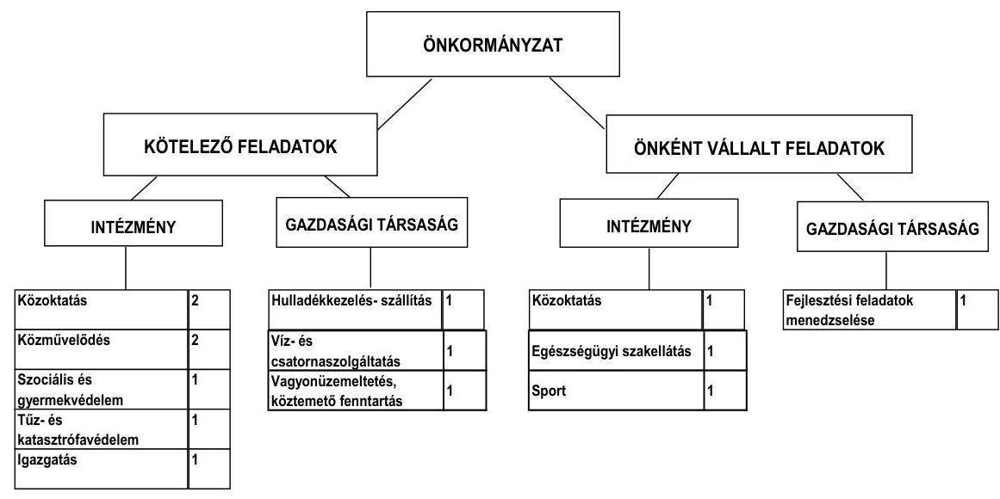

Az Önkormányzat feladatait 2011. június 30-án (a Polgármesteri hivatallal együtt) 10 költségvetési szervvel látta el. Egy közoktatási intézmény múködtetését 2007. július 1-jén átadták a Megyei Önkormányzatnak, egy szociális intézményt 2008. január 1-jével, egy közoktatási intézményt 2008. augusztus 15-ével megszüntettek, illetve a kulturális intézményeket 2010. szeptember 1-jétől összevonták. Az intézményi átszervezések következtében a feladatellátásban résztvevő önkormányzati költségvetési szervek száma a 2006. év végi 14-ről 2011. I. félév végére 10-re csökkent, a telephelyek száma 19-ről 28-ra nőtt. Az Önkormányzat két gazdasági társaságban (Tisza-Tó 2005 Nonprofit Kft., Tiszafüredi Városfejlesztési Kft.) kizárólagos tulajdonnal, egy gazdasági társaságban (Tisza-Víz Víztermelő és Szolgáltató Kft.) 51-75\% közötti tulajdoni hányaddal és egy gazdasági társaságban (Remondis Tisza Hulladékgazdálkodási Kft.) 50\% alatti tulajdoni hányaddal rendelkezett 2011. június 30-án. A gazdasági társaságok a kötelező feladatok közül a vízellátás és szennyvízelveze-

[^0]
[^0]:    ${ }^{6}$ A múködési kiadások nem tartalmazták az OEP által finanszírozott feladatok, a kisebbségi önkormányzat, és az önkormányzat gesztorságával múködő fejlesztési társulás adatait.

---

tés, a közterület fenntartás, köztisztaság biztosítása, vagyonüzemeltetési feladatok ellátása, illetve a hulladékkezelés-, szállítás feladatát látták el. Egy kizárólagos önkormányzati tulajdonú gazdasági társaságot 2010-ben alapítottak az Önkormányzat által megvalósított fejlesztési feladatok menedzselésére. A kizárólagos önkormányzati tulajdonban lévő Tisza-Tó 2005 Nonprofit Kft.-nek múködési célra az ellenőrzött időszakban összesen 887,3 millió Ft pénzeszközt adtak át.

Az Önkormányzat működési kiadásokra 2010-ben 2194,3 millió Ft-ot fordított, amely 556,0 millió Ft-tal ( $20,2 \%$-kal) maradt el az előző három év átlagos kiadásaitól. A 2010. évi múködési kiadások 43,4\%-a ( 952,8 millió Ft) az intézményi körben teljesült, 56,6\%-a (1241,5 millió Ft) a Polgármesteri hivatal feladatellátásához kapcsolódott.

A múködési kiadások fedezetéül szolgáló bevételi források ágazatonkénti összegeit a 2007. és 2010. években a következő ábra szemlélteti:
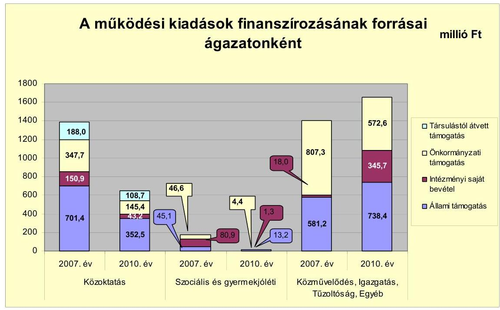

A múködési kiadások fedezetéül szolgáló állami támogatást és saját bevételt kiegészítő önkormányzati támogatás összege a 2007-2009 évek átlagában 986,1 millió Ft-ot tett ki. A 2010. évben nyújtott önkormányzati támogatás 722,4 millió Ft-os összege - az intézmény megszüntetések, feladatátadások és átszervezések hatására - 26,7\%-kal elmaradt az előző három év átlagos évi támogatásától, amely pozitív hatást gyakorolt az Önkormányzat pénzügyi egyensúlyi helyzetére. Az önként vállalt feladatokat ellátó Hámori András Szakközépiskola Megyei Önkormányzat részére, illetve a Gondozási Központ megszüntetése, feladatainak Kistérségi Társulás részére történt átadása következtében csökkent az önként vállalt feladatok kiadása. A 2010-ben önként vállalt feladatok kiadására fordított 751,8 millió Ft $28,9 \%$-kal volt kevesebb az előző három év átlagos évi kiadásánál (1058,1 millió Ft).

---

A vizsgált időszakban a kötelező és önként vállalt feladatok ellátását biztosító szervezeti keretekben, a feladatellátás módjában bekövetkezett változások (intézmény megszüntetések, átszervezések, feladatátrendezések) hatására múködési kiadásokból 228,4 millió Ft-ot megtakarított az Önkormányzat, valamint állami támogatásból 25,5 millió Ft, saját bevételből (intézményi térítési díjak, társult önkormányzatok támogatása) 170,1 millió Ft többletbevétele realizálódott. A végrehajtott intézkedések az Önkormányzat pénzügyi egyensúlyi helyzetét 424,0 millió Ft-tal javították.

Az Önkormányzat folyó költségvetési egyenlege (múködési jövedelem) a 2008. évben múködési forráshiányt mutatott.

Az Önkormányzat múködési jövedelmét, tőketörlesztését, pénzügyi kapacitását 2007-2010. évek között a következő ábra mutatja be:
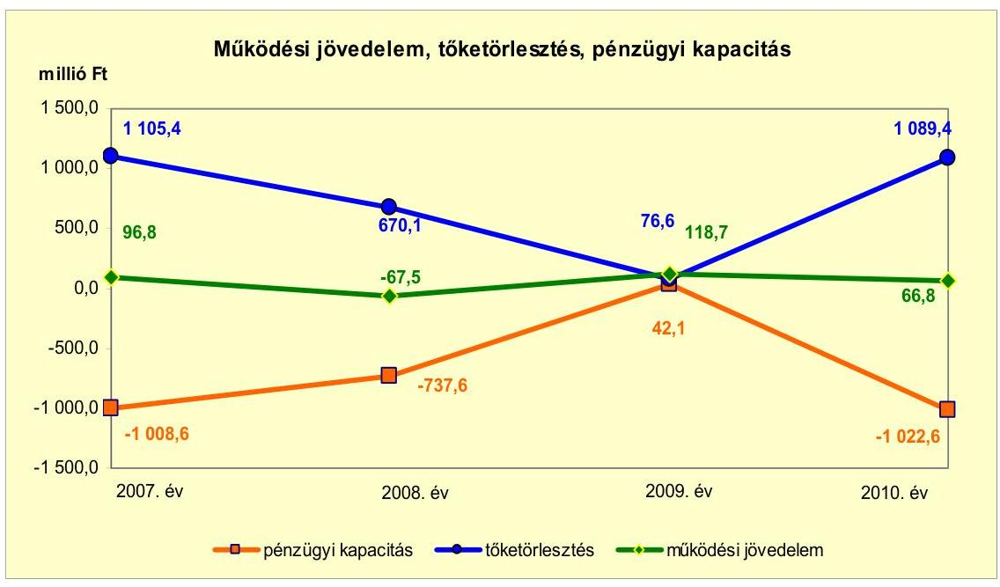

A 2008. évi 67,5 millió Ft múködési hiány kialakulását eredményezte, hogy alapvetően - az intézményi átszervezések miatti múködési kiadások csökkenését 93,8 millió Ft-tal meghaladta a múködési bevételek csökkenése, valamint a kötvénykibocsátás miatt a kamatkiadás 29,8 millió Ft-tal volt több az előző évinél. A 2007. és a 2009-2010. évek pozitív múködési jövedelmének realizálásában meghatározó szerepe volt az intézményi körben végrehajtott átszervezéseknek, feladatmegszüntetéseknek, illetve a Polgármesteri hivatal feladatátszervezésének. Az Önkormányzat pénzügyi egyensúlyi helyzetét javította, hogy a 2007. évben 59,0 millió Ft ÖNHIKI támogatásban részesült. A kapott támogatás a 37,8 millió Ft pozitív múködési jövedelmet 96,8 millió Ft-ra növelte. Múködésképtelen helyi önkormányzatok támogatása jogcímen a 2010. évben 20,0 millió Ft vissza nem térítendő támogatást kapott az Önkormányzat, amely hozzájárult a 66,8 millió Ft múködési jövedelem realizálásához. A kapott támogatás nélkül az Önkormányzat 46,8 millió Ft múködési jövedelmet realizált volna a 2010. évben.

---

Az adósságszolgálat miatt a nettó múködési jövedelem a 2009. év kivételével negatív értéket mutatott. A 2007. évi magas negatív nettó jövedelem (1008,6 millió Ft) indoka, hogy a 2000,0 millió Ft kötvénybevételből 1105,4 millió Ft-ot hiteltörlesztésre fordítottak. A negatív működési jövedelem a hiteltörlesztési kötelezettség csökkenésének hatására a 2008. évre 737,6 millió Ft-ra mérséklődött. A 2009. évi 42,1 millió Ft pozitív nettó működési jövedelem realizálását az előző évhez viszonyított múködési jövedelem 186,2 millió Ft-os növekedése, illetve a hiteltörlesztési kötelezettség 648,7 millió Ft-os csökkenése együttesen eredményezte. A 2010. évi 59,2 millió Ft kötvénybeváltási kötelezettségre fedezetet nyújtott a képződött 66,8 millió Ft múködési jövedelem. Ezen túl 1030,2 millió Ft hiteltörlesztési kötelezettsége volt az Önkormányzatnak, melyből 1025,4 millió Ft a szennyvízberuházáshoz kapcsolódó volt. A hiteltörlesztési kötelezettség nem terhelte az Önkormányzat költségvetését, mert annak forrását a felhalmozási bevételek között kimutatott, a lakástakarék pénztár által kifizetett - állami hozzájárulással növelt - lakossági megtakarítás képezte. A jövőben teljesítendő adósságszolgálatra - a 2012-től növekvő tőketörlesztési kötelezettség miatt - a múködési jövedelem további múködési kiadás csökkenést eredményező intézkedések megtétele nélkül nem biztosít fedezetet.

Az Önkormányzat folyó bevételei a vizsgált időszakban folyamatosan csökkentek. Az előző három év átlagához (3129,7 millió Ft) viszonyítva a 2010. évben teljesített 2637,7 millió Ft 15,7\%-kal (492,0 millió Ft-tal) volt kevesebb. A folyó bevételek nagyságát alapvetően meghatározó költségvetési támogatások és átengedett szja, valamint az egyéb saját bevételek összege is csökkenő tendenciát mutatott. Ennek oka a vizsgált időszakban végrehajtott intézményátszervezések miatti ellátotti létszám csökkenés, valamint a forrásszabályozás közoktatás területén bekövetkezett módosítása (teljesítménymutató alapján történő finanszírozás) volt. A helyi adók és pótlékok bevételei az Önkormányzat bevételeiben nem töltöttek be meghatározó szerepet. A helyi adók között meghatározó iparúzési adóból 2010-ben a folyó bevételek (2637,7 millió Ft) mindössze 9,1\%-a ( 240 millió Ft) realizálódott, ami a település alacsony jövedelemtermelő képességét jelzi.

A folyó kiadások összege - a folyó bevételhez hasonlóan - csökkenő tendenciát mutat. Az Önkormányzat a 2010. évben 2570,9 millió Ft folyó kiadást teljesített, amely az előző három év átlagánál (3080,4 millió Ft) 509,5 millió Ft-tal, 16,5\%-kal kevesebb. A folyó kiadások csökkenését az intézményi átszervezések, a költségcsökkentő intézkedések, létszámleépítések együttesen eredményezték.

A pénzügyi egyensúlyi helyzet alakulását jelentősen befolyásolta az Önkormányzat elmúlt időszaki fejlesztési tevékenysége. A befejezett fejlesztések teljes bekerülési költsége 3244,9 millió Ft, forrása a saját erő, a hazai- és EU-s támogatások mellett 140,5 millió Ft kötvénybevétel (4,3\%) volt. A 2010. december 31-én folyamatban lévő fejlesztési feladatok végrehajtására 2007-2010. között 107,7 millió Ft kiadást teljesítettek kötvénybevételből.

A 2010. december 31-én folyamatban lévő fejlesztési feladatok 2010. évet követő kötelezettségvállalásainak összege 1312,6 millió Ft volt,

---

amelyből 404,3 millió Ft-ot (30,8\%) kötvénybevételből, 887,2 millió Ft-ot (67,6\%) EU-s, 21,1 millió Ft-ot (1,6\%) hazai támogatásból terveznek biztosítani.
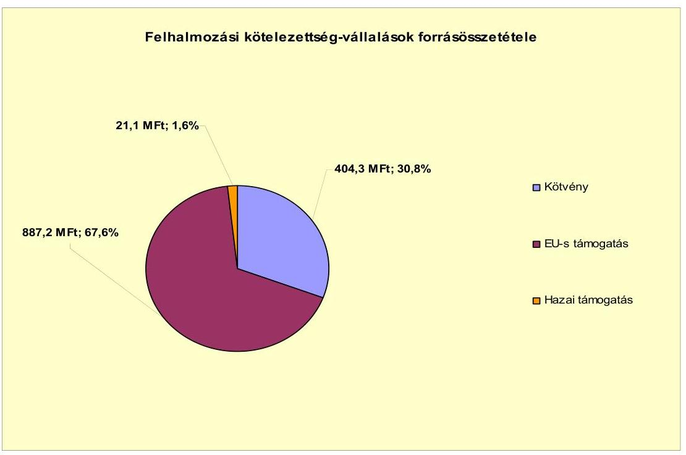

Az Önkormányzat mérleg szerinti pénzintézettel szembeni kötelezettsége a 2006. év végéről a 2011. év I. félév végére 905,2 millió Ft-ról 3900,5 millió Ftra nőtt. A 2010. év végén fennálló pénzintézettel szembeni kötelezettségek állománya két kötvény kibocsátásából (összesen 3777,9 millió Ft) és három hoszszú lejáratú hitel (összesen 157,4 millió Ft) felvételéből keletkeztek, ebből kettő (összesen 67,0 millió Ft) 2011. év I. negyedévében visszafizetésre került. Az első kötvény visszavásárlása 2012. december 1-jén kezdődik, 832,6 ezer CHF összeggel féléves, a második kötvény visszavásárlása 2009. március 31-én megkezdődött 75,2 ezer CHF összeggel negyedéves törlesztési gyakorisággal.

Az Önkormányzat - az Ötv-ben előírtak ellenére - az adósságot keletkeztető kötelezettségvállalásának felső határát a 2007. évben túllépte.

Az adósságot keletkeztető pénzintézettel szembeni kötelezettségvállalásokra (kötvénykibocsátások) képviselő-testületi döntés alapján, a pénzintézetek versenyeztetésével került sor. Az előterjesztésekben a kötelezettségvállalások ka-mat- és árfolyamkockázatait bemutatták. Versenyeztetés alapján, de közbeszerzési eljárás mellőzésével választották ki az új számlavezető pénzintézetet is, amely a kibocsátott kötvényeket lejegyző pénzintézet lett. Az Önkormányzat 2007-2011. év I. féléve között a kötvényekkel kapcsolatosan 738,6 ezer CHF tőkét törlesztett, kamat és egyéb költség címén 1757,7 ezer CHF és 12,8 millió Ft (mindösszesen 516,1 millió Ft) megfizetését teljesítette. A Tiszafüredi Víziközmű Társulattól átvett hitellel kapcsolatosan 2011. június 30 -áig 1019,2 millió Ft tőketörlesztést teljesítettek, kamatkiadásuk 46,4 millió Ft volt.

A kötvényekből származó bevételek felhasználása megfelelt a Forrásfelhasználási Megállapodásban foglalt céloknak. A korábbi hitelek kiváltása a kedvezőbb törlesztési feltételek miatt - átmenetileg javította az Önkormány-

---

zat pénzügyi pozícióját, azonban a kötvénykibocsátás miatt a pénzintézettel szembeni kötelezettségek állománya nőtt. Ennek oka, hogy a kötvénykibocsátás miatti tőketartozás meghaladta a kiváltott hitelek összegét, így a likviditási hiány újratermelődött.

A vizsgált időszakban a folyószámlahitel és a munkabér-megelőlegezési hitel igénybevétele a következő volt:

| Megnevezés | 2007. év | 2008. év | 2009. év | 2010. év | 2011. év   I. félév |
| :-- | --: | --: | --: | --: | --: |
| Folyószámlahitel |  |  |  |  |  |
| Keretösszeg január 1-jén (millió FI-ban) | 150,0 | 440,0 | 0,0 | 0,0 | 0,0 |
| Átagos napi állomány (millió FI-ban) | 363,9 | 278,9 | 0,0 | 0,0 | 0,0 |
| Folyószámla hitellel zárt napok száma (nap) | 361 | 303 | - | - | - |
| Egyenleg (állomány december 31.) | x | x | x | - | - |
| Munkabér-megelőlegezési hitel |  |  |  |  |  |
| Keretösszeg január 1-jén (millió FI-ban) | 0,0 | 80,0 | 0,0 | 0,0 | 0,0 |
| Átagos napi állomány (millió FI-ban) | 2,1 | 2,2 | 0,0 | 0,0 | 0,0 |
| Munkabér-megelőlegezési hitellel zárt napok száma (nap) | 310 | 286 | - | - | - |
| Egyenleg (állomány december 31.) | x | x | x | - | - |

A vizsgált időszak első két évének csaknem minden napját folyószámlahitellel, illetve munkabér-megelőlegezési hitellel zárta az Önkormányzat. Mindkét hitelét visszafizette 2008. október 31-én a Tiszafüred II. Kötvényből származó bevételéből.

Az Önkormányzat a likviditási gondjai miatt 2007-ben négy, 2008-ban három rövid lejáratú fejlesztési hitelt vett igénybe összesen 269,4 millió Ft összegben. A 2006-ban felvett fejlesztési célú likviditási hitelekkel (összesen $11 \mathrm{db}, 315,0$ millió Ft) együtt a hitelek visszafizetésre kerültek lejáratkor, illetve azt megelőzően a kötvényekből származó bevételből. A 2009-2011. év I. féléve időszakban likvid hitel felvételére nem került sor.

A likviditás biztosítása az Önkormányzatnak 75,5 millió Ft kamatkiadást és 1,6 millió Ft egyéb költség fizetésének kötelezettségét okozta.

---

Az Önkormányzat kötelezettségeinek 2010. december 31-i, valamint 2011. június 30-i állományát és várható alakulását a kötelezettségek lejártáig a következő táblázat szemlélteti:

| Megnevezés | $\begin{gathered} \text { Állomány } \\ \text { 2010. december } 31- \\ \text { én } \end{gathered}$ |  | $\begin{gathered} \text { Állomány } \\ \text { 2011. június } 30 \text {-án } \end{gathered}$ |  | Várható kötelezettség a 2011-2013.   években |  | Várható kötelezettség a 2014. évtól |  |
| :--: | :--: | :--: | :--: | :--: | :--: | :--: | :--: | :--: |
|  | HUF-ban   (miliió: Ft-   ban) | Devizában (összege: ezer CHFban) | HUF-ban (miliió: Ftban) | Devizában (összege: ezer CHFban) | HUF-ban (miliió:Ftban) | Devizában (összege: ezer CHFban) | HUF-ban (miliió:Ftban) | Devizában (összege: ezer CHFban) |
| Pénzintézeti kötelezettségek |  |  |  |  |  |  |  |  |
| Hosszúlejáratú hitel | 90,4 |  | 86,8 |  | 94,5 |  |  |  |
| Hosszúlejáratú hitel |  | 2,9 |  |  |  | 3,0 |  |  |
| Tiszafüred II. Külvény |  | 13429,1 |  | 13429,1 | 10,7 | 2954,7 | 49,3 | 14291,5 |
| Tiszafüred II. Külvény |  | 3834,4 |  | 3884,0 |  | 1216,8 |  | 3455,4 |
| Pénzintézeti kötelezettségek összesen HUF-ban: | 90,4 |  | 86,8 |  | 105,2 |  | 49,3 |  |
| Pénzintézeti kötelezettségek összesen CHF-ban: |  | 17266,4 |  | 17113,1 |  | 4174,5 |  | 17746,9 |
| Szállítói tartozás | 163,9 |  | 196,8 |  | 196,8 |  |  |  |
| Kötelezettségek összesen HUF-ban | 254,3 |  | 283,6 |  | 302,0 |  | 49,3 |  |
| Kötelezettségek összesen CHF-ban |  | 17266,4 |  | 17113,1 |  | 4174,5 |  | 17746,9 |

Az Önkormányzatnak pénzintézetekkel szemben fennálló kötelezettsége a 2011. év I. félév végén 86,8 millió Ft és 17113,1 ezer CHF volt. A várható fizetési kötelezettségek összege (tőke, kamat és egyéb költség) a legutóbbi kamatfizetés feltételei alapján, 2011-2013. években 105,2 millió Ft és 4174,5 ezer CHF, a 2014. évtől pedig 49,3 millió Ft és 17746,9 ezer CHF lesz. Az Önkormányzatnak a 2011. év I. félév végén szállítói tartozások címén 196,8 millió Ft fizetési kötelezettsége volt.

A 2011-2013. évek kötelezettségeinek teljesítésére figyelembe vehető eszközök a mérlegben kimutatott 131,0 millió Ft követelésállomány, és a kötvényből származó bevétel - 2010. december 31-ig fel nem használt és kötelezettségekkel meg nem terhelt - maradványa 420,0 millió Ft összegben, valamint az Önkormányzat tájékoztatása alapján a képződő működési jövedelme. A 2014. évet követően a jelenleg ismert kötelezettsége teljesítésére az Önkormányzat a forrásokat nem számszerűsítette. A kötelezettségek teljesítéséhez a megmaradt forgalomképes ingatlanvagyon, a képződő múködési jövedelem és az Önkormányzat által meghozott kiadáscsökkentő és bevételnövelő intézkedések rövid távon sem biztosítanak elegendő többletforrást, ezek teljesítése csak további intézkedések útján elért megtakarítások, valamint egyéb külső források bevonásával lehetséges.

Az Önkormányzat 2011. június 30-i lejárt szállítói tartozásának (156,3 millió Ft) a 60,7\%-a 30 napon túli volt, aminek a 82,0\%-a ( $\mathbf{7 7 , 7}$ millió Ft) meghaladta a 90 napot. A fennálló tartozásokról a Képviselő-testületet minden esetben tájékoztatták, azonban az adósságrendezési eljárás megindításáról döntés nem született.

Az Önkormányzat a vizsgált időszakban összesen 11,9 millió Ft összegben engedett el követeléseket és 0,5 millió Ft összegű tagi kölcsönt adott, ami behajthatatlanná vált. Az elengedett, valamint a behajthatatlan követelések,

---

nagyságukat tekintve, az Önkormányzat pénzügyi egyensúlyára érdemben nem hatottak.

A 2007. évben a kibocsátott Tiszafüred I. Kötvényhez kötődően az Önkormányzat első helyen keretbiztosítéki jelzálogjogot engedett a kötvényt kibocsátó pénzintézet javára összesen 15000 ezer CHF legmagasabb összeghatárig három forgalomképes önkormányzati ingatlanon. A 2008-ban kibocsátott Tiszafüred II. Kötvény visszavásárlásának biztosítékául a keretbiztosítéki-jelzálogjog szerződéssel érintett ingatlanok körét a pénzintézet nem bővítette. A jelzálogjoggal terhelt ingatlanok számviteli nyilvántartás szerinti nettó értéke 2010. december 31 -én 148,1 millió Ft volt. Az Önkormányzat forgalomképes ingatlanjainak nettó értéke 1320,3 millió Ft volt, amelyből a terhelt ingatlanok aránya $11,2 \%$ volt.

Egy önkormányzat - vagyonrész kiadása iránt - indított keresetet az Önkormányzat ellen. A folyamatban lévő peres eljárás perértéke összesen 316,9 millió Ft és járulékai. A kártérítések hatása a peres eljárás jelenlegi szakaszában nem számszerűsíthető.

Az Önkormányzat 2011. június 30 -án két gazdasági társaságban rendelkezett minősített többségi befolyással (kizárólagos tulajdonjoggal). Ezek kötelezettségeit mutatja a következő táblázat:

| Mogyavasús | Alcmáry 2010. decembe 31 -én |  | Alcmáry 2011. június 30 -én |  | Várható kötelezettség 2011-2013. évokben |  | Várható kötelezettség 2014. évköl |  |
| :--: | :--: | :--: | :--: | :--: | :--: | :--: | :--: | :--: |
|  | H.F-ban (millióft.   tan) | Dúvabban (összegs.   ezer O. F.   tan) | H.F-ban (millióft.   tan) | Dúvabban (összegs. ezer O. F.   tan) | H.F-ban (millióft.   tan) | Dúvabban (összegs. ezer O. F.   tan) | H.Fban (millióft.   tan) | Dúvabban (összegs. ezer O. F.   tan) |
| Hisszúkijáratúhitelek |  | 24,2 |  | 22,1 |  | 19,5 |  | 10,6 |
| Pénzintézetö kötelezettségeik összesen O.F-ban |  | 24,2 |  | 22,1 |  | 19,5 |  | 10,6 |
| Szálító tortozás | 4,7 |  | 6,2 |  | 6,2 |  |  |  |
| Kötelezettségek összesen H.F-ban | 4,7 |  | 6,2 |  | 6,2 |  |  |  |
| Kötelezettségek összesen O.F-ban |  | 24,2 |  | 22,1 |  | 19,5 |  | 10,6 |

Az Önkormányzat számára a két gazdasági társaság - ellenőrzés idején ismert - kötelezettségeinek állománya nem jelent kockázatot, mivel ezek teljesítése a gazdasági társaságok vagyonából biztosítható. A gazdasági társaságok kötelezettségének összege nem érte el a - gazdasági társaságok 2010. december 31-i - mérlegükben kimutatott eszközök, illetve források összegének a 15\%-át.

A 2007-2010. években az eszközállományuk után összesen 651,0 millió Ft értékcsökkenést számoltak el. Az áttekintett időszakban felújításra 283,9 millió Ft-ot, beruházásra 804,6 millió Ft-ot - ezen belül eszközpótlásra 18,8 millió Ft-ot - fordítottak a számviteli nyilvántartásuk szerint. Az éves zárszámadási rendeleteiben az Önkormányzat nem mutatta be az eszközök után tárgyévben elszámolt értékcsökkenés összegét, az eszközpótlásra fordított tényleges kiadásokat, valamint az eszközök elhasználódási fokának alakulását.

Az Önkormányzatnál a 2007. évről a 2010. évre az átengedett szja és az állami támogatások együttes összege csökkent. A költségvetésének finanszírozhatósá-

---

ga érdekében az Önkormányzat kiadási megtakarítást eredményező és bevételt növelő intézkedéseket is hozott, amivel javította az Önkormányzat pénzügyi egyensúlyi helyzetét. A 2007-2011. év I. féléve között tett intézkedések hatására 37,9 millió Ft bevételi többletet, továbbá 908,0 millió Ft kiadási megtakarítást mutattak ki.

A kiadási megtakarítások 53,3\%-a (483,6 millió Ft) az elrendelt álláshely csökkentések eredménye, 2,4\%-a (22,1 millió Ft) a tiszteletdíjak, 1,1\%-a ( 9,9 millió Ft) a többlet juttatások csökkentése miatti. A feladatászervezésekkel kapcsolatos megtakarítások összege 43,2\%-ot (392,5 millió Ft-ot) tett ki az Önkormányzat kimutatása szerint.

Önkormányzati szinten 2007-2010 között az álláshely változtatásokra ható intézkedések összesen 603 álláshely megszüntetését, ugyanakkor 358 álláshely létesítését jelentették. Az Önkormányzat jelentős feladatászervezéseket hajtott végre. Az intézkedések hatására a közoktatási feladatot ellátó intézményeknél 145, a szociális és gyermekvédelmi szakterületen 46, az egészségügy területén 11 és a Polgármesteri hivatalnál 44 álláshely szűnt meg. Az egyéb feladatellátásnál egy álláshellyel lett több az időszakban. Az Önkormányzat az ellenőrzött időszakban létszámcsökkentéshez kötődő támogatásra pályázott a prémium évek program keretén belül. Ennek hatására - 2007-2010 között - összesen 46 álláshely szűnt meg tartósan.

A bevételnövelő intézkedések a helyi adókhoz ( 2,4 millió Ft), illetve térítési díj emeléséhez ( 35,5 millió Ft) kapcsolódtak. A 2011. évtől megemelték az idegenforgalmi adó mértékét. Az Önkormányzatnál egyik adó mértéke sem érte el a törvényben meghatározott mérték felső határát.

Az utóellenőrzés a pénzügyi egyensúly javítására tett három szabályszerűségi és egy célszerűségi javaslat hasznosítására terjedt ki. A javaslatokat az intézkedési terv szerinti határidőben megvalósították. A 2008. évtől az adósságot keletkeztető kötelezettségvállalásokra meghatározott felső korlátot betartották. A költségvetési rendelettervezetek költségvetési bevételi és kiadási főösszegei a 2009. évtől nem tartalmaztak finanszírozási célú bevételeket, illetve kiadásokat. A 2008. évi zárszámadás készítése során az intézményi pénzmaradvány megállapításának szabályszerűségét ellenőrizték, értékelték az intézményi előirányzatok és teljesítések eltérésének indokoltságát. A célszerűségi javaslat hasznosulásaként a számvevői jelentésben foglaltakat megtárgyalta a Képvise-lő-testület, valamint intézkedési tervet fogadott el a javaslatok végrehajtására.

Az Önkormányzat pénzügyi egyensúlyi helyzetét összegezve a következők emelhetők ki:

Tiszafüred Város Önkormányzatának pénzügyi egyensúlya rövid távon veszélyeztetett.

A 2007-2010. évek között az Önkormányzat folyó költségvetése - a 2008. év kivételével - pozitív egyenleget mutatott, a folyó bevételek és kiadások folyamatos csökkenése mellett. Az Önkormányzat pénzügyi egyensúlyi helyzetére kedvező hatást gyakoroltak a végrehajtott feladatászervezések, illetve az önként vállalt feladatok arányának csökkenése.

---

A likviditás biztosításához külső források bevonása vált szükségessé. A vizsgált időszakban az Önkormányzat két kötvényt bocsátott ki, amelynek bevételéből a korábbi pénzintézeti kötelezettségeit rendezte, a 2008. évi múködési forráshiányt finanszírozta, illetve a fejlesztési pályázatok megvalósításához szükséges saját forrást biztosította. A kötvénybevételből végrehajtott refinanszírozás pozitívan hatott az Önkormányzat pénzügyi egyensúlyára, azonban a kötvénykibocsátás miatt a pénzintézeti kötelezettségek állománya nőtt. Ennek oka, hogy a kötvénykibocsátás miatti tőketartozás meghaladta a kiváltott hitelek összegét. A lejárt szállítói állomány növekedése azt jelzi, hogy a megtett intézkedések ellenére a likviditási hiány újratermelődik.

Az Önkormányzat felhalmozási költségvetése - a 2010. év kivételével pénzügyi hiányt mutatott. A megvalósított fejlesztések és a 2010. évet követő kötelezettségvállalások forrása a kötvénykibocsátásból származó bevételből, EU-s és hazai támogatásból biztosított.

A pénzintézeti és egyéb kötelezettségek teljesítésére a kötvény törlesztésének 2012-ben megnövekvő terhe miatt a mérlegben kimutatott, finanszírozásba vonható eszközei, valamint a képződő működési jövedelem rövid távon nem biztosítanak fedezetet. A 2014. évet követő kötelezettségek teljesítéséhez a források nem biztosítottak.

Az Állami Számvevőszékről szóló 2011. évi LXVI. törvény 33. § (1) bekezdésében foglaltak értelmében a jelentésben foglalt megállapításokhoz kapcsolódó intézkedési tervet köteles az ellenőrzött szervezet vezetője összeállítani és azt a jelentés kézhezvételétől számított harminc napon belül az ÁSZ részére megküldeni. Amennyiben az intézkedési tervet határidőben nem küldi meg a szervezet, vagy az továbbra sem elfogadható, az ÁSZ elnöke a hivatkozott törvény 33. § (3) bekezdés a)-b) pontjaiban foglaltakat érvényesítheti.

# A 2011. június 30-i pénzügyi egyensúlyi helyzet alapján az ellenőrzés intézkedést igénylő megállapításai és javaslatai a következők: 

## a Polgármesternek

1. Az Önkormányzat pénzügyi egyensúlya rövid távon veszélyeztetett. Az Önkormányzat nettó múködési jövedelme az elmúlt időszakban negatív volt, a vállalt pénzintézeti kötelezettségek fedezete rövid távon sem biztosított. Az Önkormányzat finanszírozása a vizsgált időszakban kötvénykibocsátásból származó bevétel felhasználásával volt biztosítható. Az Önkormányzat szállítói kötelezettségeinek állománya, ezen belül a 90 napon túl lejárt szállítói tartozások összege emelkedett. Az Önkormányzat által tett intézményszervezeti átalakítások, kiadáscsökkentő és bevételnövelő intézkedések nem biztosítanak elegendő forrást a pénzügyi egyensúly tartós fenntartásához.

Javaslat:
Az Önkormányzat pénzügyi egyensúlyának gyors helyreállítása és hosszú távú fenntarthatósága érdekében kezdeményezze - felelősök és határidők megjelölésével - az alábbi intézkedések megtételét:

---

a) Tárja fel a bevételszerző és kiadáscsökkentő lehetőségeket. Intézkedjen a bevételek növelésére, a kintlévőségek behajtására, a kiadások csökkentésére;
b) Terjesszen a Képviselő-testület elé reorganizációs programot a kedvezőtlen pénzügyi folyamatok megállítására, a pénzügyi egyensúlyi helyzet gyors stabilizálására;
c) Képezzen egyensúlyi (elkülönített) tartalékot az adósságszolgálat teljesítése érdekében;
d) Mérje fel a folyamatban lévő beruházásokkal kapcsolatos kötelezettségek átütemezésének pénzügyi és jogi lehetőségeit, illetve hatásait. Szükség esetén kezdeményezze a Képviselő-testületnél az átütemezést;
e) Vizsgálja felül teljes körűen a tervezett beruházásokat és a megvalósuló létesítmények fenntartásának jövőbeni pénzügyi kihatásait. Szükség esetén tegyen javaslatot a Képviselő-testületnek a tervezett beruházásokkal kapcsolatos döntések módosítására, amelyben figyelembe veszik az Önkormányzat pénzügyi lehetőségeit, és a kötelező feladatellátás elsődlegességét;
f) Kezdeményezze az intézmények finanszírozásának napi kontrollját. Szűkítse a jóváhagyott előirányzatok felhasználásának lehetőségeit;
g) Tekintse át az önként vállalt feladatok finanszírozhatóságát a kötelező feladatellátás elsődlegességének biztosítása érdekében, mutassa be a Képviselő-testületnek a megoldás lehetőségeit, és szükség esetén a gazdasági program módosításának igényét;
h) Mutassa be havonta a fél éven belül esedékes kötelezettségeinek finanszírozási forrásait;
i) Gondoskodjon, hogy a jövőben az adósságot keletkeztető kötelezettségvállalásokról szóló képviselő-testületi előterjesztések tételesen tartalmazzák a visszafizetés forrásait.
2. A Képviselő-testületnek előterjesztett éves zárszámadási rendeleteikben nem mutatatták be az Önkormányzat eszközei után tárgyévben elszámolt értékcsökkenés öszszegét, az eszközpótlásra fordított tényleges kiadásokat, az eszközök elhasználódási fokának alakulását.

Javaslat:
Mutassa be a Képviselő-testületnek évente a zárszámadási rendelet előterjesztésében az értékcsökkenés összegét, és ezzel összevetve az elhasználódott eszközök pótlására fordított tényleges kiadásokat, az eszközök elhasználódási fokának alakulását.
3. Az Önkormányzat lejárt szállítói állománya 2011. június 30-án 156,3 millió Ft volt, amelyből 90 napot meghaladó 77,7 millió Ft volt.

Javaslat:
Kezelje az Önkormányzat lejárt szállítói állományát, a szállítói kitettség és a jogszabályi következmények elkerülése érdekében.

---

A polgármester a helyszíni ellenőrzés lezárása után tájékoztatta az Állami Számvevőszéket az Önkormányzat megtett intézkedéseiről, amelyet az Állami Számvevőszék nem ellenőrzött, arra vonatkozóan véleményt vagy megállapítást nem fogalmaz meg. Az ellenőrzés lezárását követően elvégzett intézkedéseket az Állami Számvevőszék utóellenőrzés keretében vizsgálhatja.

A polgármester tájékoztatása szerint a következő intézkedéseket tette az Önkormányzat:

- A Képviselő-testület határozatban döntött arról, hogy a kötvény visszafizetésének teljesítésére és a későbbi fejlesztések megvalósulására pénzügyi tervet készítenek.
- A 2012. évi költségvetési rendelet végrehajtásához kapcsolódóan elfogadtak határozatot az önként vállalt feladatok felülvizsgálatáról és más, szigorú gazdálkodást előíró intézkedésekről.
- Reorganizációs terv készítése érdekében pénzügyi tanácsadó cég megbízásáról, valamint a kötvény-visszavásárlásából adódó árfolyamkockázat kiküszöbölése érdekében treasury-szolgáltatás igénybevételéről döntött a Képviselőtestület.

---

# II. RÉSZLETES MEGÁLLAPÍTÁSOK 

## 1. Az ÖNKORMÁNYZAT KÖTELEZŐ ÉS ÖNKÉNT VÁLlALT FELADATAI, A FELADATELLÁTÁS SZERVEZETI KERETEI ÉS ANNAK VÁLTOZÁSAI

Az Önkormányzat a kötelezően ellátandó feladatait az Ötv. és az ágazati törvények által meghatározottnak tekintette, az önként vállalt feladatok köréről az SzMSz 7. § (2) bekezdésében rendelkezett, azok terjedelmét az éves költségvetési rendeletekben a költségvetés forrásainak ismeretében határozta meg. Az önként vállalt feladatok közé sorolták a középfokú oktatást, a sportfeladatok ellátását, a városüzemeltetési feladatok ellátását, az egészségügyi szakellátás biztosítását, az alapfokú művészeti iskola fenntartását.

Az Önkormányzat müködési célú költségvetési kiadásaiból a kötelező feladatok ellátására a 2007. évben 1781,0 millió Ft-ot ( $60,0 \%$-ot), a 2010. évben 1442,5 millió Ft-ot ( $65,7 \%$-ot) fordított. Az önként vállalt feladatok müködési kiadása a 2007. évben 1186,1 millió Ft (40,0\%), a 2010. évben 751,8 millió Ft $(34,3 \%)$ volt.

Az Önkormányzat müködési kiadásaiból ${ }^{7} 649,8$ millió Ft-ot (29,6\%-ot) közoktatási, 18,9 millió Ft-ot ( $0,9 \%$-ot) gyermekjóléti, 284,1 millió Ft-ot ( $12,9 \%$-ot) egyéb intézmények fenntartására fordított a 2010. évben. A Polgármesteri hivatalban ellátott igazgatási és egyéb feladatokra 1241,5 millió Ft (56,6\%) müködési kiadást teljesítettek a 2010. évben.

Az Önkormányzat 2010. évi müködési kiadásainak feladatonkénti megoszlását, és azok finanszírozását a következő táblázat mutatja be:

| Ellátott feladat | Múködési kiadás összesen (millió Ft) | Kötelező feladatok kiadásainak rézzerénye $\%$ | Múködési bevétel összesen (millió Ft) | Állami támogatás rézzerénye $\%$ | Intézményi rejé bevétel rézzerénye $\%$ | Önkormányzati támogatás rézzerénye $\%$ | Társulástól átvett tómogatás rézzerénye $\%$ |
| :--: | :--: | :--: | :--: | :--: | :--: | :--: | :--: |
| Örodák | 134,2 | 100,0 | 134,2 | 49,0 | 5,9 | 45,1 | 0,0 |
| Általános iskolák | 353,3 | 93,3 | 353,3 | 52,8 | 4,3 | 16,7 | 26,2 |
| Gyermekjólét intézmény | 18,9 | 100,0 | 18,9 | 69,6 | 7,0 | 23,4 | 0,0 |
| Kormüvelődési intézmények | 46,8 | 100,0 | 46,8 | 4,6 | 19,4 | 75,8 | 0,0 |
| Sportlétesítmény | 27,8 | 0,0 | 27,8 | 1,4 | 18,2 | 80,4 | 0,0 |
| Hivatások Tüzoltóság | 209,5 | 100,0 | 209,5 | 100,0 | 0,0 | 0,0 | 0,0 |
| Egyéb intézmények | 162,3 | 0,0 | 162,3 | 61,6 | 12,4 | 16,0 | 10,0 |
| Polgármesteri hivatás igazgatási kiadása | 498,7 | 0,0 | 498,7 | 4,6 | 6,4 | 66,6 | 0,0 |
| Polgármesteri hivatásban ellátott egyéb feladatok müködési kiadása | 742,6 | 94,7 | 742,6 | 67,6 | 22,7 | 9,7 | 0,0 |
| Múködési kiadások összesen | 2 194,3 |  | 2 194,3 | 50,3 | 11,8 | 32,9 | 5,0 |
| Megjegyzés: Az Önkormányzat korlatait nem tart fenn. Az egyéb intézmények sorban a közoktatási feladatokat ellátó két intézmény Zeneiskola, valamint Kossuth Lajos Gimnázium integrált intézmény gimnáziumi szakképző iskola oktatásnak és kollégiumi ellátásnak a kiadásait és azok forrásösszetételét szerepeitettük. |

[^0]
[^0]:    ${ }^{7}$ Az 1. számú tanúsítvány kitöltési útmutatójának megfelelően a működési kiadások nem tartalmazták az OEP által finanszírozott feladatok, a kisebbségi önkormányzat, és az Önkormányzat gesztorságával működő fejlesztési társulás adatait.

---

Az Önkormányzat feladatainak 2007-2009. évi múködési célú kiadásaihoz évenként átlagosan igénybevett állami támogatás összege - a végrehajtott intézményátszervezések és feladatátadások miatti ellátotti létszám csökkenés, illetve a közoktatás területén bekövetkezett forrásszabályozás módosítás (teljesítménymutató alapján történő finanszírozás) hatására - 1400,5 millió Ft-ról a 2010. évre $21,2 \%$-kal ( 1104,0 millió Ft-ra) csökkent. A múködési kiadásokra csökkenő mértékben, a 2007-2009. évi átlagos 2750,3 millió Ft múködési kiadás 50,9\%-ára, a 2010. évben a 2194,3 millió Ft múködési kiadás 50,3\%-ára nyújtott fedezetet. A közoktatási feladatok ellátásához 2010-ben biztosított 352,5 millió Ft állami támogatás a múködési kiadások ( 649,8 millió Ft) 54,2\%-ára nyújtott fedezetet, ami 4,8 százalékponttal kevesebb az előző három év átlagában számított ${ }^{8}$ forráson belüli részaránynál. A közoktatási intézményekben annak ellenére csökkent az állami támogatás részaránya, hogy az Önkormányzat csökkentette az óvodai csoportok számát, iskola összevonásokat hajtott végre, illetve egy szakközépiskola múködtetését átadta a Megyei Önkormányzatnak. A szociális intézmények múködési kiadása 2007-ben 172,6 millió Ft volt, melynek 26,1\%-ára nyújtott fedezetet az állami támogatás. A Városi Gondozási Központ 2007. december 31-ével történő megszüntetését követően az Önkormányzat a gyermekjóléti ellátás keretében a bölcsődés gyerekek gondozását biztosította. A Tiszafüredi Bölcsőde 2008. évi 30,1 millió Ft-os múködési kiadása - a 2009-ben végrehajtott 4,0 fő és a 2010-ben végrehajtott 0,5 fő dolgozói létszámcsökkentés következtében - a 2009. évre 20,0 millió Ft-ra, a 2010. évre 18,9 millió Ft-ra csökkent. A bölcsődei ellátás állami támogatással fedezett múködési kiadásainak aránya a 2008. évi 53,0\%-ról a 2009. évre 89,4\%-ra nőtt, a 2010. évben 69,6\% volt. A közművelődési intézmények működtetéséhez 2008-tól járult hozzá a központi költségvetés. Az állami támogatás nagyságrendje nem jelentős a múködési kiadásoknak ${ }^{9}$ 2008-ban 1,4\%-át, 2009-ben 2,0\%-át, 2010-ben 4,8\%-át fedezte. A sportlétesítmény múködéséhez 2008-2010. években igénybevett állami támogatás a múködési kiadások 0,8-1,4\%-ára nyújtott fedezetet. A Hivatásos Túzoltóság múködtetéséhez nyújtott állami támogatás a 2008-2010. években 100\%-ban finanszírozta a múködési kiadásokat, a 2007. évben a 207,6 millió Ft múködési kiadás 87,8\%-ára (182,3 millió Ft) nyújtott fedezetet. A 2007. évi központi forrást 6,6 millió Ft saját bevétel, és 18,7 millió Ft önkormányzati támogatás egészítette ki. A Polgármesteri hivatal költségvetésében kimutatott feladatok (igazgatási kiadások, és egyéb a Polgármesteri hivatalban ellátott feladatok) átlagos múködési kiadása a 2007-2009. években 1250,6 millió Ft-ot tett ki. A 2010. évi múködési kiadás 1241,5 millió Ft-os összege 0,7\%-kal elmaradt az előző három év átlagos kiadásától. A 2010. évi múködési kiadások 42,4\%-ára nyújtott fedezetet az 526,3 millió Ft állami támogatás, amely 2,4 százalékponttal meghaladta a 2007-2009. évekre számított, átlagos 40,0\% részarányt.

Az önkormányzati feladatok múködési kiadásainak csökkenési ütemét meghaladta az állami támogatások csökkenésének mértéke. A kieső központi forrást az intézményi saját bevételek és az önkormányzati támogatások együtte-

[^0]
[^0]:    ${ }^{8}$ A 2007-2009. évek 664,7 millió Ft átlagos állami támogatása az 1125,1 millió Ft átlagos kiadás 59,0\%-át fedezte.
    ${ }^{9}$ A közművelődési intézmények kiadása 2008-ban 53,6 millió Ft, 2009-ben 53,2 millió Ft, 2010-ben 46,9 millió Ft volt.

---

sen kompenzálták, ami negatív hatást gyakorolt az Önkormányzat pénzügyi egyensúlyi helyzetére. A 2010. évben realizált 259,2 millió Ft intézményi saját bevétel a múködési kiadások (2194,3 millió Ft) 11,8\%-ára nyújtott fedezetet, ez az arány 1,4 százalékpontos javulást mutat az előző három év átlagához képest. A 2007-2009. évek 2750,3 millió Ft átlagos múködési kiadásainak 10,4\%át finanszírozta a három év átlaga alapján számított 286,5 millió Ft intézményi saját bevétel.

A kötelező és önként vállalt feladatok múködési kiadásaihoz nyújtott önkormányzati támogatás összege a 2007-2009. évek átlagában 986,1 millió Ft-ot tett ki. A 2010. évben nyújtott önkormányzati támogatás 722,4 millió Ft-os öszszege $26,7 \%$-kal maradt el az előző három év átlagos támogatásától. A közoktatási feladatok ellátásának forrását kiegészítette a társult önkormányzatoktól átvett támogatás, melynek összege a 2007-2009. évi átlagos 77,2 millió Ft-ról a 2010. évre 108,7 millió Ft-ra nőtt.

A 2010-ben önként vállalt feladatok kiadására fordított 751,8 millió Ft $28,9 \%$-kal volt kevesebb az előző három év átlagos évi kiadásánál (1058,1 millió Ft). Az önként vállalt feladatokra a 2007-2009. évi átlagos múködési kiadások (2750,3 millió Ft) 38,5\%-át, 2010-ben a 2194,3 millió Ft múködési kiadás $34,3 \%$-át fordították. Az önként vállalt feladatok kiadásainak és költségvetésen belüli részarányának csökkenése az Önkormányzat pénzügyi helyzetére pozitív hatást gyakorolt.

Az Önkormányzat kötelező és önként vállalt feladatait ellátó költségvetési szervek száma a 2006. év végi 14-ről 2011. június 30-ra 10-re csökkent, a telephelyek száma - az intézményfenntartó társulásban résztvevő önkormányzatok intézményi számának bővülése hatására - 19-ről 28-ra nőtt. Az önkormányzati feladatokat 2006. év végén három önállóan gazdálkodó és 11 részben önállóan gazdálkodó, 2011. június 30 -án kettő önállóan múködő és gazdálkodó, és nyolc önállóan múködő költségvetési szervvel látták el. Az intézmények számának csökkenést egy közoktatási intézmény Megyei Önkormányzat részére történő átadása, egy szociális intézmény és egy közoktatási intézmény megszűntetése, valamint a kulturális intézmények összevonása idézte elő. Az Önkormányzat feladatait 2011. június 30 -án az alábbi költségvetési szervekkel látta el:

- a közoktatási feladatok közül az óvodai nevelést egy óvoda biztosította a székhelyén és két telephelyén, az alapfokú múvészeti oktatás feladatait a Zeneiskola látta el. A Kossuth Lajos Gimnázium intézményi társulás keretében biztosította az általános iskolai, gimnáziumi és szakképző iskolai oktatást és kollégiumi nevelést 17 telephelyen;
- a Kuthy Elek Egészségügyi Intézmény az egészségügyi feladatok közül az ügyeleti ellátást biztosította, védőnői szolgálatot látott el, illetve járó beteg szakorvosi ellátást végzett;
- a szociális és gyermekjóléti feladatok közül a gyermekek bölcsődei ellátásáról gondoskodtak a Tiszafüredi Bölcsőde múködtetésével;
- kulturális feladatot két intézmény, a Kovács Pál Művelődési Központ és a Városi Könyvtár és Információs Központ (két telephelyen) látott el;

---

- a Benedek Gábor Városi Sportcsarnok és Szabadidőközpont múködtetésével az oktatási intézmények részére a testnevelés órák lebonyolításának tárgyi feltételeit, a sportszervezetek részére edzés és versenylehetőséget biztosítottak;
- a Hivatásos Önkormányzati Tüzoltó-parancsnokság tűzmegelőzési, tűzvédelmi, illetve tűzvizsgálati eljárással, tűzvédelmi hatósági ellenőrzéssel kapcsolatos feladatokat végzett;
- az igazgatási feladatokat a Polgármesteri hivatal látta el.

A szociális alapszolgáltatásokat a Kistérségi Társulás útján, társulási megállapodás alapján látták el.

A feladatellátásban 2011. év I. félév végén négy gazdasági társaság - ebből kettő kizárólagos tulajdonú - vett részt. A többségi önkormányzati tulajdonú gazdasági társaságok köre változott a vizsgált időszakban, száma változatlanul három volt. A 2006. december 31-én többségi önkormányzati tulajdonú három gazdasági társaság közül egy gazdasági társaságban az Önkormányzat tulajdoni részaránya $51 \%$-ról $6 \%$-ra csökkent, egy kizárólagos önkormányzati tulajdonú kft.-t 2010-ben alapítottak.

Az Önkormányzat kizárólagos tulajdonában lévő Tisza-Tó 2005 Nonprofit Kft. látta el a kötelező feladatok közül a közterület-, köztemető fenntartását, köztisztaság biztosítását, a tereken és közterületeken való parkolás biztosítását, valamint a vagyonüzemeltetési feladatokat, önként vállalt feladatként önkormányzati szálláshelyeket értékesítettek. Az Önkormányzat kizárólagos tulajdonában lévő Tiszafüredi Városfejlesztési Kft. 2010. május 12-i alapító okirata szerint a társaság - az Önkormányzattal kötött szerződés keretében - előkészíti és menedzseli az Önkormányzat által megvalósított fejlesztési feladatokat. Az Önkormányzat kötelező feladatai közül az ivóvízellátás, szennyvízelvezetés, és tisztítás feladatát ellátó Tisza-Víz Víztermelő és Szolgáltató Kft.-ben 56,41\% tulajdoni hányaddal rendelkezett 2011. június 30 -án. A Hulladékkezelés-, szállítás, és ártalmatlanítás feladatát végző Remondis Tisza Hulladékgazdálkodási Kft.-ben 2011. június 30 -án $6,0 \%$ tulajdoni hányaddal rendelkezett az Önkormányzat.

A Tiszafüredi Regionális Szilárdhulladék Lerakót építtető tulajdonosi önkormányzatok gesztori feladatait az Önkormányzat látta el, 51,0\% tulajdoni hányadot jegyezve a hulladékgazdálkodási feladatokat ellátó Remondis Tisza Hulladékgazdálkodási Kft.-ben (49,0\%-ban egy gazdasági társaság a Kft. tulajdonosa). A hulladéklerakó osztatlan közös tulajdona 2011. február 15-én - a 2004. január 1-jei lakosságszám alapján - felosztásra került a hulladéklerakót építtető önkormányzatok között, melynek következtében az Önkormányzat tulajdoni hányada $6,0 \%$-ra csökkent.

Az Önkormányzat egy gazdasági társaságnak adott át pénzeszközt a 20072011. év I. félévében, összesen 887,3 millió Ft összegben. A Tisza-Tó 2005 Nonprofit Kft. részére, múködési célra átadott pénzeszköz 2007-ben 149,7 millió Ft, 2008-ban 176,3 millió Ft, 2009-ben 297,3 millió Ft, 2010-ben 173,3 millió Ft, és 2011. év I. félévében 90,7 millió Ft volt. A gazdasági társaságok gazdálkodását, illetve múködését érintő adatokat (saját tőke/jegyzett tőke aránya, a feladatellátáshoz biztosított vagyon nagysága, a fennálló kötelezett-

---

ségek állománya, önkormányzattól kapott támogatás) a jelentés 4 . számú melléklete mutatja be.

Az Önkormányzatnál az intézményi feladatellátás szerkezetét átalakították a vizsgált időszakban. A Hámori András Szakközépiskolát 2007. július 1-jétől átadták a Megyei Önkormányzatnak, 2008. január 1-jétől megszűntették a Gondozási Központot, amelynek feladatai közül a szociális étkezés, házi segítségnyújtás, nappali ellátás feladatát a Kistérségi Társulás vette át, az intézményi étkeztetés feladatait a Tisza-tó 2005 Nonprofit Kft.-be szervezték ki. A Kossuth Lajos Gimnáziumot 2009. július 1-jén átadták a Kistérségi Társulásnak, majd 2010. július 1-jétől visszavették a múködtetés feladatát. A Zrínyi Ilona Általános Iskola, Óvoda és Pedagógiai Szakszolgálat intézményt 2008. augusztus 15-én megszűntették, jogutód az óvodai nevelés feladatellátásában a Tiszafüredi Óvodák, az általános iskolai oktatás és pedagógiai szakszolgálat vonatkozásában a Kossuth Lajos Gimnázium volt. A kulturális intézmények közül a Tourinform Irodát 2010. szeptember 1-jétől a Művelődési Központba integrálták. Létszámleépítést 2007-ben a Polgármesteri hivatal átszervezése kapcsán hajtottak végre, illetve 2009. január 1-jétől az intézmények technikai dolgozóinak (takarítók, karbantartók, portások) munkáltatója a Tisza-tó 2005 Nonprofit Kft. lett. Az Önkormányzatnak a vizsgált időszakban - intézmény megszűntetés, intézményi átszervezés, feladatátrendezés hatására - működési kiadásokból 228,4 millió Ft megtakarítása, valamint a Kossuth Lajos Gimnázium működtetésének Kistérségi Tárulástól történő visszavétele hatására állami támogatásból 25,5 millió Ft, intézményi saját bevételből 170,1 millió Ft többlet bevétele realizálódott.

A vizsgált időszakban az ellátott feladatok körében, a feladat ellátást biztosító szervezeti keretekben, illetve a feladatellátás módjában bekövetkezet változások az Önkormányzat pénzügyi helyzetét 424,0 millió Ft-tal javították.

# 2. AZ ÖNKORMÁNYZAT PÉNZÜGYI EGYENSÚLYI HELYZETÉT BEFOLYÁSOLÓ TÉNYEZŐK 

A hagyományos költségvetési szerkezet helyett az Önkormányzat pénzügyi helyzetét a CLF módszerrel mutatjuk be, amelyben jobban elkülönülnek a vagyonnal kapcsolatos bevételek és kiadások az önkormányzati feladatokkal kapcsolatos közvetlen működtetési bevételektől és kiadásoktól. A módszer következetesen elkülöníti a folyó és a felhalmozási költségvetés bevételeit és kiadásait, azok költségvetési egyenlegeit. A saját folyó bevételek, valamint a saját felhalmozási bevételek nem tartalmazzák az előző évi pénzmaradványok felhasználásából származó pénzforgalom nélküli bevételeket ${ }^{10}$.

A folyó költségvetés egyenlege, a múködési jövedelem megmutatja, hogy az Önkormányzat éves folyó bevétele fedezetet biztosít-e a kötelező és önként vállalt feladatellátáshoz kapcsolódó éves folyó kiadására. A múködési jövedelem

[^0]
[^0]:    ${ }^{10}$ A költségvetési években kialakuló hiány finanszírozása az előző évi pénzmaradvány és a korábbi években képzett tartalékok felhasználásával is történhet.

---

negatív értéke pénzügyileg fenntarthatatlan helyzetet jelez. A mutató pozitív értéke megtakarítást mutat, amely forrásul szolgálhat az önkormányzat fennálló kötelezettségei megfizetéséhez, valamint fejlesztéseihez.

A felhalmozási költségvetés pozitív értéke felhalmozási többletet mutat, amely a jövőbeni fejlesztések forrását biztosíthatja. Amennyiben a folyó költségvetési hiány finanszírozása a felhalmozási többletből történik, ez szűkebb értelemben vagyonfelélésnek tekinthető. Amennyiben a felhalmozási költségvetés megtakarítása fejlesztési célú hitelek, kötvények adósságszolgálatát finanszírozza, az változatlan vagyontömeg mellett, a korábban megelőlegezett tőkebevételek valós realizációjának tekinthető. A felhalmozási deficit által generált finanszírozási igény önmagában nem jár pénzügyi kockázattal, a pénzügyileg fenntartható beruházásokhoz kapcsolódó kötelezettségvállalás (adósságszolgálat) átlátható és szabályozott költségvetési gazdálkodással teljesíthető.

A módszer a pénzügyi kapacitás fogalmát helyezi a középpontba. Az adós hitelfelvételi képessége, hosszú távú fizetőképessége vagy bonitása a pénzügyi kapacitással, ezen belül is a nettó múködési jövedelemmel jellemezhető. A nettó múködési jövedelem negatív értéke az egyes költségvetési években jelentkező adósságszolgálat túlzott mértékére utal. ${ }^{11}$ A nettó múködési jövedelem negatív értékének felhalmozási többletből, vagy további hitelből történő finanszírozása pénzügyileg nem fenntartható gazdálkodást vetít előre. A pozitív értéket mutató nettó múködési jövedelem fejlesztési kiadások fedezetét biztosíthatja, illetve a folyamatosan, évenként képződő pozitív nettó működési jövedelemből meghatározható a jövőben vállalható, teljesíthető éves adósságszolgálat, ily módon az a hitelösszeg, amely - a többi tényezőt, feltételt adottnak tekintve visszafizetési kockázat nélkül felvehető.

A CLF módszer alapján a pénzügyi kapacitás mértéke az Önkormányzat összevont, nettósított, a központi információs rendszerbe a Magyar Államkincstáron keresztül leadott éves költségvetési beszámolójának 80-as űrlapjában szerepeltetett adatok alapján került meghatározásra.

A számítási leírás némileg eltér az ÁSZ módszertanában korábban alkalmazott gyakorlattól. A jelen besorolás általános közgazdasági meggondolásokon alapul, amely megjelenik az SNA statisztikai módszertanában is. Folyó tételek alatt értjük azokat a kiadásokat és bevételeket, amelyek a gazdálkodó szervezet helyzetét automatikusan nem változtatják. Bevételi oldalon ilyenek az adók, a tényező jövedelmek, a transzferek ${ }^{12}$, kiadási oldalon a transzferek és a szolgáltatás igénybevételével kapcsolatos múködési kiadások. A folyó költségvetésben a bevételekben nem térül meg, a kiadásokban nem jelenik meg az amortizáció, a vagyoni helyzetet az egyenleg befolyásolja.

A folyó költségvetés egyenlege (múködési jövedelem) tartalmazza a kamatbevételeket és a kamatkiadásokat is, mind a múködési, mind a fejlesztési kama-

[^0]
[^0]:    ${ }^{11}$ kivéve, ha annak finanszírozására a korábbi években képzett tartalékok fedezetet nyújtanak
    ${ }^{12}$ Transzfer kiadásoknak nevezzük azokat a folyó és felhalmozási tételeket, amelyeket nem az adott önkormányzat használ fel szolgáltatásnyújtásra.

---

tot, valamint a visszatérülő és befizetendő áfa teljes összegét, mert ezek közgazdaságilag tényező jövedelmek. Nem tartalmazzák viszont a követelés elengedés miatt könyvelt bevételi és kiadási pénzforgalmi tételeket, mert valójában technikai elszámolási múveletnek minősülnek, a bevétel soha nem realizálódott, és költségvetési kiadás sem történt.

A felhalmozási költségvetésben a bevételek között a vagyon megőrzésére és bővítésére fordítható források jelennek meg. A felhalmozási vagy tőketételek módosítják a vagyon nagyságát. A privatizációs bevétel csökkenti a vagyont, a fizikai beruházás, pénzügyi befektetés növeli.

A nettó múködési jövedelmet a tőketörlesztés levonásával a folyó költségvetés egyenlegéből származtatjuk.

# 2.1. A múködési és a felhalmozási egyensúly változása 

CLF módszer szerinti önkormányzati adatok

| Megnevezés | 2007. év | 2008. év | 2009. év | 2010. év |
| :--: | :--: | :--: | :--: | :--: |
| Folyó bevételek | 3372,6 | 3080,6 | 2936,0 | 2637,7 |
| Folyó kiadások | 3275,8 | 3148,1 | 2817,3 | 2570,9 |
| Müködési jövedelem | 96,8 | $-67,5$ | 118,7 | 66,8 |
| Nettó múködési jövedelem =müködési jövedelem - tőketörlesztés | $-1008,6$ | $-737,6$ | 42,1 | $-1022,6$ |
| Felhalmozási bevételek | 228,0 | 305,7 | 149,1 | 1398,6 |
| Felhalmozási kiadások | 496,8 | 338,5 | 414,0 | 428,7 |
| Felhalmozási költségvetés egyenlege | $-268,8$ | $-32,8$ | $-264,9$ | 969,9 |
| Finanszírozási múveletek nélküli (GFS) pozíció = müködési jövedelem + felhalmozási költségvetés egyenlege | $-172,0$ | $-100,3$ | $-146,2$ | 1036,7 |
| Finanszírozási műveletek egyenlege | 1546,4 | 114,6 | $-104,1$ | $-1107,0$ |
| Tárgyévi pénzügyi pozíció | 1374,4 | 14,3 | $-250,3$ | $-70,3$ |
| Egyéb tájékoztató adatok |  |  |  |  |
| Összes kötelezettség* | 3140,8 | 4595,8 | 4527,6 | 4263,7 |
| -ebből rövid lejáratú | 1067,7 | 351,3 | 253,5 | 375,9 |
| Folyószámlahitel napi átlagos állománya ** | 363,9 | 276,9 | 0,0 | 0,0 |
| Likvidhitel napi átlagos állománya** | 1,5 | 0,2 | 0,0 | 0,0 |
| Munkabérhitel napi átlagos állománya** | 2,1 | 2,2 | 0,0 | 0,0 |
| Finanszírozásba vonható eszközök: | 1378,2 | 1392,5 | 1142,1 | 941,7 |
| Tartós hitelviszonyt megtestesítő értékpapírok év végi állománya | 0,0 | 0,0 | 0,0 | 0,0 |
| Hosszú lejáratú bankbetétek év végi állománya | 0,0 | 0,0 | 0,0 | 0,0 |
| Értékpapírok év végi állománya | 0,0 | 0,0 | 0,0 | 0,0 |
| Pénzeszközök (idegen pénzeszközök nélkül) év végi állománya | 1378,2 | 1392,5 | 1142,1 | 941,7 |

* Az összes kötelezettséget a passzív pénzügyi elszámolások nélkül vettük figyelembe, mert a passzívák a pénzmaradvány elszámolás tételei közé tartoznak.
** A folyószámla, a likvid- és a munkabérhitel átlagos állományát 365 napos osztószámmal, és nem a hitel igénybevételi napok számával vettük figyelembe.

---

Az Önkormányzat folyó költségvetési egyenlegét a 2007-2010. években a következő ábra szemlélteti:
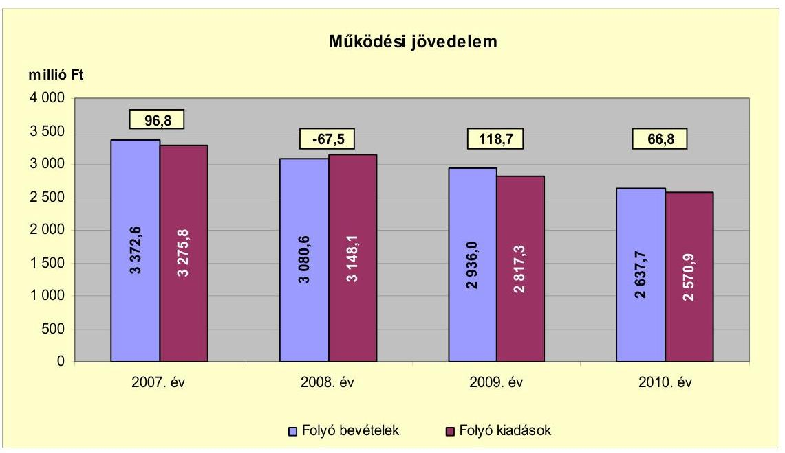

Az Önkormányzat folyó költségvetési egyenlege (működési jövedelme) a 2008. év kivételével forrástöbbletet mutatott. A vizsgált időszakban mind a folyó bevételek, mind a folyó kiadások alakulását csökkenő tendencia jellemzi. A Megyei Önkormányzat fenntartásába 2007-ben átadott középfokú oktatási intézmény és a Gondozási Központ 2008. évi megszüntetetése hatására mind a bevételek, mind a kiadások átlagot meghaladóan csökkentek 2008-ban. Hasonló változás figyelhető meg 2009-2010 vonatkozásában, amikor a Kossuth Lajos Gimnázium Kistérségi Társulásnak történő átadására, illetve visszavételére került sor. Az Önkormányzat 2009-ben (a 2009/2010. tanévben) nyolc hónapig, 2010-ben (a 2010/2011. tanévben) négy hónapig múködtette az intézményt. A 2007. évben 59,0 millió Ft, a 2011. év I-III. negyedévben 71,2 millió Ft ÖNHIKI támogatásában részesültek, a kapott támogatást a Polgármesteri hivatal és az intézmények működtetésének dologi kiadásaira használták fel. A 2007. évi támogatás a 37,8 millió Ft pozitív működési jövedelmet 96,8 millió Ft-ra növelte. A múködésképtelen helyi önkormányzatok támogatása jogcímen a 2010. évben kaptak 20,0 millió Ft vissza nem térítendő, célhoz nem kötött támogatást, amely hozzájárult a 66,8 millió Ft múködési jövedelem realizálásához. A kapott támogatás nélkül az Önkormányzat 46,8 millió Ft múködési jövedelmet realizált volna a 2010. évben.

Az Önkormányzat pénzügyi kapacitása (nettó múködési jövedelem) a vizsgált időszakban - a 2009. év kivételével - negatív értéket mutatott. A nettó múködési jövedelem értéke a folyó költségvetési pozíció mellett az adott költségvetési év adósságtörlesztésének és a kötvény beváltásának hatását is tükrözi.

---

Az Önkormányzat nettó múködési jövedelmét évenként az alábbi ábra szemlélteti:
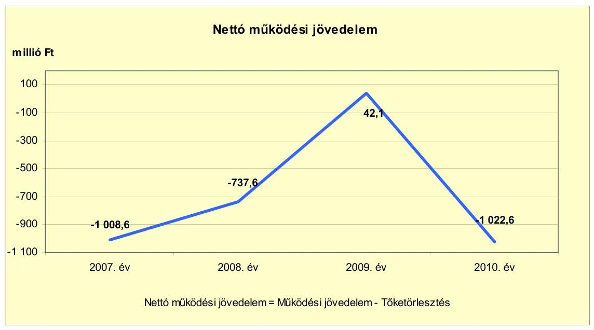

A 2007. évben a kibocsátott kötvény bevételéből 1105,4 millió Ft-ot a fennálló hiteltartozás törlesztésére használtak fel, melynek következtében 1008,6 millió Ft negatív nettó múködési jövedelem keletkezett. A negatív múködési jövedelem 2007-ről 2008-ra történt 271,0 millió Ft-os mérséklődését az okozta, hogy a hiteltörlesztési kötelezettség az előző évi 1105,4 millió Ft-ról 670,1 millió Ft-ra csökkent. A 2009. évi 42,1 millió Ft pozitív nettó múködési jövedelem realizálását - az előző évhez viszonyított - a múködési jövedelem 186,2 millió Ft-os növekedése, illetve a hiteltörlesztési kötelezettség 648,7 millió Ft-os csökkenése együttesen eredményezte. A 2010. évi 66,8 millió Ft múködési jövedelem az 59,2 millió Ft kötvénybeváltási kötelezettség teljesítésére fedezetet nyújtott. Az 1030,2 millió Ft hiteltörlesztési kötelezettségből 1025,4 millió Ft-ot a szennyvízberuházáshoz kapcsolódó, felhalmozási bevételek között elszámolt - állami hozzájárulással növelt - lakossági megtakarításból (lakáspénztári kifizetés) teljesítette.

# A 2007-2009. években az Önkormányzat felhalmozási költségvetésének egyenlege negatív összegű, a 2010. évben pozitív összegű volt.

---

A felhalmozási költségvetés egyenlegének alakulását évről évre a következő ábra szemlélteti:
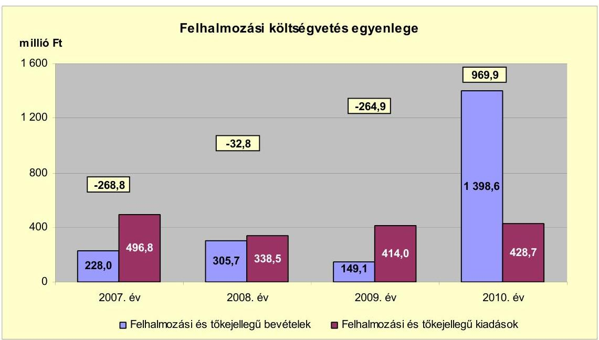

A felhalmozási forráshiányt a 2007-2009. években megvalósított jelentős fejlesztések okozták, melyeknek kiadásai meghaladták a fedezetként rendelkezésre álló felhalmozási és tőkejellegű bevételeket. A 2007. évben a felhalmozási kiadások között mutatták ki a hulladékgazdálkodási rendszer kiépítéséhez kapcsolódóan visszaigényelt áfa összegének megfelelő támogatási rész visszafizetését 119,2 millió Ft összegben. A 2010. évi felhalmozási bevételek 969,9 millió Ft-tal haladták meg a felhalmozási kiadásokat. A felhalmozási bevételek között elszámolt 1025,4 millió Ft a szennyvízberuházáshoz kapcsolódó, lakástakarék pénztár által kifizetett - állami hozzájárulással növelt - lakossági megtakarítás volt, melyet a beruházáshoz kapcsolódó hiteltörlesztésre (finanszírozási célú kiadásra) fordított az Önkormányzat. Enélkül a 2010. évi felhalmozási kiadások 55,5 millió Ft-tal meghaladták a lakástakarék pénztártól származó bevétellel korrigált felhalmozási bevételeket ( 373,2 millió Ft). A 2010. évi korrekciót figyelembe véve a vizsgált időszakban 622,0 millió Ft felhalmozási forráshiány keletkezett, melynek finanszírozása likviditási hitelekből, illetve a kötvénykibocsátás bevételéből történt ${ }^{13}$.

[^0]
[^0]:    13 Az évenkénti adatokat a jelentés 2. számú melléklete mutatja be.

---

Az Önkormányzat finanszírozási múveletei 2007-2010. évekbeli egyenlegét a következő ábra szemlélteti:
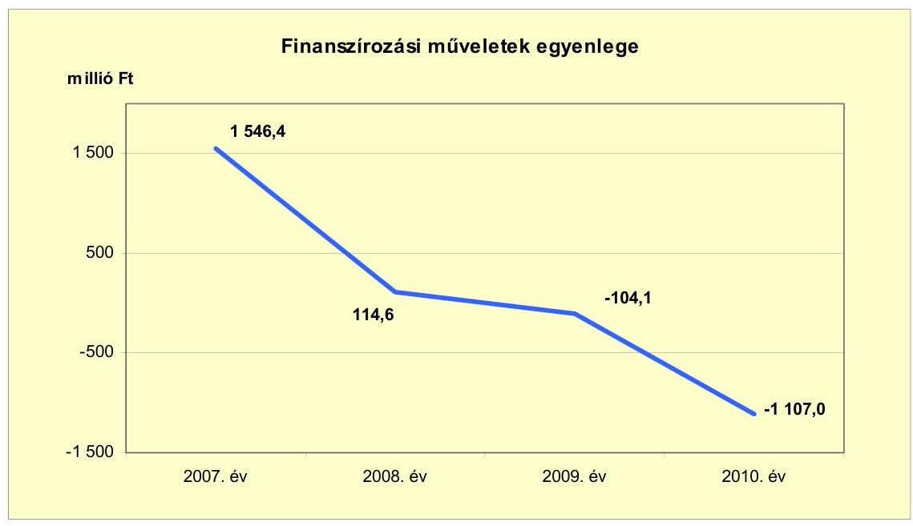

A finanszírozási célú pénzügyi műveletek pozitív értéke azt jelzi, hogy az éves költségvetések végrehajtása során szükség volt külső finanszírozás igénybevételére is. A vizsgált időszakban 675,4 millió Ft hitel felvételére, és 2743 millió Ft összegben kötvénykibocsátásra került sor. A finanszírozási célú múveleteket a vizsgált időszakban a jelentés 2. számú mellékletének 4.1-4.8 pontjai részletezik.

Az Önkormányzat 2007-2010. évi zárszámadási rendeleteinek mellékleteiben bemutatott múködési és felhalmozási hiány/többlet összegéről a jelentés 1. számú melléklete nyújt tájékoztatást, mely szerint a múködési célú bevételek és kiadások, illetve a felhalmozási célú bevételek és kiadások - a 2010. év kivételével - egyaránt tartalmaztak finanszírozási célú műveleteket, illetve a bevételek között számoltak a kötvénybevétel fel nem használt részével.

A múködési többlet 2007-ben 217,1 millió Ft, 2008-ban 35,0 millió Ft volt. A 2009. évben a múködési célú kiadások között elszámolt 55,2 millió Ft finanszírozási célú kiadás (múködési célú kötvény visszavásárlás) hozzájárult az 57,7 millió Ft múködési forráshiány kialakulásához. A 2010. évben a finanszírozási műveleteket nem tartalmazó múködési bevételek és kiadások egyenlege -89,2 millió Ft volt. A felhalmozási bevételek között kimutatott finanszírozási célú bevételek (kötvénykibocsátás, likviditási hitel felvétel) miatt 2007-ben 1157,2 millió Ft-tal, 2008-ban 287,2 millió Ft-tal haladták meg a felhalmozási célú bevételek a felhalmozási célú kiadásokat. A 2009. évben a felhalmozási kiadások finanszírozására 166,9 millió Ft pénzmaradványt vettek igénybe, így a felhalmozási kiadásokat és bevételeket egyensúlyban mutatták ki. A 2010. évi felhalmozási célú bevételek között kimutatott, lakástakarék pénztártól származó 1025,4 millió Ft bevétel miatt a felhalmozási célú bevételek 989,4 millió Ft-tal meghaladták a felhalmozási célú kiadásokat.

---

Az Önkormányzat kamatbevételeit és kamatkiadásait és azok egyenlegét évenként a következő ábra mutatja:
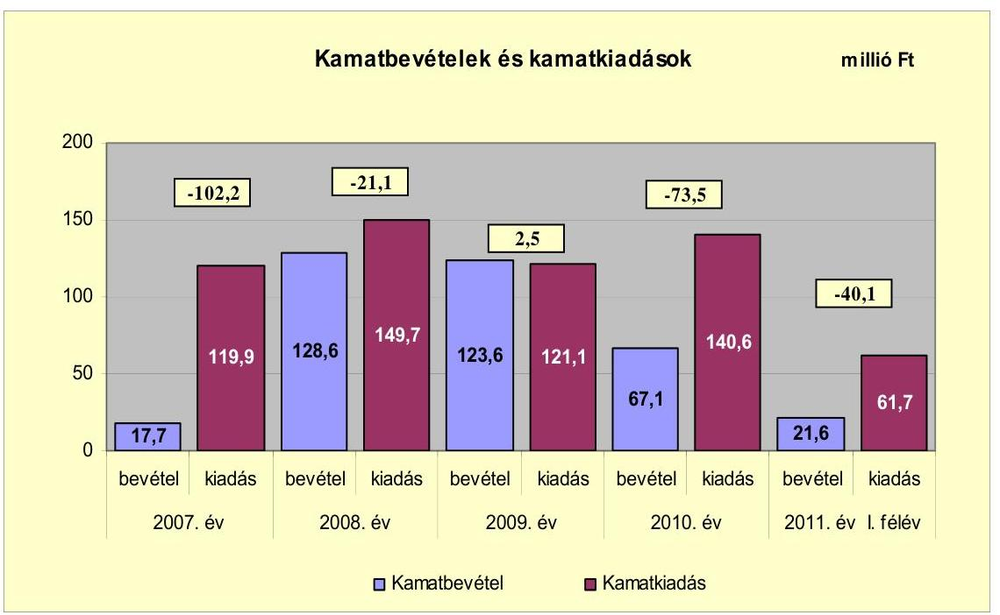

Az Önkormányzat 2007. évi kamatkiadása a fennálló hitelkötelezettségéhez, 2008-2010. évi kamatkiadása a kötvénykibocsátáshoz, 2007-2010. évi kamatbevétele alapvetően a kötvénybevétel - fel nem használt részének - lekötéséhez kapcsolódott. Az Önkormányzat 2007-2010 között 337,0 millió Ft kamatbevételt ért el, és 531,3 millió Ft kamatot fizetett meg. A kamatkiadások a 2009. év kivételével meghaladták a kamatbevételeket.

A 2011. évre az Önkormányzat a kamatkiadások csökkenésével számolt, a költségvetési rendeletben tervezett 132,0 millió Ft kamatkiadás 6,1\%-kal, 8,6 millió Ft-tal maradt el a 2010. évitől.

---

# 2.2. Az Önkormányzat bevételeinek változása 

Az összes folyó bevétel a 2007-2009. évek átlagában 3129,7 millió Ft-ot tett ki. A 2010. évben teljesített folyó bevételek 2637,7 millió Ft-os összege 15,7\%-kal maradt el az előző három év átlagos bevételétől. Az Önkormányzat 2007-2011. év I. félév között realizált főbb bevételi jogcímeinek számszaki adatait a következő grafikon mutatja be:
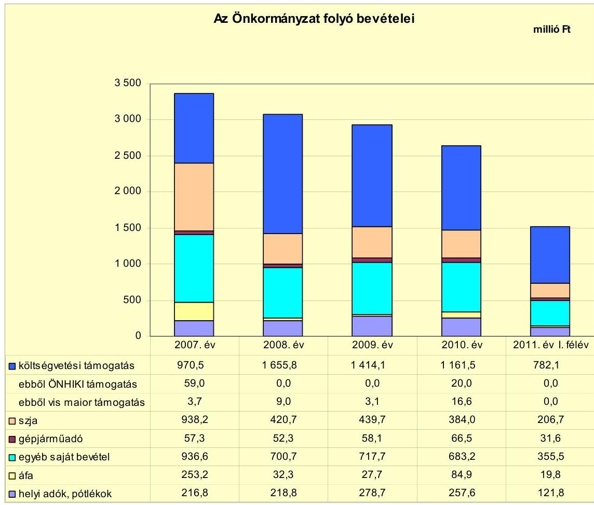

A költségvetési támogatások és az átengedett szja együttes összege a 2007. évi 1908,7 millió Ft-ról a 2010. évre 1545,5 millió Ft-ra, 19,0\%-kal (363,2 millió Ft-tal) csökkent, a 2007-2009 évek átlagában 1946,3 millió Ft-ot tett ki. A 2010. évi költségvetési támogatások és az átengedett szja együttes öszszege 20,6\%-kal maradt el az előző három év átlagos bevételétől. A költségvetési támogatások nagyságának alakulását alapvetően az átszervezések miatti ellátotti létszámváltozások, a forrásszabályozásban bekövetkezett módosítások és az Önkormányzat múködőképességének megőrzését szolgáló kiegészítő támogatások befolyásolták. A 2007-ben kapott 59,0 millió Ft, a 2011. év III. negyedévben kapott 71,2 millió Ft ÖNHIKI támogatás és a 2010-ben kapott 20,0 millió Ft múködésképtelen helyi önkormányzatok egyéb támogatása javította az Önkormányzat pénzügyi egyensúlyát. Vis major támogatás jogcímen 2007-ben 3,7 millió Ft, 2008-ban 9,0 millió Ft, 2009-ben 3,1 millió Ft, 2010-ben 16,6 millió Ft bevételt realizáltak.

---

Az Önkormányzat egyéb saját bevételei a 2007-2009 évek átlagában 785,0 millió Ft-ot tettek ki. A 2010. évben teljesített egyéb saját bevételek 683,2 millió Ft-os összege 13,0\%-kal maradt el az előző három év átlagos bevételétől. Az egyéb saját bevételek alakulásában meghatározó szerepet játszott az intézményi struktúra átalakítása, a feladatellátás átszervezése miatti intézményi múködési bevételek alakulása.

A vizsgált időszakban a 2007. évben realizált az Önkormányzat kiemelkedően magas összegben (253,2 millió Ft) áfa bevételt, amelyből 166,8 millió Ft a Hulladékgazdálkodási Társulás felhalmozási kiadásaihoz kapcsolódó áfa viszszatérülés volt.

Az Önkormányzat a vizsgált időszakban a különböző jogcímeken kivetett helyi adókból és pótlékaiból 2009-ben teljesítette a legtöbb bevételt. A 278,7 millió Ft bevétel 27,4\%-kal (59,9 millió Ft-tal) haladta meg az előző évit. A 2009. évi többletbevételt alapvetően két adózó által fizetett helyi iparűzési adó többlet eredményezte. A helyi iparűzési adó bevallásokban kimutatott túlfizetés miatti visszafizetési kötelezettség 5,4 millió Ft-tal volt kevesebb a 2008. évinél, illetve a behajtási tevékenység eredményeként realizált 7,2 millió Ft adóbevétel 6,9 millió Ft-tal haladta meg a 2008. évit.

A helyi adók (iparúzési adó, építményadó, telekadó, idegenforgalmi adó) közül az idegenforgalmi adó mértéke emelkedett a vizsgált időszakban, 2011. január 1-jétől $250 \mathrm{Ft} /$ vendégéjszakáról $300 \mathrm{Ft} /$ vendégéjszakára. A helyi adók közül meghatározó az iparűzési adó, melynek mértéke 1,8\%, aránya a helyi adókon belül 2010-ben 80,0\% (240,0 millió Ft) volt.

Az Önkormányzat felhalmozási bevételeinek szerkezete a vizsgált időszakban a következőképpen alakult:

| Megnevezés | 2007. év | 2008. év | 2009. év | 2010. év | 2011. év   I. félév |
| :-- | --: | --: | --: | --: | --: |
| Tárgyi eszköz értékesítés | 25,7 | 18,3 | 2,3 | 32,8 | 0,0 |
| Egyéb saját tőkebevétel | 7,3 | 1,3 | 0,1 | 12,2 | 10,5 |
| Államháztartáson belülről   kapott támogatás | 183,5 | 168,6 | 128,3 | 317,1 | 61,5 |
| EU-tól és külföldről kapott   támogatások | 0,0 | 0,0 | 0,0 | 0,0 | 0,0 |
| Államháztartáson kívülről   kapott támogatás | 11,5 | 117,5 | 18,4 | 1036,5 | 12,6 |
| Összes felhalmozási   bevétel | 228,0 | 305,7 | 149,1 | 1398,6 | 84,6 |

---

A felhalmozási bevételek jelentős hányadát a kapott támogatások (államháztartáson belülről és államháztartáson kívülről kapott támogatások) tették ki. Az összes felhalmozási bevétel 85,5-98,4\%-a realizálódott ezekből a jogcímekből a 2007-2010. években. Az államháztartáson belülről kapott támogatások a fejlesztési feladatok végrehajtásához kapcsolódtak, államháztartáson kívülről kapott támogatásként számolták el 2010-ben a szennyvízberuházáshoz kapcsolódóan kifizetett, állami támogatással növelt lakossági megtakarításokat 1025,4 millió Ft összegben.

# 2.3. Az Önkormányzat múködési és felhalmozási célú kiadásainak változása 

Az Önkormányzat folyó kiadásai főbb jogcímek szerinti bontásban a következők voltak:

| Megnevezés | 2007. év | 2008. év | 2009. év | 2010. év | 2011. év   I. félév |
| :--: | :--: | :--: | :--: | :--: | :--: |
| Folyó kiadások | 3275,8 | 3148,1 | 2817,3 | 2570,9 | 1375,3 |
| Müködési kiadások (kamatkiadás nélkül) | 2738,3 | 2508,0 | 1898,6 | 1908,4 | 1066,6 |
| Államháztartáson belülre átadott pénzeszközök | 8,3 | 31,6 | 224,8 | 59,8 | 33,5 |
| Transzferkiadások | 409,3 | 458,8 | 572,8 | 462,1 | 213,5 |
| -ebből: vállalkozásoknak | 159,4 | 182,6 | 291,6 | 189,2 | 83,9 |
| EU-nak, illetve külföldre |  |  |  |  |  |
| magánszemélyeknek | 240,7 | 266,7 | 270,6 | 267,9 | 129,0 |
| nonprofit szervezeteknek | 9,2 | 9,5 | 10,6 | 5,0 | 0,6 |
| Kamatkiadások | 119,9 | 149,7 | 121,1 | 140,6 | 61,7 |
| Előző évi pénzmaradvány átadás | 0,0 | 0,0 | 0,0 | 0,0 | 0,0 |

Az Önkormányzat múködési kiadása a folyó kiadásoknak 2007-ben 83,6\%-át (2738,3 millió Ft), 2008-ban 79,7\%-át (2508,0 millió Ft), 2009-ben 67,4\%-át (1898,6 millió Ft), 2010-ben 74,2\%-át (1908,4 millió Ft), 2011. év I. félévében 77,6\%-át (1066,6 millió Ft) képezte.

Az Önkormányzat teljesített múködési kiadásai - az előző évhez viszonyítva - a 2008. évben 230,3 millió Ft-tal, a 2009. évben 609,4 millió Ft-tal csökkentek, majd a 2010. évben 9,8 millió Ft-tal emelkedtek.

|  |  |  |  |  | millió Ft |
| :-- | --: | --: | --: | --: | --: |
| Megnevezés | 2007. év | 2008. év | 2009. év | 2010. év | 2011. év   I. félév |
| Személyi juttatások | 1572,0 | 1404,4 | 928,7 | 1030,9 | 570,5 |
| Munkaadót terhelő járulékok | 506,4 | 452,5 | 286,6 | 258,5 | 147,2 |
| Dologi kiadások | 631,5 | 620,8 | 651,1 | 566,1 | 331,0 |
| Egyéb folyó kiadások | 18,6 | 18,5 | 17,7 | 7,9 | 14,3 |

A személyi juttatások összege - folyamatos csökkenés mellett - 2007-ről 2009-re 40,9\%-kal (643,3 millió Ft-tal) csökkent a Polgármesteri hivatalban és intézményekben végrehajtott szervezési intézkedések (intézményi átszervezés, feladatátszervezés, intézmény átadás, létszámleépítés) eredményeként. A 2010. évi 1030,9 millió Ft kiadás 102,2 millió Ft-tal (11\%-kal) haladta meg az előző évit ( 928,7 millió Ft) elsősorban a Kossuth Lajos Gimnázium - Kistérségi Társu-

---

lástól történő - átvétele miatt. A 2010. évi személyi juttatások összege a 2007-2009. években átlagosan teljesített 1301,7 millió Ft-nál 20,8\%-kal (270,8 millió Ft-tal) volt alacsonyabb.

A munkaadókat terhelő járulékok kiadása a végrehajtott szervezési intézkedések, a társadalombiztosítási járulék 2009. évtől történő csökkenése, az egészségügyi hozzájárulás megszűnése következtében - csökkenő tendenciát mutatott, 2007-ről 2010-re 247,9 millió Ft-tal (49,0\%-kal) csökkent. A 2010. évben fizetett 258,5 millió Ft járulék összege a 2007-2009. években átlagosan teljesített 415,2 millió Ft-nál 37,7\%-kal (156,7 millió Ft-tal) volt alacsonyabb.

A dologi kiadások a 2007-2009 évek átlagában 634,5 millió Ft-ot tettek ki. A 2010. évben teljesített dologi kiadások 566,1 millió Ft-os összege 10,8\%-kal maradt el az előző három év átlagos kiadásától. A dologi kiadások - az előző évhez viszonyítva - a 2009. év kivételével csökkentek. A 2009. év dologi kiadása 30,3 millió Ft-tal haladta meg az előző évit, melynek oka az Önkormányzat beszámolójában kimutatott Tisza-tavi Hulladékgazdálkodási Társulásnak - az előző évekhez viszonyított - nagy összegben elszámolt (85,8 millió Ft) dologi kiadása ${ }^{14}$ volt.

A folyó és felhalmozási kiadások összetételét a következő grafikon szemlélteti:
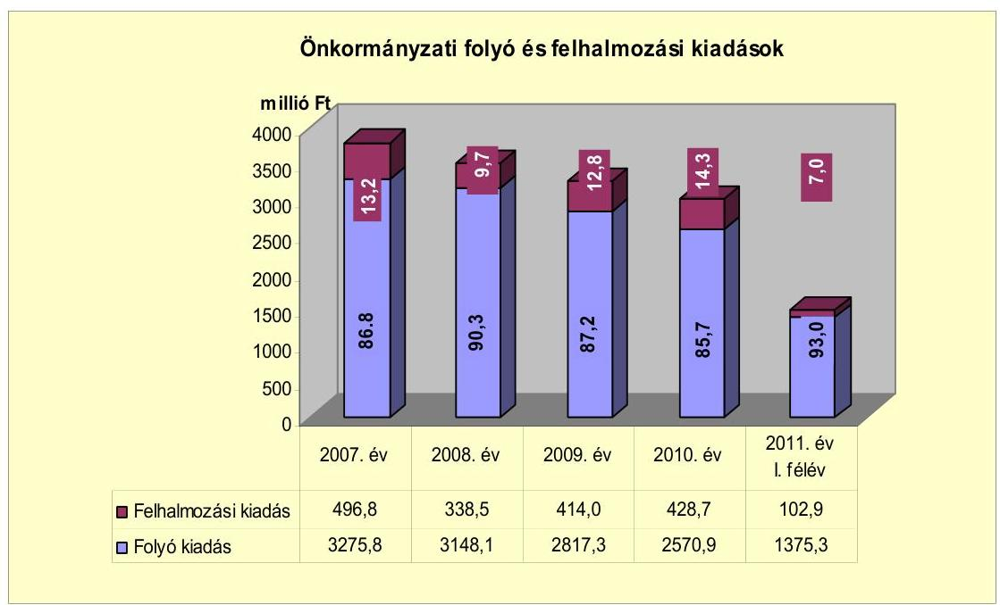

A folyó és felhalmozási kiadások 2010. évi aránya a 2007-2009 évek átlagához képest minimális változást mutat, a felhalmozási kiadások aránya 2,4 százalékponttal csökkent a folyó kiadások arányának javára. Az Önkormányzat a felhalmozási célú kiadásokra 2008-ban költött a legkevesebbet (338,5 millió Ft-ot), ami az összes kiadás (3486,6 millió Ft) 9,7\%-ának felelt

[^0]
[^0]:    14 A Hulladéklerakó Társulás dologi kiadása 2007-ben 46,5 millió Ft, 2008-ban 0,3 millió Ft, 2009-ben 85,8 millió Ft és 2010-ben 6,9 millió Ft volt.

---

meg, 2011. év I. félévében 102,9 millió Ft összegben teljesítettek felhalmozási kiadást.

A felhalmozási kiadások volumenét és arányát befolyásolta az Önkormányzat gesztorságával megvalósult Tisza-tavi hulladékgazdálkodási rendszer kiépítésének felhalmozási kiadása. A 2008-ban befejeződött beruházás társult önkormányzatok költségvetését terhelő összes kiadásából (2119,6 millió Ft) 2007-ben 24,0 millió Ft, 2008-ban 177,1 millió Ft kiadást teljesítettek. A felhalmozási kiadások összes kiadáson belüli aránya a társult önkormányzatok kiadásainak figyelembevétele nélkül csökkent, 2007-ben 12,6\%, 2008-ban 4,9\% volt. Az Önkormányzat társulás nélküli múködési és a felhalmozási kiadásait a következő ábra mutatja be:
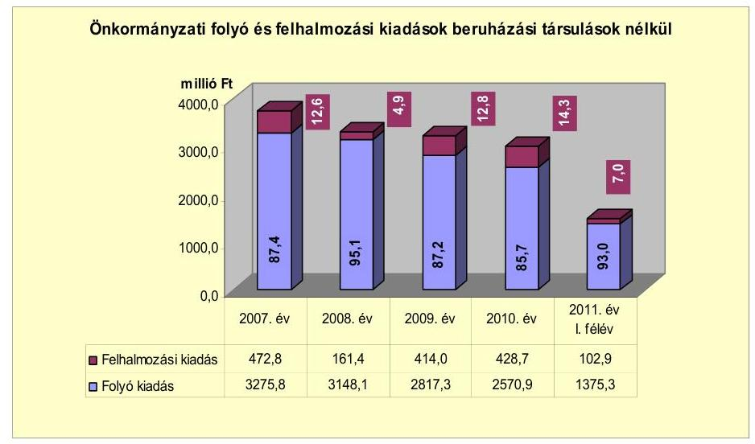

A 2007-2010. évek között befejezett 10 millió Ft teljes bekerülési költség feletti 12 fejlesztés finanszírozására a 10 millió Ft alatti 97 fejlesztéssel együtt amelynek összértéke 235,1 millió Ft-ot tett ki - 3244,9 millió Ft-ot fordítottak. A beruházási összköltségből a hazai támogatás $32,2 \%$-ot (1043,3 millió Ft-ot), az EU-s támogatás $47,9 \%$-ot ( 1553,5 millió Ft-ot), a kötvénykibocsátás bevétele $4,3 \%$-ot ( 140,5 millió Ft-ot), a saját bevétel $15,6 \%$-ot ( 507,6 millió Ft-ot) tett ki.

Az Önkormányzat folyamatban lévő fejlesztési feladatainak 2010. december 31-ig teljesített bekerülési költsége 361,5 millió Ft volt. A beruházás forrása 2,5 millió Ft $(0,7 \%)$ saját bevétel, 107,7 millió Ft $(29,8 \%)$ kötvénybevétel, 251,3 millió Ft EU-s támogatás ( $69,5 \%$ ) volt.

A 2010. december 31-én folyamatban lévő fejlesztési feladatok 2010. évet követő kötelezettségvállalásainak összege 1312,6 millió Ft volt, amelynek tervezett forrása 404,3 millió Ft (30,8\%) kötvénybevétel, 887,2 millió Ft (67,6\%) EU-s támogatás és 21,1 millió Ft ( $1,6 \%$ ) hazai támogatás.

A vizsgált időszakban befejeződött három legjelentősebb fejlesztés a következő volt:

- A Tisza-tavi hulladékgazdálkodási rendszer kiépítése a 2003-2008. években 2389,1 millió Ft teljes bekerülési költség mellett valósult meg. A beruházás forrása 366,1 millió Ft ( $15,3 \%$ ) saját bevétel, 13,5 millió Ft ( $0,6 \%$ ) kötvény-

---

bevétel, 1253,3 millió Ft (52,4\%) EU-s támogatás és 756,2 millió Ft (31,7\%) hazai támogatás volt. A beruházás gesztoraként az Önkormányzat költségvetését - a teljes bekerülési költségből - 269,5 millió Ft kiadás terhelte;

- A Zrínyi Ilona Általános Iskola és Pedagógiai Szakszolgálat, valamint az Eszterlánc Óvoda épületének felújítása, bővítése és akadálymentesítése 2005-ben kezdődött és 2007-ben fejeződött be. A 244,0 millió Ft bekerülési költségből 1,6 millió Ft ( $0,6 \%$ ) saját bevétel, 7,0 millió Ft kötvénybevétel $(2,9 \%), 182,9$ millió Ft ( $75,0 \%$ ) EU-s támogatás, 52,5 millió Ft (21,5\%) hazai támogatás volt;
- A Tiszavégi településrész közlekedési kapcsolatának, településközponttal való összeköttetésének javítása érdekében útburkolat javításokat végeztek a 2008-2009. években. A 106,8 millió Ft teljes bekerülési költségből a kötvénybevétel 11,1 millió Ft-ot (10,4\%), az EU-s támogatás 95,7 millió Ft-ot (89,6\%) tett ki.

Az Önkormányzat gazdasági társaságai közül a - jellemzően vagyonüzemeltetési feladatokat ellátó - Tisza-Tó 2005 Nonprofit Kft. részére, múködési célra adott át pénzeszközt 2007-ben 149,7 millió Ft, 2008-ban 176,3 millió Ft, 2009-ben 297,3 millió Ft, 2010-ben 173,3 millió Ft, és 2011. év I. félévében 90,7 millió Ft, a vizsgált időszakban összesen 887,3 millió Ft összegben.

A Tisza-Tó 2005 Nonprofit Kft. tevékenységét az Önkormányzattal kötött megállapodás alapján végezte. A megállapodás tartalmazza az elvégzendő feladatok körét, a feladatellátás során betartandó önkormányzati rendeletek felsorolását, valamint a feladatellátás díjazásával kapcsolatos előírásokat.

# 3. Az ÖNKORMÁNYZAT KÖTELEZETTSÉGEI 

### 3.1. Az Önkormányzat pénzintézeti kötelezettségeinek változása

Az Önkormányzat mérleg szerinti ${ }^{15}$ pénzintézeti kötelezettségeinek állománya 2006. december 31-ről 2010. december 31-re 905,2 millió Ft-ról 3935,3 millió Ft-ra növekedett, majd 2011. június 30 -ára 34,8 millió Ft-tal (3900,5 millió Ft-ra) csökkent.

A 2010. év végén fennálló pénzintézeti kötelezettségek két kötvény kibocsátásából és három hosszú lejáratú hitel felvételéből keletkeztek, ebből kettő 2011. év I. negyedévében kifizetésre került. A 2007-2008. években az Önkormányzat rendelkezett folyószámlahitellel, munkabér-megelőlegezési hitellel és egyéb likvid hitelekkel is, valamint még három ${ }^{16}$ hosszú lejáratú fejlesztési hitele is volt.

[^0]
[^0]:    ${ }^{15}$ A diagramban szereplő adatok eltérnek az önkormányzati mérlegben rögzített adatoktól, mivel nem tartalmazzák a Hulladéklerakó Társulás hiteleinek összegét.
    ${ }^{16}$ Az első hitelt 2003-ban vették fel öt éves futamidővel, amit szerződés szerint 2008ban visszafizettek. A következő hiteleket 2005-ben hat éves futamidővel, illetve 2007ben nyolcéves futamidővel vették fel. Mindkettőt lejárat előtt, a kötvényekből származó bevételből visszafizették.

---

A pénzintézetekkel szemben fennálló kötelezettségek állományának változását a következő diagram szemlélteti:
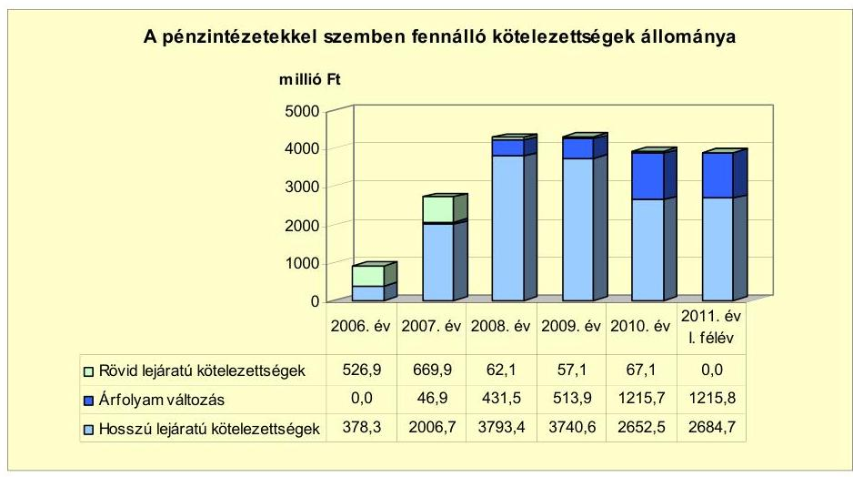

Az Önkormányzat pénzintézeti kötelezettségeinek állománya a vizsgált időszakban több mint négyszeresére növekedett. Ezt a növekedést a 2007. évben 2000,0 millió Ft összegben, illetve a 2008. évben 743,0 millió Ft összegben kibocsátott Tiszafüred I-II. Kötvény, valamint a Tiszafüredi Víziközmű Társulattól a 2007. év végén átvett - 1106,0 millió Ft összegű - hitel okozta. A kötvény kibocsátásokból származó bevételből a fennálló rövid lejáratú hiteleket három hosszú lejáratú hitellel együtt - visszafizették. Ebből adódóan a rövid lejáratú hitelek állománya a 2011. év I. félévének végére megszűnt, a 2010. december 31-i állomány is csak a Számv. tv. 42. § (3) bekezdésében foglaltak szerint a hosszú lejáratú hitelekből a következő évben esedékes törlesztő részletet tartalmazta.

A Képviselő-testület a 2007-2011. években a forráshiány finanszírozását elsősorban pályázati forrásokból (ÖNHIKI, működésképtelen önkormányzatok támogatása), valamint többletbevételekből, kiadáscsökkentésekből kívánta megoldani. Az átmeneti likviditási gondok kezelésére folyószámla hitelkeret igénylését is tervbe vették a költségvetési rendeletekben.

Az Önkormányzat az áttekintett időszakban az adósságot keletkeztető kötelezettségvállalásának felső határát - az Ötv. 88. § (2) bekezdésében előírtak ellenére - a 2007. évben túllépte. A tárgyévet terhelő rövid lejáratú kötelezettségei 1176,1 millió Ft-tal meghaladták a korrigált saját bevétel éves összegét. Az ezt követő években az adósságot keletkeztető kötelezettségvállalások felső határát betartották.

A vizsgált időszakban az Önkormányzat hosszú lejáratú pénzintézeti kötelezettségvállalásaira (kötvénykibocsátások) képviselő-testületi döntés alapján, a pénzintézetek versenyeztetésével került sor. Az előterjesztésekben a kötelezettségvállalások kamat- és árfolyamkockázatait bemutatták. A kötelezettségvállalásból származó források felhasználási céljait az Önkormányzat meghatározta. Versenyeztetés alapján, de közbeszerzési eljárás mellőzésével választották ki az új számlavezető pénzintézetet is, amellyel 2008. szeptember 22-én

---

kötötték meg a bankszámlaszerződést. A vizsgált időszakban kibocsátott kötvényeket lejegyző pénzintézet lett az Önkormányzat új számlavezetője.
2011. június 30 -án ${ }^{17}$ az Önkormányzatnak forint alapú hosszúlejáratú hitele csak egy volt, melynek jellemző adatait a következő táblázat mutatja:

| Megnevezés | Szerződéskötés   időpontja | Összeg   millió Ft-ban | Kamat (referencia kamat+   kamatfelár) | Felhasználás célja: |
| :-- | :--: | :--: | :--: | :-- |
| SZL-10/2001. sz hitel (átvállalt   hiteli Víziközmü Társulattól) | 2007.12 .29 | 1106,0 | 3 havi BUBOR + 2,25\% | lakossági hozzájárulás   megelőlegezése |

Az Önkormányzat a 2002-ben megkötött Együttmúködési Megállapodásban kezességet vállalt a Tiszafüredi Víziközmű Társulat hiteléért. A Víziközmú Társulat megszűnése ${ }^{18}$ után az Önkormányzat a hitelt átvállalta. A hitel visszafizetésének fedezetét a magánszemélyek befizetései adják, melynek nagyobb része lakás-takarékpénztári megtakarításokból származik. Az Önkormányzat a Tiszafüredi Víziközmú Társulattól 1106,0 millió Ft hitelt vett át. Az átvett hitellel kapcsolatosan 2011. június 30 -ig 1019,2 millió Ft tőketörlesztést teljesítettek, kamatkiadásuk 46,4 millió Ft volt. A kifizetésekre a lakás-takarékpénztári megtakarításokból származó bevétel fedezetet nyújtott.

Az Önkormányzat 2011. június 30 -án CHF-ben fennálló hosszúlejáratú pénzintézeti kötelezettségvállalásai a következők voltak:

| Megnevezés | Kibocsátás   időpontja | Összeg   ezer CHF-ben | Kibocsátási árfolyam | Kamat (referencia kamat+   kamatfelár) | Felhasználás célja: |
| :--: | :--: | :--: | :--: | :--: | :--: |
| Tiszafüred II. Kötvény | 2007.08 .23 | 13429,1 | 148,93 | 6 havi CHF LIBOR + 0,95\% | hitelék kiváltása és fejlesztési   célok |
| Tiszafüred II. Kötvény | 2008.10 .17 | 4422,6 | 168,00 | 3 havi CHF LIBOR + 1,70\% | hitelék kiváltása és a   költségvetési hány   finanszírozása |

2007. augusztus 23-án az Önkormányzat 13429127 CHF névértékű, 2000,0 millió Ft összegű - Tiszafüred I. elnevezésű - kötvényt bocsátott ki 20 éves futamidővel, múködési célra és a fennálló adósság rendezésére, valamint fejlesztési célú pályázatok önerejének biztosítására. A Tiszafüred II. Kötvény ${ }^{19}$ kibocsátására - egy évvel később - 2008. október 17-én került sor 4422619 CHF névértéken, 743,0 millió Ft összegben 15 év futamidővel, hitelek kiváltására és a költségvetési hiány finanszírozására. A Tiszafüred I. Kötvény kibocsátását követően a Garantiqa Hitelgarancia Zrt. szándéknyilatkozatban jelezte az Önkormányzat felé, hogy a „meghatározott feltételek szerinti kötvénykibocsátásban - mint készfizető kezes - részt vesz." A Garantiqa készfizető kezességvállalásának maximális összege 594,4 millió Ft, a készfizető kezesség-

[^0]
[^0]:    ${ }^{17}$ Az Önkormányzat 2010. december 31-én még két hosszú lejáratú hitellel rendelkezett, amelyek törlesztése 2011 első negyedévében megtörtént.
    ${ }^{18}$ A Tiszafüredi Víziközmű Társulat 2007. december 31-én szűnt meg.
    ${ }^{19}$ A Képviselő-testület mindkét esetben a kötvények zártkörű forgalomba hozatalát határozta meg.

---

vállalási díj 0,6\%. A szerződést 2008. év végén megkötötték, az éves díj fizetését 2009-ben megkezdte az Önkormányzat.

Az Önkormányzatnál 2011. június 30-ig a Tiszafüred I. Kötvényböl származó bevétel fel nem használt maradványa 756,5 millió Ft volt.

A 2007. október 18-án aláírt Forrás-felhasználási Megállapodásban rögzítették, hogy a bevétel mintegy $35 \%$-át múködési célra és a fennálló adósság rendezésére, a $65 \%$-át pedig fejlesztési célok megfinanszírozására fordíthatja az Önkormányzat. A kötvényből származó bevételből 1243,5 millió Ft-ot használt fel az Önkormányzat 2011. június 30-ig. Teljesítették három korábban felvett hitellel kapcsolatos kötelezettségeiket, 23 db fejlesztési pályázatukhoz biztosították az önerőt és kilenc felújítási célt teljesítettek belőle. Ebből a forrásból finanszírozták egy önkormányzati tulajdonú gazdasági társaság megalapításához a törzstőke összegét és egy másik társaságban üzletrész vásárlását, valamint rendezték belőle a fennálló szállítói tartozásuk egy részét.

A kötvénykibocsátáshoz kapcsolódóan 2010-ig tőkefizetési kötelezettség nem keletkezett. A kötvény visszavásárlása 2012. december 1-jén kezdődik, 832,6 ezer CHF összeggel, éves törlesztési gyakorisággal. Kamat és egyéb költségek címén 1414,2 ezer CHF és 12,8 millió Ft (összesen 301,6 millió Ft) megfizetése történt 2011. június 30-ig. Az Önkormányzat a kötvényből származó bevétel befektetéséből 301,9 millió Ft összegű hozamot realizált, amit a kötvényekhez kapcsolódó fizetési kötelezettségek teljesítéséhez használt fel.

Az Önkormányzat csak a pénzintézet hozzájárulásával használhatta fel a kötvényből származó bevételeket, a szabad pénzeszközök befektetése is csak a pénzintézettel egyeztetve történhetett.

A Tiszafüred II. Kötvényből származó bevétel 2011. június 30-ig teljes egészében felhasználásra került.

A kötvényből származó bevételből visszafizettek egy rövid lejáratú hitelt, a fennálló folyószámla és munkabér-megelőlegezési hitelt 474,1 millió Ft összegben és 268,9 millió Ft-ot használtak fel a költségvetési hiány finanszírozására a 2008. évben.
2011. június 30-ig a kötvény kibocsátásához kapcsolódóan teljesített ${ }^{20}$ tőketörlesztés 738,6 ezer CHF volt, kamat és egyéb költség címén 343,5 ezer CHF (öszszesen 214,5 millió Ft) került megfizetésre. A számviteli nyilvántartásokban 2010. december 31-ig a tőkefizetés után 15,6 millió Ft árfolyam veszteséget számoltak el. A kötvényből származó bevételből lekötésre, befektetésre nem került sor, mivel a célnak megfelelő felhasználása a kibocsátás után, rövid időn belül megtörtént.

A kibocsátott kötvényekből származó bevétel az Önkormányzat pénzügyi egyensúlyára pozitívan hatott, azt rövid távon biztosította. A korábbi hitelek kiváltása - a kedvezőbb törlesztési feltételek miatt - átmenetileg javította az Önkormányzat pénzügyi pozícióját, azonban a kötvénykibocsátás miatt a

[^0]
[^0]:    ${ }^{20}$ A kötvény visszavásárlása 2009. március 31-én megkezdődött 75,2 ezer CHF összeggel, negyedéves törlesztési gyakorisággal.

---

pénzintézettel szembeni kötelezettségek állománya nőtt. Ennek oka, hogy a kötvénykibocsátás miatti tőketartozás meghaladta a kiváltott hitelek összegét, így a likviditási hiány újratermelődött.

Az Önkormányzat a 2007-2008. években a likviditásának biztosításához igénybe vett folyószámlahitelt és munkabér megelőlegezési hitelt. Az igénybevett folyószámlahitel és a munkabér megelőlegezési hitelek jellemző adatait a következő táblázat mutatja be:

|  |  |  |  |  | millió Ft-ban |
| :--: | :--: | :--: | :--: | :--: | :--: |
| Megnevezés | 2007. év | 2008. év | 2009. év | 2010. év | 2011. év I.   félév |
| I. Folyószámlahitel |  |  |  |  |  |
| a folyószámlahitel keretösszege január 1-jén | 150,0 | 440,0 | 0,0 | 0,0 | 0,0 |
| átlagos napi állomány | 363,9 | 276,9 | 0,0 | 0,0 | 0,0 |
| teljesített kamat és egyéb költség | 30,8 | 28,8 | 0,0 | 0,0 | 0,0 |
| II. Munkabér megelőlegezési hitel |  |  |  |  |  |
| Igénybevett hitel összesen: | 760,0 | 800,0 | 0,0 | 0,0 | 0,0 |
| átlagos napi állomány | 2,1 | 2,2 | 0,0 | 0,0 | 0,0 |
| teljesített kamat és egyéb költség | 4,9 | 6,2 | 0,0 | 0,0 | 0,0 |

A vizsgált időszak első két évének csaknem minden napját folyószámlahitellel, illetve munkabér megelőlegezési hitellel zárta az Önkormányzat. A folyószámlahitel átlagos napi állománya 2007-ben 363,9 millió Ft, 2008-ban 276,9 millió Ft volt. A munkabér megelőlegezési hitel ezen időszakra vonatkozó átlagos napi állománya 2,1 millió Ft, illetve 2,2 millió Ft volt. Az Önkormányzat mindkét hitelét visszafizette 2008. október 31-én a Tiszafüred II. Kötvényből származó bevételéből.

Kamat és egyéb költség címén az Önkormányzat a vizsgált időszakban a folyószámlahitellel kapcsolatosan összesen 59,6 millió Ft-ot, munkabér hitelhez kötődően összesen 11,1 millió Ft-ot fizetett ki.

A folyószámlahitel és munkabér megelőlegezési hitelek kondíciói ${ }^{21}$ és egyéb költségei a következők voltak:

| Megnevezés | Kamat (referencia+ kamatfelár) | Egyéb költség |
| :--: | :--: | :--: |
| Folyószámlahitel |  |  |
| 2007.01.01 | 3 havi BUBOR $+0,5 \%$ | $0,00 \%$ |
| 2007.01.02-2008.10.31. | 3 havi BUBOR | $0,00 \%$ |
| Munkabér megelőlegezési hitel |  |  |
| 2007.02.01-2007.10.30. | 1 havi BUBOR $+1,5 \%$ | $0,30 \%$ |
| 2007.11.27-2008.10.30. | 1 havi BUBOR $+1,5 \%$ | $0,25 \%$ |

Az Önkormányzat a likviditási gondjai miatt 2007-ben négy, 2008-ban három rövid lejáratú fejlesztési hitelt vett igénybe összesen 269,4 millió Ft összegben. A

[^0]
[^0]:    ${ }^{21}$ A referencia kamatok az alábbiak szerint alakultak:

    | MNB BUBOR fixing (átlagkamat) \%-ban |  |  |  |  |
    | :--: | :--: | :--: | :--: | :--: |
    | 2007. évi | 2008. évi | 2009. évi | 2010. évi | 2011. év   I. félév |
    | 7,83 | 8,75 | 8,66 | 5,47 | 6,00 |
    | 7,75 | 8,87 | 8,64 | 5,50 | 6,07 |

---

2006-ban felvett fejlesztési célú likviditási hitelekkel (összesen $11 \mathrm{db}, 315$ millió Ft) együtt a hitelek visszafizetésre kerültek lejáratkor, illetve azt megelőzően a kötvényekből származó bevételből. A 2009-2011. év I. féléve időszakban likvid hitel felvételére nem került sor.

A likvid hitelek igénybevételéhez kapcsolódó kamat és egyéb kiadások összege 6,4 millió Ft volt, ami teljes egészében felhalmozási célú kiadásokhoz kötődött.

A 2011. június 30 -án fennálló hosszú lejáratú pénzintézeti kötelezettségek esetében a kamatfizetési kötelezettségek alakulását jelentősen befolyásolta és jelenleg is befolyásolja a hitelfelvételkor és az utolsó kamatfizetéskor alkalmazott kamatok változása, amelyet a következő táblázat mutat be:

| Megnevezés | Kibocsátási, lehivási | Utolsó fizetéskori | Változás \% |
| :--: | :--: | :--: | :--: |
|  | kamat (referencia + kamatfelár) \% |  |  |
| 3 havi BUBOR+ 2,25\% (2007. 12. 29-i szerződés) | 12,35 | 3,16 | $-74,4 \%$ |
| 6 havi CHF LIBOR+0,95\% (2007. 08. 23-i szerz.) | 3,82 | 1,19 | $-68,8 \%$ |
| 3 havi CHF LIBOR+1,70\% (2008. 10. 17-i szerz.) | 4,798 | 1,88 | $-60,8 \%$ |

Az Önkormányzat hosszú lejáratú pénzintézettel szembeni kötelezettségei változó kamatozásúak voltak. A megfizetett kamatfelár a vizsgált időszakban nem változott. A referencia kamatok ${ }^{22}$ csökkenése miatt az Önkormányzat által fizetendő kamatok mértéke is csökkent, ami kedvezően befolyásolta a pénzügyi egyensúlyt.

Az Önkormányzat kötelezettségeinek 2010. december 31-i és 2011. június 30-i állományát és várható alakulását a kötelezettség lejártáig a következő táblázat szemlélteti:

| Megnevezés | $\begin{gathered} \text { Állomány } \\ 2010 . \text { december } 31- \\ \text { én } \end{gathered}$ |  | $\begin{gathered} \text { Állomány } \\ 2011 . \text { június } 30 \text {-án } \end{gathered}$ |  | Várható kötelezettség a 2011-2013.   években |  | Várható kötelezettség a 2014. évtól |  |
| :--: | :--: | :--: | :--: | :--: | :--: | :--: | :--: | :--: |
|  | HUF-ban   (millió Ft -   ban) | Devizibon (összegs. ezer CHFban) | HUF-ban   (millió Ftban) | $\begin{gathered} \text { Devizibon } \\ \text { (összegs. } \\ \text { ezer CHF- } \\ \text { ben) } \end{gathered}$ | HUF-ban   (millióFt-   ban) | $\begin{gathered} \text { Devizibon } \\ \text { (összegs. } \\ \text { ezer CHF- } \\ \text { ben) } \end{gathered}$ | HUF-ban   (millióFt-   ban) | $\begin{gathered} \text { Devizibon } \\ \text { (összegs. } \\ \text { ezer CHF- } \\ \text { ben) } \end{gathered}$ |
| Pénzintézeti kötelezettségek |  |  |  |  |  |  |  |  |
| Hosszú lejáratú hitel | 90,4 |  | 86,8 |  | 94,5 |  |  |  |
| Hosszú lejáratú hitel |  | 2,9 |  |  |  | 3,0 |  |  |
| Tiszafüredi. Kötvény |  | 13429,1 |  | 13429,1 | 10,7 | 2954,7 | 49,3 | 14291,5 |
| Tiszafüredi II. Kötvény |  | 3834,4 |  | 3684,0 |  | 1216,8 |  | 3455,4 |
| Pénzintézeti kötelezettségek összesen HUF-ban: | 90,4 |  | 86,8 |  | 105,2 |  | 49,3 |  |
| Pénzintézeti kötelezettségek összesen CHF-ban: |  | 17266,4 |  | 17113,1 |  | 4174,5 |  | 17746,9 |
| Szalától tartozás | 163,9 |  | 196,8 |  | 199,8 |  |  |  |
| Kötelezettségek összesen HUF-ban | 254,3 |  | 283,6 |  | 302,0 |  | 49,3 |  |
| Kötelezettségek összesen CHF-ban |  | 17266,4 |  | 17113,1 |  | 4174,5 |  | 17746,9 |

Az Önkormányzat pénzintézettel szembeni kötelezettségének állománya 2010. december 31-én 90,4 millió Ft és 17 266,4 ezer CHF volt, ami 2011. június 30-

[^0]
[^0]:    ${ }^{22}$ A Tiszafüredi Víziközmű Társulattól átvett hitel (2007. 12. 29-i szerződés) lehívása 2002-ben történt, a táblázatban rögzített lehívási kamat mértékeként a 2002. évi szerződésben meghatározott mérték szerepel.

---

ára csökkent a teljesített visszafizetések következtében. Ezek várható fizetési kötelezettsége (tőke, kamat ${ }^{23}$ és egyéb költség) összege 2011-2013. években 105,2 millió Ft és 4174,5 ezer CHF, a 2014. évtől pedig 49,3 millió Ft és 17746,9 ezer CHF lesz.

Az Önkormányzat összes kötelezettségének állománya pénzintézeti kötelezettségekből és szállítói tartozásból tevődik össze. A várható kötelezettségek összege a 2011-2013. években összesen 302,0 millió Ft és 4174,5 ezer CHF, a 2014. évtől a pénzintézeti kötelezettséggel egyezően 49,3 millió Ft és 17746,9 ezer CHF lesz.

A 2011-2013. évek kötelezettségeinek teljesítésére figyelembe vehető eszközök a mérlegében kimutatott 131,0 millió Ft követelésállomány és a kötvényből származó bevétel - 2010. december 31-ig fel nem használt és kötelezettségekkel meg nem terhelt - maradványa 420,0 millió Ft összegben, valamint az Önkormányzat tájékoztatása alapján a képződő működési jövedelme. A 2014. évtől várható - a jelenleg ismert - kötelezettsége teljesítésére az Önkormányzat a forrásokat nem számszerüsítette. A kötelezettségek teljesítéséhez a képződő működési jövedelem és az Önkormányzat által meghozott kiadáscsökkentő és bevételnövelő intézkedések rövid távon sem biztosítanak elegendő többletforrást, ezek teljesítése csak további kiadáscsökkentő és bevételnövelő intézkedések útján elért megtakarítások, valamint egyéb külső források bevonásával lehetséges.

# 3.2. A szállítói kötelezettségek változása 

A vizsgált időszak valamennyi évében az Önkormányzat mérlegszerinti szállítói kötelezettsége tartalmazott éven túli lejárt tartozást. Az év végi szállítói tartozások összege ${ }^{24}$ 2009. december 31-éig csökkent, majd 2010. december 31-re csaknem duplájára növekedett. A szállítói tartozás állománya a 2010. év végén az összes - forintban fennálló - önkormányzati kötelezettségnek a 64,5\%-át, 2011. június 30 -án a $69,4 \%$-át tette ki.

A likviditási problémák miatt az Önkormányzat szállítói tartozása a 2010. évben felhalmozódott, a december 31-ei mérlegben kimutatott szállítói kötelezettségéből 112,2 millió Ft lejárt tartozás volt. Ennek mintegy kétharmada (69,9\%-a) 30 napon túli volt, amiből 40,8 millió Ft tartozás lejárata meghaladta a 90 napot. Az Önkormányzat lejárt szállítói állománya 2010. év végéről 2011. június 30 -ára 44,1 millió Ft-tal megnövekedett, a 156,3 millió Ft-ból $60,7 \% 30$ napon túli volt, aminek $82,0 \%$-a ( 77,7 millió Ft) meghaladta a 90 napot. Az Önkormányzatnál 2007-2011. év I. félév időszakában a lejárt tartozások 7-13\%-a éven túli tartozás volt.

A 90 napot meghaladó lejárt tartozás miatt az Adósságrendezési tv. 5. § (2) bekezdésében foglaltak szerint a polgármester - a Képviselő-testület döntése alapján - nyolc napon belül köteles az adósságrendezési eljárást kezdeményezni.

[^0]
[^0]:    ${ }^{23}$ a legutóbbi kamatfizetés feltételei alapján számítva
    ${ }^{24}$ Az év végi mérlegben kimutatott szállítói tartozások összege 2007-2010-ig 299,5 millió $\mathrm{Ft}, 165,0$ millió $\mathrm{Ft}, 87,7$ millió Ft , illetve 163,9 millió Ft volt.

---

Képviselő-testület Pénzügyi Bizottságának 2011. januári döntése alapján „a rendkívüli pénzügyi helyzetre való tekintettel" a Polgármesteri hivatal Gazdasági irodájának vezetője, minden hónapban - bizottsági ülések alkalmával beszámol az Önkormányzat pénzügyi helyzetéről, ezen belül a fennálló, határidőn túli szállítói tartozásokról. A határozatban előírták, hogy a „Gazdasági iroda vezetője a ... Bizottságnak adott tájékoztatója alapján minden soros testületi ülésen ismertesse a Képviselő-testület előtt az Önkormányzat aktuális pénzügyi helyzetét". A Képviselő-testület az adósságrendezési eljárás megindításáról nem döntött.

Az Önkormányzatnak a vizsgált időszakban nem volt átütemezési megállapodással érintett szállítói állománya és kimutatott egyéb kiadás elmaradása.

# 3.3. Egyéb kötelezettségek változása 

Az ellenőrzött időszakban az Önkormányzatnak líingszerződésből, garanciaés kezességvállalásból, valamint PPP konstrukcióban végzett beruházásból kötelezettsége nem keletkezett.

Az Önkormányzat 2007-2011. év I. félév időszakában csak a helyi adókkal kapcsolatosan - az Art. 134. § (3) bekezdésében foglaltak szerint, méltányossági kérelem alapján - engedett el követeléseket összesen 11,9 millió Ft összegben.

Az Önkormányzat 2008. január 2-án a Kunmadaras Kht.-nek 0,5 millió Ft tagi kölcsönt nyújtott 2012. december 31-i lejárattal, a „Kht. pénzügyi helyzetének stabilizálása" céljából.

A Kunmadaras Kht. egy volt laktanya és repülőtér hasznosítására alakult 1999-ben, több önkormányzat és gazdálkodó szervezet összefogásával. A Kht.ban az Önkormányzat 10,64\%-os tulajdoni részaránnyal rendelkezett.

A Kht. 2011. augusztus 16-án felszámolással megszűnt. Az Önkormányzat a felszámolási eljárás során a kölcsönnel kapcsolatos követelését nem tudta érvényesíteni, ezért a kölcsön nyújtása az Önkormányzat számára veszteséggel zárult, a követelés behajthatatlanná vált.

Az Önkormányzat pénzügyi egyensúlyára az elengedett követelések, valamint a behajthatatlanná vált kölcsön összege, nagyságukat tekintve (12,4 millió Ft) nem voltak érdemi hatással.

A 2007. évben 13429127 CHF névértéken kibocsátott Tiszafüred I. Kötvényhez kötődően az Önkormányzatot „terhelő, illetőleg a jövőben keletkező valamennyi fizetési kötelezettség biztositására - ideértve a fökötelezettség, tőke és járulékai... bankgarancia összegét... - megfizetésének biztositására" az Önkormányzat első ranghelyen keretbiztosítéki jelzálogjogot engedett a kötvényt kibocsátó pénzintézet javára összesen 15000 ezer CHF legmagasabb összeghatárig három forgalomképes önkormányzati ingatlanon. A szerződéssel kikötött zálogjog egyetemleges, minden egyes ingatlan a jogosult pénzintézetnek a zálogjoggal biztosított követelés és járulékai biztosítására szolgál. Az ingatlanok közül a pénzintézet maga választhatja ki azokat, melyekre nézve a zálogjogát

---

érvényesíteni kívánja. A szerződés szerint a jelzálogjog megszűnik, ha a jogosult pénzintézet valamennyi követelése teljes egészében kielégítésre kerül, de legkésőbb 2099. december 31. napján.

Az Önkormányzat a 2008. évben kibocsátotta a Tiszafüred II. Kötvényt 4422619 CHF névértéken, azonban - a visszavásárlásának biztosítékául - a pénzintézet nem bővítette a keretbiztosítéki-jelzálogjog szerződéssel érintett ingatlanok körét.

Az Önkormányzat a kötvények bevételéből törlesztette a korábbi - jelzálogjog bejegyzéssel biztosított - hiteleit, így 2010 végére csak három forgalomképes ingatlana volt jelzáloggal terhelt.

A jelzálogjoggal terhelt ingatlanok számviteli nyilvántartás szerinti nettó értéke 2010. december 31-én $\mathbf{1 4 8 , 1}$ millió Ft volt. Az Önkormányzat forgalomképes ingatlanainak nettó értéke 1320,3 millió Ft volt, amelyből a terhelt ingatlanok aránya $11,2 \%$ volt 2010. december 31-én, amit a következő ábra szemléltet:
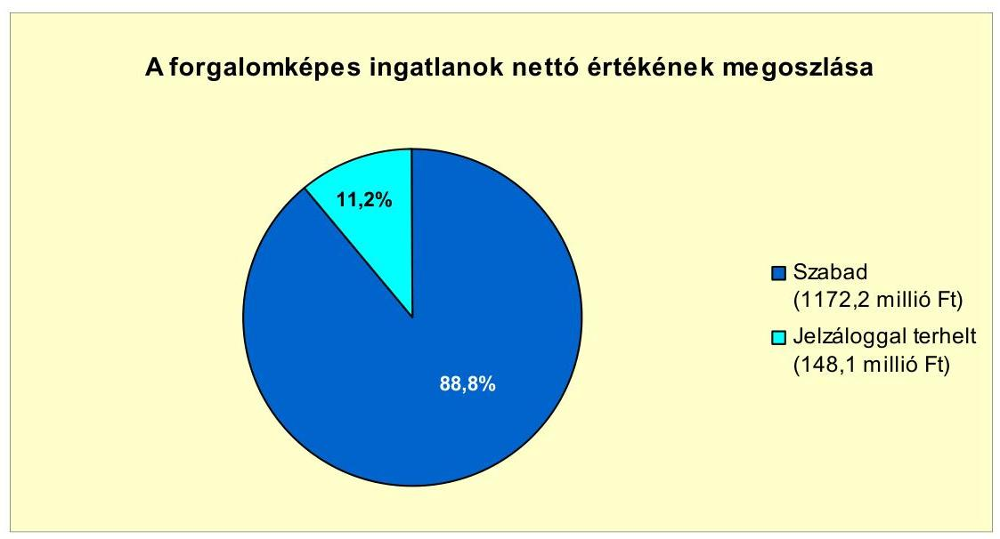

Tiszaszőlős Község Önkormányzata - vagyonrész kiadása iránt - indított keresetet az Önkormányzat ellen a Jász-Nagykun-Szolnok Megyei Bíróságon. A perbeli kötelezettség értéke 316,9 millió Ft és járulékai voltak. A bíróság 2011. július 27 -én hozott végzésében új eljárás indításáról döntött, új szakértői vélemények bekérése, valamint a vagyonmegosztás módjának pontosítása miatt. Perversztés esetén adódó kötelezettség teljesítése részben eszközvagyon átadását jelenti. Még nem ismert az egyéb kártérítések összege, ezért a peres eljárásnak az Önkormányzat pénzügyi egyensúlyára gyakorolt hatása jelenleg nem számszerűsíthető.

Az Önkormányzat négy gazdasági társaságban rendelkezett 2010. év végén 50\%-ot és azt meghaladó tulajdonosi hányaddal. Szerződés alapján 2011 első

---

negyedévében az egyik társaság ${ }^{25}$ tulajdoni részaránya a társult önkormányzatok között megosztásra került, így az Önkormányzat elveszítette többségi befolyását.

Az Önkormányzat többségi tulajdonában lévő társaságok kötelezettségeinek állományát 2010. december 31-én, és 2011. június 30-án, valamint azok várható alakulását mutatja a következő táblázat:

| Megnevezés | $\begin{gathered} \text { Állomány } \\ \text { 2010. december } 31- \\ \text { én } \end{gathered}$ |  | $\begin{gathered} \text { Állomány } \\ \text { 2011. június } 30 \text {-án } \end{gathered}$ |  | Várható kötelezettség a 2011-2013. |  | Várható kötelezettség a 2014. évtöl |  |
| :--: | :--: | :--: | :--: | :--: | :--: | :--: | :--: | :--: |
|  | HUF-ban   (millió Ft -   ban) | Devizában (összege, ezer CHFban) | HUF-ban   (millió Ftban) | Devizában (összege, ezer CHFban) | HUF-ban   (millió Ftban) | Devizában (összege, ezer CHFban) | HUF-ban   (millió Ftban) | Devizában (összege, ezer CHFban) |
| Hosszúlejáratú hitelek | 12,7 |  | 10,4 |  | 14,3 |  |  |  |
| Hosszúlejáratú hitelek |  | 24,2 |  | 22,1 |  | 19,5 |  | 10,6 |
| Pénzintézeti kötelezettségek összesen HUF-ban: | 12,7 |  | 10,4 |  | 14,3 |  |  |  |
| Pénzintézeti kötelezettségek összesen CHF-ben |  | 24,2 |  | 22,1 |  | 19,5 |  | 10,6 |
| Szállítási tartozás | 96,3 |  | 24,1 |  | 24,1 |  |  |  |
| Kötelezettségek összesen HUF-ban | 109,0 |  | 34,5 |  | 38,4 |  |  |  |
| Kötelezettségek összesen CHF-ben |  | 24,2 |  | 22,1 |  | 19,5 |  | 10,6 |

Az önkormányzati kötelezettségek mellett az Önkormányzat többségi tulajdonában lévő gazdasági társaságok kötelezettségei is hatással vannak az Önkormányzat pénzügyi egyensúlyára. Az Önkormányzat két gazdasági társaságban rendelkezik minősített többségi befolyással (kizárólagos tulajdonjoggal), ezek várható kötelezettsége a 2011-2013. években 6,2 millió Ft és 19,5 ezer CHF, a 2014. évtől várható - a jelenleg ismert - kötelezettségeik öszszege 10,6 ezer CHF lesz. Az Önkormányzat számára a két társaság jelenleg ismert kötelezettségeinek állománya nem jelent kockázatot, mivel ezek teljesítése a gazdasági társaságok ${ }^{26}$ vagyonából biztosítható.
„Az Önkormányzat a gazdasági társaságokról szóló 2006. évi IV. törvény 54. § (2) bekezdése alapján korlátlan felelősséggel tartozik azon gazdasági társaságának felszámolása esetében, amelyben az Önkormányzat az 52. § (2) bekezdése szerint a szavazatok legalább 75\%-ával rendelkezik, így minősített befolyásszerzőnek minősül, továbbá a csődeljárásról és a felszámolási eljárásról szóló 1991. évi XLIX. törvény 63. § (2) bekezdése alapján a kizárólagos önkormányzati tulajdonú gazdasági társaságának minden olyan kötelezettségéért, amelynek kielégítését a felszámolási eljárás során az adós társaság vagyona nem fedez, ha a hitelezőinek a felszámolási eljárás során benyújtott keresete alapján a bíróság - az adós társaság felé érvényesített tartósan hátrányos üzletpolitikájára figyelemmel - megállapítja az önkormányzat korlátlan és teljes felelősségét."

[^0]
[^0]:    ${ }^{25}$ A gazdasági társaság 2010. december 31-én fennálló kölcsöne nem pénzintézeti kötelezettség, ezért ezt az összeget a táblázat a 2010. december 31-i állományi oszlopában nem kell szerepeltetni.
    ${ }^{26}$ A hosszú lejáratú pénzintézeti kötelezettséggel rendelkező gazdasági társaság mérlegében 2010. december 31-én kimutatott eszközök és források összege összesen 58,9 millió Ft-volt. A rendelkezésre álló vagyonából a kimutatott kötelezettségek teljesíthetők.

---

A 2007-2010. években az eszközállományuk után összesen 651,0 millió Ft értékcsökkenést számoltak el. Az áttekintett időszakban felújításra 283,9 millió Ft-ot, beruházásra ${ }^{27} 804,6$ millió Ft-ot - ezen belül eszközpótlásra 18,8 millió Ft-ot - fordítottak a számviteli nyilvántartásuk szerint. A felújításokra és a kimutatott eszközpótlásokra összesen az elszámolt értékcsökkenés $46,5 \%$-ának megfelelő összeget ${ }^{28}$ fordították.

A vizsgált időszakban nem történt meg annak felmérése, hogy az eszközök elhasználódása, az amortizáció fedezetének biztosítása mekkora forrást igényel. A felhalmozásokra az Önkormányzat pénzügyi lehetőségének függvényében, pályázati és pénzintézeti források bevonásával került sor.

Az éves zárszámadási rendeleteiben az Önkormányzat nem mutatta be az eszközök után tárgyévben elszámolt értékcsökkenés összegét, az eszközpótlásra fordított tényleges kiadásokat, valamint az eszközök elhasználódási fokának alakulását.

Az Önkormányzat immateriális javainak és tárgyi eszközeinek összesített használhatósági foka a 2007. évi 87,8\%-ról a 2010. évre 7,3 százalékponttal ( $80,5 \%$-ra) csökkent. A gépek és járművek kivételével, a tárgyi eszközök minden csoportjában csökkent ${ }^{29}$ az eszközök használhatósági foka. Legnagyobb mértékben az átadott eszközök használhatósági foka csökkent, a vizsgált időszakot tekintve elérte a 10,7 százalékpontot, $92,2 \%$-ról $81,5 \%$-ra változott. Az ingatlanok használhatósági foka ennél kisebb mértékben - 90,6\%-ról $85,4 \%$-ra - csökkent. A 2010. év végére ennek az eszközcsoportnak volt a legmagasabb a használhatósági foka.

# 4. A PÉNZÜGYI EGYENSÚLY MEGTEREMTÉSE ÉrDEKÉBEN HOZOTT INTÉZKEDÉSEK EREDMÉNYE 

Az Önkormányzat a 2007-2011. évekre vonatkozó költségvetési rendeleteiben, illetve költségvetési koncepcióiban forráshiány finanszírozását elsősorban pályázati forrásokból, valamint többletbevételekből, illetve kiadáscsökkentésekből kívánta megoldani. A 2011. évi költségvetési koncepció elsődleges célként a költségvetési egyensúly megteremtését, a múködőképesség megőrzését, az önkormányzati feladatellátás biztosítását jelölte meg. A pénzügyi egyensúly javítása érdekében létszámcsökkentési, intézményátszervezési és egyéb kiadáscsökkentési intézkedéseket is hoztak, amelyek együttes hatásaként összesen 908,0 millió Ft megtakarítást mutattak ki.

[^0]
[^0]:    ${ }^{27}$ Nem tartalmazza az Önkormányzat gesztorságával végzett beruházások összegét.
    ${ }^{28}$ A felhalmozások teljes összegét figyelembe véve az elszámolt amortizáció visszapótlása megtörtént.
    ${ }^{29}$ A 2007 és 2010 közötti időszakban az immateriális javak használhatósági foka 0,4 százalékponttal csökkent, a gépek és berendezéseknek 9,4 százalékponttal és a járműveknek 1,9 százalékponttal lett magasabb.

---

Az Önkormányzat által a 2007-2011. év I. félév között végrehajtott kiadáscsökkentő intézkedések területeit, összegeit és megoszlását a következő ábra szemlélteti:
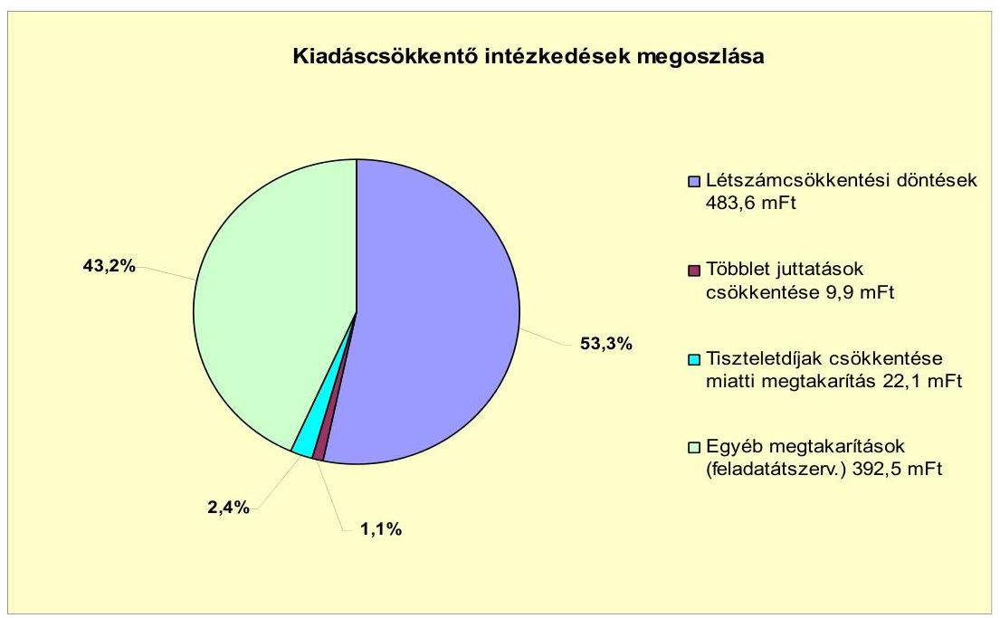

A feladatátszervezéssel, megszüntetéssel járó létszámcsökkentési döntések következtében összesen 483,6 millió Ft megtakarítása keletkezett az Önkormányzatnak, ami a végrehajtott kiadáscsökkentő intézkedésekből adódó megtakarításoknak több mint a felét jelentette.

A 2007. év megszorító intézkedése volt, hogy csökkentették a köztisztviselők cafetériáját, ennek következtében 9,9 millió Ft (1,1\%) megtakarítást mutattak ki. Az Önkormányzat a 2009. évben döntött a képviselői tiszteletdijak csökkentéséről, melynek kimutatott kiadáscsökkentő hatása összesen 22,1 millió Ft $(2,4 \%)$ volt.

A vizsgált időszakban az Önkormányzat a pénzügyi egyensúly megteremtése érdekében kiadások csökkentéseként számos intézmény-, illetve feladatlátszervezést hajtott végre, ami nem csak létszámcsökkenést jelentett, hanem egyéb megtakarításokat is eredményezett. A feladatátszervezések hatásaként összesen 392,5 millió Ft egyéb megtakarítást ${ }^{30}$ számszerúsítettek, ami a megtakarítások összegének csaknem a felét jelentette.

Az Önkormányzatnál 2007-2009 között - a kiadáscsökkentő intézkedések eredményeképpen is - csökkent a személyi juttatásokkal kapcsolatos kiadásainak összege. A 2010. évben a kiadások újból növekedni kezdtek, - mert visszakerült

[^0]
[^0]:    ${ }^{30}$ A feladatátszervezéssel kapcsolatos egyéb megtakarítások összege nem tartalmazza a létszámcsökkentési döntésekhez kapcsolódó kiadások csökkenésének összegét. A kimutatott megtakarítások a feladatátszervezésekhez tartozó dologi kiadásokat és a létszámcsökkentési döntések között nem szereplő személyi juttatások változásának hatását jelentik.

---

a Kossuth Lajos Gimnázium fenntartása az Önkormányzathoz - de nem érte el a 2007-es szintet. A kiadáscsökkentő intézkedések a pénzügyi egyensúlyra kedvezően hatottak, de az egyensúly tartós biztosításához nem bizonyultak elegendőnek.

Az Önkormányzatnál 2007. január 1-jén 688 volt az engedélyezett álláshelyek száma és 687 fő volt az induló létszám, 2010 végére a záró álláshelyek száma 443-ra, a záró létszám pedig 442 före csökkent. 2007-2010 között az álláshely változtatásokra ható intézkedések önkormányzati szinten összesen 603 álláshely megszüntetését, ugyanakkor 358 álláshely létesítését jelentették. Az Önkormányzat 2007-2010. éveket érintő létszámcsökkentő döntéseinek hatását szemlélteti a következő tábla:

| Mégnevezés (adatok tőzben) | Közeletetés | Szociállis és gyermekvédelern | Egészségügy | Polgármesteri hivatal | Egyéb | Összesen |
| :--: | :--: | :--: | :--: | :--: | :--: | :--: |
| 2017. január 1-jénjóuhagyott álláshelyek száma | 428 | 53 | 42 | 98 | 67 | 698 |
| Mégszíntetett álláshelyek száma | 470 | 46 | 11 | 59 | 17 | 603 |
| ebbzit: üres álláshelyek száma | 0 | 0 | 0 | 0 | 0 | 0 |
| számral álláshelyek száma | 428 | 43 | 1 | 43 | 8 | 522 |
| intézmény üzemeltetéssel kapcsolódás álláshelyek száma | 42 | 3 | 10 | 16 | 5 | 80 |
| Álláshelyrövekedése | 323 | 0 | 0 | 15 | 18 | 398 |
| 2010. decenter 31-én záró álláshelyek száma | 283 | 7 | 31 | 54 | 68 | 443 |
| 2017. január 1-jénfoglalkottatott létszám | 435 | 53 | 42 | 92 | 65 | 697 |
| Lelbzámcsökkentés | 477 | 46 | 11 | 59 | 16 | 603 |
| Lelbzámrövekedés | 323 | 0 | 0 | 21 | 18 | 394 |
| 2010. decenter 31-én foglalkottatott létszám | 283 | 7 | 31 | 54 | 67 | 442 |

A közoktatás területén volt a legnagyobb az álláshelyek, illetve a foglalkoztatottak létszámának változása az intézmény átszervezések, átadások, illetve a visszavételek következtében. Tartósan két intézmény került el az Önkormányzat fenntartásából. A szociális és gyermekvédelmi szakterületen egy intézményt megszüntettek, ami a szakterületre vonatkozó létszámcsökkenésnek a 84,8\%-át jelentette. Az egészségügy területén a feladatellátás részbeni kiszervezése miatt lett kevesebb az álláshelyek száma. A Polgármesteri hivatal létszáma feladatátszervezés miatt csökkent csaknem a felére. Az egyéb feladatoknál ${ }^{31}$ a létszám csökkenések, illetve a növekedések közel azonos számban történtek. Mindezek következtében az időszak álláshelyeinek száma, valamint a foglalkoztatottak létszáma mindösszesen 245 fővel csökkent.

Az Önkormányzatnál a prémium évek program keretén belül - 2007-2010 között - összesen 46 álláshely szűnt meg tartósan. A létszámcsökkentés végrehajtásához a vizsgált időszakban összesen 110,0 millió Ft központosított támogatást igényeltek és 99,7 millió Ft-ot kaptak.

Az Önkormányzatnak a 2007-2011. év I. féléve időszakában hozott bevételnövelő intézkedései a helyi adókhoz és az intézményi térítési díjakhoz kapcsolódtak, amelyek összesen 37,9 millió Ft összegű bevétel növekedést eredményeztek a kimutatásuk szerint.

[^0]
[^0]:    ${ }^{31}$ Hivatásos Tűzoltóság, Tourinform, könyvtár

---

A 2011. évtől megemelték ${ }^{32}$ az idegenforgalmi adó mértékét, ami 2,4 millió Ft bevételtöbbletet jelentett az Önkormányzatnak. Az Önkormányzatnál a helyi adók mértéke egyik adónemnél sem éri el a törvényben meghatározott mérték felső határát.

Az Önkormányzat kimutatása szerint az intézményi térítési díjak évenkénti emelése a vizsgált időszakban összesen 35,5 millió Ft bevételi többletet jelentett. A vizsgált időszakban az érvényesített bevételnövelő intézkedések részletezését a következő ábra mutatja:
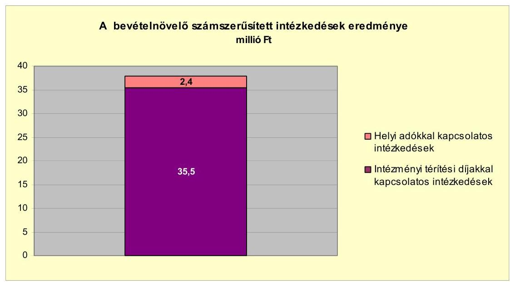

Az Önkormányzatnál a vizsgált időszakban az átengedett szja és az állami támogatások együttes összege a 2007. évről a 2010. évre csökkent. A kiadáscsökkentő és bevételnövelő intézkedések meghozatalára a költségvetési és pénzügyi egyensúly megteremtése érdekében volt szükség. Az Önkormányzat kimutatásai szerint ezek az intézkedések összességében 945,9 millió Ft többletforrást eredményeztek, amely a pénzügyi egyensúly megteremtését kedvezően befolyásolta, de a jövőbeni kötelezettségek teljesítése érdekében további intézkedések vállnak szükségessé.

# 5. Az ÁSZ Által a korábBi ÉVEKben a PÉNZÜGYi EGYENSÚLY JAVÍTÁSÁRA TETT SZABÁLYSZERŰSÉGI ÉS CÉLSZERŰSÉGI JAVASLATOK HASZNOSULÁSA 

Az ÁSZ az Önkormányzat gazdálkodási rendszerét a 2007. évben ellenőrizte átfogó jelleggel. A gazdálkodási rendszer korábbi ellenőrzése során tett javaslatok közül a pénzügyi egyensúly javítására vonatkozott három szabályszerűségi és egy célszerűségi javaslat.

[^0]
[^0]:    ${ }^{32}$ Az idegenforgalmi adó mértéke 250 Ft-ról 300 Ft-ra emelkedett személyenként és vendégéjszakánként.

---

Az ellenőrzés során tett, a pénzügyi egyensúly javítására vonatkozó négy javaslatot hasznosították.

A szabályszerűségi javaslatokra megtett intézkedések eredményeképpen 2008-tól az adósságot keletkeztető kötelezettségvállalásokra meghatározott felső korlátot betartották. A költségvetési rendelettervezetek költségvetési bevételi és kiadási főösszegei a 2009. évtől nem tartalmaztak finanszírozási célú bevételeket, illetve kiadásokat. A 2008. évi zárszámadás készítése során az intézményi pénzmaradvány megállapításának szabályszerűségét ellenőrizték, és értékelték az intézményi előirányzatok és teljesítések eltérésének indokoltságát.

A célszerűségi javaslatok hasznosulásaként a számvevői jelentésben foglaltakat megtárgyalta a Képviselő-testület, valamint intézkedési tervet fogadott el a javaslatok végrehajtására.

Budapest, 2012. április "16"
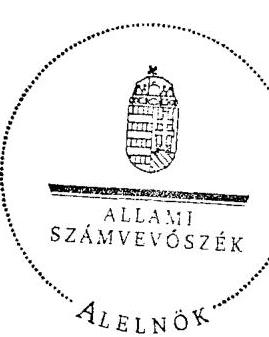

Wárvasovszky Tihamér

Melléklet: $\quad 6 \mathrm{db}$

---

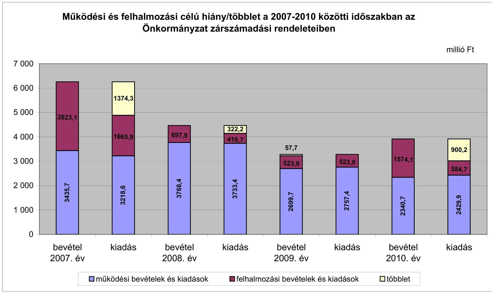

# Működési és felhalmozási célú hiány/többlet a 2007-2010 közötti időszakban az Önkormányzat zárszámadási rendeleteiben

|  I. kiadás | II. kiadás | III. kiadás | IV. kiadás | V. kiadás | VI. kiadás | VII. kiadás | VIII. kiadás  |
| --- | --- | --- | --- | --- | --- | --- | --- |
|  2007. év | 2823.1 | 1374.3 | 697.9 | 332.3 | 410.7 | 57.7 | 2340.7  |
|  2008. év | 1665.9 | 697.9 | 332.3 | 410.7 | 57.7 | 2340.7 | 2340.7  |
|  2009. év | 3768.4 | 332.3 | 332.3 | 3768.4 | 57.7 | 2340.7 | 2340.7  |
|  2010. év | 2699.7 | 3768.4 | 332.3 | 3768.4 | 57.7 | 2340.7 | 2340.7  |

---

Az Önkormányzat bevételei és kiadásai, valamint adósságszolgálata 20072010 között

|  1. FOLYÓ KÖLTSÉGYETÉS* | 2007. év | 2008. év | 2009. év | 2010. év  |
| --- | --- | --- | --- | --- |
|  1.1.1. Saját müködési bevételek | 944,0 | 618,9 | 613,4 | 607,1  |
|  1.1.2. Költségvetési támogatás | 970,5 | 1655,8 | 1414,1 | 1161,5  |
|  1.1.3. Kiengedett bevételek | 995,5 | 473,0 | 497,7 | 450,5  |
|  1.1.4. Államháztartáson belülről kapott támogatások | 448,6 | 312,9 | 403,4 | 415,4  |
|  1.1.5. EU-tilt és külföldről kapott bevételek | 0,0 | 0,0 | 0,0 | 0,0  |
|  1.1.6. Államháztartáson kívülről kapott bevételek | 14,0 | 20,0 | 7,4 | 2,0  |
|  1.1.7. Előző évi pénzmaradvány átvétel | 0,0 | 0,0 | 0,0 | 1,2  |
|  1.1. Folyó bevételek $=1.1 .1 .+1.1 .2 .+1.1 .3 .+1.1 .4 .+1.1 .5 .+1.1 .6 .+1.1 .7$. | 3372,6 | 3080,6 | 2936,0 | 2637,7  |
|  1.2.1. Müködési kiadások kamatkiadások nélkül | 2738,3 | 2507,0 | 1898,6 | 1908,4  |
|  1.2.2. Államháztartáson belülre átadott pénzeszközök | 8,3 | 31,6 | 224,8 | 59,8  |
|  1.2.3.1. vállalkozásoknak | 159,4 | 182,6 | 291,6 | 189,2  |
|  1.2.3.2. EU-nak, illetve külföldre | 0,0 | 0,0 | 0,0 | 0,0  |
|  1.2.3.3. megőreszeteélyeknek | 240,7 | 266,7 | 270,6 | 267,9  |
|  1.2.3.4. nonprofit szervezeteknek | 9,2 | 9,5 | 10,6 | 5,0  |
|  1.2.3. Transferkiadások ( $=1.2 .3 .1+1.2 .3 .2+1.2 .3 .3+1.2 .3 .4$ ) | 409,3 | 458,8 | 572,8 | 462,1  |
|  1.2.4 Kamatkiadások | 119,9 | 149,7 | 121,1 | 140,6  |
|  1.2.5. Előző évi pénzmaradvány átadás | 0,0 | 1,0 | 0,0 | 0,0  |
|  1.2. Folyó kiadások $=1.2 .1 .+1.2 .2 .+1.2 .3 .+1.2 .4 .+1.2 .5$. | 3275,8 | 3148,1 | 2817,3 | 2570,9  |
|  1.3. Folyó költségvetés egyenlege MÜKÖDÉSI JÖVEDELEM (1.1. - 1.2.) | 96,8 | $-67,5$ | 118,7 | 66,8  |
|  2. FELHALMOZÁSI KÖLTSÉGYETÉS** |  |  |  |   |
|  2.1.1. Saját tökebevételek | 33,0 | 19,6 | 2,4 | 45,0  |
|  2.1.2. Államháztartáson belülről kapott támogatások | 183,5 | 168,6 | 128,3 | 317,1  |
|  2.1.3. EU-tilt és külföldről kapott támogatások | 0,0 | 0,0 | 0,0 | 0,0  |
|  2.1.4. Államháztartáson kívülről kapott támogatások | 11,5 | 117,5 | 18,4 | 1036,5  |
|  2.1. Felhalmozási bevételek ( $=2.1 .1 .+2.1 .2+2.1 .3+2.1 .4$.) | 228,0 | 305,7 | 149,1 | 1398,6  |
|  2.2.1. Saját beruházási kiadás áfával | 228,7 | 231,7 | 158,7 | 318,9  |
|  2.2.2. Saját felújítási kiadás áfával | 105,3 | 55,1 | 151,8 | 74,9  |
|  2.2.3. Államháztartáson belülre átadott pénzeszköz | 119,2 | 0,0 | 0,0 | 0,0  |
|  2.2.4. EU-nak és külföldnek adott pénzeszközök | 0,0 | 0,0 | 0,0 | 0,0  |
|  2.2.5. Államháztartáson kívülre adott pénzeszközök | 30,7 | 18,3 | 43,7 | 24,3  |
|  2.2.6. Befektetési célú részesedések vásárlása | 12,9 | 33,4 | 59,8 | 10,6  |
|  2.2. Felhalmozási kiadások ( $=2.2 .1 .+2.2 .2 .+2.2 .3 .+2.2 .4 .+2.2 .5 .+2.2 .6$.) | 496,8 | 338,5 | 414,0 | 428,7  |
|  2.3. Felhalmozási költségvetés egyenlege (2.1. - 2.2.) | $-268,8$ | $-32,8$ | $-264,9$ | 969,9  |
|  3. Finanszírozási műveletek nélküli (GFS) pozíció(1.3.+2.3.) | $-172,0$ | $-100,3$ | $-146,2$ | 1036,7  |
|  4. Finanszírozási műveletek |  |  |  |   |
|  4.1. Hitelfelvétel | 645,4 | 30,0 | 0,0 | 0,0  |
|  4.2. Hiteltörlesztés | 1105,4 | 670,1 | 21,4 | 1030,2  |
|  4.3. Forgatási és befektetési célú értékpapírok kibocsátása | 2000,0 | 743,0 | 0,0 | 0,0  |
|  4.4. Forgatási és befektetési célú értékpapírok beváltása | 0,0 | 0,0 | 55,2 | 59,2  |
|  4.5. Forgatási és befektetési célú értékpapírok értékesítése | 0,0 | 0,0 | 0,0 | 0,0  |
|  4.6. Forgatási és befektetési célú értékpapírok vásárlása | 0,0 | 0,0 | 0,0 | 0,0  |
|  4.7. Egyéb finanszírozási bevételek (függő, átfutó, kiegyenlítő) | 12,8 | $-0,9$ | $-54,1$ | $-39,7$  |
|  4.8. Egyéb finanszírozási kiadások (függő, átfutó, kiegyenlítő) | 6,4 | $-12,6$ | $-26,6$ | $-22,1$  |
|  4.9.Finanszírozási műveletek egyenlege (4.1. - 4.2.+4.3.-4.4+4.5.-4.6.+4.7.-4.8.) | 1546,4 | 114,6 | $-104,1$ | $-1107,0$  |
|  5. Tárgyévi pénzügyi pozíció változás (1.3.+ 2.3.+4.9.) | 1374,4 | 14,3 | $-250,3$ | $-70,3$  |
|  6. Nettó müködési jövedelem =müködési jövedelem (1.3.) - töketörlesztés (4.2+4.4) | $-1008,6$ | $-737,6$ | 42,1 | $-1022,6$  |
|  TÁJÉKOZTATÓ ADATOK |  |  |  |   |
|  Összes kötelezettség | 3140,8 | 4595,8 | 4527,6 | 4263,7  |
|  ebből rövid lejáratú | 1067,7 | 351,3 | 253,5 | 375,9  |
|  Összes szállítói kötelezettség | 299,5 | 165,0 | 87,7 | 163,9  |
|  ebből lejárt (tanúsítványból) | 221,8 | 153,3 | 57,8 | 112,2  |
|  Pénz és tőkepörel kötelezettség (adósság) *** | 2723,5 | 4287,0 | 4311,6 | 3935,3  |
|  ebből rövid lejáratú*** | 669,9 | 62,1 | 57,1 | 67,1  |
|  PPP szerződéses állomány jelenértéken (tanúsítványból) |  |  |  |   |
|  ebből lejárt szolgáltatást díj miatti kötelezettség |  |  |  |   |
|  Folyószámlabitel napi átlagos állománya (tanúsítványból) | 363,9 | 276,9 | 0,0 | 0,0  |
|  Likvidhitel napi átlagos állománya (tanúsítványból) | 1,5 | 0,2 | 0,0 | 0,0  |
|  Munkatérhitel napi átlagos állománya (tanúsítványból) | 2,1 | 2,2 | 0,0 | 0,0  |
|  Rezesség és garanciavállalások (tanúsítványból) |  |  |  |   |
|  Jogerős bírósági itéletekből adódó kötelezettségek (tanúsítványból) |  |  |  |   |
|  Finanszírozásba bevonható eszközök: | 1378,2 | 1392,5 | 1142,1 | 941,7  |
|  Tartós hitelviszonyt megtestesítő értékpapírok év végi állománya |  |  |  |   |
|  Hosszú lejáratú bankbetétek év végi állománya |  |  |  |   |
|  Értékpapírok év végi állománya |  |  |  |   |
|  Pénzeszközök (idegen pénzeszközök nélkül) év végi állománya | 1378,2 | 1392,5 | 1142,1 | 941,7  |

- Bevételekben nem térül, a kiadásokban nem jelenik meg az amortizáció, a vagyoni helyzetet az egyenleg befolyásolja. ** Bevételekben vagyon megőrzésre és bővítésre fordítható források. *** Eltár az önkormányzati mérlegben rögzített adatoktól, mivel nem tartalmazza a Hulladéklerakó Társulás hiteleinek összegét.

---

|   |  |  |  |  |  |  |  |  |  |  |  |  |  |  |  |  |  |  |  |  |  |  |  |  |  |  |  |  |  |  |  |  |  |  |  |  |  |  |  |  |  |  |  |  |  |  |   |
| --- | --- | --- | --- | --- | --- | --- | --- | --- | --- | --- | --- | --- | --- | --- | --- | --- | --- | --- | --- | --- | --- | --- | --- | --- | --- | --- | --- | --- | --- | --- | --- | --- | --- | --- | --- | --- | --- | --- | --- | --- | --- | --- | --- | --- | --- | --- | --- |
|   |  |  |  |  |  |  |  |  |  |  |  |  |  |  |  |  |  |  |  |  |  |  |  |  |  |  |  |  |  |  |  |  |  |  |  |  |  |  |  |  |  |  |  |  |  |   |
|   |  |  |  |  |  |  |  |  |  |  |  |  |  |  |  |  |  |  |  |  |  |  |  |  |  |  |  |  |  |  |  |  |  |  |  |  |  |  |  |  |  |  |  |  |  |   |
|   |  |  |  |  |  |  |  |  |  |  |  |  |  |  |  |  |  |  |  |  |  |  |  |  |  |  |  |  |  |  |  |  |  |  |  |  |  |  |  |  |  |  |  |  |  |   |
|   |  |  |  |  |  |  |  |  |  |  |  |  |  |  |  |  |  |  |  |  |  |  |  |  |  |  |  |  |  |  |  |  |  |  |  |  |  |  |  |  |  |  |  |  |  |   |
|   |  |  |  |  |  |  |  |  |  |  |  |  |  |  |  |  |  |  |  |  |  |  |  |  |  |  |  |  |  |  |  |  |  |  |  |  |  |  |  |  |  |  |  |  |  |   |
|   |  |  |  |  |  |  |  |  |  |  |  |  |  |  |  |  |  |  |  |  |  |  |  |  |  |  |  |  |  |  |  |  |  |  |  |  |  |  |  |  |  |  |  |  |  |   |
|   |  |  |  |  |  |  |  |  |  |  |  |  |  |  |  |  |  |  |  |  |  |  |  |  |  |  |  |  |  |  |  |  |  |  |  |  |  |  |  |  |  |  |  |  |  |   |
|   |  |  |  |  |  |  |  |  |  |  |  |  |  |  |  |  |  |  |  |  |  |  |  |  |  |  |  |  |  |  |  |  |  |  |  |  |  |  |  |  |  |  |  |  |  |   |
|   |  |  |  |  |  |  |  |  |  |  |  |  |  |  |  |  |  |  |  |  |  |  |  |  |  |  |  |  |  |  |  |  |  |  |  |  |  |  |  |  |  |  |  |  |  |   |
|   |  |  |  |  |  |  |  |  |  |  |  |  |  |  |  |  |  |  |  |  |  |  |  |  |  |  |  |  |  |  |  |  |  |  |  |  |  |  |  |  |  |  |  |  |  |   |
|   |  |  |  |  |  |  |  |  |  |  |  |  |  |  |  |  |  |  |  |  |  |  |  |  |  |  |  |  |  |  |  |  |  |  |  |  |  |  |  |  |  |  |  |  |  |   |
|   |  |  |  |  |  |  |  |  |  |  |  |  |  |  |  |  |  |  |  |  |  |  |  |  |  |  |  |  |  |  |  |  |  |  |  |  |  |  |  |  |  |  |  |  |  |   |
|   |  |  |  |  |  |  |  |  |  |  |  |  |  |  |  |  |  |  |  |  |  |  |  |  |  |  |  |  |  |  |  |  |  |  |  |  |  |  |  |  |  |  |  |  |  |   |
|   |  |  |  |  |  |  |  |  |  |  |  |  |  |  |  |  |  |  |  |  |  |  |  |  |  |  |  |  |  |  |  |  |  |  |  |  |  |  |  |  |  |  |  |  |  |   |
|   |  |  |  |  |  |  |  |  |  |  |  |  |  |  |  |  |  |  |  |  |  |  |  |  |  |  |  |  |  |  |  |  |  |  |  |  |  |  |  |  |  |  |  |  |  |   |
|   |  |  |  |  |  |  |  |  |  |  |  |  |  |  |  |  |  |  |  |  |  |  |  |  |  |  |  |  |  |  |  |  |  |  |  |  |  |  |  |  |  |  |  |  |  |   |
|   |  |  |  |  |  |  |  |  |  |  |  |  |  |  |  |  |  |  |  |  |  |  |  |  |  |  |  |  |  |  |  |  |  |  |  |  |  |  |  |  |  |  |  |  |  |   |
|   |  |  |  |  |  |  |  |  |  |  |  |  |  |  |  |  |  |  |  |  |  |  |  |  |  |  |  |  |  |  |  |  |  |  |  |  |  |  |  |  |  |  |  |  |  |   |
|   |  |  |  |  |  |  |  |  |  |  |  |  |  |  |  |  |  |  |  |  |  |  |  |  |  |  |  |  |  |  |  |  |  |  |  |  |  |  |  |  |  |  |  |  |  |   |
|   |  |  |  |  |  |  |  |  |  |  |  |  |  |  |  |  |  |  |  |  |  |  |  |  |  |  |  |  |  |  |  |  |  |  |  |  |  |  |  |  |  |  |  |  |  |   |
|   |  |  |  |  |  |  |  |  |  |  |  |  |  |  |  |  |  |  |  |  |  |  |  |  |  |  |  |  |  |  |  |  |  |  |  |  |  |  |  |  |  |  |  |  |  |   |
|   |  |  |  |  |  |  |  |  |  |  |  |  |  |  |  |  |  |  |  |  |  |  |  |  |  |  |  |  |  |  |  |  |  |  |  |  |  |  |  |  |  |  |  |  |  |   |
|   |  |  |  |  |  |  |  |  |  |  |  |  |  |  |  |  |  |  |  |  |  |  |  |  |  |  |  |  |  |  |  |  |  |  |  |  |  |  |  |  |  |  |  |  |  |   |
|   |  |  |  |  |  |  |  |  |  |  |  |  |  |  |  |  |  |  |  |  |  |  |  |  |  |  |  |  |  |  |  |  |  |  |  |  |  |  |  |  |  |  |  |  |  |   |
|   |  |  |  |  |  |  |  |  |  |  |  |  |  |  |  |  |  |  |  |  |  |  |  |  |  |  |  |  |  |  |  |  |  |  |  |  |  |  |  |  |  |  |  |  |  |   |
|   |  |  |  |  |  |  |  |  |  |  |  |  |  |  |  |  |  |  |  |  |  |  |  |  |  |  |  |  |  |  |  |  |  |  |  |  |  |  |  |  |  |  |  |  |  |   |
|   |  |  |  |  |  |  |  |  |  |  |  |  |  |  |  |  |  |  |  |  |  |  |  |  |  |  |  |  |  |  |  |  |  |  |  |  |  |  |  |  |  |  |  |  |  |  |   |
|   |  |  |  |  |  |  |  |  |  |  |  |  |  |  |  |  |  |  |  |  |  |  |  |  |  |  |  |  |  |  |  |  |  |  |  |  |  |  |  |  |  |  |  |  |  |  |   |
|   |  |  |  |  |  |  |  |  |  |  |  |  |  |  |  |  |  |  |  |  |  |  |  |  |  |  |  |  |  |  |  |  |  |  |  |  |  |  |  |  |  |  |  |  |  |  |   |
|   |  |  |  |  |  |  |  |  |  |  |  |  |  |  |  |  |  |  |  |  |  |  |  |  |  |  |  |  |  |  |  |  |  |  |  |  |  |  |  |  |  |  |  |  |  |  |   |
|   |  |  |  |  |  |  |  |  |  |  |  |  |  |  |  |  |  |  |  |  |  |  |  |  |  |  |  |  |  |  |  |  |  |  |  |  |  |  |  |  |  |  |  |  |  |  |   |
|   |  |  |  |  |  |  |  |  |  |  |  |  |  |  |  |  |  |  |  |  |  |  |  |  |  |  |  |  |  |  |  |  |  |  |  |  |  |  |  |  |  |  |  |  |  |  |   |
|   |  |  |  |  |  |  |  |  |  |  |  |  |  |  |  |  |  |  |  |  |  |  |  |  |  |  |  |  |  |  |  |  |  |  |  |  |  |  |  |  |  |  |  |  |  |  |   |
|   |  |  |  |  |  |  |  |  |  |  |  |  |  |  |  |  |  |  |  |  |  |  |  |  |  |  |  |  |  |  |  |  |  |  |  |  |  |  |  |  |  |  |  |  |  |  |   |
|   |  |  |  |  |  |  |  |  |  |  |  |  |  |  |  |  |  |  |  |  |  |  |  |  |  |  |  |  |  |  |  |  |  |  |  |  |  |  |  |  |  |  |  |  |  |  |   |
|   |  |  |  |  |  |  |  |  |  |  |  |  |  |  |  |  |  |  |  |  |  |  |  |  |  |  |  |  |  |  |  |  |  |  |  |  |  |  |  |  |  |  |  |  |  |  |   |
|   |  |  |  |  |  |  |  |  |  |  |  |  |  |  |  |  |  |  |  |  |  |  |  |  |  |  |  |  |  |  |  |  |  |  |  |  |  |  |  |  |  |  |  |  |  |  |   |
|   |  |  |  |  |  |  |  |  |  |  |  |  |  |  |  |  |  |  |  |  |  |  |  |  |  |  |  |  |  |  |  |  |  |  |  |  |  |  |  |  |  |  |  |  |  |  |   |
|   |  |  |  |  |  |  |  |  |  |  |  |  |  |  |  |  |  |  |  |  |  |  |  |  |  |  |  |  |  |  |  |  |  |  |  |  |  |  |  |  |  |  |  |  |  |  |   |
|   |  |  |  |  |  |  |  |  |  |  |  |  |  |  |  |  |  |  |  |  |  |  |  |  |  |  |  |  |  |  |  |  |  |  |  |  |  |  |  |  |  |  |  |  |  |  |   |
|   |  |  |  |  |  |  |  |  |  |  |  |  |  |  |  |  |  |  |  |  |  |  |  |  |  |  |  |  |  |  |  |  |  |  |  |  |  |  |  |  |  |  |  |  |  |  |   |
|   |  |  |  |  |  |  |  |  |  |  |  |  |  |  |  |  |  |  |  |  |  |  |  |  |  |  |  |  |  |  |  |  |  |  |  |  |  |  |  |  |  |  |  |  |  |  |   |
|   |  |  |  |  |  |  |  |  |  |  |  |  |  |  |  |  |  |  |  |  |  |  |  |  |  |  |  |  |  |  |  |  |  |  |  |  |  |  |  |  |  |  |  |  |  |  |   |
|   |  |  |  |  |  |  |  |  |  |  |  |  |  |  |  |  |  |  |  |  |  |  |  |  |  |  |  |  |  |  |  |  |  |  |  |  |  |  |  |  |  |  |  |  |  |  |   |
|   |  |  |  |  |  |  |  |  |  |  |  |  |  |  |  |  |  |  |  |  |  |  |  |  |  |  |  |  |  |  |  |  |  |  |  |  |  |  |  |  |  |  |  |  |  |  |   |
|   |  |  |  |  |  |  |  |  |  |  |  |  |  |  |  |  |  |  |  |  |  |  |  |  |  |  |  |  |  |  |  |  |  |  |  |  |  |  |  |  |  |  |  |  |  |  |   |
|   |  |  |  |  |  |  |  |  |  |  |  |  |  |  |  |  |  |  |  |  |  |  |  |  |  |  |  |  |  |  |  |  |  |  |  |  |  |  |  |  |  |  |  |  |  |  |   |
|   |  |  |  |  |  |  |  |  |  |  |  |  |  |  |  |  |  |  |  |  |  |  |  |  |  |  |  |  |  |  |  |  |  |  |  |  |  |  |  |  |  |  |  |  |  |  |   |
|   |  |  |  |  |  |  |  |  |  |  |  |  |  |  |  |  |  |  |  |  |  |  |  |  |  |  |  |  |  |  |  |  |  |  |  |  |  |  |  |  |  |  |  |  |  |  |   |
|   |  |  |  |  |  |  |  |  |  |  |  |  |  |  |  |  |  |  |  |  |  |  |  |  |  |  |  |  |  |  |  |  |  |  |  |  |  |  |  |  |  |  |  |  |  |  |   |
|   |  |  |  |  |  |  |  |  |  |  |  |  |  |  |  |  |  |  |  |  |  |  |  |  |  |  |  |  |  |  |  |  |  |  |  |  |  |  |  |  |  |  |  |  |  |  |   |
|   |  |  |  |  |  |  |  |  |  |  |  |  |  |  |  |  |  |  |  |  |  |  |  |  |  |  |  |  |  |  |  |  |  |  |  |  |  |  |  |  |  |  |  |  |  |  |   |
|   |  |  |  |  |  |  |  |  |  |  |  |  |  |  |  |  |  |  |  |  |  |  |  |  |  |  |  |  |  |  |  |  |  |  |  |  |  |  |  |  |  |  |  |  |  |  |   |
|   |  |  |  |  |  |  |  |  |  |  |  |  |  |  |  |  |  |  |  |  |  |  |  |  |  |  |  |  |  |  |  |  |  |  |  |  |  |  |  |  |  |  |  |  |  |  |  |   |
|   |  |  |  |  |  |  |  |  |  |  |  |  |  |  |  |  |  |  |  |  |  |  |  |  |  |  |  |  |  |  |  |  |  |  |  |  |  |  |  |  |  |  |  |  |  |  |  |   |
|   |  |  |  |  |  |  |  |  |  |  |  |  |  |  |  |  |  |  |  |  |  |  |  |  |  |  |  |  |  |  |  |  |  |  |  |  |  |  |  |  |  |  |  |  |  |  |  |   |
|   |  |  |  |  |  |  |  |  |  |  |  |  |  |  |  |  |  |  |  |  |  |  |  |  |  |  |  |  |  |  |  |  |  |  |  |  |  |  |  |  |  |  |  |  |  |  |  |   |
|   |  |  |  |  |  |  |  |  |  |  |  |  |  |  |  |  |  |  |  |  |  |  |  |  |  |  |  |  |  |  |  |  |  |  |  |  |  |  |  |  |  |  |  |  |  |  |  |   |
|   |  |  |  |  |  |  |  |  |  |  |  |  |  |  |  |  |  |  |  |  |  |  |  |  |  |  |  |  |  |  |  |  |  |  |  |  |  |  |  |  |  |  |  |  |  |  |  |   |
|   |  |  |  |  |  |  |  |  |  |  |  |  |  |  |  |  |  |  |  |  |  |  |  |  |  |  |  |  |  |  |  |  |  |  |  |  |  |  |  |  |  |  |  |  |  |  |  |   |
|   |  |  |  |  |  |  |  |  |  |  |  |  |  |  |  |  |  |  |  |  |  |  |  |  |  |  |  |  |  |  |  |  |  |  |  |  |  |  |  |  |  |  |  |  |  |  |  |   |
|   |  |  |  |  |  |  |  |  |  |  |  |  |  |  |  |  |  |  |  |  |  |  |  |  |  |  |  |  |  |  |  |  |  |  |  |  |  |  |  |  |  |  |  |  |  |  |  |   |
|   |  |  |  |  |  |  |  |  |  |  |  |  |  |  |  |  |  |  |  |  |  |  |  |  |  |  |  |  |  |  |  |  |  |  |  |  |  |  |  |  |  |  |  |  |  |  |  |   |
|   |  |  |  |  |  |  |  |  |  |  |  |  |  |  |  |  |  |  |  |  |  |  |  |  |  |  |  |  |  |  |  |  |  |  |  |  |  |  |  |  |  |  |  |  |  |  |  |  |   |
|   |  |  |  |  |  |  |  |  |  |  |  |  |  |  |  |  |  |  |  |  |  |  |  |  |  |  |  |  |  |  |  |  |  |  |  |  |  |  |  |  |  |  |  |  |  |  |  |  |  |   |
|   |  |  |  |  |  |  |  |  |  |  |  |  |  |  |  |  |  |  |  |  |  |  |  |  |  |  |  |  |  |  |  |  |  |  |  |  |  |  |  |  |  |  |  |  |  |  |  |  |  |   |
|   |  |  |  |  |  |  |  |  |  |  |  |  |  |  |  |  |  |  |  |  |  |  |  |  |  |  |  |  |  |  |  |  |  |  |  |  |  |  |  |  |  |  |  |  |  |  |  |  |  |   |
|   |  |  |  |  |  |  |  |  |  |  |  |  |  |  |  |  |  |  |  |  |  |  |  |  |  |  |  |  |  |  |  |  |  |  |  |  |  |  |  |  |  |  |  |  |  |  |  |  |  |   |
|   |  |  |  |  |  |  |  |  |  |  |  |  |  |  |  |  |  |  |  |  |  |  |  |  |  |  |  |  |  |  |  |  |  |  |  |  |  |  |  |  |  |  |  |  |  |  |  |  |  |  |   |
|   |  |  |  |  |  |  |  |  |  |  |  |  |  |  |  |  |  |  |  |  |  |  |  |  |  |  |  |  |  |  |  |  |  |  |  |  |  |  |  |  |  |  |  |  |  |  |  |  |  |  |  |   |
|   |  |  |  |  |  |  |  |  |  |  |  |  |  |  |  |  |  |  |  |  |  |  |  |  |  |  |  |  |  |  |  |  |  |  |  |  |  |  |  |  |  |  |  |  |  |  |  |  |  |  |  |  |   |
|   |  |  |  |  |  |  |  |  |  |  |  |  |  |  |  |  |  |  |  |  |  |  |  |  |  |  |  |  |  |  |  |  |  |  |  |  |  |  |  |  |  |  |  |  |  |  |  |  |  |  |  |  |   |
|   |  |  |  |  |  |  |  |  |  |  |  |  |  |  |  |  |  |  |  |  |  |  |  |  |  |  |  |  |  |  |  |  |  |  |  |  |  |  |  |  |  |  |  |  |  |  |  |  |  |  |  |  |  |   |
|   |  |  |  |  |  |  |  |  |  |  |  |  |  |  |  |  |  |  |  |  |  |  |  |  |  |  |  |  |  |  |  |  |  |  |  |  |  |  |  |  |  |  |  |  |  |  |  |  |  |  |  |  |  |  |   |
|   |  |  |  |  |  |  |  |  |  |  |  |  |  |  |  |  |  |  |  |  |  |  |  |  |  |  |  |  |  |  |  |  |  |  |  |  |  |  |  |  |  |  |  |  |  |  |  |  |  |  |  |  |  |  |   |
|   |  |  |  |  |  |  |  |  |  |  |  |  |  |  |  |  |  |  |  |  |  |  |  |  |  |  |  |  |  |  |  |  |  |  |  |  |  |  |  |  |  |  |  |  |  |  |  |  |  |  |  |  |  |  |  |  |   |
|   |  |  |  |  |  |  |  |  |  |  |  |  |  |  |  |  |  |  |  |  |  |  |  |  |  |  |  |  |  |  |  |  |  |  |  |  |  |  |  |  |  |  |  |  |  |  |  |  |  |  |  |  |  |  |  |  |  |  |   |
|   |  |  |  |  |  |  |  |  |  |  |  |  |  |  |  |  |  |  |  |  |  |  |  |  |  |  |  |  |  |  |  |  |  |  |  |  |  |  |  |  |  |  |  |  |  |  |  |  |  |  |  |  |  |  |  |  |  |  |  |   |
|   |  |  |  |  |  |  |  |  |  |  |  |  |  |  |  |  |  |  |  |  |  |  |  |  |  |  |  |  |  |  |  |  |  |  |  |  |  |  |  |  |  |  |  |  |  |  |  |  |  |  |  |  |  |  |  |  |  |  |  |  |   |
|   |  |  |  |  |  |  |  |  |  |  |  |  |  |  |  |  |  |  |  |  |  |  |  |  |  |  |  |  |  |  |  |  |  |  |  |  |  |  |  |  |  |  |  |  |  |  |  |  |  |  |  |  |  |  |  |  |  |  |  |  |  |  |   |
|   |  |  |  |  |  |  |  |  |  |  |  |  |  |  |  |  |  |  |  |  |  |  |  |  |  |  |  |  |  |  |  |  |  |  |  |  |  |  |  |  |  |  |  |  |  |  |  |  |  |  |  |  |  |  |  |  |  |  |  |  |  |  |  |   |
|   |  |  |  |  |  |  |  |  |  |  |  |  |  |  |  |  |  |  |  |  |  |  |  |  |  |  |  |  |  |  |  |  |  |  |  |  |  |  |  |  |  |  |  |  |  |  |  |  |  |  |  |  |  |  |  |  |  |  |  |  |  |  |  |  |   |
|   |  |  |  |  |  |  |  |  |  |  |  |  |  |  |  |  |  |  |  |  |  |  |  |  |  |  |  |  |  |  |  |  |  |  |  |  |  |  |  |  |  |  |  |  |  |  |  |  |  |  |  |  |  |  |  |  |  |  |  |  |  |  |  |  |  |  |   |
|   |  |  |  |  |  |  |  |  |  |  |  |  |  |  |  |  |  |  |  |  |  |  |  |  |  |  |  |  |  |  |  |  |  |  |  |  |  |  |  |  |  |  |  |  |  |  |  |  |  |  |  |  |  |  |  |  |  |  |  |  |  |  |  |  |  |  |  |  |  |   |
|   |  |  |  |  |  |  |  |  |  |  |  |  |  |  |  |  |  |  |  |  |  |  |  |  |  |  |  |  |  |  |  |  |  |  |  |  |  |  |  |  |  |  |  |  |  |  |  |  |  |  |  |  |  |  |  |  |  |  |  |  |  |  |  |  |  |  |  |  |  |  |  |  |  |  |  |   |
|   |  |  |  |  |  |  |  |  |  |  |  |  |  |  |  |  |  |  |  |  |  |  |  |  |  |  |  |  |  |  |  |  |  |  |  |  |  |  |  |  |  |  |  |  |  |  |  |  |  |  |  |  |  |  |  |  |  |  |  |  |  |  |  |  |  |  |  |  |  |  |  |  |  |  |  |  |  |  |  |  |   |
|   |  |  |  |  |  |  |  |  |  |  |  |  |  |  |  |  |  |  |  |  |  |  |  |  |  |  |  |  |  |  |  |  |  |  |  |  |  |  |  |  |  |  |  |  |  |  |  |  |  |  |  |  |  |  |  |  |  |  |  |  |  |  |  |  |  |  |  |  |  |  |  |  |  |  |  |  |  |  |  |  |  |   |
|   |  |  |  |  |  |  |  |  |  |  |  |  |  |  |  |  |  |  |  |  |  |  |  |  |  |  |  |  |  |  |  |  |  |  |  |  |  |  |  |  |  |  |  |  |  |  |  |  |  |  |  |  |  |  |  |  |  |  |  |  |  |  |  |  |  |  |  |  |  |  |  |  |  |  |  |  |  |  |  |  |  |  |  |  |  |   |
|   |  |  |  |  |  |  |  |  |  |  |  |  |  |  |  |  |  |  |  |  |  |  |  |  |  |  |  |  |  |  |  |  |  |  |  |  |  |  |  |  |  |  |  |  |  |  |  |  |  |  |  |  |  |  |  |  |  |  |  |  |  |  |  |  |  |  |  |  |  |  |  |  |  |  |  |  |  |  |  |  |  |  |  |  |  |  |  |  |  |  |  |  |  |  |  |  |  |  |  | 

---

### Az Önkormányzat 2010. december 31-én folyamatban lévő fejlesztési feladataira 2010. december 31-ig teljesített kifizetések és azok forrásösszetétele

|   |  |  |  |  |  |  |  |  |  |  |  |  |  |  |  |  |  |  |  |  |  |  |  |  |  |  |  |  |  |  |  |  |  |  |  |  |  |  |  |  |  |  |  |  |  |  |  |  |  |  |  |  |  |  |  |  |  |  |  |  |  |  |  |  |  |  |  |  |  |  |  |  |  |  |  |  |  |  |  |  |  |  |  |  |  |  |  |  |  |  |  |  |  |  |  |  |  |  |  | 

---

|   |  |  |  |  |  |  |  |  |  |  |  |  |  |  |  |  |  |  |  |  |  |  |  |  |  |  |  |  |  |  |  |  |  |  |  |  |  |  |  |  |  |  |  |  |  |   |
| --- | --- | --- | --- | --- | --- | --- | --- | --- | --- | --- | --- | --- | --- | --- | --- | --- | --- | --- | --- | --- | --- | --- | --- | --- | --- | --- | --- | --- | --- | --- | --- | --- | --- | --- | --- | --- | --- | --- | --- | --- | --- | --- | --- | --- | --- | --- |
|   |  |  |  |  |  |  |  |  |  |  |  |  |  |  |  |  |  |  |  |  |  |  |  |  |  |  |  |  |  |  |  |  |  |  |  |  |  |  |  |  |  |  |  |  |   |
|   |  |  |  |  |  |  |  |  |  |  |  |  |  |  |  |  |  |  |  |  |  |  |  |  |  |  |  |  |  |  |  |  |  |  |  |  |  |  |  |  |  |  |  |  |   |
|   |  |  |  |  |  |  |  |  |  |  |  |  |  |  |  |  |  |  |  |  |  |  |  |  |  |  |  |  |  |  |  |  |  |  |  |  |  |  |  |  |  |  |  |  |   |
|   |  |  |  |  |  |  |  |  |  |  |  |  |  |  |  |  |  |  |  |  |  |  |  |  |  |  |  |  |  |  |  |  |  |  |  |  |  |  |  |  |  |  |  |  |   |
|   |  |  |  |  |  |  |  |  |  |  |  |  |  |  |  |  |  |  |  |  |  |  |  |  |  |  |  |  |  |  |  |  |  |  |  |  |  |  |  |  |  |  |  |  |   |
|   |  |  |  |  |  |  |  |  |  |  |  |  |  |  |  |  |  |  |  |  |  |  |  |  |  |  |  |  |  |  |  |  |  |  |  |  |  |  |  |  |  |  |  |  |   |
|   |  |  |  |  |  |  |  |  |  |  |  |  |  |  |  |  |  |  |  |  |  |  |  |  |  |  |  |  |  |  |  |  |  |  |  |  |  |  |  |  |  |  |  |  |   |
|   |  |  |  |  |  |  |  |  |  |  |  |  |  |  |  |  |  |  |  |  |  |  |  |  |  |  |  |  |  |  |  |  |  |  |  |  |  |  |  |  |  |  |  |  |   |
|   |  |  |  |  |  |  |  |  |  |  |  |  |  |  |  |  |  |  |  |  |  |  |  |  |  |  |  |  |  |  |  |  |  |  |  |  |  |  |  |  |  |  |  |  |   |
|   |  |  |  |  |  |  |  |  |  |  |  |  |  |  |  |  |  |  |  |  |  |  |  |  |  |  |  |  |  |  |  |  |  |  |  |  |  |  |  |  |  |  |  |  |   |
|   |  |  |  |  |  |  |  |  |  |  |  |  |  |  |  |  |  |  |  |  |  |  |  |  |  |  |  |  |  |  |  |  |  |  |  |  |  |  |  |  |  |  |  |  |   |
|   |  |  |  |  |  |  |  |  |  |  |  |  |  |  |  |  |  |  |  |  |  |  |  |  |  |  |  |  |  |  |  |  |  |  |  |  |  |  |  |  |  |  |  |  |   |
|   |  |  |  |  |  |  |  |  |  |  |  |  |  |  |  |  |  |  |  |  |  |  |  |  |  |  |  |  |  |  |  |  |  |  |  |  |  |  |  |  |  |  |  |  |   |
|   |  |  |  |  |  |  |  |  |  |  |  |  |  |  |  |  |  |  |  |  |  |  |  |  |  |  |  |  |  |  |  |  |  |  |  |  |  |  |  |  |  |  |  |  |   |
|   |  |  |  |  |  |  |  |  |  |  |  |  |  |  |  |  |  |  |  |  |  |  |  |  |  |  |  |  |  |  |  |  |  |  |  |  |  |  |  |  |  |  |  |  |   |
|   |  |  |  |  |  |  |  |  |  |  |  |  |  |  |  |  |  |  |  |  |  |  |  |  |  |  |  |  |  |  |  |  |  |  |  |  |  |  |  |  |  |  |  |  |   |
|   |  |  |  |  |  |  |  |  |  |  |  |  |  |  |  |  |  |  |  |  |  |  |  |  |  |  |  |  |  |  |  |  |  |  |  |  |  |  |  |  |  |  |  |  |   |
|   |  |  |  |  |  |  |  |  |  |  |  |  |  |  |  |  |  |  |  |  |  |  |  |  |  |  |  |  |  |  |  |  |  |  |  |  |  |  |  |  |  |  |  |  |   |
|   |  |  |  |  |  |  |  |  |  |  |  |  |  |  |  |  |  |  |  |  |  |  |  |  |  |  |  |  |  |  |  |  |  |  |  |  |  |  |  |  |  |  |  |  |   |
|   |  |  |  |  |  |  |  |  |  |  |  |  |  |  |  |  |  |  |  |  |  |  |  |  |  |  |  |  |  |  |  |  |  |  |  |  |  |  |  |  |  |  |  |  |   |
|   |  |  |  |  |  |  |  |  |  |  |  |  |  |  |  |  |  |  |  |  |  |  |  |  |  |  |  |  |  |  |  |  |  |  |  |  |  |  |  |  |  |  |  |  |   |
|   |  |  |  |  |  |  |  |  |  |  |  |  |  |  |  |  |  |  |  |  |  |  |  |  |  |  |  |  |  |  |  |  |  |  |  |  |  |  |  |  |  |  |  |  |   |
|   |  |  |  |  |  |  |  |  |  |  |  |  |  |  |  |  |  |  |  |  |  |  |  |  |  |  |  |  |  |  |  |  |  |  |  |  |  |  |  |  |  |  |  |  |   |
|   |  |  |  |  |  |  |  |  |  |  |  |  |  |  |  |  |  |  |  |  |  |  |  |  |  |  |  |  |  |  |  |  |  |  |  |  |  |  |  |  |  |  |  |  |   |
|   |  |  |  |  |  |  |  |  |  |  |  |  |  |  |  |  |  |  |  |  |  |  |  |  |  |  |  |  |  |  |  |  |  |  |  |  |  |  |  |  |  |  |  |  |   |
|   |  |  |  |  |  |  |  |  |  |  |  |  |  |  |  |  |  |  |  |  |  |  |  |  |  |  |  |  |  |  |  |  |  |  |  |  |  |  |  |  |  |  |  |  |   |
|   |  |  |  |  |  |  |  |  |  |  |  |  |  |  |  |  |  |  |  |  |  |  |  |  |  |  |  |  |  |  |  |  |  |  |  |  |  |  |  |  |  |  |  |  |   |
|   |  |  |  |  |  |  |  |  |  |  |  |  |  |  |  |  |  |  |  |  |  |  |  |  |  |  |  |  |  |  |  |  |  |  |  |  |  |  |  |  |  |  |  |  |   |
|   |  |  |  |  |  |  |  |  |  |  |  |  |  |  |  |  |  |  |  |  |  |  |  |  |  |  |  |  |  |  |  |  |  |  |  |  |  |  |  |  |  |  |  |  |   |
|   |  |  |  |  |  |  |  |  |  |  |  |  |  |  |  |  |  |  |  |  |  |  |  |  |  |  |  |  |  |  |  |  |  |  |  |  |  |  |  |  |  |  |  |  |   |
|   |  |  |  |  |  |  |  |  |  |  |  |  |  |  |  |  |  |  |  |  |  |  |  |  |  |  |  |  |  |  |  |  |  |  |  |  |  |  |  |  |  |  |  |  |   |
|   |

---

### **Az önkormányzati feladatok ellátásában résztvevő gazdasági társaságok**

|  Gazdasági társaság
megnévezése |  |  |  |  |  |  |  |  |  |  | a gazdasági társaságnak szerződéses kötelezettségre, feladat ellátási szerződésre alapozottan
az önkormányzat költségvetéséből nyújtott |  |  |  |  |  |  |  |  |  |  |  |  |  |  |  |  |  |  |  |  |  |  |   |
| --- | --- | --- | --- | --- | --- | --- | --- | --- | --- | --- | --- | --- | --- | --- | --- | --- | --- | --- | --- | --- | --- | --- | --- | --- | --- | --- | --- | --- | --- | --- | --- | --- | --- |
|   | Önkormányzat | Önkormányzat
gazdasági
társaságának | saját tőke,
jegyzett tőke
sránya | kötelező
feladathoz | önként vállalt
feladathoz | hosszú lejáratú
hözéből,
kösvényből | tüzérjből | lejáró számító
állományból |  | működési célú pénzeszközöklődés |  |  |  |  |  |  |  |  |  |  |  |  |  |  |  |  |  |  |  |  |  |  |   |
|   | tulajdonó hányatok |  |  |  |  |  |  |  |  |  |  |  |  |  |  |  |  |  |  |  |  |  |  |  |  |  |  |  |  |  |  |   |
|   | tulajdonó hányatok |  |  |  |  |  |  |  |  |  |  |  |  |  |  |  |  |  |  |  |  |  |  |  |  |  |  |  |  |  |  |   |
|   |  |  |  |  |  |  |  |  |  |  |  |  |  |  |  |  |  |  |  |  |  |  |  |  |  |  |  |  |  |  |  |   |
|  I. 100%-os tulajdonó hányatok gazdasági társaságok: |  |  |  |  |  |  |  |  |  |  |  |  |  |  |  |  |  |  |  |  |  |  |  |  |  |  |  |  |  |  |  |   |
|  Tisza-Tó 2005 Nonprofit
Kőt. | 1,0 | 0,0 | 5,9 | 452,6 | 3 299,1 | 3,9 | 0,0 | 0,0 | 149,7 | 176,3 | 297,3 | 173,3 | 90,7 | 0,0 | 0,0 | 0,0 | 0,0 | 0,0 | 0,0 | 0,0 | 0,0 | 0,0 | 0,0 | 0,0 | 0,0 | 0,0 | 0,0 | 0,0 | 0,0 | 0,0 | 0,0 |   |
|  Tiszafűrítő
Városfejlesztési Kőt. | 1,0 | 0,0 | 0,6 | 0,0 | 0,0 | 0,0 | 0,0 | 0,0 | 0,0 | 0,0 | 0,0 | 0,0 | 0,0 | 0,0 | 0,0 | 0,0 | 0,0 | 0,0 | 0,0 | 0,0 | 0,0 | 0,0 | 0,0 | 0,0 | 0,0 | 0,0 | 0,0 | 0,0 | 0,0 | 0,0 |   |
|  100%-os tulajdonó
hányatok gazdasági
társaságok összesen | x | x | x | 452,6 | 3 299,1 | 3,9 | 0,0 | 0,0 | 149,7 | 176,3 | 297,3 | 173,3 | 90,7 | 0,0 | 0,0 | 0,0 | 0,0 | 0,0 | 0,0 | 0,0 | 0,0 | 0,0 | 0,0 | 0,0 | 0,0 | 0,0 | 0,0 | 0,0 | 0,0 | 0,0 | 0,0 |   |
|  II. 75-99%-os tulajdonó hányatok gazdasági társaságok: |  |  |  |  |  |  |  |  |  |  |  |  |  |  |  |  |  |  |  |  |  |  |  |  |  |  |  |  |  |  |  |   |
|  75-99%-os tulajdonó
hányatok gazdasági
társaságok összesen | x | x | x | 0,0 | 0,0 | 0,0 | 0,0 | 0,0 | 0,0 | 0,0 | 0,0 | 0,0 | 0,0 | 0,0 | 0,0 | 0,0 | 0,0 | 0,0 | 0,0 | 0,0 | 0,0 | 0,0 | 0,0 | 0,0 | 0,0 | 0,0 | 0,0 | 0,0 | 0,0 | 0,0 |   |
|  75% felelő tulajdonó
hányatok gazdasági
társaságok összesen | x | x | x | 452,6 | 3 299,1 | 3,9 | 0,0 | 0,0 | 149,7 | 176,3 | 297,3 | 173,3 | 90,7 | 0,0 | 0,0 | 0,0 | 0,0 | 0,0 | 0,0 | 0,0 | 0,0 | 0,0 | 0,0 | 0,0 | 0,0 | 0,0 | 0,0 | 0,0 | 0,0 | 0,0 | 0,0 |   |
|  III. 51-74%-os tulajdonó hányatok gazdasági társaságok: |  |  |  |  |  |  |  |  |  |  |  |  |  |  |  |  |  |  |  |  |  |  |  |  |  |  |  |  |  |  |  |   |
|  Tisza-Víz Víztermelő és
Szolgáltató Kőt. | 0,6 | 0,0 | 1,0 | 2 737,6 | 0,0 | 12,7 | 0,0 | 0,0 | 0,0 | 0,0 | 0,0 | 0,0 | 0,0 | 0,0 | 0,0 | 0,0 | 0,0 | 0,0 | 0,0 | 0,0 | 0,0 | 0,0 | 0,0 | 0,0 | 0,0 | 0,0 | 0,0 | 0,0 | 0,0 | 0,0 |   |
|  Remondis Tisza
Hulladékgazdálkodási Kőt. | 0,5 | 0,5 | 13,4 | 153,6 | 0,0 | 0,0 | 1,0 | 0,0 | 0,0 | 0,0 | 0,0 | 0,0 | 0,0 | 0,0 | 0,0 | 0,0 | 0,0 | 0,0 | 0,0 | 0,0 | 0,0 | 0,0 | 0,0 | 0,0 | 0,0 | 0,0 | 0,0 | 0,0 | 0,0 | 0,0 |   |
|  51-74%-os tulajdonó
hányatok gazdasági
társaságok összesen | x | x | x | 2 891,2 | 0,0 | 12,7 | 1,0 | 0,0 | 0,0 | 0,0 | 0,0 | 0,0 | 0,0 | 0,0 | 0,0 | 0,0 | 0,0 | 0,0 | 0,0 | 0,0 | 0,0 | 0,0 | 0,0 | 0,0 | 0,0 | 0,0 | 0,0 | 0,0 | 0,0 | 0,0 |   |
|  IV. egyéb, közfeladatot ellátó gazdasági társaságok: |  |  |  |  |  |  |  |  |  |  |  |  |  |  |  |  |  |  |  |  |  |  |  |  |  |  |  |  |  |  |  |   |
|  egyéb, közfeladatot
ellátó gazdasági
társaságok összesen | x | x | x | 0,0 | 0,0 | 0,0 | 0,0 | 0,0 | 0,0 | 0,0 | 0,0 | 0,0 | 0,0 | 0,0 | 0,0 | 0,0 | 0,0 | 0,0 | 0,0 | 0,0 | 0,0 | 0,0 | 0,0 | 0,0 | 0,0 | 0,0 | 0,0 | 0,0 | 0,0 | 0,0 |   |
|  Összesen | x | x | x | 3 343,8 | 3 299,1 | 16,6 | 1,0 | 0,0 | 149,7 | 176,3 | 297,3 | 173,3 | 90,7 | 0,0 | 0,0 | 0,0 | 0,0 | 0,0 | 0,0 | 0,0 | 0,0 | 0,0 | 0,0 | 0,0 | 0,0 | 0,0 | 0,0 | 0,0 | 0,0 | 0,0 |   |