# ÁLLAMI   SZÁMVEVŐSZÉK 

## JELENTÉS

Tiszakécske Város Önkormányzata pénzügyi helyzetének ellenőrzéséről (43/4)

---

# Állami Számvevőszék 

Iktatószám: V-3073-019/2012.
Témaszám: 1015
Vizsgálat-azonosító szám: V0560104

## Az ellenőrzést felügyelte:

Dr. Varga Sándor
számvevő igazgatóhelyettes
Az ellenőrzést vezette:
Renkó Zsuzsanna
számvevő tanácsos
Az ellenőrzési csoportvezető:
Bialkó Zsolt Gyula
számvevő tanácsos
A helyszíni ellenőrzést végezték:
Dr. Csapó Anna
Papp József
számvevő tanácsos
számvevő tanácsos

---

# TARTALOMJEGYZÉK 

BEVEZETÉS ..... 7
I. ÖSSZEGZŐ MEGÁLLAPÍTÁSOK, KÖVETKEZTETÉSEK, JAVASLATOK ..... 11
II. RÉSZLETES MEGÁLLAPÍTÁSOK ..... 19

1. Az Önkormányzat kötelező és önként vállalt feladatai, a feladatellátás szervezeti keretei és annak változásai ..... 19
2. Az Önkormányzat pénzügyi egyensúlyi helyzetét befolyásoló tényezők ..... 22
2.1. A működési és a felhalmozási egyensúly változása ..... 24
2.2. Az Önkormányzat bevételeinek változása ..... 28
2.3. Az Önkormányzat működési és felhalmozási célú kiadásainak változása ..... 31
3. Az Önkormányzat kötelezettségei ..... 34
3.1. Az Önkormányzat pénzintézeti kötelezettségeinek változása ..... 34
3.2. A szállítói kötelezettségek változása ..... 34
3.3. Egyéb kötelezettségek változása ..... 34
4. A pénzügyi egyensúly megteremtése érdekében hozott intézkedések eredménye ..... 35
5. Az ÁSZ által a korábbi években a pénzügyi egyensúly javítására tett szabályszerűségi és célszerűségi javaslatok hasznosulása ..... 38

---

# MELLÉKLETEK 

1. sz. melléklet Működési és felhalmozási célú hiány/többlet 2007-2010 közötti időszakban az Önkormányzat zárszámadási rendeleteiben (1 oldal)
2. sz. melléklet Az Önkormányzat bevételei és kiadásai, valamint adósságszolgálata 2007-2010 között (1 oldal)
3/a. sz. melléklet Az Önkormányzat 2007-2010. években megvalósított, 2010. december 31-ig befejezett fejlesztései és azok forrásösszetétele (1 oldal)
3/b. sz. melléklet Az Önkormányzat 2010. december 31-én folyamatban lévő fejlesztési feladataira 2010. december 31-ig teljesített kifizetések és azok forrásösszetétele (1 oldal)
3/c. sz. melléklet Az Önkormányzat 2010. december 31-én folyamatban lévő fejlesztési feladataira 2010. december 31-én fennálló kötelezettségek és azok forrásösszetétele (1 oldal)
3/d. sz. melléklet Az Önkormányzat által beadott, elbírálás alatti pályázati forrásból megvalósítani tervezett fejlesztéseihez kapcsolódó kötelezettségvállalásai és azok forrásösszetétele (1 oldal)
3. sz. melléklet Az önkormányzati feladatok ellátásában résztvevő gazdasági társaságok (1 oldal)

---

# RÖVIDÍTÉSEK JEGYZÉKE 

## Törvények

Áht.,
Áht. 2
Ötv.

## Rendeletek

SzMSz
2008. évi költségvetési rendelet
2011. évi költségvetési rendelet

## Szórövidítések

Arany János Művelődési Központ
áfa
ÁSZ
BÁCSVÍZ Zrt.
Egészségügyi Központ
Egyesített Szociális Intézmény
EU
Gazdasági hivatal
jegyző
Képviselő-testület
Móricz Zsigmond Oktatási Intézmény

OEP
Önkormányzat
polgármester
Polgármesteri hivatal
szja
Társulás
TEUT
Városgondnokság
Városi Könyvtár
Víziközmű társulat
az államháztartásról szóló 1992. évi XXXVIII. törvény
az államháztartásról szóló 2011. évi CXCV. törvény
a helyi önkormányzatokról szóló 1990. évi LXV. törvény

Tiszakécske Város Önkormányzatának 20/2010. (X. 28.) számú rendelete az Önkormányzat Szervezeti és Működési Szabályzatáról
Tiszakécske Város Önkormányzatának 4/2008. (II. 28.) számú rendelete a 2008. évi költségvetésről
Tiszakécske Város Önkormányzatának 2/2011. (II. 24.) számú rendelete a 2011. évi költségvetésről

Tiszakécske Város Önkormányzatának Arany János Művelődési Központja
általános forgalmi adó
Állami Számvevőszék
BÁCSVÍZ Víz- és Csatornaszolgáltató Zártkörűen Működő Részvénytársaság
Tiszakécske Város Önkormányzatának Egészségügyi központja
Tiszakécske Város Önkormányzatának Egyesített Szociális Intézménye
Európai Unió
Tiszakécske Város Önkormányzatának Gazdasági Hivatala
Tiszakécske Város Önkormányzatának jegyzője
Tiszakécske Város Önkormányzatának Képviselő-testülete
Móricz Zsigmond Általános Iskola, Gimnázium, Szakképző Iskola, Kollégium, Alapfokú Művészetoktatási Intézmény és Pedagógiai Szakszolgálat
Országos Egészségbiztosítási Pénztár
Tiszakécske Város Önkormányzata
Tiszakécske Város Önkormányzatának polgármestere
Tiszakécske Város Önkormányzatának Polgármesteri hivatala
személyi jövedelemadó
Kecskemét és Térsége Többcélú Társulás
Települési szilárd burkolatú belterületi közutak burkolat felújításának támogatása
Tiszakécske Város Önkormányzatának Városgondnoksága
Tiszakécske Város Önkormányzatának Városi Könyvtára
Tiszakécskei Víziközmű Társulat

---

.

---

# ÉRTELMEZŐ SZÓTÁR 

bevételi kitettség

CLF módszer
közfeladat
pénzügyi kapacitás
pénzügyi kockázat

SNA

Az önkormányzat pénzügyi helyzete olyan külső körülmények hatására is módosulhat, amelyekre az önkormányzatnak nincs hatása, emiatt bevételi kitettsége keletkezik. Pl. az önkormányzat bevételeinek alakulása függhet néhány nagy adózó gazdasági helyzetének, tevékenységének alakulásától, illetve székhelyének, telephelyének változásától.
Az önkormányzatok költségvetése elemzésének eszköze. A módszer következetesen elkülöníti a folyó és a felhalmozási költségvetés bevételeit és kiadásait, azok költségvetési egyenlegeit. Bizonyos mértékig a vállalati gazdálkodás logikai elemeit érvényesíti az önkormányzatok pénzügyi, jövedelmi helyzetének vizsgálata során. Az értékelés a pénzügyi kapacitás fogalmát helyezi a középpontba.
Állami, helyi, illetve kisebbségi önkormányzati feladat, amelynek ellátásáról az államnak, illetve az önkormányzatoknak kell gondoskodni. A hatályos szabályozás szerint közfeladatot törvény és önkormányzati rendelet állapíthat meg. Az önkormányzatok által ellátandó feladatok keretszerú meghatározását az Ötv. tartalmazza.
A pénzügyi kapacitás (financial capacity) az adósok hitelfelvételi képességének azon mértéke, ahol még anélkül tudják növelni az adósságot, hogy csökkenteniük kellene akár a jelenbeli, akár a jövőben esedékes kiadásaikat a fizetésképtelenség elkerülése érdekében. (Forrás: Az önkormányzati rendszer pénzügyi helyzete, ÁSZKUT tanulmány 2010.)
A működési kockázat egyik eleme. Megmutatkozhat a költségvetés nagyságrendjének, szerkezetének nem megalapozott módosításaiban, a bevételi és a kiadási előirányzatoktól lényegesen eltérő teljesítésekben, a nem megfelelő belső kontrollrendszer működésében, a tudatos károkozásokban, a biztosítások elmaradásában, a hibás fejlesztési döntésekben, a nem a terveknek megfelelő forrásfelhasználásokban. Jelentkezhet továbbá a bevételek és kiadások ütemkülönbsége miatt felvett folyószámla- és likvidhitelek költségvetési év végén fennálló egyenlege miatt, amely az önkormányzat költségvetésébe - akár tartósan - beépülő forráshiányt jelzi.
System of National Account, azaz a Nemzeti Számlák Rendszere, amely a gazdasági szektorok által létrehozott valamennyi terméket és szolgáltatást figyelembe veszi.

---

.

---

# JELENTÉS 

## Tiszakécske Város Önkormányzata pénzügyi helyzetének ellenőrzéséről

## BEVEZETÉS

Az Állami Számvevőszék 2011. évtől érvényes stratégiája új irányt szabott a helyi önkormányzatok gazdálkodásának ellenőrzésében is. Az ÁSZ - küldetése és jövőképe szerint - szilárd szakmai alapokra támaszkodva értékteremtő ellenőrzéseivel és helyzetelemzéseivel az államháztartás egészében, így a helyi önkormányzati alrendszerben is elő kívánja segíteni a közpénzek és a közvagyon szabályos, gazdaságos, hatékony és eredményes felhasználását. E folyamat részeként - az államháztartási hiány alakulásának összetevőire is figyelemmel - végezzük az önkormányzati alrendszer pénzügyi helyzetelemzését.

Az államháztartás helyi szintjén a 304 városnak ${ }^{1}$ az általuk ellátott közszolgáltatások volumenére is tekintettel a közfeladatok ellátásában kiemelt szerepe van. E települések 2011. január 1-jei népessége 3169 ezer fő volt.

Feladataik és hatásköreik az Ötv. mellett különböző ágazati törvények által meghatározottak, miközben a feladatellátás szervezeti kereteit - ezen belül a gazdasági társaságok közszolgáltatások ellátásában betöltött szerepét - saját maguk határozzák meg. A gazdasági társaságok által ellátott feladatok esetén a gazdálkodás, továbbá az önkormányzatok pénzügyi egyensúlyi helyzetére ható közvetlen kockázatok egy része kikerült az önkormányzati alrendszerből. A többségi önkormányzati tulajdonban lévő társaságok gazdálkodásának körülményei befolyásolhatják a városok pénzügyi egyensúlyi helyzetének megítélésében rejlő kockázatokat.

Az áttekintett időszakban az önkormányzati forrásszabályozás elvei lényegesen nem változtak. Az önkormányzatok gazdasági mozgásterét a központi költségvetéstől való függőség mellett jelentősen befolyásolja a helyi adókivetési jog gyakorlása. A városok gazdálkodási szabadságának lényeges eleme, hogy anyagi lehetőségeik függvényében dönthettek arról, hogy feladataik közül azokat, amelyek megoldására az Ötv. szerint a települési önkormányzat nem kötelezhető, a megyei önkormányzat fenntartásába adhatták. E döntések differenciáltan érintették a városok pénzügyi helyzetét.

[^0]
[^0]:    ${ }^{1}$ A megyei jogú városok nélkül figyelembe vett városok száma 304 városi önkormányzatot jelent.

---

A városi önkormányzatok 2007-2010 között teljesített bevételeinek alakulását és összetételét a következő ábra szemlélteti:

Az önkormányzati alrendszer pénzügyi helyzetértékelése során új elemzési módszereket alkalmazott az ellenőrzés. A költségvetési beszámoló adatok elemzése helyett az önkormányzat pénzügyi helyzetét a CLF módszerrel értékeltük, amelynek lényegét és számításának módszerét a jelentés 2. pontjában, és a jelentés 2. számú mellékletében ismertetjük részletesen.

Az új módszereken alapuló helyzetértékelés fontosságát az adja, hogy a helyi önkormányzatok bruttó adósságállománya ${ }^{2}$ a 2010. évi költségvetési beszámolók alapján 1248 milliárd Ft-ot tett ki. Ezen belül a 304 város adóssága 383 milliárd Ft volt, amely az önkormányzati alrendszer teljes adósságállományának 30,7 %-át jelentette ${ }^{3}$.

A mérlegben kimutatott bruttó adósságállomány mellett az önkormányzatok számára az eszközállomány műszaki állapotának megőrzése is előbb-utóbb pénzügyi kötelezettséget jelent. Az elhasználódott eszközök pótlására forrást biztosító amortizációs (felújítási) alap képzésének ${ }^{4}$ elmaradása maga után vonhatja a feladatellátást kiszolgáló tárgyi eszközök állagának erőteljes romlását. Emellett a 2007-2013-as időszakra meghirdetett, vissza nem térítendő EU-s fejlesztési forrásokhoz való hozzájutás lehetősége felerősítette az önkormányzati alrendszer fejlesztési igényeit, amelyek a felhalmozási költségvetési hiány folyamatos emelkedésén túl - az előírt jövőbeni fenntartási kötelezettség miatt - tovább terhelhetik az önkormányzatok költségvetését ${ }^{5}$.

Az ÁSZ a 2011. évi ellenőrzési tervében 43. számú, az Önkormányzatok gazdálkodási rendszerének ellenőrzése részeként áttekinti és elemzi az önkormányzatok pénzügyi helyzetét. A gazdálkodás szabályszerűségét az ÁSZ az előző évek során ebben az önkormányzati körben is ellenőrizte. Jelen vizsgálatunk a tett javaslataink pénzügyi helyzetet érintő pontjainak hasznosítására utóellenőrzés jelleggel tér ki.

Az ellenőrzés megállapításait az Önkormányzat által kitöltött - teljességi nyilatkozattal megerősített - 27 tanúsítványon szolgáltatott adatokra alapoztuk. Ellenőrzési bizonyítékként használtuk fel továbbá:

- a képviselő-testületi és bizottsági előterjesztéseket, a döntéselőkészítés során készített dokumentumokat;
- a kötelezettségvállalások dokumentumait;
- a pénzügyi-számviteli nyilvántartásokat;
- az éves költségvetési beszámolókat;
- a költségvetési és zárszámadási rendeleteket.

Az ellenőrzés a 2007. január 1. - 2011. június 30. közötti időszakot ölelte fel. A pénzintézeti kötelezettségek állományának vizsgálatakor az ellenőrzött időszak 2006. december 31. - 2011. június 30. közötti időszakra terjedt ki.

Az ellenőrzés során vizsgáltunk minden olyan körülményt és adatot, amely a program végrehajtásához kapcsolódott és a pénzügyi helyzet alakulására hatást gyakorló releváns tények és folyamatok feltárásához szükségessé vált.

# Az ellenőrzés célja annak értékelése volt, hogy: 

- a vizsgált időszakban a kötelező és önként vállalt feladatok ellátását biztosító szervezeti keretekben, a feladatellátás módjában bekövetkezett változások milyen hatást gyakoroltak az Önkormányzat pénzügyi helyzetének alakulására;
- az Önkormányzat pénzügyi - ezen belül működési és felhalmozási - egyensúlya mely tényezők hatására miként változott, és az Önkormányzat milyen intézkedéseket tett a pénzügyi egyensúly javítása érdekében;

[^0]
[^0]:    ${ }^{2}$ Az önkormányzati mérlegbeszámolókból számított bruttó adósságállomány 2010. év végi összege magában foglalja a fejlesztési és a működési célú kötvénykibocsátások, a beruházási és fejlesztési hitelek, a működési célú hosszú lejáratú hitelek, a rövid lejáratú hitelek, váltótartozások miatti kötelezettségek teljes (2011-ben, illetve az azt követő években esedékes) állományát. Az önkormányzatok 2007. év végi mérleg szerinti adósságállománya 692 milliárd Ft volt.
    ${ }^{3}$ A fővárosi és a kerületi önkormányzatok adósságának figyelmen kívül hagyásával számított 977 milliárd Ft összegű bruttó adósságállományból a városok 39,2%-kal részesedtek.
    ${ }^{4}$ Erre a jelenlegi szabályozási környezetben nem kötelezi előírás az önkormányzatokat.

---

- a költségvetési kiadások finanszírozása érdekében vállalt pénzintézeti kötelezettségek hogyan alakultak, továbbá milyen kötelezettségek fennállása befolyásolja az Önkormányzat jövőbeli pénzügyi helyzetét;
- hasznosultak-e a gazdálkodási rendszer korábbi ellenőrzése során a pénzügyi egyensúly javítására az ÁSZ által tett szabályszerűségi és célszerűségi javaslatok.

Az ellenőrzés típusa: szabályszerűségi vizsgálat.
A vizsgálat jogszabályi alapját az Állami Számvevőszékről szóló 2011. évi LXVI. törvény 1. §. (3), 5. § (2)-(6) bekezdései, továbbá az Áht. 1120/A.

[^0]
[^0]:    ${ }^{5}$ Az Állami Számvevőszék 2011 júniusában közzétett 1108. számú, a helyi önkormányzatok fejlesztési célú támogatási rendszerének ellenőrzéséről szóló jelentésében feltárta a fejlesztési folyamatok problémáit. A helyi önkormányzatok elsősorban azokat a fejlesztéseket valósították meg, amelyekhez támogatást lehetett igényelni. A fejlesztési célok közül a magasabb támogatás intenzitású pályázatokat részesítették előnyben. A fejlesztéssel megvalósuló létesítmények jövőbeli üzemeltetésének várható ráfordításait az önkormányzatok 71,9%-a nem mérte fel.

---
 § (1) bekezdése ${ }^{6}$ előírásai képezik.

Tiszakécske város lakosainak száma 2010. január 1-jén 11674 fő volt. Az Önkormányzat 2010. december 31-én a könyvviteli mérleg szerint 5188,1 millió Ft értékű vagyonnal rendelkezett. Az Önkormányzat vagyona a 2010. évben a 2007-2009. évek átlagához képest 379,5 millió Ft-tal nőtt. Ezen belül a tárgyi eszközök állománya 52,3 millió Ft-tal, a befektetett pénzügyi eszközök 89,1 millió Ft-tal, és a forgóeszközök állománya 217,1 millió Ft-tal növekedett. Az Önkormányzat éves költségvetési beszámolója szerint a 2010. évben 2667,4 millió Ft költségvetési bevételt ért el, és 2448,5 millió Ft költségvetési kiadást teljesített.

A teljesített költségvetési bevételek a 2010. évben a 2007-2009. évek átlagához képest 120,5 millió Ft-tal, a költségvetési kiadások 274,1 millió Ft-tal növekedtek. Az összes költségvetési bevételnek a 2010. évben 11,9%-át (317,6 millió Ft-ot) a saját bevétel, illetve 18,1%-át (483,5 millió Ft-ot) a helyi adóbevétel biztosította. A helyi adóbevétel a 2010. évben a 2007-2009. évek átlagához képest 173,8 millió Ft-tal növekedett.

Az összes költségvetési kiadásból a felhalmozási célú kiadás részaránya a 2007. évben 13,7% (288,2 millió Ft) és a 2010. évben 22,6% (552,3 millió Ft) volt. A teljesített felhalmozási célú költségvetési kiadások részarányának emelkedését az európai uniós forrás, hazai támogatás és saját forrás igénybevételével megvalósuló fejlesztések eredményezték.

[^0]
[^0]:    ${ }^{6}$ 2012. január 1-jétől az Áht. 2. § 61. § (2) bekezdése

---

# I. ÖSSZEGZŐ MEGÁLLAPÍTÁSOK, KÖVETKEZTETÉSEK, JAVASLATOK 

Az Önkormányzat - adatszolgáltatása szerint - működési költségvetési kiadásából, amely az 1. számú melléklettől eltérően nem tartalmazza az OEP finanszírozást és a Cigány Kisebbségi Önkormányzati kiadást, a 2007. évben (1695,5 millió Ft-ból) 1041,9 millió Ft-ot (61,5%-ot) és a 2010. évben (1793,4 millió Ft-ból) 1217,3 millió Ft-ot (67,9%-ot) a kötelező feladatok ellátására fordított. Az önként vállalt feladatok ellátására teljesített kiadás csökkenő tendenciát mutatott, a 2007. évben 653,6 millió Ft (38,5%), a 2008. évben 619,8 millió Ft (35,9%), a 2009. évben 574,2 millió Ft (32,9%) és a 2010. évben 576,1 millió Ft (32,1%) volt. Az önként vállalt feladatok besorolását az Önkormányzat maga végezte el. Ezek a bölcsődei ellátáshoz, az eltérő tantervű tagozaton oktatáshoz (pedagógiai szakszolgálathoz), gimnáziumi oktatáshoz, szakmunkásképzéshez, diákotthoni ellátáshoz, alapfokú művészetoktatáshoz, bentlakásos szociális intézeti ellátáshoz, járóbeteg szakellátáshoz, mozi és közösségi ház üzemeltetéséhez, valamint a Városgondnokságnál az előzőekben felsorolt önként vállalt feladatok ellátásával összefüggésben végzett karbantartási, üzemeltetési feladatokhoz kapcsolódtak.

Az Önkormányzat feladatait 2011. június 30-án (a Polgármesteri hivatallal együtt) hat költségvetési szervvel látta el. Az intézményszervezeti átalakítások és intézményi összevonások következtében a feladatok ellátását végző költségvetési szervek száma a 2007. évről a 2011. év I. félév végére tízről hatra, a feladatellátás telephelyeinek száma a 2007. évi 24-ről 2011. év I. félév végére 23-ra csökkent. Az Önkormányzat a térségben egy vízellátási és szennyvízkezelési közfeladatot ellátó gazdasági társaságban 50% alatti tulajdoni hányaddal rendelkezik.

---

Az Önkormányzat feladatellátásának szervezeti struktúráját a következő ábra szemlélteti:
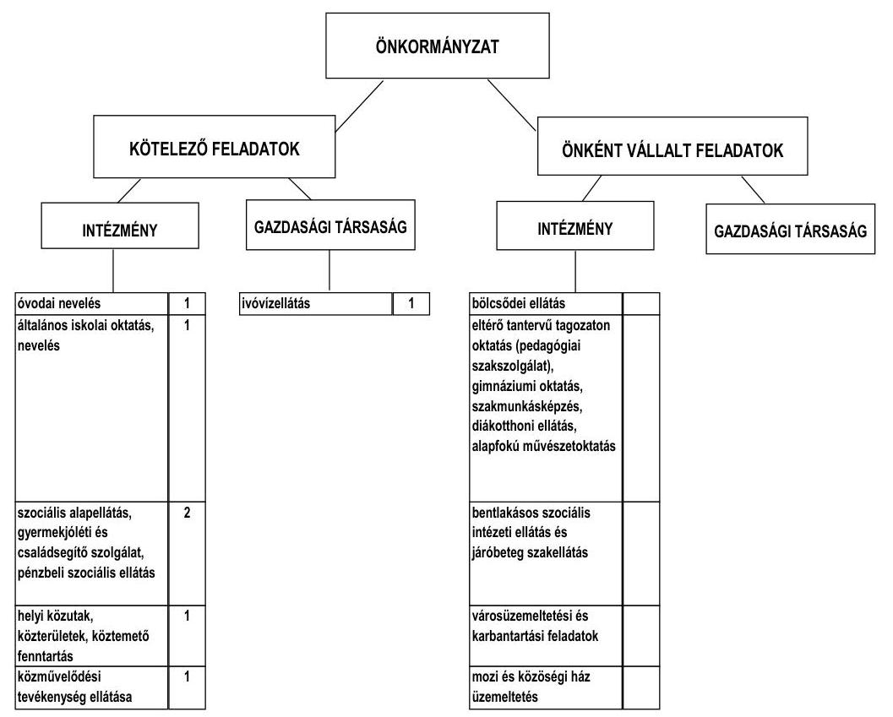

A vizsgált időszakban a kötelező- és önként vállalt feladatok ellátását biztosító szervezeti keretekben, a feladatellátás módjában bekövetkezett változások pozitív hatást gyakoroltak az Önkormányzat pénzügyi helyzetének alakulására. Az intézményi átszervezések, feladatátrendezések hatására az Önkormányzat kimutatása szerint 91,2 millió Ft kiadási megtakarítás, valamint költségvetési hozzájárulásból 2,8 millió Ft többletbevétel keletkezett.

Az Önkormányzat működési kiadásokra 2007-ben 1695,5 millió Ft-ot, 2008-ban 1724,6 millió Ft-ot, 2009-ben 1741,9 millió Ft-ot, 2010-ben 1793,4 millió Ft-ot fordított. A működési kiadásoknak a 2007. évben 83,2%-át, a 2010. évben 76,1%-át az intézményeknél, valamint a Polgármesteri hivatalnál 2007-ben a 16,8%-át, 2010-ben a 23,9%-át realizálták.

A közszolgáltatások feladatellátásában résztvevő egyes intézmények ágazatonkénti működési kiadásainak finanszírozási forrásösszetételét a 2007. és a 2010. években a következő ábra szemlélteti:

---

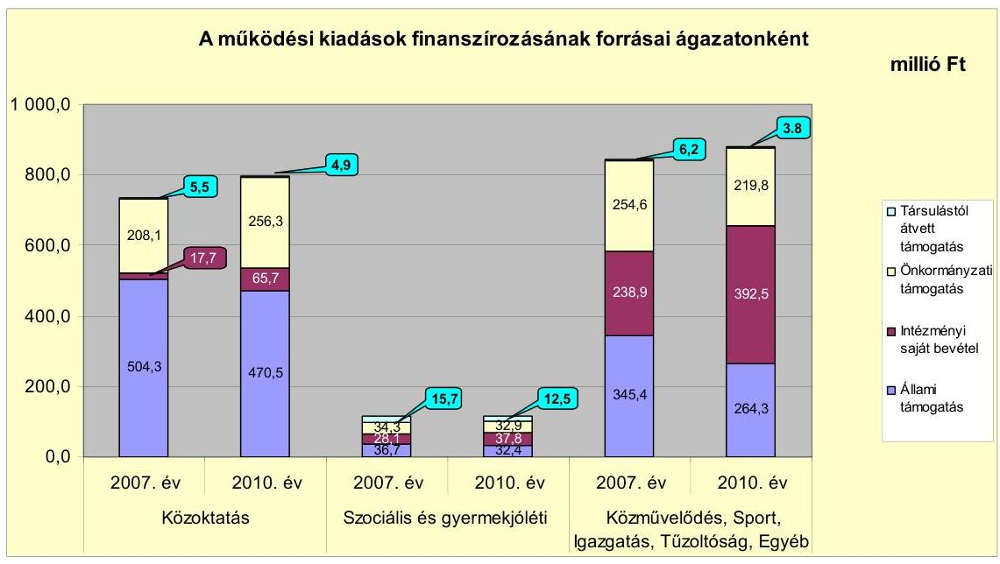

Az Önkormányzatnál a 2010. évben a 2007-2009. évek átlagához képest a közművelődési intézmények működtetéséhez, valamint az igazgatási feladatok és a Polgármesteri hivatal feladatainak ellátásához biztosított állami támogatás 40,3 millió Ft-tal csökkent. Az intézményi saját bevételek folyamatosan növekedtek, a többletet a Polgármesteri hivatal bevételi többlete és a közoktatásnál a Gazdasági hivatalnak a Móricz Zsigmond Oktatási Intézményhez integrálása eredményezte.

Az Önkormányzat folyó költségvetésének egyenlege (működési jövedelem) 2007-2010 között működési forrástöbbletet mutatott.
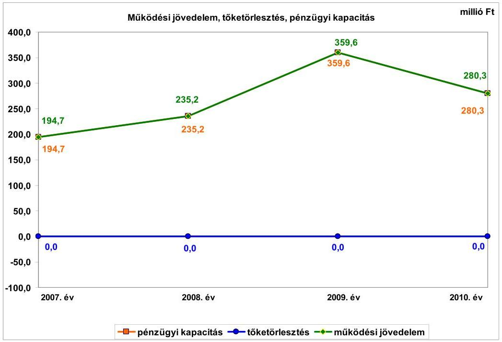

---

Az Önkormányzatnak működési jövedelemből tőketörlesztést nem kellett teljesíteni, mivel nem volt adóssága, ezért a nettó működési jövedelem összege megegyezett a folyó költségvetés egyenlegével, a működési jövedelemmel. A működési többlet az ellenőrzött időszak minden évében meghaladta a folyó kiadások tizedrészét, azon belül 2009-ben meghaladta annak ötödét, 2010-ben pedig megközelítette a hetedét. A pénzügyi egyensúlyi helyzet alakulását befolyásolta az elmúlt időszak fejlesztési tevékenysége. A felhalmozási költségvetés egyenlege a 2007-2010. években folyamatosan negatív összegű volt, mert nagy arányban saját forrásból finanszírozott beruházásokat valósítottak meg. A keletkezett 2007. évi 144,2 millió Ft, 2008. évi 167,9 millió Ft, 2009. évi 30,8 millió Ft, valamint 2010. évi 187,2 millió Ft felhalmozási forráshiány finanszírozására a működési jövedelem fedezetet nyújtott. Így a felhalmozási költségvetés hiánya az átlátható és szabályozott költségvetési gazdálkodás és pénzügyileg fenntartható beruházások miatt nem járt magas pénzügyi kockázattal. Az Önkormányzatnak finanszírozási problémái nem voltak.

Az Önkormányzatnál a folyó bevételek összege a 2007. évben 2027,9 millió Ft, a 2008. évben 2147,4 millió Ft, a 2009. évben 2219,3 millió Ft, valamint a 2010. évben 2188,4 millió Ft volt. A folyó bevételek növekedését az előző évhez képest a 2008. évben a saját működési bevételek és a költségvetési támogatások, a 2009. évben a kamatbevételek és az iparűzési adóbevételek növekedése eredményezte, a 2010. évi csökkenést a költségvetési támogatások csökkenése okozta. A költségvetési támogatás és az szja bevétel együttes összege az előző évhez képest a 2008. évben 76,4 millió Ft-tal nőtt, a 2009. évben 52,8 millió Ft-tal és 2010. évben 151,2 millió Ft-tal csökkent a központi támogatáselosztás változása következtében. Az egyéb saját bevétel az előző évhez képest a 2008. évben 26,1 millió Ft-tal, a 2009. évben 30,3 millió Ft-tal és a 2009. évben 18,7 millió Ft-tal nőtt a térítési és bérleti díjak, valamint a kamatbevételek növekedésének hatására. A helyi adókból, pótlékokból befolyó bevétel negyedét két nagy adóalany fizette be. Az iparűzési adóbevétel az előző évhez képest a 2009. évben 110,9 millió Ft-tal, a 2010. évben 96,6 millió Ft-tal nőtt. A felhalmozási bevétel az előző évi 94,1 millió Ft-hoz képest a 2008. évben 3,3 millió Ft-tal nőtt, a 2009. évben 15,3 millió Ft-tal és a 2010. évben 32,8 millió Ft-tal csökkent. A felhalmozási célú bevételek ingatlanok, telkek értékesítéséből, pályázaton nyert támogatásokból származtak.

Az Önkormányzatnak 2007-2011. év I. félév közötti kamatbevétele 239,6 millió Ft volt, amely 181,7 millió Ft-tal meghaladta az 57,9 millió Ft kamatkiadást. A kamatbevételük a befektetési és forgatási célú értékpapírok, betétek után 222,7 millió Ft (92,9%), a folyószámla után 16,9 millió Ft (7,1%) volt. Kamatkiadásuk a 2007. évben 15,2 millió Ft, a 2011. év I. félévben 8,6 millió Ft volt. Csökkenésére hatással volt, hogy az Önkormányzatnak a Víziközmű társulattól átvállalt, kamatfizetési kötelezettsége - amely 2007-2009 között 22,6 millió Ft volt - a 2009. évben a végtörlesztés teljesítésével megszűnt. A kamatbevételek alakulása jelentős hatással volt az Önkormányzat pénzügyi egyensúlyi helyzetére, a működési jövedelem összegét növelte.

A folyó kiadások összege változóan alakult, a 2007. évben 1833,2 millió Ft, a 2008. évben 1912,2 millió Ft, a 2009. évben 1859,7 millió Ft, a 2010. évben 1908,1 millió Ft volt. A személyi juttatásra teljesített kiadás a 2007. évben 925,3 millió Ft volt, amely a 2008. évben 18,3 millió Ft-tal nőtt, a 2009. évben 74,6 millió Ft-tal és a 2010. évben 12,5 millió Ft-tal csökkent, a foglalkoztatottak létszámának változása miatt. A munkaadót terhelő járulékokra teljesített kifizetés 2007-2010 között 66,6 millió Ft-tal csökkent, a központi intézkedések hatására. A dologi kiadás a 2007. évben 432,1 millió Ft, a 2010. évben 576,4 millió Ft volt. A 144,3 millió Ft növekedést évente főként az egyéb üzemeltetési, fenntartási szolgáltatások, az élelmiszerek és vásárolt élelmezés, az áfa, az egyéb dologi kiadások, valamint a szállítási szolgáltatások többletkiadása okozta.

Az Önkormányzatnál 2007-2010 között befejezett fejlesztések tényleges bekerülési költsége összesen 659,1 millió Ft volt. A forrásösszetételük 523,6 millió Ft saját bevételből, 70,7 millió Ft EU-s és 64,8 millió Ft hazai támogatásból állt. Az Önkormányzatnál 2010. december 31-én folyamatban lévő felújítási és fejlesztési feladatra 51,5 millió Ft-ot teljesítettek, amelynek forrásösszetétele 51 millió Ft saját bevétel és 0,5 millió Ft EU-s támogatásból állt. Az EU-s támogatásból megvalósult fejlesztések finanszírozása likviditási gondot nem okozott.

Az Önkormányzat 2010. december 31-én folyamatban lévő, valamint a 2011-ben induló fejlesztési feladatok 2010. évet követő kötelezettségvállalásainak összege 324,0 millió Ft volt, amelyből 139,2 millió Ft-ot EU-s és 24,5 millió Ft-ot hazai támogatásból, valamint 160,3 millió Ft-ot saját forrásból terveznek biztosítani. Az Önkormányzatnak a vállalt fejlesztések jövőbeni finanszírozhatósága nem jelent kockázatot, mert hitelállománya nincs, illetve 2010. év végi 695,7 millió Ft pénzkészlete, valamint 257,1 millió Ft tartós hitelviszonyt megtestesítő értékpapír állománya biztosítja a fedezetet.
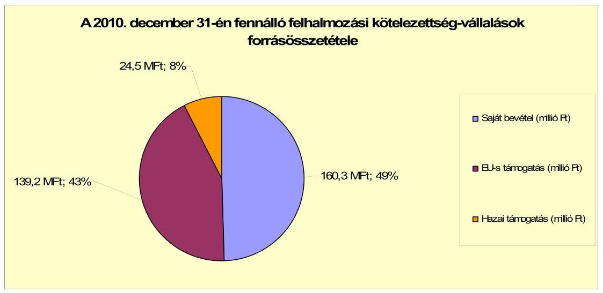

Az Önkormányzat által beadott, elbírálás alatt álló pályázatok 2010-2013. évekre tervezett teljes bekerülési költsége 588 millió Ft, amelyből 403,5 millió Ft-ot EU-s és 179,3 millió Ft-ot hazai támogatásból, valamint 5,2 millió Ft-ot önkormányzati saját forrásból terveznek biztosítani.

Az Önkormányzatnak az ellenőrzött időszakban pénzintézeti kötelezettsége nem volt, költségvetésének pénzügyi egyensúlyát a vizsgált időszakban hitel igénybevétele nélkül biztosította. Intenzív fejlesztési tevékenységet nem folytat-

---

tak, nagy volumenű beruházásokat nem végeztek és a működési jövedelem, valamint a korábbi időszakból származó megtakarításaik fedezetet nyújtottak a felhalmozási hiányra. Az Önkormányzat 2007-2011. év I. féléve között átmenetileg szabad pénzeszközeiből 239,6 millió Ft kamatbevételt realizált.

Az Önkormányzat 2011. év I. félév végi 16,6 millió Ft összegű szállítói tartozás állománya nem befolyásolja a pénzügyi egyensúlyt, mivel ez a kötelezettség nem lejárt fizetési határidejú.

Az Önkormányzat kötelezettségeinek 2010. december 31-i, valamint 2011. június 30-i állományát és várható alakulását a kötelezettségek lejáratáig a következő táblázat szemlélteti:

| Megnevezés | Állomány 2010. december 31-én | Állomány 2011. június 30-án | Várható kötelezettség 2011-2013. években | Várható kötelezettség 2014. évtől |
| :-- | :--: | :--: | :--: | :--: |
|  | HUF-ban (millió Ft-ban) | HUF-ban (millió Ft-ban) | HUF-ban (millió Ft-ban) | HUF-ban (millió Ft-ban) |
| Szállító tartozás | 4,2 | 16,6 | 16,6 | 0 |
| Egyéb kötelezettségek | 34,2 | 30,6 | 30,6 | 0 |

Az Önkormányzatnak a 2011. évben fizetési kötelezettsége a szállítói tartozáson kívül, egyéb kötelezettsége 30,6 millió Ft volt. Az egyéb
 rövid lejáratú kötelezettség állománya a 2007. évben 16,5 millió Ft, illetve 2011. év I. félév végén 30,6 millió Ft volt. Ezen belül az iparűzési adó feltöltés miatti kötelezettség a 2007. évben 11,3 millió Ft, 2011. év I. félév végén 9,7 millió Ft volt. A helyi adó túlfizetés a 2007. évben 5,2 millió Ft, illetve 2011. év I. félév végén 19,5 millió Ft volt. Az adózónak, ha nem volt más helyi adótartozása, akkor kérelemre visszafizették az adótúlfizetését, vagy csökkentették a következő évi adóterhelését. A 2011. évi szállítói tartozások kiegyenlítését folyó bevételből biztosítják. A 2014. évet követően jelenleg ismert pénzintézeti, valamint egyéb kötelezettségük nincs.

Az Önkormányzat 2007-2010 között eszközállománya után 499,6 millió Ft összegű értékcsökkenést mutatott ki, miközben az elhasznált eszközök pótlására 343,1 millió Ft-ot fordított.

Az Önkormányzat az ellenőrzött időszakban kiadási megtakarítást eredményező és bevételt növelő intézkedéseket tett. A 2007-2011. év I. féléve között megtett intézkedések hatására az Önkormányzat kimutatása szerint 225,0 millió Ft kiadási megtakarítás, továbbá 312,2 millió Ft bevételi többlet keletkezett. Mindezek az Önkormányzat pénzügyi egyensúlyi helyzetét javították. A kiadási megtakarítások 66,4%-át (149,5 millió Ft-ot) a személyi juttatások és járulékok csökkenése eredményezte. Az álláshely-csökkentő és átszervezési intézkedések 2007-2011. év I. féléve között önkormányzati szinten összesen 85 álláshely megszüntetését jelentették. A közoktatásban, a szociális és gyermekvédelemben, a Polgármesteri hivatalban és a Városgondnokságnál azonban feladatbővülések is voltak, amelyek az átszervezéssel együtt 66 álláshelyes egyben 66 létszámnövekedéssel is jártak. Ennek következtében az álláshelyek és a foglalkoztatottak száma összességében 19-cel csökkent. A bevételnövelő intézkedések helyi adókkal kapcsolatos intézkedésekhez, gépek értékesítéséhez,

---

intézményi térítési díjak emeléséhez, valamint átmenetileg szabad pénzeszközök lekötéséhez kapcsolódtak.

Az utóellenőrzés a pénzügyi egyensúly javítására tett két szabályszerűségi és egy célszerűségi javaslat hasznosítására terjedt ki. Egy szabályszerűségi és egy célszerűségi javaslatot az intézkedési terv szerinti határidőben megvalósítottak. Egy szabályszerűségi javaslatot a jegyző nem az intézkedési tervben előírt határidőre hasznosított. A 2008. évi költségvetési rendeletben a költségvetés bevételi és kiadási főösszegének megállapításakor az Áht-ban előírtak ellenére finanszírozási célú pénzügyi műveleteket (értékpapír értékesítés bevételét) vettek figyelembe. A 2011. évi költségvetési rendeletben finanszírozási célú pénzügyi műveleteket már nem vettek figyelembe költségvetési hiányt/többletet módosító bevételként.

Az Önkormányzat pénzügyi egyensúlyi helyzetét összegezve a következők emelhetők ki:

Tiszakécske Város Önkormányzatának pénzügyi egyensúlya - az ellenőrzés befejezésekor rendelkezésre álló tényadatok és információ alapján - rövid és középtávon biztosított.

A folyó költségvetés egyenlege pozitív és emelkedő tendenciájú volt a 2009. évig. Az ellenőrzött időszakban rövid- és hosszú lejáratú pénzintézeti kötelezettség nem volt.

A bevételi kitettség miatti kockázat alacsony, mivel a helyi adóbevételre jellemző, hogy több adóalanytól származik.

Az önként vállalt feladatok ellátására fordított kiadások aránya és mértéke csökkenő tendenciát mutat, szintje nem veszélyeztette a kötelező feladatok ellátását.

A felhalmozás finanszírozási kockázata alacsony, az EU-s támogatással megvalósuló fejlesztési feladatok előfinanszírozásához, az önerő biztosításához a 2010. év végi pénzkészlete, valamint tartós hitelviszonyt megtestesítő értékpapír állománya biztosítja a fedezetet.

A szállítói kötelezettségek a pénzügyi egyensúlyi helyzetre nem voltak hatással. A likviditást belső forrásokból biztosítani tudták.

Az ÁSZ tv. 33. § (1) bekezdésében foglaltak értelmében a jelentésben foglalt megállapításokhoz kapcsolódó intézkedési tervet köteles az ellenőrzött szervezet vezetője összeállítani és azt a jelentés kézhezvételétől számított harminc napon belül az ÁSZ részére megküldeni. Amennyiben az intézkedési tervet határidőben nem küldi meg a szervezet, vagy az továbbra sem elfogadható, az ÁSZ elnöke a hivatkozott törvény 33. § (3) bekezdés a)-b) pontjaiban foglaltakat érvényesítheti.

---

# A 2011. június 30-i pénzügyi egyensúlyi helyzet alapján az ellenőrzés intézkedést igénylő megállapításai és javaslatai a következők: 

## a Polgármesternek

Az Önkormányzat pénzügyi egyensúlyi helyzete rövid és középtávon biztosított. A pénzügyi egyensúly hosszú távú megőrzésére az Önkormányzatnak fel kell készülnie.

Javaslat:
Folyamatosan tájékoztassa a Képviselő-testületet az Önkormányzat pénzügyi egyensúlyi helyzetéről. Kezdeményezzen szükség esetén intézkedéseket a pénzügyi egyensúly hosszú távú fenntarthatósága érdekében.

---

# II. RÉSZLETES MEGÁLLAPÍTÁSOK 

## 1. Az ÖNKORMÁNYZAT KÖTELEZŐ ÉS ÖNKÉNT VÁLLALT FELADATAI, A FELADATELLÁTÁS SZERVEZETI KERETEI ÉS ANNAK VÁLTOZÁSAI

Az Önkormányzatnál a kötelező és az önként vállalt feladatok körét az SzMSzben rögzítették. Az önként vállalt feladatok közé sorolták a bölcsődei ellátást, az eltérő tantervű tagozaton oktatást (pedagógiai szakszolgálatot), gimnáziumi oktatást, szakmunkásképzést, diákotthoni ellátást, alapfokú művészetoktatást, bentlakásos szociális intézeti ellátást, járóbeteg szakellátást, a mozi és a közösségi ház üzemeltetését, valamint a Városgondnokságnál az előzőekben felsorolt önként vállalt feladatok ellátásával összefüggésben végzett karbantartási, üzemeltetési feladatokat.

Az Önkormányzat működési költségvetési kiadásaiból a kötelező feladatok ellátására a 2007. évben 1041,9 millió Ft-ot (61,5%-ot), a 2010. évben 1217,3 millió Ft-ot (67,9%-ot) fordított. Az önként vállalt feladatok ellátására teljesített kiadás csökkenő tendenciát mutatott, a 2007. évben 653,6 millió Ft (38,5%), a 2008. évben 619,8 millió Ft (35,9%), a 2009. évben 574,2 millió Ft (32,9%) és a 2010. évben 576,1 millió Ft (32,1%) volt. Az egyéb intézmény (Városgondnokság) által végzett városüzemeltetési és karbantartási feladatok változtak, valamint a ráfordítható kiadások 2007-2009 között csökkentek. Emiatt a működési kiadása az előző évhez képest a 2008. évben 61,9 millió Ft-tal (19,8%-kal), a 2009. évben 70,5 millió Ft-tal (28,1%-kal) csökkent.

Az Önkormányzat 2010. évi működési kiadásait és finanszírozási arányait főbb feladatonként a következő táblázat mutatja be:

| Ellátott feladat | Müködési   kiadás   összesen   (millió Ft) | Kötelező   feladatok   kiadásainak   részaránya   % | Müködési   bevétel   összesen   (millió Ft) | Állami   támogatás   részaránya   % | Intézményi   saját bevétel   részaránya   % | Önkormányzati   támogatás   részaránya   % | Társulástól   átvett   támogatás   részaránya   % |
| :--: | :--: | :--: | :--: | :--: | :--: | :--: | :--: |
| Ovodák | 191,5 | 99,0 | 191,5 | 50,8 | 6,4 | 41,0 | 1,8 |
| Állalános iskolák | 344,4 | 96,0 | 344,4 | 58,7 | 5,0 | 35,9 | 0,4 |
| Gimnáziumok | 107,1 | 0,0 | 107,1 | 64,3 | 1,0 | 34,7 | 0,0 |
| Szakközépiskolák,   szakképző intéz-   mények | 93,7 | 0,0 | 93,7 | 76,3 | 22,3 | 1,4 | 0,0 |
| Külégiumok | 60,7 | 0,0 | 60,7 | 50,5 | 23,6 | 25,9 | 0,0 |
| Szociális   intézmények | 115,6 | 30,0 | 115,6 | 28,0 | 32,7 | 28,5 | 10,8 |
| Közművelődési   intézmények | 54,8 | 93,0 | 54,8 | 4,3 | 27,3 | 68,4 | 0,0 |
| Egyéb intézmények | 218,6 | 2,0 | 218,6 | 18,5 | 30,8 | 50,7 | 0,0 |
| Polgármesteri hivatal   igazgatási kiadásai | 178,7 | 100,0 | 178,7 | 6,8 | 51,3 | 40,0 | 2,1 |
| Polgármesteri   hivatalban ellátott   egyéb feladatok   működési kiadásai | 428,3 | 100,0 | 428,3 | 49,0 | 51,0 | 0,0 | 0,0 |
| Müködési kiada-   sok összesen | 1793,4 | 67,9 | 1793,4 | 42,8 | 27,6 | 28,4 | 1,2 |

---

A működési bevétel - a jelentés 2. számú mellékletétől eltérően - tartalmazza az előző évi pénzmaradvány felhasználásából származó pénzforgalom nélküli bevételeket.

Az Önkormányzat működési kiadásaiból közoktatási feladatokra a 2007. évben 735,6 millió Ft-ot (43,4%-ot), a 2010. évben az intézményfenntartási kiadások növekedése következtében 797,5 millió Ft-ot (44,5%-ot) teljesített. A közművelődési, igazgatási és egyéb feladatoknak a működési kiadása csökkenő tendenciát mutatott, a 2007. évben 560,1 millió Ft (33%), a 2010. évben 452,1 millió Ft (25,2%) volt, az állami támogatás megvonása miatt. A Polgármesteri hivatalban ellátott feladatokra fordított kiadás nőtt, a 2007. évben 285 millió Ft (16,8%), a 2010. évben 428,2 millió Ft (23,9%) volt, a dologi kiadások növekedése miatt.

Az Önkormányzat működési célú kiadásaihoz igénybevett állami támogatás összege a 2007. évben 886,5 millió Ft (52,3%) volt, a 2008. évben nőtt 912,1 millió Ft-ra (52,9%-ra) a normatív állami hozzájárulás emelkedése miatt. Az állami támogatás összege csökkent, a 2009. évben 858 millió Ft (49,2%), a 2010. évben 767,1 millió Ft (42,8%) volt, az ellátottak alacsonyabb száma és az egy ellátottra jutó támogatás csökkenése miatt. Az állami támogatás a 2007. évi 1695,5 millió Ft működési kiadás 52,3%-ára, a 2010. évben az 1793,4 millió Ft működési kiadás 42,8%-ára nyújtott fedezetet. A közművelődési intézmények működtetéséhez biztosított állami támogatás a 2007. évben 56,3 millió Ft működési kiadás 28,9%-át, a 2010. évben 54,8 millió Ft működési kiadás 4,3%-át finanszírozta, mivel csökkent az állami támogatás összege. Az igazgatási feladatok és a Polgármesteri hivatal feladatainak ellátásához nyújtott állami támogatás összege a 2007. évben 475,7 millió Ft-os működési kiadás 52,4%-ára, a 2010. évben 607 millió Ft-os működési kiadás 36,5%-ára nyújtott fedezetet, a népességszámhoz kötött állami támogatás csökkenése miatt.

A működési célú saját bevétel növekvő tendenciát mutatott, a 2007. évben 284,7 millió Ft (16,8%), a 2010. évben 496 millió Ft (27,6%) volt. A saját bevételek növekedését a Polgármesteri hivatal bevételi többlete, illetve az oktatási intézmények átszervezése $^{7}$ eredményezte. A kötelező és önként vállalt feladatok működési kiadásaihoz nyújtott önkormányzati támogatás az évek során minimális mértékben növekedett, a 2007. évben 496,9 millió Ft (29,3%), a 2010. évben 509,1 millió Ft (28,4%) volt. A közoktatási feladatok ellátását finanszírozó állami támogatás csökkenésének ellentételezéseként az önkormányzati támogatás a 2007. évben 208,1 millió Ft (28,3%), a 2010. évben 256,3 millió Ft (32,2%) volt. A szociális intézmények működéséhez nyújtott önkormányzati támogatás mértéke alig változott, a 2007. évben 34,2 millió Ft (24,8%), a 2010. évben 32,9 millió Ft (28,5%) volt. A közművelődési intézmények működésének önkormányzati támogatása a 2007. évben 31,6 millió Ft (56,1%), a 2010. évben az állami támogatás csökkenésének ellentételezéseként 37,5 millió Ft (68,4%) volt. Az igazgatási feladatok ellátásának önkormányzati támogatása a 2007. évben 88,2 millió Ft (46,2%) jelentősen csökkent, a 2010. évben a működési kiadások csökkenése következtében 71,5 millió Ft (40%) volt.

[^0]
[^0]:    $^{7}$ A Gazdasági hivatalt a Móricz Zsigmond Oktatási Intézményhez integrálták.

---

Az Önkormányzat működési célú feladatainak ellátásához a Társulástól átvett támogatás a 2007. évben 27,4 millió Ft (1,6%), a 2010. évben az ellátottak számának csökkenése miatt 21,2 millió Ft (1,2%) volt.

Az Önkormányzat a Társulás keretében ellátja Tiszakécske, Lakitelek, Nyárlőrinc, Szentkirály települések közigazgatási területén a szociális alapszolgáltatások
 közül a családsegítés és gyermekjóléti alapellátás keretében a gyermekjóléti szolgáltatást, valamint Tiszakécske és Nyárlőrinc települések közigazgatási területén a házi- és a jelzőrendszeres házi segítségnyújtást. Ellátják a Móricz Zsigmond Oktatási Intézmény útján Tiszakécske, Lakitelek, Szentkirály és Tiszaug települések közigazgatási területén a pedagógiai szakszolgálati feladatok közül a nevelési tanácsadást és a logopédiai tevékenységet, továbbá Helvécia, Lakitelek, Nyárlőrinc, Szentkirály, Tiszakécske, Tiszaug és Városföld, a kistérségen kívül eső Bugac Község Önkormányzata intézményeinek, valamint a Társulás belső ellenőrzési feladatait.

A Társulástól átvett támogatás csökkenő tendenciát mutatott. A közoktatási feladatellátásra átvett támogatás a 2007. évben 5,5 millió Ft ( $0,8 \%$ ), a 2010. évben 4,9 millió Ft ( $0,6 \%$ ) és a szociális intézmények működtetésére a 2007. évben 15,7 millió Ft (13,7\%), a 2010. évben 12,5 millió Ft (10,8\%) volt. Az igazgatási feladatellátásra átvett támogatás a 2007. évben 6,2 millió Ft $(3,3 \%)$ és a 2010. évben 3,8 millió Ft $(2,1 \%)$ volt.

Az Önkormányzat kötelező és önként vállalt feladatainak ellátását végző költségvetési szervek száma a 2007. évről a 2011. év I. félévre tízről hatra csökkent az intézmények megszüntetése, összevonása következtében.

A költségvetési szervek közül 2006. december 31-én kettő önállóan gazdálkodó ${ }^{8}$, valamint nyolc részben önállóan gazdálkodó intézmény ${ }^{9}$ volt, alapító okirataik szerint 24 telephelyen működtek. Az Önkormányzatnál 2011. június 30-án kettő önállóan működő és gazdálkodó költségvetési szerv ${ }^{10}$, valamint négy önállóan működő intézmény ${ }^{11}$ volt, amelyek 23 telephelyen működtek.

Az Önkormányzat intézményei látják el az óvodai nevelés, általános iskolai oktatás, szociális alapellátás, és családsegítő szolgálat, helyi közutak-, közterületek fenntartása, valamint a közművelődés kötelező feladatait. Továbbá az

[^0]
[^0]:    ${ }^{8}$ A két önállóan gazdálkodó költségvetési szerv a Polgármesteri hivatal (egy telephelyen) és a Gazdasági hivatal (kettő telephelyen) volt.
    ${ }^{9}$ A nyolc részben önállóan gazdálkodó intézmény: Óvoda (hat telephelyen), kettő általános iskola (nyolc telephelyen), Egészségügyi Központ (járó beteg szakellátás egy telephelyen), Egyesített Szociális Intézmény (3 telephelyen), Arany János Művelődési Központ (kettő telephelyen), Városi Könyvtár (egy telephelyen), valamint a Városgondnokság (kettő telephelyen).
    ${ }^{10}$ A két önállóan működő és gazdálkodó szervezet a Polgármesteri hivatal (egy telephelyen) és a Móricz Zsigmond Oktatási Intézmény (nyolc telephelyen) volt.
    ${ }^{11}$ A négy önállóan működő intézmény Városi Óvodák és Bölcsőde (hat telephelyen), Egyesített Szociális Intézmény és Egészségügyi Központ (négy telephelyen), Arany János Művelődési Központ és Városi Könyvtár (három telephelyen), valamint a Városgondnokság (egy telephelyen).

---

intézmények látják el a bölcsődei ellátás, eltérő tantervű tagozaton oktatás (pedagógiai szakszolgálat), gimnáziumi oktatás, szakmunkásképzés, diákotthoni ellátás, alapfokú művészetoktatás, bentlakásos szociális intézeti ellátás és járóbeteg szakellátás, városüzemeltetés és karbantartás, mozi és közösségi ház üzemeltetés önként vállalt feladatait.

Az Önkormányzat 5,1\% tulajdoni részaránnyal rendelkezik egy gazdasági társaságban, amely kötelező feladatainak ellátásában (vízellátásban és szennyvízkezelésben) vesz részt. Az Önkormányzat a 2007. évben 9,5 millió Ft, a 2008. évben 3,9 millió Ft, valamint a 2010. évben 7,9 millió Ft fejlesztési célú támogatást nyújtott bérüzemeltetési szerződés alapján a BÁCSVÍZ Zrt.-nek a térség vízellátása és a víziközmű üzembiztonsága érdekében, rekonstrukciós célra. Az önkormányzati feladatok ellátásában résztvevő gazdasági társaság megnevezését, az Önkormányzat tulajdoni hányadát, a saját tőke jegyzett tőke arányát, a kötelező feladatokhoz rendelt nettó vagyont a jelentés 4. számú melléklete tartalmazza.

Az Önkormányzatnál az intézményi feladatellátás szerkezetét átalakították a vizsgált időszakban. Az Alapfokú Művészetoktatási Intézményt 2007. szeptember 1-jétől és a Gazdasági hivatalt 2008. január 1-jétől a Móricz Zsigmond Oktatási Intézménybe, a Városi Könyvtárat 2008. január 1-jétől az Arany János Művelődési Központba, valamint az Egészségügyi Központot 2010. január 1-jétől az Egyesített Szociális Intézménybe integrálták. Az intézményi átszervezések, feladatátrendezések hatása az Önkormányzat kimutatása szerint a személyi juttatásoknál és járulékaiknál 90 millió Ft, a dologi kiadásoknál 1,2 millió Ft kiadási megtakarítást eredményezett. A létszámcsökkentési döntésekkel kapcsolatos költségvetési hozzájárulásból 2,8 millió Ft működési jövedelmet növelő többlet bevétele keletkezett.

Az Önkormányzat a vizsgált időszakban hat kötelező feladat ellátására (fogorvosi alapellátásra, központi ügyeleti orvosi ellátásra, közvilágítás biztosítására, kommunális hulladék ártalmatlanítására, veszélyes hulladék begyűjtésére és ártalmatlanítására, valamint köztemető fenntartására) vállalkozókkal és gazdasági társaságokkal szerződést kötött.

# 2. Az ÖNKORMÁNYZAT PÉNZÜGYI EGYENSÚLYI HELYZETÉT BEFOLYÁSOLÓ TÉNYEZŐK 

A hagyományos költségvetési szerkezet helyett az Önkormányzat pénzügyi helyzetét a CLF módszerrel mutatjuk be, amelyben jobban elkülönülnek a vagyonnal kapcsolatos bevételek és kiadások az önkormányzati feladatokkal kapcsolatos közvetlen működtetési bevételektől és kiadásoktól. A módszer következetesen elkülöníti a folyó és a felhalmozási költségvetés bevételeit és kiadásait, azok költségvetési egyenlegeit. A saját folyó bevételek, valamint a saját felhalmozási bevételek nem tartalmazzák az előző évi pénzmaradványok felhasználásából származó pénzforgalom nélküli bevételeket ${ }^{12}$.

[^0]
[^0]:    ${ }^{12}$ A költségvetési években kialakuló hiány finanszírozása az előző évi pénzmaradvány és a korábbi években képzett tartalékok felhasználásával is történhet.

---

A folyó költségvetés egyenlege, a működési jövedelem megmutatja, hogy az Önkormányzat éves folyó bevétele fedezetet biztosít-e a kötelező és önként vállalt feladatellátáshoz kapcsolódó éves folyó kiadására. A működési jövedelem negatív értéke pénzügyileg fenntarthatatlan helyzetet jelez. A mutató pozitív értéke megtakarítást mutat, amely forrásul szolgálhat az önkormányzat fennálló kötelezettségei megfizetéséhez, valamint fejlesztéseihez.

A felhalmozási költségvetés pozitív értéke felhalmozási többletet mutat, amely a jövőbeni fejlesztések forrását biztosíthatja. Amennyiben a folyó költségvetési hiány finanszírozása a felhalmozási többletből történik, ez szűkebb értelemben vagyonfelélésnek tekinthető. Amennyiben a felhalmozási költségvetés megtakarítása fejlesztési célú hitelek, kötvények adósságszolgálatát finanszírozza, az változatlan vagyontömeg mellett, a korábban megelőlegezett tőkebevételek valós realizációjának tekinthető. A felhalmozási deficit által generált finanszírozási igény önmagában nem jár pénzügyi kockázattal, a pénzügyileg fenntartható beruházásokhoz kapcsolódó kötelezettségvállalás (adósságszolgálat) átlátható és szabályozott költségvetési gazdálkodással teljesíthető.

A módszer a pénzügyi kapacitás fogalmát helyezi a középpontba. Az adós hitelfelvételi képessége, hosszú távú fizetőképessége vagy bonitása a pénzügyi kapacitással, ezen belül is a nettó működési jövedelemmel jellemezhető. A nettó működési jövedelem negatív értéke az egyes költségvetési években jelentkező adósságszolgálat túlzott mértékére utal. ${ }^{13}$ A nettó működési jövedelem negatív értékének felhalmozási többletből, vagy további hitelből történő finanszírozása pénzügyileg nem fenntartható gazdálkodást vetít előre. A pozitív értéket mutató nettó működési jövedelem fejlesztési kiadások fedezetét biztosíthatja, illetve a folyamatosan, évenként képződő pozitív nettó működési jövedelemből meghatározható a jövőben vállalható, teljesíthető éves adósságszolgálat, ily módon az a hitelösszeg, amely - a többi tényezőt, feltételt adottnak tekintve - visszafizetési kockázat nélkül felvehető.

A CLF módszer alapján a pénzügyi kapacitás mértéke az Önkormányzat összevont, nettósított, a központi információs rendszerbe a Magyar Államkincstáron keresztül leadott éves költségvetési beszámolójának 80-as űrlapjában szerepeltetett adatok alapján került meghatározásra.

A számítási leírás eltér az ÁSZ módszertanában korábban alkalmazott gyakorlattól. A jelen besorolás általános közgazdasági meggondolásokon alapul, amely megjelenik az SNA statisztikai módszertanában is. Folyó tételek alatt értjük azokat a kiadásokat és bevételeket, amelyek a gazdálkodó szervezet helyzetét automatikusan nem változtatják. Bevételi oldalon ilyenek az adók, a tényező jövedelmek, a transzferek ${ }^{14}$, kiadási oldalon a transzferek és a szolgáltatás igénybevételével kapcsolatos működési kiadások. A folyó költségvetésben a bevételekben nem térül meg, a kiadásokban nem jelenik meg az amortizáció, a vagyoni helyzetet az egyenleg befolyásolja.

[^0]
[^0]:    ${ }^{13}$ kivéve, ha annak finanszírozására a korábbi években képzett tartalékok fedezetet nyújtanak
    ${ }^{14}$ Transzfer kiadásoknak nevezzük azokat a folyó és felhalmozási tételeket, amelyeket nem az adott önkormányzat használ fel szolgáltatásnyújtásra.

---

A folyó költségvetés egyenlege (működési jövedelem) tartalmazza a kamatbevételeket és a kamatkiadásokat is, mind a működési, mind a fejlesztési kamatot, valamint a visszatérülő és befizetendő áfa teljes összegét, mert ezek közgazdaságilag tényező jövedelmek. Nem tartalmazzák viszont a követelés elengedés miatt könyvelt bevételi és kiadási pénzforgalmi tételeket, mert valójában technikai elszámolási műveletnek minősülnek, a bevétel soha nem realizálódott, és költségvetési kiadás sem történt.

A felhalmozási költségvetésben a bevételek között a vagyon megőrzésére és bővítésére fordítható források jelennek meg. A felhalmozási vagy tőketételek módosítják a vagyon nagyságát. A privatizációs bevétel csökkenti a vagyont, a fizikai beruházás, pénzügyi befektetés növeli.

A nettó működési jövedelmet a tőketörlesztés levonásával a folyó költségvetés egyenlegéből származtatjuk.

# 2.1. A működési és a felhalmozási egyensúly változása 

CLF módszer szerinti önkormányzati adatok

| Megnevezés | 2007. év | 2008. év | 2009. év | 2010. év |
| :--: | :--: | :--: | :--: | :--: |
| Folyó bevételek | 2027,9 | 2 147,4 | 2219,3 | 2 188,4 |
| Folyó kiadások | 1833,2 | 1912,2 | 1859,7 | 1908,1 |
| Működési jövedelem | 194,7 | 235,2 | 359,6 | 280,3 |
| Nettó működési jövedelem   =működési jövedelem - tőketörlesztés | 194,7 | 235,2 | 359,6 | 280,3 |
| Felhalmozási bevételek | 94,1 | 97,4 | 82,1 | 49,4 |
| Felhalmozási kiadások | 238,3 | 265,3 | 112,9 | 236,6 |
| Felhalmozási költségvetés egyenlege | $-144,2$ | $-167,9$ | $-30,9$ | $-187,2$ |
| Finanszírozási műveletek nélküli (GFS) pozíció = működési jövedelem + felhalmozási költségvetés egyenlege | 50,5 | 67,3 | 328,8 | 93,1 |
| Finanszírozási műveletek egyenlege | $-13,9$ | $-102,9$ | 72,5 | $-171,3$ |
| Tárgyévi pénzügyi pozíció | 36,6 | $-35,6$ | 401,3 | $-78,2$ |
| Egyéb tájékoztató adatok |  |  |  |  |
| Összes kötelezettség* | 29,7 | 53,5 | 96,7 | 38,4 |
| -ebből rövid lejáratú | 29,7 | 53,5 | 96,7 | 38,4 |
| Folyószámlahítel napi átlagos állománya** | 0,0 | 0,0 | 0,0 | 0,0 |
| Likvidhítel napi átlagos állománya | 0,0 | 0,0 | 0,0 | 0,0 |
| Munkabérhítel napi átlagos állománya** | 0,0 | 0,0 | 0,0 | 0,0 |
| Finanszírozásba bevonható eszközök: | 527,8 | 604,5 | 923,2 | 952,8 |
| Tartós hitelviszonyt megtestesítő értékpapírok év végi állománya | 119,6 | 231,9 | 149,3 | 257,1 |
| Hosszú lejáratú bankbetétek év végi állománya | 0,0 | 0,0 | 0,0 | 0,0 |
| Értékpapírok év végi állománya | 0,0 | 0,0 | 0,0 | 0,0 |
| Pénzeszközök (idegen pénzeszközök nélkül) év végi állománya | 408,2 | 372,6 | 773,9 | 695,7 |

[^0]
[^0]:    * Az összes kötelezettséget a passzív pénzügyi elszámolások nélkül vettük figyelembe, mert a passzívák a pénzmaradvány elszámolás tételei közé tartoznak.
    ** A folyószámla, a likvid- és a munkabérhítel átlagos állományát 365 napos osztószámmal és nem a fennálló napok számával vettük figyelembe.

---

Az Önkormányzat bevételeit és kiadásait, valamint adósságszolgálatát 2007-2010 között részletesen a

 jelentés 2. számú melléklete tartalmazza.

A vizsgált időszakban az Önkormányzat folyó költségvetési egyenlege, működési jövedelme 2007-2010. években évről-évre pozitív összegű volt, amelyet a következő ábra szemléltet:
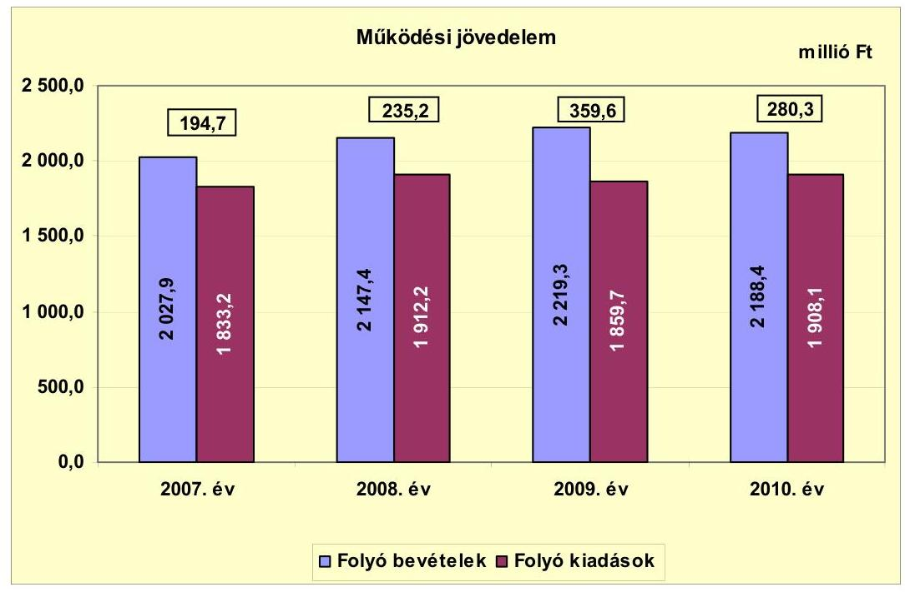

Az Önkormányzat folyó költségvetési egyenlege a 2007-2010. években forrástöbbletet mutatott. A 2007. évben a folyó kiadások 10,6%-a (194,7 millió Ft), 2008-ban a folyó kiadások 12,3%-a (235,2 millió Ft), 2009-ben 19,3%-a (359,6 millió Ft) és 2010-ben 14,7%-a (280,3 millió Ft) volt.

A működési jövedelem előző évhez viszonyított 2008. évi emelkedését a folyó bevételek emelkedése - azon belül elsősorban az Önkormányzat költségvetési támogatásának (szja 182,6 millió Ft-os csökkenésével korrigált) 76,4 millió Ft-os, valamint az egyéb saját bevételek 26,1 millió Ft-os bevételi többlete - eredményezte. A működési jövedelem 2009. évi emelkedését elsősorban a folyó bevételek emelkedése - az új vállalkozások miatt az iparűzési adó előző évhez viszonyított 107,8 millió Ft-os, valamint a kamatbevételek 21,8 millió Ft-os bevételi többlete - eredményezte. A költségvetési támogatásból felhalmozási célú támogatás a 2007. évben 33,5 millió Ft, a 2008. évben 12,1 millió Ft, a 2009. évben 18,7 millió Ft, a 2010. évben 21,2 millió Ft volt, és nem módosította a működési jövedelem előjelét.

A vizsgált időszakban az összes működési jövedelem 1069,8 millió Ft megtakarítást mutatott, amely az Önkormányzat fennálló kötelezettségei megfizetéséhez és fejlesztéseihez fedezetül szolgálhatott.

Az Önkormányzatnak adósságszolgálati kötelezettsége nem volt, ezért a nettó működési jövedelme a képződött működési jövedelemmel megegyezett. A nettó működési jövedelem a fejlesztési kiadások fedezetét biztosította.

---

Az Önkormányzat nettó működési jövedelme a 2007-2010. években a tőketörlesztés hiánya miatt megegyezett a működési jövedelemmel, amelyet az alábbi ábra szemléltet:
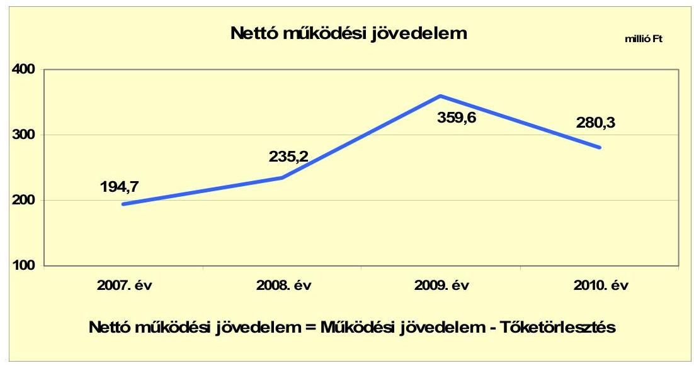

A nettó működési jövedelem az előző évhez képest a 2008. évben 40,5 millió Ft-tal, a 2009. évben 124,4 millió Ft-tal növekedett és a 2010. évben 79,3 millió Ft-tal csökkent. A működési jövedelem pozitív értékű volt és nem volt adósságszolgálat. A működési többlet az ellenőrzött időszak minden évében meghaladta a folyó kiadások tized részét, azon belül 2009-ben meghaladta annak ötödét, 2010-ben pedig megközelítette a hetedét. A folyó bevételeken belül a saját működési bevétel az előző évhez viszonyítva a 2008. évben a költségvetési támogatás és egyéb saját bevételek, valamint a 2009. évben az iparűzési adó és kamat bevételek többletéből növekedett. A működési jövedelem előző évhez képest 2008. és 2009. évi növekedése, valamint az szja és a költségvetési támogatás bevételek 2010. évi csökkenése mellett is a fejlesztési kiadások fedezetét biztosította.

Az Önkormányzat felhalmozási költségvetésének egyenlegét 2007-2010 között a következő ábra szemlélteti:
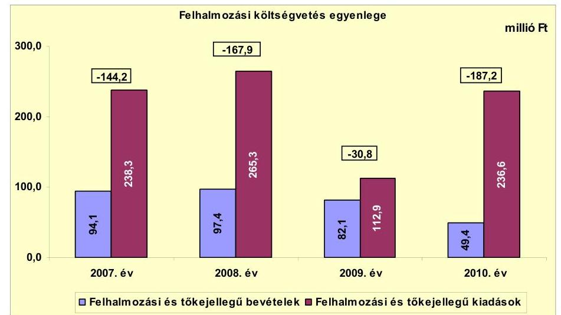

---

A 2007-2010. években az Önkormányzat felhalmozási költségvetésének egyenlege folyamatosan negatív összegű volt, mert a felhalmozási kiadások meghaladták a felhalmozási bevételeket. A felhalmozási költségvetés hiánya az előző évhez képest változó tendenciát mutatott, a 2008. évben és a 2010. évben nőtt, a 2009. évben csökkent. A felhalmozási kiadások az előző évhez képest a 2009. évben kiugróan, 152,4 millió Ft-tal csökkentek, amelyet elsősorban a felújítási kiadások visszafogása, annak 124 millió Ft-os csökkenése okozott. A felhalmozási bevételek az előző évhez képest jelentősen, a 2010. évben 32,7 millió Ft-tal csökkentek, amelyet elsősorban az államháztartáson belülről kapott támogatások csökkenése okozott. A felhalmozási költségvetés hiánya az átlátható és szabályozott költségvetési gazdálkodás és pénzügyileg fenntartható beruházások miatt nem járt magas pénzügyi kockázattal, valamint a nettó működési jövedelem biztosította a fedezetét. Az Önkormányzatnak finanszírozási problémái nem voltak. A keletkezett felhalmozási forráshiány finanszírozására a működési jövedelem fedezetet nyújtott. A felhalmozási forráshiány a felhalmozási és tőke jellegű kiadásoknak 2007-ben 60,5%-a (144,2 millió Ft), 2008-ban 63,3%-a (167,9 millió Ft), 2009-ben 27,3%-a (30,8 millió Ft), valamint 2010-ben 79,1%-a (187,2 millió Ft) volt.

Az Önkormányzat finanszírozási műveletei 2007-2010. évekbeli egyenlegének alakulását a következő ábra szemlélteti:
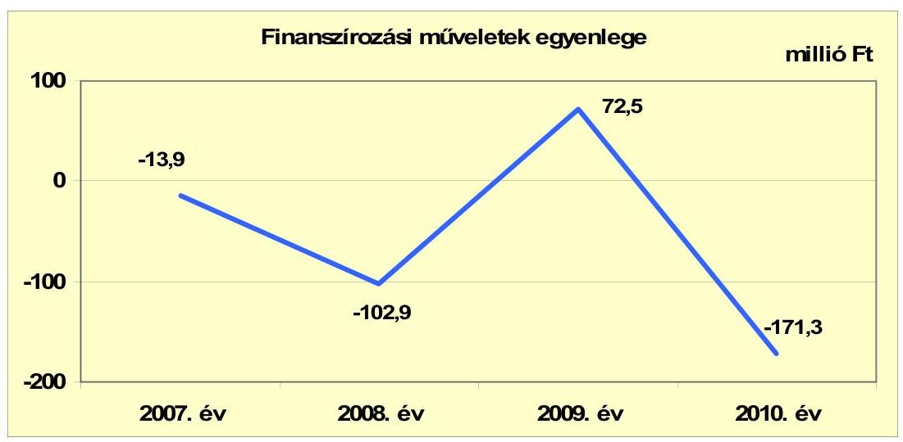

Az Önkormányzatnál a 2007-2010. években a finanszírozási műveletek egyenlege a forgatási és befektetési célú értékpapírok értékesítéséből és vásárlásából, valamint az egyéb finanszírozási bevételekből és kiadásokból származott. Az értékpapír (államkötvény) értékesítés a 2007. évben 21,9 millió Ft-tal, a 2008. évben 112 millió Ft-tal kevesebb, a 2009. évben 84,1 millió Ft-tal több volt, mint a vásárlás. A 2010. évben az értékpapír értékesítés 105,2 millió Ft-tal kevesebb volt, mint a vásárlás. Az értékpapír adásvétel célja a kamatbevétel növelése volt. A finanszírozási célú műveleteket a vizsgált időszakban a jelentés 2. számú mellékletének 4.1.-4.8. pontjai részletezik.

Az Önkormányzat 2007-2010. évi zárszámadási rendeleteiben meghatározta a működési, valamint felhalmozási bevételek és kiadások főösszegét, amelyet a jelentés 1. számú melléklete szemléltet. A zárszámadási rendeletekben bevételi többletet mutattak ki 2007-ben 280,7 millió Ft, 2008-ban 166,3 millió Ft, 2009-ben 670,7 millió Ft és 2010-ben 218,9 millió Ft összegben. Ez a CLF módszer alapján számított működési jövedelem és felhalmozási költségvetés egyenlegét minden évben meghaladta alapvetően az igénybevett pénzmaradvány hatására.

Az Önkormányzat kamatbevételeit és kamatkiadásait 2007-2010 között a következő ábra mutatja be:
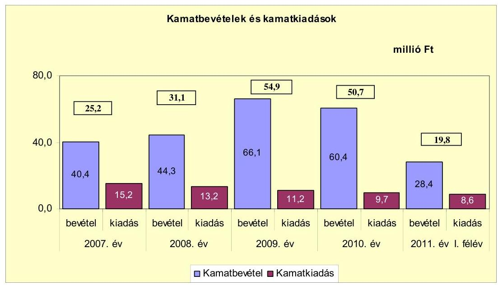

Az Önkormányzatnak 2007-2011. év I. félév között kamatbevétele a befektetési és forgatási célú értékpapírok, betétek után 222,7 millió Ft (92,9%), a folyószámla után 16,9 millió Ft (7,1%) volt. A kamatkiadás évről-évre való csökkenésében szerepet játszott, hogy az Önkormányzat Víziközmű társulattól - a 2004. évben pénzintézettel és a Víziközmű társulattal megkötött kölcsönszerződés alapján - átvállalt kamatfizetési kötelezettsége, amely 2007-2009 között 22,6 millió Ft volt, 2009. június 1-jén a végtörlesztés teljesítésével megszűnt. A kamatbevételek alakulása jelentős hatással volt az Önkormányzat pénzügyi helyzetére, a működési jövedelem összegét növelte. A kamatbevételek 181,7 millió Ft-tal haladták meg a kamatkiadásokat.

# 2.2. Az Önkormányzat bevételeinek változása 

Az Önkormányzatnál a CLF módszer szerint számított folyó bevétel és a felhalmozási bevétel együttes összege változóan alakult, a 2007. évben 2122 millió Ft, a 2008. évben 2244,8 millió Ft, majd a 2009. évben 2301,4 millió Ft, a 2010. évben pedig 2237,8 millió Ft volt. A folyó bevételek összege a 2007. évben 2027,9 millió Ft, a 2008. évben 2147,4 millió Ft, a 2009. évben 2219,3 millió Ft, valamint a 2010. évben 2188,4 millió Ft volt. A folyó bevételeknek a 2009. évről a 2010. évre történő 30,9 millió Ft-os csökkenését a saját működési bevételek 116,5 millió Ft-os növekedését meghaladó költségvetési támogatások és átengedett bevételek 151,2 millió Ft-os csökkenése okozta.

---

Az Önkormányzat 2007-2011. év I. félév között realizált főbb folyó bevételi jogcímeinek számszaki adatait az alábbi grafikon mutatja be:
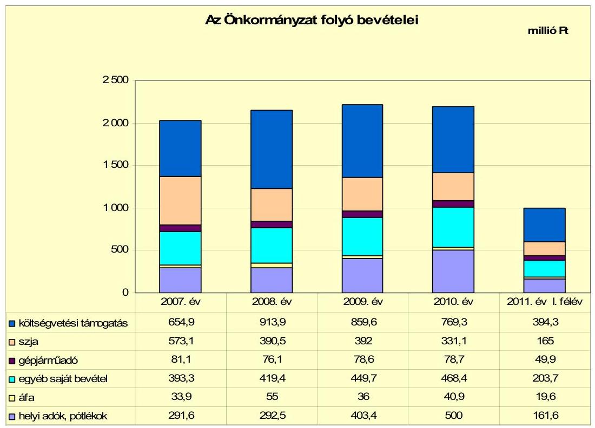

Az Önkormányzat költségvetési támogatása és az szja bevétel együttes összege - amelyek döntő mértékben működési támogatások voltak - a 2007. évben 1228 millió Ft volt, amely a 2008. évben 76,4 millió Ft-tal nőtt. A központi támogatáselosztás változása következtében az előző évhez viszonyítva a 2009. évben 52,8 millió Ft-tal, a 2010. évben 151,2 millió Ft-tal csökkent. A gépjárműadóból származó bevétel 2007-2010 között 2,4 millió Ft-tal csökkent annak ellenére, hogy az adómérték központi intézkedések hatására emelkedett.

A vizsgált időszakban az egyéb saját folyó bevétel folyamatosan növekedett a kamatbevételből és az egyéb saját bevételből. Az előző évhez képest a 2008. évben 26,1 millió Ft-tal, a 2009. évben 30,3 millió Ft-tal, a 2010. évben 18,7 millió Ft-tal nőtt. Az áfa bevételek összege az előző évhez képest a 2008. évben 21,1 millió Ft-tal nőtt, a 2009. évben 19 millió Ft-tal csökkent, a 2010. évben 4,9 millió Ft-tal nőtt.

Az Önkormányzatnál a helyi adókból és pótlékokból származó bevételek folyó bevételen belüli aránya a 2007. évben 14,4%, a 2010. évben 22,8% volt. A 2007-2011. év I. félévében új adónem bevezetéséről nem döntöttek. A helyi adóbevétel negyede két nagy adóalanytól származik. Az iparűzési adóból15 a 2007. évben 197,1 millió Ft folyt be, amely a városba települt új vállalkozások befizetéseinek eredményeként a 2010. évben 386,9 millió Ft-ra nőtt. A kommunális adót 2007. január 1-jétől ingatlanonként 8500 Ft-ról 12000 Ft-ra

[^0]
[^0]: 15 Helyi iparűzési adó mértéke 2%.

---

emelték, valamint a három és többgyermekes családok kedvezményét megszüntették, amely döntés 14,3 millió Ft bevételnövekedést eredményezett. A kommunális adót 2008. január 1-jétől 13000 Ft-ra és 2009. január 1-jétől 15000 Ft-ra emelték, amely döntés 3,6-7,5 millió Ft többlet adóbevételt eredményezett. Az építmény utáni idegenforgalmi adót 2008. január 1-jétől a 60 m2 alatti építmények után 350 Ft/m2-ről 500 Ft/m2-re, a 60 m2 felettiek esetében 700 Ft/m2-ről 800 Ft/m2-re növelték, továbbá a 8000 Ft minimum adót 12000 Ft-ra növelték. Az adó mértéke 2010. január 1-jétől a 60 m2 alatti építmények után 550 Ft/m2-re, valamint a 60 m2 felettieké 880 Ft/m2-re, illetve a minimum adó 13200 Ft-ra nőtt. 2011-ben ez az adónem megszűnt, helyette építményadót vezettek be. Az idegenforgalmi adó mértékét a vendégéjszakák után 2008. január 1-jétől 300 Ft/főről 350 Ft/főre, majd 2010. január 1-jétől 400 Ft/főre emelték, amelyből 0,5 millió Ft többletbevételük származott. Az ideiglenes jelleggel végzett tevékenység után az iparűzési adó mértékét 2009. január 1-jétől 300 Ft/napról 400 Ft/napra, valamint piaci árusítás esetén 2500 Ft/napról 3000 Ft/napra növelték, amely döntés eredményeként 0,3 millió Ft bevétel növekedést realizáltak.

Az Önkormányzat számára a vizsgált időszakban egyszer 2011. év I. félévében a BÁCSVÍZ Zrt. közfeladatot ellátó gazdasági társaság fizetett 13,7 millió Ft osztalékot.

Az Önkormányzat felhalmozási bevételei a vizsgált időszakban:

| Megnevezés | 2007. év | 2008. év | 2009. év | 2010. év | 2011. év   I. félév |
| :-- | --: | --: | --: | --: | --: |
| Tárgyi eszköz értékesítés | 5,5 | 42,7 | 13,2 | 9,0 | 4,7 |
| Egyéb saját tőkebevétel | 32,3 | 35,9 | 17,9 | 12,3 | 5,0 |
| Államháztartáson belülről   kapott támogatás | 6,1 | 1,6 | 28,5 | 9,6 | 13,2 |
| EU-tól és külföldről kapott   támogatások | 39,3 | 0,0 | 2,6 | 5,9 | 0,0 |
| Államháztartáson kívülről   kapott támogatás | 10,9 | 17,2 | 19,9 | 12,6 | 1,9 |
| Összes felhalmozási bevétel | 94,1 | 97,4 | 82,1 | 49,4 | 24,8 |

Az Önkormányzatnak a felhalmozási célú bevételei a 2008. évtől kezdődően folyamatosan csökkentek. A tárgyi eszközök értékesítéséből származó bevételük a 2008. évben nagy értékű ingatlanok értékesítéséből származott. Az egyéb saját tőkebevétel a 2007. és a 2008. években a telek értékesítések eredményeként nőtt. Az államháztartáson belülről 2009. évben kapott kiemelt összegű támogatás pályázatokon nyert támogatás volt. Az EU-tól a 2007. évben kapott támogatás az előző évben induló fejlesztésekhez kapcsolódott. Az államháztartáson kívülről kapott támogatás felhalmozási
 célú pénzeszközátvételből és a magánszemélyeknek adott kölcsönök megtérüléséből származott.

---

# 2.3. Az Önkormányzat működési és felhalmozási célú kiadásainak változása 

Az Önkormányzat folyó kiadásai főbb jogcímek szerinti bontásban a következők voltak:

| Megnevezés | 2007. év | 2008. év | 2009. év | 2010. év | $\begin{gathered} \text { millió Ft } \\ 2011 . \text { év } \\ \text { I. félév } \end{gathered}$ |
| :--: | :--: | :--: | :--: | :--: | :--: |
| Folyó kiadások | 1833,2 | 1912,2 | 1859,7 | 1908,1 | 926,9 |
| Működési kiadások (kamatkiadás nélkül) | 1693,0 | 1743,1 | 1692,0 | 1703,1 | 831,0 |
| Államháztartáson belülre átadott pénzeszközök | 7,0 | 6,4 | 6,0 | 5,9 | 2,6 |
| Transzferkiadások | 118,0 | 119,1 | 150,5 | 174,5 | 68,0 |
| -ebből: vállalkozásoknak | 8,2 | 3,9 | 0,0 | 7,9 | 0,1 |
| EU-nak, illetve külföldre | 0,0 | 0,1 | 0,0 | 0,0 | 0,0 |
| magánszemélyeknek | 94,6 | 101,1 | 136,5 | 152,8 | 61,0 |
| nonprofit szervezeteknek | 15,3 | 14,0 | 14,1 | 13,8 | 6,9 |
| Kamatkiadások | 15,2 | 13,2 | 11,2 | 9,7 | 8,6 |
| Előző évi pénzmaradvány átadás | 0,0 | 30,3 | 0,0 | 14,9 | 16,6 |

Az Önkormányzatnál a működési kiadások kamatkiadás nélkül az előző évhez képest a 2008. évben 50,1 millió Ft-tal nőttek, a 2009. évben 51,1 millió Ft-tal csökkentek, a 2010. évben 11,1 millió Ft-tal nőttek. A legkiemelkedőbb változás volt a transzferkiadások közül a magánszemélyek felé teljesített ellátottak pénzbeli juttatásának (szociális juttatások) emelkedése, ami az előző évhez képest a 2008. évben 6,5 millió Ft-tal, a 2009. évben 35,4 millió Ft-tal, a 2010. évben 16,3 millió Ft-tal nőtt.

Az Önkormányzat folyó kiadásai kiemelt működési előirányzatok szerinti bontásban a következők voltak:

|  |  |  |  |  | millió Ft |
| :-- | --: | --: | --: | --: | --: |
| Megnevezés | 2007. év | 2008. év | 2009. év | 2010. év | 2011. év   I. félév |
| Személyi juttatások | 925,3 | 943,6 | 869,0 | 856,5 | 408,9 |
| Munkaadót terhelő járulékok | 294,1 | 298,3 | 261,9 | 227,5 | 107,8 |
| Dologi kiadások | 432,1 | 475,1 | 501,4 | 576,4 | 294,7 |
| Egyéb folyó kiadások | 41,5 | 26,1 | 59,7 | 42,7 | 19,6 |

Az Önkormányzatnál a személyi juttatásra teljesített kiadás az előző évhez képest a 2008. évben 18,3 millió Ft-tal nőtt, a 2009. évben 74,6 millió Ft-tal és a 2010. évben 12,5 millió Ft-tal csökkent, a foglalkoztatottak (közoktatásban, szociális és gyermekjóléti és egészségügyi ellátásban, Polgármesteri hivatalnál, valamint az egyéb intézményeknél) létszámának változása miatt.

A munkaadót terhelő járulékokra teljesített kiadás az előző évhez képest a 2008. évben 4,2 millió Ft-tal nőtt, a 2009. évben 36,4 millió Ft-tal és a 2010. évben 34,4 millió Ft-tal csökkent a jogszabályi- és a létszámváltozások hatására.

A dologi kiadások 2007-2010 között harmadával nőttek. A növekedést főként az egyéb üzemeltetési, fenntartási szolgáltatások 40,7 millió Ft-os, az élelmiszerek és vásárolt élelmezés 31 millió Ft-os, az áfa 26,8 millió Ft-os, az

---

egyéb dologi kiadások 21,3 millió Ft-os, valamint a szállítási szolgáltatások 9,5 millió Ft-os többletkiadása okozta.

Az Önkormányzat folyó és felhalmozási kiadásait a 2007-2011. év I. félév között a következő ábra mutatja:
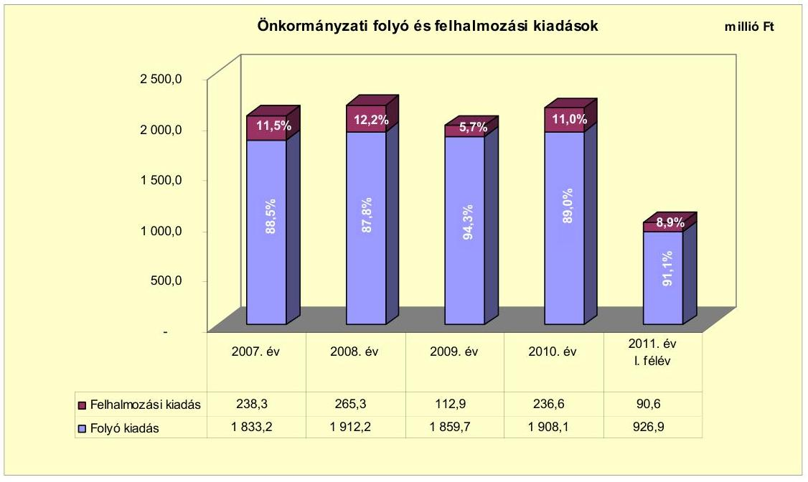

A folyó és felhalmozási kiadások aránya a 2007-2010. év között nem változott számottevően. Az Önkormányzat a 2007-2010. évek között 763,9 millió Ft összköltségű fejlesztést tervezett saját forrással és az EU-s forrásokra benyújtott pályázatok segítségével. A 2007-2010. években EU-s támogatásokra összesen 19 pályázat benyújtásáról döntöttek, amelyből 11 támogatásban részesült.

A 2007-2010 közötti időszakban megvalósított és 2010. december 31-ig befejezett felújítások és fejlesztések száma 255 db volt, amelyből 241 db a 10 millió Ft alattiak száma. A tényleges bekerülési költség összesen 659,1 millió Ft volt, ebből a 10 millió Ft alattiak 396,6 millió Ft-ba kerültek. A forrásösszetételük 523,6 millió Ft (79,4%) saját bevételből, 70,7 millió Ft (10,7%) EU-s és 64,8 millió Ft (9,9%) hazai támogatásból állt. Az Önkormányzat 2007-2010. években megvalósított, 2010. december 31-ig befejezett fejlesztéseit és annak forrásösszetételét a 3/a. számú melléklet tartalmazza.

A felújítások száma 67 db volt, amelyből 58 db 10 millió Ft alatti. Ezek tényleges bekerülési költsége összesen 304,9 millió Ft volt, ebből a 10 millió Ft alatti felújítások 141,8 millió Ft-ba kerültek. A felújítások forrásösszetételét 210,6 millió Ft (69,1%) saját bevétel, 39,3 millió Ft (12,9%) EU-s és 55 millió Ft (18%) hazai támogatás képezte. A fejlesztések száma 188 db volt, amelyből 183 db a 10 millió Ft alattiak száma. A tényleges bekerülési költség összesen 354,2 millió Ft volt, ebből a 10 millió Ft alatti fejlesztések 254,8 millió Ft-ba kerültek. A fejlesztések forrásösszetételét 313 millió Ft (88,4%) saját bevétel, 31,4 millió Ft (8,9%) EU-s és 9,8 millió Ft (2,7%) hazai támogatás képezte.

Az Önkormányzatnál 2010. december 31-én folyamatban lévő három felújítási és hét fejlesztési feladatra 51,5 millió Ft-ot teljesítettek, amelynek

---

forrásösszetétele 51 millió Ft (99%) saját bevételből és 0,5 millió Ft (1%) EU-s támogatásból állt. A folyamatban lévő fejlesztések közül három projektre nyertek EU-s támogatást összesen 139,7 millió Ft összegben, amelynek 0,4%-a teljesült 2010. december 31-ig. Az Önkormányzat 2010. december 31-én folyamatban lévő fejlesztési feladataira 2010. december 31-ig teljesített kifizetéseket és annak forrásösszetételét a 3/b. számú melléklet tartalmazza.

Az Önkormányzatnál 2010. december 31-én folyamatban lévő és 2011. év I. félévben indított projektek közül kilenc a felújítás, amelyek várható 2010. utáni bekerülési költségét 69,5 millió Ft önkormányzati saját bevételből finanszírozzák. A fejlesztések száma 26 darab, várható 2010. utáni bekerülési költségük 254,5 millió Ft, amely forrásai 90,8 millió Ft (35,7%) önkormányzati saját bevétel, 139,2 millió Ft (54,7%) EU-s támogatás, valamint 24,5 millió Ft (9,6%) hazai támogatás. Az Önkormányzat 2010. december 31-én folyamatban lévő fejlesztési feladataira 2010. december 31. utáni időszakra vonatkozó kötelezettségvállalásait és annak forrásösszetételét a 3/c. számú melléklet tartalmazza.

Az Önkormányzatnak 2010. december 31-én elbírálás alatt lévő pályázata nem volt. A 2011. év I. félévben beadott, elbírálás alatti pályázataiban tervezett források felhasználásával három projektet tervez megvalósítani 2011-2012 között, amelyeknek összesen 588 millió Ft a tervezett bekerülési költsége. A forrásösszetételét 5,2 millió Ft (0,9%) saját bevétel, 403,5 millió Ft (68,6%) EU-s támogatás, valamint 179,3 millió Ft (30,5%) hazai támogatás adja. Az elbírálás alatti pályázati forrásból megvalósítani tervezett fejlesztéseihez kapcsolódó kötelezettségvállalásait és azok forrásösszetételét a 3/d. számú melléklet tartalmazza.

Az Önkormányzat 2007-2011. I. félév között nem folytatott intenzív fejlesztési tevékenységet, nagy volumenű beruházásokat a vizsgált időszakban nem végeztek. Elsősorban saját forrásaik terhére 10 millió Ft alatti felújításokat, fejlesztéseket valósítottak meg. Az Önkormányzatnak a vállalt fejlesztések jövőbeni finanszírozhatósága nem jelent kockázatot, mert hitelállománya nincs, illetve a 2010. év végi 695,7 millió Ft pénzkészlete, valamint 257,1 millió Ft tartós hitelviszonyt megtestesítő értékpapír állománya biztosítja a fedezetet. A vizsgált időszakban befejeződött három legjelentősebb fejlesztés a következő volt:

- a Tiszakécske - 4625-ös közút melletti - 1016 m hosszú külterületi és belterületi közlekedésbiztonsági kerékpárút 33,5 millió Ft-os bekerülési költséggel, 2,9 millió Ft saját bevételből, 26 millió Ft EU-s támogatásból, valamint 4,6 millió Ft hazai támogatásból valósult meg;
- az árvízi védekezés során megsérült $6600 \mathrm{~m}^{2}$-es Kinizsi-Darázs út 28,3 millió Ft-os bekerülési költségű helyreállítását teljesen EU-s forrásból (Szolidaritási Alapból) finanszírozták;
- a Hősök útja burkolatának 1100 méteres 26,4 millió Ft-os bekerülési költségű felújítása 13,3 millió Ft saját bevételből, valamint 13,1 millió Ft hazai támogatásból (TEUT-2008) valósult meg.

---

Az Önkormányzat a BÁCSVÍZ Zrt. gazdasági társaság részére a 2007. évben 9,5 millió Ft, a 2008. évben 3,9 millió Ft, valamint a 2010. évben 7,9 millió Ft fejlesztési célú támogatást nyújtott bérüzemeltetési szerződés alapján magas szintű víziközmű ellátás üzembiztonsága érdekében rekonstrukciós célra. A társaság gazdálkodását, illetve működését érintő adatokat (saját tőke, jegyzett tőke aránya, stb.) a jelentés 4. sz. melléklete mutatja be.

# 3. Az ÖNKORMÁNYZAT KÖTELEZETTSÉGEI 

### 3.1. Az Önkormányzat pénzintézeti kötelezettségeinek változása

Az Önkormányzatnak 2006. december 31-én, valamint 2007-2011. június 30 között pénzintézeti kötelezettsége nem volt.

Az Önkormányzat 2007-2010 között a felhalmozási célú hiány kezelése érdekében a költségvetési rendeleteiben a felhalmozási célú bevételeket meghaladó kiadásokat a működési kiadásokat meghaladó működési bevételekből finanszírozta.

### 3.2. A szállítói kötelezettségek változása

Az Önkormányzat kötelezettségeinek állománya 2010. december 31-én, és 2011. június 30-án, valamint várható alakulása a kötelezettségek lejáratáig:

| Megnevezés | Állomány 2010. december 31   én | Állomány 2011. június 30-án | Várható kötelezettség   2011-2013. években | Várható kötelezettség   2014. évtől |
| :-- | :--: | :--: | :--: | :--: |
|  | HUF-ban (millió Ft-ban) | HUF-ban (millió Ft-ban) | HUF-ban (millió Ft-ban) | HUF-ban (millió Ft-ban) |
| Szállító tartozás | 4,2 | 16,6 | 16,6 | 0 |
| Egyéb kötelezettségek | 34,2 | 30,6 | 30,6 | 0 |

Az Önkormányzatnak pénzügyi helyzetét befolyásoló, lejárt szállítói kötelezettsége nem volt. Az egyéb rövid lejáratú kötelezettség állománya a 2007. évben 16,5 millió Ft, illetve 2011. év I. félév végén 30,6 millió Ft volt. Ezen belül az iparűzési adó feltöltés miatti kötelezettség a 2007. évben 11,3 millió Ft, 2011. I. félév végén 9,7 millió Ft volt. A helyi adó túlfizetés 2007. évben 5,2 millió Ft, 2011. I. félév végén 19,5 millió Ft volt. Az adózónak, ha nem volt más helyi adótartozása, akkor kérelemre visszafizették az adótúlfizetését, vagy csökkentették a következő évi adóterhelését.

### 3.3. Egyéb kötelezettségek változása

Az Önkormányzatnál 2007-2011. június 30. között követeléselengedés 2,1 millió Ft összegben történt, amelyből a 2011. év I. félévi összeg 1,7 millió Ft volt. Az elengedett követelés 82%-a bérleti díjból, 17,5%-a lakbérből, valamint 0,5%-a a Tiszainokai rév Tiszakécskei oldal parthasználati díjából származott.

---

Az Önkormányzat a vizsgált időszakban lízingszerződést nem kötött, PPP konstrukcióban nem vett részt, intézményeknek, más önkormányzatoknak, civil szervezeteknek, egyéb államháztartáson belüli és kívüli szervezeteknek, valamint gazdasági társaságoknak kölcsönt nem nyújtott, önkormányzati ingatlant jelzálogjoggal nem terheltetett meg, valamint jövőbeni fizetési kötelezettséget jelentő peres eljárása nem volt. Az Önkormányzatnak a vizsgált időszakban legalább 50% vagy azt meghaladó arányú tulajdonában lévő gazdasági társaságai nem voltak.

Az Önkormányzat a 2007-2010. években a tárgyi eszközök után együttesen 499,6 millió Ft értékcsökkenést mutatott ki. Felújításra a
 kimutatott értékcsökkenésből 2007-ben 71,3 millió Ft-ot (57,3%-ot), a 2008. évben 114,4 millió Ft-ot (115,6%-ot), a 2009. évben 16,3 millió Ft-ot (12,6%-ot), valamint a 2010. évben 88,7 millió Ft-ot (60,5%-ot) fordítottak. Az Önkormányzat eszközállományának bruttó értéke 2007-2010 között 11,7%-kal 4916,4 millió Ft-ra, nettó értéke 3,9%-kal 3742 millió Ft-ra emelkedett. Az önkormányzati szintű használhatósági fok mutató a négy év alatt 81,8%-ról 76,1%-ra csökkent, így az eszközök avultsága növekedett.

A 2007-2010. évek között felújításokra, az eszközök pótlására elsősorban az intézmények működőképességének biztosítása, illetve a szakhatósági előírások figyelembevételével került sor. A kimutatott 499,6 millió Ft értékcsökkenés összegének 68,7%-át, 343,1 millió Ft-ot eszközpótlásra (rekonstrukcióra, felújításra) fordítottak 2010. december 31-ig.

# 4. A PÉNZÜGYI EGYENSÚLY MEGTEREMTÉSE ÉRDEKÉBEN HOZOTT INTÉZKEDÉSEK EREDMÉNYE 

Az Önkormányzat és az önkormányzati intézmények vezetői a vizsgált időszakban a pénzügyi helyzet javítása, a gazdálkodás ésszerűbbé tétele érdekében kiadási megtakarítást eredményező és bevételnövelő intézkedésekről döntöttek.

---

A 2007-2011. év I. félévben végrehajtott kiadási megtakarítást eredményező intézkedések megoszlását a következő ábra szemlélteti:
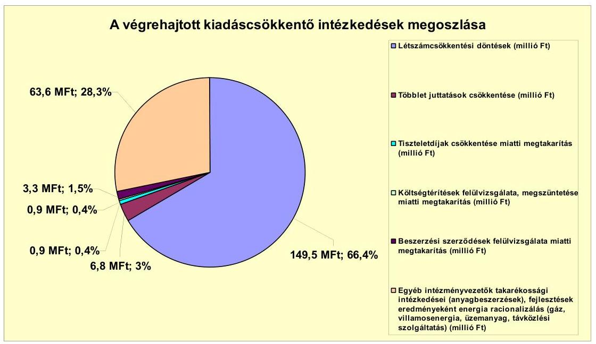

Az Önkormányzat kimutatása szerint 2007-2011. év I. félév között összesen 225 millió Ft kiadási megtakarítást értek el. Ebből 149,5 millió Ft-ot (66,4%-ot) - a nettó létszámcsökkentésre kalkulálva - a személyi juttatások és járulékok, 6,8 millió Ft-ot (3%-ot) a többletjuttatások és 0,9 millió Ft-ot (0,4%-ot) a tiszteletdíjak, 0,9 millió Ft-ot (0,4%-ot) a költségtérítések csökkentése jelentette. Továbbá 66,9 millió Ft-ot (29,8%-ot) a dologi kiadások, a takarékosabb anyagbeszerzések, energiaracionalizálás hatásai eredményeztek.

A kiadási megtakarítások elsősorban a létszámcsökkentésre irányuló döntések hatásaként jelentkeztek, amely eredményeként a személyi juttatások és járulékok összege a 2007. évben 1219,5 millió Ft, a 2010. évben kevesebb, 1084 millió Ft volt. A személyi juttatások és járulékok 149,5 millió Ft-os megtakarítását a létszámcsökkentésre irányuló intézkedésekkel az intézmények körében érték el.

Az Önkormányzat által a 2007-2010. években végrehajtott létszámcsökkentések alakulása:

| Megnevezés (adatok főben) | Közoktatás | Szociális és gyermekvédelem | Egészségügy | Polgármesteri hivatal | Egyéb | Összesen |
| :--: | :--: | :--: | :--: | :--: | :--: | :--: |
| 2007. január 1-jén jóváhagyott álláshelyek száma | 217 | 35 | 27 | 45 | 101 | 425 |
| Megszüntetett álláshelyek száma | 14 | 0 | 13 | 0 | 56 | 85 |
| ebből: | üres álláshelyek száma | 0 | 0 | 0 | 0 | 0 |
|  | szakmai álláshelyek száma | 9 | 0 | 13 | 0 | 0 | 22 |
|  | intézmény-üzemeltetéssel kapcsolatos   álláshelyek száma | 5 | 0 | 0 | 0 | 56 | 63 |
| Álláshely növekedése | 56 | 6 | 0 | 1 | 1 | 66 |
| 2010. december 31-én záró álláshelyek száma | 261 | 41 | 14 | 46 | 44 | 406 |
| 2007. január 1-jén foglalkoztatott létszám | 205 | 35 | 27 | 44 | 98 | 409 |
| Létszámcsökkenés | 14 | 0 | 13 | 0 | 56 | 85 |
| Létszámnövekedés | 56 | 6 | 0 | 1 | 1 | 66 |
| 2010. december 31-én foglalkoztatott létszám | 249 | 41 | 14 | 45 | 41 | 390 |

---

Az Önkormányzat kimutatásai szerint átszervezések következtében a foglalkoztatottak létszáma 2007-2010 között 4,6%-kal csökkent. Az átszervezések miatt 2007-2010. években összesen 85 álláshelyet szüntettek meg és 66 álláshelyet létesítettek, az egyenlege alapján 19 álláshely szűnt meg. A megszüntetett álláshelyek 25,9%-a szakmai és 74,1%-a intézményüzemeltetéssel kapcsolatos volt.

Önkormányzati döntés (átszervezés) miatt 2007-2010 között a közoktatásban 14 fő létszámcsökkentés és 58 fő létszámnövekedés volt, amelyek egyenlege alapján 44 fővel nőtt a foglalkoztatottak száma. A szociális és gyermekvédelemben feladatbővülés miatt hat fővel és a Polgármesteri hivatalban egy fővel nőtt a foglalkoztatottak száma. Továbbá az egészségügyben 13 fő, egyéb területen 56 fő létszámcsökkentés, valamint egy fő létszámnövekedés volt. Mindezek egyenlege alapján 19 fővel csökkent a foglalkoztatottak száma. Az önkormányzati kimutatások szerint a vizsgált időszakban üres álláshelyeket nem szüntettek meg. A létszámcsökkentéshez kapcsolódóan az Önkormányzat részére folyósított támogatás a vizsgált időszakban 9 millió Ft-ot tett ki, a támogatás felhasználásával tartósan leépített létszám kilenc fő volt.

A 2007-2011. év I. félévben érvényesített bevételnövelő intézkedések eredményét az Önkormányzat kimutatása alapján a következő ábra szemlélteti:
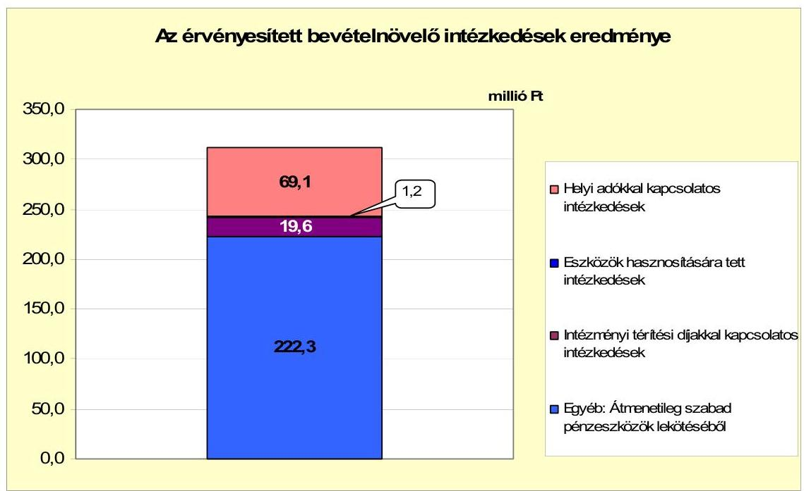

Az Önkormányzat a kiadások fedezetének biztosítása céljából az adózók körének bővítéséről, valamint egyes adómértékek emeléséről döntött. A nyilvántartások szerint ennek eredményeként 2007-2010. év I. félévben 69,1 millió Ft-tal növelték a bevételeket, amely az összes bevétel növekedésének a 22,1%-át tette ki. Az eszközök hasznosítására tett intézkedések (gépek értékesítése) 1,2 millió Ft-tal növelték a bevételeket, amely a bevételek növekedésének 0,4%-a volt. Az intézményi térítési díjemelések 19,6 millió Ft-tal növelték a bevételeket, amely a bevételek növekedésének a 6,3%-át tette ki. A ki-

---

mutatások szerint átmenetileg szabad pénzeszközök lekötéséből 222,3 millió Ft (71,2%) bevétel származott.

A 2007-2010. évek között a költségvetési támogatások és az átengedett szja bevételek együttes összegének csökkenése 127,6 millió Ft bevétel kiesést okozott az Önkormányzatnál, amelyet a kiadáscsökkentő és a bevételnövelő intézkedésekkel elért megtakarításokkal és többletbevételekkel ellensúlyoztak.

# 5. Az ÁSZ ÁLTAL A KORÁBBi ÉVEKBEN A PÉNZÜGYI EGYENSÚLY JAVÍTÁSÁRA TETT SZABÁLYSZERŰSÉGI ÉS CÉLSZERŰSÉGI JAVASLATOK HASZNOSULÁSA 

Az ÁSZ a V-1001-9/2007. számú jelentésében az Önkormányzat gazdálkodási rendszerét a 2007. évben átfogó jelleggel ellenőrizte, amelynek során a pénzügyi egyensúly javítására egy célszerűségi és két szabályszerűségi javaslatot tett.

Egy célszerűségi javaslatot teljesítettek, a polgármester tájékoztatta a Képviselőtestületet a számvevői jelentés megállapításairól, amelynek megvalósítására intézkedési tervet készítettek $^{16}$. Egy szabályszerűségi javaslatot megvalósítottak, a telekadóból származó bevételt megtervezték a 2008. évi költségvetési rendeletben. Egy szabályszerűségi javaslatot a jegyző nem az intézkedési tervben előírt határidőre teljesített, mivel a 2008. évi költségvetési rendeletben a költségvetés bevételi és kiadási főösszegének megállapításakor az Áht. 8/A. § (7) bekezdésében előírtakat megsértve finanszírozási célú pénzügyi műveleteket (értékpapír értékesítés bevételét) vették figyelembe. A 2011. évi költségvetési rendeletben finanszírozási célú pénzügyi műveleteket már nem vették figyelembe költségvetési hiányt/többletet módosító bevételként.
Budapest, 2012. április 16.
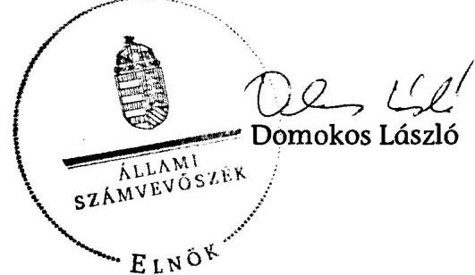

[^0]
[^0]: $^{16}$ A Képviselő-testület 2008. április 24-ei ülésén a javaslatok megvalósítására vonatkozó, felelősöket és határidőket tartalmazó intézkedési tervet elfogadta.

---

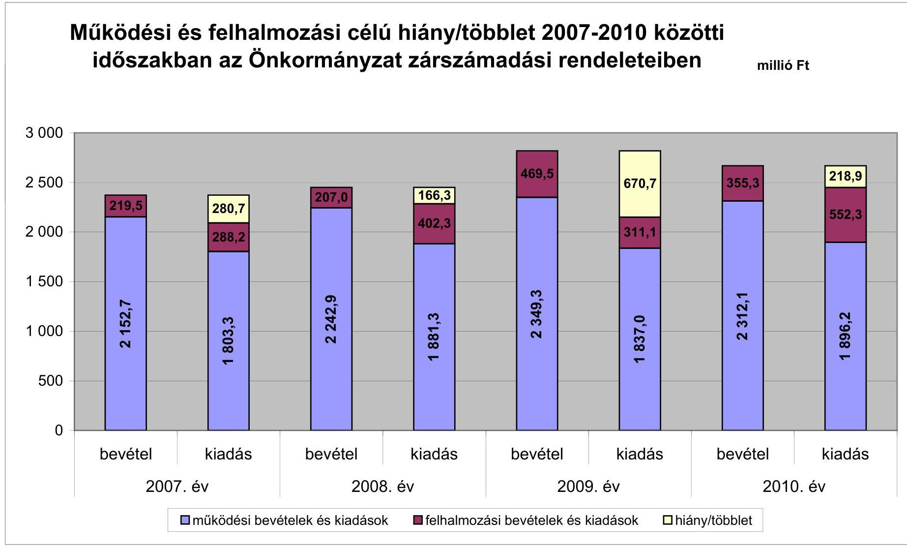

# Működési és felhalmozási célú hiány/többlet 2007-2010 közötti időszakban az Önkormányzat zárszámadási rendeleteiben

|  év | 2007. év | 2008. év | 2009. év | 2010. év  |
| --- | --- | --- | --- | --- |
|  1 | 219.5 | 280.7 | 268.2 | 311.1  |
|  2 | 215.7 | 288.2 | 264.3 | 311.1  |
|  3 | 180.3 | 242.9 | 166.3 | 355.3  |
|  4 | 166.3 | 244.3 | 149.3 | 218.9  |
|  5 | 111.1 | 183.3 | 111.1 | 183.3  |
|  6 | 670.7 | 181.1 | 111.1 | 218.9  |
|  7 | 670.7 | 181.1 | 111.1 | 218.9  |
|  8 | 311.1 | 183.3 | 183.3 | 218.9  |
|  9 | 183.3 | 242.9 | 166.3 | 355.3  |
|  10 | 111.1 | 183.3 | 111.1 | 218.9  |
|  11 | 183.3 | 244.3 | 166.3 | 355.3  |
|  12 | 111.1 | 183.3 | 111.1 | 218.9  |
|  13 | 183.3 | 242.9 | 166.3 | 355.3  |
|  14 | 111.1 | 183.3 | 111.1 | 218.9  |
|  15 | 111.1 | 183.3 | 111.1 | 218.9  |
|  16 | 111.1 | 183.3 | 111.1 | 218.9  |
|  17 | 111.1 | 183.3 | 111.1 | 218.9  |
|  18 | 111.1 | 183.3 | 111.1 | 218.9  |
|  19 | 111.1 | 183.3 | 111.1 | 218.9  |
|  20 | 111.1 | 183.3 | 111.1 | 218.9  |
|  21 | 111.1 | 183.3 | 111.1 | 218.9  |
|  22 | 111.1 | 183.3 | 111.1 | 218.9  |
|  23 | 111.1 | 183.3 | 111.1 | 218.9  |
|  24 | 111.1 | 183.3 | 111.1 | 218.9  |
|  25 | 111.1 | 183.3 | 111.1 | 218.9  |
|  26 | 111.1 | 183.3 | 111.1 | 218.9  |
|  27 | 111.1 | 183.3 | 111.1 | 218.9  |
|  28 | 111.1 | 183.3 | 111.1 | 218.9  |
|  29 | 111.1 | 183.3 | 111.1 | 218.9  |
|  30 | 111.1 | 183.3 | 111.1 | 218.9  |
|  31 | 111.1 | 183.3 | 111.1 | 218.9  |
|  32 | 111.1 | 183.3 | 111.1 | 218.9  |
|  33 | 111.1 | 183.3 | 111.1 | 218.9  |
|  34 | 111.1 | 183.3 | 111.1 | 218.9  |
|  35 | 111.1 | 183.3 | 111.1 | 218.9  |
|  36 | 111.1 | 183.3 | 111.1 | 218.9  |
|  37 | 111.1 | 183.3 | 111.1 | 218.9  |
|  38 | 111.1 | 183.3 | 111.1 | 218.9  |
|  39 | 111.1 | 183.3 | 111.1 | 218.9  |
|  40 | 111.1 | 183.3 | 111.1 | 218.9  |
|  41 | 111.1 | 183.3 | 111.1 | 218.9  |
|  42 | 111.1 | 183.3 | 111.1 | 218.9  |
|  43 | 111.1 | 183.3 | 111.1 | 218.9  |
|  44 | 111.1 | 183.3 | 111.1 | 218.9  |
|  45 | 111.1 | 183.3 | 111.1 | 218.9  |
|  46 | 111.1 | 183.3 | 111.1 | 218.9  |
|  47 | 111.1 | 183.3 | 111.1 | 218.9  |
|  48 | 111.1 | 183.3 | 111.1 | 218.9  |
|  49 | 111.1 | 183.3 | 111.1 | 218.9  |

  50 | 111.1 | 183.3 | 111.1 | 218.9  |
|  51 | 111.1 | 183.3 | 111.1 | 218.9  |
|  52 | 111.1 | 183.3 | 111.1 | 218.9  |
|  53 | 111.1 | 183.3 | 111.1 | 218.9  |
|  54 | 111.1 | 183.3 | 111.1 | 218.9  |
|  55 | 111.1 | 183.3 | 111.1 | 218.9  |
|  56 | 111.1 | 183.3 | 111.1 | 218.9  |
|  57 | 111.1 | 183.3 | 111.1 | 218.9  |
|  58 | 111.1 | 183.3 | 111.1 | 218.9  |
|  59 | 111.1 | 183.3 | 111.1 | 218.9  |
|  60 | 111.1 | 183.3 | 111.1 | 218.9  |
|  61 | 111.1 | 183.3 | 111.1 | 218.9  |
|  62 | 111.1 | 183.3 | 111.1 | 218.9  |
|  63 | 111.1 | 183.3 | 111.1 | 218.9  |
|  64 | 111.1 | 183.3 | 111.1 | 218.9  |
|  65 | 111.1 | 183.3 | 111.1 | 218.9  |
|  66 | 111.1 | 183.3 | 111.1 | 218.9  |
|  67 | 111.1 | 183.3 | 111.1 | 218.9  |
|  68 | 111.1 | 183.3 | 111.1 | 218.9  |
|  69 | 111.1 | 183.3 | 111.1 | 218.9  |
|  70 | 111.1 | 183.3 | 111.1 | 218.9  |
|  71 | 111.1 | 183.3 | 111.1 | 218.9  |
|  72 | 111.1 | 183.3 | 111.1 | 218.9  |
|  73 | 111.1 | 183.3 | 111.1 | 218.9  |
|  74 | 111.1 | 183.3 | 111.1 | 218.9  |
|  75 | 111.1 | 183.3 | 111.1 | 218.9  |
|  76 | 111.1 | 183.3 | 111.1 | 218.9  |
|  77 | 111.1 | 183.3 | 111.1 | 218.9  |
|  78 | 111.1 | 183.3 | 111.1 | 218.9  |
|  79 | 111.1 | 183.3 | 111.1 | 218.9  |
|  80 | 111.1 | 183.3 | 111.1 | 218.9  |
|  81 | 111.1 | 183.3 | 111.1 | 218.9  |
|  82 | 111.1 | 183.3 | 111.1 | 218.9  |
|  83 | 111.1 | 183.3 | 111.1 | 218.9  |
|  84 | 111.1 | 183.3 | 111.1 | 218.9  |
|  85 | 111.1 | 183.3 | 111.1 | 218.9  |
|  86 | 111.1 | 183.3 | 111.1 | 218.9  |
|  87 | 111.1 | 183.3 | 111.1 | 218.9  |
|  88 | 111.1 | 183.3 | 111.1 | 218.9  |
|  89 | 111.1 | 183.3 | 111.1 | 218.9  |
|  90 | 111.1 | 183.3 | 111.1 | 218.9  |
|  91 | 111.1 | 183.3 | 111.1 | 218.9  |
|  92 | 111.1 | 183.3 | 111.1 | 218.9  |
|  93 | 111.1 | 183.3 | 111.1 | 218.9  |
|  94 | 111.1 | 183.3 | 111.1 | 218.9  |
|  95 | 111.1 | 183.3 | 111.1 | 218.9  |
|  96 | 111.1 | 183.3 | 111.1 | 218.9  |
|  97 | 111.1 | 183.3 | 111.1 | 218.9  |
|  98 | 111.1 | 183.3 | 111.1 | 218.9  |
|  99 | 111.1 | 183.3 | 111.1 | 218.9  |
|  100 | 111.1 | 183.3 | 111.1 | 218.9  |
|  101 | 111.1 | 183.3 | 111.1 | 218.9  |
|  102 | 111.1 | 183.3 | 111.1 | 218.9  |
|  103 | 111.1 | 183.3 | 111.1 | 218.9  |
|  104 | 111.1 | 183.3 | 111.1 | 218.9  |
|  105 | 111.1 | 183.3 | 111.1 | 218.9  |
|  106 | 111.1 | 183.3 | 111.1 | 218.9  |
|  107 | 111.1 | 183.3 | 111.1 | 218.9  |
|  108 | 111.1 | 183.3 | 111.1 | 218.9  |
|  109 | 111.1 | 183.3 | 111.1 | 218.9  |
|  110 | 111.1 | 183.3 | 111.1 | 218.9  |
|  111 | 111.1 | 183.3 | 111.1 | 218.9  |
|  112 | 111.1 | 183.3 | 111.1 | 218.9  |
|  113 | 111.1 | 183.3 | 111.1 | 218.9  |
|  114 | 111.1 | 183.3 | 111.1 | 218.9  |
|  115 | 111.1 | 183.3 | 111.1 | 218.9  |
|  116 | 111.1 | 183.3 | 111.1 | 218.9  |
|  117 | 111.1 | 183.3 | 111.1 | 218.9  |
|  118 | 111.1 | 183.3 | 111.1 | 218.9  |
|  119 | 111.1 | 183.3 | 111.1 | 218.9  |
|  120 | 111.1 | 183.3 | 111.1 | 218.9  |
|  121 | 111.1 | 183.3 | 111.1 | 218.9  |
|  122 | 111.1 | 183.3 | 111.1 | 218.9  |
|  123 | 111.1 | 183.3 | 111.1 | 218.9  |
|  124 | 111.1 | 183.3 | 111.1 | 218.9  |
|  125 | 111.1 | 183.3 | 111.1 | 218.9  |
|  126 | 111.1 | 183.3 | 111.1 | 218.9  |
|  127 | 111.1 | 183.3 | 111.1 | 218.9  |
|  128 | 111.1 | 183.3 | 111.1 | 218.9  |
|  129 | 111.1 | 183.3 | 111.1 | 218.9  |
|  130 | 111.1 | 183.3 | 111.1 | 218.9  |
|  131 | 111.1 | 183.3 | 111.1 | 218.9  |
|  132 | 111.1 | 183.3 | 111.1 | 218.9  |
|  133 | 111.1 | 183.3 | 111.1 | 218.9  |
|  134 | 111.1 | 183.3 | 111.1 | 218.9  |
|  135 | 111.1 | 183.3 | 111.1 | 218.9  |
|  136 | 111.1 | 183.3 | 111.1 | 218.9  |
|  137 | 111.1 | 183.3 | 111.1 | 218.9  |
|  138 | 111.1 | 183.3 | 111.1 | 218.9  |
|  139 | 111.1 | 183.3 | 111.1 | 218.9  |
|  140 | 111.1 | 183.3 | 111.1 | 218.9  |
|  141 | 111.1 | 183.3 | 111.1 | 218.9  |
|  142 | 111.1 | 183.3 | 111.1 | 218.9  |
|  143 | 111.1 | 183.3 | 111.1 | 218.9  |
|  144 | 111.1 | 183.3 | 111.1 | 218.9  |
|  145 | 111.1 | 183.3 | 111.1 | 218.9  |
|  146 | 111.1 | 183.3 | 111.1 | 218.9  |
|  147 | 111.1 | 183.3 | 111.1 | 218.9  |
|  148 | 111.1 | 183.3 | 111.1 | 218.9  |
|  149 | 111.1 | 183.3 | 111.1 | 218.9  |
|  150 | 111.1 | 183.3 | 111.1 | 218.9  |
|  151 | 111.1 | 183.3 | 111.1 | 218.9  |
|  152 | 111.1 | 183.3 | 111.1 | 218.9  |
|  153 | 111.1 | 183.3 | 111.1 | 218.9  |
|  154 | 111.1 | 183.3 | 111.1 | 218.9  |
|  155 | 111.1 | 183.3 | 111.1 | 218.9  |
|  156 | 111.1 | 183.3 | 111.1 | 218.9  |
|  157 | 111.1 | 183.3 | 111.1 | 218.9  |
|  158 | 111.1 | 183.3 | 111.1 | 218.9  |
|  159 | 111.1 | 183.3 | 111.1 | 218.9  |
|  160 | 111.1 | 183.3 | 111.1 | 218.9  |
|  161 | 111.1 | 183.3 | 111.1 | 218.9  |
|  162 | 111.1 | 183.3 | 111.1 | 218.9  |
|  163 | 111.1 | 183.3 | 111.1 | 218.9  |
|  164 | 111.1 | 183.3 | 111.1 | 218.9  |
|  165 | 111.1 | 183.3 | 111.1 | 218.9  |
|  166 | 111.1 | 183.3 | 111.1 | 218.9  |
|  167 | 111.1 | 183.3 | 111.1 | 218.9  |
|  168 | 111.1 | 183.3 | 111.1 | 218.9  |
|  169 | 111.1 | 183.3 | 111.1 | 218.9  |
|  170 | 111.1 | 183.3 | 111.1 | 218.9  |
|  171 | 111.1 | 183.3 | 111.1 | 218.9  |
|  172 | 111.1 | 183.3 | 111.1 | 218.9  |
|  173 | 111.1 | 183.3 | 111.1 | 218.9  |
|  174 | 111.1 | 183.3 | 111.1 | 218.9  |
|  175 | 111.1 | 183.3 | 111.1 | 218.9  |
|  176 | 111.1 | 183.3 | 111.1 | 218.9  |
|  177 | 111.1 | 183.3 | 111.1 | 218.9  |
|  178 | 111.1 | 183.3 | 111.1 | 218.9  |
|  179 | 111.1 | 183.3 | 111.1 | 218.9  |
|  180 | 111.1 | 183.3 | 111.1 | 218.9  |
|  181 | 111.1 | 183.3 | 111.1 | 218.9  |
|  182 | 111.1 | 183.3 | 111.1 | 218.9  |
|  183 | 111.1 | 183.3 | 111.1 | 218.9  |

 | 183.3 | 111.1 | 218.9  |
|  184 | 111.1 | 183.3 | 111.1 | 218.9  |
|  185 | 111.1 | 183.3 | 111.1 | 218.9  |
|  186 | 111.1 | 183.3 | 111.1 | 218.9  |
|  187 | 111.1 | 183.3 | 111.1 | 218.9  |
|  188 | 111.1 | 183.3 | 111.1 | 218.9  |
|  189 | 111.1 | 183.3 | 111.1 | 218.9  |
|  190 | 111.1 | 183.3 | 111.1 | 218.9  |
|  191 | 111.1 | 183.3 | 111.1 | 218.9  |
|  192 | 111.1 | 183.3 | 111.1 | 218.9  |
|  193 | 111.1 | 183.3 | 111.1 | 218.9  |
|  194 | 111.1 | 183.3 | 111.1 | 218.9  |
|  195 | 111.1 | 183.3 | 111.1 | 218.9  |
|  196 | 111.1 | 183.3 | 111.1 | 218.9  |
|  197 | 111.1 | 183.3 | 111.1 | 218.9  |
|  198 | 111.1 | 183.3 | 111.1 | 218.9  |
|  199 | 111.1 | 183.3 | 111.1 | 218.9  |
|  200 | 111.1 | 183.3 | 111.1 | 218.9  |
|  201 | 111.1 | 183.3 | 111.1 | 218.9  |
|  202 | 111.1 | 183.3 | 111.1 | 218.9  |
|  203 | 111.1 | 183.3 | 111.1 | 218.9  |
|  204 | 111.1 | 183.3 | 111.1 | 218.9  |
|  205 | 111.1 | 183.3 | 111.1 | 218.9  |
|  206 | 111.1 | 183.3 | 111.1 | 218.9  |
|  207 | 111.1 | 183.3 | 111.1 | 218.9  |
|  208 | 111.1 | 183.3 | 111.1 | 218.9  |
|  209 | 111.1 | 183.3 | 111.1 | 218.9  |
|  210 | 111.1 | 183.3 | 111.1 | 218.9  |
|  211 | 111.1 | 183.3 | 111.1 | 218.9  |
|  212 | 111.1 | 183.3 | 111.1 | 218.9  |
|  212 | 111.1 | 183.3 | 111.1 | 218.9  |
|  213 | 111.1 | 183.3 | 111.1 | 218.9  |
|  214 | 111.1 | 183.3 | 111.1 | 218.9  |
|  215 | 111.1 | 183.3 | 111.1 | 218.9  |
|  216 | 111.1 | 183.3 | 111.1 | 218.9  |
|  217 | 111.1 | 183.3 | 111.1 | 218.9  |
|  218 | 111.1 | 183.3 | 111.1 | 218.9  |
|  219 | 111.1 | 183.3 | 111.1 | 218.9  |
|  220 | 111.1 | 183.3 | 111.1 | 218.9  |
|  219 | 111.1 | 183.3 | 111.1 | 218.9  |
|  221 | 111.1 | 183.3 | 111.1 | 218.9  |
|  222 | 111.1 | 183.3 | 111.1 | 218.9  |
|  222 | 111.1 | 183.3 | 111.1 | 218.9  |
|  223 | 111.1 | 183.3 | 111.1 | 218.9  |
|  224 | 111.1 | 183.3 | 111.1 | 218.9  |
|  225 | 111.1 | 183.3 | 111.1 | 218.9  |
|  226 | 111.1 | 183.3 | 111.1 | 218.9  |
|  227 | 111.1 | 183.3 | 111.1 | 218.9  |
|  228 | 111.1 | 183.3 | 111.1 | 218.9  |
|  229 | 111.1 | 183.3 | 111.1 | 218.9  |
|  230 | 111.1 | 183.3 | 111.1 | 218.9  |
|  231 | 111.1 | 183.3 | 111.1 | 218.9  |
|  232 | 111.1 | 183.3 | 111.1 | 218.9  |
|  232 | 111.1 | 183.3 | 111.1 | 218.9  |
|  233 | 111.1 | 183.3 | 111.1 | 218.9  |
|  234 | 111.1 | 183.3 | 111.1 | 218.9  |
|  235 | 111.1 | 183.3 | 111.1 | 218.9  |
|  236 | 111.1 | 183.3 | 111.1 | 218.9  |
|  237 | 111.1 | 183.3 | 111.1 | 218.9  |
|  238 | 111.1 | 183.3 | 111.1 | 218.9  |
|  239 | 111.1 | 183.3 | 111.1 | 218.9  |
|  240 | 111.1 | 183.3 | 111.1 | 218.9  |
|  241 | 111.1 | 183.3 | 111.1 | 218.9  |
|  242 | 111.1 | 183.3 | 111.1 | 218.9  |
|  243 | 111.1 | 183.3 | 111.1 | 218.9  |
|  244 | 111.1 | 183.3 | 111.1 | 218.9  |
|  245 | 111.1 | 183.3 | 111.1 | 218.9  |
|  246 | 111.1 | 183.3 | 111.1 | 218.9  |
|  247 | 111.1 | 183.3 | 111.1 | 218.9  |
|  248 | 111.1 | 183.3 | 111.1 | 218.9  |
|  249 | 111.1 | 183.3 | 111.1 | 218.9  |
|  250 | 111.1 | 183.3 | 111.1 | 218.9  |
|  251 | 111.1 | 183.3 | 111.1 | 218.9  |
|  252 | 111.1 | 183.3 | 111.1 | 218.9  |
|  253 | 111.1 | 183.3 | 111.1 | 218.9  |
|  254 | 111.1 | 183.3 | 111.1 | 218.9  |
|  255 | 111.1 | 183.3 | 111.1 | 218.9  |
|  256 | 111.1 | 183.3 | 111.1 | 218.9  |
|  257 | 111.1 | 183.3 | 111.1 | 218.9  |
|  258 | 111.1 | 183.3 | 111.1 | 218.9  |
|  259 | 111.1 | 183.3 | 111.1 | 218.9  |
|  260 | 111.1 | 183.3 | 111.1 | 218.9  |
|  261 | 111.1 | 183.3 | 111.1 | 218.9  |
|  262 | 111.1 | 183.3 | 111.1 | 218.9  |
|  262 | 111.1 | 183.3 | 111.1 | 218.9  |
|  263 | 111.1 | 183.3 | 111.1 | 218.9  |
|  263 | 111.1 | 183.3 | 111.1 | 218.9  |
|  264 | 111.1 | 183.3 | 111.1 | 218.9  |
|  265 | 111.1 | 183.3 | 111.1 | 218.9  |
|  266 | 111.1 | 183.3 | 111.1 | 218.9  |
|  267 | 111.1 | 183.3 | 111.1 | 218.9  |
|  267 | 111.1 | 183.3 | 111.1 | 218.9  |
|  270 | 111.1 | 183.3 | 111.1 | 218.9  |
|  272 | 111.1 | 183.3 | 111.1 | 218.9  |
|  272 | 111.1 | 183.3 | 111.1 | 218.9  |
|  274 | 111.1 | 183.3 | 111.1 | 218.9  |
|  274 | 111.1 | 183.3 | 111.1 | 218.9  |
|  275 | 111.1 | 183.3 | 111.1 | 218.9  |
|  276 | 111.1 | 183.3 | 111.1 | 218.9  |
|  277 | 111.1 | 183.3 | 111.1 | 218.9  |
|  278 | 111.1 | 183.3 | 111.1 | 218.9  |
|  279 | 111.1 | 183.3 | 111.1 | 218.9  |
|  280 | 111.1 | 183.3 | 111.1 | 218.9  |
|  281 | 111.1 | 183.3 | 111.1 | 218.9  |
|  282 | 111.1 | 183.3 | 111.1 | 218.9  |
|  283 | 111.1 | 183.3 | 111.1 | 218.9  |
|  283 | 111.1 | 183.3 | 111.1 | 218.9  |
|  284 | 111.1 | 183.3 | 111.1 | 218.9  |
|  285 | 111.1 | 183.3 | 111.1 | 218.9  |
|  286 | 111.1 | 183.3 | 111.1 | 218.9  |
|  287 | 111.1 | 183.3 | 111.1 | 218.9  |
|  288 | 111.1 | 218.9 |  |
| 288 | 111.1 | 218.9 |  |
| 290 | 111.1 | 183.3 | 111.1 | 218.9  |
|  292 | 111.1 | 183.3 | 111.1 | 218.9  |
|  292 | 111.1 | 218.9 |  |
| 292 | 111.1 | 218.9 |  |
| 293 | 111.1 | 218.9 |  |
| 294 | 111.1 | 218.9 |  |
| 295 | 111.1 | 218.9 |  |
| 297 | 111.1 | 218.9 |  |
| 298 | 111.1 | 218.9 |  |
| 298 | 111.1 | 218.9 |  |
| 299 | 111.1 | 218.9 |  |
| 299 | 111.1 | 218.9 |  |
| 299 | 111.1 | 218.9 |  |
| 299 | 111.1 | 218.9 |  |
| 299 | 111.1 | 218.9 |  |
| 299 | 111.1 | 218.9 |  |
| 299 | 111.1 | 218.9 |  |
| 299 | 111.1 | 218.9 |  |
| 299 | 111.1 | 218.9 |  |
| 299 | 111.1 | 218.9 |  |
| 299 | 111.1 | 218.9 |  |
| 299 | 111.1 | 218.9 |  |
| 299 | 111.1 | 218.9 |  |
| 299 | 111.1 | 218.9 |  |
| 299 | 111.1 | 218.9 |  |
| 299 | 111.1 | 218.9 |  |
| 299 | 111.1 | 218.9 |  |
| 299 | 111.1 | 218.9 |  |
| 299 | 111.1 | 218.9 |  |

 |
| 299 | 11.1 | 218.9 |  |
| 299 | 11.1 | 218.9 |  |
| 299 | 11.1 | 218.9 |  |
| 299 | 11.1 | 218.9 |  |
| 299 | 11.1 | 218.9 |  |
| 299 | 11.1 | 218.9 |  |
| 299 | 11.1 | 218.9 |  |
| 299 | 11.1 | 218.9 |  |
| 299 | 11.1 | 218.9 |  |
| 299 | 11.1 | 218.9 |  |

---

Az Önkormányzat bevételei és kiadásai, valamint adósságszolgálata 2007-2010 között

|   |  |  |  |  | millió Ft  |
| --- | --- | --- | --- | --- | --- |
|  1. FOLYÓ KÖLTSÉGVETÉS | 2007. év | 2008. év | 2009. év | 2010. év |   |
|  1.1.1. Saját működési bevételek | 539,9 | 585,9 | 701,0 | 817,5 |   |
|  1.1.2. Költségvetési támogatás | 654,9 | 913,9 | 859,6 | 769,3 |   |
|  1.1.3. Átengedett bevételek | 654,2 | 466,6 | 470,7 | 409,8 |   |
|  1.1.4. Állambáztartáson belülről kapott támogatások | 148,8 | 148,4 | 158,4 | 171,7 |   |
|  1.1.5. EU-s és külföldről kapott bevételek | 0,0 | 0,0 | 0,0 | 0,0 |   |
|  1.1.6. Állambáztartáson kívülről kapott bevételek | 3,6 | 0,6 | 10,1 | 5,2 |   |
|  1.1.7. Előző évi pénzmaradvány átvétel | 26,5 | 32,0 | 19,5 | 14,9 |   |
|  1.1. Folyó bevételek $=1.1 .1 .+1.1 .2 .+1.1 .3 .+1.1 .4 .+1.1 .5 .+1.1 .6 .+1.1 .7$. | 2 027,9 | 2 147,4 | 2 219,3 | 2 188,4 |   |
|  1.2.1. Működési kiadások kamatkiadások nélkül | 1 693,0 | 1 743,1 | 1 692,0 | 1 703,1 |   |
|  1.2.2. Állambáztartáson belülre átadott pénzeszközök | 7,0 | 6,4 | 6,0 | 5,9 |   |
|  1.2.3.1. vállalkozásoknak | 8,2 | 4,0 | 0,0 | 7,9 |   |
|  1.2.3.2. EU-nak, illetve külföldre | 0,0 | 0,1 | 0,0 | 0,0 |   |
|  1.2.3.3. magánszemélyeknek | 94,5 | 101,1 | 136,5 | 152,8 |   |
|  1.2.3.4. nonprofit szervezeteknek | 15,3 | 14,0 | 14,1 | 13,8 |   |
|  1.2.3. Transferkiadások ( $=1.2 .3 .1+1.2 .3 .2+1.2 .3 .3+1.2 .3 .4$ ) | 118,0 | 119,2 | 150,5 | 174,5 |   |
|  1.2.4 Kamatkiadások | 15,2 | 13,2 | 11,2 | 9,7 |   |
|  1.2.5. Előző évi pénzmaradvány átadás | 0,0 | 30,3 | 0,0 | 14,9 |   |
|  1.2. Folyó kiadások $=1.2 .1 .+1.2 .2 .+1.2 .3 .+1.2 .4 .+1.2 .5$. | 1 833,2 | 1 912,2 | 1 859,7 | 1 908,2 |   |
|  1.3. Folyó költségvetés egyenlege MÜKÖDÉSI JÖVEDELEM (1.1. - 1.2.) | 194,7 | 235,2 | 359,6 | 280,3 |   |
|  2. FELHALMOZÁSI KÖLTSÉGVETÉS |  |  |  |  |   |
|  2.1.1. Saját tökebevételek | 37,8 | 78,6 | 31,1 | 21,3 |   |
|  2.1.2. Állambáztartáson belülről kapott támogatások | 45,4 | 1,6 | 31,1 | 15,5 |   |
|  2.1.3. EU-s és külföldről kapott támogatások | 0,0 | 0,0 | 0,0 | 0,0 |   |
|  2.1.4. Állambáztartáson kívülről kapott támogatások | 10,9 | 17,2 | 19,9 | 12,6 |   |
|  2.1. Felhalmozási bevételek ( $=2.1 .1 .+2.1 .2+2.1 .3+2.1 .4$.) | 94,1 | 97,4 | 82,1 | 49,4 |   |
|  2.2.1. Saját beruházási kiadás állíval | 75,2 | 90,3 | 75,6 | 57,4 |   |
|  2.2.2. Saját felújítási kiadás állíval | 91,4 | 147,2 | 23,2 | 119,2 |   |
|  2.2.3. Állambáztartáson belülre átadott pénzeszköz | 0,2 | 0,2 | 0,9 | 3,6 |   |
|  2.2.4. EU-nak és külföldnek adott pénzeszközök | 0,0 | 0,0 | 0,0 | 0,0 |   |
|  2.2.5. Állambáztartáson kívülre adott pénzeszközök | 71,5 | 27,5 | 13,2 | 56,4 |   |
|  2.2.6. Befektetési célú részesedések vásárlása | 0,0 | 0,1 | 0,0 | 0,0 |   |
|  2.2. Felhalmozási kiadások ( $=2.2 .1 .+2.2 .2 .+2.2 .3 .+2.2 .4 .+2.2 .5 .+2.2 .6$.) | 238,3 | 265,3 | 112,9 | 236,6 |   |
|  2.3. Felhalmozási költségvetés egyenlege (2.1. - 2.2.) | $-144,2$ | $-167,9$ | $-30,8$ | $-187,2$ |   |
|  3. Finanszírozási műveletek nélküli (GFS) pozíció(1.3.+2.3.) | 50,5 | 67,3 | 328,8 | 93,1 |   |
|  4. Finanszírozási műveletek |  |  |  |  |   |
|  4.1. Hitelbívétel | 0,0 | 0,0 | 0,0 | 0,0 |   |
|  4.2. Hiteltörlesztés | 0,0 | 0,0 | 0,0 | 0,0 |   |
|  4.3. Forgatási és befektetési célú értékpapírok kibocsátása | 0,0 | 0,0 | 0,0 | 0,0 |   |
|  4.4. Forgatási és befektetési célú értékpapírok beváltása | 0,0 | 0,0 | 0,0 | 0,0 |   |
|  4.5. Forgatási és befektetési célú értékpapírok értékesítése | 24,6 | 24,6 | 279,1 | 213,6 |   |
|  4.6. Forgatási és befektetési célú értékpapírok vásárlása | 46,5 | 136,6 | 195,0 | 318,8 |   |
|  4.7. Egyéb finanszírozási bevételek (függő, átfutó, kiegyenlítő) | 3,0 | 7,1 | $-6,7$ | $-65,4$ |   |
|  4.8. Egyéb finanszírozási kiadások (függő, átfutó, kiegyenlítő) | $-5,0$ | $-2,0$ | 4,9 | 0,7 |   |
|  4.9.Finanszírozási műveletek egyenlege (4.1. - 4.2.+4.3.-4.4+4.5.-4.6.+4.7.-4.8.) | $-13,9$ | $-102,9$ | 72,5 | $-171,3$ |   |
|  5. Tárgyévi pénzügyi pozíció (1.3.+ 2.3.+4.9.) | 36,6 | $-35,6$ | 401,3 | $-78,2$ |   |
|  6. Nettó müködési jövedelem =müködési jövedelem (1.3.) - töketörlesztés $(4.2+4.4)$ | 194,7 | 235,2 | 359,6 | 280,3 |   |
|  TÁJÉKOZTATÓ ADATOK |  |  |  |  |   |
|  Összes kötelezettség | 29,7 | 53,5 | 96,7 | 38,4 |   |
|  ebből rövid lejáratú | 29,7 | 53,5 | 96,7 | 38,4 |   |
|  Összes szállítói kötelezettség | 6,4 | 4,9 | 12,3 | 4,2 |   |
|  ebből lejárt (tanúsítványból) | 0,0 | 0,0 | 0,0 | 0,0 |   |
|  Pénz és tőkeplci kötelezettség (adósság) | 0,0 | 0,0 | 0,0 | 0,0 |   |
|  ebből rövid lejáratú | 0,0 | 0,0 | 0,0 | 0,0 |   |
|  PPP szerződéses állomány jelenértékes (tanúsítványból) | 0,0 | 0,0 | 0,0 | 0,0 |   |
|  ebből lejárt szolgáltatási díj miatti kötelezettség | 0,0 | 0,0 | 0,0 | 0,0 |   |
|  Folyószámlabítet napi átlagos állománya (tanúsítványból) | 0,0 | 0,0 | 0,0 | 0,0 |   |
|  Likvidhítet napi átlagos állománya (tanúsítványból) | 0,0 | 0,0 | 0,0 | 0,0 |   |
|  Mankatérhítet napi átlagos állománya (tanúsítványból) | 0,0 | 0,0 | 0,0 | 0,0 |   |
|  Kezesség és garanciavállalások (tanúsítványból) | 0,0 | 0,0 | 0,0 | 0,0 |   |
|  Jogerős bírósági ítéletekből adódó kötelezettségek (tanúsítványból) | 0,0 | 0,0 | 0,0 | 0,0 |   |
|  Finanszírozásba bevonható eszközök | 527,9 | 604,5 | 923,2 | 952,7 |   |
|  Tartós hitelviszonyt megtestesítő értékpapírok év végi állománya | 119,7 | 231,9 | 149,3 | 257,1 |   |
|  Hosszú lejáratú bankbetétek év végi állománya | 0,0 | 0,0 | 0,0 | 0,0 |   |
|  Értékpapírok év végi állománya | 0,0 | 0,0 | 0,0 | 0,0 |   |
|  Pénzeszközök (idegen pénzeszközök nélkül) év végi állománya | 408,2 | 372,6 | 773,9 | 695,6 |   |

---

Tiszakécske Város Önkormányzata

Az Önkormányzat 2007-2010. években megvalósított, 2010. december 31-ig befejezett fejlesztései és azok forrásösszabitele

|   |  |  |  |  |  |  |  |  |  |  |  |  |  |  |  |  |  |  |  |  |  |  |  |  |  |  |  |  |  |  |  |  |  |  |  |  |  |  |  |  |  |  |  |  |  |  |  |  |  |  |   |
| --- | --- | --- | --- | --- | --- | --- | --- | --- | --- | --- | --- | --- | --- | --- | --- | --- | --- | --- | --- | --- | --- | --- | --- | --- | --- | --- | --- | --- | --- | --- | --- | --- | --- | --- | --- | --- | --- | --- | --- | --- | --- | --- | --- | --- | --- | --- | --- | --- | --- | --- | --- |

  |  |  |  |  |  |  |  |  |  |  |  |  |  |  |  |  |  |  |  |  |  |  |  |  |  |  |  |  |  |  |  |  |  |  |  |  |   |
|   |  |  |  |  |  |  |  |  |  |  |  |  |  |  |  |  |  |  |  |  |  |  |  |  |  |  |  |  |  |  |  |  |  |  |  |  |  |  |  |  |  |  |  |  |  |  |  |   |
|   |  |  |  |  |  |  |  |  |  |  |  |  |  |  |  |  |  |  |  |  |  |  |  |  |  |  |  |  |  |  |  |  |  |  |  |  |  |  |  |  |  |  |  |  |  |  |  |   |
|   |  |  |  |  |  |  |  |  |  |  |  |  |  |  |  |  |  |  |  |  |  |  |  |  |  |  |  |  |  |  |  |  |  |  |  |  |  |  |  |  |  |  |  |  |  |  |  |   |
|   |  |  |  |  |  |  |  |  |  |  |  |  |  |  |  |  |  |  |  |  |  |  |  |  |  |  |  |  |  |  |  |  |  |  |  |  |  |  |  |  |  |  |  |  |  |  |  |   |
|   |  |  |  |  |  |  |  |  |  |  |  |  |  |  |  |  |  |  |  |  |  |  |  |  |  |  |  |  |  |  |  |  |  |  |  |  |  |  |  |  |  |  |  |  |  |  |  |   |
|   |  |  |  |  |  |  |  |  |  |  |  |  |  |  |  |  |  |  |  |  |  |  |  |  |  |  |  |  |  |  |  |  |  |  |  |  |  |  |  |  |  |  |  |  |  |  |  |   |
|   |  |  |  |  |  |  |  |  |  |  |  |  |  |  |  |  |  |  |  |  |  |  |  |  |  |  |  |  |  |  |  |  |  |  |  |  |  |  |  |  |  |  |  |  |  |  |  |   |
|   |  |  |  |  |  |  |  |  |  |  |  |  |  |  |  |  |  |  |  |  |  |  |  |  |  |  |  |  |  |  |  |  |  |  |  |  |  |  |  |  |  |  |  |  |  |  |  |   |
|   |  |  |  |  |  |  |  |  |  |  |  |  |  |  |  |  |  |  |  |  |  |  |  |  |  |  |  |  |  |  |  |  |  |  |  |  |  |  |  |  |  |  |  |  |  |  |  |   |
|   |  |  |  |  |  |  |  |  |  |  |  |  |  |  |  |  |  |  |  |  |  |  |  |  |  |  |  |  |  |  |  |  |  |  |  |  |  |  |  |  |  |  |  |  |  |  |  |   |
|   |  |  |  |  |  |  |  |  |  |  |  |  |  |  |  |  |  |  |  |  |  |  |  |  |  |  |  |  |  |  |  |  |  |  |  |  |  |  |  |  |  |  |  |  |  |  |  |   |
|   |  |  |  |  |  |  |  |  |  |  |  |  |  |  |  |  |  |  |  |  |  |  |  |  |  |  |  |  |  |  |  |  |  |  |  |  |  |  |  |  |  |  |  |  |  |  |  |   |
|   |  |  |  |  |  |  |  |  |  |  |  |  |  |  |  |  |  |  |  |  |  |  |  |  |  |  |  |  |  |  |  |  |  |  |  |  |  |  |  |  |  |  |  |  |  |  |  |   |
|   |  |  |  |  |  |  |  |  |  |  |  |  |  |  |  |  |  |  |  |  |  |  |  |  |  |  |  |  |  |  |  |  |  |  |  |  |  |  |  |  |  |  |  |  |  |  |  |   |
|   |  |  |  |  |  |  |  |  |  |  |  |  |  |  |  |  |  |  |  |  |  |  |  |  |  |  |  |  |  |  |  |  |  |  |  |  |  |  |  |  |  |  |  |  |  |  |  |   |
|   |  |  |  |  |  |  |  |  |  |  |

 |  |  |  |  |  |  |  |  |  |  |  |  |  |  |  |  |  |  |  |  |  |  |  |  |  |  |  |  |  |  |  |  |  |  |  |  |  |   |
|   |  |  |  |  |  |  |  |  |  |  |  |  |  |  |  |  |  |  |  |  |  |  |  |  |  |  |  |  |  |  |  |  |  |  |  |  |  |  |  |  |  |  |  |  |  |  |  |   |
|   |  |  |  |  |  |  |  |  |  |  |  |  |  |  |  |  |  |  |  |  |  |  |  |  |  |  |  |  |  |  |  |  |  |  |  |  |  |  |  |  |  |  |  |  |  |  |  |   |
|   |  |  |  |  |  |  |  |  |  |  |  |  |  |  |  |  |  |  |  |  |  |  |  |  |  |  |  |  |  |  |  |  |  |  |  |  |  |  |  |  |  |  |  |  |  |  |  |   |
|   |  |  |  |  |  |  |  |  |  |  |  |  |  |  |  |  |  |  |  |  |  |  |  |  |  |  |  |  |  |  |  |  |  |  |  |  |  |  |  |  |  |  |  |  |  |  |  |   |
|   |  |  |  |  |  |  |  |  |  |  |  |  |  |  |  |  |  |  |  |  |  |  |  |  |  |  |  |  |  |  |  |  |  |  |  |  |  |  |  |  |  |  |  |  |  |  |  |   |
|   |  |  |  |  |  |  |  |  |  |  |  |  |  |  |  |  |  |  |  |  |  |  |  |  |  |  |  |  |  |  |  |  |  |  |  |  |  |  |  |  |  |  |  |  |  |  |  |   |
|   |  |  |  |  |  |  |  |  |  |  |  |  |  |  |  |  |  |  |  |  |  |  |  |  |  |  |  |  |  |  |  |  |  |  |  |  |  |  |  |  |  |  |  |  |  |  |  |   |
|   |  |  |  |  |  |  |  |  |  |  |  |  |  |  |  |  |  |  |  |  |  |  |  |  |  |  |  |  |  |  |  |  |  |  |  |  |  |  |  |  |  |  |  |  |  |  |  |   |
|   |  |  |  |  |  |  |  |  |  |  |  |  |  |  |  |  |  |  |  |  |  |  |  |  |  |  |  |  |  |  |  |  |  |  |  |  |  |  |  |  |  |  |  |  |  |  |  |   |
|   |  |  |  |  |  |  |  |  |  |  |  |  |  |  |  |  |  |  |  |  |  |  |  |  |  |  |  |  |  |  |  |  |  |  |  |  |  |  |  |  |  |  |  |  |  |  |  |   |
|   |  |  |  |  |  |  |  |  |  |  |  |  |  |  |  |  |  |  |  |  |  |  |  |  |  |  |  |  |  |  |  |  |  |  |  |  |  |  |  |  |  |  |  |  |  |  |  |   |
|   |  |  |  |  |  |  |  |  |  |  |  |  |  |  |  |  |  |  |  |  |  |  |  |  |  |  |  |  |  |  |  |  |  |  |  |  |  |  |  |  |  |  |  |  |  |  |  |   |
|   |  |  |  |  |  |  |  |  |  |  |  |  |  |  |  |  |  |  |  |  |  |  |  |  |  |  |  |  |  |  |  |  |  |  |  |  |  |  |  |  |  |  |  |  |  |  |  |   |
|   |  |  |  |  |  |  |  |  |  |  |  |  |  |  |  |  |  |  |  |  |  |  |  |  |  |  |  |  |  |  |  |  |  |  |  |  |  |  |  |  |  |  |  |  |  |  |  |   |
|   |  |  |  |  |  |  |  |  |  |  |  |  |  |  |  |  |  |  |  |  |  |  |  |  |  |  |  |  |  |  |  |  |  |  |  |  |  |  |  |  |  |  |  |  |  |  |  |   |
|   |

---

### Az Önkormányzat 2010. december 31-én folyamatban lévő fejlesztési feladataira 2010. december 31-ig teljesített kifizetések és azok forrásösszetétele

|  Fejlesztési feladat
 (beruházás, felújítás) | Beruházás, felújítás | Teljes bekerülési költség | 2006. dec. 31-ig teljesítési feladat | 2007. dec. 31-ig bekerülési költség | 2008. év folyamán teljesített feladat | 2009. dec. 31-ig teljesített feladat | 2010. december 31-ig pénzügyileg teljesített beruházás forrásösszetétele | 2010. december 31-ig pénzügyileg teljesített beruházás forrásösszetétele |  |  |  |  |  |  |  |  |  |  |  |  |  |  |  |  |  |  |  |  |  |  |  |  |  |  |  |  |  |  |  |  |  |  |  |  |  |  |  |  |  |  |  |  |  |  |  |  |  |  |  |  |  |  |  |  |  |  |  |  |  |  |  |  |  |  |  |  |  |  |  |  |  |  |  |  |  |  |  |  |  |  |  |  |  |  |  |  |  |  |  |  |  |  |  |  |  |  |  | 

---

Tiszakécske Város Önkormányzata

Az Önkormányzat 2010. december 31-én folyamatban lévő fejlesztési feladataira 2010. december 31-én fennálló kötelezettségek és azok forrásösszetétele

|  |   |   |   |   |   |   |   |   |   |   |   |   |   |   |   |   |   |   |   |   |   |   |   |   |   |   |   |   |   |   |   |   |   |   |   |   |   |   |   |   |   |   |   |   |   |   |   |   |   |   |   |   |   |   |   |   |   |   |   |   |   |   |   |   |   |   |   |   |   |   |   |   |   |   |   |   |   |   |   |   |   |   |   |   |   |   |   |   |   |   |   |   |   |   |   |   |   |   |   |   |  

---

### **Az Önkormányzat által beadott, elbírálás alatti pályázati forrásból megvalósítani tervezett fejlesztéseihez kapcsolódó kötelezettségvállalásai és azok forrásösszetétele**

|  1 | 2 | 3 | 4 | 5 | 6 | 7 | 8 | 9 | 10 | 11 | 12 | 13 | 14 | 15 | 16 | 17 | 18 | 19 | 20  |
| --- | --- | --- | --- | --- | --- | --- | --- | --- | --- | --- | --- | --- | --- | --- | --- | --- | --- | --- | --- |
|  1. Felújítások |  |  |  |  |  |  |  |  |  |  |  |  |  |  |  |  |  |  |   |
|  2. | A tiszakécskei sportpálya öltöző és tekepálya épületének felújítása | 7/2011. (III. 31.) Önkormányzati rendelet | 2011 | 2011 | 22.9 | 22.9 | 0.0 | 22.9 | 4.6 | A | 0.0 | 0.0 | 0.0 | 0.0 | 18.3 |  |  |  |   |
|  3. | 10 millió Ft alatti felújítások |  |  |  | 0.0 | 0.0 | 0.0 | 0.0 | 0.0 |  | 0.0 | 0.0 | 0.0 | 0.0 | 0.0 |  |  |  |   |
|  4. Felújítások összesen |  |  |  | 22.9 | 22.9 | 0.0 | 22.9 | 4.6 |  | 0.0 | 0.0 | 0.0 | 18.3 |  |  |  |  |  |   |
|  5. Fejlesztések |  |  |  |  |  |  |  |  |  |  |  |  |  |  |  |  |  |  |   |
|  6. | Tiszakécske város belterületi árvízvédelmi töltésének megépítése | 2/2011. (II. 24.) Önkormányzati rendelet | 2011 | 2012 | 558.4 | 0.0 | 0.0 | 558.4 | 0.0 |  | 0.0 | 0.0 | 403.5 | C | 155.0 |  |  |  |   |
|  7. | 10 millió Ft alatti fejlesztések | 1 |  |  | 6.7 | 0.0 | 0.0 | 6.7 | 0.6 | A | 0.0 | 0.0 | 0.0 | 6.0 | C |  |  |  |   |
|  8. Fejlesztések összesen |  |  |  | 565.1 | 0.0 | 0.0 | 565.1 | 0.6 |  | 0.0 | 0.0 | 403.5 |  | 161.0 |  |  |  |  |   |
|  9. Összesen |  |  |  | 588.0 | 22.9 | 0.0 | 588.0 | 5.2 |  | 0.0 | 0.0 | 403.5 |  | 179.3 |  |  |  |  |   |

Az Önkormányzat által beadott, elbírálás alatti pályázati forrásból megvalósítani tervezett fejlesztéseihez kapcsolódó kötelezettségvállalásai és azok forrásösszetétele

millió Ft

1. Felújítások

|  1. Felújítások |  |  |  |  |  |  |  |  |  |  |  |  |  |  |  |  |  |  |   |
| --- | --- | --- | --- | --- | --- | --- | --- | --- | --- | --- | --- | --- | --- | --- | --- | --- | --- | --- | --- |
|  2. | A tiszakécskei sportpálya öltöző és tekepálya épületének felújítása | 7/2011. (III. 31.) Önkormányzati rendelet | 2011 | 2012 | 22.9 | 22.9 | 0.0 | 22.9 | 4.6 | A | 0.0 | 0.0 | 0.0 | 18.3 | C |  |  |  |   |
|  3. | 10 millió Ft alatti felújítások |  |  |  | 0.0 | 0.0 | 0.0 | 0.0 | 0.0 |  | 0.0 | 0.0 | 0.0 | 0.0 | 18.3 | C |  |  |   |
|  4. Felújítások összesen |  |  |  | 22.9 | 22.9 | 0.0 | 22.9 | 4.6 |  | 0.0 | 0.0 | 0.0 | 18.3 |  |  |  |  |  |   |
|  5. Fejlesztések |  |  |  |  |  |  |  |  |  |  |  |  |  |  |  |  |  |  |   |
|  6. | Tiszakécske város belterületi árvízvédelmi töltésének megépítése | 2/2011. (II. 24.) Önkormányzati rendelet | 2011 | 2012 | 558.4 | 0.0 | 0.0 | 558.4 | 0.0 |  | 0.0 | 0.0 | 403.5 | C | 155.0 |  |  |  |   |
|  7. | 10 millió Ft alatti fejlesztések | 1 |  |  | 6.7 | 0.0 | 0.0 | 6.7 | 0.6 | A | 0.0 | 0.0 | 0.0 | 6.0 | C |  |  |  |   |
|  8. Fejlesztések összesen |  |  |  | 565.1 | 0.0 | 0.0 | 565.1 | 0.6 |  | 0.0 | 0.0 | 403.5 |  | 161.0 |  |  |  |  |   |
|  9. Összesen |  |  |  | 588.0 | 22.9 | 0.0 | 588.0 | 5.2 |  | 0.0 | 0.0 | 403.5 |  | 179.3 |  |  |  |  |   |

1A= ha a forrás már rendelkezésre áll, B= ha a forrás közbeszerzési eljárása folyamatban van, C= ha a forrás közbeszerzési eljárása még nem indult el, a forrás nem áll rendelkezésre.

---

Tiszakécske Város Önkormányzata 4. számú melléklet a V-3073-019/2012. számú jelentéshez

Az önkormányzati feladatok ellátásában résztvevő gazdasági társaságok

|  Gazdasági társaság megnevezése | 2010. december 31-én | a gazdasági társaságnak szerződéses kötelezettségre, feladatellátási szerződésre alapozottan az önkormányzat
 költségvetéséből nyújtott  |
| --- | --- | --- |
|   | önkormányzat | önkormányzat gazdasági társaságának  |
|   |  | tőke, jegyzett tőke aránya %  |
|  1. 100%-os tulajdoni hányadú gazdasági társaságok: |  |   |
|  100%-os tulajdoni hányadú gazdasági társaságok | x | x  |
|  16. 75-99%-os tulajdoni hányadú gazdasági társaságok: |  |   |
|  75-99%-os tulajdoni hányadú gazdasági társaságok | x | x  |
|  75%-nál feletti tulajdoni hányadú gazdasági társaságok | x | x  |
|  01. 31-74%-os tulajdoni hányadú gazdasági társaságok: |  |   |
|  31-74%-os tulajdoni hányadú gazdasági társaságok összesítése (százalékos) | x | x  |
|  IV. egyéb, közfeladatot ellátó gazdasági társaságok: |  |   |
|  BÁCSVÍZ Zrt. | 5,1 | 94,9  |
|  Egyéb, közfeladatot ellátó gazdasági társaságok | x | x  |
|  0.188.2 | 0,0 | 5,0  |
|  1369,2 | 0,0 | 5,0  |
|  1369,2 | 0,0 | 5,0  |
|  1369,2 | 0,0 | 5,0  |
|  1369,2 | 0,0 | 5,0  |
|  1369,2 | 0,0 | 5,0  |
|  1369,2 | 0,0 | 5,0  |
|  1369,2 | 0,0 | 5,0  |
|  1369,2 | 0,0 | 5,0  |
|  1369,2 | 0,0 | 5,0  |
|  1369,2 | 0,0 | 5,0  |
|  1369,2 | 0,0 | 5,0  |
|  1369,2 | 0,0 | 5,0  |
|  1369,2 | 0,0 | 5,0  |
|  1369,2 | 0,0 | 5,0  |
|  1369,2 | 0,0 | 5,0  |
|  1369,2 | 0,0 | 5,0  |
|  1369,2 | 0,0 | 5,0  |
|  1369,2 | 0,0 | 5,0  |
|  1369,2 | 0,0 | 5,0  |
|  1369,2 | 0,0 | 5,0  |
|  1369,2 | 0,0 | 5,0  |
|  1369,2 | 0,0 | 5,0  |
|  1369,2 | 0,0 | 5,0  |
|  1369,2 | 0,0 | 5,0  |
|  1369,2 | 0,0 | 5,0  |
|  1369,2 | 0,0 | 5,0  |
|  1369,2 | 0,0 | 5,0  |
|  1369,2 | 0,0 | 5,0  |
|  1369,2 | 0,0 | 5,0  |
|  1369,2 | 0,0 | 5,0  |
|  1369,2 | 0,0 | 5,0  |

