# ÁLLAMI   SZÁMVEVŐSZÉK 

## JELENTÉS

Törökszentmiklós Város Önkormányzata pénzügyi helyzetének ellenőrzéséről (43/4)

---

# Állami Számvevőszék 

Iktatószám: V-3102-021/2012.
Témaszám: 1015
Vizsgálat-azonosító szám: V0560133

## Az ellenőrzés végrehajtásáért felelős:

Dr. Varga Sándor
számvevő igazgatóhelyettes
Az ellenőrzést vezette:
Renkó Zsuzsanna
számvevő tanácsos
Ellenőrzési csoportvezető:
Dér Lívia
számvevő tanácsos
Az ellenőrzést végezték:

| Balogné Dakó Eszter | Balogné Lehoczki Éva | Dr. Gaálné Berente Mónika |
| :-- | :-- | :-- |
| számvevő tanácsos | számvevő | számvevő |

---

# TARTALOMJEGYZÉK 

BEVEZETÉS ..... 7
I. ÖSSZEGZŐ MEGÁLLAPÍTÁSOK, KÖVETKEZTETÉSEK, JAVASLATOK ..... 11
II. RÉSZLETES MEGÁLLAPÍTÁSOK ..... 23

1. Az Önkormányzat kötelező és önként vállalt feladatai, a feladatellátás szervezeti keretei és annak változásai ..... 23
2. Az Önkormányzat pénzügyi egyensúlyi helyzetét befolyásoló tényezők ..... 28
2.1. A működési és a felhalmozási egyensúly változása ..... 30
2.2. Az Önkormányzat bevételeinek változása ..... 35
2.3. Az Önkormányzat működési és felhalmozási célú kiadásainak változása ..... 38
3. Az Önkormányzat kötelezettségei ..... 42
3.1. Az Önkormányzat pénzintézeti kötelezettségeinek változása ..... 42
3.2. A szállítói kötelezettségek változása ..... 50
3.3. Egyéb kötelezettségek változása ..... 50
4. A pénzügyi egyensúly megteremtése érdekében hozott intézkedések eredménye ..... 53
5. Az ÁSZ által a korábbi években a pénzügyi egyensúly javítására tett szabályszerűségi és célszerűségi javaslatok hasznosulása ..... 55

---

# MELLÉKLETEK 

1. számú Működési és felhalmozási célú hiány/többlet a 2007-2010 közötti időszakban az Önkormányzat zárszámadási rendeleteiben (1 oldal)
2. számú Az Önkormányzat bevételei és kiadásai, valamint adósságszolgálata 2007-2010 között (1 oldal)
3/a. számú Az Önkormányzat 2007-2010. években megvalósított, 2010. december 31-ig befejezett fejlesztései és azok forrásösszetétele (1 oldal)
3/b. számú Az Önkormányzat 2010. december 31-én folyamatban lévő fejlesztési feladataira 2010. december 31-ig teljesített kifizetések és azok forrásösszetétele (1 oldal)
3/c. számú Az Önkormányzat 2010. december 31-én folyamatban lévő fejlesztési feladataira 2010. december 31-én fennálló kötelezettségek és azok forrásösszetétele (1 oldal)
3. számú Az önkormányzati feladatok ellátásában résztvevő gazdasági társaságok (1 oldal)

---

# RÖVIDÍTÉSEK JEGYZÉKE 

## Törvények

Áht. 1
Áht. 2
Csődtv.
Gt.
Ket.
Ötv.
Ptk.
Stabilitási tv.
Számv. tv.

## Rendeletek

Áhsz.
$\AA_{\text {mr. } 1}$
Ámr. 2
Ávr.
SzMSz 1
$\mathrm{SzMSz}_{2}$
2007. évi költségvetési rendelet
2007. évi zárszámadási rendelet
2008. évi költségvetési rendelet
2008. évi zárszámadási rendelet
az államháztartásról szóló 1992. évi XXXVIII. törvény
az államháztartásról szóló 2011. évi CXCV. törvény
a csődeljárásról és a felszámolási eljárásról szóló 1991. évi XLIX. törvény
a gazdasági társaságokról szóló 2006. évi IV. törvény 2004. évi CXL. törvény a közigazgatási hatósági eljárás és szolgáltatás általános szabályairól
a helyi önkormányzatokról szóló 1990. évi LXV. törvény
a Polgári Törvénykönyvről szóló 1959. évi IV. törvény
Magyarország gazdasági stabilitásáról szóló 2011. évi CXCIV. törvény
a számvitelről szóló 2000. évi C. törvény
az államháztartás szervezetei beszámolási és könyvvezetési kötelezettségének sajátosságairól szóló 249/2000. (XII. 24.) Korm. rendelet
az államháztartás működési rendjéről szóló 217/1998. (XII. 30.) Korm. rendelet
az államháztartás működési rendjéről szóló 292/2009. (XII. 19.) Korm. rendelet
az államháztartásról szóló törvény végrehajtásáról szóló 368/2011. (XII. 31.) Korm. rendelet
Törökszentmiklós Város Önkormányzatának 14/1999. (IV. 29.) számú rendelete az Önkormányzat Szervezeti és Működési Szabályzatáról

Törökszentmiklós Város Önkormányzatának 19/2010. (X. 19.) számú rendelete az Önkormányzat Szervezeti és Működési Szabályzatáról
Törökszentmiklós Város Önkormányzatának 8/2007. (II. 23.) számú rendelete az Önkormányzat 2007. évi költségvetésének és kötelező előirányzatainak megállapításáról
Törökszentmiklós Város Önkormányzatának 18/2008. (IV. 25.) számú rendelete az Önkormányzat 2007. évi költségvetésének végrehajtásáról és a pénzmaradvány jóváhagyásáról
Törökszentmiklós Város Önkormányzatának 7/2008. (II. 29.) számú rendelete az Önkormányzat 2008. évi költségvetésének és kötelező előirányzatainak megállapításáról
Törökszentmiklós Város Önkormányzatának 14/2009. (V. 1.) számú rendelete az Önkormányzat 2008. évi költségvetésének végrehajtásáról és a pénzmaradvány jóváhagyásáról

---

2009. évi költségvetési rendelet

2009. évi zárszámadási rendelet

2010. évi költségvetési rendelet

2010. évi zárszámadási rendelet

2011. évi költségvetési rendelet

## Szórövidítések

áfa
ÁSZ
BM
EDP hiány/egyenleg
EGYMI
EU
ivóvízminőségjavító társulás
IVS
jegyző
Képviselő-testület
NGM
OEP
Önkormányzat
polgármester
Polgármesteri hivatal
PPP konstrukció
szja
Többcélú Kistérségi társulás

Törökszentmiklós Város Önkormányzatának 5/2009. (II. 27.) számú rendelete az Önkormányzat 2009. évi költségvetésének és kötelező előirányzatainak megállapításáról
Törökszentmiklós Város Önkormányzatának 10/2010. (IV. 30.) számú rendelete az Önkormányzat 2009. évi költségvetésének végrehajtásáról és a pénzmaradvány jóváhagyásáról
Törökszentmiklós Város Önkormányzatának 5/2010. (II. 26.) számú rendelete az Önkormányzat 2010. évi költségvetésének és kötelező előirányzatainak megállapításáról
Törökszentmiklós Város Önkormányzatának 12/2011. (IV. 28.) számú rendelete az Önkormányzat 2010. évi költségvetésének végrehajtásáról és a pénzmaradvány jóváhagyásáról
Törökszentmiklós Város Önkormányzatának 5/2011. (II. 26.) számú rendelete az Önkormányzat 2010. évi költségvetésének és kötelező előirányzatainak megállapításáról
általános forgalmi adó
Állami Számvevőszék
Belügyminisztérium
Uniós módszertan szerinti maastrichti kritériumoknak megfelelő számítás szerinti hiány/egyenleg
Törökszentmiklós Város Önkormányzatának Egyesített Gyógyító Megelőző Intézménye
Európai Unió
Törökszentmiklós és Térsége Ivóvízminőségjavító Társulás
Integrált Városfejlesztési Stratégia
Törökszentmiklós Város Önkormányzatának jegyzője
Törökszentmiklós Város Képviselő-testülete
Nemzetgazdasági Minisztérium
Országos Egészségbiztosítási Pénztár
Törökszentmiklós Város Önkormányzata
Törökszentmiklós Város Önkormányzatának polgármestere
Törökszentmiklós Város Önkormányzatának Polgármesteri hivatala
Public Private Partnership (Partnerségi együttműködés közfeladatok ellátására a magánszektor bevonásával) személyi jövedelemadó
Törökszentmiklós és Térsége Többcélú Kistérségi Társulás

---

# ÉRTELMEZŐ SZÓTÁR 

| BUBOR | Budapesti Bankközi Forint Hitelkamatláb. Irányadó, refe-   rencia jellegű kamatláb. Mértékét az MNB naponta állapítja meg a banki kamatok figyelembevételével. Közzététele   naponta történik. |
| :--: | :--: |
| CLF módszer | Az önkormányzatok költségvetése elemzésének eszköze. A   módszer következetesen elkülöníti a folyó és a felhalmozási   költségvetés bevételeit és kiadásait, azok költségvetési   egyenlegeit, a bevételek és kiadások, működés és fejlesztés   elkülönítése. Bizonyos mértékig a vállalati gazdálkodás lo-   gikai elemeit érvényesíti az önkormányzatok pénzügyi, jö-   vedelmi helyzetének vizsgálata során. Az értékelés a pénz-   ügyi kapacitás fogalmát helyezi a középpontba. |
| használhatósági fok | Az eszközgazdálkodás vizsgálatának elemzése során hasz-   nált mutató. Számításakor a tárgyi eszköz könyvszerinti   (nettó) értékét viszonyítják a tárgyi eszköz bruttó (beszerzé-   si/létesítési) értékéhez. A százalékban kifejezett mutató érté-   ke annál kedvezőbb, minél közelebb áll a 100%-hoz. Csök-   kenése az eszköz állagának romlására, avulására utal, ami   maga után vonja az üzemeltetési és fenntartási költségek   növekedését is. |
| kamatkockázat | A változó kamatozású forint-, vagy a devizahitelek futam-   ideje alatt a kamat emelkedése miatt fennálló kamatkockázat, melynek növekedése miatt nő a hitel törlesztő részlete. |
| közfeladat | Állami, helyi, illetve kisebbségi önkormányzati feladat,   amelynek ellátásáról az államnak, illetve az önkormány-   zatoknak kell gondoskodni. A hatályos szabályozás szerint   közfeladatot törvény és önkormányzati rendelet állapíthat   meg. Az önkormányzatok által ellátandó feladatok keret-   szerű meghatározását az 1 tartalmazza. |
| LIBOR | Angol kifejezés, a London Interbank Offered Rate rövidítése.   Jelentése: Londoni bankközi, referencia jellegű kínálati (hi-   tel) kamatláb. |
| önkormányzat többségi   tulajdonában lévő gaz-   dasági társaságok | Az önkormányzat a gazdasági társaságban a szavazatok   több mint ötven százalékával vagy a Ptk. 685/B. § (2)-(3)   bekezdéseiben rögzített meghatározó befolyással rendelke-   zik. A befolyással rendelkező akkor rendelkezik egy jogi   személyben meghatározó befolyással, ha annak tagja, illetve részvényese és jogosult e jogi személy vezető tisztségviselői vagy felügyelőbizottsága tagjainak többségének megválasz-   tására, illetve visszahívására, vagy a jogi személy más tag-   jaival, illetve részvényeseivel kötött megállapodás alapján   egyedül rendelkezik a szavazatok több mint ötven százalé-   kával (Ptk. 685/B. § (2) bek.). A meghatározó befolyás akkor   is fennáll, ha a befolyással rendelkező számára e jogosultsá-   gok közvetett módon (köztes vállalkozásain keresztül, a   Ptk. 685/B §. (3),(4) bek. szerint) biztosítottak.   A helyi önkormányzat és az önkormányzat irányítása alá |

---

pénzügyi kapacitás
pénzügyi kockázat
tartozó költségvetési szerv többségi tulajdonában, illetve többségi befolyása alatt álló gazdálkodó szervezet esetében hitelfelvétel, kölcsönfelvétel, garancia- vagy kezességvállalás, tartozásátvállalás, tartozás-elengedés, értékpapír kibocsátás, vásárlás, pénzügyi lízing, tartós bérleti szerződés, ingyenes vagyonjuttatás (így különösen: ajándékozás, ingyenes engedményezés), vagy követelésvásárlás, követelésengedményezés végrehajtására vonatkozóan az Áht. 1 100/M. § (4) bekezdése alapján az önkormányzat rendelkezik döntési jogosultsággal.
A pénzügyi kapacitás (financial capacity) az adósok hitelfelvételi képességének azon mértéke, ahol még anélkül tudják növelni az adósságot, hogy csökkenteniük kellene akár a jelenbeli, akár a jövőben esedékes kiadásaikat a fizetésképtelenség elkerülése érdekében. (Forrás: Az önkormányzati rendszer pénzügyi helyzete, ÁSZKUT tanulmány 2010.)
A működési kockázat egyik eleme. Megmutatkozhat a költségvetés nagyságrendjének, szerkezetének nem megalapozott módosításaiban, a bevételi, és a kiadási előirányzatoktól lényegesen eltérő teljesítésekben, a nem megfelelő belső kontrollrendszer működésében, a tudatos károkozásokban, a biztosítások elmaradásában, a hibás fejlesztési döntésekben, a nem a terveknek megfelelő forrásfelhasználásokban. Jelentkezhet továbbá a bevételek és kiadások ütemkülönbsége miatt felvett folyószámla- és likvidhitelek költségvetési év végén fennálló egyenlege miatt, amely az önkormányzat költségvetésébe - akár tartósan - beépülő forráshiányt jelzi.
törlesztési kockázat
 Annak a kockázata, hogy a megfelelő időben és mértékben a hitelt felvevőnél rendelkezésre állnak-e a pénzintézetek és egyéb szervek felé fennálló kötelezettségek visszafizetéséhez, a hitelek és kölcsönök törlesztéséhez szükséges pénzügyi források.
A törlesztési kockázatot növeli a kamat- és árfolyam növekedése, mivel ezekben az esetekben az adósságszolgálat nőhet. Törlesztési kockázatot okozhat a visszafizetésre tervezett forrás elérésének, teljesítésének bizonytalansága (pl. a visszafizetéshez tervezett tartalékolás elmaradt, a tervezettnél alacsonyabb a saját bevétel, a helyi adóból származó bevétel az adóalanyok, adóalapok csökkenése miatt nem teljesül).
SNA
System of National Account azaz a Nemzeti Számlák Rendszere, amely a gazdasági szektorok által létrehozott valamennyi terméket és szolgáltatást figyelembe veszi.
szállítói kitettség Az önkormányzat pénzügyi helyzete olyan külső körülmények hatására is módosulhat, amelyekre az önkormányzatnak nincs hatása, emiatt szállítói kitettsége keletkezik. Pl. a lejárt szállítói tartozások rendezése függhet attól, hogy a szállító milyen intézkedéseket foganatosít az önkormányzattal szemben.

---

# JELENTÉS 

## Törökszentmiklós Város Önkormányzata pénzügyi helyzetének ellenőrzéséről

## BEVEZETÉS

Az Állami Számvevőszék 2011. évtől érvényes stratégiája új irányt szabott a helyi önkormányzatok gazdálkodásának ellenőrzésében is. Az ÁSZ – küldetése és jövőképe szerint – szilárd szakmai alapokra támaszkodva értékteremtő ellenőrzéseivel és helyzetelemzéseivel az államháztartás egészében, így a helyi önkormányzati alrendszerben is elő kívánja segíteni a közpénzek és a közvagyon szabályos, gazdaságos, hatékony és eredményes felhasználását. E folyamat részeként – az államháztartási hiány alakulásának összetevőire is figyelemmel – végezzük az önkormányzati alrendszer pénzügyi helyzetelemzését.

Az államháztartás helyi szintjén a 304 városnak¹ az általuk ellátott közszolgáltatások volumenére is tekintettel a közfeladatok ellátásában kiemelt szerepe van. E települések 2011. január 1-jei népessége 3169 ezer fő volt.

Feladataik és hatásköreik az Ötv. mellett különböző ágazati törvények által meghatározottak, miközben a feladatellátás szervezeti kereteit – ezen belül a gazdasági társaságok közszolgáltatások ellátásában betöltött szerepét – saját maguk határozzák meg. A gazdasági társaságok által ellátott feladatok esetén a gazdálkodás, továbbá az önkormányzatok pénzügyi egyensúlyi helyzetére ható közvetlen kockázatok egy része kikerült az önkormányzati alrendszerből. A többségi önkormányzati tulajdonban lévő társaságok gazdálkodásának körülményei befolyásolhatják a városok pénzügyi egyensúlyi helyzetének megítélésében rejlő kockázatokat.

Az áttekintett időszakban az önkormányzati forrásszabályozás elvei lényegesen nem változtak. Az önkormányzatok gazdasági mozgásterét a központi költségvetéstől való függőség mellett jelentősen befolyásolja a helyi adókivetési jog gyakorlása. A városok gazdálkodási szabadságának lényeges eleme, hogy anyagi lehetőségeik függvényében dönthettek arról, hogy feladataik közül azokat, amelyek megoldására az Ötv. szerint
 a települési önkormányzat nem kötelezhető, a megyei önkormányzat fenntartásába adhatták. E döntések differenciáltan érintették a városok pénzügyi helyzetét.

[^0]
[^0]:    ${ }^{1}$ A megyei jogú városok nélkül figyelembe vett városok száma 304 városi önkormányzatot jelent.

---

A városi önkormányzatok 2007-2010 között teljesített bevételeinek alakulását és összetételét a következő ábra szemlélteti:

Az önkormányzati alrendszer pénzügyi helyzetértékelése során új elemzési módszereket alkalmazott az ellenőrzés. A költségvetési beszámoló adatok elemzése helyett az önkormányzat pénzügyi helyzetét a CLF módszerrel értékeljük, amelynek lényegét és számításának módszerét a jelentés 2. pontjában, és a jelentés 2. számú mellékletében ismertetjük részletesen.

Az új módszereken alapuló helyzetértékelés fontosságát az adja, hogy a helyi önkormányzatok bruttó adósságállománya ${ }^{2}$ a 2010. évi költségvetési beszámolók alapján 1248 milliárd Ft-ot tett ki. Ezen belül a 304 város adóssága 383 milliárd Ft volt, amely az önkormányzati alrendszer teljes adósságállományának 30,7%-át jelentette ${ }^{3}$.

A mérlegben kimutatott bruttó adósságállomány mellett az önkormányzatok számára az eszközállomány műszaki állapotának megőrzése is előbb-utóbb pénzügyi kötelezettséget jelent. Az elhasználódott eszközök pótlására forrást biztosító amortizációs (felújítási) alap képzésének ${ }^{4}$ elmaradása maga után vonhatja a feladatellátást kiszolgáló tárgyi eszközök állagának erőteljes romlását.

[^0]
[^0]:    ${ }^{2}$ Az önkormányzati mérlegbeszámolókból számított bruttó adósságállomány 2010. év végi összege magában foglalja a fejlesztési és a működési célú kötvénykibocsátások, a beruházási és fejlesztési hitelek, a működési célú hosszú lejáratú hitelek, a rövid lejáratú hitelek, váltótartozások miatti kötelezettségek teljes (2011-ben, illetve az azt követő években esedékes) állományát. Az önkormányzatok 2007. év végi mérleg szerinti adósságállománya 692 milliárd Ft volt.
    ${ }^{3}$ A fővárosi és a kerületi önkormányzatok adósságának figyelmen kívül hagyásával számított 977 milliárd Ft összegű bruttó adósságállományból a városok 39,2%-kal részesedtek.
    ${ }^{4}$ Erre a jelenlegi szabályozási környezetben nem kötelezi előírás az önkormányzatokat.

---

Emellett a 2007-2013-as időszakra meghirdetett, vissza nem térítendő EU-s fejlesztési forrásokhoz való hozzájutás lehetősége felerősítette az önkormányzati alrendszer fejlesztési igényeit, amelyek a felhalmozási költségvetési hiány folyamatos emelkedésén túl - az előírt jövőbeni fenntartási kötelezettség miatt - tovább terhelhetik az önkormányzatok költségvetését ${ }^{5}$.

Az ÁSZ a 2011. évi ellenőrzési tervében 43. számú, az Önkormányzatok gazdálkodási rendszerének ellenőrzése részeként áttekinti, és elemzi az önkormányzatok pénzügyi helyzetét. A gazdálkodás szabályszerűségét az ÁSZ az előző évek során ebben az önkormányzati körben is ellenőrizte. Jelen vizsgálatunk a tett javaslataink pénzügyi helyzetet érintő pontjainak hasznosítására utóellenőrzés jelleggel tér ki.

Az ellenőrzés megállapításait az Önkormányzat által kitöltött - teljességi nyilatkozattal megerősített - 27 tanúsítványon szolgáltatott adatokra alapoztuk. Ellenőrzési bizonyítékként használtuk fel továbbá:

- a képviselő-testületi és bizottsági előterjesztéseket, a döntés-előkészítés során készített dokumentumokat;
- a kötelezettségvállalások dokumentumait;
- a pénzügyi-számviteli nyilvántartásokat;
- az éves költségvetési beszámolókat;
- a költségvetési és zárszámadási rendeleteket.

Az ellenőrzés a 2007. január 1. - 2011. június 30. közötti időszakot öleli fel. A pénzintézeti kötelezettségek állományának vizsgálatakor az ellenőrzött időszak 2006. december 31. - 2011. június 30. közötti időszakra terjedt ki.

Az ellenőrzés során vizsgáltunk minden olyan körülményt és adatot, amely a program végrehajtásához kapcsolódott és a pénzügyi helyzet alakulására hatást gyakorló releváns tények és folyamatok feltárásához szükségessé vált.

# Az ellenőrzés célja annak értékelése volt, hogy: 

- a vizsgált időszakban a kötelező- és önként vállalt feladatok ellátását biztosító szervezeti keretekben, a feladatellátás módjában bekövetkezett változások milyen hatást gyakoroltak az Önkormányzat pénzügyi helyzetének alakulására;

[^0]
[^0]:    ${ }^{5}$ Az Állami Számvevőszék 2011 júniusában közzétett 1108. számú, a helyi önkormányzatok fejlesztési célú támogatási rendszerének ellenőrzéséről szóló jelentésében feltárta a fejlesztési folyamatok problémáit. A helyi önkormányzatok elsősorban azokat a fejlesztéseket valósították meg, amelyekhez támogatást lehetett igényelni. A fejlesztési célok közül a magasabb támogatási intenzitású pályázatokat részesítették előnyben. A fejlesztéssel megvalósuló létesítmények jövőbeli üzemeltetésének várható ráfordításait az önkormányzatok 71,9%-a nem mérte fel.

---

- az Önkormányzat pénzügyi - ezen belül működési és felhalmozási - egyensúlya mely tényezők hatására miként változott, és az Önkormányzat milyen intézkedéseket tett a pénzügyi egyensúly javítása érdekében;
- a költségvetési kiadások finanszírozása érdekében vállalt pénzintézeti kötelezettségek hogyan alakultak, továbbá milyen kötelezettségek fennállása befolyásolja az Önkormányzat jövőbeli pénzügyi helyzetét;
- hasznosultak-e a gazdálkodási rendszer korábbi ellenőrzése során a pénzügyi egyensúly javítására az ÁSZ által tett szabályszerűségi és célszerűségi javaslatok.

Az ellenőrzés típusa: szabályszerűségi vizsgálat.
A vizsgálat jogszabályi alapját az Állami Számvevőszékről szóló 2011. évi LXVI. törvény 1. §. (3), 5. § (2)-(6) bekezdései, továbbá az Áht. 1120/A. § (1) bekezdése ${ }^{6}$ előírásai képezik.

Törökszentmiklós város lakosainak száma 2011. január 1-jén 21185 fő volt. Az Önkormányzat zárszámadási rendelete szerint a 2010. évben 7537,6 millió Ft bevételt ért el, és 6638,6 millió Ft kiadást teljesített. Az Önkormányzat 2010. december 31-én a könyvviteli mérleg szerint 20359,4 millió Ft értékű vagyonnal rendelkezett.

Az Önkormányzatnál a jelenlegi jegyző 2011. augusztus 16-ától tölti be hivatalát.

[^0]
[^0]:    ${ }^{6}$ 2012. január 1-jétől az Áht 2 61. § (2) bekezdés

---

# I. ÖSSZEGZŐ MEGÁLLAPÍTÁSOK, KÖVETKEZTETÉSEK, JAVASLATOK 

Az Önkormányzat - adatszolgáltatása szerint - a 2010. év működési költségvetési kiadásaiból 3094,5 millió Ft-ot (67,9%) a kötelező feladatok, 1462,9 millió Ft-ot (32,1%) az önként vállalt feladatok ellátására fordított. Az önként vállalt feladatok - az Önkormányzat besorolása szerint - a szociális, egészségügyi, gyermekvédelmi, közoktatási, vásár- és piacfenntartási, strand- és gyógyfürdő üzemeltetési, turisztikai feladatokhoz kapcsolódtak.

Az Önkormányzat feladatait 2011. június 30-án (a Polgármesteri hivatallal együtt) 12 költségvetési szervvel és öt többségi tulajdonú gazdasági társaság keretében látta el. Az intézményszervezeti átalakítások és intézményi összevonások (egy szociális intézményt a Többcélú Kistérségi társulásnak és egy közoktatási intézményt az egyháznak adtak át, illetve kettő kulturális intézményt összevontak, illetve egy általános iskolai telephelyet vettek át az egyháztól) következtében a feladatellátás telephelyeinek száma a 2007. december 31-i 49-ről 2011. év I. félév végére 41-re csökkent, amely - az Önkormányzat kimutatása szerint - 209,5 millió Ft megtakarítást eredményezett. Ezen intézményátszervezéseken túl a Képviselő-testület 2011. június 30-ig egy középiskola és kollégium megyei önkormányzat, továbbá egy másik középiskola és kollégium és a városi óvodai intézmény kettő tagóvodájának egyház részére történő átadásáról döntött, amelyeknek pénzügyi kihatásai még nem jelentkeztek a vizsgált időszakban. Az Önkormányzat négy gazdasági társaságban kizárólagos tulajdonnal, egy gazdasági társaságban 75% feletti, kettő gazdasági társaságban 50% alatti tulajdoni hányaddal rendelkezik. A gazdasági társaságok hulladékgyűjtés, -kezelés, -szállítás, víz- és csatornaszolgáltatás, vagyonüzemeltetés, piac-, strandfürdő- és kempingüzemeltetés, kulturális és sportrendezvények lebonyolítása, gyepmesteri szolgáltatás, európai uniós projektek végrehajtása területén kaptak szerepet az Önkormányzat feladatellátásában. A helyi tömegközlekedési feladatok ellátására egy olyan gazdasági társasággal kötött az Önkormányzat közszolgáltatási szerződést, amelyben nem rendelkezett tulajdoni hányaddal.

---

A kötelező és önként vállalt feladatok ellátásának 2011. június 30-i szervezeti struktúráját a következő ábra mutatja be:
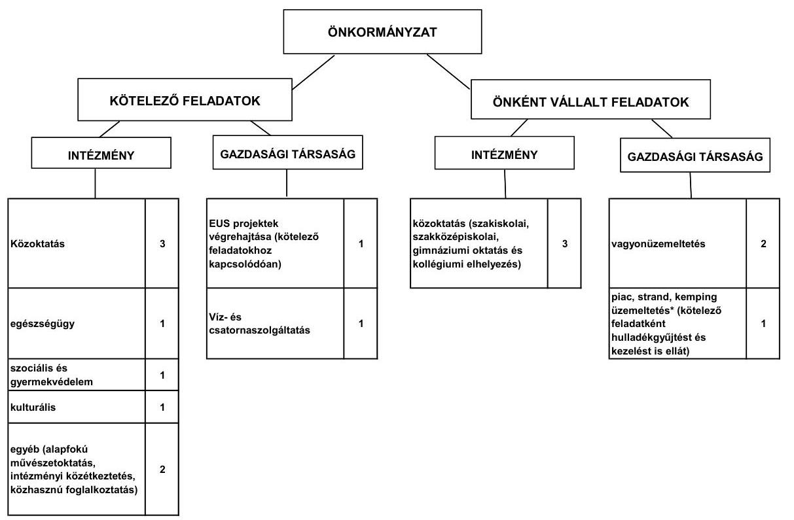

Az Önkormányzat működési kiadásokra 2010-ben 4557,4 millió Ft-ot fordított, amely 389,3 millió Ft-tal (9,3%-kal) haladta meg a 2007-2009. évi átlagos 4168,1 millió Ft-os ráfordításokat. A működési kiadások 60,1%-át (2739,0 millió Ft-ot) realizálták a 2010. évben intézményi körben, szemben a 2007-2009. évi átlagos 72,4%-kal (3016,4 millió Ft-tal).

Az egyes közszolgáltatások feladatellátásában résztvevő intézmények 2007. és 2010. évek közötti működési kiadásainak finanszírozási összetételét a következő ábra szemlélteti:
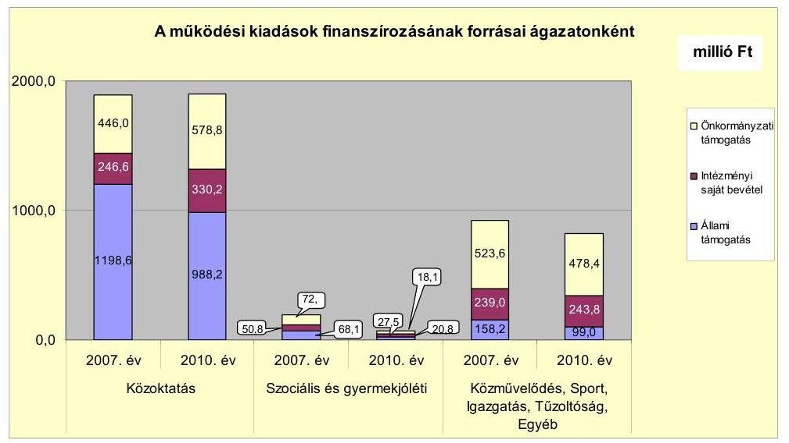

---

A közoktatási feladatokra fordított működési célú kiadások a 2007-2009. évi 1915,3 millió Ft átlaghoz viszonyítva a 2010. évre 54,0 millió Ft-tal (2,8%-kal) 1861,3 millió Ft-ra csökkentek a Petőfi Sándor Általános Iskola egyháznak történő átadása miatt. A működési kiadásokat finanszírozó forrásokon belül az állami támogatás összege a 2007-2009. évek átlagához viszonyítva 1175,7 millió Ft-ról 2010. évre 988,2 millió Ft-ra (15,9%-kal) csökkent, az általános iskola egyháznak történő átadása, illetve egy általános iskolai telephely egyháztól történő visszavétele miatt a tanulói létszám 262 fős csökkenése hatására. Az intézményi saját bevételek a 2007-2009. évi 293,7 millió Ft átlaghoz viszonyítva a 2010. évre 330,2 millió Ft-ra (12,4%-kal) nőttek, a működési célú EU-s és hazai pályázatok megvalósítására átvett pénzeszközök miatt. Az önkormányzati támogatás a 2007-2009. évi 494,6 millió Ft átlaghoz viszonyítva 2010. évre 17,0%-kal (578,8 millió Ft-ra) nőtt, az intézmények működőképességének megőrzésére biztosított többlettámogatások miatt.

A szociális és gyermekjóléti intézményi feladatok működési kiadása a 2007-2009. évi átlag 106,9 millió Ft-ról a 2010. évre 41,2 millió Ft-tal (38,5%-kal) 65,7 millió Ft-ra csökkent, a szociális intézmény Többcélú Kistérségi társulásnak történő átadása miatt. A működési kiadásokat finanszírozó forrásokon belül az állami támogatás a 2007-2009. évi átlag 38,5 millió Ft-ról a 2010. évre 17,7 millió Ft-tal (46,0%-kal) 20,8 millió Ft-ra csökkent, az intézményátadás következtében a szociális terület ellátotti létszámának 144 fős csökkenése miatt. Az intézményi saját bevétel a 2007-2009. évi átlag 36,8 millió Ft-nál a 2010. évben 9,3 millió Ft-tal (25,3%-kal) volt alacsonyabb. Az önkormányzati támogatás a 2007-2009. évi átlag 35,1 millió Ft-tal szemben a 2010. évben 18,1 millió Ft volt, 17,0 millió Ft-tal csökkent a szociális intézmény átadása miatt.

Az egyéb intézményi feladatok (közművelődési, igazgatási, alapfokú művészetoktatási, iskolai konyha) működési kiadásai a 2007. évi átlag 994,2 millió Ft-ról a 2010. évre 182,1 millió Ft-tal (18,3%-kal) 812,1 millió Ft-ra csökkentek a közművelődési intézmények és az igazgatási intézmények működési kiadásainak csökkenése miatt. A működési kiadásokat finanszírozó bevételeken belül az állami támogatás a 2007-2009. évi átlag 160,2 millió Ft-ról a 2010. évre 61,2 millió Ft-tal (38,2%-kal) 99,0 millió Ft-ra csökkent. Az intézményi saját bevételek összege a 2007-2009. évi átlag 259,5 millió Ft-tal szemben a 2010. évben 243,8 millió Ft volt. Az önkormányzati támogatás a 2007-2009. évi átlag 577,5 millió Ft-nál a 2010. évben 99,1 millió Ft-tal (17,2%-kal) volt kevesebb.

A vizsgált időszakban a kötelező és önként vállalt feladatok ellátását biztosító szervezeti keretekben, a feladatellátás módjában bekövetkezett változások javították az Önkormányzat pénzügyi egyensúlyi helyzetét, az intézményátadások - az Önkormányzat kimutatása szerint - összesen 209,5 millió Ft megtakarítást eredményeztek.

Az Önkormányzatnál a 2007-2010. években a folyó bevételek és a folyó kiadások folyamatosan növekedtek. A folyó bevételek a vizsgált időszakban fedezték a folyó kiadásokat, az Önkormányzat folyó költségvetési egyenlege, működési jövedelme pozitív összegű volt.

---

Az Önkormányzat folyó költségvetési egyenlege (működési jövedelem) 2007-2010 között működési forrástöbbletet mutatott.
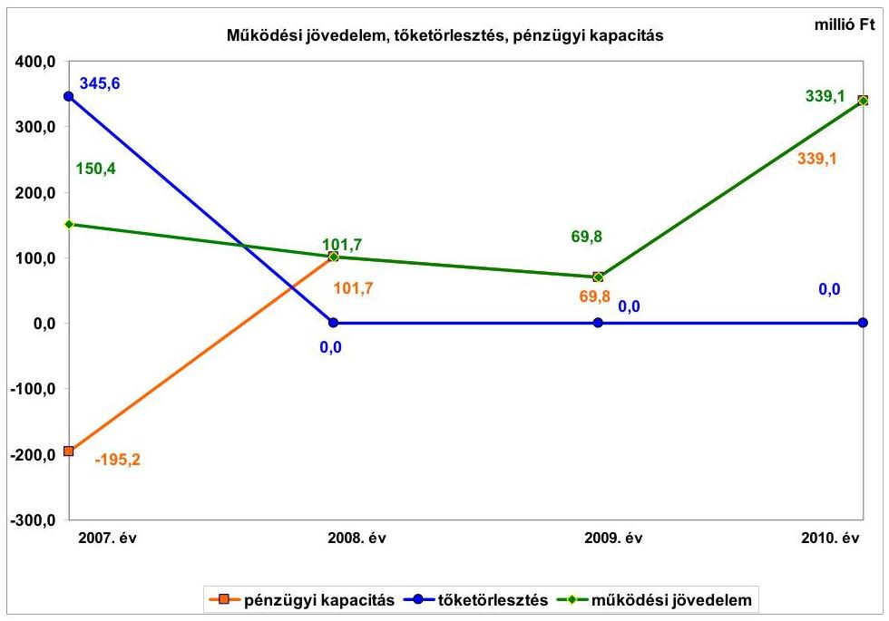

A 2007-2010. években a működési jövedelem 661,0 millió Ft többletet mutatott, amely forrásul szolgálhatott az Önkormányzat fennálló tőketörlesztési kötelezettségeinek teljesítéséhez, valamint fejlesztéseinek finanszírozásához. A 661,0 millió Ft működési jövedelemnek 52,3%-át (345,6 millió Ft-ot) tette ki a hitelekhez kapcsolódó tőketörlesztés, amelynek kifizetését követően 315,4 millió Ft nettó működési jövedelme keletkezett az Önkormányzatnak. Az Önkormányzat pénzügyi kapacitása a 2007. évben a 345,6 millió Ft-os tőketörlesztés miatt
 negatív értéket (-195,2 millió Ft-ot) mutatott, mivel a működési jövedelem ebben az évben nem fedezte a tőketörlesztési kötelezettséget, melyet a kötvénybevételből történő hitel visszafizetése okozott. A 2008-2010. években az Önkormányzatnak nem volt tőketörlesztési kötelezettsége, így a működési jövedelem ezekben az években megegyezett a nettó működési jövedelemmel, amely pozitív értéket mutatott, javítva az Önkormányzat pénzügyi egyensúlyi helyzetét.

Az Önkormányzat bevételei a vizsgált időszakban folyamatosan növekedtek. A folyó bevételeken belül a költségvetési támogatás és az átengedett szja bevételei együttesen a 2007-2009. évi átlag 2714,9 millió Ft-ról 2010. évre (93,9 millió Ft-tal) 2808,8 millió Ft-ra nőttek. Az egyéb saját bevételek a 2007-2010. években folyamatosan növekedtek, a 2007-2009. évi átlag 910,2 millió Ft-ról 2010. évre 1058,0 millió Ft-ra, amely döntően a támogatásértékű működési bevételek és a hozam- és kamatbevételek növekedéséből adódott. A helyi adóból és pótlékokból származó bevételek a 2007-2009. évi átlag 587,9 millió Ft-ról a 2010. évre 662,9 millió Ft-ra növekedtek. A felhalmozási bevételek a 2007-2010. években változóan alakultak. Ezen belül a 2009. évben az egyéb saját tőke bevételek az előző évhez viszonyítva több mint négyszeresére nőttek, döntően az Iparfejlesztési Kft. részére 2001-től folyamatosan évente nyújtott kölcsönök visszatérüléséből befolyt 145,6 millió Ft bevétel miatt. Az államháztartáson belülről kapott támogatások a 2009. évről 2010. évre 99,5 millió Ft-ról több mint ötszörösére, 583,1 millió Ft-ra nőttek az EU-s támogatással megvalósuló fejlesztések finanszírozására kapott támogatásértékű felhalmozási bevételek növekedése miatt.

A személyi juttatások és járulékok aránya a folyó kiadásokon belül és azok összege a más szervnek átadott feladatok és álláshelycsökkenések miatt, a 2007-2009. évi átlag 53,7%-ról (2356,7 millió Ft-ról) a 2010. évre 48,9%-ra (2344,3 millió Ft-ra) csökkentek. Az Önkormányzat dologi kiadásai a vizsgált időszakban folyamatosan nőttek, a 2007-2009. évi átlag 1422,0 millió Ft-ról 2010. évre 1729,0 millió Ft-ra.

A felhalmozási kiadások összes kiadásokon belüli aránya az előző évhez viszonyítva a 2008. évben csökkent, majd a 2009. és 2010. években nőtt, a beruházási és felújítási kiadások (áfával együtt) előző évhez viszonyított 2008. évi 638,0 millió Ft-os csökkenése, illetve a 2009. évi 475,3 millió Ft-os és a 2010. évi 367,1 millió Ft-os növekedése miatt.

A pénzügyi egyensúlyi helyzet alakulását jelentősen befolyásolta az Önkormányzat elmúlt időszaki fejlesztési tevékenysége. A 2007-2010. év közötti időszakban a felhalmozási költségvetés egyenlege folyamatosan negatív összegű volt. A 2007-2010. évek közötti időszakban jelentkező összes -2065,1 millió Ft felhalmozási forráshiányra az 522,2 millió Ft 2007. január 1-jei nyitó pénzkészletből 486,5 millió Ft, valamint a 2007. évben felvett 42,3 millió Ft fejlesztési hitel, 1309,3 millió Ft kötvénykibocsátásból származó bevétel, 616,6 millió Ft kötvénybefektetésből származó bevétel nyújtott fedezetet. A 2007-2010. években megvalósított 2010. december 31-ig befejezett 4980,1 millió Ft összegű fejlesztéseket 1968,0 millió Ft saját bevételből, 322,7 millió Ft hitelből, 589,2 millió Ft kötvényből származó bevételből, 243,6 millió Ft EU-s támogatásból és 1856,6 millió Ft hazai támogatásból valósították meg. A 2007-2010. évek időszakában 4980,1 millió Ft értékű fejlesztés forrása a saját erő és a hazai- és EU-s támogatások mellett 322,7 millió Ft hitelfelvétel (6,5%) és 589,2 millió Ft kötvénykibocsátásból származó bevétel volt. A 2010. december 31-én folyamatban lévő fejlesztési feladatok végrehajtására 2007-2010. között 722,3 millió Ft kiadást teljesítettek, amelyre hitelt nem vettek igénybe. Az EU-s támogatásból megvalósult fejlesztések finanszírozása likviditási gondot okozott, a fejlesztések előfinanszírozásához folyószámlahitelt vettek igénybe. A Képviselő-testületnek előterjesztett éves költségvetési rendeletekben nem mutatták be a beruházásokkal létrehozott létesítmények működtetése és fenntarthatósága érdekében várhatóan felmerülő költségvetési kiadásokat.

Az Önkormányzat 2010. december 31-én folyamatban lévő fejlesztési feladatai 2010. évet követő kötelezettségvállalásainak összege 4846,6 millió Ft volt, amelyből 869,3 millió Ft-ot kötvényből származó bevételből, 3803,1 millió Ft-ot EU-s támogatásból és 174,2 millió Ft-ot hazai támogatásból terveznek biztosítani. Saját forrással és hitelfelvétellel a fejlesztések megvalósításához nem számoltak.

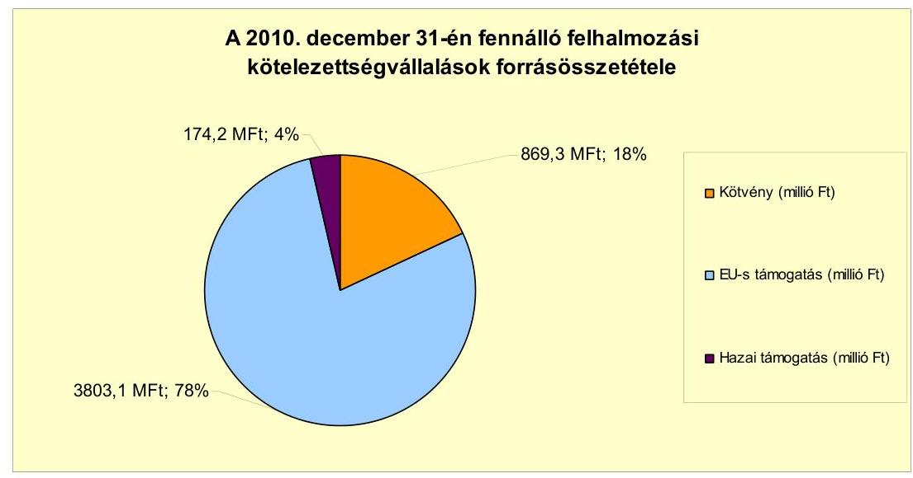

Az Önkormányzatnak beadott, elbírálás alatt lévő pályázata nem volt.
Az Önkormányzat mérleg szerinti pénzintézeti kötelezettsége a 2006. év végéről a 2011. év I. félév végére 303,3 millió Ft-ról 3908,6 millió Ft-ra nőtt, amelyből az árfolyamváltozás miatti különbözet 1051,3 millió Ft volt. A 2011. június 30-án fennálló pénzintézeti kötelezettségek egy kötvénykibocsátásból (3529,4 millió Ft), valamint kettő likviditási hitel (379,2 millió Ft) igénybevételéből keletkeztek.

Az Önkormányzat pénzintézeti kötelezettségvállalásaira képviselő-testületi döntés alapján került sor. A kötvénykibocsátásról szóló előterjesztés tartalmazta a kamat- és árfolyamkockázatot, azonban a likviditási hitelek esetében a kamatkockázat bemutatása nem történt meg. Az Önkormányzat az Ötv. előírása ellenére a vizsgált időszakon belül az egyes adósságot keletkeztető kötelezettségvállalások időpontjában a hitelképességi megfelelést nem vizsgálta, azonban az adósságot keletkeztető kötelezettségvállalások felső határát nem lépte túl.

Az Önkormányzat a 2007., a 2008. és a 2009. évi költségvetési rendeletében az Ámr. $_1$-ben foglaltak ellenére a működési és a felhalmozási célú bevételi és kiadási előirányzatokat nem mutatta be egymástól elkülönítetten, de a finanszírozási műveleteket is figyelembe véve, mérlegszerűen, egyensúlyban. Az Önkormányzat a 2010. és a 2011. évi költségvetési rendeleteiben az Áht. $_1$-ban, valamint az Ámr. $_2$-ben foglaltak ellenére nem részletezte a költségvetési hiány belső és külső finanszírozási módjának működési és felhalmozási cél szerinti tagolását. A 2007-2011. évi költségvetési rendeletekben a költségvetés megállapításakor az Áht. $_1$-ban foglaltak ellenére a költségvetési hiány finanszírozása módjának meghatározásakor nem rendelkeztek a kimutatott hiány teljes összegének finanszírozásáról, azt a „költségvetési bevételektől” tették függővé, amelyet azonban nem számszerűsítettek.

Az Önkormányzat a 2007. november 30-án történt 15850 ezer CHF (2478,1 millió Ft) összegű kötvénykibocsátásból származó forrásból 1309,3 millió Ft-ot - a kibocsátási céloknak megfelelően - a Képviselő-testület által jóváhagyott, a költségvetésbe betervezett beruházásokhoz, valamint a 2005-2007. években felvett fejlesztési hitelek kiváltására használt fel. A kötvénykibocsátásból származó forrás 1168,8 millió Ft összegű maradványát az Önkormányzat a kötvénykibocsátási céloknak megfelelően, fejlesztésekre használhatja fel. Az Önkormányzat a CHF-ben fennálló kötvénykibocsátásból származó pénzintézeti kötelezettségeiből 2011. június 30-áig tőkét nem törlesztett, azonban 1015,1 ezer CHF (183,4 millió Ft) kamatot fizetett. A tőketörlesztés kezdő időpontja 2011. szeptember 30. volt, amikor az Önkormányzat 397,0 ezer CHF-et fizetett meg a pénzintézet részére. Az Önkormányzat a 2007. évben kettő hosszú lejáratú, fejlesztési célú hitelét fizette vissza 303,3 millió Ft összegben. A 2007-2011. június 30-a között átmenetileg szabad pénzeszközeiből 586,1 millió Ft kamatbevételt realizált, a 2007. évben 49,2 millió Ft-ot, a 2008. évben 205,7 millió Ft-ot, a 2009. évben 196,8 millió Ft-ot, a 2010. évben 112,9 millió Ft-ot, a 2011. év I. félévében 21,5 millió Ft-ot. Az Önkormányzat 2009. január 1-jétől számlavezető bankot váltott. A számlavezető pénzintézetváltást követően a folyószámlahitel kondíciói kedvezően változtak (a kamatfelár 0,7 százalékponttal csökkent).

Az Önkormányzat költségvetésének pénzügyi egyensúlyát a vizsgált időszakban folyószámlahitel, munkabér-megelőlegezési hitel igénybevételével tudta biztosítani. Az Önkormányzat folyószámlahitelt a 2007. évben 9 napon, a 2008. évben 219 napon, a 2009. évben 323 napon, a 2010. évben 365 napon, a 2011. év I. félévében 181 napon vett igénybe. Az igénybe vett folyószámlahitel átlagos napi állománya a 2007. évben 3,4 millió Ft, a 2008. évben 58,6 millió Ft, a 2009. évben 160,1 millió Ft, a 2010. évben 214,8 millió Ft, a 2011. év I. félévében 231,3 millió Ft volt. Munkabér-megelőlegezési hitelt az Önkormányzat a 2009. évben 3 napon, a 2010. évben 207 napon, a 2011. év I. félévében 181 napon vett igénybe. Az igénybe vett munkabér-megelőlegezési hitel átlagos napi állománya a 2009. évben 0,6 millió Ft, a 2010. évben 48,9 millió Ft, a 2011. év I. félévében 111,2 millió Ft volt. Annak ellenére, hogy az Önkormányzat élt az EU-s pályázatoknál az előlegből történő, illetve a közvetlen szállítói finanszírozás lehetőségével, a folyószámlahitel évről évre történő emelkedését az EU-s és hazai támogatásból megvalósuló, folyamatosan növekvő, beruházási, valamint az egyéb pályázati kiadások előfinanszírozása okozta.

A folyószámla- és munkabér-megelőlegezési hitel igénybevétele a 2007-2011. év I. félév közötti időszakban az alábbiak szerint alakult:

| Megnevezés | 2007. év | 2008. év | 2009. év | 2010. év | 2011. év I.   félév |
| :--: | :--: | :--: | :--: | :--: | :--: |
| Folyószámlahitel |  |  |  |  |  |
| Keretösszeg január 1-jén (millió Ft-ban) | - | 200,0 | 200,0 | 200,0 | 200,0 |
| Állagos napi állomány (millió Ft-ban) | 3,4 | 58,6 | 160,1 | 214,8 | 231,3 |
| Folyószámla hitellet zárt napok száma (nap) | 9 | 219 | 323 | 365 | 181 |
| Egyenleg (állomány) | - | - | - | 297,2 | 267,2 |
| Munkabér-megelőlegezési hitel |  |  |  |  |  |
| Keretösszeg január 1-jén (millió Ft-ban) | - | - | 112,8 | 112,8 | 112,8 |
| Állagos napi állomány (millió Ft-ban) | - | - | 9,8 | 48,7 | 111,2 |
| Munkabér-megelőlegezési hitellet zárt napok száma (nap) | - | - | 3,0 | 207,0 | 181,0 |
| Egyenleg (állomány) | - | - | - | 100,0 | 112,0 |

A likviditás biztosítása (folyószámlahitel és munkabér-megelőlegezési hitel igénybevétele) az Önkormányzatnak 44,8 millió Ft kamatkiadást, és 1,2 millió Ft egyéb költség fizetésének kötelezettségét okozta. Az Önkormányzat 2011. év I. félév végi szállítói tartozása 656,9 millió Ft, melyből a lejárt tartozás 42,4 millió Ft volt. Átütemezett szállítói tartozása az Önkormányzatnak nem volt. Az Önkormányzat gazdasági társaságai részére készfizető kezességet nem vállalt, egy kizárólagos tulajdonában álló gazdasági társasága részére több alkalommal, összesen 14,5 millió Ft tagi kölcsönt nyújtott. Az Önkormányzat a kölcsön nyújtásáról az éves költségvetési rendeletekben döntött. A jegyző által adott nyilatkozat szerint a szerződések nem voltak fellelhetőek az Önkormányzatnál. Így az Áht. $_1$ és az Ámr. $_2$ előírása ellenére szerződés nélkül nyújtott kölcsönök - azok visszafizetéséig - pénzügyi kockázatot jelentettek az Önkormányzat részére.

Az Önkormányzat kötelezettségeinek 2010. december 31-i, valamint 2011. június 30-i állományát és várható alakulását a kötelezettségek lejáratáig a következő táblázat szemlélteti:

| Megnevezés | Állomány 2010. december 31   én |  |  | Állomány 2011. június 30-án |  |  | Várható kötelezettség   2011-2013. években |  | Várható kötelezettség   2014. évtől |  |
| :--: | :--: | :--: | :--: | :--: | :--: | :--: | :--: | :--: | :--: | :--: |
|  | HUF-ban   (millió Ft-   ban) | Devizában   (összege   ezer CHF-ban) |  | HUF-ban   (millió Ft-   ban) | Devizában   (összege   ezer CHF-ban) |  | HUF-ban   (millió Ft-   ban) | Devizában   (összege   ezer CHF-ban) | HUF-ban   (millió Ft-   ban) | Devizában   (összege   ezer CHF-ban) |

   ben) | Deviza   nem | HUF-ban   (millió Ft-   ban) | Devizában   (összege   ezer CHF-   ben) | Deviza   nem | HUF-ban   (millió Ft-ban) | Devizában   (összege ezer   CHF-ben) | HUF-ban   (millió Ft-ban) | Devizában   (összege ezer   CHF-ben) |
| Pénzintézeti kötelezettségek |  |  |  |  |  |  |  |  |  |  |
| "Törökszentmiklós Jövőjéért" kötvény | 0,0 | 15850,0 | CHF | 0,0 | 15850,0 | CHF | 0,0 | 2315,7 | 0,0 | 14771,8 |
| Folyószámlatöbblet | 297,2 | 0,0 |  | 267,2 | 0,0 |  | 267,2 | 0,0 | 0,0 | 0,0 |
| Alunkalan megegyeztetési hitel | 100,0 | 0,0 |  | 112,0 | 0,0 |  | 112,0 | 0,0 | 0,0 | 0,0 |
| Pénzintézeti kötelezettségek összesen HUF-ban | 397,2 |  |  | 379,2 |  |  | 379,2 |  | 0,0 |  |
| Pénzintézeti kötelezettségek összesen CHF-ben |  | 15850,0 |  |  | 15850,0 |  |  | 2315,7 |  | 14771,8 |
| Pénzintézeti kötelezettségek összesen EURO-ben | 0,0 | 0,0 |  | 0,0 | 0,0 |  | 0,0 | 0,0 | 0,0 | 0,0 |
| Biztosíték |  |  |  |  |  |  |  |  |  |  |
| Kezesség | 0,0 | 0,0 |  | 0,0 | 0,0 |  | 0,0 | 0,0 | 0,0 | 0,0 |
| Garancia | 0,0 | 0,0 |  | 0,0 | 0,0 |  | 0,0 | 0,0 | 0,0 | 0,0 |
| Biztosíték összesen: | 0,0 | 0,0 |  | 0,0 | 0,0 |  | 0,0 | 0,0 | 0,0 | 0,0 |
| Lízing kötelezettségek | 0,0 | 7,6 | CHF | 0,0 | 0,0 | CHF | 0,0 | 7,6 | 0,0 | 0,0 |
| Szállító tartozás | 175,7 | 0,0 |  | 656,9 | 0,0 |  | 656,9 | 0,0 | 0,0 | 0,0 |
| Egyéb kiadás elmaradás | 0,0 | 0,0 |  | 0,0 | 0,0 |  | 0,0 | 0,0 | 0,0 | 0,0 |
| Egyéb kötelezettségek | 0,0 | 0,0 |  | 0,0 | 0,0 |  | 0,0 | 0,0 | 0,0 | 0,0 |
| Jogerős végzéssel lezárt de ki nem fizetett kötelezettségek | 0,0 | 0,0 |  | 0,0 | 0,0 |  | 0,0 | 0,0 | 0,0 | 0,0 |

Az Önkormányzatnak pénzintézetekkel szemben fennálló kötelezettsége a 2011. év I. félév végén 379,2 millió Ft és 15850,0 ezer CHF volt. Ezek várható fizetési kötelezettsége (tőke, kamat és egyéb költség) a legutóbbi kamatfizetés feltételei alapján a 2011-2013. években 379,2 millió Ft és 2315,7 ezer CHF. Az Önkormányzatnak a 2011-2013. évekre lízingkötelezettség miatt 7,8 ezer CHF, szállítói tartozások címén 656,9 millió Ft kötelezettsége keletkezett. A lejárt szállítói kötelezettség 2011. június 30-án 42,4 millió Ft volt, amelyből a 91 és 365 nap közötti lejárt tartozás 5,0 millió Ft-ot tett ki. Az Önkormányzatnál a 90 napot meghaladó, szállítók felé fennálló kötelezettségek miatt a helyi önkormányzatok adósságrendezési eljárásáról szóló 1996. évi XXV. törvény 5. § (2) bekezdésében foglaltak szerinti adósságrendezési eljárást a polgármester nem kezdeményezett, mivel az Önkormányzat nyilatkozata szerint a szállítói tartozás vitatott volt. A 2011-2013. évek kötelezettségeinek teljesítésére figyelembe vehető 1258,9 millió Ft pénzmaradvány, 345,6 millió Ft mérlegben kimutatott követelésállomány és a forgalomképes nettó ingatlanvagyon. Az Önkormányzat 2014. évet követően jelenleg ismert pénzintézeti kötelezettsége 14771,8 ezer CHF. Az Önkormányzat a kötvénykibocsátásból származó fizetési kötelezettséget a kötvénytartozás helyzetéről szóló képviselő-testületi előterjesztés szerint az évenként várható felhal-

mozási bevételekből tervezi finanszírozni, amelyet azonban nem számszerűsített a futamidő végéig. A jelenlegihez képest változatlan működési jövedelemtermelő képességet feltételezve a várható fizetési kötelezettségek fedezetét a működési jövedelem biztosítja.

Az önkormányzati kötelezettségek növekedése mellett az Önkormányzat minősített többségi befolyásával rendelkező gazdasági társaságok kötelezettségei is befolyásolhatják az Önkormányzat pénzügyi egyensúlyát. A gazdasági társaságoknak a 2011. évtől 30,1 millió Ft szállítói tartozást kell rendezniük.

Az Önkormányzat jövőbeni pénzügyi egyensúlyi helyzetét befolyásolhatja az elavult eszközök pótlási kötelezettsége. A 2007-2010. évek között felújításokra, az eszközök pótlására a kimutatott értékcsökkenés 68,3%-ának megfelelő összeget, 1284,9 millió Ft-ot fordított az Önkormányzat. A vizsgált időszakban nem történt meg annak felmérése, hogy az eszközök elhasználódásának pótlása mekkora forrásokat igényel az Önkormányzattól.

Az Önkormányzat költségvetési támogatásból, átengedett bevételekből származó bevételei a 2007. évhez képest az időszak egészét tekintve összességében nem csökkentek. Ennek ellenére, a növekvő fejlesztési feladatok fedezetének megteremtése, valamint a pénzintézeti kötelezettségek teljesítése érdekében az Önkormányzat kiadási megtakarítást eredményező és bevételt növelő intézkedéseket hozott. A 2007-2011. év I. féléve között tett intézkedések hatására 540,2 millió Ft bevételi többletet, továbbá intézményátadásokkal összefüggő létszámcsökkentés és dologi kiadás csökkenés hatásaként - figyelembe véve az intézményátadások 238,3 millió Ft-os megtakarítása és az általános iskolai feladatok további ellátásához az egyháznak történő 28,8 millió Ft pénzeszközátadás eredőjeként - 209,5 millió Ft kiadási megtakarítást mutattak ki, ezáltal az Önkormányzat pénzügyi egyensúlyi helyzetét javították. Az elért kiadási megtakarítás teljes egészében kötelező feladat átadásához kapcsolódó döntés eredménye volt. A kiadási megtakarítások 48,8%-a az elrendelt álláshelycsökkentések eredménye. Az álláshely-csökkentő intézkedések 2007-2011. év I. féléve között önkormányzati szinten összesen 154 álláshely megszüntetését jelentették, üres álláshely zárolására nem került sor. Ugyanakkor a közoktatás, a Polgármesteri hivatalon belül ellátott és egyéb feladatok bővülésével összefüggésben álláshely- és egyben létszámnövekedés is történt. Ennek következtében az időszak álláshelyeinek száma 129 fővel csökkent. A bevételnövelő intézkedések a helyi adókkal összefüggő kedvezmények, mentességek csökkentéséhez, valamint lejárt tartozások behajtásához kapcsolódtak.

Az utóellenőrzés a pénzügyi egyensúly javítására tett egy szabályszerűségi és egy célszerűségi javaslat hasznosítására terjedt ki. A célszerűségi javaslatot hasznosították, a polgármester tájékoztatta a Képviselő-testületet a számvevőszéki ellenőrzés tapasztalatairól, a feltárt hibák kijavítására intézkedési tervet készítettek. A szabályszerűségi javaslatot nem hasznosították, a 2009-2011. évi költségvetési rendeletekben az Áht. ${ }_{1}$ előírása ellenére finanszírozási célú pénzügyi műveleteket számoltak el költségvetési hiányt, illetve költségvetési többletet módosító költségvetési bevételként, illetve költségvetési kiadásként.

Az Önkormányzat pénzügyi egyensúlyi helyzetét összegezve a következők emelhetők ki:

Törökszentmiklós Város Önkormányzatának pénzügyi egyensúlya rövid távon biztosított. A pénzügyi egyensúly középtávú helyreállítására és hosszú távú megőrzésére az Önkormányzatnak fel kell készülnie.

Az Önkormányzat működési jövedelme a vizsgált időszakban pozitív volt. A folyó bevételek a 2008-2010. években fedezetet nyújtottak a folyó kiadásokra és az adósságszolgálatra.

Az önként vállalt feladatok aránya alapvetően nem befolyásolta az Önkormányzat pénzügyi egyensúlyát.

Az EU-s és hazai támogatásból megvalósuló beruházási, valamint az egyéb pályázatok előfinanszírozására folyószámlahitelt vettek igénybe, amely pénzügyi kockázatot jelenthet.

A folyamatban lévő fejlesztési projektekhez szükséges források rendelkezésre állnak.

A beruházásokkal létrehozott létesítmények működtetése és fenntarthatósága érdekében várhatóan felmerülő költségvetési kiadásokat nem számszerűsítették, amely a létesítmények jövőbeni üzemeltetésének kockázatát jelenti.

A hosszú távú kötelezettségek forrása 2014. utáni időszakra nem számszerűsített. A folyószámlahitel és a munkabérhitel igénybevétele a 2009. évtől állandósult és növekvő tendenciát mutat.

Az Önkormányzat egyik kizárólagos tulajdonában álló gazdasági társaságnak szerződés nélkül nyújtott kölcsönök a visszafizetésig pénzügyi kockázatot jelentenek.

Az Állami Számvevőszékről szóló 2011. évi LXVI. törvény 33. § (1) bekezdésében foglaltak értelmében a jelentésben foglalt megállapításokhoz kapcsolódó intézkedési tervet köteles az ellenőrzött szervezet vezetője összeállítani és azt a jelentés kézhezvételétől számított harminc napon belül az ÁSZ részére megküldeni. Amennyiben az intézkedési tervet határidőben nem küldi meg a szervezet, vagy az továbbra sem elfogadható, az ÁSZ elnöke a hivatkozott törvény 33. § (3) bekezdés a)-b) pontjaiban foglaltakat érvényesítheti.

# A 2011. június 30-i pénzügyi egyensúlyi helyzet alapján az ellenőrzés intézkedést igénylő megállapításai és javaslatai a következők: 

## a Polgármesternek

1. Az Önkormányzat pénzügyi egyensúlyi helyzete középtávon veszélyeztetett, mivel a folyószámlahitel és a munkabérhitel igénybevétele a 2009. évtől állandósult és növekvő tendenciát mutat. A hosszú távú kötelezettségek forrása 2014. utáni időszakra nem számszerűsített. Továbbá a beruházásokkal létrehozott létesítmények működtetése, annak költségvetési kiadásai számszerűsítése hiányában, a jövőben kockázatot jelenthet.

Javaslat:
Az Önkormányzat pénzügyi egyensúlyának középtávon ható helyreállítása és hosszú távú fenntarthatósága érdekében kezdeményezze - felelősök és határidők megjelölésével - az alábbi intézkedések megtételét:
a) tárja fel a bevételszerző és kiadáscsökkentő lehetőségeket. Ütemezze a bevételek beszedését a jövőben keletkező fizetési kötelezettségeihez;
b) vizsgálja meg az állandósult folyószámla- és likvidhitel hosszú távú kötelezettséggé történő átalakításának jogi lehetőségét, és a Stabilitási törvény 10. §-ában előírt feltételek fennállása esetén kezdeményezze a Kormánynál ennek engedélyezését;
c) képezzen egyensúlyi (elkülönített) tartalékot az adósságszolgálat teljesítése érdekében;
d) mutassa be a Képviselő-testületnek legalább három évre kiterjedően a kötelezettségek teljes körére szóló finanszírozási tervet, a források számszerűsített megjelölésével.
2. A Képviselő-testületnek előterjesztett éves költségvetési rendeletekben nem mutatták be a beruházásokkal létrehozott létesítmények működtetése és fenntarthatósága érdekében várhatóan felmerülő költségvetési kiadásokat.

Javaslat:
Vizsgálja felül teljes körűen a folyamatban lévő és tervezett beruházásokat és mutassa be a Képviselő-testületnek a megvalósuló létesítmények fenntarthatóságának pénzügyi hatásait. Az Önkormányzat pénzügyi egyensúlyi helyzete szempontjából kedvező támogatás-finanszírozási lehetőségeket vegye igénybe.
3. Az Önkormányzat a kötvénytartozásból származó fizetési kötelezettséget a kötvény helyzetéről szóló Képviselő-testületi előterjesztés szerint az évenként várható felhalmozási bevételekből tervezi finanszírozni, amelyet azonban nem számszerűsített a futamidő végéig.

Javaslat:
Gondoskodjon, hogy a jövőben az adósságot keletkeztető kötelezettségvállalásokról szóló Képviselő-testületi előterjesztések tételesen tartalmazzák a visszafizetés forrásait.
4. Az Önkormányzat lejárt szállítói tartozása 2011. június 30-án 42,4 millió Ft volt.

Javaslat:
Intézkedjen az Önkormányzat lejárt szállítói tartozásállományának pénzügyi rendezéséről, a szállítói kitettség és a jogszabályi következmények elkerülése érdekében.

5. Az Önkormányzat a vizsgált időszakban az Áht. 1 100/C. § (3) bekezdése és az Ámr. 72. § (3) bekezdése ellenére szerződés megkötése nélkül nyújtott tagi kölcsönt egy gazdasági társaságnak.

Javaslat:
Intézkedjen, hogy a jövőben a tagi kölcsön nyújtására minden esetben az Áht. 2 37. § (1) bekezdése és az Ávr. 53. § (1) bekezdése előírása szerint írásban vállaljon kötelezettséget, kölcsön nyújtására szerződés alapján kerüljön sor.
6. A 2007-2010. évek között felújításokra, az eszközök pótlására a kimutatott értékcsökkenés 68,3%-ának megfelelő összeget, 1284,0 millió Ft-ot fordított az Önkormányzat. A vizsgált időszakban nem történt meg annak felmérése, hogy az eszközök elhasználódásának pótlása mekkora forrásokat igényel az Önkormányzattól.

Javaslat:
Mutassa be a Képviselő-testületnek évente a zárszámadási rendelet előterjesztésében az értékcsökkenés összegét, és ezzel összevetve az elhasználódott eszközök pótlására fordított tényleges kiadásokat, az
 eszközök elhasználódási fokának alakulását.

# a jegyzőnek 

1. Az Önkormányzat a 2010. és a 2011. évi költségvetési rendeleteiben az Áht. 69.§ (1) bekezdés c) és d) pontjaiban, valamint az Ámr. 236. § (1) bekezdés ed) és ee) pontjaiban foglaltak ellenére nem részletezte a költségvetési hiány belső és külső finanszírozási módjának működési és felhalmozási cél szerinti tagolását. A 2007-2011. évi költségvetési rendeletekben a költségvetés megállapításakor az Áht. 18/A. § (1) bekezdésében foglaltak ellenére a költségvetési hiány finanszírozása módjának meghatározásakor nem rendelkeztek a kimutatott hiány teljes összegének finanszírozásáról, azt a „költségvetési bevételektől" tették függővé, amelyet nem számszerűsítettek. A 2009-2011. évi költségvetési rendeletekben az Áht. 18/A. § (7) bekezdése ellenére finanszírozási célú műveleteket számoltak el költségvetési többletet, illetve költségvetési hiányt módosító bevételként és kiadásként.

Javaslat:
Intézkedjen, hogy a jövőben a költségvetési rendeletekben az Áht. 25. § (3) és a 23. § (2) bekezdéseiben foglaltaknak megfelelően a költségvetési hiány finanszírozásának módjának meghatározásakor rendelkezzenek a kimutatott hiány teljes összegének finanszírozásáról, az Áht. 223. § (2) bekezdés c)-e) pontjainak megfelelően mutassák be a költségvetési egyenleg összegét, részletezzék a költségvetési hiány belső és külső finanszírozási módjának működési és felhalmozási cél szerinti tagolását. Biztosítsa az Áht. 272. § a) pontja alapján, hogy a költségvetési bevételek és költségvetési kiadásokon kívül határozzák meg a finanszírozási célú bevételeket és kiadásokat.

---

# II. RÉSZLETES MEGÁLLAPÍTÁSOK 

## 1. Az ÖNKORMÁNYZAT KÖTELEZŐ ÉS ÖNKÉNT VÁLLALT FELADATAI, A FELADATELLÁTÁS SZERVEZETI KERETEI ÉS ANNAK VÁLTOZÁSAI

Az Önkormányzat a kötelező és az önként vállalt feladatait az $\mathrm{SzMSz}_{1,2}$-ben részletezte. Önként vállalt feladatként határozták meg az időskorúak elhelyezéssel történő szociális, a bölcsődei, a járó beteg szakorvosi ellátást, az időszakos gyermekfelügyeletet, a zene-, a tánc- és képzőművészeti oktatást, a középfokú nevelés-oktatást, az ifjúságvédelmet, a kollégiumi nevelést és ellátást, a múzeumi tevékenységet. Önként vállalt feladatként részletezték továbbá a roma etnikai kisebbséghez tartozó tanulók felzárkóztatását, a fogyatékos tanulók általános műveltséget megalapozó és integrált oktatását, emelt szintű idegen nyelv és szakiskolai, szakmai középiskolai oktatást, felnőttképzést, ifjúsági és turisztikai szállás biztosítását, a civil szervezetek támogatását, a vásár- és piac, mezőőri szolgálat fenntartását, strand, termál-, gyógyfürdő üzemeltetését.

Az Önkormányzat - adatszolgáltatása szerint - 2010. évi működési költségvetési kiadásainak ${ }^{7}$ 67,9%-át, 3094,5 millió Ft-ot a kötelező, 32,1%-át, 1462,9 millió Ft-ot önként vállalt feladatok ellátására fordította ${ }^{8}$.

Az Önkormányzat - adatszolgáltatása szerint - a 2007-2010. években működési kiadásainak évente folyamatosan növekvő arányát fordította a kötelező és évente folyamatosan csökkenő arányát fordította az önként vállalt feladatok ellátására.

Az Önkormányzat kötelező és az önként vállalt feladatokra fordított működési kiadásai a 2007-2010. években folyamatosan növekedtek. Az Önkormányzat által kimutatott - az intézményátadások által okozott működési kiadás csökkenés ellenére - működési kiadások 2010-re a 2007-2009. évek átlagához viszonyítva 9,3%-kal 4168,1 millió Ft-ról 4557,4 millió Ft-ra nőttek. A működési kiadások növekedését a Polgármesteri hivatalban az igazgatási feladatokon kívül ellátott egyéb feladatok (szociális ellátások, közfoglalkoztatás, EU-s pályázatok) működési kiadásainak 2010-re, a 2007-2009. évi átlaghoz viszonyított 57,9%-os (666,6 millió Ft) növekedése okozta. A működési kiadások növekedése az Önkormányzat pénzügyi helyzetére nem volt releváns hatással, mivel a folyó bevételek a 2007-2010. években fedezték a folyó kiadásokat.

[^0]
[^0]:    ${ }^{7}$ A működési célú kiadások nem tartalmazzák az egészségügyi ellátást biztosító OEP finanszírozású intézmény, valamint a cigány és ruszin kisebbségi önkormányzatok működési célú kiadásait.
    ${ }^{8}$ Az önként vállalt feladatok kiadási részarányának megállapítása az Önkormányzat adatszolgáltatásán alapul.

---

Az Önkormányzat 2010. évi működési célú kiadásait és bevételeit, valamint azok finanszírozási arányait szemlélteti a következő táblázat főbb feladatonként:

| Ellátott feladat | Működési   kiadás   összesen   (millió Ft) | Kötelező   feladatok   kiadásainak   részaránya   \% | Működési   bevétel   összesen   (millió Ft) | Állami   támogatás   részaránya   \% | Intézményi   saját bevétel   részaránya   \% | Önkormányzati   támogatás   részaránya   \% |
| :--: | :--: | :--: | :--: | :--: | :--: | :--: |
| Övodák | 330,8 | 90,0 | 338,2 | 51,3 | 8,8 | 39,9 |
| Általános iskolák | 662,0 | 90,0 | 670,6 | 48,5 | 12,1 | 39,4 |
| Gimnáziumok | 199,7 | 0,0 | 203,5 | 53,5 | 28,8 | 17,7 |
| Szakközépiskolák,   szakképző intéz-   mények | 568,5 | 0,0 | 584,5 | 49,7 | 26,8 | 23,5 |
| Kollégiumok | 100,3 | 0,0 | 100,3 | 89,4 | 4,1 | 6,5 |
| Gyermekjóléti   intézmények | 65,8 | 80,0 | 66,4 | 31,3 | 41,4 | 27,3 |
| Közművelődési   intézmények | 111,0 | 90,0 | 112,9 | 0,0 | 19,4 | 80,6 |
| Egyéb intézmények | 290,5 | 0,0 | 297,9 | 12,3 | 62,3 | 25,4 |
| Polgármesteri hivatal   igazgatási kiadásai | 410,5 | 100,0 | 410,5 | 15,2 | 8,8 | 76,0 |
| hivatalban ellátott   egyéb feladatok | 1818,3 | 90,0 | 1366,1 | 10,0 | 90,0 | 0,0 |
| Működési kiadá-   sok összesen | 4557,4 | 67,9 | 4150,9 | 30,5 | 51,1 | 18,4 |

A közoktatási feladatokra fordított működési célú kiadások a 2007-2009. évi 1915,3 millió Ft átlaghoz viszonyítva a 2010. évre 54,0 millió Ft-tal (2,8%-kal) 1861,3 millió Ft-ra csökkentek a Petőfi Sándor Általános Iskola egyháznak történő átadása miatt. A működési kiadásokat finanszírozó forrásokon belül az állami támogatás összege a 2007-2009. évek átlagához viszonyítva 1175,7 millió Ft-ról 2010. évre 988,2 millió Ft-ra (15,9%-kal) csökkent, az általános iskola egyháznak történő átadása, illetve egy általános iskolai telephely egyháztól történő visszavétele miatt a tanulói létszám 262 fős csökkenése hatására. Az intézményi saját bevételek a 2007-2009. évi 293,7 millió Ft átlaghoz viszonyítva a 2010. évre 330,2 millió Ft-ra (12,4%-kal) nőttek, a működési célú EU-s és hazai pályázatok megvalósítására átvett pénzeszközök miatt. Az önkormányzati támogatás a 2007-2009. évi 494,6 millió Ft átlaghoz viszonyítva 2010. évre 17,0%-kal (578,8 millió Ft-ra) nőtt, az intézmények működőképességének megőrzésére biztosított többlettámogatások miatt.

A szociális és gyermekjóléti intézményi feladatok működési kiadása a 2007-2009. évi átlag 106,9 millió Ft-ról a 2010. évre 41,2 millió Ft-tal (38,5%-kal) 65,7 millió Ft-ra csökkent, a szociális intézmény Többcélú Kistérségi társulásnak történő átadása miatt. A működési kiadásokat finanszírozó forrásokon belül az állami támogatás a 2007-2009. évi átlag 38,5 millió Ft-ról a 2010. évre 17,7 millió Ft-tal (46,0%-kal) 20,8 millió Ft-ra csökkent, az intézményátadás következtében a szociális terület ellátotti létszámának 144 fős csökkenése miatt. Az intézményi saját bevétel a 2007-2009. évi átlag 36,8 millió Ft-nál a 2010. évben 9,3 millió Ft-tal (25,3%-kal) volt alacsonyabb. Az önkormányzati támogatás a 2007-2009. évi átlag 35,1 millió Ft-tal szemben a 2010. évben

---

18,1 millió Ft volt, 17,0 millió Ft-tal csökkent a szociális intézmény átadása miatt.

Az egyéb intézményi feladatok (közművelődési, igazgatási, alapfokú művészetoktatási, iskolakonyha) működési kiadásai a 2007-2009. évi átlag 994,2 millió Ft-ról a 2010. évre 182,1 millió Ft-tal (18,3%-kal) 812,1 millió Ft-ra csökkentek a közművelődési intézmények és az igazgatási intézmények működési kiadásainak csökkenése miatt. A működési kiadásokat finanszírozó bevételeken belül az állami támogatás a 2007-2009. évi átlag 160,2 millió Ft-ról a 2010. évre 61,2 millió Ft-tal (38,2%-kal) 99,0 millió Ft-ra csökkent. Az intézményi saját bevételek összege a 2007-2009. évi átlag 259,5 millió Ft-tal szemben a 2010. évben 243,8 millió Ft volt. Az önkormányzati támogatás a 2007-2009. évi átlag 577,5 millió Ft-nál a 2010. évben 99,1 millió Ft-tal (17,2%-kal) volt kevesebb.

Az Önkormányzat a kötelező és az önként vállalt feladatait 2007. december 31-én 12 költségvetési szervvel 49 telephelyen látta el. A 2007-2011. év I. félév között végrehajtott intézmény- és feladatátvétel, valamint intézmény- és feladatátadások hatására 2007. december 31-ről, 2011. június 30-ára a költségvetési szervek száma nem változott, 12 volt, a telephelyek száma 49-ről 41-re csökkent, amely az Önkormányzat pénzügyi helyzetében az intézményátadások hatására a személyi jellegű és dologi kiadások csökkenését, illetve az önkormányzati támogatásoknál kiadásmegtakarítást eredményezett.

2007-2011. év I. félév között egy szociális intézményt a Többcélú Kistérségi társulásnak és egy közoktatási intézményt az egyháznak adtak át, illetve kettő kulturális intézményt összevontak (a Városi Művelődési Központ beolvadt az Ipolyi Arnold Városi Könyvtár és Helytörténeti Gyűjteménybe, az intézmény neve pedig Ipolyi Arnold Könyvtár, Múzeum és Kulturális Központ névre változott).

Az Önkormányzat feladatellátásában résztvevő - az Önkormányzat minősített többségi tulajdonában álló - gazdasági társaságok száma 2007-2011. június 30-a között 66,7%-kal, háromról ötre növekedett. 2011. június 30-án négy gazdasági társaság az Önkormányzat kizárólagos tulajdonában volt, míg egy gazdasági társaságban az Önkormányzat 79,4%-os részesedéssel rendelkezett. Az Önkormányzat egy kizárólagos tulajdonában lévő gazdasági társaságot a 2008. évben, egy másikat pedig a 2010. évben alapított. Az Önkormányzat kizárólagos tulajdonában lévő egyik ingatlan-bérbeadást és ipariparküzemeltetést végző kft. 2008. szeptember 30-a óta végelszámolás alatt állt. Az Önkormányzat 2007-2011. június 30-a között kettő gazdasági társaságban 50% alatti, az ELMIB Zrt.-ben 2,7% (75,2 millió Ft), az Észak-Alföldi Regionális Termálvíz-hasznosítási Innovációs és Technológiaitranszfer Központ Kft.-ben 3,8% (0,2 millió Ft) tulajdoni hányaddal rendelkezett.
2011. június 30-án az Önkormányzatnál az igazgatási feladatokat a Polgármesteri hivatal, a közoktatási feladatot hat önállóan működő intézmény (egy óvoda, kettő általános iskola, amelyek közül egy a sajátos nevelési igényű tanulók oktatását is ellátta, három középiskola, amelyek kollégiumot is működ-

---

tettek ${ }^{9}$ ), az egészségügyi feladatokat egy önállóan működő és gazdálkodó intézmény, az EGYMI (jellemző feladatként járó beteg szakellátást, emellett alapellátásként iskolaorvosi és védőnői szolgáltatást is végzett), gyermekvédelmi feladatokat egy önállóan működő intézmény, a bölcsőde, kulturális feladatokat egy önállóan működő intézmény (nyilvános könyvtári, múzeumi, közösségi művelődési, ifjúsági szabadidős tevékenység), egyéb feladatokat kettő önállóan működő intézmény (alapfokú művészetoktatás, intézményi közétkeztetés, közhasznú foglalkoztatás) látta el.

A gazdasági társaságok hulladékgyűjtés, -kezelés, -szállítás, víz- és csatornaszolgáltatás, vagyonüzemeltetés, piac-, strandfürdő- és kempingüzemeltetés, kulturális és sportrendezvények lebonyolítása, gyepmesteri szolgáltatás, európai uniós projektek végrehajtása területén kaptak szerepet az Önkormányzat feladatellátásában.

A helyi közlekedési közszolgáltatási feladatok ellátására az Önkormányzat egy gazdasági társasággal, a Jászkun Volán Zrt.-vel kötött közszolgáltatási szerződést ${ }^{10}$.

A vizsgált időszakban az Önkormányzat egy általános iskolai telephelyet ${ }^{11}$ vett vissza az egyháztól 2008. augusztus 15-étől. Az Önkormányzat kimutatása szerint az intézkedés nem volt hatással az önkormányzati kiadásokra és bevételekre. Mivel az általános iskolai telephely átvétele
 nem járt létszámbővítéssel, a megnövekedett dologi kiadásokra az intézmény nem kapott plusz előirányzatot, köteles volt azt a meglévő forrásaiból kigazdálkodni.

Az Önkormányzat a 2007. évben - az intézmény gazdaságosabb működtetés céljából a magasabb állami normatív hozzájárulás miatt - egy szociális intézményt (az intézményen belül ellátott feladatok: idősek klubja, idősek otthona, családsegítő szolgálat, gyermekjóléti szolgálat, fogyatékosok nappali intézménye, hajléktalanok nappali melegedője) adott át 2007. július 1-től a Többcélú Kistérségi társulásnak. Az intézményi feladatátadás hatásaként az Önkormányzat a személyi juttatások és járulékaiknál, valamint a dologi kiadásoknál a 2007-2011. június 30-a közötti időszakban 711,1 millió Ft, az állami támogatásnál 343,0 millió Ft és a saját bevételeknél 160,3 millió Ft csökkenést mutatott ki. Az intézkedés az önkormányzati támogatásoknál 229,7 millió Ft kiadásmegtakarítást eredményezett.
2010. augusztus 31-től egy általános iskolát adott át az Önkormányzat az egyháznak 2015. augusztus 31-ig. Az intézményi feladatátadás hatásaként az Ön-

[^0]
[^0]:    ${ }^{9}$ Kettő középiskola a székhelyétől elkülönült telephelyen működtette a kollégiumot, egy középiskola pedig az intézmény székhelyén belül, ahol a székhely jellemző feladatellátása a középiskolai oktatás volt.
    ${ }^{10}$ A közszolgáltatási szerződést az Önkormányzat a Jászkun Volán Zrt.-vel 2004. december 20-án kötötte meg, amelyet a felek 2007. március 14-én módosítottak.
    ${ }^{11}$ A döntés előterjesztése szerint a polgármester levélben kérte a Református Egyházközösséget a 2002. évben kötött ajándékozási szerződés felbontására, a korábbi önkormányzati tulajdonjog visszaállítására és az 1991. óta érvényben lévő használati jog megszüntetésére.

---

kormányzat a személyi juttatások és járulékaiknál, valamint a dologi kiadásoknál a 2007-2011. június 30-a közötti időszakban 99,9 millió Ft, az állami támogatásnál 66,6 millió Ft és a saját bevételeknél 2,8 millió Ft csökkenést mutatott ki. Az intézkedés az önkormányzati támogatásnál 76,3 millió Ft kiadásmegtakarítást eredményezett az Önkormányzat kimutatása szerint. Azonban az Önkormányzat az általános iskolai feladatok további ellátásához 28,8 millió Ft pénzeszközt adott át az egyháznak, így az intézményátadás önkormányzati szinten mindösszesen 47,5 millió Ft kiadási megtakarítást eredményezett.

A döntés előterjesztése tartalmazta, hogy a kedvezőtlen demográfiai tendenciák miatt (évről évre csökken a születések száma), egy újabb iskola létesítésének lehetősége a meglévő iskolák fenntartását veszélyeztetné. Mivel ebben az általános iskolában az alacsony beiratkozási létszám miatt első évfolyamon két osztály indítása nehezen volt megoldható, így az Önkormányzat a fenntartói jog egyháznak való átadásáról döntött.

Az Önkormányzat 2011. június 30-ig döntött egy középiskola és kollégium megyei önkormányzatnak 501 fő ellátotti létszámmal, egy középiskola és kollégium egyháznak 469 fő ellátotti létszámmal és a Városi Óvodai Intézmény kettő tagóvodájának 155 fő ellátotti létszámmal az egyház részére történő átadásáról.

A középiskola és kollégium Jász-Nagykun-Szolnok Megyei Önkormányzat részére történő átadására az Ötv. 115. § (5) bekezdése ${ }^{12}$ alapján került sor, mivel a polgármester a közfeladat hatékonyabb és költségtakarékosabb ellátása érdekében a közoktatási intézményrendszer és feladatellátás újragondolására tett javaslatot a Képviselő-testületnek a 2011. február 7-i Képviselő-testületi előterjesztés szerint.

A középiskola és kollégium, illetve a két tagóvoda egyházaknak történő átadására - képviselő-testületi határozatok előterjesztései szerint - az egyházak megkeresése alapján került sor, miszerint a katolikus egyház egy komplex nevelésioktatási rendszer kiépítését tervezte óvodától az érettségiig, a református egyház pedig kinyilvánította azon szándékát, hogy a város közoktatási feladataiból nagyobb részt kíván vállalni. Az intézkedések az Önkormányzat pénzügyi helyzetére még nem voltak hatással, mivel 2011. június 30-ig csak a döntés meghozatalára, az intézmények tényleges átadására még nem került sor.

Az Önkormányzat kimutatása szerint az ellenőrzött években egyéb intézkedések (intézményi átszervezés, feladatátrendezés, kiszervezés, kiszerződés) nem voltak.

Az Önkormányzat kimutatása szerint az intézkedések (intézmények és feladatok átvétele-átadása) hatására a 2007-2011. június 30-a közötti időszakban a kiadások 811,0 millió Ft-tal, a bevételeknél az állami támogatás 409,6 millió

[^0]
[^0]:    ${ }^{12}$ Az Ötv. 115. § (5) bekezdése szerint, ha a települési önkormányzat képviselő-testülete a 70. § (1) bekezdésében foglalt feladatok ellátását nem vállalja, az erről szóló döntését a megválasztását követő hat hónapon belül az érintett megyei önkormányzat közgyűlésével közli.

---

Ft-tal, a saját bevételek 163,1 millió Ft-tal, az önkormányzati támogatás 306,0 millió Ft-tal csökkentek, 67,7 millió Ft-os bevételkiesést eredményezve a feladatokat ellátó intézmények szintjén. Az intézkedések az önkormányzati támogatás 306,0 millió Ft csökkenése, ugyanakkor az általános iskolai feladatok további ellátásához az egyháznak történő 28,8 millió Ft pénzeszközátadás miatti növekedése és a 67,7 millió Ft-os bevételkiesés eredőjeként önkormányzati szinten 209,5 millió Ft megtakarítást eredményeztek az Önkormányzat kimutatása szerint, javítva az Önkormányzat pénzügyi helyzetét.

Az Önkormányzat minősített többségi tulajdonában lévő öt gazdasági társaság közül a 2007-2011. június 30-a közötti időszakban egy, a Törökszentmiklósi Iparfejlesztési Kft. állt 2008. szeptember 30-a óta végelszámolás alatt. A gazdasági társaságok saját tőke - jegyzett tőke aránya 1,1-2,7 közötti volt. A gazdasági társaságokban a feladatellátáshoz rendelt nettó vagyon összege 2010. év végén 1138,7 millió Ft volt. A gazdasági társaságok gazdálkodását, illetve működését érintő adatokat a jelentés 4. sz. melléklete mutatja be.

A vizsgált időszakban a kötelező - és önként vállalt - feladatok ellátását biztosító szervezeti keretekben, a feladatellátás módjában bekövetkezett változások javították az Önkormányzat pénzügyi helyzetét, az intézményátadások - az Önkormányzat kimutatása szerint - összesen 238,3 millió Ft megtakarítást eredményeztek.

# 2. AZ ÖNKORMÁNYZAT PÉNZÜGYI EGYENSÚLYI HELYZETÉT BEFOLYÁSOLÓ TÉNYEZŐK 

A hagyományos költségvetési szerkezet helyett az önkormányzat pénzügyi helyzetét a CLF módszerrel mutatjuk be, amelyben jobban elkülönülnek a vagyonnal kapcsolatos bevételek és kiadások az önkormányzati feladatokkal kapcsolatos közvetlen működtetési bevételektől és kiadásoktól. A módszer következetesen elkülöníti a folyó és a felhalmozási költségvetés bevételeit és kiadásait, azok költségvetési egyenlegeit. A saját folyó bevételek, valamint a saját felhalmozási bevételek nem tartalmazzák az előző évi pénzmaradványok felhasználásából származó pénzforgalom nélküli bevételeket ${ }^{13}$.

A folyó költségvetés egyenlege, a működési jövedelem megmutatja, hogy az önkormányzat éves folyó bevétele fedezetet biztosít-e a kötelező és önként vállalt feladatellátáshoz kapcsolódó éves folyó kiadására. A működési jövedelem negatív értéke pénzügyileg fenntarthatatlan helyzetet jelez. A mutató pozitív értéke megtakarítást mutat, amely forrásul szolgálhat az önkormányzat fennálló kötelezettségei megfizetéséhez, valamint fejlesztéseihez.

A felhalmozási költségvetés pozitív értéke felhalmozási többletet mutat, amely a jövőbeni fejlesztések forrását biztosíthatja. Amennyiben a folyó költségvetési hiány finanszírozása a felhalmozási többletből történik, ez szűkebb értelemben vagyonfelélésnek tekinthető. Amennyiben a felhalmozási költség-

[^0]
[^0]:    ${ }^{13}$ A költségvetési években kialakuló hiány finanszírozása az előző évi pénzmaradvány és a korábbi években képzett tartalékok felhasználásával is történhet.

---

vetés megtakarítása fejlesztési célú hitelek, kötvények adósságszolgálatát finanszírozza, az változatlan vagyontömeg mellett, a korábban megelőlegezett tőkebevételek valós realizációjának tekinthető. A felhalmozási deficit által generált finanszírozási igény önmagában nem jár pénzügyi kockázattal, a pénzügyileg fenntartható beruházásokhoz kapcsolódó kötelezettségvállalás (adósságszolgálat) átlátható és szabályozott költségvetési gazdálkodással teljesíthető.

A módszer a pénzügyi kapacitás fogalmát helyezi a középpontba. Az adós hitelfelvételi képessége, hosszú távú fizetőképessége vagy bonitása a pénzügyi kapacitással, ezen belül is a nettó működési jövedelemmel jellemezhető. A nettó működési jövedelem negatív értéke az egyes költségvetési években jelentkező adósságszolgálat túlzott mértékére utal. ${ }^{14}$ A nettó működési jövedelem negatív értékének felhalmozási többletből, vagy további hitelből történő finanszírozása pénzügyileg nem fenntartható gazdálkodást vetít előre. A pozitív értéket mutató nettó működési jövedelem fejlesztési kiadások fedezetét biztosíthatja, illetve a folyamatosan, évenként képződő pozitív nettó működési jövedelemből meghatározható a jövőben vállalható, teljesíthető éves adósságszolgálat, ily módon az a hitelösszeg, amely - a többi tényezőt, feltételt adottnak tekintve visszafizetési kockázat nélkül felvehető.

A CLF módszer alapján a pénzügyi kapacitás mértéke az önkormányzat összevont, nettósított, a központi információs rendszerbe a Magyar Államkincstáron keresztül leadott éves költségvetési beszámolójának 80-as űrlapjában szerepeltetett adatok alapján került meghatározásra.

A számítási leírás némileg eltér az ÁSZ módszertanában korábban alkalmazott gyakorlattól. A jelen besorolás általános közgazdasági meggondolásokon alapul, amely megjelenik az SNA statisztikai módszertanában is. Folyó tételek alatt értjük azokat a kiadásokat és bevételeket, amelyek a gazdálkodó szervezet helyzetét automatikusan nem változtatják. Bevételi oldalon ilyenek az adók, a tényezőjövedelmek, a transzferek ${ }^{15}$, kiadási oldalon a transzferek és a szolgáltatás igénybevételével kapcsolatos működési kiadások. A folyó költségvetésben a bevételekben nem térül meg, a kiadásokban nem jelenik meg az amortizáció, a vagyoni helyzetet az egyenleg befolyásolja.

A folyó költségvetés egyenlege (működési jövedelem) tartalmazza a kamatbevételeket és a kamatkiadásokat is, mind a működési, mind a fejlesztési kamatot, valamint a visszatérülő és befizetendő áfa teljes összegét, mert ezek közgazdaságilag tényezőjövedelmek. Nem tartalmazzák viszont a követeléselengedés miatt könyvelt bevételi és kiadási pénzforgalmi tételeket, mert valójában technikai elszámolási műveletnek minősülnek, a bevétel soha nem realizálódott, és költségvetési kiadás sem történt.

A felhalmozási költségvetésben a bevételek között a vagyon megőrzésére és bővítésére fordítható források jelennek meg. A felhalmozási vagy tőketételek mó-

[^0]
[^0]:    ${ }^{14}$ kivéve, ha annak finanszírozására a korábbi években képzett tartalékok fedezetet nyújtanak
    ${ }^{15}$ Transzferkiadásoknak nevezzük azokat a folyó és felhalmozási tételeket, amelyeket nem az adott önkormányzat használ fel szolgáltatásnyújtásra.

---

dosítják a vagyon nagyságát. A privatizációs bevétel csökkenti a vagyont, a fizikai beruházás, pénzügyi befektetés növeli.

A nettó működési jövedelmet a tőketörlesztés levonásával a folyó költségvetés egyenlegéből származtatjuk.

# 2.1. A működési és a felhalmozási egyensúly változása 

CLF módszer szerinti önkormányzati adatok

| Megnevezés | 2007. év | 2008. év | 2009. év | 2010. év |
| :--: | :--: | :--: | :--: | :--: |
| Folyó bevételek | 4268,9 | 4598,5 | 4630,3 | 5 131,1 |
| Folyó kiadások | 4118,5 | 4496,8 | 4560,5 | 4792,0 |
| Működési jövedelem | 150,4 | 101,7 | 69,8 | 339,1 |
| Nettó működési jövedelem =működési jövedelem - tőketörlesztés | $-195,2$ | 101,7 | 69,8 | 339,1 |
| Felhalmozási bevételek | 480,1 | 204,3 | 446,4 | 687,8 |
| Felhalmozási kiadások | 1 107,1 | 511,4 | 946,5 | 1318,7 |
| Felhalmozási költségvetés egyenlege | $-627,0$ | $-307,1$ | $-500,1$ | $-630,9$ |
| Finanszírozási műveletek nélküli (GFS) pozíció = működési jövedelem + felhalmozási költségvetés egyenlege | $-476,6$ | $-205,4$ | $-430,3$ | $-291,8$ |
| Finanszírozási műveletek egyenlege | 2279,8 | $-1426,7$ | 1858,9 | $-436,6$ |
| Tárgyévi pénzügyi pozíció | 1803,2 | $-1632,1$ | 1428,6 | $-728,4$ |
| Egyéb tájékoztató adatok |  |  |  |  |
| Összes kötelezettség* | 2640,6 | 3 126,8 | 3505,6 | 4543,3 |
| -ebből rövid lejáratú | 201,0 | 292,1 | 613,8 | 1 101,1 |
| Folyószámlahitel napi átlagos állománya ** | 3,4 | 58,6 | 160,1 | 214,8 |
| Likvidhitel

 napi átlagos állománya** |  |  |  |  |
| Munkabérhitel napi átlagos állománya** | 0,0 | 0,0 | 0,6 | 48,7 |
| Finanszírozásba vonható eszközök: | 2422,1 | 2222,3 | 2153,9 | 1393,2 |
| Tartós hitelviszonyt megtestesítő értékpapírok év végi állománya | 96,7 | 879,1 | 32,2 |  |
| Hosszú lejáratú bankbetétek év végi állománya | 2100,0 | 505,2 | 1915,9 | 1268,7 |
| Értékpapírok év végi állománya |  | 650,0 |  |  |
| Pénzeszközök (idegen pénzeszközök nélkül) év végi állománya | 225,4 | 188,0 | 205,8 | 124,5 |

* Az összes kötelezettséget a passzív pénzügyi elszámolások nélkül vettük figyelembe, mert a passzívák a pénzmaradvány elszámolás tételei közé tartoznak.
** A folyószámla, a likvid- és a munkabérhitel átlagos állományát 365 napos osztószámmal és nem a fennálló napok számával vettük figyelembe.

A részletes adatokat a jelentés 2. számú melléklete tartalmazza.
A CLF módszer szerint figyelembe vett folyó és felhalmozási bevételek és kiadások alakulását nem releváns mértékben befolyásolta, hogy azok a 2009. évben az Ivóvízminőségjavító társulás - döntően felhalmozási bevételekből és kiadásokból álló ${ }^{16}$ - adatait is tartalmazták.

[^0]
[^0]:    ${ }^{16}$ A 2009. évben az Ivóvízminőségjavító társulás felhalmozási kiadása és bevétele is 8,9 millió Ft volt, működési kiadása nem volt, működési bevétele 0,2 millió Ft-ot tett ki.

---

A működési jövedelem nagyságát 2007-2010. évek között a következő ábra szemlélteti:
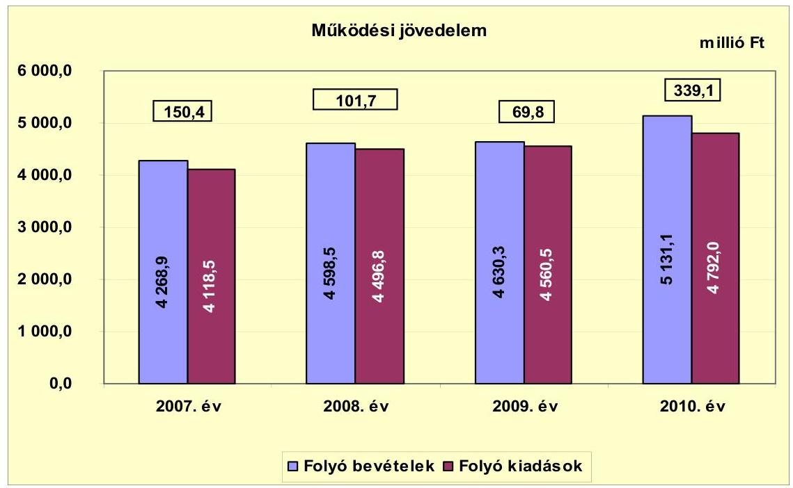

A 2007-2010. közötti időszakban az Önkormányzat folyó költségvetési egyenlege, működési jövedelme pozitív összegű volt. A működési jövedelem a 2007-2010. években 661,0 millió Ft többletet mutatott, amely forrásul szolgálhatott az Önkormányzat fennálló tőketörlesztési kötelezettségeinek teljesítéséhez, valamint fejlesztéseinek finanszírozásához. A működési jövedelem a 2007. évről a 2008. évre 48,7 millió Ft-tal csökkent, a folyó kiadások, ezen belül a transzfer- és kamatkiadások növekedése miatt. A működési jövedelem a 2009. évről a 2010. évre 269,3 millió Ft-tal nőtt, a folyó bevételek, ezen belül az áfabevételek, visszatérülések és a támogatásértékű működési bevételek növekedése miatt.

A pozitív előjelű folyó költségvetési egyenleg ellenére az Önkormányzat a vizsgált években folyószámla-, a 2009. évtől munkabér-megelőlegezési hitel felvételére kényszerült, egyrészt az átmeneti likviditási problémák kezelése, másrészt fejlesztési kiadásai finanszírozása miatt.

Az Önkormányzat pénzügyi kapacitása a 2007-2010. években pozitív értéket mutatott. A nettó működési jövedelem ${ }^{17}$ értéke a folyó költségvetési pozíció mellett az adott költségvetési év adósságtörlesztésének hatását is tükrözi. A 2007-2010. években képződött 661,0 millió Ft működési jövedelemnek 52,2%-át (345,6 millió Ft) tette ki a hitelekhez kapcsolódó tőketörlesztés, amelynek kifizetését követően 315,4 millió Ft nettó működési jövedelme keletkezett az Önkormányzatnak.

[^0]
[^0]:    ${ }^{17}$ Pénzügyi kapacitás

---

A nettó működési jövedelem 2007-2010. évek közötti alakulását a következő ábra szemlélteti:
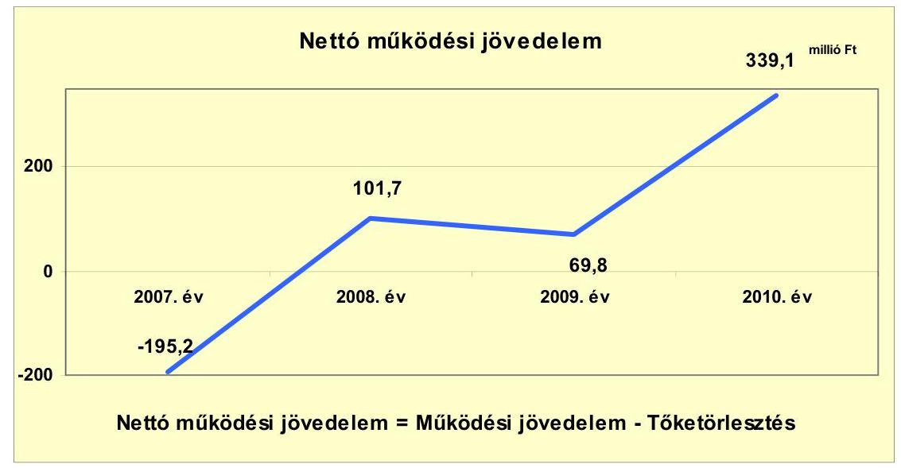

A nettó működési jövedelem a 2007. évben a 345,6 millió Ft tőketörlesztés ${ }^{18}$ mellett negatív értéket ( $-195,2$ millió Ft-ot) mutatott, mivel a működési jövedelem nem fedezte a hiteltörlesztés összegét, amit a kötvénybevételből történő hitel visszafizetése okozott. A nettó működési jövedelem a 2008. évről a 2009. évre 31,9 millió Ft-tal csökkent a folyó bevételek, ezen belül a költségvetési támogatás és az átengedett szja 56,5 millió Ft-os csökkenése miatt. A nettó működési jövedelem a 2009. évről a 2010. évre 269,3 millió Ft-tal nőtt, a folyó bevételek, ezen belül az államháztartáson belülről kapott támogatások 123,3 millió Ft-os és a saját működési bevételek 299,8 millió Ft-os növekedése miatt. A 2008-2010. években az Önkormányzatnak nem volt tőketörlesztési kötelezettsége, így ezekben az években a működési és a nettó működési jövedelem összege megegyezett. Amennyiben a folyószámlahitel lejáratának napján a 2009. évi 228,5 millió Ft, illetve a 2010. évi 297,2 millió Ft törlesztési kötelezettséget is figyelembe vennénk, az Önkormányzat nettó működési jövedelme a 2009. évben -158,7 millió Ft negatív, míg a 2010. évben 41,9 millió Ft pozitív értéket mutatott volna.

A 2007-2010. években az Önkormányzat felhalmozási költségvetésének egyenlege folyamatosan negatív összegű volt.

[^0]
[^0]:    ${ }^{18}$ Az Önkormányzat hiteltörlesztési kötelezettsége a 2007. évben 345,6 millió Ft volt. Az Önkormányzatnak a 2008-2010. években nem volt tőketörlesztési kötelezettsége.

---

A felhalmozási költségvetés egyenlegét 2007-2010. között a következő ábra szemlélteti:
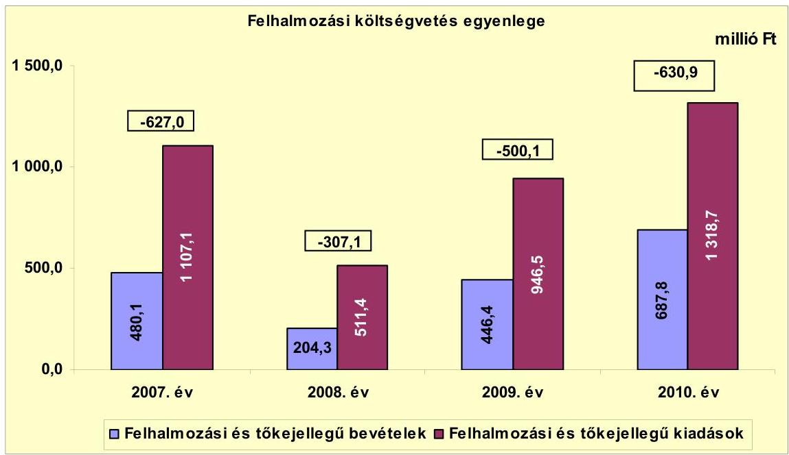

A felhalmozási forráshiánynak a felhalmozási és tőke jellegű kiadásokhoz viszonyított aránya 2007-ben $-56,6 \%$ ( $-627,0$ millió Ft), 2008-ban $-60,0 \%$ $(-307,1$ millió Ft), 2009-ben $-52,8 \%$ (-500,1 millió Ft), 2010-ben $-47,8 \%$ (-630,9 millió Ft) volt. A 2007-2010. év közötti időszakban jelentkező összes felhalmozási forráshiány -2065,1 millió Ft volt. A vizsgált időszakban keletkezett felhalmozási forráshiányra az 522,2 millió Ft 2007. január 1-jei nyitó pénzkészletből 486,5 millió Ft, valamint a 2007. évben felvett 42,3 millió Ft fejlesztési hitel, az 1309,3 millió Ft kötvénykibocsátásból származó bevétel, 616,6 millió Ft kötvénybefektetésből származó bevétel nyújtott fedezetet.

A függő, átfutó, kiegyenlítő bevételek és kiadások 559,9 millió Ft-os negatív egyenlegével az Önkormányzat 1393,1 millió Ft pénzkészlettel zárta a 2010. évet, amelyből 1268,7 millió Ft volt a hosszú lejáratú bankbetétek év végi állománya.

Az Önkormányzat 2010. december 31-én szabad pénzmaradvánnyal nem rendelkezett. Az Önkormányzat kimutatása szerint 2010. december 31-én a kötelezettséggel terhelt pénzmaradvány 1258,9 millió Ft volt, amelyből 397,2 millió Ft a rövid lejáratú likvidhitel záró állománya és 861,7 millió Ft az egyéb szerződéses kötelezettség alapján terhelt pénzmaradvány.

A 2007-2010. év közötti időszakban jelentkező összes felhalmozási forráshiány (-2065,1 millió Ft) 15,3%-ára nyújtott fedezetet a nettó működési jövedelem ${ }^{19}$. A

[^0]
[^0]:    ${ }^{19}$ Az ábrában megjelenő 2009. évi felhalmozási kiadásokban és bevételekben az Ivóvízminőségjavító társuláshoz kapcsolódó felhalmozási kiadások és bevételek összege 8,9 millió Ft.

---

felhalmozási forráshiány finanszírozása ezen túl hosszú lejáratú, fejlesztési célú hitelből, fejlesztési célú kötvénykibocsátásból származó bevételből történt.

Az Önkormányzat CLF módszer szerinti teljes finanszírozási igénye ${ }^{20}$ 2007-ben -822,2 millió Ft, 2008-ben -205,4 millió Ft, 2009-ben -430,3 millió Ft, 2010-ben $-291,8$ millió Ft volt.

Az Önkormányzat finanszírozási műveletei 2007-2010. évekbeli egyenlegének alakulását a következő ábra szemlélteti:
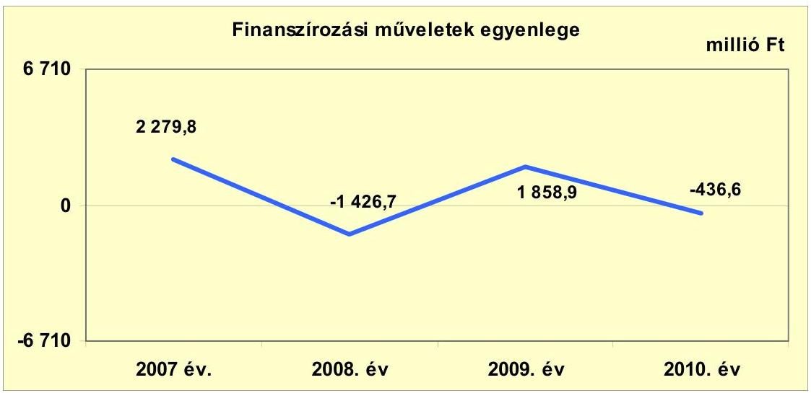

A 2008. és a 2010. években a kötvényforrásból származó bevétel (tartalékok között kimutatott) biztosította a kiadások finanszírozását, a 2007. és a 2009. évi finanszírozási célú pénzügyi műveletek pozitív értéke azt jelzi, hogy az éves költségvetések végrehajtása során szükség volt az előző években keletkezett pénzmaradvány igénybevételén túl külső finanszírozás igénybevételére is. A finanszírozási célú műveleteket a vizsgált időszakban a jelentés 2. számú mellékletének 4.1-4.8 pontjai részletezik.

Az Önkormányzat a zárszámadási rendeleteiben a működési és fejlesztési hiányt a költségvetés szerkezetére előírtak szerint mutatta be ${ }^{21}$, amelyről a jelentés 1. számú melléklete nyújt tájékoztatást. A 2007-2010. évi zárszámadási rendeletekben évről évre pénzügyi többletet mutattak ki.

Az Önkormányzat zárszámadási rendeleteiben a 2007. évben 2220,0 millió, a 2008. évben 156,2 millió, a 2009. évben 1982,9 millió, a 2010. évben 899,0 millió Ft pénzügyi többletet szerepeltettek.

[^0]
[^0]:    ${ }^{20}$ a nettó működési jövedelem és a felhalmozási költségvetés eredője
    ${ }^{21}$ Nincs kötelező előírás a működési és fejlesztési hiány megállapításának módjára.

---

Az Önkormányzat kamatbevételeit és kamatkiadásait 2007-2011. év I. féléve között a következő ábra mutatja:
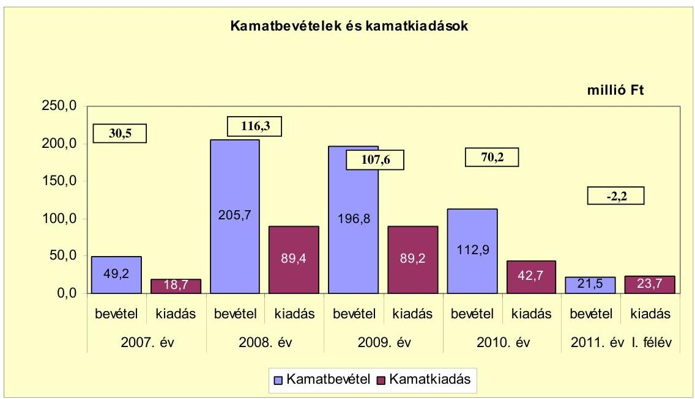

A 2007-2011. év I. félév között az Önkormányzat összesen 263,7 millió Ft kamatot fizetett meg. Az átmenetileg szabad pénzeszközein realizált kamatbevétel a teljes kamatkiadás 222,3%-át (586,1 millió Ft) tette ki. A kamatbevételek a 2007-2010. években meghaladták a kamatkiadásokat. 2011. év I. félévben azonban a kamatbevételek 2,2 millió Ft-tal elmaradtak a kamatkiadások mértékétől.

# 2.2. Az Önkormányzat bevételeinek változása 

Az Önkormányzat CLF módszer szerint számított folyó és felhalmozási bevételének együttes összege a 2007-2010. évek között folyamatosan nőtt, az előző évhez képest a 2008. évre 4749,0 millió Ft-ról 4802,8 millió Ft-ra, a 2009. évre 5076,7 millió Ft-ra, a 2010. évre 5818,9 millió Ft-ra változott. A folyó bevétel és a felhalmozási bevétel együttes összege a 2011. év I. félévben 2667,7 millió Ft volt.

---

Az Önkormányzat 2007-2011. év I. félév között realizált főbb folyó bevételi jogcímeinek számszaki adatait az alábbi grafikon mutatja be:
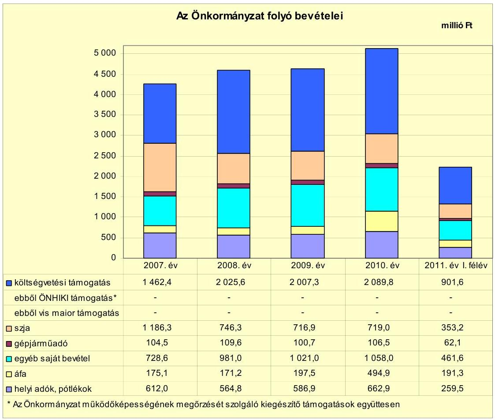

Az összes folyó bevétel a 2007-2009. évi átlag 4499,2 millió Ft-ról a 2010. évre 631,9 millió Ft-tal ( $14,0 \%$-kal) 5131,1 millió Ft-ra nőtt. A 2011. év I. félévben az összes folyó bevétel 2229,2 millió Ft volt.

Az Önkormányzat költségvetési támogatásai és az átengedett szja bevételei együttesen a 2007-2009. évi átlag 2714,9 millió Ft-ról a 2010. évre 93,9 millió Ft-tal 2808,8 millió Ft-ra nőttek. Az Önkormányzat költségvetési támogatása a 2007. évről 2008. évre 1462,4 millió Ft-ról 2025,6 millió Ft-ra nőtt, ezzel szemben az átengedett szja 1186,3 millió Ft-ról 746,3 millió Ft-ra csökkent a központi támogatások és az szja normatív módon elosztott része közötti központi átrendeződése miatt.

A gépjárműadóból származó bevétel a 2007-2009. évi átlaghoz viszonyítva (104,9 millió Ft) a 2010. évre 1,8%-kal (1,9 millió Ft-tal) emelkedett, egyrészt a 2010. évben történt gépjárműadó mértékének emeléséből, másrészt az ellenőrzési, végrehajtási munka eredményeként. A 2008. évről a 2009. évre történő 8,4 millió Ft-os csökkenés a gazdasági válság hatására következett be. 2011. év I. félévben a gépjárműadó 62,1 millió Ft volt.

---

Az áfabevételek összege a 2007-2009. évi átlag 181,4 millió Ft-ról a 2010. évre $172,8 \%$-kal ( 494,9 millió Ft-ra) nőtt, amely főként a fordított áfa ${ }^{22}$ elszámolásához kapcsolódott. 2011. év I. félévben az áfabevételekből 191,3 millió Ft keletkezett.

Az egyéb saját bevételek a 2007-2010. években folyamatosan növekedtek, a 2007-2009. évi átlag 910,2 millió Ft-ról 2010. évre 16,2%-kal (147,8 millió Ft-tal), amely döntően a támogatásértékű működési bevételek 72,7%-os (194,5 millió Ft), a hozam- és kamatbevételek 129,4%-os (63,7 millió Ft) növekedéséből és a 2010. évben egy gazdasági társaságtól származó 10,0 millió Ft osztalékbevételből adódott. 2011. év I. félévben az egyéb saját bevételek összege 461,6 millió Ft volt.

Az Önkormányzatnál a helyi adókból és pótlékokból származó bevételek aránya 2007-2010 között 12,1-13,6% között mozgott a folyó (működési) bevételekben. A helyi adó- és pótlékokból származó bevételek a 2007. évről a 2008. évre $7,7 \%$-kal ( 47,2 millió Ft ) csökkentek az iparűzési adóbevételek csökkenése miatt, de 2008-tól folyamatosan növekedtek. A helyi adó- és pótlékokból származó bevételek előző évhez viszonyított 2009. évi 3,9%-os (22,1 millió Ft) és 2010. évi 13,0%-os ( 76,1 millió Ft) növekedését az iparűzési adóbevételek 2009. évi 5,6%-os ( 22,5 millió Ft) és 2010. évi 14,6%-os ( 60,3 millió Ft) növekedése határozta meg. 2011. év I. félévben a helyi adókból és pótlékokból származó bevételek a folyó működési bevételekben 11,6%-os arányt (259,5 millió Ft) képviseltek.

Az Önkormányzatnak a 2007-2011. év I.
 félév között a helyi iparűzési adóból és a magánszemélyek kommunális adójából származott bevétele. Az időszak alatt új helyi adónem bevezetéséről nem döntöttek. A helyi iparűzési adó mértéke a 2007-2010. években nem változott, 1,7 % volt, amelyet 2011. január 1-jétől 2%-ra emeltek. A magánszemélyek kommunális adójának mértéke 2007-2010. években nem változott, az adó mértéke adótárgyanként 13,9 ezer Ft volt, amelyet 2011. január 1-jétől adótárgyanként (a bérleti jogra is kiterjesztve) 9,8 ezer Ft-ra mérsékeltek.

Az Önkormányzat 2007-2011. év I. félév között egy gazdasági társaságtól, a Törökszentmiklósi Kommunális Kft.-től kapott 2010-ben osztalékot a tulajdonrésze alapján. A kapott osztalék összege 10,0 millió Ft volt.

[^0]
[^0]:    ${ }^{22}$ Fordított áfa miatti bevétel a 2007-2009. években nem volt, a 2010. évben 254,9 millió Ft volt.

---

Az Önkormányzat felhalmozási bevételei a vizsgált időszakban a következők voltak:

| Megnevezés | 2007. év | 2008. év | 2009. év | 2010. év | 2011. év I.   félév |
| :-- | --: | --: | --: | --: | --: |
| Tárgyi eszköz értékesítés | 6,5 | 3,6 | 25,4 | 7,3 | 56,0 |
| Egyéb saját tőkebevétel | 39,3 | 35,7 | 161,0 | 17,2 | 5,5 |
| Államháztartáson belülről   kapott támogatás | 75,0 | 83,2 | 99,5 | 583,1 | 367,3 |
| EU-tól és külföldről kapott   támogatások | 1,0 | 0,0 | 30,3 | 0,0 | 0,0 |
| Államháztartáson kívülről   kapott támogatás | 140,7 | 20,3 | 76,8 | 23,1 | 9,7 |
| Összes felhalmozási   bevétel | 262,5 | 142,8 | 393,0 | 630,7 | 438,5 |

A vizsgált években a felhalmozási bevételek a 2007-2010. években változóan alakultak, 2007. évi 262,5 millió Ft-ról 2008-ban 45,6%-kal (142,8 millió Ft-ra) csökkentek, 2009-ben 175,2%-kal (393,0 millió Ft-ra), a 2010. évre 60,5%-kal (630,7 millió Ft-ra) nőttek. A 2009. évben az egyéb saját tőke bevételek az előző évhez viszonyítva több mint négyszeresére nőttek, döntően az Iparfejlesztési Kft. részére 2001-től folyamatosan évente nyújtott kölcsönök visszatérüléséből befolyt 145,6 millió Ft bevétel miatt. Az államháztartáson belülről kapott támogatások a 2009. évről 2010-re 99,5 millió Ft-ról, több mint ötszörösére, 583,1 millió Ft-ra nőttek, az európai uniós támogatással megvalósuló fejlesztések finanszírozására kapott támogatásértékű felhalmozási célú bevételek növekedése miatt. Az államháztartáson kívülről kapott felhalmozási bevételek 2007-ről 2008-ra történő 85,6%-os (120,4 millió Ft) csökkenése a nonprofit szervezetektől átvett pénzeszközök, 138,9 millió Ft-os csökkenése miatt következett be.

# 2.3. Az Önkormányzat működési és felhalmozási célú kiadásainak változása 

Az Önkormányzat folyó kiadásai főbb jogcímek szerinti bontásban a következők voltak:

|  |  |  |  |  |  |
| :-- | --: | --: | --: | --: | --: |
| Megnevezés | 2007. év | 2008. év | 2009. év | 2010. év | 2011. év I.   félév |
| Folyó kiadások | 4118,5 | 4496,8 | 4560,5 | 4792,0 | 2223,2 |
| Működési kiadások (kamatkiadás nélkül) | 3687,7 | 3898,2 | 3916,5 | 4116,8 | 1863,2 |
| Államháztartáson belülre átadott   pénzeszközök | 27,2 | 40,8 | 34,1 | 38,0 | 14,2 |
| Transzferkiadások | 384,9 | 468,4 | 520,7 | 594,5 | 322,1 |
| -ebből: vállalkozásoknak | 1,3 | 6,2 | 4,0 | 0,4 | 5,6 |
| EU-nak, illetve külföldre | 0,0 | 0,0 | 0,0 | 0,0 | 0,0 |
| magánszemélyeknek | 354,4 | 430,8 | 467,3 | 541,0 | 280,2 |
| nonprofit szervezeteknek | 29,2 | 31,4 | 49,4 | 53,1 | 36,3 |
| Kamatkiadások | 18,7 | 89,4 | 89,2 | 42,7 | 23,7 |
| Előző évi pénzmaradvány átadás | 0,0 | 0,0 | 0,0 | 0,0 | 0,0 |

---

A folyó kiadások a 2007-2009. évi átlag 4391,9 millió Ft-ról a 2010. évre 4792,0 millió Ft-ra nőttek, a transzferkiadások 2007-2009. évi átlag 458,0 millió Ft-ról 2010. évre 541,0 millió Ft-ra történő növekedése miatt.

Az Önkormányzat folyó kiadásai főbb kiadásnemek szerinti bontásban a következők voltak:
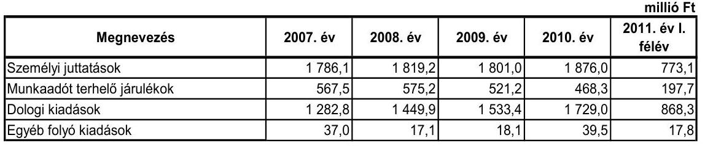

A folyó kiadásokon belül a személyi juttatások és járulékok aránya - a más szervnek átadott feladatok és álláshelycsökkentések miatt - a vizsgált időszakban a 2007-2009. évi folyó kiadásokon belül a 2007-2009. évi átlag 53,7%-ról (2356,7 millió Ft) a 2010. évre 48,9%-ra (2344,3 millió Ft), 2011. év I. félévben 43,7%-ra (970,8 millió Ft) csökkent. A személyi juttatások a 2007. évről a 2008. évre történő 33,1 millió Ft-os növekedését a normatív jutalom kifizetések 2007. évi 41,2 millió Ft-ról a 2008. évre 68,7 millió Ft-ra történő 27,5 millió Ft-os növekedése okozta. A 2009. évről a 2010. évre a személyi juttatások - az alapilletmények 70,8 millió Ft-os növekedése miatt - 4,2%-kal (75,0 millió Ft-tal) növekedtek. 2011. év I. félévben a személyi juttatások éves szintre vetítve a 2010. évi személyi juttatások összegéhez viszonyítva csökkentek, 2011. év I. félévben 773,1 millió Ft-ot tettek ki. A személyi juttatások a folyó kiadásokon belül a 2007. évben 43,4%-os (1786,1 millió Ft), a 2008. évben 40,5%-os (1819,2 millió Ft), a 2009. évben 39,5%-os (1801,0 millió Ft), a 2010. évben 39,1%-os (1876,0 millió Ft) arányt képviseltek. A személyi juttatások folyó kiadásokon belüli arányának 2007-2010. évi folyamatos csökkenését a foglalkoztatottak létszámának csökkenése okozta. A foglalkoztatottak létszáma az Önkormányzat kimutatása szerint a 2007-2009. évi átlag 711,7 főről a 2010. évre 673 főre csökkent. A munkaadót terhelő járulékok összege a 2007-2010. években változóan alakult, az előző évhez viszonyítva a 2008. évben 1,4%-kal (7,7 millió Ft) nőtt, majd a 2009. évtől folyamatosan csökkent, a 2010. évre 468,3 millió Ft-ra, a társadalombiztosítási és a munkaadói járulék csökkenése miatt. 2011. év I. félévben a munkaadót terhelő járulékok éves szintre vetítve a 2010. évi személyi juttatások összegéhez viszonyítva csökkentek, 2011. év I. félévben 197,7 millió Ft-ot tettek ki.

Az Önkormányzat dologi kiadásai 2007-ről 2010-re folyamatosan - 34,8%-kal (446,2 millió Ft), a 2007-2009. évi átlag 1422,0 millió Ft-ról 2010. évre 1729,0 millió Ft-ra - nőttek. A vásárolt élelmezés 50,2%-os (58,7 millió Ft-os), az üzemeltetési, fenntartási kiadások 16,6%-os (43,7 millió Ft-os), az áfakiadások 119,9%-os (277,0 millió Ft-os) növekedése miatt.

Az egyéb folyó kiadásokra teljesített kifizetés a 2007-2010. évek között változóan alakult, a 2007. évről a 2008. évre 53,8%-kal (19,9 millió Ft) csökkent, majd a 2009. évre 5,8%-kal (1,0 millió Ft), majd 2010-re 118,2%-kal (21,4 millió Ft) nőtt, döntően az adók, díjak, befizetések változása miatt.

---

A működési és felhalmozási kiadásokat a 2007-2011. év I. félév között a következő ábra szemlélteti:
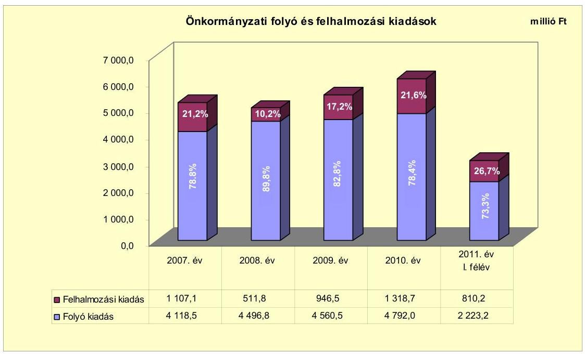

A felhalmozási kiadások összes kiadásokon belüli aránya az előző évhez viszonyítva a 2008. évben csökkent, majd a 2009. és a 2010. években folyamatosan nőtt, a beruházási és felújítási kiadások áfával előző évhez viszonyított 2008. évi 638,0 millió Ft-os csökkenése, illetve a 2009. évi 475,3 millió Ft-os és a 2010. évi 367,1 millió Ft-os növekedése miatt.

Az Önkormányzat 2007-2010. évek között 4980,1 millió Ft tényleges bekerülési költségű befejezett felújítást és beruházást valósított meg. A felújítások, fejlesztések teljes bekerülési kiadásából 2611,5 millió Ft volt a 2006. december 31-ig teljesített kifizetés. Az EU-s támogatásból megvalósult fejlesztések finanszírozása likviditási gondot okozott, a fejlesztések előfinanszírozásához folyószámlahitelt vettek igénybe.

A befejezett felújítások száma 39 darab volt, amelyek tervezett teljes bekerülési költsége áfával 339,4 millió Ft-ot, teljesített bekerülési költsége pedig 352,2 millió Ft-ot tett ki. A befejezett felújítások tényleges forrásmegoszlása 154,7 millió Ft hazai támogatás (43,9%) és 197,5 millió Ft saját bevétel (56,1%) volt. A befejezett 43 darab beruházás tervezett teljes bekerülési költsége 4419,3 millió Ft, teljesített bekerülési költsége pedig 4627,9 millió Ft volt. A befejezett beruházásokat 322,7 millió Ft hitellel (7,0%), 589,2 millió Ft kötvényből származó bevétellel (12,7%), 243,6 millió Ft EU-s támogatással (5,3%), 1701,9 millió Ft hazai támogatással (36,8%) és 1770,5 millió Ft saját bevétellel (38,2%) valósították meg. A részletes adatokat a jelentés 3. a számú melléklete tartalmazza. A Képviselő-testületnek előterjesztett éves költségvetési rendeletekben nem mutatták be a beruházásokkal létrehozott létesítmények működtetése és fenntarthatósága érdekében várhatóan felmerülő költségvetési kiadásokat.

---

Az Önkormányzat 2010. december 31-én folyamatban lévő 11 fejlesztési feladatának ${ }^{23}$ tervezett teljes bekerülési költsége áfával 5568,9 millió Ft volt, melyet 4025,2 millió Ft EU-s támogatással (72,3%), 174,2 millió Ft hazai támogatással (3,1%), 1369,5 millió Ft kötvényből származó bevétellel (24,6%) terveztek megvalósítani. A 2007-2010. években teljesített kiadások összege 722,3 millió Ft volt, amelyek forrása 222,1 millió Ft EU-s támogatás (30,7%), 466,7 millió Ft kötvény (64,6%) és a saját bevétel 33,5 millió Ft (4,7%) volt. A részletes adatokat a jelentés 3.b számú melléklete tartalmazza. A 2010. évet követő kötelezettségvállalás összege 4846,6 millió Ft, amelyet 3803,1 millió Ft EU-s támogatásból (78,5%), 869,3 millió Ft kötvényből származó bevételből (17,9%) és a hazai támogatásból 174,2 millió Ft (3,6%) terveznek finanszírozni. A részletes adatokat a jelentés 3.c számú melléklete tartalmazza.

Az Önkormányzatnál beadott, elbírálás alatt álló pályázati forrásból megvalósuló tervezett projekt és ebből adódó kötelezettség nem volt.

A három legnagyobb bekerülési költségű beruházás adatai a következők:

- a legmagasabb tényleges bekerülési költségű (3179,0 millió Ft) szennyvízberuházás (szennyvízcsatorna hálózat építése és szennyvíztisztító telep technológiai korszerűsítése) megvalósítását a 2003. évben kezdték. A fejlesztést hazai támogatásból, hitelből és saját forrásból tervezték megvalósítani 2967,5 millió Ft tervezett bekerülési költséggel. A beruházás a 2007. évben befejeződött, a tényleges kifizetés 3179,0 millió Ft volt, amelynek forrását 1625,4 millió Ft (51,1%) hazai támogatás, 322,7 millió Ft (10,2%) hitel és 1230,9 millió Ft (38,7%) saját bevételből biztosították;
- a 2010. évben egy telephelyet vásároltak (6829, 7125, 7207 hrsz-ú ingatlan, volt VEGYTEK telep), az ÉAOP „Befektetés ösztönző beruházás Törökszentmiklós területén" című pályázatban megjelölt iparterület fejlesztésére, iparvágány építése céljából. A telephelyvásárlás tervezett és teljesített teljes bekerülési költsége megegyezett, 351,5 millió Ft (a nettó vételár 1,0 millió euró) volt. A beruházást 280,0 millió Ft kötvényből származó és 67,5 millió Ft saját bevételből finanszírozták;
- a strandfürdő rekonstrukciójának (nyári vizesblokk épület, strandmedence, pancsoló medence, közművek kiépítése) megvalósítását a 2008. évben kezdték és a 2010. évben fejezték be. A fejlesztést kötvényből származó és saját bevételből kívánták megvalósítani 316,6 millió Ft tervezett bekerülési költséggel. A beruházás a 2010. évben befejeződött, a tényleges kifizetés 316,6 millió Ft volt, amelynek forrását 262,5 millió Ft kötvényből származó bevételből és 54,1 millió Ft saját bevételből biztosították.

Az önkormányzati feladatellátásban részt vevő gazdasági
 társaságoknak nyújtott eseti működési pénzeszközátadás a 2007. évben 10,7 millió Ft volt, ami a 2008. évben 2,5 millió Ft-ra csökkent, majd az előző évhez viszonyítva a 2009. évben 3,7 millió Ft-ra, a 2010. évben pedig 5,6 millió Ft-ra nőtt. A legnagyobb összegű működési pénzeszközátadást a 2007. évben az Önkormányzat a va-

[^0]
[^0]:    ${ }^{23}$ Az Önkormányzatnál 2010. december 31-én folyamatban lévő felújítási feladat nem volt.

---

gyonüzemeltetési feladatokat végző Iparfejlesztési Kft. részére adta 9,7 millió Ft összegben. A 2007-2010. években eseti működési pénzeszközátadást az Önkormányzat a helyi buszközlekedési feladatok ellátására nyújtott egy gazdasági társaság részére, 2007-ben egymillió Ft-ot, 2008-ban 2,5 millió Ft-ot, 2009-ben 3,7 millió Ft-ot, 2010-ben 5,6 millió Ft-ot. Az Önkormányzat fejlesztési pénzeszközátadást a vizsgált időszakban nem teljesített a gazdasági társaságok részére.

A helyi tömegközlekedés biztosítására a 2004. évben közszolgáltatási szerződést kötött az Önkormányzat a Jászkun Volán Zrt.-vel. A közszolgáltatási szerződésben a szolgáltató kötelezettségei között előírták, hogy a szolgáltató köteles évente tájékoztatni az ellátási felelőst a közszolgáltatási szerződés teljesítéséről. Az éves tájékoztatástól függetlenül azonnal köteles tájékoztatni az ellátási felelőst, ha a szolgáltató engedélyét a Nemzeti Közlekedési Hatóság visszavonta. A szolgáltató köteles figyelemmel kísérni a szolgáltatási területén az utazási igények változását és a szükséges menetrendi módosításokra vonatkozó javaslattal együtt tájékoztatni az ellátási felelőst. A Volán Zrt. részére átadott pénzeszközök képviselő-testületi előterjesztése tartalmazta, hogy a szolgáltatónak év közben folyamatosan vizsgálni kell a racionalizálás lehetőségét és arról tájékoztatni kell az Önkormányzatot, illetve a költségcsökkentő javaslatokat év közben is be kell terjeszteni a Képviselő-testület elé. A pénzeszközátadás kiutalása negyedévente egyenlő részletekben történik a negyedévet követő hónap 20-ig. Az utolsó negyedéves pénzeszközátadás kiutalásának feltétele, hogy a támogatás ténylegesen veszteségcsökkentésre fordítódik, amennyiben a rendelkezésre álló keretnél kisebb összeg is elegendő a veszteség csökkentésére, úgy csak az az összeg utalható ki, amely a szolgáltatás veszteségességét megszünteti.

# 3. Az ÖNKORMÁNYZAT KÖTELEZETTSÉGEI 

### 3.1. Az Önkormányzat pénzintézeti kötelezettségeinek változása

Az Önkormányzatnak 2006. december 31-én 303,3 millió Ft pénzintézeti kötelezettség állománya volt, amely 2011. június 30-ára 3908,6 millió Ft-ra emelkedett. A 2006. évi kötelezettségállomány két hosszú lejáratú fejlesztési célú hitelből állt (303,3 millió Ft), amelyből az Önkormányzat hosszú lejáratú kötelezettségként tartott nyilván 254,7 millió Ft-ot, következő évi törlesztőrészlet címén rövid lejáratú kötelezettségek közé átsorolt 48,6 millió Ft-ot. A 2007. évi kötelezettségállomány 2415,9 millió Ft volt, amely kötvénykibocsátásból adódott. A 2008. évi pénzintézeti kötelezettség 2817,8 millió Ft-ot tett ki, amely szintén a 2007. évi kötvénykibocsátásból származott. A 2009. évi kötelezettségállomány 3196,5 millió Ft volt, amely 228,5 millió Ft folyószámlahitelből, 78,0 millió Ft munkabér-megelőlegezési hitelből és 2890,0 millió Ft kötvény miatti kötelezettségből tevődött össze. A 2010. évben a 3926,7 millió Ft összegű pénzintézeti kötelezettség 297,2 millió Ft folyószámlahitelből, 100,0 millió Ft munkabér-megelőlegezési hitelből, 87,4 millió Ft hosszú lejáratú, kötvénykibocsátásból származó kötelezettség következő évet terhelő törlesztőrészletéből, valamint 3442,1 millió Ft kötvénykibocsátás miatti kötelezettségből adódott. A 2011. június 30-i kötelezettségállomány egy kötvénykibocsátásból (3529,4 millió Ft), egy folyószámlahitelből (267,2 millió Ft) és egy munkabérmegelőlegezési hitelből (112,0 millió Ft) keletkezett.

Az Önkormányzat pénzintézeteknél fennálló kötelezettségállományát a 2006-2011. években a következő diagram szemlélteti:
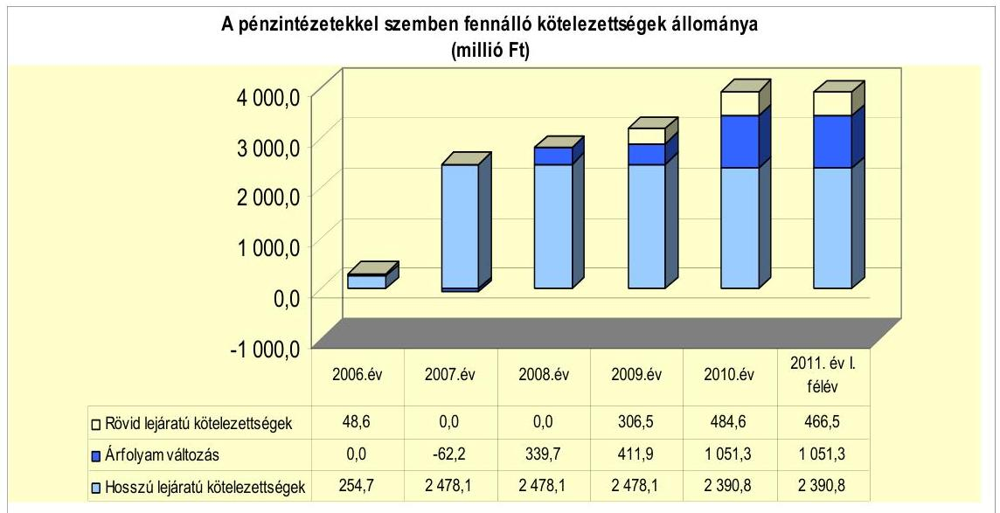

A pénzintézeti kötelezettségek állományának 2006-2011. év I. féléve közötti 3605,3 millió Ft-os növekedése

- a 2007. évben történt kötvénykibocsátás miatti 2478,1 millió Ft állománynövekedés,
- a 2006. évi hosszú és rövid lejáratú kötelezettségek törlesztése miatti 303,3 millió Ft állománycsökkenés,
- a devizában fennálló kötvénykötelezettség év végi értékelésekor elszámolt 1051,3 millió Ft árfolyam-különbözet miatti állománynövekedés,
- a folyószámla- és munkabér-megelőlegezési hitel folyamatos igénybevétele miatti 379,2 millió Ft állományváltozás
egyenlegeként adódott. A pénzintézeti kötelezettségek emelkedése az Önkormányzat számára növekvő kockázatot jelenthet.

Az Önkormányzat a pénzintézeti kötelezettségeket a felhalmozási forráshiány fedezetének megteremtése és fejlesztési feladatainak megvalósítása érdekében vállalta. A 2005-2007. években felvett Önkormányzati infrastruktúra fejlesztési hitelből a 2007. évben még fennálló kötelezettség kiváltása és egyes fejlesztési feladatok pályázati önerejének biztosítása érdekében a 2007. évben kötvénykibocsátásról döntött. A kötvényből származó bevétel felhalmozási célú felhasználásáig gondoskodott annak folyamatos befektetéséről. A befektetésekből képződő 616,6 millió Ft többletbevételt a kötvénykibocsátás céljaival azonos fejlesztési feladatokra fordította. Az egyensúly javítását szolgálták az Önkormányzat bevételnövelő és kiadáscsökkentő intézkedései is.

---

Az Önkormányzat a 2007-2011. évi költségvetési rendeletekben a működési hiány finanszírozásának eszközeként a folyószámlahitel szükség szerinti igénybevételét határozta meg. A felhalmozási hiány finanszírozására a 2007. évben hosszú lejáratú hitel igénybevételét, a 2008-2011. években a kötvénykibocsátásból származó pénzmaradvány felhasználását tervezte.

Az Önkormányzat a 2007., a 2008. és a 2009. évi költségvetési rendeletében az Ámr. ${ }_{1} 29 . \S$ (1) bekezdés h) pontjában foglaltak ellenére a működési és a felhalmozási célú bevételi és kiadási előirányzatokat nem mutatta be, egymástól elkülönítetten, de a finanszírozási műveleteket is figyelembe véve, mérlegszerűen, egyensúlyban. Az Önkormányzat a 2010. és a 2011. évi költségvetési rendeleteiben az Áht. ${ }_{1} 69 . \S$ (1) bekezdés c) és d) pontjaiban ${ }^{24}$, valamint az Ámr 2 . 36. § (1) bekezdés ed) és ee) pontjaiban foglaltak ellenére nem részletezte a költségvetési hiány belső és külső finanszírozási módjának működési és felhalmozási cél szerinti tagolását. A 2007-2011. évi költségvetés rendeletekben a költségvetés megállapításakor az Áht. ${ }_{1}$ 8/A. § (1) bekezdésében ${ }^{25}$ foglaltak ellenére a költségvetési hiány finanszírozásának módjának meghatározásakor nem rendelkeztek a kimutatott hiány teljes összegének finanszírozásáról, azt a „költségvetési bevételektől" tették függővé, amelyet nem számszerűsítettek.

Az Ötv. 88. § (2) bekezdése szerinti kötelezettségvállalások felső határának ${ }^{26}$ számítását a 2007-2011. évi költségvetési rendeletek előterjesztései tartalmazták. A vizsgált időszakon belül az Önkormányzat az egyes adósságot keletkeztető kötelezettségvállalások időpontjában a hitelképességi megfelelést nem vizsgálta, azonban az adósságot keletkeztető kötelezettségvállalások felső határát betartotta, azt nem lépte túl.

Az Önkormányzat pénzintézeti kötelezettségvállalásaira minden esetben a Képviselő-testület döntése alapján került sor.

Az Önkormányzat 2007. november 30-án bocsátott ki 15850000 CHF (2478,1 millió Ft) összegű kötvényt 23 éves futamidővel, 3 év türelmi idő mellett, a lejárat napja 2030. november 30. A kötvénykibocsátással kapcsolatban öt árajánlat érkezett be, melyből a Képviselő-testület négyet minősített értékelhetőnek. Ezek közül a Képviselő-testület az „összességében legelőnyösebb ajánlat" elve szerint a Raiffeisen Bank Zrt.-t bízta meg a kötvény forgalmazásával.

A kötvény kibocsátásáról szóló képviselő-testületi előterjesztésben bemutatásra kerültek a lehetséges kibocsátási kondíciók, továbbá a várható fizetési kötelezettségek a teljes futamidőre. Ezen kívül 2010. évig évente készültek előter-

[^0]
[^0]:    ${ }^{24}$ 2012. január 1-jétől erre vonatkozó előírást az Áht. ${ }_{2}$ 23. § (2) bekezdés e) pontja tartalmaz.
    ${ }^{25}$ 2012. január 1-jétől erre vonatkozó előírást az Áht. ${ }_{2}$ 5. § (3) bekezdése tartalmaz.
    ${ }^{26}$ 2012. január 1-jétől Magyarország gazdasági stabilitásáról szóló 2011. évi CXCIV. törvény 10. § (3) bekezdésében foglaltak szerint az önkormányzat adósságot keletkeztető ügyletből származó fizetési kötelezettsége az adósságot keletkeztető ügylet futamidejének végéig egyik évben sem haladja meg az önkormányzat saját bevételeinek 50\%át.

---

jesztések a kötvénytartozás helyzetéről, amelyekben elemezték az árfolyam- és kamatváltozások lehetséges hatásait is.

A kötvény forgalmazásával megbízott pénzintézet nem volt azonos az Önkormányzat számlavezető bankjával, amely a kibocsátáskor az OTP Bank Nyrt. volt. Az Önkormányzat 2008. szeptember 30-án döntött másik számlavezető pénzintézet közbeszerzési eljárással történő kiválasztásának megindításáról. Az eljárásban a legjobb ajánlatot tevő CIB Bank Zrt. került kiválasztásra, amely 2009. január 1. napjától lett az Önkormányzat számlavezető bankja. A korábbi számlavezető pénzintézettel szemben 2008. december 31-én a folyószámlahitel kivételével más fennálló kötelezettsége az Önkormányzatnak nem volt. A számlavezető pénzintézetváltást követően a folyószámlahitel kondíciói kedvezően változtak (a kamatfelár 0,7 százalékponttal csökkent).

A 2007-2011. év I. félév közötti időszakban a folyószámlahitel és a munkabérmegelőlegezési hitel esetében a kamatkockázatokat a Képviselő-testület számára nem mutatták be.

A vizsgált években a felhalmozási költségvetésben folyamatosan hiány mutatkozott (2826,4 millió Ft), amelynek finanszírozásához az Önkormányzat 1309,3 millió Ft kötvénykibocsátásból származó forrást is felhasznált.

Az Önkormányzat 2011. június 30-án fennálló, hosszú lejáratú adósságot keletkeztető kötelezettségvállalását a következő táblázat mutatja be:

| Megnevezés | Szerződéskötési   Kibocsátás   időpontja | Összeg   ezer CHF-ben | Kibocsátási/elhivási   árfolyam | Kamat (referencia kamat+   kamatfelár) | Felhasználás célja: |
| :-- | :--: | :--: | :--: | :--: | :-- |
| "Törökszentmikiós Jövőjéért"   Kötvény | 2007. november 30. | 15850,0 | 156,35 | 6 havi LIBOR CHF+0,5\% | Úniós pályázati források   igénybevételéhez szükséges   saját erő biztosítása |

A kötvényből származó 2478,1 millió Ft bevételből 1309,3 millió Ft-ot használt fel az Önkormányzat. Ebből 989,8 millió Ft (39,9\%) összegben a pályázati források önerejének biztosításával felújításokat, beruházásokat valósított meg, 319,5 millió Ft (12,9\%) értékben a 2005-2007. években felvett Önkormányzati infrastruktúra fejlesztési hitel kiváltása történt meg. A kötvénykibocsátásból származó forrás 2011. június 30-án fel nem használt összege 1168,8 millió Ft-ot $(47,2 \%)$ tett ki, amelyet az Önkormányzat a kötvénykibocsátási céloknak megfelelően, fejlesztésekre használhat fel.

A kötvénykibocsátásból származó szabad forrás befektetéséből 2007-2011. év I. félév között az Önkormányzat 616,6 millió Ft-ot realizált. A bevétel a kötvényforrás kincstárjegyben, tőke-, illetve hozamgarantált betétekben történő elhelyezéséből, valamint szállításos és SPOT konverzióból származó árfolyamnyereségből tevődött össze. Az így befolyt bevételből 430,1 millió Ft-ot (69,7\%) fejlesztési feladatokra használt fel az Önkormányzat, míg 186,6 millió Ft (30,3\%) a kötvénykibocsátás kamatkiadásainak fedezetéül szolgált.

Az Önkormányzat kötvénykibocsátásból származó tőkekötelezettsége 2010. december 31-én 15850000 CHF-et tett ki. A tőketörlesztés kezdő időpontja 2011. szeptember 30. volt, amikor az Önkormányzat 397000 CHF-et fizetett meg a

---

pénzintézet részére. Az Önkormányzat kamatfizetési kötelezettségét 2008. március 31-től félévenként teljesítette, amely 2011. június 30-ig összesen 1015065 CHF kifizetést jelentett. Egyéb költség címén az Önkormányzat 2011. június 30-ig 9,2 millió Ft-ot fizetett ki.

Az Önkormányzatnál 2011. június 30-át követően a helyszíni vizsgálat idejéig hosszú lejáratú hitel igénybevételére, illetve kötvény kibocsátására vonatkozó döntés előkészítés nem volt folyamatban.

Az Önkormányzat fizetőképessége megőrzését folyószámlahitel és munkabérmegelőlegezési hitel igénybevételével tudta biztosítani.

A folyószámlahitel és a munkabér-megelőlegezési hitelkeretet a következő táblázat mutatja be:

| Megnevezés | 2007. év | 2008. év | 2009. év | 2010. év | 2011. év I.   félév |
| :--: | :--: | :--: | :--: | :--: | :--: |
| I. Folyószámlahitel |  |  |  |  |  |
| a folyószámlahitel keretösszege január 1-jén | 0,0 | 200,0 | 300,0 | 300,0 | 300,0 |
| teljesített kamat és egyéb költség | 0,5 | 6,2 | 13,9 | 10,9 | 6,5 |
| egyenleg (állomány) | 0,0 | 0,0 | 228,5 | 297,2 | 267,2 |

 II. Munkabér megelőlegezési hitel |  |  |  |  |  |
| Igénybevett hitel összesen: | 0,0 | 0,0 | 78,0 | 525,0 | 668,0 |
| teljesített kamat és egyéb költség | 0,0 | 0,0 | 0,4 | 3,3 | 4,3 |
| egyenleg (állomány) | 0,0 | 0,0 | 78,0 | 100,0 | 112,0 |

Az Önkormányzat a 2007. évtől ${ }^{27}$ növekvő mértékben vette igénybe a folyószámlahitelt, a 2010. évtől minden napon folyószámlahitellel zárt. Az átlagos napi állomány - 365 napra számítva - 2011. év I. félévében volt a legmagasabb, 231,3 millió Ft. A folyószámlahitel 2011. június 30-ai záró állománya 267,2 millió Ft volt. Az Önkormányzat a folyószámlahitelt 2009. december 31-én, 2010. december 31-én és 2011. június 30-án nem fizette vissza a banknak, a számviteli nyilvántartásaiban technikai elszámolással rendezte. A folyószámlahitellel kapcsolatos kamatkiadás a vizsgált időszakban összesen 38,0 millió Ft-ot tett ki. A folyószámlahitelhez kapcsolódóan egyéb költség címén az Önkormányzat tényleges kifizetést nem mutatott ki. A folyószámlahitel 2010. évtől történt folyamatos igénybevétele, növekvő állománya a pénzügyi kockázat növekedésére utal. A folyószámlahitel évről évre történő emelkedését az EU-s és hazai támogatásból megvalósuló beruházási, valamint az egyéb pályázatok előfinanszírozása okozta, melyek összege is folyamatosan növekedett. A pályázatok folyószámlahitellel történő előfinanszírozásának helytelen gyakorlata pénzügyi kockázatot jelenthet.

A folyószámlahitel napi átlagos állománya 365 napra vetítve a 2007-2011. év I. félév közötti időszakban folyamatosan növekedett, a 2007. évi 3,4 millió Ft-ról, a

[^0]
[^0]:    ${ }^{27}$ Az Önkormányzat a folyószámlahitelkeret-szerződést 2007. február 7-én kötötte meg 210,0 millió Ft hitelkeretre. A folyószámlahitelt első alkalommal 2007. november 13-án vette igénybe.

---

2008. évre 58,6 millió Ft-ra, a 2009. évre 160,1 millió Ft-ra, a 2010. évre 214,8 millió Ft-ra, 2011. év I. félévére 231,3 millió Ft-ra.

Amennyiben csak a folyószámlahitellel zárt napok számát vesszük az átlagos napi állomány számításának alapjául akkor a folyószámlahitel átlagos napi állománya a 2007. évben 139,5 millió Ft, a 2008. évben 98,5 millió Ft, a 2009. évben 180,9 millió Ft, a 2010. évben 214,8 millió Ft, a 2011. év I. félévében 466,5 millió Ft volt.

A folyószámlahitel szerződéskori fordulónapi záró állománya a 2009. évben (december 31.) 228,5 millió Ft, a 2010. évben (december 31-én) 297,2 millió Ft volt.

Munkabér-megelőlegezési hitel igénybevételére 2007-2008. években nem, a 2009. évben egy alkalommal, míg a 2010. évtől rendszeresen sor került. Az Önkormányzat 2011. év I. félévében már minden napon munkabér-megelőlegezési hitellel zárt, ekkor a hitel átlagos napi állománya 111,2 millió Ft volt. A 2011. június 30-ai záró állomány 112,0 millió Ft-ot tett ki. Az Önkormányzat a munkabér-megelőlegezési hitelt 2009. december 31-én, 2010. december 31-én és 2011. június 30-án nem fizette vissza a banknak, a számviteli nyilvántartásaiban technikai elszámolással rendezte. A munkabér-megelőlegezési hitellel összefüggésben összesen 6,8 millió Ft kamatkiadása keletkezett az Önkormányzatnak, egyéb költség címén 1,2 millió Ft került kifizetésre.

A munkabérhitel napi átlagos állománya 365 napra vetítve a 2009. évben 0,6 millió Ft, a 2010. évben 48,9 millió Ft, a 2011. év I. félévében 111,2 millió Ft volt. A munkabér-megelőlegezési hitel növekvő összegű igénybevételének oka, hogy az Önkormányzatot megillető támogatás (nettó finanszírozás) nem fedezi a nettó munkabér kifizetését, illetve a közfoglalkoztatás keretében kifizetett béreket (amelyeknek összege növekvő) is meg kell előlegeznie az Önkormányzatnak, melyet a Kormányhivatal csak később térít meg.

A kamatfizetési kötelezettség alakulását mind a kötvény, mind a likvid hitelek esetében befolyásolta a referencia kamatok változása. A kötvényre vonatkozó referencia kamatot a következő táblázat mutatja be:

| Megnevezés | Kibocsátási, lehivási | Utolsó fizetéskori | Változás \% |
| :--: | :--: | :--: | :--: |
|  | kamat (referencia + kamatfelár) \% |  |  |
| 6 havi LIBOR CHF (2007.11.30.-i kibocsátás) | 3,3 | 0,7 | $-78,8 \%$ |

Az alapkamat mértékének alakulása jelentős hatással volt az adott devizanemben kifejezett, a teljes futamidőre számított, várható kamatkötelezettség nagyságára.

---

A folyószámlahitel és a munkabér-megelőlegezési hitel kondíciói a következők voltak ${ }^{28}$ :

| Megnevezés | Kamat (referencia+ kamatfelár) | Egyéb költség |
| :--: | :--: | :--: |
| Folyószámlahitel |  |  |
| 2007-2008. év | 3 havi BUBOR $+0,3 \%$ | $0,1 \%$ kezelési díj, $6 \%$ késedelmi kamat |
| 2009-2011. év | 3 havi BUBOR - 0,4\% | $6 \%$ késedelmi kamat |
| Munkabér megelőlegezési hitel |  |  |
| 2007. év | 0 | 0 |
| 2008. év | 0 | 0 |
| 2009. év | 1 havi BUBOR $+0,3 \%$ | Késedelmes fizetés esetén:folyószámla hitelre érvényes ügyleti kamat + $6 \%$ késedelmi kamat |
| 2010-2011. év | 1 havi BUBOR $+0,3 \%$ | $0,35 \%$ kezelési klg.   Késedelmes fizetés esetén:folyószámla hitelre érvényes ügyleti kamat $+6 \%$ késedelmi kamat |

A folyószámlahitel tekintetében a referencia kamat a 2009. évről 2011. év I. félévre 2,6 százalékponttal, a kamatfelár a számlavezető pénzintézet változása eredményeként a 2009. évtől 0,7 százalékponttal csökkent. Ennek ellenére a fizetett kamatok összege a 2009. évben az előző évhez képest emelkedést mutatott, mivel a folyószámlahitel - 365 napra számított - átlagos állománya 101,5 millió Ft-tal ( $173,2 \%$ ), a hitellel zárt napok száma 104 nappal ( $47,5 \%$ ) növekedett. A folyószámlahitellel zárt napok száma a 2009. évről a 2010. évre 42 nappal ( $13,0 \%$ ), az átlagos állomány összege 54,7 millió Ft-tal ( $34,2 \%$ ) nőtt, amelyet ellensúlyozott a referencia kamat további 3,14 százalékpontos csökkenése, így a fizetett kamat összege 3,0 millió Ft-tal ( $21,6 \%$ ) csökkent. A 2011. év I. félévi adatok alapján a referencia kamat és a folyószámlahitel átlagos napi állományának emelkedése miatt az éves kamatfizetési kötelezettség növekedése várható, amely a folyószámlahitel folyamatos igénybevétele mellett a pénzügyi kockázatot növeli.

Az Önkormányzat munkabér-megelőlegezési hitelt a 2009. december 29. és 2011. június 30. közötti időszakban vett igénybe. A referenciakamat a 2011. évtől 0,53 százalékponttal emelkedett. A kamatemelkedés, a hitellel zárt napok számának és a hitel átlagos napi állományának növekedése együttesen már a 2011. év I. félév végére a fizetett kamat összegének 0,2 millió Ft-os ( $6,1 \%$ ) emelkedését okozta. A munkabér-megelőlegezési hitel vonatkozásában a kamatfelár nem változott.

Az Önkormányzat a 2009. és 2010. években a folyószámla- és a munkabér-megelőlegezési hitel tekintetében december 31-én kötelezettséget mutatott ki, mely a pénzügyi egyensúly hiányára utal.

| MNB BUBOR fixing (állagkamat) \% -ban |  |  |  |  |  |  |
| :--: | :--: | :--: | :--: | :--: | :--: | :--: |
|  | Referencia kamat | 2007. év | 2008. év | 2009. év | 2010. év | 2011. év I. félév |
|  | 1 havi BUBOR | 7,63 | 8,75 | 8,65 | 5,47 | 6,00 |
| 28 | 2 havi BUBOR | 7,75 | 8,87 | 8,64 | 6,50 | 6,07 |

---

Az Önkormányzat az ellenőrzött időszakban a devizában fennálló kötelezettségek Számv. tv. szerinti értékelését elvégezte.

Az Önkormányzat kötelezettségeinek 2010. december 31-én és 2011. június 30-án fennálló állományát, valamint várható alakulását a kötelezettségek lejáratáig a következő táblázat mutatja be:

| Megnevezés | Állomány 2010. december 31-én |  |  | Állomány 2011. június 30-án |  |  | Várható kötelezettség 2011-2013. években |  | Várható kötelezettség 2014. évtől |  |
| :--: | :--: | :--: | :--: | :--: | :--: | :--: | :--: | :--: | :--: | :--: |
|  | HUF-ban   (millió Ftban) | Devizában (összege, ezer ...ben) | Deviza nem | HUF-ban (millió Ftban) | Devizában (összege, ezer ...ben) | Deviza   nem | HUF-ban (millió Ftban) | Devizában (összege, ezer ...ben) | HUF-ban (millió Ftban) | Devizában (összege, ezer ...ben) |
| Pénzintézeti kötelezettségek |  |  |  |  |  |  |  |  |  |  |
| Kötvény (Törökszentmiklósi Jövőjéért) | 0,0 | 15850,0 | CHF | 0,0 | 15850,0 | CHF | 0,0 | 2315,7 | 0,0 | 14771,8 |
| Folyószámla hitel | 297,2 | 0,0 |  | 267,2 | 0,0 |  | 267,2 | 0,0 | 0,0 | 0,0 |
| Munkabér hitel | 100,0 | 0,0 |  | 112,0 | 0,0 |  | 112,0 | 0,0 | 0,0 | 0,0 |
| Pénzintézeti kötelezettségek összesen HUF-ban: | 397,2 | 0,0 |  | 379,2 | 0,0 |  | 379,2 | 0,0 | 0,0 | 0,0 |
| Pénzintézeti kötelezettségek összesen CHF-ben: | 0,0 | 15850,0 |  | 0,0 | 15850,0 |  | 0,0 | 2315,7 | 0,0 | 14771,8 |
| Pénzintézeti kötelezettségek összesen EURO-ban: | 0,0 | 0,0 |  | 0,0 | 0,0 |  | 0,0 | 0,0 | 0,0 | 0,0 |
| Biztosítékok |  |  |  |  |  |  |  |  |  |  |
| Község | 0,0 | 0,0 |  | 0,0 | 0,0 |  | 0,0 | 0,0 | 0,0 | 0,0 |
| Garancia | 0,0 | 0,0 |  | 0,0 | 0,0 |  | 0,0 | 0,0 | 0,0 | 0,0 |
| Biztosítékok összesen: | 0,0 | 0,0 |  | 0,0 | 0,0 |  | 0,0 | 0,0 | 0,0 | 0,0 |
| Lízing kötelezettségek | 0,0 | 7,6 | CHF | 0,0 | 0,0 |  | 0,0 | 7,8 | 0,0 | 0,0 |
| Szállító tartozás | 175,7 | 0,0 |  | 656,9 | 0,0 |  | 656,9 | 0,0 | 0,0 | 0,0 |
| Egyéb kiadás elmaradás | 0,0 | 0,0 |  | 0,0 | 0,0 |  | 0,0 | 0,0 | 0,0 | 0,0 |
| Egyéb kötelezettségek | 0,0 | 0,0 |  | 0,0 | 0,0 |  | 0,0 | 0,0 | 0,0 | 0,0 |
| Jogerős végzéssel lezárt de ki nem fizetett kötelezettségek | 0,0 | 0,0 |  | 0,0 | 0,0 |  | 0,0 | 0,0 | 0,0 | 0,0 |

Az Önkormányzat által a 2007-2011. év I.
 félévben vállalt pénzintézeti kötelezettségek állománya 2011. június 30-án a folyószámla- illetve munkabér-megelőlegezési hitel esetében 379,2 millió Ft, a kibocsátott kötvényre vonatkozóan 15 850 000 CHF volt. A forintban fennálló hitelekkel kapcsolatban 2011-2013. években várhatóan 379,2 millió Ft fizetési kötelezettsége keletkezik az Önkormányzatnak. A kötvénnyel kapcsolatosan 2011-2013. években 2 316 000 CHF, a 2014. évtől várhatóan 14 772 000 CHF fizetési kötelezettség terheli az Önkormányzatot. A várható fizetési kötelezettség összege tartalmazza a tőke, a kamat és az egyéb költség összegét.

A kötvénytartozásból származó fizetési kötelezettséget az Önkormányzat a kötvény helyzetéről szóló 2010. május 31-i képviselő-testületi előterjesztés szerint az évenként várható felhalmozási bevételekből tervezi finanszírozni. A kötvény futamidejére vonatkozóan a felhalmozási bevételek évenként várható alakulását az Önkormányzat nem számszerűsítette.

A rövid lejáratú hitelekkel kapcsolatosan a 2011-2013. években várható 379,2 millió Ft összegű fizetési kötelezettséget az Önkormányzat saját kimutatása szerint teljes egészében a 2010. évi pénzmaradvány (1 258,9 millió Ft) terhére kívánja teljesíteni.

---

# 3.2. A szállítói kötelezettségek változása 

Az Önkormányzat könyvviteli mérleg szerinti szállítói kötelezettségének év végi állománya és az összes kötelezettséghez viszonyított aránya a 2007. évben 108,8 millió Ft (3,8%), a 2008. évben 180,9 millió Ft (5,4%), a 2009. évben 49,1 millió Ft (1,3%), a 2010. évben 175,7 millió Ft (3,7%), a 2011. év I. félévében 656,9 millió Ft (12,6%) volt. A 2011. év I. félévében a szállítói tartozások növekedése a folyamatban lévő európai uniós projektekhez kapcsolódóan befogadott számlák szállítói finanszírozása miatt következett be.

Az Önkormányzat szállítói kötelezettségeit nem ütemezte át. A lejárt szállítói tartozásállománya (amely nem tartalmazta az EU-s támogatások szállítói finanszírozása miatt jelentkező lejárt szállítói tartozásokat ${ }^{29}$ ) 2006. évben 4,7 millió Ft, a 2007. évben 43,5 millió Ft, a 2008. évben 1,4 millió Ft, a 2009. évben 3,9 millió Ft, a 2010. évben 4,3 millió Ft, 2011. június 30-án 42,4 millió Ft volt. A lejárt szállítói kötelezettségek több mint háromnegyed részét a 30 nap alatti tartozások összege tette ki. Ez a 2006. évben 4,6 millió Ft-ot (97,9%), a 2007. évben 43,3 millió Ft-ot (99,5%), a 2008. évben 1,4 millió Ft-ot (100%), a 2009. évben 3,8 millió Ft-ot (97,4%), a 2010. évben 3,4 millió Ft-ot (79,1%), 2011. június 30-án 36,3 millió Ft-ot (85,6%) jelentett. Az Önkormányzat 31 és 60 nap közötti kötelezettsége a 2006. évben 0,1 millió Ft (2,1%), 2010. évben 0,9 millió Ft (20,9%), 2011. június 30-án 1,1 millió Ft (2,6%) volt. A 91 és 365 nap közötti lejárt tartozás a 2007. évben 0,2 millió Ft-ot (0,5%), 2011. június 30-án 5,0 millió Ft-ot (11,8%) tett ki. Az Önkormányzatnál a 90 napot meghaladó, szállítók felé fennálló kötelezettségek miatt a helyi önkormányzatok adósságrendezési eljárásáról szóló 1996. évi XXV. törvény 5. § (2) bekezdésében foglaltak szerinti adósságrendezési eljárást a polgármester nem kezdeményezett, mivel az Önkormányzat nyilatkozata szerint a szállítói tartozás vitatott volt.

A vizsgált időszakban a szállítói kötelezettségek hatása az Önkormányzat pénzügyi helyzetére nem volt jelentős. Az Önkormányzatnak a vizsgált időszakban egyéb kiadási elmaradása nem volt.

### 3.3. Egyéb kötelezettségek változása

Az Önkormányzat 2008. február 26-án két lízingszerződést kötött azonos feltételekkel, azonos összegben, ugyanazzal a pénzintézettel. A szerződések célja két játszótér eszközbeszerzésének finanszírozása volt. A lízingszerződések létrejöttével az Önkormányzat 36 hónapos futamidővel összesen 51 615,6 CHF (8,3 millió Ft) összegű tőkekötelezettséget vállalt. A szerződésekből eredő tőkekötelezettség állománya 2010. december 31-én 7 636,5 CHF volt, amelyet a kamatokkal együtt (összesen 7 761,0 CHF) az Önkormányzat 2011. június 23-áig kifizetett a finanszírozó pénzintézet számára.

[^0]
[^0]:    ${ }^{29}$ A EU-s támogatással megvalósuló fejlesztések szállítói finanszírozása miatt az Önkormányzatnak 2006-2010. évek közötti időszakban év végén nem volt lejárt szállítói tartozása, csak 2011. június 30-án. A szállítói finanszírozás miatt lejárt szállítói tartozás állománya 2011. június 30-án 240,7 millió Ft volt.

---

A vizsgált időszakban az Önkormányzatnak garancia- és kezességvállalásból eredő, valamint PPP konstrukció miatti kötelezettsége nem keletkezett.

Az Önkormányzatnál a 2007-2011. június 30. közötti időszakban összesen 46,6 millió Ft összegben történt követeléselengedés. Legnagyobb összegű a késedelmi pótlék elengedés volt, amely 17,6 millió Ft-ot, az összes követeléselengedés 37,7%-át tette ki. Az iparűzési adó elengedés, amely 13,2 millió Ft-ot (28,3%), a gépjárműadó elengedés, amely 6,0 millió Ft-ot (12,9%), valamint az áram-, gáz- és bérleti díj elengedés, amely 3,9 millió Ft-ot (8,4%) jelentett. Az egyéb jogcímeken történt követeléselengedés (talajterhelési díj, magánszemélyek kommunális adója, eljárási illeték, gondozási díj, okmányirodai bírság, gyermeknevelési támogatás) összesen 5,9 millió Ft (12,7%) volt.

Az Önkormányzat a 2007-2009. években egy kizárólagos tulajdonában lévő gazdasági társaságnak nyújtott több alkalommal, összesen 14,5 millió Ft összegű tagi kölcsönt működési célra, valamint ipari park kialakítására. A gazdasági társaság a kölcsönöket 2009-ben visszafizette. Az Önkormányzat az Áht. ${ }_{1} 100/$C. § (3) bekezdésében ${ }^{30}$ és az Ámr. ${ }_{2} 72$. § (3) bekezdésében ${ }^{31}$ foglaltak ellenére - amelyek szerint kötelezettséget vállalni írásban lehet kölcsönszerződés megkötése nélkül nyújtott kölcsönt ${ }^{32}$ az Iparfejlesztési Kft.-nek a 2007-2009. években. A kölcsönök nyújtásáról a Képviselő-testület az éves költségvetési rendeletekben döntött. A szerződés nélkül nyújtott kölcsönök - azok visszafizetéséig - pénzügyi kockázatot jelentettek az Önkormányzat számára.

Egyéb szervezetek részére 60,1 millió Ft kölcsönt folyósított az Önkormányzat a vizsgált időszakban. A Törökszentmiklós Város Víziközmű Társulat 2007-2009. években 47,7 millió Ft kölcsönt vett igénybe az Önkormányzattól szennyvízcsatorna beruházásra, a Kistérségi társulás a Szociális Szolgáltató Központ akadálymentesítési munkáira 10,0 millió Ft, a Jász-Nagykun Megyei Szakképzési Szervezési Társulás a TISZK rendszer továbbfejlesztésére 2,4 millió Ft kölcsönt kapott.

Jelzálogjog bejegyzés - amely nem pénzintézeti kötelezettséghez kapcsolódott - az Önkormányzat két forgalomképes ingatlanán állt fenn 2011. június 30-án. Az Önkormányzat 2004-ben szennyvízcsatorna hálózat építési és turisztikai szálláskapacitás fejlesztési támogatás szerződésének biztosítására járult hozzá az ingatlanokon jelzálogjog bejegyzéséhez, összesen 42,5 millió Ft erejéig.

Az Önkormányzat összes forgalomképes ingatlanának nettó értéke 2010. december 31-én 1 657,1 millió Ft volt. A jelzáloggal terhelt ingatlanok számviteli nyilvántartás szerinti nettó értéke 2010. december 31-én 88,2 millió Ft volt, amely az összes forgalomképes ingatlan nettó értékének 5,3%-át tette ki.

[^0]
[^0]:    ${ }^{30}$ 2012. január 1-jétől erre vonatkozó előírást az Áht. ${ }_{2}$ 37. § (1) bekezdése tartalmaz.
    ${ }^{31}$ 2012. január 1-jétől erre vonatkozó előírást az Ávr. 53. § (1) bekezdése tartalmaz.
    ${ }^{32}$ A jegyző által adott nyilatkozat szerint a kölcsönszerződések nem fellelhetőek.

---

Az Önkormányzatnak 2011. június 30-án folyamatban lévő peres eljárása nem volt.

Az 50%-ot meghaladó önkormányzati tulajdonban álló gazdasági társaságok kötelezettségeinek állományát és várható alakulását a kötelezettség lejáratáig a következő táblázat mutatja be:

| Megnevezés | Állomány 2010. december 31-   án |  |  | Állomány 2011. június 30-án |  |  | Várható kötelezettség   2011-2013. években |  | Várható kötelezettség   2014. évtől |  |
| :--: | :--: | :--: | :--: | :--: | :--: | :--: | :--: | :--: | :--: | :--: |
|  | HUF-ban   (millió Ft-   ban) | Devizában   (összege,   ezer ...-   ben) | Devize   nem | HUF-ban   (millió Ft-   ban) | Devizában   (összege,   ezer ...-   ben) | Devize   nem | HUF-ban   (millió Ft-   ban) | Devizában   (összege,   ezer ...-   ben) | HUF-ban   (millió Ft-   ban) | Devizában   (összege,   ezer ...-   ben) |
| Lízing kötelezettségek | 0,0 | 0,0 | 0,0 | 0,0 | 0,0 | 0,0 | 0,0 | 0,0 | 0,0 | 0,0 |
| Szállítói tartozás | 29,0 | 0,0 | 0,0 | 30,1 | 0,0 | 0,0 | 30,1 | 0,0 | 0,0 | 0,0 |
| Jogerős végzéssel lezárt de ki nem   fizetett kötelezettségek | 0,0 | 0,0 | 0,0 | 0,0 | 0,0 | 0,0 | 0,0 | 0,0 | 0,0 | 0,0 |
| Egyéb kötelezettségek | 59,2 | 0,0 | 0,0 | 46,6 | 0,0 | 0,0 | 46,6 | 0,0 | 0,0 | 0,0 |

Az 50%-ot meghaladó önkormányzati tulajdonban álló gazdasági társaságok szállítói tartozása a gazdasági társaságok adatszolgáltatása alapján a 2007. évben 23,5 millió Ft, a 2008. évben 35,8 millió Ft, a 2009. évben 17,6 millió Ft, a 2010. évben 29,0 millió Ft, 2011. június 30-án 30,1 millió Ft volt. Ebből lejárt tartozásként tartottak nyilván a gazdasági társaságok a 2007. évben 0,3 millió Ft-ot, a 2008. évben 0,2 millió Ft-ot, a 2009. évben 0,5 millió Ft-ot, a 2010. évben 0,4 millió Ft-ot, 2011. június 30-án 1,2 millió Ft-ot.

Az 50%-ot meghaladó önkormányzati tulajdonban álló gazdasági társaságok egyéb kötelezettségeinek állománya a 2007. évben 34,8 millió Ft-ot, a 2008. évben 38,3 millió Ft-ot, a 2009. évben 49,6 millió Ft-ot, a 2010. évben 59,2 millió Ft-ot, 2011. június 30-án 46,6 millió Ft-ot tett ki.

A gazdasági társaságok pénzintézettel szembeni kötelezettséget, lízingszerződésből adódó kötelezettséget, valamint peres eljárással összefüggő kötelezettséget nem mutattak ki a vizsgált időszakban.

A vizsgálattal érintett valamennyi gazdasági társaságban az Önkormányzat minősített befolyással rendelkezett.

Az Önkormányzat a gazdasági társaságokról szóló 2006. évi IV. törvény 54. § (2) bekezdése alapján korlátlan felelősséggel tartozik azon gazdasági társaságának felszámolása esetében, amelyben az Önkormányzat az 52. § (2) bekezdése szerint a szavazatok legalább 75%-ával rendelkezik, így minősített befolyásszerzőnek minősül, továbbá a csődeljárásról és a felszámolási eljárásról szóló 1991. évi XLIX. törvény 63. § (2) bekezdése alapján a kizárólagos önkormányzati tulajdonú gazdasági társaságának minden olyan kötelezettségéért, amelynek kielégítését a felszámolási eljárás során az adós társaság vagyona nem fedez, ha a hitelezőinek a felszámolási eljárás során benyújtott keresete alapján a bíróság - az adós társaság felé érvényesített tartósan hátrányos üzletpolitikájára figyelemmel - megállapítja az önkormányzat korlátlan és teljes felelősségét.

Az Önkormányzat a 2007-2010. években a tárgyi eszközök után összesen 1 881,3 millió Ft értékcsökkenést számolt el.

---

Az Önkormányzat eszközállományának bruttó értéke a 2007. évben 18 621,0 millió Ft, a 2008. évben 18 841,1 millió Ft, a 2009. évben 19 725,2 millió Ft, a 2010. évben 20 348,1 millió Ft volt. Az eszközök használhatósági foka önkormányzati szinten a 2007. évben 85,9%, a 2008. évben 83,3%,
 a 2009. évben 81,4 %, a 2010. évben 79,6 %-volt, így az eszközök avultsága növekedett. A kezelésre, üzemeltetésre átadott, vagyonkezelésbe adott eszközök esetében a 2007. évben 75,1 %, a 2008. évben 70,8 %, a 2009. évben 66,5 % és a 2010. évben 75,0 % volt a használhatósági fok.

A 2007-2010. évek között felújításokra, az eszközök pótlására a kimutatott értékcsökkenés 68,3%-ának megfelelő összeget, 1284,9 millió Ft-ot fordított az Önkormányzat. A vizsgált időszakban nem történt meg annak felmérése, hogy az eszközök elhasználódásának pótlása mekkora forrásokat igényel az Önkormányzattól.

# 4. A PÉNZÜGYI EGYENSÚLY MEGTEREMTÉSE ÉRDEKÉBEN HOZOTT INTÉZKEDÉSEK EREDMÉNYE 

A kiegyensúlyozott gazdálkodás érdekében az Önkormányzat kiadáscsökkentő intézkedésekről döntött, amelyeknek eredményeképpen az Önkormányzat adatszolgáltatása alapján - figyelembe véve az intézményátadások 238,3 millió Ft-os megtakarítása és az általános iskolai feladatok további ellátásához az egyháznak történő 28,8 millió Ft pénzeszközátadás eredményeként - összesen 209,5 millió Ft kiadási megtakarítás realizálódott.

A 2007-2011. év I. félévében végrehajtott kiadáscsökkentő intézkedések megoszlását a következő ábra szemlélteti:
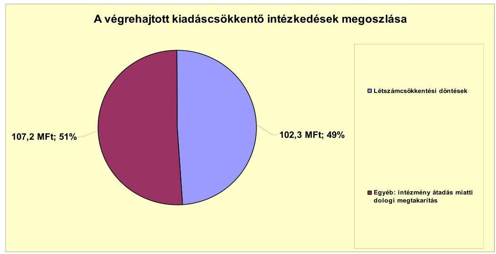

Az elért kiadási megtakarítás teljes egészében kötelező feladat átadásához kapcsolódó döntés eredménye volt. A 2007. évben egy szociális intézmény, míg a 2010. évben egy közoktatási intézmény átadására került sor. Az intézményátadásokkal összefüggő létszámcsökkentésből 102,3 millió Ft kiadási megtakarítás adódott, amely az összes kiadási megtakarítás 48,8 %-át tette ki. A feladatátadásból eredően a dologi kiadások 107,2 millió Ft-tal (51,2%) csökkentek.

---

Az Önkormányzat által 2007-2010. évek között végrehajtott létszámcsökkentések alakulását a következő táblázat mutatja:

| Megnevezés (adatok fő-ben) |  |  |  |  |  |  |
| :--: | :--: | :--: | :--: | :--: | :--: | :--: |
| 2007. január 1-jén jóváhagyott álláshelyek száma |  |  |  |  |  |  |
| Megszüntetett álláshelyek száma |  |  |  |  |  |  |
| ebből | üres álláshelyek száma |  |  |  |  | 0 |
|  | szakmai álláshelyek száma | 43 | 49 | 7 | 5 | 105 |
|  | intézmény-üzemeltetéssel kapcsolatos álláshelyek száma | 27 | 16 | 4 |  | 249 |
| Álláshely növekedése |  | 15 | 0 | 0 | 9 | 125 |
| 2010. december 31-én záró álláshelyek száma |  | 351 | 145 | 57 | 112 | 22687 |
| 2007. január 1-jén foglalkoztatott létszám |  | 385 | 245 | 60 | 108 | 2922 |
| Létszámcsökkentés |  | 70 | 65 | 11 |  | 146 |
| Létszámnövekedés |  | 14 |  |  |  | 14 |
| 2010. december 31-én foglalkoztatott létszám |  | 370 | 144 | 54 | 105 | 2669 |

Az Önkormányzati kimutatások alapján az engedélyezett álláshelyek száma 2007. január 1. és 2010. december 31. között 816 főről 687 főre csökkent. A 2007. évi 827 fős induló ténylegesen foglalkoztatottak száma feladatátadásra irányuló önkormányzati döntések következtében 2010. december 31-ére 699 főre csökkent. Az Önkormányzat 2007-2010. években összesen 154 álláshelyet szüntetett meg. A megszüntetett 154 álláshelyből 105 fő (68,2%) szakmai, 49 fő (31,8%) intézményüzemeltetéssel kapcsolatos álláshely volt, üres álláshely zárolására nem került sor.

A vizsgálattal érintett években meghozott döntések hatására a közoktatásban 70 fő (45,5 %), a szociális és gyermekvédelem területén 65 fő (42,2 %), egészségügyi ágazatban 11 fő (7,1 %), a Polgármesteri hivatalban 5 fő (3,3 %), egyéb területen 3 fő (1,9 %) álláshely megszüntetésére került sor. Ezzel egy időben a közoktatás, a Polgármesteri hivatalon belül ellátott és egyéb feladatok bővülésével összefüggésben az álláshelyek száma 25 fővel emelkedett. Így összességében az időszak álláshelyeinek száma 129 fővel csökkent.

Az Önkormányzat a vizsgált időszakon belül 2007. és 2010. évben nyújtott be pályázatot a helyi szervezési intézkedésekhez kapcsolódó központi támogatásra, mellyel összefüggésben 2010. december 31-ig 11,0 millió Ft támogatásban részesült. A 2010. évben benyújtott létszámcsökkentési pályázat 2011. évre áthúzódó hatása 1,8 millió Ft volt. Az Önkormányzatnál központi támogatás felhasználásával 13 fő tartós álláshely leépítése történt. A tartósan leépített álláshelyek száma a vizsgált években megszüntetett álláshelyek (154 fő) 8,4%-át jelentette.

Az Önkormányzat a kiadások fedezetének biztosítása, a bevételek növelése céljából a helyi adókkal kapcsolatos kedvezmények, mentességek csökkentéséről döntött. Az adóhátralékok, egyéb lejárt tartozások esetében hivatalon belüli feladatátcsoportosítással fokozta a behajtási tevékenységet. A döntések eredményeképpen az Önkormányzat kimutatása szerint a vizsgált időszakban összesen 540,2 millió Ft-tal emelkedett a bevételek összege.

A 2007-2011. év I. félévben érvényesített bevételnövelő intézkedések eredményét a következő ábra szemlélteti:

---

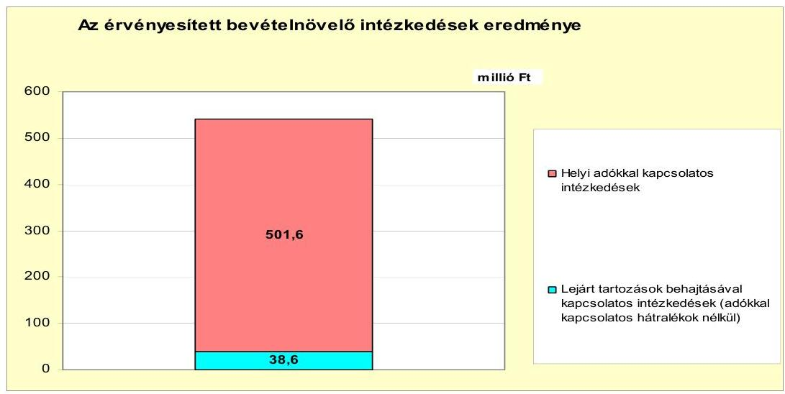

A helyi adókkal kapcsolatos intézkedések - a kimutatások szerint - 501,6 millió Ft-tal növelték az önkormányzat bevételeit, amely az összes bevétel emelkedés 92,9 %-át tette ki. Ezen belül a magánszemélyek kommunális adóját érintő egyes kedvezmények megszüntetése, illetve csökkentése 13,8 millió Ft (2,6%) bevételnövekedést eredményezett. Az adóhátralékok inkasszóval történő behajtása 261,7 millió Ft (48,4 %), míg a felhívásra történő hátralékbefizetések 226,1 millió Ft (41,9%) többletbevételt jelentettek az Önkormányzat számára.

A lejárt tartozások behajtásával kapcsolatos intézkedések a vizsgált időszakban összesen 38,6 millió Ft (7,1 %) többletforrást eredményeztek az Önkormányzat kimutatása szerint. Ezen belül a bérleti díjak, lakbérek hátralékainak behajtásából 34,1 millió Ft (6,3%) többletbevétel származott, a mezőőri járulékkal kapcsolatban keletkezett hátralékok beszedése 4,5 millió Ft-tal (0,8 %) emelte a bevételek összegét.

Az Önkormányzat költségvetési támogatásból, átengedett bevételekből származó bevételei a 2007. évhez képest az időszak egészét tekintve összességében nem csökkentek. Ennek ellenére az Önkormányzat kiadási megtakarítást eredményező és bevételt növelő intézkedéseket hozott.

# 5. AZ ÁSZ ÁLTAL A KORÁBB ÉVEKBEN A PÉNZÜGYI EGYENSÚLY JAVÍTÁSÁRA TETT SZABÁLYSZERŰSÉGI ÉS CÉLSZERŰSÉGI JAVASLATOK HASZNOSULÁSA 

Az ÁSZ a V-1001-9/10/2007. számú számvevői jelentésében az Önkormányzat gazdálkodási rendszerét a 2007. évben ellenőrizte, amelynek során a pénzügyi egyensúly javítására egy célszerűségi és egy szabályszerűségi javaslatot tett.

A célszerűségi javaslatot teljesítették, a polgármester tájékoztatta a Képvise-lő-testületet a számvevőszéki ellenőrzés tapasztalatairól, amelynek megvalósítására intézkedési tervet készítettek. A szabályszerűségi javaslatot a jegyző nem hasznosította, a 2009-2011. évi költségvetési rendeletekben az Áht., 8/A. § (7)

---

bekezdése $^{33}$ ellenére finanszírozási célú pénzügyi műveleteket számoltak el költségvetési hiányt, illetve költségvetési többletet módosító költségvetési bevételként, illetve költségvetési kiadásként. A jegyző, aki a javaslatot nem hasznosította, munkaviszonyát az Önkormányzatnál megszüntette, az új jegyző 2011. augusztus 16-ától tölti be hivatalát.

A 2009. évi költségvetési rendeletben 32,6 millió Ft „pénzügyi befektetés bevételét” 11,8 millió Ft kölcsön visszatérítését mutatták ki a költségvetési bevételek között. A 2010. évi költségvetési rendeletben 32,6 millió Ft pénzügyi befektetés bevételét és 11,6 millió Ft kölcsön visszatérülését mutatták ki a költségvetési bevételek között. A 2011. évi költségvetési rendeletben a bevételek között 9,2 millió Ft kölcsön visszatérülését és 113,0 millió Ft hiteltörlesztést mutattak ki költségvetési hiányt módosító költségvetési kiadásként.

Budapest, 2012. április 1/6

Melléklet:  6 db
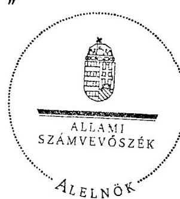

Warvasovszky Tihamér
$^{33}$ 2012. január 1-jétől erre vonatkozó előírást az Áht.$^{2}$ 72. § a) pontja tartalmaz.

---

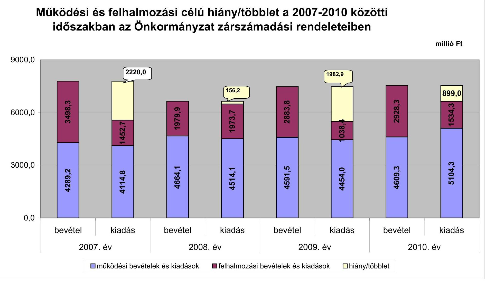

# Működési és felhalmozási célú hiány/többlet a 2007-2010 közötti időszakban az Önkormányzat zárszámadási rendeleteiben

|  I. kiadás | II. kiadás | III. kiadás | IV. kiadás | V. kiadás | VI. kiadás | VII. kiadás | VIII. kiadás  |
| --- | --- | --- | --- | --- | --- | --- | --- |
|  0,0 | 4289,2 | 4114,8 | 4664,1 | 4514,1 | 4591,5 | 4454,0 | 4609,3  |
|  0,1 | 4289,2 | 4114,8 | 4664,1 | 4514,1 | 4591,5 | 4454,0 | 4609,3  |
|  0,2 | 4289,2 | 4114,8 | 4664,1 | 4514,1 | 4591,5 | 4454,0 | 4609,3  |
|  0,3 | 4289,2 | 4114,8 | 4664,1 | 4514,1 | 4591,5 | 4454,0 | 4609,3  |

**Működési és felhalmozási célú hiány/többlet a 2007-2010 közötti időszakban az Önkormányzat zárszámadási rendeleteiben**

**millió Ft**

**2007. év**

**2008. év**

**2009. év**

**2010. év**

---

Az Önkormányzat bevételei és kiadásai, valamint adósságszolgálata 2007-2010 között

|   |  |  |  | millió Ft  |
| --- | --- | --- | --- | --- |
|  1. FOLYÓ KÖLTSÉGVETÉS* | 2007. év | 2008. év | 2009. év | 2010.év  |
|  1.1.1. Saját működési bevételek | 1205,1 | 1351,6 | 1414,5 | 1714,3  |
|  1.1.2. Költségvetési támogatás | 1462,4 | 2025,6 | 2007,3 | 2089,8  |
|  1.1.3. Átszedett bevételek | 1291,5 | 856,0 | 817,0 | 825,8  |
|  1.1.4. Állambázatartáson belülről kapott támogatások | 277,1 | 343,5 | 363,5 | 486,8  |
|  1.1.5. EU-s és külföldről kapott bevételek | 12,6 | 12,4 | 22,8 | 0,0  |
|  1.1.6. Állambázatartáson kívülről kapott bevételek | 20,2 | 8,7 | 3,9 | 14,4  |
|  1.1.7. Előző évi pénzmaradvány átvétel | 0,0 | 0,7 | 0,5 | 0,0  |
|  1.1. Folyó bevételek $=1.1.1.+1.1.2.+1.1.3.+1.1.4.+1.1.5.+1.1.6.+1.1.7.$ | 4268,9 | 4598,5 | 4630,3 | 5131,1  |
|  1.2.1. Működési kiadások kamatkiadások nélkül | 3687,7 | 3898,2 | 3916,5 | 4116,8  |
|  1.2.2. Állambázatartáson belülre átadott pénzeszközök | 27,2 | 40,8 | 34,1 | 38,0  |
|  1.2.3.1. vállalkozásoknak | 1,3 | 6,2 | 4,0 | 0,4  |
|  1.2.3.2. EU-nak, illetve külföldre | 0,0 | 0,0 | 0,0 | 0,0  |
|  1.2.3.3. magánszemélyeknek | 354,4 | 430,8 | 467,3 | 541,0  |
|  1.2.3.4. nonprofit szervezeteknek | 29,2 | 31,4 | 49,4 | 53,1  |
|  1.2.3. Transzferkiadások ( $=1.2.3.1+1.2.3.2+1.2.3.3+1.2.3.4$ ) | 385,0 | 468,4 | 520,7 | 594,5  |
|  1.2.4 Kamatkiadások | 18,7 | 89,4 | 89,2 | 42,7  |
|  1.2.5. Előző évi pénzmaradvány átadás | 0,0 | 0,0 | 0,0 | 0,0  |
|  1.2. Folyó kiadások $=1.2.1.+1.2.2.+1.2.3.+1.2.4.+1.2.5.$ | 4118,5 | 4496,8 | 4560,5 | 4792,0  |
|  1.3. Folyó költségvetés egyenlege MŰKÖDÉSI JÖVEDELEM (1.1. - 1.2.) | 150,4 | 101,7 | 69,8 | 339,1  |
|  2. FELHALMOZÁSI KÖLTSÉGVETÉS** |

 0,0 | 0,0 | 0,0 | 0,0  |
|  2.1.1. Saját tökebevételek | 45,8 | 39,3 | 186,4 | 24,5  |
|  2.1.2. Állami támogatáson belülről kapott támogatások | 292,6 | 144,7 | 152,9 | 640,2  |
|  2.1.3. EU-s és külföldről kapott támogatások | 1,0 | 0,0 | 30,3 | 0,0  |
|  2.1.4. Állami támogatáson kívülről kapott támogatások | 140,7 | 20,3 | 76,8 | 23,1  |
|  2.1. Felhalmozási bevételek ( $=2.1 .1 .+2.1 .2+2.1 .3+2.1 .4$.) | 480,1 | 204,3 | 446,4 | 687,8  |
|  2.2.1. Saját beruházási kiadás áfával | 880,5 | 267,8 | 461,3 | 1196,7  |
|  2.2.2. Saját felújítási kiadás áfával | 138,3 | 113,0 | 394,8 | 26,5  |
|  2.2.3. Állami támogatáson belülre átadott pénzeszköz | 1,0 | 13,9 | 0,2 | 0,0  |
|  2.2.4. EU-nak és külföldnek adott pénzeszközök | 0,0 | 0,0 | 0,0 | 0,0  |
|  2.2.5. Állami támogatáson kívülre adott pénzeszközök | 77,0 | 102,9 | 79,0 | 70,0  |
|  2.2.6. Befektetési célú részesedések vásárlása | 10,4 | 13,8 | 11,2 | 25,6  |
|  2.2. Felhalmozási kiadások ( $=2.2 .1 .+2.2 .2 .+2.2 .3 .+2.2 .4 .+2.2 .5 .+2.2 .6$.) | 1107,1 | 511,4 | 946,5 | 1318,7  |
|  2.3. Felhalmozási költségvetés egyenlege (2.1. - 2.2.) | $-627,0$ | $-307,1$ | $-500,1$ | $-630,9$  |
|  3. Finanszírozási műveletek nélküli (GFS) pozíció(1.3.+2.3.) | $-476,6$ | $-205,4$ | $-430,3$ | $-291,8$  |
|  4. Finanszírozási műveletek | 0,0 | 0,0 | 0,0 | 0,0  |
|  4.1. Hitelfelvétel | 42,3 | 0,0 | 306,5 | 90,8  |
|  4.2. Hitelfelvétel | 345,6 | 0,0 | 0,0 | 0,0  |
|  4.3. Forgatási és befektetési célú értékpapírok kibocsátása | 2478,1 | 0,0 | 0,0 | 0,0  |
|  4.4. Forgatási és befektetési célú értékpapírok beváltása | 0,0 | 0,0 | 0,0 | 0,0  |
|  4.5. Forgatási és befektetési célú értékpapírok értékesítése | 82,6 | 32,6 | 1584,8 | 32,6  |
|  4.6. Forgatási és befektetési célú értékpapírok vásárlása | 0,0 | 1464,6 | 0,0 | 0,0  |
|  4.7. Egyéb finanszírozási bevételek (függő, átfutó, kiegyenlítő) | 18,7 | 20,2 | $-38,0$ | $-32,1$  |
|  4.8. Egyéb finanszírozási kiadások (függő, átfutó, kiegyenlítő) | $-3,7$ | 14,9 | $-5,7$ | 527,8  |
|  4.9.Finanszírozási műveletek egyenlege (4.1. - 4.2.+4.3.-4.4+4.5.-4.6.+4.7.-4.8.) | 2279,8 | $-1426,7$ | 1858,9 | $-436,6$  |
|  5. Tárgyévi pénzügyi pozíció (1.3.+ 2.3.+4.9.) | 1803,2 | $-1632,1$ | 1428,6 | $-728,4$  |
|  6. Nettó működési jövedelem = működési jövedelem (1.3.) - tőketörlesztés $(4.2+4.4)$ | $-195,2$ | 101,7 | 69,8 | 339,1  |
|  TÁJÉKOZTATÓ ADATOK |  |  |  |   |
|  Összes kötelezettség | 2640,6 | 3126,8 | 3505,6 | 4543,3  |
|  ebből rövid lejáratú | 201,0 | 292,1 | 613,8 | 1101,1  |
|  Összes szállítói kötelezettség | 108,8 | 180,9 | 49,1 | 175,7  |
|  ebből lejárt (tanúsítványból) | 43,5 | 1,4 | 3,9 | 4,3  |
|  Pénz és tőkepiaci kötelezettség (adósság) | 2415,9 | 2817,8 | 3196,5 | 3926,7  |
|  ebből rövid lejáratú | 0,0 | 0,0 | 306,5 | 484,5  |
|  PPP szerződéses állomány jelenértéken (tanúsítványból) | 0,0 | 0,0 | 0,0 | 0,0  |
|  ebből lejárt szolgáltatási díj miatti kötelezettség | 0,0 | 0,0 | 0,0 | 0,0  |
|  Folyószámlahitel napi átlagos állománya (tanúsítványból) | 3,4 | 58,6 | 160,1 | 214,8  |
|  Likvidhitel napi átlagos állománya (tanúsítványból) | 0,0 | 0,0 | 0,0 | 0,0  |
|  Munkabérhitel napi átlagos állománya (tanúsítványból) | 0,0 | 0,0 | 0,6 | 48,9  |
|  Kezesség és garanciavállalások (tanúsítványból) | 0,0 | 0,0 | 0,0 | 0,0  |
|  Jogerős bírósági ítéletekből adódó kötelezettségek (tanúsítványból) | 0,0 | 0,0 | 0,0 | 0,0  |
|  Finanszírozásba bevonható eszközök: | 2422,1 | 2222,3 | 2153,9 | 1393,2  |
|  Tartós hitelviszonyt megtestesítő értékpapírok év végi állománya | 96,7 | 879,1 | 32,2 | 0,0  |
|  Hosszú lejáratú bankbetétek év végi állománya | 2100,0 | 505,2 | 1915,9 | 1268,7  |
|  Értékpapírok év végi állománya | 0,0 | 650,0 | 0,0 | 0,0  |
|  Pénzeszközök (idegen pénzeszközök nélküli) év végi állománya | 225,4 | 188,0 | 205,8 | 124,5  |

[^0] [^0]: * Bevételekben nem térül, a kiadásokban nem jelenik meg az amortizáció, a vagyoni helyzetet az egyenleg befolyásolja. ** Bevételekben vagyon megőrzésre és bővítésre fordítható források.

---

Törökszentmiklós Város Önkormányzata

Az önkormányzat 2007-2010. években megvalósított, 2010. december 31-ig befejezett fejlesztései és azok forrásösszetétele

mibió Ft-ban

|  Fejlesztési feladat (beruházás, felújítás) |  | Beruházás, felújítás |  | Teljes bekerülési költség |  |  |  |  |  |  |  |  |  |  |  |  |  |  |  |  |  |  |  |  |  |  |  |  |  |
| --- | --- | --- | --- | --- | --- | --- | --- | --- | --- | --- | --- | --- | --- | --- | --- | --- | --- | --- | --- | --- | --- | --- | --- | --- | --- | --- | --- | --- | --- |
|   |  |  |  |  |  |  |  |  |  |  |  |  |  |  |  |  |  |  |  |  |  |  |  |  |  |  |  |  | 2010. december 31-ig megvalósított beruházás forrásösszetétele  |
|  N | Megnevezése | Közgyűlési határozat száma | Észlelt befejezése | Terv amortizáció | Tény informatizáltság | Elérés (1: 1) | Tervezett |  |  |  |  |  |  |  |  |  |  |  |  |  |  |  |  |  |  |  |  |  | Külvény |   |
|  1 |  |  |  |  |  |  |  |  |  |  |  |  |  |  |  |  |  |  |  |  |  |  |  |  |  |  |  |  |  |   |
|  2 |  |  |  |  |  |  |  |  |  |  |  |  |  |  |  |  |  |  |  |  |  |  |  |  |  |  |  |  |  |   |
|  3 |  |  |  |  |  |  |  |  |  |  |  |  |  |  |  |  |  |  |  |  |  |  |  |  |  |  |  |  |  |   |
|  4 | Felsővezetők |  |  |  |  |  |  |  |  |  |  |  |  |  |  |  |  |  |  |  |  |  |  |  |  |  |  |  |  |   |
|  5 | Városháza Központ akadálymentesítése | 1903006 (0.00) | 2008. | 2007. | 12,8 | 11,8 | -0,6 | 0,0 | 11,0 | 8,7 | 1,0 | 0,8 | 0,0 | 0,0 | 0,0 | 0,0 | 0,0 | 0,0 | 0,0 | 0,0 | 0,0 | 0,0 | 0,0 | 0,0 | 0,0 | 0,0 | 0,0 | 0,0 | 11,0 | igen  |
|  6 | Patrik utca burkolatfelújítás | 1300068 (0.00) | 2008. | 2007. | 21,7 | 21,7 | -0,8 | 10,0 | 10,0 | 11,0 | 10,0 | 0,8 | 0,0 | 0,0 | 0,0 | 0,0 | 0,0 | 0,0 | 0,0 | 0,0 | 0,0 | 0,0 | 0,0 | 0,0 | 0,0 | 0,0 | 0,0 | 0,0 | 11,0 | igen  |
|  7 | Közveszély. Kő. Isk. akadálymentesítése, százéves | 1602008 (0.00) | 2006. | 2007. | 57,2 | 61,8 | 4,4 | 13,7 | 48,1 | 17,2 | 21,8 | 4,8 | 0,0 | 0,0 | 0,0 | 0,0 | 0,0 | 0,0 | 0,0 | 0,0 | 0,0 | 0,0 | 0,0 | 0,0 | 0,0 | 0,0 | 0,0 | 0,0 | 61,8 | igen  |
|  8 | Északi névtelen betűzőtéri átépítés | 2003008 (0.00) | 2008. | 2007. | 27,8 | 28,8 | 1,4 | 10,2 | 16,0 | 12,4 | 13,8 | 1,4 | 0,0 | 0,0 | 0,0 | 0,0 | 0,0 | 0,0 | 0,0 | 0,0 | 0,0 | 0,0 | 0,0 | 0,0 | 0,0 | 0,0 | 0,0 | 0,0 | 28,8 | igen  |
|  9 | Indonéziai nyíltészeti szent | 0800067 (0.39.) | 2007. | 2007. | 14,1 | 24,1 |

 0,4 | 0,0 | 24,1 | 2,4 | 1,4 | 0,0 | 0,0 | 0,0 | 0,0 | 0,0 | 0,0 | 0,0 | 0,0 | 0,0 | 0,0 | 0,0 | 0,0 | 0,0 | 0,0 | 0,0 | 0,0 | 0,0 | 24,1 | gen  |
|  10 | Kül. bekerülése felújítás | 1903006 (0.00) | 2007. | 2007. | 15,3 | 14,3 | -1,0 | 0,0 | 14,4 | 4,6 | 3,8 | -1,0 | 0,0 | 0,0 | 0,0 | 0,0 | 0,0 | 0,0 | 0,0 | 0,0 | 0,0 | 0,0 | 0,0 | 0,0 | 0,0 | 0,0 | 0,0 | 0,0 | 15,3 | gen  |
|  11 | Patrik Kő. Isk. névtáblázat felújítás, akadálymentesítés, nyílászárócsere | 4500067 (0.29) | 2006. | 2006. | 50,0 | 59,0 | 9,3 | 44,6 | 14,2 | 25,0 | 29,0 | 9,0 | 0,0 | 0,0 | 0,0 | 0,0 | 0,0 | 0,0 | 0,0 | 0,0 | 0,0 | 0,0 | 0,0 | 0,0 | 0,0 | 0,0 | 0,0 | 0,0 | 56,0 | gen  |
|  12 | Iskola! Konyha lezáró szigetelés, tetőtéri felújítás | 9100006 (1.14) | 2008. | 2008. | 10,2 | 10,2 | 0,0 | 0,0 | 10,2 | 3,1 | 3,1 | 0,0 | 0,0 | 0,0 | 0,0 | 0,0 | 0,0 | 0,0 | 0,0 | 0,0 | 0,0 | 0,0 | 0,0 | 0,0 | 0,0 | 0,0 | 0,0 | 0,0 | 10,2 | gen  |
|  13 | Hunyadi út tagvindó tetőszerkezet felújítása | 20602009 (20.30) | 2009. | 2009. | 13,6 | 13,6 | 0,0 | 0,0 | 13,6 | 3,4 | 3,4 | 0,0 | 0,0 | 0,0 | 0,0 | 0,0 | 0,0 | 0,0 | 0,0 | 0,0 | 0,0 | 0,0 | 0,0 | 0,0 | 0,0 | 0,0 | 0,0 | 0,0 | 13,6 | gen  |
|  14 | 10.000 Ft alatti felújítások | 30 db |  |  | 107,8 | 107,8 | 0,0 | 0,0 | 107,8 | 102,1 | 102,1 | 0,0 | 0,0 | 0,0 | 0,0 | 0,0 | 0,0 | 0,0 | 0,0 | 0,0 | 0,0 | 0,0 | 0,0 | 0,0 | 0,0 | 0,0 | 0,0 | 0,0 | 107,8 | gen  |
|  15 | Felsőlevek összesen |  |  |  | 339,4 | 352,2 | 12,9 | 79,3 | 272,9 | 164,7 | 197,3 | 12,8 | 0,0 | 0,0 | 0,0 | 0,0 | 0,0 | 0,0 | 0,0 | 0,0 | 0,0 | 0,0 | 0,0 | 0,0 | 0,0 | 0,0 | 0,0 | 0,0 | 352,2 |   |
|  16 | Felsőlevek összesen |  |  |  | 339,4 | 352,2 | 12,9 | 79,3 | 272,9 | 164,7 | 197,3 | 12,8 | 0,0 | 0,0 | 0,0 | 0,0 | 0,0 | 0,0 | 0,0 | 0,0 | 0,0 | 0,0 | 0,0 | 0,0 | 0,0 | 0,0 | 0,0 | 0,0 | 352,2 |   |
|  17 | Felsőlevek |  |  |  |  |  |  |  |  |  |  |  |  |  |  |  |  |  |  |  |  |  |  |  |  |  |  |  |  |   |
|  18 | Össznyomóanyitásba kifizetése | 2700002 (0.33) | 2003. | 2007. | 2 861,8 | 3 179,0 | 211,0 | 2 532,2 | 648,9 | 1 019,8 | 1 230,0 | 212,7 | 322,7 | 382,7 | 0,0 | 0,0 | 0,0 | 0,0 | 0,0 | 0,0 | 0,0 | 0,0 | 0,0 | 0,0 | 0,0 | 0,0 | 0,0 | 0,0 | 3 539,2 | 1 625,4  |
|  19 | Patrik tagvindó akadálymentesítése | 10900007 (10.24) | 2004. | 2008. | 11,1 | 11,0 | -0,1 | 0,0 | 11,0 | 0,1 | 0,0 | 0,0 | 0,0 | 0,0 | 0,0 | 0,0 | 0,0 | 0,0 | 0,0 | 0,0 | 0,0 | 0,0 | 0,0 | 0,0 | 0,0 | 0,0 | 0,0 | 0,0 | 11,0 | gen  |
|  20 | Pögetmezőn tét. akadálymentesítése | 11000007 (10.24) | 2004. | 2008. | 23,7 | 24,5 | 0,8 | 0,0 | 24,5 | 1,4 | 3,0 | 1,6 | 0,0 | 0,0 | 0,0 | 0,0 | 0,0 | 0,0 | 0,0 | 0,0 | 0,0 | 0,0 | 0,0 | 0,0 | 0,0 | 0,0 | 0,0 | 0,0 | 24,5 | gen  |
|  21 | Strand névtábla | 18600009 (20.05) | 2008. | 2010. | 216,8 | 216,8 | 0,0 | 0,0 | 216,8 | 64,1 | 64,1 | 0,0 | 0,0 | 0,0 | 0,0 | 0,0 | 0,0 | 0,0 | 0,0 | 0,0 | 0,0 | 0,0 | 0,0 | 0,0 | 0,0 | 0,0 | 0,0 | 0,0 | 216,8 | gen  |
|  22 | Akácos út névtáblája | 0600006 (11.14) | 2008. | 2009. | 38,0 | 38,0 | 0,0 | 0,0 | 38,0 | 19,0 | 19,0 | 0,0 | 0,0 | 0,0 | 0,0 | 0,0 | 0,0 | 0,0 | 0,0 | 0,0 | 0,0 | 0,0 | 0,0 | 0,0 | 0,0 | 0,0 | 0,0 | 0,0 | 38,0 | gen  |
|  23 | Tenyő út névtáblája | 10900010 (10.33) | 2010. | 2010. | 38,0 | 39,3 | 1,3 | 0,0 | 39,3 | 19,0 | 20,3 | 1,3 | 0,0 | 0,0 | 0,0 | 0,0 | 0,0 | 0,0 | 0,0 | 0,0 | 0,0 | 0,0 | 0,0 | 0,0 | 0,0 | 0,0 | 0,0 | 0,0 | 39,3 | gen  |
|  24 | Szélmalom út (10.33) | 2009. | 2009. | 186,8 | 190,8 | 9,0 | 0,0 | 190,8 | 168,8 | 188,8 | 0,0 | 0,0 | 0,0 | 0,0 | 0,0 | 0,0 | 0,0 | 0,0 | 0,0 | 0,0 | 0,0 | 0,0 | 0,0 | 0,0 | 0,0 | 0,0 | 0,0 | 0,0 | 39,3 | gen  |
|  25 | Adásy Ferdinánd utca aszfaltjavítása | 0300010 (10.08) | 2010. | 2010. | 8,3 | 10,6 | 2,3 | 0,0 | 10,6 | 4,3 | 8,6 | 2,3 | 0,0 | 0,0 | 0,0 | 0,0 | 0,0 | 0,0 | 0,0 | 0,0 | 0,0 | 0,0 | 0,0 | 0,0 | 0,0 | 0,0 | 0,0 | 0,0 | 10,6 |  |
|  26 | Gyűjtött névtábla kötvényforrásból | 18100007 | 2008. | 2009. | 277,6 | 269,1 | -8,5 | 0,0 | 269,1 | 0,0 | 0,0 | 0,0 | 0,0 | 0,0 | 0,0 | 0,0 | 0,0 | 0,0 | 0,0 | 0,0 | 0,0 | 0,0 | 0,0 | 0,0 | 0,0 | 0,0 | 0,0 | 0,0 | 269,1 | gen  |
|  27 | Bárczy utak égetett burkolattal való tét. | 2710001 (20.24) | 2007. | 18,0 | 18,0 | 0,0 | 0,0 | 18,0 | 18,0 | 18,0 | 0,0 | 0,0 | 0,0 | 0,0 | 0,0 | 0,0 | 0,0 | 0,0 | 0,0 | 0,0 | 0,0 | 0,0 | 0,0 | 0,0 | 0,0 | 0,0 | 0,0 | 0,0 | 18,0 | gen  |
|  28 | Condéslavéte tájékoztató | 0300007 (10.34) | 2007. | 2008. | 37,0 | 37,0 | 0,0 | 0,0 | 37,0 | 37,0 | 37,0 | 0,0 | 0,0 | 0,0 | 0,0 | 0,0 | 0,0 | 0,0 | 0,0 | 0,0 | 0,0 | 0,0 | 0,0 | 0,0 | 0,0 | 0,0 | 0,0 | 0,0 | 37,0 | gen  |
|  29 | Ön és oldag- tájékoztató (Vízzsey, Jókai (tájékoztató)) | 0100007 (10.18) | 2007. | 2008. | 40,2 | 41,0 | 0,8 | 0,0 | 41,0 | 20,1 | 20,9 | 0,8 | 0,0 | 0,0 | 0,0 | 0,0 | 0,0 | 0,0 | 0,0 | 0,0 | 0,0 | 0,0 | 0,0 | 0,0 | 0,0 | 0,0 | 0,0 | 0,0 | 41,0 | gen  |
|  30 | Játszótér névtábla | 19500001 (24.08) | 2008. | 2008. | 11,9 | 11,9 | 0,0 | 0,0 | 11,9 | 11,9 | 11,9 | 0,0 | 0,0 | 0,0 | 0,0 | 0,0 | 0,0 | 0,0 | 0,0 | 0,0 | 0,0 | 0,0 | 0,0 | 0,0 | 0,0 | 0,0 | 0,0 | 0,0 | 11,9 |  |
|  31 | Tüzelővásárlás | 20100006 (24.10) | 2010. | 2010. | 261,4 | 261,4 | 0,0 | 0,0 | 261,4 | 27,4 | 27,4 | 0,0 | 0,0 | 0,0 | 0,0 | 0,0 | 0,0 | 0,0 | 0,0 | 0,0 | 0,0 | 0,0 | 0,0 | 0,0 | 0,0 | 0,0 | 0,0 | 0,0 | 261,4 |  |
|  32 | 10.000 Ft alatti fejlesztések | 20 db |  |  | 126,3 | 126,3 | 0,0 | 0,0 | 126,3 | 126,3 | 0,0 | 0,0 | 0,0 | 0,0 | 0,0 | 0,0 | 0,0 | 0,0 | 0,0 | 0,0 | 0,0 | 0,0 | 0,0 | 0,0 | 0,0 | 0,0 | 0,0 | 0,0 | 126,3 |  |
|

  33 | Felfesülések összesen |  |  | 4 218,3 | 4 027,5 | 209,6 | 2 532,2 | 2 895,7 | 1 551,7 | 1 779,2 | 219,4 | 322,7 | 352,7 | 0,0 | 274,2 | 569,2 | 14,9 | 287,3 | 243,6 | -23,7 | 1 762,5 | 1 701,0 | -1,4 | 818,3 |  |  |  |  |  |  |   |
|  34 | Mindösszesen |  |  | 4 758,7 | 4 986,1 | 221,4 | 2 611,0 | 2 366,8 | 1 736,4 | 1 966,0 | 231,9 | 322,7 | 352,7 | 0,0 | 515,1 | 569,2 | 14,9 | 287,3 | 243,6 | -23,7 | 1 856,0 | 1 856,0 | -1,4 | 1 770,0 |  |  |  |  |  |  |   |

- Ön és oldal- tájéko (Vízzsey, Jókai (tájéko) 10.18.)

---

### 3.b. számú melléklet a V-3102-021/2012. számú jelentéshez

|   |  |  |  |  |  |  |  |  |  |  |  |  |  |  |  |  |  |  |  |  |  |  |  |  |  |  |  |  |  |  |  |  |  |  |  |  |  |  |  |  |  |   |
| --- | --- | --- | --- | --- | --- | --- | --- | --- | --- | --- | --- | --- | --- | --- | --- | --- | --- | --- | --- | --- | --- | --- | --- | --- | --- | --- | --- | --- | --- | --- | --- | --- | --- | --- | --- | --- | --- | --- | --- | --- | --- |
|   | Fejlesztési feladat (beruházás, felújítás) |  |  |  |  |  |  |  |  |  |  |  |  |  |  |  |  |  |  |  |  |  |  |  |  |  |  |  |  |  |  |  |  |  |  |  |  |  |  |  |   |
|   | Fejlesztési feladat (beruházás, felújítás) |  |  |  |  |  |  |  |  |  |  |  |  |  |  |  |  |  |  |  |  |  |  |  |  |  |  |  |  |  |  |  |  |  |  |  |  |  |  |  |   |
|   |  |  |  |  |  |  |  |  |  |  |  |  |  |  |  |  |  |  |  |  |  |  |  |  |  |  |  |  |  |  |  |  |  |  |  |  |  |  |  |  |   |
|   |  |  |  |  |  |  |  |  |  |  |  |  |  |  |  |  |  |  |  |  |  |  |  |  |  |  |  |  |  |  |  |  |  |  |  |  |  |  |  |  |   |
|   |  |  |  |  |  |  |  |  |  |  |  |  |  |  |  |  |  |  |  |  |  |  |  |  |  |  |  |  |  |  |  |  |  |  |  |  |  |  |  |  |   |
|   |  |  |  |  |  |  |  |  |  |  |  |  |  |  |  |  |  |  |  |  |  |  |  |  |  |  |  |  |  |  |  |  |  |  |  |  |  |  |  |  |   |
|   |  |  |  |  |  |  |  |  |  |  |  |  |  |  |  |  |  |  |  |  |  |  |  |  |  |  |  |  |  |  |  |  |  |  |  |  |  |  |  |  |   |
|   |  |  |  |  |  |  |  |  |  |  |  |  |  |  |  |  |  |  |  |  |  |  |  |  |  |  |  |  |  |  |  |  |  |  |  |  |  |  |  |  |   |
|   |  |  |  |  |  |  |  |  |  |  |  |  |  |  |  |  |  |  |  |  |  |  |  |  |  |  |  |  |  |  |  |  |  |  |  |  |  |  |  |  |   |
|   |  |  |  |  |  |  |  |  |  |  |  |  |  |  |  |  |  |  |  |  |  |  |  |  |  |  |  |  |  |  |  |  |  |  |  |  |  |  |  |  |   |
|   |  |  |  |  |  |  |  |  |  |  |  |  |  |  |  |  |  |  |  |  |  |  |  |  |  |  |  |  |  |  |  |  |  |  |  |  |  |  |  |  |   |
|   |  |  |  |  |  |  |  |  |  |  |  |  |  |  |  |  |  |  |  |  |  |  |  |  |  |  |  |  |  |  |  |  |  |  |  |  |  |  |  |  |   |
|   |  |  |  |  |  |  |  |  |  |  |  |  |  |  |  |  |  |  |  |  |  |  |  |  |  |  |  |  |  |  |  |  |  |  |  |  |  |  |  |  |   |
|   |  |  |  |  |  |  |  |  |  |  |  |  |  |  |  |  |  |  |  |  |  |  |  |  |  |  |  |  |  |  |  |  |  |  |  |  |  |  |  |  |   |
|   |  |  |  |  |  |  |  |  |  |  |  |  |  |  |  |  |  |  |  |  |  |  |  |  |  |  |  |  |  |  |  |  |  |  |  |  |  |  |  |  |   |

 |  |  |  |  |  |  |  |  |  |  |  |  |  |  |   |
|   |  |  |  |  |  |  |  |  |  |  |  |  |  |  |  |  |  |  |  |  |  |  |  |  |  |  |  |  |  |  |  |  |  |  |  |  |  |  |  |  |   |
|   |  |  |  |  |  |  |  |  |  |  |  |  |  |  |  |  |  |  |  |  |  |  |  |  |  |  |  |  |  |  |  |  |  |  |  |  |  |  |  |  |   |
|   |  |  |  |  |  |  |  |  |  |  |  |  |  |  |  |  |  |  |  |  |  |  |  |  |  |  |  |  |  |  |  |  |  |  |  |  |  |  |  |  |   |
|   |  |  |  |  |  |  |  |  |  |  |  |  |  |  |  |  |  |  |  |  |  |  |  |  |  |  |  |  |  |  |  |  |  |  |  |  |  |  |  |  |   |
|   |  |  |  |  |  |  |  |  |  |  |  |  |  |  |  |  |  |  |  |  |  |  |  |  |  |  |  |  |  |  |  |  |  |  |  |  |  |  |  |  |   |
|   |  |  |  |  |  |  |  |  |  |  |  |  |  |  |  |  |  |  |  |  |  |  |  |  |  |  |  |  |  |  |  |  |  |  |  |  |  |  |  |  |   |
|   |  |  |  |  |  |  |  |  |  |  |  |  |  |  |  |  |  |  |  |  |  |  |  |  |  |  |  |  |  |  |  |  |  |  |  |  |  |  |  |  |   |
|   |  |  |  |  |  |  |  |  |  |  |  |  |  |  |  |  |  |  |  |  |  |  |  |  |  |  |  |  |  |  |  |  |  |  |  |  |  |  |  |  |   |
|   |  |  |  |  |  |  |  |  |  |  |  |  |  |  |  |  |  |  |  |  |  |  |  |  |  |  |  |  |  |  |  |  |  |  |  |  |  |  |  |  |   |
|   |  |  |  |  |  |  |  |  |  |  |  |  |  |  |  |  |  |  |  |  |  |  |  |  |  |  |  |  |  |  |  |  |  |  |  |  |  |  |  |  |   |
|   |  |  |  |  |  |  |  |  |  |  |  |  |  |  |  |  |  |  |  |  |  |  |  |  |  |  |  |  |  |  |  |  |  |  |  |  |  |  |  |  |   |
|   |  |  |  |  |  |  |  |  |  |  |  |  |  |  |  |  |  |  |  |  |  |  |  |  |  |  |  |  |  |  |  |  |  |  |  |  |  |  |  |  |   |
|   |  |  |  |  |  |  |  |  |  |  |  |  |  |  |  |  |  |  |  |  |  |  |  |  |  |  |  |  |  |  |  |  |  |  |  |  |  |  |  |  |   |
|   |  |  |  |  |  |  |  |  |  |  |  |  |  |  |  |  |  |  |  |  |  |  |  |  |  |  |  |  |  |  |  |  |  |  |  |  |  |  |  |  |   |
|   |  |  |  |  |  |  |  |  |  |  |  |  |  |  |  |  |  |  |  |  |  |  |  |  |  |  |  |  |  |  |  |  |  |  |  |  |  |  |  |  |   |
|   |  |  |  |  |  |  |  |  |  |  |  |  |  |  |  |  |  |  |  |  |  |  |  |  |  |  |  |  |  |  |  |  |  |  |  |  |  |  |  |  |   |
|   |  |  |  |  |  |  |  |  |  |  |  |  |  |  |  |  |  |  |  |  |  |  |  |  |  |  |  |  |  |  |  |  |  |  |  |  |  |  |  |  |   |
|   |  |  |  |  |  |  |  |  |  |  |  |  |  |  |  |  |  |  |  |  |  |  |  |  |  |  |  |  |  |  |  |  |  |  |  |  |  |  |  |  |   |
|   |

---

# Az Önkormányzat 2010. december 31-én folyamatban lévő fejlesztési feladataira 2010. december 31-én fennálló kötelezettségek és azok
 forrásíráseletele

|   |  |  |  |  |  |  |  |  |  |  |  |  |  |  |  |  |  |  |  |  |  |  |  |  |  |  |  |  |  |  |  |  |  |  |  |  |  |  |  |  |  |   |
| --- | --- | --- | --- | --- | --- | --- | --- | --- | --- | --- | --- | --- | --- | --- | --- | --- | --- | --- | --- | --- | --- | --- | --- | --- | --- | --- | --- | --- | --- | --- | --- | --- | --- | --- | --- | --- | --- | --- | --- | --- | --- | --- |
|   |  |  |  |  |  |  |  |  |  |  |  |  |  |  |  |  |  |  |  |  |  |  |  |  |  |  |  |  |  |  |  |  |  |  |  |  |  |  |  |  |  |   |
|   |  |  |  |  |  |  |  |  |  |  |  |  |  |  |  |  |  |  |  |  |  |  |  |  |  |  |  |  |  |  |  |  |  |  |  |  |  |  |  |  |  |   |
|   |  |  |  |  |  |  |  |  |  |  |  |  |  |  |  |  |  |  |  |  |  |  |  |  |  |  |  |  |  |  |  |  |  |  |  |  |  |  |  |  |  |   |
|   |  |  |  |  |  |  |  |  |  |  |  |  |  |  |  |  |  |  |  |  |  |  |  |  |  |  |  |  |  |  |  |  |  |  |  |  |  |  |  |  |  |   |
|   |  |  |  |  |  |  |  |  |  |  |  |  |  |  |  |  |  |  |  |  |  |  |  |  |  |  |  |  |  |  |  |  |  |  |  |  |  |  |  |  |  |   |
|   |  |  |  |  |  |  |  |  |  |  |  |  |  |  |  |  |  |  |  |  |  |  |  |  |  |  |  |  |  |  |  |  |  |  |  |  |  |  |  |  |  |   |
|   |  |  |  |  |  |  |  |  |  |  |  |  |  |  |  |  |  |  |  |  |  |  |  |  |  |  |  |  |  |  |  |  |  |  |  |  |  |  |  |  |  |   |
|   |  |  |  |  |  |  |  |  |  |  |  |  |  |  |  |  |  |  |  |  |  |  |  |  |  |  |  |  |  |  |  |  |  |  |  |  |  |  |  |  |  |   |
|   |  |  |  |  |  |  |  |  |  |  |  |  |  |  |  |  |  |  |  |  |  |  |  |  |  |  |  |  |  |  |  |  |  |  |  |  |  |  |  |  |  |   |
|   |  |  |  |  |  |  |  |  |  |  |  |  |  |  |  |  |  |  |  |  |  |  |  |  |  |  |  |  |  |  |  |  |  |  |  |  |  |  |  |  |  |   |
|   |  |  |  |  |  |  |  |  |  |  |  |  |  |  |  |  |  |  |  |  |  |  |  |  |  |  |  |  |  |  |  |  |  |  |  |  |  |  |  |  |  |   |
|   |  |  |  |  |  |  |  |  |  |  |  |  |  |  |  |  |  |  |  |  |  |  |  |  |  |  |  |  |  |  |  |  |  |  |  |  |  |  |  |  |  |   |
|   |  |  |  |  |  |  |  |  |  |  |  |  |  |  |  |  |  |  |  |  |  |  |  |  |  |  |  |  |  |  |  |  |  |  |  |  |  |  |  |  |  |   |
|   |  |  |  |  |  |  |  |  |  |  |  |  |  |  |  |  |  |  |  |  |  |  |  |  |  |  |  |  |  |  |  |  |  |  |  |  |  |  |  |  |  |   |
|   |  |  |  |  |  |  |  |  |  |  |  |  |  |  |  |  |  |  |  |  |  |  |  |  |  |  |  |  |  |  |  |  |  |  |  |  |  |  |  |  |  |   |
|   |  |  |  |  |  |  |  |  |  |  |  |  |  |  |  |  |  |  |  |  |  |  |  |  |  |  |  |  |  |  |  |  |  |  |  |  |  |  |  |  |  |   |
|   |  |  |  |  |  |  |  |  |  |  |  |  |  |  |  |  |  |  |  |  |  |  |  |  |  |  |  |  |  |  |  |  |  |  |  |  |  |  |  |  |  |   |
|   |  |  |  |  |  |  |  |  |  |  |  |  |  |  |  |  |  |  |  |  |  |  |  |  |  |  |  |  |  |  |  |  |  |  |  |  |  |  |  |  |  |   |

  |  |  |  |  |  |  |  |  |  |  |  |  |  |  |  |  |  |  |  |  |  |  |  |  |  |  |  |  |  |  |  |  |  |   |
|   |  |  |  |  |  |  |  |  |  |  |  |  |  |  |  |  |  |  |  |  |  |  |  |  |  |  |  |  |  |  |  |  |  |  |  |  |  |  |  |  |  |   |
|   |  |  |  |  |  |  |  |  |  |  |  |  |  |  |  |  |  |  |  |  |  |  |  |  |  |  |  |  |  |  |  |  |  |  |  |  |  |  |  |  |  |   |
|   |  |  |  |  |  |  |  |  |  |  |  |  |  |  |  |  |  |  |  |  |  |  |  |  |  |  |  |  |  |  |  |  |  |  |  |  |  |  |  |  |  |   |
|   |  |  |  |  |  |  |  |  |  |  |  |  |  |  |  |  |  |  |  |  |  |  |  |  |  |  |  |  |  |  |  |  |  |  |  |  |  |  |  |  |  |   |
|   |  |  |  |  |  |  |  |  |  |  |  |  |  |  |  |  |  |  |  |  |  |  |  |  |  |  |  |  |  |  |  |  |  |  |  |  |  |  |  |  |  |   |
|   |  |  |  |  |  |  |  |  |  |  |  |  |  |  |  |  |  |  |  |  |  |  |  |  |  |  |  |  |  |  |  |  |  |  |  |  |  |  |  |  |  |   |
|   |  |  |  |  |  |  |  |  |  |  |  |  |  |  |  |  |  |  |  |  |  |  |  |  |  |  |  |  |  |  |  |  |  |  |  |  |  |  |  |  |  |   |
|   |  |  |  |  |  |  |  |  |  |  |  |  |  |  |  |  |  |  |  |  |  |  |  |  |  |  |  |  |  |  |  |  |  |  |  |  |  |  |  |  |  |   |
|   |  |  |  |  |  |  |  |  |  |  |  |  |  |  |  |  |  |  |  |  |  |  |  |  |  |  |  |  |  |  |  |  |  |  |  |  |  |  |  |  |  |   |
|   |  |  |  |  |  |  |  |  |  |  |  |  |  |  |  |  |  |  |  |  |  |  |  |  |  |  |  |  |  |  |  |  |  |  |  |  |  |  |  |  |  |   |
|   |  |  |  |  |  |  |  |  |  |  |  |  |  |  |  |  |  |  |  |  |  |  |  |  |  |  |  |  |  |  |  |  |  |  |  |  |  |  |  |  |  |   |
|   |  |  |  |  |  |  |  |  |  |  |  |  |  |  |  |  |  |  |  |  |  |  |  |  |  |  |  |  |  |  |  |  |  |  |  |  |  |  |  |  |  |   |
|   |  |  |  |  |  |  |  |  |  |  |  |  |  |  |  |  |  |  |  |  |  |  |  |  |  |  |  |  |  |  |  |  |  |  |  |  |  |  |  |  |  |   |
|   |  |  |  |  |  |  |  |  |  |  |  |  |  |  |  |  |  |  |  |  |  |  |  |  |  |  |  |  |  |  |  |  |  |  |  |  |  |  |  |  |  |   |
|   |

---

# Az önkormányzati feladatok ellátásában résztvevő gazdasági társaságok

|  Gazdasági társaság
megnevezése | 2010. december 31-én | a gazdasági társaságnak szerződéses kötelezettségre, feladatellátási szerződésre alapozottan
az önkormányzat költségvetéséből nyújtott  |
| --- | --- | --- |
|   | önkormányzat | önkormányzat
gazdasági
társaságának  |
|   |  | 2010. december 31-én | 2007. év  |
|   |  |  | 2008. év  |
|   |  |  | 2009. év  |
|   |  |  | 2010. év  |
|   |  |  | 2011. év  |
|   |  |  | 2007. év  |
|   |  |  | 2008. év  |
|   |  |  | 2010. év  |
|  1. 100%-os tulajdoni hányadú gazdasági társaságok: |  |  |   |
|  Tm.Kommunális Szolgáltató
Kft. | 100,0% | 0,0%  |
|  Tm. Logisztikai Kft. | 100,0% | 0,0%  |
|  Tm. Gazdaságfejlesztő Kft. | 100,0% | 0,0%  |
|  Tm. Iperfejlesztési Kft. | 100,0% | 0,0%  |
|  700%-os tulajdoni hányadú gazdasági társaságok: |  |   |
|  Összesen |  |   |
|  II. 75-99%-os tulajdoni hányadú gazdasági társaságok: |  |   |
|  Tm. Törségi Víz- Csatornamű Kft. | 79,4% | 0,0%  |
|  75-99%-os tulajdoni hányadú gazdasági társaságok: |  |   |
|  Tiszaeségok összesen |  |   |
|  75%-feletti tulajdoni hányadú gazdasági társaságok: |  |   |
|  75%-feletti tulajdoni hányadú gazdasági társaságok összesen |  |   |
|  III. 51-74%-os tulajdoni hányadú gazdasági társaságok: |  |   |
|  51-74%-os tulajdoni

 hányadó gazdasági társaságok összesen |  |   |
|  V. egyéb, közfeladatot ellátó gazdasági társaságok: |  |   |
|  Jászhun Volán Zrt. | 0,0% | 0,0%  |
|  Egyéb, közfeladatot ellátó gazdasági társaságok összesen |  |   |
|  Összesen |  |   |
|  Összesen |  |   |

