# ÁLLAMI   SZÁMVEVŐSZÉK 

## JELENTÉS

## Velence Város Önkormányzata pénzügyi helyzetének ellenőrzéséről (43/4)

---

# Állami Számvevőszék 

Iktatószám: V-3091-020/2012.
Témaszám: 1015
Vizsgálat-azonosító szám: V0560122

## Az ellenőrzést felügyelte:

Dr. Varga Sándor
számvevő igazgató-helyettes
Az ellenőrzést vezette:
Renkó Zsuzsanna
számvevő tanácsos
Az ellenőrzés csoportvezetője:
Bialkó Zsolt Gyula
számvevő tanácsos

Az ellenőrzést végezték:
Kisgergely István
Páncsics Judit
számvevő tanácsos
számvevő

---

# TARTALOMJEGYZÉK 

BEVEZETÉS ..... 9
I. ÖSSZEGZŐ MEGÁLLAPÍTÁSOK, KÖVETKEZTETÉSEK, JAVASLATOK ..... 13
II. RÉSZLETES MEGÁLLAPÍTÁSOK ..... 28

1. Az Önkormányzat kötelező és önként vállalt feladatai, a feladatellátás szervezeti keretei és annak változásai ..... 28
2. Az Önkormányzat pénzügyi egyensúlyi helyzetét befolyásoló tényezők ..... 33
2.1. A működési és a felhalmozási egyensúly változása ..... 35
2.2. Az Önkormányzat bevételeinek változása ..... 40
2.3. Az Önkormányzat múködési és a felhalmozási célú kiadásainak változása. ..... 43
3. Az Önkormányzat kötelezettségei ..... 52
3.1. Az Önkormányzat pénzintézeti kötelezettségeinek változása. ..... 52
3.2. A szállítói kötelezettségek változása ..... 55
3.3. Egyéb kötelezettségek változása ..... 56
4. A pénzügyi egyensúly megteremtése érdekében hozott intézkedések eredménye ..... 57
5. A helyi önkormányzatok gazdálkodási rendszerének ellenőrzése során a pénzügyi egyensúly javítására tett szabályszerűségi és célszerűségi javaslatok hasznosulása ..... 59

---

# MELLÉKLETEK 

1. számú Múködési és felhalmozási célú hiány/többlet a 2007-2010 közötti időszakban az Önkormányzat zárszámadási rendeleteiben (1 oldal)
2. számú Az Önkormányzat bevételei és kiadásai, valamint adósságszolgálata 2007-2010 között (1 oldal)
3/a. számú Az Önkormányzat 2007-2010. években megvalósított, 2010. december 31ig befejezett fejlesztései és azok forrásösszetétele (1 oldal)
3/b. számú Az Önkormányzat 2010. december 31-én folyamatban lévő fejlesztési feladataira 2010. december 31-ig teljesített kifizetések és azok forrásösszetétele (1 oldal)
3/c. számú Az Önkormányzat 2010. december 31-én folyamatban lévő fejlesztési feladataira 2010. december 31-én fennálló kötelezettségek és azok forrásöszszetétele (1 oldal)
3. számú Az önkormányzati feladatok ellátásában résztvevő gazdasági társaságok (1 oldal)
4. számú Velence Város Önkormányzat polgármesterének a jelentéstervezetre tett észrevétele ( 9 oldal)
5. számú Velence Város Önkormányzat polgármesterének a jelentéstervezetre tett észrevételére adott válasz (3 oldal)

---

# RÖVIDÍTÉSEK JEGYZÉKE 

## Törvények

Art.
Áht $_{1}$.
Áht $_{2}$.
Csődtv.
Ötv.
Számv. tv.
Ptk.

## Rendeletek

$\dot{A} m r_{1}$.
Ámr $_{2}$.
Áhsz.

281/2006. (XII. 23.)
Korm. rendelet

2008. évi költségvetési rendelet
Önkormányzat SzMSz-e

## Szórövidítések

áfa
ÁSZ
Családsegítő Szolgálat
EU
Iskola
Járóbeteg Nonprofit Kft.
jegyző
Képviselő-testület
Kincstár
az adózás rendjéről szóló 2003. évi XCII. törvény
az államháztartásról szóló 1992. évi XXXVIII. törvény
az államháztartásról szóló 2011. évi CXCV. törvény
a csődeljárásról és a felszámolási eljárásról szóló 1991. évi XLIX. törvény
a helyi önkormányzatokról szóló 1990. évi LXV. törvény
a számvitelről szóló 2000. évi C. törvény
a Polgári Törvénykönyvről szóló 1959. évi IV. törvény
az államháztartás múködési rendjéről szóló 217/1998. (XII. 30.) Korm. rendelet
az államháztartás múködési rendjéről szóló 292/2009. (XII. 19.) Korm. rendelet
az államháztartás szervezetei beszámolási és könyvvezetési kötelezettségének sajátosságairól szóló 249/2000. (XII. 24.) Korm. rendelet
a 2007-2013. programozási időszakban az Európai Regionális Fejlesztési Alapból, az Európai Szociális Alapból és a Kohéziós Alapból származó támogatások fogadásához kapcsolódó pénzügyi lebonyolítási és ellenőrzési rendszerek kialakításáról szóló 281/2006. (XII. 23.) Korm. rendelet
Velence Város Önkormányzatának 7/2008. (III. 10.) számú rendelete a 2008. évi költségvetésről
Velence Város Önkormányzatának 23/2006. (X. 31.) számú rendelete a Képviselő-testült Szervezeti és Múködési Szabályzatáról (hatályos: 2011. április 18-ig), Velence Város Önkormányzatának 11/2011. (IV. 18.) számú rendelete a Képviselő-testült Szervezeti és Múködési Szabályzatáról (hatályos: 2011. április 18-tól 2011. október 25-ig), Velence Város Önkormányzatának 25/2011. (X. 25.) számú rendelete a Képviselő-testült Szervezeti és Múködési Szabályzatáról (hatályos: 2011. október 25-től)

Általános forgalmi adó
Állami Számvevőszék
Humán Családsegítő- és Gyermekjóléti Szolgálat
Európai Unió
Velence Önkormányzatának Zöldliget Általános Iskolája
Velence-tavi Kistérségi Járóbeteg Szakellátó Közhasznú Nonprofit Korlátolt Felelősségű Társaság
Velence Város Önkormányzatának jegyzője
Velence Város Önkormányzatának Képviselő-testülete
Magyar Államkincstár

---

Könyvtár
NAV
OEP
Óvoda
Önkormányzat
polgármester
Polgármesteri hivatal
PPP konstrukció
szja
Velence Plus Kft.
Velence-tavi Hulladékgazdálkodási Kft.

Velence Városi Könyvtár
Nemzeti Adó- és Vámhivatal
Országos Egészségbiztosítási Pénztár
Velence Önkormányzatának Meseliget Óvodája
Velence Város Önkormányzata
Velence Város Önkormányzatának polgármestere
Velence Város Önkormányzatának Polgármesteri Hivatala
Public Private Partnership (Partnerségi együttmúködés közfeladatok ellátására a magánszektor bevonásával) személyi jövedelemadó
Velence Plus Korlátolt Felelősségű Társaság
Velence-tavi Hulladékgazdálkodási Korlátolt Felelősségű Társaság

---

# ÉRTELMEZŐ SZÓTÁR 

banki kitettség

bevételi kitettség

BUBOR

CLF módszer
használhatósági fok
kamatkockázat
kötelező közszolgáltatás
közfeladat

Az önkormányzat pénzügyi helyzete olyan külső körülmények hatására is módosulhat, amelyekre az önkormányzatnak nincs hatása, emiatt banki kitettsége keletkezik. Pl.: rövid távú kötelezettségek fennállása esetén kizárólag a bank egyoldalú döntésén múlik, hogy továbbra is biztosít-e hitelt az önkormányzatnak, valamint azt milyen feltételekkel bocsátja az önkormányzat rendelkezésére.
Az önkormányzat pénzügyi helyzete olyan külső körülmények hatására is módosulhat, amelyekre az önkormányzatnak nincs hatása, emiatt bevételi kitettsége keletkezik. Pl. az önkormányzat bevételeinek alakulása függhet néhány nagy adózó gazdasági helyzetének, tevékenységének alakulásától, illetve székhelyének, telephelyének változásától.
Budapesti Bankközi Forint Hitelkamatláb. Irányadó, referencia jellegű kamatláb. Mértékét az MNB naponta állapítja meg a banki kamatok figyelembevételével. Közzététele naponta történik.
Az önkormányzatok költségvetése elemzésének eszköze. A módszer következetesen elkülöníti a folyó és a felhalmozási költségvetés bevételeit és kiadásait, azok költségvetési egyenlegeit. Bizonyos mértékig a vállalati gazdálkodás logikai elemeit érvényesíti az önkormányzatok pénzügyi, jövedelmi helyzetének vizsgálata során. Az értékelés a pénzügyi kapacitás fogalmát helyezi a középpontba.
Az eszközgazdálkodás vizsgálatának elemzése során használt mutató. Számításakor a tárgyi eszköz könyv szerinti (nettó) értékét viszonyítják a tárgyi eszköz bruttó (beszerzési/létesítési) értékéhez. A \%-ban kifejezett mutató értéke annál kedvezőbb, minél közelebb áll a 100\%-hoz. Csökkenése az eszköz állagának romlására, avulására utal, ami maga után vonja az üzemeltetési és fenntartási költségek növekedését is.
A változó kamatozású forint-, vagy a devizahitelek futamideje alatt a kamat emelkedése miatt fennálló kamatkockázat, melynek növekedése miatt nő a hitel törlesztő részlete.
A helyi önkormányzati feladatkörbe tartozó, a köztisztasággal és a településtisztasággal, valamint az élet- és vagyonbiztonsággal összefüggő egyes - közszolgáltatás útján megvalósuló - közfeladatok ellátása, amelynek kötelező igénybevételét külön jogszabály (törvény, helyi önkormányzati rendelet) határoz meg.
Állami, helyi, illetve kisebbségi önkormányzati feladat, amelynek ellátásáról az államnak, illetve az önkormányzatoknak kell gondoskodni. A hatályos szabályozás szerint közfeladatot törvény és önkormányzati rendelet állapíthat meg. Az önkormányzatok által ellátandó feladatok keretszerű meghatározását az Ötv. tartalmazza.

---

LIBOR
önkormányzat többségi tulajdonában lévő gazdasági társaságok
pénzügyi kapacitás
pénzügyi kockázat

Angol kifejezés, a London Interbank Offered Rate rövidítése. Jelentése: Londoni bankközi, referencia jellegú kínálati (hitel) kamatláb.
Az önkormányzat a gazdasági társaságban a szavazatok több mint ötven százalékával vagy a Ptk. 685/B. § (2)-(3) bekezdéseiben rögzített meghatározó befolyással rendelkezik. A befolyással rendelkező akkor rendelkezik egy jogi személyben meghatározó befolyással, ha annak tagja, illetve részvényese és jogosult e jogi személy vezető tisztségviselői vagy felügyelőbizottsága tagjai többségének megválasztására, illetve visszahívására, vagy a jogi személy más tagjaival, illetve részvényeseivel kötött megállapodás alapján egyedül rendelkezik a szavazatok több mint ötven százalékával (Ptk. 685/B. § (2) bekezdés). A meghatározó befolyás akkor is fennáll, ha a befolyással rendelkező számára e jogosultságok közvetett módon (köztes vállalkozásain keresztül, a Ptk. 685/B. § (3),(4) bekezdés szerint) biztosítottak.
A helyi önkormányzat és az önkormányzat irányítása alá tartozó költségvetési szerv többségi tulajdonában, illetve többségi befolyása alatt álló gazdálkodó szervezet esetében hitelfelvétel, kölcsönfelvétel, garancia- vagy kezességvállalás, tartozásátvállalás, tartozás-elengedés, értékpapír kibocsátás, vásárlás, pénzügyi lízing, tartós bérleti szerződés, ingyenes vagyonjuttatás (így különösen: ajándékozás, ingyenes engedményezés), vagy követelésvásárlás, követelésengedményezés végrehajtására vonatkozóan az Áht ${ }_{1}$, 100/M. § (4) bekezdése alapján az önkormányzat rendelkezik döntési jogosultsággal.
A pénzügyi kapacitás (financial capacity) az adósok hitelfelvételi képességének azon mértéke, ahol még anélkül tudják növelni az adósságot, hogy csökkenteniük kellene akár a jelenbeli, akár a jövőben esedékes kiadásaikat a fizetésképtelenség elkerülése érdekében. (Forrás: Az önkormányzati rendszer pénzügyi helyzete, ÁSZKUT tanulmány 2010.)
A múködési kockázat egyik eleme. Megmutatkozhat a költségvetés nagyságrendjének, szerkezetének nem megalapozott módosításaiban, a bevételi és a kiadási előirányzatoktól lényegesen eltérő teljesítésekben, a nem megfelelő belső kontrollrendszer múködésében, a tudatos károkozásokban, a biztosítások elmaradásában, a hibás fejlesztési döntésekben, a nem a terveknek megfelelő forrásfelhasználásokban. Jelentkezhet továbbá a bevételek és kiadások ütemkülönbsége miatt felvett folyószámla- és likvid hitelek költségvetési év végén fennálló egyenlege miatt, amely az önkormányzat költségvetésébe - akár tartósan - beépülő forráshiányt jelzi.

---

törlesztési kockázat
szállítói kitettség

SNA

Annak a kockázata, hogy a megfelelő időben és mértékben a hitelt felvevőnél rendelkezésre állnak-e a pénzintézetek és egyéb szervek felé fennálló kötelezettségek visszafizetéséhez, a hitelek és kölcsönök törlesztéséhez szükséges pénzügyi források.
A törlesztési kockázatot növeli a kamat- és árfolyam növekedése, mivel ezekben az esetekben az adósságszolgálat nőhet. Törlesztési kockázatot okozhat a visszafizetésre tervezett forrás elérésének, teljesítésének bizonytalansága (pl. a viszszafizetéshez tervezett tartalékolás elmaradt, a tervezettnél alacsonyabb a saját bevétel, a helyi adóból származó bevétel az adóalanyok, adóalapok csökkenése miatt nem teljesül).
Az önkormányzat pénzügyi helyzete olyan külső körülmények hatására is módosulhat, amelyekre az önkormányzatnak nincs hatása, emiatt szállítói kitettsége keletkezik. Pl. a lejárt szállítói tartozások rendezése függhet attól, hogy a szállító milyen intézkedéseket foganatosít az önkormányzattal szemben.
System of National Account, azaz a Nemzeti Számlák Rendszere, amely a gazdasági szektorok által létrehozott valamennyi terméket és szolgáltatást figyelembe veszi.

---

.

---

# JELENTÉS 

## Velence Város Önkormányzata pénzügyi helyzetének ellenőrzéséről

## BEVEZETÉS

Az Állami Számvevőszék 2011. évtől érvényes stratégiája új irányt szabott a helyi önkormányzatok gazdálkodásának ellenőrzésében is. Az ÁSZ - küldetése és jövőképe szerint - szilárd szakmai alapokra támaszkodva értékteremtő ellenőrzéseivel és helyzetelemzéseivel az államháztartás egészében, így a helyi önkormányzati alrendszerben is elő kívánja segíteni a közpénzek és a közvagyon szabályos, gazdaságos, hatékony és eredményes felhasználását. E folyamat részeként - az államháztartási hiány alakulásának összetevőire is figyelemmel végezzük az önkormányzati alrendszer pénzügyi helyzetelemzését.

Az államháztartás helyi szintjén a 304 városnak ${ }^{1}$ az általuk ellátott közszolgáltatások volumenére is tekintettel a közfeladatok ellátásában kiemelt szerepe van. E települések 2011. január 1-jei népessége 3169 ezer fő volt.

Feladataik és hatásköreik az Ötv. mellett különböző ágazati törvények által meghatározottak, miközben a feladatellátás szervezeti kereteit - ezen belül a gazdasági társaságok közszolgáltatások ellátásában betöltött szerepét - saját maguk határozzák meg. A gazdasági társaságok által ellátott feladatok esetén a gazdálkodás, továbbá az önkormányzatok pénzügyi egyensúlyi helyzetére ható közvetlen kockázatok egy része kikerült az önkormányzati alrendszerből. A többségi önkormányzati tulajdonban lévő társaságok gazdálkodásának körülményei befolyásolhatják a városok pénzügyi egyensúlyi helyzetének megítélésében rejlő kockázatokat.

Az áttekintett időszakban az önkormányzati forrásszabályozás elvei lényegesen nem változtak. Az önkormányzatok gazdasági mozgásterét a központi költségvetéstől való függőség mellett jelentősen befolyásolja a helyi adókivetési jog gyakorlása. A városok gazdálkodási szabadságának lényeges eleme, hogy anyagi lehetőségeik függvényében dönthettek arról, hogy feladataik közül azokat, amelyek megoldására az Ötv. szerint a települési önkormányzat nem kötelezhető, a megyei önkormányzat fenntartásába adhatták. E döntések differenciáltan érintették a városok pénzügyi helyzetét.

[^0]
[^0]:    ${ }^{1}$ A megyei jogú városok nélkül figyelembe vett városok száma 304 városi önkormányzatot jelent.

---

A városi önkormányzatok 2007-2010 között teljesített bevételeinek alakulását és összetételét a következő ábra szemlélteti:

Az önkormányzati alrendszer pénzügyi helyzetértékelése során új elemzési módszereket alkalmazott az ellenőrzés. A költségvetési beszámoló adatok elemzése helyett az önkormányzat pénzügyi helyzetét a CLF módszerrel értékeltük, amelynek lényegét és számításának módszerét a jelentés 2. pontjában, és a jelentés 2 . számú mellékletében ismertetjük részletesen.

Az új módszereken alapuló helyzetértékelés fontosságát az adja, hogy a helyi önkormányzatok bruttó adósságállománya ${ }^{2}$ a 2010. évi költségvetési beszámolók alapján 1248 milliárd Ft-ot tett ki. Ezen belül a 304 város adóssága 383 milliárd Ft volt, amely az önkormányzati alrendszer teljes adósságállományának $30,7 \%$-át jelentette ${ }^{3}$.

A mérlegben kimutatott bruttó adósságállomány mellett az önkormányzatok számára az eszközállomány műszaki állapotának megőrzése is előbb-utóbb pénzügyi kötelezettséget jelent. Az elhasználódott eszközök pótlására forrást biztosító amortizációs (felújítási) alap képzésének ${ }^{4}$ elmaradása maga után vonhatja a feladatellátást kiszolgáló tárgyi eszközök állagának erőteljes romlá-

[^0]
[^0]:    ${ }^{2}$ Az önkormányzati mérlegbeszámolókból számított bruttó adósságállomány 2010. év végi összege magában foglalja a fejlesztési és a működési célú kötvénykibocsátások, a beruházási és fejlesztési hitelek, a működési célú hosszú lejáratú hitelek, a rövid lejáratú hitelek, váltótartozások miatti kötelezettségek teljes (2011-ben, illetve az azt követő években esedékes) állományát. Az önkormányzatok 2007. év végi mérleg szerinti adósságállománya 692 milliárd Ft volt.
    ${ }^{3}$ A fővárosi és a kerületi önkormányzatok adósságának figyelmen kívül hagyásával számított 977 milliárd Ft összegű bruttó adósságállományból a városok 39,2\%-kal részesedtek.
    ${ }^{4}$ Erre a jelenlegi szabályozási környezetben nem kötelezi előírás az önkormányzatokat.

---

sát. Emellett a 2007-2013-as időszakra meghirdetett, vissza nem térítendő EU-s fejlesztési forrásokhoz való hozzájutás lehetősége felerősítette az önkormányzati alrendszer fejlesztési igényeit, amelyek a felhalmozási költségvetési hiány folyamatos emelkedésén túl - az előírt jövőbeni fenntartási kötelezettség miatt tovább terhelhetik az önkormányzatok költségvetését ${ }^{5}$.

Az ÁSZ a 2011. évi ellenőrzési tervében 43. számú, az Önkormányzatok gazdálkodási rendszerének ellenőrzése részeként áttekinti, és elemzi az önkormányzatok pénzügyi helyzetét. A gazdálkodás szabályszerűségét az ÁSZ az előző évek során ebben az önkormányzati körben is ellenőrizte. Jelen vizsgálatunk a tett javaslataink pénzügyi helyzetet érintő pontjainak hasznosítására utóellenőrzés jelleggel tér ki.

Az ellenőrzés megállapításait az Önkormányzat által kitöltött - teljességi nyilatkozattal megerősített - 27 tanúsítványon szolgáltatott adatokra alapoztuk. Ellenőrzési bizonyítékként használtuk fel továbbá:

- a képviselő-testületi és bizottsági előterjesztéseket, a döntés-előkészítés során készített dokumentumokat;
- a kötelezettségvállalások dokumentumait;
- a pénzügyi-számviteli nyilvántartásokat;
- az éves költségvetési beszámolókat;
- a költségvetési és zárszámadási rendeleteket.

Az ellenőrzés a 2007. január 1. - 2011. június 30. közötti időszakot öleli fel. A pénzintézeti kötelezettségek állományának vizsgálatakor az ellenőrzött időszak 2006. december 31. - 2011. június 30. közötti időszakra terjedt ki.

Az ellenőrzés során vizsgáltunk minden olyan körülményt és adatot, amely a program végrehajtásához kapcsolódott és a pénzügyi helyzet alakulására hatást gyakorló releváns tények és folyamatok feltárásához szükségessé vált.

# Az ellenőrzés célja annak értékelése volt, hogy: 

- a vizsgált időszakban a kötelező- és önként vállalt feladatok ellátását biztosító szervezeti keretekben, a feladatellátás módjában bekövetkezett változások milyen hatást gyakoroltak az Önkormányzat pénzügyi helyzetének alakulására;

[^0]
[^0]:    ${ }^{5}$ Az Állami Számvevőszék 2011 júniusában közzétett 1108. számú, a helyi önkormányzatok fejlesztési célú támogatási rendszerének ellenőrzéséről szóló jelentésében feltárta a fejlesztési folyamatok problémáit. A helyi önkormányzatok elsősorban azokat a fejlesztéseket valósították meg, amelyekhez támogatást lehetett igényelni. A fejlesztési célok közül a magasabb támogatás intenzitású pályázatokat részesítették előnyben. A fejlesztéssel megvalósuló létesítmények jövőbeli üzemeltetésének várható ráfordításait az önkormányzatok $71,9 \%$-a nem mérte fel.

---

- az Önkormányzat pénzügyi - ezen belül múködési és felhalmozási - egyensúlya mely tényezők hatására miként változott, és az Önkormányzat milyen intézkedéseket tett a pénzügyi egyensúly javítása érdekében;
- a költségvetési kiadások finanszírozása érdekében vállalt pénzintézeti kötelezettségek hogyan alakultak, továbbá milyen kötelezettségek fennállása befolyásolja az Önkormányzat jövőbeli pénzügyi helyzetét;
- hasznosultak-e a gazdálkodási rendszer korábbi ellenőrzése során a pénzügyi egyensúly javítására az ÁSZ által tett szabályszerűségi és célszerűségi javaslatok.

Az ellenőrzés típusa: szabályszerűségi vizsgálat.
A vizsgálat jogszabályi alapját az Állami Számvevőszékről szóló 2011. évi LXVI. törvény 1. § (3), 5. § (2)-(6) bekezdései, továbbá az Áht ${ }_{1}$. 120/A. § (1) bekezdése előírásai képezik.

Velence lakosainak száma 2011. január 1-jén 5241 fő volt.
Az Önkormányzat a 2010. évben az éves költségvetési beszámolója szerint 1857,2 millió Ft költségvetési bevételt ért el és 2426,7 millió Ft költségvetési kiadást teljesített. A költségvetési kiadások finanszírozásához 871,8 millió Ft öszszegben igénybe vették az előző évi pénzmaradványt. A 2011. évi elemi költségvetésben 2903,2 millió Ft költségvetési bevételt és 2992,1 millió Ft költségvetési kiadást irányoztak elő. A költségvetés 88,9 millió Ft-os hiányát és a tervezett 81,0 millió Ft-os kötvénytörlesztést az előző évi pénzmaradvány 169,9 millió Ft-os igénybevételével tervezték finanszírozni.

Az Önkormányzat 2010. december 31-én a könyvviteli mérleg szerint 8178,3 millió Ft értékű vagyonnal rendelkezett, amelyből a befektetett eszközök értéke 7560,8 millió Ft-ot, a forgóeszközök értéke 617,5 millió Ft-ot tett ki.

A város a Velencei-tó partján fekszik, a partszakasz hossza öt kilométer. A településen mintegy 1900 lakóház és 2600 üdülő épület van. A városban a közművek kiépítettsége megközelíti a 100\%-ot. A vállalkozások és vállalkozók száma meghaladja a 600-at.

---

# I. ÖSSZEGZŐ MEGÁLLAPÍTÁSOK, KÖVETKEZTETÉSEK, JAVASLATOK 

Az Önkormányzat - adatszolgáltatása szerint - a 2010. évi múködési költségvetési kiadásaiból 888,6 millió Ft-ot ( $96,2 \%$-ot) a kötelezö feladatok, 35,6 millió Ft-ot ( $3,8 \%$-ot) az önként vállalt feladatok ellátására fordított. A múködési kiadások eltérnek a jelentés 2 . számú mellékletében bemutatott adatoktól, mert az tartalmazza az OEP által finanszírozott egészségügyi feladatok folyó kiadásait, valamint a fordított áfa miatti befizetést. A 2007-2010. években - az Önkormányzat besorolása szerint - önként vállalt feladatként gondoskodtak a városüzemeltetési feladatokról, továbbá a civil szervezetek, az egyesületek és az alapítványok támogatásáról. Az Önkormányzat 2011 áprilisában módosította az önként vállalt feladatok körét, e körbe sorolták a közművelődési, a sport feladatok ellátását, az infrastrukturális ellátáshoz szükséges beruházásokat és felújításokat, a helyi újság és honlap múködtetését és az egyházi tulajdonban lévő temető fenntartását, valamint továbbra is a városüzemeltetési feladatokat. A Képviselő-testület 2011 októberében új önkormányzati SzMSz-t fogadott el, melyben az önként vállalt feladatok közé a helyi civil szervezetek támogatását, a Bursa Hungarica pályázati rendszerben való részvételt, a HPV elleni védőoltás biztosítását, a helyi újság és a honlap múködtetésének támogatását, valamint az egyházi tulajdonban lévő temető fenntartásában való közremúködést sorolták.

Az Önkormányzat feladatellátásának szervezeti struktúráját a 2010. év végén a következő ábra szemlélteti:
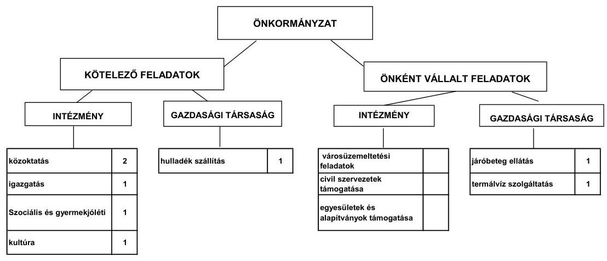

Az Önkormányzat a feladatait 2011. június 30-án (a Polgármesteri hivatallal együtt) öt költségvetési szervvel és három gazdasági társasággal látta el. Az Önkormányzatnak kettő gazdasági társaságban van többségi tulajdona, ebből egyben $75 \%$-ot meghaladó mértékű (Járóbeteg Nonprofit Kft.), egyben pedig 51-75\% közötti (Velence Plus Kft.). Egy gazdasági társaságban (Velencetavi Hulladékgazdálkodási Kft.) 50\% alatti tulajdoni hányaddal rendelkezik. A gazdasági társaságok az egészségügyi szakellátás, a termálvíz-szolgáltatás, va-

---

lamint a hulladékkezelés területén kaptak szerepet a feladatellátásban. A gazdasági társaságok az ellenőrzött időszakban működési és fejlesztési célú pénzeszköz átadásban nem részesültek.

A múködési kiadások forrásösszetételét ágazatonként a 2007. és a 2010. években a következő ábra szemlélteti:
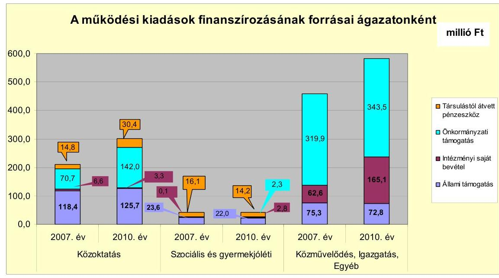

Az Óvodában és az Iskolában az intézményi saját bevételek aránya a 20072010. években az 5\%-ot sem érte el, mivel azokban az ellátottak és az alkalmazottak által fizetett térítési díjbevételt nem mutatták ki. Az Önkormányzat 2007-2010. évi költségvetési beszámolói és a 2011. év I. félévi költségvetési beszámolója sem tartalmazta az Óvodában és az Iskolában ellátottak és alkalmazottak által fizetett térítési díjbevételt, valamint a vásárolt élelmezési kiadások teljes ellenértékét, mivel azt az Áht ${ }_{1}$. 13. §-ában és az Áhsz. 9. számú melléklete, a számlaosztályok tartalmára vonatkozó előírások 4. j) pontjában előírtak ellenére a Polgármesteri hivatal könyvviteli nyilvántartásában nettó módon, a térítési díjjal csökkentett összegben számolták el.

A közoktatási kiadásokon belül az állami támogatásból finanszírozott részaránya a 2007. évi 56,2\%-ról a 2010. évre 41,7-ra csökkent, míg az önkormányzati támogatás aránya 33,6\%-ról 47,1\%-ra nőtt. Az óvodai feladatellátásra az intézményfenntartói társulás Nadap községgel a 2007. év második felében jött létre, emiatt 2008-tól nőtt a társulástól átvett pénzeszközök aránya. Az óvodai ellátottak száma 2010-ben 37 fővel (két csoport indításával) emelkedett 2009hez képest. Az óvodai nevelés esetében a 2007-2010. évek közötti időszakban a működési kiadások fedezetét átlagosan 50,9\%-ban az állami támogatások biztosították, az önkormányzati támogatás részaránya átlagosan 38,0\%, a társulástól kapott támogatás aránya átlagosan 9,3\% volt. Az általános iskolai feladatra fordított múködési kiadásokon belül az állami támogatásból finanszírozott részarány a 2007-2009. évi átlagos 88,4 millió Ft-ról (52,7\%) 2010-re 80,2 millió Ft-ra (39,2\%) csökkent, ezzel egyidejúleg az önkormányzati támogatás részaránya a 2007-2009. évi átlagos 61,8 millió Ft-ról (33,9\%) 103,8 millió Ft-ra (50,7\%) emelkedett. Az önkormányzati támogatás emelkedését részben a

---

2009/2010-es tanévtől felmenő rendszerben bevezetett magyar-angol két tanítási nyelvű oktatás okozta. Az óvodai és az általános iskolai feladatellátás múködési kiadásai forrásösszetételének változásában szerepet játszott a normatív állami támogatások ellenőrzött időszakban bekövetkezett csökkenése és az egyszeri, beruházásokhoz kapcsolódó múködési többletkiadások is.

A Polgármesteri hivatalban kimutatott egyéb feladatok múködési kiadásaira a 2007-2009. években átlagosan 322,8 millió Ft-ot, a 2010. évben 323,2 millió Ft-ot fordítottak. Az egyéb feladatok működési kiadásai 2008-ban 135,7 millió Ft-tal nőttek az előző évhez képest elsősorban a közmunkaprogram bővülése ( 61,0 millió Ft), a közterület fenntartás többletkiadásainak (24,6 millió Ft), valamint a kötvénykibocsátás kamatkiadásainak ( 25,3 millió Ft) emelkedése miatt. A 2009. évben az egyéb feladatok múködési kiadásai 66,0 millió Ft-tal csökkentek a közcélú és közhasznú munkavégzésben foglalkoztatottak számának csökkenése miatt. A 2009. évben az egyéb feladatok finanszírozásán belül a saját bevételek növekedését a kamatbevételek 90,2 millió Ft-os emelkedése okozta.

A Képviselő-testület 2008-ban kistérségi járóbeteg feladatellátás elindításáról és a feladatellátáshoz kapcsolódóan pályázat benyújtásáról döntött, melynek keretében a Velencei-tavi kistérség 7 településének (Kápolnásnyék, Nadap, Pázmánd, Sukoró, Velence, Vereb, Zichyújfalu), az Ercsi kistérség egy településének (Martonvásár) 19 ezer lakosa számára, zöldmezős beruházással egy új járóbeteg-szakrendelő építését tervezték. Az Önkormányzatnak a szakrendelő kialakítására, fenntartására és múködtetésére a pályázat keretében gazdasági társaságot kellett létrehoznia, amelyben a tervezett ellátási terület települési önkormányzatainak kötelezően részt kellett venniük. A gazdasági társaság alapításához az Önkormányzat 9,3 millió Ft, az ellátási területhez tartozó hét önkormányzat 100-100 ezer Ft alapítói hozzájárulást biztosított. Az Önkormányzat az elnyert pályázati forrás önrészét törzstőke emeléssel biztosította a gazdasági társaság részére, összesen 179,0 millió Ft összegben. A törzstőke emelésből 130,0 millió Ft készpénzben, 49,0 millió Ft ingatlan apportként teljesült.

A közoktatási feladatoknál a feladatbővülés, valamint az önként vállalt feladatok esetében a járóbeteg-ellátás kialakítása, továbbá annak fenntartására és működtetésére létrehozott gazdasági társaság az Önkormányzat kiadásainak növekedését idézte elő, amely a pénzügyi egyensúlyi helyzet alakulását kedvezőtlenül befolyásolta, a múködési kockázatot növelte.

Az Önkormányzat folyó költségvetési egyenlege, múködési jövedelme a 2007-2010. évek között múködési forrástöbbletet mutatott, melyet a következő ábra szemléltet:

---

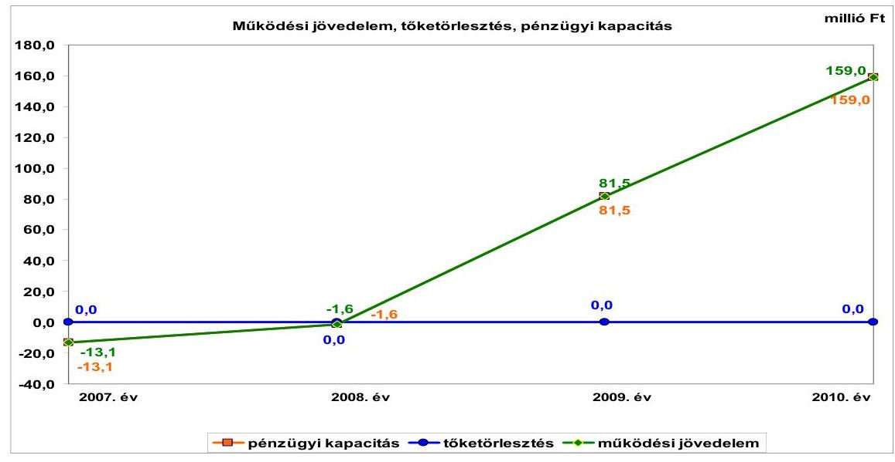

A múködési jövedelem a 2007-2008. években negatív összeget mutatott, amely azonban csekély mértékű és átmeneti jellegű volt, majd a 2009-2010. években pozitívvá vált. A 2007-2010. években a folyó költségvetés egyenlege összesen 225,8 millió Ft múködési forrástöbbletet mutatott, amely az időszak összes folyó kiadásának 5,3\%-át tette ki. A 2007-2010. évek között az átmenetileg szabad pénzeszközeik után összesen 249,5 millió Ft kamatbevételt realizáltak, amelyből 2007-ben 0,3 millió Ft-ot, 2008-ban 22,5 millió Ft-ot, 2009-ben 136,2 millió Ft-ot, 2010-ben 90,5 millió Ft-ot számoltak el. A kamatbevételeken belül a kötvényforrás, valamint az átmenetileg szabad pénzeszköz lekötéséből származó kamatbevétel 2009-ben 112,0 millió Ft-ot, 2010-ben 78,6 millió Ft-ot tett ki - amelyet fejlesztési célú kiadásokra (az Óvoda bővítésére, a Közösségi Ház felújítására, és egyéb kisebb fejlesztésekre) fordítottak -, az e nélkül számított múködési jövedelem a 2007-2010 közötti években összesen 35,2 millió Ft volt.

Az Önkormányzatnak pénzintézettel szemben a 2007-2010. években nem volt esedékes tőketörlesztési kötelezettsége, ezért a nettó múködési jövedelem minden évben megegyezett a múködési jövedelemmel.

A vizsgált időszakon belül a folyó bevételek előző évhez képesti növekedési üteme meghaladta a folyó kiadások emelkedési ütemét. A folyó bevételek a vizsgált időszakon belül folyamatosan - a 2007. évi 719,6 millió Ft-ról 2010-re 1398,6 millió Ft-ra - emelkedtek. A folyó bevételek a 2008. évben 39,7\%-kal (285,7 millió Ft-tal), a 2009. évben 32,1\%-kal (322,8 millió Ft-tal), a 2010. évben 5,3\%-kal (70,5 millió Ft-tal) nőttek az előző évhez képest. A folyó bevételek 2008. évi növekményét 98,9\%-ban az állami támogatásból és az szja-ból származó bevételek 58,2 millió Ft-os, a helyi adóbevételek 71,2 millió Ft-os, az ingatlan értékesítések után kiszámlázott áfa bevételek 78,0 millió Ft-os, az egyéb saját bevételek 75,1 millió Ft-os emelkedése okozta. A 2009. évben a folyó bevételek többlete az előző évhez képest elsősorban az Iskola felújítás után elszámolt fordított áfából származó bevétel 106,5 millió Ft-os és az egyéb saját bevételek 235,0 millió Ft-os (a kötvénykibocsátásból származó átmenetileg szabad pénzeszköz lekötéséből realizált kamatbevétel, a bérleti díjbevétel és az államháztartáson belülről az Iskola felújítás és a járóbeteg-szakellátás fej-

---

lesztése projektek múködési kiadásaihoz kapott támogatások) növekményéből keletkezett. A 2010. évben a folyó bevételek többletét mintegy $80 \%$-ban az áfából származó bevételek (az áfa visszatérülés és a beruházások után elszámolt fordított áfa bevétel) 223,4 millió Ft-os többlete mellett az egyéb saját bevételek 164,6 millió Ft-os (a szolgáltatások ellenértékének 25,0 millió Ft-os, a kamatbevételek 45,7 millió Ft-os, az államháztartáson belülről kapott támogatások 82,1 millió Ft-os) csökkenése okozta.

Az Önkormányzat illetékességi területén 2007. január 1-jén helyi iparúzési adó, építményadó, telekadó és idegenforgalmi adónemek voltak bevezetve. A vizsgált időszakban a helyi adók köre nem változott, új helyi adónemet az Önkormányzat nem vezetett be.

A folyó kiadások összege 2007-ben 732,7 millió Ft volt, a 2010. évben 1239,6 millió Ft-ot tett ki. A folyó kiadások a 2008. évben 37,4\%-kal (274,2 millió Ft-tal), a 2009. évben 23,8\%-kal (239,7 millió Ft-tal) emelkedtek, a 2010. évben minimálisan, $0,6 \%$-kal ( 7,0 millió Ft-tal) csökkentek az előző évhez képest. A 2008. évi növekményt 25,6\%-ban ( 70,3 millió Ft-tal) a személyi juttatások és azok járulékai, 59,6\%-ban ( 163,5 millió Ft-tal) a dologi kiadások ${ }^{6}$, $9,2 \%$-ban ( 25,2 millió Ft-tal) a kamatkiadások emelkedése okozta a 2007. évhez képest. A folyó kiadások 2009. évi növekményét a dologi kiadások (Iskola felújítás után megfizetett fordított áfa) emelkedése idézte elő.

A pénzügyi egyensúlyi helyzet alakulását jelentősen befolyásolta a vizsgált időszak fejlesztési tevékenysége. Az Önkormányzat felhalmozási költségvetésének egyenlege a 2007-2010. években összesen 973,4 millió Ft felhalmozási forráshiányt mutatott. A hiány finanszírozását kisebb részben (23,2\%) a pozitív nettó múködési jövedelemből, nagyobb részt ( $76,8 \%$ ) külső forrás bevonásával, a 2008. évi kötvénykibocsátásból származó bevételből biztosították.

Az Önkormányzat évenkénti teljes finanszírozási többlete 2008-ban 247,9 millió Ft volt, a teljes finanszírozási hiánya 2007-ben 25,2 millió Ft-ot, 2009-ben 400,8 millió Ft-ot, 2010-ben 569,5 millió Ft-ot tett ki. Összességében 747,7 millió Ft finanszírozási hiány képződött, amely az Önkormányzat 20072010. évek közötti költségvetési kiadásának 11,0\%-át tette ki.

Az Önkormányzat beruházási és felújítási kiadásai 2007-2010. években összesen 2312,3 millió Ft-ot tett ki, amelyből 1472,3 millió Ft-ot a befejezett, 840,0 millió Ft-ot a folyamatban lévő fejlesztési feladatokra fordítottak. A 20072010. évek közötti időszakban a befejezett fejlesztéseket (1472,3 millió Ft) 25,0\%-ban ( 368,0 millió Ft) saját erőből, 48,0\%-ban ( 706,6 millió Ft) hazai- és EU-s támogatásokból és 27,0\%-ban (397,7 millió Ft) pénzintézeti forrásból, kötvénykibocsátásból származó bevételből fedezték. A 2010. december 31-én fo-

[^0]
[^0]:    ${ }^{6}$ A 2008. évben a dologi kiadásokon belül az áfa kiadások 85,8 millió Ft-os növekményét az előzetesen felszámított áfa 13,4 millió Ft-os, valamint a termálfürdőhöz kapcsolódó telkek értékesítése miatt a kiszámlázott termékek és szolgáltatások és az értékesített tárgyi eszközök áfa befizetései 72,4 millió Ft-os emelkedése okozta. A szolgáltatási kiadások 28,4 millió Ft-tal, a szellemi tevékenység végzésére teljesített kifizetések 47,7 millió Ft-tal emelkedtek.

---

lyamatban lévő fejlesztési feladatok végrehajtására 2007-2010 között 840,0 millió Ft kiadást teljesítettek, amelyekre a kibocsátott kötvény bevételéből 239,4 millió Ft-ot ( $28,5 \%$ ), a saját bevételekből 221,2 millió Ft-ot ( $26,3 \%$ ) és a hazai- és EU-s támogatásokból 379,4 millió Ft-ot ( $45,2 \%$ ) fordítottak.

A 2010. december 31-én fennálló felhalmozási kötelezettség-vállalások forrásösszetételét a következő ábra mutatja be:
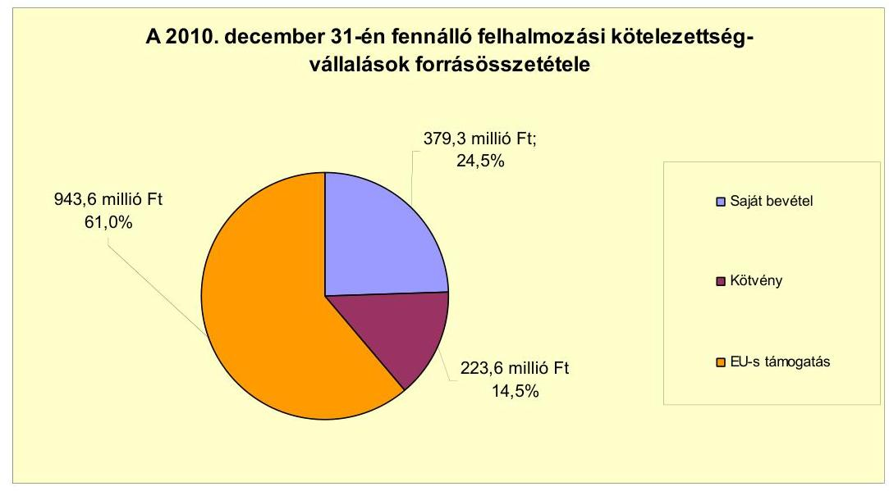

Az Önkormányzat 2010. december 31-én folyamatban lévő fejlesztési feladatok 2010. évet követő kötelezettség-vállalásainak összege 1546,5 millió Ft volt, amelyből 379,3 millió Ft-ot saját forrásból, 223,6 millió Ftot kötvénykibocsátás bevételéből, 943,6 millió Ft-ot EU-s támogatásból terveznek biztosítani. A felhalmozási kiadások finanszírozási kockázatát növeli, hogy a tervezett saját forrás a vizsgálat időpontjában nem állt rendelkezésre.

A folyamatban lévő fejlesztési feladatok 95,3\%-át (1473,6 millió Ft-ot) a Velen-cei-tó Kapuja projekt teszi ki. A Nemzeti Fejlesztési Ügynökség 2007-ben tette közzé pályázati felhívását a kiemelt és integrált vonzerő, termék- és infrastruktúrafejlesztésekre. A támogatásról szóló értesítést az Önkormányzat 2008. december 12-én kapta meg. A támogatási szerződésben rögzítették a projekt pénzügyi lebonyolítását. Ebben általánosan rendelkeztek az előlegigénylésről, valamint az elszámolásról. E szerint a szállítói finanszírozást abban az esetben választhatta az Önkormányzat, mint kedvezményezett, amennyiben előlegben nem részesül. A projekt tervezett összköltsége 2266,0 millió Ft, ebből a pályázat keretében elszámolható költség 1645,5 millió Ft, melyhez az Önkormányzat az EU-s és hazai központi költségvetési előirányzatból összesen 1199,8 millió Ft támogatást vehet igénybe. Az Önkormányzat 2010-ben, tekintettel a korábban lefolytatott két, eredménytelenül zárult közbeszerzési eljárásra, harmadik alkalommal folytatott le közbeszerzési eljárást a projektre, az ajánlati felhívásban feltüntették a vállalkozói dí előleg igénybevételének lehetőségét 10-40\%-os mértékben. A vállalkozói dí előleg kifizetéséhez biztosítékot nem kértek. Az ajánlati felhívás feltételeit a közremúködő szervezet nem kifogásolta. A kivitelezővel a vállalkozási szerződést 2010 júliusában kötötték meg, a végleges át-adás-átvétel határidejét 2011. augusztus 22-ében határozták meg. A szerződést

---

2011. augusztus 22-én módosították, amelyben a befejezés határidejét 2011. október 20-ában állapították meg. A kivitelező a vállalkozási szerződés szerint vállalkozói előleg igénybevételére volt jogosult a vállalkozói díj (1622,0 millió Ft) 33,9\%-ának megfelelő, 550,0 millió Ft összegben. A kivitelező hét részszámlát nyújthatott be a pénzügyi és építési ütemtervnek megfelelően, amelyekből az előleg arányosan került volna elszámolásra. Az Önkormányzat a Kincstárral 2010 szeptemberében fedezetkezelői szerződést kötött a beruházás finanszírozására. A projekt kivitelezésére egy előlegbekérő (az előleg három részletben került kifizetésre, ezért a pénzügyi teljesítésnek megfelelően három előlegszámla került kiállításra) és öt részszámla került benyújtásra és kifizetésre összesen 995,2 millió Ft összegben, amelyből az előleg 550,0 millió Ft volt. A kifizetett előlegből a részszámlák alapján 168,0 millió Ft teljesítésre és elszámolásra került. Az előlegből 382,0 millió Ft teljesítésére a vállalkozó részéről nem került sor. A 382,0 millió Ft el nem számolt előlegből 249,6 millió Ft a hazai- és EU-s támogatás összege, 132,4 millió Ft az Önkormányzat saját forrás része. Az Önkormányzatnak az igazoltan fel nem használt vállalkozói előleg támogatási részét - 249,6 millió Ft-ot - vissza kell fizetnie. Az 5. számú, 2011. július 30-ai esedékességű ( 65,8 millió Ft-os) részszámlához nem került benyújtásra a NAV nemleges adóigazolása, ezért a számla ellenértékének teljesítésekor nem tartották be az Art. 36/A. §-a és a 85/A. § (3) bekezdésében előírtakat. Az Önkormányzat az 5. számú részszámla benyújtásakor jelezte a Kincstár felé, hogy a részszámla teljesítéséhez a kivitelező nem nyújtotta be a NAV nemleges adóigazolását, ennek ellenére a kifizetés megtörtént.

A kivitelező ellen 2011. szeptember 13-ával felszámolási eljárás indult. A Kép-viselő-testület 2011. október 11-én döntött a vállalkozási szerződés felmondásáról, továbbá az építési terület vagyonvédelmének biztosításáról, a hitelezői igény bejelentéséről, a projekt folytatásához szükséges intézkedésekről, valamint önkormányzati és állami támogatás eltulajdonítása miatt ismeretlen tettes ellen büntető feljelentés megtételéről. A büntető feljelentést a polgármester 2011. október 14-én megtette.

A Képviselő-testület 2011. november 10-én további, a beruházás folytatásához (műszaki tervek aktualizálásáról) és a pénzügyi fedezet biztosításához szükséges döntést hozott. A Képviselő-testület 2011. november 10-én kijelölt kettő, öszszesen 97,6 ezer $\mathrm{m}^{2}$ területű ingatlant értékesítésre a beruházás folytatásához szükséges hiányzó forrás biztosítása érdekében. A Képviselő-testület a szükséges forrást elsődlegesen ingatlan értékesítéssel kívánja megteremteni, de az ingatlanpiaci kereslet bizonytalansága miatt 2011. november 21-én 500,0 millió Ft összegű kötvénykibocsátás előkészítéséről is döntött. Az Önkormányzatnak a tervezett adósságot keletkeztető kötelezettségvállalás kapcsán figyelembe kell vennie - a 2012. január 1-jén hatályba lépett - Magyarország gazdasági stabilitásáról szóló 2011. évi CXCIV. törvény és az adósságot keletkeztető ügyletekhez történő hozzájárulás részletes szabályairól szóló 353/2011. (XII. 30.) Korm. rendelet előírásait, amelyek szerint a kötvénykibocsátáshoz a Kormány hozzájárulása szükséges, továbbá az adósságot keletkeztető kötelezettségvállalásokból származó tárgyévi fizetési kötelezettség a futamidő végéig egyik évben sem haladhatja meg a saját bevételek 50,0\%-át.

Az Önkormányzat az Ámr ${ }_{1}$-ben és a 281/2006. (XII. 23.) Korm. rendeletben, továbbá a támogatási szerződés általános szerződési feltételeinek 5.1. pontjában,

---

valamint a 7. számú mellékletében rögzítettek szerint nem választhatta volna az előleglehívást és a szállítói finanszírozást együtt. Az Önkormányzat hivatkozása arra vonatkozóan, hogy kedvezményezettként nem részesült előlegben nem helytálló, mert a kivitelezőnek kifizetett előleg a kedvezményezett részére kiutalt előlegnek minősül. A vállalkozói díj előlegbekérőt az Önkormányzat továbbította Kincstár felé, a közvetlenül a kivitelezőnek kiutalt előleg csak technikai lépés azért, hogy lerövidítse a kifizetés teljesítését. Az Önkormányzat az előleg biztosítása során nem tartotta be a 281/2006. (XII. 23.) Korm. rendeletben, valamint a Támogatási Szerződésben foglaltakat.

A Velencei-tó Kapuja projekt kapcsán a fenti szabálytalanságok, továbbá a kivitelezővel kötött vállalkozási szerződésben meghatározott finanszírozási mód (az előleg meghatározása és biztosíték nélküli kifizetése), valamint a kivitelező nem szerződésszerű teljesítése együttesen idézték elő, hogy az Önkormányzatot jelentős vagyoni hátrány érte.

# A Velencei-tó Kapuja projekt az Önkormányzat múködési és a fel- 

halmozási kiadásainak finanszírozási kockázatát egyaránt növeli, mivel az Önkormányzatot terheli a felszámolási eljárás alá került kivitelezővel történt szerződés felmondása miatt a beruházás állagmegóvásával kapcsolatos és a projekt folytatásához szükséges egyéb műszaki-, gazdasági- és jogi szakértői tevékenységek, valamint az új közbeszerzési eljárás többletkiadása. A finanszírozási kockázatot tovább növeli a kivitelezőnek biztosíték nélkül kifizetett beruházási előlegből még fennálló 382,0 millió Ft megtérülésének bizonytalansága, az új kivitelező kiválasztása, valamint a beruházás befejezési határidejének módosítása, illetve a projekt ezen időn belüli szabályszerű megvalósítása. A pénzügyi egyensúlyt közvetlenül veszélyezteti az igazoltan fel nem használt vállalkozói előleg hazai- és EU-s támogatási részének a visszafizetési kötelezettsége. Finanszírozási kockázatot jelent a projekt folytatásához szükséges többletköltségek fedezetének a biztosítása, és az el nem számolt beruházási előleg saját forrásból (ingatlan értékesítésből), illetve kötvénykibocsátásból történő pótlása.

Az Önkormányzatnak a 2011. év I. félévében nem volt beadott, elbírálás alatt álló pályázata.

A pénzintézettel szembeni kötelezettségvállalás teljes egészében a 2008. évi 1000,0 millió Ft-nak megfelelő 6376,0 ezer CHF értékű kötvénykibocsátásból származott. A kötvényt a kibocsátó pénzintézet jegyezte le, a kötvény futamideje 20 év, melyből a türelmi idő három év, a tőketörlesztés 2011 áprilisától 2027 októberéig félévente esedékes. A fizetendő kamat mértéke változó (6 havi CHF LIBOR $+0,98 \%$ kamatfelár), a kamatfizetési és a tőketörlesztési kötelezettség félévente esedékes. A kötelezettség könyvszerinti értéke a 2008. év végén 1133,5 millió Ft volt, amely 2009-ben 1162,2 millió Ft-ra, 2010-ben 1419,2 millió Ft-ra nőtt az árfolyamváltozás miatt. A 2011. év I. félév végére a kötelezettség állomány 1381,4 millió Ft-ra csökkent az I. félévben törlesztett 188 ezer CHF hatására.

A kötvény kibocsátásakor három pénzintézettől kértek ajánlatot. A kötelezettségvállalásra képviselő-testületi döntés alapján került sor, azonban az előterjesztésben nem mutatták be a devizaalapú kötelezettségeket érintő árfolyam-

---

kockázatot. A Képviselő-testület a kamat- és tőketörlesztés forrásául az adórendeleteik alapján várható, kalkulált többlet adóbevételeket, a bérleti díj emelkedéséből, a gazdasági társaságok eredményfelosztásából, továbbá a vagyonértékesítésből keletkező bevételeket jelölte meg. A kötvényt lejegyző pénzintézet a visszafizetés fedezetéül egyéb biztosítékot nem kért.

Az Önkormányzat a kötvénykibocsátásból származó bevételéből 2011. június 30-ig 776,3 millió Ft-ot használt fel, a kötvénykibocsátásból származó bevétel felhasználását a kötvényt lejegyző pénzintézet feltételhez nem kötötte. A CHFben fennálló pénzintézeti kötelezettségeiből 2011. június 30-ig, 188,0 ezer CHF ( 38,4 millió Ft) tőkét törlesztettek és 464,4 ezer CHF ( 84,0 millió Ft) kamatot fizetettek meg. Az alapkamat csökkenése következtében a kibocsátáskori feltételekkel számított 934,2 ezer CHF helyett 464,4 ezer CHF kamatkiadást teljesítettek, 84,0 millió Ft összegben, amelyből 11,2 millió Ft az árfolyam emelkedés miatti többletkiadás volt. A 2011. év I. félében az esedékes 188 ezer CHF tőketörlesztést 38,4 millió Ft összegben teljesítették. Az árfolyam emelkedés miatt az Önkormányzatnak 8,9 millió Ft többletkiadása keletkezett a kibocsátáskori árfolyamhoz képest.

A költségvetés végrehajtása során az átmeneti likviditási problémák megszüntetésére, a fizetőképesség folyamatos fenntartására a vizsgált időszakban folyószámlahitelt vettek igénybe a működési kiadások felmerülésének és a helyi adóbevételek, valamint a gépjármú adóbevétel teljesülésének időbeli eltérése miatt. A 2007-2010. évek végén, valamint a 2011. év I. félév végén az Önkormányzatnak nem volt folyószámlahitel állománya.

A folyószámlahitel igénybevétele a 2007-2011. év I. féléve közötti időszakban az alábbiak szerint alakult:

| Megnevezés | 2007. év | 2008. év | 2009. év | 2010. év | 2011. év I.   félév |
| :-- | :--: | :--: | :--: | :--: | :--: |
| Folyószámlahitel |  |  |  |  |  |
| Keretösszeg január 1-jén (millió Ft-ban) | 40,0 | 40,0 | 40,0 | 80,0 | 80,0 |
| Átlagos napi állomány (millió Ft-ban) | 1,0 | 1,2 | 0,6 | 1,9 | 2,0 |
| Folyószámla hitellel zárt napok száma (nap) | 61,0 | 36,0 | 19,0 | 78,0 | 59,0 |
| Egyenleg (állomány) | 0,0 | 0,0 | 0,0 | 0,0 | 0,0 |

Az Önkormányzat 2011. év I. félév végi szállítói tartozás állománya 114,7 millió Ft volt, melyből 78,9 millió Ft-nak a fizetési határideje lejárt. A lejárt szállítói állomány 30 napon belüli volt, és azok a hazai és EU-s forrásból támogatott projektekhez kapcsolódtak. Az Önkormányzattal szerződésben álló kivitelezők számláit un. szállítói finanszírozással a fedezetkezelő (a Kincstár) a fizetési határidőnél később teljesítette.

Az Önkormányzat kötelezettségeinek 2010. december 31-ei, valamint 2011. június 30 -ai állományát és várható alakulását a kötelezettségek lejáratáig a következő táblázat szemlélteti:

---

| Megnevezés | Allomány 2010. december 31-   én |  |  | Allomány 2011. június 30-án |  |  | Várható kötelezettség   2011-2013. években |  | Várható kötelezettség   2014. évtii |  |
| :--: | :--: | :--: | :--: | :--: | :--: | :--: | :--: | :--: | :--: | :--: |
|  | HUF-ban   (millió Ft-   ban) | Devizában   (összege,   ezer CHF-   ben) | Deviza   nem | HUF-ban   (millió Ft-   ban) | Devizában   (összege,   ezer CHF-   ben) | Deviza   nem | HUF-ban   (millió Ft-   ban) | Devizában   (összege,   ezer CHF-   ben) | HUF-ban   (millió Ft-   ban) | Devizában   (összege,   ezer CHF-   ben) |
| Pénzintézeti kötelezettségek |  |  |  |  |  |  |  |  |  |  |
| Feglesztési Kölvény |  | 6376,0 | CHF |  | 6188,0 | CHF |  | 1347,1 |  | 5743,5 |
| Pénzintézeti kötelezettségek összesen CHF-ben |  | 6376,0 | CHF |  | 6188,0 | CHF |  | 1347,1 |  | 5743,5 |
| Szállitói tartozás | 161,8 |  |  | 114,7 |  |  | 114,7 |  |  |  |

Az Önkormányzatnak pénzintézettel szemben fennálló kötelezettség állománya a 2011. év I. félév végén 6188,0 ezer CHF volt. Ennek várható kötelezettsége (tőke, kamat és egyéb költség) a legutóbbi kamatfizetés feltételei alapján a 2011-2013. években 1347,1 ezer CHF. A 2011-2013. évek kötelezettségeinek teljesítésére figyelembe vehető a 2010. év végén rendelkezésre álló 6,6 millió Ft szabad pénzmaradvány, a 315,4 millió Ft összegű mérlegszerinti követelésállomány. A 2014. évet követően jelenleg ismert pénzintézeti kötelezettség 5743,5 ezer CHF.

Az Önkormányzat minősített többségi (99,6\%) tulajdonában lévő Járóbeteg Nonprofit Kft. mérleg szerinti kötelezettsége 2010. december 31-én 74,6 millió Ft, 2011. június 30-án 73,2 millió Ft volt, ebből az Önkormányzattól 2010-ben kapott tagi kölcsön 60,0 millió Ft-ot tett ki. A kölcsön visszafizetése 2012. január 1-jén esedékes. A gazdasági társaság szállítói tartozása 2010. december 31én 11,6 millió Ft, 2011. június 30-án 9,0 millió Ft volt. Lejárt szállítói állománya, pénzintézettel szembeni kötelezettsége az önkormányzat minősített többségi tulajdonú gazdasági társaságának nem volt.

Az Önkormányzat 2007-2010 között eszközállománya után 549,4 millió Ft öszszegű értékcsökkenést mutatott ki az éves költségvetési beszámolóiban, ugyanakkor a felújítások aktivált értéke 834,8 millió Ft volt. Az elhasználódott eszközök pótlására 110,4 millió Ft-ot fordítottak.

Az Önkormányzatnál a 2007. évhez képest az állami támogatásból és a szjából származó bevételek a 2008-2010 közötti időszakban nem csökkentek ${ }^{7}$. Az Önkormányzat az ellenőrzött időszakban a pénzügyi egyensúly javítása érdekében kiadási megtakarítást eredményező és bevételt növelő intézkedéseket tett. Az Önkormányzat a 2007-2011. év I. féléve között a megtett intézkedések hatására 372,3 millió Ft bevételi többletet, továbbá 14,3 millió Ft kiadási megtakarítást mutatott ki. A bevételnövelő intézkedések ingatlanok és eszközök bérbeadásához, az átmenetileg szabad pénzeszközök lekötéséhez, a helyi adók emeléséhez, az adókedvezmények és mentességek csökkentéséhez, az adóalanyok felderítéséhez, valamint a lejárt tarozások beszedéséhez kapcsolódtak. A kiadási megtakarítások a költségtérítések megszüntetéséből, a beszerzési szerződések felülvizsgálatából, közbeszerzések eredményeként jelentkezett kiadás csökkenésekből keletkeztek. Az Önkormányzatnál a vizsgált időszakban

[^0]
[^0]:    ${ }^{7}$ A 2007-ben 354,4 millió Ft, 2008-ban 412,6 millió Ft, 2009-ben 395,8 millió Ft, 2010ben 377,4 millió Ft volt az állami támogatásból és az szja-ból származó bevétel.

---

létszámcsökkentési döntést nem hoztak, az álláshelyek számát az Óvodában és a Családsegítő Szolgálatnál feladat bővülés miatt felemelték.

Az utóellenőrzés a pénzügyi egyensúly javítására tett három szabályszerűségi és egy célszerűségi javaslat hasznosítására terjedt ki. Kettő szabályszerűségi és egy célszerűségi javaslatot az intézkedési terv szerinti határidőben megvalósítottak, egy szabályszerűségi javaslatot nem teljesítettek. Az Önkormányzatnál az éves költségvetési rendeletekben az Ámr ${ }_{2}$-ben előírtak ellenére az EU-s támogatásokkal megvalósuló fejlesztéseket a többéves kihatással járó feladatok előirányzatai között nem mutatták be évenkénti bontásban.

Az Önkormányzat pénzügyi egyensúlyi helyzetét összegezve a következők emelhetők ki:

# Velence Város Önkormányzatának pénzügyi egyensúlyi helyzete rövid távon veszélyeztetett. 

A 2007-2010. években képződött nettó működési jövedelem együttes összege pozitív volt, de ennek alakulásában jelentős szerepet játszott az időszakban rendelkezésre álló kötvényforrás lekötéséből származó kamatbevétel. A felhalmozási költségvetés egyenlege a 2007-2010. években jelentős összegű forráshiányt mutatott. A hiányt a 2008-ban kibocsátott, hosszú távú eladósodást eredményező, kötvényből származó bevétel finanszírozta.

A 2007-2010. évekhez képest a 2011. évben az önként vállalt feladatokra tervezett kiadások az önként vállalt feladatok arányának emelkedését mutatja. A járóbeteg-ellátás az Önkormányzat kiadásainak további növekedését idézheti elő. A közoktatási feladatokon belül a két tanítási nyelvű oktatás felmenő rendszerben történő bevezetése miatt az önkormányzati támogatás igényének további növekedésével kell számolni.

A pénzügyi egyensúlyt veszélyeztetik a Velencei-tó Kapuja beruházás állagmegóvásával és a projekt befejezésével kapcsolatos többletkiadások, továbbá a kivitelezőnek biztosíték nélkül kifizetett beruházási előleg teljesítés hiánya miatt még fennálló részének megtérülési bizonytalansága, az igazoltan fel nem használt vállalkozói előleg támogatási részének visszafizetési kötelezettsége, annak saját forrásból történő pótlása, és a projekt szabályszerű befejezésének a kockázata.

A CHF alapú kötvény tőketörlesztésének 2011. évi megkezdése az adósságszolgálatot megnöveli.

Az Állami Számvevőszékről szóló 2011. évi LXVI. törvény 33. § (1) bekezdésében foglaltak értelmében a jelentésben foglalt megállapításokhoz kapcsolódó intézkedési tervet köteles az ellenőrzött szervezet vezetője összeállítani és azt a jelentés kézhezvételétől számított harminc napon belül az ÁSZ részére megküldeni. Amennyiben az intézkedési tervet határidőben nem küldi meg a szervezet, vagy az továbbra sem elfogadható, az ÁSZ elnöke a hivatkozott törvény 33. § (3) bekezdés a)-b) pontjaiban foglaltakat érvényesítheti.

---

# A 2011. június 30-i pénzügyi egyensúlyi helyzet alapján az ellenőrzés intézkedést igénylő megállapításai és javaslatai a következők: 

## a Polgármesternek

1. Az Önkormányzatnál képződött teljes finanszírozási hiány a 2007-2010. évek közötti költségvetési kiadások 11,0\%-át tette ki. A költségvetési hiányt a 2008-ban kibocsátott kötvényből származó bevételből finanszírozták. Az önként vállalt feladatokra fordított múködési kiadások a 2007-2010. évek átlagához képest a 2011. években növekvő arányt mutatnak, a két tanítási nyelvű oktatás felmenő rendszerben történő bevezetése miatt az önkormányzati támogatások növekedésével kell számolni, a járóbeteg-ellátás múködtetésére létrehozott gazdasági társaság az Önkormányzat kiadásainak további növekedését idézheti elő.

A múködési és felhalmozási kiadások finanszírozási kockázatát növeli a Velencei-tó Kapuja projekt felszámolási eljárás alá került kivitelezőjével történt szerződés felmondása miatt a beruházás állagmegóvásával és a projekt folytatásával kapcsolatos többletkiadások, továbbá a kivitelezőnek adott, teljesítéssel el nem számolt 382,0 millió Ft beruházási előleg megtérülésének bizonytalansága. Az Önkormányzat köteles az el nem számolt előlegből a hazai- és EU-s támogatásból finanszírozott 249,6 millió Ft-ot visszafizetni. Az Önkormányzat a Velencei-tó Kapuja projekt befejezéséhez szükséges források pótlását elsősorban ingatlan értékesítésből tervezi, az ingatlanpiaci kereslet csökkenése miatt az értékesítések lebonyolításáig 500,0 millió Ft összegben kötvénykibocsátást terveznek, amelyhez 2012. január 1-jét követően a Kormány hozzájárulása szükséges.

Javaslat
Az Önkormányzat pénzügyi egyensúlyának gyors helyreállítása és hosszú távú fenntarthatósága érdekében kezdeményezze - felelősök és határidők megjelölésével - az alábbi intézkedések megtételét:
a) Tárja fel a bevételszerző és kiadáscsökkentő lehetőségeket. Intézkedjen a bevételek növelésére, a kintlévőségek behajtására, a kiadások csökkentésére. Ütemezze a bevételek beszedését a jövőben jelentkező fizetési kötelezettségekhez.
b) Terjesszen a Képviselő-testület elé programot a pénzügyi egyensúlyi helyzet javítása, és hosszú távú megőrzése érdekében.
c) Mérje fel a folyamatban lévő beruházásokkal kapcsolatos kötelezettségek átütemezésének pénzügyi és jogi lehetőségeit, illetve hatásait, különös tekintettel a Velencei-tó Kapuja beruházás el nem számolt támogatási előlegének visszafizetési kötelezettségére. Szükség esetén kezdeményezze a közremúködő szervezetnél annak átütemezését.
d) Vizsgálja felül teljes körűen a tervezett beruházásokat és azok fenntartásának jövőbeni pénzügyi kihatásait. Szükség esetén tegyen javaslatot a Képviselőtestületnek a tervezett beruházásokkal kapcsolatos döntések módosítására, amelyben figyelembe veszik az Önkormányzat pénzügyi lehetőségeit, és a kötelező feladatellátás elsődlegességét.

---

e) Vizsgálja felül az önként vállalt feladatok finanszírozhatóságát, és hozzon intézkedéseket a kötelező feladatellátás elsődlegességének biztosítása érdekében.
f) Mutassa be a Képviselő-testületnek havonta a fél éven belül esedékes kötelezettségeinek finanszírozási forrásait.
g) Az adósságot keletkeztető kötelezettségvállalásról szóló döntéskor mutassa be a Képviselő-testületnek a jövőben várható - árfolyam-, kamat- és törlesztési - kockázatot. Gondoskodjon, hogy a jövőben az adósságot keletkeztető kötelezettségvállalásokról szóló képviselő-testületi előterjesztések tételesen tartalmazzák a visszafizetés forrásait.
2. Az Önkormányzatnak 2011. év novemberében a könyvviteli nyilvántartás szerint a Velencei-tó kapuja projekt kivitelezőjével szemben - a teljesítés hiányában el nem számolt beruházási előlegből - 382,0 millió Ft követelése áll fenn.

Javaslat
Tájékoztassa a Képviselő-testületet legalább havonta a Velencei-tó kapuja projekt kivitelezőjével szemben fennálló, az el nem számolt beruházási előlegből származó 382,0 millió Ft-os önkormányzati követelés behajtása érdekében megtett intézkedésekről, és azok eredményéről.
3. Az Önkormányzatnál az utóellenőrzés során megállapításra került, hogy az éves költségvetési rendeletekben az Ámr ${ }_{2}$-ben előírtak ellenére az EU-s támogatásokkal megvalósuló fejlesztéseket a többéves kihatással járó feladatok előirányzatai között nem mutatták be évenkénti bontásban.

Javaslat
Gondoskodjon az Önkormányzat gazdálkodási rendszerét érintő előző ellenőrzés nem hasznosult javaslat végrehajtásáról. Intézkedjen - Önkormányzat gazdálkodási rendszerét érintő előző ellenőrzés nem hasznosult szabályszerűségi javaslatával kapcsolatban - a fegyelmi felelősség kivizsgálása iránt.

# a Jegyzönek 

1. Az Önkormányzat 2007-2010. évi költségvetési beszámolói és a 2011. év I. félévi költségvetési beszámolója nem tartalmazta az Óvodában és az Iskolában ellátottak és alkalmazottak által fizetett térítési dijbevételt, valamint a vásárolt élelmezési kiadások teljes ellenértékét, mivel azt a Polgármesteri hivatal könyvviteli nyilvántartásában az Áht ${ }_{1}$-ban és az Áhsz.-ben előírtak ellenére nettó módon, a térítési dijjal csökkentett összegben számolták el.

Javaslat
Intézkedjen annak érdekében, hogy a költségvetési bevételeket és a költségvetési kiadásokat pénzforgalmi szemléletben - pénzforgalmi és pénzforgalom nélküli tételek megkülönböztetésével, de azok egyenértékű kezelésével - részletesen, teljes összegükben vegyék számba, számolják el. Gondoskodjon az Áhsz. 9. számú melléklete, a

---

számlaosztályok tartalmára vonatkozó előírások 4. j) pontjában előírtaknak megfelelően arról, hogy a pénzforgalom nélküli költségvetési bevételek és kiadások sajátos elszámolása főkönyvi számla alkalmazásával mutassák ki azoknak a pénzforgalom nélküli elszámolásoknak a forgalmát, amelyeket bevételként és kiadásként egyidejúleg kell könyvelni, de a pénzforgalom a számlavezető pénzintézetet nem érinti.
2. Az Önkormányzat a CHF-ben fennálló pénzintézeti kötelezettségeiből 2011. június 30-ig 188,0 ezer CHF ( 38,4 millió Ft) tőkét és 464,4 ezer CHF ( 84,0 millió Ft) kamatot fizetett vissza. A kamatkiadás 84,0 millió Ft-os összegéből 11,2 millió Ft, a tőketörlesztés 38,4 millió Ft-os összegéből 8,9 millió Ft az árfolyam emelkedés miatti többletkiadás volt.

Javaslat
Kísérje figyelemmel a jövőbeni várható - árfolyam-, kamat- valamint törlesztési kockázatokat és legalább félévente tájékoztassa a Képviselő-testületet azok alakulásáról.
3. Az Önkormányzat minősített többségi tulajdonú gazdasági társaságának - Járóbeteg Nonprofit Kft. - kötelezettsége 2011. június 30 -án 73,2 millió Ft volt, amelyből 60,0 millió Ft a 2012. január 1-jén esedékes, Önkormányzat által nyújtott tagi kölcsön. A kötelezettségek nem teljesítése hatással lehet az Önkormányzat likviditására, pénzügyi egyensúlyi helyzetére.

Javaslat
Kísérje folyamatosan figyelemmel - a tulajdonosi jogkört gyakorlók közremúködésével - a minősített többségi tulajdonú gazdasági társaság kötelezettségeinek alakulását, az Önkormányzat likviditására, pénzügyi-egyensúlyi helyzetére gyakorolt hatását. Tegye meg a szükséges és lehetséges intézkedéseket a tulajdonosi érdekek védelme érdekében.
4. Az Önkormányzatnak 2011. év novemberében a könyvviteli nyilvántartás szerint a Velencei-tó Kapuja projekt kivitelezőjével szemben - a teljesítés hiányában el nem számolt beruházási előlegből - 382,0 millió Ft követelése áll fenn.

Javaslat
A Velencei-tó Kapuja projekt kapcsán, annak:
a) befejezéséhez készítsen intézkedési tervet a szükséges pénzügyi fedezet biztosítására, és azt terjessze a Képviselő-testület elé jóváhagyásra;
b) kivitelezőjével szemben fennálló, az el nem számolt beruházási előlegből származó 382,0 millió Ft-os önkormányzati követelés behajtása érdekében tegye meg a szükséges intézkedéseket.

---

5. A Velencei-tó Kapuja projekt kapcsán az 5. számú részszámlához a vállalkozó nem nyújtotta be a NAV nemleges adóigazolását, ezért a számla ellenértékének teljesítésekor nem tartották be az Art. előírásait. Az Önkormányzat az 5. számú részszámla továbbításakor jelezte a Kincstár felé, hogy a részszámla teljesítéséhez a kivitelező még nem nyújtotta be a NAV adóigazolását.

Javaslat
Vizsgálja meg, hogy az Önkormányzat dolgozói közül terhel-e felelősség valakit azért, hogy az 5. számú részszámla ellenértékének teljesítésekor nem tartották be az Art. 36/A. §-a és a 85/A. § (3) bekezdésében foglaltakat.

A polgármester a helyszíni ellenőrzés lezárása után tájékoztatta az Állami Számvevőszéket az Önkormányzat megtett intézkedéseiről, amelyet az Állami Számvevőszék nem ellenőrzött, arra vonatkozóan véleményt vagy megállapítást nem fogalmaz meg. Az ellenőrzés lezárását követően elvégzett intézkedéseket az Állami Számvevőszék utóellenőrzés keretében vizsgálhatja.

A polgármester tájékoztatása szerint a következő intézkedéseket tette az Önkormányzat:

- intézkedett a kintlévőségek behajtásának gyorsításáról;
- a Velencei-tó Kapuja projekthez igénybevett és el nem számolt támogatás visszafizetésére kötendő halasztott részletfizetési megállapodás feltételeiről egyeztettek a VÁTI Nonprofit Kft.-vel;
- a Képviselő-testület az önként vállalt feladatok finanszírozásának csökkentéséről döntött;
- a Velencei-tó Kapuja projekt kapcsán a kivitelezővel szemben keletkezett követelést a felszámoló részére benyújtotta.

---

# II. RÉSZLETES MEGÁLLAPÍTÁSOK 

## 1. Az ÖNKORMÁNYZAT KÖTELEZŐ ÉS ÖNKÉNT VÁLlALT FELADATAI, A FELADATELLÁTÁS SZERVEZETI KERETEI ÉS ANNAK VÁLTOZÁSAI

A Képviselő-testület a 2007-2011. év I. féléve közötti időszakra vonatkozóan az Önkormányzat SzMSz-ében határozta meg, hogy milyen kötelező és önként vállalt feladatokat látnak el. A 2007-2010. években - az Önkormányzat besorolása alapján - önként vállalt feladatként gondoskodtak a városüzemeltetési feladatokról, továbbá a civil szervezetek, az egyesületek, az alapítványok támogatásáról. A Képviselő-testület az önként vállalt feladatok körét az Önkormányzati SzMSz-ben 2011 áprilisában módosította, ide sorolták a közművelődési, a sport feladatok ellátását, valamint az infrastruktúrához szükséges beruházásokat és felújításokat, a helyi újság és a honlap múködtetését és az egyházi tulajdonban lévő temető fenntartásának támogatását, valamint továbbra is a városüzemeltetési feladatokat.

A 2011. október 25-én elfogadott új Önkormányzati SzMSz-ben az önként vállalt feladatok közé a helyi civil szervezetek támogatását, a Bursa Hungarica pályázati rendszerben való részvételt, a HPV elleni védőoltás biztosítását, a helyi újság és a honlap múködtetésének támogatását és az egyházi tulajdonban lévő temető fenntartásában való közremúködést sorolták be.

Az Önkormányzat által készített kimutatás szerint a múködési költségvetési kiadások ${ }^{8}$ a 2007. évben 710,8 millió Ft-ot, a 2008. évben 929,3 millió Ft-ot, a 2009. évben 916,4 millió Ft-ot, a 2010. évben 924,2 millió Ft-ot tettek ki. A 2008. évben a múködési kiadások 218,5 millió Ft-os emelkedését 62,2\%-ban (135,8 millió Ft-ban) a Polgármesteri hivatal kiadásainak (azon belül az önként vállalt feladatok kiadásainak 70,9 millió Ft-os), 20,5\%-ban (44,8 millió Ftban) a közoktatási feladatok kiadásainak ${ }^{9}$, 13,3\%-ban (29,0 millió Ft-ban) az igazgatási kiadásoknak, 3,9\%-ban ( 8,4 millió Ft-ban) a közművelődési feladatok kiadásainak a növekedése okozta. Az önkormányzati múködési kiadásokból a kötelező feladatokra a 2007-2010. években átlagosan az összes múködési kiadás 94,0\%-át - 2007-ben 680,3 millió Ft-ot, 2008-ban 827,8 millió Ft-ot, 2009-ben 874,3 millió Ft-ot, 2010-ben pedig 888,6 millió Ft-ot - fordították. Az önként vállalt feladatok ellátása 2007-ben 30,5 millió Ft-ot 2008-ban 101,4 millió Ft-ot, 2009-ben 42,1 millió Ft-ot, 2010-ben 35,6 millió Ftot igényelt.

[^0]
[^0]:    ${ }^{8}$ A múködési kiadások eltérnek a jelentés 1. számú mellékletében bemutatott adatoktól, mert az minden évben tartalmazza az OEP által finanszírozott egészségügyi feladatok folyó kiadásait, a 2009-2010. években a fejlesztési feladatok után megfizetett fordított áfa kiadást, a kiemelt projektek múködési célú kiadásait, valamint a 2010. évben a Járóbeteg Nonprofit Kft.-nek adott tagi kölcsönt.
    ${ }^{9}$ 2008-ra a közoktatásban ellátottak száma 79 fővel emelkedett.

---

Az Önkormányzat 2010. évi múködési kiadásait ${ }^{10}$ és finanszírozási arányait az adatszolgáltatásuk szerint - a következő táblázat mutatja be:

| Ellátott feladat | Müködési kiadás összesen (millió Ft) | Kötelező feladatok kiadásainak részaránya \% | Múködési bevétel összesen (millió Ft) | Állami támogatás részaránya \% | Intézményi saját bevétel részaránya \% | Önkormányzati támogatás részaránya \% | Társulástól átvett támogatás részaránya \% |
| :--: | :--: | :--: | :--: | :--: | :--: | :--: | :--: |
| Óvodák | 96,7 | 100,0 | 96,7 | 47,0 | 1,3 | 39,5 | 12,2 |
| Általános iskolák | 204,7 | 100,0 | 204,7 | 39,2 | 1,0 | 50,7 | 9,1 |
| Szociális és   Gyermekjöléti intézmények | 41,3 | 100,0 | 41,3 | 53,0 | 6,8 | 5,6 | 34,6 |
| Közmúvelődési intézmények | 8,8 | 100,0 | 8,8 | 4,5 | 7,9 | 87,6 | 0,0 |
| Polgármesteri hivatal igazgatási kiadásai | 249,5 | 100,0 | 249,5 | 14,9 | 17,0 | 68,1 | 0,0 |
| Polgármesteri hivatalban ellátott egyéb feladatok múködési kiadásai | 323,2 | 89,0 | 323,2 | 21,6 | 42,3 | 36,1 | 0,0 |
| Múködési kiadások összesen | 924,2 | 90,0 | 924,2 | 30,0 | 12,7 | 48,0 | 9,3 |

Az összes múködési kiadáson belül a közoktatási ágazat kiadásai a 2007. évben 210,4 millió Ft-ot (29,6\%-ot) tett ki, amely 2008-ban 255,3 millió Ft-ra ( $27,4 \%$-ra), 2009-ben 311,7 millió Ft-ra ( $34,0 \%$-ra) emelkedett, mivel az ágazatban ellátottak létszáma 2008-ban 79 fővel ( $18,6 \%$-kal), 2009-ben 10 fővel ( $2,0 \%$-kal) nőtt. A 2010. évben a múködési kiadások 10,3 millió Ft-tal csökkentek, míg az ellátotti létszám 50 fővel ( $9,7 \%$-kal) emelkedett az előző évhez képest.

Az óvodai nevelés esetében a 2007-2010. évek közötti időszakban a múködési kiadások fedezetét átlagosan 50,9\%-ban az állami támogatások biztosították, az önkormányzati támogatás részaránya átlagosan 38,0\%, a társulástól kapott támogatás aránya átlagosan $9,3 \%$ volt. Az intézmény fenntartó társulás ${ }^{11}$ a 2007. év közben jött létre, emiatt 2008-ban 8,5 millió Ft-tal nőtt a társulástól átvett pénzeszköz. Az általános iskolai feladatra fordított múködési kiadásokon belül az állami támogatásból finanszírozott részaránya a 2007-2009. évi átlagos 88,4 millió Ft-ról (52,7\%) 2010-re 80,2 millió Ft-ra (39,2\%) csökkent, ezzel szemben az önkormányzati támogatás részaránya a 2007-2009. évek 61,8 millió Ft-os átlagáról (33,9\%) 103,8 millió Ft-ra (50,7\%) emelkedett. Az Iskola múködési kiadásai 2009-ben 60,4 millió Ft-tal emelkedtek az Iskola felújításával kapcsolatban keletkezett többlet kiadások miatt (az Iskola költözés költségei, bérleti díj, közüzemi díjak, helyiségek oktatásra alkalmassá tétele). Az Iskola 2010-ben már a felújított épületben múködött, a múködési kiadások csökkentek a felújítás miatti egyszeri kiadások csökkenése miatt (a 2009-ről át-

[^0]
[^0]:    ${ }^{10}$ Az ábrában szereplő 2010. évi múködési kiadások eltérnek a jelentés 2. számú mellékletében szereplő 2010. évi folyó kiadások összegétől, mivel az utóbbi tartalmazza az OEP által finanszírozott egészségügyi feladatok folyó kiadásait, a 2009. évi normatív állami támogatások és szja elszámolása miatti visszatérítendő támogatást, a kiemelt projektek múködési célú kiadásait és a beruházási és felújítási kiadások után megfizetett fordított áfát.
    ${ }^{11}$ Velence és Nadap Óvodafenntartó Intézményi Társulás 2007-ben jött létre.

---

húzódó kiadások ellenére). Az egyszeri működési kiadási többletet az Önkormányzat a kivitelező 9,0 millió Ft-os hozzájárulásán kívül saját forrásból biztosította. Az önkormányzati támogatás 2010. évi emelkedését részben az okozta, hogy 2009/2010. tanévtől felmenő rendszerben bevezették a magyar-angol két tanítási nyelvű oktatást. Az óvodai és az általános iskolai feladatellátás múködési kiadásai forrásösszetételének változásában szerepet játszott a normatív állami támogatások ellenőrzött időszakban bekövetkezett csökkenése és az egyszeri, beruházásokhoz kapcsolódó múködési többletkiadások is.

Az Óvodában és az Iskolában az intézményi saját bevételek aránya a 2007-2010. években az 5\%-ot sem érte, mivel azok nem tartalmazták az ellátottak és az alkalmazottak által fizetett térítési díjbevételt. A közétkeztetési kiadások teljesítését a Polgármesteri hivatal könyvviteli nyilvántartásában nettó módon, a térítési díjjal csökkentett összegben számolták el. A Polgármesteri hivatalban megsértették az Áht ${ }_{1}$. 13. §-ában előírtakat, amely szerint a költségvetési év során az államháztartás alrendszereiben a költségvetési bevételeket és a költségvetési kiadásokat pénzforgalmi szemléletben - pénzforgalmi és pénzforgalom nélküli tételek megkülönböztetésével, de azok egyenértékű kezelésével - részletesen, teljes összegükben kell számba venni. Nem tartották be továbbá az Áhsz. 9. számú melléklete, a számlaosztályok tartalmára vonatkozó előírások 4. j) pontjában előírtakat sem, mely szerint a 499. Pénzforgalom nélküli költségvetési bevételek és kiadások sajátos elszámolása főkönyvi számla alkalmazásával kell kimutatni azoknak a pénzforgalom nélküli elszámolásoknak a forgalmát, amelyeket bevételként és kiadásként egyidejűleg kell könyvelni, de a pénzforgalom a számlavezető pénzintézetet nem érinti.

A szociális és gyermekjóléti intézmény kiadása 2007-ben 40,8 millió Ft-ot (5,7\%-ot) ért el, amely 2008-ban 8,2 millió Ft-tal 49,1 millió Ft-ra (20,4\%-kal) nőtt a feladatok bővülése miatt ${ }^{12}$. A feladatot ellátó intézmény múködési kiadásai a 2009. évben 5,1\%-kal (46,8 millió Ft-ra), a 2010. évben 4,4\%-kal (41,3 millió Ft-ra) csökkentek az előző évhez képest, a foglalkoztatottak személyi juttatásai és azok járulékainak csökkenése miatt. Az Önkormányzatnál az igazgatási múködési kiadásokra 2007-ben 195,9 millió Ft-ot (27,5\%-ot), 2008ban 224,9 millió Ft-ot ( $24,2 \%$-ot), 2009-ben 224,1 millió Ft-ot ( $24,4 \%$-ot), 2010ben 249,5 millió Ft-ot ( $26,9 \%$-ot) fordítottak. A Polgármesteri hivatalban kimutatott egyéb feladatok múködési kiadásaira 2007-ben 254,3 millió Ft-ot (35,7\%), 2008-ban 390,0 millió Ft-ot (41,9\%), 2009-ben 324,0 millió Ftot (35,3\%), 2010-ben 323,2 millió Ft-ot (34,9\%) biztosítottak. A 2008. évi múködési kiadások 135,7 millió Ft-tal nőttek az előző évhez képest elsősorban a közmunkaprogram bővülése ( 61,0 millió Ft), a közterület fenntartás többletkiadásai (24,6 millió Ft), valamint a kötvénykibocsátás kamatkiadásai (25,3 millió Ft) miatt. A 2009. évben a Polgármesteri hivatalban kimutatott egyéb feladatok múködési kiadásai 66,0 millió Ft-tal csökkentek a közcélú és közhasznú munkavégzésben foglalkoztatottak létszámának csökkenése miatt.

Az Önkormányzat kötelező és önként vállalt feladatait 2010. december 31-én öt költségvetési szervvel, valamint kettő többségi és egy kisebbségi tulajdonában lévő gazdasági társasággal látta el. Az intézmények

[^0]
[^0]:    ${ }^{12}$ Többletfeladatként jelent meg a házi segítségnyújtás és a jelzőrendszeres házi segítségnyújtás.

---

száma a vizsgált időszakban nem változott. A többségi tulajdonú gazdasági társaságok száma eggyel nőtt. Az intézmények 2010. december 31-én összesen hét telephelyen múködtek.

A feladatokat a Polgármesteri hivatalon kívül 2007. január 1-jén négy részben önállóan gazdálkodó, a 2010. évben és 2011. június 30 -án is egy önállóan múködő és gazdálkodó, továbbá négy önállóan múködő költségvetési intézmény hajtotta végre.

Az igazgatási feladatokat a Polgármesteri hivatal, a közoktatási feladatokat két intézmény - az Óvoda és az Iskola -, a közmúvelődési feladatokat a Könyvtár, a szociális- és gyermekjóléti feladatokat a Családsegítő Szolgálat látta el a 2007-2010. években.

Az egészségügyi alapfeladatokat az Önkormányzat közigazgatási területén vállalkozó házi orvosokkal biztosították. Az alapellátás keretében a három házi orvosi és egy gyermekorvosi valamint két fogorvosi szolgálattal biztosították a lakosság egészségügyi alapellátását. A védőnői szolgálatot a Polgármesteri hivatal keretében szervezték meg. A járóbeteg-szakellátást 2008-tól kistérségi társulási keretben, gazdasági társasággal látják el.

Az általános iskolai, az óvodai feladatellátás és a szociális- és gyermekjóléti feladatok ellátása is társulási formában valósult meg az ellenőrzött időszakban. Nadap Község Önkormányzata 2007-ben döntött arról, hogy a 2007/2008 tanévtől az óvodai nevelési feladatot az Önkormányzattal társulva látja el. Az Önkormányzat a nadapi óvoda társulásban való feladatellátásához önkormányzati támogatást nem nyújtott, az Óvoda múködésének többletkiadását Nadap Község Önkormányzata térítette meg. Az általános iskolai feladatellátás társulási formában történő ellátása a vizsgált időszak előtt indult el. A Társulástól ${ }^{13}$ átvett támogatás összege az óvodai feladatellátás esetében a 2007-2009. évi átlagos 7,1 millió Ft-ról 11,8 millió Ft-ra nőtt 2010-re, ezáltal 12,2\%-ra emelkedett a társulási támogatás részaránya a múködési kiadások finanszírozásán belül. Az általános iskolai feladatellátás esetében a Nadap Község Önkormányzatától átvett támogatás összege a 2007-2009. évi átlagos 11,7 millió Ft-ról 18,5 millió Ft-ra nőtt, azonban a társulási támogatás részaránya gyakorlatilag nem változott. Az Önkormányzat a szociális feladatait a Családsegítő Szolgálattal biztosította, amelyet másik nyolc településsel együtt társulási formában múködtetett ${ }^{14}$. A társult települések a Családsegítő Szolgálat fenntartásához évente átlagosan 14,3 millió Ft támogatást biztosítottak a 2007-2010. években.

A közművelődési feladatokat az Önkormányzat a 2007-2010. években a kötelező feladatai közé sorolta, amelynek ellátásáról a Könyvtár gondoskodott.

Az Önkormányzatnak a 2007-2010. években három gazdasági társaságban volt részesedése, amelyből egy a kötelező közszolgáltatási feladatellátásban vett részt. Az Önkormányzat kisebbségi (39\%-os) tulajdonában volt a hulladék-

[^0]
[^0]:    ${ }^{13}$ Velence és Nadap Óvodafenntartói Intézményi Társulás
    ${ }^{14}$ A Családsegítő Szolgálat Intézményi Társulás 1999-ben jött létre.

---

gyűjtést és szállítást biztosító Velence-tavi Hulladékgazdálkodó Kft. Az Önkormányzatnak 2008-2010-ben két többségi tulajdonában lévő gazdasági társasága volt. A 99,63\%-os tulajdonú gazdasági társaságot a járóbeteg szakellátásra hozták létre 2008-ban. Az Önkormányzat másik többségi (51\%) tulajdonú gazdasági társasága a Velence Plus Kft., amely a városi termálfürdő- és a termálvíz-szolgáltatást biztosította.

Az Önkormányzat az ivóvíz- és csatornaszolgáltatási feladatokra, a közvilágitás ellátására, valamint a temető fenntartására üzemeltetési szerződéseket kötött. A szolgáltatást biztosító gazdasági társaságok az Önkormányzattól múködési célú pénzeszköz átadásban nem részesültek. Az ivóvíz- és szennyvízcsatorna szolgáltatást végző társaság üzemelteti az Önkormányzat 1337,8 millió Ft értékű ivóvíz- és szennyvízcsatorna hálózatát.

A vizsgált időszakban az önként vállalt feladatok ellátásában közremúködő két többségi tulajdonában lévő gazdasági társaságánál átszervezés nem történt, csőd- és felszámolási eljárás nem indult. Az Önkormányzat többségi részesedésű gazdasági társaságai közül a Járóbeteg Nonprofit Kft. pénzügyi helyzete nem volt stabil, mert a saját tőke/jegyzett tőke aránya a 2008. évi 1,0-ról, 2009re 0,9-re, 2010-re 0,8-re romlott, az adózott eredmény 2010-ben -31,2 millió Ft volt. Az Önkormányzat a kistérségi járóbeteg-szakellátás fejlesztésére 2008-ban pályázatot nyújtott be, melynek keretében a Velencei-tavi kistérség hét településének (Kápolnásnyék, Nadap, Pázmánd, Sukoró, Velence, Vereb, Zichyújfalu) és az Ercsi kistérség egy településének (Martonvásár) 19 ezer lakosa számára egy új járóbeteg-szakrendelő megépítését tervezték. A szakrendelő kialakítására, fenntartására és múködtetésére a pályázat szerint gazdasági társaságot kellett létrehozni, amelyben a tervezett ellátási terület települési önkormányzatainak kötelezően részt kellett venniük. A gazdasági társaság alapításához az ellátási területen lévő önkormányzatok 100-100 ezer Ft-tal járultak hozzá, az Önkormányzat a 2008. évi alapításkori 9,3 millió Ft-os tőkejuttatás után ötször döntött törzstőke emelésről, összesen 179,0 millió Ft összegben. A pályázat (a szakrendelő építési költségének) önrészét törzstőke emeléssel biztosították, amelyből 130,0 millió Ft-ot készpénzben, 49,0 millió Ft-ot forgalomképes ingatlan apportként teljesítettek. A Velence Plus Kft. saját tőke/jegyzett tőke aránya a 2007. évi 0,8-ről 2008-ra 1,1-re, 2009-ben 2,2-re, 2010-ben pedig 3,2-re javult, az adózott eredmény 2008-ról 2010-re folyamatosan nőtt, 0,9 millió Ft-ról 3,0 millió Ft-ra. Az önkormányzati kötelező feladatellátásban résztvevő Velen-ce-tavi Hulladékgazdálkodási Kft. pénzügyi helyzete stabil volt. A gazdasági társaságok az Önkormányzatnak osztalékot nem fizettek.

A gazdasági társaságok gazdálkodását, illetve múködését érintő adatokat a jelentés 4. számú melléklete mutatja be.

A közoktatási feladatoknál a feladatbővülés, valamint az önként vállalt feladatok esetében a járóbeteg-ellátás kialakítása, valamint annak fenntartására és múködtetésére létrehozott gazdasági társaság az Önkormányzat kiadásainak növekedését idézte elő, amely a pénzügyi helyzet alakulását kedvezőtlenül befolyásolta.

A polgármester észrevételt tett, mely szerint az a megállapítás, hogy a közoktatási feladatoknál a feladatbővülés, valamint az önként vállalt feladatok esetében a

---

járóbeteg-ellátás kialakítása, továbbá annak fenntartására és múködtetésére létrehozott gazdasági társaság az Önkormányzat kiadásainak növekedését idézte elő, ellentmond azon megállapításnak, hogy az Önkormányzat folyó költségvetési egyenlege, múködési jövedelme a 2007-2010. évek között múködési forrástöbbletet mutatott. Indoklásában előadta továbbá, hogy a 2011. évi költségvetés végrehajtása és a 2012. évi költségvetés már nem támasztja alá a közoktatási és járóbeteg-ellátási feladatokra vonatkozó fenti megállapításokat.

Az észrevételben foglaltakat nem fogadtuk el, mivel levelében a polgármester is megerősítette, hogy a 2007-2010. években az önkormányzati kiadások mindkét feladat esetében emelkedtek, ennek következtében azok az egyes években a múködési jövedelemre csökkentőleg hatottak. A múködési jövedelem a 2009. és a 2010. években pozitív összegű volt, de azt elsősorban a kötvényforrásból, valamint az átmenetileg szabad pénzeszköz lekötéséből származó kamatbevétel 2009. évi 112,0 millió Ft-os, és a 2010. évi 78,6 millió Ft-os összege idézte elő. A realizált kamatbevételt fejlesztési célú kiadásokra (az Óvoda bővítésére, a Közösségi Ház felújítására, és egyéb kisebb fejlesztésekre) fordították, így a kamatbevételek nélkül számított múködési jövedelem a 2007-2010 közötti években összesen csak 35,2 millió Ft-ot tett ki. A 2011. évi várható teljesítési adatok és a 2012. évi költségvetés tervezett adatai alapján a 2007-2010. évekre vonatkozó, költségvetési beszámolókon alapuló megállapításokat nem lehet módosítani.

# 2. AZ ÖNKORMÁNYZAT PÉNZÜGYI EGYENSÚLYI HELYZETÉT BEFOLYÁSOLÓ TÉNYEZŐK 

A hagyományos költségvetési szerkezet helyett az Önkormányzat pénzügyi helyzetét a CLF módszerrel mutatjuk be, amelyben jobban elkülönülnek a vagyonnal kapcsolatos bevételek és kiadások az önkormányzati feladatokkal kapcsolatos közvetlen múködtetési bevételektől és kiadásoktól. A módszer következetesen elkülöníti a folyó és a felhalmozási költségvetés bevételeit és kiadásait, azok költségvetési egyenlegeit. A saját folyó bevételek, valamint a saját felhalmozási bevételek nem tartalmazzák az előző évi pénzmaradványok felhasználásából származó pénzforgalom nélküli bevételeket ${ }^{15}$.

A folyó költségvetés egyenlege, a múködési jövedelem megmutatja, hogy az Önkormányzat éves folyó bevétele fedezetet biztosít-e a kötelező és önként vállalt feladatellátáshoz kapcsolódó éves folyó kiadására. A múködési jövedelem negatív értéke pénzügyileg fenntarthatatlan helyzetet jelez. A mutató pozitív értéke megtakarítást mutat, amely forrásul szolgálhat az Önkormányzat fennálló kötelezettségei megfizetéséhez, valamint fejlesztéseihez.

A felhalmozási költségvetés pozitív értéke felhalmozási többletet mutat, amely a jövőbeni fejlesztések forrását biztosíthatja. Amennyiben a folyó költségvetési hiány finanszírozása a felhalmozási többletből történik, ez szűkebb értelemben vagyonfelélésnek tekinthető. Amennyiben a felhalmozási költségvetés megtakarítása fejlesztési célú hitelek, kötvények adósságszolgálatát finanszírozza, az változatlan vagyontömeg mellett, a korábban megelőlegezett tőkebevételek valós realizációjának tekinthető. A felhalmozási deficit által ge-

[^0]
[^0]:    ${ }^{15}$ A költségvetési években kialakuló hiány finanszírozása az előző évi pénzmaradvány és a korábbi években képzett tartalékok felhasználásával is történhet.

---

nerált finanszírozási igény önmagában nem jár pénzügyi kockázattal, a pénzügyileg fenntartható beruházásokhoz kapcsolódó kötelezettségvállalás (adósságszolgálat) átlátható és szabályozott költségvetési gazdálkodással teljesíthető.

A módszer a pénzügyi kapacitás fogalmát helyezi a középpontba. Az adós hitelfelvételi képessége, hosszú távú fizetőképessége vagy bonitása a pénzügyi kapacitással, ezen belül is a nettó működési jövedelemmel jellemezhető. A nettó múködési jövedelem negatív értéke az egyes költségvetési években jelentkező adósságszolgálat túlzott mértékére utal. ${ }^{16}$ A nettó múködési jövedelem negatív értékének felhalmozási többletből, vagy további hitelből történő finanszírozása pénzügyileg nem fenntartható gazdálkodást vetít előre. A pozitív értéket mutató nettó múködési jövedelem fejlesztési kiadások fedezetét biztosíthatja, illetve a folyamatosan, évenként képződő pozitív nettó működési jövedelemből meghatározható a jövőben vállalható, teljesíthető éves adósságszolgálat, ily módon az a hitelösszeg, amely - a többi tényezőt, feltételt adottnak tekintve visszafizetési kockázat nélkül felvehető.

A CLF módszer alapján a pénzügyi kapacitás mértéke az Önkormányzat összevont, nettósított, a központi információs rendszerbe a Magyar Államkincstáron keresztül leadott éves költségvetési beszámolójának 80-as űrlapjában szerepeltetett adatok alapján került meghatározásra.

A számítási leírás némileg eltér az ÁSZ módszertanában korábban alkalmazott gyakorlattól. A jelen besorolás általános közgazdasági meggondolásokon alapul, amely megjelenik az SNA statisztikai módszertanában is. Folyó tételek alatt értjük azokat a kiadásokat és bevételeket, amelyek a gazdálkodó szervezet helyzetét automatikusan nem változtatják. Bevételi oldalon ilyenek az adók, a tényező jövedelmek, a transzferek ${ }^{17}$, kiadási oldalon a transzferek és a szolgáltatás igénybevételével kapcsolatos múködési kiadások. A folyó költségvetésben a bevételekben nem térül meg, a kiadásokban nem jelenik meg az amortizáció, a vagyoni helyzetet az egyenleg befolyásolja.

A folyó költségvetés egyenlege (múködési jövedelem) tartalmazza a kamatbevételeket és a kamatkiadásokat is, mind a múködési, mind a fejlesztési kamatot, valamint a visszatérülő és befizetendő áfa teljes összegét, mert ezek közgazdaságilag tényező jövedelmek. Nem tartalmazzák viszont a követelés elengedés miatt könyvelt bevételi és kiadási pénzforgalmi tételeket, mert valójában technikai elszámolási múveletnek minősülnek, a bevétel soha nem realizálódott, és költségvetési kiadás sem történt.

A felhalmozási költségvetésben a bevételek között a vagyon megőrzésére és bővítésére fordítható források jelennek meg. A felhalmozási vagy tőketételek módosítják a vagyon nagyságát. A privatizációs bevétel csökkenti a vagyont, a fizikai beruházás, pénzügyi befektetés növeli.

[^0]
[^0]:    ${ }^{16}$ kivéve, ha annak finanszírozására a korábbi években képzett tartalékok fedezetet nyújtanak
    ${ }^{17}$ Transzfer kiadásoknak nevezzük azokat a folyó és felhalmozási tételeket, amelyeket nem az adott önkormányzat használ fel szolgáltatásnyújtásra.

---

A nettó múködési jövedelmet a tőketörlesztés levonásával a folyó költségvetés egyenlegéből származtatjuk.

# 2.1. A múködési és a felhalmozási egyensúly változása 

Az Önkormányzat folyó költségvetési egyenlege, múködési jövedelme a 20072008. években negatív, a 2009-2010. években pozitív összegű volt. Az Önkormányzat pénzügyi helyzetét a 2007-2010. években a CLF módszer alkalmazásával a következő táblázatban mutatjuk be:

CLF módszer szerinti önkormányzati adatok

| Megnevezés | 2007. év | 2008. év | 2009. év | 2010. év |
| :--: | :--: | :--: | :--: | :--: |
| Folyó bevételek | 719,6 | 1005,3 | 1328,1 | 1398,6 |
| Folyó kiadások | 732,7 | 1006,9 | 1246,6 | 1239,6 |
| Múködési jövedelem | $-13,1$ | $-1,6$ | 81,5 | 159,0 |
| Nettó múködési jövedelem   =múködési jövedelem - tőketörlesztés | $-13,1$ | $-1,6$ | 81,5 | 159,0 |
| Felhalmozási bevételek | 259,3 | 461,2 | 407,0 | 458,6 |
| Felhalmozási kiadások | 271,4 | 211,7 | 889,3 | 1187,1 |
| Felhalmozási költségvetés egyenlege | $-12,1$ | 249,5 | $-482,3$ | $-728,5$ |
| Finanszírozási műveletek nélküli (GFS) pozíció = múködési jövedelem + felhalmozási költségvetés egyenlege | $-25,2$ | 247,9 | $-400,8$ | $-569,5$ |
| Finanszírozási műveletek egyenlege | 4,3 | 1010,0 | 33,8 | $-91,8$ |
| Tárgyévi pénzügyi pozíció | $-20,9$ | 1257,9 | $-367,0$ | $-661,3$ |
| Egyéb tájékoztató adatok |  |  |  |  |
| Összes kötelezettség* | 27,4 | 2850,5 | 2492,6 | 2178,1 |
| -ebből rövid lejáratú | 27,4 | 1338,9 | 989,8 | 652,5 |
| Folyószámlahitel napi átlagos állománya ** | 1,1 | 1,2 | 0,6 | 1,9 |
| Likvidhitel napi átlagos állománya** | 0,0 | 0,0 | 0,0 | 0,0 |
| Munkabérhitel napi átlagos állománya** | 0,0 | 0,0 | 0,0 | 0,0 |
| Finanszírozásba vonható eszközök: | 39,0 | 1296,9 | 929,4 | 268,1 |
| Tartós hitelviszonyt megtestesítő értékpapírok év végi állománya | 0,0 | 0,0 | 0,0 | 0,0 |
| Hosszú lejáratú bankbetétek év végi állománya | 0,0 | 0,0 | 0,0 | 0,0 |
| Értékpapírok év végi állománya | 0,5 | 0,5 | 0,0 | 0,0 |
| Pénzeszközök (idegen pénzeszközök nélkül) év végi állománya | 38,5 | 1296,4 | 929,4 | 268,1 |

* Az összes kötelezettséget a passzív pénzügyi elszámolások nélkül vettük figyelembe, mert a passzívák a pénzmaradvány elszámolás tételei közé tartoznak.
** A folyószámla, a likvid- és a munkabérhitel átlagos állományát 365 napos osztószámmal és nem a fennálló napok számával vettük figyelembe.

A 2007-2010 közötti időszakban az Önkormányzat kiadásainak és bevételeinek főbb jogcímek szerinti alakulását, a működési jövedelemnek, a felhalmozási költségvetés egyenlegének, továbbá a nettó működési jövedelem számításának módját részletesen a jelentés 2. számú melléklete tartalmazza.

---

Az Önkormányzat három intézményfenntartó társulásnak ${ }^{18}$ tagja, melyeknek pénzügyi-gazdasági feladatait a Polgármesteri hivatal látja el. A CLF módszer szerint figyelembe vett folyó bevételek és folyó kiadások alakulását befolyásolta, hogy abban a társulásban résztvevő önkormányzatok teljesített bevételi és kiadási adatai is megjelentek.

A társulásoktól átvett pénzeszközök 2007-ben 30,8 millió Ft-ot, 2008-ban 36,6 millió Ft-ot, 2009-ben 42,0 millió Ft-ot, 2010-ben 47,0 millió Ft-ot tettek ki.

A 2007-2011. év I. félévében a folyó bevételek nem tartalmazták az Óvoda és az Iskola ellátottjai és alkalmazottai által megfizetett térítési díjbevételt, a folyó kiadásokban nem jelent meg az Óvoda és az Iskola vásárolt élelmezésére fordított kiadásaiból a térítési díjbevételből finanszírozott rész, de ez a folyó költségvetés egyenlegének alakulását nem torzította.

A folyó költségvetési egyenleg, a múködési jövedelem alakulását a 2007-2010. években a következő ábra szemlélteti:
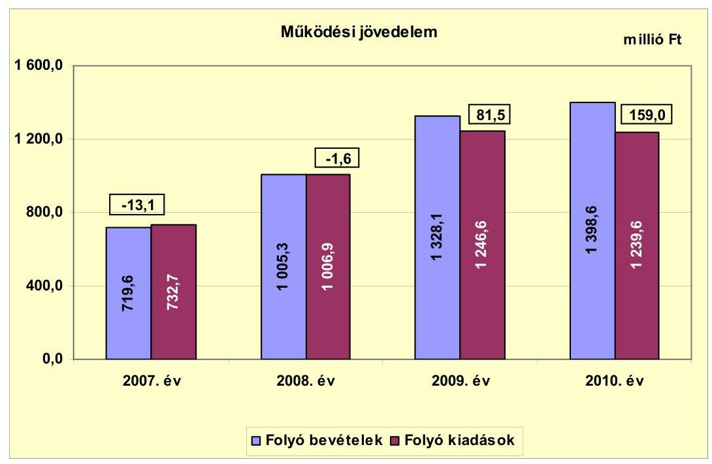

A 2007-2010. években a folyó költségvetés egyenlege összesen 225,8 millió Ft működési forrástöbblet mutatott, amely az időszak összes folyó kiadásának 5,3\%-át tette ki. A 2007-2010. évek között az átmenetileg szabad pénzeszközeik után összesen 249,5 millió Ft kamatbevételt realizáltak. A 2009-2010. évi pozitív múködési jövedelem kialakulásában szerepe volt a kötvénykibocsátásból származó, átmenetileg szabad pénzeszköz lekötéséből keletkezett kamatbevételnek, amely 2009-ben 112,0 millió Ft, 2010-ben 78,6 millió Ft volt. A kötvénykibocsátásból származó, átmenetileg szabad pénzeszköz lekötéséből keletkezett 2009-2010. évi kamatbevétel nélkül számított múködési jövedelem a

[^0]
[^0]:    ${ }^{18}$ Velence - Nadap Iskolai Intézményfenntartó Társulás, a Családsegítő Szolgálat Intézményi Társulás és a Velence - Nadap Óvodai Intézményfenntartó Társulás

---

2007-2010 közötti években összesen 35,2 millió Ft volt. A kötvénybevétel átmeneti befektetéséből származó kamatbevételt fejlesztési célú kiadásokra (az Óvoda bővítésére, a Közösségi Ház felújítására, és egyéb kisebb fejlesztésekre) fordították.

A 2009-2010. években a működési jövedelem folyamatosan emelkedett a folyó bevételek folyó kiadásokat meghaladó ütemű növekedése miatt.

A folyó bevételek 2008. évi növekményét 98,9\%-ban az állami támogatásból és az szja-ból származó bevételek 58,2 millió Ft-os, a helyi adóbevételek 71,2 millió Ft-os, az ingatlan értékesítés utáni áfa bevételek 78,0 millió Ft-os, az egyéb saját bevételek 75,1 millió Ft-os emelkedése okozta. A 2009. évben a folyó bevételek többlete az előző évhez képest elsősorban a fordított áfából származó bevétel 106,5 millió Ft-os és az egyéb saját bevételek 235,0 millió Ft-os (kamatbevétel, bérleti díjbevétel ${ }^{19}$ és az államháztartáson belülről kapott támogatások) növekményéből, illetve az állami támogatásból és az szja-ból származó bevételek 16,8 millió Ft-os, és a helyi adóbevételek 2,5 millió Ft-os csökkenéséből keletkezett. A 2010. évben a folyó bevételek többletét mintegy $80 \%$-ban az áfából származó bevételek (fordított áfa és áfa visszatérülés) 223,4 millió Ft-os többlete mellett az egyéb saját bevételek 164,6 millió Ft-os visszaesése okozta. A folyó kiadások 2008. évi növekményét a 2007. évhez képest $25,6 \%$-ban ( 70,3 millió Ft-tal) a személyi juttatások és azok járulékai, 59,6\%-ban (163,5 millió Ft-tal) a dologi kiadások, 9,2\%-ban (25,2 millió Ft-tal) a kamatkiadások emelkedése okozta. A folyó kiadások 2009. évi növekményét a dologi kiadások emelkedése idézte elő.

Az Önkormányzat pénzügyi kapacitása a 2007-2008. években negatív, a 2009-2010. években pozitív értéket mutatott. A nettó működési jövedelem értéke a folyó költségvetési egyenleg mellett az adott költségvetési év adósságtörlesztésének hatását is tükrözi. Az Önkormányzatnak pénzintézettel szemben a 2007-2010. években nem volt esedékes tőketörlesztési kötelezettsége, ezért a nettó múködési jövedelem minden évben megegyezett a múködési jövedelemmel.

Az alábbi grafikon a 2007-2010. évek éves költségvetési beszámolója alapján számított nettó múködési jövedelmet mutatja:

[^0]
[^0]:    ${ }^{19}$ Az Önkormányzat a Velence Termál Fejlesztési és Szolgáltató Kft.-vel 2004-ben 99 évre szóló bérleti szerződést kötött a termálfürdő alatti földterület használatára.

---

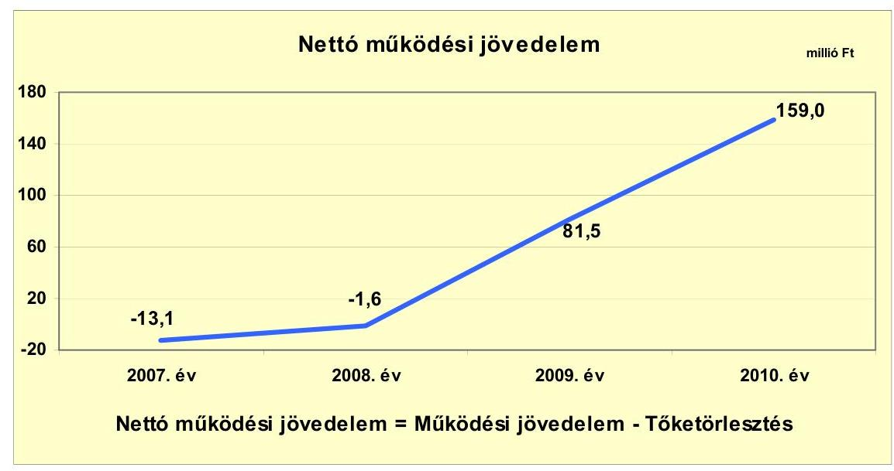

Az Önkormányzat felhalmozási költségvetésének egyenlege a 2007. évben 12,1 millió Ft-os hiányt, a 2008. évben 249,5 millió Ft felhalmozási forrástöbbletet mutatott. A 2009. és a 2010. években a felhalmozási költségvetésben 482,3 millió Ft, illetve 728,5 millió Ft forráshiány keletkezett. A 2007-2010. évek 973,4 millió Ft-os összes felhalmozási forráshiányára a fedezetet 23,2\%ban a pozitív nettó múködési jövedelem, 76,8\%-ban a kötvénykibocsátásból származó bevétel biztosította.

A felhalmozási költségvetés kiadását, bevételét és egyenlegét a 2007-2010. évek között a következő ábra szemlélteti:
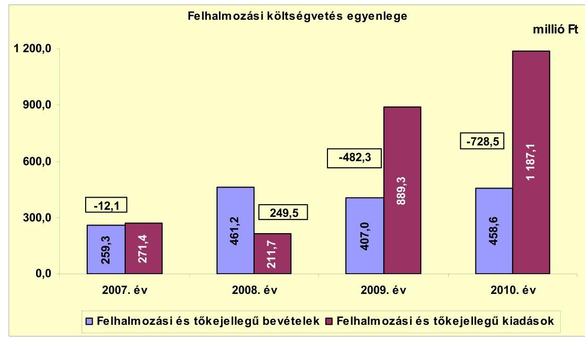

A felhalmozási hiánynak a felhalmozási és tőke jellegű kiadásokhoz viszonyított aránya 2007-ben $-4,5 \%$ ( $-12,1$ millió Ft), 2009-ben $-54,2 \%$ (-482,3 millió Ft) és 2010-ben $-61,4 \%$ ( $-728,5$ millió Ft) volt. A felhalmozási többletnek a felhalmozási és tőke jellegű kiadásokhoz viszonyított aránya a 2008. évben 117,9\%

---

(249,5 millió Ft) volt. A vizsgált időszakban képződött felhalmozási hiány együttes összege ( 973,4 millió Ft) az időszak összes felhalmozási kiadásának 38,0\%-át tette ki, melyet részben a nettó múködési jövedelemből, részben a 2008. évi kötvénykibocsátásból származó bevételből fedeztek.

Az Önkormányzat évenkénti teljes finanszírozási többlete(+)/hiánya(-) ${ }^{20}$ a CLF módszer szerint 2007-ben -25,2 millió Ft, 2008-ban 247,9 millió Ft, 2009ben -400,8 millió Ft, 2010-ben -569,5 millió Ft volt. Az összességében képződött 747,6 millió Ft teljes finanszírozási hiány az Önkormányzat 2007-2010. évek közötti költségvetési kiadásainak 11,0\%-át tette ki, melyet a 2008. évben kibocsátott kötvény bevételéből finanszíroztak.

Az Önkormányzat 2007-2010. évi zárszámadási rendeletei alapján kimutatott, teljesített múködési és felhalmozási célú hiányt/többletet a jelentés 1. számú melléklete tartalmazza. Az Önkormányzat a 2007. évben 20,9 millió Ft-os, a 2009. évben 367,0 millió Ft-os, a 2010. évben 569,5 millió Ft-os pénzügyi hiányt, a 2008. évben a kötvénykibocsátással együtt 1257,9 millió Ft-os pénzügyi többletet mutatott ki.

Az Önkormányzat évenkénti finanszírozási igényét, a finanszírozási múveletei egyenlegének alakulását a 2007-2010. években a következő ábra szemlélteti:
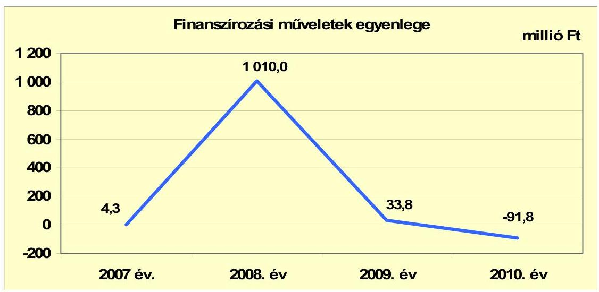

A 2007. és a 2009-2010. évek finanszírozási egyenlege a függő, átfutó és kiegyenlítő bevételeken és kiadásokon kívül nem tartalmazott más finanszírozási célú bevételt, illetve finanszírozási célú kiadást. A 2008. évben külső finanszírozási forrás igénybevételére, kötvénykibocsátásra került sor 1000 millió Ft öszszegben. A finanszírozási célú múveleteket a vizsgált időszakban a jelentés 2. számú mellékletének 4.1-4.8 pontjai részletezik.

A kamatbevételek és kamatkiadások alakulását a 2007-2011. év I. féléve közötti időszakban a következő ábra szemlélteti:

[^0]
[^0]:    ${ }^{20}$ a nettó múködési jövedelem és a felhalmozási költségvetés eredője

---

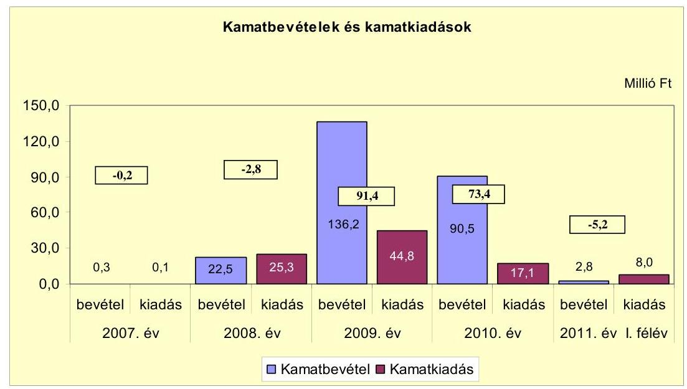

A 2007-2011. év I. féléve közötti időszakban az átmenetileg szabad pénzeszközök lekötéséből összesen 252,3 millió Ft kamatbevétel keletkezett, amelyből 190,6 millió Ft a 2008. évben kibocsátott kötvényből származó, átmenetileg szabad pénzeszköz lekötéséből realizálódott.

A kötvénykibocsátásból származó bevétel lekötéséből a 2009. évben 112,0 millió Ft, a 2010. évben 78,6 millió Ft kamatbevétel keletkezett.

A kamatkiadások emelkedését a 2007. évhez képest a 2008. évben kibocsátott kötvény után fizetendő kamat okozta. A 2008-2010. években a kötvénykibocsátásból származó kötelezettség állomány CHF-ben számított értéke nem változott, de 2010-ben az alapkamat ${ }^{21}$ (6 havi CHF LIBOR) csökkenése miatt a fizetendő kamat összege is csökkent.

# 2.2. Az Önkormányzat bevételeinek változása 

Az Önkormányzat folyó bevételei a 2007-2009. évek 1017,7 millió Ft-os átlagához képest 2010-ben 37,4\%-kal 380,9 millió Ft-tal nőttek. Az Önkormányzat folyó bevételei a vizsgált időszakon belül folyamatosan emelkedtek, a 2008. évben 39,7\%-kal (285,7 millió Ft-tal), a 2009. évben 32,1\%-kal (322,8 millió Fttal), a 2010. évben 5,3\%-kal (70,5 millió Ft-tal), 1398,6 millió Ft-ra nőttek az előző évhez képest.

Az Önkormányzatnál a 2007-2011. év I. féléve közötti időszakban a folyó bevételeket a következő diagram mutatja be:

[^0]
[^0]:    ${ }^{21}$ A 2008. évben az alapkamat a kötvénykibocsátáskor 3,7\%, 2011-ben az utolsó kamatfizetéskor $0,3 \%$ volt.

---

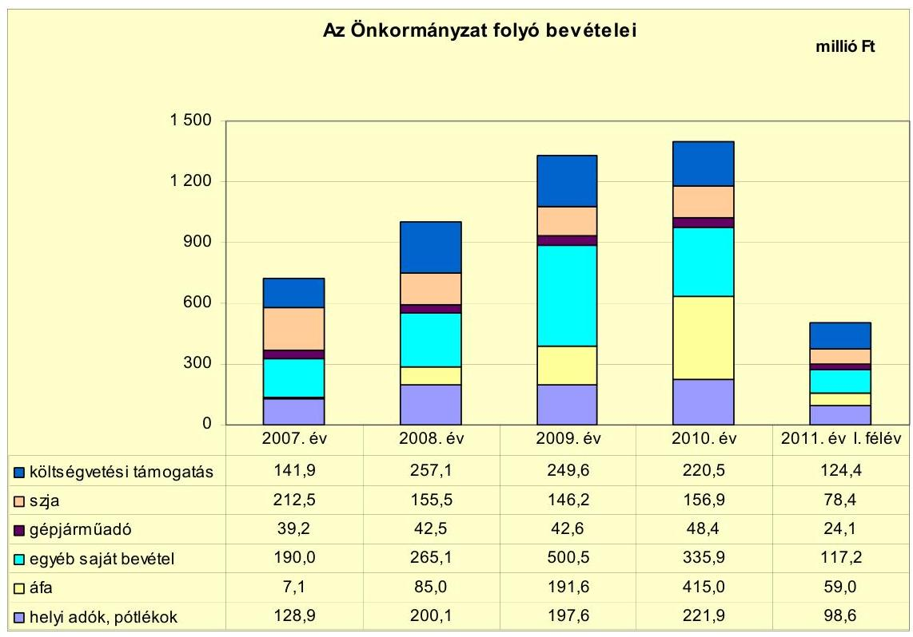

A folyó bevételeken belül a szja-ból és az állami támogatásokból származó bevételek együttesen a 2007. évi 354,4 millió Ft-ról 2008-ra 16,4\%-kal (58,2 millió Ft-tal) emelkedtek. A 2009. évben az előző évhez képest 4,1\%-kal (16,8 millió Ft-tal), a 2010. évben 4,6\%-kal (18,4 millió Ft-tal), 377,4 millió Ft-ra csökkentek. A folyó bevételeken belül a részarányuk folyamatosan csökkent, 2007-ben 49,2\%-ot, 2008-ban 41,0\%-ot, 2009-ben 29,8\%-ot, 2010-ben 27,0\%-ot tett ki.

A 2007-2010. évek közötti időszakban a folyó bevételeken belül az egyéb saját bevételek 2008-ra 39,5\%-kal (75,1 millió Ft-tal), 2009-ben 88,8\%-kal (235,4 millió Ft-tal) nőttek, a 2010. évben 32,9\%-kal (164,6 millió Ft-tal) csökkentek. Az egyéb saját bevételek növekményének 94,0\%-át a 2008. évben az államháztartáson belülről átvett pénzeszközök 14,8 millió Ft-os, a kamatbevételek 22,2 millió Ft-os és a bérleti díjbevételek ${ }^{22} 33,6$ millió Ft-os - előző évhez viszonyított - többlete okozta. A 2009. évben az egyéb saját bevételek többletét 94,3\%-ban a kamatbevételek (113,6 millió Ft-os), a bérleti díjbevételek (18,0 millió Ft-os), a szolgáltatások ellenértéke ${ }^{23}$ (20,7 millió Ft-os) és az államháztartáson belülről kapott támogatások ${ }^{24}$ ( 69,3 millió Ft-os) előző évhez viszonyított növekménye okozta. A 2010. évben az egyéb saját bevételek

[^0]
[^0]:    ${ }^{22}$ Az Önkormányzat a Velence Termál Fejlesztési és Szolgáltató Kft.-vel 2004-ben 99 évre szóló bérleti szerződést kötött a termálfürdő alatti földterület használatára. A bérleti díjat 35,0 millió Ft-ban határozták meg, a bérleti díjat 2007. évtől kezdték fizetni.
    ${ }^{23}$ A Velencei-tó Kapuja projekt keretében a leendő üzemeltető 15,0 millió Ft kauciót fizetett meg az Önkormányzatnak, az Iskola felújítását végző kivitelező 9,0 millió Ft hozzájárulást adott a felújítás során szükséges költöztetés kiadásaihoz.
    ${ }^{24}$ Az Önkormányzat az Iskola felújítására jóváhagyott hazai- és EU-s támogatásból a projekt múködési célú kiadásaira 25,2 millió Ft-ot, a járóbeteg-szakellátás fejlesztése projekt múködési célú kiadásaira 69,0 millió Ft-ot vett igénybe.

---

164,6 millió Ft-os visszaesését a 2009. évhez képest 92,8\%-ban a szolgáltatások ellenértékének 25,0 millió Ft-os, a kamatbevételek 45,7 millió Ft-os, az államháztartáson belülről kapott támogatások (a kiemelt projektek múködési kiadásaihoz igénybe vett támogatások ${ }^{25}$ ) 82,1 millió Ft-os csökkenése eredményezte.

A 2007-2010. évek közötti időszakban a folyó bevételeken belül az áfa bevételek emelkedő mértékű teljesítését elsősorban az ingatlan értékesítések után felszámított áfa bevételek, a beruházásokhoz kapcsolódó áfa visszatérülések és a fordított áfa elszámolása okozták. Az áfa bevételek 90,7\%-át 2008-ban a termálfürdőhöz kapcsolódó 450,2 millió Ft-os ingatlan értékesítést terhelő 77,1 millió Ft-os áfa bevétel tette ki, a 2009. évben a 81,6\%-át az Iskola felújítása után felszámított ( 156,3 millió Ft-os) fordított áfa adta. A 2010. évben az áfa bevétel $91,6 \%$-a a beruházási áfa visszatérüléséből ( 176,9 millió Ft ) és a beruházásokat terhelő fordított áfa elszámolásából (203,4 millió Ft) keletkezett.

Az Önkormányzat illetékességi területén 2007. január 1-jén helyi iparúzési adó, építményadó, telekadó és idegenforgalmi adónemek voltak bevezetve. A vizsgált időszakban a helyi adók köre nem változott, új helyi adónemet az Önkormányzat nem vezetett be. Az építményadó a lakás célú és az üdülő épületekre terjed ki, mértékét 2008. január 1-jétől felemelték. Az idegenforgalmi adó és az iparúzési adó mértéke már a 2007. évet megelőzően a helyi adókról szóló törvényben rögzített maximális mértékben került megállapításra. A vizsgált időszakban a helyi adóbevételekből átlagosan 30-30\% az iparúzési adóból, illetve az idegenforgalmi adóból származott, $27 \%$-a az építményadóból és $13 \%$-a a telekadóból folyt be.

Az építményadó és a telekadó mértékét övezetenként differenciáltan állapították meg.

A helyi adókból és pótlékokból származó bevételek kimagaslóan 2007-ről 2008-ra 55,2\%-kal ( 71,2 millió Ft-tal) emelkedtek az építményadó emelése, a kedvezmények csökkentése, az adóbehajtás fokozása és az adózók eredményes felderítése következtében. A helyi adó bevételeken belül az iparúzési adóbevétel a 2008. évre 27,2 millió Ft-tal ( $64,3 \%$-kal), az építményadó 19,2 millió Ft-tal ( $63,8 \%$-kal), az idegenforgalmi adó 7,7 millió Ft-tal ( $18,7 \%$-kal) és a telekadó 11,6 millió Ft-tal ( $87,2 \%$-kal) nőtt. A 2010. évi adóbevételek az előző évhez képest 24,3 millió Ft-tal ( $12,3 \%$-kal) 221,9 millió Ft-ra nőttek elsősorban az építményadó 17,8 millió Ft-os emelkedése miatt. A folyó bevételeken belül a pótlékkal, bírsággal növelt helyi adó bevétel aránya a 2007. évben 17,9\%-ot, a 2008. évben $19,8 \%$-ot, a 2009. évben $14,9 \%$-ot, a 2010. évben $15,9 \%$-ot tett ki.

Az Önkormányzat felhalmozási bevételeit a 2007-2011. év I. féléve közötti időszakban a következő táblázat mutatja be:

[^0]
[^0]:    ${ }^{25}$ A 2010. évben a Velencei-tó Kapuja projekt múködési kiadásaihoz 22,3 millió Ft ha-zai- és EU-s támogatást vettek igénybe.

---

| Megnevezés | 2007. év | 2008. év | 2009. év | 2010. év | 2011. év I.   félév |
| :-- | --: | --: | --: | --: | --: |
| Tárgyi eszköz értékesítés | 25,7 | 450,2 | 0,3 | 8,2 | 38,6 |
| Egyéb saját tőkebevétel | 1,9 | 2,1 | 1,8 | 1,9 | 0,0 |
| Államháztartáson belülről   kapott támogatás | 194,4 | 7,3 | 403,9 | 447,5 | 347,7 |
| Államháztartáson kívülről   kapott támogatás | 37,3 | 1,6 | 1,0 | 1,0 | 1,0 |
| Összes felhalmozási bevétel | 259,3 | 461,2 | 407,0 | 458,6 | 387,3 |

A felhalmozási bevételek a 2007-2009. évek 375,8 millió Ft-os átlagához képest 2010-ben 22,0\%-kal, 458,6 millió Ft-ra nőttek. A vizsgált időszakon belül a felhalmozási bevételek a 2008. évre 77,9\%-kal (201,9 millió Ft-tal) nőttek, a 2009. évben $11,8 \%$-kal ( 54,8 millió Ft-tal) csökkentek, a 2010. évben 12,7\%-kal (51,6 millió Ft-tal) emelkedtek az előző évhez képest. A felhalmozási bevételek növekménye 2008-ban az ingatlan eladásból származó bevétel növekedéséből keletkezett. A 2009. és a 2010. években a felhalmozási bevételek több mint 97\%-a a fejlesztési projektekhez kapcsolódó, államháztartáson belülről kapott támogatásokból realizálódott.

A felhalmozási bevételeken belül az átvett pénzeszköz aránya 2007-ben 89,4\%ot, 2008-ban 1,9\%-ot, 2009-ben 99,5\%-ot, 2010-ben 97,8\%-ot tett ki az igénybevett hazai- és EU-s támogatások és az államháztartáson kívülről fejlesztési célra átvett pénzeszközök hatására. A támogatás értékű felhalmozási bevételekből (hazai- és EU-s támogatásokból) a 2007. évben 193,3 millió Ft a szennyvízcsatorna hálózat építéséhez, a 2009. évben 360,4 millió Ft az Iskola felújításához, 43,4 millió Ft a Velencei-tó Kapuja projekthez kapcsolódott. A 2010. évben a jóváhagyott támogatásokból az Iskola felújításához 82,0 millió Ft-ot, a Velencei-tó Kapuja projekthez 359,3 millió Ft-ot, a Közösségi Ház felújításához 5,5 millió Ft-ot vettek igénybe. Az Önkormányzatnak a 2008. évben a városi termálfürdővel szomszédos telkek értékesítéséből 450,2 millió Ft bevétele keletkezett, a telkekre a termálfürdő alatti terület bérlőjének opciós joga volt az Önkormányzattal 2004. évben kötött együttműködési megállapodás alapján.

# 2.3. Az Önkormányzat múködési és a felhalmozási célú kiadásainak változása. 

Az Önkormányzat költségvetési kiadásain belül a folyó kiadások részaránya a 2007. évi 73,0\%-ról 2008-ban 82,6\%-ra nőtt, 2009-ben 58,4\%-ra, 2010-ben $51,1 \%$-ra csökkent.

A folyó kiadások a 2008. évben 37,4\%-kal (274,2 millió Ft-tal), a 2009. évben 23,8\%-kal (239,7 millió Ft-tal) emelkedtek az előző évhez képest, a 2010. évben 0,6\%-kal (7,0 millió Ft-tal) csökkentek a 2009. évhez képest.

Az Önkormányzat folyó kiadásai a 2007-2011. év I. féléve közötti időszakban főbb jogcímek szerinti bontásban a következők voltak:

---

| Megnevezés | 2007. év | 2008. év | 2009. év | 2010. év | 2011. év I.   félév |
| :-- | --: | --: | --: | --: | --: |
| Folyó kiadások | 732,7 | 1008,9 | 1246,6 | 1239,6 | 509,7 |
| Múködési kiadások (kamatkiadás nélkül) | 673,4 | 917,7 | 1133,5 | 1147,1 | 459,2 |
| Államháztartáson belülre átadott   pénzeszközök | 6,0 | 9,4 | 5,4 | 4,9 | 1,6 |
| Transzferkiadások | 53,2 | 54,5 | 62,9 | 70,5 | 40,9 |
| -ebből: vállalkozásoknak | 7,6 | 7,6 | 6,3 | 5,9 | 5,2 |
| magánszemélyeknek | 33,5 | 34,7 | 39,7 | 48,8 | 27,0 |
| nonprofit szervezeteknek | 12,1 | 12,2 | 16,9 | 15,8 | 8,7 |
| Kamatkiadások | 0,1 | 25,3 | 44,8 | 17,1 | 8,0 |

Az Önkormányzat folyó kiadásai növekedését 2008-ban 89,1\%-ban a múködési kiadások 244,3 millió Ft-os és a kamatkiadások 25,2 millió Ft-os emelkedése okozta. A 2009. évben a folyó kiadások emelkedését 90,0\%-ban a múködési kiadások 215,8 millió Ft-os és 8,1\%-ban a kamatkiadások 19,5 millió Ft-os növekedése idézte elő. A 2010. évben a folyó kiadások csekély mértékben csökkentek, mivel a múködési kiadások 1,2\%-kal (13,6 millió Ft-tal) emelkedtek a kamatkiadások ugyanakkor 61,8\%-kal (27,7 millió Ft-tal) csökkentek a 2009. évhez képest. A folyó kiadásokon belül a múködési kiadások részaránya 2007-ről 2008-ra 0,8 százalékponttal, 2009-ben 0,2 százalékponttal csökkent, 2010-ben 1,6 százalékponttal emelkedve, $92,5 \%$-ot tett ki.

A folyó kiadásokon belül a múködési célú pénzeszköz átadások (transzfer kiadások és az államháztartáson belülre átadott pénzeszközök) részaránya a 2007. évben $8,1 \%$-ot, a 2008. évben $6,3 \%$-ot, a 2009. évben $5,5 \%$-ot, a 2010. évben $6,1 \%$-ot tett ki. A múködési célú pénzeszköz átadások több mint $85 \%$-át minden évben a transzfer kiadások tették ki. A transzfer kiadásokon belül a magánszemélyek pénzbeli szociális ellátásaira adott támogatások a 2009. évben $14,4 \%$-kal ( 5,0 millió Ft-tal), a 2010. évben $22,9 \%$-kal ( 9,1 millió Ft-tal) nőttek az előző évhez képest. A nonprofit szervezeteknek múködési célra nyújtott támogatások a 2009. évben 38,5\%-kal (4,7 millió Ft-tal) emelkedtek, a 2010. évben 6,5\%-kal (1,1 millió Ft-tal) csökkentek az előző évhez képest.

A folyó kiadásokon belül az egyes kiemelt múködési kiadási előirányzatok teljesítési adatait a 2007-2011. év I. féléve közötti időszakban a következő táblázat tartalmazza:

| Megnevezés | 2007. év | 2008. év | 2009. év | 2010. év | 2011. év I.   félév |
| :-- | --: | --: | --: | --: | --: |
| Személyi juttatások | 331,3 | 386,6 | 363,6 | 369,2 | 181,3 |
| Munkaadót terhelő járulékok | 102,8 | 117,8 | 104,1 | 89,8 | 46,3 |
| Dologi kiadások | 228,4 | 391,9 | 645,5 | 642,0 | 215,7 |
| Egyéb folyó kiadások | 10,9 | 21,4 | 20,3 | 46,1 | 15,9 |

Az egyes kiemelt múködési kiadási előirányzatok teljesítésén belül a személyi juttatások és azok járulékai a 2007. évi 434,1 millió Ft-ról a 2008. évre 16,2\%-kal (70,3 millió Ft-tal) 504,4 millió Ft-ra nőtt. A 2009. évben 7,3\%-kal (36,7 millió Ft-tal), a 2010. évben 1,9\%-kal (8,7 millió Ft-tal) csökkent az előző évhez viszonyítva. A személyi juttatásoknak és azok járulékainak részaránya az egyes kiemelt múködési kiadásokon belül a 2007. évi 64,5\%-ról a 2008. évben $55,0 \%$-ra, a 2009. évben $41,3 \%$-ra, a 2010. évben $40,0 \%$-ra csökkent. A 2008. évben a személyi juttatások és azok járulékai emelkedését elsősorban a

---

társult óvodai feladatellátás ( 10,0 millió Ft), az általános iskolai feladatok (12,9 millió Ft), a szociális- és gyermekjóléti szolgáltatások ( 7,4 millió Ft) és a közhasznú munkavégzés bővülése ( 11,6 millió Ft), valamint a külső személyi juttatások ( 7,1 millió Ft) és a 2007. év után járó 13. havi illetmény elszámolása ( 10,2 millió Ft) okozta. A 2009. évben a személyi juttatások és azok járulékai csökkenését elsősorban a közhasznú- és közcélú foglalkoztatás visszaesése ( 27,3 millió Ft) és a 13. havi illetmény megszűnése és az azt részben kompenzáló központi bérpolitikai intézkedések együttesen idézték elő. A 2010. évben a munkáltatót terhelő járulékok lecsökkentek a tételes egészségügyi hozzájárulás és a munkaadói járulék megszűnése, valamint a foglalkoztatót terhelő társadalombiztosítási járulékok csökkenése következtében.

Az egyes kiemelt múködési kiadási előirányzatok teljesítésén belül a dologi kiadások részaránya a 2007. évi 33,9\%-ról a 2008. évre 42,7\%-ra, a 2009. évben $56,9 \%$-ra nőtt, a 2010. évben $56,0 \%$-ot tett ki. A dologi kiadások a 2007. évről a 2008. évre $71,6 \%$-kal ( 163,5 millió Ft-tal) emelkedtek, melyből 85,8 millió Ft-ot az áfa kiadások ${ }^{26}, 28,4$ millió Ft-ot a szolgáltatási kiadások és 47,7 millió Ft-ot a szellemi tevékenység végzésére teljesített kifizetések emelkedése okozott. A dologi kiadások összege a 2009. évben 64,7\%-kal (253,6 millió Ft-tal) emelkedett, a 2010. évben 0,5\%-kal (3,5 millió Ft-tal) csökkent.

A szellemi tevékenység végzésére teljesített kiadásokból 2008-ban a Velencei-tó Kapuja pályázat előkészítéséhez 26,6 millió Ft-ot, a járóbeteg-ellátás fejlesztése érdekében a szakorvosi rendelő építése projektre 16,8 millió Ft-ot, az Iskola felújítása, bővítése projektre 3,5 millió Ft-ot teljesítettek szakértői megbízásokra, szaktanácsadásra, tervezési feladatokra. A dologi kiadások 2009. évi növekedését a 2008. évhez képest az áfa kiadások 119,4 millió Ft-os növekedése ${ }^{27}$ mellett a szolgáltatási kiadások 21,0 millió Ft-os és a szellemi tevékenység végzésére teljesített kifizetések 108,4 millió Ft-os emelkedése okozta. A 2009. évben a szellemi tevékenység végzésére teljesített 162,7 millió Ft kiadásból a Velencei-tó Kapuja projekthez 103,7 millió Ft-ot, a szakorvosi rendelő építése projekthez 10,0 millió Ftot, az Iskola felújításához 24,4 millió Ft-ot fizettek ki.

A múködési és felhalmozási kiadásokat a 2007-2011. év I. féléve közötti időszakban - a működési és fejlesztési célú kamatkiadásokat is figyelembe véve a következő grafikon szemlélteti:

[^0]
[^0]:    ${ }^{26}$ A 2008. évben az áfa kiadásokon belül az előzetesen felszámított áfa 13,4 millió Fttal emelkedett, míg a kiszámlázott termékek és szolgáltatások és az értékesített tárgyi eszközök áfa befizetései 72,4 millió Ft-tal nőtt a termálfürdőhöz kapcsolódó telkek értékesítése miatt.
    ${ }^{27}$ A 2009. évben az áfa kiadásokon belül az előzetesen felszámított áfa 30,6 millió Fttal emelkedett, a kiszámlázott termékek és szolgáltatások, valamint az értékesített tárgyi eszközök után áfa fizetési kötelezettség 67,5 millió Ft-tal csökkent, az Iskola felújítása után megfizetett fordított áfa 156,3 millió Ft volt.

---

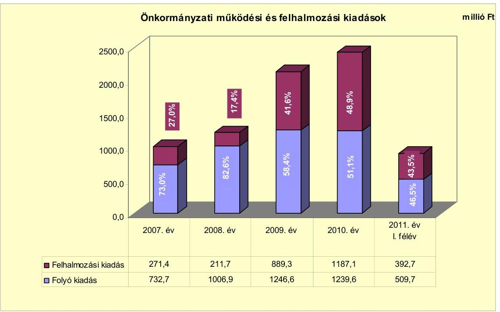

A felhalmozási kiadások a 2007-2009. évek 457,5 millió Ft-os átlagához képest 2010. évben a 2,6-szeresére, 1187,1 millió Ft-ra emelkedtek. A felhalmozási kiadások a 2007. évről a 2008. évre 22,0\%-kal (59,7 millió Ft-tal) csökkentek. A 2009. évben 4,2-szeresére ( 677,6 millió Ft-tal) nőttek a 2008. évhez képest. A 2010. évben 33,5\%-kal (297,8 millió Ft-tal) emelkedtek az előző évhez képest. A fejlesztési kiadásokon belül 2009-ben a befektetési célú részesedések vásárlására fordított összeg 78,2 millió Ft, amelyből 70,0 millió Ft a Járóbeteg Nonprofit Kft. törzstőke emelése volt. A 2010. évben a fejlesztési kiadásokból 60,0 millió Ft a Járóbeteg Nonprofit Kft. törzstőke emelése, és 60,0 millió Ft a Kft-nek nyújtott fejlesztési célú kölcsön volt. Az Önkormányzat a 2007. évben fejezte be a 2004ben megkezdett 1075,3 millió Ft-os összköltségű szennyvízcsatorna hálózat építési beruházását, melyre 2007-ben 230,0 millió Ft-ot fordítottak. A fejlesztési tevékenység a 2009-2010. években intenzíven emelkedett új projektek megvalósítása következtében. Az Iskola felújításra 911,0 millió Ft-ot, az Óvoda felújításra 140,0 millió Ft-ot, a járóbeteg-szakellátásra 199,3 millió Ft-ot, a Velencei-tó Kapujára 792,5 millió Ft-ot fordítottak. A felhalmozási kiadások 2009-ben a múködési kiadások 71,3\%-át, 2010-ben 95,8\%-át tették ki.

Az Önkormányzat által 2007-2010 között megvalósított, 2010. december 31-ig befejezett felújítások és fejlesztések száma a kimutatásuk szerint 214 darab volt. Ebből hat darab volt 10 millió Ft-ot meghaladó egyedi értékű. A befejezett fejlesztések bekerülési költsége 1472,3 millió Ft-ot tett ki, melyből 368,0 millió Ftot ( $25,0 \%$-ot) saját bevételből, 397,7 millió Ft-ot ( $27,0 \%$-ot) kötvénykibocsátásból származó bevételből, 655,7 millió Ft-ot ( $44,5 \%$-ot) EU-s támogatásból, 50,9 millió Ft-ot ( $3,5 \%$-ot) pedig hazai támogatásokból fedeztek. A befejezett fejlesztési feladatokat és azok forrás összetételének alakulását a jelentés 3/a. számú melléklete részletesen tartalmazza.

---

Az Önkormányzatnak 2010. december 31-én három folyamatban lévő fejlesztési feladata ${ }^{28}$ volt. A három projektre 2010. év végéig 840,0 millió Ft kiadást teljesítettek, amelyből 221,2 millió Ft (26,3\%) saját bevételből, 239,4 millió Ft (28,5\%) a kötvénykibocsátásból származó bevételből, 379,4 millió Ft (45,2\%) EU-s támogatásból valósult meg. A folyamatban lévő beruházások várható bekerülési költsége 2386,4 millió Ft, melyből a 2011-től esedékes kötelezettségek összege 1546,5 millió Ft. A 2010. év utánra vállalt kötelezettségekből 379,3 millió Ft-ot ( $24,5 \%$-ot) saját bevételből, 223,6 millió Ft-ot ( $14,5 \%$-ot) a kötvénykibocsátásból származó bevételből, 943,6 millió Ft-ot ( $61,0 \%$-ot) EU-s támogatásból terveznek biztosítani. A felhalmozás finanszírozásának a kockázatát növeli a Velencei-tó Kapuja beruházás kivitelezője ellen indított felszámolási eljárás, valamint az, hogy a projekt befejezéséhez szükséges saját forrás a vizsgálat időpontjában nem állt rendelkezésre.

A polgármester észrevételben kifogásolta a megállapítást, mely szerint a felhalmozási kiadások finanszírozási kockázatát növeli, hogy a tervezett saját forrás a vizsgálat időpontjában nem állt rendelkezésre, mivel álláspontja szerint „az értelmezhetetlen és nem helytálló". Indoklásában az államháztartás múködési rendjéről szóló Kormány rendeletek kötelezettségvállalásra vonatkozó előírásaira hivatkozott, amely szerint „a pénzügyi fedezetnek a kötelezettségvállaláskor rendelkezésre kell állnia", valamint jelezte, hogy „Az önkormányzati saját forrás a vizsgálat időpontjában a jóváhagyott költségvetés megfelelő kiadási előirányzatain biztosított volt. Továbbá a rendelkezésre álló pénzeszközt is vizsgálni kellett volna ezen megállapítás megtételénél".

Az észrevételt nem fogadtuk el, mivel a megállapítás nem arra vonatkozott, hogy a kötelezettségvállaláshoz szükséges kiadási előirányzat az Önkormányzat 2011. évi költségvetési rendeletében nem állt rendelkezésre. A megállapítás a folyamatban lévő beruházások - melynek 95,3\%-át a Velencei-tó Kapuja projekt tette ki - finanszírozási kockázatára mutatott rá, mivel az Önkormányzatnak a 2010. december 31-én folyamatban lévő beruházásokhoz tervezett saját forrásrésze 602,9 millió Ft volt. Az Önkormányzat 2010. évi költségvetési beszámolója szerint a 268,1 millió Ft-os záró pénzkészletből 223,6 millió Ft, valamint a 2011. év I. félévi költségvetési beszámolója szerint a 231,3 millió Ft-os záró pénzkészletből 161,6 millió Ft kötvénykibocsátásból származó forrásrész állt rendelkezésre, a beruházásokhoz más elkülönített, saját bevételből származó forrásuk nem volt.

Az Önkormányzat „Velencei-tó Kapuja" projektjét a KDOP-2.1.1./A „Kiemelt és integrált vonzerő-, termék és infrastruktúra-fejlesztések támogatása, Kiemelt vonzerők fejlesztése" tárgyú felhívásra nyújtotta be a 2008. évben. A támogatási szerződést 2008 decemberében kötötték meg. A támogatási szerződés 7. számú mellékletében rögzítették a projekt pénzügyi lebonyolítását. Ebben általánosan rendelkeztek az előlegigénylésről, valamint az elszámolásról. E szerint a dokumentum szerint a szállítói finanszírozást abban az esetben választhatta a kedvezményezett (az Önkormányzat), amennyiben előlegben nem részesül. A projekt tervezett összköltsége 2266,0 millió Ft, ebből a pályázat keretében elszámolható költség - a támogatási szerződés módosítása után - 1645,5 millió Ft, melyhez az EU-s támogatásból és hazai központi költségvetési előirányzatból 1199,8 millió Ft támogatást vehetnek igénybe. A támogatási szerződés szerint a beruházás kezdési időpontja 2009. február 1-je, a befejezési időpontja 2011.

[^0]
[^0]:    ${ }^{28}$ Közösségi Ház felújítása, kerékpárút építés, a Velencei-tó Kapuja projektek

---

szeptember 30-a volt. Az Önkormányzat 2010. évben, tekintettel az előzőekben lefolytatott két, eredménytelenül zárult közbeszerzési eljárásra, már harmadik alkalommal írta ki a projektre a közbeszerzési eljárást, az ajánlati felhívásban feltüntették az előleg igénybevételének lehetőségét 10-40\%-os mértékben, a vállalkozói díj előleghez biztosítékot nem kértek. Az ajánlati felhívás feltételeit az Önkormányzat a közremúködő szervezettel többször egyeztette ${ }^{29}$, a jóváhagyásukkal jelent meg a közbeszerzési kiírás. A kivitelezésre szóló vállalkozási szerződést nettó 1622,0 millió Ft + áfa összegben az Önkormányzat 2010 júliusában kötötte meg, a szerződés szerinti befejezési határidő 2011 júliusa volt, a végleges átadás-átvétel határidejét 2011. augusztus 22 -ében határozták meg. A vállalkozási szerződést 2011. augusztus 22 -én módosították, amelyben a befejezés határidejét 2011. október 20-ában állapították meg. A kivitelező a vállalkozási szerződés szerint vállalkozói előleg igénybevételére volt jogosult a vállalkozói díj 33,9\%-ának megfelelő, 550,0 millió Ft összegben. A kifizetésekhez kapcsolódóan a Kincstárral, mint fedezetkezelővel fedezetkezelői szerződést kötöttek. A kivitelező hét részszámlát nyújthatott be a pénzügyi és építési ütemtervnek megfelelően, amelyekből az előleg arányosan került volna elszámolásra. A kivitelezés befejezése végén a vállalkozási díj 10\%-ának megfelelő összegű végszámla benyújtására lett volna lehetőség. Összesen egy előlegbekérő (az előleg három részletben került kifizetésre, ezért a pénzügyi teljesítésnek megfelelően három előlegszámla került kiállításra) és öt részszámla került benyújtásra 995,2 millió Ft összegben, amelyből az előleg 550,0 millió Ft volt. A kifizetett előlegből a részszámlák alapján teljesítésre és elszámolásra került 168,0 millió Ft. Az előlegből így 382,0 millió Ft teljesítésére a vállalkozó részéről nem került sor. A 382,0 millió Ft el nem számolt előlegből 249,6 millió Ft a hazai- és EU-s támogatás összege, 132,4 millió Ft az Önkormányzat saját forrás része. Az Önkormányzatnak az igazoltan fel nem használt vállalkozói előleg támogatási részét vissza kell fizetnie. Az 5. számú, 2011. július 30 -ai esedékességú részszámlához ( 65,8 millió Ft) nem került benyújtásra a NAV nemleges adóigazolása, ezért a számla ellenértékének teljesítésekor nem tartották be az Art. 36/A. § és a 85/A. § (3) bekezdésében foglaltakat. Az Önkormányzat az 5. számú részszámla benyújtásakor jelezte a fedezetkezelő felé, hogy a részszámla teljesítéséhez a kivitelező nem nyújtotta be a NAV adóigazolását.

A polgármester a megállapításra észrevételt tett, mely szerint nem helytálló a jelentés azon megállapítása, hogy az Önkormányzat nem tartotta be az Art. 36/A. §-ában foglaltakat, mivel a jogszabály szerint az a kifizető feladata volt, a fedezetkezelői szerződés II/1-2. pontja szerint a kifizető a Magyar Államkincstár volt.

Az észrevételt nem fogadtuk el, mivel a 281/2006. (XII. 23.) Korm. rendelet 19. § (9) bekezdése szerint a kifizetési igényléshez a kedvezményezettnek az eredeti számlák általa hitelesített másolatát, a Nemzeti Fejlesztési Ügynökség által meghatározott formátumú összesítőjét, a számlák - a szállító részére történő közvetlen kifizetés esetén a számla támogatáson felüli összege - kifizetését igazoló dokumentumok általa hitelesített másolatát vagy egyéb, az egységes múködési kézikönyvben meghatározott, az elszámolást alátámasztó dokumentumot kell mellékelnie. A felsorolás az adóigazolást nem tartalmazza.

[^0]
[^0]:    ${ }^{29}$ Az Önkormányzat szóbeli tájékoztatása alapján.

---

Az észrevételben leírt eljárás ellentétes a 281/2006. (XII. 23.) Korm. rendelet 19. § (4) bekezdés a) pontjában foglaltakkal is, mely szerint 2010. május 16 -tól - az építőipari kivitelezési tevékenységről szóló 191/2009. (IX. 15.) Korm. rendelet szerinti építtetői fedezetkezelés hatálya alá tartozó építőipari kivitelezési tevékenység esetén - szállítói finanszírozáskor a fedezetkezelői számlára történő utalás a szállító vagy az engedményese pénzforgalmi számlájára történő utalásnak minősül. A fedezetkezelői szerződés II/1-2. pontja a fedezetkezelői és az építtetői fedezetbiztosítási számlák vezetésével kapcsolatos feladatokat tartalmazza, az adóigazolások kezelésére, annak hiányára nem tartalmaz utalást.

Az Önkormányzat a kivitelezővel kötött vállalkozási szerződés 6.3 pontjában rögzítette, hogy az előleg, a rész- és végszámlák kifizetése fedezetkezelőn keresztül történik, a kifizetés feltételeként a kivitelező az adóigazolást a fedezetkezelőhöz köteles benyújtani. Továbbá a szerződés 6.10 pontjában előírták, hogy a havonta nettó módon számított 200 ezer Ft-ot meghaladó kifizetések az Art. 36/A. § hatálya alá esnek. Ennek értelmében az Önkormányzat, mint megrendelő a teljesítésért akkor fizet, ha a kivitelező szerepel a köztartozásmentes adózói adatbázisban, vagy ennek hiányában 30 napnál nem régebbi nemlegesnek minősülő együttes adóigazolást mutat be, vagy küld meg. A kivitelező pedig tudomásul veszi, hogy amennyiben az adóigazolás köztartozást mutat az Önkormányzat a kifizetést a köztartozás erejéig visszatartja. Az Önkormányzat részéről ennek ellenére az 5. számú részszámla továbbítása a Magyar Államkincstárhoz megtörtént, amely felé ugyanakkor írásban jelezték, hogy a kivitelező nem mutatott be nemleges adóigazolást.

A kivitelező ellen 2011. szeptember 13-ával felszámolási eljárás indult. A Kép-viselő-testület 2011. október 11-ei ülésén döntött a vállalkozási szerződés felmondásáról, az építési terület vagyonvédelmének biztosításáról, a hitelezői igény bejelentéséről, a projekt folytatásához szükséges intézkedésekről, és ismeretlen tettes ellen az önkormányzati, valamint az állami támogatásból származó pénz eltulajdonítása miatti büntető feljelentés megtételéről. A polgármester a büntető feljelentést 2011. október 14-én tette meg.

A Képviselő-testület 2011. november 10-én további, a beruházás folytatásához (műszaki tervek aktualizálásáról) és a pénzügyi fedezet biztosításához szükséges döntést hozott. A Képviselő-testület 2011. november 10-ei zárt ülésén kijelölt kettő, összesen 97,6 ezer $\mathrm{m}^{2}$ területű ingatlant értékesítésre a beruházás folytatásához szükséges hiányzó forrás biztosítása érdekében. A Képviselőtestület a szükséges forrást elsődlegesen ingatlan értékesítéssel kívánja megteremteni, de az ingatlanpiaci kereslet bizonytalansága miatt 2011. november 21-én 500,0 millió Ft összegű kötvénykibocsátás előkészítéséről is döntött. Az Önkormányzatnak a tervezett adósságot keletkeztető kötelezettségvállalás kapcsán figyelembe kell vennie - a 2012. január 1-jén hatályba lépett - Magyarország gazdasági stabilitásáról szóló 2011. évi CXCIV. törvény és az adósságot keletkeztető ügyletekhez történő hozzájárulás részletes szabályairól szóló 353/2011. (XII. 30.) Korm. rendelet előírásait, amelyek szerint a kötvénykibocsátáshoz a Kormány hozzájárulása szükséges, továbbá az adósságot keletkeztető kötelezettségvállalásokból származó tárgyévi fizetési kötelezettség a futamidő végéig egyik évben sem haladhatja meg a saját bevételek 50,0\%-át.

Az Önkormányzat az Ámr. 91. § (3), (6) bekezdései, valamint a 281/2006. (XII. 23.) Korm. rendelet 19. § (5) bekezdése és a támogatási szerződés általános szerződési feltételeinek 5.1. pontja, valamint a 7. számú mellékletében rögzítet-

---

tek szerint nem választhatta volna az előleglehívást és a szállítói finanszírozási módot együtt. Az Önkormányzat hivatkozása arra vonatkozóan, hogy ő, mint Kedvezményezett nem részesült előlegben nem helytálló, mert a kivitelezőnek kifizetett előleg a Kedvezményezett részére kiutalt előlegnek is minősül, mivel a vállalkozói dí előlegbekérőt az Önkormányzat továbbította Kincstár felé, és a közvetlenül a kivitelezőnek kiutalt előleg csak technikai lépés azért, hogy lerövidítse a kifizetés teljesítését. Az Önkormányzat az előleg biztosításakor nem tartotta be a 281/2006. (XII. 23.) Korm. rendelet 58-59. §-aiban, valamint a Támogatási Szerződésben foglaltakat.

A polgármester az előleg kifizetésére vonatkozó megállapításra észrevételt tett, mely szerint a Velencei-tó Kapuja projekt kapcsán álláspontja szerint lehetőség volt előleg igénylésére, amennyiben a kedvezményezett bruttó támogatásra jogosult államháztartási szervezet és az Áfa tv. 142. §-a is teljesül. Észrevétele szerint ezen feltételeknek az Önkormányzat megfelelt.

Álláspontját nem fogadtuk el, mivel az Önkormányzat a módosított támogatási szerződés és a fedezetkezelői szerződés szerint nettó támogatásban részesül, tekintettel arra, hogy úgy nyilatkozott, hogy a beruházáshoz kapcsolódó áfa levonható.

Kifogásolta továbbá azt a megállapítást, hogy az Önkormányzat nem választhatta volna az előleglehívást és a szállítói finanszírozást együtt. Észrevételéhez csatolt egy, az NFÜ által készített „Melléklet - Tájékoztató levél kedvezményezetteknek" című levél-tervezetet, amelyben az NFÜ a projektgazdáknak előírta, hogy kötelesek „a finanszírozási feltételek között a vállalkozói előleget a vállalkozó által választható igénylési formaként feltüntetni", azonban a levéltervezeten az NFÜ részéről dátum és aláírás nincsen, helyette kipontozva a „KSZ neve" szerepel. Az észrevételhez csatolt dokumentum szövege megegyezik a helyszíni ellenőrzés során már átadott, a VÁTI Nonprofit Kft által a K-2009-KDOP-5.1./2F-2f0005803 iktató számú közoktatási infrastruktúra fejlesztési projekthez megküldött tájékoztató levéllel.

Az észrevétel nem megalapozott, mivel a helyszíni ellenőrzés során és a megküldött észrevételhez sem adtak a Velencei-tó Kapuja projekthez címzett, a VÁTI Nonprofit Kft által megküldött tájékoztató-levelet. Nem helytálló továbbá az Önkormányzat hivatkozása arra vonatkozóan, hogy kedvezményezettként nem részesült előlegben, mert a kivitelezőnek kifizetett előleg egyúttal a kedvezményezett részére kiutalt előlegnek is minősül. A kedvezményezettet terheli a támogatással történő elszámolás, a szállítói rész- és végteljesítéssel kapcsolatban kibocsátott számlák benyújtása.

A Velencei-tó Kapuja projekt kapcsán a fenti szabálytalanságok, továbbá a kivitelezővel kötött vállalkozási szerződésben meghatározott finanszírozási mód (az előleg meghatározása és kifizetése), valamint a kivitelező nem szerződésszerű teljesítése együttesen idézték elő, hogy az Önkormányzatot jelentős vagyoni hátrány érte.

A polgármester a Velencei-tó kapuja projekt kapcsán az Önkormányzatot ért jelentős vagyoni hátrány okaként megállapítottakat észrevételezte, egyúttal kérte annak módosítását.

Az észrevételt nem fogadtuk el, mivel a kivitelezőnek fizetett előleg és ezzel együtt alkalmazott fedezetkezelői finanszírozás, valamint a kivitelezői számla adóigazo-

---

lás nélküli kifizetésre továbbítása a Magyar Államkincstárhoz hozzájárultak a vagyoni hátrány bekövetkezéséhez.

# A Velencei-tó Kapuja projekt az Önkormányzat múködési és a fel- 

halmozási kiadásainak finanszírozási kockázatát egyaránt növeli, mivel az Önkormányzatot terheli a felszámolási eljárás alá került kivitelezővel történt szerződés felmondása miatt a beruházás állagmegóvásával kapcsolatos és a projekt folytatásához szükséges egyéb műszaki, gazdasági és jogi szakértői tevékenységek többletkiadása, bizonytalan továbbá - teljesítés hiányában - a kivitelezőnek biztosíték nélkül kifizetett beruházási előlegből a még fennálló 382,0 millió Ft megtérülése. A finanszírozási kockázatot növeli az igazoltan fel nem használt vállalkozói előleg támogatási részének visszafizetési kötelezettsége. Finanszírozási kockázatot jelent a projekt folytatásához szükséges többletköltségek fedezetének a biztosítása és az el nem számolt beruházási előleg saját forrásból (ingatlan értékesítésből), illetve kötvénykibocsátásból történő pótlása.

A polgármester észrevételében kérte a Jelentés összefoglaló részében rögzített „az Önkormányzat pénzügyi helyzete rövid távon veszélyeztetett" - megállapítás törlését.

Az észrevételt nem fogadtuk el, mivel az Önkormányzat múködési jövedelmének kamatbevételek visszaesése miatt várhatóan bekövetkező csökkenése, a kibocsátott kötvény 2011-től kezdődő tőketörlesztési kötelezettsége, a Velencei-tó Kapuja projekt befejezésének többlet forrásigénye, valamint a beruházáshoz igénybevett támogatás részbeni visszafizetésének terhe a minősítést megalapozza.

A folyamatban lévő beruházásokra 2010. december 31-ig teljesített kiadásokat és azok forrásösszetételét a jelentés 3/b. számú melléklete, a 2010. évet követő évekre vállalt kötelezettségeket a 3/c. számú melléklet mutatja be részletesen.

Az Önkormányzatnak 2011. év I. félévében beadott, elbírálás alatt lévő, pályázati források igénybevételével tervezett projektje nincs.

A 2007-2010. évben az Önkormányzat három legmagasabb bekerülési költséggel befejezett fejlesztési feladatai az Iskola felújítása 911,0 millió Ft-tal, az Óvoda bővítése 140,0 millió Ft-tal és a szennyvízcsatorna-hálózat építése 1075,3 millió Ft-tal voltak. Az Óvoda bővítésére kizárólag saját forrásból, 2010ben került sor. Az Iskola felújítását 2009-ben valósították meg, a kiadások 43,7\%-át (397,7 millió Ft-ot) a kötvénykibocsátásból származó bevételből 56,3\%-át (513,3 millió Ft-ot) EU-s támogatásból finanszírozták. A szennyvízcsa-torna-hálózat a város két településrészén (Velencefürdőn és Bence-hegyen) épült a 2004-2007. években hazai- és EU-támogatással. A beruházásra a 2006. év végéig 845,3 millió Ft-ot, a 2007. évben 230,0 millió Ft-ot fordítottak.

Az Iskola felújítása, bővítése során a meglevő $2321 \mathrm{~m}^{2}$ hasznos alapterület $4050 \mathrm{~m}^{2}$-re nőtt. A régi iskolaépület három egységből állt (egy földszintes épületből tantermekkel és irodákkal, egy tornateremből öltőzővel, és egy háromszintes épületrészből tantermekkel és szobákkal). A rekonstrukció során egy háromszintes épületrész kettő szintjét lebontották, a három épületrészt egybeépítették és egy teljes szintet ráépítettek. Az épület fűtését geotermikus energia felhasználásával oldották meg 25 darab talajszonda és három hőszivattyú beépítésével, amivel - a gáz felhasználás csökkenése miatt - a 2010. évben 4,2 millió

---

Ft megtakarítást értek el. Az épület teljes körúen akadály-mentesített lett, az épületbe egy személyliftet építettek be.

Az Óvoda bővítése során a hasznos alapterület $478 \mathrm{~m}^{2}$-rel növekedett, kettő csoportszobát alakítottak ki $147 \mathrm{~m}^{2}$ alapterülettel, a csoportszobákhoz vizesblokkok és öltözők épültek $136 \mathrm{~m}^{2}$-en, ezen kívül kialakítottak nevelői és vezetői szobát, elkülönítőt, orvosi szobát, szertárat, raktárat és kazánházat.

A szennyvízcsatorna-hálózat gerincvezetéke $28,8 \mathrm{~km}$ hosszúságban épült meg, a házi bekötések száma 2264 darab, a beemelők száma 68 darab volt.

Az Önkormányzat gazdasági társaságai és a kiemelt közfeladatot ellátó gazdasági társaságok a 2007-2011. év I. féléve között múködési és felhalmozási célú önkormányzati pénzeszköz átadásban nem részesültek. A gazdasági társaságok adatait a 4. számú melléklet mutatja be.

# 3. Az ÖNKORMÁNYZAT KÖTELEZETTSÉGEI 

### 3.1. Az Önkormányzat pénzintézeti kötelezettségeinek változása.

A 2006-2007. évek végén az Önkormányzatnak pénzintézeti kötelezettsége nem volt. A pénzintézeti kötelezettségek állománya a 2008. évben 1133,5 millió Ft volt, amely 2009-re 1162,2 millió Ft-ra, 2010-re 1419,2 millió Ft-ra nőtt. A pénzintézeti kötelezettség teljes egészében a kötvénykibocsátásból származott. A kötvényt a kibocsátó pénzintézet jegyezte le, a futamideje 20 év, melyből a türelmi idő három év. A fizetendő kamat mértéke változó (6 havi CHF LIBOR + $0,98 \%$ kamatfelár), a kamatfizetési és a tőketörlesztési kötelezettség félévente esedékes.
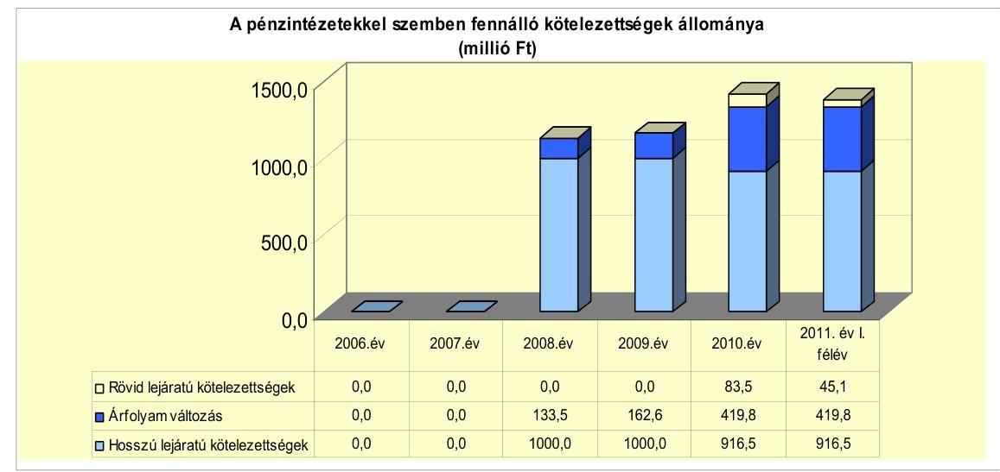

Az Önkormányzat a vizsgált időszak előtt kötött folyószámlahitelkeretszerződést, amely 2007-től folyamatosan megújításra került. A 20072009. években 40 millió Ft-os, a 2010-2011. években 80 millió Ft-os hitelkerettel rendelkeztek. A folyószámla-hitelkeretszerződésre és a kötvénykibocsátásra is a Képviselő-testület döntése alapján került sor. A kötvénykibocsátás előtt több

---

pénzintézettől kértek be ajánlatot. A kötvénykibocsátás előtt a Képviselőtestületet a kamatkockázatról tájékoztatták, de az árfolyamkockázat hatásait nem mutatták be. A hosszúlejáratú adósságot keletkeztető kötelezettségvállalás során betartották az Ötv. 88. § (2) bekezdésében előírtakat, az adósságot keletkeztető kötelezettségvállalás felső határát nem lépték túl. A kötvényt lejegyző pénzintézet nem az Önkormányzat költségvetési elszámolási számláját vezető pénzintézet volt. A 2007-2011. év I. félév időszakában a számlavezető bank nem változott.

A polgármester észrevételében vitatta a devizaalapú kötelezettségeket érintő árfo-lyam-kockázat Képviselő-testület felé történt bemutatása elmaradására vonatkozó megállapítást.

Az észrevételt nem fogadtuk el, mivel a kötelezettségvállalást megalapozó előterjesztés nem tartalmazott az árfolyamkockázatra vonatkozó elemzést és számításokat.

Az Önkormányzat 2011. június 30-án CHF-ben fennálló adósságot keletkeztető kötelezettségvállalása az alábbi volt:

| Megnevezés | Szerződéskötési/   Kibocsátás   időpontja | Összeg   ezer CHF-ben | Kibocsátásiliehívási   árfolyam | Kamat (referencia kamat^   kamatfelár) | Felhasználás célja: |
| :--: | :--: | :--: | :--: | :--: | :--: |
| Fejlesztési Kötvény | 2008.02 .08 | 6376 | 156,85 | 6 havi CHF LIBOR+évi 0,98\% | Fejlesztések, beruházások   önerejének biztosítása |

A 2008. február 8-án kibocsátott 1000,0 millió Ft összegű kötvény célja az Iskola fejlesztéséhez, valamint más fejlesztési elképzelésekhez szükséges saját forrás biztosítása volt. Az Önkormányzat a kötvényből 776,4 millió Ft-ot használt fel 2011. június 30-ig. Ebből az összegből 397,7 millió Ft-ot az Iskola felújításra, 239,4 millió Ft-ot a Velencei-tó Kapuja projektre, 139,3 millió Ft-ot a járóbetegellátás beruházása önrészének biztosítására fordítottak.

A 2010. december 31-ig fel nem használt 223,6 millió Ft kötvényforrás betétszámlán került elhelyezésre. Az Önkormányzat a 2007-2011. év I. féléve közötti időszakban a fel nem használt kötvényforrás lekötéséből 190,6 millió Ft kamatbevételt realizált, amelyet felhalmozási kiadások teljesítésére fordított. A befektetésből származó kamatbevételből az Óvoda bővítésére 140,0 millió Ft-ot, a Közösségi Ház felújítási kiadásaira 35,9 millió Ft-ot, egyéb fejlesztésekre 14,7 millió Ft-ot fordítottak.

A kötvénykibocsátásból származó tőketartozás törlesztése 2011. április 1-jén kezdődött, a törlesztés félévente, az utolsó törlesztő részlet 2027. október 1-jén esedékes. A szerződés szerint 2011-ben esedékes tőketörlesztés összege 376,0 ezer CHF, a 2012-2027. években évi 375,0 ezer CHF.

Az Önkormányzat a vizsgált időszakban likviditását csak folyószámlahitel igénybevételével tudta biztosítani, amelynek alakulását az alábbi táblázat mutatja be:

---

|  |  |  |  |  | millió Ft-ban |
| :--: | :--: | :--: | :--: | :--: | :--: |
| Megnevezés | 2007. év | 2008. év | 2009. év | 2010. év | 2011. év I.   félév |
| I. Folyószámlahitel |  |  |  |  |  |
| a folyószámlahitel keretösszege január 1-jén | 40,0 | 40,0 | 40,0 | 80,0 | 80,0 |
| teljesített kamat és egyéb költség | 0,1 | 0,2 | 0,1 | 0,2 | 0,2 |

Az Önkormányzat a vizsgált időszakban a likviditást a helyi adóbevételek, valamint a gépjármú adóbevétel és a múködési kiadások átmeneti ütem különbsége miatt folyószámlahitel igénybevételével biztosította. A 2007-2010. évek végén, valamint a 2011. év I. félév végén nem volt folyószámlahitel állománya. A folyószámlahitel kamat kondíciói és egyéb költségei a következők voltak ${ }^{30}$ :

| Megnevezés | Kamat (referencia+ kamatfelár) | Egyéb költség |
| :--: | :--: | :--: |
| Folyószámlahitel |  |  |
| 2007-2009. év | 3 havi BUBOR $+0,5 \%$ | 0,5\% kezelési költség |
| 2010. év | 1 havi BUBOR $+3,0 \%$ | 0,5\%   rend.tart.jutalék,0,5\%kezelési   költség |
| 2011.év | 1 havi BUBOR $+1,6 \%$ |  |

A 2007-2011. év I. féléve közötti időszakban munkabér megelőlegezési hitelt és egyéb likvidhitelt nem vettek igénybe.

Az Önkormányzat 2010. december 31-én fennálló adósságot keletkeztető kötelezettségvállalása esetében a kamatfizetési kötelezettségek alakulását jelentősen befolyásolja a kibocsátáskori, lehívási és az utolsó fizetéskori referencia kamat alakulása, amelyet az alábbi táblázat mutat be.

| Megnevezés | Kibocsátási | Utolsó fizetéskori | Változás \% |
| :--: | :--: | :--: | :--: |
|  | kamat (referencia + kamatfelár) \% |  |  |
| 6 havi CHF LIBOR + évi 0,98\%   (2007.12.20.-i szerződés) | 4,6 | 1,2 | $-73,9 \%$ |

Az Önkormányzat kötvény kibocsátásával kapcsolatos kamatfizetési kötelezettsége 2010. december 31-ig 425,0 ezer CHF, 76,0 millió Ft volt. A 2011. év I. félévben megfizetett kamat 39,4 ezer CHF-ot, 8,0 millió Ft-ot tett ki.

A kötvény kamatának (referencia+alapkamat) csökkenése kedvezően, azonban az árfolyam emelkedése kedvezőtlenül érintette az Önkormányzat pénzügyi helyzetét. Amennyiben kibocsátáskori kamat és árfolyam mértéke nem változott volna, az Önkormányzatnak 2011. év I. félév végéig 934,2 ezer CHF (146,5 millió Ft) kamatot kellett volna megfizetnie. A kamatmérték csökkenése következtében 464,4 ezer CHF kamatot ( 84,0 millió Ft-ot) fizetett meg az Önkormányzat, amelyből 11,2 millió Ft az árfolyam emelkedés miatti többletkiadás volt.

[^0]
[^0]:    ${ }^{30}$ A referencia kamat az alábbiak szerint alakult: az 1 havi BUBOR 2011-ben 6\% volt.

---

A polgármester észrevételben kifogásolta, hogy a Jelentés összefoglaló részében az ÁSZ nem mutatta be a tényleges kiadások tervezetthez képest bekövetkezett csökkenését, mely a kötvény kamatmértékének a kibocsátáskori kamatszinthez képest való csökkenéséből adódott.

Észrevételét nem fogadtuk el, mert a Jelentés összefoglaló része tartalmazza, hogy az Önkormányzat az „alapkamat csökkenése következtében a kibocsátáskori feltételekkel számított 934,2 ezer CHF helyett 464,4 ezer CHF kamatkiadást teljesített".

Az Önkormányzat 2011. év I. félében megkezdte a kötvénykibocsátásból keletkezett tőketartozásának törlesztését 188 ezer CHF-ban, 38,4 millió Ft összegben. Az esedékes tőketörlesztés a kibocsátáskori árfolyamhoz képest az 8,9 millió Ft többletkiadást okozott az árfolyam emelkedése miatt. A tőketörlesztés kockázata emelkedett a CHF árfolyamának emelkedése következtében.

Az Önkormányzat kötelezettségeinek állományát 2010. december 31-én, és 2011. június 30-án, valamint várható alakulását a jelenleg ismert kötelezettségek lejáratáig az alábbi táblázat mutatja:

| Megnevezés | Állomány 2010. december 31   én |  |  | Állomány 2011. június 30-án |  |  | Várható   kötelezettség 2011-   2013. években |  | Várható   kötelezettség 2014.   évtől |  |
| :--: | :--: | :--: | :--: | :--: | :--: | :--: | :--: | :--: | :--: | :--: |
|  | HUF-ban   (millió Ft-   ban) | Devizában   (összegy,   ezer CHF-   ben) | Devizá-   nem | HUF-ban   (millió Ft-   ban) | Devizában   (összegy,   ezer CHF-   ben) | Devizá-   nem | HUF-ban   (millió Ft-   ban) | Devizában   (összegy,   ezer CHF-   ben) | HUF-ban   (millió Ft-   ban) | Devizában   (összegy,   ezer CHF-   ben) |
| Pénzintézeti kötelezettségek |  |  |  |  |  |  |  |  |  |  |
| Fajlesztési Kötvény |  | 6376,0 | CHF |  | 6188,0 | CHF |  | 1347,1 |  | 5743,5 |
| Pénzintézeti kötelezettségek összesen CHF-ben |  | 6376,0 | CHF |  | 6188,0 | CHF |  | 1347,1 |  | 5743,5 |
| Szállitói tartozás | 161,9 |  |  | 114,7 |  |  | 114,7 |  |  |  |

A fennálló pénzintézeti kötelezettségből (tőke és kamat) a 2011-2013. években 1347,1 ezer CHF fizetési kötelezettség várható. A kötelezettségek teljesítésére figyelembe vehető a 2010. év végén rendelkezésre álló 6,6 millió Ft szabad pénzmaradvány, a 315,4 millió Ft összegű követelés állomány és az 542,0 millió Ft nettó értéken nyilvántartott forgalomképes ingatlanvagyon. A 2014. évre és a további évekre szóló jelenleg ismert pénzintézeti kötelezettsége (tőke és kamat) 5743,5 ezer CHF.

# 3.2. A szállítói kötelezettségek változása 

Az Önkormányzat december 31-i szállítói állománya a kötelezettségeken belül 2007-ben 6,2\% (1,7 millió Ft), 2008-ban 1,0\% (28,8 millió Ft), 2009-ben 1,6\% (41,7 millió Ft) és 2010-ben 7,4\% (161,8 millió Ft) arányt képviselt. A 2010. évi szállítói állomány növekedését a pályázatokhoz tartozó kifizetések miatt következett be. A szállítói tartozás 2011. június 30-ra 114,7 millió Ft-ra csökkent. Az Önkormányzat a 2007-2011. év I. félév időszakában

---

folyamatosan rendelkezett lejárt szállítói állománnyal ${ }^{31}$, a lejárt szállítói tartozások 1-30 nap közöttiek voltak.

A lejárt szállítói tartozások a támogatott fejlesztésekkel kapcsolatban halmozódtak fel. Az Önkormányzattal szerződésben álló kivitelezők szállítói számláinak egy részét a 2010-2011. év I. féléve közötti időszakban nem a Polgármesteri hivatal fizette ki közvetlenül, hanem un. szállítói finanszírozással a fedezetkezelő teljesítette a kifizetést. A fedezetkezelő a fizetési határidőnél később egyenlítette ki a számlák ellenértékét.

Az Önkormányzatnak a vizsgált időszakban nem volt átütemezési megállapodással érintett szállítói állománya, kórházat nem tartott fenn. Az Önkormányzatnak a 2007. január 1-je és a 2011. június 30. közötti időszakban egyéb kiadás elmaradása nem volt.

# 3.3. Egyéb kötelezettségek változása 

Az Önkormányzatnál az elengedett követelések összege a 2007-2010. években 2,3 millió Ft volt, amely a gazdasági társaságnak nyújtott tagi kölcsön után fizetendő kamat elengedéséből származott. Az Önkormányzat pénzügyi egyensúlyára az elengedett követelés a nagyságát tekintve nem volt jelentős hatással.

Az Önkormányzat a 2007-2011. év I. féléve közötti időszakban nem kötött lízingszerződést, garancia és kezességvállalás nem történt, PPP konstrukcióban nem vett részt.

Az Önkormányzat ingatlanjain jelzálogjog bejegyzés nem történt, a forgalomképes ingatlanok könyvszerinti értéke 2010. december 31-én 542,0 millió Ft volt. Az Önkormányzatnak a vizsgált időszakban peres ügye nem volt.

Az 50\%-ot és azt meghaladó önkormányzati tulajdonú hányadú két gazdasági társaságban a mérleg szerinti összes kötelezettség 2010. december 31-én 81,3 millió Ft, 2011. június 30-án 74,2 millió Ft volt. A Járóbeteg Nonprofit Kft. mérleg szerinti kötelezettsége 2010. december 31-én 74,6 millió Ft, 2011. június 30-án 73,2 millió Ft volt, ebből az Önkormányzattól kapott tagi kölcsön 60,0 millió Ft-ot tett ki. A gazdasági társaságok szállítói tartozása 2010. december 31-én 15,9 millió Ft, 2011. június 30-án 9,0 millió Ft volt, amelyből a Járóbeteg Nonprofit Kft. szállítói tartozása 2010. december 31-én 11,6 millió Ft, 2011. június 30-án 9,0 millió Ft volt. Lejárt szállítói állománya, pénzintézeti kötelezettsége az önkormányzati többségi tulajdonú gazdasági társaságoknak nem volt.

Az Önkormányzat korlátlan felelősséggel tartozik felszámolás esetén a gazdasági társaságokról szóló 2006. évi IV. törvény 54. § (2) bekezdése alapján azon gazdasági társaságának, amelyben az Önkormányzat az 52. § (2) bekezdése szerint a szavazatok legalább 75\%-ával rendelkezik, így minősített befolyásszerzőnek mi-

[^0]
[^0]:    ${ }^{31}$ Az Önkormányzatnál a lejárt szállítói tartozások összege a 2007-ben 1,7 millió Ft, 2008-ban 0,6 millió Ft, 2009-ben 5,9 millió Ft, 2010-ben 132,7 millió Ft és 2011. június 30-án 78,9 millió Ft volt.

---

nősül, továbbá a csődeljárásról és a felszámolási eljárásról szóló 1991. évi XLIX. törvény 63. § (2) bekezdése alapján a kizárólagos önkormányzati tulajdonú gazdasági társaságának minden olyan kötelezettségéért, amelynek kielégítését a felszámolási eljárás során az adós társaság vagyona nem fedez, ha a hitelezőinek a felszámolási eljárás során benyújtott keresete alapján a bíróság - az adós társaság felé érvényesített tartósan hátrányos üzletpolitikájára figyelemmel - megállapítja az önkormányzat korlátlan és teljes felelősségét.

Az Önkormányzat a 2007-2010. években az eszközállománya után összesen 549,4 millió Ft értékcsökkenést számolt el ${ }^{32}$. Az Önkormányzat a 2007-2011. év I. félév közötti időszakban összesen 1850,0 millió Ft értékben aktivált - főként ingatlanokat érintő - felújítást és beruházást. A felújítások aktivált teljes összege 834,8 millió Ft volt. A 2007-2010. év időszakában a felújításokból 71,8 millió Ft-ot, a beruházásokból 31,8 millió Ft-ot fordítottak az elavult eszközök pótlására. Az Önkormányzat eszköz-állományának átlagos használhatósági foka a 2007. évi 89,5\%-ról folyamatosan csökkent, 2010-ben 86,0\% volt. Az egyes eszközcsoportok használhatósági foka jelentős mértékben eltér egymástól, a 2007. évhez képest a 2010. évben az immateriális javaké 20,9\%-ról 16,5\%-ra, az ingatlanok és vagyonértékű jogoké $90,7 \%$-ról $88,6 \%$-ra, a járműveké $53,1 \%$-ról $27,4 \%$-ra, az üzemeltetésre átadott eszközöké $89,8 \%$-ról $81,2 \%$ ra csökkent. A gépek, berendezések és felszerelések használhatósági foka a 2007. évi 31,0\%-ról 2010-ben 54,2\%-ra emelkedett az eszközpótlások hatására.

# 4. A PÉNZÜGYI EGYENSÚLY MEGTEREMTÉSE ÉrDEKÉBEN HOZOTT INTÉZKEDÉSEK EREDMÉNYE 

Az Önkormányzatnál a kimutatásuk szerint a 2007-2011. év I. féléve között megtett intézkedésekkel összesen 14,3 millió Ft kiadási megtakarítást értek el. A kiadási megtakarítások a költségtérítések megszüntetéséből, az irodaszer, folyóirat, közlöny beszerzési szerződések felülvizsgálatából, közbeszerzések eredményeként jelentkezett kiadás csökkenésekből (gáz és villamos energia) és a közterület fenntartási feladatok kiszervezéséből keletkeztek.

A következő diagram az Önkormányzat kiadáscsökkentő intézkedéseinek területeit és azok megoszlását mutatja:

[^0]
[^0]:    ${ }^{32}$ 2007-ben 154,6 millió Ft-ot, 2008-ban 120,0 millió Ft-ot, 2009-ben 128,6 millió Ft-ot és 2010-ben 146,2 millió Ft-ot

---

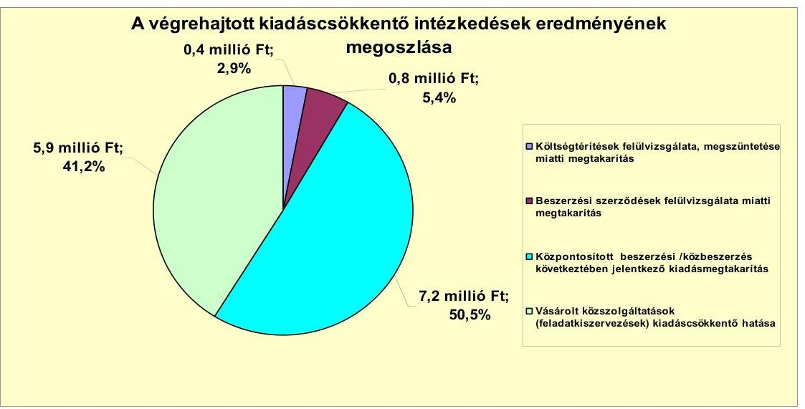

A Képviselő-testület a vizsgált időszakban álláshelyet nem szüntetett meg.
Az Önkormányzatnál a 2007-2010. évek között engedélyezett álláshelyek számának és a foglalkoztatottak számának változását az alábbi táblázat tartalmazza:

| Megnevezés   (adatok fő-ben) | Közoktatás | Szociális és   gyermekvédelem | Egészségügy | Polgármesteri   hivatal | Egyéb | Összesen |
| :-- | --: | --: | --: | --: | --: | --: |
| 2007. január 1-jén jóváhagyott álláshelyek száma | 54 | 8 | 2 | 32 | 4 | 100 |
| Megszüntetett álláshelyek száma | 0 | 0 | 0 | 0 | 0 | 0 |
| Álláshely növekedése | 15 | 6 | 0 | 0 | 2 | 23 |
| 2010. december 31-én záró álláshelyek száma | 69 | 14 | 2 | 32 | 6 | 123 |
| 2007. január 1-jén foglalkoztatott létszám | 54 | 8 | 2 | 32 | 4 | 100 |
| Látszámcsökkentés | 0 | 0 | 0 | 0 | 0 | 0 |
| Látszámnövekedés | 15 | 6 | 0 | 0 | 2 | 23 |
| 2010. december 31-én foglalkoztatott létszám | 69 | 14 | 2 | 32 | 6 | 123 |

A 2007-2010. években a közoktatásban az óvodai feladatok bővülése miatt a nadapi óvodában és a bővített városi Óvodában összesen 14 fővel, az Iskolában egy fővel nőtt az engedélyezett álláshelyek száma. A Családsegítő Szolgálatnál hat fővel emelték az álláshelyek számát a házi gondozás és a jelzőrendszeres házi segítségnyújtás bevezetése miatt. A Polgármesteri hivatal egyéb feladatain engedélyezett álláshelyek száma kettő fővel emelkedett.

A 2007-2011. év I. féléve között tett intézkedések eredményeként 372,3 millió Ft bevételi többletet mutattak ki. A bevételnövelő intézkedések az ingatlanok (termálfürdő alatti földterület) és az eszközök bérbeadásához (44,7 millió Ft), az átmenetileg szabad pénzeszközök lekötéséhez (252,1 millió Ft), a helyi adók emeléséhez ( 23,3 millió Ft), az adókedvezmények és a mentességek csökkentéséhez ( 6,4 millió Ft), az adóalanyok felderítéséhez ( 23,5 millió Ft), valamint a lejárt tarozások beszedéséhez ( 22,3 millió Ft) kapcsolódtak.

---

A 2007-2011. év I. féléve között az Önkormányzat főbb bevételi jogcímek szerinti bevételnövelő intézkedései számszerúsített hatását a következő diagram tartalmazza:
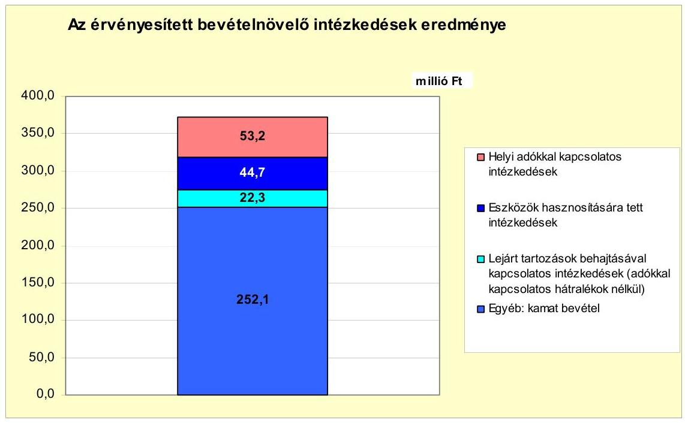

A 2007-2011. év I. féléve közötti időszakban a kiadáscsökkentő és bevételnövelő intézkedések együttesen 386,6 millió Ft-tal javították az Önkormányzat pénzügyi egyensúlyát, a központi támogatások (a szja és az állami támogatások együttes összege) a 2007. évhez képest 2008-2010. évek között 122,6 millió Ft-tal nőtt, mely kedvezően hatott a pénzügyi egyensúlyra.

# 5. A HELYI ÖNKORMÁNYZATOK GAZDÁLKODÁSI RENDSZERÉNEK ELLENŐRZÉSE SORÁN A PÉNZÜGYI EGYENSÚLY JAVÍTÁSÁRA TETT SZABÁLYSZERŰSÉGI ÉS CÉLSZERŰSÉGI JAVASLATOK HASZNOSULÁSA 

Az Önkormányzat 2007. évi gazdálkodási rendszerének ellenőrzése során a pénzügyi egyensúly javítására három szabályszerűségi és egy célszerűségi javaslatot tett az ÁSZ.

A szabályszerűségi javaslatok közül kettő a költségvetési rendelet-tervezetek elkészítéséhez kapcsolódott, az egyik a költségvetési bevételek és kiadások főöszszegének az Áht ${ }_{1}$-ban előírtak szerinti meghatározására, a másik javaslat az EU-s támogatással megvalósuló projektek bevételeinek és kiadásainak az Ámr ${ }_{2}$ ben előírtak szerint a több éves kihatással járó feladatok előirányzatai közötti, évenkénti bontásban való bemutatására vonatkozott. A harmadik szabályszerűségi javaslat a folyamatba épített ellenőrzés kiegészítésére irányult a költségvetés megalapozását szolgáló rendeletek és a saját bevételek előirányzatai közötti összhang megléte ellenőrzési kötelezettségének előírásával.

A szabályszerűségi javaslatok közül a 2008. évi költségvetési rendeletben hasznosult a költségvetési kiadások és a költségvetési bevételek főösszegének meg-

---

határozására vonatkozó javaslat. A Polgármesteri hivatalban a folyamatba épített ellenőrzések szabályzatát kiegészítették a saját bevételek és az azokat megalapozó rendeletek közötti összhang meglétének ellenőrzésével. A szabályszerűségi javaslatok közül az Önkormányzatnál nem hasznosították az Ámr 2 . 36. §-a (1) bekezdés h) pontjában előírtak ellenére az EU-s támogatással megvalósuló projektek bevételeinek és kiadásainak a több éves kihatással járó feladatok előirányzatai közötti, évenkénti bontásban való bemutatását.

A polgármester a megállapításra észrevételt tett, mely szerint a 2011. évi költségvetési rendelet már tartalmazta az EU-s forrásból megvalósult fejlesztéseket.

Az észrevétel nem megalapozott, mivel nem hasznosították az ÁSZ azon szabályszerűségi javaslatát, hogy az EU-s támogatással megvalósuló projektek bevételeit és kiadásait a több éves kihatással járó feladatok előirányzatai között, évenkénti bontásban bemutassák. A 2009. évi költségvetésről szóló rendelet a Velencei-tó Kapuja projekt 2009-2010. évekre tervezett kiadási és bevételi előirányzatait nem a 2008. december 29-én kelt támogatási szerződésben rögzített ütemezésnek megfelelően tartalmazta, a több éves kihatással járó feladatokat bemutató 12. számú mellékletben a projekt 2009-2010. évi bevételei és kiadásai nem kerültek bemutatásra. A 2010. február 24-én a támogatási szerződést módosították, mely szerint a projekt megvalósítása átütemezésre került 2011. szeptember 30-i befejezési határidővel, ennek ellenére a 2010. évi költségvetési rendeletben a projekt tervezett bevételei és kiadásai nem a módosított támogatási szerződésben rögzítettek szerint került tervezésre, a 12. számú mellékletben pedig nem kerültek bemutatásra a projekt 2010-2011. évi tervezett bevételei és kiadásai. A 2011. évi költségvetés elkészítésekor a projektnek már nem volt ismert, további évekre vonatkozó kiadása, ezért a polgármester erre való hivatkozása nem helytálló.

Az ÁSZ a munka színvonalának javítása érdekében javasolta, hogy a javaslatok megvalósítására készítsenek intézkedési tervet, amely tartalmazza a felelősöket és határidőket. Az intézkedési tervet a Képviselő-testület 2008 februárjában jóváhagyta, az elfogadást követő 30 napon belül megküldték az ÁSZ részére.

Budapest, 2012. április " 16 "

Melléklet: $\quad 8 \mathrm{db}$
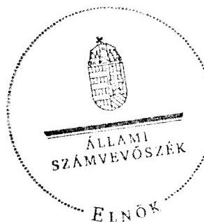

Domokos László

---

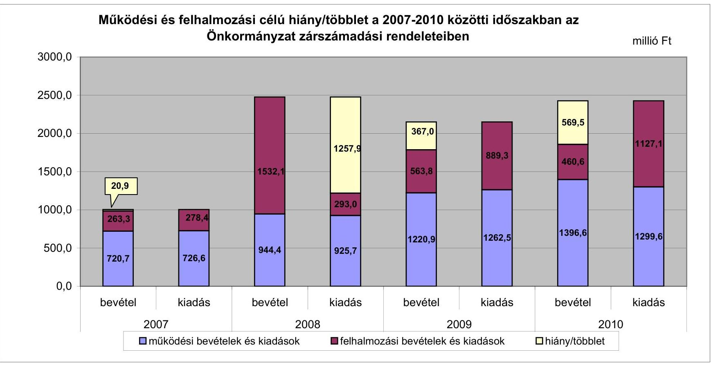

# 1. számú melléklet

## a V-3091-020/2012. számú jelentéshez

---

Az Önkormányzat bevételei és kiadásai, valamint adósságszolgálata 2007-2010 között

|  1. FOLYÓ KÖLTSÉGVETÉS* | 2007. év | 2008. év | 2009. év | 2010. év  |
| --- | --- | --- | --- | --- |
|  1.1.1. Saját müködési bevételek | 223,4 | 433,6 | 704,9 | 870,9  |
|  1.1.2. Költségvetési támogatás** | 141,9 | 257,1 | 249,6 | 220,5  |
|  1.1.3. Átengedett bevételek | 251,7 | 198,0 | 188,8 | 205,4  |
|  1.1.4. Állambáztartáson belülről kapott támogatások | 98,6 | 113,4 | 182,7 | 100,6  |
|  1.1.5. EU-ról és külföldről kapott bevételek | 0,0 | 0,0 | 0,0 | 0,0  |
|  1.1.6. Állambáztartáson kívülről kapott bevételek | 4,0 | 3,2 | 2,1 | 1,2  |
|  1.1.7. Előző évi pénzmaradvány átvétel | 0,0 | 0,0 | 0,0 | 0,0  |
|  1.1. Folyó bevételek $+1.1 .1 .+1.1 .2 .+1.1 .3 .+1.1 .4 .+1.1 .5 .+1.1 .6 .+1.1 .7$. | 719,6 | 1005,3 | 1328,1 | 1398,6  |
|  1.2.1. Müködési kiadások kamatkiadások nélkül | 673,4 | 917,7 | 1133,5 | 1147,1  |
|  1.2.2. Állambáztartáson belülre átadott pénzeszközök | 6,0 | 9,4 | 5,4 | 4,9  |
|  1.2.3.1. vállalkozásoknak | 7,6 | 7,6 | 6,3 | 5,9  |
|  1.2.3.2. EU-nak, illetve külföldre | 0,0 | 0,0 | 0,0 | 0,0  |
|  1.2.3.3. magánszemélyeknek | 33,5 | 34,7 | 39,7 | 48,8  |
|  1.2.3.4. neugosfé szervezetekeek | 12,1 | 12,2 | 16,9 | 15,8  |
|  1.2.3. Transferkiadások ( $+1.2 .3 .1+1.2 .3 .2+1.2 .3 .3+1.2 .3 .4$ ) | 53,2 | 54,5 | 62,9 | 70,5  |
|  1.2.4 Kamatkiadások | 0,1 | 25,3 | 44,8 | 17,1  |
|  1.2.5. Előző évi pénzmaradvány átadás | 0,0 | 0,0 | 0,0 | 0,0  |
|  1.2. Folyó kiadások $+1.2 .1 .+1.2 .2 .+1.2 .3 .+1.2 .4 .+1.2 .5$. | 732,7 | 1006,9 | 1246,6 | 1239,6  |
|  1.3. Folyó költségvetés egyenlege MÜKÖDÉSI JÓVEDELEM (1.1. - 1.2.) | $-13,1$ | $-1,6$ | 81,5 | 159,0  |
|  2. FELHALMOZÁSI KÖLTSÉGVETÉS*** |  |  |  |   |
|  2.1.1. Saját tőkebevételek | 27,6 | 452,3 | 2,1 | 10,1  |
|  2.1.2. Állambáztartáson belülről kapott támogatások | 194,4 | 7,3 | 403,9 | 447,5  |
|  2.1.3. EU-ról és külföldről kapott támogatások | 0,0 | 0,0 | 0,0 | 0,0  |
|  2.1.4. Állambáztartáson kívülről kapott támogatások | 37,3 | 1,6 | 1,0 | 1,0  |
|  2.1. Felhalmozási bevételek ( $+2.1 .1 .+2.1 .2+2.1 .3+2.1 .4$.) | 259,3 | 461,2 | 407,0 | 458,6  |
|  2.2.1. Saját beruházási kiadás állíval | 256,1 | 144,9 | 25,7 | 838,2  |
|  2.2.2. Saját felújítási kiadás állíval | 3,4 | 43,1 | 782,5 | 218,4  |
|  2.2.3. Állambáztartáson belülre átadott pénzeszköz | 0,0 | 2,2 | 0,0 | 0,0  |
|  2.2.4. EU-nak és külföldnek adott pénzeszközök | 0,0 | 0,0 | 0,0 | 0,0  |
|  2.2.5. Állambáztartáson kívülre adott pénzeszközök | 6,7 | 7,0 | 2,9 | 61,9  |
|  2.2.6. Befektetési célú részesedések vásárlása | 5,2 | 14,5 | 78,2 | 68,6  |
|  2.2. Felhalmozási kiadások ( $+2.2 .1 .+2.2 .2 .+2.2 .3 .+2.2 .4 .+2.2 .5 .+2.2 .6 .$ ) | 271,4 | 211,7 | 889,3 | 1187,1  |
|  2.3. Felhalmozási költségvetés egyenlege (2.1. - 2.2.) | $-12,1$ | 249,5 | $-482,3$ | $-728,5$  |
|  3. Finanszírozási műveletek nélküli (GFS) pozíció(1.3.+2.3.) | $-25,2$ | 247,9 | $-400,8$ | $-569,5$  |
|  4. Finanszírozási műveletek | 0,0 | 0,0 | 0,0 | 0,0  |
|  4.1. Hitelfelvétel | 0,0 | 0,0 | 0,0 | 0,0  |
|  4.2. Hitelbőrlesztés | 0,0 | 0,0 | 0,0 | 0,0  |
|  4.3. Forgatási és befektetési célú értékpapírok kibocsátása | 0,0 | 1000,0 | 0,0 | 0,0  |
|  4.4. Forgatási és befektetési célú értékpapírok beváltása | 0,0 | 0,0 | 0,0 | 0,0  |
|  4.5. Forgatási és befektetési célú értékpapírok értékesítése | 0,0 | 0,0 | 0,6 | 0,0  |
|  4.6. Forgatási és befektetési célú értékpapírok vásárlása | 0,0 | 0,0 | 0,0 | 0,0  |
|  4.7. Egyéb finanszírozási bevételek (függő, átfató, kiegyenlítő) | 5,2 | 10,0 | 49,1 | $-76,4$  |
|  4.8. Egyéb finanszírozási kiadások (függő, átfató, kiegyenlítő) | 0,9 | 0,0 | 15,9 | 15,4  |
|  4.9.Finanszírozási műveletek egyenlege (4.1. - 4.2.+4.3.-4.4+4.5.-4.6.+4.7.-4.8.) | 4,3 | 1010,0 | 33,8 | $-91,8$  |
|  5. Tárgyévi pénzügyi pozíció (1.3.+ 2.3.+4.9.) | $-20,9$ | 1257,9 | $-367,0$ | $-661,3$  |
|  6. Nettó müködési jövedelem =müködési jövedelem (1.3.) - tőketörlesztés $(4.2+4.4)$ | $-13,1$ | $-1,6$ | 81,5 | 159,0  |
|  TÁJÉKOZTATÓ ADATOK |  |  |  |   |
|  Összes kötelezettség | 27,4 | 2850,5 | 2492,6 | 2178,1  |
|  ebből rövid lejáratú | 27,4 | 1338,9 | 989,8 | 652,5  |
|  Összes szállítói kötelezettség | 1,7 | 28,8 | 41,7 | 161,8  |
|  ebből lejárt (tanúsítványból) | 1,7 | 0,6 | 6,0 | 132,7  |
|  Pénz és tőkepínzi kötelezettség (adósság) | 0,0 | 1133,5 | 1162,6 | 1419,8  |
|  ebből rövid lejáratú | 0,0 | 0,0 | 0,0 | 83,5  |
|  PPP szerződéses állomány jelenértéken (tanúsítványból) | 0,0 | 0,0 | 0,0 | 0,0  |
|  ebből lejárt szolgáltatási díj miatti kötelezettség | 0,0 | 0,0 | 0,0 | 0,0  |
|  Folyószámlabítel napi átlagos állománya (tanúsítványból) | 1,1 | 1,2 | 0,6 | 1,9  |
|  Likvidítétel napi átlagos állománya (tanúsítványból) | 0,0 | 0,0 | 0,0 | 0,0  |
|  Munkabirbítél napi átlagos állománya (tanúsítványból) | 0,0 | 0,0 | 0,0 | 0,0  |
|  Kezesség és garanciavállalások (tanúsítványból) | 0,0 | 0,0 | 0,0 | 0,0  |
|  Jogerős bírósági ítéletekből adódó kötelezettségek (tanúsítványból) | 0,0 | 0,0 | 0,0 | 0,0  |
|  Finanszírozásba bevonható eszközök | 39,0 | 1296,9 | 929,4 | 268,1  |
|  Tartós hitelviszonyt megtestesítő értékpapírok év végi állományt | 0,0 | 0,0 | 0,0 | 0,0  |
|  Hosszú lejáratú bankbetétek év végi állománya | 0,0 | 0,0 | 0,0 | 0,0  |
|  Értékpapírok év végi állománya | 0,5 | 0,5 | 0,0 | 0,0  |
|  Pénzeszközök (idegen pénzeszközök nélküli) év végi állományt | 38,5 | 1296,4 | 929,4 | 268,1  |

[^0] [^0]: * Bevételekben nem térül, a kiadásokban nem jelenik meg az amortizáció, a vagyoni helyzetet az egyenleg befolyásolja **A költségvetési támogatásból az Önkormányzat adatszolgáltatása szerint a 2007. évben 1,1 millió Ft-ot, a 2008. évben 6,2 millió Ft-ot felhalmozási célú bevételként a 2.1.2. sorban vettünk figyelembe. ***Bevételekben vagyon megőrzésre és bővítésre fordítható források.

---

Valence Vánor Önkormányzata

Az Önkormányzat 2007-2010. években megvalósított, 2010. december 31-ig befejezett fejlesztései és azok forrásásezetétele

2010. december 31-ig megvalósított beruházás forrásásezetétele

|  |   |   |   |   |   |   |   |   |   |   |   |   |   |   |   |   |   |   |   |   |   |   |   |   |   |   |   |   |   |   |   |   |   |   |   |   |   |   |   |   |   |   |   |   |   |   |   |   |   |   |   |   |   |   |   |   |   |   |   |   |   |   |   |   |   |   |   |   |   |   |   |   |   |   |   |   |   |   |   |   |   |   |   |   |   |   |   |   |   |   |   |   |   |   |   |   |   |   |   |  

---

## **Az Önkormányzat 2010. december 31-én folyamatban lévő fejlesztési feladataira 2010. december 31-ig teljesített kiadások és azok forrásösszetétele**

|   |  |  |  |  |  |  |  |  |  |  |  |  |  |  |  |  |  |  |  |  |  |  |  |  |  |  |  |  |  |  |  |  |  |  |  |  |  |  |  |  |   |
| --- | --- | --- | --- | --- | --- | --- | --- | --- | --- | --- | --- | --- | --- | --- | --- | --- | --- | --- | --- | --- | --- | --- | --- | --- | --- | --- | --- | --- | --- | --- | --- | --- | --- | --- | --- | --- | --- | --- | --- | --- | --- |
|   |  |  |  |  |  |  |  |  |  |  |  |  |  |  |  |  |  |  |  |  |  |  |  |  |  |  |  |  |  |  |  |  |  |  |  |  |  |  |  |  |   |
|   | Fejlesztési
feladat (beruházás,
felújítás) |  |  |  |  |  |  |  |  |  |  |  |  |  |  |  |  |  |  |  |  |  |  |  |  |  |  |  |  |  |  |  |  |  |  |  |  |  |  |  |   |
|   |  |  |  |  |  |  |  |  |  |  |  |  |  |  |  |  |  |  |  |  |  |  |  |  |  |  |  |  |  |  |  |  |  |  |  |  |  |  |  |   |
|   |  |  |  |  |  |  |  |  |  |  |  |  |  |  |  |  |  |  |  |  |  |  |  |  |  |  |  |  |  |  |  |  |  |  |  |  |  |  |  |   |
|   |  |  |  |  |  |  |  |  |  |  |  |  |  |  |  |  |  |  |  |  |  |  |  |  |  |  |  |  |  |  |  |  |  |  |  |  |  |  |  |   |
|   |  |  |  |  |  |  |  |  |  |  |  |  |  |  |  |  |  |  |  |  |  |  |  |  |  |  |  |  |  |  |  |  |  |  |  |  |  |  |  |   |
|   |  |  |  |  |  |  |  |  |  |  |  |  |  |  |  |  |  |  |  |  |  |  |  |  |  |  |  |  |  |  |  |  |  |  |  |  |  |  |  |   |
|   |  |  |  |  |  |  |  |  |  |  |  |  |  |  |  |  |  |  |  |  |  |  |  |  |  |  |  |  |  |  |  |  |  |  |  |  |  |  |  |   |
|   |  |  |  |  |  |  |  |  |  |  |  |  |  |  |  |  |  |  |  |  |  |  |  |  |  |  |  |  |  |  |  |  |  |  |  |  |  |  |  |   |
|   |  |  |  |  |  |  |  |  |  |  |  |  |  |  |  |  |  |  |  |  |  |  |  |  |  |  |  |  |  |  |  |  |  |  |  |  |  |  |  |   |
|   |  |  |  |  |  |  |  |  |  |  |  |  |  |  |  |  |  |  |  |  |  |  |  |  |  |  |  |  |  |  |  |  |  |  |  |  |  |  |  |   |
|   |  |  |  |  |  |  |  |  |  |  |  |  |  |  |  |  |  |  |  |  |  |  |  |  |  |  |  |  |  |  |  |  |  |  |  |  |  |  |  |   |
|   |  |  |  |  |  |  |  |  |  |  |  |  |  |  |  |  |  |  |  |  |  |  |  |  |  |  |  |  |  |  |  |  |  |  |  |  |  |  |  |   |
|   |  |  |  |  |  |  |  |  |  |  |  |  |  |  |  |  |  |  |  |  |  |  |  |  |  |  |  |  |  |  |  |  |  |  |  |  |  |  |  |   |
|   |  |  |  |  |  |  |  |  |  |  |  |  |  |  |  |  |  |  |  |  |  |  |  |  |  |  |  |  |  |  |  |  |  |  |  |  |  |  |  |   |
|   |  |  |  |  |  |  |  |  |  |  |  |  |  |  |  |  |  |  |  |  |  |  |  |  |  |  |  |  |  |  |  |  |  |  |  |  |  |  |  |   |
|   |  |  |  |  |  |  |  |  |  |  |  |  |  |  |  |  |  |  |  |  |  |  |  |  |  |  |  |  |  |  |  |  |  |  |  |  |  |  |  |   |
|   |  |  |  |  |  |  |  |  |  |  |  |  |  |  |  |  |  |  |  |  |  |  |  |  |  |  |  |  |  |  |  |  |  |  |  |  |  |  |  |   |
|   |  |  |  |  |  |  |  |  |  |  |  |  |  |  |  |  |  |  |  |  |  |  |  |  |  |  |  |  |  |  |  |  |  |  |  |  |  |  |  |   |
|   |  |  |  |  |  |  |  |  |  |  |  |  |  |  |  |  |  |  |  |  |  |  |  |  |  |  |  |  |  |  |  |  |  |  |  |  |  |  |  |   |
|   |  |  |  |  |  |  |  |  |  |  |  |  |  |  |  |  |  |  |  |  |  |  |  |  |  |  |  |  |  |  |  |  |  |  |  |  |  |  |  |   |
|   |  |  |  |  |  |  |  |  |  |  |  |  |  |  |  |  |  |  |  |  |  |  |  |  |  |  |  |  |  |  |  |  |  |  |  |  |  |  |  |   |
|   |  |  |  |  |  |  |  |  |  |  |  |  |  |  |  |  |  |  |  |  |  |  |  |  |  |  |  |  |  |  |  |  |  |  |  |  |  |  |  |   |
|   |  |  |  |  |  |  |  |  |  |  |  |  |  |  |  |  |  |  |  |  |  |  |  |  |  |  |  |  |  |  |  |  |  |  |  |  |  |  |  |   |
|   |  |  |  |  |  |  |  |  |  |  |  |  |  |  |  |  |  |  |  |  |  |  |  |  |  |  |  |  |  |  |  |  |  |  |  |  |  |  |  |   |
|   |  |  |  |  |  |  |  |  |  |  |  |  |  |  |  |  |  |  |  |  |  |  |  |  |  |  |  |  |  |  |  |  |  |  |  |  |  |  |  |   |
|   |  |  |  |  |  |  |  |  |  |  |  |  |  |  |  |  |  |  |  |  |  |  |  |  |  |  |  |  |  |  |  |  |  |  |  |  |  |  |  |   |
|   |  |  |  |  |  |  |  |  |  |  |  |  |  |  |  |  |  |  |  |  |  |  |  |  |  |  |  |  |  |  |  |  |  |  |  |  |  |  |  |   |
|   |  |  |  |  |  |  |  |  |  |  |  |  |  |  |  |  |  |  |  |  |  |  |  |  |  |  |  |  |  |  |  |  |  |  |  |  |  |  |  |   |
|   |  |  |  |  |  |  |  |  |  |  |  |  |  |  |  |  |  |  |  |  |  |  |  |  |  |  |  |  |  |  |  |  |  |  |  |  |  |  |  |   |
|   |  |  |  |  |  |  |  |  |  |  |  |  |  |  |  |  |  |  |  |  |  |  |  |  |  |  |  |  |  |  |  |  |  |  |  |  |  |  |  |   |
|   |  |  |  |  |  |  |  |  |  |  |  |  |  |  |  |  |  |  |  |  |  |  |  |  |  |  |  |  |  |  |  |  |  |  |  |  |  |  |  |   |
|   |  |  |  |  |  |  |  |  |  |  |  |  |  |  |  |  |  |  |  |  |  |  |  |  |  |  |  |  |  |  |  |  |  |  |  |  |  |  |  |   |
|   |

---

|   |  |  |  |  |  |  |  |  |  |  |  |  |  |  |  |  |  |  |  |  |  |  |  |  |  |  |  |  |  |  |  |  |  |  |  |  |  |  |  |  |  |  |  |  |   |
| --- | --- | --- | --- | --- | --- | --- | --- | --- | --- | --- | --- | --- | --- | --- | --- | --- | --- | --- | --- | --- | --- | --- | --- | --- | --- | --- | --- | --- | --- | --- | --- | --- | --- | --- | --- | --- | --- | --- | --- | --- | --- | --- | --- | --- | --- |
|   |  |  |  |  |  |  |  |  |  |  |  |  |  |  |  |  |  |  |  |  |  |  |  |  |  |  |  |  |  |  |  |  |  |  |  |  |  |  |  |  |  |  |  |  |   |
|   |  |  |  |  |  |  |  |  |  |  |  |  |  |  |  |  |  |  |  |  |  |  |  |  |  |  |  |  |  |  |  |  |  |  |  |  |  |  |  |  |  |  |  |  |   |
|   |  |  |  |  |  |  |  |  |  |  |  |  |  |  |  |  |  |  |  |  |  |  |  |  |  |  |  |  |  |  |  |  |  |  |  |  |  |  |  |  |  |  |  |  |   |
|   |  |  |  |  |  |  |  |  |  |  |  |  |  |  |  |  |  |  |  |  |  |  |  |  |  |  |  |  |  |  |  |  |  |  |  |  |  |  |  |  |  |  |  |  |   |
|   |  |  |  |  |  |  |  |  |  |  |  |  |  |  |  |  |  |  |  |  |  |  |  |  |  |  |  |  |  |  |  |  |  |  |  |  |  |  |  |  |  |  |  |  |   |
|   |  |  |  |  |  |  |  |  |  |  |  |  |  |  |  |  |  |  |  |  |  |  |  |  |  |  |  |  |  |  |  |  |  |  |  |  |  |  |  |  |  |  |  |  |   |
|   |  |  |  |  |  |  |  |  |  |  |  |  |  |  |  |  |  |  |  |  |  |  |  |  |  |  |  |  |  |  |  |  |  |  |  |  |  |  |  |  |  |  |  |  |   |
|   |  |  |  |  |  |  |  |  |  |  |  |  |  |  |  |  |  |  |  |  |  |  |  |  |  |  |  |  |  |  |  |  |  |  |  |  |  |  |  |  |  |  |  |  |   |
|   |  |  |  |  |  |  |  |  |  |  |  |  |  |  |  |  |  |  |  |  |  |  |  |  |  |  |  |  |  |  |  |  |  |  |  |  |  |  |  |  |  |  |  |  |   |
|   |  |  |  |  |  |  |  |  |  |  |  |  |  |  |  |  |  |  |  |  |  |  |  |  |  |  |  |  |  |  |  |  |  |  |  |  |  |  |  |  |  |  |  |  |   |
|   |  |  |  |  |  |  |  |  |  |  |  |  |  |  |  |  |  |  |  |  |  |  |  |  |  |  |  |  |  |  |  |  |  |  |  |  |  |  |  |  |  |  |  |  |   |
|   |  |  |  |  |  |  |  |  |  |  |  |  |  |  |  |  |  |  |  |  |  |  |  |  |  |  |  |  |  |  |  |  |  |  |  |  |  |  |  |  |  |  |  |  |   |
|   |  |  |  |  |  |  |  |  |  |  |  |  |  |  |  |  |  |  |  |  |  |  |  |  |  |  |  |  |  |  |  |  |  |  |  |  |  |  |  |  |  |  |  |  |   |
|   |  |  |  |  |  |  |  |  |  |  |  |  |  |  |  |  |  |  |  |  |  |  |  |  |  |  |  |  |  |  |  |  |  |  |  |  |  |  |  |  |  |  |  |  |   |
|   |  |  |  |  |  |  |  |  |  |  |  |  |  |  |  |  |  |  |  |  |  |  |  |  |  |  |  |  |  |  |  |  |  |  |  |  |  |  |  |  |  |  |  |  |   |
|   |  |  |  |  |  |  |  |  |  |  |  |  |  |  |  |  |  |  |  |  |  |  |  |  |  |  |  |  |  |  |  |  |  |  |  |  |  |  |  |  |  |  |  |  |   |
|   |  |  |  |  |  |  |  |  |  |  |  |  |  |  |  |  |  |  |  |  |  |  |  |  |  |  |  |  |  |  |  |  |  |  |  |  |  |  |  |  |  |  |  |  |   |
|   |  |  |  |  |  |  |  |  |  |  |  |  |  |  |  |  |  |  |  |  |  |  |  |  |  |  |  |  |  |  |  |  |  |  |  |  |  |  |  |  |  |  |  |  |   |
|   |  |  |  |  |  |  |  |  |  |  |  |  |  |  |  |  |  |  |  |  |  |  |  |  |  |  |  |  |  |  |  |  |  |  |  |  |  |  |  |  |  |  |  |  |   |
|   |  |  |  |  |  |  |  |  |  |  |  |  |  |  |  |  |  |  |  |  |  |  |  |  |  |  |  |  |  |  |  |  |  |  |  |  |  |  |  |  |  |  |  |  |   |
|   |  |  |  |  |  |  |  |  |  |  |  |  |  |  |  |  |  |  |  |  |  |  |  |  |  |  |  |  |  |  |  |  |  |  |  |  |  |  |  |  |  |  |  |  |   |
|   |  |  |  |  |  |  |  |  |  |  |  |  |  |  |  |  |  |  |  |  |  |  |  |  |  |  |  |  |  |  |  |  |  |  |  |  |  |  |  |  |  |  |  |  |   |
|   |  |  |  |  |  |  |  |  |  |  |  |  |  |  |  |  |  |  |  |  |  |  |  |  |  |  |  |  |  |  |  |  |  |  |  |  |  |  |  |  |  |  |  |  |   |
|   |  |  |  |  |  |  |  |  |  |  |  |  |  |  |  |  |  |  |  |  |  |  |  |  |  |  |  |  |  |  |  |  |  |  |  |  |  |  |  |  |  |  |  |  |   |
|   |  |  |  |  |  |  |  |  |  |  |  |  |  |  |  |  |  |  |  |  |  |  |  |  |  |  |  |  |  |  |  |  |  |  |  |  |  |  |  |  |  |  |  |  |   |
|   |  |  |  |  |  |  |  |  |  |  |  |  |  |  |  |  |  |  |  |  |  |  |  |  |  |  |  |  |  |  |  |  |  |  |  |  |  |  |  |  |  |  |  |  |   |
|   |  |  |  |  |  |  |  |  |  |  |  |  |  |  |  |  |  |  |  |  |  |  |  |  |  |  |  |  |  |  |  |  |  |  |  |  |  |  |  |  |  |  |  |  |   |
|   |  |  |  |  |  |  |  |  |  |  |  |  |  |  |  |  |  |  |  |  |  |  |  |  |  |  |  |  |  |  |  |  |  |  |  |  |  |  |  |  |  |  |  |  |   |
|   |  |  |  |  |  |  |  |  |  |  |  |  |  |  |  |  |  |  |  |  |  |  |  |  |  |  |  |  |  |  |  |  |  |  |  |  |  |  |  |  |  |  |  |  |   |
|   |  |  |  |  |  |  |  |  |  |  |  |  |  |  |  |  |  |  |  |  |  |  |  |  |  |  |  |  |  |  |  |  |  |  |  |  |  |  |  |  |  |  |  |  |   |
|   |  |  |  |  |  |  |  |  |  |  |  |  |  |  |  |  |  |  |  |  |  |  |  |  |  |  |  |  |  |  |  |  |  |  |  |  |  |  |  |  |  |  |  |  |   |
|   |

---

### 4. számú melléklet a V-3091-020/2012. számú jelentéshez

|  Gazdasági társaság
megnevezése |  |  |  |  |  |  |  |  |  |  |  |  |  |  |  |  |  |  |  |  |  |  |  |  |  |  |  |  |  |  |  |  |  |  |  |  |  |  |  |  |  |  |  |  |  |  |  |   |
| --- | --- | --- | --- | --- | --- | --- | --- | --- | --- | --- | --- | --- | --- | --- | --- | --- | --- | --- | --- | --- | --- | --- | --- | --- | --- | --- | --- | --- | --- | --- | --- | --- | --- | --- | --- | --- | --- | --- | --- | --- | --- | --- | --- | --- | --- | --- | --- | --- | --- |
|   | Önkormányzat | Önkormányzat
gazdasági
társaságának
biztosítására |  |  |  |  |  |  |  |  |  |  |  |  |  |  |  |  |  |  |  |  |  |  |  |  |  |  |  |  |  |  |  |  |  |  |  |  |  |  |  |  |  |  |  |  |   |
|   |  |  |  |  |  |  |  |  |  |  |  |  |  |  |  |  |  |  |  |  |  |  |  |  |  |  |  |  |  |  |  |  |  |  |  |  |  |  |  |  |  |  |  |  |  |   |
|   |  |  |  |  |  |  |  |  |  |  |  |  |  |  |  |  |  |  |  |  |  |  |  |  |  |  |  |  |  |  |  |  |  |  |  |  |  |  |  |  |  |  |  |  |  |   |
|   |  |  |  |  |  |  |  |  |  |  |  |  |  |  |  |  |  |  |  |  |  |  |  |  |  |  |  |  |  |  |  |  |  |  |  |  |  |  |  |  |  |  |  |  |  |   |
|   |  |  |  |  |  |  |  |  |  |  |  |  |  |  |  |  |  |  |  |  |  |  |  |  |  |  |  |  |  |  |  |  |  |  |  |  |  |  |  |  |  |  |  |  |  |   |
|   |  |  |  |  |  |  |  |  |  |  |  |  |  |  |  |  |  |  |  |  |  |  |  |  |  |  |  |  |  |  |  |  |  |  |  |  |  |  |  |  |  |  |  |  |  |   |
|   |  |  |  |  |  |  |  |  |  |  |  |  |  |  |  |  |  |  |  |  |  |  |  |  |  |  |  |  |  |  |  |  |  |  |  |  |  |  |  |  |  |  |  |  |  |   |
|   |  |  |  |  |  |  |  |  |  |  |  |  |  |  |  |  |  |  |  |  |  |  |  |  |  |  |  |  |  |  |  |  |  |  |  |  |  |  |  |  |  |  |  |  |  |  |   |
|   |  |  |  |  |  |  |  |  |  |  |  |  |  |  |  |  |  |  |  |  |  |  |  |  |  |  |  |  |  |  |  |  |  |  |  |  |  |  |  |  |  |  |  |  |  |  |   |
|   |  |  |  |  |  |  |  |  |  |  |  |  |  |  |  |  |  |  |  |  |  |  |  |  |  |  |  |  |  |  |  |  |  |  |  |  |  |  |  |  |  |  |  |  |  |  |   |
|   |  |  |  |  |  |  |  |  |  |  |  |  |  |  |  |  |  |  |  |  |  |  |  |  |  |  |  |  |  |  |  |  |  |  |  |  |  |  |  |  |  |  |  |  |  |  |   |
|   |  |  |  |  |  |  |  |  |  |  |  |  |  |  |  |  |  |  |  |  |  |  |  |  |  |  |  |  |  |  |  |  |  |  |  |  |  |  |  |  |  |  |  |  |  |  |   |
|   |  |  |  |  |  |  |  |  |  |  |  |  |  |  |  |  |  |  |  |  |  |  |  |  |  |  |  |  |  |  |  |  |  |  |  |  |  |  |  |  |  |  |  |  |  |  |   |
|   |  |  |  |  |  |  |  |  |  |  |  |  |  |  |  |  |  |  |  |  |  |  |  |  |  |  |  |  |  |  |  |  |  |  |  |  |  |  |  |  |  |  |  |  |  |  |   |
|   |  |  |  |  |  |  |  |  |  |  |  |  |  |  |  |  |  |  |  |  |  |  |  |  |  |  |  |  |  |  |  |  |  |  |  |  |  |  |  |  |  |  |  |  |  |  |   |
|   |  |  |  |  |  |  |  |  |  |  |  |  |  |  |  |  |  |  |  |  |  |  |  |  |  |  |  |  |  |  |  |  |  |  |  |  |  |  |  |  |  |  |  |  |  |  |   |
|   |  |  |  |  |  |  |  |  |  |  |  |  |  |  |  |  |  |  |  |  |  |  |  |  |  |  |  |  |  |  |  |  |  |  |  |  |  |  |  |  |  |  |  |  |  |  |   |
|   |  |  |  |  |  |  |  |  |  |  |  |  |  |  |  |  |  |  |  |  |  |  |  |  |  |  |  |  |  |  |  |  |  |  |  |  |  |  |  |  |  |  |  |  |  |  |   |
|   |  |  |  |  |  |  |  |  |  |  |  |  |  |  |  |  |  |  |  |  |  |  |  |  |  |  |  |  |  |  |  |  |  |  |  |  |  |  |  |  |  |  |  |  |  |  |   |
|   |  |  |  |  |  |  |  |  |  |  |  |  |  |  |  |  |  |  |  |  |  |  |  |  |  |  |  |  |  |  |  |  |  |  |  |  |  |  |  |  |  |  |  |  |  |  |   |
|   |  |  |  |  |  |  |  |  |  |  |  |  |  |  |  |  |  |  |  |  |  |  |  |  |  |  |  |  |  |  |  |  |  |  |  |  |  |  |  |  |  |  |  |  |  |  |   |
|   |  |  |  |  |  |  |  |  |  |  |  |  |  |  |  |  |  |  |  |  |  |  |  |  |  |  |  |  |  |  |  |  |  |  |  |  |  |  |  |  |  |  |  |  |  |  |   |
|   |  |  |  |  |  |  |  |  |  |  |  |  |  |  |  |  |  |  |  |  |  |  |  |  |  |  |  |  |  |  |  |  |  |  |  |  |  |  |  |  |  |  |  |  |  |  |   |
|   |  |  |  |  |  |  |  |  |  |  |  |  |  |  |  |  |  |  |  |  |  |  |  |  |  |  |  |  |  |  |  |  |  |  |  |  |  |  |  |  |  |  |  |  |  |  |   |
|   |  |  |  |  |  |  |  |  |  |  |  |  |  |  |  |  |  |  |  |  |  |  |  |  |  |  |  |  |  |  |  |  |  |  |  |  |  |  |  |  |  |  |  |  |  |  |   |
|   |  |  |  |  |  |  |  |  |  |  |  |  |  |  |  |  |  |  |  |  |  |  |  |  |  |  |  |  |  |  |  |  |  |  |  |  |  |  |  |  |  |  |  |  |  |  |   |
|   |  |  |  |  |  |  |  |  |  |  |  |  |  |  |  |  |  |  |  |  |  |  |  |  |  |  |  |  |  |  |  |  |  |  |  |  |  |  |  |  |  |  |  |  |  |  |   |
|   |  |  |  |  |  |  |  |  |  |  |  |  |  |  |  |  |  |  |  |  |  |  |  |  |  |  |  |  |  |  |  |  |  |  |  |  |  |  |  |  |  |  |  |  |  |  |   |
|   |  |  |  |  |  |  |  |  |  |  |  |  |  |  |  |  |  |  |  |  |  |  |  |  |  |  |  |  |  |  |  |  |  |  |  |  |  |  |  |  |  |  |  |  |  |  |   |
|   |  |  |  |  |  |  |  |  |  |  |  |  |  |  |  |  |  |  |  |  |  |  |  |  |  |  |  |  |  |  |  |  |  |  |  |  |  |  |  |  |  |  |  |  |  |  |   |
|   |  |  |  |  |  |  |  |  |  |  |  |  |  |  |  |  |  |  |  |  |  |  |  |  |  |  |  |  |  |  |  |  |  |  |  |  |  |  |  |  |  |  |  |  |  |  |   |
|   |  |  |  |  |  |  |  |  |  |  |  |  |  |  |  |  |  |  |  |  |  |  |  |  |  |  |  |  |  |  |  |  |  |  |  |  |  |  |  |  |  |  |  |  |  |  |   |
|   |  |  |  |  |  |  |  |  |  |  |  |  |  |  |  |  |  |  |  |  |  |  |  |  |  |  |  |  |  |  |  |  |  |  |  |  |  |  |  |  |  |  |  |  |  |  |   |
|   |  |  |  |  |  |  |  |  |  |  |  |  |  |  |  |  |  |  |  |  |  |  |  |  |  |  |  |  |  |  |  |  |  |  |  |  |  |  |  |  |  |  |  |  |  |  |   |
|   |  |  |  |  |  |  |  |  |  |  |  |  |  |  |  |  |  |  |  |  |  |  |  |  |  |  |  |  |  |  |  |  |  |  |  |  |  |  |  |  |  |  |  |  |  |  |   |
|   |  |  |  |  |  |  |  |  |  |  |  |  |  |  |  |  |  |  |  |  |  |  |  |  |  |  |  |  |  |  |  |  |  |  |  |  |  |  |  |  |  |  |  |  |  |  |   |
|   |  |  |  |  |  |  |  |  |  |  |  |  |  |  |  |  |  |  |  |  |  |  |  |  |  |  |  |  |  |  |  |  |  |  |  |  |  |  |  |  |  |  |  |  |  |  |   |
|   |  |  |  |  |  |  |  |  |  |  |  |  |  |  |  |  |  |  |  |  |  |  |  |  |  |  |  |  |  |  |  |  |  |  |  |  |  |  |  |  |  |  |  |  |  |  |   |
|   |

---

# VELENCE VÁROS POLGÁRMESTERE

2481 Velence, Tópart u. 26.
☎ 22/589-416, Fax: 22/472-747
E-mail: hivatal@velence.hu

Szám: ..................................................................................................................................................................................................................................................................................................................................................................................................................................................................................................................................................................................................................................................................................................................................................................................................................................................................................................................................................................................................................................................................................................................................................................................................................................................................................................................................................................................................................................................................................................................................................................................................................................................................................................................................................................................................................................................................................................................................................................................................................................................................................................................................................................................................................................................................................................................................................................................................................................................................................................................................................................................................................................................................................................................................................................................................................................................................................................................................................................................................................................................................................................................................................................................................................................................................................................................................

---

Ezért kérjük, hogy kizárólag az ellenőrzési programban rögzített időszakra vonatkozó megállapításokat és észrevételeket tartalmazza a jelentés, és ezen megállapítások alapján tegyen javaslatot a polgármesternek és a jegyzőnek, hiszen az ezt követő időszak egy következő vizsgálat tárgyát képezi. Ennek megfelelöen kérjük módosítani a Jelentés tervezetet, és az ellenörzési programban szereplő ellenörzött idöszakon kívüli idöszakra vonatkozó megállapításokat és javaslatokat törölni.

Észrevételezzük továbbá, hogy az ellenőrzést végző számvevő a Jelentés Tervezetet záró megbeszélés keretében egyeztetett ugyan az ellenőrzött szerv vezetőjével, azonban az egyeztetés tárgyát képező munkaanyagban több olyan megállapítás nem szerepelt, amely a kézhez vett tervezetben negatív megállapításként került rögzítésre. Ennek megfelelően ezen megállapításokat a záró megbeszélés keretében nem ismerhettük meg, azokra valóságtartalmukat illetően észrevételt nem tehettünk, így nem állt módunkban igazolni a Jelentés Tervezetben dokumentálttól eltérő tényeket, és ennek megfelelő álláspontunkat.

Ezen felül az alábbi részletes észrevételeket tesszük:
1.) 14.-15.o. A közoktatási kiadásokon belül, mind az óvodai nevelés, mind az általános iskolai feladatok működési kiadások forrásösszetételének változását nem kizárólag a feladatbővülés okozta, hanem a 2007-2010. években az éves költségvetési törvényekben rögzített normatívák összegei csökkentek, valamint az egyszeri, beruházásból, feladatbővülésből eredő működési többletkiadások, melyek szintén az önkormányzati támogatás arányának növekedését eredményezték. Kérjük a szöveg ennek megfelelö módosítását.
2.) 15.o.,, A közoktatási feladatoknál a feladatbővülés, valamint az önként vállalt feladatok esetében a járóbeteg-ellátás kialakítása, továbbá annak fenntartására és müködtetésére létrehozott gazdasági társaság az Önkormányzat kiadásainak növekedését idézte elő, amely a pénzügyi helyzet alakulását kedvezőtlenül befolyásolta, a működési kockázatot növelte."

A vizsgált időszakban valóban növekedtek átmenetileg az önkormányzat kiadásai mindkét feladat esetében, - tekintettel az egyszeri kiadásokra - azonban már a 2011. évi költségvetés végrehajtása és a 2012. évi önkormányzati, az intézményi és a Járóbeteg Nonprofit Kft. költségvetése ezen megállapítást nem támasztja alá. 2012-ben az iskolai ellátás fajlagos összege csökken, a járóbeteg-ellátás önfenntartó. A Járóbeteg Nonprofit Kft. kapcsán szükséges megemlíteni, hogy az intézmény múködésének elindítása teljes személyzettel, 2 hónapos próbaidőre, és az OEP finanszírozás (utófinanszírozás) 2 hónapos csúszására tekintettel kellett számolni az induláshoz nagyobb költséggel. A 2012. évi költségvetés tervezetet csatoltan megküldjük, amelyet a Képviselő-testület első olvasatban 2012. február 06-i ülésén alkalmasnak tartott végleges kidolgozásra. Az így elkészített költségvetés tervezetet a Képviselő-testület 2012. február 27-én fogja ismét tárgyalni. Ezt követően pótlólag a jóváhagyott költségvetéseket is megküldjük az ÁSZ részére.

A megállapításnak ellentmond a Jelentés tervezet következő mondata is, mely szerint az önkormányzat folyó költségvetési egyenlege, müködési jövedelme a 2007-2010. évek között müködési forrástöbbletet mutatott.

A megállapítást kérjük módosítani az 1. pontban írtak, és a fentiek figyelembevételével.

---

3.) 16.o." A működési jövedelem a 2007-2008. években negatív összegű volt" megállapítást kérjük kiegészíteni annak csekély mértékével és átmeneti jellegével, melynek összege a Jelentés tervezet 35. o.-án található táblázat szerint 2007. évben -13,1 M Ft, 2008. évben 1,6 M Ft volt. Ezen összegek az önkormányzat költségvetési föösszegéhez viszonyítva is elenyészően csekélynek mondhatók, és átmenetileg merültek fel.

Ezen hiányok a következő okokra vezethetők vissza:az ebben az időszakban lezajlott hazai és EU-támogatással megvalósult nagy beruházásokhoz kapcsolódó müködési költségként jelentkező önkormányzati kifizetésekhez a támogató szervezetek utófinanszírozással biztosították a forrásokat.
4.) 18.o." A felhalmozási kiadások finanszírozási kockázatát növeli, hogy a tervezett saját forrás a vizsgálat időpontjában nem állt rendelkezésre."

A megállapítás értelmezhetetlen és nem helytálló. Az Ámr. 1 XII. fejezete és az Ámr. 2 V. fejezete szabályozza a kötelezettségvállalást, mely szerint a pénzügyi fedezetnek a kötelezettségvállaláskor rendelkezésre kell állnia. Az önkormányzati saját forrás a vizsgálat időpontjában a jóváhagyott költségvetés megfelelő kiadási előirányzatain biztosított volt. Továbbá a rendelkezésre álló pénzeszközt is vizsgálni kellett volna ezen megállapítás megtételénél.

# Kérjük a megállapitás törlését. 

5.) 18.o." Az önkormányzat 2010-ben harmadik alkalommal folytatott le közbeszerzési eljárást"...

Kérjük kiegészíteni a leírtakat azzal, hogy tekintettel az előzőekben lefolytatott két, eredménytelenül zárult közbeszerzési eljárásra, a Projektre vonatkozó Támogatási szerződésben is részletezett szabályok alapján 2010-ben harmadik alkalommal folytatott le közbeszerzési eljárást az Önkormányzat.
6.) 18-20.o. A Jelentés tervezet Velencei-tó kapuja projekttel kapcsolatos, vizsgálat alá vont időszaka szintén túlterjeszkedik az ellenőrzési programban rögzített időszakon. A megállapítások túlnyomó része is a 2011. június 30-a utáni időszakra vonatkozik, mely jelen vizsgálatnak nem lehetett tárgya. Ezen megállapításokat kérjük a Jelentés tervezetböl törölni. Ezen felül a Jelentés tervezet az Ellenőrzési program szerint jóváhagyott, és az azt követő időszakra vonatkozó egyes megállapításaival nem értünk egyet, azokhoz az alábbi észrevételeket kívánjuk tenni, melyek figyelembevételével kérjük a Jelentés tervezet erre vonatkozó valamennyi részének módosítását:
a.) Az önkormányzat a Közbeszerzések Tanácsa Hirdetményellenőrzési Főosztálya által közbeszerzési szempontból lektorált ajánlati felhívás és a Közremüködő Szervezettel (Közép-dunántúli Regionális Fejlesztési Ügynökség, majd jogutódjaként a VÁTI Nonprofit Kft. Közép-dunántúli Iroda, valamint a Nemzeti Fejlesztési Ügynökség képviseletében minőségbiztosítás céljából eljáró EKKE) teljes körűen és jogszabályi kötelezettségének megfelelően egyeztetett, szabályosan lefolytatott közbeszerzési eljárás alapján kötött szerződést az összességében legelőnyösebb ajánlatot benyújtó vállalkozóval. A szerződésben a jogszabályok által előírt szerinti biztosítékokat a beruházás súlyára is figyelemmel megfelelően alkalmazta, figyelemmel a tárgyi közbeszerzési eljárásra irányadó Kbt. hatályos rendelkezéseire és az építési

---

beruházások közbeszerzésekkel kapcsolatos részletes szabályairól szóló 162/2004. (V.21.) Korm. rendelet rendelkezéseivel.

A közbeszerzési eljárás során a Közremüködő Szervezet és az NFÜ EKKE részéről többszörös minőségbiztosítási eljárást, és annak keretében többszöri közbeszerzésijogi szakmai ellenőrzést folytattak le, amelynek tárgyát képezte a közbeszerzési eljárás eredményeképp létrejövő szerződés jogszerűsége. Felek külön egyeztetést tartottak a közbeszerzési felhívás és a szerződés egyes kérdéseiről, többek között a Nemzeti Fejlesztési Ügynökség 2009. augusztus hó 21. napján megküldött levelében foglalt előírásoknak és követelményeknek megfelelő előleg biztosításáról.

Ezen felül az NFÜ EKKE utólag mindenre kiterjedő, átfogó szakmai vizsgálatot tartott, amely kiterjedt a közbeszerzési eljárás valamennyi dokumentumára, a beérkezett ajánlatokra és a szerződésre. A vizsgálat azzal zárult, hogy az eljárás, az azt lezáró döntés és a megkötött szerződés minden tekintetben szabályos, az előírásoknak és a vonatkozó jogszabályi rendelkezéseknek megfelelő volt, az ellenőrzés szabálytalanságot nem tárt fel.

A közbeszerzési eljárással kapcsolatos, minőségbiztosítási, egyeztetési jegyzőkönyvek, emlékeztetők, levelezések, másolatait, valamint az ajánlattételi felhívás és az utóellenőrzés jegyzőkönyv másolatát a fent leírtak alátámasztására csatoltan megküldjük.

Ezen dokumentumok is megerősítik, hogy az önkormányzat mind az eljárás során, mind a szerződés megkötésekor szabályosan járt el.
b.) A 281/2006. (XII.23.) Korm. rend. 19.§ (4) bekezdés b) pontja, és (5) bekezdése szerint szállítói finanszírozás esetén is van lehetőség előleg igénylésére, amennyiben a kedvezményezett bruttó támogatásra jogosult államháztartási szerv és az ÁFA tv. 142. $\S$-a is teljesül.

Az Önkormányzat ezen feltételeknek megfelelt, tehát nem helytálló az a megállapítás, hogy az önkormányzat ezen jogszabályt megsértette. Ezen felül az Ámr. 1 rendelkezései is figyelembe vételre kerültek, tehát ezen jogszabályt sem sértette meg.

A szállítói előleg kötelező alkalmazása Nemzeti Fejlesztési Ügynökség a 2009. augusztus hó 21. napján megküldött tájékoztató (kör)levelében határozottan és egyértelműen felhívta a kedvezményezettek figyelmét, így Velence Város Önkormányzatát, amelyhez egy eljárási, elszámolási útmutatót is kiadott, amely egyértelműen igazolja, hogy a szállítói előleg az ún. szállítói finanszírozás esetén is alkalmazható. Ez az eljárás egyebekben részét képezi a „Pénzügyi elszámolás részletes szabályai" c. útmutatónak, mely a támogatási szerződés része. A támogatási szerződést és az NFÜ felhívását csatoltan megküldjük.

Az önkormányzat tehát a szállítói finanszírozás részeként választhatta az ún. szállítói előleget, saját részre előleg folyósítást nem kért, és nem kapott.

Így tehát nem helytálló az a megállapítás, hogy az önkormányzat a támogatási szerződést megszegte volna, hiszen minden tekintetben a Támogatási szerződés részét képező, valamint a vonatkozó jogszabályokban előírt eljárásrendnek megfelelően járt el.

---

# Erre figyelemmel kérjük a megállapítás törlését. 

c.) Az Önkormányzat 2010. szeptemberében fedezetkezelői szerződést kötött a beruházás finanszírozására, melyet csatoltan megküldünk. Ebben rögzítésre kerültek a Kincstár és a Kedvezményezett feladatai. A szerződésből megállapítható, hogy az előleg és a kifizetések lehívását a Kedvezményezett kezdeményezi, de az ő feladata technikai jellegű, hiszen a kifizetések jogosságát, a teljesítéshez szükséges valamennyi feltételt a kifizetést bonyolító szervezet ellenőrzi.

A 281/2006. (XII.23.) Korm. rend. 20.§ (4) bekezdése szerint, ha a kifizetés igénylés hibás, vagy hiányos, szállítói finanszírozás esetén 15 naptári napon belül hiánypótlást kell küldeni a Kedvezményezett felé. Amennyiben a hiánypótlást 8 napon belül nem teljesíti, a kifizetés elutasítható.

Álláspontunk szerint nem helytálló az a megállapítás, hogy az önkormányzat nem tartotta be az Art.36/A. §-ában előírtakat, mivel a jogszabály szerint ez a kifizető feladata, és a fedezetkezelői szerződés II./1-2. pontja szerint a kifizető a Magyar Államkincstár volt. Ezen álláspontunkat alátámasztja a mellékelt, Államkincstár által kiadott „Közlemény", mely szerint: „A költségvetési támogatások folyósítása során a támogató köztartozás vizsgálattal és köztartozások visszatartásával kapcsolatos feladatait az Államkincstár vesz át."

Az önkormányzat, mint Kedvezményezett még jelezte is egy esetben a Kincstár felé a NAV adóigazolás hiányát, a kifizetés ennek ellenére megtörtént, amely azonban semmiképp sem róható fel az önkormányzatnak, a szabálytalanságért a felelősség nem öt terheli.

Megállapítható tehát, hogy az önkormányzat nem felelős a kifizetések során történt szabálytalanságokért, ezért kérjük az erre vonatkozó megállapitás és javaslat törlését.
d.) A Képviselő-testület 2011. november 21 -én a beruházás folytatásához és a pénzügy fedezet biztosításához 500 M Ft összegủ kötvénykibocsátás előkészítéséről is döntött, mely egyelőre még csak a Képviselő-testület szándékáról szól, a tényleges kötvénykibocsátásról döntés nem született. Csatoltan megküldjük az erről szóló képviselő-testületi előterjesztést és határozatot.

A Jelentés tervezetben felhívják az önkormányzat figyelmét a Magyarország gazdasági stabilitásáról szóló 2012. január 1-én hatályba lépő 2011. évi CXCIV. törvény (továbbiakban Stabilitási tv.) és az adósságot keletkeztető ügyletekhez történő hozzájárulás részletes szabályairól szóló 353/2011.(XII.30.) Korm. r. előírásaira.

A Stabilitási tv. 10. § (2) bekezdése szerint " a Kormány hozzájárulása nélkül lehetséges:
a) a magyar költségvetést érintő, az Európai Uniós vagy más nemzetközi szervezettől megnyert pályázat önrészének és a támogatás előfinanszírozásának biztosítására szolgáló adósságot keletkeztető kötelezettségvállalásra, ,,

A 353/2011. (XII.30.) Korm. r. 1.§-a szerint a Korm rend. hatálya nem terjed ki a törvény által biztosított kivételekre.

Fentiek szerint a megállapítást kérjük a Jelentés tervezetböl törölni.

---

7.) A 19. oldalon szövegszerü módosítási javaslatunk: A Képviselő-testület 2011. november 10-én döntött kettő, összesen 97,6 ezer m2 területü ingatlan értékesítésre történő kijelöléséről, és nem az értékesítéséről.
8.) A 20.oldalon szereplő „, A Velencei-tó Kapuja projekt kapcsán a fenti szabálytalanságok, továbbá a kivitelezővel kötött vállalkozói szerződésben meghatározott finanszírozási mód (az előleg meghatározása és biztosíték nélküli kifizetése), valamint a kivitelező nem szerződésszerủ műszaki teljesítése együttesen idézték elő, hogy az Önkormányzatot jelentős vagyoni hátrány érte." megállapítást az előző pontokban kifejtetteknek megfelelően kérjük módosítani.

Tehát valóban érte az önkormányzatot jelentős vagyoni hátrány, azonban ez nem az önkormányzatnak felróható, azért az önkormányzatot felelősség nem terheli, illetve az önkormányzat részéről szabálytalanság nem történt.

Ezen idézetben szerepel a „kivitelező nem szerződésszerű műszaki teljesítése" megállapítás, mely szakmai szempontból jelentéstartalmát illetően aggályos. A kivitelezési-építési munka ugyanis teljesen szabályszerűen folyt a terveknek megfelelően, melynek többszöri ellenőrzése is pozitív tartalommal zárult. Csatolom a vonatkozó vizsgálati jegyzőkönyveket.
Kérem tehát a kifejezés pontositását esetlegesen a „müszaki" szó elhagyásával.
9.) A 20.o.-on szereplő megállapítás, hogy a kötvény kibocsátásakor az előterjesztésben nem mutatták be a devizaalapú kötelezettségeket érintő árfolyam-kockázatot.

A megállapítás nem helytálló, ugyanis a kötvénykibocsátásról szóló képviselő-testületi előterjesztés előkészítési anyaga között értékelésre került a kötvénykibocsátó pénzintézet által elkészített információs anyag, mely többek között elemzést közöl az aktuális árfolyamkockázatról.

Megjegyezni kívánjuk, hogy a gazdasági válság ilyen mértékére sem az önkormányzat, sem a bank nem volt és nem is lehetett felkészülve, ezért az ilyen jellegű és mélységủ elemzés az Önkormányzat részéről nem volt elvárható. Mindezek ellenére a jövőre nézve az Önkormányzat döntött arról, hogy az esetlegesen felmerülő, meghatározott értéket elérő, hátrányos árfolyamváltozásnál mi az alkalmazandó eljárás. E tárgyban csatoljuk az önkormányzati határozat kivonatát.

Megállapítható tehát, hogy a kötvénykibocsátásról szóló döntésekor az árfolyamkockázat bemutatásra került, a megállapítást kérjük törölni.

A Jelentés tervezet 20. oldalán megállapításra került, hogy a kötvénykibocsátásáról szóló képviselő-testületi előterjesztés tartalmazta a visszafizetés forrásait, ezért nem indokolt a polgármesternek tett 1.g) javaslat, melyet kérünk törölni.
10.) A Jelentés tervezet 21.o-n megállapításra került, hogy az árfolyam emelkedés miatt az önkormányzatnak $11,2 \mathrm{M} \mathrm{Ft}$ többletkiadása keletkezett a kibocsátáskori árfolyamhoz képest. A megállapítást a tényszerűség érdekében kérjük azzal kiegészíteni, hogy egyébként a Jelentés tervezet 52. o-n bemutatott 73,9 \%-os mértékủ - a kötvény kamatának csökkenése kedvezően befolyásolta az önkormányzat pénzügyi helyzetét, tekintettel arra, hogy ennek eredményeként 469,8 ezer CHF -nek megfelelő összegủ megtakarítása keletkezett, azaz ennyivel kevesebb kamatkiadást kellett teljesítenie. Ez az összeg 160 Ft/CHF árfolyamon számítva 75,186 M Ft.

---

11.) A Jelentés tervezet 23. o. kitér az utóellenőrzés megállapításaira. E szerint egy szabályszerűségi javaslatot nem teljesített az önkormányzat, azaz „az EU-s forrásokkal kapcsolatos fejlesztések esetében az Ámr. 29. § (1) bekezdés g) pontjában foglaltaknak megfelelően a több éves kihatással járó feladatok előirányzatait évenkénti bontásban tartalmazza a költségvetési rendelettervezet." A megállapítással nem értünk egyet, mivel az Önkormányzat a több éves kihatással járó feladatok bemutatásának folyamatosan eleget tett. Az EU projektek bemutatásának a javaslatnak megfelelően - amikor az volt - az Önkormányzat rendeletében eleget tett. Az Ámr. 2 a korábbi Jelentés készítésekor még nem volt hatályban, annak $36 . \S$ h) pontja rögzíti a többéves kihatással járó feladatok előirányzatainak éves bontásban történő bemutatását, az 1) pont előírja az elkülönítetten az európai uniós forrásból finanszírozott támogatással megvalósuló programok, projektek bevételei, kiadásai, valamint az önkormányzaton kívüli ilyen projektekhez történő hozzájárulások bemutatását.

Fentieknek megfelelően megállapítható, hogy a kifogásolt szabályszerűségi javaslat részben teljesült, ugyanis a 2011. évi költségvetési rendelet már tartalmazta az EU-s forrásból megvalósult fejlesztéseket.

Fentieknek megfelelően kérjük a megállapítás módosítását és a polgármesternek tett 3. sz. javaslat, és a fegyelmi felelősség kivizsgálására tett javaslat törlését.
12.) A 23.o.-n található megállapítással, és annak indoklásával, mely szerint Velence Város Önkormányzatának pénzügyi egyensúlyi helyzete rövid távon veszélyeztetett,az eddigiekben részletesen kifejtett álláspontunk szerint nem értünk egyet.

# A megállapítást kérjük törölni. 

A megállapítás indoklásaként bemutatott megállapításokat az előzőekben tett észrevételeinknek megfelelően kérjük módosítani.
13.) A polgármesternek tett megállapítások alapján megfogalmazott javaslatokra tett észrevételeink:

A polgármesternek tett 1. sz. megállapítás első részét kérjük módosítani a részletes észrevételeinknek megfelelően, a megállapítás ebben a formában nem helytálló, azt az önkormányzat, az intézmény és a járóbeteg-ellátás müködtetésére létrehozott gazdasági társaság 2012. évi költségvetése nem támasztja alá.

Az 1. sz. megállapítás második részében, a Velencei-tó kapuja projekttel kapcsolatosan kérjük a „kivitelezőnek adott" szófordulat kivitelezőnek kifizetett kifejezésre történő módosítását, a tervezett 500 M Ft kötvénykibocsátásra vonatkozó rész törlését.
a.) Fentieknek megfelelően az 1.sz. megállapításra tett a) javaslatot kérjük törölni, hiszen maga a Jelentés tervezet mutatta be az önkormányzat bevételek növekedésére, kiadások csökkentésére, kintlévőségek behajtására tett intézkedéseit, tehát a javaslat nem indokolt. A bevételek beszedését nem minden esetben lehet az önkormányzat fizetési kötelezettségeihez igazítani, tekintettel a vonatkozó jogszabályokban rögzített fizetési határidőkre és egyéb az önkormányzattól független tényezőkre (pl. gépjármủ adó, iparűzési adó, építmény- és telekadó, idegenforgalmi adó).
b.) Az 1. b) és d) javaslat szorosan összetartozik, nem indokolt két külön javaslatban történő megfogalmazása, kérjük a b) javaslat meghagyása mellett a d) javaslat törlését, mert az már a b) javaslat gyakorlati megvalósítását tartalmazza.

---

c.) Az 1. c) javaslat törlését kérjük, tekintettel a Velencei-tó Kapuja beruházásra tett részletes észrevételeinkre, és a VÁTI-val ebben az ügyben lefolytatott, dokumentált egyeztetésre, valamint a kivitelezővel szemben fennálló követelés behajtására tett intézkedésekre. Az intézkedés tehát a javaslatnak megfelelően már megtörtént, nem indokolt a Jelentés tervezetben történő előirása.
d.) Az 1. e) javaslatot kérjük törölni, tekintettel arra, hogy a vonatkozó jogszabályok is előírják a kötelező feladat ellátás elsődlegességét, illetve a megküldött dokumentumok szerint az önként vállalt feladatok finanszírozhatók, többletkiadást nem jelentenek az önkormányzatnak.
e.) Az 1. f) javaslatot kérjük törölni, tekintettel arra, hogy az önkormányzat kötelezettségvállalásainak pénzügyi fedezete a költségvetésben biztosított, ezen felül ilyen beszámolási kötelezettséget nem ír elő jogszabály a polgármesternek.
f.) Az 1. g) javaslat elsö részét tartjuk elfogadhatónak, azzal a kiegészitéssel, hogy amennyiben a pénzintézet nem vállalja fel a felmerülő többletkiadásokat. A javaslat második részét kérjük törölni, hiszen a Jelentés tervezetben is rögzítésre került, hogy ebben az esetben a visszafizetés forrásai bemutatásra kerültek.
g.) A 2. sz. megállapításra tett javaslatot kérjük törölni, tekintettel arra, hogy az intézkedések már megtörténtek. Csatolom ennek igazolásául a vonatkozó testületi határozatokat. A jogilag szabályozott helyzet jelen állapotában egyébként a Felszámolóbiztosnak van intézkedési lehetősége, akihez az Önkormányzat benyújtotta tárgybani igényét. Ennek visszaigazolását másolatban megküldöm.

Indokolja továbbá a javaslat törlését az, hogy a megállapítás szerint 2011. novemberében a könyvviteli nyilvántartás szerint fennálló követelésről van szó, ezzel szemben a vizsgált időszak az ellenőrzési program szerint 2007-2011. június 30.
h.) A 3. sz. megállapítással, ahogy már az előzőekben részletesen kifejtettük, nem értünk egyet, így a megállapítás alapján megfogalmazott javaslattal sem, különös tekintettel a szabályszerűségi javaslat teljesítésével kapcsolatos fegyelmi felelősség megállapítására. Kérjük törölni.

A 11. pontban már leírtak alapján megállapítható, hogy a kifogásolt szabályszerűségi javaslat részben teljesült, ugyanis a 2011. évi költségvetési rendelet már tartalmazta az EU-s forrásból megvalósult fejlesztéseket.

Ezen felül az Ellenőrzési Program 3. oldalán rögzítésre került, hogy az utóellenőrzés az ÁSZ által előző években tett javaslatok pénzügyi helyzetet érintő pontjainak hasznosítására terjed ki, a kifogásolt teljesítésű szabályszerűségi javaslat megítélésünk szerint nem tartozik ebbe a körbe.
14.) A jegyzönek tett megállapítások alapján megfogalmazott javaslatokra tett észrevételeink:
a.) A jegyzönek tett 2. sz. megállapítást kérjük a részletes észrevételeinknek megfelelően módosítani, a kamatkiadások csökkenését összegszerűen a tényszerűség érdekében szerepeltetni.

---

A megállapításra tett javaslat nem indokolt, ezért kérjük törlését, tekintettel az éves és féléves, jogszabályi beszámolási kötelezettségre, mely a javaslatban megfogalmazottakat is felöleli.
b.) A jegyzőnek tett 3. sz. megállapítást kérjük törölni, tekintettel arra, hogy 2012-ben az önkormányzat költségvetésében bevételként, a Járóbeteg Nonprofit Kft. 2012. évi költségvetésében kiadásként szerepel a 60 M Ft összegủ tagi kölcsön visszafizetése.

Ennek megfelelően tehát mind a megállapítás, mind az ennek alapján megfogalmazott javaslat szerepeltetése nem indokolt, kérjük a Jelentés tervezetből történő törlését.
c.) A jegyzőnek tett 4. sz. megállapításra tett észrevételeink megegyeznek a polgármesternek tett 2. sz. megállapításnál és a részletes észrevételeinkben leírtakkal.

Ennek megfelelően a Velencei-tó kapuja projekt befejezéséhez szükséges intézkedések folyamatban vannak, a szükséges pénzügyi fedezet az önkormányzat 2012. évi költségvetésében biztosított.

Az intézkedések és a 2012. évi költségvetés tervezete megküldésre kerül, majd a 2012. február 27 -én jóváhagyott költségvetést is megküldjük pótlólag.

Fentieknek megfelelően kérjük a megállapítás és a javaslat törlését.
d.) A jegyzőnek tett 5. sz. megállapítás és ez alapján megfogalmazott javaslat törlését kérjük, tekintettel az ezzel kapcsolatos részletes észrevételeinkre. Megítélésünk szerint az önkormányzat dolgozóit nem terheli azért felelősség, hogy az 5. sz. részszámla ellenértékének teljesítésekor a kifizetést teljesítő Kincstárban nem tartották be az Art. 36/A§-a és a 85/A.§ (3) bekezdésében foglaltakat.

Kérjük, hogy a Jelentés tervezet I. Összegzö megállapítások, következtetések, javaslatok részéhez tett észrevételeink kerüljenek átvezetésre a II. Részletes megállapítások rész megfelelö helyein.

Velence, 2012. február 17.
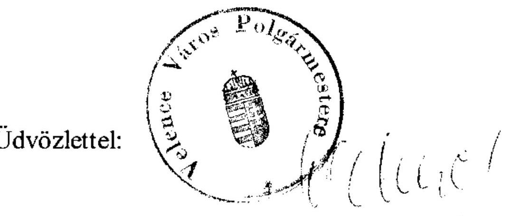

Oláhné Surányi Ágnes polgármester

---

# 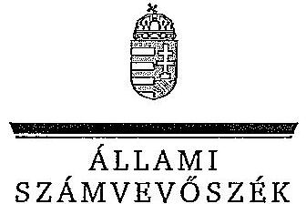 

Ikt.szám: V-3091-018/2012.

## Oláhné Surányi Ágnes úrhölgy

polgármester

Velence Város Önkormányzata
Velence

## Tisztelt Polgármester Úrhölgy!

Köszönettel vettem Velence Város Önkormányzata pénzügyi helyzetének ellenőrzéséről készített jelentéstervezethez kapcsolódó észrevételekről és megtett intézkedésről szóló tájékoztatását.

Az észrevételeivel kapcsolatban az alábbiakról tájékoztatom:
Ön általános észrevételként jelezte, hogy a jelentéstervezet részben a helyszíni ellenőrzést követő időszakkal kapcsolatosan tesz megállapításokat. Felhívom szíves figyelmét az ellenőrzési program azon kitételére, mely szerint az ellenőrzés során minden olyan körülményt és adatot is vizsgálni kellett, amely a program végrehajtásakor felmerült, a pénzügyi helyzet alakulására hatást gyakorló, releváns tények és folyamatok ellenőrzés céljával összhangban lévő feltárásához szükséges volt.

A Velencei-tó Kapuja projekt megváltoztatta az Önkormányzat pénzügyi helyzetét, ezért az arra vonatkozó megállapításaink megítélésem szerint a jelentéstervezetben foglaltak szerint megalapozottak.

Tájékoztatom, hogy az Ön általános észrevételein túl, a jelentéstervezet konkrét részeire tett alábbi észrevételeit elfogadtuk és azokat átvezettük a jelentés szövegében:

- A közoktatási feladatok kiadásai forrásösszetételének változásához tett 1. számú észrevétel alapján a jelentést kiegészítettük azzal, hogy az óvodai nevelés és az általános iskolai feladatok múködési kiadásai forrásösszetételének változását nem kizárólag a csoportok számának emelkedéséből eredő feladatbővülés

---

okozta, hanem a normatívák csökkenése és az egyszeri, a beruházásokhoz kapcsolódó müködési többletkiadások.

- Az Ön észrevételének 3. pontjában foglalt kérést elfogadva, „a müködési jövedelem a 2007-2008. években negatív összegủ volt" megállapítást kiegészítettük az „annak csekély mértékével és átmeneti jellegével" megjegyzéssel.
- Ön az 5. számú észrevételében kérte az Önkormányzat 2010-ben lefolytatott közbeszerzési eljárására vonatkozó megállapítás kiegészítését. Tekintettel arra is, hogy a közbeszerzési eljárás lebonyolításának ellenőrzése nem volt tárgya a számvevőszéki vizsgálatnak, a jelentést a „tekintettel az előzőekben lefolytatott két, eredménytelenül zárult közbeszerzési eljárásra" szövegrésszel egészítettük ki.
- Az Ön 7. számú észrevételét elfogadva a megállapítást pontositottuk az alábbiak szerint: „A Képviselő-testület 2011. november 10 -én kijelölt kettő, összesen 97,6 ezer $\mathrm{m}^{2}$ területü ingatlant értékesítésre a beruházás folytatásához szükséges hiányzó forrás biztosítása érdekében."
- Az Ön 8. számú észrevételének szövegszerủ pontositásra vonatkozó részét elfogadva a vonatkozó szövegrészt „nem szerződésszerü teljesítés"-re módosítottuk.

Tájékoztatom továbbá, hogy az Ön 2., 4., 6., valamint 8-14. számú észrevételei vonatkozásában fenntartjuk a jelentéstervezetben foglalt, a helyszíni ellenőrzés dokumentumai és adatai által kellően megalapozott megállapításokat, így a hivatkozott észrevételeire a jelentés részletes megállapításai indoklást tartalmaznak.

Az Önkormányzat pénzügyi egyensúlyának gyors helyreállítása érdekében a kintlévőségek behajtásáról, az el nem számolt támogatás visszafizetésére kötendő halasztott részletfizetési megállapodás feltételeinek egyeztetéséről, az önként vállalt feladatok finanszírozásának csökkentéséről és a Velencei-tó Kapuja projekt kapcsán keletkezett követelés felszámoló részére való bejelentéséről hozott intézkedései a jelentésben bemutatásra kerülnek.

Felhívom szíves figyelmét, hogy a megküldött intézkedéseiről szóló levele nem tekinthető az ÁSZ tv. 33. § (1) bekezdése szerinti intézkedési tervnek, ezért kérem, hogy azt a jelentés kézhezvételét követően, a törvényi határidőn belül az Állami Számvevőszék részére megküldeni szíveskedjen.

---

Megköszönöm Önnek és munkatársainak az ellenőrzés során tanúsított hozzáállását, amellyel az Önkormányzatról szóló pénzügyi helyzetelemzés elkészítését segítették.

Budapest, 2012. április " $t_{1}$ ".
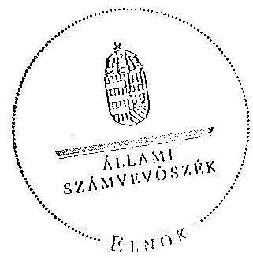

Tisztelettel:
