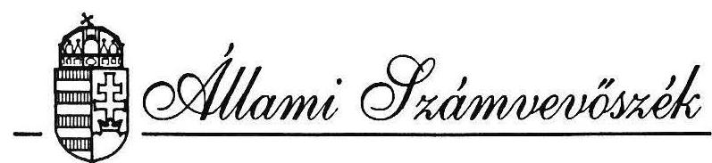
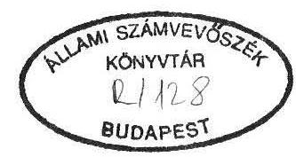
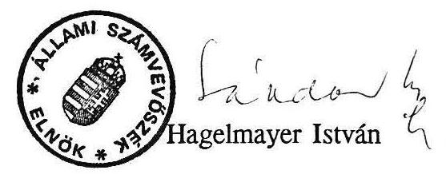

#  

## JELENTÉS

az önkormányzatok ellenőrzési funkciója érvényesülésének tapasztalatairól

---

# JELENTÉS 

## az önkormányzatok ellenőrzési funkciója érvényesülésének tapasztalatairól

Az önkormányzatokról szóló 1990. évi LXV törvénnyel a magyar államigazgatás szervezeti struktúrája, jellege alapjaiban megváltozott.
A közel fél évszázados tanács típusú közigazgatást felváltotta egy alulról építkező, alá-fölérendeltséget mellőző önkormányzati rendszer. Az önkormányzatoknak a törvény nagyfokú önállóságot biztosított a helyi érdekủ közügyekben és a gazdálkodás egészében. A jelenleg érvényben lévő jogszabályok - tiszteletben tartva az önkormányzatok önállóságát, önszabályozási hatáskörét - nem tartalmaznak direkt előírásokat az ellenőrzési rendszerük kialakítására, illetve müködtetésére.
Az önkormányzati törvény olyan garanciális szabályokat, kötelezettségeket állapít meg a gazdálkodásra, amelynek megvalósítása igényli, feltételezi a hatékony önkormányzati ellenőrzési rendszer kialakítását. A gazdálkodás biztonságáért a képviselőtestületet, a szabályszerűségéért a polgármestert teszi felelőssé. Továbbá a törvény előírja, hogy a saját intézmények pénzügyi ellenőrzését a helyi önkormányzat látja el.
A képviselőtestület és a polgármester a gazdálkodás biztonságának és szabályszerűségének a megteremtésében támaszkodhatnak a pénzügyi ellenőrzési bizottságra, miután a törvény a 2000 fő lélekszám fölötti településeknél kötelezővé teszi a pénzügyi ellenőrzési bizottságok megválasztását, és előírja a feladataikat. A pénzügyi ellenőrzési bizottságok meghatározói és részben végrehajtói lehetnek az önkormányzati ellenőrzéseknek.

A felügyeleti jellegű költségvetési ellenőrzések fontosságát deklarálja az 1991. évi XX. törvény is, amely többek között a helyi önkormányzatok és szerveik feladat- és hatásköréről rendelkezik. A képviselőtestület feladatkörébe utalja, hogy meghatározott időnként tekintse át az általa alapított és fenntartott költségvetési szervek ellenőrzésének tapasztalatait. Az ellenőrzés ellátását a jegyző feladatává teszi.
Az önkormányzati törvény kimondja az ellenőrzési kötelezettséget, de nem rendelkezik

---

az intézményi vizsgálatok tartalmáról, mélységéről, gyakoriságáról és nem adnak eligazítást egyéb jogszabályok sem.

Az elmúlt két évben a költségvetési ellenőrzés szabályozása területén jelentős dereguláció valósult meg. 1990. május 1-től hatályon kívül helyezték az állami ellenőrzésről szóló többszörösen módosított 50/1977 (XII.21) MT. számú rendeletet, 1991. január 1-től több szakaszt a pénzügyi törvényből és végrehajtási rendeletéből, illetve annak a pénzügyi ellenőrzésre vonatkozó fejezetéből. Így egy sor alapvető fogalmi, ellenőrzés eljárási kérdés törvényi szintű szabályozása megszűnt. Ugyanakkor a felügyeleti jellegű költségvetési ellenőrzés újrafogalmazásával hiányzik annak a törvényi kötelezettsége, hogy az önkormányzatok alkalmazzák - az államháztartási törvényig érvényben lévő a felügyeleti jellegű költségvetési ellenőrzésről és a költségvetési szervek belső ellenőrzéséről szóló módosított 96/1987 (XII.30) PM. számú rendeletet, amely részletesen taglalta az ellenőrzés lebonyolításának szabályait.

Az előzőekből fakadóan az önkormányzatok ellenőrzési rendszerét, az ellenőrzések gyakoriságát és módszereit, a célokhoz és feladatokhoz rendelten a képviselőtestületeknek kell meghatározniuk, kialakítaniuk.

A helyi önkormányzatokról szóló 1990. évi LXV. törvény az Állami Számvevőszék hatáskörébe utalja az önkormányzatok gazdálkodásának - ezen belül az ellenőrzési funkció érvényesülésének - a vizsgálatát.
A vizsgálat célja annak megállapítása volt, hogy az önkormányzatok
— kialakították-e ellenőrzési rendszerüket,
— ellenőrzési rendszerük működéséhez a szabályokat, eljárási rendet kidolgozták-e,
—a felügyeleti és belső ellenőrzési rendszerük működéséről hogyan gondoskodnak,
— milyen tartalmi és szakmai-módszertani útmutatásra van szükség ahhoz, hogy a helyi önkormányzatoknál egységes elvek alapján működő ellenőrzés valósuljon meg.

Helyszíni ellenőrzésre - 10 megyében és a fővárosban, 2 kerületi - 2 megyei közgyűlésnél, 18 városi, 12 nagyközségi és 18 községi önkormányzatnál került sor. Az ellenőrzés - a polgármesteri hivatalokon túlmenően - érintette 10 körjegyzőség tevékenységét is.

---

# I. Az önkormányzatok ellenőrzési rendszerének általános értékelése 

Az önkormányzatok megalakulásukat követően eltérő feltételekkel rendelkeztek. Kedvezőbb volt a helyzet a megyei, városi, nagyközségi önkormányzatoknál, ahol a tárgyi, személyi feltételek már korábban rendelkezésre álltak. Így ezen önkormányzatok többségénél egyik fő feladat a gazdálkodási tevékenység zökkenőmentes továbbvitele volt.
Kisebb településeken, volt társközségekben a feltételek hiánya nehezítette a működést, és az önkormányzat megalakulásával egyidejűleg jelent meg a gazdálkodási tevékenység, mint feladat.
Mindezek ellenére valamennyi önkormányzatnál tapasztalhatók törekvések az ellenőrzési rendszer kialakítására, szabályozására, működtetésére. Az ellenőrzési tevékenység teljeskörű, rendszer-szemléletű, a helyi sajátosságokat is figyelembevevő szabályozása azonban az ellenőrzés időpontjáig - egy vizsgált önkormányzatnál sem történt meg.

Az önkormányzatok többsége rendelkezik Szervezeti és Müködési Szabályzattal, kivételt képeznek ez alól a Vas megyei Pankasz és Sömjénmihályfa községek, ahol nincs jóváhagyott Szervezeti és Müködési Szabályzat, és a fóváros I. kerületében nem volt érvénybe léptetve. Az SZMSZ-k egy esetben sem tartalmazták az ellenőrzési rendszer átfogó szabályozását.
A Szervezeti és Müködési Szabályzatok többségében a képviselőtestületek müködésének szabályait határozzák meg un. "házszabályok".
A Szervezeti és Müködési Szabályzatok mellékleteit képező Ügyrend és egyéb szabályzatok ugyanakkor a vizsgált önkormányzatok csak mintegy $50 \%$-ánál készültek el.
A szabályzatok és ügyrendek a hatáskörök és feladatok változása miatt több esetben módosításra kerültek, és helyenként ideiglenes jelleggel lettek jóváhagyva.

Egy megyei és 23 helyi önkormányzat rendelkezik belső ellenőrzési szabályzattal. E szabályzatok a belső ellenőrzés szervezeti kereteit, feladatait, eljárási rendjét, módszereit tartalmazzák, de nem pótolják az egyéb szabályzatok hiányát, illetve hiányosságát.

A szabályzatok és mellékleteik a legtöbb helyen az általánosság szintjén vannak megfogalmazva, azok csak a törvényekben és az egyéb jogszabályokban is megtalálható feladatokat tartalmazzák. A pénzügyi ellenőrző bizottság létrehozásán kívül csak utalás történik bizonyos ellenőrzési feladatokra.
Nem határozta meg többek között egy önkormányzat sem, hogy az általa alapított intézménynél a pénzügyi-gazdasági ellenőrzést milyen időközönként kell elvégezniük.

A szabályzatok elkészítésénél bizonytalanságot okozott az új törvények keret jellege, egyes jogszabályok bizonyos részeinek aktualizálása, valamint az, hogy az önkormány-

---

zatok segítését, konzultációs lehetőségét biztosító szervezetek is a szerveződés stádiumában voltak.

Annak ellenére, hogy a szabályozások nem komplexek, a belső ellenőrzés és a felügyeleti jellegű pénzügyi-gazdasági ellenőrzés a vizsgált önkormányzatok többségénél a gyakorlatban - különböző módon, eltérő hatékonysággal - funkcionál. Az ellenőrzött önkormányzatok egyötöde (elsősorban megyei, kerületi és városi önkormányzatok) önálló napirendi pontként tárgyalta az általuk alapított és fenntartott költségvetési szerveknél tartott ellenőrzések tapasztalatait, évente egy alkalommal, illetve egy-egy témakörben.
A képviselőtestületek által tárgyalt előterjesztések általában alkalmasak voltak a döntések megalapozására.

Mezöberényben a PEB vizsgálata és javaslata alapján - kihasználatlanság miatt egy óvoda megszüntetésére, a fürdő 300 ezer Ft-os veszteségének $50 \%$-os csökkentésére került sor.

Kétegyházán PEB vizsgálat alapján a GAMESZ-nél az ellátó tevékenységet végzők 20 fős létszámát 9 fővel, a bölcsőde férőhelyeit - kihasználatlanság miatt 30 fơről 15 fôre csökkentették.

Szabolcs-Szatmár-Bereg Megyei Közgyűlés Pénzügyi ellenőrző Bizottsága által a Megyei Gyógyszertári Központnál kezdeményezett és a hivatali apparátussal, valamint a Szociális és Egészségügyi Bizottsággal együttesen elvégzett célvizsgálat alapján az igazgató ellen fegyelmi eljárás lefolytatására és fegyelmi úton történő elbocsátására került sor.

Több esetben az érdemleges megállapítások alapján sem történtek intézkedések.
A Békés megyei Békésen az Egyesített Egészségügyi Intézmény vizsgálati jelentése csak a bölcsődék kihasználtságát mutatta be, de az átlagosan $50 \%$-os kihasználtság ellenére sem tettek javaslatot az intézkedésekre.

Bács-Kiskun megyében a testület elé került tájékoztató túlzottan általános volt, így intézkedésre nem került sor. Ugyanakkor az ellenőrzési dokumentumok tartalmaztak intézkedésre alkalmas megállapításokat.
Kiskunfélegyházán a Móra Ferenc Gimnáziumban olyan pénzügyi fegyelmet és vagyonvédelmet sértő gyakorlatot tárt fel az ellenőrzés amely feltétlenül magasabb szintű utasítás kiadását indokolta volna.

Kisebb településeken a képviselőtestületek konkrétan az ellenőrzés tapasztalataival nem foglalkoztak, de az egyéb, gazdálkodást érintő napirendek kapcsán, illetve egyes intézmények vezetőinek beszámoltatásával információhoz jutottak.

---

# II. Az önkormányzati hivatalban folyó gazdálkodás belső ellenőrzésének szabályozottsága, müködése 

A vizsgálati megállapítások szerint az ellenőrzési rendszer legkevésbé kialakított eleme a polgármesteri hivatalok belső ellenőrzése.

A vizsgált önkormányzatok hivatalaiban függetlenített belső ellenőrzési szervezet kialakítására, főfoglalkozású belső ellenőr alkalmazására nem került sor. A belső gazdálkodás ellenőrzése többségében csak a vezetői és munkafolyamatba épített ellenőrzés keretében valósulhatott meg. Emiatt a hivatalokban kiemelt jelentősége lenne a belső ellenőrzés ezen két ága szabályozottságának, a szabályozás teljeskörüségének. Ez azonban az önkormányzatok többségénél nem történt meg.

Békés megyében a már elkészített szabályzatok sem tartalmazzák a belső ellenőrzés szervezeti kereteit, feladatait, eljárási szabályait, módszereit, de többnyire ezeket még csak most kezdik elkészíteni.

Bács-Kiskun megyében a szabályozások, a munkaköri leírások hiányoznak, vagy hiányosak, /Kiskunfélegyháza, Kiskunmajsa városok, Lakitelek nagyközség esetében, stb./ Nem tartalmazzák a pénzügyi, szakmai tevékenységeket, ahol az ellenőrzési pontokat ki kellett volna alakítani /pl. Tiszaalpár/.
Nem készültek - a vizsgált önkormányzatok többségénél - egyéb szabályozások. Lajosmizse-Felsőlajos körjegyzőség esetében az ügyrend jóváhagyásakor írták elő, hogy a körjegyzőségen belül el kell készíteni és előírás szerint működtetni: a házipénztári, a bizonylati, a leltározási, selejtezési szabályozásokat. Ezek egyike sem készült el a helyszíni ellenőrzés időpontjáig.
Tiszakécske város, valamint Szentkirály község esetében az SZMSZ-n kívül semmilyen más, belső ellenőrzési tevékenységet meghatározó szabályzat elkészítésére nem került sor.

Borsod-Abaúj-Zemplén megyében a sajószentpéteri önkormányzatnak a Szervezeti és Müködési Szabályzata szerint, annak mellékletét képezi a Polgármesteri Hivatal Ügyrendje. Ez azonban az ellenőrzés időpontjáig nem készült el. A Hejőkeresztúri önkormányzatnál az ellenőrzés időpontjáig nem készültek el a gazdálkodásra, ellenőrzésre vonatkozó előírások, szabályzatok.

Baranya megyében a vizsgált önkormányzatok - Mohács Város Önkormányzata kivételével - az ellenőrzési rendszerüket nem alakították ki. Valamennyi önkormányzat képviselő testülete rendelettel jóváhagyta a Szervezeti és Müködési Szabályzatát és a vizsgált időszakban egy vagy több alkalommal azt módosította, kiegészítette. Az ellenőrzéssel kapcsolatos kitételek csak a Szervezeti és Müködési Szabályzat mellékleteiben kerültek rögzítésre 3 önkormányzatnál /Komló Város, Mohács Város és Szentlőrinc Nagyközség Polgármesteri Hivatalainál/ a többi önkormányzat /Kisnyárád, Lánycsók, Magyarszék/ a felügyeleti és belső ellenőrzését nem szabályozta. Komló Város és Mohács Város Önkormányzatok polgármesterei 1992. évben Belső Ellenőrzési Szabályzatot adtak ki.

---

Pest megyében és a fővárosban több vizsgált hivatal müködésére jellemző, hogy még nem készítették el szabályzataikat, és többnyire szokásjog alapján, valamint a volt "tanácsi" rendszerben érvényes szabályzatok szerint folyik a hivatalok müködtetése. /PI. Leányfalun, Ráckevén és az I. kerületben/. A régi szabályzatok alapján müködő hivataloknál gyakran okoz problémát a napi feladatok ellátása, pl. Ráckeve és Lórév körjegyzöségében.

Kivétel nélkül hiányzik a polgármesteri hivatalok saját költségvetésében szereplő, részben önálló intézmények belső ellenőrzésének szabályozása is. A belső ellenőrzési tevékenység elsősorban azon polgármesteri hivataloknál folyamatos, - bár nem kielégítően müködik - ahol a hivatal személyi állományában lényeges változás nem következett be. Ott a szabályozás hiánya, illetve hiányossága ellenére is a kialakult szokások alapján ellenőriznek.

A vezetői feladat- és hatáskörök szabályozása általában nem teljeskörű. Megosztását és gyakorlását a túlzott centralizáció jellemezte. A gazdálkodási jogosítványok általában a Szervezeti és Működési Szabályzatokban Ügyrendekben találhatók, azok külön munkaköri leírásokban nem vagy hiányosan lettek rögzítve.

Borsod megyében /osztályok, önálló csoport/ létrehozására Mezőkövesd és Sajószentpéter városi önkormányzat polgármesteri hivatalánál került sor. A belső szervezeti egységek vezetőinek egyik önkormányzatnál sincs döntési hatáskörük, azok decentralizálására nem került sor. A kiadmányozási jogot csak a polgármester és a jegyző gyakorolja.

Baranya megyében a vezetői ellenőrzési feladatok az elmúlt években megjelent törvények figyelembevételével kerültek kidolgozásra a Szervezeti és a Müködési Szabályzatokban. Egyetlen önkormányzatnál sem rögzítették azokat külön munkaköri leírásokban.

Szabolcs-Szatmár-Bereg megyében a vezetői ellenőrzési feladatok a Szervezeti és Müködési Szabályzatban, illetve Ügyrendben kerültek megfogalmazásra. Fényeslitke, Nyírtelek esetében a dokumentumokban a vezetői feladatok és hatáskörök nem találhatók.

Heves megyében vezetői munkaköri leírások nincsenek, a feladatmegosztás írásban nem rögzített, belső információs rendszer mai állapotát az jellemzi, hogy a vezetés minden gazdasági történést figyelemmel kísér.

Hajdú-Bihar megyében Körösszegapátiban az Ügyrend alapján -1991. januárjában - átdolgozták a munkaköri leírásokat és 1991. január 18-án elkészült az új Belső Ellenőrzési Szabályzat.

Hajdúszoboszlón a Polgármesteri Hivatal ügyrendje a polgármester, a jegyző, az irodavezetők, s a csoportvezetők részére egyaránt meghatároz vezetői-, folyamatba épített ellenőrzési feladatokat. Az Ügyrendben van szabályozva

---

továbbá: a kiadmányozási jog gyakorlása, valamint a pénzügyi-gazdasági ellenőrzéssel kapcsolatos feladat- és határskôr ellátása is.

A vezetői ellenőrzések az irányítási funkciók ellátásából, a szokványos módszerek - a kiadmányozási, a kötelezettségvállalási, az utalványozási, az ellenjegyzési jog gyakorlása, vezetői megbeszélés, információelemzés, beszámoltatás, stb. - gyakorlásából adódóan, szabályozatlanságuk ellenére is elfogadhatóan müködnek.

A községi - esetenként nagyközségi - polgármesteri hivatalok mérete, személyi feltétele, struktúrája miatt a vezetői és munkafolyamatba épített ellenőrzés összeolvad.

A kötelezettségvállalást, az utalványozást az önkormányzatok döntő többségénél a polgármesterek kizárólagos hatáskörükbe vonták. Néhány esetben - elsősorban a nagyobb hivataloknál - értékhatár megjelöléssel ezt a polgármesteri jogkört az egyéb beosztott vezetők részére leadták. Az ellenjegyzést a jogszabályi előírásnak megfelelően a jegyzők, illetve körjegyzők végezték. A vezetői hatáskörök a gyakorlatban nem mindig a szabályzatoknak megfelelően funkcionálnak, illetve azok végrehajtása több esetben elmarad.

Szabolcs-Szatmár-Bereg megyében Nyírtelek nagyközségi önkormányzatnál SZMSZ szerint utalványozási jogkör a polgármestert illeti meg, gyakorlatban e feladatot teljes egészében a jegyző látta el.
A körjegyző́éget képező Botpalád-Kispalád önkormányzatok költségvetési kifizetései az ellenőrzött időszak alatt egy esetben sem kerültek utalványozásra. A hatáskör a polgármesternél van fenntartva, de főfoglalkozásu munkahelyi elfoglaltsága miatt ennek nem tudott eleget tenni.

Borsod-Abaúj-Zemplén megyében Sajószentpéteren kötelezettség vállalási és utalványoszási joga a polgármesternek, ellenjegyzési joga pedig a jegyzőnek van. Ennek ellenére az elszámolási számla 1991. november 14-25-i bizonylatainak tételes felülvizsgálata során kitűnt, hogy minden esetben az osztályvezető volt az ellenjegyző, az érvényesítést pedig a pénzügyi ügyintéző végezte.

A munkafolyamatba épített ellenőrzés szabályozása hiányos. Nem biztosítja az egyes folyamatok megszakítás nélküli ellenőrzésének, és az észlelt hiányosságok időben történő megszüntetésének a feltételeit.

A Szervezeti és Müködési Szabályzatok általában nem tartalmazzák az egyes tevékenységi folyamatok részletes szabályozását. Az egyéb szabályzatok, ügyrendek viszont hiányosak vagy a tanácsi gazdálkodás időszakában készültek, és ezeknek a jelenlegi gazdálkodási gyakorlatba történő adaptálása csak részben történt meg. A folyamatba épített ellenőrzés keretében jelentkező ellenőrzési pontokat, a feladat ellátásának viszonyítási alapját, módját, gyakoriságát a

---

visszacsatolás, jelzés módját csak az önkormányzatok mintegy $30 \%$-ánál alakították ki. Ezeknél a belső ellenőrzést külön szabályzatban rögzítették.

Az ellenőrzések szervezettségét, szakszerűségét valamint teljeskörűségét akadályozza, hogy a meglévő munkaköri leírásokban az ellátandó ellenőrzési feladatokat nem aktualizálták, azok a gazdálkodás egészét még nem fogják át. Még súlyosabb a helyzet azoknál az önkormányzatoknál, - a városok $40 \%$-ánál, a községek több mint felénél ahol egyáltalán nincs munkaköri leírás, és nincs jogi alapja a számonkérésnek, a felelősség megállapításának.

Szabályozottság hiányában az ügyintézők munkafolyamatba épített ellenőrzése rutinszerűen és nem teljeskörűen funkcionál.

Borsod-Abaúj-Zemplén megyében a he jókeresztúri önkormányzatnál1991-ben és 1992-ben az ellenőrzés időpontjáig nem volt pénztárellenőrzés.

A sajószentpéteri önkormányzatnál nem került sor a szabálytalan ellenjegyzés, érvényesítés észrevételezésére.

A mezökövesdi önkormányzatnál a pénztárellenőrzés gyakoriságának, szabályozatlanságának következtében a pénztárellenőr havonta végez ellenőrzést.

A munkafolyamatba épített ellenőrzés hiányát a költségvetési beszámolók, különböző testületi előterjesztések szúrópróbaszerű ellenőrzései alapján tapasztalt sorozatos hibák is igazolják, de alátámasztják az Állami Számvevőszék témaellenőrzéseinek tapasztalatai is /normatív finanszírozás, önhibáján kívül hátrányos helyzetbe került önkormányzatok támogatása, stb./

Az új számviteli törvény előírásai komoly feladatot jelentettek az önkormányzatok számára.
Alapvető gondot jelentett, hogy a költségvetési szervekre vonatkozó kormányrendelet későn jelent meg. Az átállás végrehajtását hátráltatta, hogy az érintett dolgozók részére - a TÁKISZ-ok által - szervezett oktatás elhúzódott. A könyveléshez kiadott gépi programban - még a vizsgálat ideje alatt is - voltak módosítások.

Az 1992. június 30 -ig kötelezően előírt feladatok (számlarend, számviteli utasítás, számlatükör, mérlegátfordítás) végrehajtása egy önkormányzatnál sem fejeződött be. Az ellenőrzés időpontjáig többségében a számlatükröt készítették el, a számviteli szabályzat elkészítése folyamatban volt, illetve az ellenőrzés hatására elkezdődött.
Kisebb településeken (Botpalád, Kispalád), amelyek korábban tanácsi társközségek voltak, még a számlatükör sem készült el.

---

A számviteli szabályzathoz kapcsolódó egyéb szabályozások módosítására, elkészítésére csak ezt követően kerülhet sor. Így a meglévő vezetői, illetve munkafolyamatba épített belső ellenőrzés módosulása sem következhetett be.

A vizsgált körben 9 önkormányzatnál - elsősorban megyei, városi - foglalkoztatnak belső ellenőrt kapcsolt, osztott munkakörben, illetve részfoglalkozású dolgozóként. Jellemzően az intézmények pénzügyi-gazdasági ellenőrzését végző revizorok látják el a belső ellenőri feladatokat is.
Jogállásukat a belső ellenőrzési szabályzatban rögzítették. A szabályozásokban azonban a belső ellenőr irányítását, elsősorban a kapcsolt munkakörből fakadóan ellentmondásosan határozták meg.

Borsod-Abaúj-Zemplén megyében a sajószentpéteri önkormányzat az 1/1990. /XI.6/ sz. önkormányzati határozatában rendezte a belső ellenőr jogállását. Eszerint a függetlenített belső ellenőr felett a munkáltatói jog gyakorlását a szakmai felügyeletet és irányítást a továbbiakban a polgármester végzi. Ugyanakkor az 1984-ben kiadott munkaköri leírás szerint a belső ellenőr operatív irányítását a pénzügyi csoportvezető végzi.

A mezőközvesdi önkormányzatnál a belső ellenőrzési feladatokat a költségvetési osztály szervezetébe tartozó revizor látja el. A belső ellenőr szervezetileg ugyan nem a polgármester közvetlen irányítása alá tartozik, de belső ellenőrzési feladatokat a polgármester határozza meg számára.

Csongrád megyében Kistelek Város Önkormányzatánál 1992. május 18-tól alkalmaznak függetlenített belső ellenőrt. A munkáltatói jogot a polgármester gyakorolja, viszont az ellenőrzési feladatokkal a jegyző bízza meg. A feladat kijelölés az intézmények ellenőrzésén túl a hivatal belső ellenőrzésére is vonatkozik.

Békés megyében függetlenített belső ellenőrt csak Gyulán alkalmaznak 4 órás munkakörben. Kétegyházán - az ügyrend mellékletét képező munkaköri leírások szerint - az adóigazgatási iroda egyik munkatársa kapcsolt munkakörben látja el a hivatal belső ellenőrzését.

A belső ellenőrök tevékenysége általában az operatív gazdálkodás részterületeire irányult.

Az ellenőrzési feladatok megoldásában még nem terjedt el a külső szakértők, könyvvizsgálói szervezetek alkalmazása. Ennek alapvető oka, hogy ezen szervezetek az önkormányzatok anyagi helyzetéhez mérten igen magas díjazás ellenében dolgoznak. Csak 3 önkormányzat kért fel külső szakértői szervezetet. Vizsgálataik eredményeként egy Pénzügyi- és Adóügyi Iroda átszervezésére és egy Gazdasági Műszaki Szolgáltató Szervezet megszüntetésére került sor.
A harmadik esetben a polgármesteri hivatal gazdálkodása - bizonylati fegyelem,

---

likviditási helyzet, beruházások és felújítások elszámolásának szabályossága - került ellenőrzésre.

Az ellenőrzési társulások az önkormányzati választások után már csak részben szerveződtek újjá. Ugyanakkor ez az ellenőrzési forma - megfelelő szabályozottság és szakmai felkészültség esetén - megoldást jelenthetne elsősorban a kisebb önkormányzatok ellenőrzési feladatainak az ellátásában. A vizsgált körben az ellenőrzött időszak alatt 18 önkormányzat 3 társulást működtetett, melyből egy 1990. december 31-vel megszűnt. Megszüntetésének nem szakmai okai voltak, hanem azt az önkormányzatok önállósulási törekvése idézte elő. Egy másik megszüntetésével foglalkoznak. Így mindössze egy - hét önkormányzat által Csongrád megyében működtetett - társulás az, amely megfelelő szabályozottsággal, hatékonysággal és várhatóan hosszabb távon látja el a belső és költségvetési felügyeleti ellenőrzést.

# III. Az önállóan gazdálkodó intézmények ellenőrzésének végrehajtása 

Az ellenőrzött önkormányzatok közül 43 önkormányzat hozott létre, illetve működtetett önálló gazdálkodási jogkörrel rendelkező intézményt. Ezzel szemben a törvényben meghatározott pénzügyi-gazdasági ellenőrzési kötelezettségének csak 23 önkormányzat tett eleget különböző gyakorisággal és színvonalon.
Általában azokon a településeken, ahol a revizor személye változatlan maradt az önkormányzati rendszer megalakulásakor, illetve ahol az elmúlt évek gyakorlatát szervezetileg és személyileg biztosítani tudták.
Több önkormányzatnál - viszont igen alacsony az ellenőrzött időszak alatt elvégzett ellenőrzések száma.

Szabolcs-Szatmár-Bereg megyében Nyírbátor Városi Önkormányzatnál 6 intézményből egynél

Hajdú-Bihar megyei önkormányzat 32 önállóan gazdálkodó intézménye közül 14-nél, Komló város 15 önállóan gazdálkodó intézménye közül egynél

Bács-Kiskun megyében Tiszakécske Városi Önkormányzatnál ahol a 13 intézmény közül 6 intézmény rendelkezik önálló gazdálkodási jogkörrel, egy intézménynél sem végeztek pénzügyi-gazdasági ellenőrzést.

Az ellenőrzési feladatok ellátására a megyei, városi és kerületi önkormányzatok - 3 helyen - saját szervezetet hoztak létre, illetve többségükben függetlenített revizort alkalmaznak.

---

Nagyközségi és községi önkormányzatoknál a feladatok nagyságrendje nem tette indokolttá függetlenített, főfoglalkozású személy foglalkoztatását.
A fő vagy részfoglalkozású revizorokat szervezetileg általában a hivatalok pénzügyigazdasági részlegeihez rendelték, ezáltal az ellenőrzés függetlensége nincs biztosítva.

Valamennyi önkormányzat alapvetően saját apparátussal tervezte elvégeztetni az intézmények pénzügyi-gazdasági ellenőrzését. A gyakorlatban azonban néhány esetben külső szakértő igénybevételére is sor került, és több intézményi ellenőrzésben részt vett a helyi pénzügyi ellenőrző bizottság egy-egy tagja.

A képviselőtestület egy önkormányzatnál sem határozta meg az ellenőrzések gyakoriságát. Ennek ellenére néhány helyen a korábbi években kötelezően előírt kétévenkénti ütemet tervezték.
Az intézmények ellenőrzésére a városok $66 \%$-a, a községek $23 \%$-a készített ellenőrzési tervet, melyet csak két esetben hagyott jóvá a képviselő testület.

Az elvégzett vizsgálatok elsősorban csak a szabályszerűségi követelmények betartására irányultak. Kevés számú vizsgálat foglalkozott az intézmények működésének hatékonyságával, komplex értékelésével.
Az intézményekben több cél és témavizsgálat megtartására is sor került.
A célvizsgálatok általában egyedi ügyekkel voltak kapcsolatosak és jellemző, hogy az apparátus rendszerint a testület elrendelésére, a pénzügyi ellenőrző bizottsággal végezte ezeket.

A témavizsgálatok többnyire tervszerűen végzett "intézményi átvilágítások" voltak, és a megváltozott finanszírozási rendben az intézmények működési költségeinek csökkentését célozták. Külső szakértők általában ezekben az ellenőrzésekben vettek részt.
Az átfogó pénzügyi-gazdasági, cél és témavizsgálatok megállapításai hasznosításra kerültek.

# IV. Pénzügyi Ellenőrző Bizottságok müködése 

A helyi önkormányzatokról szóló törvényben foglaltaknak megfelelően, a kétezernél több lakosú településeken a képviselőtestületek minden esetben létrehozták a pénzügyi ellenőrző bizottságokat, sőt 3 olyan településen is, ahol a lakosság szám 600-900 fő. A bizottságok általában még nem tudják maradéktalanul ellátni a jogalkotók által nekik szánt feladatot az önkormányzatok ellenőrző munkájában. A polgármesteri hivatalok és a költségvetési intézmények ellenőrzési rendszerének kialakításával az ellenőrzés időpontjáig nem foglalkoztak, konkrét ellenőrzéseket csak igen kis számban

---

végeztek illetve kezdeményeztek. Tevékenységük döntő mértékben a pénzügyi és gazdasági kérdések véleményezésére terjedt ki. A képviselő testületek elé kerülő gazdálkodási témájú előterjesztéseket többségében minősítették, véleményezték.

A bizottságok által végzett tevékenység mennyisége és a feladat jellege igen eltérő, többnyire összefüggésben van az önkormányzati feladatok nagyságrendjével, a költségvetés volumenével, a gazdaságának állapotával, de nem utolsó sorban a bizottsági tagok személyi összetételével, öntevékenységével.

Általánosságban megállapítható, hogy - a megyei, városi és kerületi önkormányzatok kivételével - a pénzügyi ellenőrzési bizottságok szakmai összetétele alapján a gazdálkodás szakszerű ellenőrzéséhez nincs meg a bizottsági tagok felkészültsége.

A nagyobb önkormányzatok bizottságai tevékenységüket munkaterv alapján végzik, arról írásos dokumentumot - feljegyzést, jegyzőkönyvet - készítenek. A községi pénzügyi ellenőrzési bizottságok tevékenysége a jegyzővel, körjegyzővel történő egyeztetésből, konzultációból, véleménynyilvánításból áll.

A bizottságok többsége az ellenőrzés jelentőségét felismerve nagyobb külső segítséget, iránymutatást tartana szükségesnek az önkormányzati ellenőrzés megszervezéséhez, működtetéséhez. Lényegesnek tartják a szabályozottság, a tervszerűség biztosítását, és szakmai feltételek hiányában tervezik a külső szakértők alkalmazását.
Több esetben azonban nagyfokú tájékozatlanságot és érdektelenséget mutattak az önkormányzatok ellenőrzési tevékenységét illetően.

# V. Következtetések, javaslatok 

Az önkormányzatok kialakulásával, az új finanszírozási rendszer bevezetésével megnövekedett a költségvetési területen a belső ellenőrzés szerepe, jelentősége a gazdálkodásban.

A rövid múltra visszatekintő önkormányzatok ellenőrzési tevékenysége meglehetősen kezdeti állapotot tükröz. A müködéséhez szükséges szabályok, eljárási rend kidolgozása jelenleg van folyamatban. Ezek hiánya, elavultsága nagymértékben rontja az ellenőrzés hatékonyságát, sőt sok esetben érdemben működésképtelenné teszi.
A negatív tapasztalatok több okra vezethetők vissza.
Az önkormányzati törvény hatálybalépését követően a több mint 1600 tanácsot mintegy 3200 önkormányzat váltotta fel, ami jelentős szakemberigényt vetett fel. Az önkormányzatok ügyintézőinek, jegyzőinek szakképzettsége, gyakorlati tapasztalata több

---

helyen nem teszi lehetővé a zárt, jól működő ellenőrzési rendszer kialakítását. Különösen érzékelhető volt a feltételek hiánya a kistelepüléseknél.

A fentiek ellenére azonban a települések nagysága (költségvetése, intézményeinek száma stb.) és az ellenőrzési rendszer kialakítása, működése között a feltételezettnél lazább a kapcsolat.
Általában jellemző volt, hogy a képviselő testületek - a gazdálkodás biztonságáért viselt felelősségük ellenére - nem foglalkoztak az ellenőrzés kiépítésével, illetve a pénzügyi ellenőrzési bizottság és a belső ellenőrzés működésével szemben nem támasztottak megfelelő követelményt, igényeket. Így az ellenőrző bizottságok sem töltik be az önkormányzati ellenőrzések fő szervezőinek szerepét.
A jogalkotás révén nagyobb szerepet kapott az öntevékenység, és az ellenőrzési rendszerrel szembeni követelmények saját hatáskörű megfogalmazása. Ehhez képest viszont az önkormányzatoknál még nem alakult ki a tulajdonosi szemléletből fakadó igény az ellenőrzés szükségessége iránt.

Nehezítették az ellenőrzési rendszer szabályozását és működtetését egyéb körülmények is. Nem kaptak kellő segítséget, útmutatást a megváltozott gazdálkodási kérdésekben. Emellett számtalan új kérdés, operatív feladat megoldása vonta el a figyelmet, diktálta a teendőket. Az önkormányzatok megalakulásakor nem voltak tisztázottak a feladatés hatáskörök, melyek az ellenőrzött időszakban több ízben változtak, módosultak. Mindezek, valamint esetenként a helytelen létszámgazdálkodás következtében - az évtizedeken keresztül az ellenőrzési rendszer és a vezetési funkciók leggyengébb láncszemének tartott - belső ellenőrzés színvonala csökkent.

A gazdálkodás szabályszerűségének és biztonságának megteremtése, a racionális, tulajdonosi szemléletű gazdálkodás jelentőségének, az önálló közgazdasági döntések szerepének növekedése sürgeti az ellenőrzési rendszer kialakítását, hatékony működtetését.

Budapest, 1992. szeptember

---

A vizsgálatot vezette:
Németh Péterné számvevő főtanácsos
A vizsgálat előkészítésében részt vett:
dr. Ótott Lajos számvevő tanácsos
Kenéz Sándor számvevő tanácsos
Ivicz Sándor számvevő
A vizsgálat szervezésében és az összefoglaló jelentés összeállításában részt vett:
dr. Ótott Lajos számvevő tanácsos
Kenéz Sándor számvevő tanácsos
A vizsgálatot végezték:
Baranya megye:
dr. Koronics Károlyné számvevő tanácsos
Békés megye:
Domján Jenő számvevő tanácsos
Borsod-Abaúj-Zemplén megye:
Fekete Tibor számvevő tanácsos
Csongrád megye:
dr. Ótott Lajos számvevő tanácsos
Hajdú-Bihar megye:
Kóródi József számvevő tanácsos
Heves megye:
Maróti Sándor számvevő tanácsos
Szabolcs-Szatmár-Bereg megye:
Kenéz Sándor számvevő tanácsos
Vas megye:
Horváth János számvevő tanácsos
Fővárosi régió:
dr. Katona Béláné számvevő tanácsos
dr. Molnár Klára számvevő tanácsos
dr. Magyar György számvevő
Ivicz Sándor számvevő