# ÁLLAMI   SZÁMVEVŐSZÉK 

## JELENTÉS

## Veresegyház Város Önkormányzata pénzügyi helyzetének ellenőrzéséről (43/4)

---

# Állami Számvevőszék 

Iktatószám: V-3112-040/2012.
Témaszám: 1015
Vizsgálat-azonosító szám: V0560143

## Az ellenőrzést felügyelte:

Dr. Varga Sándor
számvevő igazgatóhelyettes
Az ellenőrzést vezette:
Renkó Zsuzsanna
számvevő tanácsos
Ellenőrzési csoportvezető:
Kántor Ilona
számvevő tanácsos
Az ellenőrzést végezték:

| Bocsi Sándor | Baksa Anikó | Papp József |
| :-- | :-- | :-- |
| számvevő tanácsos | számvevő | számvevő tanácsos |

---

# TARTALOMJEGYZÉK 

BEVEZETÉS ..... 9
I. ÖSSZEGZŐ MEGÁLLAPÍTÁSOK, KÖVETKEZTETÉSEK, JAVASLATOK ..... 13
II. RÉSZLETES MEGÁLLAPÍTÁSOK ..... 31

1. Az Önkormányzat kötelező és önként vállalt feladatai, a feladatellátás szervezeti keretei és annak változásai ..... 31
2. Az Önkormányzat pénzügyi egyensúlyi helyzetét befolyásoló tényezők ..... 37
2.1. A működési és a felhalmozási egyensúly változása ..... 39
2.2. Az Önkormányzat bevételeinek változása ..... 44
2.3. Az Önkormányzat múködési és felhalmozási célú kiadásainak változása ..... 47
3. Az Önkormányzat kötelezettségei ..... 51
3.1. Az Önkormányzat pénzintézeti kötelezettségeinek változása ..... 51
3.2. A szállítói kötelezettségek változása ..... 61
3.3. Egyéb kötelezettségek változása ..... 62
4. A pénzügyi egyensúly megteremtése érdekében hozott intézkedések eredménye ..... 71
5. Az ÁSZ által a korábbi években a pénzügyi egyensúly javítására tett szabályszerűségi és célszerűségi javaslatok hasznosulása ..... 73

---

# MELLÉKLETEK 

1. számú Múködési és felhalmozási célú hiány/többlet a 2007-2010 közötti időszakban az Önkormányzat zárszámadási rendeleteiben (1 oldal)
2. számú Az Önkormányzat bevételei és kiadásai, valamint adósságszolgálata 2007-2010 között (1 oldal)
3/a. számú Az Önkormányzat 2007-2010. években megvalósított, 2010. december 31ig befejezett fejlesztései és azok forrásösszetétele (1 oldal)
3/b. számú Az Önkormányzat 2010. december 31-én folyamatban lévő fejlesztési feladataira 2010. december 31-ig teljesített kifizetések és azok forrásösszetétele (1 oldal)
3/c. számú Az Önkormányzat 2010. december 31-én folyamatban lévő fejlesztési feladataira 2010. december 31-én fennálló kötelezettségek és azok forrásöszszetétele ( 1 oldal)
3/d. számú Az Önkormányzat által beadott, elbírálás alatti pályázati forrásból megvalósítani tervezett fejlesztéseihez kapcsolódó kötelezettségvállalásai és annak forrásösszetétele (1 oldal)
3. számú Az önkormányzati feladatok ellátásában résztvevő gazdasági társaságok (1 oldal)
4. számú A 2007-2011. év I. félév között a Képviselő-testület felhatalmazása alapján felvett likvidhitelek és kölcsönök (4 oldal)
5. számú Az Önkormányzat vagyonáról és a vagyonnal való gazdálkodás szabályairól szóló 13/2007. (XI. 7.) számú rendelet 17. § g) pontjában foglaltak megsértésével 2007-2010 között az Önkormányzat által - a tagi kölcsönökön túl - nyújtott kölcsönök (1 oldal)
6. számú Az Önkormányzat által a 2011. év I. félévében nyújtott kölcsönök (1 oldal)
7. számú Az Önkormányzat által a 2007-2011. év I. félév között nyújtott kölcsönök ellenjegyzése (1 oldal)

---

# RÖVIDÍTÉSEK JEGYZÉKE 

## Törvények

Adósságrendezési tv.
Áht.,
Áht. 2
ÁSZ tv.
Csőd tv.
Gt. tv.
Hpt.
Kbt.
Nemzeti vagyon tv.
Ötv. 1
Ötv. 2
Ptk.
Stabilitási tv.
Számv. tv.

## Rendeletek

Áhsz.

Ámr. 1
Ámr. 2
Ávr.

SzMSz
2007. évi költségvetési rendelet
2008. évi költségvetési rendelet
2009. évi költségvetési rendelet
2010. évi költségvetési rendelet
a helyi önkormányzatok adósságrendezési eljárásáról szóló 1996. évi XXV. törvény
az államháztartásról szóló 1992. évi XXXVIII. törvény
az államháztartásról szóló 2011. évi CXCV. törvény
az Állami Számvevőszékről szóló 2011. évi LXVI. törvény
a csődeljárásról és a felszámolási eljárásról szóló 1991. évi XLIX. törvény
a gazdasági társaságokról szóló 2006. évi IV. törvény
a hitelintézetekről és a pénzügyi vállalkozásokról szóló 1996. évi CXII. törvény
a közbeszerzésekről szóló 2003. évi CXXIX. törvény
a nemzeti vagyonról szóló 2011. évi CXCVI. törvény
a helyi önkormányzatokról szóló 1990. évi LXV. törvény
a Magyarország helyi önkormányzatairól szóló 2011. évi CLXXXIX. törvény
a Polgári Törvénykönyvről szóló 1959. évi IV. törvény
a Magyarország gazdasági stabilitásáról szóló 2011. évi CXCIV. törvény
a számvitelről szóló 2000. évi C. törvény
az államháztartás szervezetei beszámolási és könyvvezetési kötelezettségének sajátosságairól szóló 249/2000. (XII. 24.) Korm. rendelet
az államháztartás múködési rendjéről szóló 217/1998. (XII. 30.) Korm. rendelet
az államháztartás múködési rendjéről szóló 292/2009. (XII. 19.) Korm. rendelet
az államháztartásról szóló 2011. évi CXCV. törvény végrehajtásáról rendelkező 368/2011. (XII. 31.) Korm. rendelet
Veresegyház Város Önkormányzatának 10/2011. (III. 18.) számú rendelete az Önkormányzat Szervezeti és Múködési Szabályzatáról
Veresegyház Város Önkormányzatának 1/2007. (III. 7.) számú rendelete a 2007. évi költségvetésről
Veresegyház Város Önkormányzatának 4/2008. (III. 6.) számú rendelete a 2008. évi költségvetésről
Veresegyház Város Önkormányzatának 2/2009. (II. 13.) számú rendelete a 2009. évi költségvetésről
Veresegyház Város Önkormányzatának 26/2010. (XII. 1.) számú és 36/2010. (XII. 29.) számú rendeleteivel módosított $4 / 2010$. (III. 10.) számú rendelete a 2010. évi költségvetésről

---

2011. évi költségvetési rendelet
gazdálkodási szabály$\mathrm{zat}_{1}$
gazdálkodási szabály$\mathrm{zat}_{2}$
vagyonrendelet

## Szórövidítések

áfa
ÁSZ
Esti középiskola

## EU

GAMESZ
jegyzö $_{1}$
jegyzö $_{2}$
jegyzö $_{3}$
Képviselő-testület
Misszió-Health Kft.
Misszió Kft.
Misszió Kht.
Múvelődési Ház
OEP
Önkormányzat
polgármester
Polgármesteri hivatal
Társulás
Városi Könyvtár
Szennyvízközmű Társulás
Zeneiskola

Veresegyház Város Önkormányzatának 2/2011. (II. 16.) számú rendelete a 2011. évi költségvetésről
Veresegyház Város polgármesterének 66-69/2003. számú intézkedése a város önkormányzata pénzgazdálkodással kapcsolatos kötelezettségvállalás, utalványozás, érvényesítés és ellenjegyzés hatásköri rendjéről
Veresegyház Város Polgármesteri Hivatala Gazdasági Szervezet Ügyrendje (2009. szeptember 1-jétől hatályos)
Veresegyház Város Önkormányzatának 13/2007. (XI. 7.) számú rendelete az Önkormányzat vagyonáról és a vagyonnal való gazdálkodás szabályairól
általános forgalmi adó
Állami Számvevőszék
Fabriczius József Esti Gimnázium és Kereskedelmi Szakközépiskola
Európai Unió
Gazdasági Műszaki Ellátó Szervezet
Veresegyház Város Önkormányzatának kinevezett jegyzője 2007. január 1-jétől 2007. december 4-ig
Veresegyház Város Önkormányzatának kinevezett jegyzője 2008. május 1-jétől 2010. október 11-ig
Veresegyház Város Önkormányzatának kinevezett jegyzője 2010. október 12-től
Veresegyház Város Önkormányzatának Képviselőtestülete
Misszió-Health Egészségügyi Rendszerfejlesztő Kft.
Misszió Egészségügyi Központ Nonprofit Kft.
Misszió Egészségügyi Központ Közhasznú Társaság
Váci Mihály Múvelődési Ház
Országos Egészségbiztosítási Pénztár
Veresegyház Város Önkormányzata
Veresegyház Város Önkormányzatának polgármestere
Veresegyház Város Önkormányzatának Polgármesteri hivatala
Veresegyház Kistérség Önkormányzatainak Többcélú Társulása
Kölcsey Ferenc Városi Könyvtár,
Veresegyház és Környéke Szennyvízközmű Társulás
Lisznyay Szabó Gábor Zeneiskola Alapfokú Múvészetoktatási Intézmény

---

# ÉRTELMEZŐ SZÓTÁR 

| BUBOR | Budapesti Bankközi Forint Hitelkamatláb. Irányadó, refe-   rencia jellegú kamatláb. Mértékét az MNB naponta álla-   pitja meg a banki kamatok figyelembevételével. Közzété-   tele naponta történik. |
| :--: | :--: |
| CLF módszer | Az önkormányzatok költségvetése elemzésének eszköze. A   módszer következetesen elkülöníti a folyó és a felhalmo-   zási költségvetés bevételeit és kiadásait, azok költségvetési   egyenlegeit. Bizonyos mértékig a vállalati gazdálkodás   logikai elemeit érvényesíti az önkormányzatok pénzügyi,   jövedelmi helyzetének vizsgálata során. Az értékelés a   pénzügyi kapacitás fogalmát helyezi a középpontba. |
| EURIBOR | A frankfurti bankközi piacon jegyzett, az Európai Közpon-   ti Bank szabályainak megfelelően megállapított kínálati   kamatláb. Az EURIBOR értékét a legfontosabb európai   bankok hitelkínálatának kamatlábai alapján a Reuters   ügynökség számolja ki és teszi közzé naponta. A magyar   pénzintézetek is ezt használják viszonyítási alapnak EUR   hitelek esetén. |
| használhatósági fok | Az eszközgazdálkodás vizsgálatának elemzése során   használt mutató. Számításakor a tárgyi eszköz könyv sze-   rinti (nettó) értékét viszonyítják a tárgyi eszköz bruttó (be-   szerzési/létesítési) értékéhez. A mutató százalékban kifeje-   zett értékének csökkenése az eszköz állagának romlására,   avulására utal, ami maga után vonja az üzemeltetési és   fenntartási költségek növekedését is. |
| kamatkockázat | A változó kamatozású forint-, vagy devizahitelek futam-   ideje alatt a kamat emelkedése miatt fennálló kamatkov-   kázat, amelynek növekedése miatt nő a hitel törlesztő   részlete. |
| kötelező közszolgáltatás | A helyi önkormányzati feladatkörbe tartozó, a köztiszta-   sággal és a településtisztasággal, valamint az élet- és va-   gyonbiztonsággal összefüggő egyes - közszolgáltatás út-   ján megvalósuló - közfeladatok ellátása, amelynek köte-   lező igénybevételét külön jogszabály (törvény, helyi ön-   kormányzati rendelet) határoz meg. |
| közfeladat | Állami, helyi, illetve kisebbségi önkormányzati feladat,   amelynek ellátásáról az államnak, illetve az önkormán-   zatoknak kell gondoskodni. A hatályos szabályozás sze-   rint közfeladatot törvény és önkormányzati rendelet álla-   píthat meg. Az önkormányzatok által ellátandó feladatok   keretszerú meghatározását az Ötv. ${ }_{1}$ tartalmazza. |
| LIBOR | Angol kifejezés, a London Interbank Offered Rate rövidíté-   se. Jelentése: Londoni bankközi, referencia jellegú kínálati   (hitel) kamatláb. |

---

önkormányzat többségi tulajdonában lévő gazdasági társaságok
pénzügyi kapacitás
pénzügyi kockázat

SNA

Az önkormányzat a gazdasági társaságban a szavazatok több mint ötven százalékával vagy a Ptk. 685/B. § (2)(3) bekezdéseiben rögzített meghatározó befolyással rendelkezik. A befolyással rendelkező akkor rendelkezik egy jogi személyben meghatározó befolyással, ha annak tagja, illetve részvényese és jogosult e jogi személy vezető tisztségviselői vagy felügyelőbizottsága tagjai többségének megválasztására, illetve visszahívására, vagy a jogi személy más tagjaival, illetve részvényeseivel kötött megállapodás alapján egyedül rendelkezik a szavazatok több mint ötven százalékával (Ptk. 685/B. § (2) bekezdés). A meghatározó befolyás akkor is fennáll, ha a befolyással rendelkező számára e jogosultságok közvetett módon (köztes vállalkozásain keresztül, a Ptk. 685/B. § (3)-(4) bekezdés szerint) biztosítottak.
A helyi önkormányzat és az önkormányzat irányítása alá tartozó költségvetési szerv többségi tulajdonában, illetve többségi befolyása alatt álló gazdálkodó szervezet esetében hitelfelvétel, kölcsönfelvétel, garancia- vagy kezességvállalás, tartozásátvállalás, tartozás-elengedés, értékpapír kibocsátás, vásárlás, pénzügyi lízing, tartós bérleti szerződés, ingyenes vagyonjuttatás (így különösen: ajándékozás, ingyenes engedményezés), vagy követelésvásárlás, követelésengedményezés végrehajtására vonatkozóan az Áht.; 100/M. § (4) bekezdése alapján az önkormányzat rendelkezik döntési jogosultsággal.
A pénzügyi kapacitás (financial capacity) az adósok hitelfelvételi képességének azon mértéke, ahol még anélkül tudják növelni az adósságot, hogy csökkenteniük kellene akár a jelenbeli, akár a jövőben esedékes kiadásaikat a fizetésképtelenség elkerülése érdekében. (Forrás: Az önkormányzati rendszer pénzügyi helyzete, ÁSZKUT tanulmány 2010.)
A múködési kockázat egyik eleme. Megmutatkozhat a költségvetés nagyságrendjének, szerkezetének nem megalapozott módosításaiban, a bevételi és a kiadási előirányzatoktól lényegesen eltérő teljesítésekben, a nem megfelelő belső kontrollrendszer múködésében, a tudatos károkozásokban, a biztosítások elmaradásában, a hibás fejlesztési döntésekben, a nem a terveknek megfelelő forrásfelhasználásokban. Jelentkezhet továbbá a bevételek és kiadások ütemkülönbsége miatt felvett folyószámla- és likvidhitelek költségvetési év végén fennálló egyenlege miatt, amely az önkormányzat költségvetésébe - akár tartósan - beépülő forráshiányt jelzi.
System of National Account, azaz a Nemzeti Számlák Rendszere, amely a gazdasági szektorok által létrehozott valamennyi terméket és szolgáltatást figyelembe veszi.

---

szállítói kitettség
törlesztési kockázat

Az önkormányzat pénzügyi helyzete olyan külső körülmények hatására is módosulhat, amelyekre az önkormányzatnak nincs hatása, emiatt szállítói kitettsége keletkezik. Pl. a lejárt szállítói tartozások rendezése függhet attól, hogy a szállító milyen intézkedéseket foganatosít az önkormányzattal szemben.
Annak a kockázata, hogy a megfelelő időben és mértékben a hitelt felvevőnél rendelkezésre állnak-e a pénzintézetek és egyéb szervek felé fennálló kötelezettségek visszafizetéséhez, a hitelek és kölcsönök törlesztéséhez szükséges pénzügyi források.
A törlesztési kockázatot növeli a kamat- és árfolyam növekedése, mivel ezekben az esetekben az adósságszolgálat nőhet. Törlesztési kockázatot okozhat a visszafizetésre tervezett forrás elérésének, teljesítésének bizonytalansága (pl. a visszafizetéshez tervezett tartalékolás elmaradt, a tervezettnél alacsonyabb a saját bevétel, a helyi adóból származó bevétel az adóalanyok, adóalapok csökkenése miatt nem teljesül).

---

.

---

# JELENTÉS 

## Veresegyház Város Önkormányzata pénzügyi helyzetének ellenőrzéséről

## BEVEZETÉS

Az Állami Számvevőszék 2011. évtől érvényes stratégiája új irányt szabott a helyi önkormányzatok gazdálkodásának ellenőrzésében is. Az ÁSZ - küldetése és jövőképe szerint - szilárd szakmai alapokra támaszkodva értékteremtő ellenőrzéseivel és helyzetelemzéseivel az államháztartás egészében, így a helyi önkormányzati alrendszerben is elő kívánja segíteni a közpénzek és a közvagyon szabályos, gazdaságos, hatékony és eredményes felhasználását. E folyamat részeként - az államháztartási hiány alakulásának összetevőire is figyelemmel végezzük az önkormányzati alrendszer pénzügyi helyzetelemzését.

Az államháztartás helyi szintjén a 304 városnak ${ }^{1}$ az általuk ellátott közszolgáltatások volumenére is tekintettel a közfeladatok ellátásában kiemelt szerepe van. E települések 2011. január 1-jei népessége 3169 ezer fő volt.

Feladataik és hatásköreik az Ötv. ${ }_{1}$ mellett különböző ágazati törvények által meghatározottak, miközben a feladatellátás szervezeti kereteit - ezen belül a gazdasági társaságok közszolgáltatások ellátásában betöltött szerepét - saját maguk határozzák meg. A gazdasági társaságok által ellátott feladatok esetén a gazdálkodás, továbbá az önkormányzatok pénzügyi egyensúlyi helyzetére ható közvetlen kockázatok egy része kikerült az önkormányzati alrendszerből. A többségi önkormányzati tulajdonban lévő társaságok gazdálkodásának körülményei befolyásolhatják a városok pénzügyi egyensúlyi helyzetének megítélésében rejlő kockázatokat.

Az áttekintett időszakban az önkormányzati forrásszabályozás elvei lényegesen nem változtak. Az önkormányzatok gazdasági mozgásterét a központi költségvetéstől való függőség mellett jelentősen befolyásolja a helyi adókivetési jog gyakorlása. A városok gazdálkodási szabadságának lényeges eleme, hogy anyagi lehetőségeik függvényében dönthettek arról, hogy feladataik közül azokat, amelyek megoldására az Ötv. ${ }_{1}$ szerint a települési önkormányzat nem kötelezhető, a megyei önkormányzat fenntartásába adhatták. E döntések differenciáltan érintették a városok pénzügyi helyzetét.

[^0]
[^0]:    ${ }^{1}$ A megyei jogú városok nélkül figyelembe vett városok száma 304 városi önkormányzatot jelent.

---

A városi önkormányzatok 2007-2010 között teljesített bevételeinek alakulását és összetételét a következő ábra szemlélteti:

Az önkormányzati alrendszer pénzügyi helyzetértékelése során új elemzési módszereket alkalmazott az ellenőrzés. A költségvetési beszámoló adatok elemzése helyett az Önkormányzat pénzügyi helyzetét a CLF módszerrel értékeltük, amelynek lényegét és számításának módszerét a jelentés 2. pontjában, és a jelentés 2 . számú mellékletében ismertetjük részletesen.

Az új módszereken alapuló helyzetértékelés fontosságát az adja, hogy a helyi önkormányzatok bruttó adósságállománya ${ }^{2}$ a 2010. évi költségvetési beszámolók alapján 1248,0 milliárd Ft-ot tett ki. Ezen belül a 304 város adóssága 383,0 milliárd Ft volt, amely az önkormányzati alrendszer teljes adósságállományának $30,7 \%$-át jelentette ${ }^{3}$.

A mérlegben kimutatott bruttó adósságállomány mellett az önkormányzatok számára az eszközállomány műszaki állapotának megőrzése is előbb-utóbb pénzügyi kötelezettséget jelent. Az elhasználódott eszközök pótlására forrást biztosító amortizációs (felújítási) alap képzésének ${ }^{4}$ elmaradása maga után vonhatja a feladatellátást kiszolgáló tárgyi eszközök állagának erőteljes romlását.

[^0]
[^0]:    ${ }^{2}$ Az önkormányzati mérlegbeszámolókból számított bruttó adósságállomány 2010. év végi összege magában foglalja a fejlesztési és a múködési célú kötvénykibocsátások, a beruházási és fejlesztési hitelek, a múködési célú hosszú lejáratú hitelek, a rövid lejáratú hitelek, váltótartozások miatti kötelezettségek teljes (2011-ben, illetve az azt követő években esedékes) állományát. Az önkormányzatok 2007. év végi mérleg szerinti adósságállománya 692,0 milliárd Ft volt.
    ${ }^{3}$ A fővárosi és a kerületi önkormányzatok adósságának figyelmen kívül hagyásával számított 977,0 milliárd Ft összegű bruttó adósságállományból a városok 39,2\%-kal részesedtek.
    ${ }^{4}$ Erre a jelenlegi szabályozási környezetben nem kötelezi előírás az önkormányzatokat.

---

Emellett a 2007-2013-as időszakra meghirdetett, vissza nem térítendő EU-s fejlesztési forrásokhoz való hozzájutás lehetősége felerősítette az önkormányzati alrendszer fejlesztési igényeit, amelyek a felhalmozási költségvetési hiány folyamatos emelkedésén túl - az előírt jövőbeni fenntartási kötelezettség miatt tovább terhelhetik az önkormányzatok költségvetését ${ }^{5}$.

Az ÁSZ a 2011. évi ellenőrzési tervében 43. számú, az önkormányzatok gazdálkodási rendszerének ellenőrzése részeként áttekinti és elemzi az önkormányzatok pénzügyi helyzetét. A gazdálkodás szabályszerűségét az ÁSZ az előző évek során ebben az önkormányzati körben is ellenőrizte. Jelen vizsgálatunk a tett javaslataink pénzügyi helyzetet érintő pontjainak hasznosítására utóellenőrzés jelleggel tér ki.

Az ellenőrzés megállapításait az Önkormányzat által kitöltött - teljességi nyilatkozattal megerősített - 27 tanúsítványon szolgáltatott adatokra alapoztuk. Ellenőrzési bizonyítékként használtuk fel továbbá:

- a képviselő-testületi és bizottsági előterjesztéseket, a döntés-előkészítés során készített dokumentumokat;
- a kötelezettségvállalások dokumentumait;
- a pénzügyi-számviteli nyilvántartásokat;
- az éves költségvetési beszámolókat;
- a költségvetési és zárszámadási rendeleteket.

Az ellenőrzés a 2007. január 1. - 2011. június 30. közötti időszakot öleli fel. A pénzintézeti kötelezettségek állományának vizsgálatakor az ellenőrzött időszak 2006. december 31. - 2011. június 30. közötti időszakra terjedt ki.

Az ellenőrzés során vizsgáltunk minden olyan körülményt és adatot, amely a program végrehajtásához kapcsolódott és a pénzügyi helyzet alakulására hatást gyakorló releváns tények és folyamatok feltárásához szükségessé vált.

# Az ellenőrzés célja annak értékelése volt, hogy: 

- a vizsgált időszakban a kötelező- és önként vállalt feladatok ellátását biztosító szervezeti keretekben, a feladatellátás módjában bekövetkezett változások milyen hatást gyakoroltak az Önkormányzat pénzügyi helyzetének alakulására;

[^0]
[^0]:    ${ }^{5}$ Az Állami Számvevőszék 2011 júniusában közzétett 1108. számú, a helyi önkormányzatok fejlesztési célú támogatási rendszerének ellenőrzéséről szóló jelentésében feltárta a fejlesztési folyamatok problémáit. A helyi önkormányzatok elsősorban azokat a fejlesztéseket valósították meg, amelyekhez támogatást lehetett igényelni. A fejlesztési célok közül a magasabb támogatási intenzitású pályázatokat részesítették előnyben. A fejlesztéssel megvalósuló létesítmények jövőbeli üzemeltetésének várható ráfordításait az önkormányzatok $71,9 \%$-a nem mérte fel.

---

- az Önkormányzat pénzügyi - ezen belül múködési és felhalmozási - egyensúlya mely tényezők hatására miként változott, és az Önkormányzat milyen intézkedéseket tett a pénzügyi egyensúly javítása érdekében;
- a költségvetési kiadások finanszírozása érdekében vállalt pénzintézeti kötelezettségek hogyan alakultak, továbbá milyen kötelezettségek fennállása befolyásolja az Önkormányzat jövőbeli pénzügyi helyzetét;
- hasznosultak-e a gazdálkodási rendszer korábbi ellenőrzése során a pénzügyi egyensúly javítására az ÁSZ által tett szabályszerűségi és célszerűségi javaslatok.

Az ellenőrzés típusa: szabályszerűségi vizsgálat.
A vizsgálat jogszabályi alapját az Állami Számvevőszékről szóló 2011. évi LXVI. törvény 1. §. (3), 5. § (2)-(6) bekezdései, továbbá az Áht. 120/A. § (1) bekezdése előírásai képezik.

Veresegyház város lakosainak száma 2011. január 1-jén 16539 fő volt, 2515 fővel több, mint 2007. január 1-jén. A lakosság számának emelkedése kedvező hatással volt a helyi adóbevételre, de az infrastruktúra bővítése és az önkormányzati közszolgáltatások iránti igények növekedése miatt, egyben terhet rótt az Önkormányzat költségvetésére. Az Önkormányzat feladatainak végrehajtása érdekében a vizsgált időszakban kilenc költségvetési intézményt múködtetett, amelyek közül 2007-ben kettő önállóan gazdálkodó, 2011-ben kettő önállóan múködő és gazdálkodó volt. Az Önkormányzat négy kizárólagos tulajdonú gazdasági társasága a járóbeteg szakellátás, a vagyonüzemeltetés, a területfejlesztés és a fejlesztési feladatok megvalósításában vett részt.

Az Önkormányzat a 2010. évi költségvetési beszámolója szerint 5953,0 millió Ft költségvetési bevételt ért el és 5917,3 millió Ft költségvetési kiadást teljesített. A 2010. évi 5152,1 millió Ft folyó bevétel $62,4 \%$-a ( 3212,4 millió Ft) a helyi adó bevételekből származott. 2010. december 31-én a könyvviteli mérlege szerint 31 184,5 millió Ft értékű saját vagyonnal rendelkezett, amely 4,2\%-kal haladta meg a 2007. év végi állományt, 1246,9 millió Ft-tal gyarapodott, elsősorban az ingatlanok, a folyamatban lévő beruházások állományának növekedése következtében.

---

# I. ÖSSZEGZŐ MEGÁLLAPÍTÁSOK, KÖVETKEZTETÉSEK, JAVASLATOK 

Az Önkormányzat a kötelező és az önként vállalt feladatait az SzMSz-ben részletesen szabályozta, az önként vállalt feladatok besorolását maga végezte el. Az önként vállalt feladatok a mezőőri szolgálat üzemeltetéséhez, helytörténeti, néprajzi emlékek gyűjtéséhez és gondozásához, Zeneiskola, Esti középiskola, Veresegyházi Állatkert (Medveotthon), piac, strand és termálfürdő fenntartásához, a polgár- és városőrség múködtetéséhez, valamint a járóbeteg szakellátáshoz kapcsolódtak. Az Önkormányzat adatszolgáltatása szerint a múködési költségvetési kiadásából - amely az éves beszámolókban foglaltaktól eltérően nem tartalmazza a Szennyvízközmű Társulás és a kisebbségi önkormányzatok kiadását - a 2007-2009. években átlagosan 2917,3 millió Ft-ból 83,5\%-ot (2434,6 millió Ft-ot) fordított a kötelező feladatok, 16,5\%-ot (482,7 millió Ftot) az önként vállalt feladatok ellátására. Az adósságszolgálati teher miatt az önként vállalt feladatok pénzügyi kockázatot jelentettek. A 2010. évi 3413,4 millió Ft múködési kiadásból a kötelező feladatok részesedése 86,9\% (2966,2 millió Ft) az önként vállalt feladatoké 13,1\% (447,2 millió Ft) volt. Az önként vállalt feladatokra fordított múködési kiadások 35,5 millió Ft-os csökkenését elsősorban 54,3\%-ban (19,3 millió Ft-tal) a GAMESZ egyéb feladataira, valamint 34,4\%-ban ( 12,2 millió Ft-tal) a tanulók számának visszaesése miatt a középfokú oktatásra fordított alacsonyabb kiadások eredményezték, amely pozitív hatást gyakorolt az Önkormányzat pénzügyi egyensúlyi helyzetére.

Az Önkormányzat feladatellátásának szervezeti struktúráját a 2011. év I. félév végén a következő ábra szemlélteti:
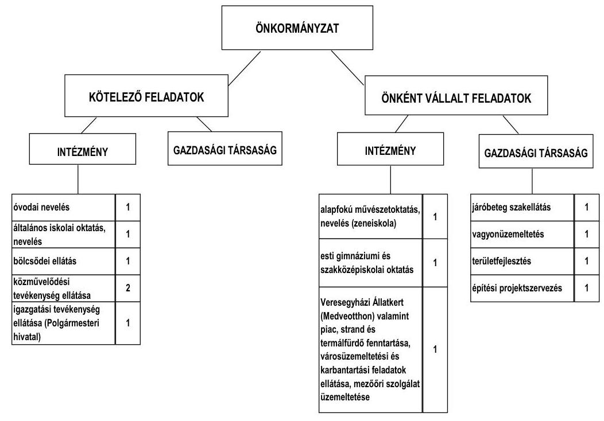

---

Az Önkormányzat feladatait 2011. június 30 -án (a Polgármesteri hivatallal együtt) kilenc költségvetési szervvel látta el. A feladatok ellátását végző költségvetési szervek száma a 2006. évről a 2011. év I. félév végére - a Meseliget Bölcsőde 2007. évi 10 ezer fő lakosságszám felett kötelező megalapítása után nyolcról kilencre nőtt. A feladatellátás telephelyeinek száma 23 -ról - a Napkö-zi-otthonos Óvoda 2007. és 2009. évi egy-egy, a bölcsőde 2007. évi egy, valamint a Zeneiskola 2007. évi egy bővítését is figyelembe véve - 27 -re nőtt.

A köztemető fenntartása kötelező feladatot a GAMESZ, a további önként vállalt feladatok közül a helytörténeti néprajzi emlékek gyüjtését és gondozását - a Tájházban - a Művelődési Ház, valamint a polgár- és városőrség múködtetését a Polgármesteri hivatal látta el. Az Önkormányzat kollégiumot, kórházat, szociális intézményeket, tűzoltóságot, sportlétesítményeket a vizsgált időszakban nem tartott fenn.

Az Önkormányzat kizárólagos tulajdonában négy gazdasági társaság állt a 2011. év I. féléve végén, amelyek az önként vállalt feladatok ellátásában (járóbeteg szakellátásban, vagyonüzemeltetésben, területfejlesztésben, építési projekt szervezésben) vettek részt. A gazdasági társaságok közül kettő a teljes vizsgált időszakban múködött, egyet a 2009. évben alapítottak, valamint egyet a 2010. évben vásároltak. A 2009. évben alapított és a 2010. évben megvásárolt gazdasági társaság pénzügyi egyensúlyi helyzete a vizsgált időszakban egyaránt stabil volt. Az Önkormányzat további két - járóbeteg szakellátást és területfejlesztést végző - kizárólagos tulajdonában álló gazdasági társaságának a pénzügyi egyensúlyi helyzete nem volt stabil, veszteségesen gazdálkodott, emiatt eredménytartalékaik negatívak voltak. A Misszió Kft.-nek a 2008. évben 33,2 millió Ft, 2009-ben -127,8 millió Ft, 2010-ben -257,3 millió Ft és a Veresegyház és Térsége Fejlesztéséért Nonprofit Kft.-nek 2007-ben -5,7 millió Ft, 2008-ban -7,2 millió Ft, 2009-ben -2,6 millió Ft, valamint 2010-ben 2,9 millió Ft negatív eredménytartaléka volt.

A Misszió Kft. instabil pénzügyi egyensúlyi helyzetét elsősorban az OEP alulfinanszírozás okozta, amely miatt indított pert is nyert az OEP ellen. A Misszió Kft.-nek az Önkormányzattal szembeni rövid lejáratú kölcsönből adódó kötelezettsége 2011. június 30 -án 109,5 millió Ft, valamint pénzintézettel szembeni hitelállománya 35,0 millió Ft volt, amelyek az önkormányzati feladatellátáshoz kapcsolódtak, ezért a gazdasági társaság pénzügyi egyensúlyi helyzete múködési kockázatot jelent az Önkormányzat számára. A Veresegyház és Térsége Fejlesztéséért Nonprofit Kft.-nek 2009-2010 között a saját tőke/jegyzett tőke aránya 50,0\% alatti volt. A gazdasági társaság 2009-2010. évi beszámolóját a vizsgált időszakban nem terjesztették a Képviselő-testületet elé.

Múködési célú kiadásokra a 2007. évben 2582,8 millió Ft-ot, 2008-ban 3212,6 millió Ft-ot, 2009-ben 2956,3 millió Ft-ot, 2010-ben 3413,4 millió Ft-ot fordított az Önkormányzat. A múködési kiadásoknak a 2007. évben 60,1\%-át (1553,4 millió Ft-ot), a 2010. évben 57,9\%-át (1974,8 millió Ft-ot) az intézményeknél, valamint 2007-ben 39,9\%-át (1029,5 millió Ft-ot), 2010-ben 42,1\%-át (1438,6 millió Ft-ot) a Polgármesteri hivatalnál realizálták.

---

A közszolgáltatások feladatellátásában résztvevő intézmények ágazatonkénti múködési kiadásainak finanszírozási forrásösszetételét a 2007. és a 2010. években a következő ábra szemlélteti:
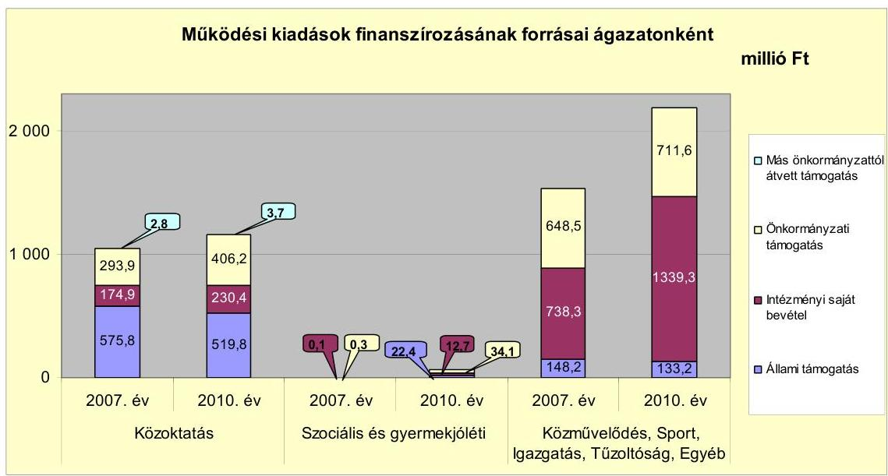

Az Önkormányzatnál a vizsgált időszakban az állami támogatás a közoktatási feladatok ellátásához 56,0 millió Ft-tal, a közművelődési intézmények működtetéséhez 15,2 millió Ft-tal, valamint az igazgatási feladatok ellátásához 7,4 millió Ft-tal csökkent. A gyermekjóléti intézmény múködtetéséhez biztosított - az Önkormányzatnál először az új Meseliget Bölcsőde intézmény múködtetésének megkezdése miatt a 2008. évben igénybe vett - állami támogatás a 2009. évben 11,8 millió Ft-tal nőtt, majd az előző évhez viszonyítva a 2010. évben 1,4 millió Ft-tal csökkent. Az intézmények csökkenő állami támogatását az önkormányzati támogatás növelésével ellensúlyozták, amely kockázatot jelent az Önkormányzat pénzügyi egyensúlyi helyzetének alakulására. Az intézményi saját bevétel a vizsgált időszakban a közoktatási feladatok ellátásánál 55,5 millió Ft-tal, a gyermekjóléti intézménynél 12,6 millió Ft-tal, a közművelődési intézmények működtetése során 1,1 millió Ft-tal, az igazgatásban 5,1 millió Ft-tal, a GAMESZ feladatellátásában 237,0 millió Ft-tal, valamint a Polgármesteri hivatalnál 357,8 millió Ft-tal nőtt. A többletet elsősorban a Polgármesteri hivatal adóbevételének növekedése, a követelések folyamatos behajtása, a GAMESZ-nál az egyéb feladatellátás során a szolgáltatási díjbevételek, a Veresegyházi Állatkert (Medveotthon) látogatottsága növekedése miatti bevételi többletek eredményezték, valamint keletkezéséhez az általános iskolánál befolyt intézményi térítési díj bevételek is hozzájárultak.

A vizsgált időszakban a kötelező feladatok ellátását biztosító szervezeti keretekben a bölcsőde és két új telephelyen óvodai tagintézmények indítása okozott változást. Az Önkormányzat a bölcsődei és óvodai folyamatosan növekvő múködési célú kiadásokhoz a 2007-2009. évi átlagos 192,0 millió Ft-ot a 2010. évben 33,0\%-kal (63,3 millió Ft-tal) meghaladó önkormányzati támogatással járult hozzá. Az önként vállalt feladatok ellátásánál a Zeneiskola vácdukai telephellyel bővítése Önkormányzatot érintő többlet kiadását Vácduka Község Önkormányzata megtérítette.

---

A vizsgált időszakban az önként vállalt feladatok működési kiadásai a 20072009. év átlagához viszonyítva a 2010. évben 35,5 millió Ft-tal (7,4\%-kal) csökkentek. A kötelező feladatok ellátását biztosító szervezeti keretekben bekövetkezett változások összességében kedvezőtlen hatással voltak az Önkormányzat pénzügyi egyensúlyi helyzetének alakulására. Az Önkormányzat múködési költségvetése ennek ellenére valamennyi vizsgált évben múködési többletet mutatott.

Az Önkormányzat folyó költségvetési egyenlegét, pénzügyi kapacitását és tőketörlesztését 2007-2010 között az alábbi ábra mutatja:
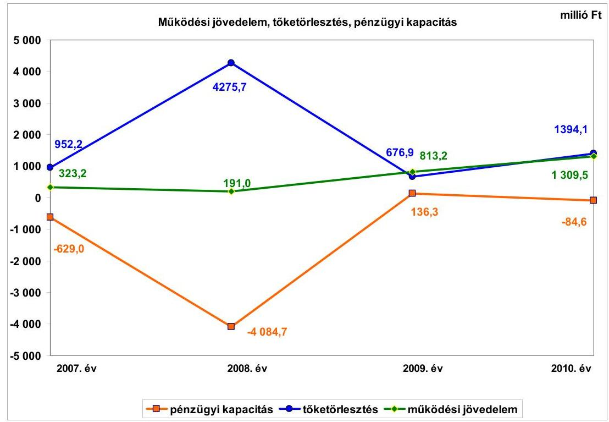

Az Önkormányzat folyó költségvetési egyenlege (múködési jövedelem) 2007-2010. évek között összesen 2636,8 millió Ft megtakarítást mutatott. A folyó bevételek növekedésében meghatározó szerepe volt a saját múködési bevételeknek, amelyek 2010-ben 1418,9 millió Ft-tal (38,0\%) haladták meg a 20072009. évek átlagát, ezen belül a legnagyobb növekedés a helyi adóbevételeknél jelentkezett, amely $86,6 \%$ növekedést (1491,1 millió Ft) jelez.

A pénzügyi kapacitás (nettó múködési jövedelem) a 2009. évet kivéve negatív értéket mutatott, melynek oka, hogy az éves átlagban 159,4\%-os ütemben emelkedő múködési jövedelem csak 2009-ben fedezte az adott évi egyéb likvid hitel tőketörlesztését ( 676,9 millió Ft-ot). Kiugróan alacsony a pénzügyi kapacitás 2008. évi adata, mivel ebben az évben a 4582,3 millió Ft összegű kötvénykibocsátásokkal kiváltott 4194,1 millió Ft adósságszolgálattal együtt 4275,7 millió Ft összegű tőkét törlesztettek.

Az Önkormányzat feladatai ellátása érdekében a 2007. évben 3154,1 millió Ft, a 2008. évben 3849,8 millió Ft, a 2009. évben 4195,3 millió Ft, a 2010. évben 5152,1 millió Ft folyó bevételt teljesített. A folyó bevételek körében leginkább

---

meghatározó volt a helyi adókból beszedett bevétel, amelyek átlagosan 51,9\%ot ( 9761,9 millió Ft -ot) tettek ki. A folyó bevételek között a költségvetési támogatás és az átengedett bevételek együttes összege a második legnagyobb részaránnyal rendelkezett, amelyek átlagos költségvetési aránya 18,8\% ( 3534,9 millió Ft) volt a vizsgált időszakban. Az Önkormányzatnál működési kockázatot jelent, hogy nincs új helyi adó bevezetési lehetősége. Az Önkormányzat adatszolgáltatása szerint 270,0 millió Ft behajtható adóhátraléka van. Az iparűzési adó a helyi adókról szóló 1990. évi C. tv-ben előírt felső határon került bevezetésre, a 2011-től érvényes adómértékekhez viszonyítva az építményadónál $36,2 \%$-a, a telekadónál $49,8 \%$-a, a magánszemélyek kommunális adójánál $62,4 \%$-a, az idegenforgalmi adónál $66,3 \%$-a a bevezetett adómérték a helyi adókról szóló törvényben rögzített felső határnak.

Az Önkormányzat folyó kiadásai a 2010. évben - a bővülő intézményhálózat által igénybevett szolgáltatások, illetve a beruházások fordított áfa befizetései miatt - a 2007-2009. évek 3290,6 millió Ft-os átlagához viszonyítva 16,8\%$\mathrm{kal}(552,0$ millió Ft-tal) emelkedtek. A 2011. év I. félévében a folyó kiadások 1918,8 millió Ft-ot, a 2007. évi folyó kiadások 67,8\%-át tették ki. Működési kockázatot jelent, hogy a fejlesztések során megvalósított létesítmények jövőbeni üzemeltetésénél nem számszerűsítették a várható kiadásokat.

A 2007-2010. években az Önkormányzat felhalmozási költségvetésének egyenlege negatív összegú volt, összesen 3642,2 millió Ft felhalmozási forráshiányt mutatott. A felhalmozási forráshiány oka, hogy 2007-2010. között összességében 4860,0 millió Ft összegű beruházás és felújítás fejeződött be (bölcsőde és óvodaépítés, útépítések) és 1444,8 millió Ft összegben ingatlanvásárlások történtek. A fejlesztési bevételek volumenét alapvetően a fejlesztésekhez kapcsolódó EU-s támogatások határozták meg, melyeket az Önkormányzat telekeladásaiból származó bevételek és a visszatérülő kölcsönök összege egészített ki. Az összes felhalmozási bevétel 2007-2010. években 4677,8 millió Ft volt. A folyamatban lévő fejlesztésekből 2010. év végéig 1091,2 millió Ft felhalmozási ráfordítás történt, amelyek megvalósításához 2929,5 millió Ft hitel igénybevételére volt szükség. A 2011. év I. félévben indult fejlesztések közül 560,0 millió Ft hitel felhasználásával 895,5 millió Ft összegű felújítás és beruházás valósult meg.

A pénzügyi egyensúlyi helyzet alakulását alapvetően meghatározta az Önkormányzat fejlesztési tevékenysége. A fejlesztési kiadások az összes kiadás 37,8\%-át tették ki a 2007-2010. évek közötti időszakban. A 2007-2010. évek időszakában befejeződött 6304,8 millió Ft értékű fejlesztés és felújítás forrása a 2502,5 millió Ft (39,7\%) saját erő és az 1123,0 millió Ft (17,8\%) hazai- és EU-s támogatások mellett 2679,3 millió Ft hitelfelvétel és kötvénykibocsátás (42,5\%) volt.

A 2010. december 31-én folyamatban lévő fejlesztési feladatok végrehajtására 2010. év végéig 1139,1 millió Ft kiadást teljesítettek, amelyre hitelből 250,2 millió Ft-ot (22,0\%), saját forrásból 303,0 millió Ft-ot (26,6\%), EU-s támogatásból 585,9 millió Ft-ot (51,4\%) fordítottak.

A vizsgált időszakban igénybe vett, összesen 1621,0 millió Ft EU-s támogatásból megvalósult fejlesztések finanszírozása is fokozta az Önkormányzat likviditási

---

problémáját, mivel az utófinanszírozás miatt az intézményi beruházások EU-s támogatását likvid hitelből kellett megelőlegezni. A pályázott források likvid hitelből történő előfinanszírozása pénzügyi kockázatot jelentett.

Az Önkormányzat 2010. december 31-én folyamatban lévő és a 2011. év I. félévben induló fejlesztési feladatok kötelezettségvállalásainak összege 6396,5 millió Ft volt, amelyből 1010,3 millió Ft-ot ( $15,8 \%$-ot) hitel (előkészítés alatt) felvételéből, 4451,5 millió Ft-ot (69,6\%-ot) EU-s támogatásból és 934,7 millió Ft-ot ( $14,6 \%$-ot) saját forrásból terveznek biztosítani. A tervezett hitel felvétele kockázatot jelent a vállalt fejlesztések jövőbeni finanszírozhatósága szempontjából. A folyamatban lévő fejlesztéseknél kockázatot jelent, hogy állami előfinanszírozást nem vettek igénybe, szabad pénzeszkózből az előfinanszírozás nem oldható meg, a rendelkezésre álló folyószámlahitel-keret teljes egészében kimerült.

A 2010. december 31-én fennálló és 2011. év I. félévben induló felhalmozási kötelezettségvállalások forrásösszetételét a következő ábra mutatja be:
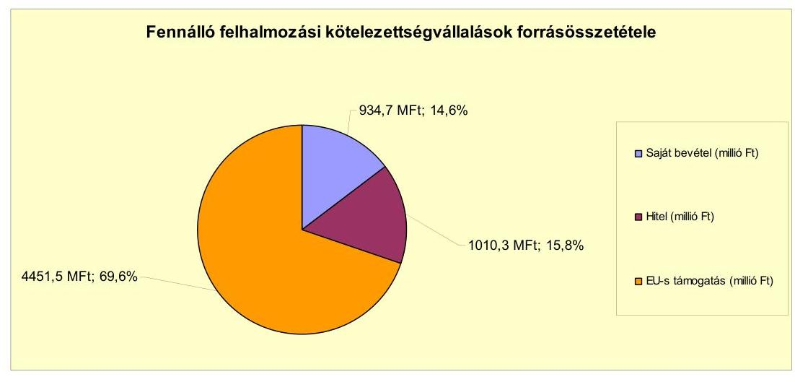

Az Önkormányzat a 2010. december 31-én folyamatban lévő és 2011. év I. félévben induló fejlesztési feladatainak 2010. évet követő kötelezettségvállalásaihoz tervezett összesen 934,7 millió Ft saját forrást a képződő működési jövedelméből kívánja biztosítani, amelynek teljesíthetősége az adósságszolgálati terhek miatt kétséges. A jelenleg ismert feltételek mellett 2011-2013. években várhatóan 404,9 millió Ft és 6211877 CHF , a 2014. évet követően 348,2 millió Ft és 27288661 CHF pénzintézeti kötelezettsége áll fenn. Az adósságszolgálati terhek miatt az Önkormányzatnak a 2011. év utáni felhalmozásoknál finanszírozási kockázattal kell számolnia.

Az Önkormányzat által beadott, elbírálás alatt álló pályázat tervezett teljes bekerülési költsége 273,0 millió Ft volt, amelyhez 173,0 millió Ft-ot (63,4\%ot) hitel felvételéből, 100,0 millió Ft-ot ( $36,6 \%$-ot) EU-s forrásból terveznek biztosítani.

Az Önkormányzat pénzintézetekkel szemben fennálló kötelezettsége a 2007. év elejétől a 2011. év I. félév végére 3857,6 millió Ft-ról 6347,4 millió Ftra, $64,6 \%$-kal nőtt, amelyből az árfolyamváltozás miatti különbözet

---

1693,3 millió Ft. A 2011. június 30 -án fennálló pénzintézeti kötelezettség két hosszú lejáratú fejlesztési hitelből, folyószámla- és munkabér-megelőlegezési hitel igénybevételéből, valamint a kötvénykibocsátásból keletkezett. A 6347,4 millió Ft összes pénzintézeti tartozás $91,9 \%$-át a 2008. évben kibocsátott kötvények teszik ki. A Képviselő-testület döntése alapján a „Veresegyház 2028 I-III" elnevezésű zártkörű svájci frank alapú kötvények kibocsátásából származó 29009786 CHF-ből, 4582,3 millió Ft-ból 4363,3 millió Ft-ot a meglévő hitelállomány (fejlesztési hitel, folyószámla- és munkabér-megelőlegezési hitel), a vállalkozásoktól felvett kölcsöntartozás és járulékainak rendezésére, 200,6 millió Ft-ot fejlesztési feladatokra és 18,4 millió Ft-ot múködési kiadásokra használtak fel. A két év türelmi idő leteltével a 2010. évben megkezdődött a kötvények visszavásárlása. Valamennyi kötvény esetében a törlesztés félévente esedékes, az első részlet összege 401906 CHF, 263910 EUR, összesen 146,3 millió Ft volt. A kötvénnyel kapcsolatban az Önkormányzat 2011. június 30-ig összesen 2192863 CHF és 263910 EUR (532,2 millió Ft) összegű visszavásárlást, továbbá 1717152 CHF és 151901 EUR (559,6 millió Ft) kamatkiadást és 43,1 millió Ft egyéb díjkifizetést teljesített. A 2010-2011. év I. félévben a pénzügyi teljesítéskor realizált 33,8 millió Ft árfolyamveszteség, illetve 7,3 millió Ft nyereség könyvelése nem az Áhsz. 9. számú melléklet 4. pont dl), illetve a 9. c) és 14. a) alpontjaiban foglalt előirás szerint történt, mert az Önkormányzat finanszírozási kiadásként számolta el a realizált árfolyamkülönbözetet, amelyet veszteség esetén folyó kiadásként, nyereség esetén múködési bevételként kell könyvelni.

Az Önkormányzat a kötvényből származó pénzeszközöket 2008. március - április hónapok során felhasználta, így a későbbi években ebből szabad pénzmaradvánnyal nem rendelkezett. Az Önkormányzat pénzügyi egyensúlyi helyzetére a fennálló kötelezettségen belül meghatározó nagyságrendje miatt kiemelt kockázatot jelent a kötvénnyel kapcsolatos árfolyamváltozás hatása. A „Veresegyház 2028 I-II." kötvény esetében törlesztési kockázatot jelent a kötvény tulajdonosának a teljes futamidőre biztosított azon joga, amely szerint egyoldalú döntése alapján a mindenkor érvényes magyar fizetőeszközre konvertálhatja a tőketartozást, amennyiben a devizaárfolyamok alakulása a kötvényből származó fizetési kötelezettség teljesítését veszélyezteti. A „Veresegyház 2028 III." kötvény okiratában a devizaárfolyam lényeges változása, mint a kötelező lejárat előtti visszaváltás esete került rögzítésre.

Az Önkormányzat 2007. év elején hét fejlesztési hitelszerződés alapján fennálló 2657,8 millió Ft kötelezettsége a kötvényből történő törlesztést követően megszűnt. A vizsgált időszakban három fejlesztési célú hitelszerződést kötöttek, amelyekből 418,4 millió Ft hitelt hívtak le, ebből egy hiteltartozást a kötvényforrásból 2008-ban kiváltottak. A 2007. január 1-jén forintban fennálló hitelek után 2007-2011. év I. félév között 492,1 millió Ft tőketörlesztést és 240,9 millió Ft kamatkifizetést, a 2007-2011. év I. félév során visszafizetett, illetve kötvénnyel kiváltott korábbi CHF alapú fejlesztési hitelei után 14952386 CHF (2347,8 millió Ft) tőketörlesztést és 1239860 CHF (191,3 millió Ft) kamatkiadást teljesítettek. A 2011. június 30 -ig forintban felvett új hitelek után a vizsgált időszakban 61,8 millió Ft tőke és 35,8 millió Ft kamat megfizetése vált esedékessé. A hiteleket a Képviselő-testület döntésének megfelelően a költségvetésben tervezett beruházásokhoz használták fel.

---

Az Önkormányzat kötelezettségvállalásaira - a likvidhitelek kivételével - a Képviselő-testület döntései alapján került sor, az előterjesztésekben azonban nem mutatták be a kamat- és a devizaalapú kötelezettségeket érintő árfolyamkockázat, ebből adódóan a törlesztési kockázat várható alakulását. Az Önkormányzat hitelfelvételei és kötvénykibocsátása kapcsán a szerződéskötés időpontjában a törzsvagyon körébe tartozó ingatlanokat is felajánlottak fedezetként, amely ellentétes az Ötv., 88. § (1) bekezdés b) pontjában foglalt előírással. A fedezetként felajánlott törzsvagyonhoz tartozó ingatlanok esetében az átminősítés nem történt meg. A 2012. január 1-jétől hatályos Nemzeti vagyon tv. 3. § (1) bekezdés 18. pontja szerinti forgalomképes üzleti vagyon és - amennyiben az Önkormányzat rendeletében megengedően rendelkezik - a 3. § (1) bekezdés 6. és az 5. § (2) bekezdés c) pontjai szerinti korlátozottan forgalomképes törzsvagyon terhelhető meg az Önkormányzat kötelezettségeinek fedezeteként.

Az Önkormányzat költségvetésének pénzügyi egyensúlyát a vizsgált időszakban folyószámlahitel, likvid- és munkabér-megelőlegezési hitel igénybevételével tudta biztosítani. A folyószámla- és munkabér-megelőlegezési hitel igénybevétele a 2007-2011. év I. félévben a következők szerint alakult:

| Megnevezés | 2007. év | 2008. év | 2009. év | 2010. év | 2011. év I.   félév |
| :--: | :--: | :--: | :--: | :--: | :--: |
| Folyószámlahitel |  |  |  |  |  |
| Keretösszeg január 1-jén (millió Ft-ban) | 700,0 | 680,8 | 180,0 | 180,0 | 180,0 |
| Állagos napi állomány (millió Ft-ban) | 640,3 | 288,2 | 157,6 | 148,9 | 152,2 |
| Folyószámla hitellel zárt napok száma (nap) | 364 | 366 | 361 | 328 | 159 |
| Egyenleg (év végi állomány) | 671,6 | 173,0 | 176,2 | 109,7 | 132,4 |
| Munkabér-megelőlegezési hitel |  |  |  |  |  |
| Keretösszeg január 1-jén (millió Ft-ban) | 80,0 | 90,0 | 50,0 | 50,0 | 50,0 |
| Állagos napi állomány (millió Ft-ban) | 86,1 | 57,2 | 47,0 | 48,0 | 46,7 |
| Munkabér-megelőlegezési hitellel zárt napok száma (nap) | 360 | 335 | 328 | 307 | 159 |
| Egyenleg (év végi állomány) | 90,0 | 50,0 | 50,0 | 50,0 | 50,0 |

A folyószámlahitel tartozás a 2007-2009. években szinte folyamatos volt, a 2010. évtől tapasztalható csökkenő tendencia ellenére a folyószámlahitel az Önkormányzat esetében a likviditás biztosításához szükséges tartós forrássá vált. Az éves keretszerződés megszűnése időpontjában fennálló folyószámlahi-tel-állomány a 2007. évben 681,9 millió Ft, a 2008. évben 179,9 millió Ft, a 2009. évben 5,4 millió Ft, a 2010. évben 179,1 millió Ft és a 2011. évben 64,7 millió Ft volt. A fizetőképesség pénzintézeti forrásból történő biztosítása az Önkormányzatnak 2007-2011. év I. félévben összesen 150,6 millió Ft kamatkiadást jelentett.

Az Önkormányzat kötelezettségeinek 2010. december 31-i, valamint 2011. június 30-i állományát és a várható tőke és kamatfizetési kötelezettség összegét a kötelezettségek lejáratáig a következő táblázat szemlélteti:

---

| Megnevezés | Allomány   2010. december 31-én |  |  | Allomány   2011. június 30-án |  |  | Várható kötelezettség 2011-2013. években |  | Várható kötelezettség 2014. évtöl |  |
| :--: | :--: | :--: | :--: | :--: | :--: | :--: | :--: | :--: | :--: | :--: |
|  | HUF-ban (móto: Ftban) | Devizában (összege, ezer CHFben) | Deviza nem | HUF-ban (móto: Ftban) | Devizában (összege, ezer CHFben) | Deviza   nem | HUF-ban (móto Ftban) | Devizában (összege, ezer CHFben) | HUF-ban (móto Ftban) | Devizában (összege, ezer CHFben) |
| Pénzintézeti kötelezettségek |  |  |  |  |  |  |  |  |  |  |
| Folyószámlaítéé | 108,7 |  | HUF | 132,4 |  | HUF | 132,4 |  |  |  |
| Murkabérhőei | 50,0 |  | HUF | 50,0 |  | HUF | 50,0 |  |  |  |
| Beruházási hitel 2009. | 162,3 |  | HUF | 137,2 |  | HUF | 183,5 |  |  |  |
| Beruházási hitel 2011. (260,5 mF) keretszecsítés) | 0,0 |  | HUF | 37,4 |  | HUF | 39,0 |  | 348,2 |  |
| Veresegyház 2028 I. kötvény |  | 13 125,3 | CHF |  | 12749,9 | CHF |  | 3 155,5 |  | 13 238,7 |
| Veresegyház 2028 II. kötvény |  | 8 125,9 | CHF |  | 7887,7 | CHF |  | 1 723,1 |  | 8 497,9 |
| Veresegyház 2028 III. kötvény |  | 5695,5 | CHF |  | 5532,8 | CHF |  | 1333,3 |  | 5592,1 |
| Pénzintézeti kötelezettségek összesen HUF-ban | 322,0 |  | HUF | 357,0 |  | HUF | 404,9 |  | 348,2 |  |
| Pénzintézeti kötelezettségek összesen CHF-ben |  | 26 946,7 | CHF |  | 26170,4 | CHF |  | 6211,9 |  | 27288,7 |
| Pszesság | 264,5 |  | HUF | 264,5 |  | HUF |  |  |  |  |
| Biztosítékek összesen: | 264,5 |  | HUF | 264,5 |  | HUF |  |  |  |  |
| Szállító tartozás | 346,5 |  | HUF | 198,4 |  | HUF | 198,4 |  |  |  |
| Rövid lejáratú kölcsöntartozás | 1387,0 |  | HUF | 1595,7 |  | HUF | 1994,0 |  |  |  |
| Egyéb kiadás elmaradás | 27,6 |  | HUF | 0,0 |  |  |  |  |  |  |
| Egyéb kötelezettségek | 614,2 |  | HUF | 92,0 |  |  | 92,0 |  |  |  |
| Mindösszesen | 2561,0 |  | HUF | 2507,6 |  | HUF | 2689,3 |  | 348,2 |  |
|  |  | 26 946,7 | CHF |  | 26170,4 | CHF |  | 6211,9 |  | 27288,7 |

Az Önkormányzat 2011. június 30-án fennálló pénzintézeti kötelezettsége 357,0 millió Ft, valamint 26170391 CHF volt, amelyből a 2011-2013. években a jelenleg ismert feltételek mellett várhatóan 404,9 millió Ft és 6211877 CHF tőke és kamatfizetési kötelezettsége keletkezik. Az Önkormányzatnak a 2011. év I. félév végén szállítói tartozások, rövid lejáratú kölcsönök és egyéb kötelezettségek jogcímén összesen 1886,1 millió Ft fizetési kötelezettsége volt. A szállítói kitettséget okozó 195,7 millió Ft lejárt tartozás összes szállítói állományon belüli aránya 2011. június 30-án kiugróan magas ( $98,7 \%$ ) volt, ennek oka a 129,6 millió Ft szállítói finanszírozású EU projektek kifizetetlen számlái voltak. A 2011. június 30-án a Szennyvízközmű Társulás hitelével kapcsolatban vállalt készfizető kezességvállalásból származó kötelezettség 264,5 millió Ft volt.

A 2011-2013. évek várható kötelezettségeinek teljesítéséhez az Önkormányzat szabad pénzmaradvánnyal nem rendelkezik. A 2011. év után várható kötelezettségállomány fedezete részben a múködésben képződő jövedelemből biztosítható. Az Önkormányzatnál változatlan központi finanszírozási feltételek és saját bevételi struktúra esetén továbbra is pozitív múködési egyenleg várható, amely azonban az adósságszolgálat teljes összegére nem nyújt fedezetet. A felhalmozási kockázat csökkentése - a felhalmozási költségvetés egyensúlyának megteremtése - a finanszírozhatóság elsődleges feltétele. A jövőbeli kötelezettségek fedezeteként figyelembe vehető a mérlegben szereplő 1137,1 millió Ft követelésből fennálló 645,0 millió Ft beszedhető helyi adó (kiemelten iparúzési adó), vevő- és kölcsöntartozás. A 2014. évet követően a jelenleg ismert feltételek alapján a pénzintézeti kötelezettségek várható tőke és kamatfizetési kötelezettsége 348,2 millió Ft, továbbá 27288661 CHF , melynek fedezetét részben a múködésben megképződött jövedelem jelentheti.

A likviditás biztosításához az Önkormányzat 2007-2011. év I. félév között egyre növekvő mértékben vett igénybe gazdálkodó szervezetektől, magánszemélyek-

---

től kölcsönöket. A polgármester a költségvetési rendeletekben kapott felhatalmazásban szereplő értékhatárt jelentős mértékben túllépve 2007-2011. év I. félév során összesen 8264,5 millió Ft összegben vett igénybe likvidhitelt, illetve kölcsönt, melyek után a kamatfizetési kötelezettség összesen 814,8 millió Ft volt. Az Önkormányzat számára pénzügyi kockázatot jelent a likviditás gazdálkodó szervezetektől, magánszemélyektől felvett kölcsönökkel való biztosítása. E kölcsönök kamata magasabb volt a pénzintézetek által felszámított legmagasabb forint likvidhitel kamatánál (3 havi BUBOR + 3,75\%). A kötelezettségvállalásra 2007-2011. év I. félév között 145 esetből 119 esetben ellenjegyzés nélkül került sor, amely ellentétes a 2008. december 31-ig hatályos Áht. 1 98. § (2) bekezdésében, a 2009. január 1-jétől 2010. augusztus 14-ig hatályos Áht. ${ }_{1}$ 100/B. § (3) bekezdésében, a 2010. augusztus 15-től hatályos Áht. ${ }_{1}$ 100/C. § (3) bekezdésében, továbbá a 2009. december 31-ig hatályos Ámr. ${ }_{1}$ 134. § (8) bekezdésében, illetve a 2010. január 1-jétől hatályos Ámr. ${ }_{2}$ 74. § (1) bekezdésében foglalt előírással.

A 2009. december 31-ig hatályos Ámr. ${ }_{1}$ 134. § (2) bekezdése értelmében a helyi önkormányzat esetében a kötelezettség ellenjegyzésére a jegyző vagy az általa felhatalmazott személy volt jogosult. A 2010. január 1-jétől hatályos Ámr. ${ }_{2}$ 74. § (2) bekezdés f) pontja értelmében az ellenjegyzésre a jegyző, vagy az általa írásban kijelölt, a Polgármesteri hivatal állományába tartozó köztisztviselő írásban volt jogosult.

A 2010. augusztus 15-től hatályos Ámr. ${ }_{2}$ 74. § (1) bekezdése szerint az ellenjegyzést az ellenjegyzés dátumának és az ellenjegyzés tényére történő utalás megjelölésével, az arra jogosult személy aláírásával kellett igazolni. Az ellenjegyzés elmaradása esetén a 2009. december 31-ig hatályos Ámr. ${ }_{1}$ 134. § (9) bekezdés b) pontja, illetve a 2010. január 1-jétől hatályos Ámr. ${ }_{2}$ 74. § (3) bekezdés b) pontjában foglalt előírástól eltérően nem történt meg az ellenjegyzést megelőzően annak vizsgálata, hogy a kifizetés időpontjában a fedezet rendelkezésre áll. A kötelezettségvállalásra a kölcsönszerződések ellenjegyzésének hiányosságai mellett, a közbeszerzési eljárásra vonatkozó szabályok mellőzésével került sor.

Az Önkormányzat a Ptk. 523. § (1) bekezdése szerinti kölcsönszerződésekből adódó egy éven belül esedékes kötelezettségét az Áhsz. 26. § (5) bekezdés a) pontjában foglalt előírással ellentétben nem rövid lejáratú kölcsönként, hanem hitelként mutatta ki a mérlegében.

Az Önkormányzat pénzügyi stabilitására negatívan hatott a kölcsönkövetelések állományának a 2007. év végi 135,8 millió Ft-ról 2011. június 30 -ára 357,1 millió Ft-ra, 163,0\%-kal történő növekedése. Az Önkormányzat költségvetésében szereplő előirányzat terhére folyósított kölcsönök finanszírozási többletterhet okoztak, mivel a kihelyezett pénzeszközöket részben kölcsönforrásból fedezték. A polgármester 2007-2010 között a vagyonrendelet 17. § g) pontjában és a 2011. évtől a költségvetési rendelet 24. § (4) bekezdésében kapott felhatalmazás szerinti 100,0 millió Ft értékhatárt meghaladóan rendelkezett kölcsön folyósításáról, amely a 2008. december 31-ig hatályos Áht. ${ }_{1}$ 98. § (2) bekezdésében, a 2009. január 1jétől hatályos Áht. ${ }_{1}$ 100/B. § (3) bekezdésében, a 2010. augusztus 15-től hatályos Áht. ${ }_{1}$ 100/C. § (3) bekezdésében, továbbá a 2009. december 31-ig hatályos

---

Ámr. 134. § (8)-(9) bekezdéseiben, illetve a 2010. január 1-jétől hatályos Ámr. ${ }_{2} 74 . \S$ (1)-(3) bekezdéseiben foglalt előírásokkal ellentétes volt.

Az Önkormányzat rendeleteiben a kihelyezett kölcsönállományra vonatkozó értékhatár alakulását nem követték figyelemmel, a Képviselőtestület 2011. évre megállapított 100,0 millió Ft kihelyezhető korlát összegéhez képest az I. félévben folyósított kölcsönökből 2011. június 30 -án 134,3 millió Ft volt a kintlevőség összege. A polgármester 2009. április 2. és december 18. között egy vállalkozás részére hat részletben, összesen 62,5 millió Ft átutalását rendelte el, amelyről írásbeli szerződés nem készült. A követelést később az adós írásbeli szerződés hiányában vitatta, így a 2010. évi mérlegkészítéskor a követelés után értékvesztést számoltak el. Az írásbeli kölcsönszerződés mellőzésével megsértették a Számv. tv. bizonylati elv és bizonylati fegyelemre vonatkozó 165. § (1) bekezdésében foglalt előírásait, továbbá a 2009. évben hatályos Áht. ${ }_{1} 100 /$ B. § (3) bekezdése szerint a kötelezettségvállalás írásban történő elvégzésének nem tettek eleget.

A 2007-2011. év I. félévben rendszeresen (56 kölcsönügyletből hét esetben) kamat fejében történt kölcsönnyújtás ellentétes a Hpt. 3. § (1) bekezdés b) pontjában, a 3. § (3) bekezdésében, a 4. § (2) bekezdésében, valamint 2. számú melléklet III/22. pontjában foglalt előírásokkal, melyek értelmében pénzügyi szolgáltatást (pénzkölcsön üzletszerű nyújtását) kizárólag pénzügyi intézmény végezhet. Az Önkormányzat kölcsön folyósításából származó követelései biztosítása érdekében az 56 kölcsönügyletből két eset kivételével nem gondoskodtak a szerződésben biztosíték, fedezet kikötéséről.

Az Önkormányzat pénzügyi egyensúlyi helyzetére a kizárólagos tulajdonában álló gazdasági társaságok 2011. június 30 -án fennálló kötelezettségei az egymással szembeni tartozások figyelembevétele nélkül 138,4 millió Ft kiemelt kockázatot nem jelentenek. A gazdasági társaságok lejárt szállítói tartozását - 2010. december 31-én összesen 89,8 millió Ft, ebből a 60 napon túli 63,2 millió Ft - az Önkormányzat nem kísérte figyelemmel, a Képviselőtestület elé terjesztett beszámolókban erre vonatkozó tájékoztatás nem szerepelt.

A 2007-2010 között az immateriális javak, a tárgyi eszközök és az üzemeltetésre átadott eszközök után elszámolt 1616,5 millió Ft értékcsökkenéstől jelentősen elmaradt a befejezett felújítások 121,2 millió Ft bekerülési értéke. A 6036,2 millió Ft összes fejlesztésből mindössze 250,0 millió Ft-ot, 4,1\%-ot fordítottak eszközpótlásra, a használhatósági fok a 2010. évben $92,4 \%$ volt. A zárszámadás keretében nem mutatták be az értékcsökkenés és az elhasználódott eszközök pótlására fordított összegek alakulását, az eszközök használhatósági fokát.

Az Önkormányzat az ellenőrzött időszakban bevételt növelő intézkedéseket tett, melyekkel nem tudta stabilizálni a pénzügyi egyensúlyi helyzetét. A 2007-2011. év I. félév között tett intézkedések hatására 732,6 millió Ft bevételi többletet mutattak ki. Az óvodai csoportbővülések, a 76 férőhelyes bölcsőde beindulása, az iskola egészségügyi és a Polgármesteri hivatal közigazgatási feladatbővülése álláshely- és egyben létszámnövekedéssel jártak. Ennek következtében az időszak álláshelyeinek száma 63 fővel nőtt. A bevételnövelő intézke-

---

dések helyi adóbevételek növeléséhez és az eszközök hasznosításához kapcsolódtak. Az Önkormányzat kiadásmegtakarító intézkedéseket eddig nem tett.

Az utóellenőrzés a pénzügyi egyensúly javítására - az ÁSZ által az Önkormányzat gazdálkodási rendszerének 2008. évi átfogó jellegű ellenőrzése során tett öt szabályszerűségi és hét célszerűségi javaslat hasznosítására terjedt ki.

A jegyző ${ }_{2}$ négy szabályszerűségi javaslatra megtett intézkedései eredményeképpen biztosította a 2009. évi költségvetési rendeletben a költségvetés bevételi és kiadási főösszegének finanszírozási célú pénzügyi műveletek nélküli bemutatását. Gondoskodott arról, hogy az intézkedési tervben meghatározott 2009. február 15-től az adósságot keletkeztető éves kötelezettségvállalásnak a felső határát a gazdálkodás során betartsák. Gondoskodott továbbá arról, hogy a 2009. évi költségvetési rendelet tartalmazza elkülönítetten bemutatva az EU-s támogatással megvalósuló projektek bevételeit és kiadásait, valamint a többéves kihatással járó fejlesztési feladatokat számszerűsítve, éves bontásban.

A jegyző ${ }_{2,3}$ egy szabályszerűségi javaslatot nem hasznosított, mert a költségvetési rendelet utolsó előirányzat módosításának határidejét az Ámr. ${ }_{1} 53 . \S$ (6) bekezdésében foglaltak ellenére a 2009-2010. években nem tartották be, azonban a 2011. évben már a módosítást az előírtak szerint végezték.

A polgármester számára tett három célszerűségi javaslatot részben hasznosították. Az Önkormányzat által finanszírozható fejlesztések megvalósítására, a pénzügyi egyensúly biztosítására, az adósságállomány keretek között tartására, a hitelek, a szállítói és kötvény tartozások kifizetésére vonatkozó javaslatok ellenére az Önkormányzat pénzügyi egyensúlyi helyzete nem javult, felhalmozási kiadása és hitelállománya tovább nőtt. A Képviselő-testület által a költségvetési rendeletben a likvid hitelek felvétele céljából meghatározott értékhatárt a 2009. évben 95,0 millió Ft-tal (15,8\%-kal), 2010-ben 337,0 millió Ft-tal (32,1\%kal), valamint 2011. I. félévben 795,7 millió Ft-tal ( $99,5 \%$-kal) túllépték. A feltárt hiányosságok felszámolására készített intézkedési tervben nem tértek ki erre a javaslatra és az ÁSZ 2009. január 16-ai figyelemfelhívó levelében foglaltak ellenére az intézkedési tervet nem egészítették ki.

A jegyző ${ }_{2,3}$ a pénzügyi egyensúly javítására tett három célszerűségi javaslatot részben hasznosított. A zárszámadási rendelettervezetben az adósságot keletkeztető éves kötelezettségvállalás felső határának betartását a 2009. évben nem, hanem az előírt határidőn túl először a 2010. évben mutatták be a Képvi-selő-testület részére. A követelések, hátralékok beszedése a tervezettől elmaradt. A Képviselő-testület elé terjesztett EU-s fejlesztési forrásokkal összefüggő fejlesztési döntések során a projektek utófinanszírozásából várható pénzügyi terhek hatásainak elemzésére, figyelembevételére nem került sor.

A jegyző ${ }_{2,3}$ a pénzügyi egyensúly javítására tett egy célszerűségi javaslatot nem hasznosított, mert nem kezdeményezték az önkormányzati többségi tulajdonú gazdasági társaságoknál a rendelkezésre álló erőforrásokkal való gazdálkodás, a vagyon megóvása, gyarapítása, az elszámolások, beszámolók megbízhatósága ellenőrzését.

---

Az Önkormányzat pénzügyi egyensúlyi helyzetét összegezve a következők emelhetők ki:

Veresegyház Város Önkormányzatánál a pénzügyi egyensúlyi helyzet rövid távú megteremtését követően, fegyelmezett költségvetési politikával - hosszú távon fenntartható. A múködési költségvetésben képződő növekvő többlet az adósságszolgálat kifizetését csupán 2009-ben tette lehetővé. A negatív pénzügyi kapacitás mellett az Önkormányzat 2007-2010 közötti felhalmozási költségvetése jelentős pénzügyi hiányt mutatott. A 2008. évben kibocsátott kötvényekből származó forrás meghatározó része az előző időszakban felhalmozódott tartozásállomány kiváltását, átütemezését szolgálta. A fejlesztési kiadásokat az Önkormányzat újabb pénzintézeti hitelekkel és gazdálkodó szervektől felvett kölcsönökkel finanszírozta. A pénzintézeti kötelezettségek jövőbeni teljesítése szempontjából a CHF alapú kötvénytartozás árfolyamváltozása és a kötvénytulajdonos konverziós joga kiemelt kockázatot jelent. A pénzintézeti és egyéb kötelezettségek jövőbeni teljesítéséhez szabad pénzmaradvány nem áll rendelkezésre. Az adósságszolgálat jövőbeni teljesítéséhez az önként vállalt feladatokra fordított kiadások visszafogásából tartalék képezhető. A gazdálkodó szervektől felvett kölcsönökből fennálló tartozás után az Önkormányzatnak 20,0, illetve 22,0\%-os kamatfizetési kötelezettsége keletkezett, amely jelentősen meghaladta a pénzintézettől felvett legdrágább hitel terheit. Az Önkormányzat pénzügyi stabilitására negatívan hatott a saját gazdasági társasága, egyéb gazdálkodók és magánszemélyek részére nyújtott kölcsönökből származó kintlévőség, illetve a kölcsönnyújtásból kamatmentesen kihelyezett pénzeszközök finanszírozási terhe. Az Önkormányzat adósságkezelési tevékenysége összességében nem volt eredményes. Az adósságot keletkeztető kötelezettségvállalások során a visszafizetés konkrét fedezetét nem határozták meg, a Képviselő-testület nem kapott tájékoztatást a törlesztés jövőbeni kockázatainak alakulásáról. Az Önkormányzat a kizárólagos tulajdonában lévő Misszió Kft. működését - annak bizonytalan pénzügyi egyensúlyi helyzete ellenére - nem ellenőrizte. A gazdasági társaság múködésének finanszírozásához tartósan tagi kölcsönre volt szükség. Ezen túl a Misszió Kft. hitele és lejárt szállítói tartozása kockázatot jelent az Önkormányzat számára.

Az Állami Számvevőszékről szóló 2011. évi LXVI. törvény 33. § (1) bekezdésében foglaltak értelmében a jelentésben foglalt megállapításokhoz kapcsolódó intézkedési tervet köteles az ellenőrzött szervezet vezetője összeállítani és azt a jelentés kézhezvételétől számított harminc napon belül az ÁSZ részére megküldeni. Amennyiben az intézkedési tervet határidőben nem küldi meg a szervezet, vagy az továbbra sem elfogadható, az ÁSZ elnöke a hivatkozott törvény 33. § (3) bekezdés a)-b) pontjaiban foglaltakat érvényesítheti.

# A 2011. június 30-i pénzügyi egyensúlyi helyzet alapján az ellenőrzés intézkedést igénylő megállapításai és javaslatai a következők: 

## a Polgármesternek

1. Az Önkormányzatnak a vizsgált időszakban a negatív pénzügyi kapacitása mellett jelentős összegű felhalmozási hiánya volt, amelyet külső forrásból finanszírozott. Kiemelt törlesztési kockázatot jelent a devizaalapú kötvények tulajdonosai konverziós

---

jogának érvényesítése. A likviditási problémák kezelését 2007-2011. év I. félév során pénzintézeti hitelek mellett egyre növekvő mértékben gazdálkodó szervezetektől, magánszemélyektől felvett rövid lejáratú kölcsönökkel oldották meg, melyek kamatterhe több esetben magasabb volt, mint a legmagasabb banki forint hitel után felszámított kamatláb. A pénzintézeti kamatnál magasabb kamatteher és a Képviselőtestület által meghatározott értékhatárt meghaladó gazdálkodó szervektől felvett kölcsönállomány pénzügyi kockázatot jelent. Az Önkormányzat kedvezőtlen pénzügyi egyensúlyi helyzete ellenére rendszeresen (56 esetből 49 alkalommal) nyújtott kölcsönt. A saját gazdasági társaság, a beruházásokban résztvevő gazdálkodók, valamint magánszemélyek részére folyósított kölcsönökkel összesen 21 esetben sértették meg a vagyonrendeletben, a 2011. évi költségvetési rendeletben és a Számv. tvben foglalt futamidőre, kamatmértékre, kölcsönök összegére vonatkozó előírásokat. A 60 napon túli lejárt esedékességű szállítói tartozások, bár nagyságrendjük nem meghatározó, a szállítói kitettség miatt kockázatot jelentenek. Az Önkormányzat bevételnövelő intézkedései nem biztosítottak elegendő forrást a pénzügyi egyensúly helyreállításához, kiadásmegtakarító intézkedéseket eddig nem tett. A folyamatban lévő fejlesztésekre a nettó múködési jövedelem nem nyújt fedezetet.

Az adósságszolgálat teljesítése szempontjából kockázatot jelentenek az önként vállalt feladatokra fordított kiadások, amelyek tartalékként szolgálhatnak egy jövőbeni forrás átcsoportosítást követően. Az adósságot keletkeztető kötelezettségvállalást, kezességvállalást megalapozó döntéseknél a Képviselő-testület nem kapott kellő részletezettségű tájékoztatást a kötelezettség jövőbeni teljesítését befolyásoló valamennyi kockázatról, a visszafizetés forrását tételesen nem határozták meg.

A polgármester - az ÁSZ által az Önkormányzat gazdálkodási rendszerének 2008. évi átfogó ellenőrzése során - a számára a pénzügyi egyensúly javítására tett három célszerűségi javaslatot részben hasznosította. A javaslatok részbeni hasznosítása ellenére az Önkormányzat pénzügyi egyensúlyi helyzete nem javult, felhalmozási kiadása és hitelállománya tovább nőtt. Az Önkormányzat pénzügyi egyensúlyi helyzetének rövid távú megteremtésén túl, annak hosszú távú fenntarthatósága az eddigieknél szigorúbb költségvetési fegyelmet és külön intézkedéseket igényel.

Javaslat:
Az Önkormányzat pénzügyi egyensúlyának gyors helyreállítása és hosszú távú fenntarthatósága érdekében kezdeményezze - felelősök és határidők megjelölésével - az alábbi intézkedések megtételét:
a) tárja fel a bevételszerző és kiadáscsökkentő lehetőségeket, intézkedjen a bevételek növelésére, a követelések, kintlévőségek hatékonyabb beszedésére, a kiadások csökkentésére;
b) tekintse át az önként vállalt feladatok finanszírozhatóságát a kötelező feladatellátás elsődlegességének biztosítása érdekében, mutassa be a Képviselő-testületnek a megoldás lehetőségeit, és szükség esetén a gazdasági program módosításának igényét;
c) gondoskodjon róla, hogy a pénzügyi stabilizáció érdekében csak kivételesen indokolt esetben kerüljön sor kölcsön nyújtására;

---

d) terjesszen a Képviselő-testület elé reorganizációs programot a kedvezőtlen pénzügyi folyamatok megállítására, a pénzügyi egyensúlyi helyzet gyors stabilizálására;
e) gondoskodjon az Önkormányzat likviditásának fenntartásáról, az Áht. 78. § (2) bekezdése és az Ávr. 122. § (2)-(3) bekezdései alapján készítendő likviditási terv felülvizsgálatáról, betartásáról. A fizetőképesség biztosításához elsődlegesen a pénzintézetektől származó, kedvezőbb kamatkondíciójú forrásokat vegyen igénybe, továbbá vegye figyelembe, hogy a Stabilitási tv. 10. § (4) bekezdése szerint müködési célra csak likvid hitel vehető fel. Biztosítsa, hogy a Képviselőtestület elé terjesztett EU-s fejlesztési forrásokkal összefüggő fejlesztési döntések során a projektek utófinanszírozásából várható pénzügyi terhek hatásainak elemzésére, figyelembe vételére sor kerüljön ${ }^{6}$;
f) vizsgálja meg a gazdálkodó szervekkel, magánszemélyekkel szemben fennálló likvid kölcsönök hosszú távú kötelezettséggé történő átalakításának jogi lehetőségét, és a Stabilitási tv. 10. §-ában előírt feltételek fennállása esetén kezdeményezze a Kormánynál ennek engedélyezését;
g) képezzen egyensúlyi (elkülönített) tartalékot az adósságszolgálat teljesítése érdekében, továbbá biztosítson külön tartalékot arra az esetre, amennyiben az árfolyam kedvezőtlen alakulása miatt a kötvénytulajdonosok élnek konverziós jogukkal;
h) vizsgálja felül teljes körűen a tervezett beruházásokat és azok fenntartásának jövőbeni pénzügyi kihatásait, szükség esetén tegyen javaslatot a Képviselőtestületnek a tervezett beruházásokkal kapcsolatos döntések módosítására, amelyben figyelembe veszik az Önkormányzat pénzügyi lehetőségeit, és a kötelező feladatellátás elsődlegességét;
i) mutassa be rendszeresen a Képviselő-testületnek a fél éven belül esedékes kötelezettségeinek finanszírozási forrásait;
j) tegyen intézkedéseket az Önkormányzat lejárt szállítói állomány rendezése céljából a jogszabályi következmények elkerülése érdekében;
k) a pénzügyi egyensúlyi helyzetre ható hosszú távú kockázatok kezelése érdekében hangolja össze a tartós kötelezettségvállalásokat a várható többletbevételekkel;
l) az adósságot keletkeztető kötelezettségvállalásról szóló döntéskor mutassa be a Képviselő-testületnek a jövőben várható - árfolyam-, kamat- és törlesztési - kockázatot. Kezességvállalásról szóló döntésnél mutassa be a Képviselő-testületnek azok pénzügyi kockázatait;

[^0]
[^0]:    ${ }^{6}$ Felhívjuk a figyelmet arra, hogy az ellenőrzéssel érintett időszakot követően, 2012. március 31-én hatályba lépett az egyes közpénzügyi tárgyú törvényeknek az államháztartás önkormányzati alrendszerét érintő módosításáról, és azok más törvényekkel való összhangjának biztositásáról szóló 2012. évi XVII. törvény, amely hatályon kívül helyezi a Magyarország gazdasági stabilitásáról szóló 2011. évi CXCIV. törvény 10. §ának (4) bekezdését. A jogszabály változását a javaslat végrehajtása során figyelembe kell venni.

---

m) gondoskodjon, hogy a jövőben az adósságot keletkeztető kötelezettségvállalásokról szóló képviselő-testületi előterjesztések tételesen tartalmazzák a visszafizetés forrásait.
2. Az Önkormányzat múködésében a kizárólagos tulajdonában álló gazdasági társaságokkal kapcsolatban kockázatot jelent a Misszió Kft. pénzügyi egyensúlyi helyzete. Kockázatot jelent továbbá, hogy a gazdasági társaságok lejárt határidejú szállítói állományát nem kísérték figyelemmel és arról a Képviselő-testületet nem tájékoztatták.

Javaslat:
Terjesszen intézkedési tervet a Képviselő-testület elé a Misszió Kft. kizárólagos tulajdonú gazdasági társasága pénzügyi egyensúlyi helyzetének stabilizálása érdekében. Tájékoztassa rendszeresen a Képviselő-testületet a gazdasági társaságai kötelezettségállományának, ezen belül lejárt esedékességú tartozásainak alakulásáról.
3. A 2007-2011. év I. félév között az Önkormányzat rendszeresen (56 kölcsönügyletből hét esetben) nyújtott kamat felszámításával kölcsönt, amely ellentétes a Hpt. 3. § (1) bekezdés b) pontjában, a 3. § (3) bekezdésében, a 4. § (2) bekezdésében, valamint a 2. számú melléklet III/22. pontjában foglalt előírásokkal, melyek szerint a pénzkölcsön üzletszerű nyújtása engedélyhez kötött tevékenység.

Javaslat:
Gondoskodjon róla, hogy az Önkormányzat kölcsönfolyósításai során ne sértse meg a Hpt. 3. § (1) bekezdés b) pontjában, a 3. § (3) bekezdésében, a 4. § (2) bekezdésében, valamint a 2. számú melléklet III/22. pontjában foglalt előírásokat, melyek szerint a pénzkölcsön üzletszerű nyújtása engedélyhez kötött tevékenység.
4. A 2007-2010. között az immateriális javak és tárgyi eszközök után elszámolt értékcsökkenés a befejezett felújítások értékétől jelentősen elmaradt. Az összes fejlesztésből minimális mértékű volt az eszközpótlásra fordított kiadások aránya. A Képviselőtestületnek nem mutatták be az értékcsökkenés és az eszközpótlás kiadásainak, továbbá az eszközök használhatósági fokának alakulását.

Javaslat:
Mutassa be a Képviselő-testületnek évente a zárszámadási rendelet előterjesztésében az értékcsökkenés összegét, és ezzel összevetve az elhasználódott eszközök pótlására fordított tényleges kiadásokat, az eszközök használhatósági fokának alakulását.
5. Az utóellenőrzés alapján az alábbi célszerűségi javaslatot nem hasznosították: a Kép-viselő-testület által a polgármesternek hitel, kölcsönfelvételre adott felhatalmazásban szereplő értékhatár betartását továbbra sem biztosították. A mérlegforduló-napi állományi adatok alapján a túllépés a 2009. évben 95,0 millió Ft (15,8\%), 2010-ben 337,0 millió Ft (32,1\%), valamint a 2011. I. félévben 795,7 millió Ft (99,5\%) volt.

Javaslat:
A 2012. évben tartsa be a Képviselő-testület által a hitel, kölcsön felvételére vonatkozó felhatalmazás szerinti értékhatárt. Gondoskodjon arról, hogy a 2013. január

---

1-jétől hatályba lépő Ötv. ${ }_{2}$ 42. § 4. pontjában foglaltaknak megfelelően hitel és kölcsön felvételéről, vagy más adósságot keletkeztető kötelezettségvállalásról, át nem ruházható hatáskörét gyakorolva, kizárólag a Képviselő-testület döntsön.

# a Jegyzönek 

1. A 2007-2011. év I. félév között a kapott kölcsönök esetében a jegyző ${ }_{1,2}$, az adott kölcsönöknél a jegyző ${ }_{1,2,3}$ a szerződések ellenjegyzését nem teljes körűen végezte el, ezáltal megsértette a 2008. december 31-ig hatályos Áht. ${ }_{1}$ 98. § (2) bekezdésében, a 2009. január 1-jétől 2010. augusztus 14-ig hatályos Áht. ${ }_{1}$ 100/B. § (3) bekezdésében, továbbá a 2010. augusztus 15-től hatályos Áht. ${ }_{1}$ 100/C. § (3) bekezdésében foglaltakat, illetve nem tartotta be a 2009. december 31-ig hatályos Ámr. ${ }_{1}$ 134. § (8)-(9) bekezdéseiben, illetve 2010. január 1-jét követően az Ámr. ${ }_{2}$ 74. § (1) bekezdésében, (2) bekezdés f) pontjában és az Önkormányzat gazdálkodási szabályzat ${ }_{1,2}$-ben foglalt előírásokat.

Javaslat:
Gondoskodjon róla, hogy 2012. január 1-jét követően a kötelezettségvállalást megelőző ellenjegyzés az Áht. ${ }_{2}$ 37. § (1) bekezdésében és az Ávr. 54. § (1) bekezdés b) és c) pontjában, az 55. § (1) bekezdésében foglalt előírások maradéktalan betartásával, továbbá az Önkormányzat gazdálkodási szabályzat ${ }_{2}$-nek megfelelően minden esetben történjen meg.
2. Az Önkormányzat a Ptk. 523. § (1) bekezdése szerinti kölcsönszerződésekből adódó rövid lejáratú kötelezettségét az Áhsz. 26. § (5) bekezdés a) pontjában foglalt előírással ellentétben nem rövid lejáratú kölcsönként, hanem hitelként mutatta ki a mérlegében.

Javaslat:
Gondoskodjon arról, hogy a Ptk. 523. § (1) bekezdése szerinti kölcsönszerződésekből adódó egy éven belül esedékes kötelezettsége a mérlegben az Áhsz. 26. § (5) bekezdés a) pontjában foglalt előírásoknak megfelelően rövid lejáratú kölcsönként kerüljön bemutatásra.
3. Az Önkormányzat a devizában fennálló hitelei törlesztésekor, illetve a kötvények viszszavásárlása során a pénzügyi teljesítéskor realizált árfolyam-különbözetet az Áhsz. 9. számú melléklet 4. pont dl), 9. c) és 14. a) alpontjaiban foglalt előírás - árfolyamveszteség folyó kiadás, árfolyamnyereség múködési bevétel - ellenére finanszírozási kiadásként számolta el.

Javaslat:
Gondoskodjon arról, hogy a devizában fennálló kötelezettségek törlesztése során a pénzügyileg realizált árfolyam-különbözet elszámolása az Áhsz. 9. számú melléklet 4. pont dl), 9. c) és 14. a) alpontjaiban foglalt előírás szerint veszteség esetén folyó kiadásként, nyereség esetén múködési bevételként történjen.
4. Az Önkormányzat hitelfelvételei és kötvénykibocsátása kapcsán 2007-2011. év I. félév között a szerződéskötés időpontjában a törzsvagyon körébe tartozó forgalomkép-

---

telen és korlátozottan forgalomképes ingatlanokat is felajánlott fedezetként, amely ellentétes volt az Ötv 88 . § (1) bekezdés b) pontjában foglalt előírással.

Javaslat:
Gondoskodjon arról, hogy az Önkormányzat kötelezettségeinek fedezeteként 2012. január 1-jét követően a nemzeti vagyonról szóló 2011. évi CXCVI. törvény
a) 5. § (2) bekezdés a) és b) pontjának előírása szerinti kizárólagos tulajdonába tartozó vagyonát ne terhelje meg, valamint
b) a 3. § (1) bekezdés 6. pontjával, az 5. § (2) bekezdés c) pontjával, és a 6. § (6) bekezdésével összhangban a nemzeti vagyon körébe tartozó, korlátozottan forgalomképes törzsvagyont ne terhelje meg, kivéve, ha arról az Önkormányzat a rendeletében a megterhelést megengedően rendelkezik ${ }^{7}$.
5. Az Önkormányzat által folyósított kölcsönök esetében a szerződésekben 56 esetből kettő kivételével nem gondoskodtak a követelés biztosítása érdekében fedezet, biztosíték meghatározásáról.

Javaslat:
Gondoskodjon róla, hogy az Önkormányzat által adott kölcsönök esetében minden esetben a követelés biztosítása érdekében a szerződésben az adós fedezetet ajánljon fel, illetve biztosítékot adjon.
6. Az utóellenőrzés alapján a pénzügyi egyensúly javítására tett célszerűségi javaslatokból nem hasznosították az önkormányzati többségi tulajdonú gazdasági társaságoknál, közhasznú társaságoknál a rendelkezésre álló erőforrásokkal való gazdálkodás, a vagyon megóvása, gyarapítása, az elszámolások, beszámolók megbízhatósága ellenőrzésére vonatkozó javaslatot.

Javaslat:
Gondoskodjon róla, hogy az önkormányzati többségi tulajdonú gazdasági társaságoknál a rendelkezésre álló erőforrásokkal való gazdálkodás, a vagyon megóvása, gyarapítása, az elszámolások, beszámolók megbízhatósága ellenőrzését végrehajtsák.

[^0]
[^0]:    ${ }^{7}$ Felhívjuk a figyelmet arra, hogy az ellenőrzéssel érintett időszakot követően, 2012. március 31-én hatályba lépett az egyes közpénzügyi tárgyú törvényeknek az államháztartás önkormányzati alrendszerét érintő módosításáról, és azok más törvényekkel való összhangjának biztosításáról szóló 2012. évi XVII. törvény, amely módosítja az államháztartásról szóló 2011. évi CXCV. törvény 84. §-ának (4) bekezdését. A jogszabály változását a javaslat végrehajtása során figyelembe kell venni.

---

# II. RÉSZLETES MEGÁLLAPÍTÁSOK 

## 1. Az ÖNKORMÁNYZAT KÖTELEZŐ ÉS ÖNKÉNT VÁLlALT FELADATAI, A FELADATELLÁTÁS SZERVEZETI KERETEI ÉS ANNAK VÁLTOZÁSAI

Az Önkormányzat a kötelező és az önként vállalt feladatait az SzMSz-ben részletesen szabályozta, az önként vállalt feladatok besorolását maga végezte el. Az önként vállalt feladatok terjedelmét az éves költségvetési rendeletekben az adott évi költségvetés forrásainak ismeretében határozták meg. Az önként vállalt feladatok közé sorolták a mezőőri szolgálat üzemeltetését, helytörténeti, néprajzi emlékek gyűjtését és gondozását, Zeneiskola, Esti középiskola, Veresegyházi Állatkert (Medveotthon), piac, strand és termálfürdő fenntartását, a polgár- és városőrség működtetését, valamint a járóbeteg szakellátást.

Az Önkormányzat 2010. évi múködési célú kiadásainak feladatonkénti megoszlását és azok finanszírozási arányait - az Önkormányzat adatszolgáltatása alapján - a következő táblázat mutatja be:

| Ellátott feladat | Múködési   kiadás   összesen   (millió Ft) | Kötelező   feladatok   kiadásainak   részaránya   $\%$ | Múködési   bevétel   összesen   (millió Ft) | Állami   támogatás   részaránya   $\%$ | Intézményi   saját bevétel   rászaránya   $\%$ | Önkormányzati   támogatás   részaránya   $\%$ | Más   önkormányzattól   átvett támogatás   részaránya   $\%$ |
| :--: | :--: | :--: | :--: | :--: | :--: | :--: | :--: |
| Övodák | 466,4 | 100,0 | 466,4 | 37,8 | 14,8 | 47,4 | 0,0 |
| Általános iskolák | 655,9 | 67,0 | 655,9 | 48,9 | 23,8 | 26,8 | 0,5 |
| Gimmáziumok | 37,9 | 0,0 | 37,9 | 60,8 | 14,2 | 25,0 | 0,0 |
| Gyermekjótéti   intézmények | 69,1 | 100,0 | 69,1 | 32,4 | 18,3 | 49,3 | 0,0 |
| Közmúvelődési   intézmények | 128,4 | 73,0 | 128,4 | 0,0 | 23,3 | 76,7 | 0,0 |
| Egyéb intézmények | 617,1 | 76,0 | 617,1 | 0,0 | 63,9 | 36,1 | 0,0 |
| Polgármesteri hivatal   igazgatási kiadásai | 430,0 | 100,0 | 430,0 | 7,0 | 2,3 | 90,7 | 0,0 |
| Polgármesteri   hivatalban ellátott   egyéb feladatok   múködési kiadásai | 1008,6 | 99,0 | 1008,6 | 10,2 | 89,8 | 0,0 | 0,0 |
| Múködési kiadá-   sok összesen | 3413,4 | 86,9 | 3413,4 | 19,8 | 46,4 | 33,7 | 0,1 |

Az Önkormányzat - adatszolgáltatása szerint - a múködési költségvetési kiadásából, amely a 2007-2010. évi beszámolóktól eltérően nem tartalmazza a Szennyvízközmű Társulás és a kisebbségi önkormányzatok ${ }^{8}$ kiadását ${ }^{9}$ - a 2007-

[^0]
[^0]:    ${ }^{8}$ Kettő kissebségi önkormányzat múködött a Veresegyházi Cigány Kisebbségi Önkormányzat és a Veresegyházi Ruszin Kissebségi Önkormányzat.
    ${ }^{9}$ Az eltérést a 2007. és 2008. évben 0,5 millió Ft értékben a kisebbségi önkormányzatok, a 2009. évi 2,8 millió Ft és a 2010. évi 7,6 millió Ft értékben a kisebbségi önkormányzatok és a Szennyvízközmű Társulás figyelmen kívül hagyott múködési célú kiadásai okozták.

---

2009. időszakban átlagosan 2917,3 millió Ft működési kiadásból 83,5\%-ot (2434,6 millió Ft-ot) fordított a kötelező feladatok, 16,5\%-ot (482,7 millió Ft-ot) az önként vállalt feladatok ellátására. A 2010. évi 3413,4 millió Ft múködési kiadásból a kötelező feladatok részesedése 86,9\% (2966,2 millió Ft) az önként vállalt feladatoké $13,1 \%$ ( 447,2 millió Ft) volt. A 2007-2009. évek átlagához képest a 2010. évben a kötelező feladatok múködési célú kiadásainak 531,6 millió Ft-os emelkedését 45,5\%-ban (242,1 millió Ft-tal) a Polgármesteri hivatal - elsősorban dologi kiadásainak áremelkedések miatti és likvid hitelei múködési kamatkiadásainak, valamint szociális kiadásainak - növekménye okozta. A növekedéshez 36,6\%-ban (194,5 millió Ft-tal) járult hozzá a GAMESZ dologi kiadásainak áremelkedések miatt az egyéb feladatokra, 8,8\%-ban ( 46,9 millió Ft-tal) az ellátottak számának emelkedése miatt az óvodai ellátásra, valamint 6,3\%-ban ( 33,7 millió Ft-tal) a 2008. évtől múködő új bölcsőde miatt a gyermekjóléti feladatok ellátására fordított kiadás növekménye. Az adósságszolgálati teher miatt az önként vállalt feladatok pénzügyi kockázatot jelentettek. A 2007-2009. évek átlagához képest a 2010. évben az önként vállalt feladatok múködési célú kiadásainak 35,5 millió Ft-os csökkenését elsősorban 54,3\%-ban (19,3 millió Ft-tal) a GAMESZ egyéb önként vállalt feladatokra, valamint 34,4\%-ban ( 12,2 millió Ft-tal) a tanulók számának csökkenése miatt a középfokú oktatásra fordított alacsonyabb kiadások eredményezték, amely pozitív hatást gyakorolt az Önkormányzat pénzügyi helyzetére.

Az Önkormányzat múködési célú kiadásaiból a 2007-2009. években átlagosan 1110,2 millió Ft-ot ( $38,1 \%$-ot) közoktatási, 35,4 millió Ft-ot ( $1,2 \%$-ot) gyermekjóléti, 1007,7 millió Ft-ot ( $34,5 \%$-ot) közmúvelődési, egyéb és igazgatási, valamint 764,0 millió Ft-ot ( $26,2 \%$-ot) a Polgármesteri hivatalban ellátott feladatokra teljesített. A 2007-2009. évek átlagához képest a 2010. évben közoktatásra 50,0 millió Ft-tal ( $4,5 \%$-kal), gyermekjóléti kiadásokra a bölcsőde múködtetése miatt 33,7 millió Ft-tal ( $95,2 \%$-kal), közművelődésre, egyéb kiadásokra és igazgatási feladatokra az áremelkedések és egyéb rendkívüli feladatok ${ }^{10}$ miatt 167,8 millió Ft-tal ( $16,7 \%$-kal), valamint a Polgármesteri hivatalban ellátott feladatokra elsősorban a dologi kiadások áremelkedése és a likvid hitelek múködési kamatkiadásai, valamint a szociális kiadások növekménye miatt 244,6 millió Ft-tal ( $32,0 \%$-kal) több kiadást teljesítettek.

Az Önkormányzat múködési célú kiadásaihoz igénybevett állami támogatás összege a 2007-2009. évek átlagához (737,4 millió Ft-hoz) képest a 2010. évben 62,0 millió Ft-tal ( $8,4 \%$-kal) csökkent, amelyet $92,9 \%$-ban ( 57,6 millió Ft-tal) elsősorban a közoktatási intézmények állami támogatásának csökkenése okozott. A közoktatási intézményeket (óvodát, általános iskolát, középiskolát) érintően az állami támogatás a 2007-2009. években átlagosan 577,4 millió Ft volt, amely a 2010. évben 519,8 millió Ft-ra ( $10,0 \%$-kal) csökkent. Ennek két fő oka volt. Egyrészt az általános iskolai oktatásban a tanulók száma a 20072009. évi átlagos 1274 fơről a 2010. évben 15 fővel, valamint a középiskolai

[^0]
[^0]:    ${ }^{10}$ Az egyéb intézmény (GAMESZ) múködési kiadásának 2007-2009. év átlagához viszonyított 2010. évi emelkedéséhez hozzájárult a közhasznú foglalkoztatásra fordított összeg 40 millió Ft-os, a rendkívüli időjárás miatt a parlagfü-mentesítésre és hóeltakarításra fordított 25 millió Ft-os, a szennyvízelvezetés (gátátvágás, árokkotrás) 15 millió Ft-os, valamint a lakossági szemétszállítás 10 millió Ft-os többletkiadása is.

---

oktatásban az átlagos 248 fơről 213 fơre azaz 35 fốvel csökkent. Másfelől a finanszírozás alapja 2008. szeptember 1-jétől - a gyermek/tanuló létszám helyett - a teljesítménymutató lett. A csökkenő állami támogatást az önkormányzati támogatás növelésével ellensúlyozták, amelynek összege a 2007-2009. évi 337,4 millió Ft éves átlagos összeghez képest a 2010. évben 406,2 millió Ft-ra $(20,4 \%-k a l)$ nőtt.

A gyermekjóléti intézmény múködtetéséhez biztosított, az Önkormányzatnál először - a Meseliget Bölcsőde intézmény múködésének megkezdése miatt a 2008. évben 12,0 millió Ft összegben igénybe vett állami támogatás a 2009. évben már a folyamatos múködtetés miatt $98,3 \%$-kal ( 23,8 millió Ft-ra) nőtt. Az intézmény állami támogatása az előző évhez viszonyítva a 2010. évben $5,9 \%$-kal ( 22,4 millió Ft-ra) csökkent. A csökkenő állami támogatást az önkormányzati támogatás növelésével ellensúlyozták, amelynek összege a 20082009. évi 28,3 millió Ft éves átlagos összeghez képest a 2010. évben 34,1 millió Ft-ra ( $20,5 \%$-kal) nőtt.

A közmúvelődési intézmények (Városi Könyvtár, Művelődési Ház) múködtetéséhez biztosított állami támogatás a 2007-2009. évben 15,6 millió Ft éves átlagos összeg volt, amely a 2010. évben megszűnt ${ }^{11}$. A megszűnt állami támogatást az önkormányzati támogatás növelésével ellensúlyozták, amelynek öszszege a 2007-2009. évi 95,5 millió Ft éves átlagos összeghez képest a 2010. évben 98,5 millió Ft-ra ( $3,1 \%$-kal) nőtt.

Az igazgatási feladatok és a Polgármesteri hivatal feladatainak ellátásához nyújtott állami támogatás összege a 2007-2009. évek átlagához (132,5 millió Ft-hoz) képest a 2010. évben nem változott, mindössze 0,7 millió Ft-tal ( $0,5 \%$-kal) nőtt.

Az intézményi saját bevétel a 2007-2009. évek átlagához (1170,3 millió Fthoz) képest a 2010. évben 412,1 millió Ft-tal ( $35,2 \%$-kal) nőtt. A növekedés kiemelkedő értékeit 57,4\%-ban (236,7 millió Ft-tal) a Polgármesteri hivatalnál, 30,1\%-ban (123,9 millió Ft-tal) a GAMESZ-nál az egyéb feladatellátás során, valamint 8,0\%-ban ( 33,0 millió Ft-tal) az általános iskolánál befolyt intézményi bevételek képezték.

Az intézményi saját bevételek növekedéséhez hozzájárult 2,0\%-ban (8,4 millió Fttal) az óvoda, 2,0\%-ban ( 8,2 millió Ft-tal) a bölcsőde, 1,0\%-ban ( 4,2 millió Ft-tal) az igazgatás, $0,4 \%$-ban ( 1,6 millió Ft-tal) a közművelődési intézmények, valamint csökkentette azt 0,9\%-ban ( 3,9 millió Ft-tal) a középiskola alacsonyabb bevétele.

A saját bevétel növekedését elsősorban az intézményi térítési díjak, a helyi adóbevételek növekedése, a követelések folyamatos behajtása, a szolgáltatási díjbevételek, valamint a Veresegyházi Állatkert (Medveotthon) látogatottsága növekedése miatti bevételi többletek eredményezték.

[^0]
[^0]:    ${ }^{11}$ A megszűnés oka, hogy az önálló közművelődési támogatást összevonták az igazga-tási- és sporttámogatással.

---

A kötelező és önként vállalt feladatok múködési kiadásaihoz nyújtott önkormányzati támogatás a 2007-2009. évek átlagához (1007,1 millió Ft-hoz) képest a 2010. évben 144,8 millió Ft-tal (14,4\%-kal) nőtt. A növekedés 35,4\%-át (51,3 millió Ft-ot) a GAMESZ-nál az egyéb városüzemeltetési és karbantartási feladatellátásra, valamint 33,2\%-át ( 48,1 millió Ft-ot) az óvodai ellátásra, $13,8 \%$-át ( 20,0 millió Ft-ot) az általános iskolai oktatásra, 10,4\%-át ( 15,1 millió Ft-ot) a bölcsődei ellátásra fordították a csökkenő állami támogatás ellensúlyozása érdekében, amely kockázatot jelent az Önkormányzat pénzügyi helyzetének alakulására.

Az Önkormányzat múködési célú kiadásai közül a közoktatási feladatok ellátásához más önkormányzatoktól átvett támogatás a 2007-2009. évek átlagához ( 2,4 millió Ft-hoz) képest a 2010. évben az ellátottak számának növekedése miatt 1,3 millió Ft-tal (54,2\%-kal) nőtt.

Az Önkormányzat a 2006/2007. tanévben négy a 2007/2008. tanévtől öt önkormányzat számára - megállapodás alapján - a Zeneiskola kihelyezett tagozataként alapfokú művészeti oktatást biztosít.

Az Önkormányzat kötelező és önként vállalt feladatainak ellátását végző költségvetési szervek száma 2006. december 31-én (a Polgármesteri hivatallal együtt) nyolc volt, amely a 2007. évtől a Meseliget Bölcsőde - 10 ezer fő lakosságszám felett kötelező - megalapítása után kilencre emelkedett.

A költségvetési szervek közül 2006. december 31-én kettő önállóan gazdálkodó ${ }^{12}$, valamint hat részben önállóan gazdálkodó intézmény ${ }^{13}$ volt, amelyek 23 telephelyen múködtek. Az Önkormányzatnál 2011. június 30-án kettő önállóan múködő és gazdálkodó költségvetési szerv ${ }^{14}$, valamint hét önállóan múködő intézmény ${ }^{15}$ volt, amelyek - a Napközi-otthonos Óvoda 2007. és 2009. évi egy-egy, a bölcsőde 2007. évi egy, valamint a Zeneiskola 2007. évi egy bővítését is figyelembe véve - 27 telephelyen múködtek.

Az Önkormányzat intézményei látták el 2007-2010. év I. féléve között az óvodai nevelés, általános iskolai oktatás, nevelés, bölcsődei ellátás ${ }^{16}$, helyi köz-utak-, közterületek, köztemető fenntartása, köztisztaság biztosítása, valamint a közművelődés kötelező feladatait. A Társulás végezte a szociális alapellátás (családsegítés, szociális étkeztetés, házi segítségnyújtás) kötelező feladatait. Az egészséges ivóvízellátást, szennyvízelvezetést, a közvilágítást, az egészségügyi

[^0]
[^0]:    ${ }^{12}$ a Polgármesteri hivatal és a GAMESZ egy-egy telephelyen
    ${ }^{13}$ A hat részben önállóan gazdálkodó intézmény: Napközi-otthonos Óvoda (négy telephelyen), Fabriczius József Általános Iskola (kettő telephelyen), Zeneiskola (10 telephelyen), Gimnázium (egy telephelyen), Városi Könyvtár (egy telephelyen), valamint a Művelődési Ház (három telephelyen).
    ${ }^{14}$ a Polgármesteri hivatal és a GAMESZ egy-egy telephelyen
    ${ }^{15}$ A hét önállóan múködő intézmény: Kéz a Kézben Óvoda (hat telephelyen), Fabriczius József Általános Iskola (kettő telephelyen), Zeneiskola (11 telephelyen), Gimnázium (egy telephelyen), Meseliget Bölcsőde (egy telephelyen), Városi Könyvtár (egy telephelyen), valamint a Művelődési Ház (három telephelyen).
    ${ }^{16}$ a 2007. év végétől

---

alapellátást, hulladékkezelést, valamint kéményseprést vásárolt szolgáltatásokkal, olyan gazdasági társaságokkal biztosították, amelyekben az Önkormányzat tulajdoni részesedéssel nem rendelkezett.

A 2007-2010. években az Önkormányzat intézményei látták el az alapfokú művészetoktatás (zeneiskolai oktatás), középiskolai oktatás, mezőőri szolgálat üzemeltetése, helytörténeti, néprajzi emlékek gyűjtése, gondozása, piac, strandés termálfürdő, Veresegyházi Állatkert (Medveotthon) fenntartása ${ }^{17}$, valamint a polgár- és városőrség múködtetése önként vállalt feladatait. A Társulás végezte az idősek otthona, valamint a pedagógiai szakszolgálat múködtetése önként vállalt feladatokat. A járóbeteg szakellátást a vizsgált időszakban az Önkormányzat kizárólagos tulajdonában lévő Misszió Kft. végezte. Az Önkormányzat kollégiumot, kórházat, szociális intézményeket, tűzoltóságot, sportlétesítményeket nem tartott fenn.

Az Önkormányzat kizárólagos tulajdonában 2011. év I. féléve végén négy gazdasági társaság állt, amelyek az önként vállalt feladatok ellátásában (járóbeteg szakellátásban, vagyonüzemeltetésben, területfejlesztésben, építési projekt szervezésben) vettek részt. Közülük kettő ${ }^{18}$ a teljes vizsgált időszakban működött, egyet a 2009. évben alapítottak ${ }^{19}$, valamint egyet a 2010. évben vásároltak ${ }^{20}$. A vizsgált időszakban átszervezésükre nem került sor, ellenük csődvagy felszámolási eljárás nem indult.

A 2009. évben alapított Veresegyházi Városfejlesztő Kft. és a 2010. évben megvásárolt Misszió-Health Kft. pénzügyi helyzete a vizsgált időszakban egyaránt stabil volt. A 2010. évben mindkettőnél a saját tőke/jegyzett tőke aránya azonosan 1,1 értéket mutatott, valamint eredménytartalékaik alapján nyereségesek voltak. Az Önkormányzat kizárólagos tulajdonában álló, 2010. december 31-én 1,2 millió Ft önként vállalt feladathoz rendelt nettó vagyonnal rendelkező Veresegyházi Városfejlesztő Kft. aktívan működött és EU-s pályázatok lebonyolításában (pl.: kistérségi központ, termál beruházás) építési projektszervezést látott el. A vagyonüzemeltetést végző Misszió-Health Kft. vagyonát eladta, feladatát befejezte, ezért végelszámolását tervezik.

[^0]
[^0]:    ${ }^{17}$ A GAMESZ végezte a belépők szedését, a fenntartást, azonban az állatok gondozását vásárolt szolgáltatással biztosították.
    ${ }^{18}$ Misszió Kft., valamint a Veresegyház és Térsége Fejlesztéséért Nonprofit Kft.
    ${ }^{19}$ Az Önkormányzat 2009. május 1-jén a Veresegyházi Városfejlesztő Kft.-t alapította azzal a céllal, hogy a Nemzeti Fejlesztési Ügynökség által kiadott Tervezési útmutató, valamint a Városfejlesztési Kézikönyv által a városfejlesztő társaságokkal szemben támasztott elvárásokat a Kft.-n keresztül valósítsák meg. Kikötötték, hogy a Kft. élére megfelelő városfejlesztési, illetve területfejlesztési tapasztalattal rendelkező személyt kell kiválasztani.
    ${ }^{20}$ Az Önkormányzat 2010. december 9-én a Misszió Kft. kizárólagos tulajdonában álló Misszió-Health Kft.-t vásárolta meg. A vásárlás célja az értékbecslés szerint 226 millió Ft értékű üzletrész értékesítése és az ebből származó bevételből a Misszió Kft. által felhalmozott 360 millió Ft tagi hitelállomány - amelyet múködési bevételeiből már nem tudott visszafizetni - csökkentése volt.

---

A Képviselő-testület hozzájárulásával a Misszió-Health Kft. az adásvételi szerződések alapján 2010. december 21-én 38,8 millió Ft értékben ingóságait és 2010. december 28-án 187,2 millió Ft értékben az ingatlanát - értékesítette a Misszió Kft. részére.

Az Önkormányzat további két - járóbeteg szakellátást és területfejlesztést végző - kizárólagos tulajdonában álló gazdasági társaságának a pénzügyi helyzete nem volt stabil, veszteségesen gazdálkodtak, emiatt eredménytartalékaik negatívak voltak.

A Misszió Kft.-nek a 2008. évben -33,2 millió Ft, 2009-ben -27,8 millió Ft, 2010ben -257,3 millió Ft és a Veresegyház és Térsége Fejlesztéséért Nonprofit Kft.-nek 2007-ben -5,7 millió Ft, 2008-ban -7,2 millió Ft, 2009-ben -2,6 millió Ft, valamint 2010-ben -2,9 millió Ft negatív eredménytartaléka volt.

A 2010. december 31-én 95 millió Ft önként vállalt feladathoz rendelt nettó vagyonnal rendelkező Misszió Kft.-nek a saját tőke/jegyzett tőke aránya a 2009. évben mindössze 0,1 volt, viszont a 2010. évben már 1,5 értéket mutatott.

A saját tőke/jegyzett tőkearányának változását az okozta, hogy a Misszió Kft. alulfinanszírozás miatt indított pert nyert az OEP ellen, ezért a 2010. évben 291,6 millió Ft-os mérleg szerinti eredményt ért el, amely mint saját tőke elem azt eredményezte, hogy a 2010. évi mérlegében a jegyzett tőke változatlansága mellett nőtt a saját tőke állománya.

A Misszió Kht. - Gt. tv-ben a közhasznú társaság, mint jogi személy forma 2009. június 30. utáni megszüntetése miatt - 2009. január 13-án alakult át Misszió Kft.-vé, amely átalakulás feladatváltozással nem járt. Instabil pénzügyi helyzetét elsősorban az OEP alulfinanszírozás okozta. Az Önkormányzattal szembeni rövid lejáratú kölcsönből adódó kötelezettsége 2011. június 30-án 109,5 millió Ft, valamint pénzintézettel szembeni hitelállománya 35,0 millió Ft volt, amelyek az önkormányzati feladatellátáshoz kapcsolódtak, ezért a társaság pénzügyi helyzete múködési kockázatot jelent az Önkormányzat számára. A Veresegyház és Térsége Fejlesztéséért Kiemelten Közhasznú Társaság - Gt. tvben a közhasznú társaság, mint jogi személy forma 2009. június 30. utáni megszüntetése miatt - 2009. június 30-án alakult át Veresegyház és Térsége Fejlesztéséért Nonprofit Kft.-vé, amelynek 2009-2010 között a saját tőke/jegyzett tőke aránya 50,0\% alatti volt. A gazdasági társaság 2009-2010. évi beszámolóját a vizsgált időszakban nem terjesztették a Képviselő-testület elé.

A Veresegyház és Térsége Fejlesztéséért Nonprofit Kft.-t az Önkormányzat végelszámolással meg kívánja szüntetni, amely eljárást 2012. év I. negyedévben tervezik indítani. Az önkormányzati feladatok ellátásában résztvevő gazdasági társaságok adatait a jelentés 4 . számú melléklete is tartalmazza.

Az óvodai ellátásra vonatkozó megnövekedett igények miatt a 2007. évben négyről ötre és a 2009. évben hatra növelték - egy-egy telephellyel bővítve - a tagintézmények számát. A bölcsődei ellátás biztosítására 2007. november 21-én az Önkormányzat részben önállóan gazdálkodó költségvetési szervet alapított, amely a 2009. évtől önállóan múködő volt. Az alapfokú múvészetoktatás településen kívüli telephelyeinek számát a 2007. évben 10-ről -

---

Vácduka Község Önkormányzatával történt megállapodás alapján - 11-re növelték.

A vizsgált időszakban a kötelező feladatok ellátását biztosító szervezeti keretekben bölcsőde és két új telephelyen óvodai tagintézmények indítása okozott változást. Az Önkormányzat a bölcsődei ${ }^{21}$ és óvodai ${ }^{22}$ folyamatosan növekvő múködési célú kiadásokhoz a 2007-2009. évi átlagos 192,0 millió Ft-ot a 2010. évben 33,0\%-kal (63,3 millió Ft-tal) meghaladó önkormányzati támogatással járult hozzá. Az önként vállalt feladatok ellátásánál a Zeneiskola vácdukai telephellyel bővítése miatt az Önkormányzatot érintő többlet kiadást, Vácduka Község Önkormányzata elszámolás alapján megtérítette.

Az Önkormányzatnál 2007-2011. év I. féléve között a kötelező és önként vállalt feladatok ellátását biztosító szervezeti keretekben, a feladatellátás módjában más önkormányzattól, társulástól, gazdasági társaságtól, egyéb szervezettől való feladatátvétellel, valamint más önkormányzatnak, társulásnak, gazdasági társaságnak, egyéb szervezetnek való feladatátadással változások nem történtek. A kötelező feladatok ellátását biztosító szervezeti kereteket az Önkormányzat által alapított bölcsődével, valamint óvodai tagintézmények létrehozásával változtatták meg, amelyek - az önként vállalt feladatok múködési kiadásainak 2007-2009. évi átlagához viszonyított 2010. évi 35,5 millió Ft-os (7,4\%-os) csökkenése ellenére - összességében kedvezőtlen hatással voltak az Önkormányzat pénzügyi helyzetének alakulására.

# 2. Az ÖNKORMÁNYZAT PÉNZÜGYI EGYENSÚLYI HELYZETÉT BEFOLYÁSOLÓ TÉNYEZŐK 

A hagyományos költségvetési szerkezet helyett az Önkormányzat pénzügyi helyzetét a CLF módszerrel mutatjuk be, amelyben jobban elkülönülnek a vagyonnal kapcsolatos bevételek és kiadások az önkormányzati feladatokkal kapcsolatos közvetlen múködtetési bevételektől és kiadásoktól. A módszer következetesen elkülöníti a folyó és a felhalmozási költségvetés bevételeit és kiadásait, azok költségvetési egyenlegeit. A saját folyó bevételek, valamint a saját felhalmozási bevételek nem tartalmazzák az előző évi pénzmaradványok felhasználásából származó pénzforgalom nélküli bevételeket ${ }^{23}$.

A folyó költségvetés egyenlege, a múködési jövedelem megmutatja, hogy az Önkormányzat éves folyó bevétele fedezetet biztosít-e a kötelező és önként vállalt feladatellátáshoz kapcsolódó éves folyó kiadására. A múködési jövedelem

[^0]
[^0]:    ${ }^{21}$ A bölcsőde múködésének megindítása után az önkormányzati támogatás összege a 2008. évben 25,2 millió Ft, 2009-ben 31,4 millió Ft, valamint 2010-ben 34,1 millió Ft volt.
    ${ }^{22}$ A 2007. évben és a 2009. évben belépő új óvodai tagintézményekre jutó önkormányzati támogatás összege (az ellátottak számának arányában) a 2007. évben 12,7 millió Ft, a 2008. évben 29,1 millió Ft, a 2009. évben 35,5 millió Ft, valamint a 2010. évben 78,5 millió Ft volt.
    ${ }^{23}$ A költségvetési években kialakuló hiány finanszírozása az előző évi pénzmaradvány és a korábbi években képzett tartalékok felhasználásával is történhet.

---

negatív értéke pénzügyileg fenntarthatatlan helyzetet jelez. A mutató pozitív értéke megtakarítást mutat, amely forrásul szolgálhat az Önkormányzat fennálló kötelezettségei megfizetéséhez, valamint fejlesztéseihez.

A felhalmozási költségvetés pozitív értéke felhalmozási többletet mutat, amely a jövőbeni fejlesztések forrását biztosíthatja. Amennyiben a folyó költségvetési hiány finanszírozása a felhalmozási többletből történik, ez szűkebb értelemben vagyonfelélésnek tekinthető. Amennyiben a felhalmozási költségvetés megtakarítása fejlesztési célú hitelek, kötvények adósságszolgálatát finanszírozza, az változatlan vagyontömeg mellett, a korábban megelőlegezett tőkebevételek valós realizációjának tekinthető. A felhalmozási deficit által generált finanszírozási igény önmagában nem jár pénzügyi kockázattal, a pénzügyileg fenntartható beruházásokhoz kapcsolódó kötelezettségvállalás (adósságszolgálat) átlátható és szabályozott költségvetési gazdálkodással teljesíthető.

A módszer a pénzügyi kapacitás fogalmát helyezi a középpontba. Az adós hitelfelvételi képessége, hosszú távú fizetőképessége vagy bonitása a pénzügyi kapacitással, ezen belül is a nettó múködési jövedelemmel jellemezhető. A nettó múködési jövedelem negatív értéke az egyes költségvetési években jelentkező adósságszolgálat túlzott mértékére utal. ${ }^{24}$ A nettó múködési jövedelem negatív értékének felhalmozási többletből, vagy további hitelből történő finanszírozása pénzügyileg nem fenntartható gazdálkodást vetít előre. A pozitív értéket mutató nettó múködési jövedelem fejlesztési kiadások fedezetét biztosíthatja, illetve a folyamatosan, évenként képződő pozitív nettó múködési jövedelemből meghatározható a jövőben vállalható, teljesíthető éves adósságszolgálat, ily módon az a hitelösszeg, amely - a többi tényezőt, feltételt adottnak tekintve visszafizetési kockázat nélkül felvehető.

A CLF módszer alapján a pénzügyi kapacitás mértéke az Önkormányzat összevont, nettósított, a központi információs rendszerbe a Magyar Államkincstáron keresztül leadott éves költségvetési beszámolójának 80-as űrlapjában szerepeltetett adatok alapján került meghatározásra.

A számítási leírás némileg eltér az ÁSZ módszertanában korábban alkalmazott gyakorlattól. A jelen besorolás általános közgazdasági meggondolásokon alapul, amely megjelenik az SNA statisztikai módszertanában is. Folyó tételek alatt értjük azokat a kiadásokat és bevételeket, amelyek a gazdálkodó szervezet helyzetét automatikusan nem változtatják. Bevételi oldalon ilyenek az adók, a tényezőjövedelmek, a transzferek ${ }^{25}$, kiadási oldalon a transzferek és a szolgáltatás igénybevételével kapcsolatos múködési kiadások. A folyó költségvetésben a bevételekben nem térül meg, a kiadásokban nem jelenik meg az amortizáció, a vagyoni helyzetet az egyenleg befolyásolja.

A folyó költségvetés egyenlege (működési jövedelem) tartalmazza a kamatbevételeket és a kamatkiadásokat is, mind a múködési, mind a fejlesztési kama-

[^0]
[^0]:    ${ }^{24}$ kivéve, ha annak finanszírozására a korábbi években képzett tartalékok fedezetet nyújtanak
    ${ }^{25}$ Transzferkiadásoknak nevezzük azokat a folyó és felhalmozási tételeket, amelyeket nem az adott önkormányzat használ fel szolgáltatásnyújtásra.

---

tot, valamint a visszatérülő és befizetendő áfa teljes összegét, mert ezek közgazdaságilag tényezőjövedelmek. Nem tartalmazzák viszont a követeléselengedés miatt könyvelt bevételi és kiadási pénzforgalmi tételeket, mert valójában technikai elszámolási múveletnek minősülnek, a bevétel soha nem realizálódott, és költségvetési kiadás sem történt.

A felhalmozási költségvetésben a bevételek között a vagyon megőrzésére és bővítésére fordítható források jelennek meg. A felhalmozási vagy tőketételek módosítják a vagyon nagyságát. A privatizációs bevétel csökkenti a vagyont, a fizikai beruházás, pénzügyi befektetés növeli.

A nettó múködési jövedelmet a tőketörlesztés levonásával a folyó költségvetés egyenlegéből származtatjuk.

# 2.1. A múködési és a felhalmozási egyensúly változása 

CLF módszer szerinti önkormányzati adatok

| Megnevezés | 2007. év | 2008. év | 2009. év | 2010. év |
| :--: | :--: | :--: | :--: | :--: |
| Folyó bevételek ${ }^{* *}$ | 3154,1 | 3849,8 | 4195,3 | 5152,1 |
| Folyó kiadások | 2830,9 | 3658,8 | 3382,1 | 3842,6 |
| Müködési jövedelem | 323,2 | 191,0 | 813,2 | 1309,5 |
| Nettó múködési jövedelem   =müködési jövedelem - tőketörlesztés | $-629,0$ | $-4084,7$ | 136,3 | $-84,6$ |
| Felhalmozási bevételek ${ }^{* *}$ | 1084,4 | 820,0 | 1479,7 | 1293,7 |
| Felhalmozási kiadások | 1584,0 | 1971,8 | 2291,5 | 2472,9 |
| Felhalmozási költségvetés egyenlege | $-499,6$ | $-1151,8$ | $-811,8$ | $-1179,2$ |
| Finanszirozási múveletek nélküli (GFS) pozíció = múködési jövedelem + felhalmozási költségvetés egyenlege | $-176,4$ | $-960,8$ | 1,4 | 130,3 |
| Finanszirozási múveletek egyenlege | 53,0 | 964,5 | 21,6 | $-56,6$ |
| Tárgyévi pénzügyi pozíció | $-123,4$ | 3,7 | 23,0 | 73,7 |
| Egyéb tájékoztató adatok |  |  |  |  |
| Összes kötelezettség* | 6069,4 | 7236,1 | 7319,8 | 8730,0 |
| -ebből rövid lejáratú | 6069,4 | 2078,7 | 2096,2 | 2913,9 |
| Folyószámlahitel napi átlagos állománya ** | 638,5 | 288,2 | 155,9 | 133,8 |
| Likvidhitel napi átlagos állománya** | 1146,7 | 678,5 | 924,4 | 1071,9 |
| Munkabérhitel napi átlagos állománya** | 84,9 | 52,5 | 42,3 | 40,4 |
| Finanszirozásba vonható eszközök: | 4,8 | 8,5 | 31,5 | 105,2 |
| Tartós hitelviszonyt megtestesítő értékpapírok év végi állománya | 0,0 | 0,0 | 0,0 | 0,0 |
| Hosszú lejáratú bankbetétek év végi állománya | 0,0 | 0,0 | 0,0 | 0,0 |
| Értékpapírok év végi állománya | 0,0 | 0,0 | 0,0 | 0,0 |
| Pénzeszközök (idegen pénzeszközök nélkül) év végi állománya | 4,8 | 8,5 | 31,5 | 105,2 |

* Az összes kötelezettséget a passzív pénzügyi elszámolások nélkül vettük figyelembe, mert a passzívák a pénzmaradvány elszámolás tételei közé tartoznak.
** A folyószámla, a likvid- és a munkabérhitel átlagos állományát 365 napos osztószámmal és nem a fennálló napok számával vettük figyelembe.

Az Önkormányzat 2007-2010 közötti kiadásainak és bevételeinek főbb jogcímeit, valamint az adósságszolgálat adatait a jelentés 2. számú melléklete tartalmazza. A CLF módszer szerint figyelembe vett folyó és felhalmozási bevételek és

---

kiadások alakulását elhanyagolható mértékben befolyásolta, hogy azok az Önkormányzat gesztor szerepéből adódóan a 2009-2010. évben a Szennyvízközmú Társulás adatait is tartalmazzák ${ }^{26}$.

Az Önkormányzat folyó múködési jövedelme pozitív összegú volt, amelyet a 2007-2010. évekre a következő ábra szemléltet:
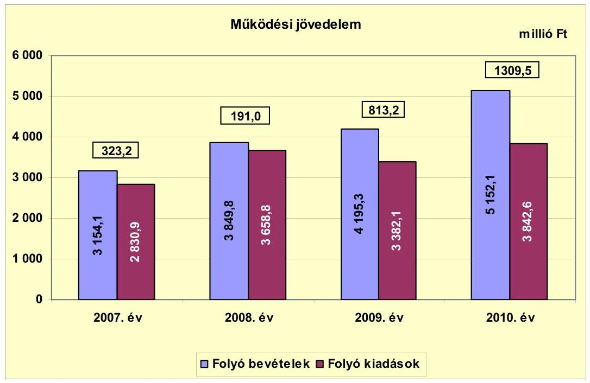

Az Önkormányzat folyó költségvetésének egyenlege (múködési jövedelem) 2007-2010 között múködési forrástöbbletet mutatott. A forrástöbbletet alapvetően a folyó bevételek - helyi adóbevételek által történő - folyamatos emelkedése okozta. A folyó bevételek 2008. évi előző évhez viszonyított 22,1\%os, 695,7 millió Ft-os emelkedéséhez a helyi adóbevételek 659,5 millió Ft-tal járultak hozzá. A 2010. évi 22,8\%-os, 956,7 millió Ft-os folyó bevétel növekedést pedig teljes egészében a helyi adóbevételek 1241,7 millió Ft-os növekedése fedezte, ellensúlyozva a jövedelemmérséklés címén az előző évhez képest 119,4 millió Ft-tal nagyobb összegű személyi jövedelemadó elvonást is.

A folyó kiadások az intézményi ellátottak számának folyamatos bővülése miatt (2008-ban belépett a 76 férőhelyes, újonnan alapított Meseliget Bölcsőde, az óvodai ellátottak száma 2007-ről 2010-re 172 fővel, 23,0\%-kal növekedett) 2007-ről 2008-ra 827,9 millió Ft-tal, 2009-ről 2010-re 460,5 millió Ft-tal, 13,6\%kal emelkedtek. A 2009. évi folyó kiadás visszaesést alapvetően a kamatkiadások előző évhez viszonyított 94,3 millió Ft-os, 20,7\%-os és a nem rendszeres személyi juttatások 90,3 millió Ft-os, 7,3\%-os csökkenése okozta.

[^0]
[^0]:    ${ }^{26}$ Az Önkormányzat társulás nélkül számított múködési jövedelme 2009-ben 812,2 millió Ft, 2010-ben 1287,2 millió Ft, a nettó múködési jövedelem pedig 2009-ben 135,3 millió Ft, 2010-ben -106,9 millió Ft.

---

A pozitív előjelű folyó költségvetési egyenleg ellenére a felhalmozási kiadások finanszírozása és az átmeneti likviditási problémák kezelése miatt az Önkormányzat folyamatosan folyószámla-, likvid- ${ }^{27}$ és munkabérhítel felvételére kényszerült. A fizetőképességet jelzi, hogy 2007-ben 360, 2008-ban 335, 2009-ben 328, 2010-ben pedig 307 nap állt fenn munkabérhítel. A folyószámlahitellel zárt napok száma 2007-ben 364, 2008-ban 366, 2009-ben 361, 2010-ben 328 volt. A folyószámlahitel napi átlagos állománya a 2007. évi 640,3 millió Ft-ról, 2010-re 148,9 millió Ft-ra, 76,7\%-kal csökkent. A kötvénykibocsátásból származó bevételek 2008-ban lehetővé tették, hogy a folyószámlahitel átlagos napi állománya több mint a felével, 350,3 millió Ft-tal (54,9\%$\mathrm{kal})$ csökkenjen. A következő két évben a folyószámlahitel állománya tovább csökkent 2009-ben 132,3 millió Ft-tal (45,9\%-kal), 2010-ben pedig 22,1 millió Ft-tal ( $14,2 \%$-kal). Ez utóbbi két év változásainak az oka, hogy a számlavezető bank a kötvényállomány miatt a folyószámlakeretet 180 millió Ft-ra csökkentette. Az Önkormányzat finanszírozási igényét ezért áthidaló likvidhitelekkel elégítette ki, amit jól mutat a likvidhitelek átlagos napi állományának 2009. évben az előző évhez viszonyított 245,9 millió Ft-os (36,2\%-os), valamint a 2010. évben a 2009. évi állomány további 147,5 millió Ft-os ( $16,0 \%$-os) emelkedése.

A folyó költségvetési pozíció mellett az adott költségvetési év adósságtörlesztésének hatását a nettó múködési jövedelem ${ }^{28}$ értéke fejezi ki. Az Önkormányzat pénzügyi kapacitása 2007-2010 között - a 2009. évet kivéve - negatív értéket mutatott, amelyet az alábbi diagram szemléltet:
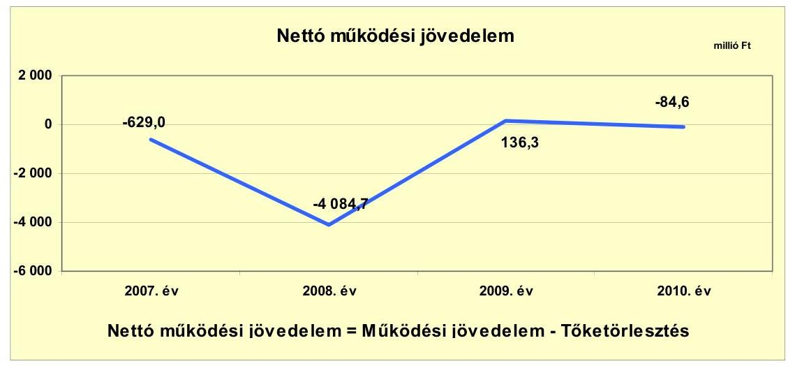

A folyó költségvetési egyenleg csak 2009-ben fedezte az adott évi hiteltörlesztést ( 676,9 millió Ft-ot), a többi évben az adósságszolgálat rendre meghaladta azt. Kiugróan alacsony a 2008. évi pénzügyi kapacitás összege, mivel ebben az évben a 4582,3 millió Ft összegű kötvénykibocsátásokkal kiváltották a korábbi években fejlesztési és múködési célra felvett hiteleket, így ebben az évben 4275,7 millió Ft hitelt törlesztettek. Nem tette lehetővé az adósságállomány lé-

[^0]
[^0]:    ${ }^{27}$ Az Önkormányzat likvidhitelének napi állománya 2007-ben 1146,7 millió Ft, 2008ban 678,5 millió Ft, 2009-ben 924,4 millió Ft, 2010-ben 1071,9 millió Ft volt.
    ${ }^{28}$ pénzügyi kapacitás

---

nyeges csökkentését, hogy az Önkormányzat a 2007-2009 közötti átlaghoz képest 35,5 millió Ft-tal, 7,4\%-kal mérsékelte az önként vállalt feladatait a 2010. évben.

A 2007-2010. években az Önkormányzat felhalmozási költségvetésének egyenlege folyamatosan negatív összegú volt, amely körültekintő költségvetési gazdálkodás és pénzügyileg fenntartható ${ }^{29}$ beruházások esetén elvileg nem jár magas pénzügyi kockázattal, ha a felhalmozási hiányra forrásként a rendelkezésre álló nettó múködési jövedelem fedezetet nyújt. Az Önkormányzat korábbi eladósodása miatt azonban a folyó költségvetésben a felhalmozási kiadások finanszírozására felszabadítható források nem keletkeztek.

A felhalmozási költségvetés egyenlegének alakulását 2007-2010 között a következő ábra mutatja be:
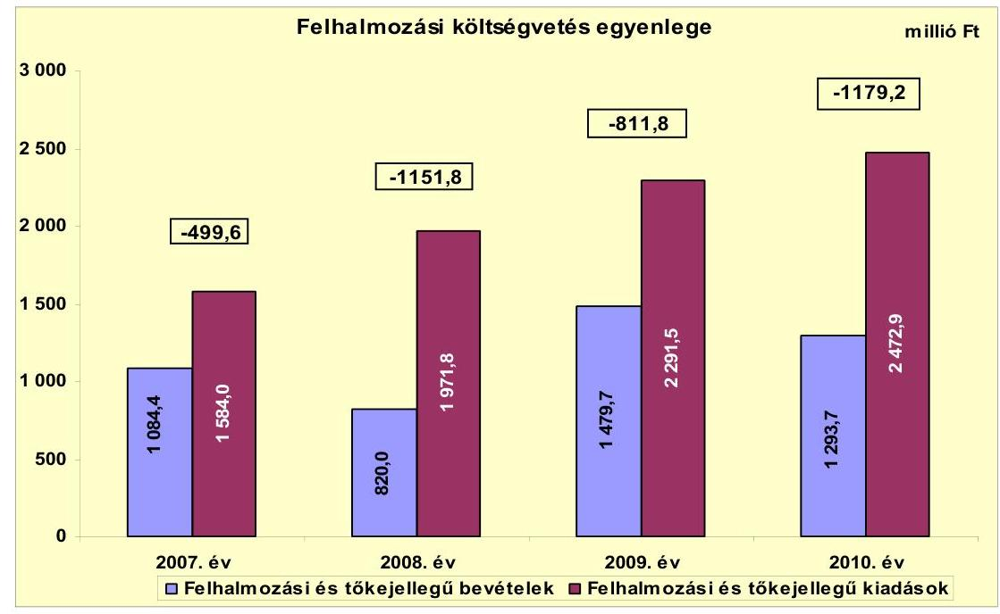

Az Önkormányzat 2007-2010 között folytatta korábbi időszakban megkezdett fejlesztési politikáját. Vonalas infrastruktúra (helyi utak, járda, gázhálózat, ivóvízhálózat, fűtési vezetékrendszer, villanyhálózat) kialakítására és fejlesztésére 2007-2010. között 3042,3 millió Ft-ot, intézményi ellátórendszer (bölcsőde, óvoda, iskola) építésére, bővítésére 1730,0 millió Ft-ot, ezen túl a városfejlesztéshez kapcsolódó ingatlanfejlesztésekre 2240,9 millió Ft-ot fordított. A felhalmozási kiadások tartalmazzák 2007-2010 között az államháztartáson kívülre átadott 1058,4 millió Ft összegű pénzeszközátadásokat (adott kölcsönök, református egyháznak, Szennyvízközmű Társulásnak átadott fejlesztési támogatások, alapítványok, egyesületek részére átadott pénzeszközök), valamint a Miszszió Health Kft. részesedésének ( 226 millió Ft) megvásárlását is. A felhalmozási forráshiány finanszírozására a 2007. évi 128,2 millió Ft induló pénzkészlet, 381,0 millió Ft fejlesztési, 950,5 millió Ft pénzintézettől és 2187,2 millió Ft vál-

[^0]
[^0]:    ${ }^{29}$ Az minősül pénzügyileg fenntartható beruházásnak, amelynek múködtetésére az Önkormányzat nettó múködési jövedelme a következő években is fedezetet nyújt.

---

lalkozástól felvett likviditási hitel szolgált. Tovább növelte az 1331,5 millió Ftos forrásszükségletet, hogy az intézményi beruházások közül a Meseliget Bölcsőde, nyolc foglalkoztatós napközi otthonos óvoda tagintézmény EU-s támogatását ( 639,7 millió Ft) hitelből kellett megelőlegezni. A pályázott források hitelből történő előfinanszírozása pénzügyi kockázatot jelentett az Önkormányzat számára.

Az Önkormányzat évenkénti teljes finanszírozási igénye ${ }^{30}$ a CLF módszer szerint 2007-ben 1128,6 millió Ft, 2008-ban 5236,5 millió Ft, 2009-ben 675,5 millió Ft, 2010-ben 1263,8 millió Ft volt, amelynek finanszírozását a finanszírozási célú bevételek és kiadások egyenlege biztosította.

Az Önkormányzat finanszírozási múveletei 2007-2010. évekbeli egyenlegének alakulását a következő ábra szemlélteti:
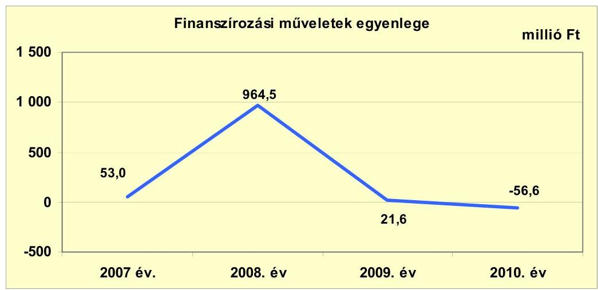

A finanszírozási célú pénzügyi műveletek pozitív értéke azt jelzi, hogy 2007-2009 között az éves költségvetések végrehajtása során külső forrás bevonására volt szükség. Erre szolgált a 2008-ban „Veresegyház 2028. I" a „Veresegyház 2028. II" és a „Veresegyház 2028. III" kötvények együttesen 4582,3 millió Ft értékben lejegyzett kibocsátásából 306,6 millió Ft, a 2007. évben ingatlanvásárlásra felvett 182,0 millió Ft, valamint a 2009. évi fejlesztési céllal igénybe vett 199,0 millió Ft-os hitelek. A finanszírozási műveletek pozitív értékét növelte még a fejlesztési célt szolgáló (forrás megelőlegezés, forrásbővítés), de a likviditási címen igénybe vett hitelek, valamint a folyószámlahitelek állománya is. A finanszírozási műveletek 2010. évi 56,6 millió Ft-os negatív egyenlege azt jelzi, hogy ebben az évben a korábban igénybe vett kölcsönök visszafizetése meghaladta az adott évi hitel-igénybevételt. A kölcsönök törlesztése között 2010-ben megjelent a kötvények 366,4 millió Ft-os törlesztése is. A finanszírozási célú műveleteket a jelentés 2. számú mellékletének 4.1.-4.8. pontjai részletezik.

Az Önkormányzat zárszámadási rendeleteiben a múködési és felhalmozási hiányt a CLF módszertől eltérő szerkezetben mutatta be ${ }^{31}$, amelyről a jelentés

[^0]
[^0]:    ${ }^{30}$ a nettó múködési jövedelem és a felhalmozási költségvetés egyenlegeinek összege
    ${ }^{31}$ Nincs kötelező előírás a múködési és felhalmozási hiány megállapításának módjára.

---

1. számú melléklete nyújt tájékoztatást. A Képviselő-testületet a 2007. évi gazdálkodásról 152,4 millió Ft, a 2008. évi zárszámadás kapcsán 830,9 millió Ft hiányról tájékoztatták. A 2009. és a 2010. évi zárszámadási előterjesztés 214,4 millió Ft és 33,7 millió Ft bevételi többletet tartalmazott.

Az Önkormányzat kamatbevételei és kamatkiadásai egyenlegének változását 2007-2011. év I. félév közötti időszakban a következő ábra mutatja:
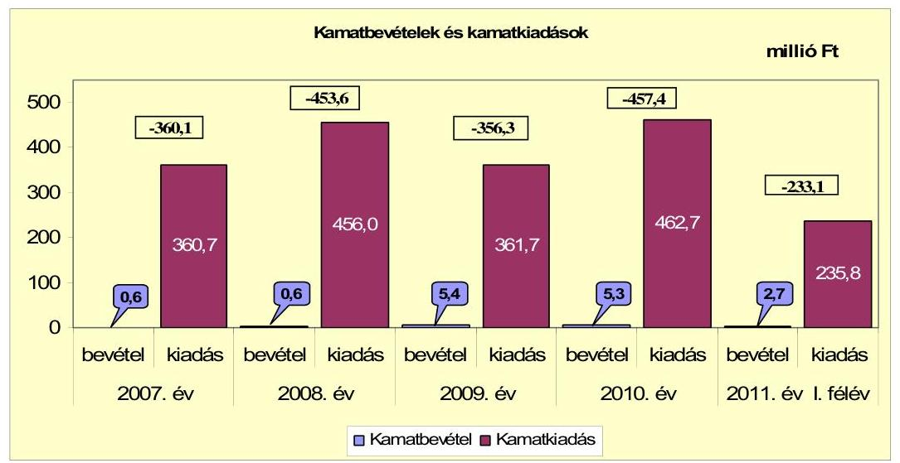

Szabad pénzeszközök hiányában az Önkormányzatnak a vizsgált időszakban összességében 16,4 millió Ft kamatbevétele keletkezett. A felvett hitelekhez kapcsolódó összességében 1877,0 millió Ft összegű kamatfizetési kötelezettség 114,7-szerese a kamatbevételeknek. A kamatbevételek és kamatkiadások egyenlegeire 2007-ben 360,1 millió Ft, 2008-ban 453,6 millió Ft, 2009-ben 356,3 millió Ft, 2010-ben 457,6 millió Ft, 2011. év I. félévben 233,1 millió Ft összegben a folyó bevételek nyújtottak fedezetet.

A 2011. évi költségvetési rendeletben az Önkormányzat a kamatkiadásokat a 2010. évi 462,7 millió Ft tényszámtól 20,8\%-kal, 96,1 millió Ft-tal alacsonyabb összegben tervezte meg. A kamatkiadások 2011. évi eredeti előirányzatának előző évi kamatkiadáshoz viszonyított csökkenését a fennálló likvidhitel állomány 20,0-22,0\%-os kamatai és az árfolyamváltozás miatt növekvő kötvénykamatok nem indokolták.

# 2.2. Az Önkormányzat bevételeinek változása 

Az összes folyó bevétel 2007-2010 között erőteljesen, évente átlagosan 17,8\%-kal emelkedett. Az átlagtól nagyobb arányú növekedés történt 2008ban és 2010-ben, amikor alapvetően a helyi adóbevételek emelkedése miatt, az előző évi összes folyó bevételt 22,1\%-kal (695,7 millió Ft-tal), valamint 22,8\%kal (956,6 millió Ft-tal) haladta meg. Az Önkormányzat 2007-2011. év I. félév között realizált főbb bevételi jogcímeinek számszaki adatait a következő grafikon mutatja be:

---

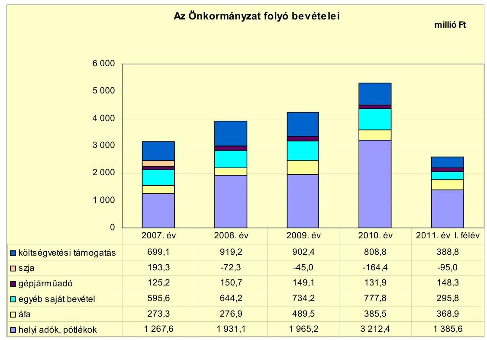

Az összes folyó bevétel emelkedését a helyi adóbevételek lendületes növekedése okozta, amely az előző évhez viszonyítva 2008. évben 663,5 millió Ft-os, 52,3\%-os és a 2010. évi 1247,2 millió Ft-os, 63,5\%-os gyarapodást jelez. A növekedés oka, hogy a Képviselő-testület 2008. január 1-jétől két új adónemet (telekadó, építményadó) vezetett be. Az építményadó és a telekadó 86,9 millió Fttal, az iparűzési adó további 736,0 millió Ft-tal emelte a 2008. évi adóbevételeket az előző évhez képest. A 2010. évi adóbevétel változás az iparűzési adóbevételek 1246,9 millió Ft-os, 72,7\%-os növekedéséből származott. Az Önkormányzatnál múködési kockázatot jelent, hogy nincs új helyi adó bevezetési lehetősége.

A költségvetési támogatások és az átengedett szja együttes összege a 2007. évi 892,4 millió Ft-ról folyamatosan, évente átlagosan 10,3\%-kal csökkent. A visszaesést döntően az átengedett szja okozta, mivel az iparűzési adó-erő-képesség miatt az Önkormányzattól ezen a jogcímen összességében a jövedelemkiegyenlítés jogcímen 2008-ban 72,3 millió Ft-ot, 2009-ben 45,0 millió Ftot, 2010-ben 164,4 millió Ft-ot vontak el. A költségvetési támogatások legnagyobb arányban 2008-ban emelkedtek. Ebben az évben az előző évhez képest kimutatott 31,5\%-os, 220,1 millió Ft-os növekedést alapvetően a belépő új intézmény (Meseliget Bölcsőde) és az újonnan belépő óvodai csoportok számának emelkedése (nyolc foglalkoztatós óvoda tagintézmény belépése) múködéséhez biztosított állami hozzájárulás eredményezte. A költségvetési támogatások 2009. évi 16,8 millió Ft-os (1,8\%) és 2010. évi 93,6 millió Ft-os (10,4\%) csökkenését túlnyomórészt a forrásszabályozásban bekövetkezett változások okozták.

---

Az Önkormányzat egyéb saját bevételeinek ${ }^{32}$ a 2008. évi 644,2 millió Ftról 2009-re 734,2 millió Ft-ra, 15,4\%-kal történt növekedését a szolgáltatások (alapvetően a kiszámlázott termálfűtés) ellenértékének 41,0 millió Ft-os, a vagyon (szennyvíztisztító telep) bérbeadásából származó bevétel 20,2 millió Ft-os és az államháztartáson belül kapott támogatásértékű működési bevételek (pl. ÁROP-3.A.1/A szervezetfejlesztési pályázat) 19,2 millió Ft-os emelkedése adta.

Kiugróan magas volt a 2009. évi áfa bevétel növekedés, mivel ebben az évben volt a legnagyobb mértékű ( 738,0 millió Ft) a telekértékesítés, melyhez kapcsolódó áfa bevételek 212,6 millió Ft-tal gyarapították az Önkormányzat bevételeit.

Az Önkormányzat felhalmozási bevételei a 2007-2011. év I. félév közötti időszakban a következők voltak:

| Megnevezés | 2007. év | 2008. év | 2009. év | 2010. év | 2011. év   I. félév |
| :--: | :--: | :--: | :--: | :--: | :--: |
| Tárgyi eszköz értékesítés | 713,5 | 503,7 | 763,2 | 174,8 | 679,2 |
| Egyéb saját tőkebevétel | 7,4 | 0,2 | 24,3 | 492,7 | 95,2 |
| Âllamháztartáson belülről kapott támogatás | 311,0 | 273,4 | 663,4 | 598,1 | 493,6 |
| Âllamháztartáson kívülről kapott támogatás | 52,5 | 42,7 | 28,8 | 28,1 | 7,1 |
| Összes felhalmozási bevétel | 1084,4 | 820,0 | 1479,7 | 1293,7 | 1275,1 |

A tárgyi eszköz értékesítés többsége az Önkormányzat telekeladásaiból (ipari- és lakótelek eladás) származott. Ezen a címen 2007-ben 672,5 millió Ft, 2008-ban 376,2 millió Ft, 2009-ben 738,0 millió Ft, 2010-ben 174,8 millió Ft, 2011. év I. félévben pedig 307,6 millió Ft realizálódott. Az egyéb saját tőkebevételek 2010. évi kiugró értékét a támogatási kölcsönök 434,3 millió Ft-os államháztartáson kívülről történő visszatérülése okozta. A kölcsön visszatérülések közül az Önkormányzat kizárólagos tulajdonában lévő Misszió Kft. 226,0 millió Ft-os tagi kölcsön visszafizetése volt a legjelentősebb tétel ${ }^{33}$. Az államháztartáson belülről kapott támogatások a fejlesztésekhez kapcsolódó EU-s támogatásokat tartalmazzák, amelyeknek a 2009-2010. évi, valamint a 2011. év I. félévi kiugró értékei alapvetően a Városközpont rehabilitációhoz, Malom-tó rehabilitációhoz, geotermikus közmú és az óvoda építéséhez kapcsolódtak.

[^0]
[^0]:    ${ }^{32}$ Az egyéb saját bevételek részét képezték az intézményi múködési bevételek, a hozamés kamatbevételek, az osztalék, a talajterhelési díj, a vagyoni értékú jog értékesítése, az államháztartáson belülről és kívülről átvett pénzeszközök, előző évi pénzmaradvány átvétele.
    ${ }^{33}$ Az önkormányzati tulajdonú társaságok bevételeit a 4. számú melléklet mutatja be.

---

# 2.3. Az Önkormányzat múködési és felhalmozási célú kiadásainak változása 

Az Önkormányzat folyó kiadásai főbb jogcímek szerinti bontásban 2007-2011. június 30. között az alábbiak voltak:

|  |  |  |  |  | millió Ft |
| :-- | --: | --: | --: | --: | --: |
| Megnevezés | 2007. év | 2008. év | 2009. év | 2010. év | 2011. év   I. félév |
| Folyó kiadások | 2830,9 | 3658,8 | 3382,1 | 3842,6 | 1918,6 |
| Müködési kiadások (kamatkiadás nélkül) | 2266,0 | 2989,1 | 2828,7 | 3164,8 | 1569,9 |
| Államháztartáson belülre átadott   pénzeszközök | 71,5 | 74,7 | 71,4 | 65,2 | 32,0 |
| Transzferkiadások | 132,7 | 138,9 | 120,3 | 149,9 | 80,7 |
| ebből: EU-nak, illetve külföldre | 1,0 | 1,5 | 1,0 | 0,1 | 0,3 |
| magánszemélyeknek | 62,9 | 63,1 | 60,7 | 91,2 | 48,1 |
| nonprofil szervezeteknek | 68,8 | 74,3 | 58,6 | 58,6 | 32,3 |
| Kamatkiadások | 360,7 | 456,0 | 361,7 | 462,7 | 235,7 |

|  |  |  |  |  | millió Ft |
| :-- | --: | --: | --: | --: | --: |
| Megnevezés | 2007. év | 2008. év | 2009. év | 2010. év | 2011. év   I. félév |
| Személyi juttatások | 1083,1 | 1233,8 | 1143,5 | 1228,2 | 601,0 |
| Munkaadót terhelő járulékok | 333,1 | 372,1 | 333,7 | 313,9 | 147,7 |
| Dologi kiadások | 793,8 | 1227,6 | 1293,8 | 1478,4 | 790,9 |
| Egyéb folyó kiadások | 55,7 | 155,7 | 57,8 | 58,6 | 28,2 |

A múködési kiadások 2008. évi kiugróan magas teljesítését alapvetően az új intézményi fejlesztések, a kibővült ivóvíz, villany, gáz, csapadékvíz közmúhálózatok múködtetése, illetve a vásárolt termékek és szolgáltatások után a költségvetésbe befizetett áfa emelkedése okozta. A szolgáltatási kiadások 2008. évi, az előző évi szinthez viszonyított 208,7 millió Ft összegű, 63,4\%-os növekedése egyrészt a villamos energia szolgáltatásért kifizetett összeg növekedése miatt következett be, másrészt az újonnan jelentkező távhőszolgáltatás pedig 25,6 millió Ft-tal növelte a kiadásokat. A villamos energiáért kifizetett összeg 89,7 millió Ft-tal volt nagyobb 2008-ban az előző évhez képest, amit az intézményi bővülés ( 76 férőhelyes bölcsőde, nyolc foglalkoztatós óvodai tagintézmény belépése), a díjemelkedés, továbbá a közvilágítás fejlesztése okozott. A szolgáltatási kiadások emelkedése, illetve az intézményi fejlesztések részét jelentő készletek feltöltése miatt a vásárolt termékek és szolgáltatások áfája 44,8 millió Ft-tal, az értékesített tárgyi eszközök (telekértékesítés és TIGÁZ vagyon értékesítés) áfa befizetése 123,9 millió Ft-tal növelte az előző évihez képest 2008-ban a kiadásokat. A fejlesztések során megvalósított létesítmények jövőbeni üzemeltetésénél a várható kiadásokat nem számszerúsítették. A kamatkiadások 2008. évi és 2010. évi kiemelkedő emelkedésének oka, hogy a folyószámlahitelek kamatait ( $11,39 \%-13,98 \%$, illetve $8,98 \%-9,85 \%$ ) lényegesen meghaladták a vállalkozásoktól felvett hitelek kamatai (esetenként 20,0\%$22,0 \%$ ). A kamatkiadások közül a likvidhitelek kamatemelkedése az Önkormányzat adatszolgáltatása szerint 2008-ban 58,2 millió Ft-tal, 50,8\%-kal, 2010-ben 99,5 millió Ft-tal, $71,6 \%$-kal haladta meg az előző évi mértéket.

A múködési kiadások előző évhez viszonyított 2010. évi magas értékét túlnyomórészt a dologi kiadások változása okozta. A dologi kiadások 2010. évi

---

184,6 millió Ft-os, előző évihez képest kimutatható növekedését az intézmények által igénybe vett szolgáltatások (villamos energia, üzemeltetési szolgáltatás) 72,7 millió Ft-os, valamint a termékek, szolgáltatások és a beruházások (Ma-lom-tó rehabilitáció, Városközpont rekonstrukció, útépítések) miatti fordított áfa befizetések 82,9 millió Ft-os áfa befizetési többlete okozta.

A személyi juttatások a 2008. évben az előző évhez képest 150,7 millió Ft-tal (13,9\%-kal) növekedtek, melyet az intézményi létszámfejlesztések (25 fős bölcsődei létszám belépése), a közalkalmazotti és a köztisztviselői illetményalap emelés, a nem rendszeres személyi juttatások növekedésének együttes hatása eredményezett. A 2010. évi személyi juttatás előző évhez viszonyított 84,7 millió Ft-os ( $7,4 \%$-os) emelkedését az előző évi létszámfejlesztések (közoktatás 12 fő, bölcsőde 2 fő, GAMESZ 3 fő) 2010. évre vetített hatása okozta. A létszámváltozás 2010-ben a rendszeres személyi juttatások 64,8 millió Ft-os és az egyéb munkavégzéshez kapcsolódó juttatások 24,0 millió Ft-os növekedését eredményezte.

A folyó és felhalmozási kiadásokat, a teljesített kiadások múködési és felhalmozási célú felhasználásának arányait a 2007-2011. év I. féléve közötti időszakban az alábbi ábra mutatja be:
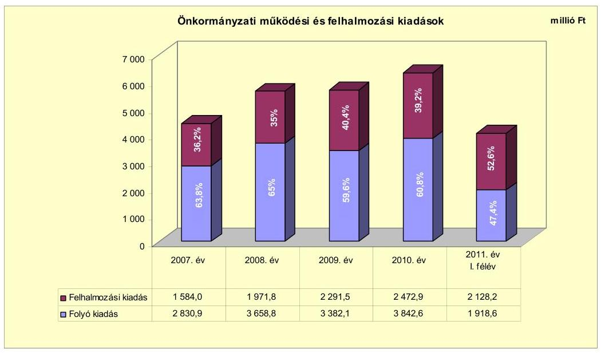

A múködési és a felhalmozási célú kiadások felhasználásának aránya a 2007. évről a 2010. évre a felhalmozási kiadások irányába tolódott el. A 2007. évi 63,8\%-36,2\%-os arány a 2010. évre 60,8\%-39,2\%-ra változott. Ennek az volt az oka, hogy a 2007. évet követően összességében 1786,9 millió Ft összegű, saját forrásból, hitelből és EU-s támogatásból megvalósuló beruházások indultak (Meseliget Bölcsőde, útépítés, villanyhálózat bővülés). A Szennyvízközmű Társulás 2010-ben 125,8 millió Ft összegű, 2011. év I. félévben 351,8 millió Ft összegű beruházást hajtott végre, melyek az Önkor-

---

mányzat beszámolójában kimutatott felhalmozási kiadások 5,1\%-át és 16,5\%át tették ki ${ }^{34}$.

Az Önkormányzatnál a 2010. december 31-ig befejezett ${ }^{35}$ - 27 db 10,0 millió Ft feletti és 120 db 10,0 millió Ft alatti bekerülési költségű - felújítás és fejlesztés költsége 6304,8 millió Ft volt. Ebből a fejlesztések összege 6146,0 millió Ft ( $97,5 \%$ ) és a felújítások összege 158,8 millió Ft (2,5\%) volt. A befejezett 6304,8 millió Ft értékű fejlesztés és felújítás forrása 2502,5 millió Ft saját bevételből (39,7\%), 2478,7 millió Ft hitelből (39,3\%), 200,6 millió Ft kötvénykibocsátás bevételből (3,2\%), 1035,1 millió Ft EU-s támogatásból (16,4\%) és 87,9 millió Ft hazai támogatásból ( $1,4 \%$ ) tevődött össze. A 2006. december 31-ig teljesített kiadások összege 250,9 millió Ft, a 2007-2010. években teljesített kiadások összege 6053,9 millió Ft volt.

Az Önkormányzat a 2010. év végén folyamatban lévő ${ }^{36}$ - 33 db 10,0 millió Ft alatti és 14 db 10,0 millió Ft feletti bekerülési költségű - felújítási és fejlesztési feladataira 2010. december 31-ig 1139,1 millió Ft-ot fizetett ki. Ennek forrását 303,0 millió Ft saját bevétel (26,6\%), 250,2 millió Ft hitel (22,0\%), 585,9 millió Ft EU-s támogatás (51,4\%) képezte. A folyamatban lévő feladatoknál a 2010. évet követő időszakra vállalt kötelezettség összege 6396,5 millió Ft, amelynek forrásait 934,7 millió Ft (14,6\%) saját bevétel, 1010,3 millió Ft (15,8\%) hitel, 4451,5 millió Ft (69,6\%) EU-s támogatás képezi.

A folyamatban lévő beruházásokhoz tervezett hitelek a Szennyvízközmű Társulás lebonyolításában megvalósítandó szennyvíztisztító bővítés és csatornaépítéshez kötődő 749,8 millió Ft összegű hitelből és az Önkormányzat beruházásaként megvalósuló geotermikus közmű beruházás 260,5 millió Ft hitelből tevődnek öszsze. Az Önkormányzat a geotermikus közmű kiterjesztésére vonatkozó folyamatban lévő beruházás megvalósítását eredetileg EU-s támogatásból és 260,5 millió Ft saját erőből tervezte. A pályázatra vonatkozó előterjesztés az iparúzési adó 3251,5 millió Ft összegben tervezett és várhatóan befolyó bevételére alapozott. Az Önkormányzat pénzügyi helyzetének további negatív változása miatt, (az iparúzési adó bevétele 2961,9 millió Ft összegben teljesült) a 2011. évi költségvetési rendeletben a geotermikus közmű beruházás forrásainál a saját erőt hitel felvételével váltották ki. A hitelfelvétellel kapcsolatos közbeszerzési eljárás megindításáról a Képviselő-testület a 4/2011. (I. 18.) számú határozatában döntött.

Az Önkormányzat által 2007-2010. évek között megvalósított felújítások és fejlesztések teljes bekerülési költsége összesen 7443,9 millió Ft volt, amelyet 2805,5 millió Ft (37,7\%) saját forrás, 2929,5 millió Ft (39,4\%) hitel és kötvény,

[^0]
[^0]:    ${ }^{34}$ Az Önkormányzat beruházási társulás nélkül számított folyó kiadása 2009-ben 2,4 millió Ft-tal, 2010-ben 6,7 millió Ft-tal, 2011. év I. félévben 11,2 millió Ft-tal kisebb az önkormányzati beszámolóban szereplő adatoktól.
    ${ }^{35}$ A 2010. december 31-ig befejezett fejlesztések adatait a jelentés 3/a. számú melléklete tartalmazza.
    ${ }^{36}$ A 2010. év végén folyamatban lévő fejlesztések adatait a jelentés 3/b. és 3/c., a 2011. év I. félévben saját forrásból megvalósított fejlesztések adatait a jelentés 3/c. számú melléklete tartalmazza.

---

1621,0 millió Ft (21,8\%) EU-s támogatás, valamint 87,9 millió Ft (1,0\%) hazai támogatás finanszírozott.

Az Önkormányzat - 23 db 10,0 millió Ft alatti és három db 10,0 millió Ft feletti bekerülési költségű - felújítást és fejlesztést valósított meg a 2011. év I. félévben, amelyekhez 895,8 millió Ft kiadás kapcsolódott. A kiadások forrása 335,8 millió Ft (37,5\%) saját bevételből és 560,0 millió Ft (62,5\%) hitelből származott.

Az Önkormányzat kimutatásai alapján ezen időszakban a három legmagasabb bekerülési költségű beruházás a következő volt:

- A „Szennyvíztisztító telep bővités, korszerüsités és csatornaépités a veresegyházi agglomeráció területén" című KEOP-7.1.2.0.-2007-0041 projekt keretében támogatott fejlesztést a Szennyvízközmú Társulás bonyolítja le. A Szennyvízközmű Társulás által bonyolított projekt költségeinek Veresegyház Önkormányzata 34,5\%-át fogja viselni. A szennyvíztisztító kapacitása a jelenlegi $3000 \mathrm{~m}^{3} / \mathrm{nap}$ értékről $5000 \mathrm{~m}^{3} / \mathrm{nap}$ értékre emelkedik. Megépül 39 694,5 m gravitációs és $5245,3 \mathrm{~m}$ nyomóvezeték, a tervezett bekötések száma 2652 db . A kezdési időpont 2010. július 7., befejezési határideje 2013. március 13. A várható teljes bekerülési költség 4047,0 millió Ft, amelyhez 3262,1 millió Ft (80,6\%) EU-s támogatást kapott a Szennyvízközmű Társulás. A fennmaradó összeget 767,2 millió Ft (19,0\%) hitelből és 17,7 millió Ft $(0,4 \%)$ saját bevételből biztosítják.
- A Városközpont fejlesztés II. ütemének keretében elvégezték a Fő tér rekonstrukcióját, Kistérségi Szolgáltató Központot alakítottak ki, felújításra került a katolikus templom, megtörtént a Fő út közlekedésfejlesztése. A projekt befejezési határideje 2011. október 5. volt. A teljes bekerülési költség 1273,1 millió Ft, amelyből 800,0 millió Ft (62,8\%) EU-s támogatás, 205,1 millió Ft (16,1\%) hitel és 268,0 millió Ft (21,1\%) saját bevétel biztosította a forrást.
- A termálfűtés bővítésének érdekében új termál kutat fúrtak és $4,5 \mathrm{~km}$-rel meghosszabbították a fűtés vezetékrendszerét. A beruházás teljes bekerülési költsége 810,6 millió Ft, amelynek finanszírozása 385,4 millió Ft (47,6\%), EU-s támogatásból 260,5 millió Ft (32,1\%), hitelből 164,7 millió Ft (20,3\%) saját bevételből valósul meg. A beruházás 2010. augusztus 15-én indult, befejezési határideje 2011. december 31.

Az Önkormányzat a geotermikus közmú bővítésére nyújtott be pályázatot. A jelenleg elbírálás alatti pályázati forrásból megvalósítandó fejlesztés teljes bekerülési költsége 273 millió Ft, amelyet 173 millió Ft (63,4\%) hitelből és 100 millió Ft (36,4\%) EU-s támogatásból tervez finanszírozni ${ }^{37}$. A tervezett fejlesztésre benyújtott pályázat finanszírozhatóságának kockázata, hogy az Önkormányzat eladósodása a tervezett hitel realizálását bizonytalanná teszi.

[^0]
[^0]:    ${ }^{37}$ Az Önkormányzat által beadott, elbírálás alatt lévő pályázati forrásból megvalósuló fejlesztések adatait a jelentés 3/d. számú melléklete tartalmazza.

---

# 3. Az ÖNKORMÁNYZAT KÖTELEZETTSÉGEI 

### 3.1. Az Önkormányzat pénzintézeti kötelezettségeinek változása

Az Önkormányzat rövid- és hosszú lejáratú kötelezettségeinek állománya a 2006. december 31-i 5702,8 millió Ft-ról 2010. december 31-re 8730,0 millió Ft-ra emelkedett, majd 2011. június 30-ra 8233,5 millió Ft-ra mérséklődött. Az összes kötelezettségből a pénzintézeti kötelezettség mérleg szerinti állománya a 2006. év végén 4672,0 millió Ft, a 2010. évben 7741,7 millió Ft, 2011. június 30-án 7943,1 millió Ft volt. Az Önkormányzat az államháztartáson kívüli gazdálkodóktól, magánszemélyektől éven belüli visszafizetéssel felvett kölcsöntartozását az Áhsz. 26. § (5) bekezdés a) pontjában foglaltakkal ellentétben a mérlegben a rövid lejáratú kötelezettségek között hitelként szerepeltette. A Ptk. 523. § (1) bekezdése szerinti kölcsönszerződésből adódó egy évet meg nem haladó lejáratú kötelezettséget kölcsönként és nem hitelként kell a mérlegben kimutatni. A gazdasági szervezetekkel szemben a mérlegfordulónapon fennálló kölcsöntartozás a 2006. évben 814,4 millió Ft, a 2007. évben 835,5 millió Ft, a 2008. évben 575,0 millió Ft, a 2009. évben 695,0 millió Ft, a 2010. évben 1387,0 millió Ft és 2011. június 30-án 1595,7 millió Ft volt. A pénzintézetekkel szemben fennálló kötelezettségek kimutatott összege a 2006. év végi 3857,6 millió Ft-ról a 2010. év végére 6354,7 millió Ft-ra emelkedett, majd 2011. június 30-ra 6347,4 millió Ft-ra mérséklődött. A jelentés további részében a pénzintézeti kötelezettségek alakulása a gazdálkodóktól felvett kölcsönök nélkül került bemutatásra.

A 2007. január 1-jén fennálló pénzintézeti kötelezettség 700,0 millió Ft folyószámla-, 80,0 millió Ft munkabér-megelőlegezési hitelből, 419,8 millió Ft egyéb likvid hitelből, és hét fejlesztési hitelszerződésből származó 2657,8 millió Ft tartozásból állt. A hosszú lejáratú hitelek a 2008. évben a 4582,3 millió Ft ( 29009786 CHF ) értékű kötvénykibocsátásból kiváltásra kerültek. Az Önkormányzat 2007-2011. év I. félév között további három fejlesztési hitelszerződés alapján összesen 418,4 millió Ft hitelt vett igénybe ${ }^{38}$, ebből egy hiteltartozást ( 182,0 millió Ft-ot) a kötvényből kiváltott. Az Önkormányzatnak 2011. június 30-án fennálló 132,4 millió Ft folyószámlaés 50,0 millió Ft munkabér-megelőlegezési hitelen kívül - a fejlesztési hitelek 25,0 millió Ft és a kötvény esedékessé váló 163,1 millió Ft törlesztésén túl egyéb rövid lejáratú pénzintézeti tartozása nem volt. A 2008. évi kötvénykibocsátás hatására a hosszú lejáratú hitelekből fennálló kötelezettség összes pénzintézeti kötelezettségen belüli részaránya a 2007. január 1-jei $65,3 \%$-ról 2011. június 30-ra $94,2 \%$-ra emelkedett.

[^0]
[^0]:    ${ }^{38}$ A 2011. évben megkötött 260,5 millió Ft geotermikus közmú fejlesztési hitel keretszerződésből 37,4 millió Ft igénybevétele történt meg.

---

Az Önkormányzat pénzintézetekkel szemben fennálló kötelezettségállományát ${ }^{39}$ a 2006-2010. években és a 2011. év I. félévben a következő ábra szemlélteti ${ }^{40}$ :
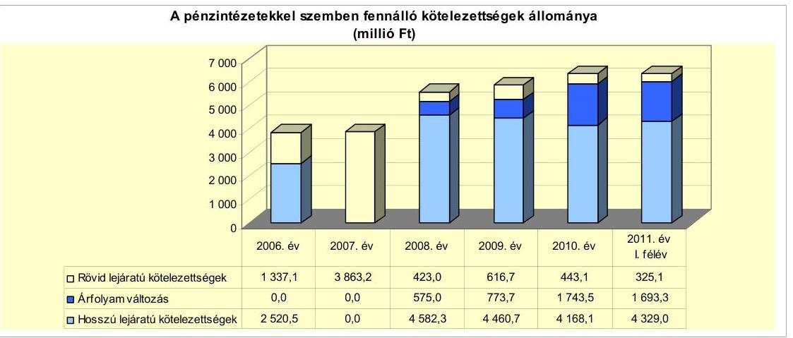

A 2010. év végén kötvénykibocsátásból származó 26946725 CHF-ben fennálló tartozás 2008-2010. évi mérlegforduló-napi értékelései során elszámolt árfolyamveszteség összesen 1743,5 millió Ft kötelezettségnövekedést eredményezett. Az árfolyamváltozás nagyságrendje, valamint annak folyamatos emelkedése az Önkormányzat számára egyre növekvő törlesztési kockázatot jelent.

Annak megítéléséről, hogy a devizában fennálló kötvény visszavásárlása az Önkormányzat számára forintban összességében többletkiadást (árfolyamveszteség) vagy kiadási megtakarítást (árfolyamnyereség) eredményez, a futamidő végén a teljes kötelezettség rendezését követően lehet képet alkotni. Mindaddig, amíg törlesztési kötelezettség nem áll fenn (türelmi idő, moratórium), a tőkére vonatkoztatva nem értelmezhető sem az árfolyamveszteség, sem az árfolyamnyereség. Ugyanakkor a számviteli szabályok meghatározzák, hogy az árfolyamkülönbözetet év végén a kötelezettségek vagy követelések között a könyvviteli mérlegben nyilván kell tartani, azonban árfolyamkülönbözet ebben az esetben ténylegesen nem képződött.

A kibocsátást követő két év türelmi idő leteltével a 2010. évben megkezdődött a kötvények visszavásárlása. Valamennyi kötvény esetében a törlesztés félévente esedékes, az első részlet összege 263910 EUR, 401906 CHF, összesen 146,3 millió Ft volt. A pénzügyi teljesítéskor realizált árfolyam-különbözet a 2010. évben összesen 33,5 millió Ft veszteség, a 2011. év I. félévben 0,3 millió Ft veszteség és 7,3 millió Ft nyereség volt. Az Önkormányzat a kötvénybeváltásra fordított forint összegek egészét finanszírozási kiadásként számolta el, a törlesztés könyv szerinti értékétől a pénzügyileg realizált árfolyamkülönbözetet az Áhsz. 9. számú melléklet 4. dl) pontjában foglalt előírással ellentétben nem

[^0]
[^0]:    ${ }^{39}$ Az összes kötelezettségből a Szennyvízközmű Társulás hiteltartozása a 2010. évben 32,2 millió Ft, 2011. év I. félév végén 155,7 millió Ft volt.
    ${ }^{40}$ Az árfolyamváltozásból - a kötvény visszavásárlás 2010. évi megkezdése miatt - a rövid lejáratú kötelezettséghez kapcsolódó összeg: 2009. év: 10,7 millió Ft, 2010. év: 95,5 millió Ft, 2011. év I. félév: 45,3 millió Ft.

---

elkülönítve mutatta ki. A külföldi pénzértékre szóló kötelezettség pénzügyi rendezéséhez kapcsolódó kivezetés során a pénzügyi teljesítéskor érvényes árfolyamtól függetlenül a kötelezettség könyv szerinti forintértéken kerül kivezetésre a tőkeváltozással szemben. A pénzügyileg realizált árfolyamveszteséget az Áhsz. 9. számú melléklet 9. c) pontja értelmében dologi kiadásként, az árfolyamnyereséget az Áhsz. 14. a) pontjában foglalt előirás szerint múködési bevételként kell kimutatni.

A Képviselő-testület a likviditás biztosítása érdekében a vizsgált időszak során minden évben külön határozattal döntött a folyószámlahitelkeret-szerződés meghosszabbításáról. Ezentúl a költségvetési rendeletekben határozták meg az igénybe vehető munkabér-megelőlegezési hitel felső határát, illetve ennek keretében kapott felhatalmazást a polgármester pénzintézetektől és egyéb gazdálkodó szervezetektől egyéb likvid hitel és kölcsön felvételére. A Képviselőtestület a 2008. és a 2009. évben két rövid lejáratú múködési célú 590,5 millió Ft összegű pénzintézeti hitelfelvételéről, a fejlesztési forráshiány finanszírozása érdekében a 2007., a 2009. és a 2011. évben három esetben összesen 641,5 millió Ft hitelkeret-szerződésről, továbbá a 2008. évet megelőző időszakról felhalmozódott hiteltartozások átütemezése érdekében 4582,3 millió Ft összegű kötvénykibocsátásról hozott döntést.

Az adósságot keletkeztető kötelezettségvállalások felső határának alakulását a döntést megalapozó előterjesztésekben nem mutatták be, a Képviselő-testület tájékoztatása a 2009. évtől a költségvetési rendelet-tervezetek és a 2010. évtől a zárszámadási rendelet-tervezet előterjesztésében történt meg. Az Önkormányzat a 2007. és a 2008. évben túllépte az Ötv., 88. § (2) bekezdése ${ }^{41}$ szerint meghatározandó adósságot keletkeztető kötelezettségvállalás felső határát. A túllépés mértéke a 2007. évben 159,0 millió Ft, 29,0\% volt. A 2008. évben a saját bevételek és az előző években vállalt kötelezettségek teljesítése alapján a tárgyévben vállalható kötelezettség felső határa -1004,0 millió Ft volt, ezzel szemben a zárszámadási rendelet szerint az Önkormányzat 746,4 millió Ft tárgyévi kötelezettséget mutatott ki.

A 2008. évben az adósságot keletkeztető kötelezettségvállalás felső korlátjának túllépését a kötvényből kiváltott 3625,0 millió Ft hiteltartozás okozta. A kiváltott hitelek esetében az eredeti törlesztési ütemezéstől előbb, a kötvény kibocsátás időpontjában megszűnt a fennálló teljes tőketartozás.

Az Önkormányzat pénzintézeti kötelezettségvállalásaira - két likvidhitel és a kölcsönök kivételével - a Képviselő-testület döntése alapján került sor. A kötelezettségvállalásból származó források felhasználási céljait meghatározták. A döntést megalapozó előterjesztésekben nem mutatták be a kötelezettségvállalásból adódó teljes futamidőre várható kamat, árfolyam és egyéb kockázatok alakulását. A vizsgált évekre vonatkozó zárszámadási rendeletekben csupán a fordulónapon fennálló tartozásállomány bemutatása szerepelt az Áht. 118. § (2) bekezdés 2. d) pontjában foglalt előirás ellenére, amely szerint a

[^0]
[^0]:    ${ }^{41}$ A 2012. január 1-jétől hatályos Stabilitási tv. 3. § (1) bekezdése szerinti adósságot keletkeztető ügyletekből származó tárgyévi összes fizetési kötelezettség a 10. § (3) bekezdése szerint az ügylet futamidejének végéig egyik évben sem haladhatja meg az Önkormányzat adott évi saját bevételének 50,0\%-át.

---

zárszámadás előterjesztésekor be kell mutatni a többéves kihatással járó döntések számszerúsítését évenkénti bontásban és összesítve is. A 2011. évi költségvetési rendelet már tartalmazta a hitelekkel kapcsolatos több éves kihatással járó törlesztési kötelezettség alakulását. A kötelezettség visszafizetésének forrásaként a mindenkori költségvetés saját bevételeit, kiemelten a helyi adóbevételt nevesítették, kivétel a 2009. évben felvett 390,5 millió Ft támogatásmegelőlegező hitel, ahol a pályázati támogatás engedményezését, a geotermikus közműépítéshez kapcsolódó 260,5 millió Ft hitel esetében a beruházással létrejövő projekt bevételét határozták meg a visszafizetés forrásaként. Az Önkormányzat a számlavezető bankon kívül másik négy pénzintézettől is vett fel hitelt közbeszerzési eljárások lefolytatása után.

Az Önkormányzat 2011. június 30 -án forintban fennálló hosszú lejáratú adósságot keletkeztető kötelezettségvállalásai a következők voltak:

| Megnevezés | Szerződéskötés   időpontja | Összeg   millió Ft-ban | Kamat (referencia   kamat+ kamatfelár) | Felhasználás célja: |
| :-- | :--: | :--: | :--: | :--: |
| Jelzálog kölcsön | 2009.03 .13 | 199,0 | Jegybanki alapkamat   $+2 \%$ | Csonkási óvoda, belterületi   utcák és a Malom tó   rehabilitációja |
| A "Sikeres Magyarországért"   Önkormányzati Infrastruktúra   Fejlesztési Hítelprogram   260,6 millió Ft hitelkeret | 2011.04 .14 | 37,4 | 3 havi EURIBOR + MFB   refinanszírozási   kamatfelár $+0,73 \%$ | Geotermikus közmü   kiterjesztése új termálkút   fúrással projekt |

Az Önkormányzat hosszú lejáratú hiteleit a szerződésekben, illetve a képviselőtestületi döntésben meghatározott fejlesztési feladatok ${ }^{42}$ finanszírozására használta fel. A 2007. január 1-jén forintban fennálló hitelek után 20072011. év I. féléve között 492,1 millió Ft tőketörlesztés, 240,9 millió Ft kamat és hárommillió forint egyéb banki költség kifizetése történt meg. A 2011. június 30 -ig megkötött újabb hitelszerződésekből eredően további 61,8 millió Ft tőke és 35,8 millió Ft kamat megfizetése vált esedékessé. A jelenleg ismert kamatfeltételek mellett az Önkormányzat forint alapú hosszú lejáratú hiteleiből adódó várható tőke és kamatfizetési kötelezettsége a 2011-2013 között 222,5 millió Ft, a 2014. évtől a futamidő végéig 348,2 millió Ft lesz.

Az Önkormányzat 2011. június 30 -án CHF-ben fennálló adósságot keletkeztető kötelezettségvállalásai az alábbiak voltak:

| Megnevezés | Kibocsátás   időpontja | Összeg   ezer CHF-ben | Kibocsátási   árfolyam | Kamat (referencia kamat   + kamatfelár) | Felhasználás célja: |
| :-- | :--: | :--: | :--: | :--: | :--: |
| Kötvény Veresegyház 2028 I. | 2008.03 .03 | 14139,2 | 155,595 | 6 havi CHF LIBOR $+1,9 \%$ | Fennálló hitelek   elöörlesztése |
| Kötvény Veresegyház 2028 II. | 2008.03 .03 | 8849,6 | 158,199 | 6 havi CHF LIBOR $+1,9 \%$ | Fennálló hitelek kiváltása,   kamat, jegyzési díj, bölcsőde   építés |
| Kötvény Veresegyház 2028 III. | 2008.03 .28 | 6021,0 | 163,15 | 6 havi CHF LIBOR $+2,0 \%$ | Fennálló hitelek kiváltása,   kamat, jegyzési díj, bölcsőde   építés, egyéb müködési   kiadások |

[^0]
[^0]:    ${ }^{42}$ A vizsgált években felvett fejlesztési hiteleit az Önkormányzat ingatlan beszerzéshez, útfelújításhoz, a Malom-tó rehabilitációjához, óvoda felújításhoz és geotermikus közmű fejlesztéséhez használta fel.

---

A Képviselő-testület a 2007. évben határozta el, hogy fennálló hiteleinek kiváltása, a tartozások átütemezése céljából ötmilliárd forint erejéig CHF alapú kötvényt bocsát ki. A kötvényjegyzésre beérkezett ajánlatok alapján 2008. február 14-én kelt képviselő-testületi döntés szerint három pénzintézet (a korábbi jelentősebb hitelezők, köztük a számlavezető bank) jegyezte le a 20 éves futamidejú (ebből kettő év türelmi idő) 4582,3 millió Ft (29 009786 CHF) értékú kötvényeket. Az Önkormányzat a 2007-2011. év I. félév során visszafizetett, illetve kötvénnyel kiváltott korábbi CHF alapú fejlesztési hitelei után 14952386 CHF (2347,8 millió Ft) tőketörlesztést és 1239860 CHF (191,3 millió Ft) kamatkiadást számolt el. A kötvénnyel kapcsolatban az Önkormányzat 2011. június 30-ig 2192863 CHF és 263910 EUR, összesen 532,2 millió Ft összegű visszavásárlást, valamint 1717152 CHF és 151901 EUR, összesen 559,6 millió Ft kamatkiadást és 43,1 millió Ft egyéb költséget fizetett meg. A kötvénykibocsátásból fennálló tartozás a 2011. év I. félév végén 26170391 CHF (5827,6 millió Ft). A jelenleg ismert kamat és árfolyam feltételek mellett a kötvény visszavásárlásával kapcsolatban teljesítendő tőke és kamatkiadás 2011-2013 között várhatóan 6211877 CHF, a 2014. évet követően a futamidő végéig 27288661 CHF.

A kötvényekből származó források felhasználása a Képviselő-testület döntése szerint történt.

A „Veresegyház 2028 I." kötvényt 14139228 CHF-et (2200,0 millió Ft-ot) az Önkormányzat teljes egészében a kötvényt jegyző bankkal szemben fennálló korábbi két CHF alapú hitelének kiváltására fordította, ebben az esetben pénzmozgás nem történt. A korábbi hitelek kiváltása kapcsán 27,8 millió Ft árfolyamnyereséget realizált az Önkormányzat. A „Veresegyház 2028 II." kötvényből származó 8849558 CHF (1400,0 millió Ft) pénzeszközből 1098,6 millió Ft-ot hitel és gazdálkodókkal szembeni kölcsön tartozás kiegyenlítésre, 136,8 millió Ft-ot kamat, kezelési költség, jegyzési és előtörlesztési díj megfizetésére fordítottak, a fennmaradó 164,6 millió Ft a bölcsődeépítési beruházáshoz került felhasználásra. A II. kötvényből kiváltott meglévő kötelezettségek rendezése során az Önkormányzat 19,1 millió Ft árfolyamveszteséget realizált. A „Veresegyház 2028 III." kötvényből származó 6021000 CHF, 982,3 millió Ft-ból 895,5 millió Ft-ot hiteltartozás kiegyenlítésre, 32,4 millió Ft-ot kamat és jegyzési díj tartozásra, 36,0 millió Ft-ot bölcsődeberuházásra, további 18,4 millió Ft-ot múködési kiadásokra fordítottak.

Az Önkormányzat a Veresegyház 2028 I. számú kötvényét a 2009. évben, a Veresegyház 2028 II. számú kötvényét a 2010. évben EUR devizanemre konvertálta, majd mindkét kötvényét 2010. júniusban az eredeti devizanemre visszaváltotta. A CHF-re történő visszaváltást követően a tőketartozás a két kötvénynél összesen 257565 CHF tőkecsökkenést eredményezett. A konverzió az Önkormányzat számára egyéb banki költség fizetési kötelezettséget nem jelentett.

A kötvények konverziójából adódó tőketartozás változását a következő táblázat szemlélteti:

---

| Megnevezés | Kibocsátáskori   összeg   ezer CHF-ben | Konverzió elötti   összeg   ezer CHF | EUR konverzió   időponta | Konverzió utáni   összeg ezer EUR   ban | CHF konverzió   időpontja | Konverzió utáni   összeg   ezer CHF-ben |
| :-- | :--: | :--: | :--: | :--: | :--: | :--: |
| Kötvény Veresegyház   2028 I. | 14139,2 | 14139,2 | 2009.11 .27 | 9764,7 | 2010.06 .22 | 13500,6 |
| Kötvény Veresegyház   2028 II. | 8849,6 | 8610,4 | 2010.01 .06 | 6053,8 | 2010.06 .22 | 8602,5 |

Az I. kötvénynél az EUR konverzió alatt egy törlesztő részlet vált esedékessé 263,9 ezer EUR összegben.

A „Veresegyház 2028 I-II." kötvény esetében kiemelt törlesztési kockázatot jelent a kötvény mindenkori tulajdonosának (jelen esetben a kötvényt jegyző banknak) a teljes futamidőre biztosított azon joga, mely szerint egyoldalú döntése alapján a mindenkor érvényes magyar fizetőeszközre konvertálhatja a tőketartozást, amennyiben a devizaárfolyamok alakulása a kötvényből származó fizetési kötelezettség teljesítését veszélyezteti ${ }^{43}$. Erre mindkét kötvény esetében 2011. augusztusában sor került. A „Veresegyház 2028 I-II." kötvények forintkonverziója, majd az Önkormányzat kezdeményezésére végrehajtott CHF-re történő visszaváltás a tőketartozásban 842465 CHF növekedést eredményezett. A "Veresegyház 2028 III." kötvény okiratában a devizaárfolyam lényeges változása ${ }^{44}$, mint a kötelező lejárat előtti visszaváltás esete került rögzítésre, a helyszíni viszgálat időpontjáig a bank - egyben a számlavezető bank - nem élt ezzel a jogával. A „Veresegyház 2028 I-II." kötvényeket érintő konverziós események hatására a kötvényekből származó jövőbeni tőketartozás összesen 584900 CHF többletkötelezettséget jelent az Önkormányzat számára.

Az Önkormányzat a kötvények kibocsátásából származó pénzeszközöket 2008. március-április hónapban felhasználta, korábbi kötelezettségeit kiváltotta, a kötvényből pénzmaradványa, befektethető szabad forrása nem maradt.

Az Önkormányzat múködésének pénzügyi egyensúlyát részben folyó-számla-, munkabér-megelőlegezési és a 2009. évig egyéb rövid lejáratú likvid hitelekkel biztosította. A 2009. évet követően a folyószámla- és munkabér-megelőlegezési hitelen túl egyéb rövid lejáratú pénzintézeti hitelek igénybevételére nem került sor, helyette a fejlesztési források biztosítása és a likviditási problémák kezeléséhez szükséges forrást kizárólag különböző gazdálkodó szervektől, vállalkozásoktól, saját gazdasági társaságaitól felvett rövid lejáratú kölcsönökből biztosították. A gazdálkodó szervektől, magánszemélyektől felvett kölcsönök összege a 2007. évben 841,1 millió Ft, a 2008. évben 1169,2 millió Ft, a 2009. évben 2026,5 millió Ft és a 2010. évben 2692,0 millió Ft volt.

[^0]
[^0]:    ${ }^{43}$ A kötvény okirat szerint a kötvényből fakadó kötelezettség teljesítését veszélyeztetőnek minősül, ha bármely kamatperiódus során az adott periódus első napján meghirdetett hivatalos MNB árfolyamhoz képest a kamatszámítás alapjául választott deviza hivatalos MNB árfolyama 10\%-ban, illetve azt meghaladó mértékben erősödik a mindenkori magyar fizetőeszközhöz képest.
    ${ }^{44}$ A kötvény okirat szerint amennyiben a kötvény futamideje alatt az MNB hivatalos forint/svájci frank deviza árfolyama eléri vagy túllépi a kibocsátás napján közzétett MNB hivatalos forint/svájci frank devizaárfolyam 110\%-át a kötvénytulajdonos jogosult a kibocsátó általi azonnali visszaváltást követelni.

---

Az Önkormányzat 2007. január 1-jén 700,0 millió Ft folyószámlahitelkerettel rendelkezett, melyből 316,0 millió Ft átmeneti likviditási problémák kezelésére, további 384,0 millió Ft a folyószámla-szerződésben egyedileg megjelölt pályázati források ${ }^{45}$ megelőlegezésére szolgált. A 2007. december 10-én kelt szerződésmódosításban az átmeneti likviditási problémák kezelésére szolgáló 316,0 millió Ft keretrész változatlan maradt, a támogatásmegelőlegező rész 364,8 millió Ft-ra csökkent. A 2008. évtől a kötvénykibocsátást követően a számlavezető bank a folyószámlahitel-keretet 180,0 millió Ft-ra csökkentette, amely a 2012. március 27-ig hatályban lévő szerződés szerint jelenleg is változatlan. A folyószámlahitelből fennálló tartozás a 2007-2009. években szinte folyamatos volt ${ }^{46}$, a 2010. évtől tapasztalható csökkenő tendencia ellenére a likviditás biztosításához szükséges tartós forrássá vált. Az átlagos napi hitelállomány a keretösszeg csökkenésével azonos módon változott, a 2007. évi 640,3 millió Ft-ról 2011. június 30-ra 152,2 millió Ft-ra csökkent. Az éves keretszerződés megszűnése időpontjában fennálló folyószámlahitel-állomány a 2007. évben 681,9 millió Ft, a 2008. évben 179,9 millió Ft, a 2009. évben 5,4 millió $\mathrm{Ft}^{47}$, a 2010. évben 179,1 millió Ft és a 2011. évben 64,7 millió Ft volt.

A munkabér-megelőlegezési hitelkeret maximálisan igénybe vehető öszszege a 2007-2011. évi költségvetési rendeletekben változatlanul 100,0 millió Ft-ban került meghatározásra, ehhez képest a számlavezető bank 2007. december óta minden hónapban kisebb hitelkeretet engedélyezett. A 2008. áprilistól igénybe vehető 50,0 millió Ft keretösszeg 2011. júniusban is változatlan volt. Munkabér-megelőlegezési hitelt az Önkormányzat 20072010. év I. félév között minden hónapban igénybe vett, a lehívott hitel összege a 2007. évben 1100,0 millió Ft, a 2008. évben 720,0 millió Ft, a 2009. és a 2010. években egyaránt 600,0 millió Ft, a 2011. év I. félévben 300,0 millió Ft volt. A munkabérhitel-tartozás a vizsgált évek során szinte folyamatosan fennállt ${ }^{48}$, a 2010. évtől tapasztalható hitellel zárt napok csökkenése ellenére a munkabér-megelőlegezési hitel tartós finanszírozási forrássá vált. Az átlagos napi hitelállomány döntően a keretösszeg csökkenésével azonos tendenciát mutat, a 2007. évi 86,1 millió Ft-ról a 2011. év I. félév végére 46,7 millió Ftra csökkent. A folyószámla- és a munkabér-megelőlegezési hitel igénybevétele 2007-2011. év I. félév között összesen 149,5 millió Ft kamatkiadást és 1,1 millió Ft egyéb díjfizetési kötelezettséget jelentett az Önkormányzat számára.

[^0]
[^0]:    ${ }^{45}$ Fő téri beruházás PHARE támogatás 81,0 millió Ft, geotermikus energiaforrás BM-EU Önerő Alap 115,0 millió Ft és GKM-EU Fejlesztési Alap 128,0 millió Ft, útépítésre és egyéb fejlesztési feladatokra a Pest Megyei Területfejlesztési Tanács és a Középmagyarországi Regionális Fejlesztési Tanács támogatása 60,0 millió Ft.
    ${ }^{46}$ A folyószámlahitellel zárt napok száma a 2007. évben: 364, a 2008. évben: 366, a 2009. évben: 361, a 2010. évben 328 és a 2011. év I. félévben 159 nap volt.
    ${ }^{47}$ A 2009. március 30-án fennálló 5,4 millió Ft hitelállomány az adott napot közvetlenül megelőzően felvett egyéb likvid kölcsönök és támogatás megelőlegezési hitel miatt volt kiugróan alacsony.
    ${ }^{48}$ A munkabér-megelőlegezési hitellel zárt napok száma a 2007. évben: 360, a 2008. évben: 335, a 2009. évben: 328, a 2010. évben 307 és a 2011. év I. félévben 159 nap volt.

---

A folyószámla- és a munkabér-megelőlegezési hitelek 2007-2011. év I. félév végi adatait az alábbi táblázat mutatja be:

| Megnevezés | 2007. év | 2008. év | 2009. év | 2010. év | 2011. év   I. félév |
| :--: | :--: | :--: | :--: | :--: | :--: |
| I. Folyószámlahitel |  |  |  |  |  |
| a folyószámlahitel keretösszege január 1-jén | 700,0 | 680,8 | 180,0 | 180,0 | 180,0 |
| teljesített kamat és egyéb költség | 58,5 | 28,5 | 20,2 | 12,8 | 6,6 |
| II. Munkabér megelőlegezési hitel |  |  |  |  |  |
| Igénybevett hitel összesen: | 1100,0 | 720,0 | 600,0 | 600,0 | 300,0 |
| teljesített kamat és egyéb költség | 7,6 | 5,3 | 5,3 | 3,8 | 2,0 |

A 2007. és a 2008. években az Önkormányzat három esetben vett fel pénzintézetektől összesen 560,0 millió Ft rövid lejáratú hitelt, melyet a felvételt követő években egy összegben törlesztett, illetve egy 100,0 millió Ft-os hiteltartozást a kötvénykibocsátásból kiváltott. A 2009. évben ezen kívül 390,5 millió Ft támogatásmegelőlegező hitel felvételére került sor, amelyből rulírozó jelleggel használták fel a lehívott összeget a beruházási szállító számláinak kiegyenlítéséhez ${ }^{49}$. A Képviselő-testület a 2007. évben felvett 260,0 millió Ft és 100,0 millió Ft likvid hitelekről nem hozott döntést, a két likvid hitelt a polgármester a Képviselő-testület felhatalmazása alapján vette fel.

A 260,0 millió Ft hitel célja a szerződésben nem került nevesítésre, a futamidő 11 hónap, a kamat mértéke három havi BUBOR $+3,5 \%$, egyéb díjfizetési kötelezettség nem volt. A hitel fedezete hat önkormányzati ingatlanra bejegyzett jelzálogjog. A 100,0 millió Ft hitel szerződés szerinti célja a múködési kiadások fedezése, a futamidő egy év, a kamat mértéke háromhavi CHF LIBOR $+2,5 \%$, az egyszeri folyósítási jutalék egymillió forint volt. A hitel visszafizetésének biztosítéka a költségvetési számlán alapított inkasszó jog.

Az Önkormányzat 2007. évi költségvetési rendelete 22. § (1)-(2) bekezdése szerint: „A Képviselő-testület felhatalmazza a polgármestert, hogy az intézmények zavartalan müködésének biztositására a tervezett költségvetési bevételek terhére - a helyi gazdasági egységektől, vagy a pénzintézetektől - átmeneti időre évközi (likvid) hitelt vegyen fel éven belüli visszafizetéssel. A felvehető likvidhitel együttes összege - ami a munkabér hitelt nem tartalmazza - egyidejüleg a 100 millió Ft-ot nem haladhatja meg."

A polgármester a Képviselő-testület 2007. évi költségvetési rendeletében a felvehető likvidhitel együttes összegére engedélyezett hatáskörét túllépte, mert a 2007. május 2-án és a 2007. július 3-án felvett egyidejúleg 360,0 millió Ft-ban fennálló likvidhitel meghaladta az engedélyezett 100,0 millió Ft-os értékhatárt. A polgármester ezzel megsértette az Ötv. 10. § (1) bekezdés d) pontjában ${ }^{50}$

[^0]
[^0]:    ${ }^{49}$ A likvidhitel a beszámolóban nettó módon jelent meg, a 2009. évben 69,8 millió Ft felvét, a 2010. évben 69,8 millió Ft törlesztés.
    ${ }^{50}$ 2013. január 1-jétől az Ötv. 2 42. § 4. pontja értelmében a Képviselő-testület át nem ruházható hatáskörébe tartozik valamennyi adósságot keletkeztető kötelezettségvállalásról szóló döntés. Ebből adódóan az Önkormányzatnál a likvidhitelek, kölcsönök felvételénél folytatott gyakorlat a 2013. évtől nem alkalmazható.

---

foglalt előírást, amely szerint a Képviselő-testület hatásköréből nem ruházható át az általa meghatározott értékhatár feletti hitelfelvétel.

A 2007. évi költségvetési rendeletben meghatározott 100,0 millió Ft-os értékhatár betartásának, illetve túllépésének teljeskörű megállapításához a gazdálkodó szervezetektől felvett kölcsönök napi állományával is számolni kell, a Képviselő-testület ugyanis az értékhatár megállapításánál a kölcsön és a hitelfelvételt együtt kezelte. A felhatalmazás alapján felvett kölcsönök alakulását a jelentés 3.3. Egyéb kötelezettség pontja részletezi.

A folyószámla- és a munkabér-megelőlegezési hitelek kamatkondícióinak ${ }^{51}$ és egyéb költségeinek 2007-2011. év I. félévi változását az alábbi táblázat mutatja be:

| Megnevezés | Kamat (referencia+ kamatfelár) | Egyéb költség |
| :-- | :--: | :--: |
| Folyószámlahitel |  |  |
| 2007.01.01 - 2008.03.31. | 3 havi BUBOR + 1,0\% | - |
| 2008.04.01 - 2009.03.30. | 3 havi BUBOR + 1,5\% | $0,15 \%$ rend tart jutalék |
| 2009.03.31 - 2011.06.30. | 3 havi BUBOR + 3,55\% | $0,35 \%$ rend tart jutalék |
| Munkabér megelőlegezési hitel |  |  |
| 2007.01.01 - 2008.03.28. | 3 havi BUBOR + 1,0\% | - |
| 2008.04.01 - 2008.12.18. | 3 havi BUBOR + 1,5\% | - |
| 2009.01.01 - 2009.03.26. | 3 havi BUBOR + 3,5\% | - |
| 2009.04.01 - 2011.06.30. | 3 havi BUBOR + 3,75\% | - |

Az Önkormányzat 2011. június 30-án fennálló kötvényei és hosszú lejáratú hitelei esetében a kamatfizetési kötelezettség alakulását jelentősen befolyásolja a kibocsátáskor, illetve lehíváskor és az utolsó kamatfizetéskor alkalmazott referencia kamatok változása, melyet az alábbi táblázat mutat be:

| Megnevezés | Kibocsátási, lehívási | Utolsó fizetéskori | Változás \% |
| :--: | :--: | :--: | :--: |
|  | kamat (referencia + kamatfelár) \% |  |  |
| 6 havi CHF LIBOR + 1,9\%   (2008.03.03. Veresegyház 2028 I. kötvény) | 4,705 | 2,16 | $-54,1 \%$ |
| 6 havi CHF LIBOR +1,9\%   (2008.03.03. Veresegyház 2028 II. kötvény) | 4,705 | 2,1383 | $-54,6 \%$ |
| 6 havi CHF LIBOR+ 2\%   (2008.03.28. Veresegyház 2028 III. kötvény) | 4,9117 | 2,2438 | $-54,3 \%$ |
| MNB alapkamat + 2\%   (2009.03.13 fejlesztési hitel) | 11,5 | 8,0 | $-30,4 \%$ |
| 3 havi EURIBOR + MFB refinansz.felár $+0,73 \%$   (2011.04.11. fejlesztési hitel) | 3,961 | 4,267 | $7,7 \%$ |

A 2011. évben megkötött 260,6 millió Ft fejlesztési hitelkeretből lehívott 37,4 millió Ft kivételével a 2010. évben a kamatfeltételek jelentős mértékű javulása következett be, amelynek eredményeként az Önkormányzat fizetési kö-

[^0]
[^0]:    ${ }^{51}$ A folyószámla és munkabér hitel referencia kamata az alábbiak szerint alakult:

    | MNB BUBOR fixing (átlagkamat) \%-ban |  |  |  |  |
    | :-- | :-- | :-- | :-- | :-- |
    | Referencia kamat | 2007. évi | 2008. évi | 2009. évi | 2010. évi | 2011. év   I. félévi |
    | 3 havi BUBOR | 7,75 | 8,87 | 8,64 | 5,50 | 6,07 |

---

telezettsége az eredeti szerződésekben szereplő feltételekhez képest csökkent. A kedvező változás a referencia kamatok csökkenéséből adódott, a kamatfelár mértékei nem változtak. A kötelezettségállomány meghatározó részét jelentő 2010. év végi 26946725 CHF, 6000,5 millió Ft kötvénytartozás után 2007-2010 között ténylegesen megfizetett kamat 476,2 millió Ft volt. A kötvények okiratában szereplő eredeti kamatfeltételek és a kibocsátási árfolyam alapján az Önkormányzat számításai szerint a tervezett kamatfizetési kötelezettség 255,1 millió Ft volt, ehhez képest az időközben bekövetkezett CHF/HUF növekvő árfolyam hatása a kamatcsökkenésből származó megtakarítást meghaladó 221,1 millió Ft többletkiadást eredményezett.

Az Önkormányzat 2010. december 31-én és 2011. június 30-án fennálló kötelezettségeinek állományát, valamint a várható tőke és kamatfizetési kötelezettség összegét azok lejártáig az alábbi táblázat szemlélteti:

| Megnevezés | Állomány 2010. december 31-én |  |  | Állomány 2011. június 30-án |  |  | Várható kötelezettség 2011-2013. években |  | Várható kötelezettség 2014. évtől |  |
| :--: | :--: | :--: | :--: | :--: | :--: | :--: | :--: | :--: | :--: | :--: |
|  | HUF-ban (millió Ftban) | Devizában (összege, ezer CHFben) | Deviza nem | HUF-ban (millió Ftban) | Devizában (összege, ezer CHFben) | Deviza nem | HUF-ban (millió Ftban) | Devizában (összege, ezer CHFben) | HUF-ban (millió Ftban) | Devizában (összege, ezer CHFben) |
| Pénzintézeti kötelezettségek |  |  |  |  |  |  |  |  |  |  |
| Folyószántahitel | 109,7 |  | HUF | 132,4 |  | HUF | 132,4 |  |  |  |
| Munkabérhitel | 50,0 |  | HUF | 50,0 |  | HUF | 50,0 |  |  |  |
| Beruházási hitel '2009. | 162,3 |  | HUF | 137,2 |  | HUF | 183,5 |  |  |  |
| Beruházási hitel '2011. (240,5 mF) keretszerződés) | 0,0 |  | HUF | 37,4 |  | HUF | 39,0 |  | 348,2 |  |
| Veresegyház 2028 I. kötvény |  | 13125,3 | CHF |  | 12748,9 | CHF |  | 3155,5 |  | 13238,7 |
| Veresegyház 2028 II. kötvény |  | 8125,8 | CHF |  | 7887,7 | CHF |  | 1723,1 |  | 8497,9 |
| Veresegyház 2028 III. kötvény |  | 5695,5 | CHF |  | 5532,8 | CHF |  | 1333,3 |  | 5552,1 |
| Pénzintézeti kötelezettségek összesen HUF-ban: | 322,0 |  | HUF | 357,0 |  | HUF | 404,9 |  | 348,2 |  |
| Pénzintézeti kötelezettségek összesen CHF-ben: |  | 26946,7 | CHF |  | 26170,4 | CHF |  | 6211,9 |  | 27288,7 |
| Assesszég | 264,5 |  | HUF | 264,5 |  | HUF |  |  |  |  |
| Biztosítékok összesen: | 264,5 |  | HUF | 264,5 |  | HUF |  |  |  |  |
| Szállító tartozás | 346,5 |  | HUF | 198,4 |  | HUF | 198,4 |  |  |  |
| Rövsi lejáratú kölcsön tartozás | 1387,0 |  | HUF | 1595,7 |  | HUF | 1994,0 |  |  |  |
| Egyéb kiadás elmaradás | 27,6 |  | HUF | 0,0 |  |  |  |  |  |  |
| Egyéb kötelezettségek | 614,2 |  | HUF | 92,0 |  |  | 92,0 |  |  |  |
| Mindösszesen | 2961,8 |  | HUF | 2507,6 |  | HUF | 2689,3 |  | 348,2 |  |
|  |  | 26946,7 | CHF |  | 26170,4 | CHF |  | 6211,9 |  | 27288,7 |

Az Önkormányzat 2011. június 30-án fennálló összes kötelezettsége 2507,6 millió Ft, valamint 26170391 CHF volt, amelyek teljesítéséből a 2011-2013. években várhatóan 2689,3 millió Ft és 6211877 CHF tőke és kamatfizetési kötelezettség keletkezik. A 2011. év után várható kötelezettségállomány fedezete részben a működésben képződő jövedelemből biztosítható, amennyiben az Önkormányzat múködési jövedelemtermelő képessége nem csökken, továbbá a kötelezettségek teljesítésére vonatkozó kamat és árfolyam kondíciók jelentős mértékű romlása nem következik be. Az Önkormányzatnál változatlan központi finanszírozási feltételek és saját bevételi struktúra - jelentős helyi adó bevétel - esetén továbbra is pozitív múködési egyenleg várható, amely azonban az adósságszolgálat teljes összegére nem nyújt fedezetet. A felhalmozási kockázat csökkentése - a felhalmozási költségvetés egyensúlyának megteremtése - a jövőbeni múködés finanszírozhatóságának elsődleges feltétele. A 2010. évi beszámolóban kimutatott költségvetési pénzmaradvány -501,8 millió Ft volt, amelyből az Önkormányzat kötelezettségeinek rendezésé-

---

hez szabad pénzmaradvánnyal nem rendelkezik. A jövőbeni kötelezettségek teljesítésébe bevonható a 2010. évi mérlegben szereplő 1137,1 millió Ft követelésből fennálló 645,0 millió Ft beszedhető helyi adó-, vevő- és kölcsönkövetelés. A 2014. évet követően a jelenleg ismert feltételek alapján a pénzintézeti kötelezettségek várható tőke és kamatfizetési kötelezettsége 348,2 millió Ft, továbbá 27288661 CHF , melynek fedezetét részben a múködésben képződő jövedelem jelentheti.

# 3.2. A szállítói kötelezettségek változása 

Az Önkormányzat 2010. év végén szállítókkal szemben fennálló 346,5 millió Ft kötelezettsége a 2007-2009. évek 620,3 millió Ft-os átlagállományához képest 273,8 millió Ft-tal ( $44,1 \%$-kal) csökkent. A 2010. évi 8730,0 millió Ft mérleg szerinti összes kötelezettségből a 346,5 millió Ft szállítói tartozás mindössze $4,0 \%$-ot tesz ki. A 2011. év I. félév végi szállítói tartozásállomány (198,4 millió Ft) az előző évhez képest 148,2 millió Ft ( $42,8 \%$-os) csökkenést mutat, kedvezőtlen változás viszont, hogy a szállítói állományon belül a lejárt tartozás aránya 2011. június 30 -án kiugróan magas 195,7 millió Ft ( $98,7 \%$ ) volt. A 2011. év I. félév végén a lejárt szállítói állományból 129,6 millió Ft a szállítói finanszírozású ${ }^{52}$ EU projektek kifizetetlen számláiból állt.

A vizsgált időszakban az Önkormányzatnál átütemezett szállítói tartozás nem volt. A lejárt szállítói kötelezettség összege a 2007. évi 673,7 millió Ft-hoz képest átlagosan évi $52,0 \%$-os csökkenő tendenciát mutatva, a 2010. év végére 94,6 millió Ft-ra csökkent, ezzel szemben az összes tartozáson belüli részarány változása ellentétes irányú volt. 2010. december 31-én a 94,6 millió Ft lejárt szállítói tartozás $74,2 \%$-a, 70,2 millió Ft 30 nap alatti, 3,1 millió Ft (3,3\%) 3060 nap közötti, további 21,3 millió Ft ( $22,5 \%$ ) 60 napon túli lejárt tartozás volt. A 90 napon túl lejárt szállítói állomány a 2010. év végi 3,4 millió Ft-ról 2011. év I. félév végére 57,0 millió Ft-ra, közel tizenhétszeresére nőtt.

A 60 napon túli lejárt szállítói tartozások bár nagyságrendjüket tekintve nem jelentősek, a szállítói kitettség miatt kockázatot jelentenek, mert az Adósságrendezési tv. 4. § (1) bekezdése és (2) bekezdés a) pontja értelmében a hitelező adósságrendezési eljárást kezdeményezhet, ha a helyi önkormányzat a hitelező által megküldött számlát, fizetési felszólítást az esedékességet követő 60 napon belül nem vitatta és nem fizette ki. Amennyiben a 60 napon túl lejárt szállítói tartozás az esedékességet követő 90 . napon is fennáll az Adósságrendezési tv. 5. § (2) bekezdése szerint a polgármester - a Képviselőtestület döntése alapján - nyolc napon belül köteles az adósságrendezési eljárást kezdeményezni.

Az egyéb kiadáselmaradás - jellemzően a fordított adózás miatti áfa tartozás a 2007. évi 81,3 millió Ft-hoz képest a 2008. évben 56,4 millió Ft, a 2009. évben 122,3 millió Ft és a 2010. évben 27,6 millió Ft volt.

[^0]
[^0]:    ${ }^{52}$ A szállítói finanszírozású EU projekteknél az Önkormányzat a számláknak csak az önrészét fizette ki. A pályázatokat irányító szervezet a számlák fennmaradó részét közvetlenül a szállítónak téríti. Az Önkormányzat a számla kifizetéséről megérkezett értesítést követően könyvelheti a teljesítést.

---

# 3.3. Egyéb kötelezettségek változása 

Az Önkormányzatnak lízingszerződésből, garanciavállalásból származó kötelezettsége nem volt, PPP konstrukcióban nem vett részt.

A 2007. évben a Misszió Kft. folyószámlahitele kapcsán 100,0 millió Ft összegben készfizető kezességvállalásra került sor, amely a 2008. évben járt le. A 2011. évben a Szennyvízközmű Társulás 738,8 millió Ft hitelfelvételéhez a 2035. évig, további 28,5 millió Ft hitelfelvételéhez a 2030. évig az Önkormányzat készfizető kezességet vállalt 264,5 millió Ft összegben. A hitel visszafizetésének elsődleges fedezete a tagönkormányzatok leendő üzemeltetővel kötött szerződése szerint a használatba adott saját közmú vagyon után fizetendő fejlesztési dijhányad, amely az Önkormányzat számításai szerint fedezetet nyújt a hitel és járulékai, továbbá a Szennyvízközmű Társulás múködési kiadásainak finanszírozására. A 20072011. év I. félév között a polgármester hat helyi lakos esetében 0,6 millió Ft összegben vállalt kezességet a magánszemélyek kölcsöntartozásáért. A kezességvállalás a Képviselő-testület a szociális ellátásokról szóló 5/2006. (III. 29.) szármú rendelet 1. §-ában foglalt felhatalmazásnak megfelelően történt. A kezességvállalás beváltásaként az Önkormányzat összesen 0,4 millió Ft-ot fizetett ki. Követelését a magánszemélyekkel szemben érvényesítette, az adósok részletekben törlesztik tartozásukat.

A 2007-2011. év I. féléve között az Önkormányzatnál követelés elengedésére nem került sor.

A fejlesztési hiány, továbbá a likviditási problémák finanszírozására a polgármester a 2007. évben 841,1 millió Ft, a 2008. évben 1169,2 millió Ft, a 2009. évben 2026,5 millió Ft, a 2010. évben 2692,0 millió Ft és a 2011. év I. félévben 1175,0 millió Ft kölcsönt ${ }^{53}$ vett igénybe. A felhatalmazás alapján felvett hitelek, kölcsönök adatait a jelentés 5. számú melléklete tartalmazza. A gazdálkodó szervezetektől, magánszemélyektől felvett kölcsöntartozás 2011. június 30-án 1595,7 millió Ft volt. A polgármester a költségvetési rendeletekben ${ }^{54}$ a 2007. évben 100,0 millió Ft, a 2008. évben 200,0 millió Ft, a 2009. évben 600,0 millió Ft, a 2010. évben 1050,0 millió Ft ${ }^{55}$ és a 2011. évben 800,0 millió Ft értékhatárig kapott felhatalmazást a Képviselő-testülettől kölcsönök, pénzintézeti likvid hitelek felvételére. A felvehető hitelállományra vonatkozó korlátozáson túl a 2008. évtől a kamat mértékét is meghatározták. A fizetendő kamat mértéke a 2008. évben legfeljebb 15,0\%, a 2009. évtől 22,0\% lehet ${ }^{56}$. A

[^0]
[^0]:    ${ }^{53}$ A 2007. évben a polgármester a Képviselő-testület felhatalmazására hivatkozva 360,0 millió Ft összegben két pénzintézettől is vett fel rövid lejáratú hitelt.
    ${ }^{54}$ A 2007. évi költségvetési rendelet 22. § (1)-(2) bekezdése; a 2008. évi költségvetési rendelet 23. § (1)-(3) bekezdése; a 2009. évi költségvetési rendelet 23. § (1)-(3) bekezdése; a 2010. évi költségvetési 22. § (1)-(3) bekezdése és a 2011. évi költségvetési rendelet 24. § (1)-(3) bekezdései szerint.
    ${ }^{55}$ A 2010. évre eredetileg jóváhagyott korlát 600,0 millió Ft volt, amely 2010. december 1-jétől 900,0 millió Ft-ra, majd 2010. december 29-től 1050,0 millió Ft-ra emelkedett.
    ${ }^{56}$ A 2010. december 1-jétől hatályos költségvetési rendelet módosítás szerint a fizetendő kamat mértéke 600,0 millió Ft-ig legfeljebb 22,0\%, a fölött legfeljebb 20,0\% lehet.

---

2008. évi költségvetési rendelet ezen túlmenően a kölcsönszerződések ellenjegyzését is előírta. A költségvetési rendeletekben meghatározott keretösszeg betartását az Önkormányzatnál nem követték figyelemmel, a vizsgált időszak minden évében a költségvetési rendeletekben foglalt előírást figyelmen kívül hagyva jelentős túllépések történtek. A felhatalmazás alapján felvett kölcsönök és likvid hitelek napi átlagos állománya összesen a 2007. évben 1030,3 millió Ft, a 2008. évben 670,9 millió Ft, a 2009. évben 840,7 millió Ft, a 2010. évben 1071,9 millió Ft és a 2011. év I. félévben 1608,1 millió Ft volt. A fizetendő kamat mértékére vonatkozó előírást nem tartották be. A 2008. évben nyolc esetben $20,0 \%$-os, két esetben $22,0 \%$-os kamatra vettek igénybe kölcsönt.

Az Önkormányzat által 2007-2011. év I. félév között igénybe vett likvid hitelek és kölcsönök adatait az alábbi táblázat mutatja be:

| Megnevezés | 2007. év | 2008. év | 2009. év | 2010. év | 2011. év   I. félév |
| :--: | :--: | :--: | :--: | :--: | :--: |
| Az igénybevett likvid hitelek*, kölcsönök összege | 1201,10 | 1369,20 | 2417,00 | 2692,00 | 1175,70 |
| ebből: a felhatalmazás alapján felvett likvid hitel,   kölcsön | 1201,10 | 1169,20 | 2026,50 | 2692,00 | 1175,70 |
| Likvidhitel*, kölcsön év végi állománya | 1195,5 | 775,0 | 764,8 | 1387,0 | 1595,7 |
| ebből: a felhatalmazás alapján felvett hitel, kölcsön   év végi állománya | 1195,5 | 575,0 | 695,0 | 1387,0 | 1595,7 |
| A költségvetési rendelet szerint   a kötelezettség állomány tárgyévi maximuma | 100,0 | 200,0 | 600,0 | 1050,0 | 800,0 |
| A felhatalmazás alapján felvett hitel, kölcsön napi átlagos   állománya | 1030,3 | 670,9 | 840,7 | 1071,9 | 1608,1 |

*: Folyószámla és munkabérhitel nélkül
Az Ötv., 10. § (1) bekezdés d) pontjában foglalt előírás szerint a Képviselőtestület hatásköréből nem ruházható át a Képviselő-testület által meghatározott értékhatár feletti hitelfelvétel. A polgármester a 2007-2011. évek költségvetési rendeleteiben a hitel és kölcsön felvételre együttesen megállapított értékhatárt minden évben túllépve a Képviselő-testület át nem ruházható jogkörét gyakorolta. A Képviselő-testület utólag a zárszámadási rendelet elfogadása során a likvid hitelek és kölcsönök módosított előirányzatát a teljesítéssel azonos összegben hagyta jóvá.

A kötelezettségvállalást megelőzően a kölcsönszerződések ellenjegyzését a vizsgált időszakban kinevezett jegyzö ${ }_{1}$ és jegyzö ${ }_{2}$ nem teljes körűen (a 145 kölcsön igénybevételből 119 esetben nem ${ }^{57}$ ) végezte el. A kötelezettségvállalásra ezen esetekben ellenjegyzés nélkül került sor, amely ellentétes a 2008. december 31ig hatályos Áht., 98. § (2) bekezdésében, a 2009. január 1-jétől 2010. augusztus 14-ig hatályos Áht., 100/B. § (3) bekezdésében, a 2010. augusztus 15-től hatályos Áht., 100/C. § (3) bekezdésében továbbá a 2009. december 31-ig hatályos

[^0]
[^0]:    ${ }^{57}$ Az 5. számú melléklet szerinti 137 db kölcsönszerződés alapján a folyósítás 145 részletben történt.

---

Ámr. 134. § (8) bekezdésében, illetve 2010. január 1-jét követően az Ámr. 2 74. § (1) bekezdésében foglalt előírással ${ }^{58}$.

A 2009.december 31-ig hatályos Ámr. 134. § (2) bekezdése értelmében a helyi önkormányzat esetében a kötelezettség ellenjegyzésére a jegyző vagy az általa felhatalmazott személy jogosult. A 2010. január 1-jét követően Ámr. 74. § (2) bekezdés f) pontja értelmében az ellenjegyzésre a jegyző, vagy az általa írásban kijelölt, a Polgármesteri hivatal állományába tartozó köztisztviselő írásban jogosult.

A 2010. augusztus 15-től hatályos Ámr. 2 74. § (1) bekezdése szerint az ellenjegyzést az ellenjegyzés dátumának és az ellenjegyzés tényére történő utalás megjelölésével, az arra jogosult személy aláírásával kell igazolni. Az ellenjegyzés elmaradása esetén a 2009. december 31-ig hatályos Ámr. 134. § (9) bekezdés b) pontja, illetve 2010. január 1-jét követően az Ámr. 2 74. § (3) bekezdés b) pontjában foglalt előírástól eltérően nem történt meg az ellenjegyzést megelőzően annak vizsgálata, hogy a kifizetés időpontjában a fedezet rendelkezésre áll.

A hitelfelvételeket közbeszerzési eljárásnak kellett volna megelő́znie, mivel a Kbt. 29. § (2) bekezdésének b) pontjában meghatározott kivétel nem áll fenn. A kölcsönszerződések megkötésével az Önkormányzat megsértette a Kbt. 2. § (1) bekezdésében foglalt előírást, mely szerint a Kbt. 3. számú mellékletében felsorolt pénzügyi szolgáltatás esetén a 244 . § (1) bekezdésben meghatározott értékhatár ${ }^{59}$ fölötti ügyletek esetén közbeszerzési eljárást kell lefolytatni. A felhatalmazás alapján felvett hitelek, kölcsönök közül a Kbt. szerinti eljárást az értékhatár túllépése ellenére a 2007. évben 40 kölcsönszerződésnél, 1112,1 millió Ft, a 2008. évben 20 esetben, 1150,3 millió Ft, a 2009. évben 32 esetben, 1904,5 millió Ft, a 2010. évben 18 esetben, 2692,0 millió Ft és a 2011. év I. félévben hat esetben, 1175,7 millió Ft kölcsönfelvétel esetén mellőzték.

A polgármester a 2007-2011. évi költségvetési rendeletekben foglaltak megsértésével az előírt hitelkeretet meghaladó mértékű kölcsön felvételére, illetve a 2008. évben az előírt kamatmértéket meghaladóan vállalt kötelezettséget.

[^0]
[^0]:    ${ }^{58}$ A 2012. január 1-jétől hatályos Áht. ${ }_{2}$ 37.§ (1) bekezdése szerint kötelezettséget vállalni csak pénzügyi ellenjegyzés után, a pénzügyi teljesítés esedékességét megelőzően, írásban lehet. A 2012. január 1-jétől hatályos Ávr. 54. § (1) bekezdés b) pontja értelmében a pénzügyi ellenjegyzőnek a pénzügyi ellenjegyzést megelőzően meg kell győződni a kifizetés időpontjában a fedezet rendelkezésre állásáról. Az Ávr. 54. § (1) bekezdés c) pontja értelmében meg kell győződni, hogy a kötelezettségvállalás nem sérti a gazdálkodásra vonatkozó szabályokat. Az Ávr. 55. § (1) bekezdése szerint a pénzügyi ellenjegyzést a kötelezettségvállalás dokumentumán a pénzügyi ellenjegyzés dátumának és a pénzügyi ellenjegyzés tényére történő utalás megjelölésével, az arra jogosult személy aláírásával kell igazolni.
    ${ }^{59}$ A pénzügyi szolgáltatás esetében a szerződés szerint fizetendő díj, jutalék, kamat és egyéb kötelezettség a 2007-2009. években a 25,0 millió Ft-ot, a 2010. évtől a nyolcmillió forintot meghaladja.

---

A növekvő mértékű likvidhitel és kölcsönök felvétele után az Önkormányzat kamatfizetési kötelezettsége a 2007-2011. év I. félév között 814,9 millió Ft volt. A fejlesztési forráshiány és a likviditási problémák gazdálkodó szervezetektől felvett kölcsönökkel való finanszírozása pénzügyi kockázatot jelent az Önkormányzat számára, mivel a kölcsöntartozás meghatározó részét jelentő kölcsönök kamata a 2011. év I. félév végén ${ }^{60}$ magasabb volt az Önkormányzat által a vizsgált időszak során pénzintézettől felvett forint alapú likvidhitelek legmagasabb kamatánál (a 3 havi BUBOR $+3,75 \%$ 2011. június 30 -án $9,85 \%$ ). A kialakult helyzet megoldása érdekében a Képviselő-testület 2011. október 6-án döntést hozott a fennálló kölcsöntartozásból 1400,0 millió Ft hároméves futamidejű pénzintézeti hitellel történő kiváltására. A helyszíni vizsgálat idején a hitelfelvétel közbeszerzési eljárásának lefolytatása folyamatban volt.

Az Önkormányzatnál 2007-2011. év I. félév között összesen 970,0 millió Ft rövid lejáratú kölcsön nyújtására került sor, amelyből a tagi kölcsön 322,9 millió Ft volt. A kizárólagos önkormányzati tulajdonú gazdasági társaságon kívül egyéb vállalkozásoknak (kiemelten az Önkormányzat fejlesztési projektjeiben résztvevő kivitelezőknek) 511,1 millió Ft, civil szervezeteknek, önkormányzatoknak, egyházaknak és magánszemélyek 136,0 millió Ft kölcsönt folyósítottak. Az Önkormányzat gazdasági társaságai közül kizárólag a Misszió Kft. részére történt - 2007-ben 25,0 millió Ft, 2008-ban 97,5 millió Ft, 2009-ben 125,7 millió Ft, 2010-ben 65,5 millió Ft és 2011. év I. félévében 9,2 millió Ft - kamatmentes tagi kölcsön folyósítás. A tagi kölcsön folyósításáról, a visszafizetés feltételeiről képviselő-testületi döntés nem volt, a polgármester a Misszió Kft. ügyvezetőjével kötött írásbeli megállapodása alapján történt a kölcsön folyósítása, illetve az év végén fennálló, a Misszió Kft. által vissza nem fizetett kölcsöntartozás megállapítása. A tagi kölcsönből fennálló követelés jelentősebb mértékű csökkenését a 2010. évben egy 226,0 millió Ft követelés kompenzáció jelentette. Az Önkormányzat ezen összeg ellenében vásárolta meg a Misszió Kft.-től annak kizárólagos tulajdonában lévő Misszió-Health Kft. üzletrészét. A Képviselőtestület döntésére az ügyletet megelőző értékbecslés alapján került sor. Ezen túl a Misszió Kft. 2007-2011. év I. félév során összesen 84,0 millió Ft-ot utalt át kölcsöntörlesztés címén az Önkormányzat számlájára. A 2010. év végén fennálló 134,3 millió Ft tagi kölcsöntartozással egyidőben az Önkormányzat 337,0 millió Ft-tal tartozott saját gazdasági társaságának a 2010. évben kapott likvid kölcsönök miatt. Az Önkormányzat tartozását 2011. január 28-án kiegyenlítette, ennek ellenére a Misszió Kft. tagi kölcsön tartozása 2011. június 30-án 109,5 millió Ft volt. A Misszió-Health Kft. tagi kölcsönt nem kapott, ezzel szemben 235,7 millió Ft kölcsönt nyújtott a 2011. év I. félévében az Önkormányzat részére.

A 2007-2010 közötti kölcsönügyletek közül a 2010. évben két esetben - egy egyházi szervezet részére kamatmentesen nyújtott 17,2 millió Ft és egy kivitelező részére $22,0 \%$-os kamattal folyósított 40,0 millió Ft összegű kölcsön esetében

[^0]
[^0]:    ${ }^{60}$ A 2011. június 30-án fennálló kölcsöntartozásból 600,0 millió Ft után 22,0\%, 760,0 millió Ft után 20,0\% és 235,7 millió Ft után a mindenkori MNB alapkamatnak megfelelő kamatfizetési kötelezettség állt fenn.

---

- a Képviselő-testület döntése alapján került sor a pénzösszeg folyósítására, míg 778,0 millió Ft átutalásáról a polgármester a Képviselő-testület felhatalmazása alapján döntött.

A vagyonrendelet 17. § g) pontja alapján: „az Önkormányzat Képviselő-testülete dönt a tulajdonában lévő vagyonnal kapcsolatban: kölcsönök nyújtásáról - ötmillió forint fölötti egyösszegü és egy hónapot meghaladó időre szóló esetekben - alatta a polgármester jár el."

A 2007-2010 között - a tagi kölcsönökön túl - a jelentés 6. számú mellékletében részletezett nyolc esetben - öt gazdasági társaság és egy önkormányzat részére - 196,0 millió Ft összegben a vagyonrendeletben szereplő felhatalmazástól eltérő módon került sor kölcsön nyújtására. A 2007-2010. években folyósított 313,7 millió Ft tagi kölcsön összegszerúsége, illetve esedékessége nem felelt meg a vagyonrendelet előírásainak. A 2007-2010. évi költségvetési rendeletek kölcsönök folyósítására vonatkozó felhatalmazást, elkülönített előirányzatot nem tartalmaztak. A Kép-viselő-testület utólag a zárszámadási rendelet elfogadása során a kölcsönök folyósításából származó kiadás és a visszatérülésből származó bevétel módosított előirányzatát a teljesítésnek megfelelően hagyta jóvá. Első alkalommal a 2011. évi költségvetési rendelet 24. § (4) bekezdésében található erre vonatkozó felhatalmazás a polgámester részére:
„A Képviselő-testület felhatalmazza a polgármestert, hogy Veresegyházon érdekelt: Történelmi egyházaknak, helyi társadalmi szervezeteknek kamatmentes, továbbá az Önkormányzat beruházásaiban érdekelt gazdasági szervezeteknek, hazai és Kárpátmedencei önkormányzatoknak kamat felszámításával kölcsönt nyújtson. A kölcsönt éven belül, legfeljebb három hónap időtartamra lehet megadni. A kamat mértéke az Önkormányzat által felvett hitel kamatának értéke. Az egy időben ilyen címen nyújtott kintlevőség összege nem haladhatja meg a 100 millió Ft-ot."

A 2011. évben a polgármester az Önkormányzat nevében a jelentés 7. számú mellékletében részletezett esetekben összesen 134,8 millió Ft kölcsön nyújtásáról döntött, a Képviselő-testület kölcsön folyósításáról egyedi ügyben határozatot nem hozott. A 2011. évi költségvetési rendeletben foglalt felhatalmazást a polgármester a kintlévőség összege, a kölcsönök futamideje és a kamat felszámítása vonatkozásában is megsértette.

A kihelyezett kölcsönállomány alakulását az Önkormányzatnál nem követték figyelemmel, a 2011. évi költségvetési rendeletben megállapított 100,0 millió Ft felső korláthoz képest a 2011. évi kölcsönszerződések alapján fennálló követelésállomány 2011. június 30 -án 134,3 millió Ft, az előző évben folyósított kölcsönökből kiegyenlítetlen összegekkel együtt a fennálló összes adott kölcsön állománya 357,1 millió Ft. A szerződésben kikötött esedékesség ellenére 123,4 millió Ft követelésállománynál - amelyből egy beruházási kivitelező tartozása 121,4 millió Ft és egy önkormányzat tartozása 2,0 millió Ft - a visszafizetés a vizsgált időszak végéig (2011. június 30 -ig) nem történt meg, ebből adódott a 2011. évi költségvetési rendeletben előírt 100,0 millió Ft-os korlát túllépése.

---

A 2011. évi kölcsönügyletek közül három szerződésnél - a Misszió Kft., egy magánszemély és egy alapítvány részére adott kölcsönnél - hosszabb volt a visszafizetési határidő a Képviselő-testület által megszabott három hónapnál. A 2011. év I. félévi 10 kölcsönügyletből összesen három szerződésben - egy kivitelező vállalkozás 65,0 millió Ft kölcsöne esetében - került sor 20,0\%-os mértékű kamat felszámítására, a képviselő-testületi felhatalmazástól eltérően ugyanezen kivitelezőnek folyósított 56,4 millió Ft és egy önkormányzatnak folyósított 2,0 millió Ft után a szerződésben nem szerepelt kamatfizetési kötelezettség.

A 2007-2011. év I. félév közötti 56 kölcsönügyletből hat magánszemély tartozása lakásfelújítási kölcsönéhez vállalt kezesség beváltásából keletkezett, amelyet kamatmentesen törlesztenek az Önkormányzat felé. A tagi kölcsönök folyósítása szintén kamatmentesen történt a Misszió Kft. részére. A fennmaradó kölcsönügyletekből hét esetben - két kivitelező vállalkozás és egy magánszemély esetében - került sor kamat felszámítására. Az első kivitelező a 2010. évi 40,0 millió Ft kölcsöne után felszámított 22,0\%-os kamatot megfizette. A másik vállalkozás esetében a 217,0 millió Ft kölcsönfolyósítás után 20,0\%-kal felszámított kamatot a vállalkozás a helyszíni vizsgálat időpontjáig nem fizette meg, továbbá egy magánszemély esetében a jegybanki alapkamat kétszeresének megfelelő kamatot számítottak fel 2,4 millió Ft kölcsöntartozása után. A Hpt. 3. § (1) bekezdés b) pontjában, a 3. § (3) bekezdésében, a 4. § (2) bekezdésében, valamint a 2. számú melléklet III/22. pontjában foglalt előírással ellentétben az Önkormányzatnál rendszeresen (56 kölcsönügyletből hét esetben) engedély nélkül kamat fejében történt kölcsönnyújtás.

Az Önkormányzat követelésének szerződésben rögzített biztosítékáról, fedezet kikötéséről az 56 ügyletből kizárólag két esetben gondoskodtak, amely a követelésből származó pénzeszközök visszatérülésének kockázatát növeli. A polgármester a 2007-2010. években a vagyonrendelet 17. § g) pontja, továbbá a 2011. év I. félévében az Önkormányzat 2011. évi költségvetéséről szóló rendelet 24. § (4) bekezdésében foglalt előírásokat megsértette. A kölcsönszerződéseken az ellenjegyzést a jegyző ${ }_{1,2,3}$ a jelentés 8 . számú melléklete szerinti esetekben nem, illetve nem szabályszerűen végezte el.

Az Önkormányzat gazdálkodási szabályzata ${ }_{1,2}$ nem tartalmazott írásbeli felhatalmazást a jegyző helyett ellenjegyzési feladatok ellátására, ennek ellenére az aljegyző a melléklet szerinti hat esetben gyakorolta ezt a jogkört a 2009. december 31-ig hatályos Ámr. ${ }_{1}$ 134. § (2) bekezdése, illetve 2010. január 1-jét követően az Ámr. ${ }_{2} 74 . \S$ (2) bekezdés f) pontjában előírtak ellenére. A helyi önkormányzat esetében a kötelezettség ellenjegyzésére a jegyző vagy az általa felhatalmazott személy jogosult. Az Ámr. ${ }_{2} 74 . \S$ (2) bekezdés f) pontja értelmében az ellenjegyzésre a jegyző, vagy az általa írásban kijelölt, a Polgármesteri hivatal állományába tartozó köztisztviselő írásban jogosult.

A 2010. augusztus 15-től hatályos Ámr. ${ }_{2} 74 . \S$ (1) bekezdése szerint az ellenjegyzést az ellenjegyzés dátumának és az ellenjegyzés tényére történő utalás megjelölésével, az arra jogosult személy aláírásával kell igazolni. A kötelezettségvállalást megelőzően 21 esetben a jegyző ${ }_{1,2,3}$ elmulasztotta ellenjegyzés elvégzését, amely ellentétes a 2008. december 31-ig hatályos Áht. ${ }_{1}$ 98. § (2) bekezdése, a 2009. január 1-jétől 2010. augusztus 14-ig hatályos Áht. ${ }_{1}$ 100/B. § (3) bekezdése, 2010. augusztus 15-től az Áht. ${ }_{1}$ 100/C. § (3) bekezdése továbbá a

---

2009. december 31-ig hatályos Ámr. ${ }_{1}$ 134. § (8) bekezdése, illetve 2010. január 1-jét követően az Ámr. ${ }_{2}$ 74. § (1) bekezdésében foglalt előírással. Az ellenjegyzés elmaradása esetén a 2009. december 31-ig hatályos Ámr. ${ }_{1}$ 134. § (9) bekezdés b) pontja, illetve a 2010. január 1-jétől hatályos Ámr. ${ }_{2}$ 74. § (3) bekezdés b) pontjában foglalt előírástól eltérően nem történt meg az ellenjegyzést megelőzően annak vizsgálata, hogy a kifizetés időpontjában a fedezet rendelkezésre áll.

A 2009. évben hatályos Áht. ${ }_{1}$ 100/B. § (3) bekezdése, a 2009. december 31-ig hatályos Ámr. ${ }_{1}$ 134. § (8)-(9) bekezdéseiben foglalt előírásokat figyelmen kívül hagyva - a kötelezettségvállalás és ellenjegyzés elvégzésére, írásbeliségére vonatkozó jogszabályi rendelkezések megsértésével - 2009. április 2. és december 18. között egy vállalkozás részére hat részletben, összesen 62,5 millió Ft kölcsön folyósítására került sor, amelyről írásbeli szerződés nem készült. A vállalkozás részére történő pénzösszeg átutalását képviselő-testületi döntés hiányában a polgármester saját határkörben rendelte el, az ellenjegyzésre és a pénzösszeg átutalására írásban utasítást adott, amelyről a Képviselő-testület tájékoztatása nem történt meg. A polgármester eljárása ellentétes a Számv. tv. bizonylati elv és bizonylati fegyelemre vonatkozó 165. § (1) bekezdésében foglalt előírással, mely szerint minden gazdasági múveletről, eseményről, amely az eszközök, források állományát, összetételét megváltoztatja bizonylatot kell kiállítani. A követelést az adós írásbeli szerződés hiányában a későbbiekben vitatta, így a 2010. évben a mérlegkészítéskor a követelés után 62,5 millió Ft értékvesztést számoltak el ${ }^{61}$. A vagyonrendelet 17. § f) pontjának megfelelő behajthatatlan követelés törléséről a Képviselő-testület nem hozott döntést, az Önkormányzat követeléséről nem mondott le, ennek ellenére nem próbálták jogi úton érvényesíteni azt, az adós számára fizetési felszólítást és tartozásegyeztetésre vonatkozó levelet küldtek.

Az Önkormányzat tulajdonában lévő ingatlanok mérleg szerinti nettó értéke 2010. december 31-én 34385,0 millió Ft volt, melynek ingatlan kataszter szerinti becsült értéke 46592,0 millió Ft volt. Az ingatlanok nettó értékéből a forgalomképes körbe tartozók értéke 10631,9 millió Ft, 30,9\%-os részarányt képviselt. Az Önkormányzat folyószámlahiteléhez, likvid kölcsönfelvételeihez, fejlesztési hiteleihez, kötvénykibocsátáshoz biztosítékként 5238,8 millió Ft nettó értékű ingatlanvagyonára (115 ingatlan) engedélyezett jelzálogbejegyzést.

A forgalomképes ingatlanok 2010. december 31-i nettó értékének jelzálógjoggal való terheltségét a következő ábra szemlélteti:

[^0]
[^0]:    ${ }^{61}$ A 2010. évi a rövid lejáratú kölcsönök nyújtásából származó követelés mérleg szerinti értékét alátámasztó főkönyvi kivonat alapján a követelés és elkülönített főkönyvi számlán az értékvesztés kimutatásra került.

---

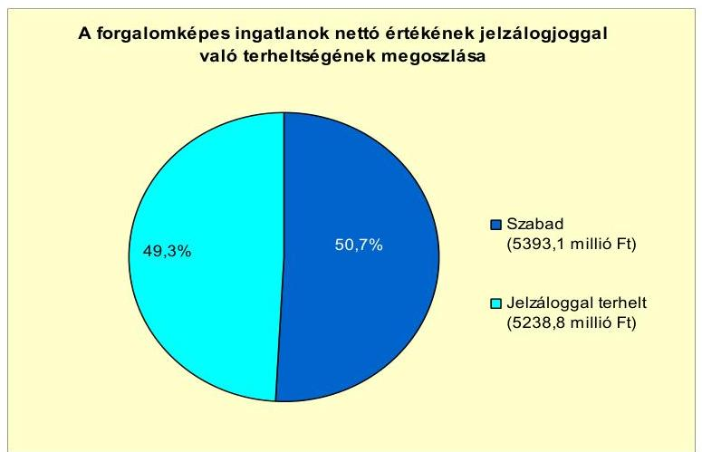

A fennálló hitelállomány és kötvénykibocsátás kapcsán fedezetként felajánlott 115 helyrajzi számmal megjelölt 7543,6 millió Ft értékű ingatlanból 2304,8 millió Ft értéket képviselő kilenc ingatlan (forgalomképtelen és korlátozottan forgalomképes egyaránt) a szerződéskötés időpontjában a törzsvagyon körébe tartozott. Az Ötv. 88. § (1) bekezdés b) pontjában foglalt előírás ${ }^{62}$ szerint törzsvagyon fedezetként történő felajánlására nem volt lehetőség.

Az Önkormányzat folyamatban lévő peres eljárásban 2011. június 30 -án nem volt érintett.

Az Önkormányzat kizárólagos tulajdonában lévő gazdasági társaságainak 2010. december 31-én és 2011. év I. félév végén fennálló kötelezettségeit az alábbi táblázat szemlélteti:

| Megnevezés | Állomány   2010. december 31-én |  |  | Állomány   2011. június 30 -én |  |  | Várható kötelezettség 2011-2013. években |  | Várható kötelezettség 2014. évtől |  |
| :--: | :--: | :--: | :--: | :--: | :--: | :--: | :--: | :--: | :--: | :--: |
|  | HUF-ban (millió Ftban) | Devizában (összege, ezer ...-ben) | Deviza   nem | HUF-ban (millió Ftban) | Devizában (összege, ezer ...-ben) | Deviza   nem | HUF-ban (millió Ftban) | Devizában (összege, ezer ...ben) | HUF-ban (millió Ftban) | Devizában (összege, ezer ...ben) |
| Pénzintézeti kötelezettségek |  |  |  |  |  |  |  |  |  |  |
| Hosszú lejáratú forgóeszköz hitel | 40,0 |  | HUF | 35,0 |  | HUF | 46,7 |  |  |  |
| Pénzintézeti kötelezettségek összesen HUF-ban: | 40,0 |  | HUF | 35,0 |  | HUF | 46,7 |  | 0,0 |  |
| Szállítás tartozás | 352,6 |  | HUF | 43,1 |  | HUF | 43,1 |  |  |  |
| Tagi kölcsöntartozás | 134,3 |  | HUF | 109,5 |  | HUF | 109,5 |  |  |  |
| Kölcsöntartozás kapcsolt vállalkozással szemben | 102,7 |  | HUF | 61,5 |  | HUF | 63,5 |  |  |  |
| Egyéb kötelezettségek | 46,5 |  | HUF | 60,3 |  | HUF | 60,3 |  |  |  |
| Windösszesen | 676,1 |  | HUF | 309,4 |  | HUF | 323,1 |  | 0,0 |  |

[^0]
[^0]:    ${ }^{62}$ A törzsvagyon egyes elemeit a 2012. január 1-jétől hatályos Nemzeti vagyon tv. 5. § (2) bekezdése szerint kell meghatározni. A kötelezettségek fedezeteként kizárólag a Nemzeti vagyon tv. 5. § (2) bekezdés c) pontjába tartozó korlátozottan forgalomképes vagyonrész ajánlható fel, amennyiben jogszabály nem tiltja és az Önkormányzat rendeletében megengedően rendelkezik. Ezen túl a 3. § (1) bekezdés 18. pontja szerinti forgalomképes üzleti vagyon terhelhető meg.

---

Az Önkormányzat kizárólagos tulajdonában lévő négy gazdasági társaság 2010. december 31-én fennálló 676,1 millió Ft összes kötelezettség állományából 548,8 millió Ft, 81,2\% a Misszió Kft.-hez kapcsolódik. A gazdasági mutatói tekintetében legjelentősebb társaság 2011-2013. években teljesítendő 243,0 millió Ft kötelezettségéből 109,5 millió Ft a tulajdonossal szembeni tartozása. A vállalkozás kötelezettségeinek fedezete a 642,6 millió Ft értékű ingatlanvagyona. A gazdasági társaságok lejárt szállítói tartozását (2010. december 31-én a Misszió Kft.-nél 88,5 millió Ft, Misszió-Health Kft. 1,3 millió Ft, ebből 60 napon túli összesen 63,2 millió Ft) az Önkormányzat nem kísérte figyelemmel, a gazdasági társaságok Képviselő-testület elé terjesztett beszámolóiban erre vonatkozó információ nem szerepelt. Az Önkormányzat valamennyi gazdasági társaságában 100,0\%-os tulajdoni hányaddal rendelkezik. Az Önkormányzat pénzügyi egyensúlyi helyzetére e felelősségi viszony miatt a gazdasági társaságok kötelezettségeinek alakulása kockázatot jelent, amely az egymással szemben fennálló 171,0 millió Ft kötelezettség figyelembevétele nélkül a 2011. év I. félévi állapot szerint nem kiemelt nagyságrendű. A gazdasági társaságok 2011. június 30 -án folyamatban lévő peres eljárásban nem voltak érintettek.

Az Önkormányzat a Gt. tv. 54. § (2) bekezdése alapján korlátlan felelősséggel tartozik azon gazdasági társaságának felszámolása esetében, amelyben az Önkormányzat az 52. § (2) bekezdése szerint a szavazatok legalább 75,0\%-ával rendelkezik, így minősített befolyásszerzőnek minősül, továbbá a Csőd. tv. 63. § (2) bekezdése alapján a kizárólagos önkormányzati tulajdonú gazdasági társaságának minden olyan kötelezettségéért, amelynek kielégítését a felszámolási eljárás során az adós társaság vagyona nem fedez, ha a hitelezőinek a felszámolási eljárás során benyújtott keresete alapján a bíróság - az adós társaság felé érvényesített tartósan hátrányos üzletpolitikájára figyelemmel - megállapítja az Önkormányzat korlátlan és teljes felelősségét.

A 2007-2010. években az Önkormányzat az immateriális javak, a tárgyi eszközök és az üzemeltetésre átadott eszközök után összesen 1616,5 millió Ft értékcsökkenést számolt el. A vizsgált években befejezett beruházások bekerülési költsége 5915,0 millió Ft, az aktivált felújítások értéke 121,2 millió Ft volt. Az összes fejlesztésből 250,0 millió Ft-ot ( $4,1 \%$-ot) fordítottak eszközpótlásra. A Képviselő-testületnek nem mutatták be az értékcsökkenés és az eszközpótlásra fordított kiadások, továbbá az eszközök használhatósági fokának alakulását.

A 2007. évi 35176,0 millió Ft nyitóállományhoz képest a befektetett eszközök bruttó értéke a 2010. év végére 39754,8 millió Ft-ra, míg az elszámolt értékcsökkenés állománya 1413,8 millió Ft-ról 3030,3 millió Ft-ra emelkedett. E két tényező együttes hatására a nettó érték 2962,3 millió Ft-tal, 8,8\%-kal nőtt. Az összes eszközre számított átlagos használhatósági fok mutató 96,0\%-ról 92,4\%-ra csökkent, az értékcsökkenés állományának 114,3\%-os mértékú növekedésétől kisebb bruttó érték emelkedés (13,0\%) miatt. A 2010. évi állományi érték alapján az immateriális javak használhatósági foka 33,0\%, az ingatlanoké $94,0 \%$, az egyéb tárgyi eszközöké $57,0 \%$ és az üzemeltetésre és vagyonkezelésbe átadott eszközöké $78,2 \%$.

---

# 4. A PÉNZÜGYI EGYENSÚLY MEGTEREMTÉSE ÉrDEKÉBEN HOZOTT INTÉZKEDÉSEK EREDMÉNYE 

A Képviselő-testület 2007-2010 között valamennyi ellátási területre megfogalmazva az éves költségvetési koncepciókban jelölte meg a kiadáscsökkentést és bevételnövelést szolgáló feladatokat. Az intézkedések hatását azonban nem számszerúsítették. Az intézkedések célja - a feladatellátás szakmai színvonalának megőrzése mellett - a pénzügyi helyzet javítása volt. A koncepcióban megfogalmazott kiadáscsökkentő elképzeléseket (létszám felülvizsgálat, önként vállalt feladatok felülvizsgálata) az éves költségvetésben nem tervezték, nem számszerúsítették.

Az Önkormányzat adatszolgáltatása szerint a 2007-2010. éveket érintő önkormányzati létszám és álláshely változását az alábbi táblázat részletezi:

| Megnevezés (adatok fő-ben) | Közoktatás | Szociális és gyermekvédelem | Egészségügy | Polgármesteri hivatal | Egyéb | Összesen |
| :--: | :--: | :--: | :--: | :--: | :--: | :--: |
| 2007. január 1-jén jóváhagyott álláshelyek száma | 292 | 0 | 7 | 66 | 82 | 447 |
| Megszüntetett álláshelyek száma | 0 | 0 | 0 | 0 | 0 | 0 |
| ebből: üres álláshelyek száma | 0 | 0 | 0 | 0 | 0 | 0 |
| szakmai álláshelyek száma | 0 | 0 | 0 | 0 | 0 | 0 |
| intézmény-üzemeltetéssel kapcsolatos álláshelyek száma | 0 | 0 | 0 | 0 | 0 | 0 |
| Álláshely növekedése | 19 | 27 | 2 | 9 | 6 | 63 |
| 2010. december 31-én záró álláshelyek száma | 311 | 27 | 9 | 75 | 88 | 510 |
| 2007. január 1-jén foglalkoztatott létszám | 292 | 0 | 7 | 64 | 82 | 445 |
| Létszámcsökkenés | 0 | 0 | 0 | 0 | 0 | 0 |
| Létszámnövekedés | 19 | 27 | 2 | 9 | 6 | 63 |
| 2010. december 31-én foglalkoztatott létszám | 311 | 27 | 9 | 73 | 88 | 508 |

Az Önkormányzatnál az engedélyezett álláshelyek száma 2007. január 1-jén és 2010. december 31-én is két fővel haladta meg a foglalkoztatottak létszámát. A két üres álláshely a Polgármesteri hivatalban volt 2007. január 1-jén és 2010. december 31-én. A 2007. január 1-jei 447 fő álláshely 63 fővel (14,1\%$\mathrm{kal})$ 2010. év végére 510 főre emelkedett. A változást a szociális és gyermekjóléti, a közoktatási, az egészségügyi ágazati intézményeknél és a Polgármesteri hivatalnál végrehajtott feladatbővülés, valamint az ellátotti létszám növekedése indokolta. A létszámnövekedés is 63 fő volt ugyanebben az időszakban.

Az Önkormányzat 2008 májusától bölcsődét múködte tett. Az intézmény fenntartásának összes álláshely növekménye 27 fő volt. A közoktatási intézményekben kimutatott 19 fő álláshely emelkedését a Csonkási városrészben átadott új óvodai telephely, a Lévai utcai óvoda gyermeklétszámának növekedése, valamint egy új zenetagozat indítása indokolta. Az egészségügyben az általános iskolai védőnői feladatok, az egyéb feladatoknál a kisegítő fizikai feladatok (takarítás, karbantartás) bővülése magyarázza az álláshelyek kettő, illetve hat fős emelkedését. A Polgármesteri hivatalnál a beruházási és pályázati feladatok, valamint a közigazgatási iroda szerkezeti átalakítása miatt emelték kilenc fővel az álláshelyeket.

A Képviselő-testület 2007-2011. június 30. között - az Önkormányzat adatszolgáltatása alapján - 732,6 millió Ft összegű bevételnövelő intézkedést hozott. Az intézkedések 80,1\%-a (586,6 millió Ft) a helyi adókhoz, 19,9\%-a (146,0 millió Ft) az eszközök hasznosításához kapcsolódott. Az Önkormányzat-

---

nál 2007-ben iparűzési adó, magánszemélyek kommunális adója, idegenforgalmi adó fizetési kötelezettség állt fenn. A helyi adók növelése érdekében a Képviselő-testület 2008. január 1-jétől bevezette az építményadót és a telekadót is. Az Önkormányzat adatszolgáltatása alapján az új adónemek bevezetése 86,9 millió Ft, az adótárgyak feltárása 56,8 millió Ft, a hátralékok behajtása 372,0 millió Ft, az adómértékek változása 70,9 millió Ft bevételi többletet eredményezett.

A kommunális adó mértékét három alkalommal emelték a vizsgált időszakban, amely a 2007. évi 11000 Ft/adótárgyról, 2008-ra 12000 Ft/adótárgyra, 2009-re 15500 Ft/adótárgyra, 2011-re 16000 Ft/adótárgyra emelkedett. Az építményadó bevezetéskori $500 \mathrm{Ft} / \mathrm{m}^{2}$-ről 2011-re $600 \mathrm{Ft} / \mathrm{m}^{2}$-re emelkedett. A telekadó a 2007. évi $100 \mathrm{Ft} / \mathrm{m}^{2}$-ről 2011-re $150 \mathrm{Ft} / \mathrm{m}^{2}$-re változott. Az idegenforgalmi adó és az iparűzési adómértékét 2007 és 2010 között a törvényben meghatározott maximális mérték szerint határozták meg.

Az eszközök hasznosítására tett intézkedésekkel az Önkormányzat adatszolgáltatása szerint az eszközök értékesítéséből 146,0 millió Ft többletbevételt értek el.

Az értékesítésekből származó többletbevétel az Önkormányzat területén lévő gázelosztó vezetékrendszer, üzlethelyiségek és a hozzájuk kapcsolódó üzletrészek eladásából tevődött össze.

Az intézményi térítési díjak emelése az Önkormányzat számára bevételi többletet nem eredményezett, mivel a térítési díj emelések a kalkulált nyersanyagköltség növekedésével azonos mértékben történtek.

Az Önkormányzat bevételnövelésre irányuló intézkedései eredményét a 20072011. év I. félévben az alábbi ábra szemlélteti:
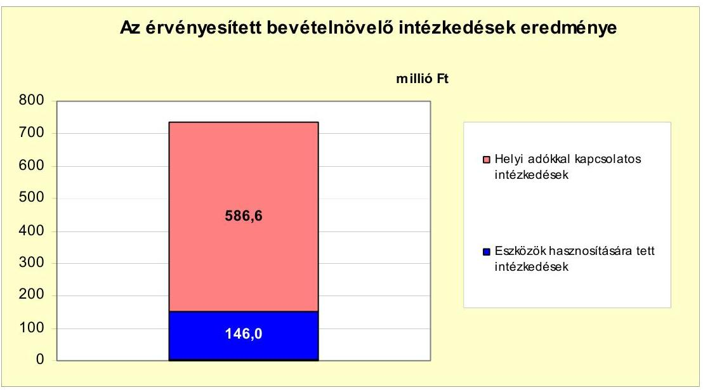

A bevételnövelő intézkedések az Önkormányzat pénzügyi egyensúlyát 732,6 millió Ft-tal javították. A bevételnövelő intézkedésekből származó összeg ellensúlyozta a költségvetési támogatásból és az szja bevételből származó kiesést. Az Önkormányzat költségvetési támogatásból, szja bevételből származó bevételei a 2007. évhez viszonyítva a 2008. évben 45,5 millió Ft-tal, a 2009. év-

---

ben 35,0 millió Ft-tal, a 2010. évben 248,0 millió Ft-tal, 2011. év I. félévben 152,4 millió Ft-tal, összességében 480,9 millió Ft-tal csökkentek. A bevételnövelő intézkedések összegének, valamint a költségvetési támogatások és az szja bevétel csökkenésnek a különbsége 251,7 millió Ft, amely kedvező hatással volt a pénzügyi egyensúlyi helyzetre.

# 5. Az ÁSZ Által a korábBi ÉVEKben a PÉnZÜGYi EGYENSÚLY JAVÍTÁSÁRA TETT SZABÁLYSZERŰSÉGI ÉS CÉLSZERŰSÉGI JAVASLATOK HASZNOSULÁSA 

Az ÁSZ az Önkormányzat gazdálkodási rendszerét a 2008. évben átfogó jelleggel ellenőrizte, amelynek során a pénzügyi egyensúly javítására öt szabályszerűségi és hét célszerúségi javaslatot tett. A javaslatok megvalósítása érdekében a Képviselő-testület elfogadta a felelősöket és határidőket is tartalmazó intézkedési tervet.

Az ellenőrzés során tett, a pénzügyi egyensúly javítására vonatkozó szabályszerűségi javaslatok 80,0\%-át hasznosították és 20,0\%-át nem hasznosították. A célszerűségi javaslatok 86,0\%-át részben és 14,0\%-át pedig nem hasznosították.

A jegyző ${ }_{2}$ négy szabályszerűségi javaslatra megtett intézkedései eredményeképpen biztosította a 2009. évi költségvetési rendeletben a költségvetés bevételi és kiadási főösszegének finanszírozási célú pénzügyi műveletek nélküli bemutatását. Gondoskodott arról, hogy az intézkedési tervben meghatározott 2009. február 15-től az adósságot keletkeztető éves kötelezettségvállalásnak a felső határát a gazdálkodás során betartsák. Gondoskodott továbbá arról, hogy a 2009. évi költségvetési rendelet tartalmazza elkülönítetten bemutatva az EU-s támogatással megvalósuló projektek bevételeit és kiadásait, valamint a többéves kihatással járó fejlesztési feladatokat számszerűsítve, éves bontásban.

A jegyző ${ }_{2,3}$ egy szabályszerűségi javaslatot nem hasznosított, mert a költségvetési rendelet utolsó előirányzat módosításának határidejét az Ámr. ${ }_{1}$ 53. § (6) bekezdésében foglaltak ellenére a 2009-2010. években nem tartották be, azonban a 2011. évben a módosítást már az előírtak szerint végezték.

A polgármester számára tett három célszerűségi javaslatot részben hasznosították. Veresegyház Város Integrált Városfejlesztési Stratégiájában a 2008. évben meghatározták a fejlesztési célkitűzéseket és a prioritásokat, azonban a gazdasági programot nem készítették el az intézkedési tervben meghatározott határidőre, azt a 2011. évben fogadták el. Továbbá az Önkormányzat által finanszírozható fejlesztések megvalósítására, a pénzügyi egyensúly biztosítására, az adósságállomány keretek között tartására, a hitelek, a szállítói és kötvény tartozások kifizetésére vonatkozó javaslatok ellenére az Önkormányzat pénzügyi helyzete nem javult, felhalmozási kiadása és hitelállománya a 2009. évben tovább nőtt. A Képviselő-testület által a költségvetési rendeletben munkabér-, valamint likvid hitel felvétele céljából meghatározott értékhatárt a 2009. évben a munkabérhitelnél betartották, azonban a likvidhitel-keretet a mérlegfordulónapi állományi adatok alapján a 2009. évben 95,0 millió Ft-tal (15,8\%-kal),

---

2010-ben 337,0 millió Ft-tal (32,1\%-kal), valamint 2011. I. félévben 795,7 millió Ft-tal ( $99,5 \%$-kal) túllépték ${ }^{63}$.

A jegyzö ${ }_{2,3}$ három célszerüségi javaslatot részben hasznosított. A költségvetési rendelettervezetben bemutatta a Képviselő-testület részére az - Ötv. 1 88. § (2)(3) bekezdéseiben meghatározott - adósságot keletkeztető éves kötelezettségvállalás felső határát, azonban a zárszámadási rendelettervezetben a 2009. évben nem, hanem az előírt határidőn túl először a 2010. évben mutatta be annak betartását ${ }^{64}$. A 2009. évben már pontosabban 4,0\%-kal ( 30,8 millió Ft-tal) alultervezték a felhalmozási célú költségvetési bevételeket, a követelések, hátralékok beszedése a tervezettől elmaradt ${ }^{65}$. A Képviselő-testület elé terjesztett EU-s fejlesztési forrásokkal összefüggő fejlesztési feladatok összhangba kerültek Veresegyház Város Integrált Városfejlesztési Stratégiájában foglaltakkal, amelyet helyzetelemzésekkel támasztottak alá ${ }^{66}$. A döntések során a projektek utófinanszírozásából várható pénzügyi terhek hatásainak elemzésére, a javaslat szerinti figyelembe vételére azonban továbbra sem tértek ki.

A jegyzö ${ }_{2,3}$ egy célszerüségi javaslatot nem hasznosított, mivel nem kezdeményezte az önkormányzati többségi tulajdonú gazdasági társaságoknál a rendelkezésre álló erőforrásokkal való gazdálkodás, a vagyon megóvása, gyarapítása, az elszámolások, beszámolók megbízhatósága ellenőrzését.

Budapest, 2012. április " 16 "

Melléklet: $\quad 11 \mathrm{db}$
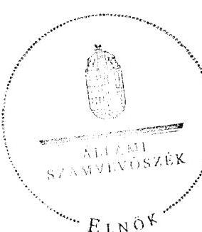

Domokos László $\varnothing$

[^0]
[^0]:    ${ }^{63}$ A feltárt hiányosságok felszámolására készített intézkedési tervben nem tértek ki erre a javaslatra és az ÁSZ 2009. január 16-ai figyelemfelhívó levelében foglaltak ellenére az intézkedési tervet nem egészítették ki.
    ${ }^{64}$ Az Önkormányzatnál az adósságot keletkeztető éves kötelezettségvállalás felső határát a 2009. évtől betartották.
    ${ }^{65}$ A 2010-2011. évben két új dolgozót vettek fel a hátralékok behajtására, valamint a helyzet javítása érdekében a 2011. évben szerződést kötöttek egy bírósági végrehajtóval.
    ${ }^{66}$ A 2008. évben elkészített Veresegyház Város Integrált Városfejlesztési Stratégiája az ágazati szakmai fejlesztési koncepciókat is felhasználva, azok hiányosságait is pótolva tartalmazta a tervezett fejlesztéseket, azok prioritását és a megvalósítás lehetséges forrásait.

---

Veresegyház Város Önkormányzata

1. számú melléklet
a V-3112-040/2012. számú Jelentéshez

**Működési és felhalmozási célú hiány/többlet a 2007-2010 közötti
időszakban az Önkormányzat zárszámadási rendeleteiben**

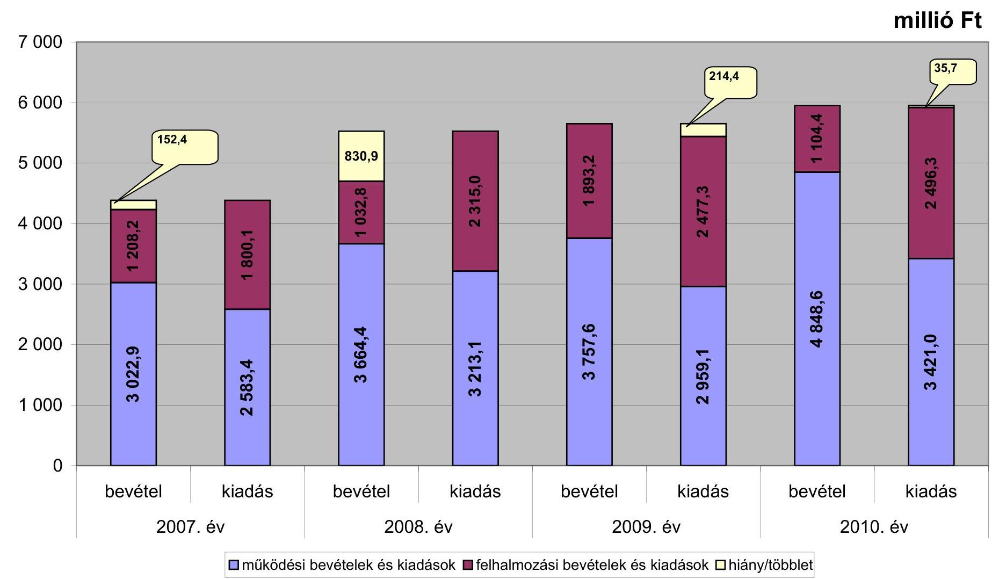

**millió Ft**

|   | bevétel 2007. év | kiadás bevétel 2008. év | kiadás bevétel 2009. év | kiadás bevétel 2010. év  |
| --- | --- | --- | --- | --- |
|  2007. év | 1 208,4 | 1 800,1 | 3 757,6 | 4 848,6  |
|  2008. év | 1 032,8 | 1 032,8 | 2 477,3 | 2 959,1  |
|  2009. év | 1 893,2 | 1 893,2 | 1 104,4 | 1 104,4  |
|  2010. év | 2 959,1 | 2 959,1 | 4 848,6 | 3 421,0  |

☐ működési bevételek és kiadások ☐ felhalmozási bevételek és kiadások ☐ hiány/többlet

---

Az Önkormányzat bevételei és kiadásai, valamint adósságszolgálata 2007-2010 között

|  1. FOLYÓ KÖLTSÉGVETÉS | 2007. év | 2008. év | 2009. év | 2010. év  |
| --- | --- | --- | --- | --- |
|  1.1.1. Saját müködési bevételek | 2 086,7 | 2 791,6 | 3 107,9 | 4 295,5  |
|  1.1.2. Költségvetési támogatás * | 699,1 | 919,2 | 902,4 | 808,9  |
|  1.1.3. Átengedett bevételek | 318,5 | 78,4 | 104,1 | -32,5  |
|  1.1.4. Állambáztartáson belülről kapott támogatások | 44,4 | 57,0 | 76,2 | 66,5  |
|  1.1.5. EU-tól és külföldről kapott bevételek | 0,0 |  |  |   |
|  1.1.6. Állambáztartáson kívülről kapott bevételek | 5,4 | 3,6 | 4,7 | 2,5  |
|  1.1.7. Előző évi pénzmaradvány átvétel | 0,0 |  |  | 11,2  |
|  1.1. Folyó bevételek =1.1.1.+1.1.2.+1.1.3.+1.1.4.+1.1.5.+1.1.6.+1.1.7. | 3 154,1 | 3 849,8 | 4 195,3 | 5 152,1  |
|  1.2.1. Müködési kiadások kamatkiadások nélkül | 2 266,0 | 2 989,1 | 2 828,7 | 3 164,8  |
|  1.2.2. Állambáztartáson belülre átadott pénzeszközök | 71,3 | 74,8 | 71,4 | 65,2  |
|  1.2.3.1. vállalkozásoknak | 0,0 |  | 0,0 | 0,0  |
|  1.2.3.2. EU-nak, illetve külföldre | 1,0 | 1,5 | 1,0 | 0,1  |
|  1.2.3.3. magáncismélyeknek | 62,9 | 63,1 | 60,7 | 91,2  |
|  1.2.3.4. nonprofit cserevzeteknek | 68,8 | 74,3 | 58,6 | 58,6  |
|  1.2.3. Transferkiadások (=1.2.3.1+1.2.3.2+1.2.3.3+1.2.3.4) | 132,7 | 138,9 | 120,3 | 149,9  |
|  1.2.4 Kamatkiadások | 360,7 | 456,0 | 361,7 | 462,7  |
|  1.2.5. Előző évi pénzmaradvány átadás | 0,0 | 0,0 | 0,0 | 0,0  |
|  1.2. Folyó kiadások = 1.2.1.+1.2.2.+1.2.3.+1.2.4.+1.2.5. | 2 830,9 | 3 658,8 | 3 382,1 | 3 842,6  |
|  1.3. Folyó költségvetés egyenlege MÜKÖDÉSI JÖVEDELEM (1.1. - 1.2.) | 323,2 | 191,0 | 813,2 | 1 309,5  |
|  2. FELHALMOZÁSI KÖLTSÉGVETÉS* |  |  |  |   |
|  2.1.1. Saját tökebevételek | 720,9 | 503,9 | 787,5 | 667,6  |
|  2.1.2. Állambáztartáson belülről kapott támogatások | 311,0 | 273,4 | 663,4 | 598,1  |
|  2.1.3. EU-tól és külföldről kapott támogatások | 0,0 | 0,0 | 0,0 | 0,0  |
|  2.1.4. Állambáztartáson kívülről kapott támogatások | 52,5 | 42,7 | 28,8 | 28,0  |
|  2.1. Felhalmozási bevételek (=2.1.1.+2.1.2+2.1.3+2.1.4.) | 1 084,4 | 820,0 | 1 479,7 | 1 293,7  |
|  2.2.1. Saját beruházási kiadás áfával | 1 466,0 | 1 758,8 | 1 990,0 | 1 757,0  |
|  2.2.2. Saját felújítási kiadás áfával | 58,6 | 45,5 | 23,2 | 45,0  |
|  2.2.3. Állambáztartáson belülre átadott pénzeszköz | 0,0 | 0,0 | 0,0 | 112,7  |
|  2.2.4. EU-nak és külföldnek adott pénzeszközök | 0,0 | 0,0 | 0,0 | 0,0  |
|  2.2.5. Állambáztartáson kívülre adott pénzeszközök | 59,4 | 167,5 | 273,3 | 332,2  |
|  2.2.6. Befektetési célú részesedések vásárlása | 0,0 | 0,0 | 5,0 | 226,0  |
|  2.2. Felhalmozási kiadások (=2.2.1.+2.2.2.+2.2.3.+2.2.4.+2.2.5.+2.2.6.) | 1 584,0 | 1 971,8 | 2 291,5 | 2 472,9  |
|  2.3. Felhalmozási költségvetés egyenlege (2.1. - 2.2.) | -499,6 | -1 151,8 | -811,8 | -1 179,2  |
|  3. Finanszírozási műveletek nélküli (GFS) pozíció(1.3.+2.3.) | -176,4 | -960,8 | 1,4 | 130,3  |
|  4. Finanszírozási műveletek |  |  |  |   |
|  4.1. Hitelfelvétel | 978,9 | 575,0 | 869,0 | 1 579,4  |
|  4.2. Hiteltörlesztés | 952,2 | 4 275,7 | 676,9 | 1 027,7  |
|  4.3. Forgatási és befektetési célú értékpapírok kibocsátása | 0,0 | 4 582,3 | 0,0 | 0,0  |
|  4.4. Forgatási és befektetési célú értékpapírok beváltása | 0,0 | 0,0 | 0,0 | 366,4  |
|  4.5. Forgatási és befektetési célú értékpapírok értékesítése | 0,0 | 27,8 | 0,0 | 0,0  |
|  4.6. Forgatási és befektetési célú értékpapírok vásárlása | 0,0 | 0,0 | 0,0 | 0,0  |
|  4.7. Egyéb finanszírozási bevételek (függő, átfutó, kiegyenlítő) | 21,2 | 61,2 | -73,8 | -36,3  |
|  4.8. Egyéb finanszírozási kiadások (függő, átfutó, kiegyenlítő) | -5,1 | 6,1 | 96,7 | 205,6  |
|  4.9. Finanszírozási műveletek egyenlege (4.1. - 4.2.+4.3.-4.4+4.5.-4.6.+4.7.-4.8.) | 53,0 | 964,5 | 21,6 | -56,6  |
|  5. Tárgyévi pénzügyi pozíció (1.3.+ 2.3.+4.9.) | -123,4 | 3,7 | 23,0 | 73,7  |
|  6. Nettó müködési jövedelem =müködési jövedelem (1.3.) - töketörlesztés (4.2+4.4) | -629,0 | -4 084,7 | 136,3 | -84,6  |
|  TÁJÉKOZTÁTÓ ADATOK |  |  |  |   |
|  Összes kötelezettség ** | 6 069,4 | 7 236,1 | 7 319,8 | 8 730,0  |
|  ebből rövid lejáratú | 6 069,4 | 2 078,7 | 2 096,2 | 2 913,9  |
|  Összes szállítói kötelezettség | 901,3 | 625,1 | 334,5 | 346,5  |
|  ebből lejárt (tanúsítványból) | 673,7 | 284,7 | 211,0 | 94,6  |
|  Pénz és tőkeplací kötelezettség (adósság) | 3 863,2 | 5 580,3 | 5 851,1 | 6 354,7  |
|  ebből rövid lejáratú | 3 863,2 | 423,0 | 627,4 | 538,6  |
|  Folyószámlakítél napi átlagos állománya (tanúsítványból) *** | 640,3 | 288,2 | 157,6 | 148,9  |
|  Munkabérhítél napi átlagos állománya (tanúsítványból)*** | 86,1 | 57,2 | 47,0 | 48,0  |
|  Felvett bankhítél napi átlagos állománya (tanúsítványból)*** | 340,0 | 201,4 | 132,5 | 33,3  |
|  Felvett kölcsönök napi átlagos állománya | 806,7 | 477,1 | 791,9 | 1 038,6  |
|  Kezesség és garanciárállalások (tanúsítványból) | 100,0 | 100,0 | 0,0 | 264,5  |
|  Jogerős bírósági ítéletekből adóó kötelezettségek (tanúsítványból) |  |  |  |   |
|  Finanszírozásba bevonható eszközök: | 4,8 | 8,5 | 31,5 | 105,2  |
|  Tartós hitelviszonyt megtestesítő értékpapírok és végi állománya |  |  |  |   |
|  Hosszú lejáratú bankhétélek és végi állománya |  |  |  |   |
|  Értékpapírok és végi állománya |  |  |  |   |
|  Pénzeszközök (idegen pénzeszközök nélkül) és végi állománya | 4,8 | 8,5 | 31,5 | 105,2  |

- A költségvetési támogatásból a felhalmozási célú összeget az Önkormányzat adatszolgáltatása szerinti mértékben vettük figyelembe, a 2.1.2. soron. ** Az összes kötelezettséget a puszćv pénzügyi elszámolások nélkül vettük figyelembe, mert a puszćvük a pénzmaradvány elszámolás telelei közti tartoznak. *** A folyószámla, a likvid- és a munkabérhítél átlagos állományát 365 napos osztószámmal és nem a fennálló napok számával vettük figyelembe.

---

Verexegyház Város Önkormányzata z.ír. 0112-040/2012. számra, okértéséhez Az Önkormányzat 2007-2010 években megvalósított, 2010. december 31-ig befejezett fejlesztőket és azok forrásbaazoklódó

|  |   |   |   |   |   |   |   |   |   |   |   |   |   |   |   |   |   |   |   |   |   |   |   |   |   |   |   |   |   |   |   |
| --- | --- | --- | --- | --- | --- | --- | --- | --- | --- | --- | --- | --- | --- | --- | --- | --- | --- | --- | --- | --- | --- | --- | --- | --- | --- | --- | --- | --- | --- | --- | --- |
|   |  |  |  |  |  |  |  |  |  |  |  |  |  |  |  |  |  |  |  |  |  |  |  |  |  |  |  |  |  |  |   |
|   |  |  |  |  |  |  |  |  |  |  |  |  |  |  |  |  |  |  |  |  |  |  |  |  |  |  |  |  |  |  |   |
|   |  |  |  |  |  |  |  |  |  |  |  |  |  |  |  |  |  |  |  |  |  |  |  |  |  |  |  |  |  |  |   |
|   |  |  |  |  |  |  |  |  |  |  |  |  |  |  |  |  |  |  |  |  |  |  |  |  |  |  |  |  |  |  |   |
|   |  |  |  |  |  |  |  |  |  |  |  |  |  |  |  |  |  |  |  |  |  |  |  |  |  |  |  |  |  |  |   |
|   |  |  |  |  |  |  |  |  |  |  |  |  |  |  |  |  |  |  |  |  |  |  |  |  |  |  |  |  |  |  |   |
|   |  |  |  |  |  |  |  |  |  |  |  |  |  |  |  |  |  |  |  |  |  |  |  |  |  |  |  |  |  |  |   |
|   |  |  |  |  |  |  |  |  |  |  |  |  |  |  |  |  |  |  |  |  |  |  |  |  |  |  |  |  |  |  |   |
|   |  |  |  |  |  |  |  |  |  |  |  |  |  |  |  |  |  |  |  |  |  |  |  |  |  |  |  |  |  |  |   |
|   |  |  |  |  |  |  |  |  |  |  |  |  |  |  |  |  |  |  |  |  |  |  |  |  |  |  |  |  |  |  |   |
|   |  |  |  |  |  |  |  |  |  |  |  |  |  |  |  |  |  |  |  |  |  |  |  |  |  |  |  |  |  |  |   |
|   |  |  |  |  |  |  |  |  |  |  |  |  |  |  |  |  |  |  |  |  |  |  |  |  |  |  |  |  |  |  |   |
|   |  |  |  |  |  |  |  |  |  |  |  |  |  |  |  |  |  |  |  |  |  |  |  |  |  |  |  |  |  |  |   |
|   |  |  |  |  |  |  |  |  |  |  |  |  |  |  |  |  |  |  |  |  |  |  |  |  |  |  |  |  |  |  |   |
|   |  |  |  |  |  |  |  |  |  |  |  |  |  |  |  |  |  |  |  |  |  |  |  |  |  |  |  |  |  |  |   |
|   |  |  |  |  |  |  |  |  |  |  |  |  |  |  |  |  |  |  |  |  |  |  |  |  |  |  |  |  |  |  |   |
|   |  |  |  |  |  |  |  |  |  |  |  |  |  |  |  |  |  |  |  |  |  |  |  |  |  |  |  |  |  |  |   |
|   |  |  |  |  |  |  |  |  |  |  |  |  |  |  |  |  |  |  |  |  |  |  |  |  |  |  |  |  |  |  |   |
|   |  |  |  |  |  |  |  |  |  |  |  |  |  |  |  |  |  |  |  |  |  |  |  |  |  |  |  |  |  |  |   |
|   |  |  |  |  |  |  |  |  |  |  |  |  |  |  |  |  |  |  |  |  |  |  |  |  |  |  |  |  |  |  |   |
|   |  |  |  |  |  |  |  |  |  |  |  |  |  |  |  |  |  |  |  |  |  |  |  |  |  |  |  |  |  |  |   |
|   |  |  |  |  |  |  |  |  |  |  |  |  |  |  |  |  |  |  |  |  |  |  |  |  |  |  |  |  |  |  |   |
|   |  |  |  |  |  |  |  |  |  |  |  |  |  |  |  |  |  |  |  |  |  |  |  |  |  |  |  |  |  |  |   |
|   |  |  |  |  |  |  |  |  |  |  |  |  |  |  |  |  |  |  |  |  |  |  |  |  |  |  |  |  |  |  |   |
|   |  |  |  |  |  |  |  |  |  |  |  |  |  |  |  |  |  |  |  |  |  |  |  |  |  |  |  |  |  |  |   |
|   |  |  |  |  |  |  |  |  |  |  |  |  |  |  |  |  |  |  |  |  |  |  |  |  |  |  |  |  |  |  |   |
|   |  |  |  |  |  |  |  |  |  |  |  |  |  |  |  |  |  |  |  |  |  |  |  |  |  |  |  |  |  |  |   |
|   |  |  |  |  |  |  |  |  |  |  |  |  |  |  |  |  |  |  |  |  |  |  |  |  |  |  |  |  |  |  |   |
|   |  |  |  |  |  |  |  |  |  |  |  |  |  |  |  |  |  |  |  |  |  |  |  |  |  |  |  |  |  |  |   |
|   |  |  |  |  |  |  |  |  |  |  |  |  |  |  |  |  |  |  |  |  |  |  |  |  |  |  |  |  |  |  |   |
|   |  |  |  |  |  |  |  |  |  |  |  |  |  |  |  |  |  |  |  |  |  |  |  |  |  |  |  |  |  |  |   |
|   |

---

|   |  |  |  |  |  |  |  |  |  |  |  |  |  |  |  |  |  |  |  |  |  |  |  |  |  |  |  |  |  |  |  |  |  |  |  |  |  |  |  |  |  |  |  |  |  |  |  |  |  |  |  |  |  |  |  |  |  |  |  |  |  |  |  |  |  |  |  |  |  |  |  |  |  |  |  |  |  |  |  |  |  |  |  |  |  |  |  |  |  |  |  |  |  |  |  |  |  |  |  |  |  | 

---

|   |  |  |  |  |  |  |  |  |  |  |  |  |  |  |  |  |  |  |  |  |  |  |  |  |  |  |  |  |  |  |  |  |  |  |  |  |  |  |  |  |  |  |  |  |  |  |  |  |  |   |
| --- | --- | --- | --- | --- | --- | --- | --- | --- | --- | --- | --- | --- | --- | --- | --- | --- | --- | --- | --- | --- | --- | --- | --- | --- | --- | --- | --- | --- | --- | --- | --- | --- | --- | --- | --- | --- | --- | --- | --- | --- | --- | --- | --- | --- | --- | --- | --- | --- | --- | --- | --- |
|   |  |  |  |  |  |  |  |  |  |  |  |  |  |  |  |  |  |  |  |  |  |  |  |  |  |  |  |  |  |  |  |  |  |  |  |  |  |  |  |  |  |  |  |  |  |  |  |  |   |
|   |  |  |  |  |  |  |  |  |  |  |  |  |  |  |  |  |  |  |  |  |  |  |  |  |  |  |  |  |  |  |  |  |  |  |  |  |  |  |  |  |  |  |  |  |  |  |  |  |   |
|   |  |  |  |  |  |  |  |  |  |  |  |  |  |  |  |  |  |  |  |  |  |  |  |  |  |  |  |  |  |  |  |  |  |  |  |  |  |  |  |  |  |  |  |  |  |  |  |  |   |
|   |  |  |  |  |  |  |  |  |  |  |  |  |  |  |  |  |  |  |  |  |  |  |  |  |  |  |  |  |  |  |  |  |  |  |  |  |  |  |  |  |  |  |  |  |  |  |  |   |
|   |  |  |  |  |  |  |  |  |  |  |  |  |  |  |  |  |  |  |  |  |  |  |  |  |  |  |  |  |  |  |  |  |  |  |  |  |  |  |  |  |  |  |  |  |  |  |  |   |
|   |  |  |  |  |  |  |  |  |  |  |  |  |  |  |  |  |  |  |  |  |  |  |  |  |  |  |  |  |  |  |  |  |  |  |  |  |  |  |  |  |  |  |  |  |  |  |  |   |
|   |  |  |  |  |  |  |  |  |  |  |  |  |  |  |  |  |  |  |  |  |  |  |  |  |  |  |  |  |  |  |  |  |  |  |  |  |  |  |  |  |  |  |  |  |  |  |  |   |
|   |  |  |  |  |  |  |  |  |  |  |  |  |  |  |  |  |  |  |  |  |  |  |  |  |  |  |  |  |  |  |  |  |  |  |  |  |  |  |  |  |  |  |  |  |  |  |  |   |
|   |  |  |  |  |  |  |  |  |  |  |  |  |  |  |  |  |  |  |  |  |  |  |  |  |  |  |  |  |  |  |  |  |  |  |  |  |  |  |  |  |  |  |  |  |  |  |  |   |
|   |  |  |  |  |  |  |  |  |  |  |  |  |  |  |  |  |  |  |  |  |  |  |  |  |  |  |  |  |  |  |  |  |  |  |  |  |  |  |  |  |  |  |  |  |  |  |  |   |
|   |  |  |  |  |  |  |  |  |  |  |  |  |  |  |  |  |  |  |  |  |  |  |  |  |  |  |  |  |  |  |  |  |  |  |  |  |  |  |  |  |  |  |  |  |  |  |  |   |
|   |  |  |  |  |  |  |  |  |  |  |  |  |  |  |  |  |  |  |  |  |  |  |  |  |  |  |  |  |  |  |  |  |  |  |  |  |  |  |  |  |  |  |  |  |  |  |  |   |
|   |  |  |  |  |  |  |  |  |  |  |  |  |  |  |  |  |  |  |  |  |  |  |  |  |  |  |  |  |  |  |  |  |  |  |  |  |  |  |  |  |  |  |  |  |  |  |  |   |
|   |  |  |  |  |  |  |  |  |  |  |  |  |  |  |  |  |  |  |  |  |  |  |  |  |  |  |  |  |  |  |  |  |  |  |  |  |  |  |  |  |  |  |  |  |  |  |  |   |
|   |  |  |  |  |  |  |  |  |  |  |  |  |  |  |  |  |  |  |  |  |  |  |  |  |  |  |  |  |  |  |  |  |  |  |  |  |  |  |  |  |  |  |  |  |  |  |  |   |
|   |  |  |  |  |  |  |  |  |  |  |  |  |  |  |  |  |  |  |  |  |  |  |  |  |  |  |  |  |  |  |  |  |  |  |  |  |  |  |  |  |  |  |  |  |  |  |  |   |
|   |  |  |  |  |  |  |  |  |  |  |  |  |  |  |  |  |  |  |  |  |  |  |  |  |  |  |  |  |  |  |  |  |  |  |  |  |  |  |  |  |  |  |  |  |  |  |  |   |
|   |  |  |  |  |  |  |  |  |  |  |  |  |  |  |  |  |  |  |  |  |  |  |  |  |  |  |  |  |  |  |  |  |  |  |  |  |  |  |  |  |  |  |  |  |  |  |  |   |
|   |  |  |  |  |  |  |  |  |  |  |  |  |  |  |  |  |  |  |  |  |  |  |  |  |  |  |  |  |  |  |  |  |  |  |  |  |  |  |  |  |  |  |  |  |  |  |  |   |
|   |  |  |  |  |  |  |  |  |  |  |  |  |  |  |  |  |  |  |  |  |  |  |  |  |  |  |  |  |  |  |  |  |  |  |  |  |  |  |  |  |  |  |  |  |  |  |  |   |
|   |  |  |  |  |  |  |  |  |  |  |  |  |  |  |  |  |  |  |  |  |  |  |  |  |  |  |  |  |  |  |  |  |  |  |  |  |  |  |  |  |  |  |  |  |  |  |  |   |
|   |  |  |  |  |  |  |  |  |  |  |  |  |  |  |  |  |  |  |  |  |  |  |  |  |  |  |  |  |  |  |  |  |  |  |  |  |  |  |  |  |  |  |  |  |  |  |  |   |
|   |  |  |  |  |  |  |  |  |  |  |  |  |  |  |  |  |  |  |  |  |  |  |  |  |  |  |  |  |  |  |  |  |  |  |  |  |  |  |  |  |  |  |  |  |  |  |  |   |
|   |  |  |  |  |  |  |  |  |  |  |  |  |  |  |  |  |  |  |  |  |  |  |  |  |  |  |  |  |  |  |  |  |  |  |  |  |  |  |  |  |  |  |  |  |  |  |  |   |
|   |  |  |  |  |  |  |  |  |  |  |  |  |  |  |  |  |  |  |  |  |  |  |  |  |  |  |  |  |  |  |  |  |  |  |  |  |  |  |  |  |  |  |  |  |  |  |  |   |
|   |  |  |  |  |  |  |  |  |  |  |  |  |  |  |  |  |  |  |  |  |  |  |  |  |  |  |  |  |  |  |  |  |  |  |  |  |  |  |  |  |  |  |  |  |  |  |  |   |
|   |  |  |  |  |  |  |  |  |  |  |  |  |  |  |  |  |  |  |  |  |  |  |  |  |  |  |  |  |  |  |  |  |  |  |  |  |  |  |  |  |  |  |  |  |  |  |  |   |
|   |  |  |  |  |  |  |  |  |  |  |  |  |  |  |  |  |  |  |  |  |  |  |  |  |  |  |  |  |  |  |  |  |  |  |  |  |  |  |  |  |  |  |  |  |  |  |  |   |
|   |  |  |  |  |  |  |  |  |  |  |  |  |  |  |  |  |  |  |  |  |  |  |  |  |  |  |  |  |  |  |  |  |  |  |  |  |  |  |  |  |  |  |  |  |  |  |  |   |
|   |  |  |  |  |  |  |  |  |  |  |  |  |  |  |  |  |  |  |  |  |  |  |  |  |  |  |  |  |  |  |  |  |  |  |  |  |  |  |  |  |  |  |  |  |  |  |  |   |
|   |  |  |  |  |  |  |  |  |  |  |  |  |  |  |  |  |  |  |  |  |  |  |  |  |  |  |  |  |  |  |  |  |  |  |  |  |  |  |  |  |  |  |  |  |  |  |  |   |
|   |  |  |  |  |  |  |  |  |  |  |  |  |  |  |  |  |  |  |  |  |  |  |  |  |  |  |  |  |  |  |  |  |  |  |  |  |  |  |  |  |  |  |  |  |  |  |  |   |
|   |  |  |  |  |  |  |  |  |  |  |  |  |  |  |  |  |  |  |  |  |  |  |  |  |  |  |  |  |  |  |  |  |  |  |  |  |  |  |  |  |  |  |  |  |  |  |  |   |
|   |  |  |  |  |  |  |  |  |  |  |  |  |  |  |  |  |  |  |  |  |  |  |  |  |  |  |  |  |  |  |  |  |  |  |  |  |  |  |  |  |  |  |  |  |  |  |  |   |
|   |

---

|   |  |  |  |  |  |  |  |  |  |  |  |  |  |  |  |  |  |  |  |  |  |  |  |  |  |  |  |  |  |  |  |  |  |  |  |  |  |  |  |  |  |  |  |  |  |   |
| --- | --- | --- | --- | --- | --- | --- | --- | --- | --- | --- | --- | --- | --- | --- | --- | --- | --- | --- | --- | --- | --- | --- | --- | --- | --- | --- | --- | --- | --- | --- | --- | --- | --- | --- | --- | --- | --- | --- | --- | --- | --- | --- | --- | --- | --- | --- | --- | --- |
|   |  |  |  |  |  |  |  |  |  |  |  |  |  |  |  |  |  |  |  |  |  |  |  |  |  |  |  |  |  |  |  |  |  |  |  |  |  |  |  |  |  |  |  |  |  |  |   |
|   |  |  |  |  |  |  |  |  |  |  |  |  |  |  |  |  |  |  |  |  |  |  |  |  |  |  |  |  |  |  |  |  |  |  |  |  |  |  |  |  |  |  |  |  |  |  |   |
|   |  |  |  |  |  |  |  |  |  |  |  |  |  |  |  |  |  |  |  |  |  |  |  |  |  |  |  |  |  |  |  |  |  |  |  |  |  |  |  |  |  |  |  |  |  |  |   |
|   |  |  |  |  |  |  |  |  |  |  |  |  |  |  |  |  |  |  |  |  |  |  |  |  |  |  |  |  |  |  |  |  |  |  |  |  |  |  |  |  |  |  |  |  |  |  |   |
|   |  |  |  |  |  |  |  |  |  |  |  |  |  |  |  |  |  |  |  |  |  |  |  |  |  |  |  |  |  |  |  |  |  |  |  |  |  |  |  |  |  |  |  |  |  |  |   |
|   |  |  |  |  |  |  |  |  |  |  |  |  |  |  |  |  |  |  |  |  |  |  |  |  |  |  |  |  |  |  |  |  |  |  |  |  |  |  |  |  |  |  |  |  |  |  |  |   |
|   |  |  |  |  |  |  |  |  |  |  |  |  |  |  |  |  |  |  |  |  |  |  |  |  |  |  |  |  |  |  |  |  |  |  |  |  |  |  |  |  |  |  |  |  |  |  |  |   |
|   |  |  |  |  |  |  |  |  |  |  |  |  |  |  |  |  |  |  |  |  |  |  |  |  |  |  |  |  |  |  |  |  |  |  |  |  |  |  |  |  |  |  |  |  |  |  |  |   |
|   |  |  |  |  |  |  |  |  |  |  |  |  |  |  |  |  |  |  |  |  |  |  |  |  |  |  |  |  |  |  |  |  |  |  |  |  |  |  |  |  |  |  |  |  |  |  |  |   |
|   |  |  |  |  |  |  |  |  |  |  |  |  |  |  |  |  |  |  |  |  |  |  |  |  |  |  |  |  |  |  |  |  |  |  |  |  |  |  |  |  |  |  |  |  |  |  |  |   |
|   |  |  |  |  |  |  |  |  |  |  |  |  |  |  |  |  |  |  |  |  |  |  |  |  |  |  |  |  |  |  |  |  |  |  |  |  |  |  |  |  |  |  |  |  |  |  |  |   |
|   |  |  |  |  |  |  |  |  |  |  |  |  |  |  |  |  |  |  |  |  |  |  |  |  |  |  |  |  |  |  |  |  |  |  |  |  |  |  |  |  |  |  |  |  |  |  |  |  |   |
|   |  |  |  |  |  |  |  |  |  |  |  |  |  |  |  |  |  |  |  |  |  |  |  |  |  |  |  |  |  |  |  |  |  |  |  |  |  |  |  |  |  |  |  |  |  |  |  |  |   |
|   |  |  |  |  |  |  |  |  |  |  |  |  |  |  |  |  |  |  |  |  |  |  |  |  |  |  |  |  |  |  |  |  |  |  |  |  |  |  |  |  |  |  |  |  |  |  |  |  |   |
|   |  |  |  |  |  |  |  |  |  |  |  |  |  |  |  |  |  |  |  |  |  |  |  |  |  |  |  |  |  |  |  |  |  |  |  |  |  |  |  |  |  |  |  |  |  |  |  |  |   |
|   |  |  |  |  |  |  |  |  |  |  |  |  |  |  |  |  |  |  |  |  |  |  |  |  |  |  |  |  |  |  |  |  |  |  |  |  |  |  |  |  |  |  |  |  |  |  |  |  |   |
|   |  |  |  |  |  |  |  |  |  |  |  |  |  |  |  |  |  |  |  |  |  |  |  |  |  |  |  |  |  |  |  |  |  |  |  |  |  |  |  |  |  |  |  |  |  |  |  |  |   |
|   |  |  |  |  |  |  |  |  |  |  |  |  |  |  |  |  |  |  |  |  |  |  |  |  |  |  |  |  |  |  |  |  |  |  |  |  |  |  |  |  |  |  |  |  |  |  |  |  |   |
|   |  |  |  |  |  |  |  |  |  |  |  |  |  |  |  |  |  |  |  |  |  |  |  |  |  |  |  |  |  |  |  |  |  |  |  |  |  |  |  |  |  |  |  |  |  |  |  |  |   |
|   |  |  |  |  |  |  |  |  |  |  |  |  |  |  |  |  |  |  |  |  |  |  |  |  |  |  |  |  |  |  |  |  |  |  |  |  |  |  |  |  |  |  |  |  |  |  |  |  |  |   |
|   |  |  |  |  |  |  |  |  |  |  |  |  |  |  |  |  |  |  |  |  |  |  |  |  |  |  |  |  |  |  |  |  |  |  |  |  |  |  |  |  |  |  |  |  |  |  |  |  |  |   |
|   |  |  |  |  |  |  |  |  |  |  |  |  |  |  |  |  |  |  |  |  |  |  |  |  |  |  |  |  |  |  |  |  |  |  |  |  |  |  |  |  |  |  |  |  |  |  |  |  |  |   |
|   |  |  |  |  |  |  |  |  |  |  |  |  |  |  |  |  |  |  |  |  |  |  |  |  |  |  |  |  |  |  |  |  |  |  |  |  |  |  |  |  |  |  |  |  |  |  |  |  |  |   |
|   |  |  |  |  |  |  |  |  |  |  |  |  |  |  |  |  |  |  |  |  |  |  |  |  |  |  |  |  |  |  |  |  |  |  |  |  |  |  |  |  |  |  |  |  |  |  |  |  |  |   |
|   |  |  |  |  |  |  |  |  |  |  |  |  |  |  |  |  |  |  |  |  |  |  |  |  |  |  |  |  |  |  |  |  |  |  |  |  |  |  |  |  |  |  |  |  |  |  |  |  |  |   |
|   |  |  |  |  |  |  |  |  |  |  |  |  |  |  |  |  |  |  |  |  |  |  |  |  |  |  |  |  |  |  |  |  |  |  |  |  |  |  |  |  |  |  |  |  |  |  |  |  |  |   |
|   |  |  |  |  |  |  |  |  |  |  |  |  |  |  |  |  |  |  |  |  |  |  |  |  |  |  |  |  |  |  |  |  |  |  |  |  |  |  |  |  |  |  |  |  |  |  |  |  |  |   |
|   |  |  |  |  |  |  |  |  |  |  |  |  |  |  |  |  |  |  |  |  |  |  |  |  |  |  |  |  |  |  |  |  |  |  |  |  |  |  |  |  |  |  |  |  |  |  |  |  |  |   |
|   |  |  |  |  |  |  |  |  |  |  |  |  |  |  |  |  |  |  |  |  |  |  |  |  |  |  |  |  |  |  |  |  |  |  |  |  |  |  |  |  |  |  |  |  |  |  |  |  |  |   |
|   |  |  |  |  |  |  |  |  |  |  |  |  |  |  |  |  |  |  |  |  |  |  |  |  |  |  |  |  |  |  |  |  |  |  |  |  |  |  |  |  |  |  |  |  |  |  |  |  |  |   |
|   |  |  |  |  |  |  |  |  |  |  |  |  |  |  |  |  |  |  |  |  |  |  |  |  |  |  |  |  |  |  |  |  |  |  |  |  |  |  |  |  |  |  |  |  |  |  |  |  |  |   |
|   |  |  |  |  |  |  |  |  |  |  |  |  |  |  |  |  |  |  |  |  |  |  |  |  |  |  |  |  |  |  |  |  |  |  |  |  |  |  |  |  |  |  |  |  |  |  |  |  |  |   |
|   |  |  |  |  |  |  |  |  |  |  |  |  |  |  |  |  |  |  |  |  |  |  |  |  |  |  |  |  |  |  |  |  |  |  |  |  |  |  |  |  |  |  |  |  |  |  |  |  |  |  |   |
|   |  |  |  |  |  |  |  |  |  |  |  |  |  |  |  |  |  |  |  |  |  |  |  |  |  |  |  |  |  |  |  |  |  |  |  |  |  |  |  |  |  |  |  |  |  |  |  |  |  |  |   |
|   |  |  |  |  |  |  |  |  |  |  |  |  |  |  |  |  |  |  |  |  |  |  |  |  |  |  |  |  |  |  |  |  |  |  |  |  |  |  |  |  |  |  |  |  |  |  |  |  |  |  |   |
|   |  |  |  |  |  |  |  |  |  |  |  |  |  |  |  |  |  |  |  |  |  |  |  |  |  |  |  |  |  |  |  |  |  |  |  |  |  |  |  |  |  |  |  |  |  |  |  |  |  |  |   |
|   |  |  |  |  |  |  |  |  |  |  |  |  |  |  |  |  |  |  |  |  |  |  |  |  |  |  |  |  |  |  |  |  |  |  |  |  |  |  |  |  |  |  |  |  |  |  |  |  |  |  |   |
|   |  |  |  |  |  |  |  |  |  |  |  |  |  |  |  |  |  |  |  |  |  |  |  |  |  |  |  |  |  |  |  |  |  |  |  |  |  |  |  |  |  |  |  |  |  |  |  |  |  |  |   |
|   |  |  |  |  |  |  |  |  |  |  |  |  |  |  |  |  |  |  |  |  |  |  |  |  |  |  |  |  |  |  |  |  |  |  |  |  |  |  |  |  |  |  |  |  |  |  |  |  |  |  |   |
|   |  |  |  |  |  |  |  |  |  |  |  |  |  |  |  |  |  |  |  |  |  |  |  |  |  |  |  |  |  |  |  |  |  |  |  |  |  |  |  |  |  |  |  |  |  |  |  |  |  |  |   |
|   |  |  |  |  |  |  |  |  |  |  |  |  |  |  |  |  |  |  |  |  |  |  |  |  |  |  |  |  |  |  |  |  |  |  |  |  |  |  |  |  |  |  |  |  |  |  |  |  |  |  |   |
|   |  |  |  |  |  |  |  |  |  |  |  |  |  |  |  |  |  |  |  |  |  |  |  |  |  |  |  |  |  |  |  |  |  |  |  |  |  |  |  |  |  |  |  |  |  |  |  |  |  |  |   |
|   |  |  |  |  |  |  |  |  |  |  |  |  |  |  |  |  |  |  |  |  |  |  |  |  |  |  |  |  |  |  |  |  |  |  |  |  |  |  |  |  |  |  |  |  |  |  |  |  |  |  |  |   |
|   |  |  |  |  |  |  |  |  |  |  |  |  |  |  |  |  |  |  |  |  |  |  |  |  |  |  |  |  |  |  |  |  |  |  |  |  |  |  |  |  |  |  |  |  |  |  |  |  |  |  |  |   |
|   |  |  |  |  |  |  |  |  |  |  |  |  |  |  |  |  |  |  |  |  |  |  |  |  |  |  |  |  |  |  |  |  |  |  |  |  |  |  |  |  |  |  |  |  |  |  |  |  |  |  |  |   |
|   |  |  |  |  |  |  |  |  |  |  |  |  |  |  |  |  |  |  |  |  |  |  |  |  |  |  |  |  |  |  |  |  |  |  |  |  |  |  |  |  |  |  |  |  |  |  |  |  |  |  |  |   |
|   |  |  |  |  |  |  |  |  |  |  |  |  |  |  |  |  |  |  |  |  |  |  |  |  |  |  |  |  |  |  |  |  |  |  |  |  |  |  |  |  |  |  |  |  |  |  |  |  |  |  |  |   |
|   |  |  |  |  |  |  |  |  |  |  |  |  |  |  |  |  |  |  |  |  |  |  |  |  |  |  |  |  |  |  |  |  |  |  |  |  |  |  |  |  |  |  |  |  |  |  |  |  |  |  |  |   |
|   |  |  |  |  |  |  |  |  |  |  |  |  |  |  |  |  |  |  |  |  |  |  |  |  |  |  |  |  |  |  |  |  |  |  |  |  |  |  |  |  |  |  |  |  |  |  |  |  |  |  |  |   |
|   |  |  |  |  |  |  |  |  |  |  |  |  |  |  |  |  |  |  |  |  |  |  |  |  |  |  |  |  |  |  |  |  |  |  |  |  |  |  |  |  |  |  |  |  |  |  |  |  |  |  |  |  |   |
|   |  |  |  |  |  |  |  |  |  |  |  |  |  |  |  |  |  |  |  |  |  |  |  |  |  |  |  |  |  |  |  |  |  |  |  |  |  |  |  |  |  |  |  |  |  |  |  |  |  |  |  |  |   |
|   |  |  |  |  |  |  |  |  |  |  |  |  |  |  |  |  |  |  |  |  |  |  |  |  |  |  |  |  |  |  |  |  |  |  |  |  |  |  |  |  |  |  |  |  |  |  |  |  |  |  |  |  |   |
|   |  |  |  |  |  |  |  |  |  |  |  |  |  |  |  |  |  |  |  |  |  |  |  |  |  |  |  |  |  |  |  |  |  |  |  |  |  |  |  |  |  |  |  |  |  |  |  |  |  |  |  |  |   |
|   |  |  |  |  |  |  |  |  |  |  |  |  |  |  |  |  |  |  |  |  |  |  |  |  |  |  |  |  |  |  |  |  |  |  |  |  |  |  |  |  |  |  |  |  |  |  |  |  |  |  |  |  |   |
|   |  |  |  |  |  |  |  |  |  |  |  |  |  |  |  |  |  |  |  |  |  |  |  |  |  |  |  |  |  |  |  |  |  |  |  |  |  |  |  |  |  |  |  |  |  |  |  |  |  |  |  |  |   |
|   |  |  |  |  |  |  |  |  |  |  |  |  |  |  |  |  |  |  |  |  |  |  |  |  |  |  |  |  |  |  |  |  |  |  |  |  |  |  |  |  |  |  |  |  |  |  |  |  |  |  |  |  |   |
|   |  |  |  |  |  |  |  |  |  |  |  |  |  |  |  |  |  |  |  |  |  |  |  |  |  |  |  |  |  |  |  |  |  |  |  |  |  |  |  |  |  |  |  |  |  |  |  |  |  |  |  |  |   |
|   |  |  |  |  |  |  |  |  |  |  |  |  |  |  |  |  |  |  |  |  |  |  |  |  |  |  |  |  |  |  |  |  |  |  |  |  |  |  |  |  |  |  |  |  |  |  |  |  |  |  |  |  |   |
|   |  |  |  |  |  |  |  |  |  |  |  |  |  |  |  |  |  |  |  |  |  |  |  |  |  |  |  |  |  |  |  |  |  |  |  |  |  |  |  |  |  |  |  |  |  |  |  |  |  |  |  |  |  |   |
|   |  |  |  |  |  |  |  |  |  |  |  |  |  |  |  |  |  |  |  |  |  |  |  |  |  |  |  |  |  |  |  |  |  |  |  |  |  |  |  |  |  |  |  |  |  |  |  |  |  |  |  |  |  |   |
|   |  |  |  |  |  |  |  |  |  |  |  |  |  |  |  |  |  |  |  |  |  |  |  |  |  |  |  |  |  |  |  |  |  |  |  |  |  |  |  |  |  |  |  |  |  |  |  |  |  |  |  |  |  |  |   |
|   |  |  |  |  |  |  |  |  |  |  |  |  |  |  |  |  |  |  |  |  |  |  |  |  |  |  |  |  |  |  |  |  |  |  |  |  |  |  |  |  |  |  |  |  |  |  |  |  |  |  |  |  |  |  |   |
|   |  |  |  |  |  |  |  |  |  |  |  |  |  |  |  |  |  |  |  |  |  |  |  |  |  |  |  |  |  |  |  |  |  |  |  |  |  |  |  |  |  |  |  |  |  |  |  |  |  |  |  |  |  |  |   |
|   |  |  |  |  |  |  |  |  |  |  |  |  |  |  |  |  |  |  |  |  |  |  |  |  |  |  |  |  |  |  |  |  |  |  |  |  |  |  |  |  |  |  |  |  |  |  |  |  |  |  |  |  |  |  |  |   |
|   |  |  |  |  |  |  |  |  |  |  |  |  |  |  |  |  |  |  |  |  |  |  |  |  |  |  |  |  |  |  |  |  |  |  |  |  |  |  |  |  |  |  |  |  |  |  |  |  |  |  |  |  |  |  |  |  |   |
|   |  |  |  |  |  |  |  |  |  |  |  |  |  |  |  |  |  |  |  |  |  |  |  |  |  |  |  |  |  |  |  |  |  |  |  |  |  |  |  |  |  |  |  |  |  |  |  |  |  |  |  |  |  |  |  |  |  |  |   |
|   |  |  |  |  |  |  |  |  |  |  |  |  |  |  |  |  |  |  |  |  |  |  |  |  |  |  |  |  |  |  |  |  |  |  |  |  |  |  |  |  |  |  |  |  |  |  |  |  |  |  |  |  |  |  |  |  |  |  |  |   |
|   |  |  |  |  |  |  |  |  |  |  |  |  |  |  |  |  |  |  |  |  |  |  |  |  |  |  |  |  |  |  |  |  |  |  |  |  |  |  |  |  |  |  |  |  |  |  |  |  |  |  |  |  |  |  |  |  |  |  |  |  |  |   |
|   |  |  |  |  |  |  |  |  |  |  |  |  |  |  |  |  |  |  |  |  |  |  |  |  |  |  |  |  |  |  |  |  |  |  |  |  |  |  |  |  |  |  |  |  |  |  |  |  |  |  |  |  |  |  |  |  |  |  |  |  |  |  |  |   |
|   |  |  |  |  |  |  |  |  |  |  |  |  |  |  |  |  |  |  |  |  |  |  |  |  |  |  |  |  |  |  |  |  |  |  |  |  |  |  |  |  |  |  |  |  |  |  |  |  |  |  |  |  |  |  |  |  |  |  |  |  |  |  |  |  |  |   |
|   |  |  |  |  |  |  |  |  |  |  |  |  |  |  |  |  |  |  |  |  |  |  |  |  |  |  |  |  |  |  |  |  |  |  |  |  |  |  |  |  |  |  |  |  |  |  |  |  |  |  |  |  |  |  |  |  |  |  |  |  |  |  |  |  |  |  |  |  |  |  |   |
|   |  |  |  |  |  |  |  |  |  |  |  |  |  |  |  |  |  |  |  |  |  |  |  |  |  |  |  |  |  |  |  |  |  |  |  |  |  |  |  |  |  |  |  |  |  |  |  |  |  |  |  |  |  |  |  |  |  |  |  |  |  |  |  |  |  |  |  |  |  |  |  |  |  |  |  |  |  |  |  |   |
|   |  |  |  |  |  |  |  |  |  |  |  |  |  |  |  |  |  |  |  |  |  |  |  |  |  |  |  |  |  |  |  |  |  |  |  |  |  |  |  |  |  |  |  |  |  |  |  |  |  |  |  |  |  |  |  |  |  |  |  |  |  |  |  |  |  |  |  |  |  |  |  |  |  |  |  |  |  |  |  |  |  |  |  |  |  |  |  |  |  |  |  |  |  |  |  |  |  |  |  | 

---

|  Gazdasági társaság megnevezése | 2010. december 31-én |  |  |  |  |  |  |  |  | a gazdasági társaságnak szerződéses kötelezettségre, feladat ellátási szerződésre alapozottan az önkormányzat költségvetéséből nyújtott |  |  |  |  |  |  |  |  |  |   |
| --- | --- | --- | --- | --- | --- | --- | --- | --- | --- | --- | --- | --- | --- | --- | --- | --- | --- | --- | --- | --- |
|   | önkormányzat | önkormányzat gazdasági társaságának | saját tőke, jegyzőt tőke, aránya | kötelező feladathoz | önként vállalt feladathoz | hosszú lejáratú hiteből, kötvényből | lízingből | lejáratú hiteből, kötvényből | működési célú pénzeszköz átadás |  |  |  |  |  |  |  |  |  |  |  |   |
|   |  |  |  |  |  |  |  |  |  |  |  |  |  |  |  |  |  |  |  |  |   |
|   | tulajdoni hányada |  |  |  |  |  |  |  |  |  |  |  |  |  |  |  |  |  |  |  |   |
|   | % |  |  |  |  |  |  |  | rendelt nettó vagyon | fennálló kötelezettség | 2007. | 2008. | 2009. | 2010. | 2011. év félévi | 2007. | 2008. | 2009. | 2010. | 2011. év félévi |   |
|  I. 100%-os tulajdoni hányadú gazdasági társaságok: |  |  |  |  |  |  |  |  |  |  |  |  |  |  |  |  |  |  |  |  |   |
|  Misszió Egészségügyi Központ Nonprofit Kft. | 100,0 | 0,0 | 1,5 | 0,0 | 95,0 | 40,0 | 0,0 | 88,5 | 0,0 | 0,0 | 0,0 | 0,0 | 0,0 | 0,0 | 0,0 | 0,0 | 0,0 | 0,0 | 0,0 | 0,0 |   |
|  Misszió-Health Egészségügyi Rendszerfejlesztő Kft. | 100,0 | 0,0 | 1,1 | 0,0 | 0,0 | 0,0 | 0,0 | 1,3 | 0,0 | 0,0 | 0,0 | 0,0 | 0,0 | 0,0 | 0,0 | 0,0 | 0,0 | 0,0 | 0,0 | 0,0 |   |
|  Veresegyház és Térsége Fejlesztéséért Nonprofit Kft. | 100,0 | 0,0 | -0,3 | 0,0 | 0,0 | 0,0 | 0,0 | 0,0 | 8,0 | 6,5 | 0,0 | 0,0 | 0,0 | 0,0 | 0,0 | 0,0 | 0,0 | 0,0 | 0,0 | 0,0 |   |
|  Veresegyházi Városfejlesztő Kft. | 100,0 | 0,0 | 1,1 | 0,0 | 1,2 | 0,0 | 0,0 | 0,0 | 0,0 | 0,0 | 0,0 | 0,0 | 0,0 | 0,0 | 0,0 | 0,0 | 0,0 | 0,0 | 0,0 | 0,0 |   |
|  100%-os tulajdoni hányadú gazdasági társaságok összesen | x | x | x | 0,0 | 96,2 | 40,0 | 0,0 | 89,8 | 8,0 | 6,5 | 0,0 | 0,0 | 0,0 | 0,0 | 0,0 | 0,0 | 0,0 | 0,0 | 0,0 | 0,0 |   |
|  II. 75-99%-os tulajdoni hányadú gazdasági társaságok: |  |  |  |  |  |  |  |  |  |  |  |  |  |  |  |  |  |  |  |  |   |
|  75-99%-os tulajdoni hányadú gazdasági társaságok összesen | x | x | x | 0,0 | 0,0 | 0,0 | 0,0 | 0,0 | 0,0 | 0,0 | 0,0 | 0,0 | 0,0 | 0,0 | 0,0 | 0,0 | 0,0 | 0,0 | 0,0 | 0,0 |   |
|  75% felettí tulajdoni hányadú gazdasági társaságok összesen | x | x | x | 0,0 | 96,2 | 40,0 | 0,0 | 89,8 | 8,0 | 6,5 | 0,0 | 0,0 | 0,0 | 0,0 | 0,0 | 0,0 | 0,0 | 0,0 | 0,0 | 0,0 |   |
|  III. 51-74%-os tulajdoni hányadú gazdasági társaságok: |  |  |  |  |  |  |  |  |  |  |  |  |  |  |  |  |  |  |  |  |   |
|  51-74%-os tulajdoni hányadú gazdasági társaságok összesen | x | x | x | 0,0 | 0,0 | 0,0 | 0,0 | 0,0 | 0,0 | 0,0 | 0,0 | 0,0 | 0,0 | 0,0 | 0,0 | 0,0 | 0,0 | 0,0 | 0,0 | 0,0 |   |
|  IV. egyéb, közfeladatot ellátó gazdasági társaságok: |  |  |  |  |  |  |  |  |  |  |  |  |  |  |  |  |  |  |  |  |   |
|  egyéb, közfeladatot ellátó gazdasági társaságok összesen | x | x | x | 0,0 | 0,0 | 0,0 | 0,0 | 0,0 | 0,0 | 0,0 | 0,0 | 0,0 | 0,0 | 0,0 | 0,0 | 0,0 | 0,0 | 0,0 | 0,0 | 0,0 |   |
|  Összesen | x | x | x | 0,0 | 96,2 | 40,0 | 0,0 | 89,8 | 8,0 | 6,5 | 0,0 | 0,0 | 0,0 | 0,0 | 0,0 | 0,0 | 0,0 | 0,0 | 0,0 | 0,0 |   |

---

A 2007-2011.év I. félév között a Képviselő-testület felhatalmazása alapján felvett likvid hitelek és kölcsönök

|  Ssz. | Igénybevétel időpontja | Törlesztés időpontja | Igénybevett kölcsön összege (ezer Ft) | A kölcsönszerződésben feltüntetett |  |  |  | A szerződésen feltüntetett ellenjegyzés ténye  |
| --- | --- | --- | --- | --- | --- | --- | --- | --- |
|   |  |  |  | kamat
(\%) | egyéb költség (ezer Ft) | fedezet kikötése | adós
képviseletében aláíró |   |
|  1 | 2 | 3 | 4 | 5 | 6 | 7 | 8 | 9  |
|  2007. év |  |  |  |  |  |  |  |   |
|  1 | 2007.01.02 | 2007.01.18 | 10000 | 9,6 | folyóslás költsége | - | polgármester | nincs  |
|  2 | 2007.01.18 | 2007.09.14 | 25000 | 15,0 | - | - | polgármester | nincs  |
|  3 | 2007.01.30 | 2007.05.31 | 10000 | 15,0 | VIBER utalás költsége | - | polgármester | nincs  |
|  4 | 2007.01.31 | 2007.02.15 | 12000 | kamatmentes | - | - | polgármester | nincs  |
|  5 | 2007.01.31 | 2007.02.06 | 12000 | kamatmentes | - | - | polgármester | nincs  |
|  6 | 2007.01.31 | 2007.02.07 | 10000 | 9,6 | folyóslás költsége | - | polgármester | nincs  |
|  7 | 2007.03.26 | 2007.05.31 | 5000 | 15,0 | VIBER utalás költsége | - | polgármester | nincs  |
|  8 | 2007.03.28 | 2007.08.08 | 10000 | kamatmentes | - | - | polgármester | nincs  |
|  9 | 2007.03.29 | 2007.03.29 | 20000 | kamatmentes | - | - | polgármester | nincs  |
|  10 | 2007.03.30 | 2007.04.20 | 10000 | 9,5 | folyóslás költsége | - | polgármester | nincs  |
|  11 | 2007.04.27 | 2007.05.02 | 37000 | kamatmentes | - | - | polgármester | nincs  |
|  12 | 2007.05.02 | 2007.07.04 | 10000 | kamatmentes | - | - | polgármester | nincs  |
|  13 | 2007.06.21 | 2007.07.03 | 30000 | kamatmentes | - | - | polgármester | nincs  |
|  14 | 2007.06.27 | 2007.07.16 | 5000 | 15,0 | - | - | polgármester | nincs  |
|  15 | 2007.07.02 | 2007.07.04 | 10000 | kamatmentes | - | - | polgármester | nincs  |
|  16 | 2007.07.02 | 2007.07.03 | 30000 | kamatmentes | - | - | polgármester | nincs  |
|  17 | 2007.07.23 | 2007.07.26 | 3000 | kamatmentes | - | - | polgármester | nincs  |
|  18 | 2007.07.31 | 2007.08.02 | 50000 | kamatmentes | - | - | polgármester | nincs  |
|  19 | 2007.08.01 | 2007.08.07 | 10000 | kamatmentes | - | - | polgármester | nincs  |
|  20 | 2007.08.01 | 2007.08.14 | 1500 | kamatmentes | - | - | polgármester | nincs  |
|  21 | 2007.08.02 | 2007.09.14 | 10000 | 9,6 | VIBER utalás banki költsége | - | polgármester | nincs  |
|  22 | 2007.08.03 | 2007.08.07 | 10000 | kamatmentes | - | - | polgármester | nincs  |
|  23 | 2007.08.29 | 2007.09.14 | 10000 | 15,0 | VIBER utalás banki költsége | - | jegyző1 és pű
mota vezető | nincs  |
|  24 | 2007.08.30 | 2007.08.31 | 50000 | kamatmentes | - | - | jegyző1 | nincs  |
|  25 | 2007.08.30 | 2007.09.06 | 2000 | kamatmentes | - | - | jegyző1 | nincs  |
|  26 | 2007.08.30 | 2007.09.03 | 3000 | kamatmentes | - | - | jegyző1 | nincs  |
|  27 | 2007.08.30 | 2007.09.04 | 5000 | kamatmentes | - | - | polgármester | nincs  |
|  28 | 2007.09.06 | 2007.09.10 | 5000 | kamatmentes | - | - | jegyző1 | nincs  |
|  29 | 2007.10.30 | 2007.11.16 | 3500 | kamatmentes | - | - | polgármester | nincs  |
|  30 | 2007.10.30 | 2007.10.31 | 50000 | kamatmentes | - | - | polgármester | nincs  |
|  31 | 2007.10.19 | 2007.12.06 | 10000 | 9,0 | folyóslás költsége | - | polgármester | nincs  |
|  32 | 2007.11.05 | 2007.11.12 | 5000 | 15,0 | VIBER utalás banki költsége | - | polgármester | nincs  |
|  33 | 2007.11.09 | 2007.11.21 | 3000 | kamatmentes | - | - | polgármester | nincs  |
|  34 | 2007.11.30 | 2007.12.06 | 50000 | kamatmentes | - | - | polgármester | nincs  |
|  35 | 2007.12.14 | 2007.12.17 | 2000 | kamatmentes | - | - | polgármester | nincs  |
|  36 | 2007.12.14 | 2007.12.18 | 1000 | kamatmentes | - | - | polgármester | nincs  |
|  37 | 2007.11.30 | 2008.01.21 | 15000 | kamatmentes | - | - | polgármester | nincs  |
|  38 | 2007.01.22 | 2008.03.05 | 10000 | 15,0 | elöféresztésre 4\% kezelési kig | jelzősig 8829. 2015/16/2 |  |   |
|  39 | 2007.03.14 | 2008.03.03 | 30000 | 12,0 | - | 320mPI hiza befizetésének engedményezése, 320 mPI váltó kiállítása |  |   |
|  40 | 2007.04.06 | 2008.09.16 | 15120 | kamatmentes | - | - |  |   |
|  41 | 2007.04.20 | 2008.03.03 | 50000 | 20,0 | - | vételi ojszó 27 db ingatlanos |  |   |
|  42 | 2007.04.27 | 2008.03.03 | 30000 | 20,0 | - | vételi ojszó 32 db ingatlanos |  |   |
|  43 | 2007.05.02 | 2008.09.29 | 260000 | 3 havi BUBOR + 3,5\% (felvélkor 11,4\%) | - | jelzősig 6 db ingatlanos |  |   |
|  44 | 2007.08.07 | 2008.03.03 | 100000 | 7,5 | - | - |  |   |
|  45 | 2007.12.06 | 2008.01.19 | 31000 | kamatmentes | - | - |  |   |
|  46 | 2007.12.29 | 2008.01.15 | 30000 | kamatmentes | - | - |  |   |
|  47 | 2007.07.03 | 2008.03.11 | 100000 | 3 havi CHF
LIBOR+2,5\% | 1 \% egyszeri
folyóslási jubilék | inkassztipig, engedményezési szerződés |  |   |
|  2007. év összesen |  |  | 1201120 |  |  |  |  |   |
|  2008. év |  |  |  |  |  |  |  |   |
|  1 | 2008.02.01 | 2008.02.15 | 50000 | kamatmentes | - | - |  |   |

---

|  Ssz | Igénybevétel időpontja | Törlesztés időpontja | Igénybevett kölcsön összege (ezer Ft) | A kölcsönszerződésben feltüntetett |  |  |  | A szerződésen feltüntetett ellenjegyzés ténye  |
| --- | --- | --- | --- | --- | --- | --- | --- | --- |
|   |  |  |  | kamat
(\%) | egyéb költség (ezer Ft) | fedezet kikötése | adós
képviseletében aláíró |   |
|  1 | 2 | 3 | 4 | 5 |  | 7 | 8 | 9  |
|  2 | 2008.02.04 | 2008.02.26 | 5000 | 15,0 | VIBER átutalás költsége | - | polgármester | nincs  |
|  3 | 2008.01.07 | 2008.01.18 | 4000 kamatmentes |  | - | - | polgármester | nincs  |
|  4 | 2008.02.08 | 2008.03.03 | 2000 kamatmentes |  | - | - | polgármester | nincs  |
|  5 | 2008.01.10 | 2008.03.20 | 10000 kamatmentes |  | - | - | polgármester | nincs  |
|  6 | 2008.01.29 | 2008.02.08 | 5000 kamatmentes |  | - | - | polgármester | nincs  |
|  7 | 2008.01.18 | 2008.02.14 | 1900 kamatmentes |  | - | - | polgármester | nincs  |
|  8 | 2008.01.15 | 2008.01.21 | 3000 kamatmentes |  | VIBER átutalás díja 15 eFt | - | polgármester | nincs  |
|  9 | 2008.01.24 | 2008.09.16 | 70000 | 11,0 | többletköltség 750 | váltót állít ki |  |   |
|  10 | 2008.01.29 | 2008.03.21 | 25000 | 9,0 | folyóslás költsége | - |  |   |
|  11 | 2008.05.08 | 2008.05.08 | 100000 | $\begin{aligned} & \text { egyösszegü } 150 \ & \text { ezer Ft } \end{aligned}$ | - | követelés beszámítás |  |   |
|  12 | 2008.06.16 | 2008.09.16 | 3312 | MNB
alapkamat +
$5 \%(13,5 \%)$ | - | váltót állított ki |  |   |
|  13 | 2008.07.02 | 2008.09.16 | 30000 kamatmentes |  | - | - |  |   |
|  14 | 2008.07.03 | 2008.07.11 | 5000 kamatmentes |  | - | - |  |   |
|  15 | 2008.07.04 | 2008.09.16 | 10000 | MNB
alapkamat +
$5 \%(13,5 \%)$ | - | váltót állít ki |  |   |
|  16 | 2008.07.11 | 2008.09.16 | 60000 | 20,0 | - | OTP bankgarancia, követelés beszámítás |  |   |
|  17 | 2008.07.31 | 2008.09.16 | 10000 | MNB
alapkamat +
$5 \%(13,5 \%)$ | - | váltót állít ki |  |   |
|  18 | 2008.07.30 | 2008.09.16 | 80000 | 20,0 | - | OTP bankgarancia, követelés beszámítás |  |   |
|  19 | 2008.08.29 | 2008.09.11 | 100000 | 20,0 | VIBER utalás díja 170 eFt, kezelési klg 100 eFt | TIGÁZ-DSO szembeni követelés átengedése |  |   |
|  20 | 2008.12.08 | 2008.12.22 | 20000 | 22,0 | - | követelés beszámítás |  |   |
|  21 | 2008.01.18 | 2010.03.31 | 25000 | 20,0 | - | 4 db ipari parte ingatlan adásvételi árába beszámításra kerül ha nem fizet |  |   |
|  22 | 2008.02.14 | 2009.09.16 | 150000 | $\begin{aligned} & 20,0 \% \ & 2009.03 .16-60 \ & 22,0 \% \end{aligned}$ | - | vételi opció 15 ingatlanra |  |   |
|  23 | 2008.09.29 | 2009.03.17 | 350000 | 20,0 | - | OTP bankgarancia, követelés beszámítás |  |   |
|  24 | 2008.11.21 | 2009.03.17 | 50000 | 22,0 | - | OTP bankgarancia, követelés beszámítás |  |   |
|  2008. év összesen |  |  | 1169212 |  |  |  |  |   |
|  2009. év |  |  |  |  |  |  |  |   |
|  1 | 2009.01.23 | 2009.03.17 | 50000 | 22,0 | - | iparűzési adóbevétel fedezet, köv. beszámítás |  |   |
|  2 | 2009.01.29 | 2009.02.03 | 30000 kamatmentes |  | 200 |  |  |   |
|  3 | 2009.01.29 | 2009.02.10 | 10000 | 11,0 | folyóslás költsége | - |  |   |
|  4 | 2009.01.29 | 2009.02.02 | 5000 kamatmentes |  | - | - |  |   |
|  5 | 2009.01.30 | 2009.03.18 | 10000 | 15,0 | VIBER átutalás barét költsége | - |  |   |
|  6 | 2009.02.03 | 2009.03.18 | 5000 | 15,0 | VIBER átutalás barét költsége | - |  |   |
|  7 | 2009.01.30 | 2009.02.10 | 8000 kamatmentes |  | - | - |  |   |
|  8 | 2009.01.30 | 2009.02.02 | 4000 kamatmentes |  | - | - |  |   |
|  9 | 2009.02.27 | 2009.03.18 | 30000 kamatmentes |  | 200 |  |  |   |
|  10 | 2009.03.03 | 2009.03.16 | 10000 kamatmentes |  | - | - |  |   |
|  11 | 2009.03.18 | 2009.09.16 | 450000 | 22,0 | - | iparűzési adóbevétel zárolása, követelés beszám |  |   |
|  12 | 2009.05.07 | 2009.05.29 | 7000 | 9,0 | folyóslás költsége | - |  |   |
|  13 | 2009.05.07 | 2009.05.12 | 5000 | 15,0 | VIBER átutalás barét költsége | - |  |   |
|  14 | 2009.05.26 | 2009.06.03 | 50000 kamatmentes |  | - | - |  |   |
|  15 | 2009.05.28 | 2009.06.18 | 50000 | 22,0 | - | iparűzési adó fedezet, követelés beszám |  |   |
|  16 | 2009.05.28 | 2009.10.28 | 2000 MNB alapkamat |  | - | - |  |   |
|  17 | 2009.06.18 | 2009.09.30 | 90000 | 15,0 | - |  |  |   |
|  18 | 2009.06.19 | 2009.12.29 | 50000 | 22,0 | - | iparűzési adó fedezet, követelés beszám |  |   |
|  19 | 2009.07.10 | 2009.10.28 | 2000 MNB alapkamat |  | - | - |  |   |

---

|  Ssz. | Igénybevétel időpontja | Törlesztés időpontja | Igénybevett kölcsön összege (ezer Ft) | A kölcsönszerződésben feltüntetett |  |  |  | A szerződésen feltüntetett ellenjegyzés ténye  |
| --- | --- | --- | --- | --- | --- | --- | --- | --- |
|   |  |  |  | kamat
(\%) | egyéb költség (ezer Ft) | fedezet kikötése | adós
képviseletében aláíró |   |
|  1 | 2 | 3 | 4 | 5 | 6 | 7 | 8 | 9  |
|  20 | 2009.07.30 | 2009.12.29 | 100000 | 18,0 | - | váltot állít ki, Veres Spa Kft. Ingatlan vás bevétel a fedezet | polgármester | nincs  |
|  21 | 2009.08.01 | 2009.10.01 | 25000 | 13,5 | - | - | - | -  |
|  22 | 2009.08.12 | 2009.09.15 | 10000 | 17,0 | VIBER átutalás baráti díja | - | - | -  |
|  23 | 2009.08.13 | 2009.09.17 | 15000 | 9,0 | folyósiítás költségét megértő | - | - | -  |
|  24 | 2009.09.01 | 2009.12.29 | 40000 | 18,0 | - | - | - | -  |
|  25 | 2009.09.09 | 2009.12.29 | 50000 | 22,0 | VIBER átutalás klg 170 eFt | Veres Spa ingatlan vás bevételéből 100 mFt a fedezet, követelés beszám | - | -  |
|  26 | 2009.10.14 | 2009.12.29 | 100000 | 19,0 | - | - | - | -  |
|  27 | 2009.11.02 | 2009.11.10 | 7000 | 15,0 | VIBER átutalás baráti díja | - | - | -  |
|  28 | 2009.11.02 | 2009.12.29 | 30000 | 22,0 | - | - | - | -  |
|  29 | 2009.11.04 | 2009.12.29 | 30000 | 19,0 | - | - | - | -  |
|  30 | 2009.11.23 | 2009.12.14 | 10000 | 15,0 | VIBER átutalás baráti díja | - | - | -  |
|  31 | 2009.11.26 | 2009.12.17 | 20000 | kamatmentes | - | - | - | -  |
|  32 | 2009.12.01 | 2009.12.29 | 40000 | 22,0 | - | - | - | -  |
|  33 | 2009.12.02 | 2009.12.17 | 4500 | kamatmentes | - | - | - | -  |
|  34 | 2009.12.02 | 2009.12.17 | 5000 | 13,0 | - | - | - | -  |
|  35 | 2009.12.15 | 2009.12.18 | 2000 | kamatmentes | - | - | - | -  |
|  36 | 2009.09.01 | 2010.01.20 | 30000 | 11,0 | - | - | - | -  |
|  37 | 2009.09.23 | 2010.03.16 | 300000 | 22,0 | - | - | - | -  |
|  38 | 2009.09.30 | 2010.03.17 | 300000 | 22,0 | ha VIBER utalást kér 170 eFt | - | - | -  |
|  39 | 2009.11.02 | 2010.01.20 | 10000 | 8,0 | folyósiítás költsége | - | - | -  |
|  40 | 2009.11.26 | 2010.01.20 | 10000 | 8,0 | folyósiítás költsége | - | - | -  |
|  41 | 2009.12.11 | 2010.01.20 | 10000 | 8,0 | folyósiítás költsége | - | - | -  |
|  42 | 2009.12.14 | 2010.01.20 | 10000 | 8,0 | folyósiítás költsége | - | - | -  |
|  2009.év összesen |  |  | 2026500 |  |  |  |  |   |

---

|  Ssz. | Igénybevétel időpontja | Törlesztés időpontja | Igénybevett kölcsön összege (ezer Ft) | A kölcsönszerződésben feltüntetett |  |  |  | A szerződésen feltüntetett ellenjegyzés ténye  |
| --- | --- | --- | --- | --- | --- | --- | --- | --- |
|   |  |  |  | kamat
(\%) | egyéb költség (ezer Ft) | fedezet kikötése | adós
képviseletében aláíró |   |
|  1 | 2 | 3 | 4 | 5 | 6 | 7 | 8 | 9  |
|  2010. év |  |  |  |  |  |  |  |   |
|  1 | 2010.01.20 | 2010.09.16 | 220000 | 20,0 | - | vátcst állít ki, bankigazolás | polgármester | nincs  |
|  2 | 2010.01.22 | 2010.03.18 | 100000 | 22,0 | - | garázási adó a fedezet záróva, követelés beszám | $\begin{aligned} & \text { polgármester } \ & \text { jegyző } 2 \end{aligned}$ | nincs  |
|  3 | 2010.01.25 | 2010.09.20 | 120000 | 15,0 | - | - | $\begin{aligned} & \text { polgármester } \ & \text { jegyző } 2 \end{aligned}$ | jegyző ellenjegyezte  |
|  4 | 2010.02.05 | 2010.06.15 | 10000 | 15,0 | VIBER átutalás banki díja | - | $\begin{aligned} & \text { polgármester } \ & \text { jegyző } 2 \end{aligned}$ | nincs  |
|  5 | 2010.02.09 | 2010.03.19 | 15000 | 6,5 | tóyóvítás költsége | - | $\begin{aligned} & \text { polgármester } \ & \text { jegyző } \end{aligned}$ | nincs  |
|  6 | 2010.03.18 | 2010.03.19 | 40000 | kamatmentes | a felbontott betét miatt kártérítés 467 ezer Ft | - | $\begin{aligned} & \text { polgármester } \ & \text { jegyző } 2 \end{aligned}$ | jegyző ellenjegyezte  |
|  7 | 2010.03.19 | 2010.09.16 | 500000 | 22,0 | - | 15 ingatlanra véteit opció, követelés beszám. | $\begin{aligned} & \text { polgármester } \ & \text { aljegyzö } \end{aligned}$ | nincs  |
|  8 | 2010.03.25 | 2010.06.01 | 100000 | 22,0 | - | 15 ingatlanra véteit opció, követelés beszám. | $\begin{aligned} & \text { polgármester } \ & \text { jegyző } 2 \end{aligned}$ | nincs  |
|  9 | 2010.04.02 | 2010.09.16 | 20000 | 22,0 | - | 15 ingatlanra véteit opció, követelés beszám. | $\begin{aligned} & \text { polgármester } \ & \text { jegyző } 2 \end{aligned}$ | nincs  |
|  10 | 2010.04.15 | 2010.06.01 | 40000 | 6,0 | VIBER átutalás 100 eFI , betéltékszábszitás miatt 204 ezer Ft kártérítés | - | $\begin{aligned} & \text { polgármester } \ & \text { jegyző } 2 \end{aligned}$ | jegyző ellenjegyezte  |
|  11 | 2010.06.30 | 2010.09.16 | 100000 | 22,0 | - | OTP felhatalmazó levél, követelés beszám | $\begin{aligned} & \text { polgármester } \ & \text { jegyző } 2 \end{aligned}$ | jegyző 2 szignálta  |
|  12 | 2010.07.06 | 2010.09.16 | 40000 | 22,0 | - | $\begin{gathered} \text { garázási adó a } \ \text { fedezet, felhatalmazó } \ \text { levél, követelés } \ \text { beszám. } \end{gathered}$ | $\begin{aligned} & \text { polgármester } \ & \text { jegyző } 2 \end{aligned}$ | nincs  |
|  13 | 2010.05.31 | 2011.01.28 | 200000 | kamatmentes | - | - | $\begin{aligned} & \text { polgármester } \ & \text { jegyző } 2 \end{aligned}$ | nincs  |
|  14 | 2010.08.03 | 2011.01.28 | 37000 | kamatmentes | - | - | $\begin{aligned} & \text { polgármester } \ & \text { jegyző } 2 \end{aligned}$ | nincs  |
|  15 | 2010.09.06 | 2011.01.28 | 100000 | kamatmentes | - | - | $\begin{aligned} & \text { polgármester } \ & \text { jegyző } 2 \end{aligned}$ | nincs  |
|  16 | 2010.09.20 | 2011.06.30 | 600000 | 22,0 | - | 14 ingatlanra véteit opció, inkasszó felhatalmazó levél,követelés beszám. | $\begin{aligned} & \text { polgármester } \ & \text { jegyző } 2 \end{aligned}$ | jegyző ellenjegyezte  |
|  17 | 2010.12.01 | 2011.03.17 | 300000 | 20,0 | - | 14 ingatlanra véteit jog, felhatalmazó levél, követelés besz. | $\begin{aligned} & \text { polgármester } \ & \text { jegyző } 2 \end{aligned}$ | jegyző ellenjegyezte  |
|  18 | 2010.12.23 | 2011.03.17 | 150000 | 20,0 | - | 14 ingatlanra véteit jog, felhatalmazó levél, követelés besz. | $\begin{aligned} & \text { polgármester } \ & \text { jegyző } 2 \end{aligned}$ | jegyző ellenjegyezte  |
|  2010. év összesen |  |  | 2692000 |  |  |  |  |   |
|  2011. év I. félév |  |  |  |  |  |  |  |   |
|  1 | 2011.02.08 | 2011.03.17 | 100000 | 20,0 | - | 14 ingatlanra véteit jog, felhatalmazó levél, követelés besz. | $\begin{aligned} & \text { polgármester } \ & \text { jegyző } 2 \end{aligned}$ | jegyző ellenjegyezte  |
|  2 | 2011.03.03 | 2011.04.11 | 80000 | kamatmentes | - | - | $\begin{aligned} & \text { polgármester } \ & \text { jegyző } 2 \end{aligned}$ | jegyző ellenjegyezte  |
|  3 | 2011.01.18 | 2011.06.30 | 560000 | 20,0 | - | 14 ingatlanra véteit jog, felhatalmazó levél, követelés besz. | $\begin{aligned} & \text { polgármester } \ & \text { jegyző } 2 \end{aligned}$ | jegyző ellenjegyezte  |
|  4 | 2011.02.01 | 2011.06.30 | 235700 | MNB alapkamat (6\%) | - | - | $\begin{aligned} & \text { polgármester } \ & \text { jegyző } 2 \end{aligned}$ | jegyző ellenjegyezte  |
|  5 | 2011.05.12 | 2011.06.30 | 150000 | 20,0 | - | 14 ingatlanra véteit jog, felhatalmazó levél, követelés besz. | $\begin{aligned} & \text { polgármester } \ & \text { jegyző } 2 \end{aligned}$ | jegyző ellenjegyezte  |
|  6 | 2011.06.28 | 2011.06.30 | 50000 | 20,0 | - | 14 ingatlanra véteit jog, felhatalmazó levél, követelés besz. | $\begin{aligned} & \text { polgármester } \ & \text { jegyző } 2 \end{aligned}$ | jegyző ellenjegyezte  |
|  2011. év I. félév összesen |  |  | 1175700 |  |  |  |  |   |

---

Az Önkormányzat vagyonáról és a vagyonnal való gazdálkodás szabályairól szóló 13/2007. (XI. 7.) számú rendelet 17. § g) pontjában foglaltak megsértésével 2007-2010 között az Önkormányzat által - a tagi kölcsönön túl - nyújtott kölcsönök

|  Sorszám | A kölcsön nyújtásának
időpontja | A kölcsön szerződés
szerinti lejárata | A kölcsön
futamideje
napokban | A kölcsön folyósítás
összege ezer Ft-ban  |
| --- | --- | --- | --- | --- |
|  Egyéb gazdasági társaságok részére: |  |  |  |   |
|  1. | 2009.02 .11 | 2009.04 .03 | 52 | 10000  |
|  2. | 2009.04 .02 | 2009.12 .05 | 243 | 62524  |
|  3. | 2009.10 .01 | 2010.09 .30 | 359 | 22000  |
|  4. | 2010.01 .22 | 2010.04 .15 | 83 | 15000  |
|  5. | 2010.05 .25 | 2010.12 .31 | 216 | 10000  |
|  6. | 2010.12 .23 | 2011.01 .28 | 35 | 52000  |
|  Önkormányzat részére: |  |  |  |   |
|  1. | 2009.09 .30 | 2009.12 .31 | 90 | 19000  |
|  2. | 2010.06 .22 | 2010.07 .31 | 39 | 5500  |

---

Az Önkormányzat által a 2011. év I. félévében nyújtott kölcsönök

|  Ssz. | Kölcsön célja | Kölcsön nyújtás kezdete | Kölcsön lejárata | Kölcsön futamideje napokban | Összege (ezer Ft-ban) | A szerződés szerint fizetendő kamat | A kölcsönből fennálló követelés 2011. június 30-án (ezer Ft-ban) | A lejárt esedékességú kölcsönkövetelés 2011. június 30-án (ezer Ft-ban)  |
| --- | --- | --- | --- | --- | --- | --- | --- | --- |
|  Önkormányzat 50\%-ot meghaladó tulajdonosi részesedésével rendelkező gazdasági társaság részére |  |  |  |  |  |  |  |   |
|  1 | Müködési | 2011.02.11 | 2011.12.31 | 320 | 9200 | - | 9200 | 0  |
|  Egyéb - az Önkormányzat beruházásaiban érdekelt - gazdasági társaság részére |  |  |  |  |  |  |  |   |
|  1 | Müködési | 2011.03.03 | 2011.03.31 | 28 | 42936 | - | 42936 | 42936  |
|  2 | Müködési | 2011.03.17 | 2011.04.30 | 43 | 27000 | 20,0\% | 27000 | 27000  |
|  3 | Müködési | 2011.04.11 | 2011.05.11 | 30 | 13500 | - | 13500 | 13500  |
|  4 | Müködési | 2011.04.18 | 2011.05.18 | 30 | 10000 | 20,0\% | 10000 | 10000  |
|  5 | Müködési | 2011.05.26 | 2011.06.30 | 34 | 28000 | 20,0\% | 28000 | 28000  |
|  Egyéb szervezetek, magánszemélyek részére |  |  |  |  |  |  |  |   |
|  1 | Telekvásárlás magánszemély részére | 2011.02.07 | 2012.06.30 | 503 | 1620 | - | 1080 | 0  |
|  2 | Müködési önkormányzat részére | 2011.03.31 | 2011.05.31 | 60 | 2000 | - | 2000 | 2000  |
|  3 | Müködési alapítvány részére | 2011.06.07 | 2011.09.30 | 113 | 500 | - | 500 | 0  |
|  4 | Kezességvállalás beváltása miatti kölcsön magánszemély részére | 2011.06.21 |  |  | 35 | - | 35 | 0  |
|  Összesen: |  |  |  | 0 | 134791 |  | 134251 | 123436  |

---

# Az Önkormányzat által a 2007-2011. év I. félév között nyújtott kölcsönök ellenjegyzése

|  Ssz. | Kölcsön célja | Kölcsön nyújtás kezdete | Kölcsön lejárata | Összege ezer Ft | Ellenjegyzés ténye a szerződésen  |
| --- | --- | --- | --- | --- | --- |
|  Önkormányzat 50\%-ot meghaladó tulajdonosi részesedésével rendelkező gazdasági társaság részére |  |  |  |  |   |
|  1 | Müködési | 2007.09.28 | 2007.12.31 | 25000 | Nincs  |
|  2 | Müködési | 2008.03.05 | 2008.12.31 | 97500 | Nincs  |
|  3 | Müködési | 2009.02.12 | 2009.12.31 | 125705 | Nincs  |
|  4 | Müködési | 2010.03.12 | 2010.12.31 | 65500 | $\begin{aligned} & \text { Jegyzö. } \ & \hline \end{aligned}$  |
|  5 | Müködési | 2011.02.11 | 2011.12.31 | 9200 | Nincs  |
|  Egyéb gazdasági társaságok részére |  |  |  |  |   |
|  1 | Müködési | 2009.02.11 | 2009.04.03 | 10000 | Jegyzö.  |
|  2 | Müködési | 2009.02.13 | 2009.04.30 | 5000 | Jegyzö.  |
|  3 | Müködési | 2009.02.20 | 2009.04.30 | 5000 | Jegyzö.  |
|  4 | Müködési | 2009.10.01 | 2010.09.30 | 22000 | Jegyzö.  |
|  5 | Müködési | 2009.04.02 | 2009.12.15 | 62524 | Nincs szerződés  |
|  6 | Müködési | 2010.01.22 | 2010.04.15 | 15000 | Jegyzö.  |
|  7 | Müködési | 2010.03.30 | 2010.04.07 | 4300 | Nincs  |
|  8 | Müködési | 2010.05.25 | 2010.12.31 | 10000 | Jegyzö.  |
|  9 | Müködési | 2010.07.06 | 2011.05.31 | 40000 | Jegyzö.  |
|  10 | Müködési | 2010.07.12 | 2010.08.12 | 50000 | Jegyzö.  |
|  11 | Fejlesztési | 2010.08.12 | 2015.06.30 | 3300 | Nincs  |
|  12 | Müködési | 2010.09.17 | 2010.10.17 | 500 | Jegyzö.  |
|  13 | Müködési | 2010.11.15 | 2010.12.15 | 10000 | Jegyzö.  |
|  14 | Müködési | 2010.12.01 | 2010.12.31 | 100000 | Jegyzö.  |
|  15 | Müködési | 2010.12.23 | 2011.01.28 | 52000 | Jegyzö.  |
|  16 | Müködési | 2011.03.03 | 2011.03.31 | 42936 | Jegyzö. helyett Aljegyzö  |
|  17 | Müködési | 2011.03.17 | 2011.04.30 | 27000 | Jegyzö.  |
|  18 | Müködési | 2011.04.11 | 2011.05.11 | 13500 | Jegyzö.  |
|  19 | Müködési | 2011.04.18 | 2011.05.18 | 10000 | Jegyzö.  |
|  20 | Müködési | 2011.05.26 | 2011.06.30 | 28000 | Jegyzö.  |
|  Egyéb szervezetek, magánszemélyek részére |  |  |  |  |   |
|  1 | Müködési | 2007.01.18 | 2013.01.18 | 3000 | Nincs  |
|  2 | Müködési | 2007.02.23 | 2010.05.07 | 3000 | Nincs  |
|  3 | Kezességvállalás beváltása miatti kölcsöntartozás | 2008.05.29 |  | 267 | Nincs szerződés  |
|  4 | Müködési | 2008.12.11 | 2009.03.20 | 2000 | Nincs  |
|  5 | Müködési | 2008.12.19 | 2009.03.20 | 5000 | Nincs  |
|  6 | Müködési | 2009.02.23 | 2009.03.31 | 4000 | Nincs  |
|  7 | Müködési | 2009.09.30 | 2009.12.31 | 19000 | Jegyzö.  |
|  8 | Müködési | 2009.12.22 | 2010.01.31 | 3000 | Jegyzö.  |
|  9 | Kezességvállalás beváltása miatti kölcsöntartozás | 2010.03.31 |  | 75 | Nincs szerződés  |
|  10 | Kezességvállalás beváltása miatti kölcsöntartozás | 2010.06.07 |  | 17 | Nincs szerződés  |
|  11 | Müködési | 2010.06.22 | 2010.07.31 | 5500 | Nincs  |
|  12 | Müködési | 2010.06.24 | 2011.03.31 | 1578 | Jegyzö.  |
|  13 | Kezességvállalás beváltása miatti kölcsöntartozás | 2010.06.07 |  | 38 | Nincs szerződés  |
|  14 | Telekvááartás | 2010.06.30 | 2014.06.30 | 957 | Jegyzö.  |
|  15 | Müködési | 2010.07.05 | 2010.07.31 | 1000 | Nincs  |
|  16 | Müködési | 2010.07.28 | 2010.08.31 | 5000 | Jegyzö.  |
|  17 | Fejlesztési | 2010.09.16 |  | 17238 | Nincs ellenjegyzés Képviselő-testületi határozat alapján történt utalás  |
|  18 | Müködési | 2010.09.20 |  | 165 | Jegyzö. helyett Aljegyzö  |
|  19 | Telekvááartás | 2010.09.29 |  | 2395 | Jegyzö. helyett Aljegyzö  |
|  20 | Müködési | 2010.09.29 | 2010.10.01 | 42000 | Aljegyzö  |
|  21 | Müködési | 2010.10.05 | 2010.12.20 | 5000 | Aljegyzö  |
|  22 | Müködési | 2010.10.14 | 2011.09.20 | 5000 | Aljegyzö  |
|  23 | Müködési | 2010.11.17 | 2010.12.15 | 2000 | Jegyzö.  |
|  24 | Müködési | 2010.11.18 | 2011.10.31 | 150 | Jegyzö.  |
|  25 | Müködési | 2010.11.29 | 2013.02.10 | 500 | Jegyzö.  |
|  26 | Müködési | 2010.12.17 | 2011.01.15 | 1000 | Jegyzö.  |
|  27 | Müködési | 2010.12.31 | 2011.01.04 | 3000 | Nincs  |
|  28 | Telekvááartás | 2011.02.07 | 2012.06.30 | 1620 | Jegyzö.  |
|  29 | Müködési | 2011.03.31 | 2011.05.31 | 2000 | Jegyzö.  |
|  30 | Müködési | 2011.06.07 | 2011.09.30 | 500 | Jegyzö.  |
|  31 | Kezességvállalás beváltása miatti kölcsöntartozás | 2011.06.21 |  | 35 | Nincs szerződés  |