# ÁLLAMI   SZÁMVEVŐSZÉK 

## JELENTÉS

Zamárdi Város Önkormányzata pénzügyi helyzetének ellenőrzéséről (43/4)

---

# Állami Számvevőszék 

Iktatószám: V-3117-022/2012.
Témaszám: 1015
Vizsgálat-azonosító szám: V0560148

## Az ellenőrzést felügyelte:

Dr. Varga Sándor
számvevő igazgatóhelyettes
Az ellenőrzést vezette:
Renkó Zsuzsanna
számvevő tanácsos
Ellenőrzési csoportvezető:
Csepreginé Tancsik Erzsébet
számvevő tanácsos
Az ellenőrzést végezték:
Alexovics Ágota Keszthelyi Zoltán
számvevő tanácsos számvevő tanácsos

---

# TARTALOMJEGYZÉK 

BEVEZETÉS ..... 7
I. ÖSSZEGZŐ MEGÁLLAPÍTÁSOK, KÖVETKEZTETÉSEK, JAVASLATOK ..... 11
II. RÉSZLETES MEGÁLLAPÍTÁSOK ..... 21

1. Az Önkormányzat kötelező és önként vállalt feladatai, a feladatellátás szervezeti keretei és annak változásai ..... 21
2. Az Önkormányzat pénzügyi egyensúlyi helyzetét befolyásoló tényezők ..... 23
2.1. A működési és a felhalmozási egyensúly változása ..... 26
2.2. Az Önkormányzat bevételeinek változása ..... 31
2.3. Az Önkormányzat működési és a felhalmozási célú kiadásainak változása ..... 34
3. Az Önkormányzat kötelezettségei ..... 36
3.1. Az Önkormányzat pénzintézeti kötelezettségeinek változása ..... 36
3.2. A szállítói kötelezettségek változása ..... 43
3.3. Egyéb kötelezettségek változása ..... 43
4. A pénzügyi egyensúly megteremtése érdekében hozott intézkedések eredménye ..... 45
5. Az ÁSZ által a korábbi években a pénzügyi egyensúly javítására tett szabályszerűségi és célszerűségi javaslatok hasznosulása ..... 48

---

# MELLÉKLETEK 

1. számú Működési és felhalmozási célú hiány/többlet az Önkormányzat zárszámadási rendeleteiben (1 oldal)
2. számú Az Önkormányzat bevételei és kiadásai, valamint adósságszolgálata 2007-2010 között (1 oldal)
3/a. számú Az Önkormányzat 2007-2010. években megvalósított, 2010. december 31-ig befejezett fejlesztései és azok forrásösszetétele (1 oldal)
3/b. számú Az Önkormányzat 2010. december 31-én folyamatban lévő fejlesztési feladataira 2010. december 31-én fennálló kötelezettségek és azok forrásösszetétele (1 oldal)
3/c. számú Az Önkormányzat által beadott, elbírálás alatti pályázati forrásból megvalósítani tervezett fejlesztéseihez kapcsolódó kötelezettségvállalásai és azok forrásösszetétele (1 oldal)
3. számú Az önkormányzati feladatok ellátásában résztvevő gazdasági társaságok (1 oldal)

---

# RÖVIDÍTÉSEK JEGYZÉKE 

| Törvények |  |
| :--: | :--: |
| Áht $_{1}$ | az államháztartásról szóló 1992. évi XXXVIII. törvény |
| Áht $_{2}$ | az államháztartásról szóló 2011. évi CXCV. törvény |
| Art. | az adózás rendjéről szóló 2003. évi XCII. törvény |
| Kjt. | a közalkalmazottak jogállásáról szóló 1992. évi XXXIII. törvény |
| Ötv. | a helyi önkormányzatokról szóló 1990. évi LXV. törvény |
| Ptk. | a Polgári Törvénykönyvről szóló 1959. évi IV. törvény |
| Számv. tv. | a számvitelről szóló 2000. évi C. törvény |
| Stabilitási tv. | a Magyarország gazdasági stabilitásáról szóló 2011. évi CXCIV. törvény |
| Rendeletek |  |
| Áhsz. | az államháztartás szervezetei beszámolási és könyvvezetési kötelezettségének sajátosságairól szóló 249/2000. (XII. 24.) Korm. rendelet |
| 2011. évi költségvetési rendelet | Zamárdi Város Önkormányzatának 2/2011. (II. 15.) számú rendelete az Önkormányzat 2011. évi költségvetéséről |
| 2009. évi zárszámadási rendelet | Zamárdi Város Önkormányzatának 8/2010. (IV. 27.) számú rendelete az Önkormányzat 2009. évi költségvetésének végrehajtásáról |
| 2008. évi zárszámadási rendelet | Zamárdi Város Önkormányzatának 7/2009. (IV. 28.) számú rendelete az Önkormányzat 2008. évi költségvetésének végrehajtásáról |
| Szórövidítések |  |
| áfa | általános forgalmi adó |
| Általános Iskola | Fekete István Általános Iskola és Alapfokú Művészetoktatási Intézmény, Városi és Iskolai Könyvtár |
| ÁSZ | Állami Számvevőszék |
| EU | Európai Unió |
| GAMESZ | Zamárdi Önkormányzat Gazdasági-Műszaki Ellátó és Szolgáltató Szervezete |
| jegyző | Zamárdi Város Önkormányzatának jegyzője |
| Képviselő-testület | Zamárdi Város Képviselő-testülete |
| OLLÉ Program | Országos Labdarúgópálya Létesítései Program |
| Óvoda | Zamárdi Város Napköziotthonos Óvodája |
| Önkormányzat polgármester | Zamárdi Város Önkormányzata |
| Polgármesteri hivatal | Zamárdi Város Önkormányzatának polgármestere |
| PPP konstrukció | Zamárdi Város Önkormányzatának Polgármesteri hivatala |
| szja | Public Private Partnership (Partnerségi együttműködés közfeladatok ellátására a magánszektor bevonásával) |
| Tourinform Iroda többcélú kistérségi társulás | személyi jövedelemadó |
|  | Városi Tourinform Iroda és Közösségi Ház |
|  | Siófok és Környéke Többcélú Kistérségi Társulás |

---

# ÉRTELMEZŐ SZÓTÁR 

| BUBOR | Budapesti Bankközi Forint Hitelkamatláb. Irányadó, refe-   rencia jellegű kamatláb. Mértékét az MNB naponta álla-   pítja meg a banki kamatok figyelembevételével. Közzété-   tele naponta történik. |
| :--: | :--: |
| CLF módszer | Az önkormányzatok költségvetése elemzésének eszköze. A   módszer következetesen elkülöníti a folyó és a felhalmo-   zási költségvetés bevételeit és kiadásait, azok költségvetési   egyenlegeit. Bizonyos mértékig a vállalati gazdálkodás   logikai elemeit érvényesíti az önkormányzatok pénzügyi,   jövedelmi helyzetének vizsgálata során. Az értékelés a   pénzügyi kapacitás fogalmát helyezi a középpontba. |
| EURIBOR | A frankfurti bankközi piacon jegyzett, az Európai Közpon-   ti Bank szabályainak megfelelően megállapított kínálati   kamatláb. Az EURIBOR értékét a legfontosabb európai   bankok hitelkínálatának kamatlábai alapján a Reuters   ügynökség számolja ki és teszi közzé naponta. A magyar   pénzintézetek is ezt használják viszonyítási alapnak EUR   hitelek esetén. |
| használhatósági fok | Az eszközgazdálkodás vizsgálatának elemzése során   használt mutató. Számításakor a tárgyi eszköz könyv szer-   inti (nettó) értékét viszonyítják a tárgyi eszköz bruttó (be-   szerzési/létesítési) értékéhez. A %-ban kifejezett mutató   csökkenése az eszköz állagának romlására, avulására   utal, ami maga után vonja az üzemeltetési és fenntartási   költségek növekedését is. |
| kamatkockázat | A változó kamatozású forint-, vagy a devizahitelek futam-   ideje alatt a kamat emelkedése miatt fennálló kamatkoc-   kázat, melynek növekedése miatt nő a hitel törlesztő rész-   lete. |
| kötelező közszolgáltatás | A helyi önkormányzati feladatkörbe tartozó, a köztisztasággal és a településtisztasággal, valamint az élet- és vagyonbiztonsággal összefüggő egyes - közszolgáltatás útján megvalósuló - közfeladatok ellátása, amelynek kötelező igénybevételét külön jogszabály (törvény, helyi önkormányzati rendelet) határoz meg. |
| közfeladat | Állami, helyi, illetve kisebbségi önkormányzati feladat, amelynek ellátásáról az államnak, illetve az önkormányzatoknak kell gondoskodni. A hatályos szabályozás szerint közfeladatot törvény és önkormányzati rendelet állapíthat meg. Az önkormányzatok által ellátandó feladatok keretszerú meghatározását az Ötv. tartalmazza. |
| LIBOR | Angol kifejezés, a London Interbank Offered Rate rövidítése. Jelentése: Londoni bankközi, referencia jellegű kínálati (hitel) kamatláb. |

---

önkormányzat többségi tulajdonában lévő gazdasági társaságok
pénzügyi kapacitás
pénzügyi kockázat

Az önkormányzat a gazdasági társaságban a szavazatok több mint ötven százalékával vagy a Ptk. 685/B. § (2)-(3) bekezdéseiben rögzített meghatározó befolyással rendelkezik. A befolyással rendelkező akkor rendelkezik egy jogi személyben meghatározó befolyással, ha annak tagja, illetve részvényese és jogosult e jogi személy vezető tisztségviselői vagy felügyelőbizottsága tagjainak többségének megválasztására, illetve visszahívására, vagy a jogi személy más tagjaival, illetve részvényeseivel kötött megállapodás alapján egyedül rendelkezik a szavazatok több mint ötven százalékával (Ptk. 685/B. § (2) bek.). A meghatározó befolyás akkor is fennáll, ha a befolyással rendelkező számára e jogosultságok közvetett módon (köztes vállalkozásain keresztül, a Ptk. 685/B §. (3),(4) bek. szerint) biztosítottak.
A helyi önkormányzat és az önkormányzat irányítása alá tartozó költségvetési szerv többségi tulajdonában, illetve többségi befolyása alatt álló gazdálkodó szervezet esetében hitelfelvétel, kölcsönfelvétel, garancia- vagy kezességvállalás, tartozásátvállalás, tartozás-elengedés, értékpapír kibocsátás, vásárlás, pénzügyi lízing, tartós bérleti szerződés, ingyenes vagyonjuttatás (így különösen: ajándékozás, ingyenes engedményezés), vagy követelésvásárlás, követelésengedményezés végrehajtására vonatkozóan az Áht ${ }_{1}$ 100/M. § (4) bekezdése alapján az önkormányzat rendelkezik döntési jogosultsággal.
A pénzügyi kapacitás (financial capacity) az adósok hitelfelvételi képességének azon mértéke, ahol még anélkül tudják növelni az adósságot, hogy csökkenteniük kellene akár a jelenbeli, akár a jövőben esedékes kiadásaikat a fizetésképtelenség elkerülése érdekében. (Forrás: Az önkormányzati rendszer pénzügyi helyzete, ÁSZKUT tanulmány 2010.
A működési kockázat egyik eleme. Megmutatkozhat a költségvetés nagyságrendjének, szerkezetének nem megalapozott módosításaiban, a bevételi és a kiadási előirányzatoktól lényegesen eltérő teljesítésekben, a nem megfelelő belső kontrollrendszer működésében, a tudatos károkozásokban, a biztosítások elmaradásában, a hibás fejlesztési döntésekben, a nem a terveknek megfelelő forrásfelhasználásokban. Jelentkezhet továbbá a bevételek és kiadások ütemkülönbsége miatt felvett folyószámla- és likvidhitelek költségvetési év végén fennálló egyenlege miatt, amely az önkormányzat költségvetésébe - akár tartósan - beépülő forráshiányt jelzi.

---

törlesztési kockázat

SNA

Annak a kockázata, hogy a megfelelő időben és mértékben a hitelt felvevőnél rendelkezésre állnak-e a pénzintézetek és egyéb szervek felé fennálló kötelezettségek visszafizetéséhez, a hitelek és kölcsönök törlesztéséhez szükséges pénzügyi források.
A törlesztési kockázatot növeli a kamat- és árfolyam növekedése, mivel ezekben az esetekben az adósságszolgálat nőhet. Törlesztési kockázatot okozhat a visszafizetésre tervezett forrás elérésének, teljesítésének bizonytalansága (pl. a visszafizetéshez tervezett tartalékolás elmaradt, a tervezettnél alacsonyabb a saját bevétel, a helyi adóból származó bevétel az adóalanyok, adóalapok csökkenése miatt nem teljesül).
System of National Account azaz a Nemzeti Számlák Rendszere, amely a gazdasági szektorok által létrehozott valamennyi terméket és szolgáltatást figyelembe veszi.

---

# JELENTÉS 

## Zamárdi Város Önkormányzata pénzügyi helyzetének ellenőrzéséről

## BEVEZETÉS

Az Állami Számvevőszék 2011. évtől érvényes stratégiája új irányt szabott a helyi önkormányzatok gazdálkodásának ellenőrzésében is. Az ÁSZ - küldetése és jövőképe szerint - szilárd szakmai alapokra támaszkodva értékteremtő ellenőrzéseivel és helyzetelemzéseivel az államháztartás egészében, így a helyi önkormányzati alrendszerben is elő kívánja segíteni a közpénzek és a közvagyon szabályos, gazdaságos, hatékony és eredményes felhasználását. E folyamat részeként - az államháztartási hiány alakulásának összetevőire is figyelemmel - végezzük az önkormányzati alrendszer pénzügyi helyzetelemzését.

Az államháztartás helyi szintjén a 304 városnak ${ }^{1}$ az általuk ellátott közszolgáltatások volumenére is tekintettel a közfeladatok ellátásában kiemelt szerepe van. E települések 2011. január 1-jei népessége 3169 ezer fő volt.

Feladataik és hatásköreik az Ötv. mellett különböző ágazati törvények által meghatározottak, miközben a feladatellátás szervezeti kereteit - ezen belül a gazdasági társaságok közszolgáltatások ellátásában betöltött szerepét - saját maguk határozzák meg. A gazdasági társaságok által ellátott feladatok esetén a gazdálkodás, továbbá az önkormányzatok pénzügyi egyensúlyi helyzetére ható közvetlen kockázatok egy része kikerült az önkormányzati alrendszerből. A többségi önkormányzati tulajdonban lévő társaságok gazdálkodásának körülményei befolyásolhatják a városok pénzügyi egyensúlyi helyzetének megítélésében rejlő kockázatokat.

Az áttekintett időszakban az önkormányzati forrásszabályozás elvei lényegesen nem változtak. Az önkormányzatok gazdasági mozgásterét a központi költségvetéstől való függőség mellett jelentősen befolyásolja a helyi adókivetési jog gyakorlása. A városok gazdálkodási szabadságának lényeges eleme, hogy anyagi lehetőségeik függvényében dönthettek arról, hogy feladataik közül azokat, amelyek megoldására az Ötv. szerint a települési önkormányzat nem kötelezhető, a megyei önkormányzat fenntartásába adhatták. E döntések differenciáltan érintették a városok pénzügyi helyzetét.

[^0]
[^0]:    ${ }^{1}$ A megyei jogú városok nélkül figyelembe vett városok száma 304 városi önkormányzatot jelent.

---

A városi önkormányzatok 2007-2010 között teljesített bevételeinek alakulását és összetételét a következő ábra szemlélteti:

Az önkormányzati alrendszer pénzügyi helyzetértékelése során új elemzési módszereket alkalmazott az ellenőrzés. A költségvetési beszámoló adatok elemzése helyett az önkormányzat pénzügyi helyzetét a CLF módszerrel értékeljük, amelynek lényegét és számításának módszerét a jelentés 2. pontjában, és a jelentés 2. számú mellékletében ismertetjük.

 részletesen.

Az új módszereken alapuló helyzetértékelés fontosságát az adja, hogy a helyi önkormányzatok bruttó adósságállománya ${ }^{2}$ a 2010. évi költségvetési beszámolók alapján 1248 milliárd Ft-ot tett ki. Ezen belül a 304 város adóssága 383 milliárd Ft volt, amely az önkormányzati alrendszer teljes adósságállományának 30,7%-át jelentette ${ }^{3}$.

A mérlegben kimutatott bruttó adósságállomány mellett az önkormányzatok számára az eszközállomány műszaki állapotának megőrzése is előbb-utóbb pénzügyi kötelezettséget jelent. Az elhasználódott eszközök pótlására forrást biztosító amortizációs (felújítási) alap képzésének ${ }^{4}$ elmaradása maga után vonhatja a feladatellátást kiszolgáló tárgyi eszközök állagának erőteljes romlását. Emellett a 2007-2013-as időszakra meghirdetett, vissza nem térítendő EU-s fejlesztési forrásokhoz való hozzájutás lehetősége felerősítette az önkormányzati alrendszer fejlesztési igényeit, amelyek a felhalmozási költségvetési hiány folyamatos emelkedésén túl - az előírt jövőbeni fenntartási kötelezettség miatt - tovább terhelhetik az önkormányzatok költségvetését ${ }^{5}$.

Az ÁSZ a 2011. évi ellenőrzési tervében 43. számú, az Önkormányzatok gazdálkodási rendszerének ellenőrzése részeként áttekinti, és elemzi az önkormányzatok pénzügyi helyzetét. A gazdálkodás szabályszerűségét az ÁSZ az előző évek során ebben az önkormányzati körben is ellenőrizte. Jelen vizsgálatunk a tett javaslataink pénzügyi helyzetet érintő pontjainak hasznosítására utóellenőrzés jelleggel tér ki.

Az ellenőrzés megállapításait az Önkormányzat által kitöltött - teljességi nyilatkozattal megerősített - 27 tanúsítványon szolgáltatott adatokra alapoztuk. Ellenőrzési bizonyítékként használtuk fel továbbá:

- a képviselő-testületi és bizottsági előterjesztéseket, a döntés-előkészítés során készített dokumentumokat;
- a kötelezettségvállalások dokumentumait;
- a pénzügyi-számviteli nyilvántartásokat;
- az éves költségvetési beszámolókat;
- a költségvetési és zárszámadási rendeleteket.

Az ellenőrzés a 2007. január 1. - 2011. június 30. közötti időszakot ölelte fel. A pénzintézeti kötelezettségek állományának vizsgálatakor az ellenőrzött időszak 2006. december 31. - 2011. június 30. közötti időszakra terjedt ki.

Az ellenőrzés során vizsgáltunk minden olyan körülményt és adatot, amely a program végrehajtásához kapcsolódott és a pénzügyi helyzet alakulására hatást gyakorló releváns tények és folyamatok feltárásához szükségessé vált.

# Az ellenőrzés célja annak értékelése volt, hogy: 

- a vizsgált időszakban a kötelező- és önként vállalt feladatok ellátását biztosító szervezeti keretekben, a feladatellátás módjában bekövetkezett változások milyen hatást gyakoroltak az Önkormányzat pénzügyi helyzetének alakulására;
- az Önkormányzat pénzügyi - ezen belül működési és felhalmozási - egyensúlya mely tényezők hatására miként változott, és az Önkormányzat milyen intézkedéseket tett a pénzügyi egyensúly javítása érdekében;

- a költségvetési kiadások finanszírozása érdekében vállalt pénzintézeti kötelezettségek hogyan alakultak, továbbá milyen kötelezettségek fennállása befolyásolja az Önkormányzat jövőbeli pénzügyi helyzetét;
- hasznosultak-e a gazdálkodási rendszer korábbi ellenőrzése során a pénzügyi egyensúly javítására az ÁSZ által tett szabályszerűségi és célszerűségi javaslatok.

Az ellenőrzés típusa: szabályszerűségi vizsgálat.
A vizsgálat jogszabályi alapját az Állami Számvevőszékről szóló 2011. évi LXVI. törvény 1. § (3), 5. § (2)-(6) bekezdései, továbbá az Áht${ }_{1}$ 120/A. § (1) bekezdése ${ }^{6}$ előírásai képezik.

2008-tól Zamárdi városi rangot kapott. A Dél-Dunántúli régión belül Somogy megye északi részén, a Balaton déli partján helyezkedik el. Lakosságszáma 2011. január 1-jén 2382 fő volt.

Az Önkormányzat a 2010. évben 847,9 millió Ft bevételből gazdálkodott, 2010. december 31-én a könyvviteli mérleg szerint 6172,8 millió Ft értékű vagyonnal rendelkezett. A vizsgált időszakban a vagyona 6580,9 millió Ft-ról 6,2%-kal (401,8 millió Ft-tal) csökkent, a Szántód településnek átadott, 432,2 millió Ft értékű ingatlanok következtében.

A Képviselő-testület az Önkormányzat 2011. évi költségvetési rendeletét 988,0 millió Ft bevételi és kiadási főösszeggel hagyta jóvá. Az Önkormányzat a kötelező és önként vállalt feladatait 2011. június 30-án öt költségvetési szervvel és kettő gazdasági társasággal látta el. A 2010. évi választásokat követően a polgármester személye nem, a jegyző személye 2011. április 8-tól változott. Az új pénzügyi vezetőt 2009. november 2-tól nevezték ki.

# I. ÖSSZEGZŐ MEGÁLLAPÍTÁSOK, KÖVETKEZTETÉSEK, JAVASLATOK 

Az Önkormányzat - adatszolgáltatása szerint - a 2010. évi működési költségvetési kiadásaiból (705,4 millió Ft) 674,2 millió Ft-ot (95,6%) a kötelező feladatok, 31,2 millió Ft-ot (4,4%) az önként vállalt feladatok ellátására fordított. Az összeg nem tartalmazza a 2. számú mellékletben szereplő 711,4 millió Ft folyó kiadásokból az egészügyi alapellátás kiadásait. Az önként vállalt feladatok - az Önkormányzat besorolás alapján - az alapfokú művészetoktatáshoz, a turizmushoz és a városi TV szolgáltatáshoz, valamint a civil szervezetek részére a pénzeszközátadásokhoz kapcsolódtak.
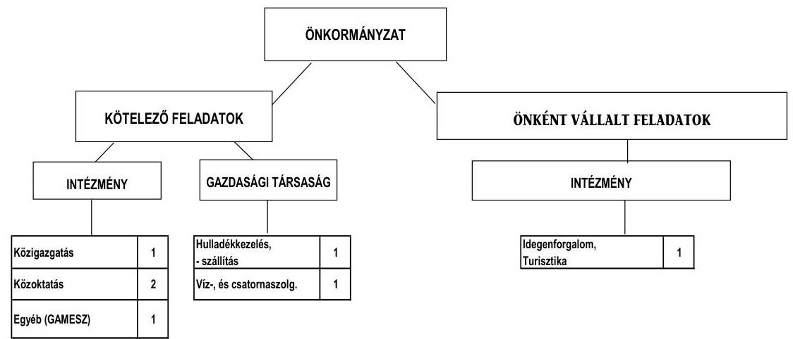

Az Önkormányzat feladatait 2011. június 30-án (a Polgármesteri hivatallal együtt) öt költségvetési szervvel és kettő - 50% alatti tulajdoni hányadú - gazdasági társasággal látta el. Az Önkormányzat tulajdoni hányada a Dunántúli Regionális Vízmű Zrt.-ben 0,002% (10000 Ft névértékű törzsrészvény), az AVE Zöldfok Zrt.-ben pedig 2,159% (4 969 282 Ft névértékű törzsrészvény). A szociális és gyermekjóléti feladatokat többcélú kistérségi társulás társult tagjaként biztosította. Az intézményszervezeti átalakítások és intézményi összevonások következtében a feladatellátás telephelyeinek száma a 2007. évi hatról 2011. év I. félév végére, ötre csökkent (2008. februárjától). A gazdasági társaságok hulladékkezelés-szállítás, valamint víz- és szennyvízkezelés és ellátás területén kaptak szerepet az Önkormányzat feladatellátásában.

Az Önkormányzat működési kiadásokra 2010-ben 705,4 millió Ft-ot fordított, amely 14,1 millió Ft-tal (2,0%-kal) haladta meg a 2007-2009. évek kiadási átlagát.

Az egyes közszolgáltatások feladatellátásában résztvevő költségvetési szervek működési kiadásainak finanszírozási forrásösszetételét a következő ábra szemlélteti:
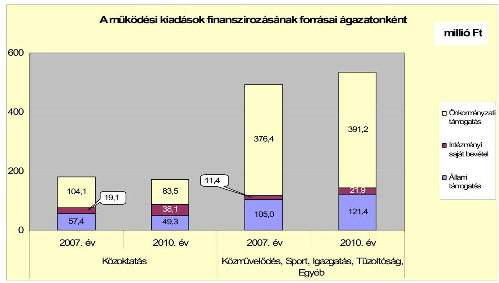

Az önkormányzati támogatások mérséklődését a közoktatásban a tanulók létszámváltozása miatt a pedagógusok számának csökkenése okozta. A közművelődésnél a növekedést a turisztikai tevékenység, valamint a városi TV szolgáltatás működtetési kiadásainak növekedése eredményezte. A vizsgált időszakban a kötelező- és önként vállalt feladatok ellátását biztosító szervezeti keretekben, a feladatellátás módjában bekövetkezett változások az Önkormányzat pénzügyi egyensúlyára nem voltak hatással. Az önként vállalt feladatok működési kiadásai a 2007-2009. évek 41,6 millió Ft-os (5,8%) átlagához képest 2010-re 31,2 millió Ft-ra (4,4%) csökkentek.

Az Önkormányzat folyó költségvetés egyenlege (működési jövedelem) a 2007-2008. években működési forráshiányt, a 2009-2010. évben működési többletet mutatott.
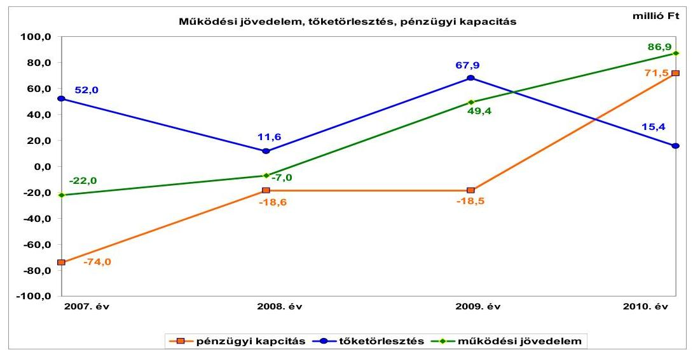

A működési jövedelem folyamatosan nőtt (-22 millió Ft-ról 86,9 millió Ft-ra), a tőketörlesztés változó nagyságrendű (52 millió Ft, 11,6 millió Ft, 67,9 millió Ft, 15,4 millió Ft) volt a vizsgált időszakban. A két tényező együttesen befolyásolta a pénzügyi kapacitás alakulását.

A nettó működési jövedelem növekedését az okozta, hogy a saját működési bevételei, költségvetési támogatások, átengedett bevételek nagyobb mértékben növekedtek, mint a folyó kiadásai. Az Önkormányzat bevételnövelő intézkedései eredményeként folyamatosan nőttek a helyi adóbevételek, a vizsgált időszakban 50,2 millió Ft-tal. A költségvetési támogatások 2007-2010. között 12,3 millió Ft-tal nőttek. A 2009. évben kiugróan magas áfa bevétele 35,5 millió Ft volt az Önkormányzatnak a nagy összegű tárgyi eszköz értékesítése miatt. A 2010. évben a tőketörlesztés jelentős mértékben csökkent a 2009. évihez képest (67,9 millió Ft-ról 15,4 millió Ft-ra).
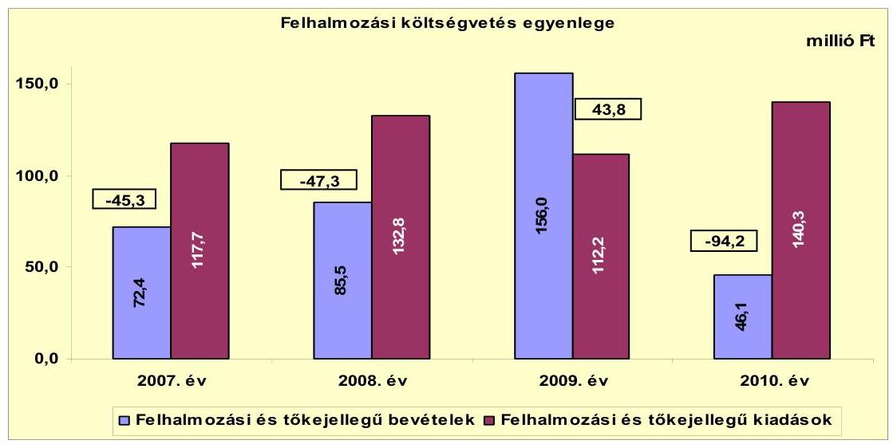

A pénzügyi egyensúlyi helyzet alakulását jelentősen befolyásolta az Önkormányzat elmúlt időszaki fejlesztési tevékenysége. Az Önkormányzat felhalmozási költségvetés egyenlege 2009. év kivételével negatív összegű volt. A felhalmozási hiány fedezetéül a 2007. évi nyitó pénzkészlet, a 2009. és 2010. évi működési jövedelem és fejlesztési célú hitelek szolgáltak. A 2009-ben a nagy összegű ingatlan értékesítés (130,7 millió Ft) miatt jelentősen megnőtt a felhalmozási bevételek összege.

Az Önkormányzat folyó bevételei folyamatosan nőttek 2007-2010. években. A 2007-2009. évek átlagához képest, 733,5 millió Ft-ról 2010-re 798,3 millió Ft-ra, 8,8%-kal nőtt a folyó bevétel. A bevételeken belül a költségvetési támogatás és szja együttes összege 2007-2009. évben növekedett, 2010. évben csökkent a feladatmutatóhoz kötött normatív támogatások csökkenése miatt. Az egyéb saját bevételek 2007-2010. években 74,4 millió Ft-tal nőttek. A növekedést az államháztartáson belüli működési támogatások, pótlólagosan járó állami támogatások (2007. év után pótlólagosan járó normatív és kötött normatív állami támogatások), 2010. évi tűzeset után járó kártérítés, közvilágítás túlfizetésének visszautalása okozta. A 2009. évben a kiemelkedően magas áfa bevételt a tárgyi eszközértékesítés eredményezte. A helyi adóbevétel növekedése folyamatos volt, 2007-ről 2010-re 50,2 millió Ft-tal, 15,8%-kal nőtt (317,9 millió Ft-ról 368,1 millió Ft-ra).

Az Önkormányzat 2008. évi folyó kiadásai növekedését a működési kiadások, a személyi juttatások és dologi kiadások emelkedése okozta. A folyó kiadások a 2007. évi 679,3 millió Ft-ról 2008-ra 763,4 millió Ft-ra, 12,4%-kal nőttek. A 2008. évi növekedést a 2008. évi bérpolitikai intézkedések támogatása, és a 2007. év után járó 13. havi illetmény 2008. évi elszámolása és energiahordozók árának emelkedése okozta. A 2009. és 2010. években a folyó kiadások csökkentek. A folyó kiadások 2009-ben 737,4 millió Ft, 2010-ben 711,4 millió Ft voltak. A folyó kiadások csökkenését 2009-ben a személyi juttatások, 2010-ben a dologi kiadások csökkenése okozta. A 2010. évi személyi juttatások növekedését az Önkormányzat 2010. évi létszám növekedése okozta.

A folyó költségvetés egyenlege (működési jövedelem) 2007-ben a folyó kiadások 3,2%-át (-22 millió Ft-ot), 2008-ban 0,9%-át (-7 millió Ft-ot), 2009-ben 6,7%-át (49,4 millió Ft-ot), 2010-ben 12,2%-át (86,9 millió Ft-ot) jelentette.

A 2007-2010. évek időszakában 409,4 millió Ft értékű befejezett fejlesztések (fejlesztés és felújítás) forrása a hitelfelvétel (99,8 millió Ft), a hazai támogatások (13,1 millió Ft) és EU-s támogatások (30 millió Ft) mellett 266,5 millió Ft saját erő (65,1%) volt. Az EU-s támogatásból megvalósult fejlesztések finanszírozása likviditási gondot nem okozott. Az utófinanszírozott fejlesztéseket az Önkormányzat saját bevételből meg tudta előlegezni.

A 2010. december 31-én folyamatban lévő fejlesztési feladatok végrehajtására 2007-2010. között kiadást nem teljesítettek. Az Önkormányzat 2010. december 31-én folyamatban lévő fejlesztési feladatok 2010. évet követő kötelezettség-vállalásainak összegét az alábbi ábra mutatja be:
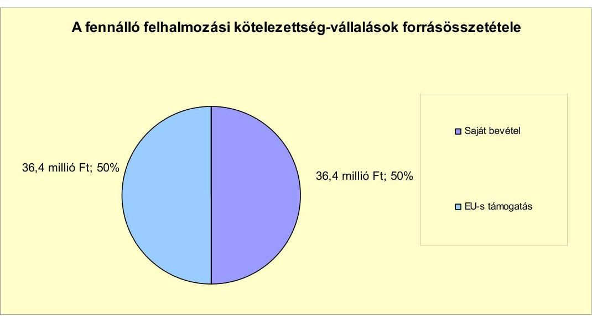

Az Önkormányzat által
 beadott, elbírálás alatt álló pályázatok tervezett teljes bekerülési költsége 354,8 millió Ft. Az Önkormányzat által a 2010-2013. évekre vállalt kötelezettségek összege 354,8 millió Ft, amelyből 284,0 millió Ft-ot EU-s támogatásból és 70,8 millió Ft-ot saját bevételből terveznek biztosítani. Az Önkormányzat a folyamatban lévő fejlesztéshez és elbírálás alatt álló pályázathoz a saját forrást biztosítani tudja a 2010. évi pénzmaradványból és a bevételt növelő intézkedésekből származó többletbevételekből.

Az Önkormányzat mérleg szerinti pénzintézeti kötelezettsége a 2006. év végéről a 2011. év I. félév végére 101,4 millió Ft-ról 86,2 millió Ft-ra csökkent, a

---

2007-2009. évek közötti átlaga 111,4 millió Ft volt. A mérleg szerinti pénzintézeti kötelezettségek állománya nem tartalmazta az árfolyamváltozások hatását, mivel az Önkormányzatnál a Számv. tv-ben foglalt előírást megsértve, az Áhsz-ben foglaltak ellenére nem végezték el a devizában fennálló kötelezettségek év végi értékelését. A 2006-2010. években nem mutatták ki a tőketörlesztések utáni realizált árfolyamveszteséget/nyereséget. A fennálló pénzintézeti kötelezettségek négy hosszú lejáratú hitel (ebből egy GAMESZ) igénybevételéből keletkeztek. Az Önkormányzat a hiteleket 2005., 2008., 2009. évben, a GAMESZ pedig 2008. évben vette fel. Az Önkormányzat az elfogadott 2011. évi költségvetési rendelete alapján felhalmozási célú hitel felvételét tervezte 92,2 millió Ft összegben. Felhasználási célként a fejlesztési hiány finanszírozását jelölte meg. A hitelt a helyszíni vizsgálat befejezésének időpontjáig még nem vette fel, mert a saját forrást biztosítani tudta.

Az Önkormányzat kötelezettségvállalásaira - a GAMESZ kötelezettségvállalásai közül a 2007. évi és a 2008. évi kivételével - képviselő-testületi döntés alapján került sor. Az előterjesztésekben nem mutatták be a kamat- és - a devizaalapú kötelezettségeket érintő - árfolyamkockázatot, valamint az adósságszolgálati korlátot. Az Áht$_{1}$-ben foglaltakat megsértve, a GAMESZ nevében a 2009. szeptember 1-jétől közalkalmazotti jogviszonyban álló vezetője - 2010-ben egy lizingszerződést kötött. A 2008. évi hitel-, valamint a 2007. évi és a kettő 2008. évi lizingszerződéseket a korábbi intézményvezető írta alá.

Az Önkormányzat 2005-ben, 2008-ban és 2009-ben, a GAMESZ pedig 2008-ban a hiteleket mind lehívta, és a hitelcélnak megfelelően - GAMESZ kivételével - a Képviselő-testület által jóváhagyott, a költségvetésbe betervezett beruházásokhoz használta fel. Az Önkormányzat az EUR-ban fennálló pénzintézeti kötelezettsége után 14,7 ezer EUR (4,3 millió Ft) tőkét törlesztett, és 10,2 ezer EUR (2,6 millió Ft) kamatot fizetett. A CHF-ben fennálló pénzintézeti kötelezettsége miatt 206,1 ezer CHF (36,9 millió Ft) tőkét törlesztett, és 67,6 ezer CHF (11,7 millió Ft) kamatot fizetett. A forintban fennálló pénzintézeti kötelezettsége után pedig 7,0 millió Ft tőkét törlesztett, 13,7 millió Ft kamatot és 1,0 millió Ft egyéb költséget fizetett. A GAMESZ a CHF-ben fennálló pénzintézeti kötelezettsége miatt 20,4 ezer CHF (3,1 millió Ft) tőkét törlesztett, és 6,9 ezer CHF (1,2 millió Ft) kamatot fizetett. Az Önkormányzat 2007-2011. év I. féléve között átmenetileg szabad pénzeszközeiből 7,2 millió Ft kamatbevételt realizált.

Az Önkormányzat költségvetésének pénzügyi egyensúlya biztosításához a vizsgált időszakban folyószámlahitelt, 2008-ban pedig munkabérmegelőlegezési hitelt vett igénybe.

---

A folyószámlahitel és a munkabér-megelőlegezési hitel igénybevétele a 2007-2011. év I. félévében évenként az alábbiak szerint alakult:

| Megnevezés | 2007. év | 2008. év | 2009. év | 2010. év | 2011. év I.   félév |
| :-- | :--: | :--: | :--: | :--: | :--: |
| Folyószámlahitel |  |  |  |  |  |
| Keretösszeg január 1-jén (millió Ft-ban) | 0,0 | 50,0 | 70,0 | 70,0 | 70,0 |
| Állagos napi állomány (millió Ft-ban) | 7,3 | 29,4 | 13,0 | 1,1 | 0,0 |
| Folyószámla hitellel zárt napok száma (nap) | 146,0 | 286,0 | 125,0 | 33,0 | 0,0 |
| Egyedeg (állomány) | 23,3 | 52,0 | 0,0 | 0,0 | 0,0 |
| Munkabér-megelőlegezési hitel |  |  |  |  |  |
| Keretösszeg január 1-jén (millió Ft-ban) |  | 0,0 |  |  |  |
| Állagos napi állomány (millió Ft-ban)* |  | 0,0 |  |  |  |
| Munkabér-megelőlegezési hitellel zárt napok száma (nap) |  | 20,0 |  |  |  |
| Egyedeg (állomány) |  | 0,0 |  |  |  |

Megnevezés: * 2008-ban az átlagos napi állomány 39,2 ezer Ft volt.
A likviditás biztosítása az Önkormányzatnak az ellenőrzött időszakban összesen 5,1 millió Ft kamatkiadást, és 1,4 millió Ft egyéb költség fizetésének kötelezettségét okozta. A folyószámlahitel év végi záró állománya 2007-ben 23,3 millió Ft, 2008-ban pedig 52,0 millió Ft volt. 2008-ban - év közben 14,3 millió Ft összegű munkabér-megelőlegezési hitelt vett fel és fizetett vissza. A teljesített kamat és egyéb költség 0,1 millió Ft. Az Önkormányzat 2011. év I. félév végi szállítói tartozása 3,1 millió Ft, melyből lejárt tartozása 2,3 millió Ft volt. A 2006. év december 31-ei 14,9 millió Ft-os szállítói állomány közel ötödére csökkent. A lejárt szállítói tartozás 30 nap alatti, a pénzügyi egyensúly megítélése szempontjából nem jelentős.

Az Önkormányzat kötelezettségeinek 2010. december 31-ei, valamint 2011. június 30-ai állományát és várható alakulását a kötelezettségek lejáratáig a következő táblázat szemlélteti:

| Megnevezés | Állomány 2010. december 31-én |  |  | Állomány 2011. június 30-én |  |  | Várható kötelezettség 2011-2013. években |  | Várható kötelezettség 2014. évtől |  |
| :--: | :--: | :--: | :--: | :--: | :--: | :--: | :--: | :--: | :--: | :--: |
|  | HUF-ban   (millió Ft   ban) | Devizában (összege.   ezer   EUR/CHF-   ban) | Devizs   nem | HUF-ban   (millió Ft   ban) | Devizában (összege.   ezer   EUR/CHF-   ban) | Devizs   nem | HUF-ban   (millió Ft   ban) | Devizában (összege.   ezer   EUR/CHF-   ban) | HUF-ban   (millió Ft   ban) | $\begin{aligned} & \text { Devizában } \\ & \text { (összege. } \\ & \text { ezer } \\ & \text { EUR/CHF- } \\ & \text { ban) } \end{aligned}$ |
| Pénzintézeti kötelezettségek |  |  |  |  |  |  |  |  |  |  |
| Hosszú lejáratú hitel (OLLE Program) | 29,4 |  | HUF | 28,2 |  | HUF | 8,9 |  | 26,6 |  |
| Hosszú lejáratú hitel (régészeti feljárás) |  | 255,6 | CHF |  | 236,6 | CHF |  | 183,0 |  | 94,4 |
| Hosszú lejáratú hitel (GAMESZ, gépjármű vásárlás) |  | 6,1 | CHF |  | 3,7 | CHF |  | 7,2 |  | 0,0 |
| Hosszú lejáratú hitel (2008-2009. évi fejlesztések) |  | 117,7 | EUR |  | 110,3 | EUR |  | 55,8 |  | 82,6 |
| Pénzintézeti kötelezettségek összesen HUF-ban | 29,4 |  | HUF | 28,2 |  | HUF | 8,9 |  | 26,6 |  |
| Pénzintézeti kötelezettségek összesen CHF-ben |  | 261,7 | CHF |  | 240,3 | CHF |  | 190,2 |  | 94,4 |
| Pénzintézeti kötelezettségek összesen EURO-ben |  | 117,7 | EUR |  | 110,3 | EUR |  | 55,8 |  | 82,6 |
| Lízing kötelezettségek | 2,6 |  | HUF | 0,5 |  | HUF | 0,0 |  | 0,0 |  |
| Lízing kötelezettségek |  | 2,0 | CHF |  | 0,0 | CHF |  | 0,0 |  | 0,0 |
| Szállítói tartozás | 11,2 |  | HUF | 3,1 |  | HUF | 0,0 |  | 0,0 |  |
| Forintban fennálló kötelezettségek összesen | 43,2 |  | HUF | 31,8 |  | HUF | 8,9 |  | 26,6 |  |
| CHF-ben fennálló kötelezettségek összesen |  | 263,7 | CHF |  | 240,3 | CHF |  | 190,2 |  | 94,4 |
| EURO-ban fennálló kötelezettségek összesen |  | 117,7 | EUR |  | 110,3 | EUR |  | 55,8 | EUR | 82,6 |

Az Önkormányzatnak pénzintézetekkel szemben fennálló kötelezettsége a 2011. év I. félév végén 28,2 millió Ft, 240,3 ezer CHF és 110,3 ezer EUR volt. Ezek várható kötelezettsége (tőke, kamat és egyéb költség) a legutóbbi kamatfizetés feltételei alapján a 2011-2013. években 9,9 millió Ft, 190,2 ezer CHF, továbbá 55,8 ezer EUR. A 2011-2013. évek kötelezettségeinek teljesítésére figyelembe vehető a 2010. évi 12,5 millió Ft szabad pénzmaradvány, a 2010. évi mérlegben kimutatott 71,4 millió Ft követelésállomány és a forgalomképes ingatlanvagyon. A 2014. évet követően jelenleg ismert pénzintézeti kötelezettségei: 26,6 millió Ft, 94,4 ezer CHF és 82,6 ezer EUR, amelyek tartalmazzák a tőke, a kamat és az egyéb költségeket. Az Önkormányzat tájékoztatása szerint figyelembe vehető további források a mindenkori költségvetési rendeletekben megtervezett önkormányzati helyi többlet-adóbevételek. Azonban ennek növelésére 2011-ben tett intézkedés nem biztosít elegendő forrást, ezért a további évekre szóló jelenleg ismert pénzintézeti kötelezettségek teljesítését nem látjuk biztosítottnak. Az Önkormányzat 2011-ben 3,3 millió Ft többletbevételt tervezett az újonnan bevezetett telekadóból.

Az Önkormányzat 2007-2010 között eszközállománya után 173,9 millió Ft összegű értékcsökkenést mutatott ki. Az elhasznált eszközök pótlására 96,7 millió Ft-ot fordított. A Képviselő-testületnek előterjesztett éves zárszámadási rendeleteikben nem mutatták be az Önkormányzat eszközei után tárgyévben elszámolt értékcsökkenés összegét, az eszközpótlásra fordított tényleges kiadásokat, az eszközök elhasználódási fokának alakulását.

Az Önkormányzat költségvetési támogatásból, átengedett bevételekből származó bevételei a 2007. évhez képest az időszak egészét tekintve nőttek, összesen 100,1 millió Ft-tal. Ennek ellenére az Önkormányzat folytatta az előző években elkezdett - kiadási megtakarítást eredményező és bevételt növelő - intézkedéseit. Az Önkormányzat - adatszolgáltatása szerint - a bevételnövelő intézkedések hatására 2007-től 2011. év I. félév végéig összesen 188,9 millió Ft bevételt realizált továbbá összesen 36,9 millió Ft kiadási megtakarítást ért el, ezáltal az Önkormányzat pénzügyi egyensúlyi helyzetét javították. A kiadási megtakarítások 76%-a az elrendelt álláshely-csökkentések eredménye. Az álláshely-csökkentő intézkedések 2007-2010. évek között önkormányzati szinten összesen 12 álláshely megszüntetését jelentették. Egyes közszolgáltatási területeken azonban feladatbővülések is voltak, amelyek álláshely- és
 egyben 10 fő létszámnövekedéssel is jártak. Ennek következtében az időszak álláshelyeinek száma 2010. december 31-ig kettő fővel, 2011. I. félévében további négy fővel csökkent. A bevételnövelő intézkedések a helyi adók emeléséhez, adóhátralék végrehajtásához, adóellenőrzésekhez, ingatlanok bérbeadásához, térítési díjak emeléséhez kapcsolódtak.

Az ÁSZ nem vizsgálta Zamárdi Város Önkormányzatát „A helyi önkormányzatok gazdálkodási rendszerének ellenőrzése" témában.

Az Önkormányzat pénzügyi egyensúlyi helyzetét összegezve a következők emelhetők ki:

Zamárdi Város Önkormányzat pénzügyi egyensúlya rövid és közép távon biztosított. Hosszú távú megőrzésére az Önkormányzatnak fel kell készülnie.

Az Önkormányzat működési jövedelme a vizsgált időszakban folyamatosan emelkedett.

A szállítói tartozásai és a pénzintézetekkel szembeni kötelezettségei csökkentek.
A helyi adóbevételek növekedtek.

---

Az önként vállalt feladataira fordított kiadások aránya a működési jövedelemhez képest csökkent.

A folyamatban lévő fejlesztési projektekhez, a benyújtott pályázatokhoz szükséges saját erőhöz a források rendelkezésre állnak.

A gazdasági társaságok miatti kockázat nem áll fenn. A kötelező feladatokat ellátó kettő - 50% alatti tulajdoni hányadú - gazdasági társaságnak az Önkormányzat pénzeszközöket nem adott át, kezességet vagy garanciát nem vállalt.

Az Állami Számvevőszékről szóló 2011. évi LXVI. törvény 33. § (1) bekezdésében foglaltak értelmében a jelentésben foglalt megállapításokhoz kapcsolódó intézkedési tervet köteles az ellenőrzött szervezet vezetője összeállítani és azt a jelentés kézhezvételétől számított harminc napon belül az ÁSZ részére megküldeni. Amennyiben az intézkedési tervet határidőben nem küldi meg a szervezet, vagy az továbbra sem elfogadható, az ÁSZ elnöke a hivatkozott törvény 33. § (3) bekezdés a)-b) pontjaiban foglaltakat érvényesítheti.

# A 2011. június 30-i pénzügyi egyensúlyi helyzet alapján az ellenőrzés intézkedést igénylő megállapításai és javaslatai a következők: 

## a polgármesternek

1. Az Önkormányzat pénzügyi egyensúlyi helyzete rövid és közép távon biztosított. A pénzügyi egyensúly hosszú távú megőrzésére az Önkormányzatnak fel kell készülnie.

Javaslat:
Folyamatosan tájékoztassa a Képviselő-testületet az Önkormányzat pénzügyi egyensúlyi helyzetéről. Kezdeményezzen szükség esetén intézkedéseket a pénzügyi egyensúly hosszú távú fenntarthatósága érdekében. Képezzen elkülönített tartalékot a jövőbeni adósságszolgálat teljesítése érdekében.
2. A GAMESZ az Önkormányzat önállóan működő és gazdálkodó költségvetési szerve. Az Áht. szerint, költségvetési szervek pénzkölcsönt nem vehetnek fel, és pénzügyi lízing-szerződést nem köthetnek. Az Áht. 100/G. § (korábban Áht. 100. §) (1) bekezdés a) illetve f) pontjait ${ }^{7}$ megsértve, a GAMESZ nevében a 2009. szeptember 1-jétől közalkalmazotti jogviszonyban álló vezetője - 2010-ben - egy lízingszerződést kötött. A 2008. évi hitel-, valamint a 2007. évi és a kettő 2008. évi lízingszerződéseket a korábbi intézményvezető írta alá.

Javaslat:
Intézkedjen - a GAMESZ által 2010-ben megkötött lízingszerződéssel kapcsolatban - a fegyelmi felelősség kivizsgálása iránt.

[^0]
[^0]:    ${ }^{7}$ 2012. január 1-jétől az Áht ${ }_{2}$ 41. § (4) bekezdés

---

3. A Képviselő-testületnek előterjesztett éves zárszámadási rendeleteikben nem mutatták be az Önkormányzat eszközei után tárgyévben elszámolt értékcsökkenés összegét, az eszközpótlásra fordított tényleges kiadásokat, az eszközök elhasználódási fokának alakulását.

Javaslat:
Mutassa be a Képviselő-testületnek évente a zárszámadási rendelet előterjesztésében az értékcsökkenés összegét, és ezzel összevetve az elhasználódott eszközök pótlására fordított tényleges kiadásokat, az eszközök elhasználódási fokának alakulását.

# a Jegyzõnek 

1. A Képviselő-testület döntését megalapozó előterjesztések nem tartalmazták a kötelezettségvállalás visszafizetési forrásainak, a teljes futamidő várható kamat-, tőkefizetési kötelezettségeinek bemutatását. Az Önkormányzat adósságot keletkeztető kötelezettségvállalásainál az előterjesztésekben nem mutatták be az adósságszolgálati korlátot.

Javaslat:
Gondoskodjon, hogy a jövőben az adósságot keletkeztető kötelezettségvállalásokról szóló képviselő-testületi előterjesztések tételesen tartalmazzák a visszafizetés forrásait. Az adósságot keletkeztető kötelezettségvállalásról szóló döntéskor mutassa be a Képviselő-testületnek a jövőben várható - árfolyam-, kamat- és törlesztési - kockázatot. Továbbá mutassa be az adósságot keletkeztető kötelezettségvállalásoknál az adósságszolgálati korlátot.
2. Az Önkormányzat 2007-2010. közötti főkönyvi nyilvántartásaiban - a Számv. tv-ben foglaltakat megsértve - a deviza alapú önkormányzati hitelek törlesztései után a realizált árfolyamnyereséget/veszteséget nem számolta el. A devizában fennálló kötelezettségek év végi értékelését a Számv. tv. és az Áhsz. előírásai ellenére nem végezte el.

Javaslat:
Gondoskodjon, hogy a főkönyvi nyilvántartásaiban - a Számv. tv. 60. § (1) bekezdésében foglaltaknak megfelelve - a deviza alapú önkormányzati hitelek törlesztései után a realizált árfolyam nyereséget/veszteséget számolják el. Továbbá arról, hogy a devizában fennálló kötelezettségeket a Számv. tv. 60. § (2) bekezdésének és az Áhsz. 33. § (1) bekezdésének előírásai alapján év végén értékeljék és a változásokat a számviteli nyilvántartásokban rögzítsék.

A polgármester a helyszíni ellenőrzés lezárása után tájékoztatta az Állami Számvevőszéket az Önkormányzat megtett intézkedéseiről, amelyet az Állami Számvevőszék nem ellenőrzött, arra vonatkozóan véleményt vagy megállapítást nem fogalmaz meg. Az ellenőrzés lezárását követően elvégzett intézkedéseket az Állami Számvevőszék utóellenőrzés keretében vizsgálhatja.

---

A polgármester tájékoztatása szerint a következő intézkedéseket tette az Önkormányzat:

- elrendelte a Képviselő-testület éves munkatervének módosítását az Önkormányzat pénzügyi egyensúlyi helyzetének bemutatását célzó tájékoztatás napirendre tűzésével;
- a 2012. évi költségvetési rendeletben szereplő általános tartalékot kiegészítette az árfolyam- és kamatkockázatok kezelése feladattal;
- vizsgálatot indított a GAMESZ lízingszerződéseivel kapcsolatos felelősség tisztázására;
- előírta az Önkormányzat eszközei utáni értékcsökkenés összegének, az eszközök pótlására fordított pénzeszközöknek és az eszközök elhasználódási fokának bemutatását a 2011. évi zárszámadási rendeletben;
- előírta az adósságot keletkeztető kötelezettségvállalásokról szóló képviselőtestületi előterjesztésekben a visszafizetés forrásainak, az árfolyam- és kamatkockázatoknak, valamint az adósság szolgálati korlátnak a bemutatását;
- elrendelte a devizában fennálló kötelezettségek év végi értékelésének elvégzését, valamint a deviza alapú hitelek törlesztésekor realizált árfolyam nyereség/veszteség elszámolását a főkönyvi nyilvántartásaiban.

---

# II. RÉSZLETES MEGÁLLAPÍTÁSOK 

## 1. Az ÖNKORMÁNYZAT KÖTELEZŐ ÉS ÖNKÉNT VÁLLALT FELADATAI, A FELADATELLÁTÁS SZERVEZETI KERETEI ÉS ANNAK VÁLTOZÁSAI

Az Önkormányzat kötelező feladatait az Ötv. és az ágazati törvények által meghatározottnak tekinti, az önként vállalt feladatok terjedelmét az éves költségvetési rendeletekben az adott évi költségvetés forrásainak ismeretében határozták meg. Az Önkormányzat kötelező feladatai a közoktatás, a könyvtári szolgáltatás, a közművelődés, a városüzemeltetés, az igazgatás, a hulladékkezelés-szállítás, és a víz- és szennyvízkezelési feladatok voltak. Az Önkormányzat csak az SzMSz 2011. áprilisi módosítása során ${ }^{8}$ szabályozta az önként vállalt feladatait és azok ellátásának módját.

Az Önkormányzat - adatszolgáltatása szerint - a 2010. évi működési költségvetési kiadásaiból (705,4 millió Ft) ${ }^{9}$ 674,2 millió Ft-ot (95,6%) a kötelező feladatok, 31,2 millió Ft-ot (4,4%) az önként vállalt feladatok ellátására fordított. Az önként vállalt feladatok - az Önkormányzat besorolása szerint - az alapfokú művészetoktatáshoz, a turizmushoz és a városi TV szolgáltatáshoz, valamint a civil szervezetek céljainak megvalósításához kapcsolódó pénzeszközátadások voltak.

A 2010. évi működési kiadások ágazatonkénti megoszlását és azok finanszírozási arányait az alábbi tábla mutatja:

| Ellátott feladat | Működési   kiadás   összesen   (millió Ft) | Kötelező   feladatok   kiadásainak   részaránya   % | Működési   bevétel   összesen   (millió Ft) | Állami   támogatás   részaránya   % | Intézményi   saját bevétel   részaránya   % | Önkormányzati   támogatás   részaránya   % |
| :--: | :--: | :--: | :--: | :--: | :--: | :--: |
| Övodák | 51,1 | 100,0 | 51,1 | 29,9 | 9,8 | 60,3 |
| Általános iskolák | 119,8 | 98,5 | 119,8 | 28,4 | 27,6 | 44,0 |
| Közművelődési   intézmények | 39,2 | 46,6 | 39,2 | 6,9 | 3,2 | 89,9 |
| Egyéb intézmények | 203,1 | 100,0 | 203,1 | 0,0 | 6,0 | 94,0 |
| Polgármesteri hivatal   igazgatási kiadásai | 186,7 | 100,0 | 186,7 | 7,8 | 3,8 | 88,4 |
| Polgármesteri   hivatalban ellátott   egyéb feladatok   működési kiadásai | 105,5 | 92,0 | 105,5 | 98,6 | 1,4 | 0,0 |
| Működési kiadások   összesen | 705,4 | 95,6 | 705,4 | 24,2 | 8,5 | 67,3 |

[^0]
[^0]:    ${ }^{8}$ 8/2011. (IV. 19.) számú Önkormányzati rendelet Zamárdi Város Önkormányzatának Szervezeti és Működési Szabályzatáról (egységes szerkezetben)
    ${ }^{9}$ Az összeg nem tartalmazza a 2. számú mellékletben szereplő 711,4 millió Ft folyó kiadásokból az egészségügyi alapellátás kiadásait.

---

Megjegyzés: A többcélú kistérségi társulásnak a szociális és gyermekjóléti feladatokra az Önkormányzat a 2007. és 2011. év I. félév között évenként 2007-ben 0,5, 2008-ban 0,6, 2009-ben 0,3, 2010-ben 1,7, és 2011. év I. félévében 0,4 millió Ft működési hozzájárulást fizetett. Az egyéb intézmények között a GAMESZ működési kiadásai és bevételei szerepelnek. A Polgármesteri hivatalban ellátott egyéb feladatok működési kiadásai a többcélú kistérségi társulásnak szociális-, gyermekjóléti-, központi orvosi ügyelet-, belső ellenőrzés-, pszichológiai feladatellátásra átadott hozzájárulások, település-felügyelők, mezőőr, Képviselő-testület, bizottságok és a segélyezéshez kapcsolódó kiadások voltak.

Az Önkormányzat - adatszolgáltatása szerint - működési kiadásokra 2010-ben 705,4 millió Ft-ot fordított, amely 14,1 millió Ft-tal (2,0%-kal) haladta meg a 2007-2009. évek kiadási átlagát. Az ellenőrzött időszakban a pénzügyi helyzet megítélése szempontjából a kötelező és önként vállalt feladatok megoszlásának változása nem meghatározó. Az önként vállalt feladatok a 2007-2009. évek részarányának átlagához viszonyítva a közoktatási intézménynél 1,3 százalékponttal (2,8%-ról 1,5%-ra), a Polgármesteri hivatalban ellátott egyéb feladatok működési kiadási feladatoknál pedig 6,7 százalékponttal (14,7%-ról 8%-ra) csökkentek. Az eltéréseket a közoktatásban a tanulók létszámváltozása miatt a pedagógusok számának, az egyéb feladatoknál a szervezetek támogatásának csökkenése eredményezte. Az önként vállalt feladatok a közművelődési intézményeknél 3,0 százalékponttal (50,4%-ról 53,4%-ra) növekedtek a 2007-2009. évek részarányának átlagához viszonyítva, amelyet a turisztikai tevékenység, valamint a városi TV szolgáltatás működtetési kiadásainak növekedése okozott.

Az Önkormányzat bevételeinek összetétele jelentősen nem változott a 2007-2009. évek részarányának átlagához képest, a pénzügyi helyzet megítélése szempontjából nem meghatározó. Az Önkormányzat - adatszolgáltatása szerint - a 2010. évi 170,7 millió Ft állami hozzájárulás 11,9 millió Ft-tal (6,5%-kal) kisebb, a 2010. évi 60,1 millió Ft intézményi saját bevétel 25,9 millió Ft-tal (43,1%-kal) nagyobb, a 2010. évi 474,7 millió Ft önkormányzati támogatás pedig 28,0 millió Ft-tal (5,6%-kal) kisebb volt a 2007-2009. évek átlagához képest.

A közoktatási intézményeknél csökkent, a közművelődési-, és a Polgármesteri hivatal igazgatási kiadásainál növekedett az állami támogatások aránya. A saját bevételek a közoktatási-, és egyéb költségvetési szerveknél, illetve a Polgármesteri hivatal igazgatási kiadásainál növekedtek, a közművelődésnél pedig csökkentek. Az Általános Iskola 2010. évi saját bevételéből a 17,9 millió Ft-os növekedés a tornatermi tűz után kapott kártérítés volt. A Polgármesteri hivatalnál az igazgatási bevételek emelkedését az országgyűlési-, a kisebbségi- és helyi választások támogatásai okozták. Az egyéb intézménynél a 2010. évi saját bevételek emelkedését a túlfizetésből keletkezett közvilágítási díj visszatérítése eredményezte. A közművelődési ágazat bevételének mérséklődését jellemzően az ajándéktárgyak értékesítésének, terem-, és belépődíjak csökkenése okozta. Ezzel összefüggésben változott az önkormányzati támogatás az egyes ágazatokban. A közoktatási intézményeknél 1,7-10,2
 százalékponttal ( $61,9 \%$-ról $60,2 \%$-ra és $54,2 \%$-ról $44,0 \%$-ra), a Polgármesteri hivatal igazgatási kiadásainál 0,4 százalékponttal ( $88,8 \%$-ról $88,4 \%$-ra), az egyéb intézménynél pedig 3,0 százalékponttal ( $97,0 \%$-ról $94,0 \%$-ra) csökkent. A közművelődési intézménynél

---

0,7 százalékponttal (89,2\%-ról 89,9\%-ra) növekedett a 2007-2009. évek részarányának átlagához képest.

Az Önkormányzat a feladatait 2011. június 30-án (a Polgármesteri hivatallal együtt) öt költségvetési szervvel és kettő gazdasági társasággal látta el. Az intézményszervezeti átalakítások és összevonások következtében az intézmények és a feladatellátás telephelyeinek száma a 2007. év elejétől hatról 2011. év I. félév végére ötre csökkent. A szociális és gyermekjóléti feladatokat a többcélú kistérségi társulás társult tagjaként biztosította.

A kötelező feladatok közül a közoktatást és a könyvtári szolgáltatást kettő intézménnyel (Övoda és Általános Iskola), a közművelődési, a városüzemeltetési és -gazdálkodási feladatokat egy-egy intézménnyel (Tourinform Iroda és GAMESZ) látta el. Az igazgatási feladatot a Polgármesteri hivatal végezte. Az Önkormányzat - a Képviselő-testület döntése alapján - 2008. február 1-jétől egy intézményét (Közösségi Ház és Könyvtár) megszüntette. A közművelődési feladatellátást a Tourinform Iroda, a könyvtári feladatellátást pedig az Általános iskola vette át.

Az önként vállalt alapfokú művészetoktatást az Általános iskola látta el. A turizmushoz kapcsolódó idegenforgalmi, városi rendezvények és kulturális programok szervezését, lebonyolítását, helyszíneit a Tourinform Iroda biztosította. Továbbá ellátta a település időszaki lapjának megjelentetését és a helyi televíziós műsorszolgáltatást. Az Önkormányzat önként vállalt feladatként egyesületek, alapítványok, egyházak, lakossági önszerveződő közösségek tevékenységéhez járult hozzá, amelynek összege 2007-ben 7,8, 2008-ban 8,9, 2009-ben 7,8, 2010-ben pedig 6,3 millió Ft volt.

Az Önkormányzat kettő gazdasági társaságban 50\% alatti tulajdoni hányaddal rendelkezett. ${ }^{10}$ A gazdasági társaságok közül, az AVE Zöldfok Zrt. a hulladékkezelési és -szállítási, a Dunántúli Regionális Vízmű Zrt. a víz- és szennyvízkezelési feladatokat látta el.

A vizsgált időszakban az Önkormányzat nem vett át feladatot más önkormányzattól, társulástól, egyháztól, gazdasági társaságtól, egyéb szervezettől. Ugyanezen időszak alatt feladatátadás sem történt. A vizsgált időszakban az intézményrendszer átalakításának hatására az összes kiadás-megtakarítás 28,3 millió Ft volt. A bevételek alakulására nem volt hatással.

# 2. Az ÖNKORMÁNYZAT PÉNZÜGYI EGYENSÚLYI HELYZETÉT BEFOLYÁSOLÓ TÉNYEZŐK 

A hagyományos költségvetési szerkezet helyett az Önkormányzat pénzügyi helyzetét a CLF módszerrel mutatjuk be, amelyben jobban elkülönülnek a vagyonnal kapcsolatos bevételek és kiadások az önkormányzati feladatokkal kapcsolatos közvetlen működtetési bevételektől és kiadásoktól. A módszer kö-

[^0]
[^0]:    ${ }^{10}$ Az Önkormányzat tulajdoni hányada a Dunántúli Regionális Vízmű Zrt.-ben 0,002\% (10000 Ft névértékű törzsrészvény) az AVE Zöldfok Zrt.-ben 2,159\% (4 969282 Ft névértékű törzsrészvény).

---

vetkezetesen elkülöníti a folyó és a felhalmozási költségvetés bevételeit és kiadásait, azok költségvetési egyenlegeit. A saját folyó bevételek, valamint a saját felhalmozási bevételek nem tartalmazzák az előző évi pénzmaradványok felhasználásából származó pénzforgalom nélküli bevételeket ${ }^{11}$.

A folyó költségvetés egyenlege, a működési jövedelem megmutatja, hogy az Önkormányzat éves folyó bevétele fedezetet biztosít-e a kötelező és önként vállalt feladatellátáshoz kapcsolódó éves folyó kiadására. A működési jövedelem negatív értéke pénzügyileg fenntarthatatlan helyzetet jelez. A mutató pozitív értéke megtakarítást mutat, amely forrásul szolgálhat az Önkormányzat fennálló kötelezettségei megfizetéséhez, valamint fejlesztéseihez.

A felhalmozási költségvetés pozitív értéke felhalmozási többletet mutat, amely a jövőbeni fejlesztések forrását biztosíthatja. Amennyiben a folyó költségvetési hiány finanszírozása a felhalmozási többletből történik, ez szűkebb értelemben vagyonfelélésnek tekinthető. Amennyiben a felhalmozási költségvetés megtakarítása fejlesztési célú hitelek, kötvények adósságszolgálatát finanszírozza, az változatlan vagyontömeg mellett, a korábban megelőlegezett tőkebevételek valós realizációjának tekinthető. A felhalmozási deficit által generált finanszírozási igény önmagában nem jár pénzügyi kockázattal, a pénzügyileg fenntartható beruházásokhoz kapcsolódó kötelezettségvállalás (adósságszolgálat) átlátható és szabályozott költségvetési gazdálkodással teljesíthető.

A módszer a pénzügyi kapacitás fogalmát helyezi a középpontba. Az adós hitelfelvételi képessége, hosszú távú fizetőképessége vagy bonitása a pénzügyi kapacitással, ezen belül is a nettó működési jövedelemmel jellemezhető. A nettó működési jövedelem negatív értéke az egyes költségvetési években jelentkező adósságszolgálat túlzott mértékére utal. ${ }^{12}$ A nettó működési jövedelem negatív értékének felhalmozási többletből, vagy további hitelből történő finanszírozása pénzügyileg nem fenntartható gazdálkodást vetít előre. A pozitív értéket mutató nettó működési jövedelem fejlesztési kiadások fedezetét biztosíthatja, illetve a folyamatosan, évenként képződő pozitív nettó működési jövedelemből meghatározható a jövőben vállalható, teljesíthető éves adósságszolgálat, ily módon az a hitelösszeg, amely - a többi tényezőt, feltételt adottnak tekintve - visszafizetési kockázat nélkül felvehető.

A CLF módszer alapján a pénzügyi kapacitás mértéke az Önkormányzat összevont, nettósított, a központi információs rendszerbe a Magyar Államkincstáron keresztül leadott éves költségvetési beszámolójának 80-as űrlapjában szerepeltetett adatok alapján került meghatározásra ${ }^{13}$.

[^0]
[^0]:    ${ }^{11}$ A költségvetési években kialakuló hiány finanszírozása az előző évi pénzmaradvány és a korábbi években képzett tartalékok felhasználásával is történhet.
    ${ }^{12}$ kivéve, ha annak finanszírozására a korábbi években képzett tartalékok fedezetet nyújtanak
    ${ }^{13}$ A költségvetési támogatásból a felhalmozási célú összeg a 2007. évben 5 millió Ft, a 2008. évben 7,5 millió Ft, a 2009. évben 3,2 millió Ft, a 2010. évben 7,5 millió Ft volt. Ezzel az összeggel csökkentettük az 1.1.2. Költségvetési támogatás, és növeltük a 2.1.2. Államháztartáson belülről kapott támogatások soron kimutatott összegeket.

---

A számítási leírás némileg eltér az ÁSZ módszertanában korábban alkalmazott gyakorlattól. A jelen besorolás általános közgazdasági meggondolásokon alapul, amely megjelenik az SNA statisztikai módszertanában is. Folyó tételek alatt értjük azokat a kiadásokat és bevételeket, amelyek a gazdálkodó szervezet helyzetét automatikusan nem változtatják. Bevételi oldalon ilyenek az adók, a tényező jövedelmek, a transzferek ${ }^{14}$, kiadási oldalon a transzferek és a szolgáltatás igénybevételével kapcsolatos működési kiadások. A folyó költségvetésben a bevételekben nem térül meg, a kiadásokban nem jelenik meg az amortizáció, a vagyoni helyzetet az egyenleg befolyásolja.

A folyó költségvetés egyenlege (működési jövedelem) tartalmazza a kamatbevételeket és a kamatkiadásokat is, mind a működési, mind a fejlesztési kamatot, valamint a visszatérülő és befizetendő áfa teljes összegét, mert ezek közgazdaságilag tényező jövedelmek. Nem tartalmazzák viszont a követelés elengedés miatt könyvelt bevételi és kiadási pénzforgalmi tételeket, mert valójában technikai elszámolási műveletnek minősülnek, a bevétel soha nem realizálódott, és költségvetési kiadás sem történt.

A felhalmozási költségvetésben a bevételek között a vagyon megőrzésére és bővítésére fordítható források jelennek meg. A felhalmozási vagy tőketételek módosítják a vagyon nagyságát. A privatizációs bevétel csökkenti a vagyont, a fizikai beruházás, pénzügyi befektetés növeli.

A nettó működési jövedelmet a tőketörlesztés levonásával a folyó költségvetés egyenlegéből származtatjuk.

[^0]
[^0]:    ${ }^{14}$ Transzferkiadásoknak nevezzük azokat a folyó és felhalmozási tételeket, amelyeket nem az adott önkormányzat használ fel szolgáltatásnyújtásra.

---

# 2.1. A működési és a felhalmozási egyensúly változása 

CLF módszer szerinti önkormányzati adatok

| Megnevezés | 2007. év | 2008. év | 2009. év | 2010. év |
| :--: | :--: | :--: | :--: | :--: |
| Folyó bevételek | 657,3 | 756,4 | 786,8 | 798,3 |
| Folyó kiadások | 679,3 | 763,4 | 737,4 | 711,4 |
| Működési jövedelem | $-22,0$ | $-7,0$ | 49,4 | 86,9 |
| Nettó működési jövedelem   =működési jövedelem - tőketörlesztés | $-74,0$ | $-18,6$ | $-18,5$ | 71,5 |
| Felhalmozási bevételek | 72,4 | 85,5 | 156,0 | 46,1 |
| Felhalmozási kiadások | 117,7 | 132,8 | 112,2 | 140,3 |
| Felhalmozási költségvetés egyenlege | $-45,3$ | $-47,3$ | 43,8 | $-94,2$ |
| Finanszírozási műveletek nélküli (GFS) pozíció = működési jövedelem + felhalmozási költségvetés egyenlege | $-67,3$ | $-54,3$ | 93,2 | $-7,3$ |
| Finanszírozási műveletek egyenlege | 25,7 | 49,0 | $-40,3$ | $-20,0$ |
| Tárgyévi pénzügyi pozíció | $-41,6$ | $-5,3$ | 52,9 | $-27,3$ |
| Egyéb tájékoztató adatok |  |  |  |  |
| Összes kötelezettség* | 120,9 | 200,1 | 146,8 | 131,4 |
| -ebből rövid lejáratú | 65,4 | 115,0 | 41,0 | 41,8 |
| Folyószámlahitel napi átlagos állománya ** | 7,3 | 29,4 | 13,0 | 1,1 |
| Likvidhitel napi átlagos állománya** | 0,0 | 0,0 | 0,0 | 0,0 |
| Munkabérhitel napi átlagos állománya** | 0,0 | 0,0 | 0,0 | 0,0 |
| Finanszírozásba vonható eszközök: | 7,3 | 1,9 | 54,8 | 27,5 |
| Tartós hitelviszonyt megtestesítő értékpapírok év végi állománya | 0,0 | 0,0 | 0,0 | 0,0 |
| Hosszú lejáratú bankbetétek év végi állománya | 0,0 | 0,0 | 0,0 | 0,0 |
| Értékpapírok év végi állománya | 0,0 | 0,0 | 0,0 | 0,0 |
| Pénzeszközök (idegen pénzeszközök nélkül) év végi állománya | 7,3 | 1,9 | 54,8 | 27,5 |

* Az összes kötelezettséget a passzív pénzügyi elszámolások nélkül vettük figyelembe, mert a passzívák a pénzmaradvány elszámolás tételei közé tartoznak.
** A folyószámla, a likvid- és a munkabérhitel átlagos állományát 365 napos osztószámmal és nem a fennálló napok számával vettük figyelembe.

---

Az Önkormányzat folyó bevételeit, kiadásait, költségvetési egyenlegét (működési jövedelmét) az alábbi ábra szemlélteti:
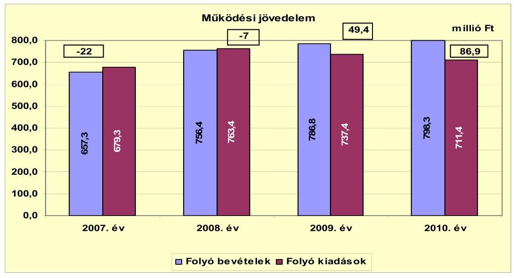

A 2007-2008. években negatív, 2009. és 2010. évben pozitív összegű volt az Önkormányzat folyó költségvetési egyenlege, működési jövedelme. A folyó bevételek folyamatosan nőttek, a 2007-2009. évek átlagáról 733,5 millió Ft-ról 64,8 millió Ft-tal, 798,3 millió Ft-ra a 2010 évre (ebből a saját bevételek növekedése 53,1 millió Ft volt). A folyó kiadások ebben az időszakban 15,3 millió Ft-tal csökkentek a 2007-2009. évek átlagáról, 726,7 millió Ft-ról a 2010. évi 711,4 millió Ft-ra.

A működési forráshiány finanszírozása a 2007. évben folyószámlahitelből történt. A folyószámlahitel napi átlagos állománya 2007-2010 között változó volt, 2007. évben 7,3 millió Ft, 2008. évben 29,4 millió Ft, 2009. évben 13 millió Ft, amely 2010. évre 1,1 millió Ft-ra csökkent. Az Önkormányzat 2008. évben 50 millió Ft-ról 70 millió Ft-ra emelte rövid lejáratú hitelkeret összegét a likviditási helyzet átmeneti romlása miatt, a folyó számlahitellel zárt napok száma 286 volt. A folyószámlahitellel zárt napok száma 2007. évben 198, 2009. évben 125, 2010. évben 33 volt.

---

Az Önkormányzat évenkénti nettó működési jövedelmét az alábbi ábra szemlélteti:
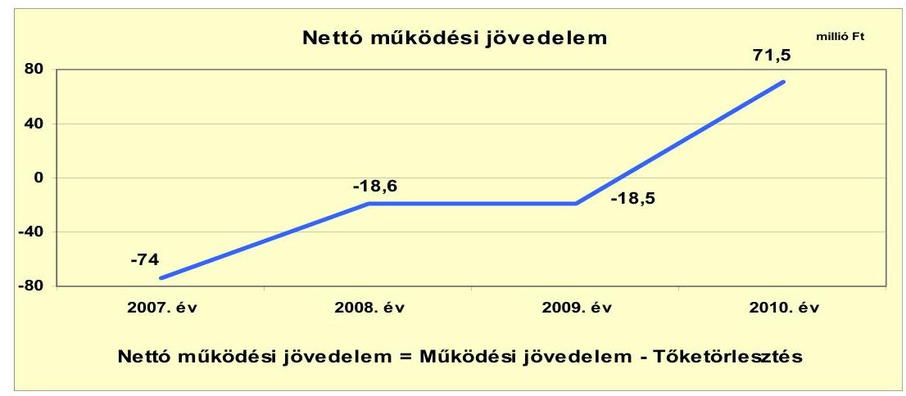

Az Önkormányzat pénzügyi kapacitása (nettó működési jövedelem) a 2007-2009. években negatív, a 2010. évben pozitív értéket mutatott. A nettó működési jövedelem ${ }^{15}$ értéke a folyó költségvetési pozíció mellett az adott költségvetési év pénzintézeti adósságtörlesztésének hatását is tükrözi.

A folyó költségvetés egyenlegének és a tőketörlesztésre fordított összegeknek évenkénti különbözete (a nettó működési jövedelem) javult. A 2007. évben -74 millió Ft, 2008. és 2009. évben közel azonos összegű -18,6 és -18,5 millió Ft volt. A 2010. évben jelentősen javult, 71,5
 millió Ft volt. Az Önkormányzat folyó költségvetési egyenlege 2007. évben -22 millió Ft, tőketörlesztése (hiteltörlesztése) 52 millió Ft volt. A 2008. évben a folyó költségvetési egyenlege -7 millió Ft, hiteltörlesztése 11,6 millió Ft volt. A 2009. évben folyó költségvetési pozitív egyenlege 49,4 millió Ft sem volt elégséges a 67,9 millió Ft tőketörlesztésre, annak csak újabb hitel felvételével és a folyószámlahitel bevonásával tudott eleget tenni. Az Önkormányzat folyó költségvetés egyenlege 2010. évben 86,9 millió Ft volt, amelyből tőketörlesztésre 15,4 millió Ft-ot fordított. A 2010. évben hitelfelvétel nem történt.

[^0]
[^0]:    ${ }^{15}$ pénzügyi kapacitás

---

A felhalmozási költségvetés egyenlegét 2007-2010. közötti években a következő ábra szemlélteti:
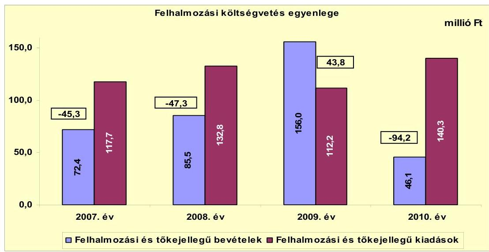

A 2007-2010. években az Önkormányzat felhalmozási költségvetésének egyenlege, a 2009. év kivételével negatív összegű volt. A 2009. évi felhalmozási többletet az Önkormányzat saját tőkebevételeinek 2009. évben kiugróan magas értéke okozta, amely 132,3 millió $\mathrm{Ft}^{16}$ volt (ebből a tárgyi eszközök értékesítése 130,7 millió Ft). A 2010. évi -94,2 millió Ft felhalmozási hiány oka az volt, hogy az Önkormányzat két nagy összegű (35,8 millió Ft, 34,7 millió Ft) és több 10 millió Ft alatti saját erős fejlesztést hajtott végre, a működési bevételei terhére.

A vizsgált időszakban keletkezett összes, 143 millió Ft felhalmozási forráshiányra a felvett 90,2 millió Ft hosszú lejáratú, fejlesztési célú hitel, továbbá a 2010. évi 86,9 millió Ft működési jövedelemtöbblet nyújtott fedezetet az Önkormányzat kimutatása szerint.

Az Önkormányzat 27,5 millió Ft pénzkészlettel zárta a 2010. évet, a függő, átfutó, kiegyenlítő bevételek és kiadások egyenlege -4,6 millió Ft volt.

Az Önkormányzat évenkénti teljes finanszírozási igénye ${ }^{17}$ a CLF módszer szerint 2007-ben -119,3 millió Ft, 2008-ban -65,9 millió Ft, 2010-ben -22,7 millió Ft volt, 2009. évben a finanszírozási többlet összege 25,3 millió Ft volt.

[^0]
[^0]:    ${ }^{16}$ Az Önkormányzat saját tőkebevétele 2007. évben 57,9 millió Ft, 2008. évben 72,8 millió Ft, 2010. évben 36,4 millió Ft volt.
    ${ }^{17}$ a nettó működési jövedelem és a felhalmozási költségvetés eredője

---

Az Önkormányzat finanszírozási műveletei 2007-2010. évekbeli egyenlegét a következő ábra szemlélteti:
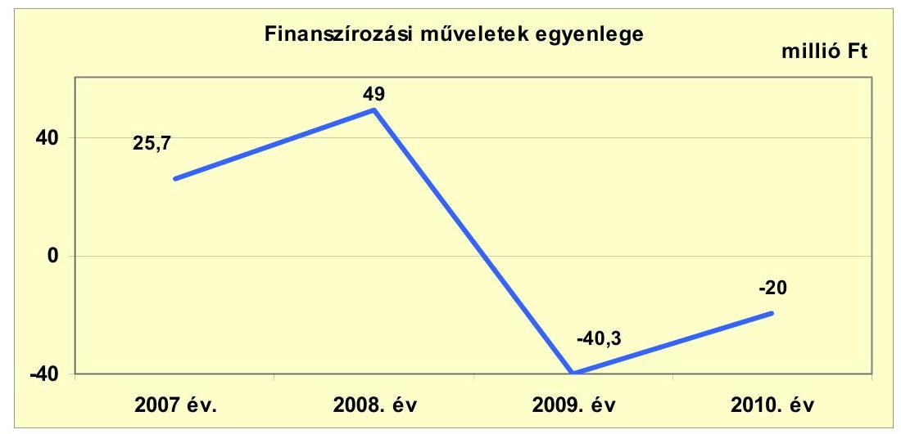

A finanszírozási műveletek egyenlege 2009-2010. években negatív összegű volt mivel a 2009. évben a hiteltörlesztés összege nagyobb volt (67,9 millió Ft) mint a hitelfelvétele (37 millió Ft). A 2010. évben hitelfelvétel nem volt csak hiteltörlesztés (15,4 millió Ft), valamint a függő, átfutó, kiegyenlítő bevételek és kiadások egyenlege -4,6 millió Ft volt. A finanszírozási célú műveleteket a vizsgált időszakban a jelentés 2. számú mellékletének 4.1-4.8 pontjai részletezik.

Az Önkormányzat zárszámadási rendeletében bemutatta ${ }^{18}$, a működési többletet és a fejlesztési hiányt, amelyről a jelentés 1. számú melléklete nyújt tájékoztatást. A zárszámadási rendeletek 2007-2009 évekre forrástöbbletet, 2010. évre forráshiányt jeleztek.

A 2007-2010. évek között az Önkormányzat összesen 26,2 millió Ft kamatot fizetett meg. Az átmenetileg szabad pénzeszközein realizált kamatbevétel, a teljes kamatráfordítás 25,2%-át (6,6 millió Ft) tette ki. Az Önkormányzat a 2011. év I. félévében 2,5 millió Ft kamatot fizetett meg és 0,6 millió Ft kamatbevételhez jutott.

[^0]
[^0]:    ${ }^{18}$ Nincs kötelező előírás a működési és fejlesztési hiány megállapításának módjára.

---

Az Önkormányzat kamatbevételeinek és kamatkiadásainak évenkénti alakulását a következő ábra mutatja:
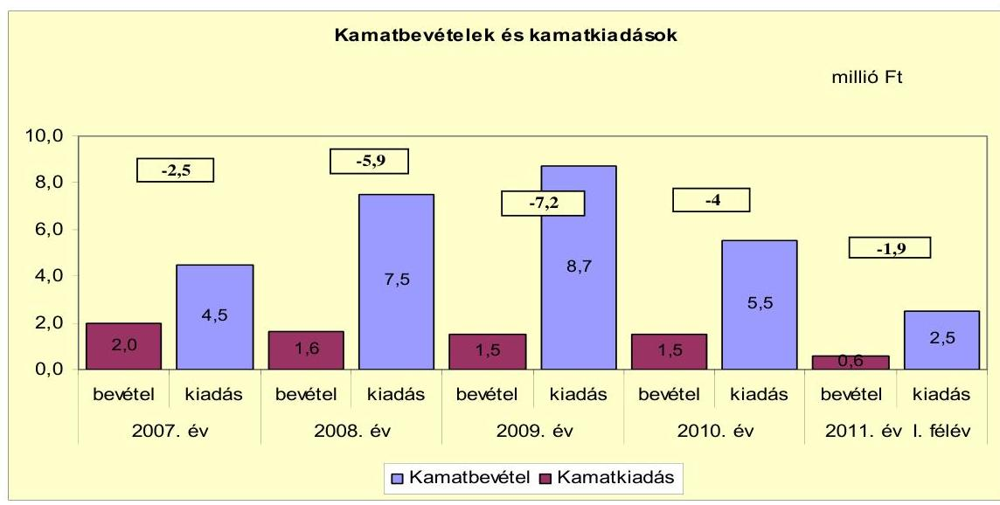

A 2008. évi 7,5 millió Ft, a 2009. évi 8,7 millió Ft kamatkiadást a 2008. évben felvett 67,6 millió Ft és a 2009. évben felvett 37 millió Ft hosszú lejáratú hitelek után fizetett kamatok okozták.

# 2.2. Az Önkormányzat bevételeinek változása 

Az Önkormányzat 2007-2010. évek között realizált folyó bevételeit a következő ábra mutatja be:
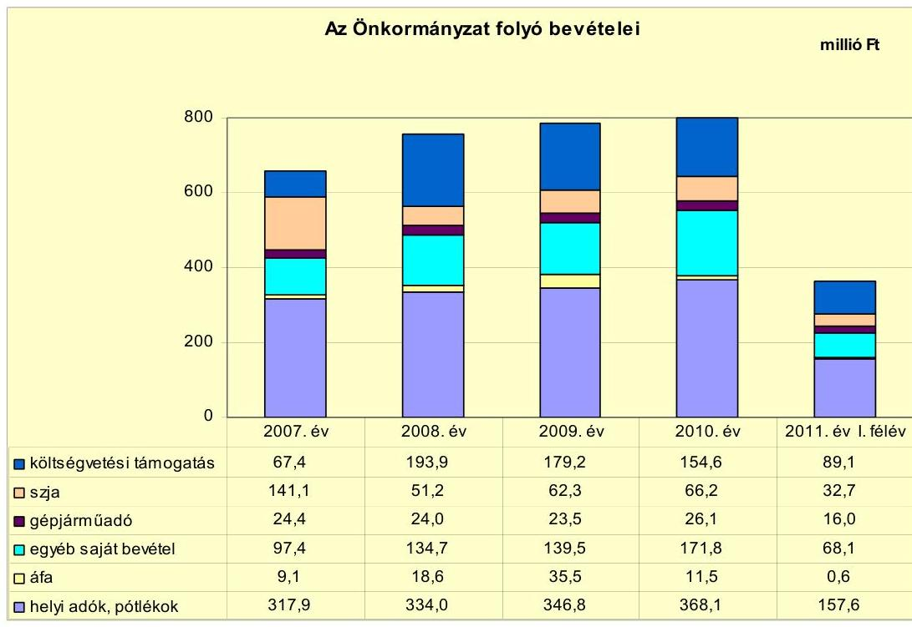

---

A költségvetési támogatások és szja bevétele a 2007. évben 208,5 millió Ft, a 2008. évben 245,1 millió Ft, a 2009. évben 241,5 millió Ft, a 2010. évben 220,8 millió Ft volt. A 2008. évben a költségvetési támogatások növekedését a beszedett idegenforgalmi adóhoz kapcsolódó 8 millió Ft-os többlet támogatás, valamint a 20,2 millió Ft egyéb központi támogatás (2007. év után járó 13. havi illetmény 2008. évi elszámolása, 2008. évi helyi önkormányzatok intézményei részére járó kereset kiegészítés és előre hozott nyugdíjra jogosultak felmentéséhez kapcsolódó támogatás) eredményezte. A költségvetési támogatásoknál a 2009. évben csökkenés következett be. Az Önkormányzat a 2009. évben egyéb központi támogatást nem kapott, a bevételkiesést részben ellensúlyozta az üdülőhelyi feladatokhoz kapcsolódó támogatás 10 millió Ft-os növekedése. A 2010. évi költségvetési támogatások 2009-hez viszonyított 20,3 millió Ft-os csökkenését a feladatmutatóhoz kötött normatív támogatások 43,3 millió Ft-os csökkenése okozta (az üdülőhelyi feladatokhoz kapcsolódó támogatás 35 millió Ft-tal csökkent), ezt ellensúlyozta az egyéb központi támogatás címén kapott 18,5 millió Ft, és a központosított támogatások 3,4 millió Ft-os növekedése.

Az Önkormányzat egyéb saját bevételei között szerepelnek az intézményi működési bevételek mellett a hozam és kamatbevételek, az államháztartáson belül kapott támogatások, az államháztartáson kívülről átvett bevételek. Az egyéb saját bevételek folyamatosan növekedtek 2007. évben 97,4 millió Ft, 2008. évben 134,7 millió Ft volt. A növekedését az előző évi költségvetési kiegészítések, visszatérülések (2007. év után pótlólagosan járó normatív- és kötött normatív állami támogatások) okozták. Az egyéb saját bevétel 2009. évben 139,5 millió Ft, 2010. évben 171,8 millió Ft volt. A 2010. évi növekedést a tornatermi tűzeset utáni kártérítés, a közvilágítás túlfizetésének visszautalása okozta.

A 2009. évi áfa növekedését a 2009. évi nagy összegű (130,7 millió Ft) tárgyi eszköz értékesítése eredményezte.

A helyi adókból, pótlékokból származó bevétel 2007-2010. között folyamatosan növekedett. Az Önkormányzat a helyi adó bevételeinek növelésére 2007-2010-ben több intézkedést tett. Ennek keretében 2007. január 1-jétől bevezette a magánszemélyek kommunális adóját. Az Önkormányzat 2008. január 1-jétől módosította az építményadót és kommunális adót Az Önkormányzat 2010. január 1-jétől, ismét módosította helyi adóit, ennek során maximális mértékre emelték a helyi iparűzési adót 1,8%-ról 2%-ra. Emelték az építményadó mértékét a melléképületek esetében és az idegenforgalmi adó mértékét

A 2008. január 1-jétől az építményadót a lakóépületek és üdülők esetében 600 $\mathrm{Ft} / \mathrm{m}^{2}$-ről 700 $\mathrm{Ft} / \mathrm{m}^{2}$-re, melléképületek esetében 500 $\mathrm{Ft} / \mathrm{m}^{2}$-ről 600 $\mathrm{Ft} / \mathrm{m}^{2}$-re emelték. A kommunális adót a beépítetlen belterületi telkek esetében emelték 4000 $\mathrm{Ft} /$ évről 6000 $\mathrm{Ft} /$ évre.

A 2010. január 1-jétől a melléképületek adóját 600 $\mathrm{Ft} / \mathrm{m}^{2}$-ről 700 $\mathrm{Ft} / \mathrm{m}^{2}$-re emelték, az idegenforgalmi adó mértékét 370 $\mathrm{Ft} /$ éj összegben állapították a 300 $\mathrm{Ft} /$ éj helyett.

---

Az Önkormányzatnak az új adó bevezetéséből a 2007-2010. évben 12,9 millió Ft, az adómértékének emeléséből 2008-2010. évben 25,1 millió Ft többlet bevétele származott.

A Képviselő-testület bevezette új adóként a telekadót 2011. január 1-jétől.
Az Önkormányzat a vizsgált években egy gazdasági társaságától kapott osztalékot ${ }^{19}$, 2007. évben 2,2 millió Ft-ot, 2008. évben 1 millió Ft-ot, 2009. évben 1,4 millió Ft-ot, 2010. évben 1,7 millió Ft-ot.

Az Önkormányzat felhalmozási bevételei a vizsgált időszakban a következők voltak:

| Megnevezés | 2007. év | 2008. év | 2009. év | 2010. év | 2011. év I. félév |
| :--: | :--: | :--: | :--: | :--: | :--: |
| Tárgyi eszköz értékesítés | 39,3 | 70,7 | 130,7 | 36,4 | 3,6 |
| Egyéb saját tőkebevétel | 18,6 | 2,1 | 1,6 | 0,0 | 1,0 |
| Államháztartáson belülről kapott támogatás | 9,2 | 8,7 | 9,5 | 8,7 | 38,5 |
| EU-tól és külföldről kapott támogatások | 0,0 | 2,1 | 0,0 | 0,0 | 0,0 |
| Államháztartáson kívülről kapott támogatás | 5,3 | 1,9 | 14,2 | 1,0 | 0,3 |
| Összes felhalmozási bevétel | 72,4 | 85,5 | 156,0 | 46,1 | 43,4 |

Az Önkormányzat felhalmozási bevételeinek alakulását 2007-2010. években a tárgyi eszköz értékesítéséből származó bevétele határozta meg. A 2009. évben volt a legnagyobb a tárgyi eszközértékesítésből származó bevétel $130,7^{20}$ millió Ft, míg 2007-ben 39,3 millió Ft, 2008-ban 70,7 millió Ft, 2010-ben 34,6 millió Ft volt.

[^0]
[^0]:    ${ }^{19}$ A gazdasági társaságban az Önkormányzat részesedése 25% alatti volt.
    ${ }^{20}$ A tárgyi eszközértékesítésből egy beépítetlen terület értékesítése 100 millió Ft, egy épület értékesítése 5 millió Ft volt, fennmaradó 25 millió Ft értékben több kisebb értékű beépítetlen területet adtak el.

---

# 2.3. Az Önkormányzat működési és a felhalmozási célú kiadásainak változása. 

Az Önkormányzat folyó kiadásai főbb jogcímek szerinti bontásban az alábbiak voltak:

|  |  |  |  |  | millió Ft |
| :-- | --: | --: | --: | --: | --: |
| Megnevezés | 2007. év | 2008. év | 2009. év | 2010. év | 2011. év I.   félév |
| Folyó kiadások | 679,3 | 763,4 | 737,4 | 711,4 | 323,3 |
| Működési kiadások (kamatkiadás nélkül) | 653,5 | 726,6 | 701,9 | 681,6 | 308,5 |
| Államháztartáson belülre átadott   pénzeszközök | 0,6 | 3,6 | 6,1 | 5,9 | 3,0 |
| Transzferkiadások | 20,7 | 21,4 | 20,7 | 18,4 | 9,3 |
| -ebből: vállalkozásoknak | 2,8 | 0,9 | 0,0 | 0,0 | 0,0 |
| EU-nak, illetve külföldre | 0,3 | 0,0 | 0,0 | 0,0 | 0,0 |
| magánszemélyeknek | 10,3 | 12,5 | 12,2 | 12,1 | 8,0 |
| nonprofit szervezeteknek | 7,3 | 8,0 | 8,5 | 6,3 | 1,3 |
| Kamatkiadások | 4,5 | 7,5 | 8,7 | 5,5 | 2,5 |
| Előző évi pénzmaradvány átadás | 0,0 | 4,3 | 0,0 | 0,0 | 0,0 |

Az Önkormányzat folyó kiadásai 2007-2008. évek között nőttek, 2009. évtől csökkentek. A folyó kiadások 2007. évről 2008. évre a személyi juttatások 24,7 millió Ft-os, dologi kiadások 40 millió Ft-os emelkedése miatt nőttek. A személyi juttatások 2009. évben 31,8 millió Ft-tal csökkentek, ez 2009. évben a folyó kiadások csökkenését okozta. A folyó kiadások további csökkenését a dologi kiadások 2009. évről 2010. évre 23,4 millió Ft-os csökkenése eredményezte.

Az Önkormányzat folyó kiadásai főbb kiadásnemenkénti bontásban az alábbiak voltak:

|  |  |  |  |  | millió Ft |
| :-- | --: | --: | --: | --: | --: |
| Megnevezés | 2007. év | 2008. év | 2009. év | 2010. év | 2011. év I.   félév |
| Személyi juttatások | 310,4 | 335,1 | 303,3 | 312,5 | 147,0 |
| Munkaadót terhelő járulékok | 96,4 | 101,0 | 85,7 | 85,3 | 40,0 |
| Dologi kiadások | 230,8 |

 270,8 | 297,5 | 274,1 | 115,0 |
| Egyéb folyó kiadások | 13,3 | 19,8 | 11,8 | 8,0 | 7,0 |

A folyó kiadásokon belül a személyi juttatások és a munkaadókat terhelő járulékok 2008. évi növekedését a 2008. évi bérpolitikai intézkedések támogatása és a 2007. év után járó 13. havi illetmény 2008. évi elszámolása eredményezte. A dologi kiadások 2008. évi növekedését az energiahordozók (áram- és földgázdíj) árának emelkedése okozta. A 2010. évi személyi juttatások és a munkaadókat terhelő járulékok emelkedését az Önkormányzat 2010. évi létszámnövekedése okozta.

---

A folyó működési és felhalmozási kiadások alakulását, a teljesített kiadások működési és felhalmozási felhasználásának arányait az alábbi ábra mutatja be:
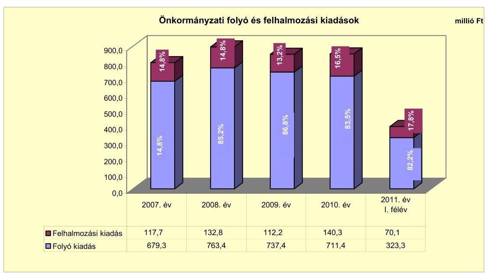

A folyó és felhalmozási kiadások arányának változásában 2007-2010. évek közötti elmozdulás figyelhető meg. A felhalmozási kiadások aránya 2007. évi $15,8 \%$-ról 2010-re $16,5 \%$-ra emelkedett.

Az Önkormányzat által 2007-2010 között megvalósított, 10 millió Ft értékhatár feletti befejezett felújítások száma négy, fejlesztések (beruházások) száma hét volt. Az elvégzett felújítások bekerülési költsége áfa-val 109,4 millió Ft, amelyből a 10 millió Ft értékhatár alatti felújítások bekerülési költsége 51,9 millió Ft volt. A felújítások 102,8 millió Ft összegben saját bevételből, 6,6 millió Ft összegben hazai támogatásból valósultak meg. A befejezett fejlesztések bekerülési költsége áfa-val 300,0 millió Ft, amelyből a 10 millió Ft értékhatár alatti fejlesztések bekerülési költsége 121,1 millió volt. A fejlesztések 163,7 millió Ft összegben saját bevételből, 99,8 millió Ft összegben hitelből, 30 millió Ft összegben EU-s támogatásból, 6,5 millió Ft összegben hazai támogatásból valósult meg.

Az Önkormányzatnak 2010. december 31-én egy folyamatban lévő fejlesztése volt. A Zamárdi Város Balaton part Turisztikai Vonzerejének növelése projekt várható bekerülési költsége 72,8 millió Ft, 2010. december 31-ig a fejlesztésre kifizetés nem történt. A beruházás tervezett forrásösszetétele 50%-ban saját bevétel, $50 \%$-ban EU-s támogatás.

Az Önkormányzatnak egy elbírálás alatti pályázata van. A pályázatból megvalósuló projekt, Zamárdi Városközpont Funkcióbővítő Integrált Fejlesztése várható bekerülési költsége 354,8 millió Ft. A tervezett forrásösszetétele 80%, (284 millió Ft) EU-s támogatás, 20% (70,8 millió Ft) saját bevétel.

---

Az Önkormányzat a folyamatban lévő fejlesztéshez és elbírálás alatti pályázathoz a saját forrást biztosítani tudja, a 2010. évi szabad pénzmaradványból, a 2011. évi bevételt növelő intézkedésekből származó többletbevételekből.

A 2007-2010. években az Önkormányzat megvalósított kiemelt infrastrukturális beruházásai az alábbiak:

- Malsch park létrehozása, kerékpártároló elhelyezése. A beruházás 2010. évben indult és fejeződött be. A beruházás teljes bekerülési költsége 35,8 millió Ft volt. A megvalósított projekt forrásösszetétele 83,8%, (30 millió Ft) EU-s támogatás, 16,2% (5,8 millió Ft) saját bevétel volt;
- OLLÉ pályaépítés, Zamárdi Város labdarugó pályájának építése. A beruházás 2008. évben valósult meg. A teljes bekerülési költsége 35,2 millió Ft, forrása teljes egészében hitel volt;
- Zamárdi Város Integrált Városfejlesztési Stratégiai tervek készítése. A tervek 2010. évben készültek el - a 2011. évben elbírálás alatti Zamárdi Városközpont Funkcióbővítő Integrált Fejlesztése pályázathoz. A tervek teljes bekerülési költsége 34,7 millió Ft, forrása teljes egészében saját bevétel volt.

Az önkormányzati feladatokat ellátó gazdasági társaságoknak működési és felhalmozási célú pénzeszközöket nem adott át.

# 3. Az ÖNKORMÁNYZAT KÖTELEZETTSÉGEI 

### 3.1. Az Önkormányzat pénzintézeti kötelezettségeinek változása

Az Önkormányzat adatszolgáltatása alapján pénzintézeti kötelezettségeinek állománya 2006. december 31-én 101,4 millió Ft volt. 2010. december 31-én 101,8 millió Ft, 2011. június 30-án pedig 86,2 millió Ft. A hitel felvételek és törlesztések különbözetének hatására 5,2 millió Ft-tal csökkent. A fennálló pénzintézeti kötelezettségek hosszú lejáratú hazai és külföldi hitel igénybevételéből keletkeztek.

---

Az Önkormányzat pénzintézetekkel szemben fennálló kötelezettség-állományát a 2007-2011. év I. félév között az alábbi ábra szemlélteti:
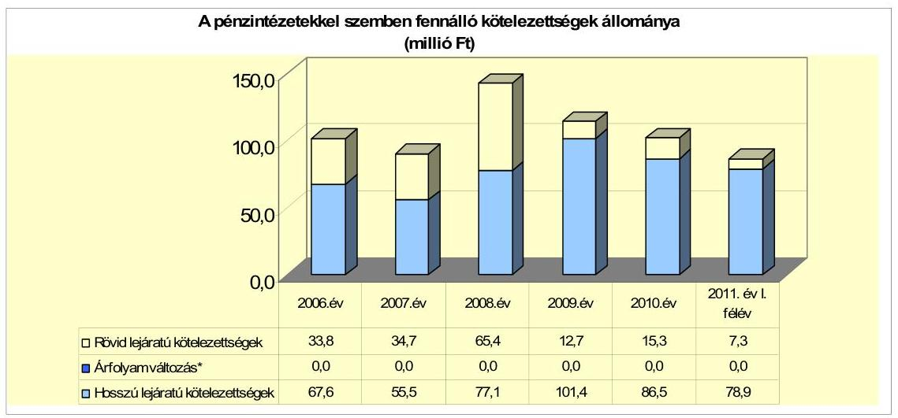

Megjegyzés: *az évenkénti árfolyamváltozást az Önkormányzat nem számolta el.
Az Önkormányzat 2007-2011. év I. félév között folyószámlahitellel, és négy hosszú lejáratú hitellel - ebből egy GAMESZ - rendelkezett. A hosszú lejáratú hitelek közül három - ebből egy GAMESZ - deviza alapú, egy pedig forint alapú volt. 2008-ban - év közben - munkabér-megelőlegezési hitelt vett fel és fizetett vissza. 2008-ban az Önkormányzat forint alapú, 2008-ban a GAMESZ, 2009-ben pedig az Önkormányzat CHF alapú hosszú lejáratú hitelt vett fel. 2009-től a pénzintézeti kötelezettségek állományának csökkenését - a hitelfelvételek mellett - a hosszú lejáratú hitelek törlesztése, valamint a folyószámlahitellel zárt napok számának csökkenése eredményezte. A rövid lejáratú kötelezettségeket 2007-ben és 2008-ban a folyószámlahitel év végi záróállománya és a következő években esedékes törlesztések eredményezték.
2011. június 30-áig az Önkormányzat a három, a GAMESZ pedig az egy hitelét igénybe vette.

A 2007-2010. években az Önkormányzat a forráshiány, adósság kezelése érdekében bevételnövelő és kiadáscsökkentő intézkedéseket hozott, költségvetési rendeleteiben működési és felhalmozási célú hitelfelvétellel, valamint pénzmaradvány igénybevételével számolt. A 2008-ban és 2009-ben a hosszú lejáratú hitelek felvételekor az Önkormányzat nem lépte túl - az Ötv. 88. § (2) bekezdésében előírt ${ }^{21}$ - az adósságot keletkeztető kötelezettségvállalások felső határát. Az előterjesztésekben nem mutatták be az adósságszolgálati korlátot. A költségvetési beszámolók szerint az adósságot keletkeztető kötelezettségvállalás felső határa 2008-ban 260,2 millió Ft, 2009-ben pedig 263,7 millió Ft volt.

Az Önkormányzat pénzintézeti kötelezettségvállalásaira - a GAMESZ hitelét kivéve - a Képviselő-testület döntése alapján került sor. A pénzintézetet versenyeztetést követően választották ki. Az előterjesztésekben nem mutatták be a

[^0]
[^0]:    ${ }^{21}$ 2012. január 1-jétől a Stabilitási tv. 10. § (3) bekezdés

---

kamat és a deviza alapú kötelezettségeket érintő árfolyamkockázatot. A GAMESZ a 2008. évi pénzintézeti kötelezettségvállalását a Képviselő-testület döntése nélkül hozta meg. A CHF hitel felvételekor nem vették figyelembe az Áht ${ }_{1}$ 100. § (1) bekezdés a) pontjában ${ }^{22}$ foglalt előírásokat. A szerződést a GAMESZ nevében a korábbi - 2009. szeptember 1. előtt - közalkalmazotti jogviszonyban álló vezetője kötötte meg.

Az Önkormányzat számlavezetője nem volt azonos a felhalmozási hiteleket nyújtó pénzintézetekkel. A vizsgált időszak alatt a számlavezető nem változott.

A hosszú lejáratú pénzintézeti kötelezettségek forrásait az Önkormányzat beruházásokra, a GAMESZ pedig gépjármű vásárlására használta fel. A pénzintézeti kötelezettségekből 2011. június 30-ig összesen - a tőketörlesztéskori árfolyamon - 71,6 millió Ft-ot (301023 CHF-et és 24908 EUR-ot) teljesítettek.

Az Önkormányzat 2011. június 30-án CHF-ben fennálló hosszú lejáratú, tízéves futamidejű adósságot keletkeztető kötelezettségvállalása: ${ }^{23}$

| Megnevezés | Szerződéskötés/   Kibocsátás   időpontja | Összeg   ezer CHF-ben | Kibocsátás/lehívási   árfolyam | Kamat (referencia kamat+   kamatfelár) | Felhasználás célja: |
| :-- | :--: | :--: | :--: | :--: | :--: |
| ÖEP-05-0065/1 | szerz: 2005.06.02. | kib: 2005.07.22. | 442,8 | 160,0 | 3 havi CHF LIBOR + 1,5% | régészeti feltárás |

Az Önkormányzat a 2005. évben a Zamárdi-Balatonréd között tervezett útvonal, Zamárdit elkerülő szakaszán régészeti lelőhelyek megelőző feltárására vett fel hitelt. A felhasználás a szerződésben megjelölt hitelcéllal azonosan történt.

A felvett hitelhez kapcsolódóan 2011. június 30-ig összesen 48,6 millió Ft-ot (206 116 CHF tőke, 67560 CHF kamat, összesen: 273676 CHF) fizetett. Az árfolyamveszteség 3,9 millió Ft volt.

Az Önkormányzat 2011. június 30-án HUF-ban fennálló hosszú lejáratú, 15 éves futamidejű adósságot keletkeztető kötelezettségvállalása:

| Megnevezés | Szerződéskötés/   Kibocsátás   időpontja | Összeg   millió HUF-ban | Kamat (referencia   kamat+ kamatfelár) | Felhasználás célja: |
| :-- | :--: | :--: | :--: | :--: |
| H-OKIF/027685/2008 | szerz: 2008.04.29. | kib: 2008.05.13 | 35,2 | 3 havi EURIBOR + 1,58% | OLLE PROGRAM |

Az Önkormányzat a 2008-ban megkötött hitelszerződésben felhasználási célként a „Sikeres Magyarországért" Önkormányzati infrastruktúrafejlesztési hitelprogramhoz kapcsolódó OLLÉ programot jelölte meg. A felhasználás a hitelcéllal azonosan történt.

[^0]
[^0]:    ${ }^{22}$ A számozás az Áht ${ }_{1}$ módosítása során 100/G. §-ra változott. 2012. január 1-jétől az az Áht ${ }_{2}$ 41. § (4) bekezdés.
    ${ }^{23}$ A hitelszerződés 1.1. pontja szerint a hitelkeret HUF és CHF devizanemben volt igénybe vehető.

---

A fennálló pénzintézeti kötelezettségéhez kapcsolódóan 2011. június 30-ig összesen 11,7 millió Ft-ot (7,0 millió Ft tőke, 3,7 millió Ft kamat, 1,0 millió Ft egyéb költség ${ }^{24}$ ) fizetett.

Az Önkormányzat 2011. június 30-án EUR-ban fennálló hosszú lejáratú, tízéves futamidejű adósságot keletkeztető kötelezettségvállalása: ${ }^{25}$

| Megnevezés | Szerződéskötés/   Kibocsátás   időpontja | Összeg   ezer EUR-ban | Kibocsátás/lehívási   árfolyam | Kamat (referencia kamat+
kamatfelár) | Felhasználás célja: |
| :-- | :--: | :--: | :--: | :--: | :--: |
| OEP-08-0185-1 | szerz: 2009.01.08./   konv: 2009.02.23 | 125,0 | 295,91 | 3 havi EURIBOR + 2,5% | 2008-2009. évi fejlesztés |

A 2009. évi hitelfelvételkor a szerződésben a fejlesztési célt általános jelleggel -2008-2009. évi fejlesztési célok megvalósítása - határozták meg. A 2008. és 2009. évi zárszámadási rendeletek szerint ténylegesen a csapadékvízrendszer felújítására, a közoktatási intézmények nyílászáró cseréjére és gépbeszerzésre, védőnői épület felújítására, a Polgármesteri hivatalban számítógépek és bútorzat cseréjére, a GAMESZ lízingdíjainak törlesztésére használták.

A felvett hitelhez kapcsolódóan 2011. június 30-ig 6,9 millió Ft-ot (14 707 EUR tőke, 10201 EUR kamat, összesen: 24908 EUR) fizetett.

A GAMESZ 2011. június 30-án CHF-ben fennálló hosszú lejáratú, maximum négyéves futamidejű adósságot keletkeztető kötelezettségvállalása:

| Megnevezés | Szerződéskötés/   Kibocsátás   időpontja | Összeg   ezer CFH-ben | Kibocsátás/lehívási   árfolyam | Kamat (referencia kamat+
kamatfelár) | Felhasználás célja: |
| :-- | :--: | :--: | :--: | :--: | :--: |
| BCCUR022806 | szerz: 2008.06.16./   kib: 2008.06.16 | 24,1 | 149,1 | 1 havi CHF LIBOR + 3,25% | autóbusz vásárlás |

A fennálló pénzintézeti kötelezettségéhez kapcsolódóan 2011. június 30-ig összesen 4,3 millió Ft-ot (20433 CHF tőke, 6904 CHF kamat, összesen: 27347 CHF) fizetett.

Az Önkormányzat 2007-2010. közötti főkönyvi nyilvántartásaiban - a Számv. tv. 60. § (1) bekezdésében foglaltak ellenére - a deviza alapú önkormányzati hitelek törlesztései után a realizált árfolyamnyereséget/veszteséget nem számolták el.

Annak megítéléséről, hogy a hitelek visszafizetésekor jelentkező forint kötelezettség többletkiadást (árfolyamveszteség) vagy kiadáscsökkenést (árfolyamnyereség) eredményez a futamidő végén, a teljes kötelezettség rendezését követően lehet képet alkotni. Mindaddig, amíg törlesztési kötelezettség nem áll fenn (türelmi idő, moratórium), a tőkére vonatkoztatva nem értelmezhető sem az árfolyamveszteség, sem az árfolyamnyereség. Ugyanakkor a számviteli szabályok meghatározzák, hogy az árfolyamkülönbözetet év végén a kötelezettségek

[^0]
[^0]:    ${ }^{24}$ Az egyéb költség a Hitelgarancia Zrt. kézfizető kezességének díja.
    ${ }^{25}$ A hitelszerződés 1.1. pontja szerint a hitelkeret HUF és CHF devizanemben volt igénybe vehető.

---

vagy követelések között a könyvviteli mérlegben nyilván kell tartani, azonban árfolyamkülönbözet ebben
 az esetben ténylegesen nem képződött.

A helyszíni ellenőrzés alatt az Önkormányzat az EUR és a CHF, a GAMESZ pedig a CHF hitele után, utólag kiszámolta - a 2010. december 31-ig tényleges tőkefizetések utáni - realizált árfolyamveszteséget, illetve nyereséget. A devizahitelekre számított veszteség 3,3 millió Ft, az árfolyamnyereség pedig 0,1 millió Ft volt.

Az Önkormányzat 2005. évi CHF alapú hitele után számított árfolyamveszteség 2,8 millió Ft, a 2009. évi EUR hitel árfolyamnyeresége 0,1 millió Ft.

A GAMESZ 2008. évi CHF hitelének számított árfolyamvesztesége 0,5 millió Ft.
Az Önkormányzat - a Számv. tv. 60. § (2) bekezdésében foglaltakat figyelmen kívül hagyva - 2007-2010. között évenként a mérlegeiben a külföldi pénzértékre szóló (CHF és EUR) kötelezettségek árfolyamkülönbözetét forintértéken nem mutatta ki. ${ }^{26}$ Az Önkormányzat könyvvizsgálója a 2010. évi Kiegészítő jelentésében megállapította, ${ }^{27}$ hogy az Önkormányzat CHF alapú hitelnél a nem realizált árfolyamveszteség 15,7 millió Ft, az EUR alapú hitelnél a nem realizált árfolyamnyereség pedig 1,7 millió Ft.

Az Önkormányzat működési feladatainak finanszírozását a 2007-2011. év I. félév között folyószámla-, és egy alkalommal munkabér-megelőlegezési hitel igénybevételével biztosította, amelynek alakulását az alábbi táblázat mutatja be:

|  |  |  |  |  | millió Ft-ban |
| :--: | :--: | :--: | :--: | :--: | :--: |
| Megnevezés | 2007. év | 2008. év | 2009. év | 2010. év | 2011. év I.   félév |
| I. Folyószámlahitel |  |  |  |  |  |
| a folyószámlahitel keretösszege január 1-jén | 0,0 | 50,0 | 70,0 | 70,0 | 70,0 |
| teljesített kamat és egyéb költség | 0,3 | 3,1 | 2,4 | 0,3 | 0,2 |
| II. Munkabér megelőlegezési hitel |  |  |  |  |  |
| Igénybevett hitel összesen: |  | 14,3 |  |  |  |
| teljesített kamat és egyéb költség |  | 0,1 |  |  |  |

2007. január 1-jén az Önkormányzatnak folyószámla-hitelkerete nem volt, mert a 2006. évi hitelkeret december 31-ig állt fenn. Az Önkormányzat az új hitelkeret szerződést 2007. január 18-án 50,0 millió Ft keretösszeggel kötötte meg. A folyószámlahitellel zárt napok száma 2007-ben 146 nap volt. A 2008. évi 286 napról 2010-ig évenként folyamatosan 33 napra, 11,5%-ra csökkent. A folyószámlahitel átlagos napi állománya 2007-2008 között (7,3 millió Ft-ról 29,4 millió Ft-ra) növekedett, 2009-2010 között pedig (13,0 millió Ft-ról 1,1 millió Ft-tal) csökkent. A változást a bevételek növekedése eredményezte. A folyó-

[^0]
[^0]:    ${ }^{26}$ A külföldi pénzértékre szóló kötelezettségeket a mérlegforduló napjára vonatkozó devizaárfolyamon átszámított forintértéken kell kimutatni.
    ${ }^{27}$ Kiegészítő jelentés Zamárdi Város Önkormányzata 2010. évi egyszerűsített éves beszámolója vizsgálatáról készült független könyvvizsgálói jelentéshez, valamint a 2010. évi zárszámadási rendelettervezethez.

---

számla hitelszerződések fordulónapi kötelezettségállománya 2008-ban 26,1 millió Ft, 2009-ben 60,1 millió Ft volt. 2007-ben és 2010-ben fordulónapi kötelezettségállománnyal nem rendelkezett az Önkormányzat. 2011. év I. félévében napi folyószámlahitel-állománya nem volt. Az év végi záróállomány 2007-ben 23,3 millió Ft, 2008-ban pedig 52,0 millió Ft. Ennek oka, a 7,3 és 1,9 millió Ft-os záró pénzkészlet mellett, a működési és a felhalmozási költségvetés hiánya volt.

Az Önkormányzat egy alkalommal, 2008. december 2-án 14,3 millió Ft munkabér-megelőlegezési hitelt vett fel. A hitel 20 napon keresztül állt fenn, napi átlagos állománya 39,2 ezer Ft volt. A hitel folyósítására - az Önkormányzat számlavezetőjével kötött - bankszámlaszerződés alapján került sor.

A folyószámlahitel kondíciói és egyéb költségei a következők voltak ${ }^{28}$ :

| Megnevezés | Kamat (referencia+ kamatfelár) | Egyéb költség |
| :--: | :--: | :--: |
| Folyószámlahitel |  |  |
| 2007-2008. év | 3 havi BUBOR + 1,0 % | 0,3 % kezelési költség   0,0 % rendelkezésre tartási   jutalék |
| 2008-2009. év | 3 havi BUBOR + 1,0 % | 0,3 % kezelési költség   0,0 % rendelkezésre tartási   jutalék |
| 2009-2010. év | 3 havi BUBOR + 3,25 % | 0,5 % kezelési költség   1,0 % rendelkezésre tartási   jutalék |
| 2010-2010.05. hó | 3 havi BUBOR + 3,0 % | 0,5 % kezelési költség   1,0 % rendelkezésre tartási   jutalék |
| 2010. 06. hó- 2011.05. hó | 3 havi BUBOR + 3,0 % | 0,5 % kezelési költség   1,0 % rendelkezésre tartási   jutalék |
| 2011.06. hó- 2012.05. hó | 3 havi BUBOR + 3,5 % | 0,5 % kezelési költség   1,0 rendelkezésre tartási   jutalék |

A folyószámlahitel kamatfelára 2009-től növekvő tendenciájú volt (1,0%-ról 3,5%-ra emelkedett). A számlavezető pénzintézet 2009-től megemelte a kezelési költséget, valamint rendelkezési tartási díjat vezetett be. A változást a gazdasági válság negatív pénzpiaci hatásaival indokolta.

A fennálló hosszú lejáratú hitelek esetében a kamatfizetési kötelezettségek alakulását jelentősen befolyásolta és jelenleg is befolyásolja a lehívási és az utolsó kamatfizetéskori kamatok (referencia + kamatfelár) változása, amelyet az alábbi táblázat mutat be:

| Megnevezés | Kibocsátási, lehivási | Utolsó fizetéskori | Változás % |
| :--: | :--: | :--: | :--: |
|  | kamat (referencia + kamatfelár) % |  |  |
| 1 Havi CHF LIBOR (2008.06.16.-i szerződés)* | 13,24 | 16,32 | 23,3% |
| 3 havi CHF LIBOR (2005.06.02.-i szerződés) | 2,25 | 3,18 | 41,3% |
| 3 havi EURIBOR (2008.04. 29.-i szerződés) | 6,435 | 2,759 | -57,1 % |
| 3 havi EURIBOR (2009.01.08.-i szerződés) | 6,89 | 4,03 | -41,5 % |

Megjegyzés: *a GAMESZ 2008. évi hitelszerződése

[^0]
[^0]:    ${ }^{28}$ A 3 havi BUBOR referencia kamat az MNB BUBOR fixing (átlagkamat) %-ban 2007ben 7,75 %, 2008-ban 8,87 %, 2009-ben 8,64 %, 2010-ben 5,50 %, 2011. év I. félévében pedig 6,07 %.

---

Amennyiben a kamat nem változott volna, az Önkormányzatnak a hitellehívási kamattal számolva 2011. év I. félévig a forint hitele után 6,1 millió Ft, az EUR hitele után 2,4 millió Ft (7982 EUR), a CHF hitele után 5,3 millió Ft (33 995 CHF), a GAMESZ-nak pedig 0,6 millió Ft (4033 CHF) kiadása keletkezne. A változások miatt azonban az Önkormányzatnak a forint hitele után 7,0 millió Ft, az EUR hitel után 2,6 millió (10 201 EUR), a CHF hitele után 11,7 millió Ft (67 560 CHF), a GAMESZ-nak pedig 1,3 millió Ft (6904 ezer CHF), tényleges kiadása keletkezett. A kamatváltozások hatására az Önkormányzat kiadásai 8,2 millió Ft-tal emelkedtek.

A referencia kamat mértékének változása és az árfolyamváltozás jelentősen befolyásolja a folyó kötelezettségek és a jövőbeni kötelezettségek alakulását, jelentős hatása van a teljes futamidőre számított kamatfizetés nagyságára, mértékük előre pontosan nem határozható meg.

A vállalt pénzintézeti, szállítói és egyéb kötelezettségeket, a 2011-2013. években, illetve az azt követő időszakban várható alakulását a kötelezettségek lejáratáig a következő táblázat szemlélteti, a jelenleg ismert pénzintézeti kamatszínttel számolva:

| Megnevezés | Állomány 2010. december 31-án |  |  | Állomány 2011. június 30-án |  |  | Várható kötelezettség 2011-2013. években |  | Várható kötelezettség 2014. évtől |  |
| :--: | :--: | :--: | :--: | :--: | :--: | :--: | :--: | :--: | :--: | :--: |
|  | HUF-ban   (millió Ft)   ban) | Devizában (összege,   ezer   EUR/CHF-   ben) | Devizá   nem | HUF-ban   (millió Ft)   ban) | Devizában (összege,   ezer   EUR/CHF-   ben) | Devizá   nem | HUF-ban   (millió Ft)   ban) | Devizában (összege,   ezer   EUR/CHF-   ben) | HUF-ban   (millió Ft)   ban) | Devizában (összege,   ezer   EUR/CHF-   ben) |
| Pénzintézeti kötelezettségek |  |  |  |  |  |  |  |  |  |  |
| Hosszú lejáratú hitel (OLLE Program) | 29,4 |  | HUF | 28,2 |  | HUF | 9,9 |  | 26,6 |  |
| Hosszú lejáratú hitel (regerzelt feljárás) |  | 255,6 | CHF |  | 236,6 | CHF |  | 183,0 |  | 94,4 |
| Hosszú lejáratú hitel (GAMESZ, gépjármű vásárlás) |  | 6,1 | CHF |  | 3,7 | CHF |  | 7,2 |  | 0,0 |
| Hosszú lejáratú hitel (2008-2009. évi fejlesztések) |  | 117,7 | EUR |  | 110,3 | EUR |  | 55,8 |  | 82,6 |
| Pénzintézeti kötelezettségek összesen HUF-ban | 29,4 |  | HUF | 28,2 |  | HUF | 9,9 |  | 26,6 |  |
| Pénzintézeti kötelezettségek összesen CHF-ban |  | 261,7 | CHF |  | 240,3 | CHF |  | 190,2 |  | 94,4 |
| Pénzintézeti kötelezettségek összesen EURO-ban |  | 117,7 | EUR |  | 110,3 | EUR |  | 55,8 |  | 82,6 |
| Lízing kötelezettségek | 2,6 |  | HUF | 0,5 |  | HUF | 0,0 |  | 0,0 |  |
| Lízing kötelezettségek |  | 2,0 | CHF |  | 0,0 | CHF |  | 0,0 |  | 0,0 |
| Szállítás tartozás | 11,2 |  | HUF | 3,1 |  | HUF | 0,0 |  | 0,0 |  |
| Forintban fennálló kötelezettségek összesen | 43,2 |  | HUF | 31,8 |  | HUF | 9,9 |  | 28,8 |  |
| CHF-ben fennálló kötelezettségek összesen |  | 263,7 | CHF |  | 240,3 | CHF |  | 190,2 |  | 94,4 |
| EURO-ban fennálló kötelezettségek összesen |  | 117,7 | EUR |  | 110,3 | EUR |  | 55,8 | EUR | 82,6 |

A 2011-2013. évek kötelezettségeinek teljesítésére figyelembe vehető a 2010. évi 12,5 millió Ft szabad pénzmaradvány, a 2010. évi mérlegben kimutatott 71,4 millió Ft követelésállományból befolyó összeg és a forgalomképes ingatlanvagyon. A 2014. évet követően, jelenleg ismert pénzintézeti kötelezettségek: 26,6 millió Ft, 94351 CHF és 82580 EUR. Ezen kötelezettségek tartalmazzák a tőke, a kamat és az egyéb költségeket, az utolsó
 - 2011. év II. negyedévi kamatfizetési kondíció értékével számolva. Az Önkormányzat tájékoztatása szerint figyelembe vehető további források a mindenkori költségvetési rendeletekben megtervezett önkormányzati helyi többlet-adóbevételek. Azonban ennek növelésére 2011-ben tett intézkedés nem biztosít elegendő forrást, ezért a további évekre szóló jelenleg ismert pénzintézeti kötelezettségek teljesítését nem látjuk biztosítottnak. Az Önkormányzat 2011-ben 3,3 millió Ft többletbevételt tervezett az újonnan bevezetett telekadóból.

---

# 3.2. A szállítói kötelezettségek változása 

Az Önkormányzat szállítókkal szemben fennálló mérleg szerinti kötelezettségállománya 2011. június 30-án 3,1 millió Ft, ebből a lejárt 30 napon belüli szállítói tartozása pedig 2,3 millió Ft volt. A 2006. év december 31-ei 14,9 millió Ft-os szállítói állomány közel ötödére csökkent. A szállítói tartozás a pénzügyi helyzet megítélése szempontjából a vizsgált időszakban nem volt releváns.

### 3.3. Egyéb kötelezettségek változása

Az Önkormányzatnál a vizsgált időszakban - a GAMESZ lizingszerződéseiből, garancia- és kezességvállalásból, követelés elengedésből, pénzintézeti jelzálogjog bejegyzésből és peres eljárás miatt - vállalt kötelezettségek jelentkeztek. 2010-ben 3,1 millió Ft-os lízingdíj kötelezettség, 2008-ban 16,0 millió Ft-os éven belüli lejáratú kezességvállalás, 2007-2011. év I. félév között 14,8 millió Ft követelés-elengedés, 2005-ben és 2009-ben összesen 170,0 millió Ft értékben jelzálog bejegyzés, 2011-ben 17,2 millió Ft összegű jogerős végzéssel le nem zárt peres eljárás. Az ebből fakadó, várható kifizetési kötelezettségek (GAMESZ lizingszerződéseiből 0,5 millió Ft, a peres eljárásból 17,2 millió Ft) a pénzügyi egyensúly helyzetére kedvezőtlenül hatnak.

Az Önkormányzat a 2010. évi mérlegében 3,1 millió Ft egyéb hosszú lejáratú kötelezettségek között vette számba a GAMESZ lízingdíj kötelezettségét. A GAMESZ - az Áht ${ }_{1} 100 . \S$ (1) bekezdés $f^{29}$ pontjában foglaltak ellenére - 2007-ben egy gépjárműre 4,5 millió Ft-os kölcsönt, 2008-ban árokásórakodógépre és hidarulikus darura összesen 13,8 millió Ft-os nyílt végű, 2010-ben pedig egy gépjárműre 6,2 millió Ft-os zárt végű pénzügyi lizingszerződést kötött. A 2010. évi szerződést a GAMESZ nevében - a Kjt. 1. § (1) bekezdése szerinti - 2009. szeptember 1-jétől közalkalmazotti jogviszonyban álló vezetője kötötte meg. A 2007 és 2008. évi lizingszerződéseket a korábbi intézményvezető írta alá.

A GAMESZ által vállalt lízing kötelezettségeit az alábbi táblázat szemlélteti:

| Lizing kötelezettségek | Állomány 2010. december 31-én |  |  | Állomány 2011. június 30-án |  |  |
| :--: | :--: | :--: | :--: | :--: | :--: | :--: |
|  | HUF-ban (millió Ft-ban) | Devizában (összeg, ezer CHF-ben) | Deviza nem | HUF-ban (millió Ft-ban) | Devizában (összeg, ezer CHF-ben) | Deviza nem |
| 1. Renault Master | 2,6 |  | HUF | 0,5 |  | HUF |
| 2. Cat 428d árokásó |  | 0,9 | CHF |  | 0,0 | CHF |
| 3. Paltinger Daru |  | 1,1 | CHF |  | 0,0 | CHF |
| 4. Ford Transit MWB DCAB |  | 0,0 | CHF |  | 0,0 | CHF |

A GAMESZ-nak a 2011-2013. években 0,5 millió Ft, az azt követő időszakban pedig nincs kötelezettsége.

[^0]
[^0]:    ${ }^{29}$ A számozás az Áht ${ }_{1}$ módosítása során 100/G. §-ra változott. 2012. január 1-jétől az Áht ${ }_{2} 41 . \S$ (4) bekezdés b) pontja.

---

Az Önkormányzatnak a vizsgált időszakban garancia- és kezességvállalással kapcsolatos teljesített fizetési kötelezettsége nem volt. A 2008. évben a többcélú kistérségi társulásnak 16,0 millió Ft összegű, éven belüli lejáratú készfizető kezességet vállalt.

Az Önkormányzat 2007-2011. év I. félév között 14,8 millió Ft követelést engedett el. Az elengedett követeléseken belül a Képviselő-testület döntése alapján egy magánszemély 0,1 millió Ft-os lakásépítési kölcsönét elengedték. ${ }^{30} \mathrm{~A}$ fennmaradó 14,7 millió Ft követelés elengedéséről adónemenként ${ }^{31}$, és ügyenként a jegyző - az Art. 134. § (1) bekezdésben foglaltaknak megfelelően - méltányossági jogkörében döntött.

Az Önkormányzat 2007-2011. év I. félévében három forgalomképes hitelintézeti jelzáloggal és egyidejű elidegenítési és terhelési tilalommal érintett ingatlannal rendelkezett. Az ingatlanok közül kettő beépítetlen (2056/20 hrsz, 3577 hrsz), egy pedig az adóállomás (530/1 hrsz). 2011. június 30-án mindhárom ingatlannál a jelzálogjogbejegyzés fennállt, összesen 170,0 millió Ft értékben. Az 530/1 és a 2056/20 hrsz-ú ingatlanokat 2005-ben, a 3577 hrsz-ú ingatlant pedig 2009-ben terhelték meg. A számviteli nyilvántartás szerinti értékük 2010. december 31-én 162,9 millió Ft, amely megegyezett a becsült értékkel. A korlátozottan forgalomképes ingatlanok nettó értéke 2010. december 31-én 401,4 millió Ft, a forgalomképtelen ingatlanoké pedig 4612,9 millió Ft.

A forgalomképes ingatlanok számviteli nyilvántartásban rögzített 2010. december 31-i nettó értékének százalékos megoszlását a jelzáloggal terhelt és a nem terhelt ingatlanok között az alábbi ábra szemlélteti.
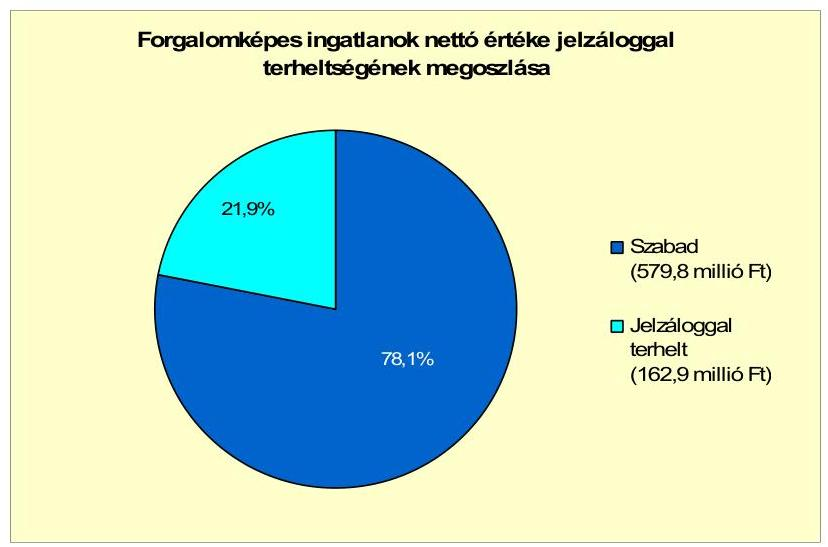

[^0]
[^0]:    ${ }^{30}$ 97/2008. (IV. 28.) számú Képviselő-testületi határozat
    ${ }^{31}$ építmény-, magánszemélyek kommunális-, idegenforgalmi-, iparűzési-, és gépjárműadó, késedelmi pótlék és bírság

---

Az Önkormányzatnak 2011. június 30-án a volt jegyzőjével szemben, összesen 17,2 millió Ft összegű jogerős végzéssel le nem zárt peres eljárása van folyamatban.

Az Önkormányzat PPP konstrukció keretében beruházást nem végzett. A vizsgált időszakban államháztartáson belüli és kívüli szervezetek részére kölcsönt nem nyújtott, gazdasági társaságoknak tagi és egyéb kölcsönt nem adott. Az Önkormányzatnak legalább 50% vagy azt meghaladó tulajdoni hányaddal rendelkező gazdasági társasága nem volt.

A Képviselő-testületnek előterjesztett éves zárszámadási rendeleteiben nem mutatták be az Önkormányzat eszközei után tárgyévben elszámolt értékcsökkenés összegét, az eszközpótlásra fordított tényleges kiadásokat, az eszközök elhasználódási fokának alakulását. Az Önkormányzat a 2007-2010 között eszközállománya után 173,9 millió Ft összegű értékcsökkenést mutatott ki. A felújításra (elhasznált eszközök pótlására) 96,7 millió Ft-ot fordított. A tárgyévi felújításokra - a tárgyévben elszámolt értékcsökkenéshez viszonyítva - a 2007-ben 87,3%-ot, 2008-ban 51,9%-ot, 2009-ben 65,8%-ot, 2010-ben pedig 24,7%-ot használtak fel. A felújítások és az eszközök pótlását az Önkormányzat a pénzügyi lehetőségei függvényében végezte. A felújítások jellemzően útfelújítások voltak. Az eszközpótlás az egészségügyi központ I. ütem riasztóberendezés beszerzésére irányult.

2008-ról 2009-re a befektetett tárgyi eszközök év végi nettó értéke 430,7 millió Ft-tal csökkent. 2009-ben az Önkormányzat jogerős ítélet alapján ${ }^{32}$ 432,3 millió Ft értékű ingatlant adott át térítésmentesen Szántód településnek.

Az Önkormányzat eszközeinek a használhatósági foka a fejlesztések, felújítások ellenére a vizsgált időszak végére 2,2 százalékponttal csökkentek, 2007-ben 93,8%, 2010-ben 91,6% volt. Ellenkező tendenciájú az üzemeltetésre átadott eszközök avultsága, a 2007. évi 66,1%-ról 16,0 százalékponttal növekedett, 2010-ben 82,1%. Az Önkormányzat eszközei közül a gépek, berendezések, felszerelések és a járművek használhatósága nőtt (a 2007. évi 22,2%-ról a 2010. évre 27,2%-ra, illetve 20,5%-ról 22,7%-ra). Az immateriális javak és az ingatlanok, vagyonértékű jogoké pedig csökkentek (9,6 és 1,5 százalékponttal). 2007-ben az immateriális javaké 42,5%, az ingatlanok, vagyonértékű jogoké 95,8%, 2010-ben az előbbinél 32,9%, az utóbbinál pedig 94,3% volt.

# 4. A PÉNZÜGYI EGYENSÚLY MEGTEREMTÉSE ÉRDEKÉBEN HOZOTT INTÉZKEDÉSEK EREDMÉNYE 

Az Önkormányzat adatszolgáltatása alapján összesen 36,9 millió Ft összegű kiadáscsökkentő intézkedést hoztak meg. Az Önkormányzat feladatmegszüntetéssel, átszervezéssel járó létszámcsökkentéssel 2008. évben 4,1 millió Ft-tal, 2009. évben 7,6 millió Ft-tal, 2010. évben 7,2 millió Ft-tal és 2011. évben 9,4 millió Ft-tal, összesen 28,3 millió Ft-tal csökkentette kiadásait. A cafetéria ele-

[^0]
[^0]:    ${ }^{32}$ A vagyonátadás a Somogy Megyei Bíróság 15.P.20776/2007/11. és a Pécsi Ítélőtábla PF.I. 20446/2007/9. számú jogerős ítélete alapján történt.

---

mek csökkentése, megszüntetése eredményeként az Önkormányzat 2011. évben 5,8 millió Ft megtakarítást ér el. A civil szervezetek támogatását 2007., 2009. és 2010. évre vonatkozóan csökkentették, ez összesen 2,8 millió Ft kiadáscsökkenést okozott ${ }^{33}$.

A 2007-2011. év I. félévében végrehajtott kiadáscsökkentő intézkedéseit az alábbi ábra mutatja be:
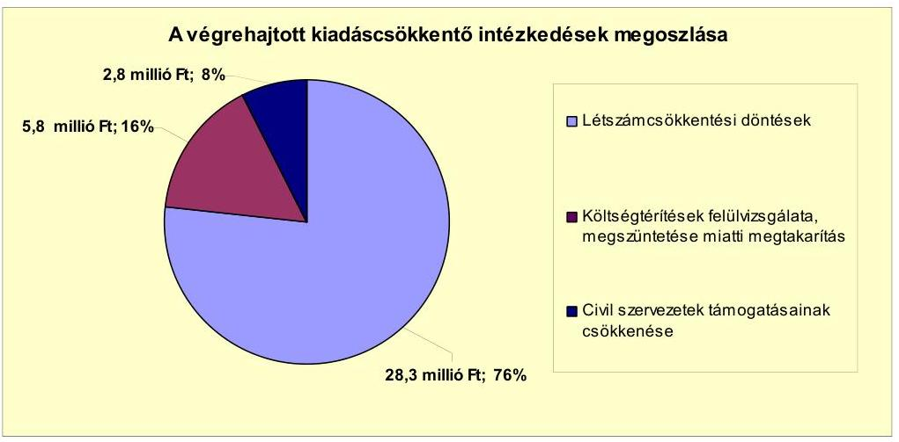

Az Önkormányzat 2007. január 1-jén engedélyezett álláshelyeinek száma 117, 2010. december 31-én 115 volt. A 2007. január 1-jei induló létszám 117 fő, 2010. december 31-i záró létszám 115 fő volt.

A létszám-csökkentéseket a következő tábla mutatja be:

| Megnevezés (adatok fő-ben) | Közoktatás | Szociális és gyermekvédelem | Egészségügy | Polgármesteri hivatal | Egyéb | Összesen |
| :--: | :--: | :--: | :--: | :--: | :--: | :--: |
| 2007. január 1-jén jóváhagyott álláshelyek száma | 46 | 0 | 3 | 25 | 43 | 117 |
| Megszüntetett álláshelyek száma | 4 | 0 | 1 | 1 | 6 | 12 |
| ebből: | üres álláshelyek száma |  |  |  |  | 3 |
|  | szakmai álláshelyek száma | 1 | 0 | 1 | 1 | 6 | 9 |
|  | intézmény-üzemeltetéssel kapcsolatos álláshelyek száma | 3 |  |  |  |  | 3 |
| Álláshely növekedése |  | 1 | 0 | 1 | 7 | 1 | 10 |
| 2010. december 31-én záró álláshelyek száma | 42 | 1 | 2 | 26 | 44 | 115 |
| 2007. január 1-jén foglalkoztatott létszám | 46 | 0 | 3 | 25 | 43 | 117 |
| Létszámcsökkenés | 4 | 0 | 1 | 1 | 6 | 12 |
| Létszámnövekedés | 0 | 1 | 0 | 1 | 7 | 1 | 10 |
| 2010. december 31-én foglalkoztatott létszám | 42 | 1 | 2 | 26 | 44 | 115 |

A közoktatás területén összesen három, (a dolgozók nyugdíjba vonulása után) intézményüzemeltetéssel kapcsolatos álláshelyet szüntettek meg a 2008-2009. években. A 2010. év folyamán a közoktatás területén egy fő szakmai álláshelyet megszüntettek. Az egészségügyi területen egy szakdolgozói, asszisztensi álláshelyet szüntettek meg nyugdíjazás miatt 2008. évben, az álláshelyet még az év folyamán ismételten betöltötték. Az egyéb területen három szakmai álláshelyet szüntettek meg a 2008. évben, egy szakmai álláshelyet az év végéig ismé-

[^0]
[^0]:    ${ }^{33}$ A 2007. évben 150 ezer Ft, a 2009. évben 1,1 millió Ft, a 2010. évben 1,5 millió Ft kiadáscsökkenés volt.

---

telten betöltöttek. A 2009. évben további három fő szakmai álláshelyet megszüntettek. A Polgármesteri hivatal létszáma 2007-2010 évek között összességében (egy álláshely megszűnt, hét álláshellyel bővült) hat fővel nőtt. Új feladatellátáshoz kapcsolódó létszámfejlesztés három fő volt.

A 2007-2010. évi létszámcsökkentések az Önkormányzat adatai szerint 2008-ban 4,1 millió Ft, 2009-ben 7,6 millió Ft, 2009-ben 7,2 millió Ft összegű megtakarítást eredményeztek. A 2011-ben három
 fő (település felügyelők, mezőőr) foglalkoztatását szüntették meg, továbbá egy fő nyugdíjba vonult, ez várhatóan 9,4 millió Ft kiadáscsökkenést jelent. A létszámcsökkentési intézkedések hatására a vizsgált időszakban - az Önkormányzat kimutatása szerint - az összes megtakarítás 28,3 millió Ft.

Az Önkormányzat a 2008. évi egy fő egészségügyi szakasszisztens létszámleépítéséhez igényelt központosított támogatást. A tartósan leépített álláshelyhez elnyert támogatás összege 3,2 millió Ft volt.

Az Önkormányzat - adatszolgáltatása szerint - a bevételnövelő intézkedések hatására 2007-től 2011. év I. félév végéig 188,9 millió Ft bevételt realizált. A Képviselő-testület a helyi adó bevételek növelése érdekében új adónemként 2011. január 1-jétől bevezette a telekadót. Az Önkormányzat 2008. évben és 2010. évben emelte az építmény-, és idegenforgalmi adó mértékét, az adóhátralékok behajtása és az adóellenőrzések folyamatosak voltak. A bérbeadásból 2008-2010. években származott többletbevétel. Az intézmények térítési díját 2007. január 1-jétől, illetve 2008. január 1-jétől emelték.

Az Önkormányzat bevételnövelő intézkedéseit 2007-2011. év I. féléve között az alábbi ábra mutatja be:
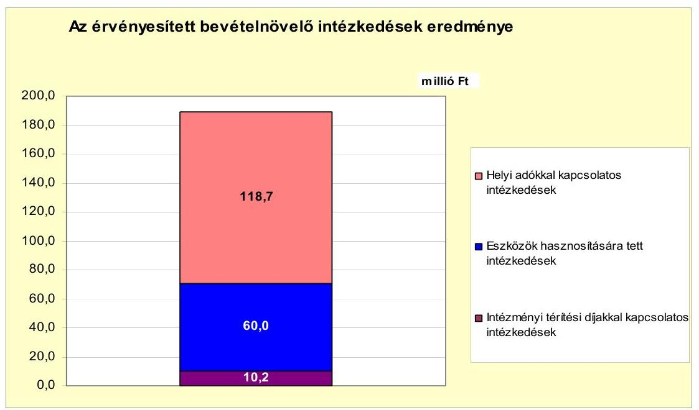

Az Önkormányzatnak a 2007-ben bevezetett magánszemélyek kommunális adójából a 2007-2010. évben 12,9 millió Ft többletbevétele keletkezett. A 2011. évben a magánszemélyek kommunális adójából és a 2011. évben kivetett telekadóból 6,6 millió Ft többletbevétel származott. Az adómértékének emeléséből

---

2008-2010. évben 25,1 millió Ft plusz bevétele lett az Önkormányzatnak. A 2011. évre várható többletbevétel 16,2 millió Ft. Az adóhátralékok behajtásából 26,6 millió Ft, az adóellenőrzésekből 31,3 millió Ft többletbevétel származott 2007-2011. években. Az adóhátralékok behajtásából az Önkormányzatnak 2007-ben 5,1 millió Ft, 2008-ban 6,8 millió Ft, 2009-ben 4,3 millió Ft, 2010-ben 6,7 millió Ft, 2011-ben 3,7 millió Ft többletbevétele lett. Az adóellenőrzések 2007-ben 8,2 millió Ft, 2008-ban 8,6 millió Ft, 2009-ben 4,1 millió Ft, 2010-ben 8,6 millió Ft, 2011-ben 1,7 millió Ft többletbevételt eredményeztek. A helyi adókkal kapcsolatos önkormányzati intézkedések összesen 188,9 millió Ft bevételt eredményeztek.

A bérbeadásból összesen 9,9 millió Ft bevételi többlet keletkezett 2008-2010${ }^{34}$. A 2011. évre bérbeadásból származó többletbevétellel nem számoltak. Az Önkormányzat 2007. évben 50,1 millió Ft értékű részesedést értékesítette. Az intézményi térítési díjak 2007. január 1-jei és 2008. január 1-jei emelései 2007-2011. években összesen 10,2 millió Ft többletbevételt eredményeztek.

Az Önkormányzat központi támogatásokból származó bevételei a 2007. évhez képest az időszak egészét tekintve összességében nőttek. ${ }^{35}$ Ennek ellenére az Önkormányzat folytatta a 2007-2011. I. féléve között az előző években elkezdett - kiadási megtakarítást eredményező és bevételt növelő - intézkedéseit. A 2007-2011. I. féléve között tett intézkedések hatására 188,9 millió Ft bevételi többletet, továbbá 36,9 millió Ft kiadási megtakarítást mutattak ki, ezáltal az Önkormányzat pénzügyi helyzetét javították.
5. Az ÁSZ által a korábbi években a pénzügyi egyensúly javítására tett szabályszerűségi és célszerűségi javaslatok hasznosulása

Az ÁSZ nem vizsgálta Zamárdi Város Önkormányzatát „A helyi önkormányzatok gazdálkodási rendszerének ellenőrzése" témában.

Budapest, 2012. április "U5 "

Melléklet: $\quad 6 \mathrm{db}$
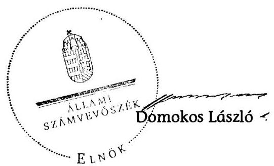

[^0]
[^0]:    ${ }^{34}$ 2008-ban 3,1 millió Ft, 2009-ben 5,9 millió Ft, 2010-ben 0,9 millió Ft volt a bevételi többlet.
    ${ }^{35}$ A növekedés 2008-2010. évben összesen 100,1 millió Ft volt.

---

Zamárdi Város Önkormányzata

1. számú melléklet
a V-3117-022/2012. számú Jelentéshez

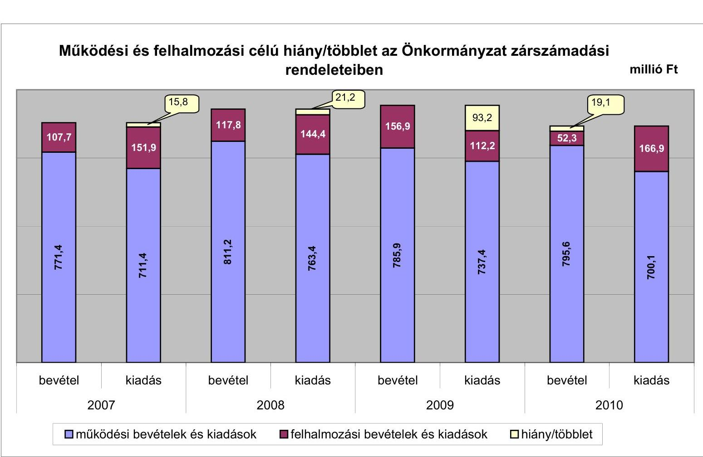

---

Az Önkormányzat bevételei és kiadásai, valamint adósságszolgálata 2007-2010 között

|   |  |  |  |  | millió Ft  |
| --- | --- | --- | --- | --- | --- |
|  1. FOLYÓ KÖLTSÉGVETÉS* | 2007. év | 2008. év | 2009. év | 2010. év |   |
|  1.1.1. Saját működési bevételek | 386,3 | 421,1 | 451,4 | 472,7 |   |
|  1.1.2. Költségvetési támogatás* | 67,4 | 193,9 | 179,2 | 154,6 |   |
|  1.1.3. Átengedett bevételek | 165,5 | 75,3 | 85,8 | 92,2 |   |
|  1.1.4. Állambáztartáson belülről kapott támogatások | 37,4 | 65,5 | 59,0 | 77,9 |   |
|  1.1.5. EU-tól és külföldiről kapott bevételek | 0,0 | 0,0 | 0,0 | 0,0 |   |
|  1.1.6. Állambáztartáson kívülről kapott bevételek | 0,7 | 0,6 | 11,4 | 0,9 |   |
|  1.1.7. Előző évi pénzmaradvány átvétel | 0,0 | 0,0 | 0,0 | 0,0 |   |
|  1.1. Folyó bevételek =1.1.1.+1.1.2.+1.1.3.+1.1.4.+1.1.5.+1.1.6.+1.1.7. | 657,3 | 756,4 | 786,8 | 798,3 |   |
|  1.2.1. Működési kiadások kamatkiadások nélkül | 653,5 | 726,6 | 701,9 | 681,6 |   |
|  1.2.2. Állambáztartáson belülre átadott pénzeszközök | 0,6 | 3,6 | 6,1 | 5,9 |   |
|  1.2.3.1 vállalkozásoknak | 2,8 | 0,9 | 0,0 | 0,0 |   |
|  1.2.3.2. EU-nak, illetve külföldre | 0,3 | 0,0 | 0,0 | 0,0 |   |
|  1.2.3.3. magánszemélyeknek | 10,3 | 12,5 | 12,2 | 12,1 |   |
|  1.2.3.4. nonprofit szervezeteknek | 7,3 | 8,0 | 8,5 | 6,3 |   |
|  1.2.3. Transferkiadások (=1.2.3.1+1.2.3.2+1.2.3.3+1.2.3.4) | 20,7 | 21,4 | 20,7 | 18,4 |   |
|  1.2.4 Kamatkiadások | 4,5 | 7,5 | 8,7 | 5,5 |   |
|  1.2.5. Előző évi pénzmaradvány átadás | 0,0 | 4,3 | 0,0 | 0,0 |   |
|  1.2. Folyó kiadások = 1.2.1.+1.2.2.+1.2.3.+1.2.4.+1.2.5. | 679,3 | 763,4 | 737,4 | 711,4 |   |
|  1.3. Folyó költségvetés egyenlege MŰKÖDÉSI JÖVEDELEM (1.1. - 1.2.) | -22,0 | -7,0 | 49,4 | 86,9 |   |
|  2. FELHALMOZÁSI KÖLTSÉGVETÉS** |  |  |  |  |   |
|  2.1.1. Saját tökebevételek | 57,9 | 72,8 | 132,3 | 36,4 |   |
|  2.1.2. Állambáztartáson belülről kapott támogatások | 9,2 | 8,7 | 9,5 | 8,7 |   |
|  2.1.3. EU-tól és külföldiről kapott támogatások | 0,0 | 2,1 | 0,0 | 0,0 |   |
|  2.1.4. Állambáztartáson kívülről kapott támogatások | 5,3 | 1,9 | 14,2 | 1,0 |   |
|  2.1. Felhalmozási bevételek (=2.1.1.+2.1.2+2.1.3+2.1.4.) | 72,4 | 85,5 | 156,0 | 46,1 |   |
|  2.2.1. Saját beruházási kiadás áfával | 65,5 | 81,1 | 21,9 | 117,1 |   |
|  2.2.2. Saját felújítási kiadás áfával | 48,9 | 39,0 | 18,8 | 17,1 |   |
|  2.2.3. Állambáztartáson belülre átadott pénzeszköz | 1,2 | 0,2 | 70,0 | 5,6 |   |
|  2.2.4. EU-nak és külföldnek adott pénzeszközök | 0,0 | 0,0 | 0,0 | 0,0 |   |
|  2.2.5. Állambáztartáson kívülre adott pénzeszközök | 2,1 | 12,5 | 1,5 | 0,5 |   |
|  2.2.6. Befektetési célú részesedések vásárlása | 0,0 | 0,0 | 0,0 | 0,0 |   |
|  2.2. Felhalmozási kiadások (=2.2.1.+2.2.2.+2.2.3.+2.2.4.+2.2.5.+2.2.6.) | 117,7 | 132,8 | 112,2 | 140,3 |   |
|  2.3. Felhalmozási költségvetés egyenlege (2.1. - 2.2.) | -45,3 | -47,3 | 43,8 | -94,2 |   |
|  3. Finanszírozási műveletek nélküli (GFS) pozíció(1.3.+2.3.) | -67,3 | -54,3 | 93,2 | -7,3 |   |
|  4. Finanszírozási műveletek |  |  |  |  |   |
|  4.1. Hitelfelvétel | 45,6 | 67,6 | 37,0 | 0,0 |   |
|  4.2. Hiteltörlesztés | 52,0 | 11,6 | 67,9 | 15,4 |   |
|  4.3. Forgatási és befektetési célú értékpapírok kibocsátása | 0,0 | 0,0 | 0,0 | 0,0 |   |
|  4.4. Forgatási és befektetési célú értékpapírok beváltása | 0,0 | 0,0 | 0,0 | 0,0 |   |
|  4.5. Forgatási és befektetési célú értékpapírok értékesítése | 33,4 | 0,0 | 0,0 | 0,0 |   |
|  4.6. Forgatási és befektetési célú értékpapírok vásárlása | 0,0 | 0,0 | 0,0 | 0,0 |   |
|  4.7. Egyéb finanszírozási bevételek (függő, átfutó, kiegyeslítő) | 13,1 | 19,6 | -18,5 | -26,8 |   |
|  4.8. Egyéb finanszírozási kiadások (függő, átfutó, kiegyeslítő) | 14,4 | 26,6 | -9,1 | -22,2 |   |
|  4.9.Finanszírozási műveletek egyenlege (4.1. - 4.2.+4.3.-4.4+4.5.-4.6.+4.7.-4.8.) | 25,7 | 49,0 | -40,3 | -20,0 |   |
|  5. Tárgyévi pénzügyi pozíció (1.3.+ 2.3.+4.9.) | -41,6 | -5,3 | 52,9 | -27,3 |   |
|  6. Nettó működési jövedelem =működési jövedelem (1.3.) - tőketörlesztés (4.2+4.4) | -74,0 | -18,6 | -18,5 | 71,5 |   |
|  TÁJÉKOZTATÓ ADATOK |  |  |  |  |   |
|  Összes kötelezettség | 120,9 | 200,1 | 146,8 | 131,4 |   |
|  ebből rövid lejáratú | 65,4 | 115,0 | 41,0 | 41,8 |   |
|  Összes szállítói kötelezettség | 5,9 | 25,1 | 3,3 | 11,2 |   |
|  ebből lejárt (tanúsítványból) | 3,4 | 18,2 | 0,6 | 1,6 |   |
|  Pénz és tőkepiaci kötelezettség (adósság) | 90,2 | 142,5 | 114,1 | 101,8 |   |
|  ebből rövid lejáratú | 34,7 | 65,4 | 12,7 | 15,3 |   |
|  PPP szerződéses állomány jelenértéken (tanúsítványból) | 0,0 | 0,0 | 0,0 | 0,0 |   |
|  ebből lejárt szolgáltatási díj miatti kötelezettség | 0,0 | 0,0 | 0,0 | 0,0 |   |
|  Folyószámlabítet napi átlagos állománya (tanúsítványból)*** | 7,3 | 29,4 | 13,0 | 1,1 |   |
|  Likvidhítet napi átlagos állománya (tanúsítványból)*** | 0,0 | 0,0 | 0,0 | 0,0 |   |
|  Munkabérhítet napi átlagos állománya (tanúsítványból)*** | 0,0 | 0,0 | 0,0 | 0,0 |   |
|  Kezemig és garancíavállalások (tanúsítványból) | 0,0 | 16,0 | 0,0 | 0,0 |   |
|  Jogerős bírósági ítéletekből adódó kötelezettségek (tanúsítványból) | 0,0 | 0,0 | 0,0 | 0,0 |   |
|  Finanszírozásba bevonható eszközök: |

 7,3 | 1,9 | 54,8 | 27,5 |   |
|  Tartáshitelvásárnyt megtestesítő értékpapírok év végi állománya | 0,0 | 0,0 | 0,0 | 0,0 |   |
|  Hosszú lejáratú bankbetétek év végi állománya | 0,0 | 0,0 | 0,0 | 0,0 |   |
|  Értékpapírok év végi állománya | 0,0 | 0,0 | 0,0 | 0,0 |   |
|  Pénzeszközök (idegen pénzeszközök nélküli) év végi állománya | 7,3 | 1,9 | 54,8 | 27,5 |   |

* A költségvetési támogatásból a felhalmozási célú összeget az Önkormányzat adatszolgáltatása szerinti mértékben vették figyelembe

* Bevételekben nem térül, a kiadásokban nem jelenik meg az amortizáció, a vagyoni helyzetet az egyenleg befolyásolja. A folyószámla, a likvid- és a munkabérhitel átlagos állományát 365 napos osztószámmal és nem a fennálló napok számával vették figyelembe.

---

## **Az Önkormányzat 2007-2010. években megvalósított, 2010. december 31-ig befejezett fejlesztései és azok forrásallokációja**

|   |  |  |  |  |  |  |  |  |  |  |  |  |  |  |  |  |  |  |  |  |  |  |  |  |  |  |  |  |  |  |  |  |  |  |  |  |  |   |
| --- | --- | --- | --- | --- | --- | --- | --- | --- | --- | --- | --- | --- | --- | --- | --- | --- | --- | --- | --- | --- | --- | --- | --- | --- | --- | --- | --- | --- | --- | --- | --- | --- | --- | --- | --- | --- | --- | --- |
|   |  |  |  |  |  |  |  |  |  |  |  |  |  |  |  |  |  |  |  |  |  |  |  |  |  |  |  |  |  |  |  |  |  |  |  |  |  |   |
|   |  |  |  |  |  |  |  |  |  |  |  |  |  |  |  |  |  |  |  |  |  |  |  |  |  |  |  |  |  |  |  |  |  |  |  |  |  |   |
|   |  |  |  |  |  |  |  |  |  |  |  |  |  |  |  |  |  |  |  |  |  |  |  |  |  |  |  |  |  |  |  |  |  |  |  |  |  |   |
|   |  |  |  |  |  |  |  |  |  |  |  |  |  |  |  |  |  |  |  |  |  |  |  |  |  |  |  |  |  |  |  |  |  |  |  |  |  |   |
|   |  |  |  |  |  |  |  |  |  |  |  |  |  |  |  |  |  |  |  |  |  |  |  |  |  |  |  |  |  |  |  |  |  |  |  |  |  |   |
|   |  |  |  |  |  |  |  |  |  |  |  |  |  |  |  |  |  |  |  |  |  |  |  |  |  |  |  |  |  |  |  |  |  |  |  |  |  |   |
|   |  |  |  |  |  |  |  |  |  |  |  |  |  |  |  |  |  |  |  |  |  |  |  |  |  |  |  |  |  |  |  |  |  |  |  |  |  |   |
|   |  |  |  |  |  |  |  |  |  |  |  |  |  |  |  |  |  |  |  |  |  |  |  |  |  |  |  |  |  |  |  |  |  |  |  |  |  |   |
|   |  |  |  |  |  |  |  |  |  |  |  |  |  |  |  |  |  |  |  |  |  |  |  |  |  |  |  |  |  |  |  |  |  |  |  |  |  |   |
|   |  |  |  |  |  |  |  |  |  |  |  |  |  |  |  |  |  |  |  |  |  |  |  |  |  |  |  |  |  |  |  |  |  |  |  |  |  |   |
|   |  |  |  |  |  |  |  |  |  |  |  |  |  |  |  |  |  |  |  |  |  |  |  |  |  |  |  |  |  |  |  |  |  |  |  |  |  |   |
|   |  |  |  |  |  |  |  |  |  |  |  |  |  |  |  |  |  |  |  |  |  |  |  |  |  |  |  |  |  |  |  |  |  |  |  |  |  |   |
|   |  |  |  |  |  |  |  |  |  |  |  |  |  |  |  |  |  |  |  |  |  |  |  |  |  |  |  |  |  |  |  |  |  |  |  |  |  |   |
|   |  |  |  |  |  |  |  |  |  |  |  |  |  |  |  |  |  |  |  |  |  |  |  |  |  |  |  |  |  |  |  |  |  |  |  |  |  |   |
|   |  |  |  |  |  |  |  |  |  |  |  |  |  |  |  |  |  |  |  |  |  |  |  |  |  |  |  |  |  |  |  |  |  |  |  |  |  |   |
|   |  |  |  |  |  |  |  |  |  |  |  |  |  |  |  |  |  |  |  |  |  |  |  |  |  |  |  |  |  |  |  |  |  |  |  |  |  |   |
|   |  |  |  |  |

 |  |  |  |  |  |  |  |  |  |  |  |  |  |  |  |  |  |  |  |  |  |  |  |  |  |  |  |  |  |  |  |  |   |
|   |  |  |  |  |  |  |  |  |  |  |  |  |  |  |  |  |  |  |  |  |  |  |  |  |  |  |  |  |  |  |  |  |  |  |  |  |  |   |
|   |  |  |  |  |  |  |  |  |  |  |  |  |  |  |  |  |  |  |  |  |  |  |  |  |  |  |  |  |  |  |  |  |  |  |  |  |  |   |
|   |  |  |  |  |  |  |  |  |  |  |  |  |  |  |  |  |  |  |  |  |  |  |  |  |  |  |  |  |  |  |  |  |  |  |  |  |  |   |
|   |  |  |  |  |  |  |  |  |  |  |  |  |  |  |  |  |  |  |  |  |  |  |  |  |  |  |  |  |  |  |  |  |  |  |  |  |  |   |
|   |  |  |  |  |  |  |  |  |  |  |  |  |  |  |  |  |  |  |  |  |  |  |  |  |  |  |  |  |  |  |  |  |  |  |  |  |  |   |
|   |  |  |  |  |  |  |  |  |  |  |  |  |  |  |  |  |  |  |  |  |  |  |  |  |  |  |  |  |  |  |  |  |  |  |  |  |  |   |
|   |  |  |  |  |  |  |  |  |  |  |  |  |  |  |  |  |  |  |  |  |  |  |  |  |  |  |  |  |  |  |  |  |  |  |  |  |  |   |
|   |  |  |  |  |  |  |  |  |  |  |  |  |  |  |  |  |  |  |  |  |  |  |  |  |  |  |  |  |  |  |  |  |  |  |  |  |  |   |
|   |  |  |  |  |  |  |  |  |  |  |  |  |  |  |  |  |  |  |  |  |  |  |  |  |  |  |  |  |  |  |  |  |  |  |  |  |  |   |
|   |  |  |  |  |  |  |  |  |  |  |  |  |  |  |  |  |  |  |  |  |  |  |  |  |  |  |  |  |  |  |  |  |  |  |  |  |  |   |
|   |  |  |  |  |  |  |  |  |  |  |  |  |  |  |  |  |  |  |  |  |  |  |  |  |  |  |  |  |  |  |  |  |  |  |  |  |  |   |
|   |  |  |  |  |  |  |  |  |  |  |  |  |  |  |  |  |  |  |  |  |  |  |  |  |  |  |  |  |  |  |  |  |  |  |  |  |  |   |
|   |  |  |  |  |  |  |  |  |  |  |  |  |  |  |  |  |  |  |  |  |  |  |  |  |  |  |  |  |  |  |  |  |  |  |  |  |  |   |
|   |  |  |  |  |  |  |  |  |  |  |  |  |  |  |  |  |  |  |  |  |  |  |  |  |  |  |  |  |  |  |  |  |  |  |  |  |  |   |
|   |

---

### Az Önkormányzat 2010. december 31-én folyamatban lévő fejlesztési feladatai, 2010. december 31-én fennálló kötelezettségek és azok forrásösszetétele

|  Fejlesztési feladat (beruházás, felújítás) | Beruházás, felújítás | Teljes bekerülési költség (2010. dec. 31-ig) | 2008. dec. 31-ig teljesített kiadás | 2007-2010. évek között teljesített kiadás | 2006-2010. évek között teljesített kiadás | Várható lényeg (teljes bekerülési költség) ((11+9+10) +12) | 2010. évre váltott kötelezettség ((11+9+10) +23+27 +31) | 2010. évre vállalt kötelezettség ((11+9+10) +23+27 +31) | A várható lényeg (teljes bekerülési költség)ből (szakócpő, lásd) fordított összeg | Saját bevétel | Különvétel | EU-s támogatás | Hózis támogatás | Jogszabályban foglalt szakmai követelmények (terjesztés-ügymenet)  |
| --- | --- | --- | --- | --- | --- | --- | --- | --- | --- | --- | --- | --- | --- | --- | --- | --- | --- | --- | --- | --- | --- | --- | --- |
|  Megnevezése | Képviselő-testületi bekötétel száma | Kezdete | Tervezett befejezése | Terv | Tény | Eltérés (+,-) | Eltérés (+,-) |  |  |  |  |  |  |  |  |  |  |  |  |  |  |  |   |
|  1 | 2 | 3 | 4 | 5 | 6 | 7 | 8 | 9 | 10 | 11 | 12 | 13 | 14 | 15 | 16 | 17 | 18 | 19 | 20 | 21 | 22 | 23 | 24  |
|  1. Felújítások |  |  |  |  |  |  |  |  |  |  |  |  |  |  |  |  |  |  |  |  |  |  |   |
|  2. 10 millió Ft alatti felújítások |  |  |  |  |  |  |  |  |  |  |  |  |  |  |  |  |  |  |  |  |  |  |   |
|  3. Felújítások összesen |  |  |  |  | 0 | 0 | 0 | 0 | 0 | 0 | 0 | 0 | 0 | 0 | 0 | 0 | 0 | 0 | 0 | 0

 | 0 | 0 | 0  |
|  4. Fejlesztések |  |  |  |  |  |  |  |  |  |  |  |  |  |  |  |  |  |  |  |  |  |  |   |
|  5. Zámárdi Város Balatonparti Turisztikai Vonzerejének növelése | 270/2007. 60.17. | 2011.03. | 2012.12. | 73 |  |  | 0.0 | 0.0 | 72.8 | 72.8 | 0.0 | 36.4 | 36.4 | 0.0 | 6 |  |  |  |  |  |  | 36.4 | 36.4  |
|  6. |  |  |  |  |  |  |  |  |  |  |  |  |  |  |  |  |  |  |  |  |  |  |   |
|  7. 10 millió Ft alatti fejlesztések |  |  |  |  |  |  |  |  |  |  |  |  |  |  |  |  |  |  |  |  |  |  |   |
|  8. Fejlesztések összesen |  |  |  |  | 73 | 0.0 | 0.0 | 0.0 | 0.0 | 72.8 | 72.8 | 0.0 | 36.4 | 36.4 | 0.0 | 0.0 | 0.0 | 0.0 | 0.0 | 0.0 | 0.0 | 0.0 | 36.4  |
|  9. Összesen |  |  |  |  | 73 | 0.0 | 0.0 | 0.0 | 0.0 | 72.8 | 72.8 | 0.0 | 36.4 | 36.4 | 0.0 | 0.0 | 0.0 | 0.0 | 0.0 | 0.0 | 0.0 | 0.0 | 36.4  |

*Ar ha a forrás már rendelkezésre áll.

Br ha a forrás közbeszerzési eljárása folyamatban van.

Cr ha a forrás közbeszerzési eljárása még nem indult el, a forrás nem áll rendelkezésre.

---

### **Az Önkormányzat által beadott, elbírálás alatti pályázati forrásból megvalósítani tervezett fejlesztéseihez kapcsolódó kötelezettségvállalásai és azok forrásösszetétele**

|  Fejlesztési feladat (beruházás, felújítás) |  |  | Beruházás, felújítás |  |  |  |  |  |  |  |  |  |  |  |  |  |  |  |  |  |  |  |  |  |  |  |  |  |  |  |  |  |  |  |  |  |  |  |  |  |  |  |  |  |  |  |  |  |  |  |  |  |  |  |  |  |  |  |  |  |  |  |  |  |  |  |  |  |  |  |  |  |  |  |  |  |  |  |  |  |  |  |  |  |  |  |  |  |  |  |  |  |  |  |  |  |  |  |  |  |  |  |  | 

---

### **Az önkormányzati feladatok ellátásában résztvevő gazdasági társaságok**

|  Gazdasági társaság
megnevezése | önkormányzat
önkormányzat
részvételének
típusa
száma | 2010. december 31-én | a gazdasági társaságnak szerződéses kötelezettségre, feladatellátási szerződésre alapozottan
az önkormányzat költségvetéséből nyújtott |  |  |  |  |  |  |  |  |  |  |  |  |  |  |  |  |   |
| --- | --- | --- | --- | --- | --- | --- | --- | --- | --- | --- | --- | --- | --- | --- | --- | --- | --- | --- | --- | --- |
|   |  |  |  | kötelező
feladathoz | önként vállalt
feladathoz |  |  |  |  |  |  |  |  |  |  |  |  |  |  |   |
|   |  |  |  |  |  |  |  |  |  |  |  |  |  |  |  |  |  |  |  |   |
|   |  |  |  |  |  |  |  |  |  |  |  |  |  |  |  |  |  |  |  |   |
|   |  |  |  |  |  |  |  |  |  |  |  |  |  |  |  |  |  |  |  |   |
|   |  |  |  |  |  |  |  |  |  |  |  |  |  |  |  |  |  |  |  |   |
|   |  |  |  |  |  |  |  |  |  |  |  |  |  |  |  |  |  |  |  |   |
|   |  |  |  |  |  |  |  |  |  |  |  |  |  |  |  |  |  |  |  |   |
|   |  |  |  |  |  |  |  |  |  |  |  |  |  |  |  |  |  |  |  |   |
|   |  |  |  |  |  |  |  |  |  |  |  |  |  |  |  |  |  |  |  |   |
|   |  |  |  |  |  |  |  |  |  |  |  |  |  |  |  |  |  |  |  |   |
|   |  |  |  |  |  |  |  |  |  |  |  |  |  |  |  |  |  |  |  |   |
|   |  |  |  |  |  |  |  |  |  |  |  |  |  |  |  |  |  |  |  |   |
|   |  |  |  |  |  |  |  |  |  |  |  |  |  |  |  |  |  |  |  |   |
|   |  |  |  |  |  |  |  |  |  |  |  |  |  |  |  |  |  |  |  |   |
|   |  |  |  |  |  |  |  |  |  |  |  |  |  |  |  |  |  |  |  |   |
|   |  |  |  |  |  |  |  |  |  |  |  |  |  |  |  |  |  |  |  |   |
|   |  |  |  |  |  |  |  |  |  |  |  |  |  |  |  |  |  |  |  |   |
|   |  |  |  |  |  |  |  |  |  |  |  |  |  |  |  |  |  |  |  |   |
|   |  |  |  |  |  |  |  |  |  |  |  |  |  |  |  |  |  |  |  |   |
|   |  |  |  |  |  |  |  |  |  |  |  |  |  |  |  |  |  |  |  |   |
|   |  |  |  |  |  |  |  |  |  |  |  |  |  |  |  |  |  |  |  |   |
|   |  |  |  |  |  |  |  |  |  |  |  |  |  |  |

  |  |  |  |  |   |
|   |  |  |  |  |  |  |  |  |  |  |  |  |  |  |  |  |  |  |  |   |
|   |  |  |  |  |  |  |  |  |  |  |  |  |  |  |  |  |  |  |  |   |
|   |  |  |  |  |  |  |  |  |  |  |  |  |  |  |  |  |  |  |  |   |
|   |  |  |  |  |  |  |  |  |  |  |  |  |  |  |  |  |  |  |  |   |
|   |  |  |  |  |  |  |  |  |  |  |  |  |  |  |  |  |  |  |  |   |
|   |  |  |  |  |  |  |  |  |  |  |  |  |  |  |  |  |  |  |  |   |
|   |  |  |  |  |  |  |  |  |  |  |  |  |  |  |  |  |  |  |  |   |
|   |  |  |  |  |  |  |  |  |  |  |  |  |  |  |  |  |  |  |  |   |
|   |  |  |  |  |  |  |  |  |  |  |  |  |  |  |  |  |  |  |  |   |
|   |  |  |  |  |  |  |  |  |  |  |  |  |  |  |  |  |  |  |  |   |
|   |  |  |  |  |  |  |  |  |  |  |  |  |  |  |  |  |  |  |  |   |
|   |

