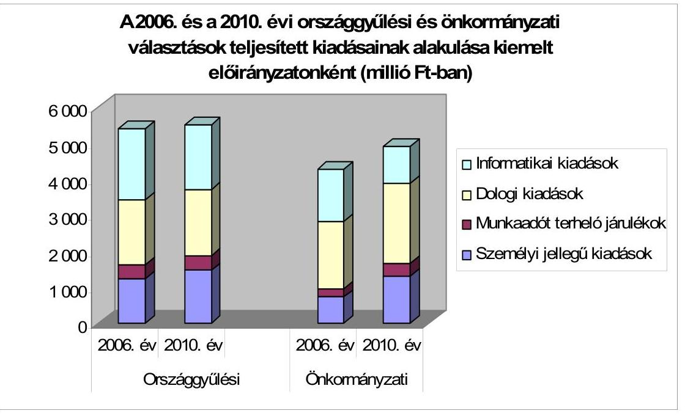
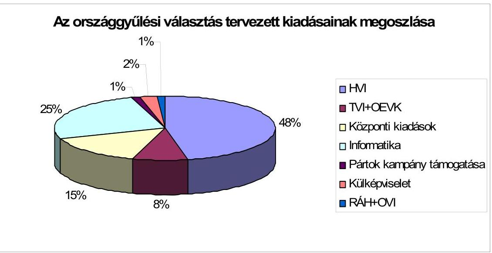
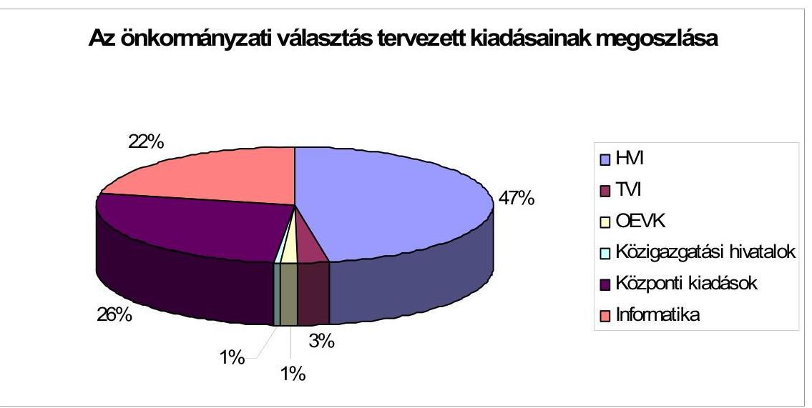
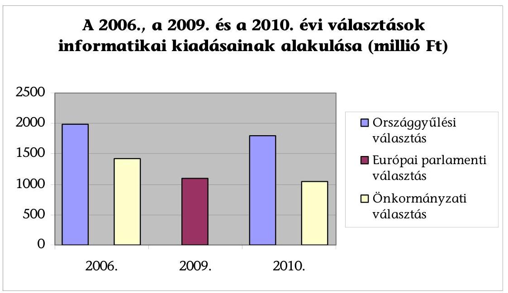
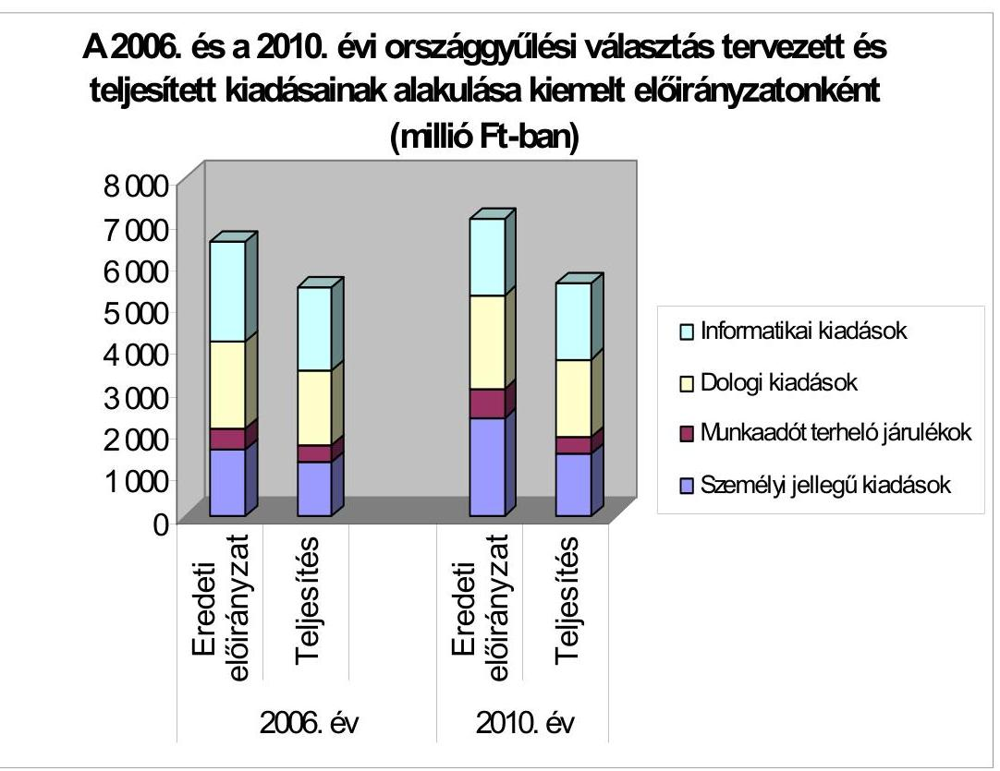
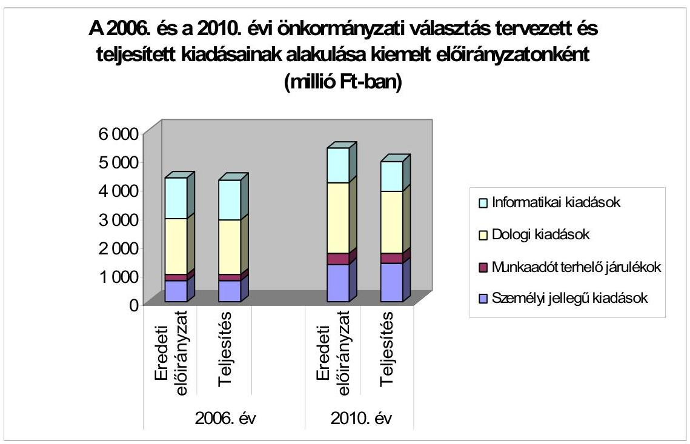
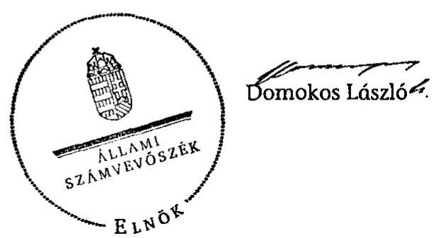
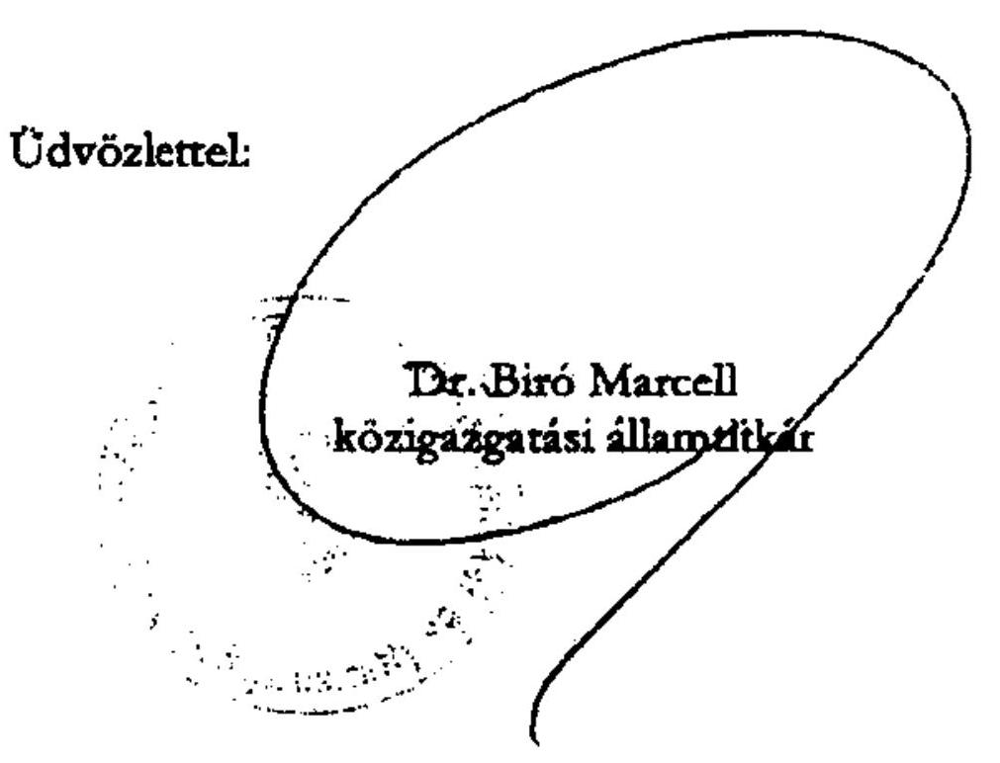
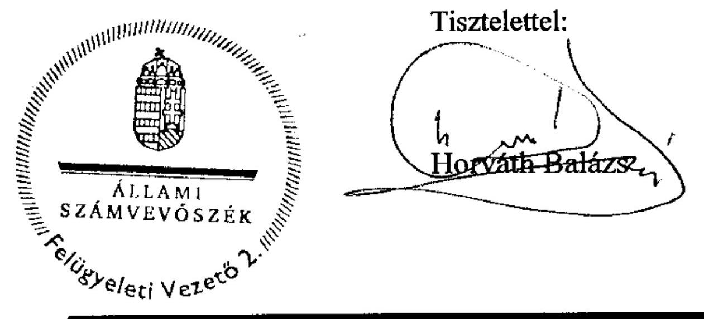

# ÁLLAMI   SZÁMVEVŐSZÉK 

## JELENTÉS

a 2010. évi országgyúlési, valamint önkormányzati és nemzeti, etnikai kisebbségi képviselő-választások lebonyolításához felhasznált pénzeszközök ellenőrzéséről

---

# Állami Számvevőszék 

Iktatószám: V-3056-115/2011-2012.
Témaszám: 1030
Vizsgálat-azonosító szám: V0556

## Az ellenőrzést felügyelte:

Horváth Balázs
számvevő igazgatóhelyettes

## Az ellenőrzést vezette:

## Molnár Gyula Mihály

számvevő főtanácsos
A számvevői jelentések feldolgozásában és a jelentés összeállításában közremüködtek:

Dr. Kiss Károly
számvevő tanácsos
Klinga László
számvevő tanácsos
Az ellenőrzést végezték:

## Batkiné Vas Anna

számvevő tanácsos

## Dér Lívia

számvevő tanácsos
Dr. Kiss Károly
számvevő tanácsos
Kozma Gábor
számvevő tanácsos
Nagy Istvánné dr.
számvevő tanácsos
Pálfiné Pusztai Magdolna
számvevő tanácsos
Szihalminé Kovács Zsuzsanna
számvevő tanácsos
Újvári Józsefné
számvevő tanácsos
Vojcsekné Szabó Ágnes
számvevő tanácsos

## Bíró Zsolt

számvevő tanácsos
Kéri Péter
számvevő tanácsos
Klinga László
számvevő tanácsos
Lingné Rajz Borbála
számvevő tanácsos
Nagy László Csaba
számvevő tanácsos
Schósz Attila Ferencné
számvevő tanácsos
Tóth László
számvevő tanácsos
Veres Jánosné
számvevő tanácsos

---

# A témához kapcsolódó eddig készített számvevőszéki jelentések: 

## címe

Jelentés az 1990. évi országgyűlési képviselő-választások előkészítésével és lebonyolításával kapcsolatos állami feladatok végrehajtására biztosított költségvetési pénzeszközök felhasználásának ellenőrzéséről (1991. évben elkészített jelentés)
Jelentés az 1994. évi országgyűlési, valamint a helyi és kisebbségi önkormányzati képviselő-választások lebonyolítására felhasznált pénzeszközök ellenőrzéséről (1995. évben elkészített jelentés)
Jelentés az 1997. évi népszavazásra, továbbá az 1998. évi országgyűlési, valamint a helyi és kisebbségi önkormányzati képviselőválasztások lebonyolítására felhasznált pénzeszközök vizsgálatáról
Jelentés a 2002. évi országgyűlési, valamint a helyi és kisebbségi önkormányzati képviselő-választásra felhasznált pénzeszközök ellenőrzéséről
Jelentés a 2003. április 12-én megtartott országos népszavazás lebonyolításához felhasznált pénzeszközök elszámolásának ellenőrzéséről
Jelentés a 2004. június 13-án megtartott, az Európai Parlament 0560 tagjai választás és a 2004. december 5-én megtartott országos ügydöntő népszavazás lebonyolításához felhasznált pénzeszközök elszámolásának ellenőrzéséről
Jelentés a 2006. évi országgyűlési, valamint önkormányzati és 0722 nemzeti, etnikai kisebbségi képviselő-választások lebonyolításához felhasznált pénzeszközök ellenőrzéséről
Jelentés a 2008. március 9-én megtartott országos ügydöntő népszavazás lebonyolításához felhasznált pénzeszközök elszámolásának ellenőrzéséről
Jelentés a 2009. június 7-én megtartott Európai Parlament tagjai 1005 választásának lebonyolításához felhasznált pénzeszközök elszámolásának ellenőrzéséről

---

# TARTALOMJEGYZÉK 

BEVEZETÉS ..... 9
I. ÖSSZEGZŐ MEGÁLLAPÍTÁSOK, KÖVETKEZTETÉSEK, JAVASLATOK ..... 11
II. RÉSZLETES MEGÁLLAPÍTÁSOK ..... 23

1. A választások pénzügyi feladat- és költségterveinek elkészítése, az előirányzatok és a tervezett pénzeszközök biztosítása ..... 23
1.1. A választások pénzügyi feladat- és költségtervének elkészítése ..... 23
1.2. Az előirányzatok biztosítása, a tervezett pénzeszközök rendelkezésre állása ..... 26
2. A választási pénzeszközök felhasználásának szabályszerűsége és célszerűsége ..... 30
2.1. A gazdálkodási és ellenőrzési jogkörök, továbbá a nyilvántartási rend szabályozottsága ..... 30
2.2. A választásokkal kapcsolatos kiadások szabályszerűsége, az általános költségek elszámolása ..... 32
2.3. A dologi és a személyi jellegű kiadások teljesítésének alakulása a választást lebonyolító szervezeteknél ..... 36
2.4. A közbeszerzési eljárás keretébe tartozó árubeszerzések és szolgáltatás vásárlások lebonyolítása, illetve az eszközbeszerzések ..... 41
2.5. A választások informatikai feladatainak tervezése és végrehajtása ..... 44
3. A választási feladatokra felhasznált pénzeszközök elszámolása és annak ellenőrzése ..... 45
3.1. Az ÖM, illetve a KIM elszámolása ..... 45
3.2. A KEKKH-nál felhasznált pénzeszközök elszámolása ..... 47
3.3. A KüM, a TVI-k, a HVI-k, a Kormány általános hatáskörű területi államigazgatási szervei által felhasznált pénzeszközök elszámolása ..... 49
3.4. A KIM, a KEKKH, valamint a KüM ellenőrzési tevékenysége ..... 50
3.5. A TVI-k, a HVI-k és a Kormány általános hatáskörű területi államigazgatási szervei ellenőrzési tevékenysége ..... 53
4. Az ÁSZ választással kapcsolatos korábbi vizsgálatai megállapításainak, javaslatainak hasznosulása ..... 54

---

# MELLÉKLETEK 

1. számú Az ellenőrzött szervezetek jegyzéke (2 oldal)
2. számú A 2006. és a 2010. évi országgyúlési és önkormányzati választások kiadásai kiemelt előirányzatonként (1 oldal)
3. számú A 2010. évi választások lebonyolításához kapcsolódó közbeszerzési eljárások (2 oldal)
4. számú Dr. Bíró Marcell úr, a Közigazgatási és Igazságügyi Minisztérium közigazgatási államtitkár által adott észrevétel (2 oldal)
5. számú Dr. Bíró Marcell úr, a Közigazgatási és Igazságügyi Minisztérium közigazgatási államtitkár észrevételére adott válasz (2 oldal)
6. számú Bába Iván, a Külügyminisztérium közigazgatási államtitkára által adott nemleges észrevétel

---

# RÖVIDÍTÉSEK JEGYZÉKE 

## Törvények

Áht.
Kbt.
Számv. tv.
Ve.
2010. évi költségvetési törvény

## Rendeletek

Áhsz.

Ámr.

Ber.
KIM rendelet

ÖM rendelet

35/2009. (XII. 30.) ÖM rendelet

5/2010. (VII. 16.) KIM rendelet

## Utasítás

KüM utasítás

## Szórövidítések

áfa
ÁSZ
főosztályvezető
FVI
az államháztartásról szóló 1992. évi XXXVIII. törvény
a közbeszerzésekről szóló 2003. évi CXXIX. törvény
a számvitelről szóló 2000. évi C. törvény
a választási eljárásról szóló 1997. évi C. törvény
a Magyar Köztársaság 2010. évi költségvetéséről szóló 2009. évi CXXX. törvény
az államháztartás szervezetei beszámolási és könyvvezetési kötelezettségének sajátosságairól szóló 249/2000. (XII. 24.) Korm. rendelet
az államháztartás múködési rendjéről szóló 292/2009. (XII. 19.) Korm. rendelet
a költségvetési szervek belső ellenőrzéséről szóló 193/2003. (XI. 26.) Korm. rendelet
a helyi önkormányzati képviselők és polgármesterek, valamint a kisebbségi önkormányzati képviselők választása költségeinek normatíváiról, tételeiről, elszámolási és belső ellenőrzési rendjéről szóló 7/2010. (VII. 21.) KIM rendelet
az országgyúlési képviselők 2010. évi általános választása költségeinek normatíváiról, tételeiről, elszámolási és belső ellenőrzési rendjéről szóló 36/2009. (XII. 30.) ÖM rendelet (hatálytalan: 2010. december 31-étől)
a választási eljárásról szóló 1997. évi C. törvénynek az országgyúlési képviselők választásán történő végrehajtásáról szóló 35/2009. (XII. 30.) ÖM rendelet
a választási eljárásról szóló 1997. évi C. törvénynek a helyi önkormányzati képviselők és polgármesterek, valamint a kisebbségi önkormányzati képviselők választásán történő végrehajtásáról szóló 5/2010. (VII. 16.) KIM rendelet
a Magyar Köztársaság külképviseletein lefolytatandó 2010. évi országgyúlési választások pénzügyi tervezésének, lebonyolításának, valamint elszámolásának rendjéről szóló 6/2010. (II. 26.) KüM utasítás
általános forgalmi adó
Állami Számvevőszék
a Külügyminisztérium Gazdálkodási Főosztályának vezetője
Fővárosi Választási Iroda

---

gazdálkodási jogkörök szabályzata ${ }_{1}$
gazdálkodási jogkörök szabályzata ${ }_{2}$

HVI
IVSZR
KEKKH

KIM
Kormány általános hatáskörű területi államigazgatási szerve

KSZF

KüM
KüM államtitkára
KüM GFO

KüVI
Megállapodás

MeH
Nyrt.
OEVI
OEVK
OITH
országgyúlési választás

OVB
OVI
OVK
ÖM
önkormányzati választás

SzSzB
TVI
TVI vezetője
VLOG
a KEKKH 15/2009. számú elnöki intézkedéssel hatályba léptetett kötelezettségvállalás, utalványozás, érvényesítés, ellenjegyzés és szakmai teljesítés igazolás rendjéről szóló szabályzata, amely 2009. október 9-étől 2010. május 20áig volt hatályban
a KEKKH 12/2010. számú elnöki intézkedéssel hatályba léptetett kötelezettségvállalás, utalványozás, érvényesítés, ellenjegyzés és szakmai teljesítés igazolás rendjéről szóló szabályzata, amely 2010. május 20 -ától van hatályban helyi választási iroda Integrált Választási Szolgáltató Rendszer
Közigazgatási és Elektronikus Közszolgáltatások Központi Hivatala
Közigazgatási és Igazságügyi Minisztérium
a regionális államigazgatási hivatalok 2010. augusztus 31-éig, majd azt követően a közigazgatási hivatalok 2010. december 31-éig, valamint a kormányhivatalok 2011. január 1-jétől
Központi Szolgáltatási Főigazgatóság, jogutódja 2011. május 1-jétől a Közbeszerzési és Ellátási Főigazgatóság
Külügyminisztérium
a Külügyminisztérium államtitkára
a Külügyminisztérium Gazdálkodási Főosztálya (2010. július 8-tól Gazdálkodási és Pénzügyi Főosztály)
Külképviseleti Választási Iroda
az ÖM és a KüM között 2010. március 28-án létrejött megállapodás a 2010. évi országgyúlési választással kapcsolatban
Miniszterelnöki Hivatal
nyilvánosan múködő részvénytársaság
Országgyúlési Egyéni Választókerületi Választási Iroda
Országgyúlési Egyéni Választókerület
Országos Igazságszolgáltatási Tanács Hivatala
az országgyúlési képviselők választásának 2010. április 11. napján megtartott első fordulója, és 2010. április 25. napján megtartott második fordulója
Országos Választási Bizottság
Országos Választási Iroda
Országos Választási Központ
Önkormányzati Minisztérium
a helyi önkormányzati képviselők és polgármesterek, valamint a kisebbségi önkormányzati képviselők 2010. október 3-án megtartott választása
Szavazatszámláló Bizottság
Területi Választási Iroda
Területi Választási Iroda vezetője
Választási Logisztikai Rendszer

---

VPIR
VÜR
Zrt.
2006. évi választások
2010. évi választások

Választási Pénzügyi Rendszer
Választás Ügyviteli Rendszer
zártkörűen múködő részvénytársaság
a 2006. évi országgyúlési, valamint helyi önkormányzati képviselők és polgármesterek, továbbá kisebbségi önkormányzati képviselők választása
a 2010. évi országgyúlési, valamint helyi önkormányzati képviselők és polgármesterek, továbbá kisebbségi önkormányzati képviselők választása

---

.

---

# ÉRTELMEZŐ SZÓTÁR 

| feladatsoros költségterv | az országgyúlési és az önkormányzati választások feladatai ellátásának szervezésére és az ellátandó feladatokhoz rendelt kiadások tervezésére - az ÖM és a KIM rendelet tételei és normatívái figyelembevételével - készített pénzügyi feladat- és költségterv |
| :--: | :--: |
| jelöltek | az országgyúlési és önkormányzati, valamint kisebbségi önkormányzati képviselő-jelöltek, polgármester-jelöltek |
| jelölő szervezet | a pártok múködéséről és gazdálkodásáról szóló 1989. évi XXXIII. törvény szerint bejegyzett párt, valamint az egyesülési jogról szóló 1989. évi II. törvény szerint bejegyzett társadalmi szervezet; a közös jelöltet, listát állító jelölő szervezetek egy jelölő szervezetnek számítanak |
| külképviselet   választási irodák | a Magyar Köztársaság nagykövetsége és főkonzulátusa az országos egyéni választó kerületi, a területi és a helyi, valamint a külképviseleti választási irodák közös megnevezése |
| választási kampány | választási program ismertetése, jelölt, lista, jelölő szervezet népszerúsítése, választási gyúlés szervezése, plakát elhelyezése, önkéntesek igénybevétele |
| választási nyomdaipari termékek | az országgyúlési és az önkormányzati választások lebonyolítását szolgáló plakátok, nyomtatványok, szavazólapok, alnyomatok, választástechnikai anyagok és kiadványok közös megnevezése |

---

.

---

# JELENTÉS 

## a 2010. évi országgyúlési, valamint önkormányzati és nemzeti, etnikai kisebbségi képviselő-választások lebonyolításához felhasznált pénzeszközök ellenőrzéséről

## BEVEZETÉS

A Magyar Köztársaság Elnöke a 2010. évi országgyúlési képviselő-választások első fordulójának időpontját április 11-ére, a második fordulót április 25-ére, míg a helyi önkormányzati képviselők, a polgármesterek, a főpolgármester, továbbá a fővárosi, megyei közgyűlések tagjai, valamint a települési kisebbségi önkormányzati képviselők választásának időpontját 2010. október 3-ára tűzte ki. A Magyar Köztársaság 2010. évi költségvetéséről szóló 2009. évi CXXX. törvény XI. Önkormányzati Minisztérium 12. Fejezeti kezelésű előirányzatok címen belül a 25. Választások lebonyolítása alcím 2. jogcímcsoport a 2010. évi országgyúlési és önkormányzati választások lebonyolítására 10850 millió Ft előirányzatot tartalmazott. Az Országgyűlés a 3/2010. (II. 18.) számú határozatában az országgyúlési képviselő-választás kampányára fordítható költségvetési támogatás keretét 100 millió Ft-ban állapította meg, amely az Önkormányzati Minisztérium fejezeti kezelésű előirányzat terhére volt felhasználható ${ }^{1}$.

A választások szervezési és lebonyolítási feladatait 2008. május 15. napját követően az Önkormányzati és Területfejlesztési Minisztérium megszűnése miatt a Magyar Köztársaság minisztériumainak felsorolásáról szóló 2008. évi XX. törvény 2. § (3) bekezdés ba) pontjában foglaltak alapján az Önkormányzati Minisztérium vette át. Az országgyúlési képviselők 2010. évi általános választását követően lépett hatályba a Magyar Köztársaság minisztériumainak felsorolásáról szóló 2010. évi XLII. törvény, melynek a 2. § (1) bekezdés ia) pontjában a választások és népszavazások lebonyolításáért - a megszűnő ÖM helyett - a Közigazgatási és Igazságügyi Minisztérium lett a felelős.

Az országgyúlési választás I. fordulóján a hazai szavazókörökben szavazóként megjelentek száma 5165461 fő, a külképviseleteken 6851 fő, a II. fordulóján a hazai szavazókörökben 1158665 fő, a külképviseleteken 1453 fő volt. Az önkormányzati választáson a szavazóként megjelent választópolgárok száma 3818495 fő volt.

[^0]
[^0]:    ${ }^{1}$ Az ÁSZ a 2010. évi országgyúlési választásra fordított pénzeszközök elszámolását a jelölő szervezeteknél és a független jelölteknél ellenőrizte, melynek megállapításait a 1105 témaszámú jelentés tartalmazza.

---

Az ellenőrzés célja annak megállapítása volt, hogy a Közigazgatási és Igazságügyi Minisztériumban, a Külügyminisztériumban, a Közigazgatási és Elektronikus Közszolgáltatások Központi Hivatalában, az Országos Választási Irodánál, a Kormány általános hatáskörű területi államigazgatási szerveinél, valamint a helyi önkormányzatoknál a területi választási irodák, az országgyűlési egyéni választókerületi választási irodák, valamint a helyi választási irodák a választással kapcsolatos feladatok ellátása során:

- a feladat- és költségtervek az ÖM és a KIM rendeletben meghatározottak figyelembevételével a választási feladatok számbavétele alapján készültek-e;
- a pénzeszközöket a célnak és a jogszabályi előírásoknak megfelelően használták-e fel;
- a pénzügyi elszámolásokat határidőben, az ÖM rendeletben és a KIM rendeletben meghatározott módon teljesítették-e és gondoskodtak-e az elszámolások ellenőrzéséről;
- megfelelően hasznosultak-e a választással, népszavazással kapcsolatos korábbi (a 2006. választásokkal és a 2009. évi Európai Parlament tagjainak választásával kapcsolatban elvégzett) számvevőszéki ellenőrzések megállapításai és javaslatai.

A választási eljárásról szóló 1997. évi C. törvény 5. §-ában kapott felhatalmazás, valamint az Állami Számvevőszékről szóló 2011. évi LXVI. törvény 1. § (1) bekezdésében, a 3. § (1) bekezdésében, továbbá az 5. § (2) bekezdésében foglaltak alapján ellenőriztük a 2010. évi választások lebonyolítására fordított pénzeszközök szabályszerű és célszerű felhasználását.

Helyszíni ellenőrzést végeztünk a KIM-ben, a KEKKH-ban, KüM Gazdálkodási Főosztályánál, három kormányhivatalban, három megyei, valamint 20 települési önkormányzatnál. (A vizsgált szervezetek felsorolását az 1. számú melléklet tartalmazza.)

A jelentést egyeztetésre megküldtük a közigazgatási és igazságügyi miniszternek és a külügyminiszternek. A Külügyminisztérium nemleges észrevételt adott (6. számú melléklet).

---

# I. ÖSSZEGZŐ MEGÁLLAPÍTÁSOK, KÖVETKEZTETÉSEK, JAVASLATOK 

Az önkormányzati miniszter jóváhagyta az országgyúlési választásokhoz kapcsolódóan az OVI vezetője által - a KEKKH elnökének egyetértésével - elkészítetett pénzügyi feladat- és költségtervet, amely 7125 millió Ft összkiadást tartalmazott az országgyúlési választás első és második fordulójára. Ebből a KEKKH-ra háruló lebonyolítási és finanszírozási feladatok előirányzata 6770,9 millió Ft volt, amely 606,3 millió Ft-tal ( $9,8 \%$-kal) haladta meg a 2006. évi országgyúlési választás tervezett kiadásait. A KüM választási feladataira 177,2 millió Ft-ot, az OVI tagjainak díjazására és munkaadói járulékára 31,8 millió Ft-ot, a Kormány általános hatáskörű területi államigazgatási szervei részére 45,2 millió Ft-ot tartalmazott a pénzügyi feladat- és költségterv. A pártok és független jelöltek állami támogatása - a 2006. évi országgyúlési választás során tervezettel megegyezően - 100 millió Ft állt rendelkezésre. Az önkormányzati választásokra vonatkozó pénzügyi feladat- és költségterv jóváhagyásáról a közigazgatási és igazságügyi miniszter a KIM rendeletben foglaltak ellenére nem döntött. A jóvá nem hagyott költségterv 5351 millió Ft kiadást tartalmazott az önkormányzati választási feladatok lebonyolítására. A KEKKHra háruló lebonyolítási és finanszírozási feladatok előirányzata 5305,8 millió Ft, az OVI tagjainak díjazása és munkaadói járuléka 16,1 millió Ft, továbbá a Kormány általános hatáskörű területi államigazgatási szerveinek finanszírozása 29,1 millió Ft volt.

A KüM az országgyúlési választás külképviseleti feladatainak végrehajtásához - feladatonkénti bontásban a KüM Központi Igazgatása és KüVI-ként részletezve - pénzügyi feladattervet készített, amelyben a kiadások tervezett összege 175,0 millió Ft volt, ami 2,2 millió Ft-tal kevesebb volt az országgyúlési választások lebonyolításának pénzügyi feladat- és költségtervében a KüM részére előirányzott - 177,2 millió Ft - összegnél. A pénzügyi feladattervben a KüM saját forrást nem tervezett. A személyi juttatásokra történő kifizetések során történt saját forrás felhasználás, azonban a feladattervet nem módosították. Saját forrásból 3,4 millió Ft-ot fizettek ki személyi juttatásokra.

A 2010. évi választások pénzügyi tervezési kötelezettségének előírását tartalmazó ÖM és a KIM rendeletek nem részletezték a pénzügyi terv készítésének szabályait, így annak gyakorlati végrehajtása nem egységes elvek szerint történt. Az ellenőrzött szervezetek ÖM és KIM rendeletek 1. számú mellékleteiben rögzített költségnormatívák összegét figyelembe véve a kiadásokat kiemelt előirányzatonként tervezték, míg az ellenőrzött TVI-k egyharmada és a HVI-k egyötöde a tervezett kiadásokat nem részletezte feladatonként. Ennek hiányában a pénzügyi tervek nem nyújtottak megfelelő alapot a feladatok pontos meghatározásához. A 2010. évi választások feladatainak végrehajtására központilag biztosított normatívák összegein felül az ellenőrzött TVI-k és a HVI-k közel egyharmada - eltérő mértékben - tervezett saját forrás igénybevételt. A Kormány ellenőrzött általános hatáskörű területi államigazgatási szervei saját forrás igénybevételével a pénzügyi tervezés folyamatában nem számoltak.

---

Az ellenőrzött választási szervezetek több mint négyötöde a 2010. évi költségvetési rendeletében, a 2010. évi választásokkal összefüggésben - az Áht. előírásait megsértve - eredeti kiadási elöirányzatot nem tervezett annak ellenére, hogy a 2010. évi költségvetés tervezésének időszakában az országgyűlési választás ténye már ismert volt, és az önkormányzati miniszter a választás tételeit és annak normatíváit az ÖM rendeletben közzétette. A 2010. évi választásokra biztosított központi normatív támogatás átvétele miatt indokolt előirányzat módosítást - az Ámr-ben előírtakkal ellentétben - a jóváírást követő negyedévben az országgyűlési választásnál az ellenőrzött önkormányzatok több mint fele, az önkormányzati választásnál közel ötöde nem végezte el.

Az országgyűlési választás tekintetében az ÖM, a MeH és KEKKH képviselői az ÖM rendeletben előírtak alapján háromoldalú megállapodásban rögzítették a fejezetek közötti előirányzat átcsoportosítást a KEKKH részére. Az ÖM és a KIM - a Kormány általános hatáskörű területi államigazgatási szervei részére történő előleg biztosítása kivételével - a rendeleteikben előírtak figyelembevételével, megfelelő időben biztosította a 2010. évi választásokkal kapcsolatos feladatok ellátásának pénzügyi fedezetét. A költségvetési fejezetben rendelkezésre álló összegből a KEKKH-t megillető 6770,9 millió Ft előirányzatot, illetve a központi lebonyolításhoz kapcsolódó személyi juttatás (OVI tagok, vezetők tiszteletdíja) és járulékai kiadásaira szolgáló 31,8 millió Ft előirányzat fedezetét átutalták. A Kormány általános hatáskörű területi államigazgatási szervei tekintetében az országgyűlési választások lebonyolításához szükséges pénzeszközök az ÖM rendeletben előírtakkal ellentétben, határidőben nem álltak rendelkezésre. A normatíva előleget 2010. február-november hónapok között részletekben folyósították. A külképviseleti szavazás előkészítésének és lebonyolításának pénzügyi fedezetének biztosítására az önkormányzati miniszter és a KüM államtitkára kötötte meg az ÖM rendeletben meghatározott megállapodást. A KüM-ot megillető 175,0 millió Ft előirányzatot az ÖM rendeletben előírtaknak megfelelően határidőben a KüM részére átcsoportosították.

Az önkormányzati választásokra szükséges forrásokat a KIM a KEKKH által kidolgozott forrás kalkuláció alapján határozta meg és az előirányzatokat átcsoportosítással KIM rendeletben előírtaknak megfelelően határidőben biztosította. A Kormány általános hatáskörű területi államigazgatási szervei választási feladataira 25,2 millió Ft-ot 2010. szeptember 28-án átcsoportosítással biztosította a KIM, emiatt határidőre nem tettek eleget a KIM rendeletben foglaltaknak, mely értelmében a szavazás napját megelőző 20. munkanapig a normatíva szerinti összeget előlegként kell biztosítani.

Az ellenőrzött TVI-k az országgyűlési választás lebonyolítására biztosított előleget a HVI-k és OEVI-k részére az ÖM rendeletben, az önkormányzati választás kiadásainak fedezetére nyújtott előleget a KIM rendeletben meghatározott határnapig folyósították a Polgármesteri hivatalok, illetve a Körjegyzőségi hivatalok pénzforgalmi számlájára.

A 2010. évi választásokhoz biztosított normatíva előleg pénzforgalmi számlára történő utalását megelőzően az ellenőrzött önkormányzatok egyötöde, a Kormány általános hatáskörű államigazgatási szervei mindegyike előlegezett meg kiadást, ami likviditási gondot nem okozott.

---

A KEKKH-nál a 2010. évi választásokkal kapcsolatos előirányzatok analitikus és főkönyvi nyilvántartásba vételére és módosítására a MeH , valamint a KIM előirányzat-átcsoportosításra vonatkozó dokumentumai alapján került sor. A KEKKH a 2010. évi költségvetését az országgyűlési választáshoz kapcsolódóan három, az önkormányzati és a kisebbségi képviselők választásához rendelten hat alkalommal módosította. A KEKKH költségvetésében a kisebbségi képviselők választására biztosított előirányzat, valamint a 2730,0 millió Ft összegű előirányzat nyilvántartásba vétele után további öt alkalommal - a költségvetési támogatási előirányzat növelése céljából - módosították az önkormányzati választással kapcsolatos előirányzatát, amelynek eredményeként a KEKKH-nál az év végi módosított előirányzat 4883,5 millió Ft volt. Továbbá a KEKKH saját hatáskörben - az országgyűlési választások költségvetési támogatási főösszege előirányzatának változatlanul hagyása mellett - egy előirányzat-átcsoportosítást hajtott végre 130 millió Ft összeggel, amely a Pest Megye Önkormányzata által vissza nem utalt „támogatás értékú múködési kiadások" kiemelt előirányzat maradványának rendezésére irányult.

A KEKKH elnöke a gazdálkodási és ellenőrzési jogkörök szabályozása során a 2010. évi választásokhoz kiadott gazdálkodási és ellenőrzési jogkörökre vonatkozó intézkedésében az ÖM és a KIM rendeletekben foglaltak ellenére felhatalmazást adott a kötelezettségvállalási és az utalványozási jogkör gyakorlására. Az intézkedésben foglaltak szerint a kötelezettségvállalás és az utalványozás ellenjegyzése, a szakmai teljesítésigazolás és az érvényesítés szabályaira a hatályos gazdálkodási jogkörök szabályzatának előírásai voltak az irányadók. A gazdálkodási jogkörök szabályzatában a szakmai teljesítés igazolásának módját meghatározták, azonban olyan szakmai teljesítés igazolására szolgáló nyomtatványok alkalmazását is előírták, amelyek nem voltak alkalmasak az Ámr-ben rögzített, a kiadások teljesítése jogosságának, összegszerűségének és a kötelezettségvállalás szerinti teljesítésnek az igazolására. A gyakorlatban alkalmazták a szakmai teljesítésigazolási jegyzőkönyv formát, azonban a gazdálkodási jogkörök szabályzata nem tartalmazta a szakmai teljesítésigazolás ezen módját. A szakmai teljesítés igazolására jogosultak kijelölésénél nem tartották be az Ámr. kötelezettségvállaló általi kijelölésére vonatkozó rendelkezését, mivel a kötelezettségvállalási jogkörrel nem rendelkező elnökhelyettesek, főosztályvezetők, osztályvezetők számára is biztosították a kijelölés lehetőségét.

A külügyminiszter szabályozta a választás gazdálkodási és ellenőrzési jogköreinek gyakorlási rendjét, amelynek során azonban a kötelezettségvállalás tekintetében a záradékolt távirati utasítást is kötelezettségvállalásnak tekintették, mely ellentétes egyrészről az Ámr-ben foglaltakkal, másrészről a KüM utasítás azon előírásával, miszerint külképviseletek esetében a kötelezettségvállaló a külképviselet vezetője.

Az ellenőrzött TVI-k és HVI-k vezetői, továbbá a Kormány általános hatáskörű területi államigazgatási szervei hivatalvezetői mindegyike teljes körűen szabályozta a 2010. évi választások pénzeszközei feletti gazdálkodási (kötelezettségvállalás, utalványozás) és ellenőrzési (ellenjegyzés) jogkörök gyakorlásának rendjét, figyelembe véve az Ámr-ben, továbbá az ÖM és a KIM rendeletekben előírtakat.

---

A KEKKH számviteli nyilvántartásában az országgyúlési és az önkormányzati választási pénzeszközök előirányzatait és az elszámolt teljesítéseket - az ÖM rendeletben, valamint a KIM rendeletben, valamint a számlarendjében foglaltakat betartva - a kijelölt szakfeladatokon, elkülönítetten tartották nyilván. A KüM-ben az országgyúlési választással kapcsolatos előirányzat-felhasználást a pénzügyi nyilvántartásban fordulónként külön, a kijelölt szakfeladaton elkülönítetten tartották nyilván. A 2010. évi választások céljára normatív módon biztosított pénzeszközöket az ellenőrzött TVI vezetők és a Kormány általános hatáskörű területi államigazgatási szerveinek hivatalvezetői mindegyike, az ellenőrzött HVI vezetők - kivéve Vajszló Község HVI-t - számvitelileg elkülönítetten, a kijelölt szakfeladaton számolták el, eleget téve az ÖM és a KIM rendeletekben előírtaknak.

A KEKKH-nál az országgyúlési és az önkormányzati választás gazdasági eseményeiről a Számv. tv-ben foglaltak szerint a számviteli bizonylatokat kiállították, az elszámolt gazdasági események kiadásai indokoltak voltak, azok a 2010. évi választásokhoz kapcsolódtak. A kötelezettségvállalás és annak ellenjegyzése, valamint az utalványozás az Ámr-ben és a gazdálkodási jogkörök szabályzatában előírtak szerint történt. A gazdasági események közel egynegyedénél a gazdálkodási és ellenőrzési jogkörök gyakorlása nem felelt meg az Ámr-ben foglaltaknak: szakmai értekezletre rendelt ellátásoknál három esetben a szakmai teljesítésigazolás nem a kiadások teljesítése jogosságának, összegszerűségének és a szerződés teljesítésének az igazolására vonatkozott. Két irodaszer, papír megrendelésnél a szakmai teljesítésigazolás az érvényesítést, az utalvány ellenjegyzést és utalványozást követően történt, így az utalvány ellenjegyző̉e nem győződött meg a szakmai teljesítésigazolás megtörténtéről. Két választási plakát és irodaszer megrendelésnél elmaradt a szakmai teljesítésigazolás, az érvényesítés, az utalvány ellenjegyzés és az utalványozás elvégzése dátumának feltüntetése. A szakmai teljesítésigazolást 19 informatikai kiadásnál a szakmai teljesítés-igazolási jegyzőkönyv forma alkalmazásával végezték annak ellenére, hogy a gazdálkodási jogkörök szabályzatában azt a szakmai teljesítésigazolás módjai között nem nevesítették, továbbá az utalvány ellenjegyzője a szakmai teljesítésigazolás megtörténtének ellenőrzése során nem győződött meg arról, hogy az a gazdálkodási jogkörök szabályzatában rögzített módon történt-e.

Az országgyúlési választások lebonyolítása során a KüM-nél a gazdálkodási és ellenőrzési jogkörök gyakorlása egyes gazdasági események esetében nem felelt meg az Ámr-ben foglaltaknak: az általános költségek elszámolása utalványrendelet kiállítása, utalványozás nélkül történt két KüVI-nél. A választástechnikai anyagok (köztük szavazóurnák) kijuttatását a KüVI-khez nem kizárólag futárküldeményként való szállítással biztosították az ellenjegyzők nem győződtek meg arról, hogy a gyorspostai szolgáltatás igénybevételére vonatkozó kötelezettségvállalás sérti a gazdálkodásra vonatkozó szabályokat. Két külképviselet esetében nyomtató beszerzésekhez, szavazóhelyiség berendezésének elkészítéséhez nem kapcsolódott írásbeli kötelezettségvállalás, egy külképviseleten nyomtató beszerzéséhez kapcsolódó kötelezettségvállalást nem előzte meg annak ellenjegyzése. Öt külképviselet esetében nyomtatók beszerzéséről, illetve utazási költség elszámolásokról szóló bizonylatok nem tartalmazták a szakmai teljesítés igazolását.

---

A KEKKH múködési dologi kiadásai között merültek fel a választások lebonyolításával kapcsolatban általános költségek, amelyek megosztását az önköltség számítási szabályzat alapján, a választási dologi kiadások és a mindösszesen alapfeladatok dologi kiadások arányából számolták ki. Általános költségként az országgyúlési választás esetében 50 millió Ft-ot, az önkormányzati választás esetében 40 millió Ft-ot könyveltek le.

A külképviseletek tekintetében a szavazás napján az országgyúlési választáshoz kapcsolódó, számlával nem igazolható általános költségekkel az első fordulóban a 86 KüVI közül csak négy, a második fordulóban a 85 KüVI-ből csak három számolt el - összesen 334,7 ezer Ft összegben -, ezáltal a külképviseletek nem tettek eleget az ÖM rendeletben előírtaknak, mivel nem biztosították az országgyúlési választásra fordított pénzeszközök teljes körű számbavételét.

Az ellenőrzött HVI-k négyötöde - az Ámr., illetve az ÖM és a KIM rendelet előírásai ellenére - a választások napján felmerülő általános költséget nem számolt el, az általános költségek elszámolásának hiánya miatt keletkezett dologi kiadások maradványát a választásokkal összefüggő más dologi és személyi jellegű kiadásokra fordították. Az ellenőrzött TVI-k és a Kormány általános hatáskörű területi államigazgatási szervei eleget tettek az általános költségek elszámolási kötelezettségének.

Az országgyúlési választás KEKKH által tervezett központi dologi kiadásainak eredeti előirányzata 904,2 millió Ft volt, előirányzat módosítás nem történt, a felhasználás 767 millió Ft-ra teljesült. Az önkormányzati választás KEKKH által tervezett központi dologi kiadásainak javasolt előirányzata 1302,5 millió Ft, módosított előirányzata 1014,1 millió Ft volt, a felhasználás 1020,6 millió Ft-ra teljesült.

A KüM-nél a dologi kiadások 65,9\%-os teljesítése - az előirányzott 135,4 millió Ft-tal szemben a tényleges felhasználás 89,2 millió Ft - a kiadások túltervezését támasztotta alá. A megtakarítás elsődlegesen a KüM Gazdasági főosztálya dologi költségeinél, a külképviseleti általános költségeknél, valamint a KüVI tagok utazási költségeinél keletkezett.

A dologi kiadások előirányzatának személyi juttatásokra és munkaadót terhelő járulékokra történő átcsoportosítási lehetőségével az ellenőrzött választási szervezetek nagy arányban - 78,2\%-ban - éltek, vagyis a dologi normatívák összegei a felmerülő tényleges kiadásokat fedezték, azokat meghaladóan túltervezettek voltak, ami a dologi kiadásokra biztosított normatívák felülvizsgálatát indokolja.

A 2010. évi választásokhoz központilag biztosított nyomtatványok mennyiségének meghatározásánál az igényfelmérések eredménye mellett elsődleges szempontnak a lebonyolítás biztonságát tartották.

A 2010. évi választások lebonyolításakor az ellenőrzött HVI-k háromnegyede egészítette ki saját forrásból a személyi juttatások a munkaadót terhelő járulékok és a dologi kiadások normatív támogatás összegét, - a saját forrás igénybevételt tervező egyharmadhoz képest - ami a saját forrás megalapozatlan pénzügyi tervezését tükrözi.

---

A 2010. évi választások során - a dologi kiadások terhére - az ellenőrzött HVI-k szerződéses kapcsolat keretében külső szervek közremúködését (KEKKH, Kormány általános hatáskörű területi államigazgatási szervei, Magyar Posta Zrt.) igényelték, a választói névjegyzék és értesítő szelvények elkészítésére, a választási értesítők kézbesítésére. Szolgáltatási szerződést nem kötő önkormányzatok a kézbesítést saját dolgozókkal végeztették, díjazás ellenében.

Az országgyűlési választások tekintetében az önkormányzati miniszter az OVI vezetőjének, valamint az OVI tagjainak összesen 23 millió Ft céljuttatást hagyott jóvá, amelynek kifizetése megtörtént. A közigazgatási és igazságügyi miniszter önkormányzati választásokhoz kapcsolódóan nem határozott meg a választással kapcsolatos feladatot az OVI vezetője, a tagjai és a KEKKH elnöke részére, így díjazás kifizetésére sem került sor. A KEKKH-nál személyi juttatásokat - a normatív alapon járó választási bizottság tagjainak távolléti díja, valamint a SzSzB póttagok díja mellett - az országgyűlési választásnál 15 millió Ft öszszegben terveztek, a módosított előirányzat 13,4 millió Ft, a teljesítés 6,5 millió Ft volt. Az önkormányzati választáshoz kapcsolódóan személyi juttatásokat nem terveztek és nem is fizettek ki.

A KüVI vezetők, KüVI tagok és póttagok tiszteletdíjának megállapítása és kifizetése az ÖM rendelet szereplő normatívák betartásával történt. Az országgyűlési választás első fordulójában 124 fő, a második fordulójában 97 fő vett részt, számukra összesen 8,4 millió Ft tiszteletdíjat fizettek ki. Az ÖM rendeletben a választással kapcsolatban felmerült többletfeladatok ellátásához szükséges kapacitás kiegészítésére biztosított normatíva - választási fordulónként 1,2 millió Ft összegű keret - terhére a KüM állományába nem tartozó személlyel (egy fő) kötöttek megbízási szerződést, valamint céljutalmat fizettek köztisztviselők részére a tervezett összegben.

A közigazgatási és igazságügyi miniszter a TVI vezetők és az államigazgatási hivatalok és kirendeltségeik vezetői esetében az ÖM rendeletben, illetve a KIM rendeletben meghatározott vezetői díjakkal megegyező összegű díjak kifizetését engedélyezte. Az előírt határidőben a TVI vezetők díjazásának folyósításáról a KEKKH elnöke gondoskodott, az államigazgatási hivatalok és kirendeltségeik vezetői díjazásának fedezetét a KIM biztosította.

Az ÖM és a KIM rendeletek előírása ellenére az ellenőrzésbe bevont HVI-k közül kettő HVI vezető nem gondoskodott az érintettek részére a minimum díjazás (15 ezer Ft/fő) kifizetéséről. Egy esetben a HVI vezetője az önkormányzati választásnál egy fő HVI tagnak 5000 Ft-tal kevesebb díjazást fizetett ki. Másik esetben az országgyűlési választás I. fordulójában három fő HVI tag 11-13 ezer Ft közötti, a II. fordulóban szintén három fő HVI tag 10-13 ezer Ft közötti díjazásban részesült. Az önkormányzati választásnál két fő HVI tag 12-13 ezer Ft díjazást kapott.

A KEKKH a 2010. évi választások feladatainak ellátása érdekében összesen tizenhat közbeszerzési eljárást folytatott le, illetve egyes informatikai eszközöket és szolgáltatásokat a központosított közbeszerzés keretében szerzett be. Az országgyűlési választáshoz kapcsolódó közbeszerzések szerződés szerinti összesített nettó értéke 1973,4 millió Ft, míg az önkormányzati választáshoz kapcsolódóan 1451,3 millió Ft volt. A KEKKH a választásokhoz kapcsolódó beszerzések

---

- akkreditációs és kártyaleolvasó rendszer, a választási szervek részére szervezett oktatáshoz kapcsolódóan tananyagfejlesztést és rendszerfelügyelet, valamint nyomtatókhoz teljes körű szervízszolgáltatás megrendelése - értékének meghatározása során nem tartotta be a Kbt-ben foglalt egybeszámítási kötelezettség előírásait, három gazdasági társasággal kötött szerződéseit, megrendeléseit megelőzően nem folytatott le közbeszerzési eljárást. Az ÁSZ az akkreditációs és kártyaleolvasó rendszer beszerzésénél a közbeszerzési eljárás jogtalan mellőzése miatt jogorvoslati eljárást kezdeményezett, amely alapján a Közbeszerzési Döntőbizottság a KEKKH-t elmarasztaló határozatot hozott. A másik két beszerzésnél az egyéves jogvesztő határidő letelte okán az ÁSZ nem kezdeményezte az eljárások lefolytatását.

A KüM az országgyúlési választás lebonyolításához nyomtatókat szerzett be, amelyből 12 darabot a külképviseletek vásároltak. A külföldön beszerzett nyomtatók utáni áfa visszatérítés összegét a KIM részére közel öt hónapos késedelemmel utalták át.

A KEKKH-nál a 2010. évi választások lebonyolításához szükséges informatikai rendszer kialakítását a már rendelkezésre álló és felhasználásra alkalmas eszközök figyelembevételével tervezték, a meglévő rendszerek fejlesztése mellett. Az országgyúlési választás informatikai kiadásainak előirányzata 1829,0 millió Ft, a tényleges kiadás 1793,3 millió Ft, az előirányzat-maradvány 35,7 millió Ft-ot volt. A teljesített központi kiadások 67,2\%-a informatikai ráfordítás volt. Az önkormányzati választás javasolt informatikai kiadásait 1178 millió Ft-ra tervezték, a felhasználás 1046,3 millió Ft-ra teljesült, így az eltérés 131,7 millió Ft volt, amely $11,2 \%$-os előirányzat-maradványt jelentett.

A KEKKH elnöke az országgyúlési választás költségvetési előirányzatainak felhasználásáról az ÖM rendeletben megjelölt határidőn belül az elkészített elszámolást felterjesztette a közigazgatási és igazságügyi miniszter részére, aki a pénzügyi lebonyolításról készített szöveges beszámolót 2010. november hónap végén elfogadta. Az összesítő elszámolás miniszteri elfogadásának határidejére nem volt jogszabályi előírás, a beszámoló beterjesztésétől számított közel öt hónappal későbbi jóváhagyása az előirányzatokat érintő pénzeszközök elszámolási - előirányzat maradványok visszavezetése, TVI vezetők, államigazgatási hivatal vezetői tiszteletdíj kifizetése - határidejét meghosszabbította. A KEKKH elnöke a beszámolóban rögzítette, hogy valamennyi TVI elvégezte az ÖM rendeletben előírt pénzügyi feladatait. Pest Megye Önkormányzata ugyan benyújtotta az elszámolást, azonban nem tett eleget 129,7 millió Ft összegű visszafizetési kötelezettségének. A KEKKH elnöke az önkormányzati választás költségvetési előirányzatainak felhasználásáról elkészített beszámolót a KIM rendeletben megjelölt határidőn túl - 2011. március végén - terjesztette fel a közigazgatási és igazságügyi miniszter részére. A késedelmet a közigazgatási hivatalvezetők személyi juttatásainak és a TVI vezetők dijának kifizetése, egy településen a többször is megismételt választás, továbbá egy TVI késve véglegesített pénzügyi elszámolása okozta. A közigazgatási és igazságügyi miniszter a pénzügyi lebonyolításról készített szöveges beszámolót elfogadta. Az önkormányzati miniszter az országgyúlési választással kapcsolatos állami feladatok megszervezéséről és lebonyolításáról szóló beszámolót az Országgyúlésnek benyújtotta, azt az Országgyúlés megtárgyalta és nem fogadta el. A miniszteri beszámoló nem tartalmazta az országgyúlési választás pénzügyi elszámolását. A közigazgatási és

---

igazságügyi miniszter jelentését az önkormányzati választással kapcsolatos állami feladatok megszervezéséről és lebonyolításáról az Országgyúlés elfogadta. A jelentésben megjelenítették az önkormányzati választás lebonyolítására rendelkezésre álló előirányzatot, a felhasználást és a várható maradványt.

Az országgyűlési választás lebonyolítására rendelkezésre álló 7125 millió Ft eredeti előirányzat összege a végrehajtott előirányzat átcsoportosítások miatt nem változott, a lebonyolításra 5595,6 millió Ft-ot használtak fel, 1529,4 millió Ft (21,5\%) maradvány keletkezett. Az önkormányzati választás teljes körű lebonyolítására rendelkezésre álló 5351 millió Ft előirányzat összege a 2010ben és 2011-ben végrehajtott előirányzat módosítások miatt 4913 millió Ft-ra változott. A lebonyolításra 4913 millió Ft-ot (a javasolt előirányzat 91,8\%-át) fordítottak. A 2010. évi választásokra rendelkezésre álló eredeti előirányzathoz - 10850 millió Ft - viszonyítva - a felhasznált 10508,6 millió Ft figyelembevételével - 341,4 millió Ft maradvány keletkezett. A 2011. évre áthúzódó kötelezettségvállalások - a területi és országos kisebbségi választás dologi költségei 30,4 millió Ft, valamint a kormányhivatalok vezetőinek díjazása 3,8 millió Ft 34,2 millió Ft-tal csökkentették a maradvány összegét. A 2010. év végén a 2010. évi választásokra rendelkezésre álló előirányzat maradványából 294,6 millió Ft-ot a 2010. év során elrendelt zárolások miatt elmaradt feladatok fedezetére csoportosította át a KIM.

Az országgyűlési választások összes kiadása 91 millió Ft-tal, 1,7\%-kal haladta meg a 2006. évi országgyűlési választás kiadásait, az önkormányzati választások tekintetében 655 millió Ft-tal ( $15,4 \%$-kal) volt magasabb a felhasználás.

Az ellenőrzött TVI-k vezetői a 2010. évi választásokhoz kapcsolódó elszámolások ellenőrzése és a HVI vezetők ellenőrzési kötelezettségének igazolására vonatkozó tanúsítványok beérkezését követően döntöttek a HVI-ket érintő feladatelmaradásból és többletfeladatokból származó elszámolások pénzügyi rendezéséről. A HVI-k a feladatelmaradásból adódó visszafizetési kötelezettséget teljesítették. A többletköltségek fedezetét - az elszámolás elfogadását köve-

---

tően - a TVI az ÖM rendeletben, illetve a KIM rendeletben előírt határidőn belül továbbutalta a HVI-k és OEVI-k részére. A TVI vezetői és a Kormány általános hatáskörű területi államigazgatási szerveinek vezetői a feladat-típusú elszámolást határidőn belül elkészítették, és továbbították a KEKKH elnöke részére.

Az ellenőrzött HVI-k vezetői az ÖM rendeletben és a KIM rendeletben előírtaknak megfelelően elkészítették a feladat-típusú elszámolást és határidőre továbbították a TVI (FVI) vezetője részére. Az ellenőrzési körbe bevont, általános költséget el nem számoló HVI-knél a feladat-típusú elszámolás nem tekinthető valósnak, mivel a ténylegesen felmerült általános költségeket nem könyvelték, így azokat nem szerepeltették az elszámolásokban.

Az ÖM a 2010. évi ellenőrzési tervében ütemezte az országgyűlési választások ellenőrzését, azonban a vizsgálat lefolytatására nem került sor. A KIM 2010. és 2011. évre vonatkozó éves ellenőrzési terve nem tartalmazott a 2010. évi választásokkal kapcsolatban ellenőrzést, annak ellenére, hogy a KEKKH-nál, valamint a Kormány általános hatáskörű területi államigazgatási szerveinél az önkormányzati választások pénzügyi ellenőrzésének ütemezését államtitkári, főosztályvezetői szinten is javasolták. A 2010. évi választások lebonyolítására rendelkezésre álló pénzeszközök felhasználásával kapcsolatos ellenőrzést a megnevezett szervezeteknél nem végzett a KIM Ellenőrzési Főosztálya a KIM rendeletben előírtak ellenére. A KEKKH az országgyűlési választásokat érintően, az éves ellenőrzési tervben előírtak alapján saját szervezeténél a személyi juttatásokkal, valamint a dologi kiadások közül az étkezéssel, ellátással kapcsolatos gazdasági események ellenőrzését, továbbá négy - mintavételezéssel kiválasztott - TVI pénzügyi és számviteli elszámolásának vizsgálatát végezte el. Az önkormányzati választást érintően a KEKKH négy TVI-nél, valamint saját szervezeti egységénél folytatott le ellenőrzéseket. A KEKKH két soron kívüli célellenőrzést is végzett, amely során megvizsgálta kilenc TVI önkormányzati választáshoz kapcsolódó nyomdaipari munkákra kötött szerződéseit, azok kiadásokra gyakorolt hatását. A belső ellenőrzés megállapította, hogy a nyomdák vállalási árai indokolatlanul nagy sávban változtak, továbbá a kifizetések dokumentáltsága, az összeférhetetlenség, a gazdálkodási és ellenőrzési jogkörgyakorlás, az elszámolások esetében hiányosságok voltak.

A KüM eleget tett a Megállapodásban előírt, az országgyűlési választás kapcsán felmerült belső ellenőrzési kötelezettségének. A Belső Ellenőrzési Osztály vizsgálta az országgyűlési választás előkészítésével, lebonyolításával kapcsolatos feladatok végrehajtását, a gazdálkodási és logisztikai tevékenység szabályszerűségét és a források felhasználásának hatékonyságát, melyről ellenőrzési jelentést készített. Az ellenőrzés szabályszerűnek minősítette a pénzügyi, tervezési, elszámolási és logisztikai feladatok ellátását, hiányosságot nem tárt fel.

Az országgyűlési választásnál az ellenőrzött HVI vezetők egyötöde, az önkormányzati választásnál egynegyede nem teljesítette az ÖM és a KIM rendeletben előírt kötelezettségét és nem adott megbízást az ellenőrzési feladat végrehajtására. Az országgyűlési választásnál az ellenőrzött HVI-k vezetőinek egyharmada, az önkormányzati választásnál 35\%-a nem tett eleget az ellenőrzési kötelezettségének, mellyel kapcsolatban az ÖM és a KIM rendeletek nem tartalmaznak szankciókat. A HVI-k és a TVI-k vezetői a feladat-típusú elszámolás teljesí-

---

tésével egyidőben, annak alátámasztására a KEKKH által javasolt egységes tartalmú tanúsítványon nyilatkoztak a 2010. évi választásokkal összefüggő pénzügyi, logisztikai feladatok és az ellenőrzési kötelezettség végrehajtásáról. A tanúsítvány alkalmazását az ÖM és a KIM rendeletek nem írták elő, azonban annak adattartalma megfelelő biztosítékot nyújtott az előírt feladatok elvégzésének igazolásához. A tanúsítványon közölt adatok az ellenőrzött TVI-knél valósak voltak. Az ellenőrzött HVI-k 65\%-ánál nem voltak teljes körűen valósak és dokumentumokkal alátámasztottak, mert a tanúsítványokban a központi támogatáson felüli saját forrás összegét helytelenül szerepeltették; a választáshoz kapcsolódóan elszámolt általános kiadásokat szerepeltettek a tanúsítványban, azonban ezt a főkönyvi könyvelés nem támasztotta alá; a személyi juttatásokra biztosított normatíva teljes összegű kifizetéséről nyilatkoztak annak ellenére, hogy a kifizetés azzal ellentétesen (alacsonyabb összegben) történt; az ellenőrzési kötelezettség megszervezéséről és teljesítéséről nyilatkoztak, ami a gyakorlatban nem történt meg. A valótlan adatszolgáltatást a KEKKH részéről nem szankcionálták.

Az ellenőrzött TVI-k vezetői eleget tettek - a TVI egy tagjának adott megbízással - az ellenőrzési kötelezettség megszervezésének és teljesítésének. A Kormány Pest Megyei általános hatáskörű területi államigazgatási szervének vezetője az önkormányzati választások során felhasznált pénzeszközök ellenőrzésének megszervezésénél nem tartotta be a KIM rendelet előírását.

A 2006. évi országgyűlési, valamint önkormányzati és nemzeti, etnikai kisebbségi képviselő-választások lebonyolításához felhasznált pénzeszközök ellenőrzéséről készített ÁSZ jelentés az önkormányzati és területfejlesztési miniszter részére hat javaslatot, továbbá a pénzügyminiszternek és az önkormányzati és területfejlesztési miniszternek egy közös javaslatot tartalmazott. A választás lebonyolításához jóváhagyott előirányzatok nyilvántartására és felhasználására, a kötelezettségvállalási jog gyakorlására, a választások lebonyolításához (nyomtatványok, szolgáltatások) kapcsolódó megrendelések mértékére vonatkozó javaslatok hasznosultak. Nem realizálódott az utalványozási jog átruházási tilalmára vonatkozó javaslat, a HVI vezetők részére járó díjazás kifizetésére - az előírt ellenőrzési kötelezettség dokumentált módon történő elvégzésének igazolására - vonatkozó javaslat, a választások kiadásainak tervezése során a feltétlenül indokolt ráfordítások pénzügyi tervekben történő figyelembevételére vonatkozó javaslat, valamint az országgyűlési választás kampányára biztosított központi támogatás kiutalása határidejének megállapítására vonatkozó javaslat.

A 2009. június 7-én megtartott Európai Parlament tagjai választásának lebonyolításához felhasznált pénzeszközök elszámolásának ellenőrzéséről készített ÁSZ jelentés az ÖM miniszter részére három javaslatot, a külügyminiszternek címezve kettő javaslatot tartalmazott. A javaslatok közül a többlet előirányzat biztosítására, valamint a céljutalom kifizetésére vonatkozó javaslat hasznosult. A személyi juttatás normatívákban meghatározott összegének kifizetésére vonatkozó javaslat nem teljesült, mivel a normatívában meghatározott személyi jellegű juttatások kifizetését nem ellenőrizték annak érdekében, hogy a feladatot ellátók részére az ÖM és a KIM rendeletekben meghatározott díjazás kifizetésre kerüljön. Nem hasznosult a pénzügyi terv készítése során a dologi kiadások megalapozott, takarékos tervezése, mivel a KüM-nél a tervezett dologi elő-

---

irányzat 65,9\%-os teljesítése a kiadások túltervezését támasztotta alá, továbbá nem realizálódott a választástechnikai anyagok kijuttatására vonatkozó javaslat, mivel a KüVI-khez - a KüM utasításban foglaltak ellenére - nem kizárólag futárküldeményként való szállítással biztosították a választástechnikai anyagokat, arra igénybe vettek gyorspostai szolgáltatást is.

Az ÁSZ a 2006. évi országgyűlési, valamint önkormányzati és nemzeti, etnikai kisebbségi képviselő-választások lebonyolításához felhasznált pénzeszközök, illetve a 2009. június hónapban megtartott Európai Parlament tagjai választásának lebonyolításához felhasznált pénzeszközök elszámolása kapcsán tett javaslatok az ellenőrzött TVI-knél teljes körűen hasznosultak, míg az utóellenőrzésbe bevont HVI-k 62,5\%-ánál a javaslatok hasznosítása nem volt teljes körű. Jellemzően a választások kiadásának eredeti előirányzatként való tervezésére, az előirányzatok határidőben történő módosítására, a gazdálkodási és ellenőrzési jogkörök gyakorlásának betartására és az általános költségek felosztására és kimutatására tett javaslatok nem hasznosultak.

# Az ellenőrzés intézkedést igénylő megállapításai és javaslatai: 

Az Állami Számvevőszékről szóló 2011. évi LXVI. törvény 33. § (1) bekezdésében foglaltak értelmében a jelentésben foglalt megállapításokhoz kapcsolódó intézkedési tervet köteles az ellenőrzött szervezet vezetője összeállítani és azt a jelentés kézhezvételétől számított 30 napon belül az ÁSZ részére megküldeni. Amennyiben az intézkedési tervet határidőben nem küldi meg a szervezet, vagy az továbbra sem elfogadható, az ÁSZ elnöke a hivatkozott törvény 33. § (3) bekezdés a)-b) pontjaiban foglaltakat érvényesítheti.

## a közigazgatási és igazságügyi miniszternek

1. A 2010. évi választások pénzügyi tervezési kötelezettségének előírását tartalmazó ÖM és a KIM rendeletek nem részletezték a pénzügyi terv készítésének szabályait, így annak gyakorlati végrehajtása nem egységes elvek szerint történt. Az összesítő elszámolás miniszteri elfogadásának határidejére nem volt jogszabályi előírás, a beszámoló beterjesztésétől számított közel öt hónappal későbbi jóváhagyása az előirányzatokat érintő pénzeszközök elszámolások - előirányzat maradványok visszavezetése, TVI vezetők, államigazgatási hivatal vezetői tiszteletdíj kifizetése - határidejét meghosszabbította. Az ellenőrzött HVI-k 65\%-ánál az adatok nem voltak teljes körűen valósak és dokumentumokkal alátámasztottak, mert a tanúsítványokban a központi támogatáson felüli saját forrás összegét helytelenül szerepeltették; a választáshoz kapcsolódóan elszámolt általános kiadásokat szerepeltettek a tanúsítványban, azonban ezt a főkönyvi könyvelés nem támasztotta alá; a személyi juttatásokra biztosított normatíva teljes összegű kifizetéséről nyilatkoztak annak ellenére, hogy a kifizetés azzal ellentétesen (alacsonyabb összegben) történt; az ellenőrzési kötelezettség megszervezéséről és teljesítéséről nyilatkoztak, ami a gyakorlatban nem történt meg. A valótlan adatszolgáltatást a KEKKH részéről nem szankcionálták.

---

Javaslat
Szabályozza a következő választásnál:
a) a pénzügyi tervezés egységes elveit;
b) az összesítő elszámolás miniszteri elfogadásának határidejét;
c) a HVI vezetők által készítendő tanúsítvány kötelező tartalmának előírásait, a valótlan adatszolgáltatás szankcionálását.
2. Az önkormányzati választásokra vonatkozó pénzügyi feladat- és költségterv jóváhagyásáról a közigazgatási és igazságügyi miniszter a KIM rendeletben foglaltak ellenére nem döntött. A Kormány általános hatáskörű területi államigazgatási szervei tekintetében az országgyűlési választások lebonyolításához szükséges pénzeszközök az ÖM rendeletben előírtakkal ellentétben, határidőben nem álltak rendelkezésre. A normatíva előleget 2010. február-november hónapok között részletekben folyósították. A Kormány általános hatáskörű területi államigazgatási szervei választási feladataira 25,2 millió Ft-ot 2010. szeptember 28-án átcsoportosítással biztosította a KIM, emiatt határidőre nem tettek eleget a KIM rendeletben foglaltaknak, mely értelmében a szavazás napját megelőző 20. munkanapig a normatíva szerinti összeget előlegként kell biztosítani. A KIM 2010. és 2011. évre vonatkozó éves ellenőrzési terve nem tartalmazta a 2010. évi választások lebonyolítására rendelkezésre álló pénzeszközök felhasználásának ellenőrzését. A KIM Ellenőrzési Főosztálya nem végzett ellenőrzést a KEKKH-nál, valamint a Kormány általános hatáskörű területi államigazgatási szerveinél a KIM rendeletben előírtak ellenére.

Javaslat
Szerezzen érvényt a miniszteri rendeletben előírtak megvalósulásának:
a) a megalapozott pénzügyi finanszírozás érdekében a pénzügyi feladat- és költségterv jóváhagyásával;
b) a választások lebonyolításához tervezett pénzeszközök határidőben történő rendelkezésre bocsátásával;
c) a választás lebonyolítására felhasznált pénzeszközök KIM által történő ellenőrzésével.

---

# II. RÉSZLETES MEGÁLLAPÍTÁSOK 

## 1. A VÁlasztÁsok PÉnzüGyi feladat- És KÖltsÉGTERVEINEK ElKÉszíTÉSE, AZ ELŐIRÁNYZATOK ÉS A TERVEZETT PÉNZESZKÖZÖK BIZTOSÍTÁSA

### 1.1. A választások pénzügyi feladat- és költségtervének elkészítése

A 2010. évi választások előkészítésekor az ÖM számítási szerint 13000 millió Ft volt a kiadási szükséglet az országgyűlési választás első és második fordulójára és az önkormányzati választási feladatokra. Az előzetes számításokkal ellentétben a 2010. évi költségvetési törvény tervezetében - a 2006. évi választások lebonyolítására biztosított előirányzattal azonos összegben - 10850 millió Ft előirányzat szerepelt, amit az Országgyúlés jóváhagyott.

Az országgyúlési választáshoz az ÖM rendelet 1. § (1) bekezdésében foglaltakkal összhangban az OVI vezetője elkészítette a KEKKH elnökének egyetértésével a pénzügyi feladat- és költségtervet, amelyet az önkormányzati miniszter jóváhagyott. A pénzügyi feladat- és költségterv 7125 millió Ft kiadást tartalmazott, az országgyúlési választás első és második fordulójára. A pénzügyi feladat- és költségtervben szereplő összegből a KEKKH-ra háruló lebonyolítási és finanszírozási feladatok előirányzata 6770,9 millió Ft volt, továbbá az OVI tagjainak díjazására és munkaadói járulékára 31,7 millió Ft, a KüM választási feladataira 177,2 millió Ft, a Kormány általános hatáskörű területi államigazgatási szervei részére 45,2 millió Ft, valamint a pártok és független jelöltek állami támogatására 100 millió Ft állt rendelkezésre.

---

A KüM az országgyűlési választás külképviseleti feladatainak végrehajtásához pénzügyi feladattervet készített, amelyet a főosztályvezető hagyott jóvá. A pénzügyi tervet feladatonkénti bontásban a KüM Központi Igazgatása és KüVIként részletezve ${ }^{2}$, valamint összesítve készítette el, amelyben a kiadások tervezett összege 175,0 millió Ft volt, ami 2,2 millió Ft-tal kevesebb volt az országgyúlési választások lebonyolításának pénzügyi feladat- és költségtervében a KüM részére előirányzott - 177,2 millió Ft - összegnél. Az országgyűlési választáshoz kapcsolódó kiadások tervezésekor az ÖM rendelet 2. számú mellékletében jóváhagyott tételekkel és költségnormatívákkal, a nem normatív kiadások tervezésekor az érvényes szolgáltatási szerződésekkel, megrendelésekkel, valamint a megelőző választás tényadataival számoltak. A KüM részére a normatíva alapján 24,5 millió Ft-ot, az átalányösszegben nem meghatározható kiadásokra 150,0 millió Ft-ot biztosítottak, amelyet feladatokra bontva határoztak meg. A pénzügyi feladattervben a KüM saját forrást nem tervezett.

Az önkormányzati választáshoz az OVI vezetőjének számításai alapján a KEKKH elnökének egyetértésével elkészített feladatsoros költségterv jóváhagyásáról a közigazgatási és igazságügyi miniszter - a KIM rendelet 1. § (1) bekezdésének előírása ellenére - nem döntött.

A javasolt feladatsoros költségterv 5351 millió Ft kiadást tartalmazott az önkormányzati választási feladatok lebonyolítására. A KEKKH-ra háruló lebonyolítási és finanszírozási feladatok előirányzata 5305,8 millió Ft, az OVI tagjainak díjazása és munkaadói járuléka 16,1 millió Ft, továbbá a Kormány általános hatáskörú területi államigazgatási szerveinek finanszírozása 29,1 millió Ft volt.

A 2006. évi és a 2010. évi országgyűlési és önkormányzati választások kiadásainak kiemelt előirányzatonkénti összehasonlítását a 2. számú melléklet részletezi.

[^0]
[^0]:    ${ }^{2}$ A pénzügyi feladatterv 88 KüVI tervezett kiadásait tartalmazta.

---

Az önkormányzati választás keretében a 2010. évi települési kisebbségi önkormányzati képviselők választásának tájékoztatási feladataira az OVI vezetője elkészíttette a KEKKH elnökének egyetértésével a feladatsoros költségtervet, amelyet az önkormányzati miniszter 499,7 millió Ft összegben jóváhagyott. A helyi kiadásokra - nyomtatvány borítékolási, postázási feladatokra - 386,2 millió Ft, a központi kiadásokra - nyomtatvány előállítás, boríték beszerzés, szállítási költségek - 113,5 millió Ft volt az előirányzat.

A 2010. évi választások pénzügyi tervezési kötelezettségének előírását az ÓM és a KIM rendeletek 1. § (2) bekezdés a) pontjai tartalmazták, amely előírásnak az ellenőrzött választási szervezetek és a Kormány általános hatáskörü területi államigazgatási szervei eleget tettek. Az előírás nem részletezte a pénzügyi terv készítésének szabályait, annak gyakorlati végrehajtása nem egységes elvek szerint történt. Az ellenőrzött szervezetek ÓM és KIM rendeletek 1. számú mellékleteiben rögzített költségnormatívák összegének figyelembevételével a kiadásokat kiemelt előirányzatonként tervezték, azonban az ellenőrzött TVI-k egyharmada és a HVI-k egyötöde a tervezett kiadásokat nem részletezte feladatonként. Ennek hiányában a pénzügyi tervek nem nyújtottak megfelelő alapot a feladatok pontos meghatározásához.

A 2010. évi választások feladatainak végrehajtására központilag biztosított normatívák összegein felül az ellenőrzött TVI-k egyharmada, a HVI-k 30\%-a eltérő mértékben - pénzügyi tervében saját forrás igénybevételt tervezett. A Kormány általános hatáskörű területi államigazgatási szervei saját forrás igénybevételével a pénzügyi tervezés folyamatában nem számoltak.

A Baranya megyei Önkormányzat saját forrásaiból 200 ezer Ft-ot tervezett az országgyűlési választás záró értekezletének lebonyolítására.

A Budapest Főváros V. kerületi Önkormányzat az országgyűlési választás két fordulójára 1000 ezer Ft, az önkormányzati választásra 700 ezer Ft saját forrás felhasználást tervezett a dologi kiadásoknál. A Budapest Főváros XX. kerületi Önkormányzat az országgyűlési választás két fordulójára 30630 ezer Ft (személyi juttatásokra és annak járulékaira 22800 ezer Ft, dologi kiadásokra 7830 ezer Ft), az önkormányzati választásra 25492 ezer Ft (személyi juttatásokra és annak járulékaira 21202 ezer Ft, dologi kiadásokra 4290 ezer Ft) összegű saját forrás felhasználását tervezte, az ÓM és a KIM rendeletek 1. számú mellékletében megállapított normatívákon felül.

Törökbálint Város Önkormányzata az országgyűlési választásnál 255 ezer Ft, az önkormányzati választásnál 706 ezer Ft, Lőrinci Város Önkormányzata az országgyűlési választásnál 523 ezer Ft, az önkormányzati választásnál 500 ezer Ft, Zalakaros Város Önkormányzata az országgyűlési választásnál 45 ezer Ft, az önkormányzati választásnál 23,4 ezer Ft saját forrás felhasználást tervezett. Tarnaszentmária Község Önkormányzata pénzügyi tervében az országgyűlési választás esetében 10 ezer Ft, az önkormányzati választás esetében 3 ezer Ft összegben tervezett saját forrás felhasználást a feladatok konkrét meghatározása nélkül.

---

# 1.2. Az előirányzatok biztosítása, a tervezett pénzeszközök rendelkezésre állása 

A 2010. évi költségvetési törvény XI. Önkormányzati Minisztérium 12. Fejezeti kezelésű előirányzatok címen belül a 25. Választások lebonyolítása alcímen, a 2. jogcímcsoportban a 2010. évi országgyúlési és önkormányzati választások lebonyolítására 10850 millió Ft előirányzatot tartalmazott. Az ÖM és a KIM a Kormány általános hatáskörű területi államigazgatási szervei részére történő előleg biztosítása kivételével - az ÖM rendelet 3. §-ában, a 4. § (3) bekezdésében és a KIM rendelet 3. § (1) és (3) bekezdéseiben előírtak figyelembevételével, határidőn belül biztosította a 2010. évi választásokkal kapcsolatos feladatok ellátásának pénzügyi fedezetét.

Az országgyúlési választás tekintetében az ÖM, a MeH és KEKKH képviselői az ÖM rendelet 3. §-ában előírtak alapján háromoldalú megállapodásban rögzítették a fejezetek közötti előirányzat átcsoportosítást a KEKKH részére, amelyben meghatározták a kiemelt előirányzatokat, a biztosított források felhasználására vonatkozó előírásokat, az elkülönített nyilvántartási kötelezettséget. Az ÖM az ÖM rendelet 3. §-ában, valamint háromoldalú megállapodásban foglaltaknak megfelelően a költségvetési fejezetében rendelkezésre álló összegből a KEKKH-t megillető 6770,9 millió Ft előirányzatot átcsoportosította a $\mathrm{MeH}^{3}$ fejezeten belül a KEKKH költségvetésébe. A Kormány általános hatáskörű területi államigazgatási szerveinek 37,8 millió Ft előirányzatot ${ }^{4}$, fejezeten belüli előirányzat átcsoportosítással a dologi, személyi és járulékok kiemelt előirányzatra, a központi lebonyolításhoz kapcsolódó személyi juttatás (OVI tagok, vezetők tiszteletdíja) és járulékai kiadásaira szolgáló 31,8 millió Ft előirányzatot az ÖM Igazgatás előirányzatra vezették át. A pártok és független jelöltek állami támogatására 100 millió Ft előirányzat biztosítása a 2010. évi országgyúlési és önkormányzati választások lebonyolítása előirányzat terhére történt.

Az önkormányzati miniszter és a KüM államtitkára megkötötte az ÖM rendelet 2. § (1) bekezdésében meghatározott Megállapodást a külképviseleti szavazás előkészítésének és lebonyolításának pénzügyi fedezetének biztosítására. A Megállapodás magába foglalta az ÖM források biztosításával kapcsolatos kötelezettségét, valamint a KüM feladatait az országgyúlési választás lebonyolítása, számviteli nyilvántartása és elszámolása vonatkozásában (költségek tételes elkülönített nyilvántartása, elszámolás készítés). A Megállapodás mellékleteiben részletezték a feladat ellátásával kapcsolatos tudnivalókat, felelősöket, illetve a tervezett kiadásokat. A külképviseleti választási irodák vezetői és tagjai személyi juttatásainak kifizetési rendjét - az ÖM rendelet 4. § (5) bekezdésének megfelelően - a Megállapodás 2. számú mellékletében rögzítették. A Megállapodás megfelelő alapot nyújtott a választással

[^0]
[^0]:    ${ }^{3}$ Az átcsoportosítás a Miniszterelnökség fejezet KEKKH kiemelt előirányzataira történt.
    ${ }^{4}$ Az előirányzat a hivatalvezetők díjazásának és munkaadói járulékának fedezetét személyi juttatásokra 5800 ezer Ft, munkaadói járulékokra 1564 ezer Ft - nem tartalmazta.

---

kapcsolatos feladatok elvégzéséhez. A KüM-ot megillető 174997 ezer Ft előirányzatot a KüM ${ }^{5}$ részére az ÖM átcsoportosította.

Az önkormányzati választások tekintetében a KIM rendelet nem írta elő ${ }^{6}$, hogy az előirányzatok biztosítása megállapodás alapján történik. Az önkormányzati választások lebonyolításához kapcsolódóan miniszteri intézkedésben ${ }^{7}$ hívta fel a közigazgatási és igazságügyi miniszter a KEKKH elnöke figyelmét a választási feladatokra. Az önkormányzati választásokra szükséges forrásokat a KIM a KEKKH által kidolgozott forrás kalkuláció alapján határozta meg és fejezeten belüli előirányzat átcsoportosítással az alábbiak szerint biztosította ${ }^{8}: 499,7$ millió Ft-ot a kisebbségi választás tájékoztatási feladataira; 2730 millió Ft-ot - ebből támogatásértékű működési célú pénzeszköz átadás ${ }^{9}$ 1350,6 millió Ft, dologi kiadás 1379,4 millió Ft - ; az országgyűlési választások elszámolásánál a tényleges felhasználás fedezetére 116,1 millió Ft-ot; az országgyúlési választások elszámolása alapján a KEKKH által kimutatott 1466,7 millió Ft maradvány az önkormányzati választások lebonyolításához került, ennek kiemelt előirányzatokra történő felosztásáról a KEKKH gondoskodott.

A Kormány általános hatáskörű területi államigazgatási szerveinek választási feladataira a 25,2 millió Ft-ot ${ }^{10}$ 2010. szeptember 28-án biztosította a KIM, emiatt határidőre nem tettek eleget a KIM rendelet 3. § (3) bekezdésében foglaltaknak, mely értelmében a szavazás napját megelőző 20. munkanapig - 2010. szeptember 6-ig - a normatíva szerinti összeget előlegként kell biztosítani.

A KEKKH-nál a 2010. évi választásokkal kapcsolatos előirányzatok - választási szakfeladatonkénti és kiemelt előirányzatonkénti - analitikus és főkönyvi nyilvántartásba vételére és módosítására a MeH , valamint a KIM előirányzatátcsoportosításra vonatkozó dokumentumai alapján került sor. A KEKKH a 2010. évi költségvetését az országgyűlési választáshoz kapcsolódóan három, az önkormányzati választásához rendelten hat alkalommal módosította. Az or-

[^0]
[^0]:    ${ }^{5}$ Az átcsoportosítás az 1. Külügyminisztérium cím, 1. Külügyminisztérium központi igazgatása alcímre történt.
    ${ }^{6}$ A KIM rendelet 3. § (1) bekezdése szerint a költségvetési fejezeten belüli előirányzat átcsoportosítással kell a választás pénzügyi fedezetét biztosítani. A 2010. évi választások pénzügyi fedezete a KIM fejezethez került, a KEKKH - mint a KIM fejezethez tartozó költségvetési szerv - fejezeten belüli átcsoportosítással kapta meg a választással összefüggő előirányzatot.
    ${ }^{7}$ A közigazgatási és igazságügyi miniszter az ATM/19/2010. számú, 2010. június 16-i levelében hívta fel a KEKKH elnöke figyelmét a választási feladatokra, az irányítási jogok változására, a közbeszerzésekkel kapcsolatos aktuális feladatokra.
    ${ }^{8}$ Az ÁSZ a 2007. évi 0722 számú jelentésében az önkormányzati és területfejlesztési miniszternek címzett javaslata hasznosult, mivel az önkormányzati választás lebonyolításához jóváhagyott előirányzatokat a KIM fejezet költségvetésében nyilvántartásba vették.
    ${ }^{9}$ A támogatásértékű működési célú pénzeszköz átadás összege a HVI-k, az OEVK-k, a TVI-k választási feladataira szolgáló előlegeket tartalmazta.
    ${ }^{10}$ Az előirányzat a hivatalvezetők díjazásának és munkaadói járulékának fedezetét nem tartalmazta.

---

szággyűlési választással összefüggő első - 6770,9 millió Ft összegű - előirány-zat-módosítás az előirányzat-átcsoportosítást követően volt, amelyet az OITH részére megállapodás alapján átadott 2 millió Ft előirányzat-csökkentés követett, végül az 1466,7 millió Ft országgyűlési választási maradvány önkormányzati választási előirányzatokhoz történő átvezetését hajtották végre.

A KEKKH költségvetésében az önkormányzati választással kapcsolatos első elő-irányzat-módosítást a kisebbségi képviselők választására nyújtott 499,7 millió Ft költségvetési támogatásra vonatkozóan hajtották végre, amelyet 2730,0 millió Ft összegű előirányzat-emelés követett. Az előirányzatot további négy alkalommal - a költségvetési támogatási előirányzat növelése céljából - összesen 1653,8 millió Ft-tal módosították, amelynek eredményeként a KEKKH-nál az év végi módosított előirányzat 4883,5 millió Ft volt. A 2010. év végi előirányzat módosításoknak részét képezte a 2011. évre áthúzódó területi és országos kisebbségi önkormányzati választáshoz kötődő 69,6 millió Ft-os - a kapcsolódó szakfeladatot érintő - előirányzat-növelés is. Továbbá a KEKKH saját hatáskörben - az országgyűlési választások költségvetési támogatási főösszege előirányzatának változatlanul hagyása mellett - egy előirányzatátcsoportosítást hajtott végre, 130 millió Ft-tal növelve a dologi kiadások előirányzatát, egyidejűleg csökkentve a támogatás értékű működési kiadások előirányzatát. A saját hatáskörű előirányzat-átcsoportosítás a Pest Megye Önkormányzata által vissza nem utalt „támogatás értékú müködési kiadások" kiemelt előirányzat maradványának rendezésére irányult. A végrehajtott saját hatáskörű előirányzat átcsoportosítás következtében az országgyűlési választások elszámolásában nem jelent meg a vissza nem utalt támogatás, ezért az elszámolás nem a tényleges felhasználást mutatta be. A saját hatáskörű előirányzat átcsoportosításról az Ámr. 60. § (1) bekezdése előírásának megfelelően az átcsoportosítással egyidejűleg tájékoztatta a KIM-et és a Magyar Államkincstárt.

Az ellenőrzött választási szervezetek 82,6\%-a a 2010. évi költségvetési rendeletében az országgyúlési választásokkal összefüggésben eredeti kiadási elöirányzatot nem tervezett annak ellenére, hogy a 2010. évi költségvetés tervezésének időszakában az országgyűlési választás ténye már ismert volt, mivel a Magyar Köztársaság Elnöke az országgyűlési képviselők 2010. évi általános választása időpontját kitűzte ${ }^{11}$, illetve az önkormányzati miniszter többek között - a helyi (HVI), illetve a területi kiadások (TVI, OEVI, a Kormány általános hatáskörű területi államigazgatási szervei) tételeit és annak normatíváit az ÖM rendelet 1. számú mellékletében közzétette. Az Áht. 71. § (1) bekezdése - a polgármester részére - a költségvetési rendelettervezet előterjesztésének határidejét február 15-ében határozza meg. Ennek figyelembevételével az önkormányzatoknak (TVI, HVI) a 2010. évi költségvetésükben tervezni kellett az országgyűlési választás bevételeit és kiadásait, mivel az Áht. 12/A. § (1) bekezdésében előírtak szerint az államháztartás alrendszereiben tárgyévi fizetési kötelezettség a jóváhagyott kiadási előirányzatok mértékéig vállalhatók, és kifizetések is ezen összeghatárig rendelhetők el.

[^0]
[^0]:    ${ }^{11}$ A 6/2010. (I. 22.) számú KE határozat az országgyűlési képviselők 2010. évi általános választása időpontjának kitűzéséről.

---

A 2010. évi választásokra biztosított központi normatív támogatás átvétele miatt indokolt előirányzat módosítást az Ámr. 67. § (2) bekezdésében előírtakkal ellentétben a jóváírást követő negyedévben az országgyúlési választásnál az ellenőrzött önkormányzatok 52,1\%-a, az önkormányzati választásnál 17,4\%-a nem végezte el ${ }^{12}$. Ezeknél az önkormányzatoknál a 2010. évi választásokra központilag biztosított bevételek és ezzel összefüggésben teljesített kiadások a 2010. évi költségvetési rendeletbe az előírt negyedévenkénti előirányzat-módosítási határidőn túli rendeletmódosítással épültek be, ami nem felelt meg az előírásoknak.

Az ellenőrzött TVI-k az országgyúlési választás lebonyolítására biztosított előleget a HVI-k és OEVI-k részére az ÖM rendelet 4. § (3) bekezdésében, az önkormányzati választás kiadásainak fedezetére nyújtott előleget a KIM rendelet 3. § (3) bekezdésében meghatározott határnapig ${ }^{13}$ folyósították a Polgármesteri hivatalok, illetve a Körjegyzőségi hivatalok pénzforgalmi számlájára.

# A Kormány általános hatáskörú területi államigazgatási szervei tekintetében az országgyúlési választások lebonyolításához szükséges pénzeszközök az ÖM rendelet 4. § (3) bekezdésében előírtakkal ellentétben határidőben nem álltak rendelkezésre. 

A Kormány Pest megyei és a Szabolcs-Szatmár-Bereg megyei általános hatáskörű területi államigazgatási szervei részére a normatíva előleg 2010. februárnovember hónapok között 10 részletben került folyósításra. A Kormány Borsod-Abaúj-Zemplén megyei általános hatáskörű területi államigazgatási szerve részére 2010. február-július hónapok között 6 egyenlő részletben folyósította az ÖM a normatív támogatást, majd a fennmaradó összeget 2010. augusztus hónapban egy összegben utalta át a KIM a Kormány általános hatáskörű területi államigazgatási szerve számlájára.

Az önkormányzati választás kiadásainak fedezetére biztosított normatívák szerinti összeg a Kormány általános hatáskörű területi államigazgatási szervei részére előlegként nem került folyósításra a KIM rendelet 3. § (3) bekezdésében előírtak ellenére a szavazás napját megelőző 20. munkanapig, azt a KIM különböző idő́pontokban utalta.

A Kormány Pest megyei általános hatáskörű területi államigazgatási szerve részére a normatíva előleget 2010. szeptember 20-án utalták. A Kormány Szabolcs-Szatmár-Bereg megyei általános hatáskörű területi államigazgatási szerve részére az önkormányzati választások pénzügyi fedezetének 50\%-a (631 ezer Ft) 2010. október 20-án érkezett meg, a fennmaradó részt további háromhavi részletben utalta a KIM. A Kormány Borsod-Abaúj-Zemplén megyei általános hatáskörű területi államigazgatási szerve esetében az előleget két egyenlő részletben 2010. október 20-án és 2010. november 22-én írták jóvá a pénzforgalmi számlán.

[^0]
[^0]:    ${ }^{12}$ Az ÁSZ 2007. évi 0722 számú jelentésében megállapította, hogy az országgyúlési választásnál az önkormányzatok 13,8\%-a, az önkormányzati választásnál az önkormányzatok 20,7\%-a nem gondoskodott a központilag biztosított előirányzatok határidőn belüli módosításáról.
    ${ }^{13}$ Az országgyúlési választásnál 2010. március 11-e, az önkormányzati választásnál 2010. szeptember 6-a volt az átutalás határnapja.

---

A 2010. évi választásokhoz biztosított normatíva előleg pénzforgalmi számlára történő utalását megelőzően az ellenőrzött önkormányzatok egyötöde, a Kormány általános hatáskörű államigazgatási szervei mindegyike előlegezett meg kiadást, ami likviditási gondot nem okoztak a gazdálkodásban. Az ellenőrzött önkormányzatok által a legnagyobb összegű megelőlegezett kiadás 220,9 ezer Ft, a legkisebb összegű 3,3 ezer Ft volt. A Kormány ellenőrzött általános hatáskörű területi államigazgatási szervei tekintetében - a részletekben történő finanszírozás következtében - a megelőlegezett kiadások összege 465 ezer Ft és 1280 ezer Ft között volt.

Az önkormányzatoknál a megelőlegezett kiadások jellemzően a választási értesítők, reklámkiadványok kézbesítése, képzéseken való részvétel, a szavazatszámláló bizottságba bevont póttagok számának növekedése, és a Ve. 21. § (4) bekezdésben rögzített átlagbér fizetési kötelezettséggel kapcsolatban merültek fel.

# 2. A VÁlasztÁsi PÉNZESZKÖZÖK FELHASZNÁLÁSÁNAK SZABÁLYSZERÜSÉGE ÉS CÉLSZERŰSÉGE 

### 2.1. A gazdálkodási és ellenőrzési jogkörök, továbbá a nyilvántartási rend szabályozottsága

A KEKKH elnöke által a 2010. évi választásokhoz kiadott gazdálkodási és ellenőrzési jogkörökre vonatkozó intézkedésében ${ }^{14}$ az ÖM és a KIM rendeletek 1. § (2) bekezdés c) pontjában foglaltak ellenére másoknak ${ }^{15}$ is felhatalmazást adott a kötelezettségvállalási és az utalványozási jogkör gyakorlására ${ }^{16}$. Az intézkedésében foglaltak szerint a kötelezettségvállalás és az utalványozás ellenjegyzése, a szakmai teljesítésigazolás és az érvényesítés szabályaira a hatályos gazdálkodási jogkörök szabályzatának előírásai voltak az irányadók.

A gazdálkodási jogkörök szabályzata ${ }_{1,2}$-ben a szakmai teljesítés igazolásának módját meghatározták, azonban két olyan a szakmai teljesítés igazolására szolgáló nyomtatvány alkalmazását írták elő, amely a termék átvételének, a szolgáltatás igénybevételének igazolására vonatkozott, nem az Ámr. 76. § (1) bekezdésében rögzített, a kiadások teljesítése jogosságának, összegszerűségének és a kötelezettségvállalás szerinti teljesítésnek az igazolására irányult. A gyakorlatban alkalmazták a szakmai teljesítésigazolási jegyzőkönyv-formát, azonban az Ámr. 20. § (3) bekezdés a) pontjában foglaltak ellenére a gazdálkodási jogkörök szabályzata ${ }_{1,2}$ nem tartalmazta

[^0]
[^0]:    ${ }^{14}$ A KEKKH elnöke a 7/2010. számú intézkedésében rendelkezett a 2010. évi választásokhoz kapcsolódóan a gazdálkodási és az ellenőrzési jogkörök gyakorlásáról.
    ${ }^{15}$ a Hatósági elnökhelyettes, Gazdasági és logisztikai elnökhelyettes, Közgazdasági főosztályvezető
    ${ }^{16}$ Az ÁSZ a 2007. évi 0722 számú jelentésében az önkormányzati és területfejlesztési miniszternek címzett javaslata nem hasznosult, mivel a KEKKH elnöke a választások lebonyolítására szolgáló pénzügyi források felhasználása során nem tartotta fenn magának az utalványozás jogot, felhatalmazást adott a kötelezettségvállalási és az utalványozási jogkör gyakorlására.

---

a szakmai teljesítésigazolás ezen módjának az előírását. A szakmai teljesítés igazolására jogosultak kijelölésénél nem tartották be az Ámr. 77. § (4) bekezdésének ${ }^{17}$ a kötelezettségvállaló általi kijelölésére vonatkozó rendelkezését, mivel a kötelezettségvállalási jogkörrel nem rendelkező elnökhelyettesek, főosztályvezető számára is biztosították a szakmai teljesítésigazolásra vonatkozó kijelölés lehetőségét.

A külügyminiszter szabályozta a választás gazdálkodási és ellenőrzési jogköreinek gyakorlási rendjét, amelynek során azonban a kötelezettségvállalás tekintetében a záradékolt távirati utasítást ${ }^{18}$ is kötelezettségvállalásnak tekinti, mely ellentétes egyrészről az Ámr. 72. § (1) bekezdésében foglaltakkal ${ }^{19}$, másrészről a KüM utasítás IV. 2. e) pontjának és 1. számú mellékletének azon előírásával, miszerint külképviseletek esetében a kötelezettségvállaló a külképviselet vezetője.

Az ellenőrzött TVI-k és HVI-k vezetői, továbbá a Kormány általános hatáskörű területi államigazgatási szervei hivatalvezetői mindegyike teljes körűen szabályozta a 2010. évi választások pénzeszközei feletti gazdálkodási (kötelezettségvállalás, utalványozás) és ellenőrzési (ellenjegyzés) jogkörök gyakorlásának rendjét, figyelembe véve az Ámr. 72. § (9) bekezdésében ${ }^{20}$, a 74. § (2) bekezdés h) pontjában, továbbá az ÖM és a KIM rendeletek 1. § (2) bekezdés c) pontjában előírtakat. A szabályozás területén a 2006. évi választáshoz viszonyítva javulás tapasztalható, mivel akkor az ellenőrzött HVI-k 4\%-a nem gondoskodott az előírásoknak megfelelő szabályozásról. Az érvényesítés és a szakmai teljesítés igazolás gyakorlásának rendjére az általános gazdálkodási szabályok voltak az irányadók. Az ellenőrzött HVI-k 15\%-a nem gondoskodott a gazdálkodási és ellenőrzési jogkörök szabályozásánál a helyettesítés rendjének meghatározásáról, ezekben az esetekben az Ámr. 80. § (1)-(3) bekezdésében előírt összeférhetetlenségi követelményeket nem érvényesítették a belső szabályzatokban. Az ellenőrzött TVI-k vezetői és a Kormány általános hatáskörű területi államigazgatási szerveinek hivatalvezetői a szabályzataikban gondoskodtak az összeférhetetlenségi követelmények előírásáról.

A KEKKH számlarendje a bevételek és a kiadások vonatkozásában egyaránt tartalmazta a tevékenységenkénti, azaz a szakfeladatonkénti nyilvántartási kötelezettséget. A KEKKH a számviteli nyilvántartásában az országgyúlési és

[^0]
[^0]:    ${ }^{17}$ Az Ámr. 2010. augusztus 15-i módosítását követően a kötelezettségvállaló általi kijelölésre az Ámr. 76. § (5) bekezdés előírása vonatkozik.
    ${ }^{18}$ A KüM utasítás III. értelmező rendelkezések 8. pontja szerint: "Távirati utasítás: a választások lebonyolításához kapcsolódóan a külképviselet részére hivatalos formában, írásban (faxon, nyílt táviratban, hivatalos e-mailben) eljuttatott kötelező utasítások, melyeket az államtitkár hagy jóvá és az Államtitkár Titkársága küld ki, valamint a kijelölt és a megbízott szervezeti egységek hatáskörébe tartozó tárgykörben a kijelölt vagy megbízott szervezeti egység vezetője, vagy főosztályvezető helyettese hagy jóvá és a GFO küld ki. A nyílt távirat, e-mail, fax kiadmányozása - záradékolás nélkül - nem tekinthető kötelezettségvállalásnak, az nem pótolja szerződés, megrendelés aláírását."
    ${ }^{19}$ Az Ámr. 72. § (1) bekezdése meghatározza a kötelezettségvállalást jelentő jognyilatkozatokat.
    ${ }^{20}$ 2010. augusztus 14-éig Ámr. 72. § (7) bekezdés

---

az önkormányzati választási pénzeszközöket - az ÖM rendelet 6. § (1) bekezdésében, valamint a KIM rendelet 5. § (1) bekezdésében, illetve a számlarendjében foglaltakat betartva - a kijelölt szakfeladatokon, elkülönítetten tartotta nyilván. Az országgyúlési, az önkormányzati választások kijelölt szakfeladatok főkönyvi számláin elkülönítették az előirányzatokat és az elszámolt teljesítéseket, a bevételeket, valamint a kiadásokat. A szakfeladatokról készített éves pénzforgalmi kivonat tartalmazta a választásokkal kapcsolatos valamennyi kiadást, amely egyezőséget mutatott a részletező nyilvántartás adataival.

A KüM utasítás VII/1. pontjában foglaltaknak megfelelően az országgyúlési választással kapcsolatos előirányzat-felhasználást a pénzügyi nyilvántartásban elkülönítetten tartották nyilván. A fókönyvi nyilvántartást az ÖM rendelet 6. § (1) bekezdésének, valamint a KüM utasítás VII/2. pontjának előirása szerint a KüM Központi Igazgatás és a KüM Külképviseletek Igazgatása alcímek számviteli rendszeren belül fordulónként külön, a kijelölt szakfeladaton - a 841114 országgyúlési képviselő-választásokhoz kapcsolódó tevékenységek - biztosították. A saját forrásból finanszírozott kiadások ( 3350 ezer Ft) átlátható elszámolását külön előirányzat - az Országgyúlési Választás 2010-Igazgatás - létrehozásával oldották meg mind a főkönyvi könyvelésben, mind pedig az előirányzat-nyilvántartás rendszerében, ahol megtörtént a választással kapcsolatban kapott támogatás értékű bevételeket elszámolása.

A 2010. évi választások céljára normatív módon biztosított pénzeszközök számvitelileg elkülönített - kijelölt szakfeladatonkénti - elszámolásáról az ellenőrzött TVI-k és a Kormány általános hatáskörű területi államigazgatási szerveinek mindegyike, a HVI-k 95\%-a gondoskodott, eleget téve az ÖM és a KIM rendeletek 1. § (2) bekezdés d) pontjában előírtaknak.

Vajszló Község Önkormányzatánál az önkormányzati választás bevételeit és a kiadásait szabálytalanul a 841127 számú „települési kisebbségi önkormányzatok igazgatási tevékenysége" szakfeladaton könyvelték.

# 2.2. A választásokkal kapcsolatos kiadások szabályszerűsége, az általános költségek elszámolása 

A KEKKH-nál az országgyúlési és az önkormányzati választás gazdasági eseményeiről a Számv. tv. 165. § (1) bekezdésében foglaltak szerint a számviteli bizonylatokat kiállították, az elszámolt gazdasági események kiadásai indokoltak voltak, azok a 2010. évi választásokhoz kapcsolódtak. A kötelezettségvállalás és annak ellenjegyzése az Ámr-ben és a gazdálkodási jogkörök szabályza$\mathrm{ta}_{1,2}$-ben előírtak szerint történt ${ }^{21}$. A gazdasági események 23,5\%-a esetében a szakmai teljesítésigazolás, az érvényesítés, az utalványozás és az utalvány ellenjegyzése nem felelt meg az Ámr-ben foglaltaknak: értekezleteken - OVI, TVI vezetők - résztvevők ellátása esetében a szakmai teljesítésigazoló az Ámr. 76. § (1) bekezdésében foglaltakkal szemben nem a kiadá-

[^0]
[^0]:    ${ }^{21}$ Az ÁSZ a 2007. évi 0722 számú jelentésében az önkormányzati és területfejlesztési miniszternek címzett javaslata hasznosult, mivel a választási feladatok ellátása során a kötelezettségvállalás minden esetben írásban történt.

---

sok teljesítésének jogosságát, összegszerűségét és a szerződés teljesítését, hanem a szolgáltatás igénybevételét igazolta, egy lézernyomtatóhoz való leporelló megrendelésre vonatkozó 2840 ezer Ft-os és egy fénymásolópapír megrendelésre vonatkozó 6832 ezer Ft-os gazdasági eseménynél az Ámr. 76. § (1) bekezdésében és a 77. § (1) bekezdésében foglaltak ellenére a szakmai teljesítésigazolás az érvényesítést, az utalvány ellenjegyzést és utalványozást követően történt, így az utalvány ellenjegyzője az Ámr. 79. § (2) bekezdésében előírt feladata ellenére nem győződött meg a szakmai teljesítésigazolás megtörténtéről. A szakmai teljesítésigazoló az Ámr. 76. § (3) bekezdésében foglaltak ellenére egy választási plakát-megrendelésére vonatkozó 564 ezer Ft-os gazdasági eseménynél nem tüntette fel a szakmai teljesítésigazolás dátumát, továbbá az érvényesítő az Ámr. 77. § (3) bekezdésében, az utalvány ellenjegyző és az utalványozó az Ámr. 78. § (2) bekezdés a) pontjában foglaltak ellenére egy lézernyomtatóhoz történt leporelló megrendelésre vonatkozó 2306 ezer Ft-os gazdasági eseménynél nem tüntette fel az általa elvégzett gazdálkodási, ellenőrzési feladat elvégzésének dátumát. A szakmai teljesítésigazolást 19, összesen 552 026,6 ezer Ft értékű informatikai tárgyú gazdasági eseménynél (számítógépes program beszerzés, számítástechnikai eszköz vásárlás és informatikai szolgáltatások igénybevétele) a szakmai teljesítés-igazolási jegyzőkönyv-forma alkalmazásával végezték annak ellenére, hogy a gazdálkodási jogkörök szabályzata ${ }_{1,2}$-ben azt a szakmai teljesítésigazolás módjai között nem nevesítették. Az utalvány ellenjegyzője az Ámr. 79. § (2) bekezdésében előírt feladata ellenére a szakmai teljesítésigazolás megtörténtének ellenőrzése során nem győződött meg arról, hogy az a gazdálkodási jogkörök szabályzata ${ }_{1,2}$-ben rögzített módon történt-e.

Az országgyűlési választások lebonyolítása során a KüM-nél a gazdálkodási és ellenőrzési jogkörök gyakorlása egyes gazdasági események esetében nem felelt meg az Ámr-ben foglaltaknak. Az általános költségek elszámolása - az Ámr. 78. § (2) bekezdésében foglaltak ellenére - utalványrendelet kiállítása, utalványozás nélkül történt két KüVI-nél. A választástechnikai anyagok (köztük szavazóurnák) kijuttatását három KüVI-hez ${ }^{22}$ nem kizárólag futárküldeményként való szállítással biztosították - arra igénybe vettek gyorspostai szolgáltatást ${ }^{23}$ is - az ellenjegyzők az Ámr. 74. § (3) bekezdés c) pontjában foglaltakkal ellentétben nem győződtek meg arról, hogy a gyorspostai szolgáltatás igénybevételére vonatkozó kötelezettségvállalás nem felelt meg a gazdálkodásra vonatkozó szabályoknak. Két külképviselet esetében ${ }^{24}$ nyomtató beszerzéséhez, valamint szavazóhelyiség berendezésének elkészítéséhez nem kapcsolódott írásbeli kötelezettségvállalás az Ámr. 72. § (3) bekezdésben foglaltak ellenére, egy külképviseleten nyomtató beszerzéséhez kapcsolódó kötelezettségvállalást - az Ámr. 74. § (1) bekezdésében előírtak ellenére - nem előzte meg annak ellenjegyzése. Öt külképviselet esetében ${ }^{25}$ nyomtatók beszerzéséről, illet-

[^0]
[^0]:    ${ }^{22}$ Kairóba, Havannába, Almatiba. A gyorspostai szolgáltatások 6200-10 700 Ft közötti összegű kiadást jelentettek.
    ${ }^{23}$ Az ÁSZ 2010. évi 1005 számú jelentésében a külügyminiszternek címzett javaslata nem teljesült, mivel a választástechnikai anyagok szállítására vonatkozóan a KüM utasításban foglaltakkal ellentétben igénybe vettek gyorspostai szolgáltatást is.
    ${ }^{24}$ a párizsi és a müncheni külképviseletek
    ${ }^{25}$ a milánói, a londoni, a párizsi, a tallini és a tokiói külképviseletek

---

ve utazási költség elszámolásokról szóló bizonylatok nem tartalmazták - az Ámr. 76. § (3) bekezdésében előírtak ellenére - a szakmai teljesítés igazolását.

Az ellenőrzött önkormányzatok és a Kormány általános hatáskörű területi államigazgatási szervei a könyvviteli nyilvántartásokban elszámolt gazdasági műveletekről, eseményekről a Számv. tv. 165. § (1)-(2) bekezdéseiben előírt formában és tartalommal kiállították és azok adatait a főkönyvi könyvelésben rögzítették. A 2010. évi választásokkal összefüggésben kiállított, a gazdasági eseményeket magukba foglaló bizonylatok a kötelezettségvállalás, utalványozás, ellenjegyzés, érvényesítés, szakmai teljesítés igazolás elmaradásának következtében - a következő esetekben - nem feleltek meg a Számv. tv. 167. § (1) bekezdés c) pontjában előírt alaki és tartalmi követelményeknek.

A 2010. évi választásokat lebonyolító ellenőrzött szervezetek (TVI, HVI, Kormány általános hatáskörű területi államigazgatási szervei) az országgyűlési választásnál a kötelezettségvállalást 3,8\%-ban, annak ellenjegyzését 26,9\%-ban, a szakmai teljesítésigazolást $42,3 \%$-ban, az érvényesítést $46,1 \%$-ban, az utalványozást 19,2\%-ban, annak ellenjegyzését 30,7\%-ban egyáltalán nem, vagy nem minden kifizetéshez kapcsolódóan teljesítették. Ezek az arányok az önkormányzati választásnál a kötelezettségvállalás tekintetében 7,6\%, annak ellenjegyzésénél 19,2\%, az utalványozás ellenjegyzésénél 34,6\% voltak. A szakmai teljesítésigazolást, az érvényesítést és az utalványozást nem teljesítő választást lebonyolító szervezetek aránya az országgyűlési választással megegyezően alakultak.

Az ellenőrzött önkormányzatoknál és a Kormány általános hatáskörű területi államigazgatási szerveinél a 2010. évi választásokhoz kapcsolódó bevételi és kiadási bizonylatok (kifizetési jegyzékek, megbízási szerződések, dologi kiadások számlái, belső bizonylatok) rendelkezésre álltak, azok alátámasztották, hogy az elszámolt kiadások indokoltak voltak, a választáshoz nem kapcsolódó kiadást - egy HVI-től eltekintve - nem számoltak el.

Lovászi Község Önkormányzata (körjegyzőségi székhely település) a körjegyzőséghez tartozó további öt településsel közösen az országgyűlési választáshoz egy számítógépet 65 ezer Ft összegben, (ebből a Lovászi Község Önkormányzatánál elszámolt rész 19 ezer Ft volt), az önkormányzati választáshoz egy számítógépet monitorral 94 ezer Ft összegben (ebből a Lovászi Község Önkormányzatánál elszámolt rész 25 ezer Ft volt), számoltak el kiadásként szabálytalanul. Az ÖM és a KIM rendeletek 1. számú mellékletében meghatározott, elszámolható jogcímek között nem szerepeltek eszközbeszerzésre (felhalmozási célú kiadásra) normatíva tételek, így ezek nem kapcsolódtak közvetlenül a választási feladatok ellátásához.

A KEKKH múködési dologi kiadásai között merültek fel a választások lebonyolításával kapcsolatban általános költségek, amelyek megosztását az önköltség számítási szabályzat ${ }^{26}$ alapján, a választási dologi kiadások és az alapfeladatokra elszámolt dologi kiadások arányából számolták ki. Általános költségként tervezett (többek között közüzemi díjak, távközlési szolgáltatások díjai, postaköltségek, irodaszer és nyomtatvány beszerzés, informatikai eszközök bérleti díja, informatikai szolgáltatások díja, szállítási költségek, karbantartási díjak) kiadás teljes összegét, az országgyűlési választás esetében 50 millió

[^0]
[^0]:    ${ }^{26}$ 2010. április 30-tól hatályos önköltség számítási szabályzat

---

Ft-ot, az önkormányzati választás esetében 40 millió Ft-ot könyveltek le a kijelölt szakfeladatra.

A külképviseletek az országgyúlési választási feladatok ellátásához kapcsolódóan 334,7 ezer Ft általános költséget ${ }^{27}$ számoltak el, amelyre a dologi kiadásokra biztosított pénzeszközök fedezetet nyújtottak. A szavazás napján az országgyúlési választáshoz kapcsolódó általános költségeket az első fordulóban a 86 KÜVI közül csak négy ${ }^{28}$, a második fordulóban a 85 KüVI-ből csak három ${ }^{29}$ számolt el - összesen 334,7 ezer Ft összegben -, ezért a külképviseletek nem tettek eleget az ÖM rendelet 6. § (1) bekezdésében, valamint a KüM utasítás VII/2 pontjában előírtaknak, mivel nem biztosították az országgyúlési választásra fordított pénzeszközök teljes körű számbavételét.

A KüM utasítás 2. számú mellékletében szabályozták az általános költségek - az előző év tényadatain alapuló - számításának módját. Az előírás a közüzemi díjak, internet-, telefon-, fax-, gépjármú-használat, helyi alkalmazott igénybevétele, valamint irodai általános költségek elszámolása jogcímeken tette lehetővé számlával nem igazolható költségek elszámolását.

Az ellenőrzött HVI-k 80\%-a a választások napján felmerülő általános költséget (telefon, fax, gépjármúhasználat, közüzemi szolgáltatások díja, takarítás, portaszolgálat) nem számolt el annak ellenére, hogy az ÖM és a KIM rendelet 1. számú mellékletében erre a célra a forrás biztosított volt. Ezzel figyelmen kívül hagyták az Ámr. 81. § (7) bekezdésében, illetve az ÖM rendelet 6. § (1) bekezdésében és a KIM rendelet 5. § (1) bekezdésében előírtakat. Az ellenőrzött önkormányzatok az általános költségek elszámolásának hiánya miatt felszabaduló forrásokat, a választásokkal összefüggő kiadásokra (irodaszer, étkeztetés, személyi jellegű juttatások) fordították, ellentétben az ÖM rendelet 5. § (1) bekezdés a) pontjában és a KIM rendelet 4. § (1) bekezdés a) pontjában előírtakkal, miszerint „a feladat végrehajtásához biztosított pénzeszközöket az Áhtban és az Ámr-ben meghatározottak figyelembevételével kell felhasználni". Az ellenőrzött TVI-k és a Kormány általános hatáskörű területi államigazgatási szervei eleget tettek az általános költségek elszámolási kötelezettségének. Az általános költségeket elszámoló választási szervezetek, annak felosztásához számításokat készítettek, amelyek megalapozták az elszámolás összegét.

Az általános költséget elszámoló HVI-k az országgyúlési választásnál 45-720 ezer Ft közötti, az önkormányzati választásnál 13,8-244 ezer Ft közötti, a TVI-k az országgyúlési választásnál 80-335 ezer Ft közötti, az önkormányzati választásnál 83-314 ezer Ft közötti, a Kormány általános hatáskörű területi államigazgatási szervei az országgyúlési választásnál 400-571 ezer Ft közötti, az önkormányzati választásnál 22-759 ezer Ft közötti összegekben számoltak el kiadást.

[^0]
[^0]:    ${ }^{27}$ közüzemi díjak elszámolása, gépjármú, internet, telefon, fax használata, helyi lakos alkalmazása
    ${ }^{28}$ Bern, Dublin, Sanghaj, Tokió.
    ${ }^{29}$ Dublin, Sanghaj, Tokió.

---

A 2010. évi választások lebonyolításakor - a pénzügyi feladattervben meghatározottól eltérően, ahol a HVI-k 30\%-a tervezett saját forrás igénybevételt - az ellenőrzött HVI-k 75\%-a egészítette ki saját forrásból a normatív támogatás öszszegét a pénzügyi tervben szereplő összegekhez képest, ami megalapozatlan pénzügyi tervezést tükröz. Az országgyűlési választásnál az ellenőrzött nagyközségi, községi önkormányzatok 2-281 ezer Ft közötti, a városi önkormányzatok 11-278 ezer Ft közötti, a Baranya megyei önkormányzat 25 ezer Ft, továbbá a Kormány Szabolcs-Szatmár-Bereg megyei általános hatáskörű területi államigazgatási szerve 133 ezer Ft összeget használt fel a feladatok saját forrásból történő kiegészítésére. Az önkormányzati választásnál a nagyközségi, községi önkormányzatok 3-61 ezer Ft közötti, a városi önkormányzatok 4-1500 ezer Ft közötti, a Baranya megyei önkormányzat 24 ezer Ft, továbbá a Kormány Szabolcs-Szatmár-Bereg megyei általános hatáskörű államigazgatási szerve 346 ezer Ft összeget használt fel a feladatok finanszírozására. Az ellenőrzött budapesti kerületi önkormányzatok közül a XX. kerületi Önkormányzat az országgyűlési választást 30164 ezer Ft összegben (személyi juttatásokra 18220 ezer Ft-ot, munkaadót terhelő járulékokra 4582 ezer Ft-ot, dologi kiadásokra 7362 ezer Ft-ot), az önkormányzati választást 25462 ezer Ft összegben (személyi juttatásokra 16975 ezer Ft-ot, munkaadót terhelő járulékokra 4227 ezer Ftot, dologi kiadásokra 4260 ezer Ft-ot) egészítette ki saját költségvetési forrásból, a pénzügyi tervnek megfelelően, az eddig folytatott gyakorlat alapján. Ebben az esetben az országgyűlési választáson a központi támogatás aránya $39 \%$, a saját forrás aránya $61 \%$, az önkormányzati választáson a központi támogatás aránya $33,2 \%$, a saját forrás aránya $66,8 \%$ volt.

# 2.3. A dologi és a személyi jellegú kiadások teljesítésének alakulása a választást lebonyolító szervezeteknél 

Az országgyúlési választás KEKKH által tervezett központi dologi kiadásainak eredeti elöirányzata 904,2 millió Ft volt, előirányzat módosítás nem történt, a felhasználás 767 millió Ft-ra teljesült, amiből a szavazólapok és szavazásnapi nyomtatványok nyomdai előállítása, valamint a nyomtatványok elosztási, szállítási költsége összesen 66,3\%-ot (508,5 millió Ftot), a választói névjegyzékek, értesítők, ajánlószelvények központi előállítási költségei 7,1\%-ot (54,4 millió Ft-ot), a lakossági tájékoztató anyagok 5\%-ot ( 38,5 millió Ft-ot) képviseltek. Az OVB ülések megszervezése, az OVI múködtetése, a külképviseleten szavazók értesítése, a nemzetközi megfigyelők, az OVK feladatai, a pártsemleges kampány kiadásai, a tájékoztató anyagok, a köztisztviselők képzése, a kiadványszerkesztés, a fordítási költségek, és a közbeszerzések lebonyolítási díjai 0,1-4,6\% közötti arányt, összesen 21,6\%-ot (165,6 millió Ft-ot) képviseltek a KEKKH által tervezett központi dologi kiadásokból.

Az önkormányzati választás KEKKH által tervezett központi dologi kiadásainak javasolt elöirányzata 1302,5 millió Ft, módosított előirányzata 1014,1 millió Ft volt, a felhasználás 1020,6 millió Ft-ra teljesült, amiből a központi hirdetmények, szavazólapok és szavazásnapi nyomtatványok nyomdai és helyi előállítása 57,3\%-ot (584,5 millió Ft-ot), a nyomtatványok elosztási, szállítási költsége összesen 14,6\%-ot (149,2 millió Ft-ot), a lakossági és egyéb tájékoztató anyagok 6,1\%-ot ( 62,7 millió Ft-ot), a választói névjegyzékek, értesítők központi beszerzési költségei 3,9\%-ot (40,1 millió Ft-ot), a

---

tájékoztató és kérelem nyomtatványok 3,8\%-ot (38,5 millió Ft-ot) képviseltek. Az OVB múködési kiadásai, az OVI múködtetése, a pártsemleges kampány kiadásai, az OVK feladatai, a nyomtatványokkal kapcsolatos feladatok elvégzésére, a kézbesítéshez szükséges borítékok, a köztisztviselők képzése, a fordítási költségek, és a közbeszerzések lebonyolítási díjai 0,03-2,5\% közötti arányt, öszszesen 14,3\%-ot (145,6 millió Ft-ot) képviseltek a KEKKH által tervezett központi dologi kiadásokból.

A 2010. évi választásokhoz központilag biztosított nyomtatványok mennyiségének meghatározásánál az igényfelmérések eredménye mellett elsődleges szempontnak a lebonyolítás biztonságát tartották ${ }^{30}$. A TVI-kre kiterjedő igényfelmérések a választások során használt eszközök és nyomtatványok, egy szavazókörre vonatkozó - KIM által ajánlott normatívái alkalmazása mellett történtek, ezen túl figyelembe vették a tartalék mennyiségeket is. Ezen feladatok elvégzésére a KEKKH elnöke az Állami Nyomda Nyrt-vel kötött vállalkozási szerződést. A megrendelt választási nyomdaipari termékek előállításának a kapcsolódó szolgáltatásokkal együtt számított tényleges értéke az országgyúlési választásnál 604,2 millió Ft, az önkormányzati választásnál 677,7 millió Ft volt.

A KüM-nél a dologi kiadások 65,9\%-os teljesítése - az előirányzott 135,4 millióFt-tal szemben a tényleges felhasználás 89,2 millió Ft - a kiadások túltervezését támasztotta alá ${ }^{31}$. A megtakarítás elsődlegesen a KüM Gazdasági főosztálya dologi költségeinél 7,4 millió Ft, a külképviseleti általános költségeknél 2,7 millió Ft, valamint a KüVI tagok utazási költségeinél 34,9 millió Ft keletkezett.

Az ÖM és a KIM rendeletek a dologi kiadásokra biztosított normatív támogatások személyi juttatásokra és munkaadókat terhelő járulékokra történő átcsoportosításának lehetőségét nem korlátozták. A dologi kiadások előirányzatának átcsoportosítási lehetőségével az ellenőrzött választási szervezetek nagy arányban - 78,2\%-ban - éltek, vagyis a dologi normatívák öszszegei a felmerülő tényleges kiadásokat fedezték, azokat meghaladóan túltervezettek. Ezt alátámasztja továbbá, hogy a tervezett dologi kiadásokra jogcím kódonként biztosított normatívák és a tényleges felhasználás között az ellenőrzött választási szervezetek 87\%-ánál - jogcímkódonként eltérő mértékű - eltérés volt.

Az átcsoportosításból keletkező többlet előirányzatot a választásban résztvevők többlet díjazására, illetve a választási értesítők saját dolgozóval történő kézbesítési díjának kifizetésére használták fel. Az or-

[^0]
[^0]:    ${ }^{30}$ Az ÁSZ a 2007. évi 0722 számú jelentésében az önkormányzati és területfejlesztési miniszternek címzett javaslata hasznosult, mivel a beszerzésekre és szolgáltatás megrendelésekre vonatkozó kötelezettségvállalások során a tervezett mennyiségek csak a biztonsági többletnek tekinthető mértékben haladták meg a ténylegesen szükséges igényeket.
    ${ }^{31}$ Az ÁSZ a 2010. évi 1005 számú jelentésében a külügyminiszternek címzett javaslata nem teljesült, mivel a pénzügyi terv készítése során a dologi kiadások megalapozott, takarékos tervezését nem biztosították.

---

szággyűlési választásnál az ellenőrzött megyei önkormányzatok 341-1182 ezer Ft, a városi önkormányzatok 77-219 ezer Ft, a nagyközségi, községi önkormányzatok 9-206 ezer Ft közötti, az önkormányzati választásnál a megyei önkormányzatok 358-9370 ezer Ft, a városi önkormányzatok 19-340 ezer Ft, a nagyközségi, községi önkormányzatok 32-188 ezer Ft közötti összegek erejéig éltek az átcsoportosítás lehetőségével. Ezen önkormányzatok 30,7\%-a az átcsoportosítás során figyelmen kívül hagyta az Ámr. 81. § (7) és (8) bekezdéseiben előírtakat, miszerint a dologi kiadásokra biztosított pénzeszközökből az általános költségek elszámolása után van lehetőség átcsoportosításra. A Kormány ellenőrzött általános hatáskörű területi államigazgatási szervei a dologi kiadások átcsoportosításának lehetőségével nem éltek.

A 2010. évi választások során az ellenőrzött önkormányzatok 95\%-a a választói névjegyzék és értesítő szelvények elkészítésére a Kormány általános hatáskörű területi államigazgatási szerveivel, illetve a KEKKH-val kötött szerződést a központi normatívában meghatározott (országgyűlési választásnál 15 $\mathrm{Ft} / \mathrm{db}$, önkormányzati választásnál $10 \mathrm{Ft} / \mathrm{db}$ ) szolgáltatási díjtétellel azonos öszszegben. Az ellenőrzött HVI-k a választási értesítők kézbesítésére - az országgyűlési választásnál 30\%-ban, az önkormányzati választásnál 25\%-ban - a Magyar Posta Zrt-vel kötöttek szolgáltatási szerződést, melyben a postai levél küldeményekre érvényes $80 \mathrm{Ft}^{32}$ helyett a küldemények kézbesítését $40 \mathrm{Ft} / \mathrm{db}$ összegben vállalta, ami megtakarítást eredményezett. A Magyar Posta Zrt-vel szolgáltatási szerződést nem kötő önkormányzatok a kézbesítést saját dolgozókkal végeztették, díjazás ellenében. Az egyes feladatok költségtakarékos elvégzésére irányuló előzetes gazdaságossági számítást (kalkulációt) az ellenőrzött HVI-k 70\%-a nem végzett.

Az országgyúlési választások tekintetében a pénzügyi feladat- és költségtervben az OVI tagjainak díjazására 25,0 millió Ft személyi juttatás és 6,8 millió Ft munkaadót terhelő járulék előirányzat szerepelt. Az ÖM rendelet 4. § (6) bekezdése előírta, hogy az önkormányzati miniszter dönt az OVI vezetője, tagjai és a KEKKH elnöke választással kapcsolatos célfeladatainak meghatározásáról, a célfeladat elvégzéséért járó céljuttatásról és intézkedést tesz annak kifizetésére. Az OVI vezetője 2010. március 31-én felterjesztette miniszteri jóváhagyásra az OVI tagjainak célfeladatát és ennek teljesítése esetén a céljuttatás összegét tartalmazó listát. A felterjesztésben szereplő célfeladatokat az önkormányzati miniszter - személyügyi határozatok formájában - hagyta jóvá. Az önkormányzati miniszter az OVI vezetőjének szintén személyügyi határozatban állapította meg a célfeladatot és a céljuttatás összegét az országgyűlési választások tekintetében ${ }^{33}$. A KEKKH elnökének a választással kapcsolatosan nem határozott meg az önkormányzati miniszter célfeladatot. Az önkormányzati miniszter az OVI vezetőjének, valamint az OVI tagjainak összesen 23,0 millió Ft összegű céljuttatást hagyott jóvá, melynek kifizetése a tervezettnek megfelelően teljesült.

[^0]
[^0]:    ${ }^{32}$ Szabványméretű 30 gramm súlyú, nem elsőbbségi levélküldemény.
    ${ }^{33}$ Az ÁSZ a 2010. évi 1005 számú jelentésében az önkormányzati miniszternek címzett javaslata hasznosult, mivel az országgyűlési választások során az OVI vezetőjének, tagjainak a céljutalmat a tényleges többletmunka alapján fizették ki.

---

A választáshoz kapcsolódóan kifizetett díjak 25 fő ÖM és 15 fő KEKKH ${ }^{34}$ köztisztviselő részére teljesült, a kifizetések átlaga 575 ezer Ft/fő, a legkisebb összeg 150 ezer Ft/fő, a legnagyobb összeg 3000 ezer Ft/fő ${ }^{35}$ volt.

Az önkormányzati választások költségeit szabályozó KIM rendelet 3. § (5) bekezdés előírásai szerint a közigazgatási és igazságügyi miniszter dönt az OVI vezetője, tagjai és a KEKKH elnöke választással kapcsolatos célfeladatainak meghatározásáról, a célfeladat elvégzéséért járó céljuttatásról és intézkedést tesz annak kifizetésére. A közigazgatási és igazságügyi miniszter nem határozott meg a választással kapcsolatos feladatot OVI vezetője, a tagjai és a KEKKH elnöke részére és díjazás kifizetésére sem került sor.

A KEKKH-nál személyi juttatásokat - a normatív alapon járó választási bizottság tagjainak távolléti díja, valamint a SzSzB póttagok díja mellett - az önkormányzati választáshoz kapcsolódóan nem terveztek és nem is fizettek ki, az országgyúlési választásnál 15 millió Ft-ot terveztek a jóváhagyott pénzügyi tervben. A módosított előirányzat 13,4 millió Ft, a teljesítés - a feladat elmaradásra, módosulásra tekintettel - 6,5 millió Ft volt.

Az országgyűlési választás lebonyolításában közreműködő KüVI vezetők, KüVI tagok és póttagok tiszteletdíjának megállapítása és kifizetése az ÖM rendelet 2. számú mellékletében szereplő normatívák ${ }^{36}$ betartásával történt, részükre összesen 8445 ezer Ft tiszteletdíjat fizettek ki. Az ÖM rendelet 2. számú mellékletében a választással kapcsolatban felmerült többletfeladatok ellátásához szükséges kapacitás kiegészítésére biztosított normatíva - választási fordulónként 1200 ezer Ft összegű keret - terhére a KüM állományába nem tartozó személlyel (egy fő) kötöttek megbízási szerződést ${ }^{37}$, amely alapján 1250 ezer Ft-ot, valamint céljutalom címen köztisztviselők részére 1150 ezer Ft-ot fizettek ki. A személyi juttatások kifizetése során saját forrás felhasználása is történt, azonban a feladattervet nem módosították. Saját forrásból 3350 ezer Ft-ot fizettek ki személyi juttatásokra (köztisztviselőknek, egyéb bérrendszer hatálya alá tartozók részére céljutalmat, valamint megbízási szerződés alapján).

[^0]
[^0]:    ${ }^{34}$ A MeH infokommunikációért felelős államtitkára az országgyűlési választások sikeres logisztikai és informatikai lebonyolítása érdekében végzett munkájáért a KEKKH elnöke részére 1800 ezer Ft díjazást állapított meg. A díjazás a KEKKH választási feladatokra biztosított személyi jellegű előirányzata terhére került kifizetésre, 2010. május 20án.
    ${ }^{35}$ Az OVI vezetőjének céljuttatása.
    ${ }^{36}$ A KüVI vezetőjének díja 30 ezer Ft, a KüVI tagok díja 15 ezer Ft.
    ${ }^{37}$ a választással kapcsolatos információ-szolgáltatásra, a külképviseletek részére táviratok készítésére, dokumentációk továbbítására, számlák, bizonylatok elszámolásra történő előkészítésére, adategyeztetésre

---

Az országgyűlési választásokkal kapcsolatban a központi szerveknél kifizetett személyi juttatások a következők voltak:

| Központi szervek megnevezése | Létszám fő | Személyi juttatás összesen (ezer Ft) | Kifizetett személyi juttatás átlaga Ft/fő |
| :--: | :--: | :--: | :--: |
| OVI vezetője, tagjai | 40 | 23000 | 575000 |
| KEKKH | 45 | 4650 | 103300 |
| ÖM | 5 | 370 | 74000 |
| KüM (KüVI tagok, póttagok) | 221 | 8445 | 38200 |
| OVB jegyzőkönyvvezető | 1 | 240 | 240000 |
| ORFK (rendőri biztosítás) | 20 | 1000 | 50000 |
| Egyéb jogviszony keretében | 4 | 267 | 67800 |
| Összesen | 336 | 37962 | 113000 |

A személyi juttatások kifizetésére az országgyűlési választással kapcsolatos feladatokra a szakmai teljesítések igazolását követően került sor.

Az OVI vezetője mind az országgyűlési, mind az önkormányzati választásoknál a TVI vezetők és a Kormány általános hatáskörű területi államigazgatási szerveinek vezetői esetében az ÖM rendeletben, illetve a KIM rendeletben meghatározott vezetői díjakkal ${ }^{38}$ megegyező összegű díjak kifizetésére tett javaslatot. A közigazgatási és igazságügyi miniszter az OVI vezetőjének javaslatában foglaltak elfogadásával, a javasolt öszszegekkel hagyta jóvá a személyi juttatásokat. A TVI vezetők díjazásának folyósításáról ${ }^{39}$ a KEKKH elnöke gondoskodott az előírt határidőben, a Kormány általános hatáskörű területi államigazgatási szerveinek vezetői díjazásának fedezetét a KIM biztosította.

A választási feladat végrehajtásához biztosított pénzeszközöket (személyi juttatások, munkaadókat terhelő járulékok, dologi kiadások) az Áht-ban és az Ámrben meghatározottak figyelembevételével lehetett felhasználni, és a személyi kiadásokra az ÖM és a KIM rendeletek 1. számú melléklete szerinti normatívákat kellett biztosítani. Ez azt jelentette, hogy a személyi juttatások jogcímein meghatározott normatíva összegét a feladatot ellátó személy részére (mini-

[^0]
[^0]:    ${ }^{38}$ A vezetői díj az országgyűlési választásoknál a TVI vezetők esetében 350 ezer Ft, az államigazgatási hivatalok vezetői esetében 150 ezer Ft, az önkormányzati választásoknál a TVI vezetők esetében 300 ezer Ft, az államigazgatási hivatalok vezetői esetében 150 ezer Ft volt.
    ${ }^{39}$ A Pest megyei TVI vezetője részére nem történt meg a díjazás kifizetése, mivel a TVI nem tett eleget visszafizetési kötelezettségének.

---

mumként) ki kellett fizetni. Az előírások ellenére az ellenőrzésbe bevont HVI-k közül kettő HVI vezető nem minden kifizetés esetében gondoskodott az érintettek részére a minimum díjazás kifizetéséről ${ }^{40}$.

Mágocs Város Önkormányzatának HVI vezetője az önkormányzati választásnál egy fő HVI tagnak 10000 Ft díjazást fizetett ki a normatívában meghatározott 15000 Ft helyett.

Putnok Város Önkormányzatánál a HVI vezetője nem biztosította minden HVI tag részére a normatíva szerinti 15000 Ft-os díjazást. Az országgyúlési választás I. fordulójában három fő HVI tag 11-13 ezer Ft közötti, a II. fordulóban szintén három fő HVI tag 10-13 ezer Ft közötti díjazásban részesült. Az önkormányzati választásnál két fő HVI tag 12-13 ezer Ft díjazást kapott.

A szabálytalan kifizetéseket az utóellenőrzés nem tárta fel, ennek következtében a különbözet kifizetése a HVI tagoknak nem történt meg.

A 2010. évi választásoknál a személyi jellegú juttatások saját forrásból történő kiegészítésével az országgyúlési választásnál az ellenőrzött HVI-k 30\%-a 3-18 220 ezer Ft közötti, az önkormányzati választásnál az ellenőrzött HVI-k 35\%-a 30-16 975 ezer Ft közötti összegben élt. A legnagyobb összegű kiegészítést a Budapest XX. kerületi Önkormányzat biztosította. Az országgyúlési választás I-II. fordulójánál 18,2 millió Ft, az önkormányzati választásnál 16,9 millió Ft összegekben egészítette ki az önkormányzat a személyi jellegű juttatásokat saját forrásból a pénzügyi feladattervben jóváhagyottal azonos összegekben.

# 2.4. A közbeszerzési eljárás keretébe tartozó árubeszerzések és szolgáltatás vásárlások lebonyolítása, illetve az eszközbeszerzések 

A KEKKH a 2010. évi választások feladatainak ellátása érdekében összesen tizenhat közbeszerzési eljárást folytatott le, illetve egyes informatikai eszközöket és szolgáltatásokat a központosított közbeszerzés keretében szerzett be. Az országgyúlési választáshoz kapcsolódó közbeszerzések szerződés szerinti öszszesített nettó értéke 1973,4 millió Ft, míg az önkormányzati választáshoz kapcsolódóan 1451,3 millió Ft volt. A közbeszerzések tárgyát és azok beszerzési értékét a jelentés 3. számú melléklete részletezi.

A KEKKH a lefolytatott közbeszerzési eljárásokban - a Kbt. 8. § (3) bekezdésében, valamint a közbeszerzési szabályzatban ${ }^{41}$ foglaltak betartásával - az ajánlatok elbírálására bíráló bizottságot hozott létre. A közbeszerzési eljárások dokumentálása a Kbt. 7. § (1) bekezdésében, valamint a közbeszerzési szabályzat-

[^0]
[^0]:    ${ }^{40}$ Az ÁSZ a 2010. évi 1005 számú jelentésében az önkormányzati miniszternek címzett javaslata nem teljesült, mivel a normatívában meghatározott személyi jellegű juttatások kifizetését nem ellenőrizték annak érdekében, hogy a feladatot ellátók részére a meghatározott díjazás kifizetésre kerüljön.
    ${ }^{41}$ a 15/2009. számú, valamint a 12/2010. számú elnöki intézkedéssel hatályba léptetett közbeszerzési szabályzatok

---

ban rögzítetteknek megfelelően történt. A keret-megállapodásokat, valamint a vállalkozási szerződéseket az ajánlatokkal összhangban kötötték meg. A keretmegállapodások minden esetben határozott időtartamra, az aláírásuktól számított 48 hónapra kötötték, és azok tartalmazták a közbeszerzés tárgyát, az ellenszolgáltatás mértékét. A KEKKH a közösségi értékhatárt meghaladó közbeszerzéseket - tekintettel a Kbt. 9. § (1) bekezdésben előírtakra - hivatalos közbeszerzési tanácsadó megbízásával bonyolította le.

A 2010. évi választások lebonyolítását érintően - a beszerzések becsült értékére tekintettel - három esetben, közösségi eljárásrendben, keret-megállapodásos eljárással történt a közbeszerzési eljárások lefolytatása, amelyek alapján összesen hat konzultációs eljárásra került sor.

A KEKKH keret-megállapodásos eljárást indított a választások előkészítése és lebonyolítása során projektmenedzselési, projektadminisztrációs és dokumentációs szolgáltatás biztosítására, minőségbiztosítási szolgáltatásokra, nyomdai termékek és szolgáltatások biztosítására, a Kbt. 136/A. §-a alapján. A vállalkozási szerződéseket a konzultáció keretében tartott tárgyalások figyelembevételével kötötték meg a felek.

A KEKKH mind az országgyúlési, mind az önkormányzati választás előkészítéséhez és lebonyolításához kapcsolódóan három-három hirdetmény közzététele nélkül induló tárgyalásos ${ }^{42}$ közbeszerzési eljárást folytatott le a Kbt. 125. § (2) bekezdés b) pontja alapján, illetve kétkét hirdetmény közzététele nélkül induló tárgyalásos egyszerú ${ }^{43}$ közbeszerzési eljárást végzett a Kbt. 252. § (1) bekezdés e) pontja alapján.

A hirdetmény közzététele nélkül induló tárgyalásos eljárás alkalmazásának jogszerűségét a KEKKH arra alapozta, hogy az előző választások lebonyolításához létrehozott, kialakított informatikai pénzügyi-logisztikai rendszerek tekintetében a KEKKH szerzői jogokkal nem rendelkezett, ezért e rendszerek módosítására, továbbfejlesztésére kizárólag a szerzői joggal rendelkező gazdasági társaságok jogosultak. Az eljárás megkezdéséről tájékoztatták a Közbeszerzési Döntőbizottság elnökét, aki a kizárólagos jogok védelmére alapozott döntéseket elfogadta, kifogást nem emelt.

Az országgyúlési választáshoz kapcsolódóan hét esetben központosított közbeszerzés keretében történtek a beszerzések, melyek összesített nettó értéke 164,4 millió Ft volt. A KSZF közbeszerzési portálon a feltüntetett termékekből a legkedvezőbb ajánlatok kerültek kiválasztásra. A KEKKH a beszerzések

[^0]
[^0]:    ${ }^{42}$ Az országgyűlés, illetve az önkormányzati választások lebonyolításához szükséges alkalmazások rendszertervezése, az Integrált Választási Szolgáltató Rendszer és az egyéb meglévő választási alkalmazások módosítása, tesztelése, a meglévő hálózathoz és a rendszerelemekhez történő illesztése, az alkalmazások üzemeltetése és a közvetlenül kapcsolódó szolgáltatások nyújtása tárgyában, továbbá a választások pénzügyilogisztikai lebonyolítására, valamint hálózati infrastruktúra tervének elkészítése, módosítása, a műszaki tervnek megfelelő informatikai szolgáltatások, eszközbérlet és illetéktelen hozzáférés elleni védelemi szolgáltatás biztosítása tárgyában.
    ${ }^{43}$ Az országgyűlési és az önkormányzati választások tekintetében a Választás Ügyviteli Rendszer továbbfejlesztése és kapcsolódó szolgáltatások biztosítása, valamint a speciális követelményeknek megfelelő nyomtatókhoz festékpatronok beszerzése.

---

során a központosított közbeszerzési rendszerről, valamint a központi beszerző szervezet feladat- és hatásköréről szóló 168/2004. (V. 25.) Korm. rendelet 1518. §-ai betartásával járt el.

A központosított közbeszerzések keretében a VÚR megújítás érdekében számítógépes program licencek beszerzése történt, valamint sor került a központi szerverek, illetve a hálózati aktív eszközök megerősítésére, továbbá naplózó szerverek és választási asztali számítógépek beszerzésére.

A választásokhoz kapcsolódóan lefolytatott közbeszerzési eljárásokra vonatkozóan a Közbeszerzések Tanácsa Közbeszerzési Döntőbizottsága a KEKKH, mint ajánlatkérő ellen eljárást nem indított.

A KEKKH a választásokhoz kapcsolódó beszerzések - akkreditációs és kártyaleolvasó rendszer, a választási szervek részére szervezett oktatáshoz kapcsolódóan tananyagfejlesztést és rendszerfelügyelet, valamint nyomtatókhoz teljes körű szervízszolgáltatás megrendelése - értékének meghatározása során nem gondoskodott a Kbt. 40. § (1)-(2) bekezdésében foglalt egybeszámítási kötelezettség figyelemmel kíséréséről, így - megsértve a Kbt. 2. § (1) bekezdésében foglaltakat - három gazdasági társasággal kötött szerződéseit, megrendeléseit megelőzően nem folytatott le közbeszerzési eljárást. Az ÁSZ az akkreditációs és kártyaleolvasó rendszer beszerzésénél a közbeszerzési eljárás jogtalan mellőzése miatt a Közbeszerzési Döntőbizottság hivatalból való eljárását kezdeményezte ${ }^{44}$. A választási szervek részére szervezett oktatáshoz kapcsolódóan tananyagfejlesztést és rendszerfelügyelet, valamint nyomtatókhoz teljes körű szervízszolgáltatás közbeszerzési eljárás jogtalan mellőzésével történt megrendelése miatt az ÁSZ azért nem kezdeményezett a Közbeszerzési Döntőbizottság előtt jogorvoslati eljárást, mivel a Kbt. 327. § (2) bekezdésének c) pontjában rögzített egyéves jogvesztő határidő a jogsértés megállapításakor letelt.

A KüM felmérést készített az országgyűlési választás lebonyolításához rendelkezésre álló informatikai infrastruktúra állapotáról. Az előzetes felmérés alapján a KüM összesen 19 darab nyomtatót szerzett be, amelyből 12 darabot a külképviseletek vásároltak. A Megállapodás 1. számú mellékletében rögzítették, hogy a külföldön beszerzett nyomtatók utáni áfa visszatérítés összege az ÖM-et illeti meg, amelyet a KüM legkésőbb 2011. március 31-ig a kedvezményezett részére átutal. A főosztályvezető levelében tájékoztatta a KIM-et, hogy a KüVI-k elszámolása alapján a 2010. évben az országgyűlési választáshoz kapcsolódóan befolyt áfa visszatérítések összege 124,6 ezer Ft volt. A Megállapodásban foglaltakkal ellentétesen a KIM részére késedelmesen, 2011. augusztus 19-én utalták át az áfa visszatérítés összegét.

[^0]
[^0]:    ${ }^{44}$ A Közbeszerzési Döntőbizottság D. 674/9/2011. számú, 2011. október 26-án kelt határozata alapján megállapította a jogsértést és a fizetendő bírságot.

---

# 2.5. A választások informatikai feladatainak tervezése és végrehajtása 

A Ve. országgyúlési választáson történő végrehajtásról szóló 35/2009. (XII. 30.) ÖM rendelet, valamint az 5/2010. (VII. 16.) KIM rendelet 3. § (1) és (2) bekezdéseiben rögzítették, hogy a választások lebonyolításához a KEKKH által üzemeltetett informatikai rendszert, az IVSZR-t kell alkalmazni.

Az országgyúlési választáshoz készített informatikai koncepció rögzíti az informatikai követelményeket a meglévő infrastruktúrából - a 2006. évi választásokra, valamint az Európa Parlament tagjai 2009. évi választására kiépített - kiindulva az új elvárások meghatározásával, amely alapját képezte a közbeszerzési eljárások műszaki specifikációinak. Az informatikai koncepció a költségtakarékossági szempontok érvényesítése érdekében a 2006. évi országgyúlési választáshoz képest alacsonyabb összegű infrastruktúrabővítéssel számolt, a 2010. évi országgyúlési választás informatikai szükségleteinek kialakítását a már rendelkezésre álló és felhasználásra alkalmas eszközök figyelembevételével tervezték. Ugyanakkor az országgyúlési választás lebonyolításához speciális adaptációs feladatokat kellett végrehajtani, melyek indokol$t a ̈ k$ a meglévő rendszerek fejlesztését (az IVSZR továbbfejlesztése, VÜR fejlesztése, az informatikai biztonság növelése, az informatikai eszközök bővítése, megújítása).

Az országgyúlési választás informatikai kiadásainak elöirányzata 1829 millió Ft, a tényleges kiadás 1793,3 millió Ft volt, az előirányzatmaradvány 35,7 millió Ft-ot, azaz 1,9\%-ot tett ki. A KEKKH teljesített központi kiadásainak 67,2\%-a informatikai ráfordítás volt. Az önkormányzati választás javasolt informatikai kiadásait 1178 millió Ft-ra tervezték, a felhasználás 1046,3 millió Ft-ra teljesült, az eltérés 131,7 millió Ft volt, amely $11,2 \%$-os előirányzat-maradványt jelentett. A KEKKH teljesített központi kiadásainak $49 \%$-át az informatikai kiadások tették ki.

---

A 2006. évi informatikai kiadásokhoz viszonyítva az országgyúlési választásnál 191,2 millió Ft-tal - 9,7\%-kal -, az önkormányzati választásnál 378,5 millió Fttal $-26,6 \%$-kal - csökkentek a teljesített kiadások.

# 3. A VÁlasztÁsi feladatokra felhasZnÁlt PÉNZESZKÖzÖK elszámolása És anNak ELLENÖRZÉSE 

### 3.1. Az ÖM, illetve a KIM elszámolása

Az ÖM rendelet 7. § (5) bekezdése alapján az ÖM Pénzügyi Erőforrásgazdálkodási Főosztálya az országgyúlési választás tekintetében határidőn belül elkészítette a KEKKH elnöke részére a központi személyi kiadásokról az elszámolást ${ }^{45}$, mely szerint az előirányzathoz képest - személyi juttatások és a munkaadókat terhelő járulékok - felhasználása során feladatelmaradás miatt 2540 ezer Ft visszafizetési kötelezettség keletkezett, ezen maradványt a választások lebonyolítása előirányzatra visszavezették.

Az országgyúlési választás lebonyolítására összesen rendelkezésre álló 7125 millió Ft eredeti előirányzat összege a végrehajtott előirányzat átcsoportosítások miatt nem változott, a lebonyolításra 5595,6 millió Ft-ot használtak fel, 1529,4 millió Ft (21,5\%) maradvány keletkezett. A felhasznált pénzeszközök 32,8\%-a dologi kiadás, 33,4\%-a személyi juttatás és munkaadói járulék, $32 \%$-a informatikai kiadás és $1,8 \%$-a pártok és független képviselő-jelöltek kampányának támogatása volt. A felhasznált összegből a helyi feladatokra (HVI) 2260,6 millió Ft-ot (az eredeti előirányzat 68\%-a), a területi feladatokra (OEVK és TVI) 377,3 millió Ft-ot (az eredeti előirányzat 67\%-a), a központi kiadásokra (Kormány általános hatáskörű területi államigazgatási szervei és KEKKH) 2704,8 millió Ft-ot (az eredeti előirányzat 93\%-a) használtak fel. A KüM-nél 121,7 millió Ft felhasználás mellett 53,2 millió Ft maradvány, az ÖMnél 129,2 millió Ft felhasználás mellett 2,5 millió Ft maradvány keletkezett, az OITH a KEKKH-tól kapott 2 millió Ft-ot felhasználta.

[^0]
[^0]:    ${ }^{45}$ ATM/733/2010. számú ügyirat

---

Az önkormányzati választás teljes körú lebonyolítására rendelkezésre álló 5351 millió Ft előirányzat összege a 2010-ben és 2011-ben végrehajtott előirányzat módosítások miatt 4913 millió Ft-ra változott. A lebonyolításra 4913 millió Ft-ot (a javasolt előirányzat 91,8\%-át) fordítottak.

A 2010. évi választásokra rendelkezésre álló eredeti előirányzathoz - 10850 millió Ft - viszonyítva - a felhasznált 10 508,6 millió Ft figyelembevételével 341,4 millió Ft maradvány keletkezett ${ }^{46}$. A 2011. évre áthúzódó kötelezettségvállalások - a területi és országos kisebbségi választás dologi költségei 30,4 millió Ft, valamint a kormányhivatalok vezetőinek díjazása 3,8 millió Ft - 34,2 millió Ft-tal csökkentették a maradvány összegét. A 2010. év végén a 2010. évi választásokra rendelkezésre álló előirányzat maradványából 294,6 millió Ft-ot a 2010. év során elrendelt zárolások miatt elmaradt feladatok fedezetére csoportosította át a KIM.

[^0]
[^0]:    ${ }^{46}$ Az ÁSZ a 2007. évi 0722 számú jelentésében az önkormányzati és területfejlesztési miniszternek címzett javaslata nem teljesült, mivel a 2010. évi választási kiadások tervezésekor nem csak a feltétlenül indokolt ráfordításokat vették figyelembe, a felhasználást követően maradványok voltak.

---

A Ve. 153. § (3) bekezdésében előírt kötelezettsége alapján az önkormányzati miniszter az országgyúlési választással kapcsolatos állami feladatok megszervezéséről és lebonyolításáról szóló beszámolót az Országgyúlésnek benyújtotta, azt az Országgyúlés megtárgyalta és a szavazás eredményeként nem került elfogadásra a beszámoló. A miniszteri beszámoló nem tartalmazta az országgyúlési választás pénzügyi elszámolását. A közigazgatási és igazságügyi miniszter jelentését az önkormányzati választással kapcsolatos állami feladatok megszervezéséről és lebonyolításáról a 15/2011. (III. 9.) számú határozatával elfogadta az Országgyúlés. A jelentésben megjelenítették az önkormányzati választás lebonyolítására rendelkezésre álló előirányzatot, a felhasználást és a várható maradványt.

# 3.2. A KEKKH-nál felhasznált pénzeszközök elszámolása 

A háromoldalú megállapodásban az önkormányzati miniszter a KEKKH elnökét bízta meg, hogy a választásra biztosított támogatás felhasználásáról összesített elszámolást készítsen a miniszter részére. A KEKKH elnöke az országgyúlési választás költségvetési előirányzatainak felhasználásáról az ÖM rendeletben megjelölt határidőn belül elkészített beszámolóját az OVI vezetője útján felterjesztette a közigazgatási és igazságügyi miniszter részére, aki a pénzügyi lebonyolításról készített szöveges beszámolót 2010. november 29-én elfogadta, és erről a KEKKH elnökét értesítette. Az összesítő elszámolás miniszteri elfogadásának határidejére nem volt jogszabályi előírás, a beszámoló beterjesztésétől számított közel öt hónappal későbbi jóváhagyása az előirányzat maradványok visszavezetésének, TVI vezetők, államigazgatási hivatal vezetői tiszteletdíj kifizetésének határidejét meghosszabbította. A KEKKH elnöke a beszámolóban rögzítette, hogy valamennyi TVI elvégezte az ÖM rendeletben előírt pénzügyi feladatait. Pest Megye Önkormányzata ugyan határidőre eleget tett elszámolás benyújtási kötelezettségének, azonban ÖM rendelet

---

9. § (5) bekezdésében foglaltak ellenére nem teljesítette 129,7 millió Ft összegű visszafizetési kötelezettségét.

A KEKKH elnöke az önkormányzati választás költségvetési előirányzatainak felhasználásáról elkészített beszámolót a KIM rendelet 6. § (5) bekezdésében megjelölt 75 napos határidőn ${ }^{47}$ túl, 2011. március 31én terjesztette fel az OVI vezetője útján a közigazgatási és igazságügyi miniszter részére. A KEKKH akkor még nem rendelkezett az elszámoláshoz információval a Kormány általános hatáskörű területi államigazgatási szervei vezetőinek járó személyi juttatások és a TVI vezetők díjának kifizetéséről, valamint a Borsod-Abaúj-Zemplén megyei Keresztétén többször is megismételt választásokra került sor, így a választási eredmény megállapítása és a választás pénzügyi elszámolása is később történt, továbbá a Kisdombegyház-Magyardombegyház körjegyző́ség többletköltség igénye miatt a Békés megyei TVI késve - 2011. február 24-én - véglegesítette a pénzügyi elszámolását. A miniszter a pénzügyi lebonyolításról készített szöveges beszámolót elfogadta, és erről a KEKKH elnökét értesítette.

A KEKKH elnöke által benyújtott beszámolókban értékelték az ÖM, illetve a KIM rendeletben meghatározott adattartalommal az előirányzatok alakulását, a végrehajtott előirányzat átcsoportosításokat, módosításokat bemutatták. Az országgyűlési választás beszámolójához csatolták a jóváhagyott feladatsoros költségtervet, az önkormányzati választás beszámolójához a miniszteri jóváhagyás nélküli feladatsoros költségtervet és a feladatsoros költségelszámolást. Az ÖM rendelet, illetve a KIM rendelet a többletköltségek elszámolására, felülvizsgálatára, valamint feladatelmaradás esetén a kiutalt normatívák szerint elszámolt támogatás maradványok visszafizetésére vonatkozó előírásainak megfelelően, a KEKKH által a feladat-típusú elszámolások ellenőrzése és összesítése alapján az indokolt és elfogadott többletkiadások kiutalásra kerültek a HVI-k és a TVI-k részére, illetve a feladatelmaradások miatt jelentkező maradványok visszautaltatására intézkedtek.

A Pest megyei TVI, illetve annak pénzügyi elszámolásait végző Pest Megye Önkormányzata nem tett eleget a 2010. évi országgyűlési választás lebonyolításához biztosított pénzeszközök elszámolása során keletkezett 129,7 millió Ft összegű maradvány visszafizetésére vonatkozó - az ÖM rendelet 9. § (5) bekezdésében előírt - kötelezettségének. A KEKKH elnöke - saját hatáskörben végzett előirányzat-átcsoportosítással - a hivatal saját költségvetése terhére gondoskodott a választási feladatok finanszírozásához szükséges, de Pest Megye Önkormányzata által vissza nem utalt összeg pótlásáról. A KEKKH elnöke a 2010. szeptember 7-én kelt fizetési felszólító levél, az OG10/11168/2010. számú, Pest Megye Önkormányzata halasztási és részletfizetési kérelmét elutasító, a maradvány visszautalását sürgető átirat, a 2010. december 21én és a 2011. május 24-én kelt fizetési felszólító levelek, továbbá a 2011. július 29-én kelt adósságrendezési eljárás megindításáról szóló tájékoztató levele útján intézkedett a követelés behajtására, de 2011. szeptember 23-ig Pest Megye Önkormányzata a maradvány visszafizetési kötelezettségét nem teljesítette. A KEKKH elnöke a Pest Megye Önkormányzatával szemben fennálló követeléséről

[^0]
[^0]:    ${ }^{47}$ 2010. december 17.

---

2011 júliusában tájékoztatta a közigazgatási és igazságügyi minisztert, és közbenjárását kérte a tartozás rendezése érdekében, amelyre válasz 2011. szeptember 23-ig nem érkezett.

# 3.3. A KüM, a TVI-k, a HVI-k, a Kormány általános hatáskörú területi államigazgatási szervei által felhasznált pénzeszközök elszámolása 

A KüM az ÖM rendelet 7. § (4) bekezdésében foglaltaknak megfelelően a 8., valamint a 9. számú melléklet szerinti adattartalommal összesítő elszámolást készített - a választási pénzügyi informatikai rendszer igénybevételével - a rendelkezésre bocsátott támogatás felhasználásáról a KEKKH elnöke részére. A KEKKH-val történt elszámolás szerint a személyi juttatások előirányzatát 85,5\%-ban, a munkaadókat terhelő járulékok előirányzatát 86,4\%-ban, a dologi kiadások előirányzatát $65,9 \%$-ban, a felhalmozási kiadásokra biztosított előirányzatot ${ }^{48} 37,4 \%$-ban használták fel. A KüM a KüM Központi Igazgatás, valamint a KüM Külképviseletek Igazgatása alcímek számviteli rendszerén belül elkülönített szakfeladaton - a Megállapodásban kapott előirányzat terhére - összesen 121740 ezer Ft országgyúlési választással kapcsolatban felmerült kiadást számolt el, amely 33,7 ezer Ft-tal eltért a KEKKH részére benyújtott elszámolástól.

A KüM GFO levelében tájékoztatta a KEKKH elnökét, hogy a külföldi kiküldetéshez kapcsolódó napidíjak után elszámolt munkaadói járulék összegével tévesen számoltak el, az 33,7 ezer Ft-tal több, mint a főkönyvi nyilvántartásban kimutatott összeg. A főosztályvezető kérte, hogy az önrevízió során feltárt különbözetet vegyék figyelembe az elszámolásuk ellenőrzése során és annak elfogadása esetén a visszautalandó támogatás meghatározásakor. Az országgyúlési választási feladatra fel nem használt támogatás, illetve a visszarendezendő előirányzat öszszegét a közigazgatási és igazságügyi miniszter ennek figyelembevételével fogadta el.

Az elszámolásnak az ÖM rendelet 7. § (4) bekezdésében előírt határidő betartásával tettek eleget a felhasználást alátámasztó bizonylatok egyidejú csatolásával. A fel nem használt 53257 ezer Ft előirányzat-maradvány visszarendezése megtörtént.

Az ellenőrzött TVI vezetői a 2010. évi választásokhoz kapcsolódó elszámolások ellenőrzése és a HVI vezetők ellenőrzési kötelezettségének tanúsítványon történő igazolását követően döntöttek a HVI-ket érintő feladatelmaradásból és többletfeladatokból származó elszámolások pénzügyi rendezéséről. Az ellenőrzött HVI-k a feladatelmaradásból adódó visszafizetési kötelezettséget teljesítették, amit a TVI-k az összesítő elszámolásokban érvényesítettek. A többletköltségek fedezetét - az elszámolás elfogadását követően - az ellenőrzött TVI-k az ÖM rendelet 9. § (4) bekezdésében, illetve a KIM rendelet 8. § (4) bekezdésében előírt határidőn belül (8 munkanap) továbbutalták a HVI-k és OEVI-k részére. Az ellenőrzött TVI-k vezetői az ÖM rendelet 7. § (2) bekezdésében, valamint a KIM

[^0]
[^0]:    ${ }^{48}$ A KüM a költségterv készítése során a nyomtatók vásárlását a „6211 Külképviseleti eszközök beszerzése, üzembe helyezése" címen intézményi beruházásként tervezte.

---

rendelet 6. § (2) bekezdésében meghatározott feladat-típusú elszámolást és az összesítő elszámolást az előírt határidőben benyújtották a KEKKH elnökének. A Kormány ellenőrzött általános hatáskörű területi államigazgatási szerveinek vezetői a feladat-típusú elszámolást határidőn belül elkészítették (45 naptári napon belül) és a VPIR rendszeren keresztül továbbították a KEKKH elnöke részére.

Az ellenőrzött HVI-k vezetői az ÖM rendelet 7. § (1) bekezdésében és a KIM rendelet 6. § (1) bekezdésében elöírtaknak megfelelően elkészítették a feladat-típusú elszámolást és 10 naptári napon belül továbbították a TVI (FVI) vezetője részére. Az ellenőrzött HVI-k 65\%-ánál keletkezett - az országgyúlési választás II. fordulójának elmaradása miatti - visszafizetési kötelezettség, amelynek minden esetben határidőben a TVI felé eleget tettek. Az ellenőrzésbe bevont, általános költséget el nem számoló HVI-knél a feladat-típusú elszámolás nem tekinthető megalapozottnak, mivel a ténylegesen felmerült általános költségeket nem könyvelték, azokat nem szerepeltették az elszámolásokban. További egy HVI-nél a feladat-típusú elszámolásokban a normatíva előleg felhasználását nem a főkönyvi könyvelésben rögzítettekkel azonosan mutatták ki, így az elszámolás nem volt szabályos.

Vajszló Község Önkormányzatánál az országgyűlési választásnál az elszámolásban a személyi juttatások és a munkaadókat terhelő járulékok magasabb öszszegben szerepeltek, mint a tényleges kifizetés. Az elszámolásban 270000 Ft személyi juttatást és 72900 Ft munkaadót terhelő járulékot mutattak ki, azonban a tényleges kiadás - az elszámolt bizonylatok alapján - a személyi juttatásoknál 255000 Ft , a munkaadókat terhelő járulékoknál 68850 Ft volt. Az önkormányzati választásnál a feladat-típusú elszámolásban 141192 Ft dologi kiadást szerepeltettek, ezzel szemben a főkönyvi könyvelésben, erre a szakfeladatra 68005 Ftot könyveltek.

# 3.4. A KIM, a KEKKH, valamint a KüM ellenőrzési tevékenysége 

Az ÖM 2010. évi ellenőrzési tervében ${ }^{49}$ tervezték a 2010. évi országgyúlési választások ellenőrzését. Szabályszerúségi ellenőrzés keretében az ÖM, az OVI, a KEKKH és a Kormány általános hatáskörű területi államigazgatási szervei tekintetében az elszámolások szabályszerűségének és teljes körűségének ellenőrzését tervezték. A vizsgálat lefolytatására azonban nem került sor, a miniszter az ÖM rendelet 8. § (1) bekezdésében előírt ellenőrzési kötelezettségnek nem tett eleget.

Az ellenőrzés elmaradását a minisztériumi szervezet átalakítással, illetve a választási feladat KIM-hez történő átkerülésével indokolták.

A KIM 2010. évre vonatkozó - két alkalommal módosított -, illetve a 2011. évi ellenőrzési terve sem tartalmazott a 2010. évi választásokkal kapcsolatban ellenőrzést. Az ÁSZ vizsgálat befejezéséig, 2011. szeptember 23-ig sem az or-

[^0]
[^0]:    ${ }^{49}$ Az ellenőrzési tervet az önkormányzati miniszter az ÖM/1169/0/2009. számon, 2009. december 12-én hagyta jóvá.

---

# szággyúlési, sem az önkormányzati választásokat érintő ellenőrzést 

nem végzett a KIM Ellenőrzési Főosztálya. A KIM rendelet 7. § (1) bekezdésében előírtak ellenére nem történt meg a KEKKH-nál, valamint a Kormány általános hatáskörű területi államigazgatási szerveinél a 2010. évi választások pénzügyi ellenőrzése.

A KIM 2011. évi ellenőrzési tervének összeállításához a KIM Területi Közigazgatásért és Választásokért Felelős Államtitkára feljegyzésben, a Választási Főosztály vezetője elektronikus levélben javasolta az Ellenőrzési Főosztály vezetőjének, hogy 2010. évi választások - mind az országgyúlési, mind az önkormányzati pénzügyi ellenőrzése szerepeljen az éves ellenőrzési tervben. A javaslatok ellenére a KIM 2011. évre jóváhagyott éves ellenőrzési terve nem tartalmazott választással kapcsolatos vizsgálatot.

A KIM közigazgatási államtitkárának a 4. számú mellékletben szereplő észrevétele szerint „...az ellenőrök tévesen értelmezik (félreértik) a hivatkozott 7/2010. (VII. 21.) KIM rendelet elöírásait, illetve nem veszik figyelembe a magasabb szintü jogszabályokban - az ellenőrzéskor hatályos Áht-ban és Ber-ben - a belső ellenőrzésre, illetve az éves ellenőrzési tervre, annak összeállítására vonatkozó rendelkezéseket. (...) Az Állami Számvevőszék által felvetett ellenőrzési kötelezettsége a miniszternek kizárólag az intézmények vonatkozásában és nem az általános választásokkal kapcsolatban volt, és azt is kizárólag az éves ellenőrzési terv alapján kellett elvégeznie. (...) A KIM-ben vezetői értekezleten feladatkiszabás történt, hogy a KEKKH belső ellenőrzési egysége az ÁSZ vizsgálat megkezdése előtt folytasson le vizsgálatot az általános választások tekintetében. (...) A miniszter az általános választással kapcsolatos, az Állami Számvevőszék és a KEKKH ellenőrzése mellett, párhuzamosan elrendelt, utólagos, esetleges harmadik ellenőrzési vizsgálata egyrészt megsértette volna a magasabb szintü jogszabályokat az Áht. és a Ber. kockázatkezelésre, ellenőrzési tervre vonatkozó előírásait, másrészt azon jogszabályi előírásokat, hogy az erőforrásokkal (a vagyonnal) felelős módon, rendeltetésszerüen kell gazdálkodni, harmadrészt a költségvetési szervek müködésére, gazdálkodására vonatkozó alapelveket."

Az észrevétel nem megalapozott, mivel nem történt téves értelmezés a KIM rendelet 7. § (1) bekezdése előírásainak alkalmazásánál, mely egyértelműen rögzíti, hogy az önkormányzati választások tekintetében és nem általánosságban áll fenn az ellenőrzési kötelezettség. Az ellenőrzést az éves ellenőrzési terv alapján kell elvégezni, azonban a KIM 2010. és 2011. évi ellenőrzési terve az előírás ellenére nem tartalmazta a 2010. évi választások pénzügyi ellenőrzésének feladatát. Szakmailag megalapozatlan az észrevétel azon része, hogy a vezetői értekezleten történt feladatkiszabás alapján a KEKKH belső ellenőrzési egysége az ÁSZ vizsgálat megkezdése előtt folytasson le vizsgálatot az általános választások tekintetében, mivel ez nem helyettesíti a minisztériumi szintű, felügyeleti ellenőrzés elvégzését. Ebben az esetben sérülne a független, szakmai ellenőrzés követelménye, ha egy adott szervezet csak önmaga ellenőrizné a saját feladatellátását. A jelentés megállapításai alapján a KEKKH a saját és a TVI-k feladatellátását ellenőrizte, azonban nem végzett ellenőrzést a 2010. évi választások pénzeszközei vonatkozásában a Kormány általános hatáskörű államigazgatási szerveinél. Megalapozatlan azon észrevétel, mely szerint ismételt, párhuzamos ellenőrzést eredményezne, ha a minisztérium olyan témákban is végezne ellenőrzést, amelyben más szervezet - jelen esetben az ÁSZ, mint külső ellenőrző szervezet - is folytat ellenőrzést. Nem elfogadható azon érvelése, hogy a miniszteri hatáskörben elrendelt ellenőrzés az erőforrások felelős felhasználásába ütközne, nem rendeltetésszerű gazdálkodást eredményezne. Ellentmondásos az ehhez füzött magyarázata, annál is inkább, mert az ÁSZ elnöke által jóváhagyott - a közigazgatási és igazságügyi miniszternek az ellenőrzés megkezdése előtt megküldött - ellenőrzési

---

program céljai között szerepelt annak ellenőrzése is, hogy a rendeletben meghatározott módon gondoskodtak-e a pénzügyi elszámolások ellenőrzéséről. (5. számú melléklet.)

A KEKKH 2010. évi belső ellenőrzési tervében ütemezték az országgyűlési, valamint az önkormányzati választás pénzügyi-szabályszerúségi ellenőrzését. Az országgyúlési választás ellenőrzése a pénzügyi elszámolásokra, valamint az azokhoz kapcsolódó számviteli nyilvántartásokra terjedt ki, a belső ellenőrzési osztályvezető által jóváhagyott ellenőrzési program alapján folytatták le a vizsgálatot.

Az ellenőrzés keretében a KEKKH-nál az országgyűlési választáshoz kapcsolódóan a személyi juttatások, valamint a dologi kiadások közül az étkezéssel, ellátással kapcsolatos gazdasági események tételes, a megbízási és a vállalkozási szerződések, valamint teljesítésük mintavételezéssel kiválasztott tételeinek vizsgálatát végezték el. Az ellenőrzés keretében az adatbekérés és a helyszíni ellenőrzés módszereivel megvizsgálták négy - mintavételezéssel kiválasztott - TVI pénzügyi és számviteli elszámolását. Az ellenőrzés megállapításai a KEKKH tekintetében - többek között - egyes gazdasági eseményekhez kiállított számlák alaki hiányosságaira, a pénzügyi teljesítés módjára (készpénzes, vagy átutalásos fizetés), az alvállalkozóknak nyújtott szolgáltatások továbbszámlázásának hiányára, közbeszerzési szabálytalanságra, míg a TVI-k tekintetében alaki, formai hibákra, előirányzat átcsoportosítással kapcsolatos szabálytalanságokra, a HVI-k elszámolási lapjainak kitöltési problémáira vonatkoztak. A belső ellenőri jelentés a Ber. 27. §-ban foglalt előírásoknak megfelelő volt. Intézkedési tervet a jelentés megállapításaira nem készítettek.

Az önkormányzati választás ellenőrzése keretében a KEKKH-nál és a TVI-k esetében a pénzügyi elszámolások, az azokhoz kapcsolódó számviteli nyilvántartások, valamint a logisztikai feladatok végrehajtásának vizsgálatát tervezték. Az éves ellenőrzési tervben 2010. IV. negyedévére ütemezték a vizsgálatot, arra azonban 2011. III. negyedévében került sor a belső ellenőrzési osztályvezető által jóváhagyott ellenőrzési program alapján. Az ellenőrzés keretében vizsgálták a választás gazdasági eseményeinél a pénzeszközök tervezését, felhasználását, a gazdálkodási és ellenőrzési jogkörgyakorlást, a kifizetések dokumentáltságát, a számviteli nyilvántartást, a támogatások továbbutalását, a személyi kifizetések gyakorlatát, a feladat-típusú elszámolást, a logisztikai feladatok végrehajtását, a TVI-k HVI-kel kapcsolatos ellenőrzési kötelezettségének teljesítését. Az ellenőrzést négy TVI-nél, valamint a KEKKH-nál végezték. Az ellenőrzés megállapításai a TVI-k tekintetében az 5/2010. KIM rendelet 11. § (2) bekezdés c) pontja által biztosított, a szavazólapok saját hatáskörben történő elkészíttetésére vonatkozó lehetőséggel élő TVI-k részére a nyomdák kiválasztására, az alnyomatos papír túlrendelésére, a helyi nyomtatásra adott költségvetési támogatás nem célelőirányzatként történt biztosítására vonatkoztak. További megállapításokat a dokumentáltság hiányára, az előirányzat átcsoportosítások szabálytalanságaira tették a belső ellenőrök. A belső ellenőri jelentés a Ber. 27. §-ban foglalt előírásoknak megfelelő volt.

Az önkormányzati választáshoz kapcsolódóan két soron kívüli ellenőrzést is végeztek. A belső ellenőrzés céleIlenőrzés keretében megvizsgálta kilenc TVI önkormányzati választáshoz kapcsolódó nyomdaipari munkákra kötött szer-

---

ződéseit, azok kiadásokra gyakorolt hatását, és megállapította, hogy hét TVI esetében a szerződtetett nyomdák nem szerepeltek a köztartozásmentes adózók listáján, továbbá a nyomdák vállalási árai indokolatlanul nagy sávban változtak. Megvizsgálta továbbá négy TVI gazdálkodását, melynek során a nyomdai kiválasztás, az előirányzat átcsoportosítások, a kifizetések dokumentáltsága, az összeférhetetlenség, a gazdálkodási és ellenőrzési jogkörgyakorlás, az elszámolások formai hibái tekintetében tett megállapításokat. Intézkedési terv összeállítására, intézkedések megtételére az ellenőrzéseket követően nem került sor.

A KüM eleget tett a Megállapodásban előírt, az országgyúlési választás kapcsán felmerült belső ellenőrzési kötelezettségének. A KüM utasítás VII/9. pontjában foglaltak szerint a Belső Ellenőrzési Osztály - a Ber. 23. § előírásának megfelelően ellenőrzési program alapján - vizsgálta az országgyűlési választás előkészítésével, lebonyolításával kapcsolatos feladatok végrehajtását, a gazdálkodási és logisztikai tevékenység szabályszerűségét és a források felhasználásának hatékonyságát, melyről ellenőrzési jelentést készített. Az ellenőrzés szabályszerűnek minősítette a pénzügyi, tervezési, elszámolási és logisztikai feladatok ellátását, hiányosságot nem tárt fel. Az ÁSZ ellenőrzés az országgyűlési választáshoz kapcsolódó bizonylatok tekintetében később alaki és formai hiányosságokat tárt fel.

# 3.5. A TVI-k, a HVI-k és a Kormány általános hatáskörú területi államigazgatási szervei ellenőrzési tevékenysége 

A HVI, OEVI, TVI vezetői az ÖM rendelet 8. § (3) bekezdésének és a KIM rendelet 7. § (3) bekezdésének előírása szerint a 2010. évi választások pénzügyi ellenőrzését a választási iroda egy tagjának adott megbízása útján voltak kötelesek teljesíteni. Az előírással ellentétben az országgyúlési választásnál az ellenőrzött HVI vezetők egyötöde, az önkormányzati választásnál egynegyede nem teljesítette feladatát és nem adott megbízást az ellenőrzési feladat végrehajtására. A Kormány Pest Megyei általános hatáskörű területi államigazgatási szervének vezetője az önkormányzati választások során felhasznált pénzeszközök ellenőrzésének megszervezését a KIM rendelet 1. § (2) bekezdés b) pontjában előírtak ellenére elmulasztotta. Az országgyúlési választásnál az ellenőrzött HVI-k vezetői 30\%-a, az önkormányzati választásnál $35 \%$-a nem tett eleget az ellenőrzési kötelezettségének, amely elmaradásának következményeit az ÖM és a KIM rendelet nem szankcionált. Az ellenőrzött TVI-k vezetői eleget tettek - a TVI egy tagjának adott megbízással - az ellenőrzési kötelezettség megszervezésének és teljesítésének.

A 2010. évi választások pénzügyi ellenőrzésének végrehajtására Vajszló, Mád, Szilvásvárad, Tarnaszentmária önkormányzatok HVI vezetője nem adott megbízást. Mándok Város Önkormányzat és Panyola Község Önkormányzat HVI vezetője megbízást adott az ellenőrzési feladat végrehajtására, de azt nem végezték el. Lőrinci Város Önkormányzat HVI vezetője az önkormányzati választások pénzügyi ellenőrzését nem végezte el

Az ellenőrzött HVI-k és a TVI-k vezetői a feladat-típusú elszámolás teljesítésével egy időben, annak alátámasztására a KEKKH által javasolt egységes tartalmú tanúsítványon nyilatkoztak a 2010. évi választásokkal összefüggő pénzügyi, logisztikai feladatok és az ellenőrzési kötelezettség végrehajtásáról. A tanúsít-

---

vány alkalmazását az ÖM és a KIM rendeletek nem írták elő ${ }^{50}$, azonban annak adattartalma megfelelő biztosítékot nyújtott az előírt feladatok elvégzésének igazolásához. A tanúsítványon közölt adatok az ellenőrzött TVI-knél valósak voltak, az ellenőrzött HVI-k 65\%-ánál nem voltak teljes körüen valósak és dokumentumokkal alátámasztottak. A valótlan adatszolgáltatást a KEKKH részéről nem szankcionálták.

A tanúsítványokban:

- a központi támogatáson felüli saját forrás összegét helytelenül szerepeltették;
- a választáshoz kapcsolódóan elszámolt általános kiadásokat szerepeltettek a tanúsítványban, azonban ezt a főkönyvi könyvelés nem támasztotta alá;
- a személyi juttatásokra biztosított normatíva teljes összegű kifizetéséről nyilatkoztak annak ellenére, hogy a kifizetés azzal ellentétesen (alacsonyabb öszszegben) történt;
- az ellenőrzési kötelezettség megszervezéséről és teljesítéséről nyilatkoztak, ami a gyakorlatban nem történt meg.

Az ellenőrzött HVI-k és az OEVI-k vezetőinek a díjazását - a TVI vezetőjének döntése alapján - az ÖM rendelet 4. § (4) bekezdés a) pontja és a KIM rendelet 3. § (4) bekezdés a) pontjában előírtaknak megfelelően az elszámolási kötelezettség teljesítése után fizették ki. A feladat-típusú elszámolásokat alátámasztó tanúsítványok adattartalmában lévő valótlan információk, adatok nem támasztották alá az elszámolási kötelezettség teljes körű megfelelőségét és a díjazás kifizetésének megalapozottságát.

# 4. Az ÁSZ VÁlasztÁSSAL KAPCSOLATOS KORÁBBI VIZSGÁLATAI MEGÁLLAPÍTÁSAINAK, JAVASLATAINAK HASZNOSULÁSA 

A 2006. évi országgyűlési, valamint önkormányzati és nemzeti, etnikai kisebbségi képviselő-választások lebonyolításához felhasznált pénzeszközök ellenőrzéséről készített ÁSZ jelentés hat javaslatot tartalmazott az önkormányzati és területfejlesztési miniszter részére, valamint egy közös javaslatot a pénzügyminiszternek és az önkormányzati és területfejlesztési miniszternek. A javaslatok hasznosulása:

- a választás lebonyolításához jóváhagyott előirányzatok nyilvántartására és felhasználására vonatkozó javaslat hasznosult, az ÖM, illetve a KIM fejezet költségvetésében vették nyilvántartásba az előirányzatot és a felhasználásról a költségvetési gazdálkodás szabályai szerint gondoskodtak;
- a kötelezettségvállalási jog gyakorlására vonatkozó javaslat hasznosult, a 2010. évi választások lebonyolításához kapcsolódóan KEKKH-nál a kötelezettségvállalások minden esetben írásban történtek;

[^0]
[^0]:    ${ }^{50} \mathrm{Az}$ ÁSZ a 2007. évi 0722 számú jelentésében az önkormányzati és területfejlesztési miniszternek címzett javaslata nem teljesült, mivel a HVI vezetők részére járó díjazás kifizetéséhez az ellenőrzési kötelezettség teljesítésnek dokumentált végrehajtására vonatkozó igazolás módját nem szabályozták.

---

- az utalványozási jog átruházási tilalmára vonatkozó javaslat nem hasznosult, a KEKKH elnöke a választások lebonyolítására szolgáló pénzügyi források felhasználása során nem tartotta fenn magának az utalványozás jogot, az ÖM és a KIM rendelet 1. § (2) bekezdés c) pontjában foglaltak ellenére felhatalmazást adott a kötelezettségvállalási és az utalványozási jogkör gyakorlására;
- a választások lebonyolításához (nyomtatványok, szolgáltatások) kapcsolódó megrendelések mértékére vonatkozó javaslat teljesült, a beszerzésekre és szolgáltatás megrendelésekre vonatkozó kötelezettségvállalások során a tervezett mennyiségek csak a biztonsági többletnek tekinthető mértékben haladták meg a ténylegesen szükséges igényeket;
- a választások kiadásainak tervezése során a feltétlenül indokolt ráfordítások pénzügyi tervekben történő figyelembevételére vonatkozó javaslat nem teljesült, mind az országgyúlési, mind az önkormányzati választás során a felhasználást követően maradványok voltak;
- a HVI vezetők részére járó díjazás - csak az ellenőrzési kötelezettség dokumentált módon történő elvégzésének igazolása után - kifizetésére vonatkozó javaslat nem hasznosult, mert a HVI vezetők részére járó díjazás kifizetéséhez az ellenőrzési kötelezettség teljesítésének dokumentált végrehajtására vonatkozó igazolás módját nem szabályozták;
- az országgyúlési választás kampányára biztosított központi támogatás kiutalása határidejének megállapítására vonatkozó javaslat nem teljesült, mert a Ve. 91. § (3) bekezdésében előírt - öt napos - határidő nem került módosításra.

A 2009. június 7-én megtartott Európai Parlament tagjai választása feladatai végrehajtásának ellenőrzéséről készített ÁSZ jelentés az ÖM miniszter részére három javaslatot, a külügyminiszternek címezve kettő javaslatot tartalmazott. A javaslatok hasznosulása:

- a többlet előirányzat biztosítására vonatkozó javaslat teljesült, a választás költségeinek finanszírozása során többletfinanszírozást csak meghatározott többletfeladat esetén biztosítottak;
- a személyi juttatás normatívákban meghatározott összegének kifizetésére vonatkozó javaslat nem teljesült, mivel a normatívában meghatározott személyi jellegű juttatások kifizetését nem ellenőrizték annak érdekében, hogy a feladatot ellátók részére az ÖM rendelet 5. § (1) bekezdés a) pontjában, illetve a KIM rendelet 4. § (1) bekezdés a) pontjában a meghatározott díjazás kifizetésre kerüljön;
- a céljutalom kifizetésére vonatkozó javaslat hasznosult, országgyúlési választások során az OVI vezetőjének, tagjainak a célfeladatok teljesítésére a miniszter által meghatározott céljutalmat fizették ki a tényleges többletmunka alapján;
- a KÜM-nél a pénzügyi terv készítése során a dologi kiadások megalapozott, takarékos tervezését nem biztosították, mivel a tervezett dologi előirányzat 65,9\%-os teljesítése a kiadások túltervezését támasztotta alá;

---

- a választástechnikai anyagok kijuttatására vonatkozó javaslat nem realizálódott, mivel a KüVI-khez - a KüM utasítás VI/4. pontjában foglaltak ellenére - nem kizárólag futárküldeményként való szállítással biztosították a választástechnikai anyagokat, arra igénybe vettek gyorspostai szolgáltatást is.

Az ÁSZ az ellenőrzött HVI-knél, TVI-knél és a Kormány általános hatáskörú területi államigazgatási szerveinél utóellenőrzést végzett a 2006. évi országgyúlési, valamint önkormányzati és nemzeti, etnikai kisebbségi képviselő-választások lebonyolításához felhasznált pénzeszközök, illetve a 2009. június 7 -én megtartott Európai Parlament tagjai választásának lebonyolításához felhasznált pénzeszközök elszámolása kapcsán tett javaslatok hasznosulásának teljesítéséről. Az ellenőrzött TVI-nek tett javaslatok teljes körűen hasznosultak, míg az utóellenőrzésbe bevont HVI-k 62,5\%ánál nem minden javaslat hasznosítása történt meg. Jellemzően a választások kiadásának eredeti előirányzatként való tervezésére, az előirányzatok határidőben történő módosítására, a gazdálkodási és ellenőrzési jogkörök gyakorlásának betartására és a közvetett költségek felosztására és kimutatására tett javaslatok nem hasznosultak. Vajszló Község Önkormányzatánál a 2009. június 7-én megtartott Európai Parlament tagjai választásának lebonyolításához felhasznált pénzeszközök elszámolásának ellenőrzésekor feltárt hibák az ÁSZ javaslatai ellenére nem hasznosultak ${ }^{51}$, amelynek elmaradásáért az ÁSZ a jegyző a felelősségét állapította meg. Az érintett jegyző jogviszonya hivatalvesztés fegyelmi büntetéssel az Önkormányzatnál 2011. július 29-én megszűnt, ezért felelősségre vonásra nem tettünk javaslatot.

Budapest, 2012. április (K) "

Melléklet: $\quad 6 \mathrm{db}$

[^0]
[^0]:    ${ }^{51}$ A szabályszerűségre tett négy javaslat nem teljesült, a négy célszerűségi javaslatból egyet realizáltak.

---

Az ellenőrzött szervezetek jegyzéke

| $\begin{gathered} \text { sor- } \\ \text { szám } \end{gathered}$ | Megyei iroda | Megnevezés | Kormány hivatal | Megyei /Fővárosi önkormányzat | Vá-   ros/   Kerü-   let | Község 1000   fő lakosságszám |  |
| :--: | :--: | :--: | :--: | :--: | :--: | :--: | :--: |
|  |  |  |  |  |  | felett | alatt |
| 1 | Baranya | Megyei Önkormányzat |  | x |  |  |  |
| 2 |  | Mágocs város |  |  | x |  |  |
| 3 |  | Vajszló nagyközség |  |  |  | x |  |
| 4 |  | Szalánta község |  |  |  |  | x |
| 5 | Borsod | B-A-Z Megyei Kormányhivatal | x |  |  |  |  |
| 6 |  | Putnok város |  |  | x |  |  |
| 7 |  | Arló nagyközség |  |  |  | x |  |
| 8 |  | Mád község |  |  |  | x |  |
| 9 | Budapest és Pest megye | Pest-megyei Kormányhivatal | x |  |  |  |  |
| 10 |  | V. kerület |  |  | x |  |  |
| 11 |  | XX. kerület |  |  | x |  |  |
| 12 |  | Törökbálint város |  |  | x |  |  |
| 13 |  | Alsónémedi község |  |  |  | x |  |
| 14 |  | Vácegres község |  |  |  |  | x |
| 15 | Heves | Megyei Önkormányzat |  | x |  |  |  |
| 16 |  | Lőrinci város |  |  | x |  |  |
| 17 |  | Szilvásvárad község |  |  |  | x |  |
| 18 |  | Tarnaszentmária község |  |  |  |  | x |
| 19 | Szabolcs-   Szatmár-   Bereg | Sz-Sz-B. Megyei Kormányhivatal | x |  |  |  |  |
| 20 |  | Mándok város |  |  | x |  |  |
| 21 |  | Panyola község |  |  |  |  | x |
| 22 |  | Nyírcsaholy község |  |  |  | x |  |
| 23 | Zala | Megyei Önkormányzat |  | x |  |  |  |
| 24 |  | Zalakaros város |  |  | x |  |  |
| 25 |  | Lovászi község |  |  |  | x |  |
| 26 |  | Nemesapáti község |  |  |  |  | x |
|  | összesen: |  | 3 | 3 | 8 | 7 | 5 |
| 27 |  | Közigazgatási és Elektronikus Közszolgáltatások Központi Hivatal |  |  |  |  |  |

---

|  28 |  | KüM Gazdálkodási Fő-   osztály |  |  |  |  |   |
| --- | --- | --- | --- | --- | --- | --- | --- |
|  29 |  | Közigazgatási és Igaz-   ságügyi Minisztérium |  |  |  |  |   |
|  30 |  | Országos Választási   Iroda |  |  |  |  |   |

---

# A 2010. és a 2006. évi országgyűlési és önkormányzati választások kiadásai kiemelt előirányzatonként

Országgyűlési képviselő választások kiadásai az elszámolások alapján (adatok: ezer Ft-ban)

|  Kiemelt előirányzatok | 2006. évi |  |  |  | 2010. évi |  |  |  | Változás \%-ban |  | 2010/2006.  |
| --- | --- | --- | --- | --- | --- | --- | --- | --- | --- | --- | --- |
|   | Tervezett eredeti előirányzat | Módosított előirányzat | Tényleges kiadás | Eltérés (túllépés+; maradvány-) | Tervezett eredeti előirányzat | Módosított előirányzat | Tényleges kiadás | Eltérés (túllépés+; maradvány-) | Eredeti | Módosított | Tény  |
|  Személyi juttatás | 1551022 | 1544245 | 1250752 | $-293493$ | 2305000 | 1469191 | 1469191 | 0 | 148,6 | 95,1 | 117,5  |
|  Munkaadói járulékok | 496330 | 496330 | 387519 | $-108811$ | 669200 | 395575 | 395575 | 0 | 134,8 | 79,7 | 102,1  |
|  Dologi kiadás | 2085648 | 2123164 | 1785381 | $-337783$ | 2221800 | 1837600 | 1837600 | 0 | 106,5 | 86,6 | 102,9  |
|  Informatikai kiadás | 2377000 | 2492877 | 1980995 | $-511882$ | 1829000 | 1793250 | 1793250 | 0 | 76,9 | 71,9 | 90,5  |
|  Összesen*: | 6510000 | 6656616 | 5404647 | $-1251969$ | 7025000 | 5495616 | 5495616 | 0 | 107,9 | 82,6 | 101,7  |

*az adatok nem tartalmazzák a pártok kampánytámogatásának 100 millió Ft-os összegét

Önkormányzati és kisebbségi képviselő választások kiadásai az elszámolások alapján (adatok: ezer Ft-ban)

|  Kiemelt előirányzatok | 2006. évi |  |  |  | 2010. évi |  |  |  | Változás \%-ban |  | 2010/2006.  |
| --- | --- | --- | --- | --- | --- | --- | --- | --- | --- | --- | --- |
|   | Tervezett eredeti előirányzat | Módosított előirányzat | Tényleges kiadás | Eltérés (túllépés+; maradvány-) | Tervezett eredeti előirányzat | Módosított előirányzat | Tényleges kiadás | Eltérés (túllépés+; maradvány-) | Eredeti | Mód. | Tény  |
|  Személyi juttatás | 717004 | 748040 | 728073 | $-19967$ | 1309300 | 1310929 | 1310929 | 0 | 182,6 | 175,2 | 180,1  |
|  Munkaadói járulékok | 229441 | 239373 | 227460 | $-11913$ | 366000 | 352433 | 352433 | 0 | 159,5 | 147,2 | 154,9  |
|  Dologi kiadás | 1940555 | 1899587 | 1877583 | $-22004$ | 2497700 | 2203277 | 2203277 | 0 | 128,7 | 116,0 | 117,3  |
|  Informatikai kiadás | 1453000 | 1454969 | 1424840 | $-30129$ | 1178000 | 1046331 | 1046331 | 0 | 81,1 | 71,9 | 73,4  |
|  Összesen: | 4340000 | 4341969 | 4257956 | $-84013$ | 5351000 | 4912970 | 4912970 | 0 | 123,3 | 113,2 | 115,4  |

---

# A 2010. évi választások lebonyolításához kapcsolódó közbeszerzési eljárások

|  |   |   |   |   |   |
| --- | --- | --- | --- | --- | --- |
|  Közbeszerzési eljárás tárgya | Közbeszerzési eljárás fajtája | Országgyúlési választás |  | Önkormányzati választás |   |
|   |  | Szerződés összege | Teljesítés összege | Szerződés összege | Teljesítés összege  |
|  Az országgyűlési képviselők 2010. évi választásának, illetve a helyi önkormányzati, nemzeti és etnikai kisebbségi képviselők, valamint a polgármesterek 2010. évi választásának előkészítése és lebonyolítása során projektmenedzselési, projekt adminisztrációs és dokumentációs szolgáltatás biztosítása. | Keretmegállapodásos eljárás, írásbeli konzultáció | 119635 | 119635 | 98206 | 98206  |
|  Választási minőségbiztosítási szolgáltatások biztosítása a 2010. évi országgyűlési képviselő-választás, illetve a 2010. évi önkormányzati és kisebbségi választások előkészítése és lebonyolítása során. | Keretmegállapodásos eljárás, írásbeli konzultáció | 119976 | 119976 | 76264 | 76264  |
|  Nyomdai termékek és szolgáltatások biztosítása a 2010. évi országgyűlési képviselők választásának, illetve a 2010. évi helyi önkormányzati képviselők és polgármesterek, valamint a települési kisebbségi választások előkészítéséhez és lebonyolításához. | Keretmegállapodásos eljárás, írásbeli konzultáció | 896014 | 483395 | 691969 | 551501  |
|  2010. évi országgyűlési parlamenti képviselő-választás lebonyolításához szükséges alkalmazások rendszertervezése, az Integrált Választási Szolgáltató Rendszer és az egyéb meglévő választási alkalmazások módosítása, tesztelése, a meglévő hálózathoz és a rendszerelemekhez történő illesztése, az alkalmazások üzemeltetése és a közvetlenül kapcsolódó szolgáltatások nyújtása | Hirdetmény nélküli tárgyalásos közbeszerzési eljárás | 473600 | 473600 |  |   |
|  2010. évi helyi önkormányzati képviselők és polgármesterek, valamint a kisebbségi önkormányzati képviselők választásának lebonyolításához szükséges alkalmazások rendszertervezése, a meglévő alkalmazások módosítása, továbbfejlesztése, tesztelése, a meglévő hálózathoz és rendszerelemekhez való illesztése, az alkalmazások üzemeltetése és a közvetlenül kapcsolódó szolgáltatások nyújtása | Hirdetmény nélküli tárgyalásos közbeszerzési eljárás |  |  | 391000 | 391000  |
|  Az országgyűlési képviselők 2010. évi választása lebonyolításához szükséges Választás Ügyviteli Rendszer továbbfejlesztése és kapcsolódó szolgáltatások biztosítása | Hirdetmény nélküli tárgyalásos egyszerű közbeszerzési eljárás | 46400 | 46400 |  |   |
|  A 2010. évi önkormányzati választások lebonyolításához szükséges Választási Ügyviteli Rendszer továbbfejlesztése és kapcsolódó szolgáltatások nyújtása | Hirdetmény nélküli tárgyalásos egyszerű közbeszerzési eljárás |  |  | 23840 | 23840  |
|  Az országgyűlési képviselők 2010. évi választása pénzügyilogisztikai lebonyolításához szükséges alkalmazások rendszertervének módosítása, a választási pénzügyi és választási logisztikai alkalmazások módosítása, tesztelése, a meglévő hálózathoz és rendszerelemekhez való illesztése, az alkalmazások üzemeltetése és a közvetlenül kapcsolódó szolgáltatások nyújtása | Hirdetmény nélküli tárgyalásos közbeszerzési eljárás | 94200 | 94200 |  |   |

---

|  Közbeszerzési eljárás tárgya | Közbeszerzési eljárás fajtája | Országgyúlési választás |  | Önkormányzati választás |   |
| --- | --- | --- | --- | --- | --- |
|   |  | Szerződés összege | Teljesítés összege | Szerződés összege | Teljesítés összege  |
|  A helyi önkormányzati, nemzeti és etnikai kisebbségi képviselők, valamint a polgármesterek 2010. évi választásának, továbbá a 2011. évi területi és országos kisebbségi önkormányzati választások pénzügyi-logisztikai lebonyolításához szükséges alkalmazások rendszertervének módosítása, a választási pénzügyi és választási logisztikai alkalmazások módosítása, tesztetése, a meglévő hálózathoz és rendszerelemekhez való illesztése, az alkalmazások üzemeltetése és a közvetlenül kapcsolódó szolgáltatások nyújtása | Hirdetmény nélküli tárgyalásos közbeszerzési eljárás |  |  | 59500 | 59500  |
|  Az országgyűlési képviselők 2010. évi választásához kapcsolódó hálózati infrastruktúra tervének elkészítése, módosítása, a műszaki tervnek megfelelő informatikai szolgáltatások, eszközbérlet és illetéktelen hozzáférés elleni védelem szolgáltatás biztosítása | Hirdetmény nélküli tárgyalásos közbeszerzési eljárás | 205133 | 205133 |  |   |
|  A helyi önkormányzati, nemzeti és etnikai kisebbségi képviselők, valamint a polgármesterek 2010. évi választásához kapcsolódó hálózati infrastruktúra tervének elkészítése, módosítása, a műszaki tervnek megfelelő informatikai szolgáltatások, eszközbérlet és illetéktelen hozzáférés elleni védelem szolgáltatás biztosítása | Hirdetmény nélküli tárgyalásos közbeszerzési eljárás |  |  | 92507 | 92507  |
|  A 2010. évi önkormányzati és kisebbségi választások előkészítéséhez és lebonyolításához az ASZA munkaállomással rendelkező helyi választási irodák 5/2010. (VII.16.) KIM rendeletben előírt nyomtatási feladatainak elvégzéséhez szükséges CSAK-3eBk típusú festékpatronok változatlan műszaki tartalmú gyártása é szállítása | Hirdetmény nélküli tárgyalásos egyszerű közbeszerzési eljárás |  |  | 18060 | 18060  |
|  Az országgyűlési képviselők 2010. évi választása előkészítéséhez és lebonyolításához az ASZA munkaállomással rendelkező helyi választási irodák 35/2009. (XII. 30.) ÖM rendeletben előírt nyomtatási feladatainak elvégzéséhez szükséges CSAK-3eBk típusú festékpatronok változatlan műszaki tartalmú gyártása és szállítása | Hirdetmény nélküli tárgyalásos egyszerű közbeszerzési eljárás | 18396 | 18396 |  |   |
|  ÖSSZESEN |  | 1973354 | 1560735 | 1451346 | 1310878  |
|  7 különféle tárgyú megrendelés | Központosított közbeszerzés | 164389 | 164389 |  |   |
|  MINDÖSSZESEN |  | 2137743 | 1725124 | 1451346 | 1310878  |

---

# KÖZIGAZGATÁSI ÉS IGAZSÁGÜGYI MINISZTÉRIUM KÖZIGAZGATÁSI ÁLLAMTITKÁR 

Iktatószám: Iktatószám: XIII-E/11/10/2012.

## Domokos László elnők úr részére   Állami Számvevőszék

Budapest Apáczai Csere János u. 10. 1052

Tárgy: Állami Számvevőszék jelentéstervezete a 2010. évi országgyúlési, valamint önkormányzati és nemzeti, etnikai kisebbségi képviselö-választások lebonyolításához felhasznált pénzeszközök ellenőrzése tárgyában

## Tisztelt Elnők Úr!

Az Állami Számvevőszék által megküldött V-3056-98/2011. iktatószámmon nyilvántartott „a 2010. évi országgyúlési, valamint önkormányzati és nemzeti, etnikai kisebbségi képviselö-választások lebonyolításához felhasznált pénzeszközök ellenőrzéséről" szóló jelentéstervezettel kapcsolatban az alábbi észrevételt teszem.

A Jelentés Összegzỏ megállapítások 19. oldalán található miniszteri felelősségre utaló megállapítással, ezzel összefüggésben a Részletes Megállapítások 3.4. fejezet megállapításarval, illetve a javaslatok 2. pont utolsó mondatával és c) pontjával nem érték egyet.

Álláspontom szerint a jelentésben az ellenőrök tévesen értelmezik (félreértik) a hivatkozott 7/2010. (VII. 21.) KIM rendelet (továbbiakban KIM rendelet) előirásait, illetve nem veszik figyelembe a magasabb szintú jogszabályokban - az ellenőrzéskor hatályos Áht.-ban, és Ber.-ben a belső ellenőrzésre, illetve az éves ellenőrzési tervre, annak összeállítására vonatkozó rendelkezéseket.

Álláspontom szerint a miniszter nem sértette meg KIM rendelet 7. § előírásait. A miniszter a választásokkal kapcsolatos, a belső kontrollrendszer részét képező ellenőrzési kötelezettségének eleget tett, gondoskodott a belső kontrollrendszer megfelelő kiépítéséről, és a választásokról szóló elszámolást elfogadta. A miniszter a KIM SZMSZ-ében is gondoskodott egyes feladatok jogszerú delegálásáról (pld. Választási Főosztály), melyre a számvevői jelentés nem utal.
Az Állami Számvevőszék által felvetett ellenőrzési kötelezettsége a miniszternek kizárólag az intézmények vonatkozásában és nem az általános választásokkal kapcsolatban volt, és azt is

Közigazgatási és Igazságügyi Minisztérium 1055 Budapest, Kossuth tér 2-4.
tel.: +36 17956325 ; fax: +36 17955516

---

kizárólag az éves ellenôrzési terv alapján kellett elvégeznie. (Ezt az 1. és 8. § rendelkezései is alátámasztják.) Az Állami Számvevôszék jelen ellenôrzése az általános választások ellenôrzésére terjedt ki, és nem arra, hogy a miniszter milyen formában végzi például a KEKKH egészének pénzügyi ellenôrzését. (Például könyvvizsgálóval auditáltatja a mérleget, stb.)

Fontos kiemelni a fentiekkel összefüggésben, hogy a KIM miniszter számára már ismertek voltak a választási eljárásról szóló 1997. évi C. törvény rendelkezésci, és ezzel összefüggésben az Állami Számvevőszék 2011. évi éves terve, az általános választások tárgyában lefolytatandó ellenőrzési szándéka. (Elfogadva 2010. december 21.)

Ennek ellenére - azért, hogy a miniszter a lehető legnagyobb körültekintéssel és alapossággal járjon el - a KEKKH elnöke részére a KIM-ben vezetői értekezleten feladatkiszabás történt, hogy a KEKKH belső ellenőrzési egysége az ÁSZ vizsgálat megkezdése elốtt folytasson le vizsgálatot az általános választások tekintetében. Az ellenôrzésre vonatkozó megállapításokat a jelentés is tartalmazza.

Álláspontom szerint a miniszter az általános választással kapcsolatos az Állami Számvevőszék, és a KEKKH ellenőrzése mellett, párhuzamosan elrendelt utólagos, esetleges harmadik ellenőrzési vizsgálata egyrészt megsértette volna a magasabb szintủ jogszabályokat, az Áht. és a Ber. kockázatkezelésre, ellenőrzési tervre vonatkozó elôírásait, másrészt azon jogszabályi elôírásokat, hogy az erôforrásokkal (a vagyonnal) felelốs módon, rendeltetésszerűen kell gazdálkodni, harmadrészt a költségvetési szervek müködésére, gazdálkodására vonatkozó alapelveket. (Áht., Ámr.)

A fentiek alapján javaslom a miniszterre vonatkozó fenti felelősség törlését, figyelemmel arra, hogy a miniszter nem sértette meg a miniszteri rendelet 7. §-ának elôírásait.

Budapest, 2012. február 7.

---

# 5. számú melléklet 

a V-3056/2011. számú jelentéshez

FELÜGYELETI VEZETŐ

Ikt.szám: V-3056-110/2011-2012.
Ügyintéző: Molnár Gyula Mihály

## Dr. Bíró Marcell úr

közigazgatási államtitkár
Közigazgatási és Igazságügyi Minisztérium

## Budapest

## Tisztelt Államtitkár Úr!

A 2010. évi országgyűlési, valamint önkormányzati és nemzeti, etnikai kisebbségi képviselőválasztások lebonyolításához felhasznált pénzeszközök ellenőrzéséről készült számvevőszéki jelentéstervezetre küldött észrevételét - Elnök úr nevében - megköszönöm.

Az észrevételben foglaltak alapján a közigazgatási és igazságügyi miniszter ellenőrzési feladatára vonatkozó megállapításainkat a következőkben pontosítottuk:

- A jelentés Összegző megállapítások, következtetések, javaslatok 19. oldalának második teljes bekezdésben „A KIM 2010. és 2011. évre vonatkozó éves ellenőrzési terve nem tartalmazott a 2010. évi választásokkal kapcsolatban ellenőrzést, annak ellenére, hogy a KEKKH-nál, valamint a Kormány általános hatáskörü területi államigazgatási szerveinél az önkormányzati választások pénzügyi ellenőrzésének ütemezését államtitkári, fơosztályvezetői szinten is javasolták. A 2010. évi választások lebonyolítására rendelkezésre álló pénzeszközök felhasználásával kapcsolatos ellenőrzést a megnevezett szervezeteknél nem végzett a KIM Ellenőrzési Főosztálya a KIM rendeletben elöirtak ellenére."
- A jelentés Összegző megállapítások, következtetések, javaslatok 22. oldalán a 2. számú javaslat indoklásában „A KIM 2010. és 2011. évre vonatkozó éves ellenőrzési terve nem tartalmazta a 2010. évi választások lebonyolítására rendelkezésre álló pénzeszközök felhasználásának ellenőrzését. A KIM Ellenőrzési Főosztálya nem végzett ellenőrzést a KEKKH-nál, valamint a Kormány általános hatáskörü területi államigazgatási szerveinél a KIM rendeletben elöirtak ellenére."
- A jelentés Részletes megállapítások 50. oldal utolsó és az 51. oldal első bekezdésében „A KIM 2010. évre vonatkozó - két alkalommal módosított -, illetve a 2011. évi ellenőrzési terve sem tartalmazott a 2010. évi választásokkal kapcsolatban ellenőrzést. Az ÁSZ vizsgálat befejezéséig. 2011. szeptember 23-ig sem az országgyülési, sem az önkormányzati választásokat érintő ellenőrzést nem végzett a KIM Ellenőrzési Főosztálya. A KIM rendelet 7. § (1) bekezdésében elöirtak ellenére nem történt meg a KEKKH-nál, valamint a Kormány általános hatáskörü területi államigazgatási szerveinél a 2010. évi választások pénzügyi ellenőrzése.

---

Az észrevételben kifejtett álláspontját az alábbiak miatt nem tudtuk figyelembe venni:

1. Nem történt téves értelmezés a helyi önkormányzati képviselők és polgármesterek, valamint a kisebbségi önkormányzati képviselők választása költségeinek normatíváiról, tételeiről, elszámolási és belső ellenőrzési rendjéről szóló 7/2010. (VII. 21.) KIM rendelet 7. § (1) bekezdése előírásainak alkalmazásánál, mely szerint „A KEKKH és a Kormány általános hatáskörü államigazgatási szervének pénzügyi ellenörzését a miniszter végzi az éves ellenörzési terv alapján." Az előírás egyértelműen rögzíti az önkormányzati választások tekintetében és nem általánosságban áll fenn az ellenőrzési kötelezettség, ezért nem megalapozott azon észrevétele, hogy „Az Állami Számvevöszék által felvetett ellenörzési kötelezettsége a miniszternek kizárólag az intézmény, és nem az általános választásokkal kapcsolatban volt, és azt is kizárólag az éves ellenörzési terv alapján kellett elvégeznie. " A KIM rendelet előírja azt is, hogy az ellenőrzést az éves ellenőrzési terv alapján kell elvégezni, azonban a KIM 2010. évi módosított és a 2011. évi ellenőrzési terve az előírás ellenére nem tartalmazta a 2010. évi választások pénzügyi ellenőrzésének feladatát a megnevezett szervezeteknél. Az éves ellenőrzési terv összeállításánál figyelmen kívül hagyták a miniszteri rendelet előírását, annak ellenére, hogy a 2010. évi választások pénzügyi ellenőrzésének ütemezését államtitkári, főosztályvezetői szinten is javasolták.
2. Szakmailag megalapozatlan észrevételének azon része, hogy a vezetői értekezleten történt feladatkiszabás alapján a KEKKH belső ellenőrzési egysége az ÁSZ vizsgálat megkezdése előtt folytasson le vizsgálatot az általános választások tekintetében, mivel ez nem helyettesíti a minisztériumi szintű, felügyeleti ellenőrzés elvégzését. Ebben az esetben sérülne a független, szakmai ellenőrzés követelménye, ha egy adott szervezet csak önmaga ellenőrizné a saját feladatellátását. A jelentésünk megállapításai alapján a KEKKH a saját és a TVI-k feladatellátását ellenőrizte, azonban nem végzett ellenőrzést a 2010. évi választások pénzeszközei vonatkozásában a Kormány általános hatáskörű államigazgatási szerveinél.
3. Megalapozatlan azon észrevétele, mely szerint ismételt, párhuzamos ellenőrzést eredményezne, ha a minisztérium olyan témákban is végezne ellenőrzést, amelyben más szervezet - jelen esetben az ÁSZ, mint külső ellenőrző szervezet - is folytat ellenőrzést. Nem elfogadható azon érvelése, hogy a miniszteri hatáskörben elrendelt ellenőrzés az erőforrások felelős felhasználásába ütközne, nem rendeltetésszerủ gazdálkodást eredményezne. Ellentmondásos az ehhez füzött magyarázata, annál is inkább, mert az ÁSZ elnöke által jóváhagyott - a közigazgatási és igazságügyi miniszternek az ellenőrzés megkezdése előtt megküldött - ellenőrzési program céljai között szerepelt annak ellenőrzése is, hogy a rendeletben meghatározott módon gondoskodtak-e a pénzügyi elszámolások ellenőrzéséről.

Kérem tájékoztatásom szíves tudomásulvételét, egyben az ellenőrzés lefolytatásához nyújtott segitő közreműködését ezúton is köszönöm.

Budapest, 2012. április „Ő:..".

---

KÜLÜGYMINISZTÉRIUM

Gazdálkodási és Pénzügyi Főosztály
Számviteli Osztály

Iktatószám: *Vin* /1929/2012/2011

Ügyintéző: Ipacsné Horváth Judit
Telefonszám / E-mail: 1/458-1771,
jipacsne@mfa.gov.hu

Warvasovszky Tihamér
alelnők

Állami Számvevőszék
Budapest
Apáczai Csere János u.10.
1052

Tárgy: a 2010. évi országgyűlési, valamint önkormányzati képviselők és polgármesterek,
továbbá kisebbségi önkormányzati képviselők választása lebonyolításához felhasznált
pénzeszközök ellenőrzéséről készült jelentés tervezet véleményezése

Tisztelt Alelnők Úr!

Köszönettel vettem a 2010. évi országgyűlési, valamint önkormányzati képviselők és
polgármesterek, továbbá kisebbségi önkormányzati képviselők választása lebonyolításához
felhasznált pénzeszközök ellenőrzéséről készült számvevőszéki jelentés tervezetét.

A megállapításokkal kapcsolatban a Külügyminisztérium észrevételt nem tesz.

Budapest, 2012. február 1.

Készült: 2 példányban
Kapják: Állami Számvevőszék
Irattár

Üdvözlettel:
Bába Iván
közigazgatási államtitkár

Külügyminisztérium, 1027 Budapest, Bem rakpart 47.