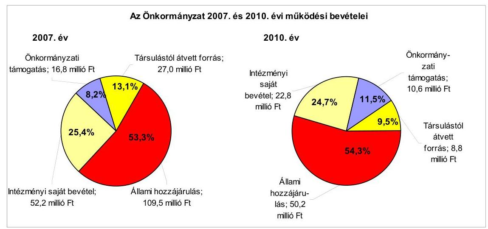
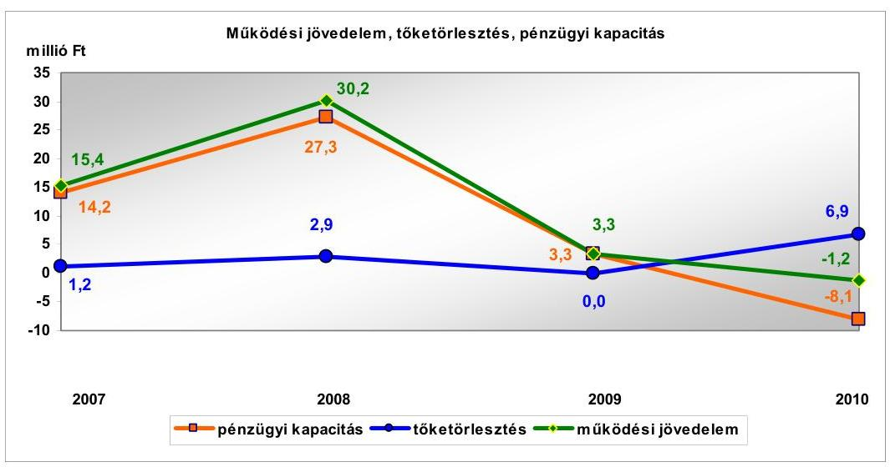
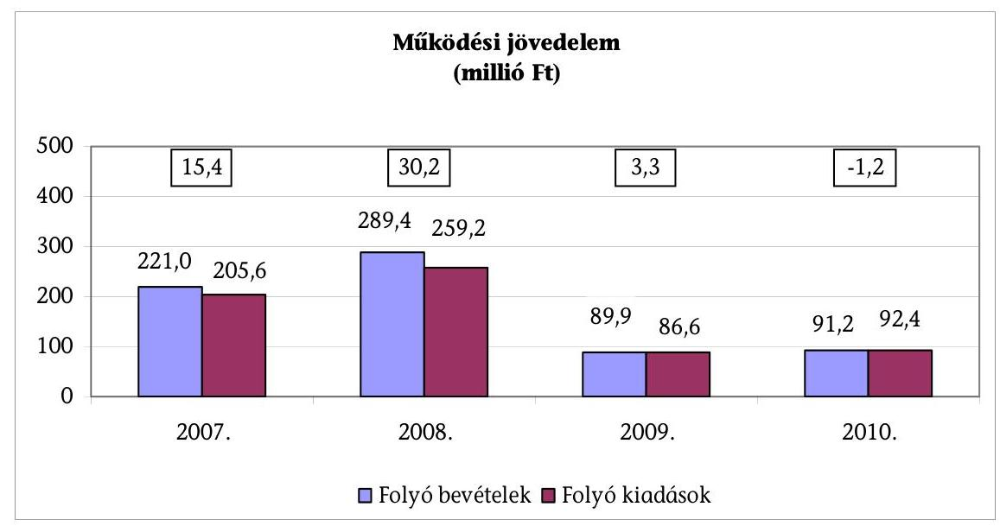
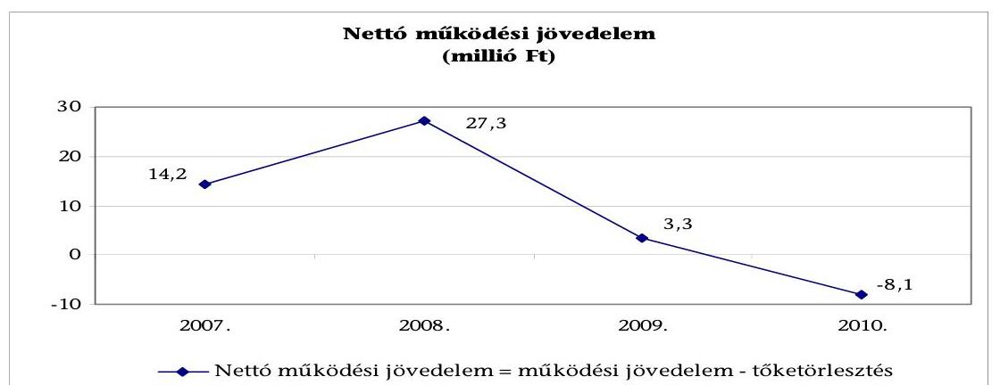
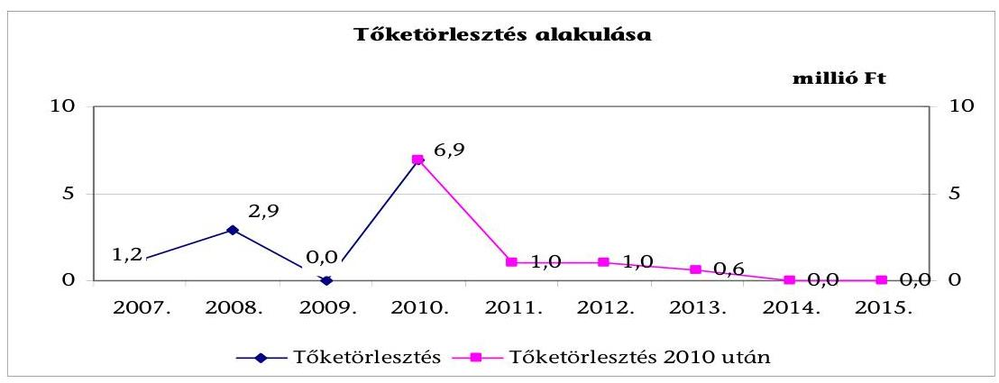
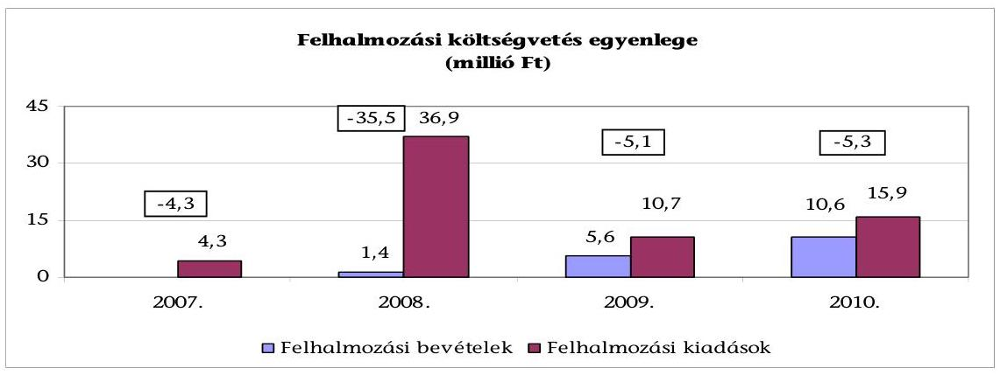
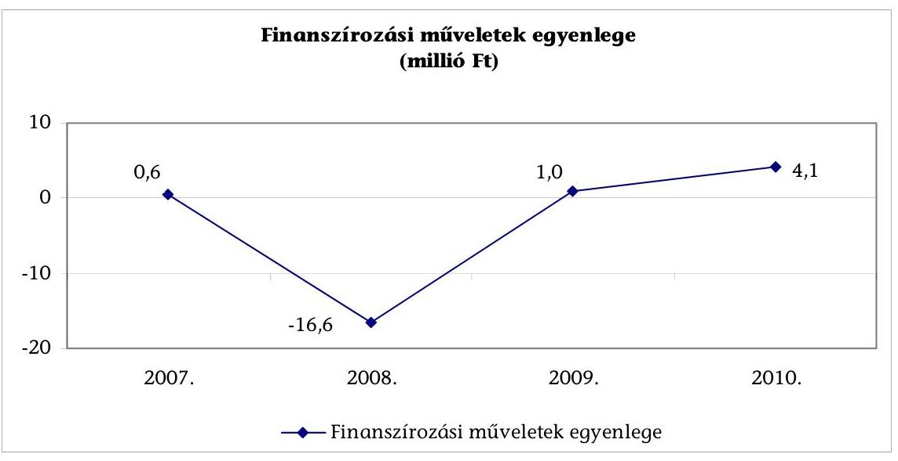
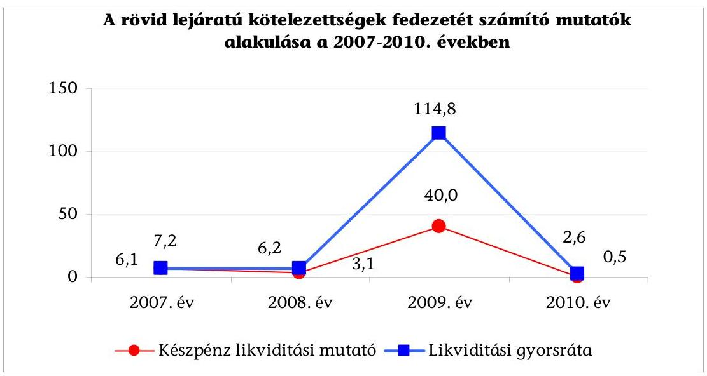
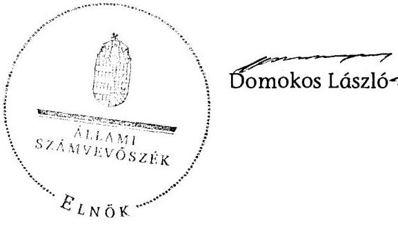

# JELENTÉS 

Almamellék Község Önkormányzata gazdálkodási rendszerének 2011. évi ellenőrzéséről

---

# Számvevői Iroda 

Iktatószám: V-3066-027/2012.
Témaszám: 1015
Vizsgálat-azonosító szám: V0560009

## Az ellenőrzést felügyelte:

Dr. Varga Sándor
számvevő igazgatóhelyettes
Az ellenőrzést vezette:
Gyüre Lajosné
számvevő tanácsos
Az ellenőrzést végezték:
Dr. Láng Ágnes Krisztina Péntek László
számvevő számvevő tanácsos

---

# TARTALOMJEGYZÉK 

BEVEZETÉS ..... 9
I. ÖSSZEGZŐ MEGÁLLAPÍTÁSOK, KÖVETKEZTETÉSEK, JAVASLATOK ..... 14
II. RÉSZLETES MEGÁLLAPÍTÁSOK ..... 25

1. A pénzügyi egyensúly, a fizetőképesség, a gazdálkodás stabilitásának biztosítása, az adósságkezelés eredményessége ..... 25
2. A vagyoni helyzet alakulása, valamint a vagyongazdálkodás folyamataiban a kontrollok múködése ..... 37
2.1. Az Önkormányzat vagyoni helyzetének 2007-2010 közötti alakulása ..... 37
2.2. A vagyongazdálkodás belső kontrolljainak múködése ..... 39

## MELLÉKLETEK

1. számú Az Önkormányzat gazdálkodását meghatározó adatok, mutatószámok (1 oldal)
2. számú Kimutatás az Önkormányzat 2007-2010 között teljesített CLF szerint össze-
sített bevételeiről és kiadásairól (1 oldal)

---

.

---

# RÖVIDÍTÉSEK JEGYZÉKE 

## Törvények

Áht.
ÁSZ tv.
Eisztv.

Ktv.
Ötv.
Szav. tv.
új Áht.
új Eisz.tv.
új Ötv.

## Rendeletek

Áhsz.

Ámr.
Ávr.
új Ber.
2007. évi költségvetési rendelet
2008. évi költségvetési rendelet
2009. évi költségvetési rendelet
2010. évi költségvetési rendelet
2011. évi költségvetési rendelet
2007. évi zárszámadási rendelet
2008. évi zárszámadási rendelet
2009. évi zárszámadási rendelet
2010. évi zárszámadási rendelet
SzMSz
az államháztartásról szóló 1992. évi XXXVIII. törvény
az Állami Számvevőszékről szóló 2011. évi LXVI. törvény
az elektronikus információszabadságról szóló 2005. évi XC. törvény
a köztisztviselők jogállásáról szóló 1992. évi XXIII. törvény
a helyi önkormányzatokról szóló 1990. évi LXV. törvény
a személyes adatok védelméről szóló 1992. évi LXIII. törvény
az államháztartásról szóló 2011. évi CXCV. törvény
az információs önrendelkezési jogról és az információs szabadságról szóló 2011. évi CXII. törvény
Magyarország helyi önkormányzatairól szóló 2011. évi CLXXXIX. törvény
az államháztartás szervezetei beszámolási és könyvvezetési kötelezettségének sajátosságairól szóló 249/2000. (XII. 24.) Korm. rendelet
az államháztartás múködési rendjéről szóló 292/2009. (XII. 19.) Korm. rendelet
az államháztartási törvény végrehajtásáról szóló 368/2011. ((XII. 31.) Korm. rendelet
a költségvetési szervek belső kontrollrendszeréről és belső ellenőrzéséről szóló 370/2011. (XII. 31.) Korm. rendelet
az Önkormányzat 3/2007. (II. 16.) számú rendelete a 2007. évi költségvetésről
az Önkormányzat 2/2008. (II. 15.) számú rendelete a 2008. évi költségvetésről
az Önkormányzat 2/2009. (II. 13.) számú rendelete a 2009. évi költségvetésről
az Önkormányzat 1/2010. (II. 16.) számú rendelete a 2010. évi költségvetésről
az Önkormányzat 1/2011. (II. 15.) számú rendelete a 2011. évi költségvetésről
az Önkormányzat 4/2008. (IV. 25.) számú rendelete a 2007. évi zárszámadásáról
az Önkormányzat 5/2009. (IV. 20.) számú rendelete a 2008. évi zárszámadásáról
az Önkormányzat 3/2010. (IV. 15.) számú rendelete a 2009. évi zárszámadásáról
az Önkormányzat 6/2011. (IV. 29.) számú rendelete a 2010. évi zárszámadásáról
az Önkormányzat 8/2007. (IV. 27.) számú rendelete az Önkormányzat Szervezeti és Múködési Szabályzatáról

---

# Szórövidítések 

ÁSZ
Belső Kontroll Kézikönyv
közzétett, a belső kontrollrendszer múködtetésére vonatkozó módszertani útmutató
FEUVE
gazdálkodási szabályzat
gazdasági ügyrend
hivatali SzMSz

Hulladékgazdálkodási társulás
kockázatkezelési szabályzat
körjegyző
Körjegyzőség
Képviselő-testület
Önkormányzat
polgármester
szja
Kistérségi társulás

Állami Számvevőszék
az államháztartásért felelős miniszter által a 2010. évben közzétett, a belső kontrollrendszer múködtetésére vonatkozó módszertani útmutató
folyamatba épített, előzetes, utólagos és vezetői ellenőrzés
Almamellék, Ibafa, Csebény és Horváthertelend községi Önkormányzatok Körjegyzőségének 2010. július 1-jétől hatályos Gazdálkodási Szabályzata
Almamellék, Ibafa, Csebény és Horváthertelend községi Önkormányzatok Körjegyzőségének 2006. július 1-jétől hatályos Gazdasági Úgyrendje
Almamellék, Ibafa, Csebény és Horváthertelend községi Önkormányzatok Körjegyzőségének 2010. július 1-jétől hatályos Szervezeti és Múködési Szabályzata
Kaposmenti Hulladékgazdálkodási Önkormányzati Társulás
A Képviselő-testület 47/2006. (VII.17.) számú határozatával elfogadott FEUVE szabályzat 4. számú mellékletét képező kockázatkezelési szabályzat
Almamellék, Ibafa, Csebény és Horváthertelend községi Önkormányzatok Körjegyzője
Almamellék, Ibafa, Csebény és Horváthertelend községi Önkormányzatok Körjegyzőségi Hivatala
Almamellék Község Önkormányzatának Képviselőtestülete
Almamellék Község Önkormányzata
Almamellék község Önkormányzatának polgármestere személyi jövedelemadó
Szigetvár - Dél-Zselic Többcélú Kistérségi Társulás

---

# ÉRTELMEZŐ SZÓTÁR 

bonitás

CLF módszer
eredményesség
finanszírozási célú pénzügyi műveletek
garanciavállalás
kamatkockázat

A bonitás hitelképességet jelent. A bonitást a pénzügyi kapacitás fogalmával írhatjuk le, ami nem más, mint az adósok hitelfelvételi képességének azon mértéke, ahol még anélkül tudják növelni az adósságot, hogy csökkenteniük kellene akár jelenlegi, akár jövőben esedékes kiadásaikat fizetőképességük fenntartása érdekében.
Az önkormányzatok költségvetése elemzésének eszköze, a bevételek és kiadások, múködés és fejlesztés elkülönítése. Bizonyos mértékig a vállalati gazdálkodás logikai elemeit érvényesíti az önkormányzatok pénzügyi jövedelmi helyzetének vizsgálat során. Következetesen elkülöníti a folyó és a felhalmozási költségvetés bevételeit és kiadásait, azok költségvetési egyenlegeit. A módszer a pénzügyi kapacitás fogalmát helyezi a középpontba.
A kitűzött célok megvalósításának mértékeként vagy egy tevékenység kimenete szándékolt és tényleges hatása közötti kapcsolat. Ebben a meghatározásában - kiterjesztve a teljesítmény-ellenőrzés értelmezési tartományára - a hatás az operatív, a specifikus vagy átfogó szinten keletkezett „végterméket" jelenti, amely lehet output, eredmény és hatás egyaránt (ÁSZ Teljesítmény-ellenőrzési módszertan 16. oldal).
Értékpapírok kibocsátása, értékesítése és visszavásárlása; hitelek felvétele és törlesztése; szabad pénzeszközök betétként való elhelyezése és visszavonása (Áht. 8/A. § (3) bekezdés).
Valamilyen esemény jövőbeni bekövetkezéséhez kapcsolódó kötelezettségvállalás. A garanciavállalás az önkormányzat kötelezettségvállalása arra vonatkozóan, hogy a szerződésben meghatározott feltételek beálltakor a garancia kedvezményezettje számára, határozott összegig, határozott időpontig, felszólításra azonnal fizet. Ez a kötelezettség az önkormányzat számára azzal a bizonytalansággal jár, hogy nem tudja, hogy ezt a kötelezettségvállalását igénybe veszik-e vagy nem, és ha igen, mikor.
Az a kockázat, amely a változó kamatozású hiteleknél akkor áll fenn, ha a forint-, vagy a devizahitel futamideje alatt emelkedik a kamat, és ez által nő a hitel törlesztő részlete.

---

kezességvállalás

közfeladat
pénzügyi kockázat

PPP (public private partnership)
saját vagyon

SNA

A kezesség járulékos kötelezettségvállalás, amely lehet egyszerű vagy készfizető, és mindig feltételezi a főkötelezettet. Az egyszerű kezességvállalás esetén a kezes mindaddig megtagadhatja a teljesítést, míg mindazoktól behajtható, akik őt megelőzően vállaltak kötelezettséget. A készfizető kezest nem illeti meg a sortartás kifogása. A fentiek következtében mind a garancia-, mind a kezességvállalás esetében az önkormányzatnak a futamidő teljes időtartama alatt azzal kell számolnia, hogy ha a főkötelezett elmulasztja teljesíteni a fizetést, a vállalt kötelezettséget vele szemben érvényesítik az adott időpontban fennálló összeg erejéig (Ptk. 272-276. §-ai alapján).
Az állami, helyi, illetve kisebbségi önkormányzati feladat, amelynek ellátásáról az államnak, illetve az önkormányzatoknak kell gondoskodnia. A hatályos szabályozás szerint közfeladatot törvény és önkormányzati rendelet állapíthat meg. Az önkormányzatok által ellátandó feladatok keretszerű meghatározását az Ötv. tartalmazza.
A belső múködési kockázat egyik eleme. A költségvetési szerv múködésének, tevékenységének, rövid távon ható velejáróinak része a tevékenységi és emberi erőforrás kockázatokkal együtt. Megmutatkozhat a költségvetés nagyságrendjének, szerkezetének módosulásaiban, a bevételi, kiadási előirányzatok változásaiban, a nem megfelelő belső kontrollrendszer múködése során, a tudatos károkozásokban, a biztosítások elmaradásában, a hibás fejlesztési döntésekben, a nem megfelelő forrásfelhasználásokban.
Az állami és a magánszféra együttmúködésének egyik formája, amelynek keretében a közcél a magánszféra jelentős mértékủ közremúködésével valósul meg. Az állam (önkormányzat) a közszolgáltatások létrehozását a tradicionálisnál komplexebb módon bízza a magánszférára.
A könyvviteli mérlegben szereplő eszközöknek a kötelezettségekkel csökkentett összege, amellyel azonos a források között szereplő a saját tőke és a tartalékok együttes összege. A saját vagyonhoz tartoznak továbbá a számviteli nyilvántartásban érték nélkül szereplő eszközök.
System of National Account, azaz a Nemzeti Számlák Rendszere, amely a gazdasági szektorok által létrehozott valamennyi terméket és szolgáltatást figyelembe veszi.

---

visszafizetési kockázat

Annak a kockázata, hogy a hitelt felvevőnél rendelkezésre állnak-e a visszafizetéshez, a hitel törlesztéséhez szükséges pénzügyi források. A visszafizetési kockázatot növeli a kamat- és árfolyamkockázat növekedése, mivel ezekben az esetekben az adósságszolgálat nőhet. Egy adott kötelezettség keletkezését megelőzően, illetve azt követően olyan pénzügyi helyzet állhat fenn, amely a kötelezettség visszafizetését korlátozhatja, meggátolhatja, ellehetetleníti. Visszafizetési kockázatot okozhat, ha:

- a hitelfelvételből, kötvénykibocsátásból származó bevétel visszafizetéséhez szükséges forrást a bevétel felhasználási területe nem biztosítja, (pl. a megvalósított beruházás múködése, üzemeltetése során nem a tervezett eredményességet biztosította, vagy a tervezettnél magasabb a fenntartási költsége, a tervezett kiadási megtakarítást nem biztosítja, a betétbehelyezés alacsonyabb kamatbevételt biztosított, mint amennyi a kötvény kamata);
- a visszafizetésre tervezett forrás elérésének, teljesítésének bizonytalansága (pl. a visszafizetéshez tervezett tartalékolás elmaradt, a tervezettnél alacsonyabb a saját bevétel, a helyi adóból származó bevétel az adóalanyok, adóalapok csökkenése miatt nem teljesül);
- a kötelezettségvállaláskor a visszafizetési forrás megjelölésének, tervezésének elmaradása, vagy megalapozatlan figyelembevétele;

---

.

---

# JELENTÉS 

## Almamellék Község Önkormányzata gazdálkodási rendszerének 2011. évi ellenőrzéséről

## BEVEZETÉS

Az Állami Számvevőszék 2011. évben életbe lépett stratégiája szerint „az önkormányzatok ellenőrzése során azok pénzügyi-gazdasági helyzetét értékeli, kockázatait feltárja, valamint az ellenőrzések helyszíneit objektív mutatószámrendszer alapján választja ki". E célkitűzéseknek megfelelően összeállított ellenőrzési program alapján végzi a helyi önkormányzatok gazdálkodási rendszerének ellenőrzését.

## Az ellenőrzés célja az Önkormányzatnál annak értékelése volt, hogy:

- biztosított-e a pénzügyi egyensúly, a fizetőképesség, a gazdálkodás stabilitása, ezeket segítette-e az adósság kezelése;
- a vagyoni helyzet a külső és belső tényezők hatására miként változott, a belső kontrollok megfelelően biztosították-e a vagyongazdálkodás szabályosságát, eredményességét.

Az ellenőrzés típusa: szabályszerűségi ellenőrzés, továbbá az ellenőrzés meghatározott területein teljesítmény ellenőrzés.

Az ellenőrzött időszak: a pénzügyi, vagyoni helyzettel kapcsolatos elemzéseket, értékeléseket az Önkormányzat többségi tulajdonú gazdasági társaságainál a tulajdonosi felelősség érvényesítését, valamint az Önkormányzat gazdálkodási rendszerének korábbi ellenőrzése során tett javaslatok megvalósításának ellenőrzését a 2007-2010. évekre vonatkozóan végeztük, valamint lehetőség szerint kitérünk a helyszíni ellenőrzést megelőző utolsó negyedév végéig terjedő időszakra is. A vagyongazdálkodás belső kontrolljai múködésének tesztelése a 2010. évre, valamint a helyszíni ellenőrzést megelőző utolsó negyedév végéig terjedő időszakra vonatkozik.

Az ellenőrzés jogszabályi alapját az Állami Számvevőszékről szóló 2011. évi LXVI. törvény 1. § (3) bekezdése, 5. § (2)-(6) bekezdései, az államháztartásról szóló 1992. évi XXXVIII. törvény 120/A. § (1) bekezdése előírásai képezték.

A ellenőrzés szakmai módszertanát a Legfőbb Ellenőrző Intézmények Nemzetközi Szervezete (INTOSAI) által kiadott nemzetközi standardok (ISSAI) és az Állami Számvevőszék által kiadott „Ellenőrzési Kézikönyv" és „Módszertani útmutató a teljesítmény-ellenőrzéshez" képezte.

---

Almamellék község állandó lakosainak száma 2011. január 1-jén 480 fő volt. A 2010. évi önkormányzati képviselő- és polgármester-választást követően az Önkormányzat öt tagú Képviselő-testülete munkájának segítésére állandó bizottságot nem alakított.

Az Önkormányzat feladatainak végrehajtása érdekében a 2007. évben két, önállóan gazdálkodó költségvetési szervet múködtetett, a 2010. évben az Önkormányzatnak egy, önállóan működő és gazdálkodó költségvetési szerve, a Körjegyzőség volt.

Az Önkormányzat a 2007. év végén 304,2 millió Ft, a 2010. év végén 304,4 millió Ft könyvviteli mérleg szerinti vagyonnal rendelkezett. Az Önkormányzatnak hosszú lejáratú kötelezettség állománya a 2007. év végén nem volt, a 2010. év végén annak összege 1,6 millió Ft-ot tett ki. A rövid lejáratú kötelezettségek állománya a 2007. év végi 4,4 millió Ft-ról a 2010. év végére 3,5 millió Ft-ra csökkent.

A Körjegyzőségnél dolgozó köztisztviselők száma a 2007. és a 2010. év végén egyaránt hat fő volt. Az Önkormányzatnál a 2007. évi 69 fővel szemben 2010. december 31-én két fő közalkalmazottat foglalkoztattak, mivel az Önkormányzat oktatási intézménye 2008-ban a Kistérségi társulás fenntartásába került. Az Önkormányzat gazdálkodásra jellemző adatokat, mutatószámokat az 1-2. számú mellékletek tartalmazzák.

A hagyományos költségvetési szerkezet helyett az Önkormányzat pénzügyi helyzetét a CLF módszerrel mutatjuk be, amelyben jobban elkülönülnek a vagyonnal kapcsolatos bevételek és kiadások az önkormányzati feladatokkal kapcsolatos közvetlen működtetési bevételektől és kiadásoktól. A módszer következetesen elkülöníti a folyó és a felhalmozási költségvetés bevételeit és kiadásait, azok költségvetési egyenlegeit. A saját folyó bevételek, valamint a saját felhalmozási bevételek nem tartalmazzák az előző évi pénzmaradványok felhasználásából származó pénzforgalom nélküli bevételeket ${ }^{1}$. A számítási leírás némileg eltér az ÁSZ módszertanában korábban alkalmazott gyakorlattól. A jelen besorolás általános közgazdasági meggondolásokon alapul, amely megjelenik az SNA statisztikai módszertanában is.

A folyó költségvetés egyenlege, a múködési jövedelem megmutatja, hogy az önkormányzat éves folyó bevétele fedezetet biztosít-e a kötelező és önként vállalt feladatellátáshoz kapcsolódó éves folyó kiadására. A múködési jövedelem negatív értéke pénzügyileg fenntarthatatlan helyzetet jelez. A mutató pozitív értéke megtakarítást mutat, amely forrásul szolgálhat az önkormányzat fennálló kötelezettségei megfizetéséhez, valamint fejlesztéseihez.

[^0]
[^0]:    ${ }^{1}$ A költségvetési években kialakuló hiány finanszírozása az előző években képzett tartalékok felhasználásával is történhet.

---

A felhalmozási költségvetés pozitív értéke felhalmozási többletet mutat, amely a jövőbeni fejlesztések forrását biztosíthatja. Amennyiben a folyó költségvetési hiány finanszírozása a felhalmozási többletből történik, ez szűkebb értelemben vagyonfelélésnek tekinthető. Amennyiben a felhalmozási költségvetés megtakarítása fejlesztési célú hitelek, kötvények adósságszolgálatát finanszírozza, az változatlan vagyontömeg mellett, a korábban megelőlegezett tőkebevételek valós realizációjának tekinthető. A felhalmozási deficit által generált finanszírozási igény önmagában nem jár pénzügyi kockázattal, a pénzügyileg fenntartható beruházásokhoz kapcsolódó kötelezettségvállalás (adósságszolgálat) átlátható és szabályozott költségvetési gazdálkodással teljesíthető.

A módszer a pénzügyi kapacitás fogalmát helyezi a középpontba. Az adós hitelfelvételi képessége, hosszú távú fizetőképessége vagy bonitása a pénzügyi kapacitással (a nettó múködési jövedelemmel) jellemezhető. A nettó múködési jövedelem negatív értéke az egyes költségvetési években jelentkező adósságszolgálat túlzott mértékére utal ${ }^{2}$. A nettó múködési jövedelem negatív értékének felhalmozási többletből, vagy további hitelből történő finanszírozása pénzügyileg nem fenntartható gazdálkodást vetít előre. A pozitív értéket mutató nettó múködési jövedelem fejlesztési kiadások fedezetét biztosíthatja, illetve a folyamatosan, évenként képződő pozitív nettó múködési jövedelemből meghatározható a jövőben vállalható, teljesíthető éves adósságszolgálat, ily módon az a hitelösszeg, amely - a többi tényezőt, feltételt adottnak tekintve - visszafizetési kockázat nélkül felvehető.

Folyó tételek alatt értjük azokat a kiadásokat és bevételeket, amelyek a gazdálkodó szervezet helyzetét automatikusan nem változtatják. Bevételi oldalon ilyenek az adók, a tényező jövedelmek, a transzferek, kiadási oldalon a transzferek ${ }^{3}$ és a szolgáltatás nyújtásával kapcsolatos múködési kiadások. A folyó költségvetésben a bevételekben nem térül meg, a kiadásokban nem jelenik meg az amortizáció, a vagyoni helyzetet viszont az egyenleg befolyásolja.

A folyó költségvetés egyenlege (múködési jövedelem) tartalmazza a kamatkiadásokat is, mind a fejlesztési kamatot, mind a visszatérülő áfa teljes összegét, mert ezek közgazdaságilag tényező jövedelmek. Nem tartalmazzák viszont a követelés elengedés miatt könyvelt bevételi és kiadási pénzforgalmi tételeket, mert valójában technikai elszámolási múveletnek minősülnek, a bevétel soha nem realizálódott, és költségvetési kiadás sem történt.

[^0]
[^0]:    ${ }^{2}$ kivéve, ha annak finanszírozására a korábbi években képzett tartalékok fedezetet nyújtanak
    ${ }^{3}$ Transzferkiadásoknak nevezzük azokat a folyó és felhalmozási tételeket, amelyeket nem az adott önkormányzat használ fel szolgáltatásnyújtásra.

---

A felhalmozási költségvetésben a bevételek között a vagyon megőrzésére és bővítésére fordítható források jelennek meg. A felhalmozási vagy tőketételek módosítják a vagyon nagyságát. A privatizációs bevétel csökkenti a vagyont, a fizikai beruházás, a pénzügyi befektetés növeli.

A nettó múködési jövedelmet a tőketörlesztés levonásával a folyó költségvetés egyenlegéből származtatjuk. Az új módszereken alapuló helyzetértékelés fontosságát az adja, hogy a helyi önkormányzatok bruttó adósságállománya ${ }^{4}$ 2007-től vált jelentőssé, az önkormányzati alrendszer 2010. évi költségvetési beszámolójának adatai alapján 1248 milliárd Ft-ot tett ki.

A vagyongazdálkodás ellenőrzése kiterjedt a vagyon értékének, összetételének, a 2007-2010. évek közötti időszakban a vagyonváltozást előidéző okok elemzésére. A vagyongazdálkodás belső kontrolljai azonosításának és múködésének ellenőrzése keretében a vagyonértékesítés és a vagyonhasznosítás, valamint a finanszírozási célú pénzügyi műveletek folyamatait értékeltük ${ }^{5}$. Felmértük a belső kontrollokban rejlő kockázatot, minősítettük a kontrollok múködésének eredményességét ${ }^{6}$, és meghatároztuk, hogy a vagyongazdálkodás folyamatában mely kontrollok nem biztosították a múködésbeli hibák megelőzését, feltárását, kijavítását, ezáltal veszélyeztették az eredményes, megfelelő múködést.

A vagyongazdálkodási folyamatokban alkalmazott belső kontrollok azonosításának és múködésének vizsgálatát többlépcsős megfelelőségi tesztek útján végeztük. A vizsgált területek könyvviteli tételei (meghatározott tételszám felett egyszerű véletlen minta) alapján történt a vagyongazdálkodás kulcsszerepet betöltő belső kontrollja - a kötelezettségvállalás ellenjegyzése, a szakmai teljesítésigazolás és az utalvány ellenjegyzés - múködésének a megítélése. Az ellenőrzés során alkalmazott módszer - a többlépcsős megfelelőségi teszt alkalmazásának - lényege az volt, hogy a kiválasztott minta ellenőrzését csak addig végeztük, amíg elegendő és megfelelő bizonyítékot nem szereztünk a vizsgált fo-

[^0]
[^0]:    ${ }^{4}$ A bruttó adósságállomány 2010. év végi összege magában foglalja a fejlesztési és a múködési célú kötvénykibocsátások, a beruházási és fejlesztési hitelek, a múködési célú hosszú lejáratú hitelek, a rövid lejáratú hitelek, váltótartozások miatti kötelezettségek teljes (2011-ben, illetve az azt követő években esedékes) állományát.
    ${ }^{5}$ A vagyongazdálkodás területén a szabályozottságban rejlő kockázatot alacsonynak minősítettük, ha a szabályozottság megfelelő védelmet nyújtott a vagyongazdálkodással összefüggő hibák bekövetkezése ellen. Közepesnek minősítettük a vagyongazdálkodás szabályozottságában rejlő kockázatot, amennyiben a szabályozottság a lehetséges vagyongazdálkodási hibák többsége ellen védelmet nyújtott. Magasnak értékeltük a vagyongazdálkodás szabályozottságában rejlő kockázatot, ha a szabályok - kialakításuk hiányában, vagy hiányos kialakításuk miatt - nem nyújtottak elegendő védelmet a lehetséges vagyongazdálkodási hibákkal szemben.
    ${ }^{6}$ Az előzetesen meghatározott módszer alapján számított kockázati pontok képezik a kontrollok múködésének értékelését, az eredményesség kritériumát.

---

lyamatok kulcskontrolljai ${ }^{7}$ működésének megfelelő vagy nem megfelelő voltáról ${ }^{8}$.

Az ellenőrzést a következő, kiemelt kockázatuk alapján kiválasztott bevételekre és kifizetésekre folytattuk le:

- az ingatlanértékesítés bevételeire;
- a bérleti díj bevételeire;
- a vásárolt szolgáltatások kiadásaira;
- az államháztartáson kívüli szervezetek részére történő működési célú pénzeszközátadásokra teljesített kifizetésekre;
- az ingatlanok felújításával kapcsolatos kifizetésekre.

A helyszíni ellenőrzés során kitöltött - az ellenőrzést végző számvevő és a Körjegyzőség felelős köztisztviselője által aláírt - ellenőrzési munkalapokat, azok kitöltési útmutatóit, továbbá a megfelelőségi tesztek dokumentumait a polgármester részére a számvevői megállapítások egyeztetése során átadtuk.

[^0]
[^0]:    ${ }^{7}$ Kulcskontrollok: azok a kontrollok, amelyek a specifikus eredendő kockázatok mérséklése szempontjából alapvető fontosságúak, és eredményes múködésük meghatározó hatással van a kontrollrendszer minőségére. A kulcskontrollok biztosítják más kontrollok (egy vagy több) múködési hibájának feltárását, kiküszöbölését; viszonylag könnyen tesztelhetők; a folyamatos, következetes és eredményes múködésük legalább két, vagy több múködési hiba ellen biztosítanak védelmet.
    ${ }^{8}$ A vagyongazdálkodás területén azonosított kontrollok múködését kiválónak értékeltük abban az esetben, ha azok múködése megfelelt a hibák megelőzésére és kijavítására meghatározott szabályozásnak és a legmagasabb szintű elvárásoknak. Jónak minősítettük a vagyongazdálkodás területén azonosított kontrollok múködését, ha a megállapított kisebb (tolerálható mértékű) hiányosságok nem veszélyeztették a vagyongazdálkodás ellenőrzött területei hibáinak megelőzését és kijavítását. Amennyiben a kontrollok múködésében túl sok hiányosság fordult elő ahhoz, hogy a kontrollok biztosítsák a vagyongazdálkodási hibák megelőzését, feltárását, kijavítását és ezáltal veszélyeztették az eredményes, megfelelő vagyongazdálkodást, a kontrollok múködése gyenge minősítést kapott.

---

# I. ÖSSZEGZŐ MEGÁLLAPÍTÁSOK, KÖVETKEZTETÉSEK, JAVASLATOK 

## A pénzügyi egyensúlyi helyzet értékelése

Az Önkormányzat a 2010. évben 101,8 millió Ft költségvetési bevételből gazdálkodott, a költségvetés végrehajtása során 108,4 millió Ft költségvetési kiadást teljesített. Az Önkormányzat kimutatásai szerint a 2010. évben a folyó kiadások 5,0\%-át (5,4 millió Ft) fordították az önként vállalt feladatok ellátására: a falugondnoki szolgálat múködtetésére, valamint helyi rendezvények támogatására. Az Önkormányzat a 2010. évben az önállóan múködő és gazdálkodó Körjegyzőségen kívül más költségvetési szervet nem múködtetett. A feladatellátás szervezeti rendszerében jelentős változást okozott az, hogy a 2007 augusztusától kilenc községi önkormányzattal közösen fenntartott, Almamellék székhellyel múködő oktatási intézményt a 2008. év II. félévében a Kistérségi társulás fenntartásába adták.

A folyó kiadások fedezetéül szolgáló bevételi források a 2007. és a 2010. években jellemző összegeit és megoszlását a következő ábra szemlélteti:

A folyó költségvetés egyenlege, a múködési jövedelem a 2007-2009. években pozitív - a 2007. évben 15,4 millió Ft, a 2008. évben 30,2 millió Ft, a 2009. évben 3,3 millió Ft - volt, a befolyt folyó bevételek a folyó kiadásokra fedezetet nyújtottak. A múködési jövedelem negatív összegét (-1,2 millió Ft-ot) a 2010. évben az okozta, hogy a folyó kiadások a folyó bevételeket meghaladó mértékben növekedtek a normatív állami hozzájárulások összegének az előző évhez viszonyított, 3,1 millió Ft-os csökkenése miatt.

Az Önkormányzat a múködésképtelen önkormányzatok egyéb támogatása címén a 2007. évben 3,0 millió Ft, a 2009. évben 3,5 millió Ft, a 2010. évben 2,2 millió Ft támogatásban részesült, a 2011. évben pedig 1,2 millió Ft-ot nyert

---

el az önhibájukon kívül hátrányos helyzetben lévő önkormányzatok támogatási keretéből.

A 2007-2010. évek között összesen 47,7 millió Ft múködési jövedelem keletkezett, amely forrásul szolgált a 2007-2010. évek között teljesített 4,5 millió Ft tőketörlesztésre. A felhalmozási költségvetés egyenlege minden évben negatív előjelű volt, a 2007-2010. évek között keletkezett összesen 50,2 millió Ft felhalmozási hiány finanszírozására fedezetül szolgált a képződött nettó múködési jövedelem, az előző évi pénzmaradvány, valamint a 2010. évben felvett ( 3 millió Ft) felhalmozási célú hitel. A finanszírozási műveletek egyenlege a 2008. évet kivéve pozitív volt (2007-ben 0,6 millió Ft, 2009-ben 1,0 millió Ft, 2010-ben 4,1 millió Ft). Ez azt jelenti, hogy a 2007. és 2009-2010. években a tőketörlesztést meghaladó mértékű volt a külső forrásbevonás. A finanszírozási műveletek 2008. évi negatív egyenlege (-16,6 millió Ft) elsősorban az oktatási intézmény Kistérségi társulás részére történt átadásával kapcsolatos évközi pénzügyi elszámolásokból eredt.

Az Önkormányzat mérlegében kimutatott összes - passzív pénzügyi elszámolások nélküli - kötelezettség a 2007. évről a 2010. évre 4,4 millió Ft-ról 5,1 millió Ft-ra nőtt a 2010. évi hosszú lejáratú hitelfelvétel hatására. Hosszú lejáratú kötelezettség állomány a 2007-2009. évek könyvviteli mérlegében nem szerepelt. A rövid lejáratú kötelezettségek 2010. év végi állománya 3,5 millió Ft volt, amely - a 2007. év végén fennálló rövid lejáratú hitelállomány következő évi visszafizetése miatt - 0,9 millió Ft-tal (20,5\%-kal) elmaradt a 2007. év végi értéktől. Az Önkormányzatnak a 2007-2010. évek végén szállítói tartozásállománya nem volt. A pénz- és tőkepiaci kötelezettségen kívül a rövid lejáratú kötelezettségek között a helyi adó túlfizetés, valamint a Kistérségi társulás felé fennálló - intézményfinanszírozással kapcsolatos - tartozás szerepelt.

Az Önkormányzat pénzügyi helyzete a fizetőképesség szempontjából a 20072010. évek között kedvezőtlenül alakult. A pénzeszközök év végi állománya a 2007-2009. években fedezetet nyújtott a rövid lejáratú kötelezettségekre, míg a 2010. évben azok 51,4\%-ára nyújtott csak fedezetet. A pénzeszközök és a követelések együttes összege mindegyik évben meghaladta a rövid lejáratú kötelezettségek értékét. A folyószámlahitellel zárt napok száma a 2007. évben 364, a

---

2009. évben 112, a 2010. évben 245 volt. A 2008. évben nem vettek igénybe folyószámlahitelt. A 2007. és 2009. év végére a folyószámlahiteleket visszafizették. Az Önkormányzat a 2010. év végén azonban folyószámlahitel állománynyal rendelkezett, mely 1 millió Ft-ot tett ki.

Az Önkormányzat likviditási és adósságkezelési tevékenysége a 20072009. években eredményes volt, mert a költségvetési egyensúly javítása céljából tett intézkedések a 2007-2009. évek között az önkormányzati kimutatások szerint összesen 2,2 millió Ft kiadási megtakarítást és 2,7 millió Ft bevétel növekedést eredményeztek, és hozzájárultak a pénzügyi egyensúly megteremtéséhez. Az önkormányzati intézkedések a 2010. évben ( 0,7 millió Ft bevételt eredményeztek) azonban nem voltak elégségesek a pénzügyi egyensúly saját forrásból való megteremtéséhez. Az Önkormányzat a fizetőképességi és eladósodási problémáit kezelő stratégiával nem rendelkezett. A Képviselő-testületet nem tájékoztatták a hitelfelvétellel kapcsolatos kockázatokról. A döntéshozatal előtt a Képviselő-testület részére a hitel-visszafizetés jövőbeni forrásait nem mutatták be. A hitelfelvételre vonatkozó döntés megalapozása érdekében nem kértek több pénzintézettől ajánlatot. Az adósságot keletkeztető kötelezettségvállalásból származó bevételből megvalósított fejlesztés kiadásainak megtérülésére vonatkozó számítást, értékelést nem készítettek.

Az Önkormányzat a pénzintézetekkel szembeni és egyéb jövőbeni kötelezettségei teljesítésének forrásait nem számszerúsítette.

Az Önkormányzat pénzügyi helyzetét összegezve a következők emelhetők ki:

Az Önkormányzat pénzügyi egyensúlya rövid távon biztosított, a feltárt kockázatok középtávú intézkedéseket igényelnek. A pénzügyi egyensúly fenntartására a 2010. évtől növekvő állományú és a 2011. év I. félévében folyamatosan igénybe vett folyószámlahitel, valamint a Kistérségi társulás felé fennálló, lejárt tartozás jelent kockázatot. A 2009. évben igénybe vett folyószámlahitelt az év végéig visszafizették, a 2010. év végén azonban folyószámlahitel-állománnyal rendelkeztek.

A 2011. év I. féléve végén az Önkormányzatnak a Kistérségi társulás felé 1,6 millió Ft lejárt tartozása állt fenn. A hosszú lejáratú hitellel kapcsolatos döntéshozatal előtt a Képviselő-testület részére a hitel-visszafizetés jövőbeni forrásait és a hitelfelvétellel kapcsolatos kockázatokat nem mutatták be. A hitelfelvételre vonatkozó döntés megalapozása érdekében nem kértek több pénzintézettől ajánlatot.

Az Önkormányzat a fizetőképességi és eladósodási problémáit kezelő stratégiával nem rendelkezett. Az Önkormányzat a jövőbeni kötelezettségei teljesítésének forrásait nem számszerúsítette. A pénzintézetekkel szembeni és egyéb kötelezettségek teljesítésére figyelembe vehetők az Önkormányzat 2010. év végi követelésállománya beszedéséből, illetve a jelzáloggal nem terhelt forgalomképes ingatlanvagyon - szükség esetén történő - értékesítéséből befolyó bevételek.

A 2007-2009. években a befolyt folyó bevételek a folyó kiadásokra fedezetet nyújtottak, azonban a folyó költségvetés egyenlege, a múködési jövedelem a

---

2009. év óta csökkenő tendenciát mutat, és a 2010. évben negatív összegű volt. A múködési jövedelem a 2007-2009. években biztosította a hiteltörlesztések fedezetét.

Az Önkormányzat a 2007. és a 2009-2010. években a működésképtelen önkormányzatok egyéb támogatása címén központi támogatásban részesült, a 2011. évben pedig az önhibájukon kívül hátrányos helyzetben lévő önkormányzatok támogatási keretéből kapott központi támogatást. Az Önkormányzat által kimutatott önként vállalt feladatokra fordított kiadások összege az ellenőrzött időszakban nem volt számottevő. Az Önkormányzatnak folyamatban lévő fejlesztési feladata és fejlesztési feladathoz kapcsolódó, benyújtott pályázata nem volt 2010. december 31-én.

# A belső kontrollok múködése a vagyongazdálkodás folyamataiban 

Az Önkormányzat vagyonának mérleg szerinti értéke 2010. december 31én 304,4 millió Ft volt, ami a 2007. év végi állományhoz viszonyítva 0,2 millió Ft-tal, a 2007-2009. év végi állományok átlagához viszonyítva 5,5 millió Ft-tal növekedett az ingatlanfejlesztések hatására. A vagyon $90 \%$-át - a 2007. évben 263,3, a 2008. évben 262,5, a 2009. évben 267,3, a 2010. évben 275,1 millió Ftot - a befektetett eszközök tették ki, melyek jelentős része ingatlan és kapcsolódó vagyoni értékű jog. A kötelező közfeladatokhoz kapcsolódó fejlesztések - a Körjegyzőség épületének akadálymentesítése, járda- és útfelújítás, iskolafelújítás, park kialakítása - hatására a 2007. évi 242,9 millió Ft-ról a 2010. évre 268,8 millió Ft-ra, 25,9 millió Ft-tal ( $10,7 \%$-kal) nőtt az Önkormányzat ingatlanvagyona, amely a pénzeszközök 2007. évi 27,0 millió Ft-ról a 2010. évi 1,8 millió Ft-ra történő csökkenésével ( 25,2 millió Ft) járt együtt. A tartalékállomány folyamatosan csökkenő, a 2007. évben 19,9 millió Ft, a 2010. évben már csak 6,9 millió Ft ( $65,3 \%$-os csökkenés) volt, amit az Önkormányzat a fejlesztések önrészének biztosításához használt fel.

Az Önkormányzat 2007-2010. között összesen 61,6 millió Ft-ot számolt el értékcsökkenés címén. Az Önkormányzat a 2007-2010. években felújításra összesen 51,6 millió Ft-ot fordított, amely az elszámolt értékcsökkenés $83,8 \%$-át tette ki.

Az Önkormányzat vagyongazdálkodási döntései összességében a vagyon nagyságának megőrzését eredményezték a 2007-2010. évek között. A 2010. december 31-én fennálló 1,0 millió Ft folyószámlahitel, a 2011. év I. félévében annak 2,5 millió Ft-os napi átlagos állománya, valamint a 2011. év I. féléve végén a Kistérségi társulás felé fennálló 1,6 millió Ft lejárt tartozás azonban azt jelzi, hogy a vagyonmegőrző tevékenység finanszírozására a 2008., 2009. évekhez képest nagyobb mértékű rövid lejáratú idegen forrás igénybevételére volt szükség 2010-től.

A vagyongazdálkodási folyamatok szabályozottságának hiányosságai közepes kockázatot jelentettek a feladatok megfelelő, szabályszerű végrehajtásában, mert a körjegyző a belső kontrollrendszer keretében a kontrollkörnyezetet érintően nem adott ki adatvédelmi és adatbiztonsági szabályzatot. Nem határozta meg az Önkormányzat által nyújtott, nem normatív, céljellegú felhalmozási és múködési támogatások, továbbá az Önkormányzat pénzeszközei fel-

---

használásával, a vagyonnal történő gazdálkodással összefüggő, nettó ötmillió Ft-ot elérő, vagy azt meghaladó értékű építési beruházásra, árubeszerzésre, szolgáltatás megrendelésére vonatkozó szerződések Áht.-ban meghatározott adatai közzétételének eljárásrendjét. Nem határozta meg a Körjegyzőség köztisztviselőitől elvárt etikus magatartási szabályokat. A kockázatkezelés rendje keretében a kockázatkezelési szabályzatban nem határozta meg a csalás és a korrupció kockázatának minősítését, továbbá a vagyongazdálkodás főfolyamatára a kockázatokkal kapcsolatos válaszlépéseket, a 2010. és 2011. évi belső ellenőrzési ütemterv összeállításánál nem kezdeményezte a vagyongazdálkodáshoz kapcsolódó magas kockázatúnak értékelt területek ellenőrzését sem.

A kontrolltevékenységek meghatározása során a leltározási szabályzatban az üzemeltetésre átadott eszközök leltározásának módját nem szabályozta. A vagyonértékesítéssel és hasznosítással kapcsolatosan az Önkormányzat érdekeinek védelmét szolgáló garanciális elemek szerződésben, egyéb dokumentumban való rögzítésének kötelezettségét nem határozta meg. A finanszírozási célú pénzügyi műveletekkel összefüggésben nem írta elő a pénzügyi kockázatok felmérésének, illetve a hitelfelvételről szóló döntés-előkészítés folyamatában a futamidő egyes éveit terhelő kötelezettség költségvetési egyensúlyra gyakorolt hatása vizsgálatának kötelezettségét. Nem határozta meg a vagyongazdálkodási folyamatok rögzítésére használt informatikai programok adatai használatára vonatkozó követelményeket. A Körjegyzőség köztisztviselőinek munkaköri leírásaiban nem rögzítette a vagyongazdálkodási feladatok ellátásával kapcsolatos beszámolási kötelezettséget. Nem határozta meg a bevételeket megalapozó döntésekben meghatározott feltételek (ellenérték, fizetési feltételek, nem teljesítés esetén szankció) szerződésben történő érvényesítése ellenőrzési feladatát. Az Ámr. előírása ellenére nem jelölte ki a szakmai teljesítés igazolására jogosult személyeket. Az információszolgáltatás, kommunikáció területét érintően nem határozta meg a vagyongazdálkodás külső és belső információi kezelésének rendjét, nem hozta létre a beszámolási rendszer megbízhatóságához szükséges vezetői információs rendszert sem.

A Körjegyzőségnél a 2010. évben és a 2011. év I. félévében a vagyongazdálkodási folyamatokban a belső kontrollok múködése gyenge volt, a kontrollok nem biztosították a vagyongazdálkodás eredményességét, mert nem végezték el a vagyongazdálkodás folyamatában a kockázatok azonosítását és értékelését, valamint a csalás és a korrupció minősítését. A vagyongazdálkodás során felmerült kockázatokra a válaszlépéseket - értékelés hiányában - nem hozták meg. A vagyongazdálkodásban magas kockázatúnak értékelt területek (vagyonnal való gazdálkodás, vagyonvédelem, pénzkezelés gyakorlata) ellenőrzésére nem intézkedtek. A vagyongazdálkodási folyamatban a belső kontrolltevékenységek (eljárások) múködése során az üzemeltetésre átadott eszközök évenkénti leltározását nem végezték el. A vagyonértékesítéssel, illetve hasznosítással (ingatlan eladás és bérbeadás) kapcsolatos döntés-előkészítés folyamatában költség-haszonelemzést nem végeztek. A Képviselő-testület döntéseiben meghatározott fizetési feltételek, az Önkormányzat érdekeit szolgáló garanciális elemek a szerződésekben nem szerepeltek. A hitelfelvételről szóló döntéselőkészítés folyamatában nem mérték fel a pénzügyi kockázatokat (kamat- és visszafizetési kockázat), valamint a futamidő egyes éveit terhelő kötelezettségvállalás költségvetési egyensúlyra gyakorolt hatásának vizsgálatát nem végezték el.

---

Az Önkormányzat által nyújtott, nem normatív, céljellegű felhalmozási és működési támogatások, továbbá az Önkormányzat pénzeszközei felhasználásával, a vagyonnal történő gazdálkodással összefüggő, nettó ötmillió Ft-ot elérő, vagy azt meghaladó értékű építési beruházásra, árubeszerzésre, szolgáltatás megrendelésére vonatkozó szerződések jogzabály által meghatározott adatainak közzétételi kötelezettségét az Áht. és Eisz. tv. előírásai ellenére nem teljesítették. A vezetői ellenőrzés keretében nem számoltatták be a vagyongazdálkodási feladatokat végző köztisztviselőket a vagyonértékesítés, vagyonhasznosítás, valamint a hitelfelvétel végrehajtásának folyamatáról és eredményéről. Az ellenőrzési nyomvonalban a vagyongazdálkodási folyamatokra kijelölt ellenőrzési pontokon előírt ellenőrzéseket nem hajtották végre. A vagyongazdálkodási feladatok ellátásával megbízott dolgozók a munkaköri leírásaikban előírt hatáskörre, felelősségre és helyettesítésre vonatkozó szabályokat betartották, de az elvégzett feladatokról nem számoltak be. Az információ átadása, a kommunikáció és a monitoring múködése során a belső kontrollrendszer múködését nem vizsgálták évenként felül. A vagyongazdálkodási tevékenységek kontrolljait érintő hiányosságok megszüntetéséről nem gondoskodtak.

Az Önkormányzatnál a 2010. évben és a 2011. év I. félévében az ingatlan értékesítésből és az ingatlanok bérbeadásából származó bevételek, valamint a vásárolt szolgáltatással, az államháztartáson kívülre teljesített múködési célú pénzeszközátadásokkal és a felújításokkal kapcsolatos kifizetések során a kulcsszerepet betöltő belső kontrollok - a kötelezettségvállalás ellenjegyzése, a szakmai teljesítésigazolás, valamint az utalvány ellenjegyzés - múködésének megfelelősége gyenge volt, a kontrollok nem biztosították a vagyongazdálkodás eredményességét. Az ingatlanok értékesítésével és az ingatlanok bérbeadásával kapcsolatos szerződések ellenőrzését a körjegyző által kijelölt személy hiányában nem végezték el. Nem ellenőrizték a Képviselő-testület által meghatározott feltételek és az Önkormányzat érdekeit védő garanciális elemek szerződésben való meglétét.

Az ingatlan értékesítése kapcsán az utalvány ellenjegyzője az Ámr. előírása ellenére nem kifogásolta, hogy az adásvételi szerződést nem előzte meg annak ellenjegyzése, továbbá, hogy a gazdálkodási szabályzatban a bevételek elszámolását megelőzően előírt szakmai teljesítésigazolás nem történt meg. A vásárolt szolgáltatással, a múködési célú pénzeszközátadások államháztartáson kívülre teljesített kifizetéseivel, és a felújításokkal kapcsolatos kötelezettségvállalásokat az Ámr. előírása ellenére nem előzte meg azok ellenjegyzése, így nem került sor a kötelezettségvállalás tárgyával összefüggő kiadási előirányzat, illetve a fedezet rendelkezésre állásának, valamint annak ellenőrzésére, hogy a kötelezettségvállalás nem sért-e gazdálkodásra vonatkozó egyéb szabályokat. A kiadások teljesítését megelőzően azok jogosságának, összegszerűségének, valamint a vásárolt szolgáltatásokkal, felújításokkal kapcsolatos szerződések, megrendelések teljesítésének szakmai igazolását - a körjegyző által kijelölt személy hiányában, az Ámr. előírása ellenére - nem végezték el. Az utalványok ellenjegyzője az Ámr. előírása ellenére nem kifogásolta a kötelezettségvállalások ellenjegyzé-

---

sének, az 50 ezer Ft alatti, írásbeli kötelezettségvállaláshoz nem kötött ${ }^{9}$ kifizetések nyilvántartásba vételének, valamint a szakmai teljesítés igazolásának elmaradását.

Az Állami Számvevőszékről szóló 2011. évi LXVI. törvény 33. § (1) bekezdésében foglaltak értelmében a jelentésben foglalt megállapításokhoz kapcsolódó intézkedési tervet köteles az ellenőrzött szervezet vezetője összeállítani és azt a jelentés kézhezvételétől számított harminc napon belül az ÁSZ részére megküldeni. Amennyiben az intézkedési tervet határidőben nem küldi meg a szervezet, vagy az továbbra sem elfogadható, az ÁSZ elnöke a hivatkozott törvény 33. § (3) bekezdés a)-b) pontjaiban foglaltakat érvényesítheti.

# Az ellenőrzés intézkedést igénylő megállapításai és javaslatai: 

## a polgármesternek

1. Az Önkormányzat pénzügyi egyensúlya rövid távon biztosított, a pénzügyi egyensúly fenntartására középtávon a 2010. évtől növekvő állományú és a 2011. év I. félévében folyamatosan igénybe vett folyószámlahitel, valamint a Kistérségi társulás felé fennálló lejárt tartozás jelent kockázatot. A múködési jövedelem a 2009. év óta csökkenő tendenciát mutat, és a 2010. évben negatív összegű volt. Az Önkormányzat a fizetőképességi és eladósodási problémáit kezelő stratégiával nem rendelkezett. A hosszú lejáratú hitellel kapcsolatos döntéshozatal előtt a Képviselő-testület részére a hitel-visszafizetés jövőbeni forrásait és a hitelfelvétellel kapcsolatos kockázatokat nem mutatták be. A hitelfelvételre vonatkozó döntés megalapozása érdekében nem kértek több pénzintézettől ajánlatot. Az Önkormányzat a jövőbeni kötelezettségei teljesítésének forrásait nem számszerűsítette.

Javaslat
a) Írja elő a Képviselő-testület elé terjesztendő intézkedési tervben a pénzügyi egyensúly középtávon ható helyreállítása és hosszú távú fenntarthatósága érdekében operatív terv készítését - a felelősök és határidők megjelölésével -, amely különösen az alábbiakat tartalmazza:
aa) a bevételek növelésének és a kiadások csökkentésének lehetőségeit (a kiadási szerkezet áttekintésével),
ab) az adósságszolgálat szerkezetének és a likviditás menedzselésének racionalizálását;
b) Tárja fel a Kistérségi társulás felé fennálló lejárt tartozás okait, gondoskodjon a lejárt tartozás mielőbbi rendezéséről;

[^0]
[^0]:    ${ }^{9}$ A gazdálkodási szabályzat 7.2.1. pontja értelmében nem szükséges előzetes, írásbeli kötelezettségvállalás az 50 ezer Ft-ot el nem érő kifizetések esetében, de belső bizonylat kitöltésével ezeket a kötelezettségvállalásokat is fel kell venni az analitikus nyilvántartásba.

---

c) Gondoskodjon, hogy a jövőben az adósságot keletkeztető kötelezettségvállalásokról szóló képviselő-testületi előterjesztések tételesen tartalmazzák a visszafizetés forrásait;
d) Az adósságot keletkeztető kötelezettségvállalásról szóló döntéskor mutassa be a Képviselő-testületnek a jövőben várható - kamat- és törlesztési - kockázatot;
e) Intézkedjen arról, hogy a hitelfelvételekre vonatkozó döntések megalapozása érdekében több pénzintézeti ajánlatot kérjenek be, és azokat értékeljék;
f) Mutassa be a Képviselő-testületnek félévente legalább három évre kitekintően a kötelezettségek teljes körére szóló finanszírozási tervet, a források számszerűsített megjelölésével.
2. A vásárolt szolgáltatással, a múködési célú pénzeszközátadások államháztartáson kívülre teljesített kifizetéseivel, és a felújításokkal kapcsolatos kötelezettségvállalásokat az Áht. 100/C. §. (3) bekezdése és az Ámr. 74. § (1) bekezdése előírása ellenére nem előzte meg azok ellenjegyzése, így nem került sor a kötelezettségvállalás tárgyával összefüggő kiadási előirányzat, illetve a fedezet rendelkezésre állásának, valamint annak ellenőrzésére, hogy a kötelezettségvállalás nem sért-e gazdálkodásra vonatkozó egyéb szabályokat.

Javaslat
Biztosítsa, hogy az új Áht. 37. § (1) bekezdése, valamint az Ávr. 52. § (1) bekezdés c) pontja alapján minden esetben ellenjegyzést követően kerüljön sor kötelezettségvállalásra, ezáltal biztosítsa az Ötv. 90. § (1) bekezdése alapján az önkormányzati vagyongazdálkodási feladatok esetében a szabályszerű gazdálkodást.
3. Nem kezdeményezte, hogy a vagyonértékesítés és vagyonhasznosítás folyamatában a Képviselő testület írja elő a döntés-előkészítés folyamatában a költség-haszonelemzés készítésének kötelezettségét.

Javaslat
Kezdeményezze, hogy a Képviselő-testület írja elő a vagyonértékesítéssel és hasznosítással kapcsolatban, a döntés-előkészítés folyamatában a költség-haszonelemzés készítésének kötelezettségét.

# a körjegyzönek 

1. A körjegyző az Áhsz. 37. § (5) bekezdésében előírt leltározási szabályzatban az üzemeltetésre átadott eszközök leltározásának módját nem szabályozta. A vagyongazdálkodási folyamatban a belső kontrolltevékenységek (eljárások) múködése során az Áhsz. 37. § (1) és (3) bekezdésekben szabályozottaknak részben tettek eleget, mivel a mérlegben kimutatott eszközök közül az üzemeltetésre átadott eszközök évenkénti leltározását nem végezték el.

---

Javaslat
Szabályozza az Áhsz. 37. § (5) bekezdésében előírtak alapján az üzemeltetésre átadott eszközök leltározásának módját és gondoskodjon az Áhsz. 37. § (1) és (3) bekezdései előírásai alapján a leltározás évenkénti végrehajtásáról a szabályozás alapján.
2. A vagyongazdálkodással összefüggő közérdekű adatok közül - az Áht. 15/A. § (1) és 15/B. § (1) bekezdéseiben, valamint az Eisz. tv. 3. § (1)-(2) bekezdésében foglalt előírások ellenére - a céljellegú múködési támogatások kedvezményezettjeinek nevét, célját, összegét, a támogatási program megvalósítási helyére vonatkozó adatokat és az ötmillió Ft-ot elérő, vagy azt meghaladó értékű árubeszerzésre, építési beruházásra, szolgáltatás megrendelésére vonatkozó szerződések megnevezését, tárgyát, a szerződést kötő felek nevét, a szerződés értékét, valamint az említett adatok változását az Önkormányzat honlapján nem tették közzé.

Javaslat
Gondoskodjon az új Eisz. tv. 32. és 33. §-aiban és a 37. § (1) bekezdésében előírtak szerint a céljellegú múködési támogatások kedvezményezettjeinek nevére, a támogatás céljára, összegére, a támogatási program megvalósítási helyére vonatkozó adatok, továbbá az Önkormányzat pénzeszközei felhasználásával, a vagyonnal történő gazdálkodással összefüggő, nettó ötmillió Ft-ot elérő, vagy azt meghaladó értékű építési beruházásra, árubeszerzésre, szolgáltatás megrendelésére vonatkozó szerződések esetében a szerződés megnevezésének, tárgyának, a szerződést kötő felek nevének, a szerződés értékének, és az említett adatok változásának a saját, vagy az e célra létrehozott központi honlapon történő közzétételéről.
3. A körjegyző az Áht. 121/A. § (1) és (4) bekezdésében és az Ámr. 155. § (1) bekezdésében foglalt előírásokat figyelmen kívül hagyva hiányosan alakította ki és múködtette a belső kontrollrendszert. Nem határozta meg a bevételeket megalapozó döntésekben meghatározott feltételek szerződésben történő érvényesítése ellenőrzési feladatát. Nem írta elő az Önkormányzat érdekeit védő garanciális elemek szerződésben való rögzítésének kötelezettségét. Nem ellenőrizte a Képviselő-testület által meghatározott feltételek és az Önkormányzat érdekeit védő garanciális elemek szerződésben való meglétét. Nem alakította ki a vezetői információs rendszert, a vagyongazdálkodás külső és belső információi kezelésének rendjét. A finanszírozási célú pénzügyi műveletekkel összefüggésben nem írta elő a pénzügyi kockázatok felmérésének, a hitelfelvételről szóló döntés-előkészítés folyamatában a futamidő egyes éveit terhelő kötelezettség költségvetési egyensúlyra gyakorolt hatása vizsgálatának kötelezettségét, a közérdekű adatok közzétételének eljárásrendjét. A körjegyző nem határozta meg a Körjegyzőség köztisztviselőitől elvárt etikus magatartási szabályokat. Az ellenőrzési nyomvonalban a vagyongazdálkodási folyamatokra kijelölt ellenőrzési pontokon előírt ellenőrzéseket nem hajtották végre. A belső kontrollrendszer müködését nem vizsgálták évenként felül.

Javaslat
Alakítsa ki és múködtesse új Áht. 69. § (2) bekezdésében, valamint az új Ber. 3-4. §aiban és a 8. § (2) bekezdésében foglaltak alapján a Körjegyzőség belső kontroll-

---

rendszerét, ennek keretében a folyamatba épített előzetes, utólagos, és vezetői ellenőrzést, és biztosítsa a kontrollok előírás szerinti múködését.
4. A körjegyző a Szav. tv. 31/A. § (2) bekezdés d) pontjában foglaltak ellenére nem alkotott adatvédelmi és adatbiztonsági szabályzatot.

Javaslat
Intézkedjen, hogy a Körjegyzőségre vonatkozóan készüljön adatvédelmi és adatbiztonsági szabályzat az új Eisz. tv. 24. § (2) bekezdés d) pontjában foglaltak betartása érdekében.
5. Az Ámr. 157. §-ában foglalt előírások ellenére a körjegyző hiányosan alakította ki a kockázatkezelési eljárásrendet. A körjegyző a kockázatkezelés rendje keretében a kockázatkezelési szabályzatban nem határozta meg a csalás és a korrupció kockázatának minősítését, továbbá a vagyongazdálkodás főfolyamatára a kockázatokkal kapcsolatos válaszlépéseket. Nem végezték el a csalás és a korrupció minősítését. Nem végezték el a kockázatkezelési szabályzat előírása ellenére a vagyongazdálkodás folyamatában a kockázatok azonosítását és értékelését. A vagyongazdálkodás során felmerült kockázatokra a válaszlépéseket - értékelés hiányában - nem hozták meg.

Javaslat
Alakítsa ki az új Ber. 7. §-ában foglalt előírásoknak megfelelően a Körjegyzőség kockázatok kezelésével kapcsolatos szabályait. Intézkedjen a kockázatok azonosításáról és értékeléséről a kockázatkezelési szabályzat előírásainak megfelelően. A kockázatok azonosítását és értékelését követően tegyék meg a kockázatok kezeléséhez szükséges válaszlépéseket;
6. A körjegyző az Ámr. 76. §. (5) bekezdése előírása ellenére nem jelölte ki a szakmai teljesítés igazolására jogosult személyeket. Az ingatlanok felújításával, a vásárolt szolgáltatásokkal és a múködési célú pénzeszközátadással kapcsolatos kiadások teljesítését megelőzően azok jogosságának, összegszerűségének, valamint a vásárolt szolgáltatásokkal, felújításokkal kapcsolatos szerződések, megrendelések teljesítésének szakmai igazolását - a körjegyző által kijelölt személy hiányában, az Ámr. 76. § (1) bekezdés előírása ellenére - nem végezték el.

Javaslat
Jelölje ki a szakmai teljesítés igazolására jogosult személyeket az Ávr. 57. § (4) bekezdése előírása alapján és gondoskodjon arról, hogy a kijelölt szakmai teljesítés igazoló tegyen eleget az Ávr. 57. § (1) bekezdésében előírt ellenőrzési kötelezettségének.
7. Az ingatlanok értékesítése kapcsán az utalvány ellenjegyző́je az Ámr. 79. § (2) bekezdés előírása ellenére nem kifogásolta, hogy az adásvételi szerződést, mint kötelezettségvállalást nem előzte meg annak ellenjegyzése, továbbá, hogy a gazdálkodási szabályzatban a bevételek elszámolását megelőzően előírt szakmai teljesítésigazolás nem történt meg. Az utalványok ellenjegyzője az ingatlanok felújításával, bérbeadásával, a vásárolt szolgáltatásokkal és a múködési célú pénzeszközátadással kapcsolatos kifizetések ellenjegyzése során, az Ámr. 79. § (2) bekezdés előírása ellenére, nem

---

kifogásolta a kötelezettségvállalások ellenjegyzésének, a kisösszegű, írásbeli kötelezettségvállaláshoz nem kötött kifizetések nyilvántartásba vételének, valamint a szakmai teljesítés igazolásának elmaradását.

Javaslat
a) Intézkedjen arra, hogy az érvényesítő az Ávr. 58. § (2) bekezdésben előírt kötelezettségének eleget téve az utalványozónak jelezze, ha az Ávr. 58. § (1) bekezdésében előírt ellenőrzési feladatai során a jogszabályok, szabályzatok megsértését tapasztalja.
b) Kezdeményezze az éves ellenőrzési terv módosítását annak érdekében, hogy a belső ellenőrzés teljes körűen végezze el a belső kontrollok működésének értékelését a 2007-2011. I. félév közötti időszakra vonatkozóan. A belső ellenőrzés terjedjen ki az ingatlanértékesítés és bérbeadás bevételeire, valamint a vásárolt közüzemi szolgáltatások, az ingatlanok felújítása és az államháztartáson kívüli szervezetek részére történő működési célú pénzeszközátadások kifizetéseire annak tekintetében, hogy a kijelölt, illetve felhatalmazott személyek - kiemelten a szerződések ellenőrzésére kijelölt személy, a kötelezettségvállalások ellenjegyzője, az utalványok ellenjegyzője és a szakmai teljesítések igazolója - valamennyi bevétel és kiadás esetében elvégezték-e a jogszabályokban előírt ellenőrzési feladataikat.
8. A körjegyző a 2010. és 2011. évi belső ellenőrzési terv összeállításánál nem kezdeményezte a vagyongazdálkodáshoz kapcsolódó magas kockázatúnak értékelt területek ellenőrzését.

Javaslat
Kezdeményezze az éves belső ellenőrzési terv összeállításánál valamennyi magas kockázatúnak értékelt terület, így a vagyongazdálkodáshoz kapcsolódó területek ellenőrzését is.

---

# II. RÉSZLETES MEGÁLLAPÍTÁSOK 

## 1. A PÉNZÜGYI EGYENSÚLY, A FIZETŐKÉPESSÉG, A GAZDÁLKODÁS STABILITÁSÁNAK BIZTOSÍTÁSA, AZ ADÓSSÁGKEZELÉS EREDMÉNYESSÉGE

Az Önkormányzat az éves költségvetési beszámolója szerint a 2010. évben 101,8 millió Ft költségvetési bevételt ért el, és 108,4 millió Ft költségvetési kiadást teljesített. A 2008. évi teljesített költségvetési bevételek 69,8 millió Ft-tal ( $31,6 \%$-kal), a költségvetési kiadások 86,3 millió Ft-tal ( $41,1 \%$-kal) haladták meg a 2007. évi költségvetési bevételeket, illetve kiadásokat. A költségvetési bevételek a 2008. évről a 2009. évre 195,3 millió Ft-tal ( $67,2 \%$-kal), a költségvetési kiadások ugyanezen időszak alatt 198,7 millió Ft-tal ( $67,1 \%$-kal) csökkentek. A költségvetési bevételek és kiadások 2008. évi növekedését és 2009. évi csökkenését oktatási és szociális alapszolgáltatási feladatok önkormányzati társulás keretében történő átvétele, illetve ellátása, majd ezen feladatok más társulás részére való átadása okozta. A 2011. évi költségvetési rendeletben 81,2 millió Ft költségvetési bevételt és 83,2 millió Ft költségvetési kiadást irányoztak elő.

A 2010. évben az Önkormányzatnak egy önállóan múködő és gazdálkodó költségvetési szerve (a Körjegyzőség) volt, az irányítása alatt más költségvetési szerv nem múködött. Az Önkormányzat kimutatása szerint a 2010. évi költségvetési kiadásainak 95,0\%-át, 103,0 millió Ft-ot a kötelező feladatainak ellátására 5,0\%-át, 5,4 millió Ft-ot az önként vállalt feladataira (a falugondnoki szolgálat múködtetésére és helyi rendezvények támogatására) fordította.

Az önkormányzati feladatellátás szervezeti keretei a 2007-2008. években változtak:

- az Önkormányzat és további kilenc községi önkormányzat az érintett települések oktatási feladatainak ellátására 2007. augusztus 1-jei hatállyal megalapította a Zselici Intézményi Társulást ${ }^{10}$. A Zselici Intézményi Társulás által, Almamellék székhellyel múködtetett oktatási intézményt (Zselici Intézményi Társulás Óvodája, Általános Iskolája és Kollégiuma) 2008. július 1. napjával a Kistérségi társulás fenntartásába adták ${ }^{11}$ a hatékonyabb és gazdaságosabb múködtetés és a finanszírozási feltételek javítása érdekében;

[^0]
[^0]:    ${ }^{10}$ Az ezt megelőző időben, 2007. július 31-ig az Önkormányzat Ibafa, Csebény, Horváthertelend községek önkormányzataival együtt, Almamellék székhellyel múködtetett intézményfenntartó társulásban óvodát, általános iskolát, valamint önként vállalt feladatként diákotthont. Az önállóan gazdálkodó költségvetési szerv neve Német Nemzetiségi Nyelvoktató Általános Iskola és Diákotthon Almamellék volt. Az Önkormányzat másik költségvetési szerve a 2007. évben a Körjegyzőség volt.
    ${ }^{11}$ az új intézmény neve: Almamellék-Mozsgó-Somogyhárság Óvodája, Általános Iskolája és Kollégiuma

---

- az Önkormányzat és Ibafa Község Önkormányzata a 2007. évben - a szociális alapszolgáltatások körében - a házi segítségnyújtás feladat ellátására létrehozta a Házi Gondozási Társulást, mely 2008. augusztus 31-ig működött. E szociális alapszolgáltatást 2008. szeptember 1-jétől - feladat-ellátási megállapodás alapján - a Kistérségi társulás biztosítja.

A 2010. évi múködési kiadások feladatonkénti megoszlását és azok finanszírozási arányait - az Önkormányzat adatszolgáltatása alapján - az alábbi táblázat mutatja be:

| Ellátott feladat | Múködési   kiadás   összesen   (millió Ft) | Kötelezö   feladatok   kiadásainak   részaránya   \% | Múködési   bevétel   összesen   (millió Ft) | Állami   támogatás   részaránya   \% | Intézményi   saját bevétel   részaránya   \% | Önkormányzati   támogatás   részaránya   \% |
| :--: | :--: | :--: | :--: | :--: | :--: | :--: |
| Szociális   intézmények | 24,0 | 80,0 | 24,0 | 41,7 | 20,5 | 37,8 |
| Polgármesteri hivatal   igazgatási kiadásai | 24,5 | 100,0 | 24,5 | 19,9 | 8,1 | 72,1 |
| Polgármesteri   hivatalban ellátott   egyéb feladatok   múködési kiadásai | 43,9 | 99,0 | 43,9 | 68,6 | 31,4 | 0,0 |
| Müködési kiadá-   sok összesen | 92,4 | 94,2 | 92,4 | 54,3 | 24,7 | 21,0 |

Az Önkormányzat által a 2010. évben teljesített 92,4 millió Ft múködési kiadás finanszírozása - az Önkormányzat adatszolgáltatása alapján - 50,2 millió Ft (54,3\%) állami hozzájárulásból, 22,8 millió Ft (24,7\%) intézményi saját bevételből, valamint 19,4 millió Ft (21,0\%) önkormányzati támogatásból, illetve önkormányzati társulás keretében átvett pénzeszközökből történt. A múködési kiadásokból 87,0 millió Ft-ot ( $94,2 \%$-ot) a kötelező feladatok ellátására fordítottak. Az önállóan működő és gazdálkodó Körjegyzőség által az igazgatási feladatokra teljesített 24,5 millió Ft az Önkormányzat múködési kiadásaiból 26,5\%-kal részesedett. E kiadásokat 4,9 millió Ft (19,9\%) állami támogatásból, 2,0 millió Ft ( $8,1 \%$ ) intézményi saját bevételből, 10,6 millió Ft (43,3\%) önkormányzati támogatásból és 7,0 millió Ft (28,8\%) önkormányzatoktól átvett pénzeszközből finanszírozták. Az Önkormányzat a múködési kiadásokon belül közcélú foglalkoztatásra 14,5 millió Ft-ot fordított. Az önként vállalt feladatokra teljesített 5,4 millió Ft kiadásból a falugondnoki szolgálat 4,8 millió Ft összegú kiadásának finanszírozása 2,0 millió Ft (41,7\%) állami támogatásból, a fennmaradó rész a szolgálat saját bevételeiből és átvett pénzeszközből történt. A feladat ellátásához az Önkormányzat saját forrást nem használt fel. A 2010. évben a helyi rendezvényeket önkormányzati saját forrásból 0,6 millió Ft-tal támogatták.

Az Önkormányzat pénzügyi helyzetét a CLF módszerrel mutatjuk be, az így számított folyó és felhalmozási bevételeket és kiadásokat, valamint a finanszírozási bevételeket és kiadásokat részletesen a 2. számú melléklet tartalmazza.

---

# CLF módszer szerinti önkormányzati összesen adatok ${ }^{12}$ 

| Megnevezés | 2007. | 2008. | 2009. | millió Ft |
| :--: | :--: | :--: | :--: | :--: |
| Folyó bevételek | 221,0 | 289,4 | 89,9 | 91,2 |
| Folyó kiadások | 205,6 | 259,2 | 86,6 | 92,4 |
| Múködési jövedelem | 15,4 | 30,2 | 3,3 | $-1,2$ |
| Nettó múködési jövedelem = múködési jövedelem - tőketörlesztés | 14,2 | 27,3 | 3,3 | $-8,1$ |
| Felhalmozási bevételek | 0 | 1,4 | 5,6 | 10,6 |
| Felhalmozási kiadások | 4,3 | 36,9 | 10,7 | 15,9 |
| Felhalmozási költségvetés egyenlege | $-4,3$ | $-35,5$ | $-5,1$ | $-5,3$ |
| Finanszírozási múveletek nélküli (GFS) pozíció | 11,1 | $-5,3$ | $-1,8$ | $-6,5$ |
| Finanszírozási múveletek egyenlege | 0,6 | $-16,6$ | 1,0 | 4,1 |
| Tárgyévi pénzügyi pozíció | 11,7 | $-21,9$ | $-0,8$ | $-2,4$ |
| Egyéb tájékoztató adatok |  |  |  |  |
| Összes kötelezettség év végi állománya | 4,4 | 1,7 | 0,1 | 5,1 |
| ebből: rövid lejáratú | 4,4 | 1,7 | 0,1 | 3,5 |
| Összes szállítói kötelezettség év végi állománya | 0 | 0 | 0 | 0 |
| ebből: lejárt | 0 | 0 | 0 | 0 |
| Pénz- és tőkepiaci kötelezettség (adósság) év végi állománya | 2,9 | 0 | 0 | 3,6 |
| ebből: rövid lejáratú | 2,9 | 0 | 0 | 2,0 |
| Folyószámlahitel napi átlagos állománya | 0,6 | 0 | 0,1 | 2,8 |
| Egyéb finanszírozásba vonható összes eszköz év végi állománya | 27,0 | 5,1 | 4,2 | 1,8 |
| ebből: pénzeszközök (idegen pénzeszközök nélkül) | 27,0 | 5,1 | 4,2 | 1,8 |

Az Önkormányzat folyó költségvetési egyenlegét, múködési jövedelmét a 20072010. években a következő ábra szemlélteti:

[^0]
[^0]:    ${ }^{12}$ A CLF módszer alapján a számításokat az Önkormányzat összevont, nettósított, a MÁK központi információs rendszere részére leadott éves költségvetési beszámolójának 80-as űrlapjában szerepeltetett adatok alapján végeztük.

---

Az Önkormányzat múködési jövedelme a 2007-2009. években pozitív, a 2010. évben negatív összegű volt. A múködési forrástöbblet 2007-ben a folyó bevételek 7,0\%-át ( 15,4 millió Ft-ot), 2008-ban 10,4\%-át ( 30,2 millió Ft-ot), 2009-ben 3,7\%-át ( 3,3 millió Ft-ot) jelentette. A folyó bevételek a 2007. évi 221,0 millió Ft-ról a 2008. évre 289,4 millió Ft-ra, 68,4 millió Ft-tal ( $31,0 \%$-kal), a folyó kiadások a 2007. évi 205,6 millió Ft-ról a 2008. évre 259,2 millió Ft-ra, 53,6 millió Ft-tal ( $26,1 \%$-kal) nőttek. A folyó bevételek a 2009. évre 89,9 millió Ft-ra, 199,5 millió Ft-tal ( $68,9 \%$-kal), a folyó kiadások a 2009. évre 86,6 millió Ft-ra, 172,6 millió Ft-tal ( $66,6 \%$-kal) csökkentek az előző évhez képest. A folyó bevételek és kiadások 2008. és 2009. évi előző évhez viszonyítva jelentős mértékű változását (növekedését, majd csökkenését) elsősorban az oktatási intézmény múködtetésében, fenntartásában bekövetkezett változások okozták. A 2010. évben a folyó bevételek a 2010. évre 91,2 millió Ft-ra, 1,3 millió Ft-tal ( $1,4 \%$-kal), a folyó kiadások 92,4 millió Ft-ra, 5,8 millió Ft-tal ( $6,7 \%$-kal) nőttek az előző évhez képest. A folyó bevételek folyó kiadásoktól elmaradó kisebb 2010. évi növekedésének oka az volt, hogy a lakosságszámhoz és a feladatmutatókhoz kötött normatív állami hozzájárulások összege 3,1 millió Ft-tal csökkent az előző évhez képest.

A nettó múködési jövedelem 2007-2010. évi alakulását a következő ábra szemlélteti:

---

Az Önkormányzat pénzügyi kapacitása a 2007-2009. években pozitív (14,2, 27,3, illetve 3,3 millió Ft), a 2010. évben negatív értéket ( $-8,1$ millió Ft) ${ }^{13}$ mutatott. A 2010. évben már a folyó költségvetés egyenlege is negatív értékű ( $-1,2$ millió Ft) volt. A nettó múködési jövedelem értéke a folyó költségvetés egyenlege mellett az adott költségvetési év adósságtörlesztésének hatását is tükrözi. Az Önkormányzatnak a 2010. év kivételével csak likvid hitelekkel kapcsolatos törlesztési kötelezettsége jelentkezett, amely 2007-ben 1,2 millió Ft-ot, 2008-ban 2,9 millió Ft-ot tett ki. A 2010. évben felvett hosszú lejáratú hitellel kapcsolatos tárgyévi tőketörlesztés 0,4 millió Ft volt, melyre a múködési jövedelem nem nyújtott fedezetet. A 2007-2010. évi tőketörlesztések alakulását, valamint a 2011-2015. évek között várható tőketörlesztéseket a következő grafikon szemlélteti:

Az Önkormányzatnak a 2007-2009. években hosszú lejáratú kötelezettsége nem volt. A 2010. évben felvett 3,0 millió Ft felhalmozási célú hitellel kapcsolatos tőketartozás december 31-én 2,6 millió Ft volt.

A felhalmozási költségvetés egyenlegét a 2007-2010. években a következő ábra szemlélteti:

[^0]
[^0]:    ${ }^{13}$ A 2010. évi költségvetési beszámoló 80-as űrlapjának adatai alapján a nettó múködési jövedelem a ténylegesnél 6,5 millió Ft-tal alacsonyabb értéket mutat, mely az Önkormányzat téves könyveléséből adódik. A 2010. július 19. - 2011. március 20. közötti időre felvett, és még a 2010. évben visszafizetett 6,5 millió Ft támogatást előfinanszírozó (likvid) hitel törlesztését rövid lejáratú hitel törlesztéseként számolták el, így annak összege csökkentette a nettó múködési jövedelem értékét.

---

A felhalmozási költségvetés egyenlege a 2007-2010. években negatív előjelű volt. Az időszak alatt keletkezett összesen 50,2 millió Ft felhalmozási forráshiány fedezetét a nettó múködési jövedelemből (összesen 36,7 millió Ft), a 2008. évben az előző években képződött pénzmaradványból ( 14,5 millió Ft volt a pénzmaradvány felhasználás), valamint a 2010. évben felhalmozási célú hitelből biztosították.

A 2007-2010. években az Önkormányzat kimutatása szerint összesen 65,2 millió Ft ráfordítással megvalósított felújításokat, fejlesztéseket 12,7 millió Ft saját forrásból, 49,5 millió Ft hazai támogatásokból, valamint 3,0 millió Ft hitelből finanszírozták. A felhalmozási bevételek és kiadások mértéke évente a pályázati úton elnyert források függvényében váltakozott, a költségvetésen belüli részarányuk alakulását elsősorban az oktatási intézmény fenntartásával kapcsolatos változásoknak a múködési célú bevételekre és kiadásokra, illetve a költségvetés főösszegére gyakorolt hatása befolyásolta. A 2010. december 31-ei állapot szerint az Önkormányzatnak folyamatban lévő felhalmozási feladata nem volt.

Az Önkormányzat finanszírozási múveletei 2007-2010. évi egyenlegének alakulását a következő ábra szemlélteti:

A finanszírozási múveletek évenkénti egyenlege a 2008. év kivételével jelentős mértékben nem változott. A 2008. évi -16,6 millió Ft-os egyenlege elsősorban az oktatási intézmény Kistérségi társulás részére történt átadásával kapcsolatos évközi pénzügyi elszámolásokból eredt. A finanszírozási célú múveleteket a 2007-2010. években a jelentés 2 . számú mellékletének 4.1-4.8 pontjai részletezik.

Az Önkormányzat teljes finanszírozási hiánya ${ }^{14}$ a CLF módszer szerint 2008ban 8,2 millió Ft, 2009-ben 1,9 millió Ft, 2010-ben 13,5 millió Ft volt, a 2007. évben 9,9 millió Ft teljes finanszírozási többlet keletkezett. A 2007-2010. évek

[^0]
[^0]:    ${ }^{14}$ A nettó múködési jövedelem és a felhalmozási költségvetés egyenlegeinek összege.

---

között keletkezett (összesen 47,7 millió Ft) múködési jövedelem fedezetet nyújtott az ugyanebben az időszakban teljesített (összesen 4,5 millió $\mathrm{Ft}^{15}$ ) tőketörlesztésre és a keletkezett (összesen 50,2 millió Ft) felhalmozási hiány 86,1\%ának finanszírozására.

Az Önkormányzat pénzügyi egyensúlya a 2007-2010. években biztosított volt. A 2007. évben keletkezett felhalmozási hiányt fedezte a folyó költségvetés többlete. A felhalmozási és finanszírozási költségvetés 2008. évi hiányát a tárgyévi múködési jövedelmen túl a belső források (tartalékok) felhasználásával fedezték. A 2009. évi felhalmozási hiányra a múködési jövedelem és a tartalékok együttesen fedezetet biztosítottak. A folyó és felhalmozási költségvetés 2010. évi hiányát a tartalékok mellett már hitel felvételével finanszírozták.

A 2007-2009. években az Önkormányzat folyó bevételei és kiadásai nagyságrendjének változását elsősorban az oktatási feladatokat ellátó intézmény fenntartói jogának változása okozta. Az Önkormányzatnak a 2009. évtől az oktatási feladatokra a saját forrásai terhére a korábbinál kevesebb kiadást kellett teljesítenie, ugyanakkor a pénzügyi egyensúlyi helyzete 2010-re romlott a folyó kiadásoknak a folyó bevételeket meghaladó mértékű növekedése miatt.

Az Önkormányzat folyó és felhalmozási bevételeit főbb jogcímenként a következő táblázat tartalmazza:
millió Ft

| Megnevezés | $\mathbf{2 0 0 7 .}$ | $\mathbf{2 0 0 8 .}$ | $\mathbf{2 0 0 9 .}$ | $\mathbf{2 0 1 0 .}$ |
| :-- | --: | --: | --: | --: |
| Helyi adók, pótlékok | 0,7 | 0,7 | 0,7 | 1,0 |
| Egyéb saját bevétel | 58,0 | 75,6 | 16,0 | 18,1 |
| Gépjármúadó | 1,7 | 1,8 | 1,8 | 2,8 |
| Átengedett bevételek | 51,1 | 19,3 | 17,9 | 19,1 |
| Költségvetési támogatás | 109,5 | 192,0 | 53,5 | 50,2 |
| Folyó bevételek összesen | $\mathbf{2 2 1 , 0}$ | $\mathbf{2 8 9 , 4}$ | $\mathbf{8 9 , 9}$ | $\mathbf{9 1 , 2}$ |
| Ingatlan értékesítés | 0 | 0,9 | 1,8 | 0,7 |
| Egyéb felhalmozási célú bevételek | 0 | 0,5 | 3,8 | 9,9 |
| Felhalmozási bevételek | $\mathbf{0}$ | $\mathbf{1 , 4}$ | $\mathbf{5 . 6}$ | $\mathbf{1 0 , 6}$ |
| ÖSSZESEN | $\mathbf{2 2 1 , 0}$ | $\mathbf{2 9 0 , 8}$ | $\mathbf{9 5 , 5}$ | $\mathbf{1 0 1 , 8}$ |

A folyó bevételek legnagyobb hányadát kitevő költségvetési támogatás a 2008. évben 82,5 millió Ft-tal nőtt, a 2009. évben 138,5 millió Ft-tal csökkent az előző évhez képest az oktatási és szociális alapszolgáltatási feladatellátás szervezeti

[^0]
[^0]:    ${ }^{15}$ Ez az összeg nem tartalmazza az Önkormányzat által tévesen - rövid lejáratú hitel törlesztéseként - könyvelt 2010. évi 6,5 millió Ft összegű likvid hiteltörlesztést.

---

kereteinek változásai miatt ${ }^{16}$. Az egyéb saját bevétel a 2008. évi 17,6 millió Ftos növekedést követően a 2009. évben 59,6 millió Ft-tal csökkent. A 2009. évi csökkenés oka az volt, hogy az előző évvel ellentétben az intézményi térítési díjés egyéb múködési bevételek, valamint a társult önkormányzatoktól - az oktatási intézmény múködtetéséhez - átvett pénzeszközök nem képezték az Önkormányzat bevételét.

Az Önkormányzat a 2007. évben felhalmozási célú bevételt nem realizált. A 2008-2010. években a felhalmozási bevételek növekvő tendenciát mutattak, az ingatlanértékesítésekből származó bevétel összegének 2008. és 2009. évi növekedése, illetve a fejlesztésekhez elnyert és igénybe vett központi támogatások növekedése következtében. A 2010. évi 10,6 millió Ft felhalmozási célú bevétel az összes bevétel $10,4 \%$-át tette ki.

Az Önkormányzat folyó és felhalmozási kiadásait főbb jogcímenként a következő táblázat tartalmazza:
millió Ft

| Megnevezés | $\mathbf{2 0 0 7 .}$ | $\mathbf{2 0 0 8 .}$ | $\mathbf{2 0 0 9 .}$ | $\mathbf{2 0 1 0 .}$ |
| :-- | --: | --: | --: | --: |
| Személyi juttatások és járulékok | 132,9 | 136,1 | 36,9 | 44.7 |
| Dologi kiadások | 40,5 | 47,0 | 19,6 | 19,8 |
| Pénzeszközátadás ÁH-n kívülre | 1,4 | 2,8 | 1,5 | 1,7 |
| Egyéb múködési kiadás | 30,8 | 73,3 | 28.6 | 26,2 |
| Folyó kiadások összesen | $\mathbf{2 0 5 , 6}$ | $\mathbf{2 5 9 , 2}$ | $\mathbf{8 6 , 6}$ | $\mathbf{9 2 , 4}$ |
| Beruházási, felújítási kiadások | 4,3 | 36,9 | 10,7 | 15,9 |
| Egyéb felhalmozási célú kiadások | 0 | 0 | 0 | 0 |
| Felhalmozási kiadások | $\mathbf{4 , 3}$ | $\mathbf{3 6 , 9}$ | $\mathbf{1 0 , 7}$ | $\mathbf{1 5 , 9}$ |
| ÖSSZES KÖLTSÉGVETÉSI KIADÁS | $\mathbf{2 0 9 , 9}$ | $\mathbf{2 9 6 , 1}$ | $\mathbf{9 7 , 3}$ | $\mathbf{1 0 8 , 3}$ |

Az összes folyó kiadás a 2008. évben 53,6 millió Ft-tal (26,1\%-kal) nőtt, a 2009. évben 172,6 millió Ft-tal (66,6\%-kal) csökkent az előző évhez képest az oktatási és szociális alapszolgáltatási feladatellátás szervezeti kereteinek változásai miatt ${ }^{17}$. A 2010. évben a folyó kiadások 5,8 millió Ft-tal (6,7\%-kal) nőttek a 2009. évhez képest. A folyó kiadások 2010. évi növekedését a személyi jutta-

[^0]
[^0]:    ${ }^{16}$ A Zselici Intézményi Társulás megalakításával az Önkormányzat megkapta az oktatási feladatok ellátásáért járó központi támogatásokat a társult önkormányzatok településeiről érkező gyermekek után is. Az oktatási intézménynek a Kistérségi társulás fenntartásába történt átadása miatt a 2009. évtől az oktatási feladatokhoz kapcsolódó központi támogatásokat (normatív állami hozzájárulásokat, központosított előirányzatokat) az Önkormányzat helyett a Kistérségi társulás kapta meg.
    ${ }^{17}$ A Zselici Intézményi Társulás megalakításával a társult önkormányzatoktól átvett feladatok miatt a 2008. évben megnőttek az oktatási intézmény kiadásai. Az oktatási intézménynek a Kistérségi társulás fenntartásába történt átadása miatt a 2009. évben a személyi juttatások, azok járulékai, a dologi kiadások és az egyéb múködési kiadások összege is csökkent az Önkormányzatnál az előző évhez képest.

---

tásokra - közmunka programmal kapcsolatosan - teljesített kiadások emelkedése okozta.

A 2010. évben a felhalmozási kiadások az összes költségvetési kiadásból 15,9 millió Ft-tal (14,7\%-kal) részesedtek. A 2007-2010. években a felhalmozási kiadások alakulását a pályázati úton elnyert források és az adott évben felhalmozási célra fordítható egyéb bevételek nagyságrendje befolyásolta. A legnagyobb költségű felújítás a 2008-2009. években az oktatási intézménynél valósult meg. A 20,6 millió Ft értékű munkákra 20,0 millió Ft központi támogatás és 0,6 millió Ft önkormányzati saját forrás biztosított fedezetet.

A rövid lejáratú kötelezettségek fedezetét számító mutatók alakulását a 2007-2010. években a következő ábra szemlélteti:

A készpénz likviditási mutató ${ }^{18}$ a 2007-2010. években évente eltérően alakult. A pénzeszközök év végi állománya a 2007-2009. években fedezetet nyújtott a rövid lejáratú fizetési kötelezettségekre. A mutató értékének 2009. évi kedvező változását az okozta, hogy a rövid lejáratú kötelezettségek év végi állománya az előző évi 1,7 millió Ft-ról 0,1 millió Ft-ra csökkent. A 2010. évben a pénzeszközök év végi állománya a rövid lejáratú kötelezettségek 51,4\%-ára nyújtott csak fedezetet, melynek oka az volt, hogy a pénzeszközök 2,4 millió Ftos csökkenése mellett a rövid lejáratú kötelezettségek 3,4 millió Ft-tal növekedtek. A pénz- és tőkepiaci kötelezettségen kívül a rövid lejáratú kötelezettségek között a helyi adó túlfizetés, valamint a Kistérségi társulás felé fennálló - intézményfinanszírozással kapcsolatos - tartozás szerepelt.

[^0]
[^0]:    ${ }^{18}$ A készpénz likviditási mutató kifejezi, hogy a pénzeszközök év végi állománya milyen arányban nyújt fedezetet a rövid lejáratú fizetési kötelezettségekre.

---

A likviditási gyorsráta ${ }^{19}$ értéke évente változó volt, de a pénzeszközök és a követelések együttes összege mindegyik évben fedezetet nyújtott a rövid lejáratú fizetési kötelezettségekre. A mutató 2009. évi kiugróan magas értékét egyrészt a rövid lejáratú kötelezettségek év végi állományának - az előző évhez viszonyított - 1,6 millió Ft-os csökkenése, másrészt a követelések év végi állományának 2,7 millió Ft összegű növekedése okozta.

A készpénz likviditási mutató és a likviditási gyorsráta értéke 2007-2010 között a 2010. évben volt a legalacsonyabb, ami azt jelzi, hogy az Önkormányzat pénzügyi helyzete a fizetőképesség szempontjából a 2007-2010. évek között romlott.

Az Önkormányzat eladósodási fok ${ }^{20}$ mutatójának a 2007. évi 1,4\%-ról a 2010. évi $1,7 \%$-ra történt emelkedése is jelzi, hogy a fizetési kötelezettségek nagyobb arányban emelkedtek, mint az összes forrás.

Az Önkormányzat a pénzügyi helyzetének javítása érdekében a 2008-2010. években forgalomképes ingatlanok elidegenítéséról döntött, és az értékesítések eredményeként 2008-ban 0,9 millió Ft, 2009-ben 1,8 millió Ft, 2010-ben 0,7 millió Ft bevételt ért el. A 2011. évben a helyi adók (építményadó, idegenforgalmi adó) mértékének növelésével és az adóhátralékok behajtását célzó intézkedéssel 0,6 millió Ft, a bérleti és a személyszállítási díjak emelésével 0,5 millió Ft bevételt realizáltak.

Az Önkormányzat adatszolgáltatása szerint a Zselici Intézményi Társulás által fenntartott oktatási intézménynek a Kistérségi társulás részére történt átadását követően az Önkormányzatnak a 2009. évben az előző évinél 1,9 millió Ft-tal kevesebb támogatást kellett biztosítania saját forrásból az intézmény múködtetéséhez. A cafetéria elemek csökkentése a 2008. évben 0,3 millió Ft, a 2011. évben 0,2 millió Ft kiadási megtakarítást eredményezett. A polgármester és a képviselő-testületi tagok a 2011. évben lemondtak egy havi tiszteletdíjukról, és az így megtakarított 0,4 millió Ft-ot az Önkormányzat a Kistérségi társulás felé fennálló tartozása részbeni kiegyenlítésére használta fel.

Az Önkormányzat a múködésképtelen önkormányzatok egyéb támogatása címén a 2007. évben 3,0 millió Ft, a 2009. évben 3,5 millió Ft, a 2010. évben 2,2 millió Ft támogatásban részesült, a 2011. évben pedig 1,2 millió Ft-ot nyert el az önhibájukon kívül hátrányos helyzetben lévő önkormányzatok támogatási keretéből.

Az Önkormányzat a fizetőképességének és eladósodásának kezelését szolgáló stratégiával nem rendelkezett. A fizetőképesség megteremtésére éven túl elérni kívánt célokat, a külső és belső pénzügyi kockázatokat nem határozták meg. A

[^0]
[^0]:    ${ }^{19}$ A likviditási gyorsráta mutatja, hogy a rövid lejáratú fizetési kötelezettségek kiegyenlítéséhez a pénzeszközökön túl bevonható követelések, forgatási célú értékpapírok milyen arányban nyújtanak fedezetet.
    ${ }^{20}$ Az eladósodási fok mutató az összes, az egyéb passzív pénzügyi elszámolások nélküli, fizetési kötelezettségek önkormányzati összes forráson belüli arányát mutatja.

---

körjegyző a likviditás biztosítása érdekében a 2009. évtől kezdődően készített éves likviditási tervet, melyet szükség szerint aktualizált.

A 2007-2010. években, valamint a 2011. év I. félévében a Képviselő-testület egy esetben döntött ${ }^{21}$ adósságot keletkeztető kötelezettségvállalásról. A döntést megelőzően vizsgálták, és annak meghozatalakor betartották az Ötv.-nek az adósságot keletkeztető kötelezettségvállalások felső határára vonatkozó előírását.

A Képviselő-testület a 2010. június 24 -ei ülésén - a polgármester szóbeli előterjesztése alapján - döntött arról, hogy a folyamatban lévő parképítéshez kapcsolódóan fedett főzőhely, tároló, fatároló és színpad építése céljára 3 évre - 3,0 millió Ft hitelt vesz fel a Szigetvári Takarékszövetkezettől. Az adósságot keletkeztető kötelezettségvállalásra vonatkozó döntés megalapozása érdekében más pénzintézettől nem kértek ajánlatot. A kamatkockázatot, valamint a visszafizetés lehetséges forrásait az adósságot keletkeztető kötelezettségvállalásnál nem vették figyelembe, illetve nem határozták meg. Az adósságot keletkeztető kötelezettségvállalásból származó bevételből megvalósított fejlesztés kiadásainak megtérülésére vonatkozó számításokat, értékeléseket nem végeztek.

A 2010. július 17-én megkötött kölcsönszerződésben foglaltak szerint a 3,0 millió Ft összegű hitel változó kamatozású ( 3 havi BUBOR ${ }^{22}+3,5 \%$ kamatfelár), és a rendelkezésre tartási jutalék mértéke évi $1 \%$. A hitel törlesztőrészlete 2010. augusztus 15 -től kezdődően - 35 hónapon keresztül - havi 83 ezer Ft, a 2013. július 17-én esedékessé váló utolsó részlet 95 ezer Ft.

A 3,0 millió Ft összegű hitel fedezete az Önkormányzatnak a Szigetvári Takarékszövetkezetnél vezetett bankszámláinak állománya. A lejárt hitel és járulékai összegével a pénzintézet az Önkormányzat bármely nála vezetett számláját megterhelheti a hitelszerződés alapján. Az Önkormányzat felhatalmazása alapján a pénzintézet - törlesztési késedelem esetén - jogosult arra is, hogy az Önkormányzat bankszámlája terhére azonnali beszedési megbízással érvényesítse a követelését. A hitel visszafizetés fedezetének meghatározásakor az Önkormányzat megsértette az Ötv. 88. § (1) bekezdés b) pontjának ${ }^{23}$ előírását, mivel nem vette figyelembe azt, hogy a hitel fedezetéül a normatív állami hozzájárulás, az állami támogatás, az szja, valamint az államháztartáson belülről múködési célra átvett bevételei nem használhatók fel.

Az adósságot keletkeztető kötelezettségvállalásból adódó fizetési kötelezettségek teljesítési feltételeiről a felhalmozási célú hitel felvételét követő időszakban a

[^0]
[^0]:    ${ }^{21}$ a Képviselő-testület 56/2010. (VI. 24.) számú határozata
    ${ }^{22}$ Budapesti Bankközi Forint Hitelkamatláb. Egyes bankok által a budapesti bankközi piacon egymás közötti rövid lejáratú (például 3 hónap) hitelnyújtásai során alkalmazott kamatlábak átlaga, melyet a Magyar Nemzeti Bank számol minden banki munkanapra. A BUBOR referencia jellegű kamatláb.
    ${ }^{23}$ A rendelkezést az új Ötv. 153. § (1) bekezdése 2012. január 1-jétől hatályon kívül helyezte.

---

Képviselő-testületet nem tájékoztatták. Az adósságot keletkeztető kötelezettségvállalás pénzügyi kockázatainak csökkentését célzó intézkedést nem tettek.

A 2010. évi felhalmozási célú hosszú lejáratú kötelezettségvállalásból származó bevétel cél szerinti felhasználását nem ellenőrizték. A hitelfelvételből származó bevételből átmenetileg szabad - befektethető - forrás nem képződött.

Az Önkormányzat az átmeneti likviditási problémák áthidalására évente folyószámlahitel-szerződést kötött a számlavezető pénzintézetével. A hitelkeret összege 2007. január 1-jén 4,0 millió Ft volt, annak mértékét két alkalommal emelték, 2007. szeptember 24-étől 5,0 millió Ft-ra és 2011. szeptember 21-től 7,0 millió Ft-ra. A 2008. évben folyószámlahitelt nem vettek igénybe. A folyószámlahitellel zárt napok száma a 2007. és a 2009-2011. években évente eltérően alakult, de a 2010. évtől kedvezőtlen tendenciát mutat. A folyószámlahitellel zárt napok száma a 2007. évben 364, a 2009. évben 112, a 2010. évben 245, a 2011. év I. félévében 180 nap volt. A folyószámlahitel átlagos napi állománya a 2010. és a 2011. évben jelentős mértékben növekedett a korábbi évekhez képest, 2007-ben 0,6 millió Ft, 2009-ben 0,1 millió Ft, míg 2010-ben 2,8 millió Ft, 2011. I. félévében 2,5 millió Ft volt. Az év közben igénybe vett folyószámlahitelt - a 2010. év kivételével - december 31-éig visszafizették. A folyószámlahitelből 2010. december 31-én fennálló kötelezettség összege 1,0 millió Ft volt.

Az Önkormányzat a 2007-2010. években, valamint a 2011. év I. félévében munkabér-megelőlegezési hitelt nem vett igénybe.

Az Önkormányzat egyéb (támogatást előfinanszírozó) likvid hitelt a 2007. és a 2010. évben vett igénybe a számlavezető pénzintézetétől:

- a járda felújításhoz elnyert CÉDE ${ }^{24}$ támogatás megelőlegezésére 2007. július 30-án 3,4 millió Ft változó kamatozású (mértéke 1 havi BUBOR+ 3\%) likvid hitelt vettek fel, 2008. május 31-i visszafizetési határidővel. A hitel törlesztése 2007. augusztus 31-től kezdődően - kilenc hónapon keresztül - havi 90 ezer Ft összegben történt, a 2008. május 31-én kiegyenlített utolsó törlesztő részlet 2,6 millió Ft volt. A likvid hitellel kapcsolatos tartozás 2007. december 31-én 2,9 millió Ft volt;
- a falumegújításra és -fejlesztésre igénybe vehető támogatás megelőlegezésére 2010. július 22-én 6,5 millió Ft változó kamatozású (mértéke 1 havi BUBOR+3\%) likvid hitelt vettek fel, 2011. március 20-i lejárattal és egyösszegű törlesztéssel. A rendelkezésre tartási jutalék mértéke évi $1 \%$ volt, Az Önkormányzat a hitel teljes összegét - annak esedékessége előtt - 2010. november 30-án visszafizette a pénzintézetnek.

Az Önkormányzatnak PPP konstrukció miatti, valamint garancia- és kezességvállalásokkal kapcsolatos hosszú távú kötelezettségvállalása nem volt.

A 3,0 millió Ft összegű hosszú lejáratú adósságot keletkeztető kötelezettségvállalás 2010. évet követő években esedékes adósságterheinek törlesztő részlete a

[^0]
[^0]:    ${ }^{24}$ Céljellegú decentralizált támogatás

---

2011-2012. években 1,0-1,0 millió Ft, a 2013. évben 0,6 millió Ft. Az adósságtörlesztés mértéke - a 2011. év októberi ismereteink szerint - nem veszélyezteti a pénzügyi egyensúly fenntartását.

# 2. A VAGYONI HELYZET ALAKULÁSA, VALAMINT A VAGYONGAZDÁLKODÁS FOLYAMATAIBAN A KONTROLLOK MÜKÖDÉSE 

### 2.1. Az Önkormányzat vagyoni helyzetének 2007-2010 közötti alakulása

Az Önkormányzat vagyonának összetételét mutatja a következő táblázat:
millió Ft

| AZ ÖNKORMÁNYZAT VAGYONA |  |  |  |  |
| :-- | --: | --: | --: | --: |
| Eszközök | $\mathbf{2 0 0 7}$. év | $\mathbf{2 0 0 8}$. év | $\mathbf{2 0 0 9}$. év | $\mathbf{2 0 1 0}$. év |
| Immateriális javak és tárgyi eszközök | 260,6 | 259,9 | 263,8 | 271,7 |
| Befektetett pénzügyi eszközök | 0,0 | 0,0 | 1,0 | 1,0 |
| Üzemeltetésre átadott eszközök | 2,7 | 2,6 | 2,5 | 2,4 |
| Befektetett eszközök összesen | 263,3 | 262,5 | 267,3 | 275,1 |
| Forgóeszközök | 40,9 | 30,3 | 32,5 | 29,3 |
| ESZKÖZÖK ÖSSZESEN | $\mathbf{3 0 4 , 2}$ | $\mathbf{2 9 2 , 8}$ | $\mathbf{2 9 9 , 8}$ | $\mathbf{3 0 4 , 4}$ |
| KÖTELEZETTSÉGEK | $\mathbf{2 0 , 7}$ | $\mathbf{1 5 , 2}$ | $\mathbf{1 4 , 9}$ | $\mathbf{2 0 , 2}$ |
| SAJÁT VAGYON | $\mathbf{2 8 3 , 5}$ | $\mathbf{2 7 7 , 6}$ | $\mathbf{2 8 4 , 9}$ | $\mathbf{2 8 4 , 2}$ |

Az Önkormányzat 2010. december 31-én 304,4 millió Ft értékű vagyonnal rendelkezett, ami a 2007. év végi állományhoz viszonyítva 0,2 millió Ft-tal, a 2007-2009. év végi állományok átlagához viszonyítva 5,5 millió Ft-tal növekedett az ingatlanfejlesztések hatására. A vagyon $90 \%$-át - a 2007. évben 263,3, a 2008. évben 262,5, a 2009. évben 267,3, a 2010. évben 275,1 millió Ftot - a befektetett eszközök tették ki, melyek jelentős része ingatlan és kapcsolódó vagyoni értékű jog.

Az Önkormányzat által 2010-ben, 3 éves futamidőre 3 millió Ft összegben felvett hitel kamatának változása nem volt hatással az Önkormányzat vagyonára.

Az Önkormányzat 2007-ben és 2008-ban döntött a közfeladat-ellátás szervezeti formájának változtatásáról. A szociális étkeztetésről, a házi segítségnyújtásról és a közoktatási feladatok ellátásáról a 2007. évben intézményfenntartó társulások, majd a 2008. évtől a Kistérségi társulás útján gondoskodott. A közoktatási feladatellátás szervezeti formájának változása tárgyi eszköz térítésmentes átvételével, majd átadásával járt együtt, amely vagyonmozgás összességében az Önkormányzat vagyonának nagyságában és összetételében változást nem eredményezett.

---

Az önkormányzati ingatlanok és helyiségek bérbeadásából származó bevétel 2007-2010 között 2,1 millió Ft volt, amely az adott év költségvetési kiadásának a fedezetét szolgálta, az év végi vagyonállományt nem növelte.

A kötelező közfeladatokhoz kapcsolódó fejlesztések - a Körjegyzőség épületének akadálymentesítése, járda- és útfelújítás, iskolafelújítás, park kialakítása - hatására a 2007. évi 242,9 millió Ft-ról a 2010. évre 268,8 millió Ft-ra, 25,9 millió Ft-tal ( $10,7 \%$-kal) nőtt az Önkormányzat ingatlanvagyona, amely a pénzeszközök 2007. évi 27,0 millió Ft-ról a 2010. évi 1,8 millió Ft-ra történő csökkenésével ( 25,2 millió Ft) járt együtt. Összességében a 2007-2010. évek között a befektetett eszközök 4,5\%-os (11,8 millió Ft) növekedése és a forgóeszközök 28,4\%os (11,6 millió Ft) csökkenése következett be.

Az Önkormányzat tartaléka a 2007-2010. években folyamatosan csökkent. A 2007. évben 19,9 millió Ft, a 2010. évben már csak 6,9 millió Ft (65,3\%-os csökkenés) volt a tartalékállomány. Az Önkormányzat a tartalék felhasználási célját a költségvetési rendeleteiben nem határozta meg, azt a fejlesztések önrészének biztosításához használta fel.

Az Önkormányzatnál a tárgyi eszközök elhasználódottságát jelző mutató ${ }^{25}$ értéke 2007-ben $85 \%$, 2010-ben $84 \%$ volt.

Elszámolt értékcsökkenés és a felújításra fordított kiadás (millió Ft-ban)

| Megnevezés | 2007.év | 2008. év | 2009. év | 2010. év |
| :-- | :--: | :--: | :--: | :--: |
| Elszámolt értékcsökkenés | 28,8 | 15,5 | 9,1 | 8,2 |
| Felújításra fordított kiadás | 3,0 | 29,5 | 6,4 | 12,7 |

Az Önkormányzat 2007-2010 között összesen 61,6 millió Ft-ot számolt el értékcsökkenés ${ }^{26}$ címén. Az Önkormányzat a 2007-2010. években felújításra összesen 51,6 millió Ft-ot fordított, amely az elszámolt értékcsökkenés $83,8 \%$-át tette ki.

Az Önkormányzat a 2007-2010. években a kötelező feladatok ellátására kettő társulást hozott létre, melyeket a 2007-2008. években meg is szüntetett. A feladatok ellátásáról a Kistérségi társulás útján gondoskodik. A közoktatási feladatok ellátása érdekében a Zselici Intézményi Társulás létrehozásával egyidejűleg 25,3 millió Ft könyv szerinti értékű berendezést, felszerelést vett át térítésmentesen az Önkormányzat a társult településektől, majd a 2008. évben az oktatási-nevelési intézmény fenntartói feladatának átadásával 30,5 millió Ft

[^0]
[^0]:    ${ }^{25}$ Elhasználódási mutató: tárgyi eszközök nettó értéke/ tárgyi eszközök bruttó értéke
    ${ }^{26}$ Az elszámolt értékcsökkenés és a felújításra fordított kiadás torzításmentes összehasonlíthatósága érdekében az Önkormányzat által a 15. számú tanúsítványban kimutatott és a számvitelben elszámolt értékcsökkenés összegét korrigáltuk. Az elszámolt értékcsökkenés összegében nem vettük figyelembe a 2007. évben a társult önkormányzatoknak az iskola felújításra, 2008. évben a Kistérségi társulásnak az intézmény átszervezésre tekintettel térítésmentesen átadott tárgyi eszközök számvitelből történő kivezetése miatti értékcsökkenés állomány csökkenést (2007. évben 15,5 millió Ft-ot, 2008. évben 25,1 millió Ft-ot.)

---

könyv szerinti értékű berendezést, felszerelést adott át térítésmentesen a Kistérségi társulás részére.

A 2008-2009. években megvalósult iskolafelújítás gesztora az Önkormányzat volt. A 20,6 millió Ft kiadásból 6,7 millió Ft értéknövekedés maradt az Önkormányzat könyvviteli nyilvántartásban, a fejlesztés többi részét (13,9 millió Ft értéknövekedést) térítésmentesen átadta a társult településeknek.

Az Önkormányzat vagyongazdálkodási döntései összességében a vagyon nagyságának megőrzését eredményezték a 2007-2010. évek között. A 2010. december 31-én fennálló 1,0 millió Ft folyószámlahitel, a 2011. év I. félévében annak 2,5 millió Ft-os napi átlagos állománya, valamint a 2011. év I. féléve végén a Kistérségi társulás felé fennálló 1,6 millió Ft lejárt tartozás azonban azt jelzi, hogy a vagyonmegőrző tevékenység finanszírozására a 2008., 2009. évekhez képest nagyobb mértékű rövid lejáratú idegen forrás igénybevételére volt szükség 2010-től.

# 2.2. A vagyongazdálkodás belső kontrolljainak múködése 

A vagyongazdálkodási folyamatok szabályozásának hiányosságai közepes kockázatot jelentettek a feladatok megfelelő, szabályszerű végrehajtásában, mert a körjegyző a belső kontrollrendszert az Áht. 121/A. § (1) ${ }^{27}$ és (4) bekezdésében ${ }^{28}$ és az Ámr. 155. § (1) bekezdésében ${ }^{29}$ foglalt előírásokat figyelmen kívül hagyva hiányosan alakította ki. A belső kontrollrendszer keretében
a kontrollkörnyezetet érintően ${ }^{30}$ :

- nem adott ki adatvédelmi és adatbiztonsági szabályzatot a Szav. tv. 31/A. § (2) bekezdés d) pontjában ${ }^{31}$ foglaltak ellenére;
- nem határozta meg az Önkormányzat által nyújtott, nem normatív, céljellegú felhalmozási és múködési támogatások, továbbá az Önkormányzat pénzeszközei felhasználásával, a vagyonnal történő gazdálkodással össze-

[^0]
[^0]:    ${ }^{27}$ 2012. január 1-jétől az új Áht. 69. § (2) bekezdésében
    ${ }^{28}$ 2012. január 1-jétől az új Ber. 8. § (2) bekezdésében
    ${ }^{29}$ 2012. január 1-jétől az új Ber. 3-4. §-aiban
    ${ }^{30}$ A kontrollkörnyezet - az Ámr. 156. §-a és a Belső Kontroll Kézikönyv 1. pontja szerint - meghatározza egy szervezet felső szintű vezetésének az egész szervezetre kiható stílusát, a vezetők és alkalmazottak belső kontrollokhoz való viszonyát; amelyben világos a szervezeti struktúra, egyértelmúek a felelősségi, hatásköri viszonyok és feladatok, meghatározottak az etikai elvárások a szervezet minden szintjén, átlátható a humánerőfor-rás-kezelés. A kontrollkörnyezet a költségvetési szerv vezetőinek a szervezeti célok elérését segítő kontrollok kialakításával és múködtetésével, korszerűsítésével kapcsolatos magatartását, a kontrollpontokról érkező információkra való reagálását jelenti. Az Áht. 121/B. § (1) bekezdésében (2011. január 1-jétől 121/C. § (1) bekezdése) és az Ámr. 155. § (3) bekezdésében előírtak szerint az államháztartásért felelős miniszter közzétette a belső kontrollrendszer múködtetésére vonatkozó módszertani útmutatót a Belső Kontroll Kézikönyvet.
    ${ }^{31}$ 2012. január 1-jétől az új Eisz. tv. 24. § (2) bekezdés d) pontjában

---

függő, nettó ötmillió Ft-ot elérő, vagy azt meghaladó értékű építési beruházásra, árubeszerzésre, szolgáltatás megrendelésére vonatkozó szerződések Áht.-ban meghatározott adatai közzétételének eljárásrendjét;

- nem határozta meg a Körjegyzőség köztisztviselőitől elvárt etikus magatartási szabályokat.

A kockázatkezelés rendje keretében ${ }^{32}$ :

- a kockázatkezelési szabályzatban az Ámr. 157. §-ában ${ }^{33}$ foglalt előírások ellenére nem határozta meg a csalás és a korrupció kockázatának minősítését, továbbá a vagyongazdálkodás főfolyamatára a kockázatokkal kapcsolatos válaszlépéseket ${ }^{34}$;
- a 2010. és 2011. évi belső ellenőrzési ütemterv összeállításánál nem kezdeményezte a vagyongazdálkodáshoz kapcsolódó magas kockázatúnak értékelt területek (vagyonnal való gazdálkodás, vagyonvédelem, pénzkezelés gyakorlata) ellenőrzését.

A kontrolltevékenységek meghatározása során:

- a leltározási szabályzatban az Áhsz. 37. § (4) bekezdésében előírtak ellenére az üzemeltetésre átadott eszközök leltározásának módját nem szabályozta;
- a vagyonértékesítéssel és hasznosítással kapcsolatosan az Önkormányzat érdekeinek védelmét szolgáló garanciális elemek szerződésben, egyéb dokumentumban való rögzítésének kötelezettségét nem határozta meg;
- a finanszírozási célú pénzügyi műveletekkel összefüggésben nem írta elő a pénzügyi kockázatok felmérésének, illetve a hitelfelvételről szóló döntéselőkészítés folyamatában a futamidő egyes éveit terhelő kötelezettség költségvetési egyensúlyra gyakorolt hatása vizsgálatának kötelezettségét;
- nem határozta meg a vagyongazdálkodási folyamatok rögzítésére használt informatikai programok adatai használatára vonatkozó követelményeket;
- a Körjegyzőség köztisztviselőinek munkaköri leírásaiban nem rögzítette a vagyongazdálkodási feladatok ellátásával kapcsolatos beszámolási kötelezettséget;
- az Ámr. 155. § (1) bekezdésében foglalt előírásokat figyelmen kívül hagyva nem megfelelően alakította ki a belső kontrollokat, mert nem határozta meg a bevételeket megalapozó döntésekben meghatározott feltételek (ellenérték, fizetési feltételek, nem teljesítés esetén szankció) szerződésben történő érvényesítése ellenőrzési feladatát;

[^0]
[^0]:    ${ }^{32}$ A költségvetési szerv vezetője köteles az Ámr. 157. § (1) bekezdése és a Belső Kontroll Kézikönyv 2. pontja szerint a kockázati tényezők figyelembevételével kockázatelemzést végezni és kockázatkezelési rendszert múködtetni.
    ${ }^{33}$ 2012. január 1-jétől az új Ber. 7. §-ában
    ${ }^{34}$ A kockázatokkal kapcsolatos lehetséges válaszlépések a kockázatok elfogadására, csökkentésére, áthárítására, illetve megszüntetésére vonatkoznak.

---

- az Ámr. 76. § (5) bekezdésében ${ }^{35}$ foglalt előírás ellenére nem jelölte ki a szakmai teljesítés igazolására jogosult személyeket.
- az információ átadását, kommunikációt érintően nem határozta meg:
- a vagyongazdálkodás külső és belső információi kezelésének rendjét;
- a vagyongazdálkodással összefüggő közérdekű adatok kezelésének rendjét; nem hozta létre az Ámr. 159. $\S^{36}$ előírása ellenére a beszámolási rendszer megbízhatósága érdekében a vezetői információs rendszert,
azonban a Körjegyzőség rendelkezett hivatali SzMSz-el, gazdálkodási szabályzattal, a FEUVE keretében a vagyongazdálkodási folyamatokra vonatkozóan előírták a vezetői ellenőrzési kötelezettséget, az ellenőrzési pontokat az ellenőrzési nyomvonalban rögzítették, továbbá a vagyongazdálkodás szabályait önkormányzati rendelet határozta meg.

A Körjegyzőségnél a 2010. évben és a 2011. év I. félévében a vagyongazdálkodási folyamatokban a kontrollok múködése gyenge volt, a kontrollok nem biztosították a vagyongazdálkodás eredményességét, mert az Áht. 121/A. § (1) és (4) bekezdésében és az Ámr. 155. § (1) bekezdésében foglalt előírásokat figyelmen kívül hagyva a körjegyző hiányosan múködtette a belső kontrollrendszert. Nem végezték el:

A kockázatkezelési rendszer múködését érintően

- a vagyongazdálkodás folyamatában a kockázatok azonosítását és értékelését a kockázatkezelési szabályzat előírásai ellenére, valamint a csalás és a korrupció minősítését;
- a vagyongazdálkodás során felmerült kockázatokra a válaszlépéseket - értékelés hiányában - nem hozták meg;
- a vagyongazdálkodásban magas kockázatúnak értékelt területek (vagyonnal való gazdálkodás, vagyonvédelem, pénzkezelés gyakorlata) ellenőrzésére nem intézkedtek.

A vagyongazdálkodási folyamatban a belső kontrolltevékenységek (eljárások) működése során:

- az üzemeltetésre átadott eszközök évenkénti leltározását az Áhsz. 37. § (1) és (3) bekezdésében előírtak ellenére nem végezték el;
- a vagyonértékesítéssel, illetve hasznosítással kapcsolatos döntés-előkészítés folyamatában költség-haszonelemzést nem végeztek;

[^0]
[^0]:    ${ }^{35}$ 2012. január 1-jétől az Ávr. 57. § (4) bekezdésében
    ${ }^{36}$ 2012. január 1-jétől az új Ber. 9. § (1)-(2) bekezdés

---

- a Képviselő-testület döntéseiben meghatározott fizetési feltételek, az Önkormányzat tulajdonosi jogainak védelmét szolgáló garanciális elemek a szerződésekben nem szerepeltek;
- a hitelfelvételről szóló döntés-előkészítés folyamatában nem mérték fel a pénzügyi kockázatokat (kamat- és visszafizetési kockázat), valamint a futamidő egyes éveit terhelő kötelezettségvállalás költségvetési egyensúlyra gyakorolt hatásának vizsgálatát nem végezték el;
- az Önkormányzat által nyújtott, nem normatív, céljellegű felhalmozási és működési támogatások adatait (a kedvezményezett nevét, a támogatás célját, összegét, a támogatási program megvalósulásának helyét), továbbá az Önkormányzat pénzeszközei felhasználásával, a vagyonnal történő gazdálkodással összefüggő, nettó ötmillió Ft-ot elérő, vagy azt meghaladó értékű építési beruházásra, árubeszerzésre, szolgáltatás megrendelésére vonatkozó szerződések adatait (szerződés megnevezését, tárgyát, a szerződést kötő felek nevét, a szerződés értékét, az adatok változásait és határozott időtartamú szerződések esetében az időtartamot) az Áht. 15/A. § (1) bekezdésében és 15/B. § (1) bekezdésében és az Eisztv. 3. § (1)-(2) bekezdésében ${ }^{37}$ előírtakat megsértve az Önkormányzat honlapján nem tették közzé;
- a vezetői ellenőrzés keretében nem számoltatták be a vagyongazdálkodási feladatokat végző köztisztviselőket a vagyonértékesítés, vagyonhasznosítás, valamint a hitelfelvétel végrehajtásának folyamatáról és eredményéről;
- az ellenőrzési nyomvonalban a vagyongazdálkodási folyamatokra kijelölt ellenőrzési pontokon előírt ellenőrzéseket (dokumentumok, nyilvántartások áttekintse, egyeztetése, beszámoltatás) nem hajtották végre ${ }^{38}$;
- a vagyongazdálkodási feladatok ellátásával megbízott dolgozók a munkaköri leírásaikban előírt hatáskörre, felelősségre és helyettesítésre vonatkozó szabályokat megismerték, de az elvégzett feladatokról nem számoltak be;
- az információ átadása, a kommunikáció és a monitoring múködése során a belső kontrollrendszer múködését nem vizsgálták évenként felül. A vagyongazdálkodási tevékenységek kontrolljait érintő hiányosságok megszüntetéséről sem gondoskodtak.

Tartós részesedések értékesítéséből származó költségvetési bevételi előirányzat nem szerepelt a 2010. és 2011. évi költségvetésben, az Önkormányzat tartós hitelviszonyt megtestesítő értékpapírral nem rendelkezett. Az Önkormányzat 2010. évi költségvetésében ingatlan értékesítése bevételi eredeti előirányzatot nem terveztek, a módosított előirányzat 0,7 millió Ft volt, melynek teljesítése megtörtént. A módosított és teljesített előirányzat 3,6\%-os részarányt képvi-

[^0]
[^0]:    ${ }^{37}$ 2012. január 1-jétől az új Eisz. tv. 32. és 33 §-aiban és a 37. § (1) bekezdésében
    ${ }^{38}$ A vagyonhasznosításra, illetve értékesítésre irányuló gazdasági eseményekből származó bevételek beszedése során a szabályzatokban meghatározott belső kontrollrendszer nem múködött.

---

selt az Önkormányzat saját bevételén ${ }^{39}$ belül. A 2011. évi elemi költségvetésében ingatlan értékesítésből származó bevételt az Önkormányzat nem tervezett.

Az Önkormányzatnál a 2010. évben és a 2011. év I. félévében ingatlan értékesítéséből származó bevételek teljesítése során a belső kontrollok a bevételeket megalapozó szerződések ellenőrzése és az utalvány ellenjegyzés múködése gyenge volt, a kontrollok nem biztosították a vagyongazdálkodás eredményességét mert:

- az értékesítési feltételek ellenőrzését végző személyek kijelölésének hiányában az almamelléki 361/1. hrsz-ú, valamint a 171. és 172. hrsz-ú ingatlanok értékesítésére kötött adásvételi szerződések aláirását megelőzően nem ellenőrizték a Képviselő-testület által meghatározott feltételek és az Önkormányzat érdekeit védő garanciális elemek szerződésben való meglétét;
- az utalványok ellenjegyzője az ingatlan értékesítéséből származó bevétel beszedését megelőzően az Ámr. 79. § (2) bekezdésében ${ }^{40}$ előírtak ellenére nem kifogásolta, hogy a gazdálkodási szabályzatban a bevételek elszámolását megelőzően előírt szakmai teljesítésigazolás nem történt meg, továbbá, hogy az ingatlan értékesítésre vonatkozó adásvételi szerződés ${ }^{41}$ aláírását nem előzte meg annak ellenjegyzése.

Az Önkormányzat a 2010. évi költségvetésében az ingatlan bérbeadásból 0,4 millió Ft bevételt tervezett, amely a saját bevételi előirányzat 9\%-a volt. A teljesített bevételek összege 0,7 millió Ft volt, amely a teljesített saját bevételek 3,6\%-át tette ki. A 2011. évi ingatlan bérbeadás tervezett bevétele 0,4 millió Ft, mely a saját bevételi előirányzatának 7,4\%-a.

Az Önkormányzatnál a 2010. évben és a 2011. év I. félévében az ingatlan bérbeadásból származó bevételek teljesítése során a belső kontrollok - a bevételeket megalapozó szerződések ellenőrzése - múködése gyenge volt, a kontrollok nem biztosították a vagyongazdálkodás eredményességét, mert a bevételeket megalapozó okmányok ellenőrzésére kijelölt személy hiányában a Kossuth u. 7. szám alatti lakás bérleti dijának beszedését megelőzően nem ellenőrizték a Képviselő-testület által meghatározott feltételek és az Önkormányzat tulajdonosi jogait, érdekeit védő garanciális elemek szerződésben való meglétét.

Az Önkormányzat 2010. évi költségvetésében a vásárolt szolgáltatásokkal kapcsolatos kiadások fedezetére 6,4 millió Ft eredeti előirányzat szerepelt, amely előirányzatot nem módosították, a teljesítés 6,5 millió Ft volt. Az eredeti előirányzat $34 \%$-os, a teljesítés $33 \%$-os részarányt képviselt az Önkormányzat

[^0]
[^0]:    ${ }^{39}$ Az Önkormányzat saját bevételének számítása: saját bevételek és átengedett pénz-eszközök-(szja+előző évi költségvetési kiegészítések, visszatérülések+támogatásértékű működési bevételek+támogatásértékű felhalmozási bevételek).
    ${ }^{40}$ 2012. január 1-jétől az Ávr. 58. § (2) bekezdésében
    ${ }^{41}$ A megfelelőségi teszt során vizsgált adás-vételi szerződéseket az Önkormányzat 2010. július 9-én, illetve 2010. július 26-án kötötte.

---

dologi kiadásaiból. A 2011. évi elemi költségvetésben 6,5 millió Ft eredeti előirányzatot terveztek, ami a dologi kiadások 39,6\%-át képezte. Az előirányzat felhasználása során a szerződésben meghatározott szolgáltatás ${ }^{42}$ összhangban volt az Önkormányzat által ellátott feladatokkal.

Az Önkormányzatnál a 2010. évben és a 2011. év I. félévében vásárolt szolgáltatások kiadásainak teljesítése során a belső kontrollok - a kötelezettségvállalás ellenjegyzése, a szakmai teljesítésigazolás és az utalvány ellenjegyzés - múködése gyenge volt, a kontrollok nem biztosították a vagyongazdálkodás eredményességét, mert:

- az energiadíjra 2010. december 6-án, 2010. augusztus 12-én és 2010. szeptember 8-án, valamint a banki jutalékra 2010. október 30-án és 2011. január 31-én történt kifizetések alapját képező kötelezettségvállalások ellenjegyzése - az Áht. 100/C. § (3) bekezdése ${ }^{43}$ és az Ámr 74. § (1) bekezdésében ${ }^{44}$ foglalt előírás ellenére - elmaradt, így nem került sor a kötelezettségvállalás tárgyával összefüggő kiadási előirányzat, illetve a fedezet rendelkezésre állásának, valamint annak ellenőrzésére, hogy a kötelezettségvállalás nem sérte gazdálkodásra vonatkozó egyéb szabályokat. Továbbá a 2010. május 3-án kifizetett fuvarozás, mint kis összegű kötelezettségvállalás ${ }^{45}$ nyilvántartásba vétele - az Ámr. 72. § (14) ${ }^{46}$ bekezdésében és a gazdálkodási szabályzatban előírtakat figyelmen kívül hagyva - nem történt meg;
- szakmai teljesítés igazolására jogosult személyt a körjegyző - az Ámr. 76. § (5) bekezdésének előírása ellenére - nem jelölte ki, ezért a szolgáltatások kifizetését megelőzően az Ámr. 76. § (1) ${ }^{47}$ bekezdésének előírása ellenére nem történt meg a kifizetés jogosultságának, összegszerűségének, és a szerződésszerű teljesítésnek az ellenőrzése;
- az utalványok ellenjegyzője a szolgáltatások ellenértékének kifizetését megelőzően, - az Ámr 79. § (2) bekezdés előírásait figyelmen kívül hagyva - nem észrevételezte, hogy a kötelezettségvállalásra ellenjegyzés nélkül került sor az Ámr. 74. § (1) bekezdésében ${ }^{48}$ előírtak ellenére, illetve az 50 ezer Ft-ot el nem érő, írásbeli kötelezettségvállaláshoz nem kötött kifizetéssel kapcsolatos kötelezettségvállalás az Ámr. 72. § (14) bekezdésében és a gazdálkodási szabályzatban előírtak ellenére nem szerepelt a kötelezettségvállalások nyilvántartásában. Az utalványok ellenjegyzője az Ámr. 79. § (2) bekezdésében előírtak ellenére nem kifogásolta, hogy nem történt meg a szakmai teljesítésigazolás.

[^0]
[^0]:    ${ }^{42}$ A megfelelőségi teszt elvégzése során tételesen ellenőrzött vásárolt szolgáltatás az energiaáram szolgáltatás, banki szolgáltatás és fuvarozás volt.
    ${ }^{43}$ 2012. január 1-jétől az új Áht. 37. § (1) bekezdése
    ${ }^{44}$ 2012. január 1-jétől az Ávr. 52. § (1) bekezdés c.) pontjában
    ${ }^{45}$ A gazdálkodási szabályzat 7.2.1. pontja értelmében nem szükséges előzetes, írásbeli kötelezettségvállalás az 50 ezer Ft-ot el nem érő kifizetések esetében, de belső bizonylat kitöltésével ezeket a kötelezettségvállalásokat is fel kell venni az analitikus nyilvántartásba.
    ${ }^{46}$ 2012. január 1-jétől az Ávr. 53. § (2) bekezdésében
    ${ }^{47}$ 2012. január 1-jétől az Ávr. 57. § (1) bekezdésének
    ${ }^{48}$ 2012. január 1-jétől az Ávr. 55. § (1) bekezdés és (2) bekezdés f.) pontjában

---

Az ellenőrzés elmulasztásának következményeként került sor 2010. augusztus 12-én ${ }^{49}$ a számlán feltüntetettől eltérő összegű kifizetésre.

Az Önkormányzat a 2010. évi költségvetésében a múködési célú pénzeszközátadások államháztartáson kívülre teljesített kiadásainak fedezetére 0,9 millió Ft eredeti előirányzat szerepelt, a módosított előirányzat 1,8 millió Ft, a teljesítés 1,7 millió Ft volt. Az eredeti, módosított előirányzat és a teljesítés 100\%-os részarányt képviselt az Önkormányzat összes államháztartáson kívüli pénzeszközátadásaiból. A 2011. évi költségvetésben 1,5 millió Ft eredeti előirányzatot terveztek, ami az Önkormányzat összes államháztartáson kívüli pénzeszközátadásai 100\%-át jelentette. Az előirányzat felhasználása során a kötelezettségvállalások dokumentumaiban (a 2010. és a 2011. évi költségvetési rendeletben, társulási megállapodásban ${ }^{50}$ ) foglalt célok ${ }^{51}$ összhangban voltak az Ötv. 8. § (1) bekezdésében foglalt önkormányzati feladatokkal.

Az Önkormányzatnál a 2010. évben és a 2011. év I. félévében a múködési célú pénzeszközátadások államháztartáson kívülre teljesített kifizetései gazdasági eseményeként elszámolt támogatás, illetve tagdíj kiadások teljesítése során a belső kontrollok - a kötelezettségvállalás ellenjegyzése, a szakmai teljesítésigazolás és az utalvány ellenjegyzés - múködése gyenge volt, a kontrollok nem biztosították a vagyongazdálkodás eredményességét, mert:

- a Hulladékgazdálkodási társulás részére fizetett tagdíj esetén a kötelezettségvállalást az Ámr. 74. § (1) bekezdésében előírtak ellenére nem előzte meg annak ellenjegyzése, így nem került sor a kötelezettségvállalás tárgyával összefüggő kiadási előirányzat, illetve a fedezet rendelkezésre állásának, valamint annak ellenőrzésére, hogy a kötelezettségvállalás nem sért-e gazdálkodásra vonatkozó szabályokat. A sportegyesület támogatása, mint kis öszszegű kötelezettségvállalás nyilvántartásba vétele - az Ámr 72. § (14) bekezdésében és a gazdálkodási szabályzatban előírtakat figyelmen kívül hagyva - nem történt meg;
- szakmai teljesítés igazolására jogosult személyt a körjegyző - az Ámr. 76. § (5) bekezdésének előírása ellenére - nem jelölte ki, ezért a támogatás, illetve tagdíj kifizetését megelőzően az Ámr. 76. § (1) bekezdésének előírása ellenére nem történt meg a kifizetés jogosultságának és összegszerűségének az ellenőrzése;
- az utalványok ellenjegyzője az Ámr. 79. § (2) bekezdésében előírtak ellenére nem észrevételezte, hogy az 50 ezer Ft-ot el nem érő, írásbeli kötelezettségvállaláshoz nem kötött sportegyesület támogatása kifizetéssel kapcsolatos kötelezettségvállalás az Ámr. 72. § (14) bekezdésében és a gazdálkodási szabály-

[^0]
[^0]:    ${ }^{49}$ A 2010. 08. 12-én kiegyenlített számla végösszege 34980 Ft volt, ehelyett 34890 Ft átutalása történt meg.
    ${ }^{50}$ A Hulladékgazdálkodási társulás társulási megállapodása.
    ${ }^{51}$ A megfelelőségi teszt elvégzése során tételesen ellenőrzött kifizetések sportegyesület támogatására, valamint a Hulladékgazdálkodási társulás által megállapított tagdíjra vonatkoztak.

---

zatban előírtak ellenére nem szerepelt a kötelezettségvállalásokról vezetett nyilvántartásban, illetve a tagdíjjal kapcsolatos kötelezettségvállalásra az Ámr. 74. § (1) bekezdése előírása ellenére ellenjegyzés nélkül került sor, továbbá az Ámr. 79. § (2) bekezdésében előírtak ellenére nem kifogásolta, hogy nem történt meg a szakmai teljesítésigazolás.

Az Önkormányzatnál az Áhsz. 9. számú mellékletében és a számlarendben előírtak ellenére a Hulladékgazdálkodási társulás részére fizetett tagdíjat nem az adók, díjak, egyéb befizetések között számolták el az 57229 számlaszámon, hanem a nonprofit szervezetek múködési támogatásaként tartották nyilván a 381251 számú főkönyvi számlán.

Az Önkormányzat 2010. évi költségvetésében a felújítással kapcsolatos kifizetések teljesítésének fedezetére 5,1 millió Ft eredeti előirányzat szerepelt, a módosított előirányzat 15,3 millió Ft, a teljesítés 15,8 millió Ft volt. Az eredeti előirányzat 100,0\%-os, a módosított előirányzat 42,7\%-os, teljesítés 99,2\%-os részarányt képviselt az Önkormányzat felhalmozási kiadásaiból. A 2011. évi költségvetésben felújításra 1,6 millió Ft eredeti előirányzatot terveztek. Az előirányzat felhasználása során a szerződésben meghatározott munka ${ }^{52}$ összhangban volt az Önkormányzat által ellátott feladatokkal.

Az Önkormányzatnál a 2010. évben és a 2011. év I. félévében a felújítás gazdasági eseményeként elszámolt udvarrendezés és műszaki szakértői díj kiadások teljesítése során a belső kontrollok - a kötelezettségvállalás ellenjegyzése, a szakmai teljesítésigazolás és az utalvány ellenjegyzés - múködése gyenge volt, a kontrollok nem biztosították a vagyongazdálkodás eredményességét, mert:

- az udvarrendezés vállalkozói díja és az ahhoz kapcsolódó műszaki szakértői díj kifizetésének alapját képező kötelezettségvállalást az Ámr. 74. § (1) bekezdésében előírtak ellenére nem előzte meg annak ellenjegyzése, így nem került sor a kötelezettségvállalás tárgyával összefüggő kiadási előirányzat, illetve a fedezet rendelkezésre állásának, valamint annak ellenőrzésére, hogy a kötelezettségvállalás nem sért-e gazdálkodásra vonatkozó egyéb szabályokat;
- szakmai teljesítés igazolására jogosult személyt a körjegyző - az Ámr. 76. § (5) bekezdésének előírása ellenére - nem jelölte ki, ezért a felújítással kapcsolatos kiadások kifizetését megelőzően az Ámr. 76. § (1) bekezdésének előírása ellenére nem történt meg a kifizetés jogosultságának, összegszerűségének, és a szerződésszerű teljesítésnek az ellenőrzése;

[^0]
[^0]:    ${ }^{52}$ A megfelelőségi teszt elvégzése során tételesen ellenőrzött kifizetések a Körjegyzőség épületéhez tartozó udvar felújítási munkáira, valamit az ahhoz kapcsolódó műszaki szakértői díjra vonatkoztak.

---

- az utalványok ellenjegyzője az Ámr. 79. § (2) bekezdésében előírtak ellenére nem észrevételezte, hogy a kötelezettségvállalásra az Ámr. 74. § (1) bekezdésében előírtak ellenére ellenjegyzés nélkül került sor, továbbá az Ámr. 79. § (2) bekezdése előírása ellenére nem kifogásolta, hogy nem történt meg a szakmai teljesítésigazolás.

Budapest, 2012. április " 1 C "

Melléklet: $\quad 2 \mathrm{db}$

---

# Az Önkormányzat gazdálkodását meghatározó adatok, mutatószámok 

| Megnevezés | 2007. év | 2010. év |
| :--: | :--: | :--: |
| A település állandó lakosainak száma (fő) 2007. és 2011. január 1-jén | 487 | 480 |
| A Képviselő-testület tagjainak a száma (fő) (december 31-én) | 6 | 5 |
| A Képviselő-testület munkáját segítő állandó bizottságok száma (december 31-én) | 0 | 0 |
| Az összes vagyon értéke a december 31-i könyvviteli mérleg szerint (millió Ft) | 304,2 | 304,4 |
| A hosszú és rövid lejáratú kötelezettség december 31-én (millió Ft) | 4,4 | 5,1 |
| Az összes teljesített költségvetési bevétel* (millió Ft) | 221,0 | 101,8 |
| Ebből: saját bevétel (millió Ft), melyből | 111,4 | 51,6 |
| helyi adó és illetékbevétel, valamint az szja-n kívüli átengedett bevételek (millió Ft) | 2,0 | 4,0 |
| Az egy állandó lakosra jutó költségvetési bevétel (Ft) | 453799 | 212083 |
| Az egy állandó lakosra jutó saját bevétel (Ft) | 228747 | 107500 |
| Az egy állandó lakosra jutó helyi adóbevétel (Ft) | 4107 | 8333 |
| Saját bevétel/Felhalmozási célú költségvetési kiadásokkal csökkentett összes költségvetési bevétel aránya (\%) | 51,5 | 60,2 |
| Helyi adó bevétel**/Felhalmozási célú költségvetési kiadásokkal csökkentett összes költségvetési bevétel aránya (\%) | 0,9 | 4,7 |
| Az összes teljesített költségvetési kiadás (millió Ft) | 219,8 | 108,4 |
| Ebből: felhalmozási célú költségvetési kiadás (millió Ft) | 4,6 | 16,1 |
| A költségvetési kiadásból a felhalmozási célú költségvetési kiadás aránya (\%) | 2,1 | 14,9 |
| Az egy lakosra jutó teljesített müködési célú költségvetési kiadás (Ft) | 451335 | 225833 |
| Az egy lakosra jutó teljesített felhalmozási célú költségvetési kiadás (Ft) | 9446 | 33542 |
| A költségvetési szervek száma december 31-jén | 2 | 1 |
| Ebből: önállóan müködő és gazdálkodó | 2 | 1 |
| A Polgármesteri hivatalban foglalkoztatott köztisztviselők száma (fő) (december 31-én) | 6 | 6 |
| Az Önkormányzat által foglalkoztatott közalkalmazottak száma (fő), (december 31-én) | 69 | 2 |

[^0]
[^0]:    * a költségvetési bevétel az előző évek pénzmaradványának, vállalkozási maradványának igénybevételét is tartalmazza
    ** helyi adó és illetékbevétel, valamint az szja-n kívüli átengedett bevételek

---

# 2. sz. melléklet

## Kimutatás az önkormányzat 2007-2010 között teljesített CLF szerint összesített bevételeiről és kiadásairól

|  1. FOLYÓ KÖLTSÉGVETÉS | 2007. év | 2008. év | 2009. év | 2010. év  |
| --- | --- | --- | --- | --- |
|  1.1.1. Saját működési bevételek | 16 949 | 20 798 | 2 922 | 3 300  |
|  1.1.2. Költségvetési támogatás | 109 549 | 192 021 | 53 536 | 50 186  |
|  1.1.3. Szengedett bevételek | 51 169 | 19 305 | 17 884 | 19 077  |
|  1.1.4. Államháztartáson belülről kapott támogatások | 41 401 | 57 290 | 13 905 | 16 229  |
|  1.1.5. EU-tól és külföldről kapott bevételek | 0 | 0 | 0 | 0  |
|  1.1.6. Államháztartáson kívülről kapott bevételek | 1 927 | 0 | 1 647 | 2 420  |
|  1.1.7. Előző évi pénzmaradvány átvétel | 0 | 0 | 0 | 0  |
|  1.1. Folyó bevételek = 1.1.1.+1.1.2.+1.1.3.+1.1.4.+1.1.5.+1.1.6.+1.1.7. | 220 995 | 289 414 | 89 894 | 91 212  |
|  1.2.1. Működési kiadások kamatkiadások nélkül | 176 028 | 185 082 | 58 018 | 65 682  |
|  1.2.2. Államháztartáson belülre átadott pénzeseközök | 530 | 39 067 | 5 016 | 4 866  |
|  1.2.3.1. vállalkozásoknak | 583 | 1 821 | 317 | 515  |
|  1.2.3.2. EU-nak, illetve külföldre | 0 | 0 | 0 | 0  |
|  1.2.3.3. magánczenélyeknek | 27 285 | 27 583 | 22 183 | 1 806  |
|  1.2.3.4. nonprofit szervezeteknek | 776 | 557 | 1 045 | 918  |
|  1.2.3.7. transferkiadások (=1.2.3.1+1.2.3.2+1.2.3.3+1.2.3.4) | 28 644 | 29 961 | 23 545 | 21 239  |
|  1.2.4. Kamatkiadások | 342 | 195 | 44 | 656  |
|  1.2.5. Előző évi pénzmaradvány átadás | 0 | 4 862 | 0 | 0  |
|  1.2. Folyó kiadások = 1.2.1.+1.2.2.+1.2.3.+1.2.4.+1.2.5. | 205 544 | 259 167 | 86 623 | 92 443  |
|  1.3. Folyó költségvetés egyenlege MŰKÖDÉSI JÖVEDELEM (1.1. - 1.2.) | 15 451 | 30 247 | 3 271 | -1 231  |
|  2. FELHALMOZÁSI KÖLTSÉGVETÉS |  |  |  |   |
|  2.1.1. Saját tökebevételek | 0 | 1 230 | 1 808 | 695  |
|  2.1.2. Államháztartáson belülről kapott támogatások | 0 | 0 | 1 313 | 295  |
|  2.1.3. EU-tól és külföldről kapott támogatások | 0 | 0 | 0 | 9 583  |
|  2.1.4. Államháztartáson kívülről kapott támogatások | 0 | 200 | 500 | 0  |
|  2.1. Felhalmozási bevételek (=2.1.1.+2.1.2+2.1.3+2.1.4.) | 0 | 1 430 | 5 621 | 10 573  |
|  2.2.1. Saját beruházási kiadás állása | 936 | 1 535 | 2 677 | 146  |
|  2.2.2. Saját felújítási kiadás állása | 3 355 | 35 405 | 7 980 | 15 777  |
|  2.2.3. Államháztartáson belülre átadott pénzeseközök | 0 | 0 | 91 | 0  |
|  2.2.4. EU-nak és külföldnek adott pénzeseközök | 0 | 0 | 0 | 0  |
|  2.2.5. Államháztartáson kívülre adott pénzeseközök | 0 | 0 | 0 | 0  |
|  2.2.6. Befektetési célú részesedések vásárlása | 0 | 0 | 0 | 0  |
|  2.2. Felhalmozási kiadások (=2.2.1.+2.2.2.+2.2.3.+2.2.4.+2.2.5.+2.2.6.) | 4 291 | 36 940 | 10 748 | 15 923  |
|  2.3. Felhalmozási költségvetés egyenlege (2.1. - 2.2.) | -4 291 | -35 510 | -5 127 | -5 350  |
|  3. Finanszírozási műveletek nélküli (GFS) pozíció(1.3.+2.3.) | 11 160 | -5 263 | -1 856 | -6 581  |
|  4. Finanszírozási műveletek |  |  |  |   |
|  4.1. Hítsfédvétel | 0 | 0 | 0 | 10 547  |
|  4.2. Hítsfédrészítés | 1 219 | 2 927 | 0 | 6 915  |
|  4.3. Forgatási és befektetési célú értékpapírok kibocsátása | 0 | 0 | 0 | 0  |
|  4.4. Forgatási és befektetési célú értékpapírok beváltása | 0 | 0 | 0 | 0  |
|  4.5. Forgatási és befektetési célú értékpapírok értékesítése | 0 | 0 | 0 | 0  |
|  4.6. Forgatási és befektetési célú értékpapírok vásárlása | 0 | 0 | 0 | 0  |
|  4.7. Egyéb finanszírozási bevételek (függő, átfutó, kiegyenlítő) | 10 237 | -2 786 | 1 298 | 300  |
|  4.8. Egyéb finanszírozási kiadások (függő, átfutó, kiegyenlítő) | 8 430 | 10 917 | 274 | -200  |
|  4.9. Finanszírozási műveletek egyenlege (4.1. - 4.2.+4.3.-4.4+4.5.-4.6.+4.7.-4.8.) | 588 | -16 630 | 1 016 | 4 132  |
|  5. Tárgyévi pénzügyi pozíció változás (1.3.+ 2.3.+4.9.) | 11 748 | -21 893 | -840 | -2 449  |
|  6. Nettó működési jövedelem =működési jövedelem (1.3.) - tüketörlesztés (4.2+4.4) | 14 232 | 27 320 | 3 271 | -8 146  |
|  TÁJÉKOZTATÓ ADATOK |  |  |  |   |
|  Összes kötelezettség | 4 394 | 1 663 | 106 | 5 080  |
|  ebből rövid lejáratú | 4 394 | 1 663 | 106 | 3 503  |
|  Összes szállítói kötelezettség | 0 | 0 | 0 | 0  |
|  ebből lejárt (tanúsítványból) | 0 | 0 | 0 | 0  |
|  Pénz és tőkepínci kötelezettség (adósság) | 2 927 | 0 | 0 | 3 620  |
|  ebből rövid lejáratú | 2 927 | 0 | 0 | 2 045  |
|  PPP szerződésből hátralévő kötelezettség állomány | 0 | 0 | 0 | 0  |
|  ebből lejárt szolgáltatási díj miatti kötelezettség | 0 | 0 | 0 | 0  |
|  Folyószám基督徒 (an) átlagos állománya (tanúsítványból) | 600 | 0 | 90 | 2750  |
|  Likvidítést (an) átlagos állománya (tanúsítványból) | 3229 | 2787 | 0 | 6500  |
|  Mankabérítést (an) átlagos állománya (tanúsítványból) | 0 | 0 | 0 | 0  |
|  Kezesség és garanciavállalások (tanúsítványból) | 0 | 0 | 0 | 0  |
|  Jogerős bírósági ítéletekből adódó kötelezettségek (tanúsítványból) | 0 | 0 | 0 | 0  |
|  Finanszírozásba bevonható eszközök | 26 972 | 5 079 | 4 239 | 1 790  |
|  Tartós hitelviszonyt megtestesítő értékpapírok és végi állománya | 0 | 0 | 0 | 0  |
|  Hosszú lejáratú bankbetétek és végi állománya | 0 | 0 | 0 | 0  |
|  Értékpapírok és végi állománya | 0 | 0 | 0 | 0  |
|  Pénzeseközök és végi állománya (idegen pénzeseközök nélkül) | 26 972 | 5 079 | 4 239 | 1 790  |