# JELENTÉS 

## Csobánka Község Önkormányzata gazdálkodási rendszerének 2011. évi ellenőrzéséről

---

# Számvevői Iroda 

Iktatószám: V-3065-035/2012.
Témaszám: 1015
Vizsgálat-azonosító szám: V0560008

## Az ellenőrzést felügyelte:

Dr. Varga Sándor
számvevő igazgatóhelyettes
Az ellenőrzést vezette:
Gyüre Lajosné
számvevő tanácsos
Az ellenőrzést végezték:

| Beke Andrea | Krupánszki Dóra |
| :-- | :-- |
| számvevő | számvevő |

---

# TARTALOMJEGYZÉK 

BEVEZETÉS ..... 9
I. ÖSSZEGZŐ MEGÁLLAPÍTÁSOK, KÖVETKEZTETÉSEK, JAVASLATOK ..... 14
II. RÉSZLETES MEGÁLLAPÍTÁSOK ..... 29

1. A pénzügyi egyensúly, a fizetőképesség, a gazdálkodás stabilitásának biztosítása, az adósságkezelés eredményessége ..... 29
2. A vagyoni helyzet alakulása, valamint a vagyongazdálkodás folyamataiban a kontrollok múködése ..... 45
2.1. Az Önkormányzat vagyoni helyzetének 2007-2010 közötti alakulása ..... 45
2.2. A vagyongazdálkodás belső kontrolljainak múködése ..... 48

## MELLÉKLETEK

1. számú Az Önkormányzat gazdálkodását meghatározó adatok, mutatószámok (1 oldal)
2. számú Az Önkormányzat bevételei és kiadásai, valamint adósságszolgálata 2007-2010 között (1 oldal)
3. számú Csobánka Község Önkormányzata Polgármesterének észrevétele (4 oldal)
4. számú Csobánka Község Önkormányzata Polgármesterének észrevételére adott válasz (4 oldal)

## FÜGGELÉKEK

1. számú Jegyzőkönyv Csobánka Község Önkormányzat 2007-2010 között fennálló kötelezettségeinek és hitel állományának egyeztetéséről (3 oldal)

---

.

---

# RÖVIDÍTÉSEK JEGYZÉKE 

## Törvények

Áfa tv.
Az általános forgalmi adóról szóló 2007. évi CXXVII. törvény
Áht.
az államháztartásról szóló 1992. évi XXXVIII. törvény
ÁSZ tv.
az Állami Számvevőszékről szóló 2011. évi LXVI. törvény
Ötv.
a helyi önkormányzatokról szóló 1990. évi LXV. törvény
Stabilitási tv.
Magyarország gazdasági stabilitásáról szóló 2011. évi CXCIV. törvény
Számv. tv.
a számvitelről szóló 2000. évi C. törvény
új Áht.
az államháztartásról szóló 2011. évi CXCV. törvény
új Eisztv.
az információs önrendelkezési jogról és az információs szabadságról szóló 2011. évi CXII. törvény

## Rendeletek

Áhsz.
az államháztartás szervezetei beszámolási és könyvvezetési kötelezettségének sajátosságairól szóló 249/2000. (XII. 24.) Korm. rendelet

Ámr.
az államháztartás múködési rendjéről szóló 292/2009. (XII. 19.) Korm. rendelet

Ávr.
az államháztartási törvény végrehajtásáról szóló 368/2011. (XII. 31.) Korm. rendelet
SzMSz
Csobánka Község Önkormányzatának 19/2001. (IX. 28.) számú rendelete az Önkormányzat Szervezeti és Múködési Szabályzatáról szóló helyi rendelkezések egységes szerkezetbe foglalásáról
új Ber.
a költségvetési szervek belső kontrollrendszeréről és a belső ellenőrzésről szóló 370/2011. (XII. 31.) Korm. rendelet
vagyongazdálkodási rendelet
az Önkormányzat 11/2002. (VI. 21.) számú rendelete az Önkormányzat vagyonáról és az önkormányzati vagyonnal történő gazdálkodás, továbbá vagyonhasznosítás szabályairól

## Szórövidítések

adatvédelmi szabályzat
áfa
ÁSZ
Belső Kontroll Kézikönyv
CSKM
EU
FEUVE
Adatvédelmi és adatbiztonsági szabályzat, hatályos 2011. július 29-étől, a hivatali SzMSz 4. számú melléklete
általános forgalmi adó
Állami Számvevőszék
az államháztartásért felelős miniszter által a 2010. évben közzétett, a belső kontrollrendszer múködtetésére vonatkozó módszertani útmutató
Csobánkai Közösségi Műhely
Európai Unió
folyamatba épített, előzetes, utólagos és vezetői ellenőrzés

---

gazdálkodási szabályzat Csobánka Község Önkormányzat Polgármestere és Jegyzőjének a kötelezettségvállalás, érvényesítés, utalványozás, ellenjegyzés, valamint a szakmai teljesítésigazolás rendjének szabályzat (2. számú függelék az 1/2009. számú Polgármesteri-Jegyzői Közös Utasításhoz, mely 2009. június 30 -án lépett hatályba)
hivatali SzMSz Csobánka Község Önkormányzatának 19/2001. (IX. 28.) számú rendelete az Önkormányzat Szervezeti és Múködési Szabályzatáról szóló helyi rendelkezések egységes szerkezetbe foglalásáról, 6. számú melléklet
hrsz helyrajzi szám
iratkezelési szabályzat Egyedi iratkezelési szabályzat, hatályos 2011. július 29étől, a hivatali SzMSz 2. számú melléklete
jegyzö ${ }_{1} \quad$ Csobánka Község Önkormányzatának 2001. augusztus 16-tól 2011. április 18-ig kinevezett jegyzője
jegyzö ${ }_{2} \quad$ Csobánka Község Önkormányzatának 2011. április 19-től kinevezett jegyzője
Képviselő-testület Csobánka Község Önkormányzatának Képviselő-testülete
Kistérségi társulás Dunakanyari és Pilisi Önkormányzatok Többcélú Kistérségi Társulása
kockázatkezelési sza- Csobánka Község Polgármesteri hivatalának 4/2011. bályzat (VII. 29.) számú kockázatkezelési szabályzata
MÁK Magyar Államkincstár
Önkormányzat Csobánka Község Önkormányzata
Pénzügyi bizottság Csobánka Község Önkormányzatának Pénzügyi Bizottsága
Polgármester ${ }_{1} \quad$ Csobánka Község Önkormányzatának polgármestere az 1998. évi helyi önkormányzati képviselő és polgármester választástól a 2010. évi helyi önkormányzati képviselő- és polgármester-választásig
Polgármester ${ }_{2} \quad$ Csobánka Község Önkormányzatának polgármestere a 2010. évi helyi önkormányzati képviselő- és polgármesterválasztás óta
Polgármesteri hivatal Csobánka Község Önkormányzatának Polgármesteri Hivatala
PPP konstrukció Public Private Partnership (Partnerségi együttmúködés közfeladatok ellátására a magánszektor bevonásával)
szabálytalanságok kezelésének eljárásrendje Csobánka Község Polgármesteri hivatalának szabálytalanságok kezelésének eljárásrendjéről szóló szabályzata, hatályos 2011. július 29-étől, a hivatali SzMSz 28. számú melléklete
vezetői információs szabályzat a Közszolgálati Szabályzat I/2. számú fejezetének 9. számú segédletének (4/2010. számú jegyzői utasítás) 1. számú melléklete a vezetői funkciók ellátását és önellenőrzést támogató információs rendszerről

---

# ÉRTELMEZŐ SZÓTÁR 

bonitás

BUBOR

CLF módszer
eredményesség

EURIBOR
finanszírozási célú pénzügyi múveletek

A bonitás hitelképességet jelent. A bonitást a pénzügyi kapacitás fogalmával írhatjuk le, ami nem más, mint az adósok hitelfelvételi képességének azon mértéke, ahol még anélkül tudják növelni az adósságot, hogy csökkenteniük kellene akár jelenlegi, akár jövőben esedékes kiadásaikat fizetőképességük fenntartása érdekében.
Budapesti Bankközi Forint Hitelkamatláb. Az MNB állapítja meg a mértékét a banki kamatok figyelembevételével és teszi közzé minden nap ezt az irányadó kamatlábat. Capability and Leadership Framework (CLF) Az önkormányzatok költségvetése elemzésének eszköze, a bevételek és kiadások, múködés és fejlesztés elkülönítése. Bizonyos mértékig a vállalati gazdálkodás logikai elemeit érvényesíti az önkormányzatok pénzügyi jövedelmi helyzetének vizsgálata során. Következetesen elkülöníti a folyó és a felhalmozási költségvetés bevételeit és kiadásait, azok költségvetési egyenlegeit. A módszer a pénzügyi kapacitás fogalmát helyezi a középpontba.
A kitűzött célok megvalósításának mértékeként vagy egy tevékenység kimenete szándékolt és tényleges hatása közötti kapcsolat. Ebben a meghatározásában - kiterjesztve a teljesítmény-ellenőrzés értelmezési tartományára - a hatás az operatív, a specifikus vagy átfogó szinten keletkezett „végterméket" jelenti, amely lehet output, eredmény és hatás egyaránt (ÁSZ Teljesítmény-ellenőrzési módszertan 16. oldal).
A frankfurti bankközi piacon jegyzett, az Európai Központi Bank szabályainak megfelelően megállapított kínálati kamatláb. Az EURIBOR értékét a legfontosabb európai bankok hitelkínálatának kamatlábai alapján a Reuters ügynökség számolja ki és teszi közzé egy meghatározott eljárásnak megfelelően, minden nap pontban délelőtt 11 órakor.
Értékpapírok kibocsátása, értékesítése és visszavásárlása; hitelek felvétele és törlesztése; szabad pénzeszközök betétként való elhelyezése és visszavonása (Áht. 8/A. § (3) bekezdés).

---

kezességvállalás
kamatkockázat
kötvény

PPP (public private
partnership)
saját vagyon

SNA
visszafizetési kockázat

A kezesség járulékos kötelezettségvállalás, amely lehet egyszerű vagy készfizető, és mindig feltételezi a főkötelezettet. Az egyszerű kezességvállalás esetén a kezes mindaddig megtagadhatja a teljesítést, míg mindazoktól behajtható, akik őt megelőzően vállaltak kötelezettséget. A készfizető kezest nem illeti meg a sortartás kifogása. A fentiek következtében mind a garancia-, mind a kezességvállalás esetében az önkormányzatnak a futamidő teljes időtartama alatt azzal kell számolnia, hogy ha a főkötelezett elmulasztja teljesíteni a fizetést, a vállalt kötelezettséget vele szemben érvényesítik az adott időpontban fennálló összeg erejéig (Ptk. 272-276. §-ai alapján).
Változó kamatozású hiteleknél a kamatkockázat azt jelenti, hogy a hitel futamideje alatt változhat a hitel kamata és így a törlesztőrészlete is. Devizahiteleknél ez azt jelenti, hogy ha az adott deviza irányadó kamata emelkedik, akkor emiatt nőhet a devizahitel kamata is.
A kötvény névre szóló, hitelviszonyt megtestesítő értékpapír. A kötvényben a kibocsátó (az adós) arra kötelezi magát, hogy az ott megjelölt pénzösszegnek az előre meghatározott kamatát vagy egyéb jutalékait, valamint az általa vállalt esetleges egyéb szolgáltatásokat (a továbbiakban együtt: kamat), továbbá a pénzösszeget a kötvény mindenkori tulajdonosának, illetve jogosultjának (a hitelezőnek) a megjelölt időben és módon megfizeti, illetőleg teljesíti.
Az állami és a magánszféra együttmúködésének egyik formája, amelynek keretében a közcél a magánszféra jelentős mértékű közremúködésével valósul meg. (Államháztartási fogalomtár)
A könyvviteli mérlegben szereplő eszközöknek a kötelezettségekkel csökkentett összege, amellyel azonos a források között szereplő saját tőke és a tartalékok együttes öszszege. A saját vagyonhoz tartoznak továbbá a számviteli nyilvántartásban érték nélkül szereplő eszközök.
System of National Account, azaz a Nemzeti Számlák Rendszere, amely a gazdasági szektorok által létrehozott valamennyi terméket és szolgáltatást figyelembe veszi.
Annak a kockázata, hogy a hitelt felvevőnél rendelkezésre állnak-e a visszafizetéshez, a hitel törlesztéséhez szükséges pénzügyi források. A visszafizetési kockázatot növeli a kamat- és árfolyamkockázat növekedése, mivel ezekben az esetekben az adósságszolgálat nőhet. Egy adott kötelezettség keletkezését megelőzően, illetve azt követően olyan pénzügyi helyzet állhat fenn, amely a kötelezettség visszafizetését korlátozhatja, meggátolhatja, ellehetetlenítheti. Visszafizetési kockázatot okozhat, ha:

- a hitelfelvételből, kötvénykibocsátásból származó bevétel visszafizetéséhez szükséges

---

forrást a bevétel felhasználási területe nem biztosítja (pl. a megvalósított beruházás múködése, üzemeltetése során nem a tervezett eredményességet biztosította, vagy a tervezettnél magasabb a fenntartási költsége, a tervezett kiadási megtakarítást nem biztosítja, a betétbehelyezés alacsonyabb kamatbevételt biztosított, mint amennyi a kötvény kamata);

- a visszafizetésre tervezett forrás elérésének, teljesítésének bizonytalansága (pl. a visszafizetéshez tervezett tartalékolás elmaradt, a tervezettnél alacsonyabb a saját bevétel, a helyi adóból származó bevétel az adóalanyok, adóalapok csökkenése miatt nem teljesül);
- a kötelezettségvállaláskor a visszafizetési forrás megjelölésének, tervezésének elmaradása, vagy megalapozatlan figyelembevétele.

---

.

---

# JELENTÉS 

## Csobánka Község Önkormányzata gazdálkodási rendszerének 2011. évi ellenőrzéséről

## BEVEZETÉS

Az Állami Számvevőszék 2011. évben életbe lépett stratégiája szerint „az önkormányzatok ellenőrzése során azok pénzügyi-gazdasági helyzetét értékeli, kockázatait feltárja, valamint az ellenőrzések helyszíneit objektív mutatószámrendszer alapján választja ki". E célkitűzéseknek megfelelően összeállított ellenőrzési program alapján végzi a helyi önkormányzatok gazdálkodási rendszerének ellenőrzését.

## Az ellenőrzés célja az Önkormányzatnál annak értékelése volt, hogy:

- biztosított-e a pénzügyi egyensúly, a fizetőképesség, a gazdálkodás stabilitása, ezeket segítette-e az adósság kezelése;
- a vagyoni helyzet a külső és belső tényezők hatására miként változott, a belső kontrollok megfelelően biztosították-e a vagyongazdálkodás szabályosságát, eredményességét.

Az ellenőrzés típusa: szabályszerűségi ellenőrzés, továbbá az ellenőrzés meghatározott területein teljesítmény ellenőrzés.

Az ellenőrzött időszak: a pénzügyi, vagyoni helyzettel kapcsolatos elemzéseket, értékeléseket a 2007-2010. évekre vonatkozóan végeztük, valamint lehetőség szerint kitérünk a helyszíni ellenőrzést megelőző utolsó negyedév végéig terjedő időszakra is. A vagyongazdálkodás belső kontrolljai múködésének tesztelése a 2010. évre, valamint a helyszíni ellenőrzést megelőző utolsó negyedév végéig terjedő időszakra vonatkozik.

Az ellenőrzés jogszabályi alapját az Állami Számvevőszékről szóló 2011. évi LXVI. törvény 1. § (3) bekezdése, 5. § (2)-(6) bekezdései, az államháztartásról szóló 1992. évi XXXVIII. törvény 120/A. § (1) bekezdése előírásai képezték.

A ellenőrzés szakmai módszertanát a Legfőbb Ellenőrző Intézmények Nemzetközi Szervezete (INTOSAI) által kiadott nemzetközi standardok (ISSAI) és az Állami Számvevőszék által kiadott „Ellenőrzési Kézikönyv" és „Módszertani útmutató a teljesítmény-ellenőrzéshez" képezte.

Csobánka Község állandó lakosainak száma 2011. január 1-jén 3192 fő volt. A 2010. évi helyi önkormányzati képviselő- és polgármester-választást követően az Önkormányzat héttagú Képviselő-testületének munkáját kettő állandó bi-

---

zottság segítette (Pénzügyi Bizottság, Szociális, Kisebbségi, Kulturális és Sport Bizottság). A polgármester a 2010. évi helyi önkormányzati képviselő- és pol-gármester-választás óta tölti be tisztségét, a jegyző személye 2011. április 19-én változott.

Az Önkormányzat gazdálkodását meghatározó adatokat, mutatószámokat az 1. számú melléklet tartalmazza.

A hagyományos költségvetési szerkezet helyett az Önkormányzat pénzügyi helyzetét a CLF módszerrel mutatjuk be, amelyben jobban elkülönülnek a vagyonnal kapcsolatos bevételek és kiadások az önkormányzati feladatokkal kapcsolatos közvetlen múködtetési bevételektől és kiadásoktól. A módszer következetesen elkülöníti a folyó és a felhalmozási költségvetés bevételeit és kiadásait, azok költségvetési egyenlegeit. A saját folyó bevételek, valamint a saját felhalmozási bevételek nem tartalmazzák az előző évi pénzmaradványok felhasználásából származó pénzforgalom nélküli bevételeket ${ }^{1}$. A számítási leírás némileg eltér az ÁSZ módszertanában korábban alkalmazott gyakorlattól. A jelen besorolás általános közgazdasági meggondolásokon alapul, amely megjelenik az SNA statisztikai módszertanában is.

A folyó költségvetés egyenlege, a múködési jövedelem megmutatja, hogy az Önkormányzat éves folyó bevétele fedezetet biztosít-e a kötelező és önként vállalt feladatellátáshoz kapcsolódó éves folyó kiadására. A múködési jövedelem negatív értéke pénzügyileg fenntarthatatlan helyzetet jelez. A mutató pozitív értéke megtakarítást mutat, amely forrásul szolgálhat az Önkormányzat fennálló kötelezettségei megfizetéséhez, valamint fejlesztéseihez.

A felhalmozási költségvetés pozitív értéke felhalmozási többletet mutat, amely a jövőbeni fejlesztések forrását biztosíthatja. Amennyiben a folyó költségvetési hiány finanszírozása a felhalmozási többletből történik, ez szűkebb értelemben vagyonfelélésnek tekinthető. Amennyiben a felhalmozási költségvetés megtakarítása fejlesztési célú hitelek, kötvények adósságszolgálatát finanszírozza, az változatlan vagyontömeg mellett, a korábban megelőlegezett tőkebevételek valós realizációjának tekinthető. A felhalmozási deficit által generált finanszírozási igény önmagában nem jár pénzügyi kockázattal, a pénzügyileg fenntartható beruházásokhoz kapcsolódó kötelezettségvállalás (adósságszolgálat) átlátható és szabályozott költségvetési gazdálkodással teljesíthető.

A módszer a pénzügyi kapacitás fogalmát helyezi a középpontba. Az adós hitelfelvételi képessége, hosszú távú fizetőképessége vagy bonitása a pénzügyi kapacitással (a nettó működési jövedelemmel) jellemezhető. A nettó múködési jövedelem negatív értéke az egyes költségvetési években jelentkező adósságszolgálat túlzott mértékére utal². A nettó múködési jövedelem negatív értékének felhalmozási többletből, vagy további hitelből történő finanszírozása pénzügyileg nem fenntartható gazdálkodást vetít előre. A pozitív értéket mutató nettó

[^0]
[^0]:    ${ }^{1}$ A költségvetési években kialakuló hiány finanszírozása az előző években képzett tartalékok felhasználásával is történhet.
    ${ }^{2}$ Kivéve, ha annak finanszírozására a korábbi években képzett tartalékok fedezetet nyújtanak.

---

múködési jövedelem fejlesztési kiadások fedezetét biztosíthatja, illetve a folyamatosan, évenként képződő pozitív nettó működési jövedelemből meghatározható a jövőben vállalható, teljesíthető éves adósságszolgálat, ily módon az a hitelösszeg, amely - a többi tényezőt, feltételt adottnak tekintve - visszafizetési kockázat nélkül felvehető.

Folyó tételek alatt értjük azokat a kiadásokat és bevételeket, amelyek a gazdálkodó szervezet helyzetét automatikusan nem változtatják. Bevételi oldalon ilyenek az adók, a tényező jövedelmek, a transzferek, kiadási oldalon a transzferek ${ }^{3}$ és a szolgáltatás nyújtásával kapcsolatos múködési kiadások. A folyó költségvetésben a bevételekben nem térül meg, a kiadásokban nem jelenik meg az amortizáció, a vagyoni helyzetet viszont az egyenleg befolyásolja.

A folyó költségvetés egyenlege (múködési jövedelem) tartalmazza a kamatkiadásokat is, mind a fejlesztési kamatot, mind a visszatérülő áfa teljes összegét, mert ezek közgazdaságilag tényező jövedelmek. Nem tartalmazzák viszont a követelés elengedés miatt könyvelt bevételi és kiadási pénzforgalmi tételeket, mert valójában technikai elszámolási múveletnek minősülnek, a bevétel soha nem realizálódott, és költségvetési kiadás sem történt.

A felhalmozási költségvetésben a bevételek között a vagyon megőrzésére és bővítésére fordítható források jelennek meg. A felhalmozási vagy tőketételek módosítják a vagyon nagyságát. A privatizációs bevétel csökkenti a vagyont, a fizikai beruházás, a pénzügyi befektetés növeli.

A nettó múködési jövedelmet a tőketörlesztés levonásával a folyó költségvetés egyenlegéből származtatjuk. Az új módszereken alapuló helyzetértékelés fontosságát az adja, hogy a helyi önkormányzatok bruttó adósságállománya ${ }^{4}$ 2007-től vált jelentőssé, az önkormányzati alrendszer 2010. évi költségvetési beszámolójának adatai alapján 1248 milliárd Ft-ot tett ki.

A CLF módszerrel számított folyó kiadásokat és bevételeket részletesen a 2. számú melléklet tartalmazza.

Az Önkormányzat pénzügyi egyensúlyi helyzetének bemutatásán túlmenően értékeltük a pénzügyi egyensúly fenntartását veszélyeztető pénzügyi kockázatokat, az azok csökkentésére tett intézkedések hatását. Lényegességi szempontok figyelembevételével értékeltük a döntés-előkészítés, a megtett intézkedések eredményességét és azt, hogy a pénzügyi egyensúly fenntartását mely kockázatok és milyen mértékben veszélyeztették. Az ellenőrzés részletes szempontjai szerinti elvégzéséhez az egységes értelmezés alapját az ellenőrzési program mellékletét képező teljesítmény-ellenőrzési kérdésfa és a kapcsolódóan meghatáro-

[^0]
[^0]:    ${ }^{3}$ Transzfer kiadásoknak nevezzük azokat a folyó és felhalmozási tételeket, amelyeket nem az adott önkormányzat használ fel szolgáltatásnyújtásra.
    ${ }^{4}$ A bruttó adósságállomány 2010. év végi összege magában foglalja a fejlesztési és a múködési célú kötvénykibocsátások, a beruházási és fejlesztési hitelek, a múködési célú hosszú lejáratú hitelek, a rövid lejáratú hitelek, váltótartozások miatti kötelezettségek teljes (2011-ben, illetve az azt követő években esedékes) állományát.

---

zott kritériumok, valamint a fogalmak egységes tartalmát meghatározó értelmezési szótár biztosította.

A vagyongazdálkodás ellenőrzése kiterjedt a vagyon értékének, összetételének, a 2007-2010. évek közötti vagyonváltozást előidéző okoknak az elemzésére. A vagyongazdálkodás belső kontrolljai azonosításának és múködésének ellenőrzése keretében a vagyonértékesítés és a vagyonhasznosítás, valamint a finanszírozási célú pénzügyi műveletek folyamatait értékeltük ${ }^{5}$. Felmértük a belső kontrollokban rejlő kockázatot, minősítettük a kontrollok múködésének eredményességét ${ }^{6}$, és meghatároztuk, hogy a vagyongazdálkodás folyamatában mely kontrollok nem biztosították a múködésbeli hibák megelőzését, feltárását, kijavítását, ezáltal veszélyeztették az eredményes, megfelelő múködést.

A vagyongazdálkodási folyamatokban alkalmazott belső kontrollok azonosításának és múködésének vizsgálatát többlépcsős megfelelőségi tesztek útján végeztük. A vizsgált területek könyvviteli tételei (meghatározott tételszám felett egyszerű véletlen minta) alapján történt a vagyongazdálkodás kulcsszerepet betöltő belső kontrolljai - a kötelezettségvállalás ellenjegyzése, a szakmai teljesítésigazolás és az utalvány ellenjegyzés - múködésének a megítélése. Az ellenőrzés során alkalmazott módszer - többlépcsős megfelelőségi teszt alkalmazásának - lényege az volt, hogy a kiválasztott minta ellenőrzését csak addig végeztük, amíg elegendő és megfelelő bizonyítékot nem szereztünk a vizsgált folyamatok kulcskontrolljai ${ }^{7}$ múködésének megfelelő vagy nem megfelelő voltáról ${ }^{8}$, eredményességéről.
${ }^{5}$ A vagyongazdálkodás területén a szabályozottságban rejlő kockázatot alacsonynak minősítettük, ha a szabályozottság megfelelő védelmet nyújtott a vagyongazdálkodással összefüggő hibák bekövetkezése ellen. Közepesnek minősítettük a vagyongazdálkodás szabályozottságában rejlő kockázatot, amennyiben a szabályozottság a lehetséges vagyongazdálkodási hibák többsége ellen védelmet nyújtott. Magasnak értékeltük a vagyongazdálkodás szabályozottságában rejlő kockázatot, ha a szabályok - kialakításuk hiányában, vagy hiányos kialakításuk miatt - nem nyújtottak elegendő védelmet a lehetséges vagyongazdálkodási hibákkal szemben.
${ }^{6}$ Az előzetesen meghatározott módszer alapján számított kockázati pontok képezik a kontrollok múködésének értékelését, az eredményesség kritériumát.
${ }^{7}$ Kulcskontrollok: azok a kontrollok, amelyek a specifikus eredendő kockázatok mérséklése szempontjából alapvető fontosságúak, és eredményes múködésük meghatározó hatással van a kontrollrendszer minőségére. A kulcskontrollok biztosítják más kontrollok (egy vagy több) múködési hibájának feltárását, kiküszöbölését; viszonylag könnyen tesztelhetők; folyamatos, következetes és eredményes múködésük legalább két, vagy több múködési hiba ellen biztosítanak védelmet.
${ }^{8}$ A vagyongazdálkodás területén azonosított kontrollok múködését kiválónak értékeltük abban az esetben, ha azok múködése megfelelt a hibák megelőzésére és kijavítására meghatározott szabályozásnak és a legmagasabb szintű elvárásoknak. Jónak minősítettük a vagyongazdálkodás területén azonosított kontrollok múködését, ha a megállapított kisebb (tolerálható mértékű) hiányosságok nem veszélyeztették a vagyongazdálkodás ellenőrzött területei hibáinak megelőzését és kijavítását. Amennyiben a kontrollok múködésében túl sok hiányosság fordult elő ahhoz, hogy a kontrollok biztosítsák a vagyongazdálkodási hibák megelőzését, feltárását, kijavítását és ezáltal veszélyeztették az eredményes, megfelelő vagyongazdálkodást, a kontrollok múködése gyenge minősítést kapott.

---

Az ellenőrzést a következő, kiemelt kockázatuk alapján kiválasztott területekre folytattuk le:

- az ingatlan értékesítésből származó bevételek;
- az ingatlanok felújításával kapcsolatos kiadások;
- az államháztartáson kívülre non-profit szervezeteknek átadott múködési célú pénzeszközök;
- a bérleti- és lízingdíjakkal kapcsolatos kiadások.

A helyszíni ellenőrzés során kitöltött - az ellenőrzést végző számvevő és az Önkormányzat felelős köztisztviselője által aláírt - ellenőrzési munkalapokat, azok kitöltési útmutatóit, továbbá a megfelelőségi tesztek dokumentumait a Polgármester ${ }_{2}$ részére a számvevői megállapítások egyeztetése során átadtuk.

---

# I. ÖSSZEGZŐ MEGÁLLAPÍTÁSOK, KÖVETKEZTETÉSEK, JAVASLATOK 

## A pénzügyi egyensúlyi helyzet értékelése

Az Önkormányzat - adatszolgáltatása szerint - a 2010. évi, kisebbségi önkormányzatok nélküli múködési költségvetési kiadásaiból 329,4 millió Ft-ot ( $97,0 \%$ ) a kötelezö feladatok, 10,1 millió Ft-ot (3,0\%) az önként vállalt feladatok ellátására fordított. Az önként vállalt feladatok alapfokú művészetoktatáshoz, szakiskolai oktatáshoz és építéshatósági feladatok ellátásához kapcsolódtak.

Az Önkormányzat feladatait 2011. június 30 -án a Polgármesteri hivatallal, egy többcélú költségvetési intézményével, valamint társulási megállapodások keretében látta el. Gazdasági társaságban nem rendelkezett tulajdonrésszel. A feladatellátás telephelyeinek száma (öt telephely) a 2007. év végiről a 2011. év I. félév végére nem változott.

A kisebbségi önkormányzatok nélküli folyó kiadások fedezetéül szolgáló bevételi forrásoknak a 2007. és a 2010. években jellemző összegeit és megoszlását a következő ábra szemlélteti:
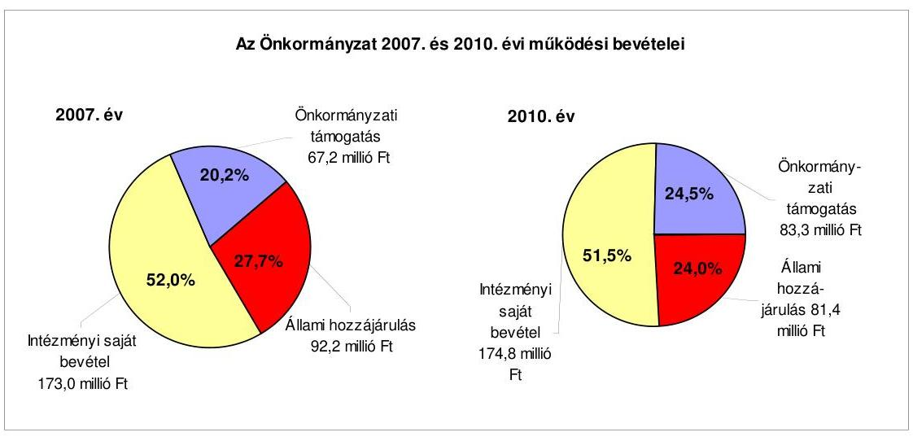

Az Önkormányzat folyó költségvetési egyenlege (működési jövedelem) a 2007., a 2008. és a 2010. években múködési forrástöbbletet, a 2009. évben múködési forráshiányt mutatott. A 2009. évben kialakult negatív értéket (-27,1 millió Ft) elsősorban a helyi adóbevételek elmaradása, valamint a kamatkiadások növekedése okozta. A 2007-2010. évek között a nettó múködési jövedelem folyamatosan negatív volt. Értéke a 2009. évben (-43,3 millió Ft) a negatív múködési jövedelem miatt, a 2010. évben (-42,5 millió Ft) a tőketörlesztés kiugró növekedése miatt jelentősen lecsökkent. A tőketörlesztés 2010. évi emelkedését a 2009. és a 2010. évben felvett hosszú lejáratú hitelek, valamint a 2010. évben felvett rulírozó hitel törlesztése okozták. A finanszírozási műveletek

---

egyenlege a 2007. és a 2009. években negatív, a 2008. és a 2010. években pozitív volt. A 2007. évi negatív egyenleget a hitelek törlesztő részleteinek teljesítésén túl értékpapír vásárlása okozta. Az Önkormányzat a 2008. évben értékesítette értékpapírját ( 20,8 millió Ft), ezáltal javult a finanszírozási múveletek egyenlege.
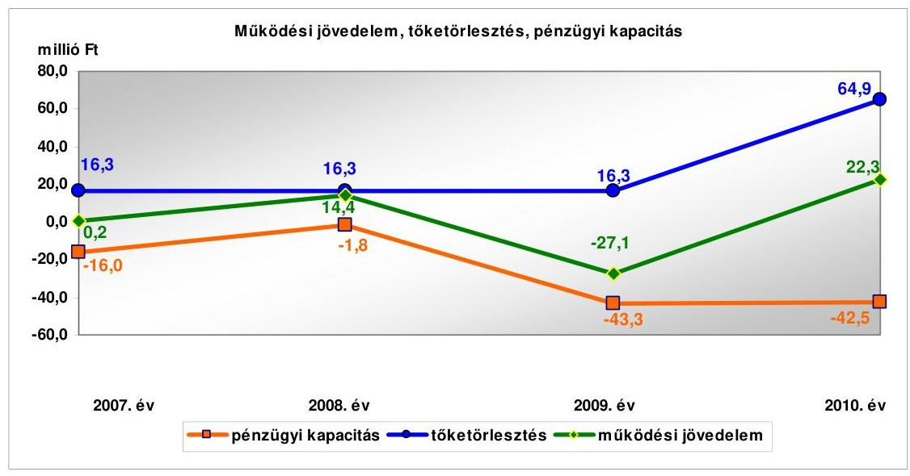

Az Önkormányzat pénzügyi egyensúlya a 2007. és a 2009-2010. években nem volt biztosított, mert a folyó és a felhalmozási költségvetés, valamint a finanszírozási műveletek együttes egyenlege (tárgyévi pénzügyi pozíció) negatív értéket vett fel, a három évben összesen -134,7 millió Ft volt, amelyre a tartalék (előző években képződött pénzmaradvány) nem nyújtott fedezetet. A 2008. évben a folyó költségvetés pozitív egyenlege fedezte a felhalmozási költségvetés hiányát.

Az Önkormányzat pénzügyi helyzetére a 2007-2010. évek között az időszak fejlesztési tevékenysége hatással volt. A 2007-2010. évek közötti 205,3 millió Ft értékű beruházási és felújítási kiadás forrása a saját bevétel, a hazai- és EU-s támogatások mellett 29,7 millió Ft hitel igénybevétele (14,5\%) volt. A 2010. december 31-én folyamatban lévő beruházási, felújítási feladatokra a 2007-2010. évek között 129,3 millió Ft kiadást teljesítettek, amelyre hitelből 29,4 millió Ft-ot (22,7\%) fordítottak. Az Önkormányzat 2010. december 31-én folyamatban lévő fejlesztési feladatainak a 2010. évet követő kötelezettségvállalási összege 292,6 millió Ft volt, amelyből 92,4 millió Ft-ot hitel felvételéből, 168,6 millió Ft-ot EU-s támogatásból, 31,6 millió Ft-ot saját bevételből terveznek biztosítani.

A 2007-2010. évek könyvviteli mérlegeiben a Számv. tv. valódiság számviteli alapelvének figyelmen kívül hagyásával a hosszú és rövid lejáratú kötelezettségek állományának értékét nem támasztották alá a kötelezettségvállalásokról szóló dokumentumokban szereplő összegek. Az eltéréseket - az ÁSZ ellenőrzés ideje alatt - az Önkormányzat feltárta és az 1. számú függelékben szereplő jegyzőkönyv szerint helyesbítette. Az elemzést az Önkormányzat által az ellenőrzés során kimutatott, helyesbített értékek figyelembevételével végeztük el.

---

Az Önkormányzat pénzintézettel szembeni kötelezettsége a 2007. év végéről a 2010. év végére 66,3 millió Ft-ról 86,4 millió Ft-ra nőtt, amelyből árfolyamváltozás miatti különbözet nem volt. A 2010. december 31-én fennálló pénzintézettel szembeni kötelezettségek ( 86,4 millió Ft) négy forintalapú hosszú lejáratú hitelből, valamint munkabér megelőlegezési- és folyószámlahitel igénybevételéből keletkeztek. Az Önkormányzat a 2011. év I. félévében két hosszú lejáratú hitelszerződést kötött, összesen 92,4 millió Ft összegben, amelyből 2011. június 30 -ig nem történt lehívás. A pénzintézettel szembeni kötelezettségek állománya 2011. június 30 -án 82,0 millió Ft volt.

Az Önkormányzat kötelezettségvállalásaira képviselő-testületi döntés alapján került sor, azonban az előterjesztésekben nem mutatták be a változó kamatozású hitelek kamatkockázatát, valamint az adósságot keletkeztető éves kötelezettségvállalás felső határára vonatkozó - Ötv. előírásai szerinti - számításokat. Az Önkormányzat az adósságot keletkeztető kötelezettségvállalásai során az Ötv. előírása ellenére a hitel fedezetének köréből a normatív állami hozzájárulást, az szja-t, valamint az államháztartáson belülről múködési célra átvett bevételeit nem zárta ki.

Az Önkormányzat a 2011. év I. félév végéig az összesen 143,9 millió Ft összegű hitelkeretéből 41,7 millió Ft-ot hívott le, és a hitelcélnak megfelelően a Képvise-lő-testület által jóváhagyott, a költségvetésben tervezett beruházásokhoz használta fel. A 2007-2010. évek között a 2001-ben és a 2005-ben felvett hitelekből (100,0 millió Ft) fennálló tőketartozást ( 65,0 millió Ft) teljes összegében visszafizették.

Az Önkormányzat a költségvetés végrehajtása során a pénzügyi egyensúlyt a 2007-2011. év I. félév között hosszú lejáratú hitel, folyószámlahitel, munkabér megelőlegezési hitel és a 2010. évben rulírozó hitel igénybevételével tudta biztosítani. A likviditás biztosítása az Önkormányzatnak 11,4 millió Ft kamatkiadás és egyéb költség fizetésének kötelezettségét okozta. Az Önkormányzatnak a 2011. év I. félév végi szállítói tartozás állománya 11,1 millió Ft, melynek 100\%-a lejárt tartozás volt. A lejárt szállítói tartozásállományból 1,6 millió Ft 30 napon belüli, 5,5 millió Ft 31 és 60 nap közötti, 1,6 millió Ft 61 és 90 nap közötti, 2,4 millió Ft 91 és 365 nap közötti volt.

Az Önkormányzat két víziközmű társulat hitelei igénybevételéhez készfizető kezességet vállalt 169,9 millió Ft összegben, amelyből beváltás nem történt a 2007-2011. I. félév között.

Az Önkormányzat 2010. december 31-én és 2011. június 30-án fennálló kötelezettségeinek állományát, valamint a 2011-2013. évek között és a 2014. évtől várható kötelezettségek számszerűsített adatait a következő táblázat tartalmazza:

---

Az Önkormányzat kötelezettségeinek állománya 2010. december 31-én és 2011. június 30-án, valamint várható alakulása a kötelezettségek lejáratáig

| Megnevezés | Állomány 2010.   december 31-én |  |  | Állomány 2011.   június 30-án |  |  | Várható   kötelezettség* a   2011-2013. években |  |  | Várható   kötelezettség* a   2014. évtől |  |  |
| :--: | :--: | :--: | :--: | :--: | :--: | :--: | :--: | :--: | :--: | :--: | :--: | :--: |
|  | HUF-ban   (millió Ft) | Devizu   öszeg   ezer... | $\begin{gathered} \text { De- } \\ \text { vizu- } \\ \text { nem } \end{gathered}$ | HUF-ban   (millió Ft) | Devizu-   öszeg   ezer... | De-   vizu-   nem | HUF-ban   (millió Ft) | $\begin{gathered} \text { Devizu- } \\ \text { öszeg } \\ \text { ezer... } \end{gathered}$ | De-   vizu   nem | HUF-ban   (millió Ft) | $\begin{gathered} \text { Devizu } \\ \text { öszeg } \\ \text { ezer... } \end{gathered}$ | De-   vizu-   nem |
| Pénzintézeti kötelezettségek |  |  |  |  |  |  |  |  |  |  |  |  |
| Hoszai lejáratú hitelek | 39,7 |  |  | 38,5 |  |  | 18,2 |  |  | 35,0 |  |  |
| Folyószámlahitel | 38,7 |  |  | 33,5 |  |  | 33,5 |  |  | 0 |  |  |
| Munkabér megelőlegezési hitel | 8,0 |  |  | 10,0 |  |  | 10,0 |  |  | 0 |  |  |
| Pénzintézeti kötelezettségek   összesen HUF-ban: | 86,4 |  |  | 82,0 |  |  | 61,7 |  |  | 35,0 |  |  |
| Biztosítékok |  |  |  |  |  |  |  |  |  |  |  |  |
| Kezesség | 129,8 |  |  | 149,7 |  |  |  |  |  |  |  |  |
| Biztosítékok összesen: | 129,8 |  |  | 149,7 |  |  | 0,0 |  |  |  |  |  |
| Szállítói tartozás | 22,1 |  |  | 11,1 |  |  | 11,1 |  |  |  |  |  |

*A várható kötelezettség tartalmazza a kamatot és egyéb költséget is.
Az Önkormányzatnak a pénzintézettel szemben fennálló kötelezettségállománya a 2011. év I. félév végén 82,0 millió Ft volt. A 2011-2013. években várható összes kötelezettség (tőke, kamat és egyéb költség) a legutóbbi kamatfizetés feltételei alapján 61,7 millió Ft. Az Önkormányzatnak a 2011. évben az előző évben keletkezett szállítói tartozások miatt 22,1 millió Ft fizetési kötelezettsége keletkezett, a szállítói tartozásállomány a 2011. I. félév végén 11,1 millió Ft volt. A 2011-2013. évek kötelezettségeinek teljesítésére figyelembe vehető a mérlegben kimutatott 39,1 millió Ft követelésállomány beszedéséből származó bevétel, valamint a jelzálogjoggal nem terhelt forgalomképes ingatlanvagyon értékesítése esetén befolyó bevétel. A 2014. évtől a jelenleg ismert pénzintézettel szembeni kötelezettség 35,0 millió Ft. Amennyiben az Önkormányzat lehívja a hitelszerződések szerinti hitelkeretek teljes összegét, a 2011-2013. évek várható pénzintézettel szembeni kötelezettsége 11,3 millió Ft-tal, a 2014. évtől várható pénzintézettel szembeni kötelezettsége 132,9 millió Ft-tal emelkedik. A 149,7 millió Ft összegű hitel és járulékai biztosítékaként fennálló kezességvállalás esetleges beváltásából további kötelezettsége keletkezhet. Az Önkormányzat tájékoztatása szerint a pénzintézettel szembeni kötelezettségek fedezetének biztosításáról a Képviselő-testület nem hozott döntést.

Az Önkormányzat a 2007-2011. év I. féléve között kiadási megtakarítást eredményező és bevételt növelő intézkedéseket tett. Az intézkedések hatására 28,8 millió Ft bevételi többletet, továbbá 42,1 millió Ft kiadási megtakarítást mutattak ki. Az Önkormányzat kimutatása szerint a 28,8 millió Ft bevételi növekedést adóhátralékok behajtásával érték el. A kiadáscsökkentéseket intézményátszervezéshez kapcsolódó létszámcsökkentéssel (12 fő tényleges állás-hely-csökkenés), intézményvezetői megbízások visszavonásával, feladatátadással és összevonással érték el.

Az Önkormányzat pénzügyi helyzetét összegezve a következők emelhetők ki:

Az Önkormányzat pénzügyi egyensúlya rövid távon veszélyeztetett. A pénzügyi egyensúlyi helyzet szempontjából kockázatot jelent a szállítói tartozásállomány, a folyószámlahitel év végi állománya és napi átlagos állományának növekvő tendenciája, valamint a munkabér-megelőlegezési hitel folyamatos igénybevétele. Az Önkormányzat 60 és 90 napot meghaladó szállítói tartozás-

---

állománnyal rendelkezett. A folyószámla- és munkabér megelőlegezési hitel igénybevétele tartóssá vált, a 2010. évben 365 napon keresztül folyamatosan fennálltak. A 2007-2010. években a rövid lejáratú kötelezettségek aránya az összes kötelezettségállományon belül átlagosan 68,0\% volt. Az Önkormányzatnál a változó kamatozású hosszú lejáratú hitelek állománya nőtt, felvétele kockázatot hordoz.

Az Önkormányzat a 2007-2010. években, valamint a 2011. év I. félévében nem rendelkezett a fizetőképességének és eladósodásának kezelését szolgáló stratégiával, valamint folyamatosan aktualizált likviditási tervvel. Az Önkormányzat által nyújtott készfizető kezességvállalásból eredő fizetési kötelezettség - az alapjául szolgáló hitel - nem teljesítés esetén az Önkormányzatot terheli. Kezesség beváltására a 2011. év I. félévének végéig nem került sor. A pénzintézettel szembeni és egyéb kötelezettségek visszafizetésének fedezetét az Önkormányzat nem számszerúsítette, arról döntést nem hozott. A Képviselő-testület a zárszámadási rendeletekben évente tájékoztatást kapott az adósságot keletkeztető kötelezettségvállalásokból adódó tőkefizetési kötelezettségekről, azonban a fizetendő kamatokról, egyéb költségekről, a visszafizetés lehetséges forrásáról, a kötelezettségvállalásokkal kapcsolatos kockázatokról nem.

A 2007-2010. években a múködési jövedelem nem biztosította a hiteltörlesztések fedezetét, a pénzügyi kapacitás negatív volt. A folyamatban lévő és tervezett fejlesztéseikhez saját forrás biztosítására vállaltak kötelezettséget, illetve saját bevétel igénybevételét tervezik, amely a negatív nettó múködési jövedelem mellett bizonytalan.

# A belső kontrollok múködése a vagyongazdálkodás folyamataiban 

Az Önkormányzat vagyona a beruházások és felújítások, a vagyonértékesítés és az elszámolt értékcsökkenés együttes hatására a 2007-2010 közötti időszakban 3403,6 millió Ft-ról 3428,2 millió Ft-ra, 24,6 millió Ft-tal ( $0,7 \%$-kal) növekedett. A vagyonváltozást az egyes évek könyvviteli mérlegének adatai, illetve az 1. számú függelékben az Önkormányzat által rögzített korrekciók alapján értékeltük. A kötelezettségek értéke a könyvviteli mérlegben kimutatotthoz képest a 2007. évben 113,8 millió Ft-tal, a 2008. évben 131,1 millió Ft-tal, a 2009. évben 159,8 millió Ft-tal, a 2010. évben 114,2 millió Ft-tal alacsonyabb volt. Az eltéréseket a saját vagyon értékében korrigáltuk. A kötelezettségek állománya ezen időszak alatt 91,5 millió Ft-ról 127,5 millió Ft-ra, 39,3\%-kal (36,0 millió Ft-tal) emelkedett a 2009. évben és a 2010. évben felvett fejlesztési hitelek hatására. Az Önkormányzat az üzemeltetésre átadott eszközök között mutatta ki a saját fenntartású általános iskola épületét (a 2010. évben nettó 17,9 millió Ft) az Áhsz.-ben előírtak ellenére. Nem mutatta ki ugyanakkor üzemeltetésre átadott eszközként a ravatalozó épületét (a 2010. évben nettó 7,3 millió Ft) annak ellenére, hogy 2006. március 1-jén átadásra került a feladatot ellátó gazdasági társaság részére.

A 2007-2010. években a vagyon növekedésének forrását a múködési célú bevételi többlet felhalmozási célra történő fordításával, az előző évi pénzmaradvány felhasználásával és a hosszú lejáratú kötelezettségek állományának növelésével biztosították.

---

A Képviselő-testület a 2007-2010. évek között döntött építési telkek és földterületek értékesítéséről. Az értékesítésekről számlát nem állítottak ki, ezáltal megsértették a Számv. tv., valamint az Áfa tv. előírásait. Az ellenőrzés során a jegy$z o ̊_{2}$ azonnali intézkedést tett a hiányosság megszüntetésére és önrevízió benyújtását rendelte el. Az értékesítésből eredő vagyoncsökkenést a könyvviteli mérlegben nem mutatták be. Az Áhsz. előírása ellenére az értékhelyesbítés összegét évente nem vizsgálták felül, nem vezették át az Önkormányzat vagyonában bekövetkezett változások, az értékesítések miatti csökkenések hatásait.

A 2007-2010. évek között megvalósult fejlesztések 205,3 millió Ft-tal növelték az Önkormányzat könyvviteli mérlegében szereplő vagyon értékét. A Számv. tv. és az Áhsz. előírásai ellenére az elvégzett beruházási, felújítási munkák bekerülési értékének állományba vétele az üzembe helyezést követően nem történt meg.

Az Önkormányzat a 2007-2010. években beruházási, felhalmozási célú hiteleket vett fel a fejlesztési kiadások fedezetének biztosítása érdekében. A felvett hitelek forint alapú hitelek voltak, így az árfolyamváltozás nem befolyásolta az Önkormányzat vagyonának nagyságát.

Az Önkormányzat a tárgyi eszközök felújítására összesen a 2007-2010. években 53,9 millió Ft-ot (a 2007. évben 36,3 millió Ft, a 2008. évben 7,3 millió Ft, a 2009. évben 3,1 millió Ft, a 2010. évben 7,2 millió Ft) fordított, ami az elszámolt 125,0 millió Ft értékcsökkenés $43,1 \%$-a. A Képviselő-testületnek előterjesztett éves zárszámadási rendeleteikben nem mutatták be az Önkormányzat eszközei után tárgyévben elszámolt értékcsökkenés összegét, az eszközpótlásra fordított tényleges kiadásokat, az eszközök elhasználódási fokának alakulását.

A 2007-2010. években az Önkormányzat nem adott át kötelező vagy önként vállalt feladatot egyház, civil szervezet, vállalkozás részére úgy, hogy az a vagyonának nagyságát, összetételét változtatta volna.

A vagyongazdálkodási folyamatok szabályozottságának hiányosságai magas kockázatot jelentettek a feladatok szabályszerű végrehajtásában. A jegyzö ${ }_{1,2}$ az Áht. és az Ámr. előírásai ellenére nem megfelelően alakította ki a vagyongazdálkodási célok eléréséhez szükséges kontrollkörnyezetet.

A jegyző ${ }_{1}$ az Ámr.-ben előírtak ellenére nem készítette el az ellenőrzési nyomvonalat, és az etikus magatartás szabályait tartalmazó etikai kódexet. A jegy$z o ̋_{1,2}$ az Ámr.-ben és a Belső Kontroll Kézikönyv 2. pontjában előírtak ellenére nem határozta meg a csalás, korrupció minősítését. A jegyző ${ }_{1,2}$ nem szabályozta a vagyongazdálkodás főfolyamataira a kockázatokkal kapcsolatos válaszlépéseket, nem írta elő az eszközök forgalomképességének megváltoztatása, továbbá a jegyző ${ }_{1}$ a vagyonnal kapcsolatos döntési határkör átruházások esetében az ellenőrzési és a beszámolási kötelezettséget.

A jegyző ${ }_{1}$ az Áhsz. előírásai ellenére a leltározási és leltárkészítési szabályzatban nem határozta meg az üzemeltetésre, vagyonkezelésre átadott eszközök leltározásának módját. A Képviselő-testület nem írta elő a vagyon értékesítésével és hasznosításával kapcsolatban a döntés előkészítés folyamatában a költség-haszonelemzés készítésének kötelezettségét. A jegyző ${ }_{1,2}$ nem írta elő a ver-

---

senyeztetés elvégzésének ellenőrzését, továbbá az Önkormányzat érdekeinek védelmét szolgáló garanciális elemek szerződésben, egyéb dokumentumban való rögzítésének kötelezettségét.

A jegyző́ 1,2 a finanszírozási célú pénzügyi műveletekkel kapcsolatban nem szabályozta a pénzügyi kockázatok felmérésének kötelezettségét, a hitelfelvételek döntés előkészítés folyamatában a futamidő egyes éveit terhelő kötelezettség költségvetési egyensúlyra gyakorolt hatásának vizsgálati kötelezettségét. A Képviselő-testület nem írt elő a Pénzügyi bizottság részére beszámolási kötelezettséget a vagyonváltozás figyelemmel kísérésének eredményéről. A jegyző ${ }_{1,2}$ nem határozta meg a vagyongazdálkodási folyamatok rögzítésére használt informatikai programok adatai használatára vonatkozó követelményeket.

A jegyző ${ }_{1}$ az Áht. és az Ámr. előírásai ellenére hiányosan alakította ki a Polgármesteri hivatal belső kontrollrendszerét. A FEUVE rendszer múködtetéséhez nem írta elő a vezetői ellenőrzési kötelezettséget, valamint a vagyongazdálkodási folyamatokról a beszámolási kötelezettséget, és nem jelölte ki a finanszírozási célú pénzügyi műveletek folyamatainak ellenőrzésért felelős személyeket. A jegyző ${ }_{1,2}$ a belső kontrollrendszer keretében nem határozta meg a bevételeket megalapozó döntések szerződésben történő felülvizsgálatának feladatai között annak ellenőrzési kötelezettségét, hogy a szerződés tartalmazza-e a döntési hatáskörrel rendelkező által meghatározott feltételeket, a szerződésben az arra határkörrel rendelkező vállalt-e kötelezettséget. A jegyző ${ }_{1,2}$ nem jelölte ki a bevételeket megalapozó döntésekben meghatározott feltételek szerződésben történő érvényesítése ellenőrzésének végrehajtásáért felelős személyeket, így nem írta elő az ingatlanértékesítési és a hitelviszonyt megtestesítő értékpapírértékesítési szerződésekben foglaltak ellenőrzését.

A jegyző ${ }_{1}$ az Ámr.-ben foglaltak ellenére nem írta elő a szakmai teljesítésigazolás eljárási és dokumentációs szabályai közül a bizonylatokra vezetendő rájegyzés módját. A jegyző ${ }_{1}$ nem alakította ki a vagyongazdálkodás külső és belső információi kezelésének rendjét. A jegyző ${ }_{1}$ nem határozta meg a nettó ötmillió Ft-ot elérő, vagy azt meghaladó vagyonváltozást eredményező szerződések adatainak (a szerződés megnevezésének, tárgyának, a szerződést kötő felek nevének, a szerződés értékének, az adatok változásainak és határozott időtartamú szerződések esetében az időtartamának) közzétételének rendjét. A jegyző ${ }_{1,2}$ nem határozta meg a szabálytalanságok kezelésére vonatkozó eljárásrendben a vagyongazdálkodási folyamatok során észlelt szabálytalanságokra vonatkozó feladatokat, a jegyző ${ }_{1}$ nem írta elő a belső kontrollrendszer évenkénti felülvizsgálatát.

A jegyző ${ }_{2}$ elkészítette az ellenőrzési nyomvonalat a FEUVE szabályzat részeként, valamint az etikus magatartással kapcsolatos elvárások meghatározását tartalmazó etikai kódexet. A jegyző ${ }_{2}$ a gazdálkodási szabályzatban előírta az ellenőrzési kötelezettséget a vagyongazdálkodási döntési hatáskör vizsgálatára. A jegyző ${ }_{2}$ kezdeményezése alapján a Képviselő-testület előírta a beszámolási kötelezettséget az átruházott hatáskörben hozott döntésekről. A jegyző ${ }_{2}$ a leltározási és leltárkészítési szabályzatban meghatározta az üzemeltetésre átadott eszközök leltározásának módját. A jegyző ${ }_{2}$ a FEUVE szabályzatban előírta a döntés-előkészítés folyamatában a vagyon értékesítésével és hasznosításával kapcsolatban a költség-haszonelemzés készítésének kötelezettségét. A jegyző ${ }_{2}$ a

---

FEUVE szabályzatban kialakította a Polgármesteri hivatal belső kontrollrendszerét, a FEUVE múködéséhez előírta a vezetői ellenőrzési kötelezettséget. A jegyző́ a gazdálkodási szabályzatban meghatározta a szakmai teljesítésigazolás megtörténte dokumentálásának, a bizonylatokra történő rájegyzésének módját. A jegyző ${ }_{2}$ a vagyongazdálkodási rendeletben előírta a vagyongazdálkodás külső és belső információi kezelésének és a vagyongazdálkodással összefüggő közérdekű (közzéteendő) adatok kezelésének rendjét. A jegyző ${ }_{2}$ a FEUVE szabályzatban meghatározta a vagyongazdálkodási folyamatokra vonatkozó követési módszereket, a belső kontrollrendszer évenkénti felülvizsgálatát.

A Polgármesteri hivatalban a 2010. évben és a 2011. év I. félévében a vagyongazdálkodási folyamatokban a kontrollok múködése gyenge volt, a belső kontrollok múködése nem biztosította a vagyongazdálkodás eredményességét. Nem értékelték a vagyongazdálkodás folyamatában a külső és belső kockázatokat. Nem végezték el a kockázatok azonosítását és értékelését, továbbá a csalás, korrupció minősítését, nem hozták meg a felmerült kockázatokra a szükséges válaszlépéseket. Nem készítettek költség-haszonelemzést az ingatlanértékesítéseket megelőzően, nem végezték el a vagyongazdálkodási rendeletben előírt versenyeztetés ellenőrzését. A Pénzügyi bizottság az Ötv.-ben foglalt kötelezettsége ellenére a vagyonváltozás alakulását előidéző okokat nem értékelte, a hitelfelvétel indokainak és gazdasági megalapozottságának vizsgálatát nem végezte el. A finanszírozási célú pénzügyi műveletekkel kapcsolatos döntések előkészítési folyamatában nem mérték fel és nem számszerűsítették a pénzügyi kockázatokat, nem vizsgálták a futamidő egyes éveit terhelő kötelezettségvállalás költségvetési egyensúlyra gyakorolt hatását. A jegyző ${ }_{1}$ a belső kontrollrendszer évenkénti felülvizsgálatát nem biztosította, az Áht.-ban, valamint az Ámr.ben előírtak ellenére nem készített nyilatkozatot a belső kontrollrendszer minőségének, múködésének értékeléséről.

A jegyző ${ }_{2}$ az Áht. előírása ellenére nem gondoskodott a vagyongazdálkodással kapcsolatos nettó ötmillió Ft-ot elérő vagy meghaladó szerződések közérdekű adatainak (a szerződés megnevezésének, tárgyának, a szerződést kötő felek nevének, a szerződés értékének, az adatok változásainak és határozott időtartamú szerződések esetében az időtartamának) közzétételéről, nem múködtette a vezetői információs rendszert. Vezetői ellenőrzés keretében nem számoltatta be a vagyongazdálkodási feladatokat végzőket a vagyonértékesítés, vagyonhasznosítás folyamatairól, annak eredményéről, a finanszírozási célú pénzügyi műveletek végrehajtásának folyamatáról és a végrehajtás eredményéről. A vagyongazdálkodási feladatok ellátásával megbízott köztisztviselők nem tartották be a beszámolásra vonatkozó szabályokat, a kötelező mérlegegyezőségek biztosítását, a nyilvántartások folyamatos vezetését, aktualizálását. A vezetői információs szabályzat előírása ellenére a vezetői információs rendszert nem múködtették, a vagyongazdálkodás folyamataiban, a vagyongazdálkodási folyamatok megfigyelését, nyomon követését a belső szabályozásban nem írták elő, nem végezték el.

A Polgármesteri hivatalban a 2010. évben és a 2011. év I. félévében az ingatlanok értékesítéséből származó bevételek, valamint az ingatlanok felújításával, a non-profit szervezeteknek átadott múködési célú pénzeszközökkel és a bérletlés lízingdíjakkal kapcsolatos kifizetések során összefoglalóan értékelve a

---

kulcsszerepet betöltő belső kontrollok múködése gyenge volt. A kontrollok múködése nem biztosította a vagyongazdálkodás eredményességét.

Az ingatlanok felújítására, az államháztartáson kívülre non-profit szervezeteknek átadott múködési célú pénzeszközökre, bérleti- és lízingdíjakra fordított kiadások teljesítését megelőzően a kötelezettségvállalásokat - az Áht. és az Ámr. előírása ellenére - nem előzte meg azok ellenjegyzése. A jegyző ${ }_{1}$ által kötelezettségvállalás ellenjegyzésére feljogosított személy - az Ámr. előírásai - ellenére a kötelezettségvállalás előtt nem ellenőrizte a kiadási előirányzat rendelkezésre állását, a fedezet meglétét, és nem vizsgálta, hogy a kötelezettségvállalás sérti-e a gazdálkodásra vonatkozó szabályokat. A szakmai teljesítés igazolását - az Ámr. előírása ellenére - a kiadások teljesítését megelőzően nem végezték el a jegyző ${ }_{1}$ által kijelölt személyek, ezáltal elmaradt a kifizetés jogosságának, összegszerűségének és szerződésszerű teljesítésének az ellenőrzése. A jegyző ${ }_{1}$ által utalvány ellenjegyzésére feljogosított személy az Ámr.-ben foglaltak ellenére nem kifogásolta, hogy a szakmai teljesítésigazolás nem történt meg. A jegyző ${ }_{1}$ által utalvány ellenjegyzésére feljogosított személy az Ámr.-ben előírtak ellenére írásban nem tájékoztatta a kötelezettségvállalásra jogosultat - a polgármestert - arról, hogy kötelezettségvállalása nem felel meg gazdálkodásra vonatkozó szabályoknak, amennyiben azt az Áht.-ban és az Ámr.-ben előírtak figyelmen kívül hagyásával ellenjegyzés nélkül tette meg.

A bevételeket megalapozó szerződések aláírását megelőzően - kijelölés hiánya miatt - nem ellenőrizték, hogy az ingatlanok értékesítéséből származó bevételek a Képviselő-testület által meghatározott feltételeknek megfelelnek-e, továbbá, hogy az Önkormányzat érdekeit védő garanciális elemek a szerződésben szerepelnek-e. A gazdálkodási szabályzatban előírtak ellenére az utalvány ellenjegyzésére jogosult személy az utalványt nem ellenjegyezte, így nem végezte el az Ámr.-ben előírt ellenőrzési feladatokat. A bevételt megalapozó szerződések ellenőrzésének és az utalvány ellenjegyzésének elmaradása miatt nem ellenőrizték a gazdálkodásra vonatkozó szabályok betartását, ami hozzájárult ahhoz, hogy az ingatlanértékesítésekről az Áfa tv., valamint a Számv. tv. előírásait megsértve nem állítottak ki számlát.

Az Állami Számvevőszékről szóló 2011. évi LXVI. törvény 33. § (1) bekezdésében foglaltak értelmében a jelentésben foglalt megállapításokhoz kapcsolódó intézkedési tervet köteles az ellenőrzött szervezet vezetője összeállítani és azt a jelentés kézhezvételétől számított harminc napon belül az ÁSZ részére megküldeni. Amennyiben az intézkedési tervet határidőben nem küldi meg a szervezet, vagy az továbbra sem elfogadható, az ÁSZ elnöke a hivatkozott törvény 33. § (3) bekezdés a) - b) pontjaiban foglaltakat érvényesítheti.

# Az ellenőrzés intézkedést igénylő megállapításai és javaslatai 

## a Polgármesternek

1. Az Önkormányzatnál a pénzügyi egyensúly biztosítása szempontjából kockázatot jelent a növekvő folyószámla- és munkabér megelőlegezési hitelállomány állandósulása és a felhalmozódott lejárt szállítói tartozásállomány. További kockázatot jelent a fennálló hosszú lejáratú hitelek változó kamatozása, valamint az Önkormányzat ke-

---

zességvállalásai. A döntési hatáskörrel rendelkezők nem kaptak tájékoztatást az adósságot keletkeztető kötelezettségvállalásokból adódó fizetendő kamatokról, egyéb költségekről, a visszafizetés lehetséges forrásáról, a kötelezettségvállalásokkal kapcsolatos kockázatokról. A pénzintézettel szembeni és egyéb kötelezettségek visszafizetésének fedezetét az Önkormányzat nem számszerúsítette. A 2007-2010. években a pénzügyi kapacitás negatív volt. A folyamatban lévő és tervezett fejlesztéseikhez saját forrás biztosítására vállaltak kötelezettséget, illetve saját bevétel igénybevételét tervezik, amely a negatív nettó múködési jövedelem mellett bizonytalan. A Képvise-lő-testületnek előterjesztett éves zárszámadási rendeleteikben nem mutatatták be az Önkormányzat eszközei után tárgyévben elszámolt értékcsökkenés összegét, az eszközpótlásra fordított tényleges kiadásokat, az eszközök elhasználódási fokának alakulását. A számviteli nyilvántartások szerint elszámolt értékcsökkenésnek 43,1\%-át fordították felújításra a 2007-2010. évek között.

Javaslat
a) Terjesszen a Képviselő-testület elé reorganizációs programot a kedvezőtlen pénzügyi folyamatok megállítására, a pénzügyi helyzet gyors stabilizálására, és hosszú távú fenntarthatóságára, amely tartalmazza különösen:
aa) a kiadások mérséklésére (a kiadási szerkezet áttekintésével), a kiadások folyamatos kontrolljára, a bevételek növelésére és a kintlévőségek behajtására vonatkozó intézkedéseket,
ab) a likviditás menedzselésének racionalizálását,
ac) a lehetséges megtakarításokból származó források tartalékba helyezésének kötelezettségét.
b) Intézkedjen az Önkormányzat lejárt szállítói tartozásállományának pénzügyi rendezéséről, a szállítói függőség és a jogszabályi következmények elkerülése érdekében;
c) Mutassa be a Képviselő-testületnek havonta a fél éven belül esedékes kötelezettségeinek finanszírozási forrásait napra lebontott likviditási tervvel alátámasztottan;
d) Tájékoztassa a döntési hatáskörrel rendelkezőket a zárszámadási rendeletekben évente az adósságot keletkeztető kötelezettségvállalásokból adódó kamatokról, egyéb költségekről, a kötelezettségvállalásokkal kapcsolatos jövőben várható -kamat- és törlesztési - kockázatokról, a kezességvállalás pénzügyi kockázatairól;
e) Tegyen intézkedést arra, hogy a jövőben az adósságot keletkeztető kötelezettségvállalásokról szóló képviselő-testületi előterjesztések tételesen tartalmazzák a visszafizetés forrásait;
f) Vizsgálja felül teljes körűen a folyamatban lévő és tervezett fejlesztéseket, mutassa be a Képviselő-testületnek azok megvalósításának pénzügyi hatásait a finanszírozás forrásainak meghatározásával;
g) Mutassa be a Képviselő-testületnek évente a zárszámadási rendelet előterjesztésében a tárgyi eszközök értékcsökkenésének összegét, és ezzel összevetve az el-

---

használódott eszközök pótlására fordított tényleges kiadásokat, az eszközök elhasználódási fokának alakulását.
2. Az Önkormányzatnál az ingatlanok felújítására, az államháztartáson kívülre nonprofit szervezeteknek átadott múködési célú pénzeszközökre és a bérleti- és lízingdíjakkal kapcsolatos kifizetésekre a 2010. évben és a 2011. év I. félévében teljesített kifizetések esetében az Áht. 100/C. § (3) bekezdésében és az Ámr. 74. § (1) bekezdésében foglalt előírások ellenére a kötelezettségvállalásokat nem előzte meg azok ellenjegyzése.

Javaslat
Biztosítsa az új Áht. 37. § (1) bekezdése és az Ávr. 52. § (1) bekezdés c) pontjában előírtak betartását, mely szerint kötelezettségvállalásra annak pénzügyi ellenjegyzését követően kerülhet sor, ezáltal biztosítsa az Ötv. 90. § (1) bekezdése alapján az önkormányzati vagyongazdálkodási feladatok esetében a szabályszerű gazdálkodást.
3. A Pénzügyi bizottság nem tett eleget az Ötv. 92. § (13) bekezdés b)-c) pontjaiban és (14) bekezdésében foglalt kötelezettségének, mert az előírás ellenére a vagyonváltozás alakulását nem értékelte, valamint nem vizsgálta a hitelfelvételhez kapcsolódó döntést megelőzően a hitelfelvétel indokait és gazdasági megalapozottságát.

Javaslat
Kezdeményezze, hogy a Pénzügyi bizottság az Ötv. 92. § (13) bekezdés b)-c) pontjaiban és (14) bekezdésében foglalt feladatainak tegyen eleget és értékelje a vagyonváltozás alakulását, valamint vizsgálja a hitelfelvételhez kapcsolódó döntést megelőzően a hitelfelvétel indokait és gazdasági megalapozottságát.
4. A Képviselő-testület nem írta elő a vagyonértékesítéssel és hasznosítással kapcsolatban, a döntés-előkészítés folyamatában a költség-haszonelemzés készítésének kötelezettségét.

Javaslat
Kezdeményezze, hogy a Képviselő-testület írja elő a vagyonértékesítéssel és hasznosítással kapcsolatban, a döntés-előkészítés folyamatában a költség-haszonelemzés készítésének kötelezettségét.

---

# a jegyzőnek 

1. Az adósságot keletkeztető kötelezettségvállalásokhoz kapcsolódó képviselő-testületi döntéseket megalapozó előterjesztések nem tartalmazták az Ötv. 88. § (2) bekezdése szerinti felső korlátra vonatkozó számításokat.

Javaslat
Intézkedjen arról, hogy az adósságot keletkeztető kötelezettségvállalásokhoz kapcsolódó képviselő-testületi döntéseket megalapozó előterjesztések tartalmazzák a Stabilitási tv. 10. § (3) bekezdésében foglalt előírások (tárgyévi összes fizetési kötelezettség a futamidő végéig egyik évben sem haladhatja meg az adott évi saját bevétel $50 \%$-át) betartását megalapozó számításokat.
2. A 2007-2010. évek könyvviteli mérlegeiben az Önkormányzat a hosszú és rövid lejáratú kötelezettségek állományának értékét nem támasztotta alá a kötelezettségvállalásokról szóló dokumentumokban szereplő összegekkel, figyelmen kívül hagyva a Számv. tv. 15. § (3) bekezdésében foglalt valódiság számviteli alapelvére vonatkozó szabályozást.

Javaslat
Gondoskodjon a Számv. tv. 15. § (3) bekezdésében foglalt valódiság számviteli alapelv érvényesülése érdekében, hogy a könyvviteli mérlegekben szerepeltetett hosszú és rövid lejáratú kötelezettségek állományi értékeit támasszák alá a kötelezettségvállalásról szóló dokumentumokban szereplő, az Áhsz. 36. §-ában foglalt értékelési szabályok figyelembevételével megállapított összegek.
3. Az Áht. 121/A. § (1) és (4) bekezdésében, valamint az Ámr. 155. § (1) bekezdésében foglaltak ellenére hiányosan alakították ki a Polgármesteri hivatal belső kontrollrendszerét. Nem írták elő a bevételeket megalapozó döntések szerződésben történő felülvizsgálatának feladatai között annak ellenőrzési kötelezettségét, hogy a szerződés megfelelően tartalmazza-e a döntési hatáskörrel rendelkező által meghatározott feltételeket, valamint, hogy a szerződésben az arra hatáskörrel rendelkező vállalt-e kötelezettséget. A vagyon értékesítésére, hasznosítására vonatkozóan nem szabályozták a versenyeztetés elvégzésének ellenőrzését, nem írták elő vagyon forgalomképessége megváltoztatásának módjára vonatkozó előírások betartásának ellenőrzését. Nem írták elő az Önkormányzat érdekeit védő garanciális elemek szerződésben való rögzítésének kötelezettségét.

Javaslat
Folytassa a vagyongazdálkodási folyamatokban a kontrollok szabályozottságának biztosítása és a belső kontrollrendszer kialakítása érdekében tett intézkedéseket, múködtesse az új Áht. 69. § (2) és az új Ber. 8. § (2) bekezdésében foglaltak alapján a Polgármesteri hivatal belső kontrollrendszerét. Határozza meg a kontrolltevékenységeket, ennek keretében a folyamatba épített előzetes, utólagos, és vezetői ellenőrzést.

---

4. Az Áhsz. 32/A. §-ában előírtak ellenére az értékhelyesbítés összegét évente nem vizsgálták felül, nem vezették át az Önkormányzat vagyonában bekövetkezett változások, az értékesítések miatti csökkenések hatásait.

Javaslat
Intézkedjen arról, hogy évente vizsgálják felül az Áhsz. 32/A. §-ában előírtak szerint az értékhelyesbítés összegét és a felülvizsgálat eredményeként a szükséges módosításokat a számviteli nyilvántartásokban rögzítsék.
5. Az Önkormányzat a saját fenntartású iskola épületét az üzemeltetésre, kezelésre átadott eszközök között szerepeltette a 2007-2010. évek könyvviteli mérlegeiben az Áhsz. 20. § (1) bekezdésében előírtak ellenére. Nem szerepelt ugyanakkor - a közszolgáltatási szerződésben rögzítettek ellenére - az üzemeltetésre, kezelésre átadott eszközök között a ravatalozó épületének értéke.

Javaslat
Gondoskodjon arról, hogy az Áhsz. 20. § (1) bekezdésében előírtak alapján vizsgálják felül az üzemeltetésre, kezelésre átadott eszközök könyvviteli mérlegben szerepeltetett állományát és a szükséges módosításokat (az iskola és a ravatalozó épülete) a számviteli nyilvántartásokban rögzítsék.
6. A befejezetlen beruházások állományából a Számv. tv. 26. § (7) bekezdése és az Áhsz. 9. számú melléklete 1. g) pontja előírása ellenére az időközben elkészült egyes fejlesztéseket üzembe helyezésüket követően nem vezették ki, nem aktiválták.

Javaslat
Tegyen intézkedést arra, hogy a befejezetlen beruházások állományából vezessék ki, vegyék állományba a Számv. tv. 26. § (7) bekezdése és az Áhsz. 9. számú melléklete 1. g) pontja előírása alapján az időközben elkészült fejlesztéseket.
7. Az Áht. 15/B. § (1) bekezdésében előírtak ellenére nem gondoskodott a vagyongazdálkodással kapcsolatos nettó ötmillió Ft-ot elérő vagy azt meghaladó szerződések közérdekű adatainak (a szerződés megnevezésének, tárgyának, a szerződést kötő felek nevének, a szerződés értékének, az adatok változásainak és határozott időtartamú szerződések esetében az időtartamának) közzétételéről.

Javaslat
Tegye közzé az új Eisztv. 32. és 33. §-aiban és a 37. § (1) bekezdésében előírtaknak megfelelően a vagyongazdálkodással kapcsolatos nettó ötmillió Ft-ot elérő vagy azt meghaladó szerződések közérdekű adatait (a szerződés megnevezését, tárgyát, a szerződést kötő felek nevét, a szerződés értékének, az adatok változásait és határozott időtartamú szerződések esetében az időtartamát).
8. A kockázatkezelési szabályzatban az Ámr. 157. § (3) bekezdésben foglalt előírás ellenére nem határozták meg a vagyongazdálkodás főfolyamatára a kockázatokkal kapcsolatos válaszlépéseket, az Ámr. 157. § (1) bekezdésében, és a Belső Kontroll Kézikönyv 2. pontjában előírtak ellenére nem határozták meg a csalás, korrupció kocká-

---

zatának minősítését, nem határozták meg a vagyongazdálkodási folyamatok rögzítésére használt informatikai programok adatai használatára vonatkozó követelményeket, valamint a szabálytalanságok kezelésére vonatkozó eljárásrendben a vagyongazdálkodási folyamatok során észlelt szabálytalanságokkal kapcsolatos feladatokat.

Javaslat
Határozza meg az új Ber. 7. §-ában foglalt előírás figyelembevételével a vagyongazdálkodás főfolyamatára a kockázatokkal kapcsolatban szükséges intézkedéseket. Továbbá intézkedjen arról, hogy az új Ber. 7. §-ában és a Belső Kontroll Kézikönyv 2. pontja alapján a kockázatkezelési szabályzat módosításával a csalás és korrupció bekövetkeztének kockázatának minősítését végezzék el, határozza meg a Polgármesteri hivatal adatvédelmi szabályzatában a vagyongazdálkodási folyamatok rögzítésére használt informatikai programok adatai használatára vonatkozó követelményeket, valamint a szabálytalanságok kezelésére vonatkozó eljárásrendben a vagyongazdálkodási folyamatok során az észlelt szabálytalanságokkal kapcsolatos feladatokat.
9. Nem tartották be a vagyongazdálkodás külső és belső információi kezelésének az iratkezelési szabályzatban előírt rendjét, mert a vagyongazdálkodási feladatokat ellátó köztisztviselők az iratkezelési szabályzat ellenére nem irattározták a vagyongazdálkodással kapcsolatban keletkezett iratokat.

Javaslat
Intézkedjen a vagyongazdálkodás külső és belső információi kezelésének az iratkezelési szabályzatban előírt rendjének betartásáról.
10. A vezetői információs szabályzat előírásai ellenére nem működtették megfelelően a vezetői információs rendszert, a vagyongazdálkodási információkat nem továbbították az egyes szervezeti szintek között.

Javaslat
Intézkedjen a vezetői információs szabályzat valamennyi előírásának betartásáról.
11. Az Ámr. 76. § (1) bekezdése ellenére a szakmai teljesítésigazolást nem végezték el, ezáltal elmaradt a kifizetés jogosságának, összegszerűségének és szerződésszerű teljesítésének az ellenőrzése. Az Ámr. 79. § (2) bekezdésében foglaltak ellenére az utalvány ellenjegyző́je nem ellenőrizte a szakmai teljesítésigazolás elvégzését, valamint nem kifogásolta, hogy a kifizetésekhez kapcsolódó kötelezettségvállalást az Ámr. 74. § (1) bekezdésében foglaltak ellenére nem előzte meg annak ellenjegyzése. Továbbá nem észrevételezte, hogy az Ámr. 78. § (2) bekezdés g) pontja ellenére nem tüntették fel a kötelezettségvállalás nyilvántartási számát.

Javaslat
a) Biztosítsa, hogy a jegyző által kijelölt személy az Ávr. 57. § (1) bekezdésének megfelelően a szakmai teljesítésigazolást végezze el;
b) Intézkedjen arról, hogy az érvényesítő az Ávr. 58. § (2) bekezdésben előírt kötelezettségének eleget téve az utalványozónak jelezze, ha az Ávr. 58. § (1) bekez-

---

désében előírt ellenőrzési feladatai során a jogszabályok, szabályzatok megsértését tapasztalja;
c) Biztosítsa, hogy az Ávr. 59. § (3) bekezdés f) pontjában foglalt előírásnak megfelelően a külön írásbeli rendelkezésen tüntessék fel a kötelezettségvállalás nyilvántartási számát;
d) Kezdeményezze az éves ellenőrzési terv módosítását annak érdekében, hogy a belső ellenőrzés teljes körűen végezze el a belső kontrollok múködésének értékelését a 2007-2011. év I. félév közötti időszakra vonatkozóan. A belső ellenőrzés terjedjen ki az ingatlanértékesítés bevételeire, valamint az ingatlanok felújítása, az államháztartáson kívülre non-profit szervezeteknek átadott müködési célú pénzeszközök, valamint a bérleti- és lízingdíjak kifizetéseire annak tekintetében, hogy a kijelölt, illetve felhatalmazott személyek - kiemelten a szerződések ellenőrzésére kijelölt személy, a kötelezettségvállalások ellenjegyzője, az utalványok ellenjegyzője és a szakmai teljesítések igazolója - valamennyi bevétel és kiadás esetében elvégezték-e a jogszabályokban előírt ellenőrzési feladataikat.

---

# II. RÉSZLETES MEGÁLLAPÍTÁSOK 

## 1. A PÉNZÜGYI EGYENSÚLY, A FIZETŐKÉPESSÉG, A GAZDÁLKODÁS STABILITÁSÁNAK BIZTOSÍTÁSA, AZ ADÓSSÁGKEZELÉS EREDMÉNYESSÉGE

Az Önkormányzat az éves költségvetési beszámolója szerint a 2010. évben 452,7 millió Ft költségvetési bevételt ért el és 461,5 millió Ft költségvetési kiadást teljesített. A 2011. évi költségvetési rendeletben ${ }^{9} 618,7$ millió Ft költségvetési bevételt és 688,1 millió Ft költségvetési kiadást irányoztak elő.

Az Önkormányzat által ellátott kötelező és önként vállalt feladatokat az SzMSz tartalmazta, amely szerint az Önkormányzat köteles gondoskodni az egészséges ivóvízellátásról, az óvodai nevelésről, az általános iskolai nevelésről és oktatásról, az egészségügyi és szociális alapellátásról, a közvilágításról, a helyi közutak és köztemető fenntartásáról, a könyvtári szolgáltatásról, Közösségi Ház fenntartásáról. Kötelező feladatai mellett az SzMSz-ben önként vállalt feladatként határozták meg az alapfokú művészetoktatást, valamint az alap- és középfokú iskolai tanulók képesség-, tehetség-, továbbá személyiség vizsgálatával és fejlesztésével, pedagógiai tanácsadással kapcsolatos szolgáltatásokat. A 2007-2011. év I. félév között az önkormányzati igazgatási feladatokat a Polgármesteri hivatal, 2007. szeptember 1-je és 2011. június 30-a között a nevelési, a közoktatási és a közművelődési feladatokat a többcélú Csobánkai Közösségi Műhely látta el ${ }^{10}$, önállóan múködő és gazdálkodó költségvetési szervként.

A házi segítségnyújtást, az idősek nappali ellátását, valamint a belső ellenőrzési feladatokat a Kistérségi Társulás végezte a 2007-2011. év I. félév között. Az Önkormányzat a gyermekjóléti szolgálat feladatainak ellátására 1999. április 29-én társulási megállapodást kötött Pomáz Nagyközség és Pilisszentkereszt Község Önkormányzatával, a feladatot Pomáz Gyermekjóléti Szolgálata látta el. A családsegítő szolgáltatást a Pomáz-Csobánka-Pilisszentkereszt Önkormányzati Társulás keretében biztosították. A családsegítő intézményi társulást 2006. július 31-ei hatállyal hozták létre. Az Önkormányzatnál a hulladékgazdálkodási feladatokat a 2004. június 29-én kötött társulási megállapodás alapján a Duna-Vértes Köze Regionális Hulladékgazdálkodási Társulás végezte. 2006. február 2-án a temetőüzemeltetési feladatok ellátásra kegyeleti közszolgáltatási szerződést kötöttek egy gazdasági társasággal. A Polgármesteri hivatalban ellátott elsőfokú építéshatósági feladatokat 2010. március 1-jétől kezdődően átadták Szentendre Város Önkormányzatának.

[^0]
[^0]:    ${ }^{9} 5 / 2011$. (II. 25.) számú rendelet
    ${ }^{10}$ Az Önkormányzat 2007. január 1-jétől 2007. szeptember 1-jéig a közoktatási és nevelési feladatokat egy önállóan és egy részben önállóan gazdálkodó intézményével, a közművelődési feladatokat egy részben önállóan gazdálkodó intézményével látta el.

---

A Polgármesteri hivatalban foglalkoztatott köztisztviselők száma 2007. január 1-jén 16 fő, 2011. január 1-jén 12 fő, a költségvetési szerveknél foglalkoztatott közalkalmazottak száma 2007. január 1-jén 48 fő, 2011. január 1-jén 42 fő volt.

A 2010. évi múködési kiadások ${ }^{11}$ feladat-csoportonkénti megoszlását, azok forrásait, valamint a kötelező feladatok kiadásainak részarányát az alábbi táblázat mutatja be:

| Ellátott feladat | Múködési   kiadás   összesen   (millió Ft) | Kötelező   feladatok   kiadásainak   részaránya   $\%$ | Múködési   bevétel   összesen   (millió Ft) | Állami   támogatás   részaránya   $\%$ | Intézményi   saját bevétel   részaránya   $\%$ | Önkormányzati   támogatás   részaránya \% |
| :--: | :--: | :--: | :--: | :--: | :--: | :--: |
| Óvodai | 56,5 | 100,0 | 56,5 | 37,6 | 5,7 | 56,7 |
| Általános iskolai | 80,1 | 88,5 | 80,1 | 45,4 | 5,1 | 49,5 |
| Közművelődési | 12,2 | 100,0 | 12,2 | 0,0 | 5,2 | 94,8 |
| Polgármesteri hivatal igazgatási   feladatai | 60,8 | 100,0 | 60,8 | 0,0 | 100,0 | 0,0 |
| Polgármesteri hivatal egyéb   feladatai | 129,9 | 99,3 | 129,9 | 18,3 | 81,7 | 0,0 |
| Múködési kiadások összesen | 339,5 | 97,0 | 339,5 | 24,0 | 51,5 | 24,5 |

Az Önkormányzat a 2010. évi múködési kiadásaiból - kimutatása szerint 329,4 millió Ft-ot ( $97,0 \%$ ) kötelező feladataira, 10,1 millió Ft-ot (3,0\%) önként vállalt feladataira fordított. Önként vállalt feladatként látta el az alapfokú múvészetoktatást és a 2009/2010., valamint a 2010/2011. tanévben szakiskolai feladatokat az általános iskola keretén belül, valamint a Polgármesteri hivatalban az elsőfokú építéshatósági feladatokat 2010. március 1-jéig.

Az ellenőrzés során a pénzügyi helyzet értékelésének, elemzésének elvégzéséhez rendelkezésre álló, az Önkormányzat MÁK-hoz benyújtott éves költségvetési beszámolóiban szereplő, a 2007-2010. évekre vonatkozó adatok korrekciója vált szükségessé. A hitelfelvételek és a hiteltörlesztések könyveléséből eredő számszaki hibákat, valamint a könyvviteli mérlegben kimutatott rövid és hosszú lejáratú kötelezettségek állományában szereplő hibákat az Önkormányzat feltárta és az 1. számú függelékben szereplő jegyzőkönyv szerint helyesbítette. Az elemzést az Önkormányzat által az ellenőrzés során kimutatott, helyesbített értékek figyelembevételével végeztük el.

A Polgármester ${ }_{2}$ az ÁSZ tv. 29. § (2) bekezdésében foglaltak alapján az alábbi észrevételt tette: „.... a valódiság elvének sérülésére mutatnak rá. Kérem, hogy kerüljön bele a jelentésbe, hogy 2007-2011 közötti időszakban egyetlen könyvvizsgálói jelentés sem jelzett ilyen hibát. Könyvvizsgálói észrevétel a többi hibát illetően sem született. Tekintve, hogy az Önkormányzat vezetése a külső szakemberek könyvvizsgáló, belső ellenőr szakmai segítségére szorul, kérném megjegyezni, hogy esetünkben a szakértő "külső támogatás, ellenörzés" sem volt megfelelő."

A kiegészítésére tett javaslatot nem fogadtuk el, mert az ellenőrzésnek nincsenek birtokában azok a dokumentumok, amelyek az észrevétel megalapozottságát alátámasztják. A könyvvizsgálói jelentés tartalmának és a belső ellenőrzés múködése megfelelőségének értékelése ugyanis az ellenőrzési program szerint jelen ellenőrzésnek nem volt feladata.

[^0]
[^0]:    ${ }^{11}$ a kisebbségi önkormányzatok múködési kiadásai nélkül

---

Az Önkormányzat pénzügyi helyzetét a CLF módszerrel mutatjuk be.

# CLF módszer szerinti önkormányzati összesen adatok ${ }^{12}$ 

|  |  |  |  | millió Ft |
| :--: | :--: | :--: | :--: | :--: |
| Megnevezés | 2007. év | 2008. év | 2009. év | 2010. év |
| Folyó bevételek | 334,9 | 368,2 | 334,2 | 364,4 |
| Folyó kiadások | 334,7 | 353,8 | 361,3 | 342,1 |
| Múködési jövedelem | 0,2 | 14,4 | $-27,1$ | 22,3 |
| Nettó múködési jövedelem = múködési jövedelem - tőketörlesztés | $-16,0$ | $-1,8$ | $-43,3$ | $-42,5$ |
| Felhalmozási bevételek | 2,4 | 7,7 | 35,0 | 62,5 |
| Felhalmozási kiadások | 57,8 | 14,8 | 14,8 | 119,4 |
| Felhalmozási költségvetés egyenlege | $-55,4$ | $-7,1$ | 20,2 | $-56,9$ |
| Finanszírozási múveletek nélküli (GFS) pozíció | $-55,1$ | 7,4 | $-6,9$ | $-34,6$ |
| Finanszírozási múveletek egyenlege | $-36,3$ | 7,9 | $-4,6$ | 2,8 |
| Tárgyévi pénzügyi pozíció | $-91,4$ | 15,3 | $-11,5$ | $-31,8$ |
| Egyéb tájékoztató adatok |  |  |  |  |
| Összes kötelezettség év végi állománya* | 77,2 | 43,6 | 80,6 | 126,8 |
| ebből: rövid lejáratú | 42,2 | 26,2 | 69,8 | 89,6 |
| Összes szállítói kötelezettség év végi állománya | 8,8 | 3,8 | 8,5 | 22,1 |
| ebből: lejárt | 4,8 | 0,7 | 8,4 | 19,7 |
| Pénz- és tőkepiaci kötelezettség (adósság) év végi állománya | 66,3 | 38,4 | 58,5 | 86,4 |
| ebből: rövid lejáratú | 32,7 | 21,7 | 47,7 | 49,2 |
| Folyószámlahitel napi átlagos állománya** | 10,8 | 14,3 | 25,5 | 29,9 |
| Egyéb finanszírozásba vonható összes eszköz év végi állománya | 23,3 | 4,4 | 25,7 | 1,2 |
| ebből: pénzeszközök (idegen pénzeszközök nélkül) | 2,5 | 4,4 | 25,7 | 1,2 |

*Az összes kötelezettség év végi állománya nem tartalmazza az egyéb passzív pénzügyi elszámolásokat, mert a passzívák a pénzmaradvány elszámolás tételei közé tartoznak.
**A folyószámlahitel napi átlagos állományát 365 nap figyelembevételével számítottuk.

Az Önkormányzat folyó bevételeit, folyó kiadásait és azok egyenlegét az alábbi diagram mutatja be:

[^0]
[^0]:    ${ }^{12}$ A CLF módszer alapján a számításokat az Önkormányzat összevont, nettósított, a MÁK központi információs rendszere részére leadott éves költségvetési beszámolójának 80-as űrlapja és az 1. számú függelék adatai alapján végeztük.

---

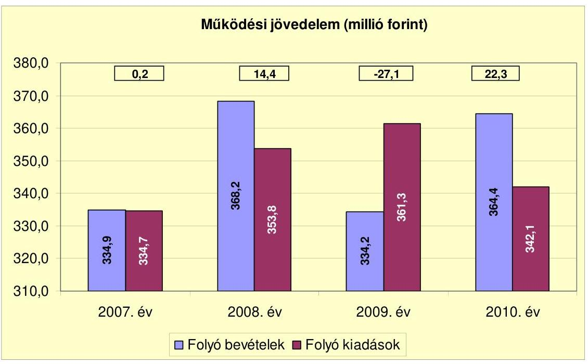

Az Önkormányzat folyó költségvetésének egyenlege (működési jövedelem) a 2007. évben 0,2, a 2008. évben 14,4, a 2009. évben -27,1, a 2010. évben 22,3 millió Ft volt. A 2009. évben kialakult negatív értéket elsősorban a helyi adó bevételek elmaradása, az előző évhez viszonyított 23,1 millió Ft-os csökkenése, valamint a kamatkiadásoknak az előző évhez viszonyított 6,5 millió Ft-os növekedése okozta. A 2009. évi múködési forráshiány a folyó kiadások (361,3 millió Ft) 7,5\%-át jelentette. A 2007-2008. és a 2010. években keletkezett pozitív múködési jövedelem forrásul szolgált az Önkormányzat fennálló kötelezettségeinek teljesítéséhez, valamint a fejlesztések finanszírozásához. A múködési forrástöbblet a folyó bevételeknek a 2007. évben a 0,1\%-át, a 2008. évben a $3,9 \%$-át, a 2010. évben a $6,1 \%$-át tette ki.

A nettó múködési jövedelem alakulását az alábbi ábra mutatja be:
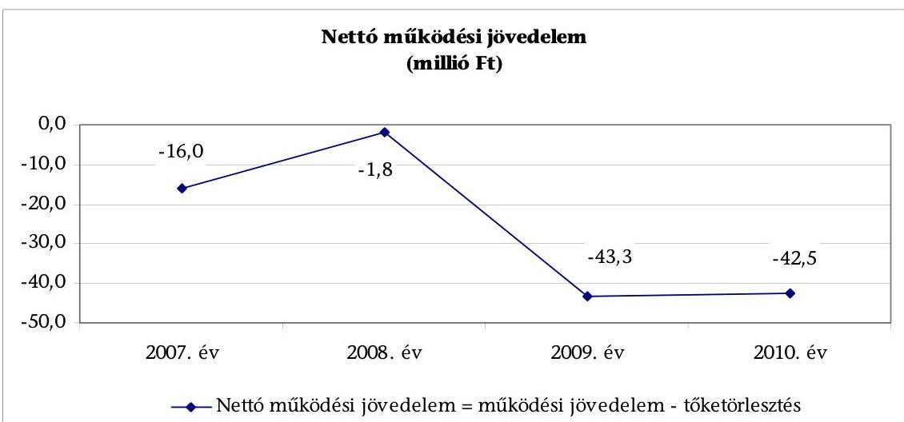

---

A tőketörlesztés hatását is tükröző nettó múködési jövedelem (pénzügyi kapacitás ${ }^{13}$ ) a 2007-2010. évek között folyamatosan negatív értékű volt. A 2007. évi -16,0 millió Ft-ról 2008. évre -1,8 millió Ft-ra emelkedett, majd a 2009-2010. években az előző évhez képest jelentősen csökkent. A 2009. évben -43,3 millió Ft, a 2010. évben -42,5 millió Ft volt, amelyet a 2009. évben a negatív múködési jövedelem, a 2010. évben az előző évekhez képest magas - a 2009. és a 2010. években felvett hitelekhez kapcsolódó - tőketörlesztés okozott.

A tőketörlesztés alakulását az alábbi ábra mutatja be:
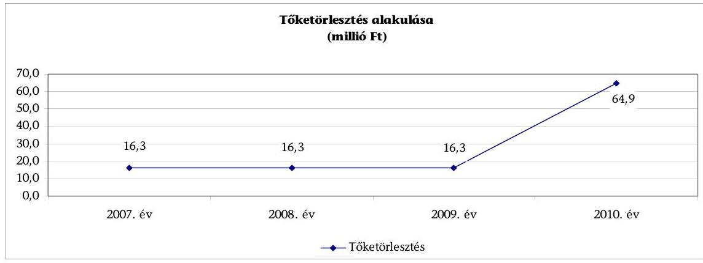

A tőketörlesztés a 2007-2009. években azonos összegű, 16,3 millió Ft volt, a 2010. évben 64,9 millió Ft-ra növekedett. A növekedés oka a 2009. és a 2010. évben felvett hosszú lejáratú hitelek, valamint a 2010. évben felvett rulírozó hitel törlesztése volt.

A felhalmozási költségvetés bevételeit, kiadásait és egyenlegét a következő diagram szemlélteti:
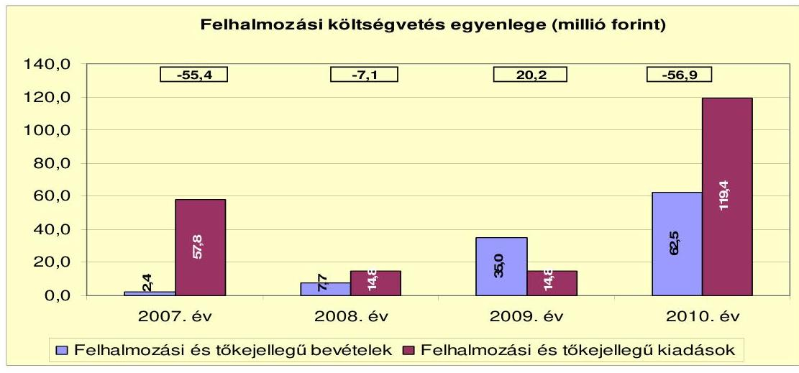

[^0]
[^0]:    ${ }^{13}$ Az Önkormányzat pénzügyi kapacitását a nettó múködési jövedelem jellemzi, amely a tárgyévben a folyó bevételek és folyó kiadások egyenlegeként képződő múködési jövedelemnek a tárgyévben fizetett tőketörlesztéssel csökkentett összege. Értéke pozitív és negatív is lehet.

---

A felhalmozási költségvetés egyenlege a 2007., a 2008. és a 2010. években negatív, a 2009. évben pozitív volt. A 2010. évi alacsony egyenleg oka a beruházási kiadásokra fordított jelentős, 110,3 millió Ft-os összeg (a Fő tér rendezésével kapcsolatos projekt, óvodabővítés, útépítés kiadásai), amelynek forrásául szolgáló EU-s támogatások teljesülése a 2010. évet követően várható. A felhalmozási költségvetés egyenlege a 2007. évben is jelentős hiányt mutatott. A hiány oka, hogy a 43,8 millió Ft összegű felújítási kiadások (Nemzetiségek Háza felújítás, út-, csatorna-, járdafelújítás) forrásául szolgáló ingatlanértékesítési bevételek nem teljesültek a tervezett szinten. A folyamatban lévő felhalmozási feladatok megvalósításának forrásigénye a 2010. év után 292,6 millió Ft, amelyből 31,6 millió Ft (10,8\%) saját bevétel, 92,4 millió Ft (31,6\%) hitel, 168,6 millió Ft (57,6\%) EU-s támogatás.

Az Önkormányzat finanszírozási múveleteinek egyenlegét a következő ábra szemlélteti:
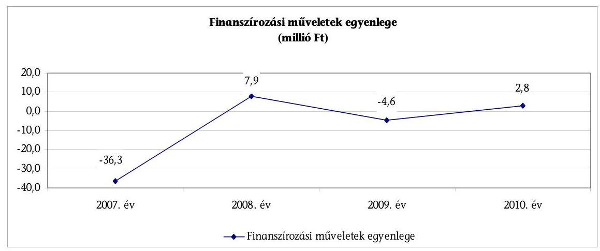

A finanszírozási múveletek egyenlege - amely magában foglalja a hitelfelvételeket és törlesztéseket, valamint az egyéb finanszírozási (függő, átfutó, kiegyenlítő) bevételeket és kiadásokat - a 2007. és a 2009. években negatív, a 2008. és a 2010. években pozitív volt. A 2007. évi negatív egyenleget a hitelek törlesztő részleteinek 16,3 millió Ft összegű kifizetése, valamint 21,0 millió Ft értékű értékpapír vásárlás okozta. Az Önkormányzat a 2008. évben értékesítette értékpapírját, ezáltal javult a finanszírozási múveletek egyenlege. A 2008. évben hitelfelvételre nem került sor, hiteltörlesztést 16,3 millió Ft összegben teljesített az Önkormányzat. A 2009. évi negatív egyenleget a hitelfelvételnél magasabb összegű hiteltörlesztés okozta. A 2010. évben az egyenleg pozitívvá vált, a hitelfelvételek a hiteltörlesztéseknél magasabb összegben teljesültek.

Az Önkormányzat pénzügyi egyensúlya a 2007. és a 2009-2010. években nem volt biztosított. A folyó és a felhalmozási költségvetés, valamint a finanszírozási műveletek együttes egyenlege (tárgyévi pénzügyi pozíció) negatív összegű a három évben összesen -134,7 millió Ft volt, amelyre a tartalék nem nyújtott fedezetet. A 2008. évben a folyó költségvetés, valamint a finanszírozási műveletek pozitív egyenlege (értékpapír értékesítés bevétele) fedezte a felhalmozási költségvetés hiányát.

---

A 2007-2011. év I. félév között az Önkormányzat nem részesült az önhibáján kívül hátrányos helyzetú önkormányzatok részére a központi költségvetésben erre a célra jóváhagyott támogatásból. Ezen időszakban feladatátvételre nem került sor. Az első fokú építéshatósági feladatokat a 2010. évben átadták Szentendre Város Önkormányzatának. Az ebből eredő kiadási megtakarítás - az Önkormányzat kimutatása szerint - 9,8 millió Ft, amivel párhuzamosan 2,3 millió Ft állami támogatás csökkenés jelentkezett.

Az Önkormányzat folyó és felhalmozási bevételeit főbb jogcímenként a következő táblázat tartalmazza:

|  |  |  |  | millió Ft |
| :-- | --: | --: | --: | --: |
| Megnevezés | $\mathbf{2 0 0 7 .}$ év | $\mathbf{2 0 0 8 .}$ év | $\mathbf{2 0 0 9 .}$ év | $\mathbf{2 0 1 0 .}$ év |
| Intézményi múködési bevételek | 34,3 | 38,0 | 31,7 | 20,6 |
| Helyi adók, pótlékok, bírságok | 52,7 | 84,1 | 61,0 | 93,2 |
| Atengedett bevételek | 135,7 | 114,5 | 114,6 | 123,5 |
| Költségvetési támogatás | 84,7 | 114,6 | 112,5 | 107,6 |
| Államháztartáson belülről kapott támogatás | 9,0 | 9,7 | 11,1 | 19,1 |
| Államháztartáson kívülröl kapott bevételek | 14,1 | 5,7 | 3,1 | 0,1 |
| Előző évi pénzmaradvány átvétel | 1,9 | 0,0 | 0,0 | 0 |
| Egyéb bevétel | 2,5 | 1,6 | 0,2 | 0,3 |
| Folyó bevételek összesen | $\mathbf{3 3 4 , 9}$ | $\mathbf{3 6 8 , 2}$ | $\mathbf{3 3 4 , 2}$ | $\mathbf{3 6 4 , 4}$ |
| Saját tőkebevételek | 2,4 | 2,6 | 3,0 | 1,1 |
| Államháztartáson belülről kapott támogatás | 0,0 | 0,0 | 0,0 | 56,9 |
| Államháztartáson kívülröl, EU-tól kapott támogatás | 0,0 | 5,1 | 32,0 | 4,5 |
| Felhalmozási célú bevételek összesen | $\mathbf{2 , 4}$ | $\mathbf{7 , 7}$ | $\mathbf{3 5 , 0}$ | $\mathbf{6 2 , 5}$ |
| ÖSSZESEN | $\mathbf{3 3 7 , 3}$ | $\mathbf{3 7 5 , 9}$ | $\mathbf{3 6 9 , 2}$ | $\mathbf{4 2 6 , 9}$ |

Az Önkormányzat teljesített bevétele a 2007. évről a 2008. évre 38,6 millió Fttal ( $11,4 \%$-kal) emelkedett, elsősorban a helyi adóbevételek növekedése miatt. A 2009. évben a teljesített bevételek 6,7 millió Ft-tal ( $1,8 \%$-kal) csökkentek, majd a 2010. évben 57,7 millió Ft-tal ( $15,6 \%$-kal) emelkedtek az előző évhez képest. A 2010. évi kiugró növekedést a helyi adóbevételek és hátralékaik behajtása, valamint a beruházásokhoz kapcsolódó, felhalmozási célú EU-s támogatások növekedése eredményezte. A bevételeken belül a folyó bevételek aránya folyamatosan csökkent, a 2007. évi $99,3 \%$-ról a 2010. évre $85,4 \%$-ra. Az Önkormányzat folyó bevételei a helyi adóbevételek függvényében teljesültek, a 2008. évi 33,3 millió Ft-os ( $9,9 \%$-os) növekedést követően a 2009. évben 34,0 millió Ft-tal ( $9,2 \%$-kal) csökkentek, a 2010. évben 30,2 millió Ft-tal ( $9,0 \%$ kal) emelkedtek az előző évhez viszonyítva. A folyó bevételeken belül minden évben az átengedett bevételek, valamint a költségvetési támogatás képviselték a legmagasabb arányt. Az átengedett bevételek a folyó bevételeknek a 2007. évben $40,5 \%$-át, a 2010. évben $33,9 \%$-át tették ki, a költségvetési támogatás aránya a 2007. évben $25,3 \%$, a 2010. évben $29,5 \%$ volt. A felhalmozási bevételek a 2007. évtől a 2010. évig folyamatosan, 60,1 millió Ft-tal (26-szorosára) növekedtek EU-s pályázati források elnyerése eredményeképpen.

---

Az Önkormányzat folyó és felhalmozási kiadásait főbb jogcímenként a következő táblázat tartalmazza:

|  |  |  |  | millió Ft |
| :-- | --: | --: | --: | --: |
| Megnevezés | $\mathbf{2 0 0 7 .}$ év | $\mathbf{2 0 0 8 .}$ év | $\mathbf{2 0 0 9 .}$ év | $\mathbf{2 0 1 0 .}$ év |
| Személyi juttatások és járulékok | 211,6 | 197,5 | 215,6 | 194,6 |
| Dologi kiadások | 76,0 | 107,9 | 93,0 | 84,2 |
| Kamatkiadások | 9,1 | 11,0 | 17,5 | 20,5 |
| Egyéb müködési célú kiadások | 38,0 | 37,4 | 35,2 | 42,8 |
| Folyó kiadások összesen | $\mathbf{3 3 4 , 7}$ | $\mathbf{3 5 3 , 8}$ | $\mathbf{3 6 1 , 3}$ | $\mathbf{3 4 2 , 1}$ |
| Felújítási kiadások | 43,8 | 8,9 | 4,4 | 9,1 |
| Beruházási kiadások | 14,0 | 5,9 | 9,0 | 110,3 |
| Egyéb felhalmozási célú kiadások | 0,0 | 0,0 | 1,4 | 0,0 |
| Felhalmozási kiadások | $\mathbf{5 7 , 8}$ | $\mathbf{1 4 , 8}$ | $\mathbf{1 4 , 8}$ | $\mathbf{1 1 9 , 4}$ |
| ÖSSZESEN | $\mathbf{3 9 2 , 5}$ | $\mathbf{3 6 8 , 6}$ | $\mathbf{3 7 6 , 1}$ | $\mathbf{4 6 1 , 5}$ |

Az Önkormányzat teljesített kiadása a 2007. évről a 2008. évre 23,9 millió Fttal (6,1\%-kal) csökkent, majd a 2009. évben 7,5 millió Ft-tal (2,0\%-kal), a 2010. évben 85,4 millió Ft-tal ( $22,7 \%$-kal) növekedett az előző évhez képest. A kiadásokon belül a folyó kiadások aránya a 2007. évtől a 2009. évig 83,3\%-ról 96,1\%-ra növekedett, a 2010. évben 74,1\%-ra csökkent. A folyó kiadások között minden évben a személyi juttatások és járulékaik képviselték a legnagyobb arányt, a 2007. évben 63,2\%-ot, a 2008. évben 55,8\%-ot, a 2009. évben 59,7\%ot, a 2010. évben 56,9\%-ot.

A felhalmozási kiadások a 2007. évről a 2008. évre 43,0 millió Ft-tal ( $74,4 \%$-kal) csökkentek, a 2009. évben nem változtak, a 2010. évben azonban 104,6 millió Ft-tal (nyolcszorosára) nőttek az előző évhez képest. A felhalmozási kiadások összege és aránya a 2007. évben és a 2010. évben kiemelkedő volt. A 2007. évben az összes kiadás 14,7\%-át, a 2010. évben 25,9\%-át jelentette. Az Önkormányzat felhalmozási kiadások között a 2007. évben felújításra 43,8 millió Ft-ot ( $75,8 \%$ ), beruházásra 14,0 millió Ft-ot ( $24,2 \%$ ), a 2010. évben felújításra 9,1 millió Ft-ot ( $7,6 \%$ ), beruházásra 110,3 millió Ft-ot ( $92,4 \%$ ) számolt el. A 2007-2010. évek között a beruházások és felújítások kifizetésére teljesített kiadások forrása 82,2 millió Ft ( $40,0 \%$ ) saját bevétel, 29,7 millió Ft (14,5\%) hitel, 90,0 millió Ft (43,8\%) EU-s és 3,4 millió Ft (1,7\%) hazai támogatás volt. A 2010. év utáni időszakra vállalt kötelezettség 292,6 millió Ft, melynek forrásául $10,8 \%$-ban saját bevétellel, $31,6 \%$-ban hitel felvételével, $57,6 \%$ ban pedig EU-s támogatással számoltak.

A 2007-2011. év I. félév időszakában az Önkormányzat a pénzügyi egyensúly biztosítása érdekében hozott kiadáscsökkentő intézkedései eredményeként összesen 42,1 millió Ft kiadási megtakarítást mutatott ki.

---

A kiadáscsökkentő intézkedések hatásaként 12 fővel csökkentették a létszámot. A Borostyán Természetvédő Óvodát bevonták a CSKM-be, a tagintézményvezetők vezetői megbízását visszavonták, az alsó tagozatos iskolaotthonos nevelésoktatást megszüntették, az építésügyi igazgatási feladatokat átadták Szentendre Város Önkormányzatának, az ipari és kereskedelmi, továbbá földművelésügyi igazgatás feladatkörét összevonták az adóigazgatás feladatkörével.

Az Önkormányzat a pénzügyi egyensúly biztosításához az adóhátralékok behajtásával is hozzájárult, amelyből a 2007-2011. év I. félévben összesen 28,8 millió Ft bevételt ért el a kimutatása alapján. Az Önkormányzatot megillető adók kivetéséről és behajtásának tapasztalatairól a Képviselő-testületnek beszámoltak. A 2009. év zárszámadásáról szóló könyvvizsgálói jelentés felhívta az Önkormányzat figyelmét a saját bevételek növelése érdekében a különféle adók, szerződéses bevételek beszedésének, behajtásának hatékonyabb kezelésére.

A Polgármester ${ }_{2}$ az ÁSZ tv. 29. § (2) bekezdésében foglaltak alapján az alábbi észrevételt tette: „A bevétel növelés esetén 28,8 millió Ft-os adóhátralék behajtás nem a 2007-2010-re, hanem elsősorban a 2011. I. félévi időszakra vonatkozik".

A jelentéstervezethez tett észrevételt nem fogadtuk el, mert az Önkormányzat adatszolgáltatása szerint az adóhátralék behajtásából befolyt bevétel 2007-ben 8,2 millió Ft, 2008-ban 3,8 millió Ft, 2009-ben 6,0 millió Ft, 2010-ben 5,2 millió Ft, 2011-ben 5,6 millió Ft volt.

Az Önkormányzatnak a 2007-2011. év I. félév között kötött hosszú lejáratú hitelszerződéseit a következő táblázat tartalmazza:

---

| Megnevezés | Képviselőtestületi döntés száma | Szerződéskötés időpontja | Összeg (millió Ft) | Kamat (fix vagy változó), (referencia kamat+kamatfelár) | Töketörlesztés | Fedezet | Felhasználás célja |
| :--: | :--: | :--: | :--: | :--: | :--: | :--: | :--: |
| Hosszú lejáratú hitel   ÖB-8400-   2009-0777 | 155/2009.   (XI. 26.) | 2009.12.14 | 12,0 | változó, 3 havi BUBOR+3,5\% | 2010.03.20.-   2019.03.20., évi   1,2 millió Ft | az Önkormányzat futamidő alatti költségvetései, valamint I. ranghelyi jelzálogjog a 160. hraz-ú ingatlanon | fejlesztési feladatok forrásának visszapótlása |
| Hosszú lejáratú hitel   ÖB-8400-   2009-0778 | 155/2009.   (XI. 26.) | 2010.01.21 | 12,9 | változó, 3 havi   EURIBOR+ 3,2\% | 2011.12.16.-   2019.09.16.,   negyedévente   0,4 millió Ft | az Önkormányzat futamidő alatti költségvetései, valamint II. ranghelyi jelzálogjog a 160. hraz-ú ingatlanon | ÖKIF 2. Általános beruházási célok, 2.1. Közutak építése (Nádas utcai híd felújítása, gyalogátkelő hidak építése), 2.5. Egyéb rendezési tervekhez kapcsolódó infrastruktúrláis beruházások, gyalogátkelőhely létesítése |
| Hosszú lejáratú hitel   ÖB-8400-   2010-0030 | 2/2010.   (I. 12.) | 2010.02.08 | 8,6 | változó, 3 havi BUBOR+3,5\% | 2010.10.05.-   2019.10.05., évi   0,9 millió Ft | az Önkormányzat futamidő alatti költségvetései, valamint I. ranghelyi jelzálogjog a 205/3. hraz-ú ingatlanon | telekvasárlás a Borostyán Természetvédő Óvoda bővítéséhez |
| Hosszú lejáratú hitel   ÖB-8400-   2010-0149 | 13/2010.   (I. 28.) | 2010.04.23 | 18,0 | változó, 3 havi EURIBOR+MFB refinanszírozási kamatfelár+OTP kamatfelár 1,5\% | 2012.04.15.-   2020.01.15.,   negyedévente   0,6 millió Ft | az Önkormányzat futamidő alatti költségvetései, valamint I. ranghelyi jelzálogjog a 155. hraz-ú ingatlanon | ÖKIF 8. ÜMFT pályázatok önrész biztosítására, 8.6. Fő tári projekthez önrész biztosítása |
| Hosszú lejáratú hitel   ÖB-8400-   2011-0144 | 15/2011.   (II. 10.) | 2011.04.28 | 36,4 | változó, 3 havi EURIBOR+ MFB refinanszírozási kamatfelár (RKO1)+OTP kamatfelár 1,5\% | 2014.05.02.-   2031.05.02.,   negyedévente   0,5 millió Ft | az Önkormányzat futamidő alatti költségvetései, valamint I. ranghelyi jelzálogjog a 156., 161., 162., 092/36. hraz-ú ingatlanon | ÖKIF 3. Közoktatási beruházái célok, 3.1.Közoktatási intézmények múszaki felújítása, rekonstrukciója, óvoda bővítése, felújítása |
| Hosszú lejáratú hitel   ÖB-8400-   2011-0143 | 101/2010.   (VIII. 17.).   15/2011.   (II. 10.) | 2011.04.28 | 56,0 | változó, 3 havi EURIBOR+ MFB refinanszírozási kamatfelár (RKO2)+OTP kamatfelár 2,0\% | 2014.05.02.-   2031.05.02.,   negyedévente   0,8 millió Ft | az Önkormányzat futamidő alatti költségvetései, valamint I. ranghelyi jelzálogjog a 158., 205/2., 2945/23., 2945/25., 058/27. hraz-ú ingatlanon | ÖKIF 2. Általános beruházási célok 2.1.Közutak építése, belterületi utak fejlesztése |

2010. december 31-én az Önkormányzat hosszú lejáratú adósságot keletkeztető kötelezettségvállalásaiból fennálló tőketartozása 39,7 millió Ft, amelynek $100 \%$-a felhalmozási célú, forintalapú és változó kamatozású volt.

A 2007-2011. év I. félév között a hitelek visszafizetésének fedezetét meghatározták. A hitelszerződésekben a visszafizetés fedezeteként az Önkormányzat költségvetését úgy ajánlották fel, hogy az Ötv. 88. § (1) bekezdés b) pontjában foglaltak ellenére a fedezet köréböl nem zárták ki a normatív állami támogatást, az állami támogatást, a személyi jövedelemadót, valamint az államháztartáson belülről múködési célra átvett bevételeket. A hitel visszafizetés biztosítékaként az önkormányzati törzsvagyonba tartozó ingatlant nem ajánlottak fel.

A hitelfelvételekről szóló képviselő-testületi határozatok - a 2011. évi kivételével - tartalmazták a Képviselő-testület nyilatkozatát arra vonatkozóan, hogy a már meglévő hitelekből, kezességvállalásokból és az igényelt hitelből adódó éves kötelezettségeket figyelembe véve nem esnek az Ötv. 88. § (2) bekezdésé-

---

ben ${ }^{14}$ meghatározott korlátozás alá, azonban a hitelfelvételi döntéseket megalapozó előterjesztések nem tartalmaztak számításokat az adósságot keletkeztető éves kötelezettségvállalás felső határára vonatkozóan. A hitelfelvételi korlátot nem lépték túl. A 2011. év I. félévében felvett hiteleket megalapozó képviselő-testületi döntésekhez csatolták a könyvvizsgáló véleményét.

Az Önkormányzat könyvvizsgálója 2011. február 9-én véleményében kockázatosnak minősítette a fejlesztési hitelre vonatkozó kötelezettségvállalást.

Az Önkormányzat számlavezető pénzintézete a 2007-2011. év I. félév között nem változott, az ezen időszakban igénybevett hiteleket a számlavezető pénzintézet nyújtotta.

Az Önkormányzatnak 2007. január 1-jén a korábbi évek hosszú lejáratú adósságot keletkeztető kötelezettségvállalásaiból 69,9 millió Ft fennálló tőketartozása volt, amelyet 2010. december 31-éig törlesztett.
2001. október 2-án 50,0 millió Ft összegű, felhalmozási célú (közvilágítás- és ingatlan korszerűsítésre), változó kamatozású hitelszerződést kötöttek. A tőketörlesztés időszaka 2003. 12. 15.-2010. 12. 15., összege évi 6,3 millió Ft volt. A hitelből a 2007. január 1-jén fennálló tőketartozás 25,0 millió Ft volt.
2005. március 31-én 50,0 millió Ft összegű, felhalmozási célú, változó kamatozású hitelszerződést kötöttek. A tőketörlesztés időszaka 2006.04.05.-2010.04.05., öszszege évi 10,0 millió Ft volt. A hitelből a 2007. január 1-jén fennálló tőketartozás 40,0 millió Ft volt.
2001. november 12-én egyezség jött létre Csobánka Község Önkormányzata és a Gazdasági Minisztérium között az Ózon Idegenforgalmi és Kereskedelmi Rt. alapjuttatási szerződéséhez kapcsolódó tartozásátvállalás tárgyában, amelyben az Önkormányzat vállalta 7,0 millió Ft részletekben történő megfizetését. A kötelezettségből a 2007. január 1-jén fennálló tartozás 2,8 millió Ft volt.
2005. április 11-én svájci frank alapú, változó kamatozású (3 havi CHF LIBOR) pénzügyi líingszerződést kötöttek mezőgazdasági gép vásárlására, melynek bruttó vételára 4,5 millió Ft, lejárata 2010. szeptember 1. volt. A kötelezettségből a 2007. január 1-jén fennálló tartozás 2,1 millió Ft volt.

Az Önkormányzat a 2011. év I. félév végéig az összesen 143,9 millió Ft összegű hitelkeretéből 41,7 millió Ft-ot hívott le, és a hitelcélnak megfelelően a Képvise-lő-testület által jóváhagyott, a költségvetésben tervezett beruházásokhoz használta fel.

A hosszú lejáratú adósságot keletkeztető kötelezettségvállalásokhoz kapcsolódó képviselő-testületi döntéseket megalapozó előterjesztésekben a fejlesztések szükségességét, a bevételek felhasználási célját meghatározták, a hitelszerződésekben rögzítették.

Az adósságot keletkeztető kötelezettségvállalásoknál nem vették figyelembe a kamatkockázatot, az Önkormányzat a változó kamatozású hitelek döntés

[^0]
[^0]:    ${ }^{14}$ 2012. január 1-jétől a Stabilitási tv. 10. § (3) bekezdése

---

előkészítése során nem vizsgálta, hogy a változó kamatozású kötelezettségvállalások terhei a jövőben jelentősen növekedhetnek. A változó kamatozású adósságot keletkeztető kötelezettségek és azok kockázatainak csökkentése érdekében a 2007-2011. év I. félévben nem intézkedtek, nem tekintették át a változó kamatozású hitelek terheit abból a szempontból, hogy kedvezőtlen alakulás esetén mérlegeljék a konstrukcióváltás lehetőségét.

A Polgármester ${ }_{2}$ az ÁSZ tv. 29. § (2) bekezdésében foglaltak alapján az alábbi észrevételt tette: „... szerepel, hogy nem tekintette át a Képviselő-testület a hitelekkel kapcsolatban az esetleges konstrukcióváltás lehetőségét. Ezt a lehetőséget 135/2010. (XI. 11.) számon tárgyalta a Képviselő-testület, de a szóba jöhető megoldások a korábbinál előnytelenebb pénzügyi konstrukciót biztosítottak volna.".

Az észrevételt nem fogadtuk el, mert a hivatkozott határozatot és annak előterjesztését a helyszíni ellenőrzés ideje alatt és a jelentéstervezethez készített észrevétel alátámasztására sem bocsátották rendelkezésünkre annak ellenére, hogy az Önkormányzat jegyzője 2011. november 21-én teljességi nyilatkozatot tett az adatszolgáltatás teljes körűségéről. Ezáltal az ellenőrzés nem tudott arról meggyőződni, hogy a hivatkozott határozatban foglaltak választ adnak-e a konstrukcióváltással kapcsolatban az ellenőrzési program 1.2.3. számon feltett kérdésére.

Deviza alapú adósságot keletkeztető kötelezettségvállalásra a 2007-2011. év I. félév közötti időszakban nem került sor. A 2005. évtől fennálló deviza alapú lízing terheit nem tekintették át abból a szempontból, hogy kedvezőtlen alakulás esetén mérlegeljék a konstrukcióváltás lehetőségét.

A Képviselő-testület a 2007-2011. év I. féléve között kötvénykibocsátásról nem döntött, abból eredő korábban keletkezett kötelezettségvállalása sem volt.

A 2011. év I. félév végén kezességvállalásból 149,7 millió Ft hitel és járulékai erejéig származott kötelezettsége az Önkormányzatnak. A kötelezettségből az ellenőrzés idejéig beváltásra nem került sor. A kezességvállalás kockázatát nem vizsgálták.

A Képviselő-testület a Csobánkai Víziközmű Társulatnak 150,0 millió Ft összegű hosszú lejáratú hiteléhez kapcsolódóan készfizető kezességet vállalt ${ }^{15}$. Az Önkormányzat 2003. szeptember 25-én kötötte meg a készfizető kezességi megállapodást. A fennálló, egy összegben visszafizetendő hitel összege 2007. január 1-jén és 2011. június 30-án is 129,8 millió Ft volt, lejárati ideje 2012. december 15. Az Önkormányzat könyvviteli mérlegében az Áhsz. 9. számú melléklet 4. dk) pontjának előírása ellenére a 2007., a 2008. és a 2010. években a hosszú lejáratú kötelezettségek, a 2009. évben a rövid lejáratú kötelezettségek között szerepeltették a Csobánkai Víziközmű Társulat 129,8 millió Ft összegben fennálló hiteléhez kapcsolódó kezességvállalást.
2011. május 18-án további 19,9 millió Ft összegű készfizető kezességvállalásra került sor a Hanflandi Víziközmű Társulat hosszú lejáratú hiteleihez kapcsolódóan.

[^0]
[^0]:    ${ }^{15}$ a „Z/99/2003. (IX. 11.) számú határozat" alapján

---

Az adósságot keletkeztető kötelezettségvállalásokra vonatkozó döntéseknél egyegy érvényes pénzintézeti ajánlat állt a döntéshozók rendelkezésére, a versenyeztetés szabályait betartva.

A Képviselő-testület a 2007-2010. évi zárszámadási rendeletekben évente tájékoztatást kapott az adósságot keletkeztető kötelezettségvállalásokból adódó tőkefizetési kötelezettségekről, azonban a fizetendő kamatokról és egyéb költségekről, a visszafizetés lehetséges forrásairól nem tájékoztatták a Képviselőtestületet. Az adósságterhek törlesztésére nem terveztek forrásokat bevonni az előző évek pénzmaradványából.

Az Önkormányzat pénzintézetekkel szemben fennálló rövid és hosszú lejáratú kötelezettségeinek állományát a 2007-2010. évek között az alábbi ábra szemlélteti:
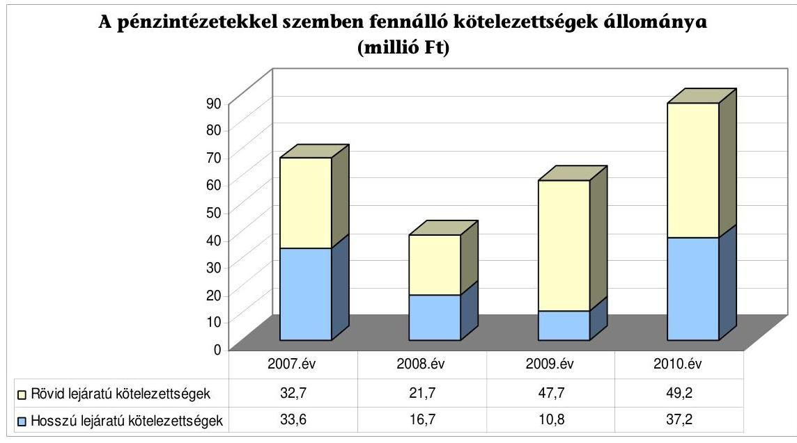

Az Önkormányzat pénzintézetekkel szemben fennálló kötelezettsége a 2007-2010 közötti időszakban 66,3 millió Ft-ról 86,4 millió Ft-ra, 30,3\%-kal nőtt. A pénzintézettel szembeni kötelezettségeken belül a hosszú lejáratú kötelezettségek aránya a 2007. évben 50,7\%, a 2008. évben 43,5\%, a 2009. évben 18,5\%, a 2010. évben 43,1\% volt. A hosszú lejáratú kötelezettségek állománya a 2007. évi 33,6 millió Ft-ról a 2008. évre 16,7 millió Ft-ra, a 2009. évre 10,8 millió Ft-ra csökkent, majd a 2010. évben 37,2 millió Ft-ra emelkedett, ami az előző évhez képest 244,4\%-os növekedést jelentett. A kiugró növekedést a 2010. évben felvett három hosszú lejáratú hitelből eredő tőketartozás okozta. A rövid lejáratú pénzintézettel szembeni kötelezettségek a 2007. évi 32,7 millió Ftról a 2008. évre 21,7 millió Ft-ra csökkentek (alapvetően a folyószámlahitel állományának a 2007. évihez viszonyított jelentős csökkenése miatt), majd a 2009. évben 47,7 millió Ft-ra, a 2010. évben 49,2 millió Ft-ra növekedtek. A 2009-2010. évi emelkedés oka a növekvő összegű folyószámlahitel állomány, valamint a 2010. év végén fennálló 8,0 millió Ft összegű munkabérhitel volt. Az év végén fennálló folyószámlahitel állomány a 2007. évben 15,9 millió Ft, a 2008. évben 4,8 millió Ft, a 2009. évben 29,8 millió Ft, a 2010. évben 38,7 millió Ft volt. A likviditási célú hitelek már nemcsak a kiadások és bevéte-

---

lek ütemkülönbségéből eredő finanszírozási hiány kezelését szolgálták, hanem a költségvetési hiány finanszírozási forrásává is váltak.

Az összes kötelezettségen belül a hosszú lejáratú kötelezettségek állománya a 2007. évben 35,0 millió Ft, a 2008. évben 17,4 millió Ft, a 2009. évben 10,8 millió Ft, a 2010. évben 37,2 millió Ft volt. A rövid lejáratú kötelezettség állománya a 2007. évben 42,2 millió Ft, a 2008. évben 26,2 millió Ft, a 2009. évben 69,8 millió Ft, a 2010. évben 89,6 millió Ft volt.

A rövid lejáratú kötelezettségek aránya az összes kötelezettségen (kivéve az egyéb passzív pénzügyi elszámolásokat) belül a 2007. évben 54,7\%, a 2008. évben $60,1 \%$, a 2009. évben $86,6 \%$, a 2010. évben $70,7 \%$ volt. A hosszú lejáratú kötelezettségek aránya az összes kötelezettségen (kivéve az egyéb passzív pénzügyi elszámolásokat) belül a 2007. évben 45,3\%, a 2008. évben 39,9\%, a 2009. évben $13,4 \%$, a 2010. évben $29,3 \%$ volt. A hosszú lejáratú kötelezettségek állományán belül a deviza alapú kötelezettség állományának (lízing) aránya a 2007. évben 3,1\% volt, 2010. december 31-én nem volt deviza alapú kötelezettsége az Önkormányzatnak. A változó kamatozású kötelezettségek aránya az összes hosszú lejáratú kötelezettségen belül a 2007. évi 96,0\%-ról a 2010. évre $100 \%$-ra növekedett.

Az Önkormányzat a 2007-2011. év I. félév között PPP konstrukcióban nem vett részt, gazdasági társaságok és civil szervezetek részére kölcsönt nem nyújtott.

A 2007-2011. év I. félév között a likviditást és az adósságszolgálat finanszírozását az Önkormányzat folyószámlahitel és munkabér-megelőlegezési hitel igénybevételével biztosította.

A folyószámla hitelkeret szerződéshez 2009. december 16-án, majd 2010. november 25-én kötött jelzálogszerződés is kapcsolódott, amelyben az Önkormányzat 2,1 millió Ft nettó értékú ( 44,1 millió Ft piaci értékú) forgalomképes ingatlanjain történt jelzálogjog alapítás.

Az Önkormányzat folyószámlahitel kerete a 2007. évi 20,0 millió Ft-ról a 2011. évre 40,0 millió Ft-ra növekedett, az év végén fennálló folyószámlahitel állomány a 2007. évben 15,9 millió Ft, a 2008. évben 4,8 millió Ft, a 2009. évben 29,8 millió Ft, a 2010. évben 38,7 millió Ft volt. A folyószámlahitellel zárt napok száma a 2007. és a 2008. években 358 nap, a 2009. és a 2010. években 365 nap, a 2011. év I. félévben 178 nap. A folyószámlahitel átlagos napi állománya folyamatosan növekvő, a 2007. évben 11,0 millió Ft, a 2008. évben 14,5 millió Ft, a 2009. évben 25,5 millió Ft, a 2010. évben 29,9 millió Ft, a 2011. év I. félévig 36,6 millió Ft volt. Munkabér-megelőlegezési hitel felvételére a 2007. évtől kezdődően minden évben sor került. A munkabér-megelőlegezési hitel átlagos napi állománya a 2007-2009. években 12,0 millió Ft, a 2010. évben és a 2011. év I. félévében 10,0 millió Ft volt ${ }^{16}$.

[^0]
[^0]:    ${ }^{16}$ A folyószámlahitel és a munkabér megelőlegezési hitel átlagos napi állománya az igénybevétel tényleges napjaival számolva. A CLF módszerrel a napi átlagos állományt 365 napra számítva mutattuk ki.

---

Egyéb likvid hitel felvételére a 2010. évben került sor a számlavezető pénzintézettől. Az Önkormányzat a 2010. április 23-án kötött szerződés szerint rulírozó rövid lejáratú hitelt vett igénybe az EU-s pályázati támogatás megelőlegezésére a Fő tér rendezése, településközpont kialakítása céljára. A szerződés 2010. szeptember 30-i módosítása szerint a hitel végső lejárata 2010. november 30-ra, keretösszege az eredeti 29,8 millió Ft-ról 29,7 millió Ft-ra módosult. A kamat változó, mértéke 3 havi BUBOR+3\% volt. A Képviselő-testület 39/2010. (III. 25.) számú határozatával döntött a hitel felvételéről. A visszafizetés biztosítékául az EU-s pályázaton elnyert 90,0 millió Ft bevétel összegét ajánlotta fel. Az igénybevett összeg 2010. július 8 -tól 22,8 millió Ft, július 9 -től további 0,4 millió Ft volt, amelyet szeptember 6-án visszafizettek. Szeptember 10-től a felvett összeg 23,4 millió Ft volt, amely 2010. október 11-ig állt fenn.

A Polgármester ${ }_{2}$ az Ász tv. 29. § (2) bekezdésében foglaltak alapján az alábbi észrevételt tette: „vagyon növekedés forrásai közül hiányzik a likviditási hitel felvétele 2010 novemberére - és az ebből finanszírozott - visszafizetetlen 5,6 millió forintos rulírozó hitel".

Az észrevételt nem fogadtuk el, mivel az Önkormányzat által igénybe vett egyéb likviditási hiteleket az önkormányzati beszámolók mérlegadatai, valamint a rendelkezésünkre bocsátott adatok alapján rögzítettük a jelentésben. Az Önkormányzat az igénybe vett egyéb likvid hiteleiről kiállított 8. számú tanúsítványban nem szolgáltatott adatot az észrevételben hivatkozott 5,6 millió Ft-os rulírozó hitelről, ilyen tételt a 2010. évi költségvetési beszámoló mérlegében, valamint az ezt helyesbítő, jelentéshez csatolt függelékben nem szerepeltetett. A jegyző 2011. november 21-én teljességi nyilatkozatot tett az adatszolgáltatás teljes körűségéről.

A szállítói kötelezettségek állománya a 2007. év végén 8,8 millió Ft, a 2008. év végén 3,8 millió Ft, a 2009. év végén 8,5 millió Ft, a 2010. év végén 22,1 millió Ft, a 2011. év I. félév végén 11,1 millió Ft volt. Az Önkormányzat kimutatása szerint a 2011. év I. félév végén 1,6 millió Ft 30 napon belüli, 5,5 millió Ft 31 és 60 nap közötti, 1,6 millió Ft 61 és 90 nap közötti és 2,4 millió Ft 91 és 365 nap közötti lejárt szállítói tartozással rendelkezett. Az Önkormányzat a 2007-2011. év I. félévben nem rendelkezett a fizetőképességének és eladósodásának kezelését szolgáló stratégiával, valamint likviditási tervvel, azonban egyedi, kiadáscsökkentő, bevételnövelő döntésekkel igyekezett a likviditási helyzetet javítani. A Pénzügyi Bizottság figyelemmel kísérte a likviditás javítására tett intézkedéseket.

Az Önkormányzat a 2007. évben az előző évi 75,0 millió Ft felhalmozási bevételét értékpapírba fektette (tőkegarantált pénzpiaci befektetési jegyet vásárolt), amelynek állománya 2007. december 31-én 20,8 millió Ft volt. A 2008. évben a teljes értékpapír állományt beváltották. Az értékpapír befektetés hozama a 2007. évben 2,1 millió Ft, a 2008. évben 1,1 millió Ft volt.

Az Önkormányzat 2011. június 30-án fennálló pénzintézettel szembeni kötelezettségei alapján (a kezességvállalás nélkül) a 2011-2013. években várható fizetési kötelezettsége (tőke és járulékai) összesen 61,7 millió Ft, a 2014. évtől a hitelek lejáratáig összesen 35,0 millió Ft. Amennyiben az Önkormányzat lehívja a hitelszerződések szerinti hitelkeretek teljes összegét, a 2011-2013. évek várható pénzintézettel szembeni kötelezettsége 11,3 millió Ft-tal, a 2014. évtől várható pénzintézettel szembeni kötelezettsége 132,9 millió Ft-tal emelkedik. A fo-

---

rintban fennálló kötelezettségek értéke a kamat változásának függvényében módosulhat. A 149,7 millió Ft hitel és járulékai biztosítékaként fennálló kezességvállalás esetleges beváltása növeli a pénzintézettel szembeni és egyéb kötelezettségek teljesítésének kockázatát. A jelenlegi ismeretek szerint a pénzügyi egyensúly fenntartását a fennálló hitelek adósságterheinek a 2010. évet követő évekbeli törlesztő részletei veszélyeztetik. Az Önkormányzat tájékoztatása szerint a pénzintézettel szembeni kötelezettségek fedezetének biztosításáról a Kép-viselő-testület nem hozott döntést.

Az Önkormányzat fizetőképességének alakulását a következő ábra szemlélteti:
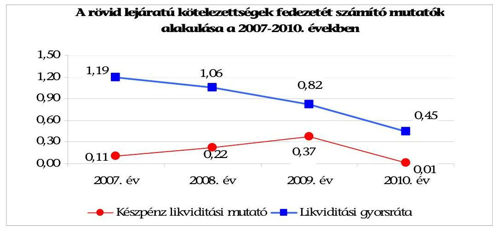

A készpénz likviditási mutató ${ }^{17}$ a 2007. évihez $(0,11)$ képest a 2008. és a 2009. évi növekedést követően 2010-re 0,01 pontra csökkent. A pénzeszközállomány a 2007-2010. években nem biztosította a rövid lejáratú kötelezettségek fedezetét. A mutató a 2010. évi kiugróan alacsony értékét a rövid lejáratú kötelezettségek állományának előző évhez viszonyított jelentős, 28,4\%-os (19,8 millió Ftos) növekedése (folyószámla- és munkabérhitel év végi állományának növekedése) és a pénzeszközállomány 25,7 millió Ft-ról 1,2 millió Ft-ra történő csökkenése együttesen okozták.

A likviditási gyorsráta ${ }^{18}$ a 2007. évi 1,19-ről a 2008-2010. években folyamatosan csökkent, a 2010. évre 0,45-re, ami azt jelentette, hogy a pénzeszközök és a követelések együttes összege a rövid lejáratú kötelezettségek mindössze 45\%-ára biztosított fedezetet. A likviditás kedvezőtlen alakulásának oka, hogy az Önkormányzat a 2008. évben értékesítette értékpapírját (20,8 millió Ft), valamint a hitelfelvételek következtében a rövid lejáratú kötelezettség állománya is nőtt, a 2007. évről a 2010. évre 42,2 millió Ft-ról 89,6 millió Ft-ra.

[^0]
[^0]:    ${ }^{17}$ A készpénz likviditási mutató kifejezi, hogy a pénzeszközök év végi állománya milyen arányban nyújt fedezetet a rövid lejáratú fizetési kötelezettségekre.
    ${ }^{18}$ A likviditási gyorsráta mutatja, hogy a rövid lejáratú fizetési kötelezettségek kiegyenlítéséhez a pénzeszközökön túl bevonható követelések, forgatási célú értékpapírok milyen arányban nyújtanak fedezetet.

---

# 2. A VAGYONI HELYZET ALAKULÁSA, VALAMINT A VAGYONGAZDÁLKODÁS FOLYAMATAIBAN A KONTROLLOK MŰKÖDÉSE 

### 2.1. Az Önkormányzat vagyoni helyzetének 2007-2010 közötti alakulása

Az Önkormányzat könyvviteli mérleg szerinti vagyona a 2007. évi 3403,6 millió Ft-ról a 2010. évre 3428,2 millió Ft-ra, 24,6 millió Ft-tal ( $0,7 \%$ kal) növekedett. A vagyon értéke a beruházások és felújítások, a vagyonértékesítés és az elszámolt értékcsökkenés együttes hatására változott. A vagyon növekedésének forrását a múködési célú bevételi többlet felhalmozási célra fordításával, az előző évi pénzmaradvány felhasználásával, valamint a hosszú lejáratú kötelezettségek állományának növelésével biztosították. Az Önkormányzat a 2007-2011. év I. félévben beruházási, felhalmozási célú hiteleket vett fel a fejlesztési kiadások fedezetének biztosítása érdekében.

Az Önkormányzat vagyonának összetételét a következő táblázat mutatja:

| AZ ÖNKORMÁNYZAT VAGYONA (millió Ft) |  |  |  |  |
| :-- | --: | --: | --: | --: |
| Eszközök | $\mathbf{2 0 0 7}$. év | $\mathbf{2 0 0 8}$. év | $\mathbf{2 0 0 9}$. év | $\mathbf{2 0 1 0}$. év |
| Immateriális javak és tárgyi eszközök | 2613,2 | 2620,1 | 2624,0 | 2724,5 |
| Befektetett pénzügyi eszközök | 0 | 0 | 0 | 0 |
| Üzemeltetésre átadott eszközök | 728,6 | 705,0 | 681,4 | 657,7 |
| Befektetett eszközök összesen | 3341,8 | 3325,1 | 3305,4 | 3382,2 |
| Forgóeszközök | 61,8 | 36,6 | 66,6 | 46,0 |
| ESZKÖZÖK ÖSSZESEN | $\mathbf{3 4 0 3 , 6}$ | $\mathbf{3 3 6 1 , 7}$ | $\mathbf{3 3 7 2 , 0}$ | $\mathbf{3 4 2 8 , 2}$ |
| KÖTELEZETTSÉGEK | $\mathbf{9 1 , 5}$ | $\mathbf{5 7 , 7}$ | $\mathbf{9 3 , 5}$ | $\mathbf{1 2 7 , 5}$ |
| SAJÁT VAGYON | $\mathbf{3 3 1 2 , 1}$ | $\mathbf{3 3 0 4 , 0}$ | $\mathbf{3 2 8 8 , 5}$ | $\mathbf{3 3 0 0 , 7}$ |

Az Önkormányzat adatait az 1. számú függelékben bemutatott korrigált adatok figyelembevételével rögzítettük, az értékelést ezek alapján végeztük el. A kötelezettségek értéke a könyvviteli mérlegben kimutatotthoz képest a 2007. évben 113,8 millió Ft-tal, a 2008. évben 131,1 millió Ft-tal, a 2009. évben 159,8 millió Ft-tal, a 2010. évben 114,2 millió Ft-tal alacsonyabb volt. Az eltéréseket a saját vagyon értékében korrigáltuk.

A tárgyi eszközök értéke tartalmazza az ingatlanokra vonatkozó értékhelyesbítés összegét, ami által az eszközcsoport piaci értékkel került a mérlegben kimutatásra. Az értékhelyesbítés értéke a 2007-2010. években 2380,6 millió $\mathrm{Ft}^{19}$ volt. Az Áhsz. 32/A. §-ában előírtak ellenére az értékhelyesbítés összegét évente nem vizsgálták felül, nem vezették át az Önkormányzat vagyonában bekövetkezett változások hatásait.

[^0]
[^0]:    ${ }^{19}$ Az Áhsz. 32. § (7) bekezdése lehetőséget ad arra, hogy a tárgyi eszközök a mérlegben piaci értéken is felvehetők.

---

A Képviselő-testület 2007-2010 között több alkalommal döntött ingatlanértékesítésről. Az Önkormányzat által megkötött adásvételi szerződések alapján építési telkek és földterületek értékesítésére került sor ${ }^{20}$. Az Önkormányzat az Áfa tv. 159. § (1) bekezdésében foglaltak ellenére számlaadási kötelezettségének nem tett eleget, az értékesítés miatti vagyoncsökkentést a könyvviteli mérlegben nem mutatták be. Az ellenőrzés során a jegyző ${ }_{2}$ azonnali intézkedést ${ }^{21}$ tett a hiányosság megszüntetésére és önrevízió benyújtását rendelte el az adóhatósághoz.

#### Abstract

A Polgármester ${ }_{2}$ az ÁSZ tv. 29. § (2) bekezdésében foglaltak alapján az alábbi észrevételt tette: „az ingatlan-értékesitéssel kapcsolatos bevételekkel kapcsolatos megállapításokat csak részben fogadjuk el. A 2007-2010 években beszedett összegek jelentős része 2002-ben kötött ingatlan adásvételi szerződésből származó részletfizetés. Az ingatlan értékesitések bevételét egy összegben az adásvételi szerződés megkötésekor kell számlázni. Tekintve, hogy esetünkben a számla kibocsátása 2002-ben kellett, hogy megtörténjen, az eredeti bizonylatok megőrzési határideje már lejárt, az alapbizonylatok tehát már nem lelhetők fel. A számlakibocsátást ugyan nem tudjuk igazolni, azonban a telkek vevői szinte minden esetben szociálpolitikai támogatással építkeztek a megvásárolt ingatlanra, ezért a számlára szükségük volt a vételár igazolásához a bank felé. Ennek értelmében, vélhetően a számlázást megtörténtnek kell tekinteni. A 2010. évi telek értékesitésekről a számlát pótlólag kiállitottuk. A számlák alapján elkészült ÁFAbevallás, és az önrevízió benyújtásra került."

Az észrevételt nem fogadtuk el, mert az ellenőrzési programban meghatározott ellenőrzési időszakkal összhangban a 2007-2010. évek értékesítéseire vonatkozóan fogalmaztuk meg a számla kiállítási kötelezettség elmulasztását. Megállapításunkat a jelenleg hivatalban lévő jegyző által a hiányosság megszüntetésére azonnali intézkedésként foganatosított önrevízió is megerősítette. (A jegyző ${ }_{2}$ azonnali intézkedésének elrendelését a jelentéstervezet 19. oldalának első, a 43. oldal utolsó előtti és az 51. oldal első bekezdései tartalmazzák).

Az Önkormányzat a vagyon állományában bekövetkezett változásokat a zárszámadás keretében bemutatta, azonban számviteli nyilvántartásaiban nem minden esetben került erre sor. Az 1/2007. (VI. 28.) számú határozat szerint a 272 hrsz-ú beépítetlen területből megosztással több építési telket hoztak létre, de a könyveikben nem került sor ennek megfelelő módosításra. Az Önkormányzat 87/2008. (VII. 10.) számú határozatában döntött a tulajdonában álló 272/2,3,4,5 hrsz-ú építési telkek értékesítéséről. A 2007-2010. években a telek a teljes értékével szerepelt a könyvviteli mérlegben annak ellenére, hogy a megosztással létrehozott telekrészek közül hármat értékesítettek.

Az Önkormányzat a tulajdonában lévő forgalomképes ingatlanok értékének átértékelése, aktualizálása céljából 2008 februárjában, valamint 2011 júniusában ingatlan értékbecslést készíttetett. A 2011. évben valósult meg az önkormányzati ingatlankataszter nyilvántartás, valamint a zárszámadáshoz készített vagyonkimutatásban szereplő értékadatok egyezőségének biztosítása.

[^0]
[^0]:    ${ }^{20}$ Az értékesítésre került ingatlanok könyv szerinti értékkel nem szerepeltek a könyvviteli mérlegben, piaci értékük értékhelyesbítésként jelent meg.
    ${ }^{21}$ Az intézkedés elrendelésére 2011. november 23-án került sor, 1466-10/2011. iktatószámmal.

---

Az Önkormányzat vagyonát a 2007-2010. években növelte, hogy beruházásaihoz ingatlanokat vásárolt, a 2007. évben 10,8 millió Ft-ért a Fő téri beruházáshoz, a 2010. évben 8,6 millió Ft-ért a Borostyán Természetvédő Óvoda felújításához kapcsolódóan, melynek forrását célhitelből biztosította.

A könyvviteli mérlegben az üzemeltetésre, kezelésre átadott eszközök között, valamint az azt alátámasztó leltárban a 2007-2010. években a csatornahálózatot (bruttó értéke 773,7 millió Ft) és az Áhsz. 20. § (1) bekezdésében előírtak ellenére a saját fenntartású iskola épületét (bruttó értéke 21,7 millió Ft) szerepeltették. Nem szerepelt ugyanakkor az üzemeltetésre, kezelésre átadott eszközök között a ravatalozó épületének értéke annak ellenére, hogy ezt a közszolgáltatási szerződésben rögzítették. A 2007-2010. években az Önkormányzat nem adott át kötelező vagy önként vállalt feladatot egyház, civil szervezet, vállalkozás részére úgy, hogy az a vagyonának nagyságát, összetételét változtatta volna.

A Képviselő-testület a 2007-2010. években az önkormányzati vagyon növekedését eredményező fejlesztési feladatokról döntött. A felhalmozási kiadások 205,3 millió Ft-tal növelték az Önkormányzat könyvviteli mérleg szerinti vagyonának az értékét. A Képviselő-testület fejlesztési döntéseinek eredményeként létrejött vagyon 100\%-ban kötelező feladatok ellátását szolgálta a Polgármesteri hivatal kimutatása szerint.

A befejezetlen beruházások állományából a Számv. tv. 26. § (7) bekezdése és az Áhsz. 9. számú melléklete 1. g) pontja előírása ellenére az időközben elkészült egyes fejlesztéseket, a beruházások üzembe-helyezését, műszaki átadását követően nem vezették ki, nem aktiválták. Az aktiválás elmaradása az Önkormányzat vagyonát olyan módon befolyásolta, hogy az érintett eszközökkel kapcsolatban nem került sor amortizáció elszámolására.

| Elszámolt értékcsökkenés és a felújításra fordított kiadás (millió Ft-ban) |  |  |  |  |
| :--: | :--: | :--: | :--: | :--: |
| Megnevezés | 2007. év | 2008. év | 2009. év | 2010. év |
| Elszámolt értékcsökkenés | 35,3 | 32,6 | 29,5 | 27,6 |
| Felújításra fordított kiadás | 36,3 | 7,3 | 3,1 | 7,2 |

Az Önkormányzat a tárgyi eszközök felújítására a 2007-2010. években összesen 53,9 millió Ft-ot fordított, ami az elszámolt 125,0 millió Ft összegű értékcsökkenés $43,1 \%$-a volt. Az értékcsökkenés pótlására az Önkormányzat elkülönített alapot nem képzett. A tárgyi eszközök elhasználódását jelző mutató ${ }^{22}$ értéke a 2007. évben $51,5 \%$, a 2010. évben $49,9 \%$ volt, amely jelzi, hogy a tárgyi eszközök $98,9 \%$-át kitevő ingatlanok - amelynek könyv szerinti értéke 2010. december 31-én 221,1 millió Ft - a beruházások, felújítások ellenére avultak.

[^0]
[^0]:    ${ }^{22}$ Elhasználódási mutató: tárgyi eszközök nettó értéke/tárgyi eszközök bruttó értéke.

---

# 2.2. A vagyongazdálkodás belső kontrolljainak múködése 

A vagyongazdálkodási folyamatok szabályozottságának hiányosságai magas kockázatot jelentettek a feladatok szabályszerű végrehajtásában, mivel a jegyző ${ }_{1,2}$ nem határozta meg a vagyongazdálkodási folyamatok ellenőrzési feladatait:

A kontrollkörnyezetet érintően:

- a jegyző ${ }_{1}$ nem készített az Ámr. 156. § (2) bekezdésében ${ }^{23}$ előírtak ellenére ellenőrzési nyomvonalat;

A jegyző ${ }_{2}$ a FEUVE szabályzat részeként elkészítette az ellenőrzési nyomvonalat, amely 2011. július 29 -től hatályos.

- a jegyző ${ }_{1}$ nem készítette el az etikus magatartással kapcsolatos elvárások meghatározását tartalmazó etikai kódexet.

A jegyző ${ }_{2}$ elkészítette az etikus magatartással kapcsolatos elvárások meghatározását tartalmazó etikai kódexet, amely 2011. július 29-től hatályos.

A kockázatkezelés rendje keretében ${ }^{24}$ :

- a jegyző ${ }_{1,2}$ az Ámr. 157. § (1) bekezdésében ${ }^{25}$, és a Belső Kontroll Kézikönyv 2. pontjában előírtak ellenére nem határozta meg a csalás, korrupció kockázatának minősítését;

A Polgármester ${ }_{2}$ az ÁSZ tv. 29. § (2) bekezdésében foglaltak alapján az alábbi észrevételt tette: „A Belső Ellenőrzési Kézikönyv a felelősség megállapítására, és a felelősségre vonásra vonatkozóan tartalmaz kötelező előirásokat. Amennyiben csalás, korrupció lehetősége merül fel, az üggyel kapcsolatban rendőrségi feljelentésre kerül sor. A csalás, illetve a korrupció minősitése ezt követően az eljáró hatóság feladata. Tekintve hogy kis önkormányzatról van szó nincsen külön jogi osztály, vagy jogtanácsos, aki ezeket az ügyeket a Btk-nak megfelelően minősítse, így erre az eljárásrendre szorítkozunk. A belső ellenőrzés kistérségi formában történik, a szabálytalanságok kezelésében és minősitésében is a kistérség által megfogalmazott belső ellenőrzési kézikönyvre támaszkodunk.".

Az észrevételt nem fogadtuk el, mert a megállapításunk nem a csalás és a korrupció minősítésére vonatkozó feladatokra, hanem azok megelőzésével kapcsolatos szabályozási problémákra mutatott rá. Az Ámr. 157. § (2012. január 1-jétől az új Ber. 7. §-a) előírja a költségvetési szerv vezetője részére a kockázatelemzést és a kockázatkezelést. Az 1/2009. (IX. 11.) PM irányelv 2. 5. pontja pedig ezen belül meghatározza, hogy kiemelt figyelmet kell fordítani a súlyosabb szabálytalanságok (csalás, korrupció), mint kiemelt kockázatok kezelésére. Eszerint a költségvetési szerv - a jogszabályok alkalmazása valamennyi költségvetési szervre, így a Polgármesteri hivatalra vonatkozóan is kötelező - vezetésének kiemelt kötelezettsége a szabálytalanságok kezelésén belül a csalás és a korrupció bekövetke-

[^0]
[^0]:    ${ }^{23}$ 2012. január 1-jétől az új Ber. 6. § (3) bekezdése
    ${ }^{24}$ A költségvetési szerv vezetője köteles az Ámr. 157. § (1) bekezdése és a Belső Kontroll Kézikönyv 2. pontja szerint a kockázati tényezők figyelembevételével kockázatelemzést végezni és kockázatkezelési rendszert múködtetni.
    ${ }^{25}$ 2012. január 1-jétől az új Ber. 7. §-a

---

zésének megakadályozása. A belső ellenőrzés társulási formában történő ellátásától függetlenül az Áht. 121/A. § (1) bekezdése (2012. január 1-jétől az új Áht. 69. § (2) bekezdése) alapján a belső kontrollrendszer létrehozásáért, múködtetéséért és fejlesztéséért a költségvetési szerv vezetője a jegyző a felelős.

- a jegyző ${ }_{1,2}$ az Ámr. 157. § (1) bekezdésében, és a Belső Kontroll Kézikönyv 2. pontjában előírtak ellenére nem határozta meg a vagyongazdálkodás főfolyamatára a kockázatokkal kapcsolatos válaszlépéseket.

A kontrolltevékenységek meghatározása során:

- a jegyző ${ }_{1,2}$ nem írt elő ellenőrzési kötelezettséget a vagyon forgalomképessége megváltozatásának módjára vonatkozó előírások betartására a vagyongazdálkodási rendeletben;
- a jegyző, nem írt elő ellenőrzési kötelezettséget a vagyongazdálkodási döntési hatáskör vizsgálatára;

A jegyző ${ }_{2}$ előírta az ellenőrzési kötelezettséget a vagyongazdálkodási döntési hatáskör vizsgálatára a 2011. július 29-től hatályos gazdálkodási szabályzatban.

- a jegyző ${ }_{1}$ az Ámr. 155. §-a ${ }^{26}$ ellenére nem írt elő beszámolási kötelezettséget az átruházott hatáskörben hozott döntésekről;

A Képviselő-testület a 19/2011. (VI. 24.) számú rendeletében előírta a beszámolási kötelezettséget az átruházott hatáskörben hozott döntésekről.

- a jegyző ${ }_{1}$ a leltározási és leltárkészítési szabályzatában nem határozta meg az üzemeltetésre, vagyonkezelésre, koncesszióba átadott eszközök leltározásának módját, az Áhsz. 37. § (4) bekezdésében előírtak ellenére;

A jegyző ${ }_{2}$ meghatározta a 2011. július 29-től hatályos leltározási és leltárkészítési szabályzatában az üzemeltetésre, vagyonkezelésre, koncesszióba átadott eszközök leltározásának módját.

- a jegyző ${ }_{3}$ nem kezdeményezte, hogy a Képviselő-testület írja elő a döntéselőkészítés folyamatában a vagyon értékesítésével és hasznosításával kapcsolatban a költség-haszonelemzés készítésének kötelezettségét;

A jegyző ${ }_{2}$ a 2011. július 29-től hatályos FEUVE szabályzatban előírta a döntéselőkészítés folyamatában a vagyon értékesítésével és hasznosításával kapcsolatban a költség-haszonelemzés készítésének kötelezettségét.

- a jegyző ${ }_{1,2}$ nem írta elő a versenyeztetés elvégzésének ellenőrzését, a feladatok végrehajtási szakaszában az Önkormányzat érdekeinek védelmét szolgáló garanciális elemek szerződésben, egyéb dokumentumban való rögzítésének kötelezettségét;
- a jegyző ${ }_{1,2}$ a vagyon értékesítésével és hasznosításával kapcsolatban nem kezdeményezte, hogy a Képviselő-testület előírja a Pénzügyi bizottság beszámolási kötelezettségét a vagyonváltozás figyelemmel kísérésének eredményéről;

[^0]
[^0]:    ${ }^{26}$ 2012. január 1-jétől az új Ber. 8. §-a

---

- a jegyző ${ }_{1,2}$ nem szabályozta, illetve nem írta elő a finanszírozási célú pénzügyi műveletekkel összefüggésben a pénzügyi kockázatok felmérésének kötelezettségét, a hitelfelvételről szóló döntések előkészítési folyamatában a futamidő egyes éveit terhelő kötelezettség költségvetési egyensúlyra gyakorolt hatásának vizsgálati kötelezettségét;
- a jegyző ${ }_{1,2}$ nem határozta meg a vagyongazdálkodási folyamatok rögzítésére használt informatikai programok adatai használatára vonatkozó követelményeket;

A Polgármester ${ }_{2}$ az ÁSz tv. 29. § (2) bekezdésében foglaltak alapján az alábbi észrevételt tette:" A jegyzö ${ }_{1,2}$ nem határozta meg a vagyongazdálkodási folyamatok rögzitésére használt informatikai programok adatai használatára vonatkozó követelményeket. Ilyen tartalmú szabályzat ugyan nem készül, azonban az egyes munkavállalók munkakör átvétel-átadási jegyzőkönyveiben szerepel, mely programokhoz, milyen jelszóval, milyen jogosultságot kapnak. A vagyongazdálkodáshoz szorosan kötődő vagyonkataszteri program korábban nem létezett. 2011 áprilisában, külső megbizott bevonásával a jegyzö ${ }_{2}$ intézkedett a hiányosság megszüntetéséről. A kataszteri program feltöltése 2011. június 30 -ára elkészült, és jelenleg is üzemel. Feltöltését a programgazda végzi, míg megtekintési jogosultsággal a településgazda, illetve a pénzügyi csoport vezetője rendelkezik munkaköri leírása szerint."

Az észrevételt nem fogadtuk el, mert a munkaköri leírások egyrészt nem normatív szabályzatok, másrészt az azokban rögzített jelszavak és hozzáférési jogosultságok önmagukban nem minősülnek a vagyongazdálkodási folyamatok rögzítésére alkalmazott informatikai programok adatai használatára vonatkozó követelmények meghatározásának. Az informatikai szabályzatokban rögzíteni kell az informatikai rendszereknek és az azok által kezelt adatok, információk biztonságának megteremtéséhez és fenntartásához szükséges előírásokat, illetve rögzítik a katasztrófa-helyzetben követendő eljárásokat az érintett informatikai rendszerek múködésének visszaállítására.

- a jegyző az Ámr. 155. § (1) bekezdésében ${ }^{27}$ és az Áht. - a 2010. évben hatályos - 121. § (1) bekezdésében ${ }^{28}$ előírtak ellenére hiányosan alakította ki a Polgármesteri hivatal belső kontrollrendszerét, a FEUVE múködtetéséhez nem írta elő a vezetői ellenőrzési kötelezettséget, nem határozta meg az ellenőrzésért felelős személyeket a finanszírozási célú pénzügyi műveletek folyamataira vonatkozóan;

A jegyző a 2011. július 29-től hatályos FEUVE szabályzatban kialakította a Polgármesteri hivatal belső kontrollrendszerét, a FEUVE múködtetéséhez előírta a vezetői ellenőrzési kötelezettséget.

- a jegyző ${ }_{1,2}$ nem határozta meg a bevételeket megalapozó döntések szerződésben történő felülvizsgálatának feladatai között annak ellenőrzési kötelezettségét, hogy a szerződés tartalmazza-e a döntési hatáskörrel rendelkező által meghatározott feltételeket (ellenérték, fizetési feltételek, nem teljesítés esetén szankció), a szerződésben az arra hatáskörrel rendelkező vállalt-e kötelezettséget;

[^0]
[^0]:    ${ }^{27}$ 2012. január 1-jétől az új Ber. 8. § (2) bekezdése
    ${ }^{28}$ 2011. január 1-jétől az Áht. 121/A. § (4) bekezdése, 2012. január 1-jétől az új Ber. 8. § (2) bekezdése

---

- a jegyző ${ }_{1,2}$ nem jelölte ki a bevételeket megalapozó döntésekben meghatározott feltételek szerződésben történő érvényesítése ellenőrzésének végrehajtásáért felelős személyeket, így nem írta elő az ingatlanértékesítési és a hitelviszonyt megtestesítő értékpapír-értékesítési szerződésekben foglaltak ellenőrzését;
- a jegyző ${ }_{1}$ nem írta elő az Ámr. 20. § (3) bekezdés a) pontjában ${ }^{29}$, valamint az Ámr. 76. § (3) bekezdésében ${ }^{30}$ előírtak ellenére a gazdálkodási szabályzatban a szakmai teljesítésigazolás dokumentációs szabályai közül a bizonylatokra vezetendő rájegyzés módját.

A jegyző ${ }_{2}$ 2011. július 29-én a gazdálkodási szabályzat módosításával meghatározta a szakmai teljesítésigazolás megtörténte dokumentálásának, a bizonylatokra történő rájegyzésének módját.

Az információt, kommunikációt, monitoringot érintően:

- a jegyző ${ }_{1}$ nem határozta meg a vagyongazdálkodás külső és belső információi kezelésének és a vagyongazdálkodással összefüggő közérdekű (közzéteendő) adatok kezelésének rendjét;

A jegyző ${ }_{2}$ a 2011. július 29-től hatályos vagyongazdálkodási rendeletben előírta a vagyongazdálkodás külső és belső információi kezelésének és a vagyongazdálkodással összefüggő közérdekű (közzéteendő) adatok kezelésének rendjét.

- a jegyző ${ }_{1,2}$ nem határozta meg a szabálytalanságok kezelésére vonatkozó eljárásrendben a vagyongazdálkodási folyamatokra vonatkozóan az észlelt szabálytalanságokra vonatkozó feladatokat;
- a jegyző ${ }_{1}$ nem határozta meg a vagyongazdálkodási folyamatokra vonatkozó követési módszereket, a belső kontrollrendszer évenkénti felülvizsgálatát.

A jegyző ${ }_{2}$ a 2011. július 29-től hatályos FEUVE szabályzatban meghatározta a vagyongazdálkodási folyamatokra vonatkozó követési módszereket, a belső kontrollrendszer évenkénti felülvizsgálatát.

A Polgármester ${ }_{2}$ az ÁSZ tv. 29. § (2) bekezdésében foglaltak alapján az alábbi észrevételt tette: "2011. év elején az ÁSZ jelen vizsgálatához kapcsolódóan előzetes vizsgálatot tartott Önkormányzatunknál. Akkor jelezték az utalványrendeletünk hibáit, és a belső szabályzataink hiányát, a szerződés-nyilvántartás hiányát. A jegyző, kinevezését (2011. 04. 19.) követően a 2011. 06. 30-ig a korábbi szabályzatokat aktualizálta a gazdálkodási rendszert átvizsgálta, a számvevők által jelzett hibákat igyekezett orvosolni és a napi teendőket ellátni. Szeretném, ha a Számvevőszék meghatározná ennek az időszaknak azon feladatait, amit az új jegyzőnek (2 számú) el kellett volna látnia, és mi az ami ebből nem teljesült. Csak akkor szerepeltesse a jegyző mellett a 2 számot, amiben az időszak feladatait meghatározta."

A kiegészítésre vonatkozó kérést nem fogadtuk el, mivel a belső kontrollrendszer kialakításával kapcsolatosan feltárt hiányosságok részletes bemutatása mellett minden esetben részbekezdésben szerepeltettük a jelenleg hivatalban lévő jegyző

[^0]
[^0]:    ${ }^{29}$ 2012. január 1-jétől az Ávr. 13. § (2) bekezdés a) pontja
    ${ }^{30}$ 2012. január 1-jétől az Ávr. 57. § (3) bekezdése

---

(jegyző ${ }_{2}$ ) által megtett intézkedéseket. További intézkedést azok a szabályozási hiányosságok igényelnek, amelyeket eddig nem pótoltak, így a jelentéstervezet a 25. oldala 3. számú javaslata tartalmazza, hogy a jegyző folytassa a belső kontrollrendszer kialakítását.

A Polgármester ${ }_{2}$ észrevételezte továbbá, hogy: "a szabályzatok tartalmával kapcsolatos megállapításokat részben egymásnak ellentmondónak tartjuk. A jegyzö ${ }_{12}$ „...megfelelően alakította ki a vagyongazdálkodási célok eléréséhez szükséges kontroll környezetet...". Ugyanakkor a későbbiekben szerepel, hogy a korábban hiányzó szabályzatok elkészültek."

Az észrevételt nem fogadtuk el, mert az ÁSZ a belső kontrollrendszer kiépítésének és múködésének értékelését az ellenőrzési programban meghatározott időszakra (2010. év és a 2011. év I. félév), egységes szempontrendszer figyelembevételével végezte el. A jelentéstervezetben bemutatott szabályozási hiányosságok alapján a 2010. évre vonatkozóan megállapítottuk, hogy ezen szabályzatok hiánya a vagyongazdálkodási feladatok végrehajtásában magas kockázatot jelentenek. A jelentésben ismertettük továbbá azokat a szabályozási intézkedéseket is, amelyeket a jegyző ${ }_{2} 2011$ júliusában hajtott végre. A vagyongazdálkodás folyamataiban a különböző belső szabályzatok kialakításának hiányosságai mindaddig kockázatot jelentenek a feladatok megfelelő, szabályszerű végrehajtásában, amíg azokat el nem készítik. Ezért a megállapítások fenntartását indokolják a még jelenleg is fennálló hiányosságok, valamint az, hogy a 2011 júliusában kiadott szabályzatok csak a hatályba lépésüket követően fejthették ki kedvező hatásukat a belső kontrollrendszer múködésében.

A Polgármesteri hivatalban a 2010. évben és a 2011. év I. félévében a vagyongazdálkodási folyamatokban a belső kontrollok nem biztosították a vagyongazdálkodás eredményességét. A kontrollok múködése gyenge volt, mert:

- a kockázatkezelési rendszer múködését érintően nem értékelték a vagyongazdálkodás folyamatában a külső és belső kockázatokat;
- nem végezték el a kockázat azonosítását és értékelését, továbbá a csalás, korrupció minősítését, nem hozták meg a felmerült kockázatokra a szükséges válaszlépéseket;
- nem követték nyomon a vagyongazdálkodás kockázati tényezőinek csökkentése érdekében hozott intézkedéseket.

A vagyongazdálkodási folyamatban a belső kontrolltevékenységek (eljárások) múködése során:

- a döntési jogkör gyakorlója nem tett eleget az átruházott hatáskörben hozott vagyongazdálkodási döntésekkel kapcsolatos beszámolási kötelezettségének;

Az SzMSz 1. számú melléklete tartalmazta a Képviselő-testület által átruházott hatáskörök, és a gyakorlásukra feljogosítottak jegyzékét, amiben a polgármester részére az 50 ezer Ft és 300 ezer Ft értékhatár közötti beszerzési értékű eszközök értékesítése esetére biztosítottak döntési jogkört, de beszámolási kötelezettséget nem írtak elő számára.

---

- a vagyonértékesítéseket megelőzően annak célszerűsége ellenére ${ }^{31}$ nem készítettek költség-haszonelemzést;
- nem végezték el a 272/4 hrsz-ú építési telek értékesítését megelőző versenyeztetési eljárás ellenőrzését;
- a Pénzügyi bizottság az Ötv. 92. § (13) bekezdésének b)-c) pontjaiban és (14) bekezdésében előírtak ellenére a vagyonváltozás alakulásának figyelemmel kíséréséről nem számolt be a Képviselő-testületnek;
- a finanszírozási célú pénzügyi műveleteket megelőzően a döntés-előkészítés folyamatában nem mérték fel és nem számszerúsítették a pénzügyi kockázatokat, nem végezték el a futamidő egyes éveit terhelő kötelezettségvállalás költségvetési egyensúlyra gyakorolt hatásának vizsgálatát, a Pénzügyi bizottság az SzMSz-ben foglaltak ellenére nem terjesztette be a hitelfelvétel indokainak és gazdasági megalapozottságának vizsgálatáról szóló véleményét a hitelfelvételhez kapcsolódó képviselő-testületi döntéshez;
- a vagyongazdálkodási tevékenységek folyamataiban használt számítástechnikai programok adatai tekintetében nem volt biztosított az adatokhoz való hozzáférésre, biztonságos tárolásra vonatkozó előírások betartása;
- vezetői ellenőrzés keretében nem számoltatták be a vagyongazdálkodási feladatokat végzőket a vagyonértékesítés, vagyonhasznosítás folyamatairól, annak eredményéről, a finanszírozási célú pénzügyi műveletek végrehajtásának folyamatáról és a végrehajtás eredményéről;
- a vagyongazdálkodási tevékenységre vonatkozóan ellenőrzési nyomvonalban nem jelöltek ki ellenőrzési pontokat. A vagyongazdálkodási feladatok ellátásával megbízott köztisztviselők nem tartották be a munkaköri leírásaikban előírt beszámolásra vonatkozó szabályokat, a kötelező mérlegegyezőségek biztosítását, a nyilvántartások folyamatos vezetését, aktualizálását.

A Polgármester ${ }_{2}$ az ÁSZ tv. 29. § (2) bekezdésében foglaltak alapján az alábbi észrevételt tette: „A vagyongazdálkodási feladatok ellátásával megbizott köztisztviselők nem tartották be a beszámolásra vonatkozó szabályokat, a kötelező mérlegegyezőségek biztosítását, a nyilvántartások folyamatos vezetését, aktualizálását...a mérlegegyezőségekre vonatkozóan feltárt szabálytalanságokkal kapcsolatban nem alkalmaztak szankciókat. Nem tünik ki a jelentésből, továbbra sem, hogy a Polgármesteri Hivatalban már megszünt azon köztisztviselők közszolgálati jogviszonya, akik felelősségre vonhatóak lennének az elkövetett szabálytalanságok miatt."

Az észrevételt és a kiegészítésre vonatkozó kérést nem fogadtuk el, egyrészt mert a jelentés nem tartalmazza az észrevételben idézett szankcionálásra vonatkozó szövegrészt. Másrészt a vagyongazdálkodási feladatokat ellátó köztisztviselők közszolgálati jogviszonyának megszűnésére vonatkozó kiegészítés nem indokolt, mivel a belső kontrollok szabályszerű kialakítása és múködtetése vonatkozásában a személyi változásokkal kapcsolatos körülményeket, ahol a munkajogi fele-

[^0]
[^0]:    ${ }^{31}$ A Képviselő-testület az ingatlanértékesítések során határozataiban a vételár egyöszszegű befizetése esetén 50\% kedvezményt, 30\% befizetése esetén kamatmentes részletfizetési lehetőséget biztosított a vevők számára.

---

lősség érvényesíthetősége kérdésköre indokolta, a jelentéstervezet 36. és 37. számú lábjegyzeteiben rögzítettük.

Az információ, kommunikáció, monitoring területét érintően:

- nem tartották be a vagyongazdálkodás külső és belső információi kezelésének az iratkezelési szabályzatban ${ }^{32}$ előírt rendjét, mert a vagyongazdálkodási feladatokat ellátó köztisztviselők az iratkezelési szabályzat ellenére nem irattározták a vagyongazdálkodással kapcsolatban keletkezett iratokat;
- jegyző ${ }_{2}$ az Áht. 15/B. § (1) bekezdését ${ }^{33}$ megsértve nem tette közzé a vagyongazdálkodással összefüggően a nettó ötmillió forintot elérő, vagy azt meghaladó értékű építési beruházásra, vagyonhasznosításra vonatkozó szerződések közérdekű adatait (a szerződés megnevezését, tárgyát, a szerződést kötő felek nevét, a szerződés értékét, az adatok változásait és határozott időtartamú szerződések esetében az időtartamot);

A Polgármester ${ }_{2}$ az ÁSZ tv. 29. § (2) bekezdésében foglaltak alapján az alábbi észrevételt tette: "...nem tettünk eleget a nettó öt millió Ft-ot elérő, vagy azt meghaladó vagyonváltozást eredményező szerződések adatai közzétételének. Egy igen előnytelen szerződésnek köszönhetően az önkormányzat honlapja mind a mai napig fejlesztés alatt áll. A vizsgálat ideje alatt pedig ideiglenesen az üzemeltetése is szünetelt. Ezt a hibát 2012. I. negyedévében orvosolni fogjuk."

Az indokolást nem fogadtuk el, mert a nettó ötmillió Ft-ot elérő, vagy azt meghaladó szerződések adatainak közzétételi kötelezettségét az Áht. 15/B. §-a (2012-től az új Eisztv. 32-33. §-ai) írja elő, ettől eltérni az észrevételben tett indokok alapján sem lehet.

- a vezetői információs szabályzat előírásai ellenére nem múködtették megfelelően a vezetői információs rendszert, a vagyongazdálkodási információkat nem továbbították az egyes szervezeti szintek között;
- a vagyongazdálkodási folyamatokat nem követték nyomon;
- a belső kontrollrendszer évenkénti felülvizsgálatát elmulasztották, nem gondoskodtak a kontrollrendszer hiányosságainak megszüntetéséről.

A Polgármesteri hivatalban a 2010. évi költségvetésben ingatlan értékesítéséből 71,7 millió Ft költségvetési bevételt terveztek, amely a 2010. évben a költségvetési bevételi előirányzatok 9,4\%-át tette ki. A 2010. évben az ingatlanértékesítés teljesített bevétele 1,0 millió Ft, amely a költségvetési bevételek 0,2\%-a. A 2011. évben az ingatlanok értékesítését az önkormányzati lakótelek értékesítésként tervezték, melynek előirányzata 58,6 millió Ft, amely a költségvetési bevételek $9,5 \%$-át tette ki.

A Polgármesteri hivatalban a 2010. évben és a 2011. év I. félévében ingatlanértékesítésből származó bevételként a 2010. évben és az előző években megkötött adásvételi szerződésekben megállapított részletfizetések jelentek meg. Az in-

[^0]
[^0]:    ${ }^{32}$ SzMSz 2. számú melléklet (hatályos 2008. március 28-tól)
    ${ }^{33}$ 2012. január 1-jétől az új Eisztv. 32. és 33. §-a és a 37. § (1) bekezdése

---

gatlan értékesítésből származó bevételek teljesítése során a kulcsszerepet betöltő belső kontrollok - a bevételeket megalapozó szerződések ellenőrzése és az utalvány ellenjegyzés - múködése gyenge volt, mert az értékesítési feltételek ellenőrzését végző személyek kijelölésének hiányában a 208/1 hrsz-ú ingatlannal kapcsolatban 2010. október 11-én, a 271/7 hrsz-ú ingatlannal kapcsolatban 2010. december 20-án, a 284 hrsz-ú ingatlannal kapcsolatban 2010. október 1-jén, valamint a 273/1 hrszú ingatlannal kapcsolatban 2010. július 8-án befolyt vételár részletekkel kapcsolatos adásvételi szerződések esetében nem ellenőrizték a Képviselő-testület által meghatározott feltételeket, az Önkormányzat érdekeit védő garanciális elemek szerződésben való meglétét.

A gazdálkodási szabályzatban előírtak ellenére a 208/1 hrsz-ú, valamint a 284 hrsz-ú ingatlanok értékesítéséből származó vételár részletének beszedését megelőzően nem állítottak ki utalványt. A 273/1 hrsz-ú ingatlannal kapcsolatos vételárrészlet befizetéséről szóló utalványt az ellenjegyzésére jogosult személy nem ellenjegyezte, így nem végezte el az Ámr. 79. §-ában ${ }^{34}$ előírt, ellenőrzési feladatokat, a gazdálkodási szabályzat előírásai ellenére nem vizsgálta, hogy a bevételek elszámolását megelőző szakmai teljesítésigazolás megtörtént-e, valamint a Képviselő-testület által meghatározott ingatlanértékesítési bevétel a szerződésben meghatározottaknak megfelelt-e. A 271/7 hrsz-ú ingatlan vételár részletének beszedését megelőzően az utalvány ellenjegyezése megtörtént, azonban nem állapítható meg, hogy azt az ellenjegyzésre feljogosított személy végezte-e. Az Ámr. 80. § (3) bekezdésében ${ }^{35}$ előírtak, valamint a gazdálkodási szabályzatban foglaltak ellenére a gazdasági vezető nem gondoskodott az ellenjegyzésre jogosultak aláírás mintáinak a gazdálkodási szabályzatban rögzített formában való nyilvántartásáról.

A belső kontrollok szabályozási és ebből adódó működési hiányosságai ${ }^{36}$ hozzájárultak ahhoz, hogy az ingatlanértékesítésekről a Számv. tv. 167. § (1) bekezdésében, valamint az Áfa tv. 159. § (1) bekezdésében előírt kötelezettségeket megsértve nem került sor számla kiállítására. A vezetői ellenőrzés és az ellenőrzési nyomvonal kialakításának hiánya hozzájárult ahhoz, hogy a gazdasági vezetö ${ }^{37}$ a munkaköri leírásában ${ }^{38}$ foglaltak ellenére nem gondoskodott az ingatlan értékesítések részletfizetéseiről szóló számlák kiállításáról, valamint az Önkormányzatnál keletkező Áfa fizetési kötelezettség kimutatásáról és teljesítéséről, továbbá ahhoz, hogy a részletfizetésekről nem vezettek naprakész analitikus nyilvántartást és ennek következtében a hátralékosokat nem szólították fel rendszeresen a fizetési kötelezettségük teljesítésére.

[^0]
[^0]:    ${ }^{34}$ 2012. január 1-jétől hatályon kívül, helyette: az Ávr. 58. § (2) bekezdése
    ${ }^{35}$ 2012. január 1-jétől az Ávr. 60. § (3) bekezdése
    ${ }^{36}$ A belső kontrollok kialakításának és múködtetésének hiányosságaival összefüggésben az értékesítésekről szóló számlák kiállítása és a kapcsolódó Áfa fizetési kötelezettség elmulasztása miatt a jegyző, fegyelmi felelősségre vonása nem érvényesíthető, mivel köztisztviselői jogviszonya 2011. április 18-án megszűnt.
    ${ }^{37}$ A gazdasági vezető közszolgálati jogviszonya az Önkormányzatnál 2009. március 1jétől 2010. november 30-ig állt fenn. A jogviszony megszűnése miatt a fegyelmi felelősségre vonás nem érvényesíthető.
    ${ }^{38}$ a 2010. július 1-jén kelt munkaköri leírás

---

A jegyző, azonnali intézkedést adott ki a szabálytalanság kivizsgálására, melynek során a 2010. évre vonatkozóan - 9 darab építési telek értékesítéséről szóló szerződéshez kapcsolódó - 0,6 millió Ft Áfa fizetési kötelezettség elmulasztását mutatta ki az Önkormányzat az önellenőrzési jegyzőkönyveiben.

A Polgármesteri hivatal 2010. évi költségvetésében az ingatlanok felújításával kapcsolatos kiadások előirányzata 206,9 millió Ft, a teljesítés 7,2 millió Ft volt. Az előirányzat 52,6\%-os, a teljesítés 5,5\%-os részarányt képviselt a Polgármesteri hivatal felhalmozási kiadásaiból. A 2011. évi költségvetésben 227,6 millió Ft előirányzatot terveztek.

A Polgármesteri hivatalban a 2010. évben és a 2011. év I. félévében az ingatlanok felújításával kapcsolatos kiadások teljesítése során a belső kontrollok nem biztosították a vagyongazdálkodás eredményességét. A kulcsszerepet betöltő belső kontrollok - a kötelezettségvállalás ellenjegyzése, a szakmai teljesítésigazolás és az utalvány ellenjegyzés - múködése gyenge volt, mert:

- a kötelezettségvállalást az Áht. 100/C. § (3) bekezdésében ${ }^{39}$ és az Ámr. 74. § (1) bekezdésében ${ }^{40}$ foglalt előírás ellenére nem előzte meg annak ellenjegyzése a Fő téri gyalogos híd elkészítésére vonatkozó megbízási szerződés esetében. Ezen kötelezettségvállalást megelőzően a jegyző; által ellenjegyzésre feljogosított személy az Ámr. 74. § (3) bekezdésében ${ }^{41}$ előírtak ellenére nem ellenőrizte a kötelezettségvállalás tárgyával összefüggő kiadási előirányzat rendelkezésre állását, a fedezet meglétét, és nem vizsgálta, hogy a kötelezettségvállalás sérti-e a gazdálkodásra vonatkozó szabályokat. A Hanfland lakóterület csapadékvíz elvezetési tervének, a Fő téri gyalogoshíd műszaki ellenőrzésének, valamint a hídhoz vásárolt faanyagok gazdasági eseményeknél - az ellenjegyzésre jogosultak nyilvántartásának hiánya miatt - nem állapítható meg, hogy a kifizetéseket megelőzően a kötelezettségvállalások ellenjegyzését az arra feljogosított személy végezte-e;
- az Ámr. 76. § (1) bekezdésében ${ }^{42}$ foglalt előírások ellenére a jegyző; által szakmai teljesítésigazolásra kijelölt személy a Fő téri gyalogos híd elkészítésére vonatkozó megbízási díj 2010. október 31-ei és a Fő téri gyalogos hídhoz történt anyagvásárlás 2010. július 7-ei kifizetéseit megelőzően a szakmai teljesítésigazolást nem végezte el, ezáltal elmaradt a kifizetés jogosságának, összegszerűségének és a szerződésszerű teljesítésnek az ellenőrzése. Az Ámr. 76. § (3) bekezdésének ${ }^{43}$ előírása ellenére nem határozták meg gazdálkodási szabályzatban a szakmai teljesítésigazolás dokumentálási rendjét, ezért a csapadékvíz elvezetési terv és a faanyag vásárlása esetében a számlákon a különböző („telj. ig.", illetve „teljesítést igazolom") rájegyzések nem jelentették az Ámr. 76. § (1) bekezdésének előírásai ellenére a kiadások teljesítésének elrendelése előtti ellenőrzések elvégzését, a jogosultság és az összegszerűség el-

[^0]
[^0]:    ${ }^{39}$ 2012. január 1-jétől az új Áht. 37. § (1) bekezdése
    ${ }^{40}$ 2012. január 1-jétől az Ávr. 52. § (1) bekezdése
    ${ }^{41}$ 2012. január 1-jétől az Ávr. 54. § (1) bekezdése
    ${ }^{42}$ 2012. január 1-jétől az Ávr. 57. § (1) bekezdése
    ${ }^{43}$ 2012. január 1-jétől az Ávr. 57. § (3) bekezdése

---

lenőrzésének, valamint a kötelezettségvállalásban foglaltak teljesítésének szakmai igazolását. A kijelölésre vonatkozó nyilvántartás hiányossága miatt a szakmai teljesítés igazolására vonatkozó aláírásokról nem állapítható meg, hogy azt az arra feljogosított személyek végezték-e;

- a Hanfland lakóterület csapadékvíz elvezetési tervének 2010. július 22-ei, a Fő téri gyalogos híd elkészítésére vonatkozó megbízás díjának 2010. október 31-ei, a Fő téri hídhoz történt anyagvásárlás 2010. július 7-ei, a gyalogos híd műszaki ellenőrzési díj 2010. szeptember 29-ei és a Fő téri hídhoz faanyag vásárlás 2010. szeptember 19-ei kifizetései esetében - az ellenjegyzésre jogosultak nyilvántartásának hiánya miatt - nem állapítható meg, hogy a jegy$z o ̋$; által utalvány ellenjegyzésre feljogosított személy végezte-e az utalvány ellenjegyzést. Az utalvány ellenjegyző nem ellenőrizte az Ámr. 79. § (2) bekezdésében foglaltak ellenére a szakmai teljesítésigazolás elvégzését, valamint nem kifogásolta, hogy a kifizetésekhez kapcsolódó kötelezettségvállalást az Ámr. 74. § (1) bekezdésében foglaltak ellenére nem előzte meg annak ellenjegyzése, továbbá nem észrevételezte, hogy utalványrendeleten az Ámr. 78. § (2) bekezdés g) pontjában ${ }^{44}$ előírtak ellenére nem tüntették fel a kötelezettségvállalás nyilvántartási számát.

A Polgármesteri hivatal 2010. évi költségvetésében az államháztartáson kívülre non-profit szervezeteknek átadott múködési célú pénzeszközök előirányzata 7,1 millió Ft, a teljesítés 5,5 millió Ft volt. Az előirányzat 1,9\%-os, a teljesítés $1,7 \%$-os részarányt képviselt a Polgármesteri hivatal múködési kiadásaiból. A 2011. évi költségvetésben 11,9 millió Ft előirányzatot terveztek.

A Polgármesteri hivatalban a 2010. évben és a 2011. év I. félévében az államháztartáson kívülre non-profit szervezeteknek átadott múködési célú pénzeszközökkel kapcsolatos kiadások teljesítése során a belső kontrollok nem biztosították a vagyongazdálkodás eredményességét. A kulcsszerepet betöltő belső kontrollok - a kötelezettségvállalás ellenjegyzése, a szakmai teljesítésigazolás és az utalvány ellenjegyzés - múködése gyenge volt, mert:

- az Áht. 100/C. § (3) bekezdésének és az Ámr. 74. § (1) bekezdésének előírása ellenére a gyermektáborozás támogatására 2010. július 19-én, a MackóBarlang Egyesület őszi szemétszedésének támogatására 2010. október 12-én, a Bursa támogatásra ${ }^{45}$ 2010. augusztus 31-én, a háziorvosi ügyelet támogatására 2010. szeptember 16-án és 2010. november 4-én teljesített kifizetések esetében a kötelezettségvállalást nem előzte meg annak ellenjegyzése. Ezáltal sem a jegyzö ${ }_{1}$, sem az általa kötelezettségvállalás ellenjegyzésre feljogosított személy - az Ámr. 74. § (3) bekezdésében előírtak ellenére - a kötelezettségvállalást megelőzően nem ellenőrizte a kötelezettségvállalás tárgyával összefüggő kiadási előirányzat rendelkezésre állását, a fedezet meglétét, és nem vizsgálta, hogy a kötelezettségvállalás sérti-e a gazdálkodásra vonatkozó szabályokat;

[^0]
[^0]:    ${ }^{44}$ 2012. január 1-jétől az Ávr. 59. § (3) bekezdés f) pontja
    ${ }^{45}$ Bursa Hungarica Felsőoktatási Önkormányzati Ösztöndíjpályázat

---

- az Ámr. 76. § (1) bekezdésében foglalt előírások ellenére a jegyző, által szakmai teljesítésigazolásra kijelölt személyek a gyermektáborozás támogatására 2010. július 19-én és az őszi szemétszedés támogatására 2010. október 12-én teljesített kifizetéseket megelőzően nem végezték el a kiadások jogosságának, összegszerűségének az ellenőrzését. A kijelölésre vonatkozó nyilvántartás hiányossága miatt a háziorvosi ügyelet támogatása, valamint a Bursa támogatás esetében a szakmai teljesítés igazolására vonatkozó aláírásokról nem állapítható meg, hogy a szakmai teljesítésigazolást a jegyző, által arra feljogosított személyek végezték-e el;
- a gyermektáborozás támogatására 2010. július 19-én, a Mackó-Barlang Egyesület őszi szemétszedésének támogatására 2010. október 12-én, a Bursa támogatásra 2010. augusztus 31-én, a háziorvosi ügyelet támogatására 2010. szeptember 16-án és 2010. november 4-én teljesített kifizetések esetében - az ellenjegyzésre jogosultak nyilvántartásának hiánya miatt - nem állapítható meg, hogy a jegyző, által az utalvány ellenjegyzésre feljogosított személy végezte-e az utalvány ellenjegyzést. Az utalvány ellenjegyzője - az Ámr. 79. § (2) bekezdésében foglaltak ellenére - nem ellenőrizte a szakmai teljesítésigazolás elvégzését, valamint nem kifogásolta, hogy a kifizetésekhez kapcsolódó kötelezettségvállalást az Ámr. 74. § (1) bekezdésében foglaltak ellenére nem előzte meg annak ellenjegyzése, továbbá nem észrevételezte, hogy utalványrendeleten az Ámr. 78. § (2) bekezdés g) pontjában előírtak ellenére nem tüntették fel a kötelezettségvállalás nyilvántartási számát.

A Polgármesteri hivatal 2010. évi költségvetésében a bérleti- és lízingdíjakkal kapcsolatos kiadások előirányzata 4,4 millió Ft, a teljesítés 4,0 millió Ft volt. Az előirányzat 1,1\%-os, a teljesítés 1,2\%-os részarányt képviselt a Polgármesteri hivatal múködési kiadásaiból. A 2011. évi költségvetésben 8,8 millió Ft előirányzatot terveztek.

A Polgármesteri hivatalban a 2010. évben és a 2011. év I. félévében a bérletiés lízingdíjakkal kapcsolatos kiadások teljesítése során a belső kontrollok nem biztosították a vagyongazdálkodás eredményességét. A kulcsszerepet betöltő belső kontrollok - a kötelezettségvállalás ellenjegyzése, a szakmai teljesítésigazolás és az utalvány ellenjegyzés - múködése gyenge volt, mert:

- az Áht. 100/C. § (3) bekezdésének és az Ámr. 74. § (1) bekezdésének előírása ellenére a Fedémes Patika ${ }^{46}$ bérleti díjának 2011. március 29-én, az óvoda konténer bérleti díjának 2010. október 17-én és 2010. november 4-én teljesített kifizetései esetében a kötelezettségvállalást nem előzte meg annak ellenjegyzése. Ezáltal sem a jegyző, sem az általa kötelezettségvállalás ellenjegyzésre feljogosított személy - az Ámr. 74. § (3) bekezdésében előírtak ellenére a kötelezettségvállalást megelőzően nem ellenőrizte a kötelezettségvállalás tárgyával összefüggő kiadási előirányzat rendelkezésre állását, a fedezet meglétét, és nem vizsgálta, hogy a kötelezettségvállalás sérti-e a gazdálkodásra vonatkozó szabályokat;

[^0]
[^0]:    ${ }^{46}$ A Fedémes Patika Kereskedelmi Betéti Társaság számára a háziorvosi rendelő bérletéért fizetett díj.

---

- a Fedémes patika bérleti dijának esetében a szakmai teljesítésigazolást a jegyző́ 1 által szakmai teljesítésigazolásra kijelölt személy - az Ámr. 76. § (1) bekezdésében foglalt előírások ellenére - nem végezte el, ezáltal elmaradt a kifizetés jogosságának, összegszerűségének és a szerződésszerú teljesítésnek az ellenőrzése. Az Ámr. 76. § (3) bekezdésének előírása ellenére nem határozták meg gazdálkodási szabályzatban a szakmai teljesítésigazolás dokumentálási rendjét, ezért az óvoda konténer bérleti dijáról szóló számlák esetében a számlákon található „szerz. szer." rájegyzés nem jelentette az Ámr. 76. § (1) bekezdésének előírásai ellenére a kiadások teljesítésének elrendelése előtti ellenőrzések elvégzését, a jogosultság és az összegszerűség ellenőrzésének, valamint a kötelezettségvállalásban foglaltak teljesítésének szakmai igazolását. A kijelölésre vonatkozó nyilvántartás hiányossága miatt az óvoda konténer bérleti díjainak 2010. október 17 -én és 2010. november 4 -én teljesített kifizetései esetében nem állapítható meg, hogy a szakmai teljesítésigazolást az arra kijelölt személy végezte-e;
- az óvoda konténer bérleti dijának 2010. október 17-én és 2010. november 4én, valamint a telefonszámláló bérleti dijának 2010. november 4-én teljesített kifizetései esetében - az ellenjegyzésre jogosultak nyilvántartásának hiánya miatt - nem állapítható meg, hogy az utalvány ellenjegyzését a jegyző́1 által az utalvány ellenjegyzésére feljogosított személy végezte-e. Az utalvány ellenjegyzője az Ámr. 79. § (2) bekezdésében foglaltak ellenére nem ellenőrizte a szakmai teljesítésigazolás elvégzését, valamint nem kifogásolta, hogy a kifizetésekhez kapcsolódó kötelezettségvállalást az Ámr. 74. § (1) bekezdésében foglaltak ellenére nem előzte meg annak ellenjegyzése, továbbá nem észrevételezte, hogy utalványrendeleten az Ámr. 78. § (2) bekezdés g) pontjában előírtak ellenére a Fedémes Patika bérleti dijának esetében nem tüntették fel a kötelezettségvállalás nyilvántartási számát.

Budapest, 2012. április "16

Melléklet: $\quad 4 \mathrm{db}$
Függelék: $\quad 1 \mathrm{db}$
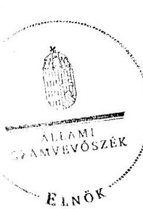

Domokos László ${ }^{6}$

[^0]
[^0]:    59

---

# Az Önkormányzat gazdálkodását meghatározó adatok, mutatószámok 

| Megnevezés | 2007. év | 2010. év |
| :--: | :--: | :--: |
| A település állandó lakosainak száma (fő) 2007. és 2011. január 1-jén | 3102 | 3192 |
| A Képviselő-testület tagjainak a száma (fő) (december 31-én) | 12 | 7 |
| A Képviselő-testület munkáját segítő állandó bizottságok száma (december 31-én) | 3 | 2 |
| Az összes vagyon értéke a december 31-i könyvviteli mérleg szerint (millió Ft) | 3403,6 | 3428,2 |
| A hosszú és rövid lejáratú kötelezettség december 31-én (millió Ft) | 77,2 | 126,8 |
| Az összes teljesített költségvetési bevétel* (millió Ft) | 422,2 | 452,7 |
| Ebből: saját bevétel (millió Ft), melyből | 252,6 | 319,3 |
| helyi adó és illetékbevétel, valamint az szja-n kívüli átengedett bevételek (millió Ft) | 65,4 | 109,2 |
| Az egy állandó lakosra jutó költségvetési bevétel (Ft) | 136106 | 141823 |
| Az egy állandó lakosra jutó saját bevétel (Ft) | 81447 | 100046 |
| Az egy állandó lakosra jutó helyi adóbevétel (Ft) | 21083 | 34211 |
| Saját bevétel/Felhalmozási célú költségvetési kiadásokkal csökkentett összes költségvetési bevétel aránya (\%) | 70,9 | 99,3 |
| Helyi adó és illetékbevétel, valamint az szja-n kívüli átengedett bevételek/Felhalmozási célú költségvetési kiadásokkal csökkentett összes költségvetési bevétel aránya (\%) | 18,3 | 34,0 |
| Az összes teljesített költségvetési kiadás (millió Ft) | 392,5 | 461,5 |
| Ebből: felhalmozási célú költségvetési kiadás (millió Ft) | 65,7 | 131,3 |
| A költségvetési kiadásból a felhalmozási célú költségvetési kiadás aránya (\%) | 16,7 | 28,5 |
| Az egy lakosra jutó teljesített müködési célú költségvetési kiadás (Ft) | 105351 | 103446 |
| Az egy lakosra jutó teljesített felhalmozási célú költségvetési kiadás (Ft) | 21180 | 41134 |
| A költségvetési szervek száma december 31-én | 2 | 2 |
| Ebből: önállóan müködő és gazdálkodó | 2 | 2 |
| A Polgármesteri hivatalban foglalkoztatott köztisztviselők száma (fő) (december 31-én) | 15 | 12 |
| Az Önkormányzat által foglalkoztatott közalkalmazottak száma (fő), (december 31-én) | 44 | 42 |

[^0]
[^0]:    * a költségvetési bevétel az előző évek pénzmaradványának, vállalkozási maradványának igénybevételét is tartalmazza

---

Az Önkormányzat bevételei és kiadásai, valamint adósságrzolgálata 2007-2010 között

|   |  |  |  |  | KÉKETTEK  |
| --- | --- | --- | --- | --- | --- |
|  1. FOLYÓ KÖLTSÉGVETÉS | 2007. | 2008. | 2009. | 2010. |   |
|  1.1.1. Saját működési bevételek | 89 600 | 122 717 | 92 877 | 114 123 |   |
|  1.1.2. Költségvetési támogatás | 84 691 | 114 611 | 112 545 | 107 573 |   |
|  1.1.3. Átengedett bevételek | 135 693 | 114 459 | 114 596 | 123 487 |   |
|  1.1.4. Állambáztartáson belülről kapott támogatások | 9 008 | 9 688 | 11 074 | 19 052 |   |
|  1.1.5. Előző és külföldről kapott bevételek | 0 | 0 | 0 | 0 |   |
|  1.1.6. Állambáztartáson kívülről kapott bevételek | 14 057 | 5 709 | 3 139 | 169 |   |
|  1.1.7. Előző évi pénzmaradvány átvétel | 1 876 | 0 | 0 | 0 |   |
|  1.1. Folyó bevételek =1.1.1.+1.1.2.+1.1.3.+1.1.4.+1.1.5.+1.1.6.+1.1.7. | 334 926 | 368 184 | 334 231 | 364 415 |   |
|  1.2.1. Működési kiadások kamatkiadások nélkül | 291 371 | 310 373 | 320 122 | 293 600 |   |
|  1.2.2. Állambáztartáson belülre átadott pénzeszközök | 5 114 | 0 | 0 | 0 |   |
|  1.2.3.1. vállalkozásoknak | 0 | 0 | 0 | 2 662 |   |
|  1.2.3.2. Előnok, illetve külföldre | 0 | 0 | 0 | 0 |   |
|  1.2.3.3. megjegyzményeknek | 18 235 | 25 133 | 17 585 | 19 720 |   |
|  1.2.3.4. nonprofit szervezetelenek | 8 967 | 7 269 | 6 092 | 5 550 |   |
|  1.2.3. Transferkiadások (=1.2.3.1+1.2.3.2+1.2.3.3+1.2.3.4) | 27 202 | 32 402 | 23 677 | 27 932 |   |
|  1.2.4. Kamatkiadások | 9 136 | 10 973 | 17 478 | 20 538 |   |
|  1.2.5. Előző évi pénzmaradvány átadás | 1 876 | 0 | 0 | 0 |   |
|  1.2. Folyó kiadások = 1.2.1.+1.2.2.+1.2.3.+1.2.4.+1.2.5. | 334 699 | 353 748 | 361 277 | 342 070 |   |
|  1.3. Folyó költségvetés egyenlege MÚKÖDÉSI JÖVEDELEM (1.1. - 1.2.) | 227 | 14 439 | -27 046 | 22 345 |   |
|  2. FELHALMOZÁSI KÖLTSÉGVETÉS |  |  |  |  |   |
|  2.1.1. Saját tökébevételek | 2 394 | 2 582 | 2 958 | 1 187 |   |
|  2.1.2. Állambáztartáson belülről kapott támogatások | 0 | 0 | 0 | 56 867 |   |
|  2.1.3. Előző és külföldről kapott támogatások | 0 | 2 748 | 481 | 0 |   |
|  2.1.4. Állambáztartáson kívülről kapott támogatások | 20 | 2 400 | 31 500 | 4 451 |   |
|  2.1. Felhalmozási bevételek (=2.1.1.+2.1.2+2.1.3+2.1.4.) | 2 414 | 7 730 | 34 939 | 62 505 |   |
|  2.2.1. Saját beruházási kiadás állva | 13 962 | 5 506 | 8 962 | 110 289 |   |
|  2.2.2. Saját felújítási kiadás állva | 43 809 | 8 882 | 4 389 | 9 098 |   |
|  2.2.3. Állambáztartáson belülre átadott pénzeszköz | 0 | 0 | 0 | 0 |   |
|  2.2.4. Előnok és külföldnek adott pénzeszközök | 0 | 0 | 0 | 0 |   |
|  2.2.5. Állambáztartáson kívülre adott pénzeszközök | 0 | 0 | 1 425 | 0 |   |
|  2.2.6. Befektetési célú részesedések vásárlása | 0 | 0 | 0 | 0 |   |
|  2.2. Felhalmozási kiadások (=2.2.1.+2.2.2.+2.2.3.+2.2.4.+2.2.5.+2.2.6.) | 57 771 | 14 809 | 14 776 | 119 387 |   |
|  2.3. Felhalmozási költségvetés egyenlege (2.1. - 2.2.) | -55 357 | -7 078 | 20 163 | -56 882 |   |
|  3. FINANSZÍROZÁSI MÚVELETEK NÉLKÜLI (GFS) POZÍCIÓ |  |  |  |  |   |
|  (1.3.) Folyó költségvetés egyenlege Működési Jövedelem + (2.3.) Beruházási költségvetés egyenlege | -55 130 | 7 358 | -6 883 | -34 537 |   |
|  4. FINANSZÍROZÁSI MÚVELETEK |  |  |  |  |   |
|  4.1. Hitelbévétel | 0 | 0 | 11 978 | 76 306 |   |
|  4.2. Hitelbérlesztés | 16 250 | 16 250 | 16 250 | 64 883 |   |
|  4.3. Forgatási és befektetési célú értékpapírok kibocsátása | 0 | 0 | 0 | 0 |   |
|  4.4. Forgatási és befektetési célú értékpapírok beváltása | 0 | 0 | 0 | 0 |   |
|  4.5. Forgatási és befektetési célú értékpapírok értékesítése | 0 | 20 820 | 0 | 0 |   |
|  4.6. Forgatási és befektetési célú értékpapírok vásárlása | 20 819 | 0 | 0 | 0 |   |
|  4.7. Egyéb finanszírozási bevételek (függő, átfizet, kiegyenlítő) | 2 632 | 458 | 205 | 12 211 |   |
|  4.8. Egyéb finanszírozási kiadások (függő, átfizet, kiegyenlítő) | 1 847 | -2 904 | 562 | -3 568 |   |
|  4.9. Finanszírozási műveletek egyenlege (4.1. - 4.2.+4.3.-4.4+4.5.-4.6.+4.7.-4.8.) | -36 283 | 7 932 | -4 610 | 2 780 |   |
|  5. TÁRGYÉVI POZÍCIÓ |  |  |  |  |   |
|  (3.) FINANSZÍROZÁSI MÚVELETEK NÉLKÜLI (GFS) POZÍCIÓ + (4.9.) Finanszírozási műveletek egyenlege | -91 413 | 15 290 | -11 493 | -31 757 |   |
|  6. NETTÓ MÚKÖDÉSI JÖVEDELEM |  |  |  |  |   |
|  (1.3.) Működési Jövedelem - Tökebérlesztés (4.2. Hitelbérlesztés + 4.4. Forgatási és befektetési célú értékpapírok beváltása) | -16 023 | -1 814 | -43 296 | -42 538 |   |
|  TÁJÉKOZTATÓ ADATOK |  |  |  |  |   |
|  Összes kötelezettség | 77 224 | 43 576 | 80 399 | 126 813 |   |
|  ebből rövid lejáratú | 42 236 | 26 189 | 69 821 | 89 630 |   |
|  Összes szállítói kötelezettség | 8 807 | 3 792 | 8 488 | 22 142 |   |
|  ebből lejárt (tamisítványból) | 4 901 | 739 | 8 374 | 19 738 |   |
|  Pénz és tőkepiani kötelezettség (adósság) | 66 317 | 38 383 | 58 510 | 86 386 |   |
|  ebből rövid lejáratú | 32 729 | 21 696 | 47 732 | 48 203 |   |
|  PPP szerződéses állomány jelenértéken (tamisítványból) | 0 | 0 | 0 | 0 |   |
|  ebből lejárt szolgáltatási díj miatti kötelezettség | 0 | 0 | 0 | 0 |   |
|  Folyószámla-, likvid- és munkabérhítel napi átlagos állománya (tamisítványból) | 16 696 | 26 303 | 37 557 | 45 747 |   |
|  folyószámlabítél napi átlagos állománya (tamisítványból) | 10 830 | 14 274 | 25 528 | 29 921 |   |
|  munkabérhítel napi átlagos állománya (tamisítványból) | 5 866 | 12 029 | 12 029 | 15 000 |   |
|  egyéb likvid hitel napi átlagos állománya (tamisítványból) | 0 | 0 | 0 | 5 826 |   |
|  Kezesség és garanciavállalások (tamisítványból) | 150 000 | 150 000 | 150 000 | 150 000 |   |
|  Jogerős bírósági ítéletekből adódó kötelezettségek (tamisítványból) | 0 | 0 | 0 | 0 |   |
|  Finanszírozásba bevonható eszközök: | 23 311 | 4 374 | 25 716 | 1 226 |   |
|  Tartós hitelviszonyt megtestesítő értékpapírok | 0 | 0 | 0 | 0 |   |
|  Hosszú lejáratú bankbetétek | 0 | 0 | 0 | 0 |   |
|  Értékpapírok | 20 820 | 0 | 0 | 0 |   |
|  Pénzeszközök (idegen pénzeszközök nélkül) | 2 491 | 4 374 | 25 716 | 1 226 |   |

---

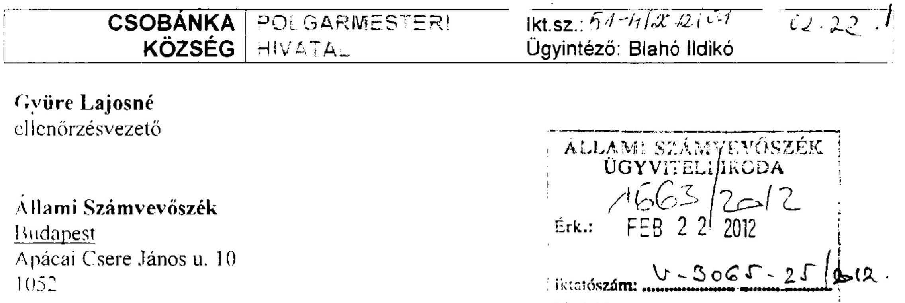

# Tisztelt Ellenörzésvezető Asszony! 

Csobánka Község Önkormányzatánál folytatott. V-3065-024/2012 számú. Állami Számvevőszéki ellenőrzésről készült jelentés-tervezettel kapcsolatban a következő észrevételt teszem.

A 15. oldal utolsó bekezdésében a valódiság elvének sérülésére mutatnak rá. Kérem, hogy kerüljön bele a jelentésbe, hogy 2007-2011 közötti időszakban egyetlen könyvvizsgálói jelentés sem jelzett ilyen hibát. Könyvvizsgálói észrevétel a többi hibát illetően sem született. Tekintve, hogy az Önkormányzat vezetése a külső szakemberek könyvvizsgáló, belső ellenór szakmai segítségére szorul, kérném megjegyezni, hogy esetünkben a szakértő „külső támogatás, ellenórzés" sem volt megfelelő.

A jelentés-tervezet 16. oldalán, majd a későbbiekben, több esetben is szerepel a viziközmü társulati hitelekkel kapcsolatos kezességvállalás ténye. A kezesség összege 169,9 millió Ft-tal szerepel, annak ellenére, hogy a 150 millió Ft-os hitelszerződés esetén ténylegesen csak 129.8 millió Ft hitel felvételére került sor. A hitel rendelkezésre-tartási ideje lejárt, tehát a 150 millió Ft-os keret fennmaradó részének felvételére, és így a kezesség beváltására sem kerülhet sor. Kérjük a jelentésben ezt a tényt rögzíteni szíveskedjenek. Így a bevaltható kezesség teljes összege 129,8 plusz 19,9 millió Ft - a 2011. es hitelszerződéshez kapcsolódóan -, összesen 148,7 millió Ft.

A 17. oldalon a táblázat alatti második bekezdésben szerepelnek a kiadási megtakaritást. bevétel növekedést eredményező intézkedések. A bevétel növelés esetén 28,8 millió Ft-os adóhátralék behajtás nem a 2007- 2010-re, hanem elsősorban a 2011. I félévi időszakra vonatkozik.

A 18. oldal utolsó bekezdésénél a vagyon növekedés forrásai közül hiányzik a likviditási hitel felvétele 2010 novemberére - és az ebből finanszírozott- visszafizetetlen 5,6 millió forintos rulirozó hitel.

A 19. oldalon szereplő, az ingatlan értékesítéssel kapcsolatos bevételekkel kapcsolatos megállapításokat csak részben fogadjuk el. A 2007-2010 években beszedett összegek jelentős része 2002-ben kötött ingatlan adás-vételi szerződésből származó részletfizetés. Az ingatlan értékesítések bevételét egy összegben az adás-vételi szerződés megkötésekor kell számlázni. Tekintve, hogy esetünkben a számla kibocsátása 2002-ben kellett, hogy megtörténjen, az

---

credeti bizonylatok megőrzési határideje már lejárt, az alapbizonylatok tehát már nem lelhetők fel. A számla kibocsátást ugyan nem tudjuk igazolni, azonban a telkek vevői szinte minden esetben szociálpolitikai támogatással építkeztek a megvásárolt ingatlanra, ezért a számlára szükségük volt a vételár igazolásához a bank felé. Ennek értelmében, vélhetően a számlázást megtörténtnek kell tekinteni. A 2010. évi telek értékesítésekről a számlát pótlólag kiállítottuk. A számlák alapján elkészült ÁFA bevallás, és az önrevízió benyújtásra került.
2011. év elején az ÁSZ jelen vizsgálatához kapcsolódóan előzetes vizsgálatot tartot! Önkormányzatunknál. Akkor jelezték az utalványrendeletünk hibáit, és a belső szabályzataink hiányát, a szerződés nyilvántartás hiányát. A jegyző, kinevezését (2011. 04. 19.) követően a 2011.06.30-ig a korábbi szabályzatokat aktualizálta a gazdálkodási rendszert átvizsgálta, a számvevők által jelzett hibákat igyekezett orvosolni és a napi teendőket ellátni. Szeretném, ha a Számvevőszék meghatározná ennek az időszaknak azon feladatait, amit az új jegyzőnek ( 2 számú) el kellett volna látnia, és mi az ami ebből nem teljesült. Csak akkor szerepeltesse a jegyző mellett a 2 számot amiben az időszak feladatait meghatározta.
19.oldal 6. és 7. bekezdésében szereplő és a 20.-21. oldalon a szabályzatok tartalmával kapcsolatos megállapításokat részben egymásnak ellentmondónak tartjuk. A jegyző1,2 ..... megfelelően alakította ki a vagyongazdálkodási célok eléréséhez szükséges kontroll környezetet...". Ugyanakkor a későbbiekben szerepel, hogy a korábban hiányzó szabályzatok elkészültek.

A 19. oldalon a 7. bekezdésben szerepel, hogy a jegyző nem határozta meg a csalás, korrupció minösitését. A Belső Ellenőrzési Kézikönyv a felelősség megállapítására, és a felelősségre vonásra vonatkozóan tartalmaz kötelező előírásokat. Amennyiben csalás, korrupció lehetősége merül fel, az üggyel kapcsolatban rendőrségi feljelentésre kerül sor. A csalás illetve a korrupció minősítése ezt követően az eljáró hatóság feladata. Tekintve hogy kis önkormányzatról van szó nincsen külön jogi osztály, vagy jogtanácsos, aki ezeket az ügyeket a Btk-nak megfelelően minősítse, így erre az eljárásrendre szorítkozunk.

A belsőellenőrzés kistérségi formában történik, a szabálytalanságok kezelésében és minősítésében is a kistérség által megfogalmazott belső ellenőrzési kézikönyvre támaszkodunk.

A jelentés szerint a Képviselő-testület nem írta elő a vagyon értékesítésével és hasznosításával kapcsoltban a döntés előkészítés folyamatában a költség-haszon elemzés készitésének kötelezettségét. Itt a jegyzől felelősségét jelölném meg, tekintve, hogy a Képviselő-testület nem szakmai testület, és erre korábban nem tért ki a jegyző által összeállított szabályzat tervezet.
20. oldal 2. bekezdés „, A jegyző1,2 nem határozta meg a vagyongazdálkodási folyamatok rögzítésére használt informatikai programok adatai használatára vonatkozó követelményeket" Ilyen tartalmú szabályzat ugyan nem készül, azonban az egyes munkavállalók munkakör átvétel-átadási jegyzőkönyveiben szerepel, mely programokhoz, milyen jelszóval, milyen jogosultságot kapnak. A vagyongazdálkodáshoz szorosan kötődő vagyonkataszteri program korábban nem létezett. 2011 áprilisában, külső megbízott bevonásával a jegyző 2 intézkedett a hiányosság megszüntetéséről. A kataszteri program feltöltése 2011. június 30 -ára elkészült, és jelenleg is üzemel. Feltöltését a programgazda végzi, míg megtekintési jogosultsággal a településgazda, illetve a pénzügyi csoport vezetője rendelkezik munkaköri leírása szerint.

---

20. oldal 4. bekezdése alapján nem tettünk eleget a nettó öt millió Ft-ot elérő, vagy azi meghaladó vagyonváltozást eredményező szerződések adatai közzétételének. Egy igen clönytelen szerződésnek köszönhetően az önkormányzat honlapja mind a mai napig fejlesztés alatt áll. A vizsgálat ideje alatt pedig ideiglenesen az üzemeltetése is szünetelt. Ezt a hibát 2012. I. negyedévében orvosolni fogjuk.
21. oldal 3. bekezdés „. A vagyongazdálkodási feladatok ellátásával megbízott köztisztviselök nem tartották be a beszámolásra vonatkozó szabályokat, a kötelező mérlegegyezőségek biztositását, a nyilvántartások folyamatos vezetését, aktualizálását. ... a mérlegegyezőségekre vonatkozóan feltárt szabálytalanságokkal kapcsolatban nem alkalmaztak szankciókat ..."

Nem tünik ki a jelentésből, továbbra sem hogy a Polgármesteri Hivatalban már megszón! azon köztisztviselők közszolgálati jogviszonya, akik felelősségre vonhatóak lennének az clkövetett szabálytalanságok miatt.

A személyi állomány fluktuációját illetően kiemelném, hogy a Hivatalban dolgozó jelenlegi 12 fơböl csupán 3 fő jogviszonya keletkezett 2011. februárját megelőzően. A pénzügyi csoport személyi állománya 2011. január 31-én csupán 1 fő adóügyi ügyintézőből, és egy 4 órás részmunkaidőben foglalkoztatott pénzgazdálkodó állt. Az adóügyi ügyintéző jogviszonya 2011.február hónapban szűnt meg, a pénzgazdálkodó pedig 2011. január óta folyamatosan táppénzes állományban van. Így a pénzügyi irodában dolgozó összes munkatárs új. Jelenleg is folyik a korábbi ügyirathátralék feldolgozása, illetve a korábbi évek analitikus nyilvántartásainak pótlása. Új szabályzatok készülnek, illetve a korábbiak aktualizálásra kerülnek. Tekintve, hogy ez a jelentés nem csak belső használatra készül, szükségesnek tartanám, hogy a jelentés ne csak a hiányosságokat taglalja, hanem azt is, milyen credményeket értünk el az elmúlt fél év során.

A 23. oldalon szereplő javaslatokkal kapcsolatban meg szeretném jegyezni a következőket:
a) Reorganizációnak jelenleg semmilyen esélyét nem látjuk. 2011. év során a törvény által biztosított összes lehetőséget kihasználva
$>$ a CSKM általános iskolájában osztályösszevonásokkal csökkentettük a személyi juttatások összegét,
$>$ az használt termek számának csökkentésével, és a fűtés szakaszolásával csökkentettük, a közüzemi költségeket.

A 14. oldalon is szerepel, hogy az önként vállalt feladatok kiadása az összes kiadás $3 \%$-át teszi ki, ez a minősített művészetoktatás kiadása, amelynek bevétele megközelítőleg fedezi a kiadásait, így ennek megszüntetésével sem érünk el jelentős megtakarítást.
Amíg nem tisztázódik a jelenlegi önkormányzati törvénnyel kapcsolatos változásokat követően milyen feladatok és milyen összegű finanszírozással maradnak, addig a reorganizáció értelmetlen.
aa) Az adóbehajtást új adóhatósági ügyintézőkkel megkezdtük, illetve 2012. január 1. jétől megemeltük a építményadót. Új bevallási nyomtatvány készült, és ezt minden adózónak eljuttattuk a feldolgozás jelenleg folyik. Vagyonrendeletünkben jelentősen megemeltük a vagyonhasznosítással kapcsolatos díjtételeket. Ez mind 2011. évi intézkedés, ezen felül újabb bevételi forrásokat még nem láttunk. Véleményem

---

szerint a gazdálkodással kapcsolatos törvényi lehetőségeinket kihasználtuk. A kötelező feladatok közül a jelentős veszteséget okozó általános iskolát, ami 48 fö gyermekkel üzemel jelenleg, és 55 millió forintba kerül a falunak, már törvényi kereteken belül nem tudjuk tovább csökkenteni. Múlt év júliusában már minden lehetséges intézkedést ez ügyben meghozott az önkormányzat, mint például :osztályösszevonás, szakiskola megszüntetése, alkalmazotti létszám csökkentése
c) A jelenlegi létszámmal, informatikai háttérrel és feladat mennyiséggel nem látjuk esélyét annak, hogy napi likviditási tervet készítsünk. A havi likviditási terv 2010. 11étől rendelkezésre áll, és a jelenlegi költségvetéshez is készül, egyéként más formáját nem is látnám a 2010 évi csődhelyzetből történő kilábalásból.

A 38. oldalon szerepel, hogy nem tekintette át a Képviselő-testület a hitelekkel kapcsolatban az esetleges konstrukcióváltás lehetőségét. Ezt a lehetőséget 135/2010 (XI.11) számon tárgyalt a Képviselő-testület, de a szóba jöhető megoldások a korábbinál előnytelenebb pénzügyi konstrukciót biztosítottak volna.

Egyéb észrevételt nem kívánok tenni.
Kérem az észrevételeim tudomásul vételét.

Maradok tisztelettel:
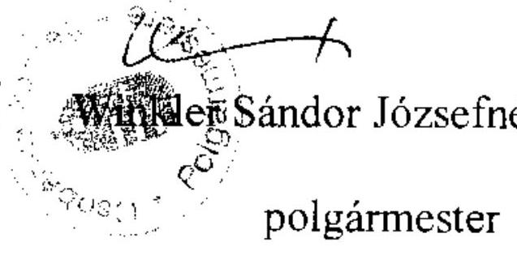

Csobánka, 2012 február 20.

---

# Winkler Sándor Józsefné úrhölgy 

polgármester

Csobánka Község Önkormányzata

## Csobánka

## Tisztelt Polgármester Úrhölgy!

Köszönettel vettem a Csobánka Község Önkormányzata gazdálkodási rendszerének 2011. évi ellenőrzéséről készített, észrevételezésre megküldött jelentéstervezet (a továbbiakban: jelentéstervezet) megállapításaira tett észrevételeit.

Az észrevétel első oldala harmadik bekezdésében foglaltak figyelembevételével a jelentéstervezet 17. oldalán lévő táblázatban módosítottuk - a kezességre vonatkozó kötelezettségvállalás Z/99/2003. (IX. 11.) számú határozat szerinti 169,9 millió Ft-ra vonatkozó megállapításunk fenntartása mellett - a víziközmű társulatok hitelei igénybevételéhez vállalt készfizető kezesség 2010. december 31 -én és 2011. június 30 -án fennálló állományi értékét 129,8 millió, illetve 149,7 millió Ft-ra. Továbbá a jelentéstervezet 17. oldala táblázat alatti első, a 38. oldala ötödik és a 41. oldala negyedik bekezdéseiben a kezességvállalásra vonatkozó összegszerű megállapításainkat a ténylegesen lehívott összegnek megfelelően 149,7 millió Ft-ra módosítottuk.

Az észrevétel második oldala hatodik bekezdésében foglalt megjegyzésével egyetértünk, nem vitatjuk az Ön állítását, miszerint a szakmai előkészítés a jegyző feladata, ugyanakkor tájékozatjuk, hogy az önkormányzati vagyon értékesítésével és hasznosításával kapcsolatban a döntés előkészítés folyamatában a költség-haszon elemzés készítésének kötelezettségét az önkormányzati vagyongazdálkodási rendeletben célszerű szabályozni. Ennek indokoltságát a hasznosítandó vagyon nagyságának és az elemzés készítés költségeinek figyelembevételével javasolt meghatározni, amelyre (a jegyzői előkészítést követően) a Képviselő-testületnek van hatásköre.

Az észrevétel többi részét a következőkben részletezett indokok alapján nem fogadjuk el:

1. Az észrevétel első oldala második bekezdésében a valódiság elvének érvényesülésével kapcsolatban, a kiegészítésre tett javaslatát azért nem áll módunkban elfogadni, mert az ellenőrzésnek nincsenek birtokában azok a dokumentumok, amelyek észrevételének megalapozottságát alátámasztják. A könyvvizsgálói jelentés tartalmának és a belső el-

---

lenőrzés működése megfelelőségének értékelése ugyanis az ellenőrzési program szerint jelen ellenőrzésnek nem volt feladata.
2. Az észrevétel első oldala negyedik bekezdésében a bevételek növekedésével kapcsolatban tett észrevételt nem fogadjuk el, mert az Önkormányzat adatszolgáltatása szerint az adóhátralék behajtásából befolyt bevétel 2007-ben 8,2 millió Ft, 2008-ban 3,8 millió Ft, 2009-ben 6,0 millió Ft, 2010-ben 5,2 millió Ft, 2011-ben 5,6 millió Ft volt.
3. Az észrevétel első oldalának ötödik bekezdésében a vagyon növekedés forrásaira vonatkozó észrevételt nem fogadjuk el, mivel az Önkormányzat által igénybevett egyéb likviditási hiteleket az önkormányzati beszámolók mérlegadatai, valamint a rendelkezésünkre bocsátott adatok alapján rögzítettük a jelentésben. Az Önkormányzat az igénybe vett egyéb likvid hiteleiről kiállított 8 . számú tanúsítványban nem szolgáltatott adatot az észrevételben hivatkozott 5,6 millió Ft-os rulirozó hitelről, ilyen tételt a 2010. évi költségvetési beszámoló mérlegében, valamint az ezt helyesbítő, jelentéshez csatolt függelékben nem szerepeltetett. A jegyző 2011. november 21 -én teljességi nyilatkozatot tett az adatszolgáltatás teljes körűségéről.
4. Az észrevétel első oldalának hatodik bekezdésében az ingatlanértékesítésekről szóló számlák kiállításának elmulasztásával kapcsolatban tett észrevételt nem fogadjuk el, mert az ellenőrzési programban meghatározott ellenőrzési időszakkal összhangban a 2007-2010. évek értékesítéseire vonatkozóan fogalmaztuk meg a számla kiállítási kötelezettség elmulasztását. Megállapításunkat a jelenleg hivatalban lévő jegyző által a hiányosság megszüntetésére azonnali intézkedésként foganatosított önrevízió is megerősítette. (A jegyző (jegyzö ${ }_{2}$ ) azonnali intézkedésének elrendelését a jelentéstervezet 19. oldalának első, a 43. oldal utolsó előtti és az 51. oldal első bekezdései tartalmazzák).
5. Az észrevétel második oldala második bekezdésében a jelenleg hivatalban lévő jegyző tevékenységével kapcsolatos kiegészítésre vonatkozó kérését nem fogadjuk el, mivel a belső kontrollrendszer kialakításával kapcsolatosan feltárt hiányosságok részletes bemutatása mellett minden esetben részbekezdésben szerepeltettük a jelenleg hivatalban lévő jegyző (jegyzö ${ }_{2}$ ) által megtett intézkedéseket. (A jelentéstervezet 20. oldala ötödik, 21. oldala első, 45. oldala ötödik és hetedik, 46. oldala negyedik, nyolcadik, tizedik, 47. oldala harmadik, hetedik, tizedik, továbbá a 48. oldala harmadik bekezdései tartalmazzák a jegyzö ${ }_{2}$ által megtett intézkedéseket). További intézkedést azok a szabályozási hiányosságok igényelnek, amelyeket eddig nem pótoltak, így a jelentéstervezet a 25. oldala 3. számú javaslata tartalmazza, hogy a jegyző folytassa a belső kontrollrendszer kialakítását.
6. Az észrevétel második oldala harmadik bekezdésében a belső szabályzatok tartalmának ellentmondására vonatkozó észrevételt nem fogadjuk el, mert az ÁSZ a belső kontrollrendszer kiépítésének és működésének értékelését az ellenőrzési programban meghatározott időszakra (2010. év és a 2011. év I. félév), egységes szempontrendszer figyelembevételével végezte el. A jelentésben-tervezetben bemutatott szabályozási hiányosságok alapján a 2010. évre vonatkozóan megállapítottuk, hogy ezen szabályzatok hiánya a vagyongazdálkodási feladatok végrehajtásában magas kockázatot jelentenek. A jelentés-

---

ben ismertettük továbbá azokat a szabályozási intézkedéseket is, amelyeket a jegyzö2 2011 júliusában hajtott végre. A vagyongazdálkodás folyamataiban a különbözö belső szabályzatok kialakításának hiányosságai mindaddig kockázatot jelentenek a feladatok megfelelő, szabályszerű végrehajtásában, amíg azokat el nem készítik. Ezért a megállapítások fenntartását indokolják a még jelenleg is fennálló hiányosságok, valamint az, hogy a 2011 júliusában kiadott szabályzatok csak a hatályba lépésüket követően fejthették ki kedvező hatásukat a belső kontrollrendszer működésében.
7. Az észrevétel második oldala negyedik és ötödik bekezdésében a csalás, korrupció minősítésével, valamint a szabálytalanság kezelésével kapcsolatban tett észrevételt nem fogadjuk el, mert a megállapításunk nem a csalás és a korrupció minősítésére vonatkozó feladatokra, hanem azok megelőzésével kapcsolatos szabályozási problémákra mutatott rá. Az Ámr. 157. § (2012. január 1-jétől az új Ber. 7. §-a) előírja a költségvetési szerv vezetője részére a kockázatelemzést és a kockázatkezelést. Az 1/2009. (IX. 11.) PM irányelv 2. 5. pontja pedig ezen belül meghatározza, hogy kiemelt figyelmet kell fordítani a súlyosabb szabálytalanságok (csalás, korrupció), mint kiemelt kockázatok kezelésére. Eszerint a költségvetési szerv - a jogszabályok alkalmazása valamennyi költségvetési szervre, így a Polgármesteri hivatalra vonatkozóan is kötelező - vezetésének kiemelt kötelezettsége a szabálytalanságok kezelésén belül a csalás és a korrupció bekövetkezésének megakadályozása. A belső ellenőrzés társulási formában történő ellátásától függetlenül az Áht. 121/A. § (1) bekezdése (2012. január 1-jétől az új Áht. 69. § (2) bekezdése alapján a belső kontrollrendszer létrehozásáért, működtetéséért és fejlesztéséért a költségvetési szerv vezetője a jegyző a felelős.
8. Az észrevétel második oldala hetedik bekezdésében az informatikai programok adatai használatára vonatkozó követelmények előírására vonatkozó hiányosságra tett észrevételt nem fogadjuk el, mert a munkaköri leírások egyrészt nem normatív szabályzatok, másrészt az azokban rögzített jelszavak és hozzáférési jogosultságok önmagukban nem minősülnek a vagyongazdálkodási folyamatok rögzítésére alkalmazott informatikai programok adatai használatára vonatkozó követelmények meghatározásának. Az informatikai szabályzatokban rögzíteni kell az informatikai rendszereknek és az azok által kezelt adatok, információk biztonságának megteremtéséhez és fenntartásához szükséges előírásokat, illetve rögzítik a katasztrófa-helyzetben követendő eljárásokat az érintett informatikai rendszerek müködésének visszaállítására.
9. Az észrevétel harmadik oldala első bekezdésében a közzétételi kötelezettség teljesítésének elmaradására tett magyarázatát nem fogadjuk el, mert a nettó ötmillió Ft-ot elérő, vagy azt meghaladó szerződések adatainak közzétételi kötelezettségét az Áht. 15/B. §-a (2012-től az új Eisztv. 32-33. §-ai) írja elő, ettől eltérni az észrevételben tett indokok alapján sem lehet.

---

10. Az észrevétel harmadik oldalának második, harmadik és negyedik bekezdéseiben a mérlegegyezőségekre vonatkozóan feltárt szabálytalanságokkal kapcsolatban tett észrevételt és kiegészítésre vonatkozó kérést nem fogadjuk el, egyrészt mert a jelentés nem tartalmazza az észrevételben idézett szankcionálásra vonatkozó szövegrészt. Másrészt a vagyongazdálkodási feladatokat ellátó köztisztviselők közszolgálati jogviszonyának megszünésére vonatkozó kiegészítés nem indokolt, mivel a belső kontrollok szabályszerű kialakítása és müködtetése vonatkozásában a személyi változásokkal kapcsolatos körülményeket, ahol a munkajogi felelősség érvényesíthetősége kérdésköre indokolta, a jelentéstervezet 36. és 37. számú lábjegyzeteiben rögzítettük.
11. Az észrevétel negyedik oldala utolsó bekezdésében a fennálló hitelekkel kapcsolatos konstrukcióváltással kapcsolatban tett észrevételt nem fogadjuk el, mert a hivatkozott határozatot és annak előterjesztését a helyszíni ellenőrzés ideje alatt és a jelentéstervezethez készített észrevétel alátámasztására sem bocsátották rendelkezésünkre annak ellenére, hogy az Önkormányzat jegyzője 2011. november 21 -én teljességi nyilatkozatot tett az adatszolgáltatás teljes körűségéről. Ezáltal az ellenőrzés nem tudott arról meggyőződni, hogy a hivatkozott határozatban foglaltak választ adnak-e a konstrukcióváltással kapcsolatban az ellenőrzési program 1.2.3. számon feltett kérdésére.

Tájékoztatom, hogy az ÁSZ törvény 29. § (2) bekezdésében foglaltak szerint az ellenőrzött szervezet vezetője az ellenőrzés megállapításaira tehet észrevételt. Az intézkedést igénylő megállapításokhoz kapcsolódóan - a hivatkozott törvény 33. § (1) bekezdése alapján - köteles intézkedési tervet készíteni. Az intézkedési tervben az Önkormányzat önállóan határozza meg a megállapításokhoz kapcsolódó javaslatok megvalósításának eszközeit, módszereit figyelemmel az Önkormányzat lehetőségeire. Tekintettel arra, hogy a javaslatot megalapozó megállapítást nem vitatja, ezért nem tartjuk indokoltnak az észrevétel harmadik oldala ötödik bekezdésében tett, a reorganizációs terv és a likviditási terv készítésére irányuló javaslatra vonatkozó észrevételével kapcsolatban a jelentés módosítását.

Az elfogadott észrevétel alapján tett módosításokat, valamint az el nem fogadott észrevételeket és az elutasítás indokait a várhatóan áprilisban kiadmányozásra kerülő jelentés fogja tartalmazni (az el nem fogadott észrevételek és az el nem fogadás indokainak jelentésbe történő beépítése miatt a jelentéstervezethez képest eltérő oldalszámon).

Köszönöm Polgármester Úrhölgy és munkatársai ellenőrzés során tanúsított hozzáállását, amellyel az ellenőrzés megvalósítását segítették.

Budapest, 2012. március „ 25 "
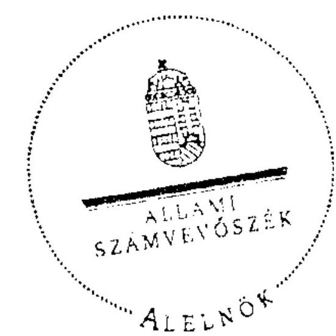

Tisztelettel:

Warvasovszky Tihamér

---

# Jegyzökönyv

Csobánka Község Önkormányzat 2007-2010 között fennálló kötelezettségeinek és hitel állományának egyeztetéséről

## Készült:

Csobánka Község Polgármesteri Hivatala 2014 Csobánka, Fő tér 1. sz. alatti pénzügyi iroda helyiségében, 2011. október 27 -én 2011. szeptember 29-én az Állami Számvevőszék V-3004-45/2011 sz. ellenőrzési programja alapján megkezdte Csobánka Község Önkormányzata gazdálkodási rendszerének ellenőrzését. Az Önkormányzat 2007-2010 évek kötelezettségeit és hitelállományának alakulását megvizsgálva, a pénzügyi csoport munkatársai jelentős eltéréseket tártak fel a beadott éves költségvetési beszámolók adataihoz képest.

A hibák évenkénti részletezése:

|  2007 |  |  | adatok E Ft-ban  |
| --- | --- | --- | --- |
|  Megnevezés | Mérleg adat | Helyes érték | Eltérés  |
|  Rövid lejáratú kötelezettségek |  |  |   |
|  Rövid lejáratú hitelek | 16250 Ft | 32185 Ft | 15935 Ft  |
|  Szállitók | 8807 Ft | 8807 Ft | 0 Ft  |
|  Egyéb rövid lej. kötelezettségek | 1244 Ft | 1244 Ft | 0 Ft  |
|  Összesen | 25301 Ft | 42236 Ft | 15935 Ft  |
|  Hosszú lejáratú kötelezettségek |  |  |   |
|  Beruházási és fejlesztési hitelek | 162281 Ft | 32500 Ft | $-129781 \mathrm{Ft}$  |
|  Egyéb hosszú lejáratú hitelek | 2488 Ft | 2488 Ft | 0 Ft  |
|  Összesen | 164769 Ft | 34988 Ft | $-129781 \mathrm{Ft}$  |
|  Hibahatás |  |  |   |
|  Tökeváltozás |  |  | $-15935 \mathrm{Ft}$  |
|  Tökeváltozás |  |  | 129781 Ft  |
|  Összesen |  |  | 113846 Ft  |

A 2007 évi beszámoló rövid lejáratú hitel állományában nem szerepel a 15.935 E Ft-os záró folyószámlahtiel egyenleg. A hosszú lejáratú hitelek között azonban szerepel a Viziközmű Társulat 129.781 Ft-os hitelére vállalt kezesség összege.

A mérleg föösszege a hiba hatására nem változott, tekintve, hogy csak a forrásokon belül okoztak a hibák változásokat.

|  2008 |  |  | adatok E Ft-ban  |
| --- | --- | --- | --- |
|  Megnevezés | Mérleg adat | Helyes érték | Eltérés  |
|  Rövid lejáratú kötelezettségek |  |  |   |
|  Rövid lejáratú hitelek | 21077 Ft | 21077 Ft | 0 Ft  |
|  Szállitók | 3792 Ft | 3792 Ft | 0 Ft  |
|  Egyéb rövid lej. kötelezettségek | 1320 Ft | 1320 Ft | 0 Ft  |
|  Összesen | 26189 Ft | 26189 Ft | 0 Ft  |
|  Megnevezés | Mérleg adat | Helyes érték | Eltérés  |
|  Hosszú lejáratú kötelezettségek |  |  |   |

---

|  Beruházási és fejlesztési hitelek | 146 031 Ft | 16 250 Ft | -129 781 Ft  |
| --- | --- | --- | --- |
|  Egyéb hosszú lejáratú hitelek | 2 440 Ft | 1 137 Ft | -1 303 Ft  |
|  Összesen | 148 471 Ft | 17 387 Ft | -131 084 Ft  |

### Hibahatás

|  Tökeváltozás |  | 1 303 Ft  |
| --- | --- | --- |
|  Tökeváltozás |  | 129 781 Ft  |
|  Összesen |  | 131 084 Ft  |

A 2008 évi beszámoló egyéb hosszú lejáratú hitel állományának záró egyenlege 1 303 E Ft-tal magasabb a valós záró egyenlegnél. A hosszú lejáratú hitelek között szerepel a Víziközmű Társulat 129 781 Ft-os hitelére vállalt kezesség összege.

A mérleg föösszege a hiba hatására nem változott, tekintve, hogy a hibák csak a forrásokon belül okoztak változásokat.

### 2009

|  Megnevezés | Mérleg adat | Helyes érték | Eltérés  |
| --- | --- | --- | --- |
|  Rövid lejáratú kötelezettségek |  |  |   |
|  Rövid lejáratú hitelek | 47 273 Ft | 47 273 Ft | 0 Ft  |
|  Szállítók | 8 488 Ft | 8 488 Ft | 0 Ft  |
|  Egyéb rövid lej. kötelezettségek | 154 619 Ft | 14 060 Ft | -140 559 Ft  |
|  Összesen | 210 380 Ft | 69 821 Ft | -140 559 Ft  |

### Hosszú lejáratú kötelezettségek

|  Beruházási és fejlesztési hitelek | 0 Ft | 10 778 Ft | 10 778 Ft  |
| --- | --- | --- | --- |
|  Egyéb hosszú lejáratú hitelek | 30 000 Ft | 0 Ft | -30 000 Ft  |
|  Összesen | 30 000 Ft | 10 778 Ft | -19 222 Ft  |

### Hibahatás

|  Tökeváltozás |  | 140 559 Ft  |
| --- | --- | --- |
|  Tökeváltozás |  | -10 778 Ft  |
|  Tökeváltozás |  | 30 000 Ft  |
|  Összesen |  | 159 781 Ft  |

A 2009 évi beszámolóban a beruházási és fejlesztési hitelek 10 778 E Ft-os összege, illetve a Víziközmű Társulat hitele (129 781 E Ft) az egyéb rövid lejáratú kötelezettségek között szerepel. A 10 778 E Ft-os összeget a hosszú lejáratú kötelezettségek közé kell átsorolni, míg a Társulati hitel nem az Önkormányzat kötelezettsége, azt törölni kell. Az egyéb hosszú lejáratú hitelek között hibásan szerepel a 30 000 E Ft összegű folyószámlahitel.

A mérleg föösszege a hiba hatására nem változott, tekintve, hogy a hibák csak a forrásokon belül okoztak változásokat.

### 2010

|  Megnevezés | Mérleg adat | Helyes érték | Eltérés  |
| --- | --- | --- | --- |
|  Rövid lejáratú kötelezettségek |  |  |   |
|  Rövid lejáratú hitelek | 38 739 Ft | 49 203 Ft | 10 464 Ft  |
|  Szállítók | 22 142 Ft | 22 142 Ft | 0 Ft  |
|  Egyéb rövid lej. kötelezettségek | 20 749 Ft | 18 285 Ft | -2 464 Ft  |
|  Összesen | 81 630 Ft | 89 630 Ft | 8 000 Ft  |

### Hibahatás

|  Megnevezés | Mérleg adat | Helyes érték | Eltérés  |
| --- | --- | --- | --- |
|  Hosszú lejáratú kötelezettségek |  |  |   |
|  Beruházási és fejlesztési hitelek | 159 393 Ft | 37 183 Ft | -122 210 Ft  |

---

| Egyéb hosszú lejáratú hitelek | 0 Ft | 0 Ft | 0 Ft |
| :-- | --: | --: | --: |
| Összesen | 159393 Ft | 37183 Ft | -122210 Ft |

Hibahatás

| Tőkeváltozás |  |  | -10464 Ft |
| :-- | :-- | :-- | --: |
| Tőkeváltozás |  |  | 2464 Ft |
| Tőkeváltozás |  |  | 122210 Ft |
| Összesen |  |  | 114210 Ft |

A 2010. évi beszámolóban a rövid lejáratú hitelek között nem szerepelt a munkabér hitel év végi 8.000 E Ft-os állománya, illetve a 2.464 E Ft összegű hiteltőrlesztés a rövid lejáratú hitelek között szerepel az egyéb rövid lejáratú kötelezettségek helyett. A hosszú lejáratú hitelek között itt is hibásan szerepel a Viziközmű 129.781 E Ft-os hitele. A 13.124 e Ft-os hitelkeretet teljes összege szerepel a beszámolóban az abból igénybevett 2.695 E Ft helyett, valamint nem szerepel a 2010. évben felvett 18.000 E Ft-os hitel összeg.

Bár a 2010. évi záró egyenlegek helyesbítéséről már a korábbiakban felvettünk egy jegyzőkönyvet, a hitelállomány 2007-2010. évi teljes ellenőrzéséhez a 2010. évi beszámolót újból áttekintettük. A korábbiakban nem vizsgáltuk a hitel felvételekkel törlesztésekkel kapcsolatos pénzforgalmat. Az alábbiakban a pénzforgalommal kapcsolatos eltéréseket mutattuk ki.

|  | 80-as űrlap szerinti |  | Tényleges pénzforgalom |  | Eltérés |  |
| :--: | :--: | :--: | :--: | :--: | :--: | :--: |
| Év | hitel   felvétel | hiteltörlesztés | hitel   felvétel | hiteltörlesztés | hitel   felvétel | hiteltörlesztés |
| 2007 | 15935 Ft | 16950 Ft | 0 Ft | 16250 Ft | 15935 Ft | 700 Ft |
| 2008 | 0 Ft | 29657 Ft | 0 Ft | 16250 Ft | 0 Ft | 13407 Ft |
| 2009 | 31369 Ft | 2808 Ft | 11976 Ft | 16250 Ft | 19393 Ft | -13442 Ft |
| 2010 | 191930 Ft | 173240 Ft | 76306 Ft | 64883 Ft | 115624 Ft | 108357 Ft |

Az eltérések a korábbi évek könyvelési hibáiból adódnak. A legjelentősebb ismételődő hiba a Viziközmű Társulati hitelre vállalt kezesség 2007,2008,2010 években hosszú lejáratú, 2009ben rövid lejáratú hitelként való szerepeltetése. Ezt a tételt nem szerepeltethetjük az Önkormányzat kötelezettségei között. Azt mérleg alatti soron 0 -ás számlaosztályban jelenítjük meg a jövőben.

Az eltérések könyvelésben történő helyesbítését a 2011. 12. 31.-i fordulónappal készülő beszámoló összeállítása előtt rendezni kell.

Csobánka, 2011. október 27.
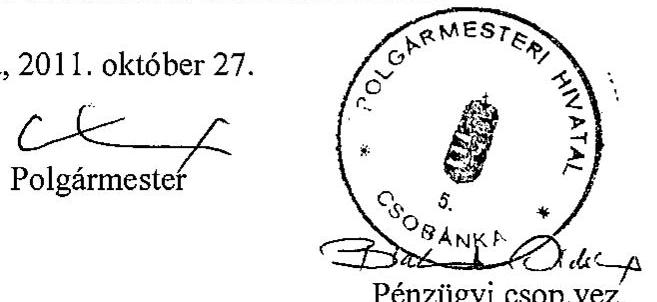

Pénzügyi csop.vez.

## 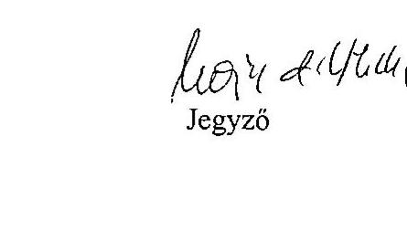

Jegyzö