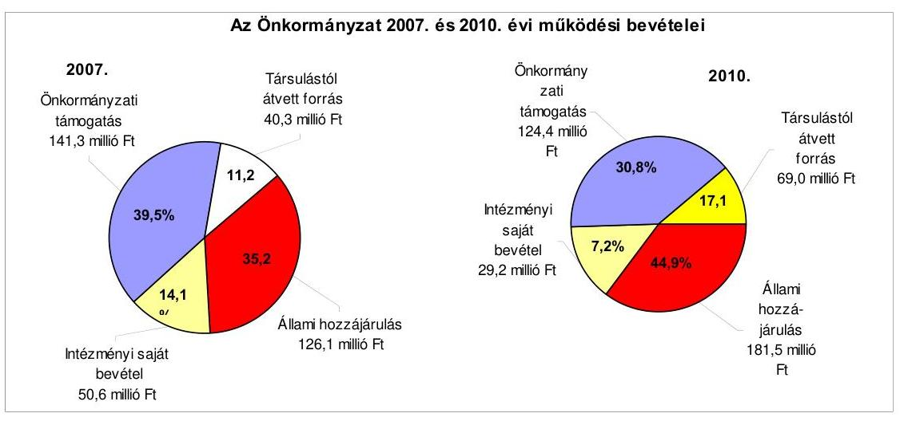
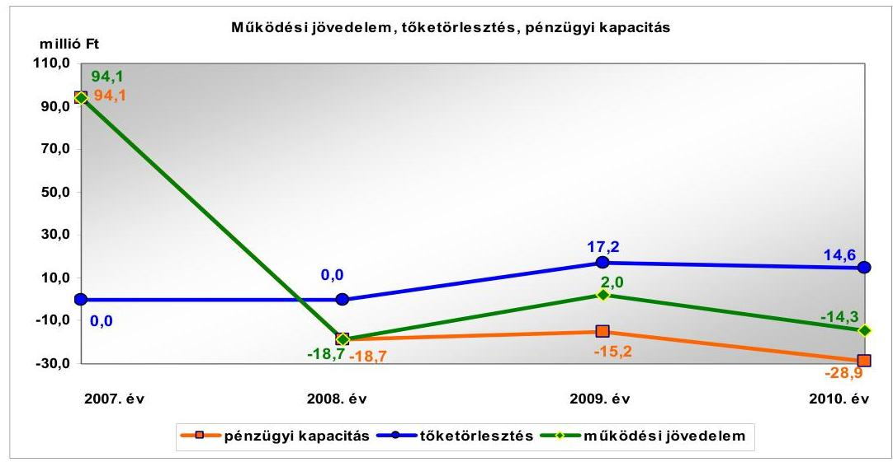
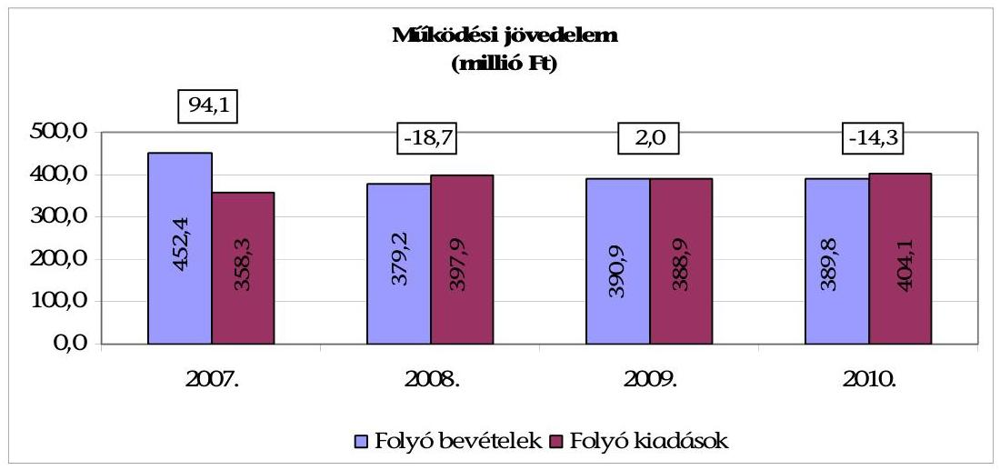
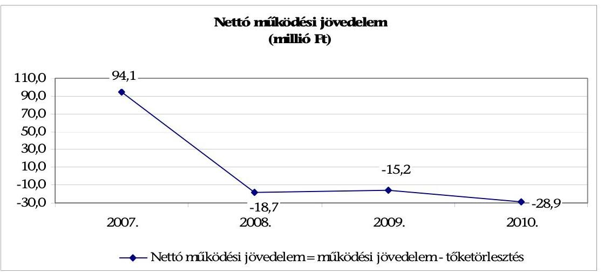
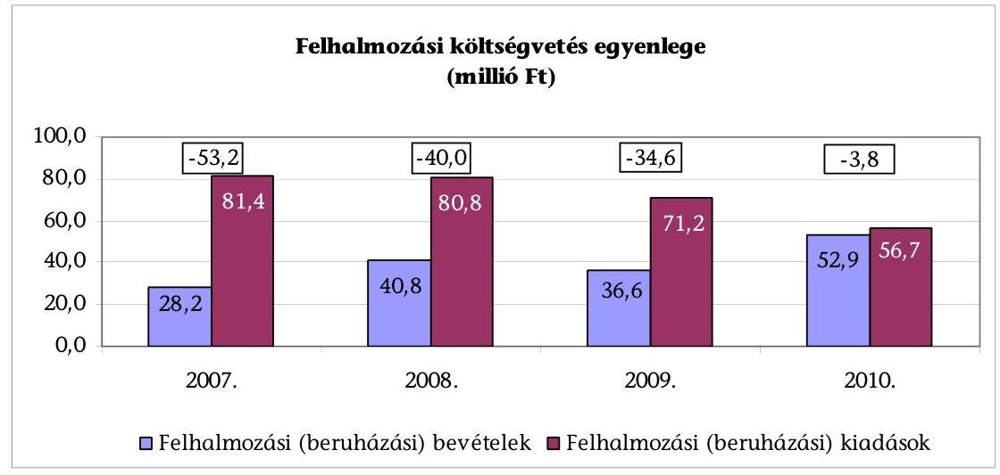
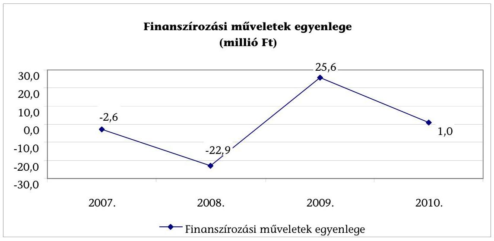
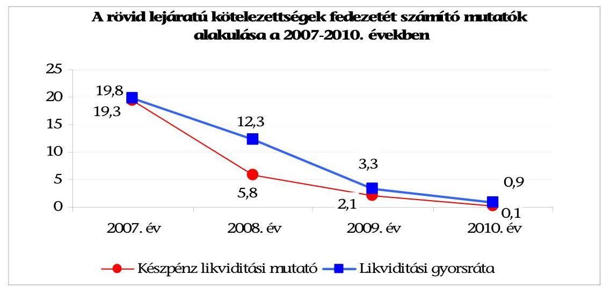
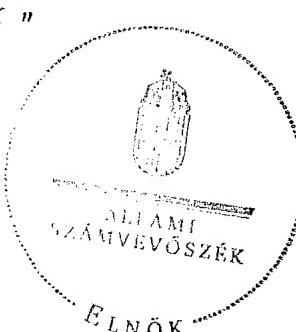

# JELENTÉS 

Foktő Község Önkormányzata gazdálkodási rendszerének 2011. évi ellenőrzéséről

---

# Számvevői Iroda 

Iktatószám: V-3062-027/2012.
Témaszám: 1015
Vizsgálat-azonosító szám: V0560005

## Az ellenőrzést felügyelte:

Dr. Varga Sándor
számvevő igazgatóhelyettes
Az ellenőrzést vezette:
Gyüre Lajosné
számvevő tanácsos
Az ellenőrzést végezték:

| Moder Beatrix | Eigner György Zoltán |
| :-- | :-- |
| számvevő | számvevő tanácsos |

---

# TARTALOMJEGYZÉK 

BEVEZETÉS ..... 9
I. ÖSSZEGZŐ MEGÁLLAPÍTÁSOK, KÖVETKEZTETÉSEK, JAVASLATOK ..... 14
II. RÉSZLETES MEGÁLLAPÍTÁSOK ..... 26

1. A pénzügyi egyensúly, a fizetőképesség, a gazdálkodás stabilitásának biztosítása, az adósságkezelés eredményessége ..... 26
2. A vagyoni helyzet alakulása, valamint a vagyongazdálkodás folyamataiban a kontrollok működése ..... 37
2.1. Az Önkormányzat vagyoni helyzetének 2007-2010 közötti alakulása ..... 37
2.2. A vagyongazdálkodás belső kontrolljainak működése ..... 38

## MELLÉKLETEK

1. számú Az Önkormányzat gazdálkodását meghatározó adatok, mutatószámok (1 oldal)
2. számú Az Önkormányzat bevételei és kiadásai, valamint adósságszolgálata 2007-2010 között (1 oldal)

---

.

---

# RÖVIDÍTÉSEK JEGYZÉKE 

## Törvények

Áht.
Eisz. tv.

Htv.

Ötv.
új Áht.
új Eisz. tv.

## Rendeletek

Áhsz.

Ámr.
Ávr.
SzMSz
új Ber.

## Szórövidítések

áfa
ÁSZ
Belső Kontroll Kézikönyv
gazdálkodási ügyrend
hivatali SzMSz

Iskola
Képviselő-testület
körjegyző ${ }_{1}$

az államháztartásról szóló 1992. évi XXXVIII. törvény
az elektronikus információszabadságról szóló 2005. évi XC. törvény
a helyi önkormányzatok és szerveik, a köztársasági megbízottak, valamint egyes centrális alárendeltségű szervek feladat- és hatásköreiről szóló 1991. évi XX. törvény
a helyi önkormányzatokról szóló 1990. évi LXV. törvény
az államháztartásról szóló 2011. évi CXCV. törvény
az információs önrendelkezési jogról és az információs szabadságról szóló 2011. évi CXII. törvény
az államháztartás szervezetei beszámolási és könyvvezetési kötelezettségének sajátosságairól szóló 249/2000. (XII. 24.) Korm. rendelet
az államháztartás működési rendjéről szóló 292/2009. (XII. 19.) Korm. rendelet
az államháztartási törvény végrehajtásáról szóló 368/2011. (XII. 31.) Korm. rendelet
az Önkormányzat 11/2010. (XII. 10.) számú rendelete az Önkormányzat Szervezeti és Működési Szabályzatáról
a költségvetési szervek belső kontrollrendszeréről és belső ellenőrzéséről szóló 370/2011. (XII. 31.) Korm. rendelet
általános forgalmi adó
Állami Számvevőszék
az államháztartásért felelős miniszter által a 2010. évben közzétett, a belső kontrollrendszer működtetésére vonatkozó módszertani útmutató
a körjegyző ${ }_{2}$ és a polgármester által kiadott, Foktő és Dunaszentbenedek Községek Körjegyzőségi Hivatala 2010. december 1-jétől hatályos gazdálkodási ügyrendje
a 64/2009. (V. 27.) számú határozattal jóváhagyott, Foktő és Dunaszentbenedek Községek Körjegyzőségi Hivatala alapító okiratának melléklete a körjegyzőség Szervezeti Működési Szabályzatáról
Foktő és Bátya Általános Iskolája és Óvodája
Foktő Község Önkormányzatának Képviselő-testülete
Foktő és Dunaszentbenedek Községek Körjegyzőségének
körjegyzője (2007. július 1-től 2010. augusztus 1-ig)

---

| körjegyző $_{2}$ | Foktő és Dunaszentbenedek Községek Körjegyzőségének   megbízott körjegyzője (2010. augusztus 2-től) |
| :-- | :-- |
| Körjegyzőség | Foktő és Dunaszentbenedek Községek Körjegyzőségi Hiva- |
|  | tala |
| kötelezettségvállalási | A körjegyző ${ }_{1}$ által kiadott 1/2009. számú utasítás a kötele- |
| szabályzat $_{1}$ | zettségvállalási, utalványozási, ellenjegyzési, érvényesítési |
|  | szabályzatról |
| kötelezettségvállalási | A körjegyző ${ }_{2}$ és a polgármester által 2010. december 1- |
| szabályzat $_{2}$ | jével hatályba léptetett Foktő és Dunaszentbenedek Köz- |
|  | ségek Körjegyzősége Kötelezettségvállalás, utalványo- |
|  | zás ellenjegyzés és érvényesítés rendjének szabályzata |
| Önkormányzat | Foktő Község Önkormányzata |
| Pénzügyi bizottság | Foktő Község Önkormányzatának Településfejlesztési, |
|  | Pénzügyi és Közoktatási Bizottsága |
| polgármester | Foktő község Önkormányzatának polgármestere |

---

# ÉRTELMEZŐ SZÓTÁR 

bonitás

CLF módszer
eredményesség
finanszírozási célú pénzügyi műveletek
garanciavállalás
kamatkockázat
kezességvállalás

A bonitás hitelképességet jelent. A bonitást a pénzügyi kapacitás fogalmával írhatjuk le, ami nem más, mint az adósok hitelfelvételi képességének azon mértéke, ahol még anélkül tudják növelni az adósságot, hogy csökkenteniük kellene akár jelenlegi, akár jövőben esedékes kiadásaikat fizetőképességük fenntartása érdekében.
Az önkormányzatok költségvetése elemzésének eszköze, a bevételek és kiadások, működés és fejlesztés elkülönítése. Bizonyos mértékig a vállalati gazdálkodás logikai elemeit érvényesíti az önkormányzatok pénzügyi jövedelmi helyzetének vizsgálat során. Következetesen elkülöníti a folyó és a felhalmozási költségvetés bevételeit és kiadásait, azok költségvetési egyenlegeit. A módszer a pénzügyi kapacitás fogalmát helyezi a középpontba.
A kitűzött célok megvalósításának mértékeként vagy egy tevékenység kimenete szándékolt és tényleges hatása közötti kapcsolat. Ebben a meghatározásában - kiterjesztve a teljesítmény-ellenőrzés értelmezési tartományára - a hatás az operatív, a specifikus vagy átfogó szinten keletkezett „végterméket" jelenti, amely lehet output, eredmény és hatás egyaránt (ÁSZ Teljesítmény-ellenőrzési módszertan 16. oldal).
Értékpapírok kibocsátása, értékesítése és visszavásárlása; hitelek felvétele és törlesztése; szabad pénzeszközök betétként való elhelyezése és visszavonása (Áht. 8/A. § (3) bekezdés).
Valamilyen esemény jövőbeni bekövetkezéséhez kapcsolódó kötelezettségvállalás. A garanciavállalás az önkormányzat kötelezettség-vállalása arra vonatkozóan, hogy a szerződésben meghatározott feltételek beálltakor a garancia kedvezményezettje számára, határozott összegig, határozott időpontig, felszólításra azonnal fizet. Ez a kötelezettség az önkormányzat számára azzal a bizonytalansággal jár, hogy nem tudja, hogy ezt a kötelezettségvállalását igénybe veszik-e vagy nem, és ha igen, mikor.
Változó kamatozású hiteleknél a kamatkockázat azt jelenti, hogy a hitel futamideje alatt változhat a hitel kamata és így a törlesztő részlete is. Devizahiteleknél ez azt jelenti, hogy ha az adott deviza irányadó kamata emelkedik, akkor emiatt nőhet a devizahitel kamata is.
A kezesség járulékos kötelezettségvállalás, amely lehet egyszerű vagy kézfizető, és mindig feltételezi a főkötelezettet. Az egyszerű kezességvállalás esetén a kezes mindaddig megtagadhatja a teljesítést, míg mindazoktól behajtható, akik őt megelőzően vállaltak kötelezettséget. A készfizető kezes nem illeti meg a sortartás kifogása. A fentiek következtében mind a garancia-, mind a kezességvállalás

---

közfeladat
pénzügyi kockázat

PPP (public private partnership)
saját vagyon

SNA
esetében az önkormányzatnak a futamidő teljes időtartama alatt azzal kell számolnia, hogy ha a főkötelezett elmulasztja teljesíteni a fizetést, a vállalt kötelezettséget vele szemben érvényesítik az adott időpontban fennálló összeg erejéig (Ptk. 272-276. §-ai alapján).
Az állami, helyi, illetve kisebbségi önkormányzati feladat, amelynek ellátásáról az államnak, illetve az önkormányzatoknak kell gondoskodnia. A hatályos szabályozás szerint közfeladatot törvény és önkormányzati rendelet állapíthat meg. Az önkormányzatok által ellátandó feladatok keretszerű meghatározását az Ötv. tartalmazza.
A belső működési kockázat egyik eleme. A költségvetési szerv működésének, tevékenységének, rövidtávon ható velejáróinak része a tevékenységi, és emberi erőforrás kockázatokkal együtt. Megmutatkozhat a költségvetés nagyságrendjének, szerkezetének módosulásaiban, a bevételi, kiadási előirányzatok változásaiban, a nem megfelelő belső kontrollrendszer működése során, a tudatos károkozásokban, a biztosítások elmaradásában, a hibás fejlesztési döntésekben, a nem megfelelő forrásfelhasználásokban.
A köz- és a magánszféra együttműködésén alapuló fejlesztési konstrukció. Az állami és a magánszféra együttműködésének egyik formáját jelöli a PPP. A rövidítés a „közés magánszféra partnersége" angol nyelvű megfelelője. A PPP keretében a közcél a magánszféra jelentős mértékű közreműködésével valósul meg. Az állam (önkormányzat) a közszolgáltatások létrehozását a tradicionálisnál komplexebb módon bízza a magánszférára. Az együttműködés keretében megvalósuló közszolgáltatás hosszú távra szól. A magán partner felelőssége az infrastruktúra tervezésére, megépítésére, működtetésére és legalább részben a projekt finanszírozására terjed ki. Az állam (önkormányzat) és/vagy a szolgáltatások igénybe vevője szolgáltatási díjat fizet. A közszférabeli szerződő fél feladata a projekt definiálása, a szolgáltatás elvárt minőségének, mennyiségének és az igénybevétel idejének meghatározása, valamint az árazási politika kialakítása, az ellenőrzési, monitoring feladatok ellátása.
A könyvviteli mérlegben szereplő eszközöknek a kötelezettségekkel csökkentett összege, amellyel azonos a források között szereplő a saját tőke és a tartalékok együttes összege. A saját vagyonhoz tartoznak továbbá a számviteli nyilvántartásban érték nélkül szereplő eszközök.
System of National Account, azaz a Nemzeti Számlák Rendszere, amely a gazdasági szektorok által létrehozott valamennyi terméket és szolgáltatást figyelembe veszi.

---

visszafizetési kockázat

Annak a kockázata, hogy a hitelt felvevőnél rendelkezésre állnak-e a visszafizetéshez, a hitel törlesztéséhez szükséges pénzügyi források. A visszafizetési kockázatot növeli a kamat- és árfolyamkockázat növekedése, mivel ezekben az esetekben az adósságszolgálat nőhet. Egy adott kötelezettség keletkezését megelőzően, illetve azt követően olyan pénzügyi helyzet állhat fenn, amely a kötelezettség visszafizetését korlátozhatja, meggátolhatja, ellehetetleníti. Visszafizetési kockázatot okozhat, ha:

- a hitelfelvételből, kötvénykibocsátásból származó bevétel visszafizetéséhez szükséges forrást a bevétel felhasználási területe nem biztosítja (pl. a megvalósított beruházás működése, üzemeltetése során nem a tervezett eredményességet biztosította, vagy a tervezettnél magasabb a fenntartási költsége, a tervezett kiadási megtakarítást nem biztosítja, a betétbehelyezés alacsonyabb kamatbevételt biztosított, mint amennyi a kötvény kamata);
- a visszafizetésre tervezett forrás elérésének, teljesítésének bizonytalansága (pl. a visszafizetéshez tervezett tartalékolás elmaradt, a tervezettnél alacsonyabb a saját bevétel, a helyi adóból származó bevétel az adóalanyok, adóalapok csökkenése miatt nem teljesül);
- a kötelezettségvállaláskor a visszafizetési forrás megjelölésének, tervezésének elmaradása, vagy megalapozatlan figyelembevétele.

---

.

---

# JELENTÉS 

## Foktő Község Önkormányzata gazdálkodási rendszerének 2011. évi ellenőrzéséről

## BEVEZETÉS

Az Állami Számvevőszék 2011. évben életbe lépett stratégiája szerint „az önkormányzatok ellenőrzése során azok pénzügyi-gazdasági helyzetét értékeli, kockázatait feltárja, valamint az ellenőrzések helyszíneit objektív mutatószámrendszer alapján választja ki". E célkitűzéseknek megfelelően összeállított ellenőrzési program alapján végzi a helyi önkormányzatok gazdálkodási rendszerének ellenőrzését.

## Az ellenőrzés célja az Önkormányzatnál annak értékelése volt, hogy:

- biztosított-e a pénzügyi egyensúly, a fizetőképesség, a gazdálkodás stabilitása, ezeket segítette-e az adósság kezelése;
- a vagyoni helyzet a külső és belső tényezők hatására miként változott, a belső kontrollok megfelelően biztosították-e a vagyongazdálkodás szabályosságát, eredményességét.

Az ellenőrzés típusa: szabályszerűségi ellenőrzés, továbbá az ellenőrzés meghatározott területein teljesítmény ellenőrzés.

Az ellenőrzött időszak: a pénzügyi, vagyoni helyzettel kapcsolatos elemzéseket, értékeléseket, valamint az önkormányzat gazdálkodási rendszerének korábbi ellenőrzése során tett javaslatok megvalósításának ellenőrzését a 2007-2010. évekre vonatkozóan végeztük, valamint lehetőség szerint kitérünk a helyszíni ellenőrzést megelőző utolsó negyedév végéig terjedő időszakra is. A vagyongazdálkodás belső kontrolljai működésének tesztelése a 2010. évre, valamint a helyszíni ellenőrzést megelőző utolsó negyedév végéig terjedő időszakra vonatkozik.

Az ellenőrzés jogszabályi alapját az Állami Számvevőszékről szóló 2011. évi LXVI. törvény 1. § (3) bekezdése, 5. § (2)-(6) bekezdései, az államháztartásról szóló 1992. évi XXXVIII. törvény 120/A. § (1) bekezdése előírásai képezték.

A ellenőrzés szakmai módszertanát a Legfőbb Ellenőrző Intézmények Nemzetközi Szervezete (INTOSAI) által kiadott nemzetközi standardok (ISSAI) és az Állami Számvevőszék által kiadott „Ellenőrzési Kézikönyv" és „Módszertani útmutató a teljesítmény-ellenőrzéshez" képezte.

---

Foktő község állandó lakosainak száma 2011. január 1-jén 1684 fő volt. A 2010. évi önkormányzati képviselő és polgármester választást követően az Önkormányzat hét tagú Képviselő-testületének munkáját egy állandó bizottság segítette. Az Önkormányzat 2007. június 1-jétől Dunaszentbenedek községgel közösen Körjegyzőséget hozott létre, melynek Foktő a székhelytelepülése. A polgármester a 2002. évi önkormányzati képviselő és polgármester választások óta tölti be a tisztségét. A körjegyző ${ }_{1}$ 2007. július 1-jétől látta el a jegyzői feladatokat 2010. augusztus 1-jéig. ${ }^{1}$ A körjegyző ${ }_{2}$ 2010. augusztus 2-ától látja el a jegyzői feladatokat.

A Polgármesteri hivatalban dolgozó köztisztviselők száma 2007. január 1-jén 11 fő, a Körjegyzőségben 2011. január 1-jén 12 fő, a költségvetési szerveknél foglalkoztatott közalkalmazottak száma 2007. január 1-jén 62 fő, 2011. január 1-jén 59 fő volt. Az Önkormányzat vagyona a 2007. évi 2443,0 millió Ft-ról 2247,0 millió Ft-ra, 8%-kal csökkent. Az Önkormányzatnak hosszú lejáratú kötelezettségállománya nem volt sem a 2007., sem a 2010. évek végén. A rövid lejáratú kötelezettségek állománya 2007. év
 végi 5,6 millió Ft-ról 15,9 millió Ft-ra, 183,9%-kal nőtt a folyószámlahitel állományának 10,3 millió Ft-tal történő növekedése hatására.

A hagyományos költségvetési szerkezet helyett az Önkormányzat pénzügyi helyzetét a CLF módszerrel mutatjuk be, amelyben jobban elkülönülnek a vagyonnal kapcsolatos bevételek és kiadások az önkormányzati feladatokkal kapcsolatos közvetlen működtetési bevételektől és kiadásoktól. A módszer következetesen elkülöníti a folyó és a felhalmozási költségvetés bevételeit és kiadásait, azok költségvetési egyenlegeit. A saját folyó bevételek, valamint a saját felhalmozási bevételek nem tartalmazzák az előző évi pénzmaradványok felhasználásából származó pénzforgalom nélküli bevételeket². A számítási leírás némileg eltér az ÁSZ módszertanában korábban alkalmazott gyakorlattól. A jelen besorolás általános közgazdasági meggondolásokon alapul, amely megjelenik az SNA statisztikai módszertanában is.

A folyó költségvetés egyenlege, a működési jövedelem megmutatja, hogy az önkormányzat éves folyó bevétele fedezetet biztosít-e a kötelező és önként vállalt feladatellátáshoz kapcsolódó éves folyó kiadásaira. A működési jövedelem negatív értéke pénzügyileg fenntarthatatlan helyzetet jelez. A mutató pozitív értéke megtakarítást mutat, amely forrásul szolgálhat az önkormányzat fennálló kötelezettségei megfizetéséhez, valamint fejlesztéseihez.

A felhalmozási költségvetés pozitív értéke felhalmozási többletet mutat, amely a jövőbeni fejlesztések forrását biztosíthatja. Amennyiben a folyó költségvetési hiány finanszírozása a felhalmozási többletből történik, ez szűkebb értelemben vagyonfelélésnek tekinthető. Amennyiben a felhalmozási költségvetés megtakarítása fejlesztési célú hitelek, kötvények adósságszolgálatát finanszírozza, az változatlan vagyontömeg mellett, a korábban megelőlegezett

[^0]
[^0]:    ${ }^{1}$ A körjegyző, közszolgálati jogviszonya a helyszíni ellenőrzés ideje alatt is fennáll, gyermekszülés és nevelés miatt tartósan távol van.
    ${ }^{2}$ A költségvetési években kialakuló hiány finanszírozása az előző években képzett tartalékok felhasználásával is történhet.

---

tőkebevételek valós realizációjának tekinthető. A felhalmozási deficit által generált finanszírozási igény önmagában nem jár pénzügyi kockázattal, a pénzügyileg fenntartható beruházásokhoz kapcsolódó kötelezettségvállalás (adósságszolgálat) átlátható és szabályozott költségvetési gazdálkodással teljesíthető.

A módszer a pénzügyi kapacitás fogalmát helyezi a középpontba. Az adós hitelfelvételi képessége, hosszú távú fizetőképessége vagy bonitása a pénzügyi kapacitással (a nettó működési jövedelemmel) jellemezhető. A nettó működési jövedelem negatív értéke az egyes költségvetési években jelentkező adósságszolgálat túlzott mértékére utal ${ }^{3}$. A nettó működési jövedelem negatív értékének felhalmozási többletből, vagy további hitelből történő finanszírozása pénzügyileg nem fenntartható gazdálkodást vetít előre. A pozitív értéket mutató nettó működési jövedelem fejlesztési kiadások fedezetét biztosíthatja, illetve a folyamatosan, évenként képződő pozitív nettó működési jövedelemből meghatározható a jövőben vállalható, teljesíthető éves adósságszolgálat, ily módon az a hitelösszeg, amely - a többi tényezőt, feltételt adottnak tekintve - visszafizetési kockázat nélkül felvehető.

Folyó tételek alatt értjük azokat a kiadásokat és bevételeket, amelyek a gazdálkodó szervezet helyzetét automatikusan nem változtatják. Bevételi oldalon ilyenek az adók, a tényezőjövedelmek, a transzferek, kiadási oldalon a transzferek ${ }^{4}$ és a szolgáltatásnyújtásával kapcsolatos működési kiadások. A folyó költségvetésben a bevételekben nem térül meg, a kiadásokban nem jelenik meg az amortizáció, a vagyoni helyzetet viszont az egyenleg befolyásolja.

A folyó költségvetés egyenlege (működési jövedelem) tartalmazza a kamatkiadásokat is, mind a fejlesztési kamatot, mind a visszatérülő áfa teljes összegét, mert ezek közgazdaságilag tényezőjövedelmek. Nem tartalmazzák viszont a követeléselengedés miatt könyvelt bevételi és kiadási pénzforgalmi tételeket, mert valójában technikai elszámolási műveletnek minősülnek, a bevétel soha nem realizálódott, és költségvetési kiadás sem történt.

A felhalmozási költségvetésben a bevételek között a vagyon megőrzésére és bővítésére fordítható források jelennek meg. A felhalmozási vagy tőketételek módosítják a vagyon nagyságát. A privatizációs bevétel csökkenti a vagyont, a fizikai beruházás, pénzügyi befektetés növeli.

A nettó működési jövedelmet a tőketörlesztés levonásával a folyó költségvetés egyenlegéből származtatjuk. Az új módszereken alapuló helyzetértékelés fontosságát az adja, hogy a helyi önkormányzatok bruttó adósságállománya ${ }^{5}$

[^0]
[^0]:    ${ }^{3}$ kivéve, ha annak finanszírozására a korábbi években képzett tartalékok fedezetet nyújtanak
    ${ }^{4}$ Transzferkiadásoknak nevezzük azokat a folyó és felhalmozási tételeket, amelyeket nem az adott önkormányzat használ fel szolgáltatásnyújtásra.
    ${ }^{5}$ A bruttó adósságállomány 2010. év végi összege magában foglalja a fejlesztési és a működési célú kötvénykibocsátások, a beruházási és fejlesztési hitelek, a működési célú hosszú lejáratú hitelek, a rövid lejáratú hitelek, váltótartozások miatti kötelezettségek teljes (2011-ben, illetve az azt követő években esedékes) állományát.

---

2007-től vált jelentőssé, az önkormányzati alrendszer 2010. évi költségvetési beszámolójának adatai alapján 1248 milliárd Ft-ot tett ki.

Az Önkormányzat pénzügyi egyensúlyi helyzetének bemutatásán túlmenően értékeltük a pénzügyi egyensúly fenntartását veszélyeztető pénzügyi kockázatokat, azok csökkentésére tett intézkedések hatását. Lényegességi szempontok figyelembevételével értékeltük a döntés-előkészítés, a megtett intézkedések eredményességét és azt, hogy a pénzügyi egyensúly fenntartását mely kockázatok és milyen mértékben veszélyeztették. Az ellenőrzés részletes szempontjai szerinti elvégzéséhez az egységes értelmezés alapját az ellenőrzési program mellékletét képező teljesítmény-ellenőrzési kérdésfa és a kapcsolódóan meghatározott kritériumok, valamint a fogalmak egységes tartalmát meghatározó értelmezési szótár biztosította. Vizsgáltunk minden olyan körülményt és adatot, amely a pénzügyi helyzet alakulására hatást gyakorló releváns tények és folyamatok ellenőrzés céljával összhangban lévő feltárásához szükségessé vált.

A vagyongazdálkodás ellenőrzése kiterjedt a vagyon értékének és összetételének 2007-2010 közötti időszakban a vagyonváltozást előidéző okok elemzésére. A vagyongazdálkodás belső kontrolljainak azonosításának és működésének ellenőrzése keretében a vagyonértékesítés és a vagyonhasznosítás, valamint a finanszírozási célú pénzügyi műveletek folyamatait értékeltük ${ }^{6}$. Felmértük a belső kontrollokban rejlő kockázatot, minősítettük a kontrollok működésének eredményességét ${ }^{7}$, és meghatároztuk, hogy a vagyongazdálkodás folyamatában mely kontrollok nem biztosították a működésbeli hibák megelőzését, feltárását, kijavítását, ezáltal veszélyeztették az eredményes, megfelelő működést.

A vagyongazdálkodási folyamatokban alkalmazott belső kontrollok azonosításának és működésének vizsgálatát többlépcsős megfelelőségi tesztek útján végeztük. A vizsgált területek könyvviteli tételei alapján (meghatározott tételszám felett egyszerű véletlen minta alapján) történt a vagyongazdálkodás kulcsszerepet betöltő belső kontrolljainak működésének a megítélése. Az ellenőrzés során alkalmazott módszer - többlépcsős megfelelőségi teszt alkalmazásának - lényege az volt, hogy a kiválasztott minta ellenőrzését csak addig végeztük, amíg elegendő és megfelelő bizonyítékot nem szereztünk a vizsgált folyamatok

[^0]
[^0]:    ${ }^{6}$ A vagyongazdálkodás területén a szabályozottságban rejlő kockázatot alacsonynak minősítettük, ha a szabályozottság megfelelő védelmet nyújtott a vagyongazdálkodással összefüggő hibák bekövetkezése ellen. Közepesnek minősítettük a vagyongazdálkodás szabályozottságában rejlő kockázatot, amennyiben a szabályozottság a lehetséges vagyongazdálkodási hibák többsége ellen védelmet nyújtott. Magasnak értékeltük a vagyongazdálkodás szabályozottságában rejlő kockázatot, ha a szabályok - kialakításuk hiányában, vagy hiányos kialakításuk miatt - nem nyújtottak elegendő védelmet a lehetséges vagyongazdálkodási hibákkal szemben.
    ${ }^{7}$ Az előzetesen meghatározott módszer alapján számított kockázati pontok képezik a kontrollok működésének értékelését, az eredményesség kritériumát.

---

kulcskontrolljainak ${ }^{8}$ (a kötelezettségvállalás, a szakmai teljesítésigazolás és az utalvány ellenjegyzés) működésének megfelelő vagy nem megfelelő voltáról ${ }^{9}$, eredményességéről.

Az ellenőrzést a következő, kiemelt kockázatuk alapján kiválasztott bevételekre és kifizetésekre folytattuk le:

- ingatlanértékesítés bevételeire;
- önkormányzati helyiségek bérbeadásának bevételeire;
- egyéb sajátos önkormányzati bevételekre;
- vásárolt közüzemi szolgáltatások kifizetéseire;
- ingatlanok felújításával kapcsolatos kifizetésekre;
- államháztartáson kívüli szervezetek részére történő működési célú pénzeszközátadásokra teljesített kifizetésekre.

A helyszíni ellenőrzés során kitöltött - az ellenőrzést végző számvevő és a Körjegyzőség felelős köztisztviselője által aláírt - ellenőrzési munkalapokat, azok kitöltési útmutatóit, továbbá a megfelelőségi tesztek dokumentumait a polgármester részére a számvevői megállapítások egyeztetése során átadtuk.

[^0]
[^0]:    ${ }^{8}$ Kulcskontrollok: azok a kontrollok, amelyek a specifikus eredendő kockázatok mérséklése szempontjából alapvető fontosságúak, és eredményes működésük meghatározó hatással van a kontrollrendszer minőségére. A kulcskontrollok biztosítják más kontrollok (egy vagy több) működési hibájának feltárását, kiküszöbölését, viszonylag könnyen tesztelhetők a folyamatos, következetes és eredményes működésük, legalább két, vagy több működési hiba ellen biztosítanak védelmet.
    ${ }^{9}$ A vagyongazdálkodás területén azonosított kontrollok működését kiválónak értékeltük abban az esetben, ha azok működése megfelelt a hibák megelőzésére és kijavítására meghatározott szabályozásnak és a legmagasabb szintű elvárásoknak. Jónak minősítettük a vagyongazdálkodás területén azonosított kontrollok működését, ha a megállapított kisebb (tolerálható mértékű) hiányosságok nem veszélyeztették a vagyongazdálkodás ellenőrzött területei hibáinak megelőzését és kijavítását. Amennyiben a kontrollok működésében túl sok hiányosság fordult elő ahhoz, hogy a kontrollok biztosítsák a vagyongazdálkodási hibák megelőzését, feltárását, kijavítását, és ezáltal veszélyeztették az eredményes, megfelelő vagyongazdálkodást, a kontrollok működése gyenge minősítést kapott.

---

# I. ÖSSZEGZŐ MEGÁLLAPÍTÁSOK, KÖVETKEZTETÉSEK, JAVASLATOK 

## A pénzügyi egyensúlyi helyzet értékelése

Az Önkormányzat a 2010. évben 442,7 millió Ft költségvetési bevételből gazdálkodott, a költségvetés végrehajtása során 460,8 millió Ft költségvetési kiadást teljesített. Az Önkormányzat feladatainak végrehajtására 2007-2010 között kettő költségvetési szervet működtetett, az önállóan működő és gazdálkodó Körjegyzőséget, és az önállóan működő Iskolát. Az Önkormányzat kimutatásai szerint a folyó kiadások 2,0%-át (8,0 millió Ft) fordították önként vállalt feladatok ellátására. Az Önkormányzat önként vállalta a különböző szociális, oktatási, közművelődési, művészeti és sport tevékenységek, valamint civil szervezetek működésének támogatását. 2007-2010 között a feladatellátás szervezeti rendszere - a Körjegyzőség 2007. június 1-jei megalapítása miatt az igazgatási feladatok bővülésével - változott.

A folyó kiadások fedezetéül szolgáló bevételi források a 2007. és a 2010. években jellemző összegeit és megoszlását a következő ábra szemlélteti:

Az Önkormányzatnál 2008-ban és 2010-ben a folyó bevételek nem fedezték a folyó kiadásokat, a folyó költségvetés egyenlege, a működési jövedelem 2008-ban -18,7 millió Ft, 2010-ben -14,3 millió Ft volt. A 2007. évi 94,1 millió Ft és a 2009. évi 2,0 millió Ft azt mutatta, hogy a befolyt folyó bevételek a folyó kiadásokra fedezetet nyújtottak. A 2007-2010 között összesen 63,1 millió Ft működési jövedelem keletkezett. Az ellenőrzött időszakban - a 2009-2010. években felvett támogatás-megelőlegező likvidhitelek éven belüli visszafizetésén kívül - tőketörlesztési kötelezettség nem volt, kiadást ezen a jogcímen nem teljesítettek.

---

A nettó működési jövedelem 2008. évi negatív értékét (-18,7 millió Ft) a folyó költségvetés egyenlegének (működési jövedelem) deficitje okozta. A pénzügyi kapacitás 2009. évi negatív értékét (-15,2 millió Ft) a minimális működési forrástöbblet mellett 17,2 millió Ft likvid (támogatás-megelőlegezési) hitel visszafizetésének elszámolása okozta. A pénzügyi kapacitás 2009-hez viszonyított 2010. évi kedvezőtlen alakulását elsősorban a folyó bevételek és kiadások különbségéből származó működési jövedelem csökkenés (16,3 millió Ft), továbbá az előző évhez hasonlóan a felvett likvid hitel (14,6 millió Ft) törlesztésének elszámolása okozta. Az Önkormányzatnak 2007-2010 között likvid hitelekkel kapcsolatos törlesztési kötelezettsége keletkezett. A 2007-2010. évek során összesen 42,1 millió Ft hitel felvételére került sor.

A felhalmozási költségvetés egyenlege minden évben negatív előjelű volt, a 2007-2010 között keletkezett összesen 131,6 millió Ft felhalmozási hiány finanszírozására fedezetül szolgált a képződött összes (az elszámolt likvid hitelek törlesztésével korrigált 63,1 millió Ft) nettó működési jövedelem. A hiányzó 68,5 millió Ft-ot előző évi pénzmaradvány igénybevételével biztosították.

Az Önkormányzat mérlegében kimutatott összes (passzívák nélküli)
 kötelezettségállomány 2007-2010 között 10,3 millió Ft-tal (5,6 millió Ft-ról 15,9 millió Ft-ra) nőtt. Hosszú lejáratú kötelezettségállomány a 2007-2010. évek könyvviteli mérlegében nem szerepelt. A rövid lejáratú kötelezettségek állománya 2007-2009 között az adófeltöltésre befizetett összegekkel összefüggő visszafizetési kötelezettséget tartalmazta. A 2010. évben a rövid lejáratú kötelezettségek 64,8 %-át, 10,3 millió Ft-ot a folyószámlahitel év végi állománya jelentette, amely egyben az Önkormányzat összes tőkepiaci kötelezettsége. Az Önkormányzat mérlegében 2007-2010 között nem volt szállítói tartozásállomány.

A likviditási mutatók 2007-2010. évi alakulását összességében értékelve az Önkormányzat pénzügyi helyzete a fizetőképesség szempontjából kedvezőtlenül alakult. A rövid lejáratú kötelezettségek fedezetét jelentő készpénz és egyéb likvid forgóeszközök együttes összege 2007-2009 között még fedezetet nyújtottak a rövid lejáratú fizetési kötelezettségekre, 2010-ben azonban már nem. Az Önkormányzat pénzügyi-likvidítási helyzetének kedvezőtlen alakulását tükrözi,

---

hogy a 2010. és a 2011. években már a támogatást megelőlegező likviditási hitelen (2010-ben 14,6 millió Ft) túl folyószámlahitel felvételére is sor került. A folyószámlahitel 2010. év végi és a 2011. év I. félév végi állománya mindkét időszakban 10,3 millió Ft volt, a támogatást megelőlegező hitelnek egyik időszakban sem volt időszak végi állománya. A folyószámlahitellel zárt napok száma 2010-ben 39, a 2011. év I. félévben 106 nap volt. A folyószámlahitel a 2010. és a 2011. év I. félévében már nemcsak a kiadások és bevételek ütemkülönbségéből eredő finanszírozási hiány kezelését szolgálta, hanem a költségvetési hiány finanszírozási forrásává vált.

A 2007-2010. években végrehajtott kiadáscsökkentő és bevételnövelő intézkedések a feladatellátás racionalizálását, kiemelten az Önkormányzat pénzügyi helyzetének javítását célozták. Az Önkormányzat kimutatásai szerint a létszámcsökkentési döntésekhez kapcsolódó intézkedések eredményeként az időszak alatt 8,0 millió Ft kiadási megtakarítást, a bevételnövelő intézkedésekhez kapcsolódó földterület értékesítésekkel 212,0 millió Ft bevételi többletet értek el. 2007-2010 között a pénzügyi egyensúly javításához hozzájárult, hogy az önhibáján kívül hátrányos helyzetű önkormányzatok részére a központi költségvetésben erre a célra jóváhagyott támogatásból összesen 8,0 millió Ft összegben részesültek.

Az Önkormányzat adósságkezelési tevékenysége nem volt eredményes, mert - a költségvetési egyensúly javítása céljából tett intézkedések ellenére - a 2007-2009. évekhez képest a 2010. évben folyószámlahitel felvétele vált szükségessé. A folyószámlahitel 2010. év végi állománya jelezte, hogy a folyó és felhalmozási bevételek és az előző évi pénzmaradvány igénybevétel együttesen nem nyújtottak fedezetet a teljesített folyó és felhalmozási kiadásokra. Az Önkormányzat a fizetőképességi és eladósodási problémáit kezelő stratégiával nem rendelkezett, nem hasonlították össze a forgatási célú értékpapírok vásárlásakor (az összesen 18,0 millió Ft értékű értékpapír vásárlása során) a pénzintézetek által kínált lehetőségeket. Az Önkormányzatnál nem vizsgálták a kintlévőségekhez kapcsolódó beszedési tevékenységet, pedig a követelésállomány az időszak alatt - a 2009. év kivételével, amikor 1,1 millió Ft-tal csökkent - az előző évhez képest egyre nőtt, 2007-ben 2,9 millió Ft, 2008-ban 11,8 millió Ft, 2009-ben 10,7 millió Ft, 2010-ben már 12,5 millió Ft volt.

Az Önkormányzat 2010. december 31-én és 2011. június 30-án fennálló kötelezettségeinek állományát, a 2011-2013 között várható kötelezettségek számszerúsített adatait a következő táblázat tartalmazza:

Az Önkormányzat kötelezettségeinek állománya 2010. december 31-én és várható alakulása a 2011-2013. években

| Megnevezés | Állomány 2010. dec. 31-én |  |  | Állomány 2011. jún. 30-án |  |  | Várható kötelezettség* 2011-2013. években |  |  |
| :--: | :--: | :--: | :--: | :--: | :--: | :--: | :--: | :--: | :--: |
|  | HUF-ban (millió Ftban) | Devizában (összege, ezer ...-ben) | Deviza   nem | HUF-ban (millió Ftban) | Devizában (összege, ezer ...-ben) | Deviza   nem | HUF-ban (millió Ftban) | Devizában (összege, ezer ...-ben) |  |
| Pénzintézeti kötelezettségek |  |  |  |  |  |  |  |  |  |
| folyószámlahitel | 10,3 |  |  | 10,3 |  |  | 10,3 |  |  |
| Pénzintézeti kötelezettségek összesen HUF-ban | 10,3 |  |  | 10,3 |  |  | 10,3 |  |  |
| Szállítói tartozás | 6,0 |  |  | 3,3 |  |  | 3,3 |  |  |

*A várható kötelezettség tartalmazza a kamatot és egyéb költséget is

---

Az Önkormányzat pénzügyi helyzetét összegezve a következők emelhetők ki:

Az Önkormányzat pénzügyi egyensúlya rövid távon biztosított, gazdálkodását a pénzügyi kockázatok középtávon veszélyeztetik. A pénzügyi helyzet szempontjából kockázatot jelent, hogy a 2010. évben a negatív működési jövedelem és az előző évi pénzmaradvány csökkenése miatt a felhalmozási kiadások finanszírozásához külső forrás (folyószámlahitel) igénybevétele vált szükségessé. A folyószámlahitel év végi és napi átlagos állománya és a lejárt szállítói tartozásállomány növekvő tendenciát mutat. Az Önkormányzat a fizetőképességi problémáit kezelő stratégiával nem rendelkezett, a jövőbeni kötelezettségei teljesítésének forrásait nem számszerúsítette.

A 2008. és a 2010. években a működési bevételek nem fedezték a működési kiadásokat, a működési jövedelem negatív volt. A 2008. és a 2010. években a negatív működési jövedelem miatt a pénzügyi kapacitás is negatív volt. A pénzintézeti és egyéb kötelezettségek teljesítésére figyelembe vehető az Önkormányzat 2010. év végi követelésállománya beszedéséből, illetve a jelzáloggal nem terhelt forgalomképes ingatlanvagyon - szükség esetén történő - értékesítéséből befolyó bevételek. Az Önkormányzat tartaléka a 2007-2010 közötti időszakban folyamatosan csökkent.

Az Önkormányzat a 2007. évben az önhibájukon kívül hátrányos helyzetben lévő önkormányzatok támogatási keretéből nyert el központi támogatást. Az Önkormányzat által kimutatott önként vállalt feladatokra fordított kiadások összege a vizsgált időszakban nem volt számottevő. Az Önkormányzatnak folyamatban lévő fejlesztési feladata és fejlesztési feladathoz kapcsolódó 2010. évet követő kötelezettségvállalása nem volt.

Az Önkormányzat 2007-2010 között a számviteli nyilvántartása szerint az időszakban elszámolt értékcsökkenés 37%-át fordította felújításra. A Képviselőtestületet nem tájékoztatták az Önkormányzat eszközei után tárgyévben elszámolt értékcsökkenés összegéről, az eszközpótlásra fordított tényleges kiadásokról, az eszközök elhasználódási fokának alakulásáról.

# A belső kontrollok működése a vagyongazdálkodás folyamataiban 

Az Önkormányzat 2010. december 31-én a könyvviteli mérleg szerint 2247,4 millió Ft értékű vagyonnal rendelkezett. A vagyon a 2007. év végi állományhoz viszonyítva 196,3 millió Ft-tal (8%-kal) csökkent, a befektetett eszközök állománya 94,9 millió Ft-tal (4,1%-kal), a forgóeszköz állomány 101,4 millió Ft-tal (80,6%-kal) történő csökkenése következtében. Az önkormányzatnak a folyószámlahitel év végi állományából és helyi adó feltöltése miatti visszafizetési kötelezettségből és a passzív pénzügyi elszámolásokból adódó összes kötelezettségállománya az időszak végén 16,2 millió Ft volt.

A vagyon csökkenését a befektetett eszközök - földterületek - értékesítése miatti csökkenés és a tárgyi eszközök után elszámolt értékcsökkenés (370,1 millió Ft), továbbá a forgóeszközökön belül a pénzeszközök állományának 98,0%-os, (105,8 millió Ft-os) csökkenése okozta. Az Önkormányzat felújításra elszámolt

---

kiadása 2007-2010 között összesen 137,4 millió Ft, az elszámolt értékcsökkenés 37,0%-a volt. A beruházási és felújítási kiadások együttes 271,6 millió Ft-os értéke is csak 73,4%-ban ellentételezte az elszámolt értékcsökkenés miatti 370,1 millió Ft-os vagyoncsökkenést.

Az Önkormányzat tartaléka 2007-2010 között évről évre folyamatosan összesen 99,4%-kal csökkent, 2007-ben 110,0 millió Ft, 2008-ban 33,4 millió Ft, 2009-ben 18,8 millió Ft, 2010-ben már csak 0,7 millió Ft volt a tartalékállomány. A tartalékot a 2008-2010. években részben az éves működési hiány finanszírozására használták fel. Ez, valamint a 2010. évtől tartósan fennálló folyószámlahitel-állomány az Önkormányzat pénzügyi és vagyoni helyzetének kedvezőtlen alakulását jelzi.

A vagyongazdálkodási folyamatok szabályozottságának hiányosságai magas kockázatot jelentettek a feladatok szabályszerű végrehajtásában, mivel a körjegyző$_{1,2}$ az Áht. és az Ámr. előírásai ellenére nem határozta meg a vagyongazdálkodási folyamatok ellenőrzési feladatait. A körjegyző$_{1,2}$ a Htv. előírása ellenére nem készítette elő az Önkormányzat gazdasági programtervezetét, így a Képviselő-testület az Ötv. előírásait megsértve nem határozta meg az Önkormányzat gazdasági programját. A körjegyző$_{1,2}$ az Ámr. előírása ellenére nem készítette el az ellenőrzési nyomvonalat, a szabálytalanságok kezelésének eljárásrendjét, nem határozta meg a vagyongazdálkodási folyamatokban a szabálytalanságok észlelésekor a teendőket. A körjegyző$_{1,2}$ - az Ámr-ben és a Belső Kontroll Kézikönyvben előírtak ellenére - nem alakította ki a kockázatok kezelésével kapcsolatos szabályokat.

A vagyonhasznosítási folyamatban nem határozták meg a bevételeket megalapozó döntések szerződésben történő érvényesítése felülvizsgálatának feladatát, annak ellenőrzési kötelezettségét, hogy a szerződés tartalmazza-e a döntési hatáskörrel rendelkező által meghatározott feltételeket (ellenérték, fizetési feltételek, nem teljesítés esetén szankció), és nem jelölték ki a felülvizsgálatért felelős személyt. Nem kezdeményezték, hogy a vagyonértékesítés és vagyonhasznosítás folyamatában a Képviselő-testület írja elő a döntés-előkészítés folyamatában a költség-haszonelemzés készítésének kötelezettségét, a végrehajtás szakaszában az Önkormányzat érdekeit védő garanciális elemek szerződésben való rögzítésének kötelezettségét. A finanszírozási célú pénzügyi műveletekkel összefüggésben a körjegyző$_{1,2}$ nem írta elő a pénzügyi kockázatok felmérésének kötelezettségét. A körjegyző$_{1,2}$ nem készítette el az adatvédelmi és adatbiztonsági szabályzatot, nem határozta meg a vagyongazdálkodással kapcsolatos iratok kezelésének, a vagyongazdálkodási folyamatok dokumentálásának rendjét, valamint a vagyongazdálkodási folyamatok rögzítésére használt informatikai programok adatai használatára vonatkozó követelményeket.

A körjegyző$_{2}$ elkészítette, és 2010. december 1-jétől hatályba léptette az eszközök és források leltározási és leltárkészítési szabályzatát, az eszközök és források értékelési szabályzatát, valamint a gazdálkodási ügyrendben rögzítette a céljelleggel nyújtott támogatások felhasználásának és elszámolásának ellenőrzésére vonatkozó szabályokat és azok közzétételének eljárási rendjét. A körjegyző a gazdálkodási ügyrendben meghatározta a vagyongazdálkodási feladatokat, hatásköröket, nevesítette a feladatok ellátóit, és rögzítette a beszámolási kötelezettséget. A kötelezettségvállalási szabályzat$_{2}$-ben a kiadások vonatkozásában

---

előírta a szakmai teljesítésigazolás kötelezettségét, meghatározta a szakmai teljesítésigazolás módját, és kijelölte a szakmai teljesítésigazolásra jogosult személyeket.

A vagyongazdálkodási folyamatokban a kontrollok működése gyenge volt, a belső kontrollok nem biztosították a vagyongazdálkodás eredményességét. Nem mérték fel, nem azonosították, és nem értékelték a vagyongazdálkodás folyamatában rejlő külső és belső kockázatokat. Az ingatlanvagyon évenkénti leltározását - az Áhsz-ben foglalt előírás ellenére - nem végezték el, nem ellenőrizték, hogy a vagyonhasznosítási szerződésekben a döntéseknek megfelelő feltételek és az önkormányzat érdekeit szolgáló garanciális elemek szerepelnek-e. A vagyonhasznosítási döntéseket megalapozó költség-haszonelemzést nem készítettek, nem mérték fel a pénzügyi kockázatokat, nem dokumentálták a vagyongazdálkodási tevékenységek folyamatát. A vagyongazdálkodási folyamatokkal összefüggésben nem biztosították az adatok hozzáférését, biztonságos tárolását.

Az államháztartáson kívüli szervezetek részére történő működési célú pénzeszközátadások során a támogatottak részére - az Áht. előírása ellenére - nem írtak elő számadási kötelezettséget, a támogatások felhasználását és elszámolását nem ellenőrizték. A céljellegű működési és fejlesztési támogatások adatait (a kedvezményezett nevét, a támogatás célját, összegét, a támogatási program megvalósulásának helyét) - az Áht. és az Eisz. tv. előírásai ellenére - az Önkormányzat honlapján
 nem tették közzé. Az előírások ellenére nem tették közzé a vagyongazdálkodással összefüggő nettó ötmillió Ft-ot elérő, vagy azt meghaladó árubeszerzésre, építési beruházásra, szolgáltatásnyújtás beszerzésére, vagyonértékesítésre és a vagyon hasznosítására vonatkozó szerződések adatait sem (szerződés megnevezését, tárgyát, a szerződést kötő felek nevét, a szerződés értékét, az adatok változásait és határozott időtartamú szerződések esetében az időtartamot). A Pénzügyi bizottság - az Ötv-ben és az SzMSz-ben foglalt kötelezettsége ellenére - a vagyonváltozás alakulását nem kísérte figyelemmel, valamint a hitelfelvételhez kapcsolódó döntést megelőzően a hitelfelvétel indokait és gazdasági megalapozottságát nem vizsgálta.

Az Önkormányzatnál a 2010. évben és a 2011. év I. félévében az ingatlanok értékesítéséből, az önkormányzati egyéb helyiségek bérbeadásából származó és az önkormányzati egyéb sajátos bevételek, valamint a vásárolt közüzemi szolgáltatással, az ingatlanok felújításával és az államháztartáson kívüli nonprofit szervezetek részére történő működési célú pénzeszközátadásokkal kapcsolatos kifizetések során a kulcsszerepet betöltő belső kontrollok működésének a megfelelősége gyenge volt, a kontrollok nem biztosították a vagyongazdálkodás eredményességét. Az ingatlanok értékesítéséből, az önkormányzati helyiségek bérbeadásából származó bevételeket megalapozó szerződések, határozatok, egyéb dokumentumok ellenőrzését - az ellenőrzési feladat előírásának és az ellenőrzés elvégzéséért felelős személy kijelölésének hiányában - nem végezték el.

Az utalványok ellenjegyzője az Ámr. előírása ellenére nem győződött meg a gazdálkodásra - az utalványrendelet tartalmi követelményeire - vonatkozó szabályok betartásáról. A vásárolt közüzemi szolgáltatással, az ingatlanok felújításával és az államháztartáson kívüli nonprofit szervezetek részére történő

---

működési célú pénzeszközátadásokkal kapcsolatos kifizetésekre (52,7 millió Ft összegben) - az Ámr. előírása ellenére - írásbeli kötelezettségvállalás nélkül került sor, illetve az írásba foglalt kötelezettségvállalásokat nem előzte meg azok ellenjegyzése. A kiadások teljesítését megelőzően azok jogosultságának, összegszerűségének ellenőrzését, az ellenszolgáltatást is magában foglaló kötelezettségvállalások esetében a szerződés szerinti teljesítés igazolását - a 2010. december 1-jét megelőző kifizetések esetében - a szakmai teljesítésigazolás módjának és a szakmai teljesítésigazolásra jogosult személy körjegyző; általi kijelölésének hiányában nem végezték el. A 2010. december 1-jétől történt kifizetések esetében a kötelezettségvállalási szabályzat ${ }_{2}$-ben foglalt kötelezettségük ellenére a jegyző${ }_{2}$ által kijelölt személyek a teljesítés igazolását nem végezték el. Az utalványok ellenjegyzője (körjegyző ${ }_{1}$, körjegyző ${ }_{2}$ ) nem kifogásolta a szakmai teljesítésigazolás elmaradását, nem győződött meg arról, hogy az utalványozás sérti a gazdálkodásra - köztük a kötelezettségvállalások írásba foglalására és azok ellenjegyzésére, a kötelezettségvállalás nyilvántartási számának feltüntetésére és a számlakijelölés kötelezettségére - vonatkozó szabályokat.

Az Állami Számvevőszékről szóló 2011. évi LXVI. törvény 33. § (1) bekezdésében foglaltak értelmében a jelentésben foglalt megállapításokhoz kapcsolódó intézkedési tervet köteles az ellenőrzött szervezet vezetője összeállítani, és azt a jelentés kézhezvételétől számított harminc napon belül az ÁSZ részére megküldeni. Amennyiben az intézkedési tervet határidőben nem küldi meg a szervezet, vagy az továbbra sem elfogadható, az ÁSZ elnöke a hivatkozott törvény 33. § (3) bekezdés a)-b) pontjaiban foglaltakat érvényesítheti.

# Az ellenőrzés intézkedést igénylő megállapításai és javaslatai: 

## a polgármesternek

1. Az Önkormányzat gazdálkodását a pénzügyi kockázatok középtávon veszélyeztetik. A pénzügyi helyzet szempontjából kockázatot jelent a folyószámlahitel év végi és napi átlagos állományának, valamint a lejárt szállítói tartozásállomány növekvő tendenciája. Az Önkormányzat a fizetőképességi problémáit kezelő stratégiával nem rendelkezett, a jövőbeni kötelezettségei teljesítésének forrásait nem számszerűsítette. A 2008. és a 2010. évben a működési bevételek nem fedezték a működési kiadásokat, a működési jövedelem negatív volt. A 2009. évben keletkezett pozitív működési jövedelem nem biztosította a hiteltörlesztés fedezetét, emiatt a 2008-2010 közötti években a pénzügyi kapacitás negatív volt. Az Önkormányzat tartaléka a 2007-2010 közötti időszakban folyamatosan csökkent. Az Önkormányzat 2007-2010 között a számviteli nyilvántartása szerint az időszakban elszámolt értékcsökkenés 37%-át fordította felújításra. A Képviselő-testületet nem tájékoztatták az Önkormányzat eszközei után tárgyévben elszámolt értékcsökkenés összegéről, az eszközpótlásra fordított tényleges kiadásokról, az eszközök elhasználódási fokának alakulásáról.

Javaslat
a) Írja elő a Képviselő-testület elé terjesztendő intézkedési tervben a pénzügyi egyensúly középtávon ható helyreállítása és hosszú távú fenntarthatósága érdekében operatív terv készítését - a felelősök és határidők megjelölésével -, amely tartalmazza az alábbiakat:

---

aa) a bevételek növelésének és a kiadások csökkentésének lehetőségeit (a kiadási szerkezet áttekintésével),
ab) az adósságszolgálat szerkezetének,
ac) a likviditás menedzselésének racionalizálását;
b) Mutassa be a Képviselő-testületnek félévente legalább három évre kitekintően a kötelezettségek teljes körére szóló finanszírozási tervet, a források számszerűsített megjelölésével;
c) Tegyen intézkedést arra, hogy a jövőben az adósságot keletkeztető kötelezettségvállalásokról szóló képviselő-testületi előterjesztések tételesen tartalmazzák a visszafizetés forrásait;
d) Mutassa be a Képviselő-testületnek évente a zárszámadási rendelet előterjesztésében a tárgyi eszközök értékcsökkenésének összegét, és ezzel összevetve az elhasználódott eszközök pótlására fordított tényleges kiadásokat, az eszközök elhasználódási fokának alakulását;
e) Gondoskodjon az Önkormányzat lejárt szállítói tartozásállományának pénzügyi rendezéséről, a szállítói függőség és a jogszabályi következmények elkerülése érdekében.
2. Az Önkormányzatnál a 2010. évben és a 2011. év első félévében teljesített kifizetések esetében az Áht. 100/C. § (3) bekezdésében és az Ámr. 74. § (1) bekezdésében foglalt előírások ellenére a kötelezettségvállalásokat nem foglalták írásba, és a kötelezettségvállalásokat nem előzte meg azok ellenjegyzése.

Javaslat
Gondoskodjon arról, hogy kötelezettségvállalás az új Áht. 37. § (1) bekezdése és az Ávr. 55. § (1) bekezdése alapján írásban, pénzügyi ellenjegyzést követően történjen, ezáltal biztosítsa az Ötv. 90. § (1) bekezdése alapján a szabályszerű gazdálkodást.
3. A körjegyző, az Ámr. 20. § (3) bekezdésében, a 74. § (3) bekezdés c) pontjában, a 76. § (1)-(4) bekezdéseiben, a 79. § (1)-(2) bekezdéseiben, a 155. §-ában, az Áhsz. 8. § (3)-(4) bekezdéseiben előírt - a pénzügyi irányítási és ellenőrzési rendszer szabályozásával, valamint a belső kontrollok kialakításával és működtetésével kapcsolatos kötelezettségének nem tett eleget. A belső kontrollrendszer megszervezése és hatékony működtetése az Áht. 94. § (1) bekezdés e) pontjában (2010. január 1-jétől a 121. § (2), 2011. január 1-jétől a 121/A. § (1) bekezdések) foglaltak alapján - az Áht. 66. §-a (2012. január 1-jétől Ávr. 7. § (1) bekezdés) szerint költségvetési szervként működő polgármesteri hivatal Ötv. 36. § (2) bekezdése szerinti vezetője - a jegyző kötelessége.

Javaslat
Intézkedjen a számvevőszéki jelentésben feltárt hiányosságok, szabálytalanságok tekintetében a felelősséggel kapcsolatos körülmények kivizsgálása iránt, és indokolt esetben kezdeményezze a Képviselő-testületnél az új Áht. 69. § (2) bekezdésében és a közszolgálati tisztviselőkről szóló 2011. évi CXCIX. törvény 156. § (1) bekezdésé-

---

ben foglaltak alapján a pénzügyi irányítási és ellenőrzési rendszer szabályozásának, valamint a belső kontrollok kialakításának és működtetésének elmulasztása miatt a felelős elleni fegyelmi eljárást.
4. A Pénzügyi bizottság nem tett eleget az Ötv. 92. § (13) bekezdés b), c) pontjaiban és a (14) bekezdésben, valamint az SzMSz 3. számú mellékletében foglalt kötelezettségének, mert az előírás ellenére a vagyonváltozás alakulását nem kísérte figyelemmel, valamint nem vizsgálta a hitelfelvételhez kapcsolódó döntést megelőzően a hitelfelvétel indokait és gazdasági megalapozottságát.

Javaslat
Kezdeményezze, hogy a Pénzügyi bizottság az Ötv. 92. § (13) b), c) pontjaiban és a (14) bekezdésben, valamint az SzMSz 3. számú mellékletében foglalt feladatainak tegyen eleget, és kísérje figyelemmel a vagyonváltozás alakulását, valamint vizsgálja a hitelfelvételhez kapcsolódó döntést megelőzően a hitelfelvétel indokait és gazdasági megalapozottságát, és a vizsgálati megállapításait a Képviselő-testülettel haladéktalanul közölje.

# a körjegyzőnek 

1. A körjegyző a Htv. 140. § (1) bekezdés a) pontjában foglalt előírásokat figyelmen kívül hagyva nem készítette el a gazdasági programtervezetet, így a Képviselő-testület az Ötv. 91. § (7) bekezdésében foglaltakat megsértve nem határozta meg az Önkormányzat gazdasági programját.

Javaslat
Készítse el a Htv. 140. § (1) a) pontjában foglaltaknak megfelelően a gazdasági programtervezetet, annak érdekében, hogy az Ötv. 91. § (7) bekezdésében, valamint a Htv. 138. § (1) a) pontjában foglaltaknak megfelelően a Képviselő-testület meghatározza az Önkormányzat gazdasági programját.
2. A körjegyző a belső kontrollrendszer kiépítése keretében nem készítette el az Ámr. 156. § (2) bekezdésében előírtak ellenére az ellenőrzési nyomvonalat, valamint az Ámr. 156. § (3) bekezdése szerint a szabálytalanságok kezelésének eljárásrendjét, az Ámr. 157. §-ában és a Belső Kontroll Kézikönyvben előírtak ellenére nem alakította ki a kockázatok kezelésével kapcsolatos szabályokat. Az Áht. 121/A. § (1) és (4) bekezdésében, valamint az Ámr. 155. § (1) bekezdésében foglaltak ellenére hiányosan alakították ki a Körjegyzőség belső kontrollrendszerét. Nem határozták meg a vagyonhasznosítási folyamatban a bevételeket megalapozó döntések szerződésben történő érvényesítése felülvizsgálatának feladatát, és nem jelölték ki a felülvizsgálatért felelős személyeket. Nem írták elő az Önkormányzat érdekeit védő garanciális elemek szerződésben való rögzítésének kötelezettségét. A finanszírozási célú pénzügyi műveletekkel összefüggésben nem írták elő a pénzügyi kockázatok felmérésének kötelezettségét.

Javaslat
Készítse el az új Ber. 6. § (3)-(4) bekezdéseiben előírtaknak eleget téve az ellenőrzési

---

nyomvonalat, valamint a szabálytalanságok kezelésének eljárásrendjét, alakítsa ki az új Ber. 7. §-ában és a Belső Kontroll Kézikönyv 2. pontjában előírtaknak megfelelően - a kockázatok kezelésével kapcsolatos szabályokat. Folytassa az új Áht. 69. § (2) bekezdésében, valamint az új Ber. 3. §-ában és 8. § (2) bekezdésében foglaltak alapján a Körjegyzőség belső kontrollrendszerének kialakítását, ennek keretében építse ki a folyamatba épített, előzetes, utólagos, és vezetői ellenőrzést, és biztosítsa a kontrollok előírás szerinti működését.
3. A Körjegyzőség az 1992. évi LXIII. tv. 31/A. § (2) bekezdés d) pontjában foglalt előírások ellenére nem rendelkezett adatvédelmi és adatbiztonsági szabályzattal. Nem határozták meg az iratok kezelésének, a folyamatok dokumentálásának rendjét, valamint azok rögzítésére használt informatikai programok adatai használatára vonatkozó követelményeket.

Javaslat
Készítse el az új Eisztv. 24. § (2) bekezdés d) pontjában foglalt előírás alapján a Körjegyzőség adatvédelmi és adatbiztonsági szabályzatát, belső szabályzatban határozza meg folyamatok dokumentálásának, az iratok kezelésének rendjét, azok rögzítésére használt informatikai programok adatai hozzáférésére és használatára vonatkozó követelményeket, és biztosítsa azok betartását, valamint az adatok biztonságos tárolását.
4. Az eszközök évenkénti leltározását - az Áhsz. 37. § (1) és (3) bekezdésében foglalt előírás ellenére - nem végezték el.

Javaslat
Biztosítsa, hogy az Áhsz. 37. § (1) és (3) bekezdésében előírtak és a 2010. december 1-jétől hatályos leltározási szabályzatban foglaltak alapján végezzék el az eszközök évenkénti mennyiségi felvétellel történő leltározását.
5. Az államháztartáson kívüli szervezetek részére történő működési célú pénzeszközátadások során a támogatottak részére - Áht. 13/A. § (2) bekezdésében és a gazdálkodási ügyrend 23. §-ában foglalt előírások ellenére - számadási kötelezettséget nem írtak elő, a támogatások felhasználását és elszámolását nem ellenőrizték.

Javaslat
Írja elő az Önkormányzat által támogatott szervezetek részére a költségvetési rendeletben meghatározott támogatás felhasználására vonatkozó számadási kötelezettséget az új Ber. 8. § (2) bekezdés a) pontjában és a gazdálkodási ügyrend 23. §-ában foglaltaknak megfelelően, és ellenőriztesse a támogatások elszámolását és cél szerinti felhasználását.
6. A vagyongazdálkodással összefüggő közérdekű adatok közül - az Áht. 15/A.
 § (1) és 15/B. § (1) bekezdéseiben, valamint az Eütv. 3. § (1)-(2) bekezdésében foglalt előírások ellenére – a céljellegű működési támogatások és az ötmillió Ft-ot elérő vagy azt meghaladó értékű árubeszerzésre, építési beruházásra, szolgáltatás megrendelésére vonatkozó szerződések adatait az önkormányzati vagy az e célra létrehozott honlapon nem tették közzé.

---

Javaslat
Gondoskodjon a céljellegű működési támogatások kedvezményezettjeinek nevére, a támogatás céljára, összegére, a támogatási program megvalósítási helyére vonatkozó adatok, valamint az Önkormányzat pénzeszközei felhasználásával, a vagyonnal történő gazdálkodással összefüggő, nettó ötmillió Ft-ot elérő vagy azt meghaladó értékű építési beruházásra, árubeszerzésre, szolgáltatás megrendelésére vonatkozó szerződések esetében a szerződés megnevezésének, tárgyának, a szerződést kötő felek nevének, a szerződés értékének, valamint az említett adatok változásainak – az új Eütv. 32. és 33. §-aiban és a 37. § (1) bekezdésében foglaltak szerint – az önkormányzati vagy az e célra létrehozott központi honlapon történő közzétételéről.
7. A vásárolt közüzemi szolgáltatások, az ingatlanok felújítása és az államháztartáson kívüli nonprofit szervezetek részére történő működési célú pénzeszközátadások kifizetéseit megelőzően azok jogosultságának, összegszerűségének ellenőrzését, az ellenszolgáltatást is magában foglaló kötelezettségvállalások esetében a szerződés szerinti teljesítés szakmai igazolását az Ámr. 76. § (1) és a kötelezettségvállalási szabályzat ${ }_{2}$-ben foglalt kötelezettségük ellenére a kijelölt személyek nem végezték el. Az utalványok ellenjegyzője a vásárolt közüzemi szolgáltatások, az ingatlanok felújítása és az államháztartáson kívüli nonprofit szervezetek részére történő működési célú pénzeszközátadások kifizetéseit megelőzően az Ámr. 79. § (2) bekezdésben foglaltak ellenére nem kifogásolta a szakmai teljesítésigazolás elmaradását, nem győződött meg arról, hogy az utalványozás sérti-e a gazdálkodásra – köztük a kötelezettségvállalások írásba foglalására és azok ellenjegyzésére, a kötelezettségvállalás Ámr. 75. § (1) bekezdésében előírtak és a 78. § (2) bekezdésének f)-g) pontjai alapján a kötelezettségvállalás nyilvántartási számának és a megterhelendő és a jóváírandó pénzforgalmi számla számának és megnevezésének feltüntetésére – vonatkozó szabályokat.

Javaslat
Gondoskodjon arról, hogy a szakmai teljesítésigazolásra kijelölt személyek az Ávr. 57. § (1) bekezdésében előírt ellenőrzési kötelezettségüknek a kötelezettségvállalási szabályzat ${ }_{2}$-ben foglalt módon eleget tegyenek.
a) Az utalványok ellenjegyzése során győződjön meg arról, hogy az Ávr. 56. § (1) bekezdése, valamint az Ávr. 59. § (3) bekezdésének e)-f) pontjai alapján betartották-e a kötelezettségvállalás nyilvántartási számának és a megterhelendő és a jóváírandó pénzforgalmi számla számának és megnevezésének feltüntetésére vonatkozó szabályokat;
b) Intézkedjen arról, hogy az érvényesítő az Ávr. 58. § (2) bekezdésben előírt kötelezettségének eleget téve az utalványozónak jelezze, ha az Ávr. 58. § (1) bekezdésében előírt ellenőrzési feladatai során a jogszabályok, szabályzatok megsértését tapasztalja;
c) Kezdeményezze az éves ellenőrzési terv módosítását annak érdekében, hogy a belső ellenőrzés teljes körűen végezze el a belső kontrollok működésének értékelését a 2007-2011. I. félév közötti időszakra vonatkozóan. A belső ellenőrzés terjedjen ki az ingatlanértékesítésekre, a bérleti díjak bevételeire, és a vásárolt köz-

---

üzemi szolgáltatások, az ingatlanok felújítása és az államháztartáson kívüli nonprofit szervezetek részére történő működési célú pénzeszközátadások kifizetéseire annak tekintetében, hogy a kijelölt, illetve felhatalmazott személyek – kiemelten a szerződések ellenőrzésére kijelölt személy, a kötelezettségvállalások ellenjegyzője, az utalványok ellenjegyzője és a szakmai teljesítések igazolója – valamennyi bevétel és kiadás esetében elvégezték-e a jogszabályokban előírt ellenőrzési feladataikat.

---

# II. RÉSZLETES MEGÁLLAPÍTÁSOK 

## 1. A PÉNZÜGYI EGYENSÚLY, A FIZETŐKÉPESSÉG, A GAZDÁLKODÁS STABILITÁSÁNAK BIZTOSÍTÁSA, AZ ADÓSSÁGKEZELÉS EREDMÉNYESSÉGE

Az Önkormányzat költségvetési beszámolója szerint a 2010. évben 442,7 millió Ft költségvetési bevételből gazdálkodott, a költségvetés végrehajtása során 460,8 millió Ft költségvetési kiadást teljesített.

Az Önkormányzat a 2010. évben feladatai végrehajtása érdekében kettő költségvetési szervet működtetett. A költségvetési szervek közül a Körjegyzőség önállóan működő és gazdálkodó, a közoktatási feladatokat (általános iskola, óvoda) ellátó intézmény pedig önállóan működő költségvetési szerv volt, melyek – az alapító okiratuk szerint – összesen három telephelyen működtek. Az intézmények száma, telephelye, gazdálkodási formája a 2007. január 1-jei állapothoz képest nem változott.

Az Önkormányzat kimutatása szerint a 2010. évi működési célú költségvetési kiadásainak 98,0%-át, 396,1 millió Ft-ot a kötelező, 2,0%-át, azaz 8,0 millió Ft-ot az önként vállalt feladatok ellátására fordította. Az önként vállalt feladatok különböző szociális, oktatási, közművelődési, művészeti és sport tevékenységek, valamint civil szervezetek működésének támogatását szolgálták.

Az Önkormányzat által ellátott kötelező feladatok köre 2007. június 1-jén Dunaszentbenedek Község Önkormányzatával közösen alapított Körjegyzőség feladataival bővült, az önként vállalt feladatok köre nem változott. A közoktatási ágazatban a feladatok szervezeti formája nem változott, a feladatot továbbra is intézményfenntartó társulási keretek között látták el, de 2007. szeptember 1-jétől egy másik társult önkormányzat részvételével.

Az Önkormányzat 2007. augusztus 31-i hatállyal felmondta ${ }^{10}$ a 2004-ben Uszód Község Önkormányzatával közösen alapított közoktatási intézményfenntartó társulást, ezt követően 2007. augusztus 31-én Bátya Község Önkormányzatával közoktatási intézményfenntartó társulást hozott létre ${ }^{11}$ foktői székhellyel. Az intézmény telephelyeinek száma nem változott, de a feladat-mutatószáma az óvodai nevelés esetében 109%-kal (12 fővel), az általános iskolai oktatás esetében 93%-kal (26 fővel) nőtt.

[^0]
[^0]:    ${ }^{10}$ a 43/2007. (V. 22.) számú Képviselő-testületi határozat alapján
    ${ }^{11}$ a 90/2007. (VII. 20.) számú Képviselő-testületi határozat alapján

---

A 2010. évi működési célú költségvetési kiadások, valamint a működési célú költségvetési bevételek és azok finanszírozásának arányait a következő táblázat mutatja be:

Az Önkormányzat 2010. évi működési kiadásai és finanszírozási arányai főbb feladatonként

| Ellátott feladat | Működési kiadás összesen (millió Ft) | Kötelező feladat részaránya % | Bevétel összesen (millió Ft) | Állami támogatás részaránya % | Intézményi saját bevétel részaránya % | Önkormányzati (és társulástól kapott) támogatás részaránya |
| :--: | :--: | :--: | :--: | :--: | :--: | :--: |
| Óvodák* | 34,2 | 100,0 | 34,2 | 62,8 | 7,8 | 29,4 |
| Általános iskolák | 138,8 | 100,0 | 138,8 | 36,8 | 6,0 | 37,2 |
| Szociális intézmények | 3,6 | 100,0 | 3,6 | 31,9 | 37,5 | 10,6 |
| Közművelődési intézmények | 2,0 | 100,0 | 2,0 | 0,0 | 0,0 | 100,0 |
| Sportlétesítmények | 5,3 | 100,0 | 5,3 | 0,0 | 1,8 | 98,2 |
| Igazgatási intézmények | 112,4 | 100,0 | 112,4 | 19,9 | 5,1 | 75,0 |
| Intézmények összesen | 318,3 | 100,0 | 318,3 | 33,2 | 6,1 | 60,7 |
| Polgármesteri Hivatalban kezelt feladatok működési kiadásai | 85,8 | 90,7 | 85,8 | 88,3 | 11,4 | 0,3 |
| Működési kiadások összesen | 404,1 |  | 404,1 | 44,9 | 7,2 | 47,9 |

Az Önkormányzat kiadási szerkezetét tekintve 2010-ben a folyó kiadások 404,1 millió Ft-os összegén belül legnagyobb arányt – 193,0 millió Ft-ot, 47,8%-ot – a közoktatási intézménynél felmerült kiadások jelentik.

A kötelező és önként vállalt feladatokra fordított kiadások finanszírozásához a 2010. évben összesen 181,5 millió Ft (44,9%) állami támogatásban részesült az Önkormányzat. A teljesített kiadásokat az állami támogatáson túl 29,3 millió Ft-ot (7,2%) intézményi saját bevételből és 193,3 millió Ft-ot (47,9%) önkormányzati és társulástól kapott támogatásból finanszíroztak.

Az Önkormányzat pénzügyi helyzetét a CLF módszerrel mutatjuk be, az így számított folyó és felhalmozási bevételeket és kiadásokat, valamint a finanszírozási bevételeket és kiadásokat részletesen a 2. számú melléklet tartalmazza.

---

# CLF módszer szerinti önkormányzati adatok ${ }^{12}$ 

|  |  |  |  | millió Ft |
| :--: | :--: | :--: | :--: | :--: |
| Megnevezés | 2007. | 2008. | 2009. | 2010. |
| Folyó bevételek | 452,4 | 379,3 | 390,9 | 389,8 |
| Folyó kiadások | 358,3 | 397,9 | 388,9 | 404,1 |
| Működési jövedelem | 94,1 | -18,7 | 2,0 | -14,3 |
| Nettó működési jövedelem = működési jövedelem - tőketörlesztés | 94,1 | -18,7 | -15,2 | -28,9 |
| Felhalmozási bevételek | 28,2 | 40,8 | 36,6 | 52,9 |
| Felhalmozási kiadások | 81,4 | 80,8 | 71,2 | 56,7 |
| Felhalmozási költségvetés egyenlege | -53,2 | -40,0 | -34,6 | -3,8 |
| Finanszírozási műveletek nélküli (GFS) pozíció | 40,9 | -58,7 | -32,6 | -18,1 |
| Finanszírozási műveletek egyenlege | -2,6 | -22,9 | 25,6 | 1,0 |
| Tárgyévi pénzügyi pozíció | 38,3 | -81,6 | -7,0 | -17,1 |
| Egyéb tájékoztató adatok |  |  |  |  |
| Összes kötelezettség év végi állománya* | 5,6 | 4,6 | 9,1 | 15,9 |
| ebből: rövid lejáratú | 5,6 | 4,6 | 9,1 | 15,9 |
| Pénz- és tőkepiaci kötelezettség (adósság) év végi állománya | 0 | 0 | 0 | 10,3 |
| ebből: rövid lejáratú | 0 | 0 | 0 | 10,3 |
| Folyószámlahitel napi átlagos állománya** | 0 | 0 | 0 | 4,0 |
| Egyéb finanszírozásba vonható összes eszköz év végi állománya | 108,0 | 44,4 | 19,3 | 2,2 |
| ebből: értékpapírok | 0 | 18,0 | 0 | 0 |
| ebből: pénzeszközök (idegen pénzeszközök nélkül) | 108,0 | 26,4 | 19,3 | 2,2 |

*Az összes kötelezettséget a passzív pénzügyi elszámolások nélkül vettük figyelembe, mert a passzívák a pénzmaradvány elszámolás tételei közé tartoznak.
**A folyószámlahitel napi átlagos állományát 365 nap figyelembevételével számítottuk.

[^0]
[^0]:    ${ }^{12}$ A CLF módszer alapján a számításokat az Önkormányzat összevont, nettósított, a MÁK központi információs rendszere részére leadott éves költségvetési beszámolójának 80-as űrlapjában szerepeltetett adatok alapján végeztük. A folyó és a felhalmozási bevételek között nem vettük figyelembe az előző évi pénzmaradvány igénybevételének összegét, 2007-ben 69,2 millió Ft-ot, 2008-ban 108,4 millió Ft-ot, 2009-ben 31,0 millió Ft-ot, 2010-ben 15,2 millió Ft-ot.

---

2007-2010 között az Önkormányzat folyó költségvetési egyenlege, működési jövedelme változó volt, 2007-ben és 2009-ben pozitív, 2008-ban és 2010-ben negatív egyenleget mutatott, változását a következő ábra szemlélteti:

A folyó költségvetés hiánya (a működési forráshiány) 2008-ban a folyó kiadások 4,7%-át (18,7 millió Ft-ot), 2010-ban 3,5%-át (14,3 millió Ft-ot) jelentette. A folyó kiadások az előző évhez képest 2008-ban 11,1%-kal (39,6 millió Ft-tal), 2010-ben 3,9%-kal (15,2 millió Ft-tal) emelkedtek, míg a folyó bevételek 2008-ban 10,2%-kal (43,2 millió Ft-tal), 2010-ben 0,3%-kal (1,1 millió Ft-tal) csökkentek az előző évhez képest. A folyó kiadások emelkedését – az infláció hatásán kívül – a közoktatási intézményi társulás megalapítása miatti működési kiadások (személyi juttatások, dologi kiadások) növekedése okozta. A folyó bevételek – előző évhez viszonyított – 2008. évi csökkenését az okozta, hogy a 2007. évben egyszeri bevételként jelentkezett a földterületek 100,0 millió
 Ft-os bérleti díja.

Az Önkormányzat folyó költségvetési egyenlege 2007-ben és 2010-ben pozitív összegű volt, 2007-ben a működési forrástöbblet a folyó bevételek 22,3%-át (94,1 millió Ft-ot), 2009-ben 0,5%-át (2,0 millió Ft-ot) tette ki. A működési többletet 2007-ben az ingatlan bérbeadásból ${ }^{13}$ (100,0 millió Ft) befolyt bevétel okozta. Az Önkormányzat a 2007. évben 8,0 millió Ft összegben részesült az önhibáján kívül hátrányos helyzetű önkormányzatok részére a központi költségvetésben erre a célra jóváhagyott támogatásból. A működési jövedelem 2007-ben 94,1 millió Ft megtakarítást mutatott, mely forrásul szolgált az Önkormányzat fejlesztéseinek finanszírozásához. A 2007-2010. években az összes működési jövedelem 63,1 millió Ft többletet mutatott. A működési hiányt az előző évi pénzmaradvány felhasználásával, míg a 2010. évit folyószámlahitelből finanszírozták.

[^0]
[^0]:    ${ }^{13}$ A 2007. évben az Önkormányzat 100,0 millió Ft összegre szóló, földhasználati jogot alapító szerződés keretében hasznosított kettő ingatlant. A szerződéses kötelezettségek teljesítését követően 2009. január 29-én az ingatlanokra adásvételi szerződést kötöttek.

---

Az Önkormányzatnak 2007-2010 között lejárt szállítói tartozásállománya nem volt, a 2011. év I. féléve végén - 31-60 nap közötti - lejárt szállítói tartozásállomány összege 2,5 millió Ft volt.

A nettó működési jövedelem alakulását a 2007-2010. években a következő ábra szemlélteti:

Az Önkormányzat pénzügyi kapacitása ${ }^{14}$ a vizsgált időszakban a 2007. év kivételével negatív értéket mutatott. Az Önkormányzat pénzügyi kapacitása, a nettó működési jövedelem 2007-2010 között évente változóan alakult az egyes évek folyó költségvetési egyenlegei, valamint az adott költségvetési év adósságtörlesztései ${ }^{15}$ alakulásának hatására. A nettó működési jövedelem értéke 2007-ben 94,1 millió Ft, 2008-ban -18,7 millió Ft, 2009-ben -15,2 millió Ft, 2010-ben -28,9 millió Ft volt. A 2007-2010. évek között realizált összes (63,1 millió Ft) működési jövedelem a felhalmozási kiadások egy részére fedezetet nyújtott.

A nettó működési jövedelem 2008. évi negatív értékét (-18,7 millió Ft) a folyó költségvetés egyenlegének (működési jövedelem) deficitje okozta, amely az egyéb saját folyó bevételek (bérleti díjbevétel) előző évihez viszonyított jelentős, 100,9 millió Ft-os (199,6 millió Ft-ról 98,7 millió Ft-ra) visszaeséséből adódott. A pénzügyi kapacitás 2009. évi negatív értékét (-15,2 millió Ft) a minimális működési forrástöbblet mellett a 17,2 millió Ft likvid (támogatás-megelőlegezési) hitel visszafizetése okozta. A pénzügyi kapacitás 2009-hez viszonyított 2010. évi

[^0]
[^0]:    ${ }^{14}$ Az Önkormányzat pénzügyi kapacitását a nettó működési jövedelem jellemzi, amely a tárgyévben a folyó bevételek és folyó kiadások egyenlegeként képződő működési jövedelemnek a tárgyévben fizetett tőketörlesztéssel csökkentett összege. Értéke pozitív és negatív is lehet.
    ${ }^{15}$ A 2009-2010. évi költségvetési beszámoló 80-as űrlapjának adatai alapján a nettó működési jövedelem a ténylegesnél 17,1-14,6 millió Ft-tal alacsonyabb értéket mutat, mivel a felhalmozási célú támogatások megelőlegezésére (előfinanszírozó likvid hitel) 2009.augusztus 6-án felvett 17,2 millió Ft-ot 2009. október 16-án, a 2010. szeptember 8-án felvett 14,6 millió Ft-ot 2010. november 5-én visszafizették (egyenlege nulla), amelyet rövid lejáratú hitel törlesztéseként számolták el, így annak összege csökkentette a nettó működési jövedelem értékét.

---

kedvezőtlen alakulását elsősorban a folyó bevételek - kiemelten a költségvetési támogatás visszaesése miatti - csökkenése (16,3 millió Ft), továbbá az előző évhez hasonlóan a felvett likvid hitel (14,6 millió Ft) törlesztése okozta. Az Önkormányzatnak 2007-2010 között kapcsolatos törlesztési kötelezettsége 31,8 millió Ft likvid hitelek éven belüli visszafizetésén kívül - nem keletkezett.

A felhalmozási költségvetés egyenlegét 2007-2010 között a következő ábra szemlélteti:

2007-2010 között az Önkormányzat felhalmozási költségvetésének egyenlege az előző évhez képest folyamatosan csökkenő, negatív értéket mutatott. Az egyes években a felhalmozási hiány előző évihez viszonyított csökkenését elsősorban a felhalmozási kiadások folyamatos csökkenése okozta. A felhalmozási forráshiánynak a felhalmozási és tőke jellegű kiadásokhoz viszonyított aránya 2007-ben 65,4% (53,2 millió Ft), 2008-ban 49,5% (40,0 millió Ft), 2009-ben 48,6% (34,6 millió Ft), 2010-ben 6,7% (3,8 millió Ft) volt.

A 2007-2010 közötti összes felhalmozási forráshiány 131,6 millió volt, melynek 71,5%-ára nyújtott fedezetet a 2007. évben keletkezett 94,1 millió Ft nettó működési jövedelem, a hiányzó forrást a - vizsgált időszakban keletkezett összesen 223,8 millió Ft - pénzmaradvány igénybevételével finanszírozták.

Az Önkormányzat kimutatása szerint a 2007-2010. években összesen 271,6 millió Ft ráfordítással megvalósított felújításokat, fejlesztéseket 208,1 millió Ft saját forrásból, 63,5 millió Ft pályázat útján elnyerhető hazai támogatásból finanszírozták. Fejlesztési célú hitelt 2007-2010 között nem vettek igénybe. Az Önkormányzatnál a 2010. december 31-ei állapot szerint folyamatban lévő felhalmozási feladat nem volt, a 2010. évet követő évekre felhalmozási kiadásra kötelezettséget nem vállaltak.

Az Önkormányzat évenkénti teljes finanszírozási igénye ${ }^{16}$ a CLF módszer szerint 2008-ban 58,7 millió Ft, 2009-ben 49,8 millió Ft, 2010-ben 32,7 millió Ft

[^0]
[^0]:    ${ }^{16}$ a nettó működési jövedelem és a beruházási költségvetés eredője

---

volt, amelynek finanszírozását a nettó működési jövedelmen túl pénzmaradvány felhasználásával és folyószámlahitel igénybevételével biztosították.

Az Önkormányzatnál a finanszírozási műveletek egyenlege 2007-ben és 2008-ban negatív, 2009-ben és 2010-ben pozitív volt.

Az Önkormányzat finanszírozási műveletei 2007-2010. évekbeli egyenlegének változását a következő ábra szemlélteti:

A 2008. évi -22,9 millió Ft-os egyenleget elsősorban a 18,0 millió Ft értékű forgatási célú értékpapír vásárlása okozta, melynek 2009. évi értékesítése az adott év egyenlegének javulását (növekedését) eredményezte.

Az Önkormányzatnak hosszú lejáratú kötelezettsége nem volt 2007-2010 között. A rövid lejáratú kötelezettségek állománya a 2007-2009 között az adófeltöltéssel összefüggő visszafizetési kötelezettséget tartalmazta. A rövid lejáratú kötelezettség állománya a 2007. december 31-ei állapothoz képest 2010. december 31-ére - a folyószámlahitel-állomány miatt - 10,3 millió Ft-tal (183,9%) 15,9 millió Ft-ra emelkedett. Az Önkormányzatnak pénz- és tőkepiaci kötelezettsége 2007-2009-ben nem volt, a 2010. évben 10,3 millió Ft volt, amely a folyószámlahitel év végi állományát jelentette. Az Önkormányzat 2007-2010 között hosszú lejáratú adósságot keletkeztető kötelezettségvállalásról nem döntött.

Az Önkormányzat a költségvetések végrehajtása során az évközi likviditást 2009-2010-ben likvid- és folyószámlahitel igénybevételével biztosította:

- Az Önkormányzat a 2009. évben a belterületi utak felújítására elnyert TEUT ${ }^{17}$ támogatás megelőlegezése céljából éven belüli lejáratú, 17,2 millió Ft összegű hitelszerződést kötött a számlavezető pénzintézettel. A 2009. augusztus 6-án folyósított hitel összegét az Önkormányzat 2009. október 16-án törlesztette. A

[^0]
[^0]:    ${ }^{17}$ A települési önkormányzati belterületi közutak felújításának, korszerűsítésének támogatására szolgáló pályázati keret.

---

2010. évben belterületi útfelújításra elnyert pályázati támogatás megelőlegezése céljából ismételten éven belüli lejáratú likvid hitelszerződést kötöttek. A 2010. szeptember 8-án igénybevett 14,6 millió Ft hitelt az Önkormányzat 2010. november 5-én visszafizette;

- A számlavezető pénzintézettel 2010. augusztus 27-én 15,0 millió Ft összegű folyószámlahitel-keretszerződést kötöttek, a folyószámlahitelből fennálló kötelezettsége 2010. év végén 10,3 millió Ft volt. A folyószámlahitellel zárt napok száma a 2010. évben 39 nap, az átlagos napi állomány 4,0 millió Ft volt.

Az Önkormányzat pénzügyi egyensúlya a 2007. évben biztosított volt, a felhalmozási költségvetésben, illetve a finanszírozási műveleteknél jelentkező hiányra a folyó költségvetésben képződött többlet fedezetet nyújtott. A 2008-2010. években a pénzügyi egyensúly nem állt fenn, a folyó és a felhalmozási költségvetés, valamint a finanszírozási műveletek együttes egyenlege (tárgyévi pénzügyi pozíció) a három évben összesen 105,7 millió Ft-os hiányt (deficitet) mutatott. A hiány finanszírozására 2008-2009-ben összesen 139,4 millió Ft pénzmaradvány igénybevétel és 18,0 millió Ft befektetési célú értékpapírok értékesítéséből származó bevétel rendelkezésre állt. A 2010. évben azonban a pénzügyi egyensúly fenntartása már csak külső forrás - folyószámlahitel - bevonásával volt biztosítható.

A pénzügyi hiányt a 2008., és a 2010. évben a folyó és a felhalmozási kiadásoknál jelentkező forráshiány együttesen okozta, míg a 2009. évben a pénzügyi hiány oka a felhalmozási kiadások forráshiánya volt.

Az Önkormányzat folyó és felhalmozási bevételeit 2007-2010 között főbb jogcímenként a következő táblázat tartalmazza:
millió Ft

| Megnevezés | 2007. év | 2008. év | 2009. év | 2010. év |
| :-- | --: | --: | --: | --: |
| Helyi adók, pótlékok | 14,8 | 17,5 | 16,2 | 20,9 |
| Egyéb saját bevétel | 199,6 | 98,7 | 114,1 | 123,3 |
| Gépjárműadó | 5,2 | 6,1 | 6,0 | 7,1 |
| Átengedett bevételek | 106,5 | 55,7 | 59,3 | 59,0 |
| Költségvetési támogatás | 126,3 | 201,2 | 195,3 | 179,5 |
| ebből ÖNHIKI | 8,1 | 0,0 | 0,0 | 0,0 |
| Folyó bevételek összesen | $\mathbf{452,4}$ | $\mathbf{379,2}$ | $\mathbf{390,9}$ | $\mathbf{389,8}$ |
| Saját tőkebevételek | 5,8 | 26,4 | 25,2 | 47,9 |
| Egyéb felhalmozási célú támogatások | 22,4 | 14,4 | 11,4 | 5,0 |
| Felhalmozási bevételek | $\mathbf{28,2}$ | $\mathbf{40,8}$ | $\mathbf{36,6}$ | $\mathbf{52,9}$ |
| ÖSSZESEN | $\mathbf{480,6}$ | $\mathbf{420,0}$ | $\mathbf{427,5}$ | $\mathbf{442,7}$ |

Az Önkormányzat folyó bevételeinek szerkezete 2007-2010 között nem változott. A folyó bevételen belül a 2007. évben az egyéb saját bevételek aránya volt a legnagyobb, 44,1%, míg a 2010. évben a költségvetési támogatásé, 46,0%. A helyi adóbevétel 41,2%-kal (6,1 millió Ft) nőtt, bár az összes költségvetési bevételen belüli aránya nem jelentős, a 2007. évben 3,3%, a 2010. évben 5,4% volt. Az átengedett bevételek 2007-ről 2010-re 106,5 millió Ft-ról 59,0 millió Ft-ra csökkentek, elsősorban a személyi jövedelemadó helyben maradó részének

---

csökkenése következtében. Az egyéb saját bevételek teljesítése 2007-2010 között az előző évhez viszonyítva változó volt, 2007-ről 2008-ra felére csökkent, 2009-ben 15,6%-kal 114,1 millió Ft-ra, 2010-ben 8,1%-kal 123,3 millió Ft-ra nőtt. A 2008. évre történt jelentős csökkenés oka, hogy a 2007. évben egyszeri 100,0 millió Ft-os bérleti díjbevétel realizálódott földterületek bérbeadásából. Az egyéb saját bevételek 2009-2010. évi növekedését az előző évihez viszonyítva a támogatásértékű működési bevételek (pályázatokon elnyert működési támogatások) növekedése eredményezte.

Az Önkormányzat költségvetési támogatása 2007-ről a 2008. évre 59,3%-kal (74,9 millió Ft) emelkedett a közoktatási feladat-mutatószámok növekedése következtében. Ezt követően a költségvetési támogatás 2009-re 2,9%-kal (201,2 millió Ft-ról 195,3 millió Ft-ra), 2010-re 8,1%-kal (195,3 millió Ft-ról 179,5 millió Ft-ra) csökkent az előző évhez képest a normatív állami hozzájárulás és az egyszeri támogatások csökkenése miatt.

Az Önkormányzatnak 2007-2010 között összesen 158,5 millió Ft felhalmozási bevétele realizálódott, amelyből 66,4%-ot, 105,3 millió Ft-ot a tárgyi eszközök értékesítéséből származó bevételek tettek ki. A 33,6%-ot, 53,2 millió Ft-ot kitevő egyéb felhalmozási bevétel támogatásértékű felhalmozási bevétel jogcímen teljesült a fejlesztési feladatokhoz (útfelújítás, épület felújítás) hazai pályázati forrásokból elnyert
 támogatások révén.

Az Önkormányzat folyó és felhalmozási kiadásait főbb jogcímenként a következő táblázat tartalmazza:
millió Ft

| Megnevezés | 2007. év | 2008. év | 2009. év | 2010. év |
| :-- | --: | --: | --: | --: |
| Személyi juttatások és járulékok | 215,3 | 250,3 | 241,4 | 238,2 |
| Dologi kiadások | 95,1 | 94,5 | 92,7 | 106,3 |
| Pénzeszközátadás ÁH-n kívülre | 42,5 | 50,3 | 46,0 | 52,3 |
| Egyéb működési kiadás | 5,4 | 2,8 | 8,8 | 7,3 |
| Folyó kiadások összesen | $\mathbf{358,3}$ | $\mathbf{397,9}$ | $\mathbf{388,9}$ | $\mathbf{404,1}$ |
| Beruházási, felújítási kiadások | 80,8 | 75,7 | 70,1 | 56,5 |
| Egyéb felhalmozási célú kiadások | 0,6 | 5,1 | 1,1 | 0,2 |
| Felhalmozási kiadások | $\mathbf{81,4}$ | $\mathbf{80,8}$ | $\mathbf{71,2}$ | $\mathbf{56,7}$ |
| ÖSSZESEN | $\mathbf{439,7}$ | $\mathbf{478,7}$ | $\mathbf{460,1}$ | $\mathbf{460,8}$ |

Az Önkormányzatnál a személyi juttatásra és járulékaira teljesített kiadások a 2007. évről a 2008. évre 35,0 millió Ft-tal (16,3\%-kal) növekedtek. A személyi juttatások emelkedése a kötelező közoktatási feladatokat ellátó intézményfenntartó társulás és a Körjegyzőség megalapításával függött össze. A 2010. évi dologi kiadások előző évhez viszonyított 13,6 millió Ft-os növekedése szintén az intézményi átszervezésekhez kapcsolódott.

A felhalmozási kiadások aránya az összes költségvetési kiadáson belül a 2007-2010. évek között kismértékben csökkent, 2007-ben 18,5\%, 2008-ban 16,9\%, 2009-ben 15,5\%, 2010-ben 12,3\% volt. Az Önkormányzat a 2010. év utáni időszakra felhalmozási kiadásra nem vállalt kötelezettséget.

Az Önkormányzat a 2007. évben a közoktatási intézményfenntartó társulási megállapodás felmondásával adott át intézményt és kötelező feladatot települési önkormányzatnak. Ugyancsak 2007-ben a Körjegyzőség megalapításával, továbbá az új közoktatási intézményfenntartó társulás megalapításával kötelező feladatokat és intézményeket vett át. A 2007-2010 között végrehajtott szervezeti változások hatására összességében a kiadások 205,7 millió Ft-tal, a bevételek 133,8 millió Ft-tal nőttek, az Önkormányzat számára összességében 71,9 millió Ft összegű többletkiadást eredményezve.

Az Önkormányzat fizetőképességének alakulását a következő ábra szemlélteti:

A készpénz likviditási mutató ${ }^{18}$ 2007-2010 között csökkent. A pénzeszközök év végi állománya a 2007-2009. években még fedezetet nyújtott a rövid lejáratú fizetési kötelezettségekre.

A pénzeszközök év végi állománya a 2007. évi 108,0 millió Ft-ról a 2010. évre 98\%-kal 2,2 millió Ft-ra csökkent, ugyanakkor a rövid lejáratú kötelezettségek év végi állománya a 2007. évi 5,6 millió Ft-ról a 2010. évre 183,9\%-kal 15,9 millió Ft-ra emelkedett.

[^0]
[^0]:    ${ }^{18}$ A készpénz likviditási mutató kifejezi, hogy a pénzeszközök év végi állománya milyen arányban nyújt fedezetet a rövid lejáratú fizetési kötelezettségekre.

---

A likviditási gyorsráta ${ }^{19}$ értéke 2007-2010 között szintén folyamatosan csökkent, a pénzeszközök, a forgatási célú értékpapírok, továbbá a rövid lejáratú kötelezettségek kiegyenlítéséhez beszámítható követelések állománya a 2007-2009. években fedezetet nyújtott a rövid lejáratú fizetési kötelezettségekre, a 2010. évben azonban már nem.

A likviditási mutatók csökkenése jelzi, hogy az Önkormányzat pénzügyi helyzete - a 2007-2010. évek között - a fizetőképesség szempontjából kedvezőtlenül alakult. Ennek ellenére az Önkormányzat nem rendelkezett a likviditási és eladósodási problémákat kezelő stratégiával. A körjegyző ${ }_{2}$ a 2010. évi zárszámadás beterjesztésekor bemutatta a Képviselő-testületnek az Önkormányzat 2010. évi pénzügyi helyzetét tartalmazó elemzést. A 2010. évi költségvetési hiány okaként egyrészt a tárgyi eszközök (földterületek) értékesítéséhez kapcsolódó bevételi előirányzatokkal kapcsolatos képviselő-testületi döntések elmaradását, másrészt a kiadási előirányzatok növekedését okozó további képviselő-testületi döntéseket jelölte meg.

Az eladósodási fok ${ }^{20}$ mutató a 2007. évi 0,2\%-ról a 2010. évi 0,7\%-ra történt emelkedése is jelzi, hogy az Önkormányzat fizetési kötelezettségei nagyobb arányban emelkedtek, mint az összes forrása.

A 2007-2010. években végrehajtott kiadáscsökkentő és bevételnövelő intézkedések a feladatellátás racionalizálását, de kiemelten az Önkormányzat pénzügyi helyzetének javítását célozták. A kiadáscsökkentések eredményeként az Önkormányzat által kimutatott megtakarítás 8,3 millió Ft volt, amelynek teljes összege létszámcsökkentési döntésen alapult. A 2007. és a 2008. évben végrehajtott létszámcsökkentő intézkedések következtében az Önkormányzatnál foglalkoztatott közalkalmazottak száma három fővel a 2007. évi 62 főről 2010-re 59 főre csökkent.

Az Önkormányzat bevételnövelésre irányuló intézkedéseket kizárólag az önkormányzati tulajdonú forgalomképes ingatlanok, területek értékesítéséhez kapcsolódóan mutatott ki. A 2007., a 2008. és a 2010. években hozott ingatlanértékesítési döntések alapján - a szerződésekben rögzített fizetési ütemezések miatt a vizsgált időszak valamennyi évét érintően - befolyt bevétel Önkormányzat által számszerűsített összege 212,0 millió Ft volt.

Az Önkormányzat a 2007. évben 8,1 millió Ft összegben részesült az önhibáján kívül hátrányos helyzetű önkormányzatok részére a központi költségvetésben erre a célra jóváhagyott támogatásból.

[^0]
[^0]:    ${ }^{19}$ A likviditási gyorsráta mutatja, hogy a rövid lejáratú fizetési kötelezettségek kiegyenlítéséhez a pénzeszközökön túl bevonható követelések, forgatási célú értékpapírok milyen arányban nyújtanak fedezetet.
    ${ }^{20}$ Az eladósodási fok mutató az összes, az egyéb passzív pénzügyi elszámolások nélküli fizetési kötelezettségek önkormányzati összes forráson belüli arányát mutatja.

---

Az Önkormányzat nem vett részt PPP konstrukcióban megvalósuló beruházásban, nem tett garancia- és kezességvállalást, 2011. június 30-án fizetési kötelezettséggel kapcsolatos peres eljárásban nem volt érintett.

# 2. A VAGYONI HELYZET ALAKULÁSA, VALAMINT A VAGYONGAZDÁLKODÁS FOLYAMATAIBAN A KONTROLLOK MŰKÖDÉSE 

### 2.1. Az Önkormányzat vagyoni helyzetének 2007-2010 közötti alakulása

Az Önkormányzat saját vagyona ${ }^{21}$ a 2007-2010 között évről évre folyamatosan csökkent, az időszak alatt összesen 194,7 millió Ft-tal (8\%-kal).

Az Önkormányzat vagyonának összetételét mutatja a következő táblázat:

| AZ ÖNKORMÁNYZAT VAGYONA (millió Ft) |  |  |  |  |
| :-- | --: | --: | --: | --: |
| Eszközök | $\mathbf{2007}$. év | $\mathbf{2008}$. év | $\mathbf{2009}$. év | $\mathbf{2010}$. év |
| Immateriális javak és tárgyi eszközök | 2317,5 | 2259,7 | 2263,0 | 2222,4 |
| Befektetett pénzügyi eszközök | 0,4 | 0,6 | 0,4 | 0,6 |
| Befektetett eszközök összesen | 2317,9 | 2260,3 | 2263,4 | 2223,0 |
| Forgóeszközök | 125,8 | 75,7 | 41,4 | 24,4 |
| ESZKÖZÖK ÖSSZESEN | $\mathbf{2443,7}$ | $\mathbf{2336,0}$ | $\mathbf{2304,9}$ | $\mathbf{2247,4}$ |
| KÖTELEZETTSÉGEK | $\mathbf{17,8}$ | $\mathbf{16,5}$ | $\mathbf{20,5}$ | $\mathbf{16,2}$ |
| SAJÁT VAGYON | $\mathbf{2425,9}$ | $\mathbf{2319,5}$ | $\mathbf{2284,4}$ | $\mathbf{2231,2}$ |

A saját vagyon csökkenését a 2007. évről a 2010. évre az eszközök 8,0\%-os (196,3 millió Ft-os) és a kötelezettségek 9,0\%-os (1,6 millió Ft-os) csökkenésének együttes hatása okozta. A kötelezettségek aránya a vagyonhoz viszonyítva a 2007-2010. évek között lényegesen nem változott, 0,7-0,9\% közötti volt. Az Önkormányzat könyvviteli mérleg szerinti vagyonának csökkenését a befektetett eszközökön belül az ingatlanértékesítések miatti vagyoncsökkenés és a tárgyi eszközök után elszámolt értékcsökkenés, továbbá a forgóeszközökön belül a pénzeszközök állományának 98\%-os (105,8 millió Ft-os) csökkenése okozta.

Az Önkormányzatnak 2007-2010 között hosszú lejáratú adósságot keletkeztető kötelezettségvállalása nem volt.

Az Önkormányzat a közfeladat-ellátás szervezeti formájának változtatásáról 2007-2010 között hozott döntései (Körjegyzőség, intézményfenntartó társulás létrehozása) vagyonváltozást nem okoztak, mivel a társulási megállapodások szerint a feladatellátáshoz szükséges vagyon a társult önkormányzatok külön-külön tulajdonában maradt.

[^0]
[^0]:    ${ }^{21}$ A könyvviteli mérlegben szereplő eszközöknek a kötelezettségekkel csökkentett összege.

---

Az önkormányzati ingatlanok értékesítéséből, illetve hasznosításából, bérbeadásából a 2007-2010. években származó bevételek a beruházási, felújítási kiadások finanszírozási forrásaként (208,1 millió Ft saját forrás) növelték az Önkormányzat vagyonának értékét.

A kötelező közfeladatokhoz kapcsolódó fejlesztések - belterületi utak-hidak felújítása, a Körjegyzőség épületének felújítása, a közoktatási intézmények felújítása és bővítése, tornacsarnok építése, akadálymentesítés, napkollektor felszerelése, eszközbeszerzések - az Önkormányzat kimutatása szerint a 2007-2010. évek között 271,6 millió Ft összegben valósultak meg. A megvalósított fejlesztések ellenére az Önkormányzat vagyona csökkent, mert a fejlesztések eredményeként létrejött vagyonnövekedés nem tudta ellensúlyozni a vagyonértékesítések és a tárgyi eszközök értékcsökkenési leírása miatti (összesen 370,1 millió Ft összegű) vagyoncsökkenést.

Az Önkormányzat tartaléka 2007-2010 között folyamatosan csökkent. 2007-ben 110,1 millió Ft, 2008-ban 33,4 millió Ft, 2009-ben 18,8 millió Ft, 2010-ben már csak 0,7 millió Ft volt a tartalékállomány. Az Önkormányzat a költségvetési rendeleteiben a tartalék felhasználási céljait nem határozta meg. A tartalékot részben az éves működési hiány finanszírozására (a 2008. és a 2010. években), részben a fejlesztési feladatok kiadásainak finanszírozására használták fel.

A megvalósított felújítások, beruházások ellenére az Önkormányzatnál a tárgyi eszközök elhasználódottságát jelző mutató ${ }^{22}$ a vizsgált időszakban folyamatosan romlott, értéke 2007-ben 71\%, 2010-ben 64\% volt.

Elszámolt értékcsökkenés és a felújításra fordított kiadások (millió Ft-ban)

| Megnevezés | 2007.év | 2008. év | 2009. év | 2010. év |
| :-- | :--: | :--: | :--: | :--: |
| Elszámolt értékcsökkenés | 86,7 | 119,5 | 66,7 | 97,2 |
| Felújításra fordított kiadás | 63,8 | 2,0 | 31,3 | 40,3 |

Az Önkormányzat 2007-2010 között összesen 370,1 millió Ft-ot számolt el értékcsökkenésre, ezzel szemben a felújításra elszámolt kiadás a vizsgált időszakban összesen 137,4 millió Ft, az elszámolt értékcsökkenés 37,1\%-a volt. A Képviselő-testület nem kapott tájékoztatást az Önkormányzat eszközei után tárgyévben elszámolt értékcsökkenés összegéről, az eszközpótlásra fordított tényleges kiadásokról, az eszközök elhasználódási fokának alakulásáról.

# 2.2. A vagyongazdálkodás belső kontrolljainak működése 

A vagyongazdálkodási folyamatok szabályozottságának hiányosságai magas kockázatot jelentettek a feladatok szabályszerű végrehajtásában, mivel a körjegyző ${ }_{1,2}$ nem határozta meg a vagyongazdálkodási folyamatok ellenőrzési feladatait.

[^0]
[^0]:    ${ }^{22}$ elhasználódási mutató: tárgyi eszközök nettó értéke/ tárgyi eszközök bruttó értéke

---

A kontrollkörnyezetet érintően ${ }^{23}$:

- A körjegyző ${ }_{1,2}$ a Htv. 140. § (1) bekezdés a) pontjában foglaltak ellenére nem készítette elő az Önkormányzat gazdasági programtervezeteit, így a Képviselő-testület nem határozta meg az Önkormányzat gazdasági programját;
- a hivatali SzMSz az Ámr. 20. § (2) bekezdés h) pontjában ${ }^{24}$ foglaltak ellenére nem tartalmazta a hivatali SzMSz-ben nevesített munkakörökhöz tartozó feladat- és hatásköröket, ezek gyakorlásának módját, és a felelősségi szabályokat;

A körjegyző ${ }_{2}$ a 2010. december 1-jén hatályba léptetett gazdálkodási ügyrendben és a kötelezettségvállalási szabályzat ${ }_{2}$-ban meghatározta a gazdálkodási feladatokat ellátó munkakörökhöz
 tartozó részletes feladatokat és hatásköröket, és ezek gyakorlásának módját.

- a körjegyző ${ }_{1}$ - az Áhsz. 8. § (4) bekezdés a)-b) pontjaiban előírtak ellenére nem készítette el az eszközök és források leltározási és leltárkészítési szabályzatát, valamint az eszközök és források értékelési szabályzatát, továbbá indokoltsága ellenére - nem határozta meg a céljelleggel nyújtott támogatások felhasználásának és elszámolásának ellenőrzésére vonatkozó szabályokat és azok közzétételének eljárási rendjét;

A körjegyző ${ }_{2}$ elkészítette és 2010. december 1-től hatályba léptette az eszközök és források leltározási és leltárkészítési szabályzatát, melyben előírta az eszközök kivéve az immateriális javakat, követeléseket - évenkénti mennyiségi felvétellel történő leltározási kötelezettségét. Elkészítette az eszközök és források értékelési szabályzatát, valamint a gazdálkodási ügyrendben rögzítette a céljelleggel nyújtott támogatások felhasználásának és elszámolásának ellenőrzésére vonatkozó szabályokat és azok közzétételének eljárási rendjét.

- a körjegyző ${ }_{1,2}$ az Ámr. 156. § (2) bekezdésében ${ }^{25}$ előírtak ellenére nem készítette el az ellenőrzési nyomvonalat, az Ámr. 161. §-ában ${ }^{26}$ foglalt előírások ellenére nem határozta meg a szabálytalanságok kezelésének eljárásrendjét, továbbá a személyes adatok védelméről és a közérdekű adatok nyilvánossá-

[^0]
[^0]:    ${ }^{23}$ A kontrollkörnyezet - az Ámr. 156. §-a és a Belső Kontroll Kézikönyv 1. pontja szerint - meghatározza egy szervezet felső szintű vezetésének az egész szervezetre kiható stílusát, a vezetők és alkalmazottak belső kontrollokhoz való viszonyát; amelyben világos a szervezeti struktúra, egyértelműek a felelősségi, hatásköri viszonyok és feladatok, meghatározottak az etikai elvárások a szervezet minden szintjén, átlátható a humánerőforrás-kezelés. A kontrollkörnyezet a költségvetési szerv vezetőinek a szervezeti célok elérését segítő kontrollok kialakításával és működtetésével, korszerűsítésével kapcsolatos magatartását, a kontrollpontokról érkező információkra való reagálását jelenti. Az Áht. 121/B. § (1) bekezdésében (2011. január 1-jétől 121/C. § (1) bekezdése) és az Ámr. 155. § (3) bekezdésében előírtak szerint az államháztartásért felelős miniszter közzétette a belső kontrollrendszer működtetésére vonatkozó módszertani útmutatót a Belső Kontroll Kézikönyvet.
    ${ }^{24}$ 2012. január 1-jétől az Ávr. 13. § (1) bekezdés g) pontja
    ${ }^{25}$ 2012. január 1-jétől az új Ber. 6. § (3) bekezdése
    ${ }^{26}$ 2011. január 1-től az Ámr. 156. § (3) bekezdése, 2012. január 1-jétől az új Ber. 6. § (4) bekezdése

---

gáról szóló 1992. évi LXIII. tv. 31/A. § (2) bekezdés d) pontjában előírtak ellenére a Körjegyzőség nem rendelkezett adatvédelmi és adatbiztonsági szabályzattal;

- a Körjegyzőségben nem határozták meg a köztisztviselők számára az etikus magatartással kapcsolatos elvárásokat.

A kockázatkezelés rendje keretében ${ }^{27}$ :

- a körjegyző ${ }_{1,2}$ - az Ámr. 157. § (1)-(3) bekezdéseiben ${ }^{28}$ és a Belső Kontroll Kézikönyv 2. pontjában előírtak ellenére - nem alakította ki a kockázatok kezelésével kapcsolatos szabályokat, nem határozta meg a külső és belső kockázatokat ${ }^{29}$, a kockázatazonosítás és értékelés módját, a csalás, korrupció kockázatának minősítését, a vagyongazdálkodás főfolyamatára a kockázatokra adható válaszlépéseket (kockázatkezelő javaslatok a kockázat elfogadásra, csökkentésre, áthárításra, megszüntetésre);
- a körjegyző ${ }_{1,2}$ nem dolgozta ki a vagyongazdálkodási folyamatok kockázati tényezőinek csökkentése érdekében hozott intézkedések nyomon követésének módszerét.

A kontrolltevékenységek meghatározását érintően

- a körjegyző ${ }_{1,2}$ a vagyonértékesítéssel és hasznosítással kapcsolatban indokoltsága ellenére nem kezdeményezte, hogy a Képviselő-testület előírja a döntés-előkészítés folyamatában a költség-haszon elemzés készítésének kötelezettségét, valamint a végrehajtás szakaszában az Önkormányzat érdekeinek védelmét szolgáló garanciális elemek szerződésben, egyéb dokumentumban való rögzítésének kötelezettségét;
- a körjegyző ${ }_{1,2}$ a finanszírozási célú pénzügyi műveletekkel összefüggésben nem szabályozta, illetve nem írta elő a pénzügyi kockázatok felmérésének kötelezettségét;
- a körjegyző ${ }_{1,2}$ nem határozta meg a vagyongazdálkodási folyamatok dokumentálásának rendjét, a vagyongazdálkodási folyamatok rögzítésére használt informatikai programok adatai használatára vonatkozó követelményeket;

[^0]
[^0]:    ${ }^{27}$ A költségvetési szerv vezetője köteles az Ámr. 157. § (1) bekezdése és a Belső Kontroll Kézikönyv 2. pontja szerint a kockázati tényezők figyelembevételével kockázatelemzést végezni és kockázatkezelési rendszert működtetni.
    ${ }^{28}$ 2012. január 1-jétől az új Ber. 7. §-ában
    ${ }^{29}$ Külső kockázatok, amelyek hosszabb távon és esetleg időközönként módosuló formában és tartalommal hatnak, és függetlenek a költségvetési szerv működésétől. A belső működési kockázatok a Körjegyzőség működésének, tevékenységének rövidtávon ható velejárói, amelyek kiküszöbölése vagy mérséklése a vezetéssel szemben támasztott követelmény.

---

- a körjegyző ${ }_{1,2}$ az Ámr. 155. § (1) bekezdésében ${ }^{30}$ előírtak ellenére, az Áht. 2010-ben hatályos 121. § (1) bekezdésében ${ }^{31}$ foglalt előírást megsértve, nem határozta meg a Körjegyzőségben a belső kontrolltevékenységeket, nem írta elő a vagyongazdálkodási folyamatokra vonatkozóan a vezetői ellenőrzési kötelezettséget, nem határozta meg az ellenőrzési pontokat;
- a körjegyző ${ }_{1}$ a munkaköri leírásokban illetve belső szabályzatban nem rögzítette a vagyongazdálkodási feladatokat ellátók feladatait, hatásköreit, a kapcsolattartás módját, a helyettesítés szabályait, a beszámolási kötelezettséget;

A körjegyző ${ }_{2}$ a 2010. december 1-jén hatályba léptetett gazdálkodási ügyrendben meghatározta a vagyongazdálkodási feladatokat, hatásköröket, nevesítette a feladatok ellátóit és rögzítette a beszámolási kötelezettséget.

- a körjegyző ${ }_{1,2}$ az Ámr. 155. § (1)-(2) bekezdéseiben ${ }^{32}$ foglalt előírásokat figyelmen kívül hagyva nem alakította ki a belső kontrollokat, mert nem határozta meg a bevételeket megalapozó döntések szerződésben történő érvényesítése felülvizsgálatáért felelős személyt, nem írta elő annak ellenőrzési kötelezettségét, hogy a szerződés tartalmazza-e a döntési hatáskörrel rendelkező által meghatározott feltételeket (ellenérték, fizetési feltételek, nem teljesítés esetén szankció), továbbá, hogy a szerződést arra hatáskörrel rendelkező személy kötötte-e;
- a körjegyző ${ }_{1}$ az Ámr. 20. § (3) bekezdés a) pontjában ${ }^{33}$ előírtak ellenére belső szabályzatban nem határozta meg a szakmai teljesítésigazolás módját, az Ámr. 76. § (5) bekezdésében ${ }^{34}$ előírtak ellenére nem jelölte ki a szakmai teljesítés igazolására jogosult személyeket.

A körjegyző ${ }_{2}$ a 2010. december 1-jén hatályba léptetett kötelezettségvállalási szabályzat ${ }_{2}$-ben a kiadások vonatkozásában előírta a szakmai teljesítésigazolás kötelezettségét, meghatározta a szakmai teljesítésigazolás módját és kijelölte a szakmai teljesítésigazolásra jogosult személyeket.

Az információt, kommunikációt, monitoringot érintően:

- a körjegyző ${ }_{1}$ nem határozta meg a vagyongazdálkodás külső és belső információi kezelésének rendjét, a vagyongazdálkodással összefüggő közérdekű (közzé teendő) adatok kezelésének rendjét;

A körjegyző ${ }_{2}$ a 2010. december 1-jén hatályba léptetett gazdálkodási ügyrendben meghatározta a vagyongazdálkodással kapcsolatos, kifelé és befelé áramló információk kezelésének rendjét.

[^0]
[^0]:    ${ }^{30}$ 2012. január 1-jétől az új Ber. 3. §-ában
    ${ }^{31}$ 2011. január 1-jétől az Áht. 121/A. § (4) bekezdése
    ${ }^{32}$ 2012. január 1-jétől az új Ber. 3-4. §-aiban
    ${ }^{33}$ 2012. január 1-jétől az Ávr. 13. § (2) bekezdés a) pontjában
    ${ }^{34}$ 2012. január 1-jétől az Ávr. 57. § (4) bekezdésében

---

- a körjegyző ${ }_{1,2}$ nem hozta létre az információk megbízhatóságához szükséges vezetői információs rendszert, nem szabályozta a vagyongazdálkodással kapcsolatos iratok kezelésének rendjét;
- az Ámr. 160. §-ában ${ }^{35}$ előírtak ellenére a körjegyző ${ }_{1,2}$ nem alakította ki, és nem működtette az Önkormányzat tevékenységének, a célok megvalósításának nyomon követését biztosító monitoring rendszert, nem határozta meg a vagyongazdálkodási folyamatok nyomon követésének módszereit, nem írta elő a belső kontrollrendszer működésének évenkénti felülvizsgálatát.

A Körjegyzőségben a 2010. évben és 2011. első félévében a belső kontrollok nem biztosították a vagyongazdálkodás eredményességét, a vagyongazdálkodási folyamatokban a kontrollok működése gyenge volt a hiányos szabályozás miatt, mert:

A kockázatkezelési rendszer működését érintően, a körjegyző ${ }_{1,2}$ nem alakította ki a kockázatkezelés rendjét, így a Körjegyzőségben nem mérték fel, nem azonosították, és nem értékelték a vagyongazdálkodás folyamatában rejlő külső és belső kockázatokat.

A vagyongazdálkodási folyamatban a belső kontrolltevékenységek (eljárások) működése során:

- nem végezték el az Áhsz. 37. § (1) és (3) bekezdésében előírtak ellenére az ingatlanvagyon évenkénti leltározását;
- előírás hiányában a vagyonhasznosítási döntéseket megalapozó költség-haszon elemzést nem készítettek;
- a feladat meghatározásának hiányában nem ellenőrizték, hogy a vagyonhasznosítási szerződésekben a döntéseknek megfelelő feltételek és az önkormányzat érdekeit szolgáló garanciális elemek szerepelnek-e;

Az 1000 és a 1002 helyrajzi számú ingatlanok értékesítésére 2008. december 15-én kötött adásvételi szerződésben rögzítettek szerint a vevő a 22498000 Ft+áfa vételárból bruttó 5 millió Ft-ot 2009. január 1. napjáig, a fennmaradó összeget legkésőbb 2009. július 31-ig kamatmentesen, egyenlő részletekben köteles megfizetni. A szerződést tulajdonjog fenntartással kötötték, azonban a nem szerződésszerű teljesítés esetére szankciót (késedelmi kamat) nem kötöttek ki. A szerződésben foglalt fizetési feltételeknek a vevő nem tett eleget, az Önkormányzat kimutatása szerint 2010. december 31-én a vevő vételár hátraléka 16331333 Ft+áfa volt. A kontroll kialakításának és működtetésének elmaradása következtében, mivel az önkormányzat érdekeit védő, késedelmes teljesítés esetére vonatkozó garanciális elemek sem a szerződésben sem az azt megalapozó döntésben nem szerepeltek, az Önkormányzat érdekei sérültek.

- a Pénzügyi bizottság a vagyonváltozás alakulását - az Ötv. 92. § (13) bekezdés b) pontjában és az SzMSz-ben foglaltak ellenére - nem kísérte figyelemmel;

[^0]
[^0]:    ${ }^{35}$ 2012. január 1-jétől az új Ber. 10. §-ában

---

- a finanszírozási célú pénzügyi művelet végzése során a döntés-előkészítés folyamatában - erre vonatkozó előírás hiányában - nem mérték fel a pénzügyi kockázatokat (kamatkockázat, visszafizetési kockázat), a hitelfelvételhez kapcsolódó képviselő-testületi döntést megelőzően a Pénzügyi bizottság a hitelfelvétel indokait és gazdasági megalapozottságát - az Ötv. 92. § (13) bekezdés c) pontjában és az SzMSz-ben foglaltak ellenére - nem vizsgálta;
- szabályozás hiányában elmaradt a vagyongazdálkodási tevékenységek folyamatának dokumentálása;
- a vagyongazdálkodási tevékenységek folyamataiban használt számítástechnikai programok használata során - erre vonatkozó belső szabályozás hiányában - nem volt biztosított az adatok hozzáférésére, biztonságos tárolására vonatkozó előírások betartása;
- előírás hiányában a vagyongazdálkodási feladatok ellátásával megbízottak nem ismerték meg, hogy milyen felelősség terheli őket, és nem számoltak be az elvégzett feladatokról.

Az információ, kommunikáció területét érintően:

- Az Önkormányzat honlapján nem tették közzé - az Áht. 15/A. § és 15/B. §-ainak ${ }^{36}$ és az Eisz. tv. 3. § (1)-(2) bekezdéseinek ${ }^{37}$ előírásai ellenére - a céljellegű működési és fejlesztési támogatások adatait (a kedvezményezett nevét, a támogatás célját, összegét, a támogatási program megvalósulásának helyét). Nem tették közzé továbbá a vagyongazdálkodással összefüggő nettó ötmillió Ft-ot elérő vagy azt meghaladó árubeszerzésre, építési beruházásra, szolgáltatásnyújtás beszerzésére, vagyonértékesítésre és a vagyon hasznosítására vonatkozó szerződések adatait (szerződés megnevezését, tárgyát, a szerződést kötő felek nevét, a szerződés értékét, az adatok változásait és határozott időtartamú szerződések esetében az időtartamot).

A 2010. december 1-jétől hatályos gazdálkodási ügyrend szabályozása szerint a közzétételt - az Eisz. tv. előírásaival ellentétesen - az Önkormányzat hirdetőtábláján
 kell megtenni.

- A monitoring rendszer kialakításának és működtetésének hiányában a belső kontrollrendszer felülvizsgálata, értékelése, hiányosságainak feltárása nem történt meg.

Az Önkormányzatnál a 2010. évi elemi költségvetésben az ingatlanok értékesítéséből 109,6 millió Ft költségvetési bevételt terveztek, melyet év közben nem módosítottak, az ingatlanértékesítésből származó teljesített bevétel 47,4 millió Ft volt. Az eredeti előirányzat a saját bevételek eredeti előirányzatának 49,9%-át, módosított előirányzatának 49,8%-át tette ki, a teljesítés a saját bevételek 37,1%-a volt. A 2011. évi elemi költségvetésében az Önkormányzat

[^0]
[^0]:    ${ }^{36}$ 2012. január 1-jétől az új Eisz. tv. 32. és a 33 §-aiban és 37. § (1) bekezdésében
    ${ }^{37}$ 2012. január 1-jétől az új Eisz. tv. 32. és a 33 §-aiban és 37. § (1) bekezdésében

---

10,6 millió Ft ingatlanértékesítésből származó bevételt tervezett, mely a tervezett saját bevételek 14,1%-a.

Az Önkormányzatnál az ingatlanértékesítésből származó bevételek teljesítése során nem biztosították a vagyongazdálkodás eredményességét, a belső kontrollok - a bevételeket megalapozó szerződések ellenőrzése és az utalványellenjegyzés - működése gyenge volt, mivel a bevételeket megalapozó szerződésekkel kapcsolatos ellenőrzési feladatokat - az Ámr. 155. § (1) bekezdésében foglaltak ellenére - nem határozták meg, az ellenőrzések elvégzéséért felelős személyeket nem jelölték ki. Így az 1001 helyrajzi számú ingatlan értékesítése során előírás hiányában nem ellenőrizték a bevételt megalapozó döntésben meghatározott feltételek és az önkormányzat érdekeit szolgáló garanciális elemek szerződésben történő érvényesülését, valamint azt, hogy a szerződést az arra hatáskörrel rendelkező személy kötötte-e. Az utalvány ellenjegyzésére jogosult személy az utalványokat aláírta, azonban az Ámr. 79. § (2) bekezdésében ${ }^{38}$, valamint az Ámr. 74. § (3) bekezdés c) pontjában ${ }^{39}$ foglaltak ellenére nem győződött meg a gazdálkodásra vonatkozó szabályok betartásáról, mivel nem észrevételezte, hogy az utalványrendelet az Ámr. 78. § (2) bekezdés f) pontjában ${ }^{40}$ foglaltak ellenére nem tartalmazta a megterhelendő és a jóváírandó számlák számát és megnevezését.

Önkormányzati helyiségek bérbeadásából származó költségvetési bevételként a 2010. évi elemi költségvetésben 0,3 millió Ft-ot terveztek, amely összeget év közben nem módosították, a teljesített bevétel 0,4 millió Ft volt. ${ }^{41}$ Az eredeti előirányzat a saját bevételek eredeti és módosított előirányzatának 0,1%-a volt, a teljesítés 0,3%-ot képviselt a teljesített saját bevételekből. A 2011. évi elemi költségvetésben önkormányzati helyiségek bérbeadásából származó költségvetési bevételként 0,3 millió Ft eredeti előirányzatot terveztek, ami 0,4%-a a tervezett saját bevételeknek.

Az önkormányzati helyiségek bérbeadása gazdasági eseményei között elszámolt bevételek teljesítése során nem biztosították a vagyongazdálkodás eredményességét, a belső kontroll - a bevételeket megalapozó szerződések, döntések ellenőrzése - működése gyenge volt, mert a bevételeket megalapozó szerződések és az azok alapjául szolgáló döntések összhangjának ellenőrzésével kapcsolatos feladatokat az Ámr. 155. § (1) bekezdésében foglaltak ellenére nem írták elő, és az ellenőrzésért felelős személyt sem jelölték ki. Ezek hiányában az ingatlanok (így a 852/2 helyrajzi számú ingatlan) bérbeadása során nem ellenőrizték az Önkormányzat érdekeit védő garanciális elemek szerződésben történő rögzítését, valamint azt, hogy a szerződést arra hatáskörrel rendelkező

[^0]
[^0]:    ${ }^{38}$ 2012. január 1-jétől az Ávr. 58. § (2) bekezdésében
    ${ }^{39}$ 2012. január 1-jétől az Ávr. 54. § (1) bekezdésében
    ${ }^{40}$ 2012. január 1-jétől az Ávr. 59. § (3) bekezdés e) pontjában
    ${ }^{41}$ A megfelelőségi teszt elvégzése során tételesen ellenőrzött bevételek a 852/2. helyrajzi számú ingatlan büfé üzemeltetése céljára határozatlan időre történő bérbeadásából származó, a művelődési ház kis- és nagytermének, a bátyai tagiskola sportcsarnokának egy-két órára történő igénybevételéért, valamint a fénymásoló használatáért fizetett díjakból származtak.

---

személy kötötte-e. A fénymásolásért, a művelődési ház termeinek és a Bátyai tagiskola sportcsarnokának bérbeadásáért beszedett bevételek során nem ellenőrizték, hogy a bevétel összege megfelel-e a döntésekben meghatározottaknak. A kontroll gyenge működésének következtében a fénymásoló használatának átengedésére és a Bátyai tagiskola sportcsarnokának bérbe adására a bérbeadásra és a bérleti díj megállapítására vonatkozó döntések nélkül került sor.

Az Önkormányzat 2010. évi elemi költségvetésében a vásárolt közüzemi szolgáltatással (gáz és villamos-energiaszolgáltatás, valamint víz- és csatornadíjak) kapcsolatos kiadások fedezetére 15,7 millió Ft eredeti előirányzatot terveztek, melyet év közben nem módosítottak, a teljesített kiadás 15,7 millió Ft volt. Az eredeti előirányzat a dologi kiadások eredeti előirányzatából 13,5%-os, a módosított előirányzatából 12,6%-os részarányt képviselt, a teljesített kifizetés a teljesített dologi kiadások 14,8%-a volt. A 2011. évi elemi költségvetésben 8,5 millió Ft eredeti előirányzatot terveztek, amit év közben 14,9 millió Ft-ra módosítottak, az eredeti és a módosított előirányzat a dologi kiadások eredeti illetve módosított előirányzatának 15,3%-át, illetve 18,0%-át jelentette.

A vásárolt közüzemi szolgáltatások kifizetései során nem biztosították a vagyongazdálkodás eredményességét, a kulcsszerepet betöltő belső kontrollok - a kötelezettségvállalás ellenjegyzés, a szakmai teljesítésigazolás és az utalvány ellenjegyzés - működése gyenge volt, mert:

- a kötelezettségvállalásokra az Ámr. 74. § (1) bekezdése ${ }^{42}$ ellenére az arra felhatalmazott ellenjegyzése nélkül került sor ${ }^{43}$, ezáltal a kötelezettségvállalást megelőzően elmaradtak az Ámr. 74. § (3) bekezdésében foglalt ellenőrzési feladatok, így nem győződtek meg a kiadási előirányzat rendelkezésre állásáról, a fedezet meglétéről, és nem vizsgálták, hogy a kötelezettségvállalás nem sérti-e a gazdálkodásra vonatkozó szabályokat;
- a közüzemi szolgáltatási díjak 2010. december 1-jét megelőző kifizetéseit ${ }^{44}$ megelőzően az Ámr. 76. § (1) bekezdésében ${ }^{45}$ foglaltak ellenére - mivel a körjegyző ${ }_{1}$ a szakmai teljesítésigazolás módjának meghatározását és a szakmai teljesítésgazolásra jogosultak kijelölését elmulasztotta - nem történt meg a kifizetések jogosságának, összegszerűségének és a szerződésszerű teljesítésnek az ellenőrzése, a 2010. december 1-jétől teljesített kifizetések ${ }^{46}$ esetében a körjegyző ${ }_{2}$ által szakmai teljesítésigazolásra kijelölt személyek a kötelezettségvállalási szabályzat ${ }_{2}$-ban és az Ámr. 76. § (1) bekezdésében előírt ellenőrzési kötelezettségüknek nem tettek eleget, mert nem igazolták a szak-

[^0]
[^0]:    ${ }^{42}$ 2012. január 1-jétől az Ávr. 52. § (1) bekezdés c) pontja
    ${ }^{43}$ A villamos-energia vásárlási szerződés ellenjegyzése nem történt meg, a gázszolgáltatási szerződést nem arra jogosult személy ellenjegyezte, a víz- és csatornaszolgáltatási szerződés a Körjegyzőségben nem állt rendelkezésre.
    ${ }^{44}$ A vezetékes gázszolgáltatásért 2010. július 15-én, 2010. november 8-án és 30-án kifizetett díjak.
    ${ }^{45}$ 2012. január 1-jétől az Ávr. 57. § (1) bekezdésében
    ${ }^{46}$ A víz- és csatornaszolgáltatásért 2011. május 16-án, a villamos energiaszolgáltatásért 2010. december 3-án és 2011. április 28-án kifizetett díjak.

---

mai teljesítést, nem végezték el a kifizetések jogosságának, összegszerűségének és szerződésszerű teljesítésének ellenőrzését;

- az utalványok ellenjegyzője a közüzemi szolgáltatási díjak kifizetéseit megelőzően az utalványrendeletet aláírásával ellátta, azonban az Ámr. 79. § (2) bekezdésében foglaltak ellenére nem kifogásolta, hogy a szakmai teljesítésigazolás nem történt meg, valamint, hogy a kifizetésekhez kapcsolódó kötelezettségvállalást az Ámr. 74. § (1) bekezdésében foglaltak ellenére nem előzte meg annak ellenjegyzése, továbbá nem észrevételezte, hogy az utalványrendeleten az Ámr. 78. § (2) bekezdés g) pontjában előírtak ellenére nem tüntették fel a kötelezettségvállalás nyilvántartási számát, valamint a 2010. december 1-jét megelőző kifizetések esetében a 78. § (2) bekezdés f) pontjában előírtak ellenére nem történt meg a megterhelendő és a jóváírandó számlák kijelölése.

Az Önkormányzat 2010. évi elemi költségvetésében az ingatlanok felújításával kapcsolatos kiadások fedezetére 74,3 millió Ft eredeti előirányzat szerepelt, amelyet év közben 102,8 millió Ft-ra módosítottak. A 2010. évi teljesítés 45,9 millió Ft volt. Az eredeti, illetve a módosított előirányzat 68,9%-ot, illetve 68,5%-ot képviselt a felhalmozási célú költségvetési kiadások eredeti illetve módosított előirányzatából, a teljesítés a felhalmozási kiadások 80,5%-a volt. Az előirányzatok felhasználása során elszámolt kiadás ${ }^{47}$ összhangban volt az Önkormányzat által ellátott feladatokkal.

A Körjegyzőségben a 2010. évben az ingatlanok felújítása kiadásainak teljesítése során nem biztosították a vagyongazdálkodás eredményességét, a kulcsszerepet betöltő belső kontrollok - a kötelezettségvállalás és az utalvány ellenjegyzés, valamint a szakmai teljesítésigazolás - működése gyenge volt, mert:

- az iskolaépület nyílászáróinak festése esetében az Ámr. 74. § (1) bekezdése ellenére a kötelezettségvállalást nem előzte meg annak ellenjegyzése, a Körjegyzőség épületének felújítási kiadásainak kifizetéséhez kapcsolódóan a kötelezettségvállalást nem foglalták írásba, így a kötelezettségvállalást megelőzően nem ellenőrizték a kiadási előirányzat rendelkezésre állását, a fedezet meglétét, és nem vizsgálták, hogy a kötelezettségvállalás nem sérti-e a gazdálkodásra vonatkozó szabályokat;
- az iskolaépület és a Körjegyzőség épületének felújítási kiadásaihoz kapcsolódó kifizetéseket megelőzően az Ámr. 76. § (1) bekezdésében foglaltak ellenére a szakmai teljesítésigazolás nem történt meg, a kifizetés jogosságának, összegszerűségének és a szerződésszerű teljesítésnek az ellenőrzését - mivel a körjegyző ${ }_{1}$ az ellenőrzési feladat előírását és a szakmai teljesítésigazolásra jogosultak kijelölését elmulasztotta - nem végezték el;
- az utalványok ellenjegyzője az ingatlan felújítási kifizetéseket megelőzően az utalványrendeletet aláírta ugyan, azonban az Ámr. 79. § (2) bekezdésé-

[^0]
[^0]:    ${ }^{47}$ A megfelelőségi teszt elvégzése során tételesen ellenőrzött ingatlanok felújítására teljesített kifizetések az iskolaépület és a Körjegyzőség épületének felújítási kiadásai voltak.

---

ben foglaltak ellenére nem kifogásolta, hogy a szakmai teljesítésigazolás nem történt meg, valamint, hogy a kifizetésekre az Ámr. 74. § (1) bekezdésében foglaltak ellenére ellenjegyzett, írásbeli kötelezettségvállalás nélkül került sor, továbbá nem észrevételezte, hogy az utalványrendeleten az Ámr. 78. § (2) bekezdés g) pontjában előírtak ellenére nem tüntették fel a kötelezettségvállalás nyilvántartási számát, valamint a 78. § (2) bekezdés f) pontjában előírtak ellenére nem történt meg a megterhelendő és a jóváírandó számlák kijelölése.

Az Önkormányzat a 2010. évi elemi költségvetésében az államháztartáson kívüli szervezetek részére történő működési célú pénzeszközátadások fedezetére 5,1 millió Ft eredeti előirányzatot tervezett, amelyet év közben 8,5 millió Ft-ra módosítottak, a 2010. évi teljesítés 6,0 millió Ft volt. Az eredeti előirányzat 1,4%-ot, a módosított előirányzat 2,1%-ot, a teljesítés 1,5%-ot képviselt az összes működési célú költségvetési kiadásból. A 2011. évi elemi költségvetésben 3,2 millió Ft eredeti előirányzatot terveztek, ami a tervezett működési kiadások 1,4%-a. A 2010. évben és a 2011. év első félévében teljesített működési célú pénzeszközátadások során a támogatások célja összhangban volt az Ötv. 8. § (1) bekezdésében foglalt önkormányzati feladatokkal. ${ }^{48}$

Az államháztartáson kívüli szervezetek részére történő működési célú pénzeszközátadások kiadásainak teljesítése során nem biztosították a vagyongazdálkodás eredményességét, a kulcsszerepet betöltő belső kontrollok - a kötelezettségvállalás és az utalvány ellenjegyzése, valamint a szakmai teljesítésigazolás - működése gyenge volt, mert:

- a sportegyesület és az egészségügyi ellátás támogatása során a támogatottak részére - az Áht. 13/A.
 § (2) bekezdésében ${ }^{49}$ foglaltak szerinti – számadási kötelezettséget nem írtak elő ${ }^{50}$;
- a sportegyesület részére 2010. december 1-jét megelőzően kifizetett támogatások ${ }^{51}$ esetében az Ámr. 76. § (1) bekezdésében foglaltak ellenére – mivel a körjegyző; a szakmai teljesítésigazolás módjának meghatározását és a szakmai teljesítésgazolásra jogosultak kijelölését elmulasztotta – nem történt meg a kifizetések jogosságának, összegszerűségének ellenőrzése, a 2010. december 1-jétől a sportegyesület és az egészségügyi ellátás támogatására teljesített kifizetések ${ }^{52}$ esetében a körjegyző${ }_{2}$ által szakmai teljesítésigazolásra

[^0]
[^0]:    ${ }^{48}$ A megfelelőségi teszt elvégzése során ellenőrzött államháztartáson kívülre teljesített működési célú pénzeszközátadások sporthoz (sportegyesület támogatása) és egészségügyi ellátás támogatására irányultak.
    ${ }^{49}$ 2012. január 1-jétől az új Ber. 8. § (2) bekezdés a) pontjában
    ${ }^{50}$ A 2011. évi támogatási összegről, annak szakosztályok közötti elosztásáról a sportegyesületet kiértesítették, azonban a kiértesítésben a támogatási összeg folyósításának ütemezéséről nem tájékoztatták a támogatottat, és elszámolási kötelezettséget nem írtak elő.
    ${ }^{51}$ A sportegyesület támogatására 2010. augusztus 2-án, augusztus 24-én és szeptember 29-én kifizetett összegek.
    ${ }^{52}$ Az egészségügyi ellátás támogatására 2011. április 11-én, valamint a sportegyesület támogatására 2011. április 26-án és május 31-én kifizetett összegek.

---

kijelölt személyek a belső szabályzatban és az Ámr. 76. § (1) bekezdésében előírt ellenőrzési kötelezettségüknek nem tettek eleget, nem végezték el a kifizetések jogosságának, összegszerűségének ellenőrzését;

- az utalványok ellenjegyzője a sportegyesület, valamint az egészségügyi ellátás támogatására történt kifizetéseket megelőzően az utalványrendeletet aláírta ugyan, azonban az Ámr. 79. § (2) bekezdésében foglaltak ellenére nem kifogásolta a kiadások jogossága, összegszerűsége ellenőrzésének elmaradását, nem észrevételezte, hogy a támogatások kifizetése az Áht. 13/A. § (2) bekezdésében foglaltak ellenére elszámolási kötelezettség előírása nélkül történt, valamint, hogy a sportegyesület részére 2010. december 1-jét megelőző kifizetések esetében, az Ámr. 78. § (2) bekezdés f) pontjában előírtak ellenére és az utalványrendelet nem tartalmazta a megterhelendő és a jóváírandó számlák számát és megnevezését.

A belső kontrollok gyenge működésének következtében a céljelleggel – nem szociális ellátásként – juttatott támogatások esetében az Áht. 13/A. § (2) bekezdésében foglaltakat megsértve nem ellenőrizték a 2010. évben nyújtott támogatások rendeltetésszerű felhasználását és a számadást, az ellenőrzés elmulasztása miatt nem érvényesíthették az Áht. 13/A. § (1) bekezdésében ${ }^{53}$ foglaltak alapján – a jogszabályban rögzített feltételek bekövetkezése esetében – a támogatottat terhelő visszafizetési kötelezettséget.

A körjegyző${ }_{1}$ az Ámr. 20. § (3) bekezdésében, a 74. § (3) bekezdés c) pontjában, a 76. § (1)-(4) bekezdéseiben, a 79. § (1)-(2) bekezdéseiben, a 155. §-ában, az Áhsz. 8. § (3)-(4) bekezdéseiben előírt – a pénzügyi irányítási és ellenőrzési rendszer szabályozásával, valamint a belső kontrollok kialakításával és működtetésével kapcsolatos – kötelezettségének nem tett eleget. A belső kontrollrendszer megszervezése és hatékony működtetése az Áht. 94. § (1) bekezdés e) pontjában ${ }^{54}$ (2010. január 1-jétől a 121. § (2), 2011. január 1-jétől a 121/A. § (1) bekezdések) foglaltak alapján – az Áht. 66. §-a ${ }^{55}$ szerint költségvetési szervként működő polgármesteri hivatal Ötv. 36. § (2) bekezdése szerinti vezetője – a jegyző kötelessége.

Budapest, 2012. április „16"

Melléklet: $\quad 2 \mathrm{db}$

Domokos László*

[^0]
[^0]:    ${ }^{53}$ 2012. január 1-jétől az új Ber. 8. § (2) bekezdés a) pontjában
    ${ }^{54}$ 2010. január 1-jétől az Áht. 121. § (1), 2011. augusztus 1-jétől a 121/A. § (1) bekezdésében, 2012. január 1-jétől az új Áht. 69. § (2) bekezdésében
    ${ }^{55}$ 2012. január 1-jétől az Ávr. 7. § (1) bekezdése

---

# Az Önkormányzat gazdálkodását meghatározó adatok, mutatószámok

|  Megnevezés | 2007. év | 2010. év  |
| --- | --- | --- |
|  A település állandó lakosainak száma (fő) 2007. és 2011. január 1-jén | 1703 | 1684  |
|  A Képviselő-testület tagjainak a száma (fő) (december 31-én) | 10 | 7  |
|  A Képviselő-testület munkáját segítő állandó bizottságok száma (december 31-én) | 1 | 1  |
|  Az összes vagyon értéke a december 31-i könyvviteli mérleg szerint (millió Ft) | 2443,7 | 2247,4  |
|  A hosszú és rövid lejáratú kötelezettség december 31-én (millió Ft) | 5,6 | 15,9  |
|  Az összes teljesített költségvetési bevétel* (millió Ft) | 549,8 | 458,2  |
|  Ebből: saját bevétel (millió Ft), melyből | 125,1 | 23,1  |
|  helyi adó és illetékbevétel, valamint az szja-n kívüli átengedett bevételek (millió Ft) | 19,0 | 23,1  |
|  Az egy állandó lakosra jutó költségvetési bevétel (Ft) | 322842 | 272090  |
|  Az egy állandó lakosra jutó saját bevétel (Ft) | 73459 | 13717  |
|  Az egy állandó lakosra jutó helyi adóbevétel (Ft) | 11157 | 13717  |
|  Saját bevétel/Felhalmozási célú költségvetési kiadásokkal csökkentett összes költségvetési bevétel aránya (\%) | 26,7 | 5,8  |
|  Helyi adó és illetékbevétel, valamint az szja-n kívüli átengedett bevételek/Felhalmozási célú költségvetési kiadásokkal csökkentett összes költségvetési bevétel aránya (\%) | 4,1 | 5,8  |
|  Az összes teljesített költségvetési kiadás (millió Ft) | 439,8 | 461,1  |
|  Ebből: felhalmozási célú költségvetési kiadás (millió Ft) | 81,4 | 56,7  |
|  A költségvetési kiadásból a felhalmozási célú költségvetési kiadás aránya (\%) | 18,5 | 12,3  |
|  Az egy lakosra jutó teljesített működési célú költségvetési kiadás (Ft) | 210452 | 240143  |
|  Az egy lakosra jutó teljesített felhalmozási célú költségvetési kiadás (Ft) | 47798 | 33670  |
|  A költségvetési szervek száma december 31-én | 2 | 2  |
|  Ebből: önállóan működő és gazdálkodó | 1 | 1  |
|  A Polgármesteri hivatalban foglalkoztatott köztisztviselők száma (fő) (december 31-én) | 11 | 12  |
|  Az Önkormányzat által foglalkoztatott közalkalmazottak száma (fő), (december 31-én) | 62 | 59  |

[^0] [^0]: * a költségvetési bevétel az előző évek pénzmaradványának, vállalkozási maradványának igénybevételét is tartalmazza

---

|   |  |  |  |  |  |  |  |  |  |  |  |  |  |  |  |  |  |  |  |  |  |   |
| --- | --- | --- | --- | --- | --- | --- | --- | --- | --- | --- | --- | --- | --- | --- | --- | --- | --- | --- | --- | --- | --- | --- | --- |
|  1. FOLYÓ KÖLTSÉGVETÉS |  | 2007. | 2008. | 2009. | 2010. |  |  |  |  |  |  |  |  |  |  |  |  |  |  |  |  |  |   |
|  1.1.1. Saját működési bevételek |  | 183 129 | 52 222 | 64 119 | 67 214 |  |  |  |  |  |  |  |  |  |  |  |  |  |  |  |  |  |   |
|  1.1.2. Költségvetési támogatás |  | 126 261 | 201 216 | 195 313 | 179 477 |  |  |  |  |  |  |  |  |  |  |  |  |  |  |  |  |  |   |
|  1.1.3. Átengedett bevételek |  | 106 546 | 55 666 | 59 267 | 59 075 |  |  |  |  |  |  |  |  |  |  |  |  |  |  |  |  |  |   |
|  1.1.4. Államháztartáson belülről kapott támogatások |  | 35 929 | 70 124 | 69 409 | 83 855 |  |  |  |  |  |  |  |  |  |  |  |  |  |  |  |  |  |   |
|  1.1.5. EU-tól és külföldről kapott bevételek |  | 0 | 0 | 0 | 0 |  |  |  |  |  |  |  |  |  |  |  |  |  |  |  |  |  |   |
|  1.1.6. Államháztartáson kívülről kapott bevételek |  | 585 | 0 | 2 773 | 0 |  |  |  |  |  |  |  |  |  |  |  |  |  |  |  |  |  |   |
|  1.1.7. Előző évi pénzmaradvány átvétel |  | 0 | 0 | 0 | 0 |  |  |  |  |  |  |  |  |  |  |  |  |  |  |  |  |  |   |
|  1.1. Folyó bevételek =1.1.1.+1.1.2.+1.1.3.+1.1.4.+1.1.5.+1.1.6.+1.1.7. |  | 452 450 | 379 228 | 390 881 | 389 791 |  |  |  |  |  |  |  |  |  |  |  |  |  |  |  |  |  |   |
|  1.2.1. Működési kiadások kamatkiadások nélkül |  | 314 641 | 346 121 | 341 001 | 350 273 |  |  |  |  |  |  |  |  |  |  |  |  |  | 
 |  |  |  |  |   |
|  1.2.2. Államháztartáson belülre átadott pénzeszközök |  | 1 169 | 1 434 | 1 845 | 1 260 |  |  |  |  |  |  |  |  |  |  |  |  |  |  |  |  |  |  |   |
|  1.2.3.1. vállalkozásoknak |  | 1 551 | 1 200 | 1 200 | 1 200 |  |  |  |  |  |  |  |  |  |  |  |  |  |  |  |  |  |  |   |
|  1.2.3.2. EU-nak, illetve külföldre |  | 0 | 0 | 0 | 0 |  |  |  |  |  |  |  |  |  |  |  |  |  |  |  |  |  |  |   |
|  1.2.3.3. magánszemélyeknek |  | 37 590 | 45 929 | 41 508 | 44 103 |  |  |  |  |  |  |  |  |  |  |  |  |  |  |  |  |  |  |   |
|  1.2.3.4. nonprofit szervezeteknek |  | 3 113 | 2 990 | 2 590 | 3 730 |  |  |  |  |  |  |  |  |  |  |  |  |  |  |  |  |  |  |   |
|  1.2.3. Transzferkiadások (=1.2.3.1+1.2.3.2+1.2.3.3+1.2.3.4) |  | 42 254 | 50 119 | 45 298 | 49 033 |  |  |  |  |  |  |  |  |  |  |  |  |  |  |  |  |  |  |   |
|  1.2.4. Kamatkiadások |  | 238 | 178 | 769 | 3 482 |  |  |  |  |  |  |  |  |  |  |  |  |  |  |  |  |  |  |   |
|  1.2.5. Előző évi pénzmaradvány átadás |  | 0 | 40 | 0 | 0 |  |  |  |  |  |  |  |  |  |  |  |  |  |  |  |  |  |  |   |
|  1.2. Folyó kiadások = 1.2.1.+1.2.2.+1.2.3.+1.2.4.+1.2.5. |  | 358 302 | 397 892 | 388 913 | 404 048 |  |  |  |  |  |  |  |  |  |  |  |  |  |  |  |  |  |  |   |
|  1.3. Folyó költségvetés egyenlege MŰKÖDÉSI JÖVEDELEM (1.1. - 1.2.) |  | 94 148 | -18 664 | 1 968 | -14 257 |  |  |  |  |  |  |  |  |  |  |  |  |  |  |  |  |  |  |   |
|  2. FELHALMOZÁSI KÖLTSÉGVETÉS |  |  |  |  |  |  |  |  |  |  |  |  |  |  |  |  |  |  |  |  |  |  |  |   |
|  2.1.1. Saját tökebevételek |  | 5 796 | 26 431 | 25 234 | 47 953 |  |  |  |  |  |  |  |  |  |  |  |  |  |  |  |  |  |  |   |
|  2.1.2. Államháztartáson belülről kapott támogatások |  | 10 236 | 5 245 | 291 | 0 |  |  |  |  |  |  |  |  |  |  |  |  |  |  |  |  |  |  |   |
|  2.1.3. EU-tól és külföldről kapott támogatások |  | 0 | 0 | 0 | 0 |  |  |  |  |  |  |  |  |  |  |  |  |  |  |  |  |  |  |   |
|  2.1.4. Államháztartáson kívülről kapott támogatások |  | 12 200 | 9 205 | 11 131 | 5 018 |  |  |  |  |  |  |  |  |  |  |  |  |  |  |  |  |  |  |   |
|  2.1. Felhalmozási bevételek (=2.1.1.+2.1.2+2.1.3+2.1.4.) |  | 28 232 | 40 881 | 36 656 | 52 971 |  |  |  |  |  |  |  |  |  |  |  |  |  |  |  |  |  |  |   |
|  2.2.1. Saját beruházási kiadás áfával |  | 3 730 | 72 649 | 30 298 | 5 877 |  |  |  |  |  |  |  |  |  |  |  |  |  |  |  |  |  |  |   |
|  2.2.2. Saját felújítási kiadás áfával |  | 77 038 | 3 040 | 39 744 | 50 725 |  |  |  |  |  |  |  |  |  |  |  |  |  |  |  |  |  |  |   |
|  2.2.3. Államháztartáson belülre átadott pénzeszközök |  | 0 | 4 887 | 0 | 0 |  |  |  |  |  |  |  |  |  |  |  |  |  |  |  |  |  |  |   |
|  2.2.4. EU-nak és külföldnek adott pénzeszközök |  | 0 | 0 | 0 | 0 |  |  |  |  |  |  |  |  |  |  |  |  |  |  |  |  |  |  |   |
|  2.2.5. Államháztartáson kívülre adott pénzeszközök |  | 700 | 296 | 1 233 | 202 |  |  |  |  |  |  |  |  |  |  |  |  |  |  |  |  |  |  |   |
|  2.2.6. Befektetési célú részesedések vásárlása |  | 0 | 0 | 0 | 0 |  |  |  |  |  |  |  |  |  |  |  |  |  |  |  |  |  |  |   |
|  2.2. Felhalmozási kiadások (=2.2.1.+2.2.2.+2.2.3.+2.2.4.+2.2.5.+2.2.6.) |  | 81 468 | 80 872 | 71 275 | 56 804 |  |  |  |  |  |  |  |  |  |  |  |  |  |  |  |  |  |  |   |
|  2.3. Felhalmozási költségvetés egyenlege (2.1. - 2.2.) |  | -53 236 | -39 991 | -34 619 | -3 833 |  |  |  |  |  |  |  |  |  |  |  |  |  |  |  |  |  |  |   |
|  3. FINANSZÍROZÁSI MŰVELETEK NÉLKÜLI (GFS) POZÍCIÓ |  |  |  |  |  |  |  |  |  |  |  |  |  |  |  |  |  |  |  |  |  |  |  |   |
|  (1.3.) Folyó költségvetés egyenlege Működési Jövedelem + (2.3.) Beruházási költségvetés egyenlege |  | 40 912 | -58 655 | -32 651 | -18 090 |  |  |  |  |  |  |  |  |  |  |  |  |  |  |  |  |  |  |   |
|  4. FINANSZÍROZÁSI MŰVELETEK |  |  |  |  |  |  |  |  |  |  |  |  |  |  |  |  |  |  |  |  |  |  |  |   |
|  4.1. Hitelfelvétel |  | 0 | 0 | 17 207 | 24 937 |  |

  |  |  |  |  |  |  |  |  |  |  |  |  |  |  |  |  |   |
|  4.2. Hiteltörlesztés |  | 0 | 0 | 17 207 | 14 606 |  |  |  |  |  |  |  |  |  |  |  |  |  |  |  |  |  |  |   |
|  4.3. Forgatási és befektetési célú értékpapírok kibocsátása |  | 0 | 0 | 0 | 0 |  |  |  |  |  |  |  |  |  |  |  |  |  |  |  |  |  |  |   |
|  4.4. Forgatási és befektetési célú értékpapírok beváltása |  | 0 | 0 | 0 | 0 |  |  |  |  |  |  |  |  |  |  |  |  |  |  |  |  |  |  |   |
|  4.5. Forgatási és befektetési célú értékpapírok értékesítése |  | 66 000 | 0 | 18 000 | 0 |  |  |  |  |  |  |  |  |  |  |  |  |  |  |  |  |  |  |   |
|  4.6. Forgatási és befektetési célú értékpapírok vásárlása |  | 66 000 | 18 000 | 0 | 0 |  |  |  |  |  |  |  |  |  |  |  |  |  |  |  |  |  |  |   |
|  4.7. Egyéb finanszírozási bevételek (függő, átfutó, kiegyenlítő) |  | 2 218 | -290 | -497 | -11 112 |  |  |  |  |  |  |  |  |  |  |  |  |  |  |  |  |  |  |   |
|  4.8. Egyéb finanszírozási kiadások (függő, átfutó, kiegyenlítő) |  | 4 822 | 4 652 | -8 110 | -1 768 |  |  |  |  |  |  |  |  |  |  |  |  |  |  |  |  |  |  |   |
|  4.9. Finanszírozási műveletek egyenlege (4.1. - 4.2.+4.3.-4.4+4.5.-4.6.+4.7.-4.8.) |  | -2 604 | -22 942 | 25 613 | 987 |  |  |  |  |  |  |  |  |  |  |  |  |  |  |  |  |  |  |   |
|  5. TÁRGYÉVI POZÍCIÓ |  |  |  |  |  |  |  |  |  |  |  |  |  |  |  |  |  |  |  |  |  |  |  |   |
|  (3.) FINANSZÍROZÁSI MŰVELETEK NÉLKÜLI (GFS) POZÍCIÓ + (4.9.) Finanszírozási műveletek egyenlege |  | 38 308 | -81 597 | -7 038 | -17 103 |  |  |  |  |  |  |  |  |  |  |  |  |  |  |  |  |  |  |   |
|  6. NETTÓ MŰKÖDÉSI JÖVEDELEM |  |  |  |  |  |  |  |  |  |  |  |  |  |  |  |  |  |  |  |  |  |  |  |   |
|  (1.3.) Működési Jövedelem - Tőketörlesztés (4.2. Hiteltörlesztés + 4.4. Forgatási és befektetési célú értékpapírok beváltása) |  | 94 148 | -18 664 | -15 239 | -28 863 |  |  |  |  |  |  |  |  |  |  |  |  |  |  |  |  |  |  |   |
|  TÁJÉKOZTATÓ ADATOK |  |  |  |  |  |  |  |  |  |  |  |  |  |  |  |  |  |  |  |  |  |  |  |   |
|  Összes kötelezettség |  | 17 780 | 16 512 | 20 491 | 16 191 |  |  |  |  |  |  |  |  |  |  |  |  |  |  |  |  |  |  |   |
|  ebből rövid lejáratú |  | 5 600 | 4 590 | 9 066 | 15 878 |  |  |  |  |  |  |  |  |  |  |  |  |  |  |  |  |  |  |   |
|  Összes szállítói kötelezettség |  | 0 | 0 | 0 | 0 |  |  |  |  |  |  |  |  |  |  |  |  |  |  |  |  |  |  |   |
|  ebből lejárt (tanúsítványból) |  | 0 | 0 | 0 | 0 |  |  |  |  |  |  |  |  |  |  |  |  |  |  |  |  |  |  |   |
|  Pénz és tőkepinzi kötelezettség (adósság) |  | 0 | 0 | 0 | 10 331 |  |  |  |  |  |  |  |  |  |  |  |  |  |  |  |  |  |  |   |
|  ebből rövid lejáratú |  | 0 | 0 | 0 | 10 331 |  |  |  |  |  |  |  |  |  |  |  |  |  |  |  |  |  |  |   |
|  PPP szerződéses állomány jelenértéken (tanúsítványból) |  | 0 | 0 | 0 | 0 |  |  |  |  |  |  |  |  |  |  |  |  |  |  |  |  |  |  |   |
|  ebből lejárt szolgáltatási díj miatti kötelezettség |  | 0 | 0 | 0 | 0 |  |  |  |  |  |  |  |  |  |  |  |  |  |  |  |  |  |  |   |
|  Folyószámla-, fikvid- és munkabérhitel napl átlagos állománya (tanúsítványból) |  | 0 | 0 | 4 667 | 6 347 |  |  |  |  |  |  |  |  |  |  |  |  |  |  |  |  |  |  |   |
|  Kezesség és garanciavállalások (tanúsítványból) |  | 0 | 0 | 0 | 0 |  |  |  |  |  |  |  |  |  |  |  |  |  |  |  |  |  |  |   |
|  Jogerős bírósági ítéletekből adódó kötelezettségek (tanúsítványból) |  | 0 | 0 | 0 | 0 |  |  |  |  |  |  |  |  |  |  |  |  |  |  |  |  |  |  |   |
|  Finanszírozásba bevonható eszközök: |  | 107 958 | 44 361 | 19 323 | 2 220 |  |  |  |  |  |  |  |  |  |  |  |  |  |  |  |  |  |  |   |
|  Tartás hitelviszonyt megtestesítő értékpapírok |  | 0 | 0 | 0 | 0 |  |  |  |  |  |  |  |  |  |  |  |  |  |  |  |  |  |  |   |
|  Hosszú lejáratú bankbetétek |  | 0 | 0 | 0 | 0 |  |  |  |  |  |  |  |  |  |  |  |  |  |  |  |  |  |  |   |
|  Értékpapírok |

 | 0 | 18 000 | 0 | 0 |  |  |  |  |  |  |  |  |  |  |  |  |  |  |  |  |  |  |   |
| Pénzeszközök (idegen pénzeszközök nélkül) |  | 107 958 | 26 361 | 19 323 | 2 220 |  |  |  |  |  |  |  |  |  |  |  |  |  |  |  |  |  |   |

