# ÁLLAMI   SZÁMVEVŐSZÉK 

## JELENTÉS

Kalocsa Város Önkormányzata gazdálkodási rendszerének 2011. évi ellenőrzéséről

---

# Számvevői Iroda 

Iktatószám: V-3068-028/2012.
Témaszám: 1015
Vizsgálat-azonosító szám: V0560011

## Az ellenőrzést felügyelte:

Dr. Varga Sándor
számvevő igazgatóhelyettes
Az ellenőrzést vezette:
Gyüre Lajosné
számvevő tanácsos
Az ellenőrzést végezték:

| Szabó Tamás | Schósz Attiláné | Vojcsekné Szabó Ágnes |
| :-- | :-- | :-- |
| számvevő tanácsos | számvevő tanácsos | számvevő tanácsos |

---

# TARTALOMJEGYZÉK 

BEVEZETÉS ..... 11
I. ÖSSZEGZŐ MEGÁLLAPÍTÁSOK, KÖVETKEZTETÉSEK, JAVASLATOK ..... 16
II. RÉSZLETES MEGÁLLAPÍTÁSOK ..... 33

1. A pénzügyi egyensúly, a fizetőképesség, a gazdálkodás stabilitásának biztosítása, az adósságkezelés eredményessége ..... 33
2. A vagyoni helyzet alakulása, valamint a vagyongazdálkodás folyamataiban a kontrollok működése ..... 49
2.1. Az Önkormányzat vagyoni helyzetének 2007-2010 közötti alakulása ..... 49
2.2. A vagyongazdálkodás belső kontrolljainak működése ..... 52
3. A közfeladatok ellátásában résztvevő önkormányzati többségi tulajdonban lévő gazdasági társaságoknál a tulajdonosi felelősség érvényesítésének eredményessége ..... 57
4. Az Önkormányzat gazdálkodási rendszerének korábbi ellenőrzése során tett szabályszerűségi és célszerűségi javaslatok hasznosítása ..... 60
MELLÉKLETEK
5. számú Az Önkormányzat gazdálkodását meghatározó adatok, mutatószámok (1 oldal)
6. számú Az Önkormányzat bevételei és kiadásai, valamint adósságszolgálata 2007-2010 között (1 oldal)

---

.

---

# RÖVIDÍTÉSEK JEGYZÉKE 

## Törvények

Áht.
ÁSZ tv.
Gt.
Ötv.
új Áht.
Stabilitási tv.

## Rendeletek

Áhsz.

Ámr. 1
Ámr. 2
Ávr.

Ber.
új Ber.
vagyongazdálkodási rendelet
2010. évi költségvetési rendelet
2011. évi költségvetési rendelet
2007. évi zárszámadási rendelet
2008. évi zárszámadási rendelet
2009. évi zárszámadási rendelet
2010. évi zárszámadási rendelet
SzMSz $_{1}$

az államháztartásról szóló 1992. évi XXXVIII. törvény az Állami Számvevőszékről szóló 2011. évi LXVI. törvény a gazdasági társaságokról szóló 2006. évi IV. törvény a helyi önkormányzatokról szóló 1990. évi LXV. törvény az államháztartásról szóló 2011. évi CXCV. törvény Magyarország gazdasági stabilitásáról szóló 2011. évi CXCIV. törvény
az államháztartás szervezetei beszámolási és könyvvezetési kötelezettségének sajátosságairól szóló 249/2000. (XII. 24.) Korm. rendelet
az államháztartás működési rendjéről szóló 217/1998. (XII. 30.) Korm. rendelet
az államháztartás működési rendjéről szóló 292/2009. (XII. 19.) Korm. rendelet
az államháztartási törvény végrehajtásáról szóló 368/2011. (XII. 31.) Korm. rendelet
a költségvetési szervek belső ellenőrzéséről szóló 193/2003. (XI. 26.) Korm. rendelet
a költségvetési szervek belső kontrollrendszeréről és belső ellenőrzéséről szóló 370/2011. (XII. 31.) Korm. rendelet

Kalocsa Város Önkormányzat vagyonáról és vagyonhasznosításáról szóló 17/2004. (VII. 21.) rendelet
az Önkormányzat 1/2010. (II. 19.) számú rendelete a 2010. évi költségvetésről
az Önkormányzat 9/2011. (III. 25.) számú rendelete a 2011. évi költségvetésről
az Önkormányzat 11/2008. (IV. 25.) számú rendelete a 2007. évi zárszámadásáról
az Önkormányzat 12/2009. (IV. 24.) számú rendelete a 2008. évi zárszámadásáról
az Önkormányzat 10/2010. (IV. 30.) számú rendelete a 2009. évi zárszámadásáról
az Önkormányzat 13/2011. (IV. 22.) számú rendelete a 2010. évi zárszámadásáról
az Önkormányzat 12/2007 (IV. 13.) számú rendelete az Önkormányzat Szervezeti és Működési Szabályzatáról

---

SzMSz $_{2}$

## Szórövidítések

aljegyző
áfa
felügyelőbizottság
ÁSZ
CKÖ
gazdálkodási szabály$\mathrm{zat}_{1}$
gazdálkodási szabály$\mathrm{zat}_{2}$
jegyzö $_{1}$
jegyzö $_{2}$
KalocsaKOM Kft.
Kalocsavíz Kft.
Kalocsai Városfejlesztő Kft.
Képviselő-testület
Művelődési központ
Önkormányzat
Pénzügyi bizottság
polgármester $_{1}$
polgármester $_{2}$
Polgármesteri hivatal
Számítástechnikai védelmi szabályzat $_{1}$

Számítástechnikai védelmi szabályzat $_{2}$ szja

Kalocsa Város Önkormányzat Polgármesteri Hivatalának Szervezeti és Működési Szabályzata, melyet a Képviselőtestület a 41/2010. (III. 18.) számú határozatával hagyott jóvá, hatályos 2010. március 18-tól

Kalocsa Város Önkormányzat aljegyzője (2010. december 1-jétől 2011. június 5-ig látta el a jegyzői feladatokat) általános forgalmi adó
A Kalocsavíz Kft. és a KalocsaKOM Kft. Felügyelőbizottsága
Állami Számvevőszék
Cigány Kisebbségi Önkormányzat
A polgármester ${ }_{1}$ és jegyző ${ }_{1}$ által 1/2009 számú, 2009. március 1-jén kiadott Kalocsa Város Önkormányzat Polgármesteri Hivatalának kötelezettségvállalás, utalványozás és érvényesítés, valamint, a kötelezettségvállalás, utalványozás ellenjegyzési rendjének szabályzata
A polgármester ${ }_{2}$ és aljegyző által 1/2011 számú, 2011. január 3-án kiadott Kalocsa Város Önkormányzat Polgármesteri Hivatalának kötelezettségvállalás, utalványozás és érvényesítés, valamint, a kötelezettségvállalás, utalványozás ellenjegyzési rendjének szabályzata
Kalocsa Város Önkormányzatának jegyzője 2010. november 30-ig
Kalocsa Város Önkormányzatának jegyzője 2011. június 5-től
KalocsaKOM Kommunikációs és Szolgáltató Korlátolt Felelősségű Társaság
Kalocsavíz Korlátolt Felelősségű Társaság
Kalocsai Városfejlesztési Korlátolt Felelősségű Társaság
Kalocsa Város Önkormányzatának Képviselő-testülete Városi Közművelődési Intézmények, Múzeum és Televízió Kalocsa Város Önkormányzata
Kalocsa Város Önkormányzatának Pénzügyi Bizottsága Kalocsa Város Önkormányzatának Polgármestere (2010. évi önkormányzati választásokig)
Kalocsa Város Önkormányzatának Polgármestere (2010. évi önkormányzati választásoktól)
Kalocsa Város Önkormányzatának Polgármesteri Hivatala
Kalocsa Város Önkormányzatának Számítástechnikai védelmi szabályzata (2005. június 1-jétől 2011. szeptember 30-ig hatályos)
Kalocsa Város Önkormányzatának Számítástechnikai védelmi szabályzata (2011. október 1-jétől hatályos) személyi jövedelemadó

---

| Taggyúlés | Kalocsavíz Korlátolt Felelősségű Társaság Taggyűlése |
| :-- | :-- |
| támogatási szabályzat | Kalocsa Város Önkormányzat támogatással, európai uniós forrásokkal kapcsolatos pályázatfigyelés, pályázatkészítés és lebonyolítás szabályzata, melyet a polgármester ${ }_{2}$ és az aljegyző 2011. március 8-án léptetett hatályba |
| ÚMFT | Új Magyarország Fejlesztési Terv |

---

.

---

# ÉRTELMEZŐ SZÓTÁR 

bonitás

CLF módszer
eredményesség
finanszírozási célú pénzügyi műveletek
garancia- és kezességvállalás

A bonitás hitelképességet jelent. A bonitást a pénzügyi kapacitás fogalmával írhatjuk le, ami nem más, mint az adósok hitelfelvételi képességének azon mértéke, ahol még anélkül tudják növelni az adósságot, hogy csökkenteniük kellene akár jelenlegi, akár jövőben esedékes kiadásaikat fizetőképességük fenntartása érdekében.
Capability and Leadership Framework (CLF)
Az önkormányzatok költségvetése elemzésének eszköze, a bevételek és kiadások, működés és fejlesztés elkülönítése. Bizonyos mértékig a vállalati gazdálkodás logikai elemeit érvényesíti az önkormányzatok pénzügyi jövedelmi helyzetének vizsgálat során. Következetesen elkülöníti a folyó és a felhalmozási költségvetés bevételeit és kiadásait, azok költségvetési egyenlegeit. A módszer a pénzügyi kapacitás fogalmát helyezi a középpontba.
A kitűzött célok megvalósításának mértékeként vagy egy tevékenység kimenete szándékolt és tényleges hatása közötti kapcsolat. Ebben a meghatározásában - kiterjesztve a teljesítmény-ellenőrzés értelmezési tartományára - a hatás az operatív, a specifikus vagy átfogó szinten keletkezett „végterméket" jelenti, amely lehet output, eredmény és hatás egyaránt (ÁSZ Teljesítmény-ellenőrzési módszertan 16. oldal).
Értékpapírok kibocsátása, értékesítése és visszavásárlása; hitelek felvétele és törlesztése; szabad pénzeszközök betétként való elhelyezése és visszavonása (Áht. 8/A. § (3) bekezdés).
A garanciavállalás valamilyen esemény jövőbeni bekövetkezéséhez kapcsolódó kötelezettségvállalás. Az önkormányzat kötelezettségvállalása arra vonatkozóan, hogy a szerződésben meghatározott feltételek beálltakor a garancia kedvezményezettje számára, határozott összegig, határozott időpontig, felszólításra azonnal fizet. Ez a kötelezettség az önkormányzat számára azzal a bizonytalansággal jár, hogy nem tudja, hogy ezt a kötelezettségvállalását igénybe veszik-e vagy nem, és ha igen, mikor. A kezesség járulékos kötelezettségvállalás, amely lehet egyszerű vagy készfizető, és mindig feltételezi a főkötelezettet. Az egyszerű kezességvállalás esetén a kezes mindaddig megtagadhatja a teljesítést, míg mindazoktól behajtható, akik őt megelőzően vállaltak kötelezettséget. A készfizető kezes nem illeti meg a sortartás kifogása. A fentiek következtében mind a garancia-, mind a kezességvállalás esetében az önkormányzatnak a futamidő teljes időtartama alatt azzal kell számolnia, hogy ha a főkötelezett elmulasztja teljesíteni a fizetést, a vállalt kötelezettséget vele szemben érvényesítik az adott időpontban fennálló összeg erejéig (Ptk. 272-276. §-ai alapján).

---

kamatkockázat

költségvetési bevétel

kötvény

MFB 2. hitelcél

PPP (public private partnership)
saját vagyon

SNA

Változó kamatozású hiteleknél a kamatkockázat azt jelenti, hogy a hitel futamideje alatt változhat a hitel kamata és így a törlesztőrészlete is. Devizahiteleknél ez azt jelenti, hogy ha az adott deviza irányadó kamata emelkedik, akkor emiatt nőhet a devizahitel kamata is.
Az Áht. 69. § (1) bekezdés a) és c) pontjaiban foglaltak figyelembevételével meghatározott összeg, amelynek számítása során a tárgyévi költségvetési bevételeket növeli - a költségvetési hiány belső finanszírozására szolgáló előző évek pénzmaradványából, vállalkozási maradványából igénybe vett összeg. (Az Áht. alapján ezen ellenőrzéshez kialakított értelmezés.)
A kötvény névre szóló, hitelviszonyt megtestesítő értékpapír. A kötvényben a kibocsátó (az adós) arra kötelezi magát, hogy az ott megjelölt pénzösszegnek az előre meghatározott kamatát vagy egyéb jutalékait, valamint az általa vállalt esetleges egyéb szolgáltatásokat (a továbbiakban együtt: kamat), továbbá a pénzösszeget a kötvény mindenkori tulajdonosának, illetve jogosultjának (a hitelezőnek) a megjelölt időben és módon megfizeti, illetőleg teljesíti.
„Sikeres Magyarországért" Önkormányzati Infrastruktúrafejlesztési Hitelprogram 2. hitelcél, általános beruházási célok.
Az állami és a magánszféra együttműködésének egyik formája, amelynek keretében a közcél a magánszféra jelentős mértékű közreműködésével valósul meg. Az állam (önkormányzat) a közszolgáltatások létrehozását a tradicionálisnál komplexebb módon bízza a magánszférára. Az együttműködés keretében megvalósuló közszolgáltatás hosszú távra szól. A magánpartner felelőssége az infrastruktúra tervezésére, megépítésére, működtetésére és legalább részben a projekt finanszírozására terjed ki. Az állam (önkormányzat) és/vagy a szolgáltatások igénybevevője szolgáltatási díjat fizet.
A könyvviteli mérlegben szereplő eszközöknek a kötelezettségekkel csökkentett összege, amellyel azonos a források között szereplő a saját tőke és a tartalékok együttes összege. A saját vagyonhoz tartoznak továbbá a számviteli nyilvántartásban érték nélkül szereplő eszközök.
System of National Account, azaz a Nemzeti Számlák Rendszere, amely a gazdasági szektorok által létrehozott valamennyi terméket és szolgáltatást figyelembe veszi.

---

visszafizetési kockázat

Annak a kockázata, hogy a hitelt felvevőnél rendelkezésre állnak-e a visszafizetéshez, a hitel törlesztéséhez szükséges pénzügyi források. A visszafizetési kockázatot növeli a kamat- és árfolyamkockázat növekedése, mivel ezekben az esetekben az adósságszolgálat nőhet. Egy adott kötelezettség keletkezését megelőzően, illetve azt követően olyan pénzügyi helyzet állhat fenn, amely a kötelezettség visszafizetését korlátozhatja, meggátolhatja, ellehetetleníti. Visszafizetési kockázatot okozhat, ha:

- a hitelfelvételből, kötvénykibocsátásból származó bevétel visszafizetéséhez szükséges forrást a bevétel felhasználási területe nem biztosítja (pl. a megvalósított beruházás működése, üzemeltetése során nem a tervezett eredményességet biztosította, vagy a tervezettnél magasabb a fenntartási költsége, a tervezett kiadási megtakarítást nem biztosítja, a betétbehelyezés alacsonyabb kamatbevételt biztosított, mint amennyi a kötvény kamata);
- a visszafizetésre tervezett forrás elérésének, teljesítésének bizonytalansága (pl. a visszafizetéshez tervezett tartalékolás elmaradt, a tervezettnél alacsonyabb a saját bevétel, a helyi adóból származó bevétel az adóalanyok, adóalapok csökkenése miatt nem teljesül);
- a kötelezettségvállaláskor a visszafizetési forrás megjelölésének, tervezésének elmaradása, vagy megalapozatlan figyelembevétele.

---

.

---

# JELENTÉS 

## Kalocsa Város Önkormányzata gazdálkodási rendszerének 2011. évi ellenőrzéséről

## BEVEZETÉS

Az Állami Számvevőszék 2011. évben életbe lépett stratégiája szerint „az önkormányzatok ellenőrzése során azok pénzügyi-gazdasági helyzetét értékeli, kockázatait feltárja, valamint az ellenőrzések helyszíneit objektív mutatószámrendszer alapján választja ki". E célkitűzéseknek megfelelően összeállított ellenőrzési program alapján végzi a helyi önkormányzatok gazdálkodási rendszerének ellenőrzését.

## Az ellenőrzés célja az Önkormányzatnál annak értékelése volt, hogy:

- biztosított-e a pénzügyi egyensúly, a fizetőképesség, a gazdálkodás stabilitása, ezeket segítette-e az adósság kezelése;
- a vagyoni helyzet a külső és belső tényezők hatására miként változott, a belső kontrollok megfelelően biztosították-e a vagyongazdálkodás szabályosságát, eredményességét.
- eredményesen érvényesítette-e a tulajdonosi felelősségét a közfeladatok ellátásában résztvevő többségi tulajdonban lévő gazdasági társaságainál;
- hasznosultak-e a gazdálkodási rendszer korábbi ellenőrzése során tett szabályszerűségi és célszerűségi javaslatok.

Az ellenőrzés típusa: szabályszerűségi ellenőrzés, továbbá az ellenőrzés meghatározott területein teljesítmény-ellenőrzés.

Az ellenőrzött időszak: a pénzügyi, vagyoni helyzettel kapcsolatos elemzéseket, értékeléseket az Önkormányzat többségi tulajdonú gazdasági társaságainál a tulajdonosi felelősség érvényesítését, valamint az Önkormányzat gazdálkodási rendszerének korábbi ellenőrzése során tett javaslatok megvalósításának ellenőrzését a 2007-2010. évekre vonatkozóan végeztük, valamint lehetőség szerint kitérünk a helyszíni ellenőrzést megelőző utolsó negyedév végéig terjedő időszakra is. A vagyongazdálkodás belső kontrolljai működésének tesztelése a 2010. évre, valamint a 2011. év I-III. negyedév végéig terjedő időszakra vonatkozik.

Az ellenőrzés jogszabályi alapját az Állami Számvevőszékről szóló 2011.
 évi LXVI. törvény 1. § (3) bekezdése, 5. § (2)-(6) bekezdései, az államháztartásról szóló 1992. évi XXXVIII. törvény 120/A. § (1) bekezdése előírásai képezték.

---

Az ellenőrzés szakmai módszertanát a Legfőbb Ellenőrző Intézmények Nemzetközi Szervezete (INTOSAI) által kiadott nemzetközi standardok (ISSAI) és az Állami Számvevőszék által kiadott „Ellenőrzési Kézikönyv" és „Módszertani útmutató a teljesítmény-ellenőrzéshez" képezte.

Kalocsa állandó lakosainak száma 2011. január 1-jén 17505 fő volt. A 2010. évi önkormányzati képviselő- és polgármester-választást követően az Önkormányzat 12 tagú Képviselő-testületének munkáját öt állandó bizottság segítette. A polgármester a 2010. évi önkormányzati választások, a jegyző 2011. június 5-e óta tölti be tisztségét.

A Polgármesteri hivatalban dolgozó köztisztviselők száma 2007. január 1-jén 70 fő, 2011. január 1-jén 67 fő, a költségvetési szerveknél foglalkoztatott közalkalmazottak száma 2007. január 1-jén 1277 fő, 2011. január 1-jén 1261 fő volt. Az Önkormányzat vagyona a 2007. évi 18 300,7 millió Ft-ról a 2010. évre 20668,8 millió Ft-ra, 12,9%-kal növekedett. Az Önkormányzatnak hosszú lejáratú kötelezettség állománya a 2007. év végén 333,6 millió Ft, a 2010. év végén 705,1 millió Ft volt. A rövid lejáratú kötelezettségek állománya 2007. év végi 846,7 millió Ft-ról 1732,6 millió Ft-ra, 104,6%-kal nőtt a rövid lejáratú hitelek állományának 447,3%-kal történő növekedése következtében. Az Önkormányzat gazdálkodására jellemző adatokat az 1. számú melléklet tartalmazza.

A hagyományos költségvetési szerkezet helyett az Önkormányzat pénzügyi helyzetét a CLF módszerrel mutatjuk be, amelyben jobban elkülönülnek a vagyonnal kapcsolatos bevételek és kiadások az önkormányzati feladatokkal kapcsolatos közvetlen működtetési bevételektől és kiadásoktól. A módszer következetesen elkülöníti a folyó és a felhalmozási költségvetés bevételeit és kiadásait, azok költségvetési egyenlegeit. A saját folyó bevételek, valamint a saját felhalmozási bevételek nem tartalmazzák az előző évi pénzmaradványok felhasználásából származó pénzforgalom nélküli bevételeket ${ }^{1}$. A számítási leírás némileg eltér az ÁSZ módszertanában korábban alkalmazott gyakorlattól. A jelen besorolás általános közgazdasági meggondolásokon alapul, amely megjelenik az SNA statisztikai módszertanában is.

A folyó költségvetés egyenlege, a működési jövedelem megmutatja, hogy az önkormányzat éves folyó bevétele fedezetet biztosít-e a kötelező és önként vállalt feladatellátáshoz kapcsolódó éves folyó kiadására. A működési jövedelem negatív értéke pénzügyileg fenntarthatatlan helyzetet jelez. A mutató pozitív értéke megtakarítást mutat, amely forrásul szolgálhat az önkormányzat fennálló kötelezettségei megfizetéséhez, valamint fejlesztéseihez.

A felhalmozási költségvetés pozitív értéke felhalmozási többletet mutat, amely a jövőbeni fejlesztések forrását biztosíthatja. Amennyiben a folyó költségvetési hiány finanszírozása a felhalmozási többletből történik, ez szűkebb értelemben vagyonfelélésnek tekinthető. Amennyiben a felhalmozási költségvetés megtakarítása fejlesztési célú hitelek, kötvények adósságszolgálatát finanszírozza, az változatlan vagyontömeg mellett, a korábban megelőlegezett

[^0]
[^0]:    ${ }^{1}$ A költségvetési években kialakuló hiány finanszírozása az előző években képzett tartalékok felhasználásával is történhet.

---

tőkebevételek valós realizációjának tekinthető. A felhalmozási deficit által generált finanszírozási igény önmagában nem jár pénzügyi kockázattal, a pénzügyileg fenntartható beruházásokhoz kapcsolódó kötelezettségvállalás (adósságszolgálat) átlátható és szabályozott költségvetési gazdálkodással teljesíthető.

A módszer a pénzügyi kapacitás fogalmát helyezi a középpontba. Az adós hitelfelvételi képessége, hosszú távú fizetőképessége vagy bonitása a pénzügyi kapacitással (a nettó működési jövedelemmel) jellemezhető. A nettó működési jövedelem negatív értéke az egyes költségvetési években jelentkező adósságszolgálat túlzott mértékére utal ${ }^{2}$. A nettó működési jövedelem negatív értékének felhalmozási többletből, vagy további hitelből történő finanszírozása pénzügyileg nem fenntartható gazdálkodást vetít előre. A pozitív értéket mutató nettó működési jövedelem fejlesztési kiadások fedezetét biztosíthatja, illetve a folyamatosan, évenként képződő pozitív nettó működési jövedelemből meghatározható a jövőben vállalható, teljesíthető éves adósságszolgálat, ily módon az a hitelösszeg, amely - a többi tényezőt, feltételt adottnak tekintve - visszafizetési kockázat nélkül felvehető.

Folyó tételek alatt értjük azokat a kiadásokat és bevételeket, amelyek a gazdálkodó szervezet helyzetét automatikusan nem változtatják. Bevételi oldalon ilyenek az adók, a tényező jövedelmek, a transzferek, kiadási oldalon a transzferek ${ }^{3}$ és a szolgáltatás nyújtásával kapcsolatos működési kiadások. A folyó költségvetésben a bevételekben nem térül meg, a kiadásokban nem jelenik meg az amortizáció, a vagyoni helyzetet viszont az egyenleg befolyásolja.

A folyó költségvetés egyenlege (működési jövedelem) tartalmazza a kamatkiadásokat is, mind a fejlesztési kamatot, mind a visszatérülő áfa teljes összegét, mert ezek közgazdaságilag tényező jövedelmek. Nem tartalmazzák viszont a követelés elengedés miatt könyvelt bevételi és kiadási pénzforgalmi tételeket, mert valójában technikai elszámolási műveletnek minősülnek, a bevétel soha nem realizálódott, és költségvetési kiadás sem történt.

A felhalmozási költségvetésben a bevételek között a vagyon megőrzésére és bővítésére fordítható források jelennek meg. A felhalmozási vagy tőketételek módosítják a vagyon nagyságát. A privatizációs bevétel csökkenti a vagyont, a fizikai beruházás, a pénzügyi befektetés növeli.

A nettó működési jövedelmet a tőketörlesztés levonásával a folyó költségvetés egyenlegéből származtatjuk. Az új módszereken alapuló helyzetértékelés fontosságát az adja, hogy a helyi önkormányzatok bruttó adósságállománya ${ }^{4}$

[^0]
[^0]:    ${ }^{2}$ kivéve, ha annak finanszírozására a korábbi években képzett tartalékok fedezetet nyújtanak
    ${ }^{3}$ Transzferkiadásoknak nevezzük azokat a folyó és felhalmozási tételeket, amelyeket nem az adott önkormányzat használ fel szolgáltatásnyújtásra.
    ${ }^{4}$ A bruttó adósságállomány 2010. év végi összege magában foglalja a fejlesztési és a működési célú kötvénykibocsátások, a beruházási és fejlesztési hitelek, a működési célú hosszú lejáratú hitelek, a rövid lejáratú hitelek, váltótartozások miatti kötelezettségek teljes (2011-ben, illetve az azt követő években esedékes) állományát.

---

2007-től vált jelentőssé, az önkormányzati alrendszer 2010. évi költségvetési beszámolójának adatai alapján 1248 milliárd Ft-ot tett ki.

Az Önkormányzat pénzügyi egyensúlyi helyzetének bemutatásán túlmenően értékeltük a pénzügyi egyensúly fenntartását veszélyeztető pénzügyi kockázatokat, azok csökkentésére tett intézkedések hatását. Lényegességi szempontok figyelembevételével értékeltük a döntés-előkészítés, a megtett intézkedések eredményességét és azt, hogy a pénzügyi egyensúly fenntartását mely kockázatok és milyen mértékben veszélyeztették. Az ellenőrzés részletes szempontjai szerinti elvégzéséhez az egységes értelmezés alapját az ellenőrzési program mellékletét képező teljesítmény-ellenőrzési kérdésfa és a kapcsolódóan meghatározott kritériumok, valamint a fogalmak egységes tartalmát meghatározó értelmezési szótár biztosította. Vizsgáltunk minden olyan körülményt és adatot, amely a pénzügyi helyzet alakulására hatást gyakorló releváns tények és folyamatok ellenőrzés céljával összhangban lévő feltárásához szükségessé vált.

A vagyongazdálkodás ellenőrzése kiterjedt a vagyon értékének, összetételének a 2007-2010. évek közötti időszakban a vagyonváltozást előidéző okok elemzésére. A vagyongazdálkodás belső kontrolljai azonosításának és működésének ellenőrzése keretében a vagyonértékesítés és a vagyonhasznosítás, valamint a finanszírozási célú pénzügyi műveletek folyamatait értékeltük ${ }^{5}$. Felmértük a belső kontrollokban rejlő kockázatot, minősítettük a kontrollok működésének eredményességét ${ }^{6}$, és meghatároztuk, hogy a vagyongazdálkodás folyamatában mely kontrollok nem biztosították a működésbeli hibák megelőzését, feltárását, kijavítását, ezáltal veszélyeztették az eredményes, megfelelő működést.

A vagyongazdálkodási folyamatokban alkalmazott belső kontrollok azonosításának és működésének vizsgálatát többlépcsős megfelelőségi tesztek útján végeztük. A vizsgált területek könyvviteli tételei (meghatározott tételszám felett egyszerű véletlen minta) alapján történt a vagyongazdálkodás kulcsszerepet betöltő belső kontrolljai - a kötelezettségvállalás ellenjegyzése, a szakmai teljesítésigazolás és az utalvány ellenjegyzés - működésének a megítélése. Az ellenőrzés során alkalmazott módszer - többlépcsős megfelelőségi teszt alkalmazásának - lényege az volt, hogy a kiválasztott minta ellenőrzését csak addig végeztük, amíg elegendő és megfelelő bizonyítékot nem szereztünk a vizsgált fo-

[^0]
[^0]:    ${ }^{5}$ A vagyongazdálkodás területén a szabályozottságban rejlő kockázatot alacsonynak minősítettük, ha a szabályozottság megfelelő védelmet nyújtott a vagyongazdálkodással összefüggő hibák bekövetkezése ellen. Közepesnek minősítettük a vagyongazdálkodás szabályozottságában rejlő kockázatot, amennyiben a szabályozottság a lehetséges vagyongazdálkodási hibák többsége ellen védelmet nyújtott. Magasnak értékeltük a vagyongazdálkodás szabályozottságában rejlő kockázatot, ha a szabályok - kialakításuk hiányában, vagy hiányos kialakításuk miatt - nem nyújtottak elegendő védelmet a lehetséges vagyongazdálkodási hibákkal szemben.
    ${ }^{6}$ Az előzetesen meghatározott módszer alapján számított kockázati pontok képezik a kontrollok működésének értékelését, az eredményesség kritériumát.

---

lyamatok kulcskontrolljai ${ }^{7}$ (a kötelezettségvállalás, a szakmai teljesítésigazolás és az utalvány ellenjegyzés) működésének megfelelő vagy nem megfelelő voltáról ${ }^{8}$.

Az ellenőrzést a következő, kiemelt kockázatuk alapján kiválasztott bevételekre és kifizetésekre folytattuk le:

- önkormányzati egyéb helyiségek bérbeadásának bevételeire;
- egyéb bérleti díj kifizetésekre;
- vásárolt közüzemi szolgáltatások kifizetéseire;
- ingatlanok felújításával kapcsolatos kifizetésekre;
- államháztartáson kívüli szervezetek részére történő működési célú pénzeszközátadásokra teljesített kifizetésekre.

Az Önkormányzat gazdálkodási rendszerét az ÁSZ utolsó alkalommal a 2010. évben ellenőrizte. Az Önkormányzat gazdálkodási rendszerének korábbi ellenőrzésekor tett szabályszerűségi és célszerűségi ÁSZ javaslatok hasznosulását utóellenőrzés keretében ellenőriztük.

A helyszíni ellenőrzés során kitöltött - az ellenőrzést végző számvevő és a jegyző által aláírt - ellenőrzési munkalapokat, azok kitöltési útmutatóit, továbbá a megfelelőségi tesztek dokumentumait a polgármester részére a számvevői megállapítások egyeztetése során átadtuk.

[^0]
[^0]:    ${ }^{7}$ Kulcskontrollok: azok a kontrollok, amelyek a specifikus eredendő kockázatok mérséklése szempontjából alapvető fontosságúak, és eredményes működésük meghatározó hatással van a kontrollrendszer minőségére. A kulcskontrollok biztosítják más kontrollok (egy vagy több) működési hibájának feltárását, kiküszöbölését; viszonylag könnyen tesztelhetők a folyamatos, következetes és eredményes működésük legalább két, vagy több működési hiba ellen biztosít védelmet.
    ${ }^{8}$ A vagyongazdálkodás területén azonosított kontrollok működését kiválónak értékeltük abban az esetben, ha azok működése megfelelt a hibák megelőzésére és kijavítására meghatározott szabályozásnak és a legmagasabb szintű elvárásoknak. Jónak minősítettük a vagyongazdálkodás területén azonosított kontrollok működését, ha a megállapított kisebb (tolerálható mértékű) hiányosságok nem veszélyeztették a vagyongazdálkodás ellenőrzött területei hibáinak megelőzését és kijavítását. Amennyiben a kontrollok működésében túl sok hiányosság fordult elő ahhoz, hogy a kontrollok biztosítsák a vagyongazdálkodási hibák megelőzését, feltárását, kijavítását, és ezáltal veszélyeztették az eredményes, megfelelő vagyongazdálkodást, a kontrollok működése gyenge minősítést kapott.

---

# I. ÖSSZEGZŐ MEGÁLLAPÍTÁSOK, KÖVETKEZTETÉSEK, JAVASLATOK 

## A pénzügyi egyensúlyi helyzet értékelése

Az Önkormányzat a 2010. évben 9227,5 millió Ft költségvetési bevételből gazdálkodott és a költségvetés végrehajtása során 9993,3 millió Ft költségvetési kiadást teljesített. A 2011. évi költségvetési rendeletben 9119,2 millió Ft költségvetési bevételt és 9958,8 millió Ft költségvetési kiadást irányoztak elő.

Az Önkormányzat kimutatása szerint a 2010. évben kötelező feladatokra a folyó kiadások több mint felét (58,4%-át) 3221,5 millió Ft-ot, az önként vállalt feladatok ellátására (gimnáziumok, szakközépiskolák, szakképző iskolák, kollégium, bölcsőde fenntartására, szociális szakellátásra, közművelődési és sport-, valamint városüzemeltetési feladatokra, céljelleggel juttatott támogatásokra) 2294,7 millió Ft-ot (41,6%-ot) fordítottak. A 2011. évi tervadatok alapján a kötelező feladatokra 2992,2 millió Ft-ot (55,2%-ot), az önként vállalt feladatokra 2428,4 millió Ft-ot (44,8%-ot) terveztek.

Az Önkormányzat kötelező és önként vállalt feladatait 2011. június 30-án a Polgármesteri hivatal mellett 15 költségvetési szervvel és három gazdasági társasággal látta el. Az intézményszervezeti átalakítások és összevonások következtében a feladatellátás telephelyeinek száma a 2007. január 1-jei 61-ről 2011. I. félév
 végére 46-ra csökkent. Az Önkormányzat kettő gazdasági társaságban kizárólagos tulajdonnal rendelkezik, amelyek a távközlés, pályázatírás, tanácsadás területén vettek részt az Önkormányzat feladatellátásában, egy gazdasági társaságban 51%-os tulajdoni részesedéssel rendelkezik, ami a víz- és csatornaszolgáltatás, szennyvízelvezetés területén kapott szerepet. Részt vett az önkormányzati feladatok ellátásában egy társulás (a paksi atomerőmű közelsége miatt a sugárzás ellenőrzés szervezésében és a lakossági tájékoztatásban), valamint egy többcélú társulás (a belső ellenőrzési tevékenység ellátásában). Az Önkormányzat folyó kiadásokra 2010-ben 8044,0 millió Ft-ot fordított, amelynek 67,8%-a intézményi körben merült fel. Az egyes közszolgáltatások feladatellátásában részt vevő költségvetési szervek működési kiadásainak finanszírozási forrásösszetételét a következő ábra szemlélteti:

---

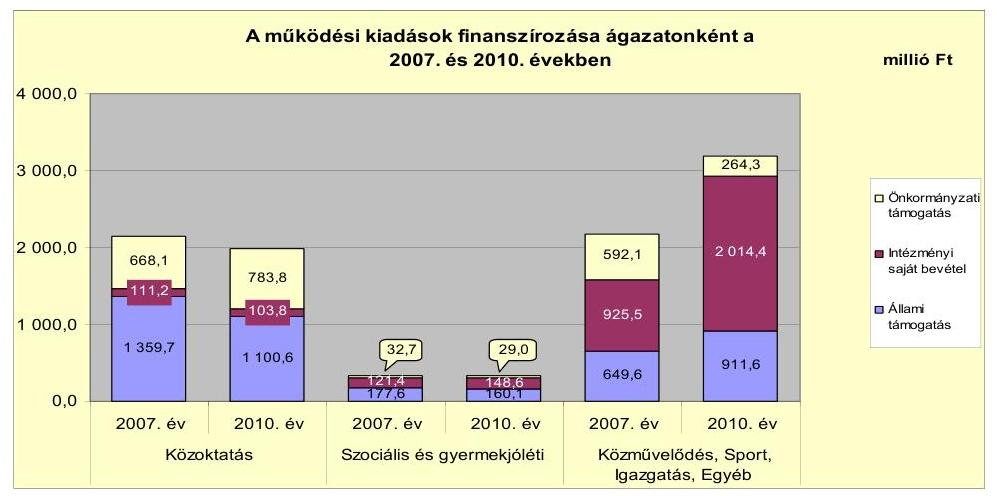

Az állami támogatások összege a közoktatás területén 259,1 millió Ft-tal (19,1%-kal), a szociális és gyermekjóléti feladatokhoz kapcsolódóan 17,5 millió Ft-tal (9,9%-kal) csökkent az időszakban. Az Önkormányzat folyó költségvetési egyenlege (működési jövedelem) a 2007. évben 551,7 millió Ft, a 2008. évben 531,7 millió Ft, a 2009. évben 135,1 millió Ft működési forrástöbbletet mutatott, amely az Önkormányzat kötelező és önként vállalt feladatainak kiadásaira - csökkenő mértékben ugyan, de - fedezetet nyújtott. A 2010. évben a folyó kiadások már 152,4 millió Ft-tal meghaladták a folyó bevételek összegét, mivel az előző évhez képest 306,5 millió Ft-tal csökkent a költségvetési támogatás, valamint 529,7 millió Ft-tal növekedtek a működési kiadások, 99,1 millió Ft-tal az államháztartáson kívülre juttatott pénzeszközök és - a hitelfelvételek összegének növekedéséből eredően - 20,1 millió Ft-tal a kamatkiadások. A forráshiány a folyó kiadások 1,9%-át tette ki. A 2009. évben negatív (-25,7 millió Ft) nettó működési jövedelem keletkezett, mely kedvezőtlen tendencia a 2010. évre tovább erősödött a hiteltörlesztések növekedése következtében. A 2008. évről a 2009. évre 116,6 millió Ft-tal, a 2010. évben további 625,0 millió Ft-tal növekedett a hiteltörlesztés összege. Ennek finanszírozására a 2009. évben a 111,4 millió Ft összegű előző évi működési célú pénzmaradvány még fedezetet nyújtott, de a 2010. évi 80,3 millió Ft maradvány már nem, ezáltal csak újabb hitelfelvétellel tudták biztosítani a hiteltörlesztés fedezetét.
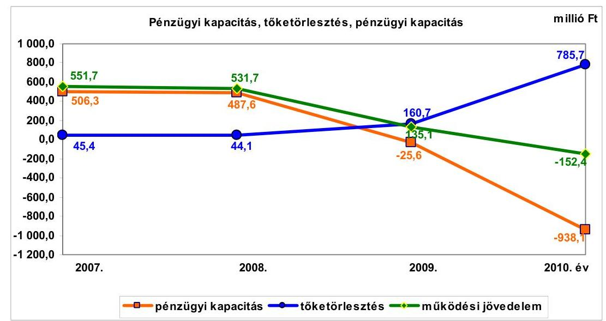

---

A 2007-2010. évek során összesen 2168,8 millió Ft hitel felvételére került sor. A finanszírozási műveletek egyenlege minden évben pozitív volt, amely azt jelentette, hogy az időszakban a tőketörlesztést meghaladó mértékű volt a külső forrásbevonás. A finanszírozási célú pénzügyi műveletek egyenlege a 2007. évben 223,7 millió Ft volt, mely a 2008. évre 39,3 millió Ft-tal csökkent, a 2009. évre további 116,4 millió Ft-os csökkenés következett be. A 2010. évben kiugróan magas volt (924,2 millió Ft) a finanszírozási műveletek egyenlege, amelynek fő oka a rövid lejáratú hitelfelvételek és a likviditási célú hitelek év végi állományi értéke (1290,1 millió Ft) volt.

Az Önkormányzat felhalmozási költségvetésének egyenlege 2007-2010. évek között negatív volt, a hiányzó forrás az időszak alatt összesen 2337,5 millió Ft-ot tett ki, amelynek fedezetéül szolgált egyrészt az előző évi felhalmozási célú pénzmaradvány igénybevétele (264,2 millió Ft), valamint a 2007-2008. években a pozitív összegű (993,9 millió Ft) nettó működési jövedelem. A további hiányzó 1079,4 millió Ft-ot külső forrás igénybevételével biztosították. A pénzügyi helyzet alakulását befolyásolta az Önkormányzat elmúlt időszakban végrehajtott fejlesztési tevékenysége. A 2007-2010. években a 2010. december 31-ig befejezett (3396,9 millió Ft értékű) fejlesztések forrása a saját erő, a hazai és európai uniós támogatások mellett 403,5 millió Ft (11,9%) hosszú lejáratú hitel volt. A 2010. december 31-én folyamatban lévő fejlesztési feladatok végrehajtására a 2007-2010. évek között 524,8 millió Ft kiadást teljesítettek, amelyre hosszú lejáratú hitelből 362,7 millió Ft-ot (69,1%-ot) fordítottak. Mindezeken túl az Önkormányzat a 2007-2010. években - a befejezett és a folyamatban lévő fejlesztési feladatokhoz összesen 721,2 millió Ft értékben - rövid lejáratú támogatás megelőlegezési hiteleket hívott le és használt fel a beruházások megvalósításához pályázaton nyert támogatások átmeneti megelőlegezéséhez, valamint a beruházások önerős részének átmeneti finanszírozásához.

Az Önkormányzat számára a folyamatban lévő felhalmozási feladatok megvalósítása - a Polgármesteri hivatal adatszolgáltatása alapján - 1097,5 millió Ft kötelezettséget jelent a 2010. év után, melyet 1021,6 millió Ft európai uniós támogatásból és 75,9 millió Ft saját forrásból terveznek megvalósítani.

Az Önkormányzat által beadott, elbírálás alatti európai uniós pályázati forrásból egy projektet terveznek megvalósítani, melynek a teljes bekerülési költsége 791,5 millió Ft. A 2010. évet követően vállalt kötelezettség összege 770,9 millió Ft, melynek 84,6%-a (652,4 millió Ft) európai uniós támogatás, 15,4%-ához (118,5 millió Ft) saját forrást kell biztosítani.

Az Önkormányzat mérleg szerinti pénzintézetekkel szembeni kötelezettsége a 2007. év elejétől 2010. december 31-re 505,6 millió Ft-ról 1447,8 millió Ft-ra nőtt, amelyből a hosszú lejáratú kötelezettség állománya 66,0%, illetve 47,8% volt. A likviditási mutatók 2007-2010. évi alakulását összességében értékelve az Önkormányzat pénzügyi helyzete a fizetőképesség szempontjából kedvezőtlenül alakult, a rövid lejáratú kötelezettségek fedezetét jelentő készpénz és egyéb likvid forgóeszközök együttes összege egyik évben sem érte el a rövid lejáratú kötelezettségek értékét. Az Önkormányzat likviditási helyzetének kedvezőtlen alakulását tükrözi, hogy a likviditási célú hitelek igénybevétele tartós volt, keretösszege, átlagos állománya növekedett. A likviditási célú hitelek már nem csak a kiadások és bevételek ütemkülönbségéből eredő finanszírozási hiány kezelését szolgálták, hanem a költségvetési hiány finanszírozási forrásává is váltak.

A folyószámla- és a munkabér-megelőlegezési hitelek igénybevétele a 2007-2010. években és a 2011. év I. félévében a következők szerint alakult:

| Megnevezés | 2007. év | 2008. év | 2009. év | 2010. év | 2011. év I.   félév |
| :-- | --: | --: | --: | --: | --: |
| Folyószámlahitel |  |  |  |  |  |
| Keretösszeg január 1-jén (millió Ft-ban) | 170,0 | 200,0 | 400,0 | 500,0 | 550,0 |
| Átlagos napi állomány (millió Ft-ban) | 115,3 | 156,5 | 266,3 | 316,7 | 486,0 |
| Folyószámla hitellel zárt napok száma   (nap) | 361 | 357 | 342 | 365 | 181 |
| Egyenleg (állomány) | 28,0 | x | x | 437,0 | x |
| Munkabér-megelőlegezési hitel | - | - | - | - | - |
| Keretösszeg január 1-jén (millió Ft-ban) | 81,6 | 90,5 | 91,8 | 106,3 | 84,9 |
| Átlagos napi állomány (millió Ft-ban) | 306 | 197 | 221 | 248 | 181 |
| Munkabér-megelőlegezési hitellel zárt   napok száma (nap) | x | x | x | - | x |
| Egyenleg (állomány) |  |  |  |  |  |

A likviditás biztosítása az Önkormányzatnak a 2007-2010. évek között és a 2011. év I. félévében összesen 122,3 millió Ft kamatkiadást és 1,9 millió Ft egyéb költség fizetésének kötelezettségét okozta. A likviditási célú hitelek igénybevétele ellenére az Önkormányzat 2011. év I. félév végi lejárt szállítói tartozása 758,9 millió Ft, melyből 60 napon túli 531,2 millió Ft volt.

Az Önkormányzatnak a pénzintézetekkel szemben fennálló kötelezettsége a 2011. év I. féléve végén 1522 millió Ft volt. Ennek várható kötelezettsége (tőke, kamat és egyéb költség) a legutóbbi kamatfizetés feltételei alapján a 2011-2013. években összesen 988 millió Ft. Az Önkormányzatnak a 2011. évben szállítói tartozások és egyéb kötelezettségek rendezése címén 870 millió Ft fizetési kötelezettsége keletkezett. A 2011-2013. évek kötelezettségeinek teljesítésére figyelembe vehető 1041 millió Ft forgalomképes nettó ingatlanvagyonból azonban 363 millió Ft (34,8%) pénzintézetekkel szembeni kötelezettséghez kapcsolódóan jelzáloggal terhelt. A 2014. évet követően esedékes - jelenleg ismert pénzintézetekkel szembeni kötelezettsége 645 millió Ft. Ezen kötelezettségek teljesítésének forrásai bizonytalanok. A pénzintézetekkel szemben fennálló rövid és hosszú lejáratú kötelezettségek a 2007. évtől folyamatosan növekedtek, a szállítói tartozásállomány felhalmozódott, a likviditási célú hitelek is állandósultak. Az egyéb passzív pénzügyi elszámolások nélküli összes rövid és hosszú lejáratú kötelezettség összes forráson belüli aránya folyamatosan emelkedett, a 2007. évben 6,5%, a 2010. évben 11,8% volt, mely jelzi, hogy az önkormányzati fizetési kötelezettségek nagyobb arányban növekedtek, mint az összes forrás. Az Önkormányzat fizetőképességét és így hosszú távú pénzügyi egyensúlyát kedvezőtlenül befolyásolja az Önkormányzat jelenlegi likviditási helyzete, a változó kamatozásból adódó kamatkockázat és a tőke törlesztésére adott több éves türelmi idő.

Az Önkormányzat kötelezettségeinek alakulását a következő táblázat mutatja be:

---

| Megnevezés | Allomány 2010. december 31-én |  |  | Allomány 2011. június 30-án |  |  | Várható kötelezettség* 2011-2013. években |  |  | Várható kötelezettség 2014. évtől |  |
| :--: | :--: | :--: | :--: | :--: | :--: | :--: | :--: | :--: | :--: | :--: | :--: |
|  | HUF-ban   (millió Ft-ban) | Devizában   ezer EUR   (összege) | Deviza nem | HUF-ban   (millió Ft-ban) | Devizában   ezer EUR   (összege) | Deviza   nem | HUF-ban   (millió Ft-ban) | Devizában   ezer EUR   (összege) | Deviza   nem | HUF-ban   (millió Ft-ban) | Devizában   ezer EUR   (összege) | Deviza   nem |
| Pénzintézeti kötelezettségek |  |  |  |  |  |  |  |  |  |  |  |
| Hosszú lejáratú hitel | 748 |  | HUF | 726 |  | HUF | 256 |  | HUF | 645 | HUF |
| Folyószámlahitel | 437 |  | HUF | 529 |  | HUF | 464 |  | HUF | 0 |  |
| Munkabér megelőlegezési hitel | 0 |  |  | 78 |  |  | 0 |  |  | 0 |  |
| Egyéb likvid hitelek | 263 |  |  | 189 |  |  | 266 |  |  | 0 |  |
| Pénzintézeti kötelezettségek összesen HUF-ban: | 1448 |  |  | 1522 |  |  | 988 |  |  | 645 |  |
| Szállító tartozás | 727 |  |  | 858 |  |  | 727 |  |  | 0 |  |
| Egyéb kötelezettségek | 12 |  |  | 12 |  |  | 12 |  |  | 0 |  |

* A
 várható kötelezettség tartalmazza a kamatot és egyéb költséget is

Az Önkormányzat adósságkezelési tevékenysége mindezek alapján nem volt eredményes annak ellenére, hogy a költségvetési egyensúly javítása céljából tett intézkedések a 2007-2010 között az Önkormányzat kimutatása szerint összesen 235,2 millió Ft kiadási megtakarítást és 384,8 millió Ft bevételnövekedést eredményeztek. Az adósságot keletkeztető kötelezettségvállalások esetében nem határozták meg a visszafizetés lehetséges forrásait, valamint nem vizsgálták felül a változó kamatozású forint alapú adósságot keletkeztető kötelezettségvállalásaik kockázatait, ennek hiányában nem mérlegelték a konstrukcióváltás lehetőségét sem az ebből adódó kötelezettségek csökkentése érdekében. Az Önkormányzat adósságot keletkeztető kötelezettségvállalásai felső határát - az Ötv. előírása ellenére - a 2008-2010. években nem vizsgálták a döntések meghozatala előtt, azonban azt nem lépték túl. A Képviselő-testület nem kapott tájékoztatást a hosszú lejáratú hitelfelvételből adódó tőke- és kamatfizetési kötelezettségek visszafizetési forrásaira vonatkozóan, valamint arról, hogy a változó kamatozású adósságot keletkeztető kötelezettségvállalás jövőbeni terhei előre nem látható mértékben is növekedhetnek. A hosszú lejáratú felhalmozási célú hitelek bevonásával megvalósított beruházások, felújítások közül nem készült - a kábeltévé és szélessávú információs hálózat, útépítések, informatika fejlesztések ellátásának, továbbá az MFB 2. hitelcélja körébe tartozó, a város közigazgatási területén megvalósuló beruházások finanszírozására kötött hitelszerződésekhez kapcsolódóan - azok megtérülésére vonatkozó számítás, értékelés.

A Képviselő-testületnek a költségvetés és a zárszámadás előterjesztésekor az Áht-ban foglaltak ellenére nem mutatták be a Tomori Pál Főiskola részére nyújtott közvetett támogatást (a fenntartási, általános üzemeltetési és közüzemi díjakkal kapcsolatos költségek átvállalását). A közvetett támogatás nyújtása, mint önként vállalt feladat minden évben hatással volt az Önkormányzat pénzügyi hiányának nagyságára, a 2007-2010. évek között az e célra összesen teljesített 158,5 millió Ft kiadás a pénzügyi hiány 4,4-25,7%-át tette ki.

Az Önkormányzat pénzügyi helyzetét összegezve a következők emelhetők ki:

Az Önkormányzat pénzügyi egyensúlya rövid távon veszélyeztetett. A pénzügyi egyensúlyi helyzet szempontjából kockázatot jelent, hogy a 2007-2009. években a lejárt szállítói kötelezettségek állománya folyamatosan emelkedett. A folyószámlahitel a szállítói kötelezettségek csökkenéséhez csak a

---

2010. évben járult hozzá. A folyószámlahitel év végi és napi átlagos állománya folyamatosan növekvő tendenciát mutatott. Az Önkormányzat nem rendelkezik a likviditási nehézségeket és az eladósodást kezelő stratégiával. Az adósságot keletkeztető kötelezettségvállalások esetében nem határozták meg a visszafizetés lehetséges forrásait, valamint nem vizsgálták felül a változó kamatozású, forint alapú adósságot keletkeztető kötelezettségvállalásaik kockázatait. A pénzintézetekkel szembeni és egyéb kötelezettségek visszafizetésének forrásait nem nevesítették.

A folyó költségvetési egyenleg a 2007-2010. évek között folyamatosan csökkent, a 2010. évben már negatív összegű volt annak ellenére, hogy a folyó bevételeket mindegyik évben növelte az ÖNHIKI támogatás. Az Önkormányzatnak a 2009. évtől kezdődően az adósságszolgálati terhek megfizetése után szabadon elkölthető jövedelme már nem volt. A 2007-2009. években képződött tartalék egy részét belső finanszírozási forrásként a felhalmozási hiány csökkentésére fordították.

A folyamatban lévő és a tervezett, de még el nem kezdett felhalmozási feladatok önerejének fedezete a negatív nettó működési jövedelem miatt bizonytalan. A folyamatban lévő fejlesztések fedezetéül számításba vehető forrásokat nem nevesítették. A megvalósuló beruházások fenntarthatóságának pénzügyi hatásait nem vizsgálták és nem mutatták be a Képviselő-testületnek. A hosszú lejáratú, felhalmozási célú hitelek bevonásával megvalósított beruházásokkal, felújításokkal kapcsolatosan nem készült a megtérülésükre vonatkozó számítás, értékelés. Az Önkormányzat által kimutatott önként vállalt feladatokra fordított kiadások aránya magas (41,6%) volt. Az Önkormányzatnál minden évben a felhalmozási hiány fedezetének egyharmadát külső forrásból biztosították. A tárgyi eszközök felújítására fordított összeg minden évben alatta maradt az elszámolt terv szerinti értékcsökkenés összegének. A Képviselő-testületnek előterjesztett éves zárszámadási rendeleteikben nem mutatták be az Önkormányzat eszközei után az eszközpótlásra fordított tényleges kiadásokat, az eszközök elhasználódottságának alakulását.

# A belső kontrollok működése a vagyongazdálkodás folyamataiban 

Az Önkormányzat vagyona a 2007. évi 18 300,7 millió Ft-ról a 2010. évre 20 668,8 millió Ft-ra, 2368,1 millió Ft-tal (12,9%-kal) növekedett. A változást a befektetett eszközökön belül a beruházások 3386,2 millió Ft-os, a felújítások 286,0 millió Ft-os növekedésének, valamint az üzemeltetésre, kezelésre átadott eszközök állományának az időszak alatt összesen 114,3 millió Ft-tal (12,1%-kal) történő csökkenése együttesen okozta. Az Önkormányzatnál egy 5,3 millió Ft bruttó értékű berendezést (fagylaltkészítő gépet) a 2008. évi üzemeltetésre történő átadáskor - az Áhsz. könyvviteli elszámolásra vonatkozó előírását figyelmen kívül hagyva - nem vettek nyilvántartásba az üzemeltetésre, kezelésre átadott eszközök között, az továbbra is a tárgyi eszközök között szerepel. A felvett hitelek kamatának változása kedvezőtlen hatással volt az önkormányzati vagyon alakulására.

A Képviselő-testület a 2007-2010. évi költségvetési rendeleteiben több - az önkormányzati vagyon növekedését eredményező - fejlesztési feladat megvalósításáról döntött. A fejlesztések eredményeként az időszak alatt a tárgyi eszközök állománya 12,9%-kal (2156,0 millió Ft-tal), ezen belül a beruházások, felújítások év végi állományi értéke 79,0%-kal (605,2 millió Ft-tal) emelkedett, amely az önkormányzati vagyonelemek belső összetételében jelentős változást nem okozott. A beruházások 64,0%-a, a felújítások 89,0%-a kötelező feladatok ellátásához kapcsolódott. Az Önkormányzat a fejlesztésekkel létrehozott tárgyi eszközök fenntartásának várható költségeit nem számszerúsítette, a megvalósított fejlesztések díjbevétel növekedést nem eredményeznek. A Képviselő-testület a fejlesztések eredményességét a nyújtott közszolgáltatások színvonala, célszerűsége szempontjából nem értékelte. A megvalósított felújítások, beruházások ellenére az Önkormányzatnál a tárgyi eszközök elhasználódottságát jelző mutató évről évre folyamatosan romlott, értéke 2007-ben 81%, 2010-ben 77% volt.

A vagyongazdálkodási folyamatok szabályozottságának hiányosságai magas kockázatot jelentettek a feladatok szabályszerű végrehajtásában, mivel a jegyző nem írt elő ellenőrzési kötelezettséget az önkormányzati vagyon forgalomképesség megváltoztatásának vagyongazdálkodási rendeletben meghatározott eljárásrendjére, valamint beszámolási kötelezettséget az átruházott hatáskörben hozott döntésekről, továbbá nem kezdeményezte a 2010. évi és a 2011. évi belső ellenőrzési terv jóváhagyása során a vagyongazdálkodáshoz kapcsolódó magas kockázatúnak értékelt területek ellenőrzését sem. A Képviselő-testület a vagyonértékesítésekkel kapcsolatos döntések előkészítése folyamatában nem írta elő a költség-haszon elemzés készítési kötelezettséget, nem szabályozta a többségi tulajdonú gazdasági társaságai esetében a tulajdonosi jogokat képviselő személy részére a gazdasági társaságoknál hozott döntésekről való beszámolási kötelezettséget. A Pénzügyi bizottság részére nem határoztak meg beszámolási kötelezettséget a vagyon változása figyelemmel kísérésének eredményéről. A jegyző nem írta elő a finanszírozási célú pénzügyi műveletekkel összefüggésben a pénzügyi kockázatok felmérésének kötelezettségét.

A hitelfelvételről szóló döntések előkészítése folyamatában nem írták elő a futamidő egyes éveit terhelő tőke és kamat tartozás költségvetési egyensúlyra gyakorolt hatása vizsgálatának kötelezettségét, valamint a hitelfelvétel indokainak és gazdasági megalapozottságának vizsgálatát tartalmazó pénzügyi bizottsági dokumentum elkészítésének és a döntéshozatalhoz történő csatolásának kötelezettségét. A jegyző nem írta elő a vagyongazdálkodással kapcsolatos feladatokat ellátók részére a beszámolási kötelezettséget, és annak ellenőrzési kötelezettségét, hogy a bevételeket megalapozó szerződések tartalmazzák-e a döntési hatáskörrel rendelkező által meghatározott feltételeket. A jegyző nem szabályozta az információ szolgáltatást érintően a vagyongazdálkodási külső és belső információik kezelésének rendjét, a vagyongazdálkodási folyamatok nyomon követési módszereit, a vezetői információs rendszert és nem írta elő a belső kontrollrendszer működésének évenkénti felülvizsgálatát sem.

A Polgármesteri hivatalban a 2010. évben és a 2011. év I. félévében a vagyongazdálkodási folyamatokban a kontrollok nem biztosították a vagyongazdálkodás eredményességét. A kontrollok működése gyenge volt, mert - a szabályozás hiánya miatt - a Pénzügyi bizottság nem számolt be a vagyonváltozás alakulása figyelemmel kísérésének eredményéről a Képviselőtestületnek. A finanszírozási célú pénzügyi művelet döntés-előkészítésének folyamatában nem mérték fel a pénzügyi kockázatokat, továbbá nem terjesztették be a Pénzügyi bizottság véleményét a hitelfelvételhez kapcsolódó képviselő-

---

testületi döntéshez. A jegyző, a vezetői ellenőrzés keretében nem számoltatta be a vagyongazdálkodási feladatokat végzőket a vagyonértékesítés, vagyonhasznosítás, a finanszírozási célú pénzügyi műveletek végrehajtásának folyamatáról és a végrehajtás eredményéről, valamint a kijelölt ellenőrzési pontokon nem hajtották végre az ellenőrzési nyomvonalban a vagyongazdálkodási folyamatokra előírt ellenőrzéseket. A jegyző nem működtetett vezetői információs rendszert, nem tárta fel a vagyongazdálkodás folyamataiban a szabálytalanságokat, nem végeztette el a vagyongazdálkodási folyamatok megfigyelését. Nem határozták meg az iratok kezelésének, a folyamatok dokumentálási rendjének rögzítésére használt informatikai programok követelményeit, a vezetői információs rendszer és a belső kontroll rendszer működésének évenkénti felülvizsgálati rendjét, valamint az adatok biztonságos tárolását.

A Polgármesteri hivatalban a 2010. évben, valamint a 2011. év I. félévében az egyéb helyiségek bérbeadásából származó bevételek beszedésével, valamint az egyéb bérleti díj kifizetések, az államháztartáson kívülre nonprofit szervezeteknek, egyházaknak és nem önkormányzati többségi tulajdonú vállalkozásoknak nyújtott céljellegű működési támogatásokkal kapcsolatos kifizetések, a villamos energia szolgáltatás díj kiadások és az ingatlan felújítások kifizetései során - ezen területek költségvetési súlyának figyelembevételével összefoglalóan értékelve - a belső kontrollok működése gyenge volt. A kulcskontrollok nem biztosították a vagyongazdálkodás eredményességét. A villamos energia szolgáltatási díj kifizetéséhez kapcsolódó kötelezettségvállalást (2003. november 20-ai szerződést) az előző polgármester - az Ámr.¹-ben foglaltak ellenére, továbbá az ingatlanok felújításával kapcsolatos kötelezettségvállalásokat (2010. július 7-ei és 16-ai megrendeléseket) - ellenjegyzés nélkül írta alá. Ezáltal a kötelezettségvállalást megelőzően nem győződtek meg a kiadási előirányzat rendelkezésre állásáról, a fedezet meglétéről, és nem vizsgálták, hogy a kötelezettségvállalás nem sérti-e a gazdálkodásra vonatkozó szabályokat. Ezt a hiányosságot az utalvány ellenjegyző a kifizetéseket megelőzően az Ámr.² előírása ellenére nem kifogásolta. A közszolgáltatási szerződésben meghatározott feladatok szakmai teljesítését a jegyző által kijelölt személy aláírásával igazolta, azonban az Ámr.²-ben foglalt - az összegszerűségre vonatkozó - ellenőrzések elvégzéséhez szükséges, a szolgáltatás átalány díjainak mértékére vonatkozó adatokat a rendelkezésére álló okmányok nem tartalmazták.

# A tulajdonosi felelősség érvényesítésének eredményessége a gazdasági társaságoknál 

Az Önkormányzat 2007. január 1-je és 2011. június 30-a között többségi tulajdonú (51%) gazdasági társaságával, a Kalocsavíz Kft.-vel látta el a lakossági közüzemi víz- és csatornaszolgáltatást, valamint a 100%-os tulajdonában lévő KalocsaKOM Kft.-vel biztosította a szélessávú internet működtetését, a távközlési feladatokat. A Kalocsavíz Kft.-nél és a KalocsaKOM Kft.-nél a tulajdonosi felelősség érvényesülése nem volt eredményes, mert az Önkormányzat a szerződésekben nem határozta meg a szolgáltatások feladatmutatóit, mennyiségét és a minőségi követelményeket, nem végezte el ezen gazdasági társaságok által ellátott feladatok mennyiségének és minőségének számonkérését. Az Önkormányzat nem végzett szakmai és gazdaságossági számításokat, értékeléseket, amelyek igazolták volna a gazdasági társaságok feladatellátása szervezeti formájának célszerűségét, indokoltságát. A felügyelőbizottságokba delegált

---

tagok az Önkormányzat pénzügyi-gazdasági helyzetét befolyásoló döntések (hosszú lejáratú hitelfelvételek, fejlesztések) előtt nem kérték ki az Önkormányzat álláspontját, továbbá tevékenységükről nem számoltak be a Képviselőtestületnek.

A Képviselő-testület a Kalocsavíz Kft. és a KalocsaKOM Kft. részére történő feladatellátás átadásáról nem szakmai-gazdasági elemzés alapján döntött, nem írta elő a feladatellátás szervezeti formájának és kiadásainak rendszeres felülvizsgálatát. A Kalocsavíz Kft. és a KalocsaKOM Kft. felügyelőbizottságai nem vizsgálták a 2010. évben felvett 8,0 millió Ft hosszú lejáratú fejlesztési célú hitel, illetve a 76 000 EUR (20,2 millió Ft)
 hosszú lejáratú forgóeszköz-hitel felvételének szükségességét és a visszafizetés feltételeit. A felügyelőbizottságok nem követték nyomon a Kalocsavíz Kft. és a KalocsaKOM Kft. által felvett hiteleknek az Önkormányzat pénzügyi helyzetére, a közfeladat ellátására gyakorolt hatását, valamint cél szerinti felhasználását sem. Az önkormányzati belső ellenőrzés a 2007. január 1-je és 2011. június 30-a között a többségi tulajdonú gazdasági társaságoknál ellenőrzést nem végzett, így nem vizsgálta azok tevékenységét, az üzemeltetésre, kezelésre átadott vagyon leltározásának szabályszerűségét sem. A Képviselő-testület nem írta elő a Kalocsavíz Kft. és a KalocsaKOM Kft. felügyelőbizottságába delegált tagok beszámolási kötelezettségét az általuk végzett tevékenységről, a gazdasági társaság döntéseiről. A Kalocsavíz Kft. és a KalocsaKOM Kft. felügyelőbizottsága a Gt. 34. § (4) bekezdésének előírása ellenére alapítása óta nem rendelkezik ügyrenddel.

# A korábbi ellenőrzés során tett javaslatok hasznosításának utóellenőrzése 

Az ÁSZ az Önkormányzat gazdálkodási rendszerét a 2010. évben ellenőrizte átfogó jelleggel. Az ellenőrzésről készített jelentés 15 szabályszerűségi és 22 célszerűségi javaslatot tartalmazott. A javaslatok megvalósítása érdekében a felelősöket és határidőket tartalmazó intézkedési terv készült, amelyet a Képviselőtestület jóváhagyott. Az utóellenőrzés során megállapítottuk, hogy az intézkedési tervben foglalt határidőre az ÁSZ által tett 37 javaslatból 15-öt realizáltak, 2 részben hasznosult, 7-et nem, 11-et határidőn túl teljesítettek. A szabályszerűségi javaslatok közül 10-et realizáltak, 3 nem, 1 határidőn túl teljesült. A célszerűségi javaslatok közül 5-öt realizáltak, 2-t részben hasznosítottak, 4 nem, 10 határidőn túl teljesült. Egy szabályszerűségi és egy célszerűségi javaslat nem volt aktuális.

A polgármester ${ }_{1}$ - a 2010. évi átfogó ellenőrzés után - részben hasznosította az intézkedési terv készítésére és az ÁSZ részére történő megküldésére vonatkozó célszerűségi javaslatot, mivel a javaslatban előírt határidőn túl küldte meg az intézkedési tervet az ÁSZ-nak. A polgármester ${ }_{2}$ nem gondoskodott - a 2010. évi átfogó ellenőrzés utóellenőrzése során - az ÁSZ által tett és nem teljesült szabályszerűségi javaslat végrehajtásáról, mivel nem csatolta a 2011. évi költségvetési koncepció tervezetéhez sem a CKÖ véleményét annak hiánya miatt. A Pénzügyi bizottság véleményét nem csatolta a 2011. évi költségvetési koncepció tervezetéhez, továbbá a költségvetési rendelet-tervezethez, mivel azokat csak a képviselő-testületi ülésen ismertette.

---

A szabályszerűségi javaslatok közül a 2010. évi intézkedési tervben foglalt határidőre a jegyző teljesítette a költségvetési hiány megállapítására, a likviditási terv készítésére, a céljelleggel nyújtott támogatások szerződéseinek tartalmára, a kockázatkezelési rendszer működtetésére, az utalványok ellenjegyzésére, a belső ellenőrzés szabályszerű kialakítására és működtetésére vonatkozó javaslatokat. A jegyző nem teljesítette az $\mathrm{SzMSz}_{2}$, az ellenőrzési nyomvonal tartalmi kiegészítésére vonatkozó szabályszerűségi javaslatokat. Határidőn túl végezték el a szabálytalanságok kezelése eljárásrendjének pontosítását.

A célszerűségi javaslatokból a jegyző hasznosította az alkalmazott informatikai rendszerek hozzáférési jogosultságának nyilvántartására, tartalmára, a munkaköri leírások kiegészítésére vonatkozó javaslatokat, továbbá részben hasznosította a számítástechnikával kapcsolatos szabályzat megismertetésére irányuló javaslatot. A jegyző a célszerűségi javaslatok tekintetében nem intézkedett az európai uniós forrásokra vonatkozó pályázatokkal összefüggésben tett javaslatok realizálásáról, továbbá a pénzügyi-számviteli feladatoknál alkalmazott informatikai rendszerek működtetéséhez kapcsolódó belső kontroll eljárások meghatározásáról, az eszközök és források értékelési szabályzata és az $\mathrm{SzMSz}_{2}$ kiegészítéséről. A jegyző nem gondoskodott a katasztrófa elhárítási terv, a pénzügyi-számviteli szoftver elemeire vonatkozó változáskezelési eljárások teszteléséről, nem ellenőriztette az elmentett adatállományokból a pénzügyi-számviteli adatok helyreállítását és a helyreállított adatállományt.

Az Állami Számvevőszékről szóló 2011. évi LXVI. törvény 33. § (1) bekezdésében foglaltak értelmében a jelentésben foglalt megállapításokhoz kapcsolódó intézkedési tervet köteles az ellenőrzött szervezet vezetője összeállítani és azt a jelentés kézhezvételétől számított harminc napon belül az ÁSZ részére megküldeni. Amennyiben az intézkedési tervet határidőben nem küldi meg a szervezet, vagy az továbbra sem elfogadható, az ÁSZ elnöke a hivatkozott törvény 33. § (3) bekezdés a)-b) pontjaiban foglaltakat érvényesítheti.

# Az ellenőrzés intézkedést igénylő megállapításai és javaslatai: 

## a polgármesternek

1. Az Önkormányzatnál a pénzügyi egyensúlyi helyzet szempontjából kockázatot jelent a lejárt szállítói kötelezettségek állományának, a folyószámlahitel év végi és napi átlagos állományának növekvő tendenciája. Az Önkormányzat nem rendelkezik a likviditási nehézségeket és az eladósodást kezelő stratégiával. Az adósságot keletkeztető kötelezettségvállalások esetében nem határozták meg a visszafizetés lehetséges forrásait, valamint nem vizsgálták felül az adósságot keletkeztető kötelezettségvállalások kockázatait. A folyó költségvetési egyenleg folyamatosan csökkent, a 2010. évben már negatív összegű volt, míg a nettó működési jövedelem a 2009. évtől volt negatív. A folyamatban lévő és a tervezett, de még el nem kezdett felhalmozási feladatok önerejének fedezete a negatív nettó működési jövedelem miatt bizonytalan, a számításba vehető forrásokat nem nevesítették. A hosszú lejáratú, felhalmozási célú hitelek bevonásával megvalósított beruházásokkal, felújításokkal kapcsolatosan nem készült a megtérülésükre vonatkozó számítás, értékelés. A megvalósuló beruházások fenntarthatóságának pénzügyi hatásait nem vizsgálták és nem mutatták be a Képviselőtestületnek. Az Önkormányzat által kimutatott önként vállalt feladatokra fordított ki-

---

adások aránya magas volt. A tárgyi eszközök felújítására fordított összeg minden évben alatta maradt az elszámolt terv szerinti értékcsökkenés összegének. A Képviselőtestületnek előterjesztett éves zárszámadási rendeleteikben nem mutatták be az Önkormányzat eszközei után az eszközpótlásra fordított tényleges kiadásokat, az eszközök elhasználódási fokának alakulását.

Javaslat
a) Terjesszen a Képviselő-testület elé reorganizációs programot a kedvezőtlen pénzügyi folyamatok megállítására, a pénzügyi helyzet gyors stabilizálására, és hosszú távú fenntarthatóságára, amely tartalmazza különösen:
aa) a kiadások mérséklésére (kötelező és önként vállalt feladatok és a kiadási szerkezet áttekintésével), a kiadások folyamatos kontrolljára, a bevételek növelésére, és a kintlévőségek behajtására vonatkozó intézkedéseket,
ab) a likviditás menedzselésének racionalizálását, továbbá azt a feltételrendszert, amelynek bekövetkezése esetén a likviditási tervet aktualizálni kell,
ac) a lehetséges megtakarításokból származó források tartalékba helyezésének kötelezettségét;
b) Vizsgálja felül teljes körűen a folyamatban lévő beruházásokat, és mutassa be a Képviselő-testületnek azok fenntarthatóságának pénzügyi hatásait. Az Önkormányzat pénzügyi helyzete szempontjából kedvező támogatási és finanszírozási lehetőségeket vegye igénybe;
c) Vizsgálja felül teljes körűen a tervezett beruházásokat és azok fenntartásának jövőbeni pénzügyi kihatásait. Szükség esetén tegyen javaslatot a Képviselőtestületnek a tervezett beruházásokkal kapcsolatos döntések módosítására, amelyben figyelembe veszik az Önkormányzat pénzügyi lehetőségeit, és a kötelező feladatellátás elsődlegességét;
d) Mutassa be az adósságot keletkeztető kötelezettségvállalásról szóló döntéskor a Képviselő-testületnek a jövőben várható - kamat- és törlesztési - kockázatot;
e) Tegyen intézkedést arra, hogy a jövőben az adósságot keletkeztető kötelezettségvállalásokról szóló képviselő-testületi előterjesztések tételesen tartalmazzák a visszafizetés forrásait;
f) Készítessen a hosszú lejáratú, felhalmozási célú hitelek igénybevételével megvalósított beruházáshoz, felújításhoz a megtérülésükre vonatkozó számítást, értékelést;
g) Mutassa be a Képviselő-testületnek évente a zárszámadási rendelet előterjesztésében a tárgyi eszközök értékcsökkenésének összegével összevetve az elhasználódott eszközök pótlására fordított tényleges kiadásokat, az eszközök elhasználódási fokának alakulását;

---

h) Gondoskodjon az Önkormányzat lejárt szállítói állományának pénzügyi rendezéséről, a szállítói függőség és a jogszabályi következmények elkerülése érdekében.
2. A Képviselő-testület nem írta elő a vagyonhasznosítással kapcsolatban a döntéselőkészítés folyamatában a költség-haszon-elemzés készítésének kötelezettségét. A vagyongazdálkodási rendelet nem tartalmazza a forgalomképesség megváltoztatása módjára vonatkozó szabályokat.

Javaslat
Kezdeményezze, hogy a Képviselő-testület írja elő a vagyonhasznosítással kapcsolatban a döntés-előkészítés folyamatában a költség-haszon-elemzés készítésének kötelezettségét, valamint a vagyongazdálkodási rendelet kiegészítését a forgalomképesség megváltoztatásának módjára vonatkozó előírásokkal.
3. A Pénzügyi bizottság nem tett eleget az Ötv. 92. § (13) bekezdés b), c) pontjaiban és a (14) bekezdésében foglalt kötelezettségének, mert az előírás ellenére a vagyonváltozás alakulását nem kísérte figyelemmel, valamint nem vizsgálta a hitelfelvételhez kapcsolódó döntést megelőzően a hitelfelvétel indokait és gazdasági megalapozottságát.

Javaslat
Kezdeményezze, hogy a Pénzügyi bizottság az Ötv. 92. § (13) bekezdés b), c) pontjaiban és a (14) bekezdésében foglalt feladatainak tegyen eleget és kísérje figyelemmel a vagyonváltozás alakulását, valamint vizsgálja a hitelfelvételhez kapcsolódó döntést megelőzően a hitelfelvétel indokait és gazdasági megalapozottságát.
4. A Kalocsavíz Kft. és a KalocsaKOM Kft. felügyelőbizottsága a Gt. 34. § (4) bekezdésének előírása ellenére megalakulása óta nem rendelkezik ügyrenddel.

Javaslat
Kezdeményezze a Gt. 34. § (4) bekezdésében foglaltak érvényesülése érdekében, hogy a KalocsaKOM Kft. és a Kalocsavíz Kft. felügyelőbizottságai készítsék el ügyrendjüket, amely tartalmazza az ügyvezetés ellenőrzésének feladatait és a beszámolási kötelezettséget, továbbá azt terjesszék be jóváhagyásra a Képviselő-testületnek, illetve a Taggyúlésnek.
5. Az Önkormányzat a többségi tulajdonában lévő gazdasági társaságokkal kötött szerződésekben nem határozta meg a szolgáltatások feladatmutatóit, mennyiségét és a minőségi követelményeket, ezáltal nem végezte el ezen gazdasági társaságok által ellátott feladatok mennyiségének és minőségének számonkérését.

Javaslat
Intézkedjen arról, hogy határozzák meg a többségi tulajdonban lévő gazdasági társaságokkal kötött szerződésekben a szolgáltatások feladatmutatóit, a mennyiségi és a minőségi követelményeket, az Önkormányzat végezze el az ellátott feladatok mennyiségének és minőségének szerződés szerinti számonkérését.

---

6. Az Önkormányzat nem végzett szakmai és gazdaságossági számításokat, értékeléseket, amelyek igazolták volna a többségi tulajdonú gazdasági társaságok feladatellátása szervezeti formájának célszerűségét, indokoltságát.

Javaslat
Intézkedjen arról, hogy a Képviselő-testület vizsgálja gazdaságossági számítások, értékelések alapján a többségi tulajdonú gazdasági társaságok által ellátott feladatok szervezeti formájának célszerűségét, indokoltságát.
7. A Képviselő-testület a többségi tulajdonú gazdasági társaságai részére történő feladatellátás átadásáról nem szakmai-gazdasági elemzés alapján döntött, nem írta elő a feladatellátás szervezeti formájának és kiadásainak rendszeres felülvizsgálatát.

Javaslat
Intézkedjen arról, hogy a Képviselő-testület a többségi tulajdonú gazdasági társaságok részére történő feladatellátás átadásáról szakmai-gazdasági elemzés alapján döntsön, valamint írja elő a feladatellátás szervezeti formájának és kiadásainak rendszeres felülvizsgálatát.
8. A felügyelőbizottságok a tevékenységükről nem számoltak be a Képviselőtestületnek, továbbá nem vizsgálták a többségi tulajdonú gazdasági társaságok által felvett hosszú lejáratú hitelek szükségességét és a visszafizetés feltételeit, nem követték nyomon a hitelfelvételeknek az Önkormányzat pénzügyi helyzetére, a közfeladat ellátására gyakorolt hatását, valamint cél szerinti felhasználását sem.

Javaslat
Kezdeményezze, hogy a Képviselő-testület számoltassa be a felügyelőbizottságba delegált tagokat a felügyelőbizottságban végzett munkájukról, különösen a többségi tulajdonú gazdasági társaságok által felvett hosszú lejáratú hitelek szükségességének és a visszafizetés feltételeinek, a hitelfelvételeknek az Önkormányzat pénzügyi helyzetére, valamint a közfeladat ellátására gyakorolt hatásának és a cél szerinti felhasználásának vizsgálatáról.
9. A polgármester nem intézkedett az Önkormányzat 2010. évi átfogó ellenőrzés utóellenőrzésekor az ÁSZ által tett, nem teljesítettnek minősített szabályszerűségi javaslat hasznosításáról, mivel nem csatolta a 2011. évi költségvetési koncepció tervezetéhez a CKÖ véleményét annak hiánya miatt, illetve nem csatolta a 2011. évi költségvetési koncepció tervezetéhez, továbbá a költségvetési rendelet-tervezethez a Pénzügyi bizottság véleményét.

Javaslat
Intézkedjen az Önkormányzat gazdálkodási rendszerének 2010. évi átfogó ellenőrzése során az utóellenőrzés keretében megállapított, az ÁSZ által tett és nem teljesült szabályszerűségi javaslat végrehajtására és annak keretében a továbbiakban gondoskodjon a CKÖ és a Pénzügyi bizottság véleményének költségvetési koncepció tervezetéhez, továbbá a Pénzügyi bizottság véleményének a költségvetési rendelettervezethez történő csatolásáról.

---

10. Az utóellenőrzés során megállapítottuk, hogy az ÁSZ által tett szabályszerűségi javaslatok közül 3 nem, 1 határidőn túl teljesült. Nem teljesült az Ámr. 35. § (3) bekezdésében és a 36. § (5) bekezdésében foglaltak
 ellenére a Pénzügyi bizottság és a CKÖ véleményének csatolására, a 20. § (2) bekezdés e) és i) pontjaiban foglalt előírással szemben az $\mathrm{SzMSz}_{2}$ nem tartalmazta a szervezeti egységek létszámát és feladatait, továbbá a 156. § (2) bekezdésében és a 155. § (3) bekezdésében előírtak ellenére az ellenőrzési nyomvonal nem tartalmazott utalást arra, hogy az egyes feladatokat mely belső szabályzat tartalmazza. Határidőn túl teljesült a szabálytalanságok kezelésének eljárásrendjének tartalmi kiegészítése az Ámr. ${ }_{2}$ 161. §-ában foglaltak szerint.

Javaslat
Intézkedjen az ÁSZ által tett javaslatok határidőn túli, illetve nem teljesítése okainak és a felelősség kérdésének kivizsgálásáról, továbbá indokolt esetben kezdeményezze a felelősségre vonást.

# a jegyzőnek 

1. A Képviselő-testület nem kapott tájékoztatást arról, hogy a változó kamatozású adósságot keletkeztető kötelezettségvállalások jövőbeni terhei előre nem látható mértékben is növekedhetnek. Az Önkormányzat adósságot keletkeztető kötelezettségvállalásai felső határát az Ötv. 88. § (2) bekezdésében foglalt előírás ellenére a 2008-2010. években nem vizsgálták a döntések meghozatala előtt.

Javaslat
a) az adósságot keletkeztető kötelezettségvállalásokról szóló döntések meghozatala előtt adjon tájékoztatást a Képviselő-testületnek arról, hogy a változó kamatozás miatt a kötelezettségvállalás jövőbeni terhei előre nem látható mértékben növekedhetnek;
b) vizsgáltassa meg minden adósságot keletkeztető ügylet esetében a Stabilitási tv. 10. § (3) bekezdésében foglalt előírás betartása érdekében, hogy a tárgyévi összes fizetési kötelezettség ne haladja meg az Önkormányzat adott évi saját bevételeinek 50\%-át.
2. A Képviselő-testületnek a költségvetés és a zárszámadás előterjesztésekor az Áht. 118. § (1) bekezdés 2. c) pontjában és a (2) bekezdés 2. e) pontjában foglaltak ellenére nem mutatták be a Tomori Pál Főiskola részére nyújtott közvetett támogatást.

Javaslat
Intézkedjen, hogy az új Áht. 24. § (4) bekezdés c) pontja alapján a költségvetés, valamint az új Áht. 91. § (2) bekezdés a) pontja alapján a zárszámadás előterjesztésekor az Önkormányzat által nyújtott közvetett támogatásokat tartalmazó kimutatásban valamennyi közvetett támogatás, így a Tomori Pál Főiskola részére nyújtott közvetett támogatás is szerepeljen.

---

3. Az Ámr. 2 157. §-ában foglalt előírások ellenére nem határozták meg a kockázatok kezelésével kapcsolatos szabályokat és a 2010. évi ellenőrzési tervben nem szerepeltették a vagyongazdálkodáshoz kapcsolódó magas kockázatúnak értékelt területek ellenőrzését.

Javaslat
Alakítsa ki az új Ber. 7. §-ában foglalt előírásoknak megfelelően a Polgármesteri hivatal kockázatok kezelésével kapcsolatos szabályait és az éves ellenőrzési tervben szerepeltesse valamennyi magas kockázatúnak értékelt terület, így a vagyongazdálkodáshoz kapcsolódó területek ellenőrzését is.
4. Hiányosan alakították ki az Áht. 121/A. § (1) és (4) bekezdésében, valamint az Ámr. ${ }_{2}$ 155. § (1) bekezdésében foglaltak ellenére a belső kontrollrendszert. Nem határozták meg a kontrolltevékenységeket, ennek keretében a folyamatba épített előzetes, utólagos, és vezetői ellenőrzést, nem jelölték ki az egyes feladatok elvégzéséért felelős személyeket, és nem biztosították a kontrollok előírás szerinti működését. Nem határozták meg a bevételeket megalapozó döntések szerződésben történő érvényesítése felülvizsgálatának feladatát, és nem jelölték ki a felülvizsgálatért felelős személyt. Nem írták elő az Önkormányzat érdekeit védő garanciális elemek szerződésben való rögzítésének kötelezettségét, valamint a finanszírozási célú pénzügyi műveletekkel összefüggésben a pénzügyi kockázatok felmérésének kötelezettségét.

Javaslat
Folytassa az új Áht. 69. § (2) bekezdésében, valamint az új Ber. 8. § (2) bekezdésében foglaltak alapján a Polgármesteri hivatal belső kontrollrendszerének kialakítását, ennek keretében építse ki a folyamatba épített előzetes, utólagos, és vezetői ellenőrzést és biztosítsa a kontrollok előírás szerinti működését.
5. Nem írtak elő beszámolási kötelezettséget a vagyongazdálkodással összefüggésben az átruházott hatáskör gyakorlóinak.

Javaslat
Kezdeményezze, hogy a Képviselő-testület a vagyongazdálkodással összefüggésben átruházott hatáskör gyakorlóinak írjon elő beszámolási kötelezettséget.
6. Az Önkormányzatnál egy 5,3 millió Ft bruttó értékű berendezést (fagylaltkészítő gépet) a 2008. évi üzemeltetésre történő átadáskor - az Áhsz. könyvviteli elszámolásra vonatkozó előírását figyelmen kívül hagyva - nem vettek nyilvántartásba az üzemeltetésre, kezelésre átadott eszközök között, az továbbra is a tárgyi eszközök között szerepel.

Javaslat
Gondoskodjon az Áhsz. 20. § (1) bekezdésében foglaltak érvényesülése érdekében arról, hogy a fagylaltkészítő gépet az üzemeltetésre, kezelésre átadott eszközök között tartsák nyilván.

---

7. A kiadások teljesítését megelőzően a szakmai teljesítésigazolást az Ámr. ${ }_{2}$ 76. § (1) bekezdésében és a gazdálkodási szabályzat ${ }_{1,2}$-ben foglalt kötelezettségük ellenére a kijelölt személyek nem végezték el. Az utalvány ellenjegyzője egyes ingatlanfelújításokkal, valamint a villamos energiaszolgáltatási díjakkal kapcsolatos kifizetéseket megelőzően az Ámr. ${ }_{2}$ 79. §-ában foglalt előírás ellenére nem kifogásolta, hogy a kötelezettségvállalásokat nem előzte meg azok ellenjegyzése, ezáltal a kötelezettségvállalást megelőzően nem győződtek meg a kiadási előirányzat rendelkezésre állásáról, a fedezet meglétéről, és nem vizsgálták, hogy a kötelezettségvállalás nem sérti-e a gazdálkodásra vonatkozó szabályokat.

Javaslat
a) Intézkedjen arról, hogy a szakmai teljesítésigazolásra kijelölt személyek az Ávr. 57. § (1) bekezdésében előírt ellenőrzési kötelezettségüknek a gazdálkodási szabályzat ${ }_{2}$-ben foglalt módon tegyenek eleget;
b) Intézkedjen arra vonatkozóan, hogy az érvényesítő az Ávr. 58. § (2) bekezdésben előírt kötelezettségének eleget téve az utalványozónak jelezze, ha az Ávr. 58. § (1) bekezdésében előírt ellenőrzési feladatai során a jogszabályok, szabályzatok megsértését tapasztalja;
c) Kezdeményezze a 2012. évi ellenőrzési terv módosítását annak érdekében, hogy a belső ellenőrzés teljes körűen végezze el a belső kontrollok működésének értékelését a 2007-2011. I. félév közötti időszakra vonatkozóan. A belső ellenőrzés terjedjen ki az ingatlan-felújítások és a villamos energiaszolgáltatási díjak kifizetéseire annak tekintetében, hogy a kijelölt, illetve felhatalmazott személyek - kiemelten a szerződések ellenőrzésére kijelölt személy, a kötelezettségvállalások ellenjegyzője, az utalványok ellenjegyzője és a szakmai teljesítések igazolója - valamennyi kiadás esetében elvégezték-e a jogszabályokban előírt ellenőrzési feladataikat. Indokolt esetben kezdeményezze a felelősségre vonást.
8. Nem írták elő a pénzügyi kockázatok felmérésének, valamint a hitel felvételről szóló döntés előkészítése folyamatában a futamidő egyes éveit terhelő tőke és kamat tartozás költségvetési egyensúlyra gyakorolt hatása vizsgálatának kötelezettségét.

Javaslat
Szabályozza a finanszírozási célú pénzügyi műveletekkel összefüggésben a pénzügyi kockázatok felmérésének, továbbá a hitelfelvételről szóló döntés-előkészítés folyamatában a futamidő egyes éveit terhelő kötelezettség költségvetési egyensúlyra gyakorolt hatása vizsgálatának kötelezettségét, valamint gondoskodjon ezek elvégzéséről.
9. Nem határozták meg az iratok kezelésének, a folyamatok dokumentálási rendjének rögzítésére használt informatikai programok követelményeit, valamint az adatok biztonságos tárolását.

Javaslat
Egészítse ki a Polgármesteri hivatal belső szabályzatát a folyamatok dokumentálási rendjének rögzítésére használt informatikai programok követelményeit, és biztosítsa azok betartását, valamint az adatok biztonságos tárolását.

---

10. Nem határozták meg és nem írták elő az Ámr. ${ }_{2}$. 159. § (1) és (2) bekezdéseiben és 160. § (1) bekezdésben foglaltak ellenére a vagyongazdálkodással kapcsolatos külső és belső információk kezelésének és monitoringjának rendjét, a vagyongazdálkodási folyamatok nyomon követési módszereit, a vezetői információs rendszer és a belső kontroll rendszer működésének évenkénti felülvizsgálati rendjét.

Javaslat
Határozza meg az új Ber. 9. § (1) és (2) bekezdéseiben és a 10. §-ban foglaltak szerint a vagyongazdálkodás külső és belső információi kezelésének és monitoringjának rendjét, a vagyongazdálkodással folyamatok nyomon követési módszereit, a vezetői információs rendszert és a belső kontroll rendszer működésének évenkénti felülvizsgálatának rendjét.
11. A belső ellenőrzés 2007. január 1-je és 2011. június 30-a között a többségi tulajdonú gazdasági társaságoknál ellenőrzést nem végzett, így nem vizsgálta azok tevékenységét, a Kalocsavíz Kft-nél nem ellenőrizte az üzemeltetésre, kezelésre átadott vagyon leltározásának szabályszerűségét sem.

Javaslat
Intézkedjen arról, hogy a belső ellenőrzés vizsgálja a többségi tulajdonú gazdasági társaságok tevékenységét, továbbá a Kalocsavíz Kft-nél ellenőrizze az üzemeltetésre, kezelésre átadott vagyon leltározásának szabályszerűségét.
12. A jegyző nem gondoskodott az Önkormányzat gazdálkodásának korábbi átfogó ellenőrzései során az ÁSZ által részére tett és nem teljesítettnek minősített - az SzMSZ ${ }_{2}$ és az ellenőrzési nyomvonal tartalmi kiegészítésére vonatkozó szabályszerűségi javaslatok, továbbá a pénzügyi-számviteli feladatoknál alkalmazott informatikai rendszerek szabályozására, illetve működtetésére, valamint a hivatali SzMSz kiegészítésére vonatkozó célszerűségi javaslatok hasznosításáról.

Javaslat
Folytassa a korábbi átfogó ellenőrzések során az ÁSZ által részére tett javaslatok hasznosítását, így a korábbi átfogó ellenőrzések során nem teljesítettnek minősített az $\mathrm{SzMSZ}_{2}$ és az ellenőrzési nyomvonal tartalmi kiegészítésére vonatkozó szabályszerűségi javaslatok, továbbá a pénzügyi-számviteli feladatoknál alkalmazott informatikai rendszerek szabályozására, illetve működtetésére, valamint a hivatali SzMSz kiegészítésére vonatkozó célszerűségi javaslatok hasznosítását.

---

# II. RÉSZLETES MEGÁLLAPÍTÁSOK 

## 1. A PÉNZÜGYI EGYENSÚLY, A FIZETŐKÉPESSÉG, A GAZDÁLKODÁS STABILITÁSÁNAK BIZTOSÍTÁSA, AZ ADÓSSÁGKEZELÉS EREDMÉNYESSÉGE

Az Önkormányzat az éves költségvetési beszámolója szerint a 2010. évben 9227,5 millió Ft költségvetési bevételt ért el és 9993,3 millió Ft költségvetési kiadást teljesített. A 2011. évi költségvetési rendeletben 9119,2 millió Ft költségvetési bevételt és 9958,8 millió Ft költségvetési kiadást irányoztak elő.

Az Önkormányzat által ellátott kötelező és önként vállalt feladatok és azok megoldási, szervezeti formája változott a 2007-2010 közötti időszakban. Az Önkormányzat 2007. január 1-jén 18 intézményt (hét önállóan gazdálkodót, 11 részben önállóan gazdálkodót) működtetett 61 telephellyel, melyek száma 2007 végére 15-re (hét önállóan gazdálkodó, nyolc részben önállóan gazdálkodó), a telephelyek száma 46-ra csökkent és azóta nem változott. A csökkenés a közoktatási ágazatot érintette. A 2007. január 1-jén működtetett 18 intézményből nyolc kötelező, öt önként vállalt feladat, valamint öt intézmény kötelező és önként vállalt feladatot egyaránt ellátott, melyből 2007 végére a kötelező feladatot ellátó intézmények száma hatra, a nem kötelező feladatot ellátók száma négyre csökkent. A kötelező és önként vállalt feladatokat együttesen ellátó intézmények száma nem változott.

A feladatok ellátásában 2007. január 1-jén egy kötelező és önként vállalt feladatot egyaránt ellátó (víz- és csatornaszolgáltatás, szennyvízelvezetés) gazdasági társaság vett részt, melyben az Önkormányzat 51\%-os tulajdoni részesedéssel rendelkezett. A feladatok ellátásában részt vevő gazdasági társaságok száma a 2011. év I. féléve végére háromra emelkedett. A két új, kizárólagos önkormányzati tulajdonú gazdasági társaság az önként vállalt feladatok ellátásában vett részt (a távközlés szélessávú internet-hálózat működtetésével, illetve pályázatírással, tanácsadással).

Az Önkormányzat tagja az 1992-ben alakult Társadalmi Ellenőrző és Információs Társulásnak 12 másik települési önkormányzattal együtt, melynek feladata a paksi atomerőmű 12 km-es körzetében a sugárzás ellenőrzés szervezése, a lakossági tájékoztatás, az információ szolgáltatás és a társult települések fejlesztése. A társulás a Paksi Atomerőmű Zrt. és a Radioaktív Hulladékot Kezelő Kft. által átadott pénzügyi és egyéb vagyoni hozzájárulásból gazdálkodik. Az Önkormányzat a 2005. év óta tagja a Kalocsa Kistérség Többcélú Társulásnak, a belső ellenőrzési tevékenység közös ellátásában vesz részt. Az Önkormányzat az ellenőrzött időszakban nem adott és nem vett át feladatot.

Az Önkormányzat adatszolgáltatása szerint kötelező feladatokra a 2007. évi folyó kiadások több mint felét (58,5\%-át) 2713,2 millió Ft-ot, az önként vállalt feladatokra (gimnáziumok, szakközépiskolák, szakképző iskolák, kollégium, bölcsőde fenntartására, szociális szakellátásra, közművelődési és sport, valamint városüzemeltetési feladatokra, céljelleggel juttatott támogatásokra) 1924,8 millió Ft-ot (41,5\%-ot) fordítottak. A kötelező és önként vállalt feladatokra fordított folyó kiadás összegében folyamatosan növekedett 2010-ig, de aránya közel azonos képet
 mutatott, mint 2007-ben. Az Önkormányzat a 2010. évben kötelező feladatokra a folyó kiadásokból 3221,5 millió Ft-ot (58,4\%-ot), az önként vállalt feladatokra 2294,7 millió Ft-ot (41,6\%-ot) fordított. A 2011. évi tervadatok alapján a kötelező feladatokra 2992,2 millió Ft-ot (55,2\%-ot), az önként vállalt feladatokra 2428,4 millió Ft-ot (44,8\%-ot) terveztek.

Az Önkormányzat 2010. évi működési kiadásainak ágazatonkénti megoszlását és azok finanszírozását a következő táblázat szemlélteti:

| Ellátott feladat | Működési   kiadás   összesen   (millió Ft) | Kötelező   feladatok   kiadásainak   részaránya   \% | Működési   bevétel   összesen   (millió Ft) | Állami   támogatás   részaránya   \% | Intézményi   saját bevétel   részaránya   \% | Önkormányzati   támogatás   részaránya   \% |
| :--: | :--: | :--: | :--: | :--: | :--: | :--: |
| Óvodák | 344,8 | 100 | 344,8 | 46,1 | 4,9 | 49,0 |
| Általános iskolák | 805,7 | 100 | 805,7 | 50,4 | 4,5 | 45,0 |
| Gimnáziumok | 146,6 | 0 | 146,6 | 65,6 | 1,9 | 32,5 |
| Szakközépiskolák,   szakképző intézmé-   nyek | 627,9 | 0 | 627,9 | 64,2 | 6,1 | 29,7 |
| Kollégiumok | 63,0 | 0 | 63,0 | 57,5 | 15,1 | 27,4 |
| Szociális   intézmények | 318,0 | 16 | 318,0 | 47,8 | 46,7 | 5,4 |
| Gyermekjóléti   intézmények | 19,7 | 100 | 19,7 | 40,6 | 0,0 | 59,4 |
| Közművelődési   intézmények | 162,0 | 69 | 162,0 | 3,7 | 11,2 | 85,2 |
| Sportlétesítmények | 24,5 | 0 | 24,5 | 0,0 | 10,9 | 89,1 |
| Egyéb intézmények* | 1228,7 | 37 | 1228,7 | 6,4 | 79,4 | 14,2 |
| Polgármesteri hivatal   igazgatási kiadásai | 805,2 | 100 | 805,2 | 9,4 | 94,2 | -3,6 |
| Polgármesteri   hivatalban ellátott   egyéb feladatok   működési kiadásai | 970,1 | 47 | 970,1 | 51,6 | 48,4 | 0,0 |
| Működési kiada-   sok összesen | 5516,2 |  | 5516,2 |  |  |  |

*(Hivatásos Tűzoltóság, Városi Kommunális Intézmény, Gondnokság, bölcsőde, zeneoktatás) A kimutatás nem tartalmazza az önkormányzati intézményként működő kórház kiadásait.

A 2010. évben a kötelező feladatokra fordított kiadások legnagyobb részét az egyéb intézmények működtetése (22,3\%-ot), és a Polgármesteri hivatalban ellátott feladatok (17,6\%-ot), míg az önként vállalt feladatokra fordított kiadások legnagyobb részét a szakközépiskolák, szakképző intézmények működtetése (27,4\%) tette ki. A feladatok finanszírozásához a 2010. évben összesen 2172,3 millió Ft, (39,4\%) állami támogatásban részesült az Önkormányzat. A teljesített kiadásokat az állami támogatáson túl 2266,8 millió Ft-ot, (41,1\%) térítési díj és egyéb saját bevételből, 1077,1 millió Ft-ot, (19,5\%) önkormányzati saját forrásból finanszírozták.

---

Az Önkormányzat pénzügyi helyzetét a CLF módszer szerint meghatározott bevételek és kiadások alapján mutatjuk be a következő táblázatban.

# CLF módszer szerinti önkormányzati összesen adatok ${ }^{9}$ 

|  |  |  |  | millió Ft |
| :--: | :--: | :--: | :--: | :--: |
| Megnevezés | 2007. | 2008. | 2009. | 2010. |
| Folyó bevételek | 7529,1 | 7825,6 | 7548,1 | 7891,6 |
| Folyó kiadások | 6977,4 | 7293,9 | 7413,0 | 8044,0 |
| Működési jövedelem | 551,7 | 531,7 | 135,1 | -152,4 |
| Nettó működési jövedelem = működési jövedelem - tőketörlesztés | 506,3 | 487,6 | -25,6 | -938,1 |
| Felhalmozási bevételek | 697,3 | 433,5 | 833,2 | 1335,9 |
| Felhalmozási kiadások | 1478,5 | 1081,4 | 1128,1 | 1949,3 |
| Felhalmozási költségvetés egyenlege | -781,2 | -647,9 | -294,9 | -613,5 |
| Finanszírozási műveletek nélküli (GFS) pozíció | -229,5 | -116,2 | -159,8 | -765,9 |
| Finanszírozási műveletek egyenlege | 223,7 | 184,4 | 68,0 | 924,2 |
| Tárgyévi pénzügyi pozíció | -5,8 | 68,2 | -91,8 | 158,3 |
| Egyéb tájékoztató adatok |  |  |  |  |
| Összes kötelezettség év végi állománya | 1180,3 | 1560,3 | 1760,1 | 2437,8 |
| ebből: rövid lejáratú | 846,7 | 1112,0 | 1167,6 | 1732,6 |
| Összes szállítói kötelezettség év végi állománya | 503,0 | 765,4 | 791,2 | 727,0 |
| ebből: lejárt | 297,4 | 506,5 | 611,8 | 574,8 |
| Pénz- és tőkepiaci kötelezettség (adósság) év végi állománya | 505,6 | 689,3 | 788,2 | 1447,8 |
| ebből: rövid lejáratú | 172,0 | 241,0 | 195,7 | 755,6 |
| Folyószámlahitel napi átlagos állománya | 115,3 | 156,5 | 266,3 | 316,7 |
| Munkabérhitel napi átlagos állománya | 81,6 | 90,5 | 91,8 | 106,3 |
| Egyéb finanszírozásba vonható összes eszköz év végi állománya | 152,6 | 220,7 | 128,9 | 287,2 |
| ebből: pénzeszközök (idegen pénzeszközök nélkül) év végi állománya | 152,6 | 220,7 | 128,9 | 287,2 |

A CLF módszerrel számított folyó kiadásokat és bevételeket részletesen a 2. számú melléklet tartalmazza.

A 2007-2009. években az Önkormányzat folyó költségvetési egyenlege, működési jövedelme pozitív előjelű volt. A 2007. évben 551,7 millió Ft, a 2008. évben

[^0]
[^0]:    ${ }^{9}$ A CLF módszer alapján a számításokat az Önkormányzat összevont, nettósított, a Magyar Államkincstár központi információs rendszere részére leadott éves költségvetési beszámolójának 80-as űrlapjában szerepeltetett adatok alapján végeztük. A folyó bevételek, valamint a felhalmozási bevételek között nem vettük figyelembe az előző évi pénzmaradvány igénybevételét, a 2007. évben 171,5 millió Ft-ot, a 2008. évben 120,4 millió Ft-ot, a 2009. évben 184,4 millió Ft-ot, míg a 2010. évben 114,5 millió Ft-ot.

---

531,7 millió Ft, a 2009. évben 135,1 millió Ft működési forrástöbblet keletkezett. A folyó bevételek - csökkenő mértékben ugyan, de - fedezetet nyújtottak a folyó kiadásokra. A 2010. évben a folyó kiadások már 152,4 millió Ft-tal meghaladták a folyó bevételek összegét, mivel az előző évhez képest a 306,5 millió Ft-tal csökkent a költségvetési támogatás, valamint 529,7 millió Ft-tal növekedtek a működési kiadások, 99,1 millió Ft-tal az államháztartáson kívülre juttatott pénzeszközök és a hitelfelvételek összegének növekedéséből eredően 20,1 millió Ft-tal a kamatkiadások. A 2010. évi működési forráshiány a folyó kiadások 1,9\%-át tették ki.

A működési jövedelem évenkénti alakulását a következő ábra mutatja:
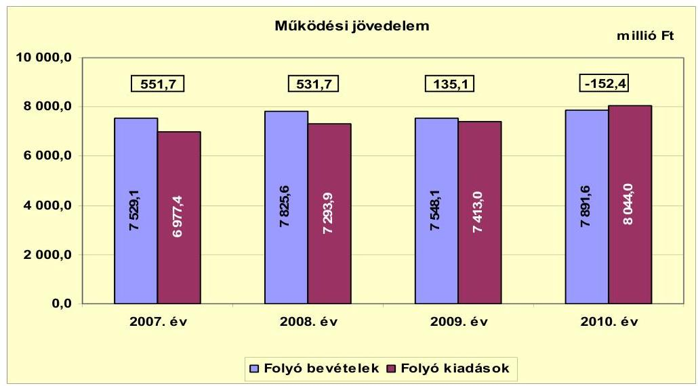

A CLF módszer szerint számított pénzügyi kapacitás (nettó működési jövedelem) összege a 2007. évben 506,3 millió Ft, a 2008. évben 487,6 millió Ft volt, pozitív összege az Önkormányzat hitelfelvételi képességét és fizetőképességét jelentette. A 2009. évben negatív (-25,6 millió Ft) nettó működési jövedelem keletkezett, mely kedvezőtlen tendencia a 2010. évre tovább erősödött, a hiteltörlesztéseknek a növekedése következtében. A 2008. évről a 2009. évre 116,6 millió Ft-tal, a 2010. évben további 625,0 millió Ft-tal növekedett a hiteltörlesztés összege. Ennek finanszírozására a 2009. évben az előző évi működési célú pénzmaradvány igénybevétele ${ }^{10}$ még fedezetet nyújtott, de a 2010. évben már csak újabb hitelfelvétellel tudták biztosítani a hiteltörlesztés fedezetét.

[^0]
[^0]:    ${ }^{10}$ Az előző évi pénzmaradvány működési célú részének összege 2009-ben 111,4 millió Ft volt, a 2010. évben 80,3 millió Ft volt.

---

A nettó működési jövedelem évenkénti alakulását a következő ábra mutatja:
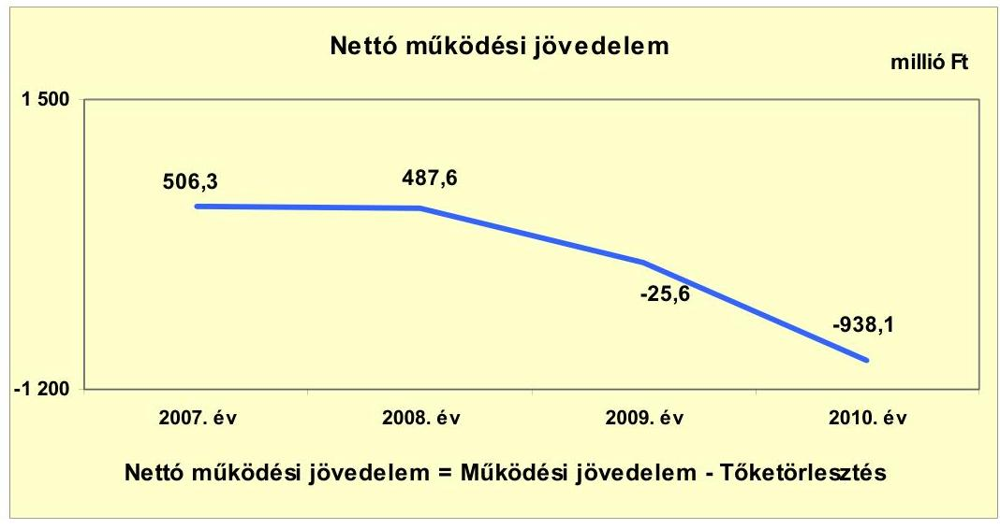

Az Önkormányzat a hosszú lejáratú hitelek után a 2007. évben 45,4 millió Ft-ot, a 2008. évben 44,1 millió Ft-ot törlesztett. A tőketörlesztés összege a 2009. évtől jelentősen (a 2009. évre 116,6 millió Ft-tal, a 2010. évre további 625,0 millió Ft-tal) növekedett, a hosszú lejáratú hitelek türelmi idejét követő törlesztés megkezdése, valamint a rövid lejáratú és a likviditási célú hitelek törlesztése miatt.

A tőketörlesztés alakulásának évenkénti összegét a következő ábra szemlélteti:
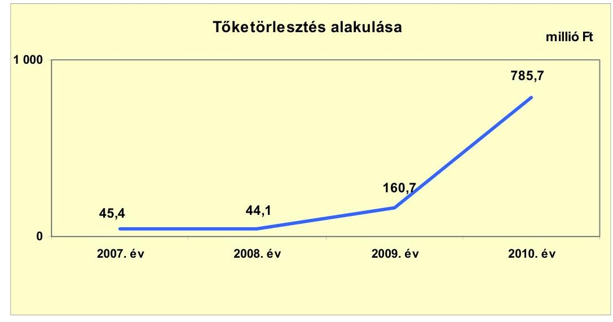

A 2007-2010. években (2010. december 31-ig) befejezett 3396,9 millió Ft értékű fejlesztések forrása a saját erő és a hazai és európai uniós támogatások mellett 403,5 millió Ft (11,9\%) hosszú lejáratú hitelfelvétel volt. A 2010. december 31-én folyamatban lévő fejlesztési feladatok végrehajtására 2007-2010 között összesen 524,8 millió Ft kiadást teljesítettek, amelyre hosszú lejáratú hitelből 362,7 millió Ft-ot (69,1\%) fordítottak.

---

A felhalmozási költségvetés egyenlegét 2007-2010 között évről évre a következő ábra szemlélteti:
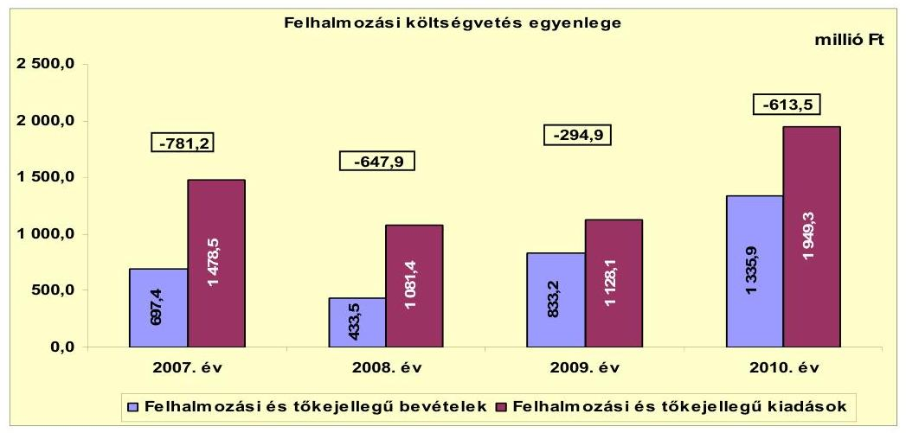

Az Önkormányzat felhalmozási költségvetésének egyenlege 2007-2010. évek között negatív volt, a hiányzó forrás az időszak alatt összesen 2337,5 millió Ft-ot tett ki, amely egy részének fedezetéül szolgált az előző évi felhalmozási célú pénzmaradvány igénybevétel (264,2 millió Ft), valamint a 2007-2008. években a pozitív összegű (993,9 millió Ft) nettó működési jövedelem. A hiányzó 1079,4 millió Ft-ot külső forrás igénybevételével biztosították. A felhalmozási forráshiány a felhalmozási és tőke jellegű kiadásokon belül a 2007. évben 52,8\%, a 2008. évben 59,9\%, a 2009. évben 26,1\%, a 2010. évben 31,5\% volt, melynek változását elsősorban a pályázati és a saját forráslehetőségek határozták meg.

Az Önkormányzat számára a folyamatban lévő felhalmozási feladatok megvalósítása - a Polgármesteri hivatal adatszolgáltatása szerint - 1097,5 millió Ft kötelezettséget jelent a 2010. év után ${ }^{11}$, amelyet saját forrásból és európai uniós támogatásból terveznek megvalósítani. A felhalmozási feladatok befejezéséhez 75,9 millió Ft saját erővel számoltak (amelynek a forrását nem nevesítették), továbbá 1021,6 millió Ft európai uniós támogatással, melyből az európai uniós támogatásnak az elszámolást követő igénybevétele miatt 260,1 millió Ft-ot már megelőlegeztek. A 2010. december 31-én folyamatban lévő fejlesztések közül a legjelentősebbek az alábbiak voltak:

- a kórház fűtés rekonstrukciójának várható teljes bekerülési költsége 374,7 millió Ft, ebből 2010. év utánra vállalt kötelezettség 369,5 millió Ft, melynek 60,8\%-a (224,7 millió Ft) európai uniós támogatás és 39,2\%-a (144,8 millió Ft) saját bevétel;
- a szennyvíztelep rekonstrukciójának várható teljes bekerülési költsége 366,2 millió Ft, ebből 2010. év utánra vállalt kötelezettség 364,9 millió Ft, melynek 68,2\%-a (248,9 millió Ft) európai uniós támogatás és 31,8\%-a (116 millió Ft) saját bevétel;

[^0]
[^0]:    ${ }^{11}$ A Polgármesteri hivatal által kiállított tanúsítvány szerint ezen beruházások tervezett legkésőbbi befejezési időpontja 2013. október 30.

---

- a Meszes Duna-part turizmus fejlesztése projekt várható teljes bekerülési költsége 123,9 millió Ft, ebből 2010. év utánra vállalt kötelezettség 118,8 millió Ft, melynek 52,2\%-a (62,0 millió Ft) európai uniós támogatás és 47,8\%-a (56,8 millió Ft) saját bevétel;
- a kerékpárút fejlesztése projekt várható teljes bekerülési költsége 92,7 millió Ft, ebből 2010. év utánra vállalt

 kötelezettség 91,0 millió Ft, melynek 84,7%-a (77,1 millió Ft) európai uniós támogatás és 15,3%-a (13,9 millió Ft) saját bevétel.

Az Önkormányzat elbírálás alatti európai uniós pályázati forrásból egy projektet (a városközpont integrált fejlesztését) tervez megvalósítani, melynek a teljes bekerülési költsége 791,5 millió Ft, melyből 2010. december 31-ig 20,6 millió Ft kiadást teljesített. A 2011. évtől várható kötelezettség összege 770,9 millió Ft lesz, melynek 84,6%-a (652,4 millió Ft) európai uniós támogatás, 15,4%-ához (118,5 millió Ft) saját forrást kell biztosítani.

A finanszírozási műveletek egyenlege - amely magában foglalja a hitelfelvételeket és törlesztéseket, valamint az egyéb finanszírozási (függő, átfutó, kiegyenlítő) bevételeket és kiadásokat - minden évben pozitív volt a rövid és hosszú lejáratú hitelfelvételek következtében. A 2010. évben a kiugróan magas, 924,2 millió Ft-os finanszírozási műveletek egyenlegének fő oka a rövid lejáratú és a likviditási célú hitelek év végi (1290,1 millió Ft-os) állományi értéke volt.
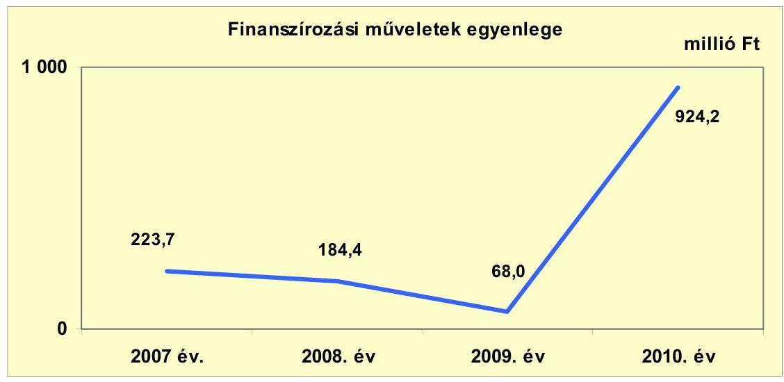

A finanszírozási műveleteket a 2. számú melléklet 4.1-4.8. pontjai részletezik. Az Önkormányzat 2007-2010 között, valamint a 2011. év I. félévében folyamatosan igénybe vette a helyi önkormányzatok működőképességének megőrzését szolgáló kiegészítő támogatást, mely a pénzügyi egyensúly biztosításához 2007-ben 217,0 millió Ft-tal, 2008-ban 114,6 millió Ft-tal, 2009-ben 229,5 millió Ft-tal, 2010-ben 24,3 millió Ft-tal, míg a 2011. év I. félévében 128,7 millió Ft-tal járult hozzá.

---

Az Önkormányzat folyó és felhalmozási bevételeit főbb jogcímenként a következő táblázat tartalmazza:
millió Ft

| Megnevezés | 2007. év | 2008. év | 2009. év | 2010. év |
| :-- | --: | --: | --: | --: |
| Intézményi működési bevételek | 992,9 | 1083,4 | 1261,7 | 1558,0 |
| Egyéb saját bevétel | 559,6 | 669,4 | 685,2 | 582,1 |
| ÁH-n belülről és kívülről kapott támogatás | 2290,7 | 2298,3 | 2294,2 | 2719,9 |
| Átengedett bevételek | 1365,0 | 737,2 | 750,7 | 781,8 |
| Költségvetési támogatás | 2320,9 | 3037,3 | 2556,3 | 2249,8 |
| Folyó bevételek összesen | $\mathbf{7529,1}$ | $\mathbf{7825,6}$ | $\mathbf{7548,1}$ | $\mathbf{7891,6}$ |
| ÁH-n belülről és kívülről kapott támogatás | 628,6 | 384,8 | 821,4 | 1301,6 |
| Egyéb felhalmozási célú bevételek | 68,7 | 48,7 | 11,8 | 34,3 |
| Felhalmozási bevételek | $\mathbf{697,3}$ | $\mathbf{433,5}$ | $\mathbf{833,2}$ | $\mathbf{1335,9}$ |
| ÖSSZESEN | $\mathbf{8226,4}$ | $\mathbf{8259,1}$ | $\mathbf{8381,3}$ | $\mathbf{9227,5}$ |

A folyó bevételek 2007. évről 2008. évre történő növekedését a saját működési bevételek 185,1 millió Ft-os növekedése okozta az egyéb saját bevételek, az áfa bevételek, visszatérülések, az iparűzési adó bevételek emelkedése következtében. A normatív módon elszámolt személyi jövedelemadó 2007-ben az átengedett bevételek között jelent meg, míg 2008-ban a költségvetési támogatások között, ez azonban csak belső szerkezetében okozott változást, összességében nem módosította a folyó bevételek összegét.

Az előző évhez képest a 2009. évre történő csökkenést elsősorban a költségvetési támogatás 481,0 millió Ft-os csökkenése okozta a Művelődési központ rekonstrukciójához nyújtott címzett támogatás, valamint a központosított előirányzatok csökkenése (ezen belül az átszervezésekkel kapcsolatos helyi szervezési intézkedésekhez kapcsolódó többletkiadások, a bérpolitikai intézkedések támogatása) következtében. A 2009. évről a 2010. évre történő növekedést a saját működési bevételek 233,3 millió Ft-os (ezen belül kiemelten a konyha üzemeltetésével kapcsolatosan az intézményi működési bevételek) és az államháztartáson belülről kapott támogatások 368,9 millió Ft-os emelkedése okozta.

A felhalmozási bevételeknek jelentős (a 2007. évben 90,1%-át, a 2008. évben 88,8%-át, a 2009. évben 98,6%-át, a 2010. évben 97,4%-át) arányát az államháztartáson belülről és kívülről kapott (elsősorban európai uniós) támogatások tették ki, amelyek meghatározó szerepet töltöttek be a felhalmozási bevételek növekedésében.

---

Az Önkormányzat folyó és felhalmozási kiadásait főbb jogcímenként a következő táblázat tartalmazza:

| Megnevezés | 2007. év | 2008. év | 2009. év | 2010. év |
| :-- | --: | --: | --: | --: |
| Személyi juttatások és járulékok | 4368,5 | 4473,0 | 4211,7 | 4300,2 |
| Dologi kiadások | 2143,0 | 2304,1 | 2574,8 | 3085,6 |
| Pénzeszközátadás ÁH-n kívülre | 261,7 | 276,5 | 268,4 | 367,5 |
| Egyéb működési kiadás | 204,2 | 240,3 | 358,1 | 290,7 |
| Folyó kiadások összesen | $\mathbf{6977,4}$ | $\mathbf{7293,9}$ | $\mathbf{7413,0}$ | $\mathbf{8044,0}$ |
| Beruházási, felújítási kiadások | 1268,6 | 982,1 | 999,3 | 1711,8 |
| Egyéb felhalmozási célú kiadások | 209,9 | 99,3 | 128,8 | 237,5 |
| Felhalmozási kiadások | $\mathbf{1478,5}$ | $\mathbf{1081,4}$ | $\mathbf{1128,1}$ | $\mathbf{1949,3}$ |
| ÖSSZES KÖLTSÉGVETÉSI KIADÁS | $\mathbf{8455,9}$ | $\mathbf{8375,3}$ | $\mathbf{8541,1}$ | $\mathbf{9993,3}$ |

A folyó kiadások a 2007. évi 6977,4 millió Ft-ról évente folyamatosan emelkedtek, a 2008. évre 4,5%-kal, a 2009. évre további 1,6%-kal, a 2010. évre az előző évhez képest 8,5%-kal. A 2009. évről a 2010. évre történő 631,0 millió Ft-os emelkedést a dologi kiadások 510,8 millió Ft-os növekedése okozta, kiemelten a szolgáltatási kiadások (gáz-, villany-, vízdíjak, bérleti díjak, karbantartási, kisjavítási szolgáltatások) 55,7 millió Ft-os, a készletbeszerzések (szakmai anyagok, élelmiszer és gyógyszer beszerzés) 130,0 millió Ft-os, általános forgalmi adó (vásárolt termékek és szolgáltatások áfája, kiszámlázott termékek és szolgáltatások áfa befizetése, fordított áfa miatti befizetés) 263,5 millió Ft-os növekedése következtében.

A felhalmozási kiadásoknak a jelentős (a 2007. évben 85,8%-os, a 2008. évben 90,8%-os, a 2009. évben 88,6%-os, a 2010. évben 87,8%-os) arányát a beruházási és felújítási kiadások tették ki. Az időszakon belül a 2009. évről a 2010. évre növekedtek jelentősen a felhalmozási kiadások a beruházási kiadások 626,5 millió Ft-os - főként az elnyert európai uniós támogatások - és a felújítási kiadások 86,0 millió Ft-os emelkedése következtében.

Az Önkormányzat a 121/2003. (VII. 22.) számú határozat alapján magán főiskola létesítése céljából részt vett a „kalocsai főiskoláért közhasznú társaság" alapításában, alaptőkéjéhez 10 millió Ft-tal járult hozzá. A Képviselő-testület a 122/2003. (VII. 22.) számú határozatában 5 éves időtartamra vállalta a megalapítandó főiskola ingyenes használatába adott önkormányzati tulajdonban lévő épületeinek fenntartási, általános üzemeltetési és közüzemi díjainak rendezését. A Képviselő-testület úgy hozott határozatot, hogy a kötelezettségvállalás évenkénti és teljes összegéről nem rendelkezett. A Képviselő-testület a 109/2006. (VI. 27.) számú határozatában úgy rendelkezett, hogy a Tomori Pál Főiskola részére nyolc év időtartamra biztosítja az önkormányzati épületekben a működéshez szükséges épületrészek használatát. A döntésből és a képviselő-testületi ülésről készült jegyzőkönyvből sem állapítható meg, hogy az önkormányzati épületek fenntartási, általános üzemeltetési és közüzemi díjait ingyenesen biztosítják-e.

---

Az önkormányzati tulajdonú épületek ingyenes használata - tekintettel az Önkormányzat adatszolgáltatására ${ }^{12}$ - a 2003. évben kezdődött, az átvállalt és teljesített (épületek fenntartási, általános üzemeltetési költségeit, közüzemi díjait) költségek, mint közvetett támogatások összegei 2010. december 31-éig összesen 158,5 millió Ft-ot tettek ki. Ezen önként vállalt feladat minden évben hatással volt az Önkormányzat pénzügyi hiányának nagyságára, annak a 2007. évben 7,6%-át, a 2008. évben 25,7%-át, a 2009. évben 17,1%-át, míg a 2010. évben 4,4%-át tették ki. A Képviselő-testületnek a költségvetés és a zárszámadás előterjesztésekor az Áht. 118. §-ában ${ }^{13}$ foglalt előírás ellenére nem mutatták be a nyújtott közvetett támogatás mértékét az alapítástól 2010. év végéig.

A polgármester ${ }_{2}$ kezdeményezése alapján a Képviselő-testület 2011. március 16-ai ülésén felhatalmazást adott részére, hogy dolgozza ki a Tomori Pál Főiskola által használt ingatlanok költségviselésének feltételrendszerét, amelyet követően 2011. szeptember 1-jén a polgármester ${ }_{2}$ és a rektor aláírta a használatba adásról a megállapodást. A megállapodásban rögzítették, hogy a Tomori Pál Főiskola ingyenesen használja az önkormányzati épületeket, de 2011. január 1-jétől a fenntartási és közüzemei díjakat megfizeti.

Az Önkormányzat a 2007-2010. évek között hosszú lejáratú, felhalmozási célú hitel felvételekről, valamint kötvény kibocsátásáról döntött. A Képviselő-testület a 110/2008. (VI. 12.) számú határozatával döntött a tervezett beruházásokhoz önerő biztosításáról, a tervezett működési forráshiány átmeneti finanszírozásáról, valamint a kedvezőtlen kamatozású hitelek kiváltása érdekében 800 millió Ft értékű kötvény kibocsátásáról. A tervezett kötvénykibocsátás a pénzintézet lemondta a pénzpiaci körülmények és a pénzügyi válsághelyzet miatt, helyette hosszú lejáratú hitel felvételére került sor. A hosszú lejáratú, felhalmozási célú hitel felvételek a 2008. évben euró alapú, a 2007., 2009. és 2010. évben forint alapúak voltak.

[^0]
[^0]:    ${ }^{12}$ A Polgármesteri hivatal által 2011. október 26-án készült kimutatásban már a 2003. évre is mutattak ki közvetett támogatást, de a 2003. éven belül annak konkrét kezdő időpontja nem derül ki. Jelezték továbbá, hogy általános költségeket csak a Szent István út 2-4. épületre és kizárólag 2010-re, a víz-, villany-, gázfogyasztás költségeit csak a 2008. évtől tudják kimutatni.
    ${ }^{13}$ 2007. január 1-jétől az Áht. 118. § (1) bekezdés 2. c) pontja és (2) bekezdés 2. e. pontja, 2012. január 1-jétől az új Áht. 24. § (4) bekezdése és a 91. § (2) bekezdés a) pontja szabályozza.

---

A hosszú lejáratú hitelek jellemző adatait a következő táblázat szemlélteti:

| Hitel célja | Képviselőtestület döntés száma | Szerződéskötés ideje | Hitel-keret összege (millió Ft) | Türelmi idő | Lejárati idő | Kamat %a Fix vagy változó | Lehi-   vott   hitel-   össze-   ge   (millió   Ft) |
| :--: | :--: | :--: | :--: | :--: | :--: | :--: | :--: |
| Művelődési Központ, útépítés, informatika fejlesztéshez | $\begin{aligned} & 70 / 2007 . \\ & (IV. 19.) \end{aligned}$ | 2007.08.10 | 150 | 2010.08.10 | 2017.08.10 | $\begin{aligned} & 1,42 \%, \\ & \text { változó, } \\ & 3 \text { havi } \\ & \text { EURIBOR } \end{aligned}$ | 150 |
| Kábel TV és szélessávú információs hálózat megvalósulásához (MFB ÖKIF hitel) | $\begin{aligned} & 123 / 2007 . \\ & \text

 { (VI. 21.) } \end{aligned}$ | 2007.09.20 | 105 | 2010.09.05 | 2017.09.05 | $\begin{aligned} & 1,10 \%, \\ & \text { változó, } \\ & 3 \text { havi } \\ & \text { EURIBOR } \end{aligned}$ | 75,9 |
| útépítés, intézményfelújítások, egyéb beruházásokhoz saját forrás kiegészítésére | $\begin{aligned} & 178 / 2008 . \\ & \text { (X. 30.) } \end{aligned}$ | 2008.12.19 | $\begin{gathered} 567,0 \\ \text { ezer } \\ \text { euró } \\ (150,0 \\ \text { MFt) } \end{gathered}$ | 2009.04.10 | 2010.06.30 | $\begin{aligned} & 1,05 \%, \\ & \text { változó, } \\ & 3 \text { havi } \\ & \text { EURIBOR } \end{aligned}$ | 131,3 |
| önkormányzati beruházások saját önerő finanszírozására, EUR hitel kiváltására | $\begin{aligned} & 101 / 2009 . \\ & \text { (VII. 16.) } \end{aligned}$ | 2009.11.20 | 233 | 2012.03.31 | 2019.09.30 | $\begin{aligned} & 3,10 \%, \\ & \text { változó, } \\ & 3 \text { havi } \\ & \text { BUBOR } \end{aligned}$ | 233 |
| ÚMFT keretében meghirdetett pályázathoz önrész biztosítása (MFB ÖKIF hitel 8. hitelcél) és közoktatási célú beruházások (MFB ÖKIF hitel 3. hitelcél) | $\begin{aligned} & 101 / 2009 . \\ & \text { (VII. 16.) } \end{aligned}$ | 2009.10.27 | 178,2 | 2012.03.05 | 2029.09.05 | $\begin{aligned} & 2,30 \%, \\ & \text { változó, } \\ & 3 \text { havi } \\ & \text { BUBOR } \end{aligned}$ | 147,3 |
| általános beruházási célok (MFB ÖKIF hitel, 2. hitelcél) | $\begin{aligned} & 101 / 2009 . \\ & \text { (VII. 16.) } \end{aligned}$ | 2009.10.27 | 18,9 | 2010.03.05 | 2029.09.05 | $\begin{aligned} & 2,90 \%, \\ & \text { változó, } \\ & 3 \text { havi } \\ & \text { BUBOR } \end{aligned}$ | 18,9 |
| ÚMFT keretében meghirdetett pályázatokhoz önrész biztosítása (MFB ÖKIF hitel 8. hitelcél) | $\begin{aligned} & 67 / 2010 . \\ & \text { (IV. 22.) } \end{aligned}$ | 2010.07.07 | 300 | 2015.06.15 | 2030.06.05 | MFB refinanszírozási kamat felár+0,74, változó, 3 havi BUBOR | 38,2 |

A 2007-2010 közötti adósságot keletkeztető kötelezettségvállalásokkal nem lépték túl egyik évben sem az adósságkorlátot, annak ellenére, hogy az Önkormányzat az adósságot keletkeztető kötelezettségvállalásai során az Ötv. 88. §

---

(2) bekezdésében ${ }^{14}$ előírt kötelezettség ellenére nem vizsgálta az éves kötelezettségvállalásainak felső határát. A hitel-visszafizetések fedezetének meghatározásakor betartották az Ötv. 88. § (1) bekezdés b) pontjában foglaltakat, önkormányzati törzsvagyont nem ajánlottak fel.

Az Önkormányzat nem rendelkezett fizetőképességének és eladósodásának kezelését szolgáló stratégiával, azonban a 96/2011. (IV. 28.) számú képviselőtestületi határozattal jóváhagyott gazdasági programban rögzítésre kerültek a pénzügyi egyensúly biztosításának, helyreállításának fő irányai, a fizetőképesség megőrzése érdekében kialakított éven túl elérni kívánt célok és az azoktól elvárt előnyök.

A jegyző, a 2007-2009. években és a 2010. év I. félév végéig az Ámr. 139. § (1) bekezdésében ${ }^{15}$ foglaltak ellenére nem készített likviditási tervet.

A Képviselő-testület a 2007. évben a 150 millió Ft-os beruházási hitelkeretről szóló szerződésben a visszafizetés lehetséges forrásait meghatározta. Ugyanakkor a 2007. évben a 105 millió Ft-os beruházási hitelkeret, továbbá a 2008-2010. években megkötött beruházási célú hitelszerződésekben, illetve az ezt megelőzően hozott képviselő-testületi döntésekben nem jelölték meg a visszafizetés lehetséges forrását, mivel arra vonatkozóan csak annyit rögzítettek, hogy a Képviselő-testület kötelezettséget vállal arra, hogy a tőke és kamattörlesztés összegét az adott évi költségvetésbe betervezi.

A hosszú lejáratú, felhalmozási célú hitelek segítségével megvalósított beruházások, felújítások megtérülésére vonatkozó számításokat, értékeléseket az ÚMFT keretében meghirdetett európai uniós pályázatokhoz, valamint a címzett támogatással megvalósuló Művelődési központ rekonstrukciójához kapcsolódóan készítettek, mely a 2007. évi 150 millió Ft-os, a 2009. évi 178,2 millió Ft-os, valamint a 2010. évben kötött 300 millió Ft-os hitelszerződésekhez kötődött. Ezen megvalósíthatósági tanulmányok szerint a felhalmozási kiadással megvalósuló beruházások kiadáscsökkenést fognak eredményezni, illetve egyéb hasznot (pl.: hagyományőrzést, közösségi tér fejlesztését) jelentenek. Nem készült azonban a kábeltévé és szélessávú információs hálózat, útépítések, informatikafejlesztések ellátásának, továbbá az MFB 2. hitelcélja körébe tartozó, a város közigazgatási területén megvalósuló beruházások finanszírozására kötött hitelszerződésekhez kapcsolódóan azok megtérülésére vonatkozó számítás, értékelés. A megvalósuló beruházások fenntarthatóságának pénzügyi hatásait nem vizsgálták és nem mutatták be a Képviselő-testületnek.

Az adósságot keletkeztető kötelezettségvállalásokról szóló döntések meghozatala előtt a Képviselő-testület nem kapott tájékoztatást arról, hogy a változó kamatozású, illetve deviza alapú adósságot keletkeztető kötelezettségvállalás jövőbeni terhei előre nem látható mértékben növekedhetnek. A Képviselő-testület a hosszú lejáratú hitelekből származó bevételek felhasználási célját meghatározta.

[^0]
[^0]:    ${ }^{14}$ 2012. január 1-jétől a Stabilitási tv. 10. § (3) bekezdése szabályozza.
    ${ }^{15}$ 2010. január 1-jétől Ámr. 201. § (1) bekezdése, 2012. január 1-jétől az Ávr. 122. § (2)-(3) bekezdései szabályozzák.

---

Az adósságot keletkeztető kötelezettségvállalásokra vonatkozó döntések megalapozása érdekében több pénzintézettől kértek ajánlatot, az ajánlatok összehasonlító értékelését elvégezték és a legkedvezőbbet választották. A Képviselőtestület a 2007-2010. évi zárszámadási rendeletekben évente tájékoztatást kapott az adósságot keletkeztető kötelezettségvállalásokból adódó fizetési kötelezettségekről. Bemutatásra kerültek, hogy a hosszú lejáratú hitelfelvételből adódó tőke- és kamatfizetési kötelezettségek milyen terhet jelentenek, azonban a tájékoztatás a visszafizetési forrásokra nem tért ki.

A Képviselő-testület az euró alapú hosszú lejáratú adósságot keletkeztető kötelezettség csökkentése érdekében intézkedett, azt a felvételt követő egy éven belül forint alapúra váltották át. Azonban a változó kamatozású forint alapú adósságot keletkeztető kötelezettségek terheinek alakulását a Képviselő-testület nem tekintette át, ezáltal nem is mérlegelte a konstrukcióváltás lehetőségét az ebből adódó kötelezettségek csökkentése érdekében.

Az Önkormányzat a 2007-2010. évek között és a 2011. év I. félévében PPP konstrukcióban nem vett részt, garanciát és kezességet nem vállalt, hosszú lejáratú működési célú hitelt nem vett fel.

Az Önkormányzat által kimutatott adatok szerint a pénzügyi egyensúly biztosítása érdekében hozott bevételt növelő intézkedések hatására 2007-2010 között, valamint a 2011. év I. félévében összesen 384,8 millió Ft bevételi többlet keletkezett az adóhátralékok behajtása, eszközök értékesítése, bérbeadása, ellátottak térítési díj emelése hatására. A bevételi többletből a legnagyobb részarányt, 80,4%-ot (309,5 millió Ft-ot) az adóhátralékok behajtása tette ki.

Az Önkormányzat által kimutatott adatok szerint 2007-2010 között, valamint a 2011. év I. félévében a kiadások csökkentése érdekében hozott döntéseivel összességében 235,2 millió Ft megtakarítást ért el.

A megtakarítások (elsősorban a közoktatás területén jelentkező) átszervezéssel járó létszámcsökkentések, üres álláshelyek zárolása, közüzemi költségek csökkentése hatására keletkeztek, melyből a legnagyobb részarányt, 37,7%-ot, (88,7 millió Ft-ot) az átszervezéssel járó létszámcsökkentések jelentették. A december 31-ei záró létszám a 2007. évről a 2010. évre 98 fővel csökkent, a helyi szervezési intézkedésekhez kapcsolódóan a négy év alatt összesen 80,9 millió Ft központosított támogatást vett igénybe az Önkormányzat 81 fő leépítéséhez.

A hitelek lehívásai utólagosan, a konkrét célok megvalósítását tartalmazó számlák benyújtása ellenében történtek meg, ezáltal a cél szerinti felhasználás ellenőrzése a lehívás folyamatában biztosított volt. Az utólagos lehívás miatt nem származott átmenetileg szabad, befektethető forrás.

A változó kamatozású hosszú lejáratú kötelezettségek év végi állományi értéke folyamatosan, évről-évre növekedett, mely emelkedés 99,8-144,2 millió Ft között mozgott évente. A változó kamatozású hosszú lejáratú kötelezettségek aránya az összes hosszú lejáratú kötelezettségeken belül a 2007-2009. években 100% volt, míg a 2010. évben 98,2%. A csökkenés abból adódott, hogy a 2010. év végén "jó teljesítési garancia" miatt 12,9 millió Ft összeget tartottak nyilván az egyéb hosszú lejáratú kötelezettségek között.

---

A rövid lejáratú hitelek év végi állományi értéke a 2007. évtől folyamatosan növekedett. A legnagyobb - 386,1%-os - változás a 2009. évi 195,7 millió Ft-ról 2010. december 31-ére következett be, amikor a rövid lejáratú hitelek állománya 755,6 millió Ft volt. Mindez az Önkormányzat romló likviditási helyzetére utal.

Az Önkormányzat mérleg szerinti, pénzintézetekkel szemben fennálló hosszú és rövid lejáratú kötelezettségeinek év végi állományi értékeit a következő ábra szemlélteti:
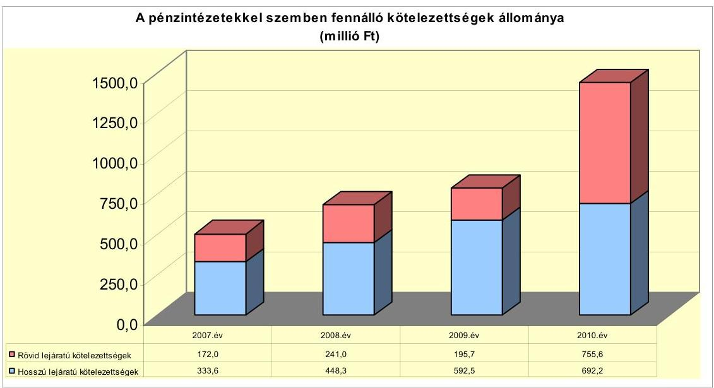

Az Önkormányzat a 2007-2010. években rövid lejáratú támogatás megelőlegezési hiteleket ${ }^{16}$ - összesen 721,2 millió Ft-ot - hívott le és használt fel a beruházások megvalósításához pályázaton nyert támogatások átmeneti megelőlegezéséhez, valamint a beruházások önerős részének átmeneti finanszírozásához.

Az Önkormányzat a fizetőképesség biztosításához folyószámla- és munkabérhitelt is igénybe vett. 2007-2009 között a folyószámlahitellel zárt napok száma 342-361 között volt, 2010-ben már minden nap rendelkeztek folyószámlahitellel, míg a 2011. év I. félévében 181 napon át fennállt, amelyek folyamatos likviditási hiányt mutatnak, az Önkormányzat likviditási helyzetének romlását tükrözi. A folyószámlahitel átlagos napi állománya a 2007. évi 115,3 millió Ft-ról folyamatosan emelkedett, a 2008. évben 156,5 millió Ft, a 2009. évben 266,3 millió Ft, a 2010. évben 316,7 millió Ft, a 2011. év I. félévében 486,0 millió Ft volt. A folyószámlahitel év végi záró állománya 2007 végén 28,0 millió Ft, 2010 végén 437,0 millió Ft volt, 2008. és 2009. év végén nem volt az Önkormányzatnak folyószámlahitele. Az Önkormányzat a 2007-2010. évek között és a 2011. év I. félévében a munkabér-megelőlegezési hitelt évente 7-11 alkalommal vette igénybe. A munkabér-megelőlegezési hitellel zárt napok száma 197-306 nap között mozgott, átlagos napi állománya pedig 81,6 és 106,7 millió Ft között volt. A folyamatos fizetőképesség biztosítása érdekében felvett likviditási célú hiteleknek a 2007-2010. évek között és a 2011. év I. félévében történő növekedése miatti kamatfizetési kötelezettség emelkedése kedvezőtlenül befolyásolta a pénzügyi egyensúlyt. A likviditás biztosítása az Önkormányzatnak a 2007-2010. évek között és a 2011. év I. félévében összesen 122,3 millió Ft kamatkiadást és 1,9 millió Ft egyéb költség fizetésének kötelezettségét okozta.

A folyamatosan növekvő likvid hitelállomány ellenére a 2007-2009. években az év végi szállítói kötelezettségek állománya folyamatosan növekedett, a folyószámlahitel a szállítói kötelezettségek csökkenéséhez csak a 2010. évben járult hozzá. A likviditási célú hitel igénybevételek ellenére az Önkormányzat a 2011. év I. féléve végén 129,3 millió Ft 30 nap alatti, 98,4 millió Ft 30 és 60 nap közötti, 110,6 millió
 Ft 61 és 90 nap közötti, 368,7 millió Ft 91 és 365 nap közötti és 51,9 millió Ft éven túli szállítói tartozással rendelkezett, átütemezett szállítói tartozása nem volt.

Az Önkormányzatnál a 2007–2010. években a pénzeszközök egyik évben sem biztosítottak fedezetet a rövid lejáratú kötelezettségekre, de a pénzeszközök és a követelések együttesen sem voltak elegendőek a rövid lejáratú kötelezettségek teljesítéséhez. A 2007–2010. években a rövid lejáratú kötelezettségeknek mindösszesen 23–31%-ára biztosítottak fedezetet a pénzeszközök és a követelések együttesesen.
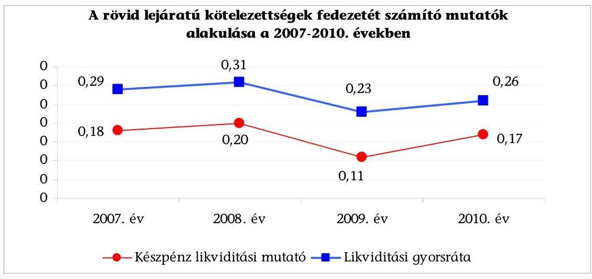

---

Az Önkormányzat eladósodási fok mutatója ${ }^{17}$ folyamatosan növekedett, a 2007. évben 6,5%, a 2010. évben 11,8% volt, mely jelzi, hogy a fizetési kötelezettségek nagyobb arányban emelkedtek, mint az összes forrás.

A kötelezettségvállalások 2010. évet követő években esedékes adósságterheinek törlesztő részlete ugyan nem haladja meg a 2010. évi saját bevételt ${ }^{18}$, de az Önkormányzat jelenlegi likviditási helyzetét, valamint a változó kamatozásból adódó kamatkockázatot és a jellemzően több éves türelmi időt figyelembe véve a jövőben az adósságterhek törlesztő részlete veszélyeztetheti az Önkormányzat fizetőképességét, hosszú távon kedvezőtlenül befolyásolja az Önkormányzat pénzügyi egyensúlyát. A jelenleg fennálló hitelek figyelembevételével a 2011. évtől tervezett fizetendő adósságtörlesztés (tőke) a 2010. évben fizetett törlesztéshez képest 92,1–114,2%-kal emelkedik 2014-ig, majd további növekedés várható 2015-től a 300 millió Ft-os hitel visszafizetésének megkezdésével 2017-ig.

Az Önkormányzatnak a pénzintézetekkel szemben fennálló kötelezettsége a 2011. év I. félév végén 1522 millió Ft volt. Ennek várható kötelezettsége (tőke, kamat és egyéb költség) a legutóbbi kamatfizetés feltételei alapján a 2011–2013. években 988 millió Ft. Az Önkormányzatnak a 2011. évben szállítói tartozások és egyéb kötelezettségek rendezése címén 870 millió Ft fizetési kötelezettsége keletkezett. A 2011–2013. évek kötelezettségeinek teljesítésére figyelembe vehető 679 millió Ft forgalomképes nettó ingatlanvagyon, mivel az 1041 millió Ft-os ingatlanvagyonból 363 millió Ft pénzintézetekkel szembeni kötelezettséghez kapcsolódóan jelzáloggal terhelt. A 2014. évet követően jelenleg ismert pénzintézetekkel szembeni kötelezettsége 645 millió Ft.

Az Önkormányzat adósságának növekedéséhez hozzájárult, hogy a 2007–2010. években a tárgyévi teljesített felhalmozási célú költségvetési kiadások összességében 2337,4 millió Ft-tal meghaladták a tárgyévi felhalmozási célú költségvetési bevételeket, amelyre a forrást részben a hitelfelvételekből származó bevétel biztosította.

Az Önkormányzat minősített többségű társaságának - a KalocsaKOM Kft.-nek - a mérleg szerinti kötelezettségeiből a 2007. év végén 1,5 millió Ft szállítói tartozása, 2008. december 31-én 30,6 millió Ft hitelből származó kötelezettsége és 8,6 millió Ft szállítói tartozásállománya, a 2009. év végén 37,7 millió Ft hitel felvételből származó és 7,8 millió Ft szállítói kötelezettsége, 2010. december 31-én 36,2 millió Ft hitelből származó és 3,2 millió Ft szállítói kötelezettsége, míg 2011. június 31-én 32,7 millió Ft hitelfelvételből eredő és 1,4 millió Ft szállítói kötelezettsége volt ${ }^{19}$. Mindezek a jövőben kedvezőtlenül befolyásolhatják az Önkormányzat pénzügyi helyzetét, mivel esetleges csőd- vagy felszámolási eljárás esetén a kötelezettségek az Önkormányzatot terhelik, illetve a bíróság korlátlan és teljes felelősséget állapíthat meg az Önkormányzat terhére.

[^0]
[^0]:    ${ }^{17}$ Az eladósodási fok mutató az összes, az egyéb passzív pénzügyi elszámolások nélküli, fizetési kötelezettségek önkormányzati összes forráson belüli arányát mutatja.
    ${ }^{18}$ Az adósságtörlesztés (tőke) a 2010. évi saját bevételekhez viszonyítva a következő az egyes években: 2011-ben 7,9%, 2012-ben 13,2%, a 2013–2014. években 11,8% és a 2015. évben 13,4%.
    ${ }^{19}$ A 2008. évi szállítói állomány 30 nap alatti lejárt kötelezettség volt. A hitelekből évi 15,0 millió Ft a működéshez kapcsolódott, a többi fejlesztéshez.

---

rás esetén a kötelezettségek az Önkormányzatot terhelik, illetve a bíróság korlátlan és teljes felelősséget állapíthat meg az Önkormányzat terhére.

Az Önkormányzat korlátlan felelősséggel tartozik felszámolás esetén a Gt. 54. § (2) bekezdése alapján azon gazdasági társaságának, amelyben az Önkormányzat az 52. § (2) bekezdése szerint a szavazatok legalább 75%-ával rendelkezik, így minősített befolyásszerzőnek minősül, továbbá a csődeljárásról és a felszámolási eljárásról szóló 1991. évi XLIX. törvény 63. § (2) bekezdése alapján a kizárólagos önkormányzati tulajdonú gazdasági társaságának minden olyan kötelezettségéért, amelynek kielégítését a felszámolási eljárás során az adós társaság vagyona nem fedez, ha a hitelezőinek a felszámolási eljárás során benyújtott keresete alapján a bíróság - az adós társaság felé érvényesített tartósan hátrányos üzletpolitikájára figyelemmel - megállapítja az önkormányzat korlátlan és teljes felelősségét.

# 2. A VAGYONI HELYZET ALAKULÁSA, VALAMINT A VAGYONGAZDÁLKODÁS FOLYAMATAIBAN A KONTROLLOK MÜKÖDÉSE 

### 2.1. Az Önkormányzat vagyoni helyzetének 2007–2010 közötti alakulása

Az Önkormányzat eszközeinek és forrásainak könyvviteli mérleg szerinti értéke a 2007. évi 18 300,7 millió Ft-ról a 2010. évre 20 668,8 millió Ft-ra 12,9%-kal (2368,1 millió Ft-tal) növekedett.
millió Ft

| AZ ÖNKORMÁNYZAT VAGYONA |  |  |  |  |
| :-- | --: | --: | --: | --: |
| Eszközök | $\mathbf{2007}$. év | $\mathbf{2008}$. év | $\mathbf{2009}$. év | $\mathbf{2010}$. év |
| Immateriális javak és tárgyi   eszközök | 16738,3 | 17274,4 | 17759,1 | 18891,5 |
| Befektetett pénzügyi eszközök | 67,5 | 83,4 | 76,1 | 57,8 |
| Üzemeltetésre átadott eszközök | 953,7 | 917,8 | 894,9 | 839,4 |
| Befektetett eszközök összesen | 17759,5 | 18275,6 | 18730,1 | 19788,7 |
| Forgóeszközök | 541,2 | 633,1 | 568,6 | 880,1 |
| ESZKÖZÖK ÖSSZESEN | $\mathbf{18 300,7}$ | $\mathbf{18 908,7}$ | $\mathbf{19 298,7}$ | $\mathbf{20 668,8}$ |
| KÖTELEZETTSÉGEK | $\mathbf{1448,2}$ | $\mathbf{1815,4}$ | $\mathbf{2001,5}$ | $\mathbf{3079,2}$ |
| SAJÁT VAGYON | $\mathbf{16852,5}$ | $\mathbf{17093,3}$ | $\mathbf{17297,2}$ | $\mathbf{17589,6}$ |

A könyvviteli mérleg főösszege szerinti vagyon változását a befektetett eszközökön belül a beruházások 3386,2 millió Ft-os, a felújítások 286,0 millió Ft-os növekedése, valamint az üzemeltetésre, kezelésre átadott eszközök állományának az időszak alatt összesen 114,3 millió Ft-tal (12,1%-kal) történő csökkenése okozta.

Az Önkormányzat 2010. évi vagyonának 91,4%-át (18 891,5 millió Ft-ot) az immateriális javak és tárgyi eszközök tették ki, amely főként telkeket, épületeket és földterületeket foglalt magába.

---

Az eszközérték növekedésének forrását a működési célú bevételi többlet felhalmozási célra fordításával, az előző évi pénzmaradvány felhasználásával, valamint a hosszú lejáratú hitelek igénybevételével biztosították.

Az üzemeltetésre, kezelésre átadott eszközök állománya - az elszámolt értékcsökkenés miatt - 2007-ről 2010-re 12,1%-kal (114,3 millió Ft-tal) csökkent és a könyvviteli mérleg szerinti vagyon 4,0%-át képviselte.

A kötelezettségek számviteli nyilvántartás szerinti értékének megduplázódását (a 2007. évi 1448,2 millió Ft-ról a 2010. évi 3079,2 millió Ft-ra történő növekedését) az Önkormányzat által igénybe vett hosszú lejáratú beruházási hitelek állományának a 107,2%-os (333,6 millió Ft-ról 692,2 millió Ft-ra) növekedése, a rövid lejáratú hitelek 447,3%-os (172,0 millió Ft-ról 755,6 millió Ft-ra) növekedése, valamint az áruszállításból, szolgáltatásnyújtásból származó kötelezettségek állományának a 2007. évhez viszonyított 224,0 millió Ft-os növekedése okozta.

Az Önkormányzat által devizában fennállt kötelezettség árfolyamának, illetve a felvett hitelek kamatának változása kedvezőtlen befolyással volt az önkormányzati vagyon nagyságára, mivel a pénzeszközök kevésbé növekedtek, mint a kamatkiadások.

Az Önkormányzat a 2007. évben 33,6 millió Ft, a 2010. évben 80,8 millió Ft kamatkiadást teljesített, míg a pénzeszközeinek év végi állományi értéke 178,2 millió Ft-ról 307,1 millió Ft-ra növekedett.

A Képviselő-testület a 2007–2010. években nem döntött tárgyi eszközök térítés nélküli átadásáról, apportba adásáról, kezelésre, vagyongazdálkodásba történő átadásáról. Az Önkormányzat által vásárolt 5,3 millió Ft értékű fagylaltkészítő gépet a 2008. évtől a Barokk kávéház üzemeltetője használta. A berendezés nyilvántartásba vétele nem felelt meg az Áhsz. 20. § (1) bekezdésében foglaltaknak, mivel azt az üzemeltetésre, kezelésre átadott eszközök között nem vették nyilvántartásba, továbbra is a tárgyi eszközök között szerepel.

A Képviselő-testület 2007–2010 között önkormányzati lakások és földterületek értékesítéséről döntött. Az értékesített ingatlanok nyilvántartás szerinti nettó értéke 93,6 millió Ft volt, amely az összes ingatlan értékének – 2007. évben 0,2%-át, 2008. évben 0,2%-át, 2009. évben 0,02%-át, 2010. évben 0,1%-át – tették ki. A vagyonhasznosítási (értékesítés és ingatlan bérbeadás) bevételeket a kötelező önkormányzati feladathoz kapcsolódó felhalmozási célú kiadásokra fordították.

Az Önkormányzat a kötelező és önként vállalt feladatainak más önkormányzattal, egyházzal, civil szervezettel, vállalkozás útján történő ellátásáról nem döntött 2007–2010. között és 2011. év I. félévében.

A Képviselő-testület a 2007–2010. évi költségvetési rendeleteiben több – az önkormányzati vagyon növekedését eredményező – fejlesztési feladat megvalósításáról döntött.

Az Önkormányzat az „Értelmi Fogyatékosok Nappali Intézete felújítása bővítése” projektre 2005–2007-ben 130,7 millió Ft-ot fordított; a „Kalocsa NET szélessávú

---

Internet hálózat Önkormányzat általi kiépítése” feladatra 256,3 millió Ft-ot költött 2008–2009-ben, a „Belterületi út rekonstrukcióra” (Kossuth Ipari Park) 2007–2008. évi beruházásra összesen 403,7 millió Ft kiadást teljesített; a „Közösségi Közlekedés fejlesztés” projektre 2007–2009. években 309,0 millió Ft-ot, a „Kertvárosi Általános Iskola fejlesztése” projektre 2010–2011. között 582,3 millió Ft-ot fordított, a „Kalocsa Művelődésközpont és Klubház rekonstrukció” feladatra 2006–2008. években 884,7 millió Ft-ot teljesítettek.

A fejlesztések eredményeként a 2007. évről a 2010. évre a tárgyi eszközök állománya 12,9%-kal (2156,0 millió Ft-tal), ezen belül a beruházások, felújítások év végi állományi értéke 79,0%-kal (605,2 millió Ft-tal) emelkedett. Az önkormányzati vagyon összetételében azonban jelentős változást nem okozott, a 2007. és a 2010. évben is az eszközök 91,0%-át tették ki a tárgyi eszközök. Az Önkormányzat által a 2007–2010. években megvalósított, 2010. december 31-ig befejezett fejlesztések a kötelező és az önként vállalt feladatok ellátását szolgálta. A beruházások 64,0%-a, a felújítások 89,0%-a az Önkormányzat szerint kötelező feladat ellátáshoz kapcsolódott.

Az Önkormányzat a fejlesztésekkel létrehozott tárgyi eszközök fenntartásának várható költségeit nem számszerűsítette ${ }^{20}$, a fejlesztések díjbevétel növekedést nem eredményeznek. A Képviselő-testület a megvalósult fejlesztések eredményességét a nyújtott közszolgáltatások színvonala, célszerűsége szempontjából nem értékelte.

Az Önkormányzat a Képviselő-testület döntése alapján 2005. év óta tagja a Kalocsa Kistérség Többcélú Társulásnak a belső ellenőrzési tevékenység ellátása tekintetében. A feladatellátás érdekében önkormányzati vagyont nem bocsátottak a társulás rendelkezésére.

Az Önkormányzat a tárgyi eszközök felújítására 2007–2010 között 413,6 millió Ft-ot fordított, amely az elszámolt értékcsökkenésnek a 2007. évben 55,0%-a, a 2008. évben 29,5%-a, a 2009. évben 24,3%-a, a 2010. évben 34,9%-a volt. A 2007. évi kiemelkedő felújítási értéket az útrekonstrukciókra, az Értelmi Fogyatékosok Nappali Intézete Bővítésére, a Városi Könyvtárközpont kialakítására, a panelprogramra és a foktői úti kerékpárútra fordított felújítási hányad eredményezte.

A tárgyi eszközök felújítására fordított összeg minden évben alatta maradt az elszámolt terv
 szerinti értékcsökkenés összegének. A megvalósított felújítások, beruházások ellenére az Önkormányzatnál a tárgyi eszközök elhasználódottságát jelző mutató ${ }^{21}$ a vizsgált időszakban folyamatosan romlott, értéke 2007-ben 81%, 2010-ben 77% volt. A Képviselő-testületnek előterjesztett éves zárszámadási rendeletekben nem mutatták be az Önkormányzat eszközei után az eszközpótlásra fordított tényleges kiadásokat, az eszközök elhasználódási fokának alakulását.

[^0]
[^0]:    ${ }^{20}$ Kivételt képez ez alól a DAOP-4.1.3/B „Kalocsai bölcsőde fejlesztése, kapacitásának bővítése" c. projekt.
    ${ }^{21}$ A tárgyi eszközök nettó értéke/tárgyi eszközök bruttó értéke elhasználódási mutató 2008. évben: 88,5%, 2009. évben: 87,3% volt.

---

| Elszámolt értékcsökkenés és a felújításra fordított kiadás   (millió Ft-ban) |  |  |  |  |
| :-- | :--: | :--: | :--: | :--: |
| Megnevezés | $\mathbf{2 0 0 7 . ~ év ~} \mathbf{~} \mathbf{~} \mathbf{2 0 0 8 . ~ év ~} \mathbf{~} \mathbf{~} \mathbf{2 0 0 9 . ~ év ~} \mathbf{~} \mathbf{~} \mathbf{2 0 1 0 . ~ év ~}$ |  |  |  |
| Elszámolt értékcsökkenés | 249,4 | 279,7 | 310,9 | 339,5 |
| Felújításra fordított kiadás | 137,3 | 82,4 | 75,5 | 118,4 |

Az Önkormányzat könyvviteli mérleg szerinti saját vagyona a 2007. év végi 16 852,5 millió Ft-ról a 2010. év végére 17 589,6 millió Ft-ra, 737,1 millió Ft-tal, 4,4%-kal növekedett, azonban ezzel párhuzamosan a kötelezettségek a 2007-2010. években több, mint duplájára emelkedtek a rövid és hosszú lejáratú hitel felvételek következtében.

Az Önkormányzat 2007. év végén 104,5 millió Ft, 2008. év végén 172,0 millió Ft, 2009. év végén 111,1 millió Ft, 2010. év végén 4,8 millió Ft összegű tartalékkal (előző évek pénzmaradványával) rendelkezett. A tartalék csökkenésének az oka, hogy az Önkormányzat idegen forrást fordított tárgyévi kiadásai finanszírozására, amely forrást az Önkormányzatnak vissza kell fizetnie.

# 2.2. A vagyongazdálkodás belső kontrolljainak működése 

A vagyongazdálkodási folyamatok szabályozottságának hiányosságai magas kockázatot jelentettek a feladatok szabályszerű végrehajtásában, mert a jegyző nem határozta meg a vagyongazdálkodási folyamatok ellenőrzési feladatait.
A) A kontrollkörnyezet kialakítása ${ }^{22}$ során nem tervezték meg az Ámr. ${ }_{2}$ 157. §-ában ${ }^{23}$ foglalt előírásoknak megfelelően az éves ellenőrzési tervben a vagyongazdálkodáshoz kapcsolódó magas kockázatúnak értékelt területek ellenőrzését.
B) A kontrolltevékenységek meghatározása során:

- a jegyző nem írt elő ellenőrzési kötelezettséget az önkormányzati vagyon forgalomképesség megváltoztatásának vagyongazdálkodási rendeletben előírt eljárásrendjére; a beszámolási kötelezettséget az átruházott hatáskörben hozott döntésekről; a Képviselő-testület nem szabályozta az Önkormányzat többségi tulajdonú gazdasági társaságai esetében a tulajdonosi jogokat képviselő személy részére a gazdasági társaságoknál hozott döntésekről való beszámolási kötelezettséget;
- a Képviselő-testület nem írta elő a vagyonértékesítéssel és hasznosítással kapcsolatban a döntés-előkészítés folyamatában a költség-haszon elemzés készítésének kötelezettségét; nem szabályozta a versenyeztetés eljárásrendjé-

[^0]
[^0]:    ${ }^{22}$ Az Ámr. ${ }_{2}$ 156. §-a (1) bekezdése szerint a költségvetési szerv vezetője köteles olyan kontrollkörnyezetet kialakítani, amelyben világos a szervezeti struktúra, egyértelműek a felelősségi viszonyok és feladatok, meghatározottak az etikai elvárások a szervezet minden szintjén és átlátható a humánerőforrás-kezelés.
    ${ }^{23}$ 2012. január 1-jétől az új Ber. 7. §-a szabályozza.

---

nek ellenőrzési kötelezettségét, valamint a Pénzügyi bizottság részére a beszámolási kötelezettséget a vagyon változása figyelemmel kísérésének eredményéről;

- a jegyző nem írta elő a finanszírozási célú pénzügyi műveletekkel összefüggésben a pénzügyi kockázatok felmérésének kötelezettségét, az ellenőrzési nyomvonalban a vagyongazdálkodási folyamatokra vonatkozó ellenőrzési pontokat, az ellenőrzési felelősöket, továbbá a hitelfelvételről szóló döntéselőkészítés folyamatában a futamidő egyes éveit terhelő kötelezettség költségvetési egyensúlyra gyakorolt hatása vizsgálatának kötelezettségét, a hitelfelvétel indokainak és gazdasági megalapozottságának vizsgálatát tartalmazó pénzügyi bizottsági dokumentum elkészítésének és a döntéshozatalhoz történő csatolásának kötelezettségét, a vagyongazdálkodási folyamatok rögzítésére használt informatikai programok adatai használatára vonatkozó követelményeket;
- a jegyző nem írta elő a vagyonértékesítéssel és hasznosítással kapcsolatos feladatokat ellátók munkaköri leírásaiban a beszámolási kötelezettséget és annak ellenőrzését, hogy a bevételeket megalapozó döntések a szerződésekben érvényesültek-e;
- Az információ, kommunikáció, monitoring feladatok szabályai kialakításakor a jegyző, az Ámr. ${ }_{2} .160 . \S$ (1) bekezdésben ${ }^{24}$ foglaltak ellenére nem határozta meg a vagyongazdálkodás külső és belső információinak kezelésének rendjét és a vagyongazdálkodási folyamatokra vonatkozó nyomon követési módszereket. Nem hozta létre az információk megbízhatósága érdekében a vezetői információs rendszert és nem írta elő az Ámr. ${ }_{2}$ 155. § (1) bekezdésében ${ }^{25}$ foglaltak ellenére belső kontrollrendszer működésének évenkénti felülvizsgálatát.

A Polgármesteri hivatalban a 2010. évben és a 2011. év I. félévében a vagyongazdálkodási folyamatokban a kontrollok működése gyenge volt, a kontrollok nem biztosították a vagyongazdálkodás eredményességét. A belső szabályozás ellenére nem számoltatták be a vagyon értékesítési és vagyon hasznosítási feladatokat végzőket, továbbá a hiányos szabályozás miatt:
C) a vagyongazdálkodási folyamatban a belső kontrolltevékenységek (eljárások) működése során:

- a döntési hatáskört átruházó (Képviselő-testület és jegyző) nem számoltatta be az átruházott hatáskörében eljáró személyt;
- nem számolt be a Pénzügyi bizottság a vagyonváltozás figyelemmel kísérésének eredményéről a Képviselő-testületnek, nem mérték fel a pénzügyi kockázatokat a finanszírozási célú pénzügyi művelet végzése során a döntéselőkészítés folyamatában;

[^0]
[^0]:    ${ }^{24}$ 2012. január 1-jétől az új Ber. 10. §-a szabályozza.
    ${ }^{25}$ 2012. január 1-jétől az új Ber. 8. § (2) bekezdése szabályozza.

---

- a hitelfelvételről szóló döntések előkészítés folyamatában nem alakította ki a Pénzügyi bizottság a hitelfelvétel indokainak és gazdasági megalapozottságának vizsgálatáról szóló véleményét a hitelfelvételhez kapcsolódó képviselő-testületi döntéshez;
- a vezetői ellenőrzés keretében nem számoltatták be a vagyongazdálkodási feladatokat végzőket a vagyonértékesítés, vagyonhasznosítás, a finanszírozási célú pénzügyi műveletek végrehajtásának folyamatáról és a végrehajtás eredményéről;
D) az információ, kommunikáció és monitoring belső kontrolljainak működése során
- nem működtettek vezetői információs rendszert;
- nem tártak fel a vagyongazdálkodási folyamatokban szabálytalanságokat;
- nem végezték el a vagyongazdálkodási folyamatok megfigyelését;
- nem vizsgálták felül a belső kontrollrendszer működését évenként;
- nem gondoskodtak a vagyongazdálkodási tevékenységek kontrolljait érintő hiányosságok megszüntetéséről, ennek következtében a Barokk kávéháznak átadott fagylaltkészítő gépet nem az üzemeltetésre, kezelésre átadott eszközök között tartották nyilván.

A Polgármesteri hivatal a 2010. évi költségvetésében az egyéb helyiségek bérbeadásból 28,2 millió Ft bevételt tervezett, mely a saját bevételek előirányzatának 0,6%-át tette ki. A teljesített bevételek összege 43,5 millió Ft volt, mely a saját bevételek 1,4%-a. A 2011. évi egyéb helyiségek bérbeadásból ${ }^{26}$ tervezett bevétele 39,9 millió Ft, mely a költségvetési bevételek előirányzatának 1,1%-át tette ki.

A Polgármesteri hivatalban az egyéb helyiségek bérbeadásból származó bevételek teljesítése során a belső kontrollok - a bevételeket megalapozó szerződések ellenőrzése és az utalvány ellenjegyzés - működése kiváló volt. A bevételeket megalapozó szerződések ellenőrzésére kijelölt személyek az egyéb helyiségek bérbeadásból származó bevételekre vonatkozó szerződések aláírását megelőzően elvégezték és ellenőrizték a bevételeket megalapozó döntésekben meghatározott feltételek teljesülését, az Önkormányzat érdekeit védő garanciális elemek meglétét és a gazdálkodásra vonatkozó szabályok betartásának ellenőrzését. Az utalvány ellenjegyzésére jogosult a helyiségek bérbeadásából származó bevételek tekintetében az utalványt ellenjegyezte, ellenőrizte a bevétel elszámolás jogszerűsége és összegszerűsége ellenőrzésének, szerződés szerinti teljesítésének, a szakmai teljesítés igazolásának - a gazdálkodási jogkörök szabályzata szerinti - megtörténtét, a gazdálkodásra vonatkozó szabályok betartását.

[^0]
[^0]:    ${ }^{26}$ A megfelelőségi teszt elvégzése során a tételesen ellenőrzött bevételek az önkormányzati lakás eladás részletfizetéséhez, az önkormányzati helységek után fizetett bérleti díjakhoz kapcsolódott.

---

A Polgármesteri hivatal 2010-2011. évi elemi költségvetésében a vásárolt közszolgáltatások kiadási előirányzatán belül tervezte meg a villamos energiaszolgáltatás díj kifizetéseket. A 2010. évben 87,0 millió Ft eredeti előirányzatot tervezett, a teljesítés 86,9 millió Ft volt. Az előirányzat a dologi kiadások eredeti előirányzatából 19,1%-ot, a teljesítés 14,2%-ot képviselt. A 2011. évi elemi költségvetésben 55,2 millió Ft eredeti előirányzat szerepelt, mely a dologi kiadások 10,5%-át jelentette. A szerződésekben meghatározott célok összhangban voltak az Ötv. 8. § (1) bekezdésében foglalt önkormányzati feladatokkal.

A Polgármesteri hivatalban 2010-ben és a 2011. év I. félévében a vásárolt közszolgáltatások között elszámolt villamos energia szolgáltatás díj kiadások teljesítése során a belső kontrollok - a kötelezettségvállalás ellenjegyzése, a szakmai teljesítésigazolás - működése gyenge volt. A villamos energia szolgáltatási díj kifizetéséhez kapcsolódó kötelezettségvállalást (2003. november 20-ai szerződést) az előző polgármester - az Ámr. ${ }_{1}$ 134. § (2) bekezdésében foglaltak ellenére -, továbbá az ingatlanok felújításával kapcsolatos kötelezettségvállalásokat (2010. július 7-ei és 16-ai megrendeléseket) - az Ámr. ${ }_{2}$ 74. § (1) bekezdése ellenére - ellenjegyzés nélkül írta alá, ezáltal a kötelezettségvállalást megelőzően elmaradtak az Ámr. ${ }_{2}$ 74. § (3) bekezdésében foglalt ellenőrzési feladatok, így nem győződtek meg a kiadási előirányzat rendelkezésre állásáról, a fedezet meglétéről, és nem vizsgálták, hogy a kötelezettségvállalás nem sérti-e a gazdálkodásra vonatkozó szabályokat. Ezt a hiányosságot az utalvány ellenjegyző a kifizetéseket megelőzően az Ámr. ${ }_{2}$ 79. §-ának ${ }^{27}$ előírása ellenére nem kifogásolta. A közszolgáltatási szerződésben meghatározott feladatok szakmai teljesítését a jegyző által kijelölt személy aláírásával igazolta, azonban az Ámr. ${ }_{2}$ 76. § (1) bekezdésben ${ }^{28}$ foglalt - az összegszerűségre vonatkozó - ellenőrzések elvégzéséhez szükséges, a szolgáltatás átalány díjainak mértékére vonatkozó adatokat a rendelkezésére álló okmányok nem tartalmazták.

A Polgármesteri hivatal 2010-2011. évi elemi költségvetésében a vásárolt közszolgáltatások kiadási előirányzatán belül tervezte meg az egyéb bérleti díjak kifizetéseit, melyre a 2010. évben 0,3 millió Ft eredeti előirányzatot tervezett, a teljesítés 0,7 millió Ft volt. Az előirányzat és a teljesítés a dologi kiadásokból 0,1%-ot képviselt. A szerződésekben, illetve megállapodásokban meghatározott célok összhangban voltak az Ötv. 8. § (1) bekezdésében foglalt önkormányzati feladatokkal ${ }^{29}$.

A Polgármesteri hivatalban 2010-ben és a 2011. év I. félévében a vásárolt közszolgáltatások között elszámolt egyéb bérleti díjakkal kapcsolatos kiadások teljesítése során a belső kontrollok - a kötelezettségvállalás ellenjegyzése, a szakmai teljesítésigazolás és az utalvány ellenjegyzés - működése kiváló volt. Az egyéb bérleti díjakra teljesített kifizetésekre vonatkozó

[^0]
[^0]:    ${ }^{27}$ 2012. január 1-jétől az Ávr. 58. § (2) bekezdése szabályozza.
    ${ }^{28}$ 2012. január 1-jétől az Ávr. 57. § (1) bekezdése szabályozza.
    ${ }^{29}$ A megfelelőségi teszt elvégzése során a tételesen ellenőrzött kifizetésekhez kapcsolódó kötelezettségvállalások az önkormányzati választáshoz kapcsolódó helység, rendezvénysátor, akna fedlap és közmunkához használt gépek bérleti díjára irányultak.

---

szerződésekben vállalt kötelezettség során a kötelezettségvállalás ellenjegyzésére jogosult személy ellenőrizte, hogy a kötelezettségvállalás tárgyával összefüggő kiadási előirányzat, valamint a kifizetés időpontjában a fedezet rendelkezésre állt és betartották a gazdálkodásra vonatkozó
 szabályokat. A szerződésekben meghatározott célok teljesítésének szakmai igazolását, a kiadások jogosultságának, összegszerűségének ellenőrzését a szakmai teljesítés igazolására jegyző által kijelölt személyek a gazdálkodási szabályzat 1,2-ben előírt módon elvégezték. Az utalványok ellenjegyzője a gazdálkodásra vonatkozó szabályok érvényesüléséről meggyőződött, és ezt aláírásával igazolta.

A Polgármesteri hivatal a 2010., illetve a 2011. évi elemi költségvetésében az ingatlanok felújításának kifizetéseire a 2010. évben 131,4 millió Ft eredeti előirányzatot tervezett, amely 4,2%-ot képviselt a felhalmozási kiadások előirányzatából. A 2010. évi teljesítés 86,8 millió Ft volt, amely a felhalmozási célú költségvetési kiadások 5,1%-át tette ki. A 2011. évi elemi költségvetésben 167,8 millió Ft eredeti előirányzat szerepelt, mely a felhalmozási kiadás 6,7%-át jelentette. Az előirányzat felhasználásra vonatkozó kötelezettségvállalások tárgya30 összhangban volt a Polgármesteri hivatal által ellátott feladatokkal.

A Polgármesteri hivatalban a 2010. évben az ingatlanok felújításának gazdasági eseményei között elszámolt kiadások teljesítése során a kötelezettségvállalás ellenjegyzése működése gyenge volt. A tűzcsap cseréhez (182809 Ft) és a csapadékvíz elvezetés tervezésének eljárási díjaihoz (56000 Ft) kapcsolódó kötelezettségvállalásra az Ámr.2 74. § (1) bekezdése ellenére az arra felhatalmazott ellenjegyzése nélkül került sor, ezáltal a kötelezettségvállalást megelőzően elmaradtak az Ámr.2 74. § (3) bekezdésében foglalt ellenőrzési feladatok, így nem győződtek meg a kiadási előirányzat rendelkezésre állásáról, a fedezet meglétéről, és nem vizsgálták, hogy a kötelezettségvállalás nem sérti-e a gazdálkodásra vonatkozó szabályokat. Ezt a hiányosságot az utalvány ellenjegyző a kifizetéseket megelőzően az Ámr.2 79. §-ának előírása ellenére nem kifogásolta.

A Polgármesteri hivatal 2010. évi elemi költségvetésében az államháztartáson kívülre nonprofit szervezeteknek, egyházaknak és nem önkormányzati többségi tulajdonú vállalkozásoknak nyújtott céljellegű működési és felhalmozási célú támogatások kifizetéseire 26,7 millió Ft eredeti előirányzatot tervezett, a teljesítés 24,2 millió Ft volt. Az előirányzat a költségvetési kiadások eredeti előirányzatából 0,4%-ot, a teljesítés 0,4%-ot képviselt. A 2011. évi elemi költségvetésben 38,8 millió Ft eredeti előirányzat szerepelt, mely az összes költségvetési kiadás 0,6%-át jelentette. A támogatási szerződésekben, illetve megállapodásokban meghatározott célok összhangban voltak az Ötv. 8. § (1) bekezdésében foglalt önkormányzati feladatokkal31.

[^0]
[^0]:    30 A kötelezettségvállalások tárgya a tűzcsap cserével, a csapadékvíz-elvezetés tervezésével és eljárási díjaival, a műszaki ellenőrzési feladatokkal, a burkolat felújítással és a vízjogi engedélyezési tervvel kapcsolatos kiadások megrendelése volt.
    31 A megfelelőségi teszt elvégzése során a tételesen ellenőrzött kifizetésekhez kapcsolódó kötelezettségvállalások társasházak, sportegyesületek, Városi Diáksport Bizottság, néptánc egyesületek, nemzetközi trambula fesztivál támogatására, nyári tábor szervezéséhez, „Vállalkozók akadémiája" megrendezéséhez népdalverseny támogatására irányultak.

---

A Polgármesteri hivatalnál az államháztartáson kívülre nonprofit szervezeteknek, egyházaknak és nem önkormányzati többségi tulajdonú vállalkozásoknak nyújtott céljellegű működési és felhalmozási célú támogatások kifizetései során a kötelezettségvállalás ellenjegyzése, a szakmai teljesítés igazolása és az utalvány ellenjegyzés működése kiváló volt. A működési és felhalmozási célú támogatásokra vonatkozó szerződésekben vállalt kötelezettség során a kötelezettségvállalás ellenjegyzésére jogosult személy ellenőrizte, hogy a kötelezettségvállalás tárgyával összefüggő kiadási előirányzat, valamint a kifizetés időpontjában a fedezet rendelkezésre állt és betartották a gazdálkodásra vonatkozó szabályokat. A kiadások jogosultságának, összegszerűségének ellenőrzését a szakmai teljesítés igazolására jegyző által kijelölt személyek a gazdálkodási szabályzat 1,2-ben előírt módon elvégezték. Az utalványok ellenjegyzője a gazdálkodásra vonatkozó szabályok érvényesüléséről meggyőződött, és ezt aláírásával igazolta.

A Polgármesteri hivatalban a 2010. évben, valamint a 2011. év I. félévében az egyéb helyiségek bérbeadásából származó bevételek beszedésével, valamint az egyéb bérleti díj kifizetések, az államháztartáson kívülre nonprofit szervezeteknek, egyházaknak és nem önkormányzati többségi tulajdonú vállalkozásoknak nyújtott céljellegű működési célú támogatásokkal kapcsolatos kifizetések, a villamos energia szolgáltatás díj kiadások és az ingatlanok felújítások kifizetései során - ezen területek költségvetési súlyának figyelembevételével összefoglalóan értékelve32 - a belső kontrollok működése gyenge volt. A kontrollok nem biztosították a vagyongazdálkodás eredményességét. Az ingatlanok felújításával kapcsolatos kiadások és a villamos energia szolgáltatás díj kiadásokhoz kapcsolódó kötelezettségvállalásokat az előző polgármester - az Ámr.2 74. § (1) bekezdése ellenére - ellenjegyzés nélkül írta alá, ezáltal a kötelezettségvállalást megelőzően elmaradtak az Ámr.2 74. § (3) bekezdésében foglalt ellenőrzési feladatok, így nem győződtek meg a kiadási előirányzat rendelkezésre állásáról, a fedezet meglétéről, és nem vizsgálták, hogy a kötelezettségvállalás nem sérti-e a gazdálkodásra vonatkozó szabályokat. Ezt a hiányosságot az utalvány ellenjegyző a kifizetéseket megelőzően az Ámr.2 79. §-ának előírása ellenére nem kifogásolta. A közszolgáltatási szerződésben meghatározott feladatok szakmai teljesítését a jegyző által kijelölt személy aláírásával igazolta, azonban az Ámr.2 76. § (1) bekezdésben foglalt - az összegszerűségre vonatkozó - ellenőrzések elvégzéséhez szükséges, a szolgáltatás átalány díjainak mértékére vonatkozó adatokat a rendelkezésre álló okmányok nem tartalmazták.

# 3. A KÖZFELADATOK ELLÁTÁSÁBAN RÉSZTVEVŐ ÖNKORMÁNYZATI TÖBBSÉGI TULAJDONBAN LÉVŐ GAZDASÁGI TÁRSASÁGOKNÁL A TULAJDONOSI FELELŐSSÉG ÉRVÉNYESÍTÉSÉNEK EREDMÉNYESSÉGE 

Az Önkormányzat 2007. január 1-je és 2011. június 30-a között többségi tulajdoni részaránnyal (51%) rendelkezett a Kalocsavíz Kft.-ben, amely közfeladatként ellátta a lakossági közüzemi víz- és csatornaszolgáltatást, valamint a

[^0]
[^0]:    32 A kontrollok megfelelősségének értékelése során az ellenőrzött öt terület egyedi értékelési pontszámait a Polgármesteri hivatal 2010. évi költségvetési beszámolójának - a területekre vonatkozó - teljesítési adataiból képzett súlyokkal arányosan összegeztük.

---

100%-os tulajdonában lévő gazdasági társaságával, a KalocsaKOM Kft.-vel biztosította a szélessávú internet működtetését, a távközlési feladatok ellátását.

A Képviselő-testület a 67/2011. (III. 31.) számú határozatában döntött egyszemélyes korlátolt felelősségű társaság - Kalocsai Városfejlesztő Kft. - létrehozásáról többek között pályázatok készítése, azok sikeres menedzselése, hosszú távon komplex városfejlesztési akciók lebonyolítására alkalmas szervezet kialakítása céljából.

Az állami tulajdonban lévő közművagyon önkormányzati tulajdonba adását követően - az Önkormányzatnál rendelkezésre álló dokumentumok alapján - nem vizsgálták a közművek üzemeltetésének lehetséges módjait, nem dolgoztak ki alternatívákat a szélessávú internet-hálózat működtetésére. A döntéseket nem támasztották alá szakmai és gazdaságossági számításokkal. A Képviselőtestület a Kalocsavíz Kft. és a KalocsaKOM Kft. által ellátott feladatok szervezeti formájának és kiadásainak rendszeres felülvizsgálatára nem írt elő kötelezettséget.

A Kalocsavíz Kft. a 2009. évben 24,0 millió Ft33, a 2010. évben 8,0 millió Ft34 hosszú lejáratú fejlesztési célú hitelt vett fel. A felügyelőbizottság a 2008. február 24-ei ülésén vizsgálta a komposztáló telep technológiájának korszerűsítéséhez szükséges hitelfelvétel indokoltságát, a visszafizetés feltételeit, azonban a csatornamosó rendszer hitelfelvételének szükségességét és a visszafizetés feltételeit nem. A felügyelőbizottság nem követte nyomon a hosszú lejáratú hitelek felvételének az Önkormányzat pénzügyi helyzetére, a közfeladat ellátására való hatását, valamint cél szerinti felhasználását sem.

A KalocsaKOM Kft. a 2010. évben 76000 EUR (20,2 millió Ft) hosszú lejáratú forgóeszköz hitelt vett fel rulírozó devizahitel kiváltására, továbbá a 2008-2010. években rövid lejáratú folyószámla és rulírozó hiteleket vett igénybe35. A felügyelőbizottság a 2008-2010. években nem vizsgálta a hitelfelvételek indokoltságát, a visszafizetések feltételeit, felhasználását, továbbá a hosszú lejáratú hitelnek az Önkormányzat pénzügyi helyzetére, valamint a feladat ellátására gyakorolt hatását sem.

A Képviselő-testület a 2010. március 18-ai ülésén meggyőződött a KalocsaKOM Kft. hosszú lejáratú hitelfelvételének indokoltságáról és a 42/2010. (III. 18.) számú határozatában 76 ezer EUR felvételéről döntött, azonban nem vizsgálta a visszafizetés forrását és ütemezését. A 17/2010. (II. 11.) számú határozatában egyetértett a KalocsaKOM Kft. „15 millió Ft éven belüli” hitelfelvételével.

A felügyelőbizottság a 2011. május 9-ei ülésén meghallgatta a KalocsaKOM Kft. ügyvezetőjének tájékoztatását a 2008-2010. években történt hitelfelvételekről, valamint a hitelek visszafizetésének alakulásáról.

[^0]
[^0]:    33 A hitelt a Kalocsavíz Kft. a komposztáló telep technológiájának korszerűsítésére vette fel.
    34 A hitelt a Kalocsavíz Kft. csatornamosó rendszer beszerzéséhez vette fel.
    35 A KalocsaKOM Kft.-nek 2008-2010. márciusáig 15 millió Ft folyószámla hitelkerete volt, 2010. áprilisától pedig 15 millió Ft éven belüli rulírozó forint hitelkerettel rendelkezik.

---

A belső ellenőrzés a 2007. január 1-je és 2011. június 30-a között a többségi tulajdonú gazdasági társaságoknál ellenőrzést nem végzett, így nem vizsgálta azok tevékenységét. A Kalocsavíz Kft.-nél nem ellenőrizte az üzemeltetésre, kezelésre átadott vagyon leltározásának szabályszerűségét sem.

A Képviselő-testület a gazdasági társaságokba delegált felügyelőbizottsági tagok részére nem írt elő beszámolási kötelezettséget az általuk végzett tevékenységről, a gazdasági társaság döntéseiről annak érdekében, hogy az Önkormányzat meggyőződjön a tulajdonosi érdekképviseletről.

A Kalocsavíz Kft. és a KalocsaKOM Kft. felügyelőbizottsága a Gt. 34. § (4) bekezdésében előírtak ellenére alapítása óta nem rendelkezik ügyrenddel.

Az Önkormányzat a többségi tulajdonú gazdasági társaságai részére a 2009-2010. években a hosszú lejáratú hitelfelvételhez garancia- és kezességvállalási kötelezettséget nem tett, kölcsönt, vissza nem térítendő pénzeszközt nem nyújtott.

A Kalocsavíz Kft.-nél és a KalocsaKOM Kft.-nél a tulajdonosi felelősség érvényesülése nem volt eredményes, mert:

- a gazdasági társaságokkal kötött bérleti36, illetve bérleti és üzemeltetési szerződésekben37 az Önkormányzat nem határozta meg a lakossági közüzemi, víz- és csatornaszolgáltatás, valamint a kábeltelevíziós és internetes szolgáltatás feladatmutatóit, mennyiségi és minőségi követelményeket, nem végezte el a Kalocsavíz Kft. és a KalocsaKOM Kft. által ellátott feladatok mennyiségének és minőségének számonkérését;
- az Önkormányzatnál - a lehetséges megtakarítások elérése, a feladatok szakmai színvonalának emelése érdekében - nem végeztek szakmai és gazdaságossági számításokat, értékeléseket, amelyek igazolták volna a gazdasági társaságok feladatellátása szervezeti formájának célszerűségét, indokoltságát;
- a Kalocsavíz Kft. és a KalocsaKOM Kft. felügyelőbizottságaiba delegált tagok az Önkormányzat pénzügyi-gazdasági helyzetét befolyásoló döntések (hosszú lejáratú hitelfelvételek, fejlesztések) előtt nem kérték ki az Önkormányzat álláspontját;
- a felügyelőbizottsági tagok nem számoltak be a Képviselő-testületnek tevékenységükről.

[^0]
[^0]:    36 Az Önkormányzat 1994. március 1-jén bérbe adta a Kalocsavíz Kft-nek Kalocsa város vízellátását és szennyvízelvezetését biztosító közművagyont és egyidejűleg megállapodást kötött annak üzemeltetésére.
    37 Az Önkormányzat 2007. november 7-én kötött bérleti és üzemeltetési szerződést a KalocsaKOM Kft-vel a város tulajdonát képező szélessávú kommunikációs hálózat bérbeadására és üzemeltetésére.

---

# 4. Az ÖNKORMÁNYZAT GAZDÁLKODÁSI RENDSZERÉNEK KORÁBBI ELLENŐRZÉSE SORÁN TETT SZABÁLYSZERŰSÉGI ÉS CÉLSZERŰSÉGI JAVASLATOK HASZNOSÍTÁSA 

Az ÁSZ az Önkormányzat gazdálkodási rendszerét legutóbb a 2010. évben ellenőrizte átfogó jelleggel. Az ellenőrzésről készített jelentés 15 szabályszerűségi és 22 célszerűségi javaslatot tartalmazott, amelyek közül egy-egy szabályszerűségi javaslatot a 2005. évi átfogó ellenőrzés során feltárt és nem teljesült javaslatok38 végrehajtásának biztosítása érdekében tett az ÁSZ a polgármesternek és a jegyzőnek39.

A 2010. évi átfogó ellenőrzéshez kapcsolódóan a javaslatok megvalósítása érdekében a felelősöket és határidőket tartalmazó intézkedési terv készült, amelyet a Képviselő-testület a 108/2010. (VI. 14.) számú határozatával jóváhagyott.

Az Önkormányzatnál a 2010. évi ÁSZ ellenőrzés során tett javaslatok hasznosulásának megoszlását a következő ábra szemlélteti:
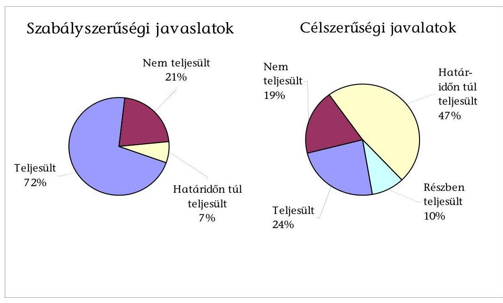

[^0]
[^0]:  
  ${ }^{38}$ A 2010. évi átfogó ellenőrzés során az ÁSZ megállapította, hogy a 2005. évben tett szabályszerűségi javaslatok közül a polgármester ${ }_{1}$ kettőt nem, továbbá a jegyző ${ }_{1}$ egyet részben és ötöt pedig nem teljesített. Egy szabályszerűségi javaslat nem volt aktuális, mert a korábbi ÁSZ vizsgálatot követően nem volt ingatlanértékesítés, melyet megelőzően forgalmi értékbecslést kellett volna készíteni.
    ${ }^{39}$ A 2010. évben tett javaslatok közül kettő javaslat nem volt aktuális, mert a Polgármesteri hivatal Közgazdasági Osztályának ügyrendje az ÁSZ vizsgálatát megelőzően tartalmazta az intézményi eredeti, a módosított előirányzatok és a teljesítések eltérése indokoltságának ellenőrzési kötelezettségét, továbbá a korábbi ÁSZ vizsgálatot követően az Önkormányzatnál nem kötöttek szerződést pályázatok írására, ezért a szerződések tartalmára vonatkozó javaslatok realizálását nem ellenőrizhettük.

---

A 2010. évi intézkedési tervben foglalt határidőre az ÁSZ által tett javaslatok közül 15-öt realizáltak, 2 részben hasznosult, 7-et nem, 11-et határidőn túl teljesítettek. A szabályszerűségi javaslatok közül 10-et realizáltak, 3 nem, 1 határidőn túl teljesült. A célszerűségi javaslatok közül 5-öt realizáltak, 2-t részben hasznosítottak, 4 nem, 10 határidőn túl teljesült. Egy szabályszerűségi és egy célszerűségi javaslat nem volt aktuális.

# A következő szabályszerűségi javaslatot nem hasznosította a polgármester ${ }_{1}$ : 

- „gondoskodjon az Önkormányzat gazdálkodásának 2005. évi átfogó ellenőrzése során az ÁSZ által részére tett és nem teljesült szabályszerűségi javaslatok végrehajtásáról":
- az ÁSZ a 2010. évi átfogó ellenőrzése során az utóellenőrzés keretében megállapította, hogy: „a polgármester az Ámr. ${ }_{1}$ 28. § (3) bekezdésében ${ }^{40}$ előírtak ellenére a 2006. évi költségvetési koncepció tervezethez nem csatolta a CKÖ koncepció tervezetről alkotott véleményét, mert a CKÖ nem adott írásbeli állásfoglalást, a bizottságok véleményét pedig csak a koncepciót tárgyaló képviselő-testületi ülésen ismertette."

A szabályszerűségi javaslat ellenére a polgármester ${ }_{2}$ nem csatolta a 2011. évi költségvetési koncepció tervezetéhez sem a CKÖ véleményét annak hiánya miatt, valamint a Pénzügyi bizottság véleményét, mivel azt a képviselő-testületi ülésen ismertette;

- az ÁSZ a 2010. évi átfogó ellenőrzése során az utóellenőrzés keretében megállapította, hogy: „a polgármester az Ámr. ${ }_{1}$ 29. § (9) bekezdésében ${ }^{41}$ előírtak ellenére a 2006. évi költségvetési rendelettervezethez nem csatolta a Pénzügyi bizottságnak a rendelettervezetről alkotott véleményét, azt a képviselő-testületi ülésen ismertette."

A szabályszerűségi javaslat ellenére a polgármester ${ }_{2}$ a 2011. évi költségvetési rendelettervezethez sem csatolta a Pénzügyi bizottság rendelettervezetről alkotott véleményét, mivel azt csak a képviselő-testületi ülésen ismertette.

A 2010. évi ellenőrzéshez kapcsolódó következő célszerűségi javaslatot részben hasznosította a polgármester ${ }_{1}$ :
„kezdeményezze, hogy a számvevői jelentésben foglaltakat a Képviselő-testület tárgyalja meg és a feltárt hiányosságok megszüntetése érdekében készíttessen intézkedési tervet a határidők és felelősök megjelölésével. Az intézkedési tervet, az elfogadását követő 30 napon belül küldje meg az ÁSZ Bács-Kiskun Megyei Ellenőrzési Irodája részére."

A polgármester ${ }_{1}$ intézkedése alapján a javaslatok megvalósítása érdekében a felelősöket és határidőket tartalmazó intézkedési terv készült, amelyet a Képviselőtestület a 108/2010. (VI. 24.) számú határozatával jóváhagyott. Az intézkedési

[^0]
[^0]:    ${ }^{40}$ 2010. január 1-jétől Ámr. ${ }_{2}$ 35. § (3) bekezdés
    ${ }^{41}$ 2010. január 1-jétől Ámr. ${ }_{2}$ 36. § (5) bekezdés

---

tervet az ÁSZ részére az elfogadást követő 30 napon túl, 2010. augusztus 31-én küldte meg a polgármester ${ }_{1}$.

# A korábbi ellenőrzésekhez kapcsolódó következő szabályszerűségi javaslatokat az intézkedési tervben foglalt határidőre hasznosította a jegyző ${ }_{1}$ : 

- „gondoskodjon arról, hogy az éves költségvetési rendelettervezetekben a költségvetési hiány az Áht. 8/A. § (7) bekezdésének előírása alapján kerüljön kimutatásra."

Az aljegyző intézkedése alapján a 2011. évi költségvetési rendelettervezetében betartották az Áht. 8/A. § (7) bekezdésének előírását, finanszírozási célú pénzügyi műveleteket nem számoltak el költségvetési hiányt módosító költségvetési bevételként, illetve költségvetési kiadásként;

- „gondoskodjon a pénzállomány alakulására vonatkozó likviditási terv készítéséről, az Ámr. 2 201. § (1) bekezdés figyelembevételével."
- „gondoskodjon az Ámr. 2 75. § (1) bekezdésében előírtak alapján a kötelezettségvállalások nyilvántartásba vételéről."
- „gondoskodjon arról, hogy az Ámr. 2 79. § (1)-(2) bekezdésében előírtak szerint az utalványok ellenjegyzésére felhatalmazottak az utalvány ellenjegyzése során az Ámr. 2 74. §-ban foglaltak megfelelő alkalmazásával járjanak el, továbbá győződjenek meg arról, hogy a szakmai teljesítés igazolása megtörtént-e."
- „gondoskodjon az Áht. 13/A. § (1)-(2) bekezdés előírását figyelembe véve arról, hogy az Önkormányzat által céljelleggel juttatott támogatás alapdokumentuma (szerződés, megállapodás vagy értesítő levél) tartalmazza a támogatás célját, felhasználásának jogcímeit és a számadási kötelezettség előírását."
- „gondoskodjon a belső ellenőrzés szabályszerű kialakítása és működtetése érdekében arról, hogy:"
- „a Ber. 18. §-ában és 21. § (2) bekezdésében előírtak alapján az éves ellenőrzési tervet a belső ellenőrzési vezető kockázatelemzés alapján készítse el."

A jegyző ${ }_{1}$ intézkedése alapján a belső ellenőrzési vezető kockázatelemzéssel támasztotta alá a 2011. évi ellenőrzési tervet;

- „az ellenőrzési célkitűzéseket megalapozó kockázatelemzés terjedjen ki az európai uniós forrásokból megvalósított feladatok végrehajtására, a közbeszerzési eljárások lebonyolítására, az Önkormányzat többségi irányítást biztosító befolyása alatt működő gazdasági társaságok működésére, a kedvezményezett szervezeteknél az Önkormányzat költségvetéséből nyújtott támogatások rendeltetés szerinti használatára."
- „gondoskodjon arról, hogy készüljön a Ber. 32. § (2) bekezdésében és a 12. § n) pontjában előírtaknak megfelelő tartalmú nyilvántartás a belső ellenőrzések megállapításairól, javaslatainak hasznosításáról."

A jegyző ${ }_{1}$ intézkedésére a belső ellenőrzési vezető javasolt tartalmú nyilvántartást készített a 2010. évi belső ellenőrzések megállapításairól, javaslatainak hasznosításáról, továbbá a nyilvántartást a 2011. évben is folyamatosan vezeti;

---

- „gondoskodjon az Ámr. 157. §-ában előírtak szerint a kockázatkezelési rendszer működtetéséről."

A jegyző, intézkedése alapján az Önkormányzatnál a kockázatkezelési rendszert 2010 novemberétől működtetik;

- „gondoskodjon az Önkormányzat gazdálkodási rendszerének 2005. évi átfogó ellenőrzése során az ÁSZ által részére tett és nem teljesült szabályszerűségi javaslatok végrehajtásáról;"
- az ÁSZ a 2010. évi átfogó ellenőrzése során az utóellenőrzés keretében megállapította, hogy: „a jegyző gondoskodott arról, hogy a zárszámadási rendelettervezet tartalmazza a tényleges létszámkeretet, a tájékoztatásul bemutatandó mérlegeket, de - az Áht. 118. § (2) bekezdés e) pontjában előírtakat megsértve - nem tartalmazta a közvetett támogatások (adóelengedések, adókedvezmények) szöveges indoklását."

A jegyző, a szabályszerűségi javaslatot végrehajtotta, a 2010. évi zárszámadási rendelettervezet tartalmazta az iparűzési és gépjármű adók vonatkozásában a közvetett támogatások szöveges indoklását;

- az ÁSZ a 2010. évi átfogó ellenőrzése során az utóellenőrzés keretében megállapította, hogy: „a jegyző az Ámr. 1 135. § (1) bekezdésében ${ }^{42}$ előírtak ellenére nem gondoskodott arról, hogy a CKÖ (bankszámlán és a pénztárban elszámolt) 2006. évi bevételeinél megtörténjen a szakmai teljesítés igazolása (a bevételek jogosultságának és összegszerűségének ellenőrzése)."

A jegyző, intézkedése alapján a CKÖ 2010. évi bevételei szakmai teljesítésigazolását a gazdálkodási szabályzat ${ }_{1}$ előírásának megfelelően a CKÖ elnöke elvégezte;

- az ÁSZ a 2010. évi átfogó ellenőrzése során az utóellenőrzés keretében megállapította, hogy: „a jegyző az Ámr. 2 134. § (13) bekezdésében ${ }^{43}$ foglaltak ellenére nem gondoskodott - a külső szolgáltatók által végzett karbantartási, kisjavítási szolgáltatások esetében - a kötelezettségvállalásokhoz kapcsolódó olyan analitikus nyilvántartás vezetéséről, amelyből megállapítható az évenkénti kötelezettségvállalás összege."

A jegyző, intézkedése alapján 2010. II. félévétől olyan kötelezettségvállalási nyilvántartást vezetnek, amelyből megállapítható az éves kötelezettségvállalás összege;

- az ÁSZ a 2010. évi átfogó ellenőrzése során az utóellenőrzés keretében megállapította, hogy: „a jegyző nem gondoskodott arról, hogy a gazdasági eseményeket - otthonteremtési támogatások - az Áhsz. 9. számú melléklete szerint rögzítsék."

A jegyző, intézkedése alapján a 2010. II. félévétől az otthonteremtési támogatást a gazdasági esemény tartalmának megfelelően rögzítették a főkönyvi könyvelésben;

[^0]
[^0]:    ${ }^{42}$ 2010. január 1-jétől Ámr. ${ }_{2}$ 76. § (2) bekezdés
    ${ }^{43}$ 2010. január 1-jétől Ámr. ${ }_{2}$ 75. § (1) bekezdés

---

- az ÁSZ a 2010. évi átfogó ellenőrzése során az utóellenőrzés keretében megállapította, hogy: „a jegyző - az Ötv. 10. § (1) bekezdés d) pontjában előírtakat megsértve - nem gondoskodott arról, hogy közösségi célú alapítványt képviselő-testületi döntés alapján támogassanak, mert 2006. június 16-án a Vagyonvédelmi Alapítványnak átutalt 200 ezer Ft támogatás átutalásáról a jegyző a Képviselő-testület döntése nélkül intézkedett."

A jegyző, a 2010. évben már a Képviselő-testület határozata ${ }^{44}$ alapján intézkedett a Vagyonvédelmi Alapítvány részére a 400 ezer Ft támogatás átutalásáról 2010. november 18-án.

A 2010. évi ellenőrzéshez kapcsolódó következő szabályszerűségi javaslatokat nem, illetve az intézkedési tervben előírt határidőn túl hasznosították:

- „a jegyző kezdeményezze az Ámr. 2 20. § (2) bekezdés e), i) pontjaiban előírtak alapján a hivatali SzMSz${ }_{2}$ kiegészítését a szervezeti egységek engedélyezett létszámával, feladataival;"

A szabályszerűségi javaslat ellenére a jegyző, nem kezdeményezte az SzMSz${ }_{2}$ kiegészítését a javaslatban foglalt tartalommal. A Képviselő-testület a 135/2011. (VI. 23.) számú határozatával határidőn túl ${ }^{45}$ módosította az SzMSz${ }_{2}$-t, amely nem tartalmazta a szervezeti egységek létszámát, csak azok feladatait;

- „a jegyző gondoskodjon arról, hogy az Ámr. 2 156. § (2) bekezdésében foglaltaknak és a 155. § (3) bekezdésében hivatkozott Pénzügyminisztérium „Útmutató az ellenőrzési nyomvonal kialakításához" módszertani útmutatójának megfelelően az ellenőrzési nyomvonal tartalmazza az egyes tevékenységek elvégzését igazoló dokumentum megnevezését és fellelhetési helyét a rendszerben, valamint utalást arra, hogy a feladatokat mely belső szabályzat tartalmazza;"

A szabályszerűségi javaslat ellenére a jegyző, nem gondoskodott az ellenőrzési nyomvonal javaslatnak megfelelő módosításáról. Az aljegyző határidőn túl ${ }^{46}$, 2011. március 1-jén jóváhagyta az ellenőrzési nyomvonal módosítását, amely tartalmazta az egyes tevékenységek elvégzését igazoló dokumentumok megnevezését és fellelhetési helyét a rendszerben, azonban nem tartalmazott utalást arra, hogy az egyes feladatokat mely belső szabályzat tartalmazza;

- „a jegyző gondoskodjon arról, hogy az Ámr. 2 161. § és a Pénzügyminisztérium „Útmutató a szabálytalanságok kezeléséhez" módszertani útmutató alapján a szabálytalanságok kezelésének eljárásrendje tartalmazza a szabálytalanságok értékelési kötelezettségét, az intézkedések meghatározását, az intézkedések nyomon követését, a szabálytalanságok és intézkedések nyilvántartási feladatait;"

A jegyző, nem intézkedett a javaslat hasznosítása érdekében. Az aljegyző határidőn túli intézkedése eredményeként a Képviselő-testület a 135/2011. (VI. 23.) számú határozatával elfogadott - az SzMSz 2 6. számú mellékletét képező - Szabálytalanságok kezelésének eljárási rendje tartalmazta a javaslatban foglaltakat.

[^0]
[^0]:    ${ }^{44}$ a Képviselő-testület 87/2010. (V. 6.) számú határozata
    ${ }^{45}$ Az intézkedési tervben előírt teljesítési határidő 2010. december 30. volt.
    ${ }^{46}$ Az intézkedési tervben előírt teljesítési határidő 2010. október 30. volt.

---

# A 2010. évi ellenőrzéshez kapcsolódó következő célszerűségi javaslatokat hasznosította a jegyző: 

- „gondoskodjon a pénzügyi-számviteli feladatok ellátásánál alkalmazott informatikai rendszerek belső kontrolljainak működtetése során arról, hogy:"
- „a Polgármesteri hivatalban

 vezetett hozzáférési jogosultságokra vonatkozó nyilvántartás teljes körű és naprakész legyen;"

A jegyző, a javaslatot teljesítette, 2010. december 15-én a 4. számú melléklettel kiegészítette a Számítástechnikai védelmi szabályzatot, amely tartalmazta a hozzáférési jogosultságokat teljes körűen és naprakészen;

- „a hozzáférési jogosultsággal rendelkezőkre vonatkozó lista ne tartalmazzon kilépett dolgozókat, fejlesztőket, személyhez nem köthető azonosítókat;"

A jegyző a Számítástechnikai védelmi szabályzat 4. számú mellékletének elkészítése során gondoskodott arról, hogy a hozzáférési jogosultságokat tartalmazó nyilvántartás a javaslatnak megfelelő legyen;

- „minden érintettnek csak egy hozzáférési azonosítója legyen a listán;"

A jegyző eleget tett a javaslatban foglaltaknak, a hozzáférési jogosultságokat tartalmazó nyilvántartásban minden jogosultnak csak egy hozzáférési azonosítója volt;

- „a pénzügyi-számviteli szoftver segítségével elkészítésre kerüljön az ellenőrzési lista (napló) minden adathozzáférésről, adatmódosításról és adattörlésről;"

A jegyző intézkedése alapján a javaslatban foglalt tartalommal 2010. szeptember 30-án ellenőrzési listát készítettek;

- „egészítse ki az érintett dolgozó(k) munkaköri leírását az eszközök hasznosítási és selejtezési szabályzatában előírt feladatokkal, valamint a belső ellenőrzési vezetői feladatokkal;"

A jegyző kiegészítette 2010. szeptember 1-jén a Polgármesteri hivatal Közgazdasági Osztálya ügyintézőjének munkaköri leírását az eszközök hasznosítási és selejtezési szabályzatában előírt feladatokkal, továbbá a belső ellenőrzési vezető munkaköri leírása 2010. október 18-ától tartalmazza a belső ellenőrzési vezető feladatai ellátásának kötelezettségét.

A 2010. évi ellenőrzéshez kapcsolódó következő célszerűségi javaslatot részben, illetve az intézkedési tervben előírt határidőn túl hasznosították: „a jegyző gondoskodjon a pénzügyi-számviteli feladatok ellátásánál alkalmazott informatikai rendszerek működtetéséhez a belső kontroll eljárások meghatározása során arról, hogy a számítástechnikával kapcsolatos szabályzat megismertetésre kerüljön."

---

A jegyző intézkedése alapján a Számítástechnikai védelmi szabályzatot az osztályvezetők 2010. július 2-án megismerték, amelyet aláírásukkal igazoltak. Írásbeli nyilatkozatuk alapján a szabályzat tartalmát az általuk vezetett osztály munkatársaival megismertették, amelynek megtörténtét azonban nem dokumentálták. A jegyző intézkedése alapján az Önkormányzat dolgozói a Számítástechnikai védelmi szabályzatban foglaltak megismeréséről írásban nyilatkoztak. ${ }^{47}$

A 2010. évi ellenőrzéshez kapcsolódó következő célszerűségi javaslatokat nem, illetve az intézkedési tervben előírt határidőn túl hasznosították:

- „a jegyző intézkedjen az európai uniós forrásokra vonatkozó pályázatokkal összefüggésben a Polgármesteri hivatalon belül:"
- „az önkormányzati szintű pályázatkoordinálás feladatainak előírásáról és felelősének kijelöléséről."

A jegyző nem intézkedett a javaslatban foglaltak hasznosítására. A polgármester és az aljegyző 2011. március 8-án léptette hatályba a támogatási szabályzatot, amelyben az intézkedési tervben foglalt határidőn túl szabályozták a javaslatban előírtakat;

- „az önkormányzati szintű pályázat nyilvántartás kötelezettségének és a pályázat nyilvántartás módjának előírásáról."

A jegyző nem tett intézkedést a javaslat megvalósítására. A támogatási szabályzatban az intézkedési tervben előírt határidőn túl írta elő a polgármester és az aljegyző az önkormányzati szintű pályázatok nyilvántartásának kötelezettségét és a pályázatok nyilvántartásának módját;

- „a jegyző intézkedjen a pénzügyi-számviteli feladatoknál alkalmazott informatikai rendszerek működtetéséhez a belső kontroll eljárások meghatározása során arra, hogy:"
- „rendszeres időszakonként felülvizsgálatra és szükség szerint aktualizálásra kerüljön a Polgármesteri hivatal katasztrófa elhárítási terve."

A jegyző a javaslatban foglaltak ellenére nem írta elő a Polgármesteri hivatal katasztrófa-elhárítási tervének időszakonkénti felülvizsgálatát és szükség szerinti aktualizálását. A jegyző az intézkedési tervben előírt határidőn túl rendelkezett a Számítástechnikai védelmi szabályzat 4. számú mellékletét képező katasztrófavédelmi terv évente egyszeri felülvizsgálatáról;

- „a pénzügyi-számviteli rendszer esetében szabályozzák a jelszavak kezelését."

A jegyző a javaslatban foglaltak realizálása érdekében nem intézkedett. A jegyző az intézkedési tervben előírt határidőn túl, a Számítástechnikai védelmi szabályzatban előírta a jelszavak kezelését;

[^0]
[^0]:    ${ }^{47}$ Az intézkedési tervben előírt teljesítési határidő 2010. október 30. volt.
    ${ }^{48}$ Az intézkedési tervben előírt teljesítési határidő 2010.október 30. volt.

---

- „a hozzáférési jogosultságok eljárásrendjében a hozzáférési jogosultság megállapítása, kiosztása, módosítása, visszavonása, ellenőrzése előírásra kerüljön."

A jegyző a javaslat realizálása érdekében nem intézkedett. A jegyző a Számítástechnikai védelmi szabályzatban rögzítette - az intézkedési tervben előírt határidőn túl - a hozzáférési jogosultságok megállapítását, módosítását, visszavonását és ellenőrzését;

- „az éles rendszerhez való hozzáférés a Polgármesteri hivatal pénzügyiszámviteli szoftvereit fejlesztő külső cég fejlesztőinek megtiltásra kerüljön."

A jegyző a javaslat realizálása érdekében nem intézkedett. A jegyző az intézkedési tervben előírt határidőn túl tiltotta meg a Számítástechnikai védelmi szabályzatban a Polgármesteri hivatal pénzügyi-számviteli szoftverei vonatkozásában a külső cég fejlesztőinek az éles rendszerhez való hozzáférését;

- „a pénzügyi-számviteli rendszerből lekérhető ellenőrzési listából megállapítható legyen az elvégzett műveletek pontos tartalma.

A javaslatban foglaltak hasznosítására a jegyző nem intézkedett;

- „az ellenőrzési lista (napló) vizsgálatáért felelős dolgozó kijelölésre kerüljön."

A jegyző a javaslat realizálása érdekében nem intézkedett. A jegyző az intézkedési tervben foglalt határidőn túl a Polgármesteri hivatal Közgazdasági Osztályának vezetőjét jelölte ki az ellenőrzési lista (napló) vizsgálatáért felelősnek;

- „a pénzügyi-számviteli szoftver-változások ellenőrzésére, tesztelésére vonatkozó eljárások szabályozásra kerüljenek."

A jegyző a javaslat realizálása érdekében nem intézkedett. A jegyző az intézkedési tervben előírt határidőn túl a Számítástechnikai védelmi szabályzatban szabályozta a javaslatban foglaltakat.

- „a jegyző gondoskodjon a pénzügyi-számviteli feladatok ellátásánál alkalmazott informatikai rendszerek belső kontrolljainak működtetése során arról, hogy:
- „rendszeres időszakonként végezzék el a katasztrófa-elhárítási terv tesztelését."
- „dokumentálják, ellenőrizzék és teszteljék a pénzügyi-számviteli szoftver elemeire vonatkozó változáskezelési eljárásokat."
- „történjen meg az elmentett adatállományokból a pénzügyi-számviteli adatok helyreállításának és a helyreállított adatállományoknak az ellenőrzése;"

A jegyző a javaslatok realizálása érdekében nem intézkedett. Az aljegyző intézkedése alapján határidőn túl, 2011. január 14-én megtörtént a pénzügyi-számviteli adatok helyreállításának és a helyreállított adatállománynak az ellenőrzése és tesztelése;

[^0]
[^0]:    ${ }^{49}$ Az intézkedési tervben előírt teljesítési határidő 2010.október 30. volt
    ${ }^{50}$ Az intézkedési tervben előírt teljesítési határidő 2010. december 30. volt.

---

- „a jegyző egészítse ki az eszközök és források értékelési szabályzatát az értékelések ellenőrzéséért felelős munkakörök meghatározásával."

A jegyző, nem teljesítette a javaslatban foglaltakat. Az aljegyző határidőn túl intézkedett, a 2011. január 1-jétől hatályos Eszközök és források értékelési szabályzatában az értékelési feladatok elvégzése ellenőrzéséért felelős munkakört meghatározta;

- „a jegyző gondoskodjon a hivatali SzMSz kiegészítéséről, hogy az tartalmazza a belső ellenőrzési vezető személyének meghatározását."

Budapest, 2012. április „ $1 e^{\prime \prime}$

Melléklet: $\quad 2 \mathrm{db}$
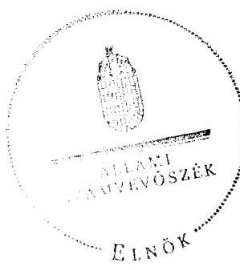

Domokos László

---

# Az Önkormányzat gazdálkodását meghatározó adatok, mutatószámok 

| Megnevezés | 2007. év | 2010. év |
| :--: | :--: | :--: |
| A település állandó lakosainak száma (fő) 2007. és 2011. január 1-jén | 18026 | 17505 |
| A Képviselő-testület tagjainak a száma (fő) (december 31-én) | 18 | 12 |
| A Képviselő-testület munkáját segítő állandó bizottságok száma (december 31-én) | 8 | 5 |
| Az összes vagyon értéke a december 31-i könyvviteli mérleg szerint (millió Ft) | 18300,7 | 20668,8 |
| A hosszú és rövid lejáratú kötelezettség december 31-én (millió Ft) | 1180,3 | 2437,8 |
| Az összes teljesített költségvetési bevétel* (millió Ft) | 8398,0 | 9342,0 |
| Ebből: saját bevétel (millió Ft), melyből | 5262,0 | 6310,0 |
| helyi adó és illetékbevétel, valamint az szja-n kívüli átengedett bevételek (millió Ft) | 546,0 | 605,0 |
| Az egy állandó lakosra jutó költségvetési bevétel (Ft) | 0,5 | 0,5 |
| Az egy állandó lakosra jutó saját bevétel (Ft) | 0,3 | 0,4 |
| Az egy állandó lakosra jutó helyi adóbevétel (Ft) | 0,0 | 0,0 |
| Saját bevétel/Felhalmozási célú költségvetési kiadásokkal csökkentett összes költségvetési bevétel aránya (\%) | 76,0 | 85,4 |
| Helyi adó és illetékbevétel, valamint az szja-n kívüli átengedett bevételek/Felhalmozási célú költségvetési kiadásokkal csökkentett összes költségvetési bevétel aránya (\%) | 7,9 | 8,2 |
| Az összes teljesített költségvetési kiadás (millió Ft) | 8456,0 | 9993,4 |
| Ebből: felhalmozási célú költségvetési kiadás** (millió Ft) | 1478,5 | 1949,3 |
| A költségvetési kiadásból a felhalmozási célú költségvetési kiadás aránya (\%) | 17,5 | 19,5 |
| Az egy lakosra jutó teljesített működési célú költségvetési kiadás (Ft) | 0,5 | 0,6 |
| Az egy lakosra jutó teljesített felhalmozási célú költségvetési kiadás (Ft) | 0,1 | 0,1 |
| A költségvetési szervek száma december 31-én (PH-val együtt) | 15 | 15 |
| Ebből: önállóan működő és gazdálkodó | 7 | 7 |
| A Polgármesteri hivatalban foglalkoztatott köztisztviselők száma (fő) (december 31-én) (részmunkaidős is) | 70 | 67 |
| Az Önkormányzat által foglalkoztatott közalkalmazottak száma (fő), (december 31-én) (részmunkaidős is) | 1277 | 1261 |

* a költségvetési bevétel az előző évek pénzmaradványának, vállalkozási maradványának igénybevételét is tartalmazza
** a CLF módszer szerinti felhalmozási kiadás

---

Kalocsa Város Önkormányzata

2. számú melléklet a V-3068-028/2012. számú jelentéshez

Az Önkormányzat bevételei és kiadásai, valamint adósságszolgálata 2007-2010 között adatok ezer Ft-ban

|  1. FOLVÓ KÖLTŐÉGYETÉS | 2007. év | 2008. év | 2009. év | 2010. év  |
| --- | --- | --- | --- | --- |
|  1.1.1. Saját működési bevételek (80/105+106+107+108+110+111+121+125+126+202+203+208-54) | 1 528 633 | 1 713 709 | 1 893 165 | 2 126 479  |
|  1.1.2. Költségvetési támogatás (80/211) | 2 320 898 | 3 037 261 | 2 556 292 | 2 249 824  |
|  1.1.3. Szengedett bevételek (80/109+122+123+124) | 1 364 989 | 757 219 | 750 731 | 781 836  |
|  1.1.4. Allombázóvetésen belülről kapott támogatások (80/137+139) | 2 269 799 | 2 277 735 | 2 144 776 | 2 513 678  |
|  1.1.5. FE-tilt és külföldről kapott bevételek (80/156+157+158) | 4 931 | 0 | 0 | 0  |
|  1.1.6. Allombázóvetésen kívülről kapott bevételek (80/148+149+150+155+160+197) | 16 839 | 20 621 | 149 396 | 206 163  |
|  1.1.7. Előző évi pénzmaradvány átvétel (80/147+184) | 23 859 | 39 040 | 53 752 | 13 655  |
|  1.1. Folyó bevételek =1.1.1.+1.1.2.+1.1.3.+1.1.4.+1.1.5.+1.1.6. | 7 529 140 | 7 825 581 | 7 548 112 | 7 891 627  |
|  1.2.1. Működési kiadások kamatikozások nélküli (80/04+05+06+07+08+09+10+11) | 6 619 343 | 6 905 771 | 6 968 693 | 7 498 355  |
|  1.2.2. Allombázóvetésen belülre átadott pénzesekételt (80/27) | 48 417 | 37 552 | 61 564 | 60 276  |
|  1.2.3.1. vállalkozásoknak (80/67+49+55) | 0 | 410 |

 0 | 140 000  |
|  1.2.3.2. FE-mel, illetve külföldre (80/02+43+44) | 0 | 0 | 000 | 0  |
|  1.2.3.3. magánszemélyeknek (80/24+48+49) | 236 416 | 249 030 | 241 738 | 201 251  |
|  1.2.3.4. morzsoló szorozatoknak (80/32+33) | 23 201 | 20 071 | 21 842 | 24 292  |
|  1.2.3. Tiszaférkőadások (1.2.3.1+1.2.3.2+1.2.3.3+1.2.3.4) | 261 707 | 276 537 | 268 400 | 367 546  |
|  1.2.4. Kamatozások (33+97) | 33 649 | 50 443 | 60 724 | 80 825  |
|  1.2.5. Előző évi pénzmaradvány átadás (80/31+78) | 14 321 | 23 586 | 53 624 | 37 033  |
|  1.2. Folyó kiadások = 1.2.1.+1.2.2.+1.2.3.+1.2.4. | 6 977 457 | 7 293 889 | 7 413 005 | 8 044 035  |
|  1.3. Folyó költségvetés egyenlege MŰKÖDÉSI JÖVEDELEM (1.1. - 1.2.) | 551 703 | 531 692 | 135 107 | 153 400  |
|  2. FEJLESZTÉSI (beruházási) KÖLTSÉGVETÉS | 0 | 0 | 0 | 0  |
|  2.1.1. Saját tökebevételek (80/164+198+200+201+203+206+207+209) | 68 732 | 48 665 | 11 811 | 34 212  |
|  2.1.2. Állambudgetesen belülről kapott támogatások (80/176) | 579 843 | 332 106 | 804 015 | 1 273 796  |
|  2.1.3. FE-től és külföldről kapott támogatások (80/193+194+195) | 0 | 0 | 0 | 0  |
|  2.1.4. Állambudgetesen kívülről kapott támogatások (80/185+186+187+192) | 48 795 | 52 691 | 17 403 | 27 845  |
|  2.1. Fejlesztési (beruházási) bevételek (2.1.1.+2.1.2+2.1.3+2.1.4.) | 697 370 | 433 462 | 833 329 | 1 335 854  |
|  2.2.1. Saját beruházási kiadások (80/27+35) aláírás (60/6) | 107 638 | 865 325 | 90 714 | 1 533 563  |
|  2.2.2. Saját felújítási kiadások (80/56+58) aláírás (60/6) | 19 225 | 11 078 | 9 217 | 178 225  |
|  2.2.3. Állambudgetesen belülre átadott pénzeszközök (80/70+99+101) | 194 692 | 94 830 | 109 915 | 235 161  |
|  2.2.4. FE-mel és külföldnek adott pénzeszközök (80/89+90+91) | 0 | 0 | 0 | 0  |
|  2.2.5. Állambudgetesen kívülre adott pénzeszközök (80/79+80+81+88+92+93+100) | 4 208 | 3 798 | 18 875 | 2 394  |
|  2.2.6. Befektetési célú részesedések vásárlása (80/102) | 9 000 | 620 | 0 | 0  |
|  2.2. Fejlesztési (beruházási) kiadások (2.2.1.+2.2.2.+2.2.3.+2.2.4.+2.2.5.+2.2.6.) | 1 478 532 | 1 081 360 | 1 128 113 | 1 949 343  |
|  2.3. Beruházási költségvetés egyenlege (2.1. - 2.2.) | -781 162 | -647 898 | -294 884 | -613 489  |
|  3. Finanszírozási műveletek nélküli (GFS) pozíció (1.3.+2.3.) | -229 459 | -116 286 | -159 777 | -765 897  |
|  4. Finanszírozási műveletek | 0 | 0 | 0 | 0  |
|  4.1. Hitelfelvétel (80/230+231+232+238) | 236 058 | 227 823 | 259 547 | 1 445 378  |
|  4.2. Hitelkivétés (80/219+220+221+227) | 45 445 | 44 119 | 160 730 | 785 684  |
|  4.3. Forgatási és befektetési célú értékpapírok kibocsátása (80/233+235+237) | 0 | 0 | 0 | 0  |
|  4.4. Forgatási és befektetési célú értékpapírok beváltása (80/222+224+226) | 0 | 0 | 0 | 0  |
|  4.5. Forgatási és befektetési célú értékpapírok értékesítése (80/234+236) | 0 | 0 | 0 | 0  |
|  4.6. Forgatási és befektetési célú értékpapírok vásárlása (80/223+235) | 0 | 0 | 0 | 0  |
|  4.7. Egyéb finanszírozási bevételek (függő, átfizet, kiegészít) (80/239) | 79 041 | -11 331 | -10 491 | 400 962  |
|  4.8. Egyéb finanszírozási kiadások (függő, átfizet, kiegészít) (80/228) | 46 001 | -11 974 | 20 270 | 136 473  |
|  4.9. Finanszírozási műveletek egyenlege (4.1. - 4.2.) | 190 613 | 183 704 | 98 817 | 659 694  |
|  5. Tárgyévi pozíció (1.3.+ 2.3.+4.1.) | -5 806 | 68 151 | -91 821 | 158 286  |
|  6. Netto működési jövedelem (működési jövedelem (1.3.) - töketérlesztés (4.2+4.4)) | 506 258 | 487 573 | -25 623 | -938 092  |
|  Tárgyévi pozíció =(Folyó-jövéskezés) (34/53) - Netto jövéskezés (34/01) | -11 384 | 136 577 | -162 190 | 317 258  |
|  TÁJÉKOZTATÓ ADATOK | 0 | 0 | 0 | 0  |
|  Összes kötelezettség (01/101+127) | 1 180 273 | 1 560 341 | 1 760 091 | 2 437 768  |
|  ebből rövid lejáratú (01/137) | 846 689 | 1 112 022 | 1 167 620 | 1 732 649  |
|  Összes szállítói kötelezettség (01/105) | 503 011 | 765 444 | 791 245 | 737 036  |
|  ebből lejárt (tanszívánnyal) | 297 447 | 506 401 | 611 782 | 574 805  |
|  Össz. és tőkepítési kötelezettség (adósság) (01/96+97+98+99+103+109) | 505 619 | 689 333 | 708 151 | 1 447 843  |
|  ebből rövid lejáratú (01/101+109) | 172 031 | 241 014 | 195 680 | 755 609  |
|  PPP (elszámolható állomány jelenértéken (tanszívánnyal)) | 0 | 0 | 0 | 0  |
|  ebből lejárt szolgáltatási díj minőségi kötelezettség | 0 | 0 | 0 | 0  |
|  Folyószámlánál saját átfogó állománya (tanszívánnyal) | 115 298 | 156 539 | 266 301 | 316 663  |
|  munkabérből saját átfogó állománya (tanszívánnyal) | 81 632 | 90 461 | 91 776 | 106 320  |
|  Kezesség és garanciavállalások (tanszívánnyal) | 0 | 0 | 0 | 0  |
|  Jogcím bírósági feltételekből adódó kötelezettségek (tanszívánnyal) | 0 | 0 | 0 | 0  |
|  Finanszírozásba bevont eszközök: | 152 595 | 220 746 | 128 925 | 287 211  |
|  Tartós hitelviszonyt megtestesítő értékpapírok (01/18) | 0 | 0 | 0 | 0  |
|  Hosszú lejáratú bankbetétek (01/20) | 0 | 0 | 0 | 0  |
|  Értékpapírok (01/56) | 0 | 0 | 0 | 0  |
|  Pénzeszközök (idegen pénzeszközök nélkül) (01/60) | 152 595 | 220 746 | 128 925 | 287 211  |

