# ÁLLAMI   SZÁMVEVŐSZÉK 

## JELENTÉS

Nagyecsed Város Önkormányzata gazdálkodási rendszerének 2011. évi ellenőrzéséről

---

# Számvevői Iroda 

Iktatószám: V-3069-028/2012.
Témaszám: 1015
Vizsgálat-azonosító szám: V0560012

## Az ellenőrzést felügyelte:

Dr. Varga Sándor
számvevő igazgatóhelyettes
Az ellenőrzést vezette:
Gyüre Lajosné
számvevő tanácsos
Az ellenőrzést végezték:

| Bocsi Sándor | Baksa Anikó | Csordás Ágnes |
| :-- | :-- | :-- |
| számvevő tanácsos | számvevő | számvevő |

---

# TARTALOMJEGYZÉK 

BEVEZETÉS ..... 9
I. ÖSSZEGZŐ MEGÁLLAPÍTÁSOK, KÖVETKEZTETÉSEK, JAVASLATOK ..... 15
II. RÉSZLETES MEGÁLLAPÍTÁSOK ..... 34

1. A pénzügyi egyensúly, a fizetőképesség, a gazdálkodás stabilitásának biztosítása, az adósságkezelés eredményessége ..... 34
2. A vagyoni helyzet alakulása, valamint a vagyongazdálkodás folyamataiban a kontrollok működése ..... 50
2.1. Az Önkormányzat vagyoni helyzetének 2007-2010 közötti alakulása ..... 50
2.2. A vagyongazdálkodás belső kontrolljainak működése ..... 54
3. A közfeladatok ellátásában résztvevő önkormányzati többségi tulajdonban lévő gazdasági társaságoknál a tulajdonosi felelősség érvényesítésének eredményessége ..... 60
4. Az Önkormányzat gazdálkodási rendszerének korábbi ellenőrzése során tett szabályszerűségi és célszerűségi javaslatok hasznosítása ..... 62
MELLÉKLETEK
5. számú Az Önkormányzat gazdálkodását meghatározó adatok, mutatószámok (1 oldal)
6. számú Kimutatás az Önkormányzat 2007-2010 között teljesített CLF szerint össze-
sített bevételeiről és kiadásairól (1 oldal)

---

.

---

# RÖVIDÍTÉSEK JEGYZÉKE 

## Törvények

Áht.
ÁSZ tv.
Csőd tv.
Gt.
Kbt.
Ksztv.
Ktv.
Ötv.
Ptk.
Stabilitási tv.
Számv. tv.
új Áht.
Vagyon tv.

## Rendeletek

Áhsz.

Ámr.
Ávr.

Ber.
új Ber.
vagyongazdálkodási rendelet
2010. évi költségvetési rendelet
2011. évi költségvetési rendelet
2010. évi zárszámadási rendelet
SzMSz

## Szórövidítések

áfa
ÁSZ
az államháztartásról szóló 1992. évi XXXVIII. törvény
az Állami Számvevőszékről szóló 2011. évi LXVI. törvény
a csődeljárásról és a felszámolási eljárásról szóló 1991. évi XLIX. törvény
a gazdasági társaságokról szóló 2006. évi IV. törvény
a közbeszerzésekről szóló 2003. évi CXXIX. törvény
a közhasznú szervezetekről szóló 1997. évi CLVI. törvény
a köztisztviselők jogállásáról szóló 1992. évi XXIII. törvény
a helyi önkormányzatokról szóló 1990. évi LXV. törvény
a Polgári Törvénykönyvről szóló 1959. évi IV. törvény
a Magyarország gazdasági stabilitásáról szóló 2011. évi CXCIV. törvény
a számvitelről szóló 2000. évi C. törvény
az államháztartásról szóló 2011. évi CXCV. törvény
a nemzeti vagyonról szóló 2011. évi CXCVI. törvény
az államháztartás szervezeti beszámolási és könyvvezetési kötelezettségének sajátosságairól szóló 249/2000. (XII. 24.) Korm. rendelet
az államháztartás működési rendjéről szóló 292/2009. (XII. 19.) Korm. rendelet
az államháztartási törvény végrehajtásáról szóló 368/2011. (XII.31.) Korm. rendelet
a költségvetési szervek belső ellenőrzéséről szóló 193/2003. (XI. 26.) Korm. rendelet
a költségvetési szervek belső kontrollrendszeréről és belső ellenőrzéséről szóló 370/2011. (XII. 31.) Korm. rendelet
az Önkormányzat 13/2002. (X. 17.) számú rendelete a vagyongazdálkodás szabályairól
az Önkormányzat 1/2010. (II. 18.) számú rendelete a 2010. évi költségvetésről
az Önkormányzat 9/2011. (III. 9.) számú rendelete a 2011. évi költségvetésről
az Önkormányzat 14/2011. (IV. 14.) számú rendelete a 2010. évi zárszámadásáról
az Önkormányzat 1/2011. (I. 31.) számú rendelete az Önkormányzat Szervezeti és Működési Szabályzatáról
általános forgalmi adó
Állami Számvevőszék

---

| Belső Kontroll Kézikönyv | az államháztartásért felelős miniszter által a 2010. évben közzétett, a belső kontrollrendszer működtetésére vonatkozó módszertani útmutató |
| :--: | :--: |
| EU | Európai Unió |
| FEUVE | folyamatba épített, előzetes, utólagos és vezetői ellenőrzés |
| gazdálkodási szabályzat | a jegyző által 2010. július 1-jétől hatályba léptetett Gazdálkodási Szabályzat a kötelezettségvállalás, ellenjegyzés, szakmai teljesítés igazolása, érvényesítés és az adatszolgáltatás rendjéről |
| hivatali SzMSz | a 156/2008. (IX. 30.) számú határozattal jóváhagyott, a polgármester és a jegyző által kiadott Nagyecsed Város Önkormányzata Polgármesteri Hivatalának Szervezeti Működési Szabályzata |
| jegyző | Nagyecsed Város Önkormányzatának jegyzője |
| Képviselő-testület | Nagyecsed Város Önkormányzatának Képviselő-testülete |
| Kistérségi társulás | Szatmári Többcélú Kistérségi Társulás |
| MÁK | Magyar Államkincstár |
| Nagyecsedért Kht. | Nagyecsedért Közhasznú Társaság |
| Nonprofit Kft. | Nagyecsedi Városüzemeltetési Nonprofit Kft. |
| ÖNHIKI | Önhibáján kívül hátrányos helyzetű önkormányzatok támogatása |
| Önkormányzat | Nagyecsed Város Önkormányzata |
| Pénzügyi bizottság | Nagyecsed Város Önkormányzatának Pénzügyi Bizottsága |
| polgármester | Nagyecsed Város Önkormányzatának polgármestere |
| Polgármesteri hivatal | Nagyecsed Város Önkormányzatának Polgármesteri Hivatala |
| szja | személyi jövedelemadó |
| Társulások | Ecsedi-láp Víziközmű Beruházási Társulás és a Szatmári Regionális Hulladék-gazdálkodási Társulás |

---

# ÉRTELMEZŐ SZÓTÁR 

árfolyamkockázat
bonitás

BUBOR

CLF módszer
eredményesség

EURIBOR
finanszírozási célú pénzügyi műveletek

A deviza forintban kifejezett árfolyamának változásában rejlő kockázat. Az adott deviza árfolyamváltozása (erősödése vagy gyengülése) miatt a devizahitelek törlesztőrészleteinek mértéke gyakran és jelentős mértékben is változhat. A forint erősödése a törlesztőrészletek csökkenését, a forint gyengülése a törlesztő részletek növekedését vonja maga után.
A bonitás hitelképességet jelent. A bonitást a pénzügyi kapacitás fogalmával írhatjuk le, ami nem más, mint az adósok hitelfelvételi képességének azon mértéke, ahol még anélkül tudják növelni az adósságot, hogy csökkenteniük kellene akár jelenlegi, akár jövőben esedékes kiadásaikat fizetőképességük fenntartása érdekében.
Budapesti, bankközi pénzpiaci, rövid futamidőre vonatkozó, kínálati referencia forintkamatláb (Budapest Interbank Offered Rate)
Capability and Leadership Framework (CLF)
Az önkormányzatok költségvetése elemzésének eszköze, a bevételek és kiadások, működés és fejlesztés elkülönítése. Bizonyos mértékig a vállalati gazdálkodás logikai elemeit érvényesíti az önkormányzatok pénzügyi jövedelmi helyzetének vizsgálat során. Következetesen elkülöníti a folyó és a felhalmozási költségvetés bevételeit és kiadásait, azok költségvetési egyenlegeit. A módszer a pénzügyi kapacitás fogalmát helyezi a középpontba.
A kitűzött célok megvalósításának mértékeként vagy egy tevékenység kimenete szándékolt és tényleges hatása közötti kapcsolat. Ebben a meghatározásában - kiterjesztve a teljesítmény-ellenőrzés értelmezési tartományára - a hatás az operatív, a specifikus vagy átfogó szinten keletkezett „végterméket" jelenti, amely lehet output, eredmény és hatás egyaránt (ÁSZ Teljesítmény-ellenőrzési módszertan 16. oldal).
A frankfurti bankközi piacon jegyzett, az Európai Központi Bank szabályainak megfelelően megállapított kínálati kamatláb. Az EURIBOR értékét a legfontosabb európai bankok hitelkínálatának kamatlábai alapján a Reuters ügynökség számolja ki és teszi közzé egy meghatározott eljárásnak megfelelően, minden nap pontban délelőtt 11 órakor. A magyar pénzintézetek is ezt használják viszonyítási alapnak EUR hitelek esetén.
Értékpapírok kibocsátása, értékesítése és visszavásárlása; hitelek felvétele és törlesztése; szabad pénzeszközök betétként való elhelyezése és visszavonása (Áht. 8/A. § (3) bekezdés).

---

garancia- és kezességvállalás
kamatkockázat
költségvetési bevétel
kötvény

PPP (public private partnership)

A garanciavállalás valamilyen esemény jövőbeni bekövetkezéséhez kapcsolódó kötelezettségvállalás. Az önkormányzat kötelezettség-vállalása arra vonatkozóan, hogy a szerződésben meghatározott feltételek beálltakor a garancia kedvezményezettje számára, határozott összegig, határozott időpontig, felszólításra azonnal fizet. Ez a kötelezettség az önkormányzat számára azzal a bizonytalansággal jár, hogy nem tudja, hogy ezt a kötelezettségvállalását igénybe veszik-e vagy nem, és ha igen, mikor. A kezesség járulékos kötelezettségvállalás, amely lehet egyszerű vagy kézfizető, és mindig feltételezi a főkötelezettet. Az egyszerű kezességvállalás esetén a kezes mindaddig megtagadhatja a teljesítést, míg mindazoktól behajtható, akik őt megelőzően vállaltak kötelezettséget. A kézfizető kezest nem illeti meg a sortartás kifogása. A fentiek következtében mind a garancia-, mind a kezességvállalás esetében az önkormányzatnak a futamidő teljes időtartama alatt azzal kell számolnia, hogy ha a főkötelezett elmulasztja teljesíteni a fizetést, a vállalt kötelezettséget vele szemben érvényesítik az adott időpontban fennálló összeg erejéig (Ptk. 272-276. §-ai alapján).

Változó kamatozású hiteleknél a kamatkockázat azt jelenti, hogy a hitel futamideje alatt változhat a hitel kamata és így a törlesztőrészlete is. Devizahiteleknél ez azt jelenti, hogy ha az adott deviza irányadó kamata emelkedik, akkor emiatt nőhet a devizahitel kamata is.
Az Áht. 69. § (1) bekezdés a) és c) pontjaiban foglaltak figyelembevételével meghatározott összeg, amelynek számítása során a tárgyévi költségvetési bevételeket növeli - a költségvetési hiány belső finanszírozására szolgáló előző évek pénzmaradványából, vállalkozási maradványából igénybe vett összeg. (Az Áht. alapján ezen ellenőrzéshez kialakított értelmezés.)
A kötvény névre szóló, hitelviszonyt megtestesítő értékpapír. A kötvényben a kibocsátó (az adós) arra kötelezi magát, hogy az ott megjelölt pénzösszegnek az előre meghatározott kamatát vagy egyéb jutalékait, valamint az általa vállalt esetleges egyéb szolgáltatásokat (a továbbiakban együtt: kamat), továbbá a pénzösszeget a kötvény mindenkori tulajdonosának, illetve jogosultjának (a hitelezőnek) a megjelölt időben és módon megfizeti, illetőleg teljesíti.
Az állami és a magánszféra együttműködésének egyik formája, amelynek keretében a közcél a magánszféra jelentős mértékű közreműködésével valósul meg. Az állam (önkormányzat) a közszolgáltatások létrehozását a tradicionálisnál komplexebb módon bízza a magánszférára. Az együttműködés hosszú távra szól. A magán partner felelőssége az infrastruktúra tervezésére, megépítésére, működtetésére és legalább részben a projekt finanszírozá-

---

sára terjed ki. Az állam (önkormányzat) és/vagy a szolgáltatások igénybevevője szolgáltatási díjat fizet.
A könyvviteli mérlegben szereplő eszközöknek a kötelezettségekkel csökkentett összege, amellyel azonos a források között szereplő a saját tőke és a tartalékok együttes összege. A saját vagyonhoz tartoznak továbbá a számviteli nyilvántartásban érték nélkül szereplő eszközök.
System of National Account, azaz a Nemzeti Számlák Rendszere, amely a gazdasági szektorok által létrehozott valamennyi terméket és szolgáltatást figyelembe veszi.
Annak a kockázata, hogy a hitelt felvevőnél rendelkezésre állnak-e a visszafizetéshez, a hitel törlesztéséhez szükséges pénzügyi források. A visszafizetési kockázatot növeli a kamat- és árfolyamkockázat növekedése, mivel ezekben az esetekben az adósságszolgálat nőhet. Egy adott kötelezettség keletkezését megelőzően, illetve azt követően olyan pénzügyi helyzet állhat fenn, amely a kötelezettség visszafizetését korlátozhatja, meggátolhatja, ellehetetlenítheti. Visszafizetési kockázatot okozhat, ha:

- a hitelfelvételből, kötvénykibocsátásból származó bevétel visszafizetéséhez szükséges forrást a bevétel felhasználási területe nem biztosítja (pl. a megvalósított beruházás működése, üzemeltetése során nem a tervezett eredményességet biztosította, vagy a tervezettnél magasabb a fenntartási költsége, a tervezett kiadási megtakarítást nem biztosítja, a betétbehelyezés alacsonyabb kamatbevételt biztosított, mint amennyi a kötvény kamata);
- a visszafizetésre tervezett forrás elérésének, teljesítésének bizonytalansága (pl. a visszafizetéshez tervezett tartalékolás elmaradt, a tervezettnél alacsonyabb a saját bevétel, a helyi adóból származó bevétel az adóalanyok, adóalapok csökkenése miatt nem teljesül);
- a kötelezettségvállaláskor a visszafizetési forrás megjelölésének, tervezésének elmaradása, vagy megalapozatlan figyelembevétele.

---

.

---

# JELENTÉS 

## Nagyecsed Város Önkormányzata gazdálkodási rendszerének 2011. évi ellenőrzéséről

## BEVEZETÉS

Az Állami Számvevőszék 2011. évben életbe lépett stratégiája szerint „az önkormányzatok ellenőrzése során azok pénzügyi-gazdasági helyzetét értékeli, kockázatait feltárja, valamint az ellenőrzések helyszíneit objektív mutatószámrendszer alapján választja ki". E célkitűzéseknek megfelelően összeállított ellenőrzési program alapján végzi a helyi önkormányzatok gazdálkodási rendszerének ellenőrzését.

## Az ellenőrzés célja az Önkormányzatnál annak értékelése volt, hogy:

- biztosított-e a pénzügyi egyensúly, a fizetőképesség, a gazdálkodás stabilitása, ezeket segítette-e az adósság kezelése;
- a vagyoni helyzet a külső és belső tényezők hatására miként változott, a belső kontrollok megfelelően biztosították-e a vagyongazdálkodás szabályosságát, eredményességét;
- eredményesen érvényesítette-e a tulajdonosi felelősségét a közfeladatok ellátásában résztvevő többségi tulajdonban lévő gazdasági társaságainál;
- hasznosultak-e a gazdálkodási rendszer korábbi ellenőrzése során tett szabályszerűségi és célszerűségi javaslatok.

Az ellenőrzés típusa: szabályszerűségi ellenőrzés, továbbá az ellenőrzés meghatározott területein teljesítmény ellenőrzés.

Az ellenőrzött időszak: a pénzügyi, vagyoni helyzettel kapcsolatos elemzéseket, értékeléseket az önkormányzat többségi tulajdonú gazdasági társaságainál a tulajdonosi felelősség érvényesítését, valamint az önkormányzat gazdálkodási rendszerének korábbi ellenőrzése során tett javaslatok megvalósításának ellenőrzését a 2007-2010. évekre vonatkozóan végeztük, valamint lehetőség szerint kitérünk a helyszíni ellenőrzést megelőző utolsó negyedév végéig terjedő időszakra is. A vagyongazdálkodás belső kontrolljai működésének tesztelése a 2010. évre, valamint a helyszíni ellenőrzést megelőző utolsó negyedév
 végéig terjedő időszakra vonatkozik.

Az ellenőrzés jogszabályi alapját az Állami Számvevőszékről szóló 2011. évi LXVI. törvény 1. § (3) bekezdése, 5. § (2)-(6) bekezdései, a helyi önkormányzatokról szóló 1990. évi LXV. törvény 92. § (1) bekezdése, az államháztartásról szóló 1992. évi XXXVIII. törvény 120/A. § (1) bekezdése előírásai képezték.

---

Az ellenőrzés szakmai módszertanát a Legfőbb Ellenőrző Intézmények Nemzetközi Szervezete (INTOSAI) által kiadott nemzetközi standardok (ISSAI) és az Állami Számvevőszék által kiadott „Ellenőrzési Kézikönyv" és „Módszertani útmutató a teljesítmény-ellenőrzéshez" képezte.

Nagyecsed város állandó lakosainak száma 2011. január 1-jén 6904 fő volt. A 2010. évi önkormányzati képviselő és polgármester választást követően az Önkormányzat kilenctagú Képviselő-testületének munkáját öt állandó bizottság segítette. A polgármester 2001. március 25-e, a jegyző 1992. június 1-je óta tölti be tisztségét.

Az Önkormányzat feladatainak végrehajtása érdekében 2007-2010. években a Polgármesteri hivatal mellett öt, részben önállóan gazdálkodó (2009-től önállóan működő) költségvetési szervet működtetett. Az Önkormányzat feladatainak ellátásában egy kizárólagos tulajdonában álló gazdasági társasága vett részt. A vizsgált évek során a feladatellátás szervezeti rendszere nem változott.

Az Önkormányzat 2010. december 31-i fordulónappal elkészített, a MÁK-hoz benyújtott beszámolójában szereplő könyvviteli mérleg szerint 1258,6 millió Ft értékű saját vagyonnal és a passzív pénzügyi elszámolásokkal együtt 173,3 millió Ft kötelezettségállománnyal rendelkezett.

A Polgármesteri hivatalban dolgozó köztisztviselők száma 2007. január 1-jén 37 fő, 2010. december 31-én 36 fő volt. Az Önkormányzatnál foglalkoztatott közalkalmazottak száma 2007-2010 között 184 főről 179 főre csökkent az intézményeknél végrehajtott álláshely megszüntetések, illetve az intézményfenntartó társulás keretében ellátott szociális gondozói létszámbővülés együttes hatására.

Az Önkormányzat gazdálkodását meghatározó adatokat, mutatószámokat az 1. számú melléklet tartalmazza.

A hagyományos költségvetési szerkezet helyett az Önkormányzat pénzügyi helyzetét a CLF módszerrel mutatjuk be, amelyben jobban elkülönülnek a vagyonnal kapcsolatos bevételek és kiadások az önkormányzati feladatokkal kapcsolatos közvetlen működtetési bevételektől és kiadásoktól. A módszer következetesen elkülöníti a folyó és a felhalmozási költségvetés bevételeit és kiadásait, azok költségvetési egyenlegeit. A saját folyó bevételek, valamint a saját felhalmozási bevételek nem tartalmazzák az előző évi pénzmaradványok felhasználásából származó pénzforgalom nélküli bevételeket ${ }^{1}$. A számítási leírás némileg eltér az ÁSZ módszertanában korábban alkalmazott gyakorlattól. A jelen besorolás általános közgazdasági meggondolásokon alapul, amely megjelenik az SNA statisztikai módszertanában is.

A folyó költségvetés egyenlege, a működési jövedelem megmutatja, hogy az önkormányzat éves folyó bevétele fedezetet biztosít-e a kötelező és önként vállalt feladatellátáshoz kapcsolódó éves folyó kiadására. A működési jövedelem

[^0]
[^0]:    ${ }^{1}$ A költségvetési években kialakuló hiány finanszírozása az előző években képzett tartalékok felhasználásával is történhet.

---

negatív értéke pénzügyileg fenntarthatatlan helyzetet jelez. A mutató pozitív értéke megtakarítást mutat, amely forrásul szolgálhat az önkormányzat fennálló kötelezettségei megfizetéséhez, valamint fejlesztéseihez.

A felhalmozási költségvetés pozitív értéke felhalmozási többletet mutat, amely a jövőbeni fejlesztések forrását biztosíthatja. Amennyiben a folyó költségvetési hiány finanszírozása a felhalmozási többletből történik, ez szűkebb értelemben vagyonfelélésnek tekinthető. Amennyiben a felhalmozási költségvetés megtakarítása fejlesztési célú hitelek, kötvények adósságszolgálatát finanszírozza, az változatlan vagyontömeg mellett, a korábban megelőlegezett tőkebevételek valós realizációjának tekinthető. A felhalmozási deficit által generált finanszírozási igény önmagában nem jár pénzügyi kockázattal, a pénzügyileg fenntartható beruházásokhoz kapcsolódó kötelezettségvállalás (adósságszolgálat) átlátható és szabályozott költségvetési gazdálkodással teljesíthető.

A módszer a pénzügyi kapacitás fogalmát helyezi a középpontba. Az adós hitelfelvételi képessége, hosszú távú fizetőképessége vagy bonitása a pénzügyi kapacitással (a nettó működési jövedelemmel) jellemezhető. A nettó működési jövedelem negatív értéke az egyes költségvetési években jelentkező adósságszolgálat túlzott mértékére utal ${ }^{2}$. A nettó működési jövedelem negatív értékének felhalmozási többletből, vagy további hitelből történő finanszírozása pénzügyileg nem fenntartható gazdálkodást vetít előre. A pozitív értéket mutató nettó működési jövedelem fejlesztési kiadások fedezetét biztosíthatja, illetve a folyamatosan, évenként képződő pozitív nettó működési jövedelemből meghatározható a jövőben vállalható, teljesíthető éves adósságszolgálat, ily módon az a hitelösszeg, amely - a többi tényezőt, feltételt adottnak tekintve - visszafizetési kockázat nélkül felvehető.

Folyó tételek alatt értjük azokat a kiadásokat és bevételeket, amelyek a gazdálkodó szervezet helyzetét automatikusan nem változtatják. Bevételi oldalon ilyenek az adók, a tényezőjövedelmek, a transzferek, kiadási oldalon a transzferek ${ }^{3}$ és a szolgáltatás nyújtásával kapcsolatos működési kiadások. A folyó költségvetésben a bevételekben nem térül meg, a kiadásokban nem jelenik meg az amortizáció, a vagyoni helyzetet viszont az egyenleg befolyásolja.

A folyó költségvetés egyenlege (működési jövedelem) tartalmazza a kamatkiadásokat is, mind a fejlesztési kamatot, mind a visszatérülő áfa teljes összegét, mert ezek közgazdaságilag tényezőjövedelmek. Nem tartalmazzák viszont a követeléselengedés miatt könyvelt bevételi és kiadási pénzforgalmi tételeket, mert valójában technikai elszámolási műveletnek minősülnek, a bevétel soha nem realizálódott, és költségvetési kiadás sem történt.

A felhalmozási költségvetésben a bevételek között a vagyon megőrzésére és bővítésére fordítható források jelennek meg. A felhalmozási vagy tőketételek mó-

[^0]
[^0]:    ${ }^{2}$ kivéve, ha annak finanszírozására a korábbi években képzett tartalékok fedezetet nyújtanak
    ${ }^{3}$ Transzferkiadásoknak nevezzük azokat a folyó és felhalmozási tételeket, amelyeket nem az adott önkormányzat használ fel szolgáltatásnyújtásra.

---

dosítják a vagyon nagyságát. A privatizációs bevétel csökkenti a vagyont, a fizikai beruházás, a pénzügyi befektetés növeli.

A nettó működési jövedelmet a tőketörlesztés levonásával a folyó költségvetés egyenlegéből származtatjuk. Az új módszereken alapuló helyzetértékelés fontosságát az adja, hogy a helyi önkormányzatok bruttó adósságállománya ${ }^{4}$ 2007-től vált jelentőssé, az önkormányzati alrendszer 2010. évi költségvetési beszámolójának adatai alapján 1248 milliárd Ft-ot tett ki.

Az Önkormányzat pénzügyi egyensúlyi helyzetének bemutatásán túlmenően értékeltük a pénzügyi egyensúly fenntartását veszélyeztető pénzügyi kockázatokat, azok csökkentésére tett intézkedések hatását. Lényegességi szempontok figyelembevételével értékeltük a döntés-előkészítés, a megtett intézkedések eredményességét és azt, hogy a pénzügyi egyensúly fenntartását mely kockázatok és milyen mértékben veszélyeztették. Az ellenőrzés részletes szempontjai szerinti elvégzéséhez az egységes értelmezés alapját az ellenőrzési program mellékletét képező teljesítmény-ellenőrzési kérdésfa és a kapcsolódóan meghatározott kritériumok, valamint a fogalmak egységes tartalmát meghatározó értelmezési szótár biztosította. Vizsgáltunk minden olyan körülményt és adatot, amely a pénzügyi helyzet alakulására hatást gyakorló releváns tények és folyamatok ellenőrzés céljával összhangban lévő feltárásához szükségessé vált.

A vagyongazdálkodás ellenőrzése kiterjedt a vagyon értékének, összetételének, a 2007-2010. évek közötti időszakban a vagyonváltozást előidéző okok elemzésére. A vagyongazdálkodás belső kontrolljai azonosításának és működésének ellenőrzése keretében a vagyonértékesítés és a vagyonhasznosítás, valamint a finanszírozási célú pénzügyi műveletek folyamatait értékeltük ${ }^{5}$. Felmértük a belső kontrollokban rejlő kockázatot, minősítettük a kontrollok működésének eredményességét ${ }^{6}$, és meghatároztuk, hogy a vagyongazdálkodás folyamatában mely kontrollok nem biztosították a működésbeli hibák megelőzését, feltárását, kijavítását, ezáltal veszélyeztették az eredményes, megfelelő működést.

A vagyongazdálkodási folyamatokban alkalmazott belső kontrollok azonosításának és működésének vizsgálatát többlépcsős megfelelőségi tesztek útján végeztük. A vizsgált területek könyvviteli tételei (meghatározott tételszám felett

[^0]
[^0]:    ${ }^{4}$ A bruttó adósságállomány 2010. év végi összege magában foglalja a fejlesztési és a működési célú kötvénykibocsátások, a beruházási és fejlesztési hitelek, a működési célú hosszú lejáratú hitelek, a rövid lejáratú hitelek, váltótartozások miatti kötelezettségek teljes (2011-ben, illetve az azt követő években esedékes) állományát.
    ${ }^{5}$ A vagyongazdálkodás területén a szabályozottságban rejlő kockázatot alacsonynak minősítettük, ha a szabályozottság megfelelő védelmet nyújtott a vagyongazdálkodással összefüggő hibák bekövetkezése ellen. Közepesnek minősítettük a vagyongazdálkodás szabályozottságában rejlő kockázatot, amennyiben a szabályozottság a lehetséges vagyongazdálkodási hibák többsége ellen védelmet nyújtott. Magasnak értékeltük a vagyongazdálkodás szabályozottságában rejlő kockázatot, ha a szabályok - kialakításuk hiányában, vagy hiányos kialakításuk miatt - nem nyújtottak elegendő védelmet a lehetséges vagyongazdálkodási hibákkal szemben.
    ${ }^{6}$ Az előzetesen meghatározott módszer alapján számított kockázati pontok képezik a kontrollok működésének értékelését, az eredményesség kritériumát.

---

egyszerű véletlen minta) alapján történt a vagyongazdálkodás kulcsszerepet betöltő belső kontrollja - a kötelezettségvállalás ellenjegyzése, a szakmai teljesítésigazolás és az utalvány ellenjegyzés - működésének a megítélése. Az ellenőrzés során alkalmazott módszer - a többlépcsős megfelelőségi teszt alkalmazásának - lényege az volt, hogy a kiválasztott minta ellenőrzését csak addig végeztük, amíg elegendő és megfelelő bizonyítékot nem szereztünk a vizsgált folyamatok kulcskontrolljai ${ }^{7}$ (a kötelezettségvállalás, a szakmai teljesítésigazolás és az utalvány ellenjegyzés) működésének megfelelő vagy nem megfelelő voltáról ${ }^{8}$, eredményességéről.

Az ellenőrzést kockázatelemzés alapján a következő bevételekre és kifizetésekre folytattuk le:

- a lakások bérbeadásából származó bevételekre;
- az egyéb helyiségek bérbeadásából származó bevételekre;
- az önkormányzat többségi tulajdonában lévő gazdasági társaságok részére nyújtott működési célú pénzeszközátadásokra teljesített kifizetésekre;
- a nonprofit szervezetek részére nyújtott működési célú pénzeszközátadásokra;
- a karbantartási, kisjavítási szolgáltatásokra;
- bérleti és lízingdíjak kifizetéseire.

Az Önkormányzat gazdálkodási rendszerét az ÁSZ legutóbb 2010. évben ellenőrizte. Az Önkormányzat gazdálkodási rendszerének korábbi ellenőrzésekor tett szabályszerűségi és célszerűségi javaslatok hasznosulását utóellenőrzés keretében ellenőriztük.

[^0]
[^0]:    ${ }^{7}$ Kulcskontrollok: azok a kontrollok, amelyek a specifikus eredendő kockázatok mérséklése szempontjából alapvető fontosságúak, és eredményes működésük meghatározó hatással van a kontrollrendszer minőségére. A kulcskontrollok biztosítják más kontrollok (egy vagy több) működési hibájának feltárását, kiküszöbölését; viszonylag könnyen tesztelhetők a folyamatos, következetes és eredményes működésük; legalább két, vagy több működési hiba ellen biztosítanak védelmet.
    ${ }^{8}$ A vagyongazdálkodás területén azonosított kontrollok működését kiválónak értékeltük abban az esetben, ha azok működése megfelelt a hibák megelőzésére és kijavítására meghatározott szabályozásnak és a legmagasabb szintű elvárásoknak. Jónak minősítettük a vagyongazdálkodás területén azonosított kontrollok működését, ha a megállapított kisebb (tolerálható mértékű) hiányosságok nem veszélyeztették a vagyongazdálkodás ellenőrzött területei hibáinak megelőzését és kijavítását. Amennyiben a kontrollok működésében túl sok hiányosság fordult elő ahhoz, hogy a kontrollok biztosítsák a vagyongazdálkodási hibák megelőzését, feltárását, kijavítását, és ezáltal veszélyeztették az eredményes, megfelelő vagyongazdálkodást, a kontrollok működése gyenge minősítést kapott.

---

A helyszíni ellenőrzés során kitöltött - az ellenőrzést végző számvevő és az Önkormányzat felelős köztisztviselője által aláírt - ellenőrzési munkalapokat, azok kitöltési útmutatóit, továbbá a megfelelőségi tesztek dokumentumait a polgármester részére a számvevői megállapítások egyeztetése során átadtuk.

---

# I. ÖSSZEGZŐ MEGÁLLAPÍTÁSOK, KÖVETKEZTETÉSEK, JAVASLATOK 

## A pénzügyi egyensúlyi helyzet értékelése

Az Önkormányzat a 2010. évben 1747,5 millió Ft költségvetési bevételből gazdálkodott, a költségvetés végrehajtása során 1695,9 millió Ft költségvetési kiadást teljesített. A 2011. évi költségvetési rendeletben 1861,8 millió Ft költségvetési bevételt és 2071,4 millió Ft költségvetési kiadást irányoztak elő.

Az Önkormányzat kimutatásai szerint a 2010. évben kötelező feladatokra a működési kiadások 94,8%-át, 1330,8 millió Ft-ot, az önként vállalt feladatokra (bölcsőde fenntartása, alapfokú művészeti (zenei) oktatás, intézményfenntartó társulás keretében jelzőrendszeres házi segítségnyújtás, egyházi és civil szervezetek támogatása) 73,0 millió Ft-ot (5,2%-ot) fordítottak. A 2011. évi tervadatok alapján a kötelező feladatokra 1311,2 millió Ft-ot (95,7%-ot), az önként vállalt feladatokra 59,0 millió Ft-ot (
 4,3%-ot) terveztek. Az Önkormányzat kötelező és önként vállalt feladatait 2011. június 30-án a Polgármesteri hivatal mellett öt, önállóan működő költségvetési szerv, egy 100%-os önkormányzati tulajdoni részesedésű gazdasági társaság (köztemető fenntartására, közutak fenntartására, köztisztasági és településtisztasági feladatok ellátására és a közintézmények hőszolgáltatásának ellátására létrehozott Nonprofit Kft.), valamint egy szennyvíztisztító beruházás céljából alakult társulás látta el. A 2007-2010 közötti időszakban a feladatellátás szervezeti rendszere nem változott. A feladatellátásban részt vevő hulladék-gazdálkodással foglalkozó társulás jelenleg megszűnés alatt áll.

Az Önkormányzat - Társulások, helyi kisebbségi önkormányzat és az OEP által finanszírozott feladatok nélküli - működési kiadásokra 2010-ben 1403,8 millió Ft-ot fordított, amelynek 37,8%-a az intézményi körben merült fel. Az egyes közszolgáltatások feladatellátásában részt vevő költségvetési szervek működési kiadásainak finanszírozási összetételét a következő ábra szemlélteti:

---

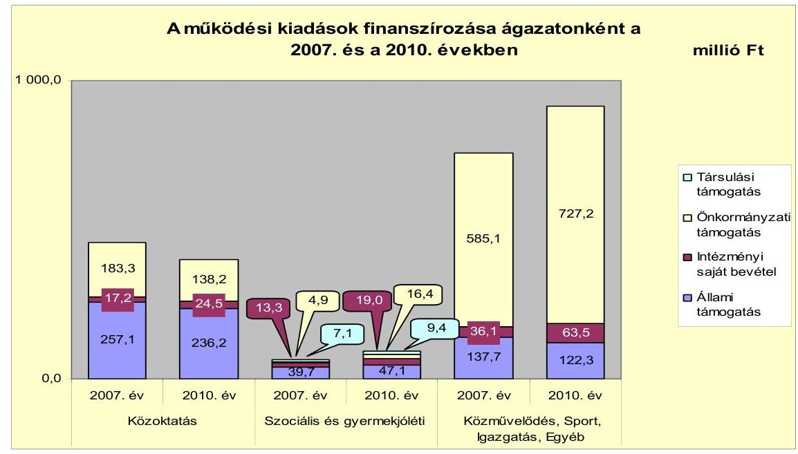

Az állami támogatások a 2007. évről a 2010. évre összesen 28,9 millió Ft-tal (6,7%-kal) csökkentek. A közoktatás területén 20,9 millió Ft-os (8,1%-os), a közművelődési, igazgatási és egyéb feladatokhoz kapcsolódóan 15,4 millió Ft-os (11,2%-os) csökkenés következett be, amely a növekvő működési kiadások mellett az intézményi saját bevételek növelését és az önkormányzati források fokozottabb bevonását tette szükségessé.

Az Önkormányzat folyó költségvetésének egyenlege, a működési jövedelem 2007-2010 közötti időszakban pozitív volt, a folyó bevételek a kötelező és az önként vállalt feladatok folyó kiadásaira minden évben fedezetet nyújtottak. A 2007-2010 között összesen 219,5 millió Ft működési jövedelem keletkezett, amely forrásul szolgált a 2007-2010 között teljesített 147,7 millió Ft tőketörlesztésre. Az Önkormányzat az ÖNHIKI támogatással pozitív működési jövedelmet ért el az ellenőrzött időszakban (ÖNHIKI támogatás nélkül a 2007. évben 68,9 millió Ft, a 2008. évben -97,8 millió Ft, a 2009. évben -56,0 millió Ft és a 2010. évben -18,9 millió Ft működési jövedelem realizálódott volna). A nettó működési jövedelem a 2008. évben negatív volt (-7,3 millió Ft), amely a működési jövedelem 24,1 millió Ft-os, 42,3%-os visszaesése, illetve a hiteltörlesztés előző évhez képest 20,9 millió Ft-ról 40,2 millió Ft-ra történő növekedése hatására következett be.

---

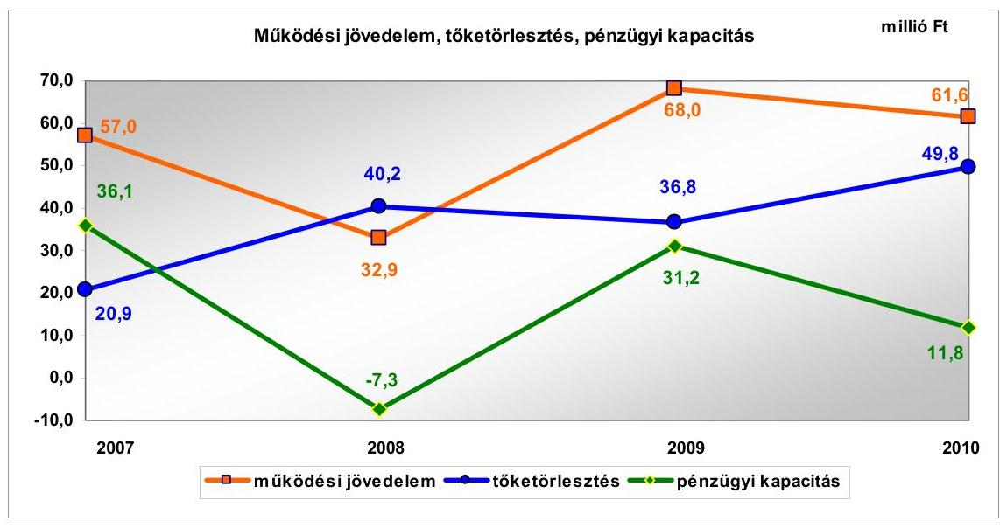

A felhalmozási költségvetés egyenlege minden évben negatív előjelű volt. A 2007-2010 között keletkezett összesen 217,8 millió Ft felhalmozási hiány finanszírozására részben fedezetül szolgált a képződött összes 71,8 millió Ft nettó működési jövedelem. A hiányzó 146,0 millió Ft-ot külső forrás igénybevételével biztosították. A 2007-2010. években összesen 184,4 millió Ft hitel felvételére került sor. A finanszírozási műveletek egyenlege - a 2008. évet kivéve - pozitív volt (a 2007. évben 1,6 millió Ft, a 2009. évben 65,6 millió Ft, míg a 2010. évben 2,9 millió Ft), amely azt jelenti, hogy a tőketörlesztést meghaladó mértékű külső forrásbevonás vált szükségessé. Az Önkormányzat pénzmaradványa a kisebbségi önkormányzat és a Társulások pénzeszközeihez kapcsolódott. Az Önkormányzatnak ezért a hiány finanszírozására belső forrás nem állt rendelkezésre.

A pénzügyi helyzet alakulását befolyásolta az Önkormányzat ellenőrzési időszakban végrehajtott fejlesztési tevékenysége. A 2010. december 31-ig befejezett 220,7 millió Ft értékű fejlesztések forrása a saját bevétel, a hazai- és európai uniós támogatások mellett 37,4 millió Ft (16,9%) hitelfelvétel volt. A 2010. december 31-én folyamatban lévő fejlesztési feladatok végrehajtására a 2007-2010. évek között 231,3 millió Ft kiadást teljesítettek, amelyből 27,5 millió Ft saját forrás, 203,8 millió Ft európai uniós támogatás volt, valamint az Önkormányzat a 2009. évben egy beruházás megvalósításához - pályázaton elnyert támogatás átmeneti megelőlegezéséhez - 46,4 millió Ft rövid lejáratú hitelt hívott le.

Az Önkormányzat számára a folyamatban lévő felhalmozási feladatok megvalósítása - a Polgármesteri hivatal adatszolgáltatása alapján - 688,8 millió Ft kötelezettséget jelent a 2010. év után, amelyből a hitellel finanszírozott rész 50,0 millió Ft. A felhalmozási kiadások befejezéséhez 607,6 millió Ft hazai és európai uniós támogatással, továbbá 31,2 millió Ft saját bevétellel számoltak. Az Önkormányzatnak 2011. június 30-án nincs elbírálás alatt lévő európai uniós pályázati forrásból megvalósítandó projektje.

Az Önkormányzat mérlegében kimutatott összes kötelezettség a 2007. évi 67,1 millió Ft-os és a 2008. évi 67,7 millió Ft-os stagnálást követően 2009-

ben 36,4 millió Ft-tal (53,8%-kal), 2010-ben 26,9 millió Ft-tal (25,8%-kal) nőtt az előző évhez képest. Hosszú lejáratú kötelezettség 2009-ben 13,2 millió Ft és 2010-ben 9,7 millió Ft összegben szerepelt a beszámolóban. A rövid lejáratú kötelezettségek 2010. év végi állománya 121,4 millió Ft volt, ebből a pénzintézeti adósság 76,8 millió Ft, részaránya 63,3%. A szállítói tartozásállomány (39,7 millió Ft) a 2010. évben a rövid lejáratú kötelezettségek 32,7%-át tette ki.

Az Önkormányzat az Áhsz-ben foglalt rendelkezések ellenére a lizingszerződésből származó kötelezettség állományi értékét a rövid lejáratú kötelezettségek között, a szállítókkal szemben fennálló kötelezettséget az egyéb rövid lejáratú kötelezettségek között szerepeltette. A jegyző a 2007-2010. években a Számv. tv., valamint az Áhsz. előírásait figyelmen kívül hagyva a devizában fennálló lizingszerződésből adódó kötelezettsége mérlegforduló-napi értékelése kapcsán elmulasztotta a számviteli politikájában szabályozni a jelentős árfolyamkülönbözet mértékét, továbbá az árfolyamveszteség miatti átértékelést nem végezték el.

Az Önkormányzat pénzügyi helyzete a fizetőképesség szempontjából 2007-2010 között kedvezőtlenül alakult, a rövid lejáratú kötelezettségek fedezetét jelentő készpénz és egyéb likvid forgóeszközök együttes összege egyik évben sem érte el a rövid lejáratú kötelezettségek értékét. Az Önkormányzat likviditási helyzetének 2009. évet követő kedvezőtlen változását jelzi, hogy a folyószámlahitel év végi állománya 2007-ben 26,5 millió Ft, 2008-ban 27,4 millió Ft, 2009-ben 27,5 millió Ft volt, ami a 2010. év végére a munkabérhitellel együtt 72,4 millió Ft-ra nőtt. Ezen hitelek már nem csupán átmeneti fizetési problémák kezelésére szolgáltak, hanem a költségvetési hiány tartós finanszírozási forrásává váltak.

A likviditás biztosítása érdekében felvett hitelek kamatai az Önkormányzatnak 2007-2010. évek között és a 2011. év I. félévében összesen 28,4 millió Ft kiadást okoztak. A likviditási célú hitelek igénybevétele ellenére az Önkormányzat 2011. év I. félév végi lejárt szállítói tartozása 109,1 millió Ft, amelyből 60 napon túli 78,0 millió Ft volt.

A folyószámla- és a munkabér-megelőlegezési hitelek igénybevétele a 2007-2010. években és a 2011. év I. félévében az alábbiak szerint alakult:

| Megnevezés | 2007. év | 2008. év | 2009. év | 2010. év | 2011. év I.   félév |
| :--: | :--: | :--: | :--: | :--: | :--: |
| Folyószámlahitel |  |  |  |  |  |
| Keretösszeg január 1-jén (millió Ft-ban) | 35,0 | 35,0 | 35,0 | 35,0 | 45,0 |
| Átlagos napi állomány (millió Ft-ban) | 21,2 | 19,5 | 10,7 | 13,3 | 23,7 |
| Folyószámla hitellel zárt napok száma (nap) | 246 | 239 | 195 | 201 | 117 |
| Egyenleg (állomány) | 26,5 | 27,4 | 27,5 | 32,9 | 23,7 |
| Munkabér-megelőlegezési hitel |  |  |  |  |  |
| Keretösszeg január 1-jén (millió Ft-ban) | 40,0 | 45,0 | 45,0 | 52,0 | 52,0 |
| Átlagos napi állomány (millió Ft-ban) | 35,2 | 41,5 | 42,2 | 45,5 | 48,6 |
| Munkabér-megelőlegezési hitellel zárt napok szám | 340 | 341 | 341 | 340 | 170 |
| Egyenleg (állomány) | 0,0 | 0,0 | 0,0 | 39,5 | 48,5 |

---

Az Önkormányzat 2010. december 31-én és 2011. június 30-án fennálló kötelezettségeinek állományát, a 2011-2013 között és a 2013. év után várható kötelezettségek számszerűsített adatait a következő táblázat tartalmazza:

Az Önkormányzat kötelezettségeinek állománya 2010. december 31-én és 2011. június 30-án, valamint várható alakulása a kötelezettségek lejáratáig

| Az Önkormányzat kötelezettségeinek állománya 2010. december 31-én és várható alakulása a kötelezettségek lejáratáig | Állomány 2010. dec. 31 én |  |  | Állomány 2011. jún. 30-án |  |  | Várható kötelezettség* 2011-2013. években |  |  | Várható kötelezettség* 2014. évtől |  |
| :--: | :--: | :--: | :--: | :--: | :--: | :--: | :--: | :--: | :--: | :--: | :--: |
|  | HUF-ban   (millió Ft-   ban) | Deviza   önszeg ezer   CHF | Deviza   név | HUF-ban   (millió Ft-   ban) | Deviza   önszeg   ezer CHF | Deviza   név | HUF-ban   (millió Ft-   ban) | Deviza   önszeg ezer   CHF | HUF-ban   (millió Ft-   ban) |  | Deviza   önszeg ezer   CHF |
| Pénzintézeti kötelezettségek |  |  |  |  |  |  |  |  |  |  |  |
| Hosszú lejáratú hitelek | 1,4 | 9,2 | CHF | 0,5 | 6,1 | CHF | 1,6 |  | 9,9 | 0,0 |  |
| Hosszú lejáratú hitelek | 14,1 |  | HUF | 11,8 |  | HUF | 18,7 |  |  | 20,9 |  |
| Kártérítés | 0,0 |  |  | 0,0 |  |  | 0,0 |  |  | 0,0 |  |
| Folyószámlahitel | 32,9 |  | HUF | 23,7 |  | HUF | 32,9 |  |  | 32,9 |  |
| Munkabér megelőlegezési hitel | 39,5 |  | HUF | 48,5 |  | HUF | 39,5 |  |  | 39,5 |  |
| Egyéb likvid forgóeszközök | 0,0 |  |  | 0,0 |  |  | 0,0 |  |  | 0,0 |  |
| Pénzintézeti kötelezettségek összesen HUF-ban | 86,5 |  | HUF | 106,0 |  | HUF | 131,1 |  |  | 93,3 |  |
| Pénzintézeti kötelezettségek összesen CHF-ben | 1,4 | 9,2 | CHF | 0,5 | 6,1 | CHF | 1,6 |  | 9,9 | 0,0 | 0,0 |
| Pénzintézeti kötelezettségek összesen EUR-ban | 0,0 |  |  | 0,0 |  |  | 0,0 |  |  | 0,0 |  |
| Biztosítékok |  |  |  |  |  |  |  |  |  |  |  |
| Gazdasági | 0,0 |  |  | 0,0 |  |  | 0,0 |  |  | 0,0 |  |
| Kezesség | 24,0 |  |  | 24,0 |  |  |

 0,0 |  |  | 0,0 |  |
| Biztosítékok összesen: | 24,0 |  |  | 24,0 |  |  | 0,0 |  |  | 0,0 |  |
| Szállítói tartozás | 39,7 |  |  | 109,1 |  |  | 39,7 |  |  |  |  |
| Egyéb kötelezettségek | 4,9 |  |  | 4,9 |  |  | 4,9 |  |  |  |  |
| FFF beruházási kötelezettségek | 0,0 |  |  | 0,0 |  |  |  |  |  |  |  |
| Egyéb kiadás elmaradás |  |  |  |  |  |  |  |  |  |  |  |
| GT-k és egyéb szervek felé fennálló kötelezettségek |  |  |  |  |  |  |  |  |  |  |  |

* A várható kötelezettség tartalmazza a kamatot és az egyéb költséget is.

Az Önkormányzat pénzintézetekkel szemben fennálló kötelezettsége a 2011. év I. félév végén 106,5 millió Ft volt. A fenti állomány, illetve a 2011. év III. negyedévben felvett további 25,0 millió Ft hitel várható kötelezettsége (tőke, kamat és egyéb költség) a legutóbbi kamatfizetés feltételei alapján a 2011-2013. években összesen 132,7 millió Ft. Az Önkormányzatnak a 2011. év I. félév végén fennálló szállítói tartozások és egyéb kötelezettségek rendezése 114,0 millió Ft várható kiadást jelent a 2011-2013. években.

A 2011-2013. évi kötelezettségek visszafizetésének konkrét forrása nem nevesített. A jövőbeni kötelezettségek fedezetéül számításba vett helyi adóbevételi többlet nem megalapozott, a fedezetül megjelölt, jelzáloggal nem terhelt forgalomképes ingatlanvagyon értékesítéséből tervezett bevétel bizonytalan. A 2010. év végi forgalomképes 94,1 millió Ft könyv szerinti nettó értékű ingatlanvagyonból azonban jelzáloggal terhelt 21,5 millió Ft értékű vagyon. A 2014. évet követően esedékes - 2011. év június 30-án ismert - pénzintézeti kötelezettségből származó kiadás 93,3 millió Ft. Ezen kötelezettségek teljesítésének forrásai bizonytalanok, a 2011. június 30-ig végrehajtott kiadáscsökkentő intézkedések mellett további megtakarítást nem tud elérni, a finanszírozási feszültséget a fejlesztési kiadások visszafogott teljesítése mérsékelheti. Az egyéb passzív pénzügyi elszámolások nélküli összes rövid és hosszú lejáratú kötelezettség összes forráson belüli aránya a 2007. és a 2008. évben is 6,1% volt, melynek a 2009. évben 8,3%-ra, majd a 2010. évben 9,2%-ra történt emelkedése is jelzi, hogy a fizetési kötelezettségek nagyobb arányban emelkedtek, mint az összes forrás. Kedvezőtlenül befolyásolhatja az Önkormányzat pénzügyi helyzetét saját kötelezettségeinek növekedése mellett a Nonprofit Kft. 2011. június 30-án fennálló 54,6 millió Ft kötelezettségállománya és a 24,0 millió Ft hiteléhez nyújtott készfizető kezesség esetleges csőd, vagy felszámolási eljárás esetén az Önkormányzatot terheli, illetve a bíróság korlátlan és teljes felelősséget állapíthat meg az Önkormányzat terhére.

Az Önkormányzat adósságkezelési tevékenysége nem volt eredményes, mert bár a költségvetési egyensúly javítása céljából tett intézkedések az Önkormányzat kimutatása szerint 2007-2010 között mindössze 21,0 millió Ft kiadási megtakarítást és 36,5 millió Ft bevételnövekedést eredményeztek, amelyek a hosszú távú pénzügyi egyensúly megteremtéséhez nem voltak elégségesek. A likviditási célú hitelek igénybevétele ellenére az Önkormányzat 2011. év I. félév végi lejárt szállítói tartozása 109,1 millió Ft, amelyből 90 napon túli 55,0 millió Ft volt. Az Önkormányzat a fizetőképességi és eladósodási problémáit kezelő stratégiával nem rendelkezett, nem hoztak intézkedéseket a pénzügyi egyensúly és a fizetőképesség folyamatos és hosszú távú biztosítása érdekében. A rövid távú likviditás kezelése érdekében a költségvetési kiadások esedékesség szerinti teljesítéséhez szükséges finanszírozási igény biztosítására a jegyző nem készített a pénzállomány alakulásáról likviditási tervet az Ámr.-ben foglaltak ellenére. A döntéshozatal előtt a Képviselő-testület részére a visszafizetés jövőbeni forrásait - egy támogatásmegelőlegezési hitel kivételével - nem mutatták be. A döntések megalapozása érdekében a hitelfelvételeket megelőzően nem kértek több pénzintézettől ajánlatot. Nem vizsgálták a kezességvállalás kockázatait. Az adósságot keletkeztető kötelezettségvállalásból származó bevételből megvalósított fejlesztések kiadásainak megtérülésére vonatkozó számításokat, értékeléseket nem készítettek. Az Önkormányzat adósságot keletkeztető kötelezettségvállalásai felső határát az Ötv.-ben foglaltak ellenére a döntés meghozatala előtt nem vizsgálták, de annak túllépésére nem került sor. A 2011. évben az éven túli hitelfelvételről szóló döntést megelőzően az Ötv.-ben foglaltakkal ellentétben a Képviselő-testület nem bízott meg könyvvizsgálót, így a könyvvizsgáló előzetes szakmai véleményét - annak hiánya miatt - a döntést megelőzően nem ismerte sem a Képviselő-testület, sem a pénzügyi szolgáltatást nyújtó pénzintézet.

Az Önkormányzat gazdasági társasága folyószámlahiteléhez és fejlesztési hiteléhez kapcsolódóan a fedezetként megjelölt telephely az Önkormányzat korlátozottan forgalomképes törzsvagyon körébe tartozott, mely ellentétes volt az Ötv.-ben foglaltakkal.

Az Önkormányzat pénzügyi helyzetét összegezve a következők emelhetők ki:

Az Önkormányzat pénzügyi egyensúlya rövid távon veszélyeztetett. A pénzügyi egyensúlyi helyzet szempontjából kockázatot jelent, hogy a szállítói tartozás, valamint a folyószámla- és a munkabér-megelőlegezési hitel együttes állománya folyamatosan növekvő tendenciát mutatott. A folyószámla- és a munka-bér-megelőlegezési hitel a vizsgált időszak során tartóssá vált. Az Önkormány-

zat nem rendelkezik fizetőképességének és eladósodásának kezelését szolgáló stratégiával, valamint likviditási tervvel.

Az Önkormányzatnál a 2007-2010. években a pozitív működési jövedelemhez mindegyik évben hozzájárult az ÖNHIKI támogatás. A jövőbeni kötelezettségek fedezetéül számításba vett helyi adóbevételi többlet nem megalapozott, a fedezetül megjelölt, jelzáloggal nem terhelt forgalomképes ingatlanvagyon értékesítéséből tervezett bevétel bizonytalan. A döntési hatáskörrel rendelkezőket nem tájékoztatták rendszeresen a kötelezettségvállalásokkal kapcsolatos kockázatokról. A folyamatban lévő fejlesztési feladatok miatt a 2010 utáni időszakra vállalt kötelezettségből a saját forrásrész fedezetéről nem rendelkeztek.

Az Önkormányzat kizárólagos tulajdonában álló Nonprofit Kft. 2011. június 30-án fennálló pénzintézeti és egyéb kötelezettsége, valamint hitelfelvételéhez vállalt kezesség további kockázatot jelent az Önkormányzat számára. A Nonprofit Kft. tartósan veszteséges volt. Az összes bevételén belül a működéshez átvett önkormányzati pénzeszköz aránya a 2009. évben 56,0%, a 2010. évben 67,0% volt.

# A belső kontrollok működése a vagyongazdálkodás folyamataiban 

Az Önkormányzat vagyona a 2007-2010. évek közötti időszakban 278,9 millió Ft-tal, 28,6%-kal növekedett. A vagyonérték növekedésének forrását a működési célú bevételi többlet felhalmozási célra történő fordításával, valamint a hitelállomány növelésével biztosították. A Képviselő-testület a 2007-2010. években nem hozott olyan, a közfeladat ellátásának módját érintő, illetve a közfeladat-ellátás szervezeti formáját érintő döntést, amely az Önkormányzat vagyonában csökkenést eredményezett. Az Önkormányzat nem értékelte, hogy az egyes vagyonelemek növekedése, illetve csökkenése milyen tényezők hatására következett be. Nem vizsgálták, nem számszerűsítették a központi jogszabályi változások önkormányzati vagyon alakulására gyakorolt hatását, a Képviselő-testület számára ilyen tartalmú előterjesztés, tájékoztatás nem készült.

Az Önkormányzat a 2007-2010. években a fejlesztési kiadások fedezetének biztosítására 83,8 millió Ft beruházási, felhalmozási célú hitelt vett fel. A beruházási célú hitelek kamataira kifizetett összesen 4,0 millió Ft csökkentette a pénzeszközök állományát. A kötelező közfeladat-ellátásnál szervezeti változás nem volt. Az üzemeltetésre, kezelésre átadott eszközök 2010. évi 128,7 millió Ftos állománya 32,9 millió Ft-tal volt kevesebb, mint 2007-ben, melynek alapvető oka a Szatmári Regionális Hulladék-gazdálkodási Társulás tevékenységének megszűnése volt.

Az Önkormányzat 2009-ben önként vállalt feladat ellátását szolgáló földterületet, és egy kötelező feladat ellátását szolgáló önkormányzati lakást értékesített. Az értékesített ingatlanok nyilvántartás szerinti értéke 1,2 millió Ft volt, amely az összes ingatlan értékének 0,1%-át tette ki. Az Önkormányzat 2007-2010. évi költségvetési rendeleteiben olyan felújítási, fejlesztési feladatokról döntött, amelyek megvalósítása az ellenőrzött időszak alatt a befektetett eszközöknél 502,6 millió Ft emelkedést okozott. A 2007-2010 között elszámolt összes felújítási értéke 23,2 millió Ft, amely 14,7%-a az időszakban elszámolt 157,6 millió Ft értékcsökkenésnek. A Képviselő-testület részére a zárszámadási rendelet előterjesztése során nem mutatták be az elszámolt értékcsökkenés, az eszközpótlásra fordított kiadások és az eszközök használhatósági fokának alakulását.

A vagyongazdálkodási folyamatok szabályozottságának hiányosságai magas kockázatot jelentettek a feladatok szabályszerű végrehajtásában. A jegyző az Áht.-ban és az Ámr.-ben foglaltak ellenére nem alakította ki a vagyongazdálkodási célok eléréséhez szükséges kontrollkörnyezetet. Az Ámr.-ben előírtak ellenére nem készítette el az etikus magatartással kapcsolatos elvárások meghatározását tartalmazó etikai kódexet, továbbá az Ötv.-ben foglaltak érvényesülése érdekében nem kezdeményezte az eszközök forgalomképességének megváltoztatására vonatkozó előírások meghatározását. Nem írta elő az Önkormányzat érdekeinek védelmét szolgáló garanciális elemek szerződésben, egyéb dokumentumban való rögzítésének kötelezettségét. A kockázatkezelés rendje keretében a jegyző az Ámr.-ben, és a Belső Kontroll Kézikönyvben előírtak ellenére nem határozta meg a csalás és a korrupció kockázatának minősítését. Nem kezdeményezte az Ámr.-ben foglaltak ellenére a 2010. évi és a 2011. évi ellenőrzési tervben a vagyongazdálkodáshoz kapcsolódó magas kockázatúnak értékelt készletgazdálkodási, vagyonvédelmi területek ellenőrzését és a vagyongazdálkodás főfolyamatára a kockázatokkal kapcsolatos intézkedéseket.

A jegyző az Áht.-ban és az Ámr.-ben foglaltak ellenére nem kezdeményezte a vagyon értékesítésével és hasznosításával kapcsolatban a döntés előkészítés folyamatában a költség-haszonelemzés készítésének kötelezettségét, továbbá a vagyongazdálkodási rendelet módosítását, hogy az tartalmazza a hasznosításra szánt vagyon értéke megállapítása céljából értékbecslés készítésének kötelezettséget. A finanszírozási célú pénzügyi műveletekkel kapcsolatban a jegyző nem szabályozta a pénzügyi kockázatok felmérésének kötelezettségét, a hitelfelvétel döntés-előkészítésének folyamatában a futamidő egyes éveit terhelő kötelezettség költségvetési egyensúlyra gyakorolt hatásának vizsgálati kötelezettségét. A jegyző nem dolgozta ki a Pénzügyi bizottság hitelfelvétel indokaira és gazdasági megalapozottságára vonatkozó vizsgálatának eljárását, és nem rögzítette a vagyongazdálkodási feladatokat ellátók munkaköri leírásaiban a beszámolási kötelezettséget, továbbá a kapcsolattartás módját. A jegyző nem határozta meg annak ellenőrzési kötelezettségét, hogy a bevételeket megalapozó szerződés tartalmazza-e a döntési hatáskörrel rendelkező által meghatározott feltételeket, a szerződésben az arra hatáskörrel rendelkező vállalt-e kötelezettséget. Nem alakította ki a vagyongazdálkodás külső és belső információi kezelésének rendjét, a monitoring stratégiát, a szabálytalanságok kezelésére vonatkozó eljárásrendben nem határozta meg a kivizsgálásáról készült jegyzőkönyv tartalmi követelményeit, nem határozta meg a vagyongazdálkodással összefüggő közérdekű adatok kezelésének rendjét, nem írta elő a belső kontrollrendszer évenkénti felülvizsgálatát az Ámr.-ben foglaltak ellenére.

A Polgármesteri hivatalban 2010-ben és 2011. év első félévben a vagyongazdálkodási folyamatokban a kontrollok működése - a kialakított szabályozás ellenére - gyenge volt, a belső kontrollok nem biztosították a vagyongazdálkodás eredményességét. A vagyongazdálkodás folyamatában nem értékelték a külső és belső kockázatokat, nem végezték el az üzemeltetésre átadott eszközök évenkénti leltározását az Áhsz.-ben és a belső szabályzatban foglalt előírás ellenére. A szabályozás hiányossága miatt a vagyonértékesítést, vagyonhasznosítást megelőzően nem készítettek költség-haszonelemzést. A Képviselő-testület számára a finanszírozási célú pénzügyi műveletekkel összefüggésben nem készítettek számításokat a pénzügyi kockázatokról. Nem végezték el a futamidő egyes éveit terhelő kötelezettségvállalás költségvetési egyensúlyra gyakorolt hatásának vizsgálatát. Nem számoltatták be a vagyongazdálkodási feladatokat végzőket a vagyonhasznosítás, a finanszírozási célú pénzügyi
 műveletek végrehajtásának folyamatáról. Nem figyelték meg a vagyongazdálkodási folyamatokat, nem végezték el a belső kontrollrendszer évenkénti felülvizsgálatát az Áht-ban foglaltak ellenére.

A Polgármesteri hivatalban 2010-ben és 2011. év első félévében az ingatlan bérbeadásból származó bevételek, a többségi tulajdonában levő gazdasági társaságok, valamint a nonprofit szervezetek részére nyújtott működési célú pénzeszközátadások, a karbantartási, kisjavítási szolgáltatások, valamint a bérleti és lízingdíjak kiadásai költségvetési súlyának figyelembevétele alapján összefoglalóan értékelve a belső kontrollok működése gyenge volt, a kontrollok nem biztosították a vagyongazdálkodás eredményességét. Az önkormányzati többségi tulajdonban lévő gazdasági társaságok és a nonprofit szervezetek részére nyújtott működési célú pénzeszköz átadással és a bérleti és lízingdíjakkal kapcsolatos kiadások teljesítését megelőzően azok jogosultságának, összegszerűségének ellenőrzését - az Ámr. előírása ellenére - nem végezték el, valamint a fénymásoló bérleti díjával összefüggő kiadások jogosultságának, összegszerűségének szakmai teljesítés igazolását arra nem jogosult személy végezte el. Az utalványok ellenjegyzője nem kifogásolta a szakmai teljesítésigazolás elmaradását, illetve az arra nem jogosult személy által végzett szakmai teljesítésigazolásokat.

# A tulajdonosi felelősség érvényesítésének eredményessége a gazdasági társaságoknál 

Az Önkormányzat 2009. év II. félévétől a 100%-os tulajdonában lévő Nonprofit Kft.-vel látja el a temetkezési, a köztemető- és a közút fenntartási, a köztisztasági, a településtisztasági, a tejbegyűjtési, az iskolabüfé üzemeltetési, a személyszállítási, a hőszolgáltatási, valamint a piac- és vásártér üzemeltetési feladatait. A Nonprofit Kft.-nél a tulajdonosi felelősség érvényesítése nem volt eredményes, mert az Önkormányzat az üzemeltetési feladatok ellátására megkötött szerződésekben - a temetkezési, a köztemető- és a közútfenntartási, a köztisztasági, a településtisztasági, a tejbegyűjtési, az iskolabüfé üzemeltetési, a személyszállítási, valamint a piac- és vásártér üzemeltetési - nem határozta meg a feladatok elvégzésére vonatkozó feladatmutatókat, a mennyiségi és minőségi előírásokat, nem végezte el azok számonkérését. Az Önkormányzatnál nem végeztek szakmai és gazdaságossági számításokat, amelyek igazolták volna a gazdasági társaság közfeladat-ellátása szervezeti formájának célszerűségét, megtakarítás elérését, valamint a közfeladatok szakmai színvonalának emelkedését. A felügyelőbizottságba delegált tagok az Önkormányzat pénz-ügyi-gazdasági helyzetét befolyásoló döntések (hosszú lejáratú hitelfelvételek, fejlesztések) előtt nem kérték ki az Önkormányzat álláspontját, továbbá nem számoltak be a Képviselő-testületnek a tevékenységükről.

---

A Képviselő-testület a feladatok átadásáról a Nonprofit Kft. részére - a hőszolgáltatás kivételével - nem kidolgozott alternatívák, szakmai-gazdasági számítások alapján döntött. A Képviselő-testület nem írta elő a feladatellátás szervezeti formájának és kiadásainak rendszeres felülvizsgálatát, valamint a szerződésekben - a közútfenntartási, a köztisztasági, a településtisztasági, a tejbegyűjtési, az iskolabüfé üzemeltetési, a személyszállítási, valamint a piac- és vásártér üzemeltetési feladatok ellátására irányuló - a nem szerződésszerű feladatellátás szankcióit. Az Önkormányzat a Nonprofit Kft. részére 2009. július 1-je és 2011. június 30-a között évente változó mértékű vissza nem térítendő működési célú pénzeszközt adott át. Az Önkormányzat a Nonprofit Kft. 2011. évi (24,0 millió Ft összegű) hosszú lejáratú hitelfelvételéhez készfizető kezességet vállalt, és hozzájárult jelzálogjog bejegyzéséhez tulajdonában lévő ingatlanra és földterületre. A döntést megelőzően a Képviselő-testület nem kapott a kötelezettségek várható alakulását befolyásoló körülmények megítéléséhez szükséges (kamatváltozások, a hitel visszafizetésének kockázatairól) tájékoztatást, így nem vizsgálta a hosszú lejáratú hitelfelvétel és kezességvállalás hatását az Önkormányzat pénzügyi helyzetére, valamint a közfeladat ellátására.

A felügyelőbizottság nem ellenőrizte a Nonprofit Kft. által felvett hosszú lejáratú hitel felvételének indokoltságát, annak az Önkormányzat pénzügyi helyzetére, valamint a feladatellátásra gyakorolt hatását, a visszafizetés feltételeit, a cél szerinti felhasználását. A felvett hitel törlesztésével kapcsolatos kezesség beváltására nem került sor. Az önkormányzati belső ellenőrzés 2009. július 1-je és 2011. június 30-a között a Nonprofit Kft.-nél ellenőrzést nem végzett, nem győződött meg az üzemeltetésre, valamint vagyonkezelésre átadott vagyon leltározásának szabályszerűségéről, a kockázatelemzés a gazdasági társaságra nem terjedt ki. A Képviselő-testület a felügyelőbizottságba delegált tagok részére nem írt elő beszámolási kötelezettséget az általuk végzett tevékenységekről, a Nonprofit Kft. döntéseiről. A Nonprofit Kft. felügyelőbizottsága a Gt. előírásai ellenére nem rendelkezik ügyrenddel, 2007-2011. év I. félévében nem látta el a gazdasági társaság ügyvezetésének ellenőrzését.

# A korábbi ellenőrzés során tett javaslatok hasznosításának utóellenőrzése 

Az ÁSZ az Önkormányzat gazdálkodási rendszerét a 2010. évben ellenőrizte átfogó jelleggel. Az ellenőrzésről készített jelentés 16 szabályszerűségi és 15 célszerűségi javaslatot tartalmazott. A javaslatok realizálása érdekében a felelősöket és határidőket tartalmazó intézkedési terv készült, amelyet a Képviselő-testület jóváhagyott. Az utóellenőrzés során megállapítottuk, hogy az intézkedési tervben foglalt határidőre az ÁSZ által tett 31 javaslatból hét hasznosult, hét részben valósult meg, 16 nem teljesült, egy javaslat a helyszíni ellenőrzés időszakában nem volt aktuális. A szabályszerűségi javaslatokból három realizálódott, hat részben, hét nem hasznosult. A célszerűségi javaslatok közül négyet végrehajtottak, egy részben, kilenc nem hasznosult. Egy célszerűségi javaslat aktualitását veszítette. A szabályszerűségi javaslatok közül az intézkedési tervben foglalt határidőre a jegyző teljesítette az európai uniós forrásokból megvalósuló projektek bevételeinek, kiadásainak a költségvetési rendeletben történő elkülönített bemutatására, a Polgármesteri hivatal gazdasági szervezete ügyrendjének és a szabálytalanságok kezelése eljárásrendjének tartalmára vonatkozó javaslatokat. A jegyző részben teljesítette a stratégiai és az éves belső el-

---

lenőrzési tervek elkészítésére vonatkozó javaslatot, mivel részt vett a 2011. évi belső ellenőrzési terv megalapozását szolgáló kockázatelemzési munkában, írásba foglalt véleményét figyelembe vették a 2011. évi ellenőrzési terv összeállításakor, azonban a Ber.-ben foglaltak ellenére nem gondoskodott a stratégiai terv alapjául szolgáló kockázatelemzés elkészítéséről. A hivatali SzMSz-t kiegészítette a szervezeti egységek engedélyezett létszámával, a belső ellenőrzést végző személy, egység feladataival, utóbbi jogállásának meghatározása azonban a Ber.-ben foglaltak ellenére elmaradt. Továbbá a jegyző az ellenőrzési nyomvonalban nem írta elő, hogy az egyes tevékenységeket részletesen mely belső szabályzatok tartalmazzák, valamint az egyes tevékenységek elvégzését igazoló dokumentumok megnevezését és fellelhetőségi helyét a rendszerben.

A jegyző kiegészítette a kockázatkezelés eljárásrendjét, amely 2010. december 1-je óta tartalmazza a kockázatok azonosítását, kategóriákba sorolását, folyamatgazdáit, azonban az Ámr.-ben foglalt előírásokkal ellentétesen nem szabályozta a válaszintézkedés beépítését a folyamatba, és nem írta elő a kockázati környezet rendszeres felülvizsgálatának kötelezettségét. Gondoskodott az állományba nem tartozók megbízási díjainak kifizetése esetében az Ámr.-ben foglalt előírások érvényesüléséről. Nem intézkedett annak érdekében, hogy a szakmai teljesítés igazolására kijelölt személyek, valamint az utalvány ellenjegyzői a gazdasági társaságok és a nonprofit szervezetek részére történő működési célú pénzeszköz átadások, a bérleti és lízingdíjak kiadásainak teljesítése során a jogszabályi előírások szerint lássák el kontroll tevékenységüket. A jegyző az Ámr.-ben foglalt előírások ellenére nem teljesítette az éves költségvetési beszámolók szöveges indoklásának közzétételére, a költségvetés megalapozását szolgáló helyi rendeletek és a saját bevételek előirányzatai összhangja és az intézményi pénzmaradvány ellenőrzésének előírására vonatkozó javaslatokat. Nem gondoskodott az Ámr.-ben foglalt előírások ellenére a költségvetés tervezéséhez készített intézményi mutatószám felmérés adatai megalapozottságának, az intézmények által az állami támogatásokkal, hozzájárulásokkal történő elszámoláshoz közölt mutatószámok adatai megfelelőségének ellenőrzéséről, nem határozta meg az Áhsz.-ben foglaltakkal szemben a főkönyvi és az analitikus nyilvántartások egyeztetése dokumentálásának módját. Nem intézkedett a Ber.-ben foglaltak ellenére a belső ellenőrzés szervezeti keretének és működési feltételeinek kialakítására tett javaslatok hasznosítása érdekében.

A célszerűségi javaslatok közül a polgármester hasznosította az intézkedési terv készítésére és az ÁSZ részére történő megküldésére vonatkozó javaslatot. A célszerűségi javaslatokból a jegyző hasznosította az önkormányzati szintű európai uniós pályázat-nyilvántartás kötelezettségének és módjának előírására, a munkaköri leírások kiegészítésére vonatkozó javaslatokat. Részben hasznosította a kockázatelemzés területeire vonatkozó javaslatot, mivel a 2011. évi belső ellenőrzési tervet megalapozó kockázatelemzés kiterjedt az európai uniós forrásból megvalósított feladatok és a közbeszerzési eljárások lebonyolítására vonatkozó kockázatok értékelésére, azonban a kockázatelemzés nem terjedt ki többek között a gazdasági társaságok működésére.

A jegyző a célszerűségi javaslatok tekintetében nem intézkedett a pénzügyiszámviteli feladatoknál alkalmazott informatikai rendszer szabályozására és működtetésére vonatkozó javaslatok hasznosítása érdekében, valamint nem intézkedett, hogy az éves tervet megalapozó kockázatelemzés során a magas

---

kockázatúnak értékelt területeket a hatályos kockázatelemzési eljárásrend alapján értékeljék.

Az Állami Számvevőszékről szóló 2011. évi LXVI. törvény 33. § (1) bekezdésében foglaltak értelmében a jelentésben foglalt megállapításokhoz kapcsolódó intézkedési tervet köteles az ellenőrzött szervezet vezetője összeállítani, és azt a jelentés kézhezvételétől számított harminc napon belül az ÁSZ részére megküldeni. Amennyiben az intézkedési tervet határidőben nem küldi meg a szervezet, vagy az továbbra sem elfogadható, az ÁSZ elnöke a hivatkozott törvény 33. § (3) bekezdés a)-b) pontjaiban foglaltakat érvényesítheti.

# Az ellenőrzés intézkedést igénylő megállapításai és javaslatai: 

## a Polgármesternek

1. Az Önkormányzat pénzügyi egyensúlya rövid távon veszélyeztetett. Az Önkormányzatnál a pénzügyi egyensúlyi helyzet szempontjából kockázatot jelent a szállítói tartozás folyamatosan növekvő tendenciája, ezen túl a 2010. évtől a 60 napon túli lejárt tartozás megjelenése. A folyószámla- és a munkabér-megelőlegezési hitel év végi és napi átlagos állománya az ellenőrzött időszak során jelentős mértékben nőtt és tartóssá vált. Az Önkormányzat nem rendelkezik fizetőképességének és eladósodásának kezelését szolgáló stratégiával, valamint likviditási tervvel. A döntési hatáskörrel rendelkezőket nem tájékoztatták rendszeresen a kötelezettségvállalásokkal kapcsolatos kockázatokról, a kötelezettségvállalást megelőzően a visszafizetés konkrét fedezetéről. A folyamatban lévő fejlesztési feladatok 2010 utáni időszakra vállalt kötelezettség saját forrásigényének fedezetéről nem rendelkeztek. A hitel igénybevételével megvalósított beruházások megtérülésére, jövőbeni fenntarthatóságukra vonatkozó számításokat nem végeztek. Az elszámolt értékcsökkenésnek 14,7%-át fordították felújításra. A zárszámadás keretében a Képviselő-testületnek nem mutatták be az elszámolt értékcsökkenés, az eszközpótlásra fordított kiadások és az eszközök használhatósági fokának alakulását. Az Önkormányzat kizárólagos tulajdonában álló Nonprofit Kft. 2011. június 30-án fennálló pénzintézeti és egyéb kötelezettsége, valamint hitelfelvételéhez vállalt kezesség, ingatlanfedezet biztosítása további kockázatot jelent az Önkormányzat számára. A Nonprofit Kft. tartósan veszteséges.

Javaslat
a) Terjesszen a Képviselő-testület elé reorganizációs programot a kedvezőtlen pénzügyi folyamatok megállítására, a pénzügyi helyzet gyors stabilizálására, és hosszú távú fenntarthatóságára, amely tartalmazza:
aa) a kiadások mérséklésére (a kiadási szerkezet áttekintésére), a kiadások folyamatos kontrolljára, a bevételek növelésére vonatkozó intézkedéseket;
ab) az adósságszolgálat szerkezetének áttekintését;
ac) a likviditás menedzselésének racionalizálását;
ad) a megtakarításokból származó források tartalékba helyezésének kötelezettségét;

---

ae) az intézkedések eredményei legalább félévenkénti áttekintésének előírását;
b) Vizsgálja felül teljes körűen a folyamatban lévő beruházásokat, mutassa be a Képviselő-testületnek azok megvalósításának pénzügyi hatásait a finanszírozás forrásainak meghatározásával;
c) Mutassa be a Képviselő-testületnek havonta a fél éven belül esedékes kötelezettségeinek finanszírozási forrásait napra lebontott likviditási tervvel alátámasztottan;
d) Az adósságot keletkeztető kötelezettségvállalásról szóló döntéskor mutassa be a Képviselő-testületnek a jövőben várható - árfolyam-, kamat- és törlesztési - kockázatot. Kezességvállalás, garancia és helytállási kötelezettségvállalásról szóló döntésnél mutassa be a Képviselő-testületnek azok pénzügyi kockázatait;
e) Gondoskodjon, hogy a jövőben az adósságot keletkeztető kötelezettségvállalásokról szóló képviselő-testületi előterjesztések tartalmazzák a visszafizetés forrásait;
f) Mutassa be a Képviselő-testületnek évente a zárszámadási rendelet előterjesztésében az értékcsökkenés összegét, és ezzel összevetve az elhasználódott eszközök pótlására fordított tényleges kiadásokat, az eszközök elhasználódási fokának alakulását;
g)
 Terjesszen intézkedési tervet a Képviselő-testület elé a minősített tulajdonú Nonprofit Kft. pénzügyi helyzetének stabilizálása érdekében;
h) Gondoskodjon az Önkormányzat lejárt szállítói tartozásainak pénzügyi rendezéséről, a szállítói függőség és a jogszabályi következmények elkerülése érdekében.
2. Az Önkormányzat nem értékelte, hogy az egyes vagyonelemek növekedése, illetve csökkenése milyen tényezők hatására következett be. Nem vizsgálták, nem számszerűsítették a központi jogszabályi változások önkormányzati vagyon alakulására kimutatható hatását.

Javaslat
Értékelje az éves zárszámadás keretében a vagyonváltozásra ható tényezőket, ennek során mutassa be a központi jogszabályi változások önkormányzati vagyon alakulására gyakorolt hatását.
3. A Képviselő-testület a feladat átadásáról a Nonprofit Kft. részére nem kidolgozott alternatívák, szakmai-gazdasági számítások alapján döntött. Nem írta elő a feladatellátás szervezeti formájának és kiadásainak rendszeres felülvizsgálatát, és azt nem is végezték el. A szerződésekben nem írták elő a nem szerződésszerű feladatellátás szankcióit.

Javaslat
Intézkedjen, hogy a Képviselő-testület az Önkormányzat tulajdonában lévő gazdasági társaság részére történő feladatellátás átadásáról kidolgozott alternatívák, szakmai-gazdasági számítások alapján döntsön, írja elő a feladatellátás szervezeti formájának és kiadásainak rendszeres felülvizsgálatát, és azt végeztesse el, valamint kezdeményezze a szerződések módosítását a nem szerződésszerű teljesítés esetén alkalmazandó szankciók kiegészítésével.
4. A Nonprofit Kft. felügyelőbizottsága a Gt. 33. § (1) bekezdésének és 34. § (4) bekezdésének előírásai ellenére ügyrenddel nem rendelkezik, a 2007-2011. év I. félév között nem látta el a gazdasági társaság ügyvezetésének ellenőrzését. A felügyelőbizottságba delegált tagok nem számoltak be a Képviselő-testületnek a tevékenységükről.

Javaslat
Kezdeményezze a Gt. 33. § (1) bekezdésében, valamint a 34. § (4) bekezdésében foglaltak érvényesülése érdekében, hogy a Nonprofit Kft. felügyelőbizottsága készítse el ügyrendjét, amely tartalmazza az ügyvezetés ellenőrzésének feladatait és a beszámolási kötelezettséget, továbbá azt terjessze be jóváhagyásra a Képviselőtestületnek. Kezdeményezze, hogy a felügyelőbizottság lássa el a gazdasági társaság ügyvezetésének ellenőrzését, és annak elmaradása esetén a Gt. 24. § (2) és a 36. § (3) bekezdésében foglaltak alapján a felügyelőbizottsági tagok visszahívását.
5. A felügyelőbizottság nem ellenőrizte a Nonprofit Kft. által felvett hosszú lejáratú hitel felvételének indokoltságát, annak az Önkormányzat pénzügyi helyzetére, valamint a feladatellátásra gyakorolt hatását, a visszafizetés feltételeit, a cél szerinti felhasználását.

Javaslat
Kezdeményezze, hogy a felügyelőbizottság ellenőrizze a Nonprofit Kft. által felvett hosszú lejáratú hitel indokoltságát és a visszafizetés feltételeit, a hitelfelvételnek az Önkormányzat pénzügyi helyzetére, valamint a feladatellátásra gyakorolt hatását, cél szerinti felhasználását.
6. Az Önkormányzat az üzemeltetési feladatokra kötött szerződésekben - a hőszolgáltatási szerződést kivéve - nem határozta meg a feladatok elvégzésére vonatkozó feladatmutatókat, a mennyiségi és minőségi előírásokat, nem végezte el az ellátott feladatok mennyiségének és minőségének számonkérését.

Javaslat
Intézkedjen, hogy a szerződésekben határozzák meg a feladatok elvégzésére vonatkozó feladatmutatókat, a mennyiségi és minőségi előírásokat, az Önkormányzat végezze el az ellátott feladatok mennyiségének és minőségének szerződés szerinti számonkérését.
7. Az utóellenőrzés során megállapítottuk, hogy az ÁSZ által tett szabályszerűségi javaslatok közül 6 részben, 7 nem teljesült. Részben teljesültek a belső ellenőrzés kialakítására vonatkozó javaslatok, mivel a Ber. 18. §-ában foglaltak ellenére a belső ellenőrzési vezető nem készítette el a stratégiai terv kockázatelemzését, valamint a Ber. 4. § (2) bekezdésében foglaltakkal ellentétesen elmaradt a belső ellenőrzést végző egység, személy jogállásának meghatározása. Részben teljesült az Ámr. 156. § (2) bekezdésében és a 155. § (3) bekezdésében foglaltak ellenére az ellenőrzési nyomvonal készítésére vonatkozó javaslat, mivel abban nem rögzítették, hogy az egyes tevékenységeket részletesen mely belső szabályzatok tartalmazzák, valamint az egyes tevékenységek elvégzését igazoló dokumentumok megnevezését és fellelési helyét, továbbá az Ámr. 157. § (1)-(4) bekezdéseiben foglaltakkal szemben a kockázatkezelés eljárásrendje nem tartalmazza a válaszintézkedések beépítését és a kockázati környezet felülvizsgálatát. Részben teljesült a gazdálkodási és ellenőrzési jogkörök gyakorlására vonatkozó javaslat, mivel az Ámr. 76. § (3) bekezdésében és az Ámr. 79. § (2) bekezdésében foglaltakkal ellentétesen a kifizetéseket megelőzően a szakmai teljesítésigazoló és az utalvány ellenjegyzője nem látta el feladatát. Nem teljesültek az Ámr. 233. § (1) bekezdésében foglaltak ellenére az éves költségvetési beszámolók szöveges indoklásának közzétételére, az Ámr. 155-156. §-aiban foglaltakkal ellentétesen a költségvetés-tervezés és a zárszámadás-készítés rendjének szabályozására és működtetésére vonatkozó javaslatok. Nem határozták meg az Áhsz. 49. § (3) bekezdésében foglalt előírás ellenére a főkönyvi és az analitikus nyilvántartások egyeztetésének dokumentálási módját, továbbá a jegyző nem intézkedett a Ber. 23. § (1) bekezdésében és a 23. § (3) bekezdésében foglaltak ellenére a belső ellenőrzés szervezeti keretének és működési feltételeinek kialakítására tett javaslatok hasznosítása érdekében.

Javaslat
Intézkedjen az ÁSZ által tett javaslatok részbeni, illetve nem teljesítése okainak és a felelősséggel kapcsolatos körülmények kivizsgálása iránt, és indokolt esetben kezdeményezze a felelősségre vonást.

# a jegyzőnek 

1. Az Önkormányzat adósságot keletkeztető kötelezettségvállalásai felső határát az Ötv. 88. § (2) bekezdésében foglalt előírás ellenére a döntés meghozatala előtt nem vizsgálták.

Javaslat
Intézkedjen arról, hogy az adósságot keletkeztető kötelezettségvállalásokhoz kapcsolódó képviselő-testületi döntéseket megalapozó előterjesztések tartalmazzák a Stabilitási tv. 10. § (3) bekezdésében foglalt előírások (tárgyévi összes fizetési kötelezettség a futamidő végéig egyik évben sem haladhatja meg az adott évi saját bevétel 50%-át) betartását megalapozó számításokat.
2. A jegyző a 2007-2010. években a Számv. tv. 60. § (2) bekezdése, valamint az Áhsz. 33. § (1) bekezdésében foglaltakkal ellentétben a devizában fennálló lizingszerződésből adódó kötelezettségek kapcsán elmulasztotta a számviteli politikában szabályozni a számviteli elszámolás és az értékelés szempontjából jelentős árfolyamkülönbözet mértékét, továbbá a kötelezettségek mérlegforduló-napi értékelése során nem végezték el az árfolyamveszteség miatti átértékelést.

Javaslat
Szabályozza a számviteli politikában a Számv. tv. 60. § (2) bekezdése, valamint az Áhsz. 33. § (1) bekezdésében foglaltakkal összhangban a devizában fennálló eszközök és források értékelésére vonatkozó jelentős árfolyam-különbözet összegét. Gondoskodjon róla, hogy elvégezzék a devizában fennálló kötelezettségek értékelését, és amennyiben az árfolyam-különbözet a jelentős összeget meghaladja, a számviteli nyilvántartásokban történő rögzítését.
3. Az Önkormányzat az Áhsz. 26. § (3) bekezdés a) pontjában foglaltak ellenére a lízingszerződésből származó kötelezettség állományi értékét a rövid lejáratú kötelezettségek között, valamint az Áhsz. 26. § (5) bekezdés c) és d) pontjában foglaltak ellenére a szállítókkal szemben fennálló kötelezettséget az egyéb rövid lejáratú kötelezettségek között szerepeltette.

Javaslat
Az Áhsz. 26. § (3) bekezdés a) pontjában foglaltak alapján gondoskodjon róla, hogy a mérlegben a lízingszerződésből származó kötelezettség állományi értékét az egyéb hosszú lejáratú kötelezettségek, a 26. § (5) bekezdés c) és d) pontjában foglaltak alapján a szállítókkal szembeni kötelezettség a szállítók mérlegsoron szerepeljen.
4. A vagyongazdálkodási rendelet nem tartalmazta az Ötv. 79. § (2) bekezdés b) pontjában foglaltak érvényesülése érdekében az eszközök forgalomképességének megváltoztatására vonatkozó előírásokat. Az Önkormányzat a Nonprofit Kft. folyószámlahiteléhez és fejlesztési hiteléhez az Ötv. 88. § (1) bekezdés b) pontjában foglaltakkal ellentétben korlátozottan forgalomképes törzsvagyon körébe tartozó ingatlant ajánlott fel fedezetként.

Javaslat
Kezdeményezze a vagyongazdálkodási rendelet módosítását az Önkormányzat törzsvagyonának a Vagyon tv. 5. § (2) bekezdés a), b) és c) pontjainak megfelelő besorolása érdekében, továbbá határozza meg az eszközök átminősítése eljárásának szabályait. Gondoskodjon arról, hogy az Önkormányzat kötelezettségeinek fedezeteként 2012. január 1-jét követően a Vagyon tv. 3. § (1) bekezdés 6. pontjában, az 5. § (2) bekezdés c) pontjában és a 6. § (6) bekezdésében foglalt előírás szerinti nemzeti vagyon körébe tartozó, korlátozottan forgalomképes törzsvagyont ne terhelje meg, kivéve, ha arról az Önkormányzat rendeletében a megterhelést megengedően rendelkezik ${ }^{9}$.
5. Az Áht. 121/A. § (1) és (4) bekezdésében, valamint az Ámr. 155. § (1) bekezdésében foglaltak ellenére nem tették teljessé a Polgármesteri hivatal belső kontrollrendszerét. Nem írtak elő az Önkormányzat érdekeinek védelmét szolgáló garanciális elemek szerződésben, egyéb dokumentumban való rögzítésének kötelezettségét. Nem szerepeltették a vagyongazdálkodási feladatokat ellátók munkaköri leírásaiban a beszámolási kötelezettséget, továbbá a kapcsolattartás módját, a köztisztviselőkkel szemben támasztott etikus magatartással kapcsolatos elvárásokat, valamint annak ellenőrzési kötelezettségét, hogy a szerződés megfelelően tartalmazza-e a döntési hatáskörrel rendelkező által meghatározott feltételeket, és a szerződésben az arra hatáskörrel rendelkező vállalt-e kötelezettséget. Nem kezdeményezték, hogy a Képviselő-testület írja elő a vagyonhasznosítás döntés-előkészítés folyamatában a költséghaszonelemzés készítésének kötelezettségét, valamint a vagyongazdálkodási rendelet módosítását az értékbecslés készítésének kötelezettségével. A vagyon hasznosítására vonatkozóan nem szabályozták a versenyeztetés elvégzésének ellenőrzését, továbbá az Önkormányzat érdekeit védő garanciális elemek szerződésben való rögzítésének kötelezettségét. Nem írták elő a finanszírozási célú pénzügyi műveletekkel összefüggésben a pénzügyi kockázatok felmérésének kötelezettségét, a közérdekű adatok közzétételének eljárásrendjét. A jegyző nem határozta meg az Ámr. 157. § (2) bekezdésében foglaltak ellenére a csalás, a korrupció kockázatának minősítését és a vagyongazdálkodás főfolyamatára a kockázatokkal kapcsolatos válaszlépéseket, továbbá nem kezdeményezte az Ámr. 157. § (1) bekezdésében foglaltak ellenére a 2010. évi és a 2011. évi ellenőrzési tervben a vagyongazdálkodáshoz kapcsolódó magas kockázatúnak értékelt készletgazdálkodási, vagyonvédelmi területek ellenőrzését.

Javaslat
Folytassa az új Áht. 69. § (2) bekezdése, valamint az új Ber. 8. § (3)-(4) bekezdéseiben foglaltak alapján a Polgármesteri hivatal belső kontrollrendszerének kialakítását. Határozza meg a kontrolltevékenységeket, ennek keretében építse ki a folyamatba épített előzetes, utólagos, és vezetői ellenőrzést, és biztosítsa a kontrollok előírás szerinti működését. Minősítse a csalás és a korrupció bekövetkeztének kockázatát, valamint határozza meg az új Ber. 7. § (2) bekezdésében foglaltak alapján a vagyongazdálkodás főfolyamatára a kockázatokkal kapcsolatos válaszlépéseket, továbbá gondoskodjon a belső szabályzatok hatályos jogszabályok szerinti aktualizálásáról. Kezdeményezze az új Ber. 7. §-ában foglaltak alapján az éves belső ellenőrzési tervhez készített kockázatelemzésben szereplő magas kockázatúnak értékelt területek ellenőrzését.
6. A jegyző az Ámr. 159-160. §-ában foglaltak ellenére nem alakította ki a vagyongazdálkodás külső és belső információi kezelésének rendjét, a monitoring stratégiát, nem határozta meg a vagyongazdálkodással összefüggő közérdekű adatok kezelésének rendjét, nem írta elő a belső kontrollrendszer évenkénti felülvizsgálatát, a szabálytalanságok kezelésére vonatkozó eljárásrendben a kivizsgálásról készült jegyzőkönyv tartalmi követelményeit.

Javaslat
Alakítsa ki az új Ber. 9. § (1)-(2) bekezdéseiben, valamint az új Ber. 10. §-ban foglaltak szerint a vagyongazdálkodás külső és belső információi kezelésének rendjét, a monitoring stratégiát, határozza meg a vagyongazdálkodással összefüggő közérdekű adatok kezelésének rendjét, írja elő a belső kontrollrendszer évenkénti felülvizsgálatát, valamint a szabálytalanságok kezelésére vonatkozó eljárásrendben a kivizsgálásról készült jegyzőkönyv tartalmi követelményeit.

7. Az önkormányzati többségi tulajdonban lévő gazdasági társaság és a nonprofit szervezetek részére átadott működési célú pénzeszközzel és a bérleti és lízingdíjakkal kapcsolatos

[^0]
[^0]:    ${ }^{9}$ Felhívjuk a figyelmet arra, hogy az ellenőrzéssel érintett időszakot követően, 2012. március 31-én hatályba lépett az egyes közpénzügyi tárgyú törvényeknek az államháztartás önkormányzati alrendszerét érintő módosításáról, és azok más törvényekkel való összhangjának biztosításáról szóló 2012. évi XVII. törvény, amely módosítja az új Áht. 84. § (4) bekezdését. A jogszabály változását a javaslat végrehajtása során figyelembe kell venni.

 kiadások teljesítését megelőzően azok jogosultságának, összegszerűségének ellenőrzését - az Ámr. 76. § (1) bekezdésében foglaltak ellenére - nem végezték el, valamint a fénymásoló bérleti díjával összefüggő kiadások jogosultságának, összegszerűségének szakmai teljesítés igazolását a jegyző kijelölésével nem rendelkező személy látta el. Az utalványok ellenjegyzője az Ámr. 79. § (2) bekezdésében foglaltak ellenére nem kifogásolta a szakmai teljesítésigazolás elmaradását, illetve az arra nem jogosult személy által végzett szakmai teljesítésigazolásokat.

Javaslat
a) Biztosítsa, hogy a kiadások teljesítését megelőzően az Ávr. 57. § (3) bekezdésében foglaltak szerint a szakmai teljesítés igazolását a gazdálkodási szabályzatban előírt módon és formában végezzék el, valamint intézkedjen, hogy a bérleti és lízingdíjak kifizetését megelőzően a szakmai teljesítés igazolását az arra hatáskörrel rendelkező lássa el;
b) Szabályozza, hogy az érvényesítő az Ávr. 58. § (2) bekezdésében előírt ellenőrzési feladatok elvégzését követően az utalványozónak jelezze, ha a gazdálkodásra vonatkozó szabályok megsértését tapasztalja;
c) Kezdeményezze az éves ellenőrzési terv módosítását annak érdekében, hogy az önkormányzati többségi tulajdonban lévő gazdasági társaságok és a nonprofit szervezetek részére átadott működési célú pénzeszközzel, a bérleti és lízingdíjakkal kapcsolatosan a 2007-2011. I. féléve között teljesített kifizetései tekintetében belső ellenőrzés keretében ellenőrizzék, hogy a kijelölt, illetve felhatalmazott személyek - kiemelten az utalványt ellenjegyzők és a szakmai teljesítést igazolók - valamennyi kifizetés esetében végezzék el az előírt ellenőrzési feladataikat.
8. A jegyző nem határozta meg a Pénzügyi bizottság hitelfelvétel indokaira és gazdasági megalapozottságára vonatkozó vizsgálatának eljárását.

Javaslat
Szabályozza a Pénzügyi bizottság hitelfelvétel indokaira és gazdasági megalapozottságára vonatkozó vizsgálatának eljárását.
9. Nem végezték el az üzemeltetésre átadott eszközök évenkénti leltározását az Áhsz. 37. § (4) bekezdésében foglaltak ellenére.

Javaslat
Gondoskodjon az Áhsz. 37. § (4) bekezdésében foglaltak alapján arról, hogy a mérleg alátámasztása érdekében az üzemeltetésre átadott eszközök állományát leltár támassza alá.
10. Az önkormányzati belső ellenőrzés 2009. július 1-je és 2011. június 30-a között a Nonprofit Kft.-nél ellenőrzést nem végzett, így nem győződött meg az üzemeltetésre, valamint vagyonkezelésre átadott vagyon leltározásának szabályszerűségéről, a kockázatelemzés a gazdasági társaságra nem terjedt ki.

---

Javaslat
Intézkedjen, hogy az éves ellenőrzési terv kockázatelemzése terjedjen ki a Nonprofit Kft. működésére is, továbbá a belső ellenőrzés vizsgálja a gazdasági társaság tevékenységét, az üzemeltetésre, kezelésre átadott vagyon leltározásának szabályszerűségét.
11. A jegyző nem gondoskodott az Önkormányzat gazdálkodásának 2010. évi átfogó ellenőrzése során az ÁSZ által részére tett és nem hasznosultnak, valamint részben teljesítettnek minősített, a jelentés 62. oldalától a 67. oldaláig részletezett szabályszerűségi és célszerűségi javaslatok hasznosításáról.

Javaslat
Gondoskodjon a 2010. évi átfogó ellenőrzése során az ÁSZ által részére tett és nem, vagy részben teljesítettnek minősített szabályszerűségi és célszerűségi javaslatok hasznosításáról.

---

# II. RÉSZLETES MEGÁLLAPÍTÁSOK 

## 1. A PÉNZÜGYI EGYENSÚLY, A FIZETŐKÉPESSÉG, A GAZDÁLKODÁS STABILITÁSÁNAK BIZTOSÍTÁSA, AZ ADÓSSÁGKEZELÉS EREDMÉNYESSÉGE

Az Önkormányzat feladatait a Polgármesteri hivatal mellett öt, részben önállóan gazdálkodó (2009-től önállóan működő) költségvetési szerv ${ }^{10}$ kilenc telephelyen látja el. A költségvetési szervek és telephelyeik száma 2007-2010 között nem változott. Az Önkormányzat SzMSz-e alapján az önként vállalt feladatok: bölcsőde fenntartása, alapfokú művészet (zene) oktatás, intézményfenntartó társulás keretében jelzőrendszeres házi segítségnyújtás, egyházi és civil szervezetek támogatása volt. Az Önkormányzat kizárólagos tulajdonában álló Nonprofit Kft. a következő feladatokat látja el: köztemető fenntartás, temetkezési szolgáltatás, közutak fenntartása, köztisztasági, településtisztasági feladatok, tejbegyűjtés, iskolabüfé üzemeltetés, személyszállítás, közintézmények hőszolgáltatása, valamint piac- és vásártér üzemeltetés.

A feladatellátás szervezeti rendszere 2007-2010 között nem változott. Intézményátadásra, illetve átvételére nem került sor. A szociális szolgáltatást igénybe vevők körének változása jelentett volumenében folyamatosan növekvő feladatot.

Az Önkormányzat gesztor szerepéből adódóan a költségvetésben, illetve a beszámoló adatokban két társulás adata is szerepel.

A Szatmári Regionális Hulladék-gazdálkodási Társulás 2007. évtől szerepel a beszámolóban, jelenleg megszűnés alatt áll, mert a pályázati és egyéb forráslehetőségek kedvezőbb igénybevétele miatt a beruházást a megyei önkormányzat társulása valósította meg. Az Ecsedi-láp Víziközmű Beruházási Társulás Nagyecsed és négy környező település szennyvíztisztító és -elvezetési beruházás kivitelezése céljából 2009-ben alakult. A Környezetvédelmi és Vízügyi Minisztérium által megítélt támogatás szerződésének megkötésére 2011. december 31-éig kapott határidőt az Ecsedi-láp Víziközmű Beruházási Társulás.

Az Önkormányzat az éves költségvetési beszámolója szerint a 2010. évben 1747,5 millió Ft költségvetési bevételt ${ }^{11}$ ért el és 1695,9 millió Ft költségvetési kiadást teljesített. A 2010. évben elszámolt költségvetési bevételek 250,5 millió Ft-tal (16,7%-kal), a költségvetési kiadások 188,8 millió Ft-tal (12,5%-kal) haladták meg a 2007-2009. években teljesített költségvetési bevételek, illetve kiadások átlagát. Az összes költségvetési bevétel felhalmozási kiadá-

[^0]
[^0]:    ${ }^{10}$ Dancs Lajos Ének-zene Tagozatos Általános és Zeneiskola, Városi Napközi Otthonos Óvoda, II. Rákóczi Ferenc Művelődési Ház és Könyvtár, Szatmári Kistérségi Bölcsőde, Szatmári Kistérségi Szociális Alapszolgáltatási Központ
    ${ }^{11}$ A költségvetési bevételből 18,1 millió Ft az előző évi pénzmaradvány felhasználásából származó pénzforgalom nélküli bevétel.

---

sokkal csökkentett részének 49,3%-át a saját bevétel biztosította a 2010. évben. A 2011. évi költségvetési rendeletben 1861,8 millió Ft költségvetési bevételt és 2071,4 millió Ft költségvetési kiadást irányoztak elő.

A 2010. évi működési célú költségvetési kiadások, valamint a működési célú költségvetési bevételek és azok finanszírozásának arányait a következő táblázat mutatja be:

| Ellátott feladat | Múködési   kiadás   összesen   (millió Ft) | Kötelezö   feladatok   kiadásainak   részaránya   \% | Múködési   bevétel   összesen   (millió Ft) | Állami   támogatás   részaránya   \% | Intézményi   saját bevétel   részaránya   \% | Önkormányzati   támogatás   részaránya   \% |
| :--: | :--: | :--: | :--: | :--: | :--: | :--: |
| Óvodák | 139,0 | 100,0 | 139,0 | 54,5 | 2,0 | 43,5 |
| Általános iskolák | 259,8 | 96,9 | 259,8 | 61,8 | 8,3 | 29,9 |
| Szociális   intézmények | 91,9 | 62,7 | 91,9 | 51,2 | 20,7 | 28,1 |
| Közmúvelődési   intézmények | 40,3 | 100,0 | 40,3 | 0,0 | 5,7 | 94,3 |
| Polgármesteri hivatal   igazgatási kiadásai | 249,0 | 100,0 | 249,0 | 9,1 | 8,5 | 82,4 |
| Polgármesteri   hivatalban ellátott   egyéb feladatok   működési kiadásai | 623,8 | 95,1 | 623,8 | 16,0 | 6,4 | 77,6 |
| Múködési kiadá-   sok összesen | 1403,8 | 94,8 | 1403,8 | 28,9 | 7,6 | 63,5 |

Az Önkormányzat adatszolgáltatása alapján a - Társulások, helyi kisebbségi önkormányzat és az OEP által finanszírozott feladatok nélküli - 2010. évi működési kiadásaiból 94,8%-ot, 1330,8 millió Ft-ot a kötelező, míg 5,2%-ot, 73,0 millió Ft-ot az önként vállalt feladatok ellátására fordított. A 2011. évi tervadatok alapján az önként vállalt feladatok aránya csökkent, az összes működési kiadásból 59,0 millió Ft-ot (4,3%) tesz ki.

A 2010. évben a kötelező feladatokon belül a legnagyobb kiadást 623,8 millió Ft-ot (46,9%) a Polgármesteri hivatalban ellátott feladatokra, 398,8 millió Ft-ot (30,0%) az oktatási intézmények működtetésére fordították. Az önként vállalt feladatok közül a 2010. évben a legtöbb kiadást, 34,3 millió Ft-ot (47,1%) a bölcsőde és a szociális gondozói szolgáltatás működtetésére és 30,6 millió Ft-ot (42,0%) az egyházi és civil szervezetek támogatására fordították. A kötelező és önként vállalt feladatok finanszírozásához a 2010. évben összesen 405,6 millió Ft állami támogatásban részesült az Önkormányzat. A teljesített kiadásokat az állami támogatáson túl 107,0 millió Ft-ot térítési díj és egyéb saját bevételből, 881,8 millió Ft-ot (62,8%) önkormányzati saját forrásból és 9,4 millió Ft (0,7%) az intézményfenntartó társulásban résztvevő önkormányzatok támogatásából finanszírozták.

Az Önkormányzat pénzügyi helyzetét a CLF módszer szerint meghatározott bevételek és kiadások alapján mutatjuk be a következő táblázatban, amelyet részletesen a jelentés 2. számú melléklete tartalmaz.

---

# CLF módszer szerinti önkormányzati összesen adatok ${ }^{12}$ 

| Megnevezés | 2007. év | 2008. év | 2009. év | millió Ft |
| :--: | :--: | :--: | :--: | :--: |
| Folyó bevételek | 1357,0 | 1439,7 | 1554,7 | 1496,2 |
| Folyó kiadások | 1300,0 | 1406,8 | 1486,7 | 1434,6 |
| Múködési jövedelem | 57,0 | 32,9 | 68,0 | 61,6 |
| Nettó múködési jövedelem = múködési jövedelem - tőketörlesztés | 36,1 | $-7,3$ | 31,2 | 11,8 |
| Felhalmozási bevételek | 9,5 | 22,4 | 106,0 | 233,2 |
| Felhalmozási kiadások | 68,3 | 38,3 | 221,0 | 261,3 |
| Felhalmozási költségvetés egyenlege | $-58,8$ | $-15,9$ | $-115,0$ | $-28,1$ |
| Finanszírozási múveletek nélküli (GFS) pozíció | $-1,8$ | 17,0 | $-47,0$ | 33,5 |
| Finanszírozási múveletek egyenlege | 1,6 | $-16,4$ | 65,6 | 2,9 |
| Tárgyévi pénzügyi pozíció | $-0,2$ | 0,6 | 18,6 | 36,4 |
| Egyéb tájékoztató adatok |  |  |  |  |
| Összes kötelezettség év végi állománya* | 67,1 | 67,7 | 104,2 | 131,1 |
| ebből: rövid lejáratú | 67,1 | 67,7 | 91,0 | 121,4 |
| Összes szállítói kötelezettség év végi állománya | 26,7 | 24,7 | 6,8 | 39,7 |
| ebből: lejárt | 26,7 | 24,7 | 6,8 | 39,7 |
| Pénz- és tőkepiaci kötelezettség (adósság) év végi állománya | 37,5 | 38,4 | 91,4 | 86,5 |
| ebből: rövid lejáratú | 37,5 | 38,4 | 78,3 | 76,8 |
| Folyószámlahitel napi átlagos állománya** | 21,2 | 19,5 | 10,7 | 13,3 |
| Munkabérhitel napi átlagos állománya** | 35,2 | 41,5 | 42,2 | 45,5 |
| Egyéb finanszírozásba vonható összes eszköz év végi állománya | 10,6 | 26,2 | 26,8 | 65,2 |
| ebből: pénzeszközök (idegen pénzeszközök nélkül) | 1,6 | 2,2 | 20,8 | 57,2 |

* A kötelezettségek összegét a passzív pénzügyi elszámolások nélkül vettük figyelembe.
** A folyószámla és munkabér megelőlegezési hitel napi átlagos állományát 365 nappal számoltuk.

[^0]
[^0]:    ${ }^{12}$ A CLF módszer alapján a számításokat az Önkormányzat összevont, nettósított, a MÁK központi információs rendszere részére leadott éves költségvetési beszámolójának 80-as űrlapjában szerepeltetett adatok alapján végeztük. A folyó, illetve a felhalmozási bevételekben nem vettük figyelembe az előző évi pénzmaradvány igénybevételének összegét, amely a 2007. évben: 0,3 millió Ft, a 2008. évben: 0,5 millió Ft, a 2009. évben 0,8 millió Ft és a 2010. évben 18,1 millió Ft volt.

---

Az Önkormányzat folyó bevételeinek és kiadásainak különbsége - az ÖNHIKI támogatásból adódóan - minden évben pozitív előjelű volt. A működési forrástöbblet 2007-ben a folyó bevételek 4,2%-át (57,0 millió Ft), 2008-ban 2,3%-át

 (32,9 millió Ft), 2009-ben 4,4%-át (68,0 millió Ft) és 2010-ben a 4,1%-át (61,6 millió Ft) jelentette ${ }^{13}$. A működési jövedelem 2008. évi visszaesését a folyó kiadások - döntően a kamatkiadás nélküli működési kiadások és transzferkiadások - folyó bevételeket két százalékponttal meghaladó növekedése okozta.

A 2007-2010. években keletkezett, összesen 219,5 millió Ft működési jövedelem az Önkormányzat esedékessé vált tőketörlesztési kötelezettségeihez (147,8 millió Ft) és felhalmozási hiányának (217,8 millió Ft) részbeni finanszírozásához biztosított fedezetet. A folyó bevételeket, folyó kiadásokat és azok egyenlegét a következő ábra szemlélteti:
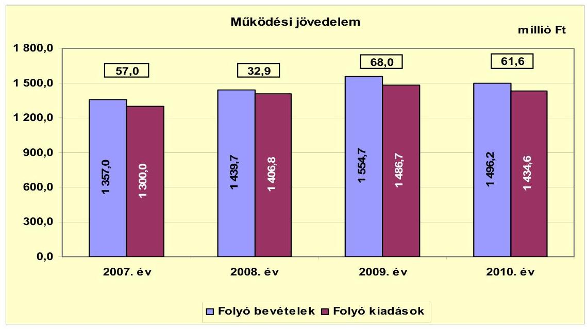

A 2007-2010. években keletkezett pozitív egyenlegű működési jövedelem ellenére az Önkormányzat rendszeresen hitelfelvételre kényszerült, egyrészt az átmeneti likviditási problémák kezelése, másrészt a fejlesztési kiadások finanszírozása miatt. A likvid hitelek állománya a 2010. év végén már 72,4 millió Ft volt.

A 2007-2010 között képződött működési jövedelem csökkenő mértékben bár, de - 2008. év kivételével - fedezetet biztosított az Önkormányzat hiteltörlesztési kötelezettségére.

A pénzügyi kapacitás tendenciája alapvetően a működési jövedelem évenkénti változását követte. A 2007. évről a 2008. évre a működési jövedelem 24,1 millió Ft-tal (42,3%-kal) visszaesett, továbbá a hiteltörlesztés 20,9 millió Ft-ról 40,2 millió Ft-ra növekedett, mely együttesen eredményezte a 2008. évi negatív (-7,3 millió Ft-os) pénzügyi kapacitást.

[^0]
[^0]:    ${ }^{13}$ A Társulások működési jövedelme a 2007. évben -2,3 millió Ft, a 2008. évben -2,0 millió Ft, a 2009. évben 6,7 millió Ft, míg a 2010. évben 0,4 millió Ft volt.

---

A nettó működési jövedelem évenkénti alakulását a következő ábra mutatja:
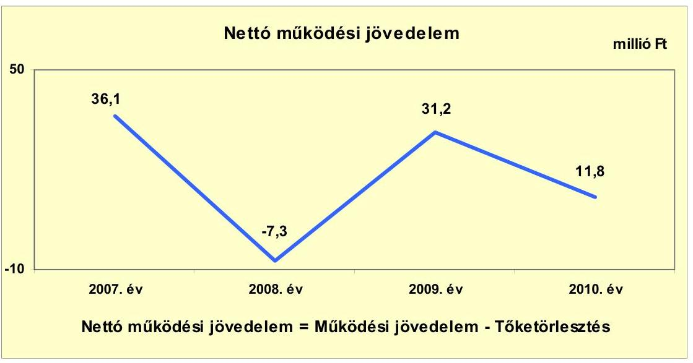

Az Önkormányzat tőketörlesztési kötelezettsége 2007-2010. évek között emelkedett, a 2010. évi jelentős (13,0 millió Ft-os) növekmény egy 2009. évben felvett támogatás előfinanszírozási célú 46,4 millió Ft összegű hitel egyösszegű visszafizetéséből adódott. Az Önkormányzatnak 2007-2008. években hosszú lejáratú hitelszerződése nem volt, a 2009. évben vett fel először 16,0 millió Ft fejlesztési hitelt 15 éves futamidőre. A 2007. évi törlesztési kiadásokból 18,5 millió Ft a 2006. évben felvett (egy éves futamidejű) hiteltartozások végtörlesztése volt. A könyvelt hiteltörlesztési kiadások a 2008. évben 26,5 millió Ft, a 2009. évben 27,4 millió Ft összegben likvidhitel törlesztést tartalmaznak (előző év végi hiteltartozás visszavezetése). Az Önkormányzat nyilatkozata szerint a 2010. év végi 72,4 millió Ft likvidhitel állomány 2011. június 30-án változatlan szinten (72,2 millió Ft) fennmaradt, és a pénzügyi helyzet kedvezőtlen alakulása nem teszi lehetővé a továbbiakban sem a likvidhitel-igénybevétel jelentős mértékű csökkenését.

A tőketörlesztés alakulásának évenkénti összegét a következő ábra szemlélteti:
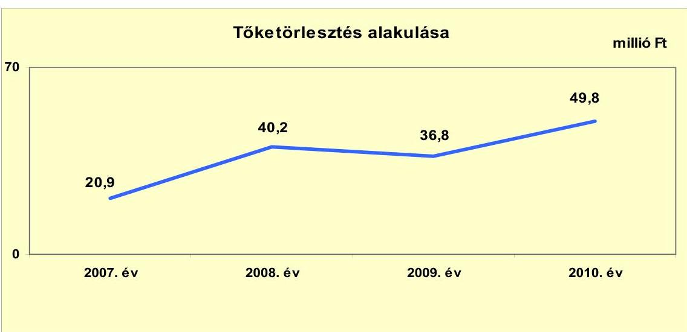

---

Az Önkormányzat mérlegében kimutatott összes kötelezettség a 2007. évi 67,1 millió Ft-os és a 2008. évi 67,7 millió Ft-os stagnálást követően 2009-ben 36,4 millió Ft-tal (53,8%-kal), 2010-ben 26,9 millió Ft-tal (25,8%-kal) nőtt az előző évhez képest. Hosszú lejáratú kötelezettség csupán 2009-ben 13,2 millió Ft és 2010-ben 9,7 millió Ft összegben szerepelt a beszámolóban. A rövid lejáratú kötelezettségek 2010. év végi állománya 121,4 millió Ft volt, ebből a pénz- és tőkepiaci adósság 76,8 millió Ft, részaránya 63,3%. A szállítói tartozásállomány (39,7 millió Ft) a 2010. évben a rövid lejáratú kötelezettségek 32,7%-át tette ki. 2007-2009 között a szállítói tartozásállomány 100%-a 30 nap alatti lejárt tartozás volt. A 2010. évben az összes szállítói tartozásállomány szintén lejárt tartozás volt, viszont a 30 napon túli tartozás (23,5 millió Ft) részaránya 59,3%-ra nőtt a 2009. évhez képest. A likviditási célú hitelek igénybevétele ellenére az Önkormányzat 2011. év I. félév végi lejárt szállítói tartozása már 109,1 millió Ft, amelyből 90 napon túli 55,0 millió Ft volt.

A pályázati lehetőségek eredményes kihasználása révén az Önkormányzat felhalmozási és tőkejellegű kiadásai a 2009. évtől mutatnak jelentős növekedést, melynek évenkénti alakulását - a felhalmozási és tőkejellegű bevételekkel együtt - a következő ábra szemlélteti:
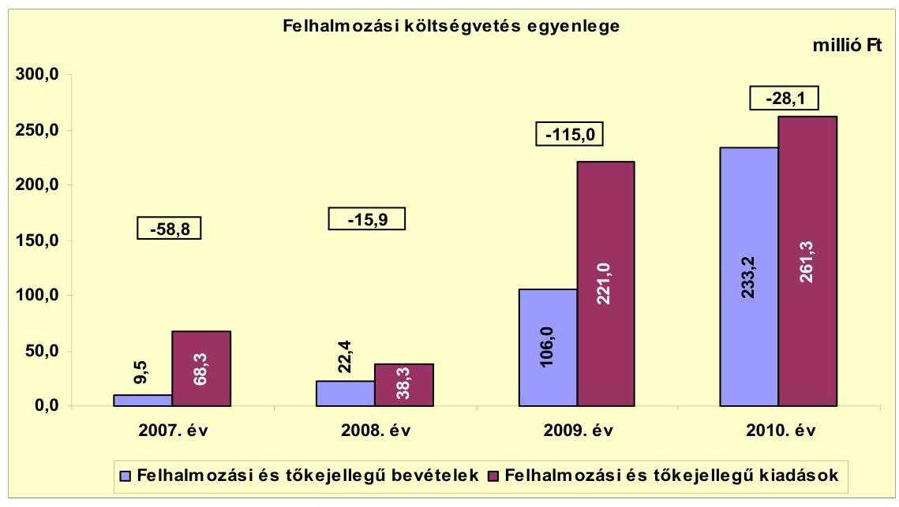

Az Önkormányzat a felhalmozási bevételeket meghaladó mértékű fejlesztési feladatokat finanszírozott, melyhez a rendelkezésre álló tartalék (maradvány) és a 2007. évben és 2009-2010 között képződött nettó működési jövedelem nem nyújtott fedezetet ${ }^{14}$. A pénzügyi egyensúly biztosítása érdekében folyamatosan likvidhitel (folyószámla és munkabérhitel) igénybevételére, illetve egyéb rövid és hosszú lejáratú hitel felvételére volt szükség.

[^0]
[^0]:    ${ }^{14}$ A 2008. évben negatív működési jövedelem keletkezett. Az összevont beszámolóban szereplő pénzmaradvány felhasználás a kisebbségi önkormányzat és a Társulások pénzeszközeihez kapcsolódott. Az Önkormányzatnak a folyamatosan növekvő folyószámlahitele miatt felhasználható pénzmaradványa nem volt.

---

A finanszírozási műveletek egyenlegének évenkénti alakulását a következő ábra mutatja:
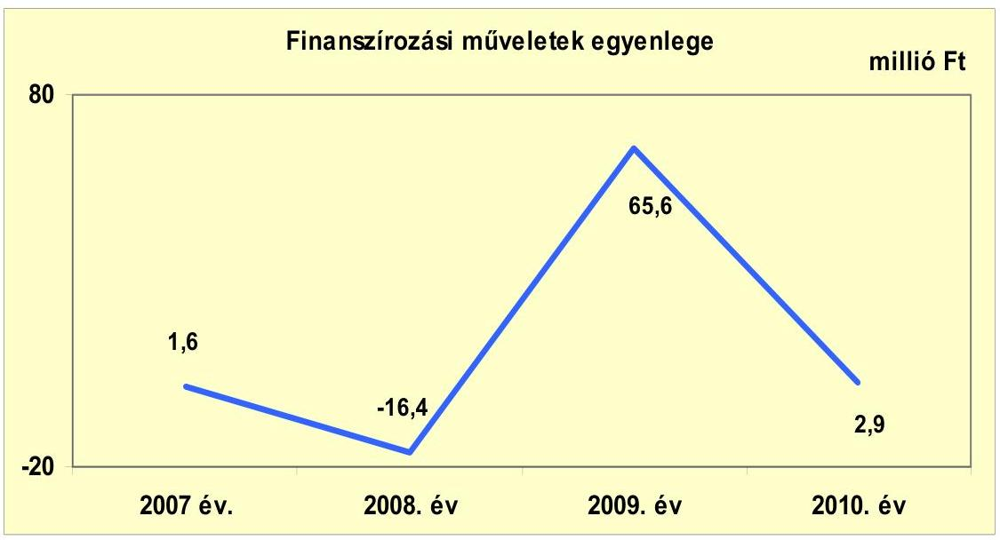

A finanszírozási műveletek egyenlege - amely magában foglalja a hitelfelvételek és törlesztések, valamint a függő, átfutó, kiegyenlítő bevételek és kiadások különbözetét - 2008. évet kivéve pozitív volt, amely azt jelenti, hogy a tőketörlesztést meghaladó mértékű volt a külső forrásbevonás. A 2008. évben a finanszírozási műveletek egyenlege -16,4 millió Ft volt, mivel az Önkormányzat 15,0 millió Ft-ért vásárolt forgatási és befektetési célú értékpapírokat. A 2009. évi kiugró pozitív egyenleg az adott évben felvett (46,4 millió Ft összegű) egy éves futamidejű támogatás-előfinanszírozási hitellel magyarázható.

A Képviselő-testület az Önkormányzat költségvetését 2007-ben 173,7 millió Ft, 2008-ban 249,0 millió Ft, 2009-ben 304,7 millió Ft és a 2010. évben 343,7 millió Ft hiánnyal hagyta jóvá, melyet minden évben ÖNHIKI támogatással és hitelfelvétellel terveztek ellensúlyozni.

Az Önkormányzat pénzügyi egyensúlya a 2007-2010. években kizárólag hitelfelvétellel volt biztosított. A működésben keletkezett forrástöbblet (219,5 millió Ft összesen) egyik évben sem nyújtott fedezetet a felhalmozási költségvetés hiányára (-217,8 millió Ft) és az Önkormányzat tőketörlesztési kötelezettség összegére (147,7 millió Ft). A 2007-2010. években összesen 184,4 millió Ft hitel felvételére került sor. Az Önkormányzat pénzmaradványa ${ }^{15}$ minden évben negatív értéket mutatott, így a hiány finanszírozására, mint belső forrás nem állt rendelkezésre.

[^0]
[^0]:    ${ }^{15}$ A Társulások pénzeszköze miatt a 2009. évben az összevont beszámolóban pozitív a költségvetési pénzmaradvány, de ez az összeg kötött felhasználású, és az önkormányzati költségvetés hiányát nem finanszírozhatja.

---

Az Önkormányzat folyó és felhalmozási bevételeit főbb jogcímenként a következő táblázat tartalmazza:

|  |  |  |  | millió Ft |
| :-- | --: | --: | --: | --: |
| Megnevezés | $\mathbf{2 0 0 7 .}$   év | $\mathbf{2 0 0 8 .}$   év | $\mathbf{2 0 0 9 .}$   év | $\mathbf{2 0 1 0 .}$   év |
| Helyi adók, pótlékok | 34,2 | 29,4 | 42,1 | 37,6 |
| Egyéb saját működési bevétel | 37,0 | 42,7 | 52,2 | 74,4 |
| Gépjárműadó | 17,4 | 20,3 | 21,8 | 23,2 |
| Átengedett szja | 645,3 | 260,6 | 263,8 | 271,2 |
| Költségvetési támogatás | 573,4 | 1006,4 | 1083,2 | 996,7 |
| Átvett pénzeszközök, támogatások | 49,7 | 80,3 | 91,6 | 93,1 |
| Folyó bevételek összesen | $\mathbf{1 3 5 7 , 0}$ | $\mathbf{1 4 3 9 , 7}$ | $\mathbf{1 5 5 4 , 7}$ | $\mathbf{1 4 9 6 , 2}$ |
| Ingatlanértékesítés | 0,3 | 18,0 | 5,7 | 0,0 |
| Egyéb saját felhalmozási bevétel | 1,3 | 0,0 | 26,0 | 0,0 |
| Átvett pénzeszközök, támogatások | 7,9 | 4,4 | 74,3 | 233,2 |
| Felhalmozási bevételek összesen | $\mathbf{9 , 5}$ | $\mathbf{2 2 , 4}$ | $\mathbf{1 0 6 , 0}$ | $\mathbf{2 3 3 , 2}$ |
| KÖLTSÉGVETÉSI BEVÉTEL ÖSSZESEN | $\mathbf{1 3 6 6 , 5}$ | $\mathbf{1 4 6 2 , 1}$ | $\mathbf{1 6 6 0 , 7}$ | $\mathbf{1 7 2 9 , 4}$ |

Az Önkormányzat folyó bevételeinek a 2007-2009. évekre jellemző (évenkénti átlagos 7,1%-os) növekedési tendenciája 2010-ben a költségvetési támogatás - döntően az ÖNHIKI támogatási jogcím - csökkenése miatt megtorpant. A bevételek szerkezete a négy év során érdemben nem változott. A 2010. évi folyó bevételeken belül meghatározó nagyságrendű - 996,7 millió Ft - volt a költségvetési támogatás, mely 66,6%-os részarányt képviselt. Az egyéb saját működési bevételek a 2009. évtől a beruházások miatt fordított áfa és áfa visszatérülésből származó többletbevételek hatására nőttek.

Az Önkormányzatnak tárgyi eszköz értékesítéséből a 2007-2010. években nem származott számottevő bevétele. A felhalmozási célra átvett pénzeszközök az európai uniós projektekhez kapott támogatások miatt a 2008. évről a 2009. évre 69,9 millió Ft-tal, a 2010. évre további 158,9 millió Ft-tal növekedtek.

---

Az Önkormányzat folyó és felhalmozási kiadásait főbb jogcímenként a következő táblázat tartalmazza:

|  |  |  | millió Ft |  |
| :-- | --: | --: | --: | --: |
| Megnevezés | $\mathbf{2 0 0 7 .}$ év | $\mathbf{2 0 0 8 .}$ év | $\mathbf{2 0 0 9 .}$ év | $\mathbf{2 0 1 0 .}$ év |
| Személyi juttatások és járulékok | 654,0 | 680,7 | 732,0 | 744,9 |
| Dologi kiadások | 217,3 | 245,8 | 267,3 | 229,8 |
| Pénzeszközátadás ÁH-on kívülre | 88,9 | 92,5 | 87,0 | 86,8 |
| Társadalom és szociálpol. juttatások | 326,8 | 369,3 | 378,2 | 335,8 |
| Kamatkiadás | 6,4 | 6,3 | 10,2 | 6,3 |
| Egyéb folyó kiadás | 6,6 | 12,2 | 12,0 | 31,0 |
| Folyó kiadások összesen | $\mathbf{1 3 0 0 , 0}$ | $\mathbf{1 4 0 6 , 8}$ | $\mathbf{1 4 8 6 , 7}$ | $\mathbf{1 4 3 4 , 6}$ |
| Beruházási, felújítási kiadások | 68,3 | 38,3 | 208,5 | 252,0 |
| Egyéb felhalmozási kiadások | 0,0 | 0,0 | 12,5 | 9,3 |
| Felhalmozási kiadások összesen | $\mathbf{6 8 , 3}$ | $\mathbf{3 8 , 3}$ | $\mathbf{2 2 1 , 0}$ | $\mathbf{2 6 1 , 3}$ |
| KÖLTSÉGVETÉSI KIADÁS ÖSSZESEN | $\mathbf{1 3 6 8 , 3}$ | $\mathbf{1 4 4 5 , 1}$ | $\mathbf{1 7 0 7 , 7}$ | $\mathbf{1 6 9 5 , 9}$ |

Az Önkormányzat folyó kiadásainak a 2007-2010. évek közötti alakulása a folyó bevételekével azonos irányú, illetve mértékű volt ${ }^{16}$, a 2007-2009. években folyamatosan növekedett, a 2010. évre pedig csökkent. A személyi juttatások és járulékok a közfoglalkoztatás és a szociális gondozói létszám bővülése miatt folyamatosan növekedtek, összegük a 2010. évben 744,9 millió Ft, folyó kiadásokon belüli részarányuk 51,9% volt. A folyó költségvetésben a társadalom és szociálpolitikai juttatások jelentették a második legnagyobb kiadási jogcímet, összegük a 2010. évben 335,8 millió Ft, részarányuk
 23,4% volt.

Az Önkormányzat a 2009-2010. években európai uniós és különféle hazai pályázati források felhasználásával kiemelt beruházási, felújítási projekteket ${ }^{17}$ valósított meg. Az Önkormányzat adatszolgáltatása szerint a befejezett fejlesztésekre fordított 220,7 millió Ft-ot 42,7%-ban (94,2 millió Ft) saját bevételből, 16,9%-ban (37,4 millió Ft) hitelből, 40,4%-ban (89,1 millió Ft) európai uniós és egyéb hazai támogatásból finanszírozták. A 2010. december 31-én folyamatban lévő 231,3 millió Ft értékű projektek forrásösszetétele 27,5 millió Ft (11,9%) saját erő és 203,8 millió Ft (88,1%) európai uniós támogatás volt.

2007-2010 között az Önkormányzat nem bocsátott ki kötvényt, és PPP konstrukcióban sem vett részt. A 2007-2008. években hosszú lejáratú kötelezettség

[^0]
[^0]:    ${ }^{16}$ A folyó kiadások az előző évhez viszonyítva a 2008. évre 106,8 millió Ft-tal, a 2009. évre 79,9 millió Ft-tal, ezzel párhuzamosan a folyó bevételek a 2008. évre 82,7 millió Ft-tal, a 2009. évre pedig 115,0 millió Ft-tal növekedtek. A 2010. évre az előző évhez viszonyítva a folyó kiadások 52,1 millió Ft-tal, a folyó bevételek pedig 58,5 millió Ft-tal csökkentek.
    ${ }^{17}$ városközpont kialakítása, általános iskola rekonstrukció, bölcsőde bővítése, ivóvízminőség-javító program végrehajtása, útépítés

---

nem szerepelt a mérlegben, annak ellenére, hogy a Képviselő-testület 42/2007. (III. 27.) számú határozatában egy személygépkocsi CHF alapú ötéves futamidejű lízingügylettel történő beszerzéséről döntött. A tőketartozás 4,1 millió Ft (27 532,3 CHF), az ügyleti kamat a szerződés szerint 9,44% volt, amelynek változtatási jogát a hitelező fenntartja, az induló THM 11,75%, a törlesztés havi gyakoriságú. A lízingszerződésből származó kötelezettséget az Áhsz. 26. § (3) bekezdés a) pontjában foglalt rendelkezés ellenére a 2007. évben a Polgármesteri hivatalban elmulasztották állományba venni. A beszámoló pénzforgalmi tábláiban a kötelezettséggel kapcsolatos kiadások megjelentek, de az állományi érték csak a 2008. évtől szerepel a könyvviteli nyilvántartásban, azonban az Áhsz. 26. § (3) bekezdés a) pontjával ellentétesen az egyéb hosszú lejáratú kötelezettségek helyett a rövid lejáratú kötelezettségek között. Az Önkormányzatnak a lízingügyleten kívül egyéb devizában fennálló kötelezettsége nincs.

A Képviselő-testület a 2009. évben a városközpont kialakítása és bölcsőde beruházásokhoz szükséges ingatlanvásárlás céljából egy 15 éves futamidejű 16,0 millió Ft-os jelzálogfedezettel biztosított fejlesztési célú hitelfelvételről döntött. A pénzintézettel kötött szerződés szerint a hitelkamat fix 12,0%, amely a tőketartozással együtt havonta törlesztendő. A kezelési költség egyszeri 0,5% volt.

Az Önkormányzat egy hosszú lejáratú kölcsönszerződést kötött a 2011. év I. félévében, amely alapján hároméves futamidőre 22,0 millió Ft-os jelzálogfedezettel biztosított működési célú (fennálló hőszolgáltatási és hődíjtartozások kiegyenlítésére) hitelt vett fel. A hitelkamat 10,0%, az induló THM 10,57%, a törlesztés havonta esedékes.

Az Önkormányzat mérleg szerinti, pénzintézetekkel szemben fennálló hosszú és rövid lejáratú kötelezettségeinek év végi állományi értékeit a következő ábra szemlélteti:
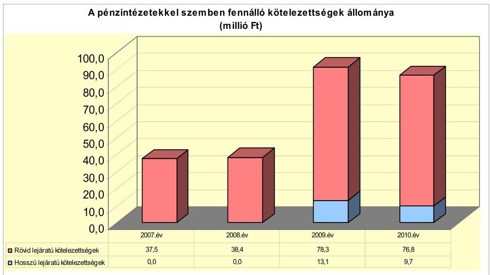

---

Az Önkormányzatnak a 2007-2010. években és a 2011. év I. félévében összesen 67,9 millió Ft értékben állt fenn kezességvállalása ${ }^{18}$, amelynek beváltásából eredő fizetési kötelezettség nem volt. A Nonprofit Kft. 2011. évben felvett 24,0 millió Ft összegű hiteléhez - 2011. június 30-án fennálló, 2014-ig érvényben lévő - önkormányzati kezességvállalás kapcsolódik.

Az Önkormányzat 2007-2009 között négy esetben vett fel fejlesztési feladatai kapcsán jelentkező forráshiánya (saját erő biztosítása, támogatás megelőlegezése) miatt rövid lejáratú hiteleket.

- 2007-ben útépítéshez, szociális szolgáltatáshoz szükséges járműbeszerzéshez és az ivóvízminőség-javító program 2007. évi önrészének biztosításához egyéves futamidőre 12,0 millió Ft összegű szerződést kötött jelzálogfedezettel, a kamat 9,25%, a kezelési költség egyszeri 0,5% volt;
- a 2008. évben az Önkormányzati Fejlesztési Hitelprogram keretében két hitelcélra kötött összesen 9,4 millió Ft-ra vonatkozó szerződést. A futamidő mindkét szerződésben 15 hónap volt. Az iskola beruházásnál a kamat 3 havi EURIBOR + 2,0% (6,96%), a járdaépítéshez kapcsolódó hitelkeretnél 3 havi EURIBOR + 3,0% (7,96%) volt. Mindkét szerződés tartalmazott projektvizsgálati díjat, amely a hitel teljes összegének egyszeri 1,0%-a, illetve három hónapra vonatkozó türelmi időszakot. Ezen túl az Önkormányzat engedményezési szerződést kötött, mely szerint a helyi adó és egyéb sajátos bevételeit a törlesztés teljesítésének biztosítékául a bankra engedményezi;
- az Önkormányzat a 2009. évben fejlesztési támogatás megelőlegezése céljából 46,4 millió Ft jelzálogfedezettel biztosított egyéves futamidejű hitelt vett fel, 12,0% fix kamat és egyszeri 0,5% kezelési költség fizetési kötelezettséggel. A hitel törlesztése egy összegben a támogatás beérkezése időpontjában volt esedékes.

Az Önkormányzat 2007-2010 között a számlavezető bankjától vett igénybe folyószámla- és munkabér-megelőlegezési hitelt. A folyószámla hitelkamat minden évben változó mértékű volt, a 2009. évtől 3 havi BUBOR + 3,75%-nak megfelelően került meghatározásra. A folyószámlahitel keretösszege 2007-ben még 35,0 millió Ft volt, 2010. október 22-től 45,0 millió Ft-ra emelkedett. A hitellel zárt napok és az igénybevett hitel átlagának alakulása változó tendenciát mutat. A négy év során hitellel zárt napok száma átlagosan 220 volt. A 2010. év végi kiegyenlítetlen kötelezettség 32,9 millió Ft.

A munkabér-megelőlegezési hitel keretösszege a 2007. évtől 40,0 millió Ft volt, 2010. február hónaptól 52,0 millió Ft-ra nőtt. A kamat mértéke 2009 előtt fix 8,3%, azt követően 3 havi BUBOR + 4,0% mértékben került meghatározásra. A munkabérhitellel zárt napok tartósan magas (340-341 nap) szinten stagnálnak. Az átlagos hitelállomány folyamatosan növekvő tendenciát mutat, a

[^0]
[^0]:    ${ }^{18}$ A Regionális Fejlesztési Kft. részére a 2006. évi szerződés alapján 30,0 millió Ft, a Szatmári Többcélú Kistérségi Társulás részére a 2007. és a 2010. évi szerződések szerint összesen 13,9 millió Ft, a Nonprofit Kft. részére a 2011. évi szerződés alapján 24,0 millió Ft.

---

2011. év I. félévében 48,6 millió Ft volt. A 2010. december 31-én fennálló tartozás 39,5 millió Ft.

Az Önkormányzat likviditási helyzetének a 2009. évet követő kedvezőtlen változását jelzi, hogy a folyószámla- és munkabérhitel év végi állománya a 2007. évben 26,5 millió Ft, a 2008. évben 27,4 millió Ft, a 2009. évben 27,5 millió Ft volt, a 2010. év végére 72,4 millió Ft-ra nőtt. A fenti hitelek már nem csupán átmeneti fizetési problémák kezelésére szolgálnak, hanem a pénzügyi hiány tartós finanszírozási forrásává váltak. Az Önkormányzat a 2006. év végén fennálló 27,0 millió Ft likvidhitel tartozásállományát az Áhsz. 26. § (5) bekezdés a) pontjában foglaltak ellenére a mérlegben elmulasztotta állományba venni, így a 2007. évi kötelezettségek nyitó értéke sem a teljes tartozásállományt tükrözi.

Az Önkormányzat fizetőképességének alakulását a következő ábra szemlélteti:
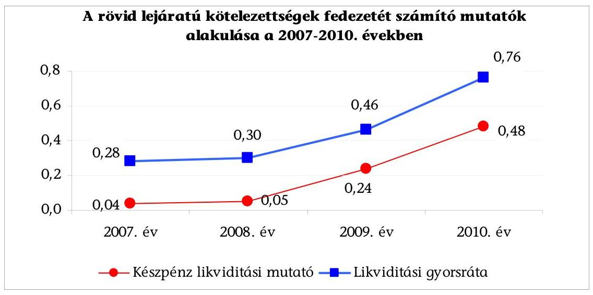

Az Önkormányzat pénzügyi helyzete a fizetőképesség szempontjából az ellenőrzött időszakban kedvezőtlen volt, mert a rövid lejáratú kötelezettségekre a finanszírozásba bevonható pénzeszköz és egyéb likvideszköz állomány nem nyújtott fedezetet. A likviditási mutatók a 2009. évtől megfigyelhető növekedését a Társulások pénz- és egyéb likvideszköz-állomány (2009-ben 20,2 millió Ft, 2010-ben 9,2 millió Ft), valamint a 2010. évben két európai uniós projekt támogatási előlegének (57,0 millió Ft) év végén átutalt, de fel nem használt összege okozta.

A pénzeszközök év végi állománya 2007-ben 2,7 millió Ft, 2008-ban 3,3 millió Ft, 2009-ben 21,9 millió Ft, 2010-ben 58,2 millió Ft, a rövid lejáratú kötelezettségek év végi állománya a 2007. évben 67,1 millió Ft, 2008-ban 67,7 millió Ft, 2009-ben 91,0 millió Ft, 2010-ben 121,4 millió Ft volt.

---

A likviditási gyorsráta ${ }^{19}$ értéke - hasonlóan a készpénz likviditási mutatóhoz - az összevont beszámoló alapján folyamatosan növekvő tendenciát mutat, de a kedvező változás ellenére a pénzeszközök és egyéb likvid eszközök együttes összege a 2010. évben is csupán a rövid lejáratú kötelezettségek 76%-ára biztosított fedezetet. A Társulások és a projektelőleg nélkül számított mutató értéke 2007-ben 0,28, 2008-ban 0,30, 2009-ben 0,24 és a 2010. évben 0,21 volt.

Az Önkormányzat eladósodási fok mutatója ${ }^{20}$ a 2007. és a 2008. évben 6,1% volt, mely a 2009. évben 8,3%-ra, majd a 2010. évben 9,2%-ra emelkedett, amely jelzi, hogy a fizetési kötelezettségek nagyobb arányban emelkedtek, mint az összes forrás.

Az Önkormányzat adósságállományának, likviditási helyzetének fenti alakulása miatt a kamatkiadások minden évben jelentősen meghaladták a kamatbevételeket. A 2007-2010. években a kamatkiadások átlag 7,3 millió Ft-ot tettek ki évente, míg ezzel szemben minimális kamatbevétel - a négy év alatt összesen 4,6 millió Ft - volt. A kamatbevételek 93,4%-a a 2010. évben realizálódott a Társulások lekötött pénzeszközeinek hozama eredményeként.

A 2007-2010. években a likvidhitel állomány növekedése ellenére a szállítókkal szembeni kötelezettség is növekvő tendenciát mutat. A 2007-2008. év végi 25,7 millió Ft átlagállományhoz képest 2009-ben kiugró mértékű (18,7 millió Ft) csökkenés, majd a 2010. évben 14,0 millió Ft-os növekedés történt. A kedvezőtlen tendencia tovább folytatódott, 2011. június 30-án már 110,9 millió Ft volt a kiegyenlítetlen számlák összege. Az összes szállítói állományból a lejárt, 30 nap alatti tartozások aránya a 2007-2009. években 100,0% volt. A 2010. évben az összes kötelezettség lejárt minősítésű, viszont a 30 napon túli tartozások aránya már 59,3%, amely 2011. év I. félévére 87,0%-ra nőtt. A 2011. június 30-i állapot szerint már van éven túli lejárt tartozás, illetve a 90 napot meghaladó lejárt kötelezettség állománya eléri a szállítói egyenleg 49,6%-át. Az Önkormányzat a 2007-2010. években a szállítókkal szemben fennálló kötelezettségét a mérlegben az Áhsz. 26. § (5) bekezdés c)-d) pontjaiban foglaltak ellenére nem a szállítók mérlegsoron, hanem egyéb rövid lejáratú kötelezettségként szerepeltette. Az Önkormányzatnak peres eljárásból származó fizetendő, illetve jövőbeni függő kötelezettsége nincs.

Az Önkormányzat gazdasági társasága részére nem nyújtott kölcsönt, nem engedett el követelést, viszont jelzálogbejegyzést engedélyezett a Nagyecsedért Kht., a 2009. évet követően a Nonprofit Kft. folyószámlahiteléhez és fejlesztési hiteléhez kapcsolódóan három földterületre és a társaságnak üzemeltetésre átadott telephely ingatlanra. A fedezetként megjelölt telephely a szerződéskötés időpontjában a korlátozottan forgalomképes törzsva-

[^0]
[^0]:    ${ }^{19}$ A likviditási gyorsráta mutatja, hogy a rövid lejáratú fizetési kötelezettségek kiegyenlítéséhez a pénzeszközökön túl bevonható követelések, forgatási célú értékpapírok milyen arányban nyújtanak fedezetet.
    ${ }^{20}$ Az eladósodási fok mutató az egyéb passzív pénzügyi elszámolások nélküli összes rövid és hosszú lejáratú kötelezettség önkormányzati összes forráson belüli arányát fejezi ki.

---

gyon körébe tartozott. A korlátozottan forgalomképes ingatlanra a jelzálog bejegyzése az Ötv. 88. § (1) bekezdés b) pontjában ${ }^{21}$ foglaltakkal ellentétben a forgalomképesség megváltoztatása ${ }^{22}$ (átsorolása) nélkül történt meg. Az Önkormányzat hitelfelvételei kapcsán is hozzájárult jelzálogjog bejegyzéséhez a tulajdonában lévő szolgálati lakás, telek, szántó, rét elnevezésű ingatlanokra, amelyek nem képezték a törzsvagyon részét.

A 2007-2010. években a költségvetési egyensúly javítása céljából végrehajtott Képviselő-testületi intézkedések ellenére az Önkormányzat likviditási pozíciója kedvezőtlenül alakult. A bevételnövelő intézkedések
 elsődlegesen a helyi adó ${ }^{23}$ mértékének növelésére, a beszedés hatékonyságának javítására irányultak. Az Önkormányzat számításai szerint 2007-2010 között az intézkedések hatásaként 36,5 millió Ft többletbevétel mutatható ki. A pénzforgalmilag teljesült helyi adóbevétel ezzel szemben kizárólag a 2009. évben mutat az előző évhez képest 12,0 millió Ft növekményt ${ }^{24}$.

A pénzügyi egyensúly biztosításához jelentős mértékben hozzájárult a helyi önkormányzatok működőképességének megőrzését szolgáló kiegészítő támogatás, melynek összege a 2007. évben 125,9 millió Ft, a 2008. évben 130,7 millió Ft, a 2009. évben 124,0 millió Ft, a 2010. évben 80,5 millió Ft volt. A 2011. évben az ÖNHIKI I. ütem keretében az Önkormányzat 178,0 millió Ft támogatási igényével szemben 19,4 millió Ft, a II. ütemben a 137,3 millió Ft igényléssel szemben 18,0 millió Ft támogatásban ${ }^{25}$ részesült. Az Önkormányzat a korábbi években a költségvetési hiány finanszírozása „biztos” forrásának tekintette az ÖNHIKI támogatást, amelynek 88,1%-os visszaesése rendkívül kedvezőtlenül érinti a költségvetési és pénzügyi egyensúly alakulását.

A Képviselő-testület minden évben döntött kiadáscsökkentő intézkedésekről, 2007-2010 között összesen 17 álláshelyet szüntettek meg. Az Önkormányzat a létszámleépítések hatásaként összesen 19,0 millió Ft megtakarítást számszerűsített, amelynek meghatározó része, 11,5 millió Ft a 2008. évet érintette. A kifizetett személyi jellegű ráfordítások - a közfoglalkoztatásba bevont munka-

[^0]
[^0]:    ${ }^{21}$ 2012. január 1-jétől a Vagyon tv. 3.§ (1) bekezdés 6. pontja, 5. § (2) bekezdés c) pontja és a 6. § (6) bekezdése szerinti korlátozottan forgalomképes vagyon megterhelhető, amennyiben az Önkormányzat helyi rendeletében a megterhelést megelőzően arról rendelkezik.
    ${ }^{22}$ 2012. január 1-jétől a Vagyon tv. 5.§ (2) bekezdés a), b) és c) pontjainak megfelelő besorolás
    ${ }^{23}$ A magánszemélyek által fizetendő kommunális adó adótárgyankénti éves mértéke a 26/2006. (XII. 29.) számú rendelet alapján négyezer Ft-tól hatezer Ft-ra nőtt. Az iparűzési adó mértéke nem változott: állandó tevékenységnél az adóalap 2,0%-a, ideiglenes jellegű tevékenységek közül piaci vásározás esetén napi egyezer Ft, építőipari, illetve egyéb tevékenységnél napi ötezer Ft.
    ${ }^{24}$ A helyi adóbevétel alakulása 2006-2010 között: 20,6; 32,4; 28,0; 40,0 és 35,9 millió Ft.
    ${ }^{25}$ Az I. ütem szerinti támogatást a 60 napon túli szállítói tartozások kiegyenlítése céljából, a II. ütemnél a kifizetetlen közüzemi számlák és munkabértartozásokra hagyták jóvá.

---

nélküliek, illetve a szociális gondozói létszám növekedéséből ${ }^{26}$ adódóan - a fenti intézkedések ellenére 2007-2010 között folyamatosan, évente átlagosan 6,8%-kal emelkedtek. A Képviselő-testület a 2011. évben az intézményekben további 15 fős létszámleépítésről döntött, melynek kiadási megtakarítása a 2012. évben fog jelentkezni.

Az Önkormányzat a fizetőképességi és eladósodási problémáit kezelő stratégiával nem rendelkezett, nem határozták meg az éves pénzügyi egyensúly helyreállítása, a fizetőképesség folyamatos biztosítása érdekében szükséges intézkedéseket, valamint a döntési hatáskörrel rendelkezők nem kaptak tájékoztatást a megvalósult rövid- és hosszú lejáratú kötelezettségvállalásokkal kapcsolatos kockázatokról. A jegyző a 2007-2011. évekre az Ámr. 201. § (1) bekezdésében ${ }^{27}$ foglaltak ellenére a pénzállomány alakulásáról nem készített likviditási tervet.

A döntéshozatal előtt a Képviselő-testület részére készült előterjesztésekben indokolták a hitelfelvétel célját, szükségességét, azonban a visszafizetés jövőbeni forrásait - egy támogatásmegelőlegezési hitel kivételével - nem mutatták be. A döntések megalapozása, az Önkormányzat számára legkedvezőbb konstrukció kiválasztása érdekében nem kértek több pénzintézettől ajánlatot, így egy-egy hitel kapcsán az ajánlatok összehasonlító értékelésével sem tudták a döntéshozókat információkkal támogatni. Nem vizsgálták a kezességvállalás kockázatait.

A 2011. évben az éven túli hitelfelvételről szóló döntést megelőzően az Ötv. 92/A. § (2) bekezdésében foglalt rendelkezés ${ }^{28}$ ellenére a Képviselő-testület nem bízott meg könyvvizsgálót, így a könyvvizsgáló előzetes szakmai véleménye hiányában hozták meg a hitel felvételéről a döntést, és a könyvvizsgálói vélemény hiányában nem történt meg a pénzügyi szolgáltatást nyújtó pénzintézet tájékoztatása.

Az adósságot keletkeztető kötelezettségvállalásból származó bevételből megvalósított fejlesztések kiadásainak megtérülésére vonatkozó számításokat, értékeléseket nem készítettek.

[^0]
[^0]:    ${ }^{26}$ A közfoglalkoztatás keretében foglalkoztatottak személyi juttatása a 2007-2010. években: 48 millió Ft, 48 millió Ft, 116 millió Ft és 162 millió Ft. A házi segítségnyújtásra elszámolt személyi jellegű ráfordítás 2007-ben nem volt, 2008-ban 1 millió Ft, 2009-ben 11 millió Ft és 2010-ben 11 millió Ft.
    ${ }^{27}$ 2010. január 1-je előtt az államháztartás működési rendjéről szóló 217/1998. (XII. 30.) Korm. rendelet 139. § (1) bekezdése szabályozta.
    ${ }^{28}$ 2012. január 1-jét követően a jogszabályi előírás hatályát vesztette.

---

Az Önkormányzat az Ötv. 88. § (2) bekezdésében foglalt előírás ${ }^{29}$ ellenére az adósságot keletkeztető kötelezettségvállalásai felső határát a döntés meghozatala előtt nem vizsgálta. Az éves beszámoló során készítették el az adósságot keletkeztető kötelezettségvállalásra vonatkozó számítást, amely alapján a felső határ túllépésére egyik évben sem került sor.

A zárszámadási rendeletekhez készült előterjesztés tartalmazza a többéves kihatással járó döntések jövőbeni törlesztési kötelezettségeit, ezen túl egyéb a kötelezettségek várható alakulását befolyásoló körülményeket (kamat és árfolyamváltozás, egyéb kockázat) nem mutatta be, így a Képviselő-testület nem kapott részletes tájékoztatást a visszafizetés feltételeinek, kockázatainak változásáról.

A jegyző a 2007-2010. években a Számv. tv. 60. § (2) bekezdése, valamint az Áhsz. 33. § (1) bekezdésében foglaltakkal ellentétben a devizában fennálló lízingszerződésből adódó kötelezettsége mérlegforduló-napi értékelése kapcsán elmulasztotta a számviteli politikájában szabályozni a jelentős árfolyamkülönbözet mértékét, továbbá az árfolyamveszteség miatti átértékelést nem végezték el.

Az Önkormányzat a felvett hiteleit közvetlenül a felhasználást megelőzően vette igénybe, így a hitelfelvételből származó átmenetileg szabad pénzeszközei befektetéséről nem hozott döntést.

Az Önkormányzat adósságkezelési tevékenysége összességében értékelve nem volt eredményes, mert a hosszú távú pénzügyi egyensúly biztosításához szükséges feltételeket nem teremtette meg. A pénzügyi egyensúly fenntartására - 2011. június 30-i ismereteink szerint - rövid távon a változó kamatozású, folyamatosan növekvő likviditási hitel állomány ${ }^{30}$ állandósulása és a felhalmozódott szállítói tartozásállomány jelent kockázatot.

A 2007-2010. években, valamint a 2011. év I. félévében az Önkormányzat felhalmozási kockázatát növelte, hogy a felhalmozási költségvetés egyenlege 234,0 millió Ft hiányt mutatott, amelynek fedezetére a nettó működési jövedelmen túl belső forrás nem állt rendelkezésre, a hiányzó forrást hitelfelvétellel biztosították. Az Önkormányzat adatszolgáltatása alapján a 2010. év végén folyamatban lévő fejlesztéseivel kapcsolatos 2011. évre áthúzódó kötelezettségvállalás összege 688,8 millió Ft, amelyből a hitellel finanszírozott rész 50,0 millió Ft, a saját bevétel 31,2 millió Ft, az európai uniós és a hazai támogatás 607,6 millió Ft.

[^0]
[^0]:    ${ }^{29}$ 2012. január 1-jét követően a Stabilitási tv. 10. § (3) bekezdése szerint az adósságot keletkeztető ügyletből származó fizetési kötelezettség az adósságot keletkeztető ügylet futamidejének egyik évében sem haladhatja meg az adott évi saját bevétel 50%-át.
    ${ }^{30}$ Az Önkormányzat folyószámlahitel szerződése 2011. október 21-én lejárt, a helyszíni vizsgálat időpontjában az új szerződést még nem írták alá.

---

A 2011. évi eredeti előirányzati adatok alapján - céltartalék nélkül - az Önkormányzat CLF szerinti működési jövedelme -147,7 millió Ft, a felhalmozási költségvetés egyenlege -42,7 millió Ft. A 2011. év I. félévi teljesítési adatokból számított működési jövedelem 58,0 millió Ft pozitív egyenleggel zárt, a felhalmozási költségvetés hiánya 16,2 millió Ft volt.

A 2011. június 30-án fennálló pénzintézeti és egyéb kötelezettségek visszafizetésének forrásaként az Önkormányzat a folyamatban lévő beruházások hatására várt helyi adóbevétel növekményt, valamint a forgalomképes ingatlanok értékesítéséből származó bevételt nevesítette.

A jövőben várható helyi adóbevétel növekményről informális adatok állnak rendelkezésre, így annak várható nagyságrendje nehezen prognosztizálható. Az Önkormányzat adatszolgáltatása alapján a forgalomképes ingatlanok könyv szerinti nettó értéke 2010. december 31-én 94,1 millió Ft, amelyből jelzáloggal terhelt 21,5 millió Ft nettó értékű ingatlan.

Befolyásolhatja az Önkormányzat pénzügyi helyzetét saját kötelezettségeinek növekedésén túl a Nonprofit Kft. 2011. június 30-án fennálló 54,6 millió Ft kötelezettsége, ${ }^{31}$ valamint a 24,0 millió Ft hitelfelvételéhez vállalt kezességvállalás, mivel ezek nem teljesítése, esetleges csőd, vagy felszámolási eljárás esetén a készfizető kezesség beváltása az Önkormányzatot terheli, illetve a bíróság korlátlan és teljes felelősséget állapíthat meg az Önkormányzat terhére.

Az Önkormányzat a Gt. 54. § (2) bekezdés alapján korlátlan felelősséggel tartozik felszámolás esetén azon gazdasági társaságáért, amelyben a Gt. 52. § (2) bekezdés szerint a szavazatok legalább 75%-ával rendelkezik, így minősített befolyásszerzőnek minősül, továbbá a csődeljárásról és a felszámolási eljárásról szóló 1991. évi XLIX. törvény 63. § (2) bekezdése alapján a kizárólagos önkormányzati tulajdonú gazdasági társaságának minden olyan kötelezettségéért, amelynek kielégítését a felszámolási eljárás során az adós társaság vagyona nem fedez, ha a hitelezőinek a felszámolási eljárás során benyújtott keresete alapján a bíróság az adós társaság felé érvényesített tartósan hátrányos üzletpolitikájára figyelemmel - megállapítja az Önkormányzat korlátlan és teljes felelősségét.

# 2. A VAGYONI HELYZET ALAKULÁSA, VALAMINT A VAGYONGAZDÁLKODÁS FOLYAMATAIBAN A KONTROLLOK MŰKÖDÉSE 

### 2.1. Az Önkormányzat vagyoni helyzetének 2007-2010 közötti alakulása

Az Önkormányzat saját vagyona az előző évhez viszonyítva 2008-ban 1,4%-kal, 2009-ben 10,3%-kal, 2010-ben 14,9%-kal, összességében 26,6%-kal, 278,9 millió Ft-tal növekedett. Az eszközérték változását a beruházások növekedésének, valamint az immateriális javak, az üzemeltetésre átadott eszközök és az egyéb aktív pénzügyi elszámolások csökkenésének együttes hatása eredményezte. Az eszközérték növekedésének forrását a működési célú bevételi többlet felhalmozási célra történő fordításával, valamint a hitelállomány növelésével biztosították.

Az Önkormányzat vagyonának vagyonelemenkénti alakulását a 2007-2010. évek között - a mérleg adatok alapján - a következő táblázat mutatja:
millió Ft

| AZ ÖNKORMÁNYZAT VAGYONA |  |  |  |  |
| :-- | --: | --: | --: | --: |
| Eszközök | $\mathbf{2 007}$. év | $\mathbf{2008}$. év | $\mathbf{2009}$. év | $\mathbf{2010}$. év |
| Immateriális javak és tárgyi eszközök | 863,2 | 885,9 | 1015,1 | 1184,1 |
| Befektetett pénzügyi eszközök | 18,0 | 31,1 | 12,0 | 5,2 |
| Üzemeltetésre átadott eszközök | 161,6 | 140,0 | 142,4 | 128,7 |
| Befektetett eszközök összesen | 1042,8 | 1057,0 | 1168,5 | 1318,0 |
| Forgóeszközök | 50,6 | 54,3 | 79,1 | 113,9 |
| ESZKÖZÖK ÖSSZESEN | $\mathbf{1093,4}$ | $\mathbf{1111,3}$ | $\mathbf{1247,6}$ | $\mathbf{1431,9}$ |
| KÖTELEZETTSÉGEK ÖSSZESEN | $\mathbf{113,7}$ | $\mathbf{117,9}$ | $\mathbf{15

 2 , 0}$ | $\mathbf{1 7 3 , 3}$ |
| KÖTELEZETTSÉGEK | $\mathbf{9 7 9 , 7}$ | $\mathbf{9 9 3 , 4}$ | $\mathbf{1 0 9 5 , 6}$ | $\mathbf{1 2 5 8 , 6}$ |
| SAJÁT VAGYON |  |  |  |  |

A 2007-2010. évek között az eszközök állományi értéke folyamatosan emelkedett, a 2007. évben 1093,4 millió Ft, a 2008. évben 1111,3 millió Ft, a 2009. évben 1247,6 millió Ft, a 2010. évben pedig 1431,9 millió Ft volt. Az Önkormányzat a vagyon értékében bekövetkezett változásokat a zárszámadás keretében bemutatta, azonban nem értékelte, nem vizsgálta, hogy az egyes vagyonelemek növekedése, illetve csökkenése milyen tényezők hatására következett be. Nem vizsgálták, nem számszerűsítették a központi jogszabályi változások önkormányzati vagyon alakulására gyakorolt hatását, a Képviselőtestület számára ilyen tartalmú előterjesztés, tájékoztatás nem készült.

---

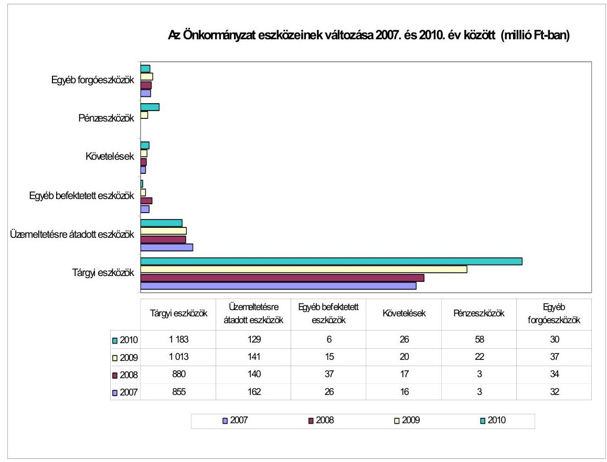

Az Önkormányzat a 2007-2010. években a fejlesztési kiadások fedezetének biztosítására összesen 83,8 millió Ft beruházási, felhalmozási célú hitelt vett fel. A hitelek kamataira kifizetett összesen 4,0 millió Ft csökkentette a pénzeszközök állományát.

Az Önkormányzat a kötelező feladatai ellátásához a 2010. évi könyvviteli nyilvántartás szerint 128,7 millió Ft nettó értékű üzemeltetésre, kezelésre átadott vagyont tartott nyilván, amely a Nonprofit Kft. részére átadott eszközöket jelentette. Az üzemeltetésre, kezelésre átadott eszközök 2010. évi állománya 32,9 millió Ft-tal volt kevesebb a 2007. évinél. A csökkenést a Szatmári Regionális Hulladékgazdálkodási Társulás megszűnésével az üzemeltetésre, kezelésre átadott vagyon önkormányzati üzemelésbe történő visszavétele okozta.

Az Önkormányzat a vizsgált időszakban csak a 2009. évben értékesített - az önként vállalt feladat ellátását szolgáló - földterületet és egy kötelező feladat ellátását szolgáló önkormányzati lakást, összesen 4,8 millió Ft bevételt realizált. Az értékesített ingatlanok nyilvántartás szerinti értéke 1,2 millió Ft volt, amely az összes ingatlan értékének 0,1%-át tette ki.

Az Önkormányzat csak a 2010. évben adott bérbe ingatlanokat, önkormányzati lakásokat és garázsokat, amelyből 0,9 millió Ft bevételt realizált. A vagyonhasznosítási (ingatlan értékesítési és bérbeadási) bevételek felhasználására Képviselő-testület nem határozott meg előzetesen felhasználási célt, azokat a kötelező önkormányzati feladathoz kapcsolódó felhalmozási célú kiadásokra fordították.

---

A Képviselő-testület 2007-2010 között nem döntött arról, hogy kötelező, vagy önként vállalt feladatát másik önkormányzat, egyház, civil szervezet lássa el. A közterület fenntartást, köztemető üzemeltetést, közintézmények hőszolgáltatását 2007-2009 között a Nagyecsedért Kht., 2009-től az Önkormányzat 100%-os tulajdoni részesedésével létrehozott Nonprofit Kft. végzi. A Nonprofit Kft. önként vállalt feladatként ellátja a temetkezési szolgáltatást, a tejbegyűjtést és az iskolai büfé üzemeltetését is.

Az Önkormányzat 2007-2010. évi költségvetési rendeleteiben az önkormányzati vagyon növekedését eredményező felújítási, fejlesztési feladatokról döntött. A felhalmozási döntések eredményeként 2007-2010 között a befektetett eszközök a beszámoló adatok szerint 502,6 millió Ft-tal növekedtek, melyből a beszámolóban megjelenő Ecsedi-láp Víziközmű Beruházási Társulás befektetett eszközei 96,7 millió Ft-ot tettek ki.

A Képviselő-testület döntései $^{32}$ alapján felújításra került a Művelődési Ház, a József Attila, a Kossuth és a Toldi út burkolata, megvalósításra került a Városközpont rehabilitációja, valamint a Zrínyi út építése.

Az Önkormányzat módosított pénzmaradványa 2007-2010 közötti időszakban összességében negatív volt, így azt forrásként nem tudta a finanszírozásba bevonni. Költségvetési tartalékot nem terveztek, és év közben sem került előirányzat ilyen célra elkülönítésre. A felhalmozási célú kiadások teljesítésére az adott évi bevételeket, illetve az e célra igénybe vett hiteleket fordították.

Az Önkormányzat a tárgyi eszközök felújítására 2007-ben nem, 2008-ban 6,4 millió, 2009-ben 0,8 millió és a 2010. évben 16,0 millió Ft-ot fordított, amelyek egyik évben sem érték el a számvitelben elszámolt értékcsökkenés összegét. A 2007-2010 között elszámolt összes felújítás értéke 23,2 millió Ft, amely 14,7%-a az ellenőrzött időszakban elszámolt 157,6 millió Ft értékcsökkenésnek. A Képviselő-testület részére a zárszámadási rendelet előterjesztése során nem mutatták be az elszámolt értékcsökkenés, az eszközpótlásra fordított kiadások és az eszközök használhatósági fokának alakulását.

Elszámolt értékcsökkenés és a felújításra fordított kiadás
millió Ft-ban

| Megnevezés | 2007. év | 2008. év | 2009. év | 2010. év |
| :-- | --: | --: | --: | --: |
| Elszámolt értékcsökkenés | 36,8 | 35,3 | 42,0 | 43,8 |
| Felújításra fordított kiadás | 0,0 | 6,4 | 0,8 | 16,0 |

Az Önkormányzat vagyona a fejlesztések hatására 2007-2010 között 338,5 millió Ft-tal (28,5%-kal) nőtt. A vagyon növekedését 65,2%-ban a beruházások eredményezték. Az eszközök összetételének változásában az immateriális javak és tárgyi eszközök 320,9 millió Ft-os (3,7 százalékpontos), a

[^0]
[^0]:    $^{32}$ A Művelődési Ház felújítására a Képviselő-testület a 88/2009. (V. 26.) számú, a József, Kossuth és a Toldi utak építésére a 41/2007. (III. 27.), a 111/2007. (VIII. 9.) számú, a Városközpont rehabilitációra a 105/2009. (VI. 30.), a 106/2009. (VI. 30.), a 116/2009. (VII. 21.), a 203/2009. (XII. 22.) számú, a Zrínyi út építésére a 76/2008. (V. 13.) és a 158/2008. (IX. 30.) számú határozatokban hozott döntéseket.

---

forgóeszközök 63,3 millió Ft-os (3,4 százalékpontos) növekedése, valamint a befektetett pénzügyi eszközök 12,8 millió Ft-os (1,3 százalékpontos), az üzemeltetésre átadott eszközök 32,9 millió Ft-os (5,8 százalékpontos) csökkenése játszott szerepet.

# 2.2. A vagyongazdálkodás belső kontrolljainak működése 

A vagyongazdálkodási folyamatok szabályozásának hiányosságai 2010-ben és 2011. év I. félévben magas kockázatot jelentettek a feladatok megfelelő, szabályszerű végrehajtásában, mert a jegyző a belső kontrollrendszer szabályozása keretében:
A) a kontrollkörnyezetet érintően az Áht. 121/A. § (1) és (4) bekezdéseiben $^{33}$ foglalt előírások ellenére

- nem kezdeményezte a vagyongazdálkodási rendelet módosítását annak érdekében, hogy az magában foglalja a forgalomképesség megváltoztatásának szabályait;
- nem készítette el az etikus magatartással kapcsolatos elvárások meghatározását tartalmazó etikai kódexet;
B) a kockázatkezelés rendje keretében $^{34}$
- az Ámr. 157. § (1) bekezdésében $^{35}$, és a Belső Kontroll Kézikönyv 2. pontjában előírtak ellenére nem határozta meg a csalás és a korrupció kockázatának minősítését, a vagyongazdálkodás főfolyamatára a kockázatokkal kapcsolatos válaszlépéseket;
- nem kezdeményezte az éves ellenőrzési tervben a vagyongazdálkodáshoz kapcsolódó a 2010. évi és a 2011. évi belső ellenőrzési tervhez készített kockázatelemzésben szereplő magas kockázatúnak értékelt készletgazdálkodási, vagyonvédelmi területek ellenőrzését;
C) a kontrolltevékenységek meghatározása során
- a vagyon értékesítésével és hasznosításával kapcsolatban - indokoltsága ellenére - nem kezdeményezte, hogy a Képviselő-testület írja elő a döntéselőkészítés folyamatában a költség-haszonelemzés készítésének kötelezettségét;
- nem szabályozta a vagyon értékesítésére, hasznosítására vonatkozóan a versenyeztetés elvégzésének ellenőrzését, továbbá nem kezdeményezte a vagyongazdálkodási rendelet módosítását, hogy az tartalmazza a hasznosítás-

[^0]
[^0]:    $^{33}$ 2012. január 1-jétől az új Áht. 69. § (2) bekezdésében
    $^{34}$ A költségvetési szerv vezetője köteles az Ámr. 157. § (1) bekezdése és a Belső Kontroll Kézikönyv 2. pontja szerint a kockázati tényezők figyelembe vételével kockázatelemzést végezni és kockázatkezelési rendszert működtetni.
    $^{35}$ 2012. január 1-jétől az új Ber. 7. §-ában

---

ra szánt vagyon értéke megállapítása céljából értékbecslés készítésének kötelezettséget;

- nem határozta meg a szabálytalanságok kezelésére vonatkozó eljárásrendben a kivizsgálásáról készült jegyzőkönyv tartalmi követelményeit;
- a finanszírozási célú pénzügyi műveletekkel összefüggésben nem szabályozta, illetve nem írta elő a pénzügyi kockázatok felmérésének kötelezettségét, a hitelfelvételről, kötvénykibocsátásról szóló döntés-előkészítés folyamatában a futamidő egyes éveit terhelő kötelezettség költségvetési egyensúlyra gyakorolt hatásának vizsgálati kötelezettségét, továbbá nem határozta meg a Pénzügyi bizottság hitelfelvétel indokaira és gazdasági megalapozottságára vonatkozó vizsgálatának eljárását;
- nem rögzítette a vagyongazdálkodási feladatokat ellátók munkaköri leírásaiban a beszámolási kötelezettséget, továbbá a kapcsolattartás módját;
- nem határozta meg a bevételeket megalapozó döntésekben meghatározott feltételek előírásakor a felülvizsgálat feladatait, kiemelten annak ellenőrzési kötelezettségét, hogy a szerződés az Ámr. 155. § (1) bekezdésének $^{36}$ megfelelően tartalmazza-e a döntési hatáskörrel rendelkező által meghatározott feltételeket (ellenérték, fizetési feltételek, nem teljesítés esetén szankció), valamint, hogy a szerződésben az arra hatáskörrel rendelkező vállalt-e kötelezettséget;
- belső szabályzatban nem jelölte ki azokat a személyeket, akik felelősek voltak a bevételeket megalapozó döntésekben meghatározott feltételek szerződésben történő érvényesítése ellenőrzésének végrehajtásáért;
D) az információt, kommunikációt, monitoringot érintően
- nem határozta meg a vagyongazdálkodás külső és belső információi kezelésének rendjét és a vagyongazdálkodással összefüggő közérdekű (közzé teendő) adatok kezelésének rendjét;
- nem alakította ki a monitoring stratégiát, így nem határozta meg a vagyongazdálkodási folyamatokra vonatkozó nyomon követési módszereket, a belső kontrollrendszer évenkénti felülvizsgálatát.

A Polgármesteri hivatalban 2010-ben és a 2011. év I. félévében a belső kontrollok nem biztosították a vagyongazdálkodás eredményességét, a vagyongazdálkodási folyamatokban a kontrollok működése gyenge volt, mert:
A) a belső szabályozás (kockázatkezelési szabályzat) ellenére nem végezték el a kockázatkezelési rendszer működése során a vagyongazdálkodás folyamatában a külső és belső kockázatok értékelését, a kockázatazonosítást és értékelést;
a hiányos szabályozás miatt nem végezték el a csalás és a korrupció minősítését; a vagyongazdálkodás során felmerült kockázatokra az előírt válaszlépése-

[^0]
[^0]:    $^{36}$ 2012. január 1-jétől az új Ber. 8. § (2) bekezdésében

---

ket; nem követték nyomon a vagyongazdálkodás kockázati tényezőinek csökkentése érdekében hozott intézkedéseket;
B) a hiányos szabályozás miatt a vagyongazdálkodási folyamatban nem működtették a belső kontrolltevékenységeket:

- a vagyonértékesítést, hasznosítást megelőzően nem készítettek költséghaszonelemzést;
- a finanszírozási célú pénzügyi műveletekkel összefüggésben a döntéselőkészítés során nem készítettek számításokat a pénzügyi kockázatokról;
- nem végezték el a futamidő egyes éveit terhelő kötelezettségvállalás költségvetési egyensúlyra gyakorolt hatásának vizsgálatát;
- vezetői ellenőrzés keretében nem számoltatták be a vagyongazdálkodási feladatokat végzőket a vagyonhasznosítás, a finanszírozási célú pénzügyi műveletek végrehajtásának folyamatáról;
az ellenőrzési nyomvonal $^{37}$ előírásai ellenére a felhalmozási kiadások teljesítése kapcsán nem jelölték ki a döntés végrehajtásáért felelős személyeket, így elmaradt az előirányzat-felhasználási terv felhalmozási kiadásokra vonatkozó részének figyelemmel kísérése, a teljesítésről történő beszámolás;
a belső szabályozás (leltározási szabályzat) és az Áhsz. 37. § (4) bekezdésében foglalt előírás ellenére nem végezték el az üzemeltetésre, kezelésre átadott eszközök évenkénti leltározását;
C) szabályozás hiánya miatt a monitoring belső kontrolljainak működési területét érintően
- nem végezték el a vagyongazdálkodási folyamatok megfigyelését, a bérleti díjak figyelemmel kísérése a nyomon követés előírásainak hiányában nem rendszerszerűen történt;
- elmulasztották a belső kontrollrendszer évenkénti felülvizsgálatát.

A jegyző intézkedése alapján megtörtént a szabálytalanságok eljárásrendjének kiegészítése, melyet a Képviselő-testület a 205/2010. (X. 26.) számú határozatával fogadott el, és a jegyző előkészítése alapján a Képviselő-testület jóváhagyta az ellenőrzési nyomvonal kiegészítését.

A Polgármesteri hivatal a 2010. évi költségvetésében ingatlan bérbeadásból 1,0 millió Ft költségvetési bevételt tervezett, amely 2010-ben a bérleti és lízingdíj bevételi előirányzat 37,0%-át tette ki. A 2010. évben az ingatlan bérbeadás teljesített bevétele 0,9 millió Ft, amely a bérleti és lízingdíj bevételek 27,5%-a. A 2011. évben az ingatlanok bérbeadási bevételeire eredeti előirányzatot nem terveztek.

[^0]
[^0]:    $^{37}$ A hivatali SzMSz 5. számú mellékleteként elfogadott

 dokumentum 2. számú táblázata 4. számú pontjában előírt feladatok.

---

A Polgármesteri hivatalban 2010-ben és a 2011. év I. félévben az önkormányzati lakáscélú helyiségek és garázsok bérbeadásából származó bevételek teljesítése során a belső kontrollok - a bevételeket megalapozó szerződések ellenőrzése és az utalvány ellenjegyzés - működése kiváló volt, mert a lakásokra és a garázsokra vonatkozó bérleti szerződés ellenőrzését végző személy ellenőrizte a szerződések tartalmát, meggyőződött arról, hogy a szerződés tartalmazza a döntéshozó által előírt feltételeket, a vételárat, a bérlő kötelességeit, a bérleti jogviszony megszűnésének meghatározását, az utalvány ellenjegyzője meggyőződött a gazdálkodásra vonatkozó szabályok érvényesüléséről.

A Polgármesteri hivatal a 2010. évi költségvetésében az Önkormányzat többségi tulajdonában levő gazdasági társaság részére a működési célú pénzeszközátadások kifizetéseinek teljesítésére 66,1 millió Ft eredeti előirányzatot tervezett, amelyet 66,8 millió Ft-ra módosítottak, a teljesített kifizetés összege 53,0 millió Ft volt. A működési célú pénzeszközátadások módosított előirányzatának 57,1%-át, a teljesített kiadásoknak a 45,7%-át tették ki a gazdasági társaság részére nyújtott pénzeszközátadások. A 2011. évre tervezett működési célú pénzeszközátadás eredeti előirányzata 38,2 millió Ft volt. Az önkormányzati többségi tulajdonban lévő gazdasági társaságok részére nyújtott működési célú pénzeszközátadások összhangban voltak az Önkormányzat által ellátott feladatokkal ${ }^{38}$.

A Polgármesteri hivatalban 2010-ben és a 2011. év I. félévben az Önkormányzat többségi tulajdonában levő gazdasági társaság részére nyújtott működési célú pénzeszközátadások kiadásainak teljesítése során a kulcsszerepet betöltő belső kontrollok - a kötelezettségvállalás ellenjegyzése, a szakmai teljesítésigazolás és az utalvány ellenjegyzés - nem biztosították a vagyongazdálkodás eredményességét. A belső kontrollok működése gyenge volt, mert a Nonprofit Kft.-nek a 2010. augusztus 2-án, a 2010. augusztus 5-én és a 2011. március 16-án átadott pénzeszköz esetében a szakmai teljesítés igazolására kijelölt személyek a kifizetést megelőzően - az Ámr. 76. § (3) bekezdésében ${ }^{39}$ foglaltak és a gazdálkodási szabályzatban előírtak ellenére - nem ellenőrizték annak jogosultságát, összegszerűségét. Az utalvány ellenjegyzője az Ámr. 79. § (2) bekezdésében foglaltak és az aláírása ellenére nem észrevételezte, hogy a kiadások jogosultságának, összegszerűségének ellenőrzését a jegyző által kijelölt személyek nem végezték el.

A Polgármesteri hivatal a 2010. és a 2011. évi költségvetésében az Önkormányzat nonprofit szervezetek részére működési célú pénzeszközátadások kifizetéseinek teljesítésére 19,0 millió Ft eredeti előirányzatot tervezett, amelyet 29,7 millió Ft-ra módosítottak, a teljesített kifizetés összege 29,2 millió Ft volt. A működési célú pénzeszközátadások módosított előirányzatának 19,7%-át, a teljesített kiadásoknak a 25,1%-át tették ki a nonprofit szervezetek részére átadott pénzeszközök. A 2011. évre tervezett működési célú pénzeszközátadás eredeti előirányzata 16,5 millió Ft volt. A nonprofit szervezetek részére történt működé-

[^0]
[^0]:    ${ }^{38}$ A "Nagyecsedi Városüzemeltetési" Nonprofit Kft. számára a 2010. évi költségvetési rendelet 9. számú melléklete határozta meg a működési célú pénzeszközátadást.
    ${ }^{39}$ 2012. január 1-jétől az Ávr. 57. § (1) bekezdésében

---

si célú pénzeszköz átadás összhangban volt az Önkormányzat által ellátott feladatokkal ${ }^{40}$.

A Polgármesteri hivatalban 2010-ben és 2011. év I. félévben az Önkormányzat nonprofit szervezetek részére nyújtott működési pénzeszközátadások kiadásainak teljesítése során a kontrollok nem biztosították a vagyongazdálkodás eredményességét. A belső kontrollok működése gyenge volt, mert a szakmai teljesítés igazolására kijelölt személyek a Nagyecsedi Rákóczi Sportegyesületnek, valamint a Bursa Ösztöndíjprogram keretében történő támogatásnak a kifizetését megelőzően az Ámr. 76. § (3) bekezdésében foglaltak és a gazdálkodási szabályzatban előírtak ellenére nem ellenőrizték annak jogosultságát, összegszerűségét. Az utalvány ellenjegyzője az Ámr. 79. § (2) bekezdésében ${ }^{41}$ foglaltak és az aláírása ellenére nem észrevételezte, hogy a kiadások jogosultságának, összegszerűségének ellenőrzését a jegyző által kijelölt személyek nem végezték el.

A Polgármesteri hivatal a 2010. évi költségvetésében a karbantartási, kisjavítási szolgáltatások kifizetésének teljesítésére 7,1 millió Ft eredeti előirányzatot tervezett, amelyet 8,0 millió Ft-ra módosítottak, a teljesített kifizetés összege 5,3 millió Ft volt. A dologi előirányzatok módosított előirányzatának 2,7%-át, a teljesített kiadásoknak a 2,2%-át tették ki a karbantartási, kisjavítási szolgáltatások kifizetései. A 2011. évre tervezett karbantartási, kisjavítási szolgáltatások eredeti előirányzata 4,3 millió Ft volt. A karbantartási, kisjavítási szolgáltatások kiadási előirányzata összhangban volt a Polgármesteri hivatal által ellátott feladatokkal ${ }^{42}$.

A Polgármesteri hivatalban 2010-ben és a 2011. év I. félévben a karbantartási, kisjavítási szolgáltatások kiadások teljesítése során a belső kontrollok - a kötelezettségvállalás ellenjegyzése, a szakmai teljesítésigazolás és az utalvány ellenjegyzés - működése kiváló volt, mert a bölcsőde, a művelődési ház karbantartására, az óvoda tűzoltó készülékeinek javítására, az óvoda élelmezési programjának karbantartási kifizetésére vonatkozó megrendelést, a szerződésben vállalt kötelezettséget a kötelezettségvállalás ellenjegyzésére jogosult személy ellenőrizte. Az ellenőrzés során meggyőződött arról, hogy a jóváhagyott költségvetés fel nem használt része, illetve le nem kötött, a kötelezettségvállalás tárgyával összefüggő kiadási előirányzat, a kifizetés időpontjában a fedezet rendelkezésre állt, továbbá a gazdálkodásra vonatkozó szabályokat betartották. A szerződésben meghatározott feladatok szakmai teljesítésének igazolását a jegyző által kijelölt személyek elvégezték.

A Polgármesteri hivatal a 2010. és a 2011. évi költségvetésében az Önkormányzat bérleti és lízingdíjak kiadásai kifizetésének teljesítésére 4,2 millió Ft

[^0]
[^0]:    ${ }^{40}$ A nonprofit szervezetek részére tervezett működési célú pénzeszközátadásról a Képviselő-testület a 2010. évi költségvetési rendelete 9. számú mellékletében határozott.
    ${ }^{41}$ 2012. január 1-jétől az Ávr. 58. § (2) bekezdésében
    ${ }^{42}$ A megfelelőségi teszt elvégzése során ellenőrzött számlák az Önkormányzat bölcsődéjének, szolgálati lakásának, óvodai élelmezési programjának, az Önkormányzat művelődési házának, orvosi rendelőjének tevékenységéhez kapcsolódó karbantartási és javítási szolgáltatási kifizetéseit tartalmazták.

---

módosított előirányzatot tervezett, a teljesített kifizetés összege 3,4 millió Ft volt. Az ezen a címen elszámolt kiadások a teljesített dologi kiadások módosított előirányzatán belüli aránya 1,5% volt. A 2011. évre tervezett bérleti és lízingdíjak eredeti előirányzata 5,0 millió Ft volt. A bérleti és lízingdíjak kiadási előirányzata összhangban volt a Polgármesteri hivatal által ellátott feladatokkal ${ }^{43}$.

A Polgármesteri hivatalban 2010-ben és 2011. év I. félévben az Önkormányzat bérleti és lízingdíjak kiadásainak teljesítése során a kontrollok nem biztosították a vagyongazdálkodás eredményességét. A belső kontrollok működése gyenge volt, mert a szakmai teljesítésigazolást az Ámr. 76. § (3) bekezdésében foglaltak ellenére nem az arra kijelölt személy végezte el a Polgármesteri hivatal fénymásoló bérleti díjainak kifizetéseit megelőzően. Az utalvány ellenjegyzője az Ámr. 79. § (2) bekezdésében foglaltak és az aláírása ellenére nem észrevételezte, hogy a fénymásoló bérleti díjával összefüggő kiadások jogosultságának, összegszerűségének ellenőrzését nem a jegyző által kijelölt személy végezte el.

A Polgármesteri hivatalban 2010-ben és 2011. év I. félévben az ingatlanok bérbeadásából származó bevételek, a többségi tulajdonában levő gazdasági társaságok részére működési célú pénzeszközátadások, a nonprofit szervezetek részére nyújtott működési célú pénzeszközátadások, a karbantartási, kisjavítási szolgáltatások, valamint a bérleti és lízingdíjak kiadásaival kapcsolatos kifizetések során - ezen területek költségvetési súlyának figyelembevételével összefoglalóan értékelve ${ }^{44}$ - a belső kontrollok működése gyenge volt, a kontrollok nem biztosították a vagyongazdálkodás eredményességét. Az önkormányzati többségi tulajdonban lévő gazdasági társaságok és a nonprofit szervezetek részére történt működési célú pénzeszköz átadással és a bérleti és lízingdíjakkal kapcsolatos kiadások teljesítését megelőzően azok jogosultságának, összegszerűségének ellenőrzését nem végezték el, valamint a fénymásoló bérleti díjával összefüggő kiadások jogosultságának, összegszerűségének szakmai teljesítés igazolását a jegyző kijelölésével nem rendelkező személy látta el. Az utalványok ellenjegyzője nem kifogásolta a szakmai teljesítésigazolás elmaradását, illetve nem a jegyző kijelölésével rendelkező személy által végzett szakmai teljesítésigazolásokat.

[^0]
[^0]:    ${ }^{43}$ A megfelelőségi teszt elvégzése során ellenőrzött kifizetések a Polgármesteri hivatal fénymásoló bérleti díjával, az ELMIB Első Magyar Infrastruktúra Befektetési Rt. által a Polgármesteri hivatal, az általános iskola, óvoda, egészségház helyiségeiben végrehajtott belső világítási rendszereinek bérbevételére vonatkoztak.
    ${ }^{44}$ A kontrollok megfelelősségének értékelése során a vizsgált hat terület egyedi értékelési pontszámait a Polgármesteri hivatal 2010. évi költségvetési beszámolójának - a területekre vonatkozó - teljesítési adataiból képzett súlyszámokkal arányosan összegeztük.

---

# 3. A KÖZFELADATOK ELLÁTÁSÁBAN RÉSZTVEVŐ ÖNKORMÁNYZATI TÖBBSÉGI TULAJDONBAN LÉVŐ GAZDASÁGI TÁRSASÁGOKNÁL A TULAJDONOSI FELELŐSSÉG ÉRVÉNYESÍTÉSÉNEK EREDMÉNYESSÉGE 

Az Önkormányzat a 2009. év II. félévétől a 100%-os tulajdonában álló Nonprofit Kft.-vel látja ${ }^{45}$ el a temetkezési, a köztemető- és a közútfenntartási, a köztisztasági, a településtisztasági, a tejbegyűjtési, az iskolabüfé üzemeltetési, a személyszállítási, a hőszolgáltatási, valamint a piac- és vásártér üzemeltetési feladatait.

Az Önkormányzat a Nonprofit Kft.-vel a feladatok ellátására öt szerződést, megállapodást kötött. ${ }^{46}$ Az Önkormányzat a szerződések, megállapodások megkötését megelőzően nem vizsgálta a feladatok ellátásának lehetséges módjait, és nem dolgozott ki alternatívákat, nem végzett szakmai és gazdaságossági számításokat. A döntést egyedül a hőszolgáltatási szerződés esetében támasztották alá gazdaságossági számításokkal.

A hőszolgáltatási tevékenység esetében az Önkormányzat szolgáltatót cserélt 2011. március 31-én. ${ }^{47}$ A szolgáltató váltás időszakában elemzéseket, kimutatásokat készítettek, melyekben az addig felmerült költségeket, a hőmennyiség felhasználás alakulását ismertették. Ezek a számítások szolgáltak kiindulási alapul a Nonprofit Kft.-vel megkötött szerződéshez.

A Képviselő-testület nem írta elő a feladatellátás szervezeti formájának és kiadásainak rendszeres felülvizsgálatát, valamint nem rögzítette a nem szerződésszerű feladatellátás szankcióit a közútfenntartási, a köztisztasági, a településtisztasági, a tejbegyűjtési, az iskolabüfé üzemeltetési, a személyszállítási, valamint a piac- és vásártér üzemeltetési tevékenységek ellátására kötött szerződésekben.

Az Önkormányzat a Nonprofit Kft. által 2011. március 29-én felvett 24,0 millió forint hosszú lejáratú hitelhez készfizető kezességet vállalt, valamint jelzálogjog bejegyzéséhez járult hozzá ${ }^{48}$ az Önkormányzat tulajdonában lévő ingatlanra,

[^0]
[^0]:    ${ }^{45}$ 2009. év II. félévet megelőzően ezeket a feladatokat a 100%-os önkormányzati tulajdonú Nagyecsedért Kht. végezte, amely végelszámolással megszűnt.
    ${ }^{46}$ Az Önkormányzat és a Nonprofit Kft. közötti szerződések, megállapodások az alábbiak voltak: a 142/2009. (IX. 29.) számú képviselő-testületi határozattal elfogadott és 2009. szeptember 30-án aláírt, majd a 32/2010. (III. 16.) számú határozattal módosított közhasznú szerződés; a 143/2009. (IX. 29.) számú képviselő-testületi határozattal elfogadott és 2009. október 1-jén aláírt kegyeleti közszolgáltatási szerződés, a 33/2010. (III. 16.) számú képviselő-testületi határozattal elfogadott és 2010. március 16-án aláírt megállapodás a vásár-, és piactér bérbeadására és üzemeltetésére, a 220/2010. (XI. 23.) számú képviselő-testületi határozattal elfogadott és 2009. november 29-én aláírt megállapodás a tejbegyűjtő bérbeadására és üzemeltetésére, a 67/2011. (III. 31.) számú képviselő-testületi határozattal elfogadott és 2011. március 31-én aláírt hőszolgáltatási szerződés.
    ${ }^{47}$ A tevékenységet ezt megelőzően a 2005. december 5-től a Regionális Fejlesztési Kft. látta el.
    ${ }^{48}$ A 11/0100053 iktatószámú „Ingatlanra vonatkozó jelzálogszerződés" aláírásával.

---

és földterületekre. A gazdasági társaság 2009. július 1-je és 2011. június 30-a között működési célú likvid hitelt vett
 fel, amelyhez az Önkormányzat biztosítékként jelzálogjog bejegyzéséhez járult hozzá a gazdasági társaság telephelyeként nyilvántartott ingatlanra. A Képviselő-testület részére készített előterjesztések nem tartalmazták a kötelezettségek várható alakulását befolyásoló körülmények bemutatását (kamatváltozások, a hitel visszafizetésének kockázata), ezért a Képviselő-testület nem kapott számításokkal alátámasztott tájékoztatást a visszafizetés feltételeinek, kockázatainak változásáról, nem mutatták be részére a hosszú lejáratú hitelfelvétel és a kezességvállalás várható hatását az Önkormányzat pénzügyi helyzetére, valamint a közfeladat ellátására. Az Önkormányzatnál a Nonprofit Kft. által felvett hitelhez nyújtott garancia, kezesség beváltására nem került sor.

Az Önkormányzat - a közhasznú szerződésben előírtak szerint - a Nonprofit Kft. részére évente változó összegű vissza nem térítendő működési célú pénzeszközt adott át ${ }^{49}$, amelynek cél szerinti felhasználásáról szóló beszámolót elfogadta ${ }^{50}$.

Az önkormányzati belső ellenőrzés a Nonprofit Kft. tevékenységét, gazdálkodását nem ellenőrizte, nem győződött meg az üzemeltetésre, kezelésbe átadott vagyon leltározásának szabályszerűségéről, a kockázatelemzés nem terjedt ki a gazdasági társaságokra.

A Képviselő-testület a Nonprofit Kft. alapító okiratában döntött a gazdasági társaság felügyelőbizottsági tagjainak kijelöléséről, részükre azonban nem írt elő tájékoztatási, illetve beszámolási kötelezettséget az általuk végzett tevékenységekről, a gazdasági társaság döntéseiről. A felügyelőbizottság nem vizsgálta a Nonprofit Kft. által igénybevett hosszú lejáratú hitel felvételének indokoltságát, az Önkormányzat pénzügyi helyzetére, valamint a feladatellátásra gyakorolt hatását, a visszafizetés feltételeit, cél szerinti felhasználását. A Nonprofit Kft. felügyelőbizottsága a Gt. 33. § (1) bekezdésének és 34. § (4) bekezdésének előírásai ellenére ügyrenddel nem rendelkezik, 2007-2011. év I. félév között nem látta el a gazdasági társaság ügyvezetésének ellenőrzését.

A Nonprofit Kft.-nél a tulajdonosi felelősség érvényesítése nem volt eredményes, mivel:

- a feladatok ellátására irányuló szerződésekben az Önkormányzat nem határozta meg - a temetkezési, a köztemető- és a közútfenntartási, a köztisztasági, a településtisztasági, a tejbegyűjtési, az iskolabüfé üzemeltetési, a személyszállítási, valamint a piac- és vásártér üzemeltetési - a feladatok elvégzésére vonatkozó feladatmutatókat, a mennyiségi és minőségi előírásokat, nem végezte el az ellátott feladatok mennyiségének és minőségének számonkérését;

[^0]
[^0]:    ${ }^{49}$ A pénzeszközátadás összege az évek sorrendjében: a 2009. évben 54,8 millió Ft, a 2010. évben 53 millió Ft volt.
    ${ }^{50}$ A Képviselő-testület a pénzeszközátadás cél szerinti felhasználásáról készített beszámolókat az 54/2010. (IV. 13.) számú, a 152/2010. (VII. 31.) számú, a 233/2010. (XII. 2.) számú és a 78/2011. (IV. 14.) számú határozatával fogadta el.

---

- az Önkormányzatnál - a lehetséges megtakarítások elérése, a feladatok szakmai színvonalának emelése érdekében - nem végeztek szakmaigazdaságossági számításokat, amelyek igazolták volna a Nonprofit Kft. feladatellátása szervezeti formájának célszerűségét, indokoltságát;
- a Nonprofit Kft. felügyelőbizottságába delegált tagok az Önkormányzat pénzügyi-gazdasági helyzetét befolyásoló döntések (hosszú lejáratú hitelfelvételek, fejlesztések) előtt nem kérték ki az Önkormányzat álláspontját;
- a felügyelőbizottsági tagok nem számoltak be a Képviselő-testületnek tevékenységükről.

# 4. Az ÖNKORMÁNYZAT GAZDÁLKODÁSI RENDSZERÉNEK KORÁBBI ELLENŐRZÉSE SORÁN TETT SZABÁLYSZERŰSÉGI ÉS CÉLSZERŰSÉGI JAVASLATOK HASZNOSÍTÁSA 

Az ÁSZ az Önkormányzat gazdálkodási rendszerét a 2010. évben ellenőrizte átfogó jelleggel. Az ellenőrzésről készített jelentés 16 szabályszerűségi és 15 célszerűségi javaslatot tartalmazott. A javaslatok realizálása érdekében a jegyző - a felelősöket és határidőket tartalmazó - intézkedési tervet készített, amelyet a Képviselő-testület a 206/2010. (X. 26.) számú határozatával jóváhagyott.

Az Önkormányzatnál a 2010. évi ÁSZ ellenőrzés során tett javaslatok hasznosulásának alakulását a következő ábra szemlélteti:
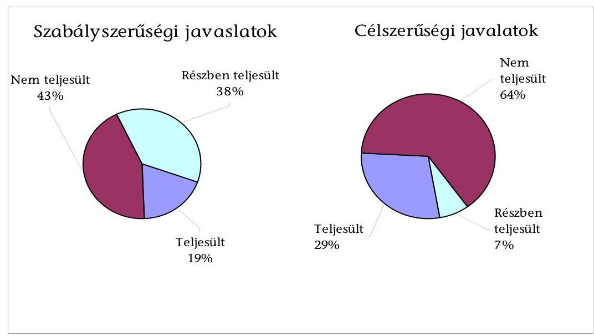

---

Az intézkedési tervben foglalt határidőre az ÁSZ által tett 31 javaslatból hét hasznosult, hét részben valósult meg, 16 nem teljesült, egy javaslat a helyszíni ellenőrzés időszakában nem volt aktuális ${ }^{51}$. A szabályszerűségi javaslatokból három realizálódott, hat részben, hét nem hasznosult. A célszerűségi javaslatok közül négyet végrehajtottak, egy részben, kilenc nem hasznosult.

# A következő szabályszerűségi javaslatokat hasznosította a jegyző: 

- „gondoskodjon arról, hogy az európai uniós forrásokkal megvalósuló programok, projektek bevételeit, kiadásait az Ámr. 36. § (1) bekezdés l) pontja alapján elkülönítetten szerepeltessék"52;

A jegyző intézkedése alapján elkülönítetten mutatták be az Önkormányzat 2011. évi költségvetési rendeletében az európai uniós forrásokkal megvalósuló projektek bevételeit és kiadásait.

- „egészítse ki a Polgármesteri hivatal gazdasági szervezetének ügyrendjét, hogy az Ámr. 20. § (7) bekezdésében foglaltaknak megfelelően tartalmazza az alkalmazottak feladat- és hatáskörét, a helyettesítés rendjét, a belső és külső kapcsolat-tartás módját";
- „gondoskodjon arról, hogy a szabálytalanságok kezelésének eljárásrendje az Ámr. 161. § és a 155. § (3) bekezdésében hivatkozott PM „Útmutató a szabálytalanságok kezeléséhez" címú módszertani útmutatója alapján tartalmazza az intézkedések nyomon követését és a szabálytalanságok, intézkedések nyilvántartási feladatát";

A jegyző a javaslatban foglaltak szerint kiegészítette a szabálytalanságok kezelése eljárásrendjét, amelyet a Képviselő-testület a 205/2010. (X. 26.) számú határozatával elfogadott.

## A következő szabályszerűségi javaslatokat részben hasznosította a jegyző:

- „intézkedjen a belső ellenőrzés szervezeti keretének, működési feltételeinek kialakítása és a kialakított kontrollok működése érdekében arról, hogy a stratégiai terv a Ber. 18. §-ában foglaltaknak megfelelően kockázatelemzésen alapuljon, a stratégiai terv és az éves ellenőrzési tervek összeállítása a Ber. 32/B. § (2) bekezdésében foglaltak alapján a jegyző írásos véleményének figyelembe vételével történjen és az ellenőrzési feladatokat megalapozó kockázatelemzés folyamatába vonja be".

[^0]
[^0]:    ${ }^{51}$ A 2010. évben tett célszerűségi javaslatok közül egy nem volt aktuális, mert az ÁSZ vizsgálatot követően az Önkormányzatnál nem kötöttek szerződést uniós pályázatok írására, ezért a szerződések tartalmára vonatkozó javaslatok realizálását nem ellenőrizhettük.
    ${ }^{52}$ A 2010. évben végzett átfogó ellenőrzésről készült számvevői jelentésben a javaslatok között az államháztartás működési rendjéről szóló 292/2009. (XII. 19.) Korm. rendeletet Ámr. ${ }_{2}$-nek rövidítették, tekintettel arra, hogy a számvevői jelentésben Ámr. ${ }_{1}$-nek lett feltüntetve az államháztartás működési rendjéről szóló 217/1998. (XII. 30.) Korm. rendelet. A jelenlegi számvevőszéki jelentésben az Ámr. ${ }_{1}$ már nem szerepel, ezért az Ámr. ${ }_{2}$ helyett Ámr. megnevezést használunk.

---

A jegyző részt vett a 2011. évi belső ellenőrzési terv megalapozását szolgáló kockázatelemzési munkában, valamint - intézkedésére - a 2011. évi belső ellenőrzési terv összeállítása írásba foglalt javaslatainak figyelembe vételével történt. A jegyző azonban nem gondoskodott a 2009. évben elfogadott - a 2010-2014. évekre vonatkozó - stratégiai terv kockázatelemzésének elkészítéséről ${ }^{53}$.

- „egészítse ki az SzMSz-t, hogy az Ámr. 20. § (2) bekezdés e) pontjának megfelelően tartalmazza a Polgármesteri hivatal egyes szervezeti egységeinek engedélyezett létszámát, valamint határozza meg a belső ellenőrzést végző személy, egység jogállását, feladatait, figyelemmel a Ber. 4. § (2) bekezdésében foglaltakra";

A jegyző intézkedése alapján a Képviselő-testület a 205/2010. (X. 26.) számú határozatában foglaltakkal kiegészítette a hivatali SzMSz-t az engedélyezett létszámadatokkal, valamint meghatározta a belső ellenőrzést végző személy, egység feladatait, de a jogállás meghatározása elmaradt ${ }^{54}$.

- „gondoskodjon arról, hogy az ellenőrzési nyomvonal az Ámr. 156. § (2) bekezdése és a 155. § (3) bekezdésében hivatkozott PM „Útmutató az ellenőrzési nyomvonal kialakításához" módszertani útmutatója alapján tartalmazza az elvégzendő tevékenységeket, feladatokat, utalást arra, hogy a tevékenységeket részletesen mely belső szabályzatok tartalmazzák, az adott tevékenység ellátásáért felelős szervezeti egység vagy személy megnevezését, egyértelmű megfeleltetését, az ellenőrzési pontokat, az egyes tevékenységek elvégzését igazoló dokumentumok megnevezését és fellelhetőségi helyét a rendszerben";

A jegyző elkészítette az ellenőrzési nyomvonalat, amelyet a Képviselő-testület 2010. október 26-án a hivatali SzMSz mellékleteként elfogadott. Az ellenőrzési nyomvonal tartalmazza az elvégzendő tevékenységeket, feladatokat, utalást az adott tevékenység ellátásáért felelős szervezeti egységre és személyre. A jegyző az ellenőrzési nyomvonalban nem írta elő, hogy az egyes tevékenységeket részletesen mely belső szabályzatok tartalmazzák, valamint az egyes tevékenységek elvégzését igazoló dokumentumok megnevezését és fellelhetőségi helyét a rendszerben.

- „egészítse ki a kockázatkezelés eljárásrendjét az Ámr. 157. § (1)-(4) bekezdései, valamint a 155. § (3) bekezdésében hivatkozott PM „Útmutató a kockázatkezelés kialakításához" címú módszertani útmutató alapján, hogy az tartalmazza a kockázatok azonosítását, folyamatgazdáit, értékelését, kategóriákba sorolását, az elfogadható kockázati szint meghatározását, a kockázatokra adható válaszok megvalósíthatósága mérlegelésének kötelezettségét, a válaszintézkedés beépítését a folyamatba és a kockázati környezet rendszeres felülvizsgálatát";
${ }^{53}$ A jegyző a 4/2011. (XI. 28.) számú utasításban elrendelte a 2010-2014. évekre szóló stratégiai tervhez a kockázatelemzés elkészítését, megjelölve annak felelősét és határidejét.
${ }^{54}$ A jegyző a 2/2011. (XI. 21.) számú utasításban elrendelte a 2011. december 20-i képviselő-testületi ülésre önálló napirendi pontként előterjesztés készítését a hivatali SzMSz módosítására arra vonatkozóan, hogy a belső ellenőrzést végző személy, egység jogállása meghatározásra kerüljön.

---

A jegyző kiegészítette a kockázatkezelés eljárásrendjét. A 2010. december 1-jén kiadott kockázatelemzési szabályzat tartalmazza a kockázatok azonosítását, folyamatgazdáit, értékelését, kategóriákba sorolását, az elfogadható kockázati szint meghatározását. Nem tartalmazza azonban a válaszintézkedés beépítését a folyamatba és a kockázati környezet rendszeres felülvizsgálatát.

- „követelje meg a szakmai teljesítés igazolására kijelölt személyektől, hogy feladatukat az Ámr. 76. § (1) és (3) bekezdéseiben foglaltaknak megfelelően az állományba nem tartozók megbízásainak kifizetését megelőzően lássák el";

A jegyző gondoskodott az állományba nem tartozók megbízási díjainak kifizetése esetében a javaslatban foglaltak végrehajtásáról. Nem intézkedett azonban a gazdasági társaságok és a nonprofit szervezetek részére történő működési célú pénzeszköz átadások, a bérleti és lízingdíjak kiadásainak teljesítése során az Ámr. 76. § (3) bekezdésében foglalt előírások ${ }^{55}$ betartásáról, ezért a belső kontrollok működése ezekben az esetekben gyenge volt.

- „követelje meg, hogy az utalvány ellenjegyzője az állományba nem tartozók megbízási díjainak kifizetése esetében az Ámr. 79. § (2) bekezdésében foglaltaknak megfelelően győződjön meg a szakmai teljesítés igazolásának megtörténtéről, valamint arról, hogy az állományba nem tartozók megbízásai és a külső szolgáltatók által végzett karbantartási, kisjavítási munkák elvégzésére irányuló megrendelései esetében kötelezettségvállalásra az Ámr. 74. § (1) bekezdésében foglaltaknak megfelelően a kötelezettségvállalás ellenjegyzését követően kerül-e sor".

A jegyző gondoskodott az állományba nem tartozók megbízási díjainak kifizetése esetében a javaslatban foglaltak végrehajtásáról. Nem intézkedett azonban a gazdasági társaságok és a nonprofit szervezetek részére történő működési célú pénzeszközátadások, a bérleti és lízingdíjak kiadásainak teljesítése során az Ámr. 79. § (2) bekezdésében foglalt előírások ${ }^{56}$ betartásáról, ezért a belső kontrollok működése ezekben az esetekben gyenge volt

# A következő szabályszerűségi javaslatokat a jegyző nem hasznosította: 

- „intézkedjen az Ámr. 233. § (1) bekezdésében és a 22. számú mellékletének 2. pontjában előírtaknak megfelelően az Áhsz. 11. § (1) bekezdésének d) pontja és 40. § (1) bekezdése alapján az éves költségvetési beszámolók részét képező éves költségvetési beszámoló szöveges indoklásának - az Önkormányzat honlapján történő - közzétételéről";
${ }^{55}$ Ámr. 76. § (3) bekezdése alapján „A szakmai teljesítést az igazolás dátumának és a teljesítés tényére történő utalás megjelölésével, az arra jogosult személy aláírásával kell igazolni."
${ }^{56}$ Ámr. 79. § (2) bekezdése alapján „Az utalvány ellenjegyzése

 során a 74. §-ban foglaltak megfelelő alkalmazásával kell eljárni, továbbá meg kell győződni arról, hogy a szakmai teljesítés igazolása és az érvényesítés megtörtént-e.

---

- „az Ámr. 155-156. §-aiban foglaltak alapján a költségvetés-tervezés és zárszám-adás-készítés rendjének szabályozottsága, valamint a kialakított belső kontrollok működtetése érdekében írja elő, valamint az előírások alapján követelje meg:„a saját bevételek előirányzatai és a költségvetés megalapozását szolgáló helyi rendeletek összhangjának ellenőrzését"57;
- „az Ámr. 155-156. §-aiban foglaltak alapján a költségvetés-tervezés és zárszám-adás-készítés rendjének szabályozottsága, valamint a kialakított belső kontrollok működtetése érdekében írja elő, valamint az előírások alapján követelje meg: az intézményi pénzmaradványok kimunkálása szabályszerűségének ellenőrzését annak érdekében, hogy azzal megalapozzák az intézményi pénzmaradvány az Ámr. 213. § (2)-(4) bekezdéseiben foglalt előírások alapján történő képviselő-testületi felülvizsgálatát és jóváhagyását"58;
- „az Ámr. 155-156. §-aiban foglaltak alapján a költségvetés-tervezés és zárszám-adás-készítés rendjének szabályozottsága, valamint a kialakított belső kontrollok működtetése érdekében írja elő, valamint az előírások alapján követelje meg: a költségvetési tervezéshez készített intézményi mutatószám-felmérés adatai megalapozottságának, valamint az intézmények által az állami támogatásokkal, hozzájárulásokkal történő elszámoláshoz közölt mutatószámok adatai megfelelőségének ellenőrzését";
- „határozza meg az Áhsz. 49. § (3) bekezdésében foglaltak alapján a számlarendben a főkönyv és az analitikus nyilvántartások egyeztetésének dokumentálási módját";
- „intézkedjen a belső ellenőrzés szervezeti keretének, működési feltételeinek kialakítása és a kialakított kontrollok működése érdekében arról, hogy: a belső ellenőrzési tevékenység ellátásáról szóló megállapodás módosításra kerüljön annak érdekében, hogy a belső ellenőrzési vezető személyéről a Ber. 4. § (5) bekezdésével összhangban rendelkezzenek";
- „intézkedjen a belső ellenőrzés szervezeti keretének, működési feltételeinek kialakítása és a kialakított kontrollok működése érdekében arról, hogy: a Ber. 23. § (1) bekezdése alapján készített ellenőrzési programot a Ber. 23. § (3) bekezdésében foglaltaknak megfelelően a belső ellenőrzési vezető hagyja jóvá, biztosítva az összhangot a belső ellenőrzési feladatok ellátására irányuló megállapodásban és annak módosításában foglaltak és a gyakorlat között".

[^0]
[^0]:    ${ }^{57}$ A jegyző az 1/2011. (XI. 21.) számú utasításban elrendelte a saját bevételek előirányzatai és a költségvetés megalapozását szolgáló helyi rendeletek összhangjának ellenőrzését, megjelölve az egyes részfeladatok felelősét és határidejét.
    ${ }^{58}$ A jegyző a 3/2011. (XI. 28.) számú utasításban elrendelte az intézményi pénzmaradványok kimunkálása szabályszerűségének ellenőrzését, megjelölve annak felelősét és határidejét.

---

# A következő célszerűségi javaslatot hasznosította a polgármester: 

- „kezdeményezze, hogy a számvevői jelentésben foglaltakat a Képviselő-testület tárgyalja meg, és a feltárt hiányosságok megszüntetése érdekében készíttessen intézkedési tervet a határidők és felelősök megjelölésével. Az intézkedési tervet az elfogadást követő 30 napon belül küldje meg az ÁSZ Szabolcs-Szatmár-Bereg Megyei Ellenőrzési Irodája részére."

A javaslatok realizálása érdekében a jegyző - a felelősöket és határidőket tartalmazó - intézkedési tervet készített, amelyet a Képviselő-testület a 206/2010. (X. 26.) számú határozatával jóváhagyott. Az intézkedési tervet az elfogadást követő 30 napon belül megküldte az ÁSZ Szabolcs-Szatmár-Bereg Megyei Ellenőrzési Irodája részére.

## A következő célszerűségi javaslatokat hasznosította a jegyző:

- „intézkedjen az európai uniós forrásokra vonatkozó pályázatokkal összefüggésben a Polgármesteri hivatalon belül az önkormányzati szintű pályázat-nyilvántartás kötelezettségének és a pályázat-nyilvántartás módjának előírásáról";

A jegyző a javaslatban foglaltak szerint 2010. november 15-én módosította az uniós támogatások pénzügyi lebonyolítása, elszámolása rendjének szabályzatát.

- „szabályozza az európai uniós forrásokat érintően a pályázatfigyelést végzők és a döntési, illetve a döntés-előterjesztési jogkörrel rendelkezők közötti információszolgáltatási kötelezettséget, az európai uniós forrásokra irányuló pályázatfigyelés, pályázatkészítés, valamint az európai uniós forrással támogatott fejlesztés lebonyolításával kapcsolatos eljárási rendet (feladat, kapcsolattartás, információáramlás)";
- „egészítse ki a munkavállalók munkaköri leírásait a leltározási, az eszközök és források értékelési, az eszközök hasznosítási és selejtezési, valamint a számlarendben meghatározott feladatokkal, biztosítva azok összhangját".

A jegyző a 2010. november 1-jén kiegészítette a Polgármesteri hivatal Pénzügyi iroda dolgozóinak munkaköri leírását a javaslatban foglaltaknak megfelelően.

## A következő célszerűségi javaslatot részben hasznosította a jegyző:

- „gondoskodjon arról, hogy a stratégiai és éves belső ellenőrzési terveket megalapozó kockázatelemzés terjedjen ki az európai uniós forrásból megvalósított feladatok végrehajtására, a közbeszerzési eljárások lebonyolítására, az Önkormányzat többségi irányítást biztosító befolyása alatt működő gazdasági társaságának működésére és a kedvezményezett szervezeteknek az Önkormányzat költségvetéséből céljelleggel nyújtott támogatások rendeltetésszerű felhasználására".

A jegyző intézkedései alapján a 2011. évi belső ellenőrzési tervet megalapozó kockázatelemzés kiterjedt az európai uniós forrásból megvalósított feladatok és a közbeszerzési eljárások lebonyolítására vonatkozó kockázatok értékelésére, azonban a kockázatelemzés nem terjedt ki az Önkormányzat többségi tulajdonú gazdasági társaságának működésére és a kedvezményezett szervezeteknek az Önkormányzat költségvetéséből céljelleggel átadott pénzeszközök rendeltetésszerű felhasználására. A stratégiai tervet kockázatelemzés nem alapozza meg.

---

# A következő célszerűségi javaslatokat a jegyző nem hasznosította: 

- „a pénzügyi-számviteli feladatoknál alkalmazott informatikai rendszer szabályozottságának biztosítása és a kialakított belső kontrollok működtetése érdekében rögzítse a biztonsági mentésekből végezhető visszaállítási és helyreállítási tevékenységeket, szabályozza a szoftver-változások ellenőrzésére, tesztelésére vonatkozó eljárásokat";
- „a pénzügyi-számviteli feladatoknál alkalmazott informatikai rendszer szabályozottságának biztosítása és a kialakított belső kontrollok működtetése érdekében tiltsa meg számítástechnikai védelmi szabályzatában a külső fejlesztők bármilyen típusú hozzáférését az éles pénzügyi-számviteli rendszerhez";
- „a pénzügyi-számviteli feladatoknál alkalmazott informatikai rendszer szabályozottságának biztosítása és a kialakított belső kontrollok működtetése érdekében egészítse ki a hozzáférési jogosultságokra vonatkozó eljárásrendet a hozzáférési jogosultságok megállapítására, kiosztására, módosítására, visszavonására, ellenőrzésére vonatkozó rendelkezésekkel";
- „a pénzügyi-számviteli feladatoknál alkalmazott informatikai rendszer szabályozottságának biztosítása és a kialakított belső kontrollok működtetése érdekében gondoskodjon a pénzügyi számviteli rendszer esetében a jelszavak kezelési rendjének szabályozásáról és a belső szabályzatában foglaltaknak megfelelően a felhasználók egyedi felhasználónévvel és jelszóval rendelkezzenek, a pénzügyiszámviteli rendszerből ellenőrzési lista legyen lekérhető, mely alapján megállapítható, hogy a pénzügyi-számviteli rendszerben mely azonosítóval mikor végeztek műveletet, mi volt a művelet pontos tartalma";
- „a pénzügyi-számviteli feladatoknál alkalmazott informatikai rendszer szabályozottságának biztosítása és a kialakított belső kontrollok működtetése érdekében gondoskodjon a katasztrófa elhárítási terv teszteléséről és a pénzügyi-számviteli adatok elmentett állományaiból történő teljes körű helyreállíthatóságának ellenőrzéséről";
- „a pénzügyi-számviteli feladatoknál alkalmazott informatikai rendszer szabályozottságának biztosítása és a kialakított belső kontrollok működtetése érdekében gondoskodjon a főkönyvi könyvelési rendszerben tárolt hozzáférési jogosultságok ellenőrizhetőségéről";
- „a pénzügyi-számviteli feladatoknál alkalmazott informatikai rendszer szabályozottságának biztosítása és a kialakított belső kontrollok működtetése érdekében végeztesse el és dokumentáltassa belső szabályzatában foglaltaknak megfelelően a pénzügyi-számviteli szoftver elemeire vonatkozó változáskezelési eljárásokat, azok ellenőrzését és tesztelését";
- „intézkedjen annak érdekében, hogy az éves ellenőrzési tervet megalapozó kockázatelemzés során a magas kockázatúnak értékelt területek értékelését a hatályos kockázatkezelési eljárásrend alapján végezzék el";

---

- „gondoskodjon az Önkormányzat gazdálkodásának 2005. évi átfogó ellenőrzése során az ÁSZ által részére tett és nem teljesült célszerűségi javaslat végrehajtásáról".

Az ÁSZ a 2010. évi átfogó ellenőrzése során az utóellenőrzés keretében megállapította, hogy „A jegyző szervezett formában nem gondoskodott a Polgármesteri hivatal dolgozóinak informatikai továbbképzéséről, az e területen szükséges ismeretek bővítésére csupán az alkalmazott programok rendszergazdái által a programok kezeléséhez nyújtott segítségre adott lehetőséget."

Budapest, 2012. április "f 8
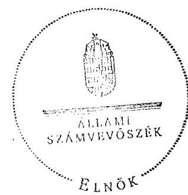

Domokos László Ø

---

# Az Önkormányzat gazdálkodását meghatározó adatok, mutatószámok 

| Megnevezés | 2007. év | 2010. év |
| :--: | :--: | :--: |
| A település állandó lakosainak száma (fő) 2007. és 2011. január 1-jén | 7072 | 6904 |
| A Képviselő-testület tagjainak a száma (fő) (december 31-én) | 14 | 9 |
| A Képviselő-testület munkáját segítő állandó bizottságok száma (december 31-én) | 5 | 5 |
| Az összes vagyon értéke a december 31-i könyvviteli mérleg szerint (millió Ft) | 1093,4 | 1431,9 |
| A hosszú és rövid lejáratú kötelezettség december 31-én (millió Ft) | 67,1 | 131,1 |
| Az összes teljesített költségvetési bevétel* (millió Ft) | 1366,9 | 1747,5 |
| Ebből: saját bevétel (millió Ft), melyből | 793,1 | 732,8 |
| helyi adó és illetékbevétel, valamint az szja-n kívüli átengedett bevételek (millió Ft) | 49,8 | 59,1 |
| Az egy állandó lakosra jutó költségvetési bevétel (Ft) | 193282,1 | 253 108,9 |
| Az egy állandó lakosra jutó saját bevétel (Ft) | 112 147,1 | 106 137,7 |
| Az egy állandó lakosra jutó helyi adóbevétel (Ft) | 4581,6 | 5 196,1 |
| Saját bevétel/Felhalmozási célú költségvetési kiadásokkal csökkentett összes költségvetési bevétel aránya (%) | 61,1 | 49,3 |
| Helyi adó és illetékbevétel, valamint az szja-n kívüli átengedett bevételek/Felhalmozási célú költségvetési kiadásokkal csökkentett összes költségvetési bevétel aránya (%) | 3,8 | 4,0 |
| Az összes teljesített költségvetési kiadás (millió Ft) | 1368,4 | 1695,9 |
| Ebből: felhalmozási célú költségvetési kiadás (millió Ft) | 68,3 | 261,3 |
| A költségvetési kiadásból a felhalmozási célú költségvetési kiadás aránya (%) | 5,0 | 15,4 |
| Az egy lakosra jutó teljesített működési célú költségvetési kiadás (Ft) | 183828 | 207798 |
| Az egy lakosra jutó teljesített felhalmozási célú költségvetési kiadás (Ft) | 9662 | 37849 |
| A költségvetési szervek száma december 31-én | 6 | 6 |
| Ebből: önállóan működő és gazdálkodó | 1 | 1 |
| A Polgármesteri hivatalban foglalkoztatott köztisztviselők száma (fő) (december 31-én) | 37 | 36 |
| Az Önkormányzat által foglalkoztatott közalkalmazottak száma (fő), (december 31-én) | 184 | 179 |

[^0]
[^0]:    * a költségvetési bevétel az előző évek pénzmaradványának, vállalkozási maradványának igénybevételét is tartalmazza

---

|  Megnevezés | 2007. | 2008. | 2009. | 2010.  |
| --- | --- | --- | --- | --- |
|  1. FOLYÓ KÖLTSÉGVETÉS |  |  |  |   |
|  1.1.1. Saját működési bevételek
(80/105+106+107+108+110+111+121+125+126+202+203+208-54) | 71 232 | 72 124 | 94 339 | 112 008  |
|  1.1.2. Költségvetési támogatás (80/211) | 573 448 | 1 006 391 | 1 083 246 | 996 664  |
|  1.1.3. Átengedett bevételek (80/109+122+123+124) | 662 673 | 280 936 | 285 519 | 294 370  |
|  1.1.4. Állambáztartáson belülről kapott támogatások (80/127+139) | 49 091 | 74 457 | 86 586 | 81 922  |
|  1.1.5. EU-tól és külföldről kapott bevételek (80/156+157+158) | 0 | 0 | 0 | 0  |
|  1.1.6. Állambáztartáson kívülről kapott bevételek
(80/148+149+150+155+160+197) | 558 | 5 810 | 5 032 | 11 271  |
|  1.1.7. Előző évi pénzmaradvány átvétel (80/93) | 0 | 0 | 0 | 0  |
|  1.1. Folyó bevételek =1.1.1.+1.1.2.+1.1.3.+1.1.4.+1.1.5.+1.1.6. | 1 357 002 | 1 439 718 | 1 554 722 | 1 496 235  |
|  1.2.1. Működési kiadások kamatkiadások nélkül (80/04+05+06+07+08+09+10+11) | 877 942 | 938 794 | 1
 005 552 | 986 683  |
|  1.2.2. Állambudgetáson belülre átadott pénzeszközök (80/23) | 0 | 0 | 5 727 | 19 047  |
|  1.2.3.1. vállalkozásoknak (80/41+46+95) | 58 516 | 62 669 | 59 049 | 57 139  |
|  1.2.3.2. EU-nak, illetve külföldre (80/42+43+44) | 0 | 0 | 0 | 0  |
|  1.2.3.3. magáncégeknek (80/34+48+49) | 326 784 | 369 283 | 378 192 | 335 773  |
|  1.2.3.4. nonprofit szervezeteknek (80/32+33) | 30 374 | 29 842 | 27 974 | 29 702  |
|  1.2.3. Transzferkiadások (=1.2.3.1+1.2.3.2+1.2.3.3+1.2.3.4) | 415 674 | 461 794 | 465 215 | 422 614  |
|  1.2.4 Kamatkiadások (53+97) | 6 415 | 6 280 | 10 163 | 6 293  |
|  1.2.5. Előző évi pénzmaradvány átadás (80/20) | 0 | 0 | 0 | 0  |
|  1.2. Folyó kiadások = 1.2.1.+1.2.2.+1.2.3.+1.2.4. | 1 300 031 | 1 406 868 | 1 486 657 | 1 434 637  |
|  1.3. Folyó költségvetés egyenlege MŰKÖDÉSI JÖVEDELEM (1.1. - 1.2.) | 56 971 | 32 850 | 68 065 | 61 598  |
|  2. FELHALMOZÁSI KÖLTSÉGVETÉS |  |  |  |   |
|  2.1.1. Saját tökebevételek (80/164+199+200+201+205+206+207+209) | 1 659 | 17 973 | 31 646 | 0  |
|  2.1.2. Állambudgetáson belülről kapott támogatások (80/176) | 323 | 60 | 71 803 | 23 855  |
|  2.1.3. EU-tól és külföldről kapott támogatások (80/193+194+195) | 0 | 0 | 0 | 207 761  |
|  2.1.4. Állambudgetáson kívülről kapott támogatások (80/185+186+187+192) | 7 568 | 4 396 | 2 558 | 1 588  |
|  2.1. Felhalmozási bevételek (=2.1.1.+2.1.2+2.1.3+2.1.4.) | 9 550 | 22 429 | 106 007 | 233 204  |
|  2.2.1. Saját beruházási kiadás áfával (80/57+58 arányos része) | 68 327 | 29 677 | 207 588 | 224 717  |
|  2.2.2. Saját felújítási kiadás áfával (80/56+58 arányos része) | 0 | 8 625 | 958 | 27 310  |
|  2.2.3. Állambudgetáson belülre átadott pénzeszköz (80/70+99+101) | 0 | 0 | 12 008 | 4 732  |
|  2.2.4. EU-nak és külföldnek adott pénzeszközök (80/89+90+91) | 0 | 0 | 0 | 0  |
|  2.2.5. Állambudgetáson kívülre adott pénzeszközök
(80/79+80+81+88+92+93+100) | 0 | 0 | 0 | 4 550  |
|  2.2.6. Befektetési célú részesedések vásárlása (80/102) | 0 | 0 | 500 | 0  |
|  2.2. Felhalmozási kiadások (=2.2.1.+2.2.2.+2.2.3.+2.2.4.+2.2.5.+2.2.6.) | 68 327 | 38 302 | 221 054 | 261 309  |
|  2.3. Felhalmozási költségvetés egyenlege (2.1. - 2.2.) | -58 777 | -15 873 | -115 047 | -28 105  |
|  3. Finanszírozási műveletek nélküli (GFS) pozíció (1.3.+2.3.) | -1 806 | 16 977 | -46 982 | 33 493  |
|  4. Finanszírozási műveletek |  |  |  |   |
|  4.1. Hitelfelvétel (80/230+231+232+238) | 12 900 | 36 740 | 89 872 | 44 922  |
|  4.2. Hiteltörlesztés (80/219+220+221+227) | 20 861 | 40 226 | 36 853 | 49 791  |
|  4.3. Forgatási és befektetési célú értékpapírok kibocsátása (80/233+235+237) | 0 | 0 | 0 | 0  |
|  4.4. Forgatási és befektetési célú értékpapírok beváltása (80/222+224+226) | 0 | 0 | 0 | 0  |
|  4.5. Forgatási és befektetési célú értékpapírok értékesítése (80/234+236) | 4 000 | 0 | 18 000 | 6 000  |
|  4.6. Forgatási és befektetési célú értékpapírok vásárlása (80/223+225) | 0 | 15 000 | 0 | 8 000  |
|  4.7. Egyéb finanszírozási bevételek (függő, átfutó, kiegyenlítő) (80/239) | 2 652 | 3 569 | -2 372 | -5 590  |
|  4.8. Egyéb finanszírozási kiadások (függő, átfutó, kiegyenlítő) (80/228) | -2 945 | 1 472 | 3 069 | -15 327  |
|  4. Finanszírozási műveletek egyenlege (4.1. - 4.2.) | 1 636 | -16 389 | 65 578 | 2 868  |
|  5. Tárgyévi pénzügyi pozíció (1.3.+ 2.3.+4.3.) | -170 | 588 | 18 596 | 36 361  |
|  6. Nettó működési jövedelem =működési jövedelem (1.3.) - töketörlesztés (4.2+4.4) | 36 110 | -7 376 | 31 212 | 11 807  |
|  TÁJÉKOZTATÓ ADATOK |  |  |  |   |
|  Összes kötelezettség (01/101+127) | 67 134 | 67 730 | 104 159 | 131 081  |
|  ebből rövid lejáratú (01/127) | 67 134 | 67 730 | 91 040 | 121 353  |
|  Összes szállítói kötelezettség (01/105) | 26 734 | 24 734 | 6 793 | 39 662  |
|  ebből lejárt (tanúsítványból) | 26 734 | 24 734 | 6 793 | 39 662  |
|  Pénz és tőkepótló kötelezettség (adósság) (01/96+97+98+99+103+109) | 37 500 | 38 354 | 91 373 | 86 505  |
|  ebből rövid lejáratú (01/103+109) | 37 500 | 38 354 | 78 254 | 76 777  |
|  PPP szerződéses állomány jelenértéken (tanúsítványból) | 0 | 0 | 0 | 0  |
|  ebből lejárt szolgáltatási díj miatti kötelezettség | 0 | 0 | 0 | 0  |
|  Folyószámla-, likvid- és munkabérhitel napi átlagos állománya (tanúsítványból) | 67 595 | 66 681 | 74 366 | 88 997  |
|  Kezesség és garanciavállalások (tanúsítványból) | 7 944 | 0 | 0 | 6 409  |
|  Jogerős bírósági ítéletekből adódó kötelezettségek (tanúsítványból) | 0 | 0 | 0 | 0  |
|  Finanszírozásba bevonható eszközök: | 10 612 | 26 200 | 26 796 | 65 157  |
|  Tartós hitelviszonyt megtestesítő értékpapírok (01/18) | 9 000 | 24 000 | 6 000 | 0  |
|  Hosszú lejáratú bankhitelek (01/20) | 0 | 0 | 0 | 0  |
|  Értékpapírok (01/56) | 0 | 0 | 0 | 8 000  |
|  Pénzeszközök (idegen pénzeszközök nélkül) (01/61-60) | 1 612 | 2 200 | 20 796 | 57 157  |

