# JELENTÉS 

Pomáz Város Önkormányzata gazdálkodási rendszerének 2011. évi ellenőrzéséről

---

# Számvevői Iroda 

Iktatószám: V-3067-029/2012.
Témaszám: 1015
Vizsgálat-azonosító szám: V0560010

## Az ellenőrzést felügyelte:

Dr. Varga Sándor
számvevő igazgatóhelyettes
Az ellenőrzést vezette:
Gyüre Lajosné
számvevő tanácsos
Az ellenőrzést végezték:

| Szabó Leonóra Ildikó | Komlósiné Bogár Éva | Nagy Adrienn |
| :-- | :-- | :-- |
| számvevő | számvevő tanácsos | számvevő |

---

# TARTALOMJEGYZÉK 

BEVEZETÉS ..... 9
I. ÖSSZEGZŐ MEGÁLLAPÍTÁSOK, KÖVETKEZTETÉSEK, JAVASLATOK ..... 15
II. RÉSZLETES MEGÁLLAPÍTÁSOK ..... 34

1. A pénzügyi egyensúly, a fizetőképesség, a gazdálkodás stabilitásának biztosítása, az adósságkezelés eredményessége ..... 34
2. A vagyoni helyzet alakulása, valamint a vagyongazdálkodás folyamataiban a kontrollok múködése ..... 50
2.1. Az Önkormányzat vagyoni helyzetének 2007-2010 közötti alakulása ..... 50
2.2. A vagyongazdálkodás belső kontrolljainak múködése ..... 52
3. A közfeladatok ellátásában résztvevő önkormányzati többségi tulajdonban lévő gazdasági társaságoknál a tulajdonosi felelősség érvényesítésének eredményessége ..... 61
4. Az Önkormányzat gazdálkodási rendszerének korábbi ellenőrzése során tett szabályszerűségi és célszerűségi javaslatok hasznosítása ..... 65

## MELLÉKLETEK

1. számú Az Önkormányzat gazdálkodására jellemző adatok, mutatószámok (1 oldal)
2. számú Az Önkormányzat bevételei és kiadásai, valamint adósságszolgálata 2007-2010 között (1 oldal)
2/a. számú Az Önkormányzat bevételei és kiadásai, valamint adósságszolgálata a számviteli hibák kiszűrésével 2007-2010 között (1 oldal)

---

.

---

# RÖVIDÍTÉSEK JEGYZÉKE 

## Törvények

Áht.
Eisz. tv.

Gt.
Htv.

Ötv.
Stabilitási tv.
Számv. tv.
új Áht.
új Eisz. tv
Vagyon tv.

## Rendeletek

Áhsz.

Ámr. 1
Ámr. 2
Ávr.
Ber.
IHM rendelet
új Ber.
vagyongazdálkodási rendelet
2010. évi költségvetési rendelet
2011. évi költségvetési rendelet
2010. évi zárszámadási rendelet
az államháztartásról szóló 1992. évi XXXVIII. törvény
az elektronikus információszabadságról szóló 2005. évi XC. törvény
a gazdasági társaságokról szóló 2006. évi IV. törvény
a helyi önkormányzatok és szerveik, a köztársasági megbízottak, valamint egyes centrális alárendeltségű szervek feladat- és hatásköreiről szóló 1991. évi XX. törvény
a helyi önkormányzatokról szóló 1990. évi LXV. törvény
a Magyarország gazdasági stabilitásáról szóló 2011. évi CXCIV. törvény
a számvitelről szóló 2000. évi C. törvény
az államháztartásról szóló 2011. évi CXCV. törvény
az információs önrendelkezési jogról és az információszabadságról szóló 2011. évi CXII. törvény
a nemzeti vagyonról szóló 2011. CXCVI. törvény
az államháztartás szervezetei beszámolási és könyvvezetési kötelezettségének sajátosságairól szóló 249/2000. (XII. 24.) Korm. rendelet
az államháztartás múködési rendjéről szóló 217/1998. (XII. 30.) Korm. rendelet
az államháztartás múködési rendjéről szóló 292/2009. (XII. 19.) Korm. rendelet
az államháztartási törvény végrehajtásáról szóló 368/2011. (XII. 31.) Korm. rendelet
a költségvetési szervek belső ellenőrzéséről szóló 193/2003. (XI. 26.) Korm. rendelet
18/2005. (XII. 27.) IHM rendelet a közzétételi listákon szereplő adatok közzétételéhez szükséges közzétételi mintákról
a költségvetési szervek belső kontrollrendszeréről és belső ellenőrzéséről szóló 370/2011. (XII. 31.) Korm. rendelet
Pomáz Város Önkormányzatának a 30/2009. (VI. 26.), valamint a 25/2009. (VI. 26.) rendeletekkel módosított 23/2005. (IX. 29.) számú rendelete az Önkormányzat vagyonáról, és a vagyongazdálkodás szabályairól
az Önkormányzat 5/2010. (III. 2.) számú rendelete a 2010. évi költségvetésről
az Önkormányzat 3/2011. (II. 28.). számú rendelete a 2011. évi költségvetésről
az Önkormányzat 11/2011. (V. 2.) számú rendelete a 2010. évi zárszámadásáról

---

| SzMSz | az Önkormányzat 29/2006. (XI. 20.) számú rendelete az Önkormányzat Szervezeti és Múködési Szabályzatáról |
| :--: | :--: |
| Szórövidítések |  |
| áfa | általános forgalmi adó |
| ÁSZ | Állami Számvevőszék |
| Belső Kontroll Kézikönyv | az államháztartásért felelős miniszter által a 2010. évben közzétett, a belső kontrollrendszer múködtetésére vonatkozó módszertani útmutató |
| EU | Európai Unió |
| FEUVE | folyamatba épített, előzetes, utólagos és vezetői ellenőrzés |
| Gazdálkodási szabályzat | a 4/2010. számú jegyzői utasítás a jegyzői hatáskörbe tartozó aláírási, kiadmányozási jogok gyakorlásáról |
| hivatali SzMSz | a 175/2009. (IX. 22.) számú önkormányzati határozattal jóváhagyott Pomáz Város Önkormányzata Polgármesteri Hivatalának Szervezeti Müködési Szabályzata |
| jegyző | Pomáz Város Önkormányzatának jegyzője |
| KVI | Kincstári Vagyoni Igazgatóság |
| Képviselő-testület | Pomáz Város Önkormányzatának Képviselő-testülete |
| MÁK | Magyar Államkincstár |
| NOIKSZ | Nevelési Oktatási Intézmények Koordinációs Szervezete |
| Önkormányzat | Pomáz Város Önkormányzata |
| Pénzügyi bizottság | Pomáz Város Önkormányzatának Pénzügyi Bizottsága |
| Városfejlesztési és Városüzemeltetési bizottság | Pomáz Város Önkormányzatának Városfejlesztési és Városüzemeltetési bizottsága |
| polgármester | Pomáz Város Önkormányzatának polgármestere |
| Polgármesteri hivatal | Pomáz Város Önkormányzatának Polgármesteri Hivatala |
| Társulás | Dunakanyari és Pilisi Önkormányzatok Többcélú Kistérségi Társulása (DPÖTK) |
| PHARE | Pologne, Hongrie Aide a la Reconstruction économique, az Európai Közösség által 1989-ben elindított program |
| pénzügyi csoport | Pomáz Város Önkormányzatának Polgármesteri Hivatala Pénzügyi Csoportja |
| Tájékoztatási társaság | Pomáz Tájékoztatási, Információs és Koordinációs Közhasznú Társaság, 2009. július 1-jétől nonprofit kft. |
| Városüzemeltetési társaság | Pomáz Városüzemeltetési Kht., 2009. június 24-től nonprofit kft. |
| Zenekastély társaság | Pomázi Zenekastély Kht., 2009. május 28-tól nonprofit kft. |

---

# ÉRTELMEZŐ SZÓTÁR 

bonitás

CLF módszer
eredményesség
finanszírozási célú pénzügyi műveletek
garanciavállalás
kezességvállalás

A bonitás hitelképességet jelent. A bonitást a pénzügyi kapacitás fogalmával írhatjuk le, ami nem más, mint az adósok hitelfelvételi képességének azon mértéke, ahol még anélkül tudják növelni az adósságot, hogy csökkenteniük kellene akár jelenlegi, akár jövőben esedékes kiadásaikat fizetőképességük fenntartása érdekében.
Capability and Leadership Framework (CLF)
Az önkormányzatok költségvetése elemzésének eszköze, a bevételek és kiadások, múködés és fejlesztés elkülönítése. Bizonyos mértékig a vállalati gazdálkodás logikai elemeit érvényesíti az önkormányzatok pénzügyi jövedelmi helyzetének vizsgálata során. Következetesen elkülöníti a folyó és a felhalmozási költségvetés bevételeit és kiadásait, azok költségvetési egyenlegeit. A módszer a pénzügyi kapacitás fogalmát helyezi a középpontba.
A kitűzött célok megvalósításának mértékeként vagy egy tevékenység kimenete szándékolt és tényleges hatása közötti kapcsolat. Ebben a meghatározásában - kiterjesztve a teljesítmény-ellenőrzés értelmezési tartományára - a hatás az operatív, a specifikus vagy átfogó szinten keletkezett „végterméket" jelenti, amely lehet output, eredmény és hatás egyaránt (ÁSZ Teljesítmény-ellenőrzési módszertan 16. oldal).
Értékpapírok kibocsátása, értékesítése és visszavásárlása; hitelek felvétele és törlesztése; szabad pénzeszközök betétként való elhelyezése és visszavonása (Áht. 8/A. § (3) bekezdés).
Valamilyen esemény jövőbeni bekövetkezéséhez kapcsolódó kötelezettségvállalás. A garanciavállalás az önkormányzat kötelezettségvállalása arra vonatkozóan, hogy a szerződésben meghatározott feltételek beálltakor a garancia kedvezményezettje számára, határozott összegig, határozott időpontig, felszólításra azonnal fizet. Ez a kötelezettség az önkormányzat számára azzal a bizonytalansággal jár, hogy nem tudja, hogy ezt a kötelezettségvállalását igénybe veszik-e vagy nem, és ha igen, mikor.
A kezesség járulékos kötelezettségvállalás, amely lehet egyszerű vagy készfizető, és mindig feltételezi a főkötelezettet. Az egyszerű kezességvállalás esetén a kezes mindaddig megtagadhatja a teljesítést, míg mindazoktól behajtható, akik őt megelőzően vállaltak kötelezettséget. A készfizető kezest nem illeti meg a sortartás kifogása. A fentiek következtében mind a garancia-, mind a kezességvállalás esetében az önkormányzatnak a futamidő teljes időtartama alatt azzal kell számolnia, hogy ha a főkötelezett elmulasztja teljesíteni a fizetést, a vállalt kötelezettséget vele szemben érvényesítik az adott időpontban fennálló összeg erejéig (Ptk. 272-276. §-ai alapján).

---

kamatkockázat

költségvetési bevétel
kötvény
közfeladat
pénzügyi kockázat

PPP (public private partnership)

Az a kockázat, hogy a forint-, vagy a devizahitel futamideje alatt emelkedik a kamat és így a hitel törlesztésére fordítandó összeg. (Ezen ellenőrzéshez kialakított értelmezés.)
Az Áht. 69. § (1) bekezdés a) és c) pontjaiban foglaltak figyelembevételével meghatározott összeg, amelynek számítása során a tárgyévi költségvetési bevételeket növeli - a költségvetési hiány belső finanszírozására szolgáló előző évek pénzmaradványából, vállalkozási maradványából igénybe vett összeg. (Az Áht. alapján ezen ellenőrzéshez kialakított értelmezés.)
Hosszabb lejáratra szóló, hitelviszonyt megtestesítő kamatozó értékpapír. A kötvényben a kibocsátó arra kötelezi magát, hogy a kötvényben megjelölt pénzösszegnek az előre meghatározott kamatát vagy egyéb jutalékait, továbbá az adott pénzösszeget a kötvény mindenkori tulajdonosának, illetve jogosultjának a megjelölt időben és módon megfizeti.
Az állami, helyi, illetve kisebbségi önkormányzati feladat, amelynek ellátásáról az államnak, illetve az önkormányzatoknak kell gondoskodnia. A hatályos szabályozás szerint közfeladatot törvény és önkormányzati rendelet állapíthat meg. Az önkormányzatok által ellátandó feladatok keretszerú meghatározását az Ötv. tartalmazza.
A belső múködési kockázat egyik eleme. A költségvetési szerv múködésének, tevékenységének, rövid távon ható velejáróinak része a tevékenységi és emberi erőforrás kockázatokkal együtt. Megmutatkozhat a költségvetés nagyságrendjének, szerkezetének módosulásaiban, a bevételi, kiadási előirányzatok változásaiban, a nem megfelelő belső kontrollrendszer múködése során, a tudatos károkozásokban, a biztosítások elmaradásában, a hibás fejlesztési döntésekben, a nem megfelelő forrásfelhasználásokban.
Az állami és a magánszféra együttmúködésének egyik formája, amelynek keretében a közcél a magánszféra jelentős mértékű közremúködésével valósul meg. Az állam (önkormányzat) a közszolgáltatások létrehozását a tradicionálisnál komplexebb módon bízza a magánszférára. Az együttmúködés keretében megvalósuló közszolgáltatás hosszú távra szól. A magánpartner felelőssége az infrastruktúra tervezésére, megépítésére, múködtetésére és legalább részben a projekt finanszírozására terjed ki. Az állam (önkormányzat) és/vagy a szolgáltatások igénybe vevője szolgáltatási díjat fizet.

---

saját vagyon

SNA
visszafizetési kockázat

A könyvviteli mérlegben szereplő eszközöknek a kötelezettségekkel csökkentett összege, amellyel azonos a források között szereplő a saját tőke és a tartalékok együttes összege. A saját vagyonhoz tartoznak továbbá a számviteli nyilvántartásban érték nélkül szereplő eszközök.
System of National Account, azaz a Nemzeti Számlák Rendszere, amely a gazdasági szektorok által létrehozott valamennyi terméket és szolgáltatást figyelembe veszi.
Annak a kockázata, hogy a hitelt felvevőnél rendelkezésre állnak-e a visszafizetéshez, a hitel törlesztéséhez szükséges pénzügyi források. A visszafizetési kockázatot növeli a kamat- és árfolyamkockázat növekedése, mivel ezekben az esetekben az adósságszolgálat nőhet. Egy adott kötelezettség keletkezését megelőzően, illetve azt követően olyan pénzügyi helyzet állhat fenn, amely a kötelezettség visszafizetését korlátozhatja, meggátolhatja, ellehetetlenítheti. Visszafizetési kockázatot okozhat, ha:

- a hitelfelvételből, kötvénykibocsátásból származó bevétel visszafizetéséhez szükséges forrást a bevétel felhasználási területe nem biztosítja, (pl. a megvalósított beruházás múködése, üzemeltetése során nem a tervezett eredményességet biztosította, vagy a tervezettnél magasabb a fenntartási költsége, a tervezett kiadási megtakarítást nem biztosítja, a betétbehelyezés alacsonyabb kamatbevételt biztosított, mint amennyi a kötvény kamata);
- a visszafizetésre tervezett forrás elérésének, teljesítésének bizonytalansága (pl. a visszafizetéshez tervezett tartalékolás elmaradt, a tervezettnél alacsonyabb a saját bevétel, a helyi adóból származó bevétel az adóalanyok, adóalapok csökkenése miatt nem teljesül);
- a kötelezettségvállaláskor a visszafizetési forrás megjelölésének, tervezésének elmaradása, vagy megalapozatlan figyelembevétele.

---

.

---

# JELENTÉS   Pomáz Város Önkormányzata gazdálkodási rendszerének 2011. évi ellenőrzéséről 

## BEVEZETÉS

Az Állami Számvevőszék 2011. évben életbe lépett stratégiája szerint „az önkormányzatok ellenőrzése során azok pénzügyi-gazdasági helyzetét értékeli, kockázatait feltárja, valamint az ellenőrzések helyszíneit objektív mutatószámrendszer alapján választja ki". E célkitűzéseknek megfelelően összeállított ellenőrzési program alapján végzi a helyi önkormányzatok gazdálkodási rendszerének ellenőrzését.

## Az ellenőrzés célja az Önkormányzatnál annak értékelése volt, hogy:

- biztosított-e a pénzügyi egyensúly, a fizetőképesség, a gazdálkodás stabilitása, ezeket segítette-e az adósság kezelése;
- a vagyoni helyzet a külső és belső tényezők hatására miként változott, a belső kontrollok megfelelően biztosították-e a vagyongazdálkodás szabályosságát, eredményességét;
- eredményesen érvényesítette-e a tulajdonosi felelősségét a közfeladatok ellátásában résztvevő többségi tulajdonban lévő gazdasági társaságainál;
- hasznosultak-e a gazdálkodási rendszer korábbi ellenőrzése során tett szabályszerűségi és célszerűségi javaslatok.

Az ellenőrzés típusa: szabályszerűségi ellenőrzés, továbbá az ellenőrzés meghatározott területein teljesítmény-ellenőrzés.

Az ellenőrzött időszak: a pénzügyi, vagyoni helyzettel kapcsolatos elemzéseket, értékeléseket az önkormányzat többségi tulajdonú gazdasági társaságainál a tulajdonosi felelősség érvényesítését, valamint az önkormányzat gazdálkodási rendszerének korábbi ellenőrzése során tett javaslatok megvalósításának ellenőrzését a 2007-2010. évekre vonatkozóan végeztük, valamint lehetőség szerint kitértünk a helyszíni ellenőrzést megelőző utolsó negyedév végéig terjedő időszakra is. A vagyongazdálkodás belső kontrolljai múködésének tesztelése a 2010. évre, valamint a helyszíni ellenőrzést megelőző utolsó negyedév végéig terjedő időszakra vonatkozik.

Az ellenőrzés jogszabályi alapját az Állami Számvevőszékről szóló 2011. évi LXVI. törvény 1. § (3) bekezdése, 5. § (2)-(6) bekezdései, az államháztartásról szóló 1992. évi XXXVIII. törvény 120/A. § (1) bekezdése előírásai képezték.

---

Az ellenőrzés szakmai módszertanát a Legfőbb Ellenőrző Intézmények Nemzetközi Szervezete (INTOSAI) által kiadott nemzetközi standardok (ISSAI) és az Állami Számvevőszék által kiadott „Ellenőrzési Kézikönyv" és „Módszertani útmutató a teljesítmény-ellenőrzéshez" képezte.

Pomáz város állandó lakosainak száma 2011. január 1-jén 16581 fő volt. A 2010. évi önkormányzati képviselő- és polgármester-választást követően az Önkormányzat 11 tagú Képviselő-testületének munkáját négy állandó bizottság segítette. A polgármester 2006 óta tölti be tisztségét. A 2004-ben kinevezett jegyző munkaviszonya 2010. február 28-án szűnt meg. A jelenlegi jegyző a jegyzői feladatokat megbízottként 2009. július 1-jétől, kinevezettként pedig 2010. május 5-től látta el.

Az Önkormányzat feladatainak végrehajtása érdekében 2007-ben és 2010-ben is 11 költségvetési szervet múködtetett, amelyekből kettő volt önállóan gazdálkodó. A feladatok ellátásában 2007-2010. évek közötti időszakban részt vett három, az Önkormányzat többségi tulajdonában lévő gazdasági társasága.

Az Önkormányzat 2010. december 31-én a MÁK-hoz benyújtott beszámolójában szereplő könyvviteli mérleg szerint 16797,9 millió Ft értékű vagyonnal rendelkezett, amely a 2007-2009. évek átlagához viszonyítva (695,8 millió Ft) 4,0\%-os csökkenést mutatott. A 2010. évi mérlegben szerepeltetett eszközök csökkenését az immateriális javak és a tárgyi eszközök után elszámolt értékcsökkenés, valamint a forgóeszközök állományának csökkenése okozta. Az eszközökön belül a legnagyobb mértékben az üzemeltetésre átadott eszközök állománya nőtt, a 2007-2009. évek átlagához képest 2010-re a növekedés 16,5\% (301,9 millió Ft) volt, a víziközműves beruházások eredményeként. Az Önkormányzat hosszú lejáratú kötelezettségének állománya a 2007-2009. évek átlagához viszonyítva 2010-re 24,7\%-kal (558,5 millió Ft-tal) nőtt a 2010-ben 500 millió Ft-ban kibocsátott kötvény hatására. A rövid lejáratú kötelezettségek állománya a 2007-2009. évek átlagáról 1665,5 millió Ft-ról 1474,2 millió Ft-ra, 11,5\%-kal csökkent a szállítói tartozásállomány csökkenése következtében.

A Polgármesteri hivatalban dolgozó köztisztviselők száma 2007. december 31én 71 fő, 2010. december 31-én 64 fő, a csökkenés 9,9\% (7 fő) volt. A 2007. évben az Önkormányzatnál foglalkoztatott közalkalmazottak száma 289 fő, a 2010. évben 282 fő, a csökkenés 2,4\% (7 fő) volt. Az Önkormányzat gazdálkodására jellemző adatokat az 1. számú melléklet tartalmazza.

A hagyományos költségvetési szerkezet helyett az Önkormányzat pénzügyi helyzetét a CLF módszerrel mutattuk be, amelyben jobban elkülönülnek a vagyonnal kapcsolatos bevételek és kiadások az önkormányzati feladatokkal kapcsolatos közvetlen működtetési bevételektől és kiadásoktól. A módszer következetesen elkülöníti a folyó és a felhalmozási költségvetés bevételeit és kiadásait, azok költségvetési egyenlegeit. A saját folyó bevételek, valamint a saját felhalmozási bevételek nem tartalmazzák az előző évi pénzmaradványok felhasználásából származó pénzforgalom nélküli bevételeket ${ }^{1}$. A számítási le-

[^0]
[^0]:    ${ }^{1}$ A költségvetési években kialakuló hiány finanszírozása az előző években képzett tartalékok felhasználásával is történhet.

---

írás némileg eltér az ÁSZ módszertanában korábban alkalmazott gyakorlattól. A jelen besorolás általános közgazdasági meggondolásokon alapul, amely megjelenik az SNA statisztikai módszertanában is.

A folyó költségvetés egyenlege, a múködési jövedelem megmutatja, hogy az önkormányzat éves folyó bevétele fedezetet biztosít-e a kötelező és önként vállalt feladatellátáshoz kapcsolódó éves folyó kiadására. A múködési jövedelem negatív értéke pénzügyileg fenntarthatatlan helyzetet jelez. A mutató pozitív értéke megtakarítást mutat, amely forrásul szolgálhat az önkormányzat fennálló kötelezettségei megfizetéséhez, valamint fejlesztéseihez.

A felhalmozási költségvetés pozitív értéke felhalmozási többletet mutat, amely a jövőbeni fejlesztések forrását biztosíthatja. Amennyiben a folyó költségvetési hiány finanszírozása a felhalmozási többletből történik, ez szűkebb értelemben vagyonfelélésnek tekinthető. Amennyiben a felhalmozási költségvetés megtakarítása fejlesztési célú hitelek, kötvények adósságszolgálatát finanszírozza, az - változatlan vagyontömeg mellett - a korábban megelőlegezett tőkebevételek valós realizációjának tekinthető. A felhalmozási deficit által generált finanszírozási igény önmagában nem jár pénzügyi kockázattal, a pénzügyileg fenntartható beruházásokhoz kapcsolódó kötelezettségvállalás (adósságszolgálat) átlátható és szabályozott költségvetési gazdálkodással teljesíthető.

A módszer a pénzügyi kapacitás fogalmát helyezi a középpontba. Az adós hitelfelvételi képessége, hosszú távú fizetőképessége vagy bonitása a pénzügyi kapacitással (a nettó működési jövedelemmel) jellemezhető. A nettó működési jövedelem negatív értéke az egyes költségvetési években jelentkező adósságszolgálat túlzott mértékére utal ${ }^{2}$. A nettó múködési jövedelem negatív értékének felhalmozási többletből vagy további hitelből történő finanszírozása pénzügyileg nem fenntartható gazdálkodást vetít előre. A pozitív értéket mutató nettó múködési jövedelem fejlesztési kiadások fedezetét biztosíthatja, illetve a folyamatosan, évenként képződő pozitív nettó múködési jövedelemből meghatározható a jövőben vállalható, teljesíthető éves adósságszolgálat, ily módon az a hitelösszeg, amely - a többi tényezőt, feltételt adottnak tekintve - visszafizetési kockázat nélkül felvehető.

Folyó tételek alatt értjük azokat a kiadásokat és bevételeket, amelyek a gazdálkodó szervezet helyzetét automatikusan nem változtatják. Bevételi oldalon ilyenek az adók, a tényezőjövedelmek, a transzferek, kiadási oldalon a transzferek ${ }^{3}$ és a szolgáltatás nyújtásával kapcsolatos múködési kiadások. A folyó költségvetésben a bevételekben nem térül meg, a kiadásokban nem jelenik meg az amortizáció, a vagyoni helyzetet viszont az egyenleg befolyásolja.

A folyó költségvetés egyenlege (működési jövedelem) tartalmazza a kamatkiadásokat is, mind a fejlesztési kamatot, mind a visszatérülő áfa teljes összegét,

[^0]
[^0]:    ${ }^{2}$ Kivéve, ha annak finanszírozására a korábbi években képzett tartalékok fedezetet nyújtanak.
    ${ }^{3}$ Transzferkiadásoknak nevezzük azokat a folyó és felhalmozási tételeket, amelyeket nem az adott önkormányzat használ fel szolgáltatásnyújtásra.

---

mert ezek közgazdaságilag tényező jövedelmek. Nem tartalmazzák viszont a követeléselengedés miatt könyvelt bevételi és kiadási pénzforgalmi tételeket, mert valójában technikai elszámolási múveletnek minősülnek, a bevétel soha nem realizálódott, és költségvetési kiadás sem történt.

A felhalmozási költségvetésben a bevételek között a vagyon megőrzésére és bővítésére fordítható források jelennek meg. A felhalmozási vagy tőketételek módosítják a vagyon nagyságát. A privatizációs bevétel csökkenti a vagyont, a fizikai beruházás, a pénzügyi befektetés növeli.

A nettó működési jövedelmet a tőketörlesztés levonásával a folyó költségvetés egyenlegéből származtatjuk.

Az új módszereken alapuló helyzetértékelés fontosságát az adja, hogy a helyi önkormányzatok bruttó adósságállománya ${ }^{4}$ 2007-től vált jelentőssé, az önkormányzati alrendszer 2010. évi költségvetési beszámolójának adatai alapján 1248 milliárd Ft -ot tett ki.

Az Önkormányzat pénzügyi egyensúlyi helyzetének rövid bemutatásán túlmenően a pénzügyi egyensúly fenntartását, a pénzügyi kockázatok kezelését és annak hatását (a pénzügyi egyensúly fenntartását veszélyeztető külső és belső pénzügyi kockázatok csökkentésére tett döntések, intézkedések eredményességét) minősítettük. Lényegességi szempontok figyelembevételével értékeltük a döntés-előkészítés, a megtett intézkedések eredményességét és azt, hogy a pénzügyi egyensúly fenntartását mely kockázatok és milyen mértékben veszélyeztették. Az ellenőrzés részletes szempontjai szerinti elvégzéséhez az egységes értelmezés alapját az ellenőrzési program mellékletét képező teljesítményellenőrzési kérdésfa és a kapcsolódóan meghatározott kritériumok, valamint a fogalmak egységes tartalmát meghatározó értelmezési szótár biztosította.

A vagyongazdálkodás ellenőrzése kiterjedt a vagyon értékének, összetételének a 2007-2010. évek közötti időszakban a vagyonváltozást előidéző okok elemzésére. A vagyongazdálkodás belső kontrolljai azonosításának és múködésének ellenőrzése keretében a vagyonértékesítés és a vagyonhasznosítás, valamint a finanszírozási célú pénzügyi műveletek folyamatait értékeltük ${ }^{5}$. Felmértük a belső kontrollokban rejlő kockázatot, minősítettük a kontrollok múködésének

[^0]
[^0]:    ${ }^{4}$ A bruttó adósságállomány 2010. év végi összege magában foglalja a fejlesztési és a múködési célú kötvénykibocsátások, a beruházási és fejlesztési hitelek, a múködési célú hosszú lejáratú hitelek, a rövid lejáratú hitelek, váltótartozások miatti kötelezettségek teljes (2011-ben, illetve az azt követő években esedékes) állományát.
    ${ }^{5}$ A vagyongazdálkodás területén a szabályozottságban rejlő kockázatot alacsonynak minősítettük, ha a szabályozottság megfelelő védelmet nyújtott a vagyongazdálkodással összefüggő hibák bekövetkezése ellen. Közepesnek minősítettük a vagyongazdálkodás szabályozottságában rejlő kockázatot, amennyiben a szabályozottság a lehetséges vagyongazdálkodási hibák többsége ellen védelmet nyújtott. Magasnak értékeltük a vagyongazdálkodás szabályozottságában rejlő kockázatot, ha a szabályok - kialakításuk hiányában, vagy hiányos kialakításuk miatt - nem nyújtottak elegendő védelmet a lehetséges vagyongazdálkodási hibákkal szemben.

---

eredményességét ${ }^{6}$, és meghatároztuk, hogy a vagyongazdálkodás folyamatában mely kontrollok nem biztosították a működésbeli hibák megelőzését, feltárását, kijavítását, ezáltal veszélyeztették az eredményes, megfelelő múködést.

A vagyongazdálkodási folyamatokban alkalmazott belső kontrollok azonosításának és működésének vizsgálatát többlépcsős megfelelőségi tesztek útján végeztük. A vizsgált területek könyvviteli tételei (meghatározott tételszám felett egyszerű véletlen minta) alapján történt a vagyongazdálkodás kulcsszerepet betöltő belső kontrolljai (a kötelezettségvállalás ellenjegyzése, a szakmai teljesítésigazolás és az utalvány ellenjegyzés) működésének a megítélése. Az ellenőrzés során alkalmazott módszer - a többlépcsős megfelelőségi teszt alkalmazásának - lényege az volt, hogy a kiválasztott minta ellenőrzését csak addig végeztük, amíg elegendő és megfelelő bizonyítékot nem szereztünk a vizsgált folyamatok kulcskontrolljai ${ }^{7}$ működésének megfelelő vagy nem megfelelő voltáról ${ }^{8}$.

Az ellenőrzést a következő, kiemelt kockázatuk alapján kiválasztott bevételekre és kifizetésekre folytattuk le:

- az ingatlanértékesítésből származó bevételekre;
- az ingatlanok, helyiségek bérbeadásából származó bevételekre;
- az épületek vásárlásával, létesítésével kapcsolatos kifizetésekre;
- az ingatlanok felújításával kapcsolatos kifizetésekre;
- az önkormányzat többségi tulajdonában lévő gazdasági társaságok részére nyújtott múködési célú pénzeszközátadásokra teljesített kifizetésekre;
- a vásárolt közszolgáltatások kifizetéseire.

[^0]
[^0]:    ${ }^{6}$ Az előzetesen meghatározott módszer alapján számított pontok képezik a kontrollok működésének értékelése alapját, az eredményesség kritériumát.
    ${ }^{7}$ kulcskontrollok: azok a kontrollok, amelyek a specifikus eredendő kockázatok mérséklése szempontjából alapvető fontosságúak, és eredményes múködésük meghatározó hatással van a kontrollrendszer minőségére. A kulcskontrollok biztosítják más kontrollok (egy vagy több) múködési hibájának feltárását, kiküszöbölését; viszonylag könnyen tesztelhetők; a folyamatos, következetes és eredményes múködésük legalább két vagy több múködési hiba ellen biztosítanak védelmet.
    ${ }^{8}$ A vagyongazdálkodás területén azonosított kontrollok múködését kiválónak értékeltük abban az esetben, ha azok múködése megfelelt a hibák megelőzésére és kijavítására meghatározott szabályozásnak és a legmagasabb szintű elvárásoknak. Jónak minősítettük a vagyongazdálkodás területén azonosított kontrollok múködését, ha a megállapított kisebb (tolerálható mértékű) hiányosságok nem veszélyeztették a vagyongazdálkodás ellenőrzött területei hibáinak megelőzését és kijavítását. Amennyiben a kontrollok múködésében túl sok hiányosság fordult elő ahhoz, hogy a kontrollok biztosítsák a vagyongazdálkodási hibák megelőzését, feltárását, kijavítását, és ezáltal veszélyeztették az eredményes, megfelelő vagyongazdálkodást, a kontrollok múködése gyenge minősítést kapott.

---

Az Önkormányzat gazdálkodási rendszerének korábbi (2009. évi) ellenőrzése során tett szabályszerűségi és célszerűségi ÁSZ javaslatok hasznosulását utóellenőrzés keretében ellenőriztük.

A helyszíni ellenőrzés során kitöltött - az ellenőrzést végző számvevő és a Polgármesteri hivatal, felelős köztisztviselője által aláírt - ellenőrzési munkalapokat, azok kitöltési útmutatóit, továbbá a megfelelőségi tesztek dokumentumait a polgármester részére a számvevői megállapítások egyeztetése során átadtuk.

---

# I. ÖSSZEGZŐ MEGÁLLAPÍTÁSOK, KÖVETKEZTETÉSEK, JAVASLATOK 

## A pénzügyi egyensúlyi helyzet értékelése

Az Önkormányzat a 2010. évben 2923,2 millió Ft költségvetési bevételből gazdálkodott, a költségvetés végrehajtása során 3037,8 millió Ft kiadást teljesített. A 2011. évi költségvetési rendeletben 2863,5 millió Ft költségvetési bevételt és 2816,9 millió Ft költségvetési kiadást irányoztak elő.

Az Önkormányzat - adatszolgáltatása alapján - a 2010. évben a folyó kiadásokból 2294,4 millió Ft-ot ( $93,5 \%$ ) a kötelező feladatok, 159,5 millió Ft-ot $(6,5 \%)$ az önként vállalt feladatok ellátására fordított. Az önként vállalt feladatok az alapfokú művészeti (zenei) oktatáshoz, az általános iskolai speciális tagozaton tanulók, valamint a szakiskolai és szakközépiskolai tanulók oktatásához, a helyi újság kiadásához, továbbá a helyi kisebbségi önkormányzatok, a civil szervezetek, az egyházak, az egyéb társadalmi szervezetek támogatásához kapcsolódtak. A 2011. évi tervadatok alapján a kötelező feladatokra 1999,5 millió Ft-ot ( $94,7 \%$-ot), az önként vállalt feladatokra 112,6 millió Ft-ot $(5,3 \%-o t)$ terveztek.

Az Önkormányzat feladatait 2011. június 30 -án (a Polgármesteri hivatallal együtt) 11 költségvetési szervvel és három gazdasági társasága részvételével látta el. A feladatellátás telephelyeinek száma a 2007. évi 17 -ről 2011. év I. félév végére 18-ra nőtt (2010-től a telephelyek száma a konténer óvodával bővült).

Az Önkormányzat a Tájékoztatási társaságban és a Városüzemeltetési társaságban kizárólagos tulajdonnal, a Zenekastély társaságban 90\%-os tulajdoni részesedéssel rendelkezik. A gazdasági társaságok közül a Városüzemeltetési társaság (2007. év végéig) a településtisztasági feladatokat, a Tájékoztatási társaság az újságkiadást, a Zenekastély társaság a KVI-től átvett Teleki-Wattay kastély üzemeltetését végezte. A családsegítés feladatainak ellátására a Szent Miklós Alapítvánnyal (Pomáz), és a lakossági szilárd hulladék elszállítására a Városi Szolgáltató Zrt.-vel (Szentendre) szolgáltatási szerződést kötöttek.

Az Önkormányzat folyó kiadásokra 2010-ben 2491,0 millió Ft-ot fordított. A 2010. évben a folyó kiadások 76,0\%-a (1893,0 millió Ft) intézményi körben merült fel. Az egyes közszolgáltatások feladatellátásában résztvevő költségvetési szervek múködési bevételeit és összetételét a következő ábra szemlélteti:

---

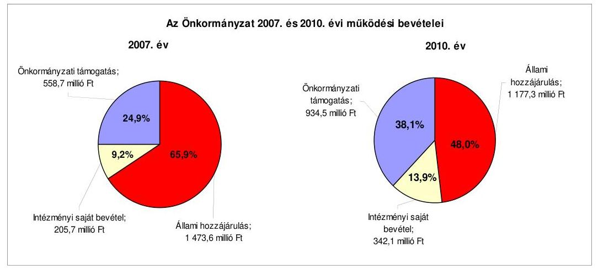

Az Önkormányzat feladatainak ellátásához kapcsolódó állami hozzájárulás a 2007-2010 közötti időszakban 1473,6 millió Ft-ról 1177,3 millió Ft-ra, 296,3 millió Ft-tal ( $20,1 \%$ ) csökkent, míg az intézményi saját bevétel (főként a megemelt térítési díjakból adódóan) 136,4 millió Ft-tal (66,3\%), az önkormányzati támogatás 375,8 millió Ft-tal ( $67,3 \%$ ) nőtt. Az állami hozzájárulások csökkenése miatt nagyobb arányban kellett saját forrásokat bevonni a feladatok finanszírozásába.

Az Önkormányzat folyó költségvetés egyenlege (működési jövedelem), tőketörlesztése és a pénzügyi kapacitása (nettó múködési jövedelem) alakulását az alábbi ábra szemlélteti:
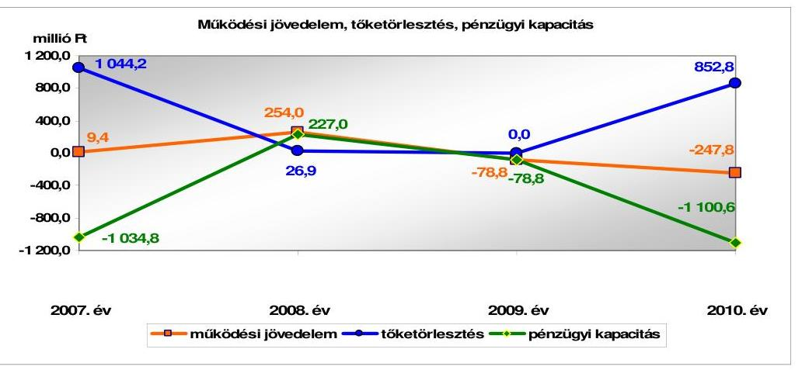

Az Önkormányzat folyó költségvetés egyenlege (működési jövedelem) a 2007-2008. években 263,4 millió Ft működési forrástöbbletet mutatott, amely a kötelező és önként vállalt feladatainak kiadásaira fedezetet nyújtott. A 2009-2010. években forráshiány keletkezett, a folyó kiadások meghaladták (a 2009. évben 78,8 millió Ft-tal, a 2010. évben 247,8 millió Ft-tal) a folyó bevételek összegét, mivel 2009-ben a 2008. évhez képest 13,2\%-kal (128,1 millió Fttal), 2010-ben a 2009. évhez viszonyítva 10,4\%-kal (87,7 millió Ft-tal) csökkent a költségvetési támogatás, valamint 2009-ben a saját múködési bevétel csökkent a 2008. évi egyszeri - meghiúsulási kötbér címén befolyt - 301,9 millió Ft bevétel miatt. A 2009. évi csökkenés után 2010-ben nőttek a múködési kiadások és a pénzintézeti kötelezettségek növekedéséből adódóan a kamatkiadások.

---

A 2007-2010. években összesen 63,2 millió Ft negatív múködési jövedelem keletkezett. A 2007-2010. évek között teljesített 1923,9 millió Ft tőketörlesztések fedezetét újabb kötelezettségvállalással (kötvényekből származó bevételekből) biztosították.

A 2007-2010. években összesen 1313,7 millió Ft hitel felvételére, 2700 millió Ft kötvénykibocsátásra került sor. A finanszírozási múveletek egyenlege minden évben pozitív, 2007-ben 1481,9 millió Ft, 2008-ban 214,2 millió Ft, 2009-ben 310,9 millió Ft, 2010-ben 119,6 millió Ft volt, ami azt jelentette, hogy a tőketörlesztést meghaladó mértékű volt a külső forrásbevonás. A finanszírozási műveletek egyenlege a 2007. év végén volt kiugróan magas, 1481,9 millió Ft, melyet az év közben kibocsátott kötvényből származó bevétel okozott.

Az Önkormányzat felhalmozási költségvetésének egyenlege a 2007-2009. években negatív, a hiányzó forrás összesen 2171,6 millió Ft volt, amelynek fedezetét külső források (hitel és kötvény) igénybevételével biztosították. A 2010. évben a felhalmozási költségvetés egyenlege pozitív, 133,2 millió Ft volt.

A 2007-2010. években a pénzügyi helyzet alakulását jelentősen befolyásolta az Önkormányzat végrehajtott fejlesztési tevékenysége. A 2007. év előtti fejlesztésekhez igénybe vett összesen 956,7 millió Ft pénzintézeti forrást az Önkormányzat a 2007. évi kötvénykibocsátásból származó bevételéből fizette vissza. A 2007-2010. években az Önkormányzat adatszolgáltatása alapján a 2010. december 31-ig befejezett ( 3593,1 millió Ft értékű) fejlesztés és felújítás forrása - a saját erő és a hazai és uniós támogatások mellett - 1263,4 millió Ft kötvénykibocsátásból származó bevétel (35,2\%), és 188 millió Ft hitelfelvétel (5,2\%) volt. A 2010. december 31-én folyamatban lévő (uniós támogatással megvalósuló) fejlesztési feladat megvalósítására 2007-2010 között 9,3 millió Ft kiadást teljesítettek, amelyet saját forrásból fedeztek. A folyamatban lévő fejlesztési feladat 2010. évet követő kötelezettségvállalásának összege 87,5 millió Ft volt, amelyből 78,7 millió Ft-ot európai uniós támogatásból és 8,8 millió Ft-ot saját forrásból terveztek biztosítani.

Az Önkormányzat mérleg szerinti pénzintézeti kötelezettsége a 2007. év elejétől a 2011. év I. félév végére közel háromszorosára, 1102,9 millió Ft-ról 3291,3 millió Ft-ra nőtt. A fennálló pénzintézeti kötelezettségek kötvények kibocsátásából, megszűnt víziközmű társulatok által felvett három beruházási hitel átvállalásából, folyószámla- és munkabér-megelőlegezési hitel igénybevételéből keletkeztek. Az Önkormányzat 2011. évi költségvetési rendelete alapján további 100 millió Ft hitel felvételét tervezte, amelyet 2011. október végéig még nem vett igénybe.

Az Önkormányzat pénzintézeti kötelezettségvállalásaira képviselő-testületi döntés alapján került sor, azonban a kötvények esetében a döntések megalapozása érdekében nem kértek több pénzintézettől ajánlatot, így a döntéseket a kötvénykibocsátás feltételeinek több pénzintézet adataival való összehasonlító értékelése nélkül hozták meg. A 2007. és a 2010. években a kötvénykibocsátások során a döntések meghozatala előtt - az Ötv. előírásai ellenére - az adósságot keletkeztető kötelezettségvállalások felső határát nem vizsgálták. A 2010. évi kötvénykibocsátás során az Önkormányzat túllépte az Ötv.-ben meg-

---

határozott adósságot keletkeztető kötelezettségvállalások felső határát, mivel a korrigált saját bevétel nem nyújtott fedezetet a kötvénykibocsátással kapcsolatban vállalt tárgyévi kötelezettségre. Az Önkormányzat az Ötv.-ben foglaltak ellenére önkormányzati törzsvagyont (intézmények használatában lévő ingatlanokra) használt fel a hitelfelvétel és kötvénykibocsátás fedezetéül.

Az Önkormányzat a 2007. évben kibocsátott kötvényből származó bevételt a 2007 előtti években igénybe vett hitelek kiváltására és a Képviselő-testület által jóváhagyott beruházások, felújítások finanszírozására használta fel. Az Önkormányzat adatszolgáltatása szerint 2010. december 31-ig a forintban fennálló hosszú lejáratú pénzintézeti kötelezettségeiből (kötvényekből) 37,1 millió Ft tőkét törlesztett, és 403,7 millió Ft kamatot, valamint 40,5 millió Ft jegyzési költséget fizetett. A 2007-2011. év I. féléve között átmenetileg szabad pénzeszközeiből 27,8 millió Ft kamatbevételt realizált.

Az Önkormányzat 2010. évi könyvviteli mérlegében 56,7 millió Ft-tal szerepelt egyéb hosszú lejáratú kötelezettség, amelynek értékelése - a Számv. tv. előírása ellenére - a beszámoló készítése előtt elmaradt. Nem tartották be továbbá az Önkormányzatnál a fénymásolóra kötött lízingszerződésnél a vagyongazdálkodási rendeletben foglalt hatásköri előírásokat, mert a beszerzés nagyságrendje miatt a kötelezettségvállalás engedélyezésére a Képviselő-testület volt jogosult, arra a polgármester nem rendelkezett hatáskörrel.

Az Önkormányzat pénzügyi egyensúlya a 2007-2011. év I. félév közötti időszakban a folyamatosan fennálló folyószámlahitel mellett munkabérmegelőlegezési hitel és egy alkalommal 300,0 millió Ft rövid lejáratú hitel igénybevételével volt biztosított, amelyet 2008. július 31-én vett fel és négy lejárati határidő módosítás után 2010. február 17-én fizetett vissza. A hitelvisszafizetés forrása a 2010. február 17-én kibocsátott kötvényből származó bevétel volt.

Az Önkormányzat pénzügyi helyzete a 2007-2010 közötti időszakban a fizetőképesség szempontjából kedvezőtlenül alakult. A rövid lejáratú kötelezettségek fedezetét jelentő készpénz és egyéb likvid forgóeszközök állományának együttes összege egyik évben sem érte el a rövid lejáratú kötelezettségek állományának összegét. Az Önkormányzat likviditási helyzetének kedvezőtlen alakulását tükrözi, hogy a likviditási célú hitelek igénybevétele tartós volt, keretösszege, napi átlagos állománya növekedett. A rövid lejáratú (folyószámla- és a munkabér-megelőlegezési) hitelek a kiadások és bevételek ütemkülönbségéből eredő finanszírozási hiány kezelésén túl a költségvetési hiány finanszírozási forrásává váltak.

A folyószámla- és a munkabér-megelőlegezési hitelek igénybevétele a 20072010. években és a 2011. év I. félévében a következők szerint alakult:

---

| Megnevezés | 2007. év | 2008. év | 2009. év | 2010. év | 2011. június 30. |
| :--: | :--: | :--: | :--: | :--: | :--: |
| I. Folyószántahitel |  |  |  |  |  |
| keretösszegjjanuár 1-jén (millió Ft-ban) | 314,1 | 300,0 | 240,0 | 500,0 | 500,0 |
| átlagos napi állomány (millió Ft-ban) | 270,6 | 205,3 | 476,8 | 490,8 | 497,2 |
| folyószántahitellel zárt napok száma (nap) | 365 | 366 | 365 | 365 | 181 |
| egyenleg (állomány) | 260,8 | 193,5 | 467,8 | 497,6 | 499,9 |
| II. Munkabér megelőlegezési hitel |  |  |  |  |  |
| keretösszegjjanuár 1-jén (millió Ft-ban) | 35,0 | 35,0 | 35,0 | 41,0 | 41,0 |
| átlagos napi állomány (millió Ft-ban) | 35,0 | 34,5 | 38,2 | 39,9 | 40,0 |
| munkabér-megidlegezési hitellel zárt napok   száma (nap) | 251 | 254 | 254 | 255 | 126 |
| egyenleg (állomány) | - | 39,3 | 40,0 | 40,0 | 40,0 |

A likviditás biztosítása a 2007-2011. év I. félév közötti időszakban az Önkormányzatnak 173,1 millió Ft kamatkiadást és 1,1 millió Ft egyéb költséget jelentett. A likviditási célú hitelek igénybevétele ellenére az Önkormányzat 2011. év I. félév végi szállítói tartozása 282,2 millió Ft, amelyből 244,5 millió Ft lejárt tartozása volt. A pénzügyi egyensúly megteremtésére a nagy összegű szállítói tartozásállomány, ezen belül a lejárt szállítói tartozás kockázatot jelent.

Az Önkormányzat kettő múködő víziközmű társulat kedvezményes kamatozású fejlesztési hiteleihez a 2007. évben vállalt készfizető kezességet 337,5 millió Ft összegben, amely 2011. év I. félév végére 282,5 millió Ft-ra csökkent. Az Önkormányzat a gazdasági társaságai részére kezességet nem vállalt, visszatérítendő pénzeszközt nem adott.

Az Önkormányzat adósságkezelési tevékenysége nem volt eredményes, mert a költségvetési egyensúly javítása céljából tett intézkedések a közép-, illetve a hosszú távú pénzügyi egyensúly megteremtéséhez nem voltak elégségesek. Az intézkedések - az Önkormányzat kimutatása szerint - a 2007-2011. év I. félév közötti időszakban összesen 170,6 millió Ft kiadási megtakarítást és 66,2 millió Ft bevételi növekedést eredményeztek. Az Önkormányzat nem rendelkezett likviditási és eladósodási problémákat kezelő stratégiával. A 2010. és a 2011. évi költségvetési rendeletek végrehajtása során a likviditási terveket az Ámr. ${ }_{2}$ előirása ellenére - nem aktualizálták. Nem készítettek a kötelezettségvállalásokról szóló döntések megalapozásához számításokat, nem határozták meg az adósságot keletkeztető kötelezettségvállalások esetében a visszafizetés lehetséges forrásait. A Képviselő-testület nem kapott tájékoztatást a hosszú lejáratú kötelezettségvállalásból adódó tőke- és kamatfizetési kötelezettségek viszszafizetési forrásaira vonatkozóan, valamint arról, hogy a változó kamatozású adósságot keletkeztető kötelezettségvállalások jövőbeni terhei előre nem látható mértékben növekedhetnek. A megvalósított beruházások, felújítások megtérülésére vonatkozó számítás, értékelés nem készült.

Az Önkormányzat 2010. december 31-én, valamint 2011. június 30-án fennálló kötelezettségeinek állományát, a 2011-2013. közötti időszakban és a 2013. év után várható kötelezettségek számszerűsített adatait a következő táblázat tartalmazza:

---

| Megnevezés | Allomány 2010. december 31-án |  | Allomány 2011. június 30-án |  | Várható kötelezettség* 2011. év |  | Várható kötelezettség 2014. évtől |  |
| :--: | :--: | :--: | :--: | :--: | :--: | :--: | :--: | :--: |
|  | HUF-ban   (millió Ft ban) | Devizában   ezer EUR   (összege) | Deviz   nem | HUF-ban   (millió Ft   ban) | Devizában   ezer EUR   (összege) | Deviz   nem | HUF-ban   (millió Ft   ban) | Devizában   ezer EUR   (összege) | 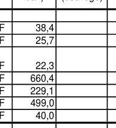 |
| Pénzintézeti kötelezettségek |  |  |  |  |  |  |  |  |  |
| Hosszú lejáratú hitel Messetfa I | 51,4 |  | HUF | 48,6 |  | HUF | 38,4 |  | HUF | 10,2 |  | HUF |
| Hosszú lejáratú hitel Messetfa II | 34,4 |  | HUF | 32,5 |  | HUF | 25,7 |  | HUF | 6,5 |  | HUF |
| Hosszú lejáratú hitel Szelesteje-Ortovácz   (szp-viz elvezetés | 47,0 |  | HUF | 44,5 |  | HUF | 22,3 |  | HUF | 22,2 |  | HUF |
| Kötvény (Pentáz 2027.60/vény) | 2162,9 |  | HUF | 2126,6 |  | HUF | 650,4 |  | HUF | 2260,3 |  | HUF |
| Kötvény (Pentáz 2019.60/vény) | 500,0 |  | HUF | 500,0 |  | HUF | 228,1 |  | HUF | 517,2 |  | HUF |
| Folyószámlatolót | 497,6 |  | HUF | 498,0 |  | HUF | 498,0 |  | HUF |  |  |  |
| Munkabér megelőlegezési hitel | 40,0 |  | HUF | 40,0 |  | HUF | 40,0 |  | HUF |  |  |  |
| Pénzintézeti kötelezettségek összesen HUF-ben: | 3333,3 |  |  | 3291,3 |  |  | 1514,9 |  |  | 2836,7 |  |  |
| Karassaly | 285,2 |  | HUF | 282,5 |  | HUF | 282,5 |  | HUF |  |  |  |
| Szállító tartozás | 280,2 |  | HUF | 282,3 |  | HUF | 282,3 |  | HUF |  |  |  |
| Egyéb kötelezettségek | 196,8 |  | HUF | 195,8 |  | HUF | 196,8 |  | HUF |  |  |  |
| Egyéb hatás elmaradás | 190,3 |  | HUF | 190,3 |  | HUF | 190,3 |  | HUF |  |  |  |
| Kötelezettségek összesen HUF-ben: | 4355,8 |  |  | 4348,0 |  |  | 2471,6 |  |  | 2836,7 |  |  |

Az Önkormányzat pénzintézetekkel szemben fennálló kötelezettsége a 2011. év I. félév végén 3291,3 millió Ft volt. Ezek várható kötelezettsége (tőke, kamat, és egyéb költség) a legutóbbi kamatfizetés feltételei alapján a 2011-2013. években 1514,9 millió Ft. Az Önkormányzatnak a 2011. év I. félév végére szállítói tartozások és egyéb kiadás elmaradások rendezése, valamint jogerős végzéssel lezárt, de ki nem fizetett kötelezettségek címén 956,7 millió Ft fizetési kötelezettsége keletkezett. Az Önkormányzat nyilatkozata alapján kimutatott kötelezettségvállalással nem terhelt forgalomképes ingatlanvagyonának számviteli nyilvántartás szerinti nettó értéke a 2011. június 30-i állomány szerint 2736,0 millió Ft volt.

Az Önkormányzat pénzügyi helyzetét összegezve a következők emelhetők ki:

Az Önkormányzat pénzügyi egyensúlya rövid távon veszélyeztetett. A pénzügyi egyensúlyi helyzet szempontjából kockázatot jelent, hogy a lejárt szállítói tartozásállománya, az egyéb kiadás elmaradásból és jogerős végzéssel lezárt, ki nem fizetett tartozásból eredő kötelezettsége, a folyószámla- és a mun-kabér-megelőlegezési hitelek állománya és azok napi átlagos állománya folyamatosan növekvő tendenciát mutat.

Az Önkormányzat a 2007-2010. években, valamint a 2011. év I. félévében nem rendelkezett a fizetőképességének és eladósodásának kezelését szolgáló stratégiával, valamint folyamatosan aktualizált likviditási tervvel. A pénzintézeti és egyéb kötelezettségek visszafizetésének fedezeteként az Önkormányzat által megjelölt források a felmerülő kötelezettségeket nem fedezik. Az Önkormányzat a fejlesztésekkel létrehozott tárgyi eszközök fenntartásának várható költségeit nem számszerúsítette, a beruházásokkal, felújításokkal kapcsolatosan nem készült a megtérülésükre vonatkozó számítás, értékelés. Az Önkormányzat a többségi tulajdonban lévő társaságok által ellátott feladatok végrehajtását és a rendelkezésére bocsátott források felhasználását nem ellenőrizte. A döntési hatáskörrel rendelkezőket nem tájékoztatták rendszeresen a kötelezettségvállalásokkal kapcsolatos kockázatokról.

A 2009-2010. években a múködési bevételek nem fedezték a múködési kiadásokat, a múködési jövedelem negatív volt, a rövid lejáratú hitelt csak kötvénykibocsátásból származó bevételből tudta visszafizetni. A 2007-2009. években

---

keletkezett felhalmozási hiányra nem nyújtottak fedezetet a nettó múködési jövedelem és a kapott uniós és hazai támogatások. A folyamatban lévő felhalmozási kiadások finanszírozásához szükséges saját forrásának fedezetét nem nevesítették, a negatív nettó múködési jövedelem mellett a szükséges saját bevételi forrás nem biztosított.

A kötelezettségek számviteli nyilvántartás szerinti értékének 646,0 millió Ft-os (17,5\%-os) növekedését a 2007-2010. évek közötti időszakban a hosszú lejáratú kötelezettségek állományának, a folyamatosan igénybe vett és év végén vissza nem fizetett folyószámlahitel és munkabérhitel állományának, valamint az áruszállításból, szolgáltatásnyújtásból származó kötelezettségek 2007. évhez viszonyított emelkedése okozta.

# A belső kontrollok múködése a vagyongazdálkodás folyamataiban 

Az Önkormányzat a 2007. év végén 18 041,5 millió Ft vagyonnal rendelkezett, amely 2010. év végére 16797,9 millió Ft-ra (6,9\%-kal) csökkent. A csökkenést elsősorban az immateriális és a tárgyi eszközök után elszámolt 993,1 millió Ft értékcsökkenés, valamint a forgóeszközök állományának csökkenése okozta. A számviteli nyilvántartások szerint elszámolt értékcsökkenésnek mindössze 14,7\%-át fordították felújításra 2007-2010 között. Nem tájékoztatták a Képviselő-testületet az Önkormányzat eszközei után tárgyévben elszámolt értékcsökkenés összegéről, az eszközpótlásra fordított tényleges kiadásokról, az eszközök elhasználódási fokának alakulásáról. A forgóeszközök állománya a 2007. év végén 2004,7 millió Ft, 2010. év végén 184,1 millió Ft volt. A 2007-ről 2010-re a vagyonban bekövetkezett csökkenést a pénzeszközök (229,3 millió Ft) és a követelések állományának (1621,2 millió Ft) csökkenése okozta, míg az egyéb aktív pénzügyi elszámolások állománya 29,9 millió Ft-tal nőtt. Az üzemeltetésre átadott eszközök állománya az ellenőrzött időszakban 86,5\%-kal (990,0 millió Ft-tal) nőtt, és 2010-ben a könyvviteli mérleg szerinti vagyon $12,7 \%$-át képviselte.

Az Önkormányzat a tervezett fejlesztések finanszírozása céljából 2007 előtt vásárolt telek kialakításra, értékesítésre szánt földterületet, azonban a kereslet visszaesése következtében az értékesítés a 2007-2010. évek közötti időszakban nem a tervezettnek megfelelően alakult. Az ingatlanértékesítésből származó bevétel jelentősen elmaradt a 2007-2010. években tervezett 6427,5 millió Ft-tól, mindössze 980,9 millió Ft-ban (15,3\%) realizálódott.

A Képviselő-testület a 2007-2010. évi költségvetési rendeleteiben több fejlesztési feladatról döntött, amelyek az önkormányzati kötelező közfeladatok ellátását szolgálták, illetve az elhasználódás szempontjából szükségesek voltak. A megvalósított beruházások 93,9\%-a, a felújítások 100\%-a kötelező feladat ellátásához kapcsolódott. Az Önkormányzat a fejlesztésekkel létrehozott tárgyi eszközök fenntartásának várható költségeit nem számszerúsítette, a fejlesztések bevételnövekedést nem eredményeznek. A Képviselő-testület a fejlesztések eredményességét a nyújtott közszolgáltatások színvonala, célszerúsége szempontjából nem értékelte. Az Önkormányzatnál a tárgyi eszközök felújítására fordított összeg a 2007-2010. években alatta maradt az elszámolt terv szerinti értékcsökkenés összegének.

---

A vagyongazdálkodási folyamatok szabályozottságának hiányosságai magas kockázatot jelentettek a feladatok szabályszerű végrehajtásában, mert a Képviselő-testület az Önkormányzat vagyongazdálkodási rendeletében nem határozta meg az ingatlanok forgalomképessége megváltoztatásának módjára vonatkozó előírásokat.

A jegyző a kockázatkezelés rendjének szabályozása keretében nem határozta meg a csalás és a korrupció kockázatának minősítését, a vagyongazdálkodás főfolyamatára a kockázatokkal kapcsolatos válaszlépéseket, továbbá nem kezdeményezte a 2010. évi és a 2011. évi belső ellenőrzési terv jóváhagyása során a vagyongazdálkodáshoz kapcsolódó magas kockázatúnak értékelt területek ellenőrzését sem. Nem írt elő ellenőrzési kötelezettséget az átruházott hatáskörökben hozott döntések esetére, és az Önkormányzat többségi tulajdonában lévő gazdasági társaságai esetében a tulajdonosi jogok gyakorlásának a módjára vonatkozóan, továbbá nem írt elő beszámolási kötelezettséget a tulajdonosi jogokat gyakorló polgármester részére a gazdasági társaságoknál hozott döntésekről.

A Polgármesteri hivatalban a jegyző a vagyonértékesítéssel és -hasznosítással kapcsolatos döntés-előkészítés folyamatában nem írta elő a költség-haszonelemzés készítésének kötelezettségét, a döntések végrehajtásának szakaszában az Önkormányzat érdekeinek védelmét szolgáló garanciális elemek szerződésben, egyéb dokumentumban való rögzítésének kötelezettségét. A finanszírozási célú pénzügyi műveletekkel összefüggésben a jegyző az Ámr. ${ }_{2}$-ben foglaltak ellenére nem írta elő a pénzügyi kockázatok felmérését, és a hitelfelvételről, kötvénykibocsátásról szóló döntés-előkészítés folyamatában a futamidő egyes éveit terhelő kötelezettség költségvetési egyensúlyra gyakorolt hatása vizsgálatát.

A jegyző a FEUVE keretében nem írta elő a vezetői ellenőrzési kötelezettséget a vagyongazdálkodási folyamatokra vonatkozóan, nem rögzítette a vagyongazdálkodási feladatokat ellátók munkaköri leírásában a vagyongazdálkodással kapcsolatos beszámolási kötelezettséget, továbbá nem határozta meg az ellenőrzési pontokat és az ellenőrzésért felelős személyeket a finanszírozási célú pénzügyi műveletek folyamataira vonatkozóan. A belső kontrollrendszer keretében nem határozta meg a bevételeket megalapozó döntések szerződésben történő felülvizsgálatának feladatai között annak ellenőrzési kötelezettségét, hogy a szerződés tartalmazza-e a döntési hatáskörrel rendelkező által meghatározott feltételeket, a szerződés aláírásával betartották-e a hatásköri szabályokat, valamint nem jelölte ki a bevételeket megalapozó döntésekben meghatározott feltételek szerződésben történő érvényesítésének ellenőrzéséért felelős személyeket. A jegyző nem szabályozta az információszolgáltatást, kommunikációt, monitoringot érintően a vagyongazdálkodásra vonatkozó külső és belső információk kezelésének rendjét, az információk megbízhatósága érdekében a vezetői információs rendszer létrehozását, a vagyongazdálkodással kapcsolatos iratok kezelésének a rendjét, a szabálytalanságok kezelésére vonatkozó eljárásrendben a vagyongazdálkodási folyamatokra vonatkozóan a szabálytalanságok észlelésével kapcsolatos feladatok és a vagyongazdálkodási folyamatokra vonatkozó nyomon követési módszerek meghatározását.

A Polgármesteri hivatalban 2010-ben és a 2011. év első félévében a vagyongazdálkodási folyamatokban a belső kontrollok múködése gyenge

---

volt, a kontrollok nem biztosították a vagyongazdálkodás eredményességét. A jegyző nem gondoskodott a vagyongazdálkodás külső és belső kockázatainak értékeléséről. Nem végezték el a kockázatazonosítást, -értékelést, a csalás és a korrupció minősítését. Nem hozták meg a válaszlépéseket a vagyongazdálkodás során felmerült kockázatokra, továbbá nem végezték el a vagyongazdálkodásban magas kockázatúnak értékelt területek ellenőrzését. Az Önkormányzat többségi tulajdonában lévő gazdasági társaságoknál a tulajdonosi jogok érvényesítésére felhatalmazott polgármester nem számolt be a Képviselőtestületnek a gazdasági társaságnál hozott döntéseiről. A Polgármesteri hivatalnál a finanszírozási célú pénzügyi műveletek végzése során a döntéselőkészítés folyamatában nem mérték fel a pénzügyi kockázatokat, nem végezték el a futamidőt terhelő kötelezettségvállalás költségvetési egyensúlyra gyakorolt hatásának vizsgálatát. A vagyonértékesítést, -hasznosítást megelőzően nem készítettek költség-haszonelemzést, továbbá a vezetői ellenőrzés keretében nem számoltak be a vagyonértékesítés, vagyonhasznosítás és a finanszírozási célú pénzügyi műveletek végrehajtásának folyamatairól és a végrehajtás eredményéről.

A jegyző az Áht.-ban előírtak, valamint az ÁSZ 2009. évi javaslatai ellenére nem gondoskodott a 2010. év második félévében és a 2011. év első félévében a céljellegú, múködési célú pénzeszközátadások kedvezményezettjeinek nevére, a támogatás céljára, összegére, továbbá a támogatási program megvalósítási helyére vonatkozó adatok közzétételéről. A vagyonértékesítéssel összefüggő nettó ötmillió forintot elérő vagy azt meghaladó értékű szerződések közzétételi kötelezettséget a 2011. év második félévében a Polgármesteri hivatalnál az Áht.ban előírtak, valamint az ÁSZ 2009. évi javaslatai ellenére nem teljesítették ${ }^{9}$. A vezetői ellenőrzés keretében nem számoltatták be a vagyongazdálkodási feladatokat végzőket a vagyonértékesítés, vagyonhasznosítás folyamatairól, annak eredményéről, az ellenőrzési nyomvonalban előírtak ellenére a vagyongazdálkodási folyamatokra kijelölt ellenőrzési pontokon nem végeztek dokumentált ellenőrzéseket (pl. ingatlanértékesítés stb.) és a vagyongazdálkodási feladatokkal megbízott dolgozók nem számoltak be az elvégzett feladatokról. A jegyző nem gondoskodott a vagyongazdálkodási folyamatok megfigyeléséről és a belső kontrollrendszer évenkénti felülvizsgálatáról.

A Polgármesteri hivatalban a 2010. év második félévében és a 2011. év első félévében az ingatlanértékesítésből, a helyiségek bérbeadásából származó bevételek, valamint az ingatlanok beruházásával, felújításával, az önkormányzati többségi tulajdonban lévő gazdasági társaságok részére nyújtott múködési célú pénzeszközátadásokkal és a vásárolt közszolgáltatásokkal kapcsolatos kifizetések során a kulcsszerepet betöltő belső kontrollok múködése gyenge volt. A kulcskontrollokat - az ÁSZ 2006. és 2009. években tett javaslatai ellenére - nem múködtették, ezáltal azok nem biztosították a vagyongazdálkodás eredményességét. Az épületek beruházásával, felújításával és a vásárolt közszolgáltatással kapcsolatos kifizetések során az Áht.-ban és az Ámr. ${ }_{2}$-ben foglaltak ellenére a kötelezettségvállalást nem előzte meg annak ellenjegyzése. Így a kötelezettségvállalást megelőzően elmaradtak az Ámr. ${ }_{2}$-ben foglalt ellenőrzési

[^0]
[^0]:    ${ }^{9}$ A közbeeső egyeztetések során a jegyző tájékoztatása alapján a közérdekű adatok feltöltése megtörtént az Önkormányzat új honlapján.

---

feladatok, nem győződtek meg a kiadási előirányzatok rendelkezésre állásáról, a fedezet meglétéről, és nem vizsgálták, hogy a kötelezettségvállalás sérti-e a gazdálkodásra vonatkozó szabályokat. A szakmai teljesítés igazolására kijelölt személy az épületek beruházásával, felújításával, a vásárolt közszolgáltatással és a működési célú pénzeszközátadásokkal kapcsolatos kifizetések során a gazdálkodási szabályzatban és az Ámr. ${ }_{2}$-ben előírt ellenőrzési kötelezettségének nem tett eleget, nem végezte el a szakmai teljesítés igazolását, nem ellenőrizte a kifizetések jogosságát, összegszerűségét és - az ellenszolgáltatást is magába foglaló kötelezettségvállalások esetében - a szerződésszerű teljesítését.

Az utalványok ellenjegyzői - a jegyző, a pénzügyi csoportvezető és az aljegyző - a kifizetéseket megelőzően az utalványrendeleteket aláírásukkal ellátták, azonban az Ámr. ${ }_{2}$-ben foglaltak ellenére nem kifogásolták, hogy az épületek beruházásával, felújításával és a vásárolt közszolgáltatással kapcsolatos kifizetésekhez kapcsolódó kötelezettségvállalásokat nem előzte meg annak ellenjegyzése. Az utalványok ellenjegyzői az épületek beruházásával, felújításával, a vásárolt közszolgáltatással és a működési célú pénzeszközátadásokkal kapcsolatos kiadások teljesítését megelőzően aláírásuk ellenére nem észrevételezték, hogy a szakmai teljesítésigazolás nem történt meg, illetve hogy az épületek beruházásával, felújításával kapcsolatos kifizetések során az érvényesítést nem az érvényesítési feladatokkal megbízott személyek végezték el. Az utalványok ellenjegyzője (a jegyző és az aljegyző) nem észrevételezte, hogy az utalványrendeleteken az Ámr. ${ }_{2}$-ben előírtak ellenére nem tüntették fel a kötelezettségvállalás nyilvántartási számát a működési célú pénzeszközátadásokkal és a vásárolt közszolgáltatásokkal kapcsolatos kiadások teljesítése során. A belső kontrollok gyenge működésének következményeként a működési célú pénzeszközátadások esetében az Áht.-ban előírtak ellenére nem ellenőrizték a 2010. évben nyújtott támogatások rendeltetésszerű felhasználását és a számadást. Az Áht. előírása ellenére nem írtak elő számadási kötelezettséget a támogatottak részére az államháztartáson kívüli szervezetek részére történő működési célú pénzeszközátadások során.

A bevételeket megalapozó szerződések ellenőrzését - az ellenőrzési feladat előírásának és az ellenőrzés elvégzéséért felelős személy kijelölésének hiányában nem végezték el. Az utalványok ellenjegyzője nem győződött meg a gazdálkodásra - az utalványrendelet tartalmi követelményeire - vonatkozó szabályok betartásáról.

# A tulajdonosi felelősség érvényesítésének eredményessége a gazdasági társaságoknál 

Az Önkormányzat három nonprofit gazdasági társaságban rendelkezik többségi részesedéssel. A településtisztaság javítására létrehozott, 100\%-ban önkormányzati tulajdonú Városüzemeltetési társasággal a feladatellátásra vonatkozó közszolgáltatási szerződés nem került megkötésre, a gazdasági társaság 2008. óta tényleges tevékenységet nem folytat, saját tőkéje negatív. Az Önkormányzat mint tulajdonos - a Gt.-ben előírt tulajdonosi kötelezettsége ellenére - a Városüzemeltetési társaság esetében nem döntött pótbefizetésről, vagy a társaság megszüntetéséről. A szintén 100\%-os önkormányzati tulajdonban álló Tájékoztatási társaság jelentette meg az önkormányzati lapot, melyhez az Önkormányzat rendszeres múködési pénzeszköz átadással járult hozzá. A kastély-

---

üzemeltetésre létrehozott Zenekastély társaságban az Önkormányzat 90\%-os részesedéssel rendelkezik. Az üzemeltetési költségekhez az Önkormányzat 2008-2009. években rendszeres működési pénzeszköz átadással járult hozzá.

A gazdasági társaságok részére a közfeladat-ellátás átadására vonatkozó döntéseket szakmai-gazdaságossági elemzéssel nem támasztották alá, nem dolgoztak ki alternatívákat. Az Önkormányzat nem ellenőrizte a közfeladatellátását, és az átadott vagyon szinten tartását, fejlesztését. Nem ellenőrizték a gazdasági társaságok múködését, a Képviselő-testület a gazdasági társaságok éves beszámolóit nem tűzte napirendre. Az Önkormányzat a közfeladat ellátása érdekében a gazdasági társaságai részére a 2007-2011. év I. félév közötti időszakban összesen 79,9 millió Ft rendszeres, és 2,6 millió Ft eseti vissza nem térítendő pénzeszközt adott át a működési költségeik finanszírozásához. Az Önkormányzat az Áht.-ban előírtak ellenére a Városüzemeltetési társaság felé számadási kötelezettséget nem írt elő, valamint az átadott pénzeszközök cél szerinti felhasználását nem ellenőrizte. A Városüzemeltetési társaság az átadott pénzeszközök felhasználásáról nem készített elszámolást. A Zenekastély társaság és a Tájékoztatási társaság teljesítette a szerződésekben előírt elszámolási kötelezettségét, de az elszámolást az Önkormányzat a Tájékoztatási társaság esetében nem ellenőrizte. Az Önkormányzat belső ellenőre a gazdasági társaságok tevékenységét, gazdálkodását a 2007-2011. év I. félév közötti időszakban nem ellenőrizte, és annak kockázatait sem mérte fel ${ }^{10}$.

Az Önkormányzat többségi tulajdonában lévő gazdasági társaságoknál a tulajdonosi felelősség érvényesítése nem volt eredményes, mivel az Önkormányzat nem végzett utólagos szakmai-gazdaságossági értékelést a közfeladatellátás szervezeti formájának indokoltságára, a szerződésekben nem volt egyértelműen körülhatárolt a feladatellátási kötelezettség, és a teljesítendő mennyiség meghatározása. A Képviselő-testület nem ellenőrizte a feladatok teljesítését a gazdasági társaságoknál, a tulajdonosi jogokat gyakorló polgármester az átruházott hatáskörben hozott döntéseiről a Képviselő-testületet nem tájékoztatta. Az Önkormányzat által delegált felügyelőbizottsági tagok az Önkormányzat pénzügyi-gazdasági helyzetét befolyásoló döntések előtt az Önkormányzat álláspontját nem kérték ki, a felügyelőbizottságban végzett tevékenységükről a Képviselő-testületnek nem számoltak be, az Önkormányzat beszámolási kötelezettséget nem írt elő az általa delegált felügyelőbizottsági tagok részére.

# A korábbi ellenőrzés során tett javaslatok hasznosításának utóellenőrzése 

Az ÁSZ az Önkormányzat gazdálkodási rendszerét 2009-ben ellenőrizte átfogó jelleggel, amelynek során 28 szabályszerűségi és 14 célszerűségi javaslatot tett. A Képviselő-testület a javaslatok megvalósítása érdekében intézkedési tervet adott ki a felelősök és határidők megjelölésével. Az ÁSZ által tett javaslatokból az intézkedési tervben foglalt határidőre kilenc hasznosult, kilenc részben valósult meg, hat határidőn túl realizálódott, 18 nem teljesült.

[^0]
[^0]:    ${ }^{10}$ A közbeeső egyeztetések során a jegyző tájékoztatása alapján a 2012. évi ellenőrzési tervben szerepeltette a Zenekastély társaság tevékenységének pénzügyi-gazdasági ellenőrzését.

---

A szabályszerűségi javaslatok közül a jegyző az intézkedési tervben foglalt határidőre teljesítette az európai uniós forrásból megvalósuló programok költségvetési rendelettervezetben való szerepeltetését, a belső ellenőrzési kézikönyv kiegészítésére és jóváhagyására, a belső ellenőrzési terv elfogadására, a belső ellenőrzési programok jóváhagyására és a belső ellenőrzési jelentések nyilvántartására vonatkozó javaslatokat. A jegyző részben valósította meg a likviditási tervre, a közérdekú adatok közzétételére és a belső ellenőrzési vezető személyére vonatkozó javaslatokat. A szabályszerűségi javaslatok közül a polgármester határidőn túl teljesítette a költségvetési szervek éves ellenőrzési jelentései alapján készített összefoglaló jelentésre vonatkozó javaslatot. A jegyző az intézkedési tervben megadott határidőn túl hasznosította a gazdasági szervezet ügyrendjének kiegészítésére, az önköltségszámítás rendjére vonatkozó szabályzat elkészítésére és a hivatali SzMSz módosítására vonatkozó javaslatokat. Nem teljesítette a jegyző a költségvetési rendeletben a költségvetési kiadások és bevételek főösszegének meghatározására, a belső ellenőrzés által feltárt hiányosságok kijavítása érdekében intézkedési terv készítésére, a költségvetés tervezésének és a zárszámadás készítésének folyamatának ellenőrzésére, az ellenőrzési nyomvonal kiegészítésére, a pénzmaradvány költségvetési bevételek közötti figyelembevételére, a belső ellenőrzési stratégiai tervének kockázatelemzéssel való alátámasztására, valamint a belső kontrollok múködtetésére, a szakmai teljesítésigazolásra, és az utalvány ellenjegyzésére vonatkozó szabályszerűségi javaslatokat.

A jegyző és a polgármester is csak részben tett eleget a 2009. évi ellenőrzést megelőző (2006. évi) ÁSZ jelentés utóvizsgálata alapján tett javaslatoknak. A polgármester gondoskodott a költségvetési és zárszámadási rendelet tartalmáról szóló rendelet elfogadtatásáról, és kiegészíttette a hivatali SzMSz-t a kisebbségi önkormányzatok munkája segítésének módjával, részben hasznosította a kötelező és önként vállalt feladatok meghatározására, és a költségvetési koncepcióról a kisebbségi önkormányzatok véleményalkotására vonatkozó javaslatokat, nem hasznosította a pártok által használt önkormányzati ingatlanokra vonatkozó javaslatot. A költségvetési szervekre vonatkozó összefoglaló belső ellenőrzési jelentés és az éves belső ellenőrzési terv beterjesztésére vonatkozó javaslatok a 2006. és a 2009. évi javaslatok között is szerepeltek.

A jegyző hasznosította a belső ellenőrzési stratégiai terv jóváhagyására vonatkozó javaslatot, részben hajtotta végre a több éves kihatással járó döntések bemutatására vonatkozó javaslatot, határidőn túl hajtotta végre a költségvetési intézmények pénzmaradványának jóváhagyására, a pénzkezelési szabályzat és a leltározási szabályzat módosítására, a számviteli politika, az eszközök és források értékelési szabályzatának, és az operatív gazdálkodási jogkörök gyakorlásáról szóló szabályzat elfogadására vonatkozó javaslatokat. A 2006. évi javaslatok közül a jegyző nem hasznosította a köztisztviselők munkaköri leírásának kiegészítésére, a költségvetésben a bevételi és kiadási előirányzatok, valamint a közvetett támogatások bemutatására, a költségvetési rendeletmódosítás határidejére vonatkozó javaslatokat. A gazdasági ügyrend kiegészítésére, a szakmai teljesítésigazolásra, az utalvány ellenjegyzésére, a támogatások közzétételére, a belső ellenőrzési kézikönyvre, és a hivatali SzMSz kiegészítésére vonatkozó javaslatok a 2006. és a 2009. évi javaslatok között is szerepeltek.

---

A polgármester határidőre teljesítette az ÁSZ jelentés megtárgyalására és intézkedési terv készítésére vonatkozó célszerüségi javaslatot. A jegyző hasznosította a pályázatkészítési feladatok ellátására vonatkozó szerződések tartalmára, és az e-közigazgatás igénybevételének figyelésére vonatkozó javaslatokat. A jegyző részben hasznosította a pénzügyi-számviteli szoftverek alkalmazásakor a hozzáférési jogosultságok eljárásrendjére, és a felhasználók egyedi felhasználói nevére és jelszavára, valamint a katasztrófa-elhárítási tervre vonatkozó javaslatokat. Határidőn túl hasznosította a jegyző az európai uniós pályázati rendszer szabályozására és a pénzügyi-számviteli szoftverek esetében a jelszavak használatának ellenőrzésére vonatkozó javaslatokat. Nem hasznosította a jegyző az informatikai biztonsági szabályzat kiegészítésére, az informatikai ellenőrzési napló elkészítésére, a változáskezelési eljárások ellenőrzésére, az informatikai stratégia elkészítésére, az eszközök és források szabályzatának módosítására, a belső ellenőrzést megalapozó kockázatelemzés kiterjesztésére, valamint az adósságot keletkeztető kötelezettségvállalásokról szóló tájékoztató elkészítésére vonatkozó célszerűségi javaslatokat.

Az Állami Számvevőszékről szóló 2011. évi LXVI. törvény 33. § (1) bekezdésében foglaltak értelmében a jelentésben foglalt megállapításokhoz kapcsolódó intézkedési tervet köteles az ellenőrzött szervezet vezetője összeállítani, és azt a jelentés kézhezvételétől számított harminc napon belül az ÁSZ részére megküldeni. Amennyiben az intézkedési tervet határidőben nem küldi meg a szervezet, vagy az továbbra sem elfogadható, az ÁSZ elnöke a hivatkozott törvény 33. § (3) bekezdés a)-b) pontjaiban foglaltakat érvényesítheti.

# Az ellenőrzés intézkedést igénylő megállapításai és javaslatai: 

## a Polgármesternek

1. Az Önkormányzatnál a pénzügyi egyensúly biztosítása szempontjából kockázatot jelent, hogy állandósult és folyamatosan növekedett a folyószámlahitel állománya, a lejárt szállítói tartozásállomány és az egyéb kiadás elmaradásból és jogerős végzéssel lezárt, ki nem fizetett tartozásból eredő kötelezettségállomány. A kötelezettségvállalásokkal kapcsolatos kockázatokról nem tájékoztatták a döntésre jogosultakat, a fizetőképesség megőrzését szolgáló stratégiát és likviditási tervet nem készítettek és a kötelezettségek teljesítésének forrásáról nem rendelkeztek a 2009-2010. években a működési jövedelem és a nettó működési jövedelem negatív volt, a rövid lejáratú hitelt csak újabb kötvénykibocsátásból származó bevételből tudta visszafizetni. A felhalmozási hiányra nem nyújtottak fedezetet a nettó működési jövedelem és a kapott uniós és hazai támogatások. A folyamatban lévő fejlesztéseikhez saját forrás biztosítására vállaltak kötelezettséget. Az Önkormányzat a fejlesztésekkel létrehozott tárgyi eszközök fenntartásának várható költségeit nem számszerúsítette. A hosszú lejáratú, felhalmozási célú hitelek bevonásával megvalósított beruházásokkal, felújításokkal kapcsolatosan nem készült a megtérülésükre vonatkozó számítás, értékelés. Az Önkormányzat a társaságok által ellátott feladatok végrehajtását és a rendelkezésére bocsátott források felhasználását nem ellenőrizte. Nem tájékoztatták a Képviselőtestületet az Önkormányzat eszközei után tárgyévben elszámolt értékcsökkenés öszszegéről, az eszközpótlásra fordított tényleges kiadásokról, az eszközök elhasználódási fokának alakulásáról. A számviteli nyilvántartások szerint elszámolt értékcsökkenésnek mindössze 14,7\%-át fordították felújításra 2007-2010 között.

---

Javaslat
a) Terjesszen a Képviselő-testület elé reorganizációs programot a kedvezőtlen pénzügyi folyamatok megállítására, a pénzügyi helyzet gyors stabilizálására, és hosszú távú fenntarthatóságára, amely tartalmazza különösen:
aa) a kiadások mérséklésére (a kiadási szerkezet áttekintésével), a kiadások folyamatos kontrolljára, a bevételek növelésére;
ab) az adósságszolgálat szerkezetének áttekintését;
ac) a likviditás menedzselésének racionalizálását;
ad) a lehetséges megtakarításokból származó források tartalékba helyezésének kötelezettségét;
b) Mutassa be a Képviselő-testületnek a fél éven belül esedékes kötelezettségeinek finanszírozási forrásait napra lebontott likviditási tervvel alátámasztottan;
c) Mutassa be az adósságot keletkeztető kötelezettségvállalásról szóló döntéskor a Képviselő-testületnek a jövőben várható - árfolyam-, kamat- és törlesztési - kockázatot;
d) Tegyen intézkedést arra, hogy a jövőben az adósságot keletkeztető kötelezettségvállalásokról szóló képviselő-testületi előterjesztések tételesen tartalmazzák a visszafizetés forrásait;
e) Mutassa be a Képviselő-testületnek évente a zárszámadási rendelet előterjesztésében a tárgyi eszközök értékcsökkenésének összegét, és ezzel összevetve az elhasználódott eszközök pótlására fordított tényleges kiadásokat, az eszközök elhasználódási fokának alakulását;
f) Gondoskodjon az Önkormányzat lejárt szállítói állományának pénzügyi rendezéséről, a szállítói függőség és a jogszabályi következmények elkerülése érdekében;
g) Intézkedjen a peres eljárásokból/egyéb kiadási elmaradásból adódó kötelezettségeinek teljesítése érdekében a szükséges fedezet elkülönítéséről.
2. A polgármester a vagyongazdálkodási rendelet 11. § (3) bekezdés e) pontjában előírtak ellenére döntött az 1 millió Ft-ot meghaladó összegű fénymásoló líingszerződés keretében történt beszerzéséről.

Javaslat
Biztosítsa, hogy ingó vagyontárgy beszerzéséről 1 millió Ft összeghatár felett a Kép-viselő-testület döntsön a vagyongazdálkodási rendelet 11. § (3) bekezdés e) pontjában előírtaknak megfelelően.

---

3. Az Önkormányzatnál az épületek beruházásával, felújításával és a vásárolt közszolgáltatásokkal kapcsolatos kifizetések esetében az Áht. 100/C. § (3) bekezdésében és az Ámr. ${ }_{2}$ 74. § (1) bekezdésében előírtak ellenére a kötelezettségvállalásokat nem előzte meg annak ellenjegyzése.

Javaslat
Tartsa be az új Áht. 37. § (1) bekezdésében és az Ávr. 52. § (1) bekezdés c) pontjában előírtakat, mely szerint kötelezettségvállalásra pénzügyi ellenjegyzést követően kerülhet sor, ezáltal biztosítsa az Ötv. 90. § (1) bekezdése alapján az önkormányzati vagyongazdálkodási feladatok esetében a szabályszerű gazdálkodást.
4. A Képviselő-testület nem írta elő a vagyongazdálkodásról szóló döntések előkészítésének folyamatában a költség-haszonelemzés készítésének kötelezettségét, továbbá az Önkormányzat érdekeit védő garanciális elemek szerződésben való rögzítésének kötelezettségét.

Javaslat:
Kezdeményezze, hogy a Képviselő-testület írja elő a vagyonértékesítéssel és hasznosítással kapcsolatban, a döntés-előkészítés folyamatában a költség-haszonelemzés készítésének kötelezettségét, továbbá az Önkormányzat érdekeit védő garanciális elemek szerződésben való rögzítésének kötelezettségét.
5. A jegyző az Áht. 13/A. § (2) bekezdésében, a 15/A. § (1) bekezdésében, a 15/B. § (1) bekezdésében, a 100/C. § (3) bekezdésében, az Ámr. ${ }_{2}$ 74. § (1) bekezdésében, a (3) bekezdés a-c) pontjaiban, az (5) bekezdésében, a 76. § (1) bekezdésében, a 79. § (2) bekezdésében előírt - a belső kontrollok müködtetésével, a közérdekű adatok közzétételével kapcsolatos - kötelezettségének a jelentésben részletezettek szerint az ÁSZ korábbi javaslatai ellenére nem tett eleget. A belső kontrollrendszer hatékony működtetése az Áht. 94. § (1) bekezdés e) pontjában előírtak, a közérdekű adatok közzététele az Eisz. tv. 4. § (1) bekezdése alapján - az Áht. 66. §-a (2012. január 1-jétől Ávr. 7. § (1) bekezdés c) pontja) szerint költségvetési szervként müködő polgármesteri hivatal - adatfelelős szerv - Ötv. 36. § (2) bekezdése szerinti vezetője - a jegyző kötelessége.

Javaslat:
Folytassa az ÁSZ által - korábbi ellenőrzések során - feltárt hiányosságok felszámolására tett intézkedéseket. Intézkedjen a számvevőszéki jelentésben feltárt hiányosságok, szabálytalanságok tekintetében a felelősséggel kapcsolatos körülmények kivizsgálása iránt, és indokolt esetben kezdeményezze a Képviselő-testületnél, az új Áht. 69. § (2) bekezdésében és a közszolgálati tisztviselőkről szóló 2011. évi CXCIX. törvény 156. § (1) bekezdésében foglaltak alapján a belső kontrollok müködtetésének elmulasztása miatt a felelős elleni fegyelmi eljárást.
6. Az Önkormányzat többségi tulajdonában lévő gazdasági társaságoknál a tulajdonosi felelősség érvényesítése nem volt eredményes. A Képviselő-testület a gazdasági társaságok éves beszámolóit nem tárgyalta meg, az Önkormányzat által delegált felügyelőbizottsági tagok, valamint a tulajdonosi jogokat gyakorló személy az Önkormányzat tulajdonosi érdekeinek érvényesítéséről nem számoltak be a Képviselő-

---

testületnek. A gazdasági társaságokkal kötött közfeladat-ellátási szerződésekben a feladatellátási kötelezettség, és a teljesítendő mennyiség nem volt konkrétan meghatározva, nem végeztek szakmai és gazdasági számításokat a közszolgáltatási szerződés megkötését megelőzően, és nem vizsgálták felül a közfeladat-ellátás szervezeti formáját és kiadásait, valamint nem ellenőrizték a közfeladat-ellátást és az üzemeltetésre átadott vagyon szinten tartását, fejlesztését.

Javaslat
a) Gondoskodjon az Önkormányzat többségi tulajdonában lévő gazdasági társaságok éves beszámolóinak Képviselő-testület elé terjesztéséről;
b) Számoljon be és kezdeményezze, hogy az Önkormányzat többségi tulajdonában levő gazdasági társaságok felügyelőbizottságaiba az Önkormányzat által delegált bizottsági tagok az Önkormányzat tulajdonosi érdekeinek érvényesítéséről rendszeresen számoljanak be a Képviselő-testület részére;
c) Kezdeményezze a gazdasági társaságokkal kötött feladatellátási szerződésekben a feladatellátási kötelezettség, és a teljesítendő mennyiség konkrét meghatározását;
d) Végeztessen a közszolgáltatási szerződés megkötését megelőzően a szerződés alátámasztására szolgáló szakmai és gazdaságossági számításokat, kezdeményezze a közfeladat-ellátás szervezeti formájának és kiadásainak rendszeres felülvizsgálatát;
e) Ellenőriztesse a közfeladat-ellátását, és az üzemeltetésre átadott vagyon szinten tartását, fejlesztését.
7. A Városüzemeltetési társasággal a feladatellátásra vonatkozó közszolgáltatási szerződés nem került megkötésre, a gazdasági társaság 2008. év óta tényleges tevékenységet nem folytat, saját tőkéje negatív. Az Önkormányzat mint tulajdonos - a Gt. előirása ellenére - a Városüzemeltetési társaság esetében nem döntött pótbefizetésről, vagy a társaság megszüntetéséről.

Javaslat:
A Gt. 51. § (1) bekezdésében és a 143. § (3) bekezdésében foglaltakra figyelemmel terjesszen intézkedési tervet a Képviselő-testület elé a kizárólagos tulajdonú gazdasági társasága pénzügyi helyzetének stabilitása érdekében, mivel a társaság vagyoni helyzetének rendezése tulajdonosi kötelezettsége. A társaság további múködtetésére irányuló döntése esetén kezdeményezze a közszolgáltatási szerződés megkötését, mely tartalmazza a támogatás objektív és átlátható, előre meghatározott paramétereit.
8. A vagyongazdálkodási rendelet nem tartalmazta a forgalomképesség megváltoztatása módjára vonatkozó szabályokat.

---

Javaslat:
Tegyen javaslatot a Vagyon tv. 5. § (2) bekezdésének c) pontjában és a 6. § (6) bekezdésében foglaltak alapján a korlátozottan forgalomképes nemzeti vagyon besorolására.
9. A polgármester nem gondoskodott az ÁSZ korábbi, az Önkormányzat gazdálkodásának 2006. évi átfogó ellenőrzése során tett és a 2009. évi átfogó ellenőrzés utóellenőrzésekor részben teljesítettnek minősített - a kötelező és önként vállalt feladatok meghatározására, és a költségvetési koncepcióról a kisebbségi önkormányzatok véleményalkotására vonatkozó -, valamint nem teljesítettnek minősített - a pártok által használt önkormányzati ingatlanokra vonatkozó - szabályszerűségi javaslatok hasznosításáról.

Javaslat:
Gondoskodjon az Önkormányzat gazdálkodási rendszerének 2009. évi ellenőrzése során az ÁSZ által részére tett és részben teljesült, illetve nem teljesült szabályszerűségi javaslatok végrehajtásáról.

# a Jegyzönek 

1. A 2010. és a 2011. évi költségvetési rendeletek végrehajtása során a likviditási terveket - az Ámr. 2 201. § (1) bekezdésében foglalt előírás ellenére -nem aktualizálták.

Javaslat:
Intézkedjen a fizetőképesség biztosítása érdekében az Ávr. 122. § (3) bekezdése alapján az évente készített likviditási terv aktualizálásáról.
2. Az Önkormányzatnál a 2010. évi beszámoló készítésekor nem tartották be a Számv. tv. 16. § (1) bekezdésében, és a 46. § (3) bekezdésében előírtakat, mivel a könyvviteli mérlegben az egyéb hosszú lejáratú kötelezettségek között a közvilágítás korszerűsítésével összefüggő kötelezettséget a beszámoló készítése előtt nem értékelték, így azt nem a valós összegben mutatták ki.

Javaslat:
Intézkedjen a mérlegadatok valódisága érdekében, hogy a beszámolókészítés során a közvilágítás korszerűsítésével összefüggő kötelezettség egyedi értékelése megtörténjen a Számv. tv. 16. § (1) bekezdése és a 46. § (3) bekezdése alapján.
3. Az adósságot keletkeztető kötelezettségvállalások során az Önkormányzatnál nem vizsgálták és nem tartották be az Ötv. 88. § (2) bekezdésében előírtak szerinti adósságot keletkeztető kötelezettségvállalások felső határára vonatkozó szabályokat.

Javaslat:
Biztosítsa a Stabilitási tv. 10. § (3) bekezdése alapján azt, hogy az Önkormányzat adósságot keletkeztető ügyletből származó tárgyévi összes fizetési kötelezettsége az

---

adósságot keletkeztető ügylet futamidejének végéig egyik évben sem haladja meg az Önkormányzat adott évi saját bevételének 50\%-át.
4. Hiányosan alakították ki és múködtették az Áht. 121/A. § (1) és (4) bekezdésében, valamint az Ámr. 155. § (1) bekezdésében foglaltak ellenére a Polgármesteri hivatal belső kontrollrendszerét. Ennek keretében hiányosan határozták meg a folyamatba épített előzetes, utólagos és vezetői ellenőrzési kötelezettséget, az ellenőrzési pontokat. A vagyonhasznosítási folyamatban nem határozták meg a bevételeket megalapozó döntések szerződésben történő érvényesítése felülvizsgálatának feladatát, és nem jelölték ki a felülvizsgálatért felelős személyt. A finanszírozási célú pénzügyi műveletekkel összefüggésben nem írták elő a pénzügyi kockázatok felmérésének kötelezettségét. Nem határozta meg a csalás és korrupció kockázatának minősítését és a vagyongazdálkodás főfolyamatára a kockázatokkal kapcsolatos válaszlépéseket. Nem határozza meg a vagyongazdálkodás külső és belső információi kezelésének és monitoringjának, továbbá a belső kontroll rendszer működésének évenkénti felülvizsgálatának rendjét. Vezetői ellenőrzés keretében nem számoltatták be a vagyongazdálkodási feladatokat végzőket a vagyonértékesítés, vagyonhasznosítás folyamatairól, annak eredményéről. Az ellenőrzési nyomvonalban előírtak ellenére a vagyongazdálkodási folyamatokra kijelölt ellenőrzési pontokon nem végeztek ellenőrzéseket.

Javaslat:
Folytassa az új Áht. 69. § (2) bekezdésében, valamint az új Ber. 3. §-ában és a 8. § (2) bekezdésében foglaltak alapján a Polgármesteri hivatal belső kontrollrendszerének kialakítását, ennek keretében építse ki a folyamatba épített előzetes, utólagos és vezetői ellenőrzést, és biztosítsa a kontrollok előírás szerinti működését.
5. Az Áht. 13/A. § (2) bekezdésében foglaltak ellenére nem írtak elő számadási kötelezettséget a támogatottak részére az államháztartáson kívüli szervezetek részére történő működési célú pénzeszközátadások során, továbbá nem ellenőrizték a támogatások cél szerinti felhasználását és a számadást.

Javaslat:
Írjon elő számadási kötelezettséget az új Áht. 53. § (1) bekezdés és az új Ber. 8. § (2) bekezdés c) pontjában foglaltak alapján, az államháztartáson kívüli szervezetek részére történő működési célú pénzeszközátadások során a támogatások cél szerinti felhasználásáról, valamint ellenőrizzék a támogatások cél szerinti felhasználását és elszámolását.
6. Az épületek beruházásával, az Önkormányzat többségi tulajdonában lévő gazdasági társaságainak nyújtott működési célú pénzeszközátadásokkal és a vásárolt közszolgáltatásokkal kapcsolatos számlák kifizetését megelőzően a szakmai teljesítés igazolását az Ámr. 2 76. § (1) bekezdésében és a gazdálkodási szabályzatban foglalt kötelezettségük ellenére a kijelölt személyek nem végezték el. Az utalványok ellenjegyzői az Ámr. 2 79. § (2) bekezdésében előírtak ellenére nem kifogásolták, hogy a szakmai teljesítés igazolása az Ámr. 2 76. § (1) bekezdésében előírtak ellenére nem történt meg, illetve hogy az érvényesítést nem az érvényesítési feladatokkal megbízott személyek végezték el.

---

Javaslat:
a) Gondoskodjon arról, hogy a szakmai teljesítésigazolásra kijelölt személyek az Ávr. 57. § (1) bekezdésében előírt ellenőrzési kötelezettségüknek a gazdálkodási szabályzatban foglalt módon tegyenek eleget;
b) Biztosítsa, hogy az érvényesítő az Ávr. 58. § (2) bekezdésében előírt ellenőrzési feladatok elvégzését követően az utalványozónak jelezze, ha a gazdálkodásra vonatkozó szabályok megsértését tapasztalja;
c) Kezdeményezze az éves ellenőrzési terv módosítását annak érdekében, hogy az ingatlanértékesítés és az ingatlanok, helyiségek bérbeadás 2007-2011. év I. féléve között teljesített bevételei, valamint az épületek vásárlásával, létesítésével, az ingatlanok felújításával, valamint az önkormányzat többségi tulajdonában lévő gazdasági társaságok részére nyújtott müködési célú pénzeszközátadásokkal kapcsolatos 2007-2011. I. félév között teljesített kifizetései tekintetében a belső ellenőrzés keretében ellenőrizzék, hogy a kijelölt, illetve felhatalmazott személyek - kiemelten a bevételeket megalapozó szerződések ellenőrzésére kijelölt személy, a kötelezettségvállalás ellenjegyzője, az utalványt ellenjegyzők és a szakmai teljesítést igazolók - valamennyi bevétel és kifizetés esetében elvégezték-e az előírt ellenőrzési feladataikat.
7. A jegyző nem gondoskodott a vagyongazdálkodás külső és belső kockázatainak értékeléséről. A 2010. és a 2011. évi belső ellenőrzési tervben nem szerepeltették a vagyongazdálkodáshoz kapcsolódó magas kockázatúnak értékelt területek ellenőrzését.

Javaslat:
Készíttesse el a vagyongazdálkodás külső és belső kockázatainak értékelését, és kezdeményezze az éves belső ellenőrzési terv összeállításánál valamennyi magas kockázatúnak értékelt terület, így a vagyongazdálkodáshoz kapcsolódó területek ellenőrzését is.
8. A jegyző nem gondoskodott az Önkormányzat gazdálkodásának 2006. évi és a 2009. évi átfogó ellenőrzése során az ÁSZ által részére tett nem teljesítettnek, illetve részben teljesítettnek minősített - a jelentés 70-80. oldalain részletezett szabályszerűségi és célszerűségi javaslatok hasznosításáról.

Javaslat:
Gondoskodjon a 2006. évi és a 2009. évi átfogó ellenőrzés során az ÁSZ által részére tett nem teljesítettnek, illetve részben teljesítettnek minősített - a jelentésben részletezett - szabályszerűségi és célszerűségi javaslatok hasznosításáról.

---

# II. RÉSZLETES MEGÁLLAPÍTÁSOK 

## 1. A PÉNZÜGYI EGYENSÚLY, A FIZETŐKÉPESSÉG, A GAZDÁLKODÁS STABILITÁSÁNAK BIZTOSÍTÁSA, AZ ADÓSSÁGKEZELÉS EREDMÉNYESSÉGE

Az Önkormányzat a 2010. évben 2923,2 millió Ft költségvetési bevételből gazdálkodott, a költségvetés végrehajtása során 3037,8 millió Ft kiadást teljesített. A 2010. évben realizált költségvetési bevételek 9,5\%-kal haladták meg a 2007-2009. évek (átlagosan 2668,9 millió Ft) teljesített költségvetési bevételeit, míg a teljesített költségvetési kiadások 8,8\%-kal maradtak el a 2007-2009. évek (átlagosan 3331,3 millió Ft) teljesített költségvetési kiadásaitól. A 2010. évi költségvetési kiadások csökkenését a felhalmozási célú költségvetési kiadások előző három év átlagához viszonyított $51,8 \%$-os (588,4 millió Ft) csökkenése okozta. A 2011. évi költségvetési rendeletben 2863,5 millió Ft költségvetési bevételt és 2816,9 millió Ft költségvetési kiadást irányoztak elő.

Az Önkormányzat feladatait 2011. június 30-án (a Polgármesteri hivatallal együtt) 11 költségvetési szervvel ${ }^{11}$ és három gazdasági társasága részvételével látta el. A feladatellátás telephelyeinek száma a 2007. évi 17-ről 2011. év I. félév végére 18-ra nőtt ${ }^{12}$. A gazdasági társaságok kötelező és önként vállalt önkormányzati feladatokat láttak el, közülük a Városüzemeltetési társaság a településtisztasági feladatokat, a Tájékoztatási társaság az újságkiadást, a Zenekastély társaság a KVI-től átvett Teleki-Wattay kastély üzemeltetését végezte. A családsegítés feladatainak ellátására ${ }^{13}$, a lakossági szilárd hulladék elszállítására ${ }^{14}$ szolgáltatási szerződést kötöttek. A költségvetési intézmények száma a 2011. évtől csökkent, mert a 2007-2010. években az intézmények gazdálkodási feladatait ellátó költségvetési intézményt (NOIKSZ) megszüntették. Az önkormányzati intézmények gazdálkodási feladatait a továbbiakban a Polgármesteri hivatal látja el. Az Önkormányzat kötelező feladatait az Ötv., a Htv. és az ágazati törvények határozzák meg, míg az önként vállalt feladatainak körét az SzMSz 5. számú mellékletében részletezték ${ }^{15}$. Az önként vállalt feladatok az alapfokú művészet (zenei) oktatásához, az általános iskolai speciális ta-

[^0]
[^0]:    ${ }^{11}$ A kötelező feladatokat a Polgármesteri hivatal és NOIKSZ-n kívül a 2007. évben kettő óvodában, három általános iskolában, a bölcsődei ellátást, a gyermekjóléti szolgáltatást, valamint a szociális alapellátásokat egy intézményben a (Szociális Szolgáltató Központban), az egészségügyi alapellátást és a közművelődési feladatokat egy-egy intézmény keretében biztosította.
    ${ }^{12}$ 2010-től a telephelyek száma a konténer óvodával bővült.
    ${ }^{13}$ Szent Miklós Alapítvánnyal (Pomáz)
    ${ }^{14}$ Városi Szolgáltató Zrt.-vel (Szentendre)
    ${ }^{15}$ Az intézmények közül a Sashegyi Sándor Általános Iskola Művészeti Szakközépiskola és Szakiskola és a Zeneiskola, az önkormányzati többségi tulajdonban lévő gazdasági társaságok közül a Tájékoztatási társaság, valamint a Zenekastély társaság lát el önként vállalt feladatot.

---

gozaton tanulók, valamint a szakiskolai és szakközépiskolai tanulók oktatásához, a helyi újság kiadásához, továbbá a helyi kisebbségi önkormányzatok, a civil szervezetek, az egyházak, az egyéb társadalmi szervezetek támogatásához kapcsolódtak. Az Önkormányzatnál - adatszolgáltatása alapján - a 2007. évben a kötelező feladatok aránya $90,9 \%$ (1930,4 millió Ft), az önként vállalt feladatoké $9,1 \%$ (194,1 millió Ft) volt.

Az Önkormányzat 2010. évi müködési kiadásai és finanszírozási arányai főbb feladatonként

| Ellátott feladat | Müködési kiadás összesen (millió Ft) | Kötelező feladatok kiadásainak részaránya \% | Müködési bevétel összesen (millió Ft) | Állami támogatás részaránya $\%$ | Intézményi saját bevétel részaránya $\%$ | Önkormányzati támogatás részaránya $\%$ |
| :--: | :--: | :--: | :--: | :--: | :--: | :--: |
| Óvodák | 251,3 | 100,0 | 251,3 | 41,3 | 13,4 | 45,3 |
| Általános iskolák | 533,4 | 100,0 | 533,4 | 62,7 | 14,9 | 22,4 |
| Szakközpiskolák, szakképző intézmények | 44,9 | 0,0 | 44,9 | 52,4 | 20,3 | 27,3 |
| Szociális intézmények | 70,1 | 100,0 | 70,1 | 25,0 | 48,7 | 26,3 |
| Gyermekjóléti intézmények | 70,5 | 100,0 | 70,5 | 50,8 | 3,4 | 45,8 |
| Közmüvelődési intézmények | 38,2 | 100,0 | 38,2 | 41,7 | 12,8 | 45,5 |
| Igazgatási intézmények | 742,3 | 100,0 | 742,3 | 62,1 | 19,3 | 18,6 |
| Egyéb feladatok | 142,2 | 0,0 | 142,2 | 20,8 | 18,2 | 61,0 |
| Intézmények összesen | 1893,0 | 100,0 | 1893,0 | 54,0 | 17,6 | 28,4 |
| Polgármesteri hivatalban kimutatott feladatok müködési kiadásai | 560,9 | 79,4 | 560,9 | 33,7 | 2,0 | 64,3 |
| Müködési kiadások összesen | 2453,9 | 93,5 | 2453,9 | 48,0 | 13,9 | 38,1 |

Az Önkormányzat az adatszolgáltatása alapján a 2010. évben a folyó kiadások ${ }^{16}$ 93,5\%-át (2294,4 millió Ft) a kötelező feladatokra, míg az önként vállalt feladatokra 6,5\%-át (159,5 millió Ft) fordította. Az önként vállalt feladatokra fordított kiadás mérséklődését 2010-ben a civil szervezetek részére nyújtott támogatások csökkenése okozta. A kötelező és az önként vállalt feladatokra fordított kiadások finanszírozásához a 2010. évben összesen 1177,3 millió Ft (48,0\%) állami támogatásban részesült az Önkormányzat. A teljesített kiadásokat az állami támogatáson túl 342,1 millió Ft-ot (13,9\%) intézményi (térítési díj) bevételből és 934,5 millió Ft-ot (38,1\%) önkormányzati saját forrásból ${ }^{17}$ finanszírozták. A 2011. évi tervadatok alapján az önként vállalt feladatok ará-

[^0]
[^0]:    ${ }^{16}$ A táblázatban kimutatott kiadások nem tartalmazzák az egészségügyi alapellátásra - ezen belül is a védőnői szolgálatra, valamint az iskola-egészségügyi feladatokra - teljesített kiadásokat.
    ${ }^{17}$ az önkormányzati forrás 241,9 millió Ft hitelt tartalmaz

---

nya csökkent, az összes költségvetési kiadásból 112,6 millió Ft-ot (5,3\%) tesz $\mathrm{ki}^{18}$.

Az Önkormányzat pénzügyi helyzetét a CLF módszerrel mutatjuk be, az így számított adatokat az alábbi táblázat szemlélteti:

CLF módszer szerinti önkormányzati összesen adatok ${ }^{19}$

| Megnevezés | 2007. | 2008. | 2009. | 2010. |
| :--: | :--: | :--: | :--: | :--: |
| Folyó bevételek | 2259,1 | 2641,1 | 2133,8 | 2243,2 |
| Folyó kiadások | 2249,7 | 2387,1 | 2212,6 | 2491,0 |
| Múködési jövedelem | 9,4 | 254,0 | $-78,8$ | $-247,8$ |
| Nettó múködési jövedelem = múködési jövedelem - tőketörlesztés | $-1034,8$ | 227,0 | $-78,8$ | $-1100,6$ |
| Felhalmozási bevételek | 603,8 | 284,1 | 85,0 | 680,0 |
| Felhalmozási kiadások | 1809,6 | 1000,7 | 334,2 | 546,8 |
| Felhalmozási költségvetés egyenlege | $-1205,8$ | $-716,6$ | $-249,2$ | 133,2 |
| Finanszírozási múveletek nélküli (GFS) pozíció | $-1196,4$ | $-462,6$ | $-328,0$ | $-114,6$ |
| Finanszírozási múveletek egyenlege | 1481,9 | 214,2 | 310,9 | 119,6 |
| Tárgyévi pénzügyi pozíció | 285,5 | $-248,4$ | $-17,2$ | 5,1 |
| Egyéb tájékoztató adatok |  |  |  |  |
| Összes kötelezettség év végi állománya | 3590,3 | 4000,2 | 4186,4 | 4292,8 |
| ebből: rövid lejáratú | 1343,2 | 1768,1 | 1885,2 | 1474,2 |
| Összes szállítói kötelezettség év végi állománya | 362,3 | 514,7 | 460,1 | 280,2 |
| ebből: lejárt | 84,5 | 482,7 | 442,0 | 251,8 |
| Pénz- és tőkepiaci kötelezettség (adósság) év végi állománya | 2460,8 | 2732,8 | 3140,6 | 3333,3 |
| ebből: rövid lejáratú | 260,8 | 532,8 | 807,8 | 537,6 |
| Folyószámlahitel napi átlagos állománya | 270,6 | 205,3 | 476,8 | 490,8 |
| Egyéb finanszírozásba vonható összes eszköz év végi állománya | 300,4 | 52,0 | 34,8 | 39,9 |
| ebből: pénzeszközök (idegen pénzeszközök nélkül) | 300,4 | 51,9 | 34,8 | 39,8 |

A 2007-2010. évek közötti időszakban az Önkormányzat folyó költségvetési egyenlege (működési jövedelme) a 2007-2008. években (263,4 millió Ft) pozitív volt, a 2009-2010. években ( 326,6 millió Ft) hiány jelentkezett. A folyó költségvetés egyenlegét (működési jövedelem) évenként az alábbi ábra mutatja be:

[^0]
[^0]:    ${ }^{18}$ Az adatok az Önkormányzat adatszolgáltatásán alapulnak.
    ${ }^{19}$ A CLF módszer alapján a számításokat az Önkormányzat összevont, nettósított, a MÁK központi információs rendszere részére leadott éves költségvetési beszámolójának 80-as űrlapjában szerepeltetett adatokból kiindulva a számviteli hibákkal korrigált adatok alapján elemeztük (2/a. számú melléklet). A beszámoló 80-as űrlapjának öszszevont adatait a 2. számú melléklet tartalmazza.

---

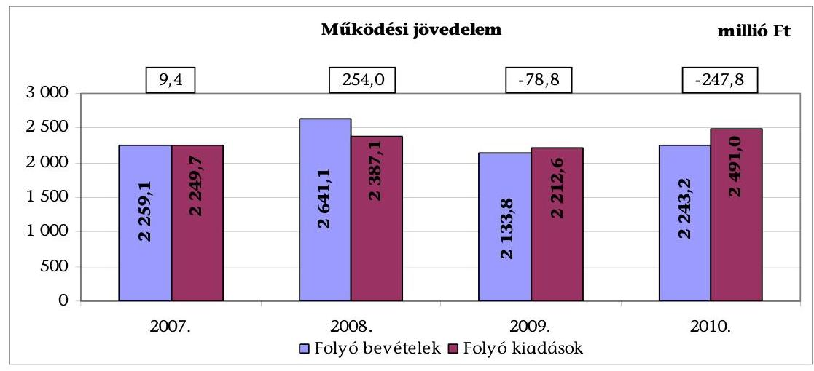

A folyó költségvetés egyenlege (a múködési többlet) 2007-ben 9,4 millió Ft, 2008-ban 254,0 millió Ft volt, (a múködési forráshiány) 2009-ben a folyó kiadások 3,6\%-át ( 78,8 millió Ft-ot), 2010-ben már 10,0\%-át (247,8 millió Ft-ot) jelentette. A 2009. évben a kamatkiadás nélküli múködési kiadás (1842,3 millió Ft) a 2008. évihez (2052,4 millió Ft) viszonyítva 10,2\%-kal csökkent, azonban ezt meghaladó, 19,2\%-os (507,3 millió Ft) mértékű volt a folyó bevételek csökkenése. A 2008. évben a folyó bevételek növekedését meghiúsulási kötbér címén befolyt egyszeri, 301,9 millió Ft bevétel okozta. A 2010. évben a múködési forráshiányt a folyó kiadások folyó bevételeket meghaladó mértékű teljesítése okozta.

A tőketörlesztés hatását is tükröző pénzügyi kapacitás (nettó múködési jövedelem) - a 2008. év kivételével - az időszakban negatív volt ${ }^{20}$, amelyet az alábbi diagram szemléltet:
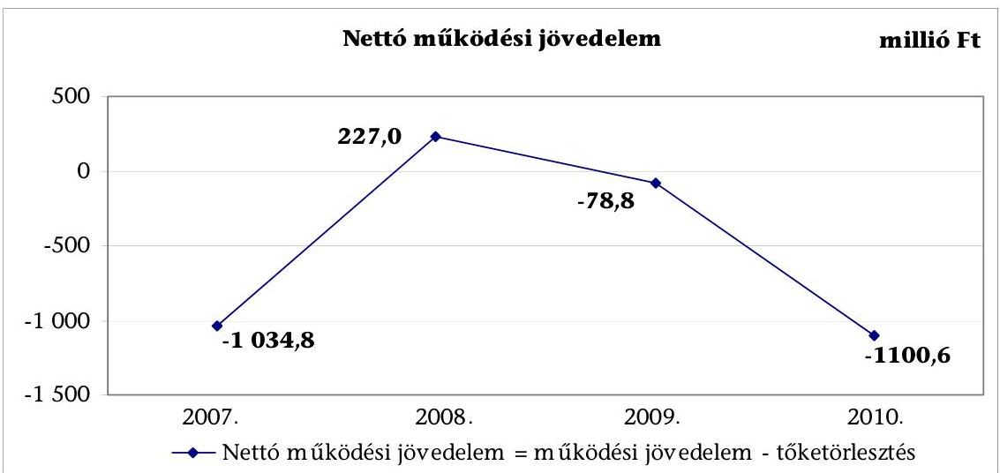

Az Önkormányzatnál a CLF módszer szerint számított pénzügyi kapacitás (nettó múködési jövedelem) a 2007. évben (-1034,8 millió Ft) negatív értéket, a

[^0]
[^0]:    ${ }^{20}$ 2007-ben -1034,8 millió Ft, 2008-ban 227 millió Ft, 2009-ben -78,8 millió Ft, 2010ben -1100,6 millió Ft

---

2008. évben (227,0 millió Ft) pozitív, majd a 2009-2010. években csökkenő (összesen -1179,4 millió Ft) összegű negatív értéket mutatott. A nettó működési jövedelem negatív értékét a 2007. évben a hosszú lejáratú hitelek törlesztése, a 2010. évben a rövid lejáratú hitel törlesztése okozta. A működési jövedelem a 2007. évben annak ellenére nem fedezte a hitelek törlesztését, hogy azok fedezetéhez belső forrásként igénybe vettek előző évi működési célú pénzmaradványt ${ }^{21}$. A 2009. évben az Önkormányzatnál nem volt hiteltörlesztésre kifizetés.

Az Önkormányzatnál a tőketörlesztés alakulását az alábbi táblázat mutatja:
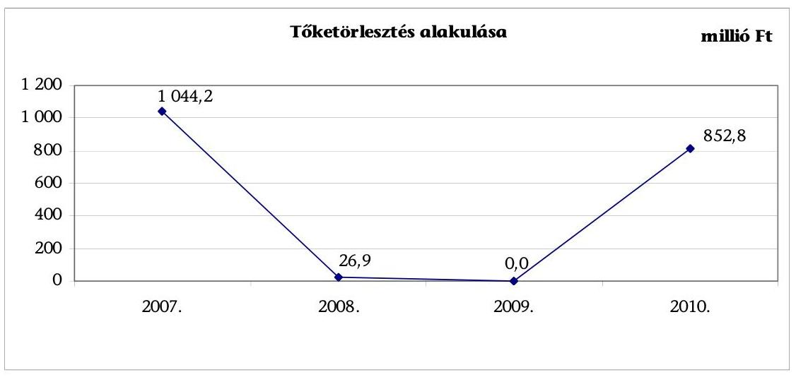

Az Önkormányzatnál a tőketörlesztés a 2007-2010. évek közötti időszakban 2007-ről 2008-ra csökkent, majd 2010-ben ismét növekedett. A tőketörlesztés 2007-ben 1044,2 millió Ft volt, mivel az Önkormányzat a 2007. évet megelőzően igénybe vett hosszú lejáratú hiteleket egyösszegű törlesztéssel visszafizette. A 2010. évben a tőketörlesztést $94,7 \%$-ban ( 807,8 millió Ft) a rövid lejáratú hitelek, $0,9 \%$-ban ( 7,9 millió Ft) a hosszú lejáratú hitelek, $4,4 \%$-ban ( 37,1 millió Ft) a 2007. évben kibocsátott kötvény esedékes összegének visszafizetése okozta.

A 2007-2009. években a felhalmozási költségvetés egyenlege folyamatosan negatív volt ${ }^{22}$, ez a tendencia a 2010. évben változott, mivel a teljesített felhalmozási bevételek meghaladták a fejlesztésekre fordított kiadásokat. A felhalmozási költségvetés egyenlegét 2007-2010 között évről évre a következő ábra szemlélteti:

[^0]
[^0]:    ${ }^{21}$ Az előző évi pénzmaradvány működési célú részének összege 2007-ben 24,0 millió Ft volt.
    ${ }^{22}$ 2007-ben -1205,8 millió Ft, 2008-ban -716,6 millió Ft, 2009-ben -249,2 millió Ft

---

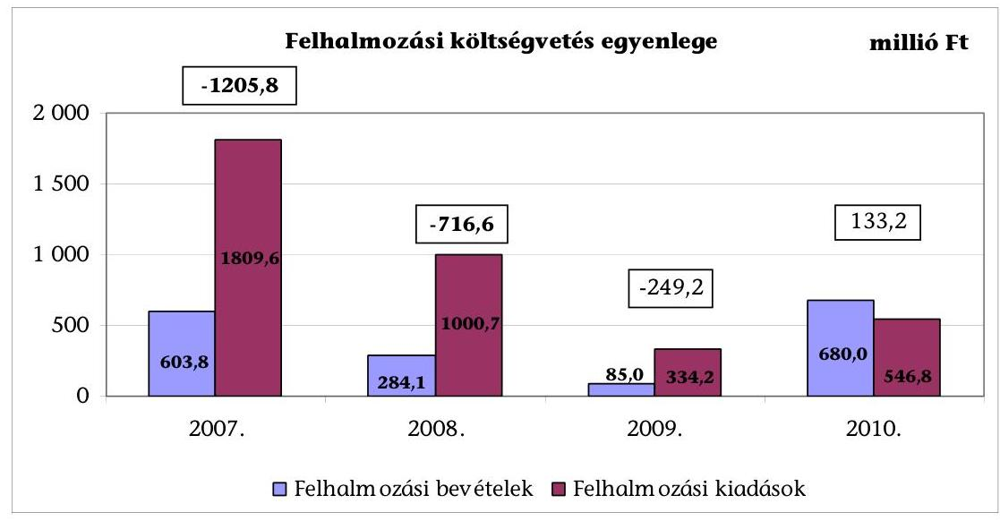

Az Önkormányzat felhalmozási költségvetésének forráshiánya 2007-2009. években együttesen 2171,6 millió Ft volt, amelynek fedezetére a nettó múködési jövedelemből 2008. évben 227,0 millió Ft állt rendelkezésre. A hiányzó 1909,2 millió Ft-ot pénzintézeti forrásokból biztosították. A felhalmozási forráshiány a felhalmozási és tőkejellegú kiadásokon belül a 2007. évben 66,6\%, a 2008. évben $71,6 \%$, a 2009. évben $74,6 \%$ volt, amelynek változását a hazai és uniós támogatásokból elnyerhető források, valamint a saját bevételi lehetőségek határozták meg.

A 2007-2010. években a 2010. december 31-ig befejezett (3593,1 millió Ft értékű) beruházás és felújítás forrása a saját erő 1448,6 millió Ft (40,3\%), és a hazai és uniós támogatások 693,2 millió Ft (19,3\%) mellett 1263,3 millió Ft kötvény ( $35,2 \%$ ), és 188,0 millió Ft hitelfelvétel (5,2\%) volt. A 2010. december 31én folyamatban lévó (uniós támogatással megvalósuló) fejlesztési feladat végrehajtására 2007-2010 között 9,3 millió Ft kiadást teljesítettek, amelyet saját forrásból fedeztek. Az Önkormányzatnál 2010. december 31-én folyamatban lévő fejlesztési feladat tervezett bekerülési költsége 96,8 millió Ft, amelyből 78,7 millió Ft-ot, $90,0 \%$-ot uniós támogatásból és 18,1 millió Ft-ot, 19,0\%-ot saját forrásból terveztek biztosítani ${ }^{23}$.

A finanszírozási múveletek egyenlege, amely magában foglalta a hitelfelvételeket és -törlesztéseket, valamint az egyéb finanszírozási (függő, átfutó, kiegyenlítő) bevételeket és kiadásokat pozitív volt, tendenciájában - 2009. év kivételével - csökkenés jellemezte.

[^0]
[^0]:    ${ }^{23}$ A megvalósításra tervezett beruházás közbeszerzési eljárását a 2011. évben bonyolították.

---

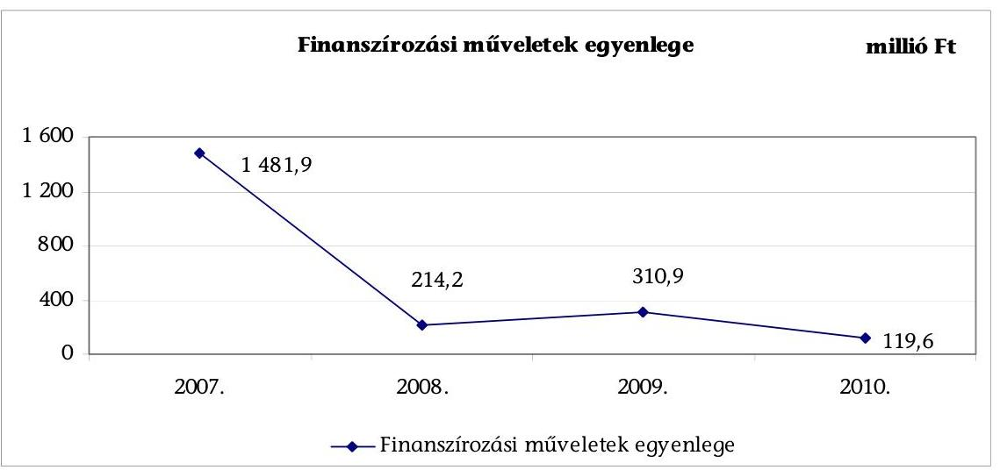

A 2007-2010. években folyamatosan fennálló finanszírozási többlet azt jelzi, hogy az éves költségvetések végrehajtása során szükség volt az előző években keletkezett pénzmaradvány igénybevételén túl külső finanszírozási források igénybevételére is. A 2007. évben a kiugróan magas finanszírozási múveletek egyenlegéhez hozzájárult a 2200,0 millió Ft összegű kötvénykibocsátásból származó bevétel. A finanszírozási célú múveleteket a jelentés 2/a. számú mellékletének 4.1-4.8 pontjai részletezik.

Az Önkormányzat évenkénti teljes finanszírozási igénye ${ }^{24}$ a CLF módszer szerint 2007-ben 1196,4 millió Ft, 2008-ban 462,6 millió Ft, 2009-ben 328,0 millió Ft, 2010-ben 114,6 millió Ft volt, amelynek finanszírozását a finanszírozási célú bevételek és kiadások egyenlege biztosította.

A 2007-2010. években a költségvetési gazdálkodás végrehajtása során nem állt fenn a pénzügyi egyensúly. A folyó bevételek a 2009-2010. években nem nyújtottak fedezetet a folyó kiadásokra. A 2010. évi forráshiány ( 247,8 millió Ft) a folyó kiadások 10,0\%-át tette ki. A felhalmozási költségvetés egyenlege a 2007-2008. években negatív (összesen -1922,4 millió Ft) volt, melyet ugyanezen időszakban a folyó bevételek többlete ( 263,4 millió Ft) nem ellensúlyozott. A finanszírozási múveletek eredményeként ugyan a tárgyévi pénzügyi pozíció 2007-ben többletet ( 285,5 millió Ft) mutatott, azonban 2008-2009. években kiemelten a felhalmozási költségvetés egyenlegéből adódóan negatív ( $-265,6$ millió Ft) volt. A 2010-re képződött 5,1 millió Ft többlet nem jelentős. Az Önkormányzat összes pénz- és tőkepiaci kötelezettsége a 2007. évben 2460,8 millió Ft, a 2010. évben már 3333,3 millió Ft volt, amelynek finanszírozása pénzügyi kockázatot jelent. A pénz- és tőkepiaci kötelezettségből a rövid lejáratú pénzintézeti kötelezettség (17,2\%) 572,4 millió Ft, amelyet a likviditási problémák kezelésére vett igénybe az Önkormányzat. A lejárt szállító tartozásállomány a 2007 évi 84,5 millió Ft-ról 2008-ra 482,7 millió Ftra nőtt, majd 2009-re 442,0 millió Ft-ra csökkent, 2010 év végén 251,8 millió Ft, a 2011. június 30 -án 244,5 millió Ft volt. A pénzügyi hiányt 2007-2008. években a felhalmozási kiadások forráshiánya, a 2009. évben a folyó és a felhal-

[^0]
[^0]:    ${ }^{24}$ a múködési jövedelem és a felhalmozási költségvetés egyenlege

---

mozási kiadások forráshiánya együttesen okozta, míg a 2010. években a pénzügyi hiány oka a folyó kiadások forráshiánya volt.

Az Önkormányzat folyó és felhalmozási bevételeit főbb jogcímenként az alábbi táblázat tartalmazza:
millió Ft

| Megnevezés | 2007. év | 2008. év | 2009. év | 2010. év |
| :-- | --: | --: | --: | --: |
| Helyi adók, pótlékok | 336,8 | 382,5 | 442,6 | 416,3 |
| Egyéb saját bevétel | 314,0 | 691,1 | 287,3 | 415,8 |
| Gépjármúadó | 88,7 | 104,0 | 86,7 | 124,7 |
| Átengedett bevételek | 646,9 | 492,8 | 474,6 | 531,5 |
| Költségvetési támogatás | 872,7 | 970,7 | 842,6 | 754,9 |
| Folyó bevételek összesen | $\mathbf{2 2 5 9 , 1}$ | $\mathbf{2 6 4 1 , 1}$ | $\mathbf{2 1 3 3 , 8}$ | $\mathbf{2 2 4 3 , 2}$ |
| Ingatlan értékesítés | 292,1 | 41,0 | 36,5 | 409,5 |
| Felhalmozási célú pénzeszközátvétel | 279,1 | 237,9 | 26,9 | 37,3 |
| Egyéb felhalmozási célú bevételek | 32,6 | 5,2 | 21,6 | 233,2 |
| Felhalmozási bevételek | $\mathbf{6 0 3 , 8}$ | $\mathbf{2 8 4 , 1}$ | $\mathbf{8 5 , 0}$ | $\mathbf{6 8 0 , 0}$ |
| ÖSSZESEN | $\mathbf{2 8 6 2 , 9}$ | $\mathbf{2 9 2 5 , 2}$ | $\mathbf{2 2 1 8 , 8}$ | $\mathbf{2 9 2 3 , 2}$ |

Az Önkormányzat folyó bevételeinek szerkezete a 2007-2010. években nem változott. A folyó bevételeken belül a 2007-2010. évek között minden évben a költségvetési támogatás ${ }^{25}$ és az átengedett bevételek ${ }^{26}$ aránya volt a legnagyobb. Az Önkormányzat költségvetési támogatása a 2007-2009. évek átlagos összegéről, 895,3 millió Ft-ról a normatív állami hozzájárulások és az egyéb központi támogatások változása következtében 2010-re 15,7\%-kal (754,9 millió Ft-ra) csökkent. A gépjármúadóból származó bevétel a 2007-2009. évek átlagához (93,1 millió Ft) viszonyítva 2010-re 31,6 millió Ft-tal (33,9\%-kal) nőtt. Az átengedett bevételek 2010-re 2007-hez képest (115,4 millió Ft-tal) 17,8\%-kal csökkentek. Az egyéb saját bevétel a 2007-2009. évek átlagához képest 330,2 millió Ft-ról ${ }^{27}$ a 2010-re 415,8 millió Ft-ra, $25,9 \%$-kal nőtt a zeneiskolai és az élelmezési térítési díjak emelésének és egyszeri támogatásértékű bevétel hatására. A helyi adóbevétel a 2007-2009. évek átlagához (387,3 millió Ft) viszonyítva 2010-re 7,5\%-kal (29,0 millió Ft-tal) nőtt, az összes költségvetési bevételen belüli aránya ${ }^{28}$ 2009-ig emelkedett, 2007-ben (336,8 millió Ft) 14,9\%, 2009-ben (442,6 millió Ft) 20,7\% volt, majd 2010-ben 18,2\%-ra (416,3 millió Ft) csökkent. A helyi adóbevételek 2010. évi változását az iparúzési adóbevételek 2009. évhez viszonyított 44,1 millió Ft (14,2\%) csökkenése okozta. Az Önkormányzat

[^0]
[^0]:    ${ }^{25}$ 2007-ben 38,6\%, 2008-ban 36,8\%, 2009-ben 39,5\%, 2010-ben 33,7\% volt.
    ${ }^{26}$ 2007-ben 28,6\%, 2008-ban 18,7\%, 2009-ben 22,2\%, 2010-ben 23,7\% volt.
    ${ }^{27}$ Az egyéb saját bevételeknél a 2007-2009. évek átlagának számításánál a 2008. évi 691,1 millió Ft-ból figyelmen kívül hagytunk 301,9 millió Ft egyszeri bevételt, amit az Önkormányzat meghiúsulási kötbér címen kapott.
    ${ }^{28} 2008$ kivételével

---

folyó és felhalmozási kiadásait főbb jogcímenként az alábbi táblázat mutatja:

|  |  |  |  | millió Ft |
| :-- | --: | --: | --: | --: |
| Megnevezés | $\mathbf{2 0 0 7 .}$ év | $\mathbf{2 0 0 8 .}$ év | $\mathbf{2 0 0 9 .}$ év | $\mathbf{2 0 1 0 .}$ év |
| Személyi juttatások és járulékok | 1241,3 | 1344,8 | 1219,3 | 1176,5 |
| Dologi kiadások | 694,7 | 650,9 | 610,2 | 906,5 |
| Pénzeszközátadás államháztartáson   kívülre | 70,8 | 82,8 | 70,5 | 53,0 |
| Egyéb múködési kiadás | 242,9 | 308,6 | 312,6 | 355,0 |
| Folyó kiadások összesen | $\mathbf{2 2 4 9 , 7}$ | $\mathbf{2 3 8 7 , 1}$ | $\mathbf{2 2 1 2 , 6}$ | $\mathbf{2 4 9 1 , 0}$ |
| Beruházási, felújítási kiadások | 1762,9 | 978,5 | 316,0 | 535,7 |
| Egyéb felhalmozási célú kiadások | 46,7 | 22.2 | 18,2 | 11,1 |
| Felhalmozási kiadások | $\mathbf{1 8 0 9 , 6}$ | $\mathbf{1 0 0 0 , 7}$ | $\mathbf{3 3 4 , 2}$ | $\mathbf{5 4 6 , 8}$ |
| ÖSSZES KÖLTSÉGVETÉSI KIADÁS | $\mathbf{4 0 5 9 , 3}$ | $\mathbf{3 3 8 7 , 8}$ | $\mathbf{2 5 4 6 , 8}$ | $\mathbf{3 0 3 7 , 8}$ |

Az Önkormányzatnál a személyi juttatásra és járulékaira teljesített kiadás a 2007-2009. évek átlagához (1268,5 millió Ft) viszonyítva 2010-re 92,0 millió Ft-tal ( $7,3 \%$-kal) csökkent a létszámváltozás következtében ${ }^{29}$. A dologi kiadások a 2007-2009. évek átlagához képest 651,9 millió Ft-ról 906,5 millió Ft-ra ( $39,0 \%$-kal) nőttek, amelyet a szakértői díjak és a szakmai szolgáltatások költségeinek növekedése okozta. A pénzeszközátadás címen teljesített kifizetés a 2007-2009. évek 74,7 millió Ft átlagához képest a 2010. évre 53,0 millió Ft-ra csökkent a civil szervezeteknek juttatott támogatások csökkenése miatt. Az egyéb múködési kiadások 2007-2009. évek átlagához képest 2010-re 288,0 millió Ft-ról 355,0 millió Ft-ra ( $23,3 \%$-kal) nőttek, elsősorban a kamatkiadások emelkedése következtében.

A felhalmozási kiadások aránya a 2007-2010. évek között változóan alakult, 2007-től 2009-ig csökkent - a 2007. évben 44,6\%, a 2008. évben 29,5\%, a 2009. évben 13,1\% -, a 2010. évben 18,0\% volt. Az Önkormányzat adatszolgáltatása alapján a 2007-2010. évek közötti időszakban a műszakilag befejezett beruházások és felújítások kifizetésére 3593,1 millió Ft kiadást teljesítettek. A 3593,1 millió Ft-ból 1448,6 millió Ft-ot ( $40,3 \%$-át) saját forrásból, 1263,3 millió Ft-ot ( $35,2 \%$ ) kötvényböl, 462,7 millió Ft-ot ( $12,9 \%$-át) hazai támogatásból, 230,6 millió Ft-ot ( $6,4 \%$-át) európai uniós forrásból, 188,0 millió Ft-ot ( $5,2 \%$ ) hitelből finanszíroztak. A legnagyobb bekerülési költségű beruházás a szennyvízcsatorna hálózat bővítése volt 875,9 millió Ft bekerülési költséggel, amelynek finanszírozásához 427,8 millió Ft hazai támogatást kapott az Önkormányzat, a különbözetet, 448,1 millió Ft-ot saját forrásból, illetve a kötvénykibocsátásból származó bevételből biztosították. Az Önkormányzat adatszolgáltatása alapján 2010. december 30-án folyamatban lévő

[^0]
[^0]:    ${ }^{29}$ 2007-ről 2010-re a Polgármesteri hivatalban foglalkoztatott köztisztviselők száma és az intézményekben a közalkalmazottak száma egyaránt hét-hét fővel csökkent

---

egy fejlesztési feladatának ${ }^{30}$ tervezett bekerülési költsége 96,8 millió Ft, amelynek forrásaként $81 \%$-ban ( 78,7 millió Ft) európai uniós támogatást, és 19,0\% ( 18,1 millió Ft) saját forrást jelölt meg. A 18,1 millió Ft összegű saját forrásból 9,3 millió Ft 2010. év utáni kötelezettség.

Az Önkormányzat kimutatása alapján 2007-2011. év I. félév közötti időszakban a kiadások csökkentése érdekében hozott döntésekkel összességében 170,6 millió Ft megtakarítást értek el. A Képviselő-testület az Önkormányzat egyre szűkösebbé váló pénzügyi helyzete miatt csökkentette az önként vállalt feladatok körébe tartozó céljellegú támogatások ${ }^{31}$ összegét. Létszámcsökkentésre irányuló döntést 2011-ben hozott a Képviselő-testület, amelynek eredményeként 2011. február 1-jétől 12 fővel csökkent a Polgármesteri hivatal létszáma ${ }^{32}$. A létszámcsökkentés várható kiadáscsökkentő hatására vonatkozóan az Önkormányzat számításokat nem készített.

Az Önkormányzatnál a saját bevételeket növelő intézkedéseket - a térítési díjak emelésén ${ }^{33}$ túl - a helyi adók tekintetében hoztak. A Polgármesteri hivatal adatszolgáltatása alapján 2007-2011. I. félév között 28,7 millió Ft volt a térítési díjakból származó intézményi bevételnövekmény. A helyi adóhátralékok beszedésére 2010. augusztus 12-én a jegyző adott ki utasítást. Az adóhátralékok beszedéséből származó bevétel a 2010-2011. év I. félévében 35,2 millió Ft volt ${ }^{34}$. Az önhibáján kívül hátrányos helyzetű önkormányzatok részére a központi költségvetésben erre a célra jóváhagyott támogatási keretből adható támogatásra nem pályázott az Önkormányzat, mivel a 2007-2010. évek közötti időszakban nem felelt meg a pályázati feltételeknek.

Az Önkormányzat civil szervezetek részére visszatérítendő pénzeszközt nem adott, a 2007-2011. I. félév közötti időszakban PPP konstrukcióban nem vett részt. Az Önkormányzat 2007-2011. év I. féléve között kettő működő víziközmű társulat által felvett beruházási hitelek megfizetéséhez vállalt kezességet. Ezzel kapcsolatosan 2011. június 30-ig 12,7 millió Ft kifizetést teljesített. A kezességvállalás kockázatát nem vizsgálták.

Az Önkormányzat rendelkezett a 2006-2010. évekre és a 2011-2014. évekre szóló, a Képviselő-testület által elfogadott gazdasági programmal ${ }^{35}$. A 2011-2014.

[^0]
[^0]:    ${ }^{30}$ Pomázon belterületi vízrendezés (Majdánpolja területen vízelvezetés), a kivitelező kiválasztására a közbeszerzési eljárás 2011 októberében folyamatban volt.
    ${ }^{31}$ Az éves költségvetésekről szóló (3/2007. (III. 8.), 6/2008. (III. 5.), 6/2009. (III. 3.), 5/2010. (III. 2.) számú) rendeletekben döntött a Képviselő-testület.
    ${ }^{32}$ A 10/2011. (I. 18.) számú határozat alapján a Polgármesteri hivatal engedélyezett létszáma 2011. február 1-től 66 fő, (2010-ben 78 fő volt).
    ${ }^{33}$ a 10/2007. (V. 22.), 2/2008. (I. 21.), 8/2008. (IV. 21.) 20/2008. (V. 23.), 26/2008. (XII. 11.), 16/2009. (V. 22.), 2/2010. (I. 18.), 18/2010. (VI. 7.), 2/2011. (I. 20.), 15/2011. (VI. 1.) számú rendeletekben döntött az Önkormányzat a térítési díjak emeléséről
    ${ }^{34}$ Az Önkormányzat adatszolgáltatása alapján a 2007-2009. években az adóhátralékok beszedéséből származó bevétel 2,3 millió Ft volt.
    ${ }^{35}$ Az Önkormányzat a 2006-2010. és a 2010-2014. évekre vonatkozó gazdasági programokról a 190/2007. (VIII. 28.) és a 74/2011. (V. 25.) számú határozatokban döntött.

---

évekre szóló gazdasági programnak részét képezte az Önkormányzat pénzügyigazdasági helyzetének a bemutatása és tartalmazott feladatokat a kiadások mérséklésére, valamint a bevételek növelése érdekében, azonban ezek várható eredményeit nem számszerúsítették. Az Önkormányzat eladósodottsága miatt kialakult helyzet megoldására, a fizetőképesség megteremtésére konkrét intézkedéseket, a külső és belső pénzügyi kockázatok értékelését nem tartalmazta a gazdasági program.

Az Önkormányzat adósságkezelési tevékenysége nem volt eredményes, mert a költségvetési egyensúly javítása céljából tett intézkedések - a 2007-2011. év I. félév között 170,6 millió Ft kiadási megtakarítást és 66,2 millió Ft bevétel növekedést eredményeztek - nem voltak elégségesek a rövid, a kö-zép-, illetve a hosszú távú pénzügyi egyensúly megteremtéséhez. Az Önkormányzat 2007-2011. I. félév közötti időszakban nem rendelkezett likviditási és eladósodási problémákat kezelő stratégiával. A pénzügyi egyensúlyát biztosító rövid vagy hosszú távú célrendszert nem fogalmaztak meg.

Az Önkormányzat mérleg szerinti, pénzintézetekkel szemben fennálló hosszú és rövid lejáratú kötelezettségeinek állományi értékét az alábbi ábra szemlélteti:
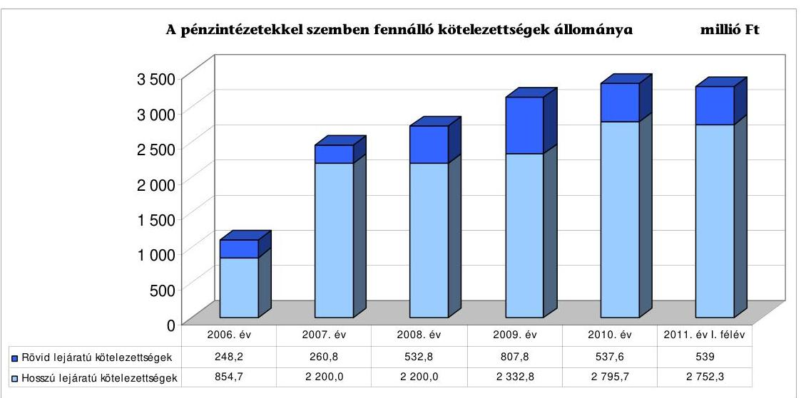

Az Önkormányzat pénzintézeti kötelezettségeinek állománya 2006. december 31-től 2011. június 30-ig közel a háromszorosára - 1102,9 millió Ft-ról 3291,3 millió Ft-ra - nőtt.

A fennálló pénzintézeti kötelezettségek kötvénykibocsátásokból, víziközmű társulatok által felvett beruházási hitelek átvállalásából, folyószámla- és munkabérhitel igénybevételéből keletkeztek. Az Önkormányzat a 2011. évi költségvetési rendeletében 100,0 millió Ft hitel felvételét tervezte, amelyet 2011. október végéig még nem vett igénybe.

---

Az Önkormányzat pénzintézeti kötelezettségvállalásaira képviselő-testületi döntés alapján került sor, azonban a kötvények esetében ${ }^{36}$ a döntések megalapozása érdekében nem kértek több pénzintézettől ajánlatot, így a döntéseket a kötvénykibocsátás feltételeinek több pénzintézet adataival való összehasonlító értékelése nélkül hozták meg. A 2007. és a 2010. években a kötvénykibocsátások során a döntések meghozatala előtt az Ötv. előírásai ellenére az adósságot keletkeztető kötelezettségvállalások felső határát nem vizsgálták. Az Önkormányzat a 2007. évet megelőzően felvett hosszú lejáratú hiteleket ${ }^{37}$ a 2007. évben egy összegben fizette vissza, és ez okozta, hogy a kötvénykibocsátással kapcsolatban vállalt adott évi kötelezettség meghaladta az adósságot keletkeztető kötelezettségvállalások költségvetési beszámolóban szerepeltetett felső határát jelentő korrigált saját bevételt. A 2007. évben a 2200,0 millió Ft kibocsátási értékű „Pomáz 2027" kötvény kibocsátója és lejegyzője nem az Önkormányzat számlavezető bankja volt. A döntéshez készített előterjesztések nem tartalmazták a kötvények kibocsátásának céljait, a kamatkockázatokat, a kötelezettségvállalások visszafizetési forrásait, továbbá az adósságszolgálati korlátot. A Képviselő-testület döntéseihez készített előterjesztés a pénzintézet ajánlatát, a teljes futamidőre várható kamat- és tőkefizetési kötelezettségeknek a bemutatását tartalmazta.

Az Önkormányzat számlavezető bankot 2009. június 1-jétől váltott. A nyílt közbeszerzési eljárás keretében három pénzintézet adott ajánlatot, amelyek közül a nyertes a 2007. évi kötvénykibocsátást végző pénzintézet lett.

A 2010. évben 500,0 millió Ft-ban a „Pomáz 2019" kötvény kibocsátója és lejegyzője már az Önkormányzat számlavezető pénzintézete volt. A 2010. évi kötvénykibocsátás során az Önkormányzat túllépte az Ötv. 88. § (2) ${ }^{38}$ bekezdésében meghatározott adósságot keletkeztető kötelezettségvállalások felső határát, mivel a számított korrigált saját bevétel ${ }^{39}$ nem nyújtott fedezetet a kötvénykibocsátással kapcsolatban vállalt tárgyévi kötelezettségre. Az Önkormányzat nem tartotta be az adósságot keletkeztető kötelezettségvállalások fedezetére vonatkozó Ötv. 88. § (1) bekezdés b.) ${ }^{40}$ pontjában előírtak, mivel a jelzálogjog bejegyzések önkormányzati törzsvagyonra ${ }^{41}$ történtek.

Az Ötv. 88. § (1) bekezdés b) pontjában előírtak alapján önkormányzati törzsvagyon a kötvénykibocsátáshoz fedezetként nem vehető figyelembe, ezzel szemben a jelzálogjog bejegyzések önkormányzati törzsvagyonra ${ }^{42}$ történtek.

[^0]
[^0]:    ${ }^{36}$ 173/2007. (VI. 19.) számú és a 10/2010. (I. 14.) számú határozatban
    ${ }^{37} 1044,2$ millió Ft összegben
    ${ }^{38}$ 2012. január 1-jétől a Stabilitási tv. 10. § (3) bekezdésében
    ${ }^{39}$ A beszámoló szerint 2010-ben a rövid lejáratú kötelezettségek 191,0 millió Ft-tal haladták meg a számított korrigált saját bevételt.
    ${ }^{40}$ 2012. január 1-jétől hatályát vesztette.
    ${ }^{41}$ korlátozottan forgalomképes, intézmények használatában lévő ingatlanokra
    ${ }^{42}$ A jelzálogot korlátozottan törzsvagyoni körbe tartozó 1689/194 hrsz-ú (Múvelődési ház és könyvtár) elnevezésű ingatlanra, valamint a Sashegyi Sándor Általános Iskola Művészeti Szakközépiskola és Szakiskola használatában lévő ingatlanra jegyezték be.

---

Az Önkormányzat a 2200,0 millió Ft kibocsátási értékű „Pomáz 2027 kötvény" törlesztését 2010-ben kezdte meg, és az 500,0 millió Ft névértékű „Pomáz 2019 kötvénnyel" együtt a kötelezettségállomány 2010. december 31-én 2632,9 millió Ft volt ${ }^{43}$. Az Önkormányzat a 2007. évben kibocsátott kötvényből származó bevételt a 2007 előtti hitelek kiváltására és a Képviselő-testület által jóváhagyott beruházások és felújítások finanszírozására használta fel. Az Önkormányzat adatszolgáltatása szerint 2010. december 31-ig a Ft-ban (kötvényekből származó) fennálló hosszú lejáratú pénzintézeti kötelezettségeiből 37,1 millió Ft tőkét törlesztett, és 403,7 millió Ft kamatot, valamint 40,5 millió Ft jegyzési költséget fizetett.

Az Önkormányzatnak a 2007. évben három hosszú lejáratú, adósságot keletkeztető kötelezettségvállalása keletkezett a víziközmű társulatok által felvett beruházási hitelek átvétele következtében. A megszűnt víziközmű társulatoktól átvett hitelekből keletkezett hosszú lejáratú kötelezettség mérleg szerinti állománya 2010. december 31-én 132,8 millió Ft, 2011. június 30-án 125,7 millió Ft, amelynek fedezetét képezi a lakosság által fizetendő érdekeltségi hozzájárulás.

Az Önkormányzat a fizetőképességet a 2007-2011. év I. félév közötti időszakban a folyamatosan fennálló folyószámlahitel mellett munkabérmegelőlegezési hitel és egy alkalommal 300 millió Ft rövid lejáratú hitel igénybevételével tudta biztosítani, amelyet 2008. július 31-én vett fel és - négy lejárati határidő módosítás után - 2010. február 17-én fizetett vissza. A hitel viszszafizetés forrása a 2010. február 17-én kibocsátott kötvénybevétel volt. A 2007. év májusában fennálló 300,0 millió Ft tartós folyószámlahitel keret 2011. évre 500,0 millió Ft-ra ( $67 \%$-kal) nőtt. A 2007-2011. év I. félév közötti időszakban az év minden napján igénybe vette a folyószámlahitel keretét. Az átlagos napi állomány a 2007. évben a legalacsonyabb, 270,6 millió Ft, ami a 2011. év I. félévben 497,2 millió Ft volt. A folyamatos és tartós likviditási problémák miatt az Önkormányzat a munkabérek kifizetéséhez is munkabér-megelőlegezési hitelt vett igénybe. A 2007-2011. év I. félév közötti időszakban a munkabérmegelőlegezési hitel átlagos napi állománya 37,5 millió Ft volt, az igénybevett munkabér-megelőlegezési hitel minden évben 250 napon át fennállt. Az állandósult fizetési nehézségek miatt a folyószámlahitelt és a munkabérmegelőlegezési hitelt év végén sem tudta az Önkormányzat visszafizetni. A rövid lejáratú (folyószámla- és a munkabér-) hitelek a kiadások és bevételek ütemkülönbségéből eredő finanszírozási hiány kezelésén túl a költségvetési hiány finanszírozási forrásává váltak.

Az Önkormányzat könyvviteli mérlegében az egyéb hosszú lejáratú kötelezettségek között szerepelt 2010. december 31-én egy millió Ft összegű lízingdíj is. Az Önkormányzatnál a 2008. évben 1,5 millió Ft összegben a Polgármester kötött lízingszerződést, négy éves lejárattal, másológép beszerzésére. A szerződés megkötésével a Polgármester nem tartotta be a vagyongazdálkodási rendeletben előírt hatásköri szabályokat. A vagyongazdálkodási rendelet 11. § (3)

[^0]
[^0]:    ${ }^{43}$ Az Önkormányzat az adatszolgáltatása alapján 2010-ben a 2200,0 millió Ft-ban kibocsátott „Pomáz 2027 kötvény" esedékes tőketörlesztését és a kamatát, valamint az 500,0 millió Ft-ban kibocsátott „Pomáz 2019 kötvény" kamatát EUR-ban fizette meg.

---

bekezdés e) pontjában foglaltak alapján a polgármester egy millió Ft értékhatárig jogosult ingó vagyontárgy beszerzéséről szóló döntés meghozatalára. Az Önkormányzatnál 2010. december 31-én az egyéb hosszú lejáratú kötelezettségek között további 56,7 millió Ft szerepelt, amelynek értékelése a beszámoló készítése előtt - a Számv. tv. 16. § (1) bekezdésében és a 46. § (3) bekezdésében előírtakat megsértve - nem történt meg. Az Önkormányzat könyvviteli mérlegében kimutatott kötelezettség a közvilágítás korszerúsítésével kapcsolatban keletkezett. Az Önkormányzat kimutatása szerint 2010. év végén a többletszolgáltatási díjból eredő tartozás 40,0 millió Ft volt.

Az Önkormányzat 2002-ben kötött szerződést a szolgáltatást végző kft.-vel, hogy a településen végezze el a közvilágítás korszerűsítésének feladatait. A szolgáltatást nyújtó kft. vállalta a beruházással kapcsolatos költségek - 76,0 millió Ft - finanszírozását azzal, hogy azt az Önkormányzat a szolgáltatási díjjal együtt hét év alatt megtéríti a szolgáltatónak. Ezen felül az Önkormányzat inkasszójogot adott és készfizető kezességet is vállalt a kivitelezést végző szolgáltató hitelfelvételéhez. A szerződésben vállalt hiteltörlesztési kötelezettségét maradéktalanul nem teljesítette a szolgáltató, ezért a pénzintézet az Önkormányzatnak nyújtott be több alkalommal (összesen 21,0 millió Ft összegben) inkasszót. Az Önkormányzat 2008 novemberétől nem teljesítette a közvilágítással kapcsolatos többletszolgáltatási díjfizetési kötelezettségét, ezért a szolgáltató keresetet nyújtott be a bírósághoz. A bíróság a 2011. január 31-én kelt végzésében ideiglenes intézkedéssel kötelezte az Önkormányzatot számlatartozás címen 43,0 millió Ft tő-ke+kamatának megfizetésére. A peres eljárás 2011. október végéig még nem zárult le, a folyamatban lévő perben a perérték 40,0 millió Ft az Önkormányzat kimutatása alapján.

Az Ámr. 139. § (1) bekezdésében foglaltak ellenére a jegyző a 2007-2009. években nem készített likviditási tervet. A 2010. és a 2011. évi költségvetésekhez ugyan készült likviditási terv, azonban az Ámr. 201. § (1) bekezdésében ${ }^{44}$ foglaltak ellenére a szükség szerinti aktualizálásuk elmaradt. Az Önkormányzatnál az adósságot keletkeztető kötelezettségvállalásokból származó bevételekből megvalósított fejlesztések kiadásainak megtérülésére vonatkozó számításokat, értékeléseket nem végeztek. A felújítások, beruházások tervezése során még a kiadások forrásszükségletével sem számoltak. A 2007. év előtti és a 2007-2010. évek közötti fejlesztések miatt nőtt elsősorban az Önkormányzat eladósodottsága. Az eladósodási fok ${ }^{45}$ mutatója a 2007. évi 19,9\%-ról 2010-re 25,6\%-ra nőtt, ami azt jelenti, hogy a fizetési kötelezettségek nagyobb arányban emelkedtek, mint az összes forrás.

A 2007-2010. évek közötti időszakban nem történt meg a Képviselőtestület tájékoztatása az adósságot keletkeztető kötelezettségvállalásokból adódó fizetési kötelezettségek visszafizetési feltételeiről. Az Önkormányzatnál nem történt intézkedés az adósságot keletkeztető kötelezettségvállalások pénzügyi kockázatainak csökkentésére és a pénzügyi egyensúly biztosítására.

[^0]
[^0]:    ${ }^{44}$ 2012. január 1-jétől az Ávr. 122. § (2)-(3) bekezdéseiben
    ${ }^{45}$ Az eladósodási fok mutatója az összes, az egyéb passzív pénzügyi elszámolások nélküli, fizetési kötelezettségek önkormányzati összes forráson belüli arányát mutatja.

---

A szállítók felé fennálló kötelezettség 2010. év végén 280,2 millió Ft, 2011. év I. félév végén 282,2 millió Ft volt. A lejárt szállító tartozás 2010 év végén 251,8 millió Ft, 2011. június 30-án 244,5 millió Ft volt. A 2011. június 30-án fennálló lejárt szállítói tartozásból 19,4 millió Ft (7,9\%) 31-60 nap közötti, 17,8 millió Ft (7,8\%) 61-90 nap közötti, 32,3 millió Ft (13,1\%) 91-365 nap közötti, 141,9 millió Ft (58\%) éven túli tartozás volt. A nagy összegű lejárt szállítói tartozás az Önkormányzatnál pénzügyi kockázatot jelent.

Az Önkormányzat fizetőképességének alakulását az alábbi ábra szemlélteti:
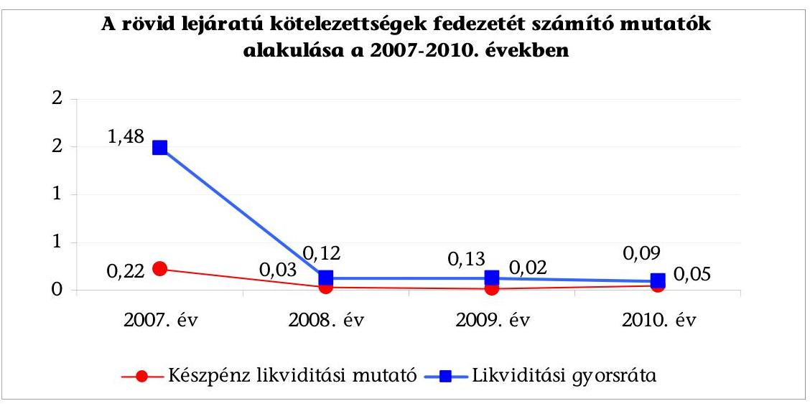

A készpénz likviditási mutató ${ }^{46}$ a 2007. évi értékéhez képest a 2010. évre tovább romlott, az Önkormányzat pénzeszközállománya a 2007-2010. évek közötti időszakban nem nyújtott fedezetet a rövid lejáratú kötelezettségekre. A rövid lejáratú kötelezettségek állománya a 2007-2010. években a folyamatosan igénybevett folyószámlahitel miatt volt magas.

A likviditási gyorsráta ${ }^{47}$ értéke - hasonlóan a készpénz likviditási mutatóéhoz a 2007-ről 2010-re a 2009 év kivételével - csökkent. A pénzeszközök követelésekkel emelt összege sem nyújtott fedezetet a rövid lejáratú kötelezettségekre.

A likviditási mutatók csökkenése jelzi, hogy az Önkormányzat pénzügyi helyzete a 2008-2010 közötti időszakban a fizetőképesség szempontjából kedvezőtlen volt, mert a jelentős nagyságrendű rövid lejáratú kötelezettségeket a rendelkezésre álló készpénzállomány még a követelések összegével együtt sem fedezte.

[^0]
[^0]:    ${ }^{46}$ A készpénz likviditási mutató kifejezi, hogy a pénzeszközök év végi állománya milyen arányban nyújt fedezetet a rövid lejáratú fizetési kötelezettségekre.
    ${ }^{47}$ A likviditási gyorsráta mutatja, hogy a rövid lejáratú fizetési kötelezettségek kiegyenlítéséhez a pénzeszközökön túl bevonható követelések, forgatási célú értékpapírok milyen arányban nyújtanak fedezetet.

---

Az Önkormányzat 2011. június 30-án fennálló kötelezettségeinek állományát, a 2011-2013. között és a 2013. év után várható kötelezettségek számszerűsített adatait az alábbi táblázat tartalmazza:

| Megnevezés | Allomány 2010. december 31-án |  |  | Allomány 2011. június 30- |  | Várható kötelezettség* 2011. 2013. években |  | Várható kötelezettség 2014. évtől |  |
| :--: | :--: | :--: | :--: | :--: | :--: | :--: | :--: | :--: | :--: |
|  | HUF-ban   (millió F)   ban) | Devizában   ezer EUR   (összege) | Deviza   nem | HUF-ban   (millió F)   ban) | Devizában   ezer EUR   (összege) | Deviza   nem | HUF-ban   (millió F)   ban) | Devizában   ezer EUR   (összege) | Deviza   nem |
| Pénzintézeti kötelezettségek |  |  |  |  |  |  |  |  |  |
| Hosszú lejáratú hitel Messeta I. | 51,4 |  | HUF | 48,6 |  | HUF | 38,4 | HUF | 10,3 |  | HUF |
| Hosszú lejáratú hitel Messeta II. | 34,4 |  | HUF | 32,6 |  | HUF | 25,7 |  | HUF | 6,8 |  | HUF |
| Hosszú lejáratú hitel Szeleslye-Ortovácz   (sap-ríz elvezetés | 47,0 |  | HUF | 44,5 |  | HUF | 22,3 |  | HUF | 22,2 |  | HUF |
| Kölvény (Pomáz 2027 kötvény) | 2162,9 |  | HUF | 2128,6 |  | HUF | 660,4 |  | HUF | 2280,3 |  | HUF |
| Kölvény (Pomáz 2019 kötvény) | 500,0 |  | HUF | 500,0 |  | HUF | 229,1 |  | HUF | 517,5 |  | HUF |
| Pelyőszámlaítós | 497,6 |  | HUF | 499,0 |  | HUF | 499,0 |  | HUF |  |  |  |
| Múködési megleffegésére hitel | 40,0 |  | HUF | 40,0 |  | HUF | 40,0 |  | HUF |  |  |  |
| Pénzintézeti kötelezettségek összesen HUF-ban: | 3333,3 |  |  | 3291,3 |  |  | 1514,9 |  |  | 2836,7 |  |  |
| Fecesség | 295,6 |  | HUF | 282,6 |  | HUF | 282,6 |  | HUF |  |  |  |
| Szállító tartozás | 260,2 |  | HUF | 262,2 |  | HUF | 262,2 |  | HUF |  |  |  |
| Egyéb kötelezettségek | 196,8 |  | HUF | 196,8 |  | HUF | 196,8 |  | HUF |  |  |  |
| Egyéb kiadás elmaradás | 250,3 |  | HUF | 195,2 |  | HUF | 195,2 |  | HUF |  |  |  |
| Kötelezettségek összesen HUF-ban: | 4355,8 |  |  | 4248,0 |  |  | 2471,6 |  |  | 2836,7 |  |  |

* A várható kötelezettség tartalmazza a karnakó és egyéb költségei is

Az Önkormányzatnak pénzintézetekkel szemben fennálló kötelezettsége a 2011. év I. félév végén 3291,3 millió Ft volt. Ezek várható kötelezettsége (tőke, kamat, és egyéb költség) a legutóbbi kamatfizetés feltételei alapján a 2011-2013. években 1514,9 millió Ft. Az Önkormányzatnak a 2011. év I. félév végére szállítói tartozások és egyéb kiadás elmaradások, valamint a jogerős végzéssel lezárt, de ki nem fizetett kötelezettségek címén 956,7 millió Ft fizetési kötelezettsége keletkezett.

Az Önkormányzat pénzintézeti és egyéb kötelezettségei teljesítésének kockázatát növelte, hogy a 2011. június 30-án fennálló kötelezettségek viszszafizetésének fedezetét nem számszerűsítették, - a víziközmű társulatoktól átvett hitelek kivételével - forrásait nem jelölték meg. A kockázatot csökkentheti, hogy a 2011-2013. évek kötelezettségeinek teljesítésére figyelembe vehető 293,3 millió Ft mérlegben kimutatott követelésállomány beszedéséből származó bevétel és 2736,3 millió Ft forgalomképes nettó ingatlanvagyon jelzálogjoggal nem terhelt részének értékesítése esetén befolyó bevétel. A kockázatot növelheti, hogy a forgalomképes (telek) ingatlanok iránti kereslet csökkent, a 2007-2010. években a költségvetésben tervezett ingatlan értékesítéseknek mindössze $15,3 \%$-a valósult meg. A 2014. évet követően esedékes - 2011. június 30án fennálló - pénzintézeti kötelezettsége 2836,7 millió Ft. Ezen kötelezettségek teljesítésének forrásai bizonytalanok, mivel a pénzintézetekkel szemben fennálló rövid és hosszú lejáratú kötelezettségek a 2007. évtől folyamatosan növekedtek. A likviditási célú hitelek állandósultak. A szállítói tartozásállomány a 2009-től bekövetkezett csökkenés ellenére magas, ezen belül is az éven túli lejárt tartozások 2010-ről a 2011. év I. félév végére 137,3 millió Ft-ról 141,9 millió Ft-ra (3,3\%-kal) nőttek.

---

# 2. A VAGYONI HELYZET ALAKULÁSA, VALAMINT A VAGYONGAZDÁLKODÁS FOLYAMATAIBAN A KONTROLLOK MÜKÖDÉSE 

### 2.1. Az Önkormányzat vagyoni helyzetének 2007-2010 közötti alakulása

Az Önkormányzat 2007. december 31-én 18041,5 millió Ft vagyonnal rendelkezett, amely 2010. december 31-ére 16797,9 millió Ft-ra csökkent. Az Önkormányzat vagyonának számviteli előírások szerinti nyilvántartási értéke 2007-2010. között 6,9\%-kal (1243 millió Ft-tal) csökkent. Az Önkormányzat könyvviteli mérleg főösszege szerinti saját vagyona a 2007. év végén 14353,3 millió Ft, a 2010. év végén 12463,5 millió Ft volt, a csökkenés 1889,8 millió Ft, 13,2\%-os volt.
millió Ft

| AZ ÖNKORMÁNYZAT VAGYONA |  |  |  |  |
| :-- | --: | --: | --: | --: |
| Eszközök | $\mathbf{2 0 0 7}$. év | $\mathbf{2 0 0 8}$. év | $\mathbf{2 0 0 9}$. év | $\mathbf{2 0 1 0}$. év |
| Immateriális javak és tárgyi eszközök | 14804,8 | 14620,5 | 14756,7 | 14286,2 |
| Befektetett pénzügyi eszközök | 87,9 | 72,8 | 58,3 | 193,6 |
| Üzemeltetésre átadott eszközök | 1144,0 | 2148,4 | 2203,8 | 2134,0 |
| Befektetett eszközök összesen | 16036,7 | 16841,7 | 17018,8 | 16613,8 |
| Forgóeszközök | 2004,7 | 269,9 | 309,3 | 184,1 |
| ESZKÖZÖK ÖSSZESEN | $\mathbf{1 8} \mathbf{0 4 1 , 5}$ | $\mathbf{1 7 1 1 1 , 6}$ | $\mathbf{1 7 3 2 8 , 1}$ | $\mathbf{1 6 7 9 7 , 9}$ |
| KÖTELEZETTSÉGEK | $\mathbf{3 6 8 8 , 2}$ | $\mathbf{4 0 9 0 , 7}$ | $\mathbf{4 3 1 5 , 6}$ | $\mathbf{4 3 3 4 , 4}$ |
| SAJÁT VAGYON | $\mathbf{1 4 3 5 3 , 3}$ | $\mathbf{1 3 0 2 0 , 9}$ | $\mathbf{1 3 0 1 2 , 5}$ | $\mathbf{1 2 4 6 3 , 5}$ |

A könyvviteli mérleg főösszege szerinti vagyon csökkenését 2010-re elsősorban a 2007-2010. évek között az immateriális és a tárgyi eszközök után elszámolt értékcsökkenés, valamint a forgóeszközök állományának csökkenése okozta. Az Önkormányzatnál a 2007-2010. években összesen elszámolt értékcsökkenés megközelítette az 1 milliárd Ft-ot, 993,1 millió Ft volt. A forgóeszközök állománya a 2007. év végén 2004,7 millió Ft, 2010. december 31-én 184,1 millió Ft volt. A 2007-ről 2010-re bekövetkezett csökkenést a pénzeszközök (229,3 millió Ft) és a követelések állományának ( 1621,2 millió Ft) csökkenése okozta ${ }^{48}$, míg az egyéb aktív pénzügyi elszámolások állománya 29,9 millió Ft-tal nőtt. Az üzemeltetésre átadott eszközök állománya ${ }^{49}$ nőtt a legnagyobb mértékben,

[^0]
[^0]:    ${ }^{48}$ Az Önkormányzatnál a 2007. évben a követelések állományát növelte az Alcsevicze terület egy részének értékesítése ( 1597,3 millió Ft), mivel a szerződés szerint a vevőnek a vételárat következő évben kellett teljesíteni.
    ${ }^{49}$ Az üzemeltetésre átadott eszközök között tartják nyilván a Dunamenti Regionális Vízmú Zrt.-nek (az ivóvíz- és szennyvízcsatorna-hálózat, szennyvíztisztító), valamint a Zenekastély Kht.-nak (számítástechnikai és egyéb gép-berendezések) átadott eszközöket.

---

2010-ben 2134,0 millió Ft volt, és a könyvviteli mérleg főösszege szerinti vagyon $12,7 \%$-át képviselte.

A kötelezettségek számviteli nyilvántartás szerinti értékének 646,2 millió Ft (17,5\%-os) növekedését okozta 2007-2010 között a hosszú lejáratú kötelezettségek állományának, a folyamatosan igénybe vett, és év végén vissza nem fizetett folyószámlahitel és munkabérhitel állományának, valamint az áruszállításból, szolgáltatásnyújtásból származó kötelezettségek 2007. évhez viszonyított emelkedése.

Az Önkormányzat a 2007-2011. évi költségvetési rendeletekben tervezett ingatlanértékesítést ${ }^{50}$, azonban a tervezetthez képest a teljesített bevétel jelentősen elmaradt. Az Önkormányzat a telekeladások bevételeinek növelése érdekében még a 2007. év előtt vásárolt földterületet, azonban a kereslet visszaesésének következtében nem a tervezettnek megfelelően alakult a telekértékesítés. A 2007. évben önkormányzati ingatlanértékesítésből 2197,9 millió Ft bevételt tervezett, amellyel szemben 320,3 millió Ft-ot realizált. 2008-ban 2055,5 millió Ft bevételt tervezett, a teljesített 56,8 millió Ft volt. 2009-ben már csak 1183,6 millió Ft összegben tervezett ingatlanértékesítést, ebből mindössze 39,0 millió Ft bevételt ért el. 2010-ben a tervezett 990,5 millió Ft-tal szemben 564,8 millió Ft bevétel keletkezett, az elmaradás 425,7 millió Ft (43,0\%) volt. Az ingatlanértékesítéseken kívül egyéb vagyonhasznosításból származó bevétel minimális volt az Önkormányzatnál, évenként 6-13 millió Ft közötti összegben teljesült. Az ingatlanok értékesítését, hasznosítását megelőzően a Képviselő-testület az értékesítési, illetve hasznosítási bevétel felhasználási célját nem határozta meg, azonban az ezekből befolyt bevételt a kötelező feladatok ellátását szolgáló felhalmozási célú kiadások finanszírozására fordította.

Az Önkormányzat nem döntött a kötelező vagy önként vállalt feladatok más önkormányzat, egyház, civil szervezet vagy vállalkozás útján történő ellátásáról 2007. és 2011. év I. félév között.

A Képviselő-testület a 2007-2010. évek közötti időszakban fejlesztési - több utcát érintő út és csapadék vízelvezető rendszer építése, felújítása, szennyvíz csatornahálózat építése, közvilágítás korszerűsítése, bölcsődefejlesztés, városi gyermekintézmények fűtéskorszerűsítése, óvodai és iskolai eszközök beszerzése - feladatokról döntött, amelyek az önkormányzati kötelező közfeladatok ellátását szolgálták. A beruházások 93,9\%-a, a felújítások 100\%-a kötelező feladatellátáshoz kapcsolódott. A 2007-2010. között elkezdett és befejezett fejlesztések forrását 1263,4 millió Ft-ot (35,2\%) kötvényből származó forrás, 187,8 millió Ft-ot (5,2\%) folyószámlahitel finanszírozta.

Az Önkormányzat a fejlesztésekkel létrehozott tárgyi eszközök fenntartásának várható költségeit nem számszerűsítette, a fejlesztések díjbevétel növekedést nem eredményeznek. A Képviselő-testület a megvalósult fejlesztések eredményességét a nyújtott közszolgáltatások színvonala, célszerűsége szempontjából nem értékelte.

[^0]
[^0]:    ${ }^{50}$ önkormányzati lakás- és telekértékesítés

---

Az Önkormányzatnál a tárgyi eszközök elhasználódottságát jelző mutató ${ }^{51}$ értéke 2007-ben $94,7 \%$, 2010-ben $91,7 \%$ volt. A mutató értéke jelzi, hogy 2010-ben a tárgyi eszközök 98,4\%-át kitevő ingatlanok - a beruházások, felújítások eredményeként - nem elavultak. Az Önkormányzat a tárgyi eszközök felújítására 2007-2010. évek között 146,1 millió Ft-ot fordított, amely az elszámolt értékcsökkenés 2007-ben 35,9\%-a, 2008-ban 14,3\%-a, 2009-ben $6,1 \%-a, 2010$-ben $10,1 \%$-a volt.

| Elszámolt értékcsökkenés és a felújításra fordított kiadás   (millió Ft-ban) |  |  |  |  |
| :-- | :--: | :--: | :--: | :--: |
| Megnevezés | $\mathbf{2 0 0 7}$. év | $\mathbf{2 0 0 8}$. év | $\mathbf{2 0 0 9}$. év | $\mathbf{2 0 1 0}$. év |
| Elszámolt értékcsökkenés | 181,7 | 238,7 | 280,2 | 292,5 |
| Felújításra fordított kiadás | 65,2 | 34,2 | 17,1 | 29,6 |

Az Önkormányzat a 2007 előtt és a 2007-2010. években megvalósított fejlesztésekhez felvett hitelek, kötvénykibocsátások következtében jelentős terhet vállalt. Az éves költségvetésekben a folyószámla- és a munkabér-megelőlegezési hitelek visszafizetése, a hosszú lejáratú kötelezettségek tőketörlesztései és a fizetendő kamatok miatt minden évben hiánnyal számoltak. A pénzügyi egyensúly megteremtése érdekében további kiadáscsökkentő és bevételnövelő intézkedések szükségesek. Indokolt az önként vállalt feladatok, azok kiadásainak és bevételeinek áttekintése, valamint új bevételi források lehetőségének a feltárása a pénzügyi helyzet hosszú távú stabilitásának érdekében.

# 2.2. A vagyongazdálkodás belső kontrolljainak múködése 

A vagyongazdálkodási folyamatok szabályozásának hiányosságai magas kockázatot jelentettek a feladatok szabályszerú végrehajtásában, mivel a jegyző nem határozta meg a vagyongazdálkodási folyamatok ellenőrzési feladatait.
A) A kontrollkörnyezet kialakítása ${ }^{52}$ során a jegyző nem kezdeményezte a forgalomképesség megváltoztatásának módjára vonatkozó előírások meghatározását, továbbá nem készítette el az etikus magatartással kapcsolatos elvárásokat tartalmazó etikai kódexet;
B) A kockázatkezelés rendje keretében ${ }^{53}$

- a jegyző nem határozta meg a csalás és a korrupció kockázatának minősítését és a vagyongazdálkodás főfolyamatára a kockázatokkal kapcsolatos vá-

[^0]
[^0]:    ${ }^{51}$ elhasználódási mutató: tárgyi eszközök nettó értéke/ tárgyi eszközök bruttó értéke
    ${ }^{52}$ Az Ámr. ${ }_{2}$ 156. § (1) bekezdése szerint a költségvetési szerv vezetője köteles olyan kontrollkörnyezetet kialakítani, amelyben világos a szervezeti struktúra, egyértelműek a felelősségi viszonyok és feladatok, meghatározottak az etikai elvárások a szervezet minden szintjén és átlátható a humánerőforrás-kezelés.
    ${ }^{53}$ A költségvetési szerv vezetője köteles az Ámr. ${ }_{2}$ 157. § (1) bekezdése és a Belső Kontroll Kézikönyv 2. pontja szerint a kockázati tényezők figyelembevételével kockázatelemzést végezni és kockázatkezelési rendszert múködtetni.

---

laszlépéseket (kockázatkezelő javaslatok elfogadásra, csökkentésre, áthárításra, megszüntetésre);

- a jegyző nem kezdeményezte a 2010. és a 2011. évi ellenőrzési terv előkészítésekor a vagyongazdálkodással kapcsolatos, magas kockázatúnak értékelt területek - a nem optimális vagyonhasznosítás, a vagyonvédelem biztosítása, valamint az alapellátást biztosító intézmények ingatlanállományának a romlása - Kistérségi társulás által történő belső ellenőrzését;
C) A kontrolltevékenységek meghatározása során
- a jegyző nem írt elő ellenőrzési kötelezettséget az önkormányzati vagyon forgalomképessége megváltoztatásának vagyongazdálkodási rendeletben előírt eljárásrendjére; beszámolási kötelezettséget az átruházott hatáskörben hozott döntésekről; a Képviselő-testület nem szabályozta az Önkormányzat többségi tulajdonú gazdasági társaságai esetében a tulajdonosi jogokat gyakorló polgármester részére a gazdasági társaságoknál hozott döntésekről való beszámolási kötelezettséget;
- a jegyző a vagyonértékesítéssel és hasznosítással kapcsolatban indokoltsága ellenére nem kezdeményezte, hogy a Képviselő-testület írja elő a döntéselőkészítés folyamatában a költség-haszonelemzés készítésének kötelezettségét, a döntések végrehajtásának szakaszában az Önkormányzat érdekeinek védelmét szolgáló garanciális elemek szerződésben, egyéb dokumentumban való rögzítésének kötelezettségét;
- a jegyző nem írta elő a finanszírozási célú pénzügyi műveletekkel összefüggésben a pénzügyi kockázatok felmérésének kötelezettségét, a hitelfelvételről, kötvénykibocsátásról szóló döntés-előkészítés folyamatában a futamidő egyes éveit terhelő kötelezettség költségvetési egyensúlyra gyakorolt hatásvizsgálatának kötelezettségét;
- a jegyző az Ámr. ${ }_{2}$ 155. § (1) bekezdésében ${ }^{54}$ és az Áht. - 2010-ben hatályos 121. § (1) bekezdésében ${ }^{55}$ előírtak ellenére hiányosan alakította ki a Polgármesteri hivatal belső kontrollrendszerét, a FEUVE múködtetéséhez nem írta elő a vezetői ellenőrzési kötelezettséget, nem határozta meg az ellenőrzési pontokat és az ellenőrzésért felelős személyeket a finanszírozási célú pénzügyi műveletek folyamataira vonatkozóan;
- a jegyző az Ámr. ${ }_{2}$ 155. § (1)-(2) bekezdéseiben foglalt előírások ellenére hiányosan alakította ki a belső kontrollokat, mivel nem határozta meg a bevételeket megalapozó döntések szerződésben történő érvényesítése felülvizsgálatáért felelős személyt, nem írta elő annak ellenőrzési kötelezettségét, hogy a szerződés tartalmazza-e a döntési hatáskörrel rendelkező által meghatározott feltételeket (ellenérték, fizetési feltételek, nem teljesítés esetén szankció), továbbá, hogy a szerződést arra hatáskörrel rendelkező személy kötötte-e;

[^0]
[^0]:    ${ }^{54}$ 2012. január 1-jétől az új Ber. 3-4. §-aiban
    ${ }^{55}$ 2011. január 1-től Áht. 121/A. § (4) bekezdése, 2012. január 1-jétől az új Ber. 8. § (2) bekezdésében

---

- a jegyző nem rögzítette a vagyongazdálkodási feladatokat is ellátó ügyintéző munkaköri leírásában a vagyongazdálkodáshoz kapcsolódó beszámolási kötelezettséget;
D) Az információszolgáltatás, kommunikáció, monitoring feladatok szabályai kialakításakor a jegyző nem határozta meg a vagyongazdálkodás külső és belső információi kezelésének rendjét, a vagyongazdálkodási folyamatokra vonatkozó nyomon követési módszereket és a vagyongazdálkodási folyamatokban a szabálytalanságok észlelésével kapcsolatos feladatokat. Nem gondoskodott a vagyongazdálkodási folyamatokra vonatkozó követési módszerek meghatározásáról, továbbá nem hozta létre az információk megbízhatósága érdekében a vezetői információs rendszert.

A Polgármesteri hivatalban a 2010. évben és a 2011. év I. félévében a vagyongazdálkodási folyamatokban a belső kontrollok múködése gyenge volt, a kontrollok nem biztosították a vagyongazdálkodás eredményességét, mert a belső szabályozás ellenére nem értékelték a vagyongazdálkodás folyamatában a külső és belső kockázatokat, és nem végezték el a kockázatazonosítást és értékelést.
A) A kockázatkezelési rendszer múködése során:

- nem végezték el a csalás és a korrupció minősítését;
- nem hozták meg a válaszlépéseket a vagyongazdálkodás során felmerült kockázatokra;
- nem végezték el a vagyongazdálkodásban magas kockázatúnak értékelt területek ellenőrzését.
B) A vagyongazdálkodási folyamatban a belső kontrolltevékenységek (eljárások) múködése során:
- az Önkormányzat többségi tulajdonában lévő gazdasági társaságoknál a tulajdonosi jogok érvényesítésére felhatalmazott polgármester nem számolt be a Képviselő-testületnek a gazdasági társaságnál hozott döntéseikről;
- a vagyonértékesítést, hasznosítást megelőzően nem készítettek költséghaszon elemzést;
- a kötvénykibocsátások és a rövid lejáratú hitel felvétele során a döntéselőkészítés folyamatában nem mérték fel a pénzügyi kockázatokat (kamatkockázat, visszafizetési kockázat), nem végezték el a futamidőt terhelő kötelezettségvállalás költségvetési egyensúlyra gyakorolt hatásának vizsgálatát;
- vezetői ellenőrzés keretében az ellenőrzési nyomvonalban kijelölt felelősöket nem számoltatták be a vagyonértékesítés, vagyonhasznosítás folyamatairól, annak eredményéről, a finanszírozási célú pénzügyi műveletek végrehajtásának folyamatáról és a végrehajtás eredményéről.

---

C) A kommunikáció és monitoring belső kontrolljainak múködése során a belső szabályozás ellenére:

- a jegyző (a 2009. évben tett ÁSZ javaslat ellenére) az Áht. 15/A. § (1) bekezdésében ${ }^{56}$ előírtakat megsértve nem gondoskodott a 2010. év második félévében és a 2011. év első félévében a céljellegű, működési célú pénzeszközátadások kedvezményezettjeinek nevére, a támogatás céljára, összegére, továbbá a támogatási program megvalósítási helyére vonatkozó adatok közzétételéről, továbbá az Áht. 15/B. § (1) bekezdésében ${ }^{57}$ foglaltakat megsértve a vagyonnal történő gazdálkodással összefüggő - a nettó ötmillió forintot elérő vagy azt meghaladó értékű - a vagyonértékesítésre vonatkozó szerződések megnevezésének, tárgyának, a szerződést kötő felek nevének, a szerződés értékének, valamint az említett adatok változásainak a közzétételéről a 2011. év második félévében ${ }^{58}$;
- nem tártak fel a beruházási, felújítási munkák, a vásárolt szolgáltatási szerződések megkötése és a számlák pénzügyi rendezése során, továbbá a múködési célú pénzeszközátadásokkal kapcsolatos szabálytalanságokat;
- a jegyző nem gondoskodott a belső kontrollrendszer évenkénti felülvizsgálatáról;
- nem végezték el a vagyongazdálkodási folyamatok megfigyelését.

A Polgármesteri hivatal 2010. évi költségvetésében az ingatlan értékesítéséből 990,5 millió Ft költségvetési bevételt terveztek, amely a felhalmozási költségvetési bevételi előirányzatok 76,7\%-át tette ki. A 2010. évben az ingatlanértékesítés teljesített bevétele 409,5 millió Ft, mely 59,7\%-os részarányt képviselt a Polgármesteri hivatal összes felhalmozási bevételén (teljesített 686,4 millió Ft) belül. A 2011. évben az ingatlanértékesítés bevételi előirányzata 615,3 millió Ft, amely a felhalmozási bevételek $87,3 \%$-át tette ki. A 2011. év I. félévében teljesített ingatlanértékesítés bevétele 63,2 millió Ft volt.

A Polgármesteri hivatalban a 2010. év II. félévében és a 2011. év I. félévében az ingatlanértékesítésböl származó bevételek teljesítése során a kulcsszerepet betöltő belső kontrollok - a bevételeket megalapozó szerződések kötelezettségvállalásának az ellenőrzése és az utalvány ellenjegyzés - múködése gyenge volt, mert az értékesítési feltételek ellenőrzését végző személyek kijelölésének hiányában a 9887/13. hrsz-ú külterületi ingatlan, a 157/2. hrsz-ú, a 3629/28. hrsz-ú, a 3605/28. hrsz-ú és a 3609/7. hrsz-ú beépítetlen területek értékesítésére kötött adásvételi szerződések aláírását megelőzően nem ellenőrizték a Képviselő-testület által meghatározott feltételek és az Önkormányzat érdekeit védő garanciális elemek szerződésben való meglétét és a gazdálkodásra vonatkozó szabályok betartását. A jegyző a belső kontrollrendszer kialakítása során

[^0]
[^0]:    ${ }^{56}$ 2012. január 1-jétől az új Eisz. tv. 32. és 33. §-aiban és a 37. § (1) bekezdésében
    ${ }^{57}$ 2012. január 1-jétől az új Eisz. tv. 32. és 33. §-aiban és a 37. § (1) bekezdésében
    ${ }^{58} \mathrm{~A}$ közbeeső egyeztetések során a jegyző tájékoztatása alapján a közérdekű adatok feltöltése a 2007. évig visszamenőleg megtörtént az Önkormányzat 2011.szeptember hónapban létrehozott új honlapján.

---

az Ámr. ${ }_{2}$ 155. § (1) bekezdésében foglaltak ellenére a bevételekkel kapcsolatos ellenőrzési feladatokat nem határozta meg.

Az utalványok ellenjegyzésére jogosultak a bevétel elszámolásának alapjául szolgáló utalványokat nem jegyezték ellen, így az ellenjegyzésre jogosultak az ingatlanértékesítési bevételek beszedésénél nem végezték el az Ámr. ${ }_{2}$ 79. § (2) bekezdésében ${ }^{59}$ előírt ellenőrzési feladatokat, nem győződtek meg az érvényesítés megtörténtéről, továbbá az Ámr. ${ }_{2}$ 78. § (2) bekezdés g) pontjában ${ }^{60}$ előírtak ellenére az utalványrendeleteken nem tüntették fel a kötelezettségvállalás nyilvántartási számát.

A 9887/13. hrsz-ú külterületi ingatlan értékesítéséből származó bevétel esetén az utalvány ellenjegyzésének hiányában - nem észrevételezték, hogy a vevő az adásvételi szerződésben előírt fizetési kötelezettségének határidőre nem tett eleget. Az Önkormányzat és a vevő között a 2000. november 27 -én létrejött adásvételi szerződés alapján a vevő a vételár még fennmaradó részét 2000. december 1. napjától kezdődően 18 havi egyenlő részletben volt köteles megfizetni. A szerződés szerint egy részlet elmaradása esetén a teljes hátralék esedékessé válik. A szerződésben foglalt fizetési kötelezettségének a vevő tíz évig nem tett eleget. A 2001. év elején a vételárból két részletben 100 ezer Ft-ot, majd 2003 februárjában további 200 ezer Ft-ot megfizetett. A fennmaradó vételár 77,4\%-ának - 1026 ezer Ft-nak - a befizetését a 2010. szeptember 27-én teljesítette. Az adásvételi szerződésben előírt szankciók érvényesítése érdekében az Önkormányzat ügyvédje a 2011. augusztus 11-én kelt levelében felszólította a vevőt 904038 Ft kamattartozás megfizetésére, mivel a vevő a szerződésben vállalt, fizetési kötelezettségének határidőre nem tett eleget. A pénzügyi csoportvezető tájékoztatása szerint a vevő 2011. november 10-ig a késedelmi kamatfizetési kötelezettségét nem teljesítette.

Önkormányzati ingatlanok, helyiségek bérbeadásából származó költségvetési bevételként a 2010. évi elemi költségvetésben nem terveztek bevételt, év közben a költségvetést nem módosították, bár 9 millió Ft bevétel teljesült ${ }^{61}$, mely 30,3\%-os részarányt képviselt a Polgármesteri hivatal egyéb saját bevételein (2010. évben a teljesítés 29,8 millió Ft) belül. A 2011. évi elemi költségvetésben az önkormányzati ingatlanok, helyiségek bérbeadásából származó költségvetési bevételként 18,4 millió Ft eredeti előirányzatot terveztek, amely az egyéb saját bevételek $15,2 \%$-át tette ki. A 2011. év I. félévében a bérbeadásból származó bevétel 9,6 millió Ft volt, ami $11,8 \%$-a az egyéb saját bevételeknek ( 81,4 millió Ft).

A Polgármesteri hivatalban a 2010. év II. félévében és a 2011. év I. félévében az ingatlanok, helyiségek bérbeadásából származó bevételek teljesítése során a kulcsszerepet betöltő belsö kontroll - a bevételeket megalapozó szerződések ellenőrzése - múködése gyenge volt, mert a Lamrons Kft. és a Pest Megyei Rendőrkapitányság 2010. október havi és a Better \& Better Kft. 2010. negyedik és hetedik havi bevételeket megalapozó szerződések ellen-

[^0]
[^0]:    ${ }^{59}$ 2012. január 1-jétől az Ávr. 58. § (2) bekezdésében
    ${ }^{60}$ 2012. január 1-jétől az Ávr. 59. § (3) bekezdés f) pontjában
    ${ }^{61}$ A megfelelőségi teszt elvégzése során tételesen ellenőrzött bérbeadási bevételek az esküvői terem, a Tas út 10. szám alatti irodaépület és hét db fedett gépkocsi-beálló, valamint a 3174/2/A-1. hrsz. számú ingatlan bérbeadásából származtak.

---

őrzésére kijelölt személy hiányában az ingatlan bérbeadásra vonatkozó szerződésekben nem ellenőrizték a Képviselő-testület által meghatározott feltételek és az Önkormányzat érdekeit védő garanciális elemek szerződésben való meglétét és a gazdálkodásra vonatkozó szabályok betartását.

A Polgármesteri hivatal 2010. évi elemi költségvetésében az épületek vásárlásával, létesítésével - beruházásával - kapcsolatos kiadások fedezetére 253,5 millió Ft eredeti előirányzatot tervezett, amely összeget év közben 258,4 millió Ft-ra módosították. A 2010. évi teljesítés 251,3 millió Ft volt. Az eredeti előirányzat $44,7 \%$-os a módosított előirányzat $34,0 \%$-os, a teljesítés 46,5\%-os részarányt képviselt a Polgármesteri hivatal felhalmozási kiadásaiból (az eredeti előirányzat 568,3 millió Ft, a módosított előirányzat 760,4 millió Ft, a teljesítés 540,5 millió Ft volt). A 2011. évi elemi költségvetésben épületek vásárlására, létesítésére 24,1 millió Ft előirányzatot terveztek, amelyet a 2011. év I. félévéig nem módosítottak. A 2011. év I. félévi teljesítés 1,3 millió Ft volt. Az épületek beruházási előirányzata felhasználása során elszámolt kiadás ${ }^{62}$ összhangban volt a Polgármesteri hivatal által ellátott feladatokkal.

A Polgármesteri hivatalban a 2010. év II. félévében és a 2011. év I. félévében az épületek beruházásával kapcsolatos kiadások teljesítése során a kulcsszerepet betöltő belső kontrollok nem biztosították a vagyongazdálkodás eredményességét - a kötelezettségvállalás ellenjegyzés, a szakmai teljesítésigazolás és az utalvány ellenjegyzés - gyengén múködtek, mert:

- az Áht. 100/C. § (3) bekezdésében ${ }^{63}$ előírtakat megsértve és az Ámr. ${ }_{2}$ 74. § (1) bekezdésében ${ }^{64}$ előírtak ellenére a kötelezettségvállalást nem előzte meg annak ellenjegyzése az orvosi rendelő statikai vizsgálatára kötött 327560 Ft összegű vállalkozási szerződés és a bölcsődei beruházáshoz kapcsolódó 90000 Ft összegű riasztó berendezés megrendelése esetében. Ezáltal a pénzügyi csoportvezető és a pénzügyi előadó nem végezték el az Ámr. ${ }_{2}$ 74. § (3) bekezdés a)-c) pontjaiban ${ }^{65}$ előírt ellenőrzési feladataikat, így nem győződtek meg a kiadási előirányzat rendelkezésre állásáról, a fedezet meglétéről, és nem vizsgálták, hogy a kötelezettségvállalás sérti-e a gazdálkodásra vonatkozó szabályokat;
- a szakmai teljesítés igazolására kijelölt személy a bölcsődei beruházás terhére 2010. augusztus 3-án a Közbeszerzési Értesítőben közzétett 120000 Ft öszszegű hirdetmény és 2010. augusztus 25-én 20000 Ft összegű szolgáltatási díj címén teljesített kifizetéseket megelőzően nem végezte el a szakmai teljesítés igazolását, így az Ámr. ${ }_{2}$ 76. § (1) bekezdésében ${ }^{66}$ foglaltak ellenére nem

[^0]
[^0]:    ${ }^{62}$ A megfelelőségi teszt elvégzése során tételesen ellenőrzött épületek beruházására teljesített kifizetések a Zeneiskola gáztervének az elkészítése és engedélyeztetése, Szakorvosi Rendelőintézet statikai vizsgálata, a Városi Bölcsőde bővítése, riasztórendszerének kialakítása és az Önkormányzat pályázatához kapcsolódó projektmenedzsment tevékenység volt.
    ${ }^{63}$ 2012. január 1-jétől az új Áht. 37. § (1) bekezdésében
    ${ }^{64}$ 2012. január 1-jétől az Ávr. 55. § (1) bekezdés és a (2) bekezdés f) pontjában
    ${ }^{65}$ 2012. január 1-jétől az Ávr. 54. § (1) bekezdésében
    ${ }^{66}$ 2012. január 1-jétől az Ávr. 57. § (1)-(3) bekezdéseiben

---

ellenőrizte a kifizetés jogosságát, összegszerűségét és a szerződésekben foglaltak teljesítését. A bölcsőde fejlesztése projekt nyilvánosságának a biztosítása címén teljesített 1875000 Ft összegű kifizetést megelőzően nem a jegyző által kijelölt személy végezte el a szakmai teljesítés igazolását, így a kifizetést megelőzően nem történt meg kijelölt szakmai teljesítésigazoló által a kifizetés jogosságának, összegszerűségének és a szerződésszerű teljesítésnek az ellenőrzése;

- az utalványokat a jegyző és aljegyző ellenjegyezte, azonban az Ámr. 2 79. § (2) bekezdésében foglaltak ellenére nem észrevételezték, hogy a bölcsődei beruházás terhére 2010. augusztus 3-án elszámolt, a Közbeszerzési Értesítőben közzétett hirdetményre vonatkozó számla és 2010. augusztus 25-én szolgáltatási dí címén teljesített kifizetéseket megelőzően az Ámr. 2 76. § (1) bekezdésében foglaltak ellenére a szakmai teljesítés igazolását nem végezték el, illetve a bölcsőde fejlesztése projekt nyilvánosságának a biztosítása címén teljesített kifizetést megelőzően nem a jegyző által kijelölt személy végezte el a szakmai teljesítés igazolását, az utalvány ellenjegyzésére jogosult nem kifogásolta továbbá, hogy a számlák érvényesítését nem az érvényesítési feladatokkal megbízott személy végezte el. Az utalványt ellenjegyző jegyző az orvosi rendelő statikai vizsgálatával kapcsolatos beruházás és a bölcsődei beruházáshoz kapcsolódó riasztó berendezés megrendelése esetén az Ámr. 2 74. § (1) bekezdésében előírtak ellenére nem észrevételezte, hogy a kötelezettségvállalás nem felelt meg a gazdálkodásra vonatkozó szabályoknak, mivel azt nem előzte meg annak ellenjegyzése. Az utalványt ellenjegyző jegyző az Ámr. 2 79. § (2) bekezdésében foglaltak és az aláírása ellenére nem kifogásolta, hogy a bölcsőde fejlesztése projekt nyilvánosságának a biztosítása címén teljesített kifizetést megelőzően a számla érvényesítését nem az érvényesítési feladatokkal megbízott személy végezte el.

A Polgármesteri hivatal 2010. évi elemi költségvetésében az ingatlanok felújításával kapcsolatos kiadások fedezetére 30,2 millió Ft eredeti előirányzatot tervezett, amely összeget év közben 35,2 millió Ft-ra módosítottak. A 2010. évi teljesítés 29,6 millió Ft volt. Az eredeti előirányzat 5,3\%-os, a módosított előirányzat 4,6\%-os, a teljesítés 5,2\%-os részarányt képviselt a Polgármesteri hivatal felhalmozási kiadásaiból (az eredeti előirányzat 568,3 millió Ft, a módosított előirányzat 760,4 millió Ft, a teljesítés 540,5 millió Ft volt). A 2011. évi elemi költségvetésben ingatlanok felújítására 20,0 millió Ft előirányzatot terveztek, amelyet a 2011. év I. félévéig nem módosítottak. A 2011. év I. félévi teljesítés 2,4 millió Ft volt. A felújítási előirányzat felhasználása során elszámolt kiadás ${ }^{67}$ összhangban volt a Polgármesteri hivatal által ellátott feladatokkal.

A Polgármesteri hivatalban a 2010. év II. félévében és a 2011. év I. félévében az ingatlanok felújításával kapcsolatos kiadások teljesítése során a kulcs-

[^0]
[^0]:    ${ }^{67}$ A megfelelőségi teszt elvégzése során tételesen ellenőrzött ingatlanok felújítására teljesített kifizetések a Hétszivárvány Óvoda lapos tető csapadékvíz elleni szigetelésének, a Gábor Áron utcából megközelíthető gyaloghíd ideiglenes használatának biztosítása, Tél, Tavasz, Boglárka utak felújítási, valamint a Német Nemzetiségi Általános Iskola fűtéshálózatának pótmunkái voltak.

---

szerepet betöltő belső kontrollok nem biztosították a vagyongazdálkodás eredményességét - a kötelezettségvállalás ellenjegyzés és az utalvány ellenjegyzés - gyengén múködtek, mert:

- az Áht. 100/C. § (3) bekezdésében előírtakat megsértve és az Ámr. ${ }_{2}$ 74. § (1) bekezdésében előírtak ellenére a kötelezettségvállalást nem előzte meg annak ellenjegyzése a Német Nemzetiségi Általános Iskola udvari fűtéshálózatának pótmunkáira kötött 135300 Ft összegű szerződés esetében, ezáltal elmaradt a kiadási előirányzat rendelkezésre állásának, a fedezet meglétének az ellenőrzése, továbbá a pénzügyi csoportvezető és a pénzügyi előadó nem vizsgálták, hogy a kötelezettségvállalás sérti-e a gazdálkodásra vonatkozó szabályokat. A Hétszivárvány Óvoda tető szigetelésének felújítására kötött 2797325 Ft összegű szerződést nem az ellenjegyzésre jogosult, jegyző által kijelölt személy ellenjegyezte, hanem a pénzügyi csoportvezető és pénzügyi előadó, akik nem ellenőrizték a kiadási előirányzat rendelkezésre állását, a fedezet meglétét, továbbá nem vizsgálták, hogy a kötelezettségvállalás sértie a gazdálkodásra vonatkozó szabályokat;
- az utalványt ellenjegyző jegyző az Ámr. ${ }_{2}$ 79. § (2) bekezdésében foglaltak és az aláírása ellenére nem észrevételezte, hogy az óvodai tetőszigetelés felújításának terhére 2010. szeptember 8-án elszámolt 1137860 Ft+áfa és 223545 Ft+áfa számlák teljesítése során a számlák érvényesítését nem az érvényesítési feladatokkal megbízott személy végezte el, továbbá hogy az óvodai tetőszigetelés felújítására kötött szerződés ellenjegyzését az Ámr. ${ }_{2}$ 74. §ában előírtak ellenére nem a jegyző által kijelölt személy végezte el. Az utalványt ellenjegyző jegyző az udvari fűtéshálózat pótmunkáihoz kapcsolódó felújítás esetén az Ámr. ${ }_{2}$ 74. § (1) bekezdésében előírtak ellenére nem észrevételezte, hogy a kötelezettségvállalás nem felelt meg a gazdálkodásra vonatkozó szabályoknak, mivel azt nem előzte meg annak ellenjegyzése. A Hétszivárvány Óvoda tetőszigetelésének felújítására vonatkozó számla kifizetését megelőzően az utalványt ellenjegyző jegyző az Ámr. ${ }_{2}$ 74. § (1) bekezdésében előírtak ellenére nem észrevételezte, hogy a kötelezettségvállalás nem felel meg a gazdálkodásra vonatkozó szabályoknak, mivel azt nem az ellenjegyzésre jogosult, jegyző által kijelölt személy ellenjegyezte.

A Polgármesteri hivatal a 2010. évben az Önkormányzat többségi tulajdonában levő gazdasági társaságainak nyújtott múködési célú pénzeszköz átadás fedezetére 12,1 millió Ft eredeti előirányzatot tervezett, amely összeget év közben nem módosították, a 2010. évi teljesítés 13,9 millió Ft volt. Az eredeti előirányzat 26,5\%-os, a módosított előirányzat 23,3\%-os és a teljesítés $26,2 \%$-os részarányt képviselt a Polgármesteri hivatal által államháztartáson kívülre nyújtott múködési célú pénzeszközátadásokon belül (az eredeti előirányzat 45,6 millió Ft, a módosított előirányzat 51,9 millió Ft, a teljesítés 53 millió Ft volt). A 2011. évi elemi költségvetésben 14,2 millió Ft eredeti előirányzatot terveztek, amely az államháztartáson kívülre nyújtott múködési célú pénzeszközátadások $41,2 \%$-a volt, a teljesítés a 2011. év I. félévében nem történt.

---

A Polgármesteri hivatalban a 2010. évben az Önkormányzat többségi tulajdonában levő gazdasági társaság részére nyújtott múködési célú pénzeszközátadások kiadásainak teljesítése során a kulcsszerepet betöltő belsö kontrollok - a szakmai teljesítésigazolás és az utalvány ellenjegyzés - nem biztosították a vagyongazdálkodás eredményességét gyengén múködtek, mert:

- a szakmai teljesítés igazolására kijelölt személyek a Tájékoztatási társaságnak 2010. március 1-jén 1354650 Ft és 23-án 1233550 Ft működési célú pénzeszközátadások kifizetését megelőzően az Ámr. ${ }_{2}$ 76. § (1) bekezdésében foglaltak ellenére nem ellenőrizték a kifizetés jogosságát, összegszerűségét és a szerződésben foglaltak teljesítését;
- az utalványt ellenjegyző jegyző és pénzügyi csoportvezető az Ámr. ${ }_{2}$ 79. § (2) bekezdésében foglaltak és az aláírása ellenére nem észrevételezték, hogy a múködési célú pénzeszközátadások jogosságának, összegszerűségének ellenőrzését a jegyző által kijelölt személyek nem végezték el, továbbá, hogy az utalvány az Ámr. ${ }_{2}$ 78. § (2) bekezdés g) pontjában foglaltak ellenére nem tartalmazta a kötelezettségvállalás nyilvántartásba vételi számát.

A belső kontrollok gyenge múködésének következményeként a múködési célú pénzeszközátadások esetében az Áht. 13/A. § (2) bekezdésében ${ }^{68}$ foglaltakat megsértve, nem ellenőrizték a 2010. évben nyújtott támogatások rendeltetésszerű felhasználását és a számadást, az ellenőrzés elmulasztása miatt nem érvényesíthették - a jogszabályban rögzített feltételek bekövetkezése esetében - a támogatottat terhelő visszafizetési kötelezettséget. Az Áht. 13/A. § (2) bekezdésében foglaltakat megsértve nem írtak elő számadási kötelezettséget a támogatottak részére az államháztartáson kívüli szervezetek részére történő múködési célú pénzeszközátadások során.

A Polgármesteri hivatalban a 2010. és a 2011. évi költségvetésben nem terveztek kiadási előirányzatot vásárolt közszolgáltatások teljesítésére, azonban a 2011. év I. félévében 202 ezer Ft-ot fizettek ki vásárolt közszolgáltatásokra költségvetési előirányzat nélkül ${ }^{69}$.

A Polgármesteri hivatalban a 2011. év I. félévében a vásárolt közszolgáltatások között elszámolt logopédiai szolgáltatással kapcsolatos kiadások teljesítése során a kulcsszerepet betöltő belső kontrollok nem biztosították a vagyongazdálkodás eredményességét - a kötelezettségvállalás ellenjegyzése, a szakmai teljesítésigazolás és az utalvány ellenjegyzés - múködése gyenge volt, mert

[^0]
[^0]:    ${ }^{68}$ 2012. január 1-jétől az új Ber. 8. § (2) bekezdésében
    ${ }^{69}$ A 2011. évi költségvetésbe tervezett dologi kiadások előirányzatát a Polgármesteri hivatal nem lépte túl.

---

- az Áht. 100/C. § (3) bekezdésében előírtakat megsértve és az Ámr. ${ }_{2}$ 74. § (1) bekezdésében előírtak ellenére a kötelezettségvállalást nem előzte meg annak ellenjegyzése a logopédiai szolgáltatásra vonatkozó 59400 Ft összegű szerződés esetében, ezáltal elmaradt a kiadási előirányzat rendelkezésre állásának, a fedezet meglétének az ellenőrzése, továbbá nem vizsgálták, hogy a kötelezettségvállalás sérti-e a gazdálkodásra vonatkozó szabályokat;
- a szakmai teljesítés igazolását az Ámr. ${ }_{2}$ 76. § (1) bekezdésében foglaltak ellenére nem a jegyző által kijelölt személy végezte el a logopédiai szolgáltatással kapcsolatos számla kifizetését megelőzően;
- az utalványt ellenjegyző jegyző a logopédiai szolgáltatással kapcsolatos számla kifizetését megelőzően az Ámr. ${ }_{2}$ 74. § (1) bekezdésében előírtak ellenére nem észrevételezte, hogy a kötelezettségvállalás nem felelt meg az Ámr. ${ }_{2}$ 74. § (1) bekezdésében előírtaknak, mivel azt nem előzte meg annak ellenjegyzése, tovább nem észrevételezte, hogy az Ámr. ${ }_{2}$ 76. § (1) bekezdésében foglaltak ellenére a szakmai teljesítésigazolást a jegyző által kijelölt személyek nem végezték el.

A jegyző az Áht. 13/A. § (2) bekezdésében, a 15/A. § (1) bekezdésében, a 15/B. § (1) bekezdésében, a 100/C. § (3) bekezdésében, az Ámr. ${ }_{2}$ 74. § (1) bekezdésében, a (3) bekezdés a-c) pontjaiban, az (5) bekezdésében, a 76. § (1) bekezdésében, a 79. § (2) bekezdésében előírt - a belső kontrollok múködtetésével, a közérdekú adatok közzétételével kapcsolatos - kötelezettségének a jelentésben részletezettek szerint az ÁSZ korábbi javaslatai ellenére nem tett eleget. A belső kontrollrendszer hatékony múködtetése az Áht. 94. § (1) bekezdés e) pontjában ${ }^{70}$ előírtak, a közérdekú adatok közzététele az Eisz. tv. 4. § (1) bekezdése alapján - az Áht. 66. §-a szerint ${ }^{71}$ költségvetési szervként múködő polgármesteri hivatal adatfelelős szerv - Ötv. 36. § (2) bekezdése szerinti vezetője - a jegyző kötelessége.

# 3. A KÖZFELADATOK ELLÁTÁSÁBAN RÉSZTVEVŐ ÖNKORMÁNYZATI TÖBBSÉGI TULAJDONBAN LÉVŐ GAZDASÁGI TÁRSASÁGOKNÁL A TULAJDONOSI FELELŐSSÉG ÉRVÉNYESÍTÉSÉNEK EREDMÉNYESSÉGE 

Az Önkormányzat három nonprofit gazdasági társaságban többségi tulajdonos, ${ }^{72}$ mindhárom gazdasági társaság 3 millió Ft törzstőkével rendelkezik.

A 100\%-os önkormányzati tulajdonban lévő, újságkiadással foglalkozó Tájékoztatási társaságot 2005-ben alapította az Önkormányzat azzal a céllal, hogy havilap megjelentetésével segítse elő köztájékoztatási tevékenységét. A településtisztaság javítására 2006-ban hozta létre a szintén 100\%-ban

[^0]
[^0]:    ${ }^{70}$ 2010. január 1-jétől az Áht. 121. § (1), 2011. január 1-jétől a 121/A. § (1) bekezdésiben, 2012. január 1-jétől az új Áht. 69. § (2) bekezdésében
    ${ }^{71}$ 2012. január 1-jétől az. Ávr. 7. § (1) bekezdése
    ${ }^{72}$ A társaságokat közhasznú társaságként (Kht.) hozta létre az Önkormányzat, melyek 2009-ben alakultak át a Gt. előírásának megfelelően nonprofit kft.-vé a Képviselőtestület 100/2009. (V. 19.) számú határozata alapján

---

önkormányzati tulajdonú Városüzemeltetési társaságot. Az Önkormányzat és a Kincstári Vagyoni Igazgatóság között 2006. szeptember 21-én létrejött vagyonkezelési szerződésben rögzített kötelezettségének eleget téve az Önkormányzat létrehozta a Zenekastély társaságot ${ }^{73}$ a Teleki-Wattay kastély kórusközpontként történő üzemeltetése céljából.

A 3 millió Ft törzstőkéjű Zenekastély társaságban az alapításkor 2,2 millió Ft volt az önkormányzati jegyzett tőke részesedése, ez 74\%-os tulajdoni arányt jelentett. A Képviselő-testület a 109/2008 (VI. 17.) számú határozatával döntött arról, hogy tulajdonosi részesedését $90 \%$-ra növeli. Az Önkormányzat 2008ban 480 ezer Ft értékű üzletrészt vásárolt a tulajdonostársaktól, mellyel az Önkormányzat részesedése a jegyzett tőkében 2,7 millió forintra emelkedett.

Az Önkormányzat a gazdasági társaságok által végzett közfeladatok ellátására nem dolgozott ki alternatívákat, a feladat-átadásokról szóló döntéseket ${ }^{74}$ nem támasztották alá szakmai és gazdaságossági számításokkal.

A Városüzemeltetési társasággal feladatellátásra vonatkozó közszolgáltatási szerződést nem kötöttek. A Városüzemeltetési társaság a jegyzett tőkéjét 2007-ben felélte, ebben az évben még folytatott gazdasági tevékenységet, ezt követően azonban tényleges tevékenységet már nem végzett. Az Önkormányzat 2007., 2009. és 2010. években összesen 2,6 millió Ft átadott pénzeszközt biztosított a Városüzemeltetési társaságnak múködési költségekre ${ }^{75}$. Az átadott pénzeszköz felhasználásáról a Városüzemeltetési társaság nem készített elszámolást. Az Önkormányzat - megsértve az Áht. 13/A. § (2) bekezdésében foglaltakat - nem írt elő számadási kötelezettséget az átadott pénzeszközökröl, valamint nem ellenőrizte azok cél szerinti felhasználását. A Városüzemeltetési társaság a 2007-2010. években mindvégig veszteséges volt, 0 forint árbevétel mellett az állandó működési költség (könyvelő, könyvvizsgáló) miatt a saját tőkéje minden évben negatív volt. Az Önkormányzat, mint tulajdonos - a Gt. 143. § (3) bekezdésében foglalt tulajdonosi kötelezettségét megsértve - nem döntött pótbefizetésről, vagy a társaság megszüntetéséről ${ }^{76}$.

[^0]
[^0]:    ${ }^{73}$ A Zenekastély társaságot a Cégbíróság 2007. január 15-én jegyezte be.
    ${ }^{74}$ 84/2007. (04. 03.). számú képviselő-testületi határozat, 17/2007. (01. 16.). számú képviselő-testületi határozat
    ${ }^{75}$ Az Önkormányzat a 2009. és a 2010. évben - szerződés kötése nélkül - 0,6 millió Ft, illetve 0,7 millió Ft összegű átadott pénzeszközt nyújtott a Városüzemeltetési társaságnak a könyvelő felé fennálló tartozás rendezésére. Az átadott pénzeszközök összege a Városüzemeltetési társaság 2009. és 2010. évi beszámolójában a bevételek között nem szerepelt.
    ${ }^{76}$ A jegyző által adott tájékoztatás szerint a Képviselő-testület a 2012. januári ülésén hoz végleges döntést a társaság felszámolásának kezdeményezéséről.

---

A Képviselő-testület a 2007-2011. évi költségvetési rendeleteiben vissza nem térítendő pénzeszköz átadásról döntött a Tájékoztatási társaság részére ${ }^{77}$. A Tájékoztatási társasággal egy-egy évre kötött szerződésekben meghatározták az átadott pénzeszköz felhasználásának módját, és szabályozták a nem szerződésszerű teljesítés esetén alkalmazandó szankciókat. Ezek alkalmazására nem került sor, mert a szerződésekben foglaltakat, és az átadott pénzeszköz cél szerinti felhasználását - megsértve az Áht. 13/A. § (2) bekezdésében foglaltakat az Önkormányzat nem ellenőrizte, annak ellenére, hogy a Tájékoztatási társaság teljesítette a szerződésekben előírt elszámolási kötelezettségét ${ }^{78}$.

A Zenekastély társasággal az Önkormányzat 2007. április 11-én kötött 50 évre szóló üzemeltetési szerződést a kastély ingatlanára és ingóságaira. A szerződés szerint az Önkormányzat a közüzemi számlák teljes összegére - "A közüzemi számlákat az Üzemeltető fizeti. Ehhez azonban az Üzemeltetésbe adó a közüzemi számlák teljes összegére köteles rendszeres támogatást nyújtani az üzemeltetés nyereségessé válásáig." - rendszeres támogatást nyújt az üzemeltetés nyereségessé válásáig ${ }^{79}$. Az Önkormányzat 2008-ban és 2009-ben adott át vissza nem térítendő pénzeszközt a Zenekastély társaság részére a közüzemi számlák értékének megfelelő 9,7 millió Ft, illetve 0,8 millió Ft összegben. Az átadott pénzeszközök cél szerinti felhasználását ellenőrizte az Önkormányzat. Az üzemeltetési szerződésben nem határozták meg konkrétan a szolgáltatást végző Zenekastély társaság feladatait, annak mennyiségét. A szerződő felek rögzítették a rendkívüli felmondás eseteit ${ }^{80}$. A szerződésben rögzítették, hogy az üzemeltető köteles az üzemeltetett vagyonba tartozó eszközök értékcsökkenésének megfelelő összeget a kezelt vagyon pótlására, bővítésére, felújítására fordítani, melyre nem került sor.

Az Önkormányzat és a Zenekastély társaság 2008. június 9-én együttmúködési megállapodást kötött a kastély esküvői helyszínként történő hasznosítására, melyben meghatározták a szolgáltató feladatait és azok mennyiségét, és a nem

[^0]
[^0]:    ${ }^{77}$ A Tájékoztatási társaságot a 2007-2011. években - évente csökkenő mértékű - összesen 69,4 millió Ft rendszeres múködési célú pénzeszköz átadásban részesítette az Önkormányzat, melyet a Pomázi Polgár című lap és a társaság egyéb működési költségeinek fedezetére biztosított.
    ${ }^{78}$ A Tájékoztatási társaság elkészítette a 2009. és 2010. évi pénzeszköz átadás felhasználásáról a szerződésben előírt számlaösszesítőt, de ennek ellenőrzése az Önkormányzat részéről elmaradt.
    ${ }^{79}$ A Zenekastély társaság 2007-2008-2009-ben veszteséges gazdálkodást folytatott, saját tőkéje pedig a Gt. szerint előírt minimális szint - a jegyzett tőke $50 \%$-a - alá süllyedt. Az Önkormányzat a 2009. évi költségvetésében 5,1 millió Ft-ot biztosított pótbefizetésként a tőkehelyzet rendezésére, melyhez a tulajdonostársak összesen 0,6 millió Ft-tal járultak hozzá.
    ${ }^{80}$ A szerződésben foglaltak megsértése esetére az alábbi szankciót rögzítették:„Üzemeltetésbe adó jogai és kötelezettségei: Amennyiben az Üzemeltető részéről a rendeltetésszerű használatnak nem megfelelő, azt veszélyeztető cselekményről szerez tudomást, haladéktalanul köteles a KVI egyidejű értesítése mellett az Üzemeltető tevékenységét felfüggeszteni és az üzemeltetésbe adott ingóságokon belül az állapotfelmérő vizsgálatot lefolytatni". A szankció alkalmazására nem került sor, mivel az Önkormányzat nem szerzett tudomást nem rendeltetésszerü használatról.

---

szerződésszerű feladatellátás szankcióit is. A megállapodásban rögzített szolgáltatás ellenértékét az 1/2011. (I. 20.) számú a házasságkötésről szóló önkormányzati rendeletben foglaltak szerint a szolgáltatást igénybe vevő harmadik fél teljesíti.

A Képviselő-testület nem írta elő az Önkormányzat többségi tulajdonában lévő gazdasági társaságai által nyújtott közfeladat-ellátás szervezeti formájának és kiadásainak rendszeres felülvizsgálatát. Az Önkormányzatnál nem végeztek utólagos szakmai és gazdaságossági számításokat, mely igazolta volna a gazdasági társaságok által végzett közfeladat-ellátás szervezeti formájának célszerűségét, megtakarítás elérését, a közfeladat szakmai színvonalának emelését. A Képviselő-testület a 2007-2010. években és a 2011. év I. félévében a többségi önkormányzati tulajdonában lévő gazdasági társaságok múködését nem ellenőrizte, éves beszámolóikat nem tűzte napirendre ${ }^{81}$. A résztulajdonban álló Zenekastély társaság esetében a 2007-2010. évi beszámolókról a taggyűlésen az Önkormányzat tulajdonosi képviselője képviselő-testületi határozat nélkül döntött ${ }^{82}$, de az átruházott hatáskörben hozott döntéseiről a Képviselőtestületet nem tájékoztatta.

Az Önkormányzat a közfeladatot ellátó többségi tulajdonában levő gazdasági társaságai részére a 2007. év és 2011. év I. féléve között visszatérítendő pénzeszközt nem adott, és sem hosszú lejáratú, sem likvidhitel felvételéhez garan-cia- és kezességvállalási kötelezettséget nem vállalt. A gazdasági társaságok a 2007. év és 2011. év I. féléve között sem rövid, sem hosszú lejáratú hitelt nem vettek fel, kötvényt nem bocsátottak ki.

Az Önkormányzat belső ellenőre a gazdasági társaságok tevékenységét, gazdálkodását a 2007-2010. években és a 2011. év I. félévében nem ellenőrizte ${ }^{83}$, és annak kockázatait sem mérte fel. A Képviselő-testület határozatban döntött a gazdasági társaságok felügyelőbizottsági tagjainak kijelöléséről, azonban az Önkormányzat által delegált felügyelőbizottsági tagok számára az általuk végzett tevékenységről tájékoztatási, vagy beszámolási kötelezettséget nem írt elő. A felügyelőbizottságba delegált tagok a Képvi-selő-testületnek nem számoltak be az általuk végzett tevékenységről.

Az Önkormányzat többségi tulajdonában lévő gazdasági társaságoknál a tulajdonosi felelősség érvényesítése nem volt eredményes, mert az Ön-

[^0]
[^0]:    ${ }^{81}$ A Városfejlesztési és Városüzemeltetési bizottság a Városüzemeltetési társaság 2006. évi szakmai beszámolóját és 2007. évi üzleti tervét megtárgyalta. A Tájékoztatási társaság 2010. évi közhasznúsági jelentését, és a Zenekastély társaság 2010. évi beszámolóját a Pénzügyi bizottság megtárgyalta és tudomásul vette. A Képviselő-testület az SzMSz-ben nem ruházta át a beszámoló elfogadására vonatkozó jogkört a bizottságokra.
    ${ }^{82}$ A vagyonrendelet 4. § (6) bekezdése alapján a tulajdonosi jogokat a Képviselőtestület nevében a polgármester gyakorolja, attól eltérni csak a Képviselő-testület határozatával lehet.
    ${ }^{83}$ A közbeeső egyeztetések során a jegyző tájékoztatása alapján a 2012. évi ellenőrzési tervben szerepeltette a Zenekastély társaság tevékenységének pénzügyi-gazdasági ellenérzését.

---

kormányzat nem végzett utólagos szakmai-gazdaságossági értékelést a közfel-adat-ellátás szervezeti formájának indokoltságára, a szerződésekben nem határozták meg egyértelműen a feladat-ellátási kötelezettséget, és a teljesítendő mennyiséget, a Városüzemeltetési társasággal pedig nem is kötöttek szerződést a feladatellátásra. A Képviselő-testület nem ellenőrizte a feladatok teljesítését a gazdasági társaságoknál. Az Önkormányzat által delegált felügyelőbizottsági tagok az Önkormányzat pénzügyi-gazdasági helyzetét befolyásoló döntések előtt az Önkormányzat álláspontját nem kérték ki, a felügyelőbizottságban végzett tevékenységükről a Képviselő-testületnek nem számoltak be.

# 4. Az ÖNKORMÁNYZAT GAZDÁLKODÁSI RENDSZERÉNEK KORÁBBI ELLENŐRZÉSE SORÁN TETT SZABÁLYSZERŰSÉGI ÉS CÉLSZERŰSÉGI JAVASLATOK HASZNOSÍTÁSA 

Az ÁSZ az Önkormányzat gazdálkodási rendszerét 2009-ben ellenőrizte átfogó jelleggel. A vizsgálat 28 szabályszerűségi és 14 célszerűségi javaslatot tartalmazott. A javaslatok megvalósítása érdekében a felelősöket és határidőket tartalmazó intézkedési terv készült, melyet a Képviselő-testület az 53/2010. (II. 23.) számú határozatában jóváhagyott.

Az ÁSZ által tett javaslatokból az intézkedési tervben foglalt határidőre kilenc hasznosult, kilenc részben valósult meg, hat határidőn túl realizálódott, 18 nem teljesült. A szabályszerűségi javaslatok közül hat teljesült határidőre, hét részben, négy határidőn túl, 11 nem hasznosult. A célszerűségi javaslatok közül hármat határidőre, kettőt részben hajtottak végre, kettőt határidőn túl hasznosítottak és hét javaslat nem valósult meg.
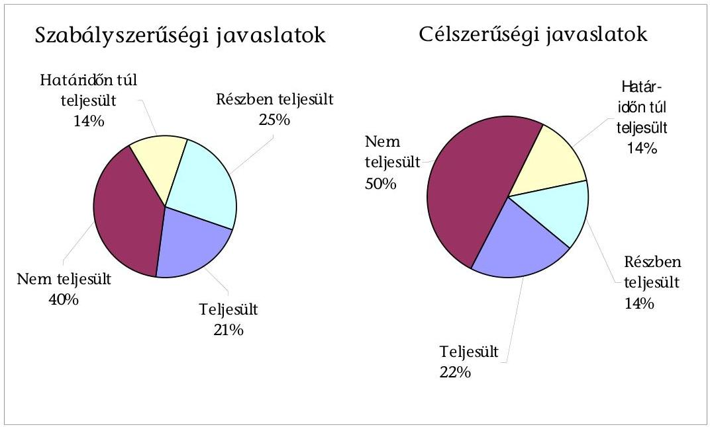

## A polgármester a következő célszerűségi javaslatot hasznosította:

„Kezdeményezze, hogy a számvevői jelentésben foglaltakat a Képviselő-testület tárgyalja meg és a feltárt hiányosságok megszüntetése érdekében készíttessen intézkedési tervet a határidők és felelősök megjelölésével. Az intézkedési tervet az elfogadását

---

követő 30 napon belül küldje meg az ÁSZ Fővárosi és Pest Megyei Ellenőrzési Irodája részére."

A polgármester a 2010. február 23-ai képviselő-testületi ülésre beterjesztett előterjesztésében kezdeményezte a számvevői jelentésben foglaltak megtárgyalását, és a feltárt hiányosságok megszüntetése érdekében intézkedési tervet készíttetett a határidők és felelősök megjelölésével, melyet a Képviselő-testület az 53/2010. (II. 23.) számú határozatában jóváhagyott. Az intézkedési tervet a megadott határidőn belül megküldték az Állami Számvevőszéknek.

# A következő szabályszerűségi javaslatot a polgármester részben hasznosította: 

„Gondoskodjon az Önkormányzat gazdálkodási rendszerének 2006. évi átfogó ellenőrzése során és a témavizsgálatok során az ÁSZ által tett és nem teljesült szabályszerűségi és célszerűségi javaslatok végrehajtásáról."

A javaslat az Önkormányzat gazdálkodási rendszerének korábbi, 2006. évi átfogó ellenőrzése során tett javaslatok tekintetében részben hasznosult az alábbiak szerint ${ }^{84}$ :

- Az ÁSZ a Pomáz Város Önkormányzata gazdálkodási rendszerének 2009. évi átfogó ellenőrzése során az utóellenőrzés keretében megállapította, hogy: „A költségvetési rendelet összeállítására, tartalmára, szerkezetére, mellékleteire tett javaslatok közül a Képviselő-testület nem határozta meg rendeletben az Önkormányzat költségvetésének előterjesztésekor a Képviselő-testület részére tájékoztatásul bemutatandó mérlegek, kimutatások tartalmát, mert a Polgármester az Áht. 118. § (1) bekezdése 2. pontjában foglaltak érvényesülését megsértve nem gondoskodott a rendelettervezet előterjesztéséről."

A javaslat 2010. évben hasznosult, mivel a polgármester gondoskodott a költségvetési és zárszámadási rendelet tartalmáról, mellékleteiről és a szöveges indoklásról szóló rendelettervezet előterjesztéséről ${ }^{85}$, melyet a Képviselő-testület jóváhagyott;

- Az ÁSZ a Pomáz Város Önkormányzata gazdálkodási rendszerének 2009. évi átfogó ellenőrzése során az utóellenőrzés keretében megállapította, hogy: „az önkormányzati gazdálkodás egyéb területeinek törvényes, szabályszerű ellátása érdekében a polgármester a Nek. tv. 27. § (1) bekezdésében foglaltak ellenére nem biztosította, hogy a hivatali SzMSz-ben rögzítsék a helyi kisebbségi önkormányzatok munkája segítésének módját."
A javaslati pont hasznosult, mivel a polgármester a 2009. október 1-jén hatályba lépett hivatali SzMSz-ben gondoskodott arról, hogy rögzítsék a helyi kisebbségi önkormányzatok munkája segítésének módját;
- Az ÁSZ a Pomáz Város Önkormányzata gazdálkodási rendszerének 2009. évi átfogó ellenőrzése során az utóellenőrzés keretében megállapította, hogy: „a

[^0]
[^0]:    ${ }^{84}$ A 2009. évi jelentés szerint hét - a 2006. évi átfogó ellenőrzés során a polgármesternek tett - javaslat nem, vagy részben hasznosult. Ezek közül - a jelen, 2011. évi ellenőrzés megállapítása szerint - kettő hasznosult, kettő részben hasznosult, egy nem hasznosult és kettő ismételten szerepelt a 2009. évi javaslatok között is.
    ${ }^{85}$ a költségvetési és zárszámadási rendelet tartalmáról, mellékleteiről és a szöveges indoklásról szóló $1 / 2010$. (I. 18.) rendelet

---

polgármester az Ötv. 8. § (2) bekezdésében foglaltakat megsértve nem kezdeményezte, hogy a Képviselő-testület meghatározza az Önkormányzat által kötelezően ellátandó és önként vállalt feladatok ellátásának mértékét és módját."
A javaslat 2011. évben részben hasznosult, mivel a polgármester kezdeményezése alapján a Képviselő-testület az SzMSz 5. számú mellékletében meghatározta az Önkormányzat önként vállalt feladatait, de nem határozta meg a kötelezően ellátandó feladatok ellátásának mértékét és módját;

- Az ÁSZ a Pomáz Város Önkormányzata gazdálkodási rendszerének 2009. évi átfogó ellenőrzése során az utóellenőrzés keretében megállapította, hogy: „a költségvetési koncepció összeállítására tett javaslat részben hasznosult, mivel a polgármester a 2008. évi költségvetési koncepció elöterjesztéséhez csatolta a Pénzügyi bizottság véleményét, azonban a kisebbségi önkormányzatok koncepció tervezetről alkotott véleményének csatolása az Ámr., 28. § (3) bekezdésében foglaltak ellenére elmaradt."
A polgármester a 2010. és a 2011. évi költségvetési koncepciók tervezetéhez csatolta a német kisebbségi önkormányzat véleményét, a cigány, szerb, szlovák, ruszin kisebbségi önkormányzatok véleményalkotása az Ámr. 2 35. § (3) bekezdésében ${ }^{86}$ foglaltak, valamint az ÁSZ ismételt javaslata ellenére elmaradt; ${ }^{87}$
- Az ÁSZ a Pomáz Város Önkormányzata gazdálkodási rendszerének 2009. évi átfogó ellenőrzése során az utóellenőrzés keretében megállapította, hogy: „a köztulajdon szabályszerű használatára és nyilvánosságára tett javaslatok nem hasznosultak, mert a polgármester a pártok számára kedvezményesen biztositotta az önkormányzati ingatlanok használatát, ezzel megsértette az Ötv. 78. § (1) bekezdésének elöirását, mely szerint az önkormányzatok vagyonának az önkormányzati célok megvalósulását kell szolgálnia".
A javaslatot a polgármester az ÁSZ ismételt javaslata ellenére nem hasznosította, mivel a pártok továbbra is kedvezményesen használják az önkormányzati ingatlanokat;
- Az ÁSZ a Pomáz Város Önkormányzata gazdálkodási rendszerének 2009. évi átfogó ellenőrzése során az utóellenőrzés keretében megállapította, hogy: „a polgármester az Ötv. 92. § (10) bekezdésben foglaltakat megsértve a zárszámadási rendelettervezettel egyidejüleg nem terjesztette a Képviselő-testület elé a költségvetési szervek éves ellenőrzési jelentései alapján készített 2007-2008. évi összefoglaló jelentést."

A javaslat a 2009. évi jelentésben is szerepel. A polgármester a 2009. évi összefoglaló ellenőrzési jelentést nem terjesztette be a 2009. évi zárszámadási rendelettervezettel egyidejűleg a Képviselő-testület elé. A 2010. évi összefoglaló belső ellenőrzési jelentést - az intézkedési tervben meghatározott határidőn túl - a 2011. április 26-i képviselő-testületi ülésre beterjesztette;

- Az ÁSZ a Pomáz Város Önkormányzata gazdálkodási rendszerének 2009. évi átfogó ellenőrzése során az utóellenőrzés keretében megállapította, hogy: „a polgármester nem gondoskodott az éves belső ellenőrzési terv - november 15-ig -Képviselő-testület elé terjesztéséről és elfogadásáról, hogy azt az Ötv. 92. § (6) bekezdésben foglalt határidőn belül elfogadják."

[^0]
[^0]:    ${ }^{86}$ 2012. január 1-jétől az Ávr. 26. § (2) bekezdésében
    ${ }^{87}$ Az Önkormányzat nem kezdeményezte a kisebbségi önkormányzatoknál a költségvetési koncepcióról a véleményalkotást.

---

A javaslat a 2009. évi jelentésben - a jegyzőnek címezve - is szerepel. A javaslat 2010-ben hasznosult, mivel a Képviselő-testület a 2011. évi belső ellenőrzési tervet 246/2010. (11. 11.) számú határozatával 2010. november 11-én hagyta jóvá.

# A következő szabályszerűségi javaslatot a polgármester az intézkedési tervben meghatározott határidőn túl hasznosította: 

„Terjessze az Ötv. 92. § (10) bekezdésének megfelelően a zárszámadási rendelet tervezettel egyidejúleg a Képviselő-testület elé a költségvetési szervek éves ellenőrzési jelentései alapján készített összefoglaló jelentést."

A javaslat már az ÁSZ 2006. évi átfogó ellenőrzése során tett javaslatok között is szerepelt. A polgármester a 2009. évi összefoglaló ellenőrzési jelentést nem terjesztette be a 2009. évi zárszámadási rendelettervezettel egyidejúleg a Képvi-selő-testület elé. A 2010. évi összefoglaló belső ellenőrzési jelentést - az intézkedési tervben meghatározott határidőn túl ${ }^{88}$ - a 2011. április 26-i képviselőtestületi ülésre beterjesztette.

## A jegyző a következő szabályszerűségi javaslatokat hasznosította:

- „Gondoskodjon az Ámr. 29. § (1) bekezdés g) és k) pontjában elöírtak betartása érdekében arról, hogy az Önkormányzat éves költségvetési rendelettervezete tartalmazza a többéves kihatással járó feladatok között és elkülönítetten az európai uniós forrásból megvalósuló programok bevételeit, kiadásait, valamint az önkormányzaton kívüli, ilyen projektekhez történő hozzájárulások előirányzatait."

A jegyző 2010. március 2-án kelt 2/2010 számú utasításában rendelkezett a javaslatban foglaltak végrehajtásáról a pénzügyi csoport felé. A 2009-2010-2011. évi költségvetési rendelettervezetek a javaslatnak megfelelően tartalmazták az európai uniós forrásból megvalósuló programok bevételeit és kiadásait;

- „gondoskodjon a Ber. 5. § (1) bekezdése alapján a belső ellenőrzési kézikönyv jóváhagyásáról, valamint a Ber. 5. § (2) bekezdés f) k) m) pontjaiban foglaltak szerint egészítsék ki az ellenőrzési kézikönyvet a belső ellenőrzési tevékenység minőségét biztosító eljárásrenddel, az ellenőrzés során büntető, szabálysértési, kártérítési, illetve fegyelmi eljárás megindítására okot adó cselekmény, mulasztás, vagy hiányosság feltárása esetén alkalmazandó eljárásokkal, a külső szakértők bevonására vonatkozó előirásokkal".

A belső ellenőrzési kézikönyv jóváhagyására vonatkozó javaslat már az ÁSZ 2006. évi átfogó ellenőrzése során tett javaslatok között is szerepelt. A jegyző gondoskodott a belső ellenőrzési kézikönyv jóváhagyásáról és kiegészítéséről, mivel a Társulás 2/2010. (I. 27.) számú határozatával jóváhagyta a Belső Ellenőrzési Kézikönyvet, mely tartalmazta a belső ellenőrzési tevékenység minőségét biztosító eljárásrendet, a hiányosság feltárása esetén alkalmazandó eljárásokat, és a külső szakértők bevonására vonatkozó előírásokat is;

[^0]
[^0]:    ${ }^{88}$ Az intézkedési tervben megszabott határidő a 2009. évi zárszámadás beterjesztésének időpontja volt.

---

- „kezdeményezze, hogy az éves belső ellenőrzési tervet az Ötv. 92. § (6) bekezdésében foglaltak szerint a Képviselő-testület - az előző év november 15-ig - hagyja jóvá."

A javaslat már az ÁSZ 2006. évi átfogó ellenőrzése során tett javaslatok között - a polgármesternek címezve - is szerepelt. A javaslat hasznosult, mivel a Kép-viselő-testület a 2011. évi belső ellenőrzési tervet 246/2010. (11. 11.) számú határozatával 2010. november 11-én hagyta jóvá;

- „gondoskodjon, hogy a Ber. 23. § (3) bekezdésében foglaltak szerint az ellenőrzési programokat a belső ellenőrzési vezető hagyja jóvá."

A jegyző gondoskodott a javaslat megvalósulásáról, mivel az intézkedési tervet követően készített 2010. évi ellenőrzési programokat a belső ellenőrzési vezető hagyta jóvá;

- „gondoskodjon a Ber. 32. § (1) és (2) bekezdésében foglalt feladat teljesítése érdekében arról, hogy a belső ellenőrzési vezető vezessen nyilvántartást az elvégzett ellenőrzésekről."

A javaslat hasznosult, mivel a jegyző intézkedése alapján a belső ellenőrzési vezető nyilvántartást vezetett az elvégzett ellenőrzésekről;

- „gondoskodjon a Ber. 8. § f) pontjában foglalt feladat teljesítése érdekében arról, hogy a belső ellenőrzési vezető a Ber. 12. § n) pontjában foglaltak szerint - a pénzügyminiszter által közzétett módszertani útmutató figyelembevételével - alakítson ki és vezessen olyan nyilvántartási rendszert, amely tartalmazza a belső ellenőrzési jelentésben tett megállapítások és javaslatok hasznosulását, a végrehajtott és végre nem hajtott intézkedéseket."

A javaslat hasznosult, a belső ellenőrzési vezető olyan nyilvántartást vezetett, amely tartalmazza a belső ellenőrzési jelentésben tett megállapítások és javaslatok hasznosulását, a végrehajtott és végre nem hajtott intézkedéseket.

# A következő szabályszerűségi javaslatokat a jegyző részben hasznosította: 

- „Gondoskodjon az Önkormányzat gazdálkodási rendszerének 2006. évi átfogó ellenőrzése során és a témavizsgálatok során az ÁSZ által tett és nem teljesült szabályszerűségi és célszerűségi javaslatok végrehajtásáról."

A javaslat az Önkormányzat gazdálkodási rendszerének korábbi, 2006. évi átfogó ellenőrzése során tett javaslatok tekintetében részben hasznosult az alábbiak szerint ${ }^{89}$ :

- Az ÁSZ a Pomáz Város Önkormányzata gazdálkodási rendszerének 2009. évi átfogó ellenőrzése során az utóellenőrzés keretében megállapította, hogy: „a zárszámadási rendelet tartalmára vonatkozó javaslat nem hasznosult, mivel a jegyző

[^0]
[^0]:    ${ }^{89}$ A 2009. évi jelentés szerint tizenhat - a 2006. évi átfogó ellenőrzés során a jegyzőnek tett - javaslat nem, vagy részben hasznosult. Ezek közül - a jelen, 2011. évi ellenőrzés megállapításai szerint - egy hasznosult, egy részben hasznosult, öt határidőn túl hasznosult, három nem hasznosult, hat ismételten szerepelt a 2009. évi javaslatok között is.

---

nem gondoskodott az Ámr., 66. § (4) bekezdésében foglaltak ellenére a részben önállóan gazdálkodó költségvetési intézmények pénzmaradványának a zárszámadási rendelettel egyidejúleg történő képviselő-testületi jóváhagyásáról."
A javaslatot 2011. évben hasznosította a jegyző, mivel gondoskodott az Ámr. ${ }_{2}$ 213. § (4) bekezdésében foglaltak szerint a részben önállóan gazdálkodó költségvetési intézmények pénzmaradványának a 2010. évi zárszámadási rendelettel egyidejúleg történő képviselő-testületi jóváhagyásáról;

- Az ÁSZ a Pomáz Város Önkormányzata gazdálkodási rendszerének 2009. évi átfogó ellenőrzése során az utóellenőrzés keretében megállapította, hogy: „a zárszámadási rendelet szerkezetére, tartalmára tett javaslatok részben hasznosultak, mivel a 2007. évi zárszámadás előterjesztésekor a Képviselő-testület részére a jegyző bemutatta a készfizető kezességvállalások számszerúsitését évenkénti bontásban és összesitve, azonban az Áht. 118. § (2) bekezdés 2. d) pontjában foglaltakat megsértve nem mutatta be az áthúzódó beruházási feladatokhoz kapcsolódóan a több éves kihatással járó döntések számszerüsitését évenkénti bontásban és összesitve, szöveges indoklással együtt".
A javaslat az ÁSZ ismételt javaslata ellenére csak részben hasznosult, mivel a jegyző bemutatta a 2009. és 2010. évi zárszámadási rendelet 3. számú mellékeltében az áthúzódó beruházási feladatokhoz kapcsolódóan a több éves kihatással járó döntések számszerúsítését évenkénti bontásban és összesítve, de szöveges indoklást nem csatolt hozzá;
- Az ÁSZ a Pomáz Város Önkormányzata gazdálkodási rendszerének 2009. évi átfogó ellenőrzése során az utóellenőrzés keretében megállapította, hogy: „az önkormányzati gazdálkodás egyéb területeinek célszerübb, gazdaságosabb ellátása érdekében a jegyző a pénzkezelési szabályzatban - az intézkedési tervben foglalt határidőn túl - határozta meg azokat a bankszámlákat, amelyekről készpénz vehető fel, továbbá nem szabályozta a bankszámlák és a pénztár kapcsolat-rendszerét, a készpénzfelvétel rendjét, valamint a bankkártya használatára jogosultak körét, a kisebbségi önkormányzatok elkülönített pénzkezelési rendjét a bankszámla és a pénztár vonatkozásában. A polgármester és a jegyző nem rendelkezett a kötelezettségvállalásra, utalványozásra, ellenjegyzésre felhatalmazottak beszámoltatásának rendjéről."

A javaslatok az ÁSZ ismételt javaslata ellenére csak az intézkedési tervben meghatározott határidőn ${ }^{90}$ túl hasznosultak, mivel a jegyző a 2011. február 28 -án hatályba lépett pénzkezelési szabályzatban határozta meg a bankszámlák és a pénztár kapcsolat-rendszerét, a készpénzfelvétel rendjét, a bankkártya használatára jogosultak körét, a kisebbségi önkormányzatok elkülönített pénzkezelési rendjét a bankszámla és a pénztár vonatkozásában;

- Az ÁSZ a Pomáz Város Önkormányzata gazdálkodási rendszerének 2009. évi átfogó ellenőrzése során az utóellenőrzés keretében megállapította, hogy: „a gazdálkodás és a pénzügyi-számviteli feladatellátás szabályozottságának biztositása érdekében a jegyző a gazdasági szervezet módosított ügyrendjét 2007. január 1-jével kiadta. A jegyző az ügyrendet kiegészítette a gazdasági szervezet által ellátandó feladatokkal, de tartalma nem felelt meg az Ámr. 17. § (5) bekezdésében foglaltaknak, mivel nem tartalmazta a vezetők és a pénzügyi-gazdasági feladatok ellátásáért felelős dolgozók feladat- és hatáskörét, a helyettesités rendjét, a belső és külső kapcsolattartás módját."
${ }^{90}$ Az intézkedési tervben megszabott határidő 2010. május 31. volt

---

A gazdasági szervezet ügyrendjének kiegészítésére vonatkozó javaslat a 2009. évi ÁSZ jelentésben is szerepel. A javaslatot a jegyző az ÁSZ ismételt javaslata ellenére az intézkedési tervben megadott határidőig nem hasznosította, de határidőn túl, a jegyző intézkedését követően, 2011. február 1-jén hatályba lépett a javaslatnak megfelelően módosított gazdasági szervezet ügyrendje;

- Az ÁSZ a Pomáz Város Önkormányzata gazdálkodási rendszerének 2009. évi átfogó ellenőrzése során az utóellenőrzés keretében megállapította, hogy: „a jegyző a leltározási szabályzatot módosította az évenkénti leltározási kötelezettség előirásával, de a Vhr. 37. § (3) bekezdésében foglaltak ellenére nem rendelkezett az üzemeltetésre átadott eszközök leltározásának módjáról."
A leltározási szabályzat módosítására vonatkozó javaslatot a jegyző az ÁSZ ismételt javaslata ellenére csak az intézkedési tervben meghatározott határidőn túl ${ }^{91}$ hasznosította, mivel a 2010. december 30 -án kelt leltározási és leltárkészítési szabályzatban rendelkezett az Áhsz. 37. § (4) bekezdésében előírtak szerint az üzemeltetésre átadott eszközök leltározási módjáról;
- Az ÁSZ a Pomáz Város Önkormányzata gazdálkodási rendszerének 2009. évi átfogó ellenőrzése során az utóellenőrzés keretében megállapította, hogy: „a gazdálkodás és a pénzügyi-számviteli feladatellátás szabályozottságának biztosítása érdekében a jegyző nem gondoskodott a Vhr. 8. § (3) bekezdés és a Vhr. 49. § elöirásában foglaltak ellenére arról, hogy a számviteli politika és a számlarend tartalmazza a kisebbségi önkormányzatokkal összefüggő feladatokat is; a bizonylati rendet a Számv. tv. 161. § (2) bekezdésében foglaltak ellenére a jegyző nem szabályozta, a Vhr. 49. § (4) bekezdése ellenére az analitikus nyilvántartások adataiból készült összesitő bizonylatok elkészitésének határidejét nem írta elő, a számviteli politikát nem egészítette ki a Vhr. 8. § (5) bekezdésében foglaltak ellenére azzal, hogy a számviteli elszámolás és az értékelés szempontjából mit tekintenek lényegesnek és nem lényegesnek a jelentősnek minősített árfolyamváltozás összegének meghatározásánál, nem szabályozta a Vhr. 8. § (17) bekezdés d) pontja előirása ellenére az értékelési szabályzatban követelés-típusonként a kis összegű követelések év végi meghatározásának elveit, dokumentálásának módját, nem határozta meg a Vhr. 31. § (4) bekezdésében foglaltak ellenére a számviteli politikában az értékvesztés visszaírásának szabályait, valamint a Vhr. 49. § (2) bekezdés előirása ellenére a számlarendben vezetendő analitikus nyilvántartások formáját és az egyeztetés dokumentálásának módját".

A javaslatot a jegyző az ÁSZ ismételt javaslata ellenére csak az intézkedési tervben meghatározott határidőn túl, ${ }^{92}$ hasznosította. 2011. január 1-jén lépett hatályba a Polgármesteri hivatal számviteli politikája, melyben a jegyző gondoskodott a bizonylati rend szabályozásáról, előírta az összesítő bizonylatok elkészítésének határidejét, a számviteli politikát kiegészítette a kisebbségi önkormányzatokkal összefüggő feladatokkal, meghatározta, hogy mit tekintenek a számviteli elszámolás és az értékelés szempontjából lényegesnek és nem lényegesnek a jelentősnek minősített árfolyamváltozás összegének meghatározásánál, és meghatározta az értékvesztés visszaírásának szabályait, valamint a számlarendben vezetendő analitikus nyilvántartások formáját és az egyeztetés dokumentálásának módját, szintén határidőn túl, 2011. október 1jén lépett hatályba az eszközök és források értékelési szabályzata, melyben szabályozta követeléstípusonként a kis összegű követelések év végi meghatározásának elveit, dokumentálásának módját;

[^0]
[^0]:    ${ }^{91}$ Az intézkedési tervben megszabott határidő 2010. május 31. volt.
    ${ }^{92}$ Az intézkedési tervben megszabott határidő 2010. május 31. volt.

---

- Az ÁSZ a Pomáz Város Önkormányzata gazdálkodási rendszerének 2009. évi átfogó ellenőrzése során az utóellenőrzés keretében megállapította, hogy: „a munkaköri leírások tartalmi kiegészitésére tett javaslat nem teljesült, mert a jegyző a pénztár ellenőri feladatok ellátásának kötelezettségét munkaköri leírásban az intézkedési tervben előirt határidőn túl rögzítette, a köztisztviselők munkaköri leírásait nem módosította a FEUVE szabályzat alapján az ellenőrzési és egyeztetési feladatok ellátásának kötelezettségével".
A javaslat nem hasznosult, mert a jegyző a köztisztviselők munkaköri leírásait az ÁSZ ismételt javaslata ellenére továbbra sem egészítette ki a FEUVE szabályzat alapján az ellenőrzési és egyeztetési feladatok ellátásának kötelezettségével;
- Az ÁSZ a Pomáz Város Önkormányzata gazdálkodási rendszerének 2009. évi átfogó ellenőrzése során az utóellenőrzés keretében megállapította, hogy: „a jegyző az Ámr., 29. § (1) bekezdés j) pontjában, és az Áht. 118. § (1) bekezdése 1., valamint 2. e) pontjaiban foglaltakat megsértve a 2007. évi költségvetés előterjesztésekor a Képviselő-testület részére tájékoztatásul nem mutatta be a várható bevételi és kiadási előirányzatok teljesüléséről az előirányzat-felhasználási ütemtervet, továbbá nem mutatta be a közvetett támogatásokat tartalmazó kimutatás szöveges indoklását; a jegyző az Áht. 8/A. § (7) bekezdésében foglaltakat megsértve a 2007. évi költségvetés elkészítése során nem gondoskodott arról, hogy a költségvetési bevételek között az értékpapír értékesítéséből származó bevételt ${ }^{93}$ ne vegyék figyelembe költségvetési hiányt módosító költségvetési bevételként."
A javaslat az ÁSZ ismételt javaslata ellenére továbbra sem hasznosult, mivel a jegyző az Ámr. ${ }_{2}$ 36. § (1) bekezdés k) pontjában, és az Áht. 118. § (1) bekezdése 1., valamint 2. e) pontjaiban foglaltakat megsértve a 2011. évi költségvetés előterjesztésekor nem mutatta be a várható bevételi és kiadási előirányzatok teljesüléséről az előirányzat-felhasználási ütemtervet, továbbá nem mutatta be a közvetett támogatásokat tartalmazó kimutatás szöveges indoklását;
- Az ÁSZ a Pomáz Város Önkormányzata gazdálkodási rendszerének 2009. évi átfogó ellenőrzése során az utóellenőrzés keretében megállapította, hogy: „az önkormányzati rendelet-módosítás határidejének betartására, a jóváhagyott előirányzatokon belüli gazdálkodás érvényesülésére tett javaslatok nem hasznosultak, mivel a Képviselő-testület december 31-i hatállyal, legkésőbb a költségvetési beszámoló felügyeleti szervhez történő megküldésének külön jogszabályban meghatározott határidejéig (a tárgyévet követő február 28-ig) nem módosította a 2007. évi költségvetési rendeletét, mert a jegyző az Ámr. 53. § (6) bekezdésében előirt határidő ellenére nem gondoskodott az előterjesztésről; a jegyző az Áht. 12/A. § (1) bekezdésében foglaltakat megsértve, nem biztosította, hogy a karbantartásoknál fizetési kötelezettséget a jóváhagyott kiadási előirányzaton felül ne vállaljanak."
Az önkormányzati költségvetési rendeletmódosítás határidejének betartására vonatkozó javaslatot a jegyző az ÁSZ ismételt javaslata ellenére nem hasznosította, mivel a 2010. évi zárszámadással egyidejúleg még sor került előirány-zat-módosításra. A jóváhagyott kiadási előirányzatokon felüli kötelezettségvállalásokra vonatkozó javaslat a 2009. évi jelentésben is szerepel, előirányzat túllépésére a kiemelt előirányzatok között az utóvizsgálat által ellenőrzött időszakban (2010. II. félév - 2011. I. félév) nem került sor;

[^0]
[^0]:    ${ }^{93}$ Értékpapír-értékesítésből származó bevétele az Önkormányzatnak 2010-2011-ben nem keletkezett.

---

- Az ÁSZ a Pomáz Város Önkormányzata gazdálkodási rendszerének 2009. évi átfogó ellenőrzése során az utóellenőrzés keretében megállapította, hogy: „a költségvetési gazdálkodási és ellenőrzési jogkörök gyakorlása szabályszerűségének biztosítása érdekében az érvényesitési feladatok ellátására a jegyző az intézkedési tervben megjelölt határidőn túl - 2008. június 1-jén - adott írásbeli megbízást a pénzügyi vezetőnek és kettő pénzügyi előadónak; a folyamatba épített ellenőrzési feladatok elvégzése során az érvényesitő az Ámr. 135. § (2) bekezdésében foglaltak ellenére úgy érvényesitette a múködési és a felhalmozási célú pénzeszközátadásokkal kapcsolatos kiadási bizonylatokat, hogy nem történt meg a szakmai teljesités igazolása."

A szakmai teljesítés igazolására vonatkozó javaslat a 2009. évi jelentésben is szerepel. A javaslatot a jegyző nem hasznosította, a jelentés 2.2. fejezetben tett megállapítások szerint az államháztartáson kívülre nyújtott pénzeszközátadások teljesítése előtt nem történt meg a szakmai teljesítés igazolása;

- Az ÁSZ Pomáz Város Önkormányzata gazdálkodási rendszerének 2009. évi átfogó ellenőrzése során az utóellenőrzés keretében megállapította, hogy: „az utalványok ellenjegyzői az Ámr. 137. § (3) bekezdésében foglaltak ellenére nem ellenőrizték a gazdálkodás folyamatában a szakmai teljesitésigazolás megtörténtét; az utalványokat ellenjegyzők nem kifogásolták, hogy az utalványrendeleten az Ámr. 136. (4) bekezdés h) pontjában foglaltak ellenére nem tüntették fel a kötelezettségvállalás nyilvántartásba vételének sorszámát."
A javaslatok a 2009. évi jelentésben is szerepelnek. Az utalvány ellenjegyzése során a szakmai teljesítésigazolás ellenőrzéséről, és a kötelezettségvállalás sorszáma feltüntetésének ellenőrzéséről szóló javaslatokat a jegyző az ÁSZ ismételt javaslata ellenére sem hasznosította;
- Az ÁSZ a Pomáz Város Önkormányzata gazdálkodási rendszerének 2009. évi átfogó ellenőrzése során az utóellenőrzés keretében megállapította, hogy: „a jegyző nem szabályozta az Ámr. 135. § (6) bekezdése és a 138. § (1)-(3) bekezdései elöirása ellenére az érvényesités, valamint az ellenjegyzés összeférhetetlenségi szabályait."
A javaslatot a jegyző az ÁSZ ismételt javaslata ellenére csak 2011. évben hasznosította, mivel a 2011. augusztus 1-jén hatályba lépett operatív gazdálkodási jogkörök gyakorlásáról szóló szabályzatban szabályozta az érvényesítés és ellenjegyzés összeférhetetlenségi szabályait;
- Az ÁSZ a Pomáz Város Önkormányzata gazdálkodási rendszerének 2009. évi átfogó ellenőrzése során az utóellenőrzés keretében megállapította, hogy: „a jegyző az Áht. 15/A. §-ában foglaltakat megsértve nem gondoskodott a nem normatív, céljellegú fejlesztési célú támogatások elöirt tartalmú közzétételéről."
A javaslat a 2009. évi jelentésben is szerepel. A javaslat részben hasznosult, mivel a 2009-2010. első félévi nem normatív, céljellegú, múködési és fejlesztési támogatások kedvezményezettjeinek nevére, a támogatás céljára, összegére, továbbá a támogatási program megvalósítási helyére vonatkozó adatokat az előírt szerkezetben közzé tették az Önkormányzat honlapján, a 2007-2008. évi, a 2010. II. félévi és a 2011. évi nem normatív, céljellegú, múködési és fejlesztési támogatások kedvezményezettjeinek nevére, a támogatás céljára, öszszegére, továbbá a támogatási program megvalósítási helyére vonatkozó adatokat azonban a jegyző az Áht. 15/A. § (1) bekezdésében előírtakat megsértve nem tette közzé;

---

- Az ÁSZ a Pomáz Város Önkormányzata gazdálkodási rendszerének 2009. évi átfogó ellenőrzése során az utóellenőrzés keretében megállapította, hogy: „a belső ellenőrzési rendszer kialakítása, a stratégiai tervek meghatározása, a belső ellenőrzés lefolytatása érdekében tett javaslatok közül a belső ellenőrzés - az intézkedési tervben meghatározott határidőn túl - a 2009. évben kettő közbeszerzési eljárást vizsgált; a belső ellenőrzési kézikönyvet a Ber. 5. § (1) bekezdésében foglaltakkal ellentétesen a jegyző helyett a polgármester hagyta jóvá."
A javaslat a 2009. évi jelentésben is szerepel. A jegyző gondoskodott a belső ellenőrzési kézikönyv jóváhagyásáról, mivel a Társulás 2/2010. (I. 27.) számú határozatával jóváhagyta a Belső Ellenőrzési Kézikönyvet;
- Az ÁSZ a Pomáz Város Önkormányzata gazdálkodási rendszerének 2009. évi átfogó ellenőrzése során az utóellenőrzés keretében megállapította, hogy: „a stratégia tervet a belső ellenőrzési vezető 2007. november 15-én elkészítette, de a jegyző a Ber. 18. §-ában foglaltak ellenére nem hagyta jóvá."
A javaslat hasznosult, mert a 2010-2014. évekre szóló belső ellenőrzési stratégiai tervet a belső ellenőrzési vezető 2009. október 31-én elkészítette, melyet a jegyző 2009. november 18-án jóváhagyott;
- Az ÁSZ a Pomáz Város Önkormányzata gazdálkodási rendszerének 2009. évi átfogó ellenőrzése során az utóellenőrzés keretében megállapította, hogy: „a jegyző a Ber. 4. § (2) bekezdésében foglaltakkal ellentétesen nem gondoskodott arról, hogy a hivatali SzMSz-ben elöirják az ellenőrzést végző személy, egység jogállását, feladatait, valamint arról, hogy a Kistérségi Társulással kötött megállapodásban határozzák meg a Ber. 4/A. § (2) bekezdésében foglaltak szerint a belső ellenőrzési vezető személyét, annak feladatait".
A javaslatok a 2009. évi jelentésben is szerepelnek. A hivatali SzMSz kiegészítésére vonatkozó javaslatot az intézkedési tervben megadott határidőig a jegyző nem hasznosította. Az intézkedési tervben kitűzött határidőn túl, 2011. október 18-án a Képviselő-testület jóváhagyta a belső ellenőrzést végző személy, egység jogállására és feladataira vonatkozó SzMSz módosítást. A jegyző nem kezdeményezte a Kistérségi Társulással kötött megállapodásban a Ber. 4/A. § (2) bekezdésében foglalt előírás ellenére a belső ellenőrzési vezető számára a Ber. 12. §-ában foglalt tevékenységek ellátási módjának meghatározását, de a Tanács 2/2010 (I. 27.) számú határozatával elfogadta a belső ellenőrzési feladat ellátásáról szóló megállapodást, melyben kijelölésre került a belső ellenőrzési vezető személye, és meghatározták feladatait;
- „készítsen az Ámr., 139. § (1) bekezdésében foglaltak szerint az Önkormányzat pénzállományának alakulásáról likviditási tervet és azt szükség szerint aktualizálja."

A 2010. évi költségvetési rendelet 12. számú mellékleteként a Képviselő-testület jóváhagyta a likviditási tervet, de a jegyző az aktualizálásról nem gondoskodott;

- „gondoskodjon arról, hogy az Áht. 15/A. § (1) bekezdésében foglaltakat betartva, a nem normatív, céljellegü müködési és fejlesztési támogatások kedvezményezettjeinek nevére, a támogatás céljára, összegére, a támogatási program megvalósítási helyére vonatkozó adatokat közzétegyék az Önkormányzat honlapján az IHM rendelet 1. és 2. számú mellékletében meghatározott szerkezetben".

---

A javaslat már az ÁSZ 2006. évi átfogó ellenőrzése során tett javaslatok között is szerepelt. A javaslat részben hasznosult, mivel a 2009-2010. év első félévi nem normatív, céljellegú, múködési és fejlesztési támogatások kedvezményezettjeinek nevére, a támogatás céljára, összegére, továbbá a támogatási program megvalósítási helyére vonatkozó adatokat az előírt szerkezetben közzétették az Önkormányzat honlapján, a 2007-2008. évi, a 2010. év II. félévi, és a 2011. évi nem normatív, céljellegú, múködési és fejlesztési támogatások kedvezményezettjeinek nevére, a támogatás céljára, összegére, továbbá a támogatási program megvalósítási helyére vonatkozó adatokat azonban a jegyző az Áht. 15/A. § (1) bekezdésében előírtakat megsértve nem tette közzé;

- „gondoskodjon az Ámr. 22. számú melléklet 5. sorában elöirtak alapján az éves költségvetési beszámoló szöveges indokolásának közzétételéről."

A jegyző gondoskodott a közzétételről, a költségvetési beszámolók feltöltésre kerültek a javaslatnak megfelelően az Önkormányzat honlapján a közérdekú adatok közé, de a honlapszolgáltatást a Társulás, mint szolgáltató az Önkormányzat tartozása miatt 2011. június 21 -én felfüggesztette, helyette egy önálló honlapot indított az Önkormányzat, ezen azonban nem elérhetőek a vonatkozó közérdekú adatok;

- „gondoskodjon arról, hogy az Áht. 15/B. § (1) bekezdésében foglaltaknak megfelelően az Önkormányzat pénzeszközei felhasználásával, a vagyonnal történő gazdálkodással összefüggő - a nettó ötmillió forintot elérő, vagy azt meghaladó értékú -szerződések megnevezését (típusát), tárgyát, értékét, a szerződést kötő felek nevét, a határozott időre kötött szerződés időtartamát, valamint ezen adatok változásait közzétegyék az Önkormányzat honlapján az IHM rendelet 1. és 2. számú mellékletében meghatározott szerkezetben."

A javaslatot a jegyző részben hasznosította, mivel a 2008. október 13. - 2011. március 31. közötti időszakban megkötött nettó ötmillió Ft érték feletti, önkormányzati kiadással járó szerződések javasolt közérdekú adatait az előírt szerkezetben - kivéve a szerződések időtartamára vonatkozó adatokat - közzétették a honlapon, ugyanakkor a nettó ötmillió forint értékhatárt elérő, vagy azt meghaladó, az Önkormányzat vagyonértékesítésével, vagyonhasznosításával kapcsolatos szerződések javasolt közérdekú adatainak közzétételéről a jegyző nem gondoskodott, valamint a 2007. évi és a 2008. első háromnegyedévi időszakára vonatkozó szerződések javasolt közérdekú adatait nem tették közzé az Önkormányzat honlapján;

- „kezdeményezze a Kistérségi Társulással kötött megállapodásban a Ber. 4/A. § (2) bekezdésében foglaltak elöirás szerint a belső ellenőrzési vezető számára a Ber. 12. §-ában foglalt tevékenységek ellátási módjának meghatározását, valamint gondoskodjon a Ber. 2. § n) pontjában foglaltak alapján a belső ellenőrzési vezető személyének kijelöléséről."

A javaslat már az ÁSZ 2006. évi átfogó ellenőrzése során tett javaslatok között is szerepelt. A javaslatot a jegyző részben hasznosította, mivel nem kezdeményezte a Kistérségi Társulással kötött megállapodásban a Ber. 4/A. § (2) bekezdésében foglaltak előírás ellenére a belső ellenőrzési vezető számára a Ber. 12. §-ában foglalt tevékenységek ellátási módjának meghatározását, de a Tanács 2/2010. (I. 27.) számú határozatával elfogadta a belső ellenőrzési feladat ellátásáról szóló megállapodást, melyben kijelölésre került a belső ellenőrzési vezető személye.

---

# A következő szabályszerűségi javaslatokat a jegyző az intézkedési tervben meghatározott határidőn túl hasznosította: 

- „egészítesse ki az Ámr. 17. § (5) bekezdése alapján a gazdasági szervezet ügyrendjét, hogy az részletesen tartalmazza az általa ellátandó feladatokat, a vezetők és a szerv pénzügyi-gazdasági feladatainak ellátásáért felelős alkalmazottak feladat- és hatáskörét, felelősségi körét, a helyettesítés rendjét, a belső (szerven belüli) és külső kapcsolattartás módját."

A javaslat már az ÁSZ 2006. évi átfogó ellenőrzése során tett javaslatok között is szerepelt. A javaslatot a jegyző az ÁSZ ismételt javaslata ellenére az intézkedési tervben megadott határidőig ${ }^{94}$ nem hasznosította, de határidőn túl, a jegyző intézkedését követően 2011. február 1-jén hatályba lépett a javaslatnak megfelelően módosított gazdasági szervezet ügyrendje;

- „készítesse el az Áhsz. 8. § (4) bekezdés c) pontjában, és a (16) bekezdésében, valamint az Ámr. 157/C. § (1)-(2) bekezdésében foglaltak alapján az önköltségszámítás rendjére vonatkozó belső szabályzatot."

A javaslatot a jegyző az intézkedési tervben megadott határidőig ${ }^{95}$ nem hasznosította, de határidőn túl, a jegyző intézkedését követően 2011. október 1-jén hatályba lépett az önköltségszámítás rendjére vonatkozó szabályzat;

- „belső ellenőrzés szabályszerű kereteinek kialakítása és müködtetése érdekében határozza meg a hivatali SzMSz-ben a Ber. 4. § (2) bekezdésében foglaltak szerint a belső ellenőrzést végző személy, egység jogállását és feladatait."

A javaslat már az ÁSZ 2006. évi átfogó ellenőrzése során tett javaslatok között is szerepelt. Az intézkedési tervben megadott határidőig a javaslatot a jegyző nem hasznosította. Az intézkedési tervben kitűzött határidőn túl, 2011. október 18-án a Képviselő-testület jóváhagyta a belső ellenőrzést végző személy, egység jogállására és feladataira vonatkozó SzMSz módosítást;

## A következő szabályszerűségi javaslatokat a jegyző nem hasznosította:

- „Gondoskodjon az Áht. 8/A. § (7) bekezdésében elöírtaknak megfelelően a költségvetési rendelettervezet elkészítésekor arról, hogy finanszírozási célú pénzügyi múveleteket ne vegyenek figyelembe költségvetési hiányt módosító költségvetési bevételként, valamint költségvetési kiadásként";
- „gondoskodjon a Ber. 29. § (1) bekezdésében foglaltak alapján a belső ellenőrzés által feltárt hiányosságok kijavítása érdekében intézkedési terv készítéséről";
- „ellenőriztesse az Áht. 121. § (1) és (3) bekezdéseiben és az Ámr. 145/A. § (1), (2) bekezdéseiben és a 145/B. § (1) bekezdésében foglalt elöírások betartása érdekében a költségvetés tervezésének és a zárszámadás készítésének folyamatában:
- a Polgármesteri hivatal és az intézmények költségvetési javaslatuk jogszabályi előírásoknak megfelelő kidolgozását, javasolt előirányzataik megalapozottságát;

[^0]
[^0]:    ${ }^{94}$ Az intézkedési tervben megszabott határidő 2010. május 31. volt.
    ${ }^{95}$ Az intézkedési tervben megszabott határidő 2010. június 30. volt.

---

- a saját bevételek előirányzatai és a költségvetés megalapozását szolgáló helyi rendeletek összhangját;
- az intézményi számszaki beszámolók belső, valamint annak a Képviselő-testület által meghatározott adatszolgáltatással való összhangját;
- „a Polgármesteri hivatal szervezeti egységei és az intézmények által benyújtott költségvetési igények indokoltságát, teljesíthetőségét"
- „egészítse ki az Ámr. 145/B. § (1) bekezdésében meghatározott ellenőrzési nyomvonalat az Ámr. 145/A. § (3) bekezdésében hivatkozott, a Pénzügyminisztérium "Útmutató az ellenőrzési nyomvonal kialakításához" módszertani útmutatója szerint az egyes tevékenységek elvégzését igazoló dokumentumok megnevezésével és fellelhetési helyének meghatározásával."
- „gondoskodjon az Áht. 2010. január 1-től hatályos 8/C. § (3)-(4) bekezdéseiben foglaltak érvényesülése érdekében arról, hogy a költségvetési bevételek között vegyék figyelembe az előző évi pénzmaradvány igénybevételét az áthúzódó kötelezettségek forrásaként."
- „gondoskodjon az operatív gazdálkodás során a múködésbeli hibák megelőzése, feltárása, kijavítása érdekében, hogy:
- az államháztartáson kívülre nyújtott pénzeszközátadások teljesítése előtt a jegyző által kijelölt személyek - az Ámr. 135. § (1)-(2) bekezdésében foglaltaknak megfelelően - okmányok alapján ellenőrizzék, szakmailag igazolják azok jogosultságát, összegszerűségét."

A javaslat már az ÁSZ 2006. évi átfogó ellenőrzése során tett javaslatok között is szerepelt. A javaslatot a jegyző nem hasznosította, a 2.2. fejezetben vizsgált bizonylatok alapján az államháztartáson kívülre nyújtott pénzeszközátadások teljesítése előtt nem történt meg a szakmai teljesítés igazolása;

- „az utalványok ellenjegyző́je a külső szolgáltató által végzett karbantartási, kisjavítási munkák, a gépek, berendezések beszerzése, valamint a múködési és felhalmozási célú pénzeszköz átadások államháztartáson kívülre teljesített kifizetései teljesítése előtt az Ámr. 137. § (3) bekezdésének előirása alapján győződjön meg a szakmai teljesítésigazolás megtörténtéről, valamint arról, hogy az utalványozás nem sérti-e a gazdálkodásra vonatkozó szabályokat, figyelemmel az Áht. 12/A. § (1) bekezdésében a jóváhagyott kiadási előirányzatok mértékéig vállalható tárgyévi fizetési kötelezettségekre és elrendelhető kifizetésekre, továbbá, hogy az utalványrendeleten az Ámr. 136. § (4) bekezdés h) pontja alapján feltüntették-e a kötelezettségvállalás nyilvántartásba vételének sorszámát."

Az utalvány ellenjegyzésre és a jóváhagyott kiadási előirányzatok túllépésének vonatkozó javaslatok már az ÁSZ 2006. évi átfogó ellenőrzése során tett javaslatok között is szerepeltek. Az utalvány ellenjegyzése során a szakmai teljesítésigazolás ellenőrzéséről, és a kötelezettségvállalás sorszáma feltüntetésének ellenőrzéséről szóló javaslatokat a jegyző az ÁSZ ismételt javaslata ellenére sem hasznosította, előirányzat túllépésére a kiemelt előirányzatok között az utóvizsgálat által ellenőrzött időszakban (2010. II. félév - 2011. I. félév) nem került sor;

---

- „intézkedjen a Ber. 18. § alapján a belső ellenőrzés stratégiai tervének kockázatelemzéssel való alátámasztásáról".

# A következő célszerúségi javaslatokat a jegyző hasznosította: 

- „Gondoskodjon arról, hogy az európai uniós forrásokra irányuló pályázatkészítési feladatok ellátására kötött szerződésben írják elő a megbízott külső szervezet és a Polgármesteri hivatal képviselője közötti kapcsolattartást, az információk átadásának formáját, tartalmát, módját, továbbá a pályázat szakmai és formai követelményeinek biztosítására vonatkozóan a pályázatkészitést végző felelősségét".

A jegyző gondoskodott arról, hogy a 2010. augusztus 18 -án kelt, az európai uniós forrásokra irányuló pályázatkészítési feladatok ellátására kötött megbízási szerződés a javaslatban szereplő kritériumokat tartalmazza;

- „Alakítsa ki az e-közigazgatási feladatokat ellátó informatikai rendszer ügyfelek általi igénybevételének figyelési rendszerét, kisérjék figyelemmel az elektronikus ügyfélforgalmat és értékeljék annak tapasztalatait".

A javaslatot a jegyző hasznosította, kialakította a honlap látogatás, a nyomtatványok letöltésének és az okmányirodai bejelentkezés figyelési rendszerét, az elektronikus ügyfélforgalmat figyelemmel kísérték, és annak tapasztalatait felhasználták az új honlap kialakításakor.

## A következő célszerúségi javaslatokat a jegyző részben hasznosította:

„A pénzügyi-számviteli területen alkalmazott informatikai rendszerek kialakításával és müködtetésével kapcsolatban:

- „gondoskodjon a hozzáférési jogosultságok eljárásrendjének kialakításáról, és a fökönyvi könyvelési rendszerben tárolt hozzáférési jogosultságok ellenőrzéséről, valamint intézkedjen, hogy a felhasználók rendelkezzenek egyedi felhasználói névvel és jelszóval a szoftverek használatához."

A 2009. november 15 -én hatályba lépett Informatikai Biztonsági Szabályzat rendelkezik a hozzáférési jogosultságok eljárásrendjéről, és a felhasználók egyedi felhasználói nevéről és jelszaváról. 2010. szeptember 17-én új szerverre kerültek áthelyezésre a pénzügyi rendszerek. 2011. január 17-én ellenőrzésre került a pénzügyi szoftverek hozzáférése, a vizsgálat során mindent megfelelőnek találtak, de az ellenőrzés már az intézkedési tervben meghatározott határidőt ${ }^{96}$ követően történt;

- „gondoskodjon katasztrófa elhárítási terv elkészítéséről, annak teszteléséről és az informatikával kapcsolatos szabályzatok megismertetéséről."

2010. szeptember 24-én elkészült a Polgármesteri hivatal pénzügy-számviteli szoftverének adatvesztése, meghibásodása, illetve megsemmisülése esetén alkalmazandó eljárásokról szóló katasztrófaterv, melyet az intézkedési tervben meghatározott határidőt követően ${ }^{97}$, 2011. január 15-én teszteltek.

[^0]
[^0]:    ${ }^{96}$ Az intézkedési tervben megszabott határidő 2010. november 30. volt.
    ${ }^{97}$ Az intézkedési tervben megszabott határidő 2010. november 30. volt.

---

# A következő célszerúségi javaslatokat a jegyző az intézkedési tervben meghatározott határidőn túl hasznosította: 

- „Szabályozza az európai uniós forrásokra irányuló pályázatfigyelés és pályázatkészités, valamint az európai uniós forrásokkal támogatott fejlesztés lebonyolításával kapcsolatos eljárási rendet, melynek keretében a Polgármesteri hivatalon belül jelölje ki az önkormányzati szintü pályázatkoordinálás, valamint pályázati nyilvántartás vezetésének felelő́ét."

Az intézkedési tervben megadott határidőig ${ }^{98}$ a javaslatot a jegyző nem hasznosította, de az intézkedési tervben kitűzött határidőn túl, a jegyző intézkedését követően 2011. január 1-jén hatályba lépett a Támogatással, európai uniós forrásokkal kapcsolatos pályázatfigyelés, pályázatkészítés és lebonyolítás szabályzata, melyben a jegyző szabályozta a javaslatban szereplő eljárásrendet, és kijelölte a felelősöket is;

- „intézkedjen a jelszavakra elöírt szabályok teljes körü betartásáról a pénzügyiszámviteli szoftverek esetében".

Az intézkedési tervben megadott határidőig ${ }^{99}$ a javaslatot a jegyző nem hasznosította. Az intézkedési tervben kitűzött határidőn túl, 2011. január 17-én ellenőrzésre került a pénzügyi szoftverek hozzáférése, az ellenőrzés kiterjedt a felhasználók jelszavának használatára is, a vizsgálat során mindent megfelelőnek találtak.

## A következő célszerúségi javaslatokat a jegyző nem hasznosította:

- „gondoskodjon, hogy az eszközök és források értékelési szabályzatát egészítsék ki az értékelések ellenőrzéséért felelős munkakörök megjelölésével."
- „gondoskodjon az informatikai fejlesztési és üzemeltetési feladatok elkülönítésének szabályozásáról, valamint írja elő szabályzatban az ellenőrzési napló elkészítésének és ellenőrzésének kötelezettségét."
- „egészítse ki az Informatikai Biztonsági Szabályzatot a külső fejlesztők hozzáférése rendjének előirásával."
- „intézkedjen, hogy a belső ellenőrzésre vonatkozó stratégiai és éves terv készítése során a kockázatelemzés terjedjen ki az európai uniós forrással támogatott fejlesztési feladatokra."
- „gondoskodjon az Önkormányzatra vonatkozó informatikai stratégia elkészitéséről és jóváhagyásáról, amelyben határozzák meg az e-közigazgatás megvalósitásának közép- és hosszú távú célkitüzéseit, és hogy az e-közigazgatási feladatokat melyik elektronikus szolgáltatási szinten kivánják megvalósítani."
- „gondoskodjon a változás kezelési eljárások ellenőrzésének dokumentálásáról, teszteléséről, illetve intézkedjen a szoftverfejlesztésekhez kapcsolódóan az ellenőrzési lista elkészitéséről."

[^0]
[^0]:    ${ }^{98}$ Az intézkedési tervben megszabott határidő 2010. június 30. volt
    ${ }^{99}$ Az intézkedési tervben megszabott határidő 2010. november 30. volt.

---

- „tájékoztassa - évente végzett számítások alapján - a Képviselö-testületet az Önkormányzat eladósodására figyelemmel arról, hogy a hosszú lejáratú, adósságot keletkeztető kötelezettségvállalásokból adódó tőke és kamatfizetési kötelezettségét az Önkormányzat milyen feltételek biztositása mellett tudja teljesíteni."

Budapest, 2012. április „f6"
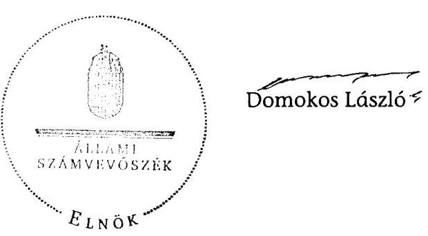

---

# Az Önkormányzat gazdálkodására jellemző adatok, mutatószámok 

| Megnevezés | 2007. év | 2010. év |
| :--: | :--: | :--: |
| A település állandó lakosainak száma (fő) 2007. és 2011. január 1-jén | 16060 | 16581 |
| A Képviselő-testület tagjainak a száma (fő) (december 31-én) | 17 | 11 |
| A Képviselő-testület munkáját segítő állandó bizottságok száma (december 31-én) | 5 | 4 |
| Az összes vagyon értéke a december 31-i könyvviteli mérleg szerint (millió Ft) | 18041,5 | 16797,9 |
| A hosszú és rövid lejáratú kötelezettség december 31-én (millió Ft) | 3590,3 | 4292,8 |
| Az összes teljesített költségvetési bevétel** (millió Ft) | 2886,9 | 2951,6 |
| Ebből: saját bevétel (millió Ft), melyből | 1990,2 | 2 168,3 |
| helyi adó és illetékbevétel, valamint az szja-n kívüli átengedett bevételek (millió Ft) | 404,4 | 516,6 |
| Az egy állandó lakosra jutó költségvetési bevétel (Ft) | 179757,2 | 178011,0 |
| Az egy állandó lakosra jutó saját bevétel (Ft) | 123922,8 | 130770,2 |
| Az egy állandó lakosra jutó helyi adóbevétel (Ft) | 25 180,6 | 31 156,1 |
| Saját bevétel/Felhalmozási célú költségvetési kiadásokkal csökkentett összes költségvetési bevétel aránya (\%) | 200,0 | 90,0 |
| Helyi adó bevétel*/Felhalmozási célú költségvetési kiadásokkal csökkentett összes költségvetési bevétel aránya (\%) | 40,5 | 21,5 |
| Az összes teljesített költségvetési kiadás (millió Ft) | 4059,3 | 3037,7 |
| Ebből: felhalmozási célú költségvetési kiadás (millió Ft) | 1889,6 | 546,8 |
| A költségvetési kiadásból a felhalmozási célú költségvetési kiadás aránya (\%) | 46,5 | 18,0 |
| Az egy lakosra jutó teljesített működési célú költségvetési kiadás (Ft) | 135099,6 | 150226,1 |
| Az egy lakosra jutó teljesített felhalmozási célú költségvetési kiadás (Ft) | 117658,8 | 32977,5 |
| A költségvetési szervek száma december 31-jén | 11 | 11 |
| Ebből: önállóan működő és gazdálkodó | 2 | 2 |
| A Polgármesteri hivatalban foglalkoztatott köztisztviselők száma (fő) (december 31-én) | 71 | 64 |
| Az Önkormányzat által foglalkoztatott közalkalmazottak száma (fő), (december 31-én) | 289 | 282 |

* helyi adó és illetékbevétel, valamint az szja-n kívüli átengedett bevételek
** a költségvetési bevétel az előző évek pénzmaradványának, vállalkozási maradványának igénybevételét is tartalmazza

---

#### **Az Önkormányzat bevételei és kiadásai, valamint adósságszolgálata 2007-2010 között**

|  1. FOLYÓ KÖLTSÉGVETÉS | 2007. | 2008. | 2009. | 2010.  |
| --- | --- | --- | --- | --- |
|  1.1.1. Saját működési bevételek (01/105+106+107+108+110+111+121+125+126+202+203+208-54) | 515 716 | 981 042 | 638 778 | 719 012  |
|  1.1.2. Költségvetési támogatás (01/211) | 872 734 | 976 727 | 842 591 | 754 944  |
|  1.1.3. Atengedett bevételek (01/109+122+123+124) | 735 620 | 596 835 | 561 303 | 656 219  |
|  1.1.4. Aftamháztartáson belülről kapott támogatások (01/127+139) | 119 588 | 77 673 | 62 538 | 69 011  |
|  1.1.5. EU-nő és külföldről kapott bevételek (01/156+157+158) | 9 550 | 12 673 | 25 664 | 33 980  |
|  1.1.6. Aftamháztartáson kívülről kapott bevételek (01/148+149+150+155+160+197) | 5 926 | 2 120 | 2 878 | 10 072  |
|  1.1.7. Előző évi pénzmaradvány átvétel (01/147+184) | 0 | 0 | 0 | 0  |
|  1.1. Folyó bevételek = 1.1.1.+1.1.2.+1.1.3.+1.1.4.+1.1.5.+1.1.6. | 2 259 134 | 2 641 070 | 2 133 752 | 2 243 238  |
|  1.2.1. Működési kiadások kamatkiadások nélküli: 01/04+05+06+07+08+09+10+11 | 1 984 268 | 2 052 414 | 1 842 297 | 2 122 762  |
|  1.2.2. Aftamháztartáson belülre átadott pénzeszközök (01/23) | 0 | 114 | 0 | 15 914  |
|  1.2.3.1. vállalkozásoknak (01/41+46+95) | 11 548 | 16 322 | 18 061 | 21 073  |
|  1.2.3.2. EU-nak, illetve külföldre (01/42+43+44) | 0 | 0 | 0 | 0  |
|  1.2.3.3. magánczenélyeknek (01/34+48+49) | 88 329 | 102 304 | 88 932 | 107 171  |
|  1.2.3.4. neugrofió szervezeteknek (01/37+33) | 59 246 | 66 443 | 52 421 | 71 927  |
|  1.2.3. Troncsferkiadások (=1.2.3.1+1.2.3.2+1.2.3.3+1.2.3.4) | 159 123 | 185 069 | 159 414 | 160 171  |
|  1.2.4. Kamatkiadások (53+97) | 106 316 | 149 501 | 210 862 | 192 144  |
|  1.2.5. Előző évi pénzmaradvány átadás (01/31+78) | 0 | 0 | 0 | 0  |
|  1.2. Folyó kiadások = 1.2.1.+1.2.2.+1.2.3.+1.2.4. | 2 249 707 | 2 387 098 | 2 212 573 | 2 490 991  |
|  1.3. Folyó költségvetés egyenlege MŰKÖDÉSI JÖVEDELEM (1.1. - 1.2.) | 9 427 | 253 972 | -78 821 | -247 753  |
|  2. FELHALMOZÁSI KÖLTSÉGVETÉS |  |  |  |   |
|  2.1.1. Saját tökebevételek (01/164+198+200+201+205+206+207+209) | 300 815 | 43 360 | 39 279 | 412 105  |
|  2.1.2. Aftamháztartáson belülről kapott támogatások (01/176) | 23 840 | 2 765 | 18 767 | 230 600  |
|  2.1.3. EU-nő és külföldről kapott támogatások (01/193+194+195) | 0 | 0 | 0 | 0  |
|  2.1.4. Aftamháztartáson kívülről kapott támogatások (01/185+186+187+192) | 279 113 | 237 945 | 26 934 | 37 298  |
|  2.1. Felhalmozási bevételek (=2.1.1.+2.1.2+2.1.3+2.1.4.) | 603 768 | 284 070 | 84 980 | 680 003  |
|  2.2.1. Saját beruházási kiadás áfával (01/57+58 arányos része) | 167 174 | 93 015 | 29 156 | 490 662  |
|  2.2.2. Saját felújítási kiadás áfával (01/56+58 arányos része) | 9 190 | 4 835 | 2 440 | 45 049  |
|  2.2.3. Aftamháztartáson belülre átadott pénzesekést (01/70+99+101) | 14 220 | 0 | 0 | 0  |
|  2.2.4. EU-nak és külföldnek adott pénzeszközök (01/89+90+91) | 0 | 0 | 0 | 0  |
|  2.2.5. Aftamháztartáson kívülre adott pénzeszközök (01/79+80+81+88+92+93+100) | 32 445 | 21 690 | 18 233 | 11 843  |
|  2.2.6. Befektetési célú részesedések vásárlása (01/102) | 0 | 480 | 0 | 0  |
|  2.2. Felhalmozási kiadások (=2.2.1.+2.2.2.+2.2.3.+2.2.4.+2.2.5.+2.2.6.) | 1 809 604 | 1 000 680 | 334 203 | 546 754  |
|  2.3. Felhalmozási költségvetés egyenlege (2.1. – 2.2.) | -1 205 836 | -716 610 | -249 223 | 133 249  |
|  3. Finanszírozási műveletek nélküli (GFS) pozíció (1.3.+2.3.) | -1 196 409 | -462 638 | -328 044 | -114 504  |
|  4. Finanszírozási műveletek |  |  |  |   |
|  4.1. Hitelfelvétel (01/230+231+232+238) | 201 149 | 300 000 | 274 995 | 2 428 870  |
|  4.2. Hitelférlesztés (01/219+220+221+227) | 1 044 214 | 26 946 | 0 | 2 706 961  |
|  4.3. Forgatási és befektetési célú értékpapírok kibocsátása (01/233+235+237) | 2 200 000 | 0 | 0 | 500 000  |
|  4.4. Forgatási és befektetési célú értékpapírok beváltása (01/222+224+226) | 0 | 0 | 0 | 37 109  |
|  4.5. Forgatási és befektetési célú értékpapírok értékesítése (01/234+236) | 68 361 | 0 | 0 | 0  |
|  4.6. Forgatási és befektetési célú értékpapírok vásárlása (01/223+225) | 10 724 | 4 100 | 0 | 0  |
|  4.7. Egyéb finanszírozási bevételek (függő, átfutó, kiegyenlítés) (01/239) | 19 151 | -11 264 | 42 552 | -89 004  |
|  4.8. Egyéb finanszírozási kiadások (függő, átfutó, kiegyenlítés) (01/228) | -48 142 | 43 300 | 6 661 | 13 764  |
|  4.3. Finanszírozási műveletek egyenlege (4.1. – 4.2.) | 1 481 865 | 214 190 | 310 886 | 119 560  |
|  5. Tárgyévi pozíció (1.3.+ 2.3.+4.3.) | 285 456 | -248 448 | -17 158 | 5 056  |
|  6. Nettó működési jövedelem =működési jövedelem (1.3.) - töketörlesztés (4.2+4.4) | -1 034 787 | 227 026 | -78 821 | -2 991 823  |
|  TÁJÉKIZZATÓ ADATOK |  |  |  |   |
|  Összes kötelezettség (01/101+127) | 3 590 283 | 4 000 153 | 4 186 404 | 4 292 849  |
|  ebből rövid lejáratú (01/127) | 1 343 236 | 1 768 054 | 1 885 195 | 1 474 242  |
|  Összes szállítói kötelezettség (01/105) | 362 283 | 514 729 | 460 058 | 280 221  |
|  ebből lejárt (tansolványból) | 84 467 | 482 722 | 441 997 | 251 837  |
|  Pénz és télenpiari kötelezettség (adóssági) (01/96+97+98+99+103+109) | 2 460 828 | 2 732 831 | 3 140 648 | 3 333 314  |
|  ebből rövid lejáratú (01/103+109) | 260 828 | 532 831 | 807 827 | 537 601  |
|  PPP szerződéses állomány jelenértékes (tansolványból) | 0 | 0 | 0 | 0  |
|  ebből lejárt szolgáltatási díj miatti kötelezettség | 0 | 0 | 0 | 0  |
|  Folyószándulától napi átlagos állománya (tansolványból) | 270 625 | 205 305 | 476 772 | 490 785  |
|  Munkabérítérel napi átlagos állománya (tansolványból) | 34 975 | 34 498 | 38 212 | 39 898  |
|  Kezesség és garanciavállalások (tansolványból) | 0 | 0 | 0 | 0  |
|  Jogerős bírósági ítéletekből adódó kötelezettségek (tansolványból) | 0 | 0 | 0 | 0  |
|  Finanszírozásba bevonható eszközök | 300 400 | 0 | 34 800 | 0  |
|  Tartós hitelviszonyt megtestesítő értékpapírok (01/18) | 0 | 0 | 0 | 0  |
|  Hosszú lejáratú honkbetétek (01/20) | 0 | 0 | 0 | 0  |
|  Értékpapírok (01/56) | 0 | 0 | 0 | 0  |
|  Pénzeszközök (idegen pénzeszközök nélküli: 01/61-60) | 300 400 | 51 952 | 34 794 | 39 850  |

---

#### **Az Önkormányzat bevételei és kiadásai, valamint adósságszolgálata a számviteli hibák kiszürésével 2007-2010 között**

|   |  |  |  | Adatok ezer Fi-ban |   |
| --- | --- | --- | --- | --- | --- |
|  1. FOLYÓ KÖLTSÉGVETÉS | 2007. | 2008. | 2009. | 2010. |   |
|  1.1.1. Saját működési bevételek (80/105+106+107+108+110+111+121+125+126+202+203+208-54) | 515 716 | 981 042 | 638 778 | 719 012 |   |
|  1.1.2. Költségvetési támogatás (80/211) | 872 734 | 970 727 | 842 591 | 754 944 |   |
|  1.1.3. Szengedett bevételek (80/106+122+123+124) | 735 620 | 596 835 | 561 303 | 656 219 |   |
|  1.1.4. Állambáztartáson belülről kapott támogatások (80/127+139) | 119 588 | 77 673 | 62 538 | 69 011 |   |
|  1.1.5. EU-tól és külföldről kapott bevételek (80/156+157+158) | 9 550 | 12 673 | 25 664 | 33 980 |   |
|  1.1.6. Állambáztartáson kívülről kapott bevételek (80/148+149+150+155+160+197) | 5 926 | 2 120 | 2 878 | 10 072 |   |
|  1.1.7. Előző évi pénzmaradvány átvétel (80/147+184) | 0 | 0 | 0 | 0 |   |
|  1.1. Folyó bevételek = 1.1.1.+1.1.2.+1.1.3.+1.1.4.+1.1.5.+1.1.6. | 2 259 134 | 2 641 070 | 2 133 752 | 2 243 238 |   |
|  1.2.1. Működési kiadások kamatkiadások nélküli: 80/04+05+06+07+08+09+10+11 | 1 984 268 | 2 052 414 | 1 842 297 | 2 122 762 |   |
|  1.2.2. Állambáztartáson belülre átadott pénzeszközök (80/23) | 0 | 114 | 0 | 15 914 |   |
|  1.2.3.1. vállalkozásoknak (80/41+46+95) | 11 548 | 16 322 | 18 061 | 21 071 |   |
|  1.2.3.2. EU-nak, illetve külföldre (80/42+43+44) | 0 | 0 | 0 | 0 |   |
|  1.2.3.3. magáncizenélyeknek (80/34+48+49) | 88 329 | 102 304 | 88 932 | 107 171 |   |
|  1.2.3.4. nonprofit szervezęteknak (80/32+33) | 59 246 | 66 443 | 52 421 | 51 927 |   |
|  1.2.5. Transeferkiołások (=1.2.3.1+1.2.3.2+1.2.3.3+1.2.3.4) | 159 123 | 185 069 | 159 414 | 168 171 |   |
|  1.2.4. Kamatkiadások (53+97) | 106 316 | 149 501 | 210 862 | 192 144 |   |
|  1.2.5. Előző évi pénzmaradvány átadás (80/31+78) | 0 | 0 | 0 | 0 |   |
|  1.2. Folyó kiadások = 1.2.1.+1.2.2.+1.2.3.+1.2.4. | 2 249 707 | 2 387 098 | 2 212 573 | 2 490 991 |   |
|  1.3. Folyó költségvetés egyenlege MŰKÖDÉSI JÖVEDELEM (1.1. - 1.2.) | 9 427 | 253 972 | -78 821 | -247 753 |   |
|  2. FELHALMOZÁSI KÖLTSÉGVETÉS |  |  |  |  |   |
|  2.1.1. Saját tökébevételek (80/164+199+200+201+205+206+207+209) | 300 815 | 43 360 | 39 279 | 412 105 |   |
|  2.1.2. Állambáztartáson belülről kapott támogatások (80/176) | 23 840 | 2 765 | 18 767 | 230 600 |   |
|  2.1.3. EU-tól és külföldről kapott támogatások (80/193+194+195) | 0 | 0 | 0 | 0 |   |
|  2.1.4. Állambáztartáson kívülről kapott támogatások (80/185+186+187+192) | 279 113 | 237 945 | 26 934 | 37 298 |   |
|  2.1. Felhalmozási bevételek (=2.1.1.+2.1.2+2.1.3+2.1.4.) | 603 768 | 284 070 | 84 980 | 680 003 |   |
|  2.2.1. Saját beruházási kiadás állíval (80/57+58 arányos része) | 1671 749 | 930 151 | 291 562 | 498 662 |   |
|  2.2.2. Saját felújítási kiadás állíval (80/56+58 arányos része) | 91 190 | 48 359 | 24 408 | 45 049 |   |
|  2.2.3. Állambáztartáson belülre átadott pénzeszközök (80/70+99+101) | 14 220 | 0 | 0 | 0 |   |
|  2.2.4. EU-nak és külföldnek adott pénzeszközök (80/89+90+91) | 0 | 0 | 0 | 0 |   |
|  2.2.5. Állambáztartáson kívülre adott pénzeszközök (80/79+80+81+88+92+93+100) | 32 445 | 21 690 | 18 233 | 11 043 |   |
|  2.2.6. Befektetési célú részesedések vásárlása (80/102) | 0 | 480 | 0 | 0 |   |
|  2.2. Felhalmozási kiadások (=2.2.1.+2.2.2.+2.2.3.+2.2.4.+2.2.5.+2.2.6.) | 1 809 604 | 1 000 680 | 334 203 | 546 754 |   |
|  2.3. Felhalmozási költségvetés egyenlege (2.1. – 2.2.) | -1 205 836 | -716 610 | -249 223 | 133 249 |   |
|  3. Finanszírozási műveletek nélküli (GFS) pozíció (1.3.+2.3.) | -1 196 409 | -462 638 | -328 044 | -114 504 |   |
|  4. Finanszírozási műveletek |  |  |  |  |   |
|  4.1. Hitelfelvétel (80/230+231+232+238) | 201 149 | 300 000 | 274 995 | 537 602 |   |
|  4.2. Hiteltörlesztés (80/219+220+221+227) | 1 044 214 | 26 946 | 0 | 815 693 |   |
|  4.3. Forgatási és befektetési célú értékpapírok kibocsátása (80/233+235+237) | 2 200 000 | 0 | 0 | 500 000 |   |
|  4.4. Forgatási és befektetési célú értékpapírok beváltása (80/222+224+226) | 0 | 0 | 0 | 37 109 |   |
|  4.5. Forgatási és befektetési célú értékpapírok értékesítése (80/234+236) | 68 361 | 0 | 0 | 0 |   |
|  4.6. Forgatási és befektetési célú értékpapírok vásárlás (80/223+225) | 10 724 | 4 100 | 0 | 0 |   |
|  4.7. Egyéb finanszírozási bevételek (függő, átfotó, kiegyenlítői) (80/239) | 19 151 | -11 264 | 42 552 | -89 004 |   |
|  4.8. Egyéb finanszírozási kiadások (függő, átfotó, kiegyenlítői) (80/228) | -48 142 | 43 500 | 6 661 | -23 764 |   |
|  4.9. Finanszírozási műveletek egyenlege (4.1. – 4.2.) | 1 481 065 | 214 190 | 510 886 | 119 560 |   |
|  5. Tárgyévi pozíció (1.3.+ 2.3.+4.3.) | 285 456 | -248 448 | -17 158 | 5 056 |   |
|  6. Nettó működési jövedelem = működési jövedelem (1.3.) - tüketörlesztés (4.2+4.4) | -1 034 787 | 227 026 | -78 821 | -1 100 555 |   |
|  TÁJÉKOZTATÓ ADATOK |  |  |  |  |   |
|  Összes kötelezettség (01/101+127) | 3 590 283 | 4 000 153 | 4 186 404 | 4 292 849 |   |
|  ebből rövid lejáratú (01/127) | 1 343 236 | 1 768 054 | 1 885 195 | 1 474 242 |   |
|  Összes szállítás kötelezettség (01/105) | 362 283 | 514 729 | 469 058 | 280 221 |   |
|  ebből lejárt (tanisítványból) | 84 467 | 482 722 | 441 997 | 251 837 |   |
|  Pénz és tékupisci kötelezettség (adóssági) (01/96+97+98+99+103+109) | 2 460 828 | 2 732 831 | 3 140 648 | 3 333 314 |   |
|  ebből rövid lejáratú (01/103+109) | 260 828 | 532 831 | 807 827 | 537 601 |   |
|  PPP szerződéses állomány jelenértéken (tanisítványból) | 0 | 0 | 0 | 0 |   |
|  ebből lejárt szolgáltatási díj miatti kötelezettség | 0 | 0 | 0 | 0 |   |
|  Felytseimfahítés napá átlagos állománya (tanisítványból) | 270 625 | 205 305 | 476 772 | 490 785 |   |
|  Munkabérhítés napá átlagos állománya (tanisítványból) | 34 975 | 34 498 | 38 212 | 39 898 |   |
|  Kezesség és garanciaválhatások (tanisítványból) | 0 | 0 | 0 | 0 |   |
|  Jogerrőv bírósági tétletekből adódó kötelezettségek (tanisítványból) | 0 | 0 | 0 | 0 |   |
|  Finanszírozásba bevonható eszközök | 300 400 | 0 | 34 800 | 0 |   |
|  Tartós hitelfelvésenyt megtestesítő értékpapírok (01/18) | 0 | 0 | 0 | 0 |   |
|  Hosszú lejáratú bunkhetétek (01/20) | 0 | 0 | 0 | 0 |   |
|  Értékpapírok (01/56) | 0 | 0 | 0 | 0 |   |
|  Pénzeszközök (idegen pénzeszközök nélküli) (01/61-60) | 300 400 | 51 952 | 34 794 | 39 850 |   |