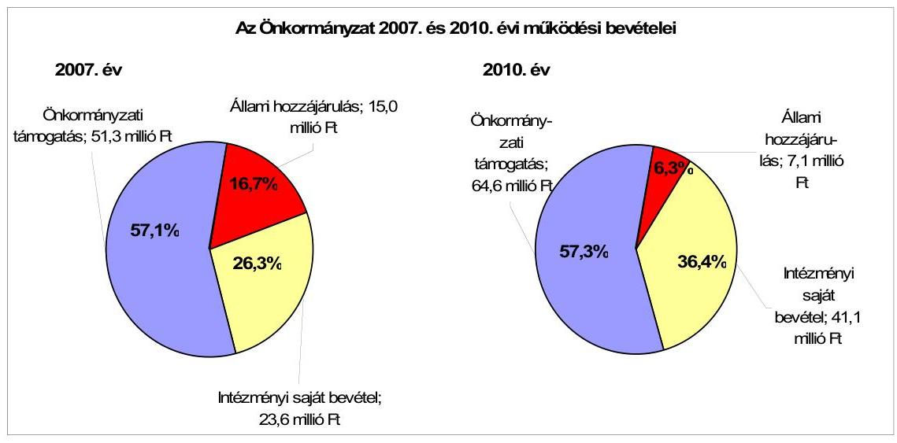
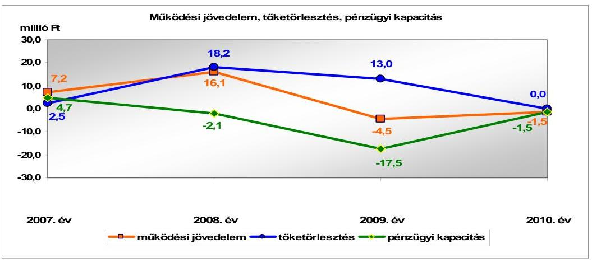
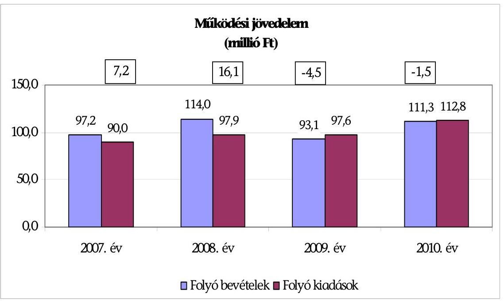
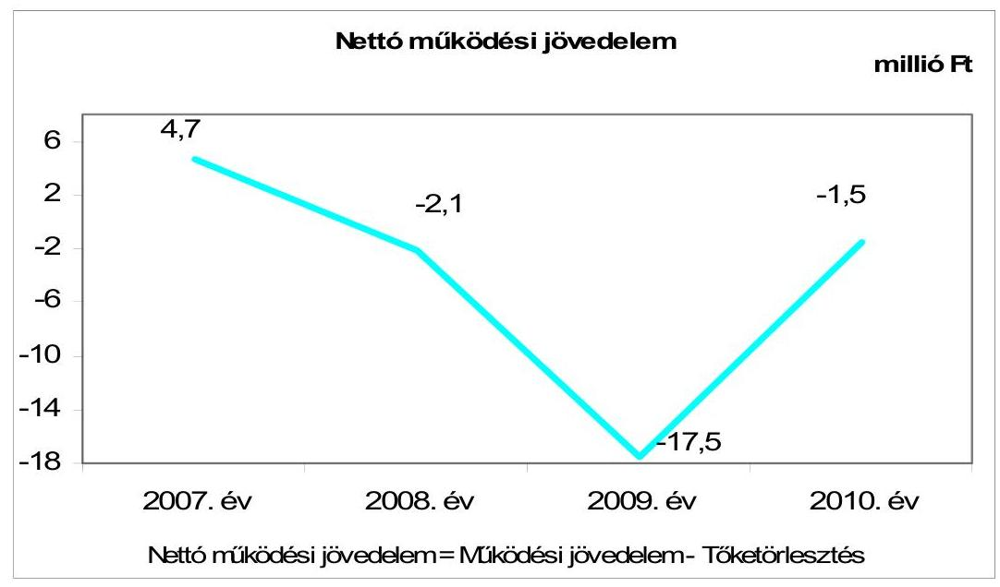
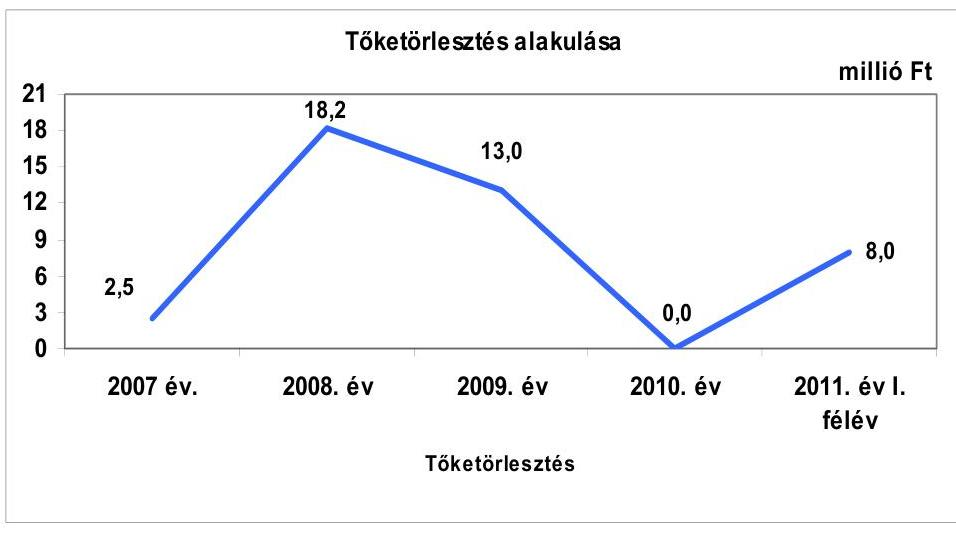
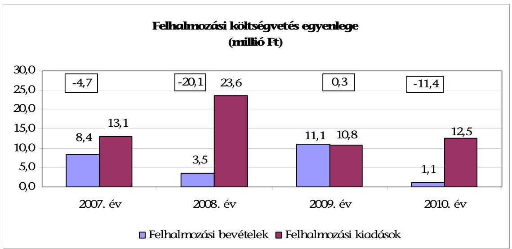
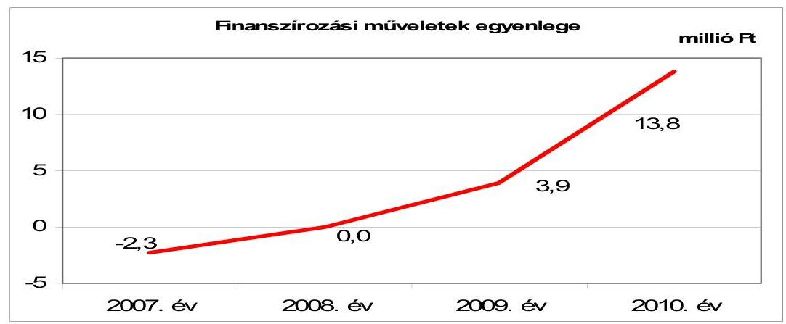
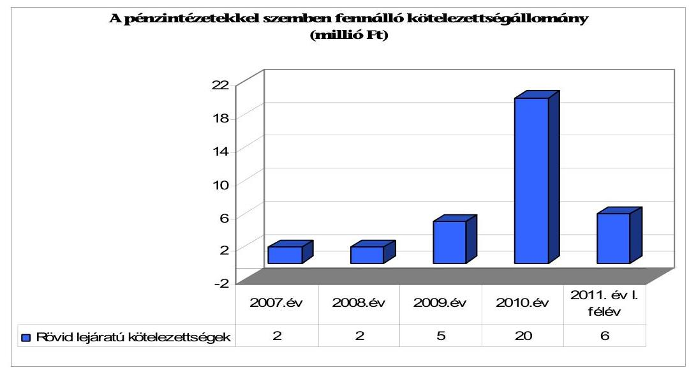
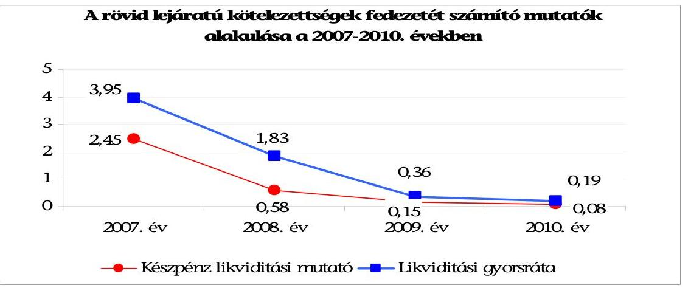
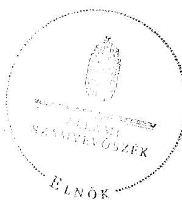

# JELENTÉS 

Tiszainoka Község Önkormányzata gazdálkodási rendszerének 2011. évi ellenőrzéséről

---

# Számvevői Iroda 

Iktatószám: V-3063-033/2012.
Témaszám: 1015
Vizsgálat-azonosító szám: V0560006

## Az ellenőrzést felügyelte:

Dr. Varga Sándor
számvevő igazgatóhelyettes
Az ellenőrzést vezette:
Gyüre Lajosné
számvevő tanácsos
Az ellenőrzést végezték:

| Szenténé Tubak Klára | Dr. Szöllősi Zsolt |
| :-- | :-- |
| számvevő tanácsos | számvevő |

---

# TARTALOMJEGYZÉK 

BEVEZETÉS ..... 9
I. ÖSSZEGZŐ MEGÁLLAPÍTÁSOK, KÖVETKEZTETÉSEK, JAVASLATOK ..... 15
II. RÉSZLETES MEGÁLLAPÍTÁSOK ..... 27

1. A pénzügyi egyensúly, a fizetőképesség, a gazdálkodás stabilitásának biztosítása, az adósságkezelés eredményessége ..... 27
2. A vagyoni helyzet változása, valamint a vagyongazdálkodás folyamataiban a kontrollok működése ..... 41
2.1. Az Önkormányzat vagyoni helyzete 2007-2010 között ..... 41
2.2. A vagyongazdálkodás belső kontrolljainak működése ..... 44
3. A közfeladatok ellátásában résztvevő önkormányzati többségi tulajdonban lévő gazdasági társaságoknál a tulajdonosi felelősség érvényesítésének eredményessége ..... 51

## MELLÉKLETEK

1. számú Az Önkormányzat gazdálkodását meghatározó adatok, mutatószámok (1 oldal)
2. számú Az Önkormányzat bevételei és kiadásai, valamint adósságszolgálata 2007-2010 között (1 oldal)

## FÜGGELÉKEK

1. számú Jegyzőkönyv az Önkormányzat 2007-2010. évi könyvviteli mérlegeinek eltéréséről, azok rendezéséről (5 oldal)

---

.

---

# RÖVIDÍTÉSEK JEGYZÉKE 

## Törvények

Áht.
Eisz.tv.

Gt.
Ötv.
Számv. tv.
új Áht.
új Eisz. tv.

## Rendeletek

Ámr.
Áhsz.
Ávr.
SzMSz
új Ber.

## Szórövidítések

ÁSZ
Belső Kontroll Kézikönyv

FEUVE
gazdálkodási szabályzat
körjegyző
körjegyző
Körjegyzőség

Körjegyzőség SzMSz-e
az államháztartásról szóló 1992. évi XXXVIII. törvény
az elektronikus információszabadságról szóló 2005. évi XC. törvény
a gazdasági társaságokról szóló 2006. évi IV. törvény
a helyi önkormányzatokról szóló 1990. évi LXV. törvény
a számvitelről szóló 2000. évi C. törvény
az államháztartásról szóló 2011. évi CXCV. törvény
az információs önrendelkezési jogról és az információs szabadságról szóló 2011. évi CXII. törvény
az államháztartás működési rendjéről szóló 292/2009. (XII. 19.) Korm. rendelet
az államháztartás szervezetei beszámolási és könyvvezetési kötelezettségének sajátosságairól szóló 249/2000. (XII. 24.) Korm. rendelet
az államháztartási törvény végrehajtásáról szóló 368/2011. ((XII. 31.) Korm. rendelet
az Önkormányzat 3/2007. (III. 21.) számú rendelete az Önkormányzat Szervezeti és Működési Szabályzatáról
a költségvetési szervek belső kontrollrendszeréről és belső ellenőrzéséről szóló 370/2011. (XII. 31.) Korm. rendelet

Állami Számvevőszék
az államháztartásért felelős miniszter által a 2010. évben közzétett, a belső kontrollrendszer működtetésére vonatkozó módszertani útmutató
folyamatba épített, előzetes, utólagos és vezetői ellenőrzés
a körjegyző által kiadott, Cibakháza- Nagyrév- Tiszainoka községi önkormányzatok körjegyzőségének kötelezettségvállalás, utalványozás ellenjegyzés, érvényesítés rendjének szabályzata, hatályos 2011. január 1-jétől
Cibakháza- Nagyrév- Tiszainoka községi önkormányzatok körjegyzője (2008. január 1-jétől)
Cibakháza Nagyközségi Önkormányzat Polgármesteri Hivatala (A 2008. január 1-jén kötött megállapodás, valamint az Ötv. 38. § (3) bekezdése alapján Cibakháza Nagyközség Polgármesteri hivatala végzi Cibakháza nagyközség, Nagyrév község és Tiszainoka község önkormányzatainak igazgatási feladatait)
Cibakháza Nagyközség Önkormányzata Szervezeti és Működési Szabályzatáról szóló 6/2009. (II. 13.) számú rendelet 8. számú melléklete Cibakháza Nagyközségi Önkormányzat Polgármesteri Hivatala Ügyrendje, amely 2009. február 12-étől hatályos

---

Képviselő-testület MÁK
Önkormányzat
polgármester
Polgármesteri hivatal

Társaság

Tiszainoka Község Önkormányzatának Képviselő-testülete
Magyar Államkincstár
Tiszainoka Község Önkormányzata
Tiszainoka Község Önkormányzatának polgármestere
Tiszainoka Község Önkormányzatának Polgármesteri hivatala 2007. december 31-ig
Inoka-2000 Non-Profit Kft., az Önkormányzat kizárólagos tulajdonában lévő gazdasági társaság

---

# ÉRTELMEZŐ SZÓTÁR 

bonitás

CLF módszer
eredményesség
finanszírozási célú pénzügyi műveletek
garanciavállalás
kezességvállalás

A bonitás hitelképességet jelent. A bonitást a pénzügyi kapacitás fogalmával írhatjuk le, ami nem más, mint az adósok hitelfelvételi képességének azon mértéke, ahol még anélkül tudják növelni az adósságot, hogy csökkenteniük kellene akár jelenlegi, akár jövőben esedékes kiadásaikat fizetőképességük fenntartása érdekében.
Capability and Leadership Framework (CLF)
Az önkormányzatok költségvetése elemzésének eszköze, a bevételek és kiadások, működés és fejlesztés elkülönítése. Bizonyos mértékig a vállalati gazdálkodás logikai elemeit érvényesíti az önkormányzatok pénzügyi jövedelmi helyzetének vizsgálat során. Következetesen elkülöníti a folyó és a felhalmozási költségvetés bevételeit és kiadásait, azok költségvetési egyenlegeit. A módszer a pénzügyi kapacitás fogalmát helyezi a középpontba.
A kitűzött célok megvalósításának mértékeként vagy egy tevékenység kimenete szándékolt és tényleges hatása közötti kapcsolat. Ebben a meghatározásában - kiterjesztve a teljesítmény-ellenőrzés értelmezési tartományára - a hatás az operatív, a specifikus vagy átfogó szinten keletkezett „végterméket" jelenti, amely lehet output, eredmény és hatás egyaránt (ÁSZ Teljesítmény-ellenőrzési módszertan 16. oldal).
Értékpapírok kibocsátása, értékesítése és visszavásárlása; hitelek felvétele és törlesztése; szabad pénzeszközök betétként való elhelyezése és visszavonása (Áht. 8/A. § (3) bekezdés).
Valamilyen esemény jövőbeni bekövetkezéséhez kapcsolódó kötelezettségvállalás. A garanciavállalás az önkormányzat kötelezettség-vállalása arra vonatkozóan, hogy a szerződésben meghatározott feltételek beálltakor a garancia kedvezményezettje számára, határozott összegig, határozott időpontig, felszólításra azonnal fizet. Ez a kötelezettség az önkormányzat számára azzal a bizonytalansággal jár, hogy nem tudja, hogy ezt a kötelezettségvállalását igénybe veszik-e vagy nem, és ha igen, mikor.
A kezesség járulékos kötelezettségvállalás, amely lehet egyszerű vagy készfizető, és mindig feltételezi a főkötelezettet. Az egyszerű kezességvállalás esetén a kezes mindaddig megtagadhatja a teljesítést, míg mindazoktól behajtható, akik őt megelőzően vállaltak kötelezettséget. A készfizető kezes nem illeti meg a sortartás kifogása. A fentiek következtében mind a garancia-, mind a kezességvállalás esetében az önkormányzatnak a futamidő teljes időtartama alatt azzal kell számolnia, hogy ha a főkötelezett elmulasztja teljesíteni a fizetést, a vállalt kötelezettséget vele szemben érvényesítik az adott időpontban fennálló összeg erejéig. (Ptk. 272-276. §-ai alapján).

---

közfeladat

pénzügyi kockázat

PPP (public private partnership)
saját vagyon

SNA
visszafizetési kockázat

Az állami, helyi, illetve kisebbségi önkormányzati feladat, amelynek ellátásáról az államnak, illetve az önkormányzatoknak kell gondoskodnia. A hatályos szabályozás szerint közfeladatot törvény és önkormányzati rendelet állapíthat meg. Az önkormányzatok által ellátandó feladatok keretszerű meghatározását az Ötv. tartalmazza.
A belső működési kockázat egyik eleme. A költségvetési szerv működésének, tevékenységének, rövidtávon ható velejáróinak része a tevékenységi, és emberi erőforrás kockázatokkal együtt. Megmutatkozhat a költségvetés nagyságrendjének, szerkezetének módosulásaiban, a bevételi, kiadási előirányzatok változásaiban, a nem megfelelő belső kontrollrendszer működése során, a tudatos károkozásokban, a biztosítások elmaradásában, a hibás fejlesztési döntésekben, a nem megfelelő forrásfelhasználásokban.
A köz- és a magánszféra együttműködésén alapuló fejlesztési konstrukció. Az állami és a magánszféra együttműködésének egyik formáját jelöli a PPP. A rövidítés a „közés magánszféra partnersége" angol nyelvű megfelelője. A PPP keretében a közcél a magánszféra jelentős mértékű közreműködésével valósul meg. Az állam (önkormányzat) a közszolgáltatások létrehozását a tradicionálisnál komplexebb módon bízza a magánszférára. Az együttműködés keretében megvalósuló közszolgáltatás hosszú távra szól. A magán partner felelőssége az infrastruktúra tervezésére, megépítésére, működtetésére és legalább részben a projekt finanszírozására terjed ki. Az állam (önkormányzat) és/vagy a szolgáltatások igénybe vevője szolgáltatási díjat fizet. A közszférabeli szerződő fél feladata a projekt definiálása, a szolgáltatás elvárt minőségének, mennyiségének és az igénybevétel idejének meghatározása, valamint az árazási politika kialakítása, az ellenőrzési, monitoring feladatok ellátása.
A könyvviteli mérlegben szereplő eszközöknek a kötelezettségekkel csökkentett összege, amellyel azonos a források között szereplő saját tőke és tartalékok együttes összege. A saját vagyonhoz tartoznak továbbá a számviteli nyilvántartásban érték nélkül szereplő eszközök.
System of National Account, azaz a Nemzeti Számlák Rendszere, amely a gazdasági szektorok által létrehozott valamennyi terméket és szolgáltatást figyelembe veszi.
Annak a kockázata, hogy a hitelt felvevőnél rendelkezésre állnak-e a visszafizetéshez, a hitel törlesztéséhez szükséges pénzügyi források. A visszafizetési kockázatot növeli a kamat- és árfolyamkockázat növekedése, mivel ezekben az esetekben az adósságszolgálat nőhet. Egy adott kötelezettség keletkezését megelőzően, illetve azt követően olyan pénzügyi helyzet állhat fenn, amely a kötelezettség visszafizetését korlátozhatja, meggátolhatja, ellehetetlenítheti.

---

Visszafizetési kockázatot okozhat, ha:

- a hitelfelvételből, kötvénykibocsátásból származó bevétel visszafizetéséhez szükséges forrást a bevétel felhasználási területe nem biztosítja (pl. a megvalósított beruházás működése, üzemeltetése során nem a tervezett eredményességet biztosította, vagy a tervezettnél magasabb a fenntartási költsége, a tervezett kiadási megtakarítást nem biztosítja, a betétbehelyezés alacsonyabb kamatbevételt biztosított, mint amennyi a kötvény kamata);
- a visszafizetésre tervezett forrás elérésének, teljesítésének bizonytalansága (pl. a visszafizetéshez tervezett tartalékolás elmaradt, a tervezettnél alacsonyabb a saját bevétel, a helyi adóból származó bevétel az adóalanyok, adóalapok csökkenése miatt nem teljesül);
- a kötelezettségvállaláskor a visszafizetési forrás megjelölésének, tervezésének elmaradása, vagy megalapozatlan figyelembevétele.

---

.

---

# JELENTÉS 

## Tiszainoka Község Önkormányzata gazdálkodási rendszerének 2011. évi ellenőrzéséről

## BEVEZETÉS

Az Állami Számvevőszék 2011. évben életbe lépett stratégia szerint „az önkormányzatok ellenőrzése során azok pénzügyi-gazdasági helyzetét értékeli, kockázatait feltárja, valamint az ellenőrzések helyszíneit objektív mutatószámrendszer alapján választja ki". E célkitűzéseknek megfelelően összeállított ellenőrzési program alapján végzi a helyi önkormányzatok gazdálkodási rendszerének ellenőrzését.

## Az ellenőrzés célja az Önkormányzatnál annak értékelése volt, hogy:

- biztosított volt-e a pénzügyi egyensúly, a fizetőképesség, a gazdálkodás stabilitása, ezeket segítette-e az adósság kezelése;
- a vagyoni helyzet a külső és belső tényezők hatására miként változott, a belső kontrollok megfelelően biztosították-e a vagyongazdálkodás szabályosságát, eredményességét;
- eredményesen érvényesítette-e a tulajdonosi felelősségét a közfeladatok ellátásában résztvevő többségi tulajdonban lévő gazdasági társaságánál.

Az ellenőrzés típusa: szabályszerűségi ellenőrzés, továbbá az ellenőrzés meghatározott területein teljesítmény ellenőrzés.

Az ellenőrzött időszak: a pénzügyi, vagyoni helyzettel kapcsolatos elemzéseket, értékeléseket, az önkormányzat többségi tulajdonú gazdasági társaságainál a tulajdonosi felelősség érvényesítését alapvetően a 2007-2010. évekre vonatkozóan végeztük, valamint lehetőség szerint kitértünk a helyszíni ellenőrzést megelőző utolsó negyedév végéig terjedő időszakra is. A vagyongazdálkodás belső kontrolljai működésének tesztelése a 2010. évre, valamint a helyszíni ellenőrzést megelőző utolsó negyedév végéig terjedő időszakra vonatkozik.

Az ellenőrzés jogszabályi alapját az Állami Számvevőszékről szóló 2011. évi LXVI. törvény 1. § (3), 5. § (2)-(6) bekezdései, az államháztartásról szóló 1992. évi XXXVIII. törvény 120/A. § (1) bekezdése előírásai képezték.

A ellenőrzés szakmai módszertanát a Legfőbb Ellenőrző Intézmények Nemzetközi Szervezete (INTOSAI) által kiadott nemzetközi standardok (ISSAI) és az Állami Számvevőszék által kiadott „Ellenőrzési Kézikönyv" és „Módszertani útmutató a teljesítmény-ellenőrzéshez" képezte.

---

Tiszainoka község állandó lakosainak száma 2011. január 1-jén 433 fő volt. A 2010. évi önkormányzati képviselő és polgármester választást követően az Önkormányzat négytagú Képviselő-testületének munkáját egy állandó bizottság segítette. A polgármester 2006 óta tölti be tisztségét. A 2007. évben kinevezett jegyző nem volt, a jegyzői feladatokat helyettes jegyzők látták el. 2008. január 1-jétől az igazgatási feladatok ellátására Cibakháza, Tiszainoka, Nagyrév községek körjegyzőséget hoztak létre, az igazgatási feladatokat a Cibakháza Község Önkormányzatának Polgármesteri hivatala látta el. A körjegyző a körjegyzői tisztségét 2008. január 1-jétől tölti be.

Az Önkormányzat feladatainak végrehajtása érdekében a 2007. évben kettő költségvetési szervet működtetett, amelyekből egy önállóan gazdálkodó volt. A 2010. évben az Önkormányzat költségvetési szervet nem tartott fenn. A feladatok ellátásában 2007-2010 között részt vett a Társaság.

Az Önkormányzat 2010. december 31-i fordulónappal a MÁK-hoz benyújtott beszámolójában szereplő könyvviteli mérleg szerint 211,4 millió Ft értékű vagyonnal rendelkezett, amely a 2007. év végi állományhoz (587,8 millió Ft) viszonyítva 64,0%-os csökkenést mutatott. A vagyon csökkenését az Önkormányzat jegyzőkönyvben (1. számú függelék) tett nyilatkozata szerint számviteli elszámolási és leltározási hiányosságok okozták. Az eszközök közül az immateriális javak, az ingatlanok és kapcsolódó vagyoni értékű jogok, a befektetett pénzügyi eszközök, a források közül a rövid lejáratú hitelek és a tartalékok könyvviteli mérlegben szerepeltetett állományi értékeit leltárral nem támasztották alá. Az Önkormányzat a 2007-2010. évi könyvviteli mérlegek módosításáról a helyszíni ellenőrzés ideje alatt intézkedett. A vagyon elemzését, értékelését az Önkormányzat által korrigált
 mérlegadatok alapján végeztük. Ezen adatok szerint az Önkormányzat vagyona a 2007. évi 587,8 millió Ft-ról 592,0 millió Ft-ra, 0,7%-kal nőtt 2010-re. Az Önkormányzatnak hosszú lejáratú kötelezettség állománya a 2007-2010. évek végén nem volt. A rövid lejáratú kötelezettségek állománya 2007. év végi 2,2 millió Ft-ról 2010. év végére 22,4 millió Ft-ra, tízszeresére nőtt, döntően a likvid hitelek állományának 2,0 millió Ft-ról 20,0 millió Ft-ra történő növekedése hatására.

A Polgármesteri hivatalban dolgozó köztisztviselők száma 2007. január 1-jén három fő volt, 2010. december 31-én az Önkormányzatnál köztisztviselőt nem foglalkoztattak, az igazgatási feladatokat a Körjegyzőség látta el. A 2007. évben az Önkormányzatnál foglalkoztatott közalkalmazottak száma 21 fő volt, a 2010. évben öt fő, a feladatok társulásban (Petőfi Sándor Általános Művelődési Központ Intézményfenntartó Társulás Cserkeszőlő, Szelevény, Tiszasas, Tiszainoka; Körjegyzőség Cibakháza, Nagyrév, Tiszainoka; Nagyközségi Szociális Gondozási Központ Intézményi Társulás Cibakháza, Nagyrév, Tiszainoka) történő ellátása következtében. Az Önkormányzat gazdálkodását meghatározó adatokat, mutatószámokat az 1. számú melléklet tartalmazza.

A hagyományos költségvetési szerkezet helyett az Önkormányzat pénzügyi helyzetét a CLF módszerrel mutatjuk be, amelyben jobban elkülönülnek a vagyonnal kapcsolatos bevételek és kiadások az önkormányzati feladatokkal kapcsolatos közvetlen működtetési bevételektől és kiadásoktól. A módszer következetesen elkülöníti a folyó és a felhalmozási költségvetés bevételeit és kiadásait, azok költségvetési egyenlegeit. A saját folyó bevételek, valamint a saját felhalmozási bevételek nem tartalmazzák az előző évi pénzmaradványok felhasználásából származó pénzforgalom nélküli bevételeket ${ }^{1}$. A számítási leírás némileg eltér az ÁSZ módszertanában korábban alkalmazott gyakorlattól. A jelen besorolás általános közgazdasági meggondolásokon alapul, amely megjelenik az SNA statisztikai módszertanában is.

A folyó költségvetés egyenlege, a működési jövedelem megmutatja, hogy az Önkormányzat éves folyó bevétele fedezetet biztosít-e a kötelező és önként vállalt feladatellátáshoz kapcsolódó éves folyó kiadásaira. A működési jövedelem negatív értéke pénzügyileg fenntarthatatlan helyzetet jelez. A mutató pozitív értéke megtakarítást mutat, amely forrásul szolgálhat az Önkormányzat fennálló kötelezettségei megfizetéséhez, valamint fejlesztéseihez.

A felhalmozási költségvetés pozitív értéke felhalmozási többletet mutat, amely a jövőbeni fejlesztések forrását biztosíthatja. Amennyiben a folyó költségvetési hiány finanszírozása a felhalmozási többletből történik, ez szűkebb értelemben vagyonfelélésnek tekinthető. Amennyiben a felhalmozási költségvetés megtakarítása fejlesztési célú hitelek, kötvények adósságszolgálatát finanszírozza, az változatlan vagyontömeg mellett, a korábban megelőlegezett tőkebevételek valós realizációjának tekinthető. A felhalmozási deficit által generált finanszírozási igény önmagában nem jár pénzügyi kockázattal, a pénzügyileg fenntartható beruházásokhoz kapcsolódó kötelezettségvállalás (adósságszolgálat) átlátható, és szabályozott költségvetési gazdálkodással teljesíthető.

A módszer a pénzügyi kapacitás fogalmát helyezi a középpontba. Az adós hitelfelvételi képessége, hosszú távú fizetőképessége vagy bonitása a pénzügyi kapacitással (a nettó működési jövedelemmel) jellemezhető. A nettó működési jövedelem negatív értéke az egyes költségvetési években jelentkező adósságszolgálat túlzott mértékére utal ${ }^{2}$. A nettó működési jövedelem negatív értékének felhalmozási többletből, vagy további hitelből történő finanszírozása pénzügyileg nem fenntartható gazdálkodást vetít előre. A pozitív értéket mutató nettó működési jövedelem a fejlesztési kiadások fedezetét biztosíthatja, illetve a folyamatosan, évenként képződő pozitív nettó működési jövedelemből meghatározható a jövőben vállalható, teljesíthető éves adósságszolgálat, ily módon az a hitelösszeg, amely - a többi tényezőt, feltételt adottnak tekintve - visszafizetési kockázat nélkül felvehető.

Folyó tételek alatt értjük azokat a kiadásokat és bevételeket, amelyek a gazdálkodó szervezet helyzetét automatikusan nem változtatják. Bevételi oldalon ilyenek az adók, a tényezőjövedelmek, a transzferek, kiadási oldalon a transzferek ${ }^{3}$ és a szolgáltatás nyújtásával kapcsolatos működési kiadások. A folyó

[^0]
[^0]:    ${ }^{1}$ A költségvetési években kialakuló hiány finanszírozása az előző években képzett tartalékok felhasználásával is történhet.
    ${ }^{2}$ kivéve, ha annak finanszírozására a korábbi években képzett tartalékok fedezetet nyújtanak
    ${ }^{3}$ Transzfer kiadásoknak nevezzük azokat a folyó és felhalmozási tételeket, amelyeket nem az adott önkormányzat használ fel szolgáltatásnyújtásra.

---

költségvetésben a bevételekben nem térül meg, a kiadásokban nem jelenik meg az amortizáció, a vagyoni helyzetet viszont az egyenleg befolyásolja.

A folyó költségvetés egyenlege (működési jövedelem) tartalmazza a kamatkiadásokat is, mind a fejlesztési kamatot, mind a visszatérülő áfa teljes összegét, mert ezek közgazdaságilag tényezőjövedelmek. Nem tartalmazzák viszont a követelés elengedés miatt könyvelt bevételi és kiadási pénzforgalmi tételeket, mert azok valójában technikai elszámolási műveletnek minősülnek, a bevétel soha nem realizálódott, és költségvetési kiadás sem történt.

A felhalmozási költségvetésben a bevételek között a vagyon megőrzésére és bővítésére fordítható források jelennek meg. A felhalmozási vagy tőketételek módosítják a vagyon nagyságát. A privatizációs bevétel csökkenti a vagyont, a fizikai beruházás, pénzügyi befektetés növeli.

A nettó működési jövedelmet a tőketörlesztés levonásával a folyó költségvetés egyenlegéből származtatjuk. Az új módszereken alapuló helyzetértékelés fontosságát az adja, hogy a helyi önkormányzatok bruttó adósságállománya ${ }^{4}$ 2007-től vált jelentőssé, az önkormányzati alrendszer 2010. évi költségvetési beszámolójának adatai alapján 1248 milliárd Ft-ot tett ki.

A CLF módszerrel számított folyó kiadásokat és bevételeket részletesen a 2. számú melléklet tartalmazza.

Az Önkormányzat pénzügyi egyensúlyi helyzetének bemutatásán túlmenően értékeltük a pénzügyi egyensúly fenntartását veszélyeztető pénzügyi kockázatokat, azok csökkentésére tett intézkedések hatását. Lényegességi szempontok figyelembevételével értékeltük a döntéselőkészítés, a megtett intézkedések eredményességét és azt, hogy a pénzügyi egyensúly fenntartását mely kockázatok és milyen mértékben veszélyeztették. Az ellenőrzés részletes szempontok szerinti elvégzéséhez az egységes értelmezés alapját az ellenőrzési program mellékletét képező teljesítmény-ellenőrzési kérdésfa és a kapcsolódóan meghatározott kritériumok, valamint a fogalmak egységes tartalmát meghatározó értelmező szótár biztosította. Vizsgáltunk minden olyan körülményt és adatot, amely a pénzügyi helyzet alakulására hatást gyakorló releváns tények és folyamatok ellenőrzés céljával összhangban lévő feltárásához szükségessé vált.

A vagyongazdálkodás ellenőrzése kiterjedt a vagyon értékének és összetételének 2007-2010 közötti változását előidéző okok elemzésére. A vagyongazdálkodás belső kontrolljai azonosításának és működésének ellenőrzése keretében a vagyonértékesítés és a vagyonhasznosítás, valamint a finanszírozási célú

[^0]
[^0]:    ${ }^{4}$ A bruttó adósságállomány 2010. év végi összege magában foglalja a fejlesztési és a működési célú kötvénykibocsátások, a beruházási és fejlesztési hitelek, a működési célú hosszú lejáratú hitelek, a rövid lejáratú hitelek, váltótartozások miatti kötelezettségek teljes (2011-ben, illetve az azt követő években esedékes) állományát.

---

pénzügyi műveletek folyamatait értékeltük ${ }^{5}$. Felmértük a belső kontrollokban rejlő kockázatot, minősítettük a kontrollok működésének eredményességét ${ }^{6}$, és meghatároztuk, hogy a vagyongazdálkodás folyamatában mely kontrollok nem biztosították a működésbeli hibák megelőzését, feltárását, kijavítását, ezáltal veszélyeztették az eredményes, megfelelő működést.

A vagyongazdálkodási folyamatokban alkalmazott belső kontrollok azonosításának és működésének vizsgálatát többlépcsős megfelelőségi tesztek útján végeztük. A vizsgált területek könyvviteli tételei alapján (meghatározott tételszám felett egyszerű véletlen minta alapján) történt a vagyongazdálkodás kulcsszerepet betöltő belső kontrolljai működésének a megítélése. Az ellenőrzés során alkalmazott módszer - többlépcsős megfelelőségi teszt alkalmazásának - lényege, hogy a kiválasztott minta ellenőrzését csak addig végeztük, amíg elegendő és megfelelő bizonyítékot nem szereztünk a vizsgált folyamatok kulcskontrolljai ${ }^{7}$ (a kötelezettségvállalás ellenjegyzése, a szakmai teljesítésigazolás és az utalványellenjegyzés) működésének megfelelő vagy nem megfelelő voltáról ${ }^{8}$, eredményességéről.

Az ellenőrzést a következő, kiemelt kockázatuk alapján kiválasztott tevékenységekkel összefüggő pénzmozgásokra folytattuk le:

- önkormányzati helyiségek bérbeadásának bevételeire;
- ingatlanok felújítására történt kifizetésekre;

[^0]
[^0]:    ${ }^{5}$ A vagyongazdálkodás területén a szabályozottságban rejlő kockázatot alacsonynak minősítettük, ha a szabályozottság megfelelő védelmet nyújtott a vagyongazdálkodással összefüggő hibák bekövetkezése ellen. Közepesnek minősítettük a vagyongazdálkodás szabályozottságában rejlő kockázatot, amennyiben a szabályozottság a lehetséges vagyongazdálkodási hibák többsége ellen védelmet nyújtott. Magasnak értékeltük a vagyongazdálkodás szabályozottságában rejlő kockázatot, ha a szabályok - kialakításuk hiányában, vagy hiányos kialakításuk miatt - nem nyújtottak elegendő védelmet a lehetséges vagyongazdálkodási hibákkal szemben.
    ${ }^{6}$ Az előzetesen meghatározott módszer alapján számított kockázati pontok képezik a kontrollok működésének értékelését, az eredményesség kritériumát.
    ${ }^{7}$ Kulcskontrollok: azok a kontrollok, amelyek a specifikus eredendő kockázatok mérséklése szempontjából alapvető fontosságúak, és eredményes működésük meghatározó hatással van a kontrollrendszer minőségére. A kulcskontrollok biztosítják más kontrollok (egy vagy több) működési hibájának feltárását, kiküszöbölését; viszonylag könnyen tesztelhetők; a folyamatos, következetes és eredményes működésük legalább két, vagy több működési hiba ellen biztosítanak védelmet.
    ${ }^{8}$ A vagyongazdálkodás területén azonosított kontrollok működését kiválónak értékeltük abban az esetben, ha azok működése megfelelt a hibák megelőzésére és kijavítására meghatározott szabályozásnak és a legmagasabb szintű elvárásoknak. Jónak minősítettük a vagyongazdálkodás területén azonosított kontrollok működését, ha a megállapított kisebb (tolerálható mértékű) hiányosságok nem veszélyeztették a vagyongazdálkodás ellenőrzött területei hibáinak megelőzését és kijavítását. Amennyiben a kontrollok működésében túl sok hiányosság fordult elő ahhoz, hogy a kontrollok biztosítsák a vagyongazdálkodási hibák megelőzését, feltárását, kijavítását és ezáltal veszélyeztették az eredményes, megfelelő vagyongazdálkodást, a kontrollok működése gyenge minősítést kapott.

---

- államháztartáson kívüli szervezetek részére történő működési célú pénzeszközátadásokra teljesített kifizetésekre;
- bérleti és lízingdíjak kifizetéseire.

A helyszíni ellenőrzés során kitöltött - az ellenőrzést végző számvevő és a Körjegyzőség felelős köztisztviselője által aláírt - ellenőrzési munkalapokat, azok kitöltési útmutatóit, továbbá a megfelelőségi tesztek dokumentumait a polgármester részére a számvevői megállapítások egyeztetése során átadtuk.

---

# I. ÖSSZEGZŐ MEGÁLLAPÍTÁSOK, KÖVETKEZTETÉSEK, JAVASLATOK 

## A pénzügyi egyensúlyi helyzet értékelése

Az Önkormányzat a 2010. évben 112,4 millió Ft költségvetési bevételből gazdálkodott. A költségvetés végrehajtása során 125,3 millió Ft költségvetési kiadást teljesített, amely a bevételeknél 6,4%-kal (6,8 millió Ft-tal), a kiadásoknál 21,7%-kal (22,3 millió Ft-tal) haladta meg a 2007. évit. Az Önkormányzat kimutatásai szerint 2010-ben a folyó kiadások 30,5%-át (34,5 millió Ft) fordították önként vállalt feladatok ellátására. A SzMSz alapján az Önkormányzat önként vállalta a folyami átkelő (Rév) működtetését, a bentlakásos szociális otthoni ellátás támogatását.

Az Önkormányzat kötelező és önként vállalt feladatait a Körjegyzőség és más önkormányzatokkal közösen működtetett intézményfenntartó társulások és a Társaság (községgazdálkodási feladatok) útján látta el a 2010. évben. Az Önkormányzat nem tartott fenn költségvetési szervet 2010-ben. 2007-2010 között a feladatellátás szervezeti rendszere megváltozott, 2008-tól az igazgatási feladatokat a Körjegyzőség látta el. 2009. január 1-jétől a szociális feladatok ellátására intézményfenntartó társulást (Nagyközségi Szociális Gondozási Központ Intézményi Társulás) hoztak létre három önkormányzattal közösen.

A folyó kiadások fedezetéül szolgáló bevételi források a 2007. és a 2010. években jellemző összesített arányait a következő ábra szemlélteti:

A folyó költségvetés egyenlege (működési jövedelem) a 2007-2008. években pozitív volt, 7,2 millió Ft, illetve 16,1 millió Ft forrástöbbletet mutatott. A 2009-2010. években 4,5 millió Ft, illetve 1,5 millió Ft forráshiány keletkezett a folyó költségvetésben. A működési jövedelem 2009. évi visszaesését a folyó bevételek (döntően a költségvetési támogatás) folyó kiadásokat 18,0 százalékponttal meghaladó csökkenése okozta. A 2007-2010 között keletkezett összes működési

---

jövedelem 17,3 millió Ft megtakarítást mutatott, amely az Önkormányzat teljesített tőketörlesztési kötelezettségének (33,8 millió
 Ft) 51,2%-ára szolgálhatott fedezetül.

A felhalmozási költségvetés egyenlege 2007-2010 között - a 2009. évet kivéve - negatív volt, felhalmozási forráshiány keletkezett összesen 36,2 millió Ft, amelynek finanszírozását külső forrás (rulirozó hitel) igénybevételével biztosították. A 2007-2010. évek között összesen 49,2 millió Ft hitel felvételére került sor. A finanszírozási műveletek egyenlege a 2009. és a 2010. éveket kivéve negatív volt, mivel a 2007. és a 2008. években a tőketörlesztést meghaladó mértékű volt a külső forrásbevonás.

Az Önkormányzat tartaléka (előző évek pénzmaradványa) - a 2007. évet kivéve - minden évben negatív értéket mutatott, 2008-ban 1,1 millió Ft, 2009-ben 5,4 millió Ft, 2010-ben 18,2 millió Ft volt. A hiány finanszírozására a 2009-2010. években belső forrás nem állt rendelkezésre.

Az Önkormányzat mérlegében kimutatott összes kötelezettség állomány (passzív pénzügyi elszámolások nélkül) 2007. évről 2010. évre 2,2 millió Ft-ról 22,4 millió Ft-ra nőtt. Hosszú lejáratú kötelezettség állománya a 2007-2010. évi könyvviteli mérlegadatok szerint az Önkormányzatnak nem volt. A rövid lejáratú kötelezettségek állománya az időszak alatt folyamatosan nőtt, a 2010. év végi állománya 22,4 millió Ft volt, amely 18,6 millió Ft-tal haladta meg a 2007-2009 évek végén fennálló állományokból számított átlagos állományt (3,8 millió Ft). Az összes rövid lejáratú kötelezettségen belül a pénz- és tőkepiaci kötelezettség 2007-2009 közötti átlagos állománya 3,0 millió Ft volt, amely a 2010. év végére közel hétszeresére, 20,0 millió Ft-ra nőtt, részaránya 90,9%-ról 89,3%-ra csökkent. 2011. év I. félév végén a rulirozó hitel állománya az Önkormányzat kimutatása szerint 6,0 millió Ft volt. A szállítói tartozásállomány 2007-2009. évek közötti átlagos állománya 0,5 millió Ft volt, a 2010. év végére több mint négyszeresére, 2,2 millió Ft-ra emelkedett. 2010-ben a szállítói tartozásállomány a rövid lejáratú kötelezettségek 9,8%-át tette ki. A szállítói tartozásállomány 2007-2011. év I. félév között folyamatosan nőtt, 2011. I. félév végén 2,6 millió Ft volt, amelynek 80,8%-a 30 napot meg nem haladó lejárt tartozás volt.

Az Önkormányzat pénzügyi helyzete a fizetőképesség szempontjából kedvezőtlenül alakult az ellenőrzött időszakban, mivel a rövid lejáratú kötelezettsé-

---

gek fedezetét jelentő készpénz és egyéb likvid forgóeszközök együttes összege 2008-2010. években nem érte el a rövid lejáratú kötelezettségek összegét. Az Önkormányzat likviditási helyzetének romlását tükrözi, hogy a rulirozó hitelállomány a 2007. év végi 2,0 millió Ft-ról 2010. év végére 20,0 millió Ft-ra nőtt. A likviditási célú hitelek már nemcsak a kiadások és bevételek ütemkülönbségéből eredő finanszírozási hiány kezelését szolgálták, hanem a költségvetési hiány tartós finanszírozási forrásává is váltak.

Az Önkormányzat likviditási és adósságkezelési tevékenysége nem volt eredményes, mert bár a költségvetési egyensúly javítása céljából tett intézkedések az Önkormányzat kimutatása szerint 2007-2011. év I. félév között összesen 133,4 millió Ft kiadási megtakarítást (köztisztviselői és közalkalmazotti létszámcsökkenésből eredően), és 47,4 millió Ft saját bevételnövekedést (gépjárműadó bevétel növelése) eredményeztek, azonban a pénzügyi egyensúly megteremtéséhez nem voltak elégségesek. Az Önkormányzat a fizetőképességi és eladósodási problémáit kezelő stratégiával nem rendelkezett, nem hoztak intézkedéseket a pénzügyi egyensúly és a fizetőképesség folyamatos és hosszú távú biztosítása érdekében. A rövid távú likviditás kezelése érdekében a pénzállomány alakulásáról nem készítettek aktualizált likviditási tervet.

A 2007-2010. évek között a felhalmozási bevételek és kiadások egyenlege összesen 35,9 millió Ft hiányt mutatott. A 2008. és 2010. évek kiugró negatív egyenlegeit a beruházások, felújítások megvalósításához elnyert központi támogatások következő évben történő realizálódása okozta, a tárgyévben hiányzó forrást rulirozó hitel felvételével biztosították. Az Önkormányzat a 2010. év utáni időszakra nem vállalt kötelezettséget felhalmozási feladat megvalósítására.

A pénzintézeti és a szállítói tartozásokból eredő fizetési kötelezettség teljesítése az Önkormányzat által adott nyilatkozat alapján biztosított. A 2010. december 31-én fennálló kötelezettségek (22,9 millió Ft) 90,8%-ára (20,8 millió Ft) vonatkozóan a visszafizetés teljesítésének fedezetét számszerúsítették, a forrásokat nevesítették (visszafizetési kötelezettség mellett átadott pénzeszközök visszatérülése, illetve adóbevételi többlet), de a tervezett bevételi többletet megalapozó számítást nem készítettek és a hiányzó 2,1 millió Ft fedezetét nem jelölték meg. A hiányzó forrást a jelzáloggal nem terhelt forgalomképes ingatlanok értékesítése esetén befolyó bevétel jelentheti.

Az Önkormányzat 2010. december 31-én és 2011. június 30-án fennálló kötelezettségeinek állományát, a 2011-2013 között várható kötelezettségek számszerúsített adatait a következő táblázat tartalmazza:

| Megnevezés | Állomány 2010. december 31-én |  |  | Állomány 2011. június 30-án |  |  | Várható kötelezettség* 2011-2013. években |  | Várható kötelezettség 2014. évtől |  |
| :--: | :--: | :--: | :--: | :--: | :--: | :--: | :--: | :--: | :--: | :--: |
|  | HUF-ban (millió Ftban) | Devizában (összege, ezer ...-ben) | Deviza nem | HUF-ban (millió Ftban) | Devizában (összege, ezer ...-ben) | Deviza   nem | HUF-ban (millió Ftban) | Devizában (összege, ezer ...-ben) | HUF-ban (millió Ftban) | Devizában (összege, ezer ...-ben) |
| Pénzintézeti kötelezettségek |  |  |  |  |  |  |  |  |  |  |
| Rulirozó hitel | 20,0 |  |  | 6,0 |  |  | 20,7 |  |  |  |
| Pénzintézeti kötelezettségek összesen HUF-ban | 20,0 |  |  | 6,0 |  |  | 20,7 |  |  |  |
| Szállítói tartozás | 2,2 |  |  | 2,6 |  |  | 2,2 |  |  |  |

*A várható kötelezettség tartalmazza a kamatot és egyéb költséget is

---

A 2009-2010. években a pénzügyi egyensúly hiányát mutatja a pénzmaradvány negatív összege. További kiadáscsökkentő, illetve bevételnövelő intézkedések szükségesek a hosszú távú pénzügyi egyensúly megteremtése érdekében az önként vállalt feladatok, azok kiadásainak és bevételeinek áttekintésével, valamint új bevételi források lehetőségének feltárásával, figyelemmel a kötelező feladatok ellátásának Ötv.-ben előírt elsődlegességére.

Az Önkormányzat pénzügyi helyzetét összegezve a következők emelhetők ki:

Az Önkormányzat pénzügyi egyensúlya rövid távon veszélyeztetett. A pénzügyi egyensúlyi helyzet szempontjából kockázatot jelent, hogy a lejárt szállítói tartozásállománya, a rulirozó hitel (tartalmában folyószámlahitel) állománya és annak napi átlagos állománya folyamatosan növekvő tendenciát mutat. A rulirozó hitellel zárt napok száma 365 nap volt a 2010. évben. Az Önkormányzat a 2007-2010. években, valamint a 2011. év I. félévében nem rendelkezett a fizetőképességének és eladósodásának kezelését szolgáló stratégiával, valamint folyamatosan aktualizált likviditási tervvel. A pénzintézeti és egyéb kötelezettségek visszafizetésének fedezeteként az Önkormányzat által megjelölt források a felmerülő kötelezettségeket nem fedezik, a fedezetként megjelölt adóbevételi többletet számításokkal nem alapozták meg. A döntési hatáskörrel rendelkezőket nem tájékoztatták rendszeresen a kötelezettségvállalásokkal kapcsolatos kockázatokról.

A 2009-2010. években a működési bevételek nem fedezték a működési kiadásokat, a működési jövedelem negatív volt. A 2008-2010. években a működési jövedelem nem biztosította a hiteltörlesztések fedezetét, a pénzügyi kapacitás negatív volt. A hiány finanszírozására korábbi években képzett tartalék nem állt rendelkezésre. A 2010. évben az Önkormányzat saját bevételeinek közel egynegyedét kitevő gépjárműadó bevétel több mint 90%-a egy adóalanytól származott. Az Önkormányzat által kimutatott, önként vállalt feladatok kiadásainak aránya és mértéke a képződött negatív működési jövedelmet is figyelembe véve magas (30,5%) volt a 2010. évben. Az Önkormányzat a kizárólagos tulajdonában lévő, kötelező önkormányzati feladatot ellátó Társaság részére meghatározott közszolgáltatási feladatok elvégzését és a rendelkezésre bocsátott források felhasználását nem ellenőrizte.

A számviteli nyilvántartások szerint elszámolt értékcsökkenésnek mindössze 30,6%-át fordították felújításra a 2007-2010. években. A Képviselő-testület nem kapott tájékoztatást az Önkormányzat eszközei után tárgyévben elszámolt értékcsökkenés összegéről, az eszközpótlásra fordított tényleges kiadásokról, az eszközök elhasználódási fokának alakulásáról.

# A belső kontrollok működése a vagyongazdálkodás folyamataiban 

Az Önkormányzat vagyongazdálkodási döntései összességében kedvező hatással voltak a vagyoni helyzetére. Az ingatlanértékesítés, elszámolt értékcsökkenés és a fejlesztések együttes hatásának eredményeként a vagyon könyvviteli mérleg szerinti értéke a 2007. évről a 2010. évre 0,7%-kal, 4,2 millió Ft-tal nőtt. 2007-2010 között az összes vagyon állományán belül a befektetett eszközök aránya a négy évben átlagosan 98,7% volt. A feladatellátás szervezeti átalakítása miatt nem változott a vagyon összetétele és nagysága, a feladatok társulásnak történő átadásához nem kapcsolódott önkormányzati vagyonátadás. A használhatósági mutatók alapján a tárgyi eszközök 96,1%-át kitevő ingatlanok - a beruházások és felújítások eredményeként - nem elavultak. Az Önkormányzat 2007-2010 között összesen 48,3 millió Ft-ot számolt el értékcsökkenésre, ezzel szemben a számvitelben felújításra elszámolt kiadás az időszakban összesen 14,8 millió Ft volt, amely az elszámolt értékcsökkenés 30,6%-a.

A vagyongazdálkodási folyamatok szabályozottságának hiányosságai magas kockázatot jelentettek a feladatok megfelelő végrehajtásában, mert a körjegyző hiányosan alakította ki a vagyongazdálkodási célok eléréséhez szükséges kontrollkörnyezetet. Nem készítette el 2008-2010 között a Körjegyzőségre vonatkozó kockázatkezelési szabályzatot, az eszközök és források leltározási és leltárkészítési szabályzatát, a FEUVE szabályzatot, a kötelezettségvállalási szabályzatot, a számlarendet, a számviteli politikát, az iratkezelési szabályzatot, a közérdekű adatok szabályzatát, az értékelési szabályzatot, a felesleges vagyontárgyak hasznosítására vonatkozó szabályzatot és a pénzkezelési szabályzatot. Ezeket a szabályozási hiányosságokat a körjegyző 2011. január 1-jétől a szabályzatok elkészítésével megszüntette.

A körjegyző az ÁSZ ellenőrzés megkezdéséig az Ámr.-ben előírtak ellenére nem készítette el az ellenőrzési nyomvonalat, nem szabályozta a szabálytalanságok kezelésének eljárásrendjét, a közzététel eljárásrendjét, nem készített monitoring stratégiát. A körjegyző a vagyongazdálkodási vagy egyéb rendeletben nem határozta meg a forgalomképesség megváltoztatásának módjára vonatkozó előírásokat, nem írt elő ellenőrzési, beszámolási kötelezettséget az átruházott hatáskörben hozott döntésekre és a Társaság esetében a tulajdonosi jogok gyakorlásának módjára vonatkozóan. A körjegyző - az Áht. előírása ellenére - nem gondoskodott a vagyongazdálkodási folyamatok szabályozása keretében a Társaság részére nyújtott rendszeres működési célú pénzeszközátadások rendeltetésszerű felhasználására vonatkozó számadási kötelezettség előírásáról.

A körjegyző nem írta elő a vagyon értékesítésével és hasznosításával kapcsolatban a döntés-előkészítés folyamatában a költség-haszon elemzés készítésének kötelezettségét, a versenyeztetés elvégzésének ellenőrzését, továbbá az Önkormányzat érdekeinek védelmét szolgáló garanciális elemek szerződésben, egyéb dokumentumban való rögzítésének kötelezettségét. A finanszírozási célú pénzügyi műveletekkel kapcsolatban nem szabályozta a pénzügyi kockázatok felmérésének kötelezettségét, nem határozta meg a vagyongazdálkodási folyamatok rögzítésére használt informatikai programok adatai használatára vonatkozó követelményeket. A körjegyző a belső kontrollrendszer keretében nem határozta meg a bevételeket megalapozó döntések szerződésben történő felülvizsgálatának feladatai között annak ellenőrzési kötelezettségét, hogy a szerződés tartalmazza-e a döntési hatáskörrel rendelkező által meghatározott feltételeket, és hogy a szerződést az arra hatáskörrel rendelkező személy írta-e alá. Az információt, kommunikációt érintően a körjegyző nem hozta létre a vezetői információs rendszert.

Az Önkormányzatnál a 2010. évben és a 2011. év I. félévében a vagyongazdálkodási folyamatokban a belső kontrollok működése gyenge volt,

---

nem biztosította a vagyongazdálkodás eredményességét. A körjegyző
 nem gondoskodott az Áhsz.-ben előírtak ellenére az eszközök - kivéve az immateriális javakat és a követeléseket - és források évenkénti leltározásáról. Nem támasztották alá leltárral a 2008-2010. évi könyvviteli mérlegeket, amely miatt - a Számv. tv.-ben foglalt előírást megsértve - a mérleg valódiságát nem biztosították. Nem mérték fel a finanszírozási célú pénzügyi művelet végzése során a döntés-előkészítés folyamatában a hitelfelvétel pénzügyi kockázatait, nem tették közzé a céljelleggel nyújtott működési támogatások adatait és az ötmillió Ft-ot elérő, vagy azt meghaladó értékű építési beruházásra, szolgáltatás megrendelésre vonatkozó szerződések adatait, valamint a vagyongazdálkodási tevékenységek folyamataiban használt számítástechnikai programok adatai tekintetében nem biztosították az adatokhoz történő biztonságos hozzáférést és tárolást. Nem számoltatták be vezetői ellenőrzés keretében a vagyongazdálkodási feladatokat végzőket a vagyonértékesítés, vagyonhasznosítás, valamint a hitelfelvétel végrehajtásának folyamatáról és a végrehajtás eredményéről.

A körjegyző nem gondoskodott - az Áht.-ban foglalt előírás ellenére - a vagyongazdálkodási folyamatok ellenőrzése keretében a Társaságnak nyújtott működési célú átadott pénzeszközök cél szerinti felhasználásának ellenőrzéséről. Nem ellenőrizték a Társaság esetében a tulajdonosi jogok gyakorlásának módját. A monitoring belső kontrolljainak működése során szabályozás hiányában nem végezték el a vagyongazdálkodási folyamatok megfigyelését nyomon követés módszerével, valamint nem gondoskodtak a vagyongazdálkodási tevékenységek kontrolljait érintő hiányosságok megszüntetéséről.

Az Önkormányzatnál a 2010. évben és a 2011. év I. félévében az önkormányzati egyéb helyiségek bérbeadásából származó bevételek, az ingatlanok felújításával, a működési célú pénzeszközátadással, valamint a bérleti és lízingdíjakkal kapcsolatos fizetési kötelezettségek teljesítése során a kulcsszerepet betöltő belső kontrollok - a kötelezettségvállalás ellenjegyzése, a szakmai teljesítésigazolás, valamint az utalvány ellenjegyzés - működésének megfelelősége gyenge volt, a kontrollok nem biztosították a vagyongazdálkodás eredményességét. Az önkormányzati egyéb helyiségek bérbeadásából származó bevételek esetében nem ellenőrizték az Önkormányzat érdekeit védő garanciális elemek szerződésben történő rögzítését. Nem ellenőrizték, hogy a bevétel összege megfelel-e a döntésekben meghatározottaknak, valamint azt, hogy a szerződést arra hatáskörrel rendelkező személy kötötte-e.

Az ingatlanok felújításával, a működési célú pénzeszközátadással, valamint a bérleti és lízingdíjakkal kapcsolatos kifizetések során a teljesítést (összesen 0,4 millió Ft kifizetését) megelőzően a kötelezettségvállalás ellenjegyzésére nem került sor, így nem győződtek meg arról, hogy a kötelezettségvállalás tárgyával összefüggő kiadási előirányzat a költségvetésben rendelkezésre áll-e, hogy a kifizetés időpontjában a fedezet rendelkezésre áll-e, és hogy a kötelezettségvállalás nem sérti-e a gazdálkodásra vonatkozó szabályokat. A kiadások teljesítését megelőzően azok jogosultságának, összegszerűségének ellenőrzését, az ellenszolgáltatást is magában foglaló kötelezettségvállalások esetében a szerződés szerinti teljesítés igazolását az ellenőrzött időszakban - a 2011. január 1-jét megelőző kifizetések esetében a szakmai teljesítésigazolás módjának és a szakmai teljesítésigazolásra jogosult személy körjegyző általi kijelölésének hiányában - nem végezték el. A 2011. év I. félévében teljesített kifizetések esetében

---

a körjegyző által kijelölt szakmai teljesítést igazoló a számlát aláírásával ellátta, azonban - az Ámr.-ben és a gazdálkodási szabályzatban foglalt előírás ellenére - nem került sor az igazolás dátumának megjelölésére, ezért az aláírás önmagában nem jelentette a kiadás jogosultságának, összegszerűségének és az ellenszolgáltatást is magában foglaló kötelezettségvállalás esetében a szerződés szerinti teljesítés igazolását.

Az utalványokat az ingatlanok felújításával kapcsolatos kifizetések során a körjegyző nem ellenjegyezte, illetve a működési célú pénzeszköz átadással és a bérleti és lízingdíjakkal összefüggő kifizetéseket aláírásával ellenjegyezte, azonban az Ámr.-ben előírtak ellenére nem győződött meg a szakmai teljesítésigazolás és az érvényesítés elvégzéséről, valamint arról, hogy az utalványozás nem sérti-e a gazdálkodásra - köztük a kötelezettségvállalás írásba foglalására és ellenjegyzésére - vonatkozó szabályokat.

# A tulajdonosi felelősség érvényesítésének eredményessége a gazdasági társaságoknál 

Az Önkormányzat - az 1999. december 1-jén kelt alapító okirat szerint - a községgazdálkodási feladatok ellátására létrehozta a kizárólagos tulajdonában lévő Társaságot 3,0 millió Ft-os alapító tőkével. A Társaság létrehozásával a hatékonyabb feladatellátást, annak eredményeként a szolgáltatási díjak piaci árnál kedvezőbb elérését tűzték ki célul. Utólagos szakmai és gazdaságossági számításokat végeztek, amelynek eredményeként a nem hatékonyan működő feladat (vegyesbolt) ellátását megszüntették. Az Önkormányzat a 2007-2010. években összesen 17,6 millió Ft rendszeres és 13 millió Ft eseti jellegű, visszafizetési kötelezettség mellett átadott pénzeszközt nyújtott a Társaságnak.

A Képviselő-testület nem írta elő a Társaság által nyújtott közfeladat-ellátás szervezeti formájának rendszeres felülvizsgálatát, a feladatai ellátásáról történő beszámolás tartalmát, időpontját, a feladatellátáshoz átadott pénzeszközökkel való elszámolás rendjét, a felügyelőbizottsági tagok számára az általuk végzett tevékenységről tájékoztatási, vagy beszámolási kötelezettséget. Az évenként megkötött megállapodásban foglalt feladatok végrehajtásáról, az átadott pénzeszközök felhasználásáról a Társaság a Gt.-ben előírt beszámolási kötelezettsége keretében beszámolt, azonban az átadott pénzeszközök felhasználását - az Áht.-ban előírt kötelezettség ellenére - az Önkormányzat a 2007-2011. év I. félévben nem ellenőrizte. A Társaság gazdálkodását 2007-2010 között az Önkormányzat nem ellenőrizte. A Társaságnál a tulajdonosi felelősség érvényesítése nem volt eredményes, mert az Önkormányzat a Társasággal kötött évenkénti megállapodásokban meghatározta a közszolgáltatási feladatait (köztisztaság, temetőfenntartás, szennyvízszállítás, önkormányzati ingatlanok karbantartása), de nem írtak elő mennyiségi és minőségi követelményeket. Az Önkormányzat nem győződött meg arról, hogy a feladatokat a Társaság teljesítette. A felügyelőbizottságba delegált tagok a Képviselő-testületnek nem számoltak be tevékenységükről.

Az Állami Számvevőszékről szóló 2011. évi LXVI. törvény 33. § (1) bekezdésében foglaltak értelmében a jelentésben foglalt megállapításokhoz kapcsolódó intézkedési tervet köteles az ellenőrzött szervezet vezetője összeállítani és azt a jelentés kézhezvételétől számított harminc napon belül az ÁSZ részére megkül-

---

deni. Amennyiben az intézkedési tervet határidőben nem küldi meg a szervezet, vagy az továbbra sem elfogadható, az ÁSZ elnöke a hivatkozott törvény 33. § (3) bekezdés a)-b) pontjaiban foglaltakat érvényesítheti.

# Az ellenőrzés intézkedést igénylő megállapításai és javaslatai: 

## a polgármesternek

1. Az Önkormányzatnál a pénzügyi egyensúly rövid távon nem biztosított. A pénzügyi egyensúly biztosítása szempontjából kockázatot jelent, hogy az Önkormányzatnál állandósult és folyamatosan növekedett a rulírozó hitelállomány és a lejárt szállítói tartozásállomány. A kötelezettségvállalásokkal kapcsolatos kockázatokról nem tájékoztatták a döntésre jogosultakat, a fizetőképesség megőrzését szolgáló stratégiát, likviditási tervet nem készítettek és a kötelezettségek teljesítése forrásának egy részéről nem rendelkeztek. A 2009-2010. években a működési jövedelem és a pénzügyi kapacitás negatív volt, előző években képzett tartalékkal nem rendelkeztek. A gépjárműadó bevételen belül az egy adózótól származó bevétel magas aránya miatt a bevételi függősége fennáll, a negatív működési jövedelemre figyelemmel magas az önként vállalt feladatok aránya és mértéke. Az Önkormányzat a Társaság által ellátott feladatok végrehajtását és a rendelkezésére bocsátott források felhasználását nem ellenőrizte. Az elszámolt értékcsökkenésnek mindössze 30,6%-át fordították felújításra 2007-2010 között. Nem tájékoztatták a Képviselő-testületet az Önkormányzat eszközei után tárgyévben elszámolt értékcsökkenés összegéről, az eszközpótlásra fordított tényleges kiadásokról, az eszközök elhasználódási fokának alakulásáról.

Javaslat
a) Terjesszen a Képviselő-testület elé reorganizációs programot a kedvezőtlen pénzügyi folyamatok megállítására, a pénzügyi helyzet gyors stabilizálására és hosszú távú fenntarthatóságára, amely tartalmazza különösen:
aa) a kiadások mérséklésére (kötelező és önként vállalt feladatok és a kiadási szerkezet áttekintésével), a kiadások folyamatos kontrolljára, a bevételek növelésére (a bevételi függőség figyelembe vétele mellett) és a kintlévőségek behajtására vonatkozó intézkedéseket;
ab) a likviditás menedzselésének racionalizálását;
ac) a megtakarításokból származó források tartalékba helyezésének kötelezettségét.
b) Mutassa be a Képviselő-testületnek havonta a fél éven belül esedékes kötelezettségeinek finanszírozási forrásait napra lebontott likviditási tervvel alátámasztottan;
c) Mutassa be az adósságot keletkeztető kötelezettségvállalásról szóló döntéskor a Képviselő-testületnek a jövőben várható kamat- és törlesztési kockázatot;
d) Tegyen intézkedést arra, hogy a jövőben az adósságot keletkeztető kötelezettségvállalásokról szóló képviselő-testületi előterjesztések tételesen tartalmazzák a visszafizetés forrásait;

---

e) Tegyen intézkedést a belső ellenőrzési terv módosítására annak érdekében, hogy a Társaság által ellátott feladatok elvégzése, a rendelkezésre bocsátott források felhasználása belső ellenőrzés keretében rendszeresen ellenőrzésre kerüljön;
f) Mutassa be a Képviselő-testületnek évente a zárszámadási rendelet előterjesztésében a tárgyi eszközök értékcsökkenésének összegét, és ezzel összevetve az elhasználódott eszközök pótlására fordított tényleges kiadásokat, az eszközök elhasználódási fokának alakulását;
g) Intézkedjen az Önkormányzat lejárt szállítói tartozásainak pénzügyi rendezéséről, a szállítói kitettség és a jogszabályi következmények elkerülése érdekében.
2. A Képviselő-testület nem írta elő a vagyonértékesítéssel és hasznosítással kapcsolatban, a döntés-előkészítés folyamatában a költség-haszon elemzés készítésének kötelezettségét.

Javaslat
Kezdeményezze, hogy a Képviselő-testület írja elő a vagyonértékesítéssel és hasznosítással kapcsolatban a döntés-előkészítés folyamatában a költség-haszon elemzés készítésének kötelezettségét.
3. Az Önkormányzatnál az ingatlanok felújítására, államháztartáson kívülre történő pénzeszközátadásra, a bérleti és lízingdíjakra a 2010. évben és a 2011. év első félévében teljesített kifizetések esetében az Áht. 100/C. § (3) bekezdésében és az Ámr. 74. § (1) bekezdésében foglalt előírások ellenére a kötelezettségvállalásokat nem előzte meg azok ellenjegyzése.

Javaslat
Tartsa be az új Áht. 37. § (1) bekezdésében és az Ávr. 55. § (1) bekezdésében előírtakat, mely szerint kötelezettségvállalásra a pénzügyi ellenjegyzést követően kerülhet sor, ezáltal biztosítsa az Ötv. 90. § (1) bekezdése alapján az önkormányzati vagyongazdálkodási feladatok esetében a szabályszerű gazdálkodást.
4. A Képviselő-testület nem írta elő a Társaság által nyújtott közfeladat-ellátás szervezeti formájának rendszeres felülvizsgálatát, a feladatai ellátásáról történő beszámolás rendjét, a feladatellátáshoz átadott pénzeszközökkel való elszámolás rendjét, a felügyelőbizottsági tagok számára az általuk végzett tevékenységről beszámolási kötelezettséget.

Javaslat
Kezdeményezze, hogy a Képviselő-testület írja elő a Társaság által nyújtott közfeladat-ellátás szervezeti formájának rendszeres felülvizsgálatát, a feladatellátásról történő beszámolás rendjét, a feladatellátáshoz átadott pénzeszközökkel való elszámolás rendjét, a felügyelőbizottsági tagok számára az általuk végzett tevékenységről beszámolási kötelezettséget.
5. Az Önkormányzat nem írt elő mennyiségi és minőségi követelményeket a Társaság részére a közszolgáltatás ellátására kötött megállapodásban. Nem győződött meg

---

arról, hogy a feladatokat a Társaság teljesítette-e. Nem ellenőrizte - az Áht. 13/A. § (2) bekezdésben foglalt előírás ellenére - a Társaság részére átadott pénzeszközök felhasználását a 2007-2011. év I. félév közötti időszakban.

Javaslat
Intézkedjen, hogy a Társasággal a közfeladat ellátására kötött megállapodásban írják elő az ellátandó feladat mennyiségi és minőségi követelményeit, ennek alapján ellenőrizzék a feladat előírt követelmények szerinti végrehajtását, valamint, hogy az új Ber. 8. § (2) bekezdés a) pontjában előírtak szerint a feladat ellátása érdekében átadott pénzeszköz felhasználását ellenőrizzék.
6. A körjegyző, a Számv. tv. 15. § (3) bekezdésében, az Ámr. 20. § (3) bekezdés a) pontjában, a 74. § (1), (3) bekezdéseiben, a 76. § (1), (3) bekezdéseiben, a 79. § (1) (2) bekezdéseiben, a 155. §-ában, az Áhsz. 8. § (3)-(4) bekezdéseiben, a 37. § (1) (2) bekezdéseiben előírt - a pénzügyi irányítási és ellenőrzési rendszer szabályozásával, valamint a belső kontrollok kialakításával és működtetésével kapcsolatos - kötelezettségének nem tett eleget. A belső kontrollrendszer megszervezése és hatékony működtetése az Áht. 94. § (1) bekezdés e) pontjában (2010. január 1-jétől a 121. § (2), 2011. január 1-jétől a 121/A. § (1) bekezdések) foglaltak alapján - az Áht. 66. §-a (2012. január 1-jétől Ávr. 7. § (1) bekezdése) szerint költségvetési szervként működő polgármesteri
 hivatal Ötv. 36. § (2) bekezdése szerinti vezetője - a jegyző kötelessége.

Javaslat
Intézkedjen a számvevőszéki jelentésben feltárt hiányosságok, szabálytalanságok tekintetében a felelősséggel kapcsolatos körülmények kivizsgálása iránt és indokolt esetben kezdeményezze a Képviselő-testületnél, az új Áht. 69. § (2) bekezdésében és a közszolgálati tisztviselőkről szóló 2011. évi CXCIX. törvény 156. § (1) bekezdésében foglaltak alapján a pénzügyi irányítási és ellenőrzési rendszer szabályozásának, valamint a belső kontrollok kialakításának és működtetésének elmulasztása miatt a felelős elleni fegyelmi eljárást.

# a körjegyzőnek 

1. A rövid távú likviditás kezelése érdekében a pénzállomány alakulásáról az Ámr. 201. § (1) bekezdésében foglaltak ellenére nem készítettek likviditási terveket.

Javaslat
Készítsen az Ávr. 122. § (2)-(3) bekezdéseiben foglaltaknak megfelelően a rövid távú likviditás kezelése érdekében a pénzállomány alakulásáról likviditási tervet.
2. A körjegyző a belső kontrollrendszer kiépítése keretében nem készítette el az Ámr. 156. § (3) bekezdése szerint a szabálytalanságok kezelésének eljárásrendjét, valamint az Ámr. 156. § (2) bekezdésében előírtak szerint az ellenőrzési nyomvonalat. Nem készítette el az Ámr. 160. §-ában előírt követelményeknek megfelelő monitoring stratégiát.

---

Javaslat
Készítse el az új Ber. 6. § (3)-(4) bekezdéseiben előírtaknak eleget téve az ellenőrzési nyomvonalat és a szabálytalanságok kezelésének eljárásrendjét, valamint az új Ber. 10. §-ában előírtak alapján a monitoring stratégiát.
3. Az Áht. 121/A. § (1) és (4) bekezdésében, valamint az Ámr. 155. § (1) bekezdésében foglaltak ellenére nem alakították ki a Körjegyzőség belső kontrollrendszerét. Nem írták elő a vezetői ellenőrzési kötelezettséget, a vagyonhasznosítási folyamatban nem határozták meg a bevételeket megalapozó döntések szerződésben történő érvényesítése felülvizsgálatának feladatát, és nem jelölték ki a felülvizsgálatért felelős személyt. Nem írták elő az Önkormányzat érdekeit védő garanciális elemek szerződésben való rögzítésének kötelezettségét. A finanszírozási célú pénzügyi műveletekkel összefüggésben nem írták elő a pénzügyi kockázatok felmérésének kötelezettségét és a közérdekű adatok közzétételének eljárásrendjét.

Javaslat
Folytassa az új Áht. 69. § (2) bekezdésében, valamint az új Ber. 3. §-ában és a 8. § (2) bekezdésében foglaltak alapján a Körjegyzőség belső kontrollrendszerének kialakítását, ennek keretében építse ki a folyamatba épített előzetes, utólagos és vezetői ellenőrzést és biztosítsa a kontrollok előírás szerinti működését.
4. A 2008-2010. években nem végezték el az Áhsz. 37. § (1) és (3) bekezdésében előírtak ellenére az eszközök és források leltározását, az Áhsz. 37. § (2) bekezdésében előírt kötelezettség ellenére a könyvviteli mérlegeket nem támasztották alá leltárral, ezáltal megsértették a Számv. tv. 15. § (3) bekezdésében foglalt, a valódiság elvére vonatkozó előírást.

Javaslat
Gondoskodjon, hogy az Áhsz. 37. § (1)-(3) bekezdéseiben előírtak és a 2011. január 1-jétől hatályos leltározási szabályzatban foglaltak alapján végezzék el az eszközök és források évenkénti leltározását, a leltárral biztosítsák a könyvviteli mérleg alátámasztását és a Számv. tv. 15. § (3) bekezdésében előírt valódiság elvének való megfelelést.
5. Az államháztartáson kívüli szervezetek részére történő működési célú pénzeszközátadások során a támogatottak részére - az Áht. 13/A. § (2) bekezdésében foglaltak ellenére - számadási kötelezettséget nem írtak elő, a támogatások felhasználását és elszámolását nem ellenőrizték.

Javaslat
Írja elő az új Ber. 8. § 2. bekezdés a) pontjában foglaltaknak megfelelően a céljelleggel nyújtott működési célú pénzeszközátadások esetében a támogatottak részére a számadási kötelezettséget és gondoskodjon a számadások és a támogatások cél szerinti felhasználásának az ellenőrzéséről.
6. A vagyongazdálkodással összefüggő közérdekű adatok közül - az Áht. 15/A. § (1) és az Áht. 15/B. § (1) bekezdései szerinti - a céljellegű működési támogatások és az

---

ötmillió Ft-ot meghaladó értékű építési beruházásra vonatkozó szerződés adatait az Önkormányzat honlapján nem tették közzé, megsértve ezzel az Eisz. tv. 3. § (1)-(2) bekezdésében foglaltakat.

Javaslat
Gondoskodjon az új Eisz. tv. 32. és 33. §-aiban és a 37. § (1) bekezdésében előírt kötelezettségnek megfelelően a céljellegű működési támogatások kedvezményezettjeinek nevére, a támogatás céljára, összegére, a támogatási program megvalósítási helyére vonatkozó adatoknak, valamint az Önkormányzat pénzeszközei felhasználásával, a vagyonnal történő gazdálkodással összefüggő, nettó ötmillió Ft-ot elérő, vagy azt meghaladó értékű építési beruházásra, szerződések esetében a szerződés megnevezésének, tárgyának, a szerződést kötő felek nevének, a szerződés értékének, valamint az említett adatok változásának Önkormányzat honlapján történő közzétételéről.
7. Az ingatlanok felújításával, a működési célú pénzeszközátadással, valamint a bérleti és lízingdíjakkal kapcsolatos kiadások teljesítését megelőzően azok jogosultságának, összegszerűségének ellenőrzését, az ellenszolgáltatást is magában foglaló kötelezettségvállalások esetében a szerződés szerinti teljesítés szakmai igazolását az Ámr. 76. § (1) és a gazdálkodási szabályzatban foglalt kötelezettségük ellenére a kijelölt személyek nem végezték el. Az utalványok ellenjegyzője az ingatlanok felújításával, a működési célú pénzeszközátadással, valamint a bérleti és lízingdíjakkal kapcsolatos kifizetések ellenjegyzése során nem kifogásolta az Ámr. 79. § (2) bekezdésben foglaltak szerint a szakmai teljesítésigazolás elmaradását, nem győződött meg arról, hogy az utalványozás sérti-e a gazdálkodásra - köztük a kötelezettségvállalások ellenjegyzésére vonatkozó szabályokat.

Javaslat
a) Gondoskodjon arról, hogy a szakmai teljesítésigazolásra kijelölt személyek az Ávr. 57. § (1) bekezdésében előírt ellenőrzési kötelezettségüknek a gazdálkodási szabályzatban foglalt módon tegyenek eleget.
b) Intézkedjen arra, hogy az érvényesítő az Ávr. 58. § (2) bekezdésben előírt kötelezettségének eleget téve az utalványozónak jelezze, ha az Ávr. 58. § (1) bekezdésében előírt ellenőrzési feladatai során a jogszabályok, szabályzatok megsértését tapasztalja.
c) Kezdeményezze az éves ellenőrzési terv módosítását annak érdekében, hogy a belső ellenőrzés teljes körűen végezze el a belső kontrollok működésének értékelését a 2007-2011. I. félév közötti időszakra vonatkozóan. A belső ellenőrzés terjedjen ki a helyiségek bérbeadásának bevételeire, valamint a vásárolt közüzemi szolgáltatások, az ingatlanok felújítása és az államháztartáson kívüli nonprofit szervezetek részére történő működési célú pénzeszközátadások kifizetéseire annak tekintetében, hogy a kijelölt, illetve felhatalmazott személyek - kiemelten a szerződések ellenőrzésére kijelölt személy, a kötelezettségvállalások ellenjegyzője, az utalványok ellenjegyzője és a szakmai teljesítések igazolója - valamennyi bevétel és kiadás esetében elvégezték-e a jogszabályokban előírt ellenőrzési feladataikat.

---

# II. RÉSZLETES MEGÁLLAPÍTÁSOK 

## 1. A PÉNZÜGYI EGYENSÚLY A FIZETŐKÉPESSÉG, A GAZDÁLKODÁS STABILITÁSÁNAK BIZTOSÍTÁSA, AZ ADÓSSÁGKEZELÉS EREDMÉNYESSÉGE

Az Önkormányzat az éves költségvetési beszámolója szerint a 2010. évben 112,4 millió Ft költségvetési bevételt ért el és 125,3 millió Ft költségvetési kiadást teljesített. A 2011. évi költségvetési rendeletben ${ }^{9}$ 108,9 millió Ft költségvetési bevételt és 117,7 millió Ft költségvetési kiadást irányoztak elő.

Az Önkormányzat kötelező feladatait - az óvodai, az általános iskolai, a nappali szociális ellátás és a községgazdálkodási feladatok - az Ötv. és az ágazati törvények által meghatározottnak tekinti. A 2010. évben a kötelező feladatai közül az óvodai, az általános iskolai és a nappali szociális ellátást társulási megállapodások keretében más önkormányzat fenntartásában lévő intézmény útján, a művelődési ház és könyvtár valamint konyha fenntartásáról közalkalmazottak foglalkoztatásával gondoskodtak. A községgazdálkodási feladatokat (pl. köztisztaság, temetőfenntartás, szennyvízszállítás, önkormányzati ingatlanok karbantartása) a Társaság végezte. Az ivóvíz szolgáltatást üzemeltetési szerződés keretében a Bácsvíz Zrt. biztosította, amelyben az Önkormányzat 0,002\%-os részesedéssel rendelkezett. Az önként vállalt feladatok körét az SzMSz-ben rögzítették. Az önként vállalt feladatai a folyami átkelő (Rév) működtetéséhez, a bentlakásos szociális otthoni ellátás támogatásához kapcsolódtak.

A 2007. évben a Polgármesteri hivatal mellett egy részben önállóan működő költségvetési intézményt tartottak fenn a szociális feladatok ellátására. A feladatellátás szerkezetét 2007-2010 között átalakították, 2008. január 1-jétől az igazgatási feladatokat a Körjegyzőségbe szervezték, amellyel egyidejűleg megszűnt a Polgármesteri hivatal. 2009. január 1-jétől a nappali és bentlakásos szociális feladatokat ellátó Alapszolgáltatási Központot megszüntették, a feladatokat három önkormányzat ${ }^{10}$ által létrehozott intézménytársulásnak ${ }^{11}$ átadták. Az általános iskolai és óvodai ellátás intézménytársulási ${ }^{12}$ formában történő ellátásáról a vizsgált időszakot megelőzően a 2005. évben döntöttek, a folyami átkelő működtetését szerződés keretében külső vállalkozó

[^0]
[^0]:    ${ }^{9}$ 1/2011. (III. 17.) számú rendelet
    ${ }^{10}$ Cibakháza, Nagyrév, Tiszainoka községek önkormányzatai
    ${ }^{11}$ Nagyközségi Szociális Gondozási Központ Intézményi Társulás Cibakháza, Nagyrév, Tiszainoka (székhelye: Cibakháza)
    ${ }^{12}$ Petőfi Sándor Általános Művelődési Központ Intézményfenntartó Társulás Cserkeszőlő-Szelevény-Tiszainoka-Tiszasas (székhelye: Cserkeszőlő)

---

végezte. Az átalakítás eredményeként az Önkormányzat a 2010. év végén nem tartott fenn költségvetési szervet.

Az Önkormányzat 2010. évi folyó kiadásait és azok bevételi forrásainak arányát feladatonként a következő táblázat tartalmazza:

Az Önkormányzat 2010. évi folyó kiadásai és finanszírozási arányai főbb feladatonként

| Ellátott feladat | Folyó kiadás összesen (millió Ft) | Kötelező feladat részaránya \% | Bevétel összesen (millió Ft) | Állami támogatás részaránya $\%$ | Intézményi saját bevétel részaránya \% | Önkormányzati támogatás részaránya \% |
| :--: | :--: | :--: | :--: | :--: | :--: | :--: |
| Övodák | 0,4 | 100,0 | 0,4 | 0,0 | 0,0 | 100,0 |
| Szociális feladatok | 29,5 | 19,1 | 29,5 | 11,9 | 74,1 | 14,0 |
| Gyermekjóléti feladatok | 0,9 | 100,0 | 0,9 | 0,0 | 0,0 | 100,0 |
| Közművelődési feladatok | 2,6 | 100,0 | 2,6 | 0,0 | 0,0 | 100,0 |
| Igazgatási feladatok | 19,1 | 100,0 | 19,1 | 18,8 | 6,6 | 74,6 |
| Egyéb feladatok | 40,7 | 74,0 | 40,7 | 0,0 | 44,0 | 56,0 |
| Községgazdálkodási feladatok | 19,6 | 100,0 | 19,6 | 0,0 | 0,0 | 100,0 |
| Folyó kiadások összesen | 112,8 | 69,5 | 112,8 | 6,3 | 36,4 | 57,3 |

Az Önkormányzat kimutatása szerint a 2010. évi folyó kiadásaiból 69,5\%ot, 78,3 millió Ft-ot a kötelező, míg 30,5\%-ot, 34,5 millió Ft-ot az önként vállalt feladatok ellátására fordított. A 2011. évi tervadatok alapján az önként vállalt feladatok aránya nőtt, az összes folyó kiadásból 41,1 millió Ft-ot (35,1\%) tette ki ${ }^{13}$.

A 2010. évben a kötelező feladatokon belül a legnagyobb folyó kiadást, 30,1 millió Ft-ot (38,4\%) a közétkeztetést ellátó konyha működésére és 19,6 millió Ft-ot (25,0\%) a községgazdálkodási feladatokra fordították. Az önként vállalt feladatok közül a 2010. évben a legtöbb folyó kiadást, 23,9 millió Ft-ot (36,5\%) a bentlakásos szociális otthoni ellátás támogatására fordították. A kötelező és önként vállalt feladatokra fordított folyó kiadások finanszírozásához a 2010. évben összesen 7,1 millió Ft, (6,3\%) állami támogatásban részesült az Önkormányzat. A teljesített folyó kiadásokat az állami támogatáson túl (41,0 millió Ft, 36,4\%) az ellátásért fizetett térítési díjbevételből és a közétkeztetést ellátó konyha bevételéből, valamint (64,6 millió Ft, 57,3\%) önkormányzati saját forrásból (helyi adók és gépjárműadó) finanszírozták.

Az Önkormányzat pénzügyi helyzetét a CLF módszerrel mutatjuk be, az így számított folyó és felhalmozási bevételeket és kiadásokat, valamint a finanszírozási bevételeket és kiadásokat részletesen a 2. számú melléklet tartalmazza.

[^0]
[^0]: 
 ${ }^{13}$ Az adatok az Önkormányzat adatszolgáltatásán alapulnak.

---

Az Önkormányzat CLF módszer szerinti adatait a 2007-2010. évekre vonatkozóan a következő táblázat mutatja be:

CLF módszer szerinti önkormányzati adatok ${ }^{14}$

| Megnevezés | 2007. év | 2008. év | 2009. év | 2010. év |
| :--: | :--: | :--: | :--: | :--: |
| Folyó bevételek | 97,2 | 114,0 | 93,1 | 111,3 |
| Folyó kiadások | 90,0 | 97,9 | 97,6 | 112,8 |
| Működési jövedelem | 7,2 | 16,1 | $-4,5$ | $-1,5$ |
| Nettó működési jövedelem = működési jövedelem - tőketörlesztés | 4,7 | $-2,1$ | $-17,5$ | $-1,5$ |
| Felhalmozási bevételek | 8,4 | 3,5 | 11,1 | 1,1 |
| Felhalmozási kiadások | 13,1 | 23,6 | 10,8 | 12,5 |
| Felhalmozási költségvetés egyenlege | $-4,7$ | $-20,1$ | 0,3 | $-11,4$ |
| Finanszírozási műveletek nélküli (GFS) pozíció | 2,5 | $-4,0$ | $-4,2$ | $-12,9$ |
| Finanszírozási műveletek egyenlege | $-2,3$ | 0 | 3,9 | 13,8 |
| Tárgyévi pénzügyi pozíció | 0,2 | $-4,0$ | $-0,3$ | 0,9 |
| Egyéb tájékoztató adatok |  |  |  |  |
| Összes kötelezettség év végi állománya* | 2,2 | 2,4 | 6,7 | 22,4 |
| ebből: rövid lejáratú | 2,2 | 2,4 | 6,7 | 22,4 |
| Összes szállítói kötelezettség év végi állománya | 0 | 0,2 | 1,4 | 2,2 |
| ebből: lejárt |  | 0,2 | 0,6 | 1,6 |
| Pénz- és tőkepiaci kötelezettség (adósság) év végi állománya | 2,0 | 2,0 | 5,0 | 20,0 |
| ebből: rövid lejáratú | 2,0 | 2,0 | 5,0 | 20,0 |
| Rulírozó hitel napi átlagos állománya** | 1,2 | 2,6 | 6,7 | 14,9 |
| Egyéb finanszírozásba vonható összes eszköz év végi állománya | 5,4 | 1,4 | 1,0 | 1,9 |
| ebből: pénzeszközök (idegen pénzeszközök nélkül) | 5,4 | 1,4 | 1,0 | 1,9 |

*Az összes kötelezettséget a passzív pénzügyi elszámolások nélkül vettük figyelembe, mert a passzívak a pénzmaradvány elszámolás tételei közé tartoznak.
**A rulírozó hitel napi átlagos állományát 365 nap figyelembevételével számítottuk.

[^0]
[^0]:    ${ }^{14}$ A CLF módszer alapján a számításokat az Önkormányzat összevont, nettósított, a MÁK központi információs rendszere részére leadott éves költségvetési beszámolójának 80-as űrlapjában, a könyvviteli mérlegben szerepeltetett adatok és az Önkormányzat adatszolgáltatása alapján végeztük.

---

A folyó költségvetés egyenlege (a működési jövedelem) a 2007-2008. években forrástöbbletet mutatott, amely 2007-ben a folyó bevételek 7,4\%-át (7,2 millió Ft-ot), 2008-ban 14,1\%-át (16,1 millió Ft-ot) jelentette. A 2009-2010. évek között forráshiány keletkezett a folyó költségvetésben, amely a 2009. évben a folyó kiadások 4,6\%-át (4,5 millió Ft-ot), 2010-ben 1,3\%-át (1,5 millió Ft-ot) tette ki. A működési jövedelem 2009. évi visszaesését a folyó bevételek (döntően a költségvetési támogatás) folyó kiadásokat 18,0 százalékponttal meghaladó csökkenése okozta. A 2010. évi negatív működési jövedelem (-1,5 millió Ft) azért keletkezett, mert az Önkormányzat a Társaság részére pályázati támogatás megelőlegezése címén 13,0 millió Ft-ot visszafizetési kötelezettséggel adott át, amelyet a működési célú pénzeszközátadások között folyó kiadásként mutatott ki. A visszafizetési kötelezettség mellett kapott pénzeszközt 2011. január és február hónapokban a Társaság visszafizette. A 2007-2010 között keletkezett összes működési jövedelem 17,3 millió Ft megtakarítást mutatott, amely az Önkormányzat teljesített tőketörlesztési kötelezettségének (33,8 millió Ft) 51,2\%-ára szolgált fedezetül.

A folyó költségvetés egyenlegét (működési jövedelem) évenként a következő ábra mutatja be:

A 2007-2008. évi pozitív előjelű folyó költségvetési egyenleg ellenére az Önkormányzat rulírozó hitel felvételére kényszerült, egyrészt az átmeneti likviditási problémák kezelése, másrészt fejlesztési kiadásai finanszírozása miatt. A rulírozó hitel év végi állománya 2007-2010 között - a 2008. évet kivéve - folyamatosan nőtt, 2007-ben 2,0 millió Ft, 2008-ban 2,0 millió Ft, 2009-ben 5,0 millió Ft, 2010-ben 20,0 millió Ft volt.

Az Önkormányzat nettó működési jövedelmének alakulását 2007-2010 között a következő ábra mutatja:

---

Az Önkormányzat pénzügyi kapacitása (nettó működési jövedelem) a 2007. évben pozitív értéket, a 2008-2010. évek között - 2009-re növekvő, majd 2010-re csökkenő - negatív értéket mutatott. A 2007-2010. évek között realizált 17,3 millió Ft működési jövedelem a rulírozó hitelekhez kapcsolódó, az időszak alatt fizetett 33,8 millió Ft tőketörlesztés 51,2\%-át fedezte, a hiányzó forrást újabb likviditási hitel felvételével biztosították. A nettó működési jövedelem - változó évenkénti tőketörlesztés ${ }^{15}$ mellett - a 2007. évben 4,7 millió Ft, a 2008. évben -2,1 millió Ft, a 2009. évben -17,5 millió Ft, a 2010. évben -1,5 millió Ft volt. A 2009-2010. évi negatív pénzügyi kapacitást a működési jövedelem előző évhez viszonyított csökkenésének, valamint a hiteltörlesztésre fordított kiadás csökkenésének együttes hatása okozta. A rulírozó hitel törlesztésére a működési jövedelem a 2007. évben fedezetet nyújtott. A 2008-2009. években a működési jövedelem nem fedezte a rulírozó hitel törlesztését. A 2010. évben az Önkormányzatnál nem volt hiteltörlesztés címén kifizetés. A 2010. év végén fennálló rulírozó hitel 2011. évben történő törlesztésére 65,0\%-ban forrásul szolgál a Társaság részére visszafizetési kötelezettség mellett átadott pénzeszköz visszatérüléséből származó 13,0 millió Ft-os bevétel.

Az Önkormányzat 2010. év végi záró pénzkészlete 1,9 millió Ft volt, amely 100\%-ban kötelezettséggel terhelt volt.

[^0]
[^0]:    ${ }^{15}$ Az Önkormányzat tőketörlesztési kötelezettsége a 2007. évben 2,6 millió Ft, a 2008. évben 18,2 millió Ft, a 2009. évben 13,0 millió Ft volt, a 2010. évben nem teljesített kifizetést törlesztésre.

---

A tőketörlesztés alakulását a 2007-2011. év I. félév között a következő ábra szemlélteti:

Az Önkormányzatnak hosszúlejáratú kötelezettsége nem volt 2007-2010 között. A rövid lejáratú kötelezettségek év végi állománya a 2007-2010. évek között folyamatosan nőtt, a 2007. évben 2,2 millió Ft, a 2008. évben 2,4 millió Ft, a 2009. évben 6,7 millió Ft, a 2010. évben 22,4 millió Ft volt. A rövid lejáratú kötelezettség 2009. évi és 2010. évi állományának előző évhez viszonyított növekedését elsősorban a rulírozó hitel állományának növekedése okozta. A rövid lejáratú kötelezettségállomány növekedéséhez hozzájárult a szállítói tartozásállomány előző évhez viszonyított növekedése is (2008. évi 0,2 millió Ft-ról a 2009. évre 1,4 millió Ft-ra, a 2010. évre 2,2 millió Ft-ra nőtt). Az egyes évek végén fennálló pénzintézeti kötelezettséget a rövid lejáratú hitelek között kimutatott rulírozó hitel év végi állománya jelentette ${ }^{16}$. Az év végi szállítói tartozásállomány 2007-2011. év I. félév között folyamatosan nőtt ${ }^{17}$. A 2010. évben a rövid lejáratú kötelezettségek 9,8\%-a szállítói tartozásállomány volt, amelyből lejárt tartozás 1,6 millió Ft volt. A 2011. év I. félévében 2,1 millió Ft lejárt szállítói tartozásállományt ${ }^{18}$ tartottak nyilván, amely az összes szállítói tartozás állomány 80,8\%-a volt. A 2010. és 2011. év I. félévében fennálló lejárt szállítói tartozás állomány 100\%-a 30 napot meg nem haladó lejárt tartozás volt.

[^0]
[^0]:    ${ }^{16}$ Az összes rövid lejáratú kötelezettségen belül a rövid lejáratú pénzintézeti kötelezettség aránya a 2007. év végén 90,9\% (2,0 millió Ft), a 2008. év végén 83,6\% (2,0 millió Ft), a 2009. év végén 75,1\% (5,0 millió Ft), a 2010. év végén 89,3\% (20,0 millió Ft) volt.
    ${ }^{17}$ Az Önkormányzatnál szállítói tartozás állomány 2007-ben nem volt, 2008-ban 0,2 millió Ft, 2009-ben 1,4 millió Ft, 2010-ben 2,2 millió Ft, 2011. I. félévében 2,6 millió Ft volt.
    ${ }^{18}$ az Önkormányzat adatszolgáltatása szerint

---

A felhalmozási költségvetés egyenlegét 2007-2010 között évről évre a következő ábra szemlélteti:

A felhalmozási költségvetés 2007-2010 között - a 2009. évet kivéve - minden évben negatív egyenleget mutatott. A 2008. és a 2010. évek kiugró negatív egyenlegeinek oka, hogy a beruházásokhoz, felújításokhoz (belterületi útépítés, óvoda, művelődési ház felújítás, gépkocsi beszerzés) nyert központi támogatások a következő évben realizálódtak. A hiányzó forrás pótlásához rulírozó hitelt vettek igénybe. A negatív működési jövedelem és a szállítói tartozásállomány növekedése mellett a felhalmozási hiány hitelből történő finanszírozása visszafizetési kockázatot jelent. A 2010. évet követő időszakra az Önkormányzat nem vállalt kötelezettséget felhalmozási kiadásra, így a felhalmozási kiadások finanszírozási kockázata nem merül fel.

Az Önkormányzat finanszírozási célú pénzügyi műveletei ${ }^{19}$ 2007-2010. évekbeli egyenlegeit a következő ábra szemlélteti:

[^0]
[^0]:    ${ }^{19}$ A finanszírozási célú műveleteket a jelentés 2. számú mellékletének 4.1.-4.8. pontjai részletezik.

---

A finanszírozási műveletek egyenlege - amely magában foglalja a hitelfelvételeket és törlesztéseket, valamint az egyéb finanszírozási (függő, átfutó, kiegyenlítő) bevételeket és kiadásokat - 2007-ben negatív, 2008-2010 között pozitív volt. A finanszírozási többlet azt jelzi, hogy az éves költségvetések végrehajtása során szükség volt a pénzkészlet felhasználásán túl külső finanszírozási forrás igénybevételére is. A 2010. évi 13,8 millió Ft-os pozitív egyenleg a 20,0 millió Ft-os rulírozó hitel igénybevételét mutatja.

Az Önkormányzat teljes finanszírozási hiánya ${ }^{20}$ a CLF módszer szerint 2008-ban 4,0 millió Ft, 2009-ben 4,3 millió Ft, 2010-ben 12,5 millió Ft volt, a 2007. évben 2,6 millió Ft teljes finanszírozási többlet keletkezett. Az Önkormányzat teljes finanszírozási igényéhez (hiteltörlesztés, felhalmozási hiány) a 2007-2010 között képződő 17,3 millió Ft tényleges működési megtakarítás (működési jövedelem) nem biztosított elegendő forrást. Az Önkormányzatnál a hiányzó források finanszírozására belső forrás (tartalék) - a 2007. évet kivéve - nem állt rendelkezésre, a 2008-2010. évi költségvetések végrehajtása során negatív pénzmaradvány keletkezett. A negatív tartalék oka mindegyik évben az idegen forrásból finanszírozott költségvetési kiadás (év végi likviditási hitel állomány) volt.

Az Önkormányzat pénzügyi egyensúlya a 2007. évben biztosított volt, a felhalmozási költségvetésben, illetve a finanszírozási műveleteknél jelentkező hiányra a folyó költségvetésben képződött többlet fedezetet nyújtott. A 2008-2009. években a pénzügyi egyensúly nem állt fenn, a folyó és a felhalmozási költségvetés, valamint a finanszírozási műveletek együttes egyenlege (tárgyévi pénzügyi pozíció) a két évben összesen 4,3 millió Ft-os deficitet mutatott. A 2010. évben a tárgyévi pénzügyi pozíció 0,9 millió Ft volt, amelyet a finanszírozási műveletek 13,8 millió Ft-os pozitív egyenlege eredményezett (az Önkormányzatnak tőketörlesztésre kifizetési kötelezettsége nem keletkezett 2010-ben).

Az Önkormányzat 2007-2010 között teljesített folyó és felhalmozási bevételeit főbb jogcímenként a következő táblázat tartalmazza:

|  |  |  |  | millió Ft |
| :-- | --: | --: | --: | --: |
| Megnevezés | $\mathbf{2007}$. év | $\mathbf{2008}$. év | $\mathbf{2009}$. év | $\mathbf{2010}$. év |
| Helyi adók, pótlékok | 0,9 | 0,9 |

 2,6 | 1,6 |
| Egyéb saját bevétel | 32,5 | 27,4 | 38,1 | 55,6 |
| Gépjárműadó | 1,1 | 1,0 | 1,0 | 18,1 |
| Átengedett bevételek | 36,2 | 16,8 | 16,7 | 15,0 |
| Költségvetési támogatás | 26,5 | 67,9 | 34,7 | 21,0 |
| Folyó bevételek összesen | $\mathbf{97,2}$ | $\mathbf{114,0}$ | $\mathbf{93,1}$ | $\mathbf{111,3}$ |
| Ingatlan értékesítés | 0,4 | 3,0 | 0,4 | 0 |
| Egyéb felhalmozási célú bevételek | 8,0 | 0,5 | 10,7 | 1,1 |
| Felhalmozási bevételek | $\mathbf{8,4}$ | $\mathbf{3,5}$ | $\mathbf{11,1}$ | $\mathbf{1,1}$ |
| ÖSSZESEN | $\mathbf{105,6}$ | $\mathbf{117,5}$ | $\mathbf{104,2}$ | $\mathbf{112,4}$ |

[^0]
[^0]:    ${ }^{20}$ a nettó működési jövedelem és a felhalmozási költségvetés egyenlegeinek összege

---

Az Önkormányzat folyó bevételeinek szerkezete nem változott, a folyó bevételeken belül 2007-ben az átengedett bevételek aránya volt a legnagyobb, 37,2 %, 2008-ban a költségvetési támogatásé 59,6 %, 2009-ben és 2010-ben az egyéb saját bevételeké 40,9-50%. Az egyéb saját bevételek 2007-2010 között - a 2008. évet kivéve - folyamatosan nőttek, elsősorban az élelmezési térítési díjak emelésének és az egyszeri támogatásértékű bevételek hatására. A 2008. évben az előző évhez viszonyított 15,7 %-os (5,1 millió Ft-os) csökkenést a támogatásértékű működési bevételek csökkenése (pályázatokon nyert működési támogatás) okozta. A helyi adóbevétel közel kétszeresére nőtt, bár az összes költségvetési bevételen belüli aránya nem jelentős, a 2007. évben 0,9%, a 2010. évben 1,4 % volt. Az átengedett bevételek 2007-2010 között folyamatosan csökkentek, elsősorban a személyi jövedelemadó helyben maradó részének csökkenése következtében. A költségvetési támogatás összege 2007-2010 között változó volt, 2007-ről 2008-ra két és félszeresére nőtt a személyi jövedelemadónak a normatív állami hozzájárulások finanszírozási forrásaként történő bevonása és az igazgatási feladatoknak a Körjegyzőségbe történő szervezése együttes hatására. Ugyanakkor 2009-ben a költségvetési támogatás az előző évhez képest 48,9%-kal, 33,2 millió Ft-tal csökkent a szociális feladatok intézménytársulásba történő átszervezése következtében, míg 2010-ben 39,5%-kal (13,7 millió Ft-tal) tovább csökkent a normatívák és az egyszeri támogatások csökkenése miatt. A gépjárműadóból származó bevétel a 2010. évtől kezdődően meghatározó forrása volt az Önkormányzat kiadásainak. A 2010. évtől kezdődően a korábbi években kivetett iparűzési adót megszüntették, amelynek következtében az Önkormányzat közigazgatási területére tette telephelyét egy szállítással foglalkozó vállalkozás. A vállalkozás által fizetett gépjárműadó miatt a 2010. évben az előző évben teljesített gépjárműadó (egy millió Ft) 18-szorosa folyt be az Önkormányzat költségvetési elszámolási számlájára.

Az Önkormányzatnak 2007-2010 között összesen 24,1 millió Ft felhalmozási bevétele realizálódott, amelyből 15,8 %-ot, 3,8 millió Ft-ot az ingatlanértékesítés bevételei tettek ki. A $\mathbf{84,2}$ %-ot, 20,3 millió Ft-ot kitevő egyéb felhalmozási bevétel támogatásértékű felhalmozási bevétel jogcímen teljesült a fejlesztési feladatokhoz (útfelújítás, épület felújítás) hazai pályázati forrásokból elnyert támogatások révén.

Az Önkormányzat 2007-2010 között teljesített folyó és felhalmozási kiadásait főbb jogcímenként a következő táblázat tartalmazza:

| Megnevezés | 2007. év | 2008. év | 2009. év | 2010. év |
| :-- | --: | --: | --: | --: |
| Személyi juttatások és járulékok | 57,0 | 50,7 | 27,4 | 29,4 |
| Dologi kiadások | 24,0 | 29,7 | 53,2 | 19,4 |
| Pénzeszközátadás államháztartá-   son kívülre | 6,0 | 9,9 | 11,4 | 37,7 |
| Egyéb működési kiadás | 23,0 | 7,6 | 5,7 | 26,3 |
| Folyó kiadások összesen | 90,0 | 97,9 | 97,7 | 112,8 |
| Beruházási, felújítási kiadások | 13,0 | 23,6 | 10,8 | 12,1 |
| Egyéb felhalmozási célú kiadások | 0,1 | 0 | 0 | 0,4 |
| Felhalmozási kiadások | 13,1 | 23,6 | 10,8 | 12,5 |
| ÖSSZESEN | $\mathbf{103,1}$ | $\mathbf{121,5}$ | $\mathbf{108,5}$ | $\mathbf{125,3}$ |
|  |  |  |  |  |

---

Az Önkormányzatnál a személyi juttatásra és járulékaira teljesített kiadás 2007-2009 között az előző évhez képest folyamatosan csökkent, 2008-ban 11,1%-kal, 6,3 millió Ft-tal, 2009-ben 46%-kal, 23,3 millió Ft-tal, amely elsősorban a kötelező és önként vállalt feladatok társulásokba történő átadásához kapcsolódó létszámcsökkenéssel függött össze. Ugyanakkor a 2010. évben az előző évhez képest 7,3%-kal, 2,0 millió Ft-tal nőtt a személyi juttatásokra és járulékaira teljesített kifizetés főként a választásokhoz kapcsolódó személyi kifizetések és a közmunkára történt kifizetések növekedése következtében. A dologi kiadások 2007-2009 között folyamatosan nőttek, az előző évhez képest 2008-ban 23,8%-kal, 5,7 millió Ft-tal, 2009-ben 79,1%-kal, 23,5 millió Ft-tal. A 2009. évi növekedést az intézménytársulásoknak átadott pénzeszköz (33,8 millió Ft) egyéb dologi kiadásként való elszámolása okozta, amelyet 2010-ben már helyesen a pénzeszközátadás kiadásai között számoltak el. Az önkormányzati feladatellátásban résztvevő Társaság részére teljesített működési célú pénzeszközátadás a 2007. évi 2,2 millió Ft-ról a 2008. évre 154,5%-kal, 5,6 millió Ft-ra nőtt, a 2009. évre 7,1%-kal, 5,2 millió Ft-ra csökkent, majd a 2010. évre közel négyszeresére, 19,8 millió Ft-ra nőtt. A 2010. évi növekedés oka az volt, hogy a Társaság pályázatot nyújtott be a buszvárók cseréjének és szociális gondozottak klubja felújításának megvalósításához. Az elnyert támogatás lehívásáig a projektek finanszírozásához az Önkormányzat a támogatás megelőlegezése címen ${ }^{21} 13$ millió Ft-ot átutalt a Társaság részére. A számviteli nyilvántartásokban végleges pénzeszköz átadásként került elszámolásra, amelyet a gazdasági esemény valós tartalma alapján az Áhsz. 9. számú melléklet 2. b) pontjában foglaltak alapján támogatási kölcsönnyújtásként kellett volna elszámolni. A Képviselő-testület döntésében foglaltak ellenére a 11,0 millió Ft helyett 13,0 millió Ft átutalása történt meg. A megelőlegezett 13 millió Ft-ot 2011. január 3-án, illetve 2011. február 7-én a Társaság visszautalta ${ }^{22}$ az Önkormányzat költségvetési elszámolási számlájára.

A felhalmozási kiadások aránya ${ }^{23}$ az összes költségvetési kiadáson belül a 2007-2010. évek között - a 2008. évet kivéve - nem változott számottevően. A 2008. évben az összes költségvetési kiadáshoz viszonyítva 19,4%-ot tett ki a felhalmozási kiadások részaránya, ezt főként a belterületi utak felújítására teljesített 16,5 millió Ft kiadás okozta. Az Önkormányzat adatszolgáltatása alapján a 2007-2010. évek között beruházásokra és felújításokra 59,9 millió Ft kiadást teljesítettek. Az 59,9 millió Ft-ból 37,1 millió Ft-ot (61,9%-át) hazai támogatásból, 14,8 millió Ft-ot (24,7%-át) saját forrásból, 8,0 millió Ft-ot (13,4%-át) európai uniós forrásból finanszíroztak. A legnagyobb bekerülési költségű beruházás a belterületi útépítéshez kapcsolódott (16,5 millió Ft), amelynek finanszírozásához 14,6 millió Ft hazai támogatást nyert az Önkormányzat. A különbözetet, 1,9 millió Ft-ot saját forrásból biztosították. Az Ön-

[^0]
[^0]:    ${ }^{21}$ A Képviselő-testület a 9/2010. (IV. 1.) számú határozatban döntött a Társaság által elnyert támogatás megelőlegezésére 11 millió Ft átutalásáról.
    ${ }^{22}$ A 25/2011. (IV. 15.) számú határozatban rögzítették, hogy a 2010. évi támogatás tartalmazta a pályázati támogatás összeget is, amelyet a támogatás megérkezését követően azonnal köteles az Önkormányzat részére visszautalni.
    ${ }^{23}$ A 2007. évben 12,6%, a 2009. évben 10,0%, a 2010. évben 10,0% volt.

---

kormányzat a 2010. év utáni időszakra felhalmozási kiadásra nem vállalt kötelezettséget.

Az Önkormányzat kimutatása szerint a 2007-2011. év I. félév között a kiadások csökkentése érdekében hozott döntések végrehajtásával összességében 133,4 millió Ft kiadási megtakarítást értek el, amelyhez kapcsolódó bevétel (normatív állami támogatás) csökkenés 65,9 millió Ft volt.

A Képviselő-testület a 84/2007. (XII. 27.) számú határozatában az igazgatási feladatok Körjegyzőségbe történő társulásáról döntött, amelynek következtében 2008. január 1-jétől az Önkormányzat nem foglalkoztat köztisztviselőt és megtakarították a helyettes jegyző bérét és járulékait is. A döntés eredményeként összesen a három év alatt 62 millió Ft személyi juttatást és járulékait takarítottak meg.

A Képviselő-testület a 93/2008. (XII. 17.) számú határozatában döntött a nappali szociális- és bentlakásos szociális otthoni ellátás intézménytársulásban történő ellátásáról, amely döntés eredményeként az Önkormányzatnál megszüntettek 16 fő közalkalmazotti álláshelyet. A társulásban történő feladatellátáshoz az Önkormányzat támogatást nyújt. A személyi juttatások és járulékainak, a dologi kiadásoknak és az átadott pénzeszközök együttes hatására 71,4 millió Ft megtakarítást értek el a 2009-2010. években összesen.

Az Önkormányzat saját bevételeit növelő intézkedéseket - a térítési díjak emelésén túl - a helyi adók tekintetében hozott. Az Önkormányzat gépjárműadó bevétele a 2009. évi egy millió Ft-ról a 2010. évre 18,1 millió Ft-ra nőtt. Az iparűzési adó megszüntetéséből eredően 2010-től évente 0,5 millió Ft bevételcsökkenéssel számoltak. A bevételnövelő intézkedések eredményeként a 2007-2011. év I. félév között összesen 47,4 millió Ft bevételi többlet ${ }^{24}$ keletkezett. A 2007-2011. év I. félév között a költségvetési egyensúly javítása céljából végrehajtott Képviselő-testületi intézkedések ellenére az Önkormányzat likviditási pozíciója kedvezőtlenül változott.

A pénzügyi egyensúly biztosításához hozzájárult a helyi önkormányzatok működőképességének megőrzését szolgáló kiegészítő támogatás. Az Önkormányzat a helyi önkormányzatok működőképességének megőrzését szolgáló kiegészítő támogatást 2007-2010 között összesen 12,8 millió Ft összegben vett igénybe. A 2011. október 10-én benyújtott 9,3 millió Ft-os támogatási igény elbírálásáról 2011. október 19-éig még nem kaptak értesítést.

A 2007-2009 közötti pénzügyi hiány és a 2010. évi többlet nagyságára a kötelező és önként vállalt feladatok ellátásának változásai hatással voltak, a 2009. évben a feladatok társulásba történő átadásával a folyó bevételek (költségvetési támogatás csökkenése által) az előző évihez képest 18,3%-kal csökkentek, míg a folyó kiadások csökkenése csupán 0,3 % volt.

Az Önkormányzat nem adott át civil szervezetek és gazdasági társaságok (kivéve a Társaság részére nyújtott támogatást megelőlegező 13 millió Ft-ot) részére

[^0]
[^0]:    ${ }^{24}$ A bevételnövelő intézkedések számszerűsített adatai az Önkormányzat adatszolgáltatásán alapulnak.

---

visszafizetési kötelezettség mellett pénzeszközöket, nem vett részt PPP konstrukcióban megvalósuló beruházásban, nem tett garancia- és kezességvállalást.

Az Önkormányzat rendelkezett a 2006-2010. évekre és a 2010-2014. évekre szóló, a Képviselő-testület által elfogadott gazdasági programmal ${ }^{25}$. A fizetőképesség megteremtésére éven túl elérni kívánt célokat, a külső és belső pénzügyi kockázatokat azonban nem határozták meg. Az Önkormányzatnál nem készítettek likviditási és eladósodási problémákat kezelő stratégiát a 2007-2011. év I. félév között, a pénzügyi egyensúlyt biztosító rövid vagy hosszú távú célrendszert nem fogalmaztak meg. A körjegyző nem készített a pénzállomány alakulásáról likviditási tervet a 2007-2011. év I. félév között.

A Képviselő-testület a 2007-2011. év I. félév között nem döntött hosszú lejáratú, adósságot
 keletkeztető kötelezettségvállalásról, a 2007–2011. év I. félév közötti időszakra is áthúzódó hosszú lejáratú kötelezettséggel sem rendelkezett.

Az államháztartáson kívülre, céljelleggel juttatott támogatások odaítélését megelőzően nem vizsgálták az Önkormányzat pénzügyi lehetőségeit, a költségvetési rendeletekben ezen támogatási előirányzatok ${ }^{26}$ jóváhagyásával a költségvetés egyensúlya 2007–2011. I. félév között – a 2010. évet kivéve – nem volt biztosított.

Az Önkormányzatnál – az egyéb passzív pénzügyi elszámolások nélküli – kötelezettségek év végi állománya 2007–2010 között folyamatosan nőtt ${ }^{27}$. A kötelezettségek állományának az összes forráshoz viszonyított aránya 2007-ben 0,4 %, 2008-ban 0,4 %, 2009-ben 1,2 %, 2010-ben 3,8 % volt, amelyben döntő jelentősége volt a rulírozó hitel év végi állománya növekedésének.

[^0]
[^0]:    ${ }^{25}$ Az Önkormányzat a 2006–2010. és a 2010–2014. évekre vonatkozó gazdasági programokról a 37/2007. (III. 21.) és a 2/2011. (I. 25.) számú határozatokban döntött.
    ${ }^{26}$ A támogatás 2007-ben 2,1 millió Ft, 2008-ban 3,5 millió Ft, 2009-ben 5,0 millió Ft, 2010-ben 7,0 millió Ft volt
    ${ }^{27}$ A kötelezettségek év végi 2007-ben 2,2 millió Ft, 2008-ban 2,4 millió Ft, 2009-ben 6,7 millió Ft, 2010-ben 22,4 millió Ft volt.

---

Az Önkormányzat 2007–2010. évek végén fennálló pénzintézeti kötelezettségállománya egy-egy rulírozó hitelállományból keletkezett. Az Önkormányzat a likviditás biztosítása érdekében a 2008. évben 18,2 millió Ft, a 2009. évben 16,0 millió Ft, a 2010. évben 15 millió Ft rulírozó hitelt hívott le ${ }^{28}$ a minden évben megkötött rulírozó hitelkeret-szerződés és a támogatást megelőlegező hitelszerződés alapján. A 2007. július 1-jén lehívott 16,1 millió Ft támogatást megelőlegező rulírozó hitelt 2007. július 14-én törlesztette az Önkormányzat. Az évenkénti rulírozó hitelkeret jóváhagyásáról és a támogatást megelőlegező hitel felvételéről a Képviselő-testület döntött ${ }^{29}$. Az Önkormányzat az egyes évek végén fennálló rulírozó hitel összegének visszafizetésére újabb hitel felvételéről döntött. A rulírozó hitel napi átlagos állománya 2007–2010 között folyamatosan nőtt, 2007-ben évi 1,2 millió Ft, 2008-ban 2,6 millió Ft, 2009-ben 6,7 millió Ft, 2010-ben 14,9 millió Ft, a rulírozó hitellel zárt napok száma 2008–2010 között 365 nap volt, 2007-ben 227 nap volt, amelyek együttesen a folyamatos és növekvő likviditási hiányt mutatták. A 2011. év I. félévében 6,0 millió Ft rulírozó hitelt vettek igénybe és az előző év végén fennálló állományt törlesztették. Az igénybe vett hitelek után fizetett kamat összege 2007–2010 között összesen 2,4 millió Ft volt. A 2011. év I. félév végén fennálló rulírozó hitel állománya 6,0 millió Ft volt.

[^0]
[^0]:    ${ }^{28}$ az Önkormányzat adatszolgáltatása alapján
    ${ }^{29}$ A 66/2007. (IV. 25.), 29/2008. (IV. 16.), 5/2009. (III. 31.), 11/2010. (V. 3.) számú határozatokban döntött a Képviselő-testület rulírozó hitel felvételéről.

---

Az Önkormányzat fizetőképességének alakulását a következő ábra szemlélteti:

A készpénz likviditási mutató ${ }^{30}$ 2007–2010 között folyamatosan csökkent. A 2008–2010 közötti értékei (0,58–0,15–0,08) azt jelezték, hogy pénzeszközállomány nem biztosította a rövid lejáratú kötelezettségek fedezetét. A rövid lejáratú kötelezettségek állománya a 2007–2010 között folyamatosan nőtt, 2010-ben a 22,4 millió Ft-os év végi állománya a 2007. évihez viszonyítva a tízszeresére, az előző évhez viszonyítva több mint háromszorosára nőtt. Ugyanakkor a pénzeszközök év végi állománya 2007–2009 között folyamatosan csökkent, 2007-ről 2008-ra a negyedére (5,4 millió Ft-ról 1,4 millió Ft-ra), 2009-re 28,6%-kal 1,0 millió Ft-ra csökkent. A 2010. évi pénzeszközállomány a 2009. évi 1,0 millió Ft-ról 1,9 millió Ft-ra, 90%-kal nőtt, azonban a rövidlejáratú kötelezettségek állományának növekedése 2009-ről 2010-re nagyobb arányú volt (234,3%), így a likviditási mutató értéke tovább csökkent.

A likviditási gyorsráta ${ }^{31}$ értéke – hasonlóan a készpénz likviditási mutatóéhoz – 2007–2010 között folyamatosan csökkent, a 2009. év végére az értéke 0,36-re, a 2010. év végére 0,19-re csökkent, ami azt jelentette, hogy a pénzeszközök és a követelések együttes összege 2009-ben a rövid lejáratú kötelezettségek 36%-ára, 2010-ben mindössze 19%-ára biztosított fedezetet.

A likviditási mutatók 2008–2010. évi, jelentős csökkenése jelzi, hogy az Önkormányzat pénzügyi helyzete 2008–2010 között a fizetőképesség szempontjából kedvezőtlenül alakult, a rövid lejáratú kötelezettségek növekedésével szemben a készpénzállomány csökkent, így a 2009–2010. években a követelések összegével együtt sem nyújtott fedezetet azokra.

Az Önkormányzat likviditási helyzetének kedvezőtlen irányú változását jelenti, hogy a rulírozó hitelállomány a 2007. év végi 2,0 millió Ft-ról 2010. év végére 20,0 millió Ft-ra nőtt. A rulírozó hitel már nemcsak az

[^0]
[^0]:    ${ }^{30}$ A készpénz likviditási mutató kifejezi, hogy a pénzeszközök év végi állománya milyen arányban nyújt fedezetet a rövid lejáratú fizetési kötelezettségekre.
    ${ }^{31}$ A likviditási gyorsráta mutatja, hogy a rövid lejáratú fizetési kötelezettségek kiegyenlítéséhez a pénzeszközökön túl bevonható követelések, forgatási célú értékpapírok milyen arányban nyújtanak fedezetet.

---

átmeneti fizetési problémák kezelésére szolgál, hanem a pénzügyi hiány tartós finanszírozási forrásává vált.

Pénzintézeti és egyéb kötelezettségek teljesítése az Önkormányzat által adott nyilatkozat alapján biztosított. A 2010. december 31-én fennálló kötelezettségek visszafizetése fedezetének 90,8%-át számszerúsítették, a forrásokat nevesítették. A fennálló kötelezettség forrásául a Társaságnak visszafizetési kötelezettséggel átadott 13,0 millió Ft visszatérülését, a költségvetésben tervezett gépjárműadó bevételi terven (25,0 millió Ft) felül befolyó 5,4 millió Ft-ot, valamint 2,4 millió Ft késedelmi pótlék befizetését nevesítették. Ennek ellenére a kötelezettségek teljesítésének kockázata fennáll, mivel a tervezett bevételi többletet (5,4 millió Ft) megalapozó számítást nem készítettek és további hiányzó 2,1 millió Ft forrást pedig nem nevesítették. A kötelezettségek forrásául szolgálhat a jelzáloggal nem terhelt forgalomképes ingatlanok értékesítése esetén az abból befolyó bevétel. A 2009–2010. években a pénzügyi egyensúly hiányát mutatja a pénzmaradvány negatív összege is. A 2011. évben tőketörlesztési kötelezettségként jelentkezik a 2010. évről áthúzódó 20,0 millió Ft rulírozó hitel visszafizetése, amelynek forrásául újabb rulírozó hitel felvételével is számoltak a 2011. évi költségvetésben.

További kiadáscsökkentő, illetve bevételnövelő intézkedések szükségesek a hosszú távú pénzügyi egyensúly megteremtése érdekében az önként vállalt feladatok, azok kiadásainak és bevételeinek áttekintésével, valamint új bevételi források lehetőségének feltárásával, figyelemmel arra, hogy Ötv. 1. § (4) bekezdése a kötelező feladatok ellátásának elsődlegességét írja elő, amelyet az önként vállalt feladatok nem veszélyeztethetnek.

# 2. A VAGYONI HELYZET VÁLTOZÁSA, VALAMINT A VAGYONGAZDÁLKO. DÁS FOLYAMATAIBAN A KONTROLLOK MŰKÖDÉSE 

### 2.1. Az Önkormányzat vagyoni helyzete 2007–2010 között

Az Önkormányzat 2007–2010. évi beszámolóiban szereplő könyvviteli mérlegek eszközei és forrásai az Áhsz. 37. § (1) bekezdésben előírt évenkénti leltárral nem voltak alátámasztva, a 2007. évi leltározási dokumentumok nem voltak fellelhetőek. A 2008. évi leltározást nem, a 2009–2010. évi leltározást hiányosan végezték el az immateriális javak, az ingatlanok és vagyoni értékű jogok, az üzemeltetésre átadott eszközök, a befektetett pénzügyi eszközök, a rövid lejáratú hitelek és tartalékok tekintetében. Az Önkormányzat a 2007–2010. évi könyvviteli mérlegeket az 1. számú függelékben csatolt jegyzőkönyv szerint módosította. Az Önkormányzat által módosított könyvviteli mérleg szerint az Önkormányzat vagyona, 2007-ről 2008-ra 3,2%-kal (18,6 millió Ft-tal), 2008-ról 2009-re 0,8%-kal (4,3 millió Ft-tal) csökkent. 2009-ről 2010-re 3,2%-kal (18,5 millió Ft-tal) nőtt a fejlesztések aktiválása, az ingatlanértékesítés és az értékcsökkenés könyvviteli elszámolásának együttes hatására.

---

Az Önkormányzat vagyona főbb eszközcsoportonként évről évre a következő:

| AZ ÖNKORMÁNYZAT VAGYONA |  |  |  |  |
| :-- | --: | --: | --: | --: |
| Eszközök | $\mathbf{2007}$. év | $\mathbf{2008}$.év | $\mathbf{2009}$.év | $\mathbf{2010}$. év |
| Immateriális javak és tárgyi eszközök | 339,2 | 327,9 | 331,9 | 347,3 |
| Befektetett pénzügyi eszközök | 3,0 | 0 | 3,0 | 3,1 |
| Üzemeltetésre átadott eszközök | 233,8 | 233,8 | 232,1 | 234,5 |
| Befektetett eszközök összesen | 576,0 | 561,7 | 568,0 | 584,9 |
| Forgóeszközök | 11,8 | 7,5 | 5,5 | 7,1 |
| ESZKÖZÖK ÖSSZESEN | $\mathbf{587,8}$ | $\mathbf{569,2}$ | $\mathbf{573,5}$ | $\mathbf{592,0}$ |
| KÖTELEZETTSÉGEK | $\mathbf{3,4}$ | $\mathbf{3,5}$ | $\mathbf{5,7}$ | $\mathbf{25,0}$ |
| SAJÁT VAGYON | $\mathbf{584,4}$ | $\mathbf{565,7}$ | $\mathbf{567,8}$ | $\mathbf{572,0}$ |

Az Önkormányzat saját vagyonának a négy év átlagában 58,8%-át a tárgyi eszközök (főként földterületek és intézményi épületek), 40,8%-át az üzemeltetésre átadott eszközök (ivóvízhálózat eszközei) állománya tette ki. A kötelezettségek számviteli nyilvántartás szerinti értékének a 2007. évi 3,4 millió Ft-ról a 2010. évi 25,0 millió Ft-ra történő növekedését elsősorban az Önkormányzat által 2010-ben igénybe vett és év végén vissza nem fizetett rulírozó hitel 2007-hez viszonyított 18,0 millió Ft-os, valamint az áruszállításból, szolgáltatásnyújtásból származó kötelezettségek állományának 2007. évhez viszonyított 2,2 millió Ft-os növekedése okozta. Az Önkormányzat által 2007–2010 között forintban felvett rulírozó hitelek kamata és egyéb költsége összesen 3,1 millió Ft többletkiadást jelentett, amely csökkentette az Önkormányzat pénzeszközeit.

A 2007–2010 között az Önkormányzat vagyonának összetétele alig változott, az összes vagyonon belül a befektetett eszközök állományának aránya a 2007–2010. évek átlagát tekintve 98,7 %, amelynek 56,4 %-a ingatlan, 40,8 %-a üzemeletetésre átadott eszköz volt.

Az Önkormányzatnál a 2007–2009. években ingatlanértékesítésből realizált bevétel 2007-ben 0,4 millió Ft, 2008-ban 3,0 millió Ft, a 2009. évben 0,4 millió Ft volt. Az ingatlan értékesítéseken kívül egyéb vagyonhasznosításból származó bevételt a 2007. évben értek el vagyoni értékű jog értékesítéséből 2,4 millió Ft-ot, illetve osztalékbevételből 0,1 millió Ft-ot. Az ingatlanok értékesítése előtt értékbecslést készítettek, az értékesítés, hasznosítás előtt a Képviselő-testület az értékesítési, illetve hasznosítási bevétel felhasználási célját nem határozta meg.

Az Önkormányzat a kötelező és önként vállalt feladatainak más önkormányzattal közösen, intézményfenntartó társulás útján történő ellátásáról döntött 2007. és 2011. I. félév között. A szociális feladatok intézményfenntartó társulásban, valamint az igazgatási feladatok körjegyzőségben történő ellátásáról döntöttek. E döntések következtében az Önkormányzat vagyonának sem az összetétele, sem nagysága nem változott.

---

A Képviselő-testület a vizsgált időszakban döntött fejlesztési feladatok megvalósításáról – óvoda, kamerarendszer, művelődési ház felújításáról, szoborpark megvilágításának kiépítéséről, játszótér építéséről, belterületi útépítésről, járműbeszerzésről, kamerarendszer beszerzésről és bővítésről. A fejlesztések az önkormányzati kötelező közfeladatok ellátását szolgálták. A 2007–2010 között megvalósított fejlesztésekre összesen 59,9 millió Ft kiadást teljesítettek. Az Önkormányzat a fejlesztésekkel létrehozott tárgyi eszközök fenntartásának várható költségeit nem számszerúsítette, a fejlesztések díjbevétel növekedést nem eredményeztek. A Képviselő-testület a megvalósult fejlesztések eredményességét a nyújtott közszolgáltatások színvonala, célszerűsége szempontjából nem értékelte.

Az Önkormányzatnál a tárgyi eszközök elhasználódottságát jelző mutató ${ }^{32}$
 értéke 2007-ben 82,4 %, 2010-ben 75,1 % volt. A mutató értéke - csökkenése ellenére - jelzi, hogy a tárgyi eszközök 96,1%-át kitevő ingatlanok - a beruházások, felújítások eredményeként - nem elavultak.
millió Ft
Elszámolt értékcsökkenés és a felújításra fordított kiadás

| Megnevezés | 2007. év | 2008. év | 2009. év | 2010. év |
| :-- | --: | --: | --: | --: |
| Elszámolt értékcsökkenés | 13,9 | 12,3 | 9,8 | 12,3 |
| Felújításra fordított kiadás | 5,0 | 0 | 0 | 9,8 |

Az Önkormányzat 2007-2010 között összesen 48,3 millió Ft-ot számolt el értékcsökkenésre, ezzel szemben a számvitelben felújításra elszámolt kiadás a vizsgált időszakban összesen 14,8 millió Ft volt, amely az elszámolt értékcsökkenés 30,6%-a. A Képviselő-testület nem kapott tájékoztatást az Önkormányzat eszközei után tárgyévben elszámolt értékcsökkenés összegéről, az eszközpótlásra fordított tényleges kiadásokról, az eszközök elhasználódási fokának alakulásáról.

Az Önkormányzat a 2007. év végén 2,9 millió Ft, a 2008. év végén -1,1 millió Ft, a 2009. év végén -5,4 millió Ft, a 2010. év végén -18,2 millió Ft összegű tartalékkal (előző évek pénzmaradványával) rendelkezett. A negatív tartalék oka, hogy az Önkormányzat részben idegen forrást fordított tárgyévi kiadásai finanszírozására, amely forrást az Önkormányzatnak vissza kell fizetnie (2010-ben ilyen a rulírozó hitel év végi állománya).

Az Önkormányzat vagyongazdálkodási döntései összességében kedvező hatással voltak a vagyoni helyzetére, az ingatlanértékesítés, elszámolt értékcsökkenés és a fejlesztések együttes hatásának eredményeként a vagyon könyvviteli mérleg szerinti értéke a 2007. évről a 2010. évre 0,7%-kal, 4,2 millió Ft-tal nőtt.

[^0]
[^0]:    ${ }^{32}$ Elhasználódási mutató: tárgyi eszközök nettó értéke/tárgyi eszközök bruttó értéke.

---

# 2.2. A vagyongazdálkodás belső kontrolljainak működése 

A vagyongazdálkodási folyamatok szabályozottságának hiányosságai magas kockázatot jelentettek a feladatok szabályszerű végrehajtásában, mert a körjegyző nem határozta meg a vagyongazdálkodási folyamatok ellenőrzési feladatait.

## A kontrollkörnyezetet érintően ${ }^{33}$ :

- a Körjegyzőség SzMSz-e az Ámr. 20. § (2) bekezdés h) pontban ${ }^{34}$ foglaltak ellenére nem tartalmazta a munkaköröket és az azokhoz tartozó feladat- és hatásköröket, ezek gyakorlásának módját, és a felelősségi szabályokat;
- a körjegyző nem határozta meg az Ámr. 157. §-ában ${ }^{35}$ előírtak ellenére a kockázatok kezelésével kapcsolatos szabályokat, nem készítette el az Áhsz. 8. § (4) bekezdés a) pontjában előírtak ellenére az eszközök és források leltározási és leltárkészítési szabályzatát, az Ámr. 156. § (2) bekezdése ${ }^{36}$ szerinti ellenőrzési nyomvonalat, az Ámr. 161. §-ában ${ }^{37}$ foglalt előírások ellenére a szabálytalanságok kezelésének eljárásrendjét. Indokoltsága ellenére a körjegyző nem határozta meg a céljelleggel nyújtott támogatások felhasználásának és elszámolásának ellenőrzésére vonatkozó szabályokat, nem írt elő számadási kötelezettséget és a céljelleggel nyújtott támogatások közzétételének eljárási rendjét nem határozták meg;

A körjegyző elkészítette és 2011. január 1-jétől hatályba léptette az eszközök és források leltározási és leltárkészítési szabályzatát, az eszközök és források értékelési szabályzatát, a kockázatok kezelésének eljárásrendjét.

- a körjegyző nem készítette el az etikus magatartással kapcsolatos elvárások meghatározását tartalmazó etikai kódexet, nem aktualizálta az adatvédelmi és adatbiztonsági szabályzatát a Körjegyzőség létrehozását követően;

[^0]
[^0]:    ${ }^{33}$ A kontrollkörnyezet - az Ámr. 156. §-a és a Belső Kontroll Kézikönyv 1. pontja szerint - meghatározza egy szervezet felső szintű vezetésének az egész szervezetre kiható stílusát, a vezetők és alkalmazottak belső kontrollokhoz való viszonyát; amelyben világos a szervezeti struktúra, egyértelműek a felelősségi, hatásköri viszonyok és feladatok, meghatározottak az etikai elvárások a szervezet minden szintjén, átlátható a humán-erőforrás-kezelés. A kontrollkörnyezet a költségvetési szerv vezetőinek a szervezeti célok elérését segítő kontrollok kialakításával és működtetésével, korszerűsítésével kapcsolatos magatartását, a kontrollpontokról érkező információkra való reagálását jelenti. Az Áht. 121/B. § (1) bekezdésében (2011. január 1-jétől 121/C. § (1) bekezdése) és az Ámr. 155. § (3) bekezdésében előírtak szerint az államháztartásért felelős miniszter közzétette a belső kontrollrendszer működtetésére vonatkozó módszertani útmutatót a Belső Kontroll Kézikönyvet.
    ${ }^{34}$ 2012. január 1-jétől az Ávr. 13. § (1) bekezdés g) pontja
    ${ }^{35}$ 2012. január 1-jétől új Ber. 7. §-a
    ${ }^{36}$ 2012. január 1-jétől új Ber. 6. § (3) bekezdése
    ${ }^{37}$ 2011. január 1-jétől Ámr. 156. § (3) bekezdés, 2012. január 1-jétől az új Ber. 6. § (4) bekezdése

---

- a körjegyző nem kezdeményezte, hogy a Képviselő-testület a vagyongazdálkodási rendeletben írja elő a forgalomképesség megváltoztatásának módjára vonatkozó szabályokat, nem írták elő a tulajdonosi jogok gyakorlására felhatalmazott személy részére a Társaság működésével, a közfeladat ellátásával kapcsolatos döntéseket megelőzően az Önkormányzat képviseletében eljáró személy az egyeztetési, vagy tájékoztatási kötelezettségét, az erre vonatkozó eljárásrendet.

A kockázatkezelés rendje keretében ${ }^{38}$ a körjegyző - az Ámr. 157. § (1) bekezdésében és a Belső Kontroll Kézikönyv 2. pontjában előírtak ellenére - nem alakította ki a kockázatok kezelésével kapcsolatos szabályokat. Nem határozta meg a külső és belső kockázatokat ${ }^{39}$, a kockázatazonosítás és értékelés módját, a csalás, korrupció kockázatának minősítését, a vagyongazdálkodás főfolyamatára a kockázatokkal kapcsolatos válaszlépéseket (kockázatkezelő javaslatok elfogadásra, csökkentésre, áthárításra, megszüntetésre), a vagyongazdálkodási folyamatok kockázati tényezőinek csökkentése érdekében hozott intézkedések nyomon követésének módszerét.

# A kontrolltevékenységek meghatározása során: 

- a körjegyző nem írt elő ellenőrzési és beszámolási kötelezettséget az átruházott hatáskörben hozott döntésekre, valamint a Társaság esetében a tulajdonosi jogok gyakorlásának módjára vonatkozóan;
- a körjegyző nem határozta meg a vagyongazdálkodás speciális feladatait, különösen a vagyonértékesítés és hasznosítás esetében a döntés-előkészítés folyamatában a költség-haszon elemzés készítésének kötelezettségét, a versenyeztetés elvégzésének ellenőrzését, az Önkormányzat érdekeinek védelmét szolgáló garanciális elemek szerződésben történő rögzítésének kötelezettségét, a finanszírozási célú pénzügyi műveletekkel összefüggésben a pénzügyi kockázatok felmérésének kötelezettségét, a vagyongazdálkodási folyamatok rögzítésére használt informatikai programok adatai használatára vonatkozó követelményeket;
- a körjegyző nem írta elő a FEUVE keretében a vezetői ellenőrzési kötelezettséget a vagyongazdálkodási folyamatokra vonatkozóan;
- a körjegyző az Ámr. 155. § (1)-(2) bekezdéseiben ${ }^{40}$ foglalt előírásokat figyelmen kívül hagyva nem alakította ki a belső kontrollokat, mert nem határozta meg a bevételeket megalapozó döntések szerződésben történő érvényesítése felülvizsgálatáért felelős személyt, nem írta elő annak ellen-

[^0]
[^0]:    ${ }^{38}$ A költségvetési szerv vezetője köteles az Ámr. 157. § (1) bekezdése és a Belső Kontroll Kézikönyv 2. pontja szerint a kockázati tényezők figyelembevételével kockázatelemzést végezni és kockázatkezelési rendszert működtetni.
    ${ }^{39}$ Külső kockázatok, amelyek hosszabb távon, és esetleg időközönként módosuló formában és tartalommal hatnak, és függetlenek a költségvetési szerv működésétől. A belső működési kockázatok az Önkormányzat működésének, tevékenységének rövid távon ható velejárói, amelyek kiküszöbölése vagy mérséklése a vezetéssel szemben támasztott követelmény.
    ${ }^{40}$ 2012. január 1-jétől az új Ber. 3-4. §-aiban

---

őrzési kötelezettségét, hogy a szerződés tartalmazza-e a döntési hatáskörrel rendelkező által meghatározott feltételeket (ellenérték, fizetési feltételek, nem teljesítés esetén szankció), továbbá, hogy a szerződést arra hatáskörrel rendelkező személy kötötte-e;

- a körjegyző nem alakította ki az Ámr. 155. §-ában foglalt előírások szerinti belső kontrollrendszert, az Ámr. 20. § (3) bekezdés a) pontjában ${ }^{41}$ előírtak ellenére nem határozta meg belső szabályzatban a szakmai teljesítésigazolásának módját valamint nem jelölte ki a szakmai teljesítésigazolására jogosult személyeket;

A körjegyző a 2011. január 1-jén hatályba léptetett kötelezettségvállalási szabályzatban a kiadások vonatkozásában előírta a szakmai teljesítésigazolás kötelezettségét, meghatározta a szakmai teljesítésigazolás módját és kijelölte a szakmai teljesítésigazolásra jogosult személyeket.

- a körjegyző - az Áht. 13/A. § (2) bekezdésben ${ }^{42}$ foglalt előírás ellenére - a vagyongazdálkodási folyamatok szabályozása keretében nem gondoskodott a Társaság részére nyújtott rendszeres működési célú pénzeszközátadások rendeltetésszerű felhasználására vonatkozó számadási kötelezettség előírásáról.

Az információt, kommunikációt, monitoringot érintően a körjegyző nem határozta meg Ámr. 159. §-ában ${ }^{43}$ előírtak ellenére a vagyongazdálkodás külső és belső információi kezelésének rendjét, a vagyongazdálkodással összefüggő közérdekű adatok kezelésének rendjét, az információk megbízhatóságához szükséges vezetői információs rendszert. Nem szabályozta az iratok (köztük a vagyongazdálkodással kapcsolatos iratok) kezelését, nem határozta meg a vagyongazdálkodási folyamatokban a szabálytalanságok észlelésével kapcsolatos feladatokat, nem alakította ki az Ámr. 160. §-ában ${ }^{44}$ foglaltak ellenére a monitoring stratégiát, így nem határozta meg a vagyongazdálkodási folyamatokra vonatkozó követési módszereket, nem írta elő a tevékenységekre meghatározott mutatók (indikátorok) megvalósulásának és az eltéréseknek a vizsgálatát, a belső kontrollrendszer évenkénti felülvizsgálatát.

Az Önkormányzatnál a 2010. évben és a 2011. év első félévében a vagyongazdálkodási folyamatokban a belső kontrollok gyengén működtek, nem biztosították a vagyongazdálkodás eredményességét a következők miatt:

A kockázatkezelési rendszer működését érintően nem értékelték a vagyongazdálkodás folyamatában a külső és belső kockázatokat, nem végezték el a kockázatok azonosítását és értékelését, nem végezték el a csalás korrupció minősítését, a vagyongazdálkodás során felmerült kockázatokra válaszlépésekről nem döntöttek.

[^0]
[^0]:    ${ }^{41}$ 2012. január 1-jétől az. Ávr. 13. § (2) bekezdés a) pontjában
    ${ }^{42}$ 2012. január 1-jétől az új Ber. 8. § (2) bekezdés a) pontjában
    ${ }^{43}$ 2012. január 1-jétől az új Ber. 9. §-ában
    ${ }^{44}$ 2012. január 1-jétől az új Ber. 10. §-ában

---

A vagyongazdálkodási folyamatban a belső kontrolltevékenységek (eljárások) működése során:

- nem végezték el - az Áhsz. 37. § (1), (3) és (4) bekezdése szerint, figyelemmel az Áhsz. 37. § (7) bekezdésére - az ingatlanvagyon, valamint az üzemeltetésre átadott eszközök évenkénti leltározását, ezáltal a 2007-2010. évi könyvviteli mérlegeket leltárral nem támasztották alá, nem biztosították a Számv. tv. 15. § (3) bekezdésben a valódiság elvére vonatkozó előírást, mely szerint a könyvvitelben rögzített és a beszámolóban szerepelő tételeknek a valóságban is megtalálhatóknak, bizonyíthatóknak, kívülállók által is megállapíthatóknak kell lenniük;

A 2009-2010. évi könyvviteli mérlegekben nem szerepeltek teljes körűen az immateriális javak, az ingatlanok és vagyoni értékű jogok, a befektetett pénzügyi eszközök, a 2007-2009. évi könyvviteli mérlegekben a rövid lejáratú hitelek és tartalékok valóságban meglévő, az Áhsz. 32-36. §-aiban foglaltak szerint értékelt állományai. A 2009-2010. évi könyvviteli mérleg eszközeinek és forrásainak főösszegét 2009-ben 371,4 millió Ft-tal, 64,8%-kal, 2010-ben 380,6 millió Ft-tal, 64,2%-kal kisebb értéken mutatták ki (1. számú függelék).

- nem mérték fel a finanszírozási célú pénzügyi művelet végzése során a döntés-előkészítés folyamatában a pénzügyi kockázatokat;
- nem tették közzé - az Áht. 15/A. §-ában ${ }^{45}$ és az Áht. 15/B. §-ában ${ }^{46}$ előírt kötelezettség ellenére - az Önkormányzat által nyújtott céljellegű működési támogatások adatait (kedvezményezett neve, támogatás célja, összege, a támogatási program megvalósulási helye), a vagyongazdálkodással összefüggő, nettó ötmillió Ft-ot elérő, vagy azt
 meghaladó értékű építési beruházásra vonatkozó szerződés adatait (szerződés megnevezése, tárgya, szerződést kötő felek neve, a szerződés értéke). Nem biztosították a vagyongazdálkodási tevékenységek folyamataiban használt számítástechnikai programok adatai tekintetében az adatokhoz történő biztonságos hozzáférést és tárolást, mert a jelszavak kiosztásáról nyilvántartást nem vezettek és a mentéseket tartalmazó adathordozók tárolása esetében az illetéktelen hozzáférésről nem gondoskodtak;
- nem számoltatták be vezetői ellenőrzés keretében a vagyongazdálkodási feladatokat végzőket a vagyonértékesítés, vagyonhasznosítás valamint a finanszírozási célú pénzügyi műveletek végrehajtásának folyamatáról és a végrehajtás eredményéről;
- a körjegyző - az Áht. 13/A. § (2) bekezdésben foglalt előírás ellenére - a vagyongazdálkodási folyamatok ellenőrzése keretében nem gondoskodott a Társaság részére nyújtott rendszeres működési célú pénzeszközátadások cél szerinti felhasználásának ellenőrzéséről;
- nem ellenőrizték a Társaság esetében a tulajdonosi jogok gyakorlásának módját.

[^0]
[^0]:    ${ }^{45}$ 2012. január 1-jétől az új Eisz. tv. 32. és 33 §-aiban és a 37. § (1) bekezdésében
    ${ }^{46}$ 2012. január 1-jétől az új Eisz. tv. 32. és 33 §-aiban és a 37. § (1) bekezdésében

---

A monitoring működése során nem végezték el a vagyongazdálkodási folyamatok megfigyelését a nyomon követés módszerével, nem gondoskodtak a vagyongazdálkodási tevékenységek kontrolljait érintő hiányosságok megszüntetéséről.

Önkormányzati helyiségek bérbeadásából származó költségvetési bevételként a 2010. évi elemi költségvetésben 0,3 millió Ft-ot terveztek, amely összeget év közben nem módosították, a teljesített bevétel 0,4 millió Ft volt. Az eredeti előirányzat a saját bevételek eredeti és módosított előirányzatának 0,4%-a volt, a teljesítés 0,5%-ot képviselt a teljesített saját bevételekből. A 2011. évi elemi költségvetésben önkormányzati helyiségek bérbeadásából származó költségvetési bevételként 0,4 millió Ft eredeti előirányzatot terveztek, ami 0,4%-a a tervezett saját bevételeknek.

Az önkormányzati helyiségek bérbeadása gazdasági eseményei között elszámolt bevételek teljesítése során a belső kontroll - a bevételeket megalapozó szerződések, döntések ellenőrzése - gyengén működött, ezáltal nem biztosította a vagyongazdálkodás eredményességét, mert - az Ámr. 155. § (1) bekezdésében foglaltak ellenére - a bevételeket megalapozó szerződések, döntések ellenőrzését végző személyek kijelölésének és az ellenőrzési feladat előírásának hiányában a 235/2 helyrajzi számú, és a Tiszainoka, Rákóczi út 6. sz. alatti ingatlanok bérbeadása során nem ellenőrizték az Önkormányzat érdekeit védő garanciális elemek szerződésben történő rögzítését. Nem ellenőrizték, hogy a bevétel összege megfelel-e a döntésekben meghatározottaknak valamint azt, hogy a szerződést az arra hatáskörrel rendelkező személy kötötte-e.

Az Önkormányzat 2010. évi költségvetésében az ingatlanok felújításával kapcsolatos kiadások fedezetére - pályázati önerőként - 1,7 millió Ft eredeti előirányzat szerepelt. A támogatásról szóló döntéseket követően az előirányzatot 10,9 millió Ft-ra módosították, amely megegyezik a teljesítés összegével. Az Önkormányzat 2010. évi felhalmozási kiadásaiból az ingatlan felújításra teljesített kifizetés 87%-os részarányt képviselt. A teljesített kiadások összhangban voltak az önkormányzati feladatokkal ${ }^{47}$. A 2011. évi költségvetésben ingatlanok felújításával kapcsolatos kiadást nem terveztek.

Az Önkormányzatnál a 2010. évben az ingatlanok felújításával kapcsolatos kiadások teljesítése során a kulcsszerepet betöltő belső kontrollok - a kötelezettségvállalás ellenjegyzés, a szakmai teljesítésigazolás és az utalvány ellenjegyzés - gyengén működtek, a kontrollok nem biztosították a vagyongazdálkodás eredményességét, mert:

- a művelődési ház felújításának műszaki ellenőri feladatai ellátásával kapcsolatos kifizetés esetében az Áht. 100/C. § (3) bekezdésében ${ }^{48}$ és az Ámr. 74. § (1) bekezdésében ${ }^{49}$ ellenére a kötelezettségvállalást nem előzte meg annak ellenjegyzése, így az Ámr. 74. § (3) bekezdésében ${ }^{50}$ foglalt ellenőrzé-

[^0]
[^0]:    ${ }^{47}$ A kiadások a Művelődési ház és az óvoda felújításához kapcsolódtak.
    ${ }^{48}$ 2012. január 1-jétől az új Áht. 37. § (1) bekezdésében
    ${ }^{49}$ 2012. január 1-jétől az Ávr. 55. § (1) bekezdés és (2) bekezdés f) pontja
    ${ }^{50}$ 2012. január 1-jétől az Ávr. 54. § (1) bekezdésében

---

si feladatot nem végezték el, nem győződtek meg arról, hogy a kötelezettségvállalás tárgyával összefüggő kiadási előirányzat a költségvetésben rendelkezésre áll-e, hogy a kifizetés időpontjában a fedezet rendelkezésre áll-e, és hogy a kötelezettségvállalás nem sérti-e a gazdálkodásra vonatkozó szabályokat;

- a művelődési ház felújítás műszaki ellenőri szolgáltatás díjának kifizetése esetében az Ámr. 76. § (1) bekezdésében ${ }^{51}$ foglaltak ellenére - a kijelölés hiánya miatt - nem történt meg a kifizetések jogosságának, összegszerűségének valamint a szerződésszerű teljesítés ellenőrzése;
- a művelődési ház felújításának műszaki ellenőri szolgáltatás díjának kifizetését megelőzően az utalványt a körjegyző - az Ámr. 79. § (1) bekezdésében előírtak ellenére - nem ellenjegyezte, így nem győződött meg a szakmai teljesítésigazolás elvégzéséről és az érvényesítés megtörténtéről, valamint arról, hogy az utalványozás nem sérti-e a gazdálkodásra - köztük a kötelezettségvállalás ellenjegyzésére - vonatkozó szabályokat.

Az Önkormányzat 2010. évi költségvetésében működési és felhalmozási célú pénzeszközátadásra teljesített kifizetések fedezetére 40,2 millió Ft eredeti előirányzatot tervezett, amelyet a beszámoló adata szerint 49,7 millió Ft-ra módosítottak, a 2010. évi teljesítés 53,9 millió Ft${ }^{52}$ volt. Az eredeti előirányzat 38,4%-os, a módosított előirányzat 43,6%-os, a teljesítés 47,9%-os részarányt képviselt az összes működési kiadáson belül. A teljesített kiadások összhangban voltak az önkormányzati feladatokkal ${ }^{53}$. A 2011. évi elemi költségvetésben 53,7 millió Ft eredeti előirányzatot terveztek, ami az Önkormányzat működési kiadásainak 39,2%-a.

Az Önkormányzatnál a 2010. évben és a 2011. év I. félévében a működési és felhalmozási célú pénzeszközátadások kiadásainak teljesítése során a kulcsszerepet betöltő belső kontrollok - a kötelezettségvállalás és az utalvány ellenjegyzése, valamint a szakmai teljesítésigazolás - gyengén működtek, a kontrollok nem biztosították a vagyongazdálkodás eredményességét, mert:

- a Falugondnokok Duna-Tisza Közi Egyesületének 2009. évi támogatása és a „mindenki ebédel program" két önrészének kifizetése esetében az Áht. 100/C. § (3) bekezdésében és az Ámr. 74. § (1) bekezdésében ellenére a kötelezettségvállalást nem előzte meg annak ellenjegyzése, így nem győződtek meg arról, hogy a kötelezettségvállalás tárgyával összefüggő kiadá-

[^0]
[^0]:    ${ }^{51}$ 2012. január 1-jétől az Ávr. 57. § (1) bekezdésében
    ${ }^{52}$ Az előirányzat túllépést a Társaság részére visszafizetési kötelezettség mellett nyújtott pályázati forrást megelőlegező pénzeszközátadás téves könyvelése okozta, mivel a kifizetést a gazdasági esemény tartalma szerinti 27-es támogatási kölcsönök számlacsoport helyett az államháztartáson kívülre teljesített végleges pénzeszközátadás jogcímen a 38-as számlacsoportban könyvelték. A Társaság az átadott pénzeszköz összegét 2011. évben visszafizette az Önkormányzatnak.
    ${ }^{53}$ A kiadások a Társaság, a Falugondnokok Duna-Tisza Közi Egyesülete, a mindenki ebédel program, a polgárőrség, a parlagfű alap, a településszövetség részére teljesített pénzeszközátadáshoz kapcsolódtak.

---

si előirányzat a költségvetésben rendelkezésre áll-e-, arról, hogy a kiadás időpontjában a fedezet rendelkezésre áll-e és arról, hogy a kötelezettségvállalás nem sérti-e a gazdálkodásra vonatkozó szabályokat;

- a Falugondnokok Duna-Tisza Közi Egyesületének 2009. évi támogatása és a „mindenki ebédel program" önrészének 2010. évi kifizetései esetében az Ámr. 76. § (1) bekezdésében foglaltak ellenére - kijelölés hiányában - nem történt meg a kifizetések jogosságának, összegszerűségének ellenőrzése. A 2011. évben a Jász-Nagykun-Szolnok Megyei Parlagfű-mentesítési Alapra történő pénzeszközátadás kifizetését megelőzően a körjegyző által kijelölt személy a szakmai teljesítést aláírásával igazolta, azonban - az Ámr. 76. § (3) bekezdésében ${ }^{54}$ ellenére - nem került sor az igazolás dátumának megjelölésére, ezért az aláírás önmagában nem jelentette a kiadás jogosultságának és összegszerűségének igazolását;
- a Falugondnokok Duna-Tisza Közi Egyesületének 2009. évi támogatása, a „mindenki ebédel program" 2010. évi önrésze első részletének és a Jász-Nagykun-Szolnok Megyei Parlagfű-mentesítési Alapra történő pénzeszközátadás kifizetését megelőzően az utalvány ellenjegyzésére jogosult körjegyző az utalványt ellenjegyezte, azonban az Ámr. 79. § (2) bekezdésében ${ }^{55}$ előírtak ellenére nem észrevételezte, hogy az érvényesítés és a szakmai teljesítésigazolása nem történt meg. Ezen kiadások tekintetében az utalvány ellenjegyzője nem észrevételezte, hogy a kötelezettségvállalás ellenjegyzése nem történt meg.

Az Önkormányzat 2010. évi költségvetésében a bérleti és lízingdíjak teljesített kifizetéseinek fedezetére 0,6 millió Ft eredeti előirányzatot tervezett, amely összeget a költségvetési beszámoló adata szerint nem módosítottak, a 2010. évi teljesítés 0,5 millió Ft volt. Az eredeti és a módosított előirányzat 2,7%-os, a teljesítés 2,6%-os részarányt képviselt a dologi kiadásokon belül. A teljesített kiadások összhangban voltak az önkormányzati feladatokkal ${ }^{56}$. A 2011. évi elemi költségvetésben 0,6 millió Ft eredeti előirányzatot terveztek, ami az Önkormányzat dologi kiadásainak 2,1%-a.

Az Önkormányzatnál a 2010. évben és a 2011. év I. félévében a bérleti- és lízingdíjakkal kapcsolatos kiadások teljesítése során a kulcsszerepet betöltő belső kontrollok - a kötelezettségvállalás és az utalvány ellenjegyzése, valamint a szakmai teljesítésigazolás - gyengén működtek, nem biztosították a vagyongazdálkodás eredményességét a következők miatt:

- a világítótestek bérleti díjának teljesítése során az Áht. 100/C. § (3) bekezdésében és az Ámr. 74. § (1) bekezdésében ellenére a kötelezettségvállalást nem előzte meg annak ellenjegyzése, így nem győződtek meg arról, hogy a kötelezettségvállalás tárgyával összefüggő kiadási előirányzat a költségvetésben rendelkezésre áll-e, hogy a kiadás időpontjában a fedezet rendel-

[^0]
[^0]:    ${ }^{54}$ 2012. január 1-jétől az Ávr. 57. § (3) bekezdése
    ${ }^{55}$ 2012. január 1-jétől az Ávr. 58. § (2) bekezdése
    ${ }^{56}$ A kiadások a CAMINUS Zrt.-nek fizetett világítótestek bérleti díjaihoz valamint földterület bérleti díjainak kifizetéseihez kapcsolódtak.

---

kezésre áll-e, és hogy a kötelezettségvállalás nem sérti-e a gazdálkodásra vonatkozó szabályokat;

- a világítótestek bérleti díja kifizetése esetében az Ámr. 76. § (1) bekezdésében foglaltak ellenére - kijelölés hiánya miatt - nem történt meg a kifizetés jogosságának, összegszerűségének ellenőrzése;
- az utalvány ellenjegyzésére jogosult körjegyző az utalványt aláírásával ellenjegyezte, azonban az Ámr. 79. § (2) bekezdésében előírtak ellenére nem győződött meg a szakmai teljesítésigazolás és az érvényesítés elvégzéséről, valamint arról, hogy az utalványozás nem sérti-e a gazdálkodásra - köztük a kötelezettségvállalás ellenjegyzésére - vonatkozó szabályokat.

A körjegyző a Számv. tv. 15. § (3) bekezdésében, az Ámr. 20. § (3) bekezdés a) pontjában, a 74. § (1), (3) bekezdéseiben, a 76. § (1),(3) bekezdéseiben, a 79. § (1)-(2) bekezdéseiben, a 155. §-ában, az Áhsz. 8. § (3)-(4) bekezdéseiben, a 37. § (1)-(2) bekezdéseiben előírt - a pénzügyi irányítási és ellenőrzési rendszer szabályozásával, valamint a belső kontrollok kialakításával és működtetésével kapcsolatos - kötelezettségének nem tett eleget. A belső kontrollrendszer megszervezése és hatékony működtetése az Áht. 94. § (1) bekezdés e) pontjában ${ }^{57}$ foglaltak alapján - az Áht. 66. §-a ${ }^{58}$ szerint költségvetési szervként működő polgármesteri hivatal Ötv. 36. § (2) bekezdése szerinti vezetője - a jegyző kötelessége.

# 3. A KÖZFELADATOK ELLÁTÁSÁBAN RÉSZTVEVŐ ÖNKORMÁNYZATI TÖBBSÉGI TULAJDONBAN LÉVŐ GAZDASÁGI

 TÁRSASÁGOKNÁL A TULAJDONOSI FELELŐSSÉG ÉRVÉNYESÍTÉSÉNEK EREDMÉNYESSÉGE 

Az Önkormányzat 1999. december 1-jén kelt alapító okirat szerint a községgazdálkodási feladatok ellátására létrehozta a kizárólagos tulajdonában lévő Társaságot. A Társaság alapító tőkéje 3,0 millió Ft. A Társaság tevékenysége során olyan közfeladatokat lát el szerződés alapján, mely feladatok megoldásáról az Ötv. 8. § (1) bekezdése szerint az Önkormányzatnak kell gondoskodni (települési folyékony hulladék összegyűjtése, elszállítása, köztisztasági feladatok, községgazdálkodási feladatok). A Társaság saját tőkéje 2010. december 31-én 12,4 millió Ft, jegyzett tőkéje három millió Ft volt. Az Önkormányzat a saját tőke összegének jegyzett tőke alá csökkenése miatt 2007-2010. évek között 2,4 millió Ft tőkejuttatásban (tőketartalék) részesítette a Társaságot. Az Önkormányzat adatszolgáltatása alapján a Társaság által végzett feladatellátáshoz rendelt nettó vagyonállomány 2010. december 31-én 1,0 millió Ft volt.

A közszolgáltatási feladatok gazdasági társasági formában történő ellátására vonatkozóan a döntést a képviselő-testületi jegyzőkönyvek szerint alátámasztották írásos szakmai és gazdaságossági számításokkal. A közszolgáltatási

[^0]
[^0]:    ${ }^{57}$ 2010. január 1-jétől az Áht. 121. § (1), 2011. január 1-jétől a 121/A. § (1) bekezdésében, 2012. január 1-jétől az új Áht. 69. § (2) bekezdésében
    ${ }^{58}$ 2012. január 1-jétől az Ávr. 7. § (1) bekezdése

---

feladatok saját társasággal történő ellátása révén a hatékonyság növelésével a szolgáltatási díjak piaci árnál kedvezőbb elérését tűzték ki célul. A Képviselő-testület a Társaság által nyújtott közfeladat-ellátás szervezeti formájának rendszeres felülvizsgálatára nem írt elő kötelezettséget.

A Képviselő-testület nem írta elő, hogy a Társaság feladatai ellátásának tapasztalatairól milyen rendszerességgel és tartalommal köteles beszámolni. A közfeladat-ellátás szervezeti formája célszerűségének kérdését a képviselőtestületi jegyzőkönyvek tanúsága szerint tárgyalták. Utólagos szakmai és gazdaságossági számításokat is végeztek, amelynek eredményeként a Társaság által üzemeltetett élelmiszer vegyesbolt üzemeltetését 2010-től megszüntették. A Társaság feladatellátásával kapcsolatban szankció érvényesítésének szükségessége nem merült fel 2007-2010 között.

A Társaság a 2007-2010. években hitelt nem vett fel, így az Önkormányzatnak nem volt garancia- és kezességvállalási kötelezettsége. Az Önkormányzat a 2007-2010. évi zárszámadási rendeletei szerint pénzeszközt adott a Társaság részére, amelyből a kötelező feladatok ellátását finanszírozták. Az Önkormányzat összesen 17,6 millió Ft rendszeres és 13 millió Ft visszafizetési kötelezettséggel terhelt átadott pénzeszközt nyújtott a Társaság részére a 2007-2010. években. A rendszeresen nyújtott pénzeszközátadás a működési költségek fedezetét biztosította. A visszafizetési kötelezettség mellett átadott pénzeszközt pályázati forrás megelőlegezése címén nyújtotta az Önkormányzat, amelyet a támogatás megérkezését követően 2011. január és február hónapokban visszafizettek. A közszolgáltatási feladatok ellátásáról, az évenként megkötött megállapodásban foglalt feladatok végrehajtásáról, az átadott pénzeszközök felhasználásáról a Társaság a Gt.-ben előírt beszámolási kötelezettsége keretében beszámolt, azonban az átadott pénzeszközök felhasználását - Áht. 13/A. § (2) bekezdésben előírt kötelezettség ellenére - az Önkormányzat a 2007-2011. év I. félévében nem ellenőrizte. A közfeladat ellátásról szóló beszámolókat ${ }^{59}$ a Képviselő-testület elfogadta.

A Társaság gazdálkodásának külső ellenőrzését rendelte el a 2006. év végén a hivatalba lépő polgármester. Az ellenőrzés megállapításairól készült jegyzőkönyv szerint a Társaságnál a megbízásban szereplő teljes körű ellenőrzéshez hiányzott a 2006. évi főkönyvi kivonat, főkönyvi kartonok, bejövő és kimenő számlák nyilvántartása. Az ellenőrzés során feltárt hiányzó dokumentumok sikertelen beszerzése miatt az Önkormányzat feljelentést tett. Az eljárás eredményeként a Társaságot kártérítés címén 1,0 millió Ft és kamatai illetik meg, amelynek behajtása az ÁSZ helyszíni vizsgálata alatt folyamatban volt. A megállapított hiányosságok felszámolása érdekében a külső ellenőrzés javaslatot tett a Társaság gazdálkodási feladatai rendjének, az Önkormányzattal való elszámolások rendjének, az elszámolás dokumentálásának újraszabályozására. A hiányosságok feltárásának hatására az ügyvezetés és a felügyelőbizottság egy tagjának cseréjére került sor, azonban az ÁSZ helyszíni vizsgálatának befejezéséig a Társaság által ellátott feladatokkal, az átadott

[^0]
[^0]:    ${ }^{59}$ A Képviselő-testület a Társaság 2007. évi beszámolóját a 23/2008. (III. 27.) számú, a 2008. évi beszámolóját a 24/2009. (VI. 3.) számú, a 2009. évi beszámolóját a 13/2010. (V. 27.) számú határozatban fogadta el.

---

pénzeszközökkel kapcsolatos elszámolás rendjét nem szabályozták. Az Önkormányzat a 2007-2011. év I. félévében a Társaság működését, a közfeladat ellátását nem ellenőrizte.

A Képviselő-testület döntött a Társaság felügyelőbizottsági tagjainak kijelöléséről, azonban az Önkormányzat érdekeit képviselő felügyelőbizottsági tagok számára az általuk végzett tevékenységről tájékoztatási, vagy beszámolási kötelezettséget nem írt elő. A Társaságnál a tulajdonosi felelősség érvényesülése nem volt eredményes, mert bár az Önkormányzat a Társasággal kötött évenkénti megállapodásokban meghatározta a Társaság közszolgáltatási feladatait, de nem írt elő számára mennyiségi és minőségi követelményeket. Az Önkormányzat nem győződött meg arról, hogy az előírt közszolgáltatási feladatokat a Társaság teljesítette-e. A felügyelőbizottságba delegált tagok a Képviselő-testületnek nem számoltak be az általuk végzett tevékenységről.

Budapest, 2012. április " 16 "

Melléklet: $\quad 2 \mathrm{db}$
Függelék: $\quad 1 \mathrm{db}$

Domokos László

---

# Az Önkormányzat gazdálkodását meghatározó adatok, mutatószámok 

| Megnevezés | 2007. év | 2010. év |
| :--: | :--: | :--: |
| A település állandó lakosainak száma (fő) 2007. és 2011. január 1-jén | 432 | 433 |
| A Képviselő-testület tagjainak a száma (fő) (december 31-én) | 5 | 4 |
| A Képviselő-testület munkáját segítő állandó bizottságok száma (december 31-én) | 1 | 1 |
| Az összes vagyon értéke a december 31-i könyvviteli mérleg szerint (millió Ft) | 587,8 | 592,0 |
| A hosszú és rövid lejáratú kötelezettség december 31-én (millió Ft) | 2,2 | 22,4 |
| Az összes teljesített költségvetési bevétel* (millió Ft) | 105,6 | 112,4 |
| Ebből: saját bevétel (millió Ft), melyből | 76,8 | 80,1 |
| helyi adó és illetékbevétel, valamint az szja-n kívüli átengedett bevételek (millió Ft) | 2,0 | 20,0 |
| Az egy állandó lakosra jutó költségvetési bevétel (Ft) | 244444 | 259584 |
| Az egy állandó lakosra jutó saját bevétel (Ft) | 177778 | 184988 |
| Az egy állandó lakosra jutó helyi adóbevétel (Ft) | 4630 | 46189 |
| Saját bevétel/Felhalmozási célú költségvetési kiadásokkal csökkentett összes költségvetési bevétel aránya (%) | 82,9 | 80,2 |
| Helyi adó és illetékbevétel, valamint az szja-n kívüli átengedett bevételek/Felhalmozási célú költségvetési kiadásokkal csökkentett összes költségvetési bevétel aránya (%) | 2,2 | 20,0 |
| Az összes teljesített költségvetési kiadás (millió Ft) | 103,0 | 125,3 |
| Ebből: felhalmozási célú költségvetési kiadás (millió Ft) | 13,0 | 12,5 |
| A költségvetési kiadásból a felhalmozási célú költségvetési kiadás aránya (%) | 12,6 | 10,0 |
| Az egy lakosra jutó teljesített működési célú költségvetési kiadás (Ft) | 208333 | 260508 |
| Az egy lakosra jutó teljesített felhalmozási célú költségvetési kiadás (Ft) | 30093 | 28868 |
| A költségvetési szervek száma december 31-én | 2 | 0 |
| Ebből: önállóan működő és gazdálkodó | 1 | 0 |
| A Polgármesteri hivatalban foglalkoztatott köztisztviselők száma (fő) (december 31-én) | 3 | 0 |
| Az Önkormányzat által foglalkoztatott közalkalmazottak száma (fő), (december 31-én) | 21 | 5 |

[^0]
[^0]:    * a költségvetési bevétel az előző évek pénzmaradványának, vállalkozási maradványának igénybevételét is tartalmazza

---

|  1. FOLYÓ KÖLTSÉGVETÉS* | 2007. | 2008. | 2009. | 2010.  |
| --- | --- | --- | --- | --- |
|  1.1.1. Saját működési bevételek | 24 055 | 24283 | 39843 | 42688  |
|  1.1.2. Költségvetési támogatás | 28 745 | 67896 | 34720 | 32308  |
|  1.1.3. Átengedett bevételek | 37 303 | 17867 | 17731 | 33122  |
|  1.1.4. Állambáztartáson belülről kapott támogatások | 7 043 | 3955 | 790 | 1149  |
|  1.1.5. EU-tól és külföldről kapott bevételek | 0 | 0 | 0 | 0  |
|  1.1.6. Állambáztartáson kívülről kapott bevételek | 56 | 0 | 45 | 10  |
|  1.1.7. Előző évi pénzmaradvány átvétel | 0 | 0 | 0 | 2000  |
|  1.1. Folyó bevételek =1.1.1.+1.1.2.+1.1.3.+1.1.4.+1.1.5.+1.1.6.+1.1.7. | 97 200 | 114001 | 93129 | 111277  |
|  1.2.1. Működési kiadások kamatkiadások nélkül | 81 081 | 81339 | 81876 | 50997  |
|  1.2.2. Állambáztartáson belülre átadott pénzeszközök | 1 846 | 6486 | 3227 | 31389  |
|  1.2.3.1. vállalkozásoknak | 2 187 | 5553 | 5035 | 19563  |
|  1.2.3.2. EU-nak, illetve külföldre | 0 | 0 | 0 | 0  |
|  1.2.3.3. magáncélmélyeknek | 3 860 | 4338 | 6172 | 6574  |
|  1.2.3.4. non-profit szervezeteknek | 0 | 0 | 180 | 192  |
|  1.2.3. Transferkiadások (=1.2.3.1+1.2.3.2+1.2.3.3+1.2.3.4) | 6 047 | 9891 | 11387 | 26329  |
|  1.2.4. Kamatkiadások | 183 | 172 | 771 | 1282  |
|  1.2.5. Előző évi pénzmaradvány átadás | 0 | 0 | 395 | 2780  |
|  1.2. Folyó kiadások = 1.2.1.+1.2.2.+1.2.3.+1.2.4.+1.2.5. | 89 957 | 97888 | 97656 | 112777  |
|  1.3. Folyó költségvetés egyenlege MŰKÖDÉSI JÖVEDELEM (1.1. - 1.2.) | 7 243 | 16113 | -4527 | -1500  |
|  2. FELHALMOZÁSI KÖLTSÉGVETÉS** |  |  |  |   |
|  2.1.1. Saját tőkebevételek | 400 | 3970 | 400 | 0  |
|  2.1.2. Állambáztartáson belülről kapott támogatások | 6 313 | 30 | 8324 | 0  |
|  2.1.3. EU-tól és külföldről kapott támogatások | 0 | 0 | 0 | 0  |
|  2.1.4. Állambáztartáson kívülről kapott támogatások | 1 650 | 533 | 2375 | 1115  |
|  2.1. Felhalmozási bevételek (=2.1.1.+2.1.2+2.1.3+2.1.4.) | 8 363 | 3533 | 11099 | 1115  |
|  2.2.1. Saját beruházási kiadás áfával | 6 858 | 23633 | 10814 | 464  |
|  2.2.2. Saját felújítási kiadás áfával | 6 052 | 0 | 29 | 11640  |
|  2.2.3. Állambáztartáson belülre átadott pénzeszköz | 74 | 0 | 0 | 278  |
|  2.2.4. EU-nak és külföldnek adott pénzeszközök | 0 | 0 | 0 | 0  |
|  2.2.5. Állambáztartáson kívülre adott pénzeszközök | 40 | 13 | 0 | 0  |
|  2.2.6. Befektetési célú részesedések vásárlása | 0 | 0 | 0 | 100  |
|  2.2. Felhalmozási kiadások (=2.2.1.+2.2.2.+2.2.3.+2.2.4.+2.2.5.+2.2.6.) | 13 024 | 23646 | 10843 | 12482  |
|  2.3. Felhalmozási

 költségvetés egyenlege (2.1. - 2.2.) | -4 661 | -20113 | 256 | -11367  |
|  3. Finanszírozási műveletek nélküli (GFS) pozíció (1.3.+2.3.) | 2 582 | -4 000 | -4 271 | -12 867  |
|  4. Finanszírozási műveletek |  |  |  |   |
|  4.1. Hitelfelvétel | 0 | 18221 | 16000 | 15000  |
|  4.2. Hiteltörlesztés | 2582 | 18221 | 13000 | 0  |
|  4.3. Forgatási és befektetési célú értékpapírok kibocsátása | 0 | 0 | 0 | 0  |
|  4.4. Forgatási és befektetési célú értékpapírok beváltása | 0 | 0 | 0 | 0  |
|  4.5. Forgatási és befektetési célú értékpapírok értékesítése | 0 | 0 | 0 | 0  |
|  4.6. Forgatási és befektetési célú értékpapírok vásárlása | 0 | 0 | 0 | 0  |
|  4.7. Egyéb finanszírozási bevételek (függő, átfutó, kiegyenlítő) | -407 | 0 | 911 | -1448  |
|  4.8. Egyéb finanszírozási kiadások (függő, átfutó, kiegyenlítő) | -641 | 0 | 0 | -210  |
|  4.9. Finanszírozási műveletek egyenlege (4.1. - 4.2.+4.3.-4.4+4.5.-4.6.+4.7.-4.8.) | -2348 | 0 | 3911 | 13762  |
|  5. Tárgyévi pénzügyi pozíció (1.3.+ 2.3.+4.9.) | 234 | -4000 | -360 | 895  |
|  6. Nettó működési jövedelem =működési jövedelem (1.3.) - töketörlesztés (4.2+4.4) | 4661 | -2108 | -17527 | -1500  |
|  ÉS JÉKOZTATÓ ADATOK |  |  |  |   |
|  Összes kötelezettség év végi állománya | 2245 | 2391 | 6655 | 22399  |
|  ebből rövid lejáratú | 2245 | 2391 | 6655 | 22399  |
|  Összes szállítói kötelezettség év végi állománya | 0 | 191 | 1422 | 2224  |
|  ebből lejárt (tanúsítványból) | 0 | 191 | 630 | 1628  |
|  Pénz és rékeplari kötelezettség (adósság) év végi állománya | 2000 | 2000 | 5000 | 20000  |
|  ebből rövid lejáratú | 2000 | 2000 | 5000 | 20000  |
|  Lékvalhitel napi átlagos állománya (tanúsítványból) | 1243,8 | 2566,6 | 6723,3 | 14899,1  |
|  Finanszírozásba bevondató eszközök | 5373 | 1373 | 1013 | 1908  |
|  Tartós hitelviszonyt megtestesítő értékpapírok év végi állománya | 0 | 0 | 0 | 0  |
|  Hosszú lejáratú bankbetétek év végi állománya | 0 | 0 | 0 | 0  |
|  Értékpapírok év végi állománya | 0 | 0 | 0 | 0  |
|  Pénzeseközök (idegen pénzeseközök nélkül) év végi állomány | 5373 | 1373 | 1013 | 1908  |

- Bevételekben nem térül, a kiadásokban nem jelenik meg az amortizáció a vagyoni helyzetet ** Bevételekben vagyon megőrzésre és bővítésre fordítható források

---

# JEGYZŐKÖNYV 

Készült: 2011. október 19. Cibakháza Nagyközségi Önkormányzat Polgármesteri Hivatalában

Tiszainoka vagyonának változása ügyében
2007-2010. időszakra vonatkozóan

Tiszainoka Önkormányzatának vagyona jelentős változást mutat 2008. költségvetési évről 2009. költségvetési évre vonatkozóan. Az eltérés oka az alábbiak szerint magyarázható:

Tiszainoka könyvelését 2007. évben egy abonyi telephelyű vállalkozás végezte. 2008. január 1-jétől végzi Cibakháza Polgármesteri Hivatala a község könyvelését.
2008. január 1-jétől körjegyzőségben Cibakháza Nagyközség Önkormányzata látja el a Körjegyzőségi megállapodás szerinti feladatokat, ezáltal a könyvelést is.

A Körjegyzőségben való működés során a megnövekedett adminisztrációs feladatok és a korábbi időszakról hiányzó dokumentumok miatt 2008. december 31-i fordulónappal nem történt meg a 2008-as eszközök és források dokumentumokkal történő alátámasztása, nem történt tényleges leltárfelvétel.
2009. december 31-i fordulónappal a leltár elkészült, azonban a hiányzó dokumentumok miatt jelentős eltérés mutatkozott a 2008. évi mérlegben szerepeltetett adatokhoz képest. A mérlegben szereplő 202169 ezer forint Befektetett és forgóeszközök állománya az előző év 569276 ezer forintos állományáról jelentős csökkenést mutat.

A folyamatos egyeztetés és a 2011. tavaszán kezdődött Állami Számvevőszék által kezdeményezett vizsgálat során feltárult a hiányosság, melynek rendezésére az intézkedéseket megtettük.

Cibakháza Önkormányzat részére 2011. októberében rendelkezésre bocsátott 2002-es vagyonkataszter alapján felülvizsgálatra került az Önkormányzat vagyona, melynek előzetes átszámítása megtörtént, az értékcsökkenés visszamenőleg elszámolásra került. Ennek alapján, a most már tényleges leltárral alátámasztott eszközök és források a mellékelt táblázat szerint módosulnak.

---

# Tiszainoka „Rulirozó hitelének" év végi változása ügyében 2007-2010. időszakra vonatkozóan 

Tiszainoka Önkormányzatának év végi tényleges hitel állománya nem egyezik meg a „Beszámolók" mérlegben szerepeltetett összegével.
2011. tavaszán kezdődött Állami Számvevőszéki vizsgálat során feltárult a hiányosság, melyet felülvizsgáltunk és a mellékelt táblázat szerint módosulnak az adatok.
A bizonylatok tételes átvizsgálása során Tiszainoka Önkormányzatának év végi hitelállománya a következőképpen alakul:

| Év: | Beszámolóban   szereplő | Eltérés összege: | Tényleges adat: |
| :-- | --: | --: | --: |
| 2007. | 0 Ft | 2000000 Ft | 2000000 Ft |
| 2008. | 0 Ft | 2000000 Ft | 2000000 Ft |
| 2009. | 0 Ft | 5000030 Ft | 5000030 Ft |
| 2010. | 20000000 Ft | 0 Ft | 20000000 Ft |
| 2011. I. félév | - | - | 6000000 Ft |

A 2010. év végi mérlegben szereplő 20000000 Ft megegyezik az átvizsgálás utáni egyenleggel.

Cibakháza, 2011. október 19.

Dr. Albrecht Sándor
jegyző

Szendreine Kiss Erzsébet
polgármester.

Ferenczi Flóra
köztisztviselő

---

2007. évi Költségvetési Beszámoló Mérleg eltérései adatok eFt-ban

| Megnevezés | Beszámoló   szerinti | Eltérés | Helyes érték |
| :-- | :--: | :--: | :--: |
| Források |  |  |  |
| 68.1 Költségvetési tartalék | 4907 | -2000 | 2907 |
|  |  |  |  |
| 92.2 Rövid lejáratú hitelek | 0 | 2000 | 2000 |
| 115.II: Rövid lejáratú kötelezettségei | 245 | 2000 | 2245 |
| 124. Források összesen | 587827 | 0 | 587827 |

2008. évi Költségvetési Beszámoló Mérleg eltérései adatok eFt-ban

| Megnevezés | Beszámoló   szerinti | Eltérés | Helyes érték |
| :-- | :--: | :--: | :--: |
| Források |  |  |  |
| 68.1 Költségvetési tartalék | 907 | -2000 | -1093 |
|  |  |  |  |
| 92.2 Rövid lejáratú hitelek | 0 | 2000 | 2000 |
| 115.II: Rövid lejáratú kötelezettségei | 391 | 2000 | 2391 |
| 124. Források összesen | 569276 | 0 | 569276 |

2009. évi Költségvetési Beszámoló Mérleg eltérései adatok eFt-ban

| Megnevezés | Beszámoló   szerinti | Eltérés | Helyes érték |
| :-- | :--: | :--: | :--: |
| Források |  |  |  |
| 70. Költségvetési tartalék | -364 | -5000 | -5364 |
|  |  |  |  |
| 92.2 Rövid lejáratú hitelek | 0 | 5000 | 5000 |
| 115.II: Rövid lejáratú kötelezettségei | 1655 | 5000 | 6655 |
| 124. Források összesen | 202169 | 0 | 202169 |

2010. évi Költségvetési Beszámoló Mérleg eltérései adatok eFt-ban

| Megnevezés | Beszámoló   szerinti | Eltérés | Helyes érték |
| :-- | --: | --: | --: |
| Források |  |  |  |
| 73.2. Saját túl.év.eszk. Tökeváltozás | 204683 | 0 | 204683 |
| 74.II. Tökeváltozás | 204683 | 380584 | 585267 |
| D./Saját tőke összesen | 204683 | 380584 | 585267 |
| 79.01 Költségvetési tartalék | -18231 | 0 | -18231 |
|  |  |  |  |
| 103 Rövid lejáratú hitelek | 20000 | 0 | 20000 |
| 104. Likvid hitelek | 22399 | 0 | 22399 |
| 136. Források összesen | 211426 | 380584 | 592010 |

---

2009. évi Költségvetési Beszámoló Mérleg eltérései adatok eFt-ban

|  Megnevezés | Beszámoló
szerinti | Eltérés | Helyes érték  |
| --- | --- | --- | --- |
|  Eszközök |  |  |   |
|  4.4. Szellemi termékek | 209 | 811 | 1020  |
|  7.I. Immateriális javak | 209 | 811 | 1020  |
|  8.1. Ingatlanok és kapcsolódó vagyoni ért.jogok | 178239 | 135450 | 313689  |
|  9.2. Gépek berendezése és felszerelések | 9364 | 0 | 9364  |
|  10.3. Járművek | 8870 | 0 | 8870  |
|  16.II. Tárgyi eszközök összesen | 196473 | 135450 | 331923  |
|  17.1. Tartós részesedés | 0 | 3000 | 3000  |
|  23.III.Befektetett pénzügyi eszközök összesen | 0 | 3000 | 3000  |
|  24.1. Üzemeltetésre kezelésre átadott eszközök | 0 | 232115 | 232115  |
|  29.IV. Üzemeltetésre k.k.vagyonkezelésben levő eszközök | 0 | 232115 | 232115  |
|  30.A./Befektetett eszk.összesen | 196682 | 371376 | 568058  |
|  65.Eszközök összesen | 202169 | 371376 | 573545  |
|  Források |  |  |   |
|  74.II. Tökeváltozás | 194196 | 371376 | 565572  |
|  D./Saját tőke összesen | 196852 | 371376 | 568228  |
|  70.1. Költségvetési tartalék | -364 | -5000 | -5364  |
|  94.2. Rövid lejáratú hitelek | 0 | 5000 | 5000  |
|  95. Likvid hitelek | 0 | 5000 | 5000  |
|  136. Források összesen | 202169 | 371376 | 573545  |

---

2010. évi Költségvetési Beszámoló Mérleg eltérései

| Megnevezés | Beszámoló   szerinti | Eltérés | Helyes érték |
| :-- | --: | --: | --: |
| Eszközök |  |  |  |
| 4.4. Szellemi termékek | 126 | 30 | 156 |
| 7.I. Immateriális javak | 126 | 30 | 156 |
| 8.1. Ingatlanok és kapcsolódó vagyoni ért.jogok | 190614 | 143095 | 333709 |
| 9.2. Gépek berendezése és felszerelések | 6551 | 0 | 6551 |
| 10.3. Járművek | 6898 | 0 | 6898 |
| 16.II. Tárgyi eszközök összesen | 204063 | 143095 | 347158 |
| 17.1. Tartós részesedés | 100 | 3000 | 3100 |
| 23.III.Befektetett pénzügyi eszközök összesen | 100 | 3000 | 3100 |
| 24.1. Üzemeltetésre kezelésre átadott eszközök | 0 | 234459 | 234459 |
| 29.IV. Üzemeltetésre k.k.vagyonkezelésben levő eszközök | 0 | 234459 | 234459 |
| 30.A./Befektetett eszk.összesen

 | 204289 | 380584 | 584873 |
| 68. Eszközök összesen | 211426 | 380584 | 592010 |
| Források |  |  |  |
| 73.2. Saját túl.év.eszk. Tőkeváltozás | 204683 | 380584 | 585267 |
| 74.II. Tőkeváltozás | 204683 | 380584 | 585267 |
| D./Saját tőke összesen | 204683 | 380584 | 585267 |
| 79.1. Költségvetési tartalék | -18231 | 0 | -18231 |
| 103.2. Rövid lejáratú hitelek | 20000 | 0 | 20000 |
| 104. Likvid hitelek | 20000 | 0 | 20000 |
| 136. Források összesen | 211426 | 380584 | 592010 |

