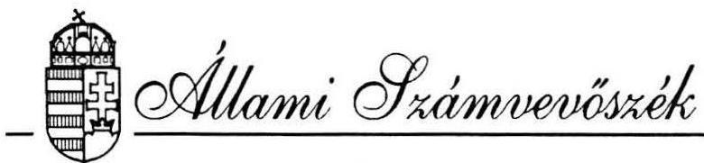
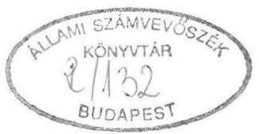
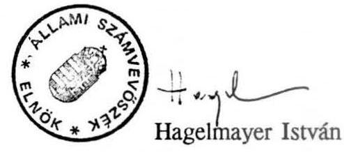
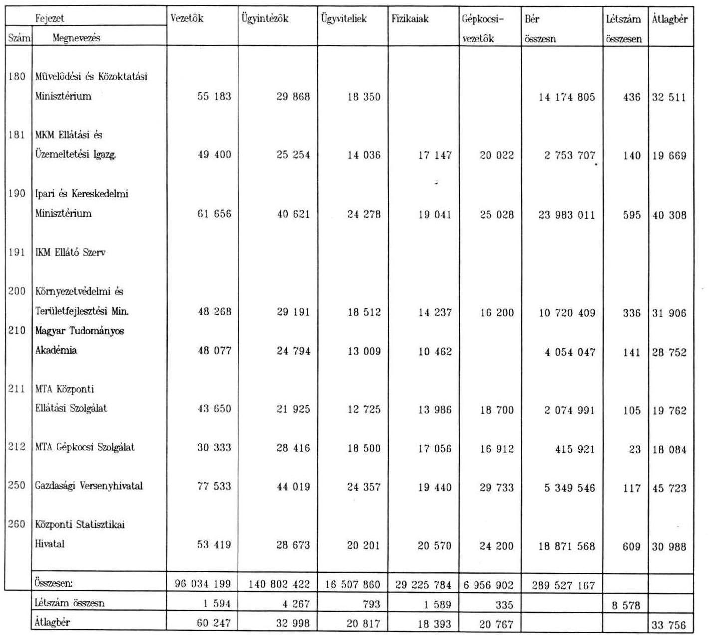

#  

## JELENTÉS

a központi államigazgatási szervek létszám- és bérgazdálkodása 1991. évi ellenőrzésének utóvizsgálatáról

---

Az ellenőrzést vezette:

Matusek István számvevő-főtanácsos

Az ellenőrzésben részt vettek:
Bakonyvári Róbertné számvevő-tanácsos
Hegyesné dr. Solymosi Mária számvevő
Szabó József számvevő-tanácsos
Dr. Nagy Sándor külső szakértő

---

# JELENTÉS 

a központi államigazgatási szervek létszám- és
bérgazdálkodása 1991. évi ellenőrzésének utóvizsgálatáról

Az Állami Számvevőszék 1991. évben vizsgálta az államigazgatási szervek létszám- és bérgazdálkodását.

A vizsgálat célja annak megítélése volt, hogy a kormányzati munkamegosztás módosulásai folytán az átszervezett és létrehozott új államigazgatási szervezetek struktúrája, szervezeti rendje és személyi feltételei az ellátandó feladatokhoz igazodott-e, a központi államigazgatás létszám- és bérgazdálkodását milyen tendenciák jellemzik, hogyan alakult az államigazgatásban foglalkoztatottak alapbére és keresete az 1991. évben bevezetett szigorúbb bérgazdálkodás viszonyai között.

## Az ellenőrzés főbb megállapításai a következők voltak:

- A kormányzati munka módosulása miatt a legnagyobb mértékű változások a Miniszterelnökség fejezetnél és a Belügyminisztériumnál következtek be. A Miniszterelnöki Hivatal több, heterogén szakterületet fog össze, célszerű lenne a fejezetet alkotó intézményrendszer funkcionális elemzésen alapuló egyszerűsítése. (1992. I. 1-jétől a KSH önálló költségvetési fejezet lett.)
- Az államigazgatási szervezetek feladatai, szakmai statutumai is jelentősen változtak, módosultak. A külső változásokat követő belső átszervezések céltudatosak, átgondoltak és eredményesek voltak, de előfordultak olyan esetek is, amikor az átszervezések további ellentmondások forrásává váltak.
- Több szerv alakult új feladatok ellátására, és esetenként az alapítói jogszabályok nem kellően körvonalazottak.

---

- Egyes intézmények tevékenységét meghatározó jogszabályok, törvények, törvényerejű rendeletek régiek és az új szabályozás még várat magára (az érintett intézmények a tevékenység-, a szervezet-, és a létszám felülvizsgálatát az új szabályozástól teszik függővé).
- A feladatváltozások egyik kedvező következménye volt a tevékenységek szabályozottságának javulása. A korábban elhanyagolt és elavult szabályzatokat újrafogalmazták, korszerűsítették, újra kiadták, ill. annak előrehaladott előkészületeit tapasztaltuk.
- A Kormány a központi államigazgatási szervek feladat- és hatáskörének áttekintéséről, a kormányzati munkamegosztás felülvizsgálatáról határozatokat hozott. A határozatok gyakorlati végrehajtása eredményeként létszám- és bérköltség csökkenés csak szorványosan fordult elő. A megszűnt vagy megszüntetni szándékolt szervezetek számát meghaladóan jöttek létre új államigazgatási szervezetek, a létszámirányszámok növekvő tendenciát mutatnak, a béralap csökkenése reálisan nem várható.
- A magyar államigazgatásban nincsenek hagyományai a feladatoldalról felépített szervezeti- és létszámigények meghatározásának. Az állami költségvetés tervezése alapvetően bázisszemléletű, az államigazgatási szervezetek központi támogatása, működési feltételeinek jóváhagyása sok tekintetben nem a feladatokból kiindulva valósul meg.

Az 1991. évi ellenőrzés megállapításai alapján tett javaslatainkat - tájékoztatásul - az 1.sz. melléklet tartalmazza.

Az utóvizsgálat - az 1991. évi és az 1992. I. félévi létszám- és béradatok bekérésével, azok elemzésével, továbbá kiegészítő helyszíni vizsgálatokkal - arra kereste a választ, hogy mennyiben változott és jelenleg milyen képet mutat a központi államigazgatás létszám- és bérgazdálkodása, ill. az arra ható feladat-meghatározási, szabályozási tevékenység, valamint, hogy a fejezetek intézkedési terveit hogyan hajtották végre. E mellett áttekintettük a köztisztviselők jogállásáról szóló 1992. évi XXIII. sz. törvény és a közigazgatás korszerűsítésére hozott 1026/1992. (V.12.) sz. Kormányhatározat végrehajtásának állását is.

Az utóvizsgálat lényegében a korábbi hasonló ellenőrzés által érintett körre terjedt ki: Köztársaság Elnökének Hivatalára, Országgyűlés Hivatalára, Miniszterelnöki Hivatalra, valamennyi minisztériumra és néhány olyan intézményre, amelyek nem minisztériumok ugyan, de megítélésünk szerint államigazgatási feladatokat (is) látnak el (pl. Nemzeti és Etnikai Kisebbségi Hivatal, Gazdasági Versenyhivatal, Magyar Tudományos Akadé-

---

mia, Központi Statisztikai Hivatal). Az utóvizsgálatba bevont szervek felsorolását és az alkalmazott rövidítéseket a 2. sz. melléklet tartalmazza.

Az érintett körben nem tekintettük igazgatási létszámnak az adott szervek megyei vagy regionális részlegeinél foglalkoztatottakat, de figyelembe vettük az 1970-es évek végén létesített ún. ellátó, szolgáltató, üzemeltetési igazgatóságok, gazdasági hivatalok létszámát is, mivel ezek hagyományos gondnoksági feladatokat látnak el, tevékenységükre az adott intézmények funkcionálásához szükség van.

Az előzőek szerint meghatározott körbe tartozó államigazgatási létszám 1992. I. félévében 11269 fő volt (az éves irányszám 91%-a), az előző évhez képest alig csökkent (99,4%); az éves béralapelőirányzat 5,6 milliárd forint (az 1991. évihez viszonyítva 117%), aminek az I. félévi felhasználása (2,4 milliárd forint) az időarányos teljesítés alatt marad (43%).

# I. RÉSZLETES MEGÁLLAPÍTÁSOK 

## 1.) A létszám- és bérgazdálkodás jelenlegi helyzete

a/ Működés szabályozottsága
A vizsgált államigazgatási szerveknél javult a működés szabályozottsága és nagyobb gondot fordítottak a feladatokban és szervezetekben meglévő párhuzamosságok felszámolására. A szervezetek rendelkeznek - esetenként ideiglenes vagy tervezett formában - Szervezeti és Működési Szabályzattal. Elkészültek a Munkaügyi Szabályzatok, esetenként a működés belső folyamatait előíró ügyrendeket - és az ahhoz kapcsolódó munkaköri leírásokat is - összeállították.

Az IM felülvizsgálta a szervezeti egységek feladatait, a feltárt párhuzamosságokat megszüntették.

A GVH racionalizálta szervezeti rendjét, vizsgálta a szervezeti egységek struktúráját, leterheltségét, aminek következtében a létszámtervek reálisabbá váltak.

A MKM-nál elkészültek az ügyrendek, munkaköri leírások, több területen megtörtént a feladat- és hatáskörök rendezése.

A NGKM felülvizsgálta a szervezeti felépítést.

---

Egyes esetekben azonban nem következett be érdemi változás a korábbi vizsgálatunk során kifogásolt gyakorlathoz képest.

A PM-nél az 1991. évi vizsgálatunk a szervezet belső túltagoltságát, új SZMSZ, valamint munkakörökre is meghatározott ügyrendi szabályok hiányát kifogásolta. A minisztériumban 1992. évben a szervezetet folyamatosan módosították és további, az egész szervezetet érintő átszervezés van folyamatban (aminek eredményeként létszám megtakarítás is elképzelhető). Az SZMSZ ez ideig nem készült el, az ügyrend tervezetét még nem hagyták jóvá. A főosztályok tevékenységében változatlanul párhuzamosságok találhatók, az átszervezések elhúzódtak. Egy 1992. június 24-i belső feljegyzésben foglaltak szerint vezetői döntést várnak olyan kérdésekben, mint pl: a szervezeti egységek, ill. főosztályok végleges elnevezése, feladatuk meghatározása; a főosztályok engedélyezett létszáma; a minisztérium engedélyezett összlétszáma.

A szabályzatok ideiglenes jellege, hiánya arra is visszavezethető, hogy a törvényalkotás továbbra is elmaradt a folyamatoktól és meghatározó törvények vagy kiegészítéseik hiányoznak (pl. az államháztartási törvény végrehajtási rendelete, az akadémiai törvény, a felsőoktatási törvény, rendőrségi törvény, az etnikai- kisebbségi törvény stb). E mellett a feladatok nagymértékű módosulása, bővülése is megnehezíti, hogy a belső szabályzatok naprakészen kövessék azokat.

Gyakori, hogy bár az intézmények belső szabályzatai összeállításra kerültek, de a feladat és szervezetváltozások miatt ezek nem naprakészek, korszerűsítésre szorulnak és ezért hatályukat felfüggesztették. Különösen vonatkozik ez a Munkaügyi Szabályzatokra, amelyeket a köztisztviselők jogállásáról szóló törvény hatálybalépését követően célszerű újrafogalmazni.

# b/ Az előirányzatok alakulása 

A központi államigazgatási szervek létszámirányszáma 1992. évre 12416 fő volt, ami az előző évinek 99%-át tette ki. A minimális mértékű létszámirányszám csökkenés 13 intézmény irányszám csökkenésének és 11 szerv irányszám növekedésének átlagából adódott.

A legnagyobb arányú létszámirányszám csökkenés a MTA KESZ-nál mutatkozott (-34%), de további négy intézménynél is 20% körüli (NGKMGLNM, FMGH,KSH).

A létszámirányszám növekedés 70%-os volt a KEH-nél, 57%-os a HM-nél, 27%-os az OGYH-nál (a fennmaradó 8 szervnél 1 és 15% közötti).

A létszámirányszámok növekedését az érintett szerveknél feladat változásokkal, bővülésekkel indokolták. A feladatváltozások a létszám- és béralap átcsoportosításával párosultak,

---

amit - megfelelő norma rendszer és a létszámszükséglet egzakt meghatározottsága hiányában - az érdekeltek közötti megegyezés döntött el.

Az 1992. évi béralapelőirányzat 5,6 milliárd Ft, ami az előző évinél 17%-kal több. Az adatok arra utalnak, hogy az államigazgatási szervek az összességében 1,4%-os létszámirányszám csökkenés mellett a béralap előirányzatban 17%-os béralapnövekedést irányoztak elő. A növekedés nagyobb hányadát az érvényesíthető 10%-os bérautomatizmus adta.

Az egy fő létszámirányszámra jutó béralapelőirányzat növekedésének mértéke az átlagot meghaladó: 49% az NGKMGI-nál, 30-40% közötti a OGYH-nál, a KSH-nál és a NM-nál.

A IM-nál a béralapelőirányzat csökkent az 1991. évihez viszonyítva (a létszámirányszám 1%-os növekedése mellett), a NEKH-nál pedig mindössze 1%-kal nőtt.

A MüM-nál, a MTA-nál és a MTAKESZ-nál fordul elő, hogy a létszámirányszám és a béralap előirányzat szinkronban van, mindkettő közel azonos arányú csökkenéssel számol. Lerontja ezt a MüM-nál az, hogy 1992. I. félév végén 75 db üres álláshelyet tartottak nyilván, ami a létszámirányszámnak közel 30%-a (és ez a jelenség tartósan fennáll, ugyanis a létszámirányszám teljesítése már 1990. évben is csak 78%-os, 1991. évben pedig 65%-os volt), továbbá már 3 éve a béralapelőirányzat magasabb volt az indokoltnál. (A teljesítés 1990. évben 62%, 1991. évben 50% volt, 1992. I. félévében az időarányosnak 61%-a.)

Továbbra is megoldatlan a költségvetési tervezés gyakorlatában a létszám- és bérigény reális megállapítása, miközben az államigazgatási szervek költségvetésében többnyire a bérköltségek teszik ki a legnagyobb arányt, így meghatározó jelentőségűek.

Az utóellenőrzés általános tapasztalata, hogy a költségvetési szervek bértervezése során az ellátandó feladatok és azok változásainak tényleges bérvonzata közötti kapcsolat még mindig nagyon laza. Nincsenek az államigazgatási létszámszükséglet tervezésének elfogadható és általánosan használatos módszerei, sőt még erre irányuló törekvések sem észlelhetők.

A bértervezés alapja az évenként göngyölített ún. bázisbér, amelyet az éves bérautomatizmusokkal és az évközi központi bérintézkedések hatásaival korrigálnak (szintre hoznak). A felhasználható bértömeget - elvileg - módosítja még az esetleges feladatváltozás bér- és létszámvonzata, de ez alkumechanizmus tárgya.

Az előzőekben leírtakból következik, hogy a létszámirányszámok, de különösen a béralap előirányzatok megállapítása általában megalapozatlan, azokat érdemben senki

---

nem vizsgálja felül. A megalapozatlan tervezés következtében általában indokolatlan lazaságok keletkeznek, néhány esetben feszültségek.

A létszámirányszámok kellő megalapozottságának hiányát igazolja, hogy a létszám irányszámok olyan szerveknél is elfogadásra és jóváhagyásra kerültek, amelyeknél a tényleges átlaglétszám tartósan - 1990. év, ill. az intézmény megalakulása óta -, az előirányzat alatt maradt (NM, KHVM, KüM, FM, HM, KSH).

A béralap előirányzatok megalapozottsága még több kívánnivalót hagy maga után. Pl. amíg az államigazgatási körben kialakított béralap előirányzat 1991. évben átlagosan egy fő létszámirányszámra éves szinten 381 ezer Ft bérszintet mutatott, addig a HM módosított előirányzata ennek közel kétszeresével (737 ezer Ft-tal) számolt, a tárcanélküli miniszterek hivatali szervezeténél 630 ezer Ft, a MüM-nál 629 ezer Ft (165-163%) ez az adat, de 35-40%-ban meghaladja az átlagost a NEKH-nál, és a GVH-nál is. Ugyanez a tendencia tapasztalható a felsorolt szerveknél - valamivel kisebb arányban az 1992. évi béralap előirányzat kialakításánál is.

Az átlagosan 381 ezer Ft-os előirányzott bérszintet kissé torzítja az ellátási igazgatóságok, gazdasági hivatalok adata, de a felsorolt aránytalanságok az ezek nélkül számított átlag (404 ezer Ft) esetén is fennállnak.

Az 1991. évi ellenőrzés és utóvizsgálatának együttes tapasztalata azt mutatja, hogy a bér- és létszámtervezés eddig követett gyakorlata számottevően nem korszerűsíthető, ezért az csak teljesen új alapokra helyezve elégítheti ki a felmerülő, reális igényeket.

Addig is a beterjesztett éves létszámirányszámok és béralapelőirányzatok adatainak érdemi felülbírálata azért is indokolt, mert - bár a köztisztviselők jogállásáról szóló törvény a béralap előirányzatok túltervezését némileg behatárolja (a vezetői állomány növelése kínál lehetőségeket, ezért várható is) - a létszámirányszámoknak az indokoltnál magasabb szintű megállapítása és elfogadtatása, ha nem is
 az alapbérek emelésére, de az alapbéreknek jutalmazásokkal - az eddigieknél nagyobb arányban - való kiegészítésére forrást biztosíthat. (Nem az a probléma, hogy a köztisztviselők esetleg nagyobb összegű jutalmat kapnak, hanem az, hogy a jutalom mértéke a tervezési "ügyeskedés" függvényében differenciálódik.)

---

# c/ Az előirányzatok teljesítése 

Az 1992. évre megállapított 12416 fő létszámirányszám I. félévi teljesítése 11.269 fő, 91%-os. Az üres álláshelyek száma - teljes körű adatok hiányában a létszámirányszám és a tényleges átlaglétszám adatai alapján közelítve - mintegy 1150-re tehető.

Az ellenőrzött szervek túlnyomó részénél azt tapasztaltuk, hogy a tényleges létszám a szerv részére jóváhagyott irányszám alatt marad. Az üres álláshelyek aránya átlagosan 9% (természetesen van ahol ettől magasabb), ami a korábbi megállapításokhoz képest számottevően nem változott, tehát tipikus jelenségről van szó. Okai a következők:
— az a régi beidegződés érvényesült, amely szerint a szükségesnél több státusz a feladatellátás tekintetében biztonságot nyújt;
—a minisztériumi alkalmaztatás elvesztette presztizsét, az elérhető jövedelmek behatárolják a megnyerhető munkatársak körét és kvalifikációját, az egyenlőtlen munkaterhek növelik a fluktuációt;
—a be nem töltött álláshelyek bérmegtakarítást eredményeznek, amelynek felhasználásával enyhíthetik a foglalkoztatottak bérszintjének elmaradásait.

A vizsgált intézmények közül 12-nél az átlagos állományi, és a létszámirányszám aránya az államigazgatási átlag értéke körül alakul, 12-nél annál alacsonyabb.

A létszámirányszám és a ténylegesen teljesített létszám aránya a legalacsonyabb a MüM-nál (71%), az FMGH-nál (79%), a HM-nál (80%) és a MKMEI-nál (80%).

Az 1992. I. félévi béralap felhasználás a központi államigazgatási szerveknél 2,4 milliárd Ft volt (az éves előirányzat 43%-a), kissé az időarányos hányad és a betöltött létszám aránya alatt maradt.

6 intézménynél az I. félévi béralapfelhasználás az éves előirányzat 50%-a, vagy annál magasabb (OBF, NEKH, NGKM, PM, MTAKESZ, KSH), legkisebb arányú a MüM-nál (30%), a HM-nál (34%), a BM-nál (36%) és a KEH-nál (38%). Ez utóbbi adat a létszámteljesítéssel arányos, de a MüM-nál, és a HM-nál a béralapteljesítés %-a a létszámirányszám teljesítése alatt marad, amiből ismét a béralap laza megállapítására lehet következtetni.

A béralap előirányzat teljesítésének adata a vizsgált szervek egy részénél kisebb-nagyobb arányt kitevő megbízási díjat is tartalmaz.
A kapcsolódó adatokat a 3. sz. mellékletben mutatjuk be.

---

# d/ Főfoglalkozású dolgozók létszám-, és béradatai 

A központi államigazgatási szervek 11269 dolgozójának 76%-a (8578 fő) volt főfoglalkozású igazgatási dolgozó 1992. I. félévében (1991. évben 71%, 8009 fő).

A vezetőállású dolgozók (6004-6009-es kulcsszámokhoz tartozók) a főfoglalkozású alkalmazottak közel ötödét (18,6%-át) tették ki (hasonló a fizikai dolgozók aránya is), mintegy felét (49,7%-a) az ügyintézők, 9%-át az ügyviteliek és 4%-át a gépkocsivezetők. (4. sz. melléklet)

A vezetők aránya az átlagosnál jóval magasabb a KEH-nál (43%), a NEKH-nál (46%), a tárcanélküli minisztereknél (39%), a PM-nál (31%), a NGKM-nál és a KTM-nál (29-29%). E szervek egyrészénél a főosztályok létszáma is csak töredéke (3-6 fő) az államigazgatásra jellemző átlagos értéknek.

Egy vezetőállású dolgozóra 4,4 fő beosztott jut, a főosztályvezetők és a többi dolgozó létszámának összevetése pedig azt mutatja, hogy a központi államigazgatásban átlagosan 23 fős főosztályok találhatók.

A vezetők átlagost meghaladó aránya miatt ennél jóval kevesebb beosztott - az átlagnak csak harmada, kétharmada - jut egy vezetőre a NEKH-nál (1,2 fő), a KEH-nál (1,3 fő), a tárcanélküli minisztereknél (1,6 fő), az NGKM-nál (1,8), a PM-nál (2,2 fő), a KTM-nál (2,5 fő), a MüM-nál (2,8 fő) és a MEH-nál (2,8 fő), de csak az átlagos értéknek háromnegyede (3,3-3,5 fő) a NM-nál, a KHVM-nál, az FM-nál és az MTA-nál is.

Az adatokból arra lehet következtetni, hogy egyes minisztériumokban a szervezetet túl tagoltan alakították ki, ott is főosztályokat hoztak létre ahol az osztálytagozódás is elegendő lett volna.

Ennek következményeként előfordul, hogy a szervezeti felépítésben a vezetőállásúak között csak főosztályvezetők vannak.

A központi államigazgatásban dolgozó 8578 fő főfoglalkozású alkalmazott átlagos havi keresete 1992. I. félévében 38918 Ft volt, az 1991. évben tapasztalt értéknél (37427 Ft), mintegy 4%-kal nagyobb (5-6. sz. melléklet). Mivel a mozgóbérek kifizetésére általában a II. félév során került eddig sor, feltételezhető, hogy az átlagos havi kereset éves szinten további 8-10%-kal növekedni fog és várhatóan eléri a 42-43.000 forintot.

---

Az átlagos havi keresetek összetétele 1991. évben és 1992. I. félévében a következők szerint alakult.

|  | 1991. év összetétel |  | 1992. I. félév összetétel |  | 1991.év %-ában |
| :--: | :--: | :--: | :--: | :--: | :--: |
|  | Ft | % | Ft | % |  |
| alapbér | 29025 | 77,6 | 33757 | 86,8 | 116,3 |
| pótlék | 1465 | 3,9 | 1882 | 4,8 | 128,5 |
| mozgóbér | 6937 | 18,5 | 3279 | 8,4 | 47,3 |
| összes kereset | 37427 | 100,0 | 38918 | 100,0 | 104,0 |

Az átlagos havi kereseteken belül az öt fő állománycsoport adatainak alakulása igen változó. A vezetők átlaga 70229 Ft (az államigazgatási átlag 180%-a), az ügyintézőké 37431 Ft (kissé az átlag alatti, 96%), az ügyviteli és a fizikai alkalmazottaké pedig 23263 Ft (60%), ill. 21.633 Ft (56%) volt. A gépkocsivezetők átlagos havi keresete 27911 Ft (72%) volt.

Az átlagos havi kereset összetétele - a gépkocsivezetők kivételével - viszonylag egységes képet mutat 1992. I. félévében. Eszerint az összes kereset 86-90%-át az alapbér képezte, pótlékként került folyósításra annak 2-5%-a, a mozgóbér pedig 7-12% közötti arányt képviselt. A vezetői állomány esetében a legmagasabb (5%) a pótlék, mozgóbérük az ügyviteliekkel egyező (9%), az ügyintézők 7%-ot és a fizikaiak 12%-ot kitevő értéke közötti. A gépkocsivezetők esetében a kereset 70%-a alapbér, 18%-a pótlék és 12%-a mozgóbér.

Az államigazgatási átlagnál 38-50%-kal magasabb a kereset a KEH-nál, a tárcanélküli minisztereknél, az OBF-nál, a HM-nál és a MüM-nál. Az ellátó igazgatóságoknál, gazdasági hivataloknál a dolgozók összes keresete az országos átlagnak csak 52-65%-át érte el. A minisztériumok között a legalacsonyabb értékek a KüM-nál és az IM-nál fordultak elő (77%, ill. 82%).

A helyszíni vizsgálatok általánosítható tapasztalata, hogy a költségvetési fejezeteknél és intézményeknél közgazdasági értelemben vett létszámgazdálkodásról általában nem, bérgazdálkodásról csak korlátozottan beszélhetünk (a bérgazdálkodás gyakorlatilag a bérelőirányzat betartására való törekvésben testesül meg).

Ösztönző rendszerek csak elvétve fordulnak elő, a munka minőségi szempontjait az államigazgatásban eddig nem sikerült érvényesíteni.

---

Igen nagy eltérések találhatók az alapbérek és a keresetek tekintetében az egyes szerveknél. A 7. sz. melléklet a főosztályvezetők, helyetteseik és az osztályvezetők (és helyetteseik) átlagos havi alapbérét és keresetét mutatja be.

Teljesen egyértelmű a szóródások áttekintése alapján, hogy az eltérések túlzottak, véletlenszerűek.

A fejezetek és intézmények által alkalmazott bérpreferenciákból jellemző tendenciák nem állapíthatók meg, csupán az, hogy az egyes kulcsszámokba sorolt csoportok bérfejlesztése eltérő mértékű.

Egyes szerveknél a vezetői állomány bérfejlesztése kapta a nagyobb hangsúlyt. (NGKMGI, FMGH, IKM).
2.) Az 1992. évi XXIII. sz. a köztisztviselők jogállásáról szóló törvény végrehajtásának tapasztalatai:

Az 1992. július 1-jén hatályba lépett törvény szerint a foglalkoztatottakat 1992. december 31-ig kell besorolni, míg az illetményrendszer szerinti illetményeket 1995. január 1-ig kell elérni.

A helyszíni vizsgálatok befejezéséig (1992. október 9.) az érintett szervek egy része az új besorolásokat még nem végezte el, ezért a tapasztalatok és a begyűjtött adatok csak részlegesek, előzetes tájékozódás céljára alkalmasak. Annyi azonban már érzékelhető, hogy a törvény végrehajtása során az érintettek részéről értelmezési problémák merültek fel.

A képesítésre vonatkozó végrehajtási rendelet hiánya hátráltatja a miniszteri hatáskörbe tartozó, illetőleg várhatóan majd oda utalt szabályok, követelményrendszer kialakítását.

A korábbi bérrendszer és az új illetményrendszer egyes alkotóelemeinek egymással való megfeleltetése nem tisztázott.

Széles körben fogalmazták meg az ellenőrzöttek a törvénnyel kapcsolatos fenntartásaikat is.

- A törvény nem kellően biztosítja a köztisztviselői kör anyagi és erkölcsi megbecsülését (az előmeneteli-, és illetményrendszer nem veszi figyelembe a potencionális konkurencia jövedelmi viszonyaiban bekövetkezett nagyságrendi változásokat, illetve pl. a vezetői megbízás indoklás nélkül bármikor visszavonható).

---

- A törvény csak bizonyos korlátok között teszi lehetővé a teljesítményelv követelményeinek érvényesítését (a besorolási lehetőségek nem tesznek különbséget a különböző színvonalú munkavégzés között).
- A szabadidő átalány bevezetésére vonatkozó előírás előrelépés, ennek ellenére a túlórafizetés lehetőségének megszüntetése gondot jelent, és esetleg létszámnövelésre kényszerít (hasonlóan gondot okoz a szombat-vasárnapi munkavégzésekre vonatkozó előírás).
- A fizikai alkalmazottaknál nincs lehetőség a szakmunkások és betanított munkások közötti megfelelő differenciálásra.
- Több esetben felvetődik az iskolai végzettség és a szakmai képesítések egyenrangúságának kérdése.
- Nem tisztázott, hogy a címzetes tanácsosok és a főtanácsosok esetében az érintett dolgozó melyik fizetési fokozatba kerül (10. vagy 11-be, illetve 14. vagy 15-be).
- A KEH nehezményezi, hogy miután a törvény 32. szakasza a Köztársasági Elnöki Hivatalt kizárja a főtanácsadói és tanácsadói munkakörök létesítésének lehetőségéből, besorolási választékuk szűkült.
- A GVH véleménye szerint a Versenytanács tagjainak sajátos, kiemelt helye, szerepe, jogállása az új törvény szerint nem ismerhető el.
- Visszatérő vélemény szerint az új illetményrendszernek még jobban kellene preferálni a hosszú szolgálati időt.

A vizsgált központi államigazgatási szervek 59%-ától (ezek foglalkoztatják az érintett főfoglalkozású dolgozók 62,5%-át) kapott információk alapján a besorolások főbb tapasztalatai a következők.

- Alkalmazási feltételeknek meg nem felelő, ill. alkalmatlan dolgozó csak néhány esetben fordul elő. A feltételeknek meg nem felelőknél leginkább a szükséges iskolai végzettség hiánya a jellemző.
- Az összeférhetetlenség megállapítása tekintetében a legtöbb helyen a munkavállalók nyilatkoztatásánál tartanak. Az eddigiek során összeférhetetlenség a 4576 fős körben csupán 1-4 esetben merült fel, de az érintettek itt is ígéretet tettek annak megszüntetésére. Kifogásként merült fel, hogy miután az összeférhetetlenség megállapítása a nyilatkozaton alapul, megszüntetésük ellenőrzése gyakorlatilag kivitelezhetetlen. Nem tisztázott, hogy a munkakörön kívüli jogviszony (pl. Igazgató

---

tanácsi tagság, magánvállalkozói tevékenység) felveti-e az összeférhetetlenség kérdését.

- A címzetes tanácsosi-főtanácsosi címek adományozásának kérdése intézményenként 1-1 esetben, a KTM-nél és az MTA-nál 8-10 esetben került napirendre. A legtöbb szervnél ezzel a problémával később - esetleg csak 1993. évben - kívánnak foglalkozni.
- A személyi illetmények tekintetében szintén zömmel várakozó álláspont alakult ki. A KüM-nél 4-5 fő, a FM-nél 10 fő, az OGYH-nál 47 fő esetében kívánnak élni ezzel a lehetőséggel.
- A korábbi besorolások alapján járó bérek az új besorolások szerinti illetményt esetenként meghaladják. Így pl. a:

|  GVH-nál | 64 főnél | (az összes létszám 54%-a), a  |
| --- | --- | --- |
|  NGKM-nál | 140 főnél | (34%), a  |
|  MüM-nál | 46 főnél | (25%), a  |
|  PM-nál | 100 főnél | (18%), az  |
|  IKM-nál | 70 főnél | (11%
 %, a  |
|  KHVM-nál | 52 főnél | (13%), az  |
|  IM-nál | 35 főnél | (12%).  |

Az MGKM-nál a viszonylag magas arányt az okozza, hogy magas (több mint 50%) a nyelvpótlékban részesülők száma.

A többi vizsgált szervnél ennél jóval kisebb számban fordul elő ilyen eset, és főleg a vezetői állományra jellemző.

A főosztályvezetők 43%-ánál, a főosztályvezető-helyettesek 20%-ánál, az osztályvezetők közel harmadánál (30%) már az 1992. I. félévi átlagos alapbér is meghaladta az új besorolás szerint adható alapilletmény összegét. A rendelkezésünkre bocsátott adatok szerint ez mind a három kulcsszámnál jellemző volt a BM-nál és a PM-nál.

Figyelemre méltó a dolgozók megoszlása (a vizsgált körben) az új besorolás szerint:

- A dolgozók több mint fele (2440 fő, 53%) az I. Besorolási osztályba kerül. Az ide besoroltak 40%-a (864 fő) vezetőállású, 61%-a (1495 fő) a felső 4 fizetési fokozatra, ebből 1074 fő (44%) a 14. és 15. fizetési fokozatra (főtanácsos) jogosult. A 864 fő vezetőállásúnál mindkét arány magasabb.

---

- A II. Besorolási osztályba 768 főt (17%) kell besorolni. Ennek 72%-a a felső 4 fizetési fokozatba, illetve 44%-a (337 fő) a 12-13. fizetési fokozatba (főelőadó I.) kerül.
- Az ügykezelők száma (III. Besorolási osztály) 644 fő, 14%. Az ügykezelők fele (49,2%) az 5. és 6. fizetési fokozatba kerül.
- A fizikai állományba kerülők száma 724 fő, 16%. A felső kettő (5. és 6.) fizetési fokozatba történő besorolásra a dolgozók 52,2%-a jogosult.

A besorolási tapasztalatok arra is felhívják a figyelmet, hogy az új törvény illetménybesorolási rendszerét - amire a törvény kiadásra került - az élet kissé túlhaladta. Az új illetményrendszer bevezetésétől az érintettek a köztisztviselők anyagi elismerésének növekedését várták. E várakozás megalapozottságára utal, hogy pénzügyi okokból csak 1995. január 1-ig kell elérni a törvényben biztosított illetményeket. Ezzel szemben már most magas azoknak a száma akiknek a régi besorolás alapján járó bére meghaladja az új illetményrendszer szerint várható bérét. Említést érdemel az is, hogy az I. és II. Besorolási osztályokban az előfordulások száma nem egyenletes, és nem a középső 2-3 fizetési fokozatban találjuk a legmagasabb arányokat, hanem a legfelső négy, illetve a legfelső kettő fizetési fokozatban. Mindez igazolni látszik azt az érintettek által megfogalmazott aggályt, hogy a törvény hosszabb távon nem biztosít megfelelő előmenetelt és anyagi megbecsülést.

# 3.) A közigazgatás korszerűsítésére hozott 1026/1992. (V.12.) sz. Kormányhatározat végrehajtásának tapasztalatai 

A tapasztalatok szerint a Kormány fenti határozatának megfogalmazásai esetenként nem voltak egyértelműek és ezzel kérdésessé vált a felsorolt feladatok számonkérhetősége.

A kormányhatározat 2/a pontja a feladatterv összeállítását a "miniszterek és a kormány alá rendelt országos hatáskörű szervek vezetői (a továbbiakban: miniszterek)" részére írta elő. Célszerűbb lett volna az érintett szervek körét tételesen felsorolni, mert az idézett megfogalmazás alapján a feladatot csak a minisztériumok hajtották végre (azok sem valamennyien) és a MEH, a TNM, az OBF, a NEKH, a MTA és a GVH magára nézve nem tartotta kötelezőnek.

A kormányhatározat mellékletének 2/b és 3/e pontjainál felelősként a MEH helyettes államtitkára, illetve a belügyminiszter került feltüntetésre, ezért a minisztériumok egy része úgy vélte, hogy ezzel kapcsolatos feladatuk nincs. Időközben közreműködésük nélkül is megjelentek fenti témákkal kapcsolatban

---

az 1034/1992. (VII.1.), ill. az 1040/1992. (VII.29.). sz. korm.határozatok, amelyek érintették a 2/b pontban foglaltakat.
a.) A minisztériumok feladatterveiket megküldték a Belügyminisztériumnak (a feladatot a HM egy, az FM két hetes késéssel teljesítette).

Nem állított össze feladattervet az IM és a PM.
Az IM tájékoztatása szerint:"A minisztérium belső struktúrájának korszerűsítése megtörtént, az erre vonatkozó igazságügyminiszteri utasítás kihirdetése folyamatban van."

A PM tájékoztatása szerint:"A kormányhatározat 2/a pontjában előírt feladattervet még nem dolgoztuk ki, de a Pénzügyminisztérium vezetése 1992. június 27-én szűk vezetői értekezlet keretében áttekintette a minisztérium feladatait, az ehhez kapcsolódó szervezeti struktúrát és az aktuális szervezeti korszerűsítésekről döntött."

A rendelkezésre bocsátott feladattervekkel kapcsolatban általános tapasztalatként megállapítható, hogy a létszám csökkentésére irányuló elgondolásokat egyáltalán nem tartalmaznak, sőt a felvázolt feladatbővítési, fejlesztési elgondolások alapján várhatóan hamarosan létszámbővítési igények fognak jelentkezni.

A KüM arról számolt be, hogy; "Az átfogó korszerűsítési feladatok végrehajtásának keretében profiltisztítást tervezünk a külügyminisztérium igazgatása és a külképviseletek címek között a költségvetési törvény változtatása nélkül. Jelenleg folynak tárgyalások a Pénzügyminisztérium illetékes szakembereivel a megalapozott, indokolt változtatás kialakításával kapcsolatban."

A feladattervek összeállításához a BM egy szempontrendszer összeállításával és megküldésével, valamint konzultációk tartásával folyamatos módszertani segítséget nyújtott.
b.) A kormányhatározat 2/b pontja szerint a feladattervek figyelembevételével meg kell határozni és a kormány elé kell terjeszteni a közigazgatás korszerűsítésének irányait és elveit tartalmazó korszerűsítési kormányprogramot. A feladat végrehajtásáért felelős a belügyminiszter és a MEH közigazgatási államtitkára, határideje 1992. szeptember 30.

A korszerűsítési kormányprogram tervezetének kidolgozása az előírt határidőre nem készült el, de - a BM tájékoztatása szerint - befejezés előtt áll és a végleges programot a Kormány várhatóan október végi ülésén tárgyalja meg.

---

c.) A Korm.hat.mellékletének 7/a pontja alapján 1992. szeptember 30-ig meg kell határozni a köztisztviselők képesítési követelmény rendszerét, valamint a közigazgatási alapvizsgára és szakvizsgára vonatkozó szabályokat.

Előkészítettségi foka alapján a korm.rendelet tervezete kisebb késéssel várhatóan 1992. október végére előterjeszthető.
d.) A Korm. hat. mellékletének 7/b pontja szerint 1992. december 31-ig ki kell alakítani a közigazgatásban dolgozók szakmai képzési és továbbképzési rendszerének intézményi kereteit, meg kell határozni a központi államigazgatási szervek, s a köztársasági megbízottak képzési feladatait.

Erre vonatkozóan elképzelések vannak, ezek feltételrendszerének megteremtésén dolgoznak. A köztársasági megbízott képzéssel kapcsolatos feladatokat a 77/1992. (IV.3.) korm.rendelet konkretizálta.
e.) A Korm.hat mellékletének 7/e pontja szerint 1992. december 31-ig a köztisztviselők jogállásáról szóló törvény előmeneteli és illetményrendszerének teljes körű bevezetése érdekében korm. rendeletet kell előkészíteni a közigazgatási szervek létszám- és bérgazdálkodásának részletes szabályozására.

Előkészítő munka folyik, ahhoz kapcsolódóan munkabizottság működik az érintett tárcák, egyéb szervezetek, valamint a közszolgálati érdekegyeztetés bevonásával.

# 4.) Az intézkedési tervek végrehajtásának tapasztalatai 

Az 1991. évi vizsgálatunk megállapításai alapján mindössze négy minisztérium (BM, KHVM, NGKM, MKM) készített intézkedési tervet.
a.) A BM intézkedési terve 4 pontot tartalmaz (ebből 3 érdemi) és olyan feladatokat ír elő, amelyek egyéb központi szabályozások, törvények függvényei, (igazgatási címbe tartozó tevékenységek központi meghatározása, a rendőrségi törvény elfogadása és kiadása, ill. a köztisztviselői törvény hatálybalépése), így azokat nem teljesíthették. Kivételt képez ez alól a Munkaügyi Szabályzat összeállítása, tekintettel azonban arra, hogy megítélésük szerint a Ktv hatályos rendelkezései nem adnak jogi alapot a Munkaügyi Szabályzat elkészítésére, erre sem került sor.

---

b.) A NGKM intézkedési terve a szervezeti felépítés felülvizsgálatát, kiegészítve a főosztályok feladatainak feltérképezésével; a személyi állomány 10%-os csökkentését; a külképviseleti hálózat hatékonyabb működtetését tűzte ki célul. Az első feladat lényegében teljesült, míg a 10%-os létszámcsökkentés és a külképviseletekkel kapcsolatos feladat megvalósítási határideje későbbi.
c.) A KHVM 6 pontban foglalta össze a feladatokat, ebből 3 vonatkozik a minisztériumra (üres álláshelyek számának felülvizsgálata, a Munkaügyi Szabályzat kiadása, a szervezeti tagoltság felülvizsgálata). Az üres álláshelyek számát megállapították (25 álláshely, 8%), de azokat a szervezeti egységek vezetői továbbra is szükségesnek minősítették. A Munkaügyi Szabályzat kiadását,- a köztisztviselők jogállásáról szóló törvény végrehajtási rendeletének várható hatálybalépését követően - feleslegesnek tartják.
d.) Az MKM-nál a vállalt feladatok (a munkaköri leírások felülvizsgálata, ügyrendek összeállítása, a feladat-, a szervezet-, és a háttérintézmény rendszer korszerűsítésére vonatkozó terv összeállítása stb), még nem vagy csak részben teljesültek az utóellenőrzés befejezéséig (1992. október 9.). A minisztérium jelenleg sem rendelkezik megfelelő létszámnyilvántartásokkal. Ennek következtében a szervezeti egységek részére megadott létszámirányszámok összegei és a költségvetésben jóváhagyott létszámirányszám eltérnek egymástól. A létszámirányszámot nem rögzítették állománycsoportonként, vezetői szintek szerint és besorolási osztályonként. Mindez azt eredményezi, hogy az üres álláshelyek pontos nyilvántartása nem áll rendelkezésre.

A tapasztalatokat összegezve megállapítható, hogy az előző vizsgálatunk megállapításainak intézményi hasznosítása csak részlegesen történt meg, a létszám- és bérgazdálkodás racionálisabb alapokra való helyezését változatlanul napirenden kell tartani.

---

# II. Következtetések, javaslatok 

Az utóvizsgálat tapasztalatai szerint a központi államigazgatási szervek létszám- és bérgazdálkodási tevékenységében elmozdulás nem következett be, előző vizsgálatunk megállapításai, tapasztalatai ma is érvényesek.

Ebből következik, hogy a vizsgálat alapján levonható következtetések általában a korábbi vizsgálat következtetéseivel egyezőek, tehát:
—a kormányzati munka módosulása a központi államigazgatási szervek feladatainak átcsoportosítását, változását is előidézte;
—a központi államigazgatási szerveknél a feladatváltozásokat követő átszervezések egyes esetekben átgondoltak és eredményesek voltak, de előfordultak kevésbé célravezető megoldások is;
—a központi államigazgatási szervek tevékenységét meghatározó törvények, jogszabályok kiadása, ill. hatálybaléptetése változatlanul késik (közoktatási tv, felsőoktatási tv, etnikai-kisebbségi tv, földtörvény, akadémiai tv, postai-távközlési tv stb.), már pedig ezek az érintett szervek feladatait (ehhez kapcsolódóan szervezetét is) döntően befolyásolhatják.

A költségvetési tervezés eddigi módszerei nem alkalmasak a költségvetési rend szerint gazdálkodó, illetve közelebbről az államigazgatási szervezetek létszámszükségletének megalapozott, reális meghatározására.

Kiegészülnek fenti megállapítások a köztisztviselők jogállásáról szóló 1992. évi XXIII.sz. törvény, továbbá a közigazgatás korszerűsítésére hozott 1026/1992. (V.12.). sz. korm.hat. végrehajtásainak tapasztalataiból levonható következtetésekkel.

- A köztisztviselők jogállásáról szóló törvény végrehajtása számos rendezetlen kérdésre hívja fel a figyelmet, amelyeket a Kormány hatáskörébe utalt végrehajtási rendeletek mielőbbi megalkotásával, ill. az így nem rendezhető kérdéseket a hatályos törvény módosításával, vagy az Országgyűlés felhatalmazásának megszerzését követően végrehajtási rendeletben célszerű szabályozni.
— Az 1026/1992. (V.12.) korm.hat. lényegében azoknak a határozatoknak a körét bővíti, amelyek célul tűzték ki ugyan az államigazgatás korszerűsítését, de eddig nem jártak átütő sikerrel.

---

Mindezt figyelembevéve javasoljuk:

# A Kormányzat szintjén 

a.) A központi államigazgatási szervek feladatai (és szervezete) szempontjából meghatározó törvényeket az Országgyűlés elé kell terjeszteni.
b.) Ezt követően a központi államigazgatási szervek felépítését, szervezeti struktúráját, létszámát célszerű független, szakértői szervezettel átvilágítani és ennek ismeretében kell meghatározni szervezetüket és létszámukat.
c.) A köztisztviselők jogállásáról szóló törvény végrehajtása során felmerült kérdések rendezése érdekében a szükséges intézkedéseket (a Kormány hatáskörébe utalt végrehajtási rendeletek kiadása, a hatályos törvény módosításának kezdeményezése, az Országgyűlés felhatalmazását követően végrehajtási rendelet kiadása) meg kell tenni.
d.) Az 1026/1992. (VI.12.) korm.hat. végrehajtásához szükséges központi szabályozásokat, rendeleteket sürgősen ki kell adni.
e.) Ki kell alakítani a Kormányhatározatok végrehajtásának ellenőrzési, számonkérhetési rendszerét.

## Több minisztériumot érintően

Az utóellenőrzés tapasztalatai alapján továbbra is aktuálisnak tartjuk az 1991. évi ellenőrzésünk megállapításait és azok realizálása érdekében a szükséges intézkedések megtételét.

Budapest, 1992. november
Melléklet: 7 db 13 lap

---

Az 1991. évi létszám- és bérvizsgálat megállapításai alapján tett javaslatok

# A kormányzat szintjén: 

a/ A központi államigazgatás keretében megvalósuló munkamegosztás felülvizsgálata során - a 3307/1991. kormányhatározattól némiképpen eltérően, vagy azt kiegészítve - a figyelem középpontjába fő szempontként a tárcák feladatainak komplex áttekintését és az átfedések kiszűrését indokolt célul kitűzni. Ebben a folyamatban lévő kormányzati
 előkészítő munka legfeljebb kiinduló információként fogadható el. Olyan tárcaközi bizottság létrehozását javasoljuk, amelyik összefüggéseiben áttekinti az államigazgatási irányítás jelenleg létező ellentmondásait és a tárcaérdekektől függetlenítve teszi meg javaslatait a kormánynak. Ennek keretében dolgozhatók ki a különböző tárcák felügyelete alá tartozó külképviseletek egységes kormányzati irányításának elvei is.
b/ Az államigazgatás szervezeti rendszerének racionális működtetését véleményünk szerint megkívánná minden egyes központi államigazgatási intézmény átfogó, funkcióelemzésen alapuló szervezeti átvilágítását és belső szervezeti felépítésének, létszámszükségletének, működési rendszerének az elemzésre épülő meghatározását. A feladatorientált átvilágítást megfelelő érdekeltségi viszonyok kialakításával együtt célszerű működtetni.
c/ Rendezést igényel az Országos Üdülő és Szanatóriumi Főigazgatóság helyzete. Alapítvánnyá alakítása csak úgy lehetséges, ha jogutód nélkül megszűnik. Ebben az esetben átfogóan szabályozni kell az államigazgatási szervek jogutód nélküli megszűnésével járó munkajogi kérdéseket.
d/ Ellentmondásos, ezért is rendezést igényel az Országos Testnevelési és Sporthivatal és a Művelődési és Közoktatási Minisztérium költségvetési viszonya. A Hivatal költségvetési előirányzatai a fejezet költségvetésében elkülönítetten - a Művelődési és Közoktatási Minisztériumon belül működő önálló szervként - jelennek meg.

---

Több minisztériumot érintően:
a/ Egyes államigazgatási szerv megszűnése várható. Megszűnésükkel nagy értéket képviselő álló- és forgóeszközállomány szabadul fel, aminek hasznosítását, további sorsát körültekintően és gazdaságosan kell megoldani.
b/ A külkereskedelem megváltozott helyzetét, valamint a költségvetés lehetőségeit tekintve - a Nemzetközi Gazdasági Kapcsolatok Minisztériumának kezdeményezésére - a társhatóságokkal és érdekképviseleti szervek közreműködésével - indokolt felülvizsgálni és újra meghatározni a külkereskedelmi képviseletek területi megoszlását, azok szolgáltatásait és a szolgáltatások igénybevételének költségtérítését.

# A Miniszterelnöki Hivatalnak: 

Ajánljuk a fejezetet alkotó intézményrendszer funkcionális elemzésen alapuló egyszerűsítését, mivel rendkívül heterogén szakterületeket fog össze és az intézmények egy része funkcionálisan nem ide tartozó (pl. Kárrendezési és Kárpótlási Hivatal, Központi Statisztikai Hivatal, - 1992. január 1-jétől már önálló költségvetési fejezet lett - Országos Műszaki Fejlesztési Bizottság).

## A Pénzügyminisztériumnak:

a/ A szervezet belső tagoltságának megszüntetése érdekében célszerű a tevékenységek és azok kapcsolódásának szervezési szempontú átvilágítása, egyszerűsítése.
b/ A belső működés zavarainak felszámolása és a tisztánlátás érdekében szükséges a feladatokat, hatásköröket újrafogalmazni. Erre építve új Szervezeti és Működési Szabályzatot és munkakörökre lebontott ügyviteli szabályokat célszerű készíteni.

## A Belügyminisztériumnak:

A minisztérium és háttérintézményeinek szervezeti-működési rendje még kialakulóban van. Az új szervezeti rend véglegesítésének és a szervezetek kapcsolatai meghatározásának a feladatok mielőbbi elhatárolása és az igazgatási címbe tartozó intézményi kör véglegesítése az előfeltétele. Így válik lehetővé a felesleges centralizáció ésszerű oldása.

## Művelődési és Közoktatási Minisztériumnak:

A hatékonyabb és korszerűbb működés a szervezeti struktúra és gazdálkodási rend mielőbbi átgondolását és egyszerűsítését igényli, mivel a szervezet túldimenzionált.

---

A Közlekedési, Hírközlési és Vízügyi Minisztériumnak:
a/ A tárca mielőbb tárja fel a vízügyi ágazatra ható kormány szintű feladatszűkülések következményeit, ennek megfelelően alakítsa át, ill. egyszerűsítse ezen ágazat meglévő struktúráját:
b/ tegye hatékonyabbá a tárca és a hozzá kapcsolódó szervezetek közötti információáramlást:
c/ a köztisztviselők jogállásáról szóló törvény ismeretében készítse el Munkaügyi Szabályzatát, s alakítson ki megfelelő bérkoncepciót:

# Az Igazságügyi Minisztériumnak: 

A bírósági felügyelet létszám és bérgazdálkodási kihatásait konzekvensebben építse be a minisztérium költségvetési gazdálkodásának kereteibe. Ennek érdekében a döntéshozatal során javítani kell az együttműködést a szakmai felügyelet és a gazdálkodó főosztály között, pontosan meghatározva felelősségüket.

## A Népjóléti Minisztériumnak:

A célok ismeretében - a kritikus létszám- és jövedelemhelyzetére tekintettel - elemezze feladatai teljesíthetőségét és azok reális létszám-, valamint bérigényét terjessze a kormány elé.

## A Gazdasági Versenyhivatalnak:

a/ A gazdasági környezet, a piaci viszonyok változása, az új feladatok mérlegelése alapján célszerű áttekinteni a belső struktúrát, a szervezeti rendet, az egyes szervezeti egységek feltételeit, a rájuk háruló feladatokat, s azok összevetésével a szükséges változásokat végre kell hajtani.
b/ A Hivatal dolgozza ki ösztönzési rendszerét, s a végzett munkát annak alapján minősítse és honorálja.

---

A vizsgálatba bevont főbb állami igazgatási
szervek

Megnevezés
alkalmazott rövidítések

| Külügyminisztériumi Elnöki Hivatal | KEH |
| :--: | :--: |
| Országgyűlés Hivatala | OGYH |
| Miniszterelnöki Hivatal | MEH |
| Tárcanélküli miniszterek | TNM |
| Országos Bányaműszaki Főfelügyelőség | OBF |
| Nemzetiségi és Etnikai Kisebbségi Hivatal | NEKH |
| Belügyminisztérium | BM |
| Honvédelmi Minisztérium | HM |
| Nemzetközi Gazdasági Kapcsolatok Minisztériuma | NGKM |
| NGKM Gazdasági Igazgatóság | NGKMGI |
| Népjóléti Minisztérium | NM |
| Igazságügyi Minisztérium | IM |
| Közlekedési, Hírközlési és Vízügyi Minisztérium | KHVM |
| Külügyminisztérium | KÜM |
| Földművelésügyi Minisztérium | FM |
| FM Gazdasági Hivatala | FMGH |
| Munkaügyi Minisztérium | MGM |
| Pénzügyminisztérium | PM |
| Művelődési és Közoktatási Minisztérium | MKM |
| MKM Elátási és Üzemeltetési Igazgatóság | MKMEUI |
| Ipari és Kereskedelmi Minisztérium | IKM |
| Környezetvédelmi és Területfejlesztési Minisztérium | KTM |
| Magyar Tudományos Akadémia | MTA |
| MTA Központi Elátási Szolgálat | MTAKESE |
| MTA Gépkocsi Szolgálat | MTAGKSZ |
| Gazdasági Versenyhivatal | GVH |
| Központi Statisztikai Hivatal | KSH |

---

# A központi államigazgatási szervek létszám- és béralap előirányzata és teljesítése 1991-1992. év.

| Fejezet |  | 1991 |  |  |  | 1992 |  |  |   |
| --- | --- | --- | --- | --- | --- | --- | --- | --- | --- |
|   |  | Létszám
(fő) |  | Béralap
(ezer Ft) |  | Létszám
(fő) |  | Béralap
(ezer Ft) |   |
| Szám | Megnevezés | előirányzat | tény | módosított
előirányzat | tény | előirányzat | tény | módosított
előirányzat | I. félévi
tény  |
| 10 | Köztársaság elnökének
hivatala | 34 | 34 | 18.200 | 18.200 | 58 | 44 | 34.600 | 13.312  |
| 20 | Országgyűlés hivatala | 376 | 414 | 143.400 | 143.706 | 476 | 452 | 238.140 | 101.221  |
| 70 | Miniszterelnöki hivatal | 444 | 470 | 231.551 | 221.888 | 452 | 443 | 246.054 | 115.978  |
| 71 | Tárcanélküli miniszterek | 33 | 33 | 20.800 | 20.782 | 33 | 32 | 22.976 | 11.029  |
| 72 | Országos Bányaműszaki
Felügyelőség | 148 | 117 | 45.400 | 45.345 | 129 | 112 | 50.600 | 25.802  |
| 73 | Nemzetiségi és Etnikai
Kisebbségi Hivatal | 26 | 19 | 13.900 | 12.972 | 26 | 23 | 14.000 | 7.656  |
| 80 | Belügyminisztérium
(Igazgatási) | 3.246 | 3.260 | 1.294.487 | 1.193.631 | 3.454 | 3.174 | 1.592.127 | 577.463  |
| 90 | Honvédelmi Minisztérium
(Igazgatási) | 187 | 156 | 137.773 | 122.150 | 294 | 235 | 233.000 | 79.934  |
| 100 | Nemzetközi Gazdasági
Kapcsolatok Minisztérium | 420 | 420 | 200.400 | 198.675 | 406 | 408 | 230.600 | 126.424  |
| 101 | NGKM Gazdasági Igazg. | 445 | 101 | 25.100 | 19.802 | 112 | 96 | 28.980 | 12.314  |
| 110 | Népjóléti Minisztérium | 560 | 455 | 176.123 | 174.654 | 429 | 416 | 191.000 | 87.981  |
| 120 | Igazságügyi Minisztérium | 325 | 300 | 139.243 | 128.670 | 330 | 309 | 138.812 | 58.149  |
| 130 | Közlekedési, Hírközlési
és Vízügyi Minisztérium | 418 | 382 | 166.884 | 164.575 | 424 | 387 | 191.234 | 89.445  |
| 140 | Külügyminisztérium | 756 | 737 | 280.400 | 261.981 | 713 | 710 | 310.993 | 138.635  |
| 150 | Földművelésügyi Min. | 513 | 462 | 228.770 | 226.150 | 513 | 485 | 265.215 | 129.128  |
| 151 | FM Gazdasági Hivatala | 360 | 232 | 66.115 | 57.317 | 298 | 234 | 63.785 | 26.726  |

---

| Fejezet |  | 1991 |  |  |  | 1992 |  |  |   |
| --- | --- | --- | --- | --- | --- | --- | --- | --- | --- |
|   |  | Létszám
(fő) |  | Béralap
(ezer Ft) |  | Létszám
(fő) |  | Béralap
(ezer Ft) |   |
| Szám | Megnevezés | előirányzat | tény | módosított
előirányzat | tény | előirányzat | tény | módosított
előirányzat | I. félévi
tény  |
| 160 | Munkaügyi Minisztérium | 295 | 182 | 175.584 | 87.646 | 262 | 185 | 163.691 | 49.570  |
| 170 | Pénzügyminisztérium | 609 | 549 | 281.469 | 306.221 | 616 | 564 | 333.366 | 169.596  |
| 180 | Művelődési és Közoktatási Minisztérium | 493 | 493 | 199.521 | 187.334 | 506 | 501 | 256.602 | 104.823  |
| 181 | MKM Elátási és Üzemeltetési Igazg. | 422 | 330 | 69.715 | 69.381 | 440 | 354 | 82.482 | 34.590  |
| 190 | Ipari és Kereskedelmi Minisztérium | 561 | 508 | 276.190 | 276.190 | 670 | 645 | 335.296 | 153.751  |
| 191 | IKM Elátó Szerv | 151 | 154 | 33.953 | 33.005 |  |  |  |   |
| 200 | Környezetvédelmi és Területfejlesztési Min. | 419 | 347 | 135.862 | 135.575 | 423 | 345 | 149.397 | 70.723  |
| 210 | Magyar Tudományos Akadémia | 200 | 191 | 69.032 | 67.470 | 176 | 153 | 61.514 | 30.030  |
| 211 | MTA Központi Elátási Szolgálat | 225 | 139 | 47.265 | 23.506 | 148 | 121 | 31.802 | 17.043  |
| 212 | MTA Gépkocsi Szolgálat | 37 | 30 | 7.187 | 7.185 | 37 | 30 | 7.808 | 3.740  |
| 250 | Gazdasági Versenyhivatal | 150 | 118 | 77.712 | 56.152 | 130 | 120 | 77.000 | 34.902  |
| 260 | Központi Statisztikai Hivatal | 993 | 705 | 235.045 | 217.990 | 798 | 691 | 257.359 | 130.433  |
|   | Összesen: | 12.593 | 11.338 | 4.797.081 | 4.478.153 | 12.416 | 11.269 | 5.608.433 |

 2.400.398  |

---

# A főfoglalkozású alkalmazottak létszámának állománycsoportonkénti megoszlása 1992. VI. 30.

|  Fejezet |  | Vezetők | Ügyintézők | Ügyviteliek | Fizikaiak | Gépkocsivezetők | Összesen  |
| --- | --- | --- | --- | --- | --- | --- | --- |
|  Szám | Megnevezés |  |  |  |  |  |   |
|  10 | Köztársaság elnökének Hivatala | 12 | 10 | 1 | 3 | 2 | 28  |
|  20 | Országgyűlés Hivatala | 49 | 118 | 20 | 219 | 13 | 419  |
|  70 | Miniszterelnöki Hivatal | 110 | 128 | 21 | 123 | 48 | 430  |
|  71 | Tárca nélküli miniszterek | 9 | 9 | 1 | 4 |  | 23  |
|  72 | Országos Bányaműszaki Felügyelőség | 4 | 14 | 2 | 2 | 2 | 24  |
|  73 | Nemzetiségi és Etnikai Kisebbségügyi Hivatal | 10 | 9 | 2 | 1 |  | 22  |
|  80 | Belügyminisztérium (Főosztályok) | 90 | 339 | 132 | 8 | 23 | 592  |
|  81 | BM Gazdasági Igazgatóság | 10 | 180 | 35 | 439 | 26 | 690  |
|  90 | Honvédelmi Minisztérium (Igazgatás) | 65 | 149 | 34 |  |  | 248  |
|  100 | Nemzetközi Gazdasági Kapcsolatok Minisztériuma | 140 | 193 | 48 | 8 | 7 | 396  |
|  101 | NKGM Gazdasági Igazgatóság | 3 | 17 | 10 | 56 | 9 | 95  |
|  110 | Népjóléti Minisztérium | 88 | 205 | 31 | 41 | 17 | 382  |
|  120 | Igazságügyi Minisztérium | 55 | 165 | 15 | 38 | 12 | 285  |
|  130 | Közlekedési, Hírközlési és Vízügyi Minisztérium | 83 | 204 | 24 | 52 | 11 | 374  |
|  140 | Külügyminisztérium | 94 | 356 | 101 | 76 | 39 | 666  |
|  150 | Földművelésügyi Minisztérium | 105 | 300 | 49 | 15 |  | 469  |
|  151 | FM Gazdasági Hivatala | 16 | 29 | 10 | 126 | 24 | 205  |
|  160 | Munkaügyi Minisztérium | 44 | 99 | 17 | 5 |  | 165  |
|  170 | Pénzügyminisztérium | 175 | 266 | 43 | 65 | 14 | 563  |

---

|  Fejezet |  | Vezetők | Ügyintézők | Ügyviteliek | Fizikaiak | Gépkocsivezetők | Összesen  |
| --- | --- | --- | --- | --- | --- | --- | --- |
|  Szám | Megnevezés |  |  |  |  |  |   |
|  180 | Művelődési és Közoktatási Minisztérium | 71 | 309 | 56 |  |  | 436  |
|  181 | MKM Ellátási és Üzemeltetési Igazgatóság | 4 | 23 | 11 | 77 | 25 | 140  |
|  190 | Ipari és Kereskedelmi Minisztérium | 107 | 364 | 25 | 81 | 18 | 595  |
|  191 | IKM Ellátó Szerv |  |  |  |  |  |   |
|  200 | Környezetvédelmi és Területfejlesztési Minisztérium | 96 | 167 | 33 | 24 | 16 | 336  |
|  210 | Magyar Tudományos Akadémia | 32 | 94 | 11 | 4 |  | 141  |
|  211 | MTA Központi Ellátási Szolgálat | 12 | 31 | 4 | 56 | 2 | 105  |
|  212 | MTA Gépkocsi Szolgálat | 1 | 1 | 1 | 3 | 17 | 23  |
|  250 | Gazdasági Versenyhivatal | 15 | 87 | 7 | 5 | 3 | 117  |
|  260 | Központi Statisztikai Hivatal | 94 | 401 | 49 | 58 | 7 | 609  |
|   | Összesen: | 1.594 | 4.267 | 793 | 1.589 | 335 | 8.578  |

---

# A főfoglalkozású alkalmazottak átlagos havi alapbére állománycsoportonként 1992. I. félév

|  Fejezet |  | Vezetők | Ügyintézők | Ügyviteliek | Fizikaiak | Gépkocsivezetők | Bérösszesen | Létszámösszesen | Átlagbér  |
| --- | --- | --- | --- | --- | --- | --- | --- | --- | --- |
|  Szám | Megnevezés |  |  |  |  |  |  |  |   |
|  10 | Köztársaság elnökének Hivatala | 61.917 | 30.863 | 20.200 | 24.050 | 22.320 | 1.188.624 | 28 | 42.451  |
|  20 | Országgyűlés Hivatala | 56.682 | 30.794 | 20.547 | 17.905 | 18.167 | 1.097.9416 | 419 | 26.204  |
|  70 | Miniszterelnöki Hivatal | 65.858 | 33.355 | 17.745 | 24.175 | 23.454 | 1.598.5782 | 430 | 37.176  |
|  71 | Tárca nélküli miniszterek | 70.156 | 36.000 | 28.300 | 26.538 |  | 1.089.856 | 23 | 47.385  |
|  72 | Országos Bányaműszaki Felügyelőség | 67.325 | 38.757 | 16.050 | 11.800 | 15.300 | 898.198 | 23 | 39.052  |
|  73 | Nemzetiségi és Etnikai Kisebbségügyi Hivatal | 61.520 | 26.677 | 16.050 | 16.000 |  | 903.393 | 22 | 41.063  |
|  80 | Belügyminisztérium (Főosztályok) | 67.783 | 44.706 | 26.863 | 27.388 | 30.357 | 25.719.035 | 592 | 43.444  |
|  81 | BM Gazdasági Igazgatóság | 58.270 | 26.153 | 20.097 | 18.816 | 19.968 | 14.773.027 | 690 | 21.410  |
|  90 | Honvédelmi Minisztérium (Igazgatás) | 62.661 | 44.557 | 24.825 |  |  | 11.556.008 | 248 | 46.597  |
|  100 | Nemzetközi Gazdasági Kapcsolatok Minisztériuma | 58.411 | 32.870 | 22.278 | 17.356 | 27.469 | 15.921.925 | 396 | 40.207  |
|  101 | NKGM Gazdasági Igazgatóság | 59.233 | 28.473 | 19.570 | 16.011 | 16.506 | 1.902.610 | 95 | 20.027  |
|  110 | Népjóléti Minisztérium | 56.306 | 29.555 | 17.836 | 16.767 | 17.171 | 12.545.973 | 382 | 32.843  |
|  120 | Igazságügyi Minisztérium | 53.975 | 26.906 | 15.670 | 14.466 | 22.217 | 8.459.477 | 285 | 29.682  |
|  130 | Közlekedési, Hírközlési és Vízügyi Minisztérium | 54.322 | 32.217 | 20.927 | 16.363 | 20.750 | 12.662.368 | 374 | 33.857  |
|  140 | Külügyminisztérium | 47.276 | 25.319 | 15.695 | 17.071 | 18.085 | 17.045.414 | 666 | 25.594  |
|  150 | Földművelésügyi Minisztérium | 65.810 | 36.733 | 22.524 | 18.890 |  | 19.316.976 | 469 | 41.188  |
|  151 | FM Gazdasági Hivatala | 42.922 | 27.409 | 17.920 | 16.123 | 16.689 | 4.092.847 | 205 | 19.965  |
|  160 | Munkaügyi Minisztérium | 63.037 | 37.061 | 23.017 | 18.961 |  | 6.928.761 | 165 | 41.992  |
|  170 | Pénzügyminisztérium | 78.697 | 32.891 | 21.649 | 22.038 | 19.651 | 25.159.472 | 563 | 44.688  |

---

# 5.sz.melléklet 

Me: Ft

---

# A főfoglalkozású alkalmazottak átlagos havi keresete állománycsoportonként 1992. I. félév 

| Fejezet |  | Vezetők | Ügyintézők | Ügyviteliek | Fizikaiak | Gépkocsivezetők | Össz. jövedelem összesen | Létszám összesen | Össz. jöv. átlaga |
| :--: | :--: | :--: | :--: | :--: | :--: | :--: | :--: | :--: | :--: |
| Szám | Megnevezés |  |  |  |  |  |  |  |  |
| 10 | Köztársaság elnökének Hivatala | 85.542 | 40.444 | 26.395 | 31.425 | 42.911 | 1.637.436 | 28 | 58.480 |
| 20 | Országgyűlés Hivatala | 75.756 | 41.341 | 27.246 | 23.302 | 30.311 | 14.632.383 | 419 | 34.922 |
| 70 | Miniszterelnöki Hivatal | 79.150 | 39.471 | 20.893 | 30.147 | 41.130 | 19.879.862 | 430 | 46.232 |
| 71 | Tárca nélküli miniszterek | 83.350 | 44.136 | 33.467 | 31.578 |  | 1.307.153 | 23 | 56.833 |
| 72 | Országos Bányaműszaki Felügyelőség | 103.335 | 53.266 | 20.600 | 15.759 | 23.981 | 1.279.744 | 23 | 55.641 |
| 73 | Nemzetiségi és Etnikai Kisebbségügyi Hivatal | 72.103 | 30.159 | 20.383 | 19.833 |  | 1.053.060 | 22 | 47.866 |
| 80 | Belügyminisztérium (Főosztályok) | 88.108 | 56.569 | 33.180 | 41.751 | 40.570 | 32.753.489 | 592 | 55.327 |
| 81 | BM Gazdasági Igazgatóság | 66.963 | 31.145 | 23.131 | 22.005 | 23.685 | 17.361.320 | 690 | 25.161 |
| 90 | Honvédelmi Minisztérium (Igazgatás) | 74.213 | 50.611 | 27.265 |  |  | 13.291.894 | 248 | 53.596 |
| 100 | Nemzetközi Gazdasági Kapcsolatok Minisztériuma | 75.388 | 39.756 | 24.966 | 19.339 | 32.382 | 19.806.982 | 396 | 50.018 |
| 101 | NKGM Gazdasági Igazgatóság | 65.272 | 32.803 | 21.456 | 19.902 | 23.840 | 2.297.099 | 95 | 24.180 |
| 110 | Népjóléti Minisztérium | 60.008 | 30.312 | 17.890 | 17.467 | 17.171 | 12.545.973 | 382 | 32.843 |

 23.112 | 13.158 .305 | 382 | 34.446 |
| 120 | Igazságügyi Minisztérium | 57.868 | 28.540 | 16.204 | 14.905 | 29.349 | 9.053 .478 | 285 | 31.767 |
| 130 | Közlekedési, Hírközlési és Vízügyi Minisztérium | 67.068 | 39.032 | 23.977 | 19.699 | 30.567 | 15.465 .205 | 374 | 41.351 |
| 140 | Külügyminisztérium | 54.634 | 30.209 | 16.909 | 18.155 | 27.305 | 20.042 .484 | 666 | 30.094 |
| 150 | Földművelésügyi Min. | 80.180 | 42.600 | 25.089 | 21.147 |  | 22.745 .466 | 469 | 48.498 |
| 151 | FM Gazdasági Hivatala | 47.429 | 30.047 | 19.433 | 17.415 | 27.302 | 4.674 .095 | 205 | 22.800 |
| 160 | Munkaügyi Minisztérium | 81.916 | 46.772 | 28.768 | 23.494 |  | 8.841 .258 | 165 | 53.583 |
| 170 | Pénzügyminisztérium | 84.987 | 34.462 | 22.006 | 24.688 | 27.938 | 26.981 .727 | 563 | 47.925 |

---

# 6.sz.melléklet

Me: Ft

|  Fejezet |  |  |  |  |  |  |  |  |   |
| --- | --- | --- | --- | --- | --- | --- | --- | --- | --- |
|  Szám | Megnevezés |  | Ügyintézők | Ügyviteliek | Fizikaiak | Gépkocsivezetők | Össz. jövedelem összesen | Létszám összesen | Össz. jöv. átlaga  |
|  180 | Művelődési és Közlekedési |  |  |  |  |  |  |  |   |
|   | Minisztérium | 56697 | 30619 | 18816 |  |  | 14540454 | 436 | 33350  |
|  181 | MKM Elátási és |  |  |  |  |  |  |  |   |
|   | Üzemeltetési Igazg. | 49400 | 25404 | 14450 | 17679 | 21636 | 2843025 | 140 | 20307  |
|  190 | Ipari és Kereskedelmi |  |  |  |  |  |  |  |   |
|   | Minisztérium | 66578 | 43052 | 24278 | 19103 | 26289 | 25422269 | 595 | 42727  |
|  191 | IKM Elátó Szerv |  |  |  |  |  |  |  |   |
|  200 | Környezetvédelmi és |  |  |  |  |  |  |  |   |
|   | Területfejlesztési Min. | 50669 | 30119 | 18570 | 14664 | 26356 | 11280539 | 336 | 33573  |
|  210 | Magyar Tudományos |  |  |  |  |  |  |  |   |
|   | Akadémia | 54704 | 27819 | 14527 | 11770 |  | 4572391 | 141 | 32428  |
|  211 | MTA Központi |  |  |  |  |  |  |  |   |
|   | Elátási Szolgálat | 70183 | 24050 | 15725 | 16361 | 21700 | 2610262 | 105 | 24860  |
|  212 | MTA Gépkocsi Szolgálat | 37516 | 35049 | 25133 | 22933 | 20995 | 523412 | 23 | 22757  |
|  250 | Gazdasági Versenyhivatal | 82432 | 46903 | 24538 | 19440 | 29733 | 5675206 | 117 | 48506  |
|  260 | Központi Statisztikai |  |  |  |  |  |  |  |   |
|   | Hivatal | 58974 | 30181 | 20432 | 21257 | 27214 | 20070709 | 609 | 32957  |
|   | Összesen: | 111944809 | 159717700 | 18447866 | 33889697 | 9800635 | 333800707 |  |   |
|   | Létszám összesen | 1594 | 4267 | 793 | 1589 | 335 |  | 8578 |   |
|   | Össz. jövedelmek átlaga | 70229 | 37431 | 23263 | 21328 | 29256 |  |  | 38918  |

---

# 7.sz.melléklet a V-24-57/1992.sz.hoz

A vezetőállásúak átlagos havi alapbére és összes keresete, kulcszámonként 1992. I. félév

|   | 6006 kulcszáma főosztályvezető alapbér össz.jöv |  | 6007 kulcszáma főosztályvezető-hely. alapbér össz.jöv |  | 6008. kulcszáma osztályvezető alapbér össz.jöv |  | 6009. kulcszáma osztályvezető-hely. alapbér össz.jöv. |  | Összesen: alapbér össz.j.  |
| --- | --- | --- | --- | --- | --- | --- | --- | --- | --- |
|  Eszt.Eln.H. | 73.500 | 105.593 | - | - | 56.000 | 74.673 | 50.500 | 67.538 | 61.917  |
|  Orsz. Gy.H. | 65.500 | 83.596 | 57.403 | 77.235 | 49.170 | 66.860 | 43.133 | 61.767 | 56.682  |
|  Min.Eln.H. | 79.619 | 93.865 | 68.384 | 81.544 | 55.360 | 66045 | 51.140 | 65.348 | 65.858  |
|  Tárcanélk.a. | 77.580 | 90.680 | 64.500 | 78.917 | 50.000 | 60.000 | - | - | 70.156  |
|  Orsz.Bányam.F. | 67.325 | 103.335 | - | - | - | - | - | - | 67.325  |
|  Nesz.Etn.E.H. | 66.567 | 77.067 | 53.950 | 64.659 | - | - | - | - | 61.520  |
|  BM. | 80.971 | 105.230 | 71.697 | 97.477 | 65.511 | 84.221 | 56.693 | 71.509 | 67.783  |
|  BM Ell.I. | 50.900 | 66.389 | - | - | - | - | - | - | 58.270  |
|  HM | 78.309 | 89.557 | 67.155 | 80.595 | 61.215 | 73.742 | 54.731 | 64.634 | 62.661  |
|  NGSM | 78.712 | 106.450 | 68.883 | 86.855 | 54.810 | 71.511 | 45.260 | 56.602 | 58.411  |
|  NGSM Ell. I. | 73.500 | 80.850 | - | - | - | - | 52.100 | 57.483 | 59.233  |
|  NM | 70.666 | 77.702 | 59.932 | 62.400 | 50.720 | 53.849 | 43.302 | 45.645 | 56.306  |
|  IM | 66.515 | 70.428 | 57.472 | 61.374 | 45.971 | 50.278 | 41.738 | 44.750 | 53.975  |
|  EHVM | 68.310 | 85.192 | 56.264 | 70.235 | 48.862 | 59.502 | 43.159 | 52.553 | 54.322  |
|  ESM | 52.314 | 61.693 | 44.237 | 51.302 | 43.708 | 49.785 | 45.410 | 47.278 | 47.276  |
|  FM | 80.465 | 98.683 | 68.222 | 82.257 | 60.662 | 75.320 | 54.129 | 64.501 | 65.810  |
|  FM Gazd.H. | 79.100 | 89.600 | 58.000 | 66.700 | 44.338 | 46.817 | 34.922 | 38.733 | 42.922  |
|  MSM | 30.000 | 107.644 | 67.020 | 85.879 | 56.480 | 72.760 | 52.923 | 67.725 | 63.037  |
|  PM | 103.609 | 110.644 | 86.975 | 94.159 | 68.320 | 73.330 | 55.885 | 61.817 | 78.697  |
|  MSM | 64.868 | 67.386 | 56.836 | 56.636 | 49.517 | 50.914 | 37.120 | 37.648 | 55.183  |
|  MSM Ell.Ig. | 65.800 | 65.800 | 58.000 | 58.000 | 36.900 | 36.900 | - | - | 49.400  |
|  Ip.és Ker. | 75.595 | 80.464 | 64.931 | 70.360 | 58.712 | 63.654 | 51.317 | 55.788 | 61.656  |
|  ETM | 64.179 | 68.993 | 52.536 | 54.717 | 45.098 | 47.386 | 38.685 | 40.126 | 48.268  |
|  MTA | 66.621 | 75.478 | 49.510 | 57.042 | 40.668 | 45.738 | 28.100 | 35.887 | 48.077  |
|  MTA ESSZ | 46.200 | 69.533 | - | - | 35.950 | 49.283 | 29.400 | 52.733 | 43.650  |
|  MTA GESZ | 30.333 | 37.516 | - | - | - | - | - | - | 30.333  |
|  Gazd.VH | 78.214 | 82.235 | 68.000 | 84.493 | - | - | - | - | 77.533  |
|  ESH | 69.714 | 76.217 | 62.444 | 69.780 | 54.628 | 61.107 | 40.514 | 43.603 | 53.419  |
|  Összesen: | 72.796 | 85.165 | 63.391 | 74.050 | 55.213 | 64.292 | 47.960 | 55.673 | 60.247  |

a/ az összesen adatok a jelzett soroknál 14 f5 (a jelzett kulcszámonként magasabb besorolású dolgozó) adatait is tartalmazzák.

