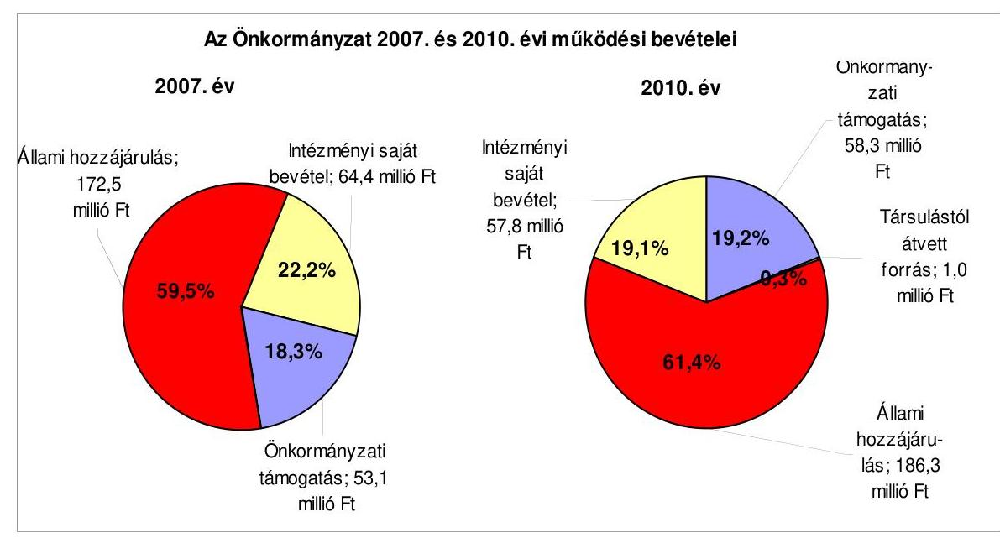
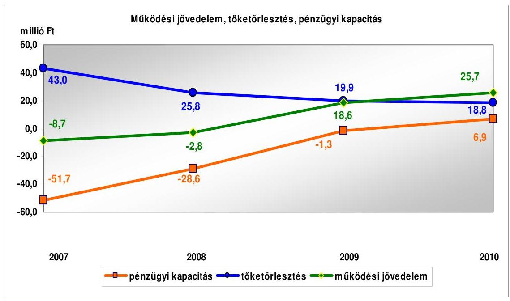
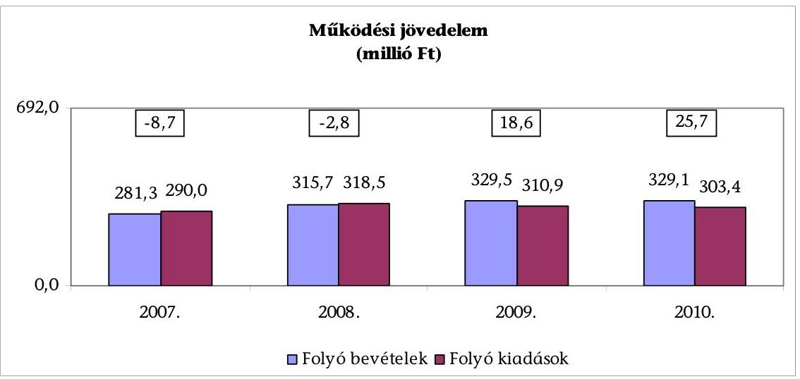
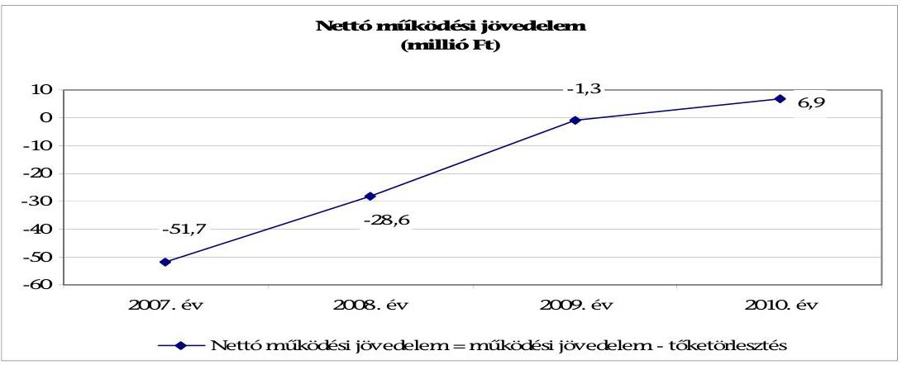
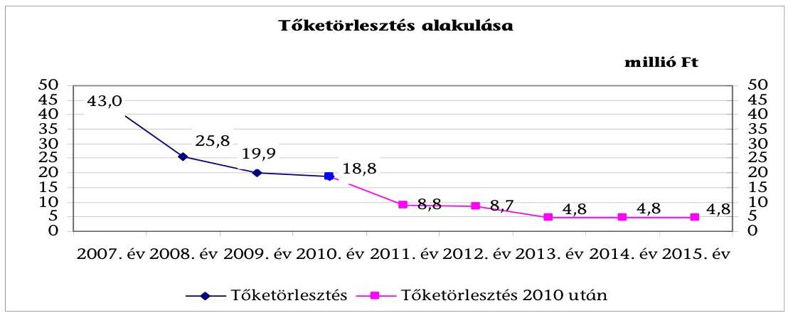
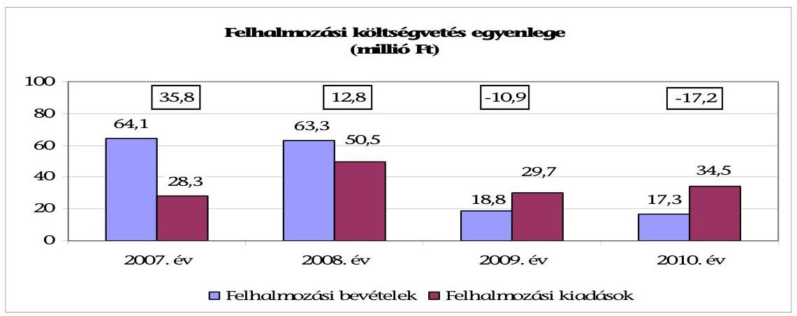
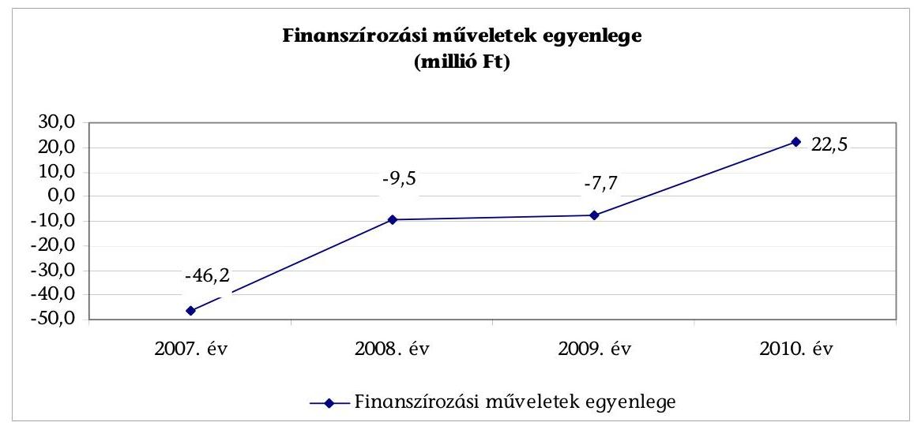
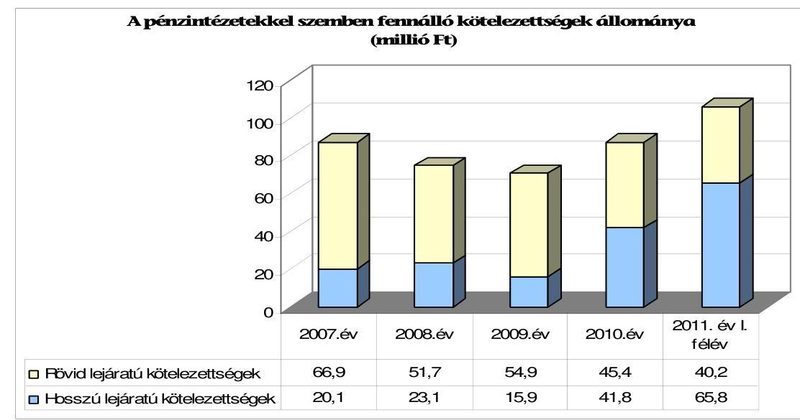
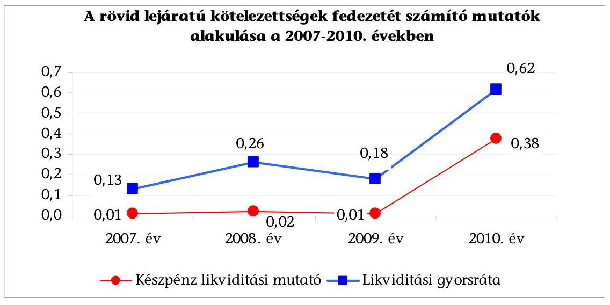
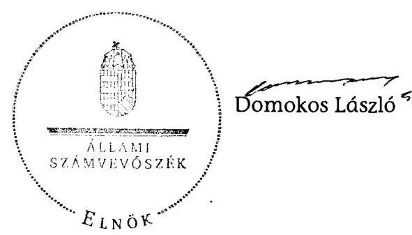

# JELENTÉS 

Vál Község Önkormányzata gazdálkodási rendszerének
2011. évi ellenőrzéséről

---

# Számvevői Iroda 

Iktatószám: V-3064-026/2012.
Témaszám: 1015
Vizsgálat-azonosító szám: V0560007

## Az ellenőrzést felügyelte:

Dr. Varga Sándor
számvevő igazgatóhelyettes
Az ellenőrzést vezette:
Gyüre Lajosné
számvevő tanácsos
Az ellenőrzést végezték:

| Dr. Fónagy Diána | Fejszák Tamás |
| :-- | :-- |
| számvevő tanácsos | számvevő tanácsos |

---

# TARTALOMJEGYZÉK 

BEVEZETÉS ..... 9
I. ÖSSZEGZŐ MEGÁLLAPÍTÁSOK, KÖVETKEZTETÉSEK, JAVASLATOK ..... 14
II. RÉSZLETES MEGÁLLAPÍTÁSOK ..... 29

1. A pénzügyi egyensúly, a fizetőképesség, a gazdálkodás stabilitásának biztosítása, az adósságkezelés eredményessége ..... 29
2. A vagyoni helyzet alakulása, valamint a vagyongazdálkodás folyamataiban a kontrollok működése ..... 43
2.1. Az Önkormányzat vagyoni helyzetének 2007-2010 közötti alakulása ..... 43
2.2. A vagyongazdálkodás belső kontrolljainak működése ..... 45

## MELLÉKLETEK

1. számú Az Önkormányzat gazdálkodását meghatározó adatok, mutatószámok (1 oldal)
2. számú Az Önkormányzat bevételei és kiadásai, valamint adósságszolgálata 2007-2010 között (1 oldal)

---

.

---

# RÖVIDÍTÉSEK JEGYZÉKE 

## Törvények

Áht.
ÁSZ tv.
Eisz. tv.

Ksztv.
Ötv.
Stabilitási tv.
Szav. tv.
új Áht.
új Eisz. tv

## Rendeletek

Áhsz.

Ámr.
Ávr.
közterület-használati rendelet
új Ber.

## Szórövidítések

ÁSZ
Belső Kontroll Kézikönyv

FEUVE
iskola
jegyző ${ }_{1}$
jegyző $_{2}$
jegyző $_{3}$
Képviselő-testület óvoda
Önkormányzat
az államháztartásról szóló 1992. évi XXXVIII. törvény
az Állami Számvevőszékről szóló 2011. évi LXVI. törvény
az elektronikus információszabadságról szóló 2005. évi
XC. törvény
a közhasznú szervezetekről szóló 1997. évi CLVI. törvény
a helyi önkormányzatokról szóló 1990. évi LXV. törvény
Magyarország gazdasági stabilitásáról szóló 2011. évi
CXCIV. törvény
a személyes adatok védelméről szóló 1992. évi LXIII. törvény
az államháztartásról szóló 2011. évi CXCV. törvény
az információs önrendelkezési jogról és az információs
szabadságról szóló 2011. évi CXII. törvény
az államháztartás szervezetei beszámolási és könyvvezetési kötelezettségének sajátosságairól szóló 249/2000. (XII. 24.) Korm. rendelet
az államháztartás működési rendjéről szóló 292/2009. (XII. 19.) Korm. rendelet
az államháztartási törvény végrehajtásáról szóló 368/2011. (XII. 31.) Korm. rendelet
Vál község Önkormányzatának a közterület-használat engedélyezésével kapcsolatos eljárásáról szóló 8/2010. (XII. 14.) számú rendelete
a költségvetési szervek belső kontrollrendszeréről és belső ellenőrzéséről szóló 370/2011. (XII. 31.) Korm. rendelet

Állami Számvevőszék
az államháztartásért felelős miniszter által a 2010. évben
közzétett, a belső kontrollrendszer működtetésére vonatkozó módszertani útmutató
folyamatba épített, előzetes, utólagos és vezetői ellenőrzés
Vajda János Általános Iskola, Vál
Vál Község Önkormányzatának 2011. január 21-ig kinevezett jegyzője
Vál Község Önkormányzatánál a jegyzői feladatok ellátására 2011. január 25-től 2011. július 4-ig kinevezett helyettes jegyző
Vál Község Önkormányzatának 2011. július 4-től kinevezett jegyzője
Vál Község Önkormányzatának Képviselő-testülete
Napköziotthonos Óvoda, Vál
Vál Község Önkormányzata

---

Pénzügyi bizottság
polgármester
Polgármesteri hivatal
Társulás
ügyrend

Vál Község Önkormányzatának Pénzügyi Bizottsága
Vál község Önkormányzatának polgármestere
Vál község Önkormányzatának Polgármesteri Hivatala
Vértes Többcélú Kistérségi Társulás
A Polgármesteri hivatal gazdasági szervezetének 2006. augusztus 1-jétől hatályos ügyrendje

---

# ÉRTELMEZŐ SZÓTÁR 

árfolyamkockázat
bonitás

CLF módszer
eredményesség
finanszírozási célú pénzügyi műveletek
kamatkockázat

A deviza forintban kifejezett árfolyamának változásában rejlő kockázat. Az adott deviza árfolyamváltozása (erősödése vagy gyengülése) miatt a devizahitelek törlesztőrészleteinek mértéke gyakran és jelentős mértékben is változhat. A forint erősödése a törlesztőrészletek csökkenését, a forint gyengülése a törlesztő részletek növekedését vonja maga után.
A bonitás hitelképességet jelent. A bonitást a pénzügyi kapacitás fogalmával írhatjuk le, ami nem más, mint az adósok hitelfelvételi képességének azon mértéke, ahol még anélkül tudják növelni az adósságot, hogy csökkenteniük kellene akár a jelenlegi, akár a jövőben esedékes kiadásaikat fizetőképességük fenntartása érdekében.
Az önkormányzatok költségvetése elemzésének eszköze, a bevételek és kiadások, működés és fejlesztés elkülönítése. Bizonyos mértékig a vállalati gazdálkodás logikai elemeit érvényesíti az önkormányzatok pénzügyi jövedelmi helyzetének vizsgálata során. Következetesen elkülöníti a folyó és a felhalmozási költségvetés bevételeit és kiadásait, azok költségvetési egyenlegeit. A módszer a pénzügyi kapacitás fogalmát helyezi a középpontba.
A kitűzött célok megvalósításának mértéke vagy egy tevékenység kimenete szándékolt és tényleges hatása közötti kapcsolat. Ebben a meghatározásában - kiterjesztve a teljesítmény-ellenőrzés értelmezési tartományára - a hatás az operatív, a specifikus vagy átfogó szinten keletkezett „végterméket" jelenti, amely lehet output, eredmény és hatás egyaránt (ÁSZ Teljesítmény-ellenőrzési módszertan 16. oldal).

Értékpapírok kibocsátása, értékesítése és visszavásárlása; hitelek felvétele és törlesztése; szabad pénzeszközök betétként való elhelyezése és visszavonása (Áht. 8/A. § (3) bekezdés).
Változó kamatozású hiteleknél a kamatkockázat azt jelenti, hogy a hitel futamideje alatt változhat a hitel kamata és így a törlesztőrészlet is. Devizahiteleknél ez azt jelenti, hogy ha az adott deviza irányadó kamata emelkedik, akkor emiatt nőhet a devizahitel kamata is.

---

kezességvállalás

közfeladat
saját vagyon

SNA
visszafizetési kockázat

A kezesség járulékos kötelezettségvállalás, amely lehet egyszerű vagy készfizető, és mindig feltételezi a főkötelezettet. Az egyszerű kezességvállalás esetén a kezes mindaddig megtagadhatja a teljesítést, míg mindazoktól behajtható, akik őt megelőzően vállaltak kötelezettséget. A készfizető kezes nem illeti meg a sortartás kifogása. A fentiek következtében mind a garancia-, mind a kezességvállalás esetében az önkormányzatnak a futamidő teljes időtartama alatt azzal kell számolnia, hogy ha a főkötelezett elmulasztja teljesíteni a fizetést, a vállalt kötelezettséget vele szemben érvényesítik az adott időpontban fennálló összeg erejéig (Ptk. 272.-276. §-ai alapján).
Az állami, helyi, illetve kisebbségi önkormányzati feladat, amelynek ellátásáról az államnak, illetve az önkormányzatoknak kell gondoskodnia. A hatályos szabályozás szerint közfeladatot törvény és önkormányzati rendelet állapíthat meg. Az önkormányzatok által ellátandó feladatok keretszerű meghatározását az Ötv. tartalmazza.
A könyvviteli mérlegben szereplő eszközöknek a kötelezettségekkel csökkentett összege, amellyel azonos a források között szereplő a saját tőke és a tartalékok együttes összege. A saját vagyonhoz tartoznak továbbá a számviteli nyilvántartásban érték nélkül szereplő eszközök.
System of National Account, azaz a Nemzeti Számlák Rendszere, amely a gazdasági szektorok által létrehozott valamennyi terméket és szolgáltatást figyelembe veszi.
Annak a kockázata, hogy a hitelt felvevőnél rendelkezésre állnak-e a visszafizetéshez, a hitel törlesztéséhez szükséges pénzügyi források. A visszafizetési kockázatot növeli a kamat- és árfolyamkockázat növekedése, mivel ezekben az esetekben az adósságszolgálat nőhet. Visszafizetési kockázatot okozhat, ha:

- a hitelfelvételből, kötvénykibocsátásból származó bevétel visszafizetéséhez szükséges forrást a bevétel felhasználási területe nem biztosítja (pl. a megvalósított beruházás működése, üzemeltetése során nem a tervezett eredményességet biztosította, vagy a tervezettnél magasabb a fenntartási költsége, a tervezett kiadási megtakarítást nem biztosítja, a betétbehelyezés alacsonyabb kamatbevételt biztosított, mint amennyi a kötvény kamata);
- a visszafizetésre tervezett forrás elérésének, teljesítésének bizonytalansága (pl. a visszafizetéshez tervezett tartalékolás elmaradt, a tervezettnél alacsonyabb a saját bevétel, a helyi adóból származó bevétel az adóalanyok, adóalapok csökkenése miatt nem teljesül);

---

- a kötelezettségvállaláskor a visszafizetési forrás megjelölésének, tervezésének elmaradása vagy megalapozatlan figyelembevétele.

---

.

---

# JELENTÉS 

## Vál Község Önkormányzata gazdálkodási rendszerének 2011. évi ellenőrzéséről

## BEVEZETÉS

Az Állami Számvevőszék 2011. évben életbe lépett stratégiája szerint „az önkormányzatok ellenőrzése során azok pénzügyi-gazdasági helyzetét értékeli, kockázatait feltárja, valamint az ellenőrzések helyszíneit objektív mutatószámrendszer alapján választja ki". E célkitűzéseknek megfelelően összeállított ellenőrzési program alapján végzi a helyi önkormányzatok gazdálkodási rendszerének ellenőrzését.

## Az ellenőrzés célja az Önkormányzatnál annak értékelése volt, hogy:

- biztosított-e a pénzügyi egyensúly, a fizetőképesség, a gazdálkodás stabilitása, ezeket segítette-e az adósság kezelése;
- a vagyoni helyzet a külső és belső tényezők hatására miként változott, a belső kontrollok megfelelően biztosították-e a vagyongazdálkodás szabályosságát, eredményességét.

Az ellenőrzés típusa: szabályszerűségi ellenőrzés, továbbá az ellenőrzés meghatározott területein teljesítmény-ellenőrzés.

Az ellenőrzött időszak: a pénzügyi, vagyoni helyzettel kapcsolatos elemzéseket, értékeléseket a 2007-2010. évekre vonatkozóan végeztük, valamint lehetőség szerint kitértünk a helyszíni ellenőrzést megelőző utolsó negyedév végéig terjedő időszakra is. A vagyongazdálkodás belső kontrolljainak működésének tesztelése a 2010. évre, valamint a helyszíni ellenőrzést megelőző utolsó negyedév végéig terjedő időszakra vonatkozik.

Az ellenőrzés jogszabályi alapját az Állami Számvevőszékről szóló 2011. évi LXVI. törvény 1. § (3) bekezdése, 5. § (2)-(6) bekezdései és az államháztartásról szóló 1992. évi XXXVIII. törvény 120/A. § (1) bekezdése előírásai képezték.

A ellenőrzés szakmai módszertanát a Legfőbb Ellenőrző Intézmények Nemzetközi Szervezete (INTOSAI) által kiadott nemzetközi standardok (ISSAI) és az Állami Számvevőszék által kiadott „Ellenőrzési Kézikönyv" és „Módszertani útmutató a teljesítmény-ellenőrzéshez" képezte.

Vál község állandó lakosainak száma 2011. január 1-jén 2492 fő volt. A 2010. évi önkormányzati képviselő- és polgármester-választást követően az Önkormányzat hét tagú Képviselő-testületének munkáját kettő állandó bizottság segí-

---

tette. Az ellenőrzött időszakban az Önkormányzatnál hárman látták el a jegyzői feladatokat: a jegyző ${ }_{1}$ 2006. július 15-től 2011. január 25-ig ${ }^{1}$, a jegyző ${ }_{2}$ (Felcsút Község jegyzője) a jegyző ${ }_{3}$ 2011. július 3-ai kinevezéséig a jegyzői feladatok helyettesítés keretében történő ellátására, határozott időre szóló köztisztviselői jogviszonyt létesített a Polgármesteri hivatallal. A jegyzői munkakör átadás-átvételére a személyi változások során nem került sor.

Az Önkormányzat feladatainak végrehajtására a 2007. és 2010. évben is három költségvetési szervet működtetett, amelyekből 2007-ben három volt önállóan gazdálkodó, a 2010. évben kettő volt önállóan működő és gazdálkodó. Az Önkormányzat gazdasági társaságot nem alapított.

Az Önkormányzat könyvviteli mérleg szerinti vagyona a 2007. évi 1410,8 millió Ft-ról a 2010. év végére 1514,7 millió Ft-ra, 7,4%-kal nőtt. A vagyonnövekedést elsősorban az ingatlanberuházások, -felújítások okozták. A 2007. és 2010. évek között a kötelezettségek év végi állománya 126,0 millió Ft-ról 145,9 millió Ft-ra, 15,8%-kal nőtt a szállítói tartozások emelkedése miatt. A Polgármesteri hivatalban dolgozó köztisztviselők száma 2007. január 1-jén 8 fő volt, 2010. december 31-én 9 fő volt. Az Önkormányzatnál foglalkoztatott közalkalmazottak száma a 2007. és 2010. évben is 43 fő volt. Az Önkormányzat gazdálkodását meghatározó adatokat, mutatószámokat az 1. számú melléklet tartalmazza.

A hagyományos költségvetési szerkezet helyett az Önkormányzat pénzügyi helyzetét a CLF módszerrel mutatjuk be, amelyben jobban elkülönülnek a vagyonnal kapcsolatos bevételek és kiadások az önkormányzati feladatokkal kapcsolatos közvetlen működtetési bevételektől és kiadásoktól. A módszer következetesen elkülöníti a folyó és a felhalmozási költségvetés bevételeit és kiadásait, azok költségvetési egyenlegeit. A saját folyó bevételek, valamint a saját felhalmozási bevételek nem tartalmazzák az előző évi pénzmaradványok felhasználásából származó pénzforgalom nélküli bevételeket². A számítási leírás némileg eltér az ÁSZ módszertanában korábban alkalmazott gyakorlattól. A jelen besorolás általános közgazdasági meggondolásokon alapul, amely megjelenik az SNA statisztikai módszertanában is.

A folyó költségvetés egyenlege, a működési jövedelem megmutatja, hogy az önkormányzat éves folyó bevétele fedezetet biztosít-e a kötelező és önként vállalt feladatellátáshoz kapcsolódó éves folyó kiadására. A működési jövedelem negatív értéke pénzügyileg fenntarthatatlan helyzetet jelez. A mutató pozitív értéke megtakarítást mutat, amely forrásul szolgálhat az önkormányzat fennálló kötelezettségei megfizetéséhez, valamint fejlesztéseihez.

[^0]
[^0]:    ${ }^{1}$ A jegyző ${ }_{1}$ 2010. október 5-től köztisztviselői jogviszonyának megszűnéséig betegállományban volt, erre az időszakra a jegyzői feladatok ellátására meghatalmazást adott az adóügyi főelőadó részére.
    ${ }^{2}$ A költségvetési években kialakuló hiány finanszírozása az előző években képzett tartalékok felhasználásával is történhet.

---

A felhalmozási költségvetés pozitív értéke felhalmozási többletet mutat, amely a jövőbeni fejlesztések forrását biztosíthatja. Amennyiben a folyó költségvetési hiány finanszírozása a felhalmozási többletből történik, ez szűkebb értelemben vagyonfelélésnek tekinthető. Amennyiben a felhalmozási költségvetés megtakarítása fejlesztési célú hitelek, kötvények adósságszolgálatát finanszírozza, az változatlan vagyontömeg mellett, a korábban megelőlegezett tőkebevételek valós realizációjának tekinthető. A felhalmozási deficit által generált finanszírozási igény önmagában nem jár pénzügyi kockázattal, a pénzügyileg fenntartható beruházásokhoz kapcsolódó

 kötelezettségvállalás (adósságszolgálat) átlátható, és szabályozott költségvetési gazdálkodással teljesíthető.

A módszer a pénzügyi kapacitás fogalmát helyezi a középpontba. Az adós hitelfelvételi képessége, hosszú távú fizetőképessége vagy bonitása a pénzügyi kapacitással (a nettó működési jövedelemmel) jellemezhető. A nettó működési jövedelem negatív értéke az egyes költségvetési években jelentkező adósságszolgálat túlzott mértékére utal ${ }^{3}$. A nettó működési jövedelem negatív értékének felhalmozási többletből, vagy további hitelből történő finanszírozása pénzügyileg nem fenntartható gazdálkodást vetít előre. A pozitív értéket mutató nettó működési jövedelem fejlesztési kiadások fedezetét biztosíthatja, illetve a folyamatosan, évenként képződő pozitív nettó működési jövedelemből meghatározható a jövőben vállalható, teljesíthető éves adósságszolgálat, ily módon az a hitelösszeg, amely - a többi tényezőt, feltételt adottnak tekintve - visszafizetési kockázat nélkül felvehető.

Folyó tételek alatt értjük azokat a kiadásokat és bevételeket, amelyek a gazdálkodó szervezet helyzetét automatikusan nem változtatják. Bevételi oldalon ilyenek az adók, a tényezőjövedelmek, a transzferek, kiadási oldalon a transzferek ${ }^{4}$ és a szolgáltatásnyújtással kapcsolatos működési kiadások. A folyó költségvetésben a bevételekben nem térül meg, a kiadásokban nem jelenik meg az amortizáció, a vagyoni helyzetet viszont az egyenleg befolyásolja.

A folyó költségvetés egyenlege (működési jövedelem) tartalmazza a kamatkiadásokat is, mind a fejlesztési kamatot, mind a visszatérülő áfa teljes összegét, mert ezek közgazdaságilag tényezőjövedelmek. Nem tartalmazzák viszont a követelés elengedés miatt könyvelt bevételi és kiadási pénzforgalmi tételeket, mert valójában technikai elszámolási műveletnek minősülnek, a bevétel soha nem realizálódott, és költségvetési kiadás sem történt.

A felhalmozási költségvetésben a bevételek között a vagyon megőrzésére és bővítésére fordítható források jelennek meg. A felhalmozási vagy tőketételek módosítják a vagyon nagyságát. A privatizációs bevétel csökkenti a vagyont, a fizikai beruházás, pénzügyi befektetés növeli.

[^0]
[^0]:    ${ }^{3}$ kivéve, ha annak finanszírozására a korábbi években képzett tartalékok fedezetet nyújtanak
    ${ }^{4}$ Transzferkiadásoknak nevezzük azokat a folyó és felhalmozási tételeket, amelyeket nem az adott önkormányzat használ fel szolgáltatásnyújtásra.

---

A nettó működési jövedelmet a tőketörlesztés levonásával a folyó költségvetés egyenlegéből származtatjuk. Az új módszereken alapuló helyzetértékelés fontosságát az adja, hogy a helyi önkormányzatok bruttó adósságállománya ${ }^{5}$ 2007-től vált jelentőssé, az önkormányzati alrendszer 2010. évi költségvetési beszámolójának adatai alapján 1248 milliárd Ft-ot tett ki.

Az Önkormányzat pénzügyi egyensúlyi helyzetének bemutatásán túlmenően értékeltük a pénzügyi egyensúly fenntartását veszélyeztető pénzügyi kockázatokat, azok csökkentésére tett intézkedések hatását. Lényegességi szempontok figyelembevételével értékeltük a döntés-előkészítés, a megtett intézkedések eredményességét és azt, hogy a pénzügyi egyensúly fenntartását mely kockázatok és milyen mértékben veszélyeztették. Az ellenőrzés részletes szempontjai szerinti elvégzéséhez az egységes értelmezés alapját az ellenőrzési program mellékletét képező teljesítmény-ellenőrzési kérdésfa és a kapcsolódóan meghatározott kritériumok, valamint a fogalmak egységes tartalmát meghatározó értelmezési szótár biztosította. Vizsgáltunk minden olyan körülményt és adatot, amely a pénzügyi helyzet alakulására hatást gyakorló releváns tények és folyamatok ellenőrzés céljával összhangban lévő feltárásához szükségessé vált.

A vagyongazdálkodás ellenőrzése kiterjedt a vagyon értékének, összetételének, a 2007-2010. évek közötti időszakban a vagyonváltozást előidéző okok elemzésére. A vagyongazdálkodás belső kontrolljai azonosításának és működésének ellenőrzése keretében a vagyonértékesítés és a vagyonhasznosítás, valamint a finanszírozási célú pénzügyi műveletek folyamatait értékeltük ${ }^{6}$. Felmértük a belső kontrollokban rejlő kockázatot, minősítettük a kontrollok működésének eredményességét ${ }^{7}$, és meghatároztuk, hogy a vagyongazdálkodás folyamatában mely kontrollok nem biztosították a működésbeli hibák megelőzését, feltárását, kijavítását, ezáltal veszélyeztették az eredményes, megfelelő működést.

A vagyongazdálkodási folyamatokban alkalmazott belső kontrollok azonosításának és működésének vizsgálatát többlépcsős megfelelőségi tesztek útján végeztük. A vizsgált területek könyvviteli tételei alapján (meghatározott tételszám felett egyszerű véletlen minta alapján) történt a vagyongazdálkodás kulcsszerepet betöltő belső kontrollja - a kötelezettségvállalás ellenjegyzése, a szakmai teljesítésigazolás és az utalvány ellenjegyzés - működésének a megítélése. Az

[^0]
[^0]:    ${ }^{5}$ A bruttó adósságállomány 2010. év végi összege magában foglalja a fejlesztési és a működési célú kötvénykibocsátások, a beruházási és fejlesztési hitelek, a működési célú hosszú lejáratú hitelek, a rövid lejáratú hitelek, váltótartozások miatti kötelezettségek teljes (2011-ben, illetve az azt követő években esedékes) állományát.
    ${ }^{6}$ A vagyongazdálkodás területén a szabályozottságban rejlő kockázatot alacsonynak minősítettük, ha a szabályozottság megfelelő védelmet nyújtott a vagyongazdálkodással összefüggő hibák bekövetkezése ellen. Közepesnek minősítettük a vagyongazdálkodás szabályozottságában rejlő kockázatot, amennyiben a szabályozottság a lehetséges vagyongazdálkodási hibák többsége ellen védelmet nyújtott. Magasnak értékeltük a vagyongazdálkodás szabályozottságában rejlő kockázatot, ha a szabályok - kialakításuk hiányában, vagy hiányos kialakításuk miatt - nem nyújtottak elegendő védelmet a lehetséges vagyongazdálkodási hibákkal szemben.
    ${ }^{7}$ Az előzetesen meghatározott módszer alapján számított kockázati pontok képezik a kontrollok működésének értékelését, az eredményesség kritériumát.

---

ellenőrzés során alkalmazott módszer - a többlépcsős megfelelőségi teszt alkalmazásának - lényege az volt, hogy a kiválasztott minta ellenőrzését csak addig végeztük, amíg elegendő és megfelelő bizonyítékot nem szereztünk a vizsgált folyamatok kulcskontrolljai ${ }^{8}$ (a kötelezettségvállalás ellenjegyzése, a szakmai teljesítésigazolás és az utalvány ellenjegyzés) működésének megfelelő vagy nem megfelelő voltáról ${ }^{9}$.

Az ellenőrzést a következő, kiemelt kockázatuk alapján kiválasztott bevételekre és kifizetésekre folytattuk le:

- az ingatlanértékesítés bevételeire;
- a bérleti díj bevételeire;
- a bérleti díj kiadásaira;
- a vásárolt közüzemi szolgáltatások kifizetéseire;
- az ingatlanok felújításával kapcsolatos kifizetésekre;
- az államháztartáson kívüli szervezetek részére történő működési célú pénzeszközátadásokra teljesített kifizetésekre.

A helyszíni ellenőrzés során kitöltött - az ellenőrzést végző számvevő és a Polgármesteri hivatal felelős köztisztviselője által aláírt - ellenőrzési munkalapokat, azok kitöltési útmutatóit, továbbá a megfelelőségi tesztek dokumentumait a polgármester részére a számvevői megállapítások egyeztetése során átadtuk.

[^0]
[^0]:    ${ }^{8}$ Kulcskontrollok: azok a kontrollok, amelyek a specifikus eredendő kockázatok mérséklése szempontjából alapvető fontosságúak, és eredményes működésük meghatározó hatással van a kontrollrendszer minőségére. A kulcskontrollok biztosítják más kontrollok (egy vagy több) működési hibájának feltárását, kiküszöbölését; viszonylag könnyen tesztelhetők, folyamatos, következetes és eredményes működésük esetén legalább két, vagy több működési hiba ellen biztosítanak védelmet.
    ${ }^{9}$ A vagyongazdálkodás területén azonosított kontrollok működését kiválónak értékeltük abban az esetben, ha azok működése megfelelt a hibák megelőzésére és kijavítására meghatározott szabályozásnak és a legmagasabb szintű elvárásoknak. Jónak minősítettük a vagyongazdálkodás területén azonosított kontrollok működését, ha a megállapított kisebb (tolerálható mértékű) hiányosságok nem veszélyeztették a vagyongazdálkodás ellenőrzött területei hibáinak megelőzését és kijavítását. Amennyiben a kontrollok működésében túl sok hiányosság fordult elő ahhoz, hogy a kontrollok biztosítsák a vagyongazdálkodási hibák megelőzését, feltárását, kijavítását és ezáltal veszélyeztették az eredményes, megfelelő vagyongazdálkodást, a kontrollok működése gyenge minősítést kapott.

---

# I. ÖSSZEGZŐ MEGÁLLAPÍTÁSOK, KÖVETKEZTETÉSEK, JAVASLATOK 

## A pénzügyi egyensúlyi helyzet értékelése

Az Önkormányzat a 2010. évben 346,4 millió Ft költségvetési bevételből gazdálkodott és 337,9 millió Ft költségvetési kiadást teljesített. A kötelező feladatokra az önkormányzati kimutatások szerint a működési költségvetési kiadások 98,1\%-át, 297,6 millió Ft-ot fordítottak 2010-ben. Az Önkormányzat kötelező feladatait a Polgármesteri hivatalon kívül egy közoktatási és egy gyermekjóléti költségvetési intézményen keresztül látta el a 2010. évben. Az Önkormányzat önként vállalt feladatként végezte az építéshatósági feladatokat önkormányzati társulás keretében, valamint művészetoktatási társulásban vett részt. Az Önkormányzat a 2007-2010. években és a 2011. év I. félévében többször változtatta a közfeladat-ellátás szervezeti kereteit (intézmények integrálása, különválása, társuláshoz való csatlakozás, közétkeztetés kiszervezése), ezek azonban nem befolyásolták a pénzügyi egyensúly alakulását.

A folyó kiadások fedezetéül szolgáló bevételi források a 2007. és a 2010. években jellemző összegeit és megoszlását a következő ábra szemlélteti:

Az Önkormányzatnál 2007-ben és 2008-ban a folyó bevételek nem fedezték a folyó kiadásokat, a folyó költségvetés egyenlege, a működési jövedelem 2007-ben -8,7 millió Ft, 2008-ban -2,8 millió Ft volt. A 2009. és 2010. évek folyó bevételei fedezték a folyó kiadásokat, a működési jövedelem 2009-ben 18,6 millió Ft, 2010-ben 25,7 millió Ft volt. A 2007-2010. évek között keletkezett összesen 32,8 millió Ft működési jövedelem a 2007-2010 között teljesített 107,5 millió Ft tőketörlesztés 30,5\%-ára nyújtott fedezetet. A 2007-2008. évek-

---

ben a felhalmozási költségvetés többletéből finanszírozták a működési jövedelem hiányát, a 2009-2010. években azonban a működési jövedelem biztosította a felhalmozási költségvetés hiányának fedezetét. A finanszírozási műveletek egyenlege - elsősorban a víziközmű hitel törlesztése miatt - a 2007-2009. években negatív, a 2010. évben pedig az útfelújításhoz felvett 33,5 millió Ft összegű hitel miatt pozitív volt.

A 2007. évi folyó és finanszírozási költségvetés hiányát az Önkormányzat - a költségvetési beszámolója szerint - belső forrásból (előző években keletkezett pénzmaradványból) finanszírozta. A 2008-2010. években azonban nem rendelkezett előző évekből származó szabad tartalékkal, így a hiányzó forrásokat hitelek felvételével biztosították.

Az Önkormányzat könyvviteli mérlegében kimutatott - passzív pénzügyi elszámolások nélküli - összes kötelezettség a 2008. évet kivéve folyamatosan nőtt, 2007-ben 103,0 millió Ft, 2008-ban 97,6 millió Ft, 2009-ben 119,4 millió Ft, 2010-ben 131,9 millió Ft volt a szállítói tartozások növekedése miatt. A hosszú lejáratú kötelezettségek 2010. év végi, 45,4 millió Ft-os állománya 23,9 millió Ft-tal, 111,2\%-kal haladta meg a 2007-2009. év végi állományok átlagát az útfelújításhoz felvett 2010. évi 33,5 millió Ft hitel és a hosszú lejáratú víziközmű hitel törlesztése együttes hatására. Az összes rövid lejáratú kötelezettségen belül a pénz- és tőkepiaci kötelezettség 66,9 millió Ft-ról 45,4 millió Ft-ra, részaránya 82,3%-ról 62,5%-ra csökkent 2007-2010 között a víziközmű hitel adott évi törlesztő részleteinek csökkenése miatt. Az év végi szállítói tartozásállomány 2007-2010 között 11,5 millió Ft-ról 27,5 millió Ft-ra emelkedett, amely a rövid lejáratú kötelezettségek 14,1 , illetve 31,9\%-át tette ki. A szállítói tartozásállomány 100\%-a lejárt tartozás volt. A 60 napon túl lejárt szállítói tartozások 23,3 millió Ft-ot, a 90 napon túl lejárt tartozások 20,9 millió Ft-ot tettek ki 2011. június 30-án.

Az Önkormányzat pénzügyi helyzete a fizetőképesség szempontjából kedvezőtlen volt a 2007-2010. években. A rövid lejáratú kötelezettségek fede-

---

zetét jelentő készpénz és egyéb likvid forgóeszközök együttes összege egyik évben sem érte el a rövid lejáratú kötelezettségek értékét. Az Önkormányzat a 2007-2011. év I. félév közötti időszak minden napján rendelkezett folyószámlahitellel. A folyószámlahitel napi átlagos állománya 2007-ben 32,9 millió Ft, 2008-ban 38,5 millió Ft, 2009-ben 36,3 millió Ft, 2010-ben 29,7 millió Ft, a munkabér-megelőlegezési hitel átlagos napi állománya 6,5 és 8,0 millió Ft közötti volt. Az egyes évek végén vissza nem fizetett likvid hitelek (folyószámlahitel, munkabér-megelőlegezési hitel) állománya 2007-ben 39,3 millió Ft, 2008-ban 45,0 millió Ft, 2009-ben 36,1 millió Ft, 2010-ben 37,7 millió Ft volt. A likviditási célú hitelek már nemcsak a kiadások és bevételek ütemkülönbségéből eredő finanszírozási hiány kezelését szolgálták, hanem a pénzügyi hiány tartós finanszírozási forrásává váltak.

Az önkormányzati
 kiadások finanszírozásához a 2007. évtől új adónemként bevezették az építményadót, továbbá végrehajtót bíztak meg az adóhátralékok beszedésével, valamint folyamatosan felszólításokat küldtek ki az adósok részére. Az Önkormányzat kimutatása szerint az új adónem bevezetése 50,0 millió Ft bevételt jelentett, az adóhátralékok behajtásából pedig összesen 9,6 millió Ft realizálódott a 2007-2011. év I. féléve közötti időszakban.

Az Önkormányzat adósságkezelési tevékenysége nem volt eredményes, mert bár a költségvetési egyensúly javítása céljából tett intézkedések a 2007-2010. évek között - az Önkormányzat kimutatása szerint - összesen 48,1 millió Ft bevételnövekedést eredményeztek, azonban a tartós pénzügyi egyensúly megteremtéséhez nem voltak elégségesek. Az Önkormányzat nem rendelkezett a fizetőképességének és eladósodásának kezelését szolgáló stratégiával. A rövid távú likviditás kezelése érdekében a pénzállomány alakulásáról készített likviditási terveket az Ámr. előírása ellenére szükség szerint nem aktualizálták. A döntési hatáskörrel rendelkezőket nem tájékoztatták a hosszú lejáratú, fejlesztési célú hitelfelvételekkel kapcsolatos kockázatokról. Az adósságot keletkeztető kötelezettségvállalásokról szóló döntéseknél nem határozták meg a visszafizetés lehetséges forrásait. Az önkormányzati társulás, önkéntes tűzoltóság, alapítvány hiteleivel kapcsolatos kezességvállalások kockázatait nem vizsgálták. Az adósságot keletkeztető kötelezettségvállalásokból származó bevételből megvalósított fejlesztések kiadásainak megtérülésére vonatkozó számításokat, értékeléseket nem végeztek. A Képviselő-testület nem kapott tájékoztatást az adósságot keletkeztető kötelezettségvállalásokból adódó fizetési kötelezettségek teljesítési feltételeiről. Az adósságot keletkeztető kötelezettségvállalások során - a költségvetési beszámolók teljesítési adatai szerint - nem haladták meg az adósságot keletkeztető kötelezettségvállalások Ötv.-ben előírt felső határát. Az Önkormányzat adósságot keletkeztető kötelezettségvállalásai - Ötv.-ben előírt - felső határát azonban a döntések meghozatala előtt nem vizsgálták.

A 2009. és 2010. években, az Ötv. előírása ellenére a törzsvagyon körébe tartozó Közösségi Ház és községháza épületét ajánlották fel a 2010. évi útfelújítási hitel és a folyószámlahitelek fedezeteként.

A 2011. június 30-án fennálló pénzintézeti kötelezettségek - az Önkormányzat kimutatása szerint - a 2011-2013. években várhatóan 69,8 millió Ft, 2014-től várhatóan 63,4 millió Ft kötelezettséget jelentenek az Önkormányzat számára. A pénzintézeti kötelezettségek mellé járul még a 2011. június 30-án fennálló

---

30,6 millió Ft szállítói tartozásállomány, valamint 5,0 millió Ft tartozás a művészetoktatási társulás felé.

A felhalmozási bevételek és kiadások egyenlege a 2009-2010. években összesen 28,1 millió Ft hiányt mutatott, amelynek fedezetére nem képződött elegendő nettó működési jövedelem, a hiányzó forrást hitelfelvétellel biztosították. A folyamatban lévő felhalmozási feladatok megvalósítása - az Önkormányzat adatszolgáltatása szerint - a 2010. év után 192,4 millió Ft kötelezettséget jelent az Önkormányzat számára. Ezek forrását a megkötött szerződések alapján 51,2%-ban európai uniós, 5,5%-ban hazai támogatás, 24,9%-ban hitel képezi és 18,3%-ban saját forrás.

A 2011. június 30-án fennálló kötelezettségek visszafizetésének fedezetét nem számszerúsítették, a forrásait nem nevesítették. Befolyásolhatja az Önkormányzat pénzügyi helyzetét az Önkormányzat által felvett kölcsönök visszafizetési kötelezettsége mellett a Váli Önkéntes Tűzoltóság által felvett 10 millió Ft-os hitelhez és a Váli Gyermekek Jövője Alapítvány által támogatás megelőlegezésre felvett 25 millió Ft-os hitelhez az Önkormányzat által nyújtott készfizető kezesség, mivel ezek nem teljesítése esetén a készfizető kezesség beváltása az Önkormányzatot terheli.

Az Önkormányzat pénzügyi helyzetét összegezve a következők emelhetők ki:

Az Önkormányzat pénzügyi egyensúlya rövid távon veszélyeztetett. A pénzügyi egyensúlyi helyzet szempontjából kockázatot jelent a növekvő és a 60 és 90 napon túl lejárt szállítói tartozásállomány, a tartósan fennálló likviditási hitelállomány, valamint a 2010. évben és a 2011. év I. félévében felvett fejlesztési hitelek - türelmi időt követően - a 2013. évtől jelentkező tőketörlesztései, továbbá a hitelek kamatterhei. Az Önkormányzat nem rendelkezett a fizetőképességének és eladósodásának kezelését szolgáló stratégiával. A döntési hatáskörrel rendelkezőket nem tájékoztatták a hosszú lejáratú, fejlesztési célú hitelfelvételekkel kapcsolatos kockázatokról. A Képviselő-testület nem kapott tájékoztatást az adósságot keletkeztető kötelezettségvállalásokból adódó fizetési kötelezettségek teljesítési feltételeiről. A 2011. június 30-án fennálló kötelezettségek visszafizetésének fedezetét nem számszerúsítették, a forrásait nem nevesítették. Az adósságot keletkeztető kötelezettségvállalásokból származó bevételből megvalósított fejlesztések kiadásainak megtérülésére vonatkozó számításokat, értékeléseket nem végeztek. Az Önkormányzat által nyújtott készfizető kezességvállalásból eredő fizetési kötelezettség a kötelezettek általi nem teljesítés esetén az Önkormányzatot terheli. Az Önkormányzat nem rendelkezik az előző évekből származó szabad tartalékkal. A 2007-2009. években a folyó bevételek nem nyújtottak fedezetet a folyó kiadásokra és az adósságszolgálat finanszírozására. A folyamatban lévő fejlesztéseikhez saját forrás biztosítására vállaltak kötelezettséget, illetve saját bevétel igénybevételét tervezik.

---

# A belső kontrollok működése a vagyongazdálkodás folyamataiban 

Az Önkormányzat könyvviteli mérleg szerinti vagyona a 2007. év végi 1410,8 millió Ft-ról a 2008. év végére 1482,6 millió Ft-ra, 5,0%-kal (71,8 millió Ft-tal) nőtt a megvalósult és a számviteli nyilvántartásokban aktivált beruházások miatt. A 2008-2009. évek végi 1481,5 millió Ft-os átlagos vagyonnagysághoz képest a 2010. év végére 1514,7 millió Ft-ra, 33,2 millió Ft-tal (2,2%-kal) nőtt az Önkormányzat vagyona a tárgyi eszközök és forgóeszközök növekedése miatt. Folyamatosan, de a 2008. évinél kisebb mértékben nőtt a tárgyi eszközök év végi állománya a 2009. és 2010. években az ingatlanépítések, felújítások miatt (a tárgyi eszközök év végi állománya a 2007. évi 1326,4 millió Ft-ról a 2008. évre 1400,8 millió Ft-ra, 74,4 millió Ft-tal, 5,6%-kal nőtt, míg a 2009. évre 1411,5 millió Ft-ra, az előző évhez képest 10,7 millió Ft-tal, 0,8%-kal, továbbá a 2010. évben 1423,7 millió Ft-ra, az előző évhez képest 12,2 millió Ft-tal, 0,9%-kal nőtt)${ }^{10}$. Az Önkormányzat kimutatása szerint a fejlesztési feladatokra a 2007-2010. években teljesített 133,6 millió Ft kiadás forrását 66,8%-ban saját forrás, 28,5%-ban hazai, 4,5%-ban európai uniós támogatás, valamint 0,2%-át hitel képezte. A forgóeszközök 2007-2009. évek végi átlagos állománya 29,2 millió Ft volt, míg a 2010. év végi állomány 56,6 millió Ft-ra, 93,8%-kal (27,4 millió Ft-tal) nőtt. A forgóeszközök 2010. évi növekedését a pénzeszközállomány hitel miatti emelkedése okozta (a 2007-2009. évek végi 1,3 millió Ft-os átlagos pénzeszközállománnyal szemben a 2010. év végén 32,5 millió Ft volt a pénzeszközállomány). A vagyon összetételében az összvagyon nagyságához viszonyított jelentős változás nem következett be. Az önkormányzati közfeladat-ellátások szervezeti formájának a 2007-2010. évek közötti változásai vagyonváltozást nem eredményeztek. Az eszközök elszámolt értékcsökkenésén (összesen 49,0 millió Ft) felüli összeget fordítottak felújításokra (összesen 62,2 millió Ft) a 2007-2010. években összességében.

A vagyongazdálkodási folyamatok szabályozottságának hiányosságai magas kockázatot jelentettek a feladatok megfelelő végrehajtásában. A Polgármesteri hivatal az Ámr.-ben foglaltak ellenére nem rendelkezett szervezeti és működési szabályzattal. A jegyző$_{1,2,3}$ nem készítette el az Áhsz.-ben előírtak ellenére az eszközök és források leltározási és leltárkészítési szabályzatát, valamint az Ámr.-ben előírtak ellenére az ellenőrzési nyomvonalat, nem határozták meg az Ámr.-ben előírtak ellenére a kockázatok kezelésével kapcsolatos szabályokat és a szabálytalanságok kezelésének eljárásrendjét. A Szav. tv-ben előírtak ellenére a Polgármesteri hivatal nem rendelkezett adatvédelmi és adatbiztonsági szabályzattal, továbbá a céljelleggel nyújtott támogatások és szerződések közzétételének eljárási rendjével. A vagyongazdálkodási rendelethez - az abban foglaltak ellenére - nem kapcsolódtak a mellékletek a forgalomképtelen, a korlátozottan forgalomképes és a forgalomképes vagyontár-

[^0]
[^0]:    ${ }^{10}$ A legjelentősebb fejlesztések a 2008-2010. évek közötti sportpályaépítés (26,9 millió Ft számviteli bekerülési költség), a Kossuth utca 2010. évben megkezdett felújítása (119,4 millió Ft a teljes tervezett számviteli bekerülési költség, ebből a 2010. évben 8,6 millió Ft kiadás realizálódott), valamint az Egészségház 2010-2011. évi építése (a tervezett költség 66,4 millió Ft, ebből 2,4 millió Ft kiadás teljesült 2010-ben) voltak. Emellett útfelújítások, óvodai, iskolai felújítások voltak jellemzőek a 2008-2010. években.

---

gyak tételes felsorolásával, továbbá nem kezdeményezték a Képviselő-testület felé, hogy határozza meg a forgalomképesség megváltoztatása módjára vonatkozó szabályokat.

A jegyző$_{1,2,3}$ a kockázatkezelés rendjének kialakítása keretében az Ámr.-ben, és a Belső Kontroll Kézikönyvben előírtak ellenére nem határozta meg a külső és belső kockázatokat, a kockázatazonosítás és értékelés módját, a csalás, a korrupció kockázatának minősítését, a vagyongazdálkodás főfolyamatára a kockázatokkal kapcsolatos válaszlépéseket, nem rendelkeztek kockázatértékeléssel, a 2011. évre az éves ellenőrzési terv előkészítésekor nem kezdeményezték a vagyongazdálkodás ellenőrzését.

A kontrolltevékenységek meghatározása keretében a Képviselő-testület nem írta elő a vagyongazdálkodási döntések előkészítésének folyamatában a költség-haszonelemzés készítésének kötelezettségét. A jegyző$_{1,2,3}$ a vagyongazdálkodási rendeletben kapott felhatalmazás ellenére nem határozta meg a versenyeztetés eljárásrendjét és a versenyeztetés elvégzésének ellenőrzését, továbbá a vagyongazdálkodással kapcsolatos döntések végrehajtásának szakaszában az Önkormányzat érdekeinek védelmét szolgáló garanciális elemek szerződésben, egyéb dokumentumban való rögzítésének kötelezettségét. A Képviselőtestület nem írt elő a Pénzügyi bizottság részére beszámolási kötelezettséget a vagyonváltozásról és nem határozott meg vizsgálati eljárást a Pénzügyi bizottság részére a hitelfelvétel indokaira és gazdasági megalapozottságára vonatkozóan.

A jegyző$_{1,2,3}$ a finanszírozási célú pénzügyi műveletekkel összefüggésben nem írta elő a pénzügyi kockázatok felmérésének, továbbá a hitelfelvételről szóló döntés-előkészítés folyamatában a futamidő egyes éveit terhelő kötelezettség költségvetési egyensúlyra gyakorolt hatása vizsgálatának kötelezettségét. A jegyző$_{1,2,3}$ nem határozta meg a vagyongazdálkodási folyamatok rögzítésére használt informatikai programok adatai használatára vonatkozó követelményeket. A jegyző$_{1,2,3}$ az Ámr.-ben és az Áht.-ben előírtak ellenére hiányosan alakította ki a Polgármesteri hivatal belső kontrollrendszerét, a FEUVE rendszer működtetéséhez nem írta elő a vezetői ellenőrzési kötelezettséget, nem határozta meg a vagyongazdálkodási folyamatokra vonatkozó ellenőrzési pontokat, az ellenőrzésért felelősöket, a kapcsolattartás módját, a helyettesítés és a felelősség szabályait, valamint a beszámolási kötelezettséget. A Polgármesteri hivatal köztisztviselőinek munkaköri leírásai nem tartalmaztak a vagyongazdálkodással kapcsolatos jogokat, kötelezettségeket, feladatokat, hatás- és felelősségi köröket és beszámolási kötelezettséget. A jegyző$_{1,2,3}$ nem határozta meg a bevételeket megalapozó döntések szerződésben történő felülvizsgálatának feladatai között annak ellenőrzési kötelezettségét, hogy a szerződés tartalmazza-e a döntési hatáskörrel rendelkező által meghatározott feltételeket, hogy a szerződésben az arra hatáskörrel rendelkező vállalt-e kötelezettséget, így ezeknek az ellenőrzési feladatoknak az elvégzésére nem jelölte ki a felelős személyeket. A gazdálkodási, ellenőrzési jogkörök közül az ellenjegyzési jogkörre vonatkozó meghatalmazások során a jegyző$_{1}$ nem biztosította az összeférhetetlenségi követelmények betartását, mert 2010. február 28-a és október 4-e között a jegyző$_{1}$ nem hatalmazott meg helyettest akadályoztatása, illetve összeférhetetlensége eseteire ellenjegyzésre, az ugyanezekre az esetekre vonatkozó 2011. évi meghatalmazások pedig, nem a jegyző$_{1,2}$-től, hanem a polgármestertől származtak.

---

Az információt, kommunikációt, monitoringot érintően a jegyző$_{1,2,3}$ nem határozta meg a vagyongazdálkodás külső és belső információi, a vagyongazdálkodással összefüggő közérdekű (közzéteendő) adatok és a vagyongazdálkodással kapcsolatos iratok kezelésének rendjét. Az Ámr. előírása ellenére nem hozták létre a beszámolási rendszer megbízhatóságához szükséges vezetői információs rendszert, továbbá nem alakították ki, és nem működtették az Önkormányzat tevékenységének, a célok megvalósításának nyomon követését biztosító monitoring rendszert.

A Polgármesteri
 hivatalban a 2010. évben és 2011. év I. félévében a vagyongazdálkodási folyamatokban a kontrollok működése gyenge volt, a kontrollok nem biztosították a vagyongazdálkodás eredményességét.

A kockázatkezelési rendszer működését érintően nem azonosították és értékelték a vagyongazdálkodási feladatok főfolyamatainak kockázatait, nem értékelték a csalás, korrupció kockázatát, előírás hiányában a kockázatokra teendő válaszlépésekről, azok nyomon követéséről nem intézkedtek.

A vagyongazdálkodási folyamatban a belső kontrolltevékenységek működése során nem ellenőrizték a vagyongazdálkodási folyamatokban hozott döntések esetében a hatáskörökre vonatkozó szabályok betartását, az Áhsz. ellenére az ingatlanvagyon és az üzemeltetésre átadott eszközök évenkénti leltározását nem végezték el. A vagyongazdálkodási rendeletben előírt versenyeztetési kötelezettségnek nem tettek eleget, az előírt értékbecslés elkészítéséről nem gondoskodtak. A Pénzügyi bizottság az Ötv. előírása ellenére nem számolt be a Képviselő-testületnek a vagyonváltozás alakulásának figyelemmel kíséréséről. A finanszírozási célú pénzügyi műveletek során a döntés-előkészítés folyamatában nem mérték fel a pénzügyi kockázatokat, nem végezték el a futamidő egyes éveit terhelő kötelezettségvállalásnak a költségvetési egyensúlyra gyakorolt hatásának vizsgálatát. A vagyongazdálkodással összefüggő közérdekű adatok közül - az Áht., valamint az Eisz. tv. előírásai ellenére - a céljellegű működési támogatások adatait és az ötmillió Ft-ot elérő, vagy azt meghaladó értékű árubeszerzésre, építési beruházásra, szolgáltatás megrendelésére vonatkozó szerződések adatait az Önkormányzat honlapján nem tették közzé.

A vezetői ellenőrzés keretében nem számoltatták be a vagyongazdálkodási feladatokat végzőket a vagyonértékesítés, vagyonhasznosítás folyamatairól, annak eredményéről, a finanszírozási célú pénzügyi műveletek végrehajtásának folyamatáról és a végrehajtás eredményéről. A vagyongazdálkodási folyamatoknál (ingatlanok adásvétele, bérbeadása, bérbevétele) a szükséges ellenőrzési pontokon - a döntések előkészítése során, a szerződések aláírását, a bevételek beszedését és a kiadások teljesítését megelőzően - nem végeztek ellenőrzéseket. A munkaköri leírásokban nem rögzítették a vagyongazdálkodási feladatokat az ilyen tevékenységet ellátó köztisztviselők részére, akik az elvégzett feladatokról nem számoltak be.

A Polgármesteri hivatalban a 2010. évben és 2011. év első félévében az ingatlanok értékesítéséből és az ingatlanok bérbeadásából származó bevételek, valamint a közszolgáltatással, bérleti díjkiadással, nonprofit szervezetek működési célú támogatásával, felújítással kapcsolatos kifizetések során a kulcsszerepet betöltő belső kontrollok működése gyenge volt, a kontrollok nem biztosították a vagyongazdálkodás eredményességét.

A bevételeket megalapozó szerződések ellenőrzését végző személyek kijelölésének hiányában nem ellenőrizték, hogy az ingatlanok értékesítéséből és bérbeadásából származó bevételek alapjául szolgáló szerződések a Képviselőtestület által meghatározott feltételeknek megfelelnek-e, továbbá, hogy az Önkormányzat tulajdonosi jogait, érdekeit védő garanciális elemek a szerződésben szerepelnek-e. Az ellenőrzés elmulasztásának következményeként a 642/2 hrsz-ú ingatlan elidegenítésekor nem észrevételezték, hogy az adásvételi szerződés aláírását megelőzően nem folytatták le a vagyongazdálkodási rendeletben előírt pályáztatási eljárást és nem készítettek értékbecslést, továbbá, hogy a közterület-használati díjak nem a közterület-használati rendeletben meghatározott feltételek szerint kerültek megfizetésre. Az utalványok ellenjegyzésére jogosult az ingatlanértékesítésből eredő bevétel beszedését megelőzően az utalvány ellenjegyzését nem végezte el, így nem látta el az Ámr.-ben előírt ellenőrzési feladatokat, nem vizsgálta, hogy az ügyrendben a bevételek elszámolását megelőzően előírt szakmai teljesítésigazolás megtörtént-e, valamint elmaradt annak ellenőrzése, hogy a szerződésben a Képviselő-testület által meghatározott ingatlanértékesítési bevétel szerepel-e, továbbá a vagyongazdálkodási rendeletben foglalt versenyeztetésre, nyilvános pályáztatásra és értékbecslés készítésére vonatkozó szabályokat betartották-e. Nem ellenőrizték, hogy az érvényesítés megtörtént-e, illetve az utalvány ellenjegyzője aláírása ellenére nem kifogásolta, hogy a bevételek elszámolását megelőzően az ügyrendben előírt szakmai teljesítésigazolás, továbbá a kötelezettségvállalások ellenjegyzése nem történt meg.

A bérleti díjra, felújításra, nonprofit szervezetek támogatására, vásárolt közszolgáltatásokra teljesített kiadásokkal kapcsolatos kötelezettségvállalást - az Áht. és az Ámr. előírásai ellenére - 1,3 millió Ft összegben nem foglalták írásba, illetve az írásba foglalt kötelezettségvállalásokat nem előzte meg azok ellenjegyzése, így az Ámr.-ben foglaltak ellenére nem ellenőrizték a kiadási előirányzat rendelkezésre állását, a fedezet meglétét, és nem vizsgálták, hogy a kötelezettségvállalás sérti-e a gazdálkodásra vonatkozó szabályokat. A szakmai teljesítés igazolását Ámr. előírása ellenére a kiadások teljesítését megelőzően nem, illetve nem az ügyrendben foglalt előírásnak megfelelően végezték el, ezért a kifizetés jogosságának, összegszerűségének, és a szerződésszerű teljesítésnek az ellenőrzése elmaradt. Az utalványok ellenjegyzésére jogosult az Ámr.-ben foglaltak ellenére ellenjegyzési feladatának nem tett eleget, így nem kifogásolta, hogy a kötelezettségvállalások írásba foglalása, a kötelezettségvállalások ellenjegyzése, a szakmai teljesítésigazolás és az érvényesítés nem történt meg.

Az Állami Számvevőszékről szóló 2011. évi LXVI. törvény 33. § (1) bekezdésében foglaltak értelmében a jelentésben foglalt megállapításokhoz kapcsolódó intézkedési tervet köteles az ellenőrzött szervezet vezetője összeállítani és azt a jelentés kézhezvételétől számított harminc napon belül az ÁSZ részére megküldeni. Amennyiben az intézkedési tervet határidőben nem küldi meg a szervezet, vagy az továbbra sem elfogadható, az ÁSZ elnöke a hivatkozott törvény 33. § (3) bekezdés a)-b) pontjaiban foglaltakat érvényesítheti.

---

# Az ellenőrzés intézkedést igénylő megállapításai és javaslatai: 

## a polgármesternek

1. A pénzügyi egyensúlyi helyzet szempontjából kockázatot jelent a növekvő szállítói tartozásállomány, a tartósan fennálló likviditási hitelállomány, valamint a felvett fejlesztési hitelek adósságszolgálata. Az Önkormányzat nem rendelkezett a fizetőképességének és eladósodásának kezelését szolgáló stratégiával. A döntési hatáskörrel rendelkezőket nem tájékoztatták a hosszú lejáratú, fejlesztési célú hitelfelvételekkel és a kezességvállalásokkal kapcsolatos kockázatokról, az adósságot keletkeztető kötelezettségvállalásokból adódó fizetési kötelezettségek teljesítési feltételeiről. A 2011. június 30-án fennálló kötelezettségek visszafizetésének fedezetét nem számszerúsítették, a forrásait nem nevesítették. A korábbi években képzett tartalékkal nem rendelkeznek. A 2007-2009. években a folyó bevételek nem nyújtottak fedezetet a folyó kiadásokra és az adósságszolgálat finanszírozására. A folyamatban lévő fejlesztéseikhez saját forrás biztosítására vállaltak kötelezettséget.

Javaslat
a) Terjesszen a Képviselő-testület elé reorganizációs programot a kedvezőtlen pénzügyi folyamatok megállítására, a pénzügyi helyzet gyors stabilizálására, és hosszú távú fenntarthatóságára, amely tartalmazza különösen:
aa) a kiadások mérséklésére, a kiadások folyamatos kontrolljára, a bevételek növelésére, a kintlévőségek behajtására vonatkozó intézkedéseket;
ab) a likviditás menedzselésének racionalizálását;
ac) a lehetséges megtakarításokból származó források tartalékba helyezésének kötelezettségét;
b) Mutassa be a Képviselő-testületnek havonta a fél éven belül esedékes kötelezettségeinek finanszírozási forrásait napra lebontott likviditási tervvel alátámasztottan;
c) Mutassa be az adósságot keletkeztető kötelezettségvállalásról szóló döntéskor a Képviselő-testületnek a jövőben várható - árfolyam-, kamat- és törlesztési - kockázatot, kezességvállalásnál annak pénzügyi kockázatait;
d) Tegyen intézkedést arra, hogy a jövőben az adósságot keletkeztető kötelezettségvállalásokról szóló képviselő-testületi előterjesztések tételesen tartalmazzák a visszafizetés forrásait. Tájékoztassa a Képviselő-testületet az adósságot keletkeztető kötelezettségvállalásokból adódó fizetési kötelezettségek teljesítési feltételeiről;
e) Intézkedjen az Önkormányzat lejárt szállítói állományának pénzügyi rendezéséről, a szállítói függőség és a jogszabályi következmények elkerülése érdekében.
2. Az Önkormányzatnál a közszolgáltatásokra, az ingatlanok felújítására, a bérleti díjkifizetésekre, a nonprofit szervezeteknek nyújtott céljellegű működési támogatásokra teljesített kiadásokkal kapcsolatos kötelezettségvállalásokat az Áht. 100/C. § (3) bekezdésében és az Ámr. 74. § (1) bekezdésében foglalt előírás ellenére nem minden esetben foglalták írásba, illetve az írásba foglalt kötelezettségvállalásokat nem előzte meg azok ellenjegyzése.

Javaslat
Biztosítsa, hogy az új Áht. 37. § (1) bekezdése és az Ávr. 52. § (1) bekezdés c) pontja alapján minden esetben írásban, pénzügyi ellenjegyzést követően történjen meg a kötelezettségvállalás, ezáltal biztosítsa az Ötv. 90. § (1) bekezdése alapján az önkormányzati vagyongazdálkodási feladatok esetében a szabályszerű gazdálkodást.
3. A kötelezettségvállalás ellenjegyzőjének akadályoztatása esetére szóló meghatalmazásokat az Ámr. 74. § (2) bekezdésében foglalt előírás ellenére a 2011. évben nem az arra jogosult jegyző, hanem a polgármester adta ki.

Javaslat
Tartsa be az Ávr. 55. § (2) bekezdés f) pontjában foglaltakat.
4. A Pénzügyi bizottság nem tett eleget a Képviselő-testület felé az Ötv. 92. § (13) bekezdés b) pontjában és (14) bekezdésében foglalt kötelezettségének, mert a vagyonváltozás alakulását nem kísérte figyelemmel. A Képviselő-testületet nem tájékoztatták az adósságot keletkeztető kötelezettségvállalásokkal kapcsolatos kockázatokról.

Javaslat
a) Kezdeményezze, hogy a Pénzügyi bizottság az Ötv. 92. § (13) bekezdés b) pontjában és (14) bekezdésében előírt kötelezettségének tegyen eleget a Képviselőtestület felé, és kísérje figyelemmel az Önkormányzat vagyonváltozásának alakulását.
b) Tájékoztassa a Képviselő-testületet az adósságot keletkeztető kötelezettségvállalásokkal kapcsolatos kockázatokról a döntéseket megelőzően.
5. A Képviselő-testület nem határozott meg vizsgálati eljárást a Pénzügyi bizottság részére a hitelfelvétel indokaira és gazdasági megalapozottságára vonatkozóan.

Javaslat
Kezdeményezze, hogy a Képviselő-testület határozzon meg vizsgálati eljárást a Pénzügyi bizottság részére a hitelfelvétel indokaira és gazdasági megalapozottságára vonatkozóan.
6. A Képviselő-testület nem írta elő a vagyongazdálkodásról szóló döntések előkészítésének folyamatában a költség-haszon elemzés készítésének kötelezettségét.

Javaslat
Kezdeményezze, hogy a Képviselő-testület írja elő a vagyonértékesítéssel és hasznosítással kapcsolatban, a döntés-előkészítés folyamatában a költség-haszon elemzés készítésének kötelezettségét.

---

7. A vagyongazdálkodási rendelethez - az abban foglaltak ellenére - nem kapcsolódtak mellékletek a forgalomképtelen, a korlátozottan forgalomképes és a forgalomképes vagyontárgyak tételes felsorolásával, továbbá nem tartalmazza a forgalomképesség megváltoztatása módjára vonatkozó szabályokat. A 2009. és 2010. években, az Ötv. 88. § (1) bekezdés b) pontja előírása ellenére a törzsvagyon körébe tartozó korlátozottan forgalomképes vagyontárgyakat ajánlottak fel a hitelek fedezeteként.

Javaslat
a) Kezdeményezze a vagyongazdálkodási rendelet mellékleteinek elkészítését az ingatlanok forgalomképesség szerinti besorolásával összhangban a számviteli nyilvántartásokkal, továbbá a forgalomképesség megváltoztatásának módjára vonatkozó előírásokkal.
b) Kezdeményezze a nemzeti vagyonról szóló 2011. évi CXCVI. tv. 3. § (1) bekezdés 6. pontja alapján a vagyongazdálkodási rendeletben a korlátozottan forgalomképes törzsvagyonnal való rendelkezés feltételeinek meghatározását. ${ }^{11}$

# a jegyzőnek 

1. Az Önkormányzat adósságot keletkeztető kötelezettségvállalásai - Ötv. 88. § (2) bekezdésében előírt - felső határát a döntés meghozatala előtt nem vizsgálták.

Javaslat
Vizsgáltassa meg minden adósságot keletkeztető ügylet esetében a Stabilitási tv. 10. § (3) bekezdésében foglalt előírás betartása érdekében, hogy a tárgyévi összes fizetési kötelezettség ne haladja meg az Önkormányzat adott évi saját bevételeinek 50%-át.
2. A rövid távú likviditás kezelése érdekében a pénzállomány alakulásáról készített likviditási terveket az Ámr. 201. § (1) bekezdésében foglaltak ellenére szükség szerint nem aktualizálták.

Javaslat
Aktualizálja a pénzállomány alakulásáról készített likviditási terveket az Ávr. 122. § (2)-(3) bekezdéseiben foglaltaknak megfelelően a rövid távú likviditás kezelése érdekében.
3. A Polgármesteri hivatal az Ámr. 20. § (1) és (2) bekezdéseiben foglaltak ellenére nem rendelkezett szervezeti és működési szabályzattal. Az Ámr. 157. §-ában előírtak, valamint a Belső Kontroll Kézikönyv 2. pontjában foglalt előírások ellenére nem határozták meg a kockázatok kezelésével kapcsolatos szabályokat. Nem készítették el az Áhsz. 8. § (4) bekezdés a) pontjában előírtak ellenére az eszközök és források leltározási és leltárkészítési szabályzatát és az Áhsz. 37. § (1) és (3) bekezdései ellenére az ingatlanvagyon és az üzemeltetésre átadott eszközök évenkénti leltározását nem végezték el. Az

[^0]
[^0]:    ${ }^{11}$ Felhívjuk a figyelmet arra, hogy az ellenőrzéssel érintett időszakot követően, 2012. március 31-én hatályba lépett az egyes közpénzügyi tárgyú törvényeknek az államháztartás önkormányzati alrendszerét érintő módosításáról, és azok más törvényekkel való összhangjának biztosításáról szóló 2012. évi XVII. törvény, amely módosítja az új Áht. 84. § (4) bekezdését. A jogszabály változását a javaslat végrehajtása során figyelembe kell venni.

---
 Ámr. 156. § (2)-(3) bekezdéseiben előírtak ellenére nem készítették el az ellenőrzési nyomvonalat és a szabálytalanságok kezelésének eljárásrendjét. A Polgármesteri hivatal a Szav. tv. 31/A. § (2) bekezdés d) pontjában foglaltak ellenére nem rendelkezett adatvédelmi és adatbiztonsági szabályzattal. Nem határozták meg a bevételeket megalapozó döntések szerződésben történő felülvizsgálatának feladatai között annak ellenőrzési kötelezettségét, hogy a szerződés tartalmazza-e a döntési hatáskörrel rendelkező által meghatározott feltételeket, hogy a szerződésben az arra hatáskörrel rendelkező vállalt-e kötelezettséget, ezeknek az ellenőrzési feladatoknak az elvégzésére nem jelölte ki a felelős személyeket. A vagyongazdálkodási rendeletben kapott felhatalmazás ellenére a jegyző ${ }_{1,2,3}$ nem határozta meg a versenyeztetés eljárásrendjét és a versenyeztetés elvégzésének ellenőrzését.

Javaslat
a) Kezdeményezze a Polgármesteri hivatal szervezeti és működési szabályzatának elkészítését Ávr. 13. § (1) bekezdésének előírása alapján, figyelemmel a vagyongazdálkodási feladatokat ellátók feladataira is.
b) Alakítsa ki az új Ber. 7. §-ában, valamint a Belső Kontroll Kézikönyv 2. pontjában foglalt előírásoknak megfelelően a Polgármesteri hivatal kockázatok kezelésével kapcsolatos szabályait és kezdeményezze, hogy a Társulás az éves ellenőrzési tervében szerepeltesse a vagyongazdálkodáshoz kapcsolódó magas kockázatúnak értékelt területek ellenőrzését.
c) Készítse el az Áhsz 8. § (4) bekezdés a) pontjában előírtak alapján az eszközök és források leltározási és leltárkészítési szabályzatát és az Áhsz. 37. § (1) és (3) bekezdéseiben foglaltaknak megfelelően az ingatlanvagyon és az üzemeltetésre átadott eszközök évenkénti leltározását végeztesse el.
d) Készítse el az új Ber. 6. § (3)-(4) bekezdéseiben előírtaknak eleget téve az ellenőrzési nyomvonalat és a szabálytalanságok kezelésének eljárásrendjét.
e) A vagyongazdálkodási rendelet végrehajtása érdekében határozza meg a versenyeztetési eljárás rendjét és gondoskodjon a versenyeztetés elvégzésének ellenőrzéséről.
f) Készíttesse el a Polgármesteri hivatal adatvédelmi és adatbiztonsági szabályzatát, az új Eisz. tv. 24. § (2) bekezdés d) pontjában foglaltak betartása érdekében. Belső szabályzatban határozza meg a folyamatok dokumentálásának, az iratok kezelésének rendjét, az informatikai programok adatai használatára vonatkozó követelményeket.
g) Határozza meg a vagyongazdálkodással kapcsolatban kötött szerződésre vonatkozóan annak ellenőrzési kötelezettségét, hogy az tartalmazza-e a döntési hatáskörrel rendelkező által meghatározott feltételeket (ellenérték, fizetési feltételek, nem teljesítés esetén szankció), a szerződésben az arra hatáskörrel rendelkező személy vállalt-e kötelezettséget és jelölje ki a bevételeket megalapozó dönté-

---

sekben meghatározott feltételek szerződésben történő rögzítésének az ellenőrzéséért felelős személyeket.
4. Az Áht. 121/A. § (1) és (4) bekezdésében és az Ámr. 155. § (1) bekezdésében előírtak ellenére hiányosan alakították ki a Polgármesteri hivatal belső kontrollrendszerét, a FEUVE rendszer működtetéséhez nem írtak elő vezetői ellenőrzési kötelezettséget, nem határozták meg a vagyongazdálkodási folyamatokra vonatkozó ellenőrzési pontokat, az ellenőrzésért felelősöket, a kapcsolattartás módját, a helyettesítés és felelősség szabályait, és a beszámolási kötelezettséget.

Javaslat
Alakítsa ki és működtesse az új Áht. 69. § (2) bekezdésében, valamint az új Ber. 8. § (2) bekezdésében foglaltak alapján a Polgármesteri hivatal belső kontrollrendszerét, ennek keretében a folyamatba épített előzetes, utólagos és vezetői ellenőrzést.
5. Az Ámr. 159. § előírása ellenére nem hozták létre a beszámolási rendszer megbízhatóságához szükséges vezetői információs rendszert.

Javaslat
Alakítsa ki és működtesse a beszámolási rendszerek megbízhatósága érdekében a vezetői információs rendszert az új Ber. 9. § (1)-(2) bekezdései előírásának megfelelően.
6. Az Ámr. 160. §-ában előírtak ellenére nem alakították ki, és nem működtették az Önkormányzat tevékenységének, a célok megvalósításának nyomon követését biztosító monitoring rendszert.

Javaslat
Alakítsa ki és működtesse az új Ber. 10. §-ában előírtak alapján az Önkormányzat tevékenységének, a célok megvalósításának nyomon követését biztosító monitoring rendszert.
7. Az Önkormányzatnál a közszolgáltatásokra, az ingatlanok felújítására, a bérleti díjkifizetésekre, a nonprofit szervezeteknek nyújtott céljellegű működési támogatásokra teljesített kiadások kifizetését megelőzően a szakmai teljesítésigazolását az Ámr. 76. §-ának előírása ellenére nem végezték el, illetve nem az ügyrendben foglalt előírásnak megfelelően végezték. Az utalványok ellenjegyzésére jogosult az Ámr. 79. §-ában foglaltak ellenére ellenjegyzési feladatának nem tett eleget az ingatlanértékesítésekből származó bevételek beszedését, illetve a közszolgáltatásokra, az ingatlanok felújítására, a bérleti díjkifizetésekre, a nonprofit szervezeteknek nyújtott céljellegű működési támogatásokra teljesített kiadások kifizetését megelőzően, így nem kifogásolta, hogy a kötelezettségvállalások írásba foglalása, a kötelezettségvállalások ellenjegyzése, a szakmai teljesítésigazolás és az érvényesítés nem történt meg.

---

Javaslat
a) Biztosítsa, hogy a szakmai teljesítésigazolására kijelölt személy az Ávr. 57. § (1)(2) bekezdéseiben előírt ellenőrzési kötelezettségének az ügyrendben előírt módon tegyen eleget.
b) Intézkedjen arra, hogy az érvényesítő az Ávr. 58. § (2) bekezdésben előírt kötelezettségének eleget téve az utalványozónak jelezze, ha az Ávr. 58. § (1) bekezdésében előírt ellenőrzési feladatai során a jogszabályok, szabályzatok megsértését tapasztalja.
c) Kezdeményezze az éves ellenőrzési terv módosítását annak érdekében, hogy a belső ellenőrzés teljes körűen végezze el a belső kontrollok működésének értékelését a 2007-2011. év I. féléve közötti időszakra vonatkozóan. A belső ellenőrzés terjedjen ki az ingatlanértékesítés és az ingatlan bérbeadás bevételeire, valamint a közszolgáltatások, ingatlan-felújítások, bérleti díjak, és az államháztartáson kívüli nonprofit szervezetek részére történő működési célú pénzeszközátadások kifizetéseire annak tekintetében, hogy a kijelölt, illetve felhatalmazott személyek kiemelten a szerződések ellenőrzésére kijelölt személy, a kötelezettségvállalások ellenjegyzője, az utalványok ellenjegyzője és a szakmai teljesítések igazolója - valamennyi bevétel és kiadás esetében elvégezték-e a jogszabályokban előírt ellenőrzési feladataikat. A belső ellenőrzés terjedjen ki továbbá arra, hogy a forgalomképes ingatlanvagyon értékesítése és hasznosítása során betartották-e a gazdálkodásra vonatkozó (pl. versenyeztetés) szabályokat.
8. A vagyongazdálkodással összefüggő közérdekű adatok közül - az Áht. 15/A. § (1) és 15/B. § (1) bekezdéseiben, valamint az Eisz. tv. 3. § (1)-(2) bekezdésében foglalt előírások ellenére - a céljellegű működési támogatások adatait és a nettó ötmillió Ft-ot elérő, vagy azt meghaladó értékű árubeszerzésre, építési beruházásra, szolgáltatás megrendelésére vonatkozó szerződések adatait az Önkormányzat honlapján nem tették közzé.

Javaslat
Intézkedjen, hogy a céljellegű működési támogatások kedvezményezettjeinek nevére, a támogatás céljára, összegére, a támogatási program megvalósítási helyére vonatkozó adatokat, valamint az Önkormányzat pénzeszközei felhasználásával, a vagyonnal történő gazdálkodással összefüggő, nettó ötmillió Ft-ot elérő, vagy azt meghaladó értékű építési beruházásra, árubeszerzésre, szolgáltatás megrendelésére vonatkozó szerződések esetében a szerződés megnevezésének, tárgyának, a szerződést kötő felek nevének, a szerződés értékének adatait, valamint az említett adatok változásait az új Eisz. tv. 32. és 33. §-aiban és 37. § (1) bekezdésében foglaltak szerint Önkormányzat honlapján tegyék közzé.
9. A vagyongazdálkodási feladatokat ellátó köztisztviselők munkaköri leírásai nem tartalmazták a vagyongazdálkodással kapcsolatos jogokat, kötelezettségeket, feladatokat, hatásköröket és a beszámolási kötelezettséget.

---

Javaslat
Egészítse ki és aktualizálja a vagyongazdálkodás területén dolgozó köztisztviselők munkaköri leírásait, hogy azok tartalmazzák a vagyongazdálkodással kapcsolatos jogokat, kötelezettségeket, feladatokat, hatásköröket, felelősséget és beszámolási kötelezettséget, és vezetői ellenőrzés keretében számoltassa be őket a feladatellátásról.
10. Nem írták elő a hitelfelvételről szóló döntés-előkészítés folyamatában a futamidő egyes éveit terhelő kötelezettség költségvetési egyensúlyra gyakorolt hatása vizsgálatának kötelezettségét.

Javaslat
Írja elő a hitelfelvételről szóló döntés-előkészítés folyamatában a futamidő egyes éveit terhelő kötelezettség költségvetési egyensúlyra gyakorolt hatása vizsgálatának kötelezettségét, valamint gondoskodjon ezek elvégzéséről.
11. Nem határozták meg a vagyongazdálkodás külső és belső információi, a vagyongazdálkodással összefüggő közérdekű (közzétételre kerülő) adatok és a vagyongazdálkodással kapcsolatos iratok kezelésének rendjét.

Javaslat
Határozza meg a vagyongazdálkodás külső és belső információi kezelésének rendjét, a vagyongazdálkodással összefüggő közérdekű, közzétételre kerülő adatok kezelésének és közzétételének eljárási rendjét és a vagyongazdálkodással kapcsolatos iratok kezelésének rendjét.

---

# II. RÉSZLETES MEGÁLLAPÍTÁSOK 

## 1. A PÉNZÜGYI EGYENSÚLY, A FIZETŐKÉPESSÉG, A GAZDÁLKODÁS STABILITÁSÁNAK BIZTOSÍTÁSA, AZ ADÓSSÁGKEZELÉS EREDMÉNYESSÉGE

Az Önkormányzat az éves költségvetési beszámolója szerint a 2010. évben 346,4 millió Ft költségvetési bevételt ért el és 337,9 millió Ft költségvetési kiadást teljesített.

Az Önkormányzat kötelező feladatait a Polgármesteri hivatalon kívül egy közoktatási és egy gyermekjóléti költségvetési intézményen keresztül látta el a 2010. évben. Társulási formában látta el a logopédia, a gyógytestnevelés, a pedagógiai szakszolgálat és a belső ellenőrzés feladatait, valamint a hulladékgazdálkodást ${ }^{12}$. Kajászó Község Önkormányzatával közoktatási intézményfenntartó társulásban vett részt 2009-ig. A családsegítést és gyermekjóléti szolgálat működését 2007-2008 között ${ }^{13}$, valamint 2009-től társulásban végezte ${ }^{14}$.

Az Önkormányzat közfeladatai szervezeti formájának változtatásáról a 2007., 2008., 2009. és 2011. években is döntött. A 2007. évben az addig a Polgármesteri hivatalhoz tartozó részben önállóan gazdálkodó iskolát és óvodát önállóan gazdálkodóvá tették. A 2008. évben az iskola és óvoda integrálásával létrehozták az Általános Művelődési Központot, amely a közoktatási feladatok mellett végezte a közművelődési feladatokat, valamint a családsegítő és gyermekjóléti szolgálat működtetését is. A 2008. évben kiszervezték a közétkeztetést ${ }^{15}$. A 2009. évben önállóan működő intézményként létrehozták a Családsegítő és Gyermekjóléti Szolgálatot, amelyet társulás keretében az Önkormányzat gesztorságával működtettek ${ }^{16}$. A 2011. évben ${ }^{17}$ az Általános Művelődési Központ különválással való megszüntetését és egyben az iskola, óvoda intézmények alapítását határozták el 2011. augusztus 1-jei határidővel. Az önként vállalt feladatok és azok megoldási, szervezeti formája nem változott a 2007-2011. év I. félév között.

[^0]
[^0]:    ${ }^{12}$ Közép-Duna Vidéke Hulladékgazdálkodási Önkormányzati Társulás. A társulási megállapodás alapján a társulás pénzügyi, gazdasági feladatait Polgárdi Város Önkormányzata látja el.
    ${ }^{13}$ Etyek Község Önkormányzatával közös társulásban látta el a feladatot 2008-ig.
    ${ }^{14}$ Óbarok és Tabajd községek önkormányzataival közösen vett részt az intézményfenntartó társulásban 2009-től.
    ${ }^{15}$ Az 51/2008. (III. 27.) számú képviselő-testületi határozattal megszüntették a Váli Vajda János Általános Iskola által üzemeltetett közösségi konyhát, ugyanakkor 2008. május 1-jétől kezdődően a főzőkonyha működtetésére gazdasági társaság részére adtak megbízást.
    ${ }^{16}$ Ezzel feladatokat vett át Óbarok és Tabajd Községek Önkormányzataitól.
    ${ }^{17}$ 81/2011. (V.12.) számú képviselő-testületi határozat

---

Az önkormányzati feladatok ellátására fordított 2010. évi működési kiadásokat és azok forrásait ágazatonként a következő táblázat mutatja:

| Ellátott feladat | Működési kiadás 2010. év (millió Ftban) | Kötelező feladat részaránya (\%) | Kiadások forrása (\%-ban) |  |  |  |
| :--: | :--: | :--: | :--: | :--: | :--: | :--: |
|  |  |  | Állami hozzájárulás | Saját intézményi bevétel | Önkormányzati támogatás | Társulás esetén a társult önkormányzattól átvett támogatás |
| óvodai nevelés | 50,2 | 100,0 | 43,4 | 20,0 | 36,6 |  |
| kötelező általános iskolai oktatás | 104,0 | 100,0 | 50,7 | 11,8 | 37,5 |  |
| szociális, gyermekjóléti feladatok | 9,0 | 100,0 | 66,4 | 12,2 | 10,1 | 11,3 |
| igazgatás | 140,2 | 96,5 | 75,5 | 24,5 | - |  |
| Összesen | 303,4 | 98,1 | 61,4 | 19,0 | 19,2 | 0,4 |

A kötelező feladatokra az önkormányzati kimutatások szerint a működési költségvetési kiadások

 98,1\%-át, 297,6 millió Ft-ot fordítottak 2010-ben. Az Önkormányzat önként vállalt feladatként végezte az építéshatósági feladatokat Felcsút és Óbarok községek önkormányzataival társulásban, valamint művészetoktatási társulásban vett részt ${ }^{18}$.

A 2010. évben a működési kiadások közül a legnagyobb összegű kiadást az igazgatási feladatokra teljesítették, amely a működési kiadások 46,2\%-át, 140,2 millió Ft-ot jelentett. Az igazgatási feladatok háromnegyedét állami hozzájárulásból, egynegyedét saját bevételből finanszírozták. A többi feladatnál kisebb volt az állami hozzájárulás aránya, az óvodainál 43,4 %, a kötelező iskolai feladatoknál 50,7 % volt. A társulás keretében ellátott szociális, gyermekjóléti feladatok kiadásait 11,3 %-ban a társulás többi tagja finanszírozta.

Az Önkormányzat pénzügyi helyzetét a CLF módszerrel mutatjuk be, az így számított folyó és felhalmozási bevételeket és kiadásokat, valamint a finanszírozási bevételeket és kiadásokat részletesen a 2. számú melléklet tartalmazza.

[^0]
[^0]:    ${ }^{18}$ Martonvásár gesztorságával Művészetoktatási Intézményi Igazgatási Társulás.

---

# CLF módszer szerinti önkormányzati összesen adatok ${ }^{19}$ 

| Megnevezés | 2007. | 2008. | 2009. | 2010. |
| :--: | :--: | :--: | :--: | :--: |
| Folyó bevételek | 281,3 | 315,7 | 329,5 | 329,1 |
| Folyó kiadások | 290,0 | 318,5 | 310,9 | 303,4 |
| Működési jövedelem | $-8,7$ | $-2,8$ | 18,6 | 25,7 |
| Nettó működési jövedelem = működési jövedelem - tőketörlesztés | $-51,7$ | $-28,6$ | $-1,3$ | 6,9 |
| Felhalmozási bevételek | 64,1 | 63,3 | 18,8 | 17,3 |
| Felhalmozási kiadások | 28,3 | 50,5 | 29,7 | 34,5 |
| Felhalmozási költségvetés egyenlege | 35,8 | 12,8 | $-10,9$ | $-17,2$ |
| Finanszírozási műveletek nélküli (GFS) pozíció | 27,0 | 10,0 | 7,6 | 8,5 |
| Finanszírozási műveletek egyenlege | $-46,2$ | $-9,5$ | $-7,7$ | 22,5 |
| Tárgyévi pénzügyi pozíció | $-19,1$ | 0,5 | $-0,1$ | 31,0 |
| Egyéb tájékoztató adatok |  |  |  |  |
| Összes kötelezettség év végi állománya | 126,0 | 119,8 | 132,8 | 145,9 |
| ebből: rövid lejáratú | 81,3 | 72,5 | 101,7 | 86,5* |
| Összes szállítói kötelezettség év végi állománya | 11,5 | 16,2 | 27,6 | 27,5 |
| ebből: lejárt | 11,5 | 16,2 | 27,6 | 27,5 |
| Pénz- és tőkepiaci kötelezettség (adósság) év végi állománya | 87,0 | 74,8 | 70,8 | 87,2 |
| ebből: rövid lejáratú | 66,9 | 51,7 | 54,9 | 45,4 |
| Folyószámlahitel napi átlagos állománya | 32,9 | 38,5 | 36,3 | 29,7 |
| Egyéb finanszírozásba vonható összes eszköz év végi állománya | 1,0 | 1,5 | 1,4 | 32,5 |
| ebből: pénzeszközök (idegen pénzeszközök nélkül) | 1,0 | 1,5 | 1,4 | 32,5* |

*A 2010. év végi pénzeszközök és a rövid lejáratú kötelezettségek állománya a költségvetési beszámoló adatához képest valójában 31,6 millió Ft-tal alacsonyabb volt, mivel a fejlesztési célú hitel összegét 2010. december 31-én átvezették a költségvetési számlára és a folyószámlahitel tartozás rendezésére fordították. Így a hitel átvezetett összege pénzeszközként nem állt rendelkezésre.

[^0]
[^0]:    ${ }^{19}$ A CLF módszer alapján a számításokat az Önkormányzat összevont, nettósított, a MÁK központi információs rendszere részére leadott éves költségvetési beszámolójának 80-as űrlapjában szerepeltetett adatok alapján végeztük.

---

A 2007-2010 között az Önkormányzat folyó költségvetési egyenlege, működési jövedelme változó volt, 2007-ben és 2008-ban negatív, 2009-ben és 2010-ben pozitív egyenleget mutatott, változását a következő ábra szemlélteti:

A 2007-2008. évi folyó költségvetés hiányát a folyó bevételeket 8,7, illetve 2,8 millió Ft-tal meghaladóan teljesített folyó kiadások okozták. Az Önkormányzat folyó költségvetési bevételei a 2009. és 2010. években fedezték a folyó költségvetési kiadásokat. A folyó bevételek a költségvetési támogatások (állami hozzájárulás és a központi költségvetésből valamennyi egyéb jogcímen kapott támogatás együttes összege), az intézményi ellátási díjbevételek és a helyi adóbevételek emelkedése miatt nőttek a 2008. és 2009. években az előző évhez képest. A folyó kiadások viszont - a dologi kiadások és a társulások részére átadott pénzeszközök csökkenése ${ }^{20}$ miatt - a 2009. és 2010. években csökkentek a 2008. évhez képest. A CLF módszer szerint számított pénzügyi kapacitás (nettó működési jövedelem) alakulását a következő grafikon szemlélteti:

A tőketörlesztés hatását is tükröző nettó működési jövedelem a 2007-2009. években negatív (2007-ben -51,7 millió Ft, 2008-ban -28,6 millió Ft, 2009-ben $-1,3$ millió Ft), 2010-ben pozitív (6,9 millió Ft) volt. A nettó működési jövedelem

[^0]
[^0]:    ${ }^{20}$ Az Önkormányzat egyre nagyobb tartozást halmozott fel a társulások felé.

---

2009. és 2010. évekre történő kedvezőbb alakulását a működési jövedelem növekedése és a hiteltörlesztések csökkenése együttesen okozta. A hiteltörlesztések 2007-2010. évi alakulását, valamint a 2011-2015. évek közötti várható tőketörlesztéseket a következő táblázat mutatja:

Csökkent az átvett víziközmű társulati hitel törlesztőrészlete a 2009-2010. évekre a 2007-2008. évekhez képest ${ }^{21}$. Továbbá csökkentek a rövid lejáratú hiteltörlesztések a 2007. évről a 2008. évre ${ }^{22}$. A 2011. évtől várható tőketörlesztések között a 2011. június 30-án fennálló hosszú lejáratú hitelek éves tőketörlesztései szerepelnek a táblázatban ${ }^{23}$. A hiteltörlesztésnek a 2013. évtől kezdődő tervezett csökkenését az indokolja, hogy a víziközmű hitel 2012. évi törlesztésével a hitel teljes összege visszafizetésre kerül. A türelmi idő lejárta után, 2013-tól pedig a 2010. és 2011. évben felvett fejlesztési hitelek törlesztése kezdődik el. A 2007-2010. évek felhalmozási költségvetési egyenlegének alakulását a következő grafikon mutatja:

[^0]
[^0]:    ${ }^{21}$ A víziközmű hitelt a 2007. évben 27,7 millió Ft, a 2008. évben 18,0 millió Ft, a 2009. évben 6,6 millió Ft, a 2010. évben 7,1 millió Ft összegben törlesztették.
    ${ }^{22}$ A 2007. évben 15,3 millió Ft, a 2008. évben 7,5 millió Ft volt a rövid lejáratú hiteltörlesztés.
    ${ }^{23}$ A tőketörlesztéseket tartalmazó táblázatban a 2011. évet megelőzően a tőketörlesztések között feltüntettük a rövid lejáratú hiteltörlesztéseket is. Ez magyarázza a 2010. és 2011. év tőketörlesztési adatai közötti különbséget.

---

A felhalmozási bevételek a 2007-2008. években még fedezték a felhalmozási kiadásokat, a 2009-2010. években a felhalmozási költségvetés egyenlege azonban (a csökkenő ingatlaneladások és a háztartásoktól, nonprofit szervezetektől átvett pénzeszközök csökkenése miatt) 10,9, illetve 17,2 millió Ft-os hiányt mutatott.

A 2007-2008. években a felhalmozási költségvetés többletéből finanszírozták a működési jövedelem hiányát, a 2009-2010. években azonban ez a trend megfordult, és a működési jövedelem biztosította a felhalmozási költségvetés hiányának fedezetét. A 2007-2010. évi finanszírozási műveletek egyenlegének alakulását a következő grafikon mutatja:

A finanszírozási műveletek egyenlege - elsősorban a víziközmű hitel törlesztése miatt - a 2007-2009. években negatív (2007-ben -46,2 millió Ft, 2008-ban $-9,5$ millió Ft, 2009-ben $-7,7$ millió Ft), a 2010. évben az útfelújításhoz felvett 33,5 millió Ft összegű hitel miatt pozitív volt.

Az Önkormányzat folyó és felhalmozási bevételeit 2007-2010 között főbb jogcímenként a következő táblázat tartalmazza:

---

|  |  |  |  | millió Ft |
| :-- | --: | --: | --: | --: |
| Megnevezés | $\mathbf{2 0 0 7}$. év | $\mathbf{2 0 0 8}$. év | $\mathbf{2 0 0 9}$. év | $\mathbf{2 0 1 0}$. év |
| Helyi adók, pótlékok | 19,9 | 23,6 | 25,9 | 24,2 |
| Intézményi működési bevételek | 19,5 | 16,0 | 35,0 | 27,7 |
| Egyéb saját bevétel | 128,4 | 122,8 | 129,8 | 126,2 |
| Költségvetési támogatás | 113,5 | 153,3 | 138,8 | 151,0 |
| Folyó bevételek összesen | 281,3 | 315,7 | 329,5 | 329,1 |
| Saját tőkebevételek | 37,5 | 20,7 | 4,4 | 12,6 |
| Egyéb felhalmozási célú támogatások | 26,6 | 42,6 | 14,4 | 4,7 |
| Felhalmozási bevételek | 64,1 | 63,3 | 18,8 | 17,3 |
| ÖSSZESEN | $\mathbf{3 4 5 , 4}$ | $\mathbf{3 7 9 , 0}$ | $\mathbf{3 4 8 , 3}$ | $\mathbf{3 4 6 , 4}$ |

A folyó bevételek a költségvetési támogatások mellett főként az intézményi ellátási díjbevételek ${ }^{24}$ és a helyi adóbevételek ${ }^{25}$ emelkedése miatt nőttek a 2008. és 2009. években. A költségvetési támogatások 2008. évi növekedését a normatív állami hozzájárulások - óvodai és iskolai létszámok miatti - (a növekedés összege 16,7 millió Ft), valamint az egyéb támogatások növekedése okozta. A 2010. évben a partfal építésre kapott vis maior támogatás (összege 10,6 millió Ft), valamint az iskola nyilászáróinak cseréjére kapott támogatás (összege 9,0 millió Ft) okozta a költségvetési támogatások előző évhez viszonyított növekedését. Az Önkormányzat a működésképtelen önkormányzatok egyéb támogatásában részesült 2008-ban 4,0 millió Ft, 2010-ben 2,5 millió Ft összegben. Az önhibájukon kívül hátrányos helyzetű önkormányzatok támogatása keretében 2011 júniusában 33,8 millió Ft támogatáshoz jutottak.

A központosított előirányzatok 0,8 millió Ft-tal, a szociális feladatokhoz nyújtott kötött felhasználású támogatások 3,7 millió Ft-tal, a helyi önkormányzatok fejlesztési, vis maior feladatainak támogatása 6,2 millió Ft-tal, az egyéb központi támogatások 8,4 millió Ft-tal nőttek 2008-ban az előző évhez képest.

A 2009. és 2010. évre - a 2007., 2008. évekhez képest - a csökkenő felhalmozási bevételeket az ingatlaneladások, valamint a háztartásoktól, nonprofit szervezetektől átvett pénzeszközök csökkenése okozta.

Az államháztartáson kívülről felhalmozási célra átvett pénzeszközök a 2007. évben még 26,3 millió Ft-ot, a 2008. évben 38,3 millió Ft-ot, 2009-ben viszont már csak 6,3 millió Ft-ot tettek ki. A 2010. évben pedig nem volt ilyen jogcímen bevétele az Önkormányzatnak. Csökkentek az Önkormányzathoz érkező lakossági víziközmű érdekeltségi hozzájárulások bevételei (az Önkormányzat írásbeli tájé-

[^0]
[^0]:    ${ }^{24}$ Az iskolában és az óvodában fizetendő étkezési térítési díjakat jelentősen (közel kétszeresére) megemelték.
    ${ }^{25}$ Nőttek az iparűzési adóbevételek, a vállalkozások nettó árbevételének növekedése miatt.

---

koztatása szerint az érdekeltségi hozzájárulások fedezetét képező lakáskassza megtakarítások a 2007. évben jártak le, és ebből történtek az érdekeltségi hozzájárulások megfizetései az Önkormányzat felé), valamint a 2008. évben egyszeri nagy összegű pénzeszközátvétel történt (sportpálya építésére alapítványtól).

Az Önkormányzat folyó és felhalmozási kiadásait főbb jogcímenként a következő táblázat tartalmazza:

| Megnevezés | 2007. év | 2008. év | 2009. év | 2010.év |
| :--: | :--: | :--: | :--: | :--: |
| Személyi juttatások és járulékok | 182,9 | 203,8 | 195,5 | 195,9 |
| Dologi kiadások | 60,4 | 69,8 | 60,8 | 59,4 |
| Pénzeszközátadás államháztartáson kívülre | 23,0 | 24,1 | 38,1 | 41,1 |
| Egyéb folyó kiadás
 | 23,7 | 20,8 | 16,5 | 7,0 |
| Folyó kiadások összesen | 290,0 | 318,5 | 310,9 | 303,4 |
| Beruházási, felújítási kiadások | 21,4 | 49,6 | 28,9 | 33,7 |
| Egyéb felhalmozási célú kiadások | 6,9 | 0,9 | 0,8 | 0,8 |
| Felhalmozási kiadások | 28,3 | 50,5 | 29,7 | 34,5 |
| ÖSSZESEN | 439,7 | 478,6 | 460,1 | 460,9 |

Az államháztartáson kívüli pénzeszközátadások 2009. és 2010. évi növekedését főként az Önkormányzat által folyósított szociális, gyermekvédelmi ellátások kifizetéseinek növekedése eredményezte.

A szociális, gyermekvédelmi ellátásokon belül az rászorultságtól függő normatív kedvezmények összege a 2009. évben 11,7 millió Ft-ot, a 2010. évben 16,3 millió Ft-ot tett ki, míg a 2008. évben ilyen címen nem volt kifizetés.

Az egyéb folyó kiadások 2007. év óta tartó csökkenését a társulások részére átadott pénzeszközök csökkenése okozta.

Az Etyek Község Önkormányzatával közös (gyermekjóléti szolgálatot fenntartó) társulás részére - a társulás megszűnése miatt - a 2009. évtől nem történt pénzeszközátadás. Martonvásár Város Önkormányzata felé a művészetoktatási társulás részére megállapodás alapján járó pénzeszközök egyre nagyobb részét nem fizették ki az Önkormányzat likviditási gondjai miatt.

A beruházási, felújítási kiadások 2007-ről 2008-ra történő 131,8%-os (28,2 millió Ft-os) növekedését a sportpályaépítés 2008. évi kiadásai (26,9 millió Ft) eredményezték. Az egyéb felhalmozási célú kiadások között szerepelt a 2007. évben 5,8 millió Ft összegű, a lakosság részére kifizetett állami közműfejlesztési hozzájárulás.

A folyamatban lévő felhalmozási feladatok megvalósítása - az Önkormányzat adatszolgáltatása szerint - a 2010. évet követő időszakban 192,4 millió Ft kötelezettséget jelent az Önkormányzat számára. Ezek forrását a megkötött szerződések alapján 51,2%-ban európai uniós, 5,5%-ban hazai támogatás, 24,9%-ban hitel és 18,4%-ban saját forrás képezi.

A 2007-2010. években nem hoztak olyan kiadáscsökkentő intézkedést, amely pénzügyi egyensúlyra gyakorolt hatását számszerúsítették volna. Az Önkormányzat a pénzügyi egyensúly javítása érdekében bevételnövelő intézkedésekről határozott. Az önkormányzati kiadások finanszírozásához a 2007. évtől új adónemként bevezették az építményadót $^{26}$. Az Önkormányzat kimutatása szerint az új adónem bevezetése a 2007-2011. év I. féléve közötti időszakban 50,0 millió Ft bevételt jelentett az Önkormányzatnak. A 2006. évben továbbá végrehajtót bíztak meg az adóhátralékok beszedésével, valamint folyamatosan felszólításokat küldtek ki az adósok részére. Az adóhátralékból származó önkormányzati követelések ennek ellenére a 2007. évi 1,9 millió Ft-ról 5,4 millió Ft-ra nőttek a 2010. évre. Az Önkormányzat kimutatása szerint az adóhátralékok behajtásából a 2007. év és a 2011. év I. féléve közötti időszakban összesen 9,6 millió Ft realizálódott (a 2007. évben 1,7 millió Ft, a 2008. évben 0,9 millió Ft, a 2009. évben 3,4 millió Ft, a 2010. évben 2,4 millió Ft, a 2011. év I. félévében 1,2 millió Ft).

A Képviselő-testület 4/2011. (I. 13.) számú határozatában úgy döntött, hogy az építéshatósági feladatok ellátására létrehozott társulás további működését abban az esetben kívánja fenntartani, amennyiben Felcsút Község Önkormányzata annak finanszírozását teljes mértékben átvállalja. A Képviselő-testület döntésének megfelelően Felcsút Község Önkormányzatával 2011. március 14-én megállapodást kötöttek az építéshatósági társulási feladatok teljes körű Felcsút Község Önkormányzata által történő finanszírozására. A döntésnek a 2011. év I. félévében még nem mutatható ki kiadáscsökkentő hatása az Önkormányzatnál.

A 2007. évben keletkező működési hiány, valamint a finanszírozási műveleteknél jelentkező hiány finanszírozására az előző években keletkezett 11,4 millió Ft pénzmaradványt vettek igénybe a 2007. évi költségvetési beszámoló szerint, amely összeg azonban nem volt elegendő a hiány finanszírozásához. A 2008-2010. években nem állt rendelkezésre szabadon felhasználható előző évi pénzmaradvány a 2007-2009. évi könyvviteli mérlegek alapján. A 2007-2010. években a költségvetési bankszámlákon elérhető pénzeszközök főként elkülönített számlákon szerepeltek, kötelezettséggel terheltek voltak.

Az Önkormányzat a 2007-2011. év I. féléve között hosszú lejáratú, felhalmozási célú hitel felvételekről döntött. A gépkocsi vásárlásokhoz felvett kölcsönök svájci frank alapúak, a többi hitel forint alapú volt.

A 2007. évet megelőző időszakból eredő, a 2007-2011. év I. féléve között fennálló - a víziközmű társulat megszűnése után az attól átvett - víziközmű hitellel rendelkeztek, a 2007. május 10-én fennálló, ebből származó hitelállomány 74,4 millió Ft volt.

[^0]
[^0]:    $^{26}$ Az Önkormányzat 15/2006. (XII. 21.) számú rendelete az építményadóról.

---

A 2007-2011. év I. félév között felvett hosszú lejáratú hitelek jellemző adatait a következő táblázat szemlélteti:

| Hitel célja | Képviselőtestület döntés száma | Szerződéskötés ideje | Hitel-   keret   összege   ( mill-   lió Ft) | Türel-   mi idő   (év) | Futam-   idő   (év) | Kamat   (Fix vagy   változó) | Befolyt bevétel összege ( millió Ft) |
| :--: | :--: | :--: | :--: | :--: | :--: | :--: | :--: |
| Gépkocsi megvásárlása | $\begin{aligned} & 1 / 2007 . \\ & (02.07 .) \end{aligned}$ | 2007.03.14 | 1,8 | - | 10 | változó | 1,8 |
| Gépkocsi megvásárlása | $\begin{aligned} & 84 / 2008 . \\ & (05.13 .) \end{aligned}$ | 2008.05.15 | 0,8 | - | 4,5 | változó | 0,8 |
| Szent István tér és Kossuth utca felújítása | $\begin{aligned} & 8 / 2010 . \\ & (01.28 .) \end{aligned}$ | 2010.03.19 | 36,0 | 3 | 15 | változó | 33,5 |
| Egészségház kialakítás | $\begin{aligned} & 8 / 2011 . \\ & (01.13 .) \end{aligned}$ | 2011.01.07 | 15,0 | 2 | 10 | változó | 15,0 |

Az alábbi ábra szemlélteti a pénzintézeti kötelezettségek állományának alakulását, amelyből a 2009. évi állománycsökkenést a víziközmű hitel törlesztése, a 2010. évi növekedést pedig a 2010. évben a Szent István tér és Kossuth utca felújításához felvett hitel okozta.

Az Önkormányzat mérleg szerinti, pénzintézetekkel szemben fennálló hosszú és rövid lejáratú kötelezettségeinek év végi állományi értékeit a következő ábra szemlélteti:

Az adósságot keletkeztető kötelezettségvállalásokról szóló döntéseket megelőzően a kötelezettségvállalás - Ötv. 88. § (2) bekezdésében előírt - felső határára vonatkozó számításokat nem végezték el. Az adósságot keletkeztető kötelezett-

---

ségvállalások során betartották $^{27}$ az Ötv-nek az adósságot keletkeztető kötelezettségvállalások felső határára vonatkozó előírásait.

A 12/2009. (I. 19.), 99/2009. (VIII. 13.) és 44/2010. (III. 25.) számú képviselőtestületi határozatokban a 614. hrsz-ú Közösségi Ház épületét ajánlották fel a 2010. évi útfelújítási hitel és a folyószámlahitelek fedezeteként, valamint a 101/2010. (VI. 24.) számú képviselő-testületi határozatban a községháza épületét ajánlották fel fedezetként annak ellenére, hogy azokat korlátozottan forgalomképes törzsvagyonként tartották nyilván. Az ingatlanok fedezetként való felajánlásával megsértették az Ötv. 88. § (1) bekezdés b) pontjában $^{28}$ foglaltakat, miszerint hitel fedezetéül önkormányzati törzsvagyon nem használható fel.

Az adósságot keletkeztető kötelezettségvállalásokról szóló döntéseknél nem határozták meg a visszafizetés lehetséges forrásait. Az adósságot keletkeztető kötelezettségvállalásokból származó bevételből megvalósított fejlesztések kiadásainak megtérülésére vonatkozó számításokat, értékeléseket nem végeztek. A kamat- és árfolyamkockázatokat nem vették figyelembe az adósságot keletkeztető kötelezettségvállalásokról szóló döntések során. A kezességvállalások kockázatait nem vizsgálták.

A Szent István tér és a Kossuth utca útfelújításához kapcsolódóan a saját forrás (önerő) biztosításához felvett 36 millió Ft összegű hitel, valamint a likvid hitelek felvételével kapcsolatban a Pénzügyi Bizottság 2010. január 19-ei ülésének jegyzőkönyve alapján sor került két bank hitelkondícióinak összehasonlítására, amely alapján végül a kedvezőbb feltételeket kínáló bankkal kötöttek szerződést $^{29}$.

A Képviselő-testület nem kapott tájékoztatást az adósságot keletkeztető kötelezettségvállalásokból adódó fizetési kötelezettségek teljesítési feltételeiről. Az adósságot keletkeztető kötelezettségvállalások kockázatainak csökkentése érdekében nem hoztak intézkedéseket.

A 2010-2011. év I. félév között a felhalmozási célú hosszú lejáratú kötelezettségvállalásokból származó bevételek képviselő-testületi döntésben és a kötelezettségvállalási dokumentumban rögzített cél szerinti felhasználását ellenőrizték.

Az adósságot keletkeztető kötelezettségvállalásokból származó bevétel beérkezése és annak cél szerinti felhasználása között nem telt el annyi idő $^{30}$, hogy a hitelből származó bevétel cél szerinti felhasználásig történő betétlekötése,

[^0]
[^0]:    $^{27}$ A költségvetési beszámolók 25. űrlapjának teljesítési adatai szerint.
    $^{28}$ 2012. január 1-jétől hatálytalan.
    $^{29}$ A többi hitel felvételét megelőzően bekért pénzintézeti ajánlatokról, ezek összehasonlításáról a jegyző ÁSZ-nak adott nyilatkozata alapján nem található dokumentum a Polgármesteri hivatalban.
    $^{30}$ A 2010. és 2011. évi fejlesztési hitelek döntő részét egy héten belül felhasználták, csak egy 0,7 millió Ft-os rész folyósítása és felhasználása között telt el némileg hosszabb idő (3 hónap).

---

pénzügyi befektetése indokolt lett volna. Szabad forrás hiányában betétlekötések nem történtek a 2007-2011. év I. féléve között.

A 2010-2011. év I. félév között a forint alapú hosszú lejáratú adósságot keletkeztető kötelezettségeknek köszönhetően csökkent a deviza alapú hosszú lejáratú kötelezettségek aránya az összes hosszú lejáratú kötelezettségen belül. Valamennyi 2007-2011. I. félév közötti adósságot keletkeztető kötelezettségvállalás azonban változó kamatozású volt.

Az Önkormányzat az alábbi kezességvállalásokról döntött 2007-2011. I. félév között:

- a Képviselő-testület 131/2008. (VII. 31.) számú határozatában döntött a Társulás európai uniós pályázatának lezárásához szükséges 110 millió Ft összegű áthidaló hitelhez kapcsolódó készfizető kezességvállalásról $^{31}$;
- a Képviselő-testület 156/2009. (XI. 5.) számú határozatában döntött a Váli Önkéntes Tűzoltóság részére tűzoltófecskendő beszerzés pályázati önerejéhez szükséges hitel felvételéhez ingatlanfedezet felajánlásáról és készfizető kezességvállalásról a felvett 10 millió Ft hitel erejéig. A kezességvállalással érintett hitel futamideje 10 év, változó kamatozású, forint alapú, a törlesztés a szerződéskötéstől számított hat hónap elteltével, 2010. május 31-én kezdődött;
- a Képviselő-testület 50/2011. (IV. 14.) számú határozatában a Váli Gyermekek Jövője Alapítvány „Közpark és Játszóterek építése" elnevezésű pályázatának megvalósításához takarékszövetkezettől felvett 25 millió Ft hitele visszafizetésére készfizető kezességet vállalt, valamint biztosítékként ajánlott két forgalomképes önkormányzati ingatlant. A kezességvállalással érintett hitel éven belüli forgóeszköz hitel, a pályázat alapján elnyert vissza nem térítendő támogatás előfinanszírozását szolgálja, végső lejárata 2012. április 30. A kölcsön változó kamatozású, forint alapú.

[^0]
[^0]:    $^{31}$ A hitel visszafizetése miatt megszűnt az Önkormányzat kezességvállalása az Önkormányzat 2011. június 30-i időpontra vonatkozó adatszolgáltatása szerint.

---

Az Önkormányzat fizetőképességének alakulását a következő ábra szemlélteti:

A készpénz likviditási mutató $^{32}$ 2007-2009 között stagnált, a 2010. évben nőtt, ami azonban nem jelentette a likviditási helyzet jelentős javulását, mivel a mutató értékének növekedését elsősorban az Önkormányzat bankszámlájára a 2010. év végén beérkezett - az útfelújításra felvett - hitel okozta $^{33}$, amelyet a következő év elején felhasználtak. A pénzeszközök év végi állománya egyik évben sem nyújtott fedezetet a rövid lejáratú fizetési kötelezettségekre.

A likviditási gyorsráta $^{34}$ értéke a követelések növekedése és a rövid lejáratú kötelezettségek csökkenése miatt a 2008. évben nőtt a 2007. évhez képest, a pénzeszközök csökkenése és a rövid lejáratú kötelezettségek növekedése miatt a 2009.
 évben csökkent, míg a 2010. évi növekedést főleg a pénzeszközök hitel miatti ideiglenes növekedése okozta. A pénzeszközök a követelésekkel együtt sem biztosították a fedezetet a rövid lejáratú kötelezettségekre.

Az Önkormányzat nem rendelkezett a fizetőképességének és eladósodásának kezelését szolgáló stratégiával annak ellenére, hogy folyamatosan, a 2007–2011. év I. félév közötti időszak minden napján likviditási hitellel rendelkeztek. A folyószámlahitellel zárt napok száma a vizsgált években 365 nap $^{35}$ volt, a napi átlagos állománya 2007-ben 32,9 millió Ft, 2008-ban

[^0]
[^0]:    ${ }^{32}$ A készpénz likviditási mutató kifejezi, hogy a pénzeszközök év végi állománya milyen arányban nyújt fedezetet a rövid lejáratú fizetési kötelezettségekre.
    ${ }^{33}$ A pénzeszközök állománya a 2009. év végi 1,4 millió Ft-ról a 2010. év végére 32,4 millió Ft-ra nőtt. A mutató értékének 2010. évi növekedéséhez hozzájárult még a rövid lejáratú kötelezettségek $15 \%$-os csökkenése (a 2009. év végi 101,7 millió Ft-ról 86,5 millió Ft-ra) is.
    ${ }^{34}$ A likviditási gyorsráta mutatja, hogy a rövid lejáratú fizetési kötelezettségek kiegyenlítéséhez a pénzeszközökön túl bevonható követelések, forgatási célú értékpapírok milyen arányban nyújtanak fedezetet.
    ${ }^{35}$ Kivétel a 2010. december 31-i nap az útfelújításra felvett hitel költségvetési elszámolási számlára való átvezetése miatt.

---

38,5 millió Ft, 2009-ben 36,3 millió Ft, 2010-ben 29,7 millió Ft volt. Az év végi folyószámlahitel állomány a 2007. év végén 32,1 millió Ft, a 2008. év végén 39,7 millió Ft, a 2009. év végén 29,8 millió Ft, a 2010. év végén 29,7 millió $\mathrm{Ft}^{36}$ volt. A 2007–2010. évek között minden év 365 napján fennálló, napi átlagban 6,5 és 8,0 millió Ft közötti munkabérhitellel rendelkeztek, a munkabérhitel év végi állománya 2007. év végén 7,2 millió Ft, 2008. év 5,3 millió Ft, 2009. év végén 6,3 millió Ft, 2010. év végén 8,0 millió Ft volt. A folyószámla- és munkabérhitelek az igénybevétel állandósulása miatt már nem csak az éven belüli átmeneti finanszírozási problémák megoldását szolgálták, hanem a tartós hiány finanszírozási forrásává váltak, mivel egy évnél hosszabb időn át folyamatosan fennálltak. A likviditás biztosítása érdekében készített likviditási terveket az Ámr. 201. § (1) bekezdésében foglaltak ${ }^{37}$ ellenére szükség szerint nem aktualizálták.

A Képviselő-testület 100/2009. (VIII. 13.) számú határozatában 10 millió Ft összegű rövid lejáratú működési hitel felvételéről döntött. A hitelfelvétel célja a kölcsönszerződés alapján a 40 millió Ft összegű 2009. augusztus 31-én lejárt folyószámlahitel részbeni visszafizetése volt. A rövid lejáratú hitelt egy éves lejáratra, változó kamatozással, forint alapon nyújtották.

A fizetőképesség biztosítása érdekében felvett likviditási hitelek veszélyeztették a 2007–2011. év I. félév közötti időszak pénzügyi egyensúlyát. A likviditási helyzetet rontotta a jelentős összegű, - a 2007. év végén 11,5 millió Ft, a 2008. év végén 16,2 millió Ft, a 2009. évben 27,6 millió Ft, a 2010. évben 27,5 millió Ft, a 2011. év I. félév végén 30,6 millió Ft - szállítói tartozás, amelyek teljes összege lejárt tartozás volt. Az Önkormányzat szállítói tartozásait a következő táblázat - önkormányzati kimutatás szerinti - adatai szemléltetik:
millió Ft

| Lejárt szállítói tartozás | 2007. dec. 31. | 2008. dec. 31. | 2009. dec. 31. | 2010. dec. 31. | 2011. jún. 30. |
| :-- | --: | --: | --: | --: | --: |
| 30 nap alatt | 8,4 | 4,1 | 11,0 | 0,3 | 3,9 |
| 31 és 60 nap között | 1,5 | 6,3 | 6,3 | 0,5 | 3,4 |
| 61 és 90 nap között | 0,9 | 4,4 | 4,0 | 2,6 | 2,4 |
| 91 és 365 nap között | 0,7 | 1,4 | 6,3 | 18,6 | 12,5 |
| éven túli | 0 | 0 | 0 | 5,5 | 8,4 |
| Összesen | 11,5 | 16,2 | 27,6 | 27,5 | 30,6 |

A kezességvállalások beváltására a 2011. év I. félévének végéig nem került sor, így azok nem veszélyeztették a 2007–2010. évek pénzügyi egyensúlyát. Azonban a későbbi évek pénzügyi egyensúlyára kockázatot jelentenek, mivel a kezességvállalásokkal fedezett hitelek nem teljesítése esetén a készfizető kezesség beváltása az Önkormányzatot terheli.

[^0]
[^0]:    ${ }^{36}$ Eltekintve a 2010. december 31-i egyetlen naptól, amikor a hitel összegével megszüntették a folyószámlahitelt.
    ${ }^{37}$ A 2007–2009. évek közötti időszakban az államháztartás működési rendjéről szóló 217/1998. (XII. 30.) Korm. rendelet 139. § (1) bekezdésében, 2012. január 1-jétől az Ávr. 122. § (2)–(3) bekezdéseiben foglaltak ellenére.

---

A 2010. évet követő években esedékes adósságterhek törlesztőrészletei - a folyamatosan fennálló folyószámla- és munkabérhitelek rendezése mellett a 2010–2011. években felvett fejlesztési hitelek türelmi időt követően kezdődő törlesztése (a 2013–2015. években évente 4,8 millió Ft) veszélyeztetik a pénzügyi egyensúly fenntartását. A 2011. június 30-án fennálló pénzintézeti kötelezettségek az Önkormányzat kimutatása szerint a 2011–2013. években várhatóan 69,8 millió Ft, 2014-től várhatóan 63,4 millió Ft kötelezettséget jelentenek az Önkormányzat számára. A 2011. évi kötelezettséget növeli a 2011. június 30-án fennálló 30,6 millió Ft szállítói tartozásállomány, valamint 5,0 millió Ft tartozás a művészetoktatási társulás felé.

# 2. A VAGYONI HELYZET ALAKULÁSA, VALAMINT A VAGYONGAZDÁLKODÁS FOLYAMATAIBAN A KONTROLLOK MÜKÖDÉSE 

### 2.1. Az Önkormányzat vagyoni helyzetének 2007–2010 közötti alakulása

Az Önkormányzat vagyonának összetételét mutatja a következő táblázat:
millió Ft

| AZ ÖNKORMÁNYZAT VAGYONA |  |  |  |  |
| :-- | --: | --: | --: | --: |
| Eszközök | $\mathbf{2007}$. év | $\mathbf{2008}$. év | $\mathbf{2009}$. év | $\mathbf{2010}$. év |
| Immateriális javak és tárgyi   eszközök | 1326,7 | 1400,9 | 1411,5 | 1423,7 |
| Befektetett pénzügyi eszközök | 20,6 | 16,4 | 10,7 | 5,5 |
| Üzemeltetésre átadott eszkö-   zök | 35,2 | 33,1 | 31,0 | 28,9 |
| Befektetett eszközök összesen | 1382,5 | 1450,4 | 1453,2 | 1458,1 |
| Forgóeszközök | 28,3 | 32,2 | 27,2 | 56,6 |
| ESZKÖZÖK ÖSSZESEN | $\mathbf{1410,8}$ | $\mathbf{1482,6}$ | $\mathbf{1480,4}$ | $\mathbf{1514,7}$ |
| KÖTELEZETTSÉGEK | $\mathbf{126,0}$ | $\mathbf{119,8}$ | $\mathbf{132,8}$ | $\mathbf{145,9}$ |
| SAJÁT VAGYON | $\mathbf{1284,8}$ | $\mathbf{1362,8}$ | $\mathbf{1347,6}$ | $\mathbf{1368,8}$ |

Az Önkormányzat könyvviteli mérleg szerinti vagyona a 2007. év végi 1410,8 millió Ft-ról a 2008. év végére 1482,6 millió Ft-ra, 5,0%-kal (71,8 millió Ft-tal) nőtt a megvalósult és a számviteli nyilvántartásokban aktivált beruházások miatt. A 2008–2009. évek végi 1481,5 millió Ft-os átlagos vagyonnagysághoz képest a 2010. év végére 1514,7 millió Ft-ra, 33,2 millió Ft-tal (2,2%-kal) nőtt az Önkormányzat vagyona a tárgyi eszközök és forgóeszközök növekedése miatt. Folyamatosan, de a 2008. évinél kisebb mértékben nőtt a tárgyi eszközök év végi állománya a 2009. és 2010. években az ingatlan építések, felújítások miatt (a tárgyi eszközök év végi állománya a 2007. évi 1326,4 millió Ft-ról a 2008. évre 1400,8 millió Ft-ra, 74,4 millió Ft-tal, 5,6%-kal nőtt, míg a 2009. évre 1411,5 millió Ft-ra, az előző évhez képest 10,7 millió Ft-tal, 0,8%-kal, továbbá a 2010. évben 1423,7 millió Ft-ra, az előző évhez képest

---

12,2 millió Ft-tal, 0,9%-kal nőtt)$^{38}$. Az Önkormányzat kimutatása szerint a fejlesztési feladatokra a 2007–2010. években teljesített 133,6 millió Ft kiadás forrását 66,8%-ban saját forrás, 28,5%-ban hazai, 4,5%-ban európai uniós támogatás, valamint 0,2%-át hitel képezte. A forgóeszközök 2007–2009. évek végi átlagos állománya 29,2 millió Ft volt, míg a 2010. év végi állomány 56,6 millió Ft-ra, 93,8%-al (27,4 millió Ft-tal) nőtt. A forgóeszközök 2010. évi növekedését a pénzeszközállomány hitel miatti emelkedése okozta (a 2007–2009. évek végi 1,3 millió Ft-os átlagos pénzeszközállománnyal szemben a 2010. év végén 32,5 millió Ft volt a pénzeszközállomány). A befektetett pénzügyi eszközök év végi állományának folyamatos csökkenését (a 2007. évben 20,6 millió Ft, a 2008. évben 16,4 millió Ft, a 2009. évben 10,7 millió Ft, a 2010. évben 5,5 millió Ft) a 2008–2010. években a lakosságnak nyújtott víziközművel kapcsolatos tartósan adott kölcsönök csökkenése okozta.

A feladatellátás szervezeti formájának a jelentés 1. pontjában részletezett változásai vagyonváltozást nem eredményeztek.

Az ingatlanok bérbeadásából származó bevételek a 2007–2010. években összesen 12,0 millió Ft pénzeszköz növekedést jelentettek az Önkormányzat számára.

Az Önkormányzat a 2008–2011. év I. félév közötti időszakban nem rendelkezett tartalékkal $^{39}$.

Az Önkormányzat költségvetési beszámolói szerint elszámolt értékcsökkenéseket és felújításokat az alábbi ábra szemlélteti:
millió Ft

| Elszámolt értékcsökkenés és a felújításra fordított kiadás |  |  |  |  |
| :-- | :--: | :--: | :--: | :--: |
| Megnevezés | $\mathbf{2007}$. év | $\mathbf{2008}$. év | $\mathbf{2009}$. év | $\mathbf{2010}$. év |
| Elszámolt értékcsökkenés | 6,4 | 9,1 | 11,3 | 22,2 |
| Felújításra fordított kiadás | 11,0 | 16,6 | 15,2 | 19,4 |

Az eszközök 49,0 millió Ft-os elszámolt értékcsökkenésén felüli összeget, 62,2 millió Ft-ot fordítottak felújításokra $^{40}$ a 2007–2010. években összességében.

[^0]
[^0]:    ${ }^{38}$ A legjelentősebb fejlesztések a 2008–2010. évek közötti sportpályaépítés (26,9 millió Ft számviteli bekerülési költség), a Kossuth utca 2010. évben megkezdett felújítása (119,4 millió Ft a teljes tervezett számviteli bekerülési költség, ebből a 2010. évben 8,6 millió Ft kiadás realizálódott), valamint az Egészségház 2010–2011. évi építése (a tervezett költség 66,4 millió Ft, ebből 2,4 millió Ft kiadás teljesült 2010-ben) voltak. Emellett útfelújítások, óvodai, iskolai felújítások voltak jellemzőek a 2008–2010. években.
    ${ }^{39}$ A 2007. évi pénzmaradvány igénybevétel a működési kiadások forrását szolgálta.
    ${ }^{40}$ A 2009. és 2010. évi költségvetési beszámolóhoz készített szöveges indoklás szerint azonban az intézmények műszaki állapota elavult. Az óvodaépület állaga rohamosan romlik, amelynél szükséges és időszerű a fejlesztés végrehajtása.

---

Az Önkormányzat és Tabajd Község Önkormányzata 2008. augusztus 1-jén megállapodást kötött, amelyben az Önkormányzat vállalta a tabajdi lakóhellyel, tartózkodási hellyel rendelkező gyermekek óvodai nevelését, általános iskolai oktatását és nevelését.
 A megállapodást nem követte tényleges feladatátvétel a gyermekek jelentkezésének hiányában.

A Képviselő-testület 236/2008. (XII. 10.) számú határozatában döntött a Családsegítő és Gyermekjóléti Szolgálat létrehozásáról és elfogadta az ennek fenntartásáról szóló, Óbarok, Tabajd és Vál községek önkormányzatai közötti intézményfenntartói társulási megállapodást. A megállapodás alapján a társulás ingatlanvagyonnal nem rendelkezik. A társulás feladatellátását szolgáló épület, valamint annak ingóságai az Önkormányzat tulajdonában vannak. Az intézmény működéséhez szükséges költségek fedezetét a társult önkormányzatok lakosságszámuk arányában biztosítják és az Önkormányzat számlájára utalják.

# 2.2. A vagyongazdálkodás belső kontrolljainak működése 

A vagyongazdálkodási folyamatok szabályozottságának hiányosságai magas kockázatot jelentettek a feladatok végrehajtásában, mivel a jegyző ${ }_{1,2,3}$ nem határozta meg a vagyongazdálkodási folyamatok ellenőrzési feladatait:

## a kontrollkörnyezetet érintően ${ }^{41}$ :

- a Polgármesteri hivatal az Ámr. 20. § (1) bekezdésében ${ }^{42}$ foglaltak ellenére nem rendelkezett szervezeti és működési szabályzattal;
- a jegyző ${ }_{1,2,3}$ nem készítette el az Áhsz. 8. § (4) bekezdés a) pontjában előírtak ellenére az eszközök és források leltározási és leltárkészítési szabályzatát, valamint az Ámr. 156. § (2) bekezdésében ${ }^{43}$ előírtak ellenére az ellenőrzési nyomvonalat, nem határozta meg az Ámr. 157. § (1)-(3) bekezdéseiben és a Belső Kontroll Kézikönyv 2. pontjában előírtak ellenére a kockázatok kezelésével kapcsolatos szabályokat, az Ámr. 161. §-ában ${ }^{44}$ foglalt előírások ellenére a szabálytalanságok kezelésének eljárásrendjét, továbbá a

[^0]
[^0]:    ${ }^{41}$ A kontrollkörnyezet - az Ámr. 156. §-a és a Belső Kontroll Kézikönyv 1. pontja szerint - meghatározza egy szervezet felső szintű vezetésének az egész szervezetre kiható stílusát, a vezetők és alkalmazottak belső kontrollokhoz való viszonyát; amelyben világos a szervezeti struktúra, egyértelműek a felelősségi, hatásköri viszonyok és feladatok, meghatározottak az etikai elvárások a szervezet minden szintjén, átlátható a humánerőforrás-kezelés. A kontrollkörnyezet a költségvetési szerv vezetőinek a szervezeti célok elérését segítő kontrollok kialakításával és működtetésével, korszerűsítésével kapcsolatos magatartását, a kontrollpontokról érkező információkra való reagálását jelenti. Az Áht. 121/B. § (1) bekezdésében (2011. január 1-jétől 121/C. § (1) bekezdése) és az Ámr. 155. § (3) bekezdésében előírtak szerint az államháztartásért felelős miniszter közzétette a belső kontrollrendszer működtetésére vonatkozó módszertani útmutatót a Belső Kontroll Kézikönyvet.
    ${ }^{42}$ 2012. január 1-től az Ávr. 13.§ (1) bekezdés
    ${ }^{43}$ 2012. január 1-től az új Ber. 6. § (3) bekezdés
    ${ }^{44}$ 2011. január 1-től 156. § (3) bekezdés, 2012. január 1-jétől az új Ber. 6. § (4) bekezdés

---

Szav. tv. 31/A. § (2) bekezdés d) pontjában előírtak ellenére ${ }^{45}$ a Polgármesteri hivatal nem rendelkezett belső adatvédelmi és adatbiztonsági szabályzattal, indokoltsága ellenére a céljelleggel nyújtott támogatások és szerződések közzétételének eljárási rendjével ${ }^{46}$;

- a jegyző ${ }_{1,2,3}$ nem határozta meg a Polgármesteri hivatal köztisztviselőivel szemben támasztott etikus magatartással kapcsolatos elvárásokat;
- a vagyongazdálkodási rendelethez - a 4. §-ában foglaltak ellenére - nem kapcsolódtak az 1-3. számú mellékletek a forgalomképtelen, a korlátozottan forgalomképes és a forgalomképes vagyontárgyak tételes felsorolásával, továbbá a jegyző ${ }_{1,2,3}$ nem kezdeményezte a Képviselő-testület felé, hogy határozza meg a forgalomképesség megváltoztatása módjára vonatkozó szabályokat;

# a kockázatkezelés rendje keretében ${ }^{47}$ : 

- a jegyző ${ }_{1,2,3}$ az Ámr. 157. § (1) bekezdésében, és a Belső Kontroll Kézikönyv 2. pontjában előírtak ellenére nem határozta meg a külső és belső kockázatokat ${ }^{48}$, a kockázatazonosítás és értékelés módját, a csalás, a korrupció kockázatának minősítését, a vagyongazdálkodás főfolyamatára a kockázatokkal kapcsolatos válaszlépéseket (kockázatkezelő javaslatok elfogadásra, csökkentésre, áthárításra, megszüntetésre);
- a Polgármesteri hivatalban nem állt rendelkezésre kockázatértékelés, a 2011. évre az éves ellenőrzési terv előkészítésekor nem kezdeményezték a vagyongazdálkodás ellenőrzését ${ }^{49}$;

## a kontrolltevékenységek meghatározása során:

- a forgalomképesség megváltoztatásának módjára vonatkozó rendelkezések hiányában a jegyző ${ }_{1,2,3}$ nem írta elő ennek ellenőrzését sem;
- a jegyző ${ }_{1,2,3}$ - az Áhsz. 37. § (1) és (3) bekezdésében foglaltak ellenére - nem írta elő az eszközök - kivéve az immateriális javakat, követeléseket - évenkénti mennyiségi felvétellel történő leltározási kötelezettségét, és az

[^0]
[^0]:    ${ }^{45}$ 2012. január 1-jétől az új Eisztv. 24. § (2) bekezdés d) pontja
    ${ }^{46}$ Az Önkormányzat szervezeti és működési szabályzatáról szóló 4/2011. (V. 31.) számú rendeletben előírták, hogy a nettó 500 ezer Ft-ot elérő, vagy azt meghaladó mértékű szerződésekre vonatkozó adatokat az Önkormányzat honlapján közzé kell tenni.
    ${ }^{47}$ A költségvetési szerv vezetője köteles az Ámr. 157. § (1) bekezdése (2012. január 1-jétől az új Ber. 7. §) és a Belső Kontroll Kézikönyv 2. pontja szerint a kockázati tényezők figyelembevételével kockázatelemzést végezni és kockázatkezelési rendszert működtetni.
    ${ }^{48}$ Külső kockázatok, amelyek hosszabb távon, és esetleg időközönként módosuló formában és tartalommal hatnak, és függetlenek a költségvetési szerv működésétől. A belső működési kockázatok a Polgármesteri hivatal működésének, tevékenységének rövid távon ható velejárói, amelyek kiküszöbölése vagy mérséklése a vezetéssel szemben támasztott követelmény.
    ${ }^{49}$ A 2010. évben a belső ellenőrzés az Önkormányzat hitelállománya alakulását vizsgálta.

---

Áhsz. 37. § (4) bekezdésében előírtak ellenére nem szabályozta az üzemeltetésre, vagyonkezelésre átadott eszközök leltározásának módját;

- a Képviselő-testület a vagyonértékesítéssel és -hasznosítással kapcsolatban - indokoltsága ellenére - nem írta elő a döntés-előkészítés folyamatában a költség-haszonelemzés készítésének kötelezettségét, a jegyző ${ }_{1,2,3}$ a vagyongazdálkodási rendeletben kapott felhatalmazás ellenére nem határozta meg a versenyeztetés eljárásrendjét és a versenyeztetés elvégzésének ellenőrzését, a vagyongazdálkodással kapcsolatos döntések végrehajtásának szakaszában az Önkormányzat jogainak, érdekeinek védelmét szolgáló garanciális elemek szerződésben, egyéb dokumentumban való rögzítésének kötelezettségét;
- a Képviselő-testület nem írt elő a Pénzügyi bizottság részére beszámolási kötelezettséget a vagyon változása figyelemmel kísérésének eredményéről;
- a jegyző ${ }_{1,2,3}$ a finanszírozási célú pénzügyi műveletekkel összefüggésben nem írta elő a pénzügyi kockázatok felmérésének kötelezettségét, továbbá a hitelfelvételről szóló döntés-előkészítés folyamatában a futamidő egyes éveit terhelő kötelezettség költségvetési egyensúlyra gyakorolt hatása vizsgálatának kötelezettségét;
- a Képviselő-testület nem határozott meg vizsgálati eljárást a Pénzügyi bizottság részére a hitelfelvétel indokaira és gazdasági megalapozottságára vonatkozóan, így a jegyző ${ }_{1,2,3}$ azt sem írta elő, hogy ezt a pénzügyi bizottsági dokumentumot csatolni kell a hitelfevételről szóló képviselő-testületi előterjesztéshez;
- a jegyző ${ }_{1,2,3}$ nem határozta meg a vagyongazdálkodási folyamatok rögzítésére használt informatikai programok adatai használatára vonatkozó követelményeket;
- a jegyző ${ }_{1,2,3}$ az Ámr. 155. § (1) bekezdésében ${ }^{50}$ foglaltak ellenére és az Áht. (2010-ben hatályos) 121. § (1) bekezdésében ${ }^{51}$ előírtakat megsértve hiányosan alakította ki a Polgármesteri hivatal belső kontrollrendszerét, a FEUVE rendszer működtetéséhez nem írta elő a vezetői ellenőrzési kötelezettséget, nem határozta meg a vagyongazdálkodási folyamatokra vonatkozó ellenőrzési pontokat, az ellenőrzésért felelősöket, a kapcsolattartás módját, a helyettesítés és felelősség szabályait, a beszámolási kötelezettséget;
- a Polgármesteri hivatal köztisztviselőinek munkaköri leírásai - a lakbérek számlázása és a lakbérhátralékok nyilvántartása és az ehhez kapcsolódó felszólítások kiküldése, valamint a szerződések nyilvántartásának vezetése ${ }^{52}$ feladatok kivételével - nem tartalmaztak a vagyongazdálkodással kapcsolatos jogokat, kötelezettségeket, feladatokat, hatás- és felelősségi köröket és beszámolási kötelezettséget;

[^0]
[^0]:    ${ }^{50}$ 2012. január 1-jétől az új Ber. 8. § (2) bekezdése
    ${ }^{51}$ 2011. január 1-jétől az Áht. 121/A. §, 2012. január 1-jétől az új Áht. 69. §
    ${ }^{52}$ 2011. augusztus 1-jétől adta ki a jegyző ${ }_{3}$

---

- a jegyző ${ }_{1,2,3}$ az Ámr. 155. § (1) ${ }^{53}$ bekezdésében foglalt előírásokat figyelmen kívül hagyva nem megfelelően alakította ki a belső kontrollokat, mert nem határozta meg a bevételeket megalapozó döntések szerződésben történő felülvizsgálatát, annak ellenőrzési kötelezettségét, hogy a szerződés tartalmazza-e a döntési hatáskörrel rendelkező által meghatározott feltételeket (ellenérték, fizetési feltételek, nem teljesítés esetén szankció), hogy a szerződésben az arra hatáskörrel rendelkező vállalt-e kötelezettséget, így ezeknek az ellenőrzési feladatoknak az elvégzésére nem jelölte ki a felelős személyeket;
- a gazdálkodási, ellenőrzési jogkörök közül az ellenjegyzési jogkörre vonatkozó meghatalmazások során a jegyző ${ }_{1}$ nem biztosította az összeférhetetlenségi követelmények betartását, mert 2010. február 28-október 4. között a jegyző ${ }_{1}$ nem hatalmazott meg helyettest akadályoztatása, illetve összeférhetetlensége esetére ellenjegyzésre, az ugyanezekre az esetekre vonatkozó 2011. évi meghatalmazások pedig, nem a jegyző ${ }_{1,2}$-től, hanem a polgármestertől származtak.

# az információt, kommunikációt, monitoringot érintően: 

- a jegyző ${ }_{1,2,3}$ nem határozta meg a vagyongazdálkodás külső és belső információi kezelésének rendjét, a vagyongazdálkodással összefüggő közérdekű (közzétételre kerülő) adatok kezelésének rendjét;
- a jegyző ${ }_{1,2,3}$ nem hozta létre a beszámolási rendszer megbízhatóságához szükséges vezetői információs rendszert, az Ámr. 159. ${ }^{54}$ §-ában foglaltak ellenére;
- a jegyző ${ }_{1,2,3}$ - iratkezelési szabályzat hiányában - nem határozta meg a vagyongazdálkodással kapcsolatos iratok kezelésének rendjét;
- a jegyző ${ }_{1,2,3}$ nem határozta meg a vagyongazdálkodás folyamatokban a szabálytalanságok észlelésével kapcsolatos feladatokat;
- a jegyző ${ }_{1,2,3}$ az Ámr. 160. §-ában ${ }^{55}$ előírtak ellenére nem alakította ki, és nem működtette az Önkormányzat tevékenységének, a célok megvalósításának nyomon követését biztosító monitoring rendszert, nem határozta meg a vagyongazdálkodási folyamatokra vonatkozó nyomon követési módszereket, a belső kontrollrendszer működésének évenkénti felülvizsgálatát.

[^0]
[^0]:    ${ }^{53}$ 2012. január 1-jétől az új Ber. 8. § (2) bekezdése
    ${ }^{54}$ 2012. január 1-jétől az új Ber. 9. § (1)-(2) bekezdései
    ${ }^{55}$ 2012. január 1-jétől az új Ber. 10. §

---

A Polgármesteri hivatalban a 2010. évben és a 2011. év I. félévében a vagyongazdálkodási folyamatokban a kontrollok működése gyenge volt a hiányos szabályozás miatt, mert:

# a kockázatkezelési rendszer működését érintően: 

- nem azonosították és értékelték a vagyongazdálkodási feladatok főfolyamatainak kockázatait;
- nem értékelték a csalás, a korrupció kockázatát;
- előírás hiányában a kockázatokra teendő válaszlépésekről, azok nyomon követéséről nem intézkedtek.

## a vagyongazdálkodási folyamatban a belső kontrolltevékenységek (eljárások) működése során:

- a forgalomképesség megváltoztatásának módjára vonatkozó ellenőrzést nem végeztek;
- nem ellenőrizték a vagyongazdálkodási folyamatokban hozott döntések esetében a hatáskörökre vonatkozó szabályok betartását;
- nem végezték el az Áhsz. 37. § (1) és (3) bekezdésében előírtak ellenére az ingatlanvagyon és az üzemeltetésre átadott eszközök évenkénti leltározását;
- a vagyongazdálkodási rendeletben előírt versenyeztetési kötelezettségnek a 642/2 hrsz. ingatlan értékesítésénél nem tettek eleget, az előírt értékbecslés elkészítéséről nem gondoskodtak;
- a Pénzügyi bizottság a vagyonváltozás alakulásának figyelemmel kíséréséről az Ötv. 92. § (13) bekezdés b) pontjában és (14) bekezdésében foglalt előírás ellenére nem számolt be a Képviselő-testületnek;
- a finanszírozási célú
 pénzügyi műveletek során a döntés-előkészítés folyamatában nem mérték fel a pénzügyi kockázatokat (kamatkockázat, árfolyamkockázat, visszafizetési kockázat), nem végezték el a futamidő egyes éveit terhelő kötelezettségvállalásnak a költségvetési egyensúlyra gyakorolt hatásának vizsgálatát;
- az Önkormányzat honlapján nem tették közzé - az Áht. 15/A. § és 15/B. §-ainak és az Eisz. tv. 3. § (1)-(2) bekezdéseinek előírásai ellenére ${ }^{56}$ - a céljellegű működési és fejlesztési támogatások adatait (a kedvezményezett nevét, a támogatás célját, összegét, a támogatási program megvalósulásának helyét). Nem tették közzé továbbá a vagyongazdálkodással összefüggő nettó ötmillió Ft-ot elérő, vagy azt meghaladó árubeszerzésre, építési beruházásra, szolgáltatásnyújtás beszerzésére, vagyonértékesítésre és a vagyon hasznosítására vonatkozó szerződések adatait (szerződés megnevezését, tárgyát, a szerződést kötő felek nevét, a szerződés értékét, az adatok változásait és határozott időtartamú szerződések esetében az időtartamot);

[^0]
[^0]:    ${ }^{56}$ 2012. január 1-jétől az új Eisz. tv. 32. és 33. §-aiban és 37. § (1) bekezdés

---

- vezetői ellenőrzés keretében nem számoltatták be a vagyongazdálkodási feladatokat végzőket a vagyonértékesítés, vagyonhasznosítás folyamatairól, annak eredményéről, a finanszírozási célú pénzügyi műveletek végrehajtásának folyamatáról és a végrehajtás eredményéről;
- az ellenőrzési nyomvonal hiányában a vagyongazdálkodási folyamatoknál (ingatlanok adásvétele, bérbeadása, bérbevétele) a szükséges ellenőrzési pontokon - a döntések előkészítése során, a szerződések aláírását, a bevételek beszedését és a kiadások teljesítését megelőzően - nem végeztek ellenőrzéseket;
- a munkaköri leírásokban nem rögzítették a vagyongazdálkodási feladatokat az ilyen tevékenységet ellátó köztisztviselők részére, akik az elvégzett feladatokról nem számoltak be.

Az önkormányzati ingatlanok értékesítéséből származó költségvetési bevételként a 2010. évi elemi költségvetésben 50,0 millió Ft-ot terveztek, amely összeget nem módosították, és 12,5 millió Ft bevétel teljesült. ${ }^{57}$ A 2011. évi elemi költségvetésben ingatlan eladásból származó költségvetési bevételként 19,0 millió Ft eredeti előirányzatot terveztek.

A Polgármesteri hivatalban 2010-ben és a 2011. év I. félévében az ingatlanértékesítésből származó bevételek teljesítése során nem biztosították a vagyongazdálkodás eredményességét, a belső kontrollok - a bevételeket megalapozó szerződések ellenőrzése és az utalvány ellenjegyzés - működése gyenge volt, mert - az értékesítési feltételek ellenőrzését végző személyek kijelölésének hiányában - a 642/2. hrsz-ú ingatlan és a 910/A/1. hrsz-ú lakás értékesítésére kötött adásvételi szerződések aláírását megelőzően nem ellenőrizték a Képviselő-testület által meghatározott feltételek és az Önkormányzat tulajdonosi jogait, érdekeit védő garanciális elemek szerződésben való meglétét. Elmaradt továbbá a vagyongazdálkodási rendeletben foglalt versenyeztetésre, nyilvános pályáztatásra és értékbecslés készítésére vonatkozó szabályok betartásának ${ }^{58}$ az ellenőrzése is.

A jegyző ${ }_{1}$ az Ámr. 155. § (1) bekezdésében ${ }^{59}$ foglaltak ellenére a bevételekkel kapcsolatos ellenőrzési feladatokat nem határozta meg, az ellenőrzési feladatokat ellátó személyt nem jelölte ki, ezért a 642/2 hrsz-ú ingatlan elidegenítésekor nem észrevételezték, hogy az adásvételi szerződés aláírását megelőzően nem írták ki a pályázatot, így nem is folytatták le a vagyongazdálkodási rendeletben előírt pályáztatási eljárást és nem készítettek értékbecslést.

Az utalványok ellenjegyzésére jogosult személy a bevétel elszámolásának alapjául szolgáló utalványt a 642/2 hrsz. ingatlan 2010. február 25-én befizetett vé-

[^0]
[^0]:    ${ }^{57}$ A megfelelőségi teszt elvégzése során tételesen ellenőrzött ingatlanértékesítésből származó bevételek telek- és lakásértékesítésből származtak.
    ${ }^{58}$ A vagyongazdálkodási rendelet 12. § (3) bekezdése alapján vagyontárgy elidegenítésére értékhatártól függetlenül csak nyilvános pályáztatás alapján kerülhet sor, az ingatlan értékét a 8. § alapján 3 hónapnál, illetve egy évnél nem régebbi aktualizált értékbecslés alapján kell megállapítani.
    ${ }^{59}$ 2012. január 1-jétől az új Ber. 8. § (2) bekezdés

---

telárrészletének beszedését megelőzően nem ellenjegyezte, így nem végezte el az Ámr. 79. §-ában ${ }^{60}$ előírt ellenőrzési feladatokat, nem vizsgálta, hogy az ügyrendben a bevételek elszámolását megelőzően előírt szakmai teljesítésigazolás megtörtént-e, valamint elmaradt annak ellenőrzése, hogy a szerződésben meghatározott ingatlanértékesítési bevétel a Képviselő-testület által meghatározott ingatlanértékesítési bevételnek megfelel-e, továbbá, hogy az érvényesítés megtörtént-e. A bevétel elszámolásának alapjául szolgáló utalványt a 910/A/1 hrsz. lakás vételárrészletének 2010. szeptember 10-ei megfizetését és a 642/2 hrsz. ingatlan vételárrészletének 2010. november 22-ei megfizetését megelőzően az utalványok ellenjegyzésére jogosult személy aláírásával ellátta, azonban ellenőrzési feladatát nem végezte el, mert nem észrevételezte, hogy a bevételek elszámolását megelőzően az ügyrendben előírt szakmai teljesítésigazolás, továbbá a kötelezettségvállalások ellenjegyzése ${ }^{61}$ nem történt meg.

Önkormányzati ingatlanok, helyiségek bérbeadásból származó költségvetési bevételt a 2010. évi elemi költségvetésben nem terveztek, 0,3 millió Ft bevétel azonban teljesült ${ }^{62}$, ami a teljesített működési célú költségvetési bevételek (307,1 millió Ft) 0,1%-a volt. A 2011. évi elemi költségvetésben a bérbeadásból származó költségvetési bevételként 0,8 millió Ft eredeti előirányzatot terveztek, ami a tervezett működési célú bevételek (264 millió Ft) 0,3%-a.

A Polgármesteri hivatalban a 2010. évben és a 2011. év I. félévében az ingatlan-bérbeadásból származó bevételek teljesítése során nem biztosították a vagyongazdálkodás eredményességét, a belső kontroll - a bevételeket megalapozó szerződések ellenőrzése - működése gyenge volt, mert a bevételeket megalapozó okmányok ellenőrzésére kijelölt személy hiányában a közterülethasználatra történt befizetések, a Rákóczi u. 5. sz. alatti két lakás bérleti díjának 2010. május 18-ai és 2010. június 9-ei beszedését megelőzően nem ellenőrizték a Képviselő-testület által meghatározott feltételek és az Önkormányzat tulajdonosi jogait, érdekeit védő garanciális elemek szerződésben való meglétét, illetve érvényesülését. Az ellenőrzés elmulasztása miatt nem észrevételezték, hogy a közterület-használati díjak nem a közterület-használati rendeletben meghatározott feltételek szerint kerültek megfizetésre.

A közterület-használati rendelet 2. §-a alapján a közterület rendeltetéstől eltérő használatához - az ellenőrzött befizetéseket nem érintő kivételekkel - közterülethasználati engedélyt kell beszerezni. Ilyen engedélyt a közterület-használati díjat 2011. január 11-én, 2011. június 3-án, 2011. március 25-én befizetők részére nem adtak ki, így annak ellenőrzésére, - hogy a befizetéseknél a ténylegesen használt közterület mérete és az önkormányzati rendeletben meghatározott közterülethasználati díjmérték megfelelt-e a tulajdonosi döntésben foglaltaknak - nem kerülhetett sor.

[^0]
[^0]:    ${ }^{60}$ 2012. január 1-jétől hatályon kívül helyezve, helyette az Ávr. 58. § (2) bekezdésének rendelkezését alkalmazzuk.
    ${ }^{61}$ Az adásvételi szerződések 2009. május 28-án, illetve 2006. augusztus 15-én keltek.
    ${ }^{62}$ A megfelelőségi teszt elvégzése során tételesen ellenőrzött bérbeadási bevételek a köz-terület-használati díjakból és a Rákóczi 5. sz. alatti két önkormányzati bérlakás bérleti díjbevételeiből származtak.

---

A Polgármesteri hivatalban a vásárolt közszolgáltatásokat a számlarendben foglaltak ellenére az 5532 főkönyvi számla helyett az egyéb üzemeltetési és fenntartási kiadásokat tartalmazó 55229 számú számlaszámra könyvelték. A Polgármesteri hivatal 2010. évi elemi költségvetésében a vásárolt közszolgáltatással kapcsolatos kiadások fedezetére 16,6 millió Ft eredeti előirányzat szerepelt, amelyet 16,8 millió Ft-ra módosítottak, a teljesítés 9,2 millió Ft volt. Az eredeti előirányzat 47%-os, a módosított előirányzat 42%-os, a teljesítés 37%-os részarányt képviselt a Polgármesteri hivatal dologi kiadásaiból (az eredeti és a módosított előirányzat 35,3 millió Ft és 40,3 millió Ft, a teljesítés 25,2 millió Ft volt). A 2011. évi elemi költségvetésben 15,3 millió Ft eredeti előirányzatot terveztek, ami a dologi kiadások (74,3 millió Ft) 21%-át képezte. Az előirányzat felhasználása során a szerződésben meghatározott munka összhangban volt a Polgármesteri hivatal által ellátott feladatokkal ${ }^{63}$.

A Polgármesteri hivatalban 2010-ben és a 2011. év I. félévében a vásárolt közszolgáltatások kiadásainak teljesítése során nem biztosították a vagyongazdálkodás eredményességét a kulcsszerepet betöltő belső kontrollok - a kötelezettségvállalás ellenjegyzése, a szakmai teljesítésigazolás és az utalvány ellenjegyzés - működése gyenge volt, mert a hóeltakarításra 2010. augusztus 24-én és 2010. június 21-én történt kifizetéseket megelőzően ${ }^{64}$ a kötelezettségvállalást az Ámr. 74. § (1) ${ }^{65}$ bekezdésének előírása ellenére nem foglalták írásba, ezért elmaradt a kötelezettségvállalás ellenjegyzése is, ennek következményeként nem ellenőrizték, hogy a kiadási előirányzat rendelkezésre áll-e, a kötelezettségvállalás nem sért-e gazdálkodásra vonatkozó szabályt. A hóeltakarítás 255 ezer Ft-os és 300 ezer forintos kifizetését megelőzően a szakmai teljesítésigazolást az Ámr. 76. § (1) bekezdésében ${ }^{66}$ előírtak ellenére nem végezték el, okmányok - írásbeli kötelezettségvállalások - hiányában nem ellenőrizték a kifizetések jogosultságát, összegszerűségét, illetve a megrendelésekben foglaltak teljesülését. A 2010. augusztus 24-én történt kifizetést megelőzően az utalvány ellenjegyzésére jogosult személy az utalványrendeletet aláírásával nem látta el, így nem ellenőrizte, hogy a kötelezettségvállalás ellenjegyzése és a szakmai teljesítésigazolás, valamint az érvényesítés megtörtént-e, a fedezet rendelkezésre áll-e, továbbá, hogy az utalvány az Ámr. 78. § (2) ${ }^{67}$ bekezdésében foglalt előírásoknak megfelel-e. A 2010. június 21-én történt kifizetést megelőzően az utalványt ellenjegyző jegyző az Ámr. 79. § (2) bekezdésében előírt ellenőrzési feladatát nem végezte el, mert nem győződött meg a szakmai teljesítésigazolás és az érvényesítés megtörténtéről, nem tárta fel, hogy a kötelezettségvállalás írásba foglalása az Ámr. 74. § (1) bekezdésének előírása ellenére nem történt meg.

[^0]
[^0]:    ${ }^{63}$ A megfelelőségi teszt elvégzése során tételesen ellenőrzött közszolgáltatás a hóeltakarítás volt.
    ${ }^{64}$ A hóeltakarításról szóló számlák 2010. február 20-án, illetve március 20-án keltek, az ezekhez csatolt munkaidő elszámolásokon 2009. december 16.- 2010. február 14. közötti időszak naptári napjai szerepeltek, a kifizetés az Önkormányzat likviditási nehézségei miatt húzódott a nyári időszakra.
    ${ }^{65}$ 2012. január 1-jétől az Ávr. 55. § (1) bekezdés és (2) f) pontja
    ${ }^{66}$ 2012. január 1-jétől az Ávr. 57. § (1) bekezdés
    ${ }^{67}$ 2012. január 1-jétől az Ávr. 60. § (3) bekezdése

---

A Polgármesteri hivatal 2010. évi elemi költségvetésében az ingatlanok felújításával kapcsolatos kiadások fedezetére 106,3 millió Ft eredeti előirányzat szerepelt, amely összeget 107,0 millió Ft-ra módosítottak. A 2010. évi teljesítés 19,5 millió Ft volt. Az eredeti előirányzat 51,6%-os, a módosított előirányzat 52,2%-os, a teljesítés 56,2%-os részarányt képviselt a Polgármesteri hivatal felhalmozási kiadásaiból (az eredeti és a módosított előirányzat 206,2 millió Ft és 205,2 millió Ft, a teljesítés 34,5 millió Ft volt). A 2011. évi elemi költségvetésben ingatlanok felújítására 84,5 millió Ft eredeti előirányzatot terveztek, amely a tervezett felhalmozási előirányzat (191,7 millió Ft) 44,1%-át tette ki. A 2010. évi előirányzat felhasználása során elszámolt, a megfelelőségi teszt elvégzése során tételesen ellenőrzött (0,8 millió Ft) kiadás ${ }^{68}$ összhangban volt az Önkormányzat által ellátott feladatokkal.

A Polgármesteri hivatalban a 2010. évben és a 2011. év I. félévében az ingatlanok felújításával kapcsolatos kiadások teljesítése során nem biztosították a vagyongazdálkodás eredményességét, a kulcsszerepet betöltő belső kontrollok - a kötelezettségvállalás ellenjegyzés, a szakmai teljesítésigazolás és az utalvány ellenjegyzés - működése gyenge volt, mert:

- az Ámr. 74. § (1)
 bekezdésének előírása ellenére a kötelezettségvállalást nem foglalták írásba, ezért a kötelezettségvállalás ellenjegyzés nélkül történt az Áht. 100/C. § (3) bekezdésében ${ }^{69}$ és Ámr. 74. § (1) bekezdésében foglaltak ellenére a Vajda u. 36. alatti lakás felújításához a 2010. március 8-án, a 2010. március 9-én, a 2010. március 25-én, és a 2010. március 30-án teljesített 145,7 ezer Ft-os, illetve 4352 Ft-os kifizetések esetében, továbbá a jegyző; az írásbeli kötelezettségvállalás ellenjegyzését elmulasztotta az általános iskola ablakainak cseréjénél, így ezen kiadások esetében a kötelezettségvállalást megelőzően nem ellenőrizték a kiadási előirányzat rendelkezésre állását, a fedezet meglétét és nem vizsgálták, hogy a kötelezettségvállalás sérti-e a gazdálkodásra vonatkozó szabályokat;
- a szakmai teljesítésigazolását az Ámr. 76. § (1) bekezdésének előírása ellenére ${ }^{70}$ a Vajda u. 36. szám alatti lakás felújítási kiadásainak teljesítését megelőzően nem végezték el, ezért a kifizetés jogosságának, összegszerűségének, és a szerződésszerű teljesítésnek az ellenőrzése elmaradt. Az általános iskola nyílászárójának cseréjével kapcsolatos kifizetést megelőzően a szakmai teljesítésigazolására kijelölt műszaki ellenőr a számlát aláírásával ellátta, arra „A műszaki tartalom teljesítését igazolom, a számla benyújtható" rájegyzést tett, azonban a dátumot arra nem vezette rá és a szakmai teljesítésigazolása nem az ügyrendben előírt módon történt, ezért a rájegyzés nem jelentette a kiadás jogosultságának, az összegszerűségének és a munka elvégzésének igazolását;

[^0]
[^0]:    ${ }^{68}$ A megfelelőségi teszt elvégzése során tételesen ellenőrzött ingatlanok felújítására teljesített kifizetések a Vajda János u. 36. szám alatti „rendőrlakás", valamint az általános iskola nyílászáróinak cseréje volt.
    ${ }^{69}$ 2012. január 1-jétől az új Áht. 37. § (1) bekezdés
    ${ }^{70}$ Az Ámr. 2010. január 1. és augusztus 14. között hatályos 77. § (4) bekezdésében foglalt szabályozás szerint a szakmai teljesítés igazolására jogosult személyt a kötelezettségvállalónak kellett volna kijelölnie.

---

- az utalványokat - a jegyző, - a Vajda u. 36 sz. lakás felújításához kapcsolódó 2010. március 30-ai 4352 Ft-os, és 2010. március 25-ei kifizetéseket, valamint az általános iskola ablakcseréjéhez kapcsolódó kifizetést megelőzően az Ámr. 79. § (2) bekezdésében előírtak ellenére nem ellenjegyezte, így nem észrevételezte, hogy a Vajda u. 36 sz. alatti lakás felújításának e kifizetései esetében a kötelezettségvállalás írásba foglalása, a szakmai teljesítésigazolás és az érvényesítés nem történt meg, az általános iskola ablakcseréje esetében pedig a kötelezettségvállalás ellenjegyzése és az érvényesítés elmaradt, továbbá hogy a szakmai teljesítésigazolása nem az ügyrendben meghatározott módon történt, valamint az utalványrendeleten a kötelezettségvállalás nyilvántartásba vételi számát nem rögzítették ${ }^{71}$;
- a Vajda u. 36. sz. lakás felújításához kapcsolódó 2010. március 8-ai, 2010. március 9-ei és 2010. március 30-ai 145,7 ezer Ft-os kifizetéseket megelőzően az utalvány ellenjegyzésére jogosult jegyző, az utalványrendeletet aláírta, azonban nem kifogásolta, hogy hiányzik az írásbeli kötelezettségvállalás, valamint a szakmai teljesítésigazolás és az érvényesítés sem történt meg.

A Polgármesteri hivatal 2010. évi elemi költségvetésében a bérleti díjjal kapcsolatos kiadások fedezetére 1,0 millió Ft eredeti előirányzat szerepelt, amely összeget 1,4 millió Ft-ra módosítottak és a 2010. évi teljesítés is 1,4 millió Ft volt. Az eredeti előirányzat 3,1%-os, a módosított előirányzat 3,5%-os, a teljesítés 5,5%-os részarányt képviselt a Polgármesteri hivatal dologi kiadásaiból (az eredeti előirányzat 35,3 millió Ft, a módosított 40,3 millió Ft, a teljesítés 25,2 millió Ft volt). A 2011. évi elemi költségvetésben bérleti díjkifizetésre 0,4 millió Ft eredeti előirányzatot terveztek, amely a dologi kiadásokra tervezett előirányzat (74,3 millió Ft) 0,1%-át tette ki. A 2010. és 2011. I. félévi előirányzat felhasználása során elszámolt kiadás ${ }^{72}$ összhangban volt a Polgármesteri hivatal által ellátott feladatokkal.

A Polgármesteri hivatalban az Áhsz. 9. számú melléklete és a számlarendben foglaltak ellenére a 206/2008. (XI. 27.) számú képviselő-testületi határozat alapján kifizetett teremhasználati díjakat nem a nonprofit szervezetek működési támogatásaként számolták el a 381234 számlaszámon, hanem a bérleti díj kifizetései között az 552229 számlaszámon tartották nyilván. A Polgármesteri hivatalban a bérleti díjkifizetések között elszámolt teremhasználati díjak kiadásainak teljesítése során nem biztosították a vagyongazdálkodás eredményességét, a kulcsszerepet betöltő belső kontrollok - a kötelezettségvállalás és az utalvány ellenjegyzése, valamint a szakmai teljesítésigazolás működése gyenge volt, mert:

- a Menzavál Kft.-nek 2010. szeptember 1-jén és 2010. október 7-én, valamint a Váli Gasztro Kft.-nek 2010. április 21-én kifizetett teremhasználati díjakkal kapcsolatos kötelezettségvállalást Áht. 100/C. § (3) bekezdésében és az

[^0]
[^0]:    ${ }^{71}$ Az ÁSZ az utalvány ellenjegyzésének elmulasztása miatt a jegyző fegyelmi felelősségre vonását nem kezdeményezi, mivel köztisztviselői jogviszonya 2011. január 21-én megszűnt.
    ${ }^{72}$ A megfelelőségi teszt elvégzése során tételesen ellenőrzött kifizetések a civil szervezetek teremhasználati díjainak megfizetésére vonatkoztak.

---

Ámr. 74. § (1) bekezdésében foglaltak ellenére nem foglalták írásba, ezért a kötelezettségvállalás ellenjegyzés nélkül történt, így a kötelezettségvállalást megelőzően nem ellenőrizték a kiadási előirányzat rendelkezésre állását, a fedezet meglétét, és nem vizsgálták, hogy a kötelezettségvállalás sérti-e a gazdálkodásra vonatkozó szabályokat;

- a szakmai teljesítésigazolását az Ámr. 76. § (1) bekezdésének előírása ellenére ${ }^{73}$ a Menzavál Kft.-nek 2010. szeptember 1-jén és 2010. október 7-én, valamint a Váli Gasztro Kft.-nek 2010. április 21-én kifizetett teremhasználati díjak kifizetését megelőzően nem végezték el, ezért a kifizetés jogosságának, összegszerűségének és a szerződésszerű teljesítésnek az ellenőrzése elmaradt;
- a 2010. október 7-ei teremhasználati díj kifizetését megelőzően az utalvány ellenjegyzésére jogosult az utalványrendeletet aláírta, azonban az ellenőrzési feladatát nem végezte el, mert nem észrevételezte, hogy az írásbeli kötelezettségvállalás nem történt meg. Az utalványokat - a jegyző, - a teremhasználati díjhoz kapcsolódó 2010. április 21-ei és 2010. szeptember 1-jei kifizetéseket megelőzően az Ámr. 79. § (2) bekezdésében előírtak ellenére nem ellenjegyezte, így nem észrevételezte, hogy a kötelezettségvállalás írásba foglalása, ellenjegyzése, a szakmai teljesítésigazolás és az érvényesítés nem történt meg.

A Polgármesteri hivatal a 2010. évi elemi költségvetésében a nonprofit szervezeteknek nyújtott működési célú támogatások kifizetési fedezetére 4,1 millió Ft eredeti előirányzatot tervezett, amely összeget nem módosítottak, a 2010. évi teljesítés 0,6 millió Ft volt. A nonprofit szervezeteknek nyújtott támogatások aránya az összes államháztartáson kívülre nyújtott támogatáshoz képest 100%-os, a teljesítés 44,5%-os részarányt képviselt. A 2011. évi elemi költségvetésben 4,9 millió Ft eredeti előirányzatot terveztek, ami az összes államháztartáson kívülre nyújtott támogatásnak a 100%-a. A támogatások célja összhangban volt az Ötv. 8. § (1) bekezdésében foglalt önkormányzati feladatokkal${ }^{74}$.

A Polgármesteri hivatalban a 2010. évben és a 2011. év I. félévében a nonprofit szervezeteknek nyújtott céljellegű működési támogatások teljesítése során nem biztosították a vagyongazdálkodás eredményességét, a kulcsszerepet betöltő belső kontrollok - a kötelezettségvállalás és az utalvány ellenjegyzése, valamint a szakmai teljesítésigazolás - működése gyenge volt, mert:

- az Áht. 100/C. § (3) bekezdésében és az Ámr. 74. § (1) bekezdésében foglalt előírás ellenére a Magyar Irodalmi Emlékházak Egyesülete részére a tagdíjbefizetés írásbeli kötelezettségvállalás nélkül, a Völgy Vidék Vidékfejlesztési közösség részére befizetett tagdíjra vonatkozó kötelezettségvállalás pedig ellenjegyzés nélkül történt;

[^0]
[^0]:    ${ }^{73}$ Az Ámr. 2010. január 1. és augusztus 14. között hatályos 77. § (4) bekezdésében foglalt szabályozás szerint a szakmai teljesítés igazolására jogosult személyt a kötelezettségvállalónak kellett volna kijelölnie.
    ${ }^{74}$ A megfelelőségi teszt elvégzése során ellenőrzött államháztartáson kívülre teljesített működési célú pénzeszközátadások a közösségi tér biztosításához kapcsolódtak.

---

- a szakmai teljesítés igazolását az Ámr. 76. § (1) bekezdésének előírása ellenére ${ }^{75}$ a Magyar Irodalmi Emlékházak Egyesülete és a Völgy Vidék Vidékfejlesztési közösség tagdíjak kiadásainak teljesítését megelőzően nem végezték el, ezért a kifizetés jogosságának, összegszerűségének az ellenőrzése elmaradt; az utalványok ellenjegyzésére jogosult a Magyar Irodalmi Emlékházak Egyesülete és a Völgy Vidék Vidékfejlesztési közösség tagdíjbefizetésekre vonatkozó utalványrendeleteket aláírta, azonban nem kifogásolta, hogy az ellenjegyzett kötelezettségvállalások nem álltak rendelkezésre, hogy a szakmai teljesítésigazolás nem történt meg, továbbá az utalványrendeleten a kötelezettségvállalás nyilvántartásba vételi számát nem rögzítették.

Budapest, 2012. április „Ők”

Melléklet: $\quad 2 \mathrm{db}$

[^0]
[^0]:    ${ }^{75}$ Az Ámr. 2010. január 1-je és augusztus 14-e között hatályos 77. § (4) bekezdésében foglalt szabályozás szerint a szakmai teljesítés igazolására jogosult személyt a kötelezettségvállalónak kellett volna kijelölnie.

---

# Az Önkormányzat gazdálkodását meghatározó adatok, mutatószámok 

| Megnevezés | 2007. év | 2010. év |
| :--: | :--: | :--: |
| A település állandó lakosainak száma (fő) 2007. és 2011. január 1-jén | 2458 | 2492 |
| A Képviselő-testület tagjainak a száma (fő) (december 31-én) | 10 | 7 |
| A Képviselő-testület munkáját segítő állandó bizottságok száma (december 31-én) | 3 | 2 |
| Az összes vagyon értéke a december 31-i könyvviteli mérleg szerint (millió Ft) | 1410,8 | 1514,7 |
| A hosszú és rövid lejáratú kötelezettség december 31-én (millió Ft) | 103,0 | 131,9 |
| Az összes teljesített költségvetési bevétel* (millió Ft) | 356,8 | 346,5 |
| Ebből: saját bevétel (millió Ft), melyből | 33,4 | 40,8 |
| helyi adó és illetékbevétel, valamint az szja-n kívüli átengedett bevételek (millió Ft) | 33,4 | 40,8 |
| Az egy állandó lakosra jutó költségvetési bevétel (Ft) | 145159 | 139045 |
| Az egy állandó lakosra jutó saját bevétel (Ft) | 13588 | 16372 |
| Az egy állandó lakosra jutó helyi adóbevétel (Ft) | 13588 | 16372 |
| Saját bevétel/Felhalmozási célú költségvetési kiadásokkal csökkentett összes költségvetési bevétel aránya (%) | 10,2 | 13,1 |
| Helyi adó bevétel/Felhalmozási célú költségvetési kiadásokkal csökkentett összes költségvetési bevétel aránya (%) | 10,2 | 13,1 |
| Az összes teljesített költségvetési kiadás (millió Ft) | 318,3 | 337,9 |
| Ebből: felhalmozási célú költségvetési kiadás** (millió Ft) | 28,3 | 34,5 |
| A költségvetési kiadásból a felhalmozási célú költségvetési kiadás aránya (%) | 8,9 | 10,2 |
| Az egy lakosra jutó teljesített működési célú költségvetési kiadás (Ft) | 117982 | 121750 |
| Az egy lakosra jutó teljesített felhalmozási célú költségvetési kiadás (Ft) | 11513 | 13844 |
| A költségvetési szervek száma december 31-jén | 3 | 3 |
| Ebből: önállóan működő és gazdálkodó | 3 | 2 |
| A Polgármesteri hivatalban foglalkoztatott köztisztviselők száma (fő) (december 31-én) | 8 | 9 |
| Az Önkormányzat által foglalkoztatott közalkalmazottak száma (fő), (december 31-én) | 43 | 43 |

[^0]
[^0]:    * a költségvetési bevétel az előző évek pénzmaradványának igénybevételét is tartalmazza
    ** a CLF módszerrel számolva

---

|  1. FOLYÓ KÖLTSÉGYETÉS | 2007. | 2008. | 2009. | 2010.  |
|

 --- | --- | --- | --- | --- |
|  1.1.1. Saját működési bevételek | 40166 | 40520 | 64448 | 56290  |
|  1.1.2. Költségvetési támogatás | 113522 | 153216 | 136614 | 148845  |
|  1.1.3. Átengedett bevételek | 115389 | 93419 | 100359 | 102003  |
|  1.1.4. Állambátartáson belülről kapott támogatások | 11865 | 19601 | 25529 | 21558  |
|  1.1.5. EU-nál és külföldről kapott bevételek | 0 | 0 | 1433 | 0  |
|  1.1.6. Állambátartáson kívülről kapott bevételek | 285 | 9006 | 1150 | 415  |
|  1.1.7. Előző évi pénzmaradvány átvétel | 0 | 0 | 0 | 0  |
|  1.1. Folyó bevételek = 1.1.1.+1.1.2.+1.1.3.+1.1.4.+1.1.5.+1.1.6.+1.1.7. | 281227 | 315762 | 329533 | 329111  |
|  1.2.1. Működési kiadások kamatkiadások nélkül | 250703 | 280641 | 270881 | 259006  |
|  1.2.2. Állambátartáson belülre átadott pénzeszközök | 16232 | 13707 | 2011 | 3331  |
|  1.2.3.1. vállalkozásoknak | 0 | 0 | 3588 | 2500  |
|  1.2.3.2. EU-nak, illetve külföldre | 0 | 0 | 0 | 0  |
|  1.2.3.3. magáncélúaknak | 14133 | 16504 | 23315 | 32175  |
|  1.2.3.4. nonprofit szervezeteknek | 1637 | 284 | 883 | 56  |
|  1.2.4. Transzferkiadások (= 1.2.3.1+1.2.3.2+1.2.3.3+1.2.3.4) | 15770 | 16788 | 27786 | 34731  |
|  1.2.5. Eklődési év pénzmaradvány átadás | 0 | 0 | 0 | 0  |
|  1.2.6. Folyó kiadások = 1.2.1.+1.2.2.+1.2.3.+1.2.4.+1.2.5. | 290003 | 318518 | 310941 | 303384  |
|  1.3. Folyó költségvetés egyenlege MŰKÖDÉSI JÓVEDELEM (1.1. - 1.2.) | -8776 | -2756 | 18592 | 25727  |
|  2. FELHALMOZÁSI KÖLTSÉGVETÉS |  |  |  |   |
|  2.1.1. Saját tökebevételek | 37472 | 20740 | 12421 | 17312  |
|  2.1.2. Állambátartáson belülről kapott támogatások | 368 | 4200 | 0 | 0  |
|  2.1.3. EU-nál és külföldről kapott támogatások | 0 | 0 | 0 | 0  |
|  2.1.4. Állambátartáson kívülről kapott támogatások | 26290 | 38324 | 6292 | 0  |
|  2.1. Felhalmozási bevételek (= 2.1.1.+2.1.2+2.1.3+2.1.4.) | 64130 | 63264 | 18713 | 17312  |
|  2.2.1. Saját beruházási kiadás állva | 7978 | 27370 | 9987 | 9048  |
|  2.2.2. Saját felújítási kiadás állva | 13413 | 22157 | 18924 | 24699  |
|  2.2.3. Állambátartáson belülre átadott pénzeszköz | 1100 | 0 | 0 | 0  |
|  2.2.4. EU-nak és külföldnek adott pénzeszközök | 0 | 0 | 0 | 0  |
|  2.2.5. Állambátartáson kívülre adott pénzeszközök | 5833 | 978 | 761 | 749  |
|  2.2.6. Befektetési célú részesedések vásárlása | 0 | 0 | 0 | 0  |
|  2.2. Felhalmozási kiadások (= 2.2.1.+2.2.2.+2.2.3.+2.2.4.+2.2.5.+2.2.6.) | 28324 | 50505 | 29672 | 34496  |
|  2.3. Felhalmozási költségvetés egyenlege (2.1. - 2.2.) | 35806 | 12759 | -10959 | -17184  |
|  3. FINANSZÍROZÁSI MŰVELETEK NÉLKÜLI (GFS) POZÍCIÓ (1.3.) Folyó költségvetés egyenlege Működési Jóvedelem + (2.3.) Beruházási költségvetés egyenlege | 27030 | 10003 | 7633 | 8543  |
|  4. FINANSZÍROZÁSI MŰVELETEK |  |  |  |   |
|  4.1. Hitelfelvétel | 0 | 13241 | 16000 | 35112  |
|  4.2. Hiteltörlesztés | 42994 | 25765 | 19882 | 18786  |
|  4.3. Forgatási és befektetési célú értékpapírok kibocsátása | 0 | 0 | 0 | 0  |
|  4.4. Forgatási és befektetési célú értékpapírok beváltása | 0 | 0 | 0 | 0  |
|  4.5. Forgatási és befektetési célú értékpapírok értékesítése | 0 | 0 | 0 | 0  |
|  4.6. Forgatási és befektetési célú értékpapírok vásárlása | 0 | 0 | 0 | 0  |
|  4.7. Egyéb finanszírozási bevételek (függő, átfutó, kiegyenlítő) | 5288 | -743 | -8823 | 530  |
|  4.8. Egyéb finanszírozási kiadások (függő, átfutó, kiegyenlítő) | 8524 | -3743 | -4985 | -5616  |
|  4.9. Finanszírozási műveletek egyenlege (4.1. - 4.2.+4.3.-4.4+4.5.- 4.6.+4.7.-4.8.) | -46230 | -9524 | -7720 | 22472  |
|  5. TÁRGYÉVI POZÍCIÓ (3.) FINANSZÍROZÁSI MŰVELETEK NÉLKÜLI (GFS) POZÍCIÓ + (4.9.) Finanszírozási műveletek egyenlege | -19200 | 479 | -87 | 31015  |
|  6. NETTŐ MŰKÖDÉSI JÓVEDELEM (1.3.) Működési Jóvedelem - Tökeltörlesztés (4.2. Hiteltörlesztés + 4.4. Forgatási és befektetési célú értékpapírok beváltása) | -51770 | -28521 | -1290 | 6941  |
|  TÁJÉKOZTATÓ ADATOK |  |  |  |   |
|  Összes kötelezettség | 125996 | 119830 | 132811 | 145890  |
|  ebből rövid lejáratú | 81276 | 72477 | 101699 | 86522  |
|  Összes szállítói kötelezettség | 11500 | 16240 | 27634 | 27579  |
|  ebből lejárt (tamisítványból) | 11500 | 16240 | 27634 | 27579  |
|  Pénz és tőkepiaci kötelezettség (adósság) | 87063 | 74751 | 70870 | 87195  |
|  ebből rövid lejáratú | 66924 | 51638 | 54876 | 45413  |
|  PPP szerződéses állomány jelenértéken (tamisítványból) | 0 | 0 | 0 | 0  |
|  ebből lejárt szolgáltatási díj miatti kötelezettség | 0 | 0 | 0 | 0  |
|  Folyószámla-, likvid- és munkabérületi napi átlagos állománya (tamisítványból) | 39449 | 45265 | 43031 | 36491  |
|  Kezesség és garanciavállalások (tamisítványból) | 0 | 110000 | 10000 | 10000  |
|  Jogerős bírósági ítéletekből adódó kötelezettségek (tamisítványból) | 0 | 0 | 0 | 0  |
|  Finanszírozásba bevonható eszközök | 1064 | 1530 | 1443 | 32458  |
|  Tartós hitelviszonyt megtestestő értékpapírok | 0 | 0 | 0 | 0  |
|  Hosszú lejáratú bankbetétek | 0 | 0 | 0 | 0  |
|  Értékpapírok | 0 | 0 | 0 | 0  |
|  Pénzeszközök (idegen pénzeszközök nélkül) | 1064 | 1530 | 1443 | 32458  |

