# ÁLLAMI   SZÁMVEVŐSZÉK 

## JELENTÉS

a 2007-től uniós finanszírozással megvalósuló, kormányzati döntésen alapuló beruházási projektek pályáztatási, tervezési és előkészítési tapasztalatainak értékelése ellenőrzéséről

---

# ÁLLAMI SZÁMVEVŐSZÉK 

Iktatószám: V-2002-147/2011-2012.
Témaszám: 30
Vizsgálat-azonosító szám: V0547

## Az ellenőrzést felügyelte:

Dr. Zöldréti Attila
számvevő igazgatóhelyettes
Holman Magdolna
számvevő osztályvezető-főtanácsos
Az ellenőrzést vezette:
Tóthné Kiss Katalin
számvevő főtanácsos

## Az ellenőrzést végezték:

Fekete Gábor
számvevő tanácsos
Győriné Franyó Éva
számvevő
Polyák Ferenc
számvevő tanácsos
Dr. Vass Gábor
számvevő tanácsos

Fésűs Nóra
számvevő
Dr. Jakab Kornél
számvevő tanácsos
Szepes Béla
számvevő tanácsos

Gergely Tilda
számvevő
Némethné Nagy Mária
számvevő
Tukacs Éva
számvevő tanácsos

## A témához kapcsolódó eddig készített számvevőszéki jelentések:

| címe | sorszáma |
| :-- | :--: |
| A Nemzeti Fejlesztési Terv végrehajtásának ellenőrzéséről | 1110 |
| A 4-es metró beruházási folyamatának ellenőrzéséről | 1023 |
| A Kohéziós Alapból és hazai forrásokból finanszírozott kiemelt | 0948 |
| szennyvíztisztítási projektek megvalósításának ellenőrzéséről |  |
| A Nemzeti Fejlesztési Ügynökség működésének ellenőrzéséről | 0812 |
| A gazdaságfejlesztés állami eszközrendszere működésének ellenőr- | 0802 |
| zéséről |  |
| A Nemzeti Fejlesztési Terv végrehajtásának ellenőrzéséről | 0636 |

---

# TARTALOMJEGYZÉK 

BEVEZETÉS ..... 11
I. ÖSSZEGZŐ MEGÁLLAPÍTÁSOK, KÖVETKEZTETÉSEK, JAVASLATOK ..... 18
II. RÉSZLETES MEGÁLLAPÍTÁSOK ..... 30

1. A kormányzati döntésen alapuló projektekre alkalmazott kiválasztási eljárások ..... 30
1.1. A kiemelt kiválasztási eljárás alkalmazásának indokoltsága ..... 30
1.2. A pályázati eljárás alkalmazásának indokoltsága ..... 35
2. A kiválasztott projekt időszerűsége, célszerűsége és megalapozottsága ..... 37
2.1. A javasolt projektek időszerűsége ..... 37
2.2. A kiválasztott projektek célszerűsége ..... 40
2.3. A javaslattevő szerv javaslatainak megalapozottsága ..... 46
3. A kiválasztott projektek eredményessége ..... 50
3.1. Az eredményes projektek kiválasztásához szükséges kritériumrendszer megléte ..... 50
3.2. A kritériumrendszerben meghatározott eredményességi szempontok mérhetősége és számon kérhetősége ..... 52
3.3. A kiválasztott projektek hozzájárulása az operatív program céljaihoz ..... 54

## MELLÉKLETEK

1/a. számú Németh Lászlóné nemzeti fejlesztési miniszter asszony észrevétele
1/b. számú Dr. Matolcsy György nemzetgazdasági miniszter úr észrevétele
1/c. számú Válaszlevél Dr. Matolcsy György nemzetgazdasági miniszter úr részére
1/d. számú Dr. Fazekas Sándor vidékfejlesztési miniszter úr észrevétele
1/e. számú Válaszlevél Dr. Fazekas Sándor vidékfejlesztési miniszter úr részére
1/f. számú Dr. Réthelyi Miklós nemzeti erőforrás miniszter úr észrevétele
1/g. számú Válaszlevél Dr. Réthelyi Miklós nemzeti erőforrás miniszter úr részére
1/h. számú Petykó Zoltán elnök úr (NFÜ) észrevétele
1/i. számú Válaszlevél Petykó Zoltán elnök úr (NFÜ) részére
1/j. számú Dr. Bíró Marcell közigazgatási államtitkár úr (KIM) észrevétele

---

| 2/a. számú | A strukturális alapok és a Kohéziós Alap által finanszírozott programok pénzügyi kereteinek megoszlása a 2004-2006 és a 2007-2013 közötti időszakban (1 oldal) |
| :--: | :--: |
| 2/b. számú | Az operatív programok pénzügyi keretei és a kormányzati döntésen alapuló projektek támogatásainak alakulása (1 oldal) |
| 3. számú | A kormányzati döntés alapján megvalósuló projektek minősítésének szabályai (1 oldal) |
| 4. számú | A kiemelt kiválasztási eljárás főbb lépései és a nagyprojektek sajátosságai a kiválasztási eljárásban (1 oldal) |
| 5. számú | Az ellenőrzésre kiválasztott operatív programok, fejlesztési területek és projektek listája (2 oldal) |
| 6. számú | Kivonat, a nemzetgazdasági tervezés megújítása című ÁSZKUT tanulmányból (1 oldal) |
| 7. számú | A támogatásra javasolt, majd visszavont projektek értékelése (1 oldal) |
| 8. számú | A támogatásra javasolt, de szerződéssel nem rendelkező projektek értékelése (1 oldal) |
| 9. számú | A hasznosuló projektek eredményességének értékelése (1 oldal) |
| 10. számú | Kimutatás a projektek kifejlesztésének időigényéről (1 oldal) |
| 11. számú | Az EU kiemelt projektek és tengelyek a vasútfejlesztés területén (1 oldal) |
| 12. számú | Egyes uniós irányelvekből adódó kötelezettségek teljesítésének helyzete a környezetvédelem területén (1 oldal) |
| 13. számú | A támogatott projektek célszerűségének értékelése (2 oldal) |
| 14. számú | Kimutatás az egyes operatív programok és az ellenőrzött projektek indikátorai közötti kapcsolatról (3 oldal) |
| 15. számú | Az ellenőrzött projektek időbeni, pénzügyi és műszaki, tartalmi megvalósításának értékelése (2 oldal) |
| 16. számú | Kimutatás a projektek befejezésének késedelméről (1 oldal) |
| 17. számú | A támogatott projektek tervezett és tényleges kifizetéseinek alakulása (2 oldal) |

---

# RÖVIDÍTÉSEK JEGYZÉKE 

## Uniós jogi aktusok

2010/C 83/01

A Tanács 1994. május 16-ai 1164/94/EK rendelete
Az Európai Parlament és a Tanács 2006. július 5-ei 1080/2006/EK rendelete
Az Európai Parlament és a Tanács 2006. július 5-ei 1081/2006/EK rendelete
A Tanács 2006. július 11-ei 1083/2006/EK rendelete

A Tanács 2006. július 11-ei 1084/2006/EK rendelete
Az Európai Parlament és a Tanács 2000. október 23-ai 2000/60/EK irányelve
A Európai Parlament és a Tanács 2006. december 12-ei 2006/123/EK irányelve
Az Európai Parlament és a Tanács 2008. november 19-ei 2008/98/EK irányelve
A Európai Parlament és a Tanács 1996. július 23-ai 1692/96/EK határozata

## Törvények

Alkotmány
Alaptörvény
Áht.
ÁSZ tv.

## Rendeletek

255/2006. (XII. 8.) Korm. rendelet
az Európai Unióról szóló szerződés és az Európai Unióról szóló szerződés egységes szerkezetbe foglalt változata a Kohéziós Alap létrehozásáról
az Európai Regionális Fejlesztési Alapról és az 1783/1999/EK rendelet hatályon kívül helyezéséről
az Európai Szociális Alapról és az 1784/1999/EK rendelet hatályon kívül helyezéséről
az Európai Regionális Fejlesztési Alapra, az Európai Szociális Alapra és a Kohéziós Alapra vonatkozó általános rendelkezések megállapításáról és az 1260/1999/EK rendelet hatályon kívül helyezéséről
a Kohéziós Alap létrehozásáról és az 1164/94/EK rendelet hatályon kívül helyezéséről
a vízvédelmi politika terén a közösségi fellépés kereteinek meghatározásáról
a belső piaci szolgáltatásokról
a hulladékokról és egyes irányelvek hatályon kívül helyezéséről
a transzeurópai közlekedési hálózat fejlesztésére vonatkozó közösségi iránymutatásokról
a Magyar Köztársaság Alkotmánya 1949. évi XX. törvény Magyarország Alaptörvénye 2011. április 25.
az államháztartásról szóló 1992. évi XXXVIII. törvény az Állami Számvevőszékről szóló 2011. évi LXVI. törvény
a 2007-2013 programozási időszakban az Európai Regionális Fejlesztési Alapból, az Európai Szociális Alapból és a Kohéziós Alapból származó támogatások felhasználásának alapvető szabályairól és felelős intézményeiről (Hatálytalan: 2011. 02. 9-étől)

---

281/2006. (XII. 23.) Korm. rendelet

4/2011. (I. 28.) Korm. rendelet

16/2006. (XII. 28.)
MeHVM-PM együttes rendelet

14/2011. (IV. 19.) BM rendelet

## Határozatok

96/2005. (XII. 25.) OGY határozat
1062/2006. (VI. 15.)
Korm. határozat
1103/2006. (X. 30.) Korm. határozat
2142/2007. (VII. 27.)
Korm. határozat

2247/2007. (XII. 23.)
Korm. határozat
1004/2008. (II. 7.) Korm. határozat

2069/2008. (VI. 6.) Korm. határozat

## Szórövidítések

ÁROP
ÁSZ
a 2007-2013. programozási időszakban az Európai Regionális Fejlesztési Alapból, az Európai Szociális Alapból és a Kohéziós Alapból származó támogatások fogadásához kapcsolódó pénzügyi lebonyolítási és ellenőrzési rendszerek kialakításáról (Hatálytalan: 2011. 02. 9-étől)
a 2007-2013 programozási időszakban az Európai Regionális Fejlesztési Alapból, az Európai Szociális Alapból és a Kohéziós Alapból származó támogatások felhasználásának rendjéről
a 2007-2013 időszakban az Európai Regionális Fejlesztési Alapból, az Európai Szociális Alapból és a Kohéziós Alapból származó támogatások felhasználásának általános eljárási szabályairól (Hatálytalan: 2011. 02. 9-étől)
a 2007-2013 közötti programozási időszakban a Szolidaritási programokból származó támogatások felhasználásának alapvető szabályairól, intézményrendszeréről, a pénzügyi irányítási és ellenőrzési rendszerekről
az Országos Fejlesztéspolitikai Koncepcióról
a fejlesztéspolitikáért felelős kormánybiztos kinevezéséről és feladatairól (Hatálytalan: 2007. 06. 30-ától)
az Új Magyarország Fejlesztési Terv elfogadásáról
az Új Magyarország Fejlesztési Terv Környezet és Energia Operatív Programja, Elektronikus Közigazgatás Operatív Programja, az Államreform Operatív Programja, Társadalmi Megújulás Operatív Programja, a Társadalmi Infrastruktúra Operatív Programja, valamint a Regionális Operatív Programok 2007-2008. évekre vonatkozó Akcióterveinek jóváhagyásáról
a záhonyi térség különleges gazdasági övezetének komplex gazdaságfejlesztési programjának végrehajtásáról
az Új Magyarország Fejlesztési Terv Környezet és Energia Operatív Program, Elektronikus Közigazgatás Operatív Program, Államreform Operatív Program, Közlekedés Operatív Program, Gazdaságfejlesztési Operatív Program, Végrehajtási Operatív Program 2007-2008. évekre szóló akcióterveinek felülvizsgálatáról, valamint további kiemelt projektjavaslatok 2008. januári akciótervi nevesítéséről
az Európai Képesítési Keretrendszerhez való csatlakozásról és az Országos Képesítési Keretrendszer létrehozásáról (Hatálytalan: 2011. 01. 15-étől)

Államreform Operatív Program
Állami Számvevőszék

---

| ÁSZKUT | Állami Számvevőszék Kutató Intézete |
| :--: | :--: |
| BM | Belügyminisztérium |
| EKOP | Elektronikus Közigazgatás Operatív Program |
| EMIR | Egységes Monitoring Információs Rendszer |
| ERFA | Európai Regionális Fejlesztési Alap |
| ESZA | Európai Szociális Alap |
| EU | Európai Unió |
| ÉAOP | Észak-alföldi Operatív Program |
| ÉARFT | Észak-Alföldi Regionális Fejlesztési Tanács |
| GDP | Gross Domestic Product (Bruttó Hazai Termék) |
| GKM | Gazdasági és Közlekedési Minisztérium |
| GOP | Gazdaságfejlesztési Operatív Program |
| IH | Irányító Hatóság |
| ISPA | Instrument for Structural Policies for Pre-Accession (Strukturális Politikák Csatlakozás Előtti Eszköze) |
| INTOSAI | The International Organisation of Supreme Audit Institutions (Legfőbb Ellenőrző Intézmények Nemzetközi Szervezete) |
| JASPERS | Joint Assistance to Support Projects in European Regions (kölcsönös segítségnyújtás projektek támogatására az európai régiókban) |
| KEOP | Környezet és Energia Operatív Program |
| KIM | Közigazgatási és Igazságügyi Minisztérium |
| KMOP | Közép-magyarországi Operatív Program |
| KMRFT | Közép-magyarországi Regionális Fejlesztési Tanács |
| KÖZOP | Közlekedés Operatív Program |
| NEFMI | Nemzeti Erőforrás Minisztérium |
| NFM | Nemzeti Fejlesztési Minisztérium |
| NFT | Nemzeti Fejlesztési Terv |
| NFÜ | Nemzeti Fejlesztési Ügynökség |
| NGM | Nemzetgazdasági Minisztérium |
| OHT | Országos Hulladékgazdálkodási Terv |
| PHARE | Poland-Hungary: Assistance for Restructuring the Economy (Támogatás Lengyelország és Magyarország gazdaságának átalakításához) |
| RFÜ | Regionális Fejlesztési Ügynökség |
| ROP | Regionális Fejlesztés Operatív Program |
| TÁMOP | Társadalmi Megújulás Operatív Program |
| TIOP | Társadalmi Infrastruktúra Operatív Program |
| TS | Technikai segítségnyújtás |
| UKIG | Útgazdálkodási és Koordinációs Igazgatóság |
| ÚMFT | Új Magyarország Fejlesztési Terv |
| VM | Vidékfejlesztési Minisztérium |
| VOP | Végrehajtási Operatív Program |

---

.

---

# ÉRTELMEZŐ SZÓTÁR 

akcióterv
akciótervi nevesítés
bíráló bizottság
egyfordulós pályázat

Európai Regionális Fejlesztési Alap (ERFA)

Európai Szociális Alap (ESZA)

Egységes Monitoring Információs Rendszer (EMIR)
indikátor
javaslattevő szerv

Az operatív program vagy egyes prioritástengelyek végrehajtására vonatkozó, két vagy több évre szóló részletes programozási és végrehajtási dokumentum. (255/2006. (XII. 8.) Korm. rendelet 2. § (1) bekezdés a) pont)

A kiemelt projektjavaslat előbírálatát követően a Kormány jóváhagyása után, a projekt támogatásának javaslata nevesítésre kerül az adott akciótervben. A kiemelt projekt nevesítése nem eredményezi a támogatási szerződés megkötésének kötelezettségét. Ezt követően kerül sor a részletes projektjavaslat elbírálására, majd pozitív döntés esetén a támogatási szerződés megkötésére.
A projektjavaslatok támogatására, vagy elutasítására az értékelés alapján döntési javaslatot tevő testület. (255/2006. (XII. 8.) Korm. rendelet 2. § (1) bekezdés c) pont)
Pályázatos projekt kiválasztási eljárás, amelynek során kizárólag részletes projektjavaslat kerül benyújtásra. (255/2006. (XII. 8.) Korm. rendelet 2. § (1) bekezdés d) pont)
Az Európai Unió strukturális alapjainak egyike, rendeltetése, hogy elősegítse a Közösségen belüli legjelentősebb regionális egyenlőtlenségek orvoslását a fejlődésben lemaradt térségek fejlesztésében és strukturális alkalmazkodásában, valamint a hanyatló ipari térségek átalakításában való részvétel útján. (Az Európai Unió működéséről szóló szerződés 176. cikke)
Az Európai Unió strukturális alapjainak egyike, amelynek célja az Unión belül a munkavállalók foglalkoztatásának megkönnyítése, földrajzi és foglalkozási mobilitásuk növelése, továbbá az ipari és a termelési rendszerben bekövetkező változásokhoz való alkalmazkodásuk megkönnyítése, különösen szakképzés és átképzés útján. (Az Európai Unió működéséről szóló szerződés 162. cikke)
A nemzeti költségvetési, illetve nemzetközi támogatással megvalósuló programok figyelemmel kísérése céljából
 létrehozott egységes számítógépes rendszer, amely kizárólagosan jogosult a programok monitoring adatainak gyűjtésére és rendszerezésére. (124/2003. (VIII. 15.) Korm. rendelet 15. §)
Megvalósulást, teljesülést mérő fizikai vagy pénzügyi számszerűsített mutató.
A kiemelt projektnek az akciótervben történő előzetes nevesítésére javaslatot tehet: a Kormány bármely tagja, az érintett regionális fejlesztési tanács, az NFÜ. (255/2006. (XII. 8.) Korm. rendelet 17. § (1) bekezdés)

---

kétfordulós pályázat

kiemelt projekt
központi program
közreműködő szervezet
közvetlenül foglalkoztatási célú
közvetetten foglalkoztatási célú
konvergencia célkitűzés
operatív program
prioritási tengely
projektgazda

Pályázatos projekt kiválasztási eljárás során először előzetes projektjavaslat, majd - amennyiben az alapján indokolt a projektjavaslat részletes kidolgozása - részletes projektjavaslat kerül benyújtásra. (255/2006. (XII. 8.) Korm. rendelet 2. § (1) bekezdés g) pont)
A Kormány által egyedileg jóváhagyott projekt, amelyet az akcióterv nevesítve tartalmaz. (255/2006. (XII. 8.) Korm. rendelet 2. § (1) bekezdés h) pont)
A támogatott program, illetve projekt kiválasztása pályáztatás nélkül, előre meghatározott feltételrendszer szerint történik, amely feltételrendszer közzététele a programkiegészítő dokumentumban megnevezett végső kedvezményezettek közvetlen megkeresésével valósul meg. (1/2004. (I. 5.) Korm. rendelet 2. § (1) k) pont)
Bármely közjogi vagy magánjogi intézmény, amely egy irányító vagy az igazoló hatóság illetékessége alatt jár el, vagy ilyen hatóság nevében hajt végre feladatokat a műveleteket végrehajtó kedvezményezettek tekintetében. (A Tanács 2006. július 11-ei 1083/2006/EK rendelet 2. cikk 6. pontja)
A támogatott tevékenység egyik fő célja a foglalkoztatás (munkahelyteremtés, vagy megőrzés).
A támogatott tevékenység járulékos hatása, nem fő célja a foglalkoztatás (munkahelyteremtés, vagy megőrzés).
Arra irányuló célkitűzés, hogy felgyorsítsa a konvergencia folyamatát a legkevésbé fejlett tagállamokban és régiókban azáltal, hogy a fizikai és emberi tőkébe való jobb minőségű beruházással javítja a növekedés és a foglalkoztatás feltételeit, fokozza az innováció és a tudásalapú társadalom fejlődését, a gazdasági és társadalmi változásokhoz való alkalmazkodóképességet, a környezet védelmét és állapotának javítását, és a közigazgatás hatékonyságát. Ez az alapok elsődleges célkitűzése. (A Tanács 2006. július 11-ei 1083/2006/EK rendelet 3. cikk (2) bekezdés a) pont)
A tagállam által benyújtott és a Bizottság által elfogadott dokumentum, amely összefüggő prioritások alkalmazásával fejlesztési stratégiát határoz meg, amelynek megvalósításához valamely alapból, illetve a „konvergencia" célkitűzés esetében a Kohéziós Alapból és az ERFA-ból támogatást vesznek igénybe. (A Tanács 2006. július 11-ei 1083/2006/EK rendeletének 2. cikk 1. pontja)
Valamely operatív program stratégiájának egyik prioritása, amely olyan műveleteket foglal magában, amelyek kapcsolódnak egymáshoz, és konkrét, mérhető célokkal rendelkeznek. (A Tanács 2006. július 11-ei 1083/2006/EK rendeletének 2. cikk 2. pontja)
Minden projekt esetén egy önálló fejlesztés megvalósítója, vagy egy közvetett támogatás lebonyolítója, vagy egy pénzügyi eszköz lebonyolítója. (255/2006. (XII. 8.) Korm. rendelet 2. § (1) bekezdés p) pont)

---

projektcsatorna
regionális versenyképesség és foglalkoztatás célkitűzés
támogatást nyújtó intézmények
támogatási szerződés
támogatási konstrukció
uniós meghatározás szerinti nagyprojekt

5 Mrd Ft támogatási összeg feletti pályázatos projekt
„Folyamatosan működő mechanizmus, amely biztosítja a megalapozott, a régió fejlesztési céljait szolgáló projektek felszínre kerülését, segíti e projektek továbbfejlesztését finanszírozható, potenciális fejlesztési források befogadására alkalmas pályázatokká." (NFÜ, Projektcsatorna Működési Kézikönyv, 2004. szeptember 17.)
Arra irányuló célkitűzés, hogy - a legkevésbé fejlett régiókon kívül - növelje a régiók versenyképességét, vonzerejét és foglalkoztatási rátáját, felkészülve a - többek között a kereskedelmi nyitáshoz kapcsolódó - gazdasági és társadalmi változásokra a humán tőkébe való beruházás minőségének javítása, az innováció, a tudásalapú társadalom, a vállalkozói szellem előmozdítása, a környezet védelme és állapotának javítása, továbbá az elérhetőség javítása, a munkavállalók és az üzleti vállalkozások alkalmazkodóképességének növelése, illetve a nyitott munkaerőpiac fejlesztése révén. (A Tanács 2006. július 11-ei 1083/2006/EK rendelet 3. cikk (2) bekezdés b) pont)
Támogatást nyújtó intézmények alatt az NFÜ-t és a vele szerződéses kapcsolatban álló közreműködő szervezeteket értjük a jelentésben.
Az NFÜ vagy a közreműködő szervezet és a kedvezményezett között létrejött szerződés, amely tartalmazza a támogatás nyújtásának és felhasználásának részletes szabályait. (255/2006. (XII. 8.) Korm. rendelet 2. § (1) bekezdés r) pont)
Azonos céllal, támogatható tevékenységekkel, támogatási formával és indikátorokkal jellemezhető egy vagy több pályázat és/vagy kiemelt projekt. (255/2006. (XII. 8.) Korm. rendelet 2. § (1) bekezdés q) pont)
Környezetvédelem területén 25 M euró (2010. június 17-étől 50 M euró), és más szakterületen 50 M euró összköltség feletti olyan beruházás, amelynek kiválasztása kiemelt projekt, egyfordulós vagy kétfordulós pályázati eljárások szerint történhet, és támogatásához az Európai Bizottság jóváhagyása szükséges. (255/2006. (XII. 8.) Korm. rendelet 2. § (1) bekezdés s) pont)
E nagyprojektek a Kohéziós Alapból és az ERFA-ból finanszírozhatóak. (A Tanács 2006. július 11-ei 1083/2006/EK rendelete 39. cikk)
5 Mrd Ft támogatási összeg feletti, de az uniós nomenklatúra szerinti nagyprojekt összeghatárt el nem érő, pályázati eljárással kiválasztott projekt, amely projekttel kapcsolatban a magas támogatási összeg miatt a Kormány jóváhagyási jogkört gyakorol a projekt elbírálását követően.

---

.

---

# JELENTÉS 

## a 2007-től uniós finanszírozással megvalósuló, kormányzati döntésen alapuló beruházási projektek pályáztatási, tervezési és előkészítési tapasztalatainak ellenőrzéséről

## BEVEZETÉS

A kormányzat 2007-től uniós finanszírozással megvalósuló beruházásokat, tágabb értelemben fejlesztéseket az Új Magyarország Fejlesztési Terv ${ }^{1}$ (ÚMFT) keretében hagyott jóvá az ellenőrzött időszakban. A jelenlegi ellenőrzés e fejlesztések tervezésére, előkészítésére és kiválasztására terjedt ki. ${ }^{2}$ E fejlesztések a strukturális alapok és a Kohéziós Alap társfinanszírozásával valósulnak meg.

Az ÚMFT a második fejlesztési terv volt Magyarország számára az Európai Unió (EU) tagjaként. Az első fejlesztési terv a 2004-2006 közötti, 3 éves időszakra vonatkozott, és a strukturális alapokból 700 Mrd Ft, a Kohéziós Alapból is mintegy 700 Mrd Ft, összesen 1400 Mrd Ft állt rendelkezésre. Ugyanezen alapokból a 2007-2013 közötti, 7 éves időszakra közel hatszor akkora keret, 8000 Mrd Ft jutott. ${ }^{3}$ (2/a. sz. melléklet, A strukturális alapok és a Kohéziós Alap által finanszírozott programok pénzügyi kereteinek megoszlása a 2004-2006 és a 20072013 közötti időszakban)

A 2007-2013-as időszakban a hét magyar régió közül a legfejlettebb Közép-magyarországi régió a „regionális versenyképesség és foglalkoztatás" célkitűzés, míg a többi régió a „konvergencia" célkitűzés alá tartozott a vonatkozó uniós rendeletben ${ }^{4}$ foglalt jogosultsági feltételek szerint. A fejlettebb régiók, így a Közép-magyarországi régió is, a kevésbé fejlett régióknál alacsonyabb egy főre jutó támogatásban, az egyes projektek esetében kisebb uniós társfinanszírozás-

[^0]
[^0]:    ${ }^{1}$ Elfogadva a 1103/2006. (X. 30.) Korm. határozattal. Az Európai Bizottság részére ÚMFT elnevezéssel megküldött, a 2007-2013-as programozási időszakra készített tervnek a 2011-2013-as időszakra szóló végrehajtási terve az Új Széchenyi Terv (ÚSZT).
    ${ }^{2}$ A Kormányzat egyedi támogatások jóváhagyásáról döntött tisztán hazai források terhére is, de ezek a támogatások nem tartoztak a jelenlegi ellenőrzés tárgykörébe, mivel uniós forrás nem kapcsolódott hozzájuk. A Kormány döntése az agrár- és vidékfejlesztési program típusokról szintén nem tartozott az ellenőrzés tárgykörébe, mert ott program típusokról döntöttek, projektekről nem.
    ${ }^{3}$ Az ÚMFT 29,32 Mrd eurós kerete 268,6 Ft/euró árfolyamon átszámítva 7875 Mrd Ft. Ebből az uniós támogatás 6694 Mrd Ft (85%) és a hazai kötelező társfinanszírozás 1181 Mrd Ft (15%).
    ${ }^{4}$ A Tanács 2006. július 11-ei 1083/2006/EK rendelete

---

ban, és bizonyos területeken (turizmus, környezetvédelem) támogatásban egyáltalán nem részesülnek. Uniós szabályozás ugyanakkor lehetővé tette átmeneti szabályok (ún. phasing in) alkalmazását, amely szerint a Közép-magyarországi régió 2011-ig fokozatosan jutott el a kedvezőtlenebb támogatási feltételekhez.

A Közösségi Stratégiai Iránymutatásokkal összhangban az ÚMFT stratégiai célja a foglalkoztatás bővítése és a tartós növekedés feltételeinek a megteremtése. ${ }^{5}$ A célok megvalósítását 15 operatív program - 7 ágazati, 7 regionális és egy végrehajtási operatív program - szolgálta.

A támogatást nyújtó intézmények, döntéshozók négy év alatt (2007-2010) a hét évre szóló ÚMFT teljes keretének 53%-át (4174 Mrd Ft)${ }^{6}$ ítélték oda pályázatos és nem pályázatos projektekre. Ebből a szerződéssel lekötött támogatások aránya 90% (3757 Mrd Ft) volt 2010. 12. 31-én.

A leszerződött támogatások mintegy 55%-át (2080 Mrd Ft-ot) a kormányzat által jóváhagyott nagy- és kiemelt projektek támogatása tette ki (2/b. sz. melléklet).

Az első Nemzeti Fejlesztési Terv esetében meghatározták a pályázatos és a nem pályázatos projektekre felhasználható források arányát. Az ÚMFT esetében nem rögzítették előre a kormányzati döntéseken alapuló, nagy összegű fejlesztésekre fordítható arányt, a forrás-felhasználás gyorsítása érdekében.

A kormányzati döntésen alapuló támogatások helyzete (az operatív program teljes kerete, szerződéses összeg, kifizetés) fejlesztési területenként eltért, a következő 1. sz. ábra szerint.

1. sz. ábra

A kormányzati döntésen alapuló támogatások helyzete 2010 végén a teljes 2007-2013-as pénzügyi kerethez képest
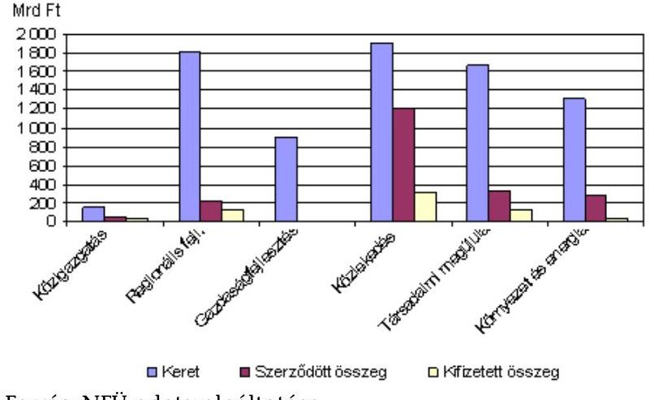

Forrás: NFÜ adatszolgáltatása

[^0]
[^0]:    ${ }^{5}$ Az ÚMFT szerint a tartós növekedést a versenyképesség erősítésével, a gazdaság bázisának kiszélesítésével és az üzleti környezet javításával kívánták szolgálni.
    ${ }^{6}$ A jelentésben egységesen használt $268,6 \mathrm{Ft} /$ euró árfolyamon számítva.

---

Átlagosan az operatív programok keretének mintegy 27%-át kötötték le nagyés kiemelt projektekre. A teljes kerethez képest a legnagyobb arányban kötöttek le forrást a közlekedésfejlesztési (KÖZOP), a környezeti és energia (KEOP), a társadalmi megújulás és infrastruktúra (TÁMOP, TIOP), majd a közigazgatási (ÁROP, EKOP) programokból, ami következett a projektek nagy méretéből. A regionális keretek (ROP-ok) esetében ez az arány kisebb volt (12%), a gazdaságfejlesztési keretből (GOP) pedig egy kiemelt projekt valósul meg.

A kiemelt és nagyprojektek támogatásának kedvezményezettek szerinti megoszlását a 2007-2010-es időszakban a következő 1. sz. táblázat tartalmazza.

1. sz. táblázat

| Kedvezményezett típusa   $\mathbf{2007 - 2010}$ | Megoszlás |  |
| :-- | :--: | :--: |
|  | Mrd Ft | $\%$ |
| Állami tulajdonú gazdasági társaságok   (NIF Zrt., MÁV Zrt., Magyar Közút Zrt., GYSEV   stb.) | 978,0 | 47,0 |
| Önkormányzatok | 587,4 | 28,2 |
| Központi költségvetési szervek | 432,1 | 20,8 |
| Nonprofit szervezetek | 52,6 | 2,5 |
| Vállalkozások | 14,4 | 0,7 |
| Önkormányzati tulajdonú gazdasági társaságok | 9,4 | 0,5 |
| Közalapítvány, egyház, társadalmi szervezetek | 5,6 | 0,3 |
| Összesen: | 2079,5 | 100,0 |

Forrás: NFÜ adatszolgáltatás
A nagyprojektek, a kiemelt és az 5 Mrd Ft feletti pályázatos projektek kedvezményezettjei alapesetben a közszféra intézményei voltak, ettől a Kormány a vonatkozó jogszabály alapján indokolt esetben eltérhetett. ${ }^{7}$ A jogszabályi kedvezményezettek (döntően állami feladatot ellátó szervek) köréből következett, hogy a vállalkozások csak kis mértékben (14,4 Mrd Ft, 0,7%) részesedtek e támogatásokból.

A szerződés szerinti támogatások közel felét (47%) állami tulajdonú gazdasági társaságok kapták. Ezen belül a támogatások 85%-át a NIF Zrt. használta fel a hagyományos kohéziós infrastruktúra-fejlesztési feladatokra, mint út- és vasútfejlesztésre. A támogatások 0,7%-a jutott a vállalkozásokhoz. Ez az arány az eredeti terv szerint nagyobb lett volna, de a GOP-ból a vállalkozások számára tervezett, foglalkoztatás bővítő kiemelt projektek nem valósultak meg.

A 2007-2013-as időszakra a pénzügyi keretek növekedése mellett az uniós pénzfelhasználási szabály is kedvezőbb lett. A 2004-2006-os időszakban az

[^0]
[^0]:    ${ }^{7}$ 255/2006. (XII. 8.) Korm. rendelet

---

adott évre (operatív programonként és finanszírozási alaponként) meghatározott uniós költségvetési keretet az adott évet követő 2. naptári év végéig kellett felhasználni. ${ }^{8}$ A 2007-2013-ban könnyítés, hogy az adott évre meghatározott uniós költségvetési keretet az adott évet követően nem a 2., hanem a 3. naptári év végéig és 2011-től a 2. naptári év végéig kell felhasználni, egyébként az adott ország elveszti a keretet.

A gazdasági válságra való tekintettel 2010 végén (2007+3 év után) még nem kellett, hanem majd 2011 végén kell az adott összegű keret felhasználásával elszámolni. ${ }^{9}$ Az NFÜ tájékoztatása szerint az Európai Bizottságtól a keret-lehívás (ún. abszorpció) eredményességét mutatja, hogy 2011 végén várhatóan Magyarország nem veszít uniós forrást. Ebben a pályázatos és a nem pályázatos nagy- és kiemelt projekteknek is szerepe van.

Szintén a válság hatásának ellensúlyozására, a gazdaság élénkítésére 2009 nyarán átcsoportosításokat hajtottak végre az ÚMFT-ben. A GOP keretét növelték mintegy 110 Mrd Ft-tal a TIOP és a KÖZOP keretének rovására. Továbbá operatív programokon (KMOP, TÁMOP) belüli forrás-átcsoportosítások voltak.

Az ÚMFT összes operatív programjához az ellenőrzött időszakban kettő, kétéves (2007-2008-as, 2009-2010-es) végrehajtási tervet, ún. akciótervet készítettek, ami hazai sajátosság volt. Ezek keretében a kormányzat uniós meghatározás ${ }^{10}$ szerinti nagyprojekteket, valamint hazai szabályozás alapján kiemelt projekteket, és 5 Mrd Ft támogatási összeg feletti pályázatos projekteket hagyott jóvá. Az akciótervek azonban csak indikatív jellegűek voltak. Uniós és hazai szabályozás sem határozta meg az egyes projekt típusokhoz alkalmazandó kiválasztási eljárások típusát. Az irányító hatóságok saját hatáskörben dönthettek (a szabályok rugalmasak voltak), hogy kiemelt kiválasztási eljárással vagy pályázati eljárással választják-e ki a nagyprojekteket. A kiemelt projekteket ún. kiemelt kiválasztási eljárással és az 5 Mrd Ft támogatási összeg feletti (nem uniós nagyprojekt és nem kiemelt) projekteket pályázati eljárással választották ki (3. sz. melléklet).

A Kormány a független szakmai zsűri, valamint a - 2008. 04. 30 -áig működött -, Fejlesztéspolitikai Irányító Testület ${ }^{11}$ javaslata alapján, a javaslatokkal egyezően vagy azoktól eltérően is jóváhagyhatta a projekteket. A projektek visszavonására szintén a Kormány volt jogosult. Az NFÜ a projekt kiválasztás egységessége érdekében kidolgozta az ún. projektcsatorna eljárásrendet, amely többlépcsős kiválasztással a kockázatokat kívánta csökkenteni (meghatározta a projekt útját, az érintett szervek feladatait a kezdeményezésétől a szerződéskötésig, az eljárás tartalmazott előszűrést, és szakértői, bíráló bizottsági értéke-

[^0]
[^0]:    ${ }^{8}$ A felhasználás - a kedvezményezettek által számlával igazolt költségeken alapuló időközi kifizetési kérelem benyújtását jelenti az Európai Bizottsághoz, az Európai Bizottság előfinanszírozásán felüli összegben.
    ${ }^{9}$ A szabályozás változása szerint a 2007. évi igénybe vehető kerettel hat egyenlő részben növelték a 2008-2013. évi éves kereteket.
    ${ }^{10} 1083 / 2006 /$ EK rendelet 39. cikk
    ${ }^{11}$ 1065/2006. (VI. 29.) Korm. határozat

---

lést stb.). Az ún. projektcsatorna eljárásrend beépült jogszabályba és belső szabályozásba (működési kézikönyv), amelyek alapján az ún. kiemelt kiválasztási eljárás megvalósult (4. sz. melléklet).

A jelenlegi ellenőrzés célja annak értékelése volt, hogy a 2007-től uniós finanszírozással megvalósuló kormányzati döntésen alapuló projektek kiválasztási eljárása célszerű és hatékony volt-e, a projektek kiválasztása eredményes volt-e, a források felhasználása összhangban állt-e a célok teljesítésével. Ennek során értékelni kellett:

- az egyes fejlesztési területek (támogatási konstrukciók) esetében alkalmazott projekt kiválasztási eljárások indokoltságát;
- a javaslattevő szervek által javasolt projektek megvalósításának időszerűségét, megalapozottságát és kapcsolódását az ágazati, a regionális és az uniós stratégiai célokhoz;
- a kiválasztott projektek eredményességét a célrendszer időarányos teljesítésében, a felhasznált források és az elért eredmények összhangját.

Az ellenőrzés típusa teljesítmény-ellenőrzés volt. A támogatási rendszert, azon belül a projekt kiválasztási folyamatot ellenőriztük célszerűségi és hatékonysági szempontok, valamint a kiválasztott projekteket eredményességi szempontok szerint. Az ellenőrzési kritériumok a következők voltak.

Célszerűnek tekintettük a projekt kiválasztási eljárást, ha az a vonatkozó jogszabályi feltételeken túlmenően megfelelt az adott fejlesztési terület sajátosságainak. Hatékonynak tekintettük a kiválasztási eljárást, ha egyszerűbb eljárással vagy alacsonyabb döntési szinten már nem lehetséges a tervezett eredményeknek megfelelő projektek kiválasztása.

Eredményesnek tekintettük a kiválasztott projekteket, ha - az időszerűen, célszerűen és megalapozottan kiválasztott ${ }^{12}$ - projektek elérték a tervezett céljukat, valamint a felhasznált források és az eddig elért, illetve várható eredmények összhangban voltak.

Az ellenőrzés tárgyát képezte a 7 ágazati program (ÁROP, EKOP, TÁMOP, TIOP, GOP, KÖZOP, KEOP) és két kiválasztott regionális operatív program (ÉAOP, KMOP), ezeken belül azok a fejlesztési területek, amelyeknél kormányzati döntésen alapuló projektek valósultak meg. ${ }^{13}$ Ilyen területek voltak: a közlekedés, a környezetvédelem, a turisztika, a közigazgatás reformja, korszerűsítése, a vállalkozásfejlesztés, az egészségügy, az oktatás, munkaerő-piac és a társadalmi kohézió-, a város- és településfejlesztés és az útfelújítások.

[^0]
[^0]:    ${ }^{12}$ Az időszerűség, célszerűség és a megalapozottság kritériumait részletesen a részletes megállapítások tartalmazzák ellenőrzési szempontonként.
    ${ }^{13}$ Az operatív programokon belül a fejlesztési területek sokszínűek, sokféle elnevezéssel; a fejlesztési területek rövid és operatív programonkénti egységes megnevezését (a közérthetőség érdekében) az ÁSZ dolgozta ki ehhez az ellenőrzéshez.

---

A kockázati szempontok figyelembevételével a projektek tulajdonságain alapuló rétegzett, véletlenszerű mintát vettünk. A rétegezés szempontjai voltak: a projektek típusa szerinti eloszlás (nagy-, kiemelt és 5 Mrd Ft feletti pályázatos projektek); a projektek helyzete (szerződéssel rendelkező, nem rendelkező, valamint visszavont projekt); a források eloszlása operatív programok és fejlesztési célterületek szerint.

A mintavétel alapjául szolgáló elvek a teljesítmény-ellenőrzéshez alkalmazott INTOSAI Ellenőrzési Sztenderdekkel ${ }^{14}$ és az azok alapján kidolgozott számvevőszéki ellenőrzés szakmai szabályaival összhangban voltak.

72 projektet választottunk ki ellenőrzésre a mintavétel eredményeként. Az ellenőrzésre kiválasztott operatív programok, fejlesztési területek és projektek listáját az 5. sz. melléklet tartalmazza.

Az ellenőrzés tárgykörébe 345 szerződésben támogatott projekt, 2080 Mrd Ft tartozott, amelyből a részletes ellenőrzés 43 db projektre (12,5%), és 540,7 Mrd Ft-ra (26%) terjedt ki. A 72 ellenőrzött projekt megoszlását a projektek helyzete szerint a következő 2. sz. táblázat tartalmazza.
2. sz. táblázat

| Támogatott projektek |  |  | 43 db | $540,7 \mathrm{Mrd} \mathrm{Ft}$ |
| :--: | :--: | :--: | :--: | :--: |
| - Megvalósult | 18 db | 30,6 Mrd Ft |  |  |
| - Megvalósítás alatt álló | 25 db | 510,1 Mrd Ft |  |  |
| Szerződéssel nem rendelkező projektek |  |  | 5 db | 144,4 Mrd Ft |
| Visszavont projektek |  |  | 24 db | 147,7 Mrd Ft |
| Projektek száma összesen |  |  | 72 db | 832,8 Mrd Ft |

Az ellenőrzött időszak a 2007-2010 közötti időszak volt, kitekintéssel a kormányzati döntésen alapuló projektek tervezésére és előkészítésére, valamint a 2011-ben hozott szabályozási változásokra. Az ellenőrzés során - az ellenőrzési programmal összhangban - felhasználtuk a témához kapcsolódó korábbi ÁSZ jelentések megállapításait, különös tekintettel a hazai tervezésre.

A helyszíni ellenőrzésre 2011. július 4. és szeptember 23. között került sor.
Az ellenőrzött szervezetek a kiemelt- és nagyprojektekre javaslatot tevő szervek és ezek jogutódjai, valamint a támogatást nyújtó intézmények voltak: a Nemzeti Fejlesztési Minisztérium, a Nemzetgazdasági Minisztérium, a Nemzeti Erőforrás Minisztérium, a Közigazgatási és Igazságügyi Minisztérium, a Vidékfejlesztési Minisztérium, az Észak-Alföldi és a Közép-Magyarországi Regionális

[^0]
[^0]:    ${ }^{14}$ INTOSAI Ellenőrzési Sztenderdeken és gyakorlati tapasztalaton alapuló ISSAI 3000 Standard és irányelv a teljesítmény-ellenőrzéshez (ISSAI 3000, Standard and guidelines for performance auditing based on INTOSAI Auditing Standards and practical experience)

---

Fejlesztési Tanács, valamint a Nemzeti Fejlesztési Ügynökség és a vele szerződéses kapcsolatban álló közreműködő szervezetek.

Az ellenőrzés jogalapját az Állami Számvevőszékről szóló 2011. évi LXVI. törvény 5. §-ának (1) bekezdése, valamint az államháztartásról szóló 1992. évi XXXVIII. törvény 120/A. §-ának (1) bekezdése képezte.

---

# I. ÖSSZEGZŐ MEGÁLLAPÍTÁSOK, KÖVETKEZTETÉSEK, JAVASLATOK 

A vonatkozó jogszabályi előírásokkal összhangban uniós szabály szerinti nagyprojekteket, hazai szabály szerinti országos és regionális jelentőségű kiemelt, valamint 5 Mrd Ft feletti pályázatos projekteket támogattak kormányzati döntés alapján. A kedvezményezettek jogszabály szerint döntően a közszféra intézményei voltak.
Magyarországon 2007-2013 között közel 8000 Mrd Ft ${ }^{15}$ áll rendelkezésre az ÚMFT-ben. A forrás-felhasználás célja a foglalkoztatás bővítése és a tartós növekedés megteremtése, a régiók felzárkóztatásának általános célja mellett.
A rendelkezésekre álló forrásokon belül előre nem rögzítették a kormányzati döntéseken alapuló, nagy összegű fejlesztésekre fordítható arányt, a forrásfelhasználás gyorsítása érdekében. Az alkalmazott kiválasztási eljárást ugyanakkor az jellemezte, hogy az ellenőrzött projektek kidolgozása és elbírálása ${ }^{16}$ 100-900 napot, átlagosan egy és egy negyedévet vett igénybe. Voltak projektek, amelyekre 3-4 év alatt sem sikerült támogatási szerződést kötni (például a társadalmi szempontból fontos OMSZ mentésre-légimentésre irányuló projektje).
A projektek megvalósítását előkészítési hiányosságok, közbeszerzési eljárások elhúzódása, szabálytalanságok és önerő hiánya nehezítették. Az előzőek és egyes ágazati rész-stratégiák hiánya, változása projektek elakadásához, vagy visszavonásához vezetett. Mindezek rontották a forrás-felhasználást és annak eredményességét.
A 2007 és 2010 közötti szerződés szerinti támogatások közel 20%-át (411 Mrd Ft) eleve meghatározott célra, az uniós csatlakozáskor vállalt kötelezettségekre (szennyvíz-, hulladékkezelés, ivóvízminőség javítás, vasútfejlesztés) használták fel. Ezen túlmenően a projektekre javaslatot tevő miniszterek, regionális fejlesztési tanácsok az országos, regionális jelentőséggel indokolták javaslatukat, bár ennek objektív kritériumai nem álltak rendelkezésre.
A támogatott fejlesztések céljai megegyeztek az ÚMFT (általánosan megfogalmazott) és az adott operatív program valamely céljával, de a Kormány a döntései során nem értékelte a projektek célokhoz való hozzájárulásának mértékét. Továbbá a támogatást nyújtó NFÜ sem értékelte külön, kiemelten e projektek hozzájárulását a foglalkoztatás bővítéséhez és az operatív programok más, szerteágazó céljaihoz. A fejlesztések gazdasági növekedésre gyakorolt hatását a támogatások odaítélésekor nem vizsgálták, ezt csak a későbbi értékelés során tervezi az NFÜ.

[^0]
[^0]:    ${ }^{15}$ A 8000 Mrd Ft nagyságrendjét mutatja, hogy abból a 2012. évre előirányzott uniós fejlesztések előirányzata ( 1420 Mrd Ft ) közel egy tizede a 2012. évi magyar költségvetés főösszegének ( 14900 Mrd Ft ), a 2011. december 19-én jóváhagyott költségvetés szerint.
    ${ }^{16}$ Ez a projektjavaslat Kormány általi jóváhagyásától a szerződéskötésig eltelt időtartam. A Kormány jóváhagyása a projekt támogatási javaslatát jelentette, jellemzően ezt követően dolgozták ki a részletes projektjavaslatot.

---

Az ÚMFT forrás-felhasználási lehetőségének első évében, 2007-ben nagyszámú fejlesztési igény érkezett be az NFÜ-höz, amely a későbbi években mérséklődött. A 2007 őszéig beérkezett 885 javaslat az operatív program keretek több mint felét (3845 Mrd Ft, 55\%) tette ki. 2010 végéig szerződésben összesen 345 nagy-, kiemelt és 5 Mrd Ft feletti projektet támogattak 2100 Mrd Ft-tal (az ÚMFT keretének 27\%-a). Ezen túlmenően is támogattak projekteket, amelyeket visszavontak. ${ }^{17}$

A kormányzati döntési folyamatban, a vonatkozó kormányrendeletben foglaltaknak megfelelően a kiemelt projekteket az ötletek, javaslatok nagy száma ellenére nemzeti szinten egyedinek tekintették (nem versenyeztették), és hatásukat tekintve azokat nem rangsorolták. Az értékelés és rangsorolás elmaradásával az eredményességi szempontok háttérbe szorultak, és nem állapítható meg, hogy összességében a célokat leginkább, illetve legnagyobb mértékben szolgáló projekteket választották-e ki.
A támogatást nyújtó NFÜ a fejlesztések első időszakát (2007, 2008 eleje) követően egyre nagyobb hangsúlyt helyezett a projektek szakmai, pénzügyi megalapozásának, fenntarthatóságának követelményére és ezzel összhangban a megvalósíthatósági tanulmányokra (amelyekhez operatív programonként külön útmutatókat készítettek).
A kormányzati döntésen alapuló projektek megoszlását nagy-, kiemelt és 5 Mrd Ft feletti bontásban a következő 2. sz. ábra szemlélteti.
2. sz. ábra

A kormányzati döntésen alapuló uniós projektek megoszlása szerződött támogatási összeg szerint
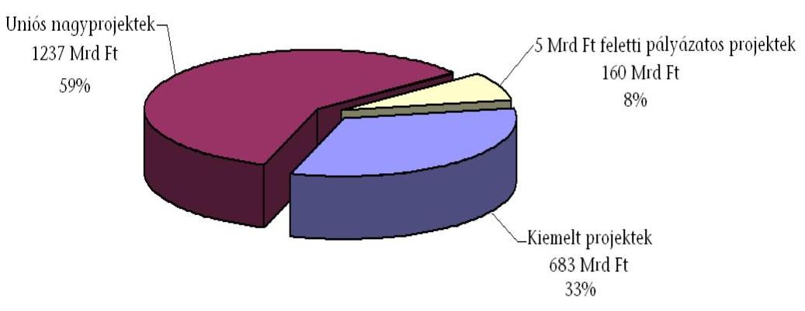

Adatforrás: NFÜ adatszolgáltatás (2010. 12. 31-ei állapot szerint)
A szerződött összeg 59\%-ából, mintegy 1230 Mrd Ft-ból 29 nagyprojektet támogattak (ebből a 4-es metró támogatási összege 210 Mrd Ft). A nagyprojektek közül 16 környezetvédelmi és kettő közlekedési projekt (összesen mintegy 411 Mrd Ft) Magyarország uniós csatlakozásakor vállalt célokat, kötelezettségeket teljesített (szennyvíz- és hulladékgazdálkodási, ivóvízminőséget javító, vasútfejlesztési projektek voltak). 2007-től uniós szabályozás alapján lehetővé vált az ország, a régióközpontok nemzetközi vasúthálózatán túlmenő vasútfejleszté-

[^0]
[^0]:    ${ }^{17}$ A visszavont projektekről összesen adat (2007-2010-re) nem állt rendelkezésre a támogatást nyújtó NFÜ-nél a 2007-2008-as nyilvántartási rendszer hiányossága miatt.

---

sek, a városi tömegközlekedés támogatása is, amelynek lehetőségével Magyarország élt (11 projekt, mintegy 819 Mrd Ft).

A szerződött összeg 33\%-ából, mintegy 680 Mrd Ft-ból összesen 297 kiemelt projekt valósul meg. Ezek közútfejlesztési, turizmus- és városfejlesztési, államreform, elektronikus közigazgatási, gazdaságfejlesztési, környezetfejlesztési és humán erőforrás projektek. A szerződött összeg 8\%-ából, mintegy 160 Mrd Ft-ból 19 db 5 Mrd Ft feletti pályázatos hulladékgazdálkodási és egészségügyi infrastrukturális fejlesztés valósult meg.
Az ÚMFT stratégia tervezésének alapjához az Országgyűlés által elfogadott koncepciók ${ }^{18}$ biztosítottak voltak, a célokat a meglévő stratégiákkal összehangolták. A tervezést azonban országos, ágazati és területi terveket átfogó, ${ }^{19}$ a pénzügyi forrásokkal reálisan számoló középtávú terv hiányában folytatták le, és az ebből fakadó hiányosságok jelen ellenőrzés időszakában is megmutatkoztak, a projektek kiválasztására és megvalósítására kihatottak. ${ }^{20}$
Az ellenőrzött ágazati minisztériumok és regionális fejlesztési tanácsoknál szerzett tapasztalatok szerint a fejlesztésekhez ágazati és regionális szinten (kistérségi, megyei és régiós szinten egymással párhuzamosan) felmérték az igényeket 2004-2006 folyamán, de ezeket nemzeti szinten nem összesítették, nem rangsorolták, nem voltak ismertek a reális igények és azok finanszírozási szükséglete, forrása az ÚMFT támogatások igénybevételi lehetőségének idejére (2007).
A projektek előkészítésére (tervek átgondolására, más fejlesztésekkel való összehangolására, a tényleges finanszírozási szükségletek felmérésére, önerő előteremtésére) jellemzően 2007 után a projektjavaslatok NFÜ-höz való benyújtását követően került sor. Ez megkezdett fejlesztések leállítását, visszavonását (pl. a Szépművészeti Múzeum térszint alatti bővítése projekt), valamint a szerződéskötés és a megvalósítás elhúzódását eredményezte.
Az NFÜ a projektek támogatásának részletes feltételeit a projektekre szabva és a kedvezményezett bevonásával, tervezési felhívásban (tartalmában pályázati kiírás) tette közzé. A kiemelt fejlesztések negyedét kitevő közutakat például középtávú terv hiányában, illetve a Nemzeti Útfelújítási Program (NÚP) késedelmes elkészítése miatt a regionális fejlesztési tanácsok többször rangsorolták (az irányító hatóság, a közútkezelő és az RFÜ szempontjai, majd a NÚP szempontjait figyelembe véve). Többször változott a kiválasztási eljárás típusa is. ${ }^{21}$ Nem volt összehangolt és lehatárolt, hogy a közútfejlesztések közül melyeket finanszírozzák tisztán hazai forrásból (Útpénztár) és melyeket uniós forrásból.

[^0]
[^0]:    ${ }^{18}$ A 2005-ben elfogadott Országos Fejlesztéspolitikai Koncepció és az Országos Területfejlesztési Koncepció.
    ${ }^{19}$ Átfogó terv, a tisztán hazai és az uniós forrásokra is kiterjedő, a hazai célkitűzések és az EU által szorgalmazott programok szerves rendszerét alkotó, valamint az ágazati és a területi terveket magában foglaló terv.
    ${ }^{20}$ A tervezési hiányosságokra többek között a 0802, a 0812 és a 0736 sz. ÁSZ jelentések is rámutattak.
    ${ }^{21}$ 2004-2006 között pályázatos eljárással, 2007-2010 között kiemelt kiválasztási eljárással, majd 2011-től újra pályázati eljárással választották ki a közutakat fejlesztésre.

---

A kiemelt projektek alkalmazása uniós és hazai szabályozással nem volt ellentétes. Hazai szabályozás szerint a projektek köre szerteágazó volt, kormányzati szinten hagyták jóvá egy mindössze 542 m hosszú és 3,8 M Ft-ba kerülő öt számjegyű út felújítását, és a Debreceni Egyetem 10,6 Mrd Ft-os egészségügyi projektjét is. A 2011-től hatályos szabályozás is meghagyta a mindenkori Kormány mozgásterét, a fejlesztéspolitika rugalmasságához, gyors reagálásához.
Az NFÜ véleménye szerint: „A kiemelt eljárásrend célja volt, hogy gyors és átlátható kiválasztási eljárást biztosítson azon projektek számára, amelyek esetében a projektjavaslatok versenyeztetése nem indokolt és az ágazati szakminisztérium vagy a regionális fejlesztési tanács országos vagy regionális jelentőségűnek ítél meg. A kiemelt eljárásrend használatával megtakarítható a pályázati eljárás alkalmazása esetén elutasított, nem nyertes pályázatokból származó veszteség, mivel a kormánydöntés után a projektjavaslatoknak már nem kell egymással versenyezniük a végső támogatásért. Ezzel mind a projektgazdák, mind az intézményrendszer számára megtakarítás érhető el."

Az alkalmazott projekt kiválasztási eljárások megfeleltek a vonatkozó szabályozásnak, de a kiemelt fejlesztések negyedét kitevő 4-5 számjegyű közutak ${ }^{22}$ fejlesztése esetében nem voltak célszerűek, nem feleltek meg a közútfejlesztés sajátosságainak. Többször változott a kiválasztási eljárás típusa (pályázatos, nem pályázatos), valamint a felújításhoz meghatározott szempontrendszer is a műszaki feltételek és a területi sajátosságok súlyarányának figyelembe vétele tekintetében. ${ }^{23}$
Továbbá a közutak felújításra való kiválasztása nem volt hatékony. A szabályozás és gyakorlat nem az EU regionális politikája egyik általános elvén, a szubszidiaritáson alapult, amely szerint a döntést és a végrehajtást a lehető legalacsonyabb, azonban a legnagyobb rálátással és hozzáértéssel rendelkező területi szintre kell telepíteni. A hazai intézményrendszerben ennek az elvnek megfelelő döntési szint, ahol a fejlesztések kiválasztáshoz szükséges információk rendelkezésre álltak, a regionális fejlesztési tanácsok szintje volt.
A regionális fejlesztési tanácsok a hatályos szabályozással összhangban kidolgozták a régió területfejlesztési programját (beleértve a közútfejlesztést), és a regionális operatív programok terhére a régiókban fejlesztési keretösszeg (ebben a közútfejlesztésre fordítható keretösszeg) is rendelkezésre állt. Műszaki és területi szempontok szerint kiválasztották a felújítandó közutakat, majd a döntés kormányzati szintre került.
Jogszabály lehetőséget adott arra, hogy a kiemelt kiválasztási (nem pályázatos, hanem egyedi elbírálású) eljárással az önkormányzati utak felújítására és az országos közutak fejlesztésére szolgáló forrásokat elkülönítsék, az állami építtető társaságok és az önkormányzatok közötti versenyt elkerüljék. A kiemelt kivá-

[^0]
[^0]:    ${ }^{22}$ Ezek az útfejlesztések az ellenőrzött regionális operatív programok (KMOP, ÉAOP) támogatott kiemelt fejlesztéseinek 81,5\%-át (49 fejlesztésből 40) tették ki a 2010. 12. 31-ei adatok szerint.
    ${ }^{23}$ Az Észak-Alföldi régióban 40\%-ban műszaki és 60\%-ban területfejlesztési szempontokat vettek figyelembe. A Közép-magyarországi régióban ez az arány 50-50\% volt.

---

lasztási eljárás alkalmazásával az állami építtető társaságot nem pályáztatták 2007-2010 között.

2011-től az országos közutak már nem a kiemelt projekt kiválasztási eljárásrendbe tartoztak, hanem pályázati eljárásrendbe (hasonlóan, mint 2004-2006 között). Az országos közúthálózat fejlesztés pályáztatása azonban valós versenyhelyzetet nem teremt, mert 2008-2009 folyamán jogszabályban nevesítették a kedvezményezettet (az országos közutak építtetője, illetve kezelője kizárólagos kedvezményezett).

Az uniós meghatározás szerinti nagyprojektnél uniós előírásból adódóan ${ }^{24}$ indokolt volt a kormányzati döntéshozatal. Azoknál a projekteknél is indokolt volt, amelyeknél a kormányzati szint adta meg a szakmai egyeztetés lehetőségét az NFÜ, illetve a felügyeletét ellátó minisztérium és a javaslattevő szervek között.

Az időszerű projektek kiválasztása érdekében - az ellenőrzött 43 támogatott projekt esetében, ahol az releváns volt - a projektekre javaslattevő szervek figyelembe vették az uniós irányelvekből adódó kötelezettségeket.
A különböző szintű és részletezettségű ágazati tervekben, különféle kötelezettségek (uniós, hazai jogszabály stb.) szerepeltek, amelyekre a projektjavaslatot tevő szervek hivatkoztak anélkül, hogy az igények megalapozását és az azokhoz szükséges források hozzávetőleges nagyságát országos szinten felmérték, összesítették volna. A KEOP dokumentuma is kiemelten kezelte a Csatlakozási Szerződésben vállalt kötelezettségek teljesítését (például szennyvízkezelés, hulladékkezelés területén), és több ponton leszögezte, hogy az elvégzendő feladatok költsége nagy valószínűséggel meg fogja haladni a rendelkezésre álló forráskeretet.
A derogációs kötelezettségek teljesítéséből adódó feladatok és ezek forrásigényének felmérése a szakterületért felelős minisztérium (például közlekedésnél NFM, környezetvédelemnél VM) feladata. A nemzetgazdasági tervezés felelősségi rendje, intézményrendszere és folyamata azonban törvényi szinten nem volt szabályozva. A tervezés főbb területein megoldandó feladatok rendszerszerűen nem voltak meghatározva. Az uniós ${ }^{25}$ és azzal összhangban lévő hazai jogszabály alapján, az irányító hatóságok feleltek az operatív programok hatékony és eredményes pénzgazdálkodás elvével összhangban történő irányításáért és végrehajtásáért, így különösen a közösségi és nemzeti szabályoknak való megfelelőségért. A szaktárcák pedig a szakmapolitikai szempontok érvényesüléséért feleltek. ${ }^{26}$
Az ÚMFT stratégiai dokumentuma és egyes operatív programok komplex programokat nevesítettek ágazat/régió/társadalmi csoport lényeges kérdéseinek

[^0]
[^0]:    ${ }^{24}$ A Tanács 2006. július 11-ei 1083/2006/EK rendelete 39. és 40. cikk, a 16/2006. (XII. 28.) MeHVM-PM rendelet 13. § (8) bekezdés
    ${ }^{25}$ A Tanács 2006. július 11-ei 1083/2006/EK rendeletének 60. cikke
    ${ }^{26}$ 255/2006. (XII. 8.) Korm. rendelet 8. § (1) bekezdése szerint „a miniszter feladata a szakmai felelősségébe tartozó operatív program vagy prioritástengely és akcióterv szakmai kidolgozásában való részvétel, ennek során a Kormány szakpolitikájának érvényesítése."

---

rendezésére. ${ }^{27}$ Az ÚMFT-ben meghatározottak szerint ezek több operatív programot érintenek, de költségvetésük, kijelölt felelősük nem volt. A javaslattevő minisztériumok például a TÁMOP minden ellenőrzött projektjét besorolták komplex programba (így nyertek támogatást). Továbbá az ellenőrzött projektek között szerepelt Záhony és térsége komplex program (több operatív programból finanszírozott projektekkel), de ezek együttes kezelése, értékelése még nem valósult meg.
A projektek kiválasztásában a 2004-2006-os időszakhoz hasonlóan fontos szerepet játszott a „viszonylag jó előkészítettség", mint időszerűségi tényező a keretvesztés elkerüléséhez.
A projektek célszerűségét tekintve az ellenőrzött, 43 támogatott projekt közül mindegyik hozzájárult az ÚMFT valamelyik átfogó, általánosan meghatározott céljához. A 43 projektből 13 (30\%) főként a foglalkoztatáshoz, 9 (21\%) főként a növekedéshez és 21 projekt (49\%) mindkét célhoz hozzájárult.

A foglalkoztatási célt a 43 projektből összesen 34 projekt szolgálta, ebből 6 (18\%) közvetlenül, a projekt egyik fő céljaként, valamint 28 (82\%) közvetetten, a projekt járulékos hatásaként. A foglalkoztatást közvetetten elősegítő 15 TÁMOP projekt 53\%-a módszertan fejlesztést, 27\%-a intézményi működtetési jellegű (pályáztatási) célt, illetve 20\%-a mind a két célt szolgálta.

A projektek céljai - a támogatói döntés időpontjában - minden esetben megegyeztek az operatív programok valamely céljával, ugyanakkor távlati célkitűzés ${ }^{28}$ 43 támogatott projektből 29 esetben (68\%) állt rendelkezésre a támogatás előtt, 6 esetben (14\%) csak a támogatás után, 4 esetben (9\%) a támogatás után sem készült, és 4 esetben (intézményi működtetési jellegű projektnél) ez nem volt releváns szempont.
A költséghatékonyság és a pénzügyi megalapozottság követelménye szabályozásban rögzítve volt és a támogatást nyújtó NFÜ útmutatókat is rendelkezésre bocsátott. A nagy infrastrukturális projektek esetében a költséghaszon elemzést, a gazdaságossági számítások készítését uniós tanácsadók ${ }^{29}$ támogatták. A hazai fajlagos költségeket nem tekintették normának, csak útmutatónak. ${ }^{30}$ Más beruházási projekt esetében tervezési hibákra, megalapozatlanságra mutatott, hogy költségvetésük többszörösére növekedett (Margit híd, 4-es metró).

[^0]
[^0]: ${ }^{27}$ Többek között nevesítették a „Kis- és közepes vállalkozások komplex fejlesztése", a „Takarékosan az energiával", a „Tiszta környezet" és az „Egészségügy" programokat.
    ${ }^{28}$ Stratégiának vagy koncepciónak nevezett dokumentum, nagyon eltérő, vagy alig kidolgozott mélységben.
    ${ }^{29}$ Az Európai Bizottság, az Európai Beruházási Bank, az Európai Újjáépítési és Fejlesztési Bank és a Kreditanstalt für Wiederaufbau partnersége keretében delegált szakértők a JASPERS, technikai segítségnyújtási eszköz keretében.
    ${ }^{30}$ A 0948 sz. ÁSZ jelentés szerint a 2000-2006-os időszak szennyvízkezelési projektjei esetében is uniós szakértők adtak tanácsot, és „a hazai fajlagos költségeket nem alkalmazták, a projektek tervezett beruházási költsége sokkal inkább más uniós országok projektjeinek költségéhez hasonló volt".

---

A költséghatékonyságot és a pénzügyi megalapozottságot minősítette a koncepciók és módszertanok készítésénél, hogy hiányoztak a költség és idő normatívák, valamint az elvárt eredmények megfelelő részletezése és az eredmények érvényesítését garantáló eljárások. Az előzőekből adódóan az egyik ellenőrzött projekt (államreform koncepció készítése) a támogatási összeg 44\%-ából (504 M Ft helyett 222 M Ft-ból) valósult meg.
A projektek időbeni megvalósítását jellemezte, hogy az ellenőrzött, megvalósult 18 projektből hármat (17\%) a tervezett időben fejeztek be. 7 projekt késése kevesebb, mint fél év, 4 projekt félévnél többet, de egy évnél kevesebbet, míg 4 projekt 1 évnél többet késett. A befejezési késedelem főbb okai voltak a gyakoriság sorrendjében: a közbeszerzési eljárás elhúzódása, az előkészítési, tervezési hiányosságok, a szabálytalansági eljárások lefolytatása, forráshiány a projektgazdáknál.

Az időbeni csúszást jellemezte még, hogy 2011 végéig a megvalósult 18 projekten felül további 18 projekt befejezési határideje járt le az eredeti határidő szerint (16. sz. melléklet). E projektek megvalósítása megtorpant, akadozik. Egyeztetés, döntés szükséges a folytatásukról, vagy leállításukról (például ITDH Zrt. projekt).

Az ellenőrzött 24 támogatásra javasolt, majd visszavont projektből 6-ot (25\%) alapvetően át kell tervezni előkészítési hiányosság miatt, 9 (37\%) nem illeszkedett a szaktárca stratégiájába, 2 esetben (8\%) a kedvezményezett lépett vissza, 2 esetben hiányzott az önerő. 2 esetben a projekt támogatási javaslatának elbírálásakor (2007 decemberében, illetve 2009 szeptemberében) a kormányzat indokoltnak tekintette a tervezett fejlesztéseket, majd másfél, illetve 3 év múlva (2010 novemberében és 2011 júniusában) a kormányzat újabb döntést hozott, amelyben indokolatlannak minősítette a két fejlesztést. További 2 projekt nem megfelelően haladt előre, valamint egy projektnek már a javaslata is hiányos volt (7. sz. melléklet).

Az ellenőrzött öt, támogatási szerződéssel nem rendelkező projektből három esetben 3-4 év alatt, két esetben egy-másfél év alatt nem tudták megkötni a szerződést (8. sz. melléklet). Miközben e projektjavaslatokhoz rendelt források más projektek számára nem hasznosulhatnak. Az ügyek elhúzódásának főbb okai voltak: nem megfelelő előkészítés a tulajdonviszonyok rendezésében, a kedvezményezettek együttműködésének időigénye, a műszaki tartalom átgondolatlansága, koncepcionális okok és az igényhez képest csökkentett támogatás (8 Mrd Ft-ról 1,6 Mrd Ft) miatti áttervezés.
Az ellenőrzött projektek eredményei korlátozottan jelentkeztek az ellenőrzés idején. Az előzőekben leírtak szerint voltak hiányosságok a kiválasztott projektek időszerűségében, célszerűségében és pénzügyi megalapozottságában. Az elhúzódó projektek céljai csak később teljesülnek, ezáltal hatásuk is csak később jelentkezik. Az ÚMFT egyik fő célkitűzését, a foglalkoztatás bővítését kívánta támogatni a GOP, 4-12 projekttel, de az egyetlen beérkező és a Kormány által támogatásra javasolt projekt ${ }^{31}$ sem valósult meg a gyártó és a kereskedelmi cég közötti beszállítói szerződés meghiúsulása miatt.

[^0]
[^0]: ${ }^{31}$ Zsolnay Porcelánmanufaktúra Zrt. IKEA projekt (55. sz. projekt)

---

Az ellenőrzött 43 támogatott projekt közül 18 (42\%) valósult meg, amelyből 16 foglalkoztatási, növekedési célú és kettő intézményi működtetési jellegű volt. A 16 foglalkoztatási, növekedési célú projektből 12 projekt (75%), 25,6 Mrd Ft támogatással elérte a tervezett célját. Ezek között volt: négy közút felújítás (59 km), egy csomópontépítés (1,2 km), a Nyíregyházi állatpark, a Hajdúszoboszló Aqua-Palace élményfürdő fejlesztése, a Budapest szíve program, a HM Állami Egészségügyi Központ eszközbeszerzése, valamint egy képzési program (Lépj egyet előre). (részletek a 9. sz. mellékletben)
Az ellenőrzés során a jó gyakorlat kritériumaként meghatározott együttes feltételeket - a projekteket eredetileg tervezett időben, pénzügyi kerettel és céllal valósítják meg -, a 12 projekt esetében egy kivétellel nem tudták teljesíteni. A projekteket az eredeti célértéknek megfelelően, a tervezett támogatással, illetve azon belül, de időbeni késedelemmel valósították meg (45-640 nap).
A projektek megvalósítását (időigényét, uniós forrás-felhasználását) negatívan befolyásolta, hogy a kedvezményezettek minden harmadik projektet (18 megvalósult projektből 6-ot) szabálytalanságokkal együtt valósítottak meg. ${ }^{32}$ Kiemelendő, hogy minisztériumi, önkormányzati és egyéb, költségvetésből gazdálkodó szervezetek követtek el szabálytalanságot (közbeszerzési előírások megsértése, hibás teljesítésigazolás, a támogatóval nem megfelelő együttműködés).
A 16 foglalkoztatási, növekedési célú, megvalósult projektből 4 (25\%) keretében elkészített képzési módszertani anyagok, koncepciók (4,3 Mrd Ft) még nem hasznosultak az ellenőrzés idején, azok hasznosítása a közszféra későbbi koncepciójától, igényétől függ. ${ }^{33}$
Az ellenőrzött projektek közül a már megvalósult 18 projekten (30,6 Mrd Ft) túlmenően, további 18 projektet (334,2 Mrd Ft) terveztek befejezni 2011 végéig, ${ }^{34}$ de ezek megvalósítása késik. A 334,2 Mrd Ft-ból 161,6 Mrd Ft-ot, azaz a források közel felét (48,4%) fizették ki a kedvezményezetteknek 2011. 10. 31-éig.
A befejezési határidőket módosították, illetve módosítják (fél évvel, vagy akár több évvel) az előzőekben leírt előkészítési, megvalósítási nehézségek miatt. A nagy- és kiemelt projektek közigazgatási hatósági engedélyeztetési eljárásainál - jogszabályban adott felhatalmazás ellenére - a gyakorlatban nem használták ki a gyorsított eljárás alkalmazásában rejlő lehetőséget.
Az ÁSZ korábbi jelentésében ${ }^{35}$ tett javaslat, az állami fejlesztési feladatok tervezésének erősítését célzó átfogó törvényi szabályozás elkészítése, amely megteremti a feladatellátás intézményi garanciáit és magába foglalja a hazai és uniós források egységes tervezési módszertanát is, nem valósult meg az ellenőrzött időszak végéig. Továbbá javasoltuk egységes követelmények, mód-

[^0]
[^0]: ${ }^{32}$ Például az 1. sz. projekt 230,4 M Ft-ból valósult meg és 108 M Ft volt a támogatás elvonás közbeszerzési szabálytalanság miatt (ami hazai költségvetési forrást terhelt).
    ${ }^{33}$ A projektek hasznosítása a 16. és a 40. sz. turisztikai projekteknél nem volt még releváns.
    ${ }^{34}$ Ezek között volt például a Margit-híd, a 4-es metró, a Záhony közút, Közigazgatási Gazdálkodási Rendszer (informatika) kiépítése, több szennyvíztisztítási és hulladékgazdálkodási projekt.
    ${ }^{35} 0802$ sz. ÁSZ jelentés

---

szertan meghatározását a fejezetek felügyeletét ellátó szervezetek részére a stratégiai tervezés, a célok, eszközök és források, valamint a végrehajtó intézmények feladatainak összehangolt megtervezése érdekében. Ez szintén nem valósult meg, de továbbra is indokoltnak tartjuk.

2010 júliusától kijelölték ${ }^{36}$ a nemzeti fejlesztési minisztert többek között a hazai és az uniós támogatási források felhasználásának összehangolására, a nemzetgazdasági minisztert a területfejlesztés stratégiai tervezésére. Továbbá a 2011. december 2-ától hatályos szabályozás ${ }^{37}$ szerint létrejött a Nemzetgazdasági Tervezési Hivatal a nemzetgazdasági miniszter, mint a gazdaságpolitikáért felelős miniszter irányítása alatt. A feladatok és felelősök kijelölésére vonatkozó, az előzőekben ismertetett változásokat az intézkedést igénylő megállapításoknál (a javaslatok címzésénél) figyelembe vettük.

Az Állami Számvevőszékről szóló 2011. évi LXVI. törvény 33. § (1) bekezdésében foglaltak értelmében a jelentésben foglalt megállapításokhoz kapcsolódó intézkedési tervet köteles az ellenőrzött szervezet vezetője összeállítani és azt a jelentés kézhezvételétől számított harminc napon belül az ÁSZ részére megküldeni. Amennyiben az intézkedési tervet határidőben nem küldi meg a szervezet, vagy az továbbra sem elfogadható, az ÁSZ elnöke a hivatkozott törvény 33. § (3) bekezdés a)-b) pontjaiban foglaltakat érvényesítheti.

Az ellenőrzés intézkedést igénylő megállapításai és javaslatai:
a nemzeti fejlesztési miniszternek, mint a hazai és az uniós támogatási források felhasználásának összehangolásáért, az NFÜ irányításáért felelős miniszternek:

1. A támogatott fejlesztések céljai megegyeztek az ÚMFT és az adott operatív program valamely céljával, de a Kormány a döntései során nem értékelte a projektek célokhoz való hozzájárulásának mértékét. Továbbá a támogatást nyújtó NFÜ sem értékelte külön, kiemelten e projektek hozzájárulását a foglalkoztatás bővítéséhez és az operatív programok más, szerteágazó céljaihoz. A fejlesztések gazdasági növekedésre gyakorolt hatását a támogatások odaítélésekor nem vizsgálták, ezt csak a későbbi értékelés során tervezi az NFÜ.

A kormányzati döntési folyamatban, a vonatkozó kormányrendeletben foglaltaknak megfelelően a kiemelt projekteket az ötletek, javaslatok nagy száma ellenére nemzeti szinten egyedinek tekintették (nem versenyeztették), és hatásukat tekintve azokat nem rangsorolták. Az értékelés és rangsorolás elmaradásával az eredményességi szempontok háttérbe szorultak, és nem állapítható meg, hogy összességében a célokat leginkább, illetve legnagyobb mértékben szolgáló projekteket választották-e ki.

A támogatást nyújtó NFÜ a fejlesztések első időszakát (2007, 2008 eleje) követően egyre nagyobb hangsúlyt helyezett a projektek szakmai, pénzügyi megalapozásának, fenntarthatóságának követelményére és ezzel összhangban a megvalósíthatósági tanulmányokra.

[^0]
[^0]: ${ }^{36}$ 212/2010. (VII. 1.) Korm. rendelet
    ${ }^{37}$ 248/2011. (XII. 1.) Korm. rendelet

---

Javaslat:
a) Vizsgáltassa ki azt, hogy az ellenőrzött időszakban (2007-2010) a kormányzati döntésen alapuló fejlesztések támogatási javaslatakor miért nem értékelték a projektek hozzájárulásának mértékét az ÚMFT fő céljaihoz (növekedés feltételeinek megteremtése, foglalkoztatás, felzárkózás). Intézkedjen arra vonatkozóan, hogy a vizsgálat eredményének függvényében jelöljék meg az esetleges felelősöket, és személyes felelősség megállapítása esetén tegyék meg a szükséges intézkedéseket, illetve értékeljék ki a tapasztalatokat a kiemelt fejlesztések jövőbeni tervezéséhez.
b) Erősítse tovább a kormányzati döntést igénylő projektkiválasztási eljárásában a pénzügyileg, szakmailag megalapozott, megfelelően előkészített a fő társadalmi/ágazati/területi célokhoz hozzájáruló fejlesztések támogatását.
2. A megvalósítás időbeni csúszását jellemezte, hogy 2011 végéig a megvalósult 18 projekten felül további 18 projekt befejezési határideje járt le az eredeti határidő szerint. Ezek között egyes projektek megvalósítása megtorpant, akadozik.

Az ellenőrzött öt, támogatási szerződéssel nem rendelkező projektből három esetben
 3-4 év alatt, két esetben egy-másfél év alatt nem tudták megkötni a szerződést. Miközben e projekt javaslatokhoz rendelt források más projektek számára nem hasznosulhatnak.

Javaslat:
Vizsgáltassa felül a szerződéskötési, megvalósítási problémákkal küzdő projektek jelenlegi helyzetét, terveinek megalapozottságát, indokoltságát. A felülvizsgálat eredményétől függően hozza meg a szükséges döntéseket, hogy az elhúzódó szerződéskötések ne kockáztassák az uniós források időbeni, eredményes felhasználását.
3. Az alkalmazott projekt kiválasztási eljárások megfeleltek a vonatkozó szabályozásnak, de a kiemelt fejlesztések negyedét kitevő 4-5 számjegyű közutak fejlesztése esetében nem voltak célszerűek, nem feleltek meg a közútfejlesztés sajátosságainak. Többször változott a kiválasztási eljárás típusa, valamint a felújításhoz meghatározott szempontrendszer is a műszaki feltételek és a területi sajátosságok súlyarányának figyelembe vétele tekintetében.

Továbbá a közutak felújításra való kiválasztása nem volt hatékony. A szabályozás és gyakorlat nem az EU regionális politikája egyik általános elvén, a szubszidiaritáson alapult, amely szerint a döntést és a végrehajtást a lehető legalacsonyabb, azonban a legnagyobb rálátással és hozzáértéssel rendelkező területi szintre kell telepíteni. A hazai intézményrendszerben ennek az elvnek a regionális szint felelt meg, azonban a tanácsoknak csak javaslattételi joguk volt. Műszaki és területi szempontok szerint kiválasztották a felújítandó közutakat, majd a döntés kormányzati szintre került.

---

Javaslat:
A szubszidiaritás elvének érvényesítésével is biztosítsa, hogy a kiemelt projekt kiválasztási eljárást csak a valóban kormányzati döntést igénylő projekt javaslatokra terjesszék ki.
4. A projektek előkészítésére, tervek átgondolására, más fejlesztésekkel való összehangolására, a tényleges finanszírozási szükségletek felmérésére, önerő előteremtésére az uniós finanszírozásból előkészített nagyprojekteket leszámítva - 2007 után a projektjavaslatok NFÜ-höz való benyújtását követően került sor. Ez megkezdett fejlesztések leállítását, visszavonását, valamint a szerződéskötés és a megvalósítás elhúzódását eredményezte.

Javaslat:
Gondoskodjon, az erre a célra biztosított uniós források bevonásával, a támogatási célokat szolgáló jelenlegi és jövőbeli projektek előkészítésének felgyorsításáról a döntési folyamat gyorsítása és a forrás-felhasználás hatékonyságának javítása érdekében.
a nemzetgazdasági miniszternek, mint a területfejlesztés stratégiai tervezéséért, a Nemzetgazdasági Tervezési Hivatal irányításáért felelős miniszternek, a nemzeti fejlesztési miniszter, mint a hazai és az uniós támogatási források felhasználásának összehangolásáért, az NFÜ irányításáért felelős miniszter bevonásával:
5. A különböző szintű és részletezettségű ágazati tervekben, különféle kötelezettségek (uniós, hazai jogszabály stb.) szerepeltek, amelyekre a projektjavaslatot tevő szervek hivatkoztak anélkül, hogy az igények megalapozását és az azokhoz szükséges források hozzávetőleges nagyságát országos szinten felmérték, összesítették volna. A KEOP dokumentuma is kiemelten kezelte a Csatlakozási Szerződésben vállalt kötelezettségek teljesítését (például szennyvízkezelés, hulladékkezelés területén), és több ponton leszögezte, hogy az elvégzendő feladatok költsége nagy valószínűséggel meg fogja haladni a rendelkezésre álló forráskeretet.

Javaslat:
a) Intézkedjenek az uniós és a hazai jogszabályi kötelezettségekből és egyéb társadalmi célokból adódó feladatok, forrásigények felmérésére, felülvizsgálatára és a felülvizsgált igények ütemezésére nemzeti szinten.
b) Vizsgáltassák felül a csatlakozáskor vállalt uniós környezetvédelmi és egyéb kötelezettségek forrásszükségletét, a vállalások teljesíthetőségét a rendelkezésre álló uniós és hazai források ismeretében.
c) Intézkedjenek egy, földrajzi területekre lebontott, az ország fő célkitűzéseihez leginkább hozzájáruló konkrét projekteket tartalmazó, középtávú terv készítésére, összhangban a hazai költségvetési tervezéssel és az uniós programokhoz készített többéves tervekkel.

---

a nemzetgazdasági miniszternek, mint a területfejlesztés stratégiai tervezéséért, a Nemzetgazdasági Tervezési Hivatal irányításáért felelős miniszternek:
6. Az ÁSZ korábbi (0802 sz.) jelentésében javasolta, az állami fejlesztési feladatok tervezésének erősítését célzó átfogó törvényi szabályozás elkészítését, a források tervezéséhez módszertan készítését. Javasolta továbbá egységes követelmény, módszertan meghatározását a stratégiai tervezéshez. A javaslatokban foglalt feladatok nem teljesültek, ugyanakkor a jelenlegi ellenőrzés is rámutatott azok szükségességére a következők szerint.

Az ÚMFT stratégia tervezésének alapjához az Országgyűlés által elfogadott koncepciók biztosítottak voltak, a célokat a meglévő stratégiákkal összehangolták. A tervezést azonban országos, ágazati és területi terveket átfogó, a pénzügyi forrásokkal reálisan számoló középtávú terv hiányában folytatták le, ami a projektek kiválasztására és megvalósítására kihatott.

Az ellenőrzött ágazati minisztériumok és regionális fejlesztési tanácsoknál szerzett tapasztalatok szerint a fejlesztésekhez ágazati és regionális szinten felmérték az igényeket 2004-2006 folyamán, de ezeket nemzeti szinten nem összesítették, nem rangsorolták, nem voltak ismertek a reális igények és azok finanszírozási szükséglete, forrása az ÚMFT támogatások igénybevételi lehetőségének idejére (2007).

Javaslat:
a) Intézkedjen az állami fejlesztési feladatok tervezésének erősítését célzó, átfogó jogi szabályozás előkészítésére, amely megteremti a feladatellátás intézményi garanciáit és magába foglalja a hazai és az uniós források egységes tervezési módszertanát is.
b) Intézkedjen egységes követelmény, módszertan meghatározására az állami fejlesztési feladatok stratégiai tervezéséhez a tervezésben résztvevő szervezetek számára.

---

# II. RÉSZLETES MEGÁLLAPÍTÁSOK 

## 1. A KORMÁNYZATI DÖNTÉSEN ALAPULÓ PROJEKTEKRE ALKALMAZOTT KIVÁLASZTÁSI ELJÁRÁSOK

Célszerűnek tekintettük a projekt kiválasztási eljárást, ha az a vonatkozó jogszabályi feltételeken túlmenően megfelelt az adott fejlesztési terület sajátosságainak. Hatékonynak tekintettük a kiválasztási eljárást, ha egyszerűbb eljárással vagy alacsonyabb döntési szinten már nem lehetséges a tervezett eredményeknek megfelelő projektek kiválasztása.

### 1.1. A kiemelt kiválasztási eljárás alkalmazásának indokoltsága

Az ellenőrzött kiemelt projektek megfeleltek a kiemelt kiválasztási eljárás alkalmazásához előírt jogszabályi feltételeknek. ${ }^{38}$

Az ellenőrzött javaslattevő minisztériumok képviselői mindegyik projekttel kapcsolatban kinyilvánították, hogy az adott fejlesztés országos vagy regionális jelentőségű, bár az országos vagy regionális jelentőség objektív kritériuma nem állt rendelkezésre. Erre több javaslattevő szerv (NFM, NEFMI, Észak-Alföldi Regionális Fejlesztési Ügynökség, Pro Régió Ügynökség) is felhívta a figyelmet.

Azon projektek országos jelentősége vitathatatlan volt, ahol a fejlesztés hazai jogszabályi előírást teljesített - például a Vásárhelyi Terv továbbfejlesztéséhez kapcsolódó 69. sz. projekt -, vagy uniós irányelv átültetését szolgálta (a belső piaci szolgáltatásokról szóló 2006/123/EK irányelv a 9. sz. projekt esetében).

A 0812 sz. ÁSZ jelentés szerint „a kiemelt projektek bevezetése nem mond ellent az uniós jogszabályoknak, fogalma az uniós rendeletekben nem szerepelt. A hazai jogi alapja hiányos annyiban, hogy jogszabályok csak tágan, regionális vagy országos érdekként definiálják". ${ }^{39}$

A 255/2006. (XII. 8.) Korm. rendeletet hatályon kívül helyező, 2011. február 9-én hatályba lépett 4/2011. (I. 28.) Korm. rendelet szabályai e tekintetben nem változtak. A szabályozás ezzel meghagyta a mindenkori Kormány mozgásterét, a fejlesztéspolitika rugalmasságát.
Azon projektek kormányzati jóváhagyása is indokolt volt, amelyek a szakpolitikai szempontok érvényesülésért felelős javaslattevő miniszterek, ${ }^{40}$ és az irányító hatóságok felügyeletét ellátó NFM szempontjainak összehangolását igényelték.

[^0]
[^0]:    ${ }^{38}$ 255/2006. (XII. 8.) Korm. rendelet 16. § (4) bekezdés b) pont
    ${ }^{39}$ 255/2006. (XII. 8.) Korm. rendelet 16. § (4) bekezdés
    ${ }^{40}$ 255/2006. (XII. 8.) Korm. rendelet 8. § (1) bekezdés

---

A 225/2006. (XII. 8.) Korm. rendelet 16. § (3) bekezdésében foglalt eljárásrendek közül a kiemelt eljárásrend választása indokolt volt többek között: a projekt jellegéből adódóan a pályázati versenyeztetésnek nincs értelme (például országos program), vagy a verseny nem eredményezne megalapozottabb projektszelekciót és hatékonyabb forrás-felhasználást, komplex célok, magas támogatási összeg, valamint a projektgazda személye (közszféra).

Amennyiben a projektgazda nem tartozott a rendelet által felsorolt szervezet típusok közé, de a projekt közcélú és hozzájárult az ÚMFT kiemelt céljaihoz, valamint a projektgazda megfelelően alá tudta támasztani annak közhasznúságát, a 255/2006. (XII. 8.) Korm. rendelet 16. § (5) bekezdése szerint a Kormány eltekinthetett e feltétel érvényesülésétől.

A kiemelt kiválasztási eljárás a kiemelt fejlesztések negyedét, illetve a regionális operatív programokból megvalósuló kiemelt fejlesztések számának 81,5%-át kitevő 4-5 számjegyű közutak fejlesztése esetében nem voltak célszerűek, nem feleltek meg a közútfejlesztés sajátosságainak. Többször változott a kiválasztási eljárás típusa (pályázatos, nem pályázatos), valamint a felújításhoz meghatározott szempontrendszer is a műszaki feltételek és a területi sajátosságok súlyarányának figyelembe vétele tekintetében. ${ }^{41}$
Továbbá a közutak felújításra való kiválasztása nem volt hatékony. A szabályozás és gyakorlat nem az EU regionális politikája egyik általános elvén, a szubszidiaritáson alapult, amely szerint a döntést és a végrehajtást a lehető legalacsonyabb, azonban a legnagyobb rálátással és hozzáértéssel rendelkező területi szintre kell telepíteni. ${ }^{42}$ A hazai intézményrendszerben ennek az elvnek megfelelő döntési szint, ahol a fejlesztések kiválasztáshoz szükséges információk rendelkezésre álltak a regionális fejlesztési tanácsok szintje volt.
A regionális fejlesztési tanácsok a hatályos szabályozással összhangban kidolgozták a régió területfejlesztési programját (beleértve a közútfejlesztést), és a regionális operatív programok terhére a régiókban fejlesztési keretösszeg (ebben a közútfejlesztésre fordítható keretösszeg) is rendelkezésre állt. A regionális fejlesztési tanácsok műszaki és területi szempontok szerint kiválasztották, rangsorolták a felújítandó közutakat, azonban az előzőek ellenére csak javaslattételi joguk volt, a közútfejlesztés döntési szintje kormányzati szintre került.
Az NFÜ álláspontja szerint - a 2007-2010 közötti időszakban hatályos jogszabályi keretek között - szükséges volt a 4-5 számjegyű utak fejlesztésének kiemeltként kezelése, mert így tudtak keretet elkülöníteni az országos közutak (pályáztatás nélküli) fejlesztésére - a szaktárca GKM kérésének eleget téve -, kizárva a helyi utakat kezelő önkormányzatokat. Így az önkormányzati utak fel-

[^0]
[^0]:    ${ }^{41}$ Az Észak-Alföldi régióban 40%-ban műszaki és 60%-ban területfejlesztési szempontokat vettek figyelembe. A Közép-Magyarországi régióban ez az arány 50-50% volt.
    ${ }^{42}$ Ezt az elvet tartalmazza a Tanács 2006. július 11-ei 1083/2006/EK rendelete. A szubszidiaritás tagállamokon belüli érvényesülésének helyzetéről az Európai Parlament a következőket állapította meg: a túlzott bürokrácia, a tagállamok lassú és nehézkes, központilag irányított igazgatása, a nem megfelelő decentralizált igazgatási kapacitás, valamint a nemzeti, regionális és helyi hatóságok közötti együttműködési rendszer hiánya a strukturális alapok felhasználásának akadályait jelentik. (A regionális politika terén alkalmazott bevált gyakorlatokról és a strukturális alapok felhasználásának akadályairól szóló, 2009. március 24 -ei állásfoglalás)

---

újítására és állami utak fejlesztésére szolgáló forrásokat elkülönítették, az állami építtető társaságok és az önkormányzatok közötti versenyt elkerülték.
A 4-5 számjegyű közutak fejlesztésének kiválasztási eljárásának típusa (pályázatos, kiemelt eljárás, majd újra pályázatos eljárás) eltért a különböző fejlesztési időszakokban (2004-2006, 2007-2010 között és 2011 után). Eltért régiónként a műszaki és a régiós szempontok arányának figyelembevétele. A közútfejlesztések kiválasztási szempontjainak változását az ÉARFÜ és az ÉARFT-ben, illetve a Pro Régió Kht.-nál végzett ellenőrzés alapján követtük le.

Az ÉARFT 2005-2006 folyamán a fejlesztésre váró közutak között figyelembe vette a kistérségi, regionális szinten fejlesztésre váró utakat is, függetlenül attól, hogy önkormányzati vagy országos közutak voltak. Ekkor a kiemelt projektek a leghátrányosabb helyzetű kistérségek kiemelt projektjeit jelentették a 27/2003. (III. 4.) Korm. rendelet alapján.

A ROP IH állásfoglalása alapján (2007. 03. 01. Pályázat előkészítő Munkacsoport) a 4-5 számjegyű utak fejlesztésére „A projektlisták összeállításakor a Magyar Közút Kht. és a Régió képviselőinek kell szakmai szempontjaik mentén régiónként megállapodniuk a támogatható projektek listájáról és rangsoráról, majd a Regionális Fejlesztési Tanácsnak szükséges a listát elfogadnia, amit az irányító hatóság koordinálása mellett tárca-, vagy kormányhatározat fog megerősíteni.". A ROP Irányító Hatóság kérte továbbá a Közép-dunántúli régióban felállított kritériumrendszer figyelembe vételét a regionális projektlisták kialakítása során. E szerint az értékelési szempontok 70\%-át területfejlesztési, 15\%-át műszaki, 15\%-át átlagos napi forgalom adatai alkották és egyéb szempontként balesetek számát, súlyosságát stb. javasolták figyelembe venni. (ÉARFÜ Előterjesztése az ÉARFT 2007. 03. 21-ei ülésére)

Az ÉARFÜ - a régió területfejlesztési szempontjait és a regionális operatív programban szereplő stratégiát figyelembe véve, a Magyar KÖZÚT Kht. területi igazgatóságaival egyeztetve kialakította a 4-5 számjegyű utak értékelésének szempontrendszerét. E szerint $40 \%$-ban műszaki és $60 \%$-ban területfejlesztési szempontokat vettek figyelembe. (ÉARFÜ Előterjesztése az ÉARFT 2007. 07. 13-ai ülésére). A Közép-magyarországi régióban a 4-5 számjegyű utak értékelésének szempontrendszerében 50-50\%-ban vették figyelembe a műszaki és a területfejlesztési szempontokat.

Az ÉARFÜ-nél 2007 szeptemberére készítettek ütemezést az útfelújítások folyamatáról és összeállítottak (három megyei Közút Kht.-val egyeztetve) egy hétéves projektlistát, abban megjelölve a 2007-2008-as időszakban megvalósítandó fejlesztéseket. (ÉARFÜ Előterjesztése az ÉARFT 2007. 09. 06-ai ülésére)

A 2009-2010-ben fejleszteni kívánt 4-5 számjegyű utak kiválasztásához a ROP Irányító Hatóság felkérésére a Magyar Közút Közhasznú Társaság területi igazgatóságai, illetve a Közlekedésfejlesztési Koordinációs Központ elkészítették a Nemzeti Útfelújítási Programot 2008-2020-ra. Az ÉARFT ez alapján az ÉAOP 2007-2013-as kiemelt útfejlesztési listáján, illetve a NÚP-ban is szereplő utakat jelölte ki fejlesztésre. Ezzel párhuzamosan tisztán hazai forrásból (Útpénztárból) is ütemezték az útfejlesztéseket, így az előforduló átfedést ki kellett szűrni. (ÉARFÜ Előterjesztése az ÉARFT 2007. 09. 04-ei rendkívüli ülésére)

---

A ROP Irányító Hatóság 2010 februárjában az összes regionális operatív program, összes kiemelt projektjét, köztük a 4-5 számjegyű utak felújítását támogató konstrukciót is felfüggesztette. Az ÉARFT 2009-2010-es időszak 18 projektjéből egy projektjavaslatot támogattak. (ÉARFT előterjesztése az ÉARFT 2011. 02. 07-ei ülésére)

Az NFÜ szerint a 4-5 számjegyű közutak elbírálási rendjének változtatását 2011-től (kiemelt kiválasztási eljárásról visszatértek egyfordulós pályáztatási eljárásra) a közúti közlekedésről szóló 1988. évi I. tv. 2008. és 2009. évi módosítása indokolta. A jogszabályi változás az országos közutak építtetőinek körét kizárólag az állami építtető szervezetekre korlátozta (NIF Zrt., közútkezelők), így az országos közutakra kiírt pályázatokban már csak a NIF Zrt. és a közútkezelők nyerhettek.

Az ÁSZ álláspontja szerint önmagában a versenyhelyzet megszüntetésének szándéka nem indokolta a kiemelt projekt kiválasztási eljárás alkalmazását 2007-2010 között. A pályázati felhívások minden esetben meghatározták a pályázók körét, az NFÜ-nek a hivatkozott törvénymódosításokat megelőzően, a 2007-2010 közötti időszakban is lehetősége volt külön pályázati kiírást készíteni az állami és az önkormányzati utak építésére, fejlesztésére. A törvénymódosítások két ütemben - 2008. január 1., 2009. január 1. - léptek hatályba, így a 2009-2010-es időszakban az új törvényi rendelkezés alapján már elhagyható lett volna a kiemelt kiválasztási eljárás. A 2011-ben kiírt pályázati felhívások ugyanazt a projektgazda-kört jelölik meg, mint amit a 2007-2010 közötti tervezési felhívások tartalmaztak.

A belügyminiszter a keretek elkülönítésére a 14/2011. (IV. 19.) BM rendeletében szabályozott módon, az EU által elfogadott más megoldást, nyílt vagy zárt kétfordulós kiválasztási eljárást alkalmazott az uniós támogatással megvalósuló projektek kiválasztására. Zárt kiválasztási eljárást alkalmaztak, amennyiben jogszabály nevesítette a kedvezményezett szervezetet.

A TÁMOP 1.4.1. Alternatív foglalkoztatási programok átmeneti támogatása című konstrukció esetében a támogatott mintegy kibővített közreműködő szervezeti feladatot látott el, folyamatos szakmai segítséget nyújtott, ezért a Nemzetgazdasági Minisztérium, mint a javaslattevő jogutódja szerint az uniós szabályozás ${ }^{43}$ átvétele esetén a globális támogatási eljárás (ún. Global grant) megfelelőbb lett volna a támogatás odaítélésére. Ennek lényege, hogy az egyszerűbb támogatások szétosztásával az irányító hatóság egy közvetítő szervezetet bíz meg a rugalmasabb és gyorsabb lebonyolítás érdekében. A globális támogatás eljárás használata az uniós tagállamokban nem elterjedt, tapasztalatok hiányában szabályossági és abszorpciós kockázatot is jelenthet.

Az irányító hatóságok a kiemelt kiválasztási eljárás előnyének tartották, amelyet az ellenőrzés tapasztalatai is megerősítettek, hogy a projekteket teljes életútjuk során kiemelt figyelemmel tudták kísérni. További előny volt, hogy a projektek egyedi jellege következtében a tervezési felhívásokban foglalt feltételeket az adott projektre vagy projektgazdára lehetett szabni.

[^0]
[^0]:    ${ }^{43}$ A Tanács 2006. július 11-ei 1083/2006/EK rendelete 42. cikk

---

Az eljárás hátránya az adminisztrációs teher a sokrétű, kormányzati koordinációs szintű egyeztetés és többféle szakmai bírálati szakasz miatt. Amennyiben a Kormány támogatási javaslatához képest változás következett be, újra kormányzati szintű egyeztetés, a Kormány jóváhagyása volt szükséges.

További hátrány jelentett, hogy a zsűrizés (előzetes szakmai bírálat), illetve a Kormány jóváhagyása közötti időszakra nem volt eljárásrendi határidő meghatározva. Nem rögzítették egyértelműen a Kormány támogatási javaslatának megjelenítéséről, az ún. akciótervi nevesítésről szóló kormányhatározat előkészítésében a folyamatokat és az NFÜ irányító hatóságai, valamint az előterjesztő minisztérium felelősségi körét.

A Kormány támogatási javaslatának megjelenésétől (akciótervi nevesítésétől) a támogatási szerződés megkötéséig a projektgazdák számára meglehetősen hosszú idő, egy év - ezen belül az irányító hatóság által meghatározott határidő - állt rendelkezésre ${ }^{44}$ a részletesen kidolgozott projektjavaslat benyújtására. A határidők nem tartása esetén az NFÜ saját hatáskörben nem tudta rendezni a megtorpant, akadozó projektjavaslatokat, projekteket. A támogatásra javaslatot tevő Kormány dönthetett a javaslat visszavonásáról (2010 második felében a projektek széles körű felülvizsgálatára és korábbi támogatási javaslatok visszavonására került sor).

Az alkalmazott kiválasztási eljárást jellemezte, hogy a projektek kidolgozása és elbírálása 100-900 napot, átlagosan egy és egy negyedévet vett igénybe. Voltak projektek, amelyekre 3-4 év alatt sem sikerült támogatási szerződést kötni (például a társadalmi szempontból fontos OMSZ mentésre-légimentésre irányuló projektje). A később nevesített kiemelt projektek esetében már javultak az átfutási idők. Ezt példázza a Nyíregyházi Állatpark vagy a Budapest Szíve program projektek esete, amely projekteknél a kormánydöntés után közel egy évvel már sikerült támogatási szerződést kötni, beleértve a tervezési, engedélyezési, valamint az uniós támogatások felhasználására vonatkozó eljárási lépések végrehajtását. Ugyanakkor más projektek még a későbbi időszakban is mintegy 700 napos átfutási idővel jutottak el a szerződéskötésig (például 70. sz. projekt).

A 2011. február 9. napjával hatályba lépő kormányrendelet ${ }^{45}$ egységes szerkezetbe foglalta a korábbi pénzügyi, intézményi és eljárási szabályokat tartalmazó rendeleteket. ${ }^{46} \mathrm{Az}$ új rendelkezéseket főszabályként a hatálybalépését követően meghirdetett felhívásokra kellett alkalmazni, tehát a jelenleg ellenőrzött időszak döntéseit, projektjeit nem érintette.

A rendelet célja az eljárások gyorsítása volt. Az új szabályok szerint lehetőség van arra, hogy a projektgazda már első alkalommal is részletesen kidolgozott projektjavaslatot nyújtson be. Ekkor a javaslatot az általános szabályok szerint értékelik, majd a Kormány támogatási javaslata (akciótervi nevesítés) után megköthető a támogatási szerződés. Amennyiben a projektgazda csak

[^0]
[^0]:    ${ }^{44}$ 16/2006. (XII. 28.) MeHVM-PM rendelet 4. § és a 10. § (5) bekezdés
    ${ }^{45} 4 / 2011$. (I. 28.) Korm. rendelet
    ${ }^{46}$ 255/2006. (XII. 8.) Korm. rendeletet, a 16/2006. (XII. 28.) MeHVM-PM rendeletet, valamint a 281/2006. (XII. 23.) Korm. rendeletet

---

projektötletet nyújt be az NFÜ-nek, akkor az eljárás megegyezik a 2007-2010 között alkalmazottal. További változás, hogy a 2007-2010 közötti időszakban a bíráló bizottságba egy nem kormányzati szakmai szervezet is delegált tagot, azonban az új szabályozás ezt nem tartalmazza. Változatlan maradt a kiemelt projekt fogalma, ${ }^{47}$ az országos, illetve regionális jelentőség fogalmát továbbra sem határozta meg a jogszabály.

# 1.2. A pályázati eljárás alkalmazásának indokoltsága 

A nagyprojekt egy bizonyos értékhatár, környezetvédelmi területen 25 M euró (2010. június 17-étől 50 M euró) ${ }^{48}$ és más szakterületen 50 M euró összköltség feletti olyan beruházás, amely - jogszabályi definíció szerint ${ }^{49}$ - mind egyfordulós, mind kétfordulós pályázati, mind a kiemelt projektekre vonatkozó eljárásrend szerint is elbírálható. A jelentős összeg miatt ezeket a projekteket az Európai Bizottság egyedileg is jóváhagyja. A nagyprojekteket Kohéziós Alapból és ERFA-ból lehetett támogatni, ESZA-ból nem.

Az irányító hatóságok nem egységesen alkalmazták a kiválasztási eljárásokat. A ROP Irányító Hatóság a nagyprojektek kiválasztására a kiemelt eljárást alkalmazta. A KÖZOP Irányító Hatóság a 16/2006. (XII. 28.) MeHVM-PM együttes rendelet 13/A. § értelmében 2009. 03. 1-jétől a KÖZOP keretében társfinanszírozott, kiemelt projektek kiválasztási eljárására külön eljárásrendet alkalmazott. Ezt a projekt specifikuma indokolta, és az eljárás gyorsítása és a szakmai hatékonyság érdekében került sor az alkalmazásra. Ez alapján az előminősítési kör kihagyásával gyorsították az eljárást a projektek kidolgozására hagyva több időt, így összességében az eljárás időigénye nem feltétlenül változott, de az Irányító Hatóság a projektek minőségének javulását érzékelte. ${ }^{50}$

A KEOP Irányító Hatóság - eltérően a KÖZOP Irányító Hatóságtól - az uniós meghatározás szerinti nagyprojektekre és más kiemelt jelentőségű nagy összegű projektek kiválasztására is a kétfordulós pályázati eljárást alkalmazta. Tájékoztatása szerint ezt a projektek nagysága és összetettsége indokolta. Az eljárásrend előnye, hogy a második fordulóban lehetőség volt projektfejlesztésre. A projektek kiválasztásánál a 255/2006. (XII. 8.) Korm. rendelet 16. § (4) bekezdés c) pontjában meghatározott feltételek teljesültek.

Az alkalmazott kiválasztási eljárásokat operatív programonként, a 2007-2010 közötti időszakra vonatkozóan a 3. sz. táblázat mutatja.

[^0]
[^0]:    ${ }^{47}$ 4/2011. (I. 28.) Korm. rendelet 2. § (1) bekezdés 12. pont
    ${ }^{48} 539 / 2010 / \mathrm{EU}$ rendelet 1. cikk 1. pont
    ${ }^{49}$ 255/2006. (XII. 8.) Korm. rendelet 2. § (1) bekezdés s) pont
    ${ }^{50}$ A témával részletesen az Ernst & Young értékelő jelentése foglalkozott (az ÜMFT projekt kiválasztási eljárásainak értékelése, 2010. augusztus 19.)

---

| Operatív program-finansz. alap   Eljárás |  |  |  |  |  |  |  |  |  |  |
| :--: | :--: | :--: | :--: | :--: | :--: | :--: | :--: | :--: | :--: | :--: |
| Kiemelt kiválasztási | nem   nagyprojekt | X | X | X | - | X | X | X | X | X |
|  | nagyprojekt | - | - | - | - | X | X | - | - | X |
| Pályázatos | 5 Mrd Ft feletti | - | - | - | X | - | - | - | X | - |
|  | nagyprojekt | - | - | - | X | - | - | - | - | - |

A kétfordulós pályázatos kiválasztás menete - az akciótervi nevesítésen kívül - megegyezett a kiemelt kiválasztási eljárásával. Bár az akciótervi nevesítés lépésének kimaradásával, az első körös értékelést követően a projektjavaslatok nem kerültek a Kormány elé, tekintettel arra, hogy nagyprojektekről van szó, a támogatásra javasolt projektekről az NFÜ az illetékes miniszterrel közös előterjesztést készített.
 a Kormány számára, és a Kormány döntött arról, hogy kérelmezze-e a nagyprojekt támogatását az Európai Bizottságnál. ${ }^{51}$ Így a Kormány általi kontroll végső soron e projektek esetében is megvalósult.

Az egy Mrd Ft-ot meghaladó támogatási igényű projektjavaslatok esetében, ahol a miniszter és az NFÜ nem értett egyet, indokolt volt a Kormány általi jóváhagyás. Az 5 Mrd Ft támogatási összeg feletti (de az uniós nagyprojekt értékhatárt el nem érő) pályázati eljárással kiválasztott projektek a KEOP és a TIOP keretében kerültek megvalósításra a vonatkozó jogszabály szerint a Kormány jóváhagyásával. ${ }^{52}$ A TIOP esetében a pályázati eljárás alkalmazását a versenyhelyzet megteremtése és a források szűkössége tette indokolttá. A kiválasztott projektek esetében a vonatkozó jogszabályban ${ }^{53}$ meghatározott feltételek teljesültek, azonban nem volt szükségszerű a kormányszintű jóváhagyás az NFÜ és a szaktárca egyetértése esetén, mivel a kétfordulós pályázati eljárásrend alapján a szakmai ellenőrzés a végső döntést megelőzően több körben is megtörtént. A többletintézkedés felesleges adminisztrációs terhet és időveszteséget okozott.

A 2011. február 9. napjával hatályba lépő kormányrendeletben ${ }^{54}$ megszűnt a kétfordulós pályázati eljárás, amit korábban a KEOP Irányító Hatóság alkalmazott a nagyprojektek kiválasztására. Az 5 Mrd Ft támogatási összeg feletti projektekhez továbbra is a Kormány jóváhagyása szükséges, amit a jelenlegi ellenőrzés nem tartott célszerűnek és hatékonynak az előzőekben leírtak szerint.

[^0]
[^0]:    ${ }^{51}$ 16/2006. (XII. 28.) MeHVM-PM rendelet 13. § (8) bekezdés
    ${ }^{52}$ 255/2006. (XII. 8.)Korm. rendelet 3. § d) pont, 16/2006. MeHVM-PM rendelet 9. § (2) bekezdés
    ${ }^{53}$ 255/2006.(XII.8.) Korm. rendelet 16.§ (4) bekezdés c) pont
    ${ }^{54}$ 4/2011. (I. 28.) Korm. rendelet

---

# 2. A KIVÁLASZTOTT PROJEKT IDŐSZERŰSÉGE, CÉLSZERŰSÉGE ÉS MEGALAPOZOTTSÁGA 

Időszerűnek tekintettük a javasolt projekteket, amennyiben határidős uniós, hazai kötelezettséget, fontos ágazati/regionális/társadalmi kérdésekre választ adó komplex, ún. zászlós hajó programokat és a szakpolitikai stratégiákban, távlati szakpolitikai elképzelésekben szereplő esedékes fejlesztéseket valósítottak meg.

Célszerűnek tekintettük a kiválasztott projekteket, ha azok az elfogadott távlati terveknek (stratégiák, koncepciók stb.), operatív programok céljainak megfelelő projektek voltak.

Megalapozottnak tekintettük a kiválasztott projekteket, ha azok költséghatékonysági számítással, időbeni ütemezéssel, szakmai indoklással alátámasztottak és a támogatási szerződésükben foglaltaknak megfelelően fenntarthatóak voltak.

### 2.1. A javasolt projektek időszerűsége

A projektek kiválasztásában a 2004-2006-os időszakhoz hasonlóan fontos szerepet játszott a „viszonylag jó előkészítettség", mint időszerűségi tényező és az uniós pénzfelhasználási szabály miatt a keretvesztés elkerülésének célja.

A KMRFT véleménye szerint, „időszerűnek azt a projektet lehet tekinteni, amelynek megvalósítására reális társadalmi (piaci) igény mutatkozik, és viszonylag jó előkészítettséggel rendelkezik".

A NEFMI időszerűnek tekintette azt a projektet, „amely stratégiailag megalapozott, stratégiai dokumentumokhoz illeszkedik, azok megvalósítását szolgálja, mérhető, elérhető célokkal rendelkezik, a javasolt megvalósítási mód költséghatékony, előkészített, jogszabályi háttere biztosított, vagy a jogalkotási tervben a projekttel összefüggésben tervezett biztosítása van és nincs alternatív megvalósítási lehetősége". Tehát utalt a 255/2006. (XII. 8.) Korm. rendelet 17. § (2) bekezdés meghatározásaira.

A TIOP esetében időszerű az a projekt, amely leginkább válaszol az aktuális társadalmi változásokra és jogszabályi, stratégiai feladatokra.

A TIOP 2.2.1. (75. sz. projekt) Országos Mentőszolgálat sürgősségi mentést, légi mentést segítő projektje 11,5 Mrd Ft támogatási keretet köt le, a cél fontos, mégsem kötötték meg a támogatási szerződést már négy éve (1 492 nap telt el a támogatási javaslattól a helyszíni ellenőrzés napjáig). A támogatási szerződés megkötéséhez a kedvezményezettnek fel kell állítania a projektirányító testületét, és igazolnia kell az önerő meglétét.

A projektek megvalósítottak uniós kötelezettséget is, a regionális operatív programoktól eltekintve (az ellenőrzött projektek között: szennyvízkezelés, hulladékgazdálkodás, árvízvédelem, közlekedés, belső piaci szolgáltatások stb. területen), de voltak kötelezettségek - köztük lejárt uniós határidős kötelezettségek is -, amelyek a jelentős ÚMFT források ellenére még nem teljesültek.

A támogatott projektekkel és az egyéb, hazai forrásból megvalósuló fejlesztéseken felül az uniós kötelezettség teljesítésének forrásigénye

---

pontosan nem volt ismert a tervezési dokumentumokból, és az sem, hogy ezeket további uniós vagy tisztán hazai forrásokkal kell megvalósítani.

A KEOP esetében az EU hulladékokról szóló irányelve a KEOP-111 Pályázati felhívás F10. vonatkozó jogszabályok indikatív listája pontban fel volt tüntetve, valamint az irányelvnek megfelelő vállalásokat/indikátorokat a pályázati felhívásban, az adatlapon és a megvalósíthatósági tanulmányban is bekérték.

A KÖZOP-nál a 11. sz. mellékletben (Az EU kiemelt projektek és tengelyek a vasúti fejlesztések területén) bemutatott Lyon-Trieste-Koper-Ljubljana-BudapestUkrán határ EU kiemelt vasúti fejlesztési tengely koncepciótól két helyen is eltértek, de távlati fejlesztési célként az EU kiemelt vasúti fejlesztési tengelybe eső vonalak fejlesztése is cél maradt.

Az Operatív Program 2008-as és 2009-es módosításában betervezett, megvalósítani kívánt fejlesztések: a Boba-Székesfehérvár vonal helyett a Boba-Celldömölk-Pápa-Győr, illetve a Budapest-Miskolc-Tokaj-Nyíregyháza-Záhony vonal helyett a Budapest-Cegléd-Szolnok-Debrecen-Nyíregyháza-Záhony vonal. Ez utóbbinak része a Szajol-Püspökladány szakasz korszerűsítése (21. sz.) projekt is.

Az EKOP esetében a belső piaci szolgáltatásokhoz kapcsolódó feladat a 2006/123/EK irányelvben ${ }^{55}$ foglaltak hazai megvalósítása, az érintett szolgáltatások elektronikus ügyintézésének lehetősége, a kapcsolódó elektronikus egyablakos ügyintézési pontok létrehozása volt az egyik (9. sz.) projekt célja. A kormányváltást követően a projekt végrehajtása megszakadt (a projekt tervezett záró időpontja 2010. 11. 30. volt, a helyszíni ellenőrzésünk végéig eltelt időszakban a támogatási szerződést nem módosították).

A KEOP ellenőrzésre kiválasztott 4 nagyprojektje (egy szennyvíz-, egy árvízvédelmi, egy hulladékkezelési és egy hulladékgyűjtő rekultivációs projekt) Magyarország EU csatlakozási kötelezettségeinek teljesítését szolgálták. ${ }^{56}$

A hulladékokról szóló 2008/98/EK irányelv ${ }^{57}$ egyes szempontjai tükröződtek a hulladékgazdálkodásról szóló hatályos törvényben (2000. évi XLIII. törvény), és annak végrehajtási rendeleteiben (például a 94/2002. (V. 5.) Korm. rendelet a csomagolásról és a csomagolási hulladék keletkezésének szabályairól). Azonban az EU új, 2008/98/EK irányelve - amely a hulladék keletkezésének megelőzést, a hulladék hasznosítását helyezi előtérbe - nem épült be a hazai szabályozásba (a Hgt. ezzel összefüggő módosítása tervezet szinten volt). A hulladékokról szóló 2008/98/EK irányelv EU felé vállalt harmonizációs határideje 2010. december 12. volt, ennek nem teljesítése miatt az Európai Bizottság eljárást indított, és választ várt az illetékes magyar szervektől a kötelezettség teljesítésére vonatkozóan. A Vidékfejlesztési Minisztérium által a jelenlegi ellenőrzés részére adott tájékoztatás szerint az EU Hulladék irányelvének megfelelő Hulladékról szóló törvény hatályba lépése 2012 elején várható.

A Kormány a 2008. év végén lejárt OHT pótlására nem terjesztett elő javaslatot az Országgyűlés elé, a hulladékgazdálkodási tervek hiányát 2009-től az NFÜ (KEOP IH) megbízásából készült, az EU Bizottságnak megküldött „Támogatási Stratégia" pótolta az uniós támogatásokból finanszírozott fejlesztések esetében,

[^0]
[^0]:    ${ }^{55}$ Az Európai Parlament és a Tanács 2006. december 12-ei 2006/123/EK irányelve
    ${ }^{56}$ 1067/2005. (VI. 30.) Korm. határozat előterjesztése
    ${ }^{57}$ Az Európai Parlament és a Tanács 2008. november 19-ei 2008/98/EK irányelve

---

amely már figyelembe vette a hulladékokról szóló 2008/98/EK irányelv új támogatási lehetőségeket. Ennek köszönhetően lehetőség nyílt az új és a már megvalósult projektek esetében is a kisebb léptékű, hatékonyságnövelő fejlesztések támogatására, illetve a rekultiváció önálló támogatására is.

A szennyvizes projektekhez kapcsolódó kötelezettségek teljesítésének derogációs határidejére nem teljesült minden kötelezettség, a 12. sz. mellékletben bemutatottak szerint (Egyes uniós irányelvekből adódó kötelezettségek teljesítésének helyzete a környezetvédelem területén).

A KÖZOP esetében a projektek jellemzően kapcsolódtak korábbi uniós finanszírozású projektekhez (PHARE, ISPA, Kohéziós Alap és Ten-T forrásokból elindított projektek), illetve EU-s kötelezettség teljesítését szolgálták (a transzeurópai közlekedési hálózat magyarországi részének fejlesztése). Magyarország uniós csatlakozásakor a Kohéziós Alap létrehozásáról szóló akkor hatályos rendelet szerint ${ }^{58}$ 2006-ig csak a „környezetvédelem és a transzeurópai közlekedésinfrastruktúrahálózatok terén megvalósuló, az Európai Unióról szóló szerződésben megállapított célok eléréséhez hozzájáruló projektekhez" vehetett igénybe támogatást.

A 2006. évtől hatályos Kohéziós Alapról szóló rendelet bővítette a felhasználási kört ${ }^{59}$ a következők szerint: „transzeurópai közlekedési hálózatok, különösen az 1692/96/EK határozatban meghatározott közös érdekü kiemelt projektek; b) környezetvédelem a környezetvédelmi politikai és cselekvési program alapján meghatározott közösségi környezetvédelmi politikai prioritások körében. Ebben az összefüggésben az Alap beavatkozhat olyan, a fenntartható fejlődéssel kapcsolatos területeken is, amelyek egyértelmű környezeti előnyökkel járnak, nevezetesen az energiahatékonyság és a megújuló energiák, valamint a transzeurópai hálózatokon kívüli közlekedési szektorban a vasúti, folyami és tengeri közlekedés, az intermodális közlekedési rendszerek és kölcsönös átjárhatóságuk, a közúti, tengeri és légi közlekedés irányítása, a tiszta városi közlekedés és a tömegközlekedés". Ez a módosítás tette lehetővé a transzeurópai hálózatokon kívüli fejlesztéseket, valamint a városi tömegközlekedés fejlesztését.

A TÁMOP esetében az Európai Képesítési Keretrendszerhez való csatlakozás uniós ajánlás volt, ${ }^{60}$ nem keletkeztetett kötelezettséget, de a 2069/2008. (VI. 6.) Korm. határozat kihirdetésével a javaslattevő vállalta az uniós célokhoz csatlakozást.

Az ÚMFT stratégiai dokumentumában és egyes operatív programokban kiemelt célként szerepeltettek komplex programokat ágazat/régió/társadalmi csoport lényeges kérdéseinek rendezésére. ${ }^{61}$ Az ÚMFT-ben meghatározottak szerint ezek több operatív programot érintenek, de költségvetésük, kijelölt felelősük nem volt. A javaslattevő minisztériumok például a TÁMOP minden ellenőrzött projektjét besorolták komplex programba (így nyertek támogatást). Továbbá az ellenőrzött projektek között szerepelt Záhony és térsége komplex program (több

[^0]
[^0]:    ${ }^{58}$ A Tanács 1994. május 16 -ai 1164/94/EK rendelete 2. cikk (1) bekezdés
    ${ }^{59}$ A Tanács 2006. július 11-ei 1084/2006/EK rendelete 2. cikk (1) bekezdés a) és b) pont
    ${ }^{60}$ Az Európai Parlament és a Tanács ajánlása (2008.04.23.) az egész életen át tartó tanulás Európai Képesítési Keretrendszerének létrehozásáról (Hivatalos Lap C 111., 2008.5.6)
    ${ }^{61}$ Nevesítették a „Kis- és közepes vállalkozások komplex fejlesztése", a „Takarékosan az energiával", a „Tiszta környezet", az „Egészségügy" stb. programokat.

---

operatív programból finanszírozott projektekkel), de ezek együttes kezelése, értékelése még nem valósult meg.
A 255/2006. (XII. 8.) Korm. rendeletben a zászlóshajó-projekt fogalma nem szerepelt. A különféle regionális és ágazati szempontok, az elkülönült finanszírozási források, valamint az elkülönült projektszervezetek miatt nehezen voltak koordinálhatóak a komplex megközelítésű projektjavaslatok.

A KMOP, az ÁROP, az EKOP és az ÉAOP támogatási konstrukcióinak pályázati és kiemelt projekt felhívásai, valamint az útmutatói nem tartalmaztak a zászlóshajó-projektekre vonatkozó meghatározásokat.

A KÖZOP, a TÁMOP és a TIOP meghatározott zászlóshajó programokat, azokba mindegyik ellenőrzött projektet besorolták a javaslattevők, azonban a zászlóshajó fejlesztésekhez tartozó projektek koordinálása, együttes nyomon követése, és értékelése nem valósult meg, az OP-k megvalósítása során ez nem volt szempont, az EU felé nem kellett ezzel elszámolni.

A támogatásra javasolt, de támogatási szerződéssel nem rendelkező (69., 72 75. sz.) projektek megvalósítása a jogszabály szerint rendelkezésre álló egy évnél hosszabb ideje húzódik annak ellenére, hogy azok időszerűek és szükségesek, így több mint 15 Mrd Ft támogatás felhasználhatósága kockázatos volt helyszíni vizsgálatunk idején (8. sz. melléklet, A támogatásra javasolt, de szerződéssel nem rendelkező projektek tájékoztató adatai). A szerződéskötés elhúzódásának főbb okai: nem megfelelő előkészítés a tulajdonviszonyok rendezésében (75. sz. projekt), a kedvezményezettek együttműködésének időigénye (69. sz. projekt), a műszaki tartalom átgondolatlansága (73. sz. projekt), koncepcionális okok és a források szűkössége ( 8 Mrd Ft-ról 1,6 Mrd Ft-ra kell áttervezni a 72. sz. projektet).

# 2.2. A kiválasztott projektek célszerűsége

Az ellenőrzött 43 megvalósítás alatti vagy megvalósult projekt mindegyike hozzájárult az ÚMFT átfogó, általánosan meghatározott céljaihoz, közvetlenül, vagy közvetve támogatta a foglalkoztatás bővítését és/vagy a tartós növekedést. A foglalkoztatás bővítését közvetlenül 6 (5 regionális és egy TÁMOP) projekt (14 %), közvetetten 28 projekt (65\%), a tartós növekedést közvetve 27 projekt (63 %) szolgálta. (13. sz. melléklet, A támogatott projektek célszerűségének értékelése)

Az akciótervek a támogatási kritériumokat, elvárásokat a támogatások célkitűzései, indokoltsága, a támogatható tevékenységek leírásával, célértékek (indikátorok) megadásával tartalmazták.

Az ÁROP, az EKOP és az ÉAOP vizsgált projektjei összhangban voltak az ÚMFT-vel, illetve az operatív program céljaival.

Az ÁROP akcióterveiben, az útmutatókban az indikátorok olyan szempontok szerint kerültek meghatározásra, amelyek segítették a tervezett konstrukciók teljesülésének ellenőrzését.

---

Az ÁROP esetében számba vették az adott ágazati/régió szakmailag megoldandó feladataihoz szükséges beruházásokat, fejlesztéseket és a különböző lehetőségeket értékelték és összehasonlították a várható eredmény szempontjából.

A Miniszterelnöki Hivatal készíttetett egy megvalósíthatósági tanulmányt a Kormányzati Személyügyi Központ szervezetének kialakításáról a 2. sz. projektnél egy könyvvizsgáló céggel, amelyben végeztek nemzetközi összehasonlításokat az alternatív beruházási lehetőségek felmérése területén. Megvizsgálták a humánpolitikai funkció jelenlegi helyzetének értékelését és megalkották a jövőbeli működés modelljét. A személyügyi központ szervezetfejlesztése és teljesítményértékelés projektnél nem volt alternatív javaslat, ezért az adott javaslat került jóváhagyásra és nem hasonlították össze más azonos típusú fejlesztésekkel.

A Miniszterelnöki Hivatal az 1. sz. projektnél számba vette az adott ágazati/régió szakmailag megoldandó feladataihoz szükséges beruházásokat, fejlesztéseket 12 szakterületre bontva a 1103/2006. (X. 30.) Korm. határozat szerint.

Az ÁROP-nál a stratégiai célokat végrehajtó különböző szakpolitikai eszközök kerültek mérlegelésre, és ennek alapján a szabályozás kapta a legnagyobb súlyt. Az Államreform koncepcionális megalapozása projektnél szintén nem volt alternatív javaslat, ezért az adott javaslat került jóváhagyásra a többi javaslattal szemben és nem hasonlították össze más azonos típusú fejlesztésekkel.

Az EKOP a Költségvetési Gazdálkodási Rendszer (KGR) komplex informatikai megoldását egyrészt a mindenkori kincstári és költségvetés gazdálkodást (tervezési, végrehajtási és beszámolási feladatokat) támogató ügyviteli, másrészt a mindenkori pénzügyi kormányzat feladatait támogató információs rendszerként kívánta megvalósítani (8. sz. projekt). A nyertes vállalkozó a megvalósítás során sorozatosan csúszott a határidőkkel, ezért többször kellett azokat módosítani. Végül a 2010 októberében közös megegyezéssel felbontották a szerződést. Az elkészült termékeket átvették. A leszállított, de át nem vett termékeket visszaadták és visszaszámlázták. A Kft. a szerződés megszűnéséből eredő költségeket megtérítette. Ezt az összeget - az NFÜ döntése, valamint a támogatási szerződés módosítása alapján - EU-s keretként kell kezelni, és a KGR feladatainak finanszírozására kell fordítani. Ezzel lezárult a KGR megvalósításának első szakasza.

2010 októberétől megkezdődött a KGR megvalósításának második szakasza (KGR II.). A majdani nyertes vállalkozónak az eddigi eredmények teljes körű felhasználásával kell befejeznie a KGR projektet. A támogatási szerződésben vállalt célok és indikátorok nem változtak. Az NFÜ tájékoztatása szerint a projekt megvalósítási határideje 2013. március 31., még nem érkezett hozzájuk kérelem a 2014. évet érintő módosításra.

Az ÉAOP "Záhony térség különleges gazdasági övezetének komplex gazdaságfejlesztési programja" (3. sz. projekt) a 2247/2007. (XII. 23.) Korm. határozat által kiemelt program részeként - a KÖZOP keretében szintén kiemelt projektként folyó út és vasút fejlesztés (NIF ZRt./MÁV Zrt. beruházásban) mellett -, a térségben hagyományosan meglévő logisztikai tevékenységgel párhuzamosan további ipari tevékenység megtelepítését célozta meg. A projekt esetében a támogatási szerződésben a 2. sz. támogatási szerződéskötési feltételként nevesítésre került a bíráló bizottság azon feltétele, hogy "a projektgazda - az előleg igénybe-

---

vételének lehetősége mellett - az első tényleges kifizetésig szerződéssel támassza alá, hogy a projekt területének legalább 20\%-át betelepülő vállalkozások igénybe vették. Tényleges kifizetés csak ezen feltétel teljesülésével történhet". A feltétel nem teljesülése miatt mind az 1. sz. mind a 2. sz. kifizetési kérelmet elutasították.

A ROP Irányító Hatóság azonban figyelembe véve a kedvezményezett indoklását, javaslatát, valamint a benyújtott dokumentumokat, a 2. sz. támogatási szerződéskötési feltétel teljesülésére 2011. december 31-ei határidőt írt elő. A benyújtott, területvásárlásra/bérletre vonatkozó szándéknyilatkozatok alapján a ROP Irányító Hatóság engedélyezte a korábban felfüggesztett kifizetések feloldását azzal, hogy a feltétel teljesítéséig a leszerződött támogatás összegének 10\%-a visszatartásra kerül. Mivel jelenleg szabálytalansági eljárás is folyamatban van a projekthez kapcsolódó biztosítékok nem megfelelő rendezettsége miatt, a kifizetések megkezdése a projektgazda Regionális Fejlesztési Holding Zrt. részére jelenleg bizonytalan időpontra tehető.

A 2007. augusztus 1-jén elfogadott KMOP alapvetően a 2006. március 28-án elfogadott Közép-Magyarországi Régió Stratégiai Tervre (Kreatív régió) építve készült el, kiegészítve azt az ágazati fejlesztési célokkal. Ennek megfelelően a döntési szinteken elfogadott kiemelt projektek illeszkedtek a KMOP-hoz és egyúttal összhangban voltak az Közép-Magyarországi Régió Stratégia Tervével is. A KMOP cél- és prioritás rendszere is összhangban van az ÚMFT-vel. A prioritások megjelentek a régiós célkitűzésekben.

Az akciótervek a KMOP prioritásai szerint épülnek fel. A prioritások a KMOP szerint ún. beavatkozási irányokat támogatnak, az AT-ben pedig támogatási konstrukciók szerint különülnek el a források, a kettő pedig eltért egymástól. Ezért az akciótervekben nem feleltethető meg egyértelműen - csupán logikailag hogy a támogatási konstrukciók, mely beavatkozási irányhoz tartoznak.

A GOP-nál az ellenőrzött, egyetlen megvalósítás alatt álló kiemelt projekt (10 sz. projekt) a GOP befektetés ösztönzés és piacfejlesztés konstrukcióban szerepelt, az akciótervben nevesítették. A projekt kapcsolódik Magyarország középtávú külgazdasági stratégiájához. ${ }^{62}$

A KEOP projektek az ÚMFT-vel, illetve az ágazati, regionális stratégiákkal, illetve az operatív program céljaival összhangban voltak. Az ÚMFT két átfogó céljával - a foglalkoztatás bővítése és a tartós növekedés elősegítése - nem közvetlenül kapcsolódtak, hanem a horizontális politikák keretében, a környezet fenntartható használata keretében kaptak helyet. Akcióterv és a pályázati kiírás szempontjai objektíven meghatározhatók, értékelhetők és számon kérhetők voltak. A környezetvédelmi projektek az uniós kötelezettségekből eredő célok teljesítéséhez járultak hozzá. Ezek az infrastrukturális projektek hosszú távon hatnak a gazdaság növekedésére.

A vizsgált KÖZOP projektek kiemelt és nagyprojektből álltak. A 2007-től a Kohéziós Alap forrásainak felhasználási lehetősége kibővült a jelentés 2.1. pontjában leírtak szerint (többek között EU-s vasúti fejlesztési tengelyen kívüli, tiszta

[^0]
[^0]:    ${ }^{62}$ 2169/2005. (VIII. 3.) Korm. határozat

---

városi közlekedés és tömegközlekedés fejlesztési lehetőséggel), amit az operatív program céljai tartalmaztak és ezzel összhangban támogattak ilyen típusú projekteket.

A KÖZOP-on belül kiemelt jelentőségű, és valóban kiemelt támogatású volt a budapesti 4-es metró beruházás. E beruházás támogatása a 13 KÖZOP-os nagyprojekt támogatásának egy ötödét tette ki, mintegy 210 Mrd Ft volt. A beruházást az ÁSZ egyedileg ellenőrizte. ${ }^{63}$ A jelentés szerint „a főváros által felügyelten, a BKV Zrt. beruházásában valósul meg a 4-es metró I. szakasza a Magyar Állam társfinanszírozása és garanciavállalása mellett, valamint az EU támogatásával. A beruházás túllépte a tervezett költség- és időkereteket és az ellenőrzés időpontjában olyan állapotban volt, amelyben a beruházás lebonyolítására létrehozott feltételrendszer miatt nem lehetett pontosan meghatározni a beruházás várható összköltségét és a befejezés időpontját".

A jelentés megállapításai szerint a projekt időbeli elhúzódásának és a költségek növekedésének okai a következők voltak:

- „a beruházás vezértechnológiáját jelentő vonalalagút építése (beleértve a kapcsolódó műtárgyakat) és a Gellért téri állomás szerkezetátépítése során kitűzött költség- és időcélok nem teljesültek";
- „az állomások műszaki, gazdasági előkészítése nem volt megfelelő, mivel az engedélyezési eljárások és az állomások szerkezetépítési tenderterveinek készítése párhuzamosan folyt";
- az EU Bizottsága jóváhagyó határozatában 11 db szerződést ( 57 Mrd Ft értékben) nem elszámolható költségnek minősített;
- „a beruházó 2008. év végén annak tudatában kötött szerződést a Bamco-val, hogy nem állt módjában szerződéses kötelezettségeit időben teljesíteni. A szerződéskötéskor nem állt rendelkezésre a Gellért téri állomás jóváhagyott építési engedélyezési terve, azt csak háromnegyedévvel később adták át a vállalkozónak. Továbbá az indítóakna építéséhez szükséges terület még nem állt rendelkezésre. A szakszerűtlen beruházói döntéssel megvalósult szerződéskötés eredményeként a vállalkozói követelések keretében a Bamco-nak „többletráfordítás" címén megítélt 17,4 millió euró összeg kifizetése már teljesült a tartalékkeret terhére". A beruházó kötelezettségeinek teljesítési késedelmei miatt saját hatáskörben, mérnöki változtatási utasítás formájában megváltoztatta a szerződéses feltételeket, egyrészt kötbérterhes határidőket eltörölték, másrészt 35 héttel meghosszabbította a létesítmény megvalósítási időtartamát, harmadrészt hozzáférési időket módosított." .

A projekt részét képező járműtender elhúzódása miatt a beruházás várható összköltsége és a befejezés időpontja jelen helyszíni vizsgálat időpontjában sem volt meghatározható teljes bizonyossággal. A beruházás folyamatban van, a támogatási szerződés módosítása szerint a projekt műszaki megvalósításának határideje: 2012. december 31., de az Irányító Hatóság nyilatkozata szerint ${ }^{64}$ ez várhatóan módosul.

[^0]
[^0]:    ${ }^{63} 1023$ sz. ÁSZ jelentés
    ${ }^{64}$ 25. sz. projekt 4. sz. Kérdőív 1. pontja.

---

A Fővárosi Önkormányzat tájékoztatása szerint a metróépítés engedélyokiratának módosítása 2011 októberében került volna a Képviselő Testület elé a bekerülési költség és a befejezési határidő újbóli meghatározásáért.

Hutiray Gyula főpolgármester-helyettes úr 2011. november 23-án kelt, az ellenőrzés számára adott tájékoztatása szerint: „Az engedélyokirat módosítását nem tartom önmagában lehetségesnek, annak a Magyar Állam- Főváros szerződéssel való összhangját mindenképpen biztosítani kell. A két kérdés csak együtt kezelhető."

A KÖZOP másik, Fővárost érintő, akciótervben nevesített, támogatási szerződéssel rendelkező, elhúzódó projektje a Budai fonódó villamos (26. sz.) projekt volt. Előkészítése során az érintettekkel való egyeztetés nem volt megfelelő, ezért a fejlesztés Margit híd alatti ágának megvalósítása a helyszíni ellenőrzés idején bizonytalan volt. A helyszíni ellenőrzést követően aláírásra került a projekt előkészítéséről szóló Támogatási Szerződés.

A Vasúti Hatóság az engedélyezési eljárást felfüggesztette, mivel a Fővárosi Önkormányzat és a II. kerület képviselő testülete a felvetődött problémákat nem tudta egységesen megoldani. A II. kerület nem tartotta eléggé indokoltnak és kidolgozottnak a már elkészített tanulmányokat és terveket, így nem állt módjában a tulajdonosi hozzájárulását megadni. Az NFÜ elnöke 2011. május 5-én levélben kereste meg a Fővárosi Önkormányzatot és javaslatot tett a problémák megoldására. A II. kerület képviselő testülete az NFÜ javaslatát elfogadta és az eredeti projekt két ütemre való megbontását javasolta. A „Moszkva-téri ág" a javaslat szerinti műszaki tartalommal való mielőbbi megvalósítását és a „Bem rakparti ág" további vizsgálatát, szükség szerinti módosítását támogatta. A projekt a helyszíni vizsgálat idején még tárgyalási és egyeztetési szinten volt. A helyszíni ellenőrzést követően az eredeti projekt műszakilag két külön projektre vált szét, ezen két kivitelezési projektet a KÖZOP kiemelt zsűri 2011. novemberi ülésén támogatásra alkalmasnak találta, azokra Támogatási Szerződés köthető. A még el nem kezdett projekt támogatási szerződése pedig visszavonásra kerül.

A TÁMOP projektek a tartós növekedésre csak közvetetten hatottak, mivel azok 53\%-a módszertan fejlesztési, 27\%-a pályázatos projekteket segítő működtetési jellegű feladatokat láttak el. Az operatív program valamely céljához (prioritás szinten) minden projekt hozzájárult. A projektek javaslattételekor különböző kidolgozottsági szintű távlatos fejlesztési elképzelés 26 projektnél (60\%) volt, a projekt támogatási javaslata után készítettek hosszabb távú fejlesztési elképzelést 6 projekt esetében (14\%). A projektek 27\%-a esetében nem volt releváns a stratégiakészítés, mivel a projekt működtetési jellegű kiadást tartalmazott.

A célok mindegyik projekt esetében beazonosíthatóak voltak mind az ÚMFT, mind pedig a TÁMOP dokumentumában, azaz ebből a szempontból nem volt céltól eltérő felhasználás. A céloknak megfelelés esetenként csak az irányokat határozta meg számszerűsített célok hiányában.
„Egyértelműek, de nem számszerűsítettek a célok." 28. sz. projekt 1. kérdőív 2.2.2. pont.

A módszertani alapokat kidolgozó projektek (28., 29., 30., 31., 44., 45., 56., 57., 59., 65., 74.) céljai megfeleltek ugyan az ÚMFT/TÁMOP céljainak, de eredményük, hatásuk csak közvetetten segíti ezeket a célok teljesítését.

---

A 29. projekt képzést is folytat, ami által „a közművelődési intézményekben és múzeumokban szervezett nem formális tanulási alkalmak résztvevőinek száma" prioritás szintű indikátorhoz közvetlenül is hozzájárul.

A pályázatos projekteket támogató kiemelt projektek céljai inkább a technikai segítségnyújtás céljait szolgálták az operatív program részeként (27/42., 44., 46., 56., 57., 58. sz. projektek).

Az indikátorok átdolgozásával a TÁMOP végrehajtásával elérni kívánt számszerűsített célértékek, a célértékek számbavételének módszere, mind pedig a célok elérésének időpontja esetenként változott, azonban az indikátorok módosításának Európai Bizottság elé terjesztése és jóváhagyása folyamatban volt az ellenőrzés idején.

A társadalmi elvárásokat tekintve kiemelt jelentőségű a TIOP sürgősségi ellátás fejlesztése-mentés, légi mentés (75. sz.) projektje. A projekt nevesítését a 2007-2008. évi akcióterv módosítás 4 e) melléklete rögzítette, miszerint „a meghatározott előfeltételek teljesítése esetén indítható a projekt a jelölt időpontban." A projekt támogatás kerete és összköltsége 7 Mrd Ft, a kedvezményezett az OMSZ volt. A támogatási konstrukció indítását 2008. IV. negyedévére, zárását 2011. IV. negyedévére ütemezték.

A 1004/2008. (II. 7.) Korm. határozat 4. b) pontja rendelkezett arról, hogy „készüljön jelentés a Kormány részére azon projektek előrehaladásáról, amelyekre nézve az Irányító Hatóság támogatási szerződést nem kötött. Felelős: fejlesztéspolitikáért felelős miniszter; Határidő: az akcióterv érvényességi ideje alatt folyamatos."

Az NFÜ az adatszolgáltatás során egy jelentést bocsátott az ellenőrzés rendelkezésére, melyben a vizsgált projektre vonatkozóan a következő indoklás szerepel: „Az OMSZ szervezete jelenleg nem rendelkezik a forrásokat megfelelően koordináló Projekt Irodával."65

A 2009-2010. évi akciótervben a projekt áttervezésre került, a támogatás összege 11,5 Mrd Ft-ra változott. A támogatás tervezett mértéke 100\%. A szaktárca a konstrukción belüli, korábbi egyetlen kiemelt projekt megvalósítását két fázisban tervezte (7 és 4,5 Mrd Ft a beszerzendő eszközök, gépjárművek amortizációjának átütemezésével összefüggésben). A konstrukció indítását az eredeti időponthoz képest 1 évvel későbbre (2009. IV. negyedévre), a zárását másfél évvel későbbre (2013. második negyedévére) ütemezték.

Az NFÜ a projektjavaslat benyújtását 2010. 06. 30-áig kérte, amely a helyszíni ellenőrzés befejezéséig, a módosított tervezett időponthoz képest 8 hónappal később sem történt meg.

[^0]
[^0]:    ${ }^{65}$ Az akciótervekben korábban nevesített kiemelt projektek előrehaladásáról szóló, a Kormány részére 2009 januárjában készített jelentés 3.C melléklete szerint.

---

# 2.3. A javaslattevő szerv javaslatainak megalapozottsága 

Az ellenőrzött 43 támogatott projektet a javaslattevők szakmailag megindokolták. Az egyes operatív programok projektjei költséghatékonyságának, ütemezésének alátámasztása programonként eltért egymástól.

Az uniós meghatározás szerinti, infrastrukturális nagyprojektek esetében a projektek előkészítése során uniós tanácsadók ${ }^{66}$ - a JASPERS ${ }^{67}$ keretében - nyújtottak szakmai tanácsot többek között a költség-haszon elemzéshez, a gazdaságossági szempontok megítéléséhez. ${ }^{68}$

Elmaradt a korábbi támogatásokból megvalósult fejlesztések hatékonysági, gazdaságossági értékelése. Nem készült sem az NFT/OP, sem az ÚMFT/OP első két akciótervének megvalósulásáról ilyen célú értékelés sem a szaktárcáknál, sem az NFÜ szervezetében. Az egyes projektek gazdaságosságának, ütemezésének megalapozottsága programonként eltért egymástól, bár értékelésüket a 255/2006. (XII. 8.) Korm. rendelet 17. § (2) bekezdés c) pontja szerint el kellett végezni.

A pénzügyi, szakmai megalapozatlanságra utalt a projekt költségvetésének jelentős növekedése (akár többszörös) vagy csökkenése (akár felére); ${ }^{69}$ a projektek befejezési késedelme és áttervezések szükségessége a következők szerint.

Az ÁROP Államreform koncepcionális megalapozása projektnél a főbb határidőket nem tudták tartani.

[^0]
[^0]:    ${ }^{66}$ Az Európai Bizottság (Regionális Politikai Főigazgatóság), az Európai Beruházási Bank, az Európai Újjáépítési és Fejlesztési Bank és a Kreditanstalt für Wiederaufbau partnersége keretében főként az Európai Bizottság és e mellett a többi partner által delegált szakértők lehettek.
    ${ }^{67}$ A JASPERS technikai segítségnyújtási eszköz annak a tizenkét EU-tagállamnak, amelyek 2004-ben, illetve 2007-ben csatlakoztak az EU-hoz. Az érintett EU-tagállamok számára olyan támogatásokat nyújt, amelyekre a magas színvonalú, nagyprojektek előkészítéséhez van szükségük.
    ${ }^{68}$ Az NFÜ egyik közreműködő szervezete 2009-ben készített a szennyvíztisztítási és ivóvíz ellátási projektekhez útmutatót, amely tartalmazott fajlagos költségeket, de ezeket nem tekintették normának. A 0948 sz. ÁSZ jelentés szerint korábban, a 2000-2006-os időszak szennyvízkezelési projektjei esetében „A hazai fajlagos költségeket nem alkalmazták, a projektek tervezett beruházási költsége sokkal inkább más uniós országok projektjeinek költségéhez hasonló volt.", akkoriban is uniós szakértők tanácsadása mellett.
    ${ }^{69}$ Egy projekt (az államreform koncepcionális megalapozása) a tervezett költségvetés feléből is megvalósult, vagy egy másik (a budapesti Margit híd fejlesztése) projekt összköltségvetése (támogatott és nem támogatott rész) a támogatási szerződés megkötését követően egy hónappal, a közbeszerzés után két és félszeresére növekedett. További jelentős költségnövekedés várható még két projekt (a 4-es metró, a budai fonódó villamos közlekedés megteremtése) esetében ahol a növekedés mértéke még nem volt ismert a helyszíni ellenőrzés idején.

---

A projekt befejezésének határideje 2008. december 31-ről 2009. december 31-re módosult a feladat Miniszterelnöki Hivatalból az Igazságügyi és Rendészeti Minisztériumba történő áthelyezése miatt.

Az EKOP 8, 9. sz. kiemelt projektek esetében vizsgálták ugyan a költségek, költségfajták megalapozottságát, illetve történt ár-érték arány vizsgálat, amelyet a megvalósíthatósági tanulmány tartalmazott, azonban a projekt ütemtervében szereplő eredeti, főbb határidőket, költségeket csak részben tudták tartani a projektek megvalósítása során.

A 8. sz. projekt a tervezett befejezése 2010. március 30. volt, azonban a projekt jelenleg is megvalósítás alatt áll sorozatos csúszások miatt.

A 9. sz. projekt esetében a projekt ütemtervében szereplő eredeti, főbb határidőket részben tudták tartani. Nem volt alkalom a támogatási szerződés módosítására, mert a projektet leállították a támogatási szerződés módosítási kérelem benyújtását megelőzően.

Egy ÉAOP keretében megvalósított beruházás finanszírozási forrásainak nem megalapozott tervezésére példa a 3554,5 M Ft elszámolható összköltségű (3. sz.) projekt, melynek a támogatás összege 1777,2 M Ft volt. Az előlegként kifizetett 300 M Ft kivételével nem kapott támogatást a kedvezményezett az NFÜ-től, de ennek ellenére a projekt műszakilag megvalósult. Tekintettel arra, hogy az önerő biztosítása is állami forrásból történt (az RFH Zrt.-n keresztül) jelenleg a projekt teljes költsége (3554,5 M Ft) - áttételesen ugyan - a költségvetést terheli a projekt hasznosulása nélkül, a támogatási feltétel (a projekt területének 20\%-ára betelepülő vállalkozások) hiányában is.

A KMOP esetében a javaslattevő ellenőrizte a projektek költséghatékonyságát, szakmai megalapozottságát és ütemezésének megalapozottságát, azonban a javaslatok ezen kidolgozottsági szintjén a formai megfelelőséget vizsgálta, nem értékelőként járt el. Szakmai, pénzügyi szempontokat a későbbi folyamatokban az NFÜ és a közreműködő szervezet vizsgált.

A KMOP 19. sz. projekt (Margit híd felújítása) költségvetése közel két és félszeresére növekedett a támogatási szerződéskötést követően mintegy két hónappal, a közbeszerzési eljárás lefolytatása után. A költségek emelkedése a projektgazda önrészének növekedését eredményezte, a támogatások növekedését nem. A költségnövekedés oka a szerződés módosítása szerint a kivitelezői közbeszerzés eredménye. ${ }^{70}$ Annak megállapítása, hogy mekkora szerepe volt a költségek növekedésében a közbeszerzésnek és egyéb tényezőknek (műszaki tartalom változása, tervezés nem kellő megalapozása), a projekt részletes, egyedi ellenőrzésével állapítható meg.

Az eredeti szerződés 2009. 05. 14-én kelt, 2009. 06. 15-étől hatályos, a hivatkozott közbeszerzési eljárás eredményhirdetése 2009. 07. 24-én volt, ekkor derült ki, hogy alacsony volt az eredetileg tervezett költségvetés, a projekt EU terminológia szerint nagyprojekt lett és elfogadásáról kérelmet kellett benyújtani az Európai Bizottságnak. A kérelmet 2011. augusztus 4-én másodjára is benyújtotta az Irá-

[^0]
[^0]:    ${ }^{70}$ Az indoklás 2011. 07. 29-ével módosított szerződésben szerepel.

---

nyító Hatóság, de azt az Európai Bizottság még nem fogadta el ellenőrzésünk végéig.

Az eredeti és a módosított szerződés szerinti költségek alakulását a következő 4. sz. táblázat tartalmazza.
4. sz. táblázat

| Szerződés aláírásának dátuma | Támogatás összege (intenzitása) | Projekt költségvetése | Elszámolható költségek | Fizikai teljesítés határideje |
| :--: | :--: | :--: | :--: | :--: |
| Eredeti:   2009.05.14. | $\begin{gathered} 6 \text { Mrd Ft } \\ (50 \%) \end{gathered}$ | 12 Mrd Ft | 12 Mrd Ft | 2011.06.01. |
| 1. sz. mód. 2011.07.29. | $\begin{gathered} 6 \text { Mrd Ft } \\ (24,3 \%) \end{gathered}$ | 29,4 Mrd Ft | 24,6 Mrd Ft | 2011.09.01. |

A módosított szerződés 5. sz. melléklete számol be a műszaki tartalom változásáról és tartalmaz a korábbinál részletesebb pénzügyi ütemtervet, melyet a nagyprojektek esetében kell elkészíteni. A projekt részletekbe menő műszaki tartalmának ellenőrzése nem képezte jelenlegi ellenőrzésünk tárgyát, a szerződés 5. sz. melléklete szerint az eltérések a következők: építéstechnológiai váltás, bontás-építési technológiaváltás, lépcső és burkolata, „Rosztrál" oszlopok, kerékpárút megvalósítása. Az nem részletezett, hogy mely változás milyen költségvetési módosítást eredményezett.

A GOP esetében a részben megvalósított 10. sz. projekt (ITDH Zrt.) döntéséhez projekt adatlap és megvalósíthatósági tanulmány készült. A projekt és a konstrukció a GOP-nak külön meghatározott támogatási területe volt.

A projekt szükségességét az akciótervben a következőkkel indokolták:

- „A külföldi működő tőke Magyarországra vonzása és beintegrálása a magyar gazdaságba, az ország kedvező befektetési célországként való bemutatásával, valamint célzott befektető-kereséssel, projekt-gyűjtéssel és -kezeléssel. Információkkal és háttérmunkával segíteni a konkrét befektetéseket és az érdeklődő cégeket, befektetői csoportokat.
- Információk átadásával, kapcsolatépítéssel és különböző programokkal, események szervezésével és egyéb szolgáltatásaival cél a magyarországi vállalkozások helyzetbe hozása a külpiacokon, segítve az e téren mutatkozó relatív hátrányuk lefaragását, illetve integrálódásukat a nemzetközi kereskedelembe és a világgazdasági folyamatokba."

A 10. sz. projekt (ITDH Zrt.) esetében időközben a feladat az ITDH-tól 2011. 01. 01-jétől átkerült a Nemzeti Külgazdasági Hivatalhoz - amely az NGM felügyelete alatt álló költségvetési szerv -, miközben a projekt 4,5 Mrd Ft-os költségvetéséből már elköltöttek 2,1 Mrd Ft-ot. A helyszíni vizsgálat végéig nem kaptunk tájékoztatást arról, hogy folytatódik-e tovább a projekt az ITDH Zrt.-

[^0]
[^0]:    ${ }^{71}$ Mint arról a 3.3. pontban szólunk, a két időpont között (eredeti szerződés és 1. sz. módosítás) az Európai Unióhoz be kellett nyújtani a nagyprojekt jóváhagyási kérelmet.

---

nél, vagy hogyan tudja a feladat mellé a forrást is átvenni az új költségvetési szerv. A projekt sikeres befejezése tehát a helyszíni ellenőrzés idején még kérdéses volt.

A KEOP hulladékgazdálkodással és a rekultivációval kapcsolatos projektjei megvalósításának megalapozottságához hiányzott a (2009-től) hatályos Országos Hulladékgazdálkodási Terv (OHT). A KEOP Irányító Hatóság lehetőségeinek megfelelően támogatási stratégiában, az operatív program, és az akcióterv szintjén tervezte, és a Pályázati felhívások révén rendelkezésre bocsátotta a forrásokat az ISPA/KA és a KEOP hulladékgazdálkodási és rekultivációs projektek megvalósításához.

A KEOP kiemelten kezeli a Csatlakozási Szerződésben vállalt kötelezettségek teljesítését, de több ponton is leszögezi: „Az elvégzendő feladatok költsége nagy valószínűséggel meg fogja haladni a rendelkezésre álló forráskeretet."; „Magyarország a fennmaradó kötelezettség-vállalásokat a 2010 utáni időszakban, kormányzati források felhasználásával kívánja teljesíteni." Mindezek ellenére a KEOP nem definiálja, hogy a fennálló kötelezettségekből mekkora arányt tud teljesíteni, és mi az, ami a központi költségvetési forrást terheli. A helyszíni ellenőrzésünk idején nem volt ismert számszerűen annak becslése, hogy „nagy valószínűséggel" mekkora összeggel kell a kormányzatnak szerepet vállalnia a KEOP forrásain túl a vállalt EU-s kötelezettségek teljesítésére. ${ }^{72}$

A TÁMOP, TIOP ellenőrzött projektjeihez az irányító hatóság tervezési felhívást úgy tett közzé, hogy nem határozott meg sem költség-, sem időnormákat, nem tette objektíven mérhetővé a projektek költségének indokoltságát, pénzügyi megalapozottságát. A projektek szakmai megalapozottságát gyengítette, hogy a kiemelt projektekre az akcióterv meghatározta a feladatokat, a később megjelent tervezési felhívás rövid határidőt engedett a projektjavaslat kidolgozására, benyújtására.

Az előzsűri javaslattétele és a tervezési felhívás között átlagosan 207 nap telt el (max. 407 nap a 29. sz. projekt esetén, min. 43 nap az 56. sz. visszavont projekt esetén, a megvalósultak közül min. 190 nap). Tehát a tervezési felhívásokat több hónappal a jóváhagyást követően, az akciótervekben foglaltaknak megfelelően tették közzé, amikor a kedvezményezetteknek a tervezéssel kellett foglalkozni, bár az Irányító Hatóság helyszíni ellenőrzésünket követő tájékoztatása szerint „...a kedvezményezett saját felelősségre" a támogatási szerződés megkötése előtt is megkezdhette a projekt megvalósítását.

Az ellenőrzött 24 támogatásra javasolt, de később visszavont projektek közül egyet az akciótervi nevesítést követően vontak vissza (lásd 7. sz. melléklet, A támogatásra javasolt, de szerződéssel nem rendelkező projektek tájékoztató adata). Egy esetben a kedvezményezett lépett vissza, mert nem tartotta szükségesnek a fejlesztést (37. sz. projekt, a Debreceni Aquaticum), egy kedvezményezett hazai forrást, nem uniós forrást kíván igénybe venni (63. sz. projekt 33. sz. főút Hortobágy szakasz megerősítése). 16 esetben a támogató vonta vissza a megvalósítási javaslatot. Ebből 10 esetben a visszavonás oka a szaktárca stratégiájába való illeszkedés hiánya (47-54., 58. és az 60. sz. projektek),

[^0]
[^0]:    ${ }^{72}$ Környezet és Energia Operatív Program félidei áttekintő értékelés (Long/25. o.)

---

két esetben az önerő hiánya (66., 68. sz. projektek) volt. Egy-egy esetben pedig a nem megfelelő előrehaladás, illetve az Új Széchenyi Terv prioritásaihoz szükséges forrás biztosítása (39. sz. projekt), a támogatás feltételét képező beszállítói szerződés hiánya (55. sz. projekt), a hiányos projektjavaslat (67. sz. projekt) és a tervezett fejlesztés másik két projektben való megvalósítása (71. sz. projekt) volt. A meghiúsult projektek közül 6 esetben azzal vonták vissza a javaslatot, hogy áttervezés után újra benyújtják.

# 3. A KIVÁLASZTOTT PROJEKTEK EREDMÉNYESSÉGE 

Eredményesnek tekintettük a kiválasztott projekteket, ha - az időszerűen, célszerűen és megalapozottan kiválasztott ${ }^{73}$ - projektek elérték a tervezett céljukat, valamint a felhasznált források és az eddig elért, illetve várható eredmények összhangban voltak.

Az ellenőrzött 43 támogatott, szerződéssel rendelkező projekt közül 25 projekt megvalósítás alatt volt a helyszíni vizsgálat befejezésekor (508,6 Mrd Ft támogatás) és 18 (15,3 Mrd Ft támogatással) műszakilag, tartalmában megvalósult, azaz szakmailag befejeződött. A megvalósult 18 projektek közül 12 hasznosult, egy projekt teljesítése vitatott, egy projekt teljes körű hasznosításához jogszabály hiányzott (2. sz. projekt), a módszertani fejlesztéseket tartalmazó 3 projekt (30., 44., 45. sz. projektek) hasznosulása a későbbi felhasználók érdeklődéséhez kötődött, 2 projekt (27., 32. sz. projekt) az általa támogatott projektek lezárásával véglegesen befejeződött. (9. sz. melléklet, A hasznosuló projektek eredményességének értékelése)

### 3.1. Az eredményes projektek kiválasztásához szükséges kritériumrendszer megléte

A kiemelt és nagyprojektek kiválasztásához irányt mutató hazai szakpolitikai stratégiák, koncepciók 2. pontban részletezett hiányosságai - az NFT megvalósításához hasonlóan - teret engedtek a támogatások gyors elosztásával érvényesülő pénzügyi szempontoknak. ${ }^{74}$ A szakpolitikai célok a javaslattevő minisztériumok által kidolgozott projektjavaslatokban fogalmazódtak meg. A vizsgált kiemelt projektek mellé a javaslattevő szervek nem dolgoztak ki alternatív javaslatokat (kivéve KÖZOP, regionális operatív programok útépítési javaslatai), ezért a kiválasztáshoz szükséges kritériumrendszer értékelésére nem volt lehetőség.

A kormányzati döntési folyamatban, a vonatkozó kormányrendeletben foglaltaknak megfelelően a kiemelt projekteket az ötletek, javaslatok nagy száma ellenére nemzeti szinten egyedinek tekintették (nem versenyeztették), és hatásukat tekintve azokat nem rangsorolták. 2007 és 2008 folyamán a Kormány projekt ötleteket, kezdetlegesen kidolgozott projekteket tárgyalt és javasolt támoga-

[^0]
[^0]:    ${ }^{73}$ Az időszerűség, célszerűség és a megalapozottság kritériumait részletesen a részletes megállapítások tartalmazzák ellenőrzési szempontonként.
    ${ }^{74} 0636$ sz. ÁSZ jelentés

---

tásra az ötletek beérkezése sorrendjében megvalósíthatósági tanulmány, a teljes bekerülési költség és a vállalt kötelezettségek ismerete nélkül. ${ }^{75}$

Az értékelés és rangsorolás elmaradásával az eredményességi szempontok háttérbe szorultak, és nem állapítható meg, hogy összességében a célokat leginkább, illetve legnagyobb mértékben szolgáló projekteket választották-e ki.

Az előzőekben foglalt megállapítások alapján a jelentésben javaslatot tettünk (1. a) javaslat) a nemzeti fejlesztési miniszternek. Az NFÜ elnöke észrevételében kérte a javaslat törlését.

Nem fogadtuk el az 1. a) javaslat törlésére vonatkozó álláspontot. Az észrevétel elutasítását indokolta, hogy az NFÜ elnöke az ellenőrzött 2007-2008-as és a 2009-2010-es akciótervek utólagos felülvizsgálatáról és ez alapján 2010 novemberében visszavont kiemelt projektekről (nem megfelelő előrehaladás, szakpolitikai koncepciók változása, források kimerülése miatt) tájékoztatott, azonban a javaslatunk nem az utólagos felülvizsgálatra vonatkozott. A jelentésben annak kivizsgálását javasoltuk, hogy a kiemelt projektek támogatási javaslatáról való kormányzati döntések során (az ellenőrzött időszakra eső 2007-2008-as és a 2009-2010-es akciótervi nevesítéseket megelőzően) miért nem értékelték a projektek ÜMFT célokhoz való hozzájárulásának mértékét. Az előzőek alapján a nemzeti fejlesztési miniszternek tett 1. a) javaslatot fenntartottuk és pontosítottuk arra vonatkozóan, hogy értékeljék ki a tapasztalatokat a kiemelt fejlesztések jövőbeni tervezéséhez.

A támogatást nyújtó NFÜ a fejlesztések első időszakát (2007, 2008 eleje) követően a projektek szakmai, pénzügyi megalapozása, fenntarthatósága érdekében részletekbe menően számon kérte a megvalósíthatósági tanulmánnyal szembeni követelményeket.

A projektek előkészítésére, tervek átgondolására, más fejlesztéssekkel való összehangolására, a tényleges finanszírozási szükségletek felmérésére, önerő előteremtésére - az uniós finanszírozásból előkészített nagyprojekteket leszámítva - 2007 után a projektjavaslatok NFÜ-hoz való benyújtását követően került sor az ellenőrzött projektek szerint.

A projektek előkészítési hiányosságát mutatta a projektek kifejlesztésének és elbírálásának időigénye (10. sz. melléklet). Ez 100-900 napot, átlagosan egy és egy negyedévet vett igénybe. Az ellenőrzött, szerződéssel nem rendelkező projektekre 3-4 év alatt sem sikerült támogatási szerződést kötni előkészítési, tervezési hiányosságok, áttervezések miatt (részletesen a 8. sz. mellékletben). Az ellenőrzött projektek időbeni elhúzódását, pénzügyi és műszaki megvalósításának változásait a 15. sz. melléklet részletezi. Az előzőekben leírtak megkezdett

[^0]
[^0]:    ${ }^{75}$ A 39. sz. projekt (Szépművészeti Múzeum térszint alatti bővítése) esetében a támogatási összeg a kezdeti 2,8 Mrd Ft-ról 4,4 Mrd Ft-ra emelkedett (önerő változatlanul hagyása mellett), és nem haladt a tervezettnek megfelelő ütemben. A projekt kivitelezése, a támogatási szerződés megkötésétől számítva másfél év alatt (2008 decemberétől 2010 májusáig) nem kezdődött meg. Majd 2011 májusában a Kormány visszavonta a projektet, hogy lehetővé váljék az ÜSZT kitörési pontjaihoz illeszkedő projektek uniós forrásból való támogatása.

---

fejlesztések leállítását, visszavonását is eredményezte. Az ellenőrzött visszavont projektek meghiúsulásának okát a 7. sz. melléklet tartalmazza.

A megvalósult projektek eredményesek voltak a teljesített projektindikátorok szerint, amelyeket a Kormány jóváhagyása után, az előkészítési szakaszban határoztak meg, és a tervezési felhívásban tettek közzé. A Kormány a döntésekor olyan projektek esetében is meghatározta a támogatási keretet, ahol részletes projektterv még nem állt rendelkezésre. A részletes adat- és információ hiányában is jóváhagyott projekttámogatási keret, és akár költségkeret nehezítette a gazdaságos megvalósítás szempontjainak az érvényesítését az irányító hatóság számára.

A projektek eredményessége azonban nem egyértelműen jelentette az operatív programok és az ÚMFT eredményességét, illetve a célokhoz való hozzájárulást. Minden megvizsgált projekt illeszkedett az ÚMFT és az adott operatív program szövegesen meghatározott célkitűzéseihez, de a célkitűzések teljesítésének mértéke nem állapítható meg nemzeti szinten.

A Kormány a döntései során nem értékelte a projektek célokhoz való hozzájárulásának mértékét. Továbbá a támogatást nyújtó NFÜ sem értékelte külön, e projektek hozzájárulását a foglalkoztatás bővítéséhez és az operatív programok más, szerteágazó céljaihoz kiemelten (a pályázatos és a nem pályázatos projektek együttes értékelését végezték el az ÚMFT félidejében). A fejlesztések gazdasági növekedésre gyakorolt hatását a támogatások odaítélésekor nem vizsgálták, ezt csak a későbbi értékelés során tervezi az NFÜ.

Az ÚMFT és az operatív programok valamint a kiemelt projektek célrendszere egymásra épülésének hiányosságai alól kivételt jelentett az ÁROP, amelynek céljait a Konvergencia programok határozták meg, a KÖZOP útfelújítási projektje (21. sz. projekt) és a KEOP, amelynek hulladékgazdálkodási, szennyvízkezelési és ivóvíz minőség javító programok számszerűsített céljait a Csatlakozási Szerződés vállalásaiból kiindulva határozták meg, csökkentetve a nem uniós támogatással megvalósuló hazai fejlesztések eredményével (Nyomon követési indikátorok). Az Önkormányzati és Területfejlesztési Minisztérium 2007. évben közreadta a regionális operatív programok részét képező város rehabilitációs projektek tervezéséhez, kiválasztásához az országosan egységes szakpolitikai elvárásokat, módszertani útmutatásokat a javaslattevők és a döntéshozók számára.

# 3.2. A kritériumrendszerben meghatározott eredményességi szempontok mérhetősége és számon kérhetősége 

Eredményesek a kiválasztott projektek, ha az időszerűen, célszerűen és megalapozottan kiválasztott projektek megvalósítása a projektek tervezett eredményeit realizálta. A vizsgált projektek esetében tehát akkor, ha az alkalmazott indikátorok teljesítése, a gazdaságos megvalósítás egyértelműen a projekthez kötődött, valamint számon kérhetőknek tekintettük, ha az indikátorok alulteljesítése következményekkel járt a kedvezményezett számára.

Az egyes programozási dokumentumokban hiányzó célértékek mellett az eredmények meghatározásához szükséges útmutató vagy előírás hiánya is ne-

---

hezítette a javaslattevők és
 a projekteket kidolgozó nevesített kedvezményezettek, valamint a támogatók munkáját.

A projektjavaslatokban közölt vállalások nem minden esetben voltak megalapozottak. A támogatási szerződések módosításaival esetenként elfogadták az egyes indikátorok alul-, illetve felülteljesítését.

Például az ÁROP 1.1.2. (1. sz. projekt), a TÁMOP 2.2.1. (28. sz. projekt) és a TÁMOP 4.1.3 (30. sz. projekt) konstrukció esetében.

Az elfogadott projektjavaslatok alapján megkötött támogatási szerződésekkel elfogadott indikátorok módosításának nem volt szakmailag megalapozott útmutatója helyszíni vizsgálatunk idején. Az egyes módosítások jóváhagyása az IH vezetőjének mérlegelésétől függött, ami lehetővé tette az egyedi elbírálást.

Az egyes projektek eredményességét, a programok céljához hozzájárulását a 2. pontban részletezettek miatt csak korlátozottan lehetett értékelni, mert a célok számszerűsítése nélkül csak a célok irányába haladást tudtuk regisztrálni. A vizsgált projektek közvetve (28 projekt, $65 \%$ ) vagy közvetlenül (6 projekt, 14\%) az operatív programok és az ÚMFT céljait szolgálták, azaz hozzájárultak azok céljainak teljesítéséhez, de az eredmények pontos mértéke még nem ismert. (13. melléklet, A támogatott projektek célszerűségének értékelése)

Az egyes projektek értékelését korlátozta, hogy két projekt (8., 43. sz. projekt) szabálytalansági eljárása helyszíni vizsgálatunk idején még nem zárult le.

A tervezési dokumentumok, valamint a szerződéses kötelezettségek a helyszíni ellenőrzés tapasztalatai szerint - az NFT értékelésekor szerzett tapasztalatainkkal ${ }^{76}$ azonosan - nem nyújtottak egyértelmű iránymutatást a vállalt célértékek meghatározásához, valamint ahhoz, hogy mely indikátorok nem teljesítése von maga után pénzügyi szankciót.

A Regionális Operatív Programok Irányító Hatósága kiadta 2010. december 2-án a részletes szabályokat tartalmazó állásfoglalását, amely felsorolja a szankcionálandó indikátorok körét.

A 4/2011. (I. 28.) Korm. rendelet 80. § (6) és (7) bekezdése előírta a kedvezményezett által vállalt indikátorok nem teljesítése esetén alkalmazható szankciót, támogatás elvonást.

A (6) bekezdés szerint „A záró jelentés tartalmazza az indikátorok teljesülésére vonatkozó információkat. Ha egy indikátor - a kedvezményezettnek felróható okból - nem éri el a projektre a támogatói okiratban vagy a támogatási szerződésben, illetve ezek módosításában meghatározott érték 75\%-át, az igénybe nem vett támogatás törlésre kerül, illetve a kedvezményezett a támogatás arányos részét, a következő képlet szerint köteles visszafizetni: Visszaköveteléssel érintett támogatási arány = 100-(teljesített indikátor értéke/indikátor célértéke)*100"

A (7) bekezdés szerint „Ha az indikátor teljesülése adott projektelemhez köthető, az arányosítást a projektelemre jutó támogatás arányában kell elvégezni. Ha a projekt cél-

[^0]
[^0]:    ${ }^{76} 0636$ sz. ÁSZ jelentés

---

ja több indikátor teljesítése, és a zárójelentésben foglaltak szerint több indikátor nem érte el a támogatói okiratban vagy a támogatási szerződésben, vagy ezek módosításában meghatározott érték 75\%-át, az arányosítást a legalacsonyabb arányban teljesült indikátort figyelembe véve kell elvégezni."

Az ellenőrzött projektek indikátorrendszere mérte az adott projekttől elvárt eredményeket, az output indikátorok a kedvezményezett munkájától függtek, azok ellenőrzése a kedvezményezettek beszámolóin és helyszíni ellenőrzéseken alapult. Az eredményindikátorok a projektekben támogatott egyének, szervezetek teljesítményeit mérte (pl. az egyes TÁMOP projektekben a képzést sikeresen elvégzők száma). A hatásindikátorok a projektek hasznosulásától, későbbi utóéletétől függtek.

A korábbi tapasztalatok ${ }^{77}$ ellenére továbbra is meghatároztak olyan indikátort, amely nem egyértelműen függött a kedvezményezett teljesítményétől. Pl. 30. sz. projekt egyik indikátora: információs rendszert nyomon követésre használók száma. Ez nehezíti a számonkérést.

Negatívan befolyásolta az eredményességet minden harmadik projektet, 18 megvalósult projektből 6-ot (1., 2., 5., 6., 16., 43. sz. projekteket), a kedvezményezettek szabálytalanságokkal együtt valósították meg. ${ }^{78}$ Kiemelendő, hogy minisztériumi, önkormányzati és egyéb, költségvetésből gazdálkodó szervezetek követtek el szabálytalanságot (közbeszerzési előírások megsértése, hibás teljesítésigazolás, a támogatóval nem megfelelő együttműködés).

Az 1. sz. projekt 500 M Ft-os támogatás helyett 230,4 M Ft-ból valósította meg a tervezett feladatokat és 108 M Ft támogatás visszafizetési kötelezettsége keletkezett közbeszerzési szabálytalanság miatt.

# 3.3. A kiválasztott projektek hozzájárulása az operatív program céljaihoz

A 18 db megvalósult projekt közül 6 db közvetlenül, 12 db közvetetten a projekt tevékenységének hatásán keresztül járult hozzá az egyes operatív programok adott céljához.

A projektekben elfogadott indikátorok (például a 14. sz. melléklet szerint) nem minden esetben vagy csak áttételesen kapcsolódtak az egyes operatív programok azonos prioritásában szereplő indikátorokhoz, valamint az operatív programok és az ÚMFT nevesített céljainak megvalósításához. A projektekkel szemben azonban nem elvárás, hogy minden egyes indikátoruk kapcsolódjon a prioritás szintű indikátorokhoz. Az operatív programokban és az ÚMFT-ben nevesített indikátorok egy részének nem a projektindikátorok a forrásai.

Az akciótervek konstrukcióiban megnevezett indikátorok is csak néhány mutató vonatkozásában egyeznek az oda tartozó projektek támogatási szerződései-

[^0]
[^0]:    ${ }^{77} 0636$ sz. ÁSZ jelentés
    ${ }^{78}$ Például az 1. sz. projekt 230,4 M Ft-ból valósult meg és 108 M Ft volt a támogatás elvonás közbeszerzési szabálytalanság miatt (ami hazai költségvetési forrást terhelt).

---

ben lényegesen magasabb számú indikátoraival. A projektek különféle szintű célokhoz hozzájárulása operatív programonként eltérő volt.

Az ellenőrzött KMOP projektek az ÚMFT és az operatív program céljaihoz közvetve járultak hozzá. Egyes projektek (15., 17., 18., 19., 38., 39., 41. sz. projektek) indikátoraiból jellemzően nem vezethető le, hogy azok milyen mértékben járultak hozzá az operatív programban és az ÚMFT-ben meghatározott indikátorok teljesítéséhez. A projektek indikátorai ugyanis az egyes projekt tartalmához megfogalmazott célokhoz igazodtak a tervezési útmutatókban és azok alapján a támogatási szerződésekben. Egyetlen kivétel a turisztikai projektek esetében a teremtett munkahelyek számára vonatkozó cél, illetve indikátor.

A 19. sz. projekt (Margit híd fejlesztése) esetében az eredményindikátor meghatározása nem volt megfelelő. Mind az eredeti mind a módosított támogatási szerződésben (a költségek jelentős változása ellenére) az átmenő forgalom csökkenése szerepelt eredményelvárásként, azonban ez nem csak a projekt eredménye lehet, hanem a közben elkészült Megyeri híd hatása is.

A módosított támogatási szerződésben ez technikai hiba volt ${ }^{79}$ (elírás), mert az Európai Bizottságnak benyújtott Támogatási Kérelemben és Megvalósíthatósági Tanulmányban ez az indikátor módosult, csökkenés helyett az átmenő forgalom stagnálása szerepelt. A közreműködő szervezet a KMOP felülvizsgálata előtt (2009 novemberében) jelezte a ROP Irányító Hatóságnak, hogy „a kérdéses indikátort le kellene cserélni, egy az operatív program céljaival jobban mérhető összhangban lévő és mérhető indikátorra".

A GOP 3. prioritási tengely indikátoraihoz a 10. sz. projekt közvetetten, a projekt hatása révén járult hozzá. A KEOP céljainak, egyben az EU kötelezettségeknek a teljesítését kockáztatja egyes projektek támogatási szerződésükben foglalt határidőtől való lemaradása. A célrendszer teljesítése elmaradást mutatott. A 12. sz. projekt befejezési határideje - a KEOP derogációjaként meghatározott határidővel összhangban - 2010. 12. 31-e volt, amely határidő 2013. 06. 30-ára módosult.

A KÖZOP 25. sz. projekt (budapesti 4-es metró I. szakasz) megvalósítását az ÁSZ korábban vizsgálta, a jelentés szerint: „A beruházás túllépte a tervezett költség- és időkereteket és az ellenőrzés időpontjában ... nem lehetett pontosan meghatározni a beruházás várható összköltségét és a befejezés időpontját.". A KÖZOP programszintű indikátorai (például: kétvágányúsított TEN-T vágányok hossza) csak közvetve járultak hozzá az ÚMFT szintű indikátorok teljesítéséhez.

A TÁMOP mindegyik ellenőrzött projektje rendelkezett legalább egy olyan indikátorral, amelyik megjelent a prioritás indikátor rendszerében, azonban a vizsgált projektekből származó indikátorok nem jellemzően járultak hozzá az operatív program mérhető előrehaladásához. Egyetlen kivétel volt a 43. sz. projekt egy indikátora: „Képzésben résztvevők száma", TÁMOP specifikus indikátor: „Az oktatásban, képzésben résztvevő felnőtt korú (25-64 éves) lakosság aránya", azonban a létszámból az arány nem összesíthető az EMIR adatokból.

A TÁMOP 2 db prioritása (pl. 1., 2. prioritás) az operatív program célját közvetlenül támogatja, a többiek (3., 4., 5., 6. prioritás) közvetetten és hosszú távon szolgálják azt. A pályázatos úton támogatást nyert kedvezményezetteket segítő pro-

[^0]
[^0]:    ${ }^{79}$ Az NFÜ tájékoztatása szerint: „A hivatkozott indikátor megfelelő módosítására a TSZ-ben technikai hiba miatt nem került sor."

---

jektek (42., 44., 46., 56., 57., 58. sz. projektek) csak közvetetten járultak hozzá az operatív program céljaihoz, mivel közreműködő szervezeti feladatokat láttak el, a módszertanokat kidolgozó projektek hatása pedig csak hosszabb távon értékelhető, a módszertanokat, tanulmányokat a későbbiekben esetleg felhasználók tevékenységében. A módszertani projektek eredményessége a módszertan megléte, az azokat felhasználó szakemberek képzése, ezek hatása azonban csak közvetetten mutatható ki az operatív program és a prioritások céljainak teljesülésében pl. a 28. sz. projekt célja a (szak)képzés minőségének és tartalmának fejlesztése, az operatív program céljainak elérését jelző indikátor a képzésen résztvevő személyek száma.

A megvalósult és hasznosítható 16 projektből 12 (75\%) eredményes volt és hasznosult. Ezek között volt négy közút felújítás (59 km), egy csomópontépítés (1,2 km), a Nyíregyházi állatpark, a Hajdúszoboszló Aqua-Palace élményfürdő fejlesztése, a Budapest szíve program keretében a belváros új főutcájának kiépítése, a HM Állami Egészségügyi Központban eszközbeszerzés és a Lépj előre egyet elnevezésű projekt keretében képzések. A projektek támogatása 26,0 Mrd Ft volt az eredeti támogatási szerződés szerint, amely a megvalósítás végére nem változott jelentősen, 25,6 Mrd Ft-ra csökkent. (15. sz. melléklet, Az ellenőrzött projektek időbeni, pénzügyi és műszaki, tartalmi megvalósításának értékelése)

További eredményeket felmutató, bár még megvalósítás alatt álló projekt, a TÁMOP 2.9. sz., a "Múzeumok Mindenkinek" Program - Múzeumok oktatásiképzési szerepének erősítése - Központi módszertani fejlesztés című projekt. A tervezés megalapozott volt, így a projekt megvalósítása során az ütemtervet tartani tudják, a forrásfelhasználás is illeszkedik a szakmai megvalósításhoz.

A képzések projektelemben megtörtént 10 módszertani továbbképzési, oktatási program kidolgozása befejeződött, a lebonyolítás folyamatos. Valamennyi képzéshez kidolgozásra kerültek a képzési segédanyagok (Múzeum Iskola sorozat). Megtörtént a képzéseknek helyszínt biztosító Csilléry Klára Oktatóközpont felújítása. 2011. október 21-éig összesen 25 képzés valósult meg a projekt keretén belül, melyen 383 fő vett részt. A végzett hallgatókkal folyamatosan tartják a kapcsolatot. Koordinátori hálózat létrehozása, melynek célja a jó gyakorlatok országos elterjesztése, múzeumok és oktatási intézmények közötti együttműködések fejlesztése különböző rendezvények és személyes tanácsadások segítségével. Múzeumi koordinátorok száma 2011-ben: 21 fő, folyamatos bővítését tervezik, 2013-tól 40 fős hálózat folytatja a megkezdett munkát. Az országos lefedettséget sikeresen biztosították a koordinátorok tevékenységük által.

A projektek költségkerete nőtt közbeszerzések eredményeként, áfa szabály változása, árfolyamváltozás miatt, csökkent költségmegtakarítás és szabálytalanság miatti keretelvonás következtében. A változások eredője összesen 0,4 Mrd Ft csökkenést (1,7\%) eredményezett. A projektek közül egy 49 nappal korábban, 1 pontosan fejeződött be, 2 db késése 100 nap alatt, 4 db 100 és 200 nap között, 2 db 200 és 300 nap között volt, egy pedig egy éves késedelemmel valósult meg.

A műszaki tartalom egyes projektek hiányos tervezése, előkészítése miatt változott. A hibás előkészítésre jellemző példa a 4-es metró, és a Margit híd felújítása mellett az államreform koncepcionális megalapozása (az eredmény elvárás nem volt pontosan meghatározva).

---

A már megvalósult projektek indikátorainak tartalma, értelmezése a megvalósítás folyamán nem változott, mindegyik mutató $90 \%$ felett teljesült a módosításokat is figyelembe véve. A turisztika célú projektek látogatottsági mutatóinak teljesítési határideje hatásindikátor lévén eltért a projekt megvalósításának határnapjától. A 4. sz. projekt ezen adatának teljesülése várható a mért adatok szerint. A projektek hasznosítása is operatív programonként jellemzően eltérő volt.

Az ÁROP mindkét projektjének hasznosulása feltételekhez kötött. Az 1. sz. projekt (támogatása: $0,2 \mathrm{Mrd}$ Ft) megvalósítása folyamán elkészült tanulmányok hasznosulása az államreform további irányaitól függ. A 2. sz. projekt (támogatása 1,79 Mrd Ft) 0,11 Mrd Ft költségvetésű részének hasznosulásához új kormányrendelet kiadása szükséges. A projekt alapját képező, a köztisztviselői teljesítményértékelés és jutalmazás szabályairól szóló 301/2006. (XII. 23.) Korm. rendeletet hatályon kívül helyezte az egyes közszolgálati jogviszonnyal összefüggő kormányrendeletek módosításáról szóló 207/2010. (VI. 30.) Korm. rendelet 10. § g) pontja. A TÁMOP módszertanokat fejlesztő projektjeinek (például 30., 44., 45. sz. projekt, támogatásuk összesen: 3,81 Mrd Ft) hasznosítása a pályázatos konstrukciók megvalósulását feltételezte.

Az ÉAOP 3. sz. projekt kedvezményezettje nem teljesítette a támogatási szerződésben szereplő feltételeket, ezért az előlegen felül a kedvezményezett részére nem történt kifizetés. A projekt eddig még egyáltalán nem hasznosult, az ipari parkba vállalkozó még nem települt be. A 3,55 Mrd Ft elszámolható összköltségből a támogatás összege 1,77 Mrd Ft. Tekintettel arra, hogy az önerő biztosítása is állami forrásból történt (az RFH Zrt.-n keresztül), a projekt költsége - áttételesen ugyan a költségvetést terheli a projekt gyakorlati hasznosulása nélkül.

A célok elérését befolyásolja a projektek megvalósításának időtartama, befejezésének időpontja. Az ellenőrzésre kiválasztott projektek megvalósítása különböző mértékű késedelemmel járt (16. sz. melléklet, Kimutatás a projektek befejezésének késedelméről), ami a programok eredményes megvalósítását, az uniós keret-felhasználási szabálynak (n+3, n+2 küszöb) való megfelelést, vagyis a támogatási keret teljes felhasználását kockáztathatja.

Az 1. sz. projekt lezárásának időpontja 2009. december 31-e volt, a záró projekt előrehaladási jelentést beadták 2010. március 30-án, tehát a megvalósítás a kedvezményezett szerint nem késett, azonban a teljesítményeket az NFÜ vitatta a helyszíni ellenőrzésünk lezárásakor. A 8. sz. projekt időbeni elhúzódását (a tervezetthez képest) a beszerzésen nyertes vállalkozó sorozatos késedelme okozta, ezért többször kellett határidőt módosítani. Végül a 2010. év októberében közös megegyezéssel felbontották a szerződést. A 9. sz. projekt késését az okozta, hogy a 2010-es koncepcióváltást követően a projekt végrehajtása megszakadt, a támogatási szerződés hatálya 2010. november 30-án lejárt. A javaslattevő projektfelülvizsgálata eredményeképpen jelentős hatókör- és költségcsökkentő javaslat született, de a felülvizsgált projekt újraindításához a kedvezményezett a támogatási szerződés módosítási kérelmét még nem nyújtotta be. A 10. sz. projekt támogatási keretének időben hasznosítását kockáztatta, hogy a kedvezményezett szervezet változtatásával a források nem kerültek át az új kedvezményezetthez.

Az ÁSZ 2008-ban közzétett jelentésében (0802) a Kormány számára javasolta, hogy készítse elő „az állami fejlesztési feladatok tervezésének erősítését célzó átfogó törvényi szabályozást, amely megteremti a feladatellátás intézményi garanciáit és magába foglalja a hazai és uniós források egységes tervezési módszertanát is".

---

Az átfogó törvényi szabályozás és az átfogó tervezés, az ország tisztán hazai és az EU forrásokat egyaránt tartalmazó, a nemzeti tervek és az EU által szorgalmazott programok, az országos, ágazati és területi tervek szerves rendszerét alkotó társadalmi gazdasági terv nem jött létre az ellenőrzött időszak végéig.

Továbbá javasoltuk, hogy rendelje el a fejezetek felügyeletét ellátó szervezetek részére módszertani útmutató alkalmazását a stratégiai tervezés, a célok, eszközök és források, valamint a végrehajtó intézmények feladatainak összehangolt és átlátható megtervezése érdekében. A távlatos célkitűzések az ellenőrzött időszakban is többféle formában eltérő mélységben dolgozták ki, vagy hiányoztak, így ez a javaslat is aktuális maradt.

Budapest, 2012. 05. hó 09 nap

Melléklet: 17 db
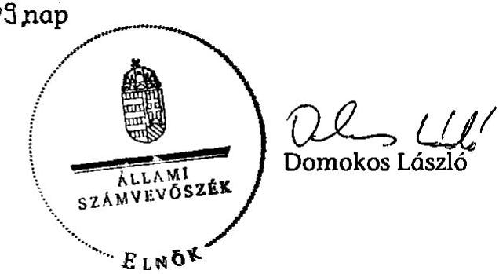

---

# MELLÉKLETEK

---

I/a. sz. melléklet
a V-2002-147/2011-2012. sz. jelentéshez

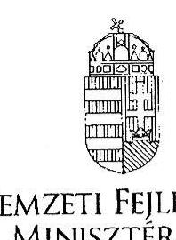

NEMZETI FEJLESZTÉSI MINISZTÉRIUM

NÉMETH LÁSZLÓNÉ
II-1912/88

Domokos László
elnök
Állami Számvevőszék

Budapest

Tisztelt Elnök Úr!

NFM/2581/7/2012.

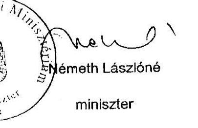

Köszönettel megkaptam „a 2007-től uniós finanszírozással megvalósuló, kormányzati döntésen alapuló beruházási, tervezési és előkészítési tapasztalatainak értékelése" tárgyú jelentését.

A tervezettel kapcsolatban észrevételt nem teszek.

Budapest, 2012. február 8

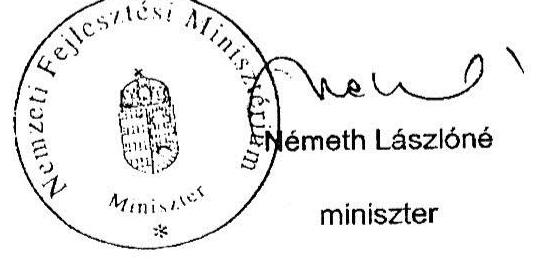

---

I/b. sz. melléklet
a V-2002-147/2011-2012. sz. jelentéshez
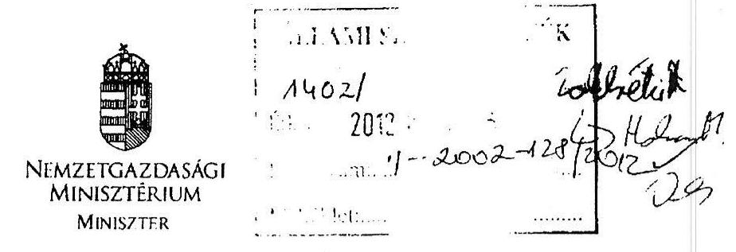

Ikt.: NGM / 2365 /A / 2012.

Hiv.szám: V-2002-125/2011-2012.

# Domokos László Úr részére 

elnök

Állami Számvevőszék

Budapest

## Tisztelt Elnök Úr!

Köszönettel megkaptam az Állami Számvevőszék által a 2007-től uniós finanszírozással megvalósuló, kormányzati döntésen alapuló beruházási projektek pályáztatási, tervezési és előkészítési tapasztalatainak értékelése ellenőrzése" tárgyú jelentéstervezetét.

A jelentéstervezeten az alábbi észrevételek átvezetését szíveskedjenek megtenni:

- Az ellenőrzés intézkedést igénylő megállapításai és javaslatai (24. oldal) részében összemosódik a nemzeti fejlesztési és a nemzetgazdasági miniszter felelőssége. Kérjük a miniszterek felelősségének egyértelmű meghatározását az egyes pontoknál. A felsorolt javaslatok közül a 4. b) alpontban tartjuk indokoltnak a területfejlesztés stratégiai tervezéséért felelős minisztert társfelelősként megjeleníteni.
- A jelentés-tervezet 23. oldalán szerepel, hogy „Az ÁSZ korábbi jelentésében (0802. sz ÁSZ jelentés) javaslatot tett, az állami fejlesztési feladatok tervezését erősítését célzó átfogó törvényi szabályozás elkészítésére.", mely javaslatot továbbra is indokoltnak tartják. A hivatkozott ÁSZ jelentés javaslata szerint ,,javasoljuk, a Kormánynak készítse elő az - Országos Fejlesztéspolitikai Koncepcióról szóló 96/2005. (XII. 25.) OGY határozattal összhangban - az állami fejlesztési feladatok tervezésének erősítését célzó átfogó törvényi szabályozást, amely megteremti a feladatellátás intézményi garanciáit és magába foglalja a hazai és uniós források egységes tervezési módszertanát is."
Tekintettel arra, hogy az ÁSZ véleménye alapján még mindig indokolt a feladat végrehajtása, valamint az Országos Fejlesztési Koncepció kidolgozásáért a területfejlesztés

---

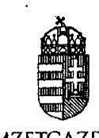

NEMZETGAZDASÁGI MINISZTÉRIUM MINISZTER
stratégiai tervezéséért felelős miniszter a felelős, javasoljuk a fentebb hivatkozott feladat megjelenítést a javaslatok között a területfejlesztés stratégiai tervezéséért felelős miniszter felelősségeként.

Budapest, 2012. február „8."

Üdvözlettel:
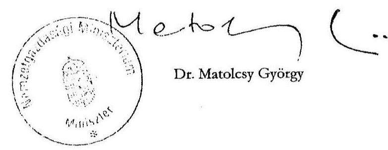

---

# Dr. Matolcsy György úr 

miniszter
Nemzetgazdasági Minisztérium

## Budapest

## Tisztelt Miniszter Úr!

A 2007-től uniós finanszírozással megvalósuló, kormányzati döntésen alapuló beruházási projektek pályáztatási, tervezési és előkészítési tapasztalatainak értékelése ellenőrzéséről szóló jelentés-tervezetre tett észrevételeit köszönettel megkaptam.

Az Állami Számvevőszék észrevételekre vonatkozó álláspontjáról a felügyeleti vezető által készített részletes tájékoztatást csatoltan megküldöm.

Tájékoztatom Miniszter urat, hogy a számvevőszéki jelentés szövegezése az elfogadott észrevételek figyelembevételével készül.

Budapest, 2012. április „16.".

Tisztelettel:
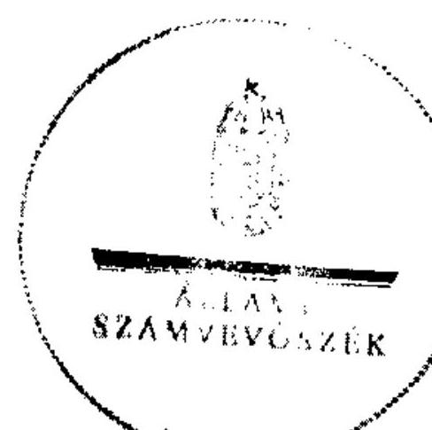

Domokos László

Melléklet: Tájékoztatás az elfogadott és az el nem fogadott észrevételekről

---

# Tájékoztatás 

## az elfogadott és az el nem fogadott észrevételekről

A 2007-től uniós finanszírozással megvalósuló, kormányzati döntésen alapuló beruházási projektek pályáztatási, tervezési és előkészítési tapasztalatainak értékelése ellenőrzése tárgyú jelentés-tervezetre a Nemzetgazdasági Minisztérium NGM/2365/4/2012. iktatószámú levelében észrevételeket fogalmazott meg.

Az észrevételek áttekintését követően elfogadtuk azon álláspontot, hogy a nemzeti fejlesztési miniszter és a nemzetgazdasági miniszter felelősségét egyértelműbben el kell különíteni a jelentésben. Az észrevételnek megfelelően, valamint figyelembe véve, hogy a jelentés összeállítását követően a nemzetgazdasági miniszter irányítása alatt létrejött a Nemzetgazdasági Tervezési Hivatal, pontosítottuk a javaslatok teljesítéséért felelős miniszterek megjelölését.

Elfogadtuk azon álláspontot is, hogy az ÁSZ korábbi (0802 számú) jelentésében tett és még nem teljesült, azonban továbbra is aktuális javaslatokat szerepeltessük a jelentésben. Az észrevételének megfelelően a jelentésben 6. sz. intézkedés igénylő megállapítások és javaslatok tartalmazzák a korábbi nem teljesült ÁSZ javaslatokat a jelenleg hatályos szabályozással összhangban.

El nem fogadott észrevétel nem volt.
Budapest, 2012. április „16."

## kown felow

Holman Magdolna
felügyeleti vezető

---

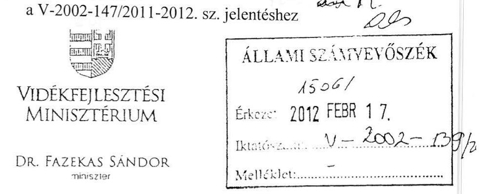

Iktatószám: 14558/2012.

Ügyintéző: Lőki Mariann
Telefonszám: 7952-463
E-mail: mariann.loki@vm.gov.hu
Hivatkozási szám:

# Domokos László 

elnök
részére

## Állami Számvevőszék

Budapest
Apáczai Csere János u. 10.
1052
Tárgy: ÁSZ jelentés a 2007-től uniós finanszírozással megvalósuló, kormányzati döntésen alapuló beruházási projektek pályáztatási, tervezési és előkészítési tapasztalatainak értékeléséről

## Tisztelt Elnök Úr!

Megköszönve, hogy jelen tárgyban korábban a Vidékfejlesztési Minisztériumnak megküldött V-2002-086/2011. számú jelentéstervezetre, Farkas Imre közigazgatási államtitkár úr által tett javaslatok többségében átvezetésre kerültek, az észrevételezésre megküldött, V-2002-117/2011-2012. számú tárgyi jelentéstervezettel kapcsolatosan a következő észrevételeket teszem.
Az észrevételeket a VM feladatkörét érintő KEOP projekteket érintő kérdésekre koncentráljuk.

A jelentéstervezet 35. oldal hatodik bekezdésében szerepel „A hulladékokról szóló 2008/98/EK irányelv", amely 2010. december 12-től hatályos, így a 2001. évtől hatályos, a hulladékgazdálkodásról szóló 2000. évi XLIII. törvényben esetében az arra történő hivatkozás nem releváns, bár kétségtelen, hogy az új irányelv számos előírásának a régebbi hazai törvény is megfelel. Az új irányelv megelőzésre és hasznosításra vonatkozó konkrét előírásai a 2008 decemberét követő akciótervekben és az átalakított pályázati felhívásban jelenhettek csak meg.
Az új irányelv átvételével kapcsolatos megállapításokat a bekezdés második részében javaslom úgy pontosítani, hogy „A keretirányelv EU felé vállalt harmonizációs határideje 2010. december 12. volt, ennek nem teljesülése miatt az Európai Bizottság eljárást indított...".
Megjegyzendő, hogy ez a mulasztás a vizsgált projektekre nincs hatással.

---

A 36. oldal első bekezdésében az Országos Hulladékgazdálkodási Tervet kihirdető OGY határozatra hivatkozva marasztalja el a Kormányt a szükséges jogszabály el nem készítése miatt, holott a határozatban jogszabály-alkotási kötelezettség nem szerepel. A hulladékgazdálkodásról szóló 2000. évi XLIII. törvényben 33. §-a az Országgyűlésnek ad feladatot, amelyet a hivatkozott határozat elfogadásával el is végzett. A Kormány ugyan a 2008. év végén lejárt Országos Hulladékgazdálkodási Terv pótlására nem terjesztett javaslatot az Országgyűlés elé, a hulladékgazdálkodási tervek hiányát 2009-től az NFÜ (KEOP Irányító Hatóság) megbízásából készült, az EU Bizottságnak megküldött „Támogatási Stratégia" pótolta, amely már figyelembe vette az új keretirányelv várható újdonságait. Ennek volt köszönhető, hogy lehetőség nyílt az új és a már megvalósult projektek esetében is a kisebb léptékű, hatékonyságnövelő fejlesztések támogatására, illetve a rekultiváció önálló támogatására is.

A már elfogadott és megkezdett projektek utólagos módosítására nem volt lehetőség. A jelentéstervezetben többször hivatkozott 2008/98/EK irányelvet csak az annak kihirdetése után indított projektek esetében lehetséges, illetve a hatályba lépést követően szükséges figyelembe venni.

Ezúton szeretném megköszönni tárgyi témában az ellenőrzés során tanúsított segítő együttműködésüket.

Budapest, 2012. február „13."
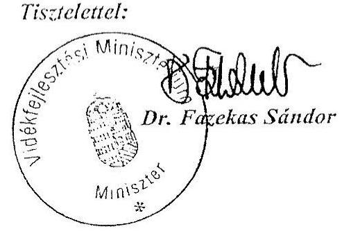

---

# Dr. Fazekas Sándor úr 

miniszter
Vidékfejlesztési Minisztérium

## Budapest

## Tisztelt Miniszter Úr!

A 2007-től uniós finanszírozással megvalósuló, kormányzati döntésen alapuló beruházási projektek pályáztatási, tervezési és előkészítési tapasztalatainak értékelése ellenőrzéséről szóló jelentés-tervezetre tett észrevételeit köszönettel megkaptam.

Az Állami Számvevőszék észrevételekre vonatkozó álláspontjáról a felügyeleti vezető által készített részletes tájékoztatást csatoltan megküldöm.

Tájékoztatom Miniszter urat, hogy a számvevőszéki jelentés szövegezése az elfogadott észrevételek figyelembevételével készül.

Budapest, 2012. április „16.".
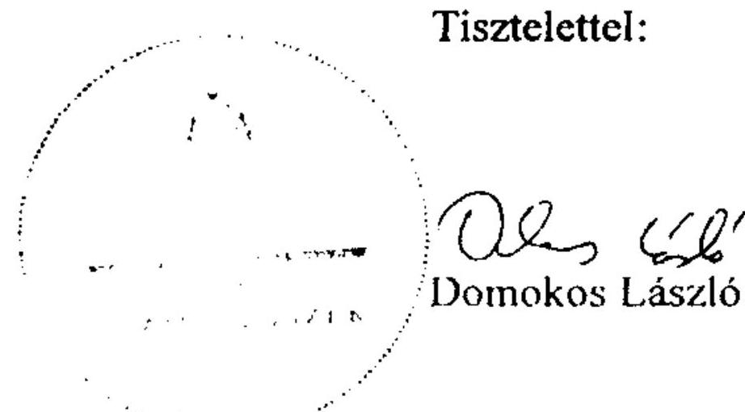

Melléklet: Tájékoztatás az elfogadott és az el nem fogadott észrevételekről

---

# Tájékoztatás   az elfogadott és az el nem fogadott észrevételekről 

A 2007-től uniós finanszírozással megvalósuló, kormányzati döntésen alapuló beruházási projektek pályáztatási, tervezési és előkészítési tapasztalatainak értékelése ellenőrzése tárgyú jelentés-tervezetre a Vidékfejlesztési Minisztérium HgF58/2012. iktatószámú levelében észrevételeket fogalmazott meg a minisztérium feladatkörébe tartozó KEOP projekteket érintően.

Az észrevételek áttekintését követően elfogadtuk azon álláspontot, hogy az EU Hulladék irányelvének megfelelő Hulladékról szóló törvény hatályba lépésének hiánya nem volt hatással a vizsgált projektekre az alkalmazott gyakorlat mellett. Ennek megfelelően az észrevételekkel érintett bekezdéseket a számvevőszéki jelentésben a következők szerint pontosítottuk.
„A hulladékokról szóló 2008/98/EK irányelv" egyes szempontjai tükröződtek a hulladékgazdálkodásról szóló hatályos törvényben (2000. évi XLIII. törvény), és annak végrehajtási rendeleteiben.
 (például a 94/2002. (V. 5.) Korm. rendelet a csomagolásról és a csomagolási hulladék keletkezésének szabályairól). Azonban az EU új, 2008/98/EK irányelve amely a hulladék keletkezésének megelőzését, a hulladék hasznosítását helyezi előtérbe - nem épült be a hazai szabályozásba (a Hgt. ezzel összefüggő módosítása tervezet szinten volt). A hulladékokról szóló 2008/98/EK irányelv EU felé vállalt harmonizációs határideje 2010. december 12. volt, ennek nem teljesítése miatt az Európai Bizottság eljárást indított, és választ várt az illetékes magyar szervektől a kötelezettség teljesítésére vonatkozóan. A Vidékfejlesztési Minisztérium által a jelenlegi ellenőrzés részére adott tájékoztatás szerint az EU Hulladék irányelvének megfelelő Hulladékról szóló törvény hatályba lépése 2012 elején várható."
„A Kormány a 2008. év végén lejárt OHT pótlására nem terjesztett elő javaslatot az Országgyűlés elé, a hulladékgazdálkodási tervek hiányát 2009-től az NFÜ (KEOP IH) megbízásából készült, az EU Bizottságnak megküldött „Támogatási Stratégia" pótolta az uniós támogatásokból finanszírozott fejlesztések esetében, amely már figyelembe vette a hulladékokról szóló 2008/98/EK irányelv új támogatási lehetőségeket. Ennek köszönhetően lehetőség nyílt az új és a már megvalósult projektek esetében is a kisebb léptékű, hatékonyságnövelő fejlesztések támogatására, illetve a rekultiváció önálló támogatására is." El nem fogadott észrevétel nem volt.
Budapest, 2012. április ,, IG. ,

Holman Magdolna
felügyeleti vezető

1 Az Európai Parlament és a Tanács 2008. november 19-ei 2008/98/EK irányelve

---

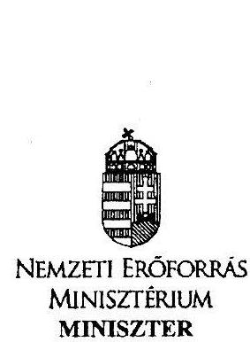

1/f. sz. melléklet
a V-2002-147/2011-2012. sz. jelentéshez

Iktatószám: 4853-4/2012/ELL

Hiv. szám: V-2002-125/2011-2012.
Ügyintéző: Bánkné Simon Judit (795-4430)

Domokos László részére
elnök

Állami Számvevőszék

Budapest
Apáczai Csere János u. 10.
1052

Tárgy: az Állami Számvevőszék által, „a 2007-től uniós finanszírozással megvalósuló, kormányzati döntésen alapuló beruházási projektek pályáztatási, tervezési és előkészítési tapasztalatainak értékelése ellenőrzéséről készített jelentéstervezet véleményezése

Tisztelt Elnök Úr!

A véleményezésre megküldött a 2007-től uniós finanszírozással megvalósuló, kormányzati döntésen alapuló beruházási projektek pályáztatási, tervezési és előkészítési tapasztalatainak értékelése ellenőrzéséről készített jelentés tervezetéhez az alábbi észrevételeket teszem:

1. A jelentés a kulturális ágazat tekintetében az alábbi kiemelt projekteket vizsgálja:
2. 16. Skanzen Örökség Program;
3. 29. TÁMOP 328 A) Múzeumok Mindenkinek;
4. 39. Szépművészeti Múzeum látogatóbarát fejlesztése, térszint alatti bővítése.

A projektek visszavonása kapcsán a 39. Szépművészeti Múzeum vonatkozásában a nem megfelelő előrehaladást jelzi okként. Ez valóban fennáll, azonban egyrészt nem róható fel a múzeum hibájának, másrészt a kiemelt projekt visszavonásáról szóló NFM előterjesztésben nem ezt, hanem az Új Széchenyi Terv kitörési pontjait támogató forrás hiányát jelölte meg az előterjesztő NFM.

„Tekintettel arra, hogy a Közép-Magyarországi Operatív Programban korlátozott szabad forrás áll rendelkezésre, a Szépművészeti Múzeum kiemelt projekt törlése szükséges ahhoz, hogy lehetővé váljék az ÚSZT kitörési pontjaihoz illeszkedő projektek uniós forrásból való támogatása. ”

---

A tervezet 46. oldalának utolsó bekezdését kérem kiegészíteni fentiekre tekintettel az alábbiak szerint:
„Ebből 10 esetben a visszavonás oka a szaktárca stratégiájába való illeszkedés hiánya (47-54., 58. és az 60. sz. projektek), két esetben az önerő hiánya (66., 68. sz. projektek), 1 esetben pedig a nem megfelelő előrehaladás, illetve az Új Széchenyi Terv prioritásaihoz szükséges forrás biztosítása (39. sz. projekt) volt."

Továbbá indokolt a 47. oldal alján a 76. számú lábjegyzet kiegészítése:
„${ }^{78} A$ 39. sz. projekt (Szépművészeti Múzeum térszint alatti bővítése) esetében a támogatási összeg a kezdeti 2,8 Mrd Ft-ról 4,4 Mrd Ft-ra emelkedett, de továbbra sem haladt a megfelelő ütemben a kedvezményezettnek fel nem róható okból. A kiemelt projekt törlése szükséges volt ahhoz, hogy lehetővé váljék az ÚSZT kitörési pontjaihoz illeszkedő projektek uniós forrásból való támogatása.
2. A 13. sz. melléklet a 29. sz. TÁMOP 3.2.8. A) kiemelt projektet úgy tünteti fel, mint amelynek hiányzik a stratégiai háttere. A vizsgálat megkezdésekor a NEFMI által kitöltött 4. sz. kérdőívben az alábbi választ szerepeltettük:

A fejlesztési irány „Konkrétan megjelenik a TÁMOP-ban is nevesített „A kulturális modernizáció irányai" c. stratégiai dokumentumban (II. Kultúra és oktatás kapcsolata - tehetséggondozás fejezetben, II/1.b pont), és alapvető része az elfogadás előtt álló Múzeumi stratégiának."
Fentiek alapján kérem a 13. számú mellékletben található táblázat módosítását.
Kérem Elnök Urat, hogy a jelentés véglegezésekor az észrevételeimet figyelembe venni szíveskedjenek.

Budapest, 2012. február „ ${ }^{7}$ „
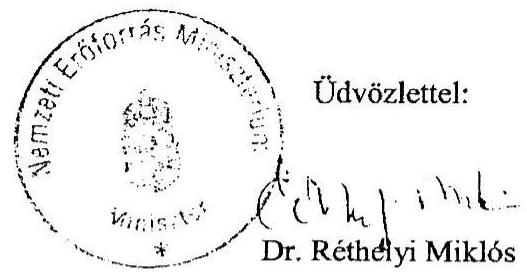

---

# Dr. Réthelyi Miklós úr 

miniszter
Nemzeti Erőforrás Minisztérium

## Budapest

## Tisztelt Miniszter Úr!

A 2007-től uniós finanszírozással megvalósuló, kormányzati döntésen alapuló beruházási projektek pályáztatási, tervezési és előkészítési tapasztalatainak értékelése ellenőrzéséről szóló jelentés-tervezetre tett észrevételeit köszönettel megkaptam.

Az Állami Számvevőszék észrevételekre vonatkozó álláspontjáról a felügyeleti vezető által készített részletes tájékoztatást csatoltan megküldöm.

Tájékoztatom Miniszter urat, hogy a számvevőszéki jelentés szövegezése az elfogadott észrevételek figyelembevételével készül.

Budapest, 2012. április " 16 ".
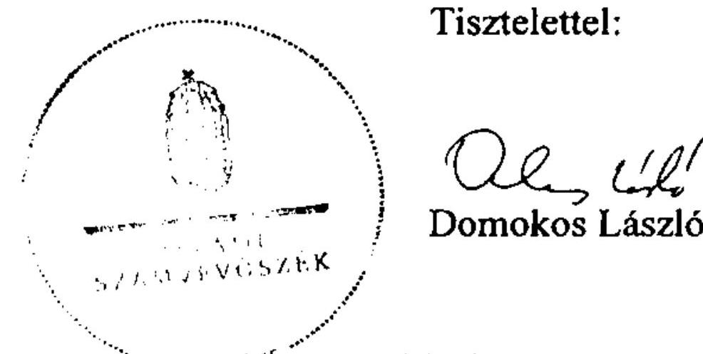

Melléklet: Tájékoztatás az elfogadott és az el nem fogadott észrevételekről

---

# Tájékoztatás 

## az elfogadott és az el nem fogadott észrevételekről

A 2007-től uniós finanszírozással megvalósuló, kormányzati döntésen alapuló beruházási projektek pályáztatási, tervezési és előkészítési tapasztalatainak értékelése ellenőrzése tárgyú jelentés-tervezetre a Nemzeti Erőforrás Minisztérium 4853-4/2012/ELL 12. iktatószámú levelében pontosító észrevételeket fogalmazott meg.

Az észrevételek áttekintését követően az észrevételeket elfogadtuk, így a Szépművészeti Múzeum projekt visszavonásának okai között feltüntettük az „Új Széchenyi Terv prioritásaihoz szükséges forrás biztosítását".

Pontosítottuk a 13. sz. mellékletben található táblázatot. Feltüntettük, hogy a 29. sz. projekt elfogadása előtt rendelkezésre állt „a kulturális modernizáció irányai" c. stratégiai dokumentum, ugyanakkor elfogadás előtt állt a „Múzeumi stratégia".

El nem fogadott észrevétel nem volt.
Budapest, 2012. április „ $1 C$ „,

Holman Magdolna
felügyeleti vezető

---

# ELNÖK 

## Domokos László

elnök

## Állami Számvevőszék

## Budapest

Apáczai Csere János u. 10.
1052

Tárgy: Jelentéstervezet észrevételezése

## Tisztelt Elnök Úr!

Köszönettel megkaptam az Állami Számvevőszék által „a 2007-től uniós finanszírozással megvalósuló, kormányzati döntésen alapuló beruházási projektek pályáztatási, tervezési és előkészítési tapasztalatainak ellenőrzéséről" készített Jelentéstervezetet, amelyre a Nemzeti Fejlesztési Ügynökség az alábbi észrevételeket teszi.

A jelentés 24. oldalán található 1.a) javaslat
„Vizsgáltassák ki azt, hogy az ellenőrzött időszakban (2007-2010) a kormányzati döntésen alapuló fejlesztések támogatási javaslatakor miért nem értékelték a projektek hozzájárulásának mértékét az ÚMFT fő céljaihoz (növekedés feltételeinek megteremtése, foglalkoztatás, felzárkózás). A vizsgálat eredményei alapján tegyék meg a szükséges intézkedéseket."

Véleményünk szerint a kiemelt projektek felülvizsgálata, szükség szerinti visszavonása, ill. módosítása a 1251/2010. (XI. 19.) Korm. határozattal (Az ÚMFT egyes 2007-2008. és 2009-2010. évi akcióterveinek módosításáról és az akciótervekben nevesített egyes kiemelt projektek nevesítésének visszavonásáról) megtörtént, ezért az 1.a) javaslatot nem tartjuk indokoltnak, kérjük törölni.

A jelentés 25. oldalán található 2. javaslat
„Vizsgáltassák felül a szerződéskötési, megvalósítási problémákkal küzdő projektek terveinek megalapozottságát, indokoltságát..."

Álláspontunk szerint a tervek megalapozottsága, indokoltsága helyett a végrehajtás problémáit érdemes vizsgálni, javasoljuk az alábbi szövegezést:
„Vizsgáltassák felül a szerződéskötési, megvalósítási problémákkal küzdő projektek jelenlegi helyzetét...."

[^0]
[^0]:    Nemzeti Fejlesztési Ügynökség
    Cím: H-1077 Budapest, Wesselényi u. 20-22.
    Levelezési cím: H-1393 Budapest, pf. 332.
    Tel.: $+3640 / 638-638$
    E-mail: nfu@nfu.gov.hu
    www.nfu.hu
    www.ujszechenyiterv.gov.hu

---

A jelentés 25. oldalán található 4. a) javaslat
„Vizsgáltassák felül az uniós és hazai jogszabályi kötelezettségekből és egyéb társadalmi szinten fontos célokból adódó feladatok indokoltságát. Továbbá határozzák meg a felülvizsgálat eredményeként szükségesnek ítélt feladatok forrásigényét."

Az uniós és hazai jogszabályi kötelezettségekből adódó feladatok esetében nem vizsgálandó azok indokoltsága, hiszen jogszabályon alapulnak, csak a forrásigényük vizsgálható, javasoljuk pontosítani a szöveget.

Ellenőrzési munkájukat megköszönve kérem, hogy fenti észrevételeinket szíveskedjenek figyelembe venni a jelentés szövegének véglegesítésekor.

Budapest, 2012. február 7.
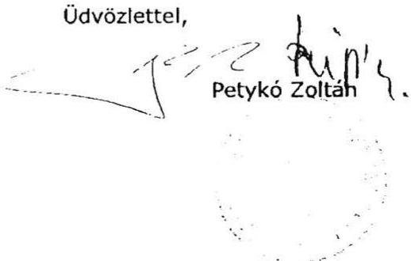

---

# FELÜGYELETI VEZETŐ 

Ikt.szám: V-2002-135/2011-2012.
Ügyintéző: Tóthné Kiss Katalin

## Petykó Zoltán úr

elnök
Nemzeti Fejlesztési Ügynökség

## Budapest

## Tisztelt Elnök Úr!

A 2007-től uniós finanszírozással megvalósuló, kormányzati döntésen alapuló beruházási projektek pályáztatási, tervezési és előkészítési tapasztalatainak értékelése ellenőrzéséről szóló jelentés-tervezetre tett észrevételeit köszönettel megkaptam.

Az Állami Számvevőszék észrevételekre vonatkozó álláspontjáról készített részletes tájékoztatásomat csatoltan megküldöm.

Tájékoztatom Elnök urat, hogy a számvevőszéki jelentés szövegezése az elfogadott észrevételek figyelembevételével készül.

Budapest, 2012. április" 16 ".
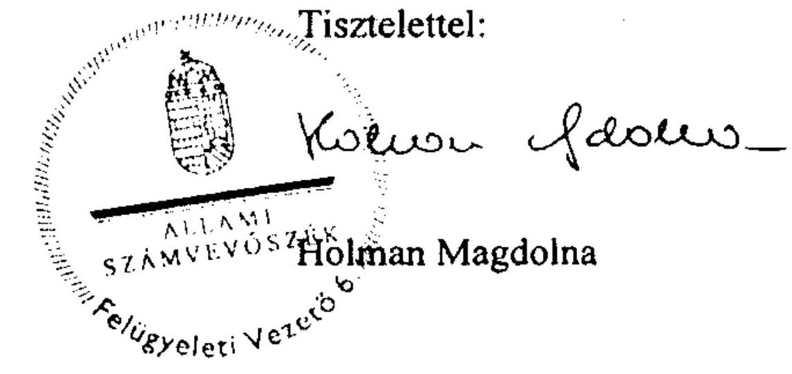

---

# Tájékoztatás 

## az elfogadott és az el nem fogadott észrevételekről

A Nemzeti Fejlesztési Ügynökség a jelentés javaslataihoz kapcsolódó észrevételeket fogalmazott meg.
Nem fogadtuk el az 1. a) javaslat törlésére vonatkozó álláspontot. Az észrevétel elutasítását indokolta, hogy Elnök úr az ellenőrzött 2007-2008-as és a 2009-2010-es akciótervek utólagos felülvizsgálatáról és ez alapján 2010 novemberében visszavont kiemelt projektekről (nem megfelelő előrehaladás, szakpolitikai koncepciók változása, források kimerülése miatt) tájékoztatott, azonban a javaslatunk nem az utólagos felülvizsgálatra vonatkozott. A jelentésben annak kivizsgálását javasoltuk, hogy a kiemelt projektek támogatási javaslatáról való kormányzati döntések során (az ellenőrzött időszakra eső 2007-2008-as és a 2009-2010-es akciótervi nevesítéseket megelőzően) miért nem értékelték a projektek ÚMFT célokhoz való hozzájárulásának mértékét. Az előzőek alapján a nemzeti fejlesztési miniszternek tett 1. a) javaslatot fenntartva a következők szerint pontosítottuk.
„Vizsgáltassa ki azt, hogy az ellenőrzött időszakban (2007-2010) a kormányzati döntésen alapuló fejlesztések támogatási javaslatakor miért nem értékelték a projektek hozzájárulásának mértékét az ÚMFT fő céljaihoz (növekedés feltételeinek megteremtése, foglalkoztatás, felzárkózás). Intézkedjen arra vonatkozóan, hogy a vizsgálat eredményének függvényében jelöljék meg az esetleges felelősöket, és személyes felelősség megállapítása esetén tegyék meg a szükséges intézkedéseket, illetve értékeljék ki a tapasztalatokat a kiemelt fejlesztések jövőbeni tervezéséhez. "

Elfogadtuk 2. javaslatra tett azon észrevételét, hogy a projektek jelenlegi helyzetét érdemes vizsgálni ez alapján a javaslatot a következők szerint pontosítottuk.
„Vizsgáltassa felül a szerződéskötési, megvalósítási problémákkal küzdő projektek jelenlegi helyzetét, terveinek megalapozottságát, indokoltságát. A felülvizsgálat eredményétől függően hozza meg a szükséges döntéseket, hogy az elhúzódó szerződéskötések ne kockáztassák az uniós források időbeni, eredményes felhasználását."
Elfogadtuk azon észrevételt, hogy az uniós és a hazai jogszabályi kötelezettségekből adódó feladatok esetében nem vizsgálandó azok indokoltsága, hiszen jogszabályon alapulnak, csak a forrásigényük vizsgálható. Ez alapján az észrevételezett 4.a) javaslatot pontosítottuk, kiegészítettük (új 5.a) és b) javaslatok) a következők szerint.
„Intézkedjenek az uniós és a hazai jogszabályi kötelezettségekből és egyéb társadalmi célokból adódó feladatok, forrásigények felmérésére, felülvizsgálatára és a felülvizsgált igények ütemezésére nemzeti szinten."
„Vizsgáltassák felül a csatlakozáskor vállalt uniós környezetvédelmi és egyéb kötelezettségek forrásszükségletét, a vállalások teljesíthetőségét a rendelkezésre álló uniós és hazai források ismeretében."
Budapest, 2012. április „ 16 „

---

# KÖZIGAZGATÁSI ÉS IGAZSÁGÜGYI MINISZTÉRIUM KÖZIGAZGATÁSI ÁLLAMTITKÁR 

Iktatószám: XIII-E/9/10/2012.

Domokos László elnök úr részére
Állami Számvevőszék

## Budapest

Apáczai Csere János u. 10. 1052

Tárgy: Állami Számvevőszék jelentéstervezete a 2007-től uniós finanszírozással megvalósuló, kormányzati döntésen alapuló beruházási projektek pályáztatási, tervezési és előkészítési tapasztalatainak értékelése ellenőrzése tárgyában

## Tisztelt Elnök Úr!

Az Állami Számvevőszék által megküldött V-2002-117/2011-2012. iktatószámon nyilvántartott „a 2007-től uniós finanszírozással megvalósuló, kormányzati döntésen alapuló beruházási projektek pályáztatási, tervezési és előkészítési tapasztalatainak értékelése ellenőrzéséről" szóló jelentéstervezettel kapcsolatban tájékoztatom, hogy az abban foglaltakra észrevételt nem teszek.

Budapest, 2012. február 7.
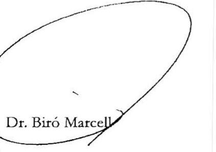

---

2/a. sz. melléklet

a V-2002-147/2011-2012. sz. jelentéstervezethez

# A strukturális alapok és a Kohéziós Alap által finanszírozott programok pénzügyi kereteinek megoszlása a 2004-2006 és a 2007-2013 közötti időszakban

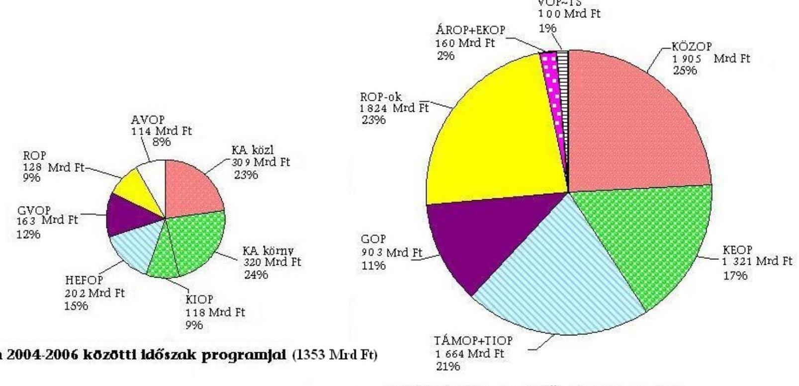

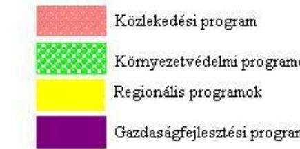

---

# Az operatív programok pénzügyi keretei és a kormányzati döntésen alapuló projektek támogatásainak alakulása

2010. 12. 31-ei állapot szerint

|  Programok | Pénzügyi keret 2007-2013 között (teljes keret) | Leszerződött összeg 2007-2010 között (teljes keret) | Leszerződött összeg 2007-2010 között (kormányzati döntésen alapuló projektekre) |  |  |  |  |  |  |  | Szerződött összeg / OP keret  |
| --- | --- | --- | --- | --- | --- | --- | --- | --- | --- | --- | --- |
|   |  |  | kiemelt |  | nagyprojekt |  | 5 Mrd Ft feletti |  | összesen |  |   |
|   | Mrd Ft | Mrd Ft | db | Mrd Ft | db | Mrd Ft | db | Mrd Ft | db | Mrd Ft | \%  |
|   | 1 | 2 | 3 | 4 | 5 | 6 | 7 | 8 | 9 | 10 | 11=(10)/(1)  |
|  KÖZIG programok
(ÁROF/ESZA, EKOF/ERFA) | 159,6 |  | 40 | 53,3 | 0 | 0,0 | 0 | 0,0 | 40 | 53,3 | 33,4\%  |
|  Regionális programok
(DAOF/ERFA, EKOF/ERFA, EMOF/ERFA,
KDOF/ERFA, KMOF/ERFA, NYDOF/ERFA) | 1823,7 |  | 165 | 214,7 | 0 | 0,0 | 0 | 0,0 | 165 | 214,7 | 11,8\%  |
|  GOP | 903,4 |  | 1 | 4,5 | 0 | 0,0 | 0 | 0,0 | 1 | 4,5 | 0,5\%  |
|  KÖZOP (KÖZOP/KA, KÖZOP/ERFA) | 1904,6 |  | 47 | 204,1 | 13 | 1003,9 | 0 | 0,0 | 60 | 1208,0 | 63,4\%  |
|  Humán erőforrás programok (TÁMOF/ESZA, TEOF/ERFA) | 1663,6 |  | 44 | 206,6 | 0 | 0,0 | 14 | 122,8 | 58 | 329,4 | 19,8\%  |
|  Környezet és energia programok (KEOF/KA, KEOF/ERFA) | 1320,5 |  | 0 | 0,0 | 16 | 232,7 | 5 | 36,9 | 21 | 269,6 | 20,4\%  |
|  Végrehajtási Operatív Program | 99,6 |  |  |  |  |  |  |  |  |  |   |
|  Mindösszesen | 7875,0 | 4027,4 | 297 | 683,2 | 29 | 1236,6 | 19 | 159,7 | 345 | 2079,5 |   |
|   |  |  |  | 33\% |  | 59\% |  | 8\% |  | 100\% |   |

Forrás: NFÜ adatszolgáltatása

---

3. sz. melléklet

a V-2002-147/2011-2012. sz. jelentéstervezethez

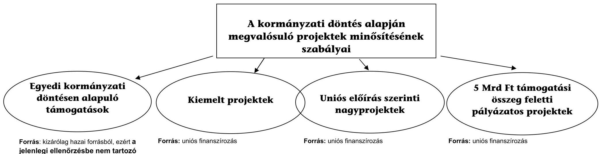

**Forrás:** kizárólag hazai forrásból, ezért **a jelenlegi ellenőrzésbe nem tartozó téma.**

**Állami támogatás fogalma** az EUMSz 107. cikk (1) bekezdése alapján: Ha a Szerződések másként nem rendelkeznek, a belső piaccal összeegyeztethetetlen a tagállamok által vagy állami forrásból bármilyen formában nyújtott olyan támogatás, amely bizonyos vállalkozásoknak vagy bizonyos áruk termelésének előnyben részesítése által torzítja a versenyt, vagy azzal fenyeget, amennyiben ez érinti a tagállamok közötti kereskedelmet. (A tilalom azonban nem abszolút érvényű.)

**Egyedi támogatás:** olyan támogatás, amelyet nem egy támogatási program alapján ítéltek oda, és azon támogatás, amely támogatási program alapján kötelező bejelentés alá tartozik;

**Támogatási program:** olyan jogi aktus, amely alapján egyedi támogatásokat lehet megítélni azon vállalkozások számára, amelyeket a jogi aktusban általános vagy elvont módon jelöltek meg. (659/2006/EK tanácsi rendelet 1. cikk d), e) pontja)

**Forrás:** uniós finanszírozás

**"Régi szabályozás":**

**A kiemelt projekt fogalma:** a Kormány által **egyedileg jóváhagyott** projekt, amelyet az **akcióterv nevesítve** tartalmaz (255/2006. (XII. 8.) Korm. rendelet 2. § (1) bekezdés h) pont);

**A Kormány nevesíti** az akciótervben a kiemelt projekteket (255/2006. (XII. 8.) Korm. rendelet 3. § c) pont).

**"Régi szabályozás":**

**A nagyprojekt fogalma:** Környezetvédelem területén 25 millió euró (2010. VI. 17-től a privilégizálás megszűnt), más szakterületen **50 millió euró összköltség feletti** olyan beruházás, melynek kiválasztása kiemelt projekt, egyfordulós pályázat vagy kétfordulós pályázat eljárások szerint történhet, és támogatásához az Európai Bizottság jóváhagyása szükséges. (255/2006. (XII. 8.) Korm. rendelet 2. § (1) bekezdés s) pont)

**Támogatásra** javasolt nagyprojektről az NFÜ a miniszterrel közös előterjesztést készít a Kormány számára. **A Kormány dönt** arról, hogy kérelmezi-e a nagyprojekt támogatását az Európai Bizottságnál. (16/2006. (XII. 28.) MeHVM-PM rendelet 13. § (8) bekezdés).

**"Új szabályozás":**

**A Kormány elfogadja** a nagyprojektekre vonatkozóan az Európai Bizottság számára benyújtandó javaslatokat.(4/2011. (I. 28.) Korm. rendelet 3. § c) pont)

**5 Mrd Ft támogatási összeg feletti pályázatos projektek**

**Forrás:** uniós finanszírozás

**"Régi szabályozás":**

A Kormány jóváhagyja az operatív programban, illetve **akciótervben nem nevesített**, **5 milliárd forintot meghaladó** támogatásra javasolt projekt javaslatokat (255/2006. (XII. 8.) Korm. rendelet 3. § d) pont).

Ha a projektjavaslat javasolt támogatása meghaladja az 5 milliárd forintot, az NFÜ előterjesztésére a **Kormány hagyja jóvá** a döntést (16/2006. (XII. 28.) MeHVM-PM rendelet 9. § (2) bekezdés).

**"Új szabályozás":**

A Kormány **dönt** az ötmilliárd forintot meghaladó támogatási igényű projektjavaslatokról (4/2011. (I. 28.) Korm. rendelet 3. § f) pont).

---

## A kiemelt kiválasztási eljárás főbb lépései

|  Tevékenység | Tevékenységet végző  |
| --- | --- |
|  - Kiemelt projekt kezdeményezése -
javaslat benyújtása javaslattevő
szervhez | Projekt gazda  |
|  - Előszűrés | Javaslattevő  |
|  - Projektjavaslat befogadás, előértékelés,
tartalmi elbírálás | NFÜ - Bíráló bizottság  |
|  - Projektjavaslat Kormány elé
terjesztése | NFÜ, az NFM-en keresztül  |
|  - Projektjavaslat véleményezése a
Kormány döntése előtt | Fejlesztéspolitikai irányító
Testület 2008. 04. 30-áig  |
|  - A Kormány döntése | Kormány  |
|  - Részletes projektjavaslat benyújtása | Projektgazda NFÜ-höz  |
|  - Részletes projektjavaslat formai és
tartalmi elbírálása | NFÜ, illetve közreműködő
szervezetek - két független
szakértő és Bíráló bizottság  |
|  - Támogatási szerződés megkötése | NFÜ, illetve közreműködő
szervezetek és a támogatott  |

## A nagyprojektek sajátosságai a kiválasztási eljárásban

|  Tevékenység | Tevékenységet végző  |
| --- | --- |
|  - Projektjavaslat értékelés, elbírálás | NFÜ  |
|  - Projektjavaslat Kormány elé terjesztése | NFÜ, az NFM-en keresztül  |
|  - Kormány döntése -
a nagyprojekt Európai Bizottsághoz történő
továbbításáról | Kormány  |
|  - A támogatási szerződés megkötése
(NFÜ ellenjegyzés) | NFÜ, illetve közreműködő
szervezetek és Projektgazda  |
|  - A támogatási kérelem megküldése
az Európai Bizottságnak | NFÜ  |
|  - Az Európai Bizottság döntése
Jóváhagyás - az uniós alapokból származó pénzügyi
hozzájárulás meghatározása a szerződésben
Elutasítás - a támogatási szerződés hatályát veszti | Európai Bizottság  |

---

5. sz. melléklet a V-2002-147/2011-2012. sz. jelentéstervezethez Az ellenőrzésre kiválasztott operatív programok, fejlesztési területek és projektek listája

|  |   |   |   |   |   |   |   |   |   |   |   |
| --- | --- | --- | --- | --- | --- | --- | --- | --- | --- | --- | --- |
|   |  |  |  |  |  |  |  | Az ellenőrzési program szerint |  | A bekezdési ellenőrzés során |   |
|   |  |  |  |  |  |  |  | 2010-12-31-ig |  | 2011-01-31-ig |   |
|  1 |  | Projekt azonosító
(10 sz

---

|   |  |  |  |  |  |  |  |  |  |  |  |  |  |  |  |  |  |  |  |  |  |  |  |  |  |   |
| --- | --- | --- | --- | --- | --- | --- | --- | --- | --- | --- | --- | --- | --- | --- | --- | --- | --- | --- | --- | --- | --- | --- | --- | --- | --- | --- |
|   |  |  |  |  |  |  |  |  |  |  |  |  |  |  |  |  |  |  |  |  |  |  |  |  |  |   |
|   |  |  |  |  |  |  |  |  |  |  |  |  |  |  |  |  |  |  |  |  |  |  |  |  |  |   |
|   |  |  |  |  |  |  |  |  |  |  |  |  |  |  |  |  |  |  |  |  |  |  |  |  |  |   |
|   |  |  |  |  |  |  |  |  |  |  |  |  |  |  |  |  |  |  |  |  |  |  |  |  |  |   |
|   |  |  |  |  |  |  |  |  |  |  |  |  |  |  |  |  |  |  |  |  |  |  |  |  |  |   |
|   |  |  |  |  |
 |  |  |  |  |  |  |  |  |  |  |  |  |  |  |  |  |  |  |  |  |   |
|   |  |  |  |  |  |  |  |  |  |  |  |  |  |  |  |  |  |  |  |  |  |  |  |  |  |   |
|   |  |  |  |  |  |  |  |  |  |  |  |  |  |  |  |  |  |  |  |  |  |  |  |  |  |   |
|   |  |  |  |  |  |  |  |  |  |  |  |  |  |  |  |  |  |  |  |  |  |  |  |  |  |   |
|   |  |  |  |  |  |  |  |  |  |  |  |  |  |  |  |  |  |  |  |  |  |  |  |  |  |   |
|   |  |  |  |  |  |  |  |  |  |  |  |  |  |  |  |  |  |  |  |  |  |  |  |  |  |   |
|   |  |  |  |  |  |  |  |  |  |  |  |  |  |  |  |  |  |  |  |  |  |  |  |  |  |   |
|   |  |  |  |  |  |  |  |  |  |  |  |  |  |  |  |  |  |  |  |  |  |  |  |  |  |   |
|   |  |  |  |  |  |  |  |  |  |  |  |  |  |  |  |  |  |  |  |  |  |  |  |  |  |   |
|   |  |  |  |  |  |  |  |  |  |  |  |  |  |  |  |  |  |  |  |  |  |  |  |  |  |   |
|   |  |  |  |  |  |  |  |  |  |  |  |  |  |  |  |  |  |  |  |  |  |  |  |  |  |   |
|   |  |  |  |  |  |  |  |  |  |  |  |  |  |  |  |  |  |  |  |  |  |  |  |  |  |   |
|   |  |  |  |  |  |  |  |  |  |  |  |  |  |  |  |  |  |  |  |  |  |  |  |  |  |   |
|   |  |  |  |  |  |  |  |  |  |  |  |  |  |  |  |  |  |  |  |  |  |  |  |  |  |   |
|   |  |  |  |  |  |  |  |  |  |  |  |  |  |  |  |  |  |  |  |  |  |  |  |  |  |   |
|   |  |  |  |  |  |  |  |  |  |  |  |  |  |  |  |  |  |  |  |  |  |  |  |  |  |   |
|   |  |  |  |  |  |  |  |  |  |  |  |  |  |  |  |  |  |  |  |  |  |  |  |  |  |   |
|   |  |  |  |  |  |  |  |  |  |  |  |  |  |  |  |  |  |  |  |  |  |  |  |  |  |   |
|   |  |  |  |  |  |  |  |  |  |  |  |  |  |  |  |  |  |  |  |  |  |  |  |  |  |   |
|   |  |  |  |  |  |  |  |  |  |  |  |  |  |  |  |  |  |  |  |  |  |  |  |  |  |   |
|   |  |  |  |  |  |  |  |  |  |  |  |  |  |  |  |  |  |  |  |  |  |  |  |  |  |   |
|   |  |  |  |  |  |  |  |  |  |  |  |  |  |  |  |  |  |  |  |  |  |  |  |  |  |   |
|   |  |  |  |  |  |  |  |  |  |  |  |  |  |  |  |  |  |  |  |  |  |  |  |  |  |   |
|   |  |  |  |  |  |  |  |  |  |  |  |  |  |  |  |  |  |  |  |  |  |  |  |  |  |   |
|   |

---

# Kivonat 

## a nemzetgazdasági tervezés megújítása című ÁSZKUT tanulmányból

2010. szeptember
„A tervezési területek áttekintése alapján megállapítható, hogy mind a szakmai-tartalmi kapcsolatok, mind az időhorizontok, mind pedig a pénzügyi és reálfolyamatok szempontjából szorosabban záró, a jelenleginél homogénebb tervezési rendszer kialakítására van szükség Magyarországon.

A megvalósítást szolgáló gyakorlati teendők főbb irányait a következőképpen foglalhatjuk össze:

- A nemzetgazdasági tervezés felelősségi, intézményi rendjének kialakításában első meghatározó lépés a tervezőmunkák koncepcionális és módszertani irányításáért felelős és közreműködő állami intézményeknek a kijelölése, valamint feladatköreiknek a meghatározása.
- Második lépés a megújítást szolgáló jogszabályok elkészítése, amelynek középpontjában a nemzetgazdasági tervezésről szóló törvény kidolgozása áll. A törvény hatálya valamennyi társadalmi-gazdasági tervnek minősülő nemzeti döntésre terjedjen ki, tehát a tervezés intézményrendszere és folyamata kerüljön törvényi szinten meghatározásra. E téren nélkülözhetetlen teendő a tervezés főbb területein megoldandó feladatok rendszerszerű áttekintése, „leltározása" is.
- Harmadik fontos lépés a tervező apparátus (szervezeti egység) újbóli létrehozása a szakpolitika alkotás erősítése végett a minisztériumokban. (Mint ismeretes, ezek a főosztályok - az ott dolgozó ágazati tervezők száma 2004-ben 150-170 fő volt - az utóbbi években megszűntek / átalakultak / összezsugorodtak.)
- Negyedik lépésként a korszerűsített nemzetgazdasági tervezés alkalmazásának nélkülözhetetlen feltétele a tervezési célokra alkalmas információs rendszer kialakítása. A jövőkép meghatározása és folyamatos „karbantartása", az állami feladatok összehangolt megoldása igényli kiépítésének mielőbbi megkezdését.
- Ötödik lépésként több kutató intézet
 részvételével el kell indítani olyan kutatásokat, melyek a felhasználható, egységes tervezési módszertan alapjait teremtenék meg, továbbá elősegítenék e módszertan oktatását a felsőoktatási intézményekben.

Olyan rendszert szükséges kialakítani, amelynek legfontosabb sajátossága, hogy a reálfejlesztés (nemzeti fejlesztési koncepció és terv, a területfejlesztés, a vidékfejlesztés, a településfejlesztés, a gazdaságfejlesztés, a szociális és kulturális szféra fejlesztése) és a pénzügyi tervezés (Konvergencia Program és az éves költségvetések központi és helyi szinteken egyaránt) intézményes összhangja biztosított legyen. E rendszerrel szemben támasztott másik elvárás, hogy a fejlesztéspolitika és a gazdasági versenyképesség követelményeit szem előtt tartva illessze bele a strukturális modernizációt a fejlesztési tervekbe, szűnjön meg a komplexitás figyelmen kívül hagyása, ami az eddigi reformkísérleteket jellemezte.

Az Új Magyarország Fejlesztési Terv két operatív programja (az Államreform és az Elektronikus Kormányzás OP) közvetlenül is forrást biztosíthat a korszerű fejlesztő állam alapjainak megteremtését szolgáló tervezési rendszer kialakításának céljaira."

---

# A támogatásra javasolt, majd visszavont projektek értékelése

| $\begin{aligned} & \text { Tétel } \\ & \text { sz. } \end{aligned}$ | Elle-   nőrzött   projek   sz. | Projekt megnevezése | Operatív program | Projekt meghiúsulásának oka |  |  |
| :--: | :--: | :--: | :--: | :--: | :--: | :--: |
|  |  |  |  | Kedvezményezett   lépett vissza | A támogató vonta vissza | Áttervezik |
| 1 | 37 | Debreceni Aquaticum | ÉAOP | nem tartotta szükségesnek a fejlesztést |  |  |
| 2 | 38 | Budapest Szíve II. ütem | KMOP |  |  | elők. hiányosságok |
| 3 | 39 | Szépművészeti Múzeum | KMOP |  | nem megfelelő előrehaladás |  |
| 4 | 47 | Esélyegyenlőség fejl.polIT.   Kapacitása | ÁROP |  | nem illeszkedett a szaktárca stratégiájába |  |
| 5 | 48. | Interoperabilitás | EKOP |  | nem illeszkedett a szaktárca stratégiájába |  |
| 6 | 49. | KESzR szolg. Informatikai auditja | EKOP |  | nem illeszkedett a szaktárca stratégiájába |  |
| 7 | 50. | Telefonos Ügyfélkiszolgálási rendszer | EKOP |  | nem illeszkedett a szaktárca stratégiájába |  |
| 8 | 51. | Elektronikus azonosítási rendszer | EKOP |  | nem illeszkedett a szaktárca stratégiájába |  |
| 9 | 52 | Zártcélú hálózati szolgáltatások bővítése | EKOP |  | nem illeszkedett a szaktárca stratégiájába |  |
| 10 | 53 | Hatósági eljárások elektronikus támogatása | EKOP |  | nem illeszkedett a szaktárca stratégiájába |  |
| 11 | 54 | Elektronikus adatcsere államigazgatásban | EKOP |  | nem illeszkedett a szaktárca stratégiájába |  |
| 12 | 55 | Zsolnay Porcelánmanufaktúra Zrt. IKEA projekt | GOP |  | a támogatás feltétele (beszállítói szerződés megkötése) nem teljesült |  |
| 13 | 56 | Szűrőprogramok és kommunikációja | TÁMOP |  |  | elők. hiányosságok |
| 14 | 57 | Betegazonosítás fejlesztése, eHealth rendszer | TÁMOP |  |  | elők. hiányosságok |
| 15 | 58 | Atipikus foglalk. formák támogatása | TÁMOP |  | nem illeszkedett a szaktárca stratégiájába |  |
| 16 | 59 | M.erő-piaci kulcskompetenciák fejl | TÁMOP |  |  | elők. hiányosságok |
| 17 | 60 | 4602., 4606. jelű utakon elérhetős jav | KMOP |  | nem indokolt a fejlesztés |  |
| 18 | 63 | 33.sz. főút Hortobágyi szakasz megerősítése | KÖZOP | hazai forrásból valósítja meg a projektet |  |  |
| 19 | 64 | Havunna és Gloriette lakót. 42-es vill | KÖZOP |  |  | elők. hiányosságok (az érintett önkorm. nem tudtak megegyezni) |
| 20 | 65 | Elektronikus Kult Szakképzési Felület | TÁMOP |  |  | elők. hiányosságok |
| 21 | 66 | Jászberényi Beszállítói Tudásközpont (JBTK) | ÉAOP |  | önerő hiánya |  |
| 22 | 67 | Integrált foglalkoztatási és szociális szolgáltatás | KMOP |  | hiányos projektjavaslat |  |
| 23 | 68 | Szob-Nagy börzsöny kisvasút II. ütem | KMOP |  | önerő hiánya |  |
| 24 | 71 | Önkorm feladatellátás tesztelés Ddtúl | ÁROP |  | nem indokolt a fejlesztés, a projektet két másik projekt keretében már megvalósítják |  |

---

# A támogatásra javasolt, de szerződéssel nem rendelkező projektek tájékoztató adatai

|  Tétel sz. | 1. | 2. | 3. | 4. | 5. | Összesen  |
| --- | --- | --- | --- | --- | --- | --- |
|  Ellenőrzött projekt sz. | 69 | 72 | 73 | 74 | 75 |   |
|  Projekt rövid neve | VTT-hez bel -és csapadékvíz J-N-Sz | Integrált nemzeti ingatlankataszter | Bp-Lökösháza vasút rekonstr III/2. | Átfogó minőségfejl. a közoktatásban | Sürgősségi ellátás fejlesztése |   |
|  támogatási szerződés folyamatban | 1 |  |  |  |  |   |
|  támogatási szerződés nem jött létre |  | 1 | 1 | 1 | 1 |   |
|  az akciótervi nevesítés időpontjához képest eltelt idő | $\begin{gathered} 525 \text { nap } \ \sim 1,5 \text { év } \end{gathered}$ | $\begin{gathered} 344 \text { nap } \ \sim 1 \text { év } \end{gathered}$ | $\begin{gathered} 1095 \text { nap } \ \sim 3 \text { év } \end{gathered}$ | $\begin{gathered} 1496 \text { nap } \ \sim 4 \text { év } \end{gathered}$ | $\begin{gathered} 1492 \text { nap } \ \sim 4 \text { év } \end{gathered}$ |   |
|  késedelem oka | A Vásárhelyi Tervhez kapcsolódóan több települési önkormányzat által megvalósítandó projekt időigényessége. | Költségcsökkentés (8 Mrd Ft-ról 1,6 Mrd Ft-ra csökk.) miatt a műszaki tartalmat újra kell gondolni. | Nem döntöttek a fejlesztés mikéntjéről. Az ISPA-ból megvalósuló vágányt is felújítják-e (az 5 év még nem telt el), vagy lesz egy új vágány és megmarad mellette az ISPA-ból felújított régi vágány. | áttervezések | Ingatlanok tulajdonviszonyainak rendezetlensége, megfelelő koordinációs képességgel rendelkező szervezeti egység hiánya. |   |
|  Támogatási szerződés/Akcióterv sz. összeg | 2,5 Mrd Ft | 1,5 Mrd Ft | 118,8 Mrd Ft* | 10,1 Mrd Ft | 11,5 Mrd Ft | 144,4 Mrd Ft  |

[^0] [^0]: * Megjegyzés: a 118,8 Mrd Ft tartalmazza a Budapest-Lökösháza vasút rekonstrukciója III/1. ütem javasolt támogatási összegét is.

---

# A hasznosuló projektek eredményességének értékelése

|  Ssz. |  | Projekt megnevezése | Leszerződött támogatás (EU és hazai) M Ft |  |  | Projekt befejezése |  |  | A célokat mérő, az ellenőrzésben kiválasztott mutatók |  |  |  |  | Indikátor tartalmi változása  |
| --- | --- | --- | --- | --- | --- | --- | --- | --- | --- | --- | --- | --- | --- | --- |
|   |  |  | eredeti | módosított / (megvalósult) | eltérés | eredeti | módosított / (megvalósult) | eltérés a tervezett-től nap | neve | eredeti
célérték | mód.
célérték | tényleges
célérték | tényleges/
módosított
célérték |   |
|   |  |  | 1 | 2 | $3=(2) /(1)$ | 4 | 5 | $6=(5)-(4)$ | 7 | 8 | 9 | 10 | $11=(10) /(9)$ | 12  |
|  1 | 2 | Személyügyi központ fejlesztése és telj értékelése | 1789,2 | 1771,2 | 99,0\% | 2009.03.31 | 2010.12.31 | 640 | A képzésen résztvettek száma | 2500 | 2500 | 4431 | 177,2\% | Nem  |
|  2 | 4 | Nyíregyházi állatpark | 797,5 | 796,9 | 99,9\% | 2010.03.31 | 2011.03.31 | 365 | támogatott turisztikai attrakciók látogatottsága (fő) | 400469 | 400469 | $\begin{gathered} 400000 \ (2010.08 .) \end{gathered}$ | _ | Nem  |
|   |  |  |  |  |  |  |  |  | teremtett új munkahelyek (db) | 85 | 85 | 91 | 107,1\% | Nem  |
|  3 | 5 | Tuzsér 38143.út | 57,7 | 53,1 | 92,0\% | 2009.11.30 | 2010.06.30 | 212 | felújított út hossza (km) | 1,27 | 1,27 | 1,27 | 100,0\% | Nem  |
|  4 | 6 | Rakamaz 3633. út | 426,3 | 391,7 | 91,9\% | 2009.12.31 | 2010.06.30 | 181 | felújított út hossza (km) | 15,1 | 15,1 | 15,1 | 100,0\% | Nem  |
|  5 | 15 | Alsónémedi-Bugyi átfelújítás | 3591,4 | 3224,3 | 89,8\% | 2009.11.30 | 2010.07.31 | 243 | felújított út hossza (km) | 34,4 | 34,4 | 34,4 | 100,0\% | Nem  |
|  6 | 16 | Szentendrei Skanzen | 2000,0 | 2005,1 | 100,3\% | 2010.06.30 | 2010.07.01 | 243 | támogatott turisztikai attrakciók látogatottsága [befejezés+1 év] (fő) | 330000 | 270000 | még nem releváns | _ | Nem  |
|   |  |  |  |  |  |  |  |  | teremtett új munkahelyek (db) | 25 | 25 | 25 | 100,0\% | Nem  |
|  7 | 17 | HM Állami Eü-i Központ fejlesztése | 300,0 | 300,0 | 100,0\% | 2009.12.14 | 2010.03.31 | 107 | beszerzett digitális orvostechnológiai eszközök (db) | 2 | 2 | 2 | 100,0\% | Nem  |
|   |  |  |  |  |  |  |  |  | nagyteljesítményű monitorok műtőkben (db) | 10 | 10 | 10 | 100,0\% | Nem  |
|   |  |  |  |  |  |  |  |  | IT munkaállomások száma | 8 | 8 | 8 | 100,0\% | Nem  |
|  8 | 18 | Budapest Szíve Program I. ütem | 1931,1 | 1977,4 | 102,4\% | 2010.06.15 | 2010.07.30 | 45 | Fejlesztéssel érintett terület (ha) | 29,76 | 29,76 | 29,76 | 100,0\% | Nem  |
|   |  |  |  |  |  |  |  |  | Fejlesztéssel érintett lakosság (fő) | 6295 | 6295 | 6708 | 106,6\% | Nem  |
|   |  |  |  |  |  |  |  |  | Gyalogos területek növekedése ( $\mathrm{m}^{2}$ ) | 19508 | 19508 | 22390 | 114,8\% | Nem  |
|   |  |  |  |  |  |  |  |  | Közült területek csökkenése ( $\mathrm{m}^{2}$ ) | 11087 | 11087 | 10120 | 91,3\% | Nem  |
|   |  |  |  |  |  |  |  |  | Felszíni parkolóhelyek csökkenése (db) | 160 | 205 | 205 | 100,0\% | Nem  |
|   |  |  |  |  |  |  |  |  | Teremtett új munkahely (fő) | 54 | 54 | 54 | 100,0\% | Nem  |
|  9 | 22 | 8-72.sz. főút csp. | 1303,1 | 1269,8 | 97,4\% | 2011.05.30 | 2011.04.11 | $-49$ | Épített új utak hosszza (km) | 1,2 | 1,2 | 1,2 | 100,0\% | Nem  |
|  10 | 40 | Hajdúszoboszló AquaPalace | 2250,0 | 2250,0 |  | 2009.12.30 | 2010.04.30 | 121 | támogatott turisztikai attrakciók látogatottsága [befejezés+1 év] (fő) | 127 | 127 | még nem releváns | - | Nem  |
|   |  |  |  |  |  |  |  |  | teremtett új munkahelyek (db) | 30 | 30 | 40,6 | 135,3\% | Nem  |
|  11 | 41 | 2102. sz. út | 518,7 | 505,8 | 97,5\% | 2009.04.01 | 2009.08.12 | 133 | felújított út hossza (km) | 8,2 | 8,2 | 8,2 | 100,0\% | Nem  |
|  12 | 43 | Lépj egyet előre II. | 10665,0 | 10665,0 | 100,0\% | 2009.09.30 | 2009.12.30 | 91 | képzésben résztvevők száma (fő) | 22004 | 20853 | 19837 | 95,1\% | Nem  |
|   |  |  |  |  |  |  |  |  | Képzést eredményesen elvégzők (fő) | 19804 | 18768 | 17993 | 95,9\% | Nem  |
|   |  | Összesen | 23 840,8 | 23 439,1 | 98,3\% |  |  |  |  |  |  |  |  |   |

---

# 10. sz. melléklet

a V-2002-147/2011-2012. sz. jelentéstervezethez

## Kimutatás

## a projektek kifejlesztésének időigényéről

|  Tétel: sz.
Kilimítéstől
megekt |  | Projekt azonosító OP szerint | A projekt rövid megnevezése | "Zsüri"
javuslata | Kormány döntés | Bíráló
Bizottság
i javaslat | Eredeti TSZ megkötésének dátuma | Eltelt idő napokban |  |  |   |
| --- | --- | --- | --- | --- | --- | --- | --- | --- | --- | --- | --- |
|   |  |  |  |  |  |  |  | Zsűritől Kormány $\mathbf{T}$ döntésig | Kormány döntéstől BB döntésig | $\begin{gathered} \text { BB } \ \text { döntéstől } \ \text { a TSZ } \ \text { aláírásig } \end{gathered}$ | összesen Kormány döntéstől TSZ aláírásig  |
|   |  | 1 | 2 | 3 | 4 | 5 | 6 | 7=(4)-(5) | 8=(5)-(4) | 9=(6)-(5) | 10=(8)+(9)  |
|  1 | 1 | ÁBOP-1.1.2-2007-0002 | Államedtem koncepcionális megalapozása | 2007.08.24 | 2007.08.30 | 2007.08.31 | 2007.09.11 | 6 | 1 | 11 | 12  |
|  2 | 2 | ÁBOP-2.2.1-2007-0002 | Személyügyi központ feljesztése és telj. értékelése | 2007.08.08 | 2007.08.22 | 2007.08.23 | 2007.09.25 | 14 | 1 | 33 | 34  |
|  3 | 3 | ÉAOP-1.1.1/C-2009-0002 | Záhony ip. park | 2008.11.11 | 2008.12.05 | 2009.06.04 | 2009.07.27 | 24 | 181 | 53 | 234  |
|  4 | 4 | ÉAOP-2.1.1/E-2008-0002 | Nyíregyházi Állatpark | 2007.11.15 | 2007.12.05 | 2008.06.11 | 2008.07.17 | 8 | 189 | 36 | 225  |
|  5 | 5 | ÉAOP-3.1.1-2008-0011 | Tussér 38143. út | 2007.11.15 | 2007.12.05 | 2009.03.26 | 2009.07.08 | 20 | 477 | 104 | 581  |
|  6 | 6 | ÉAOP-3.1.1-2008-0002 | Bakumaz 3633. út | 2007.11.15 | 2007.12.05 | 2008.10.22 | 2008.12.01 | 20 | 322 | 40 | 362  |
|  7 | 7 | ÉAOP-5.1.1/B-2009-0005 | Szundaszőlős Deonstrum | 2009.06.29 | 2009.08.05 | 2010.06.13 | 2010.10.29 | 37 | 312 | 138 | 450  |
|  8 | 8 | EKOP-1.2.1-07-2008-0001 | PM KGR képítése | 2007.07.10 | 2007.07.27 | 2008.03.07 | 2008.05.07 | 17 | 224 | 61 | 285  |
|  9 | 9 | EKOP-2.1.3-09-2009-0001 | MEH-KEKKH
2006/123/EK
ményelv udaptálása | 2008.11.25 | 2009.03.03 | 2009.08.11 | 2009.11.30 | 98 | 161 | 111 | 272  |
|  10 | 10 | GOP-3.3.1-08-2008-0001 | ITDH Zrt. | 2008.06.09 | 2008.06.25 | 2008.12.01 | 2009.01.12 | 16 | 159 | 42 | 201  |
|  11 | 15 | KMOP-2.1.1/A-2008-0017 | Alsónémedi-Bugyi árfelújítás | 2007.07.05 | 2007.07.27 | 2009.02.10 | 2009.11.30 | 22 | 564 | 293 | 857  |
|  12 | 16 | KMOP-3.1.1/E-2008-0001 | Szentendrei Skanzen | 2007.07.06 | 2007.07.27 | 2008.03.11 | 2008.04.04 | 21 | 228 | 24 | 252  |
|  13 | 17 | KMOP-4.3.3/B_2-2008-0001 | HM Állami Eü-
központ fejlesztése | 2008.01.23 | 2008.03.11 | 2008.10.10 | 2008.12.10 | 48 | 213 | 61 | 274  |
|  14 | 18 | KMOP-5.2.2/A-2008-0001 | Budapest Szíve
Program 1. ütem | 2008.06.09 | 2008.07.14 | 2009.02.23 | 2009.04.23 | 35 | 224 | 59 | 283  |
|  15 | 19 | KMOP-2.1.1/A-2008-0011 | Margit híd | 2007.11.15 | 2007.12.05 | 2008.11.15 | 2009.05.14 | 20 | 346 | 180 | 526  |
|  16 | 20 | KÖZOP-2.1.0-07-2008-0004 | BB vasútvonal ETCS | 2007.07.18 | 2007.08.15 | 2009.02.25 | 2009.06.30 | 28 | 560 | 125 | 685  |
|  17 | 21 | KÖZOP-2.1.0-07-2008-0005 | Szalol-Pladány | 2007.07.18 | 2007.08.15 | 2009.04.29 | 2010.04.01 | 28 | 623 | 337 | 960  |
|  18 | 22 | KÖZOP-3.1.1-07-2008-0025 | B-72. sz. főút csp | 2007.07.18 | 2007.08.15 | 2008.09.08 | 2009.01.14 | 28 | 390 | 128 | 518  |
|  19 | 23 | KÖZOP-4.3.0-08-2008-0001 | Záhony közül | 2007.11.13 | 2007.12.05 | 2009.04.29 | 2009.06.10 | 22 | 511 | 42 | 553  |
|  20 | 24 | KÖZOP-4.3.0-08-2008-0002 | Záhony vasút | 2007.11.13 | 2007.12.05 | 2009.04.29 | 2009.06.10 | 22 | 511 | 42 | 553  |
|  21 | 25 | KÖZOP-5.1.0-07-2008-0001 | 4-es metró | 2007.07.18 | 2008.05.02 | 2008.08.16 | 2008.12.12 | 289 | 106 | 118 | 224  |
|  22 | 26 | KÖZOP-5.2.0-07-2008-0004 | Fesoldó villamos | 2008.10.10 | 2008.11.07 | 2009.03.04 | 2009.05.08 | 28 | 117 | 65 | 182  |
|  23 | 27 | TÁMOP-1.4.1-07/2-2008-000 | Alternatív munkasrőgöce | 2007.07.09 | 2007.07.31 | 2008.06.10 | 2008.09.30 | 22 | 315 | 112 | 427  |
|  24 | 28 | TÁMOP-2.2.1-08/1-2008-000 | Képzés minnélégének javítása | 2007.07.09 | 2007.07.27 | 2007.11.05 | 2008.11.20 | 20 | 101 | 381 | 482  |
|  25 | 29 | TÁMOP-3.2.8/A-08-2008-000 | Múzeumi oktatásképzés | 2007.07.05 | 2007.07.27 | 2009.01.28 | 2009.03.10 | 22 | 551 | 41 | 592  |
|  26 | 30 | TÁMOP-4.1.3-08/1-2008-000 | Felsőoktatás fejlesztése | 2007.07.09 | 2007.07.27 | 2009.03.29 | 2009.06.29 | 22 | 611 | 92 | 703  |
|  27 | 31 | TÁMOP-5.2.1-07/1-2008-000 | Gyermekssegély kiterjesztése | 2007.07.09 | 2007.07.27 | 2008.04.10 | 2008.06.12 | 22 | 258 | 63 | 321  |
|  28 | 32 | TÁMOP-6.2.6.-08/1-2008-000 | Eü. tervek. | 2007.07.09 | 2007.07.27 | 2008.09.05 | 2008.09.17 | 22 | 406 | 12 | 418  |
|  29 | 34 | TIOP-1.3.2-08/1-2009-0001 | Információmenedzsment | 2007.07.09 | 2007.07.27 | 2009.02.19 | 2009.06.11 | 22 | 573 | 112 | 685  |
|  30 | 36 | TIOP-3.2.2-08/1-2008-0002 | Komplex rehab. | 2007.07.09 | 2007.07.27 | 2008.08.25 | 2009.05.14 | 22 | 395 | 262 | 657  |
|  31 | 40 | ÉAOP-2.1.1/E-2008-0001 | Hajdúszoboszló Aqua-Palace | 2007.07.05 | 2007.07.27 | 2008.03.20 | 2008.04.29 | 12 | 237 | 40 | 277  |
|  32 | 41 | KMOP-2.1.1/A-2008-0008 | 2102. sz. út | 2007.07.06 | 2007.07.27 | 2008.07.31 | 2008.12.10 | 21 | 370 | 132 | 502  |
|  33 | 43 | TÁMOP-2.1.1-07/1-2007-000 | Lépj előre II. | 2007.07.05 | 2007.07.27 | 2007.09.23 | 2007.11.13 | 20 | 58 | 51 | 109  |
|  34 | 44 | TÁMOP-3.3.1-07/1-2008-000 | Oktatási esélyegyenlőség | 2007.07.05 | 2007.07.27 | 2008.09.05 | 2008.11.18 | 22 | 406 | 74 | 480  |
|  35 | 45 | TÁMOP-5.6.2-08/1-2008-000 | Társadalmi kohézió | 2007.07.06 | 2007.07.27 | 2008.07.31 | 2008.10.10 | 21 | 370 | 71 | 441 |
| 36 | 70 | KMOP-2.3.1/A-09-2f-2010-00 | Bp. kerékpáros közlekedési rendszer | 2009.08.12 | 2009.09.16 | 2010.10.28 | 2011.08.26 | 35 | 407 | 302 | 709 |
| | | Értékelés (átlag nap) | | | | | | 32 | 319 | 107 | 426 |

---

# Az EU kiemelt projektek és tengelyek a vasútfejlesztés területén

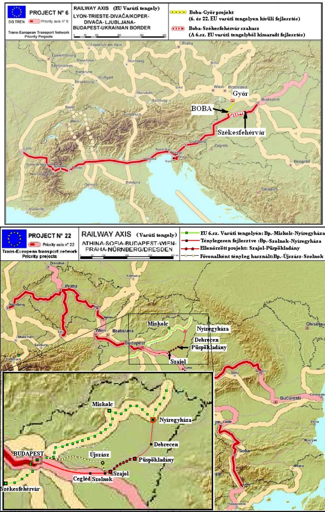

---

# Egyes uniós irányelvekből adódó kötelezettségek teljesítésének helyzete a környezetvédelem területén

| Szakterület | Kötelezettség megnevezése | EU Irányelv | Vonatkozó hatályos magyar jogszabály(ok) | Irányelv szerinti határidő | Derogáció szerinti határidő | Teljesített határidő |
| --- | --- | --- | --- | --- | --- | --- |
| szennyvíz | 10000 lakos egyenértéknél nagyobb terhelést meghaladó szennyvíz kibocsátású, külön jogszabály által kijelölt érzékeny területeken biztosítani kell a szennyvízgyűjtő rendszer kiépítését és a biológiai (II. fokozatú) szennyvíztisztítás mellett a III. fokozatú tisztítást, azaz a tápanyag (nitrogén és foszfor) eltávolítást; | 91/271/EGK irányelv | 25/2002 (II. 27.) Korm. rendelet 26/2002 (II. 27.) Korm. rendelet 28/2004 (XII. 25.) KvVM. rendelet | 1998. december 31. | 2008. december 31. | nem teljesült |
| szennyvíz | 15000 lakos egyenérték terhelést meghaladó szennyvíz kibocsátású szennyvízelvezetési agglomerációt el kell látni szennyvízgyűjtő rendszerrel és legalább biológiai (II. fokozatú) szennyvíztisztító teleppel; | 91/271/EGK irányelv | 25/2002 (II. 27.) Korm. rendelet 26/2002 (II. 27.) Korm. rendelet 28/2004 (XII. 25.) KvVM. rendelet | 2000. december 31. | 2010. december 31. | nem teljesült |
| szennyvíz | 2000-15000 lakos egyenérték terheléssel jellemezhető szennyvíz kibocsátású szennyvízelvezetési agglomerációban meg kell oldani a szennyvízgyűjtő rendszer kiépítését és a legalább biológiai (II. fokozatú) szennyvíztisztítást; | 91/271/EGK irányelv | 25/2002 (II. 27.) Korm. rendelet 26/2002 (II. 27.) Korm. rendelet 28/2004 (XII. 25.) KvVM. rendelet | 2005. december 31. | 2015. december 31. | még nem járt le a határidő |
| szennyvíz | 2000 lakos egyenérték terhelés alatt olyan gyűjtőrendszer, amelyhez nem csatlakozik tisztító telep, nem fordulhat elő. | 91/271/EGK irányelv | 25/2002 (II. 27.) Korm. rendelet | 2005. december 31. | Nem volt derogáció | teljesült |
| szennyvíz | A nem települési szennyvíztisztító hálózatba vezetett élelmiszeripari üzemek szennyvízének megfelelő tisztítást kell biztosítani a befogadó vízekbe való kibocsátás előtt a 4000 LE feletti területeken. | 91/271/EGK irányelv | 28/2004 (XII. 25.) KvVM. rendelet | 2000. december 31. | 2008. december 31. | teljesült |
| hulladék | Az Európai Parlament és a Tanács 2008/98/EK irányelve (2008. november 19.) a hulladékokról és egyes irányelvek hatályon kívül helyezéséről | 2008/98/EK irányelve | | 2020. | Nincs derogáció | határidő még nem járt le |
| árvíz | Az Európai Parlament és a Tanács 2007/60/EK Irányelve (2007. október 23.) az árvízkockázatok értékeléséről és kezeléséről | 2007/60/EK irányelve | 178/2010 (V. 13.) Korm. rendelet | 2011. december 22. (Előzetes kockázatbecslés) 2013. december 22. (Kockázati térképezési feladatok és kockázati térképek előállítása) 2015. december 22. (kockázatkezelési tervek) | Nincs derogáció | határidő még nem járt le |

Forrás: NFÜ KEOP IH

---

13. sz. melléklet a V-2002-147/2011-2012. sz. jelentéstervezethez

A támogatott projektek célszerűségének értékelése

Tétel az:

| | 1 | 2 | 3 | 4 | 5 | 6 | 7 | 8 | 9 | 10 | 11 | 12 | 13 | 14 | 15 | 16 | 17 | 18 | 19 | 20 | 21 | 22 | 23 | 24 | 25 | 26 |
| --- | --- | --- | --- | --- | --- | --- | --- | --- | --- | --- | --- | --- | --- | --- | --- | --- | --- | --- | --- | --- | --- | --- | --- | --- | --- | --- |
| Elhordozott projekt sz. | 1 | 2 | 3 | 4 | 5 | 6 | 7 | 8 | 9 | 10 | 11 | 12 | 13 | 14 | 15 | 16 | 17 | 18 | 19 | 20 | 21 | 22 | 23 | 24 | 25 | 26 |
| Projekt rövid neve | | | | | | | | | | | | | | | | | | | | | | | | | | |
| | | | | | | | | | | | | | | | | | | | | | | | | | | |
| Operatív program megneve | ÁROP | ÁROP | | | | | | | | | | | | | | | | | | | | | | | | |
| Hozzájárulás az UMFT átfogó céljaihoz | | | | | | | | | | | | | | | | | | | | | | | | | | |
| Ingatlanszállítás felvitele (kizárólag közvetlenül) | | | | 1 | 1 | | | | | | | | | | | | | | | | | | | | |
| Ingatlanszállítás felvitele (kizárólag közvetetten, járulékos hatás) | 1 | 1 | | | | 1 | 1 | 1 | | | 1 | 1 | 1 | 1 | 1 | 1 | | 1 | | 1 | 1 | 1 | 1 | 1 | 1 | 1 |
| tartós szívósság elősegítése (versenyképesség erősítése, gazdasági biztonság kérelítése, szent kémeszet jertítése) | 1 | | 1 | 1 | 1 | 1 | 1 | 1 | 1 | 1 | 1 | 1 | 1 | 1 | 1 | 1 | 1 | 1 | 1 | 1 | 1 | 1 | 1 | 1 | 1 | 1 |
| Hozzájárulás az operatív program prioritás szintű céljaihoz | 1 | 1 | 1 | 1 | 1 | 1 | 1 | 1 | 1 | 1 | 1 | 1 | 1 | 1 | 1 | 1 | 1 | 1 | 1 | 1 | 1 | 1 | 1 | 1 | 1 | 1 |
| Hozzájárulás az operatív program prioritás szintű céljaihoz | | | | | | | | | | | | | | | | | | | | | | | | | | |
| Hozzájárulás igazgatói, regionális, szakmai stratégiai, koncepció céljaihoz | | | | | | | | | | | | | | | | | | | | | | | | | | |
| a projekt perszázistításakor sem volt stratégiai, koncepció | | | | | | | | | | | | | | | | | | | | | | | | | | |
| nem volt releváns a stratégiai, koncepció készítés (pl. azért, mert a projekt működésére jellegű kiadást fizetésére vett) | | | | | | | | | | | | | | | | | | | | | | | | | | |

1

---

13. sz. melléklet a V-2002-147/2011-2012. sz. jelentéstervezethez

| Tétel az | 37 | 38 | 39 | 40 | 41 | 42 | 43 | 44 | 45 | 46 | 47 | 48 | 49 | 50 | 51 | 52 | 53 | Értekelés |
| --- | --- | --- | --- | --- | --- | --- | --- | --- | --- | --- | --- | --- | --- | --- | --- | --- | --- | --- |
| Elhazászító projekt sz. | 37 | 38 | 39 | 40 | 41 | 42 | 43 | 44 | 45 | 46 | 46 | 47 | 48 | 49 | 50 | 51 | 52 | Értekelés |
| Projekt rövid neve | | | | | | | | | | | | | | | | | | |
|
 |   |   |   |   |   |   |   |   |   |   |   |   |   |   |   |   |   |
|  |   |   |   |   |   |   |   |   |   |   |   |   |   |   |   |   |   |   |
|  |   |   |   |   |   |   |   |   |   |   |   |   |   |   |   |   |   |   |
|  |   |   |   |   |   |   |   |   |   |   |   |   |   |   |   |   |   |   |
|  |   |   |   |   |   |   |   |   |   |   |   |   |   |   |   |   |   |   |
|  |   |   |   |   |   |   |   |   |   |   |   |   |   |   |   |   |   |   |
|  |   |   |   |   |   |   |   |   |   |   |   |   |   |   |   |   |   |   |
|  |   |   |   |   |   |   |   |   |   |   |   |   |   |   |   |   |   |   |
|  |   |   |   |   |   |   |   |   |   |   |   |   |   |   |   |   |   |   |
|  |   |   |   |   |   |   |   |   |   |   |   |   |   |   |   |   |   |   |
|  |   |   |   |   |   |   |   |   |   |   |   |   |   |   |   |   |   |   |
|  |   |   |   |   |   |   |   |   |   |   |   |   |   |   |   |   |   |   |
|  |   |   |   |   |   |   |   |   |   |   |   |   |   |   |   |   |   |   |
|  |   |   |   |   |   |   |   |   |   |   |   |   |   |   |   |   |   |   |
|  |   |   |   |   |   |   |   |   |   |   |   |   |   |   |   |   |   |   |
|  |   |   |   |   |   |   |   |   |   |   |   |   |   |   |   |   |   |   |
|  |   |   |   |   |   |   |   |   |   |   |   |   |   |   |   |   |   |   |
|  |   |   |   |   |   |   |   |   |   |   |   |   |   |   |   |   |   |   |
|  |   |   |   |   |   |   |   |   |   |   |   |   |   |   |   |   |   |   |
|  |   |   |   |   |   |   |   |   |   |   |   |   |   |   |   |   |   |   |
|  |   |   |   |   |   |   |   |   |   |   |   |   |   |   |   |   |   |   |
|  |   |   |   |   |   |   |   |   |   |   |   |   |   |   |   |   |   |   |
|  |   |   |   |   |   |   |   |   |   |   |   |   |   |   |   |   |   |   |
|  |   |   |   |   |   |   |   |   |   |   |   |   |   |   |   |   |   |   |
|  |   |   |   |   |   |   |   |   |   |   |   |   |   |   |   |   |   |   |
|  |   |   |   |   |   |   |   |   |   |   |   |   |   |   |   |   |   |   |
|  |   |   |   |   |   |   |   |   |   |   |   |   |   |   |   |   |   |   |
|  |   |   |   |   |   |   |   |   |   |   |   |   |   |   |   |   |   |   |
|  |   |   |   |   |   |   |   |   |   |   |   |   |   |   |   |   |   |   |
|  |   |   |   |   |   |   |   |   |   |   |
 |   |   |   |   |   |   |   |
|  |   |   |   |   |   |   |   |   |   |   |   |   |   |   |   |   |   |   |
|  |   |   |   |   |   |   |   |   |   |   |   |   |   |   |   |   |   |   |

---

# 14. sz. melléklet

a V-2002-147/2011-2012. sz. jelentéstervezethez

## Kimutatás

## az egyes operatív programok és az ellenőrzött projektek indikátorai közötti kapcsolatról

|  ÉAOP |  |  |  |  |   |
| --- | --- | --- | --- | --- | --- |
|  Prioritás/ Kiválasztott projekt | Indikátor típusa | Indikátor | ME | Kiindulási érték | Célérték  |
|  2. prioritás:
Turisztika célú fejlesztés | eredmény | Az 1.000 főre jutó, kereskedelmi szálláshelyeken eltöltött vendégéjszakák számának növekedése (db) | db | $\begin{gathered} 1107(2005- \ \text {ös adat) } \end{gathered}$ | 1185  |
|   | eredmény | A kereskedelmi szálláshelyek kapacitás-kihasználtságának növekedése (\%) | $\%$ | $\begin{gathered} 24,2(2005-\text {ös } \ \text { adat) } \end{gathered}$ | 28  |
|   | eredmény | Az 1.000 lakosra jutó vendégéjszakák számának relatív szórása települési szinten, a kereskedelmi szálláshellyel rendel-kező érintett településeken (\%) | $\%$ | $\begin{gathered} 417,9(2005- \ \text {ös adat) } \end{gathered}$ | 350  |
|   | eredmény | A kereskedelmi szálláshelyeken eltöltött vendégéjszakák havonkénti százalékos megoszlásának relatív szórása (\%) | $\%$ | $\begin{gathered} 52,96(2005- \ \text {ös adat) } \end{gathered}$ | 44,5  |
|  2. prioritás 4. sz. projekt:
Öcenárium, Esőerdőház és Tarzan ösvénye | eredmény | Az állatpark látogatóinak száma | fő | 302000 | 400469  |
|   | eredmény | Új munkahelyek száma | fő | 66 | 85  |
|   | eredmény | Zoopedagógiai programokban résztvevő diákok, pedagógusok száma | fő | 1564 | 1800  |

Következtetés: A projektekszintű indikátorok csak közvetetten járulnak hozzá az operatív program prioritás szintű indikátorai teljesüléséhez, mert az indikátorok közvetlenül nem feleltethetőek meg egymásnak: az operatív program indikátorai kizárólag (hosszabb távon megvalósuló) hatásindikátorok, a projekt indikátorai pedig közvetlenül mérhető eredmény indikátorok.

|  3. prioritás:
Közlekedési feltételek javítása | eredmény | Kistérségi központot közúton és tömegközlekedéssel 15/20/30 percen belül elérő lakosság számának növekedése (fő) | fő | 0 | 47000  |
| --- | --- | --- | --- | --- | --- |
|   | hatás | Közösségi közlekedést igénybe vevők száma (fő) | fő | $\begin{gathered} 179581000 \ (2007-\text {es } \ \text { adat) } \end{gathered}$ | $\begin{gathered} 2007-\text {es } \ \text { szinten } \ \text { tartása } \end{gathered}$  |
|  3. prioritás 5. sz. projekt:
Térségi elérhetőség javítása az 38143. j. úton (Tuzsér) | eredmény | Az úthálózat átlagos burkolatállapot-osztályzatának javulása (egyenetlenség, repedezettség, nyomválya) | OKA
osztályzat | 5 | 1  |
|   | eredmény | Kistérségi központot közúton és tömegközlekedéssel 15/20/30 percen belül elérő lakosság | fő | 293464 | 293464  |

Következtetés: A projektekszintű indikátorok csak közvetetten járulnak hozzá az operatív program prioritás szintű indikátorai teljesüléséhez, mert az indikátorok közvetlenül nem feleltethetőek meg egymásnak, illetve mivel a prioritás szintű indikátor növekedést prognosztizál - bázisérték nélkül -, a projektindikátor pedig mindössze szinten tartást vár el.

---

# KÖZOP

|  Prioritás/ Kiválasztott projekt | Indikátor
típusa | Indikátor | ME | Kiindulási
érték | Célérték  |
| --- | --- | --- | --- | --- | --- |
|  2. prioritás:
Az ország és a régióközpontok nemzetközi vasúti és
vízi úti elérhetőségének javítása | output | Kétvágányú TEN-T vasúti hálózat hossza | km | 0 | 52  |
|   | output | 225 kN tengelyterhelésre (min. 120 km/h mellett) fejlesztett TEN-T vasútvonalak hossza | km | 0 | 456  |
|   | eredmény | A teljes TEN-T hálózat összegezett utazási idejének csökkenése | perc | 0 | 98  |
|   | hatás | Áruszállítási volumennövekedés a magyar vasúti hálózaton | millió
árutonna
km/év | 0 | 1863  |
|  2. prioritás 21. sz. projekt:
Szajol - Püspökladány vasútvonal felújítása | output | Az újonnan épített és korszerűsített kötött pályás vágány hossza | km | 0 | 67  |
|   | eredmény | A Szajol-Püspökladány vasútvonalon az utazási idő csökkenése a nemzetközi expressz vonatok menetrendje
szerint | perc | 0 | 8,4  |
|   | hatás | A projekt következtében az áruszállítási volumen növekedése a Szajol-Püspökladány vonalon | $\%$ | 0 | 8  |
|   | output | A vasútfejlesztés keretében valamely módon akadálymentesített állomások/ megálló helyek száma | db | 0 | 5  |

Következtetés: A megépült vasúti pálya hosszára, illetve a menetidő csökkenésére vonatkozó indikátorok közvetlenül is összevethetőek, ezen esetekben megállapítható, hogy a projekt közvetlenül is hozzájárul az operatív program prioritás szintű indikátorai teljesüléséhez. Az áruszállítási volumen növekedése terén az indikátorok összevetését nehezíti, hogy míg a prioritás szintű indikátor - bázisérték nélkül - mennyiségi növekedést vár, addig a projektszintű indikátor százalékos növekedést prognosztizál.

|  4. prioritás:
Közlekedési módok összekapcsolása, gazdasági központok intermodalitásának és közlekedési infrastruktúrájának fejlesztése | eredmény | KÖZOP által támogatott központokba beérkező árumennyiség növekedése | ezer tonna | 0 | 10750  |
| --- | --- | --- | --- | --- | --- |
|   | eredmény | Intermodiális áruforgalom növekedése a KÖZOP által támogatott központokban |  |  |   |
|   | eredmény | A záhonyi térség vasúti áruforgalmának növekedése |  |  |   |
|  4. prioritás 23. sz. projekt:
Záhony térség belső közúti infrastruktúrájának az ipari és logisztikai befektetésekkel összehangolt fejlesztése | output | Épített utak hossza | km | 0 | 16,339  |
|   | output | Felújított utak hossza | km | 0 | 5,01  |

Következtetés: A projektekszintű indikátorok csak közvetetten járulnak hozzá az operatív program prioritás szintű indikátorai teljesüléséhez, mert azok közvetlenül nem feleltethetőek meg egymásnak: míg a projektszinten csak a megépített, felújított úthosszra vonatkozó output indikátorok lettek meghatározva, addig a prioritás szintű indikátorok a térség áruforgalmának növekedésére vonatkoznak.

---

|  KMOP |  |  |  |  |   |
| --- | --- | --- | --- | --- | --- |
|  Prioritás/ Kiválasztott projekt | Indikátor
típusa | Indikátor | ME | Kiindulási
érték | Célérték  |
|  2. prioritás:
A versenyképesség keretfeltételeinek fejlesztése | hatás | Az átmenő forgalom csökkenése a belvárosi főutakon | % | 100% (328
425
egységjármű/
nap) (2009) | 5%  |
|   | eredmény | A közösségi közlekedésben szállított utasok számának változása a régió városaiban | % | 1 405 000
(2000-2005
átlag) | szinten
tartás  |
|  2. prioritás 41. sz. projekt:
Térségi elérhetőség javítása a 2102 j. úton | output | Felújított út hossza | km | 0 | 8,2  |
|   | eredmény | Éves átlagos napi keresztmetszeti forgalom (ÁNF) az összes útszakaszra összesen | E/nap | 18 619 | 23 763  |
|  Következtetés: A projektszintű és a prioritásszintű indikátorok között nem állapítható meg kapcsolat. |  |  |  |  |   |
|  3. prioritás:
A régió vonzerejének fejlesztése | hatás | A turisztikai ágazat által létrehozott bruttó hozzáadott-érték (BHÉ) növekedése | M Ft | 734 456
(2005) | 1 000 000  |
|   | eredmény | A fejlesztések által közvetlenül érintett népesség | fő | 0 | 100 000  |
|   | eredmény | A turisták által eltöltött vendégéjszakák száma | db | 5,5 millió
vendégéjszaka | 40%-os
emelkedés  |
|   | eredmény | A turizmushoz kapcsolódó tevékenységek keretében létrehozott új munkahelyek száma a régióban | fő | 0 | 300  |
|   | eredmény | Élőhely helyreállításával, fejlesztésével érintett terület | ha | 0 | 6 500  |
|  3. prioritás 16. sz. projekt:
Skanzen örökség program | eredmény | Látogatószám növekedés | fő | 220 000 | 270 000  |
|   | eredmény | Új munkahelyek száma | fő | 0 | 25  |
|  Következtetés: A projekt új munkahelyek számát tekintve közvetlenül hozzájárul az operatív program prioritás szintű indikátorai teljesüléséhez, a látogatószám növekedése és a prioritás többi indikátorok között azonban csak közvetett kapcsolat fedezhető fel. |  |  |  |  |   |

---

Az ellenőrzött projektek időbeni, pénzügyi és műszaki, tartalmi megvalósításának értékelése

|  |   |   |   |   |   |   |   |   |   |   |   |   |   |   |   |   |   |   |   |   |   |   |
| --- | --- | --- | --- | --- | --- | --- | --- | --- | --- | --- | --- | --- | --- | --- | --- | --- | --- | --- | --- | --- | --- | --- |
|   |  |  |  |  | időbeni eltérés okai |  |  |  |  |  | pénzügyi eltérés okai |  |  |  |  |  |  |  | |  |  |   |
|   |  |  |  |  |  |  |  |  |  |  |  |  |  |  |  |  |  |  |  |  | műszaki tartalom/ |   |
|   |  |  |  |  |  |  |  |  |  |  |  |  |  |  |  |  |  |  |  |  | megvalósítás eltérésének |   |
|   |  |  |  |  |  |  |  |  |  |  |  |  |  |  |  |  |  |  |  |  | okai |   |
| Tétel sz. |  |  |  |  |  |  |  |  |  |  |  |  |  |  |  |  |  |  |  |  | projektek hasznosítása |   |
|   |  |  |  |  |  |  |  |  |  |  |  |  |  |  |  |  |  |  |  |  |  |   |
| 1 | 1 | x |  |  |  |  |  |  |  |  |  |  |  |  |  |  |  |  |  |  | az eredmény elvárás nem volt |   |
|   |  |  |  |  |  |  |  |  |  |  |  |  |  |  |  |  |  |  |  |  | pontosan meghatározva, tervezető | a projekt hasznosulása a kidolgozott |
|   |  |  |  |  |  |  |  |  |  |  |  |  |  |  |  |  |  |  |  |  | tennem, benne pcték használatáról függ |   |
| 2 | 2 | x |  |  |  |  |  |  |  |  |  |  |  |  |  |  |  |  |  |  |  |   |
|   |  |  |  |  |  |  |  |  |  |  |  |  |  |  |  |  |  |  |  |  | tartalom pontosítása |   |
|   |  |  |  |  |  |  |  |  |  |  |  |  |  |  |  |  |  |  |  |  |  |   |
| 3 | 3 |  |  |  |  |  |  |  |  |  |  |  |  |  |  |  |  |  |  |  |  |   |
|   |  |  |  |  |  |  |  |  |  |  |  |  |  |  |  |  |  |  |  |  |  |   |
| 4 | 4 | x |  |  |  |  |  |  |  |  |  |  |  |  |  |  |  |  |  |  |  |   |
|   |  |  |  |  |  |  |  |  |  |  |  |  |  |  |  |  |  |  |  |  |  |   |
| 5 | 5 | x |  |  |  |  |  |  |  |  |  |  |  |  |  |  |  |  |  |  |  |   |
|   |  |  |  |  |  |  |  |  |  |  |  |  |  |  |  |  |  |  |  |  |  |   |
| 6 | 6 | x |  |  |  |  |  |  |  |  |  |  |  |  |  |  |  |  |  |  |  |   |
|   |  |  |  |  |  |  |  |  |  |  |  |  |  |  |  |  |  |  |  |  |  |   |
| 7 | 7 |  |  |  |  |  |  |  |  |  |  |  |  |  |  |  |  |  |  |  |  |   |
|   |  |  |  |  |  |  |  |  |  |  |  |  |  |  |  |  |  |  |  |  |  |   |
| 8 | 8 |  |  |  |  |  |  |  |  |  |  |  |  |  |  |  |  |  |  |  |  |   |
|   |  |  |  |  |  |  |  |  |  |  |  |  |  |  |  |  |  |  |  |  |  |   |
| 9 | 9 |  |  |  |  |  |  |  |  |  |  |  |  |  |  |  |  |  |  |  |  |   |
|   |  |  |  |  |  |  |  |  |  |  |  |  |  |  |  |  |  |  |  |  |  |   |
| 10 | 10 |  |  |  |  |  |  |  |  |  |  |  |  |  |  |  |  |  |  |  |  |   |
|   |  |  |  |  |  |  |  |  |  |  |  |  |  |  |  |  |  |  |  |  |  |   |
| 11 | 11 |  |  |  |  |  |  |  |  |  |  |  |  |  |  |  |  |  |  |  |  |   |
|   |  |  |  |  |  |  |  |  |  |  |  |  |  |  |  |  |  |  |  |  |  |   |
| 12 | 12 |  |  |  |  |  |  |  |  |  |  |  |  |  |  |  |  |  |  |  |  |   |
|   | 13 | 13 |  |  |  |  |  |  |  |  |  |  |  |  |  |  |  |  |  |  |  |   |
| 14 | 14 |  |  |  |  |  |  |  |  |  |  |  |  |  |  |  |  |  |  |  |  |   |
|   |  |  |  |  |  |  |  |  |  |  |  |  |  |  |  |  |  | |  |  |  |   |
|  15 | 15 | x |  |  |  |  |  |  |  |  |  |  |  |  |  |  |  |  |  |  |  |   |
|   |  |  |  |  |  |  |  |  |  |  |  |  |  |  |  |  |  |  |  |  |  |   |
|  16 | 16 | x |  |  |  |  |  |  |  |  |  |  |  |  |  |  |  |  |  |  |  |   |
|   | 17 | 17 | x |  |  |  |  |  |  |  |  |  |  |  |  |  |  |  |  |  |  |   |
|  18 | 18 | x |  |  |  |  |  |  |  |  |  |  |  |  |  |  |  |  |  |  |  |   |
|   | 19 | 19 |  |  |  |  |  |  |  |  |  |  |  |  |  |  |  |  |  |  |  |   |
|  19 | 20 |  |  |  |  |  |  |  |  |  |  |  |  |  |  |  |  |  |  |  |  |   |
|   | 21 | 21 |  |  |  |  |  |  |  |  |  |  |  |  |  |  |  |  |  |  |  |   |
|  22 | 22 | x |  |  |  |  |  |  |  |  |  |  |  |  |  |  |  |  |  |  |  |   |
|  23 | 23 |  |  |  |  |  |  |  |  |  |  |  |  |  |  |  |  |  |  |  |  |   |
|  24 | 24 |  |  |  |  |  |  |  |  |  |  |  |  |  |  |  |  |  |  |  |  |   |
|  25 | 25 |  |  |  |  |  |  |  |  |  |  |  |  |  |  |  |  |  |  |  |  |   |
|  26 | 26 |  |  |  |  |  |  |  |  |  |  |  |  |  |  |  |  |  |  |  |  |   |
|  27 | 27 |  |  |  |  |  |  |  |  |  |  |  |  |  |  |  |  |  |  |  |  |   |
|  28 | 28 |  |  |  |  |  |  |  |  |  |  |  |  |  |  |  |  |  |  |  |  |   |
|  29 | 29 |  |  |  |  |  |  |  |  |  |  |  |  |  |  |  |  |  |  |  |  |   |
|  30 |  |  |  |  |  |  |  |  |  |  |  |  |  |  |  |  |  |  |  |  |  |   |
|  31 |  |  |  |  |  |  |  |  |  |  |  |  |  |  |  |  |  |  |  |  |  |   |
|  32 |  |  |  |  |  |  |  |  |  |  |  |  |  |  |  |  |  |  |  |  |  |   |
|  33 |  |  |  |  |  |  |  |  |  |  |  |  |  |  |  |  |  |  |  |  |  |   |
|  34 |  |  |  |  |  |  |  |  |  |  |  |  |  |  |  |  |  |  |  |  |  |   |
|  35 |  |  |  |  |  |  |  |  |  |  |  |  |  |  |  |  |  |  |  |  |  |   |
|  36 |  |  |  |  |  |  |  |  |  |  |  |  |  |  |  |  |  |  |  |  |  |   |
|  37 |  |  |  |  |  |  |  |  |  |  |  |  |  |  |  |  |  |  |  |  |  |   |
|  38 |  |  |  |  |  |  |  |  |  |  |  |  |  |  |  |  |  |  |  |  |  |   |
|  39 |  |  |  |  |  |  |  |  |  |  |  |  |  |  |  |  |  |  |  |  |  |   |
|  40 |  |  |  |  |  |  |  |  |  |  |  |  |  |  |  |  |  |  |  |  |  |   |
|  41 |  |  |  |  |  |  |  |  |  |  |  |  |  |  |  |  |  |  |  |  |  |   |
|  42 |  |  |  |  |  |  |  |  |  |  |  |  |  |  |  |  |  |  |  |  |  |   |
|  43 |  |  |  |  |  |  |  |  |  |  |  |  |  |  |  |  |  |  |  |  |  |   |
|  44 |  |  |  |  |  |  |  |  |  |  |  |  |  |  |  |  |  |  |  |  |  |   |
|  45 |  |  |  |  |  |  |  |  |  |  |  |  |  |  |  |  |  |  |  |  |  |   |
|  46 |  |  |  |  |  |  |  |  |  |  |  |  |  |  |  |  |  |  |  |  |  |   |
|  47 |  | |  |  |  |  |  |  |  |  |  |  |  |  |  |  |  |  |  |  |  |   |
|  48 |  |  |  |  |  |  |  |  |  |  |  |  |  |  |  |  |  |  |  |  |  |   |
|  49 |  |  |  |  |  |  |  |  |  |  |  |  |  |  |  |  |  |  |  |  |  |   |
|  50 |  |  |  |  |  |  |  |  |  |  |  |  |  |  |  |  |  |  |  |  |  |   |
|  51 |  |  |  |  |  |  |  |  |  |  |  |  |  |  |  |  |  |  |  |  |  |   |
|  52 |  |  |  |  |  |  |  |  |  |  |  |  |  |  |  |  |  |  |  |  |  |   |
|  53 |  |  |  |  |  |  |  |  |  |  |  |  |  |  |  |  |  |  |  |  |  |   |
|  54 |  |  |  |  |  |  |  |  |  |  |  |  |  |  |  |  |  |  |  |  |  |   |
|  55 |  |  |  |  |  |  |  |  |  |  |  |  |  |  |  |  |  |  |  |  |  |   |
|  56 |  |  |  |  |  |  |  |  |  |  |  |  |  |  |  |  |  |  |  |  |  |   |
|  57 |  |  |  |  |  |  |  |  |  |  |  |  |  |  |  |  |  |  |  |  |  |   |
|  58 |  |  |  |  |  |  |  |  |  |  |  |  |  |  |  |  |  |  |  |  |  |   |
|  59 |  |  |  |  |  |  |  |  |  |  |  |  |  |  |  |  |  |  |  |  |  |   |
|  60 |  |  |  |  |  |  |  |  |  |  |  |  |  |  |  |  |  |  |  |  |  |   |
|  61 |  |  |  |  |  |  |  |  |  |  |  |  |  |  |  |  |  |  |  |  |  |   |
|  62 |  |  |  |  |  |  |  |  |  |  |  |  |  |  |  |  |  |  |  |  |  |   |
|  63 |  |  |  |  |  |  |  |  |  |  |  |  |  |  |  |  |  |  |  |  |  |   |
|  64 |  |  |  |  |  |  |  |  |  |  |  |  |  |  |  |  |  |  |  |  |  |   |
|  65 |  |  |  |  |  |  |  |  |  |  |  |  |  |  |  |  |  |  |  |  |  |   |
|  66 |  |  |  |  |  |  |  |  |  |  |  |  |  |  |  |  |  |  |  |  |  |   |
|  67 |  |  |  |  |  |  |  |  |  |  |  |  |  |  |  |  |  |  |  |  |  |   |
|  68 |  |  |  |  |  |  |  |  |  |  |  |  |  |  |  |  |  |  |  |  |  |   |
|  69 |  |  |  |  |  |  |  |  |  |  |  |  |  |  |  |  |  |  |  |  |  |   |
|  70 |  |  |  |  |  |  |  |  |  |  |  |  |  |  |  |  |  |  |  |  |  |   |
|  71 |  |  |  |  |  |  |  |  |  |  |  |  |  |  |  |  |  |  |  |  |  |   |
|  72 |  |  |  |  |  |  |  |  |  |  |  |  |  |  |  |  |  |  |  |  |  |   |
|  73 |  |  |  |  |  |  |  |  |  |  |  |  |  |  |  |  |  |  |  |  |  |   |
|  74 |  |  |  |  |  |  |  |  |  |  |  |  |  |  |  |  |  |  |  |  |  |   |
|  75 |  |  |  |  |  |  |  |  |  |  |  |  |  |  |  |  |  |  |  |  |  |   |
|  76 |  |  |  |  |  |  |  |  |  |  |  |  |  |  |  |  |  |  |  |  |  |   |
|  77 |  |  |  |  |  |  |  |  |  |  |  |  |  |  |  |  |  |  |  |  |  |   |
|  78 |  |  |  |  |  |  |  |  |  |  |  |  |  |  |  |  |  |  |  |  |  |   |
|  79 |  |  |  |  |  |  |  |  |  |  |  |  |  |  |  |  |  |  |  |  |  |   |
|  80 |  |  |  |  |  |  |  |  |  | |  |  |  |  |  |  |  |  |  |  |  |   |
|  81 |  |  |  |  |  |  |  |  |  |  |  |  |  |  |  |  |  |  |  |  |  |   |
|  82 |  |  |  |  |  |  |  |  |  |  |  |  |  |  |  |  |  |  |  |  |  |   |
|  83 |  |  |  |  |  |  |  |  |  |  |  |  |  |  |  |  |  |  |  |  |  |   |
|  84 |  |  |  |  |  |  |  |  |  |  |  |  |  |  |  |  |  |  |  |  |  |   |
|  85 |  |  |  |  |  |  |  |  |  |  |  |  |  |  |  |  |  |  |  |  |  |   |
|  86 |  |  |  |  |  |  |  |  |  |  |  |  |  |  |  |  |  |  |  |  |  |   |
|  87 |  |  |  |  |  |  |  |  |  |  |  |  |  |  |  |  |  |  |  |  |  |   |
|  88 |  |  |  |  |  |  |  |  |  |  |  |  |  |  |  |  |  |  |  |  |  |   |
|  89 |  |  |  |  |  |  |  |  |  |  |  |  |  |  |  |  |  |  |  |  |  |   |
|  90 |  |  |  |  |  |  |  |  |  |  |  |  |  |  |  |  |  |  |  |  |  |   |
|  91 |  |  |  |  |  |  |  |  |  |  |  |  |  |  |  |  |  |  |  |  |  |   |
|  92 |  |  |  |  |  |  |  |  |  |  |  |  |  |  |  |  |  |  |  |  |  |   |
|  93 |  |  |  |  |  |  |  |  |  |  |  |  |  |  |  |  |  |  |  |  |  |   |
|  94 |  |  |  |  |  |  |  |  |  |  |  |  |  |  |  |  |  |  |  |  |  |   |
|  95 |  |  |  |  |  |  |  |  |  |  |  |  |  |  |  |  |  |  |  |  |  |   |
|  96 |  |  |  |  |  |  |  |  |  |  |  |  |  |  |  |  |  |  |  |  |  |   |
|  97 |  |  |  |  |  |  |  |  |  |  |  |  |  |  |  |  |  |  |  |  |  |   |
|  98 |  |  |  |  |  |  |  |  |  |  |  |  |  |  |  |  |  |  |  |  |  |   |
|  99 |  |  |  |  |  |  |  |  |  |  |  |  |  |  |  |  |  |  |  |  |  |   |
|  100 |  |  |  |  |  |  |  |  |  |  |  |  |  |  |  |  |  |  |  |  |  |   |
|  101 |  |  |  |  |  |  |  |  |  |  |  |  |  |  |  |  |  |  |  |  |  |   |
|  102 |  |  |  |  |  |  |  |  |  |  |  |  |  |  |  |  |  |  |  |  |  |   |
|  103 |  |  |  |  |  |  |  |  |  |  |  |  |  |  |  |  |  |  |  |  |  |   |
|  104 |  |  |  |  |  |  |  |  |  |  |  |  |  |  |  |  |  |  |  |  |  |   |
|  105 |  |  |  |  |  |  |  |  |  |  |  |  |  |  |  |  |  |  |  |  |  |   |
|  106 |  |  |  |  |  |  |  |  |  |  |  |  |  |  |  |  |  |  |  |  |  |   |
|  107 |  |  |  |  |  |  |  |  |  |  |  |  |  |  |  |  |  |  |  |  |  |   |
|  108 |  |  |  |  |  |  |  |  |  |  |  |  |  |  |  |  |  |  |  |  |  |   |
|  109 |  |  |  |  |  |  |  |  |  |  |  |  |  |  |  |  |  |  |  |  |  |   |
|  110 |  |  |  |  |  |  |  |  |  |  |  |  |  |  |  |  |  |  |  |  |  |   |
|  111 |  |  |  |  |  |  |  |  |  |  |  |  |  |  |  |  |  |  |  |  |  |   |
|  112 |  |  |  |  |  |  |  |  |  |  |  |  |  |  |  |  |  |  |  |  |  |   |
|  113 |  |  |  |  |  |  |  |  |  |  |  |  |  |  |  |  |  | |  |  |  |  |   |
|  114 |  |  |  |  |  |  |  |  |  |  |  |  |  |  |  |  |  |  |  |  |  |  |   |
|  115 |  |  |  |  |  |  |  |  |  |  |  |  |  |  |  |  |  |  |  |  |  |  |   |
|  116 |  |  |  |  |  |  |  |  |  |  |  |  |  |  |  |  |  |  |  |  |  |  |   |
|  117 |  |  |  |  |  |  |  |  |  |  |  |  |  |  |  |  |  |  |  |  |  |  |   |
|  118 |  |  |  |  |  |  |  |  |  |  |  |  |  |  |  |  |  |  |  |  |  |  |   |
|  119 |  |  |  |  |  |  |  |  |  |  |  |  |  |  |  |  |  |  |  |  |  |  |   |
|  120 |  |  |  |  |  |  |  |  |  |  |  |  |  |  |  |  |  |  |  |  |  |  |   |
|  121 |  |  |  |  |  |  |  |  |  |  |  |  |  |  |  |  |  |  |  |  |  |  |   |
|  122 |  |  |  |  |  |  |  |  |  |  |  |  |  |  |  |  |  |  |  |  |  |  |   |
|  123 |  |  |  |  |  |  |  |  |  |  |  |  |  |  |  |  |  |  |  |  |  |  |   |
|  124 |  |  |  |  |  |  |  |  |  |  |  |  |  |  |  |  |  |  |  |  |  |  |   |
|  125 |  |  |  |  |  |  |  |  |  |  |  |  |  |  |  |  |  |  |  |  |  |  |   |
|  126 |  |  |  |  |  |  |  |  |  |  |  |  |  |  |  |  |  |  |  |  |  |  |   |
|  127 |  |  |  |  |  |  |  |  |  |  |  |  |  |  |  |  |  |  |  |  |  |  |  |   |
|  128 |  |  |  |  |  |  |  |  |  |  |  |  |  |  |  |  |  |  |  |  |  |  |  |   |
|  129 |  |  |  |  |  |  |  |  |  |  |  |  |  |  |  |  |  |  |  |  |  |  |  |   |
|  130 |  |  |  |  |  |  |  |  |  |  |  |  |  |  |  |  |  |  |  |  |  |  |  |   |
|  131 |  |  |  |  |  |  |  |  |  |  |  |  |  |  |  |  |  |  |  |  |  |  |  |   |
|  132 |  |  |  |  |  |  |  |  |  |  |  |  |  |  |  |  |  |  |  |  |  |  |  |   |
|  133 |  |  |  |  |  |  |  |  |  |  |  |  |  |  |  |  |  |  |  |  |  |  |  |   |
|  134 |  |  |  |  |  |  |  |  |  |  |  |  |  |  |  |  |  |  |  |  |  |  |  |  |   |
|  135 |  |  |  |  |  |  |  |  |  |  |  |  |  |  |  |  |  |  |  |  |  |  |  |  |   |
|  136 |  |  |  |  |  |  |  |  |  |  |  |  |  |  |  |  |  |  |  |  |  |  |  |  |   |
|  137 |  |  |  |  |  |  |  |  |  |  |  |  |  |  |  |  |  |  |  |  |  |  |  |  |   |
|  138 |  |  |  |  |  |  |  |  |  |  |  |  |  |  |  |  |  |  |  |  |  |  |  |  |   |
|  139 |  |  |  |  |  |  |  |  |  |  |  |  |  |  |  |  |  |  |  |  |  |  |  |  |   |
|  140 |  |  |  |  |  |  |  |  |  |  |  |  |  |  |  |  |  |  |  |  |  |  |  |  |   |
|  141 |  |  |  |  |  |  |  |  |  |  |  |  |  |  |  |  |  |  |  |  |  |  |  |  |  |   |
|  142 |  |  |  |  |  |  |  |  |  |  |  |  |  |  |  |  |  |  |  |  |  |  |  |  |  |   |
|  143 |  |  |  |  |  |  |  |  |  |  |  |  |  |  |  |  |  |  |  |  |  |  |  |  |  |   |
|  144 |  |  |  |  |  |  |  |  |  |  |  |  | | | | | | | | | | | | | | |
| 145 | | | | | | | | | | | | | | | | | | | | | | | | | | |
| 146 | | | | | | | | | | | | | | | | | | | | | | | | | | |
| 147 | | | | | | | | | | | | | | | | | | | | | | | | | | |
| 148 | | | | | | | | | | | | | | | | | | | | | | | | | | |
| 149 | | | | | | | | | | | | | | | | | | | | | | | | | | |
| 150 | | | | | | | | | | | | | | | | | | | | | | | | | | |
| 151 | | | | | | | | | | | | | | | | | | | | | | | | | | |
| 152 | | | | | | | | | | | | | | | | | | | | | | | | | | |
| 153 | | | | | | | | | | | | | | | | | | | | | | | | | | |
| 154 | | | | | | | | | | | | | | | | | | | | | | | | | | |
| 155 | | | | | | | | | | | | | | | | | | | | | | | | | | |
| 156 | | | | | | | | | | | | | | | | | | | | | | | | | | |
| 157 | | | | | | | | | | | | | | | | | | | | | | | | | | |
| 158 | | | | | | | | | | | | | | | | | | | | | | | | | | |
| 159 | | | | | | | | | | | | | | | | | | | | | | | | | | |
| 160 | | | | | | | | | | | | | | | | | | | | | | | | | | |
| 161 | | | | | | | | | | | | | | | | | | | | | | | | | | |
| 162 | | | | | | | | | | | | | | | | | | | | | | | | | | |
| 163 | | | | | | | | | | | | | | | | | | | | | | | | | |
| 164 | | | | | | | | | | | | | | | | | | | | | | | | | |
| 165 | | | | | | | | | | | | | | | | | | | | | | | | | |
| 166 | | | | | | | | | | | | | | | | | | | | | | | | | |
| 167 | | | | | | | | | | | | | | | | | | | | | | | | | | |
| 168 | | | | | | | | | | | | | | | | | | | | | | | | |
| 169 | | | | | | | | | | | | | | | | | | | | | | | |  |  |  |  |  |  |  |   |
|  170 |  |  |  |  |  |  |  |  |  |  |  |  |  |  |  |  |  |  |  |  |  |  |  |  |  |  |   |
|  171 |  |  |  |  |  |  |  |  |  |  |  |  |  |  |  |  |  |  |  |  |  |  |  |  |  |  |  |   |
|  172 |  |  |  |  |  |  |  |  |  |  |  |  |  |  |  |  |  |  |  |  |  |  |  |  |  |  |  |  |   |
|  173 |  |  |  |  |  |  |  |  |  |  |  |  |  |  |  |  |  |  |  |  |  |  |  |  |  |  |  |   |
|  174 |  |  |  |  |  |  |  |  |  |  |  |  |  |  |  |  |  |  |  |  |  |  |  |  |  |  |  |   |
|  175 |  |  |  |  |  |  |  |  |  |  |  |  |  |  |  |  |  |  |  |  |  |  |  |  |   |
|  176 |  |  |  |  |  |  |  |  |  |  |  |  |  |  |  |  |  |  |  |  |  |   |
|  177 |  |  |  |  |  |  |  |  |  |  |  |  |  |  |  |  |  |  |  |  |  |  |  |   |
|  178 |  |  |  |  |  |  |  |  |  |  |  |  |  |  |  |  |  |  |  |  |  |  |   |
|  179 |  |  |  |  |  |  |  |  |  |  |  |  |  |  |  |  |  |  |  |  |  |  |  |   |
|  180 |  |  |  |  |  |  |  |  |  |  |  |  |  |  |  |  |  |  |  |  |  |  |  |  |  |  |  |  |  |  |  |  |  |  |  |  |  |  |  |  |  |  |  |  |  |  |  |  |  |  |  |  |  |  |   |   |   |   |    |    |    |     |     |    |    |    |   |  |  |  |  |  |  |   |   |   |   |   |   |  |  |  |  |  |  |  |  |  |  |  |  |   |  |  |   |   |   |   |   |  |  |  |  |  |  |  |  |  |  |  |  |  |  |   |  |  |   |  |   |    |   |  |  |  |   |   |   |   |  |  |  |  |  |  |  |  |  |  |  |   |  |  |  |  |  |  |  |  |  |  |  |  |  |  |  |  |  |  |  |  |  |  |  |  |  |  |  |  |  |  |  |  |  |  |  |  |  |  |  |  |  |  |  |  |  |  |  |  |  |  |  |  |  |  |  |  |  |  |  |  |  |  |  |  |  |  |  |  |  |  |  |  |  |  |  |  |  |  |  |  |  |  |  |  |  |  |  |  |  |  |  |  |  |  |  |  |  |  |  | 

---

|   |  |  |  | időbeni eltérés okai |  |  |  |  |  |  | pénzügyi eltérés okai |  |  |  |  |  |  |  |  |  |  |  |  |  |  |  |  |  |  |  |  |   |
| --- | --- | --- | --- | --- | --- | --- | --- | --- | --- | --- | --- | --- | --- | --- | --- | --- | --- | --- | --- | --- | --- | --- | --- | --- | --- | --- | --- | --- | --- | --- | --- | --- |
|   |  |  |  |  |  |  |  |  |  |  |  |  |  |  |  |  |  |  |  |  |  |  |  |  |  |  |  |  |  |  |  |   |
|   |  |  |  |  |  |  |  |  |  |  |  |  |  |  |  |  |  |  |  |  |  |  |  |  |  |  |  |  |  |  |  |   |
|   |  |  |  |  |  |  |  |  |  |  |  |  |  |  |  |  |  |  |  |  |  |  |  |  |  |  |  |  |  |  |  |   |
|   |  |  |  |  |  |  |  |  |  |  |  |  |  |  |  |  |  |  |  |  |  |  |  |  |  |  |  |  |  |  |  |   |
|   |  |  |  |  |  |  |  |  |  |  |  |  |  |  |  |  |  |  |  |  |  |  |  |  |  |  |  |  |  |  |  |   |
|   |  |  |  |  |  |  |  |  | | | | | | | | | | | | | | | | | | | | | | | | |
| | | | | | | | | | | | | | | | | | | | | | | | | | | | | | | | | |
| | | | | | | | | | | | | | | | | | | | | | | | | | | | | | | | | |
| | | | | | | | | | | | | | | | | | | | | | | | | | | | | | | | | |
| | | | | | | | | | | | | | | | | | | | | | | | | | | | | | | | | |
| | | | | | | | | | | | | | | | | | | | | | | | | | | | | | | | | |
| | | | | | | | | | | | | | | | | | | | | | | | | | | | | | | | | |
| | | | | | | | | | | | | | | | | | | | | | | | | | | | | | | | | |
| | | | | | | | | | | | | | | | | | | | | | | | | | | | | | | | | |
| | | | | | | | | | | | | | | | | | | | | | | | | | | | | | | | | |
| | | | | | | | | | | | | | | | | | | | | | | | | | | | | | | | | |
| | | | | | | | | | | | | | | | | | | | | | | | | | | | | | | | | |
| | | | | | | | | | | | | | | | | | | | | | | | | | | | | | | | | |
| | | | | | | | | | | | | | | | | | | | | | | | | | | | | | | | | |
| | | | | | | | | | | | | | | | | | | | | | | | | | | | | | | | | |
| | | | | | | | | | | | | | | | | | | | | | | | | | | | | | | | | |
| | | | | | | | | | | | | | | | | | | | | | | | | | | | | | | | | |
| | | | | | | | | | | | | | | | | | | | | | | | | | | | | | | | | |
| | | | | | | | | | | | | | | | | | | | | | | | | | | | | | | | | |
| | | | | | | | | | | | | | | | | | | | | | | | | | | | | | | | | |
| | | | | | | | | | | | | | | | | | | | | | | | | | | | | | | | | |
| | | | | | | | | | | | | | | | | | | | | | | | | | | | | | | | | |
| | | | | | | | | | | | | | | | | | | | | | | | | | | | | | | | | |
| | | | | | | | | | | | | | | | | | | | | | | | | | | | | | | | |  |  |  |  |   |
|   |  |  |  |  |  |  |  |  |  |  |  |  |  |  |  |  |  |  |  |  |  |  |  |  |  |  |  |  |  |  |  |   |
|   |  |  |  |  |  |  |  |  |  |  |  |  |  |  |  |  |  |  |  |  |  |  |  |  |  |  |  |  |  |  |  |   |
|   |

---

### **Kimutatás a projektek befejezésének késedelméről**

|  |   |   |   |   |   |   |   |   |   |
| --- | --- | --- | --- | --- | --- | --- | --- | --- | --- |
|   |  |  | Projekt azonosító
OP szerint | A projekt rövid megnevezése | Státusz | Eredeti TSE
megkötésének
dátuma | Eredeti TSE
tervezett
befejezés
dátuma | Hatályos TSE
szerinti tervezett
befejezés dátuma | Határidő
módosítás
várható  |
|  1. | 1. | ÁMOP-1.1.2-2007-0002 |  | Államreform koncepcionális
megalapozása | megvalósult
(teljesítés mértéke vitatott) | 2007.09.11 | 2008.12.31 | 2011.06.30 |   |
|  2. | 15. | KMOP-2.1.1/A-2008-0017 |  | Átszíntmedt-Bugyi út felújítás | megvalósult | 2009.11.31 | 2009.04.14 | 2010.07.31 |   |
|  3. | 2. | ÁMOP-2.2.1-2007-0002 |  | Személyügyi központ fejlesztése és
jell. értékelése | megvalósult
(OPEl-t még nem fogadják
el) | 2007.09.29 | 2008.12.31 | 2009.12.31 |   |
|  4. | 4. | ÉAOP-2.1.1/E-2008-0002 |  | Nyírmártonfalvai Állatpark | megvalósult | 2008.07.17 | 2010.03.31 | 2011.03.31 |   |
|  5. | 30. | TÁMOP-4.1.3-08/1-2008-0004 |  | Felsőoktatás fejlesztése | megvalósult | 2009.06.29 | 2010.03.14 | 2011.03.31 |   |
|  6. | 44. | TÁMOP-3.3.1-07/1-2008-0003 |  | Oktatási mélyegyenlőség | megvalósult | 2008.11.18 | 2009.12.31 | 2010.10.26 |   |
|  7. | 5. | ÉAOP-3.1.1-2008-0011 |  | Tiszalök 38143. út | megvalósult | 2009.07.08 | 2009.11.20 | 2010.06.30 |   |
|  8. | 6. | ÉAOP-3.1.1-2008-0002 |  | Bakamuzsa 3633. út | megvalósult | 2008.12.01 | 2009.12.31 | 2010.06.30 |   |
|  9. | 40. | ÉAOP-2.1.1/E-2008-0001 |  | Hajdúszoboszló Aqua-Palace | megvalósult | 2008.04.29 | 2009.12.20 | 2010.04.30 |   |
|  10. | 17. | KMOP-4.3.3/B_2-2008-0001 |  | HM Állami Gy. Központ fejlesztése | megvalósult | 2008.12.10 | 2009.12.14 | 2010.03.31 |   |
|  11. | 41. | KMOP-2.1.1/A-2008-0008 |  | 2102. sz. út | megvalósult | 2008.12.10 | 2011.06.01 | 2011.09.01 |   |
|  12. | 43. | TÁMOP-2.1.1-07/1-2007-0001 |  | Légi előretolt II. | megvalósult
(szabálytalansági
ek folyamatban) | 2007.11.13 | 2009.09.30 | 2009.12.31 |   |
|  13. | 32. | TÁMOP-6.2.6.-08/1-2008-0001 |  | Sz. tervek. | megvalósult | 2008.09.17 | 2010.08.24 | 2010.11.23 |   |
|  14. | 18. | KMOP-5.2.2/A-2008-0001 |  | Budapest Szíve Program I. ütem | megvalósult | 2009.04.23 | 2010.06.15 | 2010.07.30 |   |
|  15. | 16. | KMOP-3.1.1/E-2008-0001 |  | Szentendrei Skanzen | megvalósult
(szabálytalansági
ek folyamatban) | 2008.04.04 | 2010.06.30 | 2010.07.01 |   |
|  16. | 22. | KÖZOP-3.1.1-07-2008-0023 |  | B-72. sz. füst csp | megvalósult | 2009.01.14 | 2011.05.30 |  |   |
|  17. | 45. | TÁMOP-5.6.2-08/1-2008-0001 |  | Társadalmi kohézió | megvalósult | 2008.10.10 | 2009.03.31 |  |   |
|  18. | 27. | TÁMOP-1.4.1-07/2-2008-0003 |  | Alternatív munkaerőpiac | megvalósult | 2008.09.30 | 2010.07.31 | 2010.07.31 | 2010.09.30  |
|  19. | 23. | KÖZOP-4.3.0-08-2008-0001 |  | Zóhony közút | megvalósítás alatt | 2009.06.10 | 2010.05.11* | 2010.05.31 | 2014.07.31  |
|  20. | 8. | EKOP-1.2.1-07-2008-0001 |  | PM KÜIR kitöltése | Megvalósítás
folyamatikus (projekt
végrehajtása megbízópont) | 2008.05.07 | 2010.03.30* | 2013.03.31 | 2014.03.31  |
|  21. | 25. | KÖZOP-5.1.0-07-2008-0001 |  | Kve metei | megvalósítás alatt | 2008.12.12 | 2011.12.31* | 2012.12.31** |   |
|  22. | 36. | TIOP-3.2.2-08/1-2008-0002 |  | Komplex rehuh. | megvalósítás alatt | 2009.05.14 | 2010.12.31* | 2012.12.31 |   |
|  23. | 11. | KIOP-1.1.1/2F-2008-0002 |  | Mecsek-Dráva sz.hulladék | megvalósítás alatt | 2008.10.23 | 2011.11.01* | 2013.07.01 |   |
|  24. | 28. | KÖZOP-4.3.0-08-2008-0002 |  | Zóhony vonal | megvalósítás alatt | 2009.06.10 | 2010.12.31* | 2012.06.30 |   |
|  25. | 10. | GOP-3.3.1-08-2008-0001 |  | ITDH 24. | projekt végrehajtása
megbízópont | 2009.01.12 | 2010.12.31* | 2011.12.31 |   |
|  26. | 14. | KIOP-2.3.0/2F-2008-0004 |  | Győr rehultváció | megvalósítás alatt | 2009.03.12 | 2011.12.31* | 2012.12.01 |   |
|  27. | 28. | TÁMOP-2.2.1-08/1-2008-0002 |  | Képzés minőségének javítása | megvalósítás alatt | 2008.11.20 | 2010.11.16* | 2011.06.30 |   |
|  28. | 3. | ÉAOP-1.1.1/C-2009-0002 |  | Zóhony tp. park | megvalósítás alatt | 2009.07.27 | 2010.08.31* | 2011.03.31 |   |
|  29. | 31. | TÁMOP-5.2.1-07/1-2008-0001 |  | Gyemteksegély kiterjesztése | megvalósítás alatt | 2008.06.12 | 2010.12.31* | 2011.07.31 |   |
|  30. | 12. | KIOP-1.2.0/2F-2009-0001 |  | Érd szennyvíztisztító | megvalósítás alatt | 2009.08.17 | 2013.06.30 | 2013.12.30 |   |
|  31. | 13. | KIOP-2.1.1/2F-2008-0002 |  | Hunyi úrva távúzi | megvalósítás alatt | 2008.09.25 | 2011.12.31* | 2012.06.01 |   |
|  32. | 34. | TIOP-1.3.2-08/1-2009-0001 |  | Informatiómenedzsment | megvalósítás alatt | 2009.06.11 | 2011.11.30* | 2012.04.30 |   |
|  33. | 19. | KMOP-2.1.1/A-2008-0011 |  | Muszáj híd | megvalósítás alatt | 2009.05.14 | 2011.06.01* | 2011.09.01 | Kevésre
elkezdése
folyamatikus  |
|  34. | 7. | ÉAOP-3.1.1/B-2009-0003 |  | Szurabusféés Decentrum | megvalósítás alatt | 2010.10.29 | 2011.09.30* | 2011.09.30 |   |
|  35. | 9. | EKOP-2.1.3-09-2009-0001 |  | MER-KEKKH 2006/123/EK irányító
székpítélése | projekt végrehajtása
megbízópont | 2009.11.30 | 2010.11.30* | 2010.11.30 |   |
|  36. | 20. | KÖZOP-2.1.0-07-2008-0004 |  | BB vonalvonal ETCS 2 | megvalósítás alatt | 2009.06.30 | 2013.03.31 |  |   |
|  37. | 21. | KÖZOP-2.1.0-07-2008-0003 |  | Szajol-Püspökladány | megvalósítás alatt | 2010.04.01 | 2013.08.31 |  |   |
|  38. | 26. | KÖZOP-5.2.0-07-2008-0004 |  | Erenléő villamos | megvalósítás alatt | 2009.04.16 | 2010.12.31* |  |   |
|  39. | 29. | TÁMOP-3.2.8/A-08-2008-0002 |  | Múzeumi oktatás-képzés | megvalósítás alatt | 2009.03.10 | 2013.09.30 |  |   |
|  40. | 33. | TIOP-1.3.1-07/1-2F-2008-0003 |  | Miskolc Egyetem | megvalósítás alatt | 2009.06.02 | 2012.08.31 |  |   |
|  41. | 35. | TIOP-2.2.7-07/2F/2-2009-0002 |  | Debrecen EK | megvalósítás alatt | 2009.07.30 | 2011.09.30* |  |   |
|  42. | 70. | KMOP-2.3.1/A-09-2F-2010-0001 |  | Bp. körfogtörzs közlekedési
szerkeit | megvalósítás alatt | 2011.08.26 | 2012.02.13 |  |   |
|  43. | 62. | EKOP |  | Elektromos anyakönyvi
ügyintézés | megvalósítás alatt | 2011.08.09 | n.a. | n.a. | n.a.  |

Megjegyzés: a *^{a}gal jelöltek az ellenőrzés idején megvalósítás alatt álló projektek, és az eredetileg tervezett befejezési határidő lejár.2011 végén. (18 db)

** A projektgazda szerint a határidő további módosítása várható.

---

1. sz. melléklet a V-2002-147/2011-2012. sz. jelentéstervezethez

A támogatott projektek tervezett és tényleges kifizetéseinek alakulása

|   |  |  |  |  |  |  |  |  |  |  |  |  | Adatok: M Ft.hus  |
| --- | --- | --- | --- | --- | --- | --- | --- | --- | --- | --- | --- | --- | --- |
|   |  |  |  |  |  |  |  |  |  |  |  |  | Emléves  |
|   |  |  |  |  |  |  |  |  |  |  |  |  |   |
|   |  |  |  |  |  |  |  |  |  |  |  |  | Tényleges
tervezett
kifizetés
aránya  |
|   |  |  |  |  |  |  |  |  |  |  |  |  | Az előleg arányának
változása  |
|   |  |  |  |  |  |  |  |  |  |  |  |  |   |
|   |  |  |  |  |  |  |  |  |  |  |  |  | Tényleges
tervezett kifizetés
aránya  |
|   |  |  |  |  |  |  |  |  |  |  |  |  |   |
|   |  | |  |  |  |  |  |  |  |  |  |  | Megjegyzés: A szúrótűvel jelölt projektek esetében a hatályos szerződések tartalmazzák a szerződés módosítási, az eredeti szerződés szerinti ütemezés nem áll rendelkezésre és az nem is volt releváns.  |
|   |  |  |  |  |  |  |  |  |  |  |  |  | Az előleg belesítés
típusa  |
|   |  |  |  |  |  |  |  |  |  |  |  |  |   |
|   |  |  |  |  |  |  |  |  |  |  |  |  | Megjegyzés: A szúrótűvel jelölt projektek esetében a hatályos szerződések tartalmazzák a szerződés módosítási, az eredeti szerződés szerinti ütemezés nem áll rendelkezésre és az nem is volt releváns.  |
|   |  |  |  |  |  |  |  |  |  |  |  |  | Az előleg belesítés
típusa  |
|   |  |  |  |  |  |  |  |  |  |  |  |  | Az előleg belesítés
típusa  |
|   |  |  |  |  |  |  |  |  |  |  |  |  | Az előleg belesítés
típusa  |
|   |  |  |  |  |  |  |  |  |  |  |  |  | Az előleg belesítés
típusa  |
|   |  |  |  |  |  |  |  |  |  |  |  |  | Az előleg belesítés
típusa  |
|   |  |  |  |  |  |  |  |  |  |  |  |  | Az előleg belesítés
típusa  |
|   |  |  |  |  |  |  |  |  |  |  |  |  | Az előleg belesítés
típusa  |
|   |  |  |  |  |  |  |  |  |  |  |  |  | Az előleg belesítés
típusa  |
|   |  |  |  |  |  |  |  |  |  |  |  |  | Az előleg belesítés
típusa  |
|   |  |  |  |  |  |  |  |  |  |  |  |  | Az előleg belesítés
típusa  |
|   |  |  |  |  |  |  |  |  |  |  |  |  | Az előleg belesítés
típusa  |
|   |  |  |  |  |  |  |  |  |  |  |  |  | Az előleg belesítés
típusa  |
|   |  |  |  |  |  |  |  |  |  |  |  |  | Az előleg belesítés
típusa  |
|   |  |  |  |  |  |  |  |  |  |  |  |  | Az előleg belesítés
típusa  |
|   |  |  |  |  |  |  |  |  |  |  |  |  | Az előleg belesítés
típusa  |
|   |  |  |  |  |  |  |  |  |  |  |  |  | Az előleg belesítés
típusa  |
|   |  |  |  |  |  |  |  |  |  |  |  |  | Az előleg belesítés
típusa  |
|   |  |  |  |  |  |  |  |  |  |  |  |  | Az előleg belesítés
típusa  |
|   |  |  |  |  |  |  |  |  |  |  |  |  | Az előleg belesítés
típusa  |
|   |  |  |  |  |  |  |  |  |  |  |  |  | Az előleg belesítés
típusa  |
|   |  |  |  |  |  |  |  |  |  |  |  |  | Az előleg belesítés
típusa  |
|   |  |  |  |  |  |  |  |  |  |  |  |  | Az előleg belesítés
típusa  |
|   |  |  |  |  |  |  |  |  |  |  |  |  | Az előleg belesítés
típusa  |
|   |  |  |  |  |  |  |  |  |  |  |  |  | Az előleg belesítés
típusa  |
|   |  |  |  |  |  |  |  |  |  |  |  |  | Az előleg belesítés
típusa  |
|   |  |  |  |  |  |  |  |  |  |  |  |  | Az előleg belesítés
típusa  |
|   |  |  |  |  |  |  |  |  |  |  |  |  | Az előleg belesítés
típusa  |
|   |  |  |  |  |  |  |  |  |  |  |  |  | Az előleg belesítés
típusa  |
|   |  |  |  |  |  |  |  |  |  |  |  |  | Az előleg belesítés
típusa
