# ÁLLAMI   SZÁMVEVŐSZÉK 

## ÖSSZEGZÉS

a helyi önkormányzatok pénzügyi helyzetének és gazdálkodási rendszerének 2011. évi ellenőrzéseiről

---

# Állami Számvevőszék 

Iktatószám: V-3004-094/2012.
Témaszám: 1015
Vizsgálat-azonosító szám: V0560000

## A jelentés készítését felügyelte:

Dr. Varga Sándor
számvevő igazgatóhelyettes

## A jelentést készítette:

Bevezető, I. rész:

II/1. pont:

II/2-4. pont:

II/5. pont:
II/6. pont:

Renkó Zsuzsanna
számvevő tanácsos
Dankó Géza
számvevő tanácsos
Gyüre Lajosné
számvevő tanácsos
Renkó Zsuzsanna
számvevő tanácsos
Dankó Géza
számvevő tanácsos
Dankó Géza
számvevő tanácsos
Renkó Zsuzsanna
számvevő tanácsos
Gyüre Lajosné
számvevő tanácsos

A jelentés készítésében közreműködtek:

| Baksa Anikó   számvevő | Dr. Fónagy Diána   számvevő tanácsos | Lajterné Hudák Magdolna   számvevő tanácsos |
| :-- | :-- | :-- |
| Keszthelyi Zoltán   számvevő tanácsos | Kersmájer Ágota   számvevő tanácsos | Dr. Mezei Imréné   számvevő tanácsos |
| Moder Beatrix   számvevő | Mohl Anna   számvevő tanácsos | Pappné dr. Szamosi Éva   számvevő tanácsos |
| Szabó Leonóra Ildikó   számvevő | Schósz Attila Ferencné   számvevő tanácsos | Szenténé Tubak Klára   számvevő tanácsos |
|  | Ujvári Józsefné   számvevő tanácsos |  |

Jelentéseink az Országgyűlés számítógépes hálózatán és az Interneten a www.asz.hu címen is olvashatóak.

---

# TARTALOMJEGYZÉK 

BEVEZETÉS ..... 11
I. ÖSSZEGZŐ MEGÁLLAPÍTÁSOK ..... 15

1. A pénzügyi helyzet ellenőrzése ..... 15
2. A "pilot" ellenőrzések ..... 22
II. RÉSZLETES MEGÁLLAPÍTÁSOK ..... 25
3. A középszinten működő és a városi önkormányzatok pénzügyi helyzetének elemzése ..... 25
4. Fővárosi Önkormányzat pénzügyi helyzetének ellenőrzési tapasztalatai ..... 42
2.1. A Fővárosi Önkormányzat feladatellátásának, költségvetésének jellemzői ..... 44
2.1.1. A Fővárosi Önkormányzat költségvetésének forrásösszetétele ..... 46
2.1.2. A Fővárosi Önkormányzat működési kiadásai ..... 47
2.2. A pénzügyi egyensúlyi helyzetből eredő kockázatok ..... 49
2.2.1. A működési és a felhalmozási egyensúly alakulása ..... 49
2.2.2. Felhalmozási kiadások ..... 53
2.2.3. A beruházások finanszírozása ..... 54
2.3. A kötelezettségekből eredő kockázatok ..... 56
2.4. Fővárosi Önkormányzat pénzügyi helyzetének értékelése ..... 58
5. A megyei önkormányzatok pénzügyi helyzetének ellenőrzési tapasztalatai ..... 59
3.1. A megyei önkormányzatok feladatellátásának, költségvetésének jellemzői ..... 60
3.1.1. Forrásszabályozás, bevételek változása ..... 62
3.1.2. Megyei önkormányzatok működési kiadásai ..... 64
3.2. A pénzügyi egyensúly hiányából eredő kockázatok ..... 66
3.2.1. A működési és felhalmozási egyensúly alakulása ..... 66
3.2.2. Felhalmozási kiadások ..... 70
3.2.3. A beruházások finanszírozása ..... 72
3.3. Pénzintézeti kötelezettségekből eredő kockázatok ..... 73
3.4. Megyei önkormányzatok pénzügyi helyzetének értékelése ..... 75
6. Megyei jogú városi önkormányzatok pénzügyi helyzetének ellenőrzési tapasztalatai ..... 76
4.1. Megyei jogú városok feladatellátásának, költségvetésének jellemzői ..... 77
4.1.1. Forrásszabályozás, bevételek változása ..... 81

---

4.1.2. Megyei jogú városok működési kiadásai ..... 85
4.2. A pénzügyi egyensúlyi helyzetből eredő kockázatok ..... 87
4.2.1. A működési és a felhalmozási egyensúly alakulása ..... 87
4.2.2. Felhalmozási kiadások ..... 90
4.2.3. A beruházások finanszírozása ..... 92
4.3. A kötelezettségekből eredő kockázatok ..... 93
4.4. Megyei jogú városi önkormányzatok pénzügyi helyzetének értékelése ..... 97
5. A városi önkormányzatok pénzügyi helyzetének ellenőrzési tapasztalatai ..... 99
5.1. A városok feladatellátásának, költségvetésének jellemzői ..... 101
5.1.1. Forrásszabályozás, bevételek változása ..... 104
5.1.2. A városok működési kiadásai ..... 107
5.2. A pénzügyi egyensúlyi helyzetből eredő kockázatok ..... 108
5.2.1. A működési és a felhalmozási egyensúly alakulása ..... 108
5.2.2. Felhalmozási kiadások ..... 112
5.2.3. A beruházások finanszírozása ..... 113
5.3. A kötelezettségekből eredő kockázatok ..... 115
5.4. A városi önkormányzatok pénzügyi helyzetének ellenőrzése során tett megállapítások összegzése ..... 119
6. A kockázatelemzés alapján kiválasztott 12 önkormányzat gazdálkodási rendszerének „pilot" ellenőrzési tapasztalatai ..... 121
6.1. A 12 ellenőrzött önkormányzatnál feltárt pénzügyi kockázatok ..... 122
6.2. A vagyongazdálkodási folyamatok szabályossága és kockázatai ..... 124
6.3. A „pilot" ellenőrzések megállapításai alapján tett intézkedést igénylő javaslatok ..... 127
6.4. A „pilot" ellenőrzések tapasztalatainak hasznosítása az önkormányzatok további ellenőrzéseinél ..... 128

# FÜGGELÉK 

1. számú Az ellenőrzés során az értékelésre és a kiválasztásra alkalmazott eljárások és módszerek ismertetése
2. számú Az ellenőrzött 62 városi önkormányzat jegyzéke

---

# RÖVIDÍTÉSEK JEGYZÉKE 

## Törvények

adósságrendezésről szóló törvény
Áht.
Ötv.
Ptk.
új Ötv.

## Rendeletek

Ámr.

## Szórövidítések

áfa
ÁSZ
ÁSZ Stratégia
CHF
EU
EUR
európai uniós támogatások

FEUVE
HUF
kft.
Kormány
NGM
ÖNHIKI támogatás
OEP
szja
zrt.
a helyi önkormányzatok adósságrendezési eljárásáról szóló 1996. évi XXV. törvény
az államháztartásról szóló 1992. évi XXXVIII. törvény a helyi önkormányzatokról szóló 1990. évi LXV. törvény
a Polgári Törvénykönyvről szóló 1959. évi IV. törvény Magyarország helyi önkormányzatairól szóló 2011. évi CLXXXIX. törvény
az államháztartás működési rendjéről szóló 217/1998. (XII. 30.) Korm. rendelet
általános forgalmi adó
Állami Számvevőszék
Az Állami Számvevőszék - 2010. december 9-én kiadott - 2011-2015. évekre vonatkozó stratégiája
svájci frank
Európai Unió
euró
Az Európai Unió, illetve az Európai Gazdasági Térség Európai Unión kívüli tagállamainak költségvetéséből, valamint a „Svájci Hozzájárulás" programból származó támogatás
folyamatba épített, előzetes és utólagos vezetői ellenőrzés
forint, Ft
korlátolt felelősségű társaság
Magyarország Kormánya
Nemzetgazdasági Minisztérium
önhibájukon kívül hátrányos helyzetben levő települési önkormányzatok támogatása
Országos Egészségbiztosítási Pénztár
személyi jövedelemadó
zártkörűen működő részvénytársaság

---

.

---

# ÉRTELMEZŐ SZÓTÁR 

banki kitettség

bevételi kitettség

BUBOR

CLF módszer

EURIBOR
folyószámlahitel
GDP- Bruttó hazai termék

GFS
használhatósági fok

Az önkormányzat pénzügyi helyzete olyan külső körülmények hatására is módosulhat, amelyekre az önkormányzatnak nincs hatása, emiatt banki kitettsége keletkezik. Pl: rövid távú kötelezettségek fennállása esetén kizárólag a bank egyoldalú döntésén múlik, hogy továbbra is biztosít-e hitelt az önkormányzatnak, valamint azt milyen feltételekkel bocsátja az önkormányzat rendelkezésére.
Az önkormányzat pénzügyi helyzete olyan külső körülmények hatására is módosulhat, amelyekre az önkormányzatnak nincs hatása, emiatt bevételi kitettsége keletkezik. Pl. az önkormányzat bevételeinek alakulása függhet néhány nagy adózó gazdasági helyzetének, tevékenységének alakulásától, illetve székhelyének, telephelyének változásától.
Budapesti Bankközi Forint Hitelkamatláb. Irányadó, referencia jellegű kamatláb. Mértékét a Magyar Nemzeti Bank naponta állapítja meg a banki kamatok figyelembevételével. Közzététele naponta történik.
Az önkormányzatok költségvetése elemzésének eszköze. A módszer következetesen elkülöníti a folyó és a felhalmozási költségvetés bevételeit és kiadásait, azok költségvetési egyenlegeit. Bizonyos mértékig a vállalati gazdálkodás logikai elemeit érvényesíti az önkormányzatok pénzügyi, jövedelmi helyzetének vizsgálata során. Az értékelés a pénzügyi kapacitás fogalmát helyezi a középpontba. A módszer rövid ismertetését az 1. számú Függelék 1. pontja tartalmazza.
A frankfurti bankközi piacon jegyzett, az Európai Központi Bank szabályainak megfelelően megállapított kínálati kamatláb. Az EURIBOR értékét a legfontosabb európai bankok hitelkínálatának kamatlábai alapján a Reuters ügynökség számolja ki és teszi közzé naponta. A magyar pénzintézetek is ezt használják viszonyítási alapnak EUR hitelek esetén.
A pénzforgalmi számlához kapcsolódóan nyújtott hitel, amely a naptári éven belül visszafizetendő.
A gazdaság által az adott időszakban előállított, végső felhasználásra szánt termékek és szolgáltatások piaci áron meghatározott értéke.
Finanszírozási műveletek nélküli pozíció, a folyó költségvetés és a felhalmozási költségvetés összevont egyenlege.
Az eszközgazdálkodás vizsgálatának elemzése során használt mutató. Számításakor a tárgyi eszköz könyv szerinti (nettó) értékét viszonyítják a tárgyi eszköz bruttó (beszerzési/létesítési) értékéhez. A %-ban kifejezett mutató

---

iparűzési adóerőképesség
jövedelemkülönbség mérséklés
kamatkockázat
kezességvállalás kockázata
kötelező közszolgáltatás
csökkenésével az eszközök meghibásodásának kockázata növekszik.
A költségvetési évben a települési önkormányzat iparűzési adóelőlegét meghatározó adóalap 1,4\%-a.
A települési önkormányzatoknál a lakóhelyen maradó szja (8\%) és iparűzési adóerő-képesség együttes összegének egy lakosra számított értékéből adódó eltérő kondíció országos kiegyenlítésére szolgáló finanszírozási forma. Szabályai kétirányúak, a kiegészítés és a visszatartás feltételeit a mindenkori költségvetési törvény 4. számú melléklete egyaránt meghatározta.
Amennyiben az önkormányzatot közvetlenül megillető szja-bevétel és a számított iparűzési adóerő-képesség együttesen számított, egy főre jutó összege nem ért el a település méretéhez kapcsolódóan az évenkénti szabályozás szerinti változó összeget, a költségvetés a részesedést település nagyság szerint eltérően meghatározott szintig kiegészítette. A kiegészítés fajlagos összege a 2007. évi 37500 Ft-ról 2010-re 48010 Ft-ra (10 510 Ft-tal, 28\%-kal) emelkedett. Az előzőeken túl a jövedelem differenciálódás szabályozása egyes térségi (középiskolai, szakiskolai, szakképző intézményi, kollégiumi) feladatok ellátásának függvényében további kiegészítő hozzájárulást biztosított. Amennyiben az egy főre számított személyi jövedelemadó és az iparűzési adóerő-képesség együttes összege a település nagyságrendjéhez rendelt értékhatárt több mint 25\%-kal (2010-től 20\%-kal) meghaladta, az egy főre jutó összeg sávonként differenciált módon visszavonásra került az önkormányzatot megillető normatív állami hozzájárulás összegéből.
A változó kamatozású forint-, vagy a devizahitelek futamideje alatt a kamat emelkedése miatt fennálló kockázat, melynek növekedése miatt nő a hitel törlesztő részlete.
A kezesség egy szerződést biztosító járulékos mellékkötelezettség, amely egy másik kötelezettség teljesítését biztosítja. A kockázat abban van, hogy a kezes helytállási kötelezettsége ahhoz a kötelezettséghez igazodik, amelyért ő kezességet vállalt, kötelezettsége azonban nem lehet súlyosabb, mint az adós által vállaltak, de kiterjedhet a kezesség elvállalása utáni mellékszolgáltatásokra is, ha a kezes ezek kikötéséről tudott (Ptk. 272-276. §-ai alapján).
A helyi önkormányzati feladatkörbe tartozó, a köztisztasággal és a településtisztasággal, valamint az élet- és vagyonbiztonsággal összefüggő egyes - közszolgáltatás útján megvalósuló - közfeladatok ellátása, amelynek kötelező igénybevételét külön jogszabály (törvény, helyi önkormányzati rendelet) határozza meg.

---

közfeladat

LIBOR
likvid hitel
minősített többséget biztosító befolyás
minősített többségi tulajdonban lévő gazdasági társaság
önkormányzat többségi tulajdonában lévő gazdasági társaság
pénzügyileg fenntartható beruházás

Állami, helyi, illetve kisebbségi önkormányzati feladat, amelynek ellátásáról az államnak, illetve az önkormányzatoknak kell gondoskodni. A hatályos szabályozás szerint közfeladatot törvény és önkormányzati rendelet állapíthat meg. Az önkormányzatok által ellátandó feladatok keretszerű meghatározását az Ötv. tartalmazza.
Angol kifejezés, a London Interbank Offered Rate rövidítése. Jelentése: Londoni bankközi, referencia jellegű kínálati (hitel) kamatláb.
A naptári éven belül visszafizetendő hitel.
Minősített többséget biztosító befolyásnak számít, ha az önkormányzat a gazdasági társaságban közvetlenül, vagy - a Ptk. 685/B. § (3) bekezdésében előírtaknak megfelelően megállapított módon - közvetve a szavazatok legalább hetvenöt százalékával rendelkezik.
A gazdasági társaságokról szóló 2006. évi IV. törvény 52. § (2) bekezdése alapján minősített többségi tulajdonban lévő gazdasági társaság az a gazdasági társaság, amelyben a minősített befolyásszerző önkormányzat a szavazatok legalább 75\%-ával rendelkezik.
Az önkormányzat a gazdasági társaságban a szavazatok több mint ötven százalékával vagy a Ptk. 685/B. § (2)-(3) bekezdéseiben rögzített meghatározó befolyással rendelkezik. A befolyással rendelkező akkor rendelkezik egy jogi személyben meghatározó befolyással, ha annak tagja, illetve részvényese és jogosult e jogi személy vezető tisztségviselői vagy felügyelőbizottsága tagjainak többségének megválasztására, illetve visszahívására, vagy a jogi személy más tagjaival, illetve részvényeseivel kötött megállapodás alapján egyedül rendelkezik a szavazatok több mint ötven százalékával (Ptk. 685/B. § (2) bekezdés). A meghatározó befolyás akkor is fennáll, ha a befolyással rendelkező számára e jogosultságok közvetett módon (köztes vállalkozásain keresztül, a Ptk. 685/B. § (3)-(4) bekezdései szerint) biztosítottak.
A helyi önkormányzat és az önkormányzat irányítása alá tartozó költségvetési szerv többségi tulajdonában, illetve többségi befolyása alatt álló gazdálkodó szervezet esetében hitelfelvétel, kölcsönfelvétel, garancia- vagy kezességvállalás, tartozásátvállalás, tartozás-elengedés, értékpapír kibocsátás, vásárlás, pénzügyi lízing, tartós bérleti szerződés, ingyenes vagyonjuttatás (így különösen: ajándékozás, ingyenes engedményezés), vagy követelésvásárlás, követelésengedményezés végrehajtására vonatkozóan az Áht. 100/M. § (4) bekezdése alapján az önkormányzat rendelkezik döntési jogosultsággal.
A tervezettek szerint a beruházás eredményeként létrejövő eszköz jövőbeni fenntartásának, üzemeltetésének fedezete a működési bevételekből biztosított.

---

„pilot" ellenőrzés
pénzügyi kapacitás
pénzügyi kockázat

PPP konstrukció
prolongáció

Az Állami Számvevőszék 2011. évben induló új, rendszerszemléletű ellenőrzési programja alapján két ütemben lefolytatott próbaellenőrzései. Az ellenőrzések célja a kockázatelemzéssel kiválasztott 12 önkormányzatnál az önkormányzat pénzügyi, vagyoni helyzetének elemzése, működési kockázatainak feltárása, a vagyongazdálkodás belső kontrolljai, a közfeladatokat ellátó gazdasági társaságokban a tulajdonosi felelősség érvényesülése kiépítettségének ellenőrzése volt,

 valamint annak feltárása, hogy ezen területek egymással való kapcsolata, kölcsönhatása miképpen befolyásolja az ellenőrzött önkormányzatok gazdálkodásának stabilitását, eredményességét. Az ellenőrzésre kiválasztott települések első ütemben Vásárosnamény és Emőd városok, valamint Gyöngyöspata és Felcsút községek, a második ütemben Kalocsa, Pomáz és Nagyecsed városok, továbbá Foktő, Csobánka, Vál, Tiszainoka és Almamellék községek voltak.
A pénzügyi kapacitás (financial capacity) az adósok hitelfelvételi képességének azon mértéke, ahol még anélkül tudják növelni az adósságot, hogy csökkenteniük kellene akár a jelenbeli, akár a jövőben esedékes kiadásaikat a fizetésképtelenség elkerülése érdekében. (Forrás: Az önkormányzati rendszer pénzügyi helyzete, az Állami Számvevőszék Kutató Intézetének tanulmánya 2010.)
A működési kockázat egyik eleme. Megmutatkozhat a költségvetés nagyságrendjének, szerkezetének nem megalapozott módosításaiban, a bevételi, és a kiadási előirányzatoktól lényegesen eltérő teljesítésekben, a nem megfelelő belső kontrollrendszer működésében, a tudatos károkozásokban, a biztosítások elmaradásában, a hibás fejlesztési döntésekben, a nem a terveknek megfelelő forrásfelhasználásokban. Jelentkezhet továbbá a bevételek és kiadások ütemkülönbsége miatt felvett folyószámla- és likvid hitelek költségvetési év végén fennálló egyenlege miatt, amely az önkormányzat költségvetésébe - akár tartósan - beépülő forráshiányt jelzi.
Public Private Partnership. A köz- és magánszféra hosszú távú szolgáltatási szerződésén alapuló beruházás.
Olyan szerződésmódosítás, melynek során az ügyfél előzetes kérésére a pénzintézet és az ügyfél közötti szerződés alapján a futamidő módosításra kerül. A bankok általában ezért a módosításért díjat számolnak fel, melyet a mindenkor hatályos hirdetmények tartalmaznak.

---

rulírozó hitel

SNA
szállítói kitettség
törlesztési kockázat

62 város

Rulírozó hitel alatt olyan hiteltípust értünk, amely esetében a hitelintézet a nála vezetett számla mellé biztosít hitelkeretet. E hitelkeretet az ügyfél tetszőlegesen használhatja fel, illetve a felhasznált pénz törlesztése is tetszőleges ütemben történhet. A törlesztett hitelösszeg újra felhasználhatóvá válik. Rulírozó hitelt a bankok csak akkor adnak az ügyfeleiknek, ha azok számláira havi rendszerességgel érkezik jövedelem.
System of National Account azaz a Nemzeti Számlák Rendszere, amely a gazdasági szektorok által létrehozott valamennyi terméket és szolgáltatást figyelembe veszi.
Az önkormányzat pénzügyi helyzete olyan külső körülmények hatására is módosulhat, amelyekre az önkormányzatnak nincs hatása, emiatt szállítói kitettsége keletkezik. Pl. a szállító az önkormányzat lejárt kötelezettsége miatt tesz intézkedést az önkormányzat ellen.
Annak a kockázata, hogy a megfelelő időben és mértékben a hitelt felvevőnél rendelkezésre állnak-e a pénzintézetek és egyéb szervek felé fennálló kötelezettségek visszafizetéséhez, a hitelek és kölcsönök törlesztéséhez szükséges pénzügyi források.
A törlesztési kockázatot növeli a kamat- és árfolyam növekedése, mivel ezekben az esetekben az adósságszolgálat nőhet. Törlesztési kockázatot okozhat a visszafizetésre tervezett forrás elérésének, teljesítésének bizonytalansága (pl. a visszafizetéshez tervezett tartalékolás elmaradt, a tervezettnél alacsonyabb a saját bevétel, a helyi adóból származó bevétel az adóalanyok, adóalapok csökkenése miatt nem teljesül).
A 304 városi önkormányzatból reprezentatív mintavétellel 63 városi önkormányzatot választottunk ki helyszíni ellenőrzésre. Esztergom Város Önkormányzata az ellenőrzéshez a módosított határidőre sem szolgáltatott adatokat, ezért a helyszíni ellenőrzés meghiúsult. A mintavétel során Esztergom egyelemű klasztert alkotott, hiánya nem érintette a reprezentativitást, vagyis a 62 városi önkormányzat ellenőrzésének tapasztalatai a sokaság egészét jellemzik.

---

.

---

# ÖSSZEGZÉS 

## a helyi önkormányzatok pénzügyi helyzetének és gazdálkodási rendszerének 2011. évi ellenőrzéseiről

## BEVEZETÉS

Az ÁSZ Stratégiája új irányt szabott a helyi önkormányzatok gazdálkodása ellenőrzésének. Az ÁSZ - küldetése és jövőképe szerint - szilárd szakmai alapokra támaszkodva értékteremtő ellenőrzéseivel és helyzetelemzéseivel az államháztartás egészében - így az önkormányzati alrendszerben is - elő kívánja segíteni a közpénzek és a közvagyon szabályos, gazdaságos, hatékony, valamint eredményes hasznosítását. Az ÁSZ Stratégiájában célul tűzte ki azt is, hogy az önkormányzatok ellenőrzése során azok pénzügyi-gazdasági helyzetét értékeli, kockázatait feltárja, valamint az ellenőrzések helyszíneit objektív mutatószámrendszer alapján választja ki.

Az ÁSZ a Stratégiájában foglaltak szerint a 2011-ben elvégzett önkormányzati vizsgálatok ellenőrzési eredményeinek összefoglaló értékelésével segíteni kívánja a „jó kormányzást".

Az ÁSZ a 2011. évi ellenőrzési tervében foglaltaknak megfelelően a helyi önkormányzatok ellenőrzései során az önkormányzat gazdálkodási rendszerének ellenőrzése keretében elemezte a Budapest Fővárosi Önkormányzat pénzügyi egyensúlyi helyzetét. Egységes program alapján áttekintette és elemezte a megyei, a megyei jogú városi önkormányzatok és 62 - reprezentatív mintavétellel kiválasztott ${ }^{1}$ - városi önkormányzat pénzügyi helyzetét. Elvégezte továbbá 12 - kockázatelemzés alapján kiválasztott - önkormányzat gazdálkodási rendszerének ellenőrzését, ennek részeként a pénzügyi egyensúlyi helyzetének értékelését.

E számvevőszéki jelentés összefoglalja a fenti, összesen 117 ellenőrzés tapasztalatait és következtetéseit. Az összegzésben a „pilot" ellenőrzések tekintetében az ellenőrzött önkormányzatok kis száma miatt nem lehet, így nem volt célunk az ellenőrzési megállapítások, következtetések kivetítése a teljes önkormányzati sokaságra.

[^0]
[^0]:    ${ }^{1}$ Az ellenőrzött városi önkormányzatokat a 2. sz. Függelék tartalmazza.

---

A Fővárosi Önkormányzat, a megyei, a megyei jogú és a városi önkormányzatok ellenőrzéseiről szóló összefoglaló jelentés célja annak értékelése, hogy:

- a vizsgált időszakban milyen tényezők játszottak szerepet az önkormányzati alrendszer pénzügyi egyensúlyi helyzete és adósság állománya alakulásában;
- melyek voltak az önkormányzati alrendszer finanszírozási problémái;
- a vizsgált időszakban a kötelező és önként vállalt feladatok ellátását biztosító szervezeti keretekben, a feladatellátás módjában bekövetkezett változások milyen hatást gyakoroltak az önkormányzatok pénzügyi helyzetének alakulására.

A „pilot" ellenőrzésekről szóló összegzés célja bemutatni az egymással szorosan összefüggő több ellenőrzési terület (a pénzügyi helyzet, a belső kontrollrendszer kialakításának és működtetésének, a tulajdonosi jogok gyakorlásának, a korábbi ÁSZ javaslatok hasznosításának értékelése) megállapításait, hozadékait, főbb tanulságait, tapasztalatait.

Az államháztartás helyi szintjén, az önkormányzati alrendszerben az utóbbi években megjelenő gazdálkodási nehézségek, a pénzforgalmi hiány növekedése, az eladósodás ráirányította az ÁSZ figyelmét a helyi önkormányzatok pénzügyi helyzetelemzésének szükségességére.

Az önkormányzati alrendszer kötvénykibocsátásból származó kötelezettsége a 2007. évi nyitóállományhoz képest a 2010. évben 564 Mrd Ft-tal, közel 25-szörösére 588 Mrd Ft-ra emelkedett. A hitelfelvétel miatti kötelezettségek növekedése mérsékeltebb ütemű volt, a 2010. évben 192 Mrd Ft-tal ( $41 \%$-kal) növekedett a 2007. évi nyitó kötelezettségállományhoz képest. Az összes ( 756 Mrd Ft) adósságnövekedés $75 \%$-a - zömében a 2007-2008. évi - kötvénykibocsátás miatt keletkezett. (1. sz. ábra)

1. sz. ábra

Az önkormányzati alrendszer kötvény- és hitelállománya 2007-2010 évek közötti időszakban (Mrd Ft)
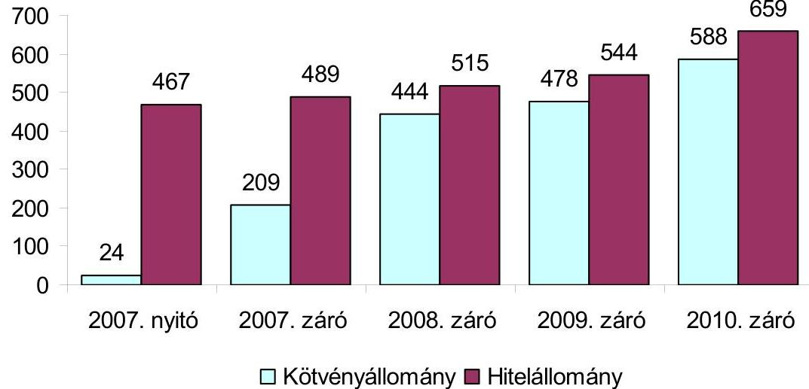

---

A 2007-2008. években a megyei és a megyei jogú városi önkormányzatok $95 \%$-a bocsátott ki - 3-5 éves türelmi és 20-25 éves futamidő mellett - deviza alapú kötvényt, illetve vett fel hitelt. A Fővárosi Önkormányzat a hiányzó beruházási forrásokat a hazai és EU-s támogatások mellett hitelek felvételével biztosította.

2010-ben a kötvényállomány növekedésében már nem az új kibocsátás volt a meghatározó, hanem a devizában fennálló kötelezettségek árfolyamváltozás miatti - számviteli szabályoknak megfelelő - év végi átértékelése.

Az adósság 2007-2008. évi gyors növekedésének több oka volt, amelyek közül ki kell emelni az önkormányzati alrendszer számára biztosított állami források csökkentését, a gazdasági válságot, illetve az európai uniós támogatásokkal ösztönzött fejlesztések önerő-igényének részben adósságot keletkeztető forrásból történő biztosítását. Mindez az önkormányzatok részéről nagyfokú alkalmazkodást és a belső tartalékok feltárását igényelte.

A 2010. évben az adósságállomány koncentráltságát jelzi, hogy a 19 megyei és a 23 megyei jogú városi önkormányzatot terheli az önkormányzati alrendszer adósságának $40 \%$-a ( 501 Mrd Ft ), a 304 városi önkormányzatot $31 \%$-a ( 382 Mrd Ft ). A fővárosi és a kerületi önkormányzatok adósságállománya együttesen $22 \%$ ( 270 Mrd Ft ), míg a nagyközségeké, községeké összesen 7\% ( 94 Mrd Ft ).

Az ország egy lakosára jutó önkormányzati adósságállomány 2010-ben 125 ezer Ft/fő volt. A fajlagos összeg településtípusonként jelentősen eltér, a megyei jogú városokban az egy főre jutó adósságállomány $32 \%$-kal ( 40 ezer Ft/fővel) haladja meg az országos átlagot. (2. sz. ábra)
2. sz. ábra

Egy lakosra jutó adósság önkormányzati típusonként 2010-ben (ezer Ft/fő)
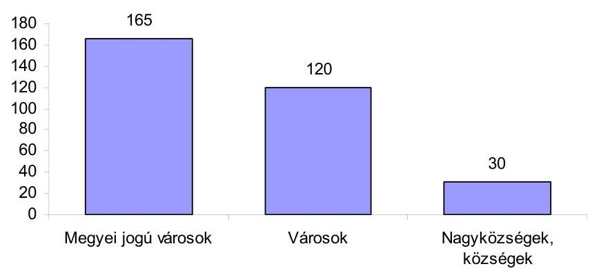

Az önkormányzatok pénzforgalmi hiánya az ellenőrzött időszak elején csökkent, míg a második felében - főként a kötvénykibocsátásból felhalmozott tartalékok felhasználása, továbbá a kieső bevételek és a beruházások felgyorsulása miatt - erőteljesen növekedett. (3. sz. ábra)

---

# 3. sz. ábra 

Az önkormányzati alrendszer pénzforgalmi hiányának változása (Mrd Ft)
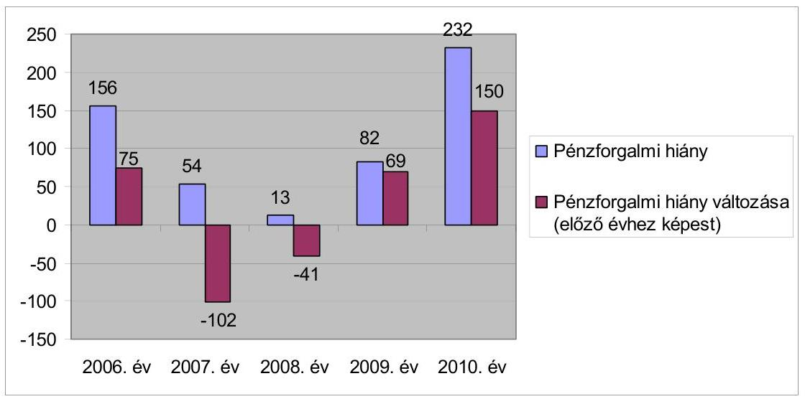

A kötvénykibocsátásból befolyó bevételt részben korábbi előnytelen hitelek kiváltására, fejlesztések és részben működési hiány finanszírozására használták fel, közel felét azonban az önkormányzatok tartalékolták. Ezek hozamából származó kamatbevételek hozzájárultak a működőképesség fenntartásához.

Az önkormányzati alrendszer eladósodását a kötvénykibocsátások és hitelfelvételek okozták. A fejlesztések önerejét biztosító forrást csak a felvételt követő években, 2009-ben és főként 2010-ben használták fel az önkormányzatok. Gondot az okozott, hogy ennek segítségével nemcsak a beruházások saját forrását biztosították, hanem egyúttal az alrendszer és az államháztartás költségvetési hiányának a növekedéséhez is hozzájárultak. Az önkormányzati alrendszer pénzforgalmi (hitel- és értékpapír műveletek nélküli) hiánya 2010-ben 42 Mrd Ft-tal lett nagyobb az éves költségvetésben elfogadott összegnél, amely döntően hozzájárult a tervezett 3,8\%-os államháztartási hiánymérték 4,2\%-ra történő emelkedéséhez. Mindez nem azt jelenti azonban, hogy a Kormányzat által kitűzött 2010-es deficitcél túllépését maga az önkormányzati hitelfelvétel okozta volna. Sokkal inkább arról volt szó, hogy a központi tervezés során a Kormány annak ellenére alulbecsülte a tartalék-felhasználást, hogy az előre látható volt, miközben a bevételek válság miatti kiesésével kapcsolatban is túl derűlátóak voltak az előrejelzések.

A pénzügyi helyzettel kapcsolatos elemzéseket, értékeléseket 2007-től a helyszíni ellenőrzést megelőző utolsó negyedév végéig terjedő időszakra végeztük. A pénzintézeti kötelezettségek állományának vizsgálatakor 2006. december 31-ét tekintettük bázisadatnak. Az ellenőrzések során az önkormányzatok pénzügyi helyzetének, kockázatainak, valamint adósság kezelésének értékelésénél egy új módszert, a CLF módszert alkalmaztuk. (A módszer rövid ismertetését az 1. sz. Függelék 1. pontja tartalmazza.)

---

# I. ÖSSZEGZŐ MEGÁLLAPÍTÁSOK 

## 1. A PÉNZÜGYI HELYZET ELLENŐRZÉSE

Az Állami Számvevőszék 2011-2015. évekre szóló stratégiája a helyi önkormányzatok ellenőrzésében a pénzügyi kockázatok feltárására helyezte a fő hangsúlyt. Az előzetes kockázatértékelés a helyi önkormányzati rendszer egésze és a lakosság közszolgáltatásokkal történő ellátása szempontjából a középszinten működő önkormányzatok ${ }^{2}$ pénzügyi helyzetének elemzését indokolta. Magas kockázati besorolásuk miatt elsőként a megyei önkormányzatok pénzügyi egyensúlyi helyzetét vizsgáltuk. Az ellenőrzés - ugyancsak teljes körűen - a megyei jogú városoknál folytatódott. A párhuzamosan folyó, a Fővárosi Önkormányzatra irányuló ellenőrzésnek is egyik kiemelt célja volt a pénzügyi helyzet megítélése. A 2011. évben reprezentatív mintavétellel 62 városnál végeztünk további ellenőrzést annak érdekében, hogy a tapasztalatok az összes (304) városra vonatkoztathatók legyenek. Emellett a városi kör pénzügyi helyzetének áttekintése céljából a helyszíni ellenőrzéssel nem érintett városi önkormányzatoktól is azonos adatszolgáltatást kértünk be. Összegző megállapításainkat a középszinten működő és az összes városi önkormányzat adatai alapján tettük.

Az önkormányzatok pénzügyi egyensúlyi helyzete 2007-2010 között romlott. A pénzügyi kockázatok (működési kockázat, felhalmozási kockázat, nemfizetési - szállítói, pénzintézeti és egyéb - kockázat, többségi tulajdonú gazdasági társaságok működése miatti kockázat) fokozódtak. A pénzügyi egyensúlyi helyzetet jellemző CLF mutatószámok együttesen és az egyes önkormányzati típusoknál külön-külön
 is kedvezőtlenül változtak. A működési jövedelem (a folyó költségvetés egyenlege) 2008-tól folyamatosan mérséklődött, 2007-ről 2010-re 172 Mrd Ft-ról 76 Mrd Ft-ra (55,8\%-kal) csökkent. A folyó költségvetés egyenlegének kedvezőtlen alakulása strukturális (finanszírozási és feladatellátási) problémát jelez, amely központi és önkormányzati intézkedéseket igényel. A feladat ellátójának változása a pénzügyi gondokat nem tudja megoldani, ha nem változik a feladat tartalma és finanszírozása.

A működési jövedelem kedvezőtlen alakulására hatással volt az önként vállalt feladatok viszonylag magas mértéke. A 2007. évről 2010-re a működési kiadáson belül az önként vállalt feladatok aránya a megyei jogú városoknál 17,1\%-ról 18,9\%-ra növekedett, a városi önkormányzatoknál 24,5\%-ról 23,2\%-ra csökkent. A pénzügyi egyensúly helyreállításának egyik lehetséges módja a méretgazdaságossági szempontokat nem tükröző intézménystruktúra racionalizálása mellett az önként vállalt feladatok szűkítése.

Az önkormányzatok az ellátott feladatok kötelező/önként vállalt besorolása tekintetében a rájuk vonatkozó jogszabályi előírásokat különbözően értelmezték.

[^0]
[^0]:    ${ }^{2}$ Középszinten működő önkormányzatok: Fővárosi Önkormányzat, megyei önkormányzatok, megyei jogú városi önkormányzatok.

---

A törvényi előírásnak az önkormányzatok csak abban az esetben tudnak megfelelni, ha a kötelező feladatok tartalmát és ellátásuk mértékét a jogszabályok teljes körűen meghatározzák. Az új Ötv. 2013. január 1-jétől hatályos előírása szerint az önkormányzatok költségvetési rendelete elkülönítetten kell, hogy tartalmazza a kötelező, valamint az önként vállalt feladatok ellátásának forrásait és kiadásait. A beszámolási rendszer ennek a követelménynek jelenleg még nem felel meg.

A közfeladatok gazdasági társaságokba történő kiszervezésével a gazdálkodás, a pénzügyi helyzet kockázatai kikerültek az önkormányzati alrendszerből, de a társaságok működésében jelentkező problémák közvetett kockázatot gyakorolhatnak a feladatellátásra kötelezett önkormányzatnál. Sérülhet az ellátási felelősség figyelemmel kísérése és érvényesítése.

A középszinten működő és a városi önkormányzatok működési jövedelemtermelő képességének csökkenő tendenciája határozta meg döntően a pénzügyi kapacitás ${ }^{3}$ (nettó működési jövedelem) visszaesését, amely a 2007. évi 79 Mrd Ft-ról 2010-re -16 Mrd Ft-ra csökkent. A megyei, megyei jogú városi és városi önkormányzatok összesített adatai alapján a 2010. évben a megképződött működési jövedelem már nem nyújtott fedezetet az adósság törlesztésére. A nettó működési jövedelem az ellenőrzött időszakban a felhalmozási költségvetés hiányának mindössze 30\%-át fedezte, így a felhalmozási kiadások finanszírozásába további külső forrásokat kellett bevonni, ami az adósságállomány növekedéséhez vezetett. A 2007-2010. években a megyei önkormányzatoknál a nettó működési jövedelem minden évben negatív volt, amely újabb külső források igénybevételét tette szükségessé.

Az önkormányzatok összes bevétele a 2007. évi 2328 Mrd Ft-ról 2010-re 2235 Mrd Ft-ra, összességében 4\%-kal, 93 Mrd Ft-tal csökkent. A megyei önkormányzatok bevételeinek abszolút értékű csökkenését (16,9\%) döntően a feladatellátásra különösen kockázatot jelentő központi forráskivonás okozta. Valamennyi önkormányzattípust érintette a költségvetési kapcsolatokból származó források központi egyensúly javítását szolgáló csökkentése. A középszinten működő önkormányzatoknál az illetékbevételek visszaesése tovább rontotta a pénzügyi kapacitást. A Fővárosi Önkormányzat, a megyei jogú városok és városi önkormányzatok együttes bevételének ${ }^{4} 6,1 \%$-os növekedése reálértéken itt is csökkenést jelentett.

Különösen a megyei jogú városi önkormányzatoknál jelentkezett érzékelhetően, hogy csökkent a központi költségvetésből származó támogatás és növekedett az önkormányzati saját források aránya. A legnagyobb arányú támogatáscsökkenés a kollégiumi és a szakképzési feladatellátásnál volt. A 2007. évről 2010-re a kollégiumok fenntartásánál 72,4\%-ról 56,5\%-ra, a szakképző intézmények finanszírozásában 63,8\%-ról 56,8\%-ra csökkent az állami támogatás

[^0]
[^0]:    ${ }^{3}$ A pénzügyi kapacitás azt mutatja meg, hogy a működési jövedelemből az adósságszolgálat teljesítését követően mennyi tárgyévben keletkező, felhalmozásra, vagy tartalékolásra használható forrása maradt az önkormányzatnak.
    ${ }^{4}$ A Fővárosi Önkormányzat 2007. évi bevételét korrigáltuk az előző évi pénzmaradvány átvétel 131 Mrd Ft-os kiugróan magas összegével.

---

részaránya. Az önkormányzatok egy részénél ez is hozzájárult a pénzügyi egyensúly megbomlásához, mivel nem tudták saját bevételből előteremteni a növekvő forrásigényt.

A helyi adóbevételek nagyságrendje, változása és az önkormányzatok pénzügyi helyzete között közvetlen összefüggés van. A bevételi kitettség kockázatot jelenthet az önkormányzatok számára, amennyiben helyi adóbevételük jelentős része egy-két adóalanytól származik, nincs új helyi adó bevezetési lehetőségük, vagy az adómértékek maximális szinten vannak.

A helyi önkormányzatok működőképességének megőrzését szolgáló kiegészítő támogatások esetenként rövid távon sem segítették a pénzügyi egyensúlyi helyzet megteremtését, a hosszú távú pénzügyi egyensúly biztosítására pedig az állami támogatás elosztási módszeréből adódóan nem voltak hatással. Az önkormányzati finanszírozási rendszer problémájára hívja fel a figyelmet, hogy 2010-ben a 304 városi önkormányzatból 51 önkormányzat 2 Mrd Ft, 2011-ben 156 önkormányzat 9 Mrd Ft ÖNHIKI támogatásban részesült. A támogatásra való jogosultság megállapításánál nem volt kizáró ok, hogy mennyi önként vállalt feladatot láttak el, és voltak-e olyan fejlesztéseik, amelyek a jövőben a működési hiány további növekedését okozhatják. Az ÖNHIKI támogatás nem csak a csődközeli önkormányzatok megsegítését szolgálta egyéni adósságkezelés keretében, nem ösztönzött a hosszú távú egyensúlyt biztosító, reorganizációs intézkedések megtételére.

A bevételek és kiadások ütemkülönbségének áthidalására hivatott likvid hitelek egyre nagyobb szerepet játszottak a pénzügyi egyensúly hosszú távú finanszírozásában. Az önkormányzatok többsége a folyószámla- és egyéb likvid hitelek felvételét részesítette előnyben, mivel azokra a hitelfelvételi korlát nem vonatkozott és kamatfeltételeik is kedvezőek voltak. A folyószámlahitel napi átlagos állománya a 2007. évi 47 Mrd Ft-ról 2010-re 61,8 Mrd Ft-ra emelkedett, amely a működés finanszírozási kockázatát növelte. A likvid hiteleket - annak ellenére, hogy döntően már tartós működési és felhalmozási forráshiányt finanszíroztak - az önkormányzatok nem váltották ki hosszú távú hitelekkel. Ennek következtében az önkormányzatok banki kitettsége növekedett, a lejárat napján hiányzó fedezet miatt jellemzővé vált a likvid hitel keretszerződés évenkénti, rendszeres - sok esetben kényszerű - gyakran egyre magasabb összegben történő megújítása.

Nemfizetési kockázatot jelentett a szállítói, kiemelten a lejárt esedékességű tartozások növekvő tendenciája, továbbá a dologi kiadások egyhavi átlagához mért magas szintje. Az önkormányzatok a banki hitelforrások korlátozottsága miatt a szállítókat jellemző módon a külső finanszírozás egyik eszközének tekintették. A szállítói tartozás év végi állománya - a 2008. évet kivéve - meghaladta a dologi kiadások kéthavi szintjét. A nemfizetési kockázat szempontjából kiemelt jelentőségű a lejárt esedékességű tartozások kezelése. Az összes szállítói állomány 2007-ről 2010-re 85 Mrd Ft-ról 105 Mrd Ft-ra, 23,5\%-kal, a lejárt határidejú tartozás ennél nagyobb mértékben 26 Mrd Ft-ról 44 Mrd Ft-ra (69,2\%-kal) nőtt. Az alrendszer középszintjét jelentő önkormányzatoknál a lejárt szállítói állomány 50\%-át az OEP finanszírozási körbe tartozó kórházak által felhalmozott szállítói tartozások jelentették. A lejárt szállítói állományból nem történik meg az EU támogatások szállítói finanszírozásából adódó tételek

---

elkülönítése, amelyet az EU-s támogatási rendszer finanszírozási gyakorlata indokolna. Emiatt a mérlegben kimutatott szállítói tartozás nem az önkormányzat valós szállítói kötelezettségét mutatja. A szállítói finanszírozás esetén a kötelezett nem az önkormányzat, hanem az állam. Likviditási nehézséget okozott az EU-s támogatással megvalósuló projektek utófinanszírozása miatt szükséges pénzügyi fedezet biztosítása is, amely az EU-s támogatással megvalósuló programok finanszírozásának újragondolását teszi szükségessé.

A kedvezőtlen tendencia ellenére az önkormányzatok többsége nem fordított kellő figyelmet a tartozások lejárat szerinti megkülönböztetett kezelésére, az átütemezés lehetőségének kihasználására. Nem tettek intézkedéseket az adósságrendezési eljárás kezdeményezését lehetővé tevő késedelmes fizetések megszüntetésére, továbbá nem számoltak a várható következményekkel. Az adósságrendezésről szóló törvény értelmében a hitelező a 60 napon túl lejárt esedékességű, nem vitatott tartozás miatt adósságrendezési eljárást kezdeményezhet az önkormányzattal szemben, továbbá a 90 napon túl lejárt tartozás esetén a polgármester felelősségi körébe tartozik az eljárás kötelező kezdeményezése.

Az önkormányzatok pénzügyi helyzetére kedvezőtlen hatással volt az EU-s pályázati lehetőségek által kiváltott fokozott beruházási tevékenység. A felhalmozási költségvetés 2007-2010 között minden évben valamennyi önkormányzattípusnál hiánnyal zárult. A 2010. december 31-én folyamatban lévő beruházások miatt vállalt 1154 Mrd Ft jövőbeni kötelezettség finanszírozásához az EU-s és hazai támogatáson, saját bevételen felül további 217 Mrd Ft külső forrás bevonása szükséges a középszinten működő és a 304 városi önkormányzatnál.

A beruházási hajlandóság növekedése - nettó működési jövedelem, bevonható vagyonhasznosítási bevétel hiányában - olyan adósságot keletkeztető kötelezettségvállalásokat is eredményezett, amelyek esetében a visszafizetés jövőbeni fedezetét, annak kockázatait nem kellő körültekintéssel mérték fel. Nem számszerűsítették a folyamatban levő fejlesztésekre vonatkozó kötelezettségvállalások saját forrásait, a külső források nevesítése sem történt meg minden esetben. A felhalmozási költségvetés negatív egyenlege miatti eladósodás kezelésének (egyszeri konszolidáció) központi szabályai nem kidolgozottak.

Kockázati tényező továbbá a fejlesztések révén létrehozott tárgyi eszközök működtetése, üzemeltetése, jövőbeni fenntarthatósága, mivel az üzemeltetés során jellemzően nem képződnek pótlólagos saját bevételek, számottevő kiadási megtakarítások. A fejlesztési döntések során a megtérülési követelmények, a kötelező feladatok ellátásához szükséges fejlesztések, az eszközhatékonyság javítása, a már meglévő eszközök állagának megőrzése helyett a magas támogatási arány élvezett elsőbbséget. A kötelező feladatellátást szolgáló megvalósult projektek fenntartása - önkormányzati forrás hiányában - közvetetten az állam felelőssége. Az önkormányzatoknál az önként vállalt feladatot ellátó projektek fenntarthatósági követelményének teljesítése további kockázatot hordoz.

Jelentős az eszközök állagromlásából, a pótlási kötelezettség elhalasztásából felhalmozódott rejtett adósság, amelynek későbbi finanszírozhatósága kétséges.

---

A megtérülési követelményeket is tükröző értékcsökkenési leírásnak megfelelő pótlási alapképzésre jogszabályi előírás nem kötelezte az önkormányzatokat.

A pénzintézetekkel szemben fennálló kötelezettségek a 2010. évben 2007-hez képest önkormányzat típusonként differenciáltan - a fővárosnál 8,8\%-kal, a megyei önkormányzatoknál 143\%-kal, a megyei jogú városoknál 100\%-kal és a városoknál 92\%-kal - összességében 77,7\%-kal növekedtek. Az önkormányzati alrendszer 2010. december 31-én fennálló 1247 Mrd Ft adósságállományának 84,6\%-a az említett önkormányzati körben keletkezett. A devizában való eladósodás előtérbe kerülése miatt 2010-től a kötelezettségek állománya növekedésében az elszámolt árfolyamveszteség volt a meghatározó. Az önkormányzatok eladósodásának hátterében döntően az EU-s támogatással megvalósult, illetve folyamatban lévő beruházások önerő igényének fedezetét biztosító saját forrás hiánya állt.

A deviza alapú kötvénykibocsátás a 2007-2008. években ismert árfolyamok és kamat kondíciók miatt előnyösebb megoldást kínált a hosszú lejáratú hitelfelvétellel szemben. A külső forrás felhasználásában az önkormányzatok döntési szabadsága a hitelfelvétel esetében a kötvényhez képest korlátozott volt. A jelenbeli fizetőképesség fenntartása szempontjából kedvezőbb finanszírozási megoldást jelentett a fizetési terhek hosszú időre történő elosztása. Az önkormányzatok 2010. év végén fennálló kötvény- és hiteltartozásának 85\%-a a 2014-től kezdődő időszakot terheli, amely a jelenlegi kondíciók ismeretében jelentős árfolyam- és kamatkockázatot jelent. A kötvények esetében az árfolyam kedvezőtlen alakulása - a törlesztéskor realizált veszteségen túl - a pénzintézet által kezdeményezett futamidő előtti visszaváltás, illetve forintra történő konverzió miatt jelenthet kockázatot.

Az ellenőrzött időszakban az adósságot keletkeztető kötelezettségvállalás korlátozására vonatkozó érvényes központi szabályozás nem töltötte be funkcióját, az önkormányzatok a pénzügyi kapacitásukat meghaladó mértékű kötelezettséget vállaltak. Az önkormányzatok hosszú távú kötelezettségvállalását megelőzően a teljes futamidőre történő költségvetési tervezés, előrevetített megtérülési, fedezeti számítások elvégzése nem történt meg. Az önkormányzatok többsége fejlesztéseik jövőbeni fenntarthatósága, a várható kiadások fedezetének vizsgálata
 során nem vette figyelembe a már fennálló és a keletkező adósságszolgálati kötelezettségeket.

A pénzintézeti kötelezettségek visszafizetéséhez szükséges tartalékok képzéséről az önkormányzatok nem gondoskodtak. A visszafizetés fedezetéül szolgáló forrást jellemzően nem nevesítették. Kockázatot jelent, hogy a hitelek fedezeteként az önkormányzati törzsvagyonhoz tartozó vagyonelemek felajánlására is sor került. A jelzáloggal nem terhelt forgalomképes vagyonból a fedezetként figyelembe vehető kör meghatározásáról, számszerűsítéséről, értékesítésre történő előkészítéséről nem gondoskodtak, így a hasznosítható vagyonrész valós piaci értéke sem ismert. A csökkenő pénzügyi kapacitás miatt a vagyonhasznosításból realizálható bevételek a jövőbeni kötelezettségek fedezetét teremthetik meg.

Az adósságszolgálati terhek miatt várhatóan 2014-től nagy számban nehéz pénzügyi helyzetbe kerülő önkormányzatok segítése céljából az adósságrendezési szabályozás átdolgozása indokolt. Nem dolgoztak ki olyan stabilizációs

---

programokat, amelyek figyelembe veszik az egyes önkormányzatok sajátosságait és lehetővé teszik az eljárás során megteremtett pénzügyi egyensúly hosszú távú fenntarthatóságát.

A pénzügyi kockázatok teljes körű feltárásához elengedhetetlen az önkormányzatok többségi tulajdonában lévő gazdasági társaságok kötelezettségeinek figyelembevétele, az ellenőrzött időszakban felhalmozott jelentős összegű adósságállományukra tekintettel. Az önkormányzatok és a közfeladatellátásban résztvevő társaságaik konszolidált beszámolói hiányában a kockázatok értékeléséhez szükséges információk közvetlenül nem állnak rendelkezésre. A konszolidáció hiánya nem teszi lehetővé a transzparenciát sem.

A gazdasági társaság tartozásaiért - bizonyos feltételek együttes bekövetkezése esetén - a tulajdonost terhelő helytállási kötelezettség kockázati tényezőként jelentkezik, kiemelten a lejárt szállítói tartozások, a hitelfelvételhez biztosított önkormányzati tulajdonú ingatlanfedezet, illetve kezesség beváltása, tartósan veszteséges gazdálkodás esetén a jövőbeni kötelezettségek fedezetének biztosítása szempontjából. Az önkormányzatok nem fordítottak kellő figyelmet gazdasági társaságaik eladósodásának megelőzésére, továbbá az önkormányzat és a gazdasági társaságok pénzügyi kockázatainak a képviselő-testület részére történő együttes bemutatására.

Az ÁSZ a pénzügyi egyensúlyi helyzet javítására különböző fokozatú intézkedéseket javasolt a beazonosított pénzügyi kockázatok alapján kialakított önkormányzati csoportoknak, külön kezelve a pénzügyi egyensúly azonnali helyreállítását igénylő önkormányzatokat, a középtávú intézkedést igénylőket, valamint azokat az önkormányzatokat, ahol a pénzügyi egyensúly rövid és középtávon is biztosított, így annak megőrzéséről hosszú távon kell gondoskodni.

A Fővárosi Önkormányzatnál az ellenőrzés a pénzügyi egyensúlyt alapvetően rendben találta. A megyei jogú városi önkormányzatok 39%-a, míg a városi önkormányzatok 50%-a a pénzügyi egyensúlyi helyzet azonnali helyreállítására kapott felhívást. A további megyei jogú városi és városi önkormányzatok összesen 27%-ának a pénzügyi egyensúlyi helyzet középtávú biztosítása érdekében tettünk intézkedést igénylő javaslatokat, míg 26%-ának a pénzügyi egyensúly hosszú távú megőrzésére hívtuk fel a figyelmét. A megyei önkormányzatok adósságállományának kezelése a rendszer 2012. évi átalakítása után a Magyar Állam feladata lett. Ez az adósságállomány így kikerült az önkormányzati alrendszerből, de a kötelezettségek teljesítése az államháztartás szintjén ugyanúgy fennáll.

A beazonosított magas kockázatok miatt indokolt a városok kockázatalapú kiválasztást követő ellenőrzésének folytatása. Kizárólag a helyszíni ellenőrzés keretében lehet ugyanis értékelhető módon számszerűsíteni a számviteli és információs rendszerben közvetlenül rendelkezésre nem álló adatokat. A rendszer- és konszolidációs kockázatok indokolják a helyszíni ellenőrzés kiterjesztését az önkormányzatok többségi tulajdonú gazdasági társaságaira, valamint az önkormányzati fenntartású kórházakra.

Az ellenőrzések további hozadéka volt a számviteli és információs rendszer problémáinak nevesítése. A jelenlegi rendszer nem felel meg a

---

transzparencia, az átláthatóság követelményének. A pénzügyi kockázatokat teljes körűen nem mutatja be. Az ellátott közfeladatok hatékonyságának, eredményességének valós bemutatását az eredményszemléletű számvitel tudja biztosítani. A jelenlegi számviteli szabályok nem teszik lehetővé az elszámolt értékcsökkenés összegének az egyes feladatok ráfordításaiban való megjelenítését, és a finanszírozásban való figyelembevételét sem.

A közfeladatot ellátó gazdasági társaságok és a tulajdonos önkormányzatok közötti szerződéses kapcsolatokból (támogatás, kölcsön, garancia- és kezességvállalás) származó mérlegben szereplő és mérlegen kívüli kötelezettségek, továbbá az önkormányzat tulajdonosi minőségéből következő harmadik féllel szemben fennálló helytállási kötelezettségére vonatkozó információk a jelenlegi beszámolási rendszerből nem állnak közvetlenül és teljes körűen rendelkezésre.

A költségvetési beszámolókból nem ítélhető meg a kötelezettségekkel kapcsolatos kockázatok összessége. Mindebből következik, hogy az önkormányzatok és feladatellátó gazdasági társaságaik pénzügyi egyensúlyi helyzetének kockázatai újabb rendszerkockázatot jelentenek. A gazdasági társaságok kötelezettségei e mellett még külön konszolidációs kockázatot hordoznak. A devizában fennálló kötelezettségek év végi kötelező értékelése során elszámolt árfolyamveszteségből származó kockázat, a likvid hitelek tartós igénybevételére vonatkozó információk, a mérlegen kívüli kötelezettségek (a garancia- és kezességvállalás, a PPP beruházások) képviselő-testület részére történő bemutatása jelenleg nem kötelező. Az évek között áthúzódó szállítói kifizetések a pénzforgalmi szemlélet miatt torzítják az adott év működési és felhalmozási egyenlegét.

# A Kormánynak javasolt intézkedések 

Az ÁSZ a jövőre szóló szabályozást a múltbeli időszakot érintő ellenőrzések tapasztalatai alapján kívánja segíteni valamennyi megállapításával. Az önkormányzati rendszer és finanszírozásának átalakítási munkálataihoz időben hozzá kívánt járulni. Ezért az ÁSZ elnöke már a megyei és a megyei jogú városi önkormányzatok ellenőrzésének lezárása előtt, 2011 novemberében levelében ráirányította a Kormány figyelmét:

- a pénzügyi egyensúly megteremtését, fenntartását segítő központi támogatások szigorú követelmények támasztásával történő nyújtására, nem teljesítésük számonkérésére, az önkormányzati felelősség erőteljes érvényesítését szolgáló szabályok megalkotására;
- olyan pénzügyi konstrukció létrehozására, amely segíti a helyi önkormányzatok fizetési kötelezettségei és a képződő forrásai közötti összhang rövid, illetve hosszú távú megteremtését;
- olyan szabályozás kialakítására, amely a hitelt felvevő önkormányzatokat a felelős gazdálkodás követelményének figyelembevételére és a visszafizetés forrásainak előteremtésére kötelezi;
- a megtérülési követelményeket is tükröző értékcsökkenési leírásnak megfelelő pótlási alapképzésre vonatkozó kötelezettség általános előírására;
- a számviteli és információs rendszer transzparenciát előzőek szerint erősítő átalakítására;

---

- a működés hatékonyságának javítása érdekében - a kialakult gazdasági helyzet sajátosságait figyelembe véve - a feladat- és hatáskörök áttekintésére, az állami és az önkormányzati kötelező feladatok, valamint a finanszírozási felelősség egyértelmű elhatárolására.

# 2. A "PILOT" ELLENŐRZÉSEK 

Az ÁSZ az ellenőrzései során még fokozottabban törekszik a - hatékonyság egyik kulcsát jelentő -, kockázatokon alapuló megközelítés alkalmazására. A legnagyobb kockázatot hordozó területek beazonosítása és az azok közötti összefüggések feltárása érdekében a 2011. évben egy előzetesen kockázatosnak ítélt, szűk önkormányzati körben, öt városi és hét községi önkormányzatnál az úgynevezett „pilot" ellenőrzéseket végezte el. A „pilot" ellenőrzésekre két ütemben került sor, tavasszal két város és két község, ősszel három város és öt község önkormányzata gazdálkodási rendszerének ellenőrzését folytatta le az ÁSZ. Az ellenőrzés helyszíneinek kijelölése kockázatalapú kiválasztással történt. Az előzetes kockázatértékelés alapját az egyes önkormányzatok pénzügyi és vagyoni helyzetét jellemző, objektív mutatószámrendszer segítségével felállított kockázati sorrend képezte. A kockázati sorrend meghatározása az önkormányzati vagyon alakulását, a fizetőképességet, az eladósodást jellemző mutatók, valamint az egyéb pénzügyi mutatók súlyozásával történt.

A „pilot" ellenőrzések visszaigazolták az előzetes kockázatértékelést. A kockázatalapú kiválasztás alapján ellenőrzött 12 önkormányzatnál fokozottan jelentkeztek a pénzügyi helyzetre kedvezőtlen hatást gyakorló problémák. Az ellenőrzésekkel az ÁSZ feltárta az eladósodás jelentős növekedését, a likviditás hiányát, a tartalékok csökkenését, és rámutatott a pénzügyi kockázatok kezelését célzó intézkedések (köztük a döntés-előkészítő, és a döntésmegalapozó eljárások) hiányosságaira, amelyek hozzájárultak a kedvezőtlen pénzügyi folyamatok kialakulásához. Az ÁSZ az ellenőrzött önkormányzatok pénzügyi helyzetének 2007-2010 közötti kedvezőtlen tendenciái mellett, az azt befolyásoló pénzügyi kockázatokra (nemfizetési kockázat, visszafizetési kockázat, kamat- és árfolyamkockázat, gazdasági társaságok kockázata, jövőbeni működési kockázat) és azok főbb okaira is ráirányította a figyelmet. A központi támogatás aránya a kötelező önkormányzati feladatok finanszírozásában folyamatosan csökkent. Az ellenőrzött önkormányzatok működési jövedelemtermelő képessége, valamint a tőketörlesztést is tükröző nettó működési jövedelme az időszak alatt évről évre csökkent, a tartalékaik 2010-re elfogytak. A nettó működési jövedelem tartós negatív értéke túlzott mértékű adósságszolgálatra utal, ami a jövőben jelentkező működési kiadások finanszírozásának kockázatát jelentősen növeli. Az ellenőrzött 12 önkormányzat likviditási helyzete 2007-ről 2010-re kedvezőtlenül változott, a likviditási hitelek az állandósult pénzügyi hiány finanszírozási forrásává váltak. Az önkormányzatok lejárt szállítói tartozásállománya nemfizetési kockázatot jelentett.

A „pilot" ellenőrzésbe vont önkormányzatok felhalmozási tevékenységét is (hasonlóan a többi ellenőrzött városi önkormányzathoz) erőteljesen befolyásolták az európai uniós pályázatok adta lehetőségek. A beruházások finanszírozásához az egyre csökkenő pénzügyi kapacitás és a tartalékok csökkenése miatt újabb külső forrásokat vontak be. A 2010 utánra vállalt felhalmozási kötelezettségek saját forrásait egyik önkormányzat sem számszerűsítette, és a pénzintézetekkel szemben fennálló kötelezettségek visszafizetésének forrásait sem határozták meg.

A „pilot" ellenőrzések során a vagyongazdálkodási folyamatok belső kontrolljainak kialakításával és működésével kapcsolatosan az ÁSZ feltárta azokat a szabályossági kockázatokat, amelyek hozzájárulnak a kedvezőtlen pénzügyi folyamatok kialakulásához. Az ÁSZ a 12 önkormányzatnál rámutatott arra, hogy a vagyongazdálkodási folyamatok szabályozása hiányos volt. Az ellenőrzött önkormányzatoknál jellemzően a szabályozási hiányosságok következtében nem működtek a belső kontrollok, nem biztosították a vagyongazdálkodás szabályosságát. Elmaradtak a döntés-előkészítő és döntésmegalapozó eljárások, a döntéseket megelőzően a megvalósított beruházások, felújítások fenntarthatóságát nem vizsgálták, azok fenntartási költségeit és lehetséges forrásait nem számszerűsítették. Az ellenőrzött önkormányzatok az adósságot keletkeztető kötelezettségvállalások pénzügyi kockázatait nem mérték fel, nem működött a kockázatelemzés és a kockázatkezelés. Az ellenőrzési pontokat és az ellenőrzésért felelősöket tartalmazó ellenőrzési nyomvonal hiányában nem működtették a vagyongazdálkodási folyamatokban a folyamatba épített előzetes, utólagos és vezetői ellenőrzést sem.

Az ÁSZ az ellenőrzöttek csaknem teljes körénél megállapította, hogy a kulcsszerepet betöltő belső kontrollok - a kötelezettségvállalások ellenjegyzése, a szakmai teljesítések igazolása és az utalványok ellenjegyzése - nem működtek. A feltárt hiányosságok, mulasztások miatt fennállt a bevételek szabálytalan beszedésének és a kiadások szabálytalan teljesítésének a kockázata, mert a kifizetéseket megelőzően elmaradt a kötelezettségvállalás írásba foglalása, a kötelezettségvállalás ellenjegyzése, a szakmai teljesítések igazolása, a bevételeket megalapozó szerződéseknél elmaradt annak ellenőrzése, hogy azok megfelelnek-e a képviselő-testületek által meghatározott feltételeknek, továbbá azokban szerepelnek-e az önkormányzatok érdekeit védő garanciális elemek.

Az ÁSZ a tulajdonosi felelősség érvényesítését a közfeladatot ellátó gazdasági társaságok tekintetében ellenőrizte. Az ellenőrzéssel az ÁSZ ráirányította a figyelmet az ellenőrzött önkormányzatok és gazdasági társaságaik kockázatos pénzügyi, gazdasági folyamataira. Az alapvető tulajdonosi kontrollok elmaradása, a gazdasági társaságok kötelezettségei - azok nem teljesítése esetén - az önkormányzatok pénzügyi egyensúlyi helyzetére kockázatot jelentettek.

Az ÁSZ korábbi javaslatai hasznosításának elmaradása is hozzájárult a belső kontrollok működésével kapcsolatban ismételten feltárt hiányosságok fennállásához. Az ÁSZ által 2006-2010 között tett 191 javaslatnak csaknem felét nem hajtották végre, illetve nem hasznosították.

Az ellenőrzések során szerzett tanulságok, tapasztalatok alapul szolgálnak a kockázatos területek meghatározásához, így a jövőbeni ellenőrzések fókuszainak, témáinak kijelöléséhez, az ellenőrzöttek kiválasztásának szempontjaihoz, az alkalmazandó költséghatékony eljárások, módszerek meghatározásához. A pilot ellenőrzések megállapításai igazolják, hogy a jövőben kockázat alapon indokolt az ellenőrzött önkormányzatok kiválasztása.

---

A jövőbeni ellenőrzések területeire, azok egymásra épülésére, hatókörére vonatkozóan - figyelemmel arra, hogy az ÁSZ a Stratégiájában foglaltak szerint a rendszerszemléletű, összefoglaló értékelésekre lehetőséget adó ellenőrzésekre fókuszál - a következő főbb irányok, javaslatok fogalmazhatók meg:

- A községi önkormányzatoknál lefolytatott ellenőrzések során feltárt szabályossági kockázatok indokolttá teszik, hogy az ÁSZ 2012-től a községek körében megkezdje a belső kontrollrendszer kialakításának
 és a gazdálkodás folyamatában kulcsszerepet betöltő belső kontrollok működése megfelelőségének, valamint a belső ellenőrzés működésének ellenőrzését;
- A „pilot" ellenőrzések során feltárt pénzügyi kockázatok megerősítik az önkormányzatok pénzügyi helyzetének értékelésére irányuló ellenőrzések folytatásának szükségességét a kockázatértékelés (objektív mutatók) alapján kiválasztott önkormányzatoknál. Azoknál az önkormányzatoknál, amelyeknél a kiválasztást segítő monitoring a pénzügyi kockázatokon túl szabályossági kockázatot is jelez, ott az ellenőrzést a szabályosság értékelésére is indokolt kiterjeszteni;
- Az önkormányzatok pénzügyi helyzetének megítéléséhez elválaszthatatlanul kapcsolódik a vagyoni helyzet, a vagyongazdálkodás, ezért ezen terület értékelése és ellenőrzése is időszerű feladata az ÁSZ-nak. A „pilot" ellenőrzéseknél feltárt szabályossági kockázatok segítették beazonosítani azokat a vagyongazdálkodási területeket, amelyek ellenőrzése során a feltárt hibák kijavításával az önkormányzatok vagyongazdálkodásának szabályszerűsége, eredményessége javulhat;
- A közpénzekkel gazdálkodó, közfeladatokat egyre szélesebb körben ellátó önkormányzati gazdasági társaságoknál feltárt kockázatok, a tulajdonosi kontrollok alapvető hiányosságai ezen a területen is megerősítik a közvagyon felhasználására irányuló ellenőrzések szükségességét és időszerűségét;
- Az utóellenőrzéseknél feltárt mulasztások, az ismétlődő hiányosságok indokolttá teszik, hogy az ÁSZ-nak a számvevőszéki munka eredményeinek, hatásának erősítése érdekében - a stratégiai célkitűzésekkel összhangban - a jövőben még célzottabbá kell tennie az utóellenőrzést.

---

# II. RÉSZLETES MEGÁLLAPÍTÁSOK 

## 1. A KÖZÉPSZINTEN MŰKÖDŐ ÉS A VÁROSI ÖNKORMÁNYZATOK PÉNZÜGYI HELYZETÉNEK ELEMZÉSE

Az önkormányzatok pénzügyi egyensúlyi helyzetének elemzését a fővárosi, megyei, megyei jogú városi önkormányzatok ellenőrzése és a 304 városi önkormányzat adatszolgáltatása alapján készítettük ${ }^{5}$. Az ÁSZ az önkormányzatok pénzügyi helyzetét a CLF módszerrel elemezte. Ennek alapján elkülönülnek a vagyonnal kapcsolatos, illetve a feladatokkal közvetlenül összefüggő folyó (működési) bevételek és kiadások.

## A pénzügyi egyensúlyi mutatók alakulása

A középszinten működő és a városi önkormányzatoknál a 2007-2010. években együttesen 599 Mrd Ft működési jövedelem és 268 Mrd Ft nettó működési jövedelem képződött. A működési jövedelem 50,7%-a ( 304 Mrd Ft), a nettó működési jövedelem 88,8%-a ( 238 Mrd Ft) a Fővárosi Önkormányzatnál realizálódott.

Az ellenőrzött időszakban kedvezőtlenül változtak a CLF módszerrel számított pénzügyi egyensúlyi mutatók önkormányzattípusonként eltérő mértékben és együttesen is. (1. sz. táblázat)

## 1. sz. táblázat

CLF módszerrel számított pénzügyi mutatók (Mrd Ft)
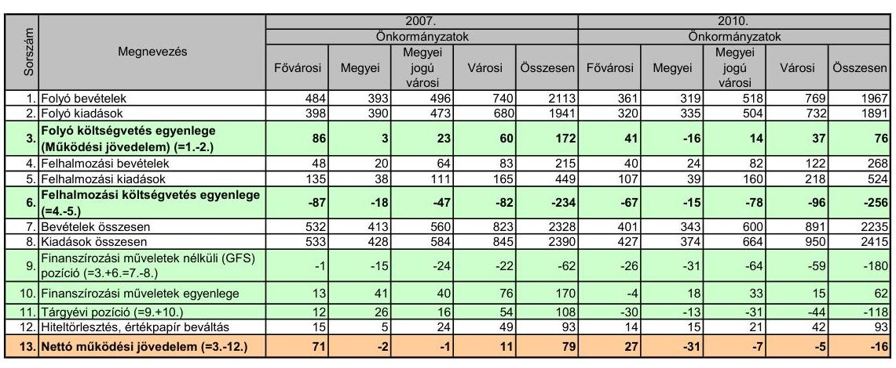

A működési jövedelem összességében 55,8%-kal ( 96 Mrd Ft-tal), a nettó működési jövedelem 95 Mrd Ft-tal ( 79 Mrd Ft-ról -16 Mrd Ft-ra) csökkent. A

[^0]
[^0]:    ${ }^{5}$ A középszinten működő és a városi önkormányzatok adatainak összehasonlíthatósága érdekében ebben a fejezetben nem csak az ellenőrzött 62, hanem az összes 304 városi önkormányzat adatait mutatjuk be. Az adatok az éves költségvetési beszámolókból, illetve a 2011. őszén végzett, a teljes városi körre kiterjedő adatszolgáltatásból származnak.

---

működési jövedelemtermelő képesség romló tendenciája határozta meg a pénzügyi kapacitás (nettó működési jövedelem) 2007-2010 közötti visszaesését. A megyei, megyei jogú városi és városi önkormányzatok összesített adatai alapján a 2010. évben megképződött működési jövedelem már nem nyújtott fedezetet az adósságtörlesztésre. Ez az érintett önkormányzatoknál ${ }^{6}$ a vagyonfelélés, vagy tartós pénzügyi egyensúlyhiány kialakulásának veszélyét jelzi. A folyó költségvetés egyenlegének kedvezőtlen alakulása strukturális (finanszírozási, feladatellátási) problémát takar, mely tartós megtakarításokat eredményező központi és önkormányzati intézkedéseket igényel.

A Fővárosi Önkormányzat pozitív működési jövedelme 2007-2010 között összesen 304 Mrd Ft pénzügyi forrást biztosított a tőketörlesztési kötelezettség teljesítéséhez, valamint a fejlesztések finanszírozásához. A nettó működési jövedelmének csökkenésében nem az adósságszolgálathoz kapcsolódó kiadások növekedése, hanem a folyó bevételek és kiadások különbségéből származó alacsonyabb működési jövedelem volt a meghatározó. A Fővárosi Önkormányzat pénzügyi helyzete a nettó működési jövedelem csökkenése ellenére az ellenőrzött időszakban kiegyensúlyozott volt.

A pénzügyi egyensúlyi helyzetet jellemző mutatók alakulása a megyei önkormányzatoknál volt a legkedvezőtlenebb az ellenőrzött időszakban. A működési jövedelem 2009. évtől, a nettó működési jövedelem 2007-től mindvégig negatív előjelű volt, amely újabb külső források igénybevételét tette szükségessé. A megyék pénzügyi egyensúlyi helyzetének kedvezőtlen változásában jelentős szerepe volt a központi forrásszabályozás bevételeket érintő hatásának.

Az ellenőrzött időszakban a megyei jogú városi és a városi önkormányzatok működési jövedelme pozitív volt, azonban összegük 2008-tól kezdődően csökkent, ezzel azonos ütemben változott a nettó működési jövedelem, amelynek értéke 2010-ben negatív előjelűvé vált. A pénzügyi egyensúlyi helyzet mutatószámainak romlásához a központi költségvetési kapcsolatból származó bevételek csökkenése és az adósságtörlesztésre fordított kiadások 2010. évi növekedése járult hozzá.

A 2007. évhez képest a 2010. évben a felhalmozási hiány finanszírozásába bevonható nettó működési jövedelem csökkent. A középszinten működő és a városi önkormányzatoknál 2007-2010. években együttesen képződött nettó működési jövedelem a felhalmozási költségvetés hiányának mindössze 30%-át fedezte, amely az adósságállomány növekedéséhez vezetett. Az egyes önkormányzati típusok között jelentős szóródás tapasztalható, mivel az összes felhalmozási hiány 84,1%-ára nyújtott fedezetet a nettó működési jövedelem a Fővárosi Önkormányzatnál, míg ez az arány a megyei jogú városok esetében 5,1%, a városok esetében 20,4% volt. A megyei önkormányzatok felhalmozási hiányának finanszírozásába bevonható nettó működési jövedelem nem képződött.

[^0]
[^0]:    ${ }^{6}$ A megyei önkormányzatok 2011. december 31-én fennálló adósságát és annak járulékait a Magyar Állam átvállalta, amely új helyzetet teremtett az önkormányzatok pénzügyi egyensúlyi helyzetének megítélésében.

---

# A folyó bevételek változásának okai 

Az önkormányzatok bevételei a 2007. évi 2328 Mrd Ft-ról 2010-re 2235 Mrd Ft-ra, összességében 4%-kal 93 Mrd Ft-tal csökkentek. A 2007. évről a 2010. évre a Fővárosi Önkormányzat és a megyei önkormányzatok bevételei 24,6-16,9%-kal (131 Mrd Ft és 70 Mrd Ft-tal) csökkentek, míg a megyei jogú városi és a városi önkormányzatoknál 7,1-8,3%-kal (40-68 Mrd Ft-tal) nőttek a bevételek főösszege. (4. sz. ábra)
4. sz. ábra

Az önkormányzatok CLF módszer szerinti bevételei a 2007. és a 2010. évben (Mrd Ft)
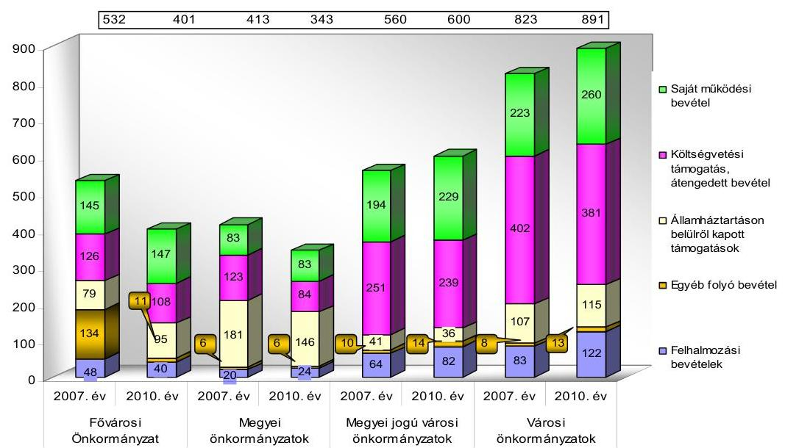

A bevételek alakulására a központi szabályozás (forráskivonás, illetéktörvény változása), a feladatok csökkenése, központi és helyi intézkedések voltak hatással. A költségvetési támogatás és az átengedett bevételek valamennyi önkormányzati típusnál csökkentek, a saját működési bevételek összege a Fővárosi Önkormányzatnál 1,4%-kal (2 Mrd Ft-tal) nőtt, a megyei önkormányzatoknál azonos szinten maradt, míg a megyei jogú városoknál 18%-kal ( 35 Mrd Ft-tal) a városi önkormányzatoknál 16,6%-kal ( 37 Mrd Ft-tal) emelkedett. A Fővárosi Önkormányzat, a megyei jogú városi és városi önkormányzatok együttes bevételének 6,1%-os növekedése azonban reálértéken csökkenést jelentett. A középszinten működő önkormányzatoknál az illetékbevételek visszaesése kedvezőtlenül hatott a pénzügyi kapacitás alakulására.

A Fővárosi Önkormányzat bevételének szerkezete a főváros kiemelt szerepköréből, a forrásmegosztásból, a feladatellátás terjedelméből és egyedi támogatásokból adódóan sajátos, eltér más városok bevételi szerkezetétől. A helyi adóbevételeket érintő fővárosi és kerületi önkormányzatok között levő munkameg-

---

osztás ${ }^{7}$ meghatározó a saját bevételek teljesítése szempontjából. A központi költségvetésből kapott támogatás és az egyéb folyó bevétel csökkenésének meghatározó szerepe volt a Főváros bevétele alakulásában.

2007-2010 között a megyei önkormányzatok által ellátott feladatok finanszírozását érintő központi szabályozásváltozás (forráscsökkenés, illetéktörvény változása) okozta a bevételeik abszolút értékű csökkenésének (16,9%) döntő hányadát. A bevételeken belül csökkent az intézmények működését biztosító állami hozzájárulások és támogatások aránya. A normatívákban érvényesülő forráskivonáson túl a megyei önkormányzatok személyi jövedelemadóból való részesedése is csökkent.

Általános volt a kötelező feladatokhoz történő központi költségvetési hozzájárulások visszaesése, különösen érzékelhető ez a megyei jogú városi önkormányzatoknál. (2. sz. táblázat)
2. sz. táblázat

A kötelező feladatok finanszírozásának összetétele 2007-ben és 2010-ben a megyei jogú városi önkormányzatoknál (%)

| Megnevezés |  | Óvoda | Általános iskola | Gimnázium | Szakképző intézmény | Kollégium | Szociális intézmények | Gyermekjölési intézmények |
| :--: | :--: | :--: | :--: | :--: | :--: | :--: | :--: | :--: |
| Állami támogatás | 2007 | 47,2 | 52,4 | 61,9 | 63,8 | 72,4 | 34,8 | 41,7 |
|  | 2010 | 45,1 | 46,6 | 59,0 | 56,8 | 56,5 | 31,6 | 41,1 |
| Intézmény saját bevétele | 2007 | 9,5 | 9,7 | 10,5 | 15,1 | 18,1 | 28,0 | 17,9 |
|  | 2010 | 11,3 | 12,2 | 14,2 | 15,4 | 20,7 | 30,9 | 15,4 |
| Önkormányzati saját forrás | 2007 | 43,3 | 37,9 | 27,6 | 21,1 | 9,5 | 37,2 | 40,4 |
|  | 2010 | 43,6 | 41,2 | 26,8 | 27,8 | 22,8 | 37,5 | 43,5 |

A megyei jogú városi önkormányzatoknál valamennyi ágazati feladat - kiemelten a kollégiumi és a szakképzési feladatellátás - finanszírozási forrásöszszetételére jellemző, hogy csökkent a központi költségvetésből származó támogatás és növekedett az önkormányzati saját források aránya. Az önkormányzatok egy részénél ez is hozzájárult a pénzügyi egyensúly megbomlásához, mivel nem tudták saját bevételből előteremteni a növekvő forrásigényt.

Bevételcsökkenést eredményezett valamennyi önkormányzatnál a kiadások mérséklésére tett központi intézkedésekhez kapcsolódó (pl. járulékmérséklés, 13. havi illetmény megszüntetése) forráskivonás. A csökkenő központi támogatások miatt növekedett az önkormányzati saját bevételek szerepe, elsősorban a megyei jogú városi és városi önkormányzatoknál. Ebben a helyi iparűzési adóbevétel meghatározó, amely a helyi gazdasági környezet helyzetétől és az önkormányzati adóhatóságok tevékenységétől függően számottevően differenciálta az önkormányzatok pénzügyi helyzetét, adóerő-képességét ${ }^{8}$. A helyi adóbevételek aránya a saját működési bevételeken belül minden önkormányzati tí-

[^0]
[^0]:    ${ }^{7}$ Az iparűzési adót és az idegenforgalmi adót a Fővárosi Önkormányzat szedte be, ezek azonban megosztásra kerültek a főváros és a kerületek között. Az egyéb helyi adók bevezetéséről, mértékéről, mentességről, kedvezmények megállapításáról a kerületi önkormányzatok dönthetnek.
    ${ }^{8}$ Az ÁSZ 2010. decemberében közzétett 1031. számú jelentésében értékelte a helyi adók rendszerében a hatékonyság és az eredményesség érvényesülését.

---

pusnál csökkent. Az egy lakosra jutó adóbevételek érdemben kizárólag a megyei jogú városi önkormányzatoknál nőttek. (Stagnáló lakosságszám mellett jelentkezett az adóbevétel emelkedése.)

Az iparűzési adóbevétel egy lakosra vetítve 15 megyei jogú városban átlag alatt, 8 esetében átlag felett volt 2010-ben. Az egy főre jutó iparűzési adóbevétel 2010-ben 104 ezer Ft, a legalacsonyabb 19 ezer Ft volt. Kiugróak a közép- és nyugat dunántúli megyei jogú városi önkormányzatok adatai. Ugyanakkor a fajlagos érték az önkormányzatok 44%-ánál a válság hatására visszaesett 2010-ben.

A városokban 2010-ben az egy lakosra jutó iparűzési adóbevétel 36,8 ezer Ft/fő volt, amely 1,3%-kal maradt el a 2007. évi 37,3 ezer Ft/fő bevételtől. A lakónépesség és a helyi adóbevétel növekedése eredményeként az egy lakosra jutó helyi adóbevétel 2007-ben 45,1 ezer Ft-ot, 2010-ben 46,2 ezer Ft-ot tett ki. Az egy lakosra jutó helyi adóbevétel és az önkormányzatok pénzügyi helyzete között közvetlen összefüggés van, a helyi adóbevétel összegének, illetve fajlagos értékének változása befolyásolja az önkormányzatok pénzügyi helyzetét. A bevételi kitettség kockázatot jelenthet az önkormányzatok számára, amennyiben helyi adóbevételük jelentős része egy-két adóalanytól származik, nincs
 új helyi adó bevezetési lehetőségük, vagy az adómértékek maximális szinten vannak.

Változtak az önkormányzati bevételek a helyi intézkedések, feladatok csökkenése következtében is. A megyei, a megyei jogú városi és városi önkormányzatoknál az ellenőrzött időszakban is folytatódott egyes feladatok, intézmények (pl. kórházak, Térségi Integrált Szakképző Központok, közoktatási intézmények) kiszervezése államháztartáson kívülre, iskolák, egyes szociális intézmények átadása az egyházaknak. Ezen intézkedések a központi költségvetés terheit azonban nem csökkentették, csupán a támogatások csoportosultak át. Mindezen szerkezeti változásokat figyelembe kell venni, amikor a bevételek időbeli összehasonlítását végezzük.

A finanszírozhatóság megőrzése, a kieső központi és helyi bevételek pótlása érdekében az önkormányzatok bevételnövelő és kiadáscsökkentő intézkedéseket (intézmények átszervezése, megszüntetése, létszámcsökkentés) tettek. Ezek folyó költségvetésre gyakorolt együttes hatása 261 Mrd Ft volt, azonban az önkormányzatoknak csak egy részénél fejtettek ki számottevő hatást a pénzügyi egyensúlyi helyzet alakulására.

A finanszírozási rendszer problémájára hívja fel a figyelmet, hogy 2010-ben a 304 városi önkormányzatból 51 önkormányzat 1,9 Mrd Ft, 2011-ben 156 önkormányzat 9,2 Mrd Ft ÖNHIKI támogatásban részesült. A támogatásra való jogosultság megállapításánál nem volt kizáró ok, hogy mennyi önként vállalt feladatot láttak el, és voltak-e olyan fejlesztéseik, amelyek a jövőben a működési hiány további növekedését okozhatják. A helyi önkormányzatok működőképességének megőrzését szolgáló kiegészítő támogatások esetenként rövid távon sem segítették a pénzügyi egyensúlyi helyzet megteremtését, a hosszú távú pénzügyi egyensúly biztosítására nem voltak hatással.

---

# A folyó kiadások változásának jellemzői 

A 2010. évben teljesített folyó kiadások a 2007. évi kiadásokhoz képest 2,6%-kal, 50 Mrd Ft-tal csökkentek. (3. sz. táblázat)

A 2010. évben a működési kiadásokon belül a személyi juttatások és járulékok együttesen 10,8%-kal (1036 Mrd Ft-ról 924 Mrd Ft-ra) csökkentek, ezen belül jelentős volt a munkaadót terhelő járulékok változása, ami 23,7%-kal (59 Mrd Ft-tal) csökkent a 2007. évhez képest. (Az időbeli összehasonlítást itt is nehezítik a korábban említett központi intézkedések, kiszervezések.) A dologi kiadások emelkedtek, amelyben az energia áremelkedések, áfakulcs-emelés hatása játszott szerepet. Az önkormányzati gazdasági társaságokba kiszervezett közszolgáltatások következményeként számottevő mértékben növekedtek a vállalkozások számára nyújtott támogatások. (3. sz. táblázat)
3. sz. táblázat

Az önkormányzatok CLF módszer szerinti folyó kiadásai 2007-2010 között (Mrd Ft)

| Megnevezés | 2007 |  |  |  |  | 2010 |  |  |  |  | 2010/2007   % |
| :--: | :--: | :--: | :--: | :--: | :--: | :--: | :--: | :--: | :--: | :--: | :--: |
|  | Fővárosi | Megyei   önkormányzati | Megyei jogú városi   önkormányzati | Városi | Összesen | Fővárosi | Megyei   önkormányzati | Megyei jogú városi   önkormányzati | Városi | Összesen |  |
| Folyó kiadások | 399 | 390 | 473 | 680 | 1941 | 320 | 335 | 604 | 732 | 1941 | 97,4 |
| Működési kiadások   (hamatkiadások nélkül) | 213 | 372 | 402 | 594 | 1581 | 241 | 316 | 413 | 624 | 1581 | 100,8 |
| előzőt személyi juttatások | 97 | 178 | 205 | 307 | 787 | 97 | 142 | 190 | 305 | 787 | 93,3 |
| munkaadót terhelő járulékok | 30 | 66 | 65 | 98 | 259 | 25 | 37 | 50 | 78 | 190 | 76,3 |
| dologi kiadások | 86 | 138 | 132 | 178 | 534 | 119 | 137 | 173 | 226 | 654 | 122,7 |
| Állandó tartáson belülre átadott pénzeszközök | 4 | 4 | 8 | 9 | 25 | 3 | 3 | 7 | 12 | 25 | 113,6 |
| Transzferkiadások | 43 | 5 | 46 | 57 | 151 | 56 | 9 | 64 | 81 | 210 | 133,3 |
| előzőt vállalkozásoknak | 34 | 1 | 17 | 12 | 64 | 58 | 1 | 27 | 14 | 100 | 156,3 |
| magánszemélyeknek | 1 | 5 | 18 | 44 | 68 | 3 | 6 | 26 | 54 | 89 | 129,4 |
| nonprofit szervezeteknek | 8 | 3 | 11 | 11 | 33 | 8 | 2 | 11 | 13 | 34 | 97,0 |
| Kármatkiadások | 7 | 2 | 8 | 3 | 20 | 2 | 4 | 9 | 11 | 26 | 100,0 |
| Pénzmaradvány átadás | 131 | 3 | 9 | 4 | 147 | 8 | 3 | 11 | 4 | 26 | 17,7 |

Az ellenőrzött időszakban a Fővárosi Önkormányzat folyó kiadása 19,6%-kal (78 Mrd Ft-tal) mérséklődött, amelyet elsősorban a teljesített pénzmaradvány átadás csökkenése eredményezett. A megyei önkormányzatok folyó kiadása a személyi juttatások és a munkaadót terhelő járulékok összegének változása miatt 14,1%-kal (55 Mrd Ft-tal) csökkent. A megyei jogú városi önkormányzatok folyó kiadása a 2007. évhez képest 6,6%-kal (31 Mrd Ft-tal) növekedett 2010-ben, amelyet a dologi kiadások 31,1%-os (41 Mrd Ft-os) emelkedése határozott meg.

A városok folyó kiadása 7,6%-kal (52 Mrd Ft-tal) növekedett az ellenőrzött időszakban. A növekedésben a dologi kiadások 26,9%-os (48 Mrd Ft-os) növekedése játszott szerepet. A szervezési intézkedések eredményeként a személyi juttatások és a munkaadót terhelő járulékok összege, valamint az összes kiadáson belüli részaránya 2007-ről 2010-re 22 Mrd Ft-tal, 7,3 százalékponttal csökkent.

2007-2010 között az önkormányzatok által teljesített transzferkiadások 33,3%-kal (55 Mrd Ft-tal), ezen belül a vállalkozásoknak teljesített kiadások 56,3%-kal (36 Mrd Ft-tal) növekedtek. A középszinten működő önkormányzatok transzferkiadásai nagyobb részét a gazdasági társaságok, nonprofit szervezetek részére nyújtott pénzeszköz átadások tették ki. A Fővárosi Önkormányzat transzferkiadásainak több mint kétharmada a tömegközlekedés feladatellátás-

---

ához kapcsolódott. A megyei jogú városi és a városi önkormányzatok a gazdasági társaságaik bevonásával ellátott közfeladatok finanszírozása érdekében teljesítették a transzferkiadások jelentős részét. A városi önkormányzatoknál számottevő volt a magánszemélyek részére teljesített társadalmi, szociálpolitikai és egyéb juttatások összege, amely 22,7%-kal (10 Mrd Ft-tal) emelkedett.

A feladatellátás differenciáltsága megjelenik az egyes önkormányzattípusok működési kiadásainak ágazati szerkezetében. A Fővárosi Önkormányzat és a megyei önkormányzatok esetében az egészségügyre fordított kiadások részaránya meghatározó (41%-45%). A megyei jogú városoknál és a városoknál a közoktatásra és az egyéb igazgatási feladatokra fordított pénzeszközök együttesen a működési kiadások 71%-át, illetve 81%-át jelentették.

# Működési kockázatok 

A szállítói tartozások, ezen belül a lejárt esedékességű tartozások növekvő tendenciája, továbbá a dologi kiadások egy havi átlagához mért magas szintje nemfizetési kockázatot jelent az önkormányzatok pénzügyi egyensúlyi helyzetének biztosítása tekintetében. Ebben a középszinten működő önkormányzatoknál kulcsszerepet játszott a kórházak által felhalmozott adósságállomány. A 2010. évben a megyei önkormányzatok és a megyei jogú városi önkormányzatok lejárt határidejű tartozásának egységesen 44,4%-át, a Fővárosi Önkormányzat esetében 100%-át a kórházak lejárt határidejű tartozásai tették ki. (4. sz. táblázat)
4. sz. táblázat

Szállítói tartozás 2007-2010 között (Mrd Ft)

| Megnevezés | Fővárosi Önkormányzat |  |  |  | Megyei önkormányzatok |  |  |  | Megyei jogú városi önkormányzatok |  |  |  | Városi önkormányzatok |  |  |  |  |  |  |  |  |  |  |  |  |
| :--: | :--: | :--: | :--: | :--: | :--: | :--: | :--: | :--: | :--: | :--: | :--: | :--: | :--: | :--: | :--: | :--: | :--: | :--: | :--: | :--: | :--: | :--: | :--: | :--: | :--: |
|  | 2007 | 2008 | 2009 | 2010 | 2007 | 2008 | 2009 | 2010 | 2007 | 2008 | 2009 | 2010 | 2007 | 2008 | 2009 | 2010 | 2007 | 2008 | 2009 | 2010 | 2007 | 2008 | 2009 | 2010 |
|  |  |  |  | dv | dv | dv | dv | dv | dv | dv | dv | dv | dv | dv | dv | dv | dv | dv | dv | dv | dv | dv | dv |  |
| Összes szállítói kötelezettségből lejárt határidejű | 13 | 14 | 16 | 12 | 22 | 19 | 26 | 24 | 22 | 17 | 24 | 24 | 28 | 22 | 35 | 45 | 85 | 72 | 101 | 105 |  |  |  |  |
|  | 1 | 1 | 3 | 2 | 8 | 5 | 9 | 8 | 6 | 6 | 6 | 9 | 11 | 9 | 16 | 24 | 26 | 21 | 34 | 44 |  |  |  |  |
|  | 1 | 1 | 3 | 2 | 4 | 4 | 5 | 4 | 3 | 4 | 5 | 4 | 2 | 2 | 3 | 2 | 10 | 11 | 19 | 12 |  |  |  |  |

A városi önkormányzatok lejárt határidejű szállítói tartozása növekedését okozta, hogy az EU-s támogatással megvalósuló beruházási kiadások előfinanszírozásához és egyes dologi kiadások teljesítéséhez szabad pénzeszközök nem álltak rendelkezésre. A szállítói tartozások egy havi dologi kiadáshoz viszonyított mértékének változása alátámasztja a szállítók működési kockázat növekedésében játszott szerepét. Az ellenőrzött időszakban - a 2008. évet kivéve - a szállítói tartozások összege kéthavi kiadásnak megfelelő tartozást jelentett a jogszabályban ⁹ elismert 30 napos fizetési határidővel szemben. A nemfizetési kockázat szempontjából kiemelt jelentőségű a lejárt esedékességű tartozások kezelése. A szállítói tartozások állománya 2007-ről 2010-re 23,5%-kal (20 Mrd Ft-tal), a lejárt határidejű tartozás 69,2%-kal (18 Mrd Ft-tal) nőtt. Jelentős mértékű volt a 2009. évi 40,2%-os (29 Mrd Ft-os) szállítói kötelezettség növekedés az előző évi állományhoz viszonyítva. A 2010. évben a lejárt esedékességű tartozás a havi átlagos dologi kiadás 83%-ának felelt meg. (5. sz. ábra)

[^0]
[^0]:    ⁹ Az Áht. 100/F. § (6) bekezdése önkormányzati biztos kijelöléséről a 30 napon túli elismert tartozásállomány mértékének

 függvényében rendelkezett.

---

# 5. sz. ábra   Szállítói tartozás és egyhavi dologi kiadás 2007-2010 között (Mrd Ft) 

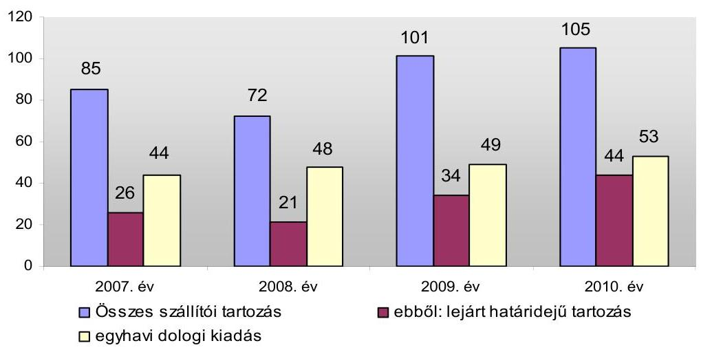

Az önkormányzatok a banki hitelforrások korlátozottsága miatt a szállítókat jellemző módon a külső finanszírozás egyik eszközének tekintették.

A lejárt szállítói állomány minősítése során nem történik meg az EU támogatások szállítói finanszírozásából adódó tételek elkülönítése, amelyek esetén a kötelezett nem az önkormányzat, hanem az állam. A mérlegben kimutatott szállítói tartozás ezzel szemben mind az önkormányzat, mind az állam kötelezettségét tartalmazza. Likviditási nehézséget okozott az EU-s támogatással megvalósuló projektek utófinanszírozása miatt szükséges pénzügyi fedezet biztosítása is.

Az önkormányzatok nem fordítottak kellő figyelmet a tartozások lejárat szerinti megkülönböztetett kezelésére, az átütemezés lehetőségének kihasználására. Nem tettek intézkedéseket az adósságrendezési eljárás kezdeményezését lehetővé tevő késedelmes fizetések megszüntetésére, továbbá nem számoltak a várható következményekkel. Az adósságrendezésről szóló törvény értelmében a hitelező a 60 napon túl lejárt esedékességű, nem vitatott tartozás miatt adósságrendezési eljárást kezdeményezhet az önkormányzattal szemben, továbbá a 90 napon túl lejárt tartozás esetén a polgármester felelősségi körébe tartozik az eljárás kötelező kezdeményezése.

A bevételek és kiadások ütemkülönbségének áthidalására hivatott likvid hitelek egyre nagyobb szerepet játszottak a pénzügyi egyensúly hosszabb távú finanszírozásában. Az önkormányzatok többsége a folyószámla- és egyéb likvid hitelek felvételét részesítette előnyben, mivel azokra a hitelfelvételi korlát nem vonatkozott és kamatfeltételeik is kedvezőek voltak. A megyei, megyei jogú városi és a városi önkormányzatok folyószámlahitelének napi átlagos állománya a 2007. évi 47 Mrd Ft-ról 2010-re 61,8 Mrd Ft-ra emelkedett, amely a működési kockázatot növelte. Az önkormányzatok a tartós működési és felhalmozási forráshiányt gyakran likvid hitellel finanszírozták, amelyeket nem váltottak ki hosszú távú hitelekkel. A költségvetési beszámolóból nem látható, hogy a likvid hitel az önkormányzatok tartós forráshiányának finanszírozójává vált.

---

A folyószámla és egyéb likvid hitelek napi átlagos állományának ${ }^{10}$ növekedése a megyei önkormányzatoknál volt a legmagasabb mértékű ${ }^{11}$, amelyet az 5. sz. táblázat szemléltet.

# 5. sz. táblázat 

A likvid hitelek napi átlagos állománya 2007-2010 között (Mrd Ft)

| Megnevezés | Megyei önkormányzatok |  |  |  | Megyei jogú városi önkormányzatok |  |  |  | Városi önkormányzatok |  |  |  |  |
| :--: | :--: | :--: | :--: | :--: | :--: | :--: | :--: | :--: | :--: | :--: | :--: | :--: | :--: |
|  | 2007. év | 2008. év | 2009. év | 2010. év | 2007. év | 2008. év | 2009. év | 2010. év | 2007. év | 2008. év | 2009. év | 2010. év |  |
|  | napi átlagos állomány Mrd Ft-ban |  |  |  |  |  |  |  |  |  |  |  |  |
| folyószámlahitel | 9,3 | 8,0 | 12,3 | 18,5 | 18,8 | 17,4 | 13,8 | 20,0 | 18,9 | 16,7 | 19,9 | 23,3 |  |
| munkabérhitel | 1,6 | 1,3 | 1,2 | 2,0 | 1,1 | 1,0 | 1,0 | 1,0 | 4,3 | 2,4 | 2,4 | 2,6 |  |
| Összesen | 10,9 | 9,3 | 13,5 | 20,5 | 19,9 | 18,4 | 14,8 | 21,0 | 23,2 | 19,1 | 22,3 | 25,9 |  |
| likvid hitel* | 0,0 | 0,0 | 0,0 | 1,9 | 5,9 | 6,5 | 7,3 | 8,1 | 2,4 | 1,3 | 1,7 | 2,5 |  |
| Összesen | 10,9 | 9,3 | 13,5 | 22,4 | 25,8 | 24,9 | 22,1 | 29,1 | - | - | - | - |  |

* a likvid hitel adatai a reprezentatív mintavétel alapján  többszörözött városi önkormányzatokra vonatkozóan állnak rendelkezésre

A Fővárosi Önkormányzat az ellenőrzött időszakban nem vett igénybe likvid hitelt.

A megyei önkormányzatok folyószámlahitel napi átlagos állománya 2007-2010 között közel kétszeresére emelkedett. A megyei jogú városi önkormányzatoknál 3,3 Mrd Ft-tal ( $12,7 \%$-kal) nőtt a folyószámla és egyéb likvid hitelek napi átlagos állománya. A városi önkormányzatoknál a folyószámlahitel átlagos napi állománya 4,4 Mrd Ft-tal ( $23,3 \%$-kal) volt magasabb 2010-ben, mint 2007-ben. A likvid hiteleken belül kisebb részarányt képviselő munkabér megelőlegezési hitelek átlagos állománya - a megyei önkormányzatok kivételével - csökkent.

A likvid hitel szerződések lejáratakor a visszafizetéshez hiányzó fedezet miatt jellemzővé vált a likvid hitel keretszerződés évenkénti, rendszeres - sok esetben kényszerű - gyakran egyre magasabb összegben történő megújítása. A hosszú távú eladósodás mellett így a rövid lejáratú pénzintézeti kötelezettségek emelkedése következtében is növekedett az önkormányzatok banki kitettsége.

## Felhalmozási kockázatok

A 2007-2010 közötti időszakban az önkormányzatok 1827 Mrd Ft felhalmozási kiadást teljesítettek. Ebből 13,2\%-ot ( 242 Mrd Ft-ot) a saját felhalmozási - tárgyi eszközök, immateriális javak és részesedések eladásából származó - bevételek, $37,4 \%$-ot ( 683 Mrd Ft-ot) a hazai és EU-s támogatások és átvett pénzeszközök, valamint $49,4 \%$-ot ( 902 Mrd Ft-ot) a kötvényforrások, hitelek finanszírozták. A felhalmozási költségvetés egyenlege a 2007-2010. években minden önkormányzati típusnál az összesített adatok alapján negatív (-902 Mrd Ft) összegű volt. Az ellenőrzött időszakban a fejlesztési hiány a felhalmozási kiadások összegének évenként $52,1 \%-43,1 \%-53,4 \%$ és $48,9 \%$-át tette ki. Az önkormányzatok felhalmozási bevételeit és kiadásait, a felhalmozási forráshiányt 2007-2010 között a 6. sz. ábra mutatja.

[^0]
[^0]:    ${ }^{10}$ A likvid hitelek napi átlagos állományának számítását 365 naptári nap figyelembevételével végeztük.
    ${ }^{11}$ A 2012. év január 1-jétől ez már nem megyei önkormányzati teherként jelentkezik.

---

# 6. sz. ábra 

A felhalmozási bevételek és kiadások, a felhalmozási forráshiány alakulása 2007-2010 között (Mrd Ft)
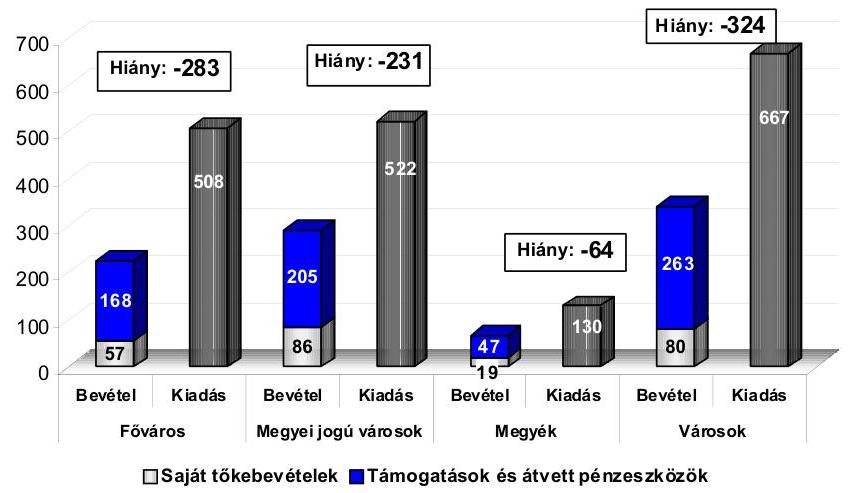

Az önkormányzatok pénzügyi helyzetére kedvezőtlen hatással volt az EU-s pályázati lehetőségek által kiváltott fokozott beruházási tevékenység. A beruházási hajlandóság növekedése - nettó működési jövedelem, bevonható vagyonhasznosítási bevétel hiányában - olyan adósságot keletkeztető kötelezettségvállalásokat eredményezett, amelyek esetében a visszafizetés jövőbeni fedezetét, annak kockázatait nem kellő körültekintéssel mérték fel.

A középszinten működő és a városi önkormányzatoknál a 2010. december 31-én folyamatban lévő beruházások miatt vállalt jövőbeni kötelezettség 1154 Mrd Ft finanszírozásához az EU-s és a hazai támogatáson, saját bevételeken felül további 217 Mrd Ft külső forrás volt szükséges. A támogatások önkormányzati típusonként eltérő összegűek, ezáltal differenciáltan befolyásolják a saját tőkebevételek figyelembevételével - a kötvényforrások és hitelek igénybevételének szükségességét, nagyságrendjét. (7. sz. ábra)

---

# 7. sz. ábra 

A 2010. december 31-én folyamatban lévő beruházások forrásösszetétele (Mrd Ft)
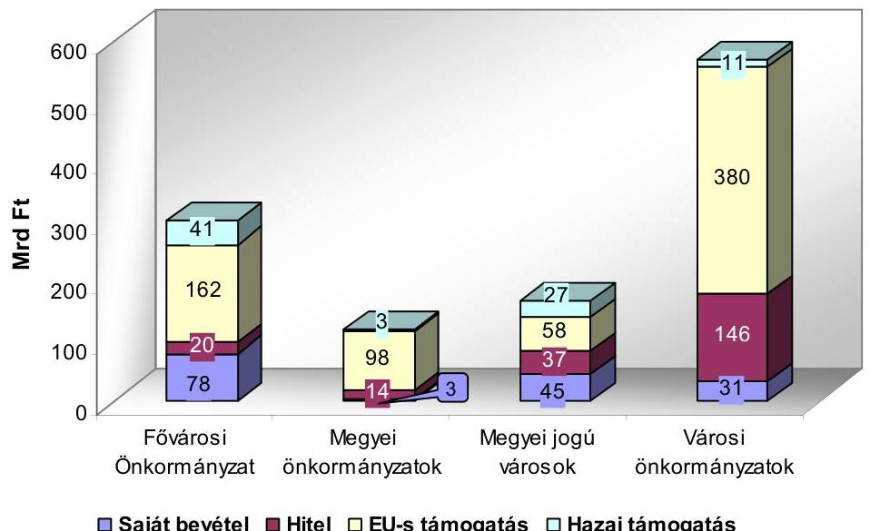

A fejlesztési döntések során a megtérülési követelmények, a kötelező feladatok ellátásához szükséges fejlesztések, az eszközhatékonyság javítása, a már meglévő eszközök állagának megőrzése helyett a magas támogatási arány élvezett elsőbbséget.

A Fővárosi Önkormányzatnál a folyamatban lévő beruházások tervezett forrásainak közel egyharmada saját bevétel és hitel. A tervezett saját forrás magas aránya kockázatot jelentett, mivel a 2010. évet követően esedékessé váló kötelezettségek fedezete csak akkor biztosítható, ha a számításba vett saját források teljesülnek, valamint ezt terhelő további újabb, jelentős nagyságrendű fejlesztési kötelezettséget a Fővárosi Önkormányzat nem vállal. Kockázatot jelenthet az EU-s támogatással megvalósuló 4-es metró építése, ha a saját forrás ütemezése és az el nem számolható költségek összege eltér a tervezettől.

A megyei önkormányzatoknál a 2010. december 31-én folyamatban lévő beruházások 75\%-a a kórházak rekonstrukcióját szolgálta. Számottevő saját bevételek hiányában a pályázatokhoz szükséges önerőt döntő részben kölcsönforrásból biztosították. Kockázatot jelentett a jövőbeni saját források bizonytalansága, valamint az EU-s támogatásból megvalósuló fejlesztések finanszírozása, a beruházások utófinanszírozása miatt.

A megyei jogú városi önkormányzatoknál a folyamatban lévő beruházások tervezett forrásainak $26,9 \%$-a saját bevétel, valamint $22,2 \%$-a kötvényforrás és hitel. Az önkormányzatok közel kétharmada a 2010. december 31. utáni kötelezettségvállalások tekintetében a saját forrást nem számszerűsítette.

A városi önkormányzatok fejlesztési tevékenységét a pályázati lehetőségek kihasználása jellemezte. A folyamatban levő beruházásokra vállalt kötelezettségeik 5,4\%-át a saját bevétel, 68,9\%-át a támogatás, valamint 25,7\%-át a kötvényforrás és a hitel együttes összege tette ki. Az EU-s pályázati lehetőségek által kiváltott intenzív beruházási tevékenység következményeként növekvő külső források kedvezőtlen hatást gyakoroltak a pénzügyi helyzetre. Mindez a fejlesztési célkitűzések és a források áttekintését igényli az érintett önkormányzatok részéről.

Az önkormányzatok pénzügyi egyensúlyi helyzetére kockázatot jelent, hogy a folyamatban levő fejlesztésekre vonatkozó kötelezettségvállalások saját forrásait nem számszerűsítették, a finanszírozásba bevonható külső források nevesítése sem történt meg minden esetben.

A fejlesztések révén létrehozott tárgyi eszközök működtetése, üzemeltetése, és a csökkenő forrásra is figyelemmel a jövőbeni fenntarthatósága kockázatot jelent az önkormányzatok pénzügyi egyensúlyi helyzetére. A döntések során nem számoltak azzal, hogy a beruházások nyomán jellemzően nem képződnek pótlólagos saját bevételek, számottevő kiadási megtakarítások. A létesítmények üzemeltetésének várható költségeit az önkormányzatok közel 72\%-a nem mérte fel ${ }^{12}$. Az önkormányzatoknál az önként vállalt feladatot ellátó projektek fenntarthatósági követelményének teljesítése további kockázatot hordoz.

A fejlesztésekhez képest az elhasználódott eszközök pótlása háttérbe szorult. Az emiatti műszaki elavultság a jövőben pénzügyi szükségletté válik. A meglévő, elhanyagolt állapotú ingatlanok, eszközök fenntartása, működtetése gazdaságtalan. A megyei jogú városokban a felhalmozási kiadások 8,5\%-a volt pótló jellegű, a használhatósági fok (nettó/bruttó érték hányadosa) 2007-2010 között 3 százalékponttal - a fokozott fejlesztési tevékenység ellenére - (88\%-ról 85\%-ra) romlott. A városok helyzete az eszközök állapotát tekintve kedvezőtlenebb. Felhalmozási kiadásaik 6,6\%-át fordították az elhasználódott eszközök pótlására, a használhatósági fok 4 százalékponttal ( 85\%-ról 81\%-ra) romlott.

Az eszközök használhatósági fokának csökkenése azt jelzi, hogy visszalépés következett be az önkormányzatoknál az eszközök állagmegőrzésében, a feladatellátásban. (Az ÁSZ jelen ellenőrzése a szakmai feladatellátást nem értékelte, ezt a tematikus ellenőrzések jelölik meg célként.)

Jelentős az eszközök állagromlásából, az eszközpótlási kötelezettség elmulasztásából felhalmozódott rejtett adósság, amelyben szerepe van a szabályozási hiányosságoknak. A megtérülési követelményeket is tükröző értékcsökkenési leírásnak megfelelő pótlási alapképzésre jogszabályi előírás nem kötelezte az önkormányzatokat, a jelenlegi számviteli rendszer pedig nem teszi lehetővé az elszámolt értékcsökkenés egyes feladatok ráfordításaiban való megjelenítését, és a finanszírozásban való figyelembevételét.

[^0]
[^0]:    ${ }^{12}$ Az ÁSZ „A helyi önkormányzatok fejlesztési célú támogatási rendszerének ellenőrzéséről" szóló 1108. sz. jelentésében feltárta a fejlesztési folyamatok problémáit. A helyi önkormányzatok elsősorban azokat a fejlesztéseket valósították meg, amelyekhez támogatást lehetett igényelni. A magasabb támogatás intenzitású pályázatokat részesítették előnyben. A megvalósuló létesítmények jövőbeli üzemeltetésének várható ráfordításait az önkormányzatok 71,9\%-a nem mérte fel.

---

# Pénzintézeti kötelezettségek kockázata 

Az önkormányzati alrendszer 2010. december 31-én fennálló 1247 Mrd Ft adósságállományának 84,6\%-a
 a középszinten működő és a városi önkormányzatoknál keletkezett. Ez utóbbi körben a pénzintézetekkel szemben fennálló kötelezettségek 2010-ben 2007-hez képest 77,8%-kal (a fővárosnál 8,8%-kal, a megyéknél 143%-kal, a megyei jogú városoknál 100%-kal, a városoknál 92%-kal) magasabbak. A rövid lejáratú kötelezettségek 91 Mrd Ft-ról 170 Mrd Ft-ra (86,8%-kal), míg a hosszú lejáratú kötelezettségek 503 Mrd Ft-ról 886 Mrd Ft-ra (76,1%-kal) emelkedtek. Az adatokat a 8. sz. ábra mutatja.
8. sz. ábra

A pénzintézeti kötelezettségek 2007-ben és 2010-ben (Mrd Ft)
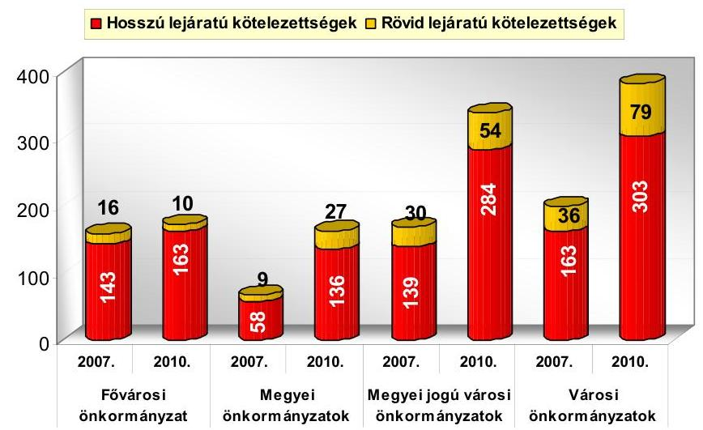

Az önkormányzatok eladósodásának hátterében döntőrészt az EU-s támogatással megvalósult, illetve folyamatban lévő beruházások önerő igényének fedezetét biztosító saját forrás hiánya állt. A devizában való eladósodás előtérbe kerülése miatt 2010-től a kötelezettségek állománya növekedésében már az elszámolt árfolyamveszteség volt a meghatározó. A deviza alapú kötvénykibocsátás a 2007-2008. években ismert árfolyamok és kamat kondíciók miatt előnyösebb megoldást kínált a hosszú lejáratú hitelfelvétellel szemben. A külső forrás felhasználásában az önkormányzatok döntési szabadsága a hitelfelvétel esetében a kötvényhez képest korlátozott volt. A jelenbeli fizetőképesség fenntartása szempontjából kedvezőbb finanszírozási megoldást jelentett a fizetési terhek hosszú időre történő elosztása.

A kötelezettségek jelentős része (85%-a) a 2014-től kezdődő időszak költségvetését - a futamidő végéig - időben elhúzva terheli, amely jelentős kamat- és árfolyamkockázattal jár. A kötvények esetében az árfolyam kedvezőtlen alakulása - a törlesztéskor realizált veszteségen túl - a pénzintézet által kezdeményezett futamidő előtti visszaváltás, illetve forintra történő konverzió miatt jelenthet kockázatot.

A 2007. évről a 2010. évre a Fővárosi Önkormányzatnál volt a legkisebb mértékű (8,8%-os, 14 Mrd Ft-os) a pénzintézetekkel szemben fennálló kötelezettségállomány növekedése. A Főváros a 2007-2010. évek között 71,6 Mrd Ft fejlesztési célú hitelt vett igénybe. A lehívott hitelekből a szerződéses célnak megfelelően a 2010. év végéig 56,8 Mrd Ft-ot használt fel. A hitelből megvalósuló fejlesztéseknél jellemzően nem végeztek megtérülési számításokat, nem vizsgálták a bevételekre, kiadásokra gyakorolt hatását. Azoknál a fejlesztéseknél, ahol megtérülési számításokat alkalmaztak, nem vették figyelembe az adósságszolgálati kötelezettségeket.

A megyék adósságállománya 2007-2010 között közel két és félszeresére (163 Mrd Ft-ra) nőtt, amelynek 70%-a fejlesztési, 30%-a működési célokat szolgáló kötvénykibocsátásból, hosszú, illetve rövid lejáratú hitelfelvételből származó kötelezettség volt. A kötvényekből származó bevétel fedezetet biztosított a korábban felvett fejlesztési hitelek, a tartósan fennálló, általában működési hiányt finanszírozó folyószámla és a működési likvid hitelek kiváltására, illetve az újabb fejlesztési célú kiadások teljesítésére. Az önkormányzatok egy része hiteltörlesztési kötelezettségeit is csak újabb hitel bevonásával tudta teljesíteni.

A megyei jogú városok pénzintézetek felé fennálló kötelezettségállománya 2007-2010 között a kötvénykibocsátás, hitelfelvétel miatt kétszeresére (169 Mrd Ft-ról 338 Mrd Ft-ra) emelkedett. Az összes növekedésből 15%-ot tett ki az év végi értékelés során elszámolt árfolyamveszteség. Az árfolyam- és kamatkockázat mellett kockázatot hordoz a kötelezettségek teljesítésére számba vett saját bevételek teljesíthetősége, a forgalomképes vagyon értékesíthetősége. A megyei jogú városok 338 Mrd Ft adósságállományából 175 Mrd Ft (52%) a nyolc legnagyobb, 100 ezer főt meghaladó népességű város tartozása. Az öt nem megyeszékhely megyei jogú város bruttó adósságállománya 70 Mrd Ft-ot (21%-ot), az előző két csoportba nem tartozó további tíz megyei jogú város adóssága 93 Mrd Ft-ot (27%-ot) tett ki. A pénzügyi egyensúly azonnali helyreállítását igénylő önkormányzatok hiteltörlesztési kötelezettségeiket csak újabb hitelek bevonásával tudták teljesíteni.

A városoknál a pénzintézetek felé fennálló kötelezettségállomány a 2007. évi 199 Mrd Ft-ról a 2010. évre 382 Mrd Ft-ra 91,9%-kal (183 Mrd Ft-tal) nőtt. Ezen belül a hosszú lejáratú kötelezettségek közel kétszeresére, a 2007. évi 163 Mrd Ft-ról 2010-re 303 Mrd Ft-ra emelkedtek. Az önkormányzatok a visszafizetés forrásait nem mutatták be, a fedezetet nem számszerűsítették. A törlesztési kockázatot az érintett önkormányzatoknál növeli a negatív nettó működési jövedelem mellett a devizában fennálló kötelezettségek miatti árfolyamkitettség is.

A pénzügyi egyensúly azonnali helyreállítását igénylő önkormányzatoknál a vállalt pénzintézeti és egyéb kötelezettségek fedezete már rövid távon sem biztosított. Nem rendelkeznek további mobilizálható forrásokkal, a folyószámla, munkabér-megelőlegezési és egyéb likvid hitelek az egyes évek háromnegyed részében állandó forrásként voltak jelen az önkormányzatok költségvetésében $^{13}$. Esetükben fennáll az eladósodás túlzott mértékű növekedése.

[^0]
[^0]: $^{13}$ A reprezentatív mintavétellel kiválasztott önkormányzatok ellenőrzése alapján tett megállapítás.

Az ellenőrzött időszakban az adósságot keletkeztető kötelezettségvállalás korlátozására vonatkozó érvényes központi szabályozás nem töltötte be funkcióját, az önkormányzatok a pénzügyi kapacitásukat meghaladó mértékű kötelezettséget vállaltak. Az önkormányzatok hosszú távú kötelezettségvállalását megelőzően a teljes futamidőre történő költségvetési tervezés, előrevetített megtérülési, fedezeti számítások elvégzése nem történt meg. Az önkormányzatok többsége fejlesztéseik jövőbeni fenntarthatósága, a várható kiadások fedezetének vizsgálata során nem vette figyelembe a már fennálló és a keletkező adósságszolgálati kötelezettségeket.

Az önkormányzatok a kötelezettségek visszafizetésére tartalékot nem képeztek, a visszafizetés fedezetéül szolgáló forrást jellemzően nem nevesítették. Kockázatot jelent, hogy a hitelek fedezeteként az önkormányzati törzsvagyonhoz tartozó vagyonelemek felajánlására is sor került. A jelzáloggal nem terhelt forgalomképes vagyonból a fedezetként figyelembe vehető kör meghatározásáról, számszerűsítéséről, értékesítésre történő előkészítéséről nem gondoskodtak.

Az önkormányzatok bankrendszerrel szembeni pozíciója a kötelezettségek növekedése mellett a pénzeszközeik csökkenése miatt is romlott. A pénzeszközök, értékpapírok állománya a kötvénykibocsátásból származó tartalékolt bevételekből 2008-ban 2007-hez képest 51,9%-kal nőtt, majd 2010-ig fokozatosan a 2007. évi szint alá csökkent. (9. sz. ábra)
9. sz. ábra

Pénzeszközök, értékpapírok állománya 2007-2010 között (Mrd Ft)
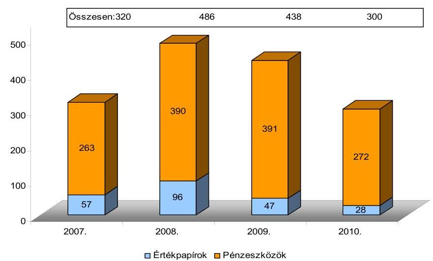

A vizsgált önkormányzati típusoknál - a városi önkormányzatok kivételével - külön-külön az összesített adatok trendjéhez viszonyítva hasonló tendencia figyelhető meg a finanszírozásba bevonható eszközök állományának alakulásában.

Az értékpapírok, pénzeszközök állománya a Fővárosi Önkormányzatnál a likviditás megőrzése, a további önkormányzatoknál a beruházások fokozódó forrásigénye miatt mérséklődött.

A városi önkormányzatoknál az értékpapírok, pénzeszközök állománya a 2010. évre 130 Mrd Ft-ban realizálódott, a 2007-hez képest 3 Mrd Ft-tal emelkedett. A pénzeszközök 2007-2010 között 12 Mrd Ft-tal növekedtek, amelyet a kötvénykibocsátásból származó bevételek későbbi fejlesztések megvalósításához történő tartalékolása okozott.

A finanszírozásba bevonható eszközök felhasználása jelentősen hozzájárult az önkormányzati alrendszer, ezáltal az államháztartás költségvetési hiányának már említett növekedéséhez annak ellenére, hogy az ellenőrzött önkormányzatok egy részénél a működési kiadásokban még a választás évében (2010-ben) is értek el megtakarítást. Ez azonban nem ellensúlyozta a beruházások jelentős emelkedése miatti hiánynövekedést.

# A kötelező feladatok ellátásának kockázata 

Az önkormányzatok kötelező feladatait az Ötv., a hatásköri, a különböző ágazati feladatok ellátásának szakmai szabályait rögzítő törvények határozzák meg. Az önkormányzatok az ellátott feladatok kötelező/önként vállalt besorolása tekintetében a rájuk vonatkozó jogszabályi előírásokat különbözően értelmezték. Az új Ötv. 2013. január 1-jétől hatályos előírása szerint az önkormányzatok költségvetési rendelete elkülönítetten kell, hogy tartalmazza a kötelező, valamint az önként vállalt feladatok ellátásának forrásait és kiadásait. A beszámolási rendszer viszont ennek a követelménynek jelenleg még nem felel meg.

A működési jövedelemre hatással volt az önként vállalt feladatok mértéke. A 2007. évről 2010-re a működési kiadáson belül az önként vállalt feladatok aránya a megyei jogú városoknál 17,1%-ról 18,9%-ra növekedett, a városi önkormányzatoknál 24,5%-ról 23,2%-ra csökkent. A pénzügyi egyensúly helyreállításának egyik lehetséges módja a méretgazdaságossági szempontokat nem tükröző intézménystruktúra racionalizálása mellett az önként vállalt feladatok szűkítése. A 2007. és a 2010. években a megyei jogú városoknál a kötelező és önként vállalt feladatokra teljesített működési kiadások arányát a 10. sz. ábra mutatja be.
10. sz. ábra

A megyei jogú városi önkormányzatoknál a 2007-ben és 2010-ben a kötelező és önként vállalt feladatokra teljesített működési kiadások aránya (%)
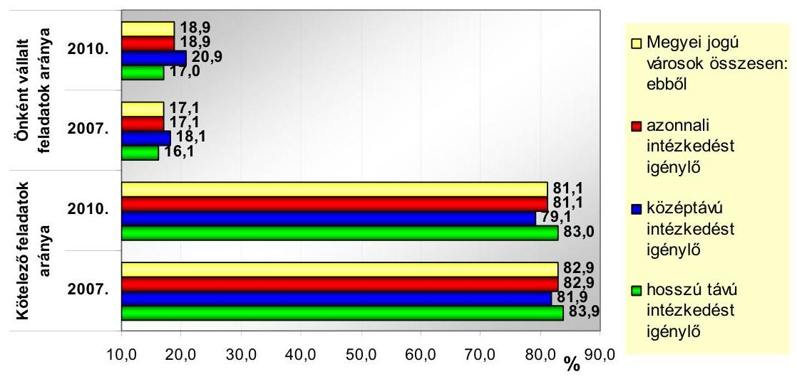

A Fővárosi Önkormányzat feladatellátásában 2010-ben 214 költségvetési intézmény és 44 gazdasági társaság vett részt. Az intézményhálózat működtetését, fenntartását a telephelyek nagy számából és területi elhelyezkedéséből adódó hatékonysági problémák jellemezték. A Fővárosi Önkormányzat tulajdonában lévő 44 gazdasági társaság közül 29 kötelező, míg 12 önként vállalt feladatok ellátásában vett részt, illetve három önként vállalt és kötelező feladatokat együttesen látott el. 2007-2010 között nyolc egészségügyi intézmény átvétele gyakorolt számottevő hatást a Fővárosi Önkormányzat költségvetésére, az ágazat kiadásait az ellenőrzött időszakban 24,1%-kal (20 Mrd Ft-tal) növelte. Ebben jelentős tényező volt, hogy 2009-ben a Szent János Kórházba integrálták a korábban gazdasági társasági formában működő Észak-budai kórházak által ellátott feladatokat.

A megyei önkormányzatok fenntartásában 2010-ben 527 egészségügyi, szociális, oktatási, kulturális intézmény működött, valamint a kötelező és önként vállalt feladatok ellátásában 43 többségi tulajdonú gazdasági társaság vett részt. A kötelezően ellátott feladatok arányára a települési önkormányzatok döntései is kihatottak. Az elmúlt években a kórházak működtetésében végbement változások, a klinikai, gazdasági integráció kiemelt hatással volt a megyei önkormányzatok intézmény és kiadási szerkezetére. Több megye non-profit gazdasági társasággá alakította át, vagy holdingba szervezte a fenntartásában működő kórházakat, a holding irányítására megyei tulajdonú és fenntartású Zrt.-t alapított. A személyi és dologi kiadások harmada a gazdasági társasági formában működtetett egészségügyi szolgáltatóknál merült fel 2010-ben.

A megyei jogú - különösen a megyeszékhely - városok a települési önkormányzati feladataik mellett többféle körzeti, központi szerepkörö is betöltöttek. Egyrészt kistérség-központi feladatokat is elláttak, valamint a környező települések oktatási, szociális, egészségügyi alapellátásában is szerepet vállalnak. A megyei jogú városok kötelező feladatait a központi költségvetési kapcsolatokból származó források - állami hozzájárulások, támogatások, szja - továbbá az illeték csökkenő mértékben finanszírozták. A megyei jogú városok 2007-2010 között 60 intézmény fenntartását szervezték át - elsősorban kistérségi - társulásokba. A 2010. évben kötelező feladatot látott el 916 költségvetési szerv és 207 gazdasági társaság, valamint önként vállalt feladatot teljesített 81 költségvetési szerv és 164 gazdasági társaság.

A városi önkormányzatok feladatellátását, a közszolgáltatások tartalmát és szervezeti kereteit széles körű differenciáltság jellemzi. A differenciák elsődlegesen a városok lakosságának népességi jellemzőivel, az önként vállalt feladatok terjedelmével függnek össze. A társulásos feladatellátásban és az egészségügyi szakellátásban vállalt szerepük további különbségképző tényező. A 2010. évben a feladatellátásban 2477 költségvetési szerv működött közre. A kötelező és önként vállalt feladatok teljesítésében a gazdasági társaságok száma a 2007. évi 445-ről 2010-re 586-ra nőtt. A vizsgált időszakban az önkormányzatok 430 intézmény fenntartását vették át, valamint 288 intézményt adtak át más önkormányzatnak, társulásoknak, egyéb szervezeteknek. Az intézményátadások, átvételek, valamint az intézményi átszervezések hatására az önkormányzatok 71,8 Mrd Ft kiadásmegtakarítást mutattak ki.

# Gazdasági társaságokkal kapcsolatos önkormányzati kockázatok 

Mind a kötelező közszolgáltatásoknál, mind az - önkormányzatok besorolása alapján számba vett - önként vállalt feladatok ellátásában a gazdasági társaságok növekvő szerephez jutottak. A közfeladatok gazdasági társaságokba történő kiszervezésével a gazdálkodás, a pénzügyi helyzet kockázatai kikerültek az önkormányzati alrendszerből, de a társaságok működésében jelentkező problémák közvetett kockázatot jelentenek a feladatellátásra kötelezett önkormányzatoknál. Sérülhet az ellátási felelősség figyelemmel kísérése és érvényesítése. Az önkormányzatok
 és a közfeladat ellátásban résztvevő társaságaik konszolidált beszámolói hiányában a kockázatok értékeléséhez szükséges információk közvetlenül és teljes körűen nem állnak rendelkezésre. A konszolidáció hiánya nem teszi lehetővé a transzparenciát sem és növeli az önkormányzatok pénzügyi helyzetének megítélésében rejlő kockázatokat.

A gazdasági társaság tartozásaiért - bizonyos feltételek együttes fennállása esetén - a tulajdonost terhelő helytállási kötelezettség kockázati tényezőként jelentkezik, kiemelten a lejárt szállítói tartozások, a hitelfelvételhez biztosított önkormányzati tulajdonú ingatlanfedezet, illetve kezesség beváltása, tartósan veszteséges gazdálkodás esetén a jövőbeni kötelezettségek fedezetének biztosítása szempontjából. Az önkormányzatok nem fordítottak kellő figyelmet gazdasági társaságaik eladósodásának megelőzésére, továbbá az önkormányzat és a gazdasági társaságok pénzügyi kockázatainak a képviselő-testület részére történő együttes bemutatására.

A Fővárosi Önkormányzatnál a kötelező tömegközlekedési feladatot ellátó BKV a 2010. év végére 64 Mrd Ft összegű adósságállományt halmozott fel, amelyből a hosszú lejáratú kötelezettség 36 Mrd Ft-ot tett ki. A minősített többségi tulajdonú gazdasági társaságok 2010. évi pénzintézeti kötelezettsége a megyei jogú városi önkormányzatoknál 57 Mrd Ft-ot tett ki, szállítói tartozásuk 21 Mrd Ft volt. A városi önkormányzatok gazdasági társaságai kölcsönből származó és pénzintézeti kötelezettsége 2010. december 31-én összesen 151 Mrd Ft volt, a szállítói állományuk 102 Mrd Ft-ot, ezen belül a lejárt esedékességű tartozás 15 Mrd Ft-ot jelentett.

A középszinten működő önkormányzatoknál a minősített többségi tulajdonú gazdasági társaságok folyószámla- és egyéb hiteléhez nyújtott készfizető kezesség, garanciavállalás háromszorosára (a 2007. évi 15,8 Mrd Ft-ról 2010-ben 47,8 Mrd Ft-ra) nőtt. A városi önkormányzatok által a gazdasági társaságok hitelei után vállalt bankgarancia és készfizető kezesség a 2007. évi 8,1 Mrd Ft-ról a 2010. évre 14,6 Mrd Ft-ra (80,2%-kal) emelkedett. A pénzügyi egyensúly azonnali helyreállítását igénylő megyei jogú és városi önkormányzatoknál a készfizető kezesség, garanciavállalás fokozódó kockázatot jelent.

## 2. Fővárosi Önkormányzat pénzügyi helyzetének ellenőrzési tapasztalatai

Budapest főváros önkormányzati rendszere a fővárosi és a kerületi szintű önkormányzatokból áll. A fővárosi, valamint a fővárosi kerületi önkormányzatok önkormányzati alapjogaikat tekintve egyenlőek, közöttük - bár feladat- és hatáskörük egymástól eltér - alá-fölérendeltségi viszony nem áll fenn. A Fővárosi Önkormányzat ellátja azokat a kötelező és önként vállalt helyi, települési önkormányzati feladat- és hatásköröket, melyek a főváros egészét vagy egy kerületet meghaladó részét érintik, valamint a fővárosnak az országban betöltött szerepköréhez kapcsolódnak. Feladata az alapellátást meghaladó oktatási, nevelési, közművelődési, egészségügyi, szociális feladatok, illetve intézményrendszer fenntartása, a főváros egészét érintő közüzemi közszolgáltatásokról való gondoskodás, a tömegközlekedés biztosítása, a főútvonalak fenntartása és fejlesztése, a városrendezési feladatok meghatározott körének ellátása, a települési környezetvédelem, és általában a több kerületet érintő technikai-műszaki szolgáltatás biztosítása ${ }^{14}$.

A kerületi önkormányzatok feladat- és hatáskörébe tartozik az alapfokú humán közszolgáltatások biztosítása: az óvodai nevelés, az általános iskolai nevelés és oktatás, az egészségügyi és szociális alapellátás feladatai. Megoszlik a feladatellátási kötelezettség a kerületi képviselő-testületek és a Fővárosi Közgyűlés között az egészséges ivóvíz ellátás, a helyi közutak fenntartása tekintetében. A Fővárosi Önkormányzat szabályozási jogot kapott a köztisztaság, a lakáshoz jutás feltételeinek meghatározása terén, vagy részjogokat gyakorolt, illetve kötelezettségeket vállalt pl. az energiaszolgáltatás biztosításában. A feladatok közötti átjárhatóságot biztosította, hogy a kerületi képviselő-testületek átvállalhatták - a Fővárosi Önkormányzat egyetértésével - annak hatáskörébe tartozó közszolgáltatások szervezését. A másik oldalról a Fővárosi Közgyűlés is kezdeményezhette feladat- és hatáskör átadását a kerületek részére.

# A Fővárosi Önkormányzat és a kerületi önkormányzatok kapcsolata 

a főváros közlekedési hálózatát érintő problémák megoldásában nem volt feszültségmentes. Ez egyrészt az utak bonyolult tulajdonlási és kezelési rendszeréből, másrészt a közforgalmú közlekedés problémáiból adódott. Jelentősek a kerületek közötti különbségek, az infrastruktúra, a lakásállomány, az úthálózat kiépítettségét, a lakosság szociális helyzetét, az ellátások és szolgáltatások színvonalát és feltételrendszerét tekintve.

A főváros - itt él az ország népességének 17-18%-a - az ország pénzügyi, kereskedelmi, hatalmi-politikai központja, minden gazdasági mutatót tekintve kiemelkedik. A bruttó hazai termék (GDP) 39,5%-a itt keletkezett, az egy főre jutó GDP az országos átlag több mint kétszerese volt 2009-ben. Nemzetközi összehasonlításban (vásárlóerő-paritáson) az egy főre jutó GDP az EU-27 átlagánál 49,1%-kal magasabb, míg a hazai átlag annak csupán 64,8%-a.

A Fővárosi Önkormányzat költségvetési bevételén belül - a gazdaság területi koncentráltságából adódóan - a helyi iparűzési adó részaránya 2010-ben közel 15 százalékponttal volt magasabb a középszinten működő további önkormányzatok átlagánál. A BKV miatt az egyéb (központosított előirányzatból kapott) támogatás részesedése nagyobb. A kiemelkedő kórházi kapacitás miatt pedig az Egészségbiztosítási Alapból átvett támogatásértékű bevétel aránya nagy. A folyó működési kiadások aránya az országos 68,1%-kal szemben 54,9% volt 2010-ben a kiemelt fővárosi beruházások következtében.

A főváros és a kerületek feladat- és hatáskörét jellemző mellérendeltség mellett a Fővárosi Közgyűlés kapott rendeletalkotási jogkört a forrásmegosztás területén (a fővárost és a kerületi önkormányzatokat osztottan megillető bevételek - az állandó népességhez kapcsolódó állami hozzájárulás, a személyi jövedelemadó települési önkormányzatokat megillető része, illetve a saját bevételek körében a helyi iparűzési adó - megosztására). A forrásmegosztás eredményeként a Fővárosi Önkormányzat részesedése 99,4 Mrd Ft (46%), a kerületeké 117,2 Mrd Ft (54%) volt 2010-ben.

# 2.1. A Fővárosi Önkormányzat feladatellátásának, költségvetésének jellemzői 

A feladatellátásban 2010-ben 214 költségvetési intézmény és 44 gazdasági társaság vett részt. Az ágazati megoszlás a közoktatási intézmények túlsúlyát mutatja. (11. sz. ábra)
11. sz. ábra

A Fővárosi Önkormányzat intézményeinek ágazati megoszlása 2010-ben
(%)
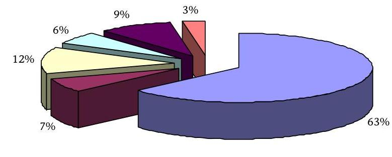

- Közoktatás
- Egészségügy
- Szociális
- Gyermek- és ifjúságvédelem $\square$ Sport és kultúra
- Egyéb

Forrás: ÁSZ az önkormányzat adatszolgáltatása alapján
A Fővárosi Önkormányzat tulajdonában lévő 44 gazdasági társaság közül 29 kötelező, míg 12 önként vállalt feladatok ellátásában vett részt, illetve három önként vállalt és kötelező feladatokat együttesen látott el.

A Fővárosi Önkormányzat intézményei, gazdasági társaságai az alapítói okirataik szerint 753 telephelyen működtek. A telephelyek magas száma és területi elhelyezkedése a gazdaságos működtetés szempontjából kedvezőtlen. A 12 egészségügyi intézmény és két gazdasági társaság összesen 115, átlagosan közel 10 telephellyel rendelkezik. A Fővárosi Önkormányzat tartja fenn az ország legnagyobb tartós bentlakásos intézményrendszerét a szociális ellátás területén. A szociális ellátást 22 intézmény és egy gazdasági társaság - részben a fővárostól jelentős földrajzi távolságra található - 45 telephelyen, 100-nál több lakóépületben, közel 4000 dolgozó foglalkoztatásával, több mint 9200 férőhelyen biztosítja. A közoktatási feladatokat 129 oktatási intézmény (gimnázium, szakközépiskola, szakiskola, általános iskola, valamint kollégium) és három gazdasági társaság 222 telephelyen, a gyermek- és ifjúságvédelemmel kapcsolatos tevékenységet 30 intézmény, 111 telephelyen látja el. A kulturális és sport feladatok ellátásáról 16 intézmény és 11 gazdasági társaság, 64 telephelyen gondoskodik. Egyéb feladatokat (közterület felügyelet, csarnok- és piac felügyelet) öt intézmény és 27 gazdasági társaság lát el, összesen 196 telephelyen. A foglalkoztatottak és az ellátottak száma alapján az egészségügyi szakellátás túlsúlya a jellemző. Mindezek tükröződnek a 6. sz. táblázatban.

# 6. sz. táblázat 

A Fővárosi Önkormányzat feladatellátását jellemző mutatók 2010-ben

| Megnevezés | egészségügy | szociális   ellátás | oktatás | gyermek-   és ifjúság-   védelem | kultúra   és sport | egyéb   feladatok |
| :-- | --: | --: | --: | --: | --: | --: |
| intézmények száma | 12 | 22 | 129 | 30 | 16 | 5 |
| gazdasági társaság | 2 | 1 | 3 | 0 | 11 | 27 |
| telephelyek száma | 115 | 45 | 222 | 111 | 64 | 196 |
| az ágazatban foglalkoztatottak száma   (fő) 2010. dec. 31-én | 13921 | 3596 | 11054 | 2128 | 1977 | 2210 |
| az ágazat intézményeiben ellátottak   átlagos száma (fő) | 372591 | 9230 | 64919 | 2053 | - | - |
| fekvőbeteg férőhelyek száma (db)   2010. dec. 31-én | 10626 | 73 | - | - | - | - |

Forrás: ÁSZ az önkormányzat adatszolgáltatása alapján
A folyó (működési) kiadásokon belül az egészségügyi ágazat 41%-os aránya meghatározó. (12. sz. ábra)
12. sz. ábra

A Fővárosi Önkormányzat folyó (működési) kiadásainak megoszlása 2010-ben ágazatonként (%)
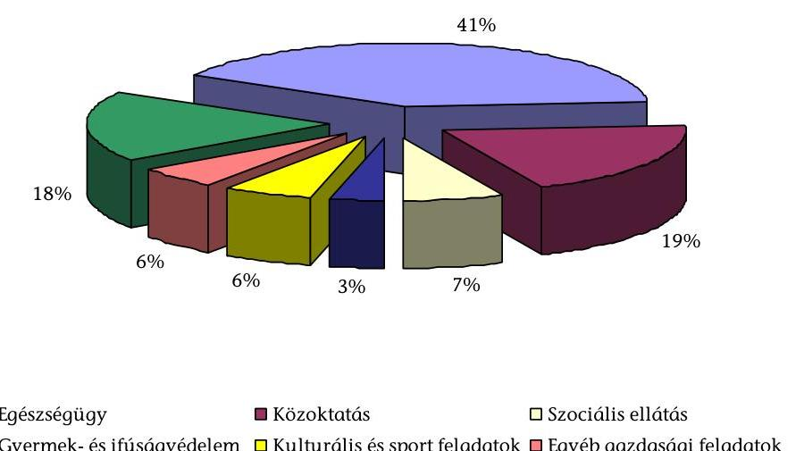

Forrás: ÁSZ az önkormányzat adatszolgáltatása alapján

---

A Fővárosi Önkormányzat 2007-2010 között kötelező feladatot kerületi önkormányzattól nem, központi költségvetési szervtől, gazdasági társaságtól nyolc egészségügyi, valamint egyéb szervezettől egy közoktatási intézményt vett át. Egy közoktatási, kettő egészségügyi intézményt adott át központi költségvetési szervnek. Az egészségügyi intézmények átvétele gyakorolt számottevő hatást az önkormányzat költségvetésére, az ágazat kiadásait az ellenőrzött időszakban 24,1%-kal növelte. Ebben jelentős tényező volt, hogy 2009-ben a Szent János Kórházba integrálták a korábban gazdasági társasági formában működő Észak-budai kórházak által ellátott feladatokat.

# 2.1.1. A Fővárosi Önkormányzat költségvetésének forrásösszetétele 

A Fővárosi Önkormányzat tárgyévi bevételei 2010-ben 2007-hez viszonyítva elsősorban a finanszírozási bevételeknek köszönhetően - nominálértéken 3,8%-kal növekedtek, összetételük módosult. A saját folyó bevételek 2010-ben az előző évhez képest 15 Mrd Ft-tal (9,3%-kal) csökkentek, ezen belül a gazdasági válság és a jogszabályi változások hatására a helyi adó és illeték bevétel 10 Mrd Ft-tal, a kamatbevételek a csökkenő betétállomány miatt 3,3 Mrd Ft-tal voltak alacsonyabbak. Az egyéb bevételek a 2010. évben - az összehasonlítható szerkezet érdekében - nem tartalmazzák a pénzmaradvány igénybevételét ${ }^{15}$. (13. sz. ábra)
13. sz. ábra

A Fővárosi Önkormányzat bevételeinek változása (Mrd Ft)
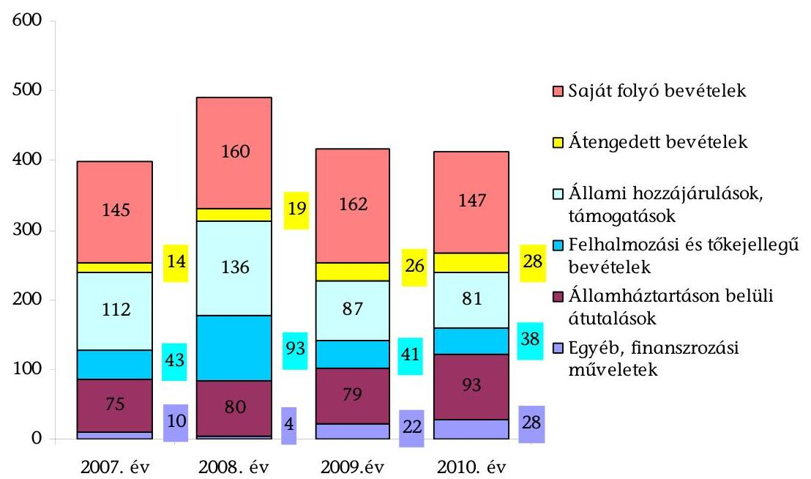

Forrás: ÁSZ
A főváros kiemelt szerepköréből és a kétszintű önkormányzati rendszerből adódóan a Fővárosi Önkormányzat tárgyévi bevételeinek szerkezete más városokhoz és az önkormányzatok egészéhez képest - a forrásmegosztásból, a feladatellátás terjedelméből és egyedi (pl. BKV) támogatásokból adódóan - sajátosságokat mutat. (7. sz. táblázat)
7. sz. táblázat

Fővárosi Önkormányzat tárgyévi bevételeinek megoszlása 2010-ben (%)

| Megnevezés | Főváros | Fővárosi kerületek | Főváros. kerületek együtt | Megyei jogú városok | Egyéb városok | Összes önkormányzat |
| :--: | :--: | :--: | :--: | :--: | :--: | :--: |
| Saját folyó bevételek | 29,8 | 49,7 | 38,6 | 32,3 | 25,1 | 27,5 |
| ebből: helyi adók | 17,6 | 34,8 | 25,2 | 17,1 | 14,3 | 14,5 |
| Átengedett bevételek | 5,6 | 15,9 | 10,1 | 21,9 | 22,1 | 20,2 |

 |
| Állami hozzájárulások,   támogatások | 16,3 | 7,6 | 12,5 | 12,5 | 15,2 | 15,5 |
| ebből: központosított előirányzat | 7,7 | 1,7 | 5,0 | 2,6 | 2,5 | 3,4 |
| Államháztartáson belüli átutalások | 18,8 | 4,2 | 12,4 | 4,3 | 10,1 | 11,4 |
| Felhalmozási és tőkejellegű bevételek | 7,7 | 6,8 | 7,3 | 11,7 | 11,6 | 9,5 |
| Egyéb, finanszírozási bevételek, pénzmaradvány igénybevétele | 21,8 | 15,8 | 19,1 | 17,3 | 15,9 | 15,9 |

Forrás: ÁSZ
A kiemelt szerepet betöltő helyi adókban sajátos megosztás érvényesült: az iparűzési és az idegenforgalmi adót a Fővárosi Önkormányzat vezette és szedte be 2007-2010 között, ezek megosztásra kerültek a Fővárosi Önkormányzat és a kerületi önkormányzatok között ${ }^{16}$. Az egyéb helyi adók bevezetéséről, az adómérték, a mentességek, kedvezmények megállapításáról a kerületi önkormányzatok dönthettek.

# 2.1.2. A Fővárosi Önkormányzat működési kiadásai 

A Fővárosi Önkormányzat folyó kiadásai 16,9%-kal (45 Mrd Ft-tal), a működési kiadásai 13,1%-kal (28 Mrd Ft-tal) emelkedtek 2010-ben a 2007. évhez viszonyítva. A különbség elsősorban a transzferkiadásokból (BKV-nak nyújtott támogatásból) adódik. (8. sz. táblázat)

[^0]
[^0]:    ${ }^{16}$ Az idegenforgalmi adó bevezetése, az adó beszedése 2011-től a kerületi önkormányzatok hatáskörébe került.

---

# 8. sz. táblázat 

A Fővárosi Önkormányzat folyó kiadásai (Mrd Ft)

| Megnevezés | 2007. év | 2008. év | 2009. év | 2010. év | $\begin{gathered} 2010 / 2007 . \\ \text { év } \% \end{gathered}$ |
| :--: | :--: | :--: | :--: | :--: | :--: |
| Folyó kiadások (pénzmaradvány átadás nélkül) | 267 | 299 | 284 | 312 | 116,9 |
| Működési kiadások (kamatkiadások nélkül) | 213 | 234 | 230 | 241 | 113,1 |
| ebből: személyi juttatások | 97 | 102 | 97 | 97 | 100,0 |
| munkaadót terhelő járulékok | 30 | 32 | 29 | 25 | 83,3 |
| dologi kiadások | 86 | 100 | 104 | 119 | 138,4 |
| Államháztartáson belülre átadott pénzeszközök | 4 | 5 | 4 | 3 | 75,0 |
| Transzferkiadások | 43 | 52 | 45 | 66 | 153,5 |
| ebből: vállakozásoknak | 34 | 43 | 36 | 58 | 170,6 |
| EU-nak, illetve külföldre | 0 | 0 | 0 | 0 | 0,0 |
| magánszemélyeknek | 1 | 1 | 1 | 2 | 200,0 |
| nonprofit szervezeteknek | 8 | 8 | 8 | 6 | 75,0 |
| Kamatkiadások | 7 | 8 | 5 | 2 | 28,6 |

Forrás: ÁSZ
A 2007-2010. évek között végrehajtott helyi szervezési intézkedések és az egészségügyi, az oktatási és a szociális intézményeknél, a Főpolgármesteri hivatalban, a Fővárosi Közterület Felügyeletnél bekövetkezett feladatbővülések együttes hatásaként - a Fővárosi Önkormányzat kimutatása szerint - összesen 790-nel csökkent a közalkalmazotti és egyéb jogviszonyban foglalkoztatottak álláshelyeinek száma, amelyből 498 volt a ténylegesen betöltött, míg 292 volt a be nem töltött álláshely csökkenés. Ugyanakkor a személyi juttatások címén történt kiadás a korábbi évek létszámcsökkentése, a 13. havi illetmény 2009. évi felfüggesztése, majd megszüntetése ellenére 2010-ben a 2007. évihez képest - egészségügyi intézmények átvétele miatt - nem csökkent.

A dologi kiadásokban megtakarítást eredményeztek a beszerzési szerződések (861,5 millió Ft), a vásárolt közszolgáltatások (586,2 millió Ft) felülvizsgálata során elrendelt takarékossági intézkedések, valamint a központosított közbeszerzés (666,3 millió Ft). Az intézményátszervezések, feladatátrendezések következtében az ellátottak pénzbeli juttatásaira 48,6 millió Ft-tal fordítottak kevesebbet. Mindez azonban nem tudta ellensúlyozni az energia- és közműdíjak, a beszerzéseket terhelő áfakulcs-emelkedése miatt jelentkező többletkiadást, amelyek következményeként a dologi kiadások a 2007. évi 86 Mrd Ft-ról 38,7%-kal (33 Mrd Ft-tal) emelkedtek 2010-re.

A transzferkiadások 76,3%-át a tömegközlekedés (BKV) 128,8 Mrd Ft normatív és 28,5 Mrd Ft egyedi (működési) állami támogatásának továbbutalása jelentette 2007-2010 között. A működési célú államháztartáson kívülre átadott pénzeszköz - a BKV-nak nyújtott működési támogatással összefüggésben - 2010-ben a tárgyévi kiadások közel 15%-a volt, az áttekintett időszakban 24 Mrd Ft-tal (négy százalékponttal) növekedett.

A felhalmozási kiadások összege a 2007. évi 135 Mrd Ft-tal szemben 2010-ben 108 Mrd Ft-ra csökkent néhány nagy fővárosi beruházás - többek között a 4-es metró építése, a Budapesti központi szennyvíztisztító telep beruházása, a város-rehabilitációs keret terhére tervezett pénzeszközátadások, a 2-es metró járműcseréje, a híd- és útfelújítások, az 1-es és 3-as villamosvonal meghosszabbítása - késedelmes megvalósítása miatt. A folyó kiadások - elsősor-

---

ban a dologi kiadások 33 Mrd Ft-os (38,4%-os) növekedése miatt - emelkedtek. (14. sz. ábra)
14. sz. ábra

Fővárosi Önkormányzat folyó és felhalmozási kiadásai (Mrd Ft)
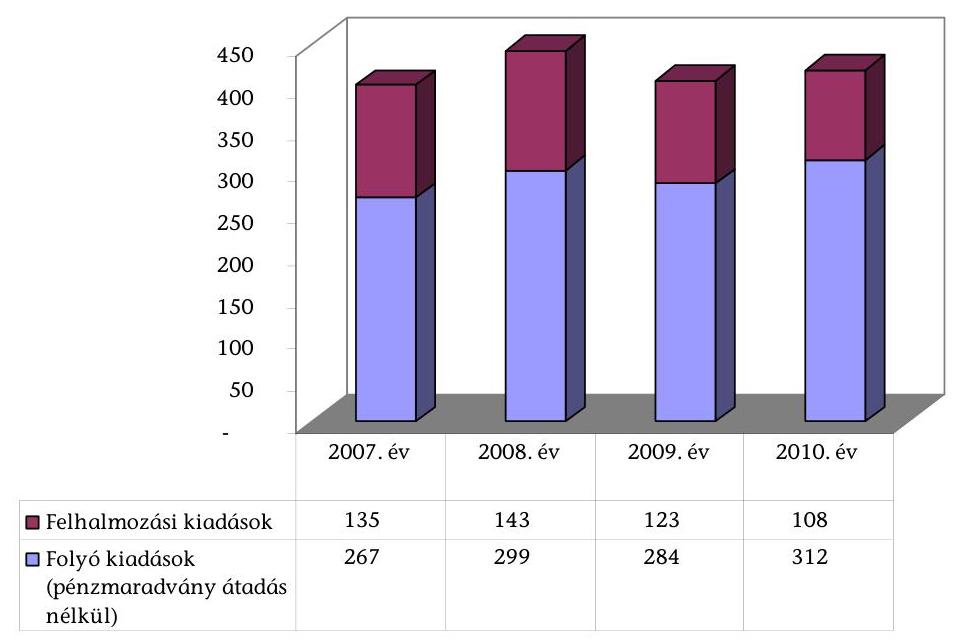

Forrás: ÁSZ
Az önként vállalt feladatok a Főpolgármesteri hivatal kimutatása szerint a költségvetési kiadások 5%-át tették ki 2010-ben. A kimutatás nem terjed ki valamennyi önként vállalt feladatra, így például a költségvetési intézmények, valamint a gazdasági társaságok részére - önként vállalt feladatokhoz - nyújtott támogatásokra sem.

# 2.2. A pénzügyi egyensúlyi helyzetből eredő kockázatok 

### 2.2.1. A működési és a felhalmozási egyensúly alakulása

A Fővárosi Önkormányzatnál a pénzügyi egyensúly - a CLF módszer szerinti mutatók folyamatos romlása mellett is - biztosított volt. (9. sz. táblázat)

---

# 9. sz. táblázat 

A Fővárosi Önkormányzat CLF módszer szerinti adatai (millió Ft)

| Megnevezés | 2007. év | 2008. év | 2009. év | 2010. év |
| :--: | :--: | :--: | :--: | :--: |
| Folyó bevételek | 483799 | 607153 | 360681 | 360814 |
| Folyó kiadások | 397643 | 505140 | 285985 | 319552 |
| Működési jövedelem | 86156 | 102013 | 74696 | 41262 |
| Nettó működési jövedelem =működési jövedelem - tőketörlesztés | 70608 | 86684 | 54671 | 26555 |
| Felhalmozási bevételek | 48016 | 94553 | 41879 | 39936 |
| Felhalmozási kiadások | 134620 | 142974 | 122584 | 107496 |
| Felhalmozási költségvetés egyenlege | $-86604$ | $-48421$ | $-80705$ | $-67559$ |
| Finanszírozási műveletek nélküli (GFS) pozíció | $-448$ | 53592 | $-6009$ | $-26296$ |
| Finanszírozási műveletek egyenlege | 12798 | $-12654$ | $-4038$ | $-3766$ |
| Tárgyévi pozíció | 12350 | 40937 | $-10047$ | $-30062$ |
| Egyéb tájékoztató adatok |  |  |  |  |
| Összes kötelezettség | 216811 | 249623 | 237149 | 217582 |
| - ebből rövid lejáratú | 73480 | 108584 | 89616 | 54175 |
| Folyószámlahitel napi átlagos állománya | 0 | 0 | 0 | 0 |
| Likvidhitel napi átlagos állománya | 0 | 0 | 0 | 0 |
| Munkabérhitel napi átlagos állománya | 0 | 0 | 0 | 0 |
| Egyéb finanszírozásba bevonható eszközök: | 69102 | 114155 | 103621 | 63891 |
| Tartós hitelviszonyt megtestesítő értékpapírok | 0 | 0 | 0 | 0 |
| Hosszú lejáratú bankbetétek | 0 | 0 | 0 | 0 |
| Értékpapírok | 13967 | 18083 | 17595 | 7928 |
| Pénzeszközök (idegen pénzeszközök nélkül) | 55135 | 96073 | 86026 | 55963 |

Forrás: ÁSZ
A működési jövedelem 2007 és 2010 között 86156 millió Ft-ról 41262 millió Ft-ra (52,1%-kal) csökkent, amelynek oka a nominálisan változatlan folyó bevételekkel szemben növekvő folyó (működési) kiadás. (15. sz. ábra)

---

# 15. sz. ábra   Fővárosi Önkormányzat működési jövedelme (millió Ft) 

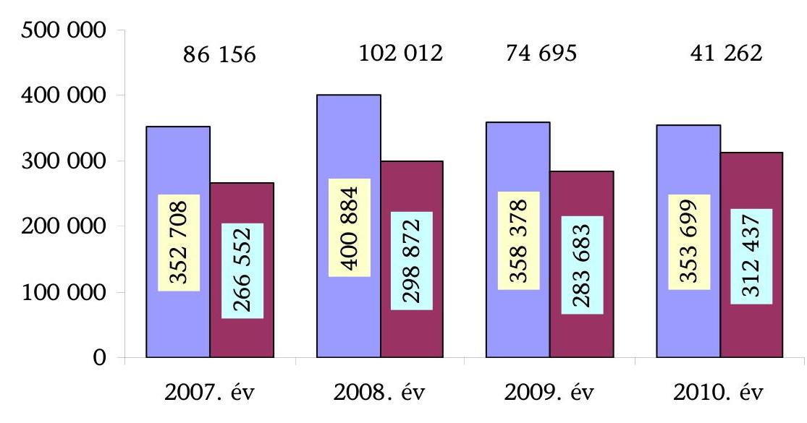
$\square$ Folyó bevételek
(pénzmaradvány átadás/átvétel nélkül)
Forrás: ÁSZ
A pozitív működési jövedelem 2007-2010 között összesen 304,1 Mrd Ft pénzügyi forrást biztosított a tőketörlesztési kötelezettség teljesítéséhez, valamint a fejlesztések finanszírozásához. A működési jövedelem 22,6%-át (65,6 Mrd Ft-ot) a fejlesztési célú hitelekhez kapcsolódó tőketörlesztésre fordították. A Fővárosi Önkormányzat nettó működési jövedelme (pénzügyi kapacitása) a 2007. évi 70,6 Mrd Ft-ról 2010-ben 26,6 Mrd Ft-ra csökkent. Ebben nem a tőketörlesztés emelkedése, hanem a folyó bevételek és kiadások különbségéből származó alacsonyabb működési jövedelem volt a meghatározó. (16. sz. ábra)

---

16. sz. ábra

A Fővárosi Önkormányzat nettó működési jövedelme és tőketörlesztése (millió Ft)
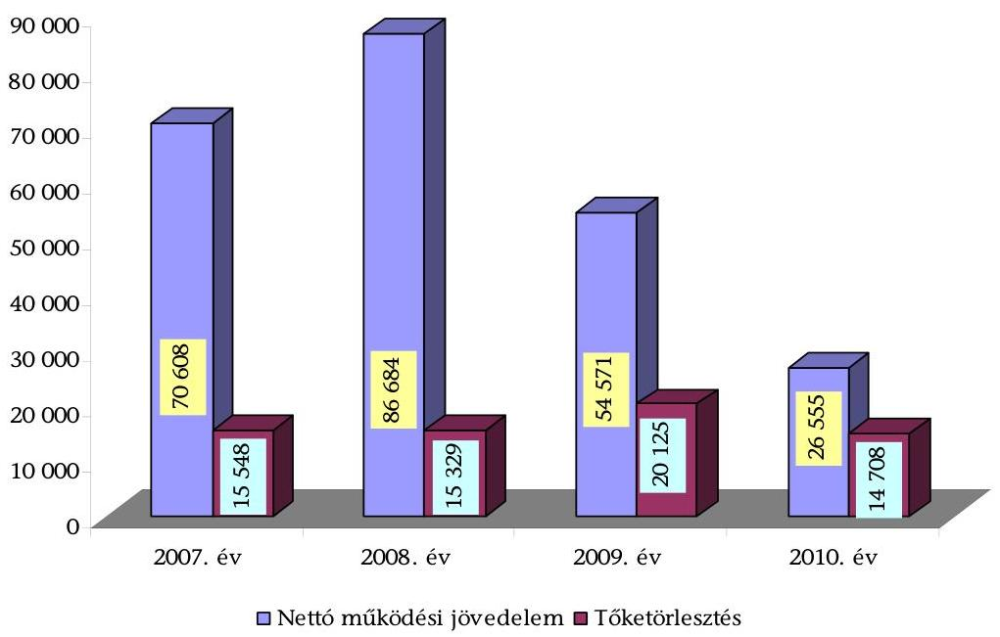

Forrás: ÁSZ
A Fővárosi Önkormányzat és intézményei szállítókkal szembeni kötelezettsége a 2008. és 2009. évi növekedést követően 2010-ben a 2007. évi szint alá csökkent. (2007-ben 12934 millió Ft, 2008-ban 14020 millió Ft, 2009-ben 16089 millió Ft, 2010-ben 12500 millió Ft volt.) A lejárt határidejű szállítói tartozás az egészségügyi intézmények miatt növekedett. (10. sz. táblázat)
10. sz. táblázat

A Fővárosi Önkormányzat lejárt határidejű szállítói tartozásai (millió Ft)

| Megnevezés | 2007. év | 2008. év | 2009. év | 2010. év |
| :-- | --: | --: | --: | --: |
| Fővárosi Önkormányzat | 1018 | 955 | 3105 | 2327 |
| Ebből: egészségügyi intézmények | 698 | 590 | 3010 | 2154 |
| Többségi tulajdonban lévő gazdasági   társaságok | 4604 | 3910 | 318 | 254 |

Forrás: ÁSZ az önkormányzat adatszolgáltatása alapján
A 2010. év végén a Fővárosi Önkormányzat és intézményei lejárt szállítói tartozásállományának 2,2%-a éven túli, 10,4%-a 91-365 nap közötti, 17,3%-a 61-90 nap közötti, 24,3%-a 30-60 nap közötti, míg 45,8%-a 30 napon belüli volt. Az egészségügyi intézmények közül 2007-ben hat, 2008-ban négy, 2009-ben és 2010-ben öt-öt intézménynek volt 30 napon túli lejárt tartozásállománya. Öt esetben önkormányzati biztost rendeltek ki, mivel a tartozás elérte az intézmény éves költségvetése eredeti előirányzatának 10%-át, vagy a 100 millió Ft-ot, és a tartozást egy hónap alatt sem sikerült 30 nap alá szorítani.

---

Önkormányzati szinten az ellenőrzött időszakban összesen 6,6 Mrd Ft megtakarítást mutattak ki a kiadáscsökkentő intézkedések hatásaként. Ennek 88%-át az intézményeknél érvényesítették. Az intézkedések nem voltak képesek ellensúlyozni a központi források csökkenését. A létszámcsökkentés (feladatmegszüntetés, átszervezés, határozott idejű alkalmazások megszüntetése), a feladatkiszervezések (karbantartás, takarítás, portaszolgálat), a közalkalmazotti bértáblán felüli pótlékok elvonása - a Főpolgármesteri hivatal kimutatása szerint - 2,4 Mrd Ft megtakarítást eredményezett az ellenőrzött időszakban együttesen. A személyi juttatásokra teljesített kiadások 2008-ban 5,8%-kal emelkedtek, majd ezt követően a 2007. évi szintre csökkentek.

# 2.2.2. Felhalmozási kiadások 

A Fővárosi Önkormányzat felhalmozási kiadása 2007-2010 között 507,6 Mrd Ft volt. Ennek összkiadáson belüli aránya a 2007. és a 2008. évi egyharmadról 2009-ben 28,8%-ra, 2010-ben 23,7%-ra esett vissza, miközben az ország összes önkormányzatát tekintve ez az arány 18,2%-ról 19,9%-ra emelkedett. A fővárosban a felhalmozási kiadások átlagostól magasabb arányát az államháztartáson kívüli felhalmozási célú átutalás jogcímen a BKV-nak nyújtott fejlesztési célú támogatás és a 4-es metró építésére átadott pénzeszköz eredményezte. A Fővárosi Önkormányzat mint tulajdonos, saját forrásból beruházások támogatására, járműfejlesztésre, rekonstrukciók, felújítások
 finanszírozására végleges pénzeszközátadásként 2004-2010 között 146,2 Mrd Ft-ot, ebből az ellenőrzött időszakban 69,8 Mrd Ft-ot bocsátott a BKV rendelkezésére.

Az önkormányzati fejlesztési célok között szerepeltek az előzőeken túl szennyvíztisztító telepek és kapcsolódó létesítményeinek megépítése, kórházak rekonstrukciói, intézményfelújítások, korszerűsítések, útépítések, út- és hídfelújítások. Az egészségügyi intézmények saját hatáskörű, valamint a céljelleggel támogatott beruházásain, felújításain túlmenően a Fővárosi Önkormányzat az egészségügy fejlesztési kiadásaira 2007-2010 között összesen 13,2 Mrd Ft-ot fordított.

A felhalmozási (beruházási) költségvetés egyenlege folyamatosan negatív összegű volt. A felhalmozási forráshiány a felhalmozási és tőkejellegű kiadásokhoz viszonyítva 2007-ben 64,3%, 2008-ban 33,9%, 2009-ben 65,8%, 2010-ben 62,8% volt. (17. sz. ábra)

---

17. sz. ábra

A Fővárosi Önkormányzat felhalmozási bevételei, kiadásai és egyenlege (millió Ft)
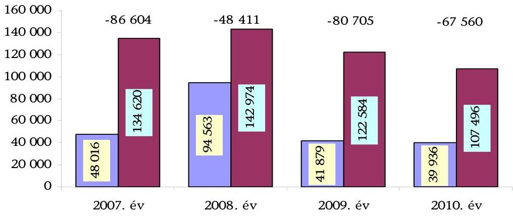

- Felhalmozási és tőkejellegű bevételek ■ Felhalmozási és tőkejellegű kiadások

Forrás: ÁSZ
A Fővárosi Önkormányzatnál a 2007-2010. években a tárgyi eszközök után 88,1 Mrd Ft terv szerinti értékcsökkenést számoltak el, amelynek 67,6%-át (59,6 Mrd Ft-ot) fordítottak felújításra, így a visszapótlási kötelezettség teljesítése, a vagyon használati értékének megőrzése nem volt teljes mértékben biztosított.

A könyvviteli mérleg szerinti eszközérték 30%-át (656 Mrd Ft-ot) a Fővárosi Önkormányzat tulajdonában lévő közúthálózat képviseli. A közútfenntartási tevékenység a 2006-2010. években nem volt eredményes, mert az azzal megbízott FKF Zrt. a meghatározott határidőn túl és nem a műszaki szakmai normáknak megfelelő minőségben valósította meg feladatait, továbbá a Fővárosi Önkormányzat nem biztosította a közutak használati értéke hosszú távú fennmaradásához szükséges fedezetet.

A közútfenntartási tevékenység a 2009. és a 2010. években nem volt gazdaságos, mivel a közszolgáltatási szerződésben rögzített feladatellátásért járó szolgáltatási díjat nem előkalkuláció alapján határozták meg, a közútfenntartási feladatok ellátását nem ellenőrizték, valamint az elvégzett munkák minőségi színvonala miatt indokolatlan többletköltségek merültek fel.

# 2.2.3. A beruházások finanszírozása 

A Fővárosi Önkormányzat által 2007-2010 között megvalósított, illetve 2010. december 31-én folyamatban lévő fejlesztések teljes bekerülési költsége 841,6 Mrd Ft volt. A beruházásokkal kapcsolatos 2010. december 31. után esedékes kötelezettségvállalás 300,8 Mrd Ft. Ennek forrásösszetételét főbb célonként a 11. sz. táblázat tartalmazza.

---

11. sz. táblázat

A 2010. év után esedékes kötelezettségvállalások forrásösszetétele főbb célonként a Fővárosi Önkormányzatnál (Mrd Ft)

| Megnevezés | 2010 utánra   vállalt   kötelezettség | 2010 utáni kötelezettség forrásösszetétele |  |  |  |
| :-- | --: | --: | --: | --: | --: |
| Lakásgazdálkodás | 7,8 | 7,8 | 0,0 | 0,0 | 0,0 |
| Közlekedés | 221,4 | 42,9 | 11,8 | 132,4 | 34,3 |
| Vízgazdálkodás | 53,6 | 19,6 | 8,2 | 19,5 | 6,3 |
| Környezetvédelem | 0,7 | 0,7 | 0,0 | 0,0 | 0,0 |
| Egészségügy | 3,2 | 2,0 | 0,4 | 0,8 | 0,0 |
| Szociális ellátás | 0,4 | 0,4 | 0,0 | 0,0 | 0,0 |
| Oktatás | 3,4 | 1,3 | 0,0 | 2,1 | 0,0 |
| Kulturális feladat | 1,4 | 0,4 | 0,0 | 1,0 | 0,0 |
| Sport | 3,2 | 1,0 | 0,0 | 2,2 | 0,0 |
| Budapest Szíve Program | 4,8 | 1,0 | 0,0 | 3,8 | 0,0 |
| Egyéb (nem nevesített) | 0,9 | 0,9 | 0,0 | 0,0 | 0,0 |
| Összesen | $\mathbf{300,8}$ | $\mathbf{78,0}$ | $\mathbf{20,4}$ | $\mathbf{161,8}$ | $\mathbf{40,6}$ |

Forrás: ÁSZ az önkormányzat adatszolgáltatása alapján
A 2010. évet követően esedékessé váló kötelezettségek fedezete csak akkor biztosítható, ha a számításba vett saját források teljesülnek, valamint ezt terhelő további újabb, jelentős nagyságrendű fejlesztési kötelezettséget a Fővárosi Önkormányzat nem vállal.

A legjelentősebb fővárosi fejlesztés a 4-es metró építése, amelynek finanszírozásával kapcsolatos bizonytalanság - jelenleg beárazatlan - kockázatot jelent a Fővárosi Önkormányzat gazdálkodásában. A 4-es metró építéséhez 2011-2015 között - a szerződések szerint - 24,7 Mrd Ft saját forrást kell biztosítani, amennyiben az évek szerinti pénzügyi ütemezés a terv szerint alakul, a finanszírozásban résztvevők a finanszírozási szerződés szerint teljesítik kötelezettségüket ${ }^{17}$, az el nem számolható költségek összege - amely teljes mértékben a Fővárosi Önkormányzatot terheli - és az I. szakasz tervezett építési költsége nem változik.

A Fővárosi Önkormányzat hosszú távú fizetőképessége szempontjából kockázatot jelent a köz- és magánszféra beruházási együttműködésében (PPP) megvalósuló 8,5 Mrd Ft-ra tervezett Közraktárak projekthez kapcsolódó - 25 évre összesen 33,4 Mrd Ft összegű - szolgáltatási díjfizetési kötelezettség, továbbá a beruházó által felvett hitelhez vállalt készfizető kezesség ${ }^{18}$.

[^0]
[^0]:    ${ }^{17} 1023$ Jelentés a 4-es metró beruházási folyamatának ellenőrzéséről megállapítja: „A beruházás finanszírozásának átláthatóságát nehezíti a finanszírozás összetett forrászerkezete, a finanszírozásban részt vevők száma (Magyar Állam, Főváros, EIB, EU), az eltérő és változó finanszírozási arányok, továbbá a módosított finanszírozási szerződés, a módosított Támogatási Szerződés, az azok rendelkezéseit kiegészítő, a Kohéziós Alapból származó támogatás igénybevételére történő alkalmazásáról létrejött további szerződés feltételeinek egyidejű alkalmazása."
    ${ }^{18}$ Ezzel a Fővárosi Önkormányzat a Közraktárak projekt beruházás-finanszírozási kockázatát átvállalta.

---

A nyertes pályázó magánpartnerrel megkötött szolgáltatási szerződés feltételei az általa tett ajánlat tartalmától (a szolgáltatási díj, az ingatlan bérbeadására vonatkozó alapjutalék mértéke, valamint a szolgáltató által felvett projekthitelre vonatkozó fizetési kötelezettségvállalás tekintetében) eltértek. A szolgáltatási szerződésben vállalt nettó szolgáltatási díj 13,2 Mrd Ft-tal haladta meg a nyertes pályázó ajánlatában szereplő 20,2 Mrd Ft összeget. Az ellenőrzés megállapításai alapján az ÁSZ különösen nagy vagyoni hátrányt okozó hűtlen kezelés gyanúja miatt ismeretlen tettes ellen feljelentést tett.

# 2.3. A kötelezettségekből eredő kockázatok 

A Fővárosi Önkormányzat hosszú lejáratú hitelállománya, (20-25 évre szóló) felhalmozási célú adósságállománya a 2007. évről a 2010. évre 20 Mrd Ft-tal növekedett. (18. sz. ábra) Jelentős (87,5%) a devizában fennálló, változó kamatozású hitelek aránya.
18. sz. ábra

Fővárosi Önkormányzat hosszú és rövid lejáratú kötelezettségei (Mrd Ft)
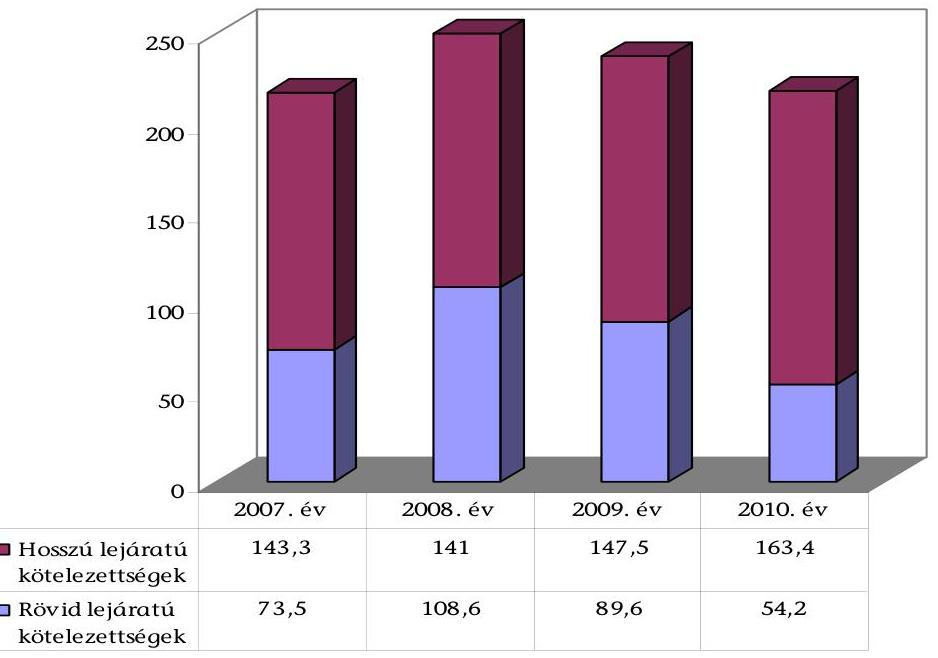

Forrás: ÁSZ
Az adósságszolgálat a következő - 2011-2014 közötti - években 13-16 Mrd Ft, amely a pozitív működési jövedelmére tekintettel nem jelent túlzott terhet. A devizában fennálló összes adósságszolgálati kötelezettség (tőke és kamat) 62%-a a 2014. évet követő időszakot terheli.

A fejlesztésekkel kapcsolatos hitelfelvételnél - pl. az Önkormányzatok Infrastrukturális Fejlesztési Hitelprogramja keretében felvett hitelekből megvalósuló fejlesztések 63%-ánál - nem végeztek megtérülési számításokat, nem vizsgálták azoknak a bevételekre, kiadásokra gyakorolt hatását. A fejlesztések 37%-ánál a megtérülési számításoknál nem vették figyelembe az adósságszolgálati kötelezettségeket.

A Fővárosi Önkormányzat a 2007-2010. évek között 71,6 Mrd Ft fejlesztési célú hitelt vett igénybe. A lehívott hitelekből a szerződéses célnak megfelelően a

---

2010. év végéig 56,8 Mrd Ft-ot használt fel. A lehívott, de még fel nem használt hitelekből betétlekötésekkel rendelkezett, illetve azokat látra szóló betétszámlákon helyezte el. Az átmenetileg szabad pénzeszközök lekötései után realizált kamatbevétel, valamint a forgatási célú értékpapírok értékesítéséből elért hozambevétel együttesen 2,4%-kal haladta meg a kamatkiadást az ellenőrzött időszakban. (19. sz. ábra)
19. sz. ábra

A Fővárosi Önkormányzat hozam- és kamatbevételei, kiadásai és ezek egyenlege (millió Ft-ban)
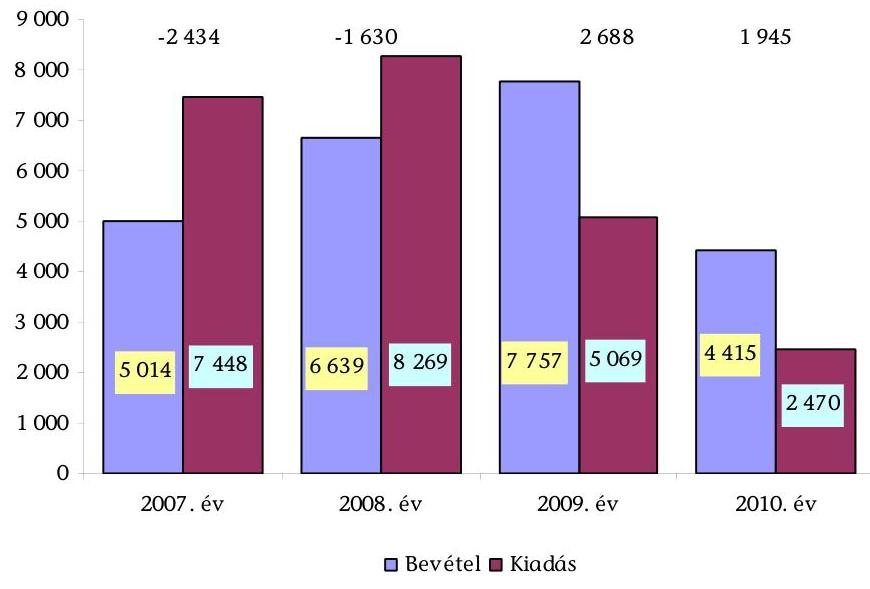

Forrás: ÁSZ
A Fővárosi Önkormányzat pénzügyi, likviditási helyzete 2007 és 2010 között - egészségügyi intézményei kivételével - megfelelő volt, mert a finanszírozásba bevonható eszközök fedezetet biztosítottak rövid lejáratú fizetési kötelezettségek teljesítéséhez.
A költségvetési kiadások folyamatos finanszírozása érdekében a számlavezető pénzintézettel kötött folyószámla-hitelkeret szerződések keretösszege 2007. november 30-ig 10 Mrd Ft, ezt követően 16 Mrd Ft volt. A szerződések szerint 2009. december 28-tól terhelte a Fővárosi Önkormányzatot rendelkezésre tartási jutalék, melynek évi mértéke 0,156% (25 millió Ft) volt. A Főpolgármesteri hivatalnál a 2007-2010. években likvid hitel felvételére nem került sor.
A Fővárosi Önkormányzat pénzügyi helyzetét befolyásolják a tulajdonában lévő gazdasági társaságok, elsősorban a BKV gazdálkodása. A kötelező tömegközlekedési feladatot ellátó BKV 2004-2009 között veszteségesen működött. ${ }^{19}$ A BKV a felvett hitelek miatt a 2010. év végére jelentős (64 Mrd Ft összegű, amelyből hosszú lejáratú 36 Mrd Ft) adósságállományt halmozott fel. További 3 Mrd Ft hosszú lejáratú kötelezettsége lízingszerződésből ered.

[^0]
[^0]:    ${ }^{19}$ Az ÁSZ a BKV gazdálkodását 2011. évben ellenőrizte, ezt követően - a lízingszerződések keretében történt járműbeszerzések kapcsán tett megállapítások alapján - jelentős összegű vagyoni hátrányt okozó hűtlen kezelés elkövetésének gyanúja miatt, ismeretlen tettes ellen feljelentést tett.

---

# 2.4. Fővárosi Önkormányzat pénzügyi helyzetének értékelése 

Az ellenőrzés megállapításai alapján a Fővárosi Önkormányzat pénzügyi helyzetében rejlő kockázatok az alábbiakban foglalhatók össze:

- a 2007-2010 közötti időszakban az állami hozzájárulások, támogatások csökkentését a Fővárosi Önkormányzat kiadáscsökkentő, bevételnövelő intézkedései nem ellensúlyozták. A tulajdonában lévő intézményhálózat működtetését, fenntartását a telephelyek nagy számából és területi elhelyezkedéséből adódó hatékonysági problémák jellemezték;
- kockázatot hordoz az önként vállalt feladatok terjedelme és meghatározásának hiánya. A kötelező és önként vállalt feladatok kiadásai - részben a szabályozás, részben az önkormányzati besorolás pontatlansága miatt - nem voltak teljes körűen elkülöníthetőek;
- a Fővárosi Önkormányzat pozitív működési jövedelme az adósságszolgálat teljesítéséhez megfelelő feltételeket teremtett. A nettó működési jövedelem azonban az áttekintett időszakban közel harmadára csökkent és ez már nem jelent biztonságos tartalékot a növekvő és várható kötelezettségekre. A devizahitelek árfolyamkockázata, a növekvő tőketörlesztés, valamint a nagy fővárosi fejlesztések finanszírozhatósága miatt magasabb a jövőbeni kockázat mértéke;
- a Fővárosi Önkormányzat pénzügyi egyensúlyához az egyes években rendelkezésre álló tartalék (maradvány) is hozzájárult. A finanszírozásba bevonható eszközök a rövid lejáratú fizetési kötelezettségek teljesítését biztosították. Az EU-s projektek utófinanszírozásához szükséges pénzügyi fedezet megteremtése a tartalékok csökkenése miatt a jövőben rövid lejáratú hitel felvételét teheti szükségessé;
- a működési kiadásokban az egészségügyi ágazat meghatározó részt képviselt, a kórházak növekvő adóssága, határidőn túli szállítói tartozása működési kockázatot jelentett;
- jelentős a kockázat az EU támogatással megvalósuló nagy beruházásoknál és az önkormányzat tulajdonában lévő gazdasági társaságok működésében. Egyelőre beárazatlan kockázatot hordoz a 4-es metró építése, valamint a Közraktár projekt, amelyek a beruházásokkal kapcsolatos jogviták generálói is lehetnek;
- a már megkezdett beruházások folytatásához - a jelenleg ismert feltételek mellett - a források tervezhetőek, újabb nagy programok indításához azonban nem rendelkeznek megfelelő fedezettel.

A Fővárosi Önkormányzat további eladósodásának megakadályozása, a működés racionalizálása érdekében az ellenőrzés javaslatai a következő megteendő intézkedéseket foglalják magukban:

- rendszeresen tájékoztassák a Fővárosi Közgyűlést a fennálló pénzügyi helyzetről, a bekövetkezett változásokról, az adósságot keletkeztető kötelezettségvállalások teljesítési feltételeiről;

---

- készítsenek előterjesztést a Fővárosi Közgyűlés részére, amelyben teljes körűen felmérik és bemutatják a Fővárosi Önkormányzat által ellátott önként vállalt feladatokat;
- kezdeményezzék a Fővárosi Közgyűlésnél a közútfenntartási feladat ellátásáért járó szolgáltatás ellenértéke pénzügyi elszámolási rendjének megváltoztatását, biztosítsák a közút-fenntartási feladatok elvégzésének ellenőrzését, gazdaságos és eredményes ellátását.

# 3. A MEGYEI ÖNKORMÁNYZATOK PÉNZÜGYI
 HELYZETÉNEK ELLENŐRZÉSI TAPASZTALATAI 

A lakónépesség, a települések száma a közszolgáltatások iránti igényekre, azok megszervezésére is kihat. A megyei jogú városok, városok száma a feladatmegosztás szempontjából bír jelentőséggel (a megyei jogú városok térségi, a városok körzeti feladatokat láthatnak el, mintegy tehermentesítve a megyei önkormányzatokat). A községek száma - főként az aprófalvas megyékben - a térségi (koordinációs, stratégiaalkotási ${ }^{20}$ ) feladatokban nagyobb terhet jelent a megyei önkormányzatok számára. (12. sz. táblázat)
12. sz. táblázat

Népességszám, települések száma megyénként 2010-ben

| Megye/Régió | Népességszám |  | Települések száma |  |  |
| :--: | :--: | :--: | :--: | :--: | :--: |
|  | 2010. január 1. |  |  |  |  |
|  | megye összesen | ebből: megyei jogú város | megyei jogú város | város | község |
| Pest | 1229880 | 64394 | 1 | 47 | 139 |
| Közép-Magyarország* | 1229880 | 64394 | 1 | 47 | 139 |
| Fejér | 427416 | 150160 | 2 | 13 | 93 |
| Komárom-Esztergom | 312431 | 69988 | 1 | 10 | 65 |
| Veszprém | 358807 | 63898 | 1 | 14 | 202 |
| Közép-Dunántúl | 1098654 | 284046 | 4 | 37 | 360 |
| Győr-Moson-Sopron | 448435 | 190163 | 2 | 9 | 171 |
| Vas | 259364 | 79438 | 1 | 11 | 204 |
| Zala | 288591 | 111806 | 2 | 8 | 247 |
| Nyugat-Dunántúl | 996390 | 381407 | 5 | 28 | 622 |
| Baranya | 393758 | 157680 | 1 | 13 | 287 |
| Somogy | 320578 | 68018 | 1 | 15 | 229 |
| Tolna | 233650 | 33805 | 1 | 10 | 98 |
| Dél-Dunántúl | 947986 | 259503 | 3 | 38 | 614 |
| Bács-Kiskun | 528418 | 112233 | 1 | 21 | 97 |
| Békés | 366556 | 64429 | 1 | 20 | 54 |
| Csongrád | 423240 | 216914 | 2 | 8 | 50 |
| Dél-Alföld | 1318214 | 393576 | 4 | 49 | 201 |
| Hajdú-Bihar | 541298 | 207270 | 1 | 20 | 61 |
| Jász-Nagykun-Szolnok | 390775 | 74656 | 1 | 19 | 58 |
| Szabolcs-Szatmár-Bereg | 560429 | 117832 | 1 | 26 | 202 |
| Észak-Alföld | 1492502 | 399758 | 3 | 65 | 321 |
| Borsod-Abaúj-Zemplén | 692771 | 169226 | 1 | 27 | 330 |
| Heves | 311454 | 56593 | 1 | 8 | 112 |
| Nógrád | 204917 | 37632 | 1 | 5 | 125 |
| Észak-Magyarország | 1209142 | 263451 | 3 | 40 | 567 |
| Megyék összesen | 8292768 | 2046135 | 23 | 304 | 2824 |

* A Közép-Magyarországi régióban a Főváros adatait a táblázat nem tartalmazza

Forrás: KSH

[^0]
[^0]:    ${ }^{20}$ Az ágazati jogszabályokban előírt különféle tervek, koncepciók: pl. megyei területrendezési terv, környezetvédelmi program, szociális szolgáltatásfejlesztési, közoktatás fejlesztési koncepció.

---

A megyék főbb társadalmi, gazdasági jellemzőiben (egy főre jutó bruttó hazai termékből - GDP-ből - való részesedés, munkanélküliek száma és aránya) jelentős különbségek figyelhetők meg. (13. sz. táblázat)
13. sz. táblázat

A megyék főbb társadalmi, gazdasági jellemzői

| Megye/Régió | Egy főre jutó (ezer Ft) |  | Munkanélküliek 2010. IV. n.év végén |  |
| :--: | :--: | :--: | :--: | :--: |
|  | $\begin{gathered} \text { GDP } \\ \text { 2009. } \\ \text { évben } \end{gathered}$ | beruházás teljesítmény értéke 2010. IV. n.év | száma (ezer fő) | aránya (\%) |
| Pest | 2157 | 224 | 45 | 8 |
| Közép-Magyarország* | 2157 | 224 | 45 | 8 |
| Fejér | 2276 | 305 | 15 | 8 |
| Komárom-Esztergom | 2627 | 403 | 13 | 9 |
| Veszprém | 1834 | 145 | 18 | 12 |
| Közép-Dunántúl | 2232 | 281 | 46 | 9 |
| Győr-Moson-Sopron | 2833 | 438 | 15 | 7 |
| Vas | 2218 | 170 | 11 | 10 |
| Zala | 1950 | 125 | 14 | 11 |
| Nyugat-Dunántúl | 2416 | 278 | 39 | 9 |
| Baranya | 1815 | 227 | 23 | 14 |
| Somogy | 1649 | 364 | 18 | 14 |
| Tolna | 1910 | 214 | 7 | 7 |
| Dél-Dunántúl | 1782 | 270 | 48 | 12 |
| Bács-Kiskun | 1713 | 148 | 22 | 10 |
| Békés | 1425 | 139 | 17 | 12 |
| Csongrád | 1974 | 229 | 17 | 10 |
| Dél-Alföld | 1716 | 172 | 55 | 10 |
| Hajdú-Bihar | 1807 | 219 | 28 | 13 |
| Jász-Nagykun-Szolnok | 1731 | 154 | 17 | 11 |
| Szabolcs-Szatmár-Bereg | 1322 | 109 | 40 | 18 |
| Észak-Alföld | 1605 | 161 | 85 | 14 |
| Borsod-Abaúj-Zemplén | 1592 | 204 | 45 | 17 |
| Heves | 1782 | 192 | 14 | 11 |
| Nógrád | 1161 | 80 | 14 | 18 |
| Észak-Magyarország | 1568 | 180 | 73 | 16 |
| Megyék átlaga/összesen | 1887 | 217 | 391 | 11 |

* A Közép-Magyarországi régióban a Főváros adatait a táblázat nem tartalmazza

Forrás: KSH

# 3.1. A megyei önkormányzatok feladatellátásának, költségvetésének jellemzői 

A megyei önkormányzatok a feladatellátás és a forráselosztás tekintetében sajátos helyet foglalnak el az önkormányzati alrendszerben. Intézményfenntartói szerepük az elmúlt két évtizedben folyamatosan bővült. Feladataik közé elsősorban a körzeti ellátást nyújtó intézmények működtetése tartozott.

A megyei önkormányzat kötelező feladatainak egy része - így a megyében lévő természeti és társadalmi muzeális emlékek, a történeti iratok gyűjtése, őrzése, tudományos feldolgozása, a megyei könyvtári szolgáltatás, a pedagógiai és közművelődési szakmai tanácsadás és szolgáltatás, a megyei testnevelési

---

és sportszervezési feladatellátás, a gyermek- és ifjúsági jogok érvényesítése, a gyermekvédelmi és szociális szakellátás - az Ötv. 70. § (1) bekezdés a) pontjában előírt kötelezettség.

A megyék által ellátandó kötelező közszolgáltatások ellátásának mértékére a települési önkormányzatok döntései is kihatnak ${ }^{21}$. A középiskolai, szakiskolai és kollégiumi ellátás, a fogyatékos gyermekek oktatása, nevelése, gondozása a megyei önkormányzatok kötelező feladata az ágazati törvény szerint. Ha a települési önkormányzat lát el ilyen feladatot és arról lemond, a megyei önkormányzatnak a feladatot át kell vennie. Az intézmények a megyékben szétszórtan helyezkednek el, de a legjelentősebbek a megyeszékhelyeken találhatóak és az ottani lakosságot is ellátják.

Megyei fenntartásban 2010-ben 527 egészségügyi, szociális, oktatási, kulturális intézmény működött. Az intézmények és a foglalkoztatottak számában a kialakult feladatstruktúrából adódóan jelentősek a különbségek. (14. sz. táblázat)
14. sz. táblázat

A megyei önkormányzatok feladatellátásának jellemző adatai 2010-ben

| Megye/Régió | Intézmé-   nyek   száma   összesen | Közoktatás |  | Szociális és   gyermekvédelem |  | Egészség-   ügyi |  | Kultúra   és Sport |  | Összes   foglalkoztatott |
| :--: | :--: | :--: | :--: | :--: | :--: | :--: | :--: | :--: | :--: | :--: |
|  |  | foglal-   koztatott   (fő) | ellátott   (fő) | $\begin{gathered} \text { foglal- } \\ \text { koztatott } \\ \text { (fő) } \end{gathered}$ | ellátott   (fő) | foglalkoztatott   (fő) |  | foglalkoztatott   (fő) |  | megnövekedés   %-ban |
| Pest | 56 | 2239 | 17050 | 1097 | 3111 | 1819 | 226 | 5381 | 9,0 |  |
| Közép-Magyarország | 56 | 2239 | 17050 | 1097 | 3111 | 1819 | 226 | 5381 | 9,0 |  |
| Fejér | 24 | 479 | 3741 | 787 | 1916 | 2313 | 178 | 3937 | 6,59 |  |
| Komárom-Esztergom | 21 | 582 | 4249 | 408 | 706 | 1121 | 111 | 2222 | 3,70 |  |
| Veszprém | 43 | 1542 | 9625 | 885 | 1897 | 162 | 260 | 2849 | 4,74 |  |
| Közép-Dunántúl | 88 | 2603 | 17615 | 2080 | 4519 | 3796 | 549 | 9028 | 15,03 |  |
| Győr-Moson-Sopron | 22 | 444 | 1037 | 675 | 1435 | 2066 | 200 | 3383 | 5,65 |  |
| Vas | 30 | 341 | 1376 | 699 | 1672 | 0 | 331 | 1371 | 2,28 |  |
| Zala | 26 | 569 | 5295 | 729 | 1536 | 1555 | 147 | 3000 | 4,99 |  |
| Nyugat-Dunántúl | 78 | 1354 | 7508 | 2101 | 4643 | 3621 | 678 | 7754 | 12,91 |  |
| Baranya | 21 | 430 | 2060 | 735 | 1876 | 0 | 142 | 1307 | 2,18 |  |
| Somogy | 28 | 1115 | 6636 | 1026 | 2571 | 1607 | 163 | 3911 | 6,51 |  |
| Tolna | 14 | 759 | 3373 | 816 | 1637 | 1331 | 131 | 3277 | 5,45 |  |
| Dél-Dunántúl | 63 | 2304 | 12069 | 2577 | 6084 | 3158 | 456 | 8495 | 14,14 |  |
| Bács-Kiskun | 28 | 804 | 3289 | 936 | 2667 | 1708 | 226 | 3674 | 6,12 |  |
| Békés | 14 | 836 | 5665 | 917 | 2372 | 2053 | 229 | 4035 | 6,72 |  |
| Csongrád | 23 | 1138 | 6896 | 1094 | 2420 | 1298 | 180 | 3710 | 6,18 |  |
| Dél-Alföld | 65 | 2778 | 15850 | 2947 | 7459 | 5059 | 635 | 11419 | 19,01 |  |
| Hajdú-Bihar | 16 | 563 | 1437 | 964 | 3001 |

 0 | 154 | 1481 | 2,47 |  |
| Jász-Nagykun-Szolnok | 23 | 671 | 3304 | 1002 | 2200 | 1565 | 155 | 3395 | 5,65 |  |
| Szabolcs-Szatmár-Bereg | 35 | 811 | 5066 | 1463 | 4015 | 0 | 269 | 2543 | 4,23 |  |
| Észak-Alföld | 74 | 1845 | 9807 | 3429 | 9216 | 1565 | 578 | 7417 | 12,35 |  |
| Borsod-Abaúj-Zemplén | 54 | 1604 | 10217 | 1784 | 4483 | 2885 | 346 | 6619 | 11,02 |  |
| Heves | 29 | 579 | 3400 | 955 | 2021 | 0 | 281 | 1813 | 3,02 |  |
| Nógrád | 20 | 556 | 4305 | 717 | 1657 | 804 | 96 | 2135 | 2,58 |  |
| Észak-Magyarország | 103 | 2719 | 17922 | 3454 | 8161 | 3689 | 723 | 10585 | 17,62 |  |
| Megyék összesen | 527 | 15842 | 98421 | 17685 | 43193 | 22707 | 3845 | 60079 | 100,00 |  |

Forrás: ÁSZ az önkormányzat adatszolgáltatása alapján
A megyei önkormányzatok által fenntartott közoktatási intézményekben 98 ezer, szociális és gyermekvédelmi intézményekben 43 ezer fő volt az ellátottak száma 2010-ben. Az örökölt intézménystruktúrától és a települési önkor-

[^0]
[^0]:    ${ }^{21}$ Az ÁSZ 2010-ben „Az állami feladat (közfeladat) ellátás szervezeti és humánerőforrás rendszerének ellenőrzéséről" készült jelentésben részletesen elemezte a közfeladat-ellátás helyzetét.

---

mányzatok által kezdeményezett - döntően a vizsgált időszakot megelőzően lezajlott - intézményátadástól függően megyénként számottevő a különbség az ellátottak számában.

A közoktatási intézményekben a megyénkénti tanulólétszám - Pest megye kiugró adatát figyelmen kívül hagyva - hétnél az átlagos 4283 fő feletti, kettőnél ennek több mint kétszerese. A közoktatásban az ellátottak közel 38\%-a három megye (Borsod-Abaúj-Zemplén, Pest, Veszprém), további 30\%-a öt megye (Békés, Csongrád, Somogy, Szabolcs-Szatmár-Bereg, Tolna) intézményeiben tanul.

A szociális és gyermekvédelmi ágazatban nyolc megyében haladja meg az ellátottak száma az átlagos 2273 főt. Az itt ellátottak egyötödét két megye (Borsod-Abaúj-Zemplén, Szabolcs-Szatmár-Bereg) intézményei látják el. A megyei átlaghoz képest Pest megyében közel 37\%-kal, Hajdú-Bihar megyében 32\%-kal több az ellátott az intézményekben.

Az egészségügyi szakellátás biztosítása akkor képezte a megyei önkormányzat kötelező feladatát, ha az Ötv. alapján az ehhez szükséges vagyont az önkormányzat a tulajdonába kapta. A kórházi ágyak harmadát a megyei önkormányzatok működtették. A megyék egészségügyi szakellátással - kórházfenntartással - összefüggő kötelezettségei jelentősen eltértek. Az orvosi egyetemekkel rendelkező megyékben (Baranya, Csongrád, Hajdú-Bihar megyében) a klinikák szerepe meghatározó volt a járó- és fekvőbeteg-szakellátásban. Sajátos volt Pest megye helyzete, amely a fővárosban található fekvőbeteg kapacitás mellett maga is tartott fenn Budapesten kórházat. Az elmúlt években a kórházak működtetésében végbement változtatások, a klinikai, gazdasági integráció is hatással volt a megyei önkormányzatok intézmény és kiadási szerkezetére. Több megye (Hajdú-Bihar, Szabolcs-Szatmár-Bereg, Vas, Veszprém) nonprofit gazdasági társasággá alakította át, vagy holdingba szervezte a fenntartásában működő kórházakat, a holding irányítására megyei tulajdonú és fenntartású Zrt.-t alapított. A személyi és dologi kiadások harmada a gazdasági társasági formában működtetett egészségügyi szolgáltatóknál merült fel 2010-ben.

# 3.1.1. Forrásszabályozás, bevételek változása 

A 2007-2010 közötti időszakban az önkormányzati feladatok finanszírozásának keretet biztosító - a költségvetési törvényben évente meghatározott - forrásszabályozás kedvezőtlenül változott. Az intézmények működését biztosító állami hozzájárulások és támogatások aránya a helyi önkormányzatok bevételeiben 7\%-kal csökkent.

A bevételek nagyságára, összetételére a szerkezeti változások is hatással voltak. Ezek között kiemelhető, hogy a kórházak működtetési forma változása miatt a gazdasági társaságoknak folyósított OEP finanszírozás nem jelenik meg az államháztartási információs rendszerben az önkormányzati bevételek között. A vizsgált időszakban bekövetkező egyéb változások (munkáltatói járulékcsökkentés, 13. havi illetmény felfüggesztése, majd megszüntetése) is nehezítik az összehasonlítást.

---

A normatívákban általánosan érvényesülő forráskivonáson túl a megyei önkormányzatok szja részesedését összesen 17 Mrd Ft forráskivonás (2007-ben 10 Mrd Ft-tal, 2010-ben további 7 Mrd Ft-tal) érintette. A megyei önkormányzatok összes - finanszírozási műveletek nélküli GFS rendszerű - tárgyévi bevétele 2007-ről 2010-re 27\%-kal csökkent. (20. sz. ábra)
20. sz. ábra

A megyei önkormányzatok bevételi forrásainak változása (Mrd Ft)
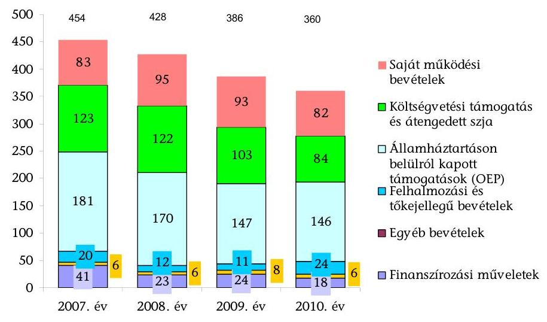

Forrás: ÁSZ
Az ellenőrzött időszakban a megyei önkormányzatok 353 Mrd Ft saját folyó (működési) bevételéből az illetékbevétel 139 Mrd Ft (39,4\%) volt. Az ingatlanpiac stagnálása, majd visszaesése, és egyes illetékkedvezmények bevezetése következtében - megyénként differenciált mértékben - az illetékbevételek 2010-re általánosan visszaestek. A 2006. évi 45,8 Mrd Ft (2007-ben 36 Mrd Ft-ra) 2010-ben 25,1 Mrd Ft-ra (45\%-kal) csökkent. Ennek csak kis részét teszi ki az illetékbeszedés költségeire 2007-től az APEH (2011-től a Nemzeti Adó- és Vámhivatal) által a megyéktől visszatartott 8,5\%-nak megfelelő összeg.

Az önkormányzati alrendszer egészében a kieső bevételek pótlására 2010-ben csupán 5 Mrd Ft-ot, 2011-ben 1,2 Mrd Ft-ot ellentételezett a központi költségvetés. Ezt azonban a forrásszabályozásban nem az érintett megyei, megyei jogú városi önkormányzatoknál, hanem az önkormányzati alrendszer egészében ismerték el.

A megyék eltérő feladataiból adódó forráshiány csökkentésében az ÖNHIKI támogatás is 2006 végéig szerepet játszott. A normatív módon igényelhető ÖNHIKI támogatás lehetőségéből 2007-től azonban a költségvetési törvény kizárta a megyéket. A normatív ÖNHIKI támogatás rendszerében 2006-ban 6 megyei önkormányzat összesen 1383 millió Ft támogatási igénye került elismerésre. Ezt követően évente változó számban és mértékben részesültek miniszteri döntést követően a működésképtelen helyi önkormányzatok egyéb támogatása jogcímen kiegészítésben. A 2009. évi két megyei önkormányzattal, illetve 165 millió Ft támogatással szemben 2010-ben számuk 13-ra, a támogatás 610 millió Ft-ra nőtt. Ez is lényegesen (55,9\%-kal) kisebb összegű segítséget jelentett a 2006. évi támogatáshoz képest. (21. sz. ábra)

---

21. sz. ábra

A megyei önkormányzatok ÖNHIKI és egyéb működési kiegészítő támogatása
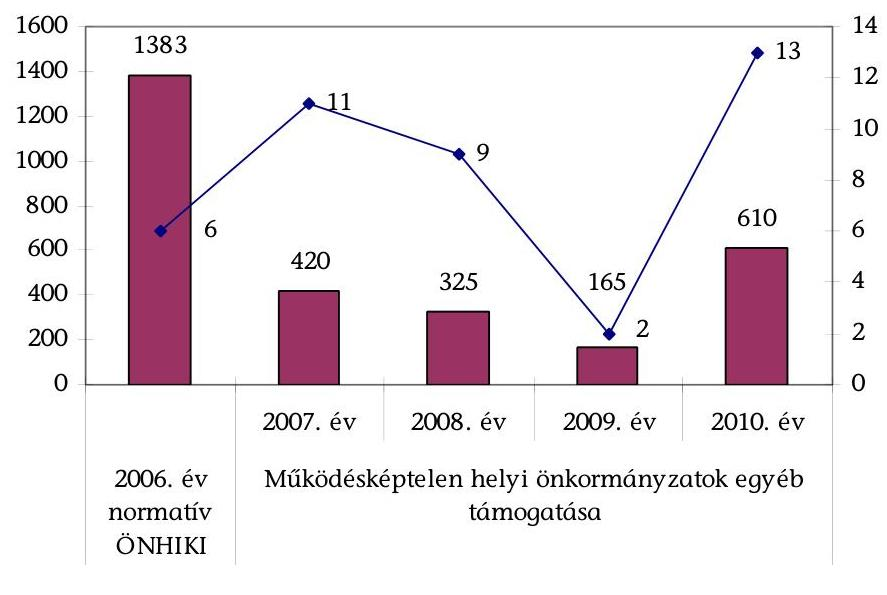

Forrás: NGM

# 3.1.2. Megyei önkormányzatok működési kiadásai 

Az önkormányzati alrendszer finanszírozási műveletek nélküli (GFS rendszerű) kiadásainak 10,8\%-a realizálódott 2010-ben a megyei önkormányzatoknál. A működési kiadásaik 2010-ben a 2007. évhez viszonyítva 15\%-kal (56 Mrd Ft-tal) - a személyi juttatások és a munkaadót terhelő járulékok csökkenése miatt - alacsonyabbak voltak. (15. sz. táblázat)
15. sz. táblázat

A megyei önkormányzatok folyó kiadásai (Mrd Ft)

| Megnevezés | 2007. év | 2008. év | 2009. év | 2010. év | $\begin{gathered} 2010 / 2007 . \\ \text { év \% } \end{gathered}$ |
| :--: | :--: | :--: | :--: | :--: | :--: |
| Folyó kiadások (pénzmaradvány átadás nélkül) | 387 | 383 | 351 | 332 | 85,8 |
| Működési kiadások (kamatkiadások nélkül) | 372 | 366 | 334 | 316 | 84,9 |
| ebből: személyi juttatások | 178 | 171 | 154 | 142 | 79,8 |
| munkaadót terhelő járulékok | 56 | 53 | 46 | 37 | 66,1 |
| dologi kiadások | 138 | 142 | 134 | 137 | 99,3 |
| Államháztartáson belülre átadott pénzeszközök | 4 | 3 | 3 | 3 | 75,0 |
| Transzferkiadások (működési célú) | 9 | 10 | 9 | 9 | 100,0 |
| ebből: vállakozásoknak | 1 | 1 | 0 | 1 | 100,0 |
| EU-nak, illetve külföldre | 0 | 0 | 0 | 0 | 0,0 |
| magánszemélyeknek | 5 | 5 | 5 | 6 | 120,0 |
| nonprofit szervezeteknek | 3 | 4 | 4 | 2 | 66,7 |
| Kamatkiadások | 2 | 4 | 5 | 4 | 200,0 |

Forrás: ÁSZ

---

A megyei önkormányzatok működési kiadásainak döntő része (2010-ben 98,1\%-a) a kötelező feladatok finanszírozását szolgálta ${ }^{22}$. Az önként vállalt feladatok támogatását az éves költségvetési rendeletekben anyagi lehetőségeik függvényében határozták meg. A 2010. évi kiadásokon belül az önként vállalt feladatok aránya - megyénként jelentős szóródás mellett - összességében 1,9\% (7,1 Mrd Ft) volt.

A megyei önkormányzatok kiadásainak szerkezete - az intézményfenntartói szereppel összhangban - eltér a helyi önkormányzatok egészére jellemzőtől. A hagyományos költségvetési szerkezetben 2010-ben a megyék tárgyévi kiadásainak 85\%-a folyó (működési) kiadás volt az országos 68,1\%-kal szemben. A kiadások 47,5\%-a (178,6 Mrd Ft) személyi juttatás és a munkaadót terhelő járulék volt, az országos 40\%-kal szemben. A felhalmozási és tőke jellegű kiadásoké 9,7\% volt az országos 19,9\%-kal szemben.

A megyei önkormányzatok éves költségvetési kiadásainak ágazati szerkezetére az egészségügyi ágazat túlsúlya jellemző. (22. sz. ábra)
22. sz. ábra

A megyei önkormányzatok intézményi működési kiadásainak ágazatonkénti megoszlása 2010-ben (Mrd Ft)
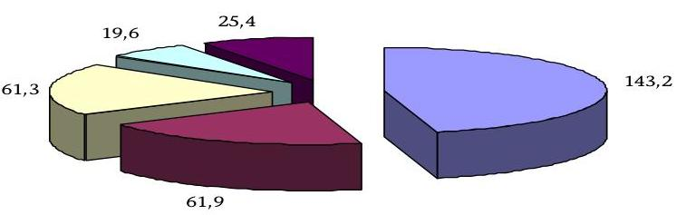
$\boxtimes$ Egészségügy ■ Közoktatás ■ Szociális és gyermekvédelem ■ Kulturális ■ Igazgatási és egyéb
Forrás: BM az önkormányzatok adatszolgáltatása alapján
2010-ben a 311 Mrd Ft intézményi kiadásokon belül meghatározó arányt -46\%-ot (143 Mrd Ft-ot) - a kórházak fenntartása jelentett, amely az országos átlag (11,3\%) négyszerese. A kórházak kiadásait több mint 90\%-ban az OEP és az önkormányzati támogatás fedezte.

A kórházak részére működési célra 4 év alatt 16,5 Mrd Ft-ot, fejlesztésre 4 Mrd Ft-ot adtak át a megyék.

[^0]
[^0]:    ${ }^{22}$ Az önkormányzatok adatszolgáltatása alapján.

---

# 3.2. A pénzügyi egyensúly hiányából eredő kockázatok 

### 3.2.1. A működési és felhalmozási egyensúly alakulása

A feladat- és hatáskör telepítés sajátosságai mellett a forrásszabályozásból következő szűk mozgástér, a központi költségvetéstől való erőteljes függőség is befolyásolta a megyei önkormányzatok feladatellátásra vonatkozó döntéseit.

A CLF módszerrel bemutatott pénzügyi egyensúly hiánya a megyei önkormányzatoknál az ellenőrzött időszakban folyamatosan nőtt. (16. sz. táblázat)
16. sz. táblázat

A megyei önkormányzatok CLF módszer szerinti adatai (millió Ft)

| Megnevezés | 2007. év | 2008. év | 2009. év | 2010. év |
| :--: | :--: | :--: | :--: | :--: |
| Folyó bevételek | 393222 | 393113 | 350581 | 318532 |
| Folyó kiadások | 390269 | 387998 | 355893 | 334895 |
| Működési jövedelem | 2953 | 5115 | $-5312$ | $-16363$ |
| Netto működési jövedelem   = működési jövedelem - tőketörlesztés | $-1814$ | $-7693$ | $-8199$ | $-30751$ |
| Felhalmozási bevételek | 20166 | 11573 | 11093 | 23875 |
| Felhalmozási kiadások | 38482 | 27210 | 26127 | 39052 |
| Felhalmozási költségvetés egyenlege | $-18316$ | $-15637$ | $-15034$ | $-15177$ |
| Finanszírozási műveletek nélküli (GFS) pozíció | $-15364$ | $-10522$ | $-20346$ | $-31540$ |
| Finanszírozási műveletek egyenlege | 41162 | 23219 | 24507 | 17876 |
| Tárgyévi pozíció | 25798 | 12697 | 4161 | $-13665$ |
| Egyéb tájékoztató adatok |  |  |  |  |
| Összes

 kötelezettség | 94474 | 141815 | 155170 | 195868 |
| ebből rövid lejáratú | 33910 | 31870 | 43639 | 56152 |
| Folyószámlahitel napi átlagos állománya | 9280 | 8039 | 12274 | 18537 |
| Munkabérhitel napi átlagos állománya | 1608 | 1286 | 1210 | 1988 |
| Likvidhitel napi átlagos állománya | 0 | 0 | 0 | 1840 |
| Egyéb finanszírozásba vonható eszközök összesen: | 59840 | 87045 | 71855 | 56291 |
| Ebből: Tartós hitelviszonyt megtestesítő értékpapírok | 2339 | 8597 | 3032 | 1141 |
| Hosszú lejáratú bankbetétek | 0 | 2050 | 0 | 0 |
| Értékpapírok | 5628 | 13880 | 151 | 1 |
| Pénzeszközök (idegen pénzeszközök nélkül) | 51873 | 62518 | 68672 | 55149 |

Forrás: ÁSZ
A folyó költségvetés egyenlege 2007-ben és 2008-ban még pozitív volt, 2009 óta negatív. A működési hiány 2010-ben már több mint 16 Mrd Ft, a folyó kiadások 4,9%-a volt. (23. sz. ábra)

---

# 23. sz. ábra 

A megyei önkormányzatok folyó költségvetésének egyenlege (működési jövedelem) (millió Ft)
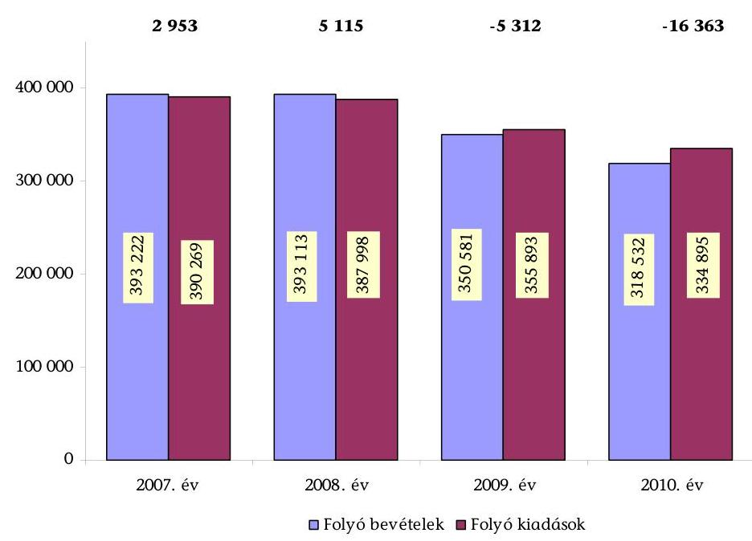

Forrás: ÁSZ
A megyei önkormányzatok nettó működési jövedelme (pénzügyi kapacitása) az áttekintett időszakban a működési jövedelem csökkenése miatt, a növekvő adósságszolgálat mellett folyamatosan negatív volt, 2010-ben kiugróan alacsony értéket mutatott. (24. sz. ábra)
24. sz. ábra

A megyei önkormányzatok nettó működési jövedelmének alakulása (millió Ft)
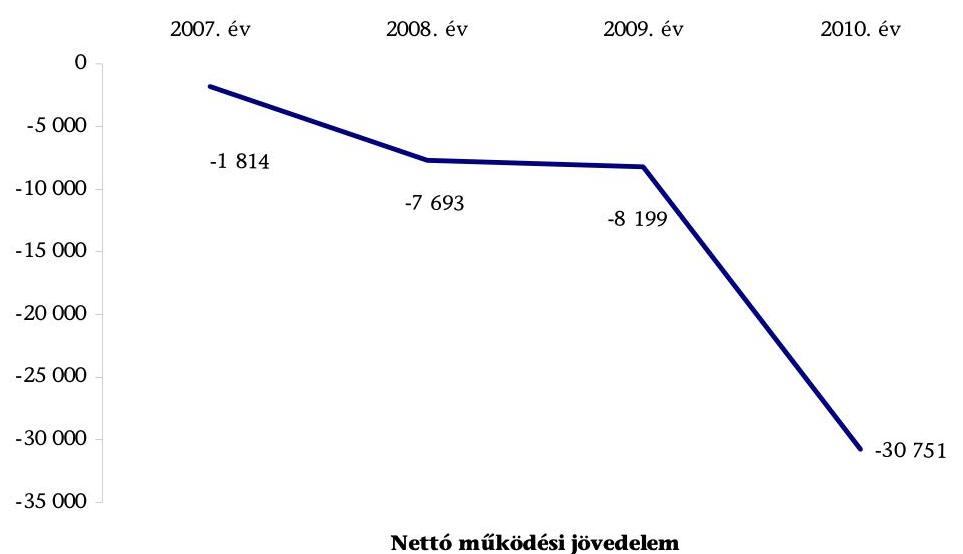

A megyei önkormányzatok a pénzügyi helyzet javítása érdekében bevételnövelő és kiadáscsökkentő intézkedéseket tettek az áttekintett időszakban összesen 35 Mrd Ft, illetve 22 Mrd Ft összegben. Az intézkedések álláshely-csökkentéssel is jártak. (25. sz. ábra)
25. sz. ábra

A megyei önkormányzatoknál a megszüntetett álláshelyek száma (fő)
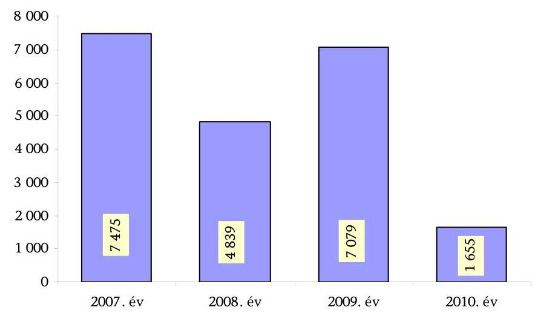

Forrás: ÁSZ az önkormányzatok adatszolgáltatása alapján
*Megjegyzés: 2007-ben az álláshely-csökkenésből 1350 fő a megyei illetékhivatalok megszüntetéséből (az illetékbeszedés APEH-hoz történő átszervezéséből) származott

Az önkormányzatok egy része pénzügyi egyensúlyi helyzetét úgy kívánja javítani, hogy az intézményei üzemeltetését átadja az egyházaknak. Következményeként a központi költségvetés terhei növekedhetnek.

A működés finanszírozását - az intézkedések mellett - egyre nagyobb összegű likvid hitel szolgálta. A folyószámlahitel napi átlagos állománya 2007-2010 között kétszeresére (9,3 Mrd Ft-ról 18,5 Mrd Ft-ra), a munkabérhitelé 1,6 Mrd Ft-ról 2 Mrd Ft-ra (25%-kal) emelkedett. (26. sz. ábra)
26. sz. ábra

A megyei önkormányzatoknál a folyószámla- és munkabérhitel napi átlagos állománya (millió Ft)
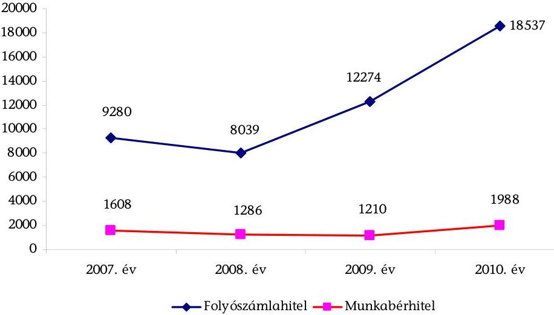

Forrás: ÁSZ az önkormányzatok adatszolgáltatása alapján

---

A rövid lejáratú kötelezettségek állománya a 2007. évi 33,9 Mrd Ft-ról 2010-re 56,2 Mrd Ft-ra (65,8%-kal) emelkedett. Ez utóbbi 48%-a (27 Mrd Ft) pénzintézeti, 42,7%-a (24 Mrd Ft) szállítói tartozás volt.

A működési kockázat egyik megjelenési formája a lejárt határidejű szállítói tartozás volt, különösen a kórházaknál. Az ellenőrzött megyei önkormányzatok lejárt határidejű szállítói tartozása 2010. december 31-én 8,5 Mrd Ft volt. Ebből a kórházakat terhelte 4,2 Mrd Ft (49,4%). A lejárt határidejű szállítói tartozások közel felét (48,3%) két megye (Pest, Fejér) halmozta fel. A kórházak lejárt határidejű tartozásából 2010. december 31-én Fejér megye több mint 35,7%-kal részesedett, 4 megye (Fejér, Pest, Csongrád, Somogy) adta a teljes állomány 80,2%-át.

A szállító tartozások megyei önkormányzatonként eltérően alakultak 2010. december 31-én, ezen belül a Pest Megyei Önkormányzat kivételével meghatározó a kórházak határidőn túli (lejárt) tartozása. Jelentős a gazdasági társasági formában működtetett kórházak határidőn túli szállítói tartozása is, amely nem szerepel az önkormányzatok mérlegében, de hatással lehet az önkormányzatok pénzügyi helyzetére. (17. sz. táblázat)
17. sz. táblázat

A megyei önkormányzatok szállítói tartozásai 2010. december 31-én (millió Ft-ban)

| Megyék | Szállítói   tartozás | Lejárt   szállítói   tartozás | ebből:   kórház | Lejárt szállítói   tartozás a   kórház gt-nél |
| :-- | --: | --: | --: | --: |
| Bács-Kiskun | 1623 | 162 | 19 | 0 |
| Baranya | 241 | 0 | 0 | 14 |
| Békés | 803 | 232 | 0 | 0 |
| Borsod-Abaúj-Zemplén | 3232 | 384 | 0 | 0 |
| Csongrád | 1185 | 558 | 430 | 0 |
| Fejér | 2587 | 1718 | 1513 | 0 |
| Győr-Moson-Sopron | 3105 | 265 | 206 | 0 |
| Hajdú-Bihar | 288 | 44 | 0 | 1241 |
| Heves | 170 | 170 | 0 | 50 |
| Jász-Nagykun-Szolnok | 740 | 163 | 163 | 0 |
| Komárom-Esztergom | 572 | 197 | 66 | 0 |
| Nógrád | 547 | 53 | 49 | 0 |
| Pest | 2818 | 2406 | 660 | 0 |
| Somogy | 2333 | 844 | 798 | 0 |
| Szabolcs-Szatmár-Bereg | 963 | 336 | 0 | 1258 |
| Tolna | 885 | 378 | 0 | 0 |
| Vas | 146 | 100 | 0 | 172 |
| Veszprém | 337 | 126 | 0 | 356 |
| Zala | 1294 | 397 | 337 | 0 |
| Összesen | $\mathbf{2 3 8 6 9}$ | $\mathbf{8 5 3 3}$ | $\mathbf{4 2 4 1}$ | $\mathbf{3 0 9 1}$ |

Forrás: ÁSZ az önkormányzatok adatszolgáltatása alapján
A szállítói, elsősorban a lejárt határidejű tartozás a 2007-2010 közötti időszakban elsősorban a 2009. évben emelkedett dinamikusan, a tartozásállomány 2010-ben is magas maradt. (27. sz. ábra)

---

27. sz. ábra

Megyei önkormányzatok szállítói, ebből lejárt szállítói tartozása 2007-2010-ben (millió Ft)
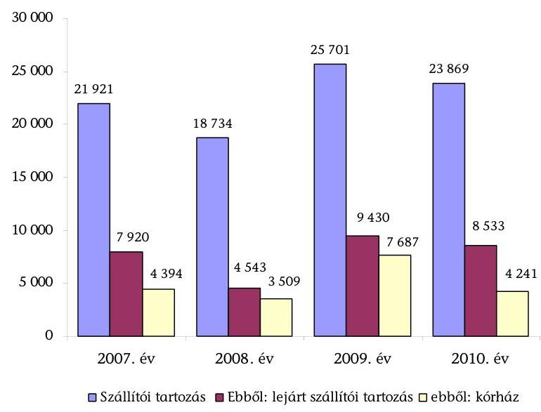

Forrás: ÁSZ az önkormányzatok adatszolgáltatása alapján

# 3.2.2. Felhalmozási kiadások 

A 2007-2010 közötti időszakban a megyei önkormányzatok 131 Mrd Ft felhalmozási kiadást teljesítettek. Fejlesztéseikhez forgalomképes vagyontárgyak (ingatlanok) értékesítéséből származó forrásokkal korlátozottan rendelkeztek. (Saját tőkebevételeik aránya a fejlesztési kiadások finanszírozásában a 2007. évi 24%-ról 2010-ben 10%-ra csökkent.) A 2007-2010 közötti időszakban a hazai finanszírozású fejlesztési támogatások összege visszaesett. Ez is hozzájárult a felhalmozási egyenleg romlásához. (28. sz. ábra)
28. sz. ábra

A megyei önkormányzatok felhalmozási költségvetés egyenlegének alakulása (millió Ft)
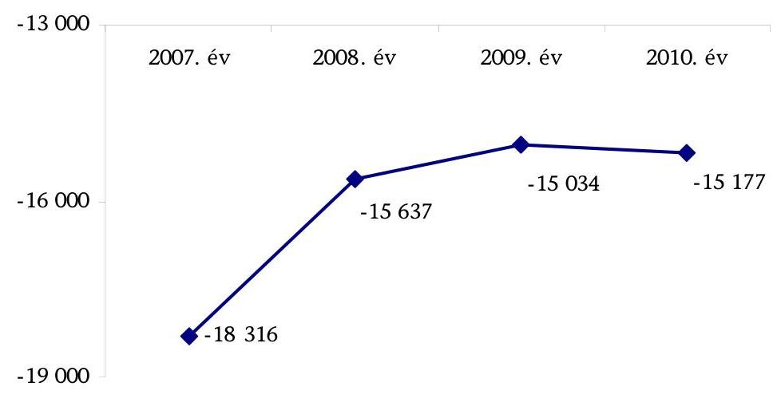

Forrás: ÁSZ

---

A fejlesztések saját erő igényét elsősorban kötvénykibocsátással, hitelfelvétellel biztosították. A fejlesztési forráshiányt 2007-2008-ban elsősorban hosszú lejáratú fejlesztési hitellel, illetve fejlesztési célú kötvénykibocsátással finanszírozták. Az időszak első két évében 43-43 Mrd Ft kötvénykibocsátás történt, míg 2010-ben ez az összeg 14 Mrd Ft volt. Ezzel összhangban visszaesett a finanszírozási műveletek pozitív egyenlege is. (18. sz. táblázat)

# 18. sz. táblázat 

Finanszírozási műveletek alakulása (millió Ft)

| Finanszírozási műveletek | $\mathbf{2 0 0 7 .}$ év | $\mathbf{2 0 0 8 .}$ év | $\mathbf{2 0 0 9 .}$ év | $\mathbf{2 0 1 0 .}$ év |
| :-- | --: | --: | --: | --: |
| Hitelfelvétel | 8600 | 7217 | 6336 | 19562 |
| Hiteltörlesztés | 3167 | 4807 | 2739 | 6946 |
| Forgatási és befektetési célú értékpapírok kibocsátása | 43084 | 43500 | 0 | 14119 |
| Forgatási és befektetési célú értékpapírok beváltása | 1600 | 8000 | 148 | 7442 |
| Forgatási és befektetési célú értékpapírok értékesítése | 5368 | 6918 | 19545 | 1156 |
| Forgatási és befektetési célú értékpapírok vásárlása | 6752 | 17635 | 150 | 0 |
| Egyéb finanszírozási bevételek | -4210 | -219 | -1990 | -4383 |
| Egyéb finanszírozási kiadások | 161 | 3756 | -3653 | -1811 |
| Finanszírozási műveletek egyenlege | $\mathbf{4 1 1 6 2}$ | $\mathbf{2 3 2 1 9}$ | $\mathbf{2 4 5 0 7}$ | $\mathbf{1 7 8 7 6}$ |

Forrás: ÁSZ
A kötvényekből befolyó bevételt az önkormányzatok betétként kötötték le (általában a kötvényt kibocsátó pénzintézetnél). Az ezt a megoldást alkalmazó önkormányzatoknak - átmenetileg - jelentős kamatbevétele keletkezett, amit a folyó kiadások finanszírozására tudtak használni. A kamatbevételek költségvetési bevételeken belüli részesedése az önkormányzati szintű 0,8%-kal szemben a megyei önkormányzatoknál 1,3% (5,3 Mrd Ft) volt 2010-ben.

Az összes kamatbevétel 24,3 Mrd Ft, a kamatkiadás 16,5 Mrd Ft volt a megyei önkormányzatoknál 2007-2010 között. A kamatbevétel 40%-a három önkormányzatnál, a kamatkiadás 43,2%-a négy önkormányzatnál realizálódott. A nettó kamatjövedelem (kamatbevételek - fizetett kamat különbsége) 2008-ban 4,4 Mrd Ft volt, 2009-ben érte el a maximumot (4,5 Mrd Ft) és 2010-ben jelentősen csökkent, mivel felgyorsult a kötvénykibocsátásból tartalékolt bevételek felhasználása.

Az elszámolt értékcsökkenésnek megfelelő pótlási alap hiányában elmaradt a vagyon jövőbeli használati értékét megőrző forrásképzés. A mérlegben kimutatott kötelezettségek állománya mellett az elhasználódott eszközök pótlására forrást biztosító amortizációs (felújítási) alapképzés elmaradása további komolyabb problémákat vetít előre. A megyei önkormányzatok éves költségvetési beszámolóinak összegzése szerint 2007-ben még az elszámolt értékcsökkenés 90%-ának megfelelő összeget fordítottak felújítási célokra, 2009-ben ez az arányszám már csak 16,5% volt. Ez maga után vonja a feladatellátást kiszolgáló tárgyi eszközök állagának erőteljes romlását.

A tőkeköltségek, az eszközpótlás hiánya a költségvetési intézményi szféra egészében gondokat okoz. Az egészségügyi ellátás eszközigénye a többi közszolgáltatáshoz viszonyítva igen magas, és a pénzügyi forrásokból adódó eszközhiány megnehezíti a szolgáltatásnyújtást, a szakmai előírások (minimumfeltételek) teljesítése szempontjából is. A számviteli törvény gazdasági társasági formában működtetett egészségügyi szolgáltatóknál - szemben a költségvetési szervekkel - kötelezővé teszi a tőke-visszapótlást szolgáló értékcsökkenés költségként történő elszámolását. A költségvetési szervek az értékcsökkenést a tőkeváltozással szemben, a vagyon csökkenéseként számolják el és nem térül meg a bevételekben. Az értékcsökkenést meghaladó veszteség miatt ennek forrása ebben a körben sem teremtődik meg.

# 3.2.3. A beruházások finanszírozása 

A megyei önkormányzatok fejlesztési döntéseit a saját források mellett az elérhető pályázati, elsősorban az EU-s támogatások befolyásolták. A 2007-2013-as időszakra meghirdetett, vissza nem térítendő EU-s fejlesztési forrásokhoz való hozzájutás lehetősége felerősítette az önkormányzati alrendszer fejlesztési igényeit, amelyek a felhalmozási bevételek és kiadások egyensúlyának romlásán túl az előírt jövőbeni fenntartási kötelezettség miatt tovább terhelhetik az önkormányzatok költségvetését. A fejlesztési célok meghatározásakor az elnyerhető támogatás volt a döntő, a beruházások, fejlesztések által realizálható közvetlen, vagy közvetett többletforrás, vagy a létrehozott új vagyonelemek működési többletigénye és annak várható jövőbeni forrásai nem kerültek bemutatásra.

Az ellenőrzések tapasztalatai szerint a megkezdett és a 2010. december 31-én folyamatban lévő 118,5 Mrd Ft összegű beruházások 77%-a a kórházak fejlesztését szolgálták. A beruházásokra felhasználásra kerülnek a korábbi kötvénykibocsátásból származó tartalékok. A források között 82,7% az EU-s támogatás. (19. sz. táblázat)
19. sz. táblázat

A megyei önkormányzatok 2010 utáni beruházási kötelezettségeinek forrásösszetétele (millió Ft)

| Megye | 2010. év utánra vállalt kötelezettség | ebből:   kórház | Saját bevétel | Hitel | Kötvény | $\begin{gathered} \text { EU-s } \\ \text { támogatás } \end{gathered}$ | Hazai támogatás |
| :--:

 | :--: | :--: | :--: | :--: | :--: | :--: | :--: |
| Bács-Kiskun | 13418 | 13288 | 473 | 0 | 1221 | 11159 | 565 |
| Baranya | 288 | 0 | 46 | 16 | 0 | 216 | 10 |
| Békés | 7160 | 5886 | 24 | 0 | 568 | 6568 | 0 |
| Borsod-Abaúj-Zemplén | 11422 | 10796 | 142 | 0 | 0 | 10206 | 1074 |
| Csongrád | 958 | 366 | 41 | 0 | 354 | 510 | 53 |
| Fejér | 12690 | 10049 | 1403 | 0 | 930 | 10136 | 221 |
| Győr-Moson-Sopron | 11662 | 11115 | 29 | 1423 | 0 | 10161 | 49 |
| Hajdú-Bihar | 1605 | 0 | 0 | 0 | 230 | 1227 | 148 |
| Heves | 5106 | 4848 | 95 | 0 | 599 | 4398 | 14 |
| Jász-Nagykun-Szolnok | 1547 | 614 | 22 | 0 | 297 | 1202 | 26 |
| Komárom-Esztergom | 5529 | 795 | 0 | 0 | 795 | 4024 | 710 |
| Nógrád | 5657 | 721 | 84 | 0 | 786 | 4738 | 49 |
| Pest | 1245 | 750 | 302 | 0 | 0 | 943 | 0 |
| Somogy | 7564 | 6500 | 0 | 0 | 1013 | 6543 | 8 |
| Szabolcs-Szatmár-Bereg | 19308 | 13918 | 0 | 1550 | 1744 | 15996 | 18 |
| Tolna | 5461 | 4385 | 76 | 0 | 750 | 4635 | 0 |
| Vas | 324 | 0 | 0 | 0 | 12 | 231 | 81 |
| Veszprém | 1964 | 1345 | 100 | 0 | 1373 | 180 | 311 |
| Zala | 5612 | 5353 | 0 | 0 | 600 | 5012 | 0 |
| ÖSSZESEN | 118520 | 90729 | 2837 | 2989 | 11272 | 98085 | 3337 |

A 2010. évet követően tervezett beruházások finanszírozhatóságában a saját források meglétének bizonytalansága, az EU-s források előfinanszírozási igénye, valamint a támogatásból megvalósuló fejlesztések fenntarthatósága jelentős kockázatot hordoz. (Erre példa a Pest Megyei Önkormányzat, amely saját forrás hiányában visszalépni kényszerült három EU-s támogatással tervezett beruházás megvalósításától.)

# 3.3. Pénzintézeti kötelezettségekből eredő kockázatok 

A helyi önkormányzatok 2010. év végi pénzintézeti adósságállományából a megyei önkormányzatok részesedése 13,1% (163 Mrd Ft) volt. Ez kevesebb, mint fele a megyei jogú városok részesedésének (27,1%).

A megyei önkormányzatok adósságállományának 70%-a beruházási, fejlesztési célú kötvénykibocsátás és hitel, ugyanakkor 30%-a működési célú kötvénykibocsátás, hitelfelvétel, illetve rövid lejáratú hitel volt 2010-ben. (29. sz. ábra)
29. sz. ábra

Megyei önkormányzatok pénzintézeti adósságának összetevői 2010-ben (millió Ft)
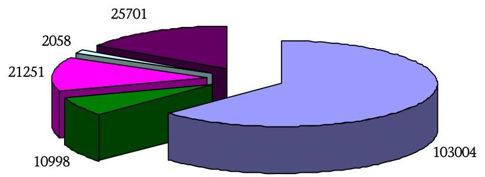

■ Fejlesztési célú kötvénykibocsátásból ■ Beruházási és fejlesztési hitelek
■ Működési célú kötvénykibocsátásból ■ Működési célú hosszú lejáratú hitelek
■ Rövid lejáratú hitelek
Forrás: ÁSZ
A hosszú lejáratú - kötvénykibocsátással, hitelfelvétellel összefüggő - kötelezettségek a megyei önkormányzatoknál a 2007. évi 94,5 Mrd Ft-ról 2010-re 195,9 Mrd Ft-ra emelkedtek. A kötvényekből származó bevétel fedezetet biztosított a korábban felvett fejlesztési hitelek, a tartósan fennálló, általában működési hiányt finanszírozó folyószámla és éven belüli működési hitelek refinanszírozására, illetve az újabb fejlesztési célú kiadások teljesítésére. Az önkormányzatok egy része hiteltörlesztési kötelezettségeit is csak újabb hitelek bevonásával tudta teljesíteni.

A rövid lejáratú kötelezettségek, ezen belül a folyószámlahitel-állomány növekedése felgyorsult 2010-ben (amely a 2011. évben is folytatódott). A megyei önkormányzatok 90%-a által igénybevett likvid és/vagy folyószámlahitel napi átlagos állománya 2007-ben 10,9 Mrd Ft volt, amely 2009-ben 44%-kal, 2010-ben 81%-kal (22,4 Mrd Ft-ra) emelkedett az előző évhez képest. A folyószámlahitelek jelentős részét év végéig nem fizették vissza.

---

A külső finanszírozás állandó megújításának szükségessége felveti annak kockázatát, hogy az adósság nem megfelelő kezelése, vagy az eladósodáshoz vezető okok megszüntetésének hiánya esetén adósságrendezési eljárások indulhatnak (a Heves megyei példa nyomán). A működési hiány rövid lejáratú hitellel és folyamatos megújítási kötelezettséggel történő finanszírozása nem jelent tartós megoldást.

A megyei önkormányzatok pénzintézetek felé 2011. március 31-én fennálló tőkekötelezettségében meghatározó a svájci frankban fennálló 418 millió CHF, és emellett 87 millió EUR és 16288 millió Ft a kötelezettség.

A forintban fennálló tőketelezettségéből 46,5%-ot a 2016. év végéig kell megfizetniük. A tőketartozás 61%-a, 9,9 Mrd Ft a Magyar Fejlesztési Bank által refinanszírozott, Önkormányzatok Infrastruktúra Fejlesztési Hitelprogramjából származik, amelynek referencia (alap) kamata változó, 3 havi EURIBOR.

A megyei önkormányzatok CHF-ben fennálló pénzintézeti tőketartozása 2013-2026 között, évenként 25-26 millió CHF közötti összeget tesz ki. A 2011. év utolsó három negyedévében a 210 CHF/HUF kalkulált árfolyamon a teljesítendő tőketartozás várható összege 0,6 Mrd Ft volt. A 2012. évben a CHF/HUF árfolyamának alakulásától függően 4 Mrd Ft-ot is elérhet a tőkefizetés forint ellenértéke. A 2013-2027 közötti 15 évben a megyei önkormányzatok CHF-ban fennálló évenkénti tőkefizetési kötelezettségének forint ellenértéke, árfolyamtól függően évente 4,5-5,5 Mrd Ft körül alakulhat.

A CHF-ben kibocsátott kötvények referencia kamata változó, jellemzően 3, és 6 havi CHF LIBOR. (A CHF-ben meglévő pénzintézeti kötelezettség - kötvényadósság - kamatfelárának átlagos mértéke 1%.)

A megyei önkormányzatok EUR-ban fennálló hosszú lejáratú tőkekötelezettsége a 2013-2027 között évenként egyenletesnek tekinthető, nagyságrendileg 4,5 millió EUR összeget tesz ki, kivételt a 2015. év jelent, amikor a megfizetendő éves tőkeösszeg közel háromszorosa (14,45 millió EUR) lesz az előző évinek. Az EUR-ban kibocsátott kötvények referencia kamata változó, jellemzően 3 havi EURIBOR. (A kamatfelár átlagos mértéke az EUR-ban meglévő pénzintézeti kötelezettségekre 2,6%.)

Az önkormányzatok pénzintézeti kiszolgáltatottsága erősödött az ellenőrzött időszakban. Különösen nagy a kockázat akkor, ha azonos a kötvényeket kibocsátó és a számlavezető pénzintézet. (Pest Megye Önkormányzatánál a számlavezető a folyószámla-hitelkeret emelését a kötvény kamatfelár emeléséhez kötötte. Más megyéknél is - pl. Fejér, Heves - kedvezőtlenek a folyószámlahitelkeret szerződések megkötésével kapcsolatos tapasztalatok.)

---

# 3.4. Megyei önkormányzatok pénzügyi helyzetének értékelése 

A 19 megyei önkormányzatnál egy időben lefolytatott ellenőrzés megállapításai alapján a pénzügyi helyzetükben rejlő kockázatok az alábbiakban foglalhatók össze:

- a megyei önkormányzatok által kötelezően ellátandó feladatok változásával nem állt arányban az állami hozzájárulások, támogatások csökkentése a 2007-2010 közötti időszakban;
- a központi jogszabályok módosítása, az ingatlanforgalom visszaesése következtében az illetékbevétel közel felére csökkent, pedig ez jelentős volt a megyei önkormányzatok bevételeiben;
- a megbomlott pénzügyi egyensúlyt a megyei önkormányzatok döntő többsége bevételnövelő és kiadáscsökkentő intézkedésekkel nem tudta helyreállítani. A bevételnövelés egy része a kötvénykibocsátásból befolyó, átmenetileg szabad pénzeszközök hozamából (kamatkülönbözetéből) származott;
- a megelőző időszakhoz képest kisebb mértékben, de a helyzet rosszabbodásához hozzájárult a települési önkormányzatoktól törvényi kötelezettség alapján átvett intézmények (feladatok) működtetése. Az önkormányzatok részéről felerősödő egyházaknak történő intézményátadások e szektorban ugyan megtakarítást eredményeznek, a központi költségvetésnek azonban többletterhet jelentenek;
- a pénzügyi egyensúly megteremtése érdekében kibocsátott kötvények, felvett hitelek miatt a megyei önkormányzatok pénzintézetek felé fennálló kötelezettségei az áttekintett időszakban megduplázódtak. A működési kockázatot jelzi, hogy az adósságállomány 30%-a folyó kiadásokat finanszíroz, ennek közel fele hosszú lejáratú kötelezettség;
- a működés szempontjából magas kockázatú tényező a szállítói - ezen belül is a lejárt határidejú - tartozás folyamatos fennállása. A megyei önkormányzatok egyharmadánál a kórházak lejárt tartozása a meghatározó, másik harmadánál a kórházat üzemeltető gazdasági társaság lejárt szállítói tartozása jelenthet - csőd-, vagy felszámolási eljárás esetén - a tulajdonos önkormányzat számára terhet;
- a folyamatban lévő beruházások forrásai döntően EU-s támogatásból, részben a kötvénykibocsátásból meglévő tartalékból biztosítottak. A megyék egy részénél gondot jelent a saját források bizonytalansága, illetve az EU-s források előfinanszírozása. A beruházások nyomán jellemzően nem képződnek pótlólagos saját bevételek;
- kockázat adódik a megvalósuló létesítmények üzemeltetési többletköltségéből, illetve a pályázatban vállalt fenntarthatósági követelmények nem teljesítéséből is;
- a jövőbeni fenntarthatóságot veszélyezteti az amortizációval arányban nem álló eszközpótlás, a pótlási kötelezettség elhalasztásából felhalmozódott rejtett adósság is;

---

- a pénzintézeti kötelezettségekből adódó terhek hosszabb (döntően 2015 utáni) időszakra oszlanak el. Ez a finanszírozhatóság szempontjából előnyös. Az adósságszolgálati terhek jövőbeni alakulása azonban függ a kamatok, banki díjak, jutalékok, valamint az árfolyamok változásától. Ezek hatása kiszámíthatatlan.

A 2011. májusban lezárt helyszíni ellenőrzések alapján - figyelembe véve az önkormányzatok észrevételeit és a saját hatáskörben tett intézkedéseit - a rövid és hosszú lejáratú kötelezettségek teljesítéséhez az ÁSZ elengedhetetlennek tartotta egyes megyei önkormányzatok részéről a pénzügyi egyensúly megteremtését és fenntartását, a feladatok és a rendelkezésre álló források áttekintését. A megyék felénél az egyeztetésre megküldött jelentéstervezetben azonnali intézkedéseket javasoltak.

A megyei önkormányzatok konszolidációjáról, a megyei önkormányzati intézmények és a Fővárosi Önkormányzat egyes egészségügyi intézményeinek átvételéről szóló 2011. évi CLIV. törvény alapján a Magyar Állam 2011. december 30-ai hatállyal átvállalta a megyei önkormányzatok 2011. december 30-án fennálló adósságát és annak járulékait, amely új helyzetet teremtett.

# 4. MEGYEI JOGÚ VÁROSI ÖNKORMÁNYZATOK PÉNZÜGYI HELYZETÉNEK ELLENŐRZÉSI TAPASZTALATAI 

Magyarország 23 megyei jogú városa közül 18 megyeszékhely. Az általuk nyújtott - esetenként a megye egészére kiterjedő - közszolgáltatások, valamint pénzügyi kötelezettségeik terjedelmére való tekintettel meghatározó a szerepük.

A megyei jogú városok a városkörnyék természetes központjai, valamint kistérségi központok is. Települési önkormányzatok, azonban működési területükön a megyei (területi) önkormányzati feladatokat is ellátják. Négyötödük egyben megyeközpont, az adott térségnek gazdasági (foglalkoztatási, közlekedési, kereskedelmi stb.) kulturális, egészségügyi, igazgatási központja is. Jelentős a térségszervezésben betöltött szerepük. A megyei jogú városok közül 17-ben felsőfokú oktatási intézmény működik, a gazdasági versenyképesség, az innováció erősítése szempontjából is meghatározó a szerepük.

A megyei jogú városokban belül a különféle gazdasági, társadalmi mutatók alapján a legfejlettebb csoportot a nagyvárosok alkotják (népességszám növekvő sorrendjében: Székesfehérvár, Kecskemét, Nyíregyháza, Győr, Pécs, Miskolc, Szeged, Debrecen). A megyeszékhelyek fejlettsége között is lényegi eltérések vannak: a nyugati és a középső régió fejlettebb térségeiben a vállalkozások átlagos száma az országos 1000 főre jutó 165-nek a többszöröse, a vállalkozói aktivitás erőteljesebb. A vállalkozási tevékenység munkaerővonzó képessége és az adóerőképessége is magasabb e településeken. A foglalkoztatottak 60% körüli aránya és a munkanélküliség 6-8% alatti mértéke is egyedül ezt a csoportot jellemzi.

A megyei jogú városok lakónépessége eltérő: nyolcban meghaladja a 100 ezer főt (nagyvárosok), tizenegyben az 50 ezret, négyben 50 ezer alatti. (30. sz. ábra)

---

30. sz. ábra

A megyei jogú városok népessége 2010. január 1-jén (fő)
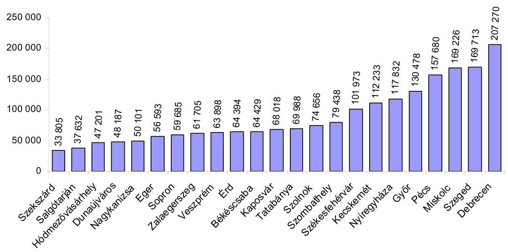

Forrás: KSH
Az eltérő lakónépesség, településméret mellett jelentős különbségek tapasztalhatók az általuk biztosított közszolgáltatásokban is. A megyei jogú városok lakónépessége az ország lakosságának
 20\%-át képviseli, de kistérségi központ szerepkörükből adódóan az általuk nyújtott közszolgáltatásokkal érintett lakosságszám az ország lakosságának 30\%-a.

A nagyvárosok sajátos problémája, hogy az állam az elmúlt két évtizedben fokozatosan kivonult az egyes helyi közszolgáltatások támogatásából, vagy jelentősen csökkent annak mértéke (távfűtés, lakásfelújítás, nagyvárosi tömegközlekedés stb.). Az önkormányzati tulajdonú közszolgáltatók feladatellátása tekintetében ugyanakkor a tulajdonosi és ellátási felelősség is az önkormányzatokra hárul.

A megyei jogú városok az önkormányzati alrendszer költségvetési kiadásaiból 18,8\%-kal (656 Mrd Ft-tal) részesedtek 2010-ben. Az adósságszolgálattal (tőke- és kamattörlesztés) kapcsolatos kiadásokból a részesedésük ugyanakkor 23\% volt.

# 4.1. Megyei jogú városok feladatellátásának, költségvetésének jellemzői 

A megyei jogú – különösen a megyeszékhely – városok a települési önkormányzati feladataik mellett többféle körzeti, központi szerepkört is betöltenek. Egyrészt kistérség-központi feladatokat is ellátnak, valamint a környező települések oktatási, szociális, egészségügyi alapellátásában is szerepet vállalnak. A közoktatási célú kiadások a megyei jogú városok működési költségvetésének 40\%-át teszik ki, az ehhez nyújtott normatív állami hozzájárulás a 2007. évi 58,2\%-ról 2010-re 52,7\%-ra csökkent. Az intézmények saját működési bevételeinek aránya ugyanezen időszakban 11,6\%-ról 13,2\%-ra nőtt. A szakellátást nyújtó kórházak, rendelőintézetek nagyobb része megyei fenntartásban van, azonban hat – ebből négy nem megyeszékhely – megyei jogú város 4 ezer kórházi ágyat működtet.

A közszolgáltatások (kötelező és önként vállalt feladatok) széles körét nyújtják az általuk alapított gazdasági társaságok, intézmények útján. (20. sz. táblázat)
20. sz. táblázat

A megyei jogú városi önkormányzatok feladatellátási szervezeti formája ágazatonként 2010-ben

| Megnevezés | Költségvetési szervek   száma |  | Gazdasági társaságok   száma |  |
| :-- | --: | --: | --: | --: |
|  | önként vállalt   feladatok | kötelező   feladatok | önként vállalt   feladatok | kötelező   feladatok |
| Közoktatás | 55 | 660 | 4 | 11 |
| Szociális ellátás | 8 | 82 | 9 | 5 |
| Egészségügyi ellátás | 3 | 15 | 0 | 5 |
| Kultúra, sport | 31 | 72 | 38 | 24 |
| Egyéb | 81 | 87 | 113 | 162 |

Forrás: ÁSZ az önkormányzatok adatszolgáltatása alapján
A megyei jogú városok feladatellátásában a közoktatási (alap- és középfokú) intézmények száma az ellenőrzött időszakban az átszervezések, intézmény megszűnések miatt közel hatodával csökkent, hasonló mértékű volt a tanulólétszám változása is. Az intézmények számát a társulásoknak, egyházaknak történő átadások is érintették. A megyei jogú városok 2007-2010 között 60 intézmény fenntartását szervezték át – elsősorban kistérségi – társulásokba ${ }^{23}$.

A megyei jogú városi önkormányzatok ${ }^{24}$ kötelező feladatait az Ötv. ${ }^{25}$, a hatásköri, a különböző ágazati, szakmai (egyebek mellett az oktatási, egészségügyi, szociális és egyéb ágazati feladatok ellátásának szakmai szabályait rögzítő) törvények határozzák meg.

A megyei jogú városok közoktatási, szociális, gyermekvédelmi, egészségügyi, kulturális és sport intézményeiben foglalkoztatottak, ellátottak számában a kialakult szervezeti- és feladatstruktúrából adódóan jelentősek a különbségek. (21. sz. táblázat)

[^0]
[^0]:    ${ }^{23}$ A BM felmérése alapján.
    ${ }^{24}$ Az Ötv. 61. § (1) bekezdése alapján a megyeszékhely város a törvény erejénél fogva megyei jogú, ugyanakkor az Országgyűlés az ötvenezernél nagyobb népességű városokat a képviselőtestület kérelmére megyei jogú várossá nyilváníthatja. Ez utóbbi körbe öt város tartozik, közülük kettő (Hódmezővásárhely, Dunaújváros) népessége 2010. január 1-jére már ötvenezer fő alá csökkent.
    ${ }^{25}$ Az Ötv. 8. és 61. §-ában foglaltak szerint.

---

# 21. sz. táblázat 

Foglalkoztatottak, ellátottak száma ágazatonként és fajlagos mutatók 2010-ben

| 2010. év | Közoktatási ágazat |  |  | Szociális, Gyermekvédelmi ágazat |  | Egészségügyi ágazat |  | Kultúra és Sport | Százezer lakosra jutó |  |  |
| :--: | :--: | :--: | :--: | :--: | :--: | :--: | :--: | :--: | :--: | :--: | :--: |
|  | foglalkoz.   tatott | ellátott | egy intézményre jutó ellátott | foglalkoz.   tatott | ellátott | foglalkoz.   tatott | Kórházi ágyak száma | foglalkoz.   tatott | intézmény > GT |  | foglalkoz.   tatott |
| Békéscsaba | 1803 | 12515 | 443 | 53 | 199 | 853 | 319 | 13 | 0,57 | 43,6 |  |
| Debrecen | 4824 | 29325 | 349 | 1446 | 2214 | 0 | 0 | 520 | 0,50 | 32,8 |  |
| Dunaújváros | 1337 | 10194 | 510 | 371 | 741 | 14 | 711 | 53 | 0,58 | 36,8 |  |
| Eger | 1422 | 10692 | 411 | 1422 | 9963 | 11 | 0 | 11 | 0,63 | 30,6 |  |
| Eger | 330 | 5329 | 484 | 162 | 462 | 173 | 0 | 54 | 0,36 | 14,6 |  |
| Győr | 4484 | 35531 | 448 | 789 | 1853 | 71 | 0 | 389 | 0,63 | 37,8 |  |
| Hódmezővásárhely | 669 | 7261 | 660 | 309 | 747 | 420 | 344 | 110 | 0,32 | 32,3 |  |
| Kaposvár | 1888 | 13568 | 678 | 183 | 12571 | 63 | 0 | 90 | 0,49 | 32,7 |  |
| Kecskemét | 1886 | 16512 | 1270 | 523 | 6046 | 127 | 0 | 143 | 0,22 | 23,9 |  |
| Miskolc | 4792 | 32004 | 582 | 1002 | 12738 | 1606 | 1374 | 568 | 0,41 | 47,1 |  |
| Nagykanizsa | 1352 | 9518 | 501 | 187 | 2081 | 763 | 527 | 68 | 0,60 | 47,3 |  |
| Nyíregyháza | 1996 | 23016 | 470 | 236 | 582 | 94 | 0 | 113 | 0,50 | 30,0 |  |
| Pécs | 2012 | 24312 | 1105 | 1008 | 2634 | 437 | 0 | 405 | 0,29 | 30,8 |  |
| Salgótarján | 892 | 7818 | 977 | 68 | 123 | 34 | 0 | 44 | 0,43 | 28,0 |  |
| Székesfehérvár | 1015 | 8214 | 587 | 422 | 1034 | 913 | 520 | 33 | 0,53 | 39,9 |  |
| Szeged | 2994 | 24737 | 853 | 503 | 1179 | 0 | 0 | 548 | 0,28 | 23,8 |  |
| Székesfehérvár | 2778 | 18063 | 335 | 408 | 937 | 117 | 0 | 234 | 0,87 | 34,7 |  |
| Szekszárd | 555 | 5232 | 525 | 171 | 712 | 28 | 0 | 34 | 0,59 | 23,3 |  |
| Szolnok | 2106 | 16298 | 838 | 243 | 17670 | 57 | 0 | 101 | 0,39 | 33,6 |  |
| Szombathely | 1966 | 13704 | 374 | 364 | 6394 | 70 | 0 | 48 | 0,67 | 30,8 |  |
| Tatabánya | 1463 | 12636 | 574 | 116 | 11450 | 54 | 0 | 102 | 0,49 | 24,8 |  |
| Veszprém | 1726 | 10733 | 414 | 241 | 4322 | 72 | 0 | 98 | 0,61 | 33,4 |  |
| Zalaegerszeg | 1336 | 12418 | 621 | 292 | 982 | 51 | 0 | 483 | 0,60 | 35,0 |  |
| Összesen | 46902 | 352067 | 610 | 10630 | 97435 | 6030 | 4000 | 4323 | 0,50 | 33,4 |  |

Forrás: ÁSZ az önkormányzatok adatszolgáltatása alapján
A 730 közoktatási intézményben az ellátottak száma 2010-ben 352 ezer volt, az intézmények 38\%-a önállóan működő és gazdálkodó volt, egy intézmény átlagosan három telephelyen, intézményegységben működött. A szociális, gyermekvédelmi ágazatban hét megyeszékhely megyei jogú városban haladta meg az ellátottak száma az átlagos 4237 főt, ebből öt város gondoskodott az ellátottak kétharmadáról.

A megyei jogú városok szervezetalakítási szabadságának következménye, hogy a korábban is vállalati formában működő (nagyvárosi tömegközlekedés, víz, szennyvízcsatorna, köztisztasági, ingatlankezelés stb.) közszolgáltatások mellett mind a kötelező (pl. kórház működtetése), mind az önként vállalt feladatok ellátásában – elsősorban idegenforgalom, a fürdők üzemeltetése, a sport és kulturális szolgáltatások területein – a gazdasági társaságok kiemelt fontosságú szerephez jutottak. A megyei jogú városok feladatellátásának, gazdálkodásának átláthatóságát nagyban megnehezíti az abban részt vevő gazdasági társaságok nagy száma. Az önkormányzatok pénzforgalmi, illetve a vállalkozások üzemgazdasági szemléletű könyvvitele nem teszi lehetővé az önkormányzatok közszolgáltatási (kötelező és önként vállalt) feladatellátása pénzügyi helyzetének egységes szempontú (konszolidált) ellenőrzését.

A 25\%-ot meghaladó tulajdoni hányadú gazdasági társaságok részére folyószámla- és egyéb hitelek igénybevételéhez az önkormányzatok készfizető kezesség-, garanciavállalás miatti kötelezettségei az ellenőrzött időszakban megnégyszereződtek (a 2007. évi 9,4 Mrd Ft-ról 2010-ben 40,3 Mrd Ft-ra növekedtek).

---

A közfeladat-ellátásban közreműködő kizárólagos, vagy többségi önkormányzati tulajdonban lévő gazdasági társaságoknál a kötelező feladatok ellátásához rendelt vagyon 95 Mrd Ft, az önként vállaltaknál nyolc Mrd Ft. Ez a megyei jogú városok könyvviteli mérleg szerinti tárgyi eszközértékének (2299 Mrd Ft-nak) 4,5\%-a. A társaságok jegyzett tőkéje 196 Mrd Ft volt 2010-ben, amely 2007-hez képest 42,7\%-kal (59 Mrd Ft-tal) növekedett. A társaságok saját tőkéje ugyanezen időszakban csak 36,4\%-kal (85 Mrd Ft-tal) emelkedett. (31. sz. ábra)
31. sz. ábra

Gazdasági társaságok jegyzett tőke/saját tőke mértéke és ezek arányának változása 2007-2010 között
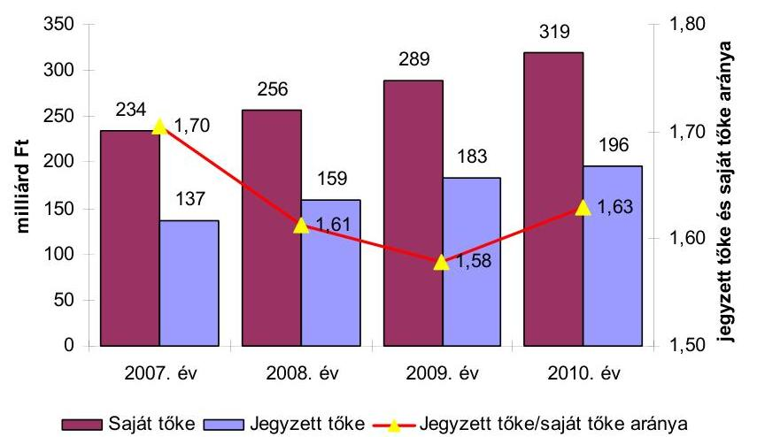

Forrás: ÁSZ az önkormányzatok adatszolgáltatása alapján
A megyei jogú városi önkormányzatok a tulajdonukban lévő gazdasági társaságoknak 2007-2010 között összesen 10,6 Mrd Ft támogatást nyújtottak, ennek 74,8\%-a működési, 25,2\%-a felhalmozási célú volt. (32. sz. ábra)
32. sz. ábra

A megyei jogú városi önkormányzati feladatok ellátásában résztvevő gazdasági társaságok támogatása 2007-2010 között
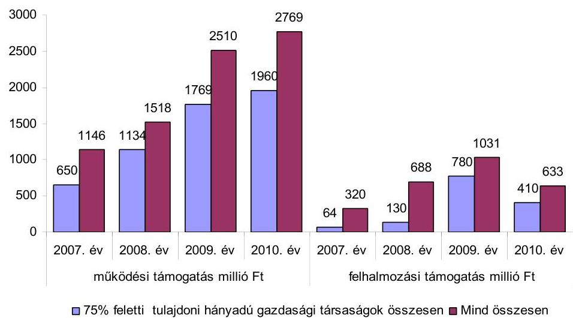

Forrás: ÁSZ az önkormányzatok adatszolgáltatása alapján

---

# 4.1.1. Forrásszabályozás, bevételek változása 

A 2007-2010 közötti időszakban az önkormányzati feladatok finanszírozásának rendszere alapvetően nem változott. A tárgyévi bevételek a megyei jogú városi önkormányzatoknál – elsősorban a szerkezeti változások, a tartalékok felhasználása és a finanszírozási műveletek miatt – nominálértéken 14\%-kal (85 Mrd Ft-tal) növekedtek, összetételük módosult. (33. sz. ábra)
33. sz. ábra

A megyei jogú városok bevételei összetételének változása 2007-2010 között (Mrd Ft)
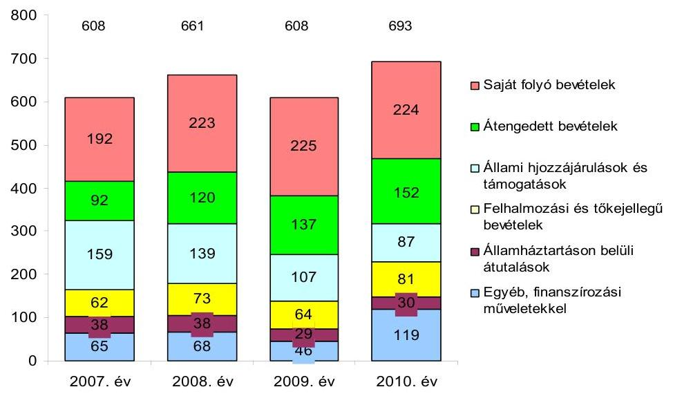

Forrás: NGM
A megyei jogú városi önkormányzatok saját folyó
 bevételeinek aránya a városokhoz képest hét százalékponttal magasabb (32,3%), a fővárosi, fővárosi kerületek 38,6%-ánál 6,3 százalékponttal alacsonyabb. A helyi adók és illetékek jelentik a költségvetés bevételeinek 18,2%-át (126,6 Mrd Ft-ot) a megyei jogú városoknál.

A megyei jogú városok helyi adó bevétele 2007-ben 110,5 Mrd Ft, 2010-ben 118,7 Mrd Ft volt (saját folyó bevételeken belüli részaránya 57,7%-ról 53,1%-ra csökkent). A helyi adó bevételek 85%-a a vállalkozásokat terhelő helyi iparűzési adó (HIPA). A HIPA részaránya a megyei jogú városok saját bevételein belül átlagosan 35,5% volt, amely a 19,6-61,8% között szóródott 2010-ben. (34. sz. ábra)

---

34. sz. ábra

Megyei jogú városok helyi iparűzési adója a saját bevételük %-ában 2007-ben és 2010-ben
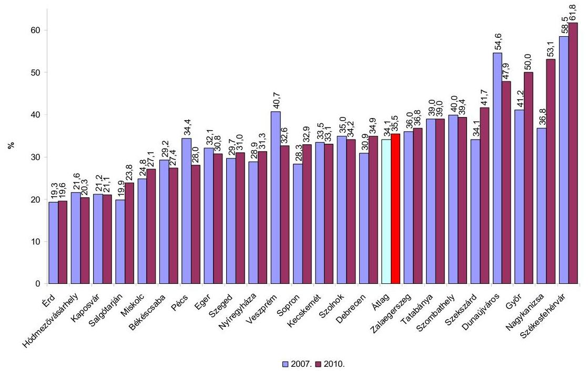

Forrás: ÁSZ az önkormányzatok adatszolgáltatása alapján
A megyei jogú városok adópolitikája, az egyes adók bevezetése a település gazdasági szerkezetétől, a lakosság jövedelmi helyzetétől függően eltérő. Az ÁSZ 2010-ben végzett ellenőrzése szerint ${ }^{26}$ - a törvényben biztosított adómaximumhoz (2%) képest - a HIPA átlagos mértéke 1,97% volt. A tételesen meghatározott adónemek közül az adómérték átlagos kihasználtsága lakossági kommunális adóban 42%-os, építményadóban 55%-os, idegenforgalmi adóban 77%-os volt. A bevezetett adónemekben a törvényben rögzített (2005-től inflációval növelt) adómérték alapján az elméleti lehetőségtől elmaradó adóbevétel a megyei jogú városoknál 4,4 Mrd Ft-ot tett ki, a tényleges helyi adó 3,5%-át. Az adóbevételek növelésének a lehetősége elsősorban az ingatlanok adóztatásánál áll fenn.

A lakosság adóztatását az ingatlanokat terhelő adók (építményadó, telekadó, lakossági kommunális adó) teszik lehetővé. Az építményadó átlagos mértéke az építményadót bevezető 18 megyei jogú városban 95-893 Ft/m² között szóródott a Megyei Jogú Városok Szövetsége (MJVSZ) 2011. 04. 12-i felmérése szerint. (35. sz. ábra)

[^0]
[^0]:    ${ }^{26} 1031$ Jelentés a helyi adók rendszerében a hatékonyság és az eredményesség érvényesülésének ellenőrzéséről.

---

35. sz. ábra

Megyei jogú városok által bevezetett magánszemélyek építményadójának átlagos mértéke 2010-ben (Ft/év/m³)
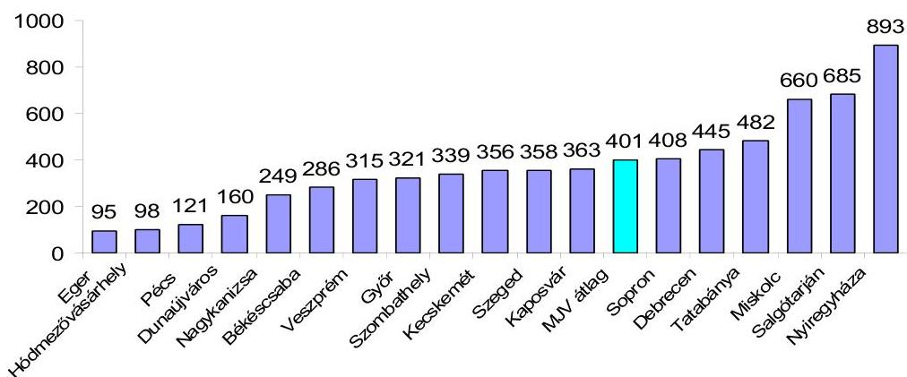

Forrás: „Ingatlanok adózásának helyzete a megyei jogú városokban" Megyei Jogú Városok Szövetsége

Az egy főre jutó helyi adó bevételekben - elsősorban a települések gazdasági fejlettségétől függően - a legalacsonyabb (34 ezer Ft/fő) és a legmagasabb (130 ezer Ft/fő) között közel négyszeres a különbség. (36. sz. ábra)
36. sz. ábra

A megyei jogú városokban az egy lakosra jutó helyi adó bevételek 2010-ben (ezer Ft/fő)
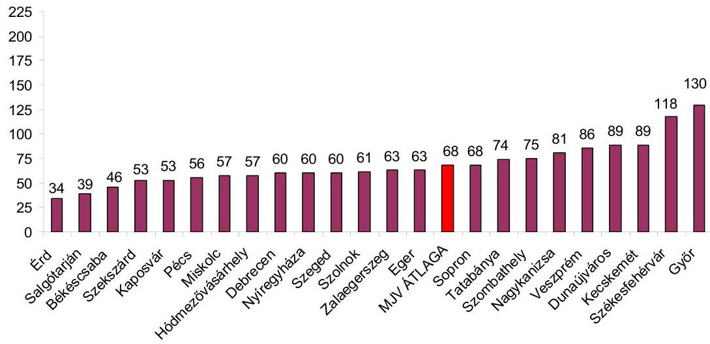

Forrás: ÁSZ

---

A megyei jogú városi önkormányzatok kétharmada részesült a települési önkormányzatok jövedelemdifferenciálódásának mérséklésére szolgáló szja-ból ${ }^{27}$.

Az átengedett bevételek összege (döntően az szja és a gépjárműadó) az összbevételen belül a 2007. évi 92 Mrd Ft-ról (15,1%) 2010-ben 152 Mrd Ft-ra (21,9%) emelkedett. A 60 Mrd Ft-os növekményből 59 Mrd Ft az szja-részesedésnél következett be.

Az állami hozzájárulások és támogatások - amelyek legfőbb elemei az ellátotti létszámhoz kötődő normatív állami hozzájárulások - összege a 2007. évi 159 Mrd Ft-ról 2010-ben 87 Mrd Ft-ra (részarányuk 26,2%-ról 12,6%-ra) esett vissza.

A megyei jogú városi önkormányzatok közoktatási, szociális, gyermekjóléti intézményeinek működésével kapcsolatos kiadása 2007-ben 242 Mrd Ft, 2010-ben 226 Mrd Ft volt. Az állami hozzájárulás, támogatás, a normatív személyi jövedelemadóval együtt 2007-ben 130 Mrd Ft-ot (53,7%), 2010-ben 110 Mrd Ft-ot (48,7%) finanszírozott, 3,6 százalékponttal (3 Mrd Ft-tal) növekedett a fenntartó önkormányzatok intézményeinek adott támogatása. (37. sz. ábra)
37. sz. ábra

A megyei jogú városok intézményfenntartásának bevételi szerkezete 2007-ben és 2010-ben (%-ban)
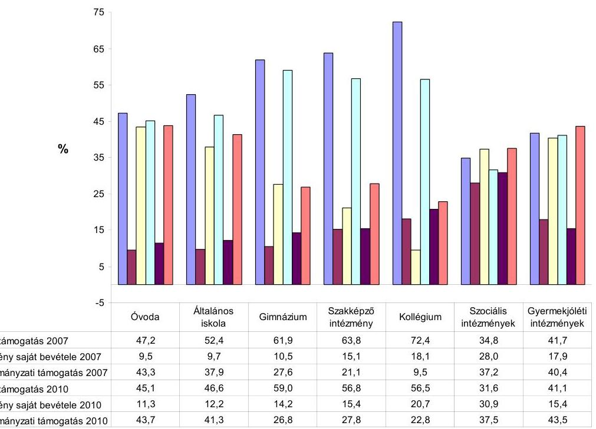

Forrás: ÁSZ az önkormányzatok adatszolgáltatása alapján

[^0]
[^0]:    ${ }^{27}$ 2010-ben az önkormányzatok 93%-a, 2961 település részesült ilyen címen kiegészítő támogatásban.

---

A felhalmozási és tőkejellegű bevételek - tárgyi eszközök (ingatlanok és ingóságok), föld és immateriális javak, részesedések értékesítése, EU-tól átvett pénzeszközök - összege a 2007. évi 62 Mrd Ft-ról 2010-ben 81 Mrd Ft-ra (részaránya 10,2%-ról 11,7%-ra) emelkedett.

Az államháztartáson belüli átutalások (Egészségbiztosítási Alaptól, elkülönített állami pénzalapoktól, fejezetektől átvett pénzeszközök) összege 2010-ben 2007-hez viszonyítva 30 Mrd Ft-ra mérséklődött, részaránya 6,2%-ról 2010-ben 4,3%-ra változott. E bevételek nagyságára a szerkezeti változások is hatással voltak. Debrecenben és Szegeden a szakellátások klinikával történő integrációja, Miskolcon a működtetési forma változása miatt a gazdasági társaságoknak folyósított OEP finanszírozással 9,9 Mrd Ft-tal csökkent a megyei jogú városok működési célra átvett (támogatásértékű) bevétele.

Az egyéb, pénzmaradványból, vállalkozási bevételekből, államháztartáson kívülről származó átutalásokból, hitelekből, hosszú és rövid lejáratú értékpapírok értékesítéséből származó bevételek részesedése a 2007-2010. évek viszonylatában 10,7%-ról 17,2%-ra emelkedett. Ez utóbbiak 2010. évi beszámoló szerinti összevont teljesítése 119 Mrd Ft volt ${ }^{28}$.

# 4.1.2. Megyei jogú városok működési kiadásai 

A megyei jogú városi önkormányzatok folyó kiadásai a 2007. évhez képest 2010-ben 29 Mrd Ft-tal (6,2%-kal) emelkedtek. (22. sz. táblázat)
22. sz. táblázat

A megyei jogú városi önkormányzatok folyó kiadásai (Mrd Ft)

| Megnevezés | 2007. | 2008. | 2009. | 2010. | 2010/2007   % |
| :--: | :--: | :--: | :--: | :--: | :--: |
| Folyó kiadások (pénzmaradvány átadás nélkül) | 464 | 498 | 484 | 493 | 106,1 |
| Működési kiadások (kamatkiadások nélkül) | 402 | 434 | 412 | 413 | 102,8 |
| ebből: személyi juttatások | 205 | 209 | 193 | 190 | 92,9 |
| munkaadót terhelő járulékok | 65 | 66 | 58 | 50 | 76,6 |
| dologi kiadások | 132 | 159 | 161 | 173 | 131,1 |
| Államháztartáson belülre átadott pénzeszközök | 8 | 4 | 5 | 7 | 85,4 |
| Transzferkiadások | 46 | 50 | 57 | 64 | 138,8 |
| ebből: vállalkozásoknak | 17 | 19 | 23 | 27 | 155,0 |
| EU-nak, illetve külföldre | 0 | 0 | 0 | 0 | 72,6 |
| magánszemélyeknek | 18 | 20 | 23 | 26 | 144,1 |
| nonprofit szervezeteknek | 11 | 11 | 11 | 11 | 97,4 |
| Kamatkiadások | 8 | 10 | 10 | 9 | 115,6 |

Forrás: ÁSZ
A személyi juttatások 7,1%-kal (14 Mrd Ft-tal) csökkentek az ellenőrzött időszakban a helyi szervezési intézkedések (létszámcsökkentés, álláshely megszüntetés, intézmény átszervezések), valamint a 13. havi illetmény felfüggesztése, majd megszüntetése eredményeként. A munkaadót terhelő járulékok közel negyedével (15 Mrd Ft-tal) csökkentek. Ezzel párhuzamosan a normatívák fajlagos összege is változott, alacsonyabb lett. A személyi juttatások és járulékok folyó kiadásokon belüli részesedése 58,2%-ról 48,7%-ra csökkent.

[^0]
[^0]:    ${ }^{28}$ Az egyéb bevételek összege 2007-2010 között eltérő módon változott, 2007-ben 65 Mrd Ft, 2008-ban 68 Mrd Ft volt, 2009-ben 46 Mrd Ft-ra esett vissza, majd 2010-ben több mint két és félszeresére, 119 Mrd Ft-ra emelkedett.

---

A 2007. évhez viszonyítva 2010-ben a dologi kiadások 41 Mrd Ft-tal (31,1%-kal), a vállalkozásoknak átutalt támogatások 10 Mrd Ft-tal (55%-kal) növekedtek. A feladatok kiszervezése, más formában történő ellátása a megyei jogú városok összességét tekintve nem mindenütt eredményezett kiadási megtakarítást, mivel a személyi jellegű kiadások csökkenésével egyidejűleg emelkedett a működési célra nyújtott önkormányzati támogatás.

A különböző társadalom- és szociálpolitikai juttatások címén a lakosságnak utalt transzferek 8 Mrd Ft-tal (44,1%-kal) voltak magasabbak 2010-ben a 2007. évihez képest. Négy év alatt súlyarányuk egy százalékponttal nőtt.

Az önkormányzatok adatszolgáltatása alapján a működési kiadások 88,1%-a kötelező feladatok finanszírozását szolgálta 2010-ben. Az önként vállalt feladatokkal összefüggő kiadás - a feladatvállalástól és az értelmezési különbségektől függően ${ }^{29}$ - önkormányzatonként jelentős szóródás mellett átlagosan 11,9% (4,1 Mrd Ft) volt. (38. sz. ábra)
38. sz. ábra

A megyei jogú városok kötelező és önként vállalt feladatainak ágazatonkénti kiadásai 2010-ben
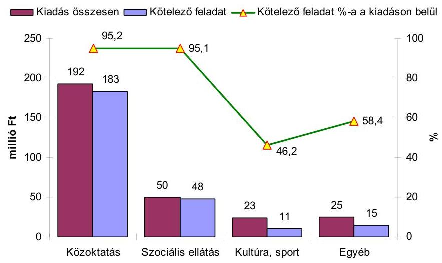

Forrás: ÁSZ az önkormányzatok adatszolgáltatása alapján
A felhalmozási kiadások a 2007. évi 111 Mrd Ft-ról 2010-re 160 Mrd Ft-ra (44,1%-kal) emelkedtek, amely a megyei jogú városok eladósodásában is szerepet játszott. A költségvetési kiadásokon belül a folyó kiadások aránya 81%-ról 76%-ra visszaesett, a felhalmozási kiadásoké öt százalékponttal 24%-ra nőtt. Az összegszerű változást a 39. sz. ábra mutatja.

[^0]
[^0]:    ${ }^{29}$ Néhány önkormányzat - az Ötv. előírásaival ellentétesen - önként vállalt feladatnak tekintette a megyei önkormányzati kötelező feladatellátását (pl. Érd, Sopron a gimnáziumi oktatást teljes egészében, Veszprém 42%-ban önként vállalt feladatként sorolta be). A kulturális feladatokat 8 megyei jogú város (Debrecen, Eger, Érd, Hódmezővásárhely, Nyíregyháza, Salgótarján, Sopron, Szekszárd) 100%-ban kötelezőnek, 4 (Kaposvár, Kecskemét, Szolnok, Zalaegerszeg) 90%-ot meghaladóan önként vállalt feladatnak sorolta be.

---

39. sz. ábra

A megyei jogú városok folyó és felhalmozási kiadásai (Mrd Ft)
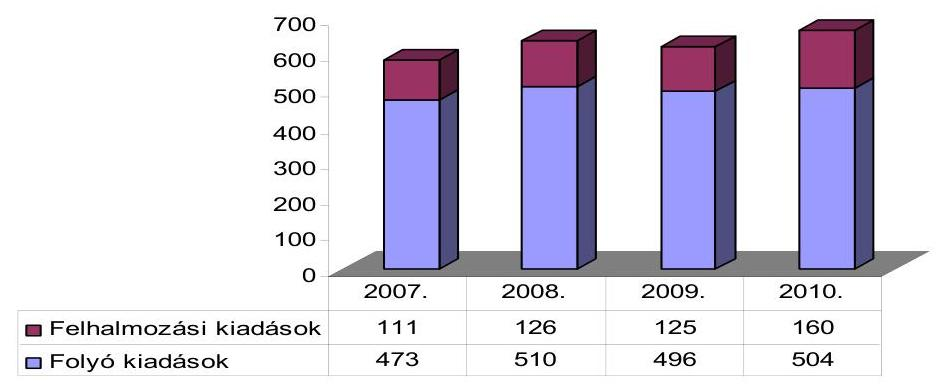

Forrás: ÁSZ az önkormányzatok adatszolgáltatása alapján

# 4.2. A pénzügyi egyensúlyi helyzetből eredő kockázatok 

### 4.2.1. A működési és a felhalmozási egyensúly alakulása

A CLF módszerrel bemutatott pénzügyi egyensúly a megyei jogú városi önkormányzatoknál az ellenőrzött időszakokban összességében romlott. (23. sz. táblázat)
23. sz. táblázat

A megyei jogú városok CLF módszer szerinti adatai (millió Ft)

| Megnevezés | 2007. | 2008. | 2009. | 2010. |
| :--: | :--: | :--: | :--: | :--: |
| Folyó bevételek | 495942 | 540135 | 519084 | 517942 |
| Folyó kiadások | 472700 | 509606 | 495667 | 503856 |
| Működési jövedelem | 23242 | 30529 | 23417 | 14086 |
| Nettó működési jövedelem   = működési jövedelem - tőketörlesztés | -1219 | 12455 | 7381 | -6707 |
| Felhalmozási bevételek | 63680 | 75638 | 68711 | 82380 |
| Felhalmozási kiadások | 110921 | 125584 | 125161 | 160282 |
| Felhalmozási költségvetés egyenlege | -47241 | -49946 | -56450 | -77902 |
| Finanszírozási műveletek nélküli (GFS) pozíció | -23999 | -19417 | -33033 | -63815 |
| Finanszírozási műveletek egyenlege | 39743 | 52725 | 24288 | 33416 |
| Tárgyévi pénzügyi pozíció | 15744 | 33307 | -8745 | -30399 |
| Egyéb tájékoztató adatok |  |  |  |  |
| Összes kötelezettség (passzív pénzügyi elszámolások nélkül) | 221754 | 298288 | 326249 | 390106 |
| ebből rövid lejáratú | 77309 | 73668 | 79590 | 94770 |
| Folyószámlahitel napi átlagos állománya | 18792 | 17391 | 13763 | 19996 |
| Likvidhitel napi átlagos állománya | 5873 | 6539 | 7276 | 8115 |
| Munkabérhitel napi átlagos állománya | 1141 | 985 | 1062 | 1026 |
| Kezesség és garanciavállalások | 9373 | 22815 | 32365 | 40333 |
| Jogerős bírósági ítéletekből adódó kötelezettségek | 16 | 42 | 41 | 473 |
| Egyéb finanszírozásba vonható eszközök: | 64422 | 99053 | 84899 | 50173 |
| Ebből:Tartós hitelviszonyt megtestesítő értékpapírok | 1879 | 2796 | 2137 | 1034 |
| Hosszú lejáratú bankbetétek | 0 | 1032 | 0 | 0 |
| Értékpapírok | 8211 | 8618 | 8275 | 7767 |

 3772 | 690 |
| Pénzeszközök (idegen pénzeszközök nélkül) | 54332 | 86607 | 78990 | 48449 |

Forrás. ÁSZ

---

A megyei jogú városi önkormányzatok összevont működési jövedelme 2007-2010 között pozitív volt, bár 23242 millió Ft-ról 14086 millió Ft-ra (39\%kal) csökkent. (40. sz. ábra)
40. sz. ábra

A megyei jogú városi önkormányzatok összevont működési jövedelme (millió Ft)
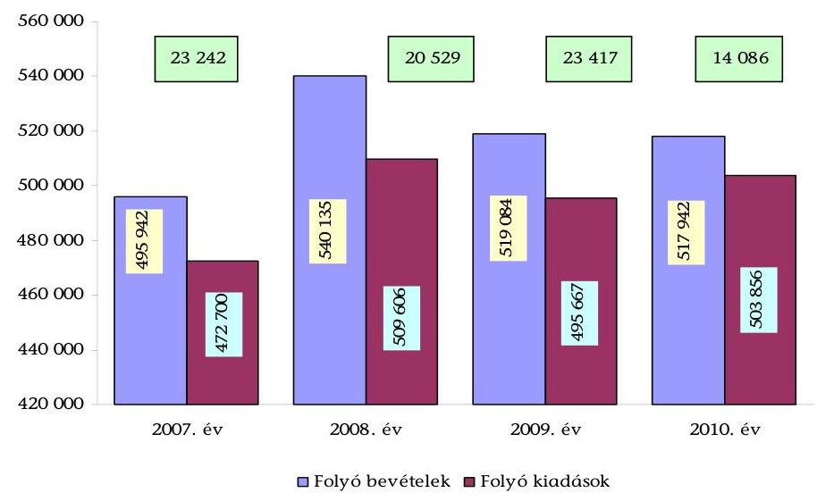

Forrás: ÁSZ
A pozitív működési jövedelem 2007-2010 között összesen 81,3 Mrd Ft forrást biztosított a tőketörlesztési kötelezettség teljesítéséhez, valamint a fejlesztések finanszírozásához. Az önkormányzatok eltérő pénzügyi helyzetét jelzi, hogy a pozitív működési jövedelem nagysága jelentősen szóródott. Az egyensúly romlására utal, hogy amíg 2009-ben négy megyei jogú városnak volt negatív a működési egyenlege, 2010-ben már nyolcnak haladta meg a folyó kiadása a működési bevételét, amely összegszerűen háromszorosa az előző évinek. Hat megyei jogú város csak minimális, a folyó bevételek 0,8-4\%-ának megfelelő pozitív működési egyenleget realizált, és csak hét város egyenlege mutatott 6-17\% közötti működési többletet.

A megyei jogú városi önkormányzatok közül 11-nél csökkent a normatív állami hozzájárulás, a személyi jövedelemadó és az illeték együttes összege. Kilenc önkormányzatnak helyi szervezési, takarékossági intézkedésekkel sikerült a kiesést nemcsak pótolni, hanem a pénzügyi helyzetet javítani. Két önkormányzat nem tudta a kieső bevételeket ellentételezni. További tizenkét önkormányzatnál nem volt bevételkiesés, sőt intézkedéseik eredményeként kisebb-nagyobb mértékben javult a pénzügyi helyzetük.

Az intézkedések eredményeként 10456 fővel (12\%-kal) csökkent az álláshelyek száma, ebből 979 volt az üres álláshely. Az önkormányzatoknál és intézményeiknél feladatbővülés következtében létszámnövekedés is volt. Mindezek eredményeként a létszám 4082 fővel (5\%-kal) lett kevesebb 2010-ben a 2007. évihez képest. A helyi szervezési intézkedések egyszeri költségének támogatására szolgáló központosított előirányzat felhasználásával 3433 álláshely szűnt meg, ennek 70\%-a a közoktatási, 15\%-a az egészségügyi intézményeket, 7\%-a a pol-

---

gármesteri hivatalokat érintette. (41. sz. ábra) A létszámcsökkentés 63\%-a 2007-ben valósult meg.
41. sz. ábra

A megyei jogú városi önkormányzatoknál a központi támogatással megvalósított létszámcsökkentés ágazati megoszlása (fő)
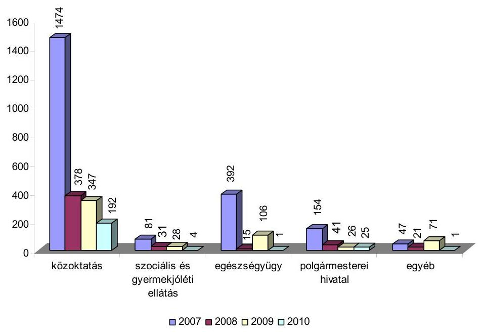

Forrás: ÁSZ az önkormányzatok adatszolgáltatása alapján
A pénzügyi kapacitás (nettó működési jövedelem) 2010. évi erőteljes romlását a folyó bevételek és kiadások különbségéből származó működési jövedelem csökkenése mellett az emelkedő törlesztési kötelezettség okozta. (42. sz. ábra)
42. sz. ábra

A megyei jogú városok nettó működési jövedelme (millió Ft)
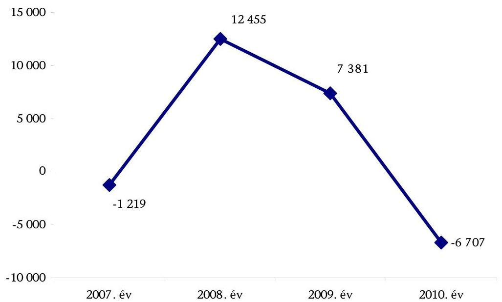

Forrás: ÁSZ

---

A likviditási helyzet romlására utal, hogy a folyószámlahitel napi átlagos állománya 2010-ben 20 Mrd Ft-ra (44,9\%-kal) nőtt az előző évi 13,8 Mrd Ft-ról. A likviditási és működési hiány szoros kapcsolatát jelzi, hogy nyolc negatív működési jövedelem mutatóval rendelkező megyei jogú városi önkormányzat vette igénybe a folyószámlahitel 78\%-át (15,6 Mrd Ft-ot) 2010-ben. A működési, illetve sok esetben a felhalmozási hiány folyószámlahitellel, vagy rövid lejáratú és folyamatos megújítási kötelezettséggel történő finanszírozása a tartós, évről évre növekvő mértékben generálódó hiány elfedésének eszköze, amely jelentős visszafizetési, ezzel együtt pénzügyi kockázatot rejt magában.

A működési kockázatot növelik a szállítói tartozások, azon belül a lejárt szállítói tartozások magas szintje. Ez utóbbi az egyhavi dologi kiadások 53\%-áról 60\%-ra emelkedett. (43. sz. ábra)
43. sz. ábra

A megyei jogú városi önkormányzatok szállítói - ezen belül a lejárt határidejú - tartozása és az egyhavi dologi kiadása (Mrd Ft)
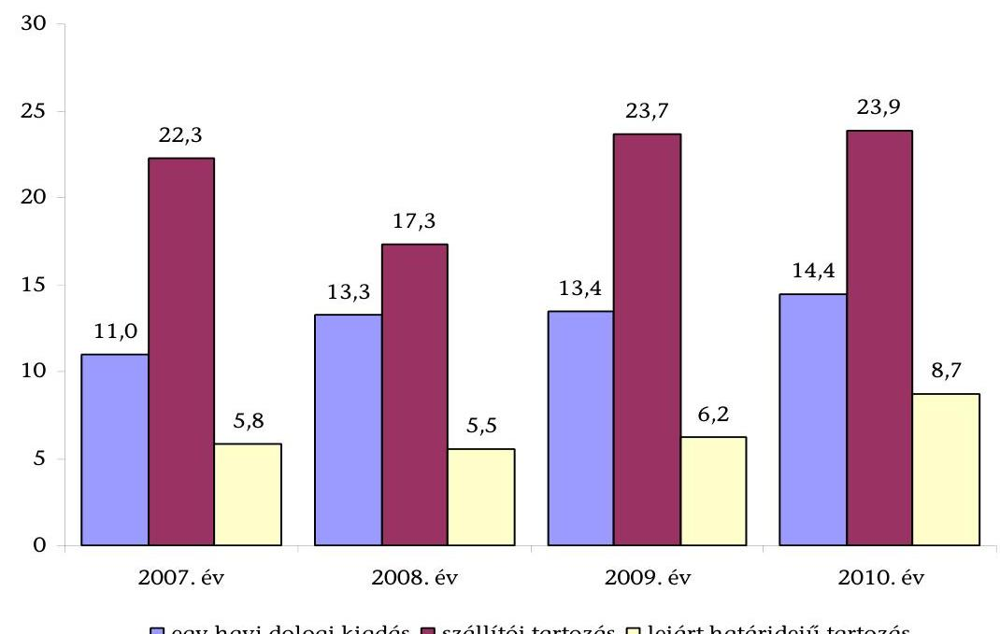

Forrás: ÁSZ az önkormányzatok adatszolgáltatása alapján
A lejárt határidejú szállítói tartozás 2007-hez képest 2010-ben 2,9 Mrd Ft-tal, 50\%-kal növekedett. A legnagyobb növekedés - 2,5 Mrd Ft - az előző évhez képest 2010-ben volt. Az ellenőrzött önkormányzatok közül 2010-ben a lejárt tartozás tizenháromnál 3,4 Mrd Ft-tal (65\%-kal) növekedett, hétnél 0,8 Mrd Ft-tal (32\%-kal) csökkent.

# 4.2.2. Felhalmozási kiadások 

Felhalmozási kiadásokra 2010-ben 49,4 Mrd Ft-tal (44,5\%-kal) többet fizettek ki a megyei jogú városi önkormányzatok, mint 2007-ben. Ezen belül a beruházási kiadások növekedése 60,6\%-os, a felújítási kiadásoké csupán 16,2\%-os volt.

---

A felhalmozási költségvetés egyenlege 2007-2010 között folyamatosan és növekvő mértékben negatív összegű volt. A felhalmozási bevételek és kiadások egyenlege a 2007. évi -47,2 Mrd Ft-ról 2010-ben -77,9 Mrd Ft-ra romlott. (44. sz. ábra)
44. sz. ábra

A megyei jogú városok felhalmozási bevételei, kiadásai és azok egyenlege (millió Ft)
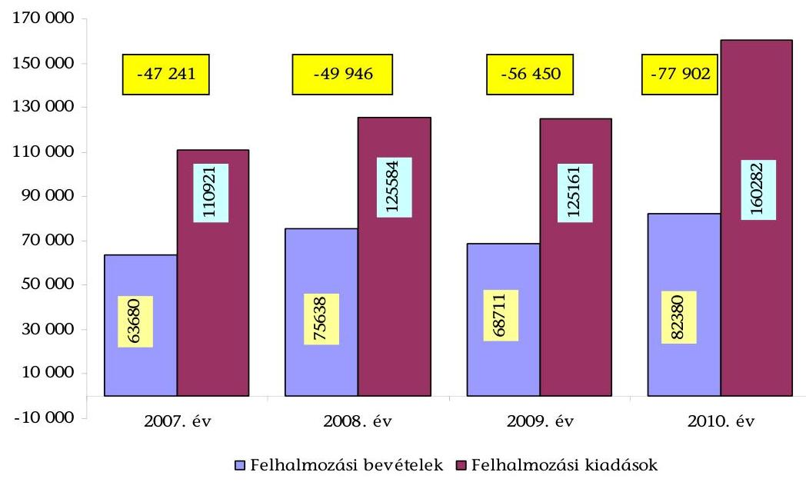

Forrás: ÁSZ
Az elhasználódott eszközök pótlására forrást biztosító amortizációs (felújítási) alapképzés elmaradása a költségvetési szféra egészében gondot okozhat.

A számviteli nyilvántartások szerinti amortizáció 2007-2010 között 356 Mrd Ft volt. Az önkormányzatok adatszolgáltatása alapján mindösszesen 1,4 Mrd Ft volt az értékcsökkenés elszámolásához kapcsolódóan megképzett alap összege, amelyből felújításra, beruházásra 258 millió Ft-ot fordítottak.

Az önkormányzatok az ellenőrzött időszakban felújításra 61,4 Mrd Ft-ot (17\%-ot) használtak fel, beruházások eredményeként az eszközök értéke 340 Mrd Ft-tal emelkedett. Az eszközök használhatósági foka (bruttó/nettó érték hányadosa) 2007-2010 között a különböző eszközcsoportokban eltérő mértékben, összességében 3 százalékponttal (88\%-ról 85\%-ra) romlott. Az önkormányzatok adatszolgáltatása szerint a 2007-2010 közötti időszakban befejeződött beruházások 8,5\%-a szolgálta az eszközpótlást (felújítást). A beruházási kiadások 45,2 Mrd Ft-os növekedéséből 75\% (33,7 Mrd Ft) 2010-ben teljesült az EU-s projektek megvalósításának felgyorsulása miatt.

A 2007-2013-ra meghirdetett, vissza nem térítendő EU-s fejlesztési forrásokhoz való hozzájutás lehetősége felerősítette az önkormányzati alrendszer fejlesztési igényeit, amelyek a felhalmozási költségvetési hiány folyamatos emelkedésén túl - az előírt jövőbeni fenntartási kötelezettség miatt - további terhet jelentenek az önkormányzatok költségvetésében. Ezeket a kockázatokat a fejlesztések-

---

kel kapcsolatos döntéseknél jellemzően nem számszerűsítették, nem mutatták be ${ }^{30}$.

# 4.2.3. A beruházások finanszírozása 

A megyei jogú városi önkormányzatok fejlesztési tevékenységét a pályázati lehetőségek kihasználása jellemezte. A működési forráshiány, a saját felhalmozási bevételek alacsony szintje miatt a nagy költségigényű kórház, közlekedési infrastruktúra, környezetvédelmi, városközpont rehabilitáció, idegenforgalmi beruházásokat csak külső források (kötvénykibocsátás, hitelfelvétel) bevonása, EU-s és hazai támogatások elnyerése esetén tudták megvalósítani.

A 2007. január 1-je és 2010. december 31-e között befejezett 334,8 Mrd Ft összegű beruházás forrásai között a saját bevétel 32\%-kal, hitelfelvétel, kötvénykibocsátás 25\%-kal, EU-s és hazai támogatás 43\%-kal szerepelt. (24. sz. táblázat)

## 24. sz. táblázat

A megyei jogú városi önkormányzatok 2007-2010 között befejezett beruházásainak forrásösszetétele (millió Ft)

| Megnevezés | Teljes   bekerülési   költség   millió Ft | 2006. dec.   31-ig   teljesítés | 2007-2010.   évek között   teljesített   kiadó | 2010. december 31-ig megvalósított beruházás   forrásösszetétele |  |  |  |  |
| :--: | :--: | :--: | :--: | :--: | :--: | :--: | :--: | :--: |
|  |  |  |  | saját   bevétel | hitel | kötvény | $\begin{gathered} \text { EU-s } \\ \text { támogatás } \end{gathered}$ | hazai   támogatás |
| Békéscsaba | 10149 | 1983 | 8164 | 3042 | 450 | 2213 | 1451 | 2991 |
| Debrecen | 6433 | 2516 | 3917 | 374 | 1219 | 0 | 3289 | 1551 |
| Dunaújváros | 3113 | 124 | 2989 | 1770 | 228 | 653 | 25 | 436 |
| Eger | 13190 | 2466 | 10724 | 5404 | 2053 | 118 | 3076 | 2539 |
| Érd | 6070 | 0 | 6070 | 1717 | 1484 | 1991 | 773 | 106 |
| Győr | 26771 | 10572 | 16199 | 13929 | 6426 | 0 | 2183 | 4233 |
| Hódmezővásárhely | 10258 | 1740 | 8518 | 3033 | 2000 | 3040 | 1297 | 888 |
| Kaposvár | 12586 | 659 | 11926 | 2987 | 5672 | 624 | 806 | 2496 |
| Kecskemét | 29613 | 3782 | 25831 | 15210 | 1431 | 2662 | 6673 | 3639 |
| Miskolc | 30868 | 11664 | 19204 | 6393 | 4033 | 2949 | 8287 | 9206 |
| Nagykanizsa | 6430 | 1043 | 5387 | 2881 | 268 | 0 | 2592 | 688 |
| Nyíregyháza | 9337 | 2216 | 7121 | 3464 | 501 | 1456 | 1911 | 2005 |
| Pécs | 37105 | 4579 | 32526 | 6084 | 9853 | 0 | 15787 | 5382 |
| Salgótarján | 3360 | 153 | 3207 | 1365 | 837 | 0 | 444 | 714 |
| Sopron | 11623 | 1196 | 10427 | 1995 | 672 | 8065 | 92 | 800 |
| Szeged | 57256 | 30403 | 26853 | 20649 | 2648 | 0 | 12799 | 21159 |
| Székesfehérvár | 18952 | 1806 | 17146 | 1803 | 1200 | 6435 | 1374 | 8140 |
| Szekszárd | 4293 | 1775 | 2518 | 1931 | 103 | 240 | 390 | 1629 |
| Szolnok | 9944 | 2606 | 7338 | 1661 | 837 | 3386 | 1904 | 2155 |
| Szombathely | 5688 | 440 | 5248 | 1917 | 1987 | 0 | 165 | 1619 |
| Tatabánya | 9046 | 29 | 9017 | 3471 | 2865 | 405 | 179 | 2126 |
| Veszprém | 6173 | 1533 | 4640 | 1579 | 2145 | 0 | 570 | 1877 |
| Zalategerszeg | 6562 | 708 | 5854 | 4685 | 1201 | 0 | 641 | 35 |
| Összesen | 334819 | 83995 | 250824 | 107343 | 50114 | 34238 | 66707 | 76416 |

Forrás: ÁSZ az önkormányzatok adatszolgáltatása alapján

[^0]
[^0]:    ${ }^{30}$ Az ÁSZ 2011 júniusában közzétett 1108. számú, a helyi önkormányzatok fejlesztési célú támogatási rendszerének ellenőrzéséről szóló jelentésében feltárta a fejlesztési folyamatok problémáit. A helyi önkormányzatok elsősorban azokat a fejlesztéseket valósították meg, amelyekhez támogatást lehetett igényelni. A fejlesztési célok közül a magasabb támogatás intenzitású pályázatokat részesítették előnyben. A fejlesztéssel megvalósuló létesítmények jövőbeni üzemeltetésének várható ráfordításait az önkormányzatok 71,9\%-a nem mérte fel.

---

A 2010. december 31-én folyamatban lévő 166,6 Mrd Ft összértékű beruházás forrásösszetételében az EU-s és hazai támogatások részaránya 8 százalékponttal magasabb a befejezetteknél. A megyei jogú városok közül 14-nél a saját források biztosítása nem számszerűsített.

A 2010. év után induló (beadott, elbírálás alatti pályázati forrásból megvalósuló) beruházások (53,5 Mrd Ft) forrásainak 81\%-át EU-s forrás és hazai támogatás fedezi a tervek szerint. (45. sz. ábra)
45. sz. ábra

A megyei jogú városi önkormányzatok 2010. december 31-ig befejezett, folyamatban lévő és tervezett fejlesztéseinek forrásösszetétele (\%)
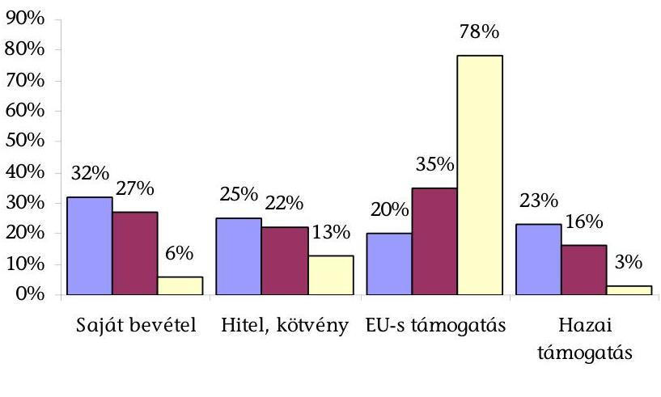

- 2010-ig befejezett ■ 2010-ben folyamatban lévő ■ tervezett

Forrás: ÁSZ az önkormányzatok adatszolgáltatása alapján
A tervezett fejlesztéseknél a saját források részaránya alacsony volt (6\%). A hitelforrások aránya sem magas (13\%), de az önkormányzatok háromnegyedénél bizonytalansági tényező volt, hogy konkrét

 hitelszerződéssel még nem rendelkeztek.

# 4.3. A kötelezettségekből eredő kockázatok 

A megyei jogú városok 338 Mrd Ft adósságállományából 175 Mrd Ft (52%) a nyolc legnagyobb, 100 ezer főt meghaladó népességű város tartozása. Az öt nem megyeszékhely megyei jogú város bruttó adósságállománya 70 Mrd Ft-ot (21%-ot), az előző két csoportba nem tartozó további tíz megyei jogú város adóssága 93 Mrd Ft-ot (27%-ot) tett ki. Az adósságállomány és a lakónépesség megoszlását összevetve a nem megyeszékhely megyei jogú városok adósságterhe erőteljesen meghaladja a népesség arányát. (46. sz. ábra)

---

46. sz. ábra

A megyei jogú városi önkormányzatok 2010. évi bruttó adósságállományának megoszlása (%-ban)
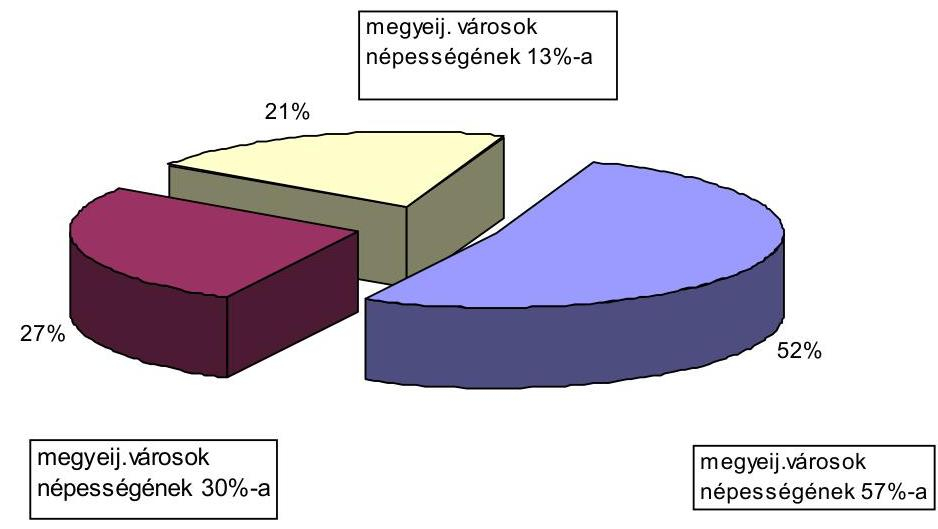

■ 100 ezer fő feletti népességű ■ 100 ezer fő alatti népességű ■ Nem megyeszékhely

Forrás: MÁK 2010. évi önkormányzati beszámolók alapján
A pénzintézetek felé fennálló kötelezettségállomány az ellenőrzött időszakban (2006. december 31. és 2010. december 31. között) kötvénykibocsátás, hitelfelvétel miatt közel háromszorosára (125 Mrd Ft-ról 345 Mrd Ft-ra) emelkedett. (47. sz. ábra)
47. sz. ábra

A megyei jogú városi önkormányzatok pénzintézetek felé fennálló kötelezettsége (Mrd Ft)
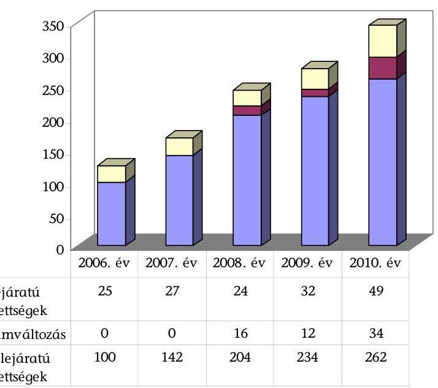

Forrás: ÁSZ az önkormányzatok adatszolgáltatása alapján

---

A növekedésből 15% a mérlegben szereplő kötelezettségek év végi értékelése során a számviteli előírások alapján elszámolt (pénzügyileg nem realizált) árfolyamveszteség (kötelezettség növekedés). A kötvények kibocsátása türelmi idővel történt, a törlesztés megkezdéséig az árfolyamváltozás csak a számviteli nyilvántartásokban szerepel ${ }^{31}$.

Az önkormányzatok a kötvénykibocsátásból származó bevételeiket a korábban felvett fejlesztési, működési, illetve folyószámlahiteleik törlesztésére, valamint fejlesztési célú kiadások teljesítésére fordították. Egy részük az átmenetileg szabad pénzeszközt elhelyezte banki betétként vagy értékpapírokat vásárolt. Mások - elsősorban a működési hiánnyal bíró önkormányzatok - hiteltörlesztési kötelezettségeiket is csak újabb hitelek bevonásával tudták teljesíteni.

A hosszú lejáratú kötelezettségek következő éveket terhelő törlesztő részletei a 2010. évi beszámoló szerint 2014-ig fokozatosan (a 2011. évi 15,7 Mrd Ft-ról 2014-re 29 Mrd Ft-ra) növekednek. A törlesztési kötelezettségek 78,4%-a a 2016. és az azt követő évekre húzódik át. A törlesztés későbbi nagysága függ a kamat, illetve egyéb banki díjak, jutalékok, illetve a forint/svájci frank és forint/euró árfolyam alakulásától is. A megyei jogú városi önkormányzatok következő éveket terhelő törlesztési kötelezettségének devizanemenkénti összetételében a svájci frank (CHF) képviseli a legnagyobb részarányt. (48. sz. ábra)
48. sz. ábra

A megyei jogú városi önkormányzatok hosszú lejáratú kötelezettségei devizanemenként, illetve Ft-ra átszámított megoszlása 2010. december 31-én
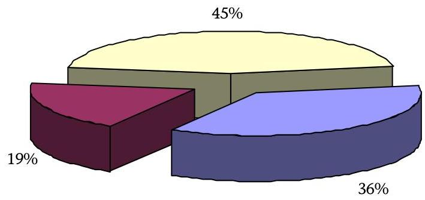

- HUF ■ EUR ■ CHF

Forrás: MÁK 2010. évi önkormányzati beszámolók alapján

[^0]
[^0]:    ${ }^{31}$ A jelentősnek minősülő árfolyamváltozás hatását a könyvekben nyilván kell tartani a beszámoló készítésekor ismert árfolyamok figyelembevételével. Arról, hogy a devizában kibocsátott kötvény, felvett hitel a kapott forinthoz képest a kötvény visszavásárlásakor, illetve a hitel visszafizetésekor jelentkező forint kötelezettség többletkiadást (árfolyamveszteséget) vagy megtakarítást (árfolyamnyereséget) eredményez a futamidő végén, a teljes kötelezettség rendezését követően lehet képet alkotni.

---

A hitelszerződések alapján fedezetként összesen 50,5 Mrd Ft értékű ingatlanra jegyeztek be jelzálogjogot. Az önkormányzatok adatszolgáltatása alapján ennek kétharmada forgalomképes, egyharmada azonban (12 megyei jogú városi önkormányzatnál) - az Ötv.-vel ellentétesen ${ }^{32}$ - korlátozottan forgalomképes (jelenleg intézményi célokat szolgáló), illetve forgalomképtelen ingatlanokra történt.

A megyei jogú városi önkormányzatok összes kötelezettségállományát a 25. sz. táblázat mutatja be:
25. sz. táblázat

A megyei jogú városok összes kötelezettségállománya 2010. december 31-én és a törlesztés várható alakulása a kötelezettségek lejáratáig
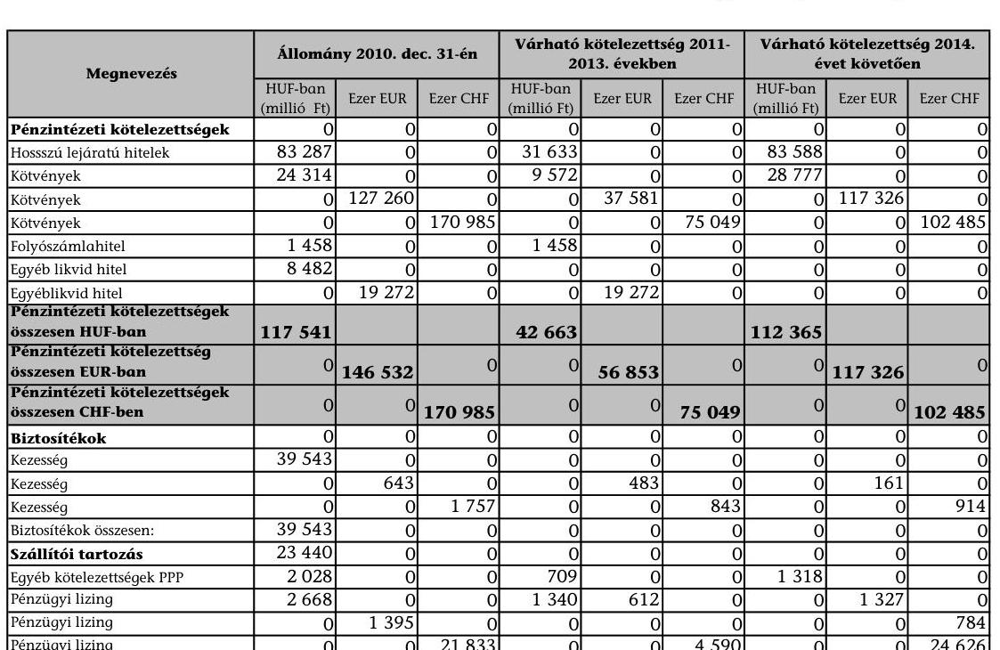

Forrás: ÁSZ az önkormányzatok adatszolgáltatása alapján
A tőketörlesztés és kamatfizetés együttes összegéből 42% a 2011-2013 közötti időszakot terheli. A forintban és euróban történő fizetés eloszlása kedvezőbb, mert csak mintegy negyede terheli az első három év költségvetését.

Az önkormányzatok pénzügyi helyzetére hatással van a minősített többségi tulajdonú társaságai kötelezettségeinek alakulása is. A forintban fennálló pénzintézeti kötelezettségek háromnegyede a 2011-2013 közötti időszakot terheli. A devizában fennálló kötelezettségek teljesítése időben széthúzva jelenik meg: CHF esetében 97,6%, EUR esetében 72,1% 2014. évtől kezdődően válik esedékessé. (26. sz. táblázat)

[^0]
[^0]:    ${ }^{32}$ Az Ötv. 88. § (1) bekezdésének b) pontja szerint „(A helyi önkormányzat) b) hitelt vehet fel és kötvényt bocsáthat ki; ennek fedezetéül az önkormányzati törzsvagyon... nem használható fel;" (A törzsvagyon forgalomképtelen és korlátozottan forgalomképes vagyontárgyakból áll.)

---

26. sz. táblázat

A megyei jogú városi önkormányzatok minősített többségi tulajdonú gazdasági társaságai kötelezettségállománya 2010. december 31-én és a törlesztés várható alakulása

| Megnevezés | Állomány 2010. dec. 31 -én |  | Várható kötelezettség 2011-2013. években |  | Várható kötelezettség 2014. évet követően |  |
| :--: | :--: | :--: | :--: | :--: | :--: | :--: |
|  | HUF-ban   (millió Ft ban) | $\begin{gathered} \text { Ezer } \\ \text { CHF, } \\ \text { illetve } \\ \text { EUR } \end{gathered}$ | HUF-ban (millió Ft ban) | Ezer CHF, illetve EUR | HUF-ban (millió Ft ban) | Ezer CHF, illetve EUR |
| Kötvény | 513 | 0 | 283 | 0 | 445 | 0 |
| Kötvény CHF | 0 | 103354 | 0 | 14813 | 0 | 105501 |
| Hitel | 18703 | 0 | 14048 | 0 | 7825 | 0 |
| Hitel EUR-ban | 0 | 10093 | 0 | 3763 | 0 | 6512 |
| Hitel CHF-ban | 0 | 7749 | 0 | 4302 | 0 | 3886 |
| Folyószámla- és egyéb rövid lejáratú hitelek | 10646 | 0 | 10798 | 0 | 0 | 0 |
| Pénzintézeti kötelezettségek összesen: | 29862 |  | 25129 |  | 8270 |  |
| Lizing kötelezettségek | 334 | 0 | 265 | 0 | 57 | 0 |
| Lizing kötelezettségek EUR | 0 | 5705 | 0 | 1696 | 0 | 4883 |
| Lizing kötelezettségek CHF | 0 | 1034 | 0 | 1184 | 0 | 4 |
| Szállítói tartozás | 20950 | 0 | 1266 | 0 | 0 | 0 |
| Egyéb | 1200 | 0 | 0 | 0 | 0 | 0 |

Forrás: ÁSZ az önkormányzatok adatszolgáltatása alapján

# 4.4. Megyei jogú városi önkormányzatok pénzügyi helyzetének értékelése 

A 23 megyei jogú városi önkormányzatnál egyidejűleg lefolytatott ellenőrzés megállapításai alapján pénzügyi helyzetükben rejlő kockázatok az alábbiakban foglalhatók össze:

- a megyei jogú városok kötelező feladatait a központi költségvetési kapcsolatokból származó források - állami hozzájárulások, támogatások, szja - továbbá az illeték csökkenő mértékben támogatták. Ezt a kiadáscsökkentő és bevételnövelő helyi intézkedések az önkormányzatok nagyobb részénél ellensúlyozták;
- a gazdasági válság hatására a saját bevételek, ezen belül a meghatározó súlyt képviselő iparűzési adó bevétel korábbi dinamikus növekedése lelassult, ezáltal a vizsgált időszakban a működési jövedelem a beruházások bővítésének forrásául kevésbé tudott szolgálni. A megyei jogú városok pénzügyi helyzetében jelentős különbségek jöttek létre;
- a működés szempontjából magas a kockázata, hogy a növekvő szállítói, ezen belül a lejárt határidejű tartozást nem tudják megfizetni, ezért adósságrendezési eljárás indulhat;

---

- a folyószámla- és egyéb likvid hitelállomány kamatköltsége rontja a pénzügyi helyzetet, emellett az érintett önkormányzatok banki kiszolgáltatottságát növeli;
- a folyamatban lévő és a tervezett beruházások finanszírozásában - a 2010-ig megvalósult fejlesztésekhez képest - az EU források súlya meghatározó. Még az alacsony mértékű saját források biztosítása is bizonytalan, amely a fejlesztési célkitűzések és a források áttekintését igényli az érintett önkormányzatok részéről;
- a fejlesztések finanszírozási kockázatai mellett a megvalósult létesítmények működtetésében, fenntarthatóságában is számottevő a bizonytalanság. Jelentős az eszközök állagromlásából, a pótlási kötelezettség elhalasztásából felhalmozódott rejtett adósság is;
- a pénzintézetek felé fennálló és más kötelezettségek finanszírozhatósága az önkormányzatok nagyobb részénél kockázatot jelent, amelyet növel a devizában fennálló kötelezettségek miatti árfolyamkitettség is;
- a hitelszerződésekben a bankok által megkövetelt biztosítékok között az önkormányzatok egyharmadánál az Ötv.-vel ellentétesen a törzsvagyon körébe tartozó (forgalomképtelen, illetve korlátozottan forgalomképes) ingatlanok is szerepelnek. A 2012. január 1-jével hatályba lépett nemzeti vagyonról szóló 2011. évi CXCVI. törvény 5. § (2) bekezdése c) pontja lehetőséget biztosít arra, hogy az önkormányzat rendeletében a törzsvagyonon belül a korlátozottan forgalomképes vagyonelemek körét megállapítsa. A törvény 6. §-a alapján az önkormányzat által korlátozottan forgalomképes törzsvagyonnak minősített vagyontárgyak esetében lehetséges azok megterhelése, illetve fedezetként történő megjelölése, amennyiben az önkormányzat rendeletében így szabályozta.

A megyei jogú városok működési, beruházási és legfőképpen a hosszú lejáratú pénzintézeti kötelezettségeinek teljesítésével kapcsolatos pénzügyi kockázatokat együtt elemezve az ÁSZ az önkormányzatoknak egyeztetésre megküldött jelentéstervezetben:

- azonnal ható intézkedéseket tartott szükségesnek kilenc önkormányzatnál;
- középtávon ható intézkedéseket javasolt nyolc önkormányzat részére;
- hosszú távon ható intézkedéseket ajánlott hat önkormányzat részére.

Az ÁSZ az előzőeknek megfelelően differenciált intézkedési javaslatokat tett az egyes önkormányzatoknak:

- a bevételszerző lehetőségek feltárására, ezen belül a helyi adó potenciál meghatározására és kihasználására;
- a beruházások és az egyéb kiadási kötelezettségek felülvizsgálatára;
- az adósságszolgálat szerkezetének áttekintésére, a likviditásmenedzselésre;
- az intézményi gazdálkodás, szerkezet felülvizsgálatára;

---

- az önként vállalt feladatok visszaszorítására a kötelező feladatok elsődlegességének biztosítása érdekében;
- a gazdasági társaságaiknak az önkormányzat pénzügyi helyzetére gyakorolt hatása folyamatos figyelemmel kísérésére és a szükséges intézkedések megtételére;
- a források és a kötelezettségek gördülő tervezésére legalább három évre kitekintően, az önkormányzati társulásban való részvételből eredő, a pénzügyi egyensúlyt befolyásoló kockázatok feltárására és kezelésére.

# 5. A városi önkormányzatok pénzügyi helyzetének ellenőrzési tapasztalatai 

Az államháztartás folyamatainak átláthatósága érdekében végzett ellenőrzések keretében a megyei, a fővárosi és a megyei jogú városi önkormányzatok helyzetelemzését a városok ${ }^{33}$ csoportjába sorolt települések pénzügyi egyensúlyi helyzetének áttekintése követte.

A helyi közszolgáltatási feladatellátásban kiemelt szerepe van az ország 304 városi önkormányzatának. Lakosságszámuk 2011. január 1-jén 3169 ezer fő volt. Az egyes városok lakosságszámában jelentős különbségek vannak, 1038 fővel rendelkezik a legkisebb és 39466 fővel a legnagyobb város. Az eltérő adottságok, lakónépesség és településméret mellett jelentős különbségek tapasztalhatók az általuk biztosított közszolgáltatásokban is. A városok 49%-a (150 önkormányzat) kistérségi központ funkciót tölt be, ebből adódóan az általuk nyújtott közszolgáltatásokkal érintett lakosságszám jelentős részét (70%) teszi ki az ország lakosságának.

Az ellenőrzés az önkormányzatok pénzügyi egyensúlyi helyzetét önkormányzati csoportonként elemezte: a pénzügyi egyensúly azonnali helyreállítását igénylő önkormányzatok, a középtávú intézkedést igénylők, ahol a pénzügyi egyensúly rövid távon biztosított volt, valamint azok az önkormányzatok, ahol a pénzügyi egyensúly rövid és középtávon is biztosított volt, és annak megőrzéséről hosszú távon kell gondoskodni. Önkormányzati csoportonként az ellenőrzött önkormányzatok lakónépességét az 49. sz. ábra mutatja be.

[^0]
[^0]:    ${ }^{33}$ A megyei jogú városok nélkül a városi kategóriába 304 önkormányzat tartozik.

---

# Az ellenőrzött városok lakónépességének megoszlása 2011. január 1-jén a város kockázati besorolása szerint 

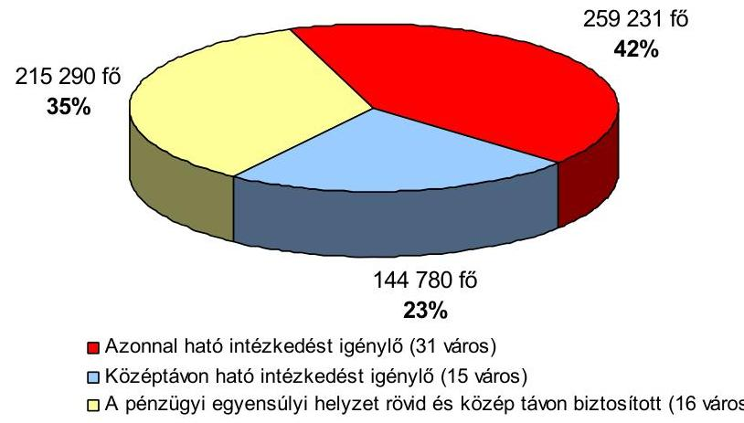

A városi önkormányzatok
 a helyi igényektől és teljesítőképességüktől függően, egymástól eltérő önkormányzati feladat- és hatásköröket vállalhatnak. A nagyobb lakosságszámú és teljesítőképességű városi önkormányzatok számára az Ötv. és az ágazati jogszabályok több kötelező feladatot állapítottak meg.

A feladatellátás módját saját maguk határozták meg. A szervezeti keretek kialakításának szabadsága kockázatot hordoz magában. Az önkormányzati tulajdonú közszolgáltatást végző gazdasági társaságok tekintetében a tulajdonosi és ellátási felelősség az önkormányzatokra hárul.

Az áttekintett időszakban a városok helyzetét befolyásoló önkormányzati forrásszabályozás elvei lényegesen nem változtak. Az önkormányzatok mozgásterét a központi költségvetéstől való függőség mellett jelentősen befolyásolta a helyiadó-kivetési jog gyakorlása.

Az önkormányzati alrendszer költségvetési kiadásaiból a 2010. évben 27,3%-kal (951 Mrd Ft-tal) részesedtek a városi önkormányzatok. Az adósságszolgálattal (tőke- és kamattörlesztés) kapcsolatos kiadásokból való részesedésük ugyanakkor 32,8%-os volt, amely alátámasztja helyzetelemzésük fontosságát.

A városok adósságállománya - a 2010. évi költségvetési beszámoló alapján 382 Mrd Ft volt, amely az önkormányzati alrendszer 1247 Mrd Ft bruttó adósságállományának ${ }^{34} 30,6 \%$-át tette ki.

A városi önkormányzatok likviditási problémáinak felerősödését jelzi, hogy a rövid lejáratú hitelek állománya 2007-2010 között 23,5 Mrd Ft-ról

[^0]
[^0]:    ${ }^{34}$ A bruttó adósságállomány 2010. évi összege magában foglalja a fejlesztési és a működési célú kötvénykibocsátások, a beruházási és fejlesztési hitelek, a működési célú hosszúlejáratú hitelek, a rövid lejáratú hitelek, váltótartozások miatti kötelezettségek teljes (2011. évben, illetve az azt követő években esedékes) állományát.

---

63,4 Mrd Ft-ra (169,8%-ra) emelkedett. A növekedés mértéke az önkormányzati alrendszer egészében 23,2%-os volt.

A városi önkormányzatok közül az 1. számú Függelék 3.1 pontjában bemutatott statisztikai mintavétellel választottuk ki az ellenőrzött önkormányzatokat. A reprezentatív kiválasztás következtében az ellenőrzési tapasztalatok a sokaság egészére kivetíthetők.

# 5.1. A városok feladatellátásának, költségvetésének jellemzői 

A városi önkormányzatok feladatellátását, a közszolgáltatások tartalmát és szervezeti kereteit széles körű differenciáltság jellemezte. A differenciák elsődlegesen a városok lakosságának népességi jellemzőivel, az önként vállalt feladatok terjedelmével függtek össze. A társulásos feladatellátásban és az egészségügyi szakellátásban vállalt szerepük további különbségképző tényező volt. A feladatellátás szervezeti kereteit a városi önkormányzatok anyagi lehetőségeik függvényében maguk határozták meg. A szervezetalakítási szabadság következményeként a közszolgáltatások és az önként vállalt feladatok ellátásában a gazdasági társaságok egyre jelentősebb szerephez jutottak. (27. sz. táblázat)
27. sz. táblázat

Az ellenőrzött városi önkormányzatok feladatellátási szervezeti formája ágazatonként 2010-ben

| Megnevezés | Költségvetési szervek száma |  | Gazdasági társaságok száma |  |
| :-- | --: | --: | --: | --: |
|  | kötelező   feladatok | önként vállalt   feladatok | kötelező   feladatok | önként vállalt   feladatok |
| Közoktatás | 143 | 50 | 1 | 1 |
| Szociális és gyermekvédelem | 42 | 14 | 3 | 4 |
| Egészségügyi ellátás | 12 | 8 | 3 | 11 |
| Kultúra, sport | 59 | 20 | 5 | 38 |
| Egyéb (igazgatási,   infrastrukturális szolgáltatások) | 103 | 11 | 156 | 47 |
| Összesen | 359 | 103 | 168 | 101 |

Forrás: Az ellenőrzött önkormányzatok adatszolgáltatása
Az ellenőrzött városok 73 esetben vettek át, és 67 esetben adtak át intézményt más önkormányzatnak, és egyéb szervezetnek. Az átadás és átvétel mellett az intézményi struktúra átszervezésére is sor került. Ennek hatására a költségvetési szervek száma az ellenőrzött időszakban 615-ről 462-re (24,9%-kal) csökkent, az egy intézményre jutó telephelyek száma azonban 2,1-ről 2,8-ra emelkedett. A költségvetési szervek 77,7%-a (359 intézmény), a gazdasági társaságok 62,5%-a (168 gazdasági társaság) kötelező feladatot látott el.

Az ellenőrzött városok közoktatási, szociális és gyermekvédelmi, egészségügyi, kulturális és sport intézményeiben foglalkoztatottak és ellátottak számában jelentős különbségek voltak tapasztalhatók. Az ezer lakosra vetített mutatók azt jelzik, hogy a pénzügyi egyensúly helyreállítása érdekében azonnali intézkedést igénylő önkormányzatok által fenntartott intézménystruktúra az átlagosnál jobban terhelte az érintett önkormányzatok költségvetését. Esetükben a pénzügyi egyensúlyi helyzet helyreállítását célzó intézkedéseknek a méretgaz-

---

daságossági szempontok fokozott érvényesítésére kell irányulnia. (28. sz. táblázat)
28. sz. táblázat

Az ellenőrzött városi önkormányzatoknál a foglalkoztatottak, ellátottak száma ágazatonként és a fajlagos mutatók 2010-ben

| Városok az igényelt intézkedés típusa szerint | Közoktatási ágazat |  |  | Szociális, Gyermekvédelmi ágazat |  | Egészségügyi ágazat |  | Kultúra, sport és egyéb ágazatokban foglalkoztatottak száma | ezer lakosra jutó |  |
| :--: | :--: | :--: | :--: | :--: | :--: | :--: | :--: | :--: | :--: | :--: |
|  | foglalkoz-   tatottak   száma | ellátottak   száma | egy intézményre jutó ellátott | foglalkoz-   tatottak   száma | ellátottak   száma | foglalkoz-   tatottak   száma | kórházi ágyak száma |  |  |  |
| azonnal | 4987 | 42723 | 541 | 549 | 2256 | 2180 | 1612 | 4098 | 1,30 | 45,57 |
| középtávú | 2668 | 24789 | 688 | 227 | 652 | 630 | 409 | 1815 | 1,08 | 36,88 |
| hosszú távú | 4096 | 32712 | 409 | 1038 | 2711 | 1651 | 993 | 3265 | 1,11 | 46,68 |
| Ellenőrzött városok összesen | 11751 | 100224 | 514 | 1814 | 5819 | 4461 | 3014 | 9178 | 1,18 | 43,93 |

Forrás: Az ellenőrzött önkormányzatok adatszolgáltatása
A vizsgált időszakban az ellenőrzött városok 195 közoktatást ellátó szervezetében a gyermeklétszám kismértékben a 2007. évhez képest 2010-re 363 fővel, 100224 főre növekedett. Ennek oka a közoktatási feladatok társulásban történő ellátásában a városok gesztorszerepvállalásának növekedése volt. A szociális és gyermekvédelmi intézményeknél jellemzően többcélú társulások keretében látták el a feladatot, ennek következtében csökkent az ellátottak száma a városoknál. A fekvőbeteg ellátási feladat vállalása a városi önkormányzatoknál nem jellemző. Az egészségügyi alapellátás mellett az ellenőrzött városok közül kilenc önkormányzat tartott fenn kórházat, amelyből három gazdasági társasági formában működött.

A közfeladatot ellátó gazdasági társaságoknál 2010. év végén a kötelező feladatokhoz átadott vagyon 70505,4 millió Ft, az önként vállaltakhoz kapcsolódóan 21 156,6 millió Ft volt. A feladatkiszervezések miatt az átadott önkormányzati vagyon összértéke 6,6%-kal (5704,8 millió Ft-tal) volt magasabb, mint 2007-ben. Ez a városok könyvviteli mérleg szerinti 525 051,4 millió Ft tárgyi eszköz értékének 17,5%-a volt.

A többségi tulajdonú gazdasági társaságok jegyzett tőkéje 2010-ben 19 957,7 millió Ft volt, amely 2007-hez képest 27,1%-kal (4252 millió Ft-tal) nőtt. A saját tőke ugyanezen időszakban 21,1%-kal (4606,7 millió Ft-tal) emelkedett. A saját tőke/jegyzett tőke arány 1,39-ről 1,33-ra mérséklődött, amely összességében még nem eredményezte a befektetett tőke csökkenése miatti veszteség realizálását. (50. sz. ábra)

A részletező adatok szerint a pénzügyi egyensúly azonnali helyreállítását igénylő 31 város közül 16 önkormányzat 24 gazdasági társaságánál már tényleges vagyonvesztés is bekövetkezett. Ugyanakkor a középtávú intézkedések megtételével érintett önkormányzati csoportban a saját tőke/jegyzett tőke arány 1,48-ról 1,58-ra javult, míg a hosszú távon ható intézkedések megtételére javasolt önkormányzatoknál az átlagnak megfelelően alakult.

---

50. sz. ábra

Az ellenőrzött városi önkormányzatok gazdasági társaságainál a saját tőke/jegyzett tőke mértéke és ezek arányának változása 2007-2010 között (millió Ft)
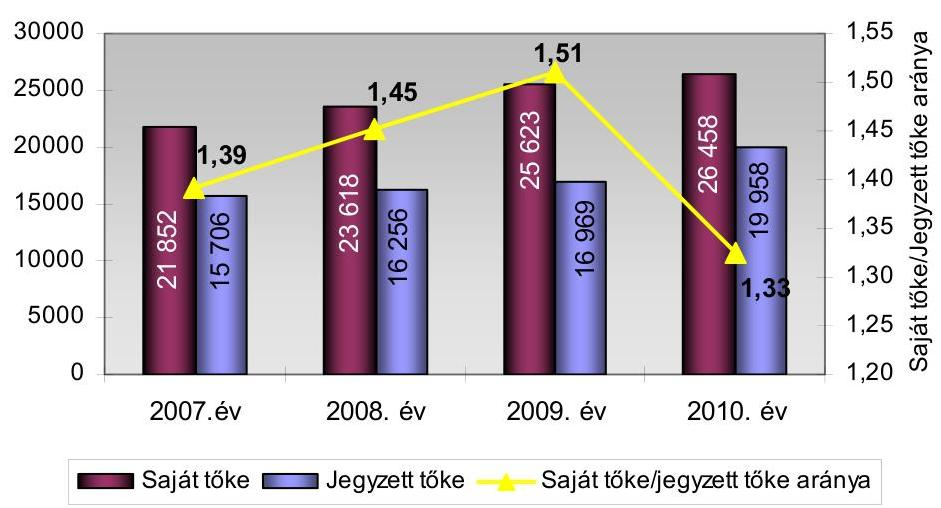

Forrás: Az ellenőrzött önkormányzatok adatszolgáltatása
Az ellenőrzött városi önkormányzatok a tulajdonukban lévő gazdasági társaságoknak 2007-2010 között összesen 9672,3 millió Ft pénzeszközt adtak át, ennek 87,7%-a (8484,5 millió Ft) működési, 12,3%-a (1187,8 millió Ft) felhalmozási célú volt. A működési célú pénzeszközátadások feladat-ellátási szerződéseken alapultak. A közszolgáltatások ellátásához kapcsolódó vagyon bővítésére, felújítására átadott felhalmozási célú pénzeszközök 2010. évi kiugró növekedésének oka, hogy a társaságok szélesebb körben valósítottak meg pályázati forrásokból finanszírozott fejlesztéseket. (51. sz. ábra)
51. sz. ábra

Az egyes kockázati kategóriába tartozó városi önkormányzatok feladatellátásában résztvevő gazdasági társaságok támogatása 2007-2010 között (millió Ft)
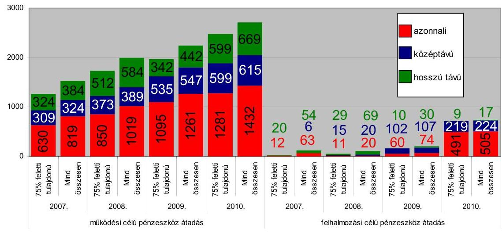

Forrás: Az ellenőrzött önkormányzatok adatszolgáltatása

---

A vizsgált időszakban a kötelező és önként vállalt feladatok ellátását biztosító szervezeti keretekben, a feladatellátás módjában bekövetkezett változások kedvező hatással voltak az ellenőrzött önkormányzatok pénzügyi egyensúlyi helyzetére. A személyi juttatások 5173,3 millió Ft-tal, a dologi kiadások 2104,9 millió Ft-tal csökkentek. A feladatkiszervezések miatt növekvő pénzeszközátadásokkal együtt az összes kiadás 5817,2 millió Ft-tal mérséklődött.

A feladat átadás-átvételek egyenlege azoknál az önkormányzatoknál, ahol a pénzügyi egyensúly rövid távon sem volt biztosított 6378,9 millió Ft, a középtávú intézkedést igénylőknél 1056,7 millió Ft megtakarítást mutatott. Azon önkormányzatoknál, ahol a pénzügyi egyensúly rövid és középtávon is biztosított volt, 1618,4 millió Ft többletkiadás merült fel.

# 5.1.1. Forrásszabályozás, bevételek változása 

Az ellenőrzött városi önkormányzatok tárgyévi bevételei nominálértéken 2,7%-kal (6125,5 millió Ft-tal) növekedtek. A központi költségvetésből származó források - költségvetési támogatás, átengedett bevételek, államháztartáson belülről kapott támogatások - együttes összege a 2007. évi 97 807,3 millió Ft-ról 2008-ra 6,1%-kal (103 732,5 millió Ft-ra) emelkedett, majd 2009-2010 években ezen a szinten állandósult.

A 2010-ben elszámolt saját folyó bevétel 71628,1 millió Ft-os összege 16,4%-kal (10 117,3 millió Ft-tal) haladta meg a 2007. évi összeget. Az önkormányzatok a vizsgált időszak alatt bevételnövelő intézkedéseik eredményeként összességében 25725,5 millió Ft többletbevételt mutattak ki. (52. sz. ábra)
52. sz. ábra

Az ellenőrzött városi önkormányzatok bevételei összetételének változása 2007-2010 között (millió Ft)
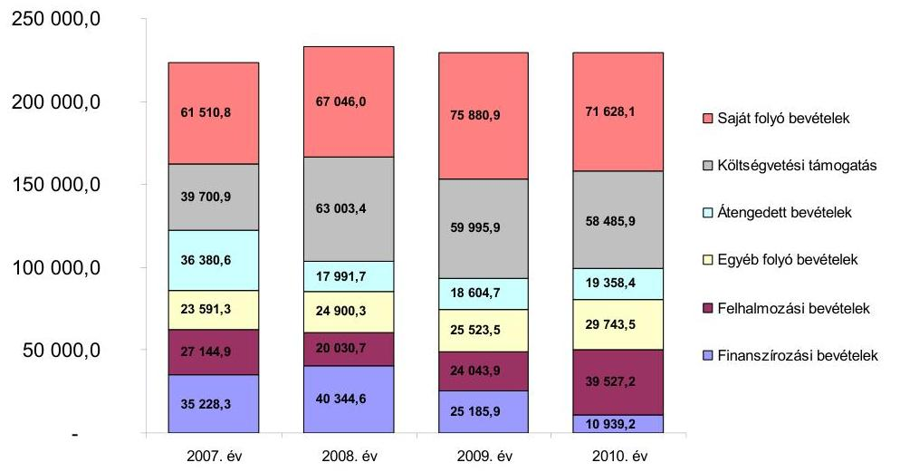

Forrás: Az ellenőrzött önkormányzatok adatszolgáltatása
Az ellenőrzött városok helyi adóbevétele 2007-ben 41 430,6 millió Ft, 2010-ben 41 142,9 millió Ft volt. A saját folyó bevételeken belüli részaránya a 2010. évben a városi átlagot 0,8 százalékponttal meghaladva 57,4%-ot jelentett. A realizált iparűzési adóbevétel a helyi adó bevételek 79,4%-a (32675,3 millió Ft) volt. Az ellenőrzött városi önkormányzatoknál - a gazdaság visszaesése miatt az iparűzési adóbevétel csökkenése összességében 5,5%-os (1903,9 millió Ft-os) volt. (53. sz. ábra)

---

53. sz. ábra

A városi és az ellenőrzött városi önkormányzatok iparűzési adója a saját bevételük %-ában 2007-2010. években, a városok pénzügyi egyensúlyi kockázata szerinti csoportosításban
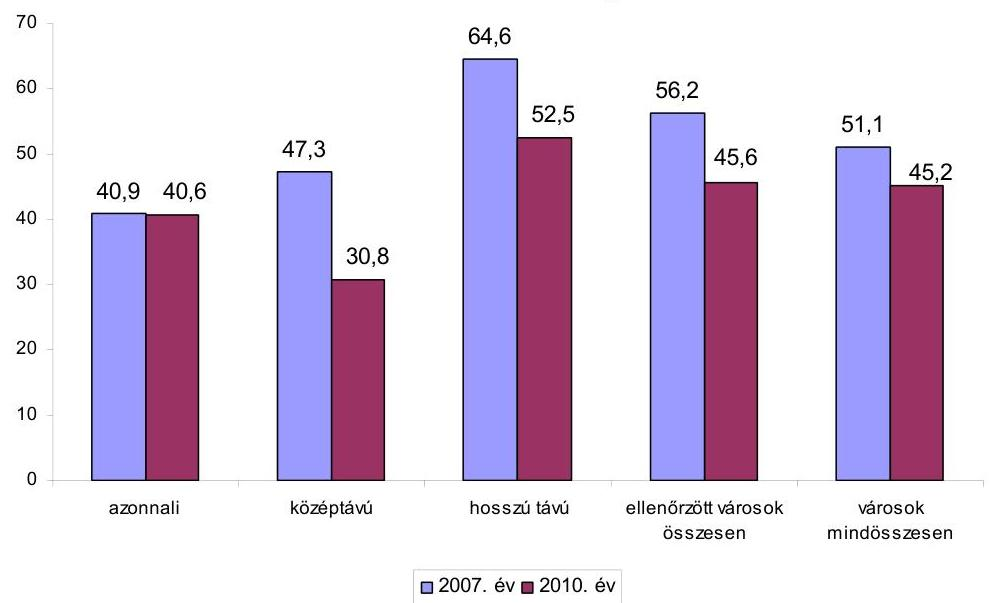

Forrás: Az ellenőrzött önkormányzatok adatszolgáltatása
Az egy lakosra jutó helyi adóbevételekben - az egyes önkormányzati csoportokba tartozó települések gazdasági fejlettségétől függően - a legalacsonyabb (33,2 ezer Ft/fő) és a legmagasabb (124,2 ezer Ft/fő) között közel négyszeres volt a különbség. Az egy lakosra jutó helyi adóbevétel és az önkormányzatok pénzügyi helyzete között közvetlen pozitív összefüggés van. (54. sz. ábra)
54. sz. ábra

A városi és az ellenőrzött városi önkormányzatok egy lakosra jutó helyi adóbevétele a városok pénzügyi egyensúlyi kockázata szerinti csoportosításban 2010-ben (ezer Ft/fő)
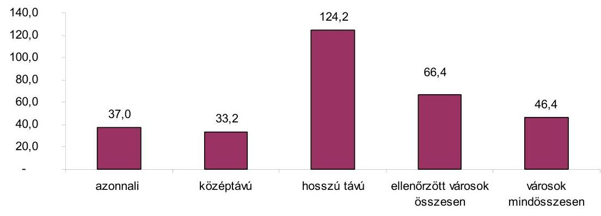

Forrás: Az ellenőrzött önkormányzatok adatszolgáltatása
Az önkormányzatok 2010-ben 4185,6 millió Ft kamatbevételt realizáltak, amely összességében fedezetet nyújtott a kamatkiadásokra. Azonban azon önkormányzatok pénzügyi egyensúlyi helyzetét, amelyeknél a pénzügyi egyensúly rövid távon sem volt biztosított, érdemben nem befolyásolták.

---

Az ellenőrzött városok költségvetési támogatásainak és átengedett bevételeinek együttes összege 2007.
 évhez képest 2,3%-kal (1762,8 millió Ft-tal) növekedett, miközben a városok összességét tekintve az adott időszakban 5,3%-os (21 474,8 millió Ft-os) csökkenés következett be. A 2010. évben realizált személyi jövedelemadó bevétel 14858,8 millió Ft volt, az átengedett bevételek 76,8%-a. A 2010. évben a települési önkormányzatok jövedelemdifferenciálódásának mérséklésére szolgáló személyi jövedelemadó kiegészítésben 48 ellenőrzött város részesült, 10236 millió Ft összegben. Tíz önkormányzatot elvonással, 4 várost pedig nem érintett a jövedelemdifferenciálódás miatti korrekció.

A 2007. és 2010. évek között 26 ellenőrzött önkormányzat összesen 3636,1 millió Ft működőképesség megőrzését segítő támogatásban részesült. A működőképesség megőrzését segítő támogatások 2010-ben mindössze három önkormányzat esetében változtatták pozitívra a pénzügyi kapacitás negatív értékét. A pénzügyi egyensúly azonnali helyreállítását igénylő önkormányzatok körében a pénzügyi kapacitás a működőképesség megőrzésére szolgáló támogatások korrekciós hatása nélkül (összevontan) 17,8%-kal nagyobb hiányt mutatna.

Az ellenőrzött városi önkormányzatok közoktatási, szociális, gyermekjóléti intézményeinek működésével kapcsolatos kiadása 2007-ben 55444 millió Ft, 2010-ben 54463 millió Ft volt. E kiadások finanszírozása a központi költségvetés különböző jogcímű támogatásaiból és hozzájárulásaiból, az intézmények saját bevételeiből, az önkormányzat saját forrásaiból és a társult önkormányzatoktól átvett forrásokból történt. A vizsgált időszakban - az óvodai ellátás kivételével - minden intézménytípusban csökkent az állami finanszírozás részaránya. Az önkormányzati intézmények egészére számítva az állami hozzájárulás az összes bevételből 2007-ben 40,9%-ot, míg 2010-ben 37,3%-ot képviselt. Emellett az önkormányzati finanszírozási igény különösen a közoktatási intézményekben differenciáltan ugyan, de mindenütt jelentősen (3,5 - 14,3 százalékpont között) emelkedett. Legmagasabb arányú önkormányzati kiegészítést az óvodák fenntartása igényelt. (55. sz. ábra)
55. sz. ábra

Az ellenőrzött városi önkormányzatok intézményfenntartásának bevételi szerkezete 2007-ben és 2010-ben (%)
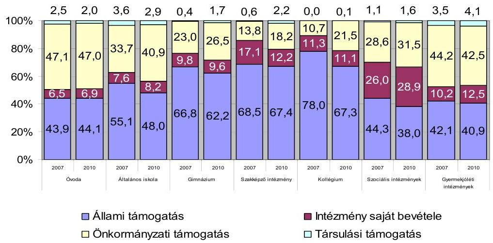

Forrás: Az ellenőrzött önkormányzatok adatszolgáltatása

---

A felhalmozási bevételek a saját tőkebevételek (tárgyi eszközök, föld és immateriális javak, részesedések értékesítési bevétele) mellett magukban foglalják az EU-tól és külföldről, valamint az államháztartáson belülről és kívülről felhalmozási célra átvett pénzeszközöket. Az ellenőrzött városok felhalmozási bevételei 2007-2010 között 27 144,9 millió Ft-ról 39 527,2 millió Ft-ra (45,6%-kal) nőttek. Az összes bevételhez viszonyított részarányuk 12,1%-ról 17,2%-ra változott. Az EU-s források igénybevétele érdekében a saját erő biztosításához felhasznált kötvény és hitelforrások kockázatnövelő hatással voltak a városok pénzügyi egyensúlyi helyzetére. Az EU-s források előfinanszírozása likviditási helyzetüket negatívan befolyásolta.

Az egyéb folyó és finanszírozási bevételek (pénzmaradvány, vállalkozási bevételek, államháztartáson kívülről származó átutalások, hitelek, értékpapírok értékesítése) tartalmazzák az államháztartáson belüli átutalások (Egészségbiztosítási Alaptól, elkülönített állami pénzalapoktól, fejezetektől átvett pénzeszközök) összegeit is. Az ellenőrzött városok ide sorolt bevételei 2010-ben 2007-hez viszonyítva 58 819,6 millió Ft-ról 40718,2 millió Ft-ra (30,8%-kal) csökkentek.

# 5.1.2. A városok működési kiadásai 

Az ellenőrzött városi önkormányzatok folyó kiadásai 2007-hez képest 2010-re 145592 millió Ft-ról 165 761,1 millió Ft-ra (13,9%-kal) emelkedtek. (29. sz. táblázat)
29. sz. táblázat

Az ellenőrzött városi önkormányzatok folyó kiadásai (millió Ft)

| Megnevezés | 2007. év | 2008. év | 2009. év | 2010. év | 2010/2007% |
| :--: | :--: | :--: | :--: | :--: | :--: |
| Folyó kiadások | 145592,0 | 155582,3 | 159337,7 | 165761,1 | 113,9 |
| Működési kiadások (kamatkiadások nélkül) | 127113,2 | 133377,2 | 134394,9 | 140989,5 | 110,9 |
| ebből személyi juttatások | 64580,4 | 66221,1 | 64423,0 | 66551,4 | 103,1 |
| munkaadót terhelő járulékok | 20403,3 | 20799,6 | 18729,2 | 16826,8 | 82,5 |
| dologi kiadások | 39447,3 | 43914,4 | 48078,6 | 53963,8 | 136,8 |
| Államháztartáson belülre átadott pénzeszközök | 1600,9 | 1975,2 | 1909,7 | 2644,9 | 165,2 |
| Transzferkiadások | 13738,1 | 15493,1 | 18251,4 | 18179,1 | 132,3 |
| ebből vállakozásoknak | 2057,1 | 2809,5 | 5017,4 | 4040,1 | 196,4 |
| EU-nak, illetve külföldre | 8,0 | 8,5 | 10,2 | 7,3 | 91,0 |
| magánszemélyeknek | 9361,0 | 10053,1 | 10611,4 | 11498,1 | 122,8 |
| nonprofit szervezeteknek | 2313,0 | 2622,0 | 2612,4 | 2633,6 | 113,9 |
| Kamatkiadások | 2218,1 | 3345,0 | 3381,7 | 2931,3 | 132,2 |
| Előző évi pénzmaradvány átadás | 920,7 | 1391,8 | 1400,0 | 1016,3 | 110,4 |

Forrás: Az ellenőrzött önkormányzatok adatszolgáltatása
A személyi juttatások 3,1%-kal (1971 millió Ft-tal) növekedtek az ellenőrzött időszakban annak ellenére, hogy az intézményszervezeti átalakítások együttes kiadáscsökkentő hatása 5173,2 millió Ft-ot tett ki. Növekedéssel járt a közcélú foglalkoztatás kiszélesedése, az illetmények jogszabályok szerinti növekedése. A munkaadókat terhelő járulékok 3576,4 millió Ft-os (17,5%-os) csökkenését eredményezték a helyi szervezési intézkedések, valamint a járulékok mértékének csökkenése. A személyi juttatások és járulékok folyó kiadásokon belüli részesedése 58,4%-ról (84983,7 millió Ft-ról) 50,3%-ra (83378,2 millió Ft-ra) csökkent.

---

A 2007. évhez viszonyítva a 2010-ben a dologi kiadások 14 516,5 millió Ft-tal (36,8%-kal), az átlagos inflációt meghaladó ütemben növekedtek. Az elszámolt dologi kiadások az ellenőrzött időszakon belül évről évre 11,3%-kal (4467,1 millió Ft-tal), 9,5%-kal (4164,2 millió Ft-tal), illetve 12,2%-kal (5885,2 millió Ft-tal) emelkedtek. A negyedéves adatok alapján számított éves átlagos inflációs ráta ennél alacsonyabb volt, 2008-ban 6,1%, 2009-ben 4,2%, 2010-ben 4,9%.

# 5.2. A pénzügyi egyensúlyi helyzetből eredő kockázatok 

### 5.2.1. A működési és a felhalmozási egyensúly alakulása

Az önkormányzatok pénzügyi egyensúlyi helyzetének romlását jelzi, hogy amíg 2009. évben 12 városnak (19,4%) volt negatív a működési jövedelme, 2010. évben már 22 városnak (35,5%) haladták meg a folyó kiadásai a folyó bevételeit. A tőketörlesztést is figyelembe vevő nettó működési jövedelem 2009-ig javult, azonban 2010-ben 15349,1 millió Ft-ról 5861,7 millió Ft-ra (38,2%-ra) esett vissza. A nettó működési jövedelem az ellenőrzött önkormányzatok több mint felénél (33 városnál) volt negatív 2010-ben. (30. sz. táblázat)
30. sz. táblázat

Az ellenőrzött városi önkormányzatok CLF módszer szerinti adatai (millió Ft)

| Megnevezés | 2007. év | 2008. év | 2009. év | 2010. év |
| :--: | :--: | :--: | :--: | :--: |
| Folyó bevételek | 161183,6 | 172941,4 | 180004,9 | 179215,9 |
| Folyó kiadások | 145592,0 | 155582,3 | 159337,7 | 165761,1 |
| Működési jövedelem | 15591,6 | 17359,1 | 20667,2 | 13454,8 |
| Nettó működési jövedelem   = működési jövedelem - tőketörlesztés | 1338,3 | 6083,8 | 15349,1 | 5861,7 |
| Felhalmozási bevételek | 27144,9 | 20030,7 | 24043,9 | 39527,2 |
| Felhalmozási kiadások | 40085,3 | 38238,0 | 45054,3 | 74530,0 |
| Felhalmozási költségvetés egyenlege | -12920,4 | -18207,3 | -21010,4 | -35002,8 |
| Finanszírozási műveletek nélküli (GFS) pozíció | 2671,2 | -848,2 | -343,2 | -21548,0 |
| Finanszírozási műveletek egyenlege | 17765,5 | 10351,2 | 16589,0 | 3041,9 |
| Tárgyévi pénzügyi pozíció | 20436,7 | 9503,1 | 16245,7 | 18506,1 |
| Egyéb tájékoztató adatok |  |  |  |  |
| Összes kötelezettség (passzív pénzügyi elszámolások nélkül) | 64001,8 | 90900,7 | 101367,1 | 118700,4 |
| ebből rövid lejáratú | 25928,4 | 22265,9 | 27125,5 | 32763,5 |
| Folyószámlahitel napi átlagos állománya | 4957,7 | 4573,5 | 4314,7 | 5178,0 |
| Likvidhitel napi átlagos állománya | 2473,7 | 1315,8 | 1752,4 | 2556,1 |
| Munkabérhitel napi átlagos állománya | 841,9 | 644,2 | 645,4 | 726,7 |
| Kezesség és garanciavállalások | 6395,0 | 6002,7 | 6634,3 | 7461,4 |
| Jogerős bírósági ítéletekből adódó kötelezettségek | 8,3 | 8,3 | 8,3 | 195,8 |
| Egyéb finanszírozásba vonható eszközök: | 49275,2 | 70155,1 | 74 141,7 | 56598,2 |
| ebből:Tartós hitelviszonyt megtestesítő értékpapírok | 2482,1 | 12826,9 | 6028,6 | 9228,9 |
| Hosszú lejáratú bankbetétek | 2132,3 | 2642,0 | 2715,9 | 1649,1 |
| Értékpapírok | 10671,1 | 11959,9 | 6198,5 | 4595,0 |
| Pénzeszközök (idegen pénzeszközök nélkül) | 34591,0 | 43775,5 | 59798,3 | 42237,6 |

Forrás: Az ellenőrzött önkormányzatok adatszolgáltatása
A vizsgált városi önkormányzatok összevont működési jövedelme 2007-2010 között pozitív volt, amely 2009-re 20667,2 millió Ft-ra növekedett és 2010-ben 7212,4 millió Ft-tal (34,9%-kal) csökkent. A pozitív működési jövedelem

---

2007-2010 között összesen 67072,7 millió Ft forrást biztosított a tőketörlesztési kötelezettség teljesítéséhez, valamint a fejlesztések finanszírozásához.

A pénzügyi egyensúly azonnali helyreállítását igénylő 31 önkormányzat közül a működési jövedelem 2010-ben 18 városnál (58,1%-nál) volt negatív. A középtávú intézkedést igénylő 15 önkormányzatból négynél nem fedezték a folyó bevételek a folyó kiadásokat. A rövid és középtávon is egyensúlyban lévő városok mindegyike pozitív működési egyenleggel rendelkezett.

Az ellenőrzött városi önkormányzatok kiadást mérséklő intézkedéseik eredményeként 2007-2010-ben 3925 fővel (14,4%-kal) csökkentették az álláshelyek számát. Az álláshely-csökkentések 71,3%-át (2799 főt) a pénzügyi egyensúly azonnali helyreállítását igénylő önkormányzatok mutatták ki. A 2007. évben 1782 fő álláshely szűnt meg, amelynek kiadásmérséklő hatása a vizsgált időszak egészében jelentkezett. A helyi szervezési intézkedések egyszeri költségének támogatásával megszüntetett álláshelyek 50,4%-a (796 fő) a közoktatási, 35,6%-a (563 fő) az egészségügyi, szociális és gyermekjóléti intézményeket, további 7-7%-a (111-110 fő) a polgármesteri hivatalokat és az egyéb önkormányzati intézményeket érintette. (56. sz. ábra)
56. sz. ábra

Az ellenőrzött városi önkormányzatoknál a központi támogatással megvalósított létszámcsökkentés ágazati megoszlása (fő)
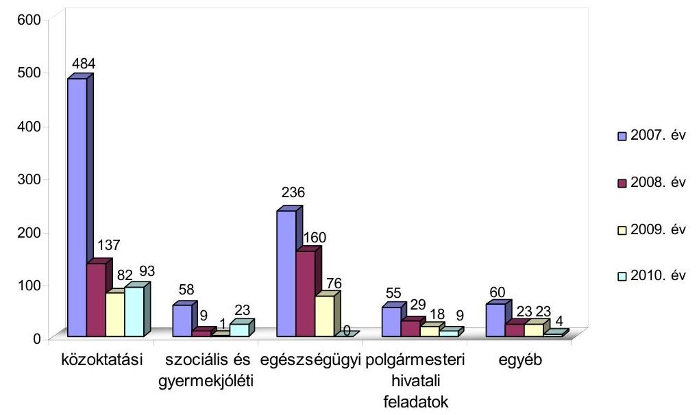

Forrás: Az ellenőrzött önkormányzatok adatszolgáltatása
A nettó működési jövedelem 2008-2009 évekbeli javulását a tőketörlesztés kiugró mértékű visszaesésén túl a saját működési bevételek növekedése eredményezte. A mutató 2010. évi romlását a folyó bevételek és kiadások különbségéből származó működési jövedelem csökkenése mellett a törlesztési kötelezettség növekedése befolyásolta. A kibocsátott kötvények, felvett hitelek tőketörlesztési kötelezettségénél érvényesített türelmi idő miatt a legtöbb városnál a törlesztések 2013-tól kezdődnek. (57. sz. ábra)

---

57. sz. ábra

Az ellenőrzött városi önkormányzatok működési egyenlege, tőketörlesztése és a nettó működési jövedelme 2007-2010-ben (millió Ft)
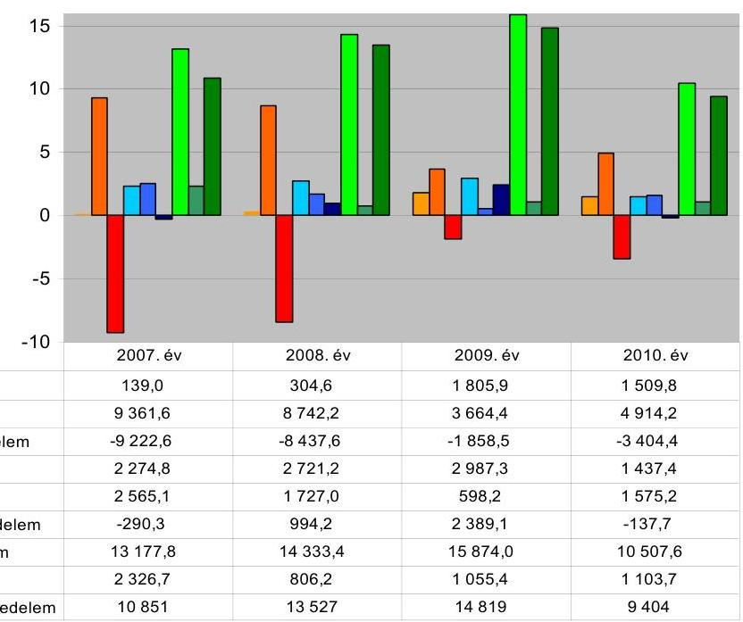

Forrás: Az ellenőrzött önkormányzatok adatszolgáltatása
Az ellenőrzött városi önkormányzatok felhalmozási kiadásainak aránya az összes kiadáshoz képest 2007-ről 2010-re 9,4 százalékponttal (40 065,3 millió Ft-ról 74530 millió Ft-ra) emelkedett. A pénzügyi egyensúly azonnali helyreállítását igénylő önkormányzatoknál átlag alatti (5 százalékpontos, 7331,8 millió Ft) növekedés történt. Az átlagot meghaladóan nőtt a középtávú intézkedést igénylő (13,6 százalékpont, 10080,6 millió Ft) valamint a hosszú távú intézkedést igénylő (11,3 százalékpont, 17052,3 millió Ft) önkormányzatok mutatója. A felhalmozási kiadások részarányának emelkedését befolyásolta, hogy a 2007-ben kezdődő második EU-s tervezési periódus forrásaiból támogatott beruházások a megvalósulás szakaszába értek. (58. sz. ábra)
58. sz. ábra

# Az ellenőrzött városi önkormányzatok folyó és felhalmozási kiadásai (millió Ft) 

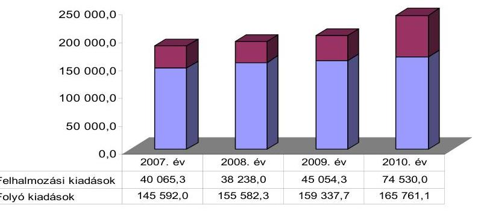

Forrás: Az ellenőrzött önkormányzatok adatszolgáltatása

---

A folyószámlahitel, munkabér-megelőlegezési, valamint egyéb likvid hitelek (továbbiakban likvid hitelek) igénybevétele a pénzügyi egyensúly azonnali helyreállítását igénylő önkormányzatok 74%-ánál (23-nál) 2010-ben már állandósult forrásigényt
 jelentett. Ezt erősítette, hogy ebben a körben az ÖNHIKI támogatás a 2007. évi 1027,3 millió Ft-ról 2010-re 502,9 millió Ft-ra mérséklődött. A likvid hitelek igénybevételét a középtávú intézkedést igénylő városok negyedénél a pénzügyi egyensúly folyamatos fenntartása indokolta. A fennmaradó önkormányzatoknál ezeket a hiteleket átmeneti likviditási gondok kezelésére vették igénybe.

A folyószámlahitellel zárt napok átlagos száma 2007-ről 2010-re a pénzügyi egyensúly azonnali helyreállítását igénylő városoknál 254-ről 262 napra, a középtávú intézkedést igénylő városoknál 129-ről 182 napra emelkedett. A rövid és középtávon egyensúlyban lévő városoknál 52-ről 40 napra csökkent.

A likvid hitelekből 2010. december 31-én fennálló kötelezettség összege a pénzügyi egyensúly azonnali helyreállítását igénylő városoknál 6325 millió Ft, a középtávú intézkedést igénylő városoknál 1120,7 millió Ft, a rövid és középtávon egyensúlyban lévő városoknál 644,9 millió Ft volt.

A hitelek napi átlagos állománya 2007-ről 2010-re a pénzügyi egyensúly azonnali helyreállítását igénylő városoknál 6887,5 millió Ft-ról 7003 millió Ft-ra, a középtávú intézkedést igénylő városoknál 681,7 millió Ft-ról 962,2 millió Ft-ra emelkedett. A rövid és középtávon egyensúlyban lévő városoknál a folyószámlahitel napi átlagos állománya 704 millió Ft-ról 495,6 millió Ft-ra mérséklődött, nekik 2010. december 31-én munkabér-megelőlegezési és egyéb likvid hitel állományuk nem volt.

A szállítói tartozások, azon belül a lejárt szállítói tartozások egyhavi dologi kiadást jelentősen meghaladó szintje, valamint a 2007-hez képest a 2010-ben 2063,9 millió Ft-os, 74,8%-os növekedése működési kockázatot jelentett. (59. sz. ábra)
59. sz. ábra

Az ellenőrzött városi önkormányzatok szállítói - ezen belül az összes lejárt esedékességű - tartozása és az egyhavi dologi kiadás alakulása (millió Ft)
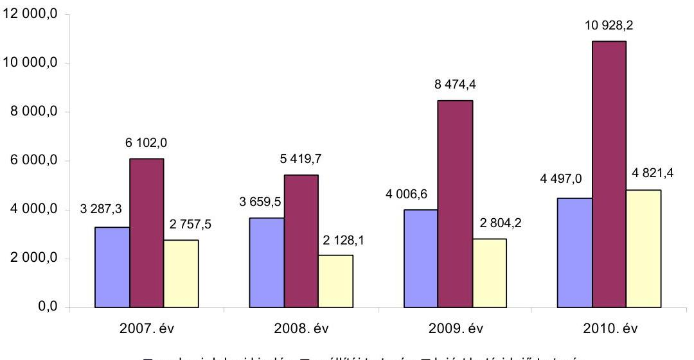

---

A lejárt határidejű szállítói tartozás 2007-ről 2010-re a pénzügyi egyensúly azonnali helyreállítását igénylő önkormányzatoknál 2297,2 millió Ft-ról 3570,2 millió Ft-ra, a középtávú intézkedést igénylő önkormányzatoknál 287 millió Ft-ról 951,2 millió Ft-ra, a rövid és középtávon egyensúlyban lévő városoknál 173,3 millió Ft-ról 300 millió Ft-ra nőtt. (60. sz. ábra)
60. sz. ábra

Az ellenőrzött városi önkormányzatok összes lejárt esedékességű szállítói tartozása a városok pénzügyi egyensúlyi kockázata szerinti csoportosításban (millió Ft)
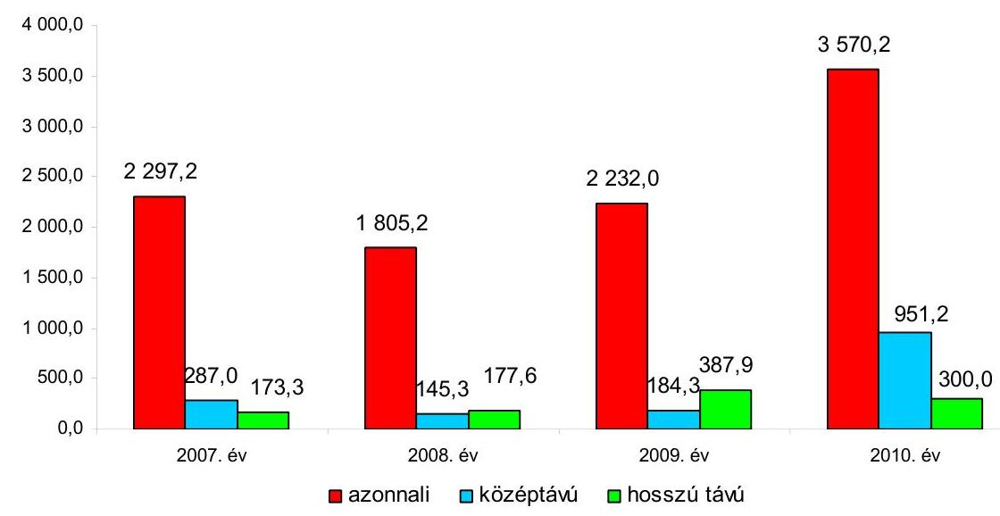

Forrás: Az ellenőrzött önkormányzatok adatszolgáltatása
A lejárt határidejű szállítói tartozás növekedésének oka az volt, hogy a folyamatban lévő beruházások előfinanszírozásához, egyes dologi kiadások teljesítéséhez szabad pénzeszközök nem álltak rendelkezésre. Ez elsősorban a pénzügyi egyensúly azonnali helyreállítását igénylő önkormányzatokra volt jellemző. Ezek a városok az előfinanszírozásból adódó likviditási gondot folyószámlahitellel, egyéb likvid hitellel mérsékelték, amely növelte a banki kitettségüket. Az EU-s támogatással megvalósuló, szállítói finanszírozású projekteknél a közreműködő szervezet által késve kiegyenlített számlák, valamint a beruházási szállítók megkifogásolt számlái következtében a szakmai teljesítésigazolások elhúzódása is hozzájárult a lejárt szállítói tartozások növekedéséhez.

# 5.2.2. Felhalmozási kiadások 

A felhalmozási kiadások összege a 2007. évi 40065,3 millió Ft-ról 2010-re 74530 millió Ft-ra (86%-kal) emelkedett. A felhalmozási kiadások erőteljes növekedése szoros összefüggésben volt az önkormányzatok eladósodásával. A széles körben megnyílt pályázati konstrukciók felfokozott ütemű beruházáshoz vezettek, amely növekvő arányú külső forrás (hitelfelvétel, kötvénykibocsátás) bevonását igényelte. Az EU-s projektek megvalósulása felgyorsult, 2010-ben teljesült az összes beruházási kiadás 37,7%-a (74530 millió Ft). (61. sz. ábra)

---

# Az ellenőrzött városi önkormányzatok felhalmozási bevételei, kiadásai és egyenlege (millió Ft) 

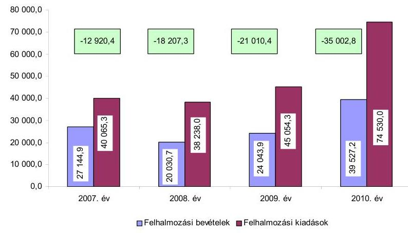

Forrás: Az ellenőrzött önkormányzatok adatszolgáltatása
A számviteli nyilvántartásokban elszámolt értékcsökkenés 2007-2010 között 51 457,7 millió Ft volt. Az eszközök használhatósági foka (nettó/bruttó érték hányadosa) 2007-2010 között 3,7 százalékponttal (83%-ra) csökkent.

Az ellenőrzött városi önkormányzatok a vizsgált időszakban 26 928,5 millió Ft értékű felújítást fejeztek be. A befejezett beruházások eredményeként az eszközök értéke 131 028,2 millió Ft-tal emelkedett. A befejeződött beruházások 14,4%-a (22 722,8 millió Ft) szolgálta az eszközpótlást.

### 5.2.3. A beruházások finanszírozása

A városi önkormányzatok fejlesztési tevékenységét a pályázati lehetőségek kihasználása határozta meg. A saját felhalmozási bevételek csökkenő és alacsony szintje miatt a beruházásokat leginkább külső források bevonása mellett, EU-s és hazai támogatások elnyerésével tudták megvalósítani. A külső források egyre növekvő arányú igénybevétele a beruházások finanszírozásában hozzájárult a pénzügyi hiány kialakulásához, az önkormányzatok eladósodásához, likviditási és finanszírozási kockázattal járt.

Az ellenőrzött városok a 2007-2010. között befejezett 157 956,6 millió Ft fejlesztéseiket 38,6%-ban saját bevételből (60 976,2 millió Ft), 13,1%-ban hitelfelvételből és kötvénykibocsátásból (20 642,7 millió Ft), 48,3%-ban EU-s és hazai támogatásból (76 337,7 millió Ft) finanszírozták. A befejezett beruházásokhoz a pénzügyi egyensúly azonnali helyreállítását igénylő önkormányzatok vették igénybe a hitel- és kötvényforrások 51,5%-át (10 635,8 millió Ft-ot), amely a finanszírozási források 16,4%-át képezte. (31. sz. táblázat)

---

# 31. sz. táblázat 

## Az ellenőrzött városi önkormányzatok 2007-2010 között befejezett beruházásainak forrásösszetétele (millió Ft)

| Megnevezés | Teljes   bekerülési   költség | 2006. dec. 31   ig teljesített | 2007-2010.   évék között   teljesített   kiadás | 2010. december 31-ig megvalósított beruházás forrásösszetétele |  |  |  |  |
| :--: | :--: | :--: | :--: | :--: | :--: | :--: | :--: | :--: |
|  |  |  |  | saját bevétel | hitel | kötvény | EU-s   támogatás | hazai   támogatás |
| azonnali | 64708,2 | 20055,2 | 44653,0 | 11899,5 | 4090,0 | 6545,8 | 14058,2 | 28114,7 |
| középfévú | 29303,0 | 3433,4 | 20869,6 | 10360,7 | 1967,3 | 3273,8 | 6809,5 | 6891,7 |
| hosszú távú | 63945,4 | 7665,4 | 56280,0 | 38716,0 | 2529,2 | 2236,6 | 14784,8 | 5698,8 |
| ellenőrzött városok   összesen | 157956,6 | 31154,0 | 126802,6 | 60976,2 | 8586,5 | 12056,2 | 35632,5 | 40705,2 |
| Városok mindösszesen | 730071,2 | 126995,3 | 603075,8 | 237912,2 | 48501,0 | 53813,2 | 178032,2 | 211812,6 |

Forrás: Az ellenőrzött önkormányzatok adatszolgáltatása
Az ellenőrzött városi önkormányzatok esetében a 2010. december 31-én folyamatban lévő 126 551,2 millió Ft beruházás forrásösszetételében az EU-s és hazai támogatások részaránya 18,5 százalékponttal volt magasabb, mint a befejezett beruházásoknál. A pénzintézeti külső források bevonása a teljes bekerülési költség 12,7%-át (16 083 millió Ft-ot) képezte. A hazai területfejlesztési támogatások 2010-től megszűntek, aminek következtében az önkormányzatok magasabb támogatás intenzitású fejlesztések megvalósítását kezdeményezték.

Az ellenőrzött városi önkormányzatoknál a 2010. évet követően induló beruházások 460 561,5 millió Ft-os forrásigényének 92,1%-át (424 186,5 millió Ft-ot) a tervezettek szerint EU-s és hazai támogatás biztosítja. (62. sz. ábra)
62. sz. ábra

A városi önkormányzatok 2010. december 31-ig befejezett, folyamatban lévő és tervezett fejlesztéseinek forrásösszetétele (%)
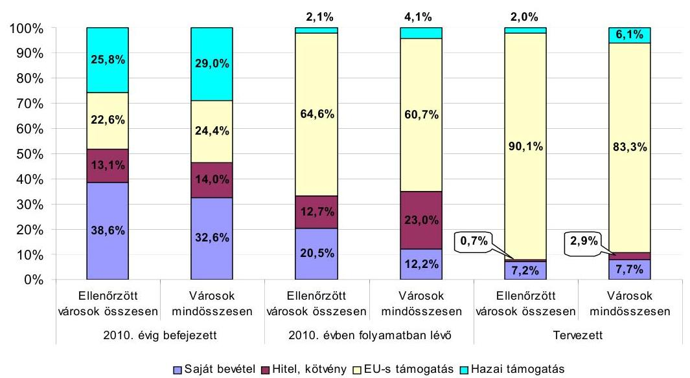

- Saját bevétel ■ Hitel, kötvény ■EU-s támogatás ■ Hazai támogatás

Forrás: Az ellenőrzött önkormányzatok adatszolgáltatása

---

# 5.3. A kötelezettségekből eredő kockázatok 

Az ellenőrzött városi önkormányzatok 2010. december 31-i adósságállományából a pénzügyi egyensúly azonnali helyreállítását igénylő önkormányzatok 53,1%-kal (50 976,5 millió Ft-tal), a középtávú intézkedést igénylő önkormányzatok 25%-kal (24 000,2 millió Ft-tal), a rövid és középtávon egyensúlyban lévő önkormányzatok 21,9%-kal (21 060,1 millió Ft-tal) részesedtek. (63. sz. ábra)
63. sz. ábra

Az ellenőrzött városi önkormányzatok 2006. és 2010. évi adósságállománya kockázati besorolás szerint (millió Ft)
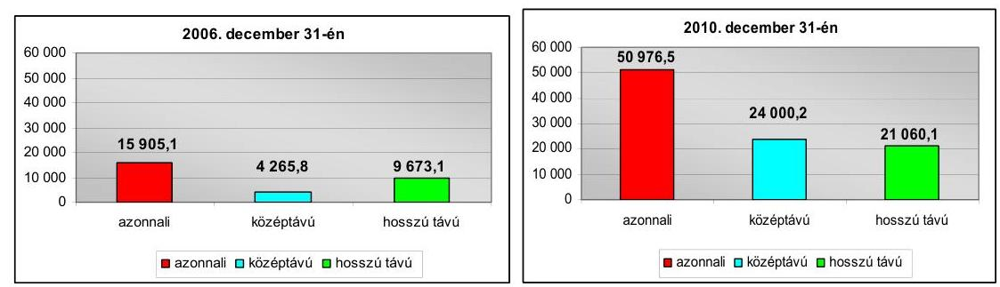

Forrás: MÁK 2010. évi önkormányzati beszámolók alapján
A pénzintézetek felé fennálló kötelezettségállomány 2006. december 31-ről 2010. december 31-re 29844 millió Ft-ról 96036,8 millió Ft-ra nőtt. Az emelkedésében meghatározó tényező volt, hogy az önkormányzatok a vizsgált időszakban 286745,9 ezer CHF, 21 420,3 ezer EUR, valamint 6400 millió Ft értékben bocsátottak ki kötvényt. A kötvényforrással fejlesztési, működési, valamint folyószámlahiteleket, egyéb likvid hiteleket váltottak ki és fejlesztési kiadásokat teljesítettek. Ez utóbbiak a pályázatok önrészének biztosítását jelentették. (64. sz. ábra)
64. sz. ábra

Az ellenőrzött városi önkormányzatok pénzintézetek felé fennálló kötelezettsége (millió Ft)
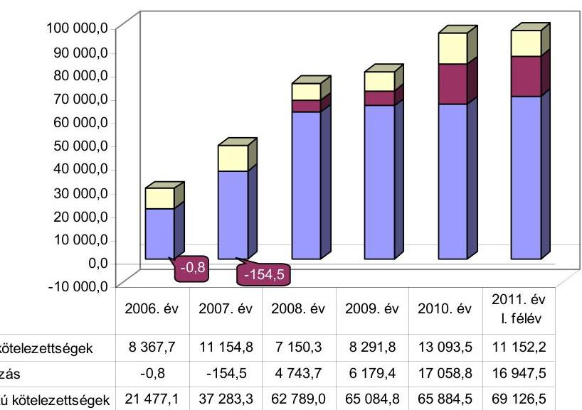

Forrás: Az ellenőrzött önkormányzatok adatszolgáltatása

---

Az önkormányzatok 2007 előtt, valamint a vizsgált időszakban kötött hitelszerződések alapján 2069,7 ezer CHF, 125 ezer EUR, valamint 8151,4 millió Ft hitelt hívtak le, elsősorban fejlesztési feladatok finanszírozására. Az adósságállomány növekedésében szerepet játszott, hogy a mérlegben szereplő kötelezettségek év végi értékelése során elszámolt árfolyamváltozás a kötelezettségállomány növekedésében 25,8%-ot (17059,6 millió Ft-ot) képviselt. Az ellenőrzött városi önkormányzatok közül a devizában fennálló kötelezettség 2010. év végi értékelését kilenc önkormányzat nem végezte el, amely forintban átszámolva a pénzintézeti kötelezettség állományának 9,2%-át jelentette.

A hosszú lejáratú kötelezettségek következő évi törlesztő részlete a 2011. évi 4470,5 millió Ft-ról 2013-ban várhatóan 6973,3 millió Ft-ra növekszik, majd 2015-re 4919,8 millió Ft-ra mérséklődik. A törlesztési kötelezettségek 69,7%-a (60 868,2 millió Ft) a 2016. és az azt követő éveket terheli. A visszafizetés forrásait az önkormányzatok nem mutatták be, a fedezetet nem számszerúsítették.

A pénzügyi egyensúly azonnali helyreállítását igénylő önkormányzatoknál a vállalt pénzintézeti és egyéb kötelezettségek fedezete már rövid távon sem volt biztosított. Nem rendelkeztek további mobilizálható forrásokkal, a folyószámla-, munkabér-megelőlegezési és egyéb likvid hitelek az év háromnegyed részében állandó forrásként voltak jelen az önkormányzatok költségvetésében. A középtávú intézkedést igénylő önkormányzatoknál a közép- és hosszú távú kötelezettségek teljesítéséhez szükséges források megteremtése további intézkedést igényel, mivel a szükséges források középtávon nem, vagy csak részben állnak rendelkezésre, hosszú távra a kötelezettségek visszafizetésének forrásait nem számszerúsítették.

Az önkormányzatok következő éveket terhelő törlesztési kötelezettségének devizanemenkénti összetételében - a megyei és a megyei jogú városok önkormányzataihoz hasonlóan - a svájci frankban fennálló 56 685,3 millió Ft tőketartozás 64,9%-os részesedése képviseli a legnagyobb részarányt. (65. sz. ábra)
65. sz. ábra

Az ellenőrzött városi önkormányzatok hosszú lejáratú kötelezettségei devizanemenként Ft-ra átszámítva 2010. december 31-én
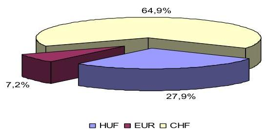

Forrás: MÁK 2010. évi önkormányzati beszámolók alapján
A finanszírozásba bevonható eszközök közül az értékpapír és bankszámlapénz év végi állománya a 2007. évi 49275,2 millió Ft-ról 2008-ra 70 155,1 millió Ft-ra, 42,4%-kal emelkedett, majd 2009-ben 5,7%-kal, 3986,6 millió Ft-tal tovább növekedett. 2010-re ezeket a forrásokat a beruházások és felújítások finanszírozására elkezdték felhasználni, így az 56 598,2 millió Ft-ra (23,7%-kal)

---

mérséklődött. A csökkenés elsősorban a kötvényforrások felhasználását jelentette.

Az ellenőrzött városi önkormányzatoknál a hitelszerződések, támogatási szerződések alapján fedezetként bejegyzett jelzálog nagysága a 2011. június 30-án összesen 144 270,9 millió Ft-ot képviselt. A bejegyzett jelzálogból a pénzügyi egyensúly azonnali helyreállítását igénylő önkormányzatok 137 960,7 millió Ft-tal (96,5%-kal), a közép- és hosszú távú intézkedést igénylő önkormányzatok 6310,1 millió Ft-tal (4,4%-kal) részesedtek. Az Ötv. előírásai $^{35}$ ellenére az önkormányzatok jelzáloggal terheltek 641,1 millió Ft értékű korlátozottan forgalomképes és 935,6 millió Ft értékben forgalomképtelen ingatlant is.

A pénzintézeti kötelezettségek (tőketörlesztés, kamat és egyéb fizetési kötelezettségek) forintban kimutatott összegéből 48,2%, a CHF-ben kimutatott összegéből 19,3%, az EUR-ban kimutatott összegéből 18,3% a 2011-2013 közötti időszakot terheli. A forintban történő fizetés összetétele kedvezőtlen volt, mert 53,5%-a - rövid lejáratú kötelezettségként - terhelte a 2011. év költségvetését. (32. sz. táblázat)
32. sz. táblázat

Az ellenőrzött
 városi önkormányzatok összes pénzintézeti és egyéb kötelezettségállománya 2010. december 31-én és 2011. június 30-án, valamint a törlesztés várható alakulása a kötelezettségek lejáratáig

| Megnevezés | Állomány 2010. dec. 31-én |  |  |  | Állomány 2011. jún. 30-án |  |  |  | Várható kötelezettség 2011-2013. években |  |  | Várható kötelezettség 2014. év után |  |  |
| :--: | :--: | :--: | :--: | :--: | :--: | :--: | :--: | :--: | :--: | :--: | :--: | :--: | :--: | :--: |
|  | HUF-ben   (millió Ft) | Ezer EUR | Ezer CHF | HUF-ben   (millió Ft) | Ezer EUR | Ezer CHF | HUF-ben   (millió Ft) | Ezer EUR | Ezer CHF | HUF-ben   (millió Ft) | Ezer EUR | Ezer CHF |  |  |
| Pénzintézeti kötelezettségek |  |  |  |  |  |  |  |  |  |  |  |  |  |  |
| Hosszú lejáratú hitellel HUF-ben | 13176,6 | 0,0 |  | 0,0 | 13427,1 | 0,0 | 0,0 | 6816,6 | 0,0 | 0,0 | 13486,0 | 0,0 |  | 0,0 |
| Hosszú lejáratú hitellel EUR-ben | 0,0 | 1377,4 | 0,0 |  | 0,0 | 1122,4 | 0,0 | 0,0 | 1331,7 | 0,0 | 0,0 | 82,8 |  | 0,0 |
| Hosszú lejáratú hitellel CHF-ben* | 0,0 | 0,0 | 17642,6 |  | 0,0 | 0,0 | 16985,0 | 7,4 | 0,0 | 3573,4 | 0,0 | 0,0 |  | 14149,5 |
| Rövid lejáratú hitellel HUF-ben | 4861,4 | 0,0 |  | 0,0 | 4736,2 | 0,0 | 0,0 | 1720,0 | 0,0 | 0,0 | 6040,0 | 0,0 |  | 0,0 |
| Rövid lejáratú hitellel EUR-ben | 0,0 | 25075,2 |  | 0,0 | 0,0 | 26413,0 | 0,0 | 0,0 | 8020,7 | 0,0 | 0,0 | 32825,7 |  | 0,0 |
| Rövid lejáratú hitellel CHF-ben* | 0,0 | 0,0 | 272266,6 |  | 0,0 | 0,0 | 268359,4 | 14,5 | 0,0 | 56827,5 | 10,8 | 0,0 |  | 251733,5 |
| Folyószámlahitel | 5455,9 | 0,0 |  | 0,0 | 5450,3 | 0,0 | 0,0 | 5456,5 | 0,0 | 0,0 | 0,0 | 0,0 |  | 0,0 |
| Egyéb lízing hitel | 1763,3 | 0,0 |  | 0,0 | 2497,2 | 0,0 | 0,0 | 2305,3 | 0,0 | 0,0 | 0,0 | 0,0 |  | 0,0 |
| Munkavállalói csekkhitel | 833,4 | 0,0 |  | 0,0 | 842,2 | 0,0 | 0,0 | 843,6 | 0,0 | 0,0 | 0,0 | 0,0 |  | 0,0 |
| Pénzintézeti kötelezettségek összesen HUF-ben | 26133,6 |  |  |  | 27949,6 |  |  | 18407,9 |  |  | 19608,7 |  |  |  |
| Pénzintézeti kötelezettségek összesen EUR-ben |  | 26452,6 |  |  |  | 27536,4 |  |  | 7354,4 |  |  | 32909,3 |  |  |
| Pénzintézeti kötelezettségek összesen CHF-ben |  |  | 289909,4 |  |  |  | 285024,4 |  |  | 63401,2 |  |  |  | 265872,4 |
| Állami támogatás |  |  |  |  |  |  |  |  |  |  |  |  |  |  |
| Kezesség HUF-ben | 4820,4 | 0,0 |  | 0,0 | 5100,3 | 0,0 | 0,0 | 0,0 | 0,0 | 0,0 | 0,0 | 0,0 |  | 0,0 |
| Kezesség CHF-ben | 0,0 | 0,0 | 13902,7 |  | 0,0 | 0,0 | 28529,3 | 0,0 | 0,0 | 0,0 | 0,0 | 0,0 |  | 0,0 |
| Kezességek összesen | 4820,4 | 0,0 | 13902,7 |  | 5100,3 | 0,0 | 28529,3 | 0,0 | 0,0 | 0,0 | 0,0 | 0,0 |  | 0,0 |
| Szabad felhasználású tartozás | 12626,2 | 0,0 |  | 0,0 | 11448,1 | 0,0 | 0,0 | 11448,1 | 0,0 | 0,0 | 0,0 | 0,0 |  | 0,0 |
| Egyéb kötelezettségek PPP | 3376,5 | 0,0 |  | 0,0 | 3236,3 | 0,0 | 0,0 | 763,7 | 0,0 | 0,0 | 2517,4 | 0,0 |  | 0,0 |
| Pénzügyi lízing HUF-ben | 20,0 | 0,0 |  | 0,0 | 25,4 | 0,0 | 0,0 | 22,8 | 0,0 | 0,0 | 5,7 | 0,0 |  | 0,0 |
| Pénzügyi lízing CHF-ben | 0,0 | 0,0 | 307,6 |  | 0,0 | 0,0 | 259,0 | 0,0 | 0,0 | 191,5 | 0,0 | 0,0 |  | 106,5 |
| Egyéb HUF-ben | 4509,7 | 0,0 |  | 0,0 | 3560,6 | 0,0 | 0,0 | 3551,6 | 0,0 | 0,0 | 0,0 | 0,0 |  | 0,0 |
| Egyéb EUR-ben | 0,0 | 0,0 |  | 0,0 | 0,0 | 0,0 | 0,0 | 0,0 | 1105,8 | 0,0 | 0,0 | 679,0 |  | 0,0 |
| Megjegyzés: *a CHF alapú kötvények kibocsátásához, illetve a hosszú lejáratú hitellelvételekhez forintban fizetendő kötelezettségek is kapcsolódnak. |

Forrás: Az ellenőrzött önkormányzatok adatszolgáltatása

[^0]
[^0]:    ${ }^{35}$ Az Ötv. 88. § (1) bekezdésében foglaltak szerint a hitelek fedezeteként önkormányzati törzsvagyont nem lehetett kijelölni. 2012. január 1-jétől hatályon kívül helyezte az új Ötv. 144. § (1) bekezdése a 156. § (1) bekezdés a) pontjában foglalt kijelölés alapján. A nemzeti vagyonról szóló 2011. évi CXCVI. törvény 6. § (1) és (5) bekezdésében a forgalomképtelen önkormányzati törzsvagyon terhelési tilalmát rögzítették. E § (6) bekezdése meghatározta a korlátozottan forgalomképes önkormányzati vagyon körét, amely felett a rendelkezési jog gyakorlását jogszabály feltételhez kötötte.

---

Az ellenőrzött városi önkormányzatoknál 2010. december 31-én a garancia és kezességvállalásból fennálló kötelezettség összege 4820,4 millió Ft és 13 902,7 ezer CHF volt. Az önkormányzatok 2011. június 30-ig 446,9 millió Ft kötelezettséget teljesítettek, amelyből 101 millió Ft térült meg.

Az ellenőrzött önkormányzatok közül a 2010. december 31-ei állapot szerint 23 önkormányzat vállalt kezességet, bankgaranciát gazdasági társaságaik hosszú lejáratú és folyószámlahitelei után, vízi-közmű társulások hitelfelvételei kapcsán, valamint egy-egy önkormányzat társasházak, lakásszövetkezetek felújítási célú hitelfelvételével, magánszemélyek kölcsöntartozásával összefüggésben. A pénzügyi egyensúly azonnali helyreállítását igénylő önkormányzatok 5381,2 millió Ft (72,1%), a középtávú intézkedéseket igénylő önkormányzatok 741,8 millió Ft (9,9%), a rövid és középtávon rendben lévő önkormányzatok 1338,4 millió Ft (18%) kezességet és bankgaranciát vállaltak.

A PPP konstrukcióban a vizsgált időszakban az ellenőrzött önkormányzatoknál három tanuszoda és egy tornacsarnok készült el. A beruházások miatt az önkormányzatok 2010. év végén fennálló kötelezettsége 3376,5 millió Ft-ot tett ki. A négy érintett önkormányzat 3965 millió Ft kötelezettségvállalásból 2011. június 30-ig 727 millió Ft fizetési kötelezettséget teljesített.

Az Önkormányzatok pénzügyi helyzetét befolyásolhatja a minősített többségi tulajdonú társaságai kötelezettségeinek alakulása is. A kötelezettségek nem teljesítése a pénzügyi kockázat mellett feladatellátási kockázatot is jelenthet, tekintettel arra, hogy az önkormányzatok kötelező feladatellátásában a vizsgált időszakban 168 gazdasági társaság vett részt.

A pénzügyi egyensúly azonnali helyreállítását igénylő önkormányzatok közül 16 önkormányzat minősített többségi tulajdonú gazdasági társasága gazdálkodása, szállítói állománya, pénzintézeti és egyéb kötelezettsége kockázatot jelentett a tulajdonos önkormányzat számára.

A pénzintézeti kötelezettségek (tőketörlesztés, kamat és egyéb fizetési kötelezettség) forintban kimutatott összegéből 71,5%, a CHF-ben fennálló tartozásból 17,1%, az EUR-ban kimutatott kötelezettségből 26,5% a 2011-2013 közötti időszakot terheli. (33. sz. táblázat)
33. sz. táblázat

Az ellenőrzött városi önkormányzatok minősített többségi tulajdonú gazdasági társaságai összes pénzintézeti és egyéb kötelezettségállománya 2010. december 31-én és 2011. június 30-án, valamint a törlesztés várható alakulása a kötelezettségek lejáratáig

| Megnevezés | Állomány 2010. dec. 31-én |  |  |  | Állomány 2011. jún. 30-án |  |  | Várható kötelezettség 2011-2013. években |  |  | Várható kötelezettség 2014. évtől |  |  |
| :--: | :--: | :--: | :--: | :--: | :--: | :--: | :--: | :--: | :--: | :--: | :--: | :--: | :--: |
|  | HUF-ban (millió Ft) | Ezer EUR | Ezer CHF | HUF-ban (millió Ft) | Ezer EUR | Ezer CHF | HUF-ban (millió Ft) | Ezer EUR | Ezer CHF | HUF-ban (millió Ft) |  | Ezer EUR | Ezer CHF |
| Kötvény CHF-ben | 0,0 | 0,0 | 13581,0 | 0,0 | 0,0 | 13477,0 | 0,0 | 0,0 | 2368,0 | 0,0 | 0,0 | 11444,0 |  |
| Kötvény HUF-ben | 1867,0 | 0,0 | 0,0 | 1125,0 | 0,0 | 0,0 | 11580,0 | 0,0 | 0,0 | 1301,0 | 0,0 | 0,0 | 0,0 |
| Kötvény EUR-ben | 0,0 | 18270,0 | 0,0 | 0,0 | 17162,0 | 0,0 | 0,0 | 5297,0 | 0,0 | 0,0 | 17430,0 | 0,0 |  |
| Kötvény EUR-ben | 0,0 | 0,0 | 14278,0 | 0,0 | 0,0 | 14265,0 | 0,0 | 0,0 | 2426,0 | 0,0 | 0,0 | 14682,0 |  |
| A hordozólevél- és egyéb rövid lejáratú kötelezettségek | 1292,7 | 0,0 | 0,0 | 1398,5 | 0,0 | 0,0 | 1408,7 | 0,0 | 0,0 | 16,3 | 0,0 | 0,0 | 0,0 |
| Állami támogatási kötelezettségek | 2086,0 | 18270,0 | 27960,7 | 3155,2 | 17162,0 | 27867,3 | 2594,0 | 6287,0 | 5403,0 | 1031,8 | 17438,2 | 26128,0 |  |
| Lízing kötelezettségek HUF-ben | 26,7 | 0,0 | 0,0 | 45,5 | 0,0 | 0,0 | 43,8 | 0,0 | 0,0 | 8,2 | 0,0 | 0,0 |

 | 0,0 |
| Láng kötelezettségek EUR-ben | 0,0 | 43,1 | 0,0 | 0,0 | 16,6 | 0,0 | 0,0 | 25,0 | 0,0 | 0,0 | 0,0 | 0,0 | 0,0 |
| Láng kötelezettségek CHF-ben | 0,0 | 0,0 | 25,8 | 0,0 | 0,0 | 1,0 | 0,0 | 0,0 | 25,8 | 0,0 | 0,0 | 0,0 | 0,0 |
| Szabály tartozás | 4078,0 | 0,0 | 0,0 | 4319,8 | 0,0 | 0,0 | 4319,8 | 0,0 | 0,0 | 0,0 | 0,0 | 0,0 | 0,0 |
| Egyéb | 1101,0 | 0,0 | 14,8 | 1596,1 | 0,0 | 11,8 | 103,3 | 0,0 | 16,5 | 472,5 | 0,0 | 0,0 |  |

Forrás: Az ellenőrzött önkormányzatok adatszolgáltatása

---

# 5.4. A városi önkormányzatok pénzügyi helyzetének ellenőrzése során tett megállapítások összegzése 

A 62 ellenőrzött városi önkormányzatnál egyidejűleg lefolytatott ellenőrzés megállapításai alapján a pénzügyi helyzetükben rejlő kockázatok az alábbiakban foglalhatók össze:

- a működési jövedelem a 2007-2010. években az önkormányzatoknál összességében pozitív értéket mutatott. Működési kockázatot jelentett, hogy az ellenőrzött önkormányzatok közül 22 negatív működési jövedelemmel rendelkezett a 2010. évben;
- a tőketörlesztést is figyelembe vevő nettó működési jövedelem (pénzügyi kapacitás) az önkormányzatoknál összességében pozitív értéket mutatott. A pénzügyi kapacitás 2009-ről 2010-re azonban romlott a működési jövedelem csökkenése és a tőketörlesztési kötelezettség növekedése következtében. 2009-ben az önkormányzatok 35,5%-ánál (22), míg 2010-ben már 53,2%-ánál (33) nem nyújtott fedezetet a működési jövedelem az adósságszolgálatra. Az önkormányzatok pénzügyi egyensúlyi helyzetét veszélyezteti az adósságszolgálat további növekedése;
- a lejárt határidejű szállítókkal szembeni tartozások a 2007-ről 2010-re 74,8%-kal (2063,9 millió Ft) növekedtek, amely további kockázatot jelenthet az önkormányzatokra. A 60 napot meghaladó szállítói tartozások miatt az érintett önkormányzatokkal szemben adósságrendezési eljárás kezdeményezhető;
- a folyószámla- és egyéb rövid lejáratú hitel folyamatosan növekvő napi átlagos állománya, a hitellel zárt napok száma az önkormányzatok felénél a költségvetésbe beépült tartós forráshiányt jelezte. Esetükben további mobilizálható, likvid források hiányában növekvő mértékben folytatódik a pénzügyi hiány termelése;
- az önkormányzatok felhalmozási költségvetése 2007-2010-ben összességében pénzügyi hiányt mutatott. A nettó működési jövedelem a felhalmozási költségvetés hiányára teljes mértékben nem nyújtott fedezetet, ami külső források bevonását tette szükségessé. A létrehozott beruházások jövőbeni fenntartási kötelezettsége tovább terhelheti az önkormányzatok költségvetését;
- a folyamatban lévő és a tervezett beruházások finanszírozásában az EU-s források súlya meghatározó. A támogatások előfinanszírozása, az egyre csökkenő saját források biztosítása kockázatot jelent az önkormányzatoknak. Mindez a fejlesztési célkitűzések és a források áttekintését igényli az érintett önkormányzatok részéről;
- a pénzintézetek felé fennálló, növekvő tendenciájú kötelezettségek finanszírozhatósága az önkormányzatok felénél már rövid távon sem biztosított. A törlesztési kockázatot növeli az önkormányzatok 53,2%-ánál kimutatott negatív nettó működési jövedelem mellett a devizában fennálló kötelezettségek miatti árfolyamkitettség is;

---

- az elhasználódott eszközök pótlására forrást biztosító amortizációs (felújítási) alap képzésének $^{36}$ elmaradása a feladatellátást szolgáló tárgyi eszközök állagának romlásával rejtett adósságot keletkeztet.

Az ÁSZ a 62 ellenőrzött város működési, beruházási, a hosszú lejáratú pénzintézeti és a szállítói kötelezettségeinek teljesítésével kapcsolatos pénzügyi kockázatokat együtt elemezte. (66. sz. ábra)
66. sz. ábra

Az ellenőrzött városi önkormányzatok főbb mutatóinak megoszlása a pénzügyi egyensúly kockázata alapján képzett csoportokban
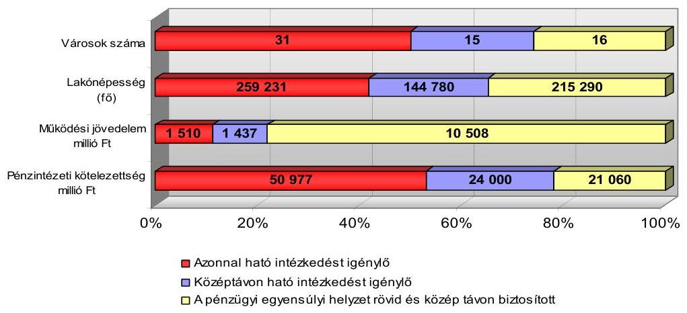

Az ÁSZ az önkormányzatoknak egyeztetésre megküldött jelentéstervezetben:

- a pénzügyi egyensúly azonnali helyreállítását biztosító intézkedéseket tartott szükségesnek 31 önkormányzatnál,
- középtávon ható intézkedéseket javasolt 15 önkormányzat részére,
- rövid és középtávon biztosítottnak találta 16 önkormányzat pénzügyi egyensúlyát, és hosszú távon ennek fenntartását javasolta.

Az ÁSZ a javaslataiban a következő rövid és középtávon ható intézkedésekre hívta fel az érintett önkormányzatok figyelmét:

- a bevételszerző és kiadáscsökkentő lehetőségek feltárására;
- reorganizációs program készítésére a kedvezőtlen pénzügyi folyamatok megállítására, a pénzügyi helyzet gyors stabilizálására, illetve kibontakozási program készítésére a pénzügyi helyzet javítása és hosszú távú megőrzése érdekében;
- egyensúlyi (elkülönített) tartalék képzésére az adósságszolgálat teljesítése érdekében;

[^0]
[^0]:    $^{36}$ Erre a jelenlegi szabályozási környezetben nem kötelezi előírás az önkormányzatokat.

---

- a feladatellátás intézményi szerkezetének felülvizsgálatára, annak racionalizálására;
- az önként vállalt feladatok finanszírozhatóságának áttekintésére a kötelező feladatellátás elsődlegességének biztosítása érdekében;
- a folyamatban lévő beruházásokkal kapcsolatos kötelezettségek átütemezési lehetőségeinek felmérésére, a megvalósuló létesítmények fenntarthatóságának vizsgálatára;
- a tervezett beruházások felülvizsgálatára;
- az állandósult folyószámla- és likvid hitelek hosszú távú kötelezettséggé történő átalakítására vonatkozó jogi lehetőség megvizsgálására;
- a képviselő-testület havonta/félévente történő tájékoztatására a kötelezettségek finanszírozási forrásairól, legalább három évre kitekintően;
- az adósságot keletkeztető kötelezettségvállalásoknál az árfolyam-, kamat- és törlesztési kockázatok, valamint a visszafizetés forrásainak képviselő-testület részére történő bemutatására;
- a kezességvállalás, garancia és helytállási kötelezettségvállalás esetén azok pénzügyi kockázatainak Képviselő-testület részére történő bemutatására;
- a lejárt szállítói állomány kezelésére a szállítói kitettség és a jogszabályi következmények elkerülése érdekében;
- a minősített többségi tulajdonú gazdasági társaságok aktuális pénzügyi helyzetének figyelemmel kísérésére a tulajdonosi érdekek védelme érdekében.

# 6. A kockázatelemzés alapján kiválasztott 12 önkormányzat gazdálkodási rendszerének „pilot" ellenőrzési tapasztalatai 

A „pilot" ellenőrzések során két ütemben összesen 12 önkormányzat (öt város és hét község) gazdálkodási rendszerének ellenőrzését végezte el az ÁSZ. Az ellenőrzések - amelyekkel egyidejűleg több stratégiai célkitűzésnek is eleget tettünk - célja volt a kijelölt önkormányzatok gazdálkodási rendszerének ellenőrzése során négy, egymáshoz szorosan kapcsolódó ellenőrzési terület értékelése, az ellenőrzötteket segítő javaslatok megfogalmazása. Célunk volt továbbá beazonosítani, hogy melyek a legkockázatosabb területek az önkormányzatok gazdálkodásában és hasznos tapasztalatokat gyűjteni ezen témák jövőbeni hatékony ellenőrzésére alkalmas programok kimunkálásához, illetve továbbfejlesztéséhez.

---

Az ellenőrzött 12 önkormányzat területi elhelyezkedését és lakosságát (2011. január 1-jén) a következő, 67. sz. ábra szemlélteti:
67. sz. ábra
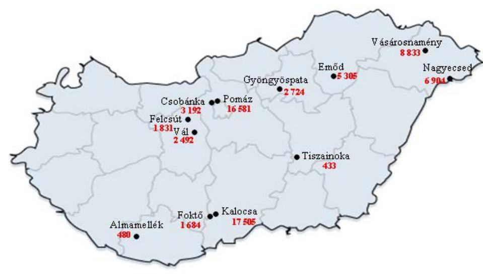

Forrás: Az ellenőrzött önkormányzatok adatszolgáltatása
Az ellenőrzött 12 önkormányzat fejlettsége, feladatellátása és lakónépessége területi elhelyezkedésükből adódóan is különböző. Az ország nyugati és a középső régiójának fejlettebb térségeiben erőteljesebb a vállalkozói aktivitás, ezáltal magasabb az adóerőképesség is. Ezen fejlettebb térségekben lévő településeken a munkanélküliségi ráta az országos átlag $^{37}$ alatti, míg jellemzően az ország keleti és déli területein az országos átlag feletti.

# 6.1. A 12 ellenőrzött önkormányzatnál feltárt pénzügyi kockázatok 

Az ellenőrzésre történő kiválasztás alapja előzetes kockázatértékelés volt. A pénzügyi és a vagyoni helyzetet jellemző mutatószámok figyelembevételével kockázati sorrend felállítására került sor, amelyben súlyozásra kerültek az önkormányzati vagyon alakulását, a fizetőképességet, az eladósodást jellemző mutatók, valamint az egyéb pénzügyi mutatók. A „pilot" ellenőrzések visszaigazolták az előzetes kockázatértékelést. Az ÁSZ megállapította, hogy a kockázatértékelés alapján kiválasztott 12 önkormányzatnál a pénzügyi helyzet alakulására ható problémák fokozottan jelentkeztek, rámutatott az ellenőrzött önkormányzatok pénzügyi helyzetének 2007-2010 közötti kedvezőtlen tendenciáira, így az eladósodás jelentős növekedésére, a likviditás hiányára, a tartalékok csökkenésére. Az ellenőrzés során az ÁSZ feltárta a pénzügyi kockázatok kezelését célzó intézkedések (köztük a döntés-előkészítő, és a döntésmegalapozó eljárások) hiányosságait, amelyek hozzájárultak a kedvezőtlen pénzügyi folyamatok kialakulásához. Az ÁSZ ráirányította a figyelmet továbbá a pénzügyi helyzetet befolyásoló pénzügyi kockázatokra (nemfizetési kockázat, visszafizetési kockázat, kamat- és árfolyamkockázat, gazdasági társaságok kockázata, jövőbeni működési kockázat) és azok főbb okaira is.

A finanszírozási rendszerben lévő kockázatot jelentette, hogy a kötelező önkormányzati feladatok finanszírozásában a központi támogatás aránya folyamatosan csökkent. Az időszak alatt az ellenőrzött önkormányzatok működési jövedelemtermelő képessége (főként a költségvetési támogatások és az átengedett bevételek csökkenése, valamint a folyó kiadások növekedése miatt) jellemzően csökkent. Az ellenőrzött önkormányzatok mintegy fele ÖNHIKI támogatásban is részesült. 2010-ben az ellenőrzött önkormányzatok közel felénél az ÖNHIKI támogatásokat is tartalmazó folyó bevételek már a folyó kiadásokra sem biztosítottak fedezetet. Az önkormányzatok által kimutatott adatok szerint az önként vállalt feladatokra fordított kiadások aránya két város és egy község esetében kiugróan magas (53,3, 41,6, 30,5%) volt, amely a kötelező feladatellátás kockázatát növelte. A bevételi kitettség miatti kockázatként tárta fel az ÁSZ, hogy az ellenőrzött önkormányzatoknál jellemzően új helyi adó bevezetésére lehetőség nincs, a kivetett helyi adók a városok esetében a törvényben meghatározott maximális szintet elérték.

A tőketörlesztést is tükröző nettó működési jövedelem az ellenőrzött önkormányzatoknál jellemzően csökkent 2007-ről 2010-re, amelyet a folyó bevételek és kiadások különbségéből származó működési jövedelem csökkenése mellett az emelkedő törlesztési kötelezettség (a hitelek és kötvények tőketörlesztésének a 2010. évi megkezdése) okozta. Az ellenőrzött önkormányzatok tartalékai 2010-re elfogytak, a vállalt hosszú távú kötelezettségeik teljesítésére, a képződő működési jövedelem, a szabad pénzmaradvány és a rendelkezésre álló egyéb likvid eszközök nem nyújtottak fedezetet, ami a jövőben jelentkező működési kiadások kockázatát jelentősen növeli. A nettó működési jövedelem negatív értéke túlzott mértékű adósságszolgálatra utal.

Az ellenőrzött önkormányzatok likviditási helyzete 2007-ről 2010-re többségüknél kedvezőtlenül változott, a folyószámlahitelek napi átlagos állománya évről évre nőtt. 2010-ben a folyószámlahitel az ellenőrzöttek felénél már az év valamennyi napján fennállt. Az önkormányzatok által igénybevett likvid hitelek már nem csak a rövid időn belül megtérülő kiadások finanszírozását, a likviditás biztosítását szolgálták, hanem jellemzően az állandósult pénzügyi hiány finanszírozási forrásává váltak.

A lejárt szállítói tartozásállomány 2007-2010 közötti növekedése az ellenőrzöttek többségénél magas nemfizetési kockázatot jelent.

A felhalmozási egyenleg mind a 12 önkormányzatnál az ellenőrzött időszakban negatív volt. Az ÁSZ megállapította, hogy a deficit által generált felhalmozási hiány önmagában nem járna pénzügyi kockázattal, azonban a felhalmozási kiadások finanszírozásához - az egyre csökkenő működési jövedelem és növekvő tőketörlesztési kötelezettség miatt - a nettó működési jövedelem az időszak alatt jellemzően nem nyújtott fedezetet. A tartós pénzügyi kapacitás csökkenés a felhalmozási kiadások finanszírozása szempontjából magas kockázatot hordoz.

---

A „pilot" ellenőrzésbe vont önkormányzatok felhalmozási tevékenységét is (hasonlóan a többi ellenőrzött városhoz) erőteljesen befolyásolták az európai uniós pályázatok adta lehetőségek. A megvalósított beruházások főként csapadékvíz elvezetés, szennyvízhálózat bővítés, oktatási intézmények felújítása, kórházfejlesztés, park felújítás, városközpont rehabilitáció, útfelújítások, tornaterem és sportpálya felújítások, intézményi akadálymentesítések voltak. A 2010 utánra áthúzódó felhalmozási célú kötelezettségvállalások saját forrásainak fedezetét az érintett önkormányzatok nem számszerűsítették.

Az ellenőrzött önkormányzatok a pénzügyi hiány finanszírozására 2007-2010 között újabb külső forrásokat vontak be, így a pénzintézetek felé fennálló kötelezettségállományuk jelentősen nőtt. Az ellenőrzött önkormányzatoknál jellemzően a működési jövedelem és tartalékok nem nyújtottak fedezetet a tőketörlesztésre, a 2010. év végén fennálló kötelezettségvállalásaik visszafizetésének forrásait nem határozták meg.

A feltárt pénzügyi kockázatok azt igazolják, hogy a jövőben az ellenőrizendő önkormányzatokat előzetes kockázatértékelés alapján indokolt kiválasztani.

# 6.2. A vagyongazdálkodási folyamatok szabályossága és kockázatai 

A „pilot" ellenőrzési programban az ÁSZ feladatul tűzte ki, hogy ellenőrzi és értékeli az önkormányzatoknál a vagyongazdálkodási folyamatokban a belső kontrollrendszer kiépítésének, valamint a belső kontrollok működésének megfelelőségét. Az előzetes kockázatelemzés során az ÁSZ abból indult ki, hogy a

 vagyongazdálkodás kontrolljainak elmaradása veszélyezteti az önkormányzat pénzügyi stabilitását, az önkormányzati vagyon gyarapítását, a kontrollok nem megfelelő működése esetén fennáll a pazarló gazdálkodás kockázata is. Ennek figyelembevételével az ÁSZ értékelte az ellenőrzött 12 önkormányzatnál a belső kontrollok szabályozását és működését a vagyongazdálkodás egyes folyamataiban. Felmérte a belső kontrollokban rejlő kockázatokat, minősítette a kontrollok működésének eredményességét és meghatározta, hogy a vagyongazdálkodás egyes területein mely kontrollok nem biztosították a működésbeli hibák megelőzését, feltárását, kijavítását, ezáltal veszélyeztették az eredményes, megfelelő működést.

Az ÁSZ a 12 önkormányzat ellenőrzése során rámutatott, hogy a vagyongazdálkodási folyamatok szabályozása az ellenőrzött önkormányzatoknál jellemzően elmaradt, a hiányosságok magas kockázatot jelentettek a vagyongazdálkodási feladatok végrehajtásában. A szabályozási hiányosságok miatt a belső kontrollok nem működtek, a kontrollok nem biztosították a vagyongazdálkodás szabályosságát. A vagyongazdálkodási folyamatok belső kontrolljainak kialakításával és működésével kapcsolatosan az ÁSZ feltárta - következőkben bemutatott - a szabályozási és szabályszerűségi (köztük a döntés előkészítő és döntésmegalapozó eljárások, kockázatfelmérések, hatástanulmányok) hiányosságokat, amelyek hozzájárultak a kedvezőtlen pénzügyi folyamatok kialakulásához is:

- Nem írták elő, így nem is végezték el (az összesen mintegy 10 milliárd Ft értékű) beruházások, felújítások várható fenntartási költségeinek a számbavé-

---

telét, illetve indokolt esetekben nem írtak elő és nem végeztek költség-haszon elemzést.

- Nem írták elő az adósságot keletkeztető kötelezettségvállalások (összesen mintegy 4 milliárd Ft) pénzügyi kockázatai (visszafizetési kockázat, kamat-és árfolyamkockázat) felmérésének kötelezettségét, így nem is mérték fel azokat.
- Nem működött a kockázatelemzés és a kockázatkezelés, valamint az éves ellenőrzési tervet nem támasztották alá kockázatelemzéssel.
- A hitelfelvételről, kötvénykibocsátásról szóló döntés-előkészítés folyamatában nem írták elő és nem végezték el a futamidő egyes éveit terhelő kötelezettség költségvetési egyensúlyra gyakorolt hatásának vizsgálatát.
- A vagyongazdálkodási folyamatok tekintetében nem készítettek, ezáltal nem is működtettek - az ellenőrzési pontokat és az ellenőrzésért felelősöket tartalmazó - ellenőrzési nyomvonalat.
- A vagyongazdálkodási folyamatokra vonatkozó vezetői ellenőrzési (beszámoltatási) kötelezettséget a FEUVE keretében nem írták elő és nem működtették.
- A szakmai teljesítés igazolásának módját nem határozták meg.
- Nem írták elő a bevételeket megalapozó szerződések felülvizsgálatának feladatai között annak ellenőrzési kötelezettségét, hogy a szerződés megfelelően tartalmazza-e a döntéshozó által meghatározott feltételeket (ellenérték, fizetési feltételek, szankciók nem teljesítés esetére).

A kulcsszerepet betöltő belső kontrollok (a kötelezettségvállalások ellenjegyzése, a szakmai teljesítések igazolása és az utalványok ellenjegyzése) működésének értékelését a kockázatuk alapján kiválasztott területeken ${ }^{38}$ a 12 ellenőrzött önkormányzatnál összesen 611 millió Ft bevételre és összesen 1096,4 millió Ft kiadásra folytattuk le. A belső kontrollok működésének értékelése során alkalmazott ellenőrzési eljárás, a többlépcsős megfelelőségi teszt rövid bemutatását az 1. számú Függelék 2. pontja tartalmazza.

[^0]
[^0]:    ${ }^{38}$ a bérleti- és lízingdíj kifizetések, a vásárolt közszolgáltatásokkal, a karbantartási, kisjavítási szolgáltatásokkal, az ingatlanok felújításával, az épületek vásárlásával és létesítésével, a gazdasági társaságok részére történő kölcsönök nyújtásával kapcsolatos, továbbá az államháztartáson kívüli szervezetek részére történő működési és felhalmozási célú pénzeszközátadásokra teljesített kifizetések, valamint az ingatlanértékesítési, az önkormányzati helyiségek bérbeadási, valamint tartós részesedések értékesítési bevételek

---

A gazdálkodás egyes területein a kulcsszerepet betöltő belső kontrollok az ellenőrzött önkormányzatoknál jellemzően nem működtek. Az ÁSZ az ellenőrzöttek csaknem teljes körében megállapította, hogy a feltárt hiányosságok, mulasztások miatt fennáll a bevételek szabálytalan beszedésének és a kiadások szabálytalan teljesítésének a kockázata az alábbiak miatt:

- a kifizetéseket megelőzően összesen 55,6 millió Ft kiadás tekintetében állapította meg az ÁSZ, hogy elmaradt a kötelezettségvállalás írásba foglalása. Jellemző volt a kötelezettségvállalás ellenjegyzésének az elmaradása is. Ezeknél a kifizetéseknél a kötelezettségvállalást megelőzően nem győződtek meg a kiadási előirányzatok rendelkezésre állásáról, a fedezet meglétéről és nem vizsgálták, hogy a kötelezettségvállalás sérti-e a gazdálkodásra vonatkozó szabályokat. A szakmai teljesítések igazolását - jellemzően az arra jogosultak kijelölésének hiányában - nem végezték el, ezáltal nem győződtek meg a kifizetések jogosságáról, összegszerűségéről, a szerződésekben, megrendelésekben foglaltak teljesítéséről. Az utalványok ellenjegyzői nem észrevételezték a kötelezettségvállalások írásba foglalásának elmulasztását, illetve az írásba foglalt kötelezettségvállalások ellenjegyzésének és a szakmai teljesítés igazolásának elmaradását;
- a bevételeket megalapozó szerződéseknél a kulcskontrollok működésének jellemző hibája miatt - az ellenőrzési feladat előírásának és az ellenőrzés elvégzéséért felelős személy kijelölésének hiányában - nem ellenőrizték, hogy azok megfelelnek-e a képviselő-testületek által meghatározott feltételeknek, továbbá azokban szerepelnek-e az önkormányzatok érdekeit védő garanciális elemek.

A közfeladat ellátás egyre szélesebb körben történő kiszervezése az önkormányzatok többségi tulajdonában lévő gazdasági társaságaiba indokolttá tette annak értékelését, hogy az önkormányzatok eredményesen érvényesítették-e tulajdonosi felelősségüket. Az ÁSZ a tulajdonosi felelősség érvényesítését az érintett önkormányzatok esetében négynél eredménytelennek, egy önkormányzat esetében részben eredményesnek minősítette, mivel nem ellenőrizték a feladat ellátást, az átadott pénzeszközök cél szerinti felhasználását, belső ellenőrzés keretében nem ellenőrizték a társaságok gazdálkodását és a tulajdonosi jogok gyakorlására felhatalmazottak döntéseikről nem számoltak be a képviselő-testületeknek. Az ellenőrzéssel az ÁSZ ráirányította a figyelmet az önkormányzatok és gazdasági társaságaik kockázatos pénzügyi, gazdasági folyamataira. A tulajdonosi kontrollok elmaradása, a gazdasági társaságok kötelezettségei - azok nem teljesítése esetén - az önkormányzatok pénzügyi egyensúlyi helyzetére kockázatot jelent.

A belső kontrollok kialakításában és működésében megállapított hiányosságok veszélyeztetik a gazdálkodási műveletek szabályszerű és eredményes végrehajtását. A feltárt hiányosságok alapján az ÁSZ kezdeményezte egy önkormányzatnál a jegyző fegyelmi felelősségre vonását, hatnál (ebből háromnál az ismétlődő hiányosságok miatt) a felelősséggel kapcsolatos körülmények kivizsgálását.

---

Elvégezte az ÁSZ továbbá a gazdálkodási rendszer korábbi ellenőrzése során tett javaslatok hasznosításának utóellenőrzését is az érintett önkormányzatoknál. Az utóellenőrzés a 2007 óta végzett ellenőrzések megállapításaira, javaslataira terjedt ki. Az önkormányzatok képviselő-testületei - egy önkormányzat kivételével - a jelentésben foglaltakat megismerték és a javaslatok megvalósulására vonatkozó - határidőket és felelősöket tartalmazó - intézkedési tervet elfogadták. Az ÁSZ által tett 191 javaslatból az intézkedési tervben foglalt határidőre 63 teljesült, 18 határidőn túl realizálódott, 22 részben valósult meg és a javaslatok csaknem fele (88) nem hasznosult.

# 6.3. A „pilot” ellenőrzések megállapításai alapján tett intézkedést igénylő javaslatok 

Az ellenőrzések megállapításai alapján az ÁSZ a következő javaslatokat tette:

- Az ÁSZ javasolta a kedvezőtlen pénzügyi folyamatok (az eladósodás növekedésének, a tartalékok csökkenésének) megállítása, a pénzügyi helyzet stabilizálása, hosszú távú fenntarthatósága érdekében szükséges intézkedések megtételét (pénzügyi egyensúlyi helyzet és a pénzügyi kockázatok értékelése alapján a második ütemben ellenőrzött nyolc önkormányzatból hatnál rövid távon, kettőnél középtávon ható intézkedések megtételére tettünk javaslatot).
- Az ÁSZ az ellenőrzöttek csaknem teljes körénél javaslatot tett a jegyzők részére az önkormányzat belső kontrollrendszerének kialakítására, ennek keretében a folyamatba épített előzetes, utólagos és vezetői ellenőrzés kiépítésére, valamint a belső kontrollok szabályszerű és megfelelő működtetésére.
- A második ütemben ellenőrzött nyolc önkormányzatnál javasolta az ÁSZ az általa - véletlenszerűen kiválasztott minta alapján - tesztelt célterületek kifizetéseinek teljesítése, illetve a bevételek beszedése folyamataiban a kulcsszerepet betöltő belső kontrollok működésének a 2007. évig visszamenő tételes ellenőrzését, a mulasztások és azok okainak, körülményeinek, valamint következményeinek feltárását, illetve kivizsgálását a belső ellenőrzés által.
- Az ÁSZ a vagyongazdálkodás területén a belső kontrollrendszer kialakításával és a kontrollok működésével kapcsolatos, valamint az ismétlődő hiányosságok miatt a polgármester intézkedését kezdeményezte a felelősséggel kapcsolatos körülmények kivizsgálása iránt.
- Intézkedéseket kezdeményezett az ÁSZ a tulajdonosi kontrollok kialakítására, illetve azok működtetésére, a tulajdonosi felelősség érvényesítésére az önkormányzatok többségi tulajdonú gazdasági társaságai eladósodásának és a közfeladat-ellátást veszélyeztető körülmények mielőbbi megszüntetésének az érdekében.

---

# 6.4. A „pilot” ellenőrzések tapasztalatainak hasznosítása az önkormányzatok további ellenőrzéseinél 

Az ellenőrzések során szerzett tanulságok, tapasztalatok alapul szolgálnak a kockázatos területek meghatározásához, így a jövőbeni ellenőrzések fókuszainak, témáinak kijelöléséhez, az ellenőrzöttek kiválasztásának szempontjaihoz, az alkalmazandó költséghatékony eljárások, módszerek meghatározásához. A 12 települési önkormányzatnál végzett ellenőrzések során szerzett tapasztalatok megerősítették a 2011. évi és alátámasztják az ÁSZ által a 2012. évben tervezett önkormányzati ellenőrzések szükségességét, időszerűségét, segítik az ellenőrzési program, benne a szempontok, az eljárások és módszerek megfelelő kidolgozását. Tekintettel arra, hogy a kockázatelemzés alapján kiválasztott önkormányzatoknál fokozottan jelentkeztek a pénzügyi helyzet kedvezőtlen tendenciái, ezért a jövőben indokolt kockázat alapon kiválasztani az ellenőrizendő önkormányzatokat.

Az egyes ellenőrzési célok összefüggéseivel kapcsolatosan szerzett tapasztalatok segítik az ellenőrzési program egyes területeinek továbbfejlesztését az ellenőrzött önkormányzatok eltérő adottságai, sajátosságai figyelembevételével. A jövőbeni ellenőrzések területeire, azok egymásra épülésére, hatókörére vonatkozóan - figyelemmel az ÁSZ Stratégiájában megfogalmazott azon célkitűzésre, amely szerint rendszerszemléletű, összefoglaló értékelésekre lehetőséget adó ellenőrzéseket végezzünk - a következő főbb irányok, javaslatok fogalmazhatók meg:

- A „pilot” ellenőrzésbe vont községi önkormányzatoknál lefolytatott ellenőrzések során azonosított szabályossági kockázatok, alapvető szabályozási hiányosságok és jellemzően azokból következő szabálytalan kifizetések indokolttá teszik, hogy az ÁSZ 2012-től a községek körében megkezdje a belső kontrollrendszer kialakításának és a gazdálkodás folyamatában kulcsszerepet betöltő belső kontrollok működése megfelelőségének, valamint a belső ellenőrzés működésének ellenőrzését. A közpénzekkel, közvagyonnal való gazdálkodás szabályosságának, eredményességének alapvető feltétele ugyanis a belső kontrollrendszer megfelelő kialakítása és működtetése.
- A „pilot” ellenőrzések során feltárt pénzügyi kockázatok, kedvezőtlen pénzügyi folyamatok is megerősítik, hogy folytatni kell az önkormányzatok pénzügyi helyzetének értékelésére irányuló ellenőrzéseket a kockázatértékelés (objektív mutatók) alapján kiválasztott önkormányzatoknál. A kockázatalapú kiválasztást a pénzügyi kockázatok alapján meghatározott lényegességi ismérvek és azok küszöbértékeinek előzetes meghatározásával kell elvégezni. Azoknál az önkormányzatoknál, amelyeknél a kiválasztást segítő monitoring a pénzügyi kockázatokon túl szabályossági kockázatot is jelez, ott az ellenőrzést a szabályosság értékelésére, azaz a kontrollok működésének megfelelőségére is indokolt kiterjeszteni.
- Az önkormányzatok pénzügyi helyzetének megítéléséhez elválaszthatatlanul kapcsolódik a vagyongazdálkodás, ezért ezen terület értékelése és ellenőrzése az ÁSZ időszerű feladata. A „pilot” ellenőrzéseknél feltárt szabályossági kockázatok segítették azon vagyongazdálkodási területek beazonosítását, amelyek ellenőrzése indokolt, és amelyek hibáinak feltárásával és ki-

---

javíttatásával kedvező hatást gyakorolhat a kockázatok csökkentésére, ezáltal az önkormányzatok vagyongazdálkodásának szabályszerűségére, eredményességére.

- A közpénzekkel gazdálkodó, közfeladatokat egyre szélesebb körben ellátó önkormányzati gazdasági társaságoknál feltárt kockázatok, a tulajdonosi kontrollok alapvető hiányosságai ezen a területen is megerősítik a közvagyon felhasználására irányuló ellenőrzések szükségességét és időszerűségét.
- Az utóellenőrzéseknél feltárt mulasztások, az ismétlődő hiányosságok indokolttá teszik, hogy az ÁSZ-nak a számvevőszéki munka eredményeinek, hatásának erősítése érdekében - a stratégiai célkitűzésekkel összhangban - a jövőben még célzottabbá kell tennie az utóellenőrzést.

Budapest, 2012. április " 1.6 "

Függelék 2 db

Domokos László

---

# AZ ELLENŐRZÉS SORÁN AZ ÉRTÉKELÉSRE ÉS A KIVÁLASZTÁSRA ALKALMAZOTT ELJÁRÁSOK ÉS MÓDSZEREK ISMERTETÉSE 

## 1. A PÉNZÜGYI HELYZET ÉRTÉKELÉSÉRE ALKALMAZOTT CLF MÓDSZER

A CLF módszer következetesen elkülöníti a folyó (önkormányzati feladatokkal kapcsolatos közvetlen működtetési) és a felhalmozási (vagyonnal kapcsolatos) költségvetés bevételeit és kiadásait, azok költségvetési egyenlegeit.
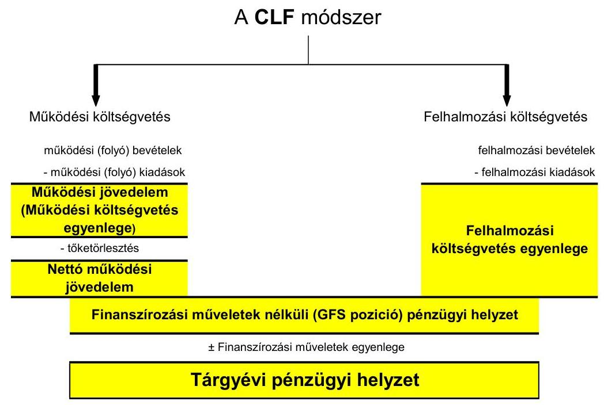

A folyó költségvetés egyenlege a működési jövedelem, amely megmutatja, hogy az önkormányzat éves folyó bevétele fedezetet biztosít-e a kötelező és önként vállalt feladatellátáshoz kapcsolódó éves folyó kiadására. A működési
 jövedelem negatív értéke pénzügyileg fenntarthatatlan helyzetet jelez, míg pozitív értéke megtakarítást mutat, amely forrásul szolgálhat az önkormányzat fennálló kötelezettségei megfizetéséhez, valamint fejlesztéseihez.

A felhalmozási költségvetés pozitív értéke a felhalmozási többlet, amely a jövőbeni fejlesztések forrását biztosíthatja. Amennyiben a folyó költségvetési hiány finanszírozása a felhalmozási többletből történik, ez szűkebb értelemben vagyonfelélésnek tekinthető. Amennyiben a felhalmozási költségvetés megtakarítása fejlesztési célú hitelek, kötvények adósságszolgálatát finanszírozza, az változatlan vagyontömeg mellett, a korábban megelőlegezett tőkebevételek valós realizációjának tekinthető. A felhalmozási deficit által generált finanszírozási igény önmagában nem jár pénzügyi kockázattal, amennyiben a beruházásokhoz kapcsolódó kötelezettségvállalás

---

(adósságszolgálat) átlátható és szabályozott költségvetési gazdálkodással teljesíthető.

A CLF módszer a pénzügyi kapacitás (a nettó működési jövedelem) fogalmát helyezi a középpontba. Az adós hitelfelvételi képessége, hosszú távú fizetőképessége a pénzügyi kapacitással jellemezhető. A nettó működési jövedelmet a tőketörlesztés levonásával a folyó költségvetés egyenlegéből (működési jövedelem) származtatjuk. A nettó működési jövedelem negatív értékének felhalmozási többletből, vagy további hitelből történő finanszírozása pénzügyileg nem fenntartható gazdálkodást vetít előre.

# 2. A VAGYONGAZDÁLKODÁSI KONTROLLOK SZABÁLYOZOTTSÁGÁNAK ÉRTÉKELÉSÉNÉL ÉS BELSŐ KONTROLLJAI MŰKÖDÉSÉNÉL ALKALMAZOTT MÓDSZEREK 

A belső kontrollok működésének tesztelése, ellenőrzése során az elegendő és megfelelő bizonyítékok megszerzése jelentős ellenőri kapacitást igényel, így ezen a területen kiemelten fontos volt a hatékony ellenőrzési módszerek alkalmazása. Ezért a gazdálkodás egyes területein ${ }^{1}$ a kulcsszerepet betöltő belső kontrollok (a kötelezettségvállalás ellenjegyzése, a szakmai teljesítésigazolás és az utalvány ellenjegyzés) működésének értékelését egy számottevő élőmunka megtakarítást jelentő, ezáltal költséghatékony ellenőrzési eljárás - a többlépcsős megfelelőségi tesztek - alkalmazásával végeztük.

A kontrollok szabályozottságának értékelése alapját, az eredményesség kritériumát az előzetesen és egységesen meghatározott szempontrendszer alapján számított kockázati pontok képezték. Ennek megfelelően a következő értékelések adhatók:

- magas a vagyongazdálkodás szabályozottságában rejlő kockázat azoknál az önkormányzatoknál, amelyeknél a kontrollok - kialakításuk hiányában, vagy hiányos kialakításuk miatt - nem nyújtottak elegendő védelmet a lehetséges hibákkal szemben;
- közepes a vagyongazdálkodás szabályozottságában rejlő kockázat azoknál az önkormányzatoknál, amelyeknél a kontrollok a lehetséges hibák többsége ellen védelmet nyújtottak;
- a vagyongazdálkodás szabályozottságban rejlő kockázat azoknál az önkormányzatoknál alacsony, amelyeknél a kontrollok megfelelő védelmet

[^0]
[^0]:    ${ }^{1}$ a bérleti- és lízingdíjakkal, a vásárolt közszolgáltatásokkal, a karbantartási, kisjavítási szolgáltatásokkal, az ingatlanok felújításával, az épületek vásárlásával és létesítésével, a gazdasági társaságok részére történő kölcsönök nyújtásával kapcsolatos, továbbá az államháztartáson kívüli szervezetek részére történő működési és felhalmozási célú pénzeszközátadásokra teljesített kifizetések, valamint az ingatlanértékesítési, az önkormányzati helyiségek bérbeadási, továbbá a tartós részesedések értékesítési bevételei

---

nyújtottak a vagyongazdálkodási folyamatokban a hibák bekövetkezése ellen.

A belső kontrollok működésének megfelelőségét egy előzetesen és egységesen meghatározott értékelési szempontrendszer alapján értékeltük. Ennek megfelelően a következő értékelések adhatók:

- a belső kontrollok működése azoknál az önkormányzatoknál gyenge, amelyeknél a kontrollok a feltárt hiányosságok miatt nem biztosították a gazdálkodás egyes területein a hibák megelőzését, feltárását, kijavítását, és ezáltal veszélyeztették az eredményes, megfelelő gazdálkodást;
- jó a gazdálkodás egyes területein azonosított kontrollok működése azoknál az önkormányzatoknál, amelyeknél a megállapított kisebb (a kritikus hibaszámot el nem érő) hiányosságok nem veszélyeztették a gazdálkodás ellenőrzött területei hibáinak megelőzését és kijavítását;
- a gazdálkodás egyes területein azonosított belső kontrollok működése azoknál az önkormányzatoknál kiváló, amelyeknél a kontrollok működése megfelelt a hibák megelőzésére és kijavítására meghatározott szabályozásnak és elvárásoknak.

# A többlépcsős megfelelőségi tesztek alkalmazásának lényege: 

- A vizsgálatra kijelölt, gazdálkodással összefüggő területek főkönyvi számláin szereplő tételek sokaságából - egyszerű véletlen mintavétellel - kiválasztott gazdasági események tekintetében a belső kontrollok működésének ellenőrzését nem teljes körűen, hanem csak addig végeztük, amíg elegendő és megfelelő bizonyítékot nem szereztünk a vizsgált folyamatok kulcskontrolljai ${ }^{2}$ működésének megfelelő, vagy nem megfelelő voltáról.
- A módszer alkalmazásával csökkentettük a kívánt ellenőrzési bizonyosság eléréséhez szükséges időráfordítást. A módszer alkalmazásával az elvárt bizonyosság és a kritikus hibák száma függvényében általában 30-100 közötti tétel tesztelése alapján már megbízható vélemény alkotható a kontrollok meghatározott cél szerinti működéséről akár több ezer tételt/tranzakciót tartalmazó terület esetében is.

A gazdálkodás egyes területein a kulcsszerepet betöltő belső kontrollok kötelezettségvállalás ellenjegyzése, szakmai teljesítésigazolás, utalvány ellenjegyzés - működését az ellenőrzött önkormányzatoknál a bevételekre

[^0]
[^0]:    ${ }^{2}$ Kulcskontrollok: azok a kontrollok, amelyek az eredendő kockázatok mérséklése szempontjából alapvető fontosságúak és eredményes működésük meghatározó hatással van a kontrollrendszer minőségére. A kulcskontrollok biztosítják más kontrollok (egy vagy több) működési hibájának feltárását, kiküszöbölését; viszonylag könnyen tesztelhetők; a folyamatos, következetes és eredményes működésük legalább két, vagy több működési hiba ellen biztosít védelmet. (Eredendő kockázatok: azon tényezők összessége, amelyek az ellenőrzött szervezet feladatainak megfelelő ellátását, céljainak elérését veszélyeztethetik. Ezek lehetnek szervezeti szintű, valamint az ellenőrzés céljai szerinti specifikus eredendő kockázatok.)

---

összesen 20 megfelelőségi teszt, míg a kiadásokra 43 megfelelőségi teszt lefolytatása útján értékeltük

# 3. Az ELLENŐRZÉS KIVÁLASZTÁSÁNAK MÓDSZEREI 

### 3.1. A városi önkormányzatok ellenőrzésre kiválasztásának módszere

Az egyéb városi kategóriába tartozó 304 önkormányzat közül statisztikai mintavétellel választottuk ki azt 63 városi önkormányzatot, amelynek a helyszíni ellenőrzését terveztük. A statisztikai mintavétel alkalmazásának módszere reprezentatív kiválasztást tett lehetővé, amelynek alapján a mintába került egységek ellenőrzési tapasztalatai a sokaság egészére kivetíthetők. A kiválasztás alapjául szolgáló klaszterképző pénzügyi indikátorok a tárgyévi pénzügyi pozíció, az összes kötelezettség és a finanszírozásba bevonható eszközök egy lakosra vetített értékei voltak. Az indikátorok együttes kezelése csaknem teljes reprezentatív bizonyosságot eredményez.

Esztergom Város Önkormányzata a helyszíni ellenőrzéshez a módosított határidőre sem szolgáltatott adatokat, ezért a helyszíni ellenőrzés meghiúsult. A mintavétel során Esztergom és Veresegyház egyelemű klasztert alkotott. Esztergom hiánya nem érintette a reprezentativitást, vagyis a 62 városi önkormányzat ellenőrzésének tapasztalatai a sokaság egészét jellemzik.

### 3.2. A ,,pilot" ellenőrzésre a kiválasztási eljárás

A kiválasztásnál alkalmazott eljárás (kockázatalapú kiválasztás) lényege, hogy az önkormányzatok beszámolóiból számított, előre meghatározott számú (munkacsoport által meghatározott és elfogadott), a pénzügyi és a vagyon helyzetet jellemző mutatószámok alapján állítottunk fel kockázati sorrendet. A sorrend kialakításánál súlyoztuk az önkormányzati vagyon alakulását jellemző mutatókat, a fizetőképességgel és az eladósodással kapcsolatos, valamint az egyéb pénzügyi indikátorokat. A kiválasztás szempontja a kockázatosnak minősülő települések ellenőrzésén túlmenően a mutatószámrendszer és az ahhoz kapcsolódó kockázati besorolások helytállóságának tesztelése is volt. A kiválasztás adatforrásai a jelenlegi beszámolási rendszer adatai, másfelől az egyes önkormányzatok által szolgáltatott korlátozott számú információk voltak.

---

# AZ ELLENŐRZÖTT 62 VÁROSI ÖNKORMÁNYZAT JEGYZÉKE 

1. ABÁDSZALÓK VÁROS ÖNKORMÁNYZATA
2. ADONY VÁROS ÖNKORMÁNYZATA
3. BADACSONYTOMAJ VÁROS ÖNKORMÁNYZATA
4. BALATONALMÁDI VÁROS ÖNKORMÁNYZATA
5. BALATONFÜZFŐ VÁROS ÖNKORMÁNYZATA
6. BALMAZÚJVÁROS VÁROS ÖNKORMÁNYZATA
7. BÁTASZÉK VÁROS ÖNKORMÁNYZATA
8. BÁTONYTERENYE VÁROS ÖNKORMÁNYZATA
9. BERETTYÓÚJFALU VÁROS ÖNKORMÁNYZATA
10. BUDAÖRS VÁROS ÖNKORMÁNYZATA
11. CIGÁND VÁROS ÖNKORMÁNYZATA
12. CSENGER VÁROS ÖNKORMÁNYZATA
13. DEMECSER VÁROS ÖNKORMÁNYZATA
14. DEVECSER VÁROS ÖNKORMÁNYZATA
15. DUNAVECSE VÁROS ÖNKORMÁNYZATA
16. FERTŐD VÁROS ÖNKORMÁNYZATA
17. FONYÓD VÁROS ÖNKORMÁNYZATA
18. GÖD VÁROS ÖNKORMÁNYZATA
19. GYOMAENDRŐD VÁROS ÖNKORMÁNYZATA
20. HARKÁNY VÁROS ÖNKORMÁNYZATA
21. HATVAN VÁROS ÖNKORMÁNYZATA
22. HÉVÍZ VÁROS ÖNKORMÁNYZATA
23. IGAL VÁROS ÖNKORMÁNYZATA
24. JÁSZFÉNYSZARU VÁROS ÖNKORMÁNYZATA
25. KABA VÁROS ÖNKORMÁNYZATA
26. KEMECSE VÁROS ÖNKORMÁNYZATA
27. KISKUNMAJSA VÁROS ÖNKORMÁNYZATA
28. KISÚJSZÁLLÁS VÁROS ÖNKORMÁNYZATA
29. KISVÁRDA VÁROS ÖNKORMÁNYZATA
30. KOMÁROM VÁROS ÖNKORMÁNYZATA
31. KOMLÓ VÁROS ÖNKORMÁNYZATA
32. KUNSZENTMIKLÓS VÁROS ÖNKORMÁNYZATA
33. LENGYELTÓTI VÁROS ÖNKORMÁNYZATA
34. MÁRIAPÓCS VÁROS ÖNKORMÁNYZATA
35. MEZŐBERÉNY VÁROS ÖNKORMÁNYZATA
36. MEZŐKÖVESD VÁROS ÖNKORMÁNYZATA
37. MEZŐTÚR VÁROS ÖNKORMÁNYZATA
38. MOHÁCS VÁROS ÖNKORMÁNYZATA
39. MÓRAHALOM VÁROS ÖNKORMÁNYZATA
40. NYERGESÚJFALU VÁROS ÖNKORMÁNYZATA
41. POLGÁRDI VÁROS ÖNKORMÁNYZATA
42. RAKAMAZ VÁROS ÖNKORMÁNYZATA
43. SAJÓSZENTPÉTER VÁROS ÖNKORMÁNYZATA
44. SÁROSPATAK VÁROS ÖNKORMÁNYZATA
45. SÁRVÁR VÁROS ÖNKORMÁNYZATA
46. SÁSD VÁROS ÖNKORMÁNYZATA
47. SIKLÓS VÁROS ÖNKORMÁNYZATA
48. SIÓFOK VÁROS ÖNKORMÁNYZATA

---

49. SZARVAS VÁROS ÖNKORMÁNYZATA
50. SZÁZHALOMBATTA VÁROS ÖNKORMÁNYZATA
51. SZÉCSÉNY VÁROS ÖNKORMÁNYZATA
52. SZENDRŐ VÁROS ÖNKORMÁNYZATA
53. SZENTGOTTHÁRD VÁROS ÖNKORMÁNYZATA
54. SZIKSZÓ VÁROS ÖNKORMÁNYZATA
55. TAMÁSI VÁROS ÖNKORMÁNYZATA
56. TÁPIÓSZELE VÁROS ÖNKORMÁNYZATA
57. TISZAFÜRED VÁROS ÖNKORMÁNYZATA
58. TISZAKÉCSKE VÁROS ÖNKORMÁNYZATA
59. TÖRÖKSZENTMIKLÓS VÁROS ÖNKORMÁNYZATA
60. VELENCE VÁROS ÖNKORMÁNYZATA
61. VERESEGYHÁZ VÁROS ÖNKORMÁNYZATA
62. ZAMÁRDI VÁROS ÖNKORMÁNYZATA

