# ÁLLAMI   SZÁMVEVŐSZÉK 

## JELENTÉS

az EU hulladékszállításról szóló jogi szabályozása
érvényesítésének ellenőrzéséről

---

# ÁLLAMI SZÁMVEVŐSZÉK 

Iktatószám: V-2001-111/2011-2012.
Témaszám: 40
Vizsgálat-azonosító szám: V0557

## Az ellenőrzést felügyelte:

Dr. Zöldréti Attila
számvevő igazgatóhelyettes

## Holman Magdolna

számvevő osztályvezető-főtanácsos

## Az ellenőrzést vezette:

Tóthné Kiss Katalin
számvevő főtanácsos

## Az ellenőrzést végezték:

| Dürr Eszter | Fejes Zoltán | Fésűs Nóra |
| :-- | :-- | :-- |
| számvevő | számvevő főtanácsos | számvevő |

## A témához kapcsolódó eddig készített számvevőszéki jelentések:

| címe | sorszáma |
| :-- | :-- |
| A szilárdhulladék-gazdálkodásra a Kohéziós Alapból és hazai for- | 0920 |
| rásból nyújtott támogatások hasznosulásának ellenőrzéséről |  |

---

# TARTALOMJEGYZÉK 

BEVEZETÉS ..... 11
I. ÖSSZEGZŐ MEGÁLLAPÍTÁSOK, KÖVETKEZTETÉSEK, JAVASLATOK ..... 17
II. RÉSZLETES MEGÁLLAPÍTÁSOK ..... 26

1. Az EU Hulladékszállítási rendelet hazai végrehajtásának feltételrendszere ..... 26
1.1. Az EU Hulladékszállítási rendelet végrehajtásának jogszabályi háttere ..... 26
1.2. Az EU Hulladékszállítási rendelet hazai végrehajtásának intézményi háttere ..... 33
1.3. Az EU Hulladékszállítási rendelet végrehajtására kijelölt intézmények által kötött együttműködési megállapodások ..... 35
2. Az EU Hulladékszállítási rendelet végrehajtása ..... 38
2.1. Az EU Hulladékszállítási rendelet végrehajtására kijelölt intézmények kapacitása ..... 38
2.1.1. Az OKTVF-nél rendelkezésre álló kapacitás ..... 38
2.1.2. A NAV-nál (az ellenőrzött időszakban VPOP) rendelkezésre álló kapacitás ..... 41
2.1.3. A VM-ben rendelkezésre álló kapacitás ..... 42
2.2. Az EU Hulladékszállítási rendelet végrehajtására kijelölt intézmények eljárásai ..... 43
2.2.1. A vámhivatalok vonatkozó eljárásai ..... 43
2.2.2. Az OKTVF vonatkozó eljárásai ..... 48
2.2.3. A kijelölt megbízott tevékenysége ..... 54
3. Az EU Hulladékszállítási rendeletből fakadó tájékoztatási és információ szolgáltatási kötelezettségek teljesítése ..... 55
3.1. A más országok illetékes szervezeteivel fennálló információcsere szervezettsége ..... 55
3.2. A más országok illetékes szervezeteivel fennálló információcsere teljes körűsége, pontossága, megbízhatósága és időszerűsége ..... 57
3.3. Az Európai Bizottság felé fennálló jelentéstételi kötelezettség ..... 57

---

# MELLÉKLETEK 

| 1/a. számú | Dr. Naszvadi György államtitkár úr (NGM) észrevétele |
| :-- | :-- |
| 1/b. számú | Válaszlevél Dr. Matolcsy György nemzetgazdasági miniszter úr részére |
| 1/c. számú | Dr. Fazekas Sándor vidékfejlesztési miniszter úr észrevétele |
| 1/d. számú | Válaszlevél Dr. Fazekas Sándor vidékfejlesztési miniszter úr részére |
| 1/e. számú | Dr. Vida Ildikó elnök asszony (NAV) észrevétele |
| 1/f. számú | Válaszlevél Dr. Vida Ildikó elnök asszony (NAV) részére |
| 1/g. számú | Dr. Hecsei Pál mb. főigazgató úr (OKTVF) észrevétele |
| 1/h. számú | Válaszlevél Dr. Hecsei Pál mb. főigazgató úr (OKTVF) részére |
| 2/a. számú | A hulladéktermelési adatok alakulása Magyarországon |
| 2/b. számú | A hulladékszállítási adatok alakulása Magyarországon |
| 3. számú | Magyarországon közigazgatási eljárás alá vont országhatárt átlépő export |
|  | és import szállítmányok alakulása |
| 4. számú | Jogellenes hulladékszállítással kapcsolatos adatok |
| 5. számú | A hulladékszállítás bejelentési és engedélyeztetési rendje az EU hulladéks- |
|  | szállítási rendelet szerint |
| 6. számú | Az EU hulladékszállítási rendelet végrehajtására kijelölt intézmények |
| 7. számú | Az engedélyezési eljárás folyamata |
| 8. számú | A helyszíni ellenőrzésre kiválasztott mintaelemek |

---

# RÖVIDÍTÉSEK JEGYZÉKE 

## Uniós jogi aktusok

EU (régi) Hulladékszállítási rendelet

EU Hulladékszállítási rendelet

EU Hulladékokról szóló (régi) irányelve

EU Hulladékokról szóló (új) irányelv

Az Európai Parlament és a Tanács 2002/96/EK irányelve
A Tanács 1997. szeptember 22-ei 97/640/EK határozata

A Bizottság 2000. május 3-ai 2000/532/EK határozata

## Törvények

Alaptörvény
Ptk.
Btk.
Áht.

Kt.
Hgt.
Ket.
ÁSZ tv.

A Tanács 1993. február 1-jei 259/93/EGK rendelete az Európai Közösségen belüli, az oda irányuló és az onnan kifelé történő hulladékszállítás felügyeletéről és ellenőrzéséről (hatályos: 1993. február 9-étől, hatálytalan: 2007. 07. 12-étől)

Az Európai Parlament és a Tanács 2006. június 14-ei 1013/2006/EK rendelete a hulladékszállításról (hatályos: 2006. július 15-étől)

Az Európai Parlament és a Tanács 2006. április 5-ei 2006/12/EK irányelve a hulladékokról (hatálytalan: 2010. 12. 12-étől)

Az Európai Parlament és a Tanács 2008. november 28ai 2008/98/EK irányelve a hulladékokról és egyes irányelvek hatályon kívül helyezéséről
Az Európai Parlament és a Tanács 2003. január 27-ei 2002/96/EK irányelve az elektromos és elektronikus berendezések hulladékairól
A Tanács 1997. szeptember 22-ei 97/640/EK határozata a veszélyes hulladékok országhatárokat átlépő szállításának és ártalmatlanításának ellenőrzéséről szóló egyezménynek (bázeli egyezmény) a részes felek konferenciájának III/1 határozata által megállapított módosításának a Közösség részéről történő jóváhagyásáról
A Bizottság 2000. május 3-ai 2000/532/EK határozata a hulladékjegyzéknek a hulladékokról szóló 75/442/EGK tanácsi irányelv 1. cikkének a) pontja értelmében történő meghatározásáról szóló 94/3/EK határozat, valamint a veszélyes hulladékok jegyzékének a veszélyes hulladékokról szóló 91/689/EGK tanácsi irányelv 1. cikkének (4) bekezdése értelmében történő meghatározásáról szóló 94/904/EK tanácsi határozat felváltásáról

Magyarország Alaptörvénye 2011. április 25.
a Polgári Törvénykönyvről szóló 1959. évi IV. törvény
a Büntető Törvénykönyvről szóló 1978. évi IV. törvény az államháztartásról szóló 1992. évi XXXVIII. törvény (Hatálytalan: 2011. 01. 01-jétől)
a környezet védelmének általános szabályairól szóló 1995. évi LIII. törvény
a hulladékgazdálkodásról szóló 2000. évi XLIII. törvény a közigazgatási hatósági eljárás és szolgáltatás általános szabályairól szóló 2004. évi CXL. törvény
az Állami Számvevőszékről szóló 2011. évi LXVI. törvény

---

# Rendeletek 

101/1996. (VII. 12.) Korm. rendelet

98/2001. (VI. 15.) Korm. rendelet

271/2001. (XII. 21). Korm. rendelet

120/2004. (IV. 29.) Korm. rendelet

240/2005. (X. 27.) Korm. rendelet

347/2006. (XII. 23.) Korm. rendelet
hazai Hulladékszállítási rendelet
16/2001. (VII. 18.) KöM rendelet

## Szórövidítések

ÁSZ
BM
CIM
CMR
EGT
EU
EUROSAI
EWC

HIR
IMPEL
a veszélyes hulladékok országhatárokat átlépő szállításának ellenőrzéséről és ártalmatlanításáról szóló, Bázelben, 1989. március 22. napján aláírt Egyezmény kihirdetéséről szóló 101/1996. (VII. 12.) Korm. rendelet a veszélyes hulladékkal kapcsolatos tevékenységek végzésének feltételeiről szóló 98/2001. (VI. 15.) Korm. rendelet a hulladékgazdálkodási bírság mértékéről, valamint kiszabásának és megállapításának módjáról szóló 271/2001. (XII. 21). Korm. rendelet az Európai Közösségen belüli, az oda irányuló és az onnan kifelé történő hulladékszállítás felügyeletéről és ellenőrzéséről szóló 120/2004. (IV. 29.) Korm. rendelet (Hatálytalan: 2007. 07. 12-étől)
a veszélyes hulladékok országhatárokat átlépő szállításának ellenőrzéséről és ártalmatlanításáról szóló, Bázelben, 1989. március 22. napján aláírt Egyezmény módosításainak kihirdetéséről szóló 240/2005. (X. 27.) Korm. rendelet
a környezetvédelmi, természetvédelmi, vízügyi hatósági igazgatási feladatokat ellátó szervek kijelöléséről szóló 347/2006. (XII. 23.) Korm. rendelet
az országhatárt átlépő hulladékszállításról szóló 180/2007. (VII. 3.) Korm. rendelet
a hulladékok jegyzékéről szóló 16/2001. (VII. 18.) KöM rendelet

Állami Számvevőszék
Belügyminisztérium
Rail consignment note, nemzetközi vasúti árufuvarozási dokumentum
Contrat de transport international de Marchandises par Route, nemzetközi közúti árufuvarozási dokumentum
Európai Gazdasági Térség
Európai Unió
European Organisation of Supreme Audit Institutions, Európai Számvevőszékek Szervezete
European Waste Catalogue a Bizottság 2000/532/EK határozata szerinti kódok, Magyarországon a hulladékok jegyzékéről szóló 16/2001. (VII.18.) KöM rendelet szerinti kódok
Hulladékgazdálkodási Információs Rendszer
European Union Network for the Implementation and Enforcement of Environmental Law, Az Európai Unió Hálózata a Környezetvédelmi Jogszabályok Alkalmazásáért és Érvényesítéséért

---

IMPEL - TFS

KÜM
KvVM
NAV
NHM
NFM
NGM
NNI
OKF
OKTVF
RIF
TAC

VM
VPOP
VTSZ

1992-ben alapított nemzetközi non-profit szervezet, amelynek tagjai az EU tagállamok, társult, tagjelölt országok és az EGT illetékes környezetvédelmi hatóságai (jelenleg 45 tagja van 32 országból)
IMPEL Transfrontier Shipment of Waste cluster, az IMPEL országhatárokat átlépő hulladékszállításokkal foglalkozó csoportja
1992-ben a hulladékszállítással kapcsolatos EU és nemzetközi szabályok alkalmazásának és érvényesítésének elősegítése érdekében alapított, eredetileg informális hálózat, melynek tagjai alapvetően környezetvédelmi hatóságok. Feladataik közt szerepel a hatóságok közötti és határmenti együttmúködés erősítése.
Külügyminisztérium
Környezetvédelmi és Vízügyi Minisztérium
Nemzeti Adó- és Vámhivatal
Nemzetközi Harmonizált árucikkjegyzék
Nemzeti Fejlesztési Minisztérium
Nemzetgazdasági Minisztérium
Nemzeti Nyomozó Iroda
Országos Katasztrófavédelmi Főigazgatóság
Országos Környezetvédelmi, Természetvédelmi és Vízügyi Főfelügyelőség
Risk Information Form (elektronikus kockázati tájékoztató adatlapok rendszere)
Műszaki Adaptációs Bizottság (Technical Adaptation Committee)
Az EU hulladékszállítási rendelet TAC ülésein a jogalkalmazás során felszínre került hiányosságok orvoslásával, javaslatok kidolgozásával foglalkoznak. A fórum lehetőséget biztosított arra is, hogy a „német hulladéküggyel" kapcsolatban az illegális hulladékszállítással szemben felmerülő felelősség kérdésében a magyar fél kifejtse nézőpontját.
Vidékfejlesztési Minisztérium
Vám- és Pénzügyőrség Országos Parancsnoksága
Vámtarifa szám

---

.

---

# ÉRTELMEZŐ SZÓTÁR 

a célország illetékes hatósága
a küldő ország illetékes hatósága
ártalmatlanítás

AUGIAS program

Bázeli Egyezmény
bejelentő
célország

Annak a területnek az illetékes hatósága, ahová a szállítmányt küldik, vagy küldeni kívánják, vagy ahol a hulladékot egy egyetlen ország nemzeti joghatósága alatt sem álló területen történő hasznosítás vagy ártalmatlanítás érdekében előzetesen felrakták. (EU Hulladékszállítási rendelet 2. cikk 20. pontja)
Annak a területnek az illetékes hatósága, ahonnan a szállítmányt küldik, vagy küldeni kívánják. (EU Hulladékszállítási rendelet 2. cikk 19. pontja)
Hulladék okozta környezetterhelés csökkentése, környezetet veszélyeztető, szennyező, károsító hatásának megszüntetése, kizárása - a környezet elemeitől történő elszigeteléssel vagy anyagi minőségének megváltoztatásával -, a Hgt. 3. számú mellékletében felsorolt eljárások valamelyikének alkalmazásával. (Hgt. 3. § k) pont)
A Belga Szövetségi Rendőrség által kezdeményezett uniós forrásból megvalósuló program, amelynek célja a nemzetközi illegális hulladékszállítások elleni fellépés. A program keretében kidolgozott ismeretanyag gyakorlati tesztelésére 2010. október 2-8 között nemzetközi akció keretében került sor.
A veszélyes hulladékok országhatárokat átlépő szállításának és ártalmatlanításának ellenőrzéséről szóló, 1989. március 22 -ei egyezmény, melynek alapvető célja, hogy a veszélyes hulladékok okozta ártalmaktól megvédje az emberi egészséget és a környezetet. Hatálya kiterjed az eredetük és összetételük, tulajdonságaik alapján „veszélyes hulladék"-nak minősített hulladékokra, valamint egyéb hulladékokra.
a) egy tagállamból származó szállítmány esetében, az e tagállam joghatósága alá tartozó természetes vagy jogi személy, aki, vagy amely a hulladékot elszállítani vagy elszállíttatni szándékozik, és akire, vagy amelyre a bejelentési kötelezettség vonatkozik.
b) nem tagországból származó hulladéknak a Közösség területére történő behozatala vagy tranzitja esetében a küldő ország joghatósága alá tartozó következő természetes vagy jogi személyek valamelyike, aki a hulladékot szállítani, illetve szállíttatni kívánja, vagy szállította.
(EU Hulladékszállítási rendelet 2. cikk 15. pontja)
Bármely ország, amelybe a hulladékok beszállítását tervezik vagy végzik hasznosítás vagy ártalmatlanítás céljából, vagy ahol a hulladékot egy egyetlen ország nemzeti joghatósága alatt sem álló területen történő hasznosítás vagy ártalmatlanítás céljából felrakták; (EU Hulladékszállítási rendelet 2. cikk 23. pontja)

---

címzett

EU Kapcsolattartó Bizottság
hasznosítás
hulladék
hulladékkeverék
illegális szállítás

Az a személy vagy vállalkozás, akihez, vagy amelyhez a hulladékot hasznosítás vagy ártalmatlanítás céljából elszállítják. (EU Hulladékszállítási rendelet 2. cikk 14. pontja)
A tagállami számvevőszékek és az Európai Számvevőszék együttműködési fóruma, az ÁSZ aktív és egyenrangú partnerré Magyarország EU csatlakozását követően vált e hálózatban.
A Kapcsolattartó Bizottság küldetésében megfogalmazottak szerint az együttmúködés keretében általános cél az EU pénzeszközök felhasználásának ellenőrzésével, valamint egyéb EU-val összefüggő kérdésekkel kapcsolatos szakmai tudás és tapasztalatok cseréjének ösztönzése és elősegítése.
Bármely múvelet, amit a II. B. melléklet felsorol. (EU Hulladékokról szóló (régi) irányelv 1. cikk (1) bekezdés f) pontja)
A hulladéknak vagy valamely összetevőjének a termelésben vagy a szolgáltatásban - a Hgt. 4. számú mellékletében felsorolt eljárások valamelyikének alkalmazásával történő felhasználása. (Hgt. 3. § j) pont)
Az I. mellékletben felsorolt kategóriák bármelyikébe tartozó olyan anyag vagy tárgy, amelytől birtokosa megválik, megválni szándékozik vagy megválni köteles. (EU Hulladékokról szóló (régi) irányelv 1. cikk (1) bekezdés a) pontja)
Két- vagy többfajta hulladék szándékos vagy véletlen öszszekeveréséből származó hulladék, amely a III., IIIB., IV. és IVA. mellékletben nem egy kód alá tartozik. Az olyan hulladékszállítmány, amely két- vagy többfajta hulladékból áll, de ahol az egyes hulladékfajták egymástól el vannak különítve, nem hulladékkeverék. (EU Hulladékszállítási rendelet 2. cikk 3. pontja)
Az olyan hulladékszállítás, amelyet úgy bonyolítanak le, hogy:
a) nem jelentik be azt az e rendeletben előírt módon az összes érintett illetékes hatóságnak; vagy
b) az e rendeletben előírt módon az érintett illetékes hatóságok engedélye nélkül; vagy
c) az érintett illetékes hatóságok engedélyét hamisítással, megtévesztéssel vagy csalással szerzik meg; vagy
d) a bejelentőlapon vagy a kísérődokumentumban külön fel nem tüntetett módon történik; vagy
e) az közösségi vagy nemzetközi szabályokat sértő hasznosításhoz vagy ártalmatlanításhoz vezet; vagy
f) ellentétes a rendelet egyéb meghatározott cikkeivel.
(EU Hulladékszállítási rendelet 2. cikk 35. pontja)

---

illetékes hatóság
megbízott
szállítás

EU tagállam esetén az EU hulladékszállítási rendeletének nemzeti végrehajtására kijelölt hatóság (Magyarország esetében OKTVF). (EU Hulladékszállítási rendelet 2. cikk 18. a) pontja)

Az EU hulladékszállítási rendelete szerint kijelölt nemzeti megbízott feladata a rendelet végrehajtásával kapcsolatos adatszolgáltatások biztosítása, információkérések kezelése. (EU Hulladékszállítási rendelet 54. cikk)
A hulladék hasznosítás vagy ártalmatlanítás céljából történő fuvarozása, amelyet az alábbi területekre terveznek, vagy azokon történik:
a) két ország között; vagy
b) egy ország és tengerentúli országok és területek, vagy más, az említett ország védelme alatt álló területek között; vagy
c) egy ország és egy olyan szárazföldi terület között, amely a nemzetközi jog alapján egyetlen országnak sem része; vagy
d) egy ország és az Antarktisz között; vagy
e) egy országból, bármely fent említett területen keresztül; vagy
f) egy országon belül, bármely fent említett területen keresztül, ha egy azonos országban kezdődik és végződik; vagy
g) egy ország joghatósága alatt sem álló földrajzi területről egy országba.
(EU Hulladékszállítási rendelet 2. cikk 34. pontja)

---

.

---

# JELENTÉS   az EU hulladékszállításról szóló jogi szabályozása érvényesítésének ellenőrzéséről 

## BEVEZETÉS

Az Európai Unió tagországai - a lakosság fogyasztási szokásai és különösen az elektronikai cégek termékeinek fokozatosan csökkenő életciklusa miatt növekvő mennyiségű hulladékot termelnek. A 2008. évben megtermelt, illetve keletkezett 2,6 Mrd tonna hulladékból megközelítőleg 90 M tonna (a keletkezett hulladék 3,5\%-a) veszélyesnek minősült. A hulladékkezelést jellemezte, hogy a tagországok jelentős mennyiségű hulladékot szállítottak Európán belüli és kívüli országokba, így szabályozni kellett a hulladékok szállítását, az illegális szállítás és lerakás visszaszorítása, megakadályozása érdekében.

Magyarországon a hulladéktermelés tömege - az ipari termelés visszaesése és a hulladék könnyű összetevői (például műanyag palackok) arányának emelkedése miatt - csökkenő tendenciát, ${ }^{1}$ míg a veszélyes hulladék tömege enyhe növekedést mutatott az ellenőrzött, 2008-2010. években. A megtermelt hulladék mennyiségének alakulását az 1. sz. ábra mutatja, a részletes adatokat az 1. sz. melléklet tartalmazza.

1. sz. ábra

Megtermelt hulladék és a veszélyes hulladék mennyiségének alakulása
Magyarországon
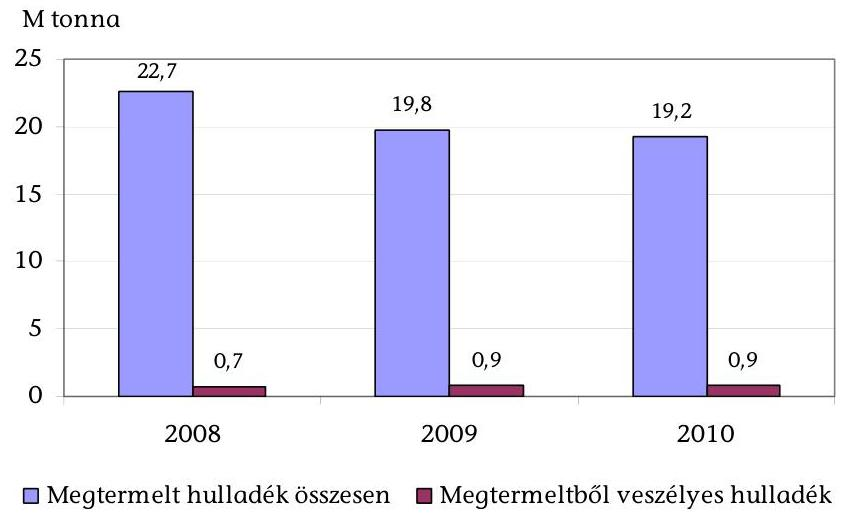

[^0][^1]
[^0]:    ${ }^{1}$ A témával egy korábbi, a 0920 számú ÁSZ jelentés foglalkozott.

[^1]:    ${ }^{1}$ A témával egy korábbi, a 0920 számú ÁSZ jelentés foglalkozott.

---

A rendelkezésre álló hazai hulladékhasznosítási és ártalmatlanítási kapacitás összességében fedezte az igényeket (a hazai szinten megtermelt hulladékot, az exportot és az importot figyelembe véve). A hasznosítási és az ártalmatlanítási kapacitás becsült adatok szerint $24,0 \mathrm{M}$ tonna volt ${ }^{2}$ éves szinten. A kapacitás kihasználtság 2008-ban 90,9\%-os, 2009-ben 77,3\%-os és 2010-ben $78,4 \%$-os volt főként a megtermelt hulladék tömegének csökkenése következtében.

Az ország elsődlegesen nem célország volt, azaz nem a hasznosításra behozott, import hulladék (összes kérelemből $180 \mathrm{db}, 22 \%$ ) volt a jellemző, hanem az országon átmenő, tranzit (összes kérelemből $342 \mathrm{db}, 43 \%$ ) és az országból kivitt, export hulladékszállítás (összes kérelemből $281 \mathrm{db}, 35 \%$ ) volt a nagyobb arányú az engedélyköteles hulladékszállítmányokra irányuló kérelmek számát figyelembe véve, 2008-2010 között. A hulladékszállítási kérelmek számának alakulását a 2. sz. ábra mutatja.
2. sz. ábra

A tranzit, az export és az import engedélyköteles hulladékszállítás kérelmei számának alakulása (db)
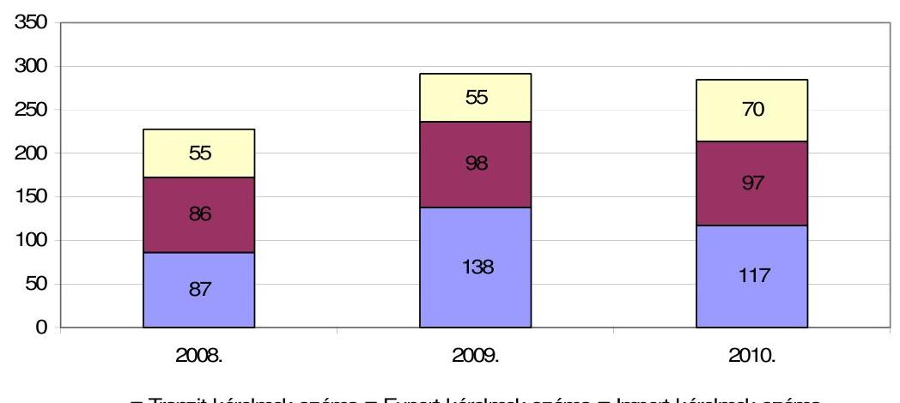

- Tranzit kérelmek száma ■ Export kérelmek száma $\square$ Import kérelmek száma

Adatforrás: OKTVF
Az export és az import hulladékszállítás tonnában mérve nőtt az engedélyköteles és a nem engedélyköteles szállítás tekintetében is az ellenőrzött időszakban (a részletes adatokat a 2. sz. melléklet tartalmazza). A 2010. évi hulladékszállítási adatokat a 2008. évihez hasonlítva szembetűnő, hogy legnagyobb mértékben az országba nem engedélykötelesen behozott hulladék (import) mennyisége és e szállítások száma nőtt. A nem engedélyköteles (ún. zöldlistás) 2010. évi hulladékimport mennyisége mintegy négyszerese volt a 2008. évinek (114,5 ezer tonnáról 475,1 ezer tonnára növekedett). A kérelmek száma pedig mintegy háromszorosára (6341-ről 19 365-re) növekedett.

[^0]
[^0]:    ${ }^{2}$ A becslést a Vidékfejlesztési Minisztérium végezte el, mivel pontos adatok nem álltak rendelkezésre. Ártalmatlanító kapacitásként például a hulladékégetők éves névleges kapacitását adták meg. A lerakók esetében az éves kapacitást a kiépített teljes kapacitás és az üzemeltetési idő alapján becsülték.

---

A hulladékszállítás két legfontosabb módja a közúti és a vasúti szállítás volt az OKTVF adatszolgáltatása szerint.

Az export oka - nemzeti hasznosítás, illetve ártalmatlanítás helyett - általában hasznosítási cél volt, amit a külföldi kezelés gazdaságossága, vagy a hulladék speciális jellege (például elem-akkumulátor, speciális papír, üveg) indokolt. Az export három leggyakoribb célországa az EU országok közül Szlovákia (1,4 M tonna), valamint főként veszélyes hulladék tekintetében Ausztria (77,1 ezer tonna) és Németország (12,2 ezer tonna) volt. A nem EU országok közül Szerbiába (392,2 ezer tonna), Horvátországba (70,3 ezer tonna) és Albániába (25 ezer tonna) irányult a legtöbb szállítás 2008-2010 között. Az import leggyakoribb küldő országai Olaszország (253,6 ezer tonna), Ausztria (164,3 ezer tonna) és Szlovénia (130,5 ezer tonna) voltak 2008-2010 között.

A Magyarországon közigazgatási eljárás alá vont országhatárt átlépő export és import szállítmányok száma összesen 281 db , a szállított hulladék mennyisége 28,2 ezer tonna volt 2008-2010 között (3. sz. melléklet). Az eljárás alá vont esetek $86 \%$-a ( 243 eset) elfogott import és $14 \%$-a ( 38 eset) elfogott export szállítmány volt. A hazai illetékes hatóság, az OKTVF eljárásai során - az export és import szállítmányok összesen adatát tekintve - az esetek $84 \%$-ában ( 237 eset) formai előírásokat ${ }^{3}$ sértettek meg, az esetek $16 \%$-ában ( 44 eset) tényleges illegális szállítmányt ${ }^{4}$ fogtak el. Az eljárás alá vont export és import szállítmányok cél- és küldő országai Magyarországgal szomszédos EU tagállamok (a három leggyakoribb ország Szlovákia, Románia és Ausztria) voltak.

A közigazgatási eljárások eredményeként 183 esetben állapítottak meg hulladékgazdálkodási bírságot, összesen 232 M Ft értékben (4. sz. melléklet, 4/a sz. táblázat). Az esetek 68\%-ában (124 eset) a bírság alapösszegét, 200 ezer Ft-ot szabtak ki.

A hulladékgazdálkodás rendjét sértő, büntetőjogi felelősség körébe tartozó ügy (bűncselekmény) egy, a „2006-os német hulladék-ügy" volt folyamatban és zárult le az ellenőrzött időszakban. Ezen túlmenően más ügy nem volt.

A veszélyes hulladékok országhatárokat átlépő szállításának ellenőrzéséről és ártalmatlanításáról szóló bázeli egyezmény (1989) alapján, abból kiindulva az Európai Tanács rendeletet adott ki (1993. február 9-étől hatályos) a hulladékszállításról a hulladékok illegális szállításának és lerakásának megelőzésére. ${ }^{5} \mathrm{E}$ szabályozás többször módosult, majd a hulladékszállítás felügyeletére és ellenőrzésének megerősítésére az Európai Parlament és a Tanács új szabályozást

[^0]
[^0]:    ${ }^{3}$ Nemzetközi közös ellenőrzési szempont szerint formai előírás megsértésének minősült: az EU Hulladékszállítási rendeletének enyhébb megsértése például a dokumentumok nem megfelelő kitöltése, vagy benyújtása által.
    ${ }^{4}$ Nemzetközi közös ellenőrzési szempont szerint tényleges illegális szállításnak minősült: az EU Hulladékszállítási rendeletének súlyos megsértése például engedély nélküli, vagy tiltott hulladékszállítás által.
    ${ }^{5}$ A Tanács 1993. február 1-jei 259/93/EGK rendelete

---

adott ki 2006. július 15-étől hatályba léptetve. ${ }^{6}$ A jelenlegi ellenőrzés a megújult szabályozás (EU Hulladékszállítási rendelet) végrehajtásának megfelelőségére terjedt ki.

Az EU Hulladékszállítási rendelet célja a hulladék környezetbarát kezelése, mind a szállítás, mind célországi hasznosítás során. A szabályozás kiterjedt a bejelentési és engedélyezési eljárások rendszerére, a teljes hulladék hasznosítási folyamat bemutatásának és a hulladékszállítás ellenőrzésének kötelezettségére, az alkalmazandó formanyomtatványokra, az engedélyköteles hulladékszállítás esetén kötelező biztosítéknyújtásra és a szomszédos országokkal való együttműködésre.

A hulladékszállítás bejelentési és engedélyeztetési rendjére vonatkozó előírások eltérőek, a hulladékok veszélyességétől függően szigorú, vagy kevésbé szigorú információs követelményeknek kell eleget tenni. Például a nem engedélyköteles, ún. zöldlistás hulladékok - az OECD országain belül normál kereskedelmi termékként szállítható hulladékok - esetében kevésbé szigorú információs követelményeknek kell eleget tenni, mint az engedélyköteles veszélyes hulladékoknál. A hulladékszállítás bejelentési és engedélyeztetési rendjét az 5. sz. mellékletben foglaltuk össze.

Az EU Hulladékszállítási rendelet közvetlen alkalmazása mellett, azzal összhangban megújult az országhatárt átlépő hulladékszállításról szóló hazai szabályozás is. ${ }^{7}$ A szabályozás szerint a hazai intézményrendszerben megtalálható a kötelezően létrehozandó illetékes hatóság (OKTVF, amely a jogelőd szervezet bázisán jött létre), és a megbízott (a Vidékfejlesztési Minisztérium munkatársa). Továbbá Magyarországon, élve az uniós szabályozásban adott lehetőséggel, a korábbi szabályozásnak megfelelően továbbra is kijelölték Magyarország EU vámhatárain azokat az átkelőket, amelyeken minden egyes szállítmányt, így a hulladékszállítmányokat is be- és ki kell léptetni. Az EU-n belül, az egységes piaci térségből következően, az áruk, a hulladék szabad áramlásából adódóan kiemelt szerepe volt a hatóságok, intézmények közötti együttműködésnek (hazai és nemzetközi szinten).

Az EU Hulladékszállítási rendelet tagállami szintű végrehajtásának intézményi kereteit a hazai Hulladékszállítási rendelet jelölte ki. A kijelölt szervezeteket és azok feladatait a 6. sz., az engedélyezési eljárás folyamatát a 7. sz. melléklet tartalmazza.

Az EU tagországai által alkalmazott bejelentési és engedélyeztetési eljárási rendszerhez csatlakoztak az Európai Gazdasági Térség (EGT) államai is. Így mind az EU tagországok, mind az EGT tagjai felelősek az EU Hulladékszállítási rendelet végrehajtásáért.

Az EU Kapcsolattartó Bizottság 2010 októberében jóváhagyott egy, több számvevőszék együttműködésével megvalósuló ellenőrzést az EU Hulladékszállítási

[^0]
[^0]:    ${ }^{6}$ Az Európai Parlament és a Tanács 2006. június 14-ei 1013/2006/EK rendelete (továbbiakban: EU Hulladékszállítási rendelet)
    ${ }^{7}$ 180/2007. (VII. 3.) Korm. rendelet (továbbiakban: hazai Hulladékszállítási rendelet)

---

rendeletének végrehajtásáról. Az ellenőrzést a holland számvevőszék koordinálja és 8 számvevőszék (Hollandia, Bulgária, Magyarország, Norvégia, Lengyelország, Görögország, Írország és Szlovénia legfőbb ellenőrző intézménye) végzi el az EUROSAI Környezetvédelmi Munkacsoporttal szoros együttműködésben 2011-2012 folyamán. A nemzetközi ellenőrzés célja az EU Hulladékszállítási rendelet egységes végrehajtásának elősegítése azáltal, hogy az ellenőrzés betekintést nyújt egyes EU és EGT tagországok végrehajtási rendszereibe, stratégiáiba és teljesítményeibe.

Az ellenőrzést végző számvevőszékek 2011. május 3-án, Oslóban tartott megbeszélésükön meghatározták azokat a szempontokat és követelményeket, amelyeket egységesen alkalmaznak az ellenőrzés során az ellenőrzött országok gyakorlatának könnyebb összehasonlíthatósága érdekében. A nemzeti helyszíni ellenőrzések tapasztalatai alapján a közös szempontok felülvizsgálatára, kiegészítésére került sor a következő, 2011. november 7-8-án Hágában megtartott munkamegbeszélésen.

Az ellenőrzés célja - a közös, nemzetközi szempontrendszerre építve - annak értékelése volt, hogy a határon átnyúló hulladékszállítás szervezeti és jogi kereteinek kialakítása, illetve működése Magyarországon az EU Hulladékszállítási rendelet követelményeivel összhangban történt-e az ellenőrzött időszakban. Ennek keretében értékelni kellett, hogy

- az EU Hulladékszállítási rendelet végrehajtása feltételrendszerét (jogi, intézményi feltételeit) megfelelően alakították-e ki;
- az EU Hulladékszállítási rendelet végrehajtása megfelelő volt-e az intézmények kapacitását és eljárásait tekintve;
- az EU Hulladékszállítási rendeletből következő tájékoztatási, információszolgáltatási, és együttmúködési kötelezettségét Magyarország az előírásoknak megfelelően teljesítette-e.

Az ellenőrzés típusa szabályszerűségi ellenőrzés.
Az ellenőrzés kiterjedt az EU Hulladékszállítási rendelet végrehajtásához hazai szinten kijelölt megbízott (Vidékfejlesztési Minisztérium) tevékenységére, az illetékes hatóság (OKTVF) hulladékszállítmányok engedélyezési-, ellenőrzéslés kapcsolódó szankcionálási feladataira, valamint a hulladékszállítmányok EU határon történő be- és kiléptetéskor végzett ellenőrzésekkel kapcsolatban a NAV (az ellenőrzött időszakban VPOP) munkájára.

Az ellenőrzést az előkészítés és a helyszíni ellenőrzés során kért adatokra és dokumentumokra alapozva, a szabályszerűségi ellenőrzés szempontjainak figyelembevételével, az adott időszakban hatályos jogszabályok és közjogi szervezetszabályozó eszközök ismeretében végeztük el.

Az OKTVF által végzett határmenti és telephelyi ellenőrzések, összesen 14 ellenőrzés dokumentumait teljes körűen ellenőriztük. Az engedélyeztetési eljárásra és a szankcionálási tevékenységre vonatkozóan rétegzett mintát vettünk.

---

A NAV (az ellenőrzött időszakban VPOP) hulladékszállítmányok EU határon történő ki- és beléptetésével kapcsolatos ellenőrzési feladataira vonatkozóan - a tényleges hulladékszállítmányok nyilvántartásának hiányában - szúrópróba szerűen vettünk mintát. A két ellenőrzött határátkelőn, a letenyei közúti és a kelebiai vasúti határátkelőn összesen 20 fuvarlevelet ellenőriztünk. Az ellenőrzésre kiválasztott mintaelemek listáját a 8. sz. melléklet tartalmazza.

Az előzőekben foglaltakon túlmenően megfigyelőként részt vettünk egy közös határellenőrzésen (2011. november 8.), amelyet a magyar és az osztrák illetékes hatóságok szerveztek a hegyeshalmi közúti átkelőn.

Az ellenőrzött időszak a 2008-2010. évek voltak.
A helyszíni ellenőrzésre 2011. szeptember 12. és október 28. között került sor.

Az ellenőrzött intézmények az EU Hulladékszállítási rendelet alapján kijelölt hazai intézmények: az OKTVF, a Vidékfejlesztési Minisztérium, valamint hulladékszállítmányok EU határain való be- és kiléptetését végző vámhivatalok. A kijelölt vámhivatalok közül a nagy forgalmat bonyolító HorvátországLetenye közúti és a Szerbia-Kelebia vasúti határkirendeltséget ellenőriztük.

Az ellenőrzés jogalapját az Állami Számvevőszékről szóló 2011. évi LXVI. törvény 5. §-ának (1) bekezdése, valamint az államháztartásról szóló 1992. évi XXXVIII. törvény 120/A. §-ának (1) bekezdése képezték.

---

# I. ÖSSZEGZŐ MEGÁLLAPÍTÁSOK, KÖVETKEZTETÉSEK, JAVASLATOK 

Magyarországon az országhatárt átlépő hulladékszállítás felügyeletének és ellenőrzésének erősítésére megújított, 2006. július 15-én hatályba lépett és az ellenőrzött időszakban hatályos EU Hulladékszállítási rendelet hazai végrehajtásának a keretfeltételeit időben szabályozták hazai szinten. ${ }^{8}$ Az EU Hulladékszállítási rendelet végrehajtását elősegítették a korábbi években szerzett tapasztalatok, mivel a vonatkozó korábbi EU szabályozást ${ }^{9}$ is alkalmazták már.

Az ország EU vámhatárain a hulladékszállítás felügyelete, ellenőrzése nem valósult meg teljes körűen az EU Hulladékszállítási rendeletnek megfelelően, annak céljával összhangban. Az Országos Környezetvédelmi, Természetvédelmi Vízügyi Főfelügyelőség (OKTVF), mint illetékes hatóság engedélyeztetési tevékenysége alapvetően megfelelt az uniós előírásoknak, a Nemzeti Adó- és Vámhivatal (NAV, az ellenőrzött időszakban a Vám- és Pénzügyőrség Országos Parancsnoksága) hulladékszállítmányok be- és kiléptetési (köztük a szállítmányellenőrzés) tevékenysége azonban hiányosságot mutatott. Az alkalmazott eljárás a vámszabályokra épült, és nem készült eljárásrend, előírás a hulladékszállítás ellenőrzéséhez, a tényleges szállítmányok nyilvántartásához és ezek hiányában nem valósult meg a keretengedélyek teljesítésének nyomon követése. Ez nem járult hozzá a jogellenes szállítások megelőzéséhez, megakadályozásához.

Az EU vámhatárokon és a tagállami határokon átmenő hulladékszállítás esetében hiányosságok mutatkoztak az ellenőrzésre kijelölt hatóságok (OKTVF, illetve területi szervei, NAV, közlekedési és rendészeti szervek, katasztrófavédelem) együttműködésében: nem volt közös, összehangolt feladat- és erőforrásterv, nem végezték el a tapasztalatok közös kiértékelését (például a kockázatok feltárásához) annak ellenére, hogy a hatékony feladatellátás érdekében együttműködési megállapodásokat kötöttek.

Előre mutató volt, hogy az ellenőrzött időszakot követően (2011-ben) elkezdődött a NAV-nál a vám, a rendészeti, a környezetvédelmi, ezek között a hulladékszállítási, hulladékgazdálkodási jogszabályok alkalmazásának összehangolása, a NAV vámszerve tevékenységének, múködésének irányításához a szabályozók kialakítása, aktualizálása. ${ }^{10}$ Nőtt az OKTVF által végzett ellenőrzések száma és javult az OKTVF és a NAV közötti együttműködés (oktatások, képzések).

[^0]
[^0]:    ${ }^{8}$ 180/2007. (VII. 3.) Korm. rendelet
    ${ }^{9}$ EU (régi) Hulladékszállítási rendelet
    ${ }^{10}$ E szabályozás az ellenőrzés idején még nem volt véleményezhető szakaszban.

---

A NAV - az országba beszállított, az országból kiszállított, illetve az ország területén áthaladó szállítmányok, köztük a hulladékszállítmányok ellenőrzésében ${ }^{11}$ betöltött központi szerepének megfelelően - 2011-ben megkezdte a hulladékszállítás ellenőrzésére vonatkozó, az érintett szervekkel összehangolt eljárásrend készítését és ezzel összhangban új együttmúködési megállapodások megkötését. Új megállapodásokat készített elő az országhatáron átmenő hulladékszállítás felügyeletére és ellenőrzésére kijelölt illetékes hatósággal (OKTVF) és a veszélyes áruk ellenőrzésében kiemelt szerepet játszó Országos Katasztrófavédelmi Főigazgatósággal (OKF). A NAV eljárásrend bevezetésének többek között feltétele az együttműködési megállapodások elfogadása, amelyeket az ellenőrzés lezárásáig még nem írtak alá.

A hazai Hulladékszállítási rendelet összhangban volt az EU Hulladékszállítási rendeletben foglalt előírásokkal. Ebben kijelölték a kötelezően létrehozandó intézményeket (illetékes hatóság, megbízott) és az uniós szabályozásban biztosított lehetőség szerint a hulladékszállítmányok be- és kiléptetését végző vámhivatalokat, valamint meghatározták ezek feladatait. Az intézmények a jogelőd intézmények bázisán létrejöttek, megfelelő jogszabályi felhatalmazással és szervezeti felépítéssel rendelkeztek a feladatok teljesítéséhez.

A létszám, felkészültség és felszereltség az ellenőrzöttek kérdőíves felmérésre adott válasza szerint elegendő volt az ellátott feladatokhoz. Az ellenőrzési tapasztalatok szerint azonban a feladatellátás (ellenőrzés, adatcsere, információáramlás) nem felelt meg maradéktalanul az EU Hulladékszállítási rendelet előírásainak.

Az ellenőrzött intézmények számára az EU Hulladékszállítási rendelet gyakorlati végrehajtását nehezítette, hogy nem készült stratégia ${ }^{12}$ (jogellenes szállítás megelőzése, feltárása érdekében súlyponti kérdések, kockázati szempontok meghatározása, erőforrás összehangolása), és részletes végrehajtási szabály (ideértve a jogszabályi és belső eljárásrendi szabályozást) a hulladékszállítás ellenőrzéséhez, illetve az ellenőrzésben együttműködő szervek tevékenységének összehangolásához. Részletes ellenőrzésre és bírságolásra vonatkozó jogi szabályozás a veszélyes áruk (köztük a veszélyes hulladékok) szállítására vonatkozóan létezett, amely a szállítmányok veszélyességére és nem az országhatárt átlépő jellegére vonatkozott. ${ }^{13}$

Az EU Hulladékszállítási rendelet végrehajtását nehezítette, hogy az EU és a hazai Hulladékszállítási rendeletben sem határozták meg a hulladékszállítmány fogalmát és ehhez kapcsolódóan nem dolgozták ki a jogellenes hulla-

[^0]
[^0]:    ${ }^{11}$ 2012. január 1-jétől a NAV hatáskörébe tartozik a termékdíj köteles termékekből képződött hulladékgazdálkodáshoz kapcsolódó ellenőrzés is, ezáltal az OKTVF és területi szervei mellett a NAV is végez telephelyi ellenőrzést.
    ${ }^{12}$ Nem lehetséges és nem szükséges minden szállítmány ellenőrzése (átvizsgálása), amint írja azt a Vám Világszervezet is „A globális kereskedelem biztonságát és könnyítését szolgáló szabványrendszeré"-ben.
    ${ }^{13}$ A veszélyes áruk közúti szállításának ellenőrzésére hatályos jogszabály volt, a veszélyes áruk vasúti és belvízi szállításának ellenőrzésére jogszabály tervezet volt az ellenőrzés idején, amely 2012. január 1-jétől hatályba lépett.

---

dékszállítmány visszatartása során követendő eljárást (visszatartás ideje, intézkedési határidők az OKTVF és a NAV részéről, járművezető tájékoztatása, viszszatartás során a felelősség kérdésköre stb.), amelynek hiánya a hulladékszállítmány visszatartása során kifogásolható.

A részletes végrehajtási szabályok (ideértve a jogszabályi és belső eljárásrendi szabályozást) hiánya főként az EU vámhatárokon, a NAV (az ellenőrzött időszakban VPOP) be- és kiléptetési, köztük a hulladékszállítmány ellenőrzési feladatainak ellátása során mutatkozott meg. Nem volt egységes ellenőrzési követelmény, adatkezelési és tájékoztatási rend. A tényleges szállítások nyilvántartását nem írták elő és ebből adódóan a keretengedélyek teljesítését nem követték nyomon. Ez nehezítette az EU Hulladékszállítási rendelet előírásainak betartását és számon kérhetőségét. A kelebiai vasúti átkelőnél, EU vámhatáron az ellenőrzés során véletlenszerűen kiválasztott 8 szállítmányból 2-nél hiányzott a hulladékszállítási engedély (fémhulladék exportja Szerbiába és Montenegróba), amellyel sérült az EU Hulladékszállítási rendelet szállítmányok ellenőrzésére vonatkozó előírása. Az OKTVF az ÁSZ jelzése alapján mindkét esetben hulladékgazdálkodási bírság kiszabására irányuló közigazgatási eljárást indított az exportáló cégekkel szemben. ${ }^{14}$ A két eset közül az egyik eljárás során az OKTVF 37,6 M Ft összegű bírságot állapított meg. A másik esetben az eljárás még folyamatban volt az ellenőrzés idején.

A NAV (az ellenőrzött időszakban VPOP) - hulladékszállítmány ellenőrzéséhez szükséges - speciális szakértelmet igénylő feladatellátását tovább nehezítette, hogy közte és az OKTVF között eseti jellegű együttműködés volt, de a határkirendeltségek folyamatos (napi 24 órás) feladatellátásához a kapcsolattartás nem volt megoldott. ${ }^{15}$ Ugyanakkor más környezetvédelmi területen volt már ilyen jellegű szabályozás. Például a környezetkárosodás megelőzésének és elhárításának rendjéről szóló jogszabály rendelkezik a témában együttműködő szervek állandó kapcsolattartási (ügyeleti) kötelezettségéről.

A jelenlegi ellenőrzés az országhatárt átlépő hulladékszállításra koncentrálva, az EU Hulladékszállítási rendelet alapján kijelölt OKTVF és a NAV (az ellenőrzött időszakban VPOP) vonatkozó tevékenységére terjedt ki. A hazai Hulladékszállítási rendelet a hulladékszállítás ellenőrzésében a NAV vámszervei mellett együttműködőként kijelölte még a közlekedési és a rendvédelmi hatóságokat, az OKTVF területi szerveit, valamint az Országos Katasztrófavédelmi Főigazgatóságot és területi szerveit. Ez utóbbi területi szerveknek fontos szerepe volt azáltal, hogy speciális környezetvédelmi (köztük hulladékkezelési) ismeretekkel, felszereltséggel rendelkeztek. A hazai Hulladékszállítási rendelet azonban főként az illetékes hatóság (OKTVF) felügyeleti tevékenységét részletezi, az ellenőrzési tevékenységet, az ellenőrzésben együttműködő szervek tevékenységének kapcsolódását nem. Az érintett szervezetek közötti együttműködés fontossága megmutatkozott a szankcionálási (hulladékgazdálkodási bírság megállapításával záruló) esetekben. Az ellenőrzött 12 esetből 4-nél az OKTVF területi szer-

[^0]
[^0]:    ${ }^{14}$ Az információk az OKTVF 2011. december 27-ei adatszolgáltatásán alapulnak.
    ${ }^{15}$ A NAV az új együttműködési megállapodás tervezetében elhelyezést kíván biztosítani az OKF számára a határkirendeltségein, a veszélyes hulladékszállítmányok közös ellenőrzésének hatékonysága, a folyamatos kapcsolattartás megkönnyítése érdekében.

---

vei által végzett, 3-nál rendőrség közúti és 5-nél egyéb (OKTVF, külföldi hatóság) ellenőrzés vezetett közigazgatási eljárás megindításához, majd bírságoláshoz.

A hazai szabályozásban, illetve jogalkalmazásban előfordultak még hiányosságok. A vonatkozó jogszabály ${ }^{16}$ alapján az OKTVF az exportra szánt hulladékszállítmányoknál nem állapított meg szabálytalanságot és nem szabott ki bírságot tényleges határátlépés hiányában, azokban az esetekben sem, amikor a jogellenes kivitel szándéka az okmányok és a körülmények alapján egyértelmúen megállapítható volt. A Vidékfejlesztési Minisztérium (VM) a jelentéstervezet egyeztetése során észrevételezte, hogy az EU Hulladékszállítási rendelet szerinti illegális szállítás címén szankcionálásra irányuló hatósági eljárást lehetett indítani az előzőekben leírt esetben, mert a hulladéknak nem csak a megvalósított, hanem már a tervezett, országhatárt átlépő mozgatása is szállításnak minősült.

A vonatkozó jogszabályok ${ }^{17}$ nem pontosan határozták meg az érintett személyi kört a határokon átívelő hulladékszállítás engedélyezésének megtagadásához, ami a jogszabályok gyakorlati végrehajthatóságát nehezítette. A VM az ÁSZ jelzése alapján az ellenőrzés folyamán pontosította a meghatározást az ellenőrzött időszakban hatályos jogszabályt felváltó, még egyeztetés alatt álló, hulladékról szóló törvénytervezetben.

Az OKTVF-nél, mint illetékes hatóságnál rendelkezésre álló létszám, felkészültség és felszereltség mellett az uniós szabályokkal összhangban és határidőben adták ki az ellenőrzött hulladékszállítási engedélyeket. A tervezett határmenti és telephelyi ellenőrzéseket szintén elvégezték, igaz 2008-2010 között összesen 14 ellenőrzés volt. Az ellenőrzések száma 2011-ben nőtt, október elejéig több ellenőrzést (22) végeztek, mint az ellenőrzött 3 évben összesen. A hulladékgazdálkodási bírság kiszabására irányuló hatósági feladatokat túlmunkával, és az ellenőrzött 12 eset közül 10 alkalommal a közigazgatási eljárási szabály szerinti határidőn túl (a jogvesztő ${ }^{18}$ egy éves határidőn belül) látták el.

A NAV (az ellenőrzött időszakban VPOP) esetében a ki- és a beléptetési feladatok ellátásához szükséges létszám rendelkezésre állt, azonban hiányoztak a specifikus, hulladékszállítmányok ellenőrzéséről, tájékoztatási kötelezettségről szóló részletes szabályok.

Bizonytalanságok voltak egy adott áru (anyag) hulladéknak, vagy nem hulladéknak minősítése tekintetében, ami az uniós, és nem a hazai szabályozásra vezethető vissza. A hulladék vámszempontból árunak minősült, míg az EU és a hazai Hulladékszállítási rendelet is környezetvédelmi és hulladékgazdálkodási szempontból közelítette meg azt. Ebből adódóan nehézséget jelentett, például az áruk és a hulladékok besorolása, felismerése, azonosítása (fémáru vagy ócskavas). Azokban az esetekben ugyanis, amikor a szállítólevél csak árumegjelö-

[^0]
[^0]:    ${ }^{16}$ 271/2001. (XII. 21.) Korm. rendelet
    ${ }^{17}$ Hgt 17. § (5) bekezdés és azzal összhangban a hazai Hulladékszállítási rendelet 3. §-a
    ${ }^{18}$ Hgt. 49. § (3) bekezdése szerint

---

lési kódot tartalmazott (és nem csatolták a hulladék kódot tartalmazó mellékletet), akkor nem volt bizonyossággal eldönthető, hogy a szállítmány valóban áru vagy hulladék.

A Vidékfejlesztési Minisztérium tájékoztatása szerint a hulladékstátusszal kapcsolatos kérdésekben a tagállamoknak és a tagállami hatóságoknak az Európai Bíróság kiterjedt joggyakorlata nyújt segítséget annak eldöntésében, hogy egy adott anyag hulladék-e. Az Európai Bizottság szintén az Európai Bíróság joggyakorlata által kifejlesztett szempontokra támaszkodott és e szempontokat összefoglalva a hulladékokról és a melléktermékekről szóló tájékoztató közleményt adott ki. ${ }^{19}$ A joggyakorlat szerint az anyag hulladéknak vagy (mellék) terméknek való minősítéséhez például a hatóság tényállás-tisztázási kötelezettség elvét kell érvényesíteni: a konkrét helyzet tényállása alapján, egyedi alapon kell dönteni.

A hatóságok ellenőrző munkájában a nehézségek megoldására és a szállítmányozó cégek felelősségének egyértelművé tételére egy példa volt az Országgyúlés Környezetvédelmi Bizottsága tagjának kezdeményezése az Európai Bizottság Környezetvédelmi főbiztosa felé (kelt, 2007. április 2.). A kezdeményezés szerint „jól látható, nagyméretü azonosító embléma elhelyezése legyen kötelező minden olyan járművön, amely bármilyen hulladékot szállít."

Speciális ismeretekkel és eszközökkel a vámhatárokon nem rendelkeztek, ${ }^{20}$ azonban kockázati szempontokat sem határoztak meg a jogellenes esetek gyanújának megállapításához és a gyanú esetén szükséges teendőkhöz (például zöldlistásként szállított, de valójában engedélyköteles hulladék keverék felismerése, vagy áru és hulladék megkülönböztetése).

A tájékoztatási és képviseleti feladatok ellátására kijelölt megbízott (az ellenőrzött időszakban a Környezetvédelmi és Vízügyi Minisztérium munkatársa) a feladatait, az EU Hulladékszállítási rendeletével összhangban, annak eleget téve látta el.

Az adat- és információ csere hazai szinten a hulladékszállításban érintett szervezetek, főként az ellenőrzött OKTVF és a vámhivatalok között hiányosságot mutatott. Az OKTVF által kiadott hulladékszállítási keretengedélyek eljutottak a vámkirendeltségekhez, azonban az EU vámhatárokon történő kötelező be- és kiléptetési feladatok elvégzése után a kirendeltségek a tényleges szállításokat kísérő dokumentumok másolatát - az EU Hulladékszállítási rendelet előírásával ellentétben - nem továbbították az OKTVF részére.

Az ellenőrzési tapasztalatok szerint a kialakult helyzet hátterében az EU Hulladékszállítási rendelet közvetlen alkalmazásának nehézsége állt, amelyet sem eljárásrend, sem együttműködési megállapodás nem kezelt. A dokumentumok továbbításán túl a NAV (az ellenőrzött időszakban VPOP) rendszerének hiá-

[^0]
[^0]:    ${ }^{19}$ Az Európai Bizottság 2007. február 21-i COM (2007) 59. számú tájékoztató közleménye.
    ${ }^{20}$ Ezek az ismeretek, eszközök főként az OKTVF, illetve területi szerveinél álltak rendelkezésre.

---

nyossága, hogy a tényleges hulladékszállítások nyilvántartására nem volt előírás, ebből adódóan a keretengedélyek meglétének ellenőrzésére megvolt a lehetőségük, de a keretengedélyek terhére teljesített szállítások mennyiségét nem tudták nyomon követni. Ugyanakkor az ellenőrzött vámkirendeltségeken felmerült az igény az előzőekben említett hiányosságokat pótló részletes szabályokra.

Az OKTVF-nél a keretengedélyek teljesítését nyomon követték azokban az esetekben, amikor az EU Hulladékszállítási rendelet által előírt bejelentés alapján előzetes információval rendelkeztek a szállításokról. Utólagosan - az importált hulladékok esetében -, a hulladékkezelő létesítményektől származott még információ a hulladék tényleges hasznosításáról. ${ }^{21}$ A keretengedélyek EU vámhatáron történő teljes körű nyomon követése nem volt megoldott az OKTVF-nél, mivel a NAV (az ellenőrzött időszakban VPOP) nem küldte meg a tényleges szállításokat kísérő dokumentumok másolatát. A nem EU vámhatárokon az áruk, így a hulladékok szabad áramlása, az ellenőrzések esetlegessége és az előzőekben leírt hiányosságok különösen fontossá tették egy ellenőrzési stratégia kialakítását.

Az OKTVF hulladékszállítással kapcsolatos nyilvántartása a hulladékszállítások kérelme, engedélye és a tényleges szállítások megvalósulásának adatai tekintetében nem biztosította, hogy azonos tartalmú adatok (például exportált hulladékok mennyisége) lekérése különböző időpontokban megegyezzen, illetve nem voltak ismertek az eltérések tényezői, pontos okai.

Nemzetközi kapcsolattartás és információ csere megvalósult az illetékes hatóságok, a tájékoztatásért, kapcsolattartásért felelős megbízottak és a vámhatóságok között is.

Az OKTVF, mint illetékes hatóság és más országok illetékes hatóságai közötti kapcsolatot és információ cserét az EU Környezetvédelmi Jogszabályok Alkalmazásáért és Érvényesítéséért felelős hálózata (IMPEL) és annak országhatárokat átlépő hulladékszállításokkal foglalkozó csoportja (IMPEL-TSF) biztosították. Ezen túlmenően az OKTVF információcseréje eseti jellegű volt, a közös határmenti ellenőrzések megszervezése, lefolytatása egyedi megkeresések útján valósult meg. Az egyes országok (köztük a hazai) tájékoztatásért, kapcsolattartásért az EU Hulladékszállítási rendelet alapján kijelölt megbízottjai főként kétés többoldalú környezetvédelmi együttműködések keretében szervezett üléseken cseréltek tapasztalatot.

A vámhivatalok az elektronikus kockázati tájékoztató adatlapok (RIF) rendszerén keresztül kaptak információt a külföldi társhatóságoktól a gyanús szállítmányokról, így a gyanús hulladékszállítmányokról is. A NAV (az ellenőrzött időszakban VPOP) esetében a hulladékszállítási ellenőrzésekkel kapcsolatos in-

[^0]
[^0]:    ${ }^{21}$ A hazai Hulladékszállítási rendelet rendelkezett a nem engedélyköteles hulladékszállításokra vonatkozó bejelentési kötelezettségről is, így az OKTVF arra vonatkozóan is rendelkezett adatokkal, amennyiben a hazai Hulladékszállítási rendelet előírásainak eleget tettek a bejelentők.

---

formációcsere, kapcsolattartás másik ország határmenti kirendeltségével szintén eseti jellegű volt.

A NAV tájékoztatása szerint kiemelt jelentőségű volt az ÁSZ ellenőrzését követően (2012. február-március folyamán) lebonyolított nemzetközi méretű akció. Ez a Vám Világszervezet és az INTERPOL által támogatott akció (DEMETER II.) volt, amely elérte a célját. A vámhatóság gyakorlati együttműködése a környezetvédelmi szervekkel és a rendőrhatósággal hazai és nemzetközi szinten is javult, fejlődött, valamint a vámhatóság elméleti és gyakorlati tudása gyarapodott az illegális hulladékszállítmányok kiszűrése tekintetében. A megszerzett tapasztalatok hozzájárulnak a hazai részletes eljárási szabályok megalkotásához, továbbá felhívták az érintettek figyelmét a hulladékszállítási szabályokra, előírásokra. Az akció magyarországi időszaka alatt (10 nap) az OKTVF és NAV közösen (közúton és a Közösség külső határain) 258 hulladékszállítmány ellenőrzését végezte el, amelyből az OKTVF által 8 esetben, közel 88 M Ft hulladékgazdálkodási bírság került kiszabásra.

Az EU Hulladékokról szóló (új) irányelve már a hulladék keletkezésének megelőzésére, hasznosítására helyezte a hangsúlyt és az irányelvből következően alapvető a termelő felelőssége a hulladék minősítésében és a hulladék megfelelő elhelyezésében. Az ellenőrzött időszakban az EU és ebből adódóan a hazai Hulladékszállítási rendelet nem érvényesítette a hulladék termelője (birtokosa) felelősségének alapelvét, hogy illegális hulladékszállítás, illetve vitás esetekben az alapvető felelősség a hulladéktermelőé (birtokosáé) legyen. A vitás esetek megoldására a bírósági út (Európai Unió Bírósága), vagy azt elkerülve a konszenzus, megegyezés lehetősége állt fenn, a szabálysértés kivizsgálására hivatott európai testület hiányában. A Németországból Magyarországra (2006ban) engedély nélkül szállított, valójában engedélyköteles hulladék visszaszállítására, elhelyezésére a két ország hivatalos szervei az egyeztetési folyamatot választották. A tárgyalások eredményeként a hulladék több mint felét szállították vissza Németországba, és a vissza nem szállított hulladékot magyarországi létesítményekben kellett kezelni (továbbá a helyszínen maradt mintegy 479 tonna hulladék).

Magyarországon a hazai szabályozás harmonizálása az EU Hulladékokról szóló (új) irányelvével, a hulladékokról szóló új törvényben az ÁSZ ellenőrzés idején még folyamatban volt. E feladat a 2010. év végi határidő helyett várhatóan 2012. év folyamán teljesül. Az új hulladékokról szóló törvény és más 2012-től hatályos szabályozások (például a veszélyes áruk vasúti és belvízi szállításának ellenőrzésére, a termékdíj köteles termékekből képződött hulladékgazdálkodáshoz kapcsolódó ellenőrzésre vonatkozó szabályok) kihatnak majd a hulladékszállítás ellenőrzésének és felügyeletének egészére, így javaslatainkat ennek fényében tesszük meg.

---

Az ellenőrzés intézkedést igénylő megállapításai és javaslatai:

# a vidékfejlesztési miniszternek, valamint a nemzetgazdasági miniszternek: 

1. Az ellenőrzött intézmények számára az EU Hulladékszállítási rendelet gyakorlati végrehajtását nehezítette, hogy nem készült stratégia és részletes végrehajtási szabály a hulladékszállítás ellenőrzéséhez, illetve az ellenőrzésben együttműködő szervek tevékenységének összehangolásához. A részletes végrehajtási szabályozás hiánya főként az EU vámhatárokon, a NAV (az ellenőrzött időszakban VPOP) be- és kiléptetési, köztük a hulladékszállítmány ellenőrzési feladatainak ellátása során mutatkozott meg. Nem volt egységes ellenőrzési követelmény, adatkezelési és tájékoztatási rend. A tényleges szállítások nyilvántartását nem írták elő és ebből adódóan a keretengedélyek teljesítését nem követték nyomon.

Az EU és a hazai Hulladékszállítási rendeletben nem határozták meg a hulladékszállítmány fogalmát és ehhez kapcsolódóan nem dolgozták ki a jogellenes hulladékszállítmány visszatartása során követendő eljárást (visszatartás ideje, intézkedési határidők az OKTVF és a NAV részéről, járművezető tájékoztatása, visszatartás során a felelősség kérdésköre stb.).

A NAV (az ellenőrzött időszakban VPOP) - hulladékszállítmány ellenőrzéséhez szükséges - speciális szakértelmet igénylő feladatellátását tovább nehezítette, hogy közte és az OKTVF között eseti jellegű együttműködés volt, de a határkirendeltségek folyamatos (napi 24 órás) feladatellátásához a kapcsolattartás nem volt megoldott.

A NAV 2011-ben megkezdte a hulladékszállítás ellenőrzésére vonatkozó, az érintett szervekkel összehangolt eljárásrend készítését és ezzel összhangban új együttműködési megállapodások megkötését (OKTVF, OKF). A NAV eljárásrend bevezetésének feltétele az együttműködési megállapodások elfogadása, amelyeket az ellenőrzés lezárásáig még nem írtak alá.

Javaslat:
Intézkedjenek a NAV be- és kiléptetési, köztük a hulladékszállítmány ellenőrzési feladatainak ellátásához az érintett hatóságokkal (OKTVF, illetve területi szervei, katasztrófavédelmi szervek) összehangolt eljárásrend készítésének támogatására, a szükséges jogszabályalkotásra. Ennek keretében biztosítva a megfelelő együttműködést, kapcsolattartást a környezetvédelmi szervekkel a NAV folyamatos (napi 24 órás) feladatellátásához.
2. A kelebiai vasúti átkelőnél, EU vámhatáron az ellenőrzés során véletlenszerűen kiválasztott 8 szállítmányból 2-nél hiányzott a hulladékszállítási engedély (fémhulladék exportja Szerbiába és Montenegróba), amellyel sérült az EU Hulladékszállítási rendelet szállítmányok ellenőrzésére vonatkozó előírása.

Javaslat:
Intézkedjenek, hogy az OKTVF és a NAV utóellenőrzés keretében, kockázati tényezők figyelembe vételével vizsgálják felül az ellenőrzött időszakban történt hulladékszállí-

---

tások dokumentumait, és hulladékszállítási engedély hiányában tegyék meg a szükséges intézkedést. Az ellenőrzés eredményeit használják fel a részletes eljárásrend kialakításához.
3. Az EU vámhatárokon és a tagállami határokon átmenő hulladékszállítás esetében hiányosságok mutatkoztak az ellenőrzésre kijelölt hatóságok együttműködésében: nem volt közös, összehangolt feladat- és erőforrásterv, nem végezték el a tapasztalatok közös kiértékelését (például a kockázatok feltárásához) annak ellenére, hogy a hatékony feladatellátás érdekében együttműködési megállapodásokat kötöttek.

Javaslat:
Intézkedjenek - az EU Hulladékokról szóló (új) irányelvét, illetve annak végrehajtási szabályait is figyelembe véve - a hulladékszállítások különböző megközelítésű (veszélyes, nem veszélyes, EU vámhatáron, nem EU vámhatáron történő, közúti, vasúti) ellenőrzéseihez valamennyi kijelölt hatóság eddigi együttműködésének (szabályozási, gyakorlati) felülvizsgálatára az összehangolt feladatellátás, az együttműködés erősítése érdekében.

# a vidékfejlesztési miniszternek: 

1. Az OKTVF hulladékszállítással kapcsolatos nyilvántartása a hulladékszállítások kérelme, engedélye és a tényleges szállítások megvalósulásának adatai tekintetében nem biztosította, hogy azonos tartalmú adatok (például exportált hulladékok mennyisége) lekérése különböző időpontokban megegyezzen, illetve nem voltak ismertek az eltérések tényezői, pontos okai.

Javaslat:
Intézkedjen az OKTVF-nél olyan nyilvántartási rendszer kialakítására, amely biztosítja a pontos adatszolgáltatást, a hulladékszállítási adatok különböző szempontok szerinti lekérdezését a nemzetközi és a hazai szintű adatszolgáltatásokhoz.
2. Az OKTVF az exportra szánt hulladékszállítmányoknál nem állapított meg szabálytalanságot és nem szabott ki bírságot tényleges határátlépés hiányában, azokban az esetekben sem, amikor a jogellenes kivitel szándéka az okmányok és a körülmények alapján egyértelműen megállapítható volt.

Javaslat:
Intézkedjen olyan eljárás alkalmazására, hogy az exportra szánt hulladékszállítmányoknál, illetve (tervezett) hulladékszállításoknál az okmányok, körülmények alapján egyértelműen megállapítható jogellenes kivitel szándéka esetén a szabálytalanságot és az alapján a bírságot állapítsák meg.

---

# II. RÉSZLETES MEGÁLLAPÍTÁSOK 

## 1. Az EU HulladékszállítÁsi rendelet hazai VÉGRehajtÁsÁNAK FELTÉTELRENDSZERE

Az EU Hulladékszállítási rendeletének végrehajtása szempontjából megfelelőnek tekintettük a hazai jogszabályi hátteret, ha az megfelelt a vonatkozó uniós előírásoknak, időben megalkották, valamint az alkalmazható szankciók arányosak és visszatartó erejúek voltak.

Az EU Hulladékszállítási rendeletének hazai végrehajtására kijelölt intézményi hátteret megfelelőnek tekintettük, ha a szervezetek kijelölése, valamint a jogaikkal, felelősségükkel és hatáskörükkel kapcsolatos szabályozások összhangban álltak a vonatkozó uniós követelményekkel.

Az EU Hulladékszállítási rendeletének hazai végrehajtására kijelölt szervezetek közti együttmúködési megállapodásokat megfelelőnek tekintettük, ha azok hozzájárultak az EU Hulladékszállítási rendelet céljainak megvalósulásához és a hazai jogszabályi előírások teljesítéséhez.

### 1.1. Az EU Hulladékszállítási rendelet végrehajtásának jogszabályi háttere

A hulladékszállítás felügyeletének és ellenőrzésének erősítésére megújított, 2006. június 14-én kihirdetett EU Hulladékszállítási rendelet hazai végrehajtásának a keretfeltételeit időben szabályozták hazai szinten. ${ }^{22}$ Az uniós rendelet 2007. július 12-étől kezdődően előírt alkalmazási idejére hatályba lépett a hazai Hulladékszállítási rendelet. Az EU Hulladékszállítási rendelet végrehajtását elősegítették a korábbi években szerzett tapasztalatok, a vonatkozó korábbi EU szabályozás, valamint a határon átívelő hulladékszállítást a hazai Hulladékszállítási rendelet hatálybalépését megelőzően szabályozó 120/2004. (IV. 29.) Korm. rendelet alkalmazása.

A Kt. rögzíti a környezetért való jogi felelősség általános alapját és fajtáit, a Hgt. pedig a hulladékok szállításával, behozatalával, kivitelével, tranzitjával, valamint a hulladékgazdálkodási bírsággal kapcsolatos alapvető szabályokat.

Kormányrendeleti szinten a hulladékgazdálkodási bírság mértékéről, valamint kiszabásának és megállapításának módjáról szóló 271/2001. (XII.21.) Korm. rendelet tartalmaz a témakörben fontos rendelkezéseket, a környezetvédelmi, természetvédelmi, vízügyi hatósági és igazgatási feladatokat ellátó szervek kijelöléséről pedig az e tárgyban kiadott 347/2006. (XII. 23.) Korm. rendelet rendelkezik.

Az EU Hulladékszállítási rendeletének hazai végrehajtásához szükséges jogalkotási lépések időben megtörténtek. A hazai Hulladék-

[^0]
[^0]:    ${ }^{22}$ 180/2007. (VII. 3.) Korm. rendelet

---

# szállítási rendelet, mint az EU hulladékszállítási rendelet végrehajtásához kiadott nemzeti jogszabály összhangban volt az uniós szabályozásban foglalt előírásokkal. 

Az EU Hulladékszállítási rendeletének végrehajtását szolgáló hazai jogszabályok közül a hulladékok határokon átívelő szállításának általános szabályait a Hgt. 17. §-a, konkrét, alapvető szabályait a hazai Hulladékszállítási rendelet tartalmazta.

A Hgt. 17. §-a általánosságban határozza meg a hulladék behozatalának, kivitelének, átszállításának szabályait, így többek közt kimondja, hogy az ország területére hulladékot
a) csak hasznosítás céljára,
b) a környezet állapotát nem veszélyeztető, nem szennyező módon,
c) a környezet károsodásának kizárásával,
d) a környezetvédelmi hatóság - kormányrendeletben meghatározott - engedélyével lehet behozni. ${ }^{23}$

A Hgt. továbbá általánosságban meghatározza a hulladékszállítási engedélyt szerző gazdálkodó szervezetekkel szembeni elvárásokat, illetve nyomatékosítja, hogy a hulladéknak az ország területére történő behozatala, kivitele és átszállítása csak a nemzetközi szerződésekkel, valamint az EU Hulladékszállítási rendeletével összhangban és a külön jogszabályban meghatározott feltételek teljesítésével történhet. ${ }^{24}$ E külön jogszabály a hazai Hulladékszállítási rendelet volt az ellenőrzött időszakban.

Az engedélyhez nem kötött, ún. zöldlistás hulladékok szállításával kapcsolatban az EU Hulladékszállítási rendelete lehetővé tette olyan tagállami szabályok megalkotását, amelyek szerint a szállítmányt kísérő dokumentumokat az illetékes hatóságok részére be kellett nyújtani. A magyar szabályozás élt is ezzel a lehetőséggel. A bejelentési kötelezettség lehetővé tette e szállítmányok felügyeletét és ellenőrzését, ezáltal az illegális hulladékszállítás kockázatának csökkentését.

A hazai Hulladékszállítási rendelet részletesen szabályozta az EU Hulladékszállítási rendeletében meghatározott, a hulladék szállítására engedélyt kérő szervezet biztosítékadási kötelezettségét is.

A biztosíték kedvezményezettje az OKTVF. Amennyiben a hulladékszállítást a bejelentésben foglaltaktól eltérően, avagy a hulladék hasznosítását vagy ártalmatlanítását jogellenesen hajtják végre, az OKTVF rendelkezik a biztosíték felett, és felhasználhatja az összeget a kötelezettségek teljesítésére történő kifizetésekre, illetve a más hatóságok céljára történő kifizetésekre. ${ }^{25}$

A hazai Hulladékszállítási rendelet meghatározta azokat az eseteket is, amelyekben az OKTVF kifogással él a hulladékszállítással szemben és megtagadja a szállítás engedélyezését. Erre lehetősége van, ha a bejelentőt vagy a címzettet környezet-, természetkárosítás, illetve a hulladékgazdálkodás rend-

[^0]
[^0]:    ${ }^{23}$ Hgt. 17. § (1) bekezdés
    ${ }^{24}$ Hgt. 17. § (1) bekezdés (2) és (4) bekezdés
    ${ }^{25}$ Hazai Hulladékszállítási rendelet 1. § (5)-(6) bekezdés

---

jének megsértése bűntett vagy vétség miatt jogerősen elítélték, addig az időpontig, amíg a bejelentő vagy a címzett a büntetett előélethez fűződő jogkövetkezmények alól nem mentesült. Másik eset, ha a bejelentőnek vagy a címzettnek a Kt. szerinti kármentesítési kötelezettsége keletkezett, és azt még nem teljesítette. Ezzel összefüggésben a rendelet azt is előírja, hogy már a bejelentéshez nyilatkozatot kell csatolni, mely szerint a bejelentőt vagy a címzettet nem terheli kármentesítési kötelezettség. ${ }^{26}$

A bűnügyi nyilvántartási rendszer átalakításával összefüggő törvénymódosításokról szóló 2009. évi CXLIX. törvény - 2010. január 1-jei hatályba lépéssel - a hulladék szállításával szembeni kifogásra vonatkozó szabályokkal egészítette ki a Hgt.-nek a hulladékok behozatalára, kivitelére és átszállítására vonatkozó címét.

Így a Hgt. 17. § (5) bekezdése szerint hulladéknak az ország területére történő behozatala, kivitele és átszállítása során a környezetvédelmi hatóság az EU hulladékszállítási rendelet alapján „a hulladék szállitásával szemben kifogást emel, ha
a) a bíróság a bejelentő vagy a címzett büntetőjogi felelősségét a Büntető Törvénykönyvről szóló 1978. évi IV. törvényben meghatározott környezetkárosítás, természetkárosítás vagy hulladékgazdálkodás rendjének megsértése büncselekmény elkövetését jogerősen megállapította,
b) a bejelentő vagy a címzett hulladékkezelési tevékenység folytatását kizáró foglalkozástól eltiltás hatálya alatt áll,
c) a bejelentő vagy a címzett a Kt. szerinti kármentesítési kötelezettségét nem teljesíti, annak teljesítéséig."

Az országhatárokon átívelő hulladékszállítással szembeni kifogásra vonatkozó jogszabályi rendelkezésekkel kapcsolatban megállapítható, hogy ugyanazt a kérdéskört, nevezetesen azt, hogy a hatóság milyen esetekben emel kifogást a szállítással szemben, 2010. január 1-jétől törvény (Hgt.) és kormányrendelet (hazai Hulladékszállítási rendelet) is szabályozta, méghozzá eltérő tartalommal: a Hgt. egy kifogás-emelési okkal többet tartalmazott a hazai Hulladékszállítási rendelethez képest. E többlet elem a hulladékkezelési tevékenység folytatását kizáró foglalkozástól eltiltás hatálya alá tartozás esete.

A jogalkotásról szóló 2010. évi CXXX. törvény 3. §-a kimondja, hogy az azonos vagy hasonló életviszonyokat azonos vagy hasonló módon, szabályozási szintenként lehetőleg ugyanabban a jogszabályban kell szabályozni; a szabályozás nem lehet indokolatlanul párhuzamos vagy többszintű; a jogszabályban nem ismételhető meg az Alaptörvény vagy olyan jogszabály rendelkezése, amellyel a jogszabály az Alaptörvény alapján nem lehet ellentétes. Az előzőekben ismertetett szabályozási helyzet alkotmány-, illetőleg törvénysértő.

Más jellegű szabályozási problémát vetett fel az a körülmény, hogy az előzőekben idézett jogszabályhelyekben feltüntetett bejelentő és címzett általában nem természetes személy, hanem gazdálkodó szervezet. A környezetkárosítás,

[^0]
[^0]:    ${ }^{26}$ Hazai Hulladékszállítási rendelet 3. §

---

természetkárosítás vagy hulladékgazdálkodás rendjének megsértése büncselekmény elkövetője azonban csak természetes személy lehet, ugyanígy csak természetes személy állhat a hulladékkezelési tevékenység folytatását kizáró foglalkozástól eltiltás hatálya alatt. Az ellenőrzött időszakban a kifogás intézményét szabályozó jogszabályok (Hgt., hazai Hulladékszállítási rendelet) nem tisztázták, hogy gazdálkodó szervezetek esetében mely személyi kör (például tulajdonosok és/vagy ügyvezetés) tekintetében kellett vizsgálni a kifogás alapjául szolgáló körülmények fennállását.

A kifogás intézményének gyakorlati alkalmazhatósága érdekében indokolt az érintett személyi kör (például tulajdonosok és/vagy ügyvezetés) pontos meghatározása a határokon átívelő hulladékszállítás engedélyezésének megtagadásához. Ennek nem mond ellent az sem, hogy azonos tárgyban az EU Hulladékszállítási rendelete 12. cikk (1) bekezdés d) pontja jelenleg a hazaihoz hasonlóan hézagos szabályt tartalmaz.

Tekintettel arra, hogy a hulladékról szóló törvény tervezete a számvevőszéki ellenőrzés idején már a közigazgatási egyeztetés szakaszában volt, a felvázolt problémákról az ÁSZ külön levélben tájékoztatta a VM-et a törvény tervezetének kiegészítése érdekében.

A VM a 2010. december 30-án kelt levelében tájékoztatta az ÁSZ-t, hogy az ÁSZ jelzése alapján a hulladékról szóló törvénytervezet vonatkozó rendelkezését akként módosította, hogy az érintett személyi kört kiterjesztette a bejelentő szervezet, illetve címzett szervezet vezetőjére, vezető tisztségviselőjére is. A levél továbbá kitért arra is, hogy a párhuzamos szabályozás megszüntetésére a hazai Hulladékszállítási rendelet módosítása során lesz lehetőség.

A hazai szabályozásban előfordultak még hiányosságok. A vonatkozó jogszabály ${ }^{27}$ alapján az OKTVF az exportra szánt hulladékszállítmánynál nem állapított meg szabálytalanságot és nem szabott ki bírságot tényleges határátlépés hiányában, annak ellenére, hogy a jogellenes kivitel szándéka az okmányok és a körülmények alapján egyértelműen megállapítható volt. A Vidékfejlesztési Minisztérium (VM) a jelentéstervezet egyeztetése során észrevételezte, hogy az EU Hulladékszállítási rendelet szerinti illegális szállítás címén szankcionálásra irányuló hatósági eljárást lehetett indítani az előzőekben leírt esetben, mert a hulladéknak nem csak a megvalósított, hanem már a tervezett, országhatárt átlépő mozgatása is szállításnak minősül az EU Hulladékszállítási rendelet 2. cikk 34 . pontja szerint. ${ }^{28}$

Az EU Hulladékszállítási rendelet végrehajtását nehezítette még, hogy e rendeletben és a hazai Hulladékszállítási rendeletben sem határozták meg a hulladékszállítmány fogalmát és ehhez kapcsolódóan nem dolgozták ki a jogellenes hulladékszállítmány visszatartása során követendő eljárást (visszatartás ideje, intézkedési határidők, járművezető tájékoztatása stb.).

[^0]
[^0]:    ${ }^{27}$ 271/2001. (XII. 21.) Korm. rendelet 3. § (4) bekezdés
    ${ }^{28}$ Az EU Hulladékszállítási rendelet 2. cikk 34. pontja szerint a szállítás a hulladék hasznosítás vagy ártalmatlanítás céljából történő fuvarozása, amelyet a fogalom meghatározásban felsorolt területekre terveznek, vagy azokon történik.

---

Hazai szinten a hulladékszállítással, elhelyezéssel kapcsolatos előírások megsértése esetén a szankciók rendszere (szabálysértési, büntető-, polgári jogi és közigazgatási jogi felelősségre) kiépült. A hulladékszállítással kapcsolatos előírások megsértése esetén a különböző jogágak eltérő súlyú és típusú jogkövetkezményeket helyeztek kilátásba. Az irányadó felelősségi alakzatok és alkalmazható szankciók a következők voltak.

A környezetért való jogi felelősség általános alapját és fajtáit a Kt. állapította meg. A jogi felelősség általános alapjaként a 101. § rögzíti, hogy a környezethasználó az e törvényben meghatározott és más jogszabályokban szabályozott módon büntetőjogi, szabálysértési jogi, polgári jogi és közigazgatási jogi felelősséggel tartozik tevékenységének a környezetre gyakorolt hatásaiért.

A Btk. a klasszikus értelemben vett környezetvédelmi bűncselekmények mellett (környezetkárosítás és természetkárosítás), 2005. 09. 01-jei hatállyal a hulladékgazdálkodással kapcsolatban speciális törvényi tényállást is megállapított. E tényállás a hulladékgazdálkodás rendjének megsértése.

A 281/A. §-a szerint, aki arra a célra hatóság által nem engedélyezett helyen hulladékot elhelyez, engedély nélkül vagy az engedély kereteit túllépve hulladékkezelési tevékenységet, illetve hulladékkal más jogellenes tevékenységet végez, bűntettet követ el, és - alapesetben - három évig terjedő szabadságvesztéssel büntetendő. Minősített esetnek számít, ha a bűncselekményt a Hgt. szerinti veszélyes hulladékra követik el. Ebben az esetben a büntetés öt évig terjedő szabadságvesztés. Gondatlan elkövetés esetén a büntetési tétel alapesetben egy, minősített esetben két évig terjedő szabadságvesztés. Az alapesetben és a gondatlan alakzatnál a szabadságvesztés helyett közérdekű munka, pénzbüntetés, foglalkoztatástól eltiltás is kiszabható. ${ }^{29}$

A tényállás alkalmazásában hulladékkezelési tevékenységnek minősül a hulladéknak a hulladékgazdálkodásról szóló törvényben meghatározott gyűjtése, begyűjtése, szállítása - ideértve az országba történő behozatalt, kivitelt, valamint az ország területén történő átvitelt -, előkezelése, tárolása, hasznosítása, ártalmatlanítása. ${ }^{30}$

Az EU Hulladékszállítási rendelete tárgyát képező tevékenységekkel összefüggő szabályok megsértése tehát - ha a büntetőjogi felelősség egyéb feltételei fennállnak - bűncselekmény elkövetése megállapításának alapját képezheti. A büntetőeljárásban a nyomozó hatóságok, az ügyészségek és a bíróságok az általános szabályok szerint múködnek közre.

A szabálysértési felelősséget a Btk.-ban foglalthoz hasonló speciális tényállás nem szabályozza, a szabálysértésekről szóló 1999. évi LXIX. törvény 148. §-a általános tényállásként a „környezetvédelmi szabálysértés"-t tartalmazza.

E szerint, aki a környezetvédelmi hatóság engedélyéhez vagy hozzájárulásához kötött tevékenységet engedély vagy hozzájárulás nélkül, vagy az engedélytől, hozzájárulástól eltérő módon végez vagy végeztet, illetve a környezet elemeit a

[^0]
[^0]:    ${ }^{29}$ Btk. 38. § (3) bekezdés
    ${ }^{30}$ Btk. 281/A. § (4) bekezdés b) pont

---

külön jogszabályban meghatározott módon terheli, illetve szennyezi, vagy az egyéb környezetvédelmi előírásokat más módon megszegi, százötvenezer forintig terjedő pénzbírsággal súitható.

Az EU Hulladékszállítási rendelete és a kapcsolódó magyar jogszabályi rendelkezések megsértése szabálysértési bírság kiszabását is maga után vonhatja. Az eljárás az általános szabályoknak megfelelően a jegyző hatáskörébe tartozik.

A polgári jogi felelősséget illetően a Kt. 103. §-a kimondja: a környezet igénybevételével, illetőleg terhelésével járó tevékenységgel vagy mulasztással másnak okozott kár környezetveszélyeztető tevékenységgel okozott kárnak minősül és arra a Ptk. fokozott veszéllyel járó tevékenységre vonatkozó szabályait (Ptk. 345-346. §-ai) kell alkalmazni. Ha a károsult a kártérítési igényét nem kívánja érvényesíteni a károkozóval szemben - a károsult erre vonatkozó és az elévülési időn belül tett nyilatkozata alapján - a környezetvédelemért felelős miniszter a környezetvédelmi alap célfeladat fejezeti kezelésű előirányzat javára az igényt érvényesítheti.

A közigazgatási jogi felelősség körében a Hgt. 45. §-a általános szabályként előírja, hogy a környezetvédelmi hatóság az ügyfeleket a környezetet veszélyeztető, szennyező, károsító tevékenység felfüggesztésére, abbahagyására, az eredeti állapot helyreállítására kötelezi, illetve a környezet szennyeződése esetében olyan intézkedés megtételét írja elő, amely azt csökkenti vagy megszünteti, a környezet károsodását kizárja. A környezetvédelmi hatóság ezen túlmenően korlátozza, felfüggeszti, illetőleg megtiltja a környezetvédelmi hatóság engedélyéhez kötött tevékenység engedélytől eltérő vagy engedély nélküli folytatását, a környezetet károsító vagy súlyosan veszélyeztető hulladékgazdálkodási tevékenységet.

A hulladékgazdálkodási bírságra, mint a tárgykörhöz tartozó közigazgatási jogi szankcióra vonatkozó alapvető rendelkezéseket a Hgt. tartalmazza. A hulladékgazdálkodási bírságot (adók módjára behajtható köztartozás) a környezetvédelmi hatóság szabja ki. A hulladékgazdálkodási bírság nem mentesít a büntetőjogi, a szabálysértési, továbbá a kártérítési felelősség, valamint a tevékenység korlátozására, felfüggesztésére, tiltására, illetőleg a megfelelő védekezés kialakítására, a természetes vagy korábbi környezet helyreállítására vonatkozó kötelezettség teljesítése alól.

A 271/2001. (XII. 21.) Korm. rendelet szerint a hulladékgazdálkodási bírság mértékét meghatározott alapbírság és az azt módosító tényezőkhöz hozzárendelt szorzószámok szorzataként kell megállapítani. A hulladék országhatárt átlépő jogellenes szállítása esetén a bírság kiszabására az OKTVF jogosult.

A határokon átívelő, engedély nélküli hulladékszállítással kapcsolatosan alkalmazandó jogkövetkezmények bemutatására és a felmerülő akadályokra jó példaként szolgált a „2006-os német hulladék-ügy". Ennek során nehézséget jelentett a két vagy több állam illetékes hatóságai közötti véleményeltérés áthidalása a hulladékszállítás szabályossága, illetőleg a hulladéknak a küldő államba történő visszaszállítási kötelezettsége tekintetében.

---

2006. évben nagy mennyiségű, több mint 4000 tonna hulladék érkezett illegálisan egy másik EU tagállamból, Németországból Magyarországra. A hulladék szállítása a német és a magyar hatóságoknak történő bejelentés és engedélyezés nélkül történt. A magyar közreműködők ellentételezést kaptak a hulladék átvételéért, és írásban - hamisan - nyilatkoztak arról, hogy rendelkeznek hulladékkezelési engedéllyel. Az OKTVF tárgyalásokat kezdeményezett az illetékes németországi hatóságokkal a hulladéknak a küldő államba történő visszaszállításáról.

A két ország hatóságai között jogvitát okozott, hogy az illetékes hatóságok más állásponton voltak a hulladék besorolására vonatkozóan (zöldlistás vagy sárgalistás), és hogy ki a felelős az illegális szállításért. A magyar illetékes hatóság álláspontja szerint a helyszíni bejárások során megtekintett hulladékbálák összetétele, külső megjelenési formája alapján minden kétséget kizáróan megállapítható volt az engedélyköteles (ún. sárgalistás) jelleg. E hulladékok országhatáron át történő szállítása tekintetében a felelősség a szállítást kezdeményező badenwürttembergi és bajor cégeket terheli a bejelentési kötelezettség elmulasztása miatt az illegális szállítás megvalósítása idején hatályos, EU (régi) Hulladékszállítási rendelet, illetve az azt felváltó, 2007. július 12-étől alkalmazandó EU Hulladékszállítási rendelet alapján. A bejelentéshez, előzetes engedélyezéshez kötött hulladék behozatala kapcsán a magyar illetékes hatóság részéről preventív intézkedések megtételére, a német hulladékok jogszerú fogadása feltételeinek vizsgálatára és biztosítására nem volt lehetőség.

Az EU (régi) Hulladékszállítási rendelet 26. cikk (2) bekezdésének, illetve az EU Hulladékszállítási rendelet 24. cikk (2) bekezdése b) és c) pontjának, valamint a 25. cikk (1) bekezdése b) és c) pontjának értelemében a visszaszállításra vonatkozó intézkedés megtételéért, a felmerülő költségek megfizetéséért a teljes illegálisan beszállított német eredetű hulladékmennyiség tekintetében elsősorban a bejelentést elmulasztó német küldő fél, ennek hiányában a baden-württembergi és bajor kompetens hatóság a felelős.

A német illetékes hatóságok részben ismerték el, hogy a hulladék engedélyköteles. Álláspontjuk szerint a hulladékszállítás megvalósításában részt vett német küldő és magyar fogadó fél egyaránt felelős, mivel bár a német cégek nem kértek engedélyt a hulladékok beszállítására, a magyar cégek úgy fogadták a szállítmányokat, hogy nem rendelkeztek hulladékkezelési engedéllyel, valamint a hulladék átvételekor pénzt is elfogadtak német partnereiktől. Mindezek alapján álláspontjuk szerint a felelősség a magyar résztvevőket is terheli, az EU Hulladékszállítási rendelet (régi és új) értelmében mindkét ország kötelezett a konszenzusos megoldás megtalálásában, közös felelősségvállalásban. A német hatóságok 50-50 \%-os költségmegosztást javasoltak a visszaszállítás tekintetében.

Az egyeztetéseket követően a beszállított több mint 4000 tonnából 2329 tonna hulladék visszaszállítása után visszamaradt mintegy 1872 tonna hulladék további visszaszállításától a német hatóságok elzárkóztak. A visszamaradt hulladékok hazai kezelése érvényes engedéllyel rendelkező magyarországi hulladékkezelő létesítményekben valósult meg, illetőleg a helyszínen maradt hulladék mennyisége jelenleg még kb. 479 tonna.

Az esetnek közigazgatási jogi és büntetőjogi következményei is voltak. Nem veszélyes hulladék országhatárt átlépő jogellenes szállítása miatt mind a területileg illetékes felügyelőségek mind az OKTVF indított hulladékgazdálkodási bírság kivetésére irányuló eljárást. Továbbá a Kecskeméti Városi Bíróság 5a.B.154/2008/211. számú ítéletével a hulladékgazdálkodás rendjének megsértésének tényállásában bűnösnek mondott ki két, a hulladék magyarországi elhelyezéséért felelős magánszemélyt. A bíróság az I. rendű vádlottat 1 év 6 hónap

---

börtönbüntetésre, két évi közügyektől eltiltásra és 500000 Ft pénzmellékbüntetésre, a II. rendű vádlottat 10 hónap - végrehajtásában két évi próbaidőre felfüggesztett - börtönbüntetésre és 300000 Ft pénzmellékbüntetésre ítélte. Az ítéletet a Bács-Kiskun Megyei Bíróság helybenhagyta, a Legfelsőbb Bíróság a döntéseket pedig hatályában fenntartotta.

Az ismertetett esettől eltekintve a vizsgált időszakban Magyarországon nem született bírósági ítélet a hulladékgazdálkodás rendjének megsértése bűncselekmény elkövetése miatt.

Az EU Hulladékokról szóló (új) irányelve már a hulladék keletkezésének megelőzésére, hasznosítására helyezte a hangsúlyt és az irányelvből következően alapvető a termelő felelőssége a hulladék minősítésében és a hulladék megfelelő elhelyezésében. Az ellenőrzött időszakban az EU és ebből adódóan a hazai Hulladékszállítási rendelet nem érvényesítette a hulladék termelője (birtokosa) felelősségének alapelvét, hogy illegális hulladékszállítás, illetve vitás esetekben az alapvető felelősség a hulladéktermelőé (birtokosáé) legyen. A vitás esetek megoldására a bírósági út (Európai Unió Bírósága), vagy azt elkerülve a konszenzus, megegyezés lehetősége állt fenn, a szabálysértés kivizsgálására hivatott európai testület hiányában. A Németországból Magyarországra engedély nélkül szállított, valójában engedélyköteles hulladék visszaszállítására, elhelyezésére a két ország hivatalos szervei az egyeztetési eljárást választották. A tárgyalások eredményeként a hulladék több mint felét szállították vissza Németországba, és a vissza nem szállított hulladékot magyarországi létesítményekben kellett kezelni (továbbá a helyszínen maradt mintegy 479 tonna hulladék).

Magyarországon a hazai szabályozás harmonizálása az EU Hulladékokról szóló (új) irányelvével, a hulladékokról szóló új törvényben az ÁSZ ellenőrzés idején még folyamatban volt. E feladat a 2010. év végi határidő helyett várhatóan 2012. év folyamán teljesül. A hulladékokról szóló új törvény és más 2012-től hatályos szabályozások (például a veszélyes áruk vasúti és belvízi szállításának ellenőrzésére, a termékdíj köteles termékekből képződött hulladékgazdálkodáshoz kapcsolódó ellenőrzésre vonatkozó szabályok) kihatnak majd a hulladékszállítás ellenőrzésének és felügyeletének egészére.

# 1.2. Az EU Hulladékszállítási rendelet hazai végrehajtásának intézményi háttere 

A hazai Hulladékszállítási rendelet, mint az EU Hulladékszállítási rendelet végrehajtásához kiadott nemzeti jogszabály összhangban volt az uniós szabályozásban foglalt előírásokkal. A keretjogszabály a kötelezően létrehozandó intézményeket (illetékes hatóság, megbízott) és az uniós szabályozásban adott lehetőség szerint a hulladékszállítmányok be- és kiléptetését végző vámhivatalokat, valamint az intézmények feladatait jelölte ki (a jogelőd intézmények bázisán, e szervezetek jogelődjei, illetve kijelölt vámkirendeltségek az ellenőrzött időszakot megelőzően is léteztek). A rendelet szintén tartalmazta, hogy mely szervezetek látnak el hulladékszállítás ellenőrzésével kapcsolatos feladatot. Az intézmények elegendő jogszabályi felhatalmazással és megfelelő szervezeti felépítéssel rendelkeztek a feladatok teljesítéséhez.

---

A hazai Hulladékszállítási rendelet szerint - amint az következett az EU Hulladékszállítási rendeletből - az EU-ba Magyarországon keresztül érkező és az azt elhagyó hulladékszállítás felügyeletében és ellenőrzésében központi szerepe az OKTVF-nek, mint az EU Hulladékszállítási rendeletének végrehajtásáért felelős illetékes hatóságnak volt. Az OKTVF a vidékfejlesztési miniszter, az ellenőrzött időszakban a környezetvédelmi és vízügyi miniszter irányítása alatt múködő hivatal. Feladatainak ellátása során igénybe veheti az alárendeltségében múködő területi szervek, a környezetvédelmi, természetvédelmi és vízügyi felügyelőségek munkáját.

Az OKTVF-nek volt meg az elvi lehetősége a hulladékszállítási kérelmek, az engedélyek és a tényleges szállítások, a hulladék hasznosítás nyomon követésére. Hulladékgazdálkodási bírság megállapítására is csak az OKTVF volt jogosult. A jogellenes hulladékszállítások felderítéséhez szorosan kapcsolódott a NAV és az NNI tevékenysége, amely szervezettekkel az OKTVF együttmúködési megállapodást kötött. A hulladék behozatalának, kivitelének és átszállításának ellenőrzését - a hatáskörükre vonatkozó jogszabályok keretei között - az OKTVF, a rendőrség, a vámhatóság, továbbá
a) közúti és vasúti szállítás esetén a közlekedési hatóság és a vasúti közlekedési hatóság,
b) veszélyes hulladékok közúti szállításának esetén az Országos Katasztrófavédelmi Főigazgatóság és a területi szervei
együttmúködve végezték a hazai Hulladékszállítási rendelet értelmében.
Az OKTVF - a vámhatóság közremúködésével - a jogellenes hulladékszállítások felderítése érdekében a szállítmányt
a) megállíttathatja,
b) helyszíni vagy laboratóriumi vizsgálat érdekében felnyittathatja,
c) további intézkedés megtétele érdekében feltartóztathatja.

A vámhatóság önállóan is jogosult a hulladékszállítmányok ellenőrzésére. E célból az ország területén a szállítmányokat megállíthatja, és a jogellenes hulladékszállítás gyanúja esetén az OKTVF egyidejú értesítése mellett a szállítmányt az OKTVF intézkedéséig visszatartja.

Az OKTVF a hulladék szállítására vonatkozó eljárásáról
a) hulladék behozatala esetén a hasznosítás helye szerinti környezetvédelmi felügyelőséget, a NAV Központi Hivatalát, valamint veszélyes hulladék esetén az Országos Katasztrófavédelmi Főigazgatóságot (a továbbiakban: OKF),
b) hulladék kivitele esetén a hulladék termelőjének (birtokosának) telephelye szerinti illetékes környezetvédelmi, természetvédelmi és vízügyi felügyelőséget, a NAV Központi Hivatalát, valamint veszélyes hulladék esetén az OKF-t,
c) hulladéknak az országon történő átszállítása esetén a NAV Központi Hivatalát, valamint veszélyes hulladék esetén az OKF-et értesíti.

---

Az OKTVF Szervezeti és Múködési Szabályzatát (SZMSZ) 2008. augusztus 1-jétől az Országos Környezetvédelmi, Természetvédelmi és Vízügyi Főfelügyelőség Szervezeti és Múködési Szabályzatának kiadásáról szóló 7/2008. (K. V. Ért. 8.) KvVM utasítás állapította meg. Az SZMSZ alapján az OKTVF tárgyalt feladatait alapvetően a Nemzetközi Szakmai Ügyek Főosztály részeként múködő Nemzetközi Hulladékszállítási és Felügyeleti Osztály látta el (hulladékszállítási engedélyek kiadása, nem engedélyköteles (ún. zöldlistás) hulladékszállítmányok kísérő dokumentumának feldolgozása, az Európai Közösségbe Magyarországon keresztül érkező és az azt elhagyó hulladék szállítmányok, létesítmények és vállalkozások ellenőrzése, a jogellenes hulladék szállítások felderítésében való részvétel, a szomszédos országok hatóságaival való együttmúködés.) A nemzetközi hulladékszállítási ügyekkel összefüggő feladatokat végzett még a Hatósági Főosztály (a szakmailag előkészített bírságakták alapján az elsőfokú hatósági határozatok szerkesztése és kiadása), valamint a Gazdasági Főosztály (bírságok behajtása).

Az OKTVF SZMSZ-ének 1. § (2) bekezdése szerint az ügyintézés részletes szabályait, valamint a főfelügyelőség vezetőit segítő munkaértekezletek szabályait külön főigazgatói utasítás (Ügyrend) állapítja meg. Az Úgyrend kidolgozásának és kiadásának hiánya főként a hulladékszállítások ellenőrzésében érintet OKTVF főosztályai közötti együttmúködés területén mutatkozott meg. (Például az ellenőrzést végző részleg, a Hulladékszállítási és Felügyeleti Osztály esetlegesen kapott visszacsatolást a feltárt ügyek lezárásáról a Hatósági Főosztálytól).

Az OKTVF által hozott elsőfokú határozatokkal szemben benyújtott fellebbezések elbírása az ellenőrzött időszakban a 2009. 09. 30-a előtt indult eljárásokban hozott döntések esetében az OKTVF-et felügyelő minisztérium (VM) hatáskörébe tartozott. A Ket. változása miatt (100. § (1) bekezdése), a 2009. 10. 01-je után indult eljárások esetében az OKTVF döntéseivel szemben közigazgatási úton jogorvoslatnak nem volt helye, hanem a döntések bírósági felülvizsgálatára volt lehetőség. A jogorvoslati esetek számának alakulását és eredményeit a 4. sz. melléklet, $4 / \mathrm{b}$ sz. táblázata tartalmazza.

Előre mutató volt, hogy az ellenőrzött időszakot követően (2011-ben) elkezdődött a NAV-nál a vám, a rendészeti, a környezetvédelmi, ezek között a hulladékszállítási, hulladékgazdálkodási jogszabályok alkalmazásának összehangolása, a NAV vámszerve tevékenységének, múködésének irányításához a szabályozók kialakítása, aktualizálása. ${ }^{31}$ Nőtt az OKTVF által végzett ellenőrzések száma és javult az OKTVF és a NAV közötti együttmúködés (oktatások, képzések).

# 1.3. Az EU Hulladékszállítási rendelet végrehajtására kijelölt intézmények által kötött együttmúködési megállapodások 

A hazai Hulladékszállítási rendelet által kijelölt hazai intézmények közti szoros együttműködés a hulladékszállítmányok hatékony ellenőrzése érdekében elke-

[^0]
[^0]:    ${ }^{31}$ E szabályozás az ellenőrzés idején még nem volt véleményezhető szakaszban.

---

rülhetetlen. Az együttműködés része a szükséges adatcsere és információáramlási folyamatok bővítése, fejlesztése elsősorban az OKTVF, mint illetékes hatóság és a vámhivatalok között. Ezek hiányában a keretengedélyek teljesítése, a konkrét szállítások követhetetlenek voltak az ellenőrzés idején.

Az OKTVF, illetőleg a VPOP 2008. május 13-án kötöttek együttműködési megállapodást az országhatárt átlépő hulladékszállítmányok ellenőrzésére előírt feladatok végrehajtásának elősegítésére.

A megállapodás alapján az együttműködés főbb tartalmi elemei a következők: tapasztalatcsere; éves feladattervek összehangolása; közös célellenőrzések lefolytatása; a szakmai ismeretek átadása érdekében képzések, tréningek szervezése; egymás tájékoztatása a megállapodás célját elősegítő adatokról, a rendelkezésre álló lehetőségek keretein belül közös informatikai fejlesztés útján; együttes fellépés, közös képviselet a nemzetközi kapcsolatokban; folyamatos, ügyeleti jellegű kapcsolattartás; az ellenőrzésekhez az OKTVF részéről szakértői közreműködés, a vámhatóság részéről pedig pénzügyőr járőr biztosítása; évente legalább egy alkalommal vezetői egyeztetés az együttműködés tapasztalatairól és az ellenőrzés aktuális feladatairól.

Hasonló tartalmú együttműködési megállapodás jött létre az OKTVF és a rendőrség keretében múködő NNI között 2009. november 5-én, azzal, hogy e megállapodás közös informatikai fejlesztésre nem utal, a feladattervek összehangolása helyett előírja viszont egy évenkénti helyzetértékelés elkészítését.

Az OKTVF és a vámhatóságok - 2011-től a NAV és szervei - közötti kapcsolat eseti jellegű volt, a megállapodás nem határozta meg az együttműködések, ellenőrzések részletes szabályait.

Az OKTVF és az NNI közötti együttműködési megállapodás alapján a két szervezet együttműködése szintén eseti jellegű volt. Az együttműködésükre példa az AUGIAS program keretében a Hegyeshalomnál végrehajtott határmenti ellenőrzés, amely sikeresen lezajlott, az ellenőrzött zöldlistás szállítmányok esetében csak kisebb adminisztratív hibákat találtak. A két szervezet együttműködéséről a megállapodás szerinti éves helyzetértékelések nem készültek el.

A helyszíni ellenőrzés idején az OKTVF és a NAV (az ellenőrzött időszakban VPOP) közötti új együttműködési megállapodás aláírása folyamatban volt. A tervezet az együttműködésbe más területeket (pl. kvótakereskedelem, pénznyerő automaták hulladékkezelése, stb.) is bevont. Az országhatárt átlépő hulladékszállítások ellenőrzésével kapcsolatban fenntartotta az éves feladattervek összehangolásának előírását, ugyanakkor mellőzte a közös informatikai fejlesztésre való utalást.

A NAV - az országba beszállított, az országból kiszállított, illetve az ország területén áthaladó szállítmányok, köztük a hulladékszállítmányok ellenőrzésében ${ }^{32}$ betöltött központi szerepének megfelelően - 2011-ben megkezdte a hulladék-

[^0]
[^0]:    ${ }^{32}$ 2012. január 1-jétől a NAV hatáskörébe tartozik a termékdíj köteles termékekből képződött hulladékgazdálkodáshoz kapcsolódó ellenőrzés is, ezáltal az OKTVF és területi szervei mellett a NAV is végez telephelyi ellenőrzést.

---

szállítás ellenőrzésére vonatkozó, az érintett szervekkel összehangolt eljárásrend készítését és ezzel összhangban új együttmúködési megállapodások megkötését. Új megállapodásokat készített elő az országhatáron átmenő hulladékszállítás felügyeletére és ellenőrzésére kijelölt illetékes hatósággal (OKTVF) és a veszélyes áruk ellenőrzésében kiemelt szerepet játszó Országos Katasztrófavédelmi Főigazgatósággal (OKF). A NAV eljárásrend bevezetésének többek között feltétele az együttműködési megállapodások elfogadása, amelyeket az ellenőrzés lezárásáig még nem írtak alá.

Az adat- és információ csere hazai szinten a hulladékszállításban érintett szervezetek, főként az ellenőrzött OKTVF és a vámhivatalok között hiányosságot mutatott. Az OKTVF által kiadott hulladékszállítási keretengedélyek eljutottak a vámkirendeltségekhez, azonban az EU vámhatárokon történő kötelező be- és kiléptetési feladatok elvégzése után a kirendeltségek a tényleges szállításokat kísérő dokumentumok másolatát - az EU Hulladékszállítási rendelet előírásával ellentétben - nem továbbították az OKTVF részére.

Az ellenőrzési tapasztalatok szerint a kialakult helyzet hátterében az EU Hulladékszállítási rendelet közvetlen alkalmazásának nehézsége állt, amelyet sem eljárásrend, sem együttműködési megállapodás nem kezelt. A dokumentumok továbbításán túl a NAV (az ellenőrzött időszakban VPOP) rendszerének hiányossága, hogy a tényleges szállítások nyilvántartására nem volt előírás, ebből adódóan a keretengedélyek teljesítését sem tudták nyomon követni. Az előzőekből adódóan a hulladékszállítások nyomon követése az EU vámhatárokon átmenő hulladékszállítás esetében nem volt megoldott. Például az országon átmenő, tranzit szállítmányok hol, mikor és milyen mennyiségben hagyták el, illetve elhagyták-e az országot. Ez az illegális hulladékszállítás és elhelyezés, környezetszennyezés kockázatát hordozta magában.

Az OKTVF-nél a keretengedélyek teljesítését nyomon követték azokban az esetekben, amikor az EU Hulladékszállítási rendelet által előírt bejelentés alapján előzetes információval rendelkeztek a szállításokról. Továbbá utólagosan - az importált hulladékok esetében -, a hulladékhasznosító létesítményektől származott még információ a hulladék tényleges hasznosításról. A keretengedélyek EU vámhatáron történő teljes körű nyomon követése nem volt megoldott az OKTVF-nél, mivel a NAV (az ellenőrzött időszakban VPOP) nem küldte meg a tényleges szállításokat kísérő dokumentumok másolatát. Annak ellenére nem készült ellenőrzési stratégia, hogy az előzőekben leírt hiányosságok fennálltak, továbbá a nem EU vámhatárokon a hulladékok szabadon áramlottak és az ellenőrzések esetlegesek voltak.

Az EU hulladékszállítási rendelet végrehajtásának hazai szervei közti együttműködést - különös tekintettel a vámhivatalok egymás közötti, valamint az OKTVF és a vámhivatalok együttes munkájára - nem segítette informatikai rendszer. A vámhivatalok informatikai rendszerében a hulladékszállítási engedélyek eljutottak a vámkirendeltségekhez, de a keretengedélyek figyelését, teljesítését, a hulladékszállítmányok mozgásának lekövetését, a tényleges szállítmányok adatainak vámhivatalok közötti összefuttatását a rendszer nem tette lehetővé. Ez a hiányosság az illegális hulladék elhelyezés, környezetszennyezés kockázatát hordozta magában.

---

Az ellenőrzött intézmények számára az EU Hulladékszállítási rendelet gyakorlati végrehajtását nehezítette továbbá, hogy nem készült részletes végrehajtási szabály (ideértve a jogszabályi és belső eljárásrendi szabályozást) a hulladékszállítás ellenőrzéséhez, illetve az ellenőrzésben együttműködő szervek tevékenységének összehangolásához. Részletes ellenőrzésre és bírságolásra vonatkozó jogi szabályozás a veszélyes áruk (köztük a veszélyes hulladékok) szállítására vonatkozóan létezett, amely a szállítmányok veszélyességére és nem az országhatárt átlépő jellegére koncentrált. ${ }^{33}$

A NAV tájékoztatása szerint az EU Hulladékszállítási rendelet végrehajtását nehezítette, hogy az EU és a hazai Hulladékszállítási rendeletben sem határozták meg a hulladékszállítmány fogalmát és ehhez kapcsolódóan nem dolgozták ki a jogellenes hulladékszállítmány visszatartása során követendő eljárást (visszatartás ideje, intézkedési határidők az OKTVF és a NAV részéről, járművezető tájékoztatása, visszatartás során a felelősség kérdésköre stb.).

Az ellenőrzött illetékes hatóság és vámhivatal nem rendelkezett a hulladékszállítmányok ellenőrzéséről szóló belső szabályozással, és ezek hiányát az együttműködési megállapodások sem pótolták. Az ellenőrzési tervek (OKTVF) és vámeljárások nem tértek ki a hulladékszállítmány ellenőrzésének részletes módszerére (ellenőrzési szempontokra, szankcionálási eljárások kezdeményezésére, adatkezelésre, tájékoztatás rendjére). A két ellenőrzött szervezet eljárásairól szóló részletes megállapításainkat a jelentés 2.2.1 és 2.2.2. pontjai tartalmazzák.

# 2. Az EU HulladéKSZÁllítÁsi RENDELET VÉGREHAJTÁSA 

Megfelelőnek tekintettük az EU Hulladékszállítási rendelet végrehajtására kijelölt intézmények kapacitását, ha a feladatellátáshoz rendelkezésre álló humánerőforrás mennyisége és képzettsége összhangban állt a kötelezettségekkel (azaz nem maradt el feladat), biztosította az előírásoknak megfelelő időbeli teljesítést, valamint rendelkezésre álltak a feladatellátáshoz szükséges pénzügyi és műszaki eszközök. Megfelelőnek tekintettük az EU Hulladékszállítási rendelet végrehajtására létrehozott eljárásokat, ha azok összhangban álltak az uniós és hazai szabályozással.

### 2.1. Az EU Hulladékszállítási rendelet végrehajtására kijelölt intézmények kapacitása

### 2.1.1. Az OKTVF-nél rendelkezésre álló kapacitás

A kijelölt hazai intézmények, így az OKTVF, mint illetékes hatóság is elegendő jogszabályi felhatalmazással és megfelelő szervezeti felépítéssel rendelkeztek a feladatok teljesítéséhez. A létszám, felkészültség és felszereltség a kérdőíves felmérésre adott válaszok szerint elegendő volt a feladatok ellátáshoz. Az OKTVF-nél három szervezeti egység (Nemzetközi Hulladékszállítási és Felügye-

[^0]
[^0]:    ${ }^{33}$ A veszélyes áruk közúti szállításának ellenőrzésére hatályos jogszabály volt, a veszélyes áruk vasúti és belvízi szállításának ellenőrzésére jogszabály tervezet volt az ellenőrzés idején, amely 2012. január 1-jétől hatályba lépett.

---

leti Osztály, Hatósági Főosztály, Gazdasági Főosztály) volt érintett a hazai Hulladékszállítási rendelet végrehajtásából adódó feladatokban.

A Nemzetközi Hulladékszállítási és Felügyeleti Osztály fő feladatként látta el az illetékes hatósági feladatokat (engedélyezés, ellenőrzés, nemzetközi együttmúködés illegális szállítások megelőzésében és felderítésében, szankcionálás, visszavételi kötelezettség érvényesítése), továbbá a kapcsolódó adatszolgáltatásokat. Ezen túl ellátott tájékoztatási, tanácsadási feladatokat is és közremúködött az Európai Bizottság számára küldendő éves jelentések (EU Hulladékszállítási rendelet 51. cikke szerinti) elkészítésében. A Hatósági Főosztály a közigazgatási eljárások megindítását és lefolytatását, a Gazdasági Főosztály a kiszabott bírságok behajtását és a befizetett igazgatási szolgáltatási díjakról a számlák kiállítását végezte.

A hatósági feladatokat 2008. május 15 -éig 3 fő látta el, akik munkaköri leírásaik alapján különböző osztályokon dolgoztak és csupán egyikük tevékenységeként rögzítették a nemzetközi hulladékszállítással kapcsolatos elsőfokú hatósági feladatokat.

A 2008. szeptember 1-jei hatállyal életbe lépő új SZMSZ szerint jött létre a Nemzetközi Hulladékszállítási és Felügyeleti Osztály, amely a 2008 májusában és szeptemberében bekövetkező létszámbővítésnek köszönhetően 7 fővel kezdte meg munkáját. Az osztályon dolgozó munkatársak munkaköri leírása részletesen tartalmazta a nemzetközi hulladékszállítással összefüggő szakmai feladatokat. Az EU Hulladékszállítási rendelet végrehajtásából eredő feladatok többsége 5 fő teljes munkaidős kapacitást igényelt, az adatszolgáltatások feldolgozásával együtt ez az igény 6 fő volt (2011-ben e feladatokat 4 illetve 5 fő látta el).

Az osztály munkatársai a feladatellátáshoz szükséges szakirányú felsőfokú végzettséggel (vegyészmérnök, környezetmérnök, környezetgazdálkodási agrármérnök), illetve nyelvtudással rendelkeztek. A Nemzetközi Hulladékszállítási és Felügyeleti Osztály új munkatársai - 1 fő kivételével, aki 6 éves szakmai tapasztalattal rendelkezett - főként elméleti szakismeret birtokában kezdtek munkához az ellenőrzött időszak elején. Az osztály munkatársai az ellenőrzés idején már 3-3,5 éves tapasztalattal rendelkeztek.

Az adott kapacitás mellett, létszám vagy időhiány miatt nem maradt el feladat. Az ellenőrzésekre való felkészüléshez, valamint az engedélykérelmek hullámokban történő beérkezése miatt és a szankcionálással összefüggő feladatokkal kapcsolatban túlmunka rendszeresen előfordult. A feladatokban az engedélyezés határidős feladatai élveztek prioritást. A Nemzetközi Hulladékszállítási és Felügyeleti Osztály által kezelt ügyek és a létszám alakulását a következő 1. sz. táblázat tartalmazza.

---

1. sz. táblázat

A Nemzetközi Hulladékszállítási és Felügyeleti Osztály által kezelt ügyek és a létszám alakulása

|  | 2008 | 2009 | $2009 / 2008$ | 2010 | $2010 / 2009$ |
| :-- | --: | --: | --: | --: | --: |
| Engedélyezési ügyirat   (db) | 228 | 291 | $27,6 \%$ | 284 | $-2,4 \%$ |
| Összes ügyirat (db) | 400 | 530 | $32,5 \%$ | 534 | $0,6 \%$ |
| Létszám (fő) | 7 | 7 | - | 7 | - |
| Úgy/fő | 57,1 | 75,7 | $32,5 \%$ | 76,3 | $0,8 \%$ |
| Ellenőrzés (db) | 1 | 6 | $600,0 \%$ | 7 | $16,7 \%$ |

Forrás: OKTVF (az engedélyezési ügyirat és az ellenőrzések száma adatszolgáltatásból származó, az összes ügyirat és a létszám éves beszámolóból származó adat)

A táblázat adatai szerint a kezelt ügyiratok száma növekvő tendenciát mutatott az ellenőrzött időszakban (2008-ról 2009-re 32,5\%-os, 2009-ről 2010-re $0,56 \%$-os a növekedés). 2011-ben az egy főre jutó ügyek számában növekedésre lehetett számítani ${ }^{34}$ a korábbi évekhez képest a létszám csökkenése miatt (a 2010. évi 7 föről a 2011. évi 5 főre) az ügyiratok számának feltételezett stagnálása mellett is.

A Hatósági Főosztályon a szankcionálási feladatokkal foglalkozó munkatársak száma 2008-ban 8 fő, 2009-ben 8 fő, míg 2010-ben 5 fő volt. (2011-ben 5 fő látta el a feladatokat.) Ez a tevékenység 2008-2009-ben 1-1 főnyi, 2010-ben 2 főnyi munkaerőigényt jelentett (2011-ben szintén 2 fő teljes munkaidős létszámra számítható át az ellátott feladatmennyiség).

A Hatósági Főosztály az EU Hulladékszállítási rendelet végrehajtásával kapcsolatos elsőfokú hatósági feladatokat a környezetvédelmi, természetvédelmi és vízügyi felügyelőségek hatósági jogkörébe tartozó ügyekkel kapcsolatos másodfokú hatósági feladatok mellett látta el. A feladatellátást végző munkatársak képzettsége és tudása megfelelő volt.

A Hatósági Főosztályon a nagyszámú ügyiratforgalom miatt a Ket. 33. §-a szerinti ügyintézési határidő betartása nehézséget okozott. A jelentés 2.2.2. pontjában bemutatott részletes ellenőrzés eredményei szerint az ellenőrzött 12 eset közül 10 esetben nem teljesült a jogszabályban meghatározott határidő.

A Gazdasági Főosztály kapcsolódó feladatellátásban érintett. A Főosztály 2008-ban 12, 2009-ben 13, 2010-ben 12 fő teljes létszámmal rendelkezett (2011-ben 12 fő látta el a feladatokat). Az EU Hulladékszállítási rendelet végrehajtásával kapcsolatos bírság-behajtási és számla-kiállítási feladatok 1 főnyi teljes munkaidős kapacitásigényt tettek ki. A Főosztályon dolgozó munkatársak képzettsége és tudása megfelelő volt, a Főosztály létszáma a feladatellátáshoz elégségesnek bizonyult. Túlóra nem fordult elő, ellátatlan feladat nem volt.

[^0]
[^0]:    ${ }^{34}$ Az ellenőrzés idején csak várható adatok álltak rendelkezésre.

---

Az OKTVF három szervezeti egységénél a rendelkezésére álló pénzügyi, műszaki és egyéb eszközök elégségesek voltak, illetve a feladatokat a rendelkezésre álló pénzügyi kereten belül és műszaki eszközök használatával oldották meg.

# 2.1.2. A NAV-nál (az ellenőrzött időszakban VPOP) rendelkezésre álló kapacitás 

Az előzőekben leírtak szerint, a kijelölt nemzeti intézmények, így a NAV (az ellenőrzött időszakban VPOP) és a kijelölt határkirendeltségek, mint ellenőrzést és ki- és beléptetési feladatok végző szervezet is elegendő jogszabályi felhatalmazással és megfelelő szervezeti felépítéssel rendelkeztek a feladatok teljesítéséhez. A létszám, felkészültség és felszereltség a kérdőíves felmérésre adott válaszok szerint elegendő volt a feladatok ellátáshoz.

A vámhivatalok esetében, a kérdőívre adott válasz alapján az EU Hulladékszállítási rendelet végrehajtásával kapcsolatos feladatok a vámkezelési feladatoknak csupán $1 \%$-át tették ki.

A kijelölt vámhivatalok az engedélyezett szállítmányok Közösség területére való ki- és beléptetésében, valamint az ellenőrzésben múködtek közre.

Letenyén az ellenőrzött időszakban, 2008-ban 40, 2009-ben 34, 2010-ben 31 fő (2011-ben 33 fő) volt érintett a feladatellátásban. Kelebián 2008-2010 között 4 fő dolgozott a szolgálati helyen (2011-ben is). A vámhivatalok kötött létszámkerettel dolgoztak, ezért a szállítmányok és a feladatok mennyiségének növekedése esetén átvezényléssel oldották meg a kapacitáshiányt. A létszám a feladatellátáshoz elégséges volt, túlóra nem fordult elő, ellátatlan feladat nem volt a kérdőívre adott válaszok szerint. A helyszíni látogatások tapasztalatai azt mutatták, hogy az EU Hulladékszállítási rendeletének végrehajtásával kapcsolatos tudás és szakértelem szintje eltérő az egyes kirendeltségeken dolgozó pénzügyőrök esetében és nehézséget okozott az uniós rendelet megfelelő végrehajtása részletes eljárási szabályok hiányában. A helyszíni ellenőrzés idején még folyamatban volt a vonatkozó NAV eljárások kidolgozása, amely alapul szolgál a feladatok ellátásához.

A ki- és a beléptetési feladatok ellátásához szükséges létszám rendelkezésre állt, azonban hiányoztak a specifikus, hulladékszállítmányok ellenőrzéséről, tájékoztatási kötelezettségekről szóló részletes szabályok. A hulladék vámszempontból árunak minősült, míg az EU és a hazai Hulladékszállítási rendelet is környezetvédelmi és hulladékgazdálkodási szempontból közelítette meg azt, azaz nem az elsősorban eredetre fókuszáló árukategóriák szerint, hanem az összetevő anyagok jellege alapján.

Ebből adódóan nehézséget jelentett, például az áruk és a hulladékok besorolása, felismerése, azonosítása (fémáru vagy ócskavas). Azokban az esetekben ugyanis, amikor a szállítólevél csak árumegjelölési kódot tartalmaz (hulladék kódot nem), akkor nem dönthető el bizonyossággal, hogy a szállítmány valóban áru vagy hulladék.

A hatóságok ellenőrző munkájában a nehézségek megoldására és a szállítmányozó cégek felelősségének egyértelművé tételére egy példa volt az Országgyű-

---

lés Környezetvédelmi Bizottság tagjának kezdeményezése az Európai Bizottság Környezetvédelmi főbiztosa felé (kelt, 2007. április 2.). A kezdeményezés szerint „jól látható, nagyméretü azonosító embléma elhelyezése legyen kötelező minden olyan jármúvön, amely bármilyen hulladékot szállít."

Speciális ismeretekkel és eszközökkel a vámhatárokon nem rendelkeztek (speciális ismeretek és eszközökkel az OKTVF, illetve területi szervei rendelkeztek), azonban kockázati szempontokat sem határoztak meg a jogellenes esetek gyanújának megállapításához és a gyanú esetén szükséges teendőkhöz (például zöldlistásként szállított, de valójában engedélyköteles hulladék keverék felismerése, vagy áru és hulladék megkülönböztetése). Az EU Hulladékszállítási rendelet végrehajtásával kapcsolatos eljárásokról szóló részletes megállapításokat és értelmezési nehézségeket a jelentés 2.2.2. pontja, a helyszíni ellenőrzés során feltárt, a ki- és beléptetési feladatok ellátásával kapcsolatos hiányosságokról szóló megállapításokat a 2.2.1. pont tartalmazza.

# 2.1.3. A VM-ben rendelkezésre álló kapacitás 

Az intézmények, így a VM is, mint a kijelölt megbízott szervezete, elegendő jogszabályi felhatalmazással és megfelelő szervezeti felépítéssel rendelkezett a feladatok teljesítéséhez. A létszám, felkészültség és felszereltség az ellenőrzöttek kérdőíves felmérésre adott válaszai szerint, szintén elegendő volt.

A VM-ben (az ellenőrzött időszakban Környezetvédelmi és Vízügyi Minisztériumban) az EU Hulladékszállítási rendelet végrehajtásával kapcsolatos feladatok ellátására egy munkatársat jelöltek ki, aki a jelentkező feladatokat egyéb feladatai mellett a szükséges ráfordítással látta el. A kijelölt megbízott személy ellátta a Bázeli Egyezmény 5. cikke értelmében kijelölt tájékoztatási központ feladatait is.

A kijelölt megbízott feladatai voltak a tagállami bejelentési, tájékoztatási, kapcsolattartási kötelezettségek, közremúködés a tagállami jelentés (EU Hulladékszállítási rendelet 51. cikke szerinti) összeállításában és kiküldésében az Európai Bizottságnak, továbbá részvétel a nemzetközi együttmúködésben.

A megbízott munkaköri leírása szerint elsősorban hulladékgazdálkodási szakmai feladatokat (például jogszabályi előkészítés, stratégiai tervezés, adatszolgáltatási követelmények meghatározása, döntés-előkészítésbe bevont intézmények szakmai koordinációja) látott el. Ezekhez kapcsolódóan épült be munkájába a nemzetközi hulladékszállítással kapcsolatos megbízotti feladat.

A feladatok végrehajtására rendelkezésre álló kapacitás - az ellenőrzés során végzett kérdőíves felmérés eredménye szerint - elégséges és megfelelő volt. Ellátatlan feladat nem volt. A munkavégzéshez szükséges szakirányú felsőfokú végzettség és legalább tárgyalási szintű angol nyelvtudás adott volt. A rendelkezésre álló pénzügyi, műszaki és egyéb eszközök elegendőek voltak.

---

# 2.2. Az EU Hulladékszállítási rendelet végrehajtására kijelölt intézmények eljárásai 

### 2.2.1. A vámhivatalok vonatkozó eljárásai

Az ellenőrzési tapasztalatok szerint a hazai eljárási szabályok (ellenőrzés, adatcsere, információáramlás) és ezzel összefüggően a feladatvégzés még fejlesztésre szorult az EU Hulladékszállítási rendelet előírásainak maradéktalan teljesítéséhez, illetve a rendelet céljának eléréséhez (a szállítás, a célországi hasznosítás során a hulladék környezetbarát kezelése, és ennek érdekében a hulladékszállítás megerősített felügyelete és ellenőrzése).

Tekintettel arra, hogy az EU Hulladékszállítási rendeletének hazai végrehajtására a hazai Hulladékszállítási rendeleten kívül nem született olyan jogszabály, amely a határkirendeltségek hulladékszállítással kapcsolatos feladatait meghatározza, alapvetően a vámszabályok és vámeljárások szerint jártak el. A hulladékszállítmányok be- és kiléptetésénél a vámszabályokon túl ellenőrizték az EU Hulladékszállítási rendeletének való megfelelést: zöldlistás hulladékok esetében a kísérődokumentumok alapján, engedélyköteles szállítmányok esetében az OKTVF által kiadott engedélyek szerint. A hulladékszállítmányokkal kapcsolatos feladatok végrehajtásának alapjai az ellenőrzött időszakban tehát nem a részletes eljárásrend(ek), hanem az EU Hulladékszállítási rendelete, az OKTVFfel kötött együttműködési megállapodás, az OKTVF-től és a NAV Központi Hivatalától érkező megkeresések, oktatások, iránymutatások voltak, melyek nem határozták meg a feladatok végrehajtásának részleteit. Ezek alapján a határkirendeltségeken a szállítmányok egységes és részletesen meghatározott követelmények szerinti ellenőrzését nehezítette, hogy nem készült az ellenőrzésekhez, az együttmúködésben végzett feladatokhoz részletes, egységes eljárási jogszabály (ellenőrzési szempontokra, szankcionálási eljárás megindítására, adatkezelésre, tájékoztatás rendjére). Ezt a hiányt sem szervezeti eljárásrendek, sem az együttműködési megállapodások nem pótolták.

Szintén nem készült a hulladékszállításhoz kapcsolódó vagy azt kiemelt témaként kezelő nemzeti stratégia, a jogellenes szállítás megelőzése, feltárása érdekében szükséges súlyponti kérdések, kockázati szempontok meghatározására.

Az EU Hulladékszállítási rendeletének gyakorlati alkalmazásával kapcsolatban a tapasztalatok azt mutatták, hogy az EU (régi) Hulladékszállítási rendelete nem tartalmazott annyi kereszthivatkozást más joganyagokra, mint az EU Hulladékszállítási rendelet, ezért közvetlen alkalmazása, eljárásrend hiányában egyszerúbb volt. További alkalmazási nehézséget okozott, hogy az EU Hulladékszállítási rendelet magyar nyelvű változata pontatlanságokat tartalmazott. E pontatlanságokat az OKTVF a honlapján közétette, azonban ezeket a hivatalos fordításon nem vezették át. A VM jelezte az Európai Bizottságnak a pontatlanságokat, de az ellenőrzés végéig intézkedés nem történt.

A NAV (az ellenőrzött időszakban VPOP) határkirendeltségek helyszíni látogatásai során szerzett információk szerint az EU Hulladékszállítási rendelet gyakorlati alkalmazása során nehézséget okozott bizonyos esetekben az áruk és hulladékok megkülönböztetése, valamint az egyes hulladékok, hulladékfajták besorolása.

---

Az áruk és hulladékok megkülönböztetésével kapcsolatban a probléma háttere, hogy a szállítói fuvarlevél főlapján szereplő árumegjelölési kód nem ugyanaz, mint a fuvarlevél mellékletében szereplő, hulladékot azonosító kód, a két rendszer között fordítótábla nem létezett. Ez utóbbi mellékletet csak hulladékszállítmányok esetén kötelező csatolni, ezért ha az nem található, a fuvarlevél főlapjának azonosító kódja alapján nem meghatározható kellő bizonyossággal, hogy hulladékról van-e szó.

A nemzetközi szállítmányozási szabályok szerint a közúti fuvarozás során a szállítmányokat ún. CMR ${ }^{35}$ fuvarlevelek kísérik (vasúti fuvarozásánál CIM ${ }^{36}$ ). Amennyiben az áru nem hulladék, nem szükséges csatolni a CMR-hez az EU Hulladékszállítási rendelet 18. cikke szerinti dokumentumot (hulladékot kísérő dokumentum), amelyen szerepel a hulladék EWC ${ }^{37}$ és/vagy bázeli kód ${ }^{38}$ szerinti azonosítása (ez alapján dönthető el például, hogy a hulladék engedélyköteles-e).

A CMR fő adatlapján csak az áru VTSZ ${ }^{39}$ száma szerepel (helyszíni ellenőrzési tapasztalataink szerint előfordul, hogy az sem, csak az áru egyszerú megnevezése) és ha nincs hulladékra vonatkozó melléklet, nehéz meghatározni, hogy egyáltalán hulladékról vagy áruról van-e szó. Nem készült fordítótábla a VTSZ, az EWC és a bázeli kódok között, tehát VTSZ számmal meghatározott áruról a vámhatóság nem tudja bizonyossággal megmondani, hogy mely EWC és/vagy bázeli kódnak felel meg, ha az áru lehetne hulladék is (például fémáru vagy ócskavas), tehát nem tudja eldönteni kell-e alkalmazni az EU Hulladékszállítási rendeletének szabályait. Az EU Hulladékszállítási rendelete a hulladékok besorolását egyébként környezetvédelmi és hulladékgazdálkodási tekintetben közelíti meg, vámszempontból az árut (akár termék, akár hulladék) az alapanyag, az összetétel és a felhasználás definiálja.

Vasúti fuvarozás esetén ún. CIM fuvarlevelet használnak, valamint NHM kódokat ${ }^{40}$ alkalmaznak árumegjelölésre. Ezek esetében sem készült fordítótábla.

A VM tájékoztatása szerint a hulladékok besorolására használt, a Bizottság 2000. május 3 -ai 2000/532/EK határozata átvételén alapuló 16/2001. (VII.18.) KöM rendelet szerkezete a hulladék eredetén és nem annak anyagi minőségén alapul. Az EWC lista megjelenése előtt használatban lévő veszélyes hulladék lista a hulladék összetevőit használta az azonosítás alapjául. A „régi" veszélyes hulladék listában pl. az olajos rongyot egy hulladék kód azonosította az adott elnevezéssel, míg jelenleg az olajos rongyot a $150202^{*}$ veszélyes anyagokkal szennyezett

[^0]
[^0]:    ${ }^{35}$ Contrat de transport international de Marchandises par Route, nemzetközi közúti árufuvarozási dokumentum
    ${ }^{36}$ Rail ail consignment note, nemzetközi vasúti árufuvarozási dokumentum
    ${ }^{37}$ European Waste Catalogue a Bizottság 2000. május 3-ai 2000/532/EK határozata szerinti kódok, Magyarországon a hulladékok jegyzékéről szóló 16/2001. (VII.18.) KöM rendelet szerinti kódok (ugyanazok)
    ${ }^{38}$ A hulladékok kódjai a Bázeli Egyezmény szerint, ld. EU hulladékszállítási rendelete, mely alapvetően bázeli kódokkal jellemzi a hulladékokat
    ${ }^{39}$ vámtarifa szám (Community Custom Code) az Európai Bizottság 2454/93/EK rendelete szerinti kód
    ${ }^{40}$ Nomenclature Harmonisée Marchandises, azaz nemzetközi harmonizált árucikkjegyzék

---

abszorbensek, szűrőanyagok (ideértve a közelebbről nem meghatározott olajszűrőket), törlőkendők, védőruházat kód azonosítja.

Tovább bonyolítja a helyzetet, hogy a hulladék kódja önmagában nem kifejező kód, a hulladék beazonosításához a kód mellett minden esetben figyelembe kell venni a hulladék főcsoportját és az alcsoportját is, például:

10 Termikus gyártási folyamatokból származó hulladékok
1005 cink termikus kohászatából származó hulladékok
100501 elsőleges és másodlagos termelésből származó salak
1006 a réz termikus kohászatából származó hulladékok
100601 elsődleges és másodlagos termelésből származó salak
1007 ezüst, arany és platina termikus kohászatából származó hulladékok
100701 elsődleges és másodlagos termelésből származó salak
A 2000 évek elején az EWC lista használata emiatt nehézkesen indult.
Ugyanezen eredet szerkezetre visszavezethető problémával találták szemben magukat kezdetben a kezelők is, hiszen a kezelői engedélyek hulladékkódra vonatkoznak. Pl. hiába van egy kezelőnek papír csomagolási hulladékra (15 0101 papír és karton csomagolási hulladékok) engedélye, ha nincs engedélye települési eredetű papír hulladék (20 0101 papír és karton) átvételére. A probléma elkerülése érdekében a kezelők körültekintően járnak el, és a lista minden olyan tételére megkérik az engedélyt, aminek kezelésére technológiájuk alkalmas.

A besorolással és így közvetetten a Bizottság 2000. május 3-ai 2000/532/EK határozata egyik alapvető problémája, hogy a hulladék besorolása a termelő feladata és felelőssége. A kis gazdálkodószervezetek általában nem rendelkeznek megfelelő ismeretekkel különösen a veszélyes hulladék besorolása terén, ezekben az esetekben a veszélyes hulladék kezelőjére hárul a helyes besorolás feladata.

A Bizottság 2000. május 3-ai 2000/532/EK határozata külön főcsoportban emeli ki a csomagolási hulladékokat. A csomagolásról és a csomagolási hulladékról szóló 94/62/EK irányelvben előírt hasznosítási célok nyomon követése érdekében az összes csomagolási hulladékot a 15 -s föcsoportba kell sorolni függetlenül annak eredetétől. A szelektíven gyűjtött települési eredetű csomagolási hulladékot sok esetben még most is a 2001 föcsoport megfelelő kódjába sorolják. Ez utóbbi igaz a műanyag csomagolási hulladékra is.

Szintén a VM tájékoztatása alapján adminisztratív nehézséget jelentett az, hogy az elektromos és elektronikus berendezések hulladékairól szóló 2002/96/EK irányelvben előírt elektromos-, elektronikai hulladékra az irányelv külön berendezés kategóriák szerint határozza meg ezen hulladékok visszagyűjtési, hasznosítási és újrafeldolgozási arányát. Az EWC lista és az elektromos és elektronikus berendezések hulladékainak listája nem feleltethetők meg egymásnak.

Az előzőekben bemutatott kódokkal kapcsolatos problémán túl tovább nehezítette az áru és hulladék megkülönböztetését a hulladék uniós szabályozásban meghatározott definíciója, miszerint hulladék bármely tárgy vagy anyag, amelytől birtokosa megválik, megválni szándékozik, vagy megválni köteles. ${ }^{41}$ Ez gyakorlatilag azt jelenti, hogy amennyiben egy áru szállítója annak tulajdonosának vallja magát és állítása szerint nem szándékozik megválni az

[^0]
[^0]:    ${ }^{41}$ Az Európai Parlament és Tanács 2008/98/EK irányelve a hulladékokról

---

árutól, nem tekinthető hulladéknak a szállítmány akkor sem, ha annak látszik (például autóroncs).

A bizonytalanságok egy adott áru (anyag) hulladéknak, vagy nem hulladéknak minősítése tekintetében az uniós, és nem a hazai szabályozásra voltak visszavezethetőek. A hulladék vámszempontból árunak minősült, míg az EU és a hazai Hulladékszállítási rendelet is környezetvédelmi és hulladékgazdálkodási szempontból közelítette meg azt. Ebből adódóan nehézséget jelentett, például az áruk és a hulladékok besorolása, felismerése, azonosítása (fémáru vagy ócskavas). Azokban az esetekben ugyanis, amikor a szállítólevél csak árumegjelölési kódot tartalmazott (és nem csatolták a hulladék kódot tartalmazó mellékletet), akkor nem volt eldönthető bizonyossággal, hogy a szállítmány valóban áru vagy hulladék.

A Vidékfejlesztési Minisztérium tájékoztatása szerint a hulladékstátusszal kapcsolatos kérdésekben a tagállamoknak (tagállami hatóságoknak) az Európai Bíróság kiterjedt joggyakorlata nyújt segítséget annak eldöntésében, hogy egy adott anyag hulladék-e. Az Európai Bizottság szintén az Európai Bíróság joggyakorlata által kifejlesztett szempontokra támaszkodott és e szempontokat összefoglalva a hulladékokról és a melléktermékekről szóló tájékoztató közleményt adott ki. ${ }^{42}$ A joggyakorlat szerint az anyag hulladéknak vagy (mellék) terméknek való minősítéséhez például a hatóság tényállás-tisztázási kötelezettség elvét kell érvényesíteni: a konkrét helyzet tényállása alapján, egyedi alapon kell dönteni.

Egyes hulladékok, hulladékfajták besorolása tekintetében nem volt egyértelmű, hogy egy hulladék zöldlistásnak számít-e vagy sem. Ez azzal volt öszszefüggésben, hogy a szemrevételezés alkalmával, amikor a pénzügyőrök ellenőrizték az árut és összevetették az áru dokumentumain szereplő VTSZ-szel, EWC-vel gyakorlatilag el kellett dönteniük azt is, hogy az zöldlistás vagy engedélyköteles (megjegyezzük, hogy a pénzügyőröknek csak rátekintéssel történő vizsgálatra volt lehetőségük az áruk anyagát illetően). Ha zöldlistásnak tűnt egy hulladék, ami a kísérő dokumentumok szerint is az volt, lehet, hogy bizonyos mértékben szennyezett volt veszélyes anyaggal, akkor pedig már engedélykötelesnek számított. Az árufajta ilyen jellegű megítélése speciális szakértelmet és technikai eszközöket igényelt volna.

# A dokumentációk, adatok nyilvántartási rendszere a vámhivataloknál nem biztosította, hogy a határkirendeltségeken a hulladékszállítmányok be- és kiléptetéséről rendelkezésre álljon egy adatbázis, a kirendeltségeknek nem volt a hulladékszállítmányokkal kapcsolatosan nyilvántartási kötelezettségük. 

A hulladékok be- és kiléptetésekről a NAV-nak (az ellenőrzött időszakban VPOP) nem volt jogszabályban meghatározott adat nyilvántartási, rendszeres adatszolgáltatási kötelezettsége. Hulladékszállítással kapcsolatban például nem volt olyan követelmény, hogy tartsák nyilván az engedélyekhez kapcsolódó minden ki- és belépő szállítmány okmányát, illetve zöldlistás hulladékok kísérő doku-

[^0]
[^0]:    ${ }^{42}$ Az Európai Bizottság 2007. február 21-i COM (2007) 59. számú tájékoztató közleménye.

---

mentumait vagy azok főbb adatait. Ez volt az oka annak, hogy a kirendeltségek nem tudták teljesíteni az ÁSZ adatkérését engedélyekhez kapcsolódó ki- és beléptetési adatokkal kapcsolatban, valamint a zöldlistás hulladékok mozgásáról, nyomon követéséről. A nyilvántartott fuvarokmányok rendszerében vagy adott VTSZ-re vagy adott szállítóra tudtak keresni a Kirendeltségen, adott engedélyhez kapcsolódóan szállítmányra nem és másra sem, többek között veszélyes hulladékok, zöldlistás hulladékok szerint.

A NAV Központi Hivatal nyilvántartotta a hulladékszállítással kapcsolatosan az OKTVF által kiadott engedélyeket. Az érvényes engedélyek adatbázisát a határkirendeltségek is elérték. Amikor az OKTVF egy engedélyt adott ki, arról a kirendeltségek részlegvezetői kaptak másolatot is, melyet lefúztek és megőriztek. Az engedélyhez kapcsolódó tényleges szállítmányokról ugyanakkor nem kellett adatokat nyilvántartani, nem volt számítógépes rendszer, mely a globális engedélyek keretét figyelte volna az ország egész területén, vagy akár egy határszakaszon.

A kelebiai határátkelőn önkéntesen bevezetett ún. leírót készítettek, ami egy egyszerú papír fedőlap volt az adott engedély adataival, ezen kézzel, ahogy idejük engedte, vezették a szállítmányok tényleges időpontjait, adatait, de ez esetleges volt. Az engedélyek jelentős része ugyanis ún. globális engedély, azaz több szállítmányra vonatkozik, egységes és akár egy évig is érvényes lehet a kiállítás dátumától. Ezért feltételezték a Kirendeltségen, hogy egy ilyen lista vezetésével tudják figyelni az adott engedélyhez tartózó szállítmánykeretet (db szállítmány és tömeg), de megjegyezték, hogy ezeken természetesen csak a kelebiai mozgások vannak, ha valahol máshol hagyta el az országot egy szállítmány, arról ők nem tudtak. A leírt gyakorlatokra vonatkozóan részletes eljárási szabály nem készült. Hulladékszállítmányokkal kapcsolatos egyéb nyilvántartás nem volt a kirendeltségeken.

Tekintettel arra, hogy nem álltak rendelkezésre előzetes adatbázisok a ténylegesen megtörtént szállításokról, az ÁSZ a helyszínen (letenyei határátkelő) vett véletlenszerú mintát a fuvarlevelekből. Az ellenőrzéshez rendelkezésre álltak az OKTVF által kiadott engedélyek adatai, amelyeket összevetettünk a kiválasztott fuvarlevekkel. Szabálytalanságot a letenyei határátkelőn (közúti átkelő) nem tapasztaltunk, formai hiányosság ugyanakkor, hogy nem minden fuvarlevélen volt bélyegző, ezáltal a ki- és beléptetési feladatok ellátása nem volt utólag nyomon követhető.

A kelebiai szolgálati helyen (vasúti átkelő) tartott helyszíni ellenőrzés során megállapítottuk, hogy a fuvarlevelek az ún. egyszerúsített eljárás ${ }^{43}$ miatt nem a Kirendeltségen álltak rendelkezésre, hanem a Rail Cargonál. A kelebiai szolgálati helyen őrzik a fuvarlevelek fénymásolatát, azok közül véletlenszerú mintát vettünk és azokat összevetettük az OKTVF-től rendelkezésre bocsátott engedélyekkel. A kelebiai vasúti átkelőnél, mint EU külső határon az ellenőrzés során véletlenszerűen kiválasztott nyolc hulladékszállítmány esetében kettőnél hiányzott a hulladékszállítási engedély (fémhulladék exportja Szerbiába és Montenegróba), amellyel sérült az EU Hulladékszállítási rendelet szállítmányok ellenőrzésére vonatkozó előírása. Az OKTVF az ÁSZ jelzése alapján mindkét

[^0]
[^0]:    ${ }^{43}$ a közösségi árutovábbítási eljárás végrehajtásáról szóló 89/2009. (VI.30.) VPOP utasítás 5.1 pontja szerint

---

esetben hulladékgazdálkodási bírság kiszabására irányuló közigazgatási eljárást indított az exportáló cégekkel szemben. ${ }^{44} \mathrm{~A}$ két eset közül az egyik eljárás során az OKTVF 37,6 M Ft összegű bírságot szabott ki, a másik esetben a bírság kiszabására az adatszolgáltatás időpontjáig még nem került sor.

Az előzőekben leírt esetek oka, hogy a VPOP az engedélyköteles szállítmányok kiléptetésénél (fémhulladékok exportja Szerbiába és Montenegróba) nem ellenőrizte az érvényes engedélyek meglétét, megsértve ezzel a hazai Hulladékszállítási rendelet azon rendelkezését, mely szerint együttesen végzik a hatóságok a hulladékszállítmányok ellenőrzését. ${ }^{45}$ Az említett esetek szintén sértik az EU Hulladékszállítási rendelet előírását is, mely szerint „a szállítások ellenőrzéseinek magukban kell foglalniuk a dokumentumok vizsgálatát, az azonosító ellenőrzését, és adott esetben a hulladék fizikai vizsgálatát. ${ }^{\text {"46 }}$ Nem készült olyan szabályzat, eljárásrend, beleértve a NAV (az ellenőrzött időszakban VPOP) és OKTVF közti együttműködési megállapodást is, amely részletesen leírná, hogy milyen ellenőrzéseket kell a kijelölt határátkelőkön végezni, azokat hogyan kell dokumentálni és róluk jelenteni. A részletes eljárási szabályok hiánya nehezítette az EU Hulladékszállítási rendelet előírásainak betartását és számon kérhetőségét.

Ellenőrzésünk ideje alatt folyamatban volt a környezetvédelmi (ezek között a hulladékszállítási) előírások összehangolása a vámszabályokkal a NAV-nál (az ellenőrzött időszakban VPOP). A 2011. január 1-jén az újonnan létrejött Környezetvédelmi és Környezetgazdasági Főosztály (KVKGF) egyik feladata a vám, a környezetvédelmi és a hulladékgazdálkodási jogszabályok alkalmazásának összehangolása, valamint a NAV tevékenységének, múködésének irányításához a szabályzók kialakítása, aktualizálása, egységessé tétele. Az eljárásrendek kialakítása vizsgálatunk idején is folyamatban volt, a KVKGF az országhatárt átlépő közúti és vasúti (veszélyes és nem veszélyes) hulladékszállítmányok ellenőrzésének metodikáját dolgozta ki, összehangolva az OKTVF Nemzetközi Hulladékszállítási és Felügyeleti Osztályával, valamint a NAV KH Rendészeti és Központi Ügyeleti Főosztálya, és a NAV KH Vámfőosztálya által elkészített, aktualizált, a vámellenőrzésekre vonatkozó szabályozással.

Szintén az ellenőrzött időszakot követően, 2011-ben jellemző volt az OKTVF és a NAV közötti kapcsolat erősödése, folyamatos szakmai egyeztetések, oktatások, közös telephelyi-, közúti- és határ ellenőrzések formájában.

# 2.2.2. Az OKTVF vonatkozó eljárásai 

Az OKTVF-nél, mint illetékes hatóságnál a rendelkezésre álló létszám, felkészültség és felszereltség mellett az uniós szabályokkal összhangban és határidőben adták ki az ellenőrzött hulladékszállítási engedélyeket.

Az OKTVF hulladékszállítások engedélyezési munkáját, a feladatok ellátásához és működéshez kapcsolódó ellenőrzési szinteket alapvetően az SZMSZ

[^0]
[^0]:    ${ }^{44}$ Az információk az OKTVF 2011. december 27-ei adatszolgáltatásán alapulnak.
    ${ }^{45}$ hazai Hulladékszállítási rendelet 4. § (2) bekezdése
    ${ }^{46}$ EU Hulladékszállítási rendelet 50. cikk (4) bekezdése

---

határozta meg. A hulladékszállítási engedélyek kiadása, kapcsolódó adatszolgáltatások teljesítése az EU Hulladékszállítási rendelet és a hazai Hulladékszállítási rendelet alapján történtek, külön eljárásrend az engedélyezési feladatok végrehajtására nem készült. Az EU Hulladékszállítási rendelet a hulladékszállítások engedélyezéséhez elegendő, részletes szabályozást adott, ezt támasztották alá a helyszíni ellenőrzés során az OKTVF engedélyezéssel foglalkozó munkatársaival készített interjúk. Az interjúk során szerzett információk szerint a rendelet részletezettsége miatt eljárásrendre nem volt szükség, nem jelentkeztek értelmezési nehézségek, az OKTVF feladatokkal kapcsolatban részletes szabályokat és használandó dokumentum sablonokat tartalmaz a jogszabály.

Az engedélyezési feladatok ellátását segítette az erre a célra az OKTVF szakemberei által kialakított ellenőrzési lista, amelynek használata nem volt kötelező, tapasztalatunk szerint minden esetben megtalálható volt az aktákban és segítette a folyamatok utólagos nyomon követhetőségét is.

A hazai, hulladékszállítmányok ellenőrzésére vonatkozó eljárások (ellenőrzés, adatcsere, információáramlás) és ezzel összefüggően a feladatvégzés az ellenőrzési tapasztalatok szerint még fejlesztésre szorult az EU Hulladékszállítási rendelet előírásainak maradéktalan teljesüléséhez, illetve a rendelet céljának eléréséhez (a szállítás, a célországi hasznosítás során a hulladék környezetbarát kezelése, és ennek érdekében a hulladékszállítás megerősített felügyelete és ellenőrzése).

Az EU hulladékszállítási rendelet végrehajtására kijelölt intézmények együttműködésben végzett feladatainak ellátáshoz nem készült részletes, egységes eljárási szabály (ellenőrzési szempontokra, szankcionálási eljárás megindítására, adatkezelésre, tájékoztatás rendjére). Ezt a hiányt sem szervezeti eljárásrendek, sem az együttmúködési megállapodások nem pótolták.

Az OKTVF hulladékszállítmányokkal kapcsolatos ellenőrzési munkát a 2008. augusztus 1-jén hatályba lépett új SZMSZ-szel létrehozott Nemzetközi Hulladékszállítási és Felügyeleti Osztály felállítása óta végez. A tervezett határmenti és telephelyi ellenőrzéseket elvégezték, igaz 2008-2010 között összesen 14 ellenőrzés volt, ugyanakkor az ellenőrzési tervek nem részletezték az ellenőrzések gyakoriságát, a specifikus módszereket. Az ellenőrzések száma 2011-ben nőtt, október 4-éig több ellenőrzést (22-őt) végeztek, mint az ellenőrzött 3 évben öszszesen. A 14 ellenőrzésből nyolc ellenőrzés (57,1 \%) a hazai Hulladékszállítási rendelet 4. § (6) bekezdése által is előírt külföldi társhatóságokkal együtt végzett, szúrópróbaszerű, közúti határmenti ellenőrzés volt, míg hat alkalommal (42,9 \%) végeztek telephelyi célellenőrzést hulladék exportőröknél vagy importőröknél. A határmenti ellenőrzések során osztrák, román, szlovén és szlovák hatóságokkal múködtek együtt.

Az ellenőrzéseket éves ellenőrzési terv alapján végezték, melyet a Nemzetközi Szakmai Ügyek Főosztályának vezetője hagyott jóvá. Az ellenőrzési tervet a Nemzetközi Hulladékszállítási és Felügyeleti Osztály és a NAV (az ellenőrzött időszakban VPOP) munkatársainak tapasztalataira támaszkodva állították össze úgy, hogy mindkét ellenőrzési típus szerepeljen benne.

A határmenti ellenőrzések meghatározásánál figyelembe vették, hogy mely határnál bonyolítottak le nagyobb hulladékforgalmat, hol volt valószínűbb az ille-

---

gális szállítmányok felbukkanása. E kiválasztási szemponthoz az engedélyeztetés során az OKTVF-hez érkezett dokumentumok és a NAV (az ellenőrzött időszakban VPOP) munkatársaival folytatott konzultáció nyújtott alapot. Figyelembe vették továbbá a külföldi társhatóságokkal tervezett közös ellenőrzéseket is. A telephelyi ellenőrzések tervezésekor olyan ügyfelek kerültek előtérbe, akikkel kapcsolatban a dokumentum alapú ellenőrzések adatai indokolták a helyszíni ellenőrzést.

Az ellenőrzési terv az ellenőrzés típusát, az ellenőrzött megnevezését, az ellenőrzés helyét, időpontját (havi pontossággal), az OKTVF ellenőrzésben résztvevő dolgozóinak számát, az ellenőrzésbe bevonandó külföldi társhatóságok és belföldi hatóságok megnevezését, valamint a vizsgáló laboratóriumot tartalmazták.

Az ellenőrzési tervben szereplő ellenőrzéseket végrehajtották. A külföldi társhatóságokkal végzett közös határmenti ellenőrzésekkel egyben az IMPEL kampányok keretében végzendő ellenőrzéseket is lefedték. Terven felüli ellenőrzésre egy ízben, 2010. október 7-én került sor az NNI felkérésére a Hegyeshalmi határátkelőhelynél az AUGIAS program keretében.

A NAV tájékoztatása szerint kiemelt jelentőségű volt az ÁSZ ellenőrzését követően (2012. február 6. és március 11. között, 35 nap) lebonyolított nemzetközi méretű, összehangolt akció. Ez a Vám Világszervezet (World Customs Organization, WCO) és az INTERPOL által támogatott akció (DEMETER II.) elérte a célját. A vámhatóság gyakorlati együttműködése a környezetvédelmi szervekkel és a rendőrhatósággal hazai és nemzetközi szinten is javult, fejlődött, valamint a vámhatóság elméleti és gyakorlati tudása gyarapodott az illegális hulladékszállítmányok kiszűrése tekintetében. A megszerzett tapasztalatok hozzájárulnak a hazai részletes eljárási szabályok megalkotásához, továbbá felhívták az érintettek figyelmét a hulladékszállítási szabályokra, előírásokra. Az akció magyarországi időszaka alatt (10 nap) az OKTVF és NAV közösen (közúton és a Közösség külső határain) 258 hulladékszállítmány ellenőrzését végezte el, amelyből az OKTVF által 8 esetben közel $88 \mathrm{M} \mathrm{Ft}^{47}$ hulladékgazdálkodási bírság került kiszabásra.

Az ellenőrzéseket a Nemzetközi Hulladékszállítási és Felügyeleti Osztály munkatársai végezték. Az ellenőrzések lefolytatásának módját sem a hazai Hulladékszállítási rendelet, sem SZMSZ, ügyrend vagy egyéb belső dokumentum nem szabályozta.

A határmenti ellenőrzések esetében közös napirend készült írásos formában, részletes emlékeztető azonban utólag nem készült (amely tartalmazná, hogy pontosan mennyi idő alatt, hány szállítmányt ellenőriztek és mik a tapasztalatok) csak az ellenőrzésben résztvevők által aláírt jelenléti ív.

Az OKTVF az ellenőrzésekről előzetesen hivatalosan értesítette a NAV-ot és az illetékes területi környezetvédelmi, természetvédelmi és vízügyi felügyelőséget azzal a kéréssel, hogy az ellenőrzéshez jelöljenek ki résztvevő munkatársakat. A NAV (az ellenőrzött időszakban VPOP) munkatársai a járművek megállításában és feltartóztatásában múködtek közre, mert az OKTVF munkatársainak erre nem volt

[^0]
[^0]:    ${ }^{47}$ A kiszabott bírságok összege megfelel az ellenőrzött időszakban egy év alatt átlagosan megállapított bírságok összegének.

---

jogosultságuk. A területi felügyelőség munkatársai mintavételben és laborvizsgálatban vettek részt.

A határmenti ellenőrzések a bejövő és kimenő oldali teherautó-forgalom ellenőrzésére irányultak. Az ellenőrzés során azonosították a hulladékot szállító tehergépjárműveket és leellenőrizték a szükséges engedélyek vagy kísérődokumentum meglétét, megfelelőségét. A közös határmenti ellenőrzések végeztével a résztvevő felek a napirend szerint megvitatták a tapasztalatokat.

A telephelyi ellenőrzéseket nem előre, írásban lefektetett napirend alapján végezték. Az ellenőrzések időpontját az OKTVF határozta meg, amelyről - bár nem kötelező - az ellenőrzött időszakban hivatalosan értesítette az ellenőrzött ügyfelet. Hivatalos értesítést kapott az ellenőrzésekről az illetékes területi Környezetvédelmi, Természetvédelmi és Vízügyi Felügyelőség is, amely közreműködött a helyszíni mintavételben. A telephelyi ellenőrzések során az ellenőrzött cég tevékenységi körébe tartozó, a nemzetközi hulladékszállítással összefüggő dokumentumokat, az engedélyek, nyilvántartások, jelentések és adatszolgáltatás közötti összhangot vizsgálták.

A feltárt szabálysértésekről, illegális szállításokról mindkét ellenőrzési típus (határmenti, telephelyi) esetében jegyzőkönyv készült, egyúttal felhívták a figyelmet arra, hogy a szabálysértés vagy illegális szállítás hatósági eljárást von maga után. A jegyzőkönyv tartalmazta az ügyre vonatkozó lényeges körülményeket, nyilatkozatokat és megállapításokat. Amennyiben nem tártak fel szabálysértést, feljegyzést készítettek, de erre az ellenőrzött időszakban nem volt példa. ${ }^{48}$

Az ellenőrzés előkészítéseként az OKTVF ellenőrzést végző munkatársai előzetesen leválogatták és összesítették az ellenőrzéshez szükséges információkat: határmenti ellenőrzések esetén az adott időszakra és útvonalra kiadott engedélyek adatait, telephelyi ellenőrzésekhez az ellenőrzött cégnek kiadott szállítási engedélyekre és éves adatszolgáltatásra vonatkozó adatait. Az ily módon összeállított táblázatokat mind papíralapon, mind elektronikusan laptopon magukkal vitték az ellenőrzések helyszínére.

Az ellenőrzött időszakban végzett ellenőrzésekben a fent jelzett közreműködőkön kívül a hazai Hulladékszállítási rendelet 4. § (2) bekezdésében jelzett egyéb szervezet (rendőrség, közlekedési hatóság, OKF) nem vett részt.

Az ellenőrzött években végzett határmenti és telephelyi ellenőrzések mindegyike során tártak fel szabálysértéseket, ez mutatta az ellenőrzések fontos szerepét. A határmenti ellenőrzések során leggyakrabban előforduló megállapítás a dokumentumok nem megfelelő kitöltése volt, vagy engedélyköteles szállítás esetén az engedély hiánya. A dokumentumok helyes kitöltési módjára már a helyszínen felhívták az ügyfelek figyelmét, az illegális szállítmányokat pedig azonnal vissza is fordították. A telephelyi ellenőrzések során leggyakrabban az adatszolgáltatási kötelezettség elmulasztását, a behozott hulladék kezeléséhez szük-

[^0]
[^0]:    ${ }^{48} 2011$ júniusa óta mind a határmenti, mind a telephelyi ellenőrzésekről készül egy rövid, 1-2 oldalas jelentés, amelyben összefoglalják az ellenőrzés tapasztalatait (hogyan folyt az ellenőrzés, kik múködtek közre, mit ellenőriztek, tártak-e fel szabálysértést, mennyi és milyen szabálysértéseket tártak fel).

---

séges engedély hiányát vagy a hulladék nem az engedélyben szereplő módon való kezelését állapították meg, illetve utólagosan tártak fel engedély nélküli szállításokat is.

A jelenlegi ellenőrzés - a céljával összhangban - az országhatárt átlépő hulladékszállításra, így az OKTVF és a NAV (az ellenőrzött időszakban VPOP) ehhez kapcsolódó tevékenységére terjedt ki. Az ország területén azonban meghatározó szerepe volt az OKTVF területi szerveinek (felügyelőségeknek) a hulladékszállítás ellenőrzésében. E szervek hatáskörük alapján ellenőrizték a hulladékszállítást, és speciális környezetvédelmi (köztük hulladékkezelési) ismeretekkel, felszereltséggel rendelkeztek. Az OKTVF a hazai Hulladékszállítási rendelet szerint igénybe vehette a felügyelőségek közreműködését a hulladékszállítás ellenőrzésében.

A vonatkozó jogszabály alapján a hulladékszállítás ellenőrzésében együttműködésre kijelölt szervek voltak még a közlekedési és a rendvédelmi hatóságok. Az ellenőrzésben érintett szervezetek közötti együttműködés fontosságát mutatták a szankcionálási (hulladékgazdálkodási bírság megállapításával záruló) esetek. Az ellenőrzött 12 esetből 4-nél az OKTVF területi szervei által végzett, 3nál rendőrség közúti és 5-nél egyéb (OKTVF, külföldi hatóság) ellenőrzés vezetett közigazgatási eljárás megindításához, majd bírságoláshoz.

Az OKTVF ellenőrzést végző munkatársai valamennyi feltárt jogsértés dokumentációját hivatalos levél kíséretében átadták a Hatósági Főosztály részére a hatósági eljárás elindítása céljából. Az eljárás során a Nemzetközi Hulladékszállítási és Felügyeleti Osztály munkatársai a hiánypótlásra bekért dokumentumok megérkezését követően szakvéleményt készítettek a jogsértéssel kapcsolatos bírság kiszabására vonatkozóan. Az ellenőrzések során feltárt ügyeket a szakvélemény elkészítéséig követték nyomon. A szakvéleményben kérték, hogy a hatósági döntésről másolati példányt kapjanak. A szankcionálási folyamat egyéb feladatait a Hatósági Főosztály és a Gazdasági Főosztály munkatársai végezték. Az ellenőrzést végző munkatársak a hatósági határozatok, végzések másolati példányát esetlegesen kapták meg, az ügyek végleges lezárásáról pedig nem volt feléjük visszacsatolás, erre vonatkozóan belső előírás sem volt. Ennek következtében az ellenőrzések nyomon követése, az ellenőrzések során tett megállapítások hasznosulása, a tapasztalatok összegzése nem valósult meg.

A szankcionálási, bírságolási tevékenységeket és azok szabályozását a 1013/2006/EK rendelet 50. cikke a tagállamok hatáskörébe utalja, a hivatkozott rendelkezés szerint a tagállam köteles olyan szankcionálási rendszert bevezetni a 1013/2006/EK rendelet szabályainak megszegéséért, mely hatékony, arányos és visszatartó erejú.

A közösségi szabályokkal összhangban, Magyarországon a Hgt. alapján a hulladékgazdálkodási bírság mértékéről, valamint kiszabásának és megállapításának módjáról szóló 271/2001. (XII.21.) Korm. rendelet kihirdetésével teljesültek az 50. cikk előírásai. A 271/2001. (XII.21.) Korm. rendelet részletesen meghatározta az eljárás szabályait, a bírság kiszabásának módját, számítását. Az eljárás szempontjából alapvető szabályokat a Ket. határozott meg.

---

Az ellenőrzött időszakban az OKTVF két részlege foglakozott a szankcionálási és bírságolási ügyekkel. A szakmai részleg készítette elő a döntéseket, majd megfelelő felterjesztést, az ügy Hatósági Főosztályhoz való átadását követően, ez utóbbi felett a javaslat jogi felülvizsgálatáért és a határozat kihirdetéséért, postázásáért. A Hatósági Főosztály elsősorban az OKTVF területi szerveinek döntéseihez kapcsolódó másodfokú eljárással foglalkozott, múködése kis részét tették ki a hulladékszállítással kapcsolatos ügyek.

Az EU Hulladékszállítási rendeletének 50. cikk (7) bekezdésével összhangban, a gyakorlatban érvényesült az az elv, hogy egy adott szabálysértés esetében a szabálysértő szerv, cég székhelyén illetékes hatóság jár el, tehát a magyarországi vállalkozások bírságolási, szankcionálási ügyeit az OKTVF intézi függetlenül attól, hogy a bejelentés külföldi hatóságtól érkezett-e.

A hazai jogszabályi feltételeknek való megfelelés vizsgálatánál megállapítottuk, hogy a Ket. által meghatározott ügyintézési határidőt ${ }^{49}$ az ellenőrzött 12 eset közül 10 esetében nem teljesítették. ${ }^{50}$ Ennek magyarázata a szakmai és hatósági ügyekkel foglalkozó részlegek leterheltsége.

A bírságolási ügyek (12 mintaelem) közül három esetben (8. sz. melléklet szerinti 13. és 14. sz. mintaelemek) fordult elő, amikor a Nemzetközi Szakmai Ügyek Főosztály és a Hatósági Főosztály véleménye különbözött és a határozat eltért attól, amit a Nemzetközi Szakmai Ügyek Főosztály javasolt. Ezekben az esetekben a szakmai döntés-előkészítés bírságolást javasolt egyenként 200.000 Ft értékben, a határozat végül megszüntette az eljárást. A dokumentáció vizsgálata során az derült ki, hogy a jogi részleg nem találta megalapozottnak a bírságolási döntést, mert nem volt egyértelmúen bizonyítható, hogy hulladékszállításról volt szó. Ezek az esetek a hulladékokkal (mint definícióval) kapcsolatos értelmezési nehézségekre utalnak, melyekről a 2.2.1. pontban már szóltunk.

Az ellenőrzött 12 szankcionálási eset közül 4-nél OKTVF területi szerv ellenőrzése, 3 esetében rendőrségi, közúti ellenőrzés, 5 esetben egyéb ellenőrzés (például OKTVF vagy külföldi hatóság) vezetett közigazgatási eljárás megindításához. Az említett két hatóság hivatalból azonnal tájékoztatta az OKTVF-et olyan ügyről, amely a Hgt. előírásainak megszegésére utalt.

A részletes aktaellenőrzés mellett a határátkelőkön folytatott interjú során a kelebiai szolgálati helyen a pénzügyőrök elmondták, hogy ha találtak egy hulladékkal teli vagont, mely a fuvarlevél szerint üres volt, akkor azonnal félreállították a szállítmányt és elindították a vámszabálysértési eljárást, ismeretlen tettes ellen feljelentést tettek, de az OKTVF-et nem tájékoztatták, hiszen erre például nem tért ki sem a jogszabály, sem a két szervezet között létrejött együttmúködési megállapodás. Mindemellett feltételezték, hogy a feljelentést követően a rendőrség hivatalból megkeresi az OKTVF-et.

[^0]
[^0]:    ${ }^{49}$ Az ellenőrzött időszakban az ügyintézési határidő 2008. január 1-jétől 2009. szeptember 30-áig 30 nap, 2009. október 1-jétől 2010. december 31-éig 22 munkanap volt.
    ${ }^{50}$ A Hgt. 49. § (3) bekezdés szerinti egy éves jogvesztő határidőt azonban nem lépték túl az ellenőrzött esetekben.

---

Az OKTVF a hazai jogszabályok szerinti beszámolási kötelezettségének eleget tett az ellenőrzött időszakban, azaz évente elkészítette az intézményi költségvetési beszámolókat az OKTVF tevékenységéről, és azt továbbította a felügyeleti szervnek (KvVM, illetve VM). A költségvetési beszámoló részét képezték a hulladékszállítási engedélyezéssel foglalkozó részleg éves beszámolói, amelyek szerint az ellenőrzött időszakban a feladatok a tervek szerint teljesültek.

# 2.2.3. A kijelölt megbízott tevékenysége 

A kijelölt megbízott feladatait a rendelkezésre álló kapacitások és szervezeti keretek között (ellenőrzött időszakban a Környezetvédelmi és Vízügyi Minisztérium), az EU Hulladékszállítási rendeletével összhangban végezte, a tájékoztatási és képviseleti feladatoknak eleget tett. Az ellenőrzött időszakban két munkatárs látott el ilyen feladatokat. A feladatok átadása 2010 júniusában történt meg. (A jelenlegi kijelölt megbízott 2011 márciusa óta végezte a feladatokat.)

A kijelölt megbízott ellátta az EU Hulladékszállítási rendelet 54. cikkében előírt tájékoztatási és tanácsadási tevékenységet az érdeklődő személyek és vállalkozások felé. A megkeresések többnyire a hazai eljárásrenddel, az engedélykötelezettséggel, adott hulladék behozatali és kiviteli feltételeivel, a szabályozás szerinti besorolásával kapcsolatosak voltak.

A kijelölt megbízott számos kiutazáson vett részt. A rendelkezésre álló, utazásokról készült jelentések nem teljes körűek. A dokumentáció alapján egy alkalommal (2009. január 15-16-án) került sor az EU Hulladékszállítási rendelet 57. cikke szerinti megbízotti gyűlésre. Ennek keretében a résztvevők az éves jelentésekről és a tervezett, tagállamok közötti adatcserét biztosító rendszerről értekeztek.

Ezen túlmenően, egyéb munkaköri feladataiból is adódóan a kijelölt megbízott részt vett az EU Hulladékszállítási rendelet TAC ülésein, az IMPEL hulladékszállítást érintő ülésein, a kétoldalú szakmai munkacsoport üléseken, és a Bázeli Egyezmény Konferenciáin, munkacsoport ülésein, valamint előkészítő ülésein.

Kétoldalú szakmai megbeszélésre az ellenőrzött időszakban például a szlovák szakértőkkel került sor. Ennek keretében - a hulladékgazdálkodási tervek értékelése és az elektronikai hulladékokkal kapcsolatos közös érdekképviselet megbeszélése mellett - tájékozódtak a szlovák hatósági ellenőrzési rendszerek múködéséről, és tapasztalatcserét kezdeményeztek.

A Bázeli Egyezmény Konferenciájának előkészítő ülései a WPIEI (az Európai Tanács nemzetközi környezetvédelmi ügyekért felelős munkacsoportja) és külön szakértői munkacsoport keretében zajlottak. Ezek folyamán a Konferencia napirendjére kerülő témákkal és dokumentumokkal kapcsolatos közös EU álláspont és a háttéranyagok tervezetének megvitatására került sor.

A megbízott a tagállami jelentéstételhez kapcsolódóan (EU Hulladékszállítási rendelet 51. cikk) kiegészítette, felülvizsgálta és szakmailag jóváhagyta az OKTVF által elkészített jelentést. A jelentést a belső adminisztrációval és a társtárcákkal való egyeztetést követően, az Európai Koordinációs Tárcaközi Bizottság (EKTB) jóváhagyásával küldték az Európai Bizottságnak. A kiküldés a Hulladékgazdálkodási Főosztályról történt az elektronikus adatforgalom-

---

kezelési és információs rendszeren keresztül (eDAMIS), illetve papír alapon. A jelentéstételi kötelezettségek ellenőrzött időszakban történt teljesítésével kapcsolatos részletes megállapításainkat 3.3. pont tartalmazza.

Az EU Hulladékszállítási rendelet 50. cikk (6) bekezdése, és 56. cikke által előírt bejelentési, tájékoztatási, kapcsolattartási feladatok ellátása a hivatalos EU fórumokon az aktuális helyzetről tartott beszámolókra korlátozódott. A kijelölt kapcsolattartó személyében bekövetkezett változást több hónapnyi késéssel, e-mailen jelentették be (Bázeli Egyezmény értelmében kijelölt tájékoztatási központ változását bejelentő formanyomtatvány).

A Bázeli Egyezmény 13. cikk (3) bekezdésével összhangban készített, és másolatban az Európai Bizottságnak is küldött jelentések minden esetben tartalmazták a tájékoztatási központ és a kijelölt hatóság adatait, amelyek megegyeztek az EU Hulladékszállítási rendelet értelmében kijelölt illetékes hatósággal és megbízottal. Ezen túlmenően a fent említett ülések és elektronikus levelezések is alkalmat nyújtottak az esetleges változások informális bejelentésére.

A kijelölt megbízott a két- vagy többoldalú környezetvédelmi együttmúködési megállapodások keretében rendszeresen szervezett találkozókon tett eleget az 52. cikkben foglalt nemzetközi együttmúködési kötelezettségeinek. E találkozók, és a már említett határmenti ellenőrzések és kiutazások is alkalmat nyújtottak a tapasztalatok megosztására, az aktuális problémák és eljárási kérdések megvitatására, valamint közös ellenőrzések egyeztetésére.

# 3. Az EU HulladékszállítÁsi RENDEletből FAKadó tájékoztatási és információ szOLGÁltatási köTELEZETTSÉGEK TELJESítÉSE 

Az információcserét szervezettnek tekintettük, ha azok intézményi kerete, tartalma, rendszeressége meghatározott volt. Az információcserét megfelelőnek tekintettük, ha a továbbított és rendelkezésre álló adatok teljes körűek, pontosak, megbízhatóak és időszerűek. Az Európai Bizottság felé fennálló jelentéstételi kötelezettségeket az ellenőrzött időszakban teljesítettnek tekintettük, ha az EU hulladékszállítási rendeletében meghatározott tagállami jelentéstételi kötelezettségeknek időbeli, formai és tartalmi szempontból a nemzeti megbízott eleget tett.

### 3.1. A más országok illetékes szervezeteivel fennálló információcsere szervezettsége

Nemzetközi kapcsolattartás és információ csere megvalósult az illetékes hatóságok, a tájékoztatásért, kapcsolattartásért felelős megbízottak között, és a vámhatóságok között is. Az OKTVF, mint illetékes hatóság és más országok illetékes hatóságai közötti kapcsolatot és információ cserét az EU Környezetvédelmi Jogszabályok Alkalmazásáért és Érvényesítéséért felelős hálózata (IMPEL) és annak országhatárokat átlépő hulladékszállításokkal foglalkozó csoportja (IMPEL-TSF) biztosították. Ezen túlmenően az OKTVF információcseréje eseti jellegű volt, a közös határmenti ellenőrzések megszervezése, lefolytatása egyedi megkeresések útján valósult meg.

---

Az egyedi megkeresések a napi munka során (engedélyezés, ellenőrzés, szankcionálás) felmerülő kérdésekkel voltak kapcsolatosak, mint például az EU Hulladékszállítási rendelet gyakorlati alkalmazása adott országban, vagy adott feltárt jogellenes szállítással kapcsolatos információ- és dokumentumcsere.

2009 júniusában például az OKTVF egy romániai szállító bejelentésével kapcsolatban a román társhatósághoz fordult információért a hulladékot fuvarozók számára szükséges regisztrációt, engedélyeket illetően. A román kollégák kimerítő választ adtak arról, hogy a román jogszabályok alapján milyen hulladék fuvarozása esetén van szükség környezetvédelmi engedélyre vagy fuvarozói engedélyre, illetve ki az engedélyező hatóság.

A Nemzetközi Hulladékszállítási és Felügyeleti Osztály munkatársai rendszeresen részt vettek az IMPEL Konferenciákon és IMPEL-TFS üléseken, ahol az EU Hulladékszállítási rendelet illegális hulladékszállítások megelőzését célzó végrehajtásával és érvényre juttatásával kapcsolatos információk és tapasztalatok megosztására került sor.

Az ellenőrzött években hat kiutazás történt, amelyek keretében egyeztetéseket folytattak az illegális hulladékszállítások esetén teendő intézkedések koordinálásáról, megismerték és megvitatták a legfrissebb gyakorlati tapasztalatokat, valamint a jogalkalmazással kapcsolatos eljárási kérdéseket, nehézségeket. A hálózat keretében az OKTVF munkatársai csereprogramban is részt vettek, amelynek célja a tagállami ellenőrzési gyakorlat megismerése, a végrehajtással kapcsolatos gyakorlati tapasztalatok megosztása volt.
2010. október 6-7-én két munkatárs vett részt az osztrák és alsó-bajor illetékes hatóságok közös határmenti ellenőrzésén a Suben/Passau közötti E56/A8 közúton. Ezen útvonalon valósul meg a nyugatról balkáni irányba tartó hulladékszállítások döntő többsége. Számos e helyen bonyolított hulladékszállításra az OKTVF is adott ki engedélyt.

A kiutazások keretében lehetőség nyílt a személyes kapcsolatok kiépítésével az együttműködés elmélyítésére, valamint a szakértői csereprogramok és a jövőbeni határmenti közös ellenőrzések egyeztetésére is.

# A VM és a külföldi társminisztériumok illetve hatóságok képviselői 

között elsősorban a két- és többoldalú környezetvédelmi együttműködések keretében szervezett üléseken történt információcsere. A két- és többoldalú megállapodások általános jelleggel szabályozták az együttműködési témákat és meghatározták az információcsere módját, kereteit. A konkrét egyeztetési témákat a szakmai munkacsoportok határozták meg az aktualitásoknak megfelelően. A szomszédos országokkal például általában évente két környezetvédelmi, illetve szakterületi munkacsoport ülésre került sor. A találkozók keretében a felek kölcsönösen tájékoztatták egymást az EU Hulladékszállítási rendelet végrehajtásának aktuális helyzetéről, az esetleges problémákról, lehetőség nyílt közös ellenőrzések egyeztetésére és eljárási kérdések megvitatására.

A vámhivatalok az elektronikus kockázati tájékoztató adatlapok rendszerén (RIF) keresztül kaptak információt a külföldi társhatóságoktól a gyanús szállítmányokról, így a hulladékszállítmányokról is. Az információcsere nem volt

---

szabályozott. Ezen túlmenően a külföldi társszervezetekkel informális kapcsolatot tartottak fenn.

# 3.2. A más országok illetékes szervezeteivel fennálló információcsere teljes körűsége, pontossága, megbízhatósága és időszerűsége 

Az OKTVF és a külföldi társhatóságok közötti információcsere kielégítő volt, minden megkeresés alkalmával egymás rendelkezésére bocsátották a birtokukban lévő információkat, dokumentumokat. Az OKTVF munkatársai a külföldi partnerek megkereséseire lehetőségeikhez és tudásukhoz mérten teljeskörűen választ adtak. A megosztott információk - az ellenőrzési kérdőívre adott válasz alapján - aktuálisak, megbízhatóak, dokumentumokkal alátámasztottak voltak. Az információkérés és a válasz között eltelt idő a kérdés öszszetettségétől és az adatigénytől függően változott. A megosztott információkat a napi munkavégzés során hasznosították. A VM által folytatott információcsere (a jelentéstételi kötelezettségen kívül) nem volt formalizált, mindig az aktualitásokhoz kötődött. Ebből következően a megosztott információk időszerúek voltak. A megosztott információkat a hazai szabályozás módosításakor hasznosították, illetve eljárási kérdések esetén az illetékes hatóságok konkrét eljárásaikban alkalmazták azokat.

### 3.3. Az Európai Bizottság felé fennálló jelentéstételi kötelezettség

Az EU Hulladékszállítási rendeletének 51. cikk (1) és (2) bekezdéseiben meghatározott éves beszámolókat a KvVM, illetve VM a helyszíni látogatások alkalmával tett nyilatkozatai és a jelentések másolatai szerint elküldte az Európai Bizottságnak a 2008. és 2009. évek tekintetében a jogszabályban előírt formában és tartalommal. Az éves jelentésekben szereplő adatok megegyeztek azokkal, amit az OKTVF készített elő, tehát a VM nem találta indokoltnak azok módosítását.

A beszámolókat a VM elektronikus felületen keresztül továbbította az Európai Bizottságnak. Az elektronikus feltöltésről készült igazolás szerint a 2009-es beszámolót kétheti késedelemmel, azaz 2010. december 31-e helyett, 2011. január 12-én küldte el a VM az EU-nak. A jelentéshez szükséges adatokat az OKTVF 2010. novemberben küldte el a VM-nek. Ezt követően a VM tájékoztatása szerint a hazai egyeztetés és jóváhagyás következett, melyet az év végi ünnepek követtek. Végül a határidőben történő kiküldésnek technikai akadálya volt, mert nem állt rendelkezésre a szükséges elektronikai felület. Ezt a VM jelezte az EUROSTAT-nak 2011. január 6-án, végül kéthetes késéssel töltötték fel a jelentést. A 2010-es jelentést a VM határidőben küldte az EU-nak.

Az EU Hulladékszállítási rendelet által előírt éves beszámolók ellenőrzésekor egyeztettük az éves beszámolók adatait az OKTVF által az ÁSZ részére szolgáltatott adatokkal (például veszélyes hulladék export engedélyek 2008-ban). Az egyeztetések során eltéréseket tapasztaltunk pedig mindkét adatbázist (EU jelentés, OKTVF adatszolgáltatás) az OKTVF állította össze és ugyanazzal a tartalommal készültek. Az adategyeztetés során a veszélyes hulladék export és im-

---

port adatok vonatkozásában a következő 2. sz. táblázatban foglalt eltéréseket tapasztaltuk.
2. sz. táblázat

Adateltérések az éves beszámolók és ellenőrzési adatszolgáltatás között

| Adatforrás | Veszélyes hulladék   export (tonna) | Veszélyes hulladék im-   port (tonna) |
| :-- | :--: | :--: |
| 2008-as EU beszámoló | 76 633 | 980 |
| 2008-ra vonatkozó OKTVF adatszol-   gáltatás az ÁSZ részére | 76783 | 980 |
| 2009-es EU beszámoló | 69257 | 3180 |
| 2009-re vonatkozó OKTVF adatszol-   gáltatás az ÁSZ részére | 63881 | 3610 |
| 2010-es EU beszámoló | 49196 | 570 |
| 2010-re vonatkozó OKTVF adatszol-   gáltatás az ÁSZ részére | 73.722 | 2.800 |

Az eltérések okaira több lehetséges választ adtak az ellenőrzöttek, de az eltérések pontos okát nem tudták megadni, ezért az adatok pontosságáról nem tudtunk teljes mértékben meggyőződni. A nyilvántartási rendszer nem biztosította, hogy azonos információkra vonatkozóan két különböző időpontban kért adatok megegyezzenek, az eltérések pontos oka megállapítható legyen.

Az OKTVF tájékoztatása szerint az éves jelentés és az ÁSZ részére készített adatszolgáltatások szerinti mennyiségi eltérések oka lehet, hogy a kiadott engedélyekben, a későbbiekben az engedélyezett szállítható mennyiségek módosítására került sor, mely módosítási kérelmek az EU-s jelentés elkészítése után kerültek megküldésre. További ok lehet, hogy az ÁSZ részére készített táblázatokban az adott évben beadott kérelmekben szereplő mennyiségek kerültek feltüntetésre (annak ellenére, hogy az ÁSZ az exportált mennyiségről kért adatot), míg az EU részére készített jelentés az adott évben kiadott engedélyekben szereplő mennyiségeket tartalmazta.

A VM ismeretei szerint az éves jelentés a tárgyévben megvalósult szállítások többszörösen egyeztetett és ellenőrzött adatait tartalmazta. Az OKTVF adatszolgáltatás táblázataiban viszont - áttekintve annak tartalmát - feltehetően a tárgyévben engedélyezett kiszállított mennyiségek szerepeltek. Az adott évben engedélyezett és szállított mennyiségek között pedig eltérések lehettek.

Az ÁSZ az eltérések lehetséges okainak elemzése és a helyszíni ellenőrzés záró megbeszélésén elhangzottak alapján arra a következtetésre jutott, hogy a tényleges, megtörtént szállítások nyilvántartása, illetve a nyilvántartáshoz más szervezetektől (elsősorban NAV) szükséges adatátadások rendszere fejlesztéseket igényel. Jelenleg ugyanis vagy a bejelentő tájékoztatása alapján kap információt az OKTVF a szállítmány tényleges indulásáról, érkezéséről, vagy - és ez tekinthető megbízhatóbb adatforrásnak a környezetvédelmi és egyéb ellenőrzések miatt - a hasznosítást végző létesítmé-

---

nyektől. Ez utóbbi ugyanakkor csak a Magyarországra importált engedélyköteles hulladékokra vonatkozik.

Arról, hogy a szállítmányok ténylegesen átlépték-e a határokat, beérkeztek az országba és például tranzit esetén el is hagyták az országot a NAV tudna adatot gyűjteni és szolgáltatni, különös tekintettel az uniós határszakaszokra. Ilyen adatátadási szabályok, rendszerek az ellenőrzés idején nem voltak. Az EU Hulladékszállítási rendeletében meghatározott (1013/2006/EK rendelet 50. cikk (1) bekezdés, 56. cikk (1)-(4) bekezdések a bírságolási szabályokról és a kinevezett képviselőkről, hatóságokról szóló információnyújtásról) egyéb tájékoztatási feladatok tekintetében lásd 2.2.3. pont a kijelölt megbízott tevékenységéről írtakat.

Budapest, 2012. 05 hón\&nap
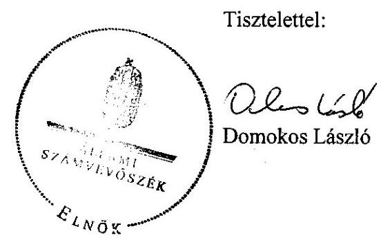

---

# MELLÉKLETEK

---

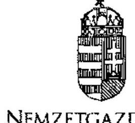

1/a. sz. melléklet
a V-2001-111/2011-2012. sz. jelentéshez

Iktatószám: NGM/2454/3/2012.
Hivatkozási szám: V-2001-092/2011-2012.
Úgyintéző: Kubicza Enikő

# Domokos László úr részére

elnök

# Állami Számvevőszék

Budapest
Apáczai Csere János u. 10.
1052

# ÁLLAMI SZÁMVEVŐSZÉK

1. 0661
Érke: 2012 APR 05.
Iktatószat: U-2001-103/2012.
Melléklet:

Tól kém bobilis
fele

Tárgy: Az EU hulladékszállításról szóló jogi szabályozása érvényesítésének ellenőrzéséről szóló jelentéstervezet

Tisztelt Elnök Úr!

Köszönettel megkaptam az EU hulladékszállításról szóló jogi szabályozása érvényesítésének ellenőrzéséről szóló tervezetet. A megküldött jelentéstervezettel egyetértek.

A jelentés intézkedési javaslatait megvizsgáltam, melyekhez a következő észrevételeket teszem.

A vidékfejlesztési miniszternek valamint a nemzetgazdasági miniszternek az 1. pontban (20. oldal) tett intézkedést igénylő feladatának megvalósítása folyamatban van. Az érintett intézmények közötti megállapodások egyeztetés alatt állnak.

A nemzetgazdasági miniszternek az 5. pontban (22. oldal) tett intézkedési javaslatot azonban a következőképpen egészíteném ki:

,,a vidékfejlesztési miniszternek, valamint a nemzetgazdasági miniszternek:

Intézkedjenek, hogy az OKTVF és a NAV utóellenőrzés keretében, kockázati tényezők figyelembe vételével vizsgálják felül az ellenőrzött időpontban a hulladékszállítások dokumentumait és hulladékszállítási engedély hiányában tegyék meg a szükséges intézkedést. Az ellenőrzés eredményeit használják fel a részletes eljárásrend kialakításához."

Indoklás: A NAV-val végzett közös vizsgálat alapján arra a megállapításra jutottam, hogy a NAV egyedül nem képes az ellenőrzés lefolytatására, mert nem rendelkezik a hulladékszállítási engedélyeket tartalmazó adatbázissal. Ilyen adatokat tartalmazó rendszere az OKTVF-nek van. A NAV azonban a szállítási adatok átadását biztosítani tudja az OKTVF számára. Tehát az ellenőrzést csak közösen tudják lefolytatni.

Kérem változtatási javaslatom szíves figyelembe vételét.

Budapest, 2012. április „5,”

Üdvözlettel:

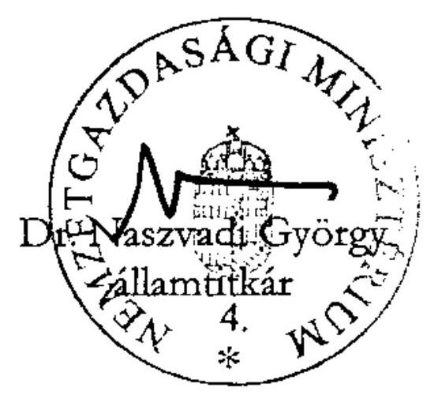

---

# Dr. Matolesy György úr 

miniszter

Nemzetgazdasági Minisztérium

## Budapest

## Tisztelt Miniszter Úr!

Köszönettel megkaptam az EU hulladékszállításról szóló jogi szabályozása érvényesítéséről szóló jelentéstervezetre tett észrevételeit.

Az Állami Számvevőszék észrevételekre vonatkozó álláspontjáról a felügyeleti vezető által készített részletes tájékoztatást csatoltan megküldöm.

Tájékoztatom Miniszter urat, hogy a számvevőszéki jelentés szövegezése az elfogadott észrevételek figyelembevételével készül.

Budapest, 2012. 05. hó 16. nap
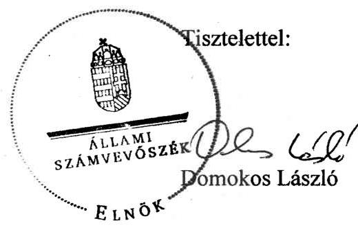

Melléklet: Tájékoztatás az elfogadott és az el nem fogadott észrevételekről

---

# Tájékoztatás 

## az elfogadott és az el nem fogadott észrevételekröl

Az EU hulladékszállításról szóló jogi szabályozása érvényesítéséről szóló jelentéstervezetre a Nemzetgazdasági Minisztérium NGM/2454/8/2012. ikt. számú levelében két javaslathoz tett észrevételeket.

Nem tudtuk elfogadni - a vidékfejlesztési miniszternek valamint a nemzetgazdasági miniszternek az 1. pontban tett javaslathoz kapcsolódó - azon álláspontot, hogy az érintett intézmények (NAV és az OKTVF) közötti megállapodás már egyeztetés alatt áll és nem szükséges javaslat a megállapodás és az összehangolt eljárásrend ügyében. Ennek oka, hogy az OKTVF tájékoztatásában nem erősítette meg azt, hogy minden akadály elhárult a megállapodás aláírása elől és tekintsünk el a javaslattól. Továbbá a NAV más szervekkel (OKTVF és területi szervei, OKF) összehangolt eljárásrendje sem készült még el.

Elfogadtuk az 5. pontban tett intézkedési javaslat kiegészítésére tett észrevételét. A javaslatot a nemzetgazdasági miniszternek valamint a vidékfejlesztési miniszternek címeztük és a javaslatban a NAV mellett az OKTVF-et is feltüntettük, mivel az ellenőrzést csak közösen tudják lefolytatni. A javasolt „ellenőrzött időpontban" kifejezés helyett továbbra is „az ellenőrzött időszakban" kifejezést használtuk, mivel a jelentés megállapításai az ellenőrzött időszakra vonatkoznak.
„A kelebiai vasúti átkelőnél, EU vámhatáron az ellenőrzés során véletlenszerüen kiválasztott 8 szállítmányból 2-nél hiányzott a hulladékszállitási engedély (fémhulladék exportja Szerbiába és Montenegróba), amellyel sérült az EU Hulladékszállitási rendelet szállitmányok ellenőrzésére vonatkozó elöírása.

Javaslat:
Intézkedjenek, hogy az OKTVF és a NAV utóellenőrzés keretében, kockázati tényezők figyelembe vételével vizsgálják felül az ellenőrzött időszakban történt hulladékszállitások dokumentumait, és hulladékszállitási engedély hiányában tegyék meg a szükséges intézkedést. Az ellenőrzés eredményeit használják fel a részletes eljárásrend kialakításához. "

Budapest, 2012. 05. hó 16. nap
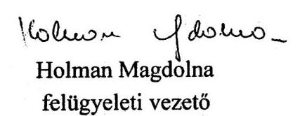

---

1/c. sz. melléklet
a V-2001-111/2011-2012. sz. jelentéshez
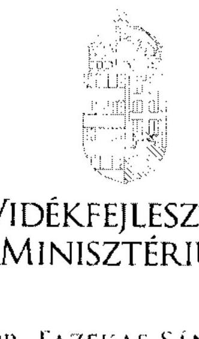

ÁLLAMI SZÁMVEVÓSZÉK
65331
Érkeze: 2012 APR 23.
Iktatószám: 11. 2001-12. 2012

Iktatószám: 698/224/3/2012

Úgyintéző: Löki Mariann
Telefonszám: 7952-463
E-mail: mariann.loki@vm.gov.hu
Hivatkozási szám:

Domokos László
elnök
részére

Állami Számvevőszék
Budapest
Apáczai Csere János u. 10.
1052

Tárgy: Ász jelentéstervezet az EU hulladékszállításról szóló jogi szabályozása érvényesítésének ellenőrzéséről

Tisztelt Elnök Úr!

Megköszönve, hogy jelen tárgyban korábban a Vidékfejlesztési Minisztériumnak megküldött V-2001-051/2011-2012. számú jelentéstervezetre, Farkas Imre közigazgatási államtitkár úr által tett javaslatok többségében átvezetésre kerültek, az észrevételezésre megküldött, V-2001-077/2011-2012. számú tárgyi jelentéstervezettel kapcsolatosan a következő észrevételeket teszem.

1. Az összegző megállapítások (16., 18. oldal) szerint az EU hulladékszállítási szabályozásának végrehajtását, gyakorlati alkalmazását nehezítő körülményként jelentkezik az ellenőrzésre vonatkozó részletes szabályozás hiánya, amelyet a hatóságok együttműködési megállapodásai sem pótoltak.

---

Ez alapján az 1. számú javaslat szerint a nemzetgazdasági és a vidékfejlesztési miniszternek intézkednie kell annak érdekében, hogy a NAV be- és kiléptetési feladatainak ellátásához az érintett hatóságokkal összehangolt eljárásrend készüljön, amely biztosítja a megfelelő együttműködést, kapcsolattartást a környezetvédelmi szervekkel a NAV folyamatos feladatellátásához.

Álláspontom szerint az összegző megállapítások és a javaslat kisebb pontosítást igényelnek.
A VM a korábbiak során már ismertette az ÁSZ-szal azt a véleményét, hogy a hatósági ellenörzés jogszabályokkal való szabályozottsága megfelelő mélységủ. A jelentéstervezetben csak a részletes megállapítások között jelenik meg egyértelműen (34. oldal második bekezdése), hogy az észrevétel valójában nem a jogszabályi, hanem a hatóságok belső szabályozására vonatkozik.

Álláspontom szerint kívánatos lenne, ha mind az összegző megállapítások, mind a javaslatok között megjelenne, hogy az ÁSZ javaslata ténylegesen nem a jogszabályokban megjelenő szabályozásra vonatkozik.
2. Ugyancsak az ellenőrzés körében jelentkező problémákhoz kapcsolódóan, a jelentéstervezetben többször is (18., 39-41. oldal) megjelenik, hogy a gyakorlatban nehezen eldönthető egy adott szállítmány tartalmának áru vagy hulladék volta. A vámjogi szabályozás kizárólag az áru fogalmával operál (a szállítólevél nem tartalmaz EWC-kód szerinti besorolást), amely a hulladékos szabályozást figyelembe véve lehet hulladék vagy nem hulladék. Így egy vámellenőrzés során nem minden esetben problémamentes a szállított anyag helyes besorolása.
a) Az összegző megállapítások (18. oldal) között álláspontom szerint indokolt lenne aláhúzni, hogy egy adott anyag hulladéknak minősülése körében jelentkczỏ dilemmák az uniós, és nem a hazai szabályozásra vezethetők vissza. Továbbá, hogy a hulladékstátusszal kapcsolatos kérdésekben a tagállami hatóságoknak az Európai Bíróság kiterjedt joggyakorlata nyújt segítséget annak eldöntésében, hogy egy adott anyag hulladék-e; a bírósági gyakorlat nem csak a tagállamokra, de annak hatósági gyakorlatára is kötelező.

Ezzel kapcsolatban az Európai Bizottság 2007. február 21-i COM(2007) 59. számú, a hulladékról és a melléktermékekről szóló tájékoztató közleményére (továbbiakban: Közlemény) szeretném felhívni a figyelmet, amelynek kiadására éppen a hulladék-fogalom alkalmazásának nehézségei miatt került sor: „A hulladék meghatározását a 2006/12/EK irányelvben (a hulladékokról szóló keretirányelvben) meghatározott illetékes hatóságok egyedi alapon alkalmazzák, amikor hulladékszállitási vagy engedélyezési határozatokat hoznak. Általában világos, hogy mi számit hulladéknak, és mi nem. Azonban számos esetben okozott már gondot az említett meghatározás értelmezése".

A Közlemény azokat az Európai Bíróság joggyakorlata által kifejlesztett szempontokat foglalja össze, amelyek elengedhetetlenek egy adott anyag hulladéknak vagy (mellék)terméknek való minősítése megítéléséhez. A Közlemény elsődlegesen azt igyekszik megválaszolni az Európai Bíróság ítélkezési gyakorlatának tükrében, hogy ,,hogyan lehet különbséget tenni a termelési folyamatok melléktermékeként keletkezett, hulladéknak nem minäsülő anyagok és a valóban hulladéknak tekintendő anyagok között. (...) A hulladékokkal kapcsolatos uniós szabályozásban ugyanis nem jogi kategória a melléktermék vagy a másodlagos nyersanyag - az anyagok vagy hulladéknak számitanak vagy nem".

---

A Közlemény által összegzett szempontok közül - példálózó jelleggel - a következőket lehet kiemelni:
a) Összetétel: ,, míg a termékek összetételét általában elég pontosan megtervezik, a hulladékok összetételéről kevesebb ismeret állhat rendelkezésre".
b) Kiindulási pontok a hulladék-nem hulladék kérdésének eldöntésénél:

- ,, a hulladék fogalmát széles keretek között kell értelmezni",
- ,, a hulladék fogalmát végsô soron az attól való megválás ténye határozza meg".
c) Hatóság tényállás-tisztázási kötelezettségénck elve: ,,azt, hogy egy anyag hulladéknak számít-e vagy sem, a konkrét helyzet tényállása befolyásolja, és ezt az illetékes hatóságoknak mindig egyedi alapon kell megitélniük".
d) Európai Bíróság hármas tesztje (szempontok, amelyek mentén eldönthető egy anyag melléktermék státusza): ,,A Bíróság szerint amennyiben egy anyagot nem csak fel lehetne használni, hanem valóban fel is használják úgy, hogy a felhasználás elôtt nem kerül sor továbbí feldolgozásra, és a felhasználás folyamatos termelési láncban megvalósítható, akkor ez az anyag nem hulladék".
f) További segitséget nyújtó szempontok:
fa) szerződés az anyag birtokosa és leendő felhasználói között,
fb) a gyártó az anyagot szokásos piaci áron, haszonnal tudja értékesíteni.
fc) további előkészités kérdésköre: „Ha az anyagot elố lehet késziteni a további felhasználásra a termelési folyamat szerves részeként, és valóban el is küldik felhasználásra, akkor az az Európai Bíróság tesztje alapján melléktermék. Ilyen helyzetben az illetékes hatóság tiszte eldönteni, hogy az elökészitési müveletek a termelési folyamat szerves részét képezik-e. Ennek megitéléséhez a Bizottság szerint számos tényezőt figyelembe kell venni: mennyire alkalmas az anyag a további felhasználásra, hasznosítása elôtt milyen természetü és bonyolultságú elökészitésre van szükség, ezek a müveletek mennyire illeszithetők a fö termelési folyamatba, és a gyártó vagy egy másik szereplő végzi-e ezeket".
fd) az ártalmatlanításon kívül nem képzelhető el felhasználás, a további felhasználásnak komoly környezeti hatása lenne, vagy különleges óvintézkedéseket tenne szükségessé: ekkor valószínűleg hulladékról van szó
fe) az anyagot szokványos hulladékkezelési eljárásnak vetik alá: a hulladékstátuszt erősíti
ff) a vállalkozás az anyagot hulladéknak tekinti, vagy a vállalkozás igyekszik csökkenteni a keletkező anyag mennyiségét: nem perdöntő, de segítő szempontok a hulladékstátusz megítéléséhez.
b) A tervezet a hulladék-keretirányelv tág hulladék-definíciója alapján arra a következtetésre jut (41. oldal), hogy ,, (...) amennyiben egy áru szállitója annak tulajdonosának vallja magát és állitása szerint nem szándékozik megválni az árutól, nem tekinthető hulladéknak a szállítmány akkor sem, ha annak látszik (pl. autóroncs)".

A Közlemény fent ismertetett megállapításaira figyelemmel az ÁSZ következtetése árnyalásra szorul, hiszen a hulladékstátusz beazonosítása során az csak az egyik lehetséges - és nem is a legfontosabb! - szempont, hogy a termelő, birtokos az anyagot hulladéknak tekinti-e. Az

---

uniós bírósági gyakorlatból következően a kérdésben a hatóságnak mindig egyedi vizsgálat alapján kell meggyőződésre jutnia.

Ezúton szeretném megköszönni tárgyi témában az ellenőrzés során tanúsított segitő cgyưttmüködésüket.

Budapest, 2012. április , 4"
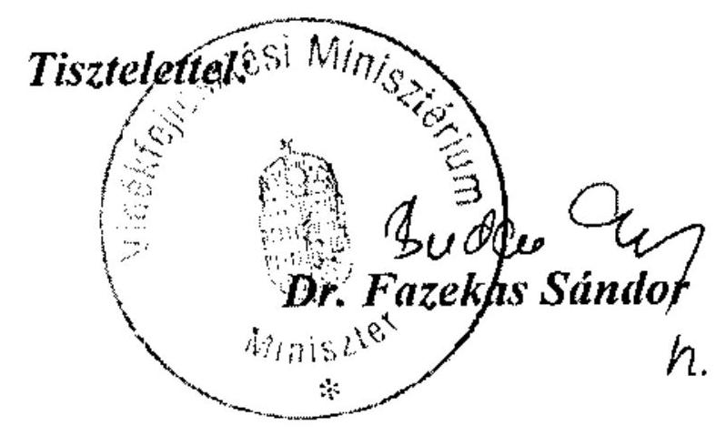

---

# Dr. Fazekas Sándor úr 

miniszter
Vidékfejlesztési Minisztérium

## Budapest

## Tisztelt Miniszter Úr!

Köszönettel megkaptam az EU hulladékszállításról szóló jogi szabályozása érvényesítéséről szóló jelentéstervezetre tett észrevételeit.

Az Állami Számvevőszék észrevételekre vonatkozó álláspontjáról a felügyeleti vezető által készített részletes tájékoztatást csatoltan megküldöm.

Tájékoztatom Miniszter urat, hogy a számvevőszéki jelentés szövegezése az elfogadott észrevételek figyelembevételével készül.

Budapest, 2012. 05. hó 16. nap
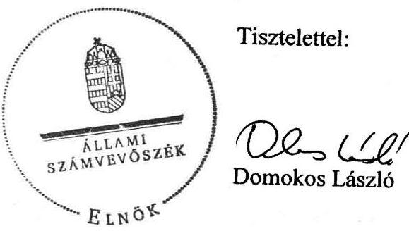

Melléklet: Tájékoztatás az elfogadott és az el nem fogadott észrevételekről

---

# Tájékoztatás 

## az elfogadott és az el nem fogadott észrevételekről

Az EU hulladékszállításról szóló jogi szabályozása érvényesítéséről szóló jelentéstervezetre a Vidékfejlesztési Minisztérium $\mathrm{Hgf} / 224 / 3 / 2012$. ikt. számú levelében észrevételeket fogalmazott meg.
Az 1. pontban a hulladékszállítás ellenőrzése jogi szabályozásának megfelelőségére vonatkozó álláspontjukat ismertették. A jelentés hivatkozott megállapításait felülvizsgálva - a NAV tájékoztatását is figyelembevéve - pontosítottuk a jelentést, hogy az ellenőrzés során volt jogszabályi és eljárásrendi hiányosság is.
„Az ellenőrzött intézmények számára az EU Hulladékszállítási rendelet gyakorlati végrehajtását nehezitette, hogy nem készült stratégia ${ }^{1}$ (jogellenes szállitás megelőzése, feltárása érdekében súlyponti kérdések, kockázati szempontok meghatározása, erőforrás összehangolása), és részletes végrehajtási szabály (ideértve a jogszabályi és belső eljárásrendi szabályozást) a hulladékszállítás ellenőrzéséhez, illetve az ellenőrzésben együttmüködő szervek tevékenységének összehangolásához. Részletes ellenőrzésre és bírságolásra vonatkozó jogi szabályozás a veszélyes áruk (köztük a veszélyes hulladékok) szállitására vonatkozóan létezett, amely a szállitmányok veszélyességére és nem az országhatárt átlépő jellegére vonatkozott. ${ }^{2}$
„Az EU Hulladékszállítási rendelet végrehajtását nehezitette, hogy az EU és a hazai Hulladékszállítási rendeletben sem határozták meg a hulladékszállítmány fogalmát és ehhez kapcsolódóan nem dolgozták ki a jogellenes hulladékszállítmány visszatartása során követendő eljárást (visszatartás ideje, intézkedési határidők az OKTVF és a NAV részéről, jármüvezető tájékoztatása, visszatartás során a felelősség kérdésköre stb.), amelynek hiánya a hulladékszállítmány visszatartása (ellenőrzés) során kifogásolható."
A 2/a. pontban az áru hulladék, vagy nem hulladék voltának eldöntéséről és a 2/b. pontban a hulladék-keretirányelv tág hulladék-definícióhoz tett észrevételeit megköszönöm, az eddigi ismeretekhez képest új információt kaptunk, amit beépítettünk a jelentésbe.

[^0]
[^0]:    ${ }^{1}$ Nem lehetséges és nem szükséges minden szállítmány ellenőrzése (átvizsgálása), amint írja azt a Vám Világszervezet is „A globális kereskedelem biztonságát és könnyítését szolgáló szabványrendszeré"-ben.
    ${ }^{2}$ A veszélyes áruk közötti szállításának ellenőrzésére hatályos jogszabály volt, a veszélyes áruk vasúti és belvízi szállításának ellenőrzésére jogszabály tervezet volt az ellenőrzés idején, amely 2012. január 1-jétől hatályba lépett.

---

„A Vidékfejlesztési Minisztérium tájékoztatása szerint a hulladékstátusszal kapcsolatos kérdésekben a tagállamoknak és a tagállami hatóságoknak az Európai Bíróság kiterjedt joggyakorlata nyújt segítséget annak eldöntésében, hogy egy adott anyag hulladék-e. Az Európai Bizottság szintén az Európai Bíróság joggyakorlata által kifejlesztett szempontokra támaszkodott és e szempontokat összefoglalva a hulladékokról és a melléktermékekről szóló tájékoztató közleményt adott ki. ${ }^{3}$ A joggyakorlat szerint az anyag hulladéknak vagy (mellék) terméknek való minösitéséhez például a hatóság tényállás-tisztázási kötelezettség elvét kell érvényesiteni: a konkrét helyzet tényállása alapján, egyedi alapon kell dönteni."
Budapest, 2012. 05. hó 16. nap

Holman Magdolna
felügyeleti vezető

[^0]
[^0]:    ${ }^{3}$ Az Európai Bizottság 2007. február 21-i COM (2007) 59. számú tájékoztató közleménye.

---

1/c. sz. melléklet
a V-2001-111/2011-2012. sz. jelentéshez
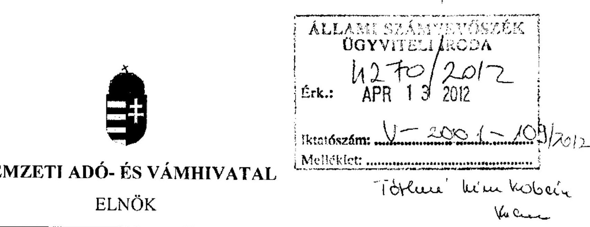

Iktatószám:

Ügyintéző: Kudelász Csilla püör örnagy
Telefonszám:373-40-91
Hivatkozási szám: 2947144870
Tárgy: Az ÁSZ jelentéstervezete az EU
hulladékszállításról szóló jogi szabályozás
érvényesítésének ellenőrzéséről

Mell:-

Holman Magdolna
Felügyeleti Vezető

Állami Számvevőszék

Budapest
Apáczai Csere János u. 10.
1052

Tisztelt Felügyeleti Vezető Asszony!

Tájékoztatom a Tisztelt Felügyeleti Vezető Asszonyt, hogy az Állami Számvevőszék által a 2008-
2010. évek tekintetében „az EU hulladékszállításról szóló jogi szabályozás érvényesítésének
ellenőrzéséről" készített Dr. Matolesy György miniszter úrnak is megküldött jelentéstervezethez az
alábbi észrevételt teszem.

Az Európai Parlament és a Tanács hulladékszállításról szóló 1013/2006/EK Rendeletének (2006.
június 14.) (továbbiakban: EK Rendelet) nemzeti szabályozása az országhatárt átlépő
hulladékszállításról szóló 180/2007. (VII. 3.) Korm. rendelet (továbbiakban: Kormányrendelet) a
vámhatóság ellenőrzési feladatkörébe utalta az országhatárt átlépő hulladékszállítás ellenőrzését. Az
ellenőrzések lefolytatása speciális szakmai ismereteket igényel.

A Nemzeti Adó- és Vámhivatal Központi Hivatala (továbbiakban: NAV KH) keretein belül, 2011.
január 1-jén az újonnan létrejött Környezetvédelmi és Környezetgazdasági Főosztály
(továbbiakban: KVKGF) egyik előremutató szakmai feladataként került meghatározásra: a vám, a
rendészeti, a környezetvédelmi és a hulladékgazdálkodási jogszabályok - 2012. január 1-től a NAV
hatáskörébe tartozik a termékdíj köteles termékekből képződött hulladékkal kapcsolatos
hulladékgazdálkodás ellenőrzése is - alkalmazásának összehangolása, a NAV vámszerve
tevékenységének, működésének irányításához a szabályzók kialakítása, aktualizálása, egységessé
tétele.

1054. Budapest, Széchenyi u. 2. • Telefon: 428-5100 • Fax:428-5382

---

A 2011. szeptember 12-én kezdődő ÁSZ ellenőrzést megelőző időszakban a NAV vámszerve és az Országos Környezetvédelmi, Természetvédelmi és Vízügyi Főfelügyelőség (továbbiakban: OKTVF) több közös, eseti jelleggel történő hulladékszállítmány ellenőrzést végzett. A közös ellenőrzések hozzájárultak az országhatáron átnyúló hulladékszállítmányok ellenőrzése tárgyában kiadandó eljárási rend kialakításához, valamint az együttműködés megerősitését és elmélyítését tovább segítette a Vám Világszervezet (WCO) és az INTERPOL által támogatott nemzetközi méretü DEMETER II. akció, amely az országhatáron átnyúló hulladékszállítmányok ellenőrzésére, továbbá az illegális hulladékszállítmányok felderítésére irányult összehangolt ellenőrzés volt a Bázeli Egyezményt aláirt országok részvételével.

A DEMETER II. akció céljai között szerepelt a vámhatóságnak a környezetvédelmi szervekkel és a rendőrhatósággal történő gyakorlati együttmüködés javítása, fejlesztése, valamint a vámhatóság elméleti és gyakorlati tudásának gyarapítása az illegális hulladékszállítmányok kiszűrése tekintetében.
A műveletben a NAV vámszerve mellett aktív résztvevőként az OKTVF valamint, közreműködőként a BM Országos Katasztrófavédelmi Főfelügyelőség vett részt.

A DEMETER II. akció teljes nemzetközi időtartama: 2012. február 06-tól 2012. március 11-ig tartott ( 35 nap). Az akcióban Magyarország 2012. február 06. (00. órától) -15. (24. óráig) közötti időszakban volt érintett, de ténylegesen a művelet teljes ideje alatt fokozott ellenőrzést végeztek az együttműködő társhatóságok.

A DEMETER II. akció magyarországi időszaka - azaz 10 nap - alatt az OKTVF és a NAV közösen (közúton és a Közösség külső határán) 258 hulladékszállítmány ellenőrzését végezte el, melyből az OKTVF által 8 esetben közel 88 millió Ft hulladékgazdálkodási bírság került kiszabásra.

A művelet előkészítését és sikeres végrehajtását megelőzte az országhatárt átlépő hulladékszállítmányok ellenőrzése tekintetében a NAV KVKGF valamint, a NAV Rendészeti és Központi Ügyeleti Főosztálya által szervezett az OKTVF és a Környezetvédelmi Szolgáltatók és Gyártók Szövetsége helyettes ügyvezetője közreműködésével 2011. szeptember 26-án megtartott felkészítő oktatás.

A NAV vámszerve a Kormányrendeletben megfogalmazott kötelezettsége alapján a DEMETER II. akció során a hulladékgazdálkodásról szóló 2000. évi XLIII. törvényben (továbbiakban: Hgt.) megfogalmazott alapelveként megjelenő elővigyázatosság elvének (a veszély, illetőleg a kockázat valós mértékének ismerete hiányában úgy kell eljárni, mintha azok a lehetséges legnagyobbak lennének) alkalmazásával járt el, miszerint az illegális hulladékszállítás gyanúja mindaddig fennáll, amíg a hulladékszállítmány a Közösség vámhatárán történő vámellenőrzése valamint, a hulladékszállítmány Magyarország területén történő ellenőrzése során az OKTVF e-mailen vagy telefonon történő értesítését követően a hulladékszállítmány továbbhaladásának engedélyezése meg nem történik. Az értesítést követően a továbbhaladás engedélyezése általában 1-2 órán belül megtörtént.
Amennyiben a hulladékszállítás jogellenes, ebben az esetben az OKTVF az EK Rendelet szerint intézkedik a hulladékszállítmány további sorsáról.
I. A DEMETER II. akció végrehajtása során az alábbi, az előkészített eljárási rendben is tisztázandó kérdések merültek fel:

---

1./1. Az OKTVF-nek fiskális és humánerőforrás hiánya miatt csak 2012. március 14. 24-óráig állt módjában a 24 órás ügyeletet biztosítani, szeretném azonban kiemelni, hogy az akció keretében a szoros együttműködés során kialakultak, megerősödtek a személyes és a közvetlen kapcsolatok, melyek a későbbi eredményes és hatékony ellenőrzés szempontjából elengedhetetlenek.
2012. február 28 -án - 2947142458 számú ügyiratában - a NAV felkérte dr. Hecsei Pált, az OKTVF Föigazgatóját, hogy a DEMETER II. akció befejezését követően, a NAV számára továbbra is az éjjel-nappali ügyelet fenntartásával biztositsa az akció idején tanúsított eredményes segítségét, mellyel folyamatossá és állandóvá tehetné a hatékony fellépést az illegális hulladékszállítás ellen.
2012. március 26 -án kelt levelében az OKTVF Föigazgatója a 24 órás ügyelet felállítása tekintetében támogatásáról biztosította a NAV-ot, kialakítása érdekében a szükséges kezdeményezéseket megtette és a támogató kormányzati döntést követően, szervezetileg és létszámban is megerősödve a későbbiekben is biztosítani kívánja a szorosabb együttműködést, de jelen pillanatban a szükös anyagi és munkaerőforrás hiányában ez nem áll módjában.

Az eljárási rend kiadásának és későbbi eredményes alkalmazásának viszont alapfeltétele az OKTVF által biztositott 24 órás szakmai ügyelet, hiszen az országhatáron átnyúló jogellenes hulladékszállítmányok gyanúja esetén a Kormányrendelet - az eljárási határidők külön megállapítása nélkül - a NAV vámszerve számára értesítési, az OKTVF részére pedig intézkedési kötelezettséget ír elő.

Amint az előzőekben részletezésre került, az országhatáron átnyúló hulladékszállítmányok ellenőrzése az elővigyázatosság elvére épül, így minden hulladékszállítmány környezetvédelmi hatóság által előírt és/vagy jóváhagyott dokumentumait, engedélyeit - a fuvarlevéllel összevetve szükségszerü ellenőriztetni az OKTVF által. Külön megjegyezendő, hogy a 35 napos akció során a hulladékszállítmányok általában a késő délutáni, esti, éjszakai, hajnali órákban kerültek bejelentésre. Az akció ideje alatt jellemzően a közös közúti hulladékszállítmány ellenőrzések is az éjszakai időszakban kerültek végrehajtásra.

A Hgt. felülvizsgálata során előkészített a hulladékról szóló törvény jövőbeli hatályba lépése értelemszerủen eredményezni fogja a kapcsolódó végrehajtási rendeletek módosításának kötelezettségét is. A NAV a Kormányrendelet felülvizsgálata során a gyakorlati végrehajtását segitő javaslatokat kíván előterjeszteni így például az intézkedésekhez füződő fogalmak (feltartóztatás, visszatartás......) meghatározását, kifejtését, konkrét intézkedési határidők beépítését a jogszabályba, valamint a továbbiakban szükséges megállapítani az OKTVF „hallgatása" esetén a NAV vámszerve eljárását.
Tájékoztatom, hogy a környezetvédelmi szempontok elsődlegességének figyelembevételével a felesleges jogkövetkezmények elkerülése végett az OKTVF - első - intézkedéséig rendelkezésre álló időintervallum közös meghatározása a már elkészült eljárási rend kiadása előtti jogi egyeztetés alatt áll.
1./2. Az érintett hatóságok közös eljárása során további problémát okoz az alkalmazandó jogszabályok fogalmi és tartalmi hiányosságai mellett a visszatartás során a felelősség kérdésköre.

A NAV vámszerve általi visszatartás - azaz a jármủ továbbhaladásának meggátolása - a Kormányrendelet 4.§ (7) bekezdése szerint - „a vámhatóság önállóan is jogosult hulladékszállítmányok ellenőrzésére. E célból az ország területén a hulladékszállítmányokat megállíthatja, és jogellenes hulladékszállítás gyanúja esetén a Főfelügyelőség egyidejủ értesítése

---

mellett a szállítmányt a Főfelügyelöség intézkedéséig visszatartja" - az OKTVF intézkedéséig tart.

A jogellenes hulladékszállítmány visszatartásához kapcsolódó EK Rendelet szerinti eljárás során a hulladékszállítmány visszatartását az OKTVF biztosítja, mely nem azonos a NAV vámszerve által alkalmazott a közúti közlekedésről szóló 1988. évi I. törvény szerinti (többnyelvű írásbeli tájékoztatás átadásával történő) közúti jármű visszatartásához kötődő eljárással.
A közúti jármủ visszatartása esetén a hatósági eljárás részletesen szabályozott és a járművezető több nyelven történő tájékoztatása is biztosított. Ezzel szemben a közúti, a vasúti, a vízi, és a légi hulladékszállítmány visszatartása során az eljáró hatóság által a követendő eljárás rendeleti szinten nem került kidolgozásra.
Megjegyzendő, hogy a hulladékszállítmány fogalma az EK Rendeletben és a nemzeti végrehajtására kiadott Kormányrendeletben sem került meghatározásra.

# II. Az Együttmüködési Megállapodások 

II./1. A NAV és az OKTVF közötti új Együttműködési Megállapodás tekintetében a folyamatos egyeztetéseket követően - a két jogelőd szervezeti egységnek az OKTVF-vel a meglévő együttműködési megállapodásuk egységessé és hatályossá szerkesztve, mint NAV-OKTVF együttműködési megállapodás tervezet 2011. júliusában került első alkalommal megküldésre az OKTVF-nek - az együttműködési megállapodás eddig nem került aláírásra, de információnk szerint elhárultak az akadályok az OKTVF általi jóváhagyás elől. A NAV ennek érdekében ismételten megküldi aláírásra az Együttműködési Megállapodás tervezetét.
II./2. A NAV és a BM OKF közötti új Együttműködési Megállapodás tervezetébe beépítésre került a NAV vámszerve által biztosított helyiségben a BM OKF elhelyezésének lehetősége, mely által hatékonnyá válhatna az országhatáron átnyúló veszélyes hulladékszállítmányok közös ellenőrzése az alábbi határkirendeltségeken:

- Dél-alföldi Regionális Vám- és Pénzügyőri Főigazgatóság BKM VPI Kelebia szolgálati hely (vasúti)
- Nyugat-dunántúli Regionális Vám- és Pénzügyőri Főigazgatóság ZM VPI Murakeresztúr (vasúti)
- Észak-alföldi Regionális Vám- és Pénzügyőri Főigazgatóság SZSZBM VPI Záhony, Eperjeske (vasúti)
- Dél-dunántúli Regionális Vám- és Pénzügyőri Főigazgatóság BM VPI Mohács Határkirendeltség (dunai vízi)

Végezetül tájékoztatom, hogy a katasztrófavédelemről és a hozzá kapcsolódó egyes törvények módosításáról szóló 2011. évi CXXVIII. törvény 160.§-a - a vízi közlekedésről szóló 2000 . évi XLII. törvénybe került beépítésre - és a 166.§-a szerint - mely a vasúti közlekedésről szóló 2005. évi CLXXXIII. törvénybe került beépítésre - a veszélyes áruk, ennek keretében a veszélyes hulladék belvizi és vasúti szállításának ellenőrzése tekintetében a hivatásos katasztrófavédelmi szerveknek új ellenőrzési és szankcionálási lehetőséget biztosít.
A veszélyes áruk vasúti (RID) és a veszélyes áruk vízi (ADN) szállítására vonatkozó előírások megsértőivel szemben a NAV vámszerve bírságolási eljárást nem folytathat le, kizárólag a hivatásos katasztrófavédelmi szerv.

---

A NAV az EK Rendelet, valamint annak nemzeti végrehajtásáról szóló Kormányrendelete által előirt jogszabályi kötelezettsége során - a DEMETER II. akció tapasztalatait és eredményeit is figyelembe véve - a korábbi évekhez képest, az OKTVF-vel és a BM OKF-vel összehangoltabb szorosabb együttmüködést kíván megvalósítani az országhatáron átnyúló hulladékszállítás ellenőrzési feladatainak teljesítéséhez.

A tájékoztatási lehetőséget megköszönve.

Budapest, 2012. április.. Ơt.
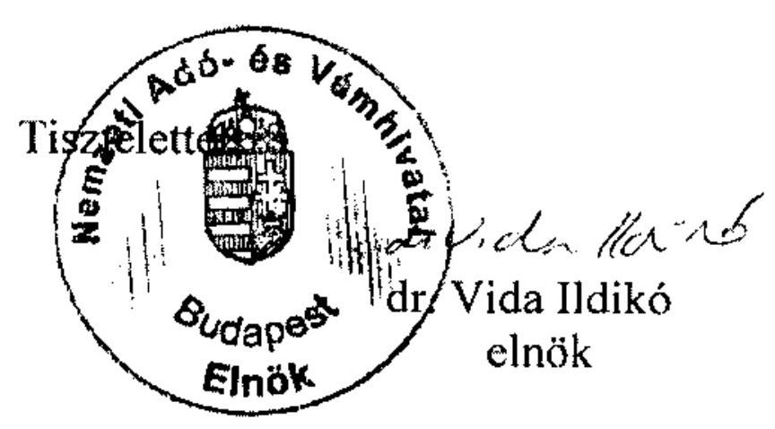

Erről értesülnek:

1. a címzett: tothnekk@asz.hu
2. a főosztályi irattár

---

# 1/f. sz. melléklet   a V-2001-111/2011-2012. sz. jelentéshez 

## ELNÖK

## ÁLLAMI   SZÁMVEVÔSZÉK

Ikt.szám: V-2001-105/2012.
Ügyintéző: Tóthné Kiss Katalin

## Dr. Vida Ildikó asszony   elnök

Nemzeti Adó- és Vámhivatal

## Budapest

## Tisztelt Elnök Asszony!

Köszönettel megkaptam az EU hulladékszállításról szóló jogi szabályozása érvényesítéséről szóló jelentéstervezetre tett észrevételeit és tájékoztatását.

Az Állami Számvevőszék észrevételekre vonatkozó álláspontjáról a felügyeleti vezető által készített részletes tájékoztatásomat csatoltan megküldöm.

Tájékoztatom Elnök asszonyt, hogy a számvevőszéki jelentés szövegezése az elfogadott észrevételek figyelembevételével készül.

Budapest, 2012. 05. hó/6.nap
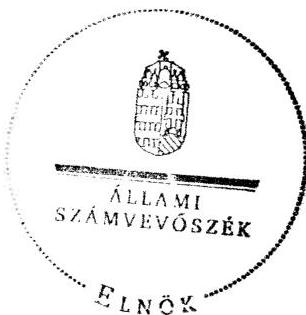

Tisztelettel:

## 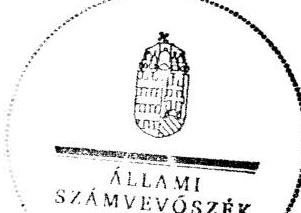 Domokos László

Melléklet. Tájékoztatás az elfogadott és az el nem fogadott észrevételekről

---

# Tájékoztatás 

## az elfogadott és az el nem fogadott észrevételekröl

Az EU hulladékszállításról szóló jogi szabályozása érvényesítéséről szóló jelentéstervezetre a Nemzeti Adó- és Vámhivatal 2947146072 ikt. számú levelében az ÁSZ helyszíni ellenőrzését követő, a hulladékszállítás ellenőrzéséhez kapcsolódó lényeges eseményekről, jogszabályi változásokról részletes tájékoztatást adott.

A tájékoztatás áttekintését követően az információkat hasznosítottuk, a jelentés megállapításait kiegészítettük, aktualizáltuk.

A tájékoztatás bevezetőjében a NAV-nak a termékdíj köteles termékekből képződött hulladékkal kapcsolatos ellenőrzési feladatát (2012. január 1-jétől hatályos szabályozás), amely lényeges az ellenőrzött téma szempontjából, a következők szerint szerepeltetjük a jelentésben.
„Előre mutató volt, hogy az ellenőrzött időszakot követően (2011-ben) elkezdődött a NAV-nál a vám, a rendészeti, a környezetvédelmi, ezek között a hulladékszállítási, hulladékgazdálkodási jogszabályok alkalmazásának összehangolása, a NAV vámszerve tevékenységének, müködésének irányitásához a szabályozók kialakítása, aktualizálása. ${ }^{1}$ Nött az OKTVF által végzett ellenőrzések száma és javult az OKTVF és a NAV közötti együttmüködés (oktatások, képzések)." (összefoglaló 17. oldal)

A tájékoztatás bevezetőjében az ún. DEMETER II. nemzetközi méretű, illegális hulladékszállítmányok felderítésére irányult, összehangolt ellenőrzésről adott információk összegzését szerepeltetjük a jelentésben.
„A NAV tájékoztatása szerint kiemelt jelentőségű volt az ÁSZ ellenőrzését követően (2012. február 6. és március 11. között, 35 nap) lebonyolított nemzetközi méretü, összehangolt akció. Ez a Vám Világszervezet (World Customs Organization, WCO) és az INTERPOL által támogatott akció (DEMETER II.) elérte a célját. A vámhatóság gyakorlati együttmüködése a környezetvédelmi szervekkel és a rendőrhatósággal hazai és nemzetközi szinten is javult, fejlődött, valamint a vámhatóság elméleti és gyakorlati tudása gyarapodott az illegális hulladékszállítmányok kiszürése tekintetében. A megszerzett tapasztalatok hozzájárulnak a hazai részletes eljárási szabályok megalkotásához, továbbá felhívták az érintettek figyelmét a hulladékszállítási szabályokra, elöírásokra. Az akció magyarországi idöszaka alatt (10 nap) az OKTVF és NAV közösen (közüton és a Közösség külső határain) 258 hulladékszállítmány

[^0]
[^0]:    ${ }^{1}$ E szabályozás az ellenőrzés idején még nem volt véleményezhető szakaszban.

---

ellenőrzését végezte el, amelyböl az OKTVF által 8 esetben közel $88 \mathrm{M} \mathrm{Ft}^{2}$ hulladékgazdálkodási birság került kiszabásra." (23. és 50. oldal)

Az I/1. pontban, a NAV határkirendeltségei számára a folyamatos (napi 24 órás) feladatellátásához az érintett hatóságokkal való kapcsolattartás valóban elengedhetetlen, amit az ÁSZ jelentés már korábban is hangsúlyozott és arra javaslatot tett. Az Önök tájékoztatásával összhangban ezt a DEMETER II. akció megerősítette.

Az I/1. pontban a hulladékszállítás ellenőrzése során az intézkedésekhez füződő fogalmak (feltartóztatás, visszatartás), és az I/2. pontban a hulladékszállítmány fogalmának, és a szállítmány visszatartása során a felelősség meghatározásának szükségességével kiegészítettük a jelentést.
„Az EU Hulladékszállítási rendelet végrehajtását nehezítette, hogy az EU és a hazai Hulladékszállítási rendeletben sem határozták meg a hulladékszállítmány fogalmát és ehhez kapcsolódóan nem dolgozták ki a jogellenes hulladékszállítmány visszatartása során követendő eljárást (visszatartás ideje, intézkedési határidők az OKTVF és a NAV részéről, jármüvezető tájékoztatása, visszatartás során a felelősség kérdésköre stb., amelynek hiánya a hulladékszállítmány visszatartása során kifogásolható)." (18. oldal utolsó és a 19. oldal első bekezdése)

A II/1. pontban, a NAV-OKTVF közötti új együttműködési megállapodás OKTVF általi aláírásáról írtakat nem tudtuk szerepeltetni a jelentésben, mivel az OKTVF föigazgatója egyetértett az ÁSZ jelentésben foglaltakkal és nem erősítette meg a megállapodás aláírását.

A II/2. pontban, a NAV és a BM OKF közötti új együttműködési megállapodással kapcsolatban a NAV által megtett intézkedéssel kiegészítettük a jelentést.
„A NAV - az országba beszállított, az országból kiszállított, illetve az ország területén áthaladó szállítmányok, köztük a hulladékszállítmányok ellenörzésében ${ }^{3}$ betöltött központi szerepének megfelelően - 2011-ben megkezdte a hulladékszállítás ellenőrzésére vonatkozó, az érintett szervekkel összehangolt eljárásrend készitését és ezzel összhangban új együttmüködési megállapodások megkötését. Új megállapodásokat készített elö az országhatáron átmenő hulladékszállítás felügyeletére és ellenőrzésére kijelölt illetékes hatósággal (OKTVF) és a veszélyes áruk ellenőrzésében kiemelt szerepet játszó Országos Katasztrófavédelmi Föigazgatósággal (OKF). A NAV eljárásrend bevezetésének többek között feltétele az együttmüködési megállapodások elfogadása, amelyeket az ellenőrzés lezárásáig még nem írtak alá." (18. oldal első bekezdés)

[^0]
[^0]:    ${ }^{2}$ A kiszabott bírságok összege megfelel az ellenőrzött időszakban egy év alatt átlagosan megállapított bírságok összegének.
    ${ }^{3}$ 2012. január 1-jétől a NAV hatáskörébe tartozik a termékdíj köteles termékekből képződött hulladékgazdálkodáshoz kapcsolódó ellenőrzés is, ezáltal az OKTVF és területi szervei mellett a NAV is végez telephelyi ellenőrzést.

---

A tájékoztatás befejezésében a veszélyes áruk, ennek keretében a veszélyes hulladék belvízi és vasúti szállításának ellenőrzésére vonatkozó jogszabályi változással aktualizáltuk a jelentés 13. lábjegyzetét.
„A veszélyes áruk közúti szállitásának ellenőrzésére hatályos jogszabály volt, a veszélyes áruk vasúti és belvízi szállitásának ellenőrzésére jogszabály tervezet volt az ellenőrzés idején, amely 2012. január 1-jétől hatályba lépett."

Budapest, 2012. 05. hó lénap

Holman Magdolna
felügyeleti vezető

---

1/g. sz. melléklet
a V-2001-111/2011-2012. sz. jelentéshez
$8 M / 0412012$
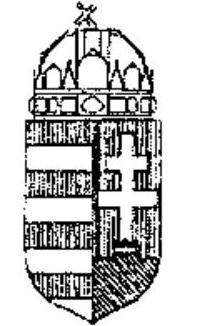

ORSZÁGOS KÖRNYEZETVÉDELMI, TERMÉSZETVÉDELMI ÉS VÍZÜGYI FÖFELÜGYELÖSÉG

# mb. Főigazgató 

Iktatószám: 14/1983-2/2012
Hiv.szám:V-2001-089/2011-2012:
Ügyintéző: Tóthné Kiss Katalin

## Holman Magdolna felügyeleti vezető

## Állami Számvevőszék

## Budapest

Apáczai Csere János u. 10. 1052
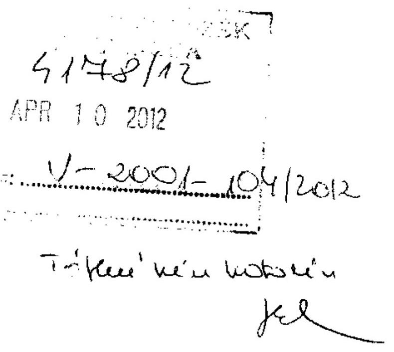

Tisztelt Felügyeleti Vezető Úrhölgy!
Az EU hulladékszállításról szóló jogi szabályozása érvényesítésének ellenőrzéséről készített jelentés tervezettel a Főfelügyelőség részéről egyetértünk, arra érdemi észrevételt nem teszünk.

Egyetértve a megállapításokkal, következtetésekkel és javaslatokkal egy tényre azonban fel kívánjuk hívni a figyelmet. A DEMETER II. akció tapasztalatai alapján is a tervezet 21. oldal 3. pontban javasolt a „jogellenes kivitel szándéka esetén", az eljárás megvalósítását - bár egyetértünk vele - nehezen kivitelezhetőnek tartom, jogilag nem tűnik megvalósíthatónak.

Budapest, 2012. április 10.

Tisztelettel:
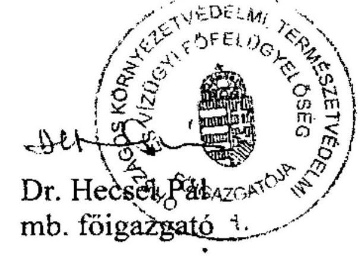

---

# Dr. Hecsei Pál úr 

mb. föigazgató
Országos Környezetvédelmi, Természetvédelmi és Vízügyi Főfelügyelőség

## Budapest

## Tisztelt Föigazgató Úr!

Köszönettel megkaptam az EU hulladékszállításról szóló jogi szabályozása érvényesítéséről szóló jelentéstervezetre tett észrevételeit.

Az Állami Számvevőszék észrevételekre vonatkozó álláspontjáról a felügyeleti vezető által készített részletes tájékoztatásomat csatoltan megküldöm.

Tájékoztatom Főigazgató urat, hogy a számvevőszéki jelentés szövegezése az elfogadott észrevételek figyelembevételével készül.

Budapest, 2012. 05. hó $/ 6$ nap
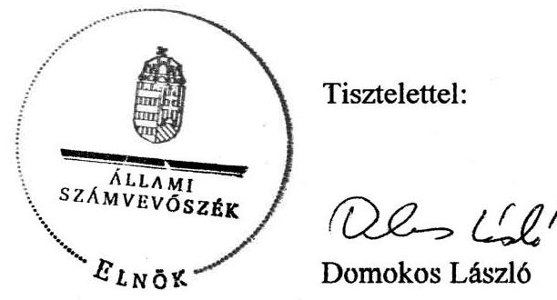

Melléklet: Tájékoztatás az elfogadott és az el nem fogadott észrevételekről

---

# Tájékoztatás 

## az elfogadott és az el nem fogadott észrevételekröl

Az EU hulladékszállításról szóló jogi szabályozása érvényesítéséről szóló jelentéstervezetre az Országos Környezetvédelmi, Természetvédelmi és Vízügyi Főfelügyelőség 14/1983-2/2012. ikt. számú levelében egyetértett a jelentés megállapításaival, következtetéseivel, javaslataival és érdemi észrevételt nem tett, ezért az észrevétele nem igényelte a jelentés kiegészítését, módosítását.

A figyelemfelhívásukban foglalt tényre vonatkozóan tájékoztatom, hogy a hulladék ,,jogellenes kivitel szándéka esetén", az EU Hulladékszállítási rendelet alapján követendő eljárás megvalósításával a Vidékfejlesztési Minisztérium korábban jogilag egyetértett. Ez alapján javasoljuk az eljárás gyakorlati megvalósításába, az esetleges nehézségek megoldásába szükség szerint az irányítási jogkört gyakorló, Vidékfejlesztési Minisztérium bevonását.

Budapest, 2012. 05. hólínap

Holman Magdolna
felügyeleti vezető

---

# A hulladéktermelési adatok alakulása Magyarországon

|   |  | 2007 | 2008 | 2008/2007 | 2009 | 2009/2008 | 2010 | 2010/2009 | 2010/2008 | 2008-2010  |
| --- | --- | --- | --- | --- | --- | --- | --- | --- | --- | --- |
|  Megtermelt hulladék | ezer tonna | 25 860,00 | 22 650,00 | $88 \%$ | 19 760,00 | $87,24 \%$ | 19 200,00 | $97,17 \%$ | $84,77 \%$ | 61610,00  |
|  ebből veszélyes | ezer tonna | 1100,00 | 710,00 | $65 \%$ | 850,00 | $119,72 \%$ | 860,00 | $101,18 \%$ | $121,13 \%$ | 2420,00  |
|   | $\%$ | $4,25 \%$ | $3,13 \%$ |  | $4,30 \%$ |  | $4,48 \%$ |  |  |   |
|  ebből export | ezer tonna |  | 1148,22 |  | 1568,96 |  | 1089,84 | $69,46 \%$ | $94,92 \%$ | 3807,02  |
|   | $\%$ |  | $5,07 \%$ |  | $7,94 \%$ |  | $5,68 \%$ |  |  |   |
|  Import hulladék | ezer tonna |  | 303,93 |  | 370,55 |  | 705,33 | $190,35 \%$ | $232,07 \%$ | 1379,81  |
|   | $\%$ |  | $1,34 \%$ |  | $1,88 \%$ |  | $3,67 \%$ |  |  |   |
|  Ország területén kezelt hulladék | ezer tonna |  | 21 805,71 |  | 18562,00 |  | 18815,00 | $101,36 \%$ | $86,28 \%$ | 59182,71  |
|  Rendelkezésre álló hulladékkezelési (hasznosítási és ártalmatlanítási) kapacitás | ezer tonna |  | 24000,00 |  | 24000,00 |  | 24000,00 | $100,00 \%$ | $100,00 \%$ | 72000,00  |
|  Szabad hulladékkezelési kapacitás | ezer tonna |  | 2194,29 |  | 5438,00 |  | 5185,00 | $95,35 \%$ | $236,30 \%$ | 12817,29  |
|  Szabad kapacitás /Összes kapacitás | $\%$ |  | $9,14 \%$ |  | $22,66 \%$ |  | $21,60 \%$ |  |  |   |

Forrás: Vidékfejlesztési Minisztérium

---

# A hulladékszállítási adatok alakulása Magyarországon

|  Hulladékszállítás típusa |  | 2008 |  | 2009 |  |  | 2010 |  |  | mennyiség változása 2010/08 | 2008-2010 |   |
| --- | --- | --- | --- | --- | --- | --- | --- | --- | --- | --- | --- | --- |
|   |  | szállítmány
száma | mennyiség | szállítmány
száma | mennyiség | mennyiség
változása
2009/08 | szállítmány
száma | mennyiség | mennyiség
változása
2010/09 |  | szállítmány
száma | mennyiség  |
|   |  | db | ezer tonna | db | ezer tonna | \% | db | ezer tonna | \% | \% | db | ezer tonna  |
|  Engedélyköteles |  |  |  |  |  |  |  |  |  |  |  |   |
|   | export | 73 | 471,58 | 85 | 960,03 | 204\% | 84 | 124,34 | 13\% | 26\% | 242 | 1555,95  |
|   | import | 32 | 189,39 | 37 | 174,16 | 92\% | 56 | 230,20 | 132\% | 122\% | 125 | 593,75  |
|  Nem engedélyköteles |  |  |  |  |  |  |  |  |  |  |  |   |
|   | export | 19734 | 676,64 | 18844 | 608,93 | 90\% | 26058 | 965,50 | 159\% | 143\% | 64636 | 2251,07  |
|   | import | 6341 | 114,54 | 9759 | 196,39 | 171\% | 19365 | 475,13 | 242\% | 415\% | 35465 | 786,06  |
|  Export összesen |  | 19807 | 1148,22 | 18929 | 1568,96 | 137\% | 26142 | 1089,84 | 69\% | 95\% | 64878 | 3807,02  |
|  Import összesen |  | 6373 | 303,93 | 9796 | 370,55 | 122\% | 19421 | 705,33 | 190\% | 232\% | 35590 | 1379,81  |

Forrás: illetékes hatóság (OKTVF)

---

# Magyarországon közigazgatási eljárás alá vont országhatárt átlépő export és import szállítmányok alakulása

|   |  | 2008. |  | 2009. |  | 2010. |  | 2008-2010. |  | Arány |   |
| --- | --- | --- | --- | --- | --- | --- | --- | --- | --- | --- | --- |
|   |  | szállítmány |  | szállítmány |  | szállítmány |  | szállítmány |  | szállítmány |   |
|   |  | db | ezer tonna | db | ezer tonna | db | ezer tonna | db | ezer tonna | db | ezer tonna  |
|  elfogott export szállítmányok |  | 2 | 0,02 | 19 | 4,22 | 17 | 19,69 | 38 | 23,93 | $14 \%$ | $85 \%$  |
|   | formai előírások megsértése | 1 | n.a. | 6 | 2,08 | 10 | 18,83 | 17 | 20,91 |  |   |
|   | ebből veszélyesre vonatkozik |  |  |  |  |  |  | n.a. |  |  |   |
|   | tényl. illegális szállítmány | 1 | 0,02 | 13 | 2,14 | 7 | 0,86 | 21 | 3,02 |  |   |
|   | ebből veszélyesre vonatkozik |  |  |  |  |  |  | 2 | 0,02 |  |   |
|  elfogott import szállítmányok |  | 36 | 0,16 | 118 | 1,22 | 89 | 2,87 | 243 | 4,25 | $86 \%$ | $15 \%$  |
|   | formai előírások megsértése | 36 | 0,16 | 106 | 0,41 | 78 | 2,81 | 220 | 3,38 |  |   |
|   | ebből veszélyesre vonatkozik |  |  |  |  |  |  | 2 | n.a. |  |   |
|   | tényl. illegális szállítmány | 0 | 0 | 12 | 0,81 | 11 | 0,06 | 23 | 0,87 |  |   |
|   | ebből veszélyesre vonatkozik |  |  |  |  |  |  | 20 | 46,44 |  |   |
|  Elfogott szállítmány összesen: |  | 38 | 0,18 | 137 | 5,44 | 106 | 22,56 | 281 | 28,18 | $100 \%$ | $100 \%$  |

Megjegyzés: az adatok tartalmazzák a magyar vagy külföldi hatóságok által elfogott szállításokat. Az eljárást az EU Hulladékszállítási rendelet szerint az eljárás alá vont cég/természetes személy székhelye/lakhelye szerinti (állam) illetékes hatóságnak, a táblázatban foglalt esetekben a magyar illetékes hatóságnak kellett lefolytatnia.

Adatforrás: illetékes hatóság (OKTVF)

---

# Jogellenes hulladékszállítással kapcsolatos adatok

Megállapított hulladékgazdálkodási bírságok 4/a. sz. táblázat

|   | 2008. |  | 2009. |  | 2010. |  | 2008-2010. |   |
| --- | --- | --- | --- | --- | --- | --- | --- | --- |
|   | eset | összeg | eset | összeg | eset | összeg | eset | összeg  |
|   | db | M Ft | db | M Ft | db | M Ft | db | M Ft  |
|  Hulladékgazdálkodási bírság | 31 | 8 | 96 | 175 | 56 | 49 | 183 | 232  |

Adatforrás: illetékes hatóság (OKTVF)

Jogorvoslati kérelemek a megállapított hulladékgazdálkodási bírságokkal kapcsolatban 4/b. sz. táblázat

|   | 2008. |  | 2009. |  |  | 2010. |   |
| --- | --- | --- | --- | --- | --- | --- | --- |
|   | állam
javára | felperes
javára | állam
javára | felperes
javára | folyamatb
an van | folyamatban
van |   |
|  Jogorvoslatok eredménye: | 2 | 0 | 11 | 2 | 1 | 2 |   |
|  Jogorvoslatok összesen: | 2 |  | 14 |  |  | 2 |   |

Adatforrás: illetékes hatóság (OKTVF)

---

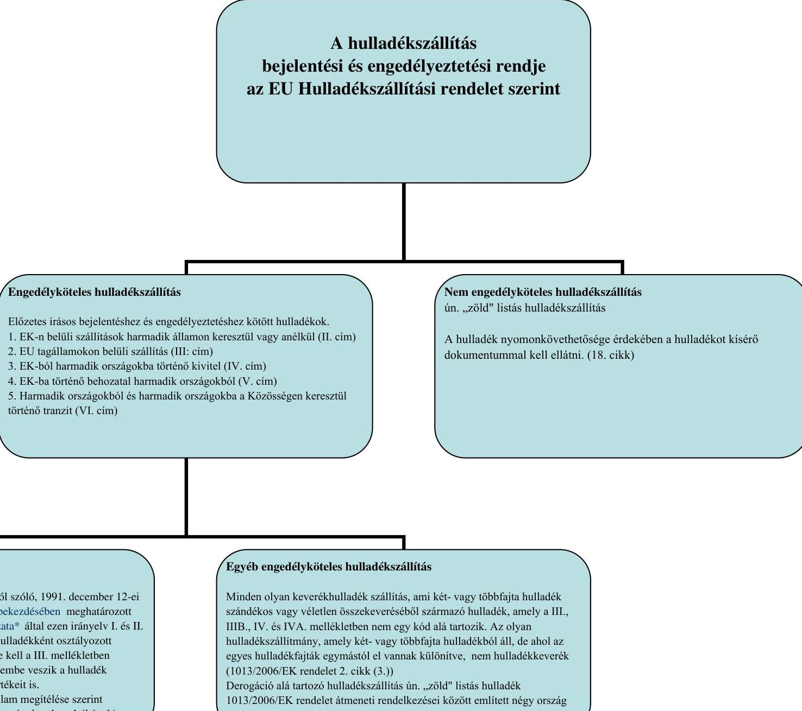

# A hulladékszállítás bejelentési és engedélyeztetési rendje az EU Hulladékszállítási rendelet szerint

## Engedélyköteles hulladékszállítás

Előzetes írásos bejelentéshez és engedélyeztetéshez kötött hulladékok:
1. EK-n belüli szállítások harmadik államon keresztül vagy anélkül (II. cím)
2. EU tagállamokon belüli szállítás (III. cím)
3. EK-ból harmadik országokba történő kivitel (IV. cím)
4. EK-ba történő behozatal harmadik országokból (V. cím)
5. Harmadik országokból és harmadik országokba a Közösségen keresztül történő tranzit (VI. cím)

## Nem engedélyköteles hulladékszállítás

Ún "zöld" listás hulladékszállítás

A hulladék nyomonkövethetősége érdekében a hulladékot kísérő dokumentummal kell ellátni. (18. cikk)

## Veszélyes hulladékszállítás

"veszélyes hulladék" a veszélyes hulladékokról szóló, 1991. december 12-ei 91/689/EGK tanácsi irányelv I. cikkének (4) bekezdésében meghatározott hulladék – (a Bizottság 2000/532/EK határozata) által ezen irányelv I. és II. melléklete alapján felállított listán veszélyes hulladékként osztályozott hulladékok. Ennek a hulladéknak rendelkeznie kell a III. mellékletben felsorolt egy vagy több tulajdonsággal, figyelembe veszik a hulladék eredetét és összetételét, a koncentráció határértékeit is.

- bármely más hulladék, amely valamely tagállam megítélése szerint rendelkezik a III. mellékletben felsorolt tulajdonságok valamelyikével.)

## Egyéb engedélyköteles hulladékszállítás

Minden olyan keverékhulladék szállítás, ami két- vagy többfajta hulladék szándékos vagy véletlen összekeveréséből származó hulladék, amely a III., IIIB., IV. és IVA. mellékletben nem egy kód alá tartozik. Az olyan hulladékszállítmány, amely két- vagy többfajta hulladékból áll, de ahol az egyes hulladékfajták egymástól el vannak különítve, nem hulladékkeverék (1013/2006/EK rendelet 2. cikk (3.)).

Derogáció alá tartozó hulladékszállítás ún. "zöld" listás hulladék 1013/2006/EK rendelet átmeneti rendelkezései között említett négy ország (Bulgária, Szlovákia, Lengyelország, Románia).

---

# Az EU Hulladékszállítási rendelet ${ }^{1}$ végrehajtására kijelölt intézmények 

Az EU Hulladékszállítási rendelet szerint kijelölendő intézmények

Végrehajtásért felelős illetékes hatóság

Tájékoztatásért és tanácsadásért felelős hazai és nemzetközi megbízott (összekötő)

A hulladékszállítmány Közösség területére való beléptetését és a Közösség területéről való kiléptetését végző kijelölt vámhivatalok

A hazai Hulladékszállítási rendelet ${ }^{2}$ által nevesített intézmények
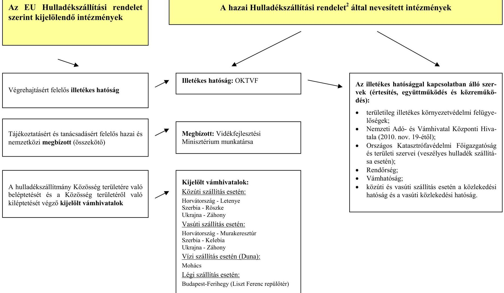

[^0]
[^0]:    ${ }^{1}$ Az Európai Parlament és Tanács 2006. június 14-ei 1013/2006/EK rendelete
    ${ }^{2}$ 180/2007. (VII. 3.) Korm. rendelet

---

# Az engedélyezési eljárás folyamata 

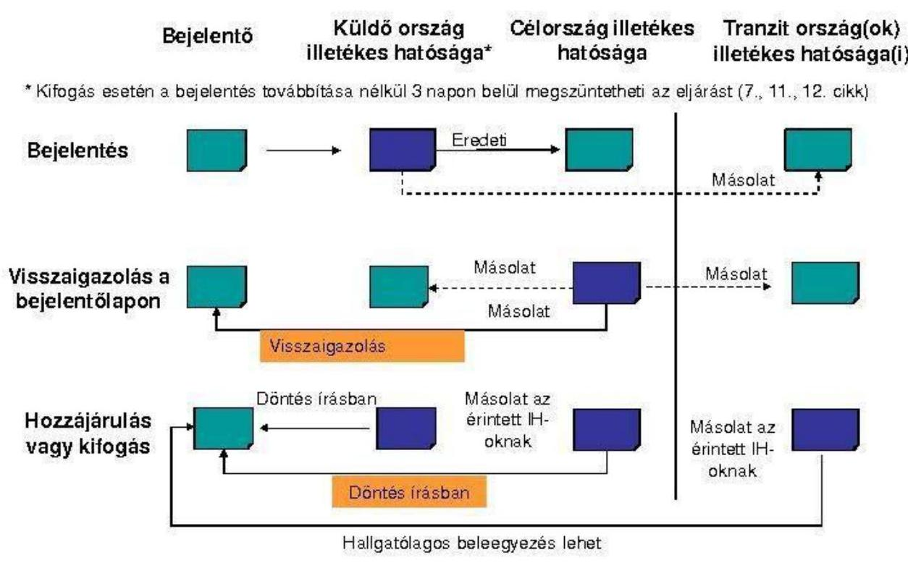

Forrás: OKTVF

---

# A helyszíni ellenőrzésre kiválasztott mintaelemek

|  Ssz. | Azonosító | Ellenőrzött szervezett | Ellenőrzött funkció  |
| --- | --- | --- | --- |
|  1 | 10HU923000110B32D0 | NAV, Letenyei határátkelő | Ki- és belépítés  |
|  2 | 10HU923000111CCBD7 | NAV, Letenyei határátkelő | Ki- és belépítés  |
|  3 | 10HU9230001148E420 | NAV, Letenyei határátkelő | Ki- és belépítés  |
|  4 | 10HU92300010A93331 | NAV, Letenyei határátkelő | Ki- és belépítés  |
|  5 | 10HU92300010DEBC66 | NAV, Letenyei határátkelő | Ki- és belépítés  |
|  6 | 10HU9230001121AE61 | NAV, Letenyei határátkelő | Ki- és belépítés  |
|  7 | 10HU9230001148CDF6 | NAV, Letenyei határátkelő | Ki- és belépítés  |
|  8 | 10HU923000110B32D0 | NAV, Letenyei határátkelő | Ki- és belépítés  |
|  9 | 10HU923000111CCBD7 | NAV, Letenyei határátkelő | Ki- és belépítés  |
|  10 | 10HU9230001148E420 | NAV, Letenyei határátkelő | Ki- és belépítés  |
|  11 | 09HU923000104784B6 | NAV, Letenyei határátkelő | Ki- és belépítés  |
|  12 | 10HU92300010A93331 | NAV, Letenyei határátkelő | Ki- és belépítés  |
|  13 | 08HU3160018L001777 | NAV, Kelebiai szolgálati hely | Ki- és belépítés  |
|  14 | 09HU31600020353580 | NAV, Kelebiai szolgálati hely | Ki- és belépítés  |
|  15 | 09HU31600020312924 | NAV, Kelebiai szolgálati hely | Ki- és belépítés  |
|  16 | 10HU3160010L000866 | NAV, Kelebiai szolgálati hely | Ki- és belépítés  |
|  17 | 10HU3160010L000875 | NAV, Kelebiai szolgálati hely | Ki- és belépítés  |
|  18 | 10HU3160010L000811 | NAV, Kelebiai szolgálati hely | Ki- és belépítés  |
|  19 | 10HU3160010L000820 | NAV, Kelebiai szolgálati hely | Ki- és belépítés  |
|  20 | 10HU3160010L000839 | NAV, Kelebiai szolgálati hely | Ki- és belépítés  |
|  1 | 2008.10.09. Hegyeshalom | OKTVF | Szállítmányok ellenőrzése  |
|  2 | 2009.02.26. Nagylak | OKTVF | Szállítmányok ellenőrzése  |
|  3 | 2009.05.07. Redics | OKTVF | Szállítmányok ellenőrzése  |
|  4 | 2009.10.14. Rábsfüzes | OKTVF | Szállítmányok ellenőrzése  |
|  5 | 2009.06.25. Kulocsa | OKTVF | Szállítmányok ellenőrzése  |
|  6 | 2009.07.09. Budapest | OKTVF | Szállítmányok ellenőrzése  |
|  7 | 2009.10.29. Újszilvás | OKTVF | Szállítmányok ellenőrzése  |
|  8 | 2010.03.23. Ártánd | OKTVF | Szállítmányok ellenőrzése  |
|  9 | 2010.06.15. Tornyosnémeti | OKTVF | Szállítmányok ellenőrzése  |
|  10 | 2010.06.29. Tornyiszentmiklós | OKTVF | Szállítmányok ellenőrzése  |
|  11 | 2010.10.21. Hegyeshalom | OKTVF | Szállítmányok ellenőrzése  |
|  12 | 2010.05.20. Visontú | OKTVF | Szállítmányok ellenőrzése  |
|  13 | 2010.07.16. Dorog | OKTVF | Szállítmányok ellenőrzése  |
|  14 | 2010.09.22. Csömör | OKTVF | Szállítmányok ellenőrzése  |
|  1 | 2008/Ro/2000/exp | OKTVF | Export szállítmányok engedélyezése  |
|  2 | 2008/Ho/500/exp | OKTVF | Export szállítmányok engedélyezése  |
|  3 | 2009/Szl/500/exp | OKTVF | Export szállítmányok engedélyezése  |
|  4 | 2009/Alb/10000/exp | OKTVF | Export szállítmányok engedélyezése  |
|  5 | 2009/Szlnia/2000/exp | OKTVF | Export szállítmányok engedélyezése  |
|  6 | 2010/Serb/25000/exp | OKTVF | Export szállítmányok engedélyezése  |
|  7 | 2008/Serb/280/imp | OKTVF | Import szállítmányok engedélyezés  |
|  8 | 2008/OL/290/imp | OKTVF | Import szállítmányok engedélyezés  |
|  9 | 2009/Szlnia/12000/imp | OKTVF | Import szállítmányok engedélyezés  |
|  10 | 2009/OL/8000/imp | OKTVF | Import szállítmányok engedélyezés  |
|  11 | 2010/Au/3000/imp | OKTVF | Import szállítmányok engedélyezés  |
|  12 | 2010/Hrtv/200/imp | OKTVF | Import szállítmányok engedélyezés  |
|  13 | 2010/Szl/150/imp | OKTVF | Import szállítmányok engedélyezés  |
|  1 | 2008/Nem/23,46/exp | OKTVF | szunkcionálási eljárások (export szállítmány)  |
|  2 | 2009/OL/0,024/exp | OKTVF | szunkcionálási eljárások (export szállítmány)  |
|  3 | 2009/Szl/173,25/exp | OKTVF | szunkcionálási eljárások (export szállítmány)  |
|  4 | 2009/Ki/18,64/exp | OKTVF | szunkcionálási eljárások (export szállítmány)  |
|  5 | 2010/Szl/131,358/exp | OKTVF | szunkcionálási eljárások (export szállítmány)  |
|  6 | 2010/ Cs/17335/exp | OKTVF | szunkcionálási eljárások (export szállítmány)  |
|  7 | 2008/Szl/0,3/imp | OKTVF | szunkcionálási eljárások (import szállítmány)  |
|  8 | 2009/Au/482,43/imp | OKTVF | szunkcionálási eljárások (import szállítmány)  |
|  9 | 2009/Szl/0,5/imp | OKTVF | szunkcionálási eljárások (import szállítmány)  |
|  10 | 2009/Szlnia/0,141/imp | OKTVF | szunkcionálási eljárások (import szállítmány)  |
|  11 | 2010/Au/17/imp | OKTVF | szunkcionálási eljárások (import szállítmány)  |
|  12 | 2010/Szl/1/imp | OKTVF | szunkcionálási eljárások (import szállítmány)  |