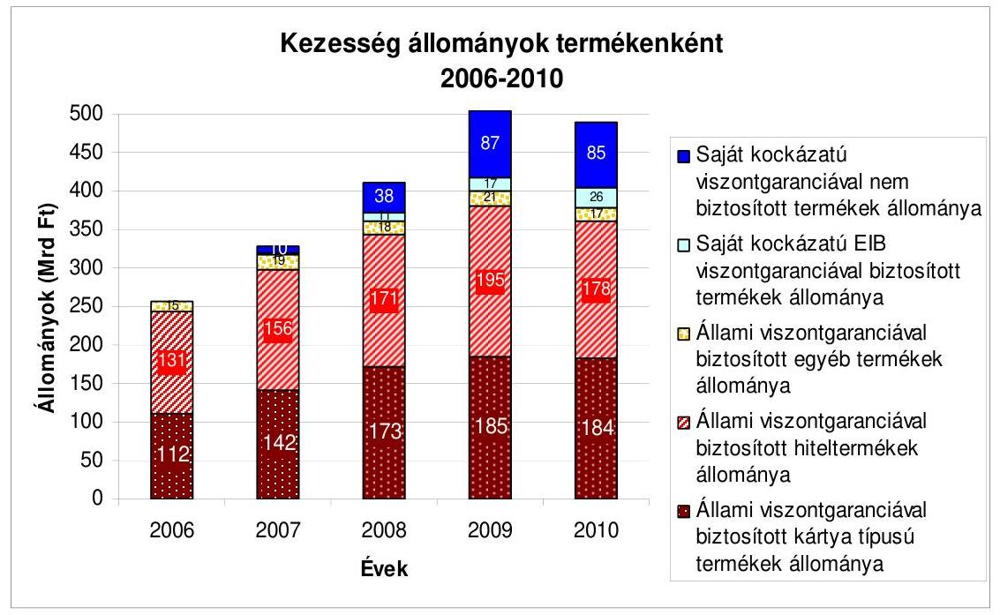
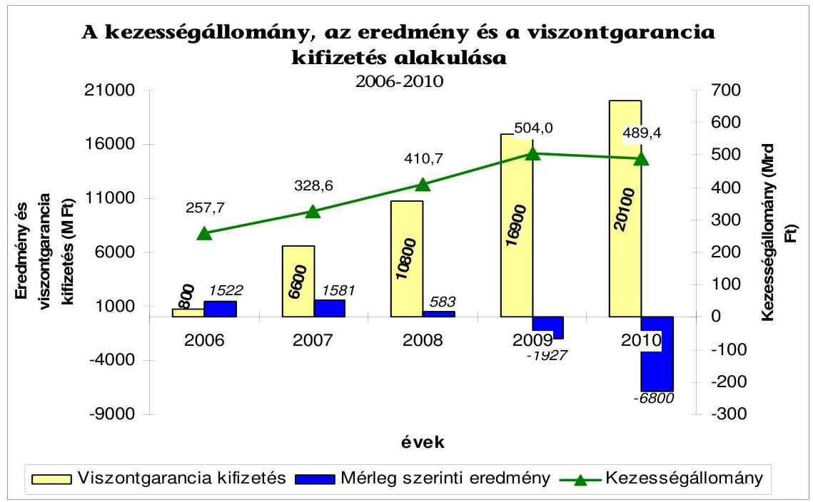
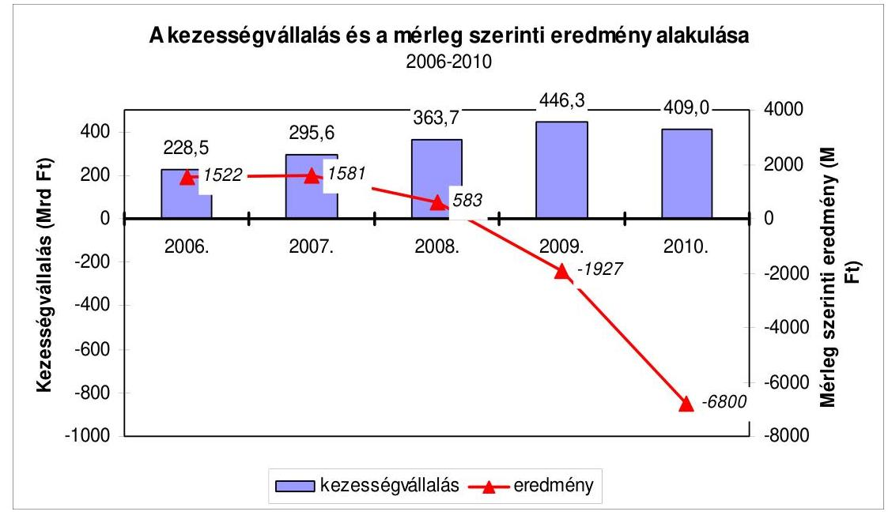
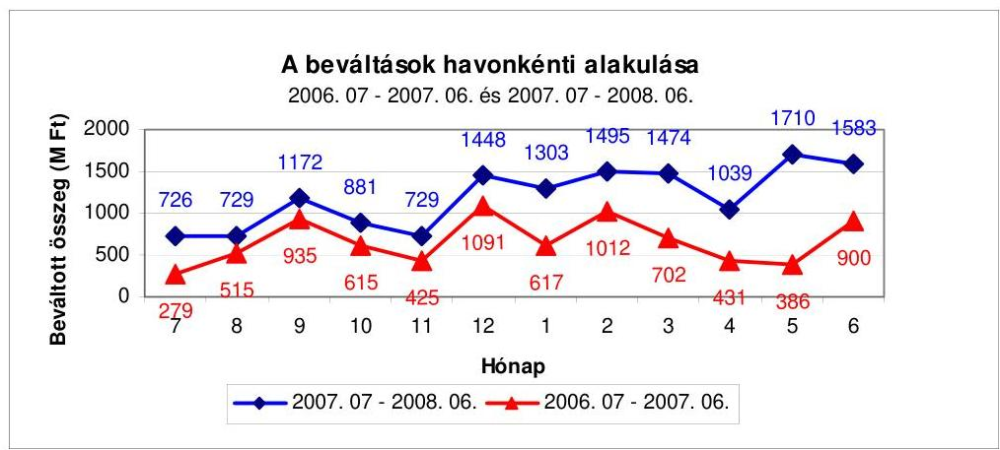
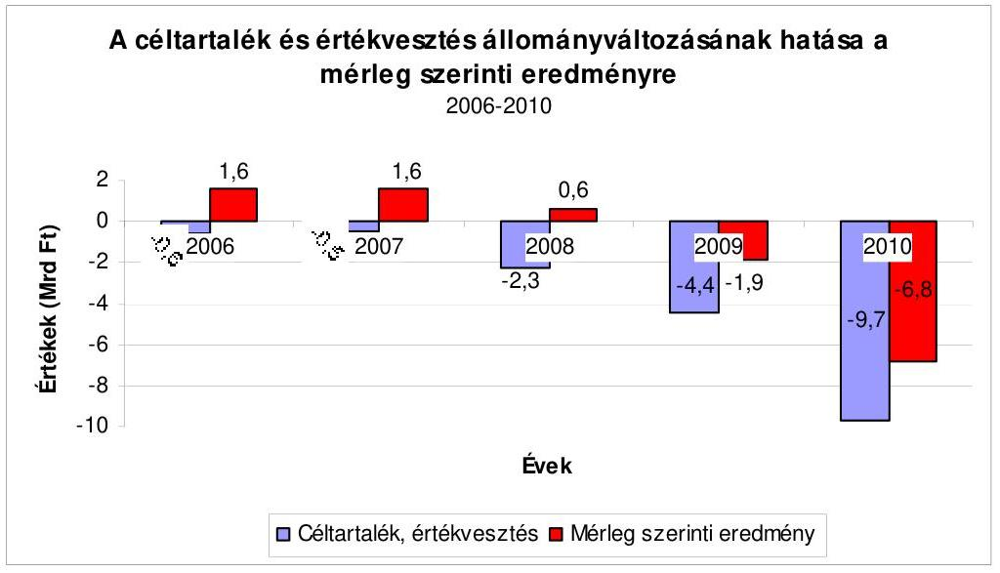
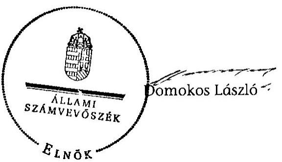
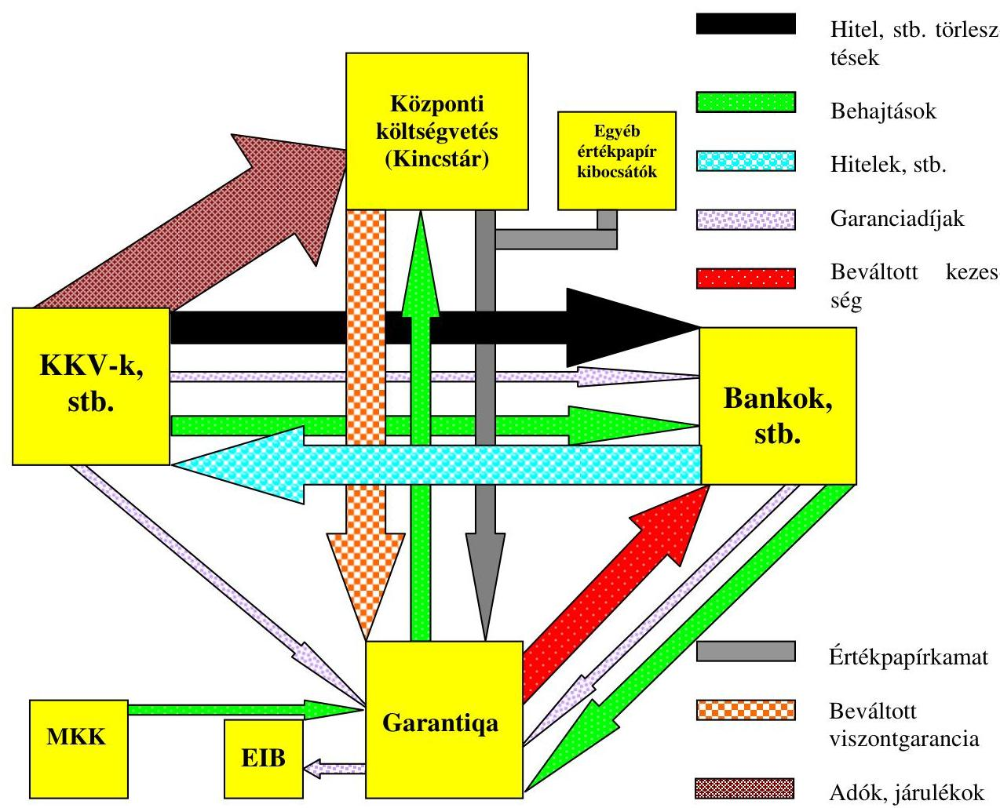

# ÁLLAMI   SZÁMVEVŐSZÉK 

## JELENTÉS

a Garantiqa Hitelgarancia Zrt. garanciavállalási tevékenysége eredményességének értékeléséről

---

# Állami Számvevőszék 

Iktatószám: V-2021-091/2011-2012.
Témaszám: 1006
Vizsgálat-azonosító szám: V0539

## Az ellenőrzést felügyelte:

Horváth Balázs
felügyeleti vezető

## Az ellenőrzést vezette:

Tóthné Nagy Éva
számvevő főtanácsos
Az összefoglaló jelentést készítették:
Dr. Pósch Gábor
számvevő tanácsos
Rábai György
számvevő
Vörös Katalin
számvevő tanácsos
Az ellenőrzést végezték:

| Dr. Nagy Tamásné | Dr. Pósch Gábor | Rábai György |
| :-- | :-- | :-- |
| számvevő | számvevő tanácsos | számvevő |
| Verő Tünde | Vörös Katalin |  |
| számvevő | számvevő tanácsos |  |

A témához kapcsolódó eddig készített számvevőszéki jelentések:
címe
sorszáma
a Hitelgarancia Rt. működésének és a központi költségvetés végrehajtásához kapcsolódó tevékenységének ellenőrzése

---

# TARTALOMJEGYZÉK 

BEVEZETÉS ..... 9
I. ÖSSZEGZŐ MEGÁLLAPÍTÁSOK, KÖVETKEZTETÉSEK, JAVASLATOK ..... 13
II. RÉSZLETES MEGÁLLAPÍTÁSOK ..... 28

1. A Garantiqa Hitelgarancia Zrt. működésének jogszabályi környezete, a tulajdonosi irányítás és felügyelet, valamint a stratégiai célkitűzések ..... 28
1.1. A Társaság működését meghatározó jogszabályi környezet ..... 28
1.2. A tulajdonosi elvárások megalapozottsága, hozzájárulása a Társaság fenntartható működésének biztosításához ..... 29
1.3. Az irányító és az ellenőrző testületek működése, feladatellátása ..... 32
1.4. A Társaság üzletpolitikája és üzleti tervei, azok megfelelése a tulajdonosi elvárásoknak és a stratégiai célkitűzéseknek ..... 36
1.5. A Társaság garanciavállalási tevékenységének hozzájárulása a kormányzat KKV-k fejlődésének támogatására irányuló gazdaságpolitikai célkitűzéseihez ..... 38
2. A Garantiqa Hitelgarancia Zrt. üzleti tevékenysége ..... 40
2.1. Az üzleti tevékenység alakulása ..... 40
2.1.1. A partner pénzügyi intézményekkel kötött együttműködési megállapodások ..... 40
2.1.2. A kezességállomány összetételének változása, hatása a KKV-k finanszírozási forráshoz jutására, fenntartható működésére ..... 42
2.2. Kezességvállalás, kockázatkezelés, monitoring ..... 45
2.2.1. A költségvetés viszontgaranciája mellett vállalt kezességek ..... 46
2.2.2. Költségvetési viszontgarancia nélkül vállalt kezességek ..... 47
2.3. A céltartalék képzés és az értékvesztés képzés szabályszerűsége, a kezességállomány minőségének alakulása ..... 51
2.4. A Társaság kezességbeváltási tevékenységének és követelés érvényesítési rendszerének szabályszerűsége és eredményessége ..... 55
2.4.1. A kezességbeváltási tevékenység rendszerének szabályozottsága, szabályszerűsége ..... 55
2.4.2. A beváltott készfizető kezességekből Társaságra átszálló követelések behajtása ..... 55
3. A Garantiqa Hitelgarancia Zrt. gazdálkodásának szabályszerűsége és eredményessége ..... 59
3.1. A mérleg szerinti eredmény és a saját tőke, valamint a Hpt.-ben előírt tőkekövetelmények alakulása ..... 59
3.2. Az elszámolt értékvesztés és céltartalék eredményre gyakorolt hatása ..... 61

---

3.3. A működési költségek alakulása ..... 62
3.3.1. A létszám, a bérköltség és a személyi jellegű költségek alakulása, az érdekeltségi rendszer összhangja a stratégiai és az éves célkitűzések teljesítésével, a takarékos gazdálkodással ..... 62
3.3.2. Igénybe vett szolgáltatások alakulása ..... 65
3.4. Az eredményre ható egyéb tényezők ..... 70
4. Utóellenőrzés ..... 72
MELLÉKLETEK

1. számú A Garantiqa és üzleti partnerei közötti pénzmozgások
2. számú A Társaság GDP belső árindexével korrigált jegyzett tőkéjének és saját tőkéjének összehasonlítása
3. számú A Társaság mérleg szerinti eredményét befolyásoló tényezők 2006-2010 közötti alakulása
4. számú A működési költségek, az átlagos statisztikai állományi létszám és az átlag jövedelem alakulása
5. számú Tanúsítványok

---

# RÖVIDÍTÉSEK JEGYZÉKE 

| APEH | Adó- és Pénzügyi Ellenőrzési Hivatal (2010. december 31-éig) |
| :--: | :--: |
| Áht. (régi) | az államháztartásról szóló 1992. évi XXXVIII. törvény, ami 2012. január 1-jéig volt hatályban |
| Áht. (új) | az államháztartásról szóló 2011. évi CXCV. törvény, ami 2012. január 2-ától hatályos |
| ÁSZ | Állami Számvevőszék |
| EB | Európai Bizottság |
| FB | Felügyelő bizottság |
| GDP | Bruttó hazai termék |
| GKTAK Zrt. | Garantiqa Kockázati Tőkealap-kezelő Zrt. |
| GPT Zrt. | Garantiqa Pont Tanácsadó és Szolgáltató Zrt. |
| Gt. | a gazdasági társaságokról szóló 2006. évi IV. törvény |
| HIR2 | Garanciavállalási szerződések informatikai nyilvántartási rendszere |
| Hkr. | a hitelezési kockázat kezeléséről és tőkekövetelményéről szóló 196/2007. (VII. 30.) Korm. rendelet |
| Hpt. | a hitelintézetekről és a pénzügyi vállalkozásokról szóló 1996. évi CXII. törvény |
| Kincstár | Magyar Államkincstár |
| KKV | Mikro-, kis- és középvállalkozás |
| KKV stratégia | A KKV-k fejlesztésének 2007-2013 évek közötti időszakra vonatkozó fejlesztési stratégiája |
| KKV tv. | a kis- és középvállalkozásokról, fejlődésük támogatásáról szóló 2004. évi XXXIV. törvény |
| KSH | Központi Statisztikai Hivatal |
| 250/2000. (XII. 24.) | a hitelintézetek és pénzügyi vállalkozások éves beszámoló |
| Korm. rendelet | készítési és könyvvezetési kötelezettségeinek sajátosságairól szóló 250/2000. (XII. 24.) Korm. rendelet |
| MFB Zrt. | Magyar Fejlesztési Bank Zrt. |
| MNV Zrt. | Magyar Nemzeti Vagyonkezelő Zrt. |
| NAV | Nemzeti Adó- és Vámhivatal (2011. január 1-jétől) |
| Nemzeti vagyon tv. | a nemzeti vagyonról szóló 2011. évi CXCVI. törvény |
| 48/2002. (XII. 28.) PM rendelet | a költségvetési viszontgarancia vállalásának és érvényesítésének részletes szabályairól szóló 48/2002. (XII. 28.) PM rendelet |
| PSZÁF | Pénzügyi Szervezetek Állami Felügyelete |
| Ptk. | a Polgári Törvénykönyvről szóló 1959. évi IV. törvény |
| Számv. tv. | a számvitelről szóló 2000. évi C. törvény |
| Takarékossági tv. | a köztulajdonban álló gazdasági társaságok takarékosabb működéséről szóló 2009. évi CXXII. törvény |
| Tanács | Nemzeti Vagyongazdálkodási Tanács |
| Társaság, Garantiqa | Garantiqa Hitelgarancia Zrt. |

---

Ügyvezetés Vezérigazgató és vezérigazgató-helyettesek Vagyontv. az állami vagyonról szóló 2007. évi CVI. törvény

---

# ÉRTELMEZŐ SZÓTÁR 

adós
állami viszontgarancia
átlagos statisztikai állományi létszám
céltartalék, értékvesztés
„Front office" terület GDP implicit árindex (GDP deflátor)
indikátor
inkasszó (beszedés)
készfizető kezesség

A Társaság kezességével biztosított ügylet (hitel, garancia, stb.) kötelezettje.
Az államháztartásról szóló 1992. évi XXXVIII. tv. 33/D. § e) pontja szerint a viszontgarancia: a jogi személy részére, az általa vállalt kezesség, illetve garancia érvényesítéséhez kapcsolódó állami megtérítési kötelezettség. A fogalom meghatározása 2012. január 1-jétől az államháztartásról szóló 2011. évi CXCV. tv. 93. § (1) bekezdése szerint a viszontgarancia: a jogi személy részére, az általa vállalt kezesség, garancia érvényesítéséhez az állam nevében törvényben megtérítési kötelezettség vállalható.
A teljes és nem teljes munkaidőben, de munkaszerződés szerint havi átlagban legalább 60 munkaórában foglalkoztatottak havi, vagy éves átlaga.
A számvitelről szóló 2000. évi C. tv. 15. § (8) bekezdése szerint nem lehet eredményt kimutatni akkor, ha az árbevétel, a bevétel pénzügyi realizálása bizonytalan. A tárgyévi eredmény meghatározása során az értékvesztés elszámolásával, a céltartalék képzésével kell figyelembe venni az előrelátható kockázatot és feltételezhető veszteséget. Az értékcsökkenéseket, az értékvesztéseket és a céltartalékokat el kell számolni, függetlenül attól, hogy az üzleti év eredménye nyereség vagy veszteség (az óvatosság elve). A függő és jövőbeni kötelezettségekre céltartalékot, a követelésekre értékvesztést kell elszámolni.
Az ügyféloldali terület.
A GDP deflátor a reál és a nominális GDP hányadosa. A nominális GDP a GDP pénzben kifejezett értéke, a reál GDP az infláció hatását próbálja kiküszöbölni azzal, hogy a GDP-t alkotó javak mennyiségét és valamilyen bázisidőszaki árát veszi figyelembe.
Mutató, más néven indikátor egy olyan szám, aminek segítségével egy cél elérésének szintjét lehet szemléltetni. A mutató olyan elemeket számszerűsít, amelyek egy program nyomon követése során (monitoring) vagy értékelésében lényegesnek minősülnek.
A pénzforgalmi szolgáltatás nyújtásáról szóló 2009. évi LXXXV. törvény 2. § 2. pontja szerint: a beszedés során a kedvezményezett rendelkezése alapján végzett olyan pénzforgalmi szolgáltatás, amelynek során a fizető fél fizetési számlájának a kedvezményezett javára történő megterhelése a fizető fél által a kedvezményezettnek, a kedvezményezett pénzforgalmi szolgáltatójának vagy a fizető fél saját pénzforgalmi szolgáltatójának adott hozzájárulás alapján történik.
Kezességi szerződéssel a kezes arra vállal kötelezettséget, hogy amennyiben a kötelezett nem teljesít, maga fog helyette a jogosultnak teljesíteni. A kezes nem követelheti, hogy a jogosult a követelést először a kötelezettől hajtsa be (készfizető kezesség). Ha ugyanazért a kötelezettségért egyidejűleg vagy egymásra tekintettel többen vállalnak kezességet, a kezesek kétség esetében egyetemlegesen felelnek. A Garantiqa készfizető kezessége nem egyetemleges, mert a kezességet a további kezességeket követően, a további kezesek vállalásának tudatában vállalja. Amennyiben a kezes a jogosultat kielégíti, a követelés az azt biztosító és a kezességvállalást megelőzően keletkezett jogokkal együtt reá száll (a kezes a teljesítése arányában az eredeti jogosult helyébe lép). A kezes felszabadul, amennyiben a jogosult lemond a követelést biztosító olyan jogról, amelynek alapján a kezes a reá átszálló követelésre kielégítést kaphatott volna, vagy amennyiben a követelés a jogosult hibájából egyébként behajthatatlanná vált. (Ptk. 272. § - 276. §) 

---

|  | lyette a jogosultnak teljesíteni. A kezes nem követelheti, hogy a jogosult a követelést először a kötelezettől hajtsa be (készfizető kezesség). Ha ugyanazért a kötelezettségért egyidejúleg vagy egymásra tekintettel többen vállalnak kezességet, a kezesek kétség esetében egyetemlegesen felelnek. A Garantiqa készfizető kezessége nem egyetemleges, mert a kezességet a további kezességeket követően, a további kezesek vállalásának tudatában vállalja. Amenynyiben a kezes a jogosultat kielégíti, a követelés az azt biztosító és a kezességvállalást megelőzően keletkezett jogokkal együtt reá száll (a kezes a teljesítése arányában az eredeti jogosult helyébe lép). A kezes felszabadul, amennyiben a jogosult lemond a követelést biztosító olyan jogról, amelynek alapján a kezes a reá átszálló követelésre kielégítést kaphatott volna, vagy amennyiben a követelés a jogosult hibájából egyébként behajthatatlanná vált. (Ptk. 272. § - 276. §) |
| :--: | :--: |
| kitettség értéke | A nettó függő kötelezettség értéke (a kezességállomány csökkentve a viszontgarancia értékével és a céltartalék összegével). |
| KKV | A kis- és középvállalkozásokról, fejlődésük támogatásáról szóló 2004. évi XXXIV. törvény 3. §-ában foglaltak szerint KKV-nak minősül az a vállalkozás, amelynek összes foglalkoztatotti létszáma 250 főnél kevesebb, és az éves nettó árbevétele legfeljebb 50 millió eurónak megfelelő forintösszeg, vagy mérlegfőösszege legfeljebb 43 millió eurónak megfelelő forintösszeg. A KKV kategórián belül kisvállalkozásnak minősül az a vállalkozás, amelynek összes foglalkoztatotti létszáma 50 főnél kevesebb, és éves nettó árbevétele vagy mérlegfőösszege legfeljebb 10 millió eurónak megfelelő forintösszeg. A KKV kategórián belül mikrovállalkozásnak minősül az a vállalkozás, amelynek összes foglalkoztatotti létszáma 10 főnél kevesebb, és az éves nettó árbevétele vagy mérlegfőösszege legfeljebb 2 millió eurónak megfelelő forintösszeg. |
| likvid eszközök | A pénz, illetőleg az azonnal pénzzé tehető eszközök összessége. |
| monitoring | A folyamatos megfigyelés, adatgyűjtés, elemzés rendszerének kialakítása és megvalósítása az ügylet élettartama alatt. |
| nem hitelhelyettesítő jellegű garancia | Azok a bankgaranciák és azok az ígérvények, ahol a garanciavállalás célja a szabályszerű, jó működés, vagy egy ahhoz kapcsolódó ügylet biztosítása, és a jövőben pénztartozás csak akkor keletkezik, ha a szabályszerű, jó működésben zavar támad. (Pl.: vámgaranciák, áfa-fizetési garanciák, teljesítési garanciák.) |
| prudens működés | A hitelintézetekről és pénzügyi vállalkozásokról szóló 1996. évi CXII. törvény 11. § a) pontja szerint aki óvatos, körültekintő és megbízható működésű. |
| súlysáv | A hitelintézetek és a pénzügyi vállalkozások éves beszá- |

---

moló készítési és könyvvezetési kötelezettségének sajátosságairól szóló 250/2000. (XII. 24.) Korm. rendelet 7. számú melléklete V. fejezetének (2) bekezdése szerint az eszközminősítés számviteli követelményei között kell rögzíteni, hogy milyen eszközminősítési kategóriákat állít fel a hitelintézet továbbá milyen értékelési csoportokat képez, valamint az egyes minősítési kategóriákhoz milyen súlysávot, az egyes értékelési csoportokhoz milyen százalékos mértéket határoz meg. A rendelet 5 kategóriát határoz meg, úgymint problémamentes 0%, külön figyelendő 10%, átlag alatti 11-30%, kétes 31-70%, rossz 71-100%. (A %-os érték a várható veszteség mértékének felel meg.)
szavatoló tőke
tőkemegfelelési mutató

A szavatoló tőke a Társaságnak a számviteli törvény által meghatározott saját tőkéje és azok a források, amelyek a Társasággal szemben fennálló követelések kielégítésébe tőkeként bevonhatók.
Az ellenőrzött szervezet 2007-ig a szavatoló tőke és a kockázattal korrigált eszközök mérlegfőösszegének hányadosaként számította, majd ezt követően a hitelintézetekkel

 egyenértékű pénzügyi vállalkozásként a PSZÁF által jóváhagyott módszer szerint a szavatoló tőke és a hitelintézetekről és pénzügyi vállalkozásokról szóló 1996. évi CXII. törvény 76. § (1) és (2) bekezdésében meghatározott kockázatok fedezéséhez a szabályozás által előírt tőkekövetelmény hányadosa, minimum 8%.

---

.

---

# JELENTÉS 

## a Garantiqa Hitelgarancia Zrt. garanciavállalási tevékenysége eredményességének értékeléséről

## BEVEZETÉS

A Hitelgarancia Részvénytársaságot ${ }^{1}$ 1992-ben a Magyar Állam, a Magyar Fejlesztési Bank Rt., 65 magyarországi hitelintézet, a Magyar Vállalkozásfejlesztési Alapítvány, szakmai érdekszövetségek és kamarák hozták létre. A Magyar Állam, mint közvetlen és a Magyar Fejlesztési Bank Zrt. (továbbiakban: MFB Zrt.), mint közvetett állami tulajdonos együttes tulajdoni hányada 63,7%-ot tesz ki. A 2007-2010 közötti időszakban a közvetlen tulajdonosi jogokat az MFB Zrt., 2007. szeptember 25-étől a Nemzeti Vagyongazdálkodási Tanács (továbbiakban: Tanács) a Magyar Nemzeti Vagyonkezelő Zrt.-n (továbbiakban: MNV Zrt.) keresztül, majd 2010. június 17-étől ismét az MFB Zrt. gyakorolja.

A Társaság alapításkori jegyzett tőkéje 3,5 Mrd Ft volt, amit 1994. április 13-án 4,8 Mrd Ft-ra emeltek. A Társaságot az állami vagyonról szóló 2007. évi CVI. törvény (továbbiakban: Vagyontv.) melléklete a tartós állami tulajdonú társaságok közé sorolta, a nemzeti vagyonról szóló 2011. évi CXCVI. törvény 2. számú melléklet I. fejezete 2012. január 1-jétől a nemzetgazdasági szempontból kiemelt jelentőségű nemzeti vagyonban tartandó állami tulajdonban álló társasági részesedések közé sorolja.

A Magyarországon működő, a mikro-, kis- és középvállalkozások (továbbiakban: KKV-k) forráshoz jutását elősegítő viszontgarancia nyújtás, mint alkalmazott módszer az Európai Unió gyakorlatában is szerepel. Az Európai Unió a gyorsan növekvő és innovatív kis- és középvállalkozások forráshoz segítése érdekében a 2007-2013 közötti évekre versenyképességi és innovációs keretprogramot ${ }^{2}$ (garanciakeretet) hozott létre. A keretprogramban többek között állami garancia intézmények és kereskedelmi bankok, mint pénzügyi közvetítők vehetnek részt. A garanciakeretből a pénzügyi közvetítő szervezetek részére garanciákat, vagy viszontgaranciákat vállalnak például olyan hitelekre, amelyeket a pénzügyi intézmények nyújtanak a kis- és középvállalkozásoknak az „adósságfinanszírozási képességük növelése érdekében”.

A hazai gazdaságpolitika kiemelt célja a KKV-k fejlődésének előmozdítása, verseny- és foglalkoztatási képességük megőrzése, hazai és uniós szinten történő

[^0]
[^0]:    ${ }^{1}$ A Társaság elnevezése 2006. március 14-étől Hitelgarancia Zártkörűen Működő Részvénytársaság, 2008. április 11-étől Garantiqa Hitelgarancia Zártkörűen Működő Részvénytársaság (továbbiakban: Garantiqa, Társaság) lett.
    ${ }^{2}$ 1639/2006/EK számú, 2006. október 24-ei európai parlamenti és tanácsi határozat

---

növelése, amelyről a 2004. évi XXXIV. törvény ${ }^{3}$ rendelkezik. A támogatás egyik eszközeként az állam törvényben meghatározott módon megtérítési kötelezettséget vállal a Társaság által a KKV-k hiteleihez nyújtott készfizető kezességekhez. E jogcímen az állam az ellenőrzött időszakban a Társaság által beváltott kezességek 70%-át, a 2011. június 18-a után kötött ügyletek esetében 85%-át téríti. A viszontgaranciát nyújtók köre 2007-től kibővült az Európai Beruházási Bankkal, amely az önkormányzati kezességvállalások egy részére 70%-os mértékű viszontgaranciát adott. A Társaság kezességvállalási tevékenységével összefüggő folyamatokat és partnerkapcsolatokat a pénzmozgásokon keresztül mutatjuk be. (A Garantiqa és üzleti partnerei közötti pénzmozgásokat az 1. számú melléklet szemlélteti.)

A Társaság alapszabályban meghatározott elsődleges feladata a KKV-k alapításának, fejlődésének és ezzel működőképességük feltételeinek javítása érdekében a pénzintézetek KKV-k felé irányuló hitelnyújtásához kapcsolódó kezesség biztosítása, ezzel a pénzintézetek hitelezési kockázatainak enyhítése, részbeni átvállalása.

A KKV-k társadalmi súlyát mutatja, hogy 2009-ben a működő 689 ezer vállalkozás 99,9%-a KKV-nak minősült. A Központi Statisztikai Hivatal (továbbiakban: KSH) adatai szerint a KKV-k részesedése a bruttó hozzáadott termékből 56,1% volt, az összes foglalkoztatott 73,8%-át, 2706 ezer főt alkalmaztak.

A Társaság 1997. december 13-ától a hitelintézetekről és a pénzügyi vállalkozásokról szóló 1996. évi CXII. törvény (továbbiakban: Hpt.) hatálya alá tartozó pénzügyi vállalkozás, amelynek kizárólagos tevékenysége készfizető kezesség nyújtása. A részvénytulajdonos bankok és takarékszövetkezetek, valamint a megállapodással rendelkező pénzügyi vállalkozások által a KKV-k részére nyújtott hitelekhez és bankgaranciákhoz vállal készfizető kezességet. A Társaság tevékenysége 1998-tól kiegészült a kockázati tőkebefektetések garantálásával, 2006-tól pedig lízing, faktoring és támogatás-visszafizetési ügyletekkel, valamint 2007-től költségvetési viszontgarancia nélkül, saját kockázatra (pl. önkormányzatok részére) vállalt kezességekkel.

A KKV-k részére 2006-ban folyósított 3254 Mrd Ft hitel 7,6%-át, a 2010-ben folyósított 3915 Mrd Ft-nak pedig 12,7%-át biztosította a Társaság kezességvállalása. A Társaság év végi kezesség állománya 2006-2010 között 257,6 Mrd Ft-ról 489,4 Mrd Ft-ra nőtt, amelyből az állami viszontgarancia mellett vállalt készfizető kezességek összege 2006-ban 257,5 Mrd Ft-ot, 2010-ben 378,1 Mrd Ft-ot tett ki.

[^0]
[^0]:    ${ }^{3}$ A kis- és középvállalkozásokról, fejlődésük támogatásáról szóló 2004. évi XXXIV. törvény módosítását a Nemzetgazdasági Minisztérium fogja az Országgyűlés elé terjeszteni. A minisztérium tájékoztatása szerint a jogszabály módosítását az indokolja, hogy a hazai és uniós gazdasági és jogszabályi környezet jelentősen megváltozott.

---

A Társaság 2006-2010 évek közötti kezesség állományának alakulását a következő diagram szemlélteti:

1. számú diagram

A Társaság kezesség állományának a 2007-2010. évek közötti dinamikus növekedését a saját kockázatra vállalt ügyletek 2007. évi bevezetése, valamint a pénzügyminiszter Magyar Állam képviselőjeként 2008-ban és 2009-ben megfogalmazott, a kezességállomány növelését ösztönző határozata tette lehetővé.

A költségvetési viszontgarancia előirányzat terhére teljesített kifizetés a 2006. évi 4,8 Mrd Ft-ról 20,1 Mrd Ft-ra, több mint négyszeresére emelkedett 2010 végére. A Társaság 2006. évi mérleg főösszege 32,8 Mrd Ft, mérleg szerinti eredménye 1,5 Mrd Ft nyereség volt, ami először 2009-ben fordult veszteségbe, összege 1,9 Mrd Ft volt. (Az Agrár-Vállalkozási Hitelgarancia Alapítvány létrehozásának ${ }^{4}$ célja a vidéki KKV-kra vonatkozóan azonos volt a Társaságéval, tevékenysége az egész országra kiterjedt. Gazdálkodásának feltételei megegyeztek a Társaságéval, ennek ellenére mérleg szerinti eredménye 2006-2010 között minden évben, csökkenő mértékben ugyan, de nyereség volt.) A Társaság 2010. évi mérlegfőösszege az előző évi 35,1 Mrd Ft-ról 32,3 Mrd Ft-ra csökkent, a vesztesége 6,8 Mrd Ft-ra nőtt. (A Társaság saját tőkéje 2006. évi 24,4 Mrd Ft-ról 2010-re 17,9 Mrd Ft-ra csökkent, az Agrár-Vállalkozási Hitelgarancia Alapítványé pedig 18,0 Mrd Ft-ról 22,4 Mrd Ft-ra nőtt. Az Agrár-Vállalkozási Hitelgarancia Alapítvány év végi készfizető kezesség állománya 2006-ban 50,8 Mrd Ft, 2010-ben 61,0 Mrd Ft, ami a Társaság kezesség állományának 20%-a, illetve 12,5%-a volt.)

[^0]
[^0]:    ${ }^{4}$ 1991. május 21-én a Földművelésügyi Minisztérium és öt pénzintézet alapította.

---

Az Állami Számvevőszék (továbbiakban: ÁSZ) 2004-ben átfogóan ellenőrizte a Társaság 2002-2003. évi működését és a központi költségvetés végrehajtásához kapcsolódó tevékenységét. A 2007-2010. évek ellenőrzése nem terjedt ki az állami viszontgarancia előirányzat megalapozottságának, valamint a központi költségvetés terhére vállalt kezességek és viszontgaranciák elszámolásának ellenőrzésére, mivel azt az ÁSZ a költségvetési törvényjavaslat véleményezése és a központi költségvetés végrehajtásának ellenőrzése során évente végzi.

A 2007-2010. évek ellenőrzésének célja annak értékelése volt, hogy a Társaság:

- működése és készfizető kezességvállalási tevékenysége megfelelt-e a jogszabályok előírásainak, az állami tulajdonosok, ezen belül a közvetlen állami tulajdonosi jogokat gyakorló elvárásainak;
- célszerűen és eredményesen támogatta-e garanciavállalásával a KKV-k finanszírozási forráshoz jutását, elősegítette-e versenyképességük javulását, ezáltal a gazdaságpolitikai célkitűzések megvalósítását;
- garanciavállalási tevékenysége, gazdálkodása eredményes és szabályszerű volt-e, megfelelt-e a többségi tulajdonos elvárásainak;
- hasznosultak-e a korábbi számvevőszéki ellenőrzés javaslatai.

Az ellenőrzés típusa teljesítmény-ellenőrzés volt, amelyet az ÁSZ ellenőrzési kézikönyve és egyéb szakmai dokumentumai, valamint a teljesítmény-ellenőrzés módszere alapján végeztünk el. A Társaság működését, gazdálkodását és garanciavállalási tevékenységét az ellenőrzési szempontokhoz kidolgozott kérdések, kritériumok és adatforrások szerint értékeltük. A kezességvállalás eredményessége szempontjából kockázatot jelentő belső szabályozás megfelelőségének és az eljárások szabályszerűségének megítéléséhez célzott minta alapján ellenőrzést végeztünk. A költségvetés viszontgaranciája mellett vállalt kezességek 2009. és 2010. évi beváltott kezességek állományából, valamint a saját kockázatra vállalt ügyletek 2011. június végi állományából ügylettípusonként választottuk ki a tételeket. Az ügyletkockázatok figyelembevételével a kiválasztás szempontjai között kiemelt súllyal szerepelt az egyes ügyletekhez vállalt készfizető kezesség mértéke, további kockázati tényezőként vettük figyelembe az ügyletek méretét és futamidejét.

Az ellenőrzés a 2007-2010. évek működésére és gazdálkodására terjedt ki, illetve - indokolt esetben - az adott gazdasági esemény keletkezésétől számított időszakra irányult, és - szükség szerint - a helyszíni ellenőrzés befejezéséig figyelemmel kísérte a pénzügyi-gazdasági folyamatokat. A tanúsítványokban feltüntetett 2006. év végi állományi adatokat az értékelésekhez, elemzésekhez bázisként vettük figyelembe.

Az ellenőrzés végrehajtására 2011. június 30-áig az Állami Számvevőszékről szóló 1989. évi XXXVIII. törvény 2. § (6) bekezdésében, 2011. július 1-jétől az Állami Számvevőszékről szóló 2011. évi LXVI. törvény 5. § (4) bekezdés b) pontjában foglaltak biztosítottak jogszabályi alapot.

---

# I. ÖSSZEGZŐ MEGÁLLAPÍTÁSOK, KÖVETKEZTETÉSEK, JAVASLATOK 

A Garantiqa alapszabályában meghatározott feladata, hogy kezességvállalásával segítse elő a KKV-k finanszírozási forráshoz jutását, működőképességük, versenyképességük javítását. Az alapszabályt 2007-2010 között hét alkalommal módosította a közgyűlés, többek között a termékkör bővítése, az irányító és ellenőrző testületeknél bekövetkezett személyi változások miatt. Az alapszabály szerint a közgyűlés kizárólagos hatáskörébe tartozó kérdések eldöntéséhez 75%-os szavazati arány szükséges. A Társasággal összefüggő stratégiai döntések meghozatalára a Magyar Állam az MFB Zrt.-vel együtt meglévő 63,7%-os többségi tulajdoni hányadával sem jogosult. A Társaság működőképességét az állam viszontgaranciája biztosítja, a vagyongyarapodás érdekében pedig mentességet ad a társasági adó és az osztalékfizetés alól. A Garantiqa a nemzetgazdasági szempontból kiemelt jelentőségű nemzeti vagyonban tartandó állami tulajdonban álló társaság, a működésével összefüggő kockázatok legnagyobb hányadát az állam vállalja, ezért nem indokolt a szavazati arányok Magyar Állam számára kedvezőtlen eltérítése.

A Társaság kezességvállalási tevékenységéhez az állam - a mindenkori költségvetési törvényben meghatározott feltételekkel - a beváltott kezesség 70%, majd a 2011. június 18-ától vállalt kezességek esetében 85%-os mértékű megtérítési kötelezettséget (viszontgaranciát) vállal, amely alapján a beváltást követően a Társaság részére a viszontgarancia összegét megfizeti. Az állam által kifizetett összeg behajtását az Áht. (új) ${ }^{5}$ a Társaság feladataként írja elő. Az Áht. (új) nem rögzíti, hogy a Társaságnak a készfizető kezesség beváltásából származó, adóssal szemben fennálló, állam által kifizetett viszontgaranciával nem csökkentett követelés behajtása a feladata. A Társaság a viszontgarancia teljesítését, illetve az adóssal szemben fennálló követelés behajtását követően a vonatkozó PM rendelet ${ }^{6}$ szabályai szerint számol el a költségvetéssel.

Megfelelő mutatók hiányában nem volt értékelhető, hogy a Társaság garanciavállalásával célszerűen és eredményesen támogatta-e a KKV-k finanszírozási forráshoz jutását, elősegítette-e versenyképességük javulását, a foglalkoztatás bővítését, ezáltal a Kormány gazdaságpolitikai célkitűzéseinek megvalósítását. A Kormány a 2007-ben elfogadott KKV-k fejlesztési stratégiájában ${ }^{7}$ megjelölt célok teljesítésének méréséhez meghatározott indikátorokat, azonban azok csak a KKV-k szintjén, összességében mérik a célok teljesülését. Ennek következtében nem mutatják ki, hogy a célok eléréséhez mely alkalmazott eszközök milyen

[^0]
[^0]:    ${ }^{5}$ Az államháztartásról szóló 2011. évi CXCV. törvény (továbbiakban: Áht. (új)) szerinti állami viszontgarancia meghatározás megegyezik az államháztartásról szóló 1992. évi

 XXXVIII. törvény (továbbiakban: Áht. (régi)) meghatározásával.
    ${ }^{6}$ a költségvetési viszontgarancia vállalásának és érvényesítésének részletes szabályairól szóló 48/2002. (XII. 28.) PM rendelet (továbbiakban: 48/2002. (XII. 28.) PM rendelet)
    ${ }^{7}$ A KKV-k fejlesztésének 2007-2013. évek közötti időszakra vonatkozó fejlesztési stratégiája (továbbiakban: KKV stratégia)

---

mértékben járultak hozzá. A 2011. januárjában indított Új Széchenyi Terv meghatározza a magyar gazdaság fejlesztési irányait, a kijelölt célok eléréséhez eszközöket rendel, azonban a célkitűzések megvalósulásának értékeléséhez indikátorokat, mutatókat nem ír elő.

A pénzügyminiszter 2008. évi határozatában előírta a Társaság számára, hogy a „tevékenysége eredményeképp generált költségvetési hasznokat a mindenkori üzleti terv részeként be kell mutatni", azonban konkrét indikátorokat nem határozott meg. A Társaság 2008-tól saját tevékenysége közvetlen költségvetési hatásának bemutatására a tevékenységével kapcsolatos költségvetési kiadások és bevételek különbözetét alkalmazza. Közvetett költségvetési hatásként mutatja be a Társaság garanciavállalásával támogatott KKV-k nettó módon számított adó és járulék befizetéseit. A Társaság által alkalmazott mutató hiányossága, hogy a kezességvállalással támogatott vállalkozások forráshoz jutás előtti, illetve a nem támogatott KKV-k költségvetési befizetéseihez nem viszonyít, ezért nem alkalmas a garanciavállalások költségvetésre gyakorolt hatásának bemutatására.

Az állami tulajdonosi jogokat gyakorló szervezetek 2007-2010. között a Társaság tevékenységével, működésével összefüggésben egyáltalán nem, a Magyar Állam képviselőjeként a pénzügyminiszter a Vagyontv. felhatalmazása ${ }^{8}$ alapján két alkalommal fogalmazott meg elvárásokat. A pénzügyminiszter 2008. áprilisi határozatában elsődleges szempontként a kezességállomány növelését határozta meg a Társaság alapításkori jegyzett tőkéje reálértékének megőrzése mellett. A 2009. novemberi határozat tovább mérsékelte a Társaság tőkéjére vonatkozó előírást azzal, hogy csak a Hpt. szerinti tőkemegfelelési mutató biztosítását írta elő. A veszteséges működés lehetőségét biztosító tulajdonosi elvárás nem volt összhangban az állam fizetési kötelezettségének minimalizálására vonatkozó előírással. A saját tőke felélését megengedő pénzügyminiszteri határozatok ${ }^{9}$ nem feleltek meg a Vagyontv. ${ }^{10}$-ben foglalt előírásnak, amely kimondja, hogy a tulajdonosi joggyakorlás feladata az állami vagyon megóvása, annak hatékony és gazdaságos működtetése. A Garantiqa működése, készfizető kezességvállalási tevékenysége az önmagukban és egymásnak is ellentmondó pénzügyminiszteri határozatoknak megfelelt, amelyek azonban nem biztosították a Társaság hosszú távon fenntartható működését. A Társaság mérleg szerinti eredménye 2008-tól folyamatosan csökkent, működése 2009-től veszteséges volt, a költségvetésből kifizetett viszontgarancia összege pedig (2009-ben 16,9 Mrd Ft, 2010-ben 20,1 Mrd Ft) közel 5 Mrd Ft-tal meghaladta a tárgyévi költségvetési előirányzatot. A túllépéseket a költségvetési törvények lehetővé tették azzal, hogy az előirányzatból teljesített kifizetéseknek felső korlátja nem volt.

[^0]
[^0]:    ${ }^{8}$ A Vagyontv. 7. § (3) bekezdése, amit 2010. június 17-étől a 20. § (8) bekezdése tartalmaz.
    ${ }^{9}$ A Vagyontv. 2010. június 17-étől módosult, többek között megszüntette a Tanácsot, jogkörét az állami vagyon felügyeletéért felelős (nemzeti fejlesztési) miniszter gyakorolja, aki feladatát az MNV Zrt., az MFB Zrt. útján látja el. A Garantiqa esetében a tulajdonosi jogokat 2010. június 17-étől az MFB Zrt. gyakorolja.
    ${ }^{10}$ 2. § (1) bekezdésében

---

A kezességállomány, az eredmény és a viszontgarancia kifizetés alakulását 2006-2010. között a következő diagram szemlélteti:
2. számú diagram

A kezességállomány erőltetett növelése kockázatosabb ügyletek vállalásához vezetett, amelynek hatása a kezességállomány romló minőségében, az elszámolt céltartalék és értékvesztés növekedésében, együttesen az eredmény csökkenésében és a viszontgarancia kifizetés emelkedésében mutatkozott meg. A Társaság tevékenysége 2009-től veszteségessé vált, előrejelzése szerint a 2011-2014. években további 13,7 Mrd Ft veszteség várható. Ennek hatására a saját tőke értéke 2014-re a jegyzett tőke értéke alá csökken, ami szükségessé teheti a Társaság tőkehelyzetének rendezését. Az állam képviseletében eljáró pénzügyminiszter, az irányító és ellenőrző testületek 2010. augusztusáig a Társaság tevékenységével összefüggő döntések működésre gyakorolt hatását nem vizsgálták, a növekvő veszteség ellenére nem kezdeményezték a veszteséget okozó tényezők feltárását, megszüntetését.

Az MFB, mint az állami tulajdonosi jogok gyakorlója a Társasággal 2010. októberében új elvárásokat közölt, amelyben többek között pozitív jövedelmezőség elérését és a saját tőke reálértékének megőrzését írta elő. A Társaság a 2011-2014. éveket átfogó középtávú stratégiájában és a 2011. évi üzleti tervében bemutatta, hogy a tulajdonos által kitűzött célokat rövidtávon nem tudja teljesíteni, mivel a Társaság meglévő kezesség állományának minősége meghatározza működésének eredményességét, ezáltal a saját tőke alakulását is.

A KKV-k támogatása a gazdaságpolitika kiemelt céljai között szerepelt, ugyanakkor a Társaság kezességvállalási tevékenysége a 2007-től 2010-ig terjedő időszakban nem teljes mértékben szolgálta az alapítói célokat, mivel a 2007-ben bevezetett saját kockázatra vállalt ügyletek egy része nem a KKV-k finanszírozási forráshoz jutását segítette elő. A KKV-k hiteleihez vállalt kezességek aránya

---

a 2006. évi 99,9%-ról 2010. végére 87,0%-ra, 2011. június 30-ára pedig 80,0%-ra csökkent. A 2010. év végi állományból (489,4 Mrd Ft) 52,5 Mrd Ft-ot az önkormányzatok és önkormányzati vállalkozások, 11,0 Mrd Ft-ot további gazdálkodó szervezetek részére nyújtott kezességvállalások tették ki, összességében 63,5 Mrd Ft nem a KKV-k támogatását szolgálta. A Társaság saját tőkéje 2010. végén 17,9 Mrd Ft volt, amelyhez mérten - figyelemmel a kezességállomány romló minőségére - jelentős kockázatot hordoz a 85,0 Mrd Ft összegű viszontgarancia nélkül saját kockázatra vállalt kezességállomány.

A Széchenyi kártya program keretében nyújtott kezességek állománya a 2006-2010. közötti években 109,1 Mrd Ft és 116,9 Mrd Ft között alakult, 2008-tól a válság éveiben kismértékű növekedést mutatott, támogatva ezzel a hazai KKV-k forráshoz jutását.

A Társaság fenntartható működésére - a már jelzett hibás tulajdonosi döntéseken túlmenően - további kockázatot jelent, hogy a minősített kezességállomány ${ }^{11}$ a 2007-2010. években folyamatosan emelkedett, növekedési üteme - a 2008. év kivételével - minden évben meghaladta a teljes kezesség állományét. A minősített kezességállomány aránya 2010-ben 10% fölött volt, összege 50,6 Mrd Ft-ra, a 2006. évinek közel háromszorosára nőtt. A minősített állományon belül a saját kockázatra vállalt kezességek állományának növekedési üteme ${ }^{12}$ - a 2008. évet kivéve - meghaladta úgy az államilag viszontgarantált, mint a teljes minősített állományét. A saját kockázatra vállalt minősített állomány a 2009. év végi 3,5 Mrd Ft-ról 2010. végére 8,9 Mrd Ft-ra nőtt.

A Társaság minősített kezesség állományára megképzett céltartalék összege 2006-tól 2008-ig folyamatosan 6,9 Mrd Ft-ról 6,3 Mrd Ft-ra csökkent, majd 2010-re 11,1 Mrd Ft-ra nőtt, amelyből 4,3 Mrd Ft a saját kockázatra vállalt kezességek állományára jutott. A saját kockázatú ügyletekre megképzett céltartalékból 1,0 Mrd Ft az önkormányzatok és azok vállalkozásai felé vállalt kezesség állományra jutott, amely 2011. szeptember 30-ára 2,6 Mrd Ft-ra nőtt. Az önkormányzatok és vállalkozásai felé vállalt kezességállomány minőségének romlása miatt növekvő összegű és arányú céltartalék képzés várható, ami előrevetíti a Társaság tartósan veszteséges működését.

A saját kockázatú üzletág engedélyezésével a költségvetési törvény lehetőséget adott ${ }^{13}$, a közgyűlés pedig olyan döntést hozott, amellyel az üzletág bevezetésével járó kockázatok legnagyobb hányada az államra, mint többségi tulajdonosra hárult. Az év közbeni jogszabály módosítás tovább növelte a kockázatot azzal, hogy a jogosultak körét már nem korlátozta. A saját kockázatú üzletágat a Társaság megfelelő indokolás és előzetes kockázatelemzés nélkül vezette be. A tevékenység bővítésre az ügyvezetés a Társaság szervezetét nem készítette fel.

[^0]
[^0]:    ${ }^{11}$ A 250/2000. (XII. 24.) Korm. rendelet 7. számú melléklet II. fejezet (2) bekezdése tartalmazza az eszközminősítési kategóriákat, amelyből a jelentésben a minősített állomány az átlag alatti, a kétes és a rossz minősítésű ügyleteket jelenti.
    ${ }^{12}$ Az előző évhez mért növekedés mértéke 2008-ban 134,8%, 2009-ben 113,4%, 2010-ben 252,4% volt.
    ${ }^{13}$ A saját kockázatú ügyletek vállalására adott felhatalmazást a Magyar Köztársaság 2011. évi költségvetéséről szóló 2010. évi CLXIX. törvény már nem tartalmazza.

---

Az új üzletágat az ügyvezetés nem különítette el, veszélyeztetve ezzel az alapítói célok megvalósulását, a Társaságnak juttatott állami vagyon megőrzését, gyarapítását. Az ÁSZ a Magyar Köztársaság 2008. évi költségvetési törvényjavaslatáról szóló 0736 számú jelentésében már felhívta a figyelmet arra, hogy nem indokolt a saját kockázatra vállalt kezességekkel korlátozás nélkül bővíteni a Társaság tevékenységét. Üzleti tevékenysége értékelésekor beszámolóiban nem mutatta ki elkülönítetten a saját kockázatra vállalt ügyletekből származó bevételeket és ráfordításokat, valamint a tevékenység eredményességét, ezáltal nem biztosította a működés átláthatóságát és elszámoltathatóságát. Az ügyvezetés nem biztosított, az irányító és az ellenőrző testületek, valamint a tulajdonosi jogokat gyakorló pedig nem kért az új üzletág eredményességéről információkat annak érdekében, hogy a szükséges intézkedéseket megfelelő időben hozza meg.

A jövőbeni kockázatok mérséklése érdekében a Társaság 2010. októberétől a saját kockázatra történő készfizető kezességvállalást - a már folyamatban levő és az uniós pályázatokhoz kapcsolódó támogatás-visszafizetési garancia kivételével - megszüntette, 2011. június 1-jétől pedig ezt az ügylettípust is visszavonta.

A Társaság kezességvállalási tevékenysége részben felelt meg a jogszabályi előírásoknak, mivel a saját kockázatú kezességvállalást szabályozó vezérigazgatói utasítások közül három ${ }^{14}$ nem felelt meg a Hpt. előírásainak. A három szabályzat egyike sem tartalmazta a kockázatok felmérésére és számszerűsítésére vonatkozó szabályokat. A szabályzatok hiányossága továbbá, hogy nem feleltek meg a Társaságban megtestesülő állami vagyonnal való felelős gazdálkodás elvárásának, mivel nem írták elő kötelezően az ügylet befogadásakor a Hpt.-ben foglalt feltételeknek megfelelő biztosítékok felmérését és kikötését. A kezességvállalások a hiányos belső szabályzatok előírásainak feleltek meg.

A Társaság rendelkezett az üzleti területet átfogóan, folyamatszerűen kezelő szabályzatokkal, amelyek a céltartalék-képzési és értékvesztés-képzési szabályzat kivételével a hatályos jogszabályi előírásoknak megfeleltek. A kezességek és a beváltott kezességekből származó követelések minősítése, a céltartalék és értékvesztés képzés tényezőinek megállapítása nem felelt meg a 250/2000. (XII. 24.) Korm. rendeletnek ${ }^{15}$. A szabályzat előírása ellenére a minősítéshez szükséges (pl. adósok gazdálkodására, fedezetek állapotára vonatkozó) információk megszerzésére a Társaság nem fektetett kellő súlyt, nem tett rendszeres intézkedéseket az információk megszerzésére annak ellenére, hogy azokat késve, vagy egyáltalán nem kapta meg. Ezek hiányában a minősítések, a kockázatokból eredő jövőbeni várható veszteségek meghatározása nem volt megfelelő.

[^0]
[^0]:    ${ }^{14}$ Az önkormányzatok, önkormányzati vállalkozások hiteleihez és kötvénykibocsátásaihoz, a hazai és az európai uniós pályázatok kedvezményezettjei számára nyújtandó támogatások visszafizetéséhez, valamint a társasházakhoz, lakásszövetkezetekhez kapcsolódó készfizető kezességvállalásokra vonatkozó vezérigazgatói utasítások.
    ${ }^{15}$ a hitelintézetek és pénzügyi vállalkozások éves beszámoló készítési és könyvvezetési kötelezettségeinek sajátosságairól szóló 250/2000. (XII. 24.) Korm. rendelet (továbbiakban: 250/2000. (XII. 24.) Korm. rendelet)

---

A monitoring tevékenység ${ }^{16}$ nem megfelelő működéséből eredő hiányosságok megszüntetését szolgálta a 2010. augusztusában kiadott ${ }^{17}$ és 2011. áprilisában módosított vezérigazgatói utasítás. Az utasítás újraszabályozta a monitoring tevékenység tartalmi kérdéseit, a kezességállomány különböző szegmenseivel ${ }^{18}$ kapcsolatos feladatokat, valamint az
 érintett szervezeti egységek közötti együttműködést. Továbbra sem szabályozta azonban a pénzügyi intézményektől, a támogatások kedvezményezettjeitől a megállapodásokban és az üzletszabályzatokban előírt információk és adatszolgáltatások elmaradása esetén alkalmazandó belső eljárásokat, szankciókat és azok érvényesítésének rendjét, ezáltal a Hpt.-ben előírt információk, adatszolgáltatások nem álltak a Társaság rendelkezésére.

A Társaság minősítési, céltartalék-képzési és értékvesztés-képzési szabályzata 2011. áprilisáig nem tartalmazta a 250/2000. (XII. 24.) Korm. rendelet fedezetek figyelembevételére vonatkozó előírását. A szabályzat hiányossága, hogy a fedezetek közül csak a viszontgaranciák figyelembevételét írta elő az ügyletminősítéseknél, annak ellenére, hogy a további fedezetek adatai már az ügyletek befogadásakor a Társaság rendelkezésére álltak. A fedezetek aktuális értékének figyelmen kívül hagyásával megképzett céltartalék és értékvesztés összege nem volt megalapozott. A Társaság 2011. áprilisától hatályos szabályzatában a 100 M Ft feletti ügyletek minősítéséhez már előírta a fedezetek figyelembevételének kötelezettségét, azonban a szabályzatban szereplő 100 M Ft alatti ügyletek csoportos értékeléséhez a vonatkozó kormányrendelet előírásait a számviteli politika nem tartalmazza. Ehhez kapcsolódóan nem határozta meg többek között a kisösszegűnek minősülő követelések értékhatárát, az egyszerűsített minősítési eljárást. A belső ellenőrzés 2009-ben vizsgálta a céltartalék és értékvesztés-képzési gyakorlat szabályszerűségét, nem tárta fel azonban, hogy sem a vezérigazgatói utasítás, sem az alkalmazott gyakorlat nem felelt meg a 250/2000. (XII. 24.) Korm. rendeletben rögzített fedezetek figyelembevételi szabályának.

A 2011. december 18-áig hatályos szabályzatok előírásai nem feleltek meg a 250/2000. (XII. 24.) Korm. rendeletben foglaltaknak, mivel az „átlag alatti" besorolású ügyletekre 0-30% közötti értékvesztés képzést tett lehetővé, szemben a vonatkozó kormányrendelet előírásával, amely minimum 11%-os (11-30% közötti) értékvesztés képzést rendel el ${ }^{19}$. A Társaság a 2007-2010. években összesen 29,6 Mrd Ft értékvesztést számolt el, ami 0,1 Mrd Ft-tal volt kevesebb a vonatkozó kormányrendelet előírásától való eltérés miatt.

[^0]
[^0]:    ${ }^{16}$ Az ügylet élettartama alatt a minősítéshez szükséges aktuális adatok, információk rendszeres beszerzése, értékelése és hasznosítása.
    ${ }^{17}$ 21/2010. számú vezérigazgatói utasítás a Garantiqa Hitelgarancia Zrt. monitoring tevékenységéről
    ${ }^{18}$ a 100 M Ft feletti garanciával rendelkező ügyfélkör; a külön megállapodásos banki szerződések 2 Mrd Ft-nál magasabb hitelösszértékű csoportja; a kockázati tőkebefektetések
    ${ }^{19}$ A Társaság a 2011. december 19-től hatályos 40/2011. számú vezérigazgatói utasításában a 250/2000. (XII. 24.) Korm. rendelet előírásától eltérő szabályozást megszüntette.

---

A Minősítő Bizottság 2009. októberi jegyzőkönyve szerint a 250/2000. (XII. 24.) Korm. rendelet előírásának nem megfelelő alkalmazásával a Társaság a minősítést úgy alakította, hogy a megképzett céltartalék és értékvesztés eredményrontó hatását mérsékelje, ennek következtében 1,8 Mrd Ft-tal kisebb veszteséget mutatott ki. A vonatkozó kormányrendelet az egyes minősítési kategóriákhoz súlysávokat ad meg, pl. a rossz minősítésű ügyletre megképzendő céltartalék, értékvesztés az ügylet tőkeértékének 71%-100%-a között lehet. A Minősítő Bizottság 2009. októberében a „normál" ügyletek esetében a rossz minősítési kategóriájú ügyleteknél egységesen a vonatkozó kormányrendelet szerinti súlysáv legalacsonyabb mértékének alkalmazásáról döntött. A „külön figyelendő" kategóriába sorolt Széchenyi kártyás ügyletek esetében ugyanígy járt el.

A beváltások összege a 2006. évi 8,4 Mrd Ft-ról 2010-re 32,0 Mrd Ft-ra, 381,0%-kal nőtt. A beváltások növekedési mértéke lényegesen meghaladta mind a vállalások (2006. évi 228,5 Mrd Ft-ról 2010-re 408,9 Mrd Ft-ra) 178,9%-os, mind az állománynövekedés (2006. évi 257,6 Mrd Ft-ról 2010-re 489,4 Mrd Ft-ra) 190,0%-os mértékét, ami a kezességállomány romlását mutatja.

A behajtás alatti ügyletek összege és darabszáma 2006-tól folyamatosan nőtt. 2006-ról 2010-re a behajtás alatti ügyletek száma (611 darabról 2449 darabra) több mint négyszeresre, a követelések összege (2,3 Mrd Ft-ról 16,8 Mrd Ft-ra) több mint hétszeresére emelkedett. Ugyanezen időszak alatt a megtérülések összegének növekedése (0,5 Mrd Ft-ról 0,6 Mrd Ft-ra; 120,0%) jelentősen elmaradt a lezárt követelésállomány növekedésétől (2,1 Mrd Ft-ról 4,7 Mrd Ft-ra) (223,8%), ami a behajtások eredményességének csökkenése miatt következett be. A befejezett behajtások eredményessége ${ }^{20}$ 2006. évi 23,8%-ról 2008-ra 25,0%-ra nőtt, ami 2010-re közel felére (12,7%-ra) csökkent. Az ellenőrzött időszakban a legtöbb behajtás engedményezéssel zárult le. A követelések engedményezéséről szóló vezérigazgatói utasítás lehetőséget ad a Társaság tulajdonában álló követelések nyílt pályázat nélkül történő értékesítésére, amely eljárás nem felel meg a Vagyontv. előírásának ${ }^{21}$. A Társaság nem tett intézkedéseket a behajtások eredményességének javítására (az ügyletszám növekedésével arányos megfelelő képzettségű humánerőforrás bővítése, a követelés behajtás adatainak nyilvántartásához informatikai háttér biztosítása), nem vette figyelembe, hogy a követelésállomány romlása, valamint a csökkenő mértékű megtérülések miatt a saját és a költségvetés vesztesége is nő.

A Társaság mérleg szerinti eredménye a 2006. évi 1,5 Mrd Ft-ról 2008-ra 0,6 Mrd Ft-ra csökkent, majd 2009-től tevékenysége veszteséges lett (2009-ben már 1,9 Mrd Ft, 2010-ben 6,8 Mrd Ft volt a veszteség). A mérleg szerinti eredmény 2006-2010 közötti 8,3 Mrd Ft-tal való csökkenését legnagyobb mértékben a garancia portfólió romló összetétele miatt elszámolt értékvesztés és céltartalék (9,7 Mrd Ft-os) növekedése okozta, hozzájárult továbbá az is, hogy a működési

[^0]
[^0]:    ${ }^{20}$ A befejezett behajtásokból származó megtérülések osztva a befejezett ügyletekhez tartozó követelés állománnyal. Befejezett behajtásokból származó megtérülések 2006-ban 0,5 Mrd Ft, 2008-ban 0,5 Mrd Ft, 2010-ben 0,6 Mrd Ft, a követelésállomány rendre 2,1 Mrd Ft, 2,0 Mrd Ft, 4,7 Mrd Ft.
    ${ }^{21}$ A Vagyontv. 35. § (1) bekezdése szerint: „Az értékesítést végzőnek a vagyon tulajdonjogának átruházását ... versenyeztetéssel kell megkísérelnie."

---

költségek a 2006. évi 1,4 Mrd Ft-ról 2010-re 44,5%-kal 2,1 Mrd Ft-ra emelkedtek. A Társaság eredményének alakulását kedvezőtlenül befolyásolta, hogy a befektetett eszközök hozama a 2008. évi 2,4 Mrd Ft-ról 2010-re 1,9 Mrd Ft-ra mérséklődött, amit döntően a szabad pénzeszközök 2008. évi állományának 5,6 Mrd Ft-os csökkenése okozott. A költségnövekedések és a bevételcsökkenések eredményrontó hatását mérsékelte, hogy a nettó jutalék- és díjbevételek 2006-2010 között 5,2 Mrd Ft-tal nőttek. A Társaság mérleg szerinti eredményének 2007-től való folyamatos csökkenése miatt 2008-tól a saját tőke is folyamatosan csökkent. Az elkövetkező évek veszteségét mérsékelheti, hogy az állami viszontgarancia mértéke a 2011. június 18. után kötött ügyleteknél 70%-ról 85%-ra ${ }^{22}$ nőtt. Ez azonban csak fokozatosan járul hozzá a Társaság eredményének, tőkehelyzetének javulásához.

Az ellenőrzött dokumentumok alapján a Társaság 2007-2010. évi működése során pazarló gazdálkodást folytatott a személyi jellegű ráfordításoknál, az igénybe vett szolgáltatásoknál és befektetéseinél. Gazdálkodása során megsértette a Számv. tv. előírásait ${ }^{23}$ az informatikai beruházásai és költségei elszámolásánál, a megbízási szerződések nyilvántartásánál, valamint a teljesítések igazolásánál. A Társaság 2010. augusztusáig hivatalban lévő irányító és ellenőrző testületei a belső szabályozás hiányosságait, a célszerűtlen és pazarló gazdálkodást nem tárták fel és nem tettek intézkedéseket azok megszüntetésére.

A Társaság átlagos statisztikai létszáma 2007. évi 86 főről 2010-re 96 főre nőtt. A Társaság tevékenysége eredményességének folyamatos romlása, 2009-től veszteséges működése ellenére a munkavállalók havi átlagjövedelme a 2006. évi 825 537 Ft-ról 2009-re 1 011 005 Ft-ra nőtt, 2010-ben 929 411 Ft-ra csökkent. A Társaság kiemelkedően magas béren kívüli juttatást biztosított munkavállalóinak, amit 2009-ben a 3%-os - előző évektől elmaradó mértékű - bérfejlesztés kompenzálása érdekében megemelt. Ettől az évtől a vezérigazgató és helyettesei éves cafetéria kerete 3,5 M Ft, a szervezeti egység vezetőké 1,5 M Ft, az igazgató-helyetteseké és belső ellenőré 1,1 M Ft, a további munkavállalóké 0,7 M Ft volt. A cafetéria kereten kívül egységesen minden munkavállaló jogosult volt éves szinten 0,4 M Ft további juttatásra (étkezési utalványra, önkéntes pénztári tagdíj-támogatásra, ruházati költségtérítésre). A szervezeti egység vezetők ezen túl évi 1,5 M Ft, az igazgatók és helyetteseik, valamint a belső ellenőr 1,2 M Ft üzemanyag költségtérítésben részesültek. A négy fő felsővezető részére a Társaság hivatali és magáncélú használatra gépjárművet biztosított.

A személyi jellegű ráfordítások tervének megalapozottságát az ellenőrzött években sem az igazgatóság, sem a közgyűlés nem vizsgálta. A közgyűlés elfogadta a középtávú stratégiát, ami a személyi jellegű ráfordítások közel 1 Mrd Ft-os költségnövekedését tartalmazta. Az összeg nagyságára háttérszámítás nem állt rendelkezésre. Az igazgatóság a vezérigazgató és helyettesei részére minden évben teljes összegű prémium kifizetést hagyott jóvá. A pénzügyminiszter a Társaság részére 2009-re jóváhagyott teljesítménymutatókat (kezességvállalás összegét, tőke és eredmény elvárásokat) az igazgatóság kezdeményezésére év közben csökkentette. Ezt követően az igazgatóság a prémium kitűzéseket szintén csökkentette, amelynek hatására sem a kifizethető, sem a kifizetett prémiumok összege nem csökkent. A munkavállalók teljesítményelvárás nélkül jutalomban részesültek, amelynek összege minden évben átlagosan 3-4 havi alapbérnek felelt meg.

A Társaság egyik vezérigazgató-helyettesének munkaviszonyát 2007-ben, másfél év munkaviszony után közös megegyezéssel megszüntette és részére 22,0 M Ft eseti kifizetést teljesített. A munkavállalót a munkáltató rendes felmondása esetén legfeljebb 4 havi felmondási idő, végkielégítés pedig nem illette volna meg. Ezzel szemben a munkavállaló a munkaviszony megszűnésekor mintegy 9 havi átlagkeresetnek megfelelő juttatásban részesült.

A Társaság 2010-től a „pénzpiaci szektor" (kereskedelmi bankok) jövedelem színvonalához méri munkavállalóinak jövedelmét. A Társaságnak úgy a tevékenységi köre, mint a mérete és eredményessége elmarad az általa viszonyítási alapnak tekintett kereskedelmi bankokétól. A Társaság működése a kereskedelmi bankokétól eltérően 2009-től tartósan veszteséges, tevékenysége garancia nyújtására korlátozódik, míg az egyes pénzügyi vállalkozások működésük során többféle tevékenységet (hitelnyújtás, betétgyűjtés, befektetési ügyletek, számlavezetés, stb.) is ellátnak. A bankszektor 2010. évi mérlegfőösszegének átlaga 803,6 Mrd Ft, a Társaságé pedig a függő kötelezettség (kezesség) állományával együtt 523,4 Mrd Ft volt.

A 2006-2010 között elszámolt igénybe vett szolgáltatások költsége 441,2 M Ft-ról 615,9 M Ft-ra, közel 40%-kal nőtt. Ezen belül a marketing, a szakértői, a tanácsadói, valamint a bérleti díjak együttes összegének részaránya 65-70% volt. A reklám- és marketingszerződésekre elszámolt költségek évente 171 M Ft és 220 M Ft között alakultak. A Társaság 2007-től - a saját kockázatra történő kezességvállalás bevezetésétől - erőteljes marketing tevékenységbe kezdett, amit a partnerkör bővítésével, a szolgáltatás nagyobb körben történő megismertetésével indokolt. A Társaság a marketing terület feladataira külön megbízási szerződéseket is kötött. Az ügyvezetés a Társaság új arculatának kialakítására, az azzal összefüggő márkastratégiai tanácsadásra és szponzori tevékenységre 2007-2010 között 391,8 M Ft-ot fordított, amelyből egy cégcsoport pályázat nélkül 139,6 M Ft-ban részesült. A Társaság ugyan írt ki pályázatot, de annak lezárása előtt szerződést kötött a pályázatot be sem nyújtó céggel. Az átadott dokumentumok nem
 támasztották alá, hogy a kifizetett ellenérték az elvégzett munkával arányos volt-e. Egy esetben a vezérigazgató nem a számlát benyújtó cég részére igazolta a teljesítést, hanem a tulajdonosi körbe tartozó másik cégnek, akivel a feladatellátásra 2007. május 20-án szerződést kötött. A Társaság a 2007. július 18-án kiállított 2,9 M Ft összegű számlát annak ellenére kifizette, hogy a számlát kiállító társasággal nem volt érvényes szerződése és a szolgáltatást sem a számlát benyújtó cég végezte el. A Társaság a marketing költségek egy részét az igénybe vett szolgáltatások között, más részét - a reklám, marketing megbízásokat, a szponzori szerződéseket is - a tanácsadói díjak és az egyéb bérjellegű kifizetések között számolta el. A Társaság nem tudta kimutatni, hogy az ellenőrzött években összességében mennyit fordított a marketing, valamint az informatikai tevékenység ellátására, mivel nyilvántartási rendszere az egyes

---

tevékenységek különböző költségnemeken elszámolt tételeinek összesített kimutatására nem alkalmas.

A Társaság a Számv. tv. előírásait megsértve két vállalkozás esetében egyes informatikai beruházásokat költségként, illetve egyes költségeket beruházásként számolt el. A 2007-2009 között befogadott szoftvertanácsadásról szóló számlákat megbontás nélkül költségként, a 2010-ben befogadottakat beruházásként számolta el a Társaság, amelyek együttes összege közel 62 M Ft volt. Egyes beruházások költségként történő helytelen elszámolásának éveiben a Társaság mérleg szerinti eredménye az indokoltnál alacsonyabb volt, mivel a felmerült kiadást a beszerzés évében egy összegben, nem pedig több évre, a hasznos élettartam éveire felosztva számolta el ${ }^{24}$.

Az igénybe vett szolgáltatásokon belül az irodahelyiség bérleti díja és a közös költség 2006-2009 között 150 M Ft és 203 M Ft között volt, ami 2010-ben a Társaság új székházba költözése miatt 61 M Ft-tal, 264 M Ft-ra nőtt. Az igazgatóság a székházváltásról döntést nem hozott, annak szükségességéről hatástanulmány nem készült, kiválasztása nem pályázat útján történt. A közgyűlés a székházváltoztatásról a beköltözést követően - 2010. január 28-ai ülésén - az alapszabály módosításakor értesült ${ }^{25}$. A Társaság átlagos statisztikai állományi létszámának 10 fővel való bővülése (2007-ben 86 fő, 2010-ben 96 fő) és ügyfélforgalma nem alapozta meg az új, nagyobb alapterületű iroda bérlését (az 1 főre jutó iroda terület a 2007. novemberi 19,4 m²-ről 2010-re indokolatlanul közel $35 \mathrm{~m}^{2}$-re nőtt). A Társaság 2010. augusztusában megválasztott vezetése a kiürített második szintet - közel $700 \mathrm{~m}^{2}$ alapterületet - albérletbe adta, mivel a korábban megkötött szerződést csak jelentős veszteséggel lehetett volna felmondani ${ }^{26}$.

Az egyéb tanácsadási megbízási szerződések közül hét esetben a szerződésben rögzített feladatok teljesítését, a valós teljesítményt dokumentumok nem támasztották alá. A kifizetés a vezérigazgató egysoros ${ }^{27}$ (standard) teljesítésigazolása alapján megtörtént. A hét szerződéshez kapcsolódóan a Társaság valós teljesítmény nélkül 2007-2010 között 52,6 M Ft-ot fizetett ki.

A Társaság 2007. januárjában irodai masszírozási tevékenységre kötött megbízási szerződést, majd a megbízott vállalkozás tulajdonosát 2008. február 1-jétől üzleti vezérigazgató-helyettes munkakörben alkalmazta. Az irodai masszírozásra megkötött szerződést a tulajdonos üzleti vezérigazgató-helyettesként történő alkalmazását követően sem szüntették meg, ami indokolatlan és etikátlan volt. A szerződés alapján a Társaság 2007-2010 között 13,5 M Ft-ot fizetett ki.

A 2010-ben megválasztott vezetés még abban az évben felülvizsgálta a marketing, a szakértői, a tanácsadói, valamint a bérleti díjakat, a felülvizsgálatot követően a Társaság alaptevékenységét nem segítő szerződéseket felmondta, amelynek hatására az e címen elszámolt költségek a Társaság kimutatása szerint 2009-ről 2010-re 48,5 M Ft-tal csökkentek.

A számviteli bizonylatoknak minősülő, a gazdasági események számviteli elszámolását, valódiságát alátámasztó szerződések és teljesítésigazolások nem feleltek meg a Számv. tv. előírásainak. A megbízási szerződések és azok nyilvántartása ugyanis 2007-2010 között nem volt megfelelő, mivel a 342 szerződésből 65-nek (19%) nem volt azonosítója, illetve nyilvántartási száma. A vezérigazgató által kiállított teljesítésigazolások pedig nem tartalmazták a könyvviteli elszámolást közvetlenül alátámasztó bizonylatok kötelező tartalmi követelményeit (pl. szerződés száma, számlaszám), azok minden esetben egysoros standard szövegből álltak.

A Garantiqa az ellenőrzött években négy társaságban rendelkezett tulajdonrésszel, 2008-ban kettő, 2009-ben egy alapításában vett részt. A leányvállalatok alapításának célja a Társaság tevékenységéhez kapcsolódóan a KKV-k forráshoz jutásának elősegítése, kölcsön és tőke nyújtása, komplex finanszírozási tanácsadás volt. Az igazgatóság két leányvállalat alapításánál az alapszabályban ráruházott döntési hatásköröket átadta a Társaság ügyvezetésének. Minden lényeges kérdés eldöntésére (jegyzett tőke összege, tulajdonosi kör, vezető tisztségviselők személye, javadalmazása, stb.) a Társaság ügyvezetését hatalmazta fel. A Társaság vezérigazgatója és üzleti vezérigazgató-helyettese által meghozott döntések megalapozottságát az igazgatóság nem ellenőrizte.

Az igazgatóság 2008-ban elrendelte a leányvállalatai Vagyonkezelési szabályzatának elkészítését, melyet az ügyvezetés a helyszíni ellenőrzés befejezéséig nem hajtott végre ${ }^{28}$. Az igazgatóság a szabályzat összeállítását nem kérte számon, annak hiányát sem az FB, sem a belső ellenőrzés nem tárta fel. Szabályozás hiányában a leányvállalatok közgyűlésein a képviseleti jogokat az alapszabályban foglaltakkal ellentétesen, igazgatósági mandátum nélkül a Társaság vezérigazgatója és üzleti vezérigazgató-helyettese gyakorolta. Az igazgatóság a Társaság vezérigazgatója és üzleti vezérigazgató-helyettese által meghozott döntésekről és azok következményeiről esetileg és utólag értesült, amelyeket tudomásul vett.

A 2008-tól meghozott leányvállalatokkal összefüggő befektetési döntések elhibázottak voltak, mivel azok az alapítással kitűzött célokat nem teljesítették. A leányvállalatok bevételei elmaradtak a működéssel összefüggő költségektől, amit döntően a személyi jellegű ráfordítások tettek ki. A működési költségeket a saját tőke terhére finanszírozták. A Társaságnak a leányvállalatok működése

[^0]
[^0]:    ${ }^{24}$ A Társaság észrevétele alátámasztására a szakmai egyeztetést követően további dokumentumokat mutatott be. A 2012. január 19-én lefolytatott tételes ellenőrzés eredményét rögzítő jegyzőkönyv szerint a Társaság vállalta, hogy a hibás könyvelésből eredő eltéréseket kimutatja és a Számv. tv. előírásainak megfelelően rendezi.
    ${ }^{25}$ A székház változtatására - a vezérigazgató közgyűlésen elhangzott indoklása szerint - azért volt szükség, „mert az új épület jobban alkalmas a társasággal szemben támasztott követelmények teljesítésére".
    ${ }^{26}$ A Társaság álláspontja szerint a határozott időre kötött bérleti szerződést jogszerűen felmondani nem lehetett.
    ${ }^{27}$ „Igazolom, hogy a Megbízott az adott időpontban megkötött „Megbizási szerződés"-ben foglaltakat (időarányosan) teljesítette."

---

2011. februárig 212,2 M Ft veszteséget okozott. A közgyűlés számára készített éves jelentések szerint ugyanakkor az FB nem tapasztalt a Társaságnál a jogszabályokba ütköző, a belső szabályzatokat sértő, illetve a Társaság és a tulajdonosok érdekeivel ellentétes intézkedést.

Az ÁSZ 0442 számú, 2004-ben nyilvánosságra hozott jelentésében:
A Kormánynak tett javaslat nem hasznosult, mivel sem a 2007-ben elfogadott KKV stratégia, sem a 2010-ben elfogadott Új Széchenyi Terv nem tartalmazza a Társaság garanciavállalásban betöltött szerepével, tevékenységének jellemzőivel kapcsolatos kormányzati szintű közép-, illetve hosszú távú elvárásokat.

Az igazgatóságnak tett javaslat, amely szerint a kockázatvállalással foglalkozó szabályzat elfogadása az igazgatóság hatáskörébe tartozzon részben teljesült. A szabályzatot az ellenőrzött négy évben az igazgatóság hagyta jóvá, azonban ügyrendjében a feladat ellátásának kötelezettségét nem írta elő. Nem hasznosította az igazgatóság a bankokkal kötött megállapodások betartására vonatkozó ÁSZ javaslatot, továbbra sem tett rendszeres intézkedéseket a minősítéshez szükséges információk megszerzésére.

Az Állami Privatizációs és Vagyonkezelő Rt. igazgatóságának tett javaslat, amely szerint kísérje figyelemmel a Társaság igazgatóságának tett javaslatok megvalósulását az előzőek alapján nem teljes körűen hasznosult.

Az Állami Számvevőszékről szóló 2011. évi LXVI. törvény 33. § (1) bekezdésében foglaltak értelmében a jelentésben foglalt megállapításokhoz kapcsolódó intézkedési tervet köteles az ellenőrzött szervezet vezetője összeállítani és azt a jelentés kézhezvételétől számított 30 napon belül az ÁSZ részére megküldeni. Amennyiben az intézkedési tervet határidőben nem küldi meg a szervezet vagy az továbbra sem elfogadható, az ÁSZ elnöke a hivatkozott törvény 33. § (3) bekezdés a)-b) pontjaiban foglaltakat érvényesítheti.

Intézkedést igénylő megállapítások és javaslatok:

# a nemzetgazdasági miniszternek 

A KKV-k fejlesztési stratégiájában megjelölt célok teljesítésének méréséhez meghatározott indikátorok csak a KKV-k szintjén, összességében mérik a célok teljesülését, azt azonban nem mutatják ki, hogy a célok eléréséhez mely alkalmazott eszközök és milyen mértékben járultak hozzá. Ennek következtében nem mutatható ki, hogy a Garantiqa Hitelgarancia Zrt. által nyújtott kezességek milyen mértékben járultak hozzá az egyes célok megvalósításához, többek között a KKV-k fejlődéséhez, működőképességük és gazdasági teljesítményük javításához, a foglalkoztatás bővítéséhez.

Javaslat
Kezdeményezze a KKV-k fejlesztési stratégiájában - a Társaság által vállalt kezességek KKV szektorra gyakorolt gazdaságpolitikai hatásának visszamérhetősége érdekében - olyan indikátorok meghatározását, amelyek alkalmazásával a garanciával érintett és nem érintett KKV-k indikátorai és azok változásai összehasonlíthatóvá válnak.

---

# a Magyar Fejlesztési Bank Zrt. elnök-vezérigazgatójának 

1. A Magyar Állam az MFB Zrt.-vel együtt 63,7%-os többségi tulajdoni hányadával sem jogosult a Társasággal összefüggő stratégiai döntések meghozatalára, mivel az alapszabály szerint a közgyűlés kizárólagos hatáskörébe tartozó kérdések eldöntéséhez 75%-os szavazati arány szükséges. A Társaság működőképességét az állam viszontgaranciája biztosítja, a vagyongyarapodás érdekében pedig mentességet ad a társasági adó és az osztalékfizetés alól. A Garantiqa a nemzetgazdasági szempontból kiemelt jelentőségű nemzeti vagyonban tartandó állami tulajdonban álló társaság, a működésével összefüggő kockázatok legnagyobb hányadát az állam vállalja, ezért nem indokolt a szavazati arányok Magyar Állam számára kedvezőtlen eltérítése.

Javaslat
Javasolja a nemzeti fejlesztési miniszternek, hogy kezdeményezze a vonatkozó jogszabályok módosítását annak érdekében, hogy a Magyar Állam a kockázatvállalás mértékének megfelelő döntési jogkörrel rendelkezzen a Garantiqa Hitelgarancia Zrt. közgyűlésében.
2. A Társaság 2007-2010. évi működése során pazarló gazdálkodást folytatott a személyi jellegű ráfordításoknál, az igénybe vett szolgáltatásoknál és befektetéseinél. Gazdálkodása során megsértette a számvitelről szóló törvény előírásait a megbízási szerződések nyilvántartásánál, valamint a teljesítések igazolásánál. A Társaság 2010. augusztusáig hivatalban lévő irányító és ellenőrző testületei a belső szabályozás hiányosságait, a célszerűtlen és pazarló gazdálkodást nem tárták fel és nem tettek intézkedéseket azok megszüntetésére.

Javaslat
Kezdeményezzen általános felelősségi felülvizsgálatot a Társaságnál a 2007 és 2010 között dolgozó vezető tisztségviselők és vezető állású munkavállalók, valamint a felügyelő bizottság tagjai felelősségének megállapítása érdekében, továbbá kísérje figyelemmel a Társaság elnök-vezérigazgatójának tett 4. számú javaslat megvalósítását.
3. A Társaság 2010-től a „pénzpiaci szektor" (kereskedelmi bankok) jövedelem színvonalához méri munkavállalóinak jövedelmét. A Társaságnak úgy a tevékenységi köre, mint a mérete és eredményessége elmarad az általa viszonyítási alapnak tekintett kereskedelmi bankokétól. A Társaság működése a kereskedelmi bankokétól eltérően 2009-től tartósan veszteséges, tevékenysége garancia nyújtására korlátozódik, míg az egyes pénzügyi vállalkozások működésük során többféle tevékenységet is ellátnak.

Javaslat
Vizsgálja meg, hogy indokolt-e a tartósan veszteséges Társaságnál a munkavállalók jövedelem színvonalát az általában nyereséges kereskedelmi banki szféra munkavállalóinak átlagos jövedelem színvonalához mérni.

---

# a Garantiqa Hitelgarancia Zrt. elnök-vezérigazgatójának 

1. A minősítéshez szükséges információk Hpt. előírásainak megfelelő megszerzésére (pl.
 adósok gazdálkodására, fedezetek állapotára) a Társaság nem fektetett kellő súlyt, annak ellenére nem tett rendszeres intézkedéseket, hogy azokat késve, vagy egyáltalán nem kapta meg. Nem dolgozta ki az elvárt információk és adatszolgáltatások elmaradása esetén alkalmazandó eljárásokat, szankciókat és azok érvényesítésének rendjét. Az információk hiányában elvégzett minősítések alapján a kockázatokból eredő jövőbeni várható veszteségek meghatározása nem volt megfelelő.

Javaslat
Intézkedjen a Társaság monitoring tevékenységével és adatbeszerzésével összefüggő szabályzatainak összehangolt, a Hpt. 77. § (1) és 78. § (4) bekezdésének megfelelő módosításáról, határozza meg a minősítésekhez szükséges információk és adatszolgáltatások késedelme, illetve elmaradása esetén alkalmazandó eljárásokat és szankciókat, valamint a szankciók érvényesítésének rendjét annak érdekében, hogy a minősítések során a kockázatokból eredő jövőbeni várható veszteségek meghatározása megfelelő legyen.
2. A Társaság számviteli politikájában nem határozta meg a kisösszegűnek minősülő ügyletek értékhatárát és az egyszerűsített minősítési eljárás tartalmát. Ennek ellenére a 100 M Ft alatti ügyletek esetében a céltartalék- és értékvesztés-képzési szabályzatában egyszerűsített minősítést ír elő, ami a számviteli politika szabályozási hiányossága miatt nem felel meg a 250/2000. (XII. 24.) Korm. rendelet előírásának. A 100 M Ft alatti ügyletek esetében a minősítés során nem tesz eleget a 250/2000. (XII. 24.) Korm. rendelet fedezetek figyelembevételére vonatkozó rendelkezésének.

Javaslat
Rendelje el, hogy az ügyletek minősítésének megfelelősége érdekében a belső szabályzatok összehangoltan, a 250/2000. (XII. 24.) Korm. rendelet 7. számú melléklet II. fejezet (11) és (13) bekezdéseiben foglalt előírásoknak megfelelően tartalmazzák a kisösszegű ügyletek meghatározását, az egyszerűsített minősítési eljárás szabályait.
3. A saját kockázatú üzletágat a Társaság megfelelő indokolás és előzetes kockázatelemzés nélkül vezette be. A tevékenység bővítésre az ügyvezetés a Társaság szervezetét nem készítette fel. Az új üzletágat az ügyvezetés nem különítette el, veszélyeztette ezzel az alapítói célok megvalósulását, a Társaságnak juttatott állami vagyon megőrzését, gyarapítását. Üzleti tevékenysége értékelésekor beszámolóiban nem mutatta ki elkülönítetten a saját kockázatra vállalt ügyletekből származó bevételeket és ráfordításokat, valamint a tevékenység eredményességét, ezáltal nem biztosította a működés átláthatóságát és elszámoltathatóságát.

Javaslat
Intézkedjen, hogy a Társaság a beszámolóiban a kezességállományában lévő saját kockázatra vállalt ügyletekből, valamint az állami viszontgaranciával biztosított ügyletekből származó bevételeket és ráfordításokat, valamint e tevékenységek eredményességét átláthatóan és elszámoltathatóan mutassa ki.

---

4. A Társaság a 2007-2010. évi működése során pazarló gazdálkodást folytatott a személyi jellegű ráfordításoknál, az igénybe vett szolgáltatásoknál és befektetéseinél. Gazdálkodása során megsértette a számvitelről szóló törvény előírásait a megbízási szerződések nyilvántartásánál, valamint a teljesítések igazolásánál.

Javaslat
Kezdeményezzen általános felelősségi felülvizsgálatot a 2010-ig tapasztalt szabálytalanságokkal és pazarló gazdálkodással összefüggő veszteségek okainak teljes körű feltárása érdekében, szükség esetén kezdeményezzen felelősségre vonási, kártérítési eljárást.

---

# II. RÉSZLETES MEGÁLLAPÍTÁSOK 

## 1. A GarantiQa Hitelgarancia Zrt. működésének jogszabályi KÖRNYEZETE, A TULAJDONOSI IRÁNYÍTÁS ÉS FELÜGYELET, VALAMINT A STRATÉGIAI CÉLKITŰZÉSEK

### 1.1. A Társaság működését meghatározó jogszabályi környezet

A Társaság alapításának célját és feladatait önállóan jogszabály nem határozta meg, azokat a Társaság alapszabálya tartalmazza, amelyet az alapítás óta 29, ezen belül a vizsgált időszakban 7 alkalommal módosított a közgyűlés. A Magyar Állam az MFB Zrt.-vel együtt 63,7%-os többségi tulajdoni hányadával sem jogosult a Társasággal összefüggő stratégiai döntések meghozatalára, mivel az alapszabály szerint a közgyűlés kizárólagos hatáskörébe tartozó kérdések eldöntéséhez 75%-os szavazati arány szükséges. A Társaság működőképességét az állam viszontgaranciája biztosítja, a vagyongyarapodás érdekében pedig mentességet ad a társasági adó és az osztalékfizetés alól. A Garantiqa a nemzetgazdasági szempontból kiemelt jelentőségű nemzeti vagyonban tartandó állami tulajdonban álló társaság, a működésével összefüggő kockázatok legnagyobb hányadát az állam vállalja, ezért nem indokolt a szavazati arányok Magyar Állam számára kedvezőtlen eltérítése.

Az alapszabály szerint a Társaság feladata „a kis- és középvállalkozások alapításának, fejlődésének és ezzel működőképességük feltételeinek javítása érdekében", a „pénzintézetek fenti szféra felé irányuló hitelnyújtásához kapcsolódó kezesség biztosítása, ezzel a pénzintézetek hitelezési kockázatainak enyhítése, részbeni átvállalása" volt, amely a közgyűlés 2007. áprilisi döntése alapján bővült. A mindenkori költségvetési törvény ²⁹ a 2007-2010 évekre vonatkozóan is előírta a Társaság adott évi kezesség állományának maximális összegét, a kezességvállalással támogatható szervezetek körét, a költségvetési előirányzat pedig rögzítette a tervezett viszontgarancia kifizetés összegét. A költségvetési korlátot a Társaság egyik évben sem, a viszontgarancia kifizetés felülről nyitott előirányzatát minden évben túllépte. (A túllépés 2007-ben 0,1 Mrd Ft, 2008-ban 1,6 Mrd Ft, 2009-ben és 2010-ben 4,9 Mrd Ft volt.) A Társaság garanciavállalási tevékenységének körét a költségvetési törvény 2006-tól ³⁰ a lízing és a faktoring ügyletekkel,

[^0]
[^0]:    ²⁹ a Magyar Köztársaság 2007. évi költségvetéséről szóló 2006. évi CXXVII. tv., a Magyar Köztársaság 2008. évi költségvetéséről szóló 2007. évi CLXIX. tv., a Magyar Köztársaság 2009. évi költségvetéséről szóló 2008. évi CII. tv., a Magyar Köztársaság 2010. évi költségvetéséről szóló 2009. évi CXXX. tv.
    ³⁰ a Magyar Köztársaság 2006. évi költségvetéséről szóló 2005. évi CLIII. tv. 39. § (2) bekezdése

---

2007. január 1-jétől ³¹ az önkormányzatok és önkormányzati vállalkozások hitelfelvételeire és kötvénykibocsátásaira, valamint az európai uniós pályázatok kedvezményezettjei számára nyújtandó támogatások visszafizetésére költségvetési viszontgarancia nélkül, saját kockázatra vállalt készfizető kezességekkel bővítette ki, 2007. június 15-től ³² pedig az ügyfélkör korlátozása nélkül tette lehetővé a saját kockázatra történő készfizető kezességvállalást.

A Társaság közgyűlése 2007. április 12-ei határozatával döntött az önkormányzatok és önkormányzati vállalkozások hitelfelvételeire és kötvénykibocsátásaira, valamint az európai uniós pályázatok kedvezményezettjei számára nyújtandó támogatások visszafizetésére történő készfizető kezesség vállalásáról. Az ÁSZ a Magyar Köztársaság 2008. évi költségvetési törvényjavaslatáról szóló 0736 számú jelentésében már felhívta a figyelmet arra, hogy „...nem indokolt a társaság tevékenységének korlátok nélküli bővítése a jelzett ügyfelek felé. A Hitelgarancia Zrt. olyan területre kíván - a központi költségvetés viszontgaranciájának hiánya miatt - saját kockázatra kezességet vállalni, amely veszélyeztetheti a jövőben törvényileg meghatározott feladatai ellátását, amennyiben nagyarányú beváltásokra kerülne sor ezen tervezett - de megfelelő számításokkal alá nem támasztott és kellőképpen meg nem indokolt - kezességvállalásaival összefüggésben." A jelentés felhívta a figyelmet arra is, hogy a saját kockázatra történő kezességvállalásról szóló döntés következtében megnő a céltartalék-képzési kötelezettség, a kezességek beváltása rontja a mérleg szerinti eredményt, ami a saját tőke alakulására is kedvezőtlenül hat.

A költségvetési viszontgarancia vállalásának, az állami támogatásokra vonatkozó szabályok érvényesülésének feltételeit, a viszontgarancia érvényesítésének, folyósításának, valamint a követelések behajtásának részletszabályait a 2003. január 1-jétől hatályos többször módosított 48/2002. (XII. 28.) PM rendelet írja elő. A Társaság és a Magyar Államkincstár (továbbiakban: Kincstár) a rendelet előírásának megfelelően többek között a viszontgarancia érvényesítésére, folyósítására vonatkozó technikai feltételekről, a késedelmes fizetés jogkövetkezményeiről, valamint az adatszolgáltatás tartalmáról, módjáról külön szerződésekben állapodott meg.

# 1.2. A tulajdonosi elvárások megalapozottsága, hozzájárulása a Társaság fenntartható működésének biztosításához 

A 2006 óta eltelt időszakban a Társaság felett az állami tulajdonosi jogokat gyakorló szervezet három alkalommal változott (MFB Zrt. 2007. szeptember 24-éig, Tanács 2007. szeptember 25-2010. június 16. között, majd 2010. június 17-étől ismét az MFB Zrt.). A tulajdonosi joggyakorlók azonban a Társaság tevékenységével, működésével összefüggésben önálló elvárásokat nem fogalmaztak meg. Az ellenőrzött időszakban a Magyar Állam képviselőjeként a pénzügyminiszter a Vagyontv. 7. § (3) bekezdése ³³ alapján két alkalommal fogalmazott meg elvárásokat a Tanács számára a Társaság működésével összefüggésben. A két határozat önmagában és egymásnak is ellentmondó elvárásokat tartalmazott.

A 2008. április 4-én kelt 6/2008. számú tulajdonosi határozatban a pénzügyminiszter arra hivatkozással, hogy „a Társaság által végzett tevékenység az állam szempontjából összességében a költségvetési kiadásokat meghaladó többlet hasznot eredményez", elsődlegesen a kezességvállalás állományának növelését írta elő a Társasággal szembeni eredmény elvárás másodlagossá tétele mellett. A pénzügyminiszter határozata lehetővé tette, hogy a Társaság üzleti tevékenysége során a kezességállomány növelése érdekében a korábbinál nagyobb kockázatú ügyletekre is kezességet vállaljon. A határozat elvárásként fogalmazta meg azt is, hogy a Társaság őrizze meg alapításkori jegyzett tőkéjének - a rendelkezésre bocsátás időpontjától számított, bruttó hazai termék (továbbiakban: GDP) belső árindexe alakulásával korrigált - reálértékét. Ez az elvárás ugyanakkor módot adott a Társaság számára a veszteséges működésre, mivel a mutató a saját tőke csökkenése esetén is teljesülhetett. A Társaság saját tőkéje 2007-ben és 2008-ban is több mint 6 Mrd Ft-tal meghaladta a jegyzett tőke elvárás szerint számított értékét, sőt a 2009. évi 1,9 Mrd Ft veszteséggel is teljesíteni tudta még az elvárt mutatót. (A Garantiqa Hitelgarancia Zrt. saját tőkéjének és a GDP belső árindexével korrigált jegyzett tőkéjének alakulását a 2. számú melléklet mutatja be.)

A pénzügyminiszter a 2009. november 13-án kelt 30/2009. számú határozatában már elvárásként sem fogalmazta meg a pozitív eredmény elérését, a tőkére vonatkozó előírást pedig tovább mérsékelte azzal, hogy már csak a Hpt. 76. § (1) bekezdése szerinti tőkemegfelelési mutató (minimum 8%) biztosítását írta elő. A tőkemegfelelési mutató a 2008. év végi 36,4%-ról 2010 végére 17,3%-ra csökkent és még mindig megfelelt a határozat elvárásának, ami továbbra is lehetővé tette a veszteséges működést, azaz a Társaság vagyonának felélését.

[^0]
[^0]:    ³³ A részvényesi jogok gyakorlója a Tanács részére írásban utasítást adhat, amelyet az végrehajtani köteles. Az előírás 2010. június 17-étől hatályát vesztette.

---

A kezességvállalás és a mérleg szerinti eredmény alakulását 2006-2010 között a következő diagram mutatja be:
3. számú diagram

Az erőteljes állománynövelés mellett a mérleg szerinti eredmény 2009-ben 1,9 Mrd Ft, 2010-ben már 6,8 Mrd Ft veszteség volt és a Társaság előrejelzése szerint 2011-re 3,4 Mrd Ft veszteség várható. Az állam fizetési kötelezettségének minimalizálására vonatkozó előírással nem volt összhangban a veszteséges működés lehetőségét biztosító tulajdonosi elvárás, mivel a veszteséges években a költségvetés által kifizetett viszontgarancia összege 2009-ben (16,9 Mrd Ft) és 2010-ben (20,1 Mrd Ft) is közel 5 Mrd Ft-tal meghaladta a tárgyévi költségvetési - felülről nyitott - előirányzatot, amit a költségvetési törvények ³⁴ lehetővé tettek. A Társaság eredményére és saját tőkéjére vonatkozó 2008. és 2009. évi pénzügyminiszteri határozatok nem feleltek meg a Vagyontv. 2. § (1) bekezdésében foglalt előírásnak, amely kimondta, hogy a tulajdonosi joggyakorlás feladata az állami vagyon megóvása, továbbá hatékony és gazdaságos működtetése.

A 2008. februári igazgatósági ülés jegyzőkönyve és az igazgatóság 3/2008. számú határozata arra utalt, hogy a pénzügyminiszteri határozatok a már bekövetkezett események hatására, utólag születtek
 meg.

A 2008. február 27-én megtartott igazgatósági ülésen a Társaság vezérigazgatója arról tájékoztatta az igazgatóságot, hogy a beváltások erőteljes növekedési tendenciája és a díjbevételek attól elmaradó növekedési üteme miatt a saját tőke reálértékének megtartása valószínűleg nem teljesíthető. Javaslatot tett arra, hogy „a saját tőke megőrzése helyett a jegyzett tőke reálértékének megőrzését kellene követelményként meghatározni". Az igazgatóság 3/2008. számú határozatában felhatalmazta a vezérigazgatót, hogy szerezze meg a pénzügyminiszter jóváhagyását a Társaság tőkéjével összefüggő célkitűzés módosítására.

A 2009. szeptember 13-ai határozat meghozatalakor már ismert volt, hogy a Társaság 2009. I-III. negyedévi eredménye - 2009. szeptember 30-ai igazgatósági ülésre összeállított beszámoló alapján - 0,5 Mrd Ft veszteség. A veszteség a részvényesi határozatot követően 2009. év végére 1,9 Mrd Ft-ra nőtt.

A vezérigazgató és a vezérigazgató-helyettesek prémium feladatai a Társaság főbb célkitűzéseinek, teljesítménymutatóinak megvalósítását tartalmazták. A vezérigazgató Társasággal szembeni elvárások (pl. a Társaság eredményével és tőkéjével összefüggő mutatók) módosítására tett javaslata a menedzsment érdekeit is szolgálta. A pénzügyminiszter 2008. és 2009. évi határozatai lehetővé tették, hogy a Társaság veszteséges működése mellett is biztosított legyen a prémium kifizetés. Az igazgatóság a Társaság vezérigazgatója és vezérigazgatóhelyettesei részére 2007-től minden évben jóváhagyta a prémiumot, amely a vezérigazgató esetében az éves személyi alapbér 80%-a, a vezérigazgatóhelyettesek esetében az éves személyi alapbér 50%-a volt.

A 2008. április 4-e előtt érvényben lévő tulajdonosi elvárás a saját tőke értéken tartását fogalmazta meg, ezzel megalapozta a Társaság hosszú távú fenntartható működését. A 6/2008. (04. 04.) számú határozat, de még inkább a 30/2009. (11. 13.) számú határozat azzal, hogy tudomásul vette, sőt engedélyezte ${ }^{35}$ a Társaság romló kezességállomány melletti veszteséges működését a kezességállomány növelése érdekében, veszélyeztette a Társaság biztonságos működését. A jegyzett tőke értéken tartása és a Hpt. 76. § (1) bekezdése szerinti tőkemegfelelés veszteséges működés esetén legfeljebb időlegesen tartható fenn addig, amíg a korábbi évek nyereségével növelt saját tőke erre lehetőséget biztosít.

Az MFB Zrt., mint a tulajdonosi jogok gyakorlója 2010 októberében küldte meg a Társaság részére a 2011. évi üzleti terv összeállításához a tulajdonosi elvárásokat, amelyben többek között pozitív jövedelmezőség elérését és a saját tőke reálértékének megőrzését írta elő. A Társaság a 2011-2014. éveket átfogó középtávú stratégiájában és a 2011. évi üzleti tervében bemutatta, hogy a tulajdonos által kitűzött célokat rövidtávon nem tudja teljesíteni, mivel a Társaság meglévő kezességállományának minősége meghatározza működése eredményességét, ezáltal a saját tőke alakulását is.

# 1.3. Az irányító és az ellenőrző testületek működése, feladatellátása 

A közgyűlés - a jegyzőkönyvek és a határozatok alapján - a Gt. 231. § (2) bekezdésben meghatározott feladatait ellátta, megválasztotta, visszahívta az igazgatóság és az FB tagjait, a könyvvizsgálót, továbbá megállapította díjazásukat. Elfogadta a Társaság igazgatósága által előterjesztett stratégiai tervet,

[^0]
[^0]:    ${ }^{35}$ A pénzügyminiszter 30/2009. (XI. 13.) számú határozata szerint: a Társaság részére „a 2009-2010. évi működése során pozitív működési eredményre vonatkozó elvárás ne kerüljön megfogalmazásra."

---

üzletpolitikát és az üzleti terveket, valamint az éves beszámolókat. 2007 áprilisában a hatályos költségvetési törvény alapján döntött a költségvetési viszontgarancia nélküli saját kockázatra vállalt ügyletek bevezetéséről. A közgyűlés elfogadta a középtávú stratégiát, ami a személyi jellegű ráfordítások közel 1 Mrd Ft-os költségnövekedését tartalmazta. Az összeg nagyságára háttérszámítás nem állt rendelkezésre.

A 39/2008. (12.19.) számú határozat alapján a közgyűlés nem fogadta el a Társaság 2009. évi Üzletpolitikájára és üzleti tervére vonatkozó előterjesztést, amely 990 Mrd Ft összegű garanciavállalás mellett a 2009. év végi kezességállomány 791 Mrd Ft-ra történő növelését tűzte ki célul.

A 2008 decemberében megtartott rendkívüli közgyűlésen az állami többségi tulajdonos képviselője, az MFB Zrt. támogatta az üzleti tervet. A kisebbségi tulajdonosok nem szavazták meg az előterjesztést, mivel véleményük szerint a Társaság szervezete és informatikai rendszere nem volt alkalmas a tervezett állomány bővítésével járó feladatok ellátására, valamint nem állt rendelkezésre a tervezett állománybővítéshez szükséges tőke. Azzal érveltek továbbá, hogy a kezességállomány növekedés jelentős része a problémás banki ügyfélkört érinti, ami a hitelpiac versenysemlegességét is veszélyezteti. A tulajdonos bankokkal történt egyeztetést követően a közgyűlés 2009 januárjában elfogadta a változatlan tartalmú üzleti tervet. A Társaság első negyedévi adatai alapján már az igazgatóság is megvalósíthatatlannak ítélte a januárban elfogadott üzleti tervet, amihez az is hozzájárult, hogy az MFB Zrt. nem valósította meg a kezességállomány bővítésének egyik feltételét szolgáló 300 Mrd Ft összegű refinanszírozási hitelkonstrukciót. A közgyűlés 2009. május 26-ai határozatával az év végi kezességállomány tervezett összegét 436 Mrd Ft-ra csökkentette.

A Társaság ügyvezető szerve az igazgatóság, amelynek létszáma és összetétele az ellenőrzött időszakban megfelelt az alapszabályban rögzítetteknek, 2007. október 25-éig 10 fő, azt követően 11 fő volt. A testületnek a kisebbségi tulajdonosok részéről három fő, az állami többségi tulajdonos részéről hat fő, a Társaság részéről 2007. október 25-éig egy fő, azt követően két fő tagja volt. A többségi tulajdonosok által jelölt igazgatósági tagok közül 2007. október 25-éig 2 fő, azt követően 3 fő a Pénzügyminisztérium, majd 2010. július 1-jétől 2010. augusztus 18-áig a Nemzetgazdasági Minisztérium munkavállalója volt. Ezt követően a többségi tulajdonosok által jelölt igazgatósági tagok közül négy fő a tulajdonosi jogokat gyakorló MFB Zrt. munkavállalója.

A 2007. szeptember 25-étől 2010. június 17-éig terjedő időszakban a többségi tulajdonosi jogokat gyakorló Tanács nem a végrehajtó szervezetéből (MNV Zrt.) jelölt tagot az igazgatóságba ${ }^{36}$. A tulajdonosi kontroll munkavállalói képviseleten keresztül történő gyakorlása nem valósult meg. Az igazgatóság nem vette figyelembe a többségi tulajdonosnak a vagyonkezelési szabályzat kialakítására tett javaslatát. Az igazgatóság 2008. május 8-ai ülésén az MNV Zrt. képviselőjének a leányvállalatokkal összefüggő tulajdonosi döntési jogkörre tett javaslatáról az igazgatóság érdemi döntést nem hozott, amit a tagok ellenvélemény nélkül tudomásul vettek.

[^0]
[^0]:    ${ }^{36}$ A 2007. október 26-ai közgyűlésen a Tanács képviselője két igazgatósági tag (GKM és MFB Zrt. alkalmazottak) visszahívását kezdeményezte és helyettük a Pénzügyminisztérium és a Társaság alkalmazottját jelölte, amelyet a közgyűlés jóváhagyott.

---

Az igazgatóság működését ügyrend szabályozta, feladatát éves munkaterve alapján végezte. A Társaság kockázatvállalási szabályzatát az ellenőrzött négy évben az ÁSZ 0442 számú jelentésében tett javaslata szerint jóváhagyta, azonban Ügyrendjében e feladat ellátási kötelezettségét nem rögzítette. Elfogadta és a közgyűlés elé terjesztette többek között a Társaság éves beszámolóit és üzleti terveit, jóváhagyta az üzletszabályzatokat és a készfizető kezességvállalási díjakról szóló Hirdetményeket. Az igazgatóság a leányvállalatok alapításával összefüggésben olyan döntést hozott, hogy az alapszabály által ráruházott döntési hatásköröket átadta a Társaság vezérigazgatójának és üzleti vezérigazgató-helyettesének.

Az igazgatóság 2008. július 17-ei ülésén a 27/2008. számú határozatában döntött a „Tőkeunió termékcsalád"-hoz ${ }^{37}$ kapcsolódóan egy kockázati tőkealap kezelő és egy tanácsadó társaság létrehozásáról, maximum 100 M Ft, illetve maximum 200 M Ft jegyzett tőkével. A leányvállalatok alapításával kapcsolatos minden lényeges kérdés eldöntésére (jegyzett tőke összege, tulajdonosi kör, vezető tisztségviselők személye, javadalmazása, stb.) a Társaság ügyvezetését hatalmazta fel. A Társaság vezérigazgatója és üzleti vezérigazgató-helyettese által meghozott döntések megalapozottságát az igazgatóság nem ellenőrizte.

Az igazgatóság az új társaságok felügyeletére hét tagú munkacsoportot létrehozásáról döntött, hat fő a Társaság igazgatóságának tagjaiból került ki, egy fő az MNV Zrt. által kijelölt munkavállaló volt, akiket a feladatellátásért külön díjazás nem illetett meg. A munkacsoport feladata a leányvállalatok működésének figyelemmel kísérése, az ezzel kapcsolatos igazgatósági előterjesztések véleményezése és igazgatósági döntések kezdeményezése volt. A munkacsoport feladatellátását az igazgatóság nem ellenőrizte, munkavégzését nem kérte számon. A munkacsoport munkát nem végzett, az átadott dokumentumok között nem volt olyan, ami a munkacsoport munkavégzését igazolta volna. A tulajdonosi joggyakorlás feladatait felhatalmazás nélkül a Társaság vezérigazgatója és üzleti vezérigazgató-helyettese látta el.

Az igazgatóság a 26/2008. (07. 17.) számú határozatában elrendelte, hogy a Társaság ügyvezetése dolgozza ki a leányvállalatainak Vagyonkezelési szabályzatát. A szabályzat tervezetét az igazgatóság több mint fél évvel a társaságok megalapítását követően, 2009. május 8-án tárgyalta. A döntést az igazgatóság határozathozatal nélkül elnapolta, a szabályzat későbbi időpontban történő megtárgyalásáról nem rendelkezett. A Vagyonkezelési szabályzat elkészítését elrendelő igazgatósági határozatot az ügyvezetés a helyszíni ellenőrzés 2011. szeptemberi befejezéséig nem hajtotta végre ${ }^{38}$, amit az igazgatóság nem kért számon, annak hiányát sem az FB sem a belső ellenőrzés nem tárta fel.

[^0]
[^0]:    ${ }^{37}$ A Társaság „Tőkeunió" néven komplex vállalkozásélénkítő és foglalkoztatásbővítő célú termékcsaládot alakított ki. A konstrukció központi eleme a KKV-k tőkéhez juttatása, hitelképességük javítása. Az alapító elvárásai között szerepelt, hogy az új cégek járuljanak hozzá a KKV-k forráshoz jutását segítő garanciavállalások bővítéséhez, de profitorientált módon.
    ${ }^{38}$ A Társaság 2011. október 31-én döntött a GPT Zrt. végelszámolásáról, a Kisvállalkozás-fejlesztő Pénzügyi Zrt.-ben lévő tulajdoni hányadát 2012. január 16-án megvásárlásra felajánlotta az MFB Zrt. részére.

---

Döntés hiányában a leányvállalatok közgyűlésein a képviseleti jogokat az alapszabályban foglaltakkal ellentétesen, igazgatósági mandátum nélkül a Társaság vezérigazgatója és üzleti vezérigazgató-helyettese gyakorolta. Az igazgatósági ülések jegyzőkönyvei tanúsítják, hogy a leányvállalatokkal kapcsolatos, a Társaság vezérigazgatója és üzleti vezérigazgató-helyettese által meghozott döntésekről és azok következményeiről az igazgatóság esetileg és utólag értesült, majd tudomásul vette.

A leányvállalatok bevételei elmaradtak a működéssel összefüggő költségektől, amit döntően a személyi jellegű ráfordítások tettek ki. A működési költségeket a saját tőke terhére finanszírozták. A Társaságnak a megalapított leányvállalatok miatt összesen 212,2 M Ft vesztesége keletkezett úgy, hogy azok működésével összefüggésben nem mutatható ki az alapítással kitűzött célok megvalósulása, mindezek alapján a pénzfelhasználás pazarló volt.

A Társaság tevékenységét a 2007-2010 közötti időszakban hét tagú **FB** ellenőrizte.

Az FB tagjai közül öt főt az állami többségi tulajdonos jelölt, egy főt a 100 M Ftnál nagyobb névértékű részvénytulajdonnal rendelkező bankok, szövetkezeti hitelintézetek és az Országos Takarékszövetkezeti Szövetség együttesen, egy főt pedig a Magyar Vállalkozásfejlesztési Alapítvány és a részvénytulajdonnal rendelkező vállalkozói érdekképviseleti szervezetek együttesen jelöltek, amit a közgyűlés elfogadott.

Az FB működésének szabályait a Társaság alapszabályának megfelelően az FB maga állapította meg és a közgyűlés hagyta jóvá. A negyedévente megtartott ülésekre összeállított előterjesztések, beszámolók és az ülésekről készített jegyzőkönyvek alapján az FB a Társaság működését és gazdálkodását folyamatosan nyomon követte, áttekintette egyebek mellett a vagyoni helyzetet, az üzletpolitikát és az éves üzleti tervek megvalósítását, valamint a belső ellenőrzés tevékenységét.

Az FB nem rendelt el, a
 belső ellenőrzés pedig nem kezdeményezett vizsgálatot a leányvállalatok alapításával, működésével, valamint a tulajdonosi joggyakorlással összefüggésben, így nem vizsgálta pl. a $212,2 \mathrm{M}$ Ft veszteség okait sem. Az FB minden évben arról számolt be, hogy a Társaság az igazgatóság határozatait végrehajtotta, de a Vagyonkezelési szabályzat elkészítésének hiányát nem állapította meg. A szabályozás hiányában a leányvállalatok irányításával összefüggő tulajdonosi döntéseket felhatalmazás nélkül a Társaság vezérigazgatója és üzleti vezérigazgató-helyettese hozta meg.

Az FB a közgyűlés számára készített éves jelentéseiben az ellenőrzött években arról számolt be - az ÁSZ ellenőrzés által feltárt hiányosságok ellenére -, hogy „...nem tapasztalt a társaságnál a jogszabályokba ütköző, az Alapszabályt, az Üzletszabályzatot, a belső szabályzatokat sértő, illetve a társaság és a tulajdonosok érdekeivel ellentétes intézkedést, eseményt, mulasztást, visszaélést. Megállapította, hogy a közgyűlési és igazgatósági határozatokat végrehajtották, a társaság üzletvitelében ezzel összhangban álló magatartás érvényesült."

A belső ellenőrzési feladatokat az FB által jóváhagyott munkaterv szerint egy fő belső ellenőr látta el. A belső ellenőr a munkatervében előírt feladatokat

---

a vizsgálati jelentések alapján elvégezte. Ellenőrizte többek között az informatikai rendszereket, a tevékenységek szabályosságát, a költségtakarékos gazdálkodást, a külső megbízások rendjét, stb.) Az ellenőrzött négy év alatt 22 vizsgálati jelentést készített, amit az FB megtárgyalt. A vizsgálatok eredményeiről öt alkalommal összefoglaló jelentésben is tájékoztatta a FB-t és a vezérigazgatót. A vizsgált témákban a belső ellenőrzés nem tett olyan megállapítást, amelyet az FB szükségesnek tartott volna közgyűlés elé terjeszteni. A belső ellenőrzés 2009-ben vizsgálta a céltartalék és értékvesztés-képzési gyakorlat szabályszerűségét és megállapította, hogy „a vonatkozó vezérigazgatói utasítás kielégíti a hitelintézeti tevékenységgel szemben támasztott követelményekkel ekvivalens feltételeket; megfelel a magasabb szintű jogszabályoknak". Nem tárta fel azonban, hogy sem a vezérigazgatói utasítás, sem az alkalmazott gyakorlat nem felelt meg a 250/2000. (XII. 24.) Korm. rendelet 7. számú melléklete II. fejezetének (4) bekezdése d)-f) pontjaiban és (5) bekezdésében, valamint az V. fejezet 7. pontjában rögzített fedezetek figyelembevételi szabályának. A belső ellenőrzés a megállapításaira tett intézkedéseket nem követte nyomon.

# 1.4. A Társaság üzletpolitikája és üzleti tervei, azok megfelelése a tulajdonosi elvárásoknak és a stratégiai célkitűzéseknek 

A Társaság 2007-2011 időszakra vonatkozó stratégiai célkitűzéseit és középtávú üzleti tervét a közgyűlés a 2007. április 12-én elfogadott „A Hitelgarancia Zrt. középtávú stratégiája és üzleti terve" rögzíti.

Az általános célkitűzések figyelembevételével a Társaság stratégiájában középtávú célként rögzítette, hogy a hazai vállalkozások finanszírozási forráshoz jutásával bővüljön az ügyfélköre és a vállalt garanciák összege. Törekedjen az állami KKV-fejlesztési, támogatási célok minél hatékonyabb támogatására. Segítse az európai uniós források lehívását, ennek érdekében vezessen be új garanciatermékeket. Támogassa az önkormányzatok és önkormányzati vállalkozások működését a KKV-k fejlődését segítő infrastrukturális háttér erősítése érdekében. Alakítsa ki a saját kockázatra vállalt kezességek termékkínálatát és biztosítsa a termékek viszontgarancia hátterét, mivel az állami viszontgarancia igénybevételi lehetősége a KKV üzletágra korlátozódik. A garanciával támogatott hitelek piacán meghatározó szerepet töltsön be.

A fenti célkitűzések teljesítése érdekében a stratégia a saját tőke reálértékének megőrzése mellett a termékkínálat dinamikus bővítését határozta meg ${ }^{39}$, egyrészt a hagyományos termékkör (KKV-knak nyújtott egyedi bírálatú és keretmegállapodásos ${ }^{40}$ hitelek) bővítésével, másrészt új termékek bevezetésével, illetve felfuttatásával (faktoring és lízing termékek, saját kockázatra vállalt termékek, Strukturális Alapokból elérhető támogatások igénybevételét segítő termékek, önkormányzati termékek). A Társaság az önkormányzatok esetében

[^0]
[^0]:    ${ }^{39}$ A közgyűlésen az „ambiciózus tervvel" kapcsolatban az egyik részvényes képviselője aggályát fejezte ki, valamint felesleges kiadásnak nevezte a terv megvalósításával kapcsolatosan várhatóan felmerülő marketing és akvizíciós költségeket.
    ${ }^{40}$ pénzügyi intézményekkel kötött megállapodások

---

2007. január 1-jéig nem, ezt követően pedig a költségvetési törvény előírása ${ }^{41}$ szerint csak saját kockázatra vállalhatott kezességet, ezért a Társaság ettől az időponttól kiemelt célként fogalmazta meg a viszontgarancia háttér kialakítását (pl. EIB viszontgarancia).

A Társaság a stratégia részeként elfogadott középtávú üzleti tervében a kezességvállalás folyamatos bővülésével, a gazdálkodás nyereségességével és a saját tőke reálértékének megőrzésével számolt. A középtávú üzleti terv a tervezési időszakra vonatkozóan az éves kezességvállalások összegének 277 Mrd Ft-ról 750 Mrd Ft-ra való növelését, a kezességállomány 314 Mrd Ft-ról 982 Mrd Ft-ra való emelését irányozta elő a működési költségek és ráfordítások 4,2 Mrd Ft-ról 9 Mrd Ft-ra növekedése mellett. Az üzleti terv éves szinten 1-1,5 Mrd Ft pozitív mérleg szerinti eredmény elérését tűzte ki. A Társaság vezetői tájékoztatója szerint a beváltások 2007. év végi növekedési tendenciája 2008 első negyedévében tovább folytatódott. A beváltások havonkénti alakulását 2006. 07-2007. 06 és 2007. 07-2008. 06. között a következő diagram szemlélteti:
4. számú diagram

A beváltások összege 2007. második félévétől minden hónapban meghaladta az előző év azonos hónapjában beváltott összeget. A 2008. I. negyedévi beváltások összege az előző év ugyanezen időszakához mérten 183%-kal nőtt, ami alapján előre látható volt, hogy az eredményterv nem teljesíthető.

A pénzügyminiszter - a Magyar Állam képviselőjeként meghozott 2008. április 4-én kelt határozata szerint a Társaság tevékenységének értékelése során a pozitív eredmény mellett már nem elsődleges szempont a nyereséges működés, amit a Társaság a stratégia 2008. áprilisi módosításánál már úgy értelmezett, hogy „a Garantiqa eredményes működésének megítélése a garancia kapacitások optimális kihasználásától és nem mérleg szerinti eredményének alakulásától függ". A határozat a saját tőke reálértékének megőrzésére vonatkozó korábbi célkitűzést a jegyzett tőke értéken tartására mérsékelte, amely mutatót a Társaság veszteséges működés esetén is tudott teljesíteni. A Társaság a stratégia elfogadását követő évben, 2008 áprilisában módosította azt, az éves eredményel-

[^0]
[^0]:    ${ }^{41}$ a Magyar Köztársaság 2007. évi költségvetéséről szóló 2006. évi CXXVII. törvény 40. § (10) bekezdése

---

várást 1,0 Mrd Ft-ról 0,5 Mrd Ft-ra, a kezességállományt pedig 423,2 Mrd Ft-ról 383,0 Mrd Ft-ra csökkentette.

A Társaság a vizsgált időszakban minden évben rendelkezett a közgyűlés által jóváhagyott üzleti tervvel. A tervezett kezességvállalást a 2010. év kivételével minden évben teljesítette, amely a 2006. évi 228,5 Mrd Ft-ról 2009-re közel kétszeresére, 446,3 Mrd Ft-ra emelkedett, 2010-ben pedig az előző évihez mérten 37,3 Mrd Ft-tal, 409,0 Mrd Ft-ra csökkent. Mérleg szerinti eredménye a 2006. évi 1,5 Mrd Ft nyereségről 2008-ra 0,6 Mrd Ft-ra csökkent, majd 2009-től tevékenysége veszteséges lett (2009-ben 1,9 Mrd Ft, 2010-ben 6,8 Mrd Ft vesztesége keletkezett).

A Társaság 2011 elején új 2011-2014 évekre szóló középtávú stratégiát dolgozott ki, amit a közgyűlés 2011. április 18-án elfogadott. A stratégia 2011-től a kezességállomány kismértékű (469,4 Mrd Ft-ról 487,2 Mrd Ft-ra) növekedésével számol. A mérleg szerinti eredmény az előrejelzés szerint minden évben veszteség, a 2011. évi 3,5 Mrd Ft-ról 2014-re fokozatosan 3,2 Mrd Ft-ra mérséklődik. A saját tőke értéke 2014-re a jegyzett tőke értéke alá fog csökkenni a négy évre prognosztizált 13,7 Mrd Ft veszteség hatására, amelynek következtében szükségessé válhat a Társaság tőkehelyzetének rendezése. Az állam képviseletében eljáró pénzügyminiszter, az irányító és ellenőrző testületek 2010 augusztusáig a Társaság tevékenységével összefüggő döntések működésre gyakorolt hatását nem vizsgálták, a növekvő veszteség ellenére nem kezdeményezték a veszteséget okozó tényezők feltárását, megszüntetését.

# 1.5. A Társaság garanciavállalási tevékenységének hozzájárulása a kormányzat KKV-k fejlődésének támogatására irányuló gazdaságpolitikai célkitűzéseihez 

A Kormány a Gazdasági és Közlekedési Minisztérium által kidolgozott KKV stratégiát 2007. október 10-én fogadta el. A KKV stratégia a Társaság garanciavállalásban betöltött szerepével, tevékenységének jellemzőivel kapcsolatos kormányzati szintű közép- illetve hosszú távú elvárásokat nem tartalmaz. Ennek következtében nem mutatható ki, hogy a Társaság által nyújtott kezességek milyen mértékben járultak hozzá az egyes célok megvalósításához, így pl. a KKV-k fejlődéséhez, működőképességük és gazdasági teljesítményük javításához, a foglalkoztatás bővítéséhez. A stratégiában meghatározott indikátorok ugyanis csak a KKV-k szintjén, összességében értékelik a célok teljesülését, azonban annak kimutatását nem teszik lehetővé, hogy a célok eléréséhez mely alkalmazott eszközök és milyen mértékben járultak hozzá.

A stratégia négy átfogó célterületet (szabályozási környezet, finanszírozás, vállalkozói tudás, infrastruktúra) és négy horizontális célt (bővülő foglalkoztatás, javuló termelékenység, integrálódás a globális gazdaságba, hatékonyabb együttműködés a vállalatok között) jelölt ki, amelyek fejlesztésével a stratégiai cél elérését, a KKV-k gazdasági teljesítményének javítását célozta meg. A kitűzött célokat a szabályozási környezet javításával, kötött célú állami támogatások nyújtásával, valamint államilag támogatott finanszírozó eszközök alkalmazásával (pl. hitelprogramok, garanciák, tőkeprogramok) kívánta elérni. A

---

Társaság a kitűzött célok megvalósításához a KKV-k forráshoz jutásának elősegítése érdekében készfizető kezességeket vállalt.

A KKV-k fejlesztési stratégiájában megjelölt célok teljesítésének méréséhez a Kormány 16 indikátort határozott meg, amelyek évenkénti értékelését tartalmazó monitoring jelentést 2008-ban és 2009-ben a Nemzeti Fejlesztési és Gazdasági Minisztérium állította össze. A monitoring jelentés elkészítése 2010-től a Nemzetgazdasági Minisztérium feladatkörébe tartozik, ami a helyszíni ellenőrzés végéig nem jelent meg.

A nemzetgazdasági miniszter észrevételében kérte, hogy a jelentés a garanciában részesült KKV-k esetleges fennmaradásában, növekedésében, adófizető képességének javulásában megjelenő hatások számszerű ismeretének hiányában is jelenítse meg a megnövekedő garanciavállalás KKV-kra gyakorolt pozitív hatásait.

Az észrevétellel a jelentést nem egészítettük ki, mivel az ellenőrzés rendelkezésére álló adatok, dokumentumok alapján nem volt igazolható, hogy a garanciavállalás, ezen belül a Társaság garanciavállalási tevékenysége hozzájárult-e a kitűzött gazdaságpolitikai célok teljesüléséhez. Erre vonatkozó elemzést, információt a KKV-k helyzetének alakulását értékelő, rendelkezésünkre álló minisztériumi beszámolók sem tartalmaztak. Mindezek alapján nem vitatva, hogy a Garantiqa Hitelgarancia Zrt. garanciavállalási tevékenységének bővítése anticiklikus gazdaságpolitikai hatást célzó intézkedés volt, annak KKV-ra gyakorolt valós hatása nem volt kimutatható. A gazdaságpolitikai célkitűzések közül a KKV-k finanszírozási forráshoz jutásának bővülése, valamint a Garantiqa Hitelgarancia Zrt. kezességvállalásának és az állam által nyújtott viszontgarancia összegének növekedése volt alátámasztható, amit a jelentés bemutat.

A nemzetgazdasági miniszter észrevétele szerint az új Széchenyi terv elfogadása felülírta a kis- és középvállalkozások fejlesztéséről szóló, 2007-ben elfogadott kormányzati stratégiát, azonban a stratégiát hatályon kívül helyező dokumentum hiányában az észrevételt nem fogadtuk el.

A 2011 januárjában indított Új Széchenyi Terv meghatározza a magyar gazdaság fejlesztési irányait, a kijelölt célok eléréséhez eszközöket rendel, azonban a célkitűzések megvalósulásának értékeléséhez indikátorokat, mutatókat nem ír elő. Nem tér ki a Társaság KKV szektor támogatásában betöltendő szerepére, nem határozza meg a Társasággal kapcsolatos közép-, illetve hosszú távú kormányzati szintű elvárásokat.

A pénzügyminiszter 2008. évi határozatában előírta a Társaság számára, hogy a „tevékenysége eredményeképpen generált költségvetési hasznokat a mindenkori üzleti terv részeként be kell mutatni", azonban konkrét indikátorokat nem határozott meg. A Társaság 2008-tól saját tevékenysége közvetlen költségvetési hatásának bemutatására a tevékenységével kapcsolatos költségvetési kiadások és bevételek különbözetét alkalmazza. Közvetett költségvetési hatásként mutatja be a Társaság garanciavállalásával támogatott KKV-k nettó módon számított adó és járulék befizetéseit.

---

A költségvetési bevételek és kiadások összehasonlítását
 a garanciával érintett KKV-k esetében a következő táblázat mutatja be:

1. számú táblázat

# A költségvetési bevételek és kiadások összehasonlítása a garanciával érintett KKV-k esetében 

|  |  |  |  | Adatok: M Ft-ban |  |
| :--: | :--: | :--: | :--: | :--: | :--: |
|  | 2006. | 2007. | 2008. | 2009. | 2010. |
| Költségvetésből lehívott viszontgarancia | 4814 | 6501 | 10858 | 16894 | 20084 |
| Költségvetésnek befizetett megtérülés | 580 | 722 | 1316 | 1254 | 1416 |
| Költségvetési egyenleg | 4234 | 5779 | 9542 | 15640 | 18668 |
| Garanciát kapott KKV-k nettósított adó és járulék befizetései* | $\begin{aligned} & 191 \\ & 555 \end{aligned}$ | 244085 | 260222 | 268477 | 263800 |
| Adó/költségvetési egyenleg | 45,24 | 42,24 | 27,27 | 17,17 | 14,13 |

Adatok forrása: Garantiqa (*Az adatokat a Társaság az APEH-től, illetve a NAV-tól vásárolta.)
A Társaság által alkalmazott mutató szerint a 2006-2010 közötti években a Garantiqa kezességvállalása miatt felmerült költségvetési kiadásokat folyamatosan csökkenő mértékben, 45-14-szeresen haladták meg az adó és járulék bevételek. A Társaság által alkalmazott mutató hiányossága az, hogy a kezességvállalással támogatott vállalkozások forráshoz jutás előtti, illetve a nem támogatott KKV-k költségvetési befizetéseihez nem viszonyít, ezért az a garanciavállalások költségvetésre gyakorolt hatásának bemutatására nem alkalmas. Az alkalmazott mutató továbbá azért sem alkalmas a mérésre, mert a KKV-k fejlesztésével összefüggésben az adó- és járulékfizetés növelését a Kormány nem tűzte ki célul, így pl. azt sem a KKV-k fejlesztésével összefüggő stratégia, sem a Társaság alapszabálya célként nem tartalmazza.

## 2. A Garantiqa Hitelgarancia Zrt. ÜZLETI TEVÉKENYSÉGE

### 2.1. Az üzleti tevékenység alakulása

### 2.1.1. A partner pénzügyi intézményekkel kötött együttműködési megállapodások

A Társaság az ellenőrzött 2007-2010 években rendelkezett a partner pénzügyi intézményekkel hatályos együttműködési megállapodásokkal. A megállapodások a különböző hiteltermékekhez kapcsolódó kezességvállalásra vonatkozó eljárásrendet tartalmazták. A takarékszövetkezetek számára a Széchenyi kártyás ügyletek bonyolításához az informatikai feltételeket két hitelintézet biztosította. A megállapodások alapján vállalt kezességek futamidejére az éven belüli vagy

---

az egy éves lejárat volt jellemző, de 120 hónapnál hosszabbat a megállapodások egy konstrukció kivételével nem tartalmaztak.

A rendelkezésre bocsátott dokumentumok alapján az ellenőrzés megállapította, hogy az együttműködési megállapodások beváltási rátával kapcsolatos előírásai nem támogatták a beváltások szintjének alacsonyan tartását. A kezességállomány a 2007. január 1-jei 257,6 Mrd Ft-ról 2010. december 31-ére 489,4 Mrd Ft-ra nőtt, a lehívott viszontgarancia pedig ugyanezen időszak alatt 4,8 Mrd Ft-ról 20,1 Mrd Ft-ra emelkedett.

A partner pénzügyi intézményekkel kötött megállapodásokban a szerződő felek a termékek sajátosságainak megfelelően különböző szempontokat határoztak meg a kezességvállalásból kizártak körére, az ügyletnagyságra. A megállapodások 2\% és $5 \%$ közötti garancia beváltási rátát tartalmaztak. Amennyiben ez az arány elérte az 5\%-ot és a partnerek a kezességvállalás feltételeinek a szigorításáról nem állapodtak meg, a Társaság a kezességvállalást elutasíthatta. A készfizető kezességvállalás feltételeit a beváltások számának „ugrásszerű" megnövekedésekor is módosíthatták, ugyanakkor annak mértékét nem határozták meg.

Az ellenőrzött időszakban azoknál a pénzügyi intézményeknél, ahol elérte vagy megközelítette a beváltások aránya az 5\%-ot, a Társaság vizsgálatot kezdeményezett a növekedés okainak feltárására. Az Ügyfélkapcsolati és Termékfejlesztési Részleg a partner pénzintézettel közösen megvizsgálta a kezességállomány romlás okait, majd a Garancia Bizottság részére javaslatot készített a termék feltételeinek szigorítására. A Garancia Bizottság elfogadó határozata után a megállapodásokat a döntésnek megfelelően módosították. (pl.: a kérelem benyújtásakor az adósnak nyilatkoznia kell a vevő- és szállítóállomány lejárat szerinti összetételéről.)

A Társaság a partner pénzügyi intézményekkel kártya típusú, ingatlan fedezetű, vegyes biztosítékú, valamint a Széchenyi kártya program termékeire kötött együttműködési megállapodásokat. Az ugyanazon pénzügyi intézménnyel kötött megállapodások is különbözőek az egyes banki termékekhez kapcsolódóan, mivel azokban a pénzügyi intézmények által nyújtott pénzügyi szolgáltatások sajátosságai tükröződtek, alapvetően a banki termékeknek és érdekeknek megfelelően. Ennek következménye a Széchenyi kártyához hasonló különböző „kártya típusú" banki termékek egyre növekvő száma. A kártya típusú ügyletek darabszáma a 2007. január 1-jei 439-ről 2010. december végére 9530-re emelkedett, az állomány pedig a 2,6 Mrd Ft-ról 66,7 Mrd Ft-ra nőtt.

A megállapodások nem tartalmaztak előírásokat arra vonatkozóan, hogy a pénzügyi intézmény mennyi időn belül köteles értesíteni a Társaságot pl. a hitel kiegyenlítéséről és a garanciavállalás megszűnéséről, illetve nem határozták meg az adatszolgáltatások elmulasztásának következményeit (pl. szankciók). A megállapodásokban rögzítették ugyan, hogy a felek a joggyakorláshoz szükséges információt egymás rendelkezésére bocsátják, de ennek módjáról nem rendelkeztek. Az Üzletszabályzatok az adatszolgáltatásra vonatkozóan konkrét előírásokat tartalmaztak, amelyek betartásának kötelezettségét a megállapodásokban rögzítették. A Társaság vezetése a megállapodásban foglaltak betartatására nem fektetett súlyt. A Társaság 2010 augusztusában hivatalba lépett vezetése az elektronikus adatszolgáltatási rendszer bevezetését kezdeményezi a partner pénzügyi intézményeknél annak érdekében, hogy nyilvántartásaiban év közben is aktualizált, megbízható adatok szerepeljenek.

---

# 2.1.2. A kezességállomány összetételének változása, hatása a KKV-k finanszírozási forráshoz jutására, fenntartható működésére 

A vizsgált időszakban a Társaság által vállalt kezességek év végi állománya közel kétszeresére a 2006. december 31-ei 257,6 Mrd Ft-ról 2010 végére 489,4 Mrd Ft-ra nőtt. A 2011. június 30-ai állomány 483,1 Mrd Ft volt. (A Garantiqa Hitelgarancia Zrt. kezesség állományát és a megképzett céltartalék alakulását 2006-2010 között az 1. számú tanúsítvány tartalmazza.) Az ellenőrzött időszakban az évenkénti garanciavállalások összegének mintegy 75\%-át az éven belüli lejáratú ügyletek tették ki, mivel a vállalkozások többsége a likviditás biztosítása érdekében rövid lejáratú forrásokat, elsősorban kártya és hitel termékeket igényelt.

Az állomány összetételének változása eredményeként a KKV-k hiteleihez vállalt garanciák aránya a 2006. évi 99,9\%-ról 2010 végére 87,0\%-ra, 2011. június 30-ára pedig $80,0 \%$-ra csökkent, ami azt mutatja, hogy az elmúlt öt évben a Társaság tevékenysége nem teljes mértékben szolgálta az alapításával, működtetésével kitűzött gazdaságpolitikai célokat. Az állomány 2007-2010 közötti növekedésének közel felét a saját kockázatra vállalt kezességek állományának emelkedése tette ki, amely a 2006. évi 0,2 Mrd Ft-ról a négy év alatt 111,1 Mrd Ft-tal 111,3 Mrd Ft-ra nőtt, mivel a költségvetési törvény lehetővé tette saját kockázatra, a nem KKV-k részére nyújtott kezességvállalást. A saját kockázatra vállalt, nem KKV-k támogatását szolgáló kezességvállalások 2010. évi 63,5 Mrd Ft-os állományából az önkormányzatokhoz 52,5 Mrd Ft, a további gazdálkodókhoz 11,0 Mrd Ft tartozott.

A Társaság kezesség állományán belül a költségvetési viszontgaranciával vállalt kezességek részaránya 2006-tól minden évben csökkent, a 2006. év végi 99,9\%-ról 2010 végére 77,3\%-ra mérséklődött a saját kockázatra vállalt ügyletek állományának folyamatos bővülése miatt.

A Társaság kezesség állományának meghatározó (2006-ban 94,2\%, 2010-ben $73,8 \%$ ) hányadát a kártya és a hitelügyletekhez kapcsolódó kezességvállalások tették ki. Összegében a kártya és hitel típusú ügyletek állománya minden évben nőtt, a 2006. évi 242,6 Mrd Ft-ról 2009-re 380,1 Mrd Ft lett. Az előző évhez mérten 2010-ben az év végi állomány 361,1 Mrd Ft-ra csökkent, jellemzően a hitel típusú ügyletek iránti igény 17,6 Mrd Ft-os csökkenése miatt. A kártya típusú ügyletek állományán belül a Széchenyi kártyás ügyletek részaránya a 2006. évi 97,6\%-ról 2010-re 63,7\%-ra csökkent, amihez hozzájárult, hogy egyes partner bankok a Széchenyi kártyás ügylethez hasonló termékeket - a jobb adósminősítésű ügyfelek számára kedvezőbb feltételekkel - vezettek be. Ugyanakkor a Széchenyi kártya program keretében nyújtott kezességállomány 2006-2010 között 109,1 Mrd Ft-ról 116,9 Mrd Ft-ra, 107,1\%-kal nőtt. 2008-tól a válság éveiben is kismértékű állománynövekedés volt, ami támogatta a hazai KKV-k forráshoz jutását.

A hitelügyletekhez kapcsolódó bankgaranciákra vállalt kezességek részaránya 2006 végén 3,4\% volt, ami 2010 végére 2,2\%-ra csökkent.

A 2006-ban bevezetett új termékekhez (lízing és faktoring ügyletek) kapcsolódó garanciavállalások részaránya az állomány egészéhez mérten a

---

2006. évi (3,8 Mrd Ft) 1\%-ról 2010-re (5,8 Mrd Ft) 0,2\%-ra csökkent. E termékek bevezetése mindössze 2,0 Mrd Ft-tal járult hozzá az állami kezességvállalással biztosított kezességállomány 120,7 Mrd Ft-os bővüléséhez. Az ÁSZ a Magyar Köztársaság 2006. év költségvetési javaslatáról szóló 0550 számú jelentésében már felhívta a figyelmet arra, hogy megfelelő háttértanulmányok hiányában nem indokolt e termékek bevezetése.

A „Sikeres Magyarországért Programhoz" kapcsolódó kezességvállalások állományának részaránya lényegesen nem változott, az ellenőrzött időszak minden évében 1,5\% alatt maradt, a 2006. évi 3,7 Mrd Ft-ról 2010-re 5,7 Mrd Ft-ra nőtt.

A Társaság kezesség állományában 2006-ban már volt 0,2 Mrd Ft összegű saját kockázatra vállalt készfizető kezesség annak ellenére, hogy a költségvetési törvény ${ }^{42}$ 2007. január 1-jétől hatályos rendelkezése tette lehetővé a költségvetési viszontgarancia nélküli, saját kockázatra történő kezességvállalást. A saját kockázatra vállalt kezességállomány 2007-ben 11,5 Mrd Ft volt, 2010 végére 111,3 Mrd Ft-ra nőtt, a teljes kezesség állományon belüli részaránya a 2007. évi 3,9\%-ról 2010-re 22,7\%-ra emelkedett. A saját kockázatra vállalt kezességállomány 13,5-23,6\% közötti hányadát EIB viszontgarancia biztosította.

A saját kockázatra vállalt - EIB viszontgarancia nélküli - kezességek (egyedi elbírálású) nagyvállalati ügyletekhez, KKV ügyletekhez (amennyiben a támogatási szabályok nem tették lehetővé az állami garanciát), önkormányzati hitelekhez és kötvénykibocsátásokhoz, önkormányzati vállalkozások ügyleteihez, EU-s és hazai forrású jól teljesítési garanciákhoz, valamint társasházi hitelekhez kapcsolódtak. A 2007. évi 1,6 Mrd Ft-os vállalási összeg 2010-ben 26,3 Mrd Ft-ra emelkedett. A Társaság EIB viszontgaranciával az önkormányzatok hiteleihez, kötvénykibocsátásaihoz és az önkormányzati vállalkozások ügyleteihez vállalt kezességet.

A Társaság fenntartható működésére nagyobb kockázatot jelentenek a saját kockázatra vállalt kezességek, mivel az ügyletek átlagos mérete 18-32-szerese az állami viszontgaranciával vállalt kezességek átlagának. (Az állami viszontgaranciával vállalt kezességek átlagos ügylet nagysága 11-12 M Ft, míg a saját kockázatra vállaltaké 197-352 M Ft között volt.) A saját kockázatra vállalt kezességek nagy összege mellett további kockázati tényező azok hosszú (6 évet meghaladó) futamideje is, ami a Társaság jövőbeni eredményességét, egyúttal alapfeladatainak ellátását kedvezőtlenül befolyásolja. Az évenkénti vállalásokból a 6 év feletti futamidejű ügyletek részaránya 2007-2008-ban közel $60 \%$ volt, 2010-re ez az arány $25,5 \%$-ra csökkent a hosszú lejáratú hitelezés visszaesése ${ }^{43}$ miatt.
2011. első félév végén a saját kockázatra vállalt - EIB viszontgarancia nélküli állományban az öt éven túl lejáró kezességek 59,7\%-ot (48,8 Mrd Ft) tettek ki. Különösen magas a 10 évet vagy az ezt meghaladó kezességvállalások aránya (43,1\%)

[^0]
[^0]:    ${ }^{42}$ a Magyar Köztársaság 2007. évi költségvetéséről szóló 2006. évi CXXVII. tv. 40. § (10) bekezdése
    ${ }^{43}$ A PSZÁF internetes honlapján közzétett, a kereskedelmi bankok hitelaktivitását bemutató adatok szerint a 2008 évben nyújtott hitelek összege 1247,3 Mrd Ft, 2009-ben pedig közel fele, 649,9 Mrd Ft volt. Az éves szinten nyújtott hitelek mérséklődése 2010-ben tovább folytatódott, összege 547,8 Mrd Ft volt.

---
 és összege ( $35,1 \mathrm{Mrd}$ Ft). Ezen állományból 22,4 Mrd Ft-ot (63,9\%) az önkormányzati hitelekhez és kötvényekhez vállalt garanciák képviselnek.

A saját kockázatú üzletág engedélyezésével a költségvetési törvény lehetőséget adott ${ }^{44}$, a közgyűlés pedig olyan döntést hozott, amellyel az üzletág bevezetésével járó kockázatok legnagyobb hányada az államra, mint többségi tulajdonosra hárult. Az év közbeni jogszabálymódosítás tovább növelte a kockázatot azzal, hogy a jogosultak körét már nem korlátozta. A saját kockázatú üzletágat a Társaság megfelelő indokolás és előzetes kockázatelemzés nélkül vezette be. A tevékenység bővítésére az ügyvezetés a Társaság szervezetét nem készítette fel. Az új üzletágat az ügyvezetés nem különítette el, veszélyeztette ezzel az alapítói célok megvalósulását, a Társaságnak juttatott állami vagyon megőrzését, gyarapítását. Az ÁSZ a Magyar Köztársaság 2008. évi költségvetési törvényjavaslatáról szóló 0736 számú jelentésében már felhívta a figyelmet arra, hogy nem indokolt a saját kockázatra vállalt kezességekkel korlátozás nélkül bővíteni a Társaság tevékenységét. Üzleti tevékenysége értékelésekor beszámolóiban nem mutatta ki elkülönítetten a saját kockázatra vállalt ügyletekből származó bevételeket és ráfordításokat, valamint a tevékenység eredményességét, ezáltal nem biztosította a működés átláthatóságát és elszámoltathatóságát. Az ügyvezetés nem biztosított, az irányító és az ellenőrző testületek, valamint a tulajdonosi jogokat gyakorló pedig nem kért az új üzletág eredményességéről információkat annak érdekében, hogy a szükséges intézkedéseket megfelelő időben hozza meg.

A jövőbeni kockázatainak mérséklése érdekében a Társaság 2010 októberétől a saját kockázatra történő készfizető kezességvállalást - a már folyamatban levő és az uniós pályázatokhoz kapcsolódó támogatás-visszafizetési garancia kivételével - megszüntette, 2011. június 1-jétől pedig ezt az ügylettípust is visszavonta.

Az Európai Bizottság (továbbiakban: EB) 2008. november 13-án a kezességvállalás támogatástartalmának új számítási módszerét engedélyezte ${ }^{45}$, amely szerint egy adós vonatkozásában maximálisan 2,5 millió eurónak megfelelő forint összegben nyújtható kezességvállalás. A Társaság az EB rendelkezését úgy alkalmazta, hogy a rendelkezés hatályba lépése előtt folyósított hitelekhez saját kockázatra vállalt 7,8 Mrd Ft összegű kezességi szerződéseit 2008 decemberében megszüntette és költségvetési hátterű viszontgaranciával biztosított új szerződéseket kötött azokra. Három vállalkozás a pénzügyi mutatói alapján már a szerződés átkötésekor csődhelyzetben volt, majd fél éven belül felszámolás alá került. Az átkötésekkel a Társaság a költségvetésre kívánta áthárítani meglévő 100\%-os kockázatának 70\%-át.

Az új szerződések alapján a Társaság 2010 februárjáig 0,6 Mrd Ft összegű kezességlehívást teljesített, amellyel összefüggően a Kincstártól 0,6 Mrd Ft

[^0]
[^0]:    ${ }^{44}$ A saját kockázatú ügyletek vállalására adott felhatalmazást a Magyar Köztársaság 2011. évi költségvetéséről szóló 2010. évi CLXIX. törvény már nem tartalmazza.
    ${ }^{45}$ M 201/A/2007. számú állami támogatás ügyében hozott határozat (módszertan a Hitelgarancia Zrt. által nyújtott kezességvállalás támogatástartalmának kiszámításához)

---

viszontgarancia kifizetést igényelt. A Kincstár a teljesítést visszautasította, mivel a készfizető kezesség nyújtása a hitel folyósítása után történt. A Társaság a visszautasításról szóló határozatot követően az újrakötött szerződésekkel összefüggő további viszontgarancia igényt nem nyújtott be a Kincstárhoz.

# 2.2. Kezességvállalás, kockázatkezelés, monitoring 

A Társaság rendelkezett az üzleti területet átfogóan, folyamatszerűen kezelő szabályzatokkal, amelyek - a céltartalék-képzési és értékvesztés-képzési szabályzat ${ }^{46}$ kivételével - a hatályos jogszabályi előírásoknak megfeleltek. Az egyes ügylettípusok esetén a készfizető kezességvállalási kérelmek befogadása, elbírálása, beváltása, a kezességvállalási szerződések ügykezelése (módosítása) során követendő eljárásokat részletesen a Társaság termékcsoportonként összeállított üzletszabályzatai és belső szabályzatai (pl. az ügyletminősítés, a céltartalék képzés, a kockázatvállalás rendjét előíró szabályzatok) tartalmazzák.

Az igazgatóság 2007. október 29-én a 46/2007. számú határozatával jóváhagyta a Társaság Kockázatvállalási és Tőkeszámítási szabályzatának, Befektetési szabályzatának, valamint Eszköz-forrás szabályzatának módosítását. A módosításra a Pénzügyi Szervezetek Állami Felügyelete (továbbiakban: PSZÁF) felhívása alapján került sor annak érdekében, hogy a szabályzatok a hatályos jogszabályi előírásoknak megfeleljenek, ezáltal a Társaság megfeleljen a hitelintézetekkel egyenértékű működési feltételeknek.

A helyszíni ellenőrzés során kiválasztott és vizsgált ügyletek tapasztalatai szerint az elmúlt években a Társaság monitoring ${ }^{47}$ tevékenysége nem felelt meg a Hpt. 77. § (1) és 78. § (4) bekezdésének. A Társaság vezetése nem alakított ki és nem alkalmazott olyan eszközöket, amelyek a pénzügyi intézményeket az adatszolgáltatási kötelezettségük teljesítésére ösztönözte volna. A pénzügyi intézményekkel kötött megállapodások nem tartalmaznak szankciókat az adatszolgáltatási kötelezettség elmulasztása, vagy késedelmes teljesítése esetére. A nem megfelelő adatszolgáltatás, illetve az adatbekérés elmulasztása miatt az ügyletminősítés nem aktualizált adatokon alapult, ezért nem tükrözte az ügyletek tényleges helyzetét, így a megképzett céltartalék összege nem volt megfelelő.

A monitoring tevékenység nem megfelelő működéséből eredő hiányosságok megszüntetését szolgálta a 2010 augusztusában kiadott ${ }^{48}$ és 2011 áprilisában módosított vezérigazgatói utasítás. Az utasítás újraszabályozta a monitoring tevékenység tartalmi kérdéseit, a kezességállomány különböző szegmensével ${ }^{49}$ kapcsolatos feladatokat, valamint az érintett szervezeti egységek közötti együttműködést. Továbbra sem szabályozta azonban a pénzügyi intézmények-

[^0]
[^0]:    ${ }^{46}$ a 4/2008. számú és a 11/2011. számú vezérigazgatói utasítás
    ${ }^{47}$ a monitoring tevékenységről szóló 5/2008. számú vezérigazgatói utasítás
    ${ }^{48}$ a Garantiqa Hitelgarancia Zrt. monitoring tevékenységéről szóló 21/2010. számú vezérigazgatói utasítás
    ${ }^{49}$ a 100 M Ft feletti garanciával rendelkező ügyfélkör; a külön megállapodásos banki szerződések 2 Mrd Ft-nál magasabb hitelösszértékű csoportja; a kockázati tőkebefektetések

---

től, a támogatások kedvezményezettjeitől elvárt információk és adatszolgáltatások elmaradása esetén alkalmazandó eljárásokat és a szankciók érvényesítésének rendjét, ezáltal a Hpt. 78. § (4) bekezdésében előírt információk, adatszolgáltatások továbbra sem álltak a Társaság rendelkezésére.

A Társaság 2010. augusztus 18-án megválasztott vezetése a minősítési és monitoring rendszerébe aktívabb kapcsolattartást vezetett be 2011. januártól a partner pénzügyi intézményekkel, de az, hogy az év végi mérlegadatokhoz csak a következő év szeptember-október hónapban jutnak hozzá, nem változott. A Társaság a vállalkozások előző év végi mérlegadatait csak a következő év szeptember-októberében tudja beszerezni, a kezességállományt a következő évi beszerzésig ez alapján minősíti. A Társaság a két adatbeszerzés között nem rendelkezik aktuális információkkal az ügyfélminősítésekhez.

# 2.2.1. A költségvetés viszontgaranciája mellett vállalt kezességek 

A kezességvállalásokat vezérigazgatói utasítások ${ }^{50}$ szabályozták, amelyek a vállalkozások hitelhez kapcsolódó kérelmeinek bírálati folyamatát tartalmazták. A viszonylag kis összegű, standardizált, nagy számosságú kihelyezéshez igényelt készfizető kezességeket a Társaság egyszerűsített eljárás keretében, a pénzügyi intézménnyel kötött megállapodásban rögzített feltételekkel vállalta.

A Társaság 2010. december 31-ei kezességállományának (489,4 Mrd Ft) közel egynegyedét kitevő Széchenyi kártyás ügyletekhez nyújtott garancia (116,9 Mrd Ft, 23,9\%) esetében a KAVOSZ Pénzügyi Szolgáltató Zrt. és a pénzügyi intézmények a jóváhagyott termékleírásban és az eljárási rendben, valamint a Társasággal kötött együttműködési megállapodásokban meghatározott szempontok szerint ellenőrizték a hiteligényeket, csökkentve ezzel a Társaság kockázatát is.

Az ÁSZ ellenőrzés 51 ügyletet összesen 4322,8 M Ft induló garanciavállalási összegben vizsgált. Az ügyletek az alábbiakból tevődtek össze: a 2009-ben beváltott kezességek közül 30 ügylet (ebből 12 banki megállapodások alapján vállalt kezesség), a 2010. II. félévében vállalt kezességekből 11 ügylet, a 2011. I. félévében vállalt kezességekből 10 ügylet. (Az ellenőrzés nem tartotta indokoltnak a Széchenyi kártyás programhoz kapcsolódó kezességi kérelmek tételes vizsgálatát, mivel azok befogadása elektronikus úton, automatikusan történik. A hibák kiszűrését a programba épített ellenőrzési pontok biztosítják.)

A tételesen ellenőrzött 51 ügylet tapasztalata az, hogy a költségvetési viszontgarancia mellett vállalt kezességek bírálati folyamata, a minősítés, a

[^0]
[^0]:    ${ }^{50}$ a kis- és középvállalkozások részére történő hitelnyújtáshoz, bankgarancia vállaláshoz, faktoring és pénzügyi lízinghez kapcsolódó készfizető kezességvállalási kérelmek bírálati rendjéről, valamint a lízing- és faktor társaságok, a mikrohitelezési tevékenységet végző szervezetek a hitelintézetek és a hitelezési tevékenységet folytató pénzügyi vállalkozások minősítéséről szóló 13/2007. számú vezérigazgatói utasítás; Eljárási rend a Széchenyi kártyához kapcsolódó hitelek kezességvállalásainak, egyedi ügyletminősítése, céltartalék képzése, követelés minősítése és értékvesztés kezelése, kezességvállalás beváltása, követelés behajtása, adatnyilvántartás és monitoring tevékenység végrehajtásáról szóló 12/2006. számú vezérigazgatói utasítás

---

céltartalék képzés és kockázatkezelés gyakorlata alapvetően a Társaság szabályzataiban foglaltaknak megfelelően történt. A kérelemmel együtt benyújtandó dokumentumok teljes körűen rendelkezésre álltak, a fedezeteket hiánytalanul értékelték.

A Jogi osztály állásfoglalása négy ügylet kivételével mindössze általános jellegű kezességvállalásra vonatkozó szempontokat tartalmazott ${ }^{51}$. A Garancia Bizottság részére készített előterjesztések tartalmazták az ügyfél és a hitelintézet közötti kapcsolatot. A vizsgált ügyletek körében négy esetben fordult elő, hogy az előterjesztés nem tért ki a vevő-szállító kapcsolatra, és további négy esetben pedig a piaci és a pénzügyi kockázatokra. A tulajdonosi formában, a menedzsment értékelésében, a szervezeti felépítésben levő kockázatokat nyolc esetben értékelték.

Az ügyfél- és az ügyletminősítések az ügyletek befogadásakor a vizsgált ügyletek esetében megtörténtek. Az adósok minősítését és az ügyletek kockázatát befolyásoló tényezők számszerűsítéséhez szükséges időszakos ügyletminősítések bizonylatai az ügylet dossziékban nem voltak fellelhetők annak ellenére, hogy az ügyletdossziéknak az ügyletre vonatkozó minden lényeges információt tartalmaznia kell, amit a Társaság iratkezelési szabályzata 2010. július 14-étől előírt. Ez alól a 2009-ben beváltott és vizsgált 30 ügylet kivételt képezett. A befogadáskor megállapított ügylet kockázati tényezőket nem követték nyomon, a kockázati tételeket nem aktualizálták, így az ügylet élettartama alatt a további ügyletminősítésekkor az ügyletet az ügyfélminősítés és a hitelintézettől esetlegesen kapott tájékoztatás alapján sorolták be. Mindezek alapján az ügyletek céltartalék képzése nem volt megalapozott.

# 2.2.2. Költségvetési viszontgarancia nélkül vállalt kezességek 

A Társaság saját kockázatra vállalt, önkormányzatok részére nyújtott kezességvállalásainak állományából az ellenőrzött években $28-51 \%$-ot az EIB 70\%-os viszontgaranciája biztosított. Az EIB viszontgaranciával vállalt ügyletek - termékcsoportonkénti - üzletszabályzatai tartalmazzák a kezességvállalás feltételeit, a „befogadás" rendjét, valamint a kockázatok elemzését. Ezek az üzletszabályzatok csak az egyes ügyletcsoportok sajátosságaiból adódóan térnek el a költségvetés viszontgaranciája mellett vállalt garanciákra vonatkozó belső szabályzatoktól.

Az önkormányzatok, önkormányzati vállalkozások hiteleihez és kötvénykibocsátásaihoz kapcsolódó készfizető kezességvállalás kockázatvállalási rendszeréről szóló szabályzat ${ }^{52}$ nem tartalmaz konkrét előírásokat a futamidő alatti kockázatok felmérésére, elemzésére, ezért nem felelt meg a Hpt. 77. § (1) és 78. § (4) bekezdése előírásainak. Nem tartalmazza továbbá a fedezetek kikötésének kötelező előírását, amely nem felel meg a Társaságban megtestesülő állami vagyonnal való felelős gazdálkodás elvárásának. A szabályzat a hitelképesség megítéléséhez alapvetően csak a saját bevételek meglévő kötelezettsé-

[^0]
[^0]:    ${ }^{51}$ A 12 banki megállapodáson alapuló ügylet esetében jogi állásfoglalás nem volt szükséges.
    ${ }^{52}$ a 7/2007. számú vezérigazgatói utasítás a Hitelgarancia Zrt. önkormányzati üzletágának kockázatvállalási rendszeréről

---

gekhez, a költségvetési támogatású bevételei összes bevételekhez viszonyított arányának alapul vételét írja elő. Ez a szabályozás nem teszi lehetővé annak megállapítását, hogy a visszafizetés forrása a futamidő alatt, illetve végén valószínűsíthetően rendelkezésére áll, mivel nincs hitelt érdemlő információ arról, hogy a saját bevétel mekkora hányadát és összegét kell az
 önkormányzatnak saját maga és intézményei működésére fordítani. A tételes ellenőrzés tapasztalata szerint a hitelképesség megítélése a hiányos szabályzatnak megfelelően történt.

A tételes ellenőrzés a 2011. június 30-ai (EIB viszontgarancia nélküli) állományból 18 ügylet 13,7 Mrd Ft összegű induló garanciájára terjedt ki. Beváltásra a vizsgált időszakban nem került sor, tekintettel arra, hogy ezek a kezességvállalások az önkormányzatok hosszabb futamidejű (5-15 év) ügyleteihez kapcsolódnak.

Sem az üzletszabályzat, sem a kockázatvállalásról szóló vezérigazgatói utasítás nem tartalmazza a biztosítékok és az ezekkel kapcsolatos kockázatok elemzésének, értékelésének szempontjait (biztosítékok megléte, valós értéke, érvényesíthetősége).

Az Üzletszabályzat nem tartalmazza kötelezően beadandó dokumentumként azt a nyilatkozatot, amely igazolja, hogy a biztosíték nem tartozik az önkormányzati törzsvagyon körébe. Az ellenőrzés kifogásolja továbbá azt is, hogy a Társaság a kezességvállalási ügyletekkel érintett önkormányzatok (önkormányzati vállalkozások) pénzügyi helyzetét és annak alakulását az ellenőrzött időszakban nem kísérte figyelemmel, a gazdálkodásról nem volt naprakész információja. Jelzett információk hiányában ezen ügyletekhez képzett céltartalék összege nem volt megalapozott.

A vállalkozói ügyfélkörhöz tartozó, saját kockázatra vállalt készfizető kezességvállalási kérelmek bírálati folyamatát is a költségvetési viszontgaranciával vállalt kezességek bírálati folyamatáról szóló vezérigazgatói utasítás ${ }^{53}$ szabályozza. Az 50 M Ft feletti egyedi értékű ügyletekből ellenőrzött 44 tétel induló garanciájának összértéke 16,3 Mrd Ft volt. A kezességi szerződések alapján a hitel pl.: a 71472. sz. és a 70143. sz. ügykódú vállalásoknál lejárt, azonban a visszafizetésről a partner pénzügyi intézmény a Társaságot nem értesítette annak ellenére, hogy az ellenőrzés idején hatályos Üzletszabályzat 6.4. pontja azt előírta. A partner pénzügyi intézmények a Társaság Üzletszabályzatában foglaltakat annak ellenére nem tartották be, hogy az együttműködési megállapodások szerint a szabályzatot megismerték és annak betartására a megállapodás aláírásával kötelezettséget vállaltak.

A hazai és az európai uniós pályázatok kedvezményezettjei számára nyújtandó támogatások visszafizetéséhez kapcsolódó készfizető kezességválla-

[^0]
[^0]:    ${ }^{53}$ a 13/2007. számú vezérigazgatói utasítás a kis- és középvállalkozások részére történő hitelnyújtáshoz, bankgarancia vállaláshoz, faktoringhoz és pénzügyi lízinghez kapcsolódó készfizető kezességvállalási kérelmek elbírálási rendjéről, valamint a lízing- és faktoring társaságok minősítéséről

---

lás eljárási rendjét szabályozó vezérigazgatói utasítás ${ }^{54}$ általánosságban rendelkezik mind a megvalósítási, mind a fenntartási időszakra vonatkozóan a kérelem elbírálása során figyelembe veendő kockázati tényezőkről. Ezek minősítését, számszerűsítését és a konkrét kockázati tényezőket, továbbá ezek alapján az ügyletminősítés paramétereit azonban az utasítás nem tartalmazza, így az nem felel meg a Hpt. 77. § (1) és 78. § (4) bekezdésében foglaltaknak. Az ügyletminősítések során is mutatkoztak a szabályozás hiányosságai, ennek következtében a céltartalék képzés számítási alapja és mértéke nem volt megalapozott, így a képzett összeg nem volt reális. Az eljárási rend további hiányossága volt, hogy a kezességvállalási kérelemmel együtt benyújtandó dokumentumok között nem szerepelt a támogatás időtartamára vonatkozó likviditási terv, holott ez elengedhetetlen feltétele a megvalósítási és fenntartási időszak alatt a pénzügyi stabilitás megítélésének. Az utasítás hiányossága továbbá, hogy nem írta elő kötelezően az ügylet befogadásakor a Hpt. 78. § (1) bekezdésében foglalt feltételeknek megfelelő biztosítékok felmérését és kikötését ezáltal nem felelt meg a Társaságban megtestesülő állami vagyonnal való felelős gazdálkodás elvárásának. Az eljárási rend 1. pontjának utolsó bekezdése azt tartalmazta, hogy „utólagosan - üzleti döntés függvényében - kérhető a biztosítékra vonatkozó dokumentáció, illetve az ügyfél tájékoztatása az általa felajánlott biztosítékokról".

A tételesen vizsgált ügyletek alapján 9 ügylet 2,7 Mrd Ft összegű kezességvállalása fedezet nélkül történt. Három ügyletnél (a kezességvállalás összege 1,0 Mrd Ft) van ugyan biztosíték, azonban (készfizető kezesség, illetve az ingatlanon 2. vagy 3. ranghelyű a jelzálog bejegyzés), a befogadott biztosítékok alapján a Társaság kielégítési jogának érvényesítése kétséges. Az ellenőrzés feltárt olyan esetet is ahol a kedvezményezett felajánlott biztosítékokat, azonban a Társaság a konstrukció jellegére hivatkozással azokat nem fogadta el.

A 2011. első félévi állományból tételesen vizsgált 15 ügyletekhez kapcsolódó kezességvállalás összege 4,4 Mrd Ft volt.

A Társaság a kezességi nyilatkozat kiadásakor - a belső szabályzat előírásától eltérően - az informatikai rendszerében az ellenőrzött 15 ügyletből 4 esetben nem rögzítette a megvalósítási szakasz utolsó napjára a támogatási (a kezességvállalás alapjául szolgáló) összeg 50%-os mértékű csökkentését. A támogatások lebonyolítására vonatkozó ${ }^{55}$ az 50 M Ft-ot meghaladó támogatások esetében a megvalósítási időszakot követő fenntartási időszakra a kifizetett támogatás 50%-ának megfelelő biztosítékot ír elő, amelynek következtében a Társaság által vállalt kezesség összege is felére csökken.

A tételes vizsgálat alá vont 15 ügyletből 2011. augusztus 31-éig 8 ügy megvalósítási szakasza járt le. Ezek közül mindössze kettő esetben volt zárójelentés, amelyeknél a Társaság a kezességvállalás alapját 50%-ra csökkentette. Egy ügyletet prolongáltak, ezért annak nyilvántartási értéke nem változott. Négy ügylethez tartozó kezességvállalás 1,9 Mrd Ft-os összegét a belső szabályzattól eltérően nem a garanciavállalás aktuális, 50%-os értékén tartották nyilván.

A belső utasítás előírásának be nem tartása következtében a nyilvántartott kezességállomány az ellenőrzött tételekkel összefüggésben közel 1,0 Mrd Ft-tal meghaladta a valós kezességállományt (4,4 Mrd Ft), amelynek következtében 0,1 Mrd Ft-tal nagyobb összegű céltartalékot képeztek.

Az EU támogatások visszafizetéséhez vállalt kezességre vonatkozó Üzletszabályzat szerint a támogatás kedvezményezettje köteles a közreműködő szervezet számára beküldött projektet érintő változásokról szóló tájékoztató, illetve monitoring jelentéseket (pl.: projekt előrehaladási jelentés, záró projekt előrehaladási jelentés) a Társaság számára megküldeni. A Társaság a kötelező adatszolgáltatás pótlására az ügyletek dokumentumai szerint nem szólította fel a kedvezményezetteket. A Társaság ügyvezetése 2011-től változtatott a fenti gyakorlaton, a monitoring csoport rendszeresen információt kér az ügyfelektől, ami alapján megkezdte az ügyletek felülvizsgálatát és a kezességállomány pontosítását.

A társasházak, lakásszövetkezetek kockázatvállalási rendszere ${ }^{56}$ tartalmaz ugyan számszerűsíthető kritériumokat és ezek összessége alapján az ügyletek minősítési kategóriába való sorolását, azonban a gazdálkodásra, a pénzügyi kockázatra vonatkozó tényezők (pl. késedelmes fizetésből származó bevételkiesés) összegszerű figyelembe vételét nem írja elő.

A kockázat felmérése többek között a késedelmesen fizetők arányán, a felújítási célú megtakarítás létén, a közösköltség-emelés lakásonként Ft/hó megjelölésén alapult.

A szabályzat nem rendeli el annak vizsgálatát, hogy a közös költségek, illetve azok tervezett emeléséből származó társasházi bevételek biztosítják-e a hitel visszafizetését. A Társaság szabályzatában nem rögzítette, ugyanakkor a bírálatkor alkalmazta a bank által tanúsított hitelképességet, ami az ügylet jövőbeni kockázatát mérsékli. A hitelszerződésben kikötött biztosítékok (inkasszó (beszedés), a lakástakarékpénztári megtakarítások engedményezése) a Társaság jövőbeni veszteségeinek mérséklését szolgálták.

Az ellenőrzött dokumentumok szerint a Garancia Bizottság részére készített előterjesztések - az utasításban foglaltaktól eltérően - tartalmazták a társasházak, lakásszövetkezetek pénzügyi helyzetének részletes elemzését (figyelemmel a hátralék összegére és az emelt összegű közös költségekre), az adósminősítési kategória meghatározása azonban a vezérigazgatói utasítás szerint történt. (Az ellenőrzés a 2011. június 30-ai állományból 13 ügylet 398,4 M Ft összegű induló kezesség állományra terjedt ki.)

[^0]
[^0]:    ${ }^{56}$ a 26/2009. számú vezérigazgatói utasítás 1. számú melléklete

---

# 2.3. A céltartalék képzés és az értékvesztés képzés szabályszerűsége, a kezességállomány minőségének alakulása 

A Társaság negyedévente minősítette az ügyfelekkel szembeni követeléseit, függő jövőbeni kötelezettségeit. A garanciavállalási tevékenység hitelintézetektől eltérő közgazdasági és jogi tartalma miatt a Társaság nem képez általános kockázati céltartalékot és általános tartalékot.

Az ügyletminősítés, a kezességvállalás állományára képzett céltartalék és a követelésekre képzett értékvesztés szabályait a 250/2000. (XII. 24.) Korm. rendelet írja elő. A Társaság minősítési, céltartalék-képzési és értékvesztés-képzési szabályzatait egységes szerkezetben vezérigazgatói utasítások ${ }^{57}$, valamint a számviteli politika melléklete tartalmazzák. A 4/2008. számú vezérigazgatói utasítás 2007-2010. években végrehajtott módosításai a garanciakérelmek alapminősítésére, annak kiegészítésére (társasházak, lakásszövetkezetek), valamint a kezességvállalási állomány kockázati kategóriáihoz tartozó céltartalék mértékének, a céltartalék képzés alapjának változtatására irányultak.

A 4/2008. számú vezérigazgatói utasítás 4. pontjában szereplő értékvesztés képzésére vonatkozó előírásai nem feleltek meg a 250/2000. (XII. 24.) Korm. rendelet 7. számú melléklete II. fejezetének (9) bekezdésében előírt, a tételek értékelés alapjául szolgáló minősítés szerinti besorolásához rendelt súlysávoknak. A vezérigazgatói utasítás az „átlag alatti" besorolású ügyletekre 0-30% közötti értékvesztés képzést tesz lehetővé, szemben a vonatkozó kormányrendelet előírásával, amely minimum 11%-os (11-30% közötti) értékvesztés képzést rendel el $^{58}$. A vonatkozó kormányrendelet előírásától való eltérés miatt a Társaság a 2007-2010. években mindösszesen 69,7 M Ft-tal kevesebb értékvesztést számolt el, amely évente rendre 3,4 M Ft, 5,4 M Ft, 25,7 M Ft, 35,2 M Ft volt. A Társaság az ellenőrzött négy év alatt 29573 M Ft értékvesztést számolt el.

A 4/2008. számú vezérigazgatói utasítás szerint a céltartalék képzés során a minősítést meghatározó szempontok az adósok beszámolóin alapuló adósminősítése, fizetési fegyelme és a hitelintézettől kapott egyéb információk. Az utasítás nem felelt meg a 250/2000. (XII. 24.) Korm. rendelet 7. számú melléklete II. fejezetének (4) bekezdése d)-f), valamint az V. fejezet 7. pontjaiban rögzített fedezetek figyelembevételi szabályainak, mivel az utasítás a fedezetek értékelését és annak ügyletminősítéskori figyelembevételét a viszontgaranciák (állami, EIB) kivételével nem írja elő. A fedezetek adatai már az ügyletek befogadásakor a Társaság rendelkezésére álltak, azonban az ügyletek minősítésénél azokat

[^0]
[^0]:    ${ }^{57}$ A 24/2009., a 29/2009. számú és a 6/2010/AH számú vezérigazgatói utasításokkal módosított 4/2008. számú vezérigazgatói utasítás a Garantiqa Hitelgarancia Zrt. minősítési, céltartalék-képzési és értékvesztés-képzési szabályzata. A 12/2006. számú utasítás „Eljárási rend a Széchenyi kártyához kapcsolódó hitelek kezességvállalásainak, egyedi ügyletminősítése, céltartalék képzése, követelés minősítése és értékvesztés kezelése, kezességvállalás beváltása, követelés behajtása, adatnyilvántartás és monitoring tevékenység végrehajtásához."
    ${ }^{58}$ A Társaság a 2011. december 19-étől hatályos 40/2011. számú vezérigazgatói utasításában a 250/2000. (XII. 24.) Korm. rendelet előírásától eltérő szabályozást megszüntette.

---

nem hasznosították. A fedezeteket első alkalommal a beváltási kérelmek feldolgozásakor vizsgálták felül és vették nyilvántartásba. A vonatkozó kormányrendelet előírásának figyelmen kívül hagyásával végzett ügyletminősítések alapján a céltartalék képzés nem volt megalapozott. A vizsgált időszakban a céltartalék képzés összegét és számítási módszerét a könyvvizsgáló minden évben jóváhagyta.

A 2011. április 19-én hatályba lépett „Garantiqa Hitelgarancia Zrt. Minősítési, céltartalék-képzési és értékvesztés-képzési szabályzat" a 100 M Ft feletti ügyletek minősítéséhez már előírta a fedezetek figyelembevételének kötelezettségét, azonban a szabályzatban szereplő 100 M Ft alatti ügyletek csoportos értékeléséhez a 250/2000. (XII. 24.) Korm. rendelet 7. számú melléklete II. fejezetének
 (11) és (13) bekezdése előírásait a Társaság számviteli politikája nem tartalmazza. Nem határozta meg például a kisösszegűnek minősülő követelések értékhatárát, nem szabályozta az egyszerűsített minősítési eljárást. Az előzőekben ismertetett hiányosságok miatt a Társaság minősítésre, céltartalék- és értékvesztés-képzésre vonatkozó belső szabályozása nem felel meg a vonatkozó kormányrendelet előírásainak.

A Társaság 2009. októberében döntött egyes ügyletcsoportok céltartalék és értékvesztés-képzési mértékének megváltoztatásáról, amit a 250/2000. (XII. 24.) Korm. rendelet előírásainak ${ }^{59}$ nem megfelelő alkalmazásával alakította ki. A „normál" ügyletek esetében a „rossz" minősítési kategóriában a 100\% - 71\%-os mértékű képzéseket egységesen 71\%-ra mérsékelték, a Széchenyi kártyás ügyletek esetében a „külön figyelendő" kategóriában 10\% - 1\% helyett 1\%-os képzést írtak elő. A képzési mértékek megváltoztatása nélkül a céltartalék közel 1,8 Mrd Ft-tal lett volna magasabb. A céltartalék képzés mértékének változtatása nélkül a Társaság mérleg szerinti vesztesége közel 3,7 Mrd Ft lett volna, ami a döntés hatására közel 1,8 Mrd Ft-tal javult. (A Társaság 2009. év végi mérleg szerinti eredménye 1,9 Mrd Ft veszteség volt.)

A Minősítő Bizottság 2010. évre vonatkozó döntése a rossz minősítésű ügyek közül 20 (5,1 Mrd Ft összegű) beváltás közeli ügylet esetén megemelte a céltartalék mértékét 71\%-ról 90\%-ra, ami 0,8 Mrd Ft-tal emelte meg a 2010. évben képzett céltartalék összegét a Társaság 2010. évről készített éves beszámolója szerint.

[^0]
[^0]:    ${ }^{59}$ a 250/2000. (XII. 24.) Korm. rendelet 7. számú melléklete II. fejezetének (4) és (9) bekezdése

---

A minősített kezességállomány ${ }^{60}$ a 2007-2010. években folyamatosan emelkedett, növekedési üteme - 2008 kivételével - minden évben meghaladta a teljes kezesség állományét. A minősített kezességállomány 2007-2010. közötti alakulását a következő táblázat mutatja be:
2. számú táblázat

A minősített kezességállomány alakulása
2007-2010

|  |  |  | Adatok: Mrd Ft |  |  |
| :-- | --: | --: | --: | --: | --: |
| Megnevezés | 2006. | 2007. | 2008. | 2009. | 2010. |
| Kezességállomány | 257,7 | 328,6 | 410,7 | 504,0 | 489,4 |
| Változás \% | 100,0 | 127,6 | 125,0 | 122,7 | 97,1 |
| Minősített állomány | 18,5 | 28,0 | 31,0 | 38,1 | 50,6 |
| Változás \% | 100,0 | 151,3 | 110,7 | 122,9 | 132,8 |
| Minősített állomány aránya   $\%$ | 7,2 | 8,5 | 7,5 | 7,5 | 10,3 |

A minősített állomány aránya 2010-re meghaladta a 10\%-ot, összege több mint 50 Mrd Ft-ra, a 2006. évinek közel háromszorosára nőtt a kezességállomány erőltetett növelése következtében. A minősített állományon belül a saját kockázatra vállalt kezességek állományának növekedési üteme ${ }^{61}$ a 2008. évet kivéve meghaladta úgy az állami viszontgaranciás, mint a teljes minősített állományét. A saját kockázatra vállalt állomány növekedési üteme (252,4\%) 2010-ben már közel kétszerese volt a teljes állomány növekedési ütemének, az állami viszontgarantálténak (120,4\%) pedig több mint kétszerese volt. A saját kockázatra vállalt 2010. évi minősített állomány 8,9 Mrd Ft volt, az előző évihez mérten 5,4 Mrd Ft-tal nőtt, a növekedésből 2,2 Mrd Ft-ot az EIB viszontgaranciával biztosított önkormányzatoknak nyújtott kezességvállalások tettek ki. (A saját kockázatra vállalt ügyletek minősített állományán belül a viszontgaranciával nem biztosított ügyletek állománya 2010-re az előző évihez mérten 88,7\%-ponttal nőtt.) A minősített állomány növekedési tendenciája a kezességállomány összetételének romlását mutatja, ami veszélyezteti a Társaság jövőbeni stabil és kiegyensúlyozott működését.

A Társaság kezesség állományára megképzett céltartalék összege 2006. végétől 2008-ig folyamatosan, 6,9 Mrd Ft-ról 6,3 Mrd Ft-ra mérséklődött az állami viszontgarantált állományra képzett céltartalék összegének csökkenése miatt. A 2007-ben induló saját kockázatra vállalt ügyletekre képzett céltartalék összege az állomány ugrásszerű növekedése miatt a 2007. évi 0,4 Mrd Ft-ról 0,6 Mrd Ft-ra nőtt. A következő két évben az állomány közel azonos összegű (86,7 - 85,0 Mrd Ft), a 2008. évinek több mint kétszerese volt. A céltartalék összege a 2008. évihez mérten 2009-ben közel háromszorosára (1,8 Mrd Ft-ra),

[^0]
[^0]:    ${ }^{60}$ Minősített állomány: átlag alatti, kétes, rossz minősítésű ügyletek
    ${ }^{61}$ Az előző évhez mért növekedés mértéke 2008-ban 134,8\%, 2009-ben 113,4\%, 2010-ben 252,4\% volt.

---

2010-ben - az állomány kismértékű csökkenése mellett - közel hétszeresére (4,3 Mrd Ft-ra) nőtt. 2006. év végétől 2010 végéig az állami viszontgarantált állományokra képzett céltartalék összege a 2006. évi 6,9 Mrd Ft-ról 2010-re 6,2 Mrd Ft-ra, 10\%-kal csökkent. A Társaság 2010-ben 11,1 Mrd Ft céltartalékot képzett, amelyből 4,3 Mrd Ft (39,1\%) a saját kockázatra vállalt kezességek állományra jutott, ugyanakkor a minősített állományból 17,6\%-ot tette ki a sajátkockázatra vállalt ügyletek állománya. (A Garantiqa Hitelgarancia Zrt. kezesség állományának és képzett céltartalékjának alakulását a 2. számú tanúsítvány mutatja be.)

Az önkormányzatok és az önkormányzati vállalkozások felé vállalt kezesség állományra képzett céltartalék aránya a 2010. év végi 1,9\%-ról 2011. március 31-ére 2,7\%-ra nőtt. Ezen belül a saját kockázatra vállalt állomány romlása (3,2\%) meghaladta az EIB viszontgaranciával vállalt állomány romlását (2,3\%). 2011. szeptember 31-ei állapot szerint az önkormányzati kezességek állományromlása folytatódott, a megképzett céltartalék kezesség állományhoz mért aránya 4,8\%-ra, ezen belül a saját kockázatra vállalt ügyletek állományára képzett céltartalék aránya 5,9\%-ra, az EIB viszontgaranciával vállalté pedig 3,8\%-ra nőtt. A 2011. szeptemberi céltartalékállomány összege a 2010. év végi 1 Mrd Ft-ról 2,6 Mrd Ft-ra nőtt.

Az önkormányzatok és vállalkozásai felé vállalt kezességállomány minőségének romlása miatt növekvő összegű és arányú céltartalék képzés várható, ami előrevetíti a Társaság tartósan veszteséges működését.

Az állami viszontgarancia lehívása utáni, illetve a saját kockázatra vállalt ügyletekből származó követelések állománya 2006 végétől folyamatosan 2,3 Mrd Ft-ról 2010-re 16,8 Mrd Ft-ra, a megképzett értékvesztés 1,9 Mrd Ft-ról 2010-re 14,1 Mrd Ft-ra (752\%) nőtt. A teljes követelés állományra képzett értékvesztés mértéke a 80,1\%-86,0\%-os sávban mozgott.

A saját kockázatra vállalt kezességállomány 2009. évi 0,2 Mrd Ft értékvesztése 2010-re 2,6 Mrd Ft-ra emelkedett, minősítési kategóriája kétesről (31,9\%) rosszra (93,1\%) változott. A 2007-2010. években EIB viszontgaranciával biztosított önkormányzati ügyletekből beváltás nem történt.

A követelések leírásakor a megképzett értékvesztés minimális mértékű túlképzéssel (2007-ben 3,5\%-kal, 2008-ban 10,4\%-kal, 2009-ben 0,8\%-kal, 2010-ben 0,3\%-kal) fedezetet nyújtott a veszteségre.

---

# 2.4. A Társaság kezességbeváltási tevékenységének és követelés érvényesítési rendszerének szabályszerűsége és eredményessége 

### 2.4.1. A kezességbeváltási tevékenység rendszerének szabályozottsága, szabályszerűsége

A kezességbeváltás folyamata az ellenőrzött időszakban szabályozott ${ }^{62}$ volt, a növekvő ügy számú beváltás mellett is a hatályos belső szabályzatok előírásainak megfelelően történt. 2010-re a beváltások száma a 2006. évinek 1,7-szeresére, a beváltások összege a 3,8-szorosára nőtt.

A beváltások összege a 2006. évi 8,4 Mrd Ft-ról 2010-re 32,0 Mrd Ft-ra, 381,0\%-kal nőtt. A beváltások növekedési mértéke lényegesen meghaladta mind a vállalások (2006. évi 228,5 Mrd Ft-ról 2010-re 408,9 Mrd Ft-ra) 178,9\%-os, mind az állománynövekedés (2006. évi 257,6 Mrd Ft-ról 2010-re 489,4 Mrd Ft-ra) 190,0\%-os mértékét, ami kezességállomány romlását mutatja.

A faktoring, pénzügyi lízing ügyletek ${ }^{63}$ 2010. évi beváltási aránya ${ }^{64}$ (26,6\%) a többi termék és az összes beváltás arányához (6,4\%) mérten is kiugróan magas volt. A Széchenyi kártyás ügyleteknél (5,9\%-ról 7,6\%-ra), a további kártya típusú ügyleteknél (6,9\%-ról 10,1\%-ra), a hitelek (2,5\%-ról 6,4\%-ra) nőttek a beváltási arányok. A 2007-től bevezetett sajátkockázatra vállalt ügyletek beváltása 2009-ben kezdődött a vállalkozásoknak nyújtott kezességek beváltásával, amelyeknél a beváltási arány 0,6\%-ról 2010-re 5,5\%-ra nőtt.

A kiemelkedően magas, illetve növekvő beváltási arányú (viszontgaranciával nem biztosított saját kockázatra vállalt) ügyletek befogadását a Társaság 2010. október 15-étől megszüntette.

### 2.4.2. A beváltott készfizető kezességekből Társaságra átszálló követelések behajtása

A Társaság - a készfizető kezesség teljesítését követően a Polgári Törvénykönyvről szóló 1959. évi IV. tv. (továbbiakban: Ptk.) 276. § (1) bekezdése alapján - a rá átszálló követeléseket a vonatkozó szabályozás szerint kezelte. Az ellenőrzött időszakban a Széchenyi kártyás ügyletekkel összefüggő követelések behajtásának rendjéről a többször módosított 12/2006. számú vezérigazgatói utasítás, a további ügylettípusokból származó követelések behajtásáról és az elszámolások rendjéről a 12/1997. számú vezérigazgatói utasítás rendelkezett, amelyek előírásai a vonatkozó hatályos jogszabálynak ${ }^{65}$ megfeleltek. A 12/2006. számú vezérigazgatói utasítást a Társaság az Áht. (régi) és az adózás rendjéről szóló

[^0]
[^0]:    ${ }^{62}$ A vizsgált időszakban a kezességbeváltást a 6/2005. számú, a 12/2006. számú, az 1/2008. számú, a 25/2009. számú vezérigazgatói utasítások szabályozták.
    ${ }^{63}$ A Társaság 2010. októberétől az ügyletek vállalását megszüntette.
    ${ }^{64}$ Beváltási arány: az adott évi beváltás összegének az előző év végi kezesség állományhoz viszonyított %-os mértéke
    ${ }^{65} 48/2002$. (XII. 28.) PM rendelet

---

2003. évi XCII. törvény 2010. augusztus 15-étől hatályos előírásaival ${ }^{66}$ nem módosította, ugyanakkor a Társaság - az Adó- és Pénzügyi Ellenőrzési Hivatallal (továbbiakban: APEH) kötött megállapodás hiányában - egyoldalúan törekedett eleget tenni a törvény előírásának, az adatokat a jogszabályban előírt tartalommal rendszeresen megküldte az APEH-nak, 2011. január 1-jétől a NAV-nak.

Az Áht. (régi) 33. § 14/a) bekezdése 2010. augusztus 15-étől úgy rendelkezett, hogy az ezen időpont után kötött Széchenyi kártyás ügyletek kezességeinek beváltása a Társaság feladata, de a viszontgaranciából eredő követelések, mint adók módjára behajtandó követelések érvényesítése az APEH, majd a NAV feladata.

#### Abstract

A Társaság 2009. október 13-ától a Széchenyi kártyás ügyletek kezességbeváltásával és viszontgarancia lehívásával keletkező követeléseket, valamint két bank a követelésrészét a nyílt pályázaton ${ }^{67}$ nyertes Magyar Követeléskezelő Zrt.-nek engedményezte. A törvény változásának hatására az Magyar Követeléskezelő Zrt.-vel kötött engedményezési szerződést 2010. október 8-án módosították, így az nem terjed ki a 2010. augusztus 15-ét követően vállalt/beváltott kezességekből eredő követelésekre. A Széchenyi kártyás követelések Magyar Követeléskezelő Zrt. felé történő engedményezésből származó bevétel meghatározó eleme volt a Társaság behajtási tevékenységéből származó bevételeinek 2006-ban 52,4\%-a, 2007-ben 40,0\%-a, 2008-ban 25,0\%-a, 2009-ben 30,4\%-a, 2010-ben 27,2\%-a.

A Társaság működésében a 2010. augusztus 15-étől 2012. január 1-jéig hatályos törvényi módosítások az Magyar Követeléskezelő Zrt. felé történő engedményezésben problémát okoztak. A problémát az jelentette, hogy a korábbi gyakorlattal szemben a három (banki, társasági, költségvetési) követelésrészt csak a NAV bevonásával lehetett egyesíteni. Az egyes adótörvények és azzal összefüggő egyéb törvények módosításáról szóló 2011. évi CLVI. törvény 2012. január 1-én hatályba lépő 359. §-a a problémát a jövőre nézve megszüntette, és a 2010. augusztus 15-e előtti állapotot visszaállította.

Az Áht. (új) 93.
 § (1) bekezdése szerint jogi személy (Társaság) részére az általa vállalt kezesség érvényesítéséhez az állam nevében a költségvetési törvényben megtérítési kötelezettség (állami viszontgarancia) vállalható. Az Áht. a Társaság feladataként az állami viszontgarancia alapján az állam által a Társaság részére kifizetett összeg behajtását írja elő. Az államnak az eredményes behajtást megelőzően a Társasággal szemben követelése nem keletkezik. Az Áht. (új) nem rögzíti, hogy a Társaságnak a készfizető kezesség beváltásából származó, adóssal szemben fennálló, állam által kifizetett viszontgaranciával nem csökkentett, teljes követelés ${ }^{68}$ behajtása a feladata. A Társaság a készfizető kezesség teljesítését követően a 48/2002. (XII. 28.) PM rendelet szabályainak figyelembe-

[^0]
[^0]:    ${ }^{66}$ az Áht. (régi) 33. § (14/a) bekezdése és az adózás rendjéről szóló 2003. évi XCII. törvény 177/B. szakasza 2010. augusztus 15-étől hatályos módosítása
    ${ }^{67}$ A Kincstár hozzájárulásával 2009. június 4-én nyílt pályázatot írtak ki a Széchenyi kártyás követelések értékesítésére, amit az Magyar Követeléskezelő Zrt. nyert meg.
    ${ }^{68}$ A Magyarország 2012. évi központi költségvetéséről szóló 2011. évi CLXXXVIII. törvény 45. § (7) bekezdése sem határozza meg egyértelműen a behajtandó követelést.

---

vételével érvényesíti a Kincstár felé a költségvetési törvényekben meghatározott mértékű viszontgarancia igényét.

A kezességbeváltásból és a viszontgarancia lehívásból származó követelések behajtását a pénzügyi intézmények, mint a Társaság megbízottjai az egyedi ügyletekre kötött kezességvállalási szerződésekben foglalt díj (1,5\%) ellenében végezték, a behajtási eljárás során felmerült költségek arányos részének áthárítása mellett. A 25/2009. számú vezérigazgatói utasítás 2.4.1. pontja lehetővé teszi, hogy a bankkal kötött kezességvállalási szerződésben behajtásra adott megbízás mellett a beváltási kérelem vizsgálatakor más személyt, társaságot bízzon meg ugyanarra a tevékenységre ${ }^{69}$.

A 12/1997. számú vezérigazgatói utasítás 4.1 pontja a beváltási kérelem elbírálásakor teszi lehetővé, hogy a behajtási koncepció készítésére, behajtási cselekmények elvégzésére mást (pl. szakértőt), nem pedig a Társaság munkatársait vagy a „hitelintézetet" jelöljék ki. Az ellenőrzött ügyletek ${ }^{70}$ dokumentumai alapján a Társaság a 12/1997. számú vezérigazgatói utasítás rendelkezését megsértette azzal, hogy a szabályzatban megjelölt tevékenységgel összefüggően kötött egyedi megbízási szerződéseket nem a vonatkozó szabályozásban rögzített beváltási kérelem vizsgálatakor, hanem azt követően kötötte meg és az öt szerződéssel összefüggésben az ellenőrzött időszakban 42,9 M Ft-ot fizetett ki, ami csökkentette a Társaság eredményét.

A követelés érvényesítése az adós részéről történő önkéntes fizetéssel, inkasszóval (beszedéssel), végrehajtási eljárással, felszámolási eljárással, az adóssal történt megállapodással, valamint engedményezési szerződés megkötésével történhet. A Társaság nem mutatta ki - az engedményezési eljárások kivételével - az egyes eljárás típusokhoz tartozó bevételeket és költségeket, ezért nem volt mód az egyes eljárási típusok eredményességének összehasonlító értékelésére. A Társaság a behajtási tevékenysége során az engedményezéssel történő lezárásokat részesítette előnyben, mivel azok az ügyek gyors lezárását eredményezték. Az ellenőrzött időszakban a legtöbb (2006-ban 75,3%, 2007-ben 91,2%, 2008-ban 94,4%, 2009-ben 94,2%, 2010-ben 95,7%) behajtás engedményezéssel zárul le. A befejezett behajtások eredményessége ${ }^{71}$ 2006. évi 23,8%-ról 2008-ra 25,0%-ra nőtt, ami 2010-re közel felére (12,7%-ra) csökkent.

[^0]
[^0]:    ${ }^{69}$ A Társaság 2011. december 19-étől a beváltási és behajtási tevékenységet újra szabályozta.
    ${ }^{70} 18$ db ügyfél, 24 db behajtási dokumentációjának vizsgálata alapján
    ${ }^{71}$ Befejezett behajtásokból származó megtérülések 2006-ban 0,5 Mrd Ft, 2008-ban 0,5 Mrd Ft, 2010-ben 0,6 Mrd Ft, a követelésállomány rendre 2,1 Mrd Ft, 2,0 Mrd Ft, 4,7 Mrd Ft.

---

A követelésbehajtás eredményességének alakulását a következő táblázat mutatja be:
3. számú táblázat

# A követelésbehajtás eredményességének alakulása 

|  |  |  | Adatok: Mrd Ft-ban |  |  |
| :-- | --: | --: | --: | --: | --: |
| Megnevezés | 2006. | 2007. | 2008. | 2009. | 2010. |
| Lezárt követelésállomány | 2,1 | 2,1 | 2,0 | 3,7 | 4,7 |
| Megtérülés ${ }^{72}$ behajtásból | 0,5 | 0,5 | 0,5 | 0,6 | 0,6 |
| Behajtások eredményessége ${ }^{73}(\%)$ | 23,8 | 23,8 | 25,0 | 16,2 | 12,7 |
| Behajtás alatti ügylet (db) | 611 | 531 | 758 | 1559 | 2449 |

A behajtás alatti ügyletek összege és darabszáma 2006-tól folyamatosan nőtt. 2006-ról 2010-re a behajtás alatti ügyletek száma (611 darabról 2449 darabra) több mint négyszeresre, a követelések összege (2,3 Mrd Ft-ról 16,8 Mrd Ft-ra) több mint hétszeresére emelkedett. Ugyanezen időszak alatt a megtérülések összegének növekedése (0,5 Mrd Ft-ról 0,6 Mrd Ft-ra) (120,0%) jelentősen elmaradt a lezárt követelésállomány növekedésétől (2,1 Mrd Ft-ról 4,7 Mrd Ft-ra) (223,8%), amely a behajtások eredményességének romlása miatt következett be.

A befejezett ügyeken elszenvedett veszteségek 2006-2010 évek között 39,7 Mrd Ft összeget tettek ki. Ennek többsége (24,0 Mrd Ft, 60,5%) a 2009-2010 évek vesztesége. A Széchenyi kártyás ügyek esetében a veszteség a 2006-ról 2010-re 80,4%-ról 90,5%-ra, míg a nem Széchenyi kártyás ügyletek esetében 65,3%-ról 82,8%-ra nőtt.

A Társaság az ellenőrzött időszakban hatályos stratégiáiban és üzleti terveiben nem fogalmazott meg a behajtások eredményességét javító intézkedéseket.

A beváltási és behajtási ügyletek darabszám- és volumennövekedése ellenére a Társaság nem gondoskodott arányos emberi erőforrás fejlesztésről (az ellenőrzött időszakban a feladatot 10-13 fő látta el, amelyből a behajtással 3-4 fő foglalkozott). 2010-ben az egy főre jutó ügyszám meghaladta a 600-at, amely terhelés nem tette lehetővé az ügyek folyamatos nyomon követését, érdemi kontrollját. Informatikai háttér hiányában a követelés behajtás adatainak nyilvántartása élőmunka igényes, nehezen követhető.

A követelések engedményezéséről szóló 10/2001. számú vezérigazgatói utasítás lehetőséget ad a Társaság tulajdonában álló követelések nyílt pályázat nélkül történő értékesítésére, amely eljárás nem felel meg a Vagyontv. 35. § (1) bekez-

[^0]
[^0]:    ${ }^{72}$ a lezárt ügyekből
    ${ }^{73}$ A befejezett behajtásokból származó megtérülések osztva a befejezett ügyletekhez tartozó követelésállománnyal.

---

dése előírásának ${ }^{74}$, illetve az állami vagyonnal való gazdálkodásról szóló 254/2007. (X. 4.) Korm. rendeletben foglalt elveknek.

Az ellenőrzött időszakban a követelés behajtások eredményessége romlott. A Társaság nem tett intézkedéseket a behajtások eredményességének javítására, nem vette figyelembe, hogy a követelésállomány romlása, valamint a csökkenő mértékű megtérülések miatt a saját és a költségvetés vesztesége is nő.

A Kincstár viszontgaranciákra fordított kiadása 2006-2010. évek között 4,2szeresére nőtt, miközben a követelésbehajtásból származó megtérülés csak 2,5szeres volt. A költségvetés nettó kiadása az ellenőrzött időszakban 14,5 Mrd Fttal nőtt. A Társaság romló megtérülési tendenciájú, állami viszontgaranciával biztosított kezesség állománya növekvő kiadást jelent a központi költségvetésnek. (A Kincstár kiadásait és bevételeit az 1. számú táblázat mutatja be.)

# 3. A Garantiqa Hitelgarancia Zrt. Gazdálkodásának szabályszerűsége és eredményessége 

### 3.1. A mérleg szerinti eredmény és a saját tőke, valamint a Hpt.-ben előírt tőkekövetelmények alakulása

A Társaság mérleg szerinti eredménye a 2006. évi 1,5 Mrd Ft-ról 2008-ra 0,6 Mrd Ft-ra csökkent, majd 2009-től tevékenysége veszteséges lett. (2009-ben már 1,9 Mrd Ft, 2010-ben 6,8 Mrd Ft volt a veszteség.) A Társaságnak a 2011. szeptember 30-ai adatok szerint az időarányosan számított tervezett 3,5 Mrd Ft-tal szemben 3,6 Mrd Ft vesztesége volt. A Társaság középtávú (2011-2014 évekre szóló) stratégiája 2012-től évente 3,1-3,5 Mrd Ft közötti veszteséget tartalmaz. A mérleg szerinti eredmény 2006-2010 közötti 8,3 Mrd Ft-tal való csökkenését legnagyobb mértékben a kezességállomány romló összetétele miatt elszámolt értékvesztés és céltartalék (9,7 Mrd Ft) növekedése okozta. Az elszámolt értékvesztés és céltartalék eredménycsökkentő hatását a nettó jutalék és díjbevételek növekedése (5,2 Mrd Ft) mérsékelte. A Társaság mérleg szerinti eredményének folyamatos csökkenése miatt a saját tőke is folyamatosan romlott. (A Garantiqa Hitelgarancia Zrt. vagyoni, pénzügyi helyzetét bemutató főbb adatok és mutatók alakulását a 3. számú tanúsítvány tartalmazza.)

A Társaság eredményére kedvezőtlenül hatott továbbá, hogy a likvid eszközök 2008. évi állománya (31,8 Mrd Ft) a 2010. év végére (26,2 Mrd Ft) 5,6 Mrd Fttal csökkent, ennek következtében a befektetett eszközök hozama a 2008. évi 2,4 Mrd Ft-ról 2010-re 1,9 Mrd Ft-ra mérséklődött. Tovább rontotta a Társaság eredményét, hogy működési költségei a 2006. évi 1,4 Mrd Ft-ról 2010-re 44,5%-kal 2,1 Mrd Ft-ra emelkedtek.

[^0]
[^0]:    ${ }^{74}$ „Az értékesítést végzőnek a vagyon tulajdonjogának átruházását ... versenyeztetéssel kell megkísérelnie."

---

Az elkövetkező évek veszteségét mérsékelheti, hogy az állami viszontgarancia mértéke a 2011. június 18. után kötött ügyleteknél (70%-ról 85%-ra) ${ }^{75}$ nőtt. Ez azonban csak fokozatosan járul hozzá a Társaság eredményének javulásához azáltal, hogy az állami viszontgaranciával vállalt minősített állományra megképzett céltartalék alapja 30%-ról 15%-ra csökken. Eredményjavító hatása van továbbá azáltal is, hogy a Társaságnak a beváltott kezességek miatt elszámolt értékvesztés összege is megfelelődik. A viszontgarancia mértékének emelése ezzel egyidejűleg a költségvetés terheit növeli. További költségvetést terhelő hatása lehet, hogy kockázatosabb ügyletek vállalására ösztönözi mind a partner bankokat, mind a Társaságot ${ }^{76}$.

A Társaság tőkemegfelelési mutatója a vizsgált időszakban mind a Garantiqa által alkalmazott, mind a PSZÁF által előírt számítási módszer szerint megfelelt a Hpt. 76. § (1) bekezdésében előírt 8%-os minimum tőkekövetelménynek, azonban 2008-tól mind a szavatoló tőke, mind a tőkemegfelelési (fizetőképességi) mutató értéke folyamatosan romlott.

A PSZÁF - a 2010. évi átfogó ellenőrzése során - vizsgálta a Társaság tőkemegfelelésének alakulását és megállapította, hogy a 2009. december 31-ére vonatkozó tőkekövetelmény számítása nem felelt meg a hitelezési kockázat kezeléséről és tőkekövetelményéről szóló 196/2007. (VII. 30.) Korm. rendelet (továbbiakban: Hkr.) előírásainak. A Hkr. 17. § (1) bekezdése szerint a mérlegen kívüli tételekhez 100%-os (teljes) ügyletkockázati súlyt kell rendelni, azon nem hitelhelyettesítő jellegű garancia tételek kivételével, amelyek 50%-os ügyletkockázati súllyal szorzandók. A Társaság a vizsgált időszakban a vállalt garanciák összegét a nem hitelhelyettesítő jellegű garanciák közé sorolta be a tőkeszámítás során, és így száz százalék helyett ötven százalékos súllyal vette figyelembe. A PSZÁF vizsgálatot követően a Társaság az általa nyújtott kezességvállalások ügyletkockázati súlyát, valamint az ennek alapján számítandó tőkekövetelményt a Hkr. 17. § (1) bekezdésében foglaltaknak megfelelően határozta meg.

A Társaság tőkemegfelelésének javulását eredményezte, hogy 2011. május 1-jétől változott a Hkr. előírásában a mérlegen kívüli tételek kitettség értékének meghatározása ${ }^{77}$. Eszerint az állami alapítói részvétellel létrehozott, hitelintézettel egyenértékű prudenciális szabályozásnak megfelelő pénzügyi vállalkozás által KKV-k részére nyújtott készfizető kezességvállalás esetén ötven százalékos súlyt kell rendelni a kitettség értékéhez ${ }^{78}$. Ennek eredményeként a 2011. június 30-ai tőkemegfelelési mutató értéke 12,6% lett. (A korábbi szabályozásnak megfelelően 100%-os ügyletkockázati súlyozással számított

 mutató értéke is 10% feletti értéket jelentett.)

[^0]
[^0]:    ${ }^{75}$ a Magyar Köztársaság 2011. évi költségvetéséről szóló 2010. évi CLXIX. törvény 49. § (2) bekezdése
    ${ }^{76}$ amit a Társaság a kockázatkezelési rendszer átalakításával kíván mérsékelni (A Társaság kockázatvállalási és kockázatkezelési kézikönyve 2012. január 1-jétől hatályos.)
    ${ }^{77}$ a Hkr. 17. § (2) bekezdését g) ponttal egészítette ki a 70/2011. (IV. 28.) Korm. rendelet 1. §-a
    ${ }^{78}$ Kitettség értéke: a nettó függő kötelezettség értéke (garanciaállomány a viszontgarancia értékével és a céltartalék összegével csökkentve)

---

# 3.2. Az elszámolt értékvesztés és céltartalék eredményre gyakorolt hatása 

Az elszámolt értékvesztés és céltartalék 2006-tól minden évben csökkentette a Társaság eredményét. A céltartalék és értékvesztés állományváltozásának hatását a mérleg szerinti eredményre 2006-2010. között a következő diagram szemlélteti:
5. számú diagram

A céltartalék és értékvesztés nettó állománya ${ }^{79}$ 2006-ban 56,0 M Ft-tal rontotta a mérleg szerinti eredményt, amely így 1,5 Mrd Ft lett. Annak ellenére, hogy 2007-ben - az előző évhez viszonyítva - közel tízszeresére emelkedett (0,525 Mrd Ft) a céltartalék és értékvesztés összege, a Társaság 1,6 Mrd Ft nyereséget realizált. A Társaság minősített állománya és az arra megképzett céltartalék és értékvesztés 2008-tól folyamatosan nőtt, amit a saját kockázatra vállalt ügyletekre képzett céltartalék állományváltozást meghaladó mértékű növekedése okozott. Ezt támasztja alá az is, hogy míg 2006-ról 2010-re az állami viszontgaranciával vállalt kezességállomány 47%-kal nőtt, addig a megképzett céltartalék 10%-kal csökkent. A céltartalék és értékvesztés eredményt rontó hatása 2008-ban 2,3 Mrd Ft, az előző évinek (0,5 Mrd Ft) több mint négyszerese volt, amelynek hatására a nyereség közel 1 Mrd Ft-tal, egyharmadára (0,6 Mrd Ft-ra) csökkent. 2009-ben az előző évhez viszonyítva 2,1 Mrd Ft-tal 4,4 Mrd Ft-ra nőtt a céltartalék és értékvesztés nettó állománya, aminek hatására a Társaság tevékenysége veszteséges lett, amelynek összege 1,9 Mrd Ft volt. 2009-hez mérten 2010-ben több mint kétszeresre, 9,8 Mrd Ft-ra nőtt a céltartalék és értékvesztés nettó állománya, a mérleg szerinti veszteség pedig 6,8 Mrd Ft lett. 2011. szeptember 30-án a céltartalék és értékvesztés nettó állománya 5,8 Mrd Ft volt. (A Társaság mérleg szerinti eredményét befolyásoló tényezők 2006-2010 közötti alakulását a 3. számú melléklet mutatja be.)

[^0]
[^0]:    ${ }^{79}$ Az állományváltozást mutatja, vagyis a megképzett céltartalék és értékvesztés és a visszaírt céltartalék és értékvesztés összegének egyenlegét (különbségét).

---

A kezességállomány, ezen belül a saját kockázatra vállalt ügyletek állományának erőltetett növelésével összefüggő kezességállomány romlása a céltartalék és értékvesztés képzésen keresztül rontotta a Társaság eredményességét. A 2009-től keletkezett mérleg szerinti veszteség 2010-re már 8,1 Mrd Ft összegű tőkevesztést okozott, amelynek hatására a saját tőke 17,9 Mrd Ft-ra mérséklődött. A 2011. szeptemberi 3,6 Mrd Ft-os veszteség a tőkevesztést tovább növeli, a saját tőke összegét 14,3 Mrd Ft-ra csökkenti.

# 3.3. A működési költségek alakulása 

A Társaság működési költsége a 2006. évi 1436,8 M Ft-ról 2010-re 44,5%-kal, 2075,9 M Ft-ra emelkedett. A működési költségeken belül a bérköltségek 50,4%-kal, a személyi jellegű egyéb kifizetések 60,2%-kal nőttek. A költségcsoporton belül a bérköltségek és személyi jellegű ráfordítások együttes összege minden évben közel 70%-ot tett ki. Az alkalmazásban állók átlagos statisztikai állományi létszáma (a 2006. évi 80 főről 2010-re 96 főre) mindössze 16 fővel, 20%-kal bővült. A Társaság tevékenysége eredményességének folyamatos romlása, 2009-től veszteséges működése ellenére a havi bruttó átlagjövedelmek minden évben - kivéve 2010-ben - nőttek, a 2006. évi 825537 Ft-ról 2009-re 1011005 Ft-ra, ami 2010-ben 929411 Ft-ra csökkent. (A működési költségek, az átlagos statisztikai állományi létszám és az átlagjövedelem alakulását a 4. számú melléklet mutatja be.)

### 3.3.1. A létszám, a bérköltség és a személyi jellegű költségek alakulása, az érdekeltségi rendszer összhangja a stratégiai és az éves célkitűzések teljesítésével, a takarékos gazdálkodással

A Társaság közgyűlése által jóváhagyott 2007-2011 közötti időszakra szóló középtávú stratégia nem tartalmazott a létszám alakulására vonatkozó adatot, a kialakult gyakorlat szerint ez az éves üzleti tervekben szerepelt. A legjelentősebb záró létszámbővülés (11 főről 16 főre) a kockázatkezelési szervezeti egységen volt, amely még így is elmaradt a kezességállomány romlásával összefüggő megnövekedett feladatok ellátásához szükséges humánerőforrás kapacitástól. A saját kockázatra vállalt ügyletek bevezetése érdekében a Társaság 2007-ben 5 fővel létrehozta az értékesítés és marketing feladatokat ellátó szervezeti egységet. A 2010. augusztus 18-án megválasztott vezetés 2010-ben leépítette a marketing területet és ezzel összefüggésben a létszámot 4 fővel csökkentette. A döntés összhangban volt a Társaság üzletpolitikájával, amely szerint a Társaság a saját kockázatra vállalt ügyletek további befogadását megszüntette.

A személyi jellegű ráfordítások 2006-ról (962,7 M Ft) 2009-re (1585,7 M Ft) 623,0 M Ft-tal emelkedtek. 2009-től a Takarékossági tv. hatására a Társaság csökkentette a tiszteletdíjak mértékét, és az egyéb juttatásokat (pl. reprezentációs költségek). További csökkenést eredményezett, hogy a 2010. augusztus 18-án megválasztott vezetés felére csökkentette a vezetők létszámát. Az intézkedések hatására a személyi jellegű ráfordítások 2010-ben elszámolt összege (1413,1 M Ft) az előző évihez mérten 172,6 M Ft-tal csökkent.

A 2007. október 26-ai rendkívüli közgyűlésen jóváhagyott javadalmazási szabályzat a vezérigazgató éves prémiumát az éves személyi alapbér 80%-ában, a

---

vezérigazgató-helyettesekét pedig 50%-ban határozta meg, a prémiumfeladatok 70%-át az üzleti terv teljesítéséhez kötötte. Az igazgatóság a vezérigazgató és helyettesei részére minden évben teljes összegű prémium kifizetést hagyott jóvá. A pénzügyminiszter a Társaság részére 2009-re jóváhagyott teljesítménymutatókat (kezességvállalás összegét, tőke és eredmény elvárásokat) az igazgatóság kezdeményezésére év közben csökkentette. Ezt követően az igazgatóság a prémium kitűzéseket szintén csökkentette, amelynek hatására sem a kifizethető, sem a kifizetett prémiumok összege nem csökkent. A munkavállalók teljesítményelvárás nélkül jutalomban részesültek, ami minden évben átlagosan 34 havi alapbérnek felelt meg.

A Társaság 2010. év végén „munkakör-besorolási projektet" hajtott végre, amelynek eredményeként a vezetők létszáma 26 főről 13 főre csökkent. Bevezették továbbá a teljesítmény-menedzsment rendszert, amely szerint a dolgozók alapbéren felüli juttatásait teljesítménykövetelményekhez kötötték. A Garantiqa 2010-től a „pénzpiaci szektor" (kereskedelmi bankok) jövedelem színvonalához méri a Társaság munkavállalóinak jövedelmét. A Társaságnak úgy a tevékenységi köre, mint a mérete és eredményessége elmarad az általa viszonyítási alapnak tekintett kereskedelmi bankokétól. A Társaság működése 2009-től tartósan veszteséges, tevékenysége garancia nyújtására korlátozódik, míg az egyes pénzügyi vállalkozások működésük során többféle tevékenységet (hitelnyújtás, betétgyűjtés, befektetési ügyletek, számlavezetés, stb.) is ellátnak. A bankszektor 2010. évi mérlegfőösszegének átlaga 803,6 Mrd Ft, a Társaságé pedig a függő kötelezettség (kezesség) állományával együtt 523,4 Mrd Ft volt, ami 65,1%-a a bankszektor átlagos mérlegfőösszegének.

A Társaság elnök-vezérigazgatója észrevételében kérte a munkavállalók jövedelem színvonalának felülvizsgálatára irányuló ÁSZ javaslat törlését, amit a 2010 augusztusában kinevezett vezetés által a személyi jellegű ráfordításoknál végrehajtott költségcsökkentő intézkedésekkel indokolt.

A javaslatot az észrevételben megfogalmazott kérés ellenére fenntartjuk, mivel indokoltnak tartjuk a tulajdonosi jogokat gyakorló részéről annak megfontolását, hogy a kereskedelmi bankoktól méretében és eredményességében is elmaradó, szűkebb tevékenységi kört folytató állami tulajdonú társaságnál indokolt-e a munkavállalók jövedelmét a versenyszférában működő, többségében nyereséges kereskedelmi bankok jövedelem színvonalához mérni. A 2010-ben kinevezett új vezetés által megtett intézkedések költségcsökkentő hatását a jelentés az ellenőrzött időszakra vonatkozóan bemutatja.

A Társaság a magas átlagkeresetek mellett kiemelkedően magas béren kívüli juttatást biztosított munkavállalóinak. 2009-ben e juttatásokat tovább emelte a Társaság kompenzálva ezzel, hogy ebben az évben a közgyűlés 3%-os keresetfejlesztést hagyott jóvá. (A Társaság 2007-ben 10%-os, 2008-ban 7,5%-os alapbérfejlesztést hajthatott végre.) 2009-ben a vezérigazgató és helyettesei éves cafetéria kerete 3,5 M Ft, a szervezeti egység vezetőké 1,5 M Ft, az igazgatóhelyetteseké és belső ellenőré 1,1 M Ft, a további munkavállalóké 0,7 M Ft lett.

A cafetéria kereten kívül egységesen minden munkavállaló jogosult volt havi 12 E Ft meleg étel utalványra, havi 12 E Ft önkéntes pénztári tagdíjtámogatásra, évente 100 E Ft ruházati költségtérítésre, ami éves szinten 388 E Ft további juttatást jelentett. A szervezeti egység vezetők ezen túl évi 1524 E Ft, az igazga-

---

tók és helyetteseik, valamint a belső ellenőr 1236 E Ft üzemanyag költségtérítésben részesültek. A négy fő felsővezető részére a Társaság hivatali és magáncélú használatra gépjárművet biztosított.

Az ellenőrzött években az egy főre jutó bruttó átlagos jövedelem 2009-ben volt a legmagasabb (1011005 Ft), ugyanakkor a Társaságnak 1,9 Mrd Ft vesztesége volt. A Társaság a jóváhagyott 3%-os keresetfejlesztésből 1,6%-ot használt fel, a kiemelkedően magas átlagjövedelmet a béren kívüli juttatások 2009. évi növelése eredményezte. A 2009-ben kifizetett béren kívüli juttatások összege nem volt összhangban a Társaság gazdasági helyzetével.

A Társaság javadalmazási szabályzata minden évben megfelelt az állam, illetőleg a központi és a társadalombiztosítási költségvetési szervek többségi befolyása alatt álló gazdálkodó szervezetek vezető tisztségviselői, felügyelő bizottsági tagjai és más vezető állású munkavállalói javadalmazásának elveiről szóló 2173/2003. (VII. 29.) Korm. határozat előírásainak. A Társaság az egyik vezérigazgató-helyettessel 2006. február 8-án határozatlan idejű munkaszerződést kötött, amit másfél év múlva, 2007. augusztus 31-én közös megegyezéssel megszüntettek. A munkaviszony megszüntetésekor a vezérigazgató-helyettes részére 22000 E Ft eseti kifizetés történt, ami 15 havi alapbérnek felelt meg. (A munkaviszony megszűnésekor a munkavállaló havi munkabére 1476,3 E Ft volt.) A munkaszerződés csak a munkáltatói rendes felmondása esetére szabályozta a felmondási időtartamát (8 hónap) és a végkielégítés mértékét (Munka Törvénykönyve előírása szerint). A munkaszerződésben foglalt felmondási idő nem felelt meg a 2173/2003. (VII. 29.) Korm. határozat Melléklete II. fejezetének 1/b. pontja és a Társaság javadalmazási szabályzata rendelkezésének. Másfél éves munkaviszony alapján a munkavállalót a munkáltató rendes felmondása esetén legfeljebb 4 havi felmondási idő, végkielégítés pedig nem illette meg. Ezzel szemben a munkavállaló a munkaviszony megszűnésekor mintegy 9 havi átlagkeresetnek megfelelő juttatásban részesült, amit a munkaviszony közös megegyezéssel történő megszüntetése tette lehetővé.

A Takarékossági tv ${ }^{80}$. hatálya azon társaságokra terjed ki, amelyekben a Magyar Állam többségi befolyással rendelkezik. Azonban a Takarékossági tv. 8. § (5) bekezdése szerint olyan köztulajdonban álló gazdasági társaságok esetében, ahol nem a Magyar Állam, vagy a többségi befolyása alatt álló gazdasági társaság jogosult a vezető tisztségviselők többségének megválasztására, illetve visszahívására - a törvényben előírt tulajdoni hányadtól függetlenül - a Takarékossági tv. egyes rendelkezéseit ${ }^{81}$ nem kell alkalmazni. Ezáltal a Takarékossági tv. 8. § (5) bekezdése lehetőséget ad a törvényben meghatározott egyes köztulajdonban álló, többségi állami tulajdonú gazdasági társaságok, így a Garantiqa esetében is arra, hogy a törvény egyes korlátozó rendelkezéseit - a jogszabályi előírások megsértése nélkül - ne
 alkalmazzák, ami ellentétes a közpénzekkel való takarékos és átlátható gazdálkodás követelményével.

[^0]
[^0]:    ${ }^{80}$ a Takarékossági tv., amely 2010. január 1-jétől hatályos
    ${ }^{81}$ Nem kell alkalmazni pl. az igazgatóság és FB tagjai számának, az igazgatóság és az FB elnöke díjazásának korlátozására, a teljesítménykövetelményekre vonatkozó szabályokat.

---

Mindezek alapján a Társaságra is csak részben vonatkoznak a Takarékossági tv. egyes rendelkezései, mivel a Magyar Állam és az MFB Zrt. az együttes 63,7% tulajdoni hányadával sem jogosult a Társaság vezető tisztségviselői többségének megválasztására, ugyanis azok megválasztásához az alapszabály szerint 75%-os szavazati többség szükséges. Ezért a Társaságra indokolatlanul nem vonatkozott az igazgatóság és az FB tagjai létszámára előírt korlátozás, a javadalmazási szabályzatában pedig jogszerűen nem kellett érvényesítenie a munkavállalók és vezető tisztségviselők legmagasabb személyi alapbérére ${ }^{82}$, valamint a vezető tisztségviselők teljesítménykövetelményeire, a testületi tagok díjazásának mértékére, valamint ezen munkavállalók részére a munkaviszony megszüntetése esetén járó juttatásokra előírt korlátozó rendelkezéseket.

A Takarékossági tv. az igazgatóság tagjainak létszámát 3-7 főben, az FB létszámát pedig 3-6 főben határozta meg. A Társaság igazgatósága 11 főből, az FB 7 főből állt.

A Társaság ugyanakkor megfelelt a Takarékossági tv.-ben foglaltaknak, mind a közzétételre, mind pedig a vezető tisztségviselők és a testületek elnökének és tagjainak jövedelemkorlátjára ${ }^{83}$, valamint a Társasággal munkaviszonyban álló munkavállalók - 2010. augusztus 20-áig hatályos - havi személyi alapbérére${ }^{84}$ vonatkozó előírásainak (a vezérigazgató munkabére 1,96 MFt/hó volt). A Takarékossági tv. 2010. augusztus 21-étől a munkaviszonyban álló munkavállalók havi személyi alapbérét nem korlátozza.

# 3.3.2. Igénybe vett szolgáltatások alakulása 

A Társaság az ellenőrzött időszakban 2010. október 5-éig beszerzésekre vonatkozó szabályzattal nem rendelkezett. A beszerzéseket és szerződéskötéseket ${ }^{85}$ az aláírási jogosultságról szóló vezérigazgatói utasításokban és a számviteli politika mellékletében szabályozták. A belső szabályozás értelmében csak vezérigazgató engedélyezhette az 1 M Ft-nál magasabb egyedi értékű szerződéseket és megrendeléseket. 2008. április 18-áig a Társaság számára jogot biztosító, illetve kötelezettségvállalást jelentő szerződést, nyilatkozatot vagy egyéb iratot a vezérigazgató önállóan, vagy akadályoztatása esetén, a vezérigazgató-helyettesek együttesen írhattak alá. A közgyűlés a Társaság alapszabályát 2007. július 13-ától úgy módosította, hogy a cégjegyzés a vezérigazgató és a vezérigazgató-helyettesek közül bármely két személy együttes aláírásával történhetett. Az alapszabály előírásának változását az aláírási jogosultságról szóló vezérigazgatói utasításban nem vezették át. Ennek ellenére a cégjegyzés az

[^0]
[^0]:    ${ }^{82}$ a rendelkezést 2010. augusztus 21-étől hatályon kívül helyezték
    ${ }^{83}$ A Takarékossági tv. 6. § (1), (2) bekezdése szerint az igazgatóság elnökének havi díjazása nem haladhatja meg a mindenkori kötelező legkisebb munkabér hétszeresét, az FB elnökének és az igazgatóság tagjainak díjazása a mindenkori kötelező legkisebb munkabér ötszörösét.
    ${ }^{84}$ Takarékossági tv. 5. § (1) bekezdése
    ${ }^{85}$ a számviteli politika 17. számú melléklete a Költségek engedélyezésének és igazolásának rendjéről, valamint az aláírási jogosultságról szóló, 2008. április 18-áig hatályos 10/2004. számú vezérigazgatói utasítás

---

alapszabály előírásának megfelelően történt. A 2008. április 18-án hatályba lépett utasítás ${ }^{86}$ a szabályozási hiányosságot megszüntette.

A 2010. augusztus 18-án megválasztott vezetés 2010. október 6-ától a 8/2010/AH. számú vezérigazgatói utasításban rögzítette a beszerzések általános szabályait és a szerződéskötés rendjét. A szabályozás szerint az 1 M Ft feletti eszköz beszerzés esetén nyílt beszerzési eljárást, 1 M Ft feletti szolgáltatás megrendelése esetén legalább egyszerűsített beszerzési eljárást kell indítani.

Az igénybe vett szolgáltatások költsége 2006-2010 között 441,2 M Ft-ról 615,9 M Ft-ra közel 40%-kal nőtt. Ezen belül a marketing, a szakértői, a tanácsadói, valamint a bérleti díjak együttes összege évről-évre emelkedő tendenciát mutatott, részarányuk 65-70% volt. A 2010. augusztus 18-án megválasztott vezetés 2010-ben felülvizsgálta a marketing, a szakértői és a tanácsadói díjakat, a felülvizsgálatot követően a Társaság alaptevékenységét nem segítő szerződéseket felmondta, amelynek hatására az e címen elszámolt költségek 2009. évi 219,9 M Ft-ról 2010-re 171,4 M Ft-ra, 48,5 M Ft-tal csökkentek. (A 2006-2010-ben elszámolt igénybe vett szolgáltatások alakulását az 4. számú melléklet mutatja be.)

Az igénybe vett szolgáltatásokon belül az irodahelyiség bérleti díja és a közös költség 2010-ben az előző évihez mérten több mint 60 M Ft-tal nőtt a Társaság új székházba költözése miatt. A Társaság $3400 \mathrm{~m}^{2}$ alapterület bérbevételére 2008. november 24-én kötött bérleti szerződést 2009. december 1-jétől 5 éves időtartamra, amelyet 2010. január 4-én vett birtokba. Az igazgatóság a székházváltásról döntést nem hozott, annak szükségességéről hatástanulmány nem készült, kiválasztása nem pályázat útján történt. A közgyűlés a székházváltoztatásról a beköltözést követően - 2010. január 28-ai ülésén - az alapszabály módosításakor értesült ${ }^{87}$.

A Társaság létszámának bővülése és ügyfélforgalma nem indokolta az új, nagyobb alapterületű iroda bérlését, ugyanis a korábbi székházban az 1 főre jutó nettó irodaterület nagysága $19,4 \mathrm{~m}^{2}$ volt. A 2010. évi átlagos statisztikai létszámmal számolva az 1 főre jutó iroda terület közel $35 \mathrm{~m}^{2}$, ami indokolatlan, ezáltal pazarló gazdálkodást eredményezett.

A Társaság 2010. augusztus 18-án megválasztott vezetése 2010-ben felülvizsgálta az 5 évre megkötött bérleti szerződést, amelynek eredményeként a kiürített második szintet - közel $700 \mathrm{~m}^{2}$ alapterületet - albérletbe adta, mivel a korábbi vezetés által megkötött szerződést csak jelentős veszteséggel lehetett volna felmondani ${ }^{88}$.

[^0]
[^0]:    ${ }^{86}$ az aláírási jogosultságról szóló 19/2008. számú vezérigazgatói utasítás
    ${ }^{87}$ A székház változtatására a - vezérigazgató Közgyűlésen elhangzott indoklása szerint azért volt szükség, „mert az új épület jobban alkalmas a társasággal szemben támasztott követelmények teljesítésére".
    ${ }^{88}$ A Társaság tájékoztatása szerint a határozott időre kötött bérleti szerződést jogszerűen felmondani nem lehetett.

---

A szerződés szerint a bérleti díj 14,25 euro + áfa, amit minden évben a fogyasztói árindexszel korrigálnak. További kikötés volt, hogy a bérleti díj nem lehet alacsonyabb az előző évinél. Az irodabérleti piacon az elmúlt időszakban a $\mathrm{m}^{2}$ árak csökkentek vagy stagnáltak, így a Társaság a kiürített irodahelyiséget csak 10 euro + áfa $\mathrm{m}^{2}$ áron tudta tovább hasznosítani, ami mérsékli a Társaság veszteségét.

A marketing költségeknek csak egy része jelent meg az igénybe vett szolgáltatások költségeiben, mivel a reklám, marketing megbízásokat - a szponzori szerződéseket is - a tanácsadói díjak és az egyéb bér jellegű kifizetések között megosztva számolta el a Társaság (pl. 2009. április 27-én kommunikációs tanácsadásra, vezérigazgató közszereplésének előkészítésére megkötött megbízási szerződés). Egyes informatikai szoftverfejlesztéseket két vállalkozás esetében a Társaság a Számv. tv. 25. § (1) bekezdésének előírását megsértve nem beruházásként, hanem a tanácsadói költségek között szoftver bérleti díjként számolta el. (Pl. Az egyik vállalkozás részére 2007-2010 között 61,8 M Ft-ot fizetett ki a Társaság. A befogadott számlák szoftvertanácsadásról szólnak azonban a teljesítésigazolások, a megbízási szerződések szoftverfejlesztést és szoftver karbantartási tevékenységet is tartalmaznak. A 2007-2009 között befogadott számlákat megbontás nélkül költségként, a 2010-ben befogadottakat beruházásként számolta el a Társaság.) A beruházások költségként történő elszámolása nem felelt meg a Számv. tv. 52. § (1) bekezdésének sem, mivel a bekerülési érték egyösszegű elszámolásával szemben - a maradványértéket kivéve - a hasznos élettartam éveire felosztva kellett volna értékcsökkenést elszámolni. A nem megfelelő elszámolás miatt a Társaság 2007-2009. években kimutatott mérleg szerinti eredménye az indokoltnál alacsonyabb volt.

A Társaság elnök-vezérigazgatója észrevételében az ÁSZ informatikai beruházások és költségek elszámolására tett megállapításának törlését kérte arra hivatkozással, hogy a számviteli törvény megsértése miatt a Társaságot kár nem érte és a hiba a számviteli politika alapján nem minősül jelentősnek.

Az informatikai beruházások és költségek elszámolására vonatkozó megállapítást (20. oldalának 2. bekezdés) fenntartjuk, mivel - az észrevételben írottakkal ellentétben - a számviteli törvény megsértésének tényét nem befolyásolja az, hogy a hiba jelentős-e vagy sem, továbbá az sem, hogy a nem megfelelő elszámolás miatt a Társaságnak keletkezett-e kára.

A Társaság nem tudta kimutatni, hogy az ellenőrzött években összességében mennyit fordított a marketing, valamint az informatikai tevékenység ellátására, mivel a nyilvántartási rendszere nem alkalmas az egyes tevékenységek különböző költségnemeken elszámolt tételeinek összesített kimutatására.

Az igénybe vett szolgáltatások között a reklám- és marketingszerződésekre elszámolt költségek a 2006. évi 172,4 M Ft-ról 2009-re 219,9 M Ft-ra nőttek, majd 2010-re 171,4 M Ft-ra csökkentek. A Társaság 2007-től - a saját kockázatra történő kezességvállalás bevezetésétől - erőteljes marketing tevékenységbe kezdett, amit a partnerkör bővítésével, a szolgáltatás nagyobb körben történő megismertetésével indokolt. Ugyanebben az évben önálló szervezeti egységként létrehozta az Értékesítési és marketing igazgatóságot, amelyen belül a marketing feladatokat 5-6 fő látta el. A Társaság megbízási szerződéseket kötött olyan feladatok ellátására is, amelyek a marketing területen foglalkoztatott munkavállalók munkaköri leírásában is szerepeltek (pl. kommunikációs tanácsadás,

---

sajtófigyelés, a vezérigazgató közszerepléseinek előkészítése). Az ügyvezetés a Társaság új arculatának kialakítására, az azzal összefüggő márkastratégiai tanácsadásra és szponzori tevékenységre 2007-2010 között 391,8 M Ft-ot költött, amelyből egy cégcsoport 139,6 M Ft-ban részesült arculattervezés, márkabevezetési projekt és márkastratégiai tanácsadás címen.

A Társaság 2006. év végén pályázatot írt ki marketing arculattervezés (márkakönyv készítés) tárgyában. A bíráló bizottság két fordulóban értékelte a pályázatokat, végül hat pályázó közül választott ki nyertes pályázót. A Társaság az ellenőrzés részére a pályázat dokumentációit nem adta át, a rendelkezésre bocsátott jegyzőkönyv pedig az ajánlati árakról információt nem tartalmazott. A vezérigazgató a pályázat eredményét meg sem várva 2006. december 1-jén egy olyan társasággal kötött szerződést, aki a pályázati felhívásra pályázatot be sem adott. E társaságnak és a vezetője érdekkörébe tartozó cégcsoportnak a Garantiqa a 2007-2010 években 139,6 M Ft-ot fizetett ki. Ez az összeg magában foglalta a Garantiqa logó és a logóval ellátott szórólapok, meghívók (bannerek) tervét is, amelynek elkészítéséért több szerződés alapján 92,4 M Ft-ot fizettek ki. Mivel a pályázat dokumentumai (a pályázók ajánlatai) nem álltak az ellenőrzés rendelkezésére, így nem volt megállapítható, hogy a kifizetett ellenérték az elvégzett munkával arányban állt-e. Egy esetben a vezérigazgató nem a számlát benyújtó cég részére igazolta a teljesítést, hanem a tulajdonosi körbe tartozó másik cégnek, akivel a feladatellátásra szerződést kötött. A Társaság a számlát kiállító cég részére az ellenértéket kifizette annak ellenére, hogy vele érvényes szerződése nem volt és a szolgáltatást sem a számlát benyújtó cég végezte el. A vezérigazgató által kiállított teljesítésigazolások nem tartalmazták a könyvviteli elszámolást közvetlenül alátámasztó bizonylatok kötelező tartalmi követelményeit (pl. szerződés száma, számlaszám). További hibaforrás volt, hogy a Társaság 2007-2010 között a szerződéseket nem következetesen vette nyilvántartásba, nem minden esetben látta el azokat nyilvántartási
 számmal. A számviteli bizonylatoknak minősülő, a gazdasági események számviteli elszámolását, valódiságát alátámasztó szerződések és a teljesítésigazolások nem feleltek meg a Számv. tv. 166. és 167. §-aiban rögzített előírásoknak.

A Társaság elnök-vezérigazgatója észrevételében a megbízási szerződések nyilvántartására és a teljesítésigazolásokra tett ÁSZ megállapítások törlését kérte, arra hivatkozással, hogy álláspontjuk szerint azok nem minősülnek a könyvviteli elszámolást közvetlenül alátámasztó bizonylatnak. Az észrevételben álláspontjuk alátámasztása céljából közölték, hogy sem a Társaság könyvvizsgálója, sem az APEH 2005-2007. évekre kiterjedő átfogó ellenőrzése során az ÁSZ által feltárt hiányosságokat nem állapította meg.

A megbízási szerződések nyilvántartására, valamint a teljesítésigazolásokra tett megállapításokat fenntartjuk - ahogyan azt a 2012. január 17-én a Garantiqa Hitelgarancia Zrt.-nél lefolytatott szakmai egyeztetésről készült emlékeztetőben is rögzítettük -, mivel azok az ellenőrzött időszakban készült dokumentumokkal alátámasztott tényeken alapulnak. A jelentés összegző megállapításaiban bemutatjuk, hogy a megbízási szerződések és azok nyilvántartása 2007-2010 között nem volt megfelelő, mivel a 342 szerződésből 65-nek (19%) nem volt azonosítója, illetve nyilvántartási száma. A vezérigazgató által kiállított teljesítésigazolások pedig nem tartalmazták a könyvviteli elszámolást közvetlenül alátámasztó bizonylatok kötelező tartalmi követelményeit (pl. szerződés száma, számlaszám), azok minden esetben egysoros, standard szövegből álltak. A teljesítésigazolások-

---

kal és a szerződésekkel összefüggő ÁSZ megállapításokat támasztja alá továbbá az is, hogy az ellenőrzött időszakban a Társaság olyan számlát is kiegyenlített, ahol a számlát benyújtó vállalkozás a Társaság részére szolgáltatást nem végzett. Ez is azt bizonyítja, hogy a számla önmagában nem elegendő a valós gazdasági esemény megtörténtének igazolásához és a számviteli nyilvántartásban történő rögzítéshez. Mindezek alapján a megállapításokat és az arra alapozott javaslatot fenntartjuk. Megjegyezzük továbbá, hogy az ÁSZ megállapításait nem teszi megalapozatlanná az, hogy a jelentésben szereplő hiányosságokat - a Társaság észrevételében ismertetettek szerint - sem a könyvvizsgáló, sem a 2010. évi APEH vizsgálat nem tárta fel.

Az egyéb tanácsadási megbízási szerződések tételes ellenőrzése során hét szerződésnél a kifizetés a vezérigazgató egysoros $^{89}$ (standard) teljesítésigazolása alapján történt. A szerződésben rögzített feladatok teljesítését, a valós teljesítményt dokumentumok nem támasztották alá. Az ellenőrzött szerződésekhez kapcsolódóan a Társaság valós teljesítmény nélkül 2007-2010 között 52,6 M Ft-ot fizetett ki.

A Társaság 2007 januárjában irodai masszírozási tevékenységre kötött megbízási szerződést, majd a megbízott vállalkozás tulajdonosát 2008. február 1-jétől üzleti vezérigazgató-helyettes munkakörben alkalmazta. Az irodai masszírozásra megkötött szerződést a tulajdonos üzleti vezérigazgató-helyettesként történő alkalmazását követően sem szüntették meg, ami indokolatlan és etikátlan volt. A szolgáltatást a Társaság munkavállalói vehették igénybe, a munkavállalók a szolgáltatás igénybevételét aláírásukkal igazolták. A Társaság pazarló gazdálkodást folytatott, amikor a vezérigazgató-helyettes gazdasági társasága részére irodai masszírozásra 13,5 M Ft-ot kifizetett.

Az igazgatóság az üzleti tervekben összevont adatokat hagyott jóvá. Nem vizsgálta a költségterv (ezen belül a marketing-, és egyéb megbízási szerződések) tételes megalapozottságát, nem kérte számon az elszámolt költségek indokoltságát. A mindössze egy soron bemutatott egyéb igazgatási költségek terve és a tervteljesítés értékelése nem volt átlátható, nem mutatta be az egyes költségnemekre elszámolt kiadásokat és azok indokoltságát.

A Társaság pazarló gazdálkodására utal továbbá a garanciavállalási szerződések informatikai nyilvántartási rendszerének (továbbiakban: HIR2) fejlesztésére elindított beruházás, mivel a Társaság által megbízott külső szakértő szerint szükségtelen volt.

A szakértő megállapította $^{90}$, hogy: „A tender kiírása elnagyolt volt, ami azzal járt, hogy a szállítók nem tudtak szakmailag megfelelően előkészített ajánlatot adni. Az ajánlatok elbírálásakor az IT szervezet nem a legjobb technológiai megoldást benyújtó szállító kiválasztásában volt érdekelt, hanem egy konkrét technológiát (A5400, IBM WAS) és szállítót preferált. A projekt menedzselése során a Társaság IT alapvető szakmai hibákat vétett. Nem volt formális projekt csapat, projektvezető, projekt folyamat és minőségbiztosítás. A projekt megvalósítását felügyelő IT vezető esetében felmerült, hogy

[^0]
[^0]:    $^{89}$ „Igazolom, hogy a Megbízott az adott időpontban megkötött „Megbízási szerződés"-ben foglaltakat (időarányosan) teljesítette."
    $^{90}$ Audit jelentés a Garantiqa Hitelgarancia Zrt. informatikai átvilágításáról (2010. augusztus 25.)

---

ellenérdekelt volt a projekt sikeres megvalósításában, saját IT vezetői ambíciói miatt. Az IT vezetés részéről hiányzott a projekt belső kontrollja."

A projekt végül meghiúsult, a szállító nem teljesítette a szerződésben vállaltakat, így a Társaság felbontotta a szerződést. Ennek ellenére átvette és 103 M Ft-ot fizetett ki azokra a licencekre, amelyek a HIR2 tender során megvalósítandó rendszer működtetéséhez lettek volna szükségesek. További 22 M Ft-ot fizetett ki a megbukott HIR2 projekt követelményspecifikációjára, amit jelenleg nem tud használni a Társaság. Ezzel kapcsolatban a szakértői anyag megkérdőjelezte az ár/érték arány megfelelőségét is.

A Társaság észrevételében a pazarló gazdálkodására tett ÁSZ megállapítással összefüggő javaslat módosítását kérte arra hivatkozással, hogy a 2010 augusztusában megválasztott vezetése által megbízott külső szakértő álláspontja szerint az egyes szerződések esetében feltárt célszerűtlen, indokolatlan döntések, szabálytalanságok polgárjogi, munkajogi, büntetőjogi eljárást nem alapoznak meg.

Az észrevételben jelzett, külső szakértő bevonásával lefolytatott részleges felülvizsgálat ismeretében is indokoltnak tartjuk a helyszíni ellenőrzés megállapításai alapján a teljes körű felelősségi felülvizsgálatot a Társaság 2007-2010. évi működése során folytatott pazarló gazdálkodása miatt. A teljes körű felülvizsgálat indokoltságát támasztja alá továbbá az, hogy a már lefolytatott felülvizsgálat 36 szerződést és két munkaszerződést érintett.

A Társaság jelenlegi vezetése többek között a megbízási szerződések (pl. marketing, PR, kommunikáció, szponzorálás 32 M Ft) felmondásával, az irodaépület egy szintjének továbbhasznosításával (34 M Ft) és egyéb költségtakarékossági intézkedésekkel (pl. újság, TV előfizetés lemondása, informatikai szerződések felülvizsgálata 5,4 M Ft) 2011-ben várhatóan közel 100 M Ft-os megtakarítást ér el az előző évhez mérten.

# 3.4. Az eredményre ható egyéb tényezők 

A 2007-2010 közötti időszakban a Társaság szabad pénzeszközökkel való gazdálkodása szabályozott volt, a számviteli politika és a befektetési szabályzat előírásait betartotta. Részvényeket és más, változó hozamú értékpapírokat portfóliójában nem tartott. Az ellenőrzött években mérlegfőösszegének 2006-ban 92,3%-a, 2007-ben 93,0%-a, 2008-ban 89,8%-a, 2009-ben 82,4%-a, 2010-ben 81,0%-a likvid eszközökben (pénzeszközökben és kockázatmentes, vagy alacsony kockázatú értékpapírokban) folyamatosan rendelkezésre állt, amelyek biztosították a kezességvállalás vagyoni hátterét, továbbá a hozamuk javította a Társaság eredményét.

A likvid eszközökben tartott befektetések értéke a 2008. évi 31,8 Mrd Ft-ról 2010-re 26,2 Mrd Ft-ra csökkent, amihez hozzájárult, hogy a beváltások összege 2008-ról (15,9 Mrd Ft-ról) 2009-re 11,3 Mrd Ft-tal (27,2 Mrd Ft-ra), 2009-ről 2010-re pedig 4,8 Mrd Ft-tal (32,0 Mrd Ft-ra) nőtt.

A pénzeszközök lekötésének eredményeként 2007-ben 2,5 Mrd Ft kamatbevétel keletkezett. A 2008-2010. években - a hozamok jelentős változása nélkül - az állampapír és egyéb kötvény állomány csökkenése miatt a kapott kamatok és

---

kamatjellegű bevételek 2008. évi 2,4 Mrd Ft-ról 2010-re 1,9 Mrd Ft-ra csökkentek.

A Garantiqa az ellenőrzött években négy társaságban rendelkezett tulajdonrésszel.

A 2001-ben alapított Kisvállalkozás-fejlesztő Pénzügyi Zrt.-ben 50 M Ft részesedése volt. A Kisvállalkozás-fejlesztő Pénzügyi Zrt. a 2010. év kivételével nyereségesen működött, de a Garantiqának e befektetésből osztalékbevétele nem keletkezett.

A Garantiqa Kockázati Tőkealap-kezelő Zrt. (továbbiakban: GKTAK Zrt.) 2008-ban 50 M Ft jegyzett tőkével alakult meg, amelyből a Társaság tulajdonrésze 49,5 M Ft volt. 2008. negyedik negyedévében az alaptőkét 150 M Ft-ra emelték, így a Társaság által rendelkezésre bocsátott összeg 149,5 M Ft-ra nőtt. 2009 októberében a Társaság megvásárolta a GKTAK Zrt. 1%-os tulajdoni hányadát jelentő 0,5 M Ft névértékű részvényt 0,1 M Ft értékben a kisebbségi tulajdonostól, majd decemberben a teljes részesedést 26,5 M Ft-ért értékesítette. A GKTAK Zrt. alapításával, illetve értékesítésével közel másfél év alatt 123,1 M Ft veszteséget ért el a Társaság.

A Garantiqa 125 M Ft jegyzett tőkével szintén 2008-ban alapította a Garantiqa Pont Tanácsadó és Szolgáltató Zrt.-t (továbbiakban: GPT Zrt.), amelynek 100%-os tulajdonosa volt. A Társaság a GPT Zrt. jegyzett tőkéjét még 2008-ban 200 M Ft-ra emelte. 2010-ben a jegyzett tőkét két lépésben 5 M Ft-ra leszállította, amelyből a 159,9 M Ft tőkekivonás megtérülést jelentett. Ugyanakkor 2010-ben a veszteséges gazdálkodás miatt 5 M Ft értékvesztést számolt el a Társaság a befektetés után. 2011. évben további veszteséget halmozott fel a leányvállalat, ezért a Társaságnak 20 M Ft pótbefizetést kellett teljesítenie. A befektetésen a Társaságnak eddig 60,1 M Ft vesztesége keletkezett. (A Társaság álláspontja szerint a veszteségből a 20 M Ft pótbefizetés a későbbiekben még megtérülhet.)

A Társaság 2009-ben a 100 M Ft jegyzett tőkéjú KA-VOSZ-Garantiqa Zrt. alapításában 49 M Ft-tal vett részt, majd a 2010. évi veszteséges működés miatt a Társaságnak 14,9 M Ft értékvesztést kellett elszámolnia a részesedés után. 2011-ben pedig a 34,1 M Ft könyv szerinti értéket képviselő részesedését 20 M Ft-ért értékesítette.

A 2008-tól meghozott befektetési döntések elhibázottak voltak, mivel a leányvállalatok az alapítással kitűzött célokat nem teljesítették. A bevételeik elmaradtak a működési költségeiktől, amit döntően a személyi jellegű költségek tették ki.

---

A Társaságnak a leányvállalatok működése 2011. februárig 212,2 M Ft $^{91}$ veszteséget okozott $^{92}$.

# 4. Utóellenőrzés 

Az ÁSZ a 2004 szeptemberében közzétett - V-36-40/2003-2004. számú a Hitelgarancia Rt. működésének és a központi költségvetés végrehajtásához kapcsolódó tevékenységének ellenőrzéséről szóló - jelentésében javasolta
a Kormánynak, hogy

- „Tekintse át a kis- és középvállalkozások helyzetéről az Országgyűlésnek benyújtott beszámolók keretében az Rt. e szektor támogatásában betöltendő szerepét, különös tekintettel az EU csatlakozás hatására és gondoskodjon a társasággal kapcsolatos hosszú távú, a kormányzati támogatási szándékot figyelembe vevő stratégia kidolgozásáról."
az Állami Privatizációs és Vagyonkezelő Rt. igazgatóságának, hogy
- „kísérje figyelemmel a Hitelgarancia Rt. igazgatóságának tett ajánlások megvalósulását";
a Társaság igazgatóságának, hogy
- „a Hpt. előírásainak megfelelően az igazgatóság hatáskörébe tartozzon a kötelezettségvállalással foglalkozó szabályzatok elfogadása;
- a társaság követelje meg a bankokkal kötött megállapodások betartását, különösen a követelésbehajtás helyzetével kapcsolatos információk átadását."

A Társaság kizárólagos tevékenysége készfizető kezesség nyújtása a részvényeit jegyző hitelintézetek által KKV-k részére nyújtott hitelekhez és bankgaranciákhoz. A KKV tv. $^{93}$ 10. §-a előírta, hogy a KKV-kkal kapcsolatos állami feladatokat a gazdaságpolitikáért felelős miniszter $^{94}$ (továbbiakban: miniszter) hangolja össze, amelynek keretében értékelnie kell a KKV-k állami támogatásának hatékonyságát, valamint ki kell dolgoznia az értékelés módszertanát. A támogatások felhasználásának, valamint a KKV-k helyzetének felmérése érdekében

[^0]
[^0]:    $^{91}$ GKTAK Zrt. 49,5+100,0+0,1-26,5=123,1 M Ft, GPT Zrt. 200,0+20,0-159,9=60,1 M Ft, KA-VOSZ-Garantiga Zrt. 49,0-20,0=29,0 M Ft összesen 212,2 M Ft.
    $^{92}$ A Társaság 2010. augusztus 18-án megválasztott vezetése a jelentős veszteségek miatt és az alaptevékenység minél hatékonyabb ellátása érdekében a leányvállalatok fenntartását nem tartja indokoltnak. Ezért a 27/2011. számú igazgatósági határozatában rendelkezett a KA-VOSZ Garantiga Zrt.-ben meglévő részvényhányadának értékesítéséről. A Társaság 2011. október 31-én döntött a GPT Zrt. végelszámolásáról, a Kis-vállalkozás-fejlesztő Pénzügyi Zrt.-ben lévő tulajdoni hányadát 2012. január 16-án

 megvásárlásra felajánlotta az MFB Zrt. részére.
    ${ }^{93}$ a kis- és középvállalkozásokról, fejlődésük támogatásáról szóló 2004. évi XXXIV. törvény (továbbiakban: KKV tv.)
    ${ }^{94}$ 2008. május 14-éig a gazdasági és közlekedési miniszter, 2008. május 15-étől a nemzeti fejlesztési és gazdasági miniszter, 2010. július 1-jétől a nemzetgazdasági miniszter

---

a KKV tv. 12. §-a szerint a Kormánynak kétévente az Országgyűlés elé kell terjesztenie a miniszter által kidolgozott, a KKV-k helyzetét, gazdálkodási feltételrendszerét, a vállalkozásfejlesztés érdekében megtett intézkedéseket, valamint a KKV-k részére nyújtott állami támogatások eredményeit bemutató jelentést.

A Kormány 2007. október 10-ei ülésén fogadta el a KKV-k fejlesztésének stratégiáját 2007-2013 évekre. A 2007-ben elfogadott KKV stratégia a Társaság garanciavállalásban betöltött szerepével, tevékenységének jellemzőivel kapcsolatos kormányzati szintű közép- illetve hosszú távú elvárásokat nem tartalmaz annak ellenére, hogy a Kormány által 2007. február 7-én elfogadott „a kis- és középvállalkozások fejlesztésének koncepciója" című tanulmány szerint a „Hitelgarancia Zrt. a magyar kis- és középvállalati hitelek 8-12%-át fedi le garanciavállalásával."

Az EB 2007. május 7-ei keltezéssel fogadta el az Új Magyarország Fejlesztési tervet, amelynek két legfontosabb célkitűzése a foglalkoztatás bővítése és a tartós gazdasági növekedés feltételeinek megteremtése volt. A Fejlesztési Terv 6.1. bekezdése tartalmazza a végrehajtás intézményi rendszerének felsorolását, amely nem tesz említést a Társaságról.

A 2011 januárjában indított Új Széchenyi Terv sem határozza meg a Társaság KKV szektor támogatásában betöltendő szerepét, továbbá a Társasággal kapcsolatos közép-, illetve hosszú távú kormányzati szintű elvárásokat.

A 2004-2010 közötti időszakban sem az igazgatóság ügyrendje, sem az alapszabály nem rendelkezett a Társaság kockázatvállalásokkal foglalkozó szabályzatának Hpt. 77. §-ában előírt elfogadásáról. A feladatot a Társaság 2007. október 26-ától hatályos Szervezeti és Működési Szabályzata tartalmazta. Az igazgatóság 2007-től - amióta a PSZÁF engedélyezte számára a hitelintézetekkel egyenértékű működést - a Hpt. 13/D. § (2) bekezdésének a) pontjára hivatkozva évente tárgyalta és elfogadta a kockázatvállalásokról szóló belső szabályzatot.

A Társaság az ÁSZ javaslata ellenére 2010. év végéig nem tett intézkedéseket a bankokkal kötött megállapodások betartásának, különös tekintettel a követelésbehajtás helyzetével kapcsolatos információk átadásának érdekében.

Mindezek alapján a tulajdonosi jogok gyakorlójának tett ÁSZ javaslat, amely szerint kísérje figyelemmel az igazgatóságnak tett ajánlások megvalósulását, nem teljes körűen valósult meg.

Budapest, 2012. 05. 22.

Melléklet: 5 db

---

# MELLÉKLETEK 

A V-2021-091/2011-2012. SZÁMÚ JELENTÉSHEZ

---

1. számú melléklet a V-2021-091/2011-2012. számú jelentéshez

# A Garantiqa és üzleti partnerei közötti pénzmozgások 

---

# A Társaság GDP belső árindexével korrigált jegyzett tőkéjének és saját tőkéjének összehasonlítása

|  Évek | GDP implicit
árindex (\%) | Valorizált
jegyzett tőke
(M Ft) | Saját tőke
(M Ft) | Különbség (M
Ft)  |
| --- | --- | --- | --- | --- |
|  $\mathbf{2 0 0 6}$ | 107,1 | 18536 | 24445 | 5909  |
|  $\mathbf{2 0 0 7}$ | 105,9 | 19630 | 26026 | 6396  |
|  $\mathbf{2 0 0 8}$ | 104,8 | 20572 | 26609 | 6037  |
|  $\mathbf{2 0 0 9}$ | 104,4 | 21477 | 24683 | 3206  |
|  $\mathbf{2 0 1 0}$ | 102,9 | 22100 | 17913 | -4187  |

Adatforrás: http://data.worldbank.org/indicator/NY.GDP.DEFL.KD.ZG

---

# A Társaság mérleg szerinti eredményét befolyásoló tényezők 2006-2010 közötti alakulása

|  Megnevezés | 2006. | 2007. | 2008. | 2009. | 2010.  |
| --- | --- | --- | --- | --- | --- |
|  Kamatkülönbözet | 2162,2 | 2461,1 | 2364,9 | 2308,2 | 1854,5  |
|  Nettó jutalék és díjbevételek | 2851,7 | 3319,5 | 4074,8 | 5489,7 | 8047,2  |
|  Pénzügyi műveletek nettó eredménye | $-1703,9$ | $-1742,1$ | $-1315,0$ | $-2793,3$ | $-3936,8$  |
|  Egyéb üzleti tevékenység eredménye* | $-108,6$ | $-119,2$ | $-131,3$ | $-177,4$ | $-715,5$  |
|  Általános igazgatási költségek | $-1436,8$ | $-1755,2$ | $-2036,6$ | $-2275,1$ | $-2075,9$  |
|  Értékcsökkenési leírás | $-63,6$ | $-63,6$ | $-62,7$ | $-98,3$ | $-180,3$  |
|  Üzleti tevékenység eredménye CT** és ÉV*** nélkül | 1701,0 | 2100,5 | 2894,1 | 2453,8 | 2993,2  |
|  Nettó ÉV követelések után és kockázati CT-képzés a függő és biztos (jövőbeni) kötelezettségekre | $-55,8$ | $-524,6$ | $-2310,7$ | $-4376,7$ | $-9756,8$  |
|  Szokásos üzleti tevékenység eredménye | 1645,2 | 1575,9 | 583,4 | $-1922,9$ | $-6763,5$  |
|  Rendkívüli eredmény | 7,0 | 5,2 | $-0,4$ | $-4,0$ | $-6,0$  |
|  Adózás előtti eredmény | 1652,1 | 1581,1 | 583,0 | $-1926,9$ | $-6769,5$  |
|  Adófizetési kötelezettség | 129,7 | 0,0 | 0,0 | 0,0 | 0,0  |
|  Adózott eredmény | 1522,4 | 1581,1 | 583,0 | $-1926,9$ | $-6769,5$  |
|  Mérleg szerinti eredmény | 1522,4 | 1581,1 | 583,0 | $-1926,9$ | $-6769,5$  |

*A 2010 évi 506,7 M Ft adófizetési kötelezettség az Egyéb üzleti tevékenység soron jelenik meg. **CT: céltartalék ***ÉV: értékvesztés

---

# A működési költségek, az átlagos statisztikai állományi létszám és az átlag jövedelem alakulása

|  |   |   |   |   |   |   |
| --- | --- | --- | --- | --- | --- | --- |
|  Megnevezés | 2006 | 2007 | 2008 | 2009 | 2010 | Index \% 2010/2006  |
|  1. Anyagköltség | 19,6 | 21,5 | 24,8 | 23,5 | 28,0 | 142,9\%  |
|  2. Igénybe vett szolgáltatások | 441,2 | 502,3 | 554,8 | 647,0 | 615,9 | 139,6\%  |
|  Marketing költségek | 37,0 | 32,0 | 106,3 | 123,7 | 89,0 | 240,5\%  |
|  Szakértői díjak, tanácsadás | 135,4 | 167,7 | 102,9 | 96,2 | 82,4 | 60,9\%  |
|  Részösszesen: | 172,4 | 199,7 | 209,2 | 219,9 | 171,4 | 99,4\%  |
|  Iroda bérleti díj | 111,4 | 111,0 | 121,3 | 150,3 | 203,4 | 182,6\%  |
|  Iroda közös költség | 47,7 | 39,1 | 45,6 | 52,3 | 60,8 | 127,5\%  |
|  Részösszesen: | 159,1 | 150,1 | 166,9 | 202,6 | 264,2 | 166,1\%  |
|  Ügyvédi munkadíj | 16,8 | 32,6 | 24,7 | 20,2 | 38,6 | 229,8\%  |
|  Szoftver bérleti díj | 24,0 | 43,2 | 72,7 | 113,9 | 35,2 | 146,7\%  |
|  Egyéb igénybevett szolgáltatás | 68,9 | 76,7 | 81,3 | 90,4 | 106,5 | 154,6\%  |
|  Részösszesen: | 109,7 | 152,5 | 178,7 | 224,5 | 180,3 | 164,4\%  |
|  3. Bérköltség | 581,6 | 714,6 | 836,1 | 939,8 | 875,0 | 150,4\%  |
|  4. Személyi jellegű egyéb kifizetések | 156,1 | 216,3 | 268,9 | 273,2 | 250,0 | 160,2\%  |
|  5. Járulékok | 225,0 | 286,8 | 337,0 | 372,7 | 288,1 | 128,0\%  |
|  6. Összes bérjellegű ráfordítás(3+4+5) | 962,7 | 1217,7 | 1442,0 | 1585,7 | 1413,1 | 146,8\%  |
|  7. Egyéb szolgáltatások | 13,3 | 13,7 | 14,9 | 18,9 | 18,9 | 142,1\%  |
|  Összesen (1+2+6+7) | 1436,8 | 1755,2 | 2036,5 | 2275,1 | 2075,9 | 144,5\%  |

|  |   |   |   |   |   |   |
| --- | --- | --- | --- | --- | --- | --- |
|  1. Bérköltség | 581589 | 714558 | 836100 | 939836 | 874960 | 150,4\%  |
|  2. Személyi jellegű egyéb kifizetések* | 117806 | 172406 | 218415 | 235761 | 223604 | 189,8\%  |
|  3. Összesen: | 699395 | 886964 | 1054515 | 1175597 | 1098564 | 157,1\%  |
|  *a választott tisztségviselők részére elszámolt tiszteletdíjak nélkül |  |  |  |  |  |   |
|  4. Átlagos statisztikai állományi létszám | 70,6 | 78,4 | 88,9 | 96,9 | 98,5 | 139,5\%  |
|  5. Havi átlagjövedelem (3/4)/12*1000 | 825537 | 942776 | 988484 | 1011005 | 929411 | 112,6\%  |

---

# TANÚSÍTVÁNYOK   (1-3.)

---

.

---

# Tanúsítványok jegyzéke 

| Sorsz.: | Megnevezés |
| :--: | :-- |
| 1. sz. | A Garantiqa Hitelgarancia Zrt. garanciaállománya és a   megképzett céltartalék alakulása 2006-2010. |
| 2. sz. | A Garantiqa Hitelgarancia Zrt. garanciaállományának és   képzett céltartalékának alakulása 2006-2010. |
| 3. sz. | A Garantiqa Hitelgarancia Zrt. vagyoni, pénzügyi helyzetét   bemutató főbb adatok és mutatók alakulása 2006-2010. |

---

1. számú tanúsítvány a V-2021-091/2011-2012. számú jelentéshez

TANÚSÍTVÁNY A Garantiqa Hitelgarancia Zrt. garanciaállományának és a megképzett céltartalék alakulása 2006-2010.

|  |   |   |   |   |   |   |   |   |   |   |   |   |
| --- | --- | --- | --- | --- | --- | --- | --- | --- | --- | --- | --- | --- |
|  |   |   |   |   |   |   |   |   |   |   |   |   |
|  |   |   |   |   |   |   |   |   |   |   |   |   |
|  |   |   |   |   |   |   |   |   |   |   |   |   |
|  |   |   |   |   |   |   |   |   |   |   |   |   |

  |
|  |   |   |   |   |   |   |   |   |   |   |   |   |
|  |   |   |   |   |   |   |   |   |   |   |   |   |
|  |   |   |   |   |   |   |   |   |   |   |   |   |
|  |   |   |   |   |   |   |   |   |   |   |   |   |
|  |   |   |   |   |   |   |   |   |   |   |   |   |
|  |   |   |   |   |   |   |   |   |   |   |   |   |
|  |   |   |   |   |   |   |   |   |   |   |   |   |
|  |   |   |   |   |   |   |   |   |   |   |   |   |
|  |   |   |   |   |   |   |   |   |   |   |   |   |
|  |   |   |   |   |   |   |   |   |   |   |   |   |
|  |   |   |   |   |   |   |   |   |   |   |   |   |
|  |   |   |   |   |   |   |   |   |   |   |   |   |
|  |   |   |   |   |   |   |   |   |   |   |   |   |
|  |   |   |   |   |   |   |   |   |   |   |   |   |
|  |   |   |   |   |   |   |   |   |   |   |   |   |
|  |   |   |   |   |   |   |   |   |   |   |   |   |
|  |   |   |   |   |   |   |   |   |   |   |   |   |
|  |   |   |   |   |   |   |   |   |   |   |   |   |
|  |   |   |   |   |   |   |   |   |   |   |   |   |
|  |   |   |   |   |   |   |   |   |   |   |   |   |
|  |   |   |   |   |   |   |   |   |   |   |   |   |
|  |   |   |   |   |   |   |   |   |   |   |   |   |
|  |   |   |   |   |   |   |   |   |   |   |   |   |
|  |   |   |   |   |   |   |   |   |   |   |   |   |
|  |   |   |   |   |   |   |   |   |   |   |   |   |
|  |   |   |   |   |   |   |   |   |   |   |   |   |
|  |   |   |   |   |   |   |   |   |   |   |   |   |

---

2. számú tanúsítvány a V-2021-091/2011-2012. számú jelentéshez

# TANÚSÍTVÁNY

A Garantíqa Hítelgarancia Zrt. garanciaállományának és képzett céltartalékának alakulása 2006-2010.

|  Megnevezés | 2006 | 2007 | 2008 | 2009 | 2010 | 2010 | 2010/2006  |
| --- | --- | --- | --- | --- | --- | --- | --- |
|   | Garancia-állomány | Céltartalék | Garancia-állomány | Céltartalék | Garancia-állomány | Céltartalék | Garancia-állomány  |
|  Állami viszontgaranciával | 257 486,0 | 6 897,3 | 317 121,7 | 6 303,9 | 361 775,1 | 5 604,1 | 140 060,0  |
|  ebből: KKV-k | 257 486,0 | 6 897,3 | 317 121,7 | 6 303,9 | 361 775,1 | 5 604,1 | 140 060,0  |
|  Saját kockázatú | 156,3 | 3,2 | 9 956,8 | 370,9 | 37 898,9 | 631,6 | 86 749,6  |
|  ebből: KKV-k | 0,0 | 0,0 | 6 478,3 | 115,8 | 16 583,9 | 345,7 | 53 367,0  |
|  EIB viszontgaranciával | 0,0 | 0,0 | 1 548,4 | 8,3 | 11 016,6 | 10,9 | 16 597,4  |
|  Összesen: | 257 642,3 | 6 900,5 | 328 626,9 | 6 683,1 | 410 690,6 | 6 252,6 | 504 007,0  |
|  ebből: KKV-k | 257 486,0 | 6 897,3 | 323 600,0 | 6 419,7 | 378 359,0 | 5 952,6 | 454 027,0  |

Az adatok a Garantíqa Hítelgarancia Zrt. számviteli nyilvántartásaival megegyeznek.

P.H.

Dátum: 2011.08.01

Garantíqa Hítelgarancia Zrt. 3. 2011.08.01

N.

---

1. számú tanúsítvány a V-2021-091/2011-2012. számú jelentéshez

TANÚSÍTVÁNY A Garantiqa Hítelgarancia Zrt. vagyoni, pénzügyi helyzetét bemutató főbb adatok és mutatók alakulása 2006-2010.

|  Megnevezés | 2006 | 2007 | 2008 | 2009 | 2010  |
| --- | --- | --- | --- | --- | --- |
|  Jegyzett tőke | 4 811 600 | 4 811 600 | 4 811 600 | 4 811 600 | 4 811 600  |
|  Eredménytartalék | 18 111 753 | 19 634 160 | 21 215 240 | 21 798 289 | 19 871 385  |
|  Mérleg szerinti eredmény | 1 522 407 | 1 521 080 | 583 049 | -1 926 904 | -6 769 456  |
|  Saját tőke | 24 445 760 | 26 026 840 | 26 609 889 | 24 682 985 | 17 913 529  |
|  Eladósodottsági mutató (%) | 0,64% | 0,81% | 0,94% | 1,35% | 0,79%  |
|  Saját tőke változás aránya (%) | 6,64% | 6,47% | 2,24% | -7,24% | -27,43%  |
|  Saját tőke és a befektetett eszközök aránya (%) | 219,70% | 269,08% | 120,95% | 229,22% | 102,02%  |
|  Likviditási mutató (%) | 98,56 | 85,63 | 38,44 | 48,29% | 53,1  |
|  Saját tőke arányos eredmény (ROE) | 6,23% | 6,07% | 2,19% | -7,81% | -37,79%  |
|  Hpt. szerinti tőksmegfelelési mutató* | 23,61% | 19,44% | 38,35% | 23,44% | 17,30%  |

Az adatok a Garantiga Hítelgarancia Zrt. számviteli nyilvántartásaival megegyeznek. *A tárgyév december 31-én érvényes szabályok szerint (2008-tól a PSZÁF jelentés CAB táblájú alapján)

Dátum: 2011.08.01

G. B. P. B.
