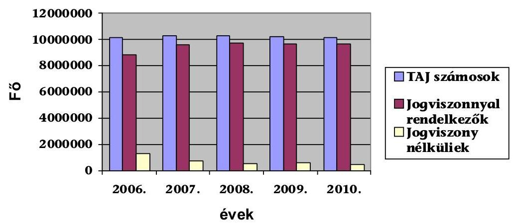
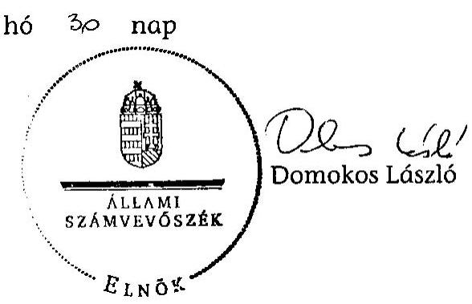
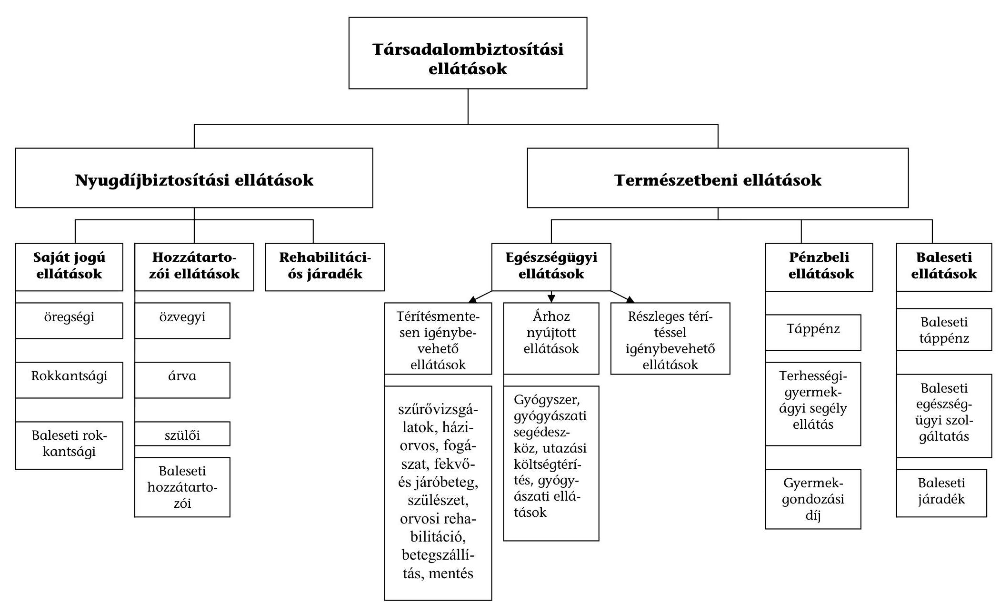
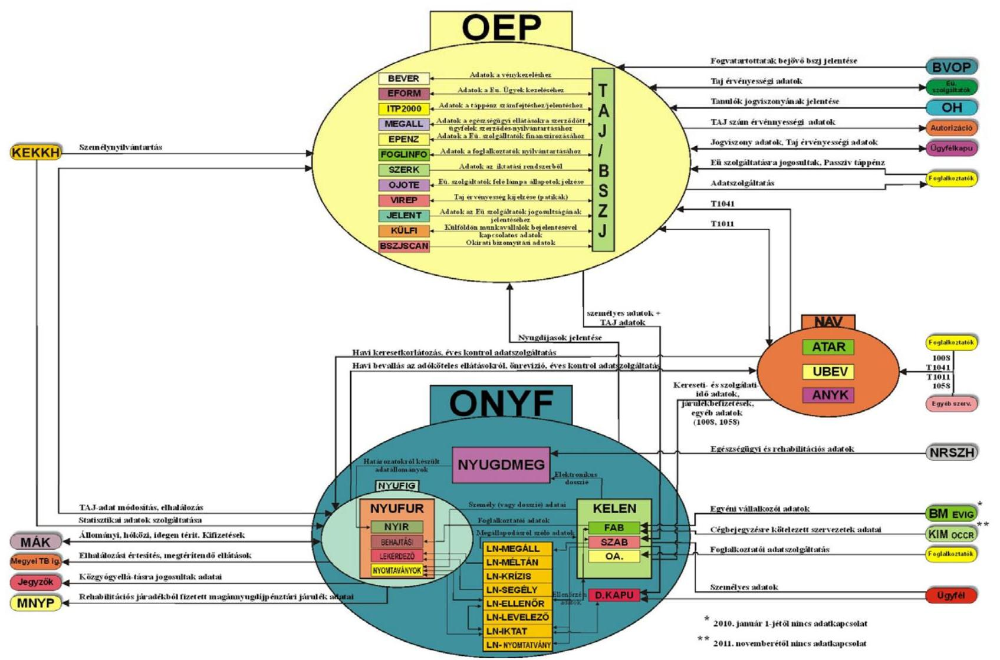
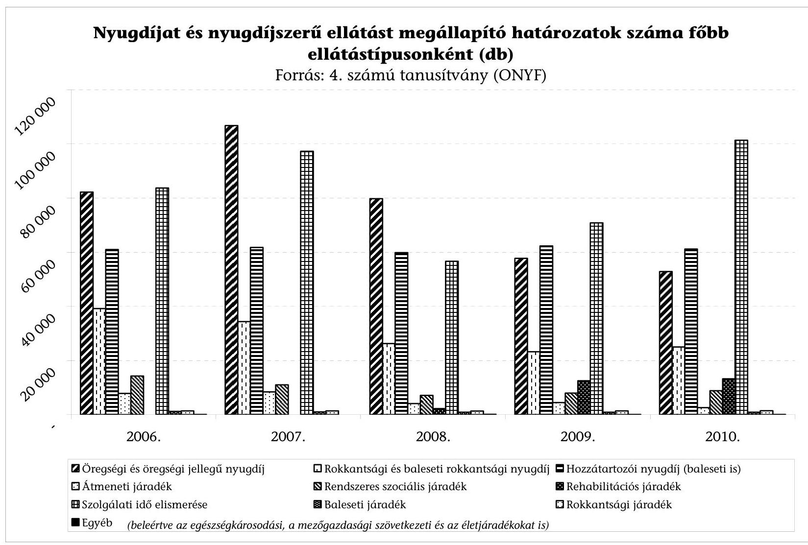
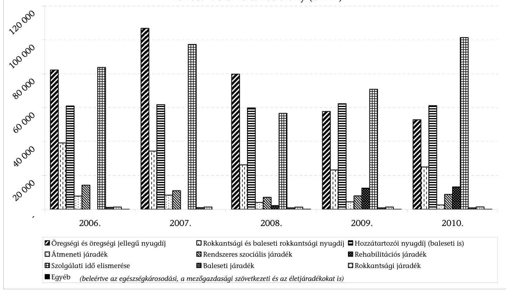

# JELENTÉS 

a Társadalombiztosítási Alapokból nyújtott ellátások és szolgáltatások jogosultsági rendjében alkalmazott nyilvántartási rendszerek múködésének ellenőrzéséről

---

# Állami Számvevőszék 

Iktatószám: V-2007-158/2011-2012.
Témaszám: 1023
Vizsgálat-azonosító szám: V0564

## Az ellenőrzést felügyelte:

## Makkai Mária

felügyeleti vezető

## Az ellenőrzés végrehajtásáért felelős:

## dr. Horváth Margit

ellenőrzésvezető

## A számvevői munkaanyagok feldolgozásában és a jelentés összeállításában közremüködtek:

| Gyeraj Péter   számvevő | Hadnagyné Papp Ildikó   számvevő | Krüzselyi Attila   számvevő tanácsos |
| :-- | :-- | :-- |
| Schmidt János   számvevő | Szilas István   számvevő tanácsos |  |

## Az ellenőrzést végezték:

| Beck Miklós számvevő tanácsos | Czmarkó Frigyes György számvevő | Fekete Győr László számvevő |
| :--: | :--: | :--: |
| Gyeraj Péter számvevő | Hadnagyné Papp Ildikó számvevő | Huszár József számvevő tanácsos |
| Kincses Erzsébet számvevő | Kiss Ferenc Károlyné számvevő | Krüzselyi Attila számvevő tanácsos |
| Dr. Lengyel Attila számvevő tanácsos | Oláh Róbert számvevő tanácsos | Pénzes Gyula számvevő tanácsos |
| Schmidt János számvevő | Dr. Sinka Zoltán Lajos számvevő | Szilas István számvevő tanácsos |
| Vlasits Ágnes számvevő | Dr. Zsombori Beáta számvevő |  |

Jelentéseink az Országgyűlés számítógépes hálózatán és az Interneten a www.asz.hu címen is olvashatóak.

---

# A témához kapcsolódó eddig készített számvevőszéki jelentések: 

## címe

sorszáma
Vélemény a Magyar Köztársaság 2006. évi költségvetési javaslatáról ..... 0550
Jelentés a Nyugdíjbiztosítási Alap múködésének ellenőrzéséről ..... 0620
Jelentés a Magyar Köztársaság 2005. évi költségvetése végrehajtásának ellenőrzéséről
Vélemény a Magyar Köztársaság 2007. évi költségvetési javaslatáról ..... 0641
Jelentés az Egészségbiztosítási Alap múködésének ellenőrzéséről ..... 0651
Jelentés a Magyar Köztársaság 2006. évi költségvetése végrehajtásának ellenőrzéséről
Vélemény a Magyar Köztársaság 2008. évi költségvetési javaslatáról ..... 0736
Jelentés a Magyar Köztársaság 2007. évi költségvetése végrehajtásának ellenőrzéséről
Vélemény a Magyar Köztársaság 2009. évi költségvetési javaslatáról ..... 0836
Jelentés a Magyar Köztársaság 2008. évi költségvetése végrehajtásának ellenőrzéséről
Vélemény a Magyar Köztársaság 2010. évi költségvetési javaslatáról ..... 0935
Jelentés a Magyar Köztársaság 2009. évi költségvetése végrehajtásának ellenőrzéséről
Jelentés a Magyar Köztársaság 2010. évi költségvetése végrehajtásának ellenőrzéséről

---

# TARTALOMJEGYZÉK 

BEVEZETÉS ..... 7
I. ÖSSZEGZŐ MEGÁLLAPÍTÁSOK, KÖVETKEZTETÉSEK, JAVASLATOK ..... 11
II. RÉSZLETES MEGÁLLAPÍTÁSOK ..... 20

1. A társadalombiztosítás rendszerében nyújtott ellátások, szolgáltatások, valamint az alkalmazott nyilvántartások szabályozási környezete ..... 20
2. A társadalombiztosítási ellátások és szolgáltatások költségvetési fedezetének alakulása ..... 26
3. A nyilvántartások múködtetésének kontrollrendszerei ..... 29
3.1. Kontrollok a nyilvántartásokat kezelő szervezetek közötti adatáramlásokban ..... 31
3.2. Kontrollok a nyilvántartásokat kezelő szervezeteken belüli adatáramlásokkal kapcsolatban ..... 40
4. A nyilvántartási rendszerek múködtetésének és fejlesztésének informatikai támogatottsága ..... 47
4.1. A nyilvántartások múködtetésének feltételei ..... 47
4.2. Egészségbiztosítási nyilvántartások ..... 54
4.3. A nyugdíjbiztosítási ágazat informatikai nyilvántartásai ..... 58
4.4. Az informatikai fejlesztésekre fordított források hasznosulása ..... 62
5. Utóellenőrzés ..... 66
MELLÉKLETEK
6. számú A társadalombiztosítás ellátásai
7. számú A nyilvántartásokat kezelő szervezetek legfontosabb adatkapcsolatai
8. számú Táblázatok jegyzéke
FÜGGELÉKEK
9. számú A nyugdíjbiztosítási és egészségbiztosítási hatósági feladatok ellátása
10. számú Az OEP alapnyilvántartását (TAJ-BSZJ) támogató számítástechnikai és egyéb nyilvántartási rendszerek múködtetésének értékelése
11. számú Az ONYF nyilvántartási és számítástechnikai rendszerei múködtetésének értékelése
12. számú Az APEH/NAV által az ONYF és az OEP részére teljesített adatszol-
gáltatásoknál alkalmazott kontrollok

---

.

---

# RÖVIDÍTÉSEK JEGYZÉKE 

| ADATTÁRHÁZ | Általános és vezetői információs igényeket kiszolgáló, képzett belső adatrendszer |
| :--: | :--: |
| Áht. | az államháztartásról szóló 1992. évi XXXVIII. törvény |
| Ámr. | az államháztartás múködési rendjéről szóló 292/2009. (XII. 19.) Korm. Rendelet |
| ANYK | Általános Nyomtatványkitöltő program |
| APEH/NAV | Nemzeti Adó- és Vámhivatal, mely 2010. 12. 31-ig Adó- és Pénzügyi Ellenőrzési Hivatal volt |
| Art. | az adózás rendjéről szóló 2003. évi XCII. törvény |
| ÁSZ | Állami Számvevőszék |
| ATAR | Adattárház rendszer az APEH/NAV-nál |
| Avtv. | a személyes adatok védelméről és a közérdekú adatok nyilvánosságáról szóló 1992. évi LXIII. törvény |
| BÉVER | Békéscsabai Vényellenőrző Rendszer |
| BSZJ | Bejelentett Személyek Jogviszonyadatainak nyilvántartása |
| BSZJ SCAN | Biztositotti jogosultságok okirati bizonyítását segitő program |
| e- NYENYI rendszer | A NYENYI adatszolgáltatás elektronikus ügyintézés keretében történő teljesítésére kialakított rendszer az ONYF-nél |
| E. Alap | Egészségbiztosítási Alap |
| Ebtv. | a kötelező egészségbiztosítás ellátásairól szóló 1997. évi LXXXIII. törvény |
| Ebtv.vhr. | a kötelező egészségbiztosítás ellátásairól szóló 1997. évi LXXXIII. törvény végrehajtásáról szóló 217/1997. (XII. 1.) Korm. rendelet |
| EFORM | Migráns munkavállalók szociális ellátását támogató rendszer |
| EGYEDI | Egyedi engedélyú gyógyszerek nyilvántartó programja |
| EHO | Egészségügyi Hozzájárulás |
| EKOP | Elektronikus Kormányzati Operatív Program |
| ELLENŐRI | Lotus Notes alapú területi ellenőrzési tevékenységet támogató rendszer (ONYF-nél) |
| FAB | A KELEN foglalkoztatói adatbázisa |
| FEUVE | Folyamatba épített előzetes, utólagos és vezetői ellenőrzés |
| FOGLINFO | Központi Foglalkoztatói törzs az OEP-nél |
| IBF | Informatikai Biztonsági Felelős |
| IBO | Informatikai Biztonsági Osztály |
| IBP | Informatikai Biztonsági Politika |
| IBSZ | Informatikai Biztonsági Szabályzat |
| IF | Informatikai Főosztály |
| IFF | Informatikai Fejlesztési Főosztály |
| IKET | Informatikai Katasztrófa Elhárítási Terv |
| IKTAT | Lotus Notes alapú iktatórendszer |

---

| ITP2000 | Integrált Táppénzszámfejtő Program |
| :--: | :--: |
| IÜF | Informatikai Üzemeltetési Főosztály |
| KEK KH | Közigazgatási és Elektronikus Közszolgáltatások Központi Hivatala |
| KELEN | Központi Elektronikus Nyugdíjnyilvántartás |
| KESZ | Kincstári Egységes Számla |
| Ket. | a közigazgatási hatósági eljárás és szolgáltatás általános szabályairól szóló 2004. évi CXL. törvény |
| KGF | Költségvetési és Gazdálkodási Főosztály |
| KGY 2005 | Közgyógy igazolványok központi nyilvántartó programja |
| KIF ELLENŐR | Kifizetőhelyek, Ellenőrök nyilvántartási programja |
| Kincstár | Magyar Államkincstár |
| KIR | Központi Illetmény-számfejtési Rendszer |
| KMRNYI | Közép-magyarországi Regionális Nyugdíjbiztosítási Igazgatóság |
| KNYI | Központi Nyugdíjnyilvántartó és Informatikai Igazgatóság |
| KÜLFI | Külföldön munkavállalók biztosítási nyilvántartása |
| MEGALL | Külföldi személyek megállapodásának nyilvántartó programja az OEP-nél; Lotus Notes alapú nyugdíjszolgáltatásra irányuló megállapodások kezelését támogató rendszeraz ONYF-nél |
| MÉLTÁN | Lotus Notes alapú méltányossági nyugellátás-emelés és megállapítás támogatására szolgáló rendszer |
| MNYP-tagságok | Magán-nyugdíjpénztári tagságok |
| Ny. Alap | Nyugdíjbiztosítási Alap |
| NEFMI | Nemzeti Erőforrás Minisztérium, 2012. május 14-től Emberi Erőforrások Minisztériuma |
| NYENYI | Nyugdíjbiztosítási Egyéni Nyilvántartó Lap |
| NYENYI program | A NYENYI adatszolgáltatás teljesítésére az ONYF által rendszeresített foglalkoztatói program |
| NYJI | Nyugdíjbiztosítási Jogorvoslati Igazgatóság |
| NYOMTATVÁNY | Lotus Notes alapú dokumentumtár az ONYF-nél |
| NYUFIG | Nyugdíjfolyósító Igazgatóság |
| NYUFUR | Nyugdíjfolyósítási Új Rendszer |
| NYUGDMEG | Nyugdíjak Megállapítását, segítő informatikai rendszer |
| OCCR | Országos Cégnyilvántartó és Céginformációs Rendszer |
| OEP | Országos Egészségbiztosítási Pénztár |
| OJOTE | On-line jogviszony és TAJ ellenőrző rendszer |
| ONYF | Országos Nyugdíjbiztosítási Főigazgatóság |
| PEEF | Pénzbeli Ellátási és Ellenőrzési Főosztály |
| PSZÁF | Pénzügyi Szerezetek Állami Felügyelete |
| Segély | Lotus Notes alapú egyszeri segély elbírálását támogató rendszer |
| SZAB | KELEN rendszer személyi adatbázisa |
| SzMSz | Szervezeti és Múködési Szabályzat |

---

| TAJ | Társadalombiztosítási Azonosító Jel |
| :--: | :--: |
| TAJ authorizáció | TAJ érvényesség ellenőrző program |
| TAJ-BSZJ | Társadalombiztosítási Azonosító Jel és Bejelentett Személyek Jogviszonyadatainak nyilvántartás |
| TB Alapok | Társadalombiztosítási Alapok |
| Tbj. | a társadalombiztosítás ellátásaira és a magánnyugdíjra jogosultakról, valamint e szolgáltatások fedezetéről szóló 1997. évi LXXX. törvény |
| Tbj.vhr. | a társadalombiztosítás ellátásaira és a magánnyugdíjra jogosultakról, valamint e szolgáltatások fedezetéről szóló 1997. évi LXXX. törvény végrehajtásáról szóló 195/1997. (XI. 5.) Korm. rendelet |
| Tny. | a társadalombiztosítási nyugellátásról szóló 1997. évi LXXXI. törvény |
| Tny.vhr. | a társadalombiztosítási nyugellátásról szóló 1997. évi LXXXI. törvény végrehajtásáról szóló 168/1997. (X. 6.) Korm. rendelet |
| UBEV | Új Központi Bevallás feldolgozó rendszer |
| ÜAF | Ügyvitelszervezési és Alkalmazásfejlesztési Főosztály |
| ÜFBT | Ügymenet-folytonosság Biztosítási Terv (ONYF-nél) |
| ÜFT | Üzletmenet Folytonossági Terv (OEP-nél) |

---

.

---

# JELENTÉS 

## a Társadalombiztosítási Alapokból nyújtott ellátások és szolgáltatások jogosultsági rendjében alkalmazott nyilvántartási rendszerek múködésének ellenőrzéséről

## BEVEZETÉS

Az ellenőrzött időszakban hatályos, a Magyar Köztársaság Alkotmányáról szóló 1949. évi XX. törvény 70/D. és 70/E. §-ai szerint ${ }^{1}$ a Magyar Köztársaság területén élőknek joguk van a lehető legmagasabb szintű testi és lelki egészséghez, amelyet az állam - többek között - az egészségügyi intézmények és az orvosi ellátás megszervezésével valósít meg. Az állampolgároknak joguk van a szociális biztonsághoz. Öregség, betegség, rokkantság, özvegység, árvaság és önhibájukon kívül bekövetkezett munkanélküliség esetén a megélhetésükhöz szükséges ellátásra jogosultak. Az ellátás a társadalombiztosítás útján az egészségügyi és a szociális intézmények rendszerével valósul meg.

Az ellátások biztosításának nélkülözhetetlen eleme, hogy az állami szervezeteknél az ehhez szükséges nyilvántartások rendelkezésre álljanak. A nyilvántartások legfontosabb célja, hogy az ellátás jogosságának, keletkezésének, módosulásának és megszűnésének, mértékének megállapításához szükséges adatokat rendezetten, áttekinthetően tartalmazza.

A társadalombiztosítás rendszerében az E. Alap, illetve az Ny. Alap forrásai nyújtanak fedezetet az egészségbiztosítási, illetve a nyugdíjbiztosítási ellátásokra. A kötelező egészségbiztosítás ellátásairól szóló 1997. évi LXXXIII. törvény, illetve a társadalombiztosítás ellátásaira és a magánnyugdíjra jogosultakról, valamint e szolgáltatások fedezetéről szóló 1997. évi LXXX. törvény (Tbj.) alapján végzett egészségbiztosítási nyilvántartási tevékenység az egészségbiztosítási szervek alaptevékenysége. Az egészségbiztosítási szerveknek a 319/2010. (XII. 27.) Korm. rendelettel felállított új szervezeti struktúrájában ezt a tevékenységet megyei szinten a fővárosi, megyei kormányhivatalok egészségbiztosítási pénztári szakigazgatási szervei végzik, tevékenységük felett az Országos Egészségbiztosítási Pénztár (OEP) főigazgatója szakmai irányítási jogkört gyakorol. A 2009.

[^0]
[^0]:    ${ }^{1}$ A 2012. január 1-jével hatályba lépő Alaptörvény XIX. cikk (1) bekezdése szerint „Magyarország arra törekszik, hogy minden állampolgárának szociális biztonságot nyújtson. Anyaság, betegség, rokkantság, özvegység, árvaság és önhibáján kívül bekövetkezett munkanélküliség esetén minden magyar állampolgár törvényben meghatározott támogatásra jogosult", továbbá a XX. cikk (1) bekezdése kimondja, hogy „Mindenkinek joga van a testi és lelki egészséghez."

---

január 1. és 2010. december 31. közötti időszakban területi szinten regionális egészségbiztosítási pénztárak működtek.

Az OEP által a Tbj. 40. §-a alapján vezetett biztosítotti/jogosulti nyilvántartás fő funkciója az egészségbiztosítás ellátásaira való jogosultság megállapításának megbízható alátámasztása.

A hiteles adatok rendelkezésre állása ugyanúgy alapfeltétel az Ny. Alapot terhelő, a biztosítottat megillető ellátásoknak a megszerzett jogosultsággal, a teljesített kötelezettségekkel összhangban történő nyugdíj és nyugdíjszerű ellátások megállapításához. A járulékfizetési kötelezettségre és a teljesítésre vonatkozó adatok nyilvántartása az igazgatási szervként eljáró Nemzeti Adó- és Vámhivatal $\left(\mathrm{NAV}^{2}\right)$ feladata, a nyugdíjbiztosítási adatok nyilvántartási rendszerét az Országos Nyugdíjbiztosítási Főigazgatóság (ONYF) múködteti (Tbj. 4. § r) pontja).

Az Ny. Alapot a Kormány felügyeli, az irányítási jogot a nyugdíjpolitikáért felelős miniszter gyakorolja. Az Ny. Alap felügyelete 2010. május 29-ével a Magyar Köztársaság minisztériumainak felsorolásáról szóló 2010. évi XLII. törvény 2. § (1) bekezdés ka) pontja szerint a szociális és munkaügyi minisztertől a nemzeti erőforrás miniszter felelősségi körébe került.

Az ONYF igazgatási szervei 2010. december 31-ig a regionális nyugdíjbiztosítási igazgatóságok, a Nyugdíjfolyósító Igazgatóság (NYUFIG) és a Nyugdíjbiztosítási Jogorvoslati Igazgatóság (NYJI). Az NYJI 2010. december 31. napjával megszűnt, és tevékenységét 2011. január 1-jétől az ONYF Jogorvoslati Főosztálya látja el. A Kormány 2011. január 1-jével a regionális nyugdíjbiztosítási igazgatóságok kormányhivatalokba történő integrálásáról döntött. ${ }^{3}$ A nyugdíjbiztosítási igazgatóságok 2007. január 1. és 2010. december 31. között az ONYF igazgatási szerveiként regionális szervezeti struktúrában múködtek, ezt követően a megyei kormányhivatalok szakigazgatási szervezeti egységeként látják el feladataikat, melyek alaptevékenysége közé tartozik a nyugdíjbiztosítási nyilvántartási feladatok ellátása. A megyei nyugdíjbiztosítási igazgatóságok szakmai irányítása az ONYF feladata. A nemzetközi nyugdíj-elbírálási szakterületet a Közép-magyarországi Regionális Nyugdíjbiztosítási Igazgatóságból (KMRNYI) a 2011. január 1-jén megalakult Központi Nyugdíjnyilvántartó és Informatikai Igazgatósághoz (KNYI) telepítették, mely továbbra is az ONYF igazgatási szerveként múködik. A NYUFIG önállósága továbbra is megmaradt. A nyugdíjellátásokat folyósító szervként, önállóan működő és gazdálkodó, az ország egész területére kiterjedő illetékességgel rendelkező költségvetési szerv.

A jelen ellenőrzés fő feladata annak felmérése és értékelése volt, hogy az Alapok nyilvántartási rendszerei alkalmasak voltak-e a biztosítottak jogszerzési adatainak teljes körű, hiteles és naprakész kimutatására, a jogos igények kielé-

[^0]
[^0]:    ${ }^{2}$ A Nemzeti Adó- és Vámhivatalról szóló 2010. évi CXXII. törvény 2011. január 1-jétől az Adó- és Pénzügyi Ellenőrzési Hivatalból és a Vám- és Pénzügyőrségből jött létre.
    ${ }^{3}$ A területi államigazgatási szervezetrendszer átalakítását megalapozó intézkedésekről szóló 1191/2010. (IX. 14.) Korm. határozat.

---

gítésére, illetve a jogszerűtlen igénybevételek megelőzésére, továbbá azok utólagos felderítésére.

A Társadalombiztosítás pénzügyi alapjainak kiadása 2006-ban 3791,7 Mrd Ft volt, a 2011. évi előirányzat 4534 Mrd Ft, összességében az államháztartás éves kiadásainak közel harmadát teszi ki. Az E. Alap és az NY. Alap 2005., illetve 2006. évi ellenőrzésénél megállapítottuk, hogy a nyilvántartások nem voltak teljes körűek, esetenként nem voltak hitelesek és/vagy megbízhatóak. A 20072010. évek ellenőrzései az Alapok éves költségvetésének véleményezésére, illetve végrehajtásának értékelésére irányultak.

A jelen ellenőrzés célja annak értékelése volt, hogy

- az egészség-, illetve a nyugdíjbiztosítási ellátások és szolgáltatások jogosultsági rendjében alkalmazott nyilvántartási rendszerek kialakítása és múködtetése, továbbá a megfelelő mérési-, döntési pontok kijelölése megbízhatóan támogatta-e a jogosultságoknak megfelelő ellátásokat, illetve a jogosulatlan ellátások kiszűrését;
- az érintett szerveknél bevezetett nyilvántartások alkalmasak voltak-e a jogszerzési adatok eredményes és hatékony (hiteles és naprakész) kimutatására az illetékes állami szervek, valamint az állampolgárok számára;
- a nyilvántartásokat megfelelő informatikai rendszerek támogatták-e, továbbá azok fejlesztése - az ellátási színvonal megőrzése mellett - növelte-e az ügyintézés hatékonyságát és eredményességét;
- hasznosultak-e a korábbi ellenőrzések javaslatai.

Az ellenőrzés a 2007-2010. évi folyamatokra terjedt ki, bázisul a 2006. év gazdálkodási és nyilvántartási adatai szolgáltak, egyben kitekintett 2011. december 31-ig az ellenőrzés releváns folyamataira is.

Az ellenőrzés típusa rendszerellenőrzés, amelynek módszertana ${ }^{4}$ szerint alkalmazta az ellenőrzési kritériumokat és kérdéseket, a tanúsítványok adatszolgáltatását, a kérdőíves felmérést, valamint a helyszíni interjúk készítését. A részletes ellenőrzési szempontokat előtanulmány alapozta meg.

Az ellenőrzés kiterjedt a nyilvántartást kezelő szervezetek (OEP, ONYF, APEH/NAV) alapnyilvántartásaira, az azokat kiszolgáló nyilvántartási rendszerekre, továbbá a támogató számítástechnikai rendszerekre. Az ellenőrzés értékelte a nyilvántartási és adatszolgáltatási kötelezettség végrehajtásának kontrollrendszerét, valamint az informatikai támogató tevékenységet. A vizsgált rendszereket és azok főbb adatáramlási folyamatait a 2. számú melléklet mutatja be.

Az OEP által működtetett alapnyilvántartás a központi TAJ-BSZJ rendszer. Ennek adatait használja, visszacsatolással a múködését segíti többféle számítástechnikai rendszer, többek között a BSZJ SCAN, az OJOTE (On-line Jogviszony

[^0]
[^0]:    ${ }^{4}$ 10/2008. sz. ÁSZ Elnöki utasítás a rendszerellenőrzés módszertanáról

---

és TAJ Ellenőrző rendszer), a TAJ authorizáció, az EFORM, az ITP2000 (Integrált Táppénzszámfejtő Program) és az ADATTÁRHÁZ. Ezen kívül az OEP egyéb elektronikus nyilvántartási rendszereket is múködtet, így a FOGLINFO-t (Foglalkoztatói törzsnyilvántartás), a MEGALL-t, a KGY 2005-öt, az EGYEDI-t, a KÜLFI-t, a BÉVER-t (Békéscsabai Vényellenőrző Rendszer) és a KIF ELLENŐR-t.

A Ny. Alapból finanszírozott ellátások megállapításának alapját a foglalkoztatók/adatszolgáltatók által a biztosítottakról teljesített szolgálati idő és kereseti adatok biztosítják, amelyet többféle adatszolgáltatásra rendszeresített, több szakaszra bontott adatszolgáltatási módszerrel teljesítettek. A teljesített adatszolgáltatások gerincét az ellenőrzött időszakban a nyugdíjbiztosítási egyéni nyilvántartó (NYENYI) lapok képezték, amelyek a Központi Elektronikus Nyugdíjnyilvántartás (KELEN) rendszerbe kerültek bedolgozásra. A nyugdíjbiztosítási igazgatóságokon a nyugdíjigények elbírálását támogató informatikai rendszer (NYUGDMEG) segítségével végezték a nyugdíjak és nyugdíjszerű ellátások megállapítását, melyekhez az adatokat az ellátásoknak megfelelően strukturált elektronikus dossziék segítségével válogatták össze a KELEN alrendszereként működő, a biztosítottak adatait tartalmazó Személyi Adatbázis (SZAB) nyilvántartásból. A KELEN mellett Lotus Notes alapú kiegészítő programok (pl. IKTAT, MEGÁLL, ELLENŐRI, NYOMTATVÁNY) múködnek, melyek többek között a határozatok, adatok visszakereshetőségén túl egyéb nyugdíj-szakmai feladatokat látnak el az ellenőrzés munkájának támogatása mellett. A megállapított nyugdíjak és ellátások folyósítása a NYUFIG-nál a Nyugdíjfolyósítási Új Rendszerrel (NYUFUR) történik. A nyugdíjágazat alapnyilvántartásának feladata, hogy minden biztosított személyre vonatkozóan egy teljes életpálya biztosítási adatait tartalmazza.

Az APEH/NAV-nál a beérkezett foglalkoztatói adatlapok fogadását és ellenőrzését az ANYK (Általános Nyomtatványkitöltő) rendszere végzi. A bevallás adatokat az új központi bevallás feldolgozó rendszer (UBEV) fogadja és dolgozza fel. A rendszer a bevallások kezelésének valamennyi munkafolyamatát támogatja. Biztosítja, hogy a bevallást iktassák és az adatok zárt rendszerben jussanak el a felhasználó rendszerekhez (pl. folyószámla rendszer, adattárház rendszer). A bevallás adatok egységesített betöltési folyamatokkal kerülnek be az adattárház (ATAR) rendszerbe, amely a bevallás adatokat elemi szinten, teljes történetiségében tartja nyilván.

Az ellenőrzés végrehajtásának jogszabályi alapját az Állami Számvevőszékről szóló 2011. évi LXVI. törvény ${ }^{5} 5 . \S$ (2) bekezdésében foglaltak képezték.

[^0]
[^0]:    ${ }^{5}$ A törvényt az Országgyűlés a 2011. június 20 -ai ülésén fogadta el, hatályos 2011 . július 1-jétől.

---

# I. ÖSSZEGZŐ MEGÁLLAPÍTÁSOK, KÖVETKEZTETÉSEK, JAVASLATOK 

Az egészség-, illetve a nyugdíjbiztosítási ellátások és szolgáltatások jogosultsági rendjében alkalmazott nyilvántartási rendszerek kialakítása és múködtetése a 2006-2010. év közötti időszakban betöltötte a funkcióját, az ellátások megállapítását és folyósítását alapvetően támogatta. A nyilvántartási rendszerekben található adatok megbízhatóságságát és naprakészségét az adategyeztetések különböző formái segítették. Közel harmadára csökkent a TAJ számmal igen, de jogviszonyra vonatkozó adattal nem rendelkező polgárok száma ${ }^{6}$, további eredmény, hogy már 2007-ről 2008-ra csaknem megduplázódott az egészségügyi szolgáltatási járulékot fizetők létszáma.

Ugyanakkor számos területen tapasztaltunk az eredményes és hatékony múködést kedvezőtlenül befolyásoló folyamatokat. A jogi szabályozás megfelelően és átfogóan rendelkezett a nyilvántartásra kötelezett szervezetekről, az adatok tartalmáról, ugyanakkor az állami szervezetek közötti adatátadást és -fogadást érintő fontos témaköröket nem rendeztek. Az adatátadásokra, az adatminőségekre vonatkozóan a szabályszerű teljesítés kritériumai hiányoztak, a vitás ügyek célirányos rendezésének módját nem alakították ki. A szabályozás keretjellegű, a nyilvántartások kezelését, az adatok védelmét állítja előtérbe. A kezelő szervezetek alakítják ki a szervezeteken belül az adatok nyilvántartási rendszerekbe illesztését, a feladatok ellátását elősegítő formátumba történő feldolgozását. A rendszerek működtetésével kapcsolatos felelősségi- és hatáskörök szabályozása eltérő mélységű és színvonalú volt, nem volt teljes körű az egyes szervezetek között a feladatok és a felelősség megosztása, az egyes szervezetek ellenőrzési funkciója és a nyilvántartások közötti átfedések, párhuzamosságok megszüntetése.

A nyilvántartási rendszerek alapvető funkciója, hogy minden biztosított, járulékfizető ellátásban részesüljön, illetve a rendszer a jogosulatlan szereplőket kiszűrje. Az ellenőrzési pontok kialakításában alapvetően közös, hogy az ellátást igénylő részéről a biztosítotti státusz igazolásához a nyilvántartási rendszerekben meglévő adatok egyezőségének, pontosságának ellenőrzése szükséges.

A társadalombiztosítási ágazatok (egészség-, illetve a nyugdíjbiztosítási ágazat) közös jellemzője, hogy az adatok gyűjtésében és továbbításában, ellenőrzésében, a járulékok behajtásában jelentős szerepet töltött be az APEH/NAV. A nyilvántartások alapvetően a foglalkoztatói adatszolgáltatásokból építkeztek, ezeket az APEH/NAV különböző, évente a jogszabályok változásaihoz igazodó bevallásokban gyűjtötte össze, és törvényben, illetve a megállapodásokban foglaltak szerint továbbította a későbbi adatgazdákhoz. Az APEH/NAV,

[^0]
[^0]:    ${ }^{6}$ Jogviszonyra vonatkozó adattal nem rendelkezők száma 2006-ban 1300144 fő, 2010-ben 442578 fő volt.

---

mint köztes adatszolgáltató beiktatásával az ellátások megállapításának időtartama meghosszabbodott, a hibák kijavítása a foglalkoztatói megkeresésekkel a megállapítást végző apparátusnál és az adatszolgáltatóknál egyaránt többletmunkával járt.

A két ágazat nyilvántartási rendszerei felépítésükben, múködésükben, céljukban eltérőek, azok tartalma és időtávja különböző. Az E. Alapból rövid távú jogosító idő, esetenként adott időpontra vonatkozó biztosítotti státusz alapján nyújtanak ellátásokat, ezzel szemben a NY. Alapból hosszú távú, a múltban felhalmozott szolgálati idő és jövedelmi adatok alapján állapítanak meg ellátásokat.

Egységes adatkapcsolási kódok használatát az adatvédelmi szabályok nem teszik lehetővé, ezáltal az alkalmazott kontrollok ${ }^{7}$ és azok rendeltetése is különböző. Az adatáramlások során kontroll szerepet töltenek be a nyilvántartásokat kezelő szervezetek közötti azon megállapodások, amelyek esetkörönként rendezik az adatátadások szerkezetét és technikai feltételeit, továbbá meghatározzák az érintett bejelentések és bevallások ellenőrzéséhez, valamint a hibás bejelentések javításához, az adatszolgáltatóval való egyeztetéséhez kapcsolódó intézményi feladatokat.

Komoly kockázatot hordoz 2011-től a NYENYI lapok felváltása az APEH/NAV adatszolgáltatásával. Párhuzamosan múködött 2006 - 2010 között a NYENYI (Nyugdíjbiztosítási Egyéni Nyilvántartó Lap) adatszolgáltatási rendszer az APEH/NAV adatszolgáltatással. A legnagyobb adatáramlással kapcsolatban az ONYF és az APEH/NAV között az ellenőrzött időszakban vitatott maradt az adóhatóság által a járulékbevallásokból gyűjtött szolgálati idő és jövedelmi adatok struktúrájának és felhasználhatóságának megfelelősége. A NAV és az ONYF elkülönülten kezelt adatállományainak bonyolultsága és eltérései miatt felmerülő problémák rendezése az ellenőrzés lezárásáig nem hozott eredményt, ugyanakkor 2011-től a NYENYI adatszolgáltatás megszűnt, a továbbiakban a nyugdíjbiztosítási és egyéb ellátások megállapításához hiányzó adatokat a NAV szolgáltatja.

A társadalombiztosítási ágazatok, illetve a kezelő szervezetek részére az irányító/felügyeleti funkciót gyakorló döntéshozók (Országgyűlés, Kormány, a felügyeleti jogokat gyakorló miniszterek, az alapok kezelői) nem határoztak meg eredményességi, hatékonysági elvárásokat, hiányoztak az adatáramlásokra, nyilvántartási rendszerekre vonatkozó mérő-, mutatószámok.

Az ellátásokkal kapcsolatos határozatok, megállapítások számbavétele és értékelése utal - az ellenőrzés szerint - a társadalombiztosítási rendszer múködésé-

[^0]
[^0]:    ${ }^{7}$ Az Áht. 94. § (1) bekezdés f) pontja alapján a költségvetési szerv vezetője felelős a szakmai és a pénzügyi monitoringrendszer folyamatos múködtetéséért. A monitoringrendszert az Ámr. 160. §-a már olyan rendszernek határozza meg, amely lehetővé teszi a szervezet tevékenységének, a célok megvalósításának nyomon követhetőségét. A monitoringrendszer alapját a kontrollkörnyezet és a kontrolltevékenységek meghatározása adja, melyekhez szorosan kapcsolódik a kockázatok felmérése, a szervezet tevékenységében rejlő kockázati tényezők megállapítása.

---

nek eredményességére ${ }^{8}$, illetve közvetve a hatékonyságára is. Az OEP-nél másfél év alatt mintegy ötmillió hatósági ügyből csak 26 ezret kellett megváltoztatni. Az ONYF-nél 2007-2010 között az évi 350 ezres megállapításnak átlagban mindössze 4-5\%-át fellebbezték meg. A jogszabályoknak nem megfelelő, hiányos megállapítások, határozatok alapvetően a jogalkalmazás területén az előírások gyakori változására ${ }^{9}$, azok eltérő értelmezésére, illetve a nyilvántartásokkal, informatikai támogatásokkal kapcsolatos hibákra, hiányosságokra vezethetők vissza.

A társadalombiztosítás nyilvántartási rendszereiben található adatok megbízhatóságát és naprakészségét segítették elő az adattisztázások, az adategyeztetések, az adatmigrációk ${ }^{10}$ és adatszinkronizációk ${ }^{11}$, melyek koordinálása mindkét ágazatban központilag történt.

# Nyilvántartott jogviszonnyal rendelkezők száma 2006 és 2010 között 

A jogviszonyra vonatkozó adattal nem rendelkezők száma 2006-ban 1300144 föt tett ki, 2010-ben már csak 442578 főt érintett. A folyamatos csökkenéshez hozzájárult, hogy a természetbeni ellátásokat nyújtó egészségügyi szolgáltatók ${ }^{12}$ 2007. április 1-jétől ${ }^{13}$ kötelesek az egészségügyi ellátás igénybevé-

[^0]
[^0]:    ${ }^{8}$ A nyilvántartási és adatszolgáltatási kötelezettség teljesítése érdekében hozott intézkedések eredményesek, ha kedvezően változott az adatszolgáltatást teljesítők száma és aránya az adatszolgáltatásra kötelezettekhez viszonyítva.
    ${ }^{9}$ A Tbj. öt és fél év alatt, 2011. december 31-ig 11-szer, a kötelező egészségbiztosítás ellátásairól szóló 1997. évi LXXXIII. törvény 30-szor, végrehajtási rendelete 50-szer változott.
    ${ }^{10}$ Az eltérő forrásból (rendszerből) származó hasonló tartalmú adatok integrációja egy új vagy létező rendszerbe.
    ${ }^{11}$ Az alaprendszerben történő adatváltozást a másodlagos rendszerben is követni kell az adatok összehangolása érdekében.
    ${ }^{12}$ A mentést, betegszállítást, védőnői szolgáltatást, otthoni szakápolást, iskola- és ifjú-ság-egészségügyi ellátást, mozgó szakorvosi szolgálatot teljesítő szolgáltató, valamint a beteg közvetlen jelenlétét nem igénylő diagnosztikai és körszövettani vizsgálat, továbbá a boncolás kivételével.

---

telét megelőzően ${ }^{14}$ a TAJ számot igazoló okmány alapján az OEP nyilvántartásában közvetlenül elektronikus úton ellenőrizni az egészségügyi szolgáltatásra jogosultságot ${ }^{15}$, továbbá az OEP 2007-ben a legnagyobb munkáltatókkal külön egyeztetést végzett. Ezek együttes hatásaként közel harmadára csökkent ${ }^{16}$ az érvényes TAJ számmal igen, de jogviszonyra vonatkozó adattal nem rendelkezők száma. További eredmény, hogy az egészségügyi szolgáltatási járulékot fizetők száma 2007-2008-ban kedvezően alakult, 2008-ban 143260 főről 268949 főre emelkedett.

A TAJ-BSZJ nyilvántartás megbízhatósága szempontjából kockázatot jelent a megszűnt jogviszonyok rögzítésének elmaradása (a bejelentés elmulasztása vagy a feldolgozás sikertelensége miatt). Ezek az ún. „zöld jelzésben ragadt" jogviszonyok, amelyek kiszűrésére az OEP-nek csak korlátozott eszközök álltak rendelkezésére. Az ügyfelek ${ }^{17}$ e jogviszonyok megszüntetésének bejelentésében nem voltak érdekeltek, továbbá az OEP sem rendelkezett ezek kiszűrését támogató informatikai alkalmazásokkal.

A jogviszonnyal nem rendelkezők számát, a be nem fizetett járulékok és az ebből keletkező hátralékok összegét, a rendelkezésre álló eszközökkel, erőforrásokkal nem lehet érdemben tovább csökkenteni. A tartósan (éven túl) jogviszonnyal nem rendelkezők aránya az összes jogviszonnyal nem rendelkezők számán belül a vizsgált időszakban 70\% maradt, állandósult egy 300 ezer fös jogviszonnyal nem rendelkező réteg, melynek további csökkentéséhez hiányoznak a megalapozó demográfiai, földrajzi, esetleg foglalkoztatási jellemzőikről gyűjtött adatok és azok elemzései.

Kiemelkedően fontos az a kontrolltevékenység, amelyet az ellátások igénybevételénél a hatósági ügyintézés biztosít. A nyugdíjágazat ellátásait évente százezres, az egészségbiztosítási ágazatét milliós nagyságrendben veszik igénybe. Mindkét ágazat pénzbeli ellátásainak megállapítása határozattal történik ${ }^{18}$, a határozathozatalhoz áttekintik a nyilvántartások adatait és egyéb dokumentumokat kérnek be. Az egészségbiztosítás természetbeni ellátásainál a jogviszony ellenőrzés jelent átfogó és rendszeres kontrollt. Az ellenőrzött idő-

[^0]
[^0]:    ${ }^{13}$ A jogviszony ellenőrzésre - a járó és fekvőbeteg ellátó intézményekhez hasonlóan kötelezett szolgáltatók köre fokozatosan bővült: 2007. december 1-jétől az alapellátást nyújtó szolgáltatóknak (háziorvos, a háziorvosi ügyeleti szolgáltatásra szerződéssel rendelkező szolgáltató, szerződött fogorvos), 2008. január 1-jétől gyógyszertárakkal, gyógyászati segédeszköz forgalmazókkal, gyógyászati ellátást nyújtó szolgáltatókkal.
    ${ }^{14}$ Általános szabályként az ellenőrzést az ellátás nyújtása előtt kell elvégezni kivéve, ha a beteg állapota az ellátás azonnali megkezdését indokolja, a jogviszony-ellenőrzés közvetlenül a szolgáltatás igénybevétele után is elvégezhető.
    ${ }^{15}$ 217/1997. (XII. 1.) Korm. rendelet 12/B. §
    ${ }^{16}$ A jogviszonyra vonatkozó adattal nem rendelkezők száma 2006-ban 1300144 fő, 2007-ben 740404 fő, 2008-ban 526086 fő, 2009-ben 570333 fő, 2010-ben 442578 fő volt.
    ${ }^{17}$ A foglalkoztatók a jogviszony változás bejelentésére rendszeresített nyomtatványon az APEH/NAV számára kötelesek jelezni a jogviszonyok keletkezését, megszűnését.
    ${ }^{18}$ Az egészségbiztosítási területen a pénzbeli ellátások megállapítása akkor történik határozattal, ha az ellátás iránti kérelem nem teljes mértékben kerül teljesítésre.

---

szakban a nyugdíjbiztosítási ellátások megállapítása és folyósítása megfelelően történt, amit a fellebbezések, panaszok és bírósági ügyek alacsony száma is visszaigazolt. 2006-ban az elsőfokú döntések 8,7\%-át nem fogadták el az ügyfelek és éltek a fellebbezési jogukkal. A következő években ez az arány 4-5\%-ra mérséklődött. A peres ügyek száma az ellenőrzött időszakban 12015 db és 16645 db szélsőérték között mozgott, a 2010-re 2006-hoz képest 8,1\%-kal csökkent. Az ONYF-nél 2010-ben a pervesztés aránya a nyugellátással kapcsolatos elutasító érdemi döntésekhez képest $2,4 \%$ volt ${ }^{19}$, a panaszügyek aránya a nyugdíjfolyósítással kapcsolatban az évenkénti közel 3 milliós nagyságrendű ügyirat tételszámhoz képest elhanyagolható, 2010-ben 142 db volt.

A jogosultatlanul igénybe vett ellátások, szolgáltatások megszüntetésében az igénybe vevő fél nem érdekelt.

A nyilvántartásokat kezelő szervezeteknél múködtették a szakmai és pénzügyi ellenőrzés különböző formáit, amelyek kiterjedtek a társadalombiztosítási nyilvántartások adatainak megbízhatóságára, a biztosítotti jogviszony meglétére, a járulék megfizetésének szabályosságára. A nyugdíjágazat ellenőrzési rendszere lefedte a vezetési-, irányítási-, múködési-, szakigazgatási, gazdasági területet, biztosította a felügyeleti-, irányítási feladatkörből eredő szakmai ellenőrzési feladatok elvégzését is.

Az egészségbiztosításban a jogosultságot megalapozó biztosítási jogviszonyok (pl. munkajogviszony, közalkalmazotti jogviszony, megbízási szerződés) folyamatos változásának naprakész nyomon követése, míg a nyugdíjágazatban az éven belüli jogosultsági párhuzamosságok (pl. egy személy több foglalkoztatónál eltérő alkalmazotti státuszban szerepel) összetetté teszik az adatok egyénenkénti nyilvántartását, mert egy személyhez kapcsolódóan több foglalkoztató is teljesíthet adatszolgáltatást. Mindkét társadalombiztosítási ágazatban megoldott az adatok technikai ellenőrzése, viszont az APEH/NAV adatszolgáltatásai végig tartalmaztak hibás rekordokat, tételeket ${ }^{20}$.

Az OEP 2003-ban fogadta el az informatikai stratégiáját, 2011-ben megkezdte az új informatikai stratégia kidolgozását, melyet 2011. szeptember 23-án hagytak jóvá. Az ONYF 2005-ben kidolgozta az ágazati szintű integrált informatikai rendszer koncepcióját, amely a technológiailag heterogén környezetben múködő informatikai rendszerek egységesítését, ágazati szintű, központi adattárak és rendszerfunkciók kialakítását tűzte ki célul. Az elvárt előnyök között határozta meg az adatok redundanciájának ${ }^{21}$ és többszörös karbantartásának megszüntetését, az egységes jogosultságkezelést, valamint a fejlesztési és üzemeltetési költségek csökkentését. Az integrált rendszer kialakítása a vizsgált időszakban

[^0]
[^0]:    ${ }^{19}$ 10. sz. táblázat és a 13. sz. táblázat adatai szerint 2010-ben a nyugellátással kapcsolatos elutasító érdemi döntés száma 78615 db volt, ehhez képest az ONYF által elveszített nyugdíjperek száma 1894 db volt.
    ${ }^{20}$ Az APEH/NAV-tól OEP-re érkezett biztosítotti adatszolgáltatás 1-7\%-át kitevő, több százezres adat nem került a Bejelentett Személyek Jogviszonyadatai rendszerbe bedolgozásra.
    ${ }^{21}$ Egy adat többszörös (adatbázisban, rendszerben) tárolása.

---

nem valósult meg, ezért a koncepcióban rögzített problémák továbbra is fennállnak.

A nyilvántartási rendszerek múködését összetett informatikai rendszerek támogatták. A nyilvántartásokat kezelő szervezetek (OEP, ONYF, NAV) a jogszabályi környezet folyamatos változásához alkalmazkodó rendszerek kialakítására törekedtek, ugyanakkor nem keresték annak lehetőségét, hogy azonos célú és funkciójú foglalkoztatói nyilvántartásukat közös, költségkímélő fejlesztésben valósítsák meg.

A nyilvántartásokat kezelő szervezeteknél a szabályozásnak megfelelően elkülönülnek a nyilvántartási rendszerek üzemeltetési, illetve fejlesztési feladatai. Jellemző volt a vállalkozók alkalmazása. Az informatikai rendszerek fejlesztését és üzemeltetését az ONYF 2004-től vállalkozók bevonásával látta el, ennek kockázatait, az adatvédelmi előírások teljesülését, valamint a vállalkozó teljesítményének mérését biztosító kontrollok múködtetésével védte ki ${ }^{22}$. Az OEP esetében a TAJ-BSZJ rendszer továbbfejlesztésére 2008-tól megkötött szerződésekben az új vállalkozó (amely korábban alvállalkozóként vett részt a fejlesztésben) nem mondott le a továbbfejlesztéshez kapcsolódó szerzői jogvédelem alá eső vagyoni jogairól. Ennek következtében a rendszerhez kapcsolódó vagyoni jogok rendezetlenné váltak egy olyan szoftver esetében, amelynek tulajdonjogát korábban az OEP birtokolta. Tekintettel arra, hogy az eredeti rendszer és továbbfejlesztése nem szétválasztható, a teljes rendszerhez kapcsolódó tulajdoni jogok rendezetlenné váltak. Ez a jogi helyzet kiszolgáltatottá tette a szervezetet a szállítóval szemben, egyben kizárta a szállítók versenyeztetésének lehetőségét a rendszer továbbfejlesztése során. Az OEP a helyzet rendezése érdekében 2011 decemberében közbeszerzési eljárást írt ki a TAJ-BSZJ programrendszer, mint fejlesztő szoftver tulajdonjogának visszavásárlására.

Az OEP vezetése 2010-ben vállalkozót bízott meg az informatikai biztonság átfogó értékelésével. A feltárt hiányosságok többsége, az IBSZ elavultsága, az Üzletmenet Folytonossági Terv és a Katasztrófaterv, valamint a tartalék adatközpont hiánya, az informatikai biztonság felügyeletének megoldatlansága a helyszíni ellenőrzés időszakában is fennállt.

Az OEP-nél a nyilvántartások kialakításáért, folyamatos módosításáért felelős szakmai terület nem határozta meg - az informatikai tesztek során - a feladatellátás szempontjából kritikus folyamatokat, továbbá a rendelkezésreállási és teljesítmény-elvárásokat ${ }^{23}$. A szolgáltatások rendelkezésre állása szempontjából kockázatot jelent, hogy nincs az OEP-nek tartalék szerverterme, amely a központi gépterem kiesésekor annak feladatait átvehetné.

[^0]
[^0]:    ${ }^{22}$ A szerződésben a minőségi kritériumok mellett szerepeltek a teljesítést biztosító garanciák (kötbér, kártérítési felelősség, jótállás), a mellékletek rögzítették a szolgáltatások elvárt szintjeit és a kapcsolódó mérési módszereket, az adott szolgáltatás súlyát a teljes szolgáltatási szint meghatározásában.
    ${ }^{23}$ A kritikus üzleti folyamatok meghatározása előfeltétele mind az Üzletmenet Folytonossági Terv kidolgozásának, mind a rendszerekkel szemben támasztott teljesítmény és rendelkezésre állási követelmények meghatározásának.

---

Az OEP-nél az ÁSZ javaslatait hasznosították a hatósági ügyintézés területén. Az Egészségbiztosítási Alap 2010. évi költségvetése végrehajtásának egyéb szabályszerűségi ellenőrzéséről szóló ÁSZ jelentés megállapította, hogy a központi szintű kontrollrendszereket a pénzeszközök kifizetése előtti időpontig megfelelően, az államháztartás működési rendjében meghatározott előírások szerint alakították ki.

Az Állami Számvevőszékről szóló 2011. évi LXVI. törvény 33. § (1) bekezdésében foglaltak értelmében a jelentésben foglalt megállapításokhoz kapcsolódó intézkedési tervet köteles az ellenőrzött szervezet vezetője összeállítani és azt a jelentés kézhezvételétől számított harminc napon belül az ÁSZ részére megküldeni. Amennyiben az intézkedési tervet határidőben nem küldi meg a szervezet, vagy az továbbra sem elfogadható, az ÁSZ elnöke a hivatkozott törvény 33. § (3) bekezdés a)- b) pontjaiban foglaltakat érvényesítheti.

Az ellenőrzés intézkedést igénylő megállapításai és javaslatai:

# az emberi erőforrások miniszterének a nemzetgazdasági miniszter közremüködésével 

1. A jogi szabályozás az állami szervezetek közötti adatátadást és -fogadást érintő fontos témaköröket nem rendezett, hiányoztak az adatáramlásokra, adatátadásokra, adatminőségekre vonatkozó szabályszerű teljesítés kritériumai, a vitás ügyek célirányos rendezésének módját nem alakították ki.

Javaslat:
Az emberi erőforrások minisztere - a nemzetgazdasági miniszter közreműködésével határozza meg a szabályozás különböző szintjein az adatátadások, adatminőségek kritériumait.
2. A társadalombiztosítási ágazatok, illetve a kezelő szervezetek részére az irányító/felügyeleti funkciót gyakorló döntéshozók nem határoztak meg eredményességi, hatékonysági elvárásokat, hiányoztak az adatáramlásokra, nyilvántartási rendszerekre vonatkozó mérő-, mutatószámok. Az informatikai fejlesztések eredményességének és hatékonyságának mérésére indikátorokat a társadalombiztosítási szerveknél nem határoztak meg.

Javaslat:
Az emberi erőforrások minisztere - a nemzetgazdasági miniszter közreműködésével határozza meg az adatáramlásokra, nyilvántartási rendszerekre az informatikai fejlesztések eredményességének és hatékonyságának mérésére vonatkozó mérő-, mutatószámokat.

## a nemzetgazdasági miniszternek az emberi erőforrások minisztere közremüködésével

1. Párhuzamosan működött 2006 - 2010 között a NYENYI (Nyugdíjbiztosítási Egyéni Nyilvántartó Lap) adatszolgáltatási rendszer az APEH/NAV adatszolgáltatással. Az

---

ONYF és az APEH/NAV között az ellenőrzött időszakban vitatott maradt az adóhatóság által a járulékbevallásokból gyűjtött szolgálati idő és jövedelmi adatok struktúrájának és felhasználhatóságának megfelelősége. A NAV és az ONYF elkülönülten kezelt adatállományainak bonyolultsága és eltérései miatt felmerülő problémák rendezése az ellenőrzés lezárásáig nem hozott eredményt, ugyanakkor 2011-től a NYENYI adatszolgáltatás megszűnt, a továbbiakban a nyugdíjbiztosítási és egyéb ellátások megállapításához hiányzó adatokat a NAV szolgáltatja.

Javaslat:
A nemzetgazdasági miniszter - az emberi erőforrások minisztere közremúködésével intézkedjen a biztosítottak nyugdíjjogosultságának védelme érdekében, hogy az ONYF számára rendelkezésre álljon a munkáltatók havonkénti és személyenkénti járulék bevallása.
2. A nyilvántartásokat kezelő szervezetek (NAV, OEP, ONYF,) a jogszabályi környezet folyamatos változásához alkalmazkodó informatikai rendszerek kialakítására törekedtek, ugyanakkor nem keresték annak lehetőségét, hogy azonos célú és funkciójú foglalkoztatói nyilvántartásukat közös, költségkímélő fejlesztésben valósítsák meg. A társadalombiztosítási szervezetek (ONYF, OEP) és az adóhatóság egyaránt rendelkezik foglalkoztatói törzsnyilvántartással, melyek azonban eltérő adatforrásból építkeznek.

Javaslat:
A nemzetgazdasági miniszter irányító/felügyeleti jogkörében - az emberi erőforrások minisztere közremúködésével - hangolja össze az informatikai fejlesztéseket a nyilvántartásokat kezelő szervezetek között (NAV, OEP, ONYF). Ennek keretében teremtsék meg annak jogszabályi és informatikai feltételeit, hogy a jogosultsági adatok korrekt és gyors ellenőrzésének biztosítása érdekében a NAV a foglalkoztatói adatbázisát folyamatosan és teljes körűen átadhassa az OEP-nek és az ONYF-nek.

# az Országos Egészségbiztosítási Pénztár főigazgatójának 

1. A központi szervnél a nyilvántartásokért felelős szakmai főosztály az informatikai terület számára nem határozta meg a feladatellátás szempontjából kritikus folyamatokat, valamint a rendelkezésre állási és teljesítmény-elvárásokat.

Javaslat:
A főigazgató intézkedjen annak érdekében, hogy a központi szervnél a nyilvántartásokat kezelő szakmai területek az informatika részére dolgozzák ki a nyilvántartások kezelésének kritikus folyamatait, a rendelkezésre állási és teljesítmény elvárásokat.
2. Az elektronikus közszolgáltatás biztonságáról szóló 223/2009. (X. 14.) Korm. rendelet 13. § (1) bekezdése értelmében az intézményeknek eleget kell tenniük az informatikai biztonsági követelményeknek, rendelkezniük kell Üzemeltetési, valamint informatikai biztonsági szabályzatokkal, továbbá Üzletmenet Folytonossági- Katasztrófaelhárítási Tervvel. Az OEP-nél az Informatikai Biztonsági Szabályzat elavult, nem alakították ki az Üzletmenet Folytonossági Tervet, a Katasztrófatervet, hiányzott a tartalék szerverterem és megoldatlan volt az informatikai biztonság felügyelete.

---

Javaslat:
A főigazgató intézkedjen, hogy a központi szervnél készítsék el a hiányzó Üzletmenet Folytonossági Tervet, Katasztrófatervet, aktualizálják az Informatikai Biztonsági Szabályzatot. Az informatikai biztonság növelése érdekében gondoskodjanak a biztonsági felügyeleti rendszer folyamatos működtetéséről, tartalék szerverterem kialakításáról.

---

# II. RÉSZLETES MEGÁLLAPÍTÁSOK 

## 1. A TÁRSADALOMBIZTOSÍTÁS RENDSZERÉBEN NYÚJTOTT ELLÁTÁSOK, SZOLGÁLTATÁSOK, VALAMINT AZ ALKALMAZOTT NYILVÁNTARTÁSOK SZABÁLYOZÁSI KÖRNYEZETE

A Tbj. rögzíti, hogy Magyarországon kötelező, állami társadalombiztosítási rendszer müködik ${ }^{24}$, amelyben a jogokat és kötelezettségeket teljes körüen jogszabályok rendezik. Ennek a követelménynek az ellenőrzés időszakában érvényes, mind a 2011. december 1-jétől hatályos ${ }^{25}$ szabályozás eleget tesz.

A társadalombiztosítási ellátásokat átfogóan három törvény szabályozza: alapját a Tbj. jelenti, amely „meghatározza a társadalombiztosítási ellátások körét és a társadalombiztosítási rendszerhez kapcsolódó magánnyugdij keretében járó szolgáltatásokat", továbbá szabályozza a „foglalkoztatók és a biztositottak biztositási jogviszonnyal kapcsolatos kötelezettségeit: a biztositottaknak a társadalombiztositás rendszerében való részvételi kötelezettségét, a foglalkoztatók és a biztositottak fizetési kötelezettségét és ennek a közteherviselésnek megfelelő teljesitését" (1. §). A Tbj-re hivatkozó két további törvény, a társadalombiztosítási nyugellátásról szóló 1997. évi LXXXI. törvény (Tny.) és a kötelező egészségbiztosítási ellátásairól szóló 1997. évi LXXXIII. törvény (Ebtv.).

A szabályozás szerint a társadalombiztosítás rendszerében nyújtott ellátások és szolgáltatások a nyugdíjbiztosítás és az egészségbiztosítás keretében vehetők igénybe (1. sz. melléklet). Az ellátások körét a Tbj. határozza meg [14. § (2)-(3) bekezdések].

A nyugdíjbiztosítási ellátások két nagy csoportja a társadalombiztosítási saját jogú nyugellátás (az öregségi nyugdíj és a rokkantsági nyugdíj), illetve a hozzátartozói nyugellátás (az özvegyi nyugdíj, az árvaellátás, a szülői nyugdíj és a baleseti hozzátartozói nyugellátások). A nyugdíjbiztosítási ellátásokhoz tartozik még a rehabilitációs járadék is. Az egészségbiztosítási ellátásokhoz tartozik az egészségügyi szolgáltatás, beleértve a baleseti egészségügyi szolgáltatást, továbbá a pénzbeli ellátások (terhességi-gyermekágyi segély, a gyermekgondozási díj, a táppénz) körét.

Az egészségbiztosítás rendszere is a kötelező részvételen alapuló társadalmi szintű kockázatközösségre épül. Az ország területén élő magyar állampolgárok

[^0]
[^0]:    ${ }^{24}$ A „társadalombiztositás a Magyar Köztársaság állampolgárait, illetve - az e törvényben foglalt követelmények teljesitése esetében - a Magyar Köztársaság területén tartózkodó más természetes személyeket felölelő társadalmi kockázatközösség, amelyben törvényben megállapított szabályok szerint a részvétel kötelezö" [Tbj. 2. § (1) bekezdés].
    ${ }^{25}$ „A társadalombiztosítás Magyarország állampolgárait és e törvény külön rendelkezése alapján más természetes személyeket az e törvényben meghatározott szabályok szerint magába foglaló, társadalmi szintü kockázatközösség. A társadalombiztosításban való részvétel a törvényben meghatározott szabályok szerint kötelezö." [Tbj. 2. § (1)-(2) bekezdések]

---

térítésmentesen vagy ártámogatással jogosultak az egészségügyi ellátásokra. Ugyanakkor a jogviszony és a járulékfizetés között az egészségügyi szolgáltatásra való jogosultság szempontjából nincs szoros összefüggés. Az egészségbiztosítás pénzbeli ellátásait a járulékfizetési kötelezettség alapozza meg ${ }^{26}$. Lényeges annak megállapítása, ki, milyen jogviszony alapján jogosult az egészségügyi ellátásokra (alkalmazott, nyugdíjas, valamely pénzbeli ellátásban részesülő, szociálisan rászorult).

Általános szabályként a társadalombiztosítási ellátások igénybevételének alapvető feltétele a biztosítotti/jogosulti helyzet ${ }^{27}$, amelyet rögzíteni kell a társadalombiztosítás nyilvántartási rendszerébe. Minden jogviszonykategóriához tartozik adatszolgáltatásra kötelezett szervezet, személy vagy intézmény, amely köteles a bejelentést és a befizetést teljesíteni.

A biztosítottak ${ }^{28}$ bejelentését a társadalombiztosítás nyilvántartási rendszerébe munkáltatójuk teljesíti, ugyancsak a munkáltató köteles utánuk a járulék bevallására és megfizetésére. A jogosultak bejelentését az ellátást folyósító szerv, intézmény, a közoktatási-, illetve a felsőoktatási információs rendszer működtetője stb. teljesíti. Az egészségügyi szolgáltatási járulék fizetésére kötelezettek maguk intézik a bejelentési és a befizetési kötelezettséget.

A Tbj. a biztosítotti kör meghatározásánál mintegy 50 különféle munkaviszonyt, munkavégzésre irányuló egyéb jogviszonyt és más jogviszonyt, jogcímet nevesít (5. §).

Az egészségbiztosítási nyilvántartásban szereplő személyek száma (a társadalombiztosítási ellátásokra elvileg jogosultak köre) az ellenőrzött időszakban 10,210,3 millió volt (ebből kevesebb, mint $2 \%$ a külföldi állampolgárok aránya).

A KSH adatbázisa szerint 2010-ben a két legjelentősebb egészségbiztosítási pénzbeli ellátást, a táppénzt havi átlagban 76307 fő, a gyermekgondozási díjat 94682 fő vette igénybe ${ }^{29}$. A 2011. júniusi állapot szerint például a nyugdíjban részesülő 2690323 fő 11 féle jogcímen ${ }^{30}$ kapott ellátást.

[^0]
[^0]:    ${ }^{26}$ Az egészségbiztosítás pénzbeli ellátásaira való jogosultságnál az aktuális jogviszonyt, illetve biztosítási időt kell vizsgálni. Ennek megszűnését (kivéve, ha az a szüneteltetés miatt következett be) követően maximum 45 napig állt fenn a jogosultság, 2011. július 1-jével megszűnt a passzív táppénz intézménye. A természetbeni ellátásokra való jogosultságnál az aktuális jogviszonyt kell vizsgálni.
    ${ }^{27}$ A pénzbeli és természetbeni ellátások teljes körét azok a biztosítottak vehetik igénybe, akik valamilyen munkát vagy jövedelemszerző tevékenységet végeznek és ennek alapján kötelezettek járulékfizetésre. Ezzel ellentétben a jogosultak (a nyugdíjasok, a különböző családtámogatási- és szociális ellátásban részesülők, a gyermekek, a tanulók/hallgatók) nem végeznek munkát vagy jövedelemszerző tevékenységet, utánuk az egészségügyi szolgáltatási járulékot a szolidaritási elv érvényesülése alapján az állam fizeti meg. Szintén a jogosultak közé tartoznak azok, akik nem biztosítottak és egyéb jogcímen sem tartoznak a jogosulti kategóriába, és egészségügyi szolgáltatási járulék fizetésére kötelezettek. E jogosultak csak a természetbeni ellátásokat vehetik igénybe.
    ${ }^{28}$ Biztosítottnak minősülnek az ún. önfoglalkoztatók is (egyéni vállalkozók, biztosított mezőgazdasági őstermelők, természetes személyek), bejelentésüket és a járulék bevallását/megfizetését saját maguk kötelesek teljesíteni.
    ${ }^{29}$ Ez a két ellátás tette ki a pénzbeli egészségbiztosítási ellátások 78\%-át.

---

Egy biztosított egyidejúleg többféle biztosítási jogviszonyban is állhat, és többféle ellátást kaphat. A társadalombiztosítási nyilvántartásoknak mindkét szempontra tekintettel kell lennie, azaz a személyek és a jogviszonyok oldaláról az adatokat egyaránt kezelnie kell.

A nyugdíjbiztosítási igazgatási szervek által kezelt 245 ezer nyugdíjszerű ellátásban részesülőnek 556 ezer egyéb (pl. rokkantsági járadék, megváltozott képességű dolgozók pénzbeli ellátásai) ellátást biztosítottak.

A társadalombiztosítási nyilvántartások szempontjából alapvetőek a személyazonosító jel helyébe lépő azonosítási módokról és az azonosító kódok használatáról szóló 1996. évi XX. törvény előírásai.

A törvény az egészségügyi, a szociális, a társadalombiztosítási és a magánnyugdíj rendszerrel kapcsolatos nyilvántartások alapját képező azonosító kóddal, a TAJ számmal kapcsolatos alapvető szabályokról rendelkezik.

A nyilvántartási rendszerek tartalmát, múködését szolgáló adatszolgáltatások szempontjából fontos szabályokról rendelkezik az adózás rendjéről szóló 2003. évi XCII. törvény (Art.), amely a társadalombiztosítási járulékokkal kapcsolatos bevallási kötelezettség alanyaira, a teljesítés módjára, gyakoriságára és az adattartalom pontos meghatározására vonatkozó előírásokat is tartalmazza. Átfogó keretszabályokat határoz meg a közigazgatási hatósági eljárás és szolgáltatás általános szabályairól szóló 2004. évi CXL. törvény (Ket.) is $^{31}$, mert a társadalombiztosítási nyilvántartások a törvényben meghatározott hatósági nyilvántartásnak minősülnek (86. §).

Részletes előírásokat tartalmaznak a három társadalombiztosítási tárgyú törvény végrehajtási rendeletei (Tbj.vhr., a Tny.vhr. és az Ebtv.vhr.).

A nyilvántartásokkal kapcsolatban rendelkezések találhatók a társadalombiztosítási rendszer múködésében kulcsszerepet betöltő két központi hivatal ${ }^{32}$ az ONYF és az OEP statútumaiban is.

[^0]
[^0]:    ${ }^{30}$ Korbetöltött és korhatár alatti öregségi-, illetve rokkantnyugdíjak, valamint a korbetöltött özvegyi nyugdíjak és az árvaellátás, korengedményes és bányásznyugdíjak, ideiglenes özvegyi- és korhatár alatti özvegyi, illetve szülői nyugdíjak, valamint a rehabilitációs járadék.
    ${ }^{31}$ A fővárosi és megyei kormányhivatalokról, valamint a fővárosi és megyei kormányhivatalok kialakításával és a területi integrációval összefüggő törvénymódosításokról szóló 2010. évi CXXVI. törvény 86. § (3) bekezdése 2011. január 1-jei hatállyal új szakaszként iktatta be a Ket-be [13. § (2) bekezdés i) pont], hogy a törvény rendelkezéseit „a társadalombiztosítás ellátásaival kapcsolatos eljárásban csak akkor kell alkalmazni, ha az ügyfajtára vonatkozó törvény eltérő szabályokat nem állapít meg".
    ${ }^{32}$ A központi államigazgatási szervekről, valamint a Kormány tagjai és az államtitkárok jogállásáról szóló 2010. évi XLIII. törvény 72. § (1) bekezdése szerint a „központi hivatal kormányrendelet által létrehozott, miniszter irányítása alatt müködő központi államigazgatási szerv." [Korábban hasonlóan rendelkezett a központi államigazgatási szervekről, valamint a Kormány tagjai és az államtitkárok jogállásáról szóló 2006. évi LVII. törvény 73. § (1) bekezdése is.]

---

Az Országos Nyugdíjbiztosítási Főigazgatóságról szóló 289/2006. (XII. 23.) Korm. rendelet és az egészségbiztosítási szervekről szóló 319/2010. (XII. 27.) Korm. rendelet, illetve a korábbi, az Országos Egészségbiztosítási Pénztárról szóló 317/2006. (XII. 23.) Korm. rendelet.

A jogi szabályozás megfelelően és átfogóan rendelkezik arról, hogy mely szervek, milyen adatokat tartalmazó nyilvántartások vezetésére kötelezettek, mely más állami szervezeteknek milyen célból/milyen feltételek esetében adhatja vagy köteles adatokat átadni.

A Tbj. a társadalombiztosítás rendszerének alapelvei között rögzíti, hogy a „biztosítás az annak alapjául szolgáló jogviszonnyal egyidejúleg, a törvény erejénél fogva jön létre. Ennek érvényesítése érdekében a foglalkoztatót bejelentési, nyilvántartási, járulékmegállapitási és levonási, járulékfizetési, valamint bevallási kötelezettség terheli" [2. § (5) bekezdés]. A törvény ennek megfelelően, követelményként meghatározza a társadalombiztosítási nyilvántartások alapvető célját: „tartalmazzák a befizetések nyilvántartását, beszedését és az ellátások megállapitásához szükséges e törvény szerinti adatokat". A társadalombiztosítási nyilvántartások részeként nevesített nyugdíjbiztosítási nyilvántartás ${ }^{33}$ adatkezelője az Ny. Alap kezeléséért felelős nyugdíjbiztosítási szervezet az ONYF, az egészségbiztosítási nyilvántartás adatkezelője az OEP, mint egészségbiztosítási szervezet, a járulék bevallását, befizetését, behajtását tartalmazó nyilvántartás adatkezelője pedig az állami adóhatóság, az APEH/NAV.

A Tbj. 41. § (1) bekezdése szerint a „nyilvántartások tartalmazzák a foglalkoztatók és a biztositottak törvényben elöirt kötelezettségei teljesitésével szolgáltatott mindazon adatot, amelyből biztosítottanként megállapítható a társadalombiztosítási, egészségbiz-tositási- és munkaerő-piaci, valamint nyugdijjárulék-alapot képező jövedelem, a biztositott után megfizetett, illetőleg a tőle levont egészségbiztositási járulék és nyugdijjárulék (tagdij) összege, a biztositási jogviszony időtartama, valamint a biztositottat megillető ellátások megállapitásához szükséges adat".

A társadalombiztosítás nyilvántartási rendszerébe a társadalombiztosítási nyilvántartásokon kívül a törvény rendelkezése szerint beletartoznak a nyilvántartásra kötelezettek, akik kötelesek meghatározott nyilvántartás vezetésére, illetve az ugyancsak jogszabályban meghatározott adatokról a bevallásukban adatszolgáltatás teljesítésére [Tbj. 44. § (1) bekezdés]. Mind az OEP-re, az ONYF-re, az APEH/NAV-ra, mind a nyilvántartásra kötelezettekre vonatkozik, hogy a „nyilvántartások törvényben meghatározott módon egységes rendszert alkotnak" ${ }^{34}$. Ennek belső folyamatait, a rendszer használatára vonatkozó követelményeket jogszabály nem részletezi.

[^0]
[^0]:    ${ }^{33}$ A nyugdíjszerű ellátásokkal kapcsolatos nyilvántartások nem részei a társadalombiztosítási nyilvántartásnak, jóllehet - célszerűen - az ONYF ugyanabban a nyilvántartási rendszerben, de elkülönítetten kezeli, mint a nyugdíjakat.
    ${ }^{34}$ A Tbj. 2. § (7) bekezdés szerint: „A társadalombiztositási rendszer müködésében érvényesülő közteherviselés érdekében törvény a biztositottakat és a foglalkoztatókat mindazon adataik rendszeres vagy eseti közlésére kötelezi, amelyek társadalombiztositási járulékfizetési és hozzájárulás-fizetési kötelezettségeik megállapitásához, ennek teljesitéséhez, ellenőrzéséhez és érvényesitéséhez szükségesek. A közteherviselés érvényesitéséhez és a jogosultságok megállapitásához létrehozott nyilvántartások törvényben meghatározott módon egységes rendszert alkotnak."

---

A törvény meghatározta a személyes adatok tartalmát, az adatszolgáltatási kötelezettség terjedelmét, az adatvédelmi rendelkezéseket ${ }^{35}$, továbbá a nyilvántartásra kötelezettekkel körét, az adatszolgáltatási kötelezettségek tartalmát, az általános eljárási szabályokat (Tbj. 40-47. §).

A törvény biztosítja, hogy a társadalombiztosítási nyilvántartásba az érintett betekinthet, a róla nyilvántartott adatairól felvilágosítást kérhet [43. § (4) bekezdés]. Ezen kívül elvként rögzíti, hogy a „társadalombiztosítási igazgatási szervek ${ }^{36}$ az adatszolgáltatásra kötelezettől nem kérhetik olyan adat ismételt közlését, amely a nyilvántartásra kötelezett bejelentésében, bevallásában már szerepelt" [44. § (4) bekezdés].

A társadalombiztosítási jogszabályok nem határozzák meg, hogy egy állami nyilvántartásnak, illetve az állami szervezetek közötti adatáramlásnak milyen (minimum) feltételeknek kell megfelelniük. A nyilvántartási feladatok elláthatóak papíralapú nyilvántartásokkal, és a legkorszerűbb technológián alapuló, automatizált folyamatokat biztosító, magas szinten integrált informatikai rendszerekkel is.

A nyilvántartás összetettségét jól mutatja, hogy az ONYF teljes nyilvántartása kb. 100 millió elektronikus „okmányból" (alfanumerikus adatok), kb. 53 millió szkennelt (képként tárolt) okmányból és 20 ezer folyóméter, az országban különböző helyeken tárolt papíralapú iratanyagból áll. A papírirattár nem személyenként, hanem foglalkoztatónként külön-külön vezetett törzsszám szerinti dossziékból áll, amelyben biztosítotti adatok alapján nem lehet rákeresni, az informatikai támogatás nem megoldható ${ }^{37}$. Az iratanyag nem nyugdíjbiztosítási, hanem járulékfizetéssel, járulék-folyószámlával kapcsolatos adatokat tartalmaz, vagyis közvetlenül nem használható az ellátások megállapítása céljából. A járulék és folyószámla iratanyag részét képezi az ún. „jegyzék a biztosítottak bejelentésére és a járulékok bevallására" című adatgyűjtemény, amelyet a nyugdíjbiztosítási ellátások megállapítása céljából, a nyugdíjmegállapító közvetett módon felhasználhat.

A hatályos jogi szabályozás esetenként, egy-egy vonatkozásban foglalkozik követelmények meghatározásával. Pl. a Ket. 86. § (1) bekezdése a hatósági nyilvántartásba történő bejegyzés, pótlás, javítás és törlés stb. kérdését rendezi röviden. Az elektronikus közszolgáltatásról szóló 2009. évi LX. törvény

[^0]
[^0]:    ${ }^{35}$ Általános előírásként a Tbj. 43. § (5) bekezdés rögzíti, hogy az „igazgatási szervek, továbbá a társadalombiztosítási feladatokat ellátó foglalkoztató, illetőleg egyéb szerv vezetője a polgárok személyes adatai védelméért való felelősségének körében köteles olyan technikai és szervezési intézkedéseket tenni, ellenőrzési rendszert kialakítani és adatvédelmi szabályzatot kiadni, amely biztosítja az adatvédelmi követelmények teljesülését."
    ${ }^{36}$ A Tbj. 4. § r) pontja szerint az igazgatási szerv a társadalombiztosítás rendszerében a biztosítási kötelezettség megállapításával, a bejelentési-, nyilvántartási-, adatszolgáltatási kötelezettséggel, a járulék- és tagdíj bevallásával, megfizetésével, e kötelezettségek megsértésével kapcsolatos jogkövetkezmények megállapításával, a tartozás beszedésével, behajtásával, a bevallás ellenőrzésével kapcsolatos ügyekben illetékes hatóság. A jelentésben az „ONYF", illetve az „OEP" a központi hivatalt és igazgatási szerveik öszszességét jelöli.
    ${ }^{37}$ A 185 ezer dosszié, dossziénként 100 havi jegyzék, jegyzékenként átlag 2,5 alkalmazott adataival.

---

a központi elektronikus szolgáltató rendszer útján nyújtott elektronikus közszolgáltatások igénybevételének rendjét, használatának feltételeit, továbbá az elektronikus közszolgáltatásokat nyújtók, abban közremúködők, illetőleg a szolgáltatás gyakorlásához előírt hatósági feladatot ellátók, illetve ezeket a szolgáltatásokat igénybevevők jogait és kötelezettségeit nevesíti. A nemzeti adatvagyon körébe tartozó állami nyilvántartások fokozottabb védelméről szóló 2010. évi CLVII. törvény szabályozásának lényegét, 2011. június 25 -ei hatállyal a 2011. évi LXIX. törvény iktatta be a Tbj-be (Tbj. 40/A. §) is.

A hazai joganyag alkalmazza, de nem határozza meg egységesen a közhitelesség fogalmát, bár egyes jogszabályok ${ }^{38}$ tartalmaznak erre vonatkozó utalásokat.

A társadalombiztosítási ágazat nyilvántartási feladataira vonatkozó szabályozás ott sem teljesen azonos, ahol az eltérést az ágazati sajátosságok nem indokolják ${ }^{39}$. Pl. a 319/2010. (XII. 27.) Korm. rendelet 4. § hc.) pontja az OEP feladatai között említi a „az egészségbiztosítás jogosulti nyilvántartásának vezetésével, a nyilvántartás folyamatos monitorozásával kapcsolatos feladatok szakmai irányítását az egészségbiztosítási pénztári szakigazgatási szervek vonatkozásában, illetve közremüködik ezen szervek fölötti törvényességi, szakszerüségi és hatékonysági ellenőrzésben a közhiteles jogviszony nyilvántartás biztosítása érdekében". A közhitelességre utalás nem szerepel sem a 319/2010. (XII. 27.) Korm. rendelet által hatályon kívül helyezett 317/2006. (XII. 23.) Korm. rendeletben, sem a nyugdíjágazatra, illetve a társadalombiztosításra vonatkozó szabályozásban ${ }^{40}$.

A Tny. külön kiemeli a Tbj. előírását [43. § (5) bekezdés], mely szerint az ONYF (vezetője) „a polgárok személyes adatai védelméért való felelősségének körében köteles olyan technikai és szervezési intézkedéseket tenni, ellenőrzési rendszert kialakítani és adatvédelmi szabályzatot kiadni, amely biztosítja az adatvédelmi követelmények teljesülését" [96. § (7) bekezdés]. Az Ebtv. nem tartalmaz hasonló előírást.

[^0]
[^0]:    ${ }^{38}$ Pl. a polgári perrendtartásról szóló 1952. évi III. törvény, az Áht., a polgárok személyi adatainak és lakcímének nyilvántartásáról szóló 1992. évi LXVI. törvény, az ingatlannyilvántartásról szóló 1997. évi CXLI. törvény, a közbeszerzésekről szóló 2003. évi CXXIX. törvény, a Ket.
    ${ }^{39}$ Ennek oka, hogy a vonatkozó törvények kormányzati felelősei különböznek. A korábbi szabályozást követve az egyes miniszterek, valamint a Miniszterelnökséget vezető államtitkár feladat- és hatásköréről szóló 212/2010. (VII. 1.) Korm. rendelet szerint a nemzeti erőforrás miniszter felelős az egészségügyért, a szociál- és nyugdíjpolitikáért [41. § d) és l) pontok], azaz a Tny. és az Ebtv. tárcafelelőse. A nemzetgazdasági miniszter viszont a nyugdíjjárulék- és nyugdíjbiztosítási, illetve az egészségbiztosítási járulékfizetés szabályozásáért felelős [73. § d) és i) pontok].
    ${ }^{40}$ A Tbj. korábbi - az adókra, járulékokra és egyéb költségvetési befizetésekre vonatkozó egyes törvények módosításáról szóló 1999. évi XCIX. törvénnyel - 2000. január 1jével hatályon kívül helyezett előírása szerint a társadalombiztosítási „nyilvántartás adatai közhitelesek. Ezekkel szemben ellenbizonyításnak - külön jogszabály szerint - van helye, azonban - törvény eltérő rendelkezésének hiányában - kizárólag a foglalkoztatónál vagy a biztosítottnál keletkezett eredeti iratok, okmányok vagy azok hiteles másolata bírhat bizonyító erővel" [40. § (2) bekezdés].

---

A nyilvántartást kezelő állami szervezetek közötti adatátadást és -fogadást illetően (2. számú melléklet) a jogalkotók fontos témaköröket nem szabályoztak, így a szabályszerű teljesítés meghatározását, a fejlesztések összehangolását, a vitás ügyek rendezésének módját (minőség, felelősség, kikényszerítés) sem.

A vonatkozó jogszabályok az adatszolgáltató felelősségi körében nevesítik a szankcionálás lehetőségeit (Tbj. 46. §). Ennek egyik formája a mulasztási bírság (1. sz. táblázat), a másik pedig - amennyiben a jogalap nélkül felvett ellátásban részesülőtől nem lehet visszakövetelni, és ha az ellátás jogalap nélküli megállapítása, illetőleg folyósítása a foglalkoztató és egyéb szervezet mulasztásának vagy valóságtól eltérő adatszolgáltatásának a következménye - a foglalkoztató által történő megtérítés (Tny. 85-86. §-ok és az Ebtv. 66. §).

# 2. A TÁrsAdALOMBIZTOSÍTÁSI ELLÁTÁSOK ÉS SZOLGÁltATÁSOK KÖLTSÉGVETÉSI FEDEZETÉNEK ALAKULÁSA 

A társadalombiztosítási ellátások és szolgáltatások finanszírozása, a nyilvántartások múködtetésének, kezelésének költségei alapvetően az államháztartás társadalombiztosítási rendszere részére az Ny. Alap és az E. Alap költségvetéséből történik ${ }^{41}$.

A két Alapból nyújtott társadalombiztosítási ellátások GDP-hez viszonyított aránya 2007 és 2010 között a Ny. Alapnál 10,5\%-ról 10,8\%-ra növekedett, az E. Alapnál 6,6\%-ról 5,5\%-ra csökkent.

Az Alapok együttes bevételeinek aránya 2007-ben a központi költségvetés $60,8 \%$-át, a kiadásaik pedig annak 50,5\%-át tették ki. 2010-ben a két Alap együttes bevételeinek aránya - 3 év alatt - jelentősen, 50,8\%-ra, a kiadásaiké kisebb mértékben 47,2\%-ra mérséklődött. ${ }^{42}$

A Társadalombiztosítási Alapok bevételei az ellenőrzött időszakban eltérő tendenciákat mutattak (2. - 3. sz. táblázat). Az E. Alap bevétele 2007-től 2010-ig (2007-ben 1676024 M Ft, 2010-ben 1384 992,2 M Ft volt) az időszak végéig összesen 17,4\%-kal csökkent, ami figyelembe véve - a KSH által jelzett - az időszakra összességében jelentkező $16 \%$-os inflációt jelentős reálértékcsökkenést generált.

A múködési célú bevételek összbevételeken belüli aránya az ellenőrzött időszak elején, 2007-ben a 2006. évi bázisévhez képest mindkét Alap esetében emelkedett, majd az időszak végére csökkent. A múködési bevételek aránya az E. Alap esetében 0,22\% (2007-ben 3680 M Ft ) és 0,12\% (2010-ben 1702 M Ft )

[^0]
[^0]:    ${ }^{41}$ Áht. 6. §-a.
    42 A központi költségvetés bevétele 2007-ben 7100009,6 M Ft, 2010-ben 8461 161,1 M Ft, a kiadása 2007-ben 8498 126,3 M Ft, 2010-ben 9315081,3 M Ft volt. Ezen belül a két Társadalombiztosítási Alap 2007-2010. évi bevételei 2007-ben 4318709,9 M Ft-ot, 2010-ben 4299 558,7 M Ft-ot tettek ki. Kiadásaik 2007-ben 4291 096,1 M Ft-ot, 2010-ben 4394 944,9 M Ft-ot tettek ki.

---

között, míg a Ny. Alap-nál 0,12\% (2007-ben 3207 M Ft) és 0,10\% (2010-ben 2844 M Ft) között változott. Az Alapok bevételei között az ellátások fedezetére szolgáló vagyongazdálkodási bevételek tételei elhanyagolható nagyságrendűek voltak ${ }^{43}$.

A TB Alapoknál az ellátások fedezetéül szolgáló bevételeken belül a járulékbevételek és hozzájárulások voltak a meghatározóak az ellenőrzött években. Az egészségbiztosítási ágazatban a járulékok jelentős mértékben (11\%-ről $2 \%$-ra) csökkentek, ugyanakkor a nyugdíjbiztosítási ágazatban ( $18 \%$-ról $24 \%$ ra) a növekedés volt a jellemző.

Az egészségbiztosítási ellátások fedezetéül szolgáló járulékok mértéke a munkáltatóknál 11\%-os mértékről 2\%-ra mérséklődött, míg a munkavállalók esetében $6 \%$-os mértékű volt. A nyugdíjbiztosítási járulékok esetében a foglalkoztatói járulék mértéke a 2006. évi $18 \%$-ról 2007-ben $21 \%$-ra, 2008-ban pedig $24 \%$-ra emelkedett, és ez a mérték volt érvényben a 2009-2011. években is.

A TB Alapok bevételei között meghatározóak voltak még a központi költségvetési hozzájárulások. Ezek részaránya az E. Alapnál megduplázódott, 22,2\%-ról 44,6\%-ra emelkedett, összege 372451 M Ft-ról (2007-ben) 617271 M Ft-ra (2010-ben). A Ny. Alapnál ez az arány lényegében változatlan maradt, 18,3\% volt mindkét évben, azonban abszolút összegben 483961 M Ft-ról (2007-ben) 534670 M Ft-ra (2010-ben) nőtt.

Mindkét Alap kiadásai között a vizsgált időszak egészében igen meghatározóak voltak az egészségbiztosítási, illetve a nyugdíjbiztosítási ellátások kiadásai. Az ellátások aránya az E. Alapnál egyszer sem esett az összkiadások 96,7\%-a, az Ny. Alapnál 98\%-a alá. Az E. Alap összes kiadása 2006. évi bázisadathoz képest 2010-ig 12\%-kal csökkent úgy, hogy az utolsó évben már 2009-hez képest $4,1 \%$-os emelkedés volt ( $4 / a-b$ és 5 . sz. táblázat) ${ }^{44}$.

A múködési célú kiadások az összkiadáson belüli aránya mindkét Alapnál csökkent. Az E. Alapnál (20 938,7 M Ft) a mérséklődés kisebb (1,5\%-ról 1,4\%ra), míg az Ny. Alapnál (23 382,2 M Ft) nagyobb mértéket ( $1,2 \%$-ról $0,8 \%$-ra) mutatott. A múködési kiadások abszolút értéke az E. Alap esetében folyamatosan csökkent, míg az Ny. Alapnál 2008-ig növekedett, majd csökkent. A 2011. évi múködési kiadásokat mindkét Alapnál a 2010. évi felére tervezték, melynek oka a területi igazgatási szervek kormányhivatalokba történő átszervezése miatti átcsoportosítás ${ }^{45}$, így az Alapoknál a múködtetés költségeinek nem a teljes összege jelenik meg.

[^0]
[^0]:    ${ }^{43}$ Az E. Alap vagyongazdálkodási bevételei 2007-ben 11 M Ft-ot, 2010-ben 12 M Ft-ot tettek ki. Az Ny. Alapnál 2007-ben 3,2 M Ft, 2010-ben 3,8 M Ft vagyongazdálkodási bevétel volt.
    ${ }^{44}$ Az E. Alap összes kiadása 2007-ben 1648617 M Ft, 2010-ben 1476691 M Ft, a Ny. Alap összes kiadása $2642479,1 \mathrm{M} \mathrm{Ft}, 2010$-ben $2918253,7 \mathrm{M}$ Ft volt.
    ${ }^{45}$ Az E. Alap 2011. évi tervezett múködési kiadása 9910,1 M Ft, míg az Ny. Alap esetében 11650,8 M Ft, szemben a 2010. évi 20 938,7 M Ft-os, illetve 23 382,2 M Ft-os teljesítéssel. Az Alapok területi szerveinek múködési költségei már a vonatkozó költségvetési

---

Az 1998-ban bevezetett magánnyugdíj-rendszert 2009-2010-ben átalakították. Az állami nyugdíjrendszerbe visszalépők nagy száma miatt jelentősen megnőtt a biztosítotti nyugdíjjárulék befizetések nagysága és aránya az Alap bevételei között, ami rövidtávon a költségvetési egyensúly megteremtése irányába hat. Közép és hosszabb távon azonban - a nyugdíj várományok, illetve nyugdíjkifizetések növekedése következtében - kiadásnövekedést is jelent az Alap számára.

A magán-nyugdíjpénztári tagok 2009-2010-ben két hullámban léphettek vissza a társadalombiztosítási nyugdíjrendszerbe. Az 1956-ban, illetve azt megelőzően születettek, valamint a már nyugdíjas pénztártagok kezdeményezhették - 2009. július 9-étől december 31-éig - pénztártagságuk megszűntetését (122 551 pénztártag volt erre jogosult). A Pénzügyi Szervezetek Állami Felügyelete (PSZÁF) 2010. június 9-ei közleménye szerint 2010. március 31-ig - a törvényes határidőig 62059 visszalépési, illetőleg 1264 nyugellátás módosítására irányuló kérelmet fogadtak el. Másodszor, valamennyi magán-nyugdíjpénztári tagot érintették a 2010. évi CLIV. törvény intézkedései. A pénztártagnak pénztári tagsági jogviszonya fenntartásának szándékáról 2010. december 22-e és 2011. január 31-e között személyesen kellett nyilatkoznia. A mintegy hárommillió pénztártag 3\%-a, közel 100 ezer fő kérte a magán-nyugdíjpénztári tagságának fenntartását.

Az ellenőrzött időszakban mind az E. Alap - a 2007-2008. évi értékeket kivéve mind az Ny. Alap - a 2007. évet kivéve - deficitet mutatott. Az E. Alap hiányának mértéke az ellenőrzött időszakban az összkiadásokhoz képest 2006-ban 6,6\%, 2009-ben 10,5\%, míg 2010-ben 6,2\%-ot ( 91699,0 M Ft-ot) tett ki. Az Ny. Alap deficitje 2008-ban 2,3\% volt, a vizsgált időszak többi évében 1\% alatt maradt.

A társadalombiztosítási nyilvántartások múködési és fejlesztési kiadásai a múködési költségvetésben jelennek meg, azok pontos kimutatása nem lehetséges, mivel a nyilvántartások múködtetését biztosító informatikai alaprendszereket más alkalmazások, illetve más tevékenységek során is használják. A nyilvántartások múködési költségei nem csak a két alapkezelő szervezetnél, hanem az APEH/NAV nyilvántartási, adatfeldolgozási költségségei között is megjelennek (jellemző példa a NYENYI adatlapok kiváltása egy lényegesen bonyolultabb, többfunkciós adatszolgáltatással).

A NAV a munkáltatók járulék-bevallási adataiból teljesít adatszolgáltatást. A járulékbeszedés (bevallás, befizetés) feladatával egyidejúleg, a 1990-es évek végén a társadalombiztosítási alapok költségvetéséből az APEH-hoz átkerült a feladathoz szükséges létszám, pénzforrás és eszközök.

Az E. Alapot illető járulékbevételekkel kapcsolatos bevallások fogadása, feldolgozása, nyilvántartása, járuléktartozás megállapítása, beszedése a főszabály szerint az Art. 10. § (2) bekezdése szerint a APEH/NAV feladata. A járulék bevallásra, befizetésre, illetve az esetleges behajtásra nincs ráhatása az OEP-nek. A járulékszámla napi egyenlegét naponta, a MÁK utalja át az Alapnak, ami nem minden esetben fedezi az aznapi egészségbiztosítási kifizetéseket. Az Áht. 86/D. § (2) bekezdésének értelmében a központi költségvetés a Kincstár útján E.
törvény X. Közigazgatási és Igazgatásügyi Minisztérium fejezet, 8. címen a Fővárosi, megyei kormányhivatalok kiadásai (115 731,1 M Ft) között jelennek meg 2011-ben.

---

Alapot és a Ny. Alapot terhelő ellátások folyamatos teljesítése érdekében a bevételek és a kiadások időbeli eltéréséből adódó átmeneti pénzügyi hiányok fedezetére (KESZ-hez kapcsolódó megelőlegezési számlákról) kamatmentes hitelt nyújt.

Az E. Alap 2010. évi hitelállományának éven belüli alakulását folyamatos és jelentős összegű hitelfelvétel jellemezte. Az év minden napján vettek fel hitelt. Az E. Alap megelőlegezési számla év eleji nyitóegyenlege $121478,4 \mathrm{M} \mathrm{Ft}$, az év végén 91409,5 M Ft volt. Az ONYF hiteltartozása 2010-ben 127 napon állt fenn. A havi átlagos hitelállomány 2599,5 M Ft és 105 726,8 M Ft között ingadozott. Az év folyamán a napi átlagos hitelállomány 16 337,4 M Ft volt.

# 3. A NYILVÁNTARTÁSOK MÜKÖDTETÉSÉNEK KONTROLLRENDSZEREI 

A társadalombiztosítás nyilvántartási rendszereit három nagy szervezet, az ONYF, az OEP, az APEH/NAV kezeli.

Az alapadatok a társadalombiztosítási nyilvántartásokat kezelő szervezetekhez a nyilvántartásra kötelezettektől, illetve egyéb szervezetektől érkeznek (Büntetésvégrehajtás Országos Parancsnoksága, Oktatási Hivatal, Nemzeti Rehabilitációs és Szociális Hivatal) ${ }^{46}$. A társadalombiztosítási nyilvántartásokat kezelő három szervezetnél a legfontosabb adatáramlást az adóhatósághoz beküldött, bevallásokból nyert adatok továbbítása jelenti a két társadalombiztosítási szervezethez. A nyilvántartásokba bekerülő adatokból a szervezeteken belül más nyilvántartásokba, illetve informatikai alkalmazások részére is továbbítanak adatokat.

Az OEP által működtetett alapnyilvántartás a központi TAJ-BSZJ rendszer. Ennek adatait használja, visszacsatolással a múködését segíti többféle számítástechnikai rendszer, többek között a BSZJ SCAN, az OJOTE (On-line Jogviszony és TAJ Ellenőrző rendszer), a TAJ authorizáció, az EFORM, az ITP2000 (Integrált Táppénzszámfejtő Program) és az ADATTÁRHÁZ. Ezen kívül az OEP egyéb elektronikus nyilvántartási rendszereket is múködtet, így a FOGLINFO-t (Foglalkoztatói törzsnyilvántartás), a MEGALL-t, a KGY 2005-öt, az EGYEDI-t, a KÜLFI-t, a BÉVER-t (Békéscsabai Vényellenőrző Rendszer) és a KIF ELLENŐR-t.

A Ny. Alapból finanszírozott ellátások megállapításának alapját a foglalkoztatók/adatszolgáltatók által a biztosítottakról teljesített szolgálati idő és kereseti adatok biztosítják, melyek az ellenőrzés időszakában a nyugdíjbiztosítási egyéni nyilvántartó (NYENYI) lapon ${ }^{47}$ történt adatszolgáltatásokból a Központi Elektronikus Nyugdíjnyilvántartás (KELEN) rendszerébe kerültek bedolgozásra. A nyugdíjbiztosítási igazgatóságokon a nyugdíjigények elbírálását támogató informatikai rendszer (NYUGDMEG) segítségével végezték a nyugdíjak és nyugdíjszerű ellátások megállapítását, melyekhez az adatokat az ellátásoknak megfelelően strukturált elektronikus dossziék segítségével válogatták össze a KELEN alrendszereként működő, a biztosítottak adatait tartalmazó Személyi Adatbázis (SZAB) nyilvántartásból. A KELEN mellett Lotus Notes alapú kiegészítő programok (pl.

[^0]
[^0]:    ${ }^{46}$ Lásd a 2. számú mellékletet.
    ${ }^{47}$ A Tny. 97. § (2) - (4) bekezdésének 2010. december 31-ig hatályos rendelkezése szerint.

---

IKTAT, MEGÁLL, ELLENŐRI, NYOMTATVÁNY) múködnek, melyek a határozatok, adatok visszakereshetőségén túl egyéb nyugdíjszakmai feladatokat látnak el. A megállapított nyugdíjak és ellátások folyósítása a NYUFIG-nál a Nyugdíjfolyósítás Új Rendszerével (NYUFUR) történik.

Az APEH/NAV-nál a beérkezett foglalkoztatói adatlapok fogadását és ellenőrzését az ANYK (Általános Nyomtatványkitöltő) rendszere végzi. A bevallás adatokat az új központi bevallás feldolgozó rendszer (UBEV) fogadja és dolgozza fel. A rendszer a bevallások kezelésének valamennyi munkafolyamatát támogatja. Biztosítja, hogy a bevallást iktassák és az adatok zárt rendszerben jussanak el a felhasználó rendszerekhez (pl. folyószámla rendszer, adattárház rendszer). A bevallásadatok egységesített betöltési folyamatokkal kerülnek be az adattárház (ATAR) rendszerbe, amely a bevallás adatokat elemi szinten, teljes történetiségében tartja nyilván.

A nyilvántartásokra vonatkozó jogi szabályozás keretjellegű, a nyilvántartások kezelését, az adatok védelmét állítja előtérbe. A szervezeteken belül az adatok nyilvántartási rendszerekbe rendezését, az alapvető feladataik ellátását elősegítendő formátumban történő feldolgozását a kezelő szervezetek alakítják ki és szabályozzák, ezáltal felerősödik az érintett szervezetek, ágazatok kontrollrendszerének szerepe és súlya ${ }^{48}$ (2. sz. melléklet).

A társadalombiztosítási nyilvántartásokat kezelő szervezetek az alapnyilvántartásokra a szükséges szabályzatokat elkészítették és alkalmazták.

A társadalombiztosítási és egyéb jogszabályok nem határozzák meg maradéktalanul, hogy egy állami nyilvántartásnak, illetve az állami szervezetek közötti adatátadásnak milyen alapvető minőségi és eredményességi feltételeknek kell megfelelnie.

A Társadalombiztosítási Alapokból nyújtott ellátások és szolgáltatások jogosultsági rendjében alkalmazott nyilvántartási rendszerek szabályozására és működésének felelősségi rendjére jellemző, hogy csak az egyes ágazati részfeladatoknak, részfolyamatoknak vannak eltérő érdekeltségű felelősei (OEP, ONYF, APEH/NAV).

A társadalombiztosítási ágazatok, illetve a Társadalombiztosítási Alapokat kezelő szervezetek részére az irányító/felügyeleti funkciót gyakorló döntéshozók (Országgyúlés, Kormány, a felügyeleti jogokat gyakorló miniszterek, az alapok kezelői) nem határoztak meg eredményességi, illetve hatékonysági indikátorokat ${ }^{49}$, az ágazat által nyújtott ellátások, továbbá az

[^0]
[^0]:    ${ }^{48}$ Az Áht. 94. § (1) bekezdése alapján a költségvetési szerv vezetője felelős a szakmai és a pénzügyi monitoringrendszer folyamatos múködtetéséért. A monitoringrendszert az Ámr. 160. §-a már olyan rendszernek vázolja fel, amely lehetővé teszi a szervezet tevékenységének, a célok megvalósításának nyomon követhetőségét.
    A monitoringrendszer alapját a kontrollkörnyezet és a kontrolltevékenységek meghatározása adja, melyekhez szorosan kapcsolódik a kockázatok felmérése, a szervezet tevékenységében rejlő kockázati tényezők megállapítása.
    ${ }^{49}$ Mérő-, mutatószámok.

---

ágazatok belső működése vonatkozásában. Hiányoznak az adatáramlásokra, nyilvántartási rendszerekre vonatkozó indikátorok is.

Az ellátásokkal kapcsolatos határozatok, megállapítások számbavétele és értékelése utal - az ellenőrzés szerint - a társadalombiztosítási rendszer működésének eredményességére ${ }^{50}$, illetve közvetve a hatékonyságára is. Az OEP-nél másfél év alatt (2009. október 1-től 2011. március 31-ig) mintegy ötmillió hatósági ügyből csak 26 ezret kellett megváltoztatni. Az ONYF-nél 2007-2010 között az évi 350 ezres megállapításnak átlagban mindössze 4-5\%-át fellebbezték meg.

A jogszabályoknak nem megfelelő, hiányos megállapítások, határozatok alapvetően a jogalkalmazás területén az előírások gyakori változására ${ }^{51}$, azok eltérő értelmezésére, illetve a nyilvántartásokkal, informatikai támogatásokkal kapcsolatos hibákra, hiányosságokra vezethetők vissza. Jellemző az ágazatokra, hogy ellátásonként viszonylag kis összegekről van szó, de összességében a biztosítottak/ellátottak rendkívül nagy száma miatt az arra fordított források ${ }^{52}$ mértéke jelentős. Néhány százalékos adathiba mögött, tíz- vagy akár százezres biztosított/ellátott, továbbá tízmilliárdos nagyságrendű járulék, illetve kiadás szerepel.

# 3.1. Kontrollok a nyilvántartásokat kezelő szervezetek közötti adatáramlásokban 

A jogszabályok a bejelentéseken és bevallásokon alapuló adatszolgáltatásokhoz kapcsolódóan meghatározzák mind az adózók kötelezettségeit, mind az állami adóhatóság adatszolgáltatási feladatait, az adatszolgáltatások tartalmát és határidejét.

A nyilvántartások közötti adatáramlásokban a kiinduló adatok az APEH/NAV-nál keletkeznek.

A munkáltatók és a kifizetők az Art. 2007. január 1-jével hatályos előírása szerint a tárgyhót követő hó 12 -éig elektronikus úton tesznek eleget a bevallási kötelezettséget eredményező magánszemélyeknek teljesített kifizetésekkel, juttatásokkal összefüggő adókról, járulékról [Art. 31. § (2) bekezdés]. Az adóhatóság ezeket az adatokat az egészségbiztosítási ellátások utólagos ellenőrzésre az OEP részére, illetve a nyugdíjfolyósító szerv által folyósított ellátások jogszerűségének vizsgálata céljából az ONYF-nek átadja [52. § (7) bekezdés, bb), be) és e) pontjai].

[^0]
[^0]:    ${ }^{50}$ A nyilvántartási és adatszolgáltatási kötelezettség teljesítése érdekében hozott intézkedések eredményesek, ha kedvezően változott az adatszolgáltatást teljesítők száma és aránya az adatszolgáltatásra kötelezettekhez viszonyítva.
    ${ }^{51}$ A Tbj. öt és fél év alatt, 2011. december 31-ig 11-szer, a kötelező egészségbiztosítás ellátásairól szóló 1997. évi LXXXIII. törvény 30 -szor, végrehajtási rendelete 50 -szer változott.
    ${ }^{52}$ A hatékonyság további növelésénél figyelembe kell venni, hogy csak néhány százalékkal történő növelése is egyre nagyobb ráfordítást igényel.

---

A munkáltatók és a kifizetők 2007-től kezdődően az adóhatóságnak jelentik be az általuk foglalkoztatott biztosított személy(ek)re vonatkozó adatokat, beleértve biztosítási jogviszony kezdetét, megszűnését, a biztosítás szünetelésének időtartamát. Az adóhatóság ezeket az adatokat, azok beérkezését követően elektronikus úton haladéktalanul megküldi az egészségbiztosítás biztosítotti nyilvántartásának [16. § (4)-(5) bekezdés].

Az adóhatóság átadja a tárgyévet követő év augusztus 31. napjáig az ONYF-nek a nyugdíjjogosultsághoz, a nyugdíj megállapításához szükséges, magánszemélyenként összesített konszolidált éves adatokat a Magyar Honvédség, a rendvédelmi szervek, valamint a polgári nemzetbiztonsági szolgálatok hivatásos állományú tagjaira vonatkozó adatok kivételével [52. § (7) bekezdés ba) pont].

A bejelentésekkel kapcsolatos, a foglalkoztatottakra vonatkozó adatszolgáltatási kötelezettségek teljesítésére az APEH/NAV adatlapot rendszeresített. Amennyiben nem rendelkezik munkaviszonnyal az adóalany, köteles saját magát, mint egészségügyi szolgáltatási járulékfizetésre kötelezettet bejelenteni és a járulékot maga után megfizetni.

A legfontosabb kontrollelemet az érintett szervezetek közötti megállapodások képezik, amelyek esetkörönként rendezik az adatátadások szerkezetét és technikai feltételeit, továbbá meghatározzák az érintett bejelentések és bevallások ellenőrzéséhez, valamint a hibás bejelentések javításához, az adatszolgáltatóval való egyeztetéséhez kapcsolódó intézményi feladatokat.

A társadalombiztosítási jogszabályok nem teljes körűen írják elő az érintett állami szervek részére az adatátadásra vonatkozó megállapodás megkötését. A végrehajtás során viszont az adatátadások technikai és eljárási részletei, a szabályszerű teljesítés kritériumai, a nem megfelelő teljesítés jogkövetkezményei csak részlegesen szerepelnek. Nincs meghatározva a szabályszerű teljesítés fogalma, a nem megfelelő teljesítés szankciója, és hiányzik a fejlesztések összehangolása (minőség, felelősség és kikényszerítés).

Az OEP a TAJ-számmal rendelkező személyek természetes személyazonosító adatairól, lakcíméről, TAJ-számáról, valamint azok változásáról kétheti rendszerességgel szolgáltat adatokat, a 2008. február 26-án aláírt megállapodás alapján az ONYF-nek.

Az ONYF a jogerős határozatában foglalt igényérvényesítést a Tny. 93. § (4) bekezdése alapján az APEH/NAV-nál kezdeményezi, melynek eljárási rendjét a két szerv 2010. július 13-án aláírt megállapodása tartalmazza.

Az ONYF és az APEH/NAV 2008. januárban, illetve 2010. április 28-án kötött együttműködési megállapodást a rehabilitációs járadékban, rokkantsági nyugdíjban és a baleseti rokkantsági nyugdíjban, továbbá az egészségkárosodási járadékokban (átmeneti járadék, rendszeres szociális járadék, bányász dolgozók egészségkárosodási járadéka) részesülők, továbbá a korhatárt be nem töltött, Tbj. 5. §-a szerinti biztosítási jogviszonyban állók keresetére, jövedelmére, vonatkozó adatok átadására.

A nyugdíjban és nyugdíjszerű ellátásban részesülőkről az ONYF legkésőbb az ellátás folyósításának megkezdését, illetve megszüntetését követő napon megállapodásban foglaltak szerint bejelentést tesz az OEP-nek [Tbj. 44/A. § (4) bekezdés].

---

Az OEP és az APEH/NAV közötti megállapodás szerint a bejelentési- és járulékfizetési kötelezettség teljesítésének ellenőrzése céljából az APEH/NAV számára az egészségügyi szolgáltatásra jogosultak nyilvántartásában biztosítottként vagy egyéb jogcímen egészségügyi szolgáltatásra jogosultként nem szereplő személyekről köteles adatot szolgáltatni, ha egészségügyi szolgáltatást vettek igénybe [Tbj. 44/B. § (1)-(2) bekezdések].

Az ONYF a vonatkozó jogszabályi előírásokkal (Tny., Tny.vhr.) összhangban egyes szervekkel az adatszolgáltatás és a nyilvántartás általánostól eltérő rendjét külön megállapodásokban is rendezte. Az ONYF együttműködési megállapodásban rögzítette az adatszolgáltatás rendjét, körét, módját a Közigazgatási és Igazságügyi Minisztériummal (Igazságügyi Minisztérium), a Pénzügyi Szervezetek Állami Felügyeletével, az Országos Egészségbiztosítási Pénztárral, az Oktatási Hivatallal, a Nemzeti Foglalkoztatási Szolgálattal (Foglalkoztatási és Szociális Hivatal), a Nemzeti Rehabilitációs és Szociális Hivatallal (Országos Rehabilitációs és Szociális Szakértői Intézet), a Nemzeti Adó és Vámhivatallal (Adó és Pénzügyi Ellenőrzési Hivatal).

Az egészségbiztosítás ellátásaira való jogosultságok alapnyilvántartása az OEP-en múködtetett TAJ-BSZJ rendszer, a nyugdíjbiztosítási ellátásokra való jogosultságok alapnyilvántartása az ONYF-en múködtetett KELEN rendszer.

Az OEP-hez érkező nagytömegű, rendszeres adatszolgáltatás miatt jelentős számban keletkeznek feldolgozatlan vagy hibás tételek. A jogviszonyrendezés az OEP számára kiemelt és folyamatos tevékenységet jelent, mivel alapelv, hogy minden hibás rekordot vagy tételt rendezetlen jogviszonyként kezel a rendszer.

Az OEP-hez érkező tételszám tekintetében legnagyobb és leggyakoribb adatszolgáltatást az APEH/NAV, az Oktatási Hivatal (havonta), a Nyugdíjfolyósító Igazgatóság (hetente), a Büntetés-végrehajtás Országos Parancsnoksága (kéthetente) és a Közigazgatási és Elektronikus Közszolgáltatások Központi Hivatala (hetente), míg az ONYF-re az APEH/NAV (évente), a foglalkoztatók (2009. évre vonatkozóan utoljára a NYENYI adatlapon évente), az OEP (kéthetente), a KIM Céginformációs Szolgálat (havonta) teljesít elektronikus úton on-line, ügyfélkapun keresztül, floppy-n, DVD-n, CD-én illetve papír alapú formában.

Az APEH/NAV-tól OEP-re érkező biztosítotti adatszolgáltatás on-line módon, biztonságos adatkapcsolaton keresztül (MQS), közös adattáblák segítségével valósul meg. Többször módosított megállapodásban szabályozták az adatforgalom szerkezetét, határidejét, és a hibák kezelését. Az eltérő logikai felépítésű nyilvántartásokból adódó, hibás rekordok/tételek kezelésére kialakított gyakorlat miatt, az adatbázis 1-7\%-át kitevő több százezres adat nem kerül a BSZJ rendszerbe bedolgozásra, amely az adatbázis megbízhatóságát veszélyezteti.

Az OEP-hez érkező jogosulti bejelentések a JELENT programon keresztül történnek. Az APEH/NAV adatszolgáltatása után keletkező bedolgozatlan tételek tekintetében a NYUFIG adatszolgáltatásánál jelentkezik a legnagyobb számú be nem dolgozható tétel. A bedolgozatlan tételek oka, hogy az elhunyt nyugdíjellátásra jogosultat a KEK KH jelzése alapján az elhalálozás időpontját követően a TAJ adatbázisból törölték, ugyanakkor a nyugdíját az elhalálozás hónapjának végéig még kifizetik, a nyugellátásra való jogosultság a jogosult elhalálozása hónapjának utolsó napjáig fennáll.

---

Az érvényes TAJ számmal rendelkezők közül a jogviszonyra vonatkozó adattal nem rendelkezők ${ }^{53}$ száma és aránya is jelentősen csökkent 2006 és 2010 között 1300144 fơről 442578 főre (6. sz. táblázat).

A jogviszonyra vonatkozó adattal nem rendelkezők száma folyamatos csökkenésének kedvező változásához több tényező is hozzájárult. A természetbeni ellátásokat nyújtó egészségügyi szolgáltató 2007. április 1-jétől ${ }^{54}$ köteles a TAJ számot igazoló okmány bemutatását követően, az egészségügyi szolgáltatás igénybevételét megelőzően ${ }^{55}$ az OEP nyilvántartásában közvetlenül elektronikus úton (on-line) ellenőrizni, hogy az ellátást igénybe venni kívánó személy a nyilvántartásban az egészségbiztosítás egészségügyi szolgáltatásaira jogosultként szerepel-e (Ebtv.vhr. 12/B. §).

A jogviszony-ellenőrzés eredményétől függetlenül mindenki megkapja a szükséges egészségügyi ellátást, és nem kell - utólag sem - megtérítenie az ellátás (gyógyszer, segédeszköz, stb.) költségét. Az OEP nem végzett számításokat arra vonatkozóan, hogy ez mekkora költséget jelent az E. Alap részére.

Az ellátások igénybevételének feltétele az érvényes TAJ szám, ami azonban önmagában nem jelenti a jogviszony meglétét (rendezettségét) is.

# A rendezetlen jogviszonnyal rendelkezők jogszabályi kötelezettsége 

haladéktalanul felkeresni a lakóhely szerint illetékes egészségbiztosítási szakigazgatási szervet és kezdeményezni jogviszonyának rendezését, illetve okiratilag (közokiratok és teljes bizonyító erejú magánokiratok, például munkaszerződés, bérjegyzék stb.) valószínúsíteni a biztosítási jogviszony fennállását. Ennek elmaradása esetén a szakigazgatási szerv a jogviszony tisztázása érdekében felszólítja a bejelentésre kötelezettet a bejelentés teljesítésére és átadja az adatokat az adóhatóságnak. Az adóhatóság ellenőrzi a bejelentési- és járulékfizetési kötelezettség teljesítését, annak elmulasztása esetén az elmaradt járulékot (de nem az ellátás költségét ${ }^{56}$ ) behajtja, valamint biztosítási jogviszonnyal nem rendelkező adózók esetében az egészségügyi szolgáltatási járulékfizetési kötelezettséget határozattal előírja. Ezen túlmenően jogosult mind a három szervezet mulasztási bírságot kiróni.

A TAJ-BSZJ nyilvántartás nem teljes körű, valamennyi TAJ számos magánszemélyről nem rendelkezik jogviszonyra vonatkozó adattal. Nem mutatható ki,

[^0]
[^0]:    ${ }^{53}$ Az ellátások igénybevételének feltétele az érvényes TAJ szám, ami azonban önmagában nem jelenti a jogviszony meglétét (rendezettségét) is. A rendszer piros lámpajelzést ad abban az esetben, ha a TAJ érvényes, de a jogviszony rendezetlen.
    ${ }^{54}$ A jogviszony ellenőrzésre - a járó és fekvőbeteg ellátó intézményekhez hasonlóan kötelezett szolgáltatók köre fokozatosan bővült: 2007. december 1-jétől az alapellátást nyújtó szolgáltatókkal (háziorvos, a háziorvosi ügyeleti szolgáltatásra szerződéssel rendelkező szolgáltató, szerződött fogorvos), 2008. január 1-jétől gyógyszertárakkal, gyógyászati segédeszköz forgalmazókkal, gyógyászati ellátást nyújtó szolgáltatókkal.
    ${ }^{55}$ Az ellenőrzésnek az ellátás nyújtása előtt kell megtörténnie, kivéve ha a beteg állapota az ellátás azonnali megkezdését indokolja, ekkor a jogviszony-ellenőrzés közvetlenül a szolgáltatás igénybevétele után is elvégezhető.
    ${ }^{56}$ Az utólagos járulékfizetés megalapozza a térítésmentes egészségügyi ellátásra való jogosultságot.

---

hogy ez az adatszolgáltatók hibája, vagy az adattisztázás során el nem ért állampolgárok valóban nem rendelkeznek érvényes jogviszonnyal.

Az OEP 2007-ben a legnagyobb munkáltatókkal (MÁV, Magyar Posta, Kincstár stb.) külön egyeztetést tartott és közel 630 ezer figyelemfelhívó, adategyeztetési nyomtatványt postázott a jogviszonnyal egyáltalán nem rendelkezőknek. Mindezek együttes hatásának tudható be az, hogy közel harmadára csökkent az érvényes TAJ számmal igen, de jogviszonnyal nem rendelkező polgárok száma. További eredmény, hogy az egészségügyi szolgáltatási járulékot fizetők száma 2007-2008-ban kedvezően alakult, összesen 143260 főről 268949 főre emelkedett.

Az OEP 2008-ban felszólított mintegy 0,7 millió, a nyilvántartásában rendezetlen jogviszonnyal rendelkező személyt, a jogviszony meglétéről való nyilatkozattételre, illetve azok rendezésére ${ }^{57}$. Majd a jogviszonnyal nem rendelkezők adatait átadta az adóhatóságnak, amely felszólította az érintetteket az egészségügyi szolgáltatási járulék fizetésére szolgáló megfelelő adatlap benyújtására. Az intézkedéssorozat megmutatta a hatósági eszközök - felszólítás, ellenőrzés - korlátait ${ }^{58}$.

Az OEP összesen 133747 személy adatait adta át. Akiknél a kiküldött kiértesítő levél „átvételt megtagadta", illetve „nem kereste" jelzéssel érkezett vissza, valamint azok, akik esetében a kiértesítő levelet igazoltan átvették ugyan, viszont a megjelölt határidőig nem reagáltak, az APEH/NAV ellenőrzést rendelt el. Az ebbe a körbe tartozó 54954 fő esetében, 59,5\%-nál az ellenőrzés - az adózó elérhetetlensége miatt - meghiúsult, $24,8 \%$ pótolta (beadta) az adatlapot, $13,8 \%$-nál az ellenőrzés egészségügyi ellátást biztosító jogviszonyt egészségügyi szolgáltatási járulékfizetési kötelezettséget állapított meg ${ }^{59}$.

A jogviszonnyal nem rendelkezők száma évről évre folyamatosan csökkent ${ }^{60}$, ellenben a jogviszonnyal tartósan (éven túl) nem rendelkezők aránya az összes jogviszonnyal nem rendelkezők számán belül 70\% maradt, azaz van egy 300 ezer fős, jogviszonnyal nem rendelkező réteg, melynek további csökkentéséhez hiányoznak az azt megalapozó demográfiai, földrajzi, esetleg foglalkoztatási jellemzőikről gyűjtött adatok és azok elemzései.

[^0]
[^0]:    ${ }^{57}$ Az OEP előzetes becslése szerint kb. 0,5 millió „piros lámpajelzéssel ellátott" személy $80 \%$-a a valódi „potyautas". A többiből 89 ezerre vonatkozóan nyilvántartásában volt jogviszony, de az hibás, továbbá 11 ezer közszférában dolgozó jogviszonya pedig rendezetlen volt.
    ${ }^{58}$ A jogviszony-ellenőrzés csak az OEP nyilvántartásában rendezetlen jogviszonnyal rendelkezőket képes kimutatni, a zöld jelzéssel, de jogviszonnyal nem rendelkezők kiszűrésére nem alkalmas (Ők aktuálisan nem rendelkeznek jogviszonnyal, de a legutolsó jogviszonyuk megszűnésének a tényét nem jelentették be.). Számukról az OEP-nek még becslése sincs.
    ${ }^{59}$ A maradék 1,9\% tartozott a „Jogviszony rendezve, adatlap nem feldolgozható" kategóriába.
    ${ }^{60}$ A jogviszony adattal nem rendelkezők száma 2006-ban 1300144 fő, 2007-ben 740404 fő, 2008-ban 526086 fő, 2009-ben 570333 fő, 2010-ben 442578 fő volt.

---

Ennél a körnél a jogviszony rendezetlenségből következő járulék-bevételkiesés mértéke évente legalább 18 Mrd Ft-ra becsülhető ${ }^{61}$. Ez ugyan a 2010. évi egészségbiztosítási ellátások fedezetéül szolgáló bevételeknek „csak" az 1,3\%-a, de közel annyi, mint az OEP teljes éves múködési költsége.

A jogviszonyra vonatkozó adattal nem rendelkezők körének állandósulására utal az is, hogy az OEP adatai szerint 2011. első negyedévében „piros lámpajelzéssel ellátott jogviszonyok"62 száma havonta 40 ezer fő körüli volt. Okirati bizonyítást 3,5-4\%-uk kezdeményezett, vagyis rendelkeztek jogviszonnyal, csak nyilvántartási hiányosságok miatt kimaradtak. A jogviszonnyal nem rendelkezők 60\%-a hosszabb idő óta nem tett lépéseket a biztosítási jogviszonya rendezésére.

A nyugdíjbiztosítási ágazatban a KELEN rendszer személyi adatbázisa (SZAB) a biztosítottak adatait tartalmazza. A SZAB forrása az OEP-től megállapodás alapján átvett és kéthetente frissített TAJ adatbázis, amely kézi rögzítéssel is kiegészített.

2010-ben fejeződött be a KELEN SZAB-bal összefüggő teljes körű szinkronizációs eljárás, melynek során az OEP-től kapott állományokat - ellenőrzést követően feldolgozták a KELEN személyi adatbázisába. A SZAB a biztosított természetes és mesterséges azonosítóját és a természetes azonosítókban bekövetkezett változásokat tartalmazza, ez alapján történik a biztosítási jogviszonyokról érkező adatszolgáltatási okmányok személyhez rendelése. Akik több jogcímen voltak ellátásra jogosultak, azoknál valamennyi ellátást feltüntették a folyósítás kezdőnapjának hozzákapcsolásával.

A társadalombiztosítási szervezetek (OEP, ONYF) és az adóhatóság foglalkoztatói törzsnyilvántartásai körében párhuzamosságok tapasztalhatók. Ezek a nyilvántartások eltérő adatforrásból építkeznek, az azokban lévő adatok nem naprakészek, ugyanakkor e rendszerek adatait több más rendszer is használja különböző ellátásokra való igények elbírálása, illetve megállapítása során (2. és 3. sz. függelék).

Nem megoldott az OEP foglalkoztatói törzsnyilvántartás (FOGLINFO rendszer) adatainak a cégnyilvántartásból történő automatikus frissítése. A több éven át kialakított hibakeresési, adattisztítási rendszer múködik ugyan, de a teljes körűséget és naprakészséget nem biztosítja.

A rendszerbe a cégek megszűnése a Cégközlöny adatai alapján, manuális adatrögzítéssel kerül be. A manuális adatrögzítés kockázata, hogy a változások nem teljes körűen vagy nem a megfelelő pontossággal kerülnek be a rendszerbe.

[^0]
[^0]:    ${ }^{61}$ A Tbj. szerint az a belföldi személy, aki nem biztosított és egészségügyi szolgáltatásra más jogcímen sem jogosult, köteles egészségügyi szolgáltatási járulékot fizetni, amelynek havi összege jelenleg 5100 forint [19. § (1) bekezdés és a 39. § (2) bekezdés]. Ez alapján 5100 Ft x 12 hónap x 300000 fő = 18 Mrd Ft.
    ${ }^{62}$ Piros lámpajelzéssel ellátott jogviszonyt azok a személyek kapnak, akik TAJ számmal rendelkeznek, de érvényes jogviszonnyal nem.

---

A KELEN foglalkoztatói adatbázisa (FAB). A jogszabályi környezet változásával ${ }^{63}$ az adatszolgáltatás törvényi alapja megszűnt, melynek következtében a FAB adatbázis naprakészségét biztosító folyamatos frissítése nem biztosított az egyéni vállalkozókra és a cégnyilvántartásban szereplő cégek tekintetében.

A FOGLINFO nyilvántartásban nem szerepelnek bizonyos típusú foglalkoztatók, így a társasházak, egyesületek, mivel ezek a szervezetek nem kerültek be a cégnyilvántartási adatbázisokba, viszont munkavállalóikról, mint kifizetők szolgáltatnak adatokat.

Párhuzamosan múködött továbbá a NYENYI adatszolgáltatási rendszer 2006-2010 között az APEH/NAV által a foglalkoztatói járulékbevallások „konszolidált" adataiból készült adatszolgáltatással.

A NYENYI adatszolgáltatással összevetették az APEH/NAV adatszolgáltatást, annak megállapítása céljából, hogy előállítható-e a havi járulékbevallásokból biztosítottanként a NYENYI adatszolgáltatásnak megfelelő (azonos) tartalmú adat. Az APEH/NAV adatszolgáltatása egy bevezetni (a NYENYI-t kiváltani) tervezett adatszolgáltatás kontrollját jelentette.

A kormányzat a párhuzamos adatszolgáltatás négy éve alatt nem gondoskodott arról, hogy a vonatkozó jogszabályi előírások mindkét szervezet szempontjainak megfelelően érvényesüljenek, az adóhatóság adatszolgáltatása a nyugdíágazat feladatait ténylegesen támogassa. Az Országgyűlés 2010 decemberében döntött a NYENYI megszüntetéséről.

A társadalombiztosítási ágazaton belül mindkét ágazat kiemelt figyelmet fordított az adatok minőségének javítására, felhasználhatóbbá tételére, melyet az adattisztításokkal, adategyeztetésekkel, adatszinkronizációkkal kapcsolatos dokumentumok (megállapodások, jegyzőkönyvek, emlékeztetők) támasztanak alá. Az OEP és az ONYF közül az adatszolgáltatás következtében az ONYF válik kiszolgáltatottabbá az APEH/NAV hibás adatszolgáltatásának, amelynek hatására sérül a rendszerében lévő adatok megbízhatósága, valamint időben elhúzódik a kijavíthatóság.

A 2007 és 2011 közötti időszakban az ONYF és APEH/NAV az adateltéréseket, illetve adatszolgáltatási problémákat nem kezelte egységesen. Az ONYF és az APEH/NAV elkülönülten kezelt adatállományainak bonyolultsága és eltérései miatt felmerülő problémák rendezése az ellenőrzés lezárásáig nem hozott eredményt. Az adathibák jelentős részét az ONYF a NYENYI adatszolgáltatás alapján szűrte ki. Kockázatot jelent, hogy e kontrolladatok 2011. évtől kezdődően már nem állnak az ONYF rendelkezésére.

Az ONYF elemzései a 2006. évre vonatkozó adóhivatali adatszolgáltatást kritikusnak minősítették. Ezt követően az ONYF adatátadásokat értékelő anyagai alapján a 2007., a 2008., a 2009. évi adatállományok összességében javulást mutattak, ugyanakkor évente továbbra is jelentős eltérések (pozitív, negatív

[^0]
[^0]:    ${ }^{63}$ Az információs önrendelkezési jogról és az információszabadságról szóló 2011. évi CXII. törvény 85. § (1) bekezdése 2012. január 1-től hatályon kívül helyezte a személyes adatok védelméről szóló 1992. évi LXIII. törvényt.

---

irányú) mutatkoztak az egyes adatcsoportok közötti adatokban. Az adatszolgáltatások magas hibaarányához (jelentés 4.3 pontja) hozzájárult, hogy a két szervezet a 2006 és 2010 közötti időszakban nem azonos szempontok szerint ellenőrizte az adatszolgáltatásokat, az egységes hibajavítás mechanizmusát nem alakították ki.

Az eltérések egyik fő okát az ONYF abban látja, hogy nem sikerült a két szervezetnek közös álláspontra jutnia a konszolidáció, illetve az önrevízióból, adóhatósági eljárásokból vagy más okokból történő konszolidált adatokat módosító adóhatósági adatszolgáltatások tekintetében.

Az ONYF elemzései alapján az APEH/NAV 2010. évre vonatkozó 2011. augusztus 31-ei éves adatszolgáltatása sem volt eredményes (a biztosítottak 56\%-a nem tölthető be). A helyszíni ellenőrzés befejezésének időpontjában a két szervezet között továbbra is egyeztetések folynak.

Kockázatot hordoz a NYENYI lapok felváltása az APEH/NAV adatszolgáltatásával. A 2010-től kezdődő évek adatbiztonságára is kihat, hogy a nyugdíjbiztosítási ágazat nyilvántartási rendszerében az ellátás megállapításához hiányzó adatokat a NAV-tól kell bekérni, azok szolgáltatásához a NAV-nak adatkezelést is kell végezni, amely önmagában hibaforrás, egyben az elbírálási folyamat elhúzódását (az évenkénti egyszeri adatszolgáltatásból fakadóan az azokban előforduló hibák feltárása és tisztázása időigényes), az esetenkénti adatszolgáltatások számának növekedését, ezáltal mindkét szervezetnél a feladatok bővülését és a hibák számának emelkedését eredményezheti. A foglalkoztatók által teljesített havi bevallások adataiból az APEH/NAV által összesített éves konszolidált adatokat az APEH/NAV - a nyugdíjbiztosításnak történő átadás előtt - nem ellenőrizteti az adatszolgáltatásért felelős foglalkoztatókkal.

A NYENYI adatszolgáltatási rendszer 2006-2009-ig párhuzamosan múködött az Adó- és Pénzügyi Ellenőrzési Hivatal (APEH) által a foglalkoztatói járulékbevallások összesítéseiből készített adatszolgáltatással. A NYENYI adatszolgáltatás korábbi formái megszűntek. Azoknál a magánszemélyeknél, akik 2010-ben vagy 2011-ben ellátás iránti igénnyel fordultak a területi nyugdíjbiztosítási igazgatóságokhoz és a 2010. évi adataikra vonatkozó adatátvétel az adóhatóságtól még nem történt meg, a 2010. évi, illetve a 2011. évi adataikat a munkáltatóiktól egy erre rendszeresített nyomtatványon kérték be. Ezt az adatszolgáltatást az érintettek a Biztosítási Idő és Kereset/Jövedelemközlő Program segítségével teljesítették, mert az APEH/NAV év közben a jogosultsági adatokról nem szolgáltat információt.

A NYENYI lapokon 2007-2010. között évente közel egymillió foglalkoztató, mintegy 4-5 millió biztosítottról, 6,5-7,5 millió jogviszonyra vonatkozóan szolgáltatott adatokat. Az APEH/NAV az ellenőrzés időszakában - mint köztes adatszolgáltató - a foglalkoztatók havonkénti járulékbevallásaiból egybegyűjtött adatokat konszolidálta, és ezután továbbította az ONYF részére évente egy alkalommal. Az adóhatóság 2007. január 1-től az Art. 52. § (7) bekezdésének előírásai szerint a járulékbevallást kitöltőktől közvetlenül elektronikus úton kapta az adatokat, melyekből a bevallási évet követő év augusztus 31-éig konszolidált éves adatszolgáltatást nyújtott az ONYF számára (a Magyar Honvédség, a rendvédelmi szervek és a Polgári Nemzetbiztonsági Szolgálatok hivatásos állományú tagjaira vonatkozó adatok kivételével). Az adóhatóság az adatokat továbbítás előtt az ONYF-nek

---

megfelelő szerkezetúre alakította át. Ezáltal adatkezelést is végzett, aminek következtében az adatokban hibák, adatvesztések keletkeztek.

Az APEH/NAV és az OEP 2008. április majd 2009 júliusban megújított együttműködési megállapodás keretében szabályozta a foglalkoztatói bejelentések adatai továbbításának, a hibák kijavításának rendjét, valamint az átadandó adatok körét ${ }^{64}$. A két szervezet között nincs megfelelően összehangolva az adatszolgáltatások esetleges hibáinak tisztázása és az adatszolgáltatókkal való egyeztetése.

Az APEH/NAV az OEP által talált hibákról nem küld értesítést a foglalkoztatónak, azokat - a 2007. előtti jogviszonyokat kivéve - csak tájékoztató adatként kezeli. A jelenlegi feltételek mellett egy hibás adatszolgáltatás esetén előfordulhat, hogy mindkét szervezet kezdeményezi az adatszolgáltatás tisztázását, de az is, hogy egyik szervezet sem kezdeményezi az egyeztetést.

A Kincstár két területen áll adatszolgáltatási kapcsolatban az OEP-pel. Rendszeres adatszolgáltatás történik a gyermekgondozási segélyben, a gyereknevelési támogatásban és a fogyatékossági támogatásban részesülő személyekről, a BSZJ rendszer részére, az egészségügyi szolgáltatásra jogosultság megállapítása érdekében a Tbj. 44/A. § (1) bekezdése szerint. Az OEP álláspontja szerint 2008-ig jellemző volt a hibás adatszolgáltatás, azt követően jelentősen javult az előírások szerint teljesítők aránya, 2007 és 2010 között, 56\%-ról 89\%-ra emelkedett.

Az ellenőrzött időszakban a Kincstár nyugdíjbiztosítási ágazatba történt adatszolgáltatásaira jellemző volt a késedelmes teljesítés, valamint a Központi Il-letmény-számfejtési Rendszerből (KIR) elkészült hibás, illetve adathiányos NYENYI lapok továbbítása.

Mindkét társadalombiztosítási szervezet tapasztalata szerint azoknak az állami szervezeteknek az adatszolgáltatási tevékenysége problémás, hiányos (különösen a Kincstár, az Oktatási Hivatal), amelyek maguk is több szervezettől gyűjtött adatot dolgoznak fel és továbbítanak. Az általuk nyújtott adatok elfogadhatóságát jelentős többletmunkával lehet csak letisztítani, illetve pótolni, mivel ezeknél a szervezeteknél kumulálódnak a számukra adatokat biztosító szervezetek nyilvántartási hiányosságai.

Az adatszolgáltatásra vonatkozó általános szabályozástól való eltérésre a Tny. 99. § (2) bekezdése ad lehetőséget, mellyel jellemzően állami szervezetek éltek. Az ONYF az előírt adatszolgáltatási és bejelentési kötelezettség teljesítésére szolgáló nyomtatvány használata alól mentesítést adhat és a bejelentés módjára, határidejére a szervezetekkel az általános feltételektől eltérő megállapodást köthet. Az ONYF ilyen megállapodást nem kötött a Kincstárral, de engedélyezte a későbbi időpontban történő adatszolgáltatást ${ }^{65}$.

A társadalombiztosítási szervezetek által az adatszolgáltatási kötelezettség nem, illetve késői, vagy hibás teljesítése miatt kirótt bírság és kamat összege az ellenőrzött időszakban az ONYF esetében 130 M Ft-ról kétszeresére, 253 M Ft-ra

[^0]
[^0]:    ${ }^{64}$ Art. 16. § (4)-(5) bekezdései
    ${ }^{65}$ Például 2008-ban április 30-a helyett június 30 -áig.

---

növekedett, miközben az adatszolgáltatást az előírások szerint teljesítők aránya 36\%-ról 51\%-ra nőtt (7. és 8/a-b sz. táblázat). Az OEP esetében is jelentősen javult az előírások szerint teljesítők aránya, így a kirótt összeg 80 M Ft-ról 44 M Ft-ra csökkent.

# 3.2. Kontrollok a nyilvántartásokat kezelő szervezeteken belüli adatáramlásokkal kapcsolatban 

A rendszerek kezelésével, működtetésével kapcsolatos felelősségi- és hatáskörök szabályozása eltérő részletezettségú volt. A nyugdíjbiztosítási ágazatnál a feladat- és hatásköröket központilag szabályozták. Az OEP-nél viszont hiányzott a kellő mélységű szabályozás.

Az OEP-nél a munkaköri leírásokban a rendszerek kezelésének feladatai csak általánosságban és több esetben ugyanaz a feladat több munkatárs munkaköri leírásában párhuzamosan szerepelt. A feladatleírásokból hiányoztak azok a részletek, amelyek személyre szólóan rögzítetik az elvégzendő feladat időpontját, terjedelmét, gyakoriságát, a feladat eredményét, az elkészítendő dokumentumot, előállítandó képernyőt. Mindez nehezítette a feladatok munkaidő- és létszámigényének meghatározását.

Az Nyilvántartási és Szakigazgatási Főosztály Nyilvántartási Osztályán 5 nyilvántartási rendszer - köztük a legnagyobbak, mint TAJ, BSZJ, FOGLINFO - szakmai felügyeletére, illetve kezelésére a vezetővel együtt mindössze 7 státusz volt biztosított. A Pénzbeli Ellátási és Ellenőrzési Főosztályon (PEEF) a szakmai feladatok ellátása mellett a 3 rendszer kezeléséhez nem elegendő a 19 fős létszám. Alacsony az Informatikai Fejlesztési Főosztály (IFF) 21 fős létszáma is, melyből 10-11 fő foglalkozik alkalmazás üzemeltetéssel, fejlesztéssel, így egy főre átlagosan mintegy 6-7 számítástechnikai rendszer fejlesztésének, korszerűsítésének, aktualizálásának mindennapi gyakorlati, és elvi feladatai jutnak, beleértve a külső fejlesztőkkel való kapcsolattartást is.

Az egészségbiztosítási ágazatban kontrollokat erősítő jogszabályi változás következett be 2007. április 1-jétől, az Ebtv.vhr. 3/A. § (3) és (4) bekezdése bevezette az egészségbiztosítási ellátások és szolgáltatások igénybevétele előtt a jogviszony előzetes ellenőrzését.

A három szervezet ellenőrzései - különböző formában - kiterjednek a társadalombiztosítási nyilvántartások adatainak megbízhatóságára, a biztosítotti jogviszony meglétére, a járulék megfizetésének szabályosságára. Kiemelten fontos az az ellenőrzési mechanizmus, amelyet önmagában az ellátások igénybevétele biztosít, a hatósági ügyintézés keretei között (1 sz. függelék).

A nyugdíjbiztosítási és az egészségbiztosítási igazgatási szervek által lefolytatott hatósági, hatósági jellegű ügyek eljárási rendjét részletesen szabályozták, amely önmagában biztosítja az ügyintézés kontrollját. A főbb jogszabályok: a közigazgatási hatósági eljárás és szolgáltatás általános szabályairól szóló 2004. évi CXL. törvény (Ket.), Tbj., Tny., Ebtv. és végrehajtási rendeleteik, valamint az egészségbiztosítási szervekről szóló 319/2010. (XII.27.) Korm. rendelet.

A nyugdíjágazat ellenőrzési rendszere lefedte a vezetési-, irányítási-, mú-ködési-, szakigazgatási, gazdasági területet, egyúttal biztosítja a felügyeleti-, irányítási feladatkörből eredő szakmai ellenőrzési feladatok elvégzését is. A

---

NYUFIG által folyósított ellátások körében a jogalap nélkül felvett ellátások állománya folyamatosan növekvő tendenciát mutatott, az ellenőrzött időszakban megduplázódott (a 2006. évi 2,2 Mrd Ft-ról 2010. évi 4,4 Mrd Ft-ra emelkedett). A növekedés elsősorban a jogszabályi környezet változása, valamint a MÁV Nyugdíj Igazgatóság tartozásállományának átvétele miatt történt.

A NYUFIG adatbázisa közel 5,5 millió ellátás adatait tartalmazza. A társadalombiztosítási rendszerben a NYUFIG által teljesített utalások száma 2010 decemberében $2969377 \mathrm{db}^{66}$ volt.

A területi nyugdíjellenőrzési tevékenység szakmai feladatellátását informatikailag az ONYF által múködtetett ELLENÔRI program segíti, amely az ellenőri munka teljes spektrumát lefedi. Az ELLENÔRI program az elbírálás menetét ellenőrzők munkáját is támogatja. Ezen rendszerben az adatfeltöltési és a lekérdezési feladatok elkülönített fázisaiban az informatikai ellenőrző és a szakmai tudást igénylő kontrollokat kialakították és alkalmazták.

Az OEP a hatósági ügyek vizsgálata során a jogalap nélkül kifizetett pénzbeli ellátások feltárására monitoring rendszert múködtet. Az OEP-nél 2010-től erősödött az ellenőrzési szervezet, külön főosztály jött létre, amelynek feladata elsősorban a társadalombiztosítási kifizetőhelyek, foglalkoztatók, gazdálkodó szervezetek társadalombiztosítási tevékenységének felügyelete és irányítása, valamint az egészségbiztosítás szakmai és hatósági ellenőrzési rendszerének múködtetése.

A pénzbeli ellátások (terhességi-gyermekágyi segély, gyermekgondozási díj, táppénz - ezen belül is a gyermek ápolása címen igénybe vett táppénz), a baleseti táppénz és az utazási költségtérítés esetében az ellátásra való jogosultság elbírálása, valamint az ellátások számfejtése az ITP2000 informatikai program támogatásával történik. Az esetek nagy részében a foglalkoztató hibás adatszolgáltatása miatt kerül sor téves összegű kifizetésre, valamint az ügyfél mulasztásából (nem jelenti be azokat a változásokat, amelyek érintik a pénzbeli ellátások folyósítását).

A jogalap nélküli kifizetések elkerülésére kialakították az elbírálás folyamatában a munkafolyamatokba épített ellenőrzési pontokat ${ }^{67}$.

Az OEP szakigazgatási szerve ${ }^{68}$ hatósági ellenőrzés keretében rendszeresen ellenőrzi a társadalombiztosítási kifizetőhelyeket ${ }^{69}$. Az ellenőrzött időszakban a

[^0]
[^0]:    ${ }^{66}$ Adatok forrása: ONYF 2010. évi évkönyv.
    ${ }^{67}$ A kialakított ellenőrzési pontok a következőek: A beérkező adatokat az ügyintézők egyeztetik az egészségbiztosító informatikai rendszereiben - elsősorban a BSZJ-ben megtalálható adatokkal. Eltérés esetén az adatok tisztázásáig az ellátás nem utalható. A következő ellenőrzési pont a revizori ellenőrzés, ügyintéző önállóan kifizetést nem engedélyezhet. A kifizetésre vonatkozó eljárás ellenőrzési pontjai az osztályvezető szúrópróbaszerű ellenőrzésével zárulnak le.
    ${ }^{68}$ Az OEP 2011-től ellenőrzi a megyei kormányhivatalok által működtetett társadalombiztosítási kifizetőhelyeket.
    ${ }^{69}$ A társadalombiztosítás pénzügyi alapjainak és a társadalombiztosítás szerveinek állami felügyeletéről szóló 1998. évi XXXIX. törvény szerint minden munkáltató, amely legalább 100 társadalombiztosítási ellátásra jogosult személyt foglalkoztat, köteles tár-

---

kifizetőhelyek 56,9\%-át ellenőrizték, a legnagyobb arányban 2007-ben (62,7\%), legkisebb mértékben 2009-ben (48,2\%).

A kifizetőhelyeken folytatott átfogó-, záró-, téma-, cél- és utóellenőrzések számát befolyásolta, hogy csőd, vagy egyéb cégmegszűnés esetén záró ellenőrzést kötelező végezni.

A beépített kontrollok eredményességét mutatja, hogy az ellenőrzések által 2006-2010 között megállapított pótutalások (a kifizetőhely a foglalkoztatott kárára tévedett, kevesebb ellátást állapított meg) összegének nagyságrendje évente 41 M Ft - 62 M Ft között volt. A pótutalások száma 2006 évi 3560 db-ról 2010-re 1766 db-ra csökkent. Részarányuk az összes pénzbeli ellátáson belül 0,02\%-0,03\% közötti elenyésző mértékű volt. A kifizetőhelyek által kifizetett táppénz, terhességi-gyermekágyi segély és gyermekgondozási díj összege 2007ben 131 Mrd Ft-ot tett ki, ehhez képest a pótutalás 46 M Ft volt, 2010-ben 123 Mrd Ft összes kifizetéshez képest 62 M Ft volt a pótutalás összege (a kifizetőhelyi ellenőrzések alakulását 2006 és 2010 között a 9. sz. táblázat szemlélteti).

A jogalap nélküli kifizetések feltárásának eredményességét mutatja, hogy a vizsgált időszakban több mint kétszeresére ( $217 \%$-ra) nőtt az ellenőrzések által feltárt jogalap nélküli kifizetések összege (2006-ban 132,7 M Ft, 2010-ben 288,2 M Ft volt).
2011. január 1-jétől 30 nap helyett 90 napon belül felvett ellátás követelhető vissza a felvevőtől anélkül, hogy a felróhatóságot vizsgálni kellene, ezzel a jogalap nélkül kifizetett ellátások visszakövetelésére nagyobb tere adódik az egészségbiztosítónak.

Az OEP adatai szerint az adatszolgáltatásra kötelezettekhez viszonyítva kedvezően változott az adatszolgáltatást teljesítők száma és aránya, az összes adatszolgáltatáson belül 2007 és 2010 között 55,7\%-ról 88,8\%-ra nőtt. Viszont a 8/a. sz. táblázat adatai szerint a jogviszony bejelentésre kötelezett év végén múködő foglalkoztatóknak mindössze $24,8 \%$-a küld bejelentést ${ }^{70}$, továbbá a tevékenységet jogutód nélkül befejező foglalkoztatók, illetve egyéni vállalkozók
sadalombiztosítási kifizetőhelyet létrehozni, ahol egyes társadalombiztosítási feladatok ellátását saját költségén, szakképzett alkalmazottakkal végzi; az igények jogszerű elbírálásáért és a kifizetett ellátásokért az Alap kezeléséért felelős társadalombiztosítási szervvel szemben teljes anyagi felelősséggel tartozik. Ezért a kifizetőhely fenntartóját az E. Alapból meghatározott mértékű költségtérítés illeti meg (9. §). Ennek mértéke az 1992. évi LXXXIV. törvény 5. § (2) bekezdése szerint társadalombiztosítási ellátások kifizetőhely által folyósított összegének 1\%-ával azonos. (Az előbb említett törvény lehetőséget ad kifizetőhely létesítésére önkéntes alapon, megállapodás alapján is.) Az ellenőrzött időszakban az ellátásra jogosultak létszáma a közel ötezer kifizetőhelyen mintegy két millió fő volt.
${ }^{70} 8 /$ b táblázat adatai szerint 2006 és 2010 között a működő foglalkoztatók száma 1343476 és 1530892 db között mozgott, míg a bejelentést küldők száma 251193 és 363887 db között alakult, ami az összes működő foglalkoztatóra vetítve 18,7-24,8\%-os arányt reprezentált.

---

körében az előírások szerinti záró adatszolgáltatást szabályszerűen teljesítők aránya $86,7 \%$-ról $77,0 \%$-ra csökkent.

A kifizetőhelyek részére megtérített ellátások rendje szabályozott, a kifizetést a szakigazgatási szerveknél és az OEP-nél is, megfelelően beépített kontrollpontok alkalmazásával ellenőrzik. Az utalást a Kincstár végzi.

Az ellenőrzött időszakban közel 790 M Ft értékben 9160 db fizetési meghagyást bocsátottak ki, illetve 684 M Ft értékben 5452 db mulasztási bírság határozatot hoztak. Mindezek mellett 11099 esetben állapítottak meg közel 260 M Ft összegben a jogosultak részére ki nem fizetett pótutalásokat. Ellenőri kapacitás hiányában a kifizetőhelyek $61 \%$-át tudták ellenőrizni.

Az egészségbiztosítási ágazatban alapvető probléma, hogy az ellenőrzési kontrollok nagyobbik része az utólagos ellenőrzés keretei között található. A bevallások előzetesen vizsgálható tartalma és formája szűkebb adatkörre vonatkozik, mint amennyi a valódi előzetes kontrollhoz szükséges lenne.

A pénzbeli ellátások területén készülőben van egy szélesebb adatkörű bevallás tervezet a kifizetőhelyek vonatkozásában, de jelenleg még $300-400 \mathrm{MFt} / \mathrm{év}^{71}$ közötti nagyságrendet tesz ki az utólagosan, tételesen megállapított fizetési meghagyás, pótutalás, valamint az ellenőrzések következtében kiszabott mulasztási bírságok együttes összege.

Komoly kockázatot jelent, hogy a kormányhivatalok egészségbiztosítási pénztári szervei a pénzbeli ellátások számfejtése során csak jogviszony ellenőrzést végeznek, nem tudják hasznosítani az illetékes egészségbiztosítási szakterületek az adóhatóságtól érkező jövedelemadatokat kontrollként, amelylyel sok hibát, hiányosságot ki lehetne szűrni.

A természetbeni ellátások területén kötelező szakmai protokollokat vezetnek be egyre szélesebb területen. Az ezek alapján elvégzett beavatkozások előzetes ellenőrzési pontokként - szinte kizárják a jogosulatlan elszámolást és így az E. Alapból történő jogosulatlan finanszírozást is minimálisra csökkenthetik.

Jelenleg 19 szakterületen (pl. Hematológia, Urológia, Neurológia, Bőrgyógyászat, Gastroenterológia és Reumatológia) van hatályban finanszírozási eljárásrend, 13 szakmai egyeztetése a 13/2009. (IV. 22.) EüM rendelet 2. §-ának (5) bekezdés a) pontjában foglaltak alapján a NEFMI miniszterének kezdeményezésére indult el 2011-ben.

Az OEP Elemzési, Orvosszakértői és Szakmai Ellenőrzési Főosztálya 2009-ben 1,6 Mrd Ft, 2010-ben 4,9 Mrd Ft indokolatlan társadalombiztosítási támogatást és finanszírozást állapított meg, és annak visszavonását kezdeményezte. A főosztály kiemelt hosszú távú feladata volt a finanszírozási protokoll tervezetek készítése is.

A szakmai- és pénzügyi eljárási szabálytalanságok miatt visszavonásra javasolt pont- és forintértékek 2006 és 2010 között milliárdos tételeket tettek ki, de a

[^0]
[^0]:    ${ }^{71}$ Ez az Alap költségvetésében kiadási oldalon, a pénzbeli ellátások összes kifizetésének $0,2 \%$-át a vizsgált időszak egyik évében sem érte el.

---

tényleges visszavonások, amelyek az E. Alap bevételeit növelhetik, 2006-tól 2010-ig - öt év átlagában - évente 278 M Ft-ot képviseltek. ${ }^{72}$

Ennek oka egyrészről az, hogy a visszavonás összege gyakran a szolgáltató napi likviditását és így az ellátás biztonságát veszélyezteti, másrészről a legtöbb szolgáltató a visszavonó határozatot jogi úton megtámadja, és ennek eredményeképpen a tényleges visszavonás - a per eredményétől függően - csak évek múltán foganatosítható.

A megalapozatlanul jelentett és finanszírozott egészségügyi szolgáltatások visszaszorításában hatékony munkát végzett az OEP. 2009-ben 1,6 Mrd Ft, 2010-ben 4,9 Mrd Ft indokolatlan társadalombiztosítási támogatás-kiáramlást és finanszírozást állapított meg és kezdeményezte azok visszavonását.

Az OEP az egészségügyi szolgáltatásra jogosultak nyilvántartásában biztosítottként vagy egyéb jogcímen egészségügyi szolgáltatásra jogosultként nem szereplő személyekről (ún. potyautas, piros lámpajelzés) ${ }^{73}$ 2008. január 1-jétől külön szolgáltat adatokat az állami adóhatóságnak a bejelentési és járulékfizetési kötelezettség ellenőrzése érdekében.

Az OEP adatszolgáltatása havi rendszerességgel érkezik az állami adóhatósághoz, amely az egészségbiztosítási szervtől érkező adatokat egyezteti a saját nyilvántartása szerinti adóügyi és bevallási adatokkal, amennyiben az APEH/NAV saját adatai is alátámasztják, hogy a magánszemély jogosulatlanul vette igénybe az egészségügyi szolgáltatást, az érintett járulékfizetési kötelezettségét az ellenőrzési szakterület megvizsgálja ${ }^{74}$.

A foglalkoztatók által történő hibás vagy hiányos adatszolgáltatás kiszűrése érdekében 2010 októberétől bevezették az elektronikus úton történő igénybejelentést, amelyhez 2011. július 1-jétől az OEP honlapjáról letölthető az Általános Nyomtatvány Kitöltő program, amely fontos kontrollokat alkalmaz (figyeli az összefüggéseket, figyelmeztet a kötelezően megadandó adatokra, illetve csak a program által hibátlannak minősített nyomtatványt engedi elektronikus úton - az ügyfélkapun keresztül - beküldeni).

A nyugdíjbiztosítási ágazatban is beépítettek hasonló adatátadási kontrollokat.
Ezek közül kiemelkedik 2008 januárjától az APEH/NAV adatszolgáltatás az egészségkárosodáson alapuló ellátási igényekkel és a nyugdíj melletti keresőtevékenységgel kapcsolatosan az ONYF (NYUFIG) számára. Az érintettek részletesen meghatározták az adatszolgáltatás formáját, az átadott adatok szerkezetét, felhasználását, az ONYF-NAV közötti elektronikus adatkapcsolat és adatátadás módját.

[^0]
[^0]:    72 2006-ban 103,4 M Ft, 2007-ben 271,2 M Ft, 2008-ban 335,1 M Ft, 2009-ben 361,1 M Ft, 2010-ben 320,0 M Ft-ot tettek ki a szolgáltatók visszafizetései. Forrás: Egészségügyi Stratégiai Kutatóintézet 2011. A finanszírozásból levont összegek pontos mértéke a munkaanyag lezárásáig nem került az OEP részéről megküldésre.
    ${ }^{73}$ Tbj. 44/B. és 44/C. §. (Potyautas: A nyilvántartásban TAJ számmal, jogviszonnyal rendelkező, de valójában nincs érvényes jogviszonya. Piros lámpajelzéssel ellátott jogviszony: A nyilvántartásban TAJ számmal rendelkező, de érvényes jogviszonnyal nem.)
    ${ }^{74}$ Pl. 54/2008/2008./ELL. sz. körlevél

---

Az ellenőrzött időszakban a nyugdíjbiztosítási ellátások megállapítása és folyósítása megfelelően történt, amit a fellebbezések, panaszok és bírósági ügyek alacsony száma (15. sz. táblázat) is visszaigazolt. 2006-ban az elsőfokú döntések 8,7\%-át nem fogadták el az ügyfelek és éltek a fellebbezési jogukkal. A következő években ez az arány 4-5\%-ra mérséklődött. A peres ügyek száma az ellenőrzött időszakban 12015 db és 16645 db szélsőérték között mozgott, a 2010-re 2006-hoz képest 8,1\%-kal csökkent. Az ONYF-nél 2010-ben a pervesztés aránya a nyugellátással kapcsolatos elutasító érdemi döntésekhez képest 2,4\% volt ${ }^{75}$, a panaszügyek aránya a nyugdíjfolyósítással kapcsolatban az évenkénti közel 3 milliós nagyságrendú ügyirat tételszámhoz képest elhanyagolható, 2010-ben 142 db volt. A bíróság által hatályon kívül helyezett közigazgatási határozatok száma ( 92 db ) egyaránt a folyamatosan megbízható múködést támasztja alá.

A nyugdíjbiztosítási ágazatban támogatta a kontrollrendszer múködését, hogy az ONYF a nyugdíjbiztosítási adatszolgáltatásra kötelezettek adatainak befogadásánál célszerű alapelveket alkalmazott az Ny. Alap és az ügyfelek védelme érdekében.

Az ONYF-re érkező adatszolgáltatásoknál alapelv, hogy a biztosított a legkisebb egység, azaz egy biztosítottra egy foglalkoztatón és tárgyidőszakon belül valamely hiányzó adata esetén részleges adatbetöltés nem történhet. A nyugdíj és egyéb rendszeres pénzellátások elbírálásához szükséges szolgálati idő, keresetek, kieső idő adatok adott évre lezártan kerülnek a nyugdíjbiztosítási nyilvántartásba, melyeket akár évtizedek múlva használnak fel az ellátások elbírálása során.

Az adatfogadáskor azt az adatot tekintik hibátlannak, amely formai és tartalmi ellenőrzéseknek is megfelel, továbbá hibás foglalkoztatói adatszolgáltatás esetén csak a foglalkoztató végezhette el a javítást.

A nyugdíjágazat évente mintegy negyedmillió ${ }^{76}$ nyugellátás iránti igénybejelentést bírál el (10. sz. táblázat). Ebből az elutasító döntések aránya 25-30\% között alakult (11. sz. táblázat). Ugyanakkor évente 10-13 ezer nyugdíjper volt folyamatban (12. sz. táblázat). Az ONYF szervei pervesztésének aránya 20-30\%. A tanúsítvány adatainak elemzése alapján az összes érdemi döntés kevesebb, mint tizedét, az elutasító érdemi döntések nyolcadát támadják meg az érintettek bíróságon. Az évi kétezret meg nem haladó pervesztés az elutasító érdemi döntés kevesebb, mint 3\%-át jelenti ${ }^{77}$. Az arány elenyésző, ha figyelembe veszszük, hogy a perek 81-87\%-a rokkantsági és baleseti rokkantsági ellátásokra vonatkozott, ahol az érdemi döntéseket nem az ONYF hozza. A nyugdíjágazatban a jogosulatlanul felvett ellátások állománya 2010-ben 4,4 Mrd Ft-ot tett ki.

[^0]
[^0]:    ${ }^{75}$ 10. sz. táblázat és a 13. sz. táblázat adatai szerint 2010-ben a nyugellátással kapcsolatos elutasító érdemi döntés száma 78615 db volt, ehhez képest az ONYF által elveszített nyugdíjperek száma 1894 db volt.
    ${ }^{76}$ Számuk 2007-ben 315,8 ezer, de a következő évben 233,6 ezer, aztán 2009-ben 246,4 ezer, 2010-ben 254,6 ezer.
    ${ }^{77}$ Az adott évi döntések és az adott évi perek/pervesztések számát szigorúan véve nem lehetne összevetni a nem azonos időszakok miatt, de ez nem torzítja az arányok érzékeltetését.

---

Az OEP és az ONYF nyilvántartási rendszereiben található adatok megbízhatóságságát és naprakészségét segítették elő a nyilvántartási rendszerben végzett adattisztázások, adategyeztetések, adatmigrációk és adatszinkronizációk, melyek koordinálása mindkét ágazatban központilag, a kijelölt szervezeti egységek bevonásával történt, amelyhez az APEH/NAV is csatlakozott.

Az OEP a 2011. év első félévi munkatervének megfelelően elvégezte a nyugdíjasok TAJ-számainak egyeztetését. Az okirati bizonyítások dokumentációját a NYUFIG részére átadták, annak $90 \%$-át rendezték.

A legfontosabb nyilvántartási rendszert, a BSZJ működését, szabályozását a belső ellenőrzés két alkalommal vizsgálta az ellenőrzött időszakban, egyik alkalommal ellenőrzése a hozzá kapcsolódó rendszereket (MEGALL, KÜLFI) is érintette. Vizsgálataik kritikusak voltak, nagyszámú javaslatot tettek a múködés és a hatékonyság javítása érdekében.

Számítástechnikai auditot az ADATTÁRHÁZ, a VIREP és BÉVER rendszereknél végeztek, megállapították, hogy azok számítástechnikai szempontból megfelelően működnek, a létrehozásukkor meghatározott feladatokat teljesíteni tudják.

A nyugdíjbiztosítási ágazatban az adattisztázási tevékenység kiterjedt a rendszer foglalkoztatói, személyi és okmány adatbázisaiban tárolt adatokra. A Ügyvitelszervezési és Alkalmazásfejlesztési Főosztály az adattisztázás során elvégzendő eljárásokról körlevélben a nyugdíjbiztosítási igazgatóságokat részletesen tájékoztatta és hibalisták átadásával támogatta.

2010-ben befejeződött a KELEN SZAB-al összefüggő teljes körű szinkronizációs eljárás, melynek során az OEP-től kapott állományok ellenőrzést követően feldolgozásra kerültek a KELEN személyi adatbázisába.

A nyugdíjügyek elbírálására kiható késedelmes APEH/NAV válaszok hatását az ONYF-nél 2010-ben vizsgálták. Az ellenőrzési szakterületek által a biztosítási kötelezettség megállapítása, törlése, illetve a járulék utólagos megállapítása céljából kiadott adóhatósági megkeresésekre a válaszok átlagosan 150 nap alatt érkeztek vissza, a kezdeményezett megkeresésekre 38\%-ban válasz nem érkezett. A késedelmes adatszolgáltatást a NAV és az ONYF közötti egyeztetés alapján meghozott intézkedések kezelték. Az ONYF tájékoztatása szerint a fenti probléma megoldódott, a szakterületek késedelmes válaszadást a továbbiakban nem jeleztek.

A foglalkoztatottaktól érkező bevallási adatok feldolgozását az APEH/NAV informatikai rendszerei támogatják, egyben kiszűrik az azonosítható hibákat. A bevallás adatok az adattárház rendszerbe automatizált betöltési folyamatokkal kerülnek be. Az ATAR rendszer a bevallás adatokat elemi szinten, teljes történetiségében tartja nyilván.

A beérkezett adatlapok fogadását és ellenőrzését az adóhatóság ANYK rendszere végzi. Az adatlap beadható elektronikus úton, papír alapon, vagy 2D pontkód olvasóval betölthető formátumban. Az elektronikus úton érkezett adatlapok esetében a beérkezett adatokat automatikusan ellenőrzi a rendszer.

Az ellenőrzések az adatok formai megfelelőségének, belső összefüggéseinek ellenőrzését, valamint a törzsadatokkal (pl. adóazonosító jel) és előzmény adatokkal való összevetést foglalják magukban. Az ellenőrzés során a beérkezett fő- és pót-

---

lapok külön hibakódokat kapnak. A rendszer külön kezeli a feldolgozást megakadályozó, ún. megakasztó hibákat, valamint a figyelmeztető hibákat. A beérkezett adatszolgáltatás akkor feldolgozható, ha a fölapnak nincs megakasztó hibája és van legalább egy pótlapja, amelynek szintén nincs megakasztó hibája.

Az adóhatóság társadalombiztosítási ellenőrzései (jogviszonyellenőrzés, behajtás, végrehajtás) egyrészt a társadalombiztosítási szervek megkeresése, másrészt saját kezdeményezés alapján történnek.

Az ONYF és az OEP követelését, ha a fizetésre kötelező határozatukat a kötelezett nem teljesíti, illetve a letiltás/inkasszó nem eredményes, akkor az adóhatóság adók módjára hajtja be (Tny. 93. § és Ebtv. 70-71. §-ok). Ugyanakkor a Ket. szerint a 2009. október 1-jét követően indult vagy megismételt eljárásoknál a végrehajtás felfüggesztése kérhető, és annak elbírálásig nem foganatosítható [110. § (1) bekezdés]. Ez az előírás az ügyfeleknek kedvez, de nem feltétlenül járul hozzá az eredményes végrehajtáshoz, különösen az ügyfél jóhiszeműségének hiányában.

Az APEH/NAV ellenőrzési szakterülete 2007-ben elvégzett ellenőrzéseinek 33,1\%-a irányult a társadalombiztosítási alapokat illető járulékok befizetésére ${ }^{78}$. A járulék adóellenőrzések 56,6\%-a végződött megállapítással, azaz valamiféle hiányosság feltárásával (az adóellenőrzések egészét tekintve 59,5\%). Ugyanakkor az összes ellenőrzés során feltárt 265,9 Mrd Ft nettó adókülönbözetnek csak a 2,5\%-a (6,7 Mrd Ft) származott ezekből a vizsgálatokból, azaz a társadalombiztosítás rendszerében jellemzőek a nagyszámú és kisösszegű megállapítások.

Az összes ellenőrzések harmadát a társadalombiztosítási járulékokra vonatkozó ellenőrzések tették ki.

Az éves beszámoló szerint például 2008-ban az ellenőrzési szakterület társadalombiztosítási alapokat érintő ellenőrzéseinek száma összesen $80035^{79}$ (az öszszes $28,4 \%-a$ ), amelyből 19292 járulékellenőrzés, 60743 adatgyűjtés, illetve egyes adókötelezettség-ellenőrzés volt.

# 4. A NYILVÁNTARTÁSI RENDSZEREK MŰKÖDTETÉSÉNEK ÉS FEJLESZTÉSÉNEK INFORMATIKAI TÁMOGATOTTSÁGA 

### 4.1. A nyilvántartások múködtetésének feltételei

Az OEP-nél és az ONYF-nél az informatikai fejlesztési, üzemeltetési feladatok irányítását az SzMSz-ek az informatikai főigazgató helyettesek feladatkörébe utalták, ezzel biztosították az informatikai terület közvetlen képviseletét a felső vezetésében. A szervezeteknél a fejlesztési és üzemeltetési feladatok szervezeti szinten elkülönülnek.

[^0]
[^0]:    ${ }^{78}$ A Társadalombiztosítási Alapokat érintő 2007. évi 72077 db ellenőrzésből a járulékellenőrzés 26915 db , egyes adókötelezettség-ellenőrzés pedig 45162 db volt.
    ${ }^{79}$ A „potyautas" vizsgálatok (egészségügyi szolgáltatási jogosultságra irányuló vizsgálat) száma 54954 volt.

---

Az informatikai rendszerek üzemeltetési feladatait az OEP saját erőforrásokkal látta el, és kidolgozta az informatikai infrastruktúra múködtetésének szabályait és eljárásrendjeit. A Számítóközpont Üzemeltetési Szabályzata ${ }^{80}$ az Informatikai Biztonsági Szabályzattal ${ }^{81}$ (IBSZ) összhangban került kialakításra. Az üzemeltetési szabályzat felülvizsgálata a 2004. évi elfogadást követően elmaradt, ezért a szabályzat több ponton ${ }^{82}$ nem felel meg az OEP szervezeti felépítésének, illetve a szerverteremben alkalmazott technológiának.

Az ONYF 2004-től a vizsgált informatikai rendszerek fejlesztését és üzemeltetését vállalkozók bevonásával látta el, ezért kiemelt jelentőséggel bírnak azok a kontrollok, amelyek biztosítják az adatvédelmi előírások teljesülését, valamint a vállalkozó teljesítményének mérését.

Az ONYF a szerződésben részletesen meghatározta a vállalkozó feladatait, kötelezettségeit és felelősségét, a szolgáltatásokkal kapcsolatos minőségi követelményeket, valamint a teljesítések ellenőrzésének módját és feltételeit. A szerződésbe a minőségi kritériumok mellett beépítésre kerültek a szerződésszerű teljesítést biztosító garanciális elemek (kötbér, kárfelelősség, jótállás) is.

A fejlesztési és üzemeltetési szolgáltatások keretében teljesítendő feladatok részletes leírását a szerződés mellékletei tartalmazzák. A mellékletek rögzítik továbbá a szolgáltatások elvárt szintjeit és a kapcsolódó mérési módszereket, valamint az adott szolgáltatás súlyát a teljes szolgáltatási szint meghatározásában. A szerződés a teljesített szolgáltatások havi gyakoriságú értékelését írja elő, az egyes részszolgáltatások teljesítéseinek súlyozott összegzésével. A szolgáltatások végrehajtásáról a vállalkozó havi gyakorisággal beszámolót készített, amely tartalmazta a vállalt minőségi kritériumok teljesülését.

Az ONYF rendszereit üzemeltető vállalkozó feladatainak része volt az informatikai rendszerek üzemeltetési dokumentációinak elkészítése és naprakészen tartása, ennek következtében az ONYF rendelkezik a vizsgálatba bevont informatikai rendszerek üzemeltetési kézikönyveivel. Az ONYF 2010-ben teljes körűen aktualizálta az informatikai rendszerek üzemeltetői és felhasználói dokumentációját. Az ezt követően bekövetkezett változások átvezetése az üzemeltetési dokumentációkban a helyszíni ellenőrzés befejezésekor folyamatban volt.

A nemzeti adatvagyon védelméről szóló törvény ${ }^{83}$, illetve a kapcsolódó kormányrendelet ${ }^{84}$ előírja, hogy 2012. január 1-jétől az egészség- és nyugdíjbiztosí-

[^0]
[^0]:    ${ }^{80}$ Az OEP főigazgatójának 21/2004. (Eb.K.5.) számú OEP utasítása
    ${ }^{81}$ Az OEP főigazgatójának 19/2004. számú OEP utasítása.
    ${ }^{82}$ Az egyedi fejlesztésű informatikai alkalmazások fejlesztését az SzMSz az Informatikai Fejlesztési Főosztály feladatkörébe utalja, ugyanakkor az informatikai projektek menedzsmentje az Informatikai Stratégiai Főosztály feladatai között is szerepel. A gyakorlatban az egyes fejlesztések lebonyolítását eseti döntések alapján rendelik az egyes főosztályokhoz.
    ${ }^{83}$ A nemzeti adatvagyon körébe tartozó állami nyilvántartások fokozottabb védelméről szóló 2010. évi CLVII. törvény
    ${ }^{84}$ A nemzeti adatvagyon körébe tartozó állami nyilvántartások adatfeldolgozásának biztosításáról szóló 38/2011. (III. 22.) Korm. rendelet

---

tási nyilvántartásokhoz kapcsolódó feldolgozási folyamatokat állami tulajdonú gazdálkodó szervezet láthatja el. A jogszabály előírásaira való felkészülés keretében az OEP informatikai területe meghatározta az érintett informatikai rendszerek belső felelőseit, továbbá felmérte a rendszerek üzemeltetési dokumentációinak körét, minőségét. A felmérés számos dokumentációs hiányosságot állapított meg. A helyszíni ellenőrzés lezárásakor folyamatban volt a dokumentációk aktualizálása, a hiányzó dokumentumok elkészítése, valamint a szükséges üzemeltetői kapacitás és szakértelem kialakítása.

A nemzeti adatvagyon védelméről szóló törvény előírásainak teljesítése céljából az ONYF 2011 júniusában projektet indított a nyugdíjbiztosítás központi alkalmazói rendszereinek és a rendszerek múködését biztosító informatikai infrastruktúra üzemeltetésének belső erőforrással történő megvalósítására.

A projekt kitűzött feladatai között szerepelt a nyilvántartást érintő szállítói szerződések felülvizsgálata, a fenti jogszabály szerint belső erőforrással elvégzendő feladatok ellátásának megszervezése, a belső erőforrással megoldandó feladatok, valamint az ellátásukhoz szükséges dokumentációk átvétele. A helyszíni ellenőrzés idején folyamatban volt a szállítói szerződések felülvizsgálata, a belső szakemberek felkészítése az üzemeltetési feladatok ellátására, valamint az érintett rendszerek dokumentációinak átvétele.

Az üzemeltetési és alkalmazás-felügyeleti feladatok saját erőforrásokkal történő ellátása szempontjából kockázatot jelent, hogy a kormánytisztviselők jogállásáról szóló törvény ${ }^{85}$ nem biztosít lehetőséget a kritikus üzemeltetési feladatokat ellátó szakemberek piaci viszonyoknak megfelelő javadalmazására ${ }^{86}$, a velük szemben támasztott magas szakmai követelményekkel arányosan, ami megnehezíti az új munkatársak alkalmazását.

Az elektronikus közszolgáltatásról szóló 2009. évi LX. törvény, valamint az elektronikus közszolgáltatás biztonságáról szóló 223/2009. (X. 14.) Korm. rendelet meghatározza az elektronikus közszolgáltatásokat nyújtó, vagy a szolgáltatásokban közremúködő intézmények számára a közszolgáltatások nyújtásához kapcsolódó feladatokat, követelményeket.

A törvény a közszolgáltatás alapelvei között rögzíti, hogy biztosítani kell a közszolgáltatás nyújtása során az adatok védelmét, szolgáltatások nyújtásának folyamatosságát, valamint az informatikai biztonságot.

A Korm. rendelet részletesen meghatározza az informatikai biztonság alapkövetelményeit, mely szerint a közszolgáltatást nyújtó informatikai rendszernek biztosítania kell az abban kezelt adatok bizalmasságát, sértetlenségét és rendelkezésre

[^0]
[^0]:    ${ }^{85}$ A kormánytisztviselők jogállásáról szóló 2010. évi LVIII. törvény egyik paragrafusa sem biztosít lehetőséget.
    ${ }^{86}$ A KSH adatai szerint a köztisztviselők és közalkalmazottak havi bruttó átlagkeresete a költségvetési intézményekben, ezen belül a társadalombiztosítási ágazatban 20082010 között 209426 Ft-ról, 200456 Ft-ra változott a szellemi közalkalmazottak esetében. A szellemi foglalkozások havi bruttó átlagkeresete a nemzetgazdaságban az információ kommunikáció területén 2008 és 2010 között 377887 Ft-ról 394801 Ft-ra nőtt.

---

állását. Az informatikai biztonság kontroll rendszerét úgy kell kialakítani, hogy biztosítsa az információk zárt, teljes körű és kockázatokkal arányos védelmét.

A nyilvántartásokat kezelő szervezetek kidolgozták az informatikai biztonság alapvető szabályzatait. Az informatikai biztonság általános alapelveit rögzítő Informatikai Biztonsági Politikát ${ }^{87}$ (IBP) és az informatikai biztonsággal kapcsolatos intézkedéseket és szabályokat meghatározó IBSZ-ét ${ }^{88}$ mindkét szervezet a 223/2009. (X. 14.) Korm. rendelettel összhangban alakította ki, viszont az OEP-nél hiányzott a katasztrófavédelmi terv.

Az OEP IBSZ-ének aktualizált változatait a 2004. évi hatályba lépést követően nem fogadták el, annak ellenére, hogy a szabályzat felülvizsgálatát a szervezeti változások indokolták volna, és az évenkénti felülvizsgálatot maga az IBSZ is előírta. Az IBSZ nincs összhangban az OEP szervezeti felépítésével, mert a szabályzat nem létező szervezeti egységekhez és szerepkörökhöz rendel az informatikai biztonság szempontjából kritikus fontosságú feladatokat. Az IBSZ nem tudja betölteni azt a szerepet, hogy az informatikai biztonságra vonatkozó előírásokat és feladatokat egyértelmú, számon kérhető formában határozza meg.

Az OEP informatikai kontrollkörnyezetének további hiányossága, hogy a szervezet nem rendelkezik elfogadott Katasztrófatervvel, továbbá Üzletmenet Folytonossági Tervvel (ÜFT).

Az informatikai katasztrófahelyzetek kezelésére vonatkozó terv hiánya súlyos kockázatot jelent, ugyanis az egészségügyi ellátások igénybevétele és elszámolása az OEP rendszereinek folyamatos rendelkezésre állását követeli meg. A tervek hiányában az OEP nem tesz eleget az elektronikus közszolgáltatás biztonságáról szóló 223/2009. (X. 14.) Korm. rendelet előírásainak.

Mind az adatvédelem, mind az üzemeltetési feladatok ellátása szempontjából problémát jelent, hogy az OEP szakmai területei nem határozták meg a feladatellátás szempontjából kritikus folyamatokat, továbbá azokat a rendelkezésreállási és teljesítmény-elvárásokat, amelyeket a szakmai folyamatokat támogató rendszereknek teljesíteniük kell. A kritikus folyamatok meghatározása a kockázatok minimalizálása érdekében elengedhetetlen.

Az OEP-nél az informatikai biztonsági előírások felügyelete sem szervezetileg, sem a feladatokhoz rendelt kapacitás szempontjából nem megoldott. A helyszíni vizsgálat idején az OEP-nek nem volt kinevezett informatikai biztonsági felügyelője. Az informatikai biztonság felügyeletét egy fő látta el, akinek a munkaköri leírásban rögzített munkaköre „információvédelmi ügyintéző" volt.

A 2008 előtti időszakban az informatikai biztonság felügyeletével összefüggő feladatokat a főigazgató irányítása alatt működő Biztonsági Főosztály szervezetében lévő Informatikai Biztonsági Osztály (IBO) látta el. Az IBO létszáma a 2006.

[^0]
[^0]:    ${ }^{87}$ Az OEP főigazgatójának 18/2004. számú OEP utasítása, illetve az ONYF Főigazgatójának 29/2010. számú utasítása.
    ${ }^{88}$ Az ONYF főigazgatójának 31/2010. sz. utasítása Az ONYF informatikai biztonsági szabályzatáról.

---

évi 7 főről folyamatosan csökkent, a Főosztály végül 2008-ban megszűnt, az IBO a Számítástechnikai Üzemeltetési Főosztály szervezetébe került vissza. A biztonsági előírások felügyeleti rendszere a 2008. év előtti időszakhoz képest gyengült, az erre a feladatra biztosított egy fő nem áll arányban a feladatok mennyiségével és komplexitásával.

Az informatikai biztonság felügyeletének szervezeti hiányossága volt, hogy a 2008 és 2011 közötti időszakban az informatikai biztonsági feladatokat ellátó szakember az IÜF alá tartozott. Ez a szervezeti megoldás nem biztosítja a biztonsági felügyeleti funkció informatikai szervezettől való függetlenségét, és nem felel meg sem az IBSZ előírásainak, sem a vonatkozó kormányzati ajánlásoknak.

Az OEP vezetése a problémát felismerte, a helyszíni ellenőrzés időszakában az informatikai biztonsági feladatokkal további egy főt bízott meg, és mindkét személyt áthelyezték az Informatikai Főigazgató-helyettes közvetlen irányítása alá. Az áthelyezéssel párhuzamosan viszont elmaradt az Informatikai Biztonsági Felügyelő kinevezése, így jogkörük és hatáskörük továbbra sem fedi le a biztonsági felügyelő szerepkörével járó jog- és hatáskört.

Az OEP belső ellenőrzési területén nem dolgozott az informatikai biztonság ellenőrzéséhez szükséges szakmai ismeretekkel bíró személy, ezért a szervezet 2009-ben vállalkozó bevonásával végezte el az informatikai rendszereinek sérülékenység vizsgálatát. A 2010-ben megismételt vizsgálat a feltárt hiányosságok többségének megszűnését és a biztonsági szint javulását állapította meg. Az OEP vezetése 2010-ben külső vállalkozót bízott meg az OEP informatikai területének átvilágításával, amelynek részét képezte az informatikai biztonság átfogó értékelése is. A feltárt hiányosságok egy részét az OEP megszüntette ${ }^{89}$, azok többsége azonban a helyszíni ellenőrzés időszakában is fennállt ${ }^{90}$.

A szolgáltatások rendelkezésre állása szempontjából kockázatot jelent, hogy nincs az OEP-nek olyan tartalék szerverterme (ún. „backup site"-ja), amely a központi gépterem kiesésekor annak feladatait átvehetné ${ }^{91}$. Az OEP által nyújtott szolgáltatásoknak az elektronikus közszolgáltatás biztonságáról szóló 223/2009. (X. 14.) Korm. rendelet előírásai szerint ${ }^{92}$ folyamatos rendelkezésre állásúnak kell lennie. A tartalék szerverterem hiánya kockázatot jelent e

[^0]
[^0]:    ${ }^{89}$ Az OEP vezetése a feltárt hiányosságok és kockázatok megszüntetésére elvégezte a központi hálózati eszköz (switch) cseréjét, továbbá a helyszíni ellenőrzés időszakában megvalósult a biztonsági feladatokat ellátó munkatárs kiemelése az üzemeltetési szervezetből.
    ${ }^{90}$ Az átvilágításról készült jelentés is megállapította, a helyszíni ellenőrzés során még fennálló hiányosságok voltak pl. az IBSZ elavultsága, az Üzletmenet Folytonossági Terv és a Katasztrófaterv, valamint a tartalék adatközpont hiánya, az informatikai biztonság felügyeletének elégtelen megoldása.
    ${ }^{91}$ A redundáns szerverterem helyszínének kiválasztása 2011-ben megkezdődött, a helyszíni vizsgálat idejéig döntés még nem született.
    ${ }^{92}$ A folyamatos rendelkezésre állás biztosítására vonatkozó előírásokat a rendelet 13. § (1) bekezdés b) és a 25. § (1) bekezdés b) pontjai, valamint a 1. számú mellékletének 11. pontja tartalmazzák.

---

jogszabályi előírás teljesíthetősége szempontjából, ugyanis a központi szerverterem, vagy a központi eszközök meghibásodása esetén folytonossági terv hiányában nem becsülhető meg a szolgáltatások újraindításának ideje.

Az ONYF az ügymeneti tevékenységek végrehajtását veszélyeztető rendkívüli helyzetek kezelésére Informatikai Katasztrófa Elhárítási tervet ${ }^{93}$ (IKET) és Ügy-menet-folytonosság Biztosítási Tervet ${ }^{94}$ (ÜFBT) dolgozott ki.

Az ONYF kialakította az informatikai biztonsági és adatvédelmi előírások felügyeletének szervezeti kereteit és meghatározta a kapcsolódó feladatokat és felelősségeket. A biztonsági felügyeleti feladatok nagysága meghaladta a rendelkezésre álló kapacitásokat.

Az IBSZ az informatikai biztonsági előírások teljesülésének ellenőrzéséhez kapcsolódó feladatokat az Informatikai Biztonsági Felelős feladatkörébe rendelte. A biztonsági szabályzatban meghatározott feladatait a helyszíni ellenőrzés időszakában - átmenetileg - az IF munkatársa látta el egyéb feladatai mellett.

Az ONYF 2011-ben létrehozta az IBO-t a jogszabályokban és belső szabályzatokban előírt adatvédelmi és informatikai biztonsági követelmények érvényesítése céljából. Az osztály létszámkeretének feltöltése folyamatos volt, problémát jelentett azonban, hogy a szakmailag megfelelő képesítéssel rendelkező jelentkezők bérigénye az ONYF részéről nem volt teljesíthető. Az osztály létszáma a helyszíni ellenőrzés időpontjában mindössze két fő, melyből az egyik az adatvédelmi felelős volt. Az SzMSz előírása szerint az Informatikai Biztonsági Felelős és az Adatvédelmi Felelős e feladatkörében közvetlenül a főigazgató irányítása alatt álltak, közvetlen beszámolási kötelezettséggel és feladatukat főigazgatói megbízás alapján látták el. Feladatuk végzéséhez csak a szakmaitechnikai támogatást biztosította az Informatikai főosztály. Ilyen módon feladatkörük végzésének informatika területtől való függetlensége biztosított volt. Az osztály létszámkeretének feltöltése folyamatos volt, problémát jelentett azonban, hogy vagy a jelentkezők képesítése nem felelt meg a feladatkörök betöltésére vagy a megjelölt bérigény nem volt teljesíthető.

Az informatikai biztonság felügyeletének megerősítését az ellenőrzés szerint az is indokolja, hogy a vállalkozó által ellátott feladatok széles spektruma biztonsági kockázatot jelent, amely a biztonsági előírások teljesülésének folyamatos és szigorú felügyeletével csökkenthető ${ }^{95}$. A vállalkozó szakemberei - fejlesztési feladataik révén - ismerik a rendszerek belső működését és lehetőségük van a

[^0]
[^0]:    ${ }^{93}$ Az ONYF Főigazgatójának 32/2010. számú utasítása
    ${ }^{94}$ Az ONYF Főigazgatójának 33/2010. számú utasítása
    ${ }^{95}$ IBSZ 6.1.7 bekezdése szerint: „Ahol a fejlesztő és a bevizsgáló személyzet hozzáférhet az üzemelő rendszerhez és az éles, üzemi rendszerbeli információhoz, ott ezek a munkatársak képessé válnak nem engedélyezett és bevizsgálatlan kódok beiktatására vagy az üzemelő rendszer adatainak megváltoztatására. Egyes rendszereken ezzel a képességgel vissza lehet élni, csalásokat lehet elkövetni, vagy pedig bevizsgálatlan illetve rosszindulatú programkódokat lehet beiktatni. A bevizsgálatlan vagy rosszindulatú programkód komoly üzemi nehézségeket okozhat. A fejlesztők és a bevizsgálók az üzemelő rendszerben tárolt információ titkosságára is fenyegetést jelenthetnek."

---

rendszer módosítására, és - üzemeltetési feladataikból adódóan - az éles rendszerhez is rendszergazdai jogokkal hozzáférhetnek.

A belső ellenőrzés 2009-ben ellenőrizte az informatikai biztonsági előírások teljesülését, a javasolt intézkedések utóellenőrzését a belső ellenőrzés 2010-ben hajtotta végre. Az utóellenőrzés során feltárt hiányosságok a helyszíni ellenőrzés időpontjában már nem álltak fenn. Az informatikai rendszerek külső cégek általi biztonsági ellenőrzésére, sérülékenység vizsgálatára a vizsgált időszakban nem került sor.

A nyilvántartásokat múködtető szervezeteknél a kritikus informatikai eszközök befogadására szolgáló helyiségek védettek a külső behatolás ellen. A helyszíni ellenőrzésbe bevont nyilvántartási rendszereket kiszolgáló szerverek tartalékolása megoldott, kapacitásuk megfelelő. Az OEP központi szervertermét kivéve a szervertermek külső fizikai behatásokkal szemben védettek. Az OEP központi szerverterme felett vizes blokk található, azonban annak megszüntetése a helyszíni ellenőrzés során folyamatban volt.

Az ellenőrzésbe bevont 13 rendszerből 7 db (JELENT, VIREP, BÉVER, TAJ, BSZJ, ITP2000, EFORM) rendelkezik önálló felhasználói adminisztrációval. Az ellenőrzött informatikai alkalmazások jelszavas védelemmel rendelkeznek, a felhasználónevekre és jelszavakra vonatkozó biztonsági követelményeket a szervezetek IBSZ-e szabályozza. A rendszerekre vonatkozó jogosultságok kiosztása mindkét szervezetnél szabályozott és dokumentált, viszont a kiosztott jogosultságok központi nyilvántartása, valamint a jóváhagyott és a rendszerekben beállított jogosultságok összevetése informatikailag egyik szervezetnél sem támogatott.

Az OEP rendelkezik központi jogosultságkezelő́ rendszerrel ${ }^{96}$, amely biztosítja az informatikai alkalmazásokra vonatkozóan a jogosultságok egységes, központosított adminisztrációját, viszont az csak az informatikai alkalmazások egy részére terjed ki.

Az ONYF rendszereire vonatkozóan kért jogosultságok jóváhagyási lépései a MÁGNES rendszerből kérhetők le, viszont az igényelt és kiosztott jogosultságok összevetése informatikailag nem támogatott. A NYUFUR rendszerre vonatkozóan kiosztott jogosultságokat a NYUFIG adatvédelmi felelőse Excel állományban vezeti, a nyilvántartott és kiosztott jogosultságok összevetését a NYUFIG adatvédelmi felelőse tájékoztatása szerint eseti jelleggel végezte.

A helyszíni ellenőrzés mindkét szervezet nyilvántartásaiban feltárt olyan felhasználói jogosultságokat, amelyek a hatályos biztonsági előírásoknak nem feleltek meg.

Az ellenőrzés az éles TAJ-BSZJ rendszerben az IBSZ-ben tiltott jogosultságokat (pl. csoportazonosító, külső fejlesztői hozzáférés, a szervezetnél már nem dolgozó hozzáférése) tárt fel. A helyszíni ellenőrzés idején végrehajtott jogosultság felülvizsgálat kiterjedt 3157 jogosultság ellenőrzésére. A felülvizsgálat eredményeként 351 db jogosultságot módosítottak, ugyanakkor a javítást követően is maradtak

[^0]
[^0]:    ${ }^{96}$ A PROGMAN központi jogosultságkezelő rendszerbe bevont informatikai alkalmazások: FOGLALK, SZERK, MEGÁLL, KÜLFI, BSZJSCAN, KIF-ELL, KIF-UTALÁS.

---

az éles rendszerhez külsős hozzáférések és csoportazonosítók (pl. 7 db külső fejlesztői jogosultság). Az ONYF KELEN rendszerében feltárt személyhez nem köthető jogosultságok kivizsgálása és megszüntetése a helyszíni ellenőrzés során folyamatban volt.

A TAJ-BSZJ hozzáférések és a felhasználói tevékenységek rendszeres ellenőrzését a rendszer szakmai rendszergazdája és az Adatvédelmi Önálló Osztály munkatársai közös helyszíni ellenőrzések keretében végezték. A 2009 és 2011 közötti időszakban minden regionális egészségbiztosítási pénztárnál legalább egy ellenőrzés történt, az OEP központi szerveinél a jogosultságokat vagy a felhasználói tevékenységeket érintő ellenőrzés ebben az időszakban nem volt.

# 4.2. Egészségbiztosítási nyilvántartások 

Az egészségbiztosítás ellátásaira való jogosultságok alapnyilvántartása a TAJBSZJ rendszer. A rendszer két szorosan összekapcsolt adatbázisból áll. A TAJ nyilvántartás tartalmazza a társadalombiztosítási azonosító jeleket, a kapcsolódó személyek személyes és lakcím adatait, valamint a TAJ állapotához kapcsolódó ismérveket, kódokat. A BSZJ rendszer az egészségügyi ellátásra jogosultak 1998. január 31-én fennálló, valamint azt követően létrejött jogviszony adatait és azok változásait tartja nyilván.

A TAJ-BSZJ rendszerben az adatok módosítása szabályozott és naplózott. A TAJBSZJ rendszer valamennyi adatmódosításról, továbbá a nyilvántartott személyekre vonatkozó adatokból történt lekérdezésről naplót készít. A TAJ-BSZJ által előállított naplóállományok rendszeres elemzése informatikailag nem támogatott, a naplóállomány felhasználására egy-egy felhasználó ellenőrzése esetén kerül sor.

A TAJ-BSZJ rendszer adatainak megbízhatóságát, „jóságát" jellemző mutatószám rendszer a nyilvántartási szakterület álláspontja szerint nem határozható meg, ennek következményeként az adatminőséggel kapcsolatban megfogalmazott kritériumok, számszerúsíthető célkitúzések sincsenek.

A TAJ rendszer legfontosabb adatforrása a Személy- és Lakcím Nyilvántartási Rendszer, amelyet a KEK KH kezel. Az adatátadás feltételeit, az átadott adatok struktúráját és tartalmát megállapodás rögzítette. A KEK KH adatszolgáltatása bérelt vonalon keresztül történt. Az adatok betöltése automatizált és szabályozott.

A rendszer múködtetése során automatikusan, vagy az ügyintézők intézkedésére a személyhez tartozó adatokhoz szinkronkérés (változáskövetés ${ }^{97}$ ), vagy kapcsolati kód kérés kerül bejelölésre. A szinkronkérő állományok havonta kétszer, a kapcsolati kód kérő állományok havonta egyszer kerülnek létrehozásra, majd továbbításra a KEK KH részére. A válaszokat megérkezésüket követően szúrópróbaszerűen ellenőrzés alá vetik, és ha a megállapítások azt feltételezik, hogy

[^0]
[^0]:    ${ }^{97}$ Az alaprendszerben történő adatváltozást a másodlagos rendszerben is követni kell az adatok összehangolása érdekében.

---

az adatszolgáltatásban nem történt hiba, a válaszállományokat bedolgozzák a TAJ rendszerbe.

A biztosítottak bejelentését az Art. előírása alapján ${ }^{98}$ 2007. január 1-től az állami adóhatósághoz kell teljesíteni. Az Art. 16. § (5) bekezdésének a NAV számára a bejelentések azonnali továbbítását írja elő az OEP felé. Az APEH/NAV és az OEP 2008 áprilisában együttműködési megállapodást kötött az adatátadás feltételeire vonatkozóan, melyet 2009 júliusában megújított. A megállapodások rögzítik a két szervezet adatszolgáltatáshoz kapcsolódó feladatait, az adatszolgáltatás tartalmi és formai jellemzőit és határidejét. A megállapodások hatására 2009-től kezdődően csökkent a be nem dolgozható tételek arányszáma.

A megállapodás értelmében a NAV az összes feldolgozott tételt megküldi az OEP részére, beleértve a hibás tételeket is. Az OEP a feldolgozás eredményéről visszajelzést küld, amely tartalmazza az egyes tételek formai és tartalmi megfelelőségét és a hibakódokat ${ }^{99}$.

| Adatszolgáltatás tipusa: Biztosittotti jogutinkódca (08 tipura) |  |  |  |  |  |  |
| :--: | :--: | :--: | :--: | :--: | :--: | :--: |
|  | 2006. | 2007. | 2008. | 2009. | 2010. | 2011. |
| Bedolgozott tételek (db) | 10191095 | 11511005 | 6768452 | 7465646 | 7539068 | 7511459 |
| Nem bedolgozható tételek (db) | 125996 | 879965 | 486298 | 311131 | 239827 | 328391 |
| Összes tétel (db) | 10317091 | 12390970 | 7254750 | 7776777 | 7778895 | 7839850 |
| Bedolgozott tételek (\%) | $98,78 \%$ | $92,90 \%$ | $93,30 \%$ | $96,00 \%$ | $96,92 \%$ | $95,81 \%$ |
| Nem bedolgozható tételek (\%) | $1,22 \%$ | 7,10\% | 6,70\% | 4,00\% | 3,08\% | 4,19\% |

1. Adatszolgáltatások bedolgozottsága a TAJ-BSZJ rendszerbe 2006. és 2011. ${ }^{100}$ években

A nem bedolgozható tételek azon bejelentések számát mutatják, amelyek az adott évben teljesítettek, de a leválogatás (2011. szeptember) időpontjáig nem kerültek be a BSZJ jogviszony adatbázisába ${ }^{101}$. A bejelentések nem teljes körú bedolgozása az adatbázis megbízhatóságát, naprakészségét rontja, ugyanis ezek mögött a biztosítotti jogviszonyokat érintő olyan bejelentések állnak, amelyek a BSZJ adatbázisba nem kerültek átvezetésre.

A hibás tételek javítását a NAV-OEP megállapodás alapján az a szervezet kezdeményezi, amelyiknél a hiba jelentkezik. A hibás tételek kezelésének és javításának folyamata nem teszi lehetővé az OEP számára a hibás bejelentések javításainak nyomon követését, továbbá a feldolgozható bejelentések kikényszerítését. A rendszer kialakításából következően a javított (újraküldött) té-

[^0]
[^0]:    ${ }^{98}$ Art. 16. § (4) bekezdés.
    ${ }^{99}$ A beérkező jelentések teljes adattartalma a BSZJ adatbázisba mentésre kerül. Ezt követően a jelentések bekerülnek a feldolgozási rendszerbe, ahol a megfelelő követelmények alapján jogviszonyok képzését hajtja végre a rendszer. Amennyiben hibát észlel, és a jogviszonyt nem hozza létre, a tételt - a más jelentéstételekből származó hibás tételekkel azonosan - hibakóddal ellátva a hibás tételek között szerepelteti.
    ${ }^{100}$ A 2011-re vonatkozó adat nem a teljes évre, hanem a szeptember 30-ig tartó időszakra vonatkozik.
    ${ }^{101}$ Ezek a tételek a BSZJ rendszer bedolgozandó tételek táblájában tárolódnak.

---

telek új bejelentésként kerülnek be a rendszerbe, ezért az OEP teljes körűen nem tudja nyomon követni, hogy mely tételek javítása történt meg.

A BSZJ-be betöltött, hibás tételek javítását a kormányhivatalok egészségbiztosítási pénztári szakigazgatási szervei végzik. A bejelentés javítására 2007. január 1-től csak az állami adóhatóság szólíthatja fel az adózót. Az OEP csak értesítheti az adózót arról, hogy a hibás bejelentését ismételten nyújtsa be a NAV-hoz, és a megismételt adatszolgáltatásról készült visszaigazolást kérheti be. A visszaigazolásból arról nem tudnak meggyőződni, hogy az adatszolgáltató mely adatokat javította. Az informatikai rendszer a tisztázást igénylő tételek kimutatását és szétosztását támogatja, de nem kényszeríti ki, hogy minden hibás tétel tisztázása megtörténjen.

A jogosulti bejelentésre kötelezettek adatszolgáltatásukat - elektronikus aláírás alkalmazásával - elektronikus levélben vagy adathordozón teljesítik az OEP által rendszeresített (JELENT) programmal.

A program az OEP honlapjáról tölthető le a hozzátartozó kódtárakkal együtt. A honlapon a jelentések struktúrájának leírása is megtalálható, amely alapján a foglalkoztatók elkészíthetik saját programjukat, amivel a jelentéshez szükséges adatok elektronikusan tölthetők be a jelentésre szolgáló program adatai közé. A program a jelentések adattartalmát titkosítja, így megfelel annak a követelménynek is, hogy a jelentés elektronikusan, akár e-mailben mellékletként is továbbítható legyen.

A jogosulti bejelentések hibaaránya a biztosítotti bejelentéseknél magasabb, ugyanakkor az ellenőrzés részére átadott alábbi táblázatokba foglalt adatokból egyértelmúen kiderül, hogy a bedolgozási hibák túlnyomó (két harmadát meghaladó) részét a NYUFIG adatszolgáltatási hibái tették ki. A NYUFIG adatszolgáltatási hibái nélkül a jogosulti bejelentések hibaaránya 3\% alatt maradt.

| Adatszolgáltatás típusa: Biztosítotti jogcímkódra (09 ttpura) |  |  |  |  |  |  |
| :--: | :--: | :--: | :--: | :--: | :--: | :--: |
|  | 2006. | 2007. | 2008. | 2009. | 2010. | 2011. |
| Bedolgozott tételek (db) | 3476911 | 5396660 | 3067798 | 3775790 | 3267775 | 2715160 |
| Nem bedolgozható tételek (db) | 30277 | 86332 | 249140 | 221967 | 180654 | 178189 |
| Örzes tétel (db) | 3507188 | 5482992 | 3316938 | 3997757 | 3448429 | 2893349 |
| Bedolgozott tételek (\%) | 99,14\% | 98,43\% | 92,49\% | 94,45\% | 94,76\% | 93,84\% |
| Nem bedolgozható tételek (\%) | 0,86\% | 1,57\% | 7,51\% | 5,55\% | 5,24\% | 6,16\% |

2. Adatszolgáltatások bedolgozottsága a TAJ-BSZJ rendszerbe 2006. és 2011. ${ }^{102}$ években

A legnagyobb elemszámú adatszolgáltatásokat négy adatszolgáltató, az Oktatási Hivatal (OH), a NYUFIG, a Büntetés Végrehajtás Országos Parancsnoksága (BVOP), valamint a NAV teljesíti ${ }^{103}$.

A nyugdíjban, nyugdíjszerű ellátásban részesülő személyekről a NYUFIG teljesíti a bejelentéseket. A bejelentést a jogszabályi előírások alapján a két

[^0]
[^0]:    ${ }^{102}$ A 2011-re vonatkozó adat nem a teljes évre, hanem a szeptember 30-ig tartó időszakra vonatkozik.
    ${ }^{103}$ Az OEP 2007-ben a legnagyobb munkáltatókkal (MÁV, Magyar Posta, Kincstár stb.) külön egyeztetést végzett, amely a bedolgozható tételszámokat jelentősen növelte.

---

szervezet által kötött megállapodás szerinti rendszerességgel és módon adja át az OEP részére.

| Adatszolgáltatás típusa: Nagyobb bejelentő szerint (NYUFIG) |  |  |  |  |  |  |
| :--: | :--: | :--: | :--: | :--: | :--: | :--: |
|  | 2006. | 2007. | 2008. | 2009. | 2010. | 2011. |
| Bedolgozott tételek (db) | 664752 | 1881643 | 726742 | 547327 | 488637 | 392466 |
| Nem bedolgozható tételek (db) | 22224 | 62297 | 227442 | 144140 | 163009 | 114864 |
| Összes tétel (db) | 686976 | 1943940 | 954184 | 691467 | 651646 | 507330 |
| Bedolgozott tételek (\%) | $96,76 \%$ | $96,80 \%$ | 76,16\% | 79,15\% | 74,99\% | 77,36\% |
| Nem bedolgozható tételek (\%) | $3,24 \%$ | $3,20 \%$ | 23,84\% | 20,85\% | 25,01\% | 22,64\% |

3. Adatszolgáltatások bedolgozottsága a TAJ-BSZJ rendszerbe 2006. és 2011. ${ }^{104}$ években

A NYUFIG által szolgáltatott adatok bedolgozottsági aránya a többi adatszolgáltatóhoz viszonyítva alacsony. A hibás tételek túlnyomó (2010 és 2011 közötti időszakban 99\%-ot meghaladó) része „érvénytelen TAJ" hiba miatt nem töltődött be a BSZJ rendszerbe. A hiba oka, hogy a NYUFIG adatszolgáltatásában a jogosultság megszűnésének időpontja a nyugdíjjogosultság végét jelenti. A nyugdíj jogosultság az elhalálozás hónapjának végéig még fennáll, ezért a NYUFIG által közölt dátum nem azonos az elhalálozás dátumával. Ezzel szemben a TAJ érvényessége az elhalálozás időpontjáig tart, ezért a BSZJ rendszer az érvénytelen TAJ miatt már nem tudja betölteni a NYUFIG által közölt dátumot tartalmazó adatokat. Tekintettel arra, hogy ezen tételek már nem érvényes TAJ-okra vonatkozó információt tartalmaznak, a feldolgozás elmaradása a BSZJ-ben kezelt adatokat nem torzítja. Ez a rendszer múködését nem befolyásolja, mert az elhunyt már ellátást nem vesz igénybe.

A fogvatartottakra vonatkozóan jogszabályi felhatalmazás alapján a BVOP központilag teljesíti a bejelentést az OEP felé.

| Adatszolgáltatás típusa: Nagyobb bejelentő szerint (BVOP) |  |  |  |  |  |  |
| :--: | :--: | :--: | :--: | :--: | :--: | :--: |
|  | 2006. | 2007. | 2008. | 2009. | 2010. | 2011. |
| Bedolgozott tételek (db) | 21775 | 70144 | 47206 | 31685 | 89352 | 78651 |
| Nem bedolgozható tételek (db) | 205 | 3227 | 3471 | 1960 | 1650 | 10134 |
| Összes tétel (db) | 21980 | 73371 | 50677 | 33645 | 61002 | 88785 |
| Bedolgozott tételek (\%) | 99,07\% | 95,60\% | 93,15\% | 94,17\% | 97,30\% | 88,59\% |
| Nem bedolgozható tételek (\%) | $0,93 \%$ | 4,40\% | 6,85\% | 5,83\% | 2,70\% | 11,41\% |

4. Adatszolgáltatások bedolgozottsága a TAJ-BSZJ rendszerbe 2006. és 2011. ${ }^{105}$ években

A BVOP-tól érkező adatok feldolgozhatósági aránya a vizsgált időszakban 3$13 \%$ között mozgott. Az adatszolgáltatás jellemző hibája volt az egy személyre vonatkozó jogviszonyok többszöri szerepeltetése, amelyek későbbi lezárása nem teljes körű. Az átadott dokumentumok alapján az OEP a BVOP adatszolgáltatás problémáit jelezte, azonban az adatszolgáltatás minősége érdemben nem javult.

[^0]
[^0]:    ${ }^{104}$ A 2011-re vonatkozó adat nem a teljes évre, hanem a szeptember 30-ig tartó időszakra vonatkozik.
    ${ }^{105}$ A 2011-re vonatkozó adat nem a teljes évre, hanem a szeptember 30-ig tartó időszakra vonatkozik.

---

Az OEP vizsgálata szerint a többszöri bejelentés oka az, hogy a BVOP alá tartozó intézmények a bejelentettek mozgatása esetén egy-egy személyről több alkalommal is jelentettek, és a BVOP a többszörös jelentéseket nem szűrte ki. A többszörös jelentés a nyilvántartás megbízhatósága szempontjából azért jelent problémát, mert a jogviszony megszűnését a BVOP csak egyszer jelenti, így csak az egyik bejelentést zárja le, a többi jogviszony nyitott marad.

A Tbj. 16. § (1) bekezdés i) pontjában meghatározott egészségügyi szolgáltatásra jogosult tanulók, hallgatók adatait a közoktatási, illetve a felsőoktatási információs rendszerek múködtetője, az OH jelentette az OEP részére. Az adatszolgáltatást az OH elektronikus aláírással hitelesített formában, elektronikus levélben küldte meg az OEP részére.

Az OH adatszolgáltatásainak bedolgozottsága 99\% feletti volt, ugyanakkor a hallgatói jogviszonnyal rendelkezők által kezdeményezett okirati eljárások magas száma ${ }^{106}$ azt támasztja alá, hogy az OH adatszolgáltatása nem volt teljes körú. Az OH által teljesített bejelentések esetében is problémát jelentettek a többszörös jogviszony bejelentések (pl. ha a hallgató több szakon tanul), amelyek lezárása nem történt meg teljes körűen. Az OEP 2010-ben az adatszolgáltatás minőségének javítása érdekében egyeztetett az OH-val.

| Adatszolgáltatás típusa: Nagyobb bejelentơ szerint (OH) |  |  |  |  |  |  |
| :--: | :--: | :--: | :--: | :--: | :--: | :--: |
|  | 2006. | 2007. | 2008. | 2009. | 2010. | 2011. |
| Bedolgozott tételek (db) | - | - | - | 623924 | 499475 | 375495 |
| Nem bedolgozható tételek (db) | - | - | - | 1990 | 1146 | 701 |
| Összes tétel (db) | - | - | - | 625914 | 500621 | 376196 |
| Bedolgozott tételek (\%) | - | - | - | 99,68\% | 99,77\% | 99,81\% |
| Nem bedolgozható tételek (\%) | - | - | - | 0,32\% | 0,23\% | 0,19\% |

5. Adatszolgáltatások bedolgozottsága a TAJ-BSZJ rendszerbe 2009. és 2011. ${ }^{107}$ években

# 4.3. A nyugdíjbiztosítási ágazat informatikai nyilvántartásai 

A nyugdíjjogosultsági adatok központi elektronikus nyilvántartási rendszere a KELEN, amelynek alapvető feladata a foglalkoztatói adatszolgáltatásokból beérkezett szolgálati idő, kereseti és egyéb, a nyugdíjelbírálás szempontjából releváns adatok nyilvántartása, az ezekből történő adatszolgáltatás támogatása.

A KELEN rendszer három adatbázisból áll:

- A SZAB, melyben a biztosítottak adatait, az OEP-től érkező TAJ adatokkal együtt kezelnek.
- A FAB az adatszolgáltatásra (nyilvántartásra) kötelezettek nyugdíjbiztosítási szempontból releváns adatait tartalmazza. Elsődleges forrása a Közigazgatási és Igazságügyi Minisztérium (KIM) által létrehozott Országos Cégnyilván-

[^0]
[^0]:    ${ }^{106}$ A Nemzeti Erőforrás Miniszternek készített levéltervezet szerint 2010-ben a hibás adatszolgáltatásra visszavezethetően elindított jogviszony rendezések száma mintegy 15000 volt.
    ${ }^{107}$ A 2011-re vonatkozó adat nem a teljes évre, hanem a szeptember 30-ig tartó időszakra vonatkozik.

---

tartó és Céginformációs Rendszer (OCCR). Az egyéni vállalkozói adatok 2009. december 31-ig a BM-EVIG rendszerből érkeztek és kerültek betöltésre a FAB-ba.

- Okmányadatbázis, melyben a kereseti és szolgálati idő adatok, a járulékbefizetések, illetve egyéb adatok szerepelnek szkennelt és alfanumerikus okmányként.

A KELEN rendszer a biztosítotti jogok érvényesítése szempontjából alapvető fontosságú, az elbírálási szakterület a munkája során elsődlegesen a KELEN rendszerben tárolt adatokat használja fel.

A nyugdíjbiztosítási adatokat tartalmazó NYENYI lapon történő adatszolgáltatás 2007-től elektronikus ügyintézés keretében is lehetővé vált. Az adatszolgáltatáshoz az ügyfélnek regisztrálnia kellett (nullás adatszolgáltatás esetén is kötelező volt), ami elősegítette az adatszolgáltatás nyomon követését és a teljes körű adatszolgáltatás biztosítását. Az adatok ellenőrzése az adatszolgáltatóknál történt, a KELEN rendszerben további ellenőrzések és kontrollok nem voltak beépítve.

A nyugdíttörvény 2011. január 1-jei változása alapján a foglalkoztatóknak, egyéni vállalkozóknak 2010. évre vonatkozóan NYENYI adatszolgáltatást már nem kell teljesíteniük a nyugdíjbiztosítás felé ${ }^{108}$. Ettől az időtől kezdve a nyugdíjjogosultsághoz, a nyugdíj-megállapításhoz szükséges adatok az adóhatóságnak a foglalkoztatók havi bevallásaiban közölt adatok alapján teljesítendő, az Art. 52. § (7) bekezdés ba.) pontjában szabályozott adatszolgáltatása alapján kerülnek a nyugdíjbiztosítás nyilvántartásába.

Az Art. 52. §. (7) bekezdés ba.) pontjában előírt adatszolgáltatási feladatok teljesítésére a két szervezet megállapodást nem kötött, így ezen adatszolgáltatások teljesítésére vonatkozóan kizárólag az Art., illetve a két szervezet közötti egyeztetések emlékeztetői voltak irányadóak. Tekintettel arra, hogy sem az Art., sem egyéb jogszabály nem tér ki a NAV által teljesített adatszolgáltatások hibáinak kezelésére, nem rendezett az ONYF által feltárt hibák javításának eljárásrendje, valamint a két szervezet adategyeztetési feladatai és felelőssége.

Sem a vonatkozó jogszabályok (pl. Art., Tny.), sem a megállapodások nem határozzák meg, hogy azon tételek tisztázását, amelyeket a NAV befogadott és az ONYF hibásnak talált, mely szervezetnek kell kezdeményeznie. A tisztázáshoz kapcsolódó feladatok meghatározását nehezíti, hogy az ONYF-nek e tételek tisztázásához szükséges elemi szintű bevallás adatok nem állnak a rendelkezésére.

Az APEH/NAV először a 2006-os tárgyévről adott éves jelentést az ONYF-nek 2007. augusztus végén. A 2006-os NYENYI-jelentésekhez viszonyítva: hiányzott az adatszolgáltató foglalkoztatók 91\%-a (700 ezer), a jogviszonyok 61\%-a (4 millió), a biztosítottak $28 \%$-a ( 1,2 millió), de a jelentett biztosítottak közül félmillióról egyetlen jogviszonyt sem jelentettek. A biztosításban töltött napok 77\%-a ( 1,1 milliárd), a jövedelemalap $72 \%$-a ( 4100 Mrd Ft), a kieső napok $73 \%$-a ( 62 millió) hiányzik. Az APEH/NAV által adatok $32 \%$-a volt hibátlan és bedol-

[^0]
[^0]:    ${ }^{108}$ Ez a változás nem érintette a nyugdíjbiztosítási igazgatási szerv felhívására - egyedi megkeresésére - történő adatszolgáltatási kötelezettséget.

---

gozható. Így összességében a szükséges adatoknak mindössze 8\%-a érkezett meg használható formában.

Az APEH/NAV 2007-es évről adott jelentésében a hiányzó/feldolgozhatatlan adatok aránya a KELEN-hez viszonyítva 10-25\% közé csökkent, de a kieső időknek még mindig 28\%-a hiányzott ( 32 millió nap). A javított jelentésben a szigorúbb (a NYENYI-be építettel analóg) ellenőrzések miatt a hiányzó/feldolgozhatatlan adatok aránya 40-50\% közé nőtt, a kieső időknél 73\%-ra.

2008-ban az előző évi jelentéshez képest nem volt jelentős változás, az ellátatlan napokból $88 \%$ hiányzott. A novemberi javított jelentésben bevezetésre került egy „enyhített" ellenőrzés, azonban a kétféle ellenőrzés eredménye között észrevehető, de nem számottevő volt az eltérés, az előző évekhez képest minimális javulás mutatkozott, a hiány az egyes paraméterek szerint 6-60\% közötti volt.

A 2009-es tárgyévről adott jelentésében a hiba és hiány valamelyest tovább csökkent, 7-50\% közti értékre. A javított jelentésben az adatok hibaaránya nem javult, 15-60\% közötti hibaértékek adódtak.

A NAV 2011-ben teljesített, a 2010-es évről adott adatszolgáltatásában található hibák magas arányára és nagy mennyiségére (a biztosítottak 56\%-a nem tölthető be) való tekintettel az ONYF kérte a teljes adatszolgáltatás megismétlését. A helyszíni ellenőrzés befejezésekor, 2011 novemberében a 2010. évre vonatkozó NAV adatszolgáltatás egyeztetése még folyamatban volt.

Az ONYF az adathibák kiszűrésére a NYENYI adatszolgáltatást is használta, azonban e kontrolladatok 2011. évtől kezdődően már nem állnak az ONYF rendelkezésére. Kockázatként jelentkezik, hogy ezért az adatszolgáltatással hibás adatok is bekerülhetnek a rendszerbe. A 2011-től hatályos adatszolgáltatási rend további hátránya, hogy az ONYF - a korábbi időszakhoz képest - hónapokkal később kapja meg a nyugdíjak megállapításához szükséges információkat. A NYENYI adatszolgáltatás határideje a tárgyévet követő év április 30-a volt, az APEH/NAV adatszolgáltatáá a tárgyévet követő év augusztus 31. napja, a végső (ONYF számára felhasználható) adatszolgáltatás az adategyeztetések elhúzódása miatt hónapokkal későbbre tehető. Ennek következményeként az elbíráláshoz kapcsolódóan növekedni fog mind a munkáltatói megkeresések száma, mind a megkereséssel érintett időszakok hossza.

A KELEN rendszer SZAB adatbázisa az OEP-től átvett TAJ adatbázis alapján frissül. Az OEP a nyilvántartásába felvett új személyek adatait, a bekövetkezett TAJ szám passziválásokat, valamint minden személyi adat- és lakcímváltozást a megállapodás szerinti adatstruktúrában, havonta két alkalommal adja át a NYUFIG-nak.

A KELEN és a Lotus Notes alapú rendszerek (IKTAT, MEGÁLL, ELLENŐRI) együttműködése elektronikus adatkapcsolatokon alapul, amely biztosítja az adatok átvételét és kiküszöböli a manuális adatrögzítésekből fakadó adathibákat.

A nyugdíjazási folyamat fázisait a NYUGDMEG rendszer a nyugdíjigény elbírálása, folyósításra való előkészítése, és az ehhez kapcsolódó információszolgáltatás területein támogatja. A nyugdíj és a nyugdíjszerű ellátásokra vonatkozó igényeket bírálja el, annak elfogadása esetén a nyugdíjigényt a folyó-

---

sítás előkészítéséig dolgozza fel. A megállapított nyugdíjak összegét minden szakigazgatási egység naponta konszignációval küldi a NYUFIG-nak, elektronikus úton a folyósítás megkezdéséhez szükséges adatokat, papír alapon pedig a határozatokat. A NYUGDMEG rendszerben a számítási folyamatok automatizáltak, ami növeli a rendszer megbízhatóságát. A program munkaviszonnyal, szolgálati idővel, jogosultsággal kapcsolatos adott évi hatályos törvényeket alkalmazza.

Az informatikai rendszer a nyugdíj megállapítás folyamatában biztosítja a 4 szem elv érvényesülését. A rendszerben kötelező jóváhagyási (ún. „kettős OK") protokoll biztosítja a határozatok ügyintézői és revizori jóváhagyását, a rendszer a jóváhagyási munkafolyamat minden lépését, állapotát követi. A rendszer biztonságát növeli, hogy a NYUGDMEG-ben rögzített információk, az elbírálás státusztörténete, az ügyben történt levelezés, a határozat nem kerülhet törlésre a rendszerből, a NYUGDMEG fájljaiban tárolódnak.

Az NYUGDMEG rendszer külső elektronikus adatkapcsolattal nem rendelkezik. A KELEN és a NYUGDMEG rendszer online adatkapcsolatban áll egymással, a két rendszer közötti kapcsolat biztosítja a KELEN adatok átemelését a nyugdíj megállapítás során. A NYUGDMEG programrendszer menüjéből elérhető NYUFIG lekérdező funkció lehetőséget biztosít a nyugdíjelbíráló ügyintéző számára a korábban megállapított, folyósított nyugdíjak adataiba történő betekintésre. A NYUGDMEG és a NYUFIG indítási rendszere (NYIR) között a határozatokról készült adatállományok on-line módon kerülnek átadásra, miközben a határozatok, mint pénzügyi bizonylatok, papír alapon is megérkeznek, így leellenőrizhetővé válnak.

A NYUFUR a nyugdíjbiztosítás folyósítási ügyviteli rendszere. A NYUFIG indítási rendszere, a NYIR on-line fogadja a nyugdíjbiztosítási igazgatási szervektől érkező megállapító határozatok adattartalmát, majd a NYUFIG által készített megállapító határozatokat törzsszámmal látja el és megkezdi a folyósítást a NYUFUR rendszerben.

A NYUFUR rendszer biztosítja a 4 szem elv érvényesülését. Az ügyintéző által előkészített intézkedést a rendszer revizori jóváhagyás nélkül nem engedi tovább. A NYUFUR rendszerbe közvetlen adatrögzítés nem történik, az adatok a rendszerbe adatfeldolgozás során kerülnek be, amelynek során további ellenőrzések történnek. A rendszer adatbázisába így csak jóváhagyott és a feldolgozás során ellenőrzött adatok kerülhetnek be.

A NYUFUR rendszer legfontosabb adatkapcsolata a NYUGDMEG rendszerrel kialakított kapcsolat, mely biztosítja a nyugdíj megállapítás adatainak on-line átvételét. A NYUFUR Folyószámla rendszer Behajtási modul a KELEN FAB-ból kéri le a foglalkoztatói adatokat. A MÉLTÁN és SEGÉLY programok a NYUFURból on-line kérdezik le a folyósítási előzményadatokat, az elkészült határozatok átadása a NYUFIG-nak on-line történik mindkét rendszerben.

---

# 4.4. Az informatikai fejlesztésekre fordított források hasznosulása 

Az OEP és az ONYF informatikai stratégiái célkitűzéseiket tekintve és a jogszabályi környezet szempontjából elavultak.

Az ONYF 2005-ben kidolgozta az ágazati szintű integrált informatikai rendszer koncepcióját, amely a technológiailag nem egységes, heterogén környezetben múködő informatikai rendszerek egységesítését, ágazati szintű, központi adattárak és rendszerfunkciók kialakítását tűzte ki célul. Az elvárt előnyök között határozta meg az adatok redundanciájának ${ }^{109}$ és többszörös karbantartásának megszüntetését, az egységes jogosultságkezelést, valamint a fejlesztési és üzemeltetési költségek csökkentését. Az integrált rendszer kialakítása a vizsgált időszakban nem valósult meg, ezért a koncepcióban rögzített problémák továbbra is fennállnak. Az ONYF-nél az informatikai stratégia aktualizálása a nyugdíjrendszer átalakításának jegyében 2012 februárjában megkezdődött.

Az OEP 2003-ban fogadta el az informatikai stratégiáját, ezt követően új informatikai stratégia 2011. szeptember 23-án került elfogadásra, OEP Informatikai Stratégia 2011.-2013. elnevezéssel.

Aktualizált stratégiák hiányában az informatikai fejlesztések nem középtávú fejlesztési koncepcióba illeszkedve indultak el, hanem a jogszabályi környezetben és a feladatrendszerben rövid távon bekövetkező változásokra, illetve az azokból fakadó szakterületi igények kielégítésére irányultak.

A nyilvántartásokat kezelő szervek nem keresték annak lehetőségét, hogy azonos (vagy közel azonos) jellegű nyilvántartásaikat közös fejlesztésben valósítsák meg, ami valószínűsíthetően költségkímélő lenne.

Az informatikai terület fejlesztésének tényleges tervezését behatárolták az éves költségvetési törvények alapján rendelkezésre álló források. Az informatikai fejlesztések, beszerzések, továbbá a rendszerek üzemeltetése az ONYF-en az EKOP projekt kivételével az Ny. Alap költségvetésében biztosított forrásokból valósultak meg, míg az OEP erre a célra központi kezelésű előirányzattal is rendelkezett (összesen 5080 M Ft) 2006 és 2008 évek között. A nyilvántartást kezelő szervezetek az ellenőrzött időszakban - egy kivétellel - nem kezdeményezték uniós forrás bevonását. Nagy forrásigényú fejlesztések csak nagyon korlátozott mértékben valósulhattak meg.

A jogszabályi előírások, a kormányzati igények szerinti adatszolgáltatások, valamint a pénzügyi források szűkössége jelentős informatikai fejlesztésekre nem hagyott lehetőséget. A papíralapú ügyintézést egyre tudatosabban az elektronikus ügykezelés és ügyirat nyomon-követés váltja fel, amelyhez a nyilvántartási rendszerek adatainak elektronikus feltöltése, a papíralapon fellelhető iratanyagok alfanumerikussá tétele és egyszerúbb lekérdezése irányába ható fejlesztések társultak. Ilyen jelentősebb léptékű és jelenleg is futó - uniós forrást is felhasználó - EKOP-1.A. 1 projekt az 1955-1959 között születettek papíralapú adatainak a KELEN rendszerbe történő feltöltését, alfanumerikussá tételét szolgáló fejlesztés.

[^0]
[^0]:    ${ }^{109}$ Egy adat többszörös (adatbázisban, rendszerben) tárolása.

---

Az éves pénzügyi/beszerzési tervek a szakterületeknél végzett igény-felmérés alapján készültek. Az évközben keletkezett igényeket a törvénymódosítások miatti jogszabálykövetés indokolta. A fejlesztési döntéseknél megtérülési vizsgálatot nem végeztek, a körülmények javítása és a jogszabályi előírások végrehajtása volt a cél. A beszerzéseknél nem a hatékonyság, hanem a biztonság volt az elsődleges szempont. A források szűkössége miatt az ONYF-en bérelt eszközöket használtak az ellenőrzött időszakban.

1989-től fut Mainframe gépeken ${ }^{110}$ a NYUFUR. A Mainframe technológiában az IC Hungary Kft. monopolhelyzetben van, érvényes szerződéssel 2011 decemberéig rendelkeznek.

Az E. Alap javára 2006 és 2008 évek között a költségvetési törvények mindösszesen 5080 M Ft -ot biztosítottak informatikai fejlesztésekre. Ezzel szemben az OEP a nyilvántartási és adatszolgáltatási kötelezettségeinek teljesítése érdekében, informatikai rendszereinek fejlesztésére és üzemeltetésére 2006 és 2010 között mindösszesen 1693,3 M Ft-ot használt fel (13. sz. táblázat). Az előirányzat és a felhasználás közötti különbség okát az OEP nem tudta megindokolni, az egészségbiztosítási területen a fejlesztési költségek átláthatóságát nem biztosították teljes körűen.

A helyszíni ellenőrzés olyan fejlesztésre vonatkozó kifizetést tárt fel, amelyet a tanúsítvány nem tartalmazott, ugyanakkor a kiválasztott rendszerek múködéséhez elengedhetetlenül szükséges volt.

Az ORACLE licencek összesített költségei az oktatásokat is beleértve 2006-20072008 években 839,6 M Ft-ot tettek ki. Ezzel szemben a tanúsítvány adatai között nem szerepeltek.

Az OEP adatai alapján az ellenőrzés által kiválasztott 21 db informatikai rendszer mindegyike használ ORACLE adatbázist, illetve operációs rendszerként Windows/UNIX környezetet. Ezeket az alapokat más rendszerek is használják, és valamilyen arányban hozzátartoznak a fejlesztési és üzemeltetési költségekhez.

Az Ny. Alap az informatikai rendszereinek fejlesztésére és üzemeltetésére az ellenőrzött időszakban 16 395,4 M Ft-ot használt fel (14. sz. táblázat), melynek $22 \%$-át a fejlesztések tették ki.

Az ONYF és intézményei fejlesztésre 3622,8 M Ft-ot, az informatikai rendszerek üzemeltetésére 12772,6 M Ft-ot fordítottak. A KELEN rendszert érintő külön projekt keretében végzett fejlesztések pénzügyi kihatása a 2006-2010. években 328 M Ft volt, a fejlesztésre fordított kiadások 9\%-a, emellett kisebb fejlesztéseket (pl. verzióváltások) az éves üzemeltetési, karbantartási keretszerződések alapján végeztek el, ezeknek a fejlesztési költségvonzatát nem tudták kimutatni, üzemeltetési költségként számolták el.

Az egészségbiztosításban, az ellenőrzött időszakban a nyilvántartások létrehozása, fejlesztése és üzemeltetése egy célt ${ }^{111}$ szolgált. A kitűzött cél megvalósítása

[^0]
[^0]:    ${ }^{110}$ nagygépes környezet

---

alapvetően az OEP által üzemeltetett TAJ-BSZJ ${ }^{112}$ rendszer segítségével történt. Az ellenőrzött időszakban az alaprendszerrel kapcsolatban álló, múködést segítő, kiválasztott 21 db egészségbiztosítási informatikai rendszer létrehozása, fejlesztése, üzemeltetése közel 25 db szolgáltató ${ }^{113}$ közreműködésével, 137 db szerződés alapján valósult meg. A feladatellátás ezen széttagolását az OEP szakmai vagy költséghatékonysági számításokkal nem támasztotta alá.

A nyilvántartási rendszerek fejlesztését mindkét társadalombiztosítási szerv vállalkozó bevonásával végezte. A nyilvántartásokhoz kapcsolódó fejlesztéseket az ONYF-en 99\%-ban ugyanazon vállalkozó bevonásával hajtották végre, ami egy esetleges szolgáltató váltásnál jelentős kockázatot jelent a rendszerek további folyamatos múködtetésénél, fejlesztésénél.

Az ONYF tájékoztatása alapján a gyakori, nagyon rövid határidőre megvalósuló, az ügyvitelt és a gyakorlati végrehajtást támogató fejlesztések csak úgy készültek el, hogy a szerződés keretében az ágazat ügyvitelét és az alkalmazásokat jól ismerő fejlesztők végezték el.

A nyilvántartásokhoz kapcsolódó tulajdonosi jogokat a társadalombiztosítási szervek eltérő módon rendezték. Az OEP-nél az ONYF-től eltérően a TAJ-BSZJ rendszer továbbfejlesztésére 2008-tól megkötött szerződésekben a vállalkozó nem mondott le a rendszerhez fűződő vagyoni jogairól, ennek következtében a rendszerhez kapcsolódó vagyoni jogok rendezetlenné váltak egy olyan szoftver esetében, amelynek tulajdonjogát korábban az OEP birtokolta. Ez a jogi helyzet kiszolgáltatottá tette a szervezetet a szállítóval szemben, egyben kizárta a szállítók versenyeztetésének lehetőségét a rendszer továbbfejlesztése során. Az OEP a helyzet rendezése érdekében 2011 decemberében közbeszerzési eljárást írt ki a TAJ-BSZJ programrendszer, mint fejlesztő szoftver tulajdonjogának visszavásárlására.

Az OEP-nél a 2008. év előtt megkötött fejlesztési és rendszertámogatási szerződések a rendszerhez kapcsolódó vagyoni jogokat az OEP-hez rendelték. A 2008-tól kezdődő időszakban a rendszer fejlesztését egy új vállalkozó végezte, amely korábban alvállalkozóként vett részt a fejlesztésben. A 2008-tól megkötött szerződésekben a fejlesztő a továbbfejlesztéshez kapcsolódó (szerzői jogvédelem alá eső) vagyoni jogait fenntartotta. Tekintettel arra, hogy az eredeti rendszer és annak

[^0]
[^0]:    ${ }^{111}$ Az egészségbiztosítási szolgáltatások és pénzbeli ellátások igénybevételének jogosultságához, illetve az egészségbiztosítás igazgatási szerveinek hatáskörébe utalt más ellátások megállapításához szükséges adatok begyűjtése, ellenőrzése, befogadása, rendszerezése, őrzése, valamint a törvényben foglaltak alapján adatszolgáltatás érdekében azok feldolgozása.
    ${ }^{112}$ A TAJ-számot születéskor az OEP rendszere képezi automatikusan és egyben ezekről nyilvántartást is vezet. Minden magyar és rögzített feltételek esetén külföldi állampolgárt is megillet, de az egészségügyi szolgáltatásokra és pénzbeli ellátásokra való jogosultságot már a Tbj. 16-16/A. §-ai határozzák meg, az érintettek biztosítotti minőségének (jogviszonyának) függvényében. Erről is az OEP vezet nyilvántartási rendszert BSZJ néven.
    ${ }^{113}$ A gazdálkodási forma szerint a magánszemélytől kiindulva a betéti társaságon keresztül a zártkörű részvénytársaságig.

---

továbbfejlesztése nem szétválasztható, a teljes rendszerhez kapcsolódó tulajdoni jogok rendezetlenné váltak.

Az ONYF rendelkezik az informatikai rendszerek továbbfejlesztéséhez szükséges tulajdoni jogokkal és a rendszer forráskódjával.

Az informatikai fejlesztésekre kialakított szabályzatok, eljárásrendek ellenére előforduló szabályozási hiányosságok következményeként az OEP-nél az informatikai rendszerek dokumentációja nem volt egységes, az üzemeltetéshez és továbbfejlesztéshez szükséges dokumentumok teljes körűen nem állnak rendelkezésre.

Az 12/2005. (Eb.K.5.) számú OEP utasítás nem határozza meg az informatikai rendszerekkel és fejlesztésekkel kapcsolatban megkövetelt dokumentációk körét és tartalmát.

Az informatikai fejlesztések elsősorban a megnövekedett feladatellátást segítették. A nyugdíjbiztosításban az ügyintézési munkafolyamatokat egyszerűbbé és gyorsabbá tették ${ }^{114}$.

Az ellenőrzött időszakban a KELEN rendszerhez kapcsolódó fejlesztések támogatták az ONYF nyilvántartási és adatszolgáltatási feladatainak ellátását, kezelték a korábban jelzett hibajelenségeket.

A KELEN rendszer módosításait a szakmai terület igényei és informatikai szempontok figyelembevételével végezték el. Pl. a MEGÁLL és KELEN rendszer közötti folyamatos adatátadással, a nyugdíjbiztosítás által kiadott igazolások kiállításánál beépített automatizmusokkal, egyes rendszerek (pl. ELLENŐRI-KELEN) közötti adatkapcsolat kialakításával egyszerűsödött és gyorsabb lett az ellenőrzési tevékenység.

Az informatikai fejlesztések eredményességének és hatékonyságának mérésére indikátorokat ${ }^{115}$ a társadalombiztosítási szerveknél nem határoztak meg.

A helyszíni ellenőrzés az OEP-nél megállapította, hogy nincsenek olyan adatok, amelyek alapján össze lehetne mérni a fejlesztések előtti, az adatok feldolgozásához szükséges rendszerhasználati időt, a fejlesztések utánival. Pl. az ellenőrzés szerint a szolgáltatott adatok feldolgozásához szükséges idő csökkentése lehetne az egyik fontos indikátora az informatikai fejlesztések eredményességének.

[^0]
[^0]:    ${ }^{114}$ Pl. A Nyugdíjjogi és Hatósági Ügyek Főosztály kezdeményezésére az IKTAT és KELEN rendszerben végrehajtott fejlesztéssel a Tny. 96. § (8) bekezdésében előírt igazolások kiállításánál beépített automatizmusokkal a manuális tevékenységet csökkentették. Az IKTAT és KELEN rendszerben 2011. június 16 -án elvégzett verzióváltással a KELEN rendszerben található alfanumerikus okmányokat nem kell az ügyintézőnek az igazolás formanyomtatványba begépelni, az érintett ügyfél biztosítási adatai abba (foglalkoztatói, biztosítási és egyéb adatok) automatikusan bekerülnek.
    ${ }^{115}$ Mérő, mutatószám lehet pl. az adott feladat elvégzéséhez szükséges idő, ráfordítás a fejlesztés előtt és után, továbbá a jelentett adatok hitelességére irányuló, az adatszolgáltatóknál lefolytatott ellenőrzések száma és aránya.

---

Az ONYF és az OEP a ráfordítások hasznosulását rendszerszerúen nem vizsgálta.

2010-ben egy fejlesztési témában - Interaktív ügyvitel alapjai projekt informatikai auditot végeztek, de ez nem volt átfogó vizsgálat. Ezen kívül néhány - párhuzamos vagy nem használt - szoftver licencét lemondták.

# 5. UTÓELLENŐRZÉS 

A Nyugdíjbiztosítási Alap működésének ellenőrzéséről szóló 2006. évi jelentésben az ÁSZ kezdeményezte, hogy a Kormány vizsgálja meg - a szolidaritás elvének szem előtt tartásával - az eltérő biztosítási kockázatok miatt az önálló járulék-kalkuláció készítésének szükségességét az öregségi, rokkantsági és a hozzátartozói nyugellátásokra, illetve ennek elkülönített alrendszerként való múködtetésének lehetőségét.

Az eltelt időszakban kockázatonkénti járulékmértékek meghatározására nem került sor. Ugyanakkor a Széll Kálmán Terv alapján 2012-ben tervezett változásokkal (a Ny. Alap finanszírozási feladatkörének szűkítésével) összefüggésben, a költségvetési tervezéshez kapcsolódóan, szakértői szinten készültek olyan kalkulációk, amelyek a finanszírozási változásoknak a járulékmértékekre gyakorolt hatását is számszerúsítették. A nyugdíjkockázatok elkülönítése 2012-től - a benyújtott költségvetési törvényjavaslat szerint - részben megvalósult azzal, hogy a Ny. Alap az öregségi és a hozzátartozói kockázatok kezelésére szolgáló ellátásokat finanszírozza. A rokkantsági kockázat kezelésére szolgáló ellátások az E. Alap kiadását fogják képezni, de már nem a nyugdíjrendszer részeként. Mindezek ellenére a stabil finanszírozás normatív módja nem megoldott.

A Magyarország 2012. évi központi költségvetéséről szóló 2011. évi CLXXXVIII. törvény tartalmazza, hogy a Ny. Alapból kikerült a korhatár alatti öregségi nyugdíjak, továbbá a korhatár alatti rokkantsági nyugdíjak és a rehabilitációs járadékok finanszírozása. Az előbbieket a Nemzeti Család- és Szociálpolitikai Alap finanszírozza, az utóbbiak az E. Alapot terhelik.

A jelentés javasolta, hogy a szociális és munkaügyi miniszter kezdeményezze az árvaellátásokkal kapcsolatos 3 hónapos igazolási időtartam 1 hónapra történő módosítását, hogy az ONYF föigazgatója vizsgálja meg a jogszerzési adatokat tartalmazó okmány adatbázis megbízhatóságának növelése érdekében az adatok rendszeres, elektronikus ellenőrzésének további feltételeit, mérje fel a lehetséges és célszerű ellenőrzések elvégzésének erőforrásigényét és kezdeményezze a szükséges erőforrások biztosítását, továbbá intézkedjen, hogy a belső ellenőrzés teljesítményellenőrzéseket is hajtson végre.

A szociális és munkaügyi miniszter kezdeményezésére az árvaellátásokkal kapcsolatos Tny. 55. § (4) bekezdésében előírt 3 hónapos igazolási időtartamot 2007. január 1-jétől - a 2006. évi CVI. törvény 20. § (2) bek. c) pontja alapján 1 hónapra csökkentették.

Az ONYF-nél a belső ellenőrzés a korábbiaktól eltérően rendszeresen végzett teljesítmény ellenőrzéseket. Az adatszolgáltatások átfogó (általános) és/vagy téte-

---

les (nyugdíjügyekben) vizsgálatát az ellenőrzési szakterület munkatársai folyamatosan ellátták, azonban az alacsony kapacitás ${ }^{116}$ miatt a foglalkozatók tervszerű ellenőrzése nem valósult meg.

A KELEN okmány-adatbázis megbízhatóságának növelése érdekében a kliens programokba épített nyugdíj-szakmai, valamint mező szintű ellenőrzésekkel biztosították, hogy a KELEN adatbázisba történő bedolgozáskor csak a formai és tartalmi ellenőrzésen keresztülment adatok kerüljenek. A befogadott adatszolgáltatások - különös tekintettel a nagy biztosítotti létszámúak (pl.: Kincstár) - adatbázis lekérdezéseinek eredményeképp, időszakokra vetített összehasonlítást végeztek, melynek során feltárták a "hiányos" tárgyévi adatszolgáltatásokat. Ezáltal időben lehetett jelezni a foglalkoztató részére a pótlások megküldését.

A KELEN rendszerbe 2010-ben beépítették az ún. összevont felszólító levél formátumot, amely biztosítja egy adott foglalkoztató (és jogelődjei) egy közös levélben történő felszólítását az összes elmaradt adatszolgáltatás tekintetében.

Az Egészségbiztosítási Alap működésének ellenőrzéséről szóló 0651. számú, 2006. évi jelentésben az ÁSZ kezdeményezte, hogy a Kormány gondoskodjon: „a foglalkoztatók adatszolgáltatási kötelezettségei és a szolgáltatott adatok felhasználási lehetőségei közötti összhang megvalósításáról, ennek keretében vizsgálja meg a pénzbeli ellátásoknak a rendszeresen szolgáltatott jogviszony- és kereseti adatokon alapuló megállapításának lehetőségét."

Az ellenőrzött időszakban a kormányok, a programjaik végrehajtása során a javaslat megvalósulása érdekében több jogszabályt is módosítottak. Az így kialakított jogi keretek között, például az E. Alap kiadásai közül a táppénz kiadások 2010. évben kedvezően alakultak (2009-ben 108024 M Ft, 2010-ben 79421 M Ft volt). Az Egészségbiztosítási Alap 2010. évi költségvetése végrehajtásának egyéb szabályszerűségi ellenőrzéséről szóló ÁSZ jelentés megállapította, hogy: „A központi szintü kontrollrendszereket a pénzeszközök kifizetése előtti időpontig megfelelően, az államháztartás müködési rendjében meghatározott előirások szerint alakították ki."

A Konvergencia Programban az állami kiadások csökkenésének egyik eszközeként szerepelt a táppénz kiadás 10\%-kal történő csökkenése. Ez a szándék az Ebtv. 48. § (8) bekezdésének beiktatásával 2009. augusztus 1-jétől jogszabályi szinten is megvalósult. A módosítás elemei a táppénz mértékek 10 százalékpontos csökkenése és a napi táppénz összegre vonatkozó felső korlát megjelenése. Az egy naptári napra jutó táppénz felső határa $10400 \mathrm{Ft} /$ nap, a passzív táppénzé $3900 \mathrm{Ft} /$ nap lett, és a biztosítási jogviszony megszúnését követő táppénz folyósítási idejét 45 -ről 30 napra csökkent. Az új szabályokat 2009. augusztus 1-jétől kellett alkalmazni. A jogszabályi változás hatásai a 2010. évben már egész évre érvényesültek, melynek hatására 2010-ben a kiadás 26,5\%-kal (28 602,9 M Ft-tal) csökkent.

[^0]
[^0]:    ${ }^{116}$ A feladatok teljes körű ellátásához szükséges többletkapacitásra vonatkozó kimutatást a szervezet nem készített. Az ellenőri létszám 2006-ban 219 fő, 2007-ban 222 fő, 2008-ban és 2009-ben 251 fő, 2010-ben 253 fő volt.

---

A jogszabályi szigorítás hatására a 2010. évi táppénzkiadások a 2002-es táppénzkiadás szintjére csökkentek.

Az ÁSZ javasolta a pénzbeli ellátások nyilvántartási és jogszabályi környezetének, feltételeinek átalakítását, mely eredményesen megvalósult.

A költségvetési javaslatok véleményezésekor, illetve zárszámadások keretében az ÁSZ az ellenőrzött időszakban évente, ismétlődően javasolta részben a Kormánynak, részben a pénzügyminiszternek a befolyt járulék bevételekkel kapcsolatos pénzügyi nyilvántartások részletezettségének megteremtését.

A 2008. évi költségvetési törvényjavaslat véleményezése: a Kormány „intézkedjen hogy a társadalombiztosítási alapok pénzügyi önállóságának és a bevételek átláthatóságának biztositása érdekében a befolyó járulékok önálló számlákra kerüljenek elszámolásra, ezzel biztositva, hogy a zárszámadásban a számlák állományértéke alapján közvetlenül megállapítható legyen az adott címen befolyt járulékok valós összege."

A 2009. évi költségvetési törvényjavaslat véleményezése: a Kormány „intézkedjen, hogy a társadalombiztosítási alapok pénzügyi önállóságának és a bevételek átláthatóságának biztositása érdekében a befolyó járulékokat önálló számlákon számolják el, ezzel biztositva, hogy a zárszámadásban a számlák állományértéke alapján közvetlenül megállapítható legyen az adott címen befolyt járulékok valós összege."

A 2010. évi költségvetési törvényjavaslat véleményezése: a Kormány „intézkedjen meg annak lehetőségét, hogy a befolyó járulékokat önálló, elkülönített számlákon számolják el különös tekintettel a Munkaerőpiaci Alap és a társadalombiztositás pénzügyi alapjai bevételei átláthatóságának az adott címeken befolyó járulékok valós összege megállapitásának, ellenőrizhetőségének biztositása érdekében."

A 2008. évi zárszámadás ellenőrzése: a Kormány „fontolja meg, hogy a munkáltatói nyugdíjbiztositási járulék és a biztositotti nyugdijjárulék realizált összegének pontos ismerete érdekében az APEH a munkáltatói és biztositotti járulékot önálló „adónemnek" tekintse, és ennek megfelelő külön számlára történjen a befizetés."

A 2006. évi zárszámadás ellenőrzése: a pénzügyminiszter „segítse elő a munkáltatói és a biztositotti járulék összegének pontos ismerete érdekében, hogy az önálló, járulék nemenkénti számlák (munkáltatói és biztositotti) az APEH-nál bevezetésre kerüljenek."

A javaslatok évenkénti ismétlődése és az ellenőrzés részére bocsátott dokumentumok alapján megállapítható hogy az egészségbiztosítást megillető járulék bevételek járulék nemenkénti, elkülönített nyilvántartásainak megvalósítására vonatkozó ÁSZ javaslatokat a Kormány, illetve a Pénzügyminisztérium nem hasznosította.

A Magyar Köztársaság 2006. évi költségvetési javaslatáról szóló jelentésben az ÁSZ a Kormánynak javasolta, hogy dolgozzon ki az Ny. Alap múködési kiadásainak meghatározására olyan módszert, amely - az Alap kiadási főösszegének százalékában kifejezve - hosszabb távon alkalmas a nyugdíjbiztosítási igazgatási feladatok ellátásához szükséges (működési és fejlesztési) források biztosítására, a költségvetési szervek működésére és gazdálkodására vonatkozó előírások maradéktalan érvényesítése mellett.

---

A nyugdíjbiztosítási ágazat feladatainak biztonságos és zavartalan ellátásához előre tervezhető, kiszámítható működési költségvetési forrás a vizsgált időszakban nem volt biztosított. Ezt alátámasztják az ONYF számításai, mely szerint ennek mértéke a múködési feltételek kielégítő szinten tartásához, a halaszthatatlan fejlesztések biztosításához legalább a kiadási főösszeg 1\%-ának megfelelő összeg. Erre vonatkozóan az ONYF által a Pénzügyminisztérium felé tett javaslat nem kapott támogatást.

A nyugdíjágazat múködési feltételei a vizsgált időszakban fokozatosan romlottak (létszámleépítés, a dologi költségek évek óta változatlan összegűek a jelentős áremelkedések ellenére, az ügyvitelt/nyugdíjmegállapítás, nyilvántartás, folyósítás/ támogató informatikai „fejlesztések" csak a jogszabálykövetést tették lehetővé, a rendszerek korszerűsítést nem biztosították), miközben az ágazat feladatai évrőlévre folyamatosan bővültek. A múködési költségek aránya a Ny. Alap kiadási főösszegének \%-ában kifejezve a vizsgálati időszak első évében 1\%, az ezt követő években minden évben 1\% alatti volt, 2010-ben 0,79\%-os az arány. (Az ONYF múködési kiadásainak összege a 2006. évi 1,2\%-os arányról fokozatosan csökkent, 2010-ben már csak 0,8\%-os volt.)

A 2006. évi költségvetés végrehajtásának ellenőrzése során az ÁSZ javasolta az APEH elnökének, hogy vizsgálja felül az APEH bevallás feldolgozási rendszerének múködését, az elkülönített állami pénzalapok és a társadalombiztosítási alapok felé teljesített éves adatszolgáltatási kötelezettség megbízhatóságát, valódiságát, az adósságállomány értékvesztése megállapításának jelenleg alkalmazott módszerét. Biztosítsa a feldolgozási hibák minimalizálását, illetve változatlanul tartsa fenn az önálló számlákra történő befizetést.

A NAV a bevallás feldolgozási rendszerét folyamatosan felülvizsgálta és megtette a szükséges intézkedéseket a fejlesztésre. Ez vonatkozik az egészségbiztosítással kapcsolatos adatlapokra is.

Az adatszolgáltatási kötelezettségek teljesítése a bevallás rendszerében történt 2007. január 1-jei változások után a tapasztalatok hasznosítása alapján javult, az előforduló hibák száma és mennyisége csökkent. Ezt elősegítette az APEH és az OEP közötti évenként legalább egyszeri egyeztetés, és a mindkét félnél megtett számítástechnikai fejlesztés is.

Az ÁSZ 2010-ben kezdeményezte, hogy az APEH/NAV ${ }^{117}$ véglegezze a humánerőforrás kapacitás rendszeres és azonos mutatószámokon alapuló tervezésének módszerét, továbbá készíttessen ilyen elemzéseket.

Az APEH/NAV részletes számításokat készített az erőforrás-allokációs módszer segítségével. A feladatok és eredmények számszerúsített mennyiségeinek megoszlását összehasonlítva mind igazgatósági szinten, mind szakmai blokkonként vizsgálták a humánerőforrások eloszlásának lehetőségét.

[^0]
[^0]:    ${ }^{117}$ Az APEH/NAV által kialakított ellenőrzési portfólióról szóló intézkedési terv (ikt. sz.:2279414696/2010.)

---

A módszer lényege, hogy minden egyes szakmai blokk tekintetében meghatározták az úgynevezett teljesítmény mutatókat, majd pedig eredménymutatókat, és ezek arányát vizsgálták a létszám megoszlásához viszonyítva. Fentieken túl megvizsgálták annak lehetőségét is, hogy kizárólag az adóalanyok súlyozott száma alapján képezzék a régiós létszámot szakmai blokkonként. A számítások alapján elkészített elemző anyagból 2010-ben elnöki előterjesztés készült. ${ }^{118}$

Budapest, 2012.

Melléklet: $\quad 3 \mathrm{db}$
Függelék: $\quad 4 \mathrm{db}$

---

Mellékletek

---

# A társadalombiztosítás ellátásai 

---

2. sz. melléklet
a V-2007-158/2011-2012. sz. jelentéshez

A nyilvántartást kezelő szervezetek legfontosabb adatkapcsolatai

---

# Táblázatok jegyzéke 

| 1. számú | Szankciós bevételek alakulása 2006-2010 között az APEH/NAV-nál |
| :--: | :-- |
| 2. számú | Az Egészségbiztosítási Alap bevételei 2006-2010 között |
| 3. számú | A Nyugdíjbiztosítási Alap költségvetési bevételei 2006-2010 között |
| 4/a. számú | Az Egészségbiztosítási Alap kiadásai 2006-2010 között |
| 4/b. számú | Az Egészségbiztosítási Alap kiadásai 2006-2010 között |
| 5. számú | A Nyugdíjbiztosítási Alap költségvetési kiadásai 2006-2010 között |
| 6. számú | Nyilvántartott jogviszonnyal rendelkezők száma 2006-2010 között   (OEP) |
| 7. számú | Az adatszolgáltatási kötelezettség és annak teljesítésének alakulása   2006-2010 között (ONYF) |
| 8/a. számú | Az adatszolgáltatási kötelezettség és annak teljesítésének alakulása   2006-2010 között (OEP) |
| 8/b. számú | A jogviszony bejelentésre kötelezettek és a bejelentések számának   alakulása 2006-2010 között (OEP) |
| 9. számú | Kifizetőhelyi ellenőrzések alakulása 2006-2010 között (OEP) |
| 10. számú | Igénybejelentések (indítások), teljesítő és elutasító érdemi döntések   száma 2006-2010 között (ONYF) |
| 11. számú | Fellebbezések alakulása és megoszlása 2006-2010 között (ONYF) |
| 12. számú | Perek számának alakulása 2006-2010 között (ONYF) |
| 13. számú | Informatikai rendszerek üzemeltetése és fejlesztése költségeinek   alakulása 2006-2010 között (OEP) |
| 14. számú | Informatikai rendszerek üzemeltetése és fejlesztése költségeinek   alakulása 2006-2010 között (ONYF) |
| 15. számú | A NYUFIG-ot érintő panaszok és perek számának, valamint a köz-   igazgatási hatósági határozatok számának és az utalások tételszá-   mának alakulása a NYUFIG-nál 2006 és 2009 között |

---

# Szankciós bevételek alakulása 2006-2010 között

|  Év | Területi szervezetek | Bírságok |  |  | Pótlékok |  |  | Szankciók összesen |  |   |
| --- | --- | --- | --- | --- | --- | --- | --- | --- | --- | --- |
|   |  | Befizetés | Kiutalás | Egyenleg | Befizetés | Kiutalás | Egyenleg | Befizetés | Kiutalás | Egyenleg  |
|  2006. | Megyei igazgatóságok összesen * | 8122 | 619 | 7503 | 14246 | 842 | 13404 | 22368 | 1461 | 20907  |
|   | Fővárosi Igazgatóság | 8119 | 1098 | 7021 | 10400 | 1185 | 9215 | 18519 | 2283 | 16236  |
|   | Országos összesen | 16241 | 1717 | 14524 | 24645 | 2027 | 22618 | 40886 | 3744 | 37142  |
|   | Fel nem osztott | 5 | 0 | 5 | 4 | 0 | 4 | 9 | 0 | 9  |
|   | APEH összesen | 16246 | 1717 | 14529 | 24649 | 2027 | 22622 | 40895 | 3744 | 37151  |
|  2007. | Regionális megyei igazgatóságok** | 7757 | 540 | 7217 | 11917 | 890 | 11027 | 19674 | 1430 | 18244  |
|   | Közép-magyarországi Regionális Igazgatóság | 6688 | 857 | 5831 | 10309 | 1185 | 9124 | 16997 | 2042 | 14955  |
|   | KAIG | 5209 | 719 | 4490 | 2177 | 443 | 1734 | 7386 | 1162 | 6224  |
|   | Országos összesen | 19653 | 2116 | 17537 | 24403 | 2518 | 21885 | 44056 | 4634 | 39422  |
|   | Fel nem osztott | 12 | 0 | 12 | 34 | 0 | 34 | 46 | 0 | 46  |
|   | APEH összesen | 19665 | 2116 | 17549 | 24437 | 2518 | 21919 | 44102 | 4634 | 39468  |
|  2008. | Regionális megyei igazgatóságok** | 10021 | 794 | 9227 | 11953 | 851 | 11102 | 21974 | 1645 | 20329  |
|   | Közép-magyarországi Regionális Igazgatóság | 8056 | 1392 | 6664 | 10310 | 1040 | 9270 | 18366 | 2432 | 15934  |
|   | KAIG | 5967 | 1244 | 4723 | 1902 | 368 | 1534 | 7869 | 1612 | 6258  |
|   | Országos összesen | 24045 | 3430 | 20615 | 24164 | 2258 | 21906 | 48209 | 5688 | 42521  |
|   | Fel nem osztott | 3 | 0 | 3 | 11 | 0 | 11 | 14 | 0 | 14  |
|   | APEH összesen | 24048 | 3430 | 20618 | 24175 | 2258 | 21917 | 48223 | 5688 | 42535  |
|  2009. | Regionális megyei igazgatóságok** | 9742 | 903 | 8839 | 12743 | 4466 | 8277 | 22485 | 5369 | 17116  |
|   | Közép-magyarországi Regionális Igazgatóság | 8306 | 783 | 7523 | 10856 | 3233 | 7623 | 19162 | 4016 | 15146  |
|   | KAIG | 6739 | 1537 | 5202 | 2300 | 6475 | $-4175$ | 9040 | 8012 | 1028  |
|   | Országos összesen | 24786 | 3223 | 21563 | 25899 | 14174 | 11725 | 50685 | 17397 | 33288  |
|   | Fel nem osztott | 4 | 0 | 4 | 5 | 0 | 5 | 9 | 0 | 9  |
|   | APEH összesen | 24790 | 3223 | 21567 | 25904 | 14174 | 11730 | 50694 | 17397 | 33297  |
|  2010. | Regionális megyei igazgatóságok** | 8211 | 671 | 7540 | 10971 | 1028 | 9943 | 19182 | 1699 | 17483  |
|   | Közép-magyarországi Regionális (Fő)Igazgatóság | 7634 | 699 | 6935 | 10991 | 1173 | 9818 | 18625 | 1872 | 16753  |
|   | KAIG | 6622 | 2282 | 4340 | 3193 | 1435 | 1758 | 9815 | 3717 | 6098  |
|   | Országos összesen | 22467 | 3651 | 18816 | 25154 | 3636 | 21519 | 47621 | 7287 | 40334  |
|   | Fel nem osztott | 2 | 0 | 2 | 3 | 0 | 3 | 5 | 0 | 5  |
|   | APEH összesen | 22468 | 3651 | 18817 | 25157 | 3636 | 21522 | 47626 | 7287 | 40339  |

- Fővárosi Igazgatóságok nélkül ** Közép-magyarországi Regionális Főigazgatóság nélkül

---

|  Az Egészségbiztosítási Alap bevételei 2006-2010 között |  |  |  |  |  |  | (M Ft)  |
| --- | --- | --- | --- | --- | --- | --- | --- |
|  Sorszám | Bevételek (előirányzat neve) | 2006. évi teljesítés | 2007. évi teljesítés | 2008. évi teljesítés | 2009. évi teljesítés | 2010. évi teljesítés | 2011. évi költségvetési előirányzat  |
|  1. | Egészségbiztosítási ellátások fedezetéül szolgáló bevételek, | 1 564 726 | 1 672 334 | 1 441 776 | 1 267 670 | 1 383 278 | 1 370 497  |
|   | ebből: |  |  |  |  |  |   |
|  1.a. | Munkáltatói egészségbiztosítási járulék | 736 878 | 616 566 | 424 622 | 314 906 | 159 721 | 154 059  |
|  1.b. | Biztosítotti egészségbiztosítási járulék | 278 232 | 484 795 | 447 761 | 424 335 | 431 835 | 443 014  |
|  1.c. | Egyéb járulékok és hozzájárulások | 29 420 | 28 926 | 32 322 | 45 175 | 41 913 | 40 433  |
|  1.d. | Egészségügyi hozzájárulás | 107 697 | 113 483 | 118 968 | 109 934 | 41 207 | 35 916  |
|  1.e. | Késedelmi pótlék, bírság | 6 010 | 5 693 | 4 703 | 4 246 | 3 058 | 3 360  |
|  1.f. | Központi költségvetési hozzájárulások | 378 026 | 372 451 | 354 385 | 319 142 | 617 271 | 642 370  |
|  1.g. | Egészségbiztosítási tevékenységgel kapcsolatos egyéb bevételek | 28 463 | 50 420 | 59 015 | 49 932 | 88 273 | 51 345  |
|  2. | Vagyongazdálkodás bevételei | 188 | 11 | 26 | 15 | 12 | 15  |
|  3. | Központi hivatali szerv és az igazgatási szervek bevételei | 2 450 | 3 680 | 3 382 | 1 681 | 1 702 | 425  |
|   | Egészségbiztosítási Alap bevételei | 1 567 364 | 1 676 024 | 1 445 184 | 1 269 366 | 1 384 992 | 1 370 937  |

A táblázatban kerekített értékek szerepelnek.

---

Országos Nyugdíjbiztosítási Főigazgatóság

A Nyugdíjbiztosítási Alap költségvetési bevételei 2006-2010 között

|  Bevételek (előirányzat neve) | 2006. évi teljesítés | 2007. évi teljesítés | 2008. évi teljesítés | 2009. évi teljesítés | 2010. évi teljesítés | 2011. évi költségvetési előirányzat  |
| --- | --- | --- | --- | --- | --- | --- |
|  1. Nyugdíjbiztosítási ellátások fedezetéül szolgáló bevételek | 2 091 334,4 | 2 639 475,8 | 2 853 220,2 | 2 856 941,2 | 2 911 718,6 | 3 072 781,1  |
|  1.1. Munkáltatói nyugdíjbiztosítási járulékbevételek | 1 205 654,2 | 1 526 735,7 | 1 837 397,1 | 1 781 981,8 | 1 816 230,0 | 1 830 884,7  |
|  1.2. Biztosítotti nyugdíjjárulék bevétel | 247 709,0 | 282 681,7 | 363 458,5 | 343 885,1 | 409 414,2 | 722 594,5  |
|  1.3. Egyéb járulékok és hozzájárulások | 35 468,6 | 38 776,0 | 82 079,0 | 110 722,1 | 130 209,1 | 61 911,9  |
|  1.4. Késedelmi pótlék, bírság | 7 997,1 | 8 368,9 | 9 999,1 | 9 373,8 | 9 791,0 | 10 310,5  |
|  Összesen: (1.1. - 1.4.) | 1 496 828,9 | 1 856 562,3 | 2 292 933,7 | 2 245 962,8 | 2 365 644,3 | 2 625 701,6  |
|  1.5. Központi költségvetési hozzájárulás | 586 116,0 | 483 961,1 | 523 816,4 | 599 068,2 | 534 670,3 | 412,6  |
|  1.6. Nyugdíjbiztosítási tevékenységgel kapcsolatos egyéb bevételek | 8 389,5 | 10 518,4 | 11 448,1 | 11 910,2 | 11 404,0 | 12 385,4  |
|  1.7.Nyugell.fedezetére az E. Alaptól átv.pénzeszk / 2011-től: Ny.ref és Adósságcsökk.Alaptól származó bevétel |  | 288 434,0 | 25 022,0 |  |  | 434 281,5  |
|  Ellátások fedezetére szolgáló vagyongazdálkodási költségvetés | 12,0 | 3,2 | 26,6 | 8,7 | 3,8 | 5,0  |
|  2. Működési célú bevételek | 2 250,0 | 3 206,9 | 4 400,8 | 2 595,6 | 2 844,1 | 1 860,0  |
|  Nyugdíjbiztosítási Alap bevételei összesen | 2 093 596,4 | 2 642 685,9 | 2 857 647,6 | 2 859 545,5 | 2 914 566,5 | 3 074 646,1  |

---

Az Egészségbiztosítási Alap kiadásai 2006-2010 között (M Ft) (M Ft)

|  Sorszám | Kiadások (előirányzat neve) | 2006. évi teljesítés | 2007. évi teljesítés | 2008. évi teljesítés | 2009. évi teljesítés | 2010. évi teljesítés | 2011. évi költségvetési előirányzat  |
| --- | --- | --- | --- | --- | --- | --- | --- |
|  A. | Egészségbiztosítási ellátások kiadásai | 1648729 | 1307684 | 1369538 | 1370484 | 1429221 | 1421313  |
|  ebből: |  |  |  |  |  |  |   |
|  A.1. | Nyugellátások | 273943 | 0 | 0 | 0 | 0 | 0  |
|  ebből: |  |  |  |  |  |  |   |
|  A.1.1. | Korhatár alatti III. csoportos rokkantsági és baleseti rokkantsági nyugdíj | 244063 | 0 | 0 | 0 | 0 | 0  |
|  A.1.2. | Hozzátartozói nyugellátás | 9650 | 0 | 0 | 0 | 0 | 0  |
|  A.1.3. | Tizenharmadik havi nyugdíj | 20230 | 0 | 0 | 0 | 0 | 0  |
|  A.1.4. | Egyszeri nyugdíj-juttatás | 0 | 0 | 0 | 0 | 0 | 0  |
|  A..2. | Egészségbiztosítás pénzbeli ellátásai | 209183 | 217524 | 233198 | 247287 | 221238 | 232518  |
|  ebből: |  |  |  |  |  |  |   |
|  A.2.1. | Terhességi-gyermekágyi segély | 30315 | 33165 | 36776 | 39330 | 38343 | 41631  |
|  A.2.2. | Táppénz | 99954 | 97390 | 102621 | 108024 | 79421 | 86052  |
|  A.2.3. | Betegséggel kapcsolatos segélyek | 1129 | 1310 | 1214 | 1485 | 1689 | 1850  |
|  A.2.4. | Kártérítési járadék | 1189 | 1179 | 1020 | 992 | 958 | 958  |
|  A.2.5. | Baleseti járadék | 7634 | 7353 | 7749 | 7807 | 8023 | 8277  |
|  A.2.6. | Gyermekgondozási díj | 68962 | 77127 | 83818 | 89649 | 92804 | 93750  |

A táblázatban kerekített értékek szerepelnek.

---

# Az Egészségbiztosítási Alap kiadásai 2006-2010 között

|  Sorszám | Kiadások (előirányzat neve) | 2006. évi teljesítés | 2007. évi teljesítés | 2008. évi teljesítés | 2009. évi teljesítés | 2010. évi teljesítés | 2011. évi költségvetési előirányzat  |
| --- | --- | --- | --- | --- | --- | --- | --- |
|  A.3. | Természetbeni ellátások | 1165603 | 1090160 | 1136340 | 1123197 | 1207983 | 1188795  |
|  ebből: |  |  |  |  |  |  |   |
|  A.3.1. | Gyógyító-megelőző ellátás | 713954 | 718717 | 757214 | 719031 | 790973 | 770120  |
|  A.3.2. | Gyógyfürdő és egyéb gyógyászati ellátás támogatása | 5163 | 4540 | 3902 | 4038 | 3928 | 4000  |
|  A.3.3. | Anyatejellátás | 217 | 188 | 182 | 182 | 192 | 207  |
|  A.3.4. | Gyógyszertámogatás | 388711 | 323639 | 325720 | 343175 | 357206 | 343544  |
|  A.3.5. | Gyógyászati segédeszköz támogatás | 48527 | 36626 | 41877 | 46352 | 44195 | 44772  |
|  A.3.6. | Utazási költségtérítés | 6261 | 3791 | 3624 | 4074 | 4547 | 4601  |
|  A.3.7. | Nemzetközi egyezményből eredő és külföldön történő ellátások kiadásai | 2770 | 2659 | 3821 | 6346 | 6942 | 6550  |
|  A.3.8. | Természetbeni ellátások céltartaléka |  | 0 | 0 | 0 | 0 | 15000  |
|  A.4. | Egészségbiztosítás egyéb kiadásai | 4623 | 6569 | 3385 | 25309 | 26519 | 27322  |
|  2. | Vagyongazdálkodás kiadásai | 17 | 24 | 10 | 10 | 12 | 15  |
|  3. | Központi hivatali szerv és az igazgatási szervek kiadásai | 25289 | 23300 | 23092 | 23038 | 20939 | 10964  |
|  4. | Fejezeti államháztartási tartalék | 0 | 0 | 0 | 0 | 0 | 0  |
|  5. | Nyugellátások fedezetére a Ny. Alapnak átadott pénzeszköz | 0 | 288434 | 25022 | 0 | 0 | 0  |
|  6. | E. Alap céltartalék | 0 | 22606 | 24065 | 0 | 0 | 0  |
|  Egészségbiztosítási Alap kiadásai összesen |  | 1678658 | 1648617 | 1445111 | 1418842 | 1476691 | 1459614  |
|  A kiadás és bevétel egyenlege |  | $-111294$ | 27407 | 73 | $-149476$ | $-91699$ | $-88677$  |

A táblázatban kerekített értékek szerepelnek.

---

A Nyugdíjbiztosítási Alap költségvetési kiadásai 2006-2010 között (M Ft) Kiadások (előirányzat neve) 1. Nyugdíjbiztosítási ellátások kiadásai 1.1. Nyugellátások 1.1.1. Öregségi nyugdíj 1.1.2. Rokkantsági és baleseti rokkantsági nyugdíj 1.1.3. Hozzátartozói nyugellátás 1.1.4. Egyösszegủ méltányossági kifizetések 1.1.5. Egyszeri nyugdíj-juttatás / 2008-tól: rehab.járadék 1.1.6. Tizenharmadik havi nyugdíj 1.2. Nyugdíjbiztosítás egyéb kiadásai 2. Vagyongazdálkodás kiadásai 3. Müködésre fordított kiadások 4. Fejezeti államháztartási tartalék Nyugdíjbiztosítási Alap kiadásai összesen 1.1. Nyugedleg

---

Országos Egészségbiztosítási Pénztár Nyilvántartási és Szakigazgatási Főosztály

Nyilvántartott jogviszonnyal rendelkezők száma 2006-2010 között (fő)

|   | 2006. | 2007. | 2008 | 2009. | 2010.  |
| --- | --- | --- | --- | --- | --- |
|  Érvényes TAJ számmal rendelkező magyar állampolgárok száma | - | - | 10055629 | 10013805 | 9955106  |
|  Érvényes TAJ számmal rendelkező külföldi állampolgárok száma | - | - | 213166 | 202605 | 164412  |
|  Összes érvényes TAJ számmal rendelkező személy | 10155665 | 10304180 | 10268795 | 10216410 | 10119518  |
|  Ebből: |  |  |  |  |   |
|  18 év alatti magyar állampolgár | - | - | - | - | -  |
|  18 év alatti külföldi állampolgár | - | - | - | - | -  |
|  összes 18 év alatti állampolgár | 1878520 | 1818056 | 1861691 | 1832068 | 1798955  |
|  Biztosítási jogviszonnyal rendelkező belföldiek száma | 4192822 | 4017629 | 3940975 | 3809365 | 3749989  |
|  Biztosítási jogviszonnyal rendelkező külföldiek száma |  |  |  |  |   |
|  Egészségügyi szolgáltatásra jogosult belföldiek száma | 2784179 | 3728091 | 3940043 | 4004644 | 4127996  |
|  Egészségügyi szolgáltatásra jogosult külföldiek száma |  |  |  |  |   |
|  18 év alatti személyek | 1878520 | 1818056 | 1861691 | 1832068 | 1798955  |
|  Jogviszonnyal rendelkező személyek száma | 8855521 | 9563776 | 9742709 | 9646077 | 9676940  |
|  Jogviszony adattal nem rendelkezők száma | 1300144 | 740404 | 526086 | 570333 | 442578  |

---

Az adatszolgáltatási kötelezettség és annak teljesítésének alakulása 2006-2010 között

|  Évek | Nyilvántartásra kötelezettek száma (db) | Adatszolgáltatást teljesítők (db) |  |  |  | Tevékenységet jogutód nélkül befejező foglalkoztatók (db) |  | Az adatszolgáltatási kötelezettség nem, illetve késői, vagy hibás teljesítése miatt kírótt bírság és kamat összege (E Ft) | Az adatszolgáltatási kötelezettség nem, illetve késői, vagy hibás teljesítése miatt kezdeményezett eljárások száma (db) | ONYF adatbázisán belül az ellenőrzött adatok aránya (\%)  |
| --- | --- | --- | --- | --- | --- | --- | --- | --- | --- | --- |
|   |  | papír alapú teljesítés | elektronikus úton történő teljesítés | összes teljesítés | ebből az előírások szerint teljesítők száma | száma | ebből az előírások szerint teljesítők száma |  |  |   |
|  2006. | 961440 | 66073 | 570101 | 799155 | 389695 | 211652 | 100304 | 129608 | 272658 | $100 \%$ *  |
|  2007. | 969981 | 60680 | 605965 | 812338 | 293020 | 181164 | 70474 | 101734 | 161673 | $100 \%$ *  |
|  2008. | 1025226 | 66904 | 691587 | 838372 | 370498 | 130738 | 61945 | 185548 | 142411 | $100 \%$ *  |
|  2009. | 1055756 | 74972 | 726054 | 867595 | 443871 | 92043 | 48996 | 252889 | 255087 | $100 \%$ *  |
|  2010. | 34737** | 94853 | 691562 | 856453 | 537526 | 38549 | 11484 | 431768 | nincs Tny. 97. § (2) szerinti kötelezettség | $100 \%$ *  |

- A KELEN rendszerbe az adatközlő programok ellenőrzéseinek megfelelő adatok kerülnek be. ** A foglalkoztatóknak és egyéni vállalkozóknak 2010. évre - és az ezt követő évekre - vonatkozóan NYENYI adatszolgáltatást már nem kell teljesíteniük

---

Országos Egészségbiztosítási Pénztár Nyilvántartási és Szakigazgatási Főosztály

Az adatszolgáltatási kötelezettség és annak teljesítésének alakulása 2006-2010 között

|  Év | Nyilvántartásra kötelezettek száma (db) | Adatszolgáltatást teljesítők (db) |  |  |  | Tevékenységet jogutód nélkül befejező foglalkoztatók (db) |  | Az adatszolgáltatási kötelezettség nem, illetve késői, vagy hibás teljesítése miatt kírótt bírság és kamat összege (E Ft) | Az adatszolgáltatási kötelezettség nem, illetve késői, vagy hibás teljesítése miatt kezdeményezett eljárások száma (db) | OEP adatbázisán belül az ellenőrzött adatok aránya (\%)  |
| --- | --- | --- | --- | --- | --- | --- | --- | --- | --- | --- |
|   |  | papír alapú teljesítés | elektronikus úton történő teljesítés | összes teljesítés | ebből az előírások szerint teljesítők száma | száma | ebből az előírások szerint teljesítők száma |  |  |   |
|  2006. | - | 202026 | 1067444 | 1269470 | 1114249 | 53270 | 50842 | 32440681 | 613 | 100  |
|  2007. | - | 42168 | 1908605 | 1950773 | 1087052 | 37092 | 32142 | 79959442 | 737 | 100  |
|  2008. | - | 19760 | 1937068 | 1956828 | 1461181 | 44174 | 37689 | 54867086 | 462 | 100  |
|  2009. | - | 10895 | 1837493 | 1848388 | 1501616 | 42448 | 35631 | 43976179 | 480 | 100  |
|  2010. | - | 12923 | 2172006 | 2184929 | 1940418 | 10600 | 8164 | 32932557 | 778 | 100  |

---

Országos Egészségbiztosítási Pénztár Nyilvántartási és Szakigazgatási Főosztály

A jogviszony bejelentésre kötelezettek és a bejelentések számának alakulása 2006-2010 között

|   |  | 2006. | 2007. | 2008. | 2009. | 2010.  |
| --- | --- | --- | --- | --- | --- | --- |
|  Müködő foglalkoztatók száma év végén (db) | országosan | 1343476 | 1530889 | 1447267 | 1471222 | 1530892  |
|   | FPEP | 562397 | 580334 | 601488 | 617874 | 642646  |
|   | MEP-ek | 781079 | 950555 | 845779 | 853348 | 888246  |
|  Beérkezett jelentés (db) | országosan | 1269470 | 1950757 | 1956826 | 1848379 | 2184901  |
|   | FPEP | 448364 | 793490 | 776413 | 671634 | 744901  |
|   | MEP-ek | 735561 | 1026586 | 1084102 | 945199 | 1119041  |
|   | OEP | 85545 | 130681 | 96311 | 231546 | 320959  |
|  Bejelentést küldők száma (db) | országosan | 251193 | 354182 | 359083 | 337216 | 363887  |
|   | FPEP | 97938 | 127280 | 133339 | 125001 | 133455  |
|   | MEP-ek | 153191 | 185384 | 213602 | 207664 | 226616  |
|   | OEP | 64 | 41518 | 12142 | 4551 | 3816  |
|  Bejelentésekben érintett személyek száma (fő) | országosan | 5846649 | 6623431 | 4795494 | 4555216 | 4786688  |
|   | FPEP | 1086038 | 1631478 | 1252060 | 1099380 | 1292772  |
|   | MEP-ek | 2068776 | 2901153 | 2305488 | 2208025 | 2472136  |
|   | OEP | 2691835 | 2090800 | 1237946 | 1247811 | 1021780  |

---

|  Év/arány |  | Ellenőrök éves átlagos statisztikai létszáma (fő) | Kifizetőhelyi ellenőrzések adatai |  |  |  |  |  |  |  |   |
| --- | --- | --- | --- | --- | --- | --- | --- | --- | --- | --- | --- |
|   |  |  | Kifizetőhelye k száma (db) | Ellenőrzések száma (db) | Tételesen megállapított pénzbeli ellátások miatt |  |  |  | Mulasztási bírság határozatok |  | Ellenőrzésben érintetettek létszáma (fő)  |
|   |  |  |  |  | fizetési meghagyások |  | pótutalások |  |  |  | 5./3.**  |
|   |  |  |  |  | db | Ft | db | Ft | db | Ft | db  |
|  1. | 2. | 3. | 4. | 5. | 6. | 7. | 8. | 9. | 10. | 11. | 12.  |
|  Évek | 2006. | 218 | 5847 | 3255 | 2333 | 132736159 | 3560 | 60285312 | 1191 | 73450000 | 1090175  |
|   | 2007. | 185 | 5650 | 3545 | 1428 | 101684935 | 1969 | 45756691 | 1787 | 250852850 | 1366790  |
|   | 2008. | 184 | 5407 | 2988 | 1867 | 155345943 | 2248 | 50681356 | 1030 | 137557000 | 813458  |
|   | 2009. | 180 | 5178 | 2498 | 1457 | 111859217 | 1556 | 41550926 | 760 | 113973997 | 690399  |
|   | 2010. | 171 | 4908 | 3004 | 2075 | 288154481 | 1766 | 61617207 | 684 | 108270243 | 1184414  |
|  Arány | 2007/2006. | 0,85 | 0,97 | 1,09 | 0,61 | 0,77 | 0,55 | 0,76 | 1,50 | 3,42 | 1,25  |
|   | 2008/2007. | 0,99 | 0,96 | 0,84 | 1,31 | 1,53 | 1,14 | 1,11 | 0,58 | 0,55 | 0,60  |
|   | 2009/2008. | 0,98 | 0,96 | 0,84 | 0,78 | 0,72 | 0,69 | 0,82 | 0,74 | 0,83 | 0,85  |
|   | 2010/2009. | 0,95 | 0,95 | 1,20 | 1,42 | 2,58 | 1,13 | 1,48 | 0,90 | 0,95 | 1,72  |
|   | 2010/2006. | 0,78 | 0,84 | 0,92 | 0,89 | 2,17 | 0,50 | 1,02 | 0,57 | 1,47 | 1,09  |

- A kifizetőhelyi ellenőrzési adatok az OEP területi szervei statisztikai adatain alapulnak ** Az adott évre, egy ellenőrre jutó ellenőrzések száma.

---

Igénybejelentések (indítások), teljesítő és elutasító érdemi döntések* száma 2006-2010 között (db)

|  Év | Igénybejelentések, indítások** |  | Teljesítő érdemi döntések száma |  | Elutasító érdemi döntések száma |   |
| --- | --- | --- | --- | --- | --- | --- |
|   | száma összesen | ebből nyugellátás iránti igénybejelentések | összesen | ebből nyugellátással kapcsolatosak*** | összesen | ebből nyugellátással kapcsolatosak***  |
|  2006. | 440426 | 302398 | 290923 | 182452 | 114254 | 96442  |
|  2007. | 451971 | 315792 | 322054 | 202926 | 95611 | 81477  |
|  2008. | 451117 | 233611 | 354518 | 168168 | 83898 | 61479  |
|  2009. | 475679 | 246395 | 354734 | 155794 | 94608 | 71899  |
|  2010. | 510109 | 254645 | 362366 | 152229 | 110376 | 78615  |

- határozatok, végzések ** szolgálati idő elismerési kérelmekkel együtt ***A nyugellátási igények és döntések között szerepel 2008. évtől a rehabilitációs járadék iránti igény is. Az adatok nem tartalmazzák a fegyveres testületek és az esedékes orvosi felülvizsgálatok adatait. Az adatok az alap és másodfokon hozott döntéseket tartalmazzák. A lezárt ügyek a teljesítő és elutasító döntéseken túl az egyéb lezárásokat is tartalmazzák.

---

Fellebbezések alakulása és megoszlása 2006-2010 között

|  Év | Az összes határozattal szembeni fellebbezések száma (db) | Ebből: elutasító határozat megváltoztatását kérő fellebbezések* |  | Másodfokú határozatok |  |   |
| --- | --- | --- | --- | --- | --- | --- |
|   |  | száma (db) | aránya \% | száma (db) | ebből: elutasító (db) | ebből: jóváhagyó (db)  |
|  2006. | 32757 | 29974 | 85,9 | 34888 | 27478 | 5874  |
|  2007. | 21021 | 17865 | 84,6 | 21129 | 16742 | 3687  |
|  2008. | 18787 | 15463 | 82,9 | 18658 | 14518 | 3428  |
|  2009. | 19572 | 15457 | 84,3 | 18338 | 14709 | 2995  |
|  2010. | 19281 | 17451 | 86,1 | 20257 | 16817 | 2854  |

*Az elutasító határozat megváltoztatását kérő fellebbezések száma és az összes másodfokú határozaton belüli részaránya szerepel ebben a két oszlopban.

Az adatok nem tartalmazzák a fegyveres testületek, a NYUFIG és az esedékes orvosi felülvizsgálatok adatait. A lezárt ügyek a teljesítő és elutasító döntéseken túl az egyéb lezárásokat is tartalmazzák. A 2007. év a MÁV Zrt. adatai nélkül.

---

Perek számának alakulása 2006-2010 között

|  Év | Megtérítési
perek száma | Nyugdíj perek |  |  | Járulék/rszj*
és átmeneti
járadék
perek | Egyéb
perek | Perek
összesen | Tárgyalások
száma  |
| --- | --- | --- | --- | --- | --- | --- | --- | --- |
|   |  | összesen | ebből |  |  |  |  |   |
|   |  |  | vesztett | folyamatban |  |  |  |   |
|  2006. | 169 | 13572 | 1419 | 5049 | 1726 | 1178 | 16645 | 21643  |
|  2007.** | 98 | 12576 | 1519 | 4360 | 1388 | 1110 | 15172 | 16690  |
|  2008. | 188 | 9696 | 1108 | 3712 | 937 | 1194 | 12015 | 13348  |
|  2009. | 298 | 11100 | 1490 | 4833 | 1221 | 1196 | 13815 | 14817  |
|  2010. | 228 | 12183 | 1894 | 5347 | 1693 | 1191 | 15295 | 16818  |

- rszj = rendszeres szociális járadék ** A MÁV Zrt. adatai nélkül

---

# Informatikai rendszerek üzemeltetése és fejlesztése költségeinek alakulása 2006-2010 között

|  Év | Informatikai rendszerek üzemeltetésével és fejlesztésével kapcsolatos szerződések száma (db) |  | Informatikai rendszerek üzemeltetési költségeinek alakulása (E Ft) |  |  | Informatikai célú fejlesztésekkel kapcsolatos kifizetések (E Ft) |  |   |
| --- | --- | --- | --- | --- | --- | --- | --- | --- |
|   | üzemeltetési | fejlesztési | összesen | ebből |  | összesen | ebből |   |
|   |  |  |  | belső
felhasználás | külső
vállalkozóknak |  | belső
fejlesztésekre | külső
vállalkozóknak  |
|  2006. | 13 | 11 | 109246 | 20400 | 88846 | 129770 | 0 | 129770  |
|  2007. | 15 | 7 | 131139 | 20400 | 110739 | 63355 | 0 | 63355  |
|  2008. | 23 | 17 | 199271 | 20400 | 178871 | 381682 | 0 | 381682  |
|  2009. | 18 | 9 | 300895 | 20400 | 280495 | 105582 | 0 | 105582  |
|  2010. | 19 | 5 | 193880 | 12262 | 181618 | 78496 | 0 | 78496  |

---

# Informatikai rendszerek üzemeltetése és fejlesztése költségeinek alakulása 2006-2010 között

|  Év | Informatikai rendszerek üzemeltetésével és fejlesztésével kapcsolatos szerződések száma (db) |  | Informatikai rendszerek üzemeltetési költségeinek alakulása (E Ft) |  |  | Informatikai célú fejlesztésekkel kapcsolatos kifizetések (E Ft) |  |   |
| --- | --- | --- | --- | --- | --- | --- | --- | --- |
|   | üzemeltetési | fejlesztési | összesen | ebből |  | összesen | ebből |   |
|   |  |  |  | belső
felhasználás | külső
vállalkozóknak |  | belső
fejlesztésekre | külső
vállalkozóknak  |
|  2006. | 35 | 4 | 2119178 | 462346 | 1656832 | 676060 | 283809 | 392251  |
|  2007. | 36 | 7 | 2746467 | 520586 | 2225881 | 759382 | 352554 | 406828  |
|  2008. | 35 | 3 | 2568334 | 521459 | 2046875 | 831306 | 365788 | 465518  |
|  2009. | 34 | 4 | 3103666 | 519247 | 2584419 | 592365 | 346029 | 246336  |
|  2010. | 35 | 5 | 2234985 | 420924 | 1814061 | 763669 | 297686 | 465983  |

---

A NYUFIG-ot érintő panaszok és perek számának, valamint a közigazatási hatósági határozatok számának és az utalások tételszámának alakulása a NYUFIG-nál 2006 és 2009 között

|  Időszak |  | 2006.
december* | 2007.
december* | 2008.
december* | 2009.
december*  |
| --- | --- | --- | --- | --- | --- |
|  Tételszám |  | 2980178 | 2979473 | 3075748 | 3023769  |
|  Változás (2006. = 100\%) |  | 100 | 100 | 103,2 | 101,5  |
|  |   |   |   |   |   |
|   |  | 2006. | 2007. | 2008. | 2009.  |
|  I fokú perek |  | 2156 | 1877 | 1651 | 1536  |
|   |  | 1578 | 1153 | 1003 | 759  |
|   |  | 73,2 | 61,4 | 60,8 | 49,4  |
|   |  | 510 | 648 | 577 | 691  |
|   |  | 68 | 76 | 71 | 86  |
|  II. fokú perek (db) |  | 58 | 38 | 46 | 46  |
|  Panaszok száma (db) |  | 51 | 50 | 66 | 40  |
|   |  | 117 | 94 | 104 | 94  |
|   |  | 0 | 0 | 7 | 6  |
|   |  | 1 | 4 | 1 | 2  |
|   |  | 169 | 148 | 178 | 142  |
|  Közigazgatási hatósági határozatok száma (db) |  | 196801 | 175619 | 163680 | 201595  |
|  Másodfokú közigazgatási hatósági határozatok száma (db) |  | 2739 | 3647 | 2164 | 1559**  |
|  Bírósági úton megtámadott közigazgatási hatósági határozatok (db) |  | 2270 | 2043 | 2022 | 1674  |
|  Bíróság által hatályon kívül helyezett, vagy megváltoztatott közigazgatási hatósági határozatok (db) |  | 68 | 76 | 75 | 92  |

# Megjegyzések:

*= Forrás: NYUFIG évkönyvek (2006-2010.) **= 2009. január 1-től szeptember 30-ig terjedő időig meghozott határozatokat, végzéseket tartalmazza, mivel 2009. október 1-jétől megalakult a Nyugdíjbiztosítási Jogorvoslati Igazgatóság.

---

FÜGGELÉKEK

---

# A NYUGDÍJBIZTOSÍTÁSI ÉS EGÉSZSÉGBIZTOSÍTÁSI HATÓSÁGI FELADATOK ELLÁTÁSA 

A nyugdíj, illetve az egészségbiztosítási ágazatban egyaránt jellemző a hatósági feladatellátás. ${ }^{1}$

Az ellenőrzés időszakában (2007- 2010) a nyugdíjbiztosítási és egészségbiztosítási igazgatási szervek által lefolytatott hatósági, hatósági jellegű ügyeket szabályozó főbb jogszabályok a Ket., a Tbj., a Tny., az Ebtv. és végrehajtási rendeleteik, valamint az egészségbiztosítási szervekről szóló 319/2010. (XII. 27.) Korm. rendelet és az Országos Nyugdíjbiztosítási Főigazgatóságról szóló 289/2006. (XII. 23.) Korm. rendelet.

OEP hatósági és hatósági jellegű feladatai 2011. január 1-jétől a 319/2010. (XII. 27.) Korm. rendelet, az Alapító Okirat és az SzMSz alapján: az egészségbiztosítási nyilvántartások vezetése (különösen a TAJ-jal rendelkező személyek azonosító adatainak nyilvántartása, TAJ igazolása és a hatósági igazolványok kiadása, a bejelentett személyek jogviszonyainak (BSZJ) nyilvántartása, az egészségügyi szolgáltatásra való jogosultság igazolása), a társadalombiztosítási támogatásban részesülő gyógyszerekről, gyógyászati segédeszközökről gyógyászati ellátásokról szóló egységes nyilvántartás vezetése. A gyógyszerek, gyógyászati segédeszközök társadalombiztosítási támogatásával, a gyógyászati ellátások, az egészségügyi technológiák befogadásával kapcsolatos eljárások, az egyedi engedélyezési, illetve méltányossági eljárások lefolytatása, a szakigazgatási szerv által hozott hatósági döntés elleni fellebbezés elbírálása.

Az egészségbiztosítási területi igazgatási szervek hatósági és hatósági jellegű feladatai: a visszafizetési és megtérítési kötelezettséggel összefüggő eljárások; a foglalkoztatók, mint kifizetőhelyek ellenőrzése; adatvédelmi tevékenység; egészségbiztosítási nyilvántartások vezetése; a TAJ számot igazoló hatósági, Európai Egészségbiztosítási Kártya (EU-Kártya) kibocsátásával kapcsolatos hatáskörébe tartozó feladatok; közgyógyellátási igazolványok kiadása; pénzbeli ellátásokkal; baleseti ellátásokkal, utazási költségtérítéssel kapcsolatos feladatok; külföldön felmerült gyógykezelés, valamint az ezzel összefüggő utazás költségének megállapítása, folyósítása. Végzi a TAJ igények elbírálását, képzését, a kiadásával kapcsolatos feladatokat. A biztosítottak, az egészségügyi szolgáltatásra jogosultak, valamint a foglalkoztatók nyilvántartásba vételét, a nyilvántartás karbantartását, múködtetését; elbírálja és teljesíti az adatszolgáltatási kérelmeket; teljesíti a kötelező adatszolgáltatást.

Az egészségbiztosítási ellátásokhoz kapcsolódó hatósági és hatósági jellegü feladatokat az OEP központi igazgatási szerv (ezen belül több szervezeti

[^0]
[^0]:    ${ }^{1}$ A Ket. 12. § (2) bekezdése szerint hatósági ügy minden olyan ügy, amelyben a hatóság az ügyfelet érintő jogot vagy kötelezettséget állapít meg, adatot, tényt, jogosultságot igazol, illetve jogszabállyal létrehozott nyilvántartást vezet, vagy hatáskörébe tartozó ügyben ellenőrzést végez. A hatóság az ügy érdemében határozatot hoz, az eljárás során eldöntendő egyéb kérdésekben pedig végzést bocsát ki. A határozatnak tartalmaznia kell többek közt a hatóság döntését, továbbá a fellebbezés, illetve a fellebbezés elektronikus úton való benyújtásának lehetőségéről való tájékoztatást.

---

egysége, a Nyilvántartási és Szakigazgatási Főosztály, a Pénzbeli Ellátási és Ellenőrzési Főosztály (PEEF), az Ártámogatási Főosztály, a Jogi Főosztály, a Nemzetközi és Európai Uniós Főosztály), valamint a szakmai irányítása alatt múködő területi szakigazgatási szervek (Fővárosi, Megyei Kormányhivatalok Egészségbiztosítási Pénztári Szakigazgatási Szerve) és a társadalombiztosítási kifizetőhelyek látják el.

Az ellenőrzött időszakban (2007-2010) mind az egészségbiztosítási, mind a nyugdíjbiztosítási területen az alapkezelő és igazgatási szervei többszöri szervezeti átalakításon mentek keresztül.

A nyugellátások megállapításával és a kapcsolódó nyilvántartásokkal összefüggő hatósági feladatok ellátása több szervezet feladatát is képezi. A vizsgált időszakban (2007-2010) határozatokat hoztak a nyugdíjbiztosítási ellátásokkal összefüggően az ONYF regionális igazgatási szervei (2011. január 1-jétől a fővárosi és megyei kormányhivatalok nyugdíjbiztosítási igazgatóságaiként múködnek, melyekre az ellenőrzés nem terjedt ki), a hozzátartozói ellátásokhoz kapcsolódóan - elhunyt nyugdíjas esetén - a NYUFIG, valamint 2011. január 1-jétől a Központi Nyugdíjnyilvántartó és Informatikai Igazgatóság (feladata többek között, hogy az ország egész területére kiterjedő illetékességgel jár el fegyveres szervek hivatásos állományú tagját és hozzátartozói nyugellátásra jogosult hozzátartozóját megillető nyugellátások ügyében, a hivatásos és szerződéses állományúak baleseti járadékának megállapításával kapcsolatban, illetve a nemzetközi nyugdíjügyekben). A foglalkoztatottakra vonatkozó egyéb adatszolgáltatások tekintetében az APEH/NAV.

A vizsgált időszakban a regionális nyugdíjbiztosítási igazgatási szervek hatáskörébe a Tny. szerinti nyugellátások, valamint külön jogszabályban meghatározott nyugellátások, és egyéb nyugdíjszerű rendszeres pénzellátások (átmeneti járadék, rendszeres szociális járadék, bányász dolgozók egészségkárosodási járadéka, rokkantsági járadék) megállapítására irányuló igények elbírálása, valamint a már megállapított ellátásokkal, jogerős határozattal lezárt ügyekkel kapcsolatos kérelmek kivizsgálása, a hivatalból indult eljárások lefolytatása tartozott.

A Megyei Egészségbiztosítási Pénztárakat (2006. I. - 2008. XII.) felváltották a Regionális Egészségbiztosítási Pénztárak, amelyek 2010. 12. 31-ig múködtek. A 2010. évi CXXVI. törvény 2011. 01. 01-től létrehozta a Kormányhivatalokat, melyek szervezeti egységei az Egészségbiztosítási Pénztári Szakigazgatási Szervek. A 319/2010. (XII. 27.) Korm. rendelet rendelkezései alapján az OEP regionális egészségbiztosítási pénztárai 2011. január 1-vel megszűntek. Jogutód szervezetként tevékenységüket két közigazgatási szervezet folytatja, a Megyei Kormányhivatalok Egészségbiztosítási Pénztári Szakigazgatási Szervei, valamint az OEP területi kihelyezett szervei. A regionális egészségbiztosítási pénztárak ügyfélszolgálatait - változatlan feladatellátás mellett - 2011. január 1-je óta a Kormányhivatalok Egészségbiztosítási Pénztári Szakigazgatási Szervei múködtetik, míg a szakmai felügyeletet továbbra is az OEP látja el.

A 2006. 12. 31-éig megyei szinten múködő nyugdíjbiztosítási igazgatóságok 2007. 01. 01. - 2010. 12. 31. között az ONYF igazgatási szerveiként regionális szervezeti struktúrában múködtek. A Kormány területi államigazgatási szervezetrendszer átalakítását megalapozó intézkedésekről szóló 1191/2010. (IX. 14.) határozata 2011. január 1-jétől a regionális nyugdíjbiztosítási igazgatóságok me-

---

gyei kormányhivatalokba történő integrálásáról döntött. Ezzel az igazgatási szervek irányítása kettősé vált. A szakmai irányításért (beleértve a szakmai képzést és az ügyintézéshez használt rendszerek fejlesztését, múködtetését) továbbra is az ONYF a felelős, míg a feladatokat ellátó személyek szervezetileg a kormányhivatalok szervezetrendszerébe épültek be, munkáltatóik a hivatalvezetők. A szervezeti átalakulással megszűnt az ONYF főigazgató pénzügyi és humánerőforrás átcsoportosítási és racionalizálási lehetősége, amely korábban megfelelően biztosította a humánerőforrások megfelelő allokációját.

# A szervezeti változások mindkét ágazatban magas kockázatot hordoztak, nehezítették a feladatellátást. 

Az OEP-nél 2009. október 1-jétől bevezetett ügyforgalmi statisztika óta 2011. március 31-ig a kimutatott hatósági ügyek száma összesen 5073067 db , ebből első fokon jogerőre emelkedett határozatok száma 4339160 db , a jogorvoslat alatt megváltoztatott határozatok száma 26101 db volt. Felügyeleti intézkedésre 251 esetben volt szükség. A fennmaradó 707555 db ügy az ellenőrzés ideje alatt folyamatban volt. A határidőn túl elintézett ügyek száma 76 db , míg a határidő túllépésének mértéke ügyenként változó 7-14 nap közötti volt.

Az ellenőrzés az egészségbiztosítási hatósági feladatokat végzők közül négy területet - a pénzbeli ellátás, ellenőrzés, nyilvántartás és ügyfélszolgálat - választott ki. Országos adatok alapján az egészségbiztosítási szakterületen 2010. évben a hatósági feladatokat ellátó szervezetekben lekötött humánerőforrás kapacitása a 2006. évhez képest (1213 fő) kismértékú növekedést mutatott (1292 fő).

Ezen belül a létszám a pénzbeli ellátás területén 2006. évi 445 fơről 2010. évre 543 főre növekedett, a nyilvántartási területen a létszám megegyezett a bázis év adatával ( 364 fő), a szakmai ellenőrzést végzők száma a 2006. évi 249 főről 2010-re 202 főre csökkent. Az ügyfélszolgálatokon tevékenykedő munkatársak létszáma 2006. évi 153 főhöz képest 2010-re jelentősen 183 főre emelkedett.

A közigazgatásban végrehajtott létszámleépítés az ellenőrzési szakterületet is érintette, ezzel a ténylegesen ellenőrzést végzők létszáma folyamatosan csökkent. Az ellenőrök száma (kifizetőhelyi ellenőrzések) 2006. évhez képest 2010. évre $78 \%$-ra ( 218 főről 171 főre) lecsökkent.

Jelentős szervezeti változások mellett a nyugdíjbiztosítási ágazat feladatainak száma az évek során állandóan növekedett és egyre bonyolultabbá vált. A nyugdíjágazatban alap és funkcionális tevékenységekből eredő feladatok folyamatosan növekedtek. Ez részben abból is adódik, hogy a hatályos nyugdíjszabályokból - a nyugdíjak alapjául szolgáló átlagkereset irányadó időszaka évről-évre növekszik - eleve következik a többletmunka. Ezen túlmenően a vizsgált időszakban új jogintézményeket (pl. rehabilitációs járadék) is bevezettek, illetve a nyugdíjrendszer átalakításából is eredtek többletfeladatok. Ezek a változások állandó fejlesztési, szakmai kapacitásokat kötöttek le, amelyek tovább terhelték az alapellátási feladatok ellátását.

A nyugdíjbiztosítási ágazat feladatellátásában a legnagyobb változást a Ket. módosításának 2009. október 1-jei hatályba lépése hozta, amely a másodfokú eljárások szervezeti elkülönítésén túl számos változást hozott a hatósági ügyintézés

---

területét érintően. A nyugdíjágazat minden hatósági jellegű tevékenységére alkalmaznia kell a Ket. előírásait, ezért át kellett alakítani a nyugdíjigazgatás teljes ügyvitelét. A Ket. módosítása jelentősen megnövelte a kibocsátott végzések számát.

A 2008. évben vezették be az egészségkárosodáson alapuló ellátások új rendszerét és ennek keretében a rehabilitációs járadékot. A 2010. év végétől a magánnyugdíjpénztári tagok visszalépése a társadalombiztosítási nyugdíjrendszerbe jelentett jelentős többletfeladatot, 2011. évben pedig a nők 40 évi jogosultság alapján járó nyugdíjának bevezetése.

A kevesebb, illetve stagnáló létszám mellett az egyre bővülő feladatokat a nyugdíjbiztosítási ágazat eredményesen látta el, az ügyek átlagos elintézési idejének, a fellebbezések és a peres ügyek számának csökkenése mellett. Az ágazat engedélyezett létszáma a 2006. évi 4092 főről 2008. évre 105 fővel 3987 főre csökkent, 2010. év végéig nem változott.

Az ügyek átlagos elintézési ideje 2010-ben (a másodfok adataival együtt) az orvos szakértői véleményen alapuló érdemi döntéseknél 2006. évhez képest (49 napról 58 napra) jelentősen növekedett, míg ugyanez az adat az egyéb ügyeknél (39 napról 34 napra) csökkent.

A másodfokon a határozathozatalra rendelkezésre álló időt a Ket. 30 naptári napban határozta meg 2006. január 1-től 2009. szeptember 30-áig. Az ezt követő időszakra ez az idő 22 munkanapra változott.

A 2006. évben az elsőfokú döntések 8,7\%-át nem fogadták el az ügyfelek és éltek a fellebbezési jogukkal. A következő években ez az arány 4-5\%-ra mérséklődött. A bázis évben a fellebbezések számának ( 33960 db ) 74,8\%-át ( 25405 db ) a rokkantsági és baleseti rokkantsági nyugdíjak tették ki. A következő években a fellebbezések száma jelentősen, 40,3\%-kal csökkent a határozathozatalok számának növekedése mellett. Ekkor a másodfokú határozatok száma 19024 db és 21129 db között mozgott.

A peres ügyek száma az ellenőrzött időszakban 12015 db és 16645 db szélsőértékek között mozgott, a 2006. évi 16645 db-hoz képest 2010. évre 8,1\%-kal, 15295 db-ra csökkent. Jellemző volt, hogy a másodfokú döntések 49\%-75\%-át terelték az ügyfelek bírósági útra.

# A hatósági feladatellátás vezető kontrollja a szakmai és pénzügyi ellenőrzés. 

Az OEP-nél a szakmai ellenőrzés az egészségügyi támogatásokra és szolgáltatásokra, valamint ezek igénybevételének jogosságára, szabályszerűségére irányul.

E tevékenység fő felelősei az OEP-nél a Pénzbeli Ellátási és Ellenőrzési Főosztály, valamint az Elemzési, Orvosszakértői és Szakmai Ellenőrzési Főosztály. Előbbi felelőssége a pénzbeli ellátásokkal kapcsolatos ellenőrzések szervezése, végzése, és irányítása, utóbbié a természetbeni ellátásokhoz kapcsolódik. Az SzMSz és a Főosztály ügyrendje szerint adatvédelemmel kapcsolatosan ellenőrzési tevékenységet lát el a Jogi Főosztály, melynek feladata az SzMSz szerint „a területi igazgatási szervek és a kirendeltségek adatvédelmi tevékenységének felügyelete és ellenőrzése".

---

A szervezet működéséhez kapcsolódó ellenőrzést a főigazgató közvetlen irányítása alá tartozó Belső Ellenőrzési Önálló Osztály végzi.

A közigazgatásban végrehajtott létszámleépítés az ellenőrzési szakterületet érintette a legnagyobb mértékben, ezzel a ténylegesen ellenőrzést végzők létszáma folyamatosan csökkent. Az ellenőrök átlagos statisztikai létszáma a bázisévhez képest 21,6\%-kal (218 fơről 171 főre), ezzel együtt a kifizetőhelyek száma $16,1 \%$-kal (5847-ről 4918-ra) csökkent, míg a kifizetőhelyen lefolytatott ellenőrzések száma (3255-ről 3004-re) kevésbé, 7,7\%-kal mérséklődött. Az egy ellenőrre jutó ellenőrzések száma csökkent, vagy nem mutatott tendenciát².

A nyilvántartási rendszerek feladataival, múködésével kapcsolatosan az OEP szakterületek részéről szakmai ellenőrzés nem történt. A nyilvántartási rendszerek általános működésének, kezelésének, múködtetésének tapasztalatait a vizsgált időszakban külső ellenőrzés nem vizsgálta, a szakmailag felelős főosztályok sem ellenőrizték, hogy a rendszer kezelői - amelyek leggyakrabban a területi szakigazgatási szervek -, hogyan látják el feladataikat, milyen hatékonysággal, eredményességgel, hibaszázalékkal dolgoznak. Az NYSZF munkatársai esetenként csatlakoznak a Jogi Főosztály szakigazgatási szerveknél végzett adatvédelmi ellenőrzéseihez. Ezekről az ellenőrzésekről sem készültek azonban az érintett nyilvántartási rendszerekre vonatkozó írásos jelentések.

Az OEP Belső Ellenőrzési Önálló Osztálya két alkalommal ellenőrizte a legfontosabb nyilvántartási rendszer a TAJ-BSZJ - ezen belül a BSZJ - múködését, szabályozását, valamint az egyik alkalommal ellenőrzése érintette a hozzá kapcsolódó rendszereket (MEGALL, KÜLFI) is. Ezen vizsgálatok rendkívül alaposak, kritikusak voltak, nagyszámú javaslatot tettek a múködés és a hatékonyság javítása érdekében.

A rendszerek közül számítástechnikai auditot az ADATTÁRHÁZ, a VIREP és BÉVER rendszereknél végeztek, amelynek során megállapították, hogy a rendszerek számítástechnikai szempontból megfelelően múködnek, a létrehozásukkor meghatározott feladatokat teljesíteni tudják.

A nyugdíjbiztosítási ágazat ellenőrzési tevékenységét az ONYF Ellenőrzési Főosztálya, valamint a területi nyugdíj ellenőrzési szakterületek látják el.

Az ONYF-en belül a felügyeleti-, irányítási, ellenőrzési feladatok ellátására létrehozott Ellenőrzési Főosztály három osztályra tagozódik.

A Költségvetés-felügyeleti Osztály munkáját az éves munkaterveinek megfelelően végezte, 2010-ben soron kívül vizsgálta az igazgatóságok létszám és feladat arányának összhangját, valamint az 1132/2010. (VI. 18.) Korm. határozat érvényesülését és a szerződéses kötelezettségvállalásokat.

A Nyugdíjellenőrzési Osztály a munkatervi feladatokon kívül számos, munkatervben nem szerepeltetett célellenőrzést és különböző témákban folytatott vizsgálatokat is elvégzett. A 2010. évi munkatervnek megfelelően vizsgál-

[^0]
[^0]:    ${ }^{2}$ Az egy ellenőrre jutó ellenőrzések száma átlagosan 2006-ban 47 db, 2007-ben 61 db 2008-ban 48 db, 2009-ben 47 db, 2010-ben 46 db volt.

---

ták a beérkező fellebbezések kiértékelésének gyakorlatát, valamint a megsemmisítő és az első fokú szervet új eljárásra kötelező döntések arányát és indokoltságát. A Nyugdíjellenőrzési Osztályon a 2010. év második félévétől készültek intézkedési tervek. A korábbi gyakorlat az volt, hogy az osztály az ellenőrzési jelentésekben fogalmazta meg javaslatait, illetve a jelentésekhez készült hibajegyzékekben írta elő a konkrét ügyekben a szükséges intézkedéseket. A vizsgálatok egy része (pl. a 2010. évi nyugdíjstatisztikai adatok értékelése, valamint OSAP adatszolgáltatás és koordinálás) az ONYF vezetése számára szolgált hasznos információval, másik része az ellátások megállapításához kapcsolódó eljárási gyakorlattal, az ellenőrzésekre irányuló megkeresések indokoltságával, illetve egyedi ügyek vizsgálatával volt kapcsolatos.

Az Általános Ellenőrzési Osztály a 2007.-2010. évi ellenőrzéseit valamenynyi regionális nyugdíjbiztosítási igazgatóságon a munkaterveknek megfelelőn lefolytatta. Azok kiterjedtek az ellenőrzési szakterületre érkező megkeresések küldése, iktatása, kezelése és lezárása gyakorlatának ellenőrzésére, továbbá a megváltozott eljárási szabályok végrehajtására, valamint a nyilvántartási szakterületnél az ellenőrzési eljárás során feltárt hibás és hiányos adatszolgáltatás rendezésével összefüggő nyilvántartási és adatszolgáltatási intézkedések jogszerűségének vizsgálatára.

A belső ellenőrzés a főigazgató közvetlen irányítása mellett, az általa jóváhagyott éves munkaterv alapján - 2010. év végéig az Ellenőrzési Főosztály adminisztratív bázisán - végezte munkáját. Az belső ellenőrzés létszáma az ellenőrzött időszakban nagyságrendjében nem változott, 3-4 fő között mozgott.

A regionális nyugdíjbiztosítási igazgatóságok területi nyugdíjellenőrzésének ${ }^{3}$ célja, hogy a biztosítottak, az ellátást igénylők érdekében a hatályos jogszabályi előírások alapján segítse a nyugdíjbiztosítási adatok nyilvántartásba vételét, a nyugdíjak és minden olyan ellátás elbírálását, amelynek megállapítását és/vagy folyósítását jogszabály a nyugdíjbiztosítási igazgatási szervek hatáskörébe utalja. A nyugdíjrendszer működése megőrzésének záloga, hogy a hatósági nyilvántartásban szereplő adatok ellenőrzöttek legyenek, ezzel biztosítva a nyugellátások jogszerű és pontos megállapítását.

Az ellenőrzéssel foglalkozó szakterületek munkajogi állományi létszáma 2010. évben 295 fő volt, amely a korábbi évekhez képest számottevően nem változott, kis mértékben csökkent. A tényleges ellenőri feladatot ellátók létszáma 253 fő volt (mely nem tartalmazza a 26 fő vezető és a 16 fő adminisztrátor létszámát).

[^0]
[^0]:    ${ }^{3}$ A nyugdíjak megállapításához szükséges szolgálati idő, kereseti adatok helytállóságának vizsgálata, a jogosultság elbírálásához hiányzó adatok beszerzése, a felszámolás alatt álló vagy jogutód nélkül megszűnt foglalkoztatók esetében a nyilvántartási dokumentáció rendezéséhez szükséges intézkedések megtétele, a nyugdíjbiztosítás nyilvántartásában szereplő szolgálati idő, kereseti és egyéb adatok utólagos ellenőrzése, bizonyítási eljárások, így különösen tanúmeghallgatás, helyszíni szemle lefolytatása, a foglalkoztatók, egyéni vállalkozók, mezőgazdasági őstermelők, valamint társas vállalkozások társadalombiztosítási jogszabályokban előírt nyilvántartási, adatszolgáltatási kötelezettségének ellenőrzése, a korkedvezményre jogosultság körülményeinek tisztázása, megtérítési - baleseti - ügyek helyszíni vizsgálata.

---

A 2011. évi ellenőri kapacitás - a létszámállomány és a beérkezett okmányok számának arányát tekintve - nem elegendő a visszamenőlegesen teljesített adatszolgáltatások hitelességének teljes körű felülvizsgálatához (pl. 2010. évben az adatszolgáltatásra kötelezettek 364316 db okmányt nyújtottak be). A problémára nem jelent megoldást az, hogy a nyugdíjbiztosítási tárgyú adatszolgáltatás 2010. évtől kezdődően a NAV hatáskörébe tartozik, mert az adóhatóság által átadott adatok konszolidálása nem ellenőrzött adatokon alapul.

A területi nyugdíjellenőrzési szakterület 2010-ben 124058 db ügyet iktatott. Az érkeztetett ügyek 89,9\%-át zárták le ( 111573 db ). A kieső ellenőri napok száma (13 093 nap) is a korábbi évek szintjén alakult, ami az összes munkanaphoz viszonyítva közel 20\%-ot tett ki. Ezt az indokolta, hogy a területi ellenőrzés 700 napot nem a saját feladatainak ellátására fordított, az igazgatási szervek ugyanis a rendkívüli feladataikat jellemzően az ellenőrzési szakterület bevonásával látták el.

Az egyes ügytípusoknál eltérő az ellenőrzési teljesítmény, mivel azt befolyásolja azok bonyolultsága, összetettsége is. Az ügyirati megkeresések jellemzően a nyugellátási, valamint a nyilvántartási szakterültekről érkeznek. A felkérések alapvető oka, hogy a foglalkoztató által teljesített adatszolgáltatás gyakran hiányos, hibás vagy az adatok valóságtartalma megkérdőjelezhető. A 2010. évben a lezárt ügyiratok száma 83881 db volt.

Tekintettel az ellenőri állományi létszám nagyságára, valamennyi kötelezettnél időszakos, preventív ellenőrzés lefolytatására nincs mód. Prioritást élveznek a nyugdíjtárgyú megkeresések (pl. kereseti adatok helyszíni ellenőrzése különböző ellátások igénylése kapcsán). A nyugdíjváromány épségének megőrzése érdekében záróellenőrzéseket folytatnak, az e típusú ellenőrzéseknél gyakori, hogy iratanyag hiányában teljes vagy részleges adatvesztés tényét állapítják meg az ellenőrök.

Az ellenőrzések kiterjedtek felszámolási/végelszámolási eljárás alatt álló gazdálkodó szervezetnél lefolytatott ellenőrzésekre. Az ellenőrök országosan évente összesen mintegy 370 ezer nyilvántartást ellenőriztek.

A NYUFIG-nál a kialakított belső kontrollok mellett a feladatellátás során a jogszabályok és a belső utasítások betartását a Szuperrevíziós Osztály (korábban Ellenőrzési Osztály/Főosztály) ellenőrzi. Az ellenőrzések hatékonyan segítették a vezetést azzal, hogy átfogták az Igazgatóság szakterületeinek feladatait (pl. ellenőrizték az egyes nyugdíjemelések hibajegyzékeinek megfelelő javításokat), biztosítva a kialakított munkafolyamatoknál a szükséges beavatkozások lehetőségét.

A Szuperrevíziós Osztály a szakmai ellenőrzéseken túl minden olyan feladatot ellát, mely a folyósítási igazgatóság feladatellátásának gördülékenyebbé tételét szolgálja. Az osztály nagy szakmai tapasztalattal rendelkező munkatársai az ellenőrzés időszakában, több alkalommal besegítettek a nagyobb emberi erőforrást igénylő ügyek zavartalan levezénylésébe.

Az osztály vizsgálta a MÁV Zrt. Nyugdíj Igazgatóság feladatainak a NYUFIG szervezetébe történő beillesztését, az ellátások átvételével kapcsolatosan a kettős folyósítások kiszűrését.

---

2011-ben vizsgálta a Magyar Alkotóművészeti Közalapítvány (MAK) ellátottainak járó összegek jogszerúségét.

A Közép-Magyarországi Regionális Államigazgatási Hivatal a NYUFIG-nál átfogóan vizsgálta (2009. január 1.-2010. március 24. időszakra vonatkozóan) a Ket. végrehajtását, az ügyiratkezelés szabályszerűségét. A vizsgálat - kisebb hiányosságok mellett - megállapította, hogy az igazgatóság nagy hangsúlyt fektet az ügyfelek jogainak érvényesülésére és az ügyfelek szakszerü tájékoztatására.

Az ONYF irányítási jogkörében eljárva felügyeleti ellenőrzést két területen végez. Nyugdíjszakmai ${ }^{4}$ felügyeleti ellenőrzés keretében vizsgálja az igazgatási szervei igény-elbírálási, folyósítási (ügyintézési) tevékenységét, a hatósági feladataik ellátását, a hatályos jogszabályok betartását, a jogalkalmazást. Annak érdekében, hogy az igazgatási szervek költségvetési, pénzügyi, gazdasági feladatellátása a hatályos jogszabályi előírásokban, a főigazgatói és igazgatói utasításokban foglaltakkal összhangban, egységes elvek alapján történjen, költségvetés-felügyeleti ${ }^{5}$ ellenőrzéseket végez.

Az ONYF a felügyeleti ellenőrzésen kívül a területi nyugdíjellenőrzés országos szervezetének szakmai-ügyviteli tevékenységét is irányítja.

Ezen túlmenően az ellenőrzési terület az ágazat vezetési, irányítási rendszerének múködését támogatja a nyugdíjszakmai, statisztikai adatok rendszeres elemzését végzi, amely lehetővé teszi a döntést igénylő helyzetekre való gyors reagálást a folyamatos és hatékony ügymenet biztosítása érdekében.

A területi nyugdíjellenőrzési tevékenység szakmai feladatellátását informatikailag az ONYF által működtetett ELLENŐRI program segíti, amely az ellenőri munka teljes spektrumát lefedi.

A nyugdíjrendszer céljának megfelelő működését az garantálja, ha a megállapított nyugdíjak a jogszabályi feltételeknek megfelelnek, ehhez a nyilvántartásokban ellenőrzött, hiteles adatok szerepelnek. A teljesített adatszolgáltatások hitelességének egyedi ügyekben történő vizsgálata a kormány-

[^0]
[^0]:    ${ }^{4}$ Nyugdíjigény-elbírálás, nyugdíjfolyósítás, méltányossági nyugdíj-megállapítási és emelési, valamint segélyezési ügyek, nyilvántartás-adatszolgáltatás, területi nyugdíjellenőrzés, ügyfélszolgálat, egyéb nyugdíjszakmai feladatok (megállapodásos ügyek, megtérítés, stb.) a követelés nyilvántartás és érvényesítés jogi, szakmai feladatai.
    ${ }^{5}$ Az intézményi múködés szabályozottságának, a központi szabályozás érvényesülésének vizsgálata, a létszámgazdálkodás elemzése, az előirányzat-gazdálkodás, ezen belül a kiemelt előirányzatok (elsősorban a személyi juttatások és a dologi keretek) betartásának az ellenőrzése, a beszámoló szabályszerűségének ellenőrzése, különösen az annak valódiságát alátámasztó leltározási és selejtezési tevékenység szabályszerűségének vizsgálata, a kötelezettségvállalások vizsgálata az ellenőrzési nyomvonalak mentén, a közbeszerzések szabályszerűségének ellenőrzése, a bizonylati rend és okmányfegyelem érvényesülésének ellenőrzése a múködési és ellátási szektorra vonatkozóan, a múködési kiadásokat érintő takarékossági intézkedések végrehajtásának ellenőrzésére, az ellátási szektor bevételei és kiadásai elszámolása szabályszerűségének, az ellátási szektor elszámolásainak és adatszolgáltatásainak ellenőrzése.

---

hivatal nyugdíjbiztosítási igazgatóságán belül a területi nyugdíjellenőrzési apparátus feladata. Ezt a tevékenységet 2010. év végéig a regionális nyugdíjbiztosítási igazgatóságok nyugdíjellenőrzési szakterületén dolgozó ellenőrök látták el.

A területi nyugdíjellenőrzési tevékenység szakmai feladatellátását informatikailag az ONYF által múködtetett ELLENƠRI program segíti, amely az ellenőri munka teljes spektrumát lefedi.

A nyugdíjbiztosítási nyilvántartási rendszerekben kialakították az adatfeltöltési és a lekérdezési feladatok elkülönített fázisaiban az informatikai ellenőrző és a szakmai tudást igénylő kontrollokat. Ezen kontrollok igyekeznek az adatvesztéseket kizárni a jogszabályi előírásoknak megfelelően az igényjogosultak ügyeinek intézését a lehető legmagasabb szinten garantálni.

A jogosulatlanul igénybe vett ellátásokból eredő követelések több, mint 99\%-át a NYUFIG kezeli.

A nyugdíáazatnál a jogosulatlanul igénybe vett ellátásokból eredő követelések állománya 2006-ról 2010. évre jelentősen (51,4\%-kal) növekedett. A növekedés egyrészt a Ket. módosítása - az előzetes végrehajtás tilalma - miatt keletkezett, másrészt egyéb jogszabályi változások miatt jövedelemkorlátozási szabályok léptek hatályba és az adóhatósággal kialakított adatszolgáltatási rendszer - az adatfeldolgozás átfutási ideje - miatt is növekedett a követelésállomány.
2009. november 1-ei hatállyal módosult a követelés behajtás törvényi szabályozása, alapvetően megváltozott az ágazati követelések érvényesítésének módja. Eszerint az adós által a fizetésre kötelező határozat jogerőre emelkedésétől számított 15 napon belül meg nem fizetett, az öregségi teljes nyugdíj legkisebb összegét elérő, vagy azt meghaladó követelést a nyugdíjbiztosítási igazgatási szerv megkeresésére az állami adóhatóság adók módjára hajtja be. Ezzel az igazgatási szervek saját hatáskörű behajtási lehetősége - a módosulás hatályba lépését követően keletkezett követelések tekintetében - megszűnt.

A tartozását önként nem teljesítő nyugdíjassal szemben fennálló követelését is át kell adnia az adóhivatalnak. Az adóhatóság az illető nyugdíáaból letiltotta a tartozást, amelyet a NYUFIG foganatosított (átutalta az adóhatóságnak, aki aztán visszautalta azt a részére). A szabály feleslegesen kapcsolta be az APEH/NAV-ot a végrehajtásba, bonyolította (feleslegesen utaztatva a pénzt) és drágította az eljárást.

A szabályozásból eredő anomáliát az egyes nyugdíjbiztosítási tárgyú és más kapcsolódó törvények módosításáról szóló 2010. évi CLXX. törvény 11. §-a 2011. január 1-jei hatállyal megszűntette, így a letiltással érvényesíthető követeléseket nem kell a továbbiakban átadni az adóhatóságnak.

Az jogalap nélkül felvett ellátásoknál alapvetően az jelentett problémát, hogy az adatszolgáltatásra kötelezett külső szervezetek egyáltalán nem, vagy nem határidőben teljesítették a rájuk rótt kötelezettségeket.

Az APEH/NAV adatszolgáltatása a folyamatos egyeztetések ellenére sem minden esetben a megállapodásban rögzített határidőben, adatszerkezetben érkezett. Ennek eredményeképp a NYUFIG a jogszabályban előírt kötelezettségének csak korlátozottan tudott eleget tenni. Ezen felül problémát okozott az is, hogy a munkál-

---

tatók a bevallások kitöltése során gyakran nem alkalmazták megfelelően a nyugdíjas státuszt jelelölő kódokat.

Az árvaellátás folyósításához szükséges tanulmányok igazolásához az adatok begyűjtését 2009. szeptember 30-áig a NYUFIG végezte. A Ket. 36. § (2) bekezdésével összhangban módosult a Tny. 55. §-a , így a Magyarországon tanuló árva esetén az Oktatási Hivatal (OH) mint adatgazda feladata a jogviszonyok igazolása. A megállapodást az érintett felek 2009. május 11-én írták alá, abban az adatok elektronikus úton történő adatszolgáltatását rögzítettek. Problémaként jelentkezett, hogy az OH-nál nyilvántartott adatok struktúrája nem tartalmazott minden szükséges adatot, illetve az elektronikus adatszolgáltatás egyáltalán nem valósult meg. Ezáltal a törvényi szabályozás ellenére a NYUFIG-ot terheli továbbra is az igazoltatás feladata és költsége (2011 szeptemberben közel 43000 igazolást küldtek ki).

Megoldását jelenthet az Elektronikus Közigazgatás Operatív Programnak az Oktatási Hivatal közgazdasági szolgáltatásainak elektronizálása című projektjében megvalósuló fejlesztések.

---

# AZ OEP ALAPNYILVÁNTARTÁSÁT (TAJ-BSZJ) TÁMOGATÓ SZÁMÍTÁSTECHNIKAI ÉS EGYÉB NYILVÁNTARTÁSI RENDSZEREK MŰKÖDTETÉSÉNEK ÉRTÉKELÉSE 

#### Abstract

Az OEP az alap nyilvántartási rendszerén kívül, a központi TAJ-BSZJ rendszer adatait használó, a visszacsatolással annak múködését segítő egyéb számítástechnikai rendszereket is üzemeltet. Az ellenőrzés által kiválasztott rendszerek a BSZJ SCAN, az OJOTE (On-line Jogviszony és TAJ Ellenőrző rendszer), a TAJ authorizáció, az EFORM, az ITP2000 (Integrált Táppénzszámfejtő Program) és az ADATTÁRHÁZ.

A fentieken kívül az OEP egyéb elektronikus nyilvántartási rendszereket is múködtet. Ezek közül az ellenőrzés a FOGLINFO (Foglalkoztatói törzsnyilvántartás), a MEGALL, a KGY 2005, az EGYEDI, a KÜLFI, a BÉVER (Békéscsabai Vényellenőrző Rendszer) és a KIF ELLENŐR programokat választotta ki.

Fenti számítástechnikai és nyilvántartási rendszerek múködésére és használatára vonatkozóan az OEP-nél a vizsgált időszakban szakmai ellenőrzést nem végeztek. Belső ellenőrzés 2008-ban a MEGALL, 2009-ben a KGY 2005 rendszert vizsgálta. Külső ellenőrzés az ÁSZ részéről történt, 2008-ban a közgyógyellátással foglalkozó vizsgálat kapcsán, mely a KGY 2005 rendszert érintette. Auditot a BÉVER, az ADATTÁRHÁZ (számítástechnikai audit) és az ITP2000 rendszernél készítettek.

Az ADATTÁRHÁZ kivételével nem készült írásos jelentés vagy beszámoló a rendszerek múködéséről, eredményességéről, hatékonyságáról. Az ADATTÁRHÁZ kivételével - mely gyakorlatilag vezetői információs rendszerként funkcionál - a vezetői információs rendszer keretébe a rendszerekből nem szolgáltatnak adatot.

A Tbj. 44/C. § szerint a társadalombiztosítási ellátást igénylő személy biztosítási jogosultságának tisztázása érdekében hatósági eljárást kezdeményezhet az egészségbiztosítási szervnél. Az ilyen eljárások nyilvántartásához és lebonyolításához alakította ki az OEP a BSZJ SCAN rendszert, amely 2008-tól kezdődően múködik. A rendszer által kezelt eljárások alapvető szabályait a TAJ-rendszerrel és az egészségbiztosítási jogosulti nyilvántartással kapcsolatos ügyviteli eljárásról szóló főigazgatói utasításokban (2011-től szabályzatban) szabályozták az ellenőrzött időszakban. A rendszer múködésének, kezelésének részletes szabályait sem a Nyilvántartási és Szakigazgatási Főosztály (NYSZF) Úgyrendje, sem a NYSZF ellenőrzési nyomvonala nem tartalmazta.

A rendszer múködtetését az OEP végzi, felhasználói az OEP, illetve a kormányhivatalok egészségbiztosítási szakigazgatási szervei. A múködéssel kapcsolatosan jelentős probléma nem merült föl. Teljessége biztosított, mert az okirati kérelmek/eljárások az iktatórendszerből automatikusan a BSZJ SCAN programba kerülnek, és az ügyek elintézését a rendszer folyamatosan nyomon követi. Nyilvánvaló adminisztratív hiba esetén, pl. amikor fiatalkorú, nyugdíjas

---

korú magyar állampolgár kap „piros lámpajelzést", feltételezhető a jogviszony megléte, ilyenkor az okirati eljárás befejezéséig a rendszer az ellátást igénylő személynek biztosítja a jogszerú ellátáshoz szükséges „zöld lámpát". A bejelentések ellenőrzése az APEH/NAV vagy az OEP által végzett ellenőrzések során történik meg. A rendszerben a nyitott ügyek lezárása a visszajelzés alapján történik, melynek eredménye megjelenik a BSZJ-rendszerben. A rendszer múködését megkérdőjelező hibák az elmúlt években nem merültek föl, a napi múködésben jelentkező kisebb eltérések elhárítását hibajelzések segítik.

Az OJOTE a TAJ-BSZJ kisegítő rendszere, amely orvosoknak és egészségügyi szolgáltatóknak teszi lehetővé, hogy megbizonyosodjanak a biztosítottak egészségügyi ellátásra való jogosultságáról. A felhasználói dokumentáció szerint a múködtetéséért az Informatikai Fejlesztési Főosztály (IFF) felelős, melynek azonban ez nem szerepel az SzMSz-ben meghatározott feladatai között. A rendszerre vonatkozóan ellenőrzési nyomvonal sem készült, ami azonban - az ellenőrzés megállapítása szerint - az egyszerú lekérdező szerkezet, és az automatikus múködés miatt nem okoz gondot. A rendszer múködésével kapcsolatban bevezetése óta érdemi probléma nem volt.

A TAJ authorizáció sem nyilvántartással foglalkozó rendszer, hanem a TAJ érvényességének a lekérdezését teszi lehetővé az OEP honlapján. A TAJ authorizáció segítségével bárki leellenőrizheti az OEP honlapján, illetve az Ügyfélkapun keresztül TAJ száma érvényességét. A felhasználási dokumentáció szerint a múködtetéséért az IFF felelős, amelynek SzMSz szerint meghatározott feladatai között nem szerepel ez a tevékenység. A rendszerre vonatkozóan nem készült ellenőrzési nyomvonal, ami azonban az egyszerúsége és az automatikus múködés miatt nem okoz gondot. A rendszer múködésével bevezetése óta érdemi probléma nem volt.

A 2004. óta múködő EFORM számítástechnikai rendszer a migráns munkavállalók szociális ellátását támogató rendszer. A program támogatja az OEP szervezeti egységei és az EU-n (valamint más, kétoldalú egyezményekkel érintett országokon) belüli külföldi biztosítók közötti finanszírozási, elszámolási feladatok végrehajtását, az ezekhez szükséges adatok nyilvántartását, a nyilvántartásba felvett személyek adatainak feldolgozását.

A szociális biztonsági rendszerek koordinálásáról szóló, 883/2004/EK rendelet végrehajtására vonatkozó Európa Parlament és a Tanács 2009. szeptember 16i, 987/2009 EK rendelet, II. fejezete tartalmazza a nemzetközi együttmúködésre és adatcserére, nyilvántartásra vonatkozó rendelkezéseket. A feladat végzéséért és a rendszer használatáért szakmailag felelős Nemzetközi és Európai Uniós Főosztály feladatai közt az SzMSz-ben szerepel „a nemzetközi egyezmények és a közösségi rendeletek végrehajtását segitő informatikai rendszer fejlesztése". A Főosztály nem rendelkezik a rendszer kezelésére vonatkozó audit traillel ${ }^{1}$, de a Főosztály egésze feladatainak audit-trailjében a rendszer múködtetésének feladatai más főosztályokhoz viszonyítva részletesebben (a feladatokat 7 pontban rögzítve) szerepeltetik. Az EFORM rendszer felhasználói kézikönyve a feladatok elvég-

[^0]
[^0]:    ${ }^{1}$ Ellenőrzési nyomvonal: grafikusan megjelenített folyamatábra, amely tartalmazza a belső kontrollokat.

---

zésének leírását - a hibakódok és a hibalisták lekérdezési lehetőségén kívül - jól részletezi.

A rendszer szakmai adattartalmát és funkcióit a Nemzetközi és Európai Uniós Főosztály határozza meg. Specifikációik alapján a rendszerbe logikai, formai, és tartalmi ellenőrzési algoritmusokat építettek be, amelyek folyamatba építetten megakadályozzák a rendszer hibás múködését. Szükség esetén listás lekérdezéssel lehet meggyőződni a szabályos múködésről. Ezeket a lekérdezéseket azonban kötelezően semmi sem írja elő, ezt a Főosztály vezetői, illetve illetékes munkatársai csak egyedi döntések alapján teszik meg.

A rendszert alapvetően a megyei szakigazgatási szervek munkatársai kezelik, kisebb mértékben a Főosztály munkatársai, illetve az általuk alkalmazott két adatrögzítő. A megyei szakigazgatási szervek munkatársait osztályvezetőjük az általános vezetői ellenőrzés keretében ellenőrzi. A két adatrögzítő munkáját rendszeresen a Nemzetközi és Európai Uniós Főosztály illetékes osztályvezetője felügyeli.

A Nemzetközi és Európai Uniós Főosztály vezetőjének tájékoztatása szerint a rendszer megbízhatóan múködik, a beépített kontrollok biztosítják a rendszer megfelelő és hibátlan múködését. A rendszerbe épített státuszjelzések biztosítják az ügyek kezelésének folyamatosságát. A rendszer múködésével kapcsolatban eddig panasz nem érkezett.

A rendszer segítségével 2010-ben 42600 db számlát dolgoztak fel, ellenőriztek le és készítettek elő utalásra a magyar jogosultak külföldi gyógykezelésével kapcsolatban, valamint 65200 db számlát állítottak ki a külföldi biztosítóknak a külföldi biztosítottak hazai gyógykezeléséről.

Az ITP2000 (Integrált Táppénzszámfejtő Program), mint a neve is mutatja, nem nyilvántartási Program. A pénzbeli ellátások (táppénz, terhességigyermekágyi segély, GYED), a baleseti táppénz és az utazási költségtérítés feldolgozását, megállapítását és számfejtését támogató program. A foglalkoztatók által benyújtott foglalkoztatói igazolások alapján feldolgozza a kifizetési igényeket, melyeket aztán utalási listán ad át az egészségbiztosítási szakigazgatási szerveken belül múködő Ellátási Gazdálkodási Osztályokra.

A rendszer múködésére 2011-ig semmilyen szabályozás nem vonatkozott. Természetesen a kifizetendő tételek kiszámításánál figyelembe veszik az egyes juttatások megállapítására vonatkozó jogszabályi változásokat. A rendszerben ellenőrzési mechanizmus nem múködik. A teljesség ellenőrzését az biztosítja, hogy beérkező, sorszámozott igazolás nem maradhat elbírálatlanul, illetve szabálytalanság esetén visszaküldik a foglalkoztatónak, akinek feladata a javítás.

Az SzMSz rögzíti a szakmai feladatokat ellátó szakigazgatási szervek és a Pénzbeli Ellátási és Ellenőrzési Főosztály (PEEF) feladatait, a rendszer és feladatainak megnevezése nélkül. Ellenőrzési nyomvonal a rendszer feladatait részletesen nem szabályozza.

Az ADATTÁRHÁZ létrehozásáról a vezetői és az általános információs igények kiszolgálására, a 27/1999. sz. főigazgatói utasítással döntöttek. A rendszer

---

működtetését később a 35/2008. sz. főigazgatói utasítás szabályozta. Az ADATTÁRHÁZ az elektronikus nyilvántartások és a forgalmi jelentéseket fogadó tranzakciós és adatfeldolgozó informatikai rendszerek adataira épülő olyan hatékony eszköz, amely a vezetői döntések támogatására szolgál. A létrejött adatbázis elemzési lehetőségeket biztosít, elemzési eszközök egyedi kialakítására ad lehetőséget a rendszer további fejlesztése után. A rendszer biztosítja a hozzáférést az Úgyfélkapun keresztül a biztosítottak által elérhető információkhoz, és ez szolgálja ki a rendőrségi, bírósági, illetve más hatósági megkereséseket. A rendszerben 2003-tól jelentős fejlesztéseket hajtottak végre, de 2009-ben az IFF további fejlesztéseket tartott szükségesnek a rendszer funkcióinak kiteljesítéséhez.

A rendszer egyedi fejlesztésű, a kezelésért és a fejlesztésért egyaránt az IFF felelős. Az SzMSz és az IFF Úgyrendje és ellenőrzési nyomvonala is tartalmazza ezt a feladatot, de a fő tevékenységek (feladat megfogalmazása, tapasztalatok feldolgozása, elemzések, hibalisták, törzsadat módosítások, szerződéskötés előkészítése, megkötése, fejlesztés, tesztelés, átvétel, áttöltés, bevezetés) felsorolása mellett azokat részleteiben nem szabályozza, és a felelősöket, végrehajtókat, határidőket, a rendszer által generált dokumentumokat sem határozza meg.

A fejlesztés a mindenkori felhasználói kérések és pénzügyi lehetőségek figyelembevételével történt. Az ADATTÁRHÁZ-ban nyilvántartott és onnan felhasználható adatok az OEP valamely más nyilvántartási rendszeréből származnak, így azok megbízhatósága önmagában nem vizsgálható, illetve az adatok megbízhatósága megegyezik a forrásrendszer adatainak megbízhatóságával. Ezért az ADATTÁRHÁZ-nál önálló hibamegelőző kontrollok nem múködnek, de ez a rendszer használhatóságát nem akadályozza.

A rendszer működéséről és hasznosulásáról az IFF 2010-ben értékelést készített, melyben megállapították, hogy az ADATTÁRHÁZ adatainak használata, hasznosulása hullámzó, függ az OEP vezetésének különböző szintjein végbemenő személyi változásoktól. 2008-ig alapvetően az igények növekedése, 2009től azonban csökkenése volt jellemző. A rendszer - tekintve, hogy egységes és átfogó elveken alapuló kiépített vezetői információs rendszer nem múködik gyakorlatilag vezetői információs rendszerként funkcionál. Két esetben végeztek külső cégek számítástechnikai auditot, amelyek a rendszer kialakítását és múködését rendben találták. 2009-ben az IFF az OEP vezetésének készített feljegyzésben értékelte a rendszer múködését, bemutatva a továbbfejlesztés nyújtotta lehetőségeket.

A FOGLINFO rendszer-t 1999-ben vezették be, jelenlegi formájában 2007. óta múködik, az APEH/NAV adatszolgáltatására épül. Az APEH/NAV-hoz a foglalkoztatók által a járulékbevallással és a foglalkoztatottak jogviszonyával kapcsolatosan tett bevallásokból származó, az APEH/NAV által az OEP-nek átadott adatok feldolgozása alapján alakul ki az OEP foglalkoztatói törzse. A FOGLINFO rendszer ennek alapján teszi lehetővé, hogy az OEP bármely tevékenységéhez szükséges adat lekérdezhető legyen. A rendszer használata tehermentesíti a BSZJ-rendszert, mivel adatait a BSZJ kódoltan tartalmazza.

---

A FOGLINFO rendszerrel szembeni követelményeket, a rendszer múködésének szabályait, kezelésének előírásait, adattartalmának felhasználását sem jogszabály (pl. Art., Ebtv.), sem OEP belső szabályozás nem tartalmazza.

A Nyilvántartási és Szakigazgatási Főosztály (NYSZF) Ügyrendje és a NYSZF ellenőrzési nyomvonala egy mondatban („a foglalkoztatókat tartalmazó nyilvántartás vezetésével, karbantartásával összefüggő feladatok felügyelete és irányítása") érinti a feladatot. A rendszer kezelésére, használatára vonatkozó önálló, részletes ellenőrzési nyomvonal, vagy más eljárásrend nem készült. Továbbá nem fogalmaztak meg a rendszer tartalmát szabályozó, valamint terjedelmére vonatkozó előírást.

Gyakorlatilag a fent említett APEH/NAV adatszolgáltatás alapján alakult ki és frissül az adatbázis. Az OEP-nek az adatteljességre vonatkozó információk nem állnak rendelkezésére, és elemzések, becslések sem készültek e tekintetben. Az elmúlt években csak elképzelések voltak a Céginfo-val való kapcsolatteremtésről, és a helyszíni ellenőrzés ideje alatt is folytak a tárgyalások az esetleges on-line összeköttetés kiépítéséről és adatszolgáltatásról. Hasonlóképpen nincs adata az OEP-nek a vállalkozókról, ezért a rendszer adatainak teljességét erről az oldalról sem lehet ellenőrizni.

A Cégbíróság illetve a Cégbíróság adataiból összeállított Céginfo jelentősen segíthetne atekintetben, hogy a foglalkoztatók listáját teljessé tegyék, illetve ennek alapján ellenőrzési, monitoring lehetőségekhez jussanak.

A FOGLINFO teljessége és pontossága attól függ, hogy az adóalanyok milyen pontosan tesznek eleget adatszolgáltatási kötelezettségüknek. Az APEH/NAV-val a 2007-ben kialakított együttműködés jelentős fejlődésen ment át. Az elért vállalkozói körben a rendszer pontossága jónak mondható, mivel a múködtetésének kezdete óta eltelt 12 év során kialakított hibakeresési, adattisztítási rendszer megfelelően múködik.

A rendszert alapvetően a megyei szakigazgatási szervek munkatársai kezelik, a NYSZF munkatársai a BSZJ rendszerhez kapcsolódóan végeznek feladatokat. A megyei szakigazgatási szervek által végzett jogviszony-ellenőrzések eredményeképpen természetesen a FOGLINFO adatait is javítják, szükség szerint.

A MEGALL nyilvántartás a megállapodások megkötésével jön létre, melynek rögzítése automatikusan generálja a fizetési kötelezettségek előjegyzését, majd a számviteli adatok alapján, a kifizetés után, adatrögzítéssel kerül kivezetésre az előírás. A megállapodásokból fakadó kötelezettségek naprakész nyilvántartását a pénzügyi területtel történő rendszeres egyeztetések biztosítják.

A Tbj. 34. § (12) bekezdésének megfelelően külföldi magánszemélyek hatósági eljárás keretében megállapodást köthetnek magyarországi tartózkodásuk alatt egészségügyi szolgáltatások igénybevételére. E megállapodások és a belőlük fakadó fizetési kötelezettségek nyilvántartására, valamint a külföldi állampolgároknak TAJ kiadásra szolgál a MEGALL rendszer.

A 2006. év óta múködő rendszer használatát más rendszerekhez képest nagyobb részletességgel szabályozzák a TAJ-rendszerrel és az egészségbiztosítási jogosulti nyilvántartással kapcsolatos ügyviteli eljárásról szóló főigazgatói utasítások. Az SzMSz és a szakmai felelős NYSZF Ügyrendje a rendszer kezelésének feladatait nem említi és a rendszer múködtetéséhez ellenőrzési útvonal nem ké-

---

szült. A szabályozás azonban előírja az ellenőrzéseket, az elkészíthető/elkészítendő ellenőrzési listákat és az ezekkel kapcsolatos ügyintézői feladatokat.

A KGY 2005 program a közgyógyellátást igénylők jogosultságának vizsgálatát végzi 2006. óta, megállapítja a jogosultságot és a támogatás mértékét, nyilvántartásba veszi a jogosultakat és kibocsátja a közgyógy-ellátásra jogosító igazolványokat.

A nyilvántartás vezetését a szociális igazgatásról és a szociális ellátásokról szóló 1993. III. tv. írja elő. A rendszer tartalmát, kezelését, felelőseit OEP belső szabályozás nem határozza meg. A rendszer szakmai kezelését az Informatikai Fejlesztési Főosztály (IFF) végzi, de a feladat sem az SzMSz-ben, sem az Úgyrendben, sem audit-trail-ben nem jelenik meg. A felhasználói kézikönyv a rendszer kezelésének feladatait ismerteti.

A rendszer kezelését - a dokumentumok rögzítését - a szakigazgatási szervek munkatársai végzik. Az OEP szakfőosztálya (Ártámogatási Főosztály) munkatársainak csak azokban az esetekben kell beavatkozni a rendszer automatikus működésébe, ha egy-egy (a rendszerben nem szereplő ) speciális terápia esetén, a szükséges gyógyszer-kombinációt meg kell állapítani. A rendszer teljessége azáltal biztosított, hogy csak az kaphat közgyógy-ellátotti igazolványt, aki a rendszerbe jóváhagyással kerül be. A rendszer a BÉVER-ből átvett gyógyszertörzzsel dolgozik, ami csökkenti a hibák lehetőségét. A rendszerbe épített belső kontrollok nyomon követik, pl. hogy valamennyi orvos által szükségesnek tartott kezelést figyelembe vettek-e, illetve a felírt gyógyszereket kiváltották-e, és ezek mértéke, jogosultanként mekkora összeget tesz ki.

Külső ellenőrzés az ÁSZ részéről 2008-ban történt a közgyógyellátással foglalkozó vizsgálat kapcsán. Az ÁSZ jelentése megállapította, hogy a rendszer bevezetésével "A közgyógy igazolványok közhiteles nyilvántartását a szociális igazgatásról és a szociális ellátásokról szóló 1993. évi III. törvény 50/C. § (2) bekezdésével összhangban létrehozták". A rendszer múködéséről, eredményességéről, hatékonyságáról más írásos jelentés vagy beszámoló nem készült. Vezetői információs rendszer keretében nem szolgáltatnak a KGY 2005 rendszerből származó adatot.

A gyógyszerek vagy gyógyászati segédeszközök magas ára, illetve a kérelmező rossz szociális helyzete miatt évente kb. 7000 méltányossági kérelem érkezik az OEP-hez. A kérelmeket elbíráló Ártámogatási Főosztály a kérelmekre hozott pozitív határozatokat tartja nyilván az EGYEDI rendszerben. A határozatok a jóváhagyott egyedi gyógyszer- és gyógyászati segédeszköz támogatásokra vonatkoznak, melyek alapján az érintett személyeknél a BÉVER az egyedei támogatási mértékek alapján készíti el az érintett elszámolásokat.

A rendszer teljessége azáltal biztosított, hogy valamennyi egyedi döntést tanúsító OEP határozat rögzítésre kerül a rendszerbe és a kedvezmények csak a rendszerben rögzített esetekben és mértékben adhatók, ezért az ellenőrzés megállapítása szerint hibakeresési rendszer alkalmazása nem indokolt.

A rendszert sem jogszabály, sem OEP belső szabályozás nem szabályozza. Az egyetlen utalás is közvetett, az SzMSz szerint az Ártámogatási Főosztály felada-

---

ta az egyedi méltányossági kérelmek elbírálása, de a nyilvántartás már itt sincs előírva.

A külföldi tartózkodás/biztosítás idejére a hazai biztosítási jogviszonyt fel kell függeszteni, amit a TAJ-szám átmeneti felfüggesztésével oldanak meg. A bejelentések nyilvántartását és kezelését, a visszaérkező állampolgároknak a TAJ visszaállítását az OEP a KÜLFI rendszer segítségével végzi. A rendszer használatát más rendszerekhez képest jóval nagyobb részletességgel szabályozzák a TAJ-rendszerrel és az egészségbiztosítási jogosulti nyilvántartással kapcsolatos ügyviteli eljárásról szóló főigazgatói utasítások illetve szabályzat. Az SzMSz és a szakmai felelős NYSZF Ügyrendje azonban e rendszer kezelésének feladatait nem is említi, és a rendszer működtetéséhez audit-trail sem készült.

Az Ebtv. 80. § (5) bekezdése előírja, hogy ha „az uniós rendeletek vagy a Magyar Köztársaság által kötött nemzetközi egyezmény hatálya alá tartozó személy, valamint a Tbj. 11. §-a a) pontjának hatálya alá tartozó magyar állampolgár TAJ-jal rendelkezik, köteles a külföldön, illetve a nemzetközi szervezet szociális biztonsági rendszerében létrejött biztosítását és annak megszünését 15 napon belül bejelenteni az egészségbiztosítónak."

A KÜLFI adatbázisa teljességének mértékét nem lehet megállapítani, mert a jogszabály a kötelezettre bízza a bejelentést. Még becslések sincsenek, hogy az érintettek mekkora hányada tesz eleget kötelezettségének. Az ellenőrzés is csaknem lehetetlen, mert gyakorlatilag csak véletlenül derülhet ki, hogy az egészségügyi szolgáltatást igénybe vevő külföldön biztosítási jogviszonyban áll. (Az ellenőrzés a jövőben akkor válhat hatékonnyá, ha az EU-ban kötelezővé teszik a más tagországok állampolgárai újonnan létrehozott biztosítási jogviszonyának a bejelentését.) A tényleges bejelentések nyilvántartását a rendszer megfelelően megoldja, a nyilvántartás automatikusan érvényteleníti a TAJ-t. A rendszerbe történő rögzítéseket minden esetben felülvizsgálja egy revizor, tehát érvényesül a „négy szem elve".

Az 1999 óta múködő BÉVER alapvetően nem nyilvántartási rendszer, hanem elszámoló rendszer. Egy nyilvántartási funkciója van, mivel az egészségbiztosítási pénztárak és a gyógyszertárak között kötött szerződéseket a rendszerben rögzítik, ezért ez tartja nyilván a gyógyszertárakat, gyógyászati segédeszköz forgalmazókat, gyógyfürdőket („patikatörzs"). E nyilvántartást havonta az OEP honlapján közzéteszik. A rendszer fő funkciója azonban a gyógyszertárakkal (havi négy alkalommal), gyógyászati segédeszköz forgalmazókkal, gyógyfürdőkkel történő elszámolás. Ez a patikák által küldött un. e-jelentések alapján történik meg.

A gyógyszerek, gyógyászati segédeszközök, gyógyfürdős szolgáltatások, anyatej, jogosultságát, és ezek támogatási rendszerét többször módosított kormányrendelet és 4 minisztériumi rendelet is szabályozza. A járóbeteg-ellátás keretében rendelt gyógyszerek, gyógyászati segédeszközök és gyógyfürdőellátások árához nyújtott támogatások elszámolásáról és folyósításáról szóló 134/1999. (VIII. 31.) Korm. rendelet meghatározza a jogszabály címében foglalt elszámolási keretszabályokat, mint pl. az elszámoláshoz benyújtandó adatszolgáltatás adattartalma és gyakorisága, a benyújtónak járó támogatás meghatározása és folyósítása egyes szabályait. A BÉVER rendszer ennek megfelelően épül fel.

---

A rendszer feladatait, múködését, szerkezetét OEP főigazgatói utasítás is szabályozza (egyetlen rendszerként a TAJ-BSZJ mellett).

A központosított gyógyszer-, gyógyászati segédeszköz és gyógyfürdőellátások árához nyújtott elszámolásának és folyósításának rendjéről a 35/2010. sz. OEP Főigazgatói utasítás, az 1/2010. sz. és azt megelőzően a 35/2004. sz. utasításokat váltotta fel. A hét évvel ezelőtti szabályozáshoz képest jóval részletesebb szabályozás nem csak a támogatások elszámolásának eljárásrendjét, de ezzel kapcsolatosan a nyilvántartási rendszer használatát is részletesen szabályozza. Rendelkezik az e-jelentések fogadásáról, az adattörzsek használatáról, a lekérhető ellenőrzési listákról, a megjelenő hibajelzésekről.

A rendszer háromszintű (utóellenőrzésre jelölés, tételkizárás, jelentés visszautasítás), formai és tartalmi hibakódokkal szűri az elszámolásokat. Amennyiben az e-jelentések felülvizsgálata során a hibakód javíthatatlan hibát jelez, a jelentést a rendszer automatikusan visszaküldi a benyújtónak javításra, a többi esetben utólagos korrekcióra kerül sor. A folyósítandó összegeket a naprakészen, (havonta aktualizált) gyógyszertörzs alapján automatikusan határozza meg a rendszer, majd elkészíti az utaláslistát, mely utalás céljából átkerül az OEP Ellátási Pénzügyi és Számviteli Főosztályára (EPSZF). Az elvégzett feladatok lekérdezésekkel ellenőrizhetők.

A rendszer múködtetéséért szakmailag felelős Ártámogatási Főosztály feladatai közt az SzMSz-ben csak általánosságban, a Főosztály Úgyrendjében azonban részletesen is, osztályokra bontva szerepel a feladat. A Főosztály ellenőrzési nyomvonalában csak a BÉVER utalási listák elkészítése szerepel, a rendszer kezelésének más feladata nem.

A KIF ELLENŐR rendszer célja a szakigazgatási szerveknél, az OEP központjában dolgozó és a külső ellenőrök munkájának támogatása. A rendszernek háromféle nyilvántartási funkciója van. Egyrészt a rendszer állítja elő és tartja nyilván valamennyi, OEP ellenőrzési feladatokat végző ellenőrnek az ellenőrzési igazolványát. A nyilvántartás teljes, mert ellenőrzési munkát csak az végezhet, akinek az igazolványát a rendszerben állították ki. Az igazolványok érvényességét a rendszer folyamatosan vizsgálja.

A másik nyilvántartási funkciót 2010-ben alakították ki, ez a TBkifizetőhelyek nyilvántartása. Ez a nyilvántartás is teljes, mert kapcsolatot alakítottak ki a KIFELLATAS rendszerrel, ami azt eredményezi, hogy valamenynyi múködő kifizetőhely bekerül a nyilvántartásba. A harmadik nyilvántartási funkció az elvégzett ellenőrzések megállapításainak illetve az ellenőrzések dokumentációjának nyilvántartása. A helyszíni ellenőrzés végéig az ellenőrzések megállapításainak és dokumentumainak rögzítése nem volt kötelező a rendszerben, az ellenőrök nagyfokú leterheltsége miatt.

A rendszer további funkciója a munkáltatói és kifizetőhelyi ellenőrzéseket végző mintegy 200 ellenőr felkészítése az ellenőrzésekre, egyrészt minél több információ összegyűjtésével az ellenőrzöttekről, másrészt az ellenőrzések dokumentációjának megkönnyítése a formanyomtatványok, eljárásrendek elérhetőségének megkönnyítésével. Hagyományos hibakereső funkciók a rendszerbe a program jellege miatt nem épültek be. A különböző információkhoz kereső funkciókkal lehet hozzájutni.

---

A rendszerre vonatkozó előírásokat jogszabály, illetve OEP belső szabályozás nem tartalmaz. Az OEP SzMSz-e a PEEF feladatai közt határozza meg „az ellenőrzéssel kapcsolatos feladatok ellátásának támogatására alkalmazott számítástechnikai program müködésének folyamatos figyelemmel kísérése, módosítások kezdeményezése, felügyelete" feladatát. Szakmai eljárásrend vagy ellenőrzési nyomvonal azonban e szerteágazó feladatkörű program szakmai kezelésére sem készült.

---

# AZ ONYF NYILVÁNTARTÁSI ÉS SZÁMÍTÁSTECHNIKAI RENDSZEREI MÜKÖDTETÉSÉNEK ÉRTÉKELÉSE, BELEÉRTVE AZ ONYF-NAV ADATKAPCSOLATOKAT 

A nyugellátások megállapításával összefüggő feladatokat 2007-2010. között a regionális nyugdíjbiztosítási igazgatóságok ${ }^{1}$, valamint a Nyugdíjfolyósító Igazgatóság (NYUFIG), az ellátások folyósítását kizárólagosan a NYUFIG végezte. A két szakterület (megállapítás és folyósítás) különbözősége miatt a létrehozott nyilvántartási rendszerek, valamint azok adatainak felhasználását, lekérdezését biztosító modulok és lehetőségek eltérőek, az ügyintézéshez szükséges adatátadásokat, adatátvételeket egymás számára kölcsönösen biztosítják.

Az ONYF központilag látja el a nyugdíáagazat informatikai rendszereinek fejlesztését és biztosítja a szakterületek ügyviteli eljárásainak egységes szabályozását az Országos Nyugdíjbiztosítási Főigazgatóságról szóló 289/2006. (XII. 23.) Korm. rendelet 4. § (2) bekezdésének d) pontja alapján.

A rendszerek üzemeltetése - hálózati menedzseléssel - szintén központilag történik. Az ügyviteli eljárások, folyamatok 2010-től egységesen szabályozottak, folyamatosan aktualizált főigazgatói utasításokban és szabályzatokban jelentek meg.

A nyilvántartási rendszerekben és az azokat használó programokban kialakították és alkalmazták az adatfeltöltési és a lekérdezési feladatok elkülönített fázisai során az informatikai ellenőrző és a szakmai tudást igénylő kontrollokat.

A kontrollrendszerek múködését támogatta, hogy az ONYF az adatok befogadásánál célszerű alapelveket alkalmazott az ügyfelek védelme érdekében. Az ONYF-re érkező adatszolgáltatásoknál alapelv, hogy a biztosított a legkisebb egység, azaz egy foglalkoztató egy adatszolgáltatásán belül egy biztosítotthoz tartozó adathalmaz csak egészében dolgozható be vagy utasítható vissza, részleges adatbetöltés nem történhet. Az elbírálásokhoz szükséges adatok adott évre lezártan kerülnek a nyugdíjbiztosítási nyilvántartásba, melyeket akár évtizedekkel később használnak fel, így kiemelten fontos a hibátlan adatok biztosítása. Az adat befogadásakor azt tekintik hibátlannak, amely a formai és tartalmi ellenőrzéseknek is megfelelt. Hibás adatszolgáltatás esetén kizárólag az adatszolgáltató javíthat.

A nyilvántartható adatok körét, az azonosítás módját, az adatokhoz való hozzáférési jogosultságokat szigorú szabályok határozzák meg. Az adatvéde-

[^0]
[^0]:    ${ }^{1}$ A Kormány 2011. január 1-jével a regionális nyugdíjbiztosítási igazgatóságok kormányhivatalokba történő integrálásáról döntött a területi államigazgatási szervezetrendszer átalakítását megalapozó intézkedésekről szóló 1191/2010. (IX. 14.) Korm. határozatában.

---

lem megszervezése is centralizált, az adatvédelmi követelmények teljesítéséről az adatvédelmi szabályzatban az ONYF főigazgatója rendelkezett. ${ }^{2}$

Az ONYF 2011-ben létrehozta az Informatikai Biztonsági Osztályt (IBO) a jogszabályokban és a belső szabályzatokban előírt adatvédelmi és informatikai biztonsági követelmények érvényesítése céljából

Az IBO fő feladata az SzMSz szerint a személyes adatok védelméről és a közérdekű adatok nyilvánosságáról szóló 1992. évi LXIII. törvényben (Avtv.) és az elektronikus közszolgáltatás biztonságáról szóló 223/2009. (X. 14.) Korm. rendeletben és az egyéb jogszabályokban meghatározott adatvédelmi és informatikai biztonsági feladatok elvégzése, a jogszabályok és az azokból adódó feladatok, szabályok, jogok, kötelezettségek ismertetése ágazati szinten, továbbá szabályzatok, nyilvántartások készítése, naprakészen tartása, ágazati szintű ismertetése, oktatása és betartásának ellenőrzése, illetve a rendkívüli események jogszabályban rögzítettek szerinti jelentése a felső vezetésnek.

Az adatvédelmi felelős feladatait az Adatvédelmi Informatikai Szabályzat (AISZ) és az IBSZ részletesen meghatározza. Az SzMSz előírása szerint az Informatikai Biztonsági Felelős és az Adatvédelmi Felelős e feladatkörében közvetlenül a főigazgató irányítása alatt áll, feladatukat főigazgatói megbízás alapján látják el, így e feladatkörük informatika területtől való függetlensége biztosított.

Az ONYF kialakította az informatikai biztonsági és adatvédelmi előírások felügyeletének szervezeti kereteit és meghatározta a kapcsolódó feladatokat és felelősségeket, azonban a biztonsági felügyeleti feladatok nagysága meghaladja a rendelkezésre álló kapacitásokat.

A Belső Ellenőrzés 2009-ben ellenőrizte az informatikai biztonsági előírások teljesülését, a javasolt intézkedések utóellenőrzését is végrehajtotta 2010-ben. Az informatikai rendszerek külső cégek általi biztonsági ellenőrzésére, sérülékenység vizsgálatára a vizsgált időszakban nem került sor.

A nyugellátások megállapításának alapját a foglalkoztatók/adatszolgáltatók által a biztosítottakról teljesített szolgálati idö és kereseti adatok biztosítják. Ezen adatszolgáltatás teljesítése - az ellenőrzés időszakában - a nyugdíjbiztosítási egyéni nyilvántartó lapon (NYENYI), valamint az ONYF által az adatszolgáltatásra rendszeresített NYENYI programmal történt, mely adatszolgáltatásból a Központi Elektronikus Nyugdíjnyilvántartás (KELEN) rendszerébe érkeztek be a szolgálati idő és jövedelemigazolások adatai. Az itt nyilvántartott adatokból a nyugdíjak megállapítását a nyugdíjigények elbírálását támogató informatikai rendszer (NYUGDMEG) segítségével végzik az igazgatóságokon dolgozó szakemberek. Az adatbázisba az adatok befogadása közvetlenül történik, az okmányokat azonnal a személyekhez rendelik, amely az adatok pontosságát és hitelességét kívánja meg. A KELEN rendszerből az ellátás megállapításához szükséges adatokat az ellátásnak megfelelően strukturált

[^0]
[^0]:    ${ }^{2}$ A 28/2004. ONYF utasítás az Adatvédelmi Szabályzatról és a 30/2010. ONYF utasítás az ONYF adatvédelmi és információs szabadság szabályzatáról.

---

elektronikus dossziék segítségével válogatják össze, kérdezik le. Szolgálati idő és nyugdíjalapjául szolgáló átlagkereset megszerzésére kötött megállapodások megkötését és kezelését a MEGÁLL rendszer látja el. Az elbírálás menetét ellenőrző kollégák munkáját az ELLENÔRI rendszer segíti. A nyugdíjak és ellátások folyósítása a NYUFIG-nál a Nyugdijfolyósítás Új Rendszerével (NYUFUR) történik.

A közigazgatási hatósági eljárás és szolgáltatás általános szabályairól szóló 2004. évi CXL. törvény (Ket.) lehetővé tette az elektronikus ügyintézést, így a Ket. 8. § alapján a közigazgatási hatósági eljárásban eltérő rendelkezés hiányában, jogszabályban meghatározott módon az egyes eljárási cselekmények elektronikus úton is gyakorolhatóak, ennek érdekében a hatóság az eljárása során gondoskodik az elektronikus ügyintézés informatika támogatásáról. Az elektronikus ügyintézés bevezetéséhez a Kormányzat létrehozta a természetes személyek számára az Ügyfélkapun keresztüli azonosítási rendszert. Az ONYF a Ket-ben foglaltak végrehajtására alakította ki a Dokumentum Kapu rendszert, amelyben a természetes személyek űrlapok kitöltésének segítségével intézhetik elektronikus úton az ügyeiket. A NYENYI adatszolgáltatás elektronikus ügyintézés keretében történő teljesítésére az e-NYENYI rendszer került kialakításra. Az e-NYENYI rendszeren keresztül történő adatszolgáltatás célja a Tny. 97. § (2) bekezdésében előírt adatszolgáltatási kötelezettség elektronikus úton történő teljesítésének biztosítása volt. Az adatszolgáltatók az előírt kötelezettségüket papíralapon is teljesíthették, melynek feldolgozását, elektronizálását az ONYF igazgatóságain dolgozók végezték. A vonatkozó rendelkezés kikerült a Tny-ből³, így a foglalkoztatók utoljára 2009-re szolgáltattak az ONYF igazgatási szerveihez adatot. A 2010. január elsejétől keletkező adatokról a NAV szolgáltat adatot az ONYF számára. Az Art. 52. § (7) bekezdésének ba) pontja szerint az állami adóhatóság a tárgyévet követő év augusztus 31-éig adja át a foglalkoztatók által bevallott havi adatokból a NAV által magánszemélyenként konszolidált éves adatokat a Ny. Alap kezelőjének.

A KELEN rendszerben nyilvántartott foglalkoztatói adatszolgáltatásra (NYENYI) kötelezettek száma 2006-ban a 2005-re vonatkozó adatok tekintetében meghaladta a 900 ezret, amely kötelezetti létszám 2009-re már közelített a 1100 ezer felé. Az adatszolgáltatói kör fokozatosan bővült. Elektronikus úton (eNYENYI) történő adatszolgáltatással már 2007-re vonatkozóan teljesíthettek a foglalkoztatók, az internetes hozzáféréssel múködő program igénybevételével a kötelezettek mintegy $85 \%$-a teljesített. Az adatszolgáltatási kötelezettség nem, illetve késői, vagy hibás teljesítése miatt kezdeményezett eljárások száma 150250 ezer között mozgott az ellenőrzés időszakában. A hibás adatszolgáltatások

[^0]
[^0]:    ${ }^{3}$ A Tny. 97. § (2) - (4) bekezdését 2011. január 1-jével az egyéni vállalkozókról és az egyéni cégről szóló 2009. évi CXVI törvénnyel és a megtakarítások ösztönzésével összefüggő törvénymódosításokról szóló 2009. évi CXVI. törvény 139. § (3) bekezdése hatályon kívül helyezte. A 2010. január 1-jét megelőző időszak tekintetében a Tny. 97. § (3) bekezdésének - 2010. december 31-én hatályos - b) pontjában foglaltak 2010. december 31-ét követően is alkalmazhatók. (E szerint a 2010. január 1-jét megelőző időtartamra vonatkozó visszamenőleges és az Art. szerinti elévülési időn túli időszakra vonatkozó adatszolgáltatást közvetlenül a nyugdíjbiztosítási igazgatási szervhez kell teljesíteni.)

---

jellemzően a jogszabályok téves értelmezéséből, összetettségéből adódtak. Az adatszolgáltatást az előírt határidőn túl teljesítők esetében a szankcionálás lehetőségével ritkán élt az ONYF. 1 hónapos késéssel és hibásan teljesítő adatszolgáltató a Kincstár volt.

A Kincstár a foglalkoztatókra előírt április 30-ai határidőn túli időpontban, június 30 -áig szolgáltat adatokat, melyre a Tny. 99. § (2) bekezdése ad lehetőséget. Az ONYF az előírt adatszolgáltatási és bejelentési kötelezettség teljesítésére szolgáló nyomtatvány használata alól a jogszabály alapján mentesítést adhat és a bejelentés módjára, határidejére a szervekkel az általános feltételektől eltérő megállapodást köthet. A két szervezet ilyen megállapodást nem kötött, de az ONYF engedélyezte a Kincstár későbbi időpontban, a Központi Illetményszámfejtési Rendszerből (KIR) generált NYENYI lapokon történő adatszolgáltatást, amely minden évben sok hibát tartalmazott.

A NYENYI adatszolgáltatási rendszer 2006-2009-ig párhuzamosan múködött az Adó- és Pénzügyi Ellenőrzési Hivatal (APEH) által a foglalkoztatói járulékbevallások összesítéseiből készített adatszolgáltatással. Az APEH adatszolgáltatása egy, a NYENYI helyett bevezetni tervezett adatszolgáltatási rendszer kontrollját biztosította. Az összes adatszolgáltatásra kötelezett foglalkoztatónál 2010-re vonatkozóan a KELEN adatbázisába már a Nemzeti Adó- és Vámhivataltól (NAV) 2011. augusztus 31-éig átadott adatokat töltötték be, a NYENYI adatszolgáltatás korábbi formái jogszabály alapján szűntek meg. Azoknál a magánszemélyeknél, akik 2010-ben vagy 2011-ben ellátás iránti igénnyel fordultak a területi nyugdíjbiztosítási igazgatóságokhoz és a 2010. évi adataikra vonatkozó adatátvétel az adóhatóságtól még nem történt meg, a 2010. évi, illetve a 2011. évi adataikat a munkáltatóiktól egy erre rendszeresített nyomtatványon kérték be. Ezt az adatszolgáltatást az érintettek a Biztosítási Idő és Kereset/Jövedelemközlő Program (BIKEJ) segítségével teljesítették, mivel a NAV év közben a jogosultsági adatokról nem szolgáltat információt.

A NYENYI lapokon 2007-2010. között évente közel egymillió foglalkoztató, mintegy 4-5 millió biztosítottról, 6,5-7,5 millió jogviszonyra vonatkozóan szolgáltatott adatokat. Az APEH/NAV az ellenőrzés időszakában a foglalkoztatók havonkénti járulékbevallásaiból egybegyűjtött adatokat konszolidálta, és ezután továbbította az ONYF részére évente egy alakalommal. Az adóhatóság 2007. január 1-től az Art. 52. § (7) bekezdésének előírásai szerint a járulékbevallást kitöltőktől közvetlenül elektronikus úton kapta az adatokat, melyekből a bevallási évet követő év augusztus 31-éig konszolidált éves adatszolgáltatást nyújtott az ONYF számára (a Magyar Honvédség, a rendvédelmi szervek és a Polgári Nemzetbiztonsági Szolgálatok hivatásos állományú tagjaira vonatkozó adatok kivételével). Az adóhatóság az adatokat továbbítás előtt az ONYF-nek megfelelő szerkezetűre alakította át. Ezáltal adatkezelést is végzett, aminek következtében az adatokban hibák, adatvesztések keletkeztek.

Az ONYF elemzései a 2006. évi adóhivatali adatszolgáltatást kritikusnak minősítették. Az ezt követő adatállományok összességében javulást mutattak, ugyanakkor évente továbbra is jelentős pozitív, negatív irányú eltérések mutatkoztak az egyes adatcsoportokon belüli adatokban. Az adatszolgáltatások magas hibaarányához hozzájárult, hogy a két szervezet nem azonos szem-

---

pontok szerint ellenőrizte az adatszolgáltatásokat, az egységes hibajavítás mechanizmusát nem alakították ki.

Az adóhatóság adatszolgáltatása az évek során javuló tendenciát mutatott. Az Alapkezelő összehasonlítása alapján a KELEN rendszerbe a NYENYI lapokon 2006-os adatról szolgáltatást teljesített foglalkoztatók és az APEH által konszolidált 2007-ben átadott adatok összehasonlítása során megállapították, hogy az átadott adatokból a biztosítottak $28 \%$-a és a jogviszonyok $61 \%$-a hiányzott. A 2009. évi adatszolgáltatásban a biztosítottak 7\%-a hiányzott, míg a jogviszonyok esetében az APEH adataiban 4\%-os többlet volt, melyet feltehetően az adatok hibás konszolidálása okozott.

A NAV által 2011-ben küldött, a 2010. évről adott jelentésében található hibák magas arányára és nagy mennyiségére (a biztosítottak 56\%-a nem tölthető be) való tekintettel az ONYF kérte a teljes adatszolgáltatás megismétlését. A hibák túlnyomó többsége abból fakadt, hogy a 2010. 01. 01-nél korábban kezdődő magán-nyugdíjpénztári (MNYP) tagságok esetén a tagság kezdetét az adatszolgáltatás nem tartalmazta. Ebből a hibából adódóan az összes ilyen rekord (csaknem 4 millió) hibás lett, ráadásul ennek alapján a járulék sem számolható helyesen. Ez okozta szinte az összes MNYP-rekordhibát. További lényeges hibaként fordult elő, hogy a jogviszony sorszáma nem egyedi egy biztosítotton és foglalkoztatón belül, hanem alkalmazási minőségenként 1-től újra kezdődött (kb. 300 ezer hiba).

Az adóhatóság által szolgáltatott adatok minősége a 2007-2011. közötti időszakban javult, ugyanakkor a probléma nem oldódott meg, mivel az ONYF és az APEH/NAV az adateltéréseket, illetve adatszolgáltatási problémákat nem kezelte egységesen. Az ONYF az adathibák jelentős részét a NYENYI adatszolgáltatás alapján szűrte ki. Az eltérések egyik fő okát az ONYF abban látja, hogy „nem sikerült a két szervezetnek közös álláspontra jutnia" a konszolidáció, illetve az önrevízióból, adóhatósági eljárásokból vagy más okokból történő konszolidált adatokat módosító adóhatósági adatszolgáltatások tekintetében.

Kockázatként jelentkezik, hogy a NYENYI adatszolgáltatásból érkező kontroll adatok 2011. évtől kezdődően (a 2010. évre vonatkozóan) már nem állnak az ONYF rendelkezésére, a NAV-os adatszolgáltatással hibás adatok is bekerülnek a rendszerbe, melyeket csak évekkel az adatszolgáltatást követően képesek kiszűrni, amikor az adatszolgáltatás tisztázása már csak nagy munkaráfordítással hajtható végre vagy egyáltalán nem végezhető el. A 2011-től hatályos adatszolgáltatási rend további hátránya, hogy az ONYF - a korábbi időszakhoz képest - hónapokkal később kapja meg a nyugdíjak megállapításához szükséges információkat. A NYENYI adatszolgáltatás határideje a tárgyévet követő év április 30-a volt, az APEH adatszolgáltatásé a tárgyévet követő év augusztus 31. napja, a végső (ONYF számára felhasználható) adatszolgáltatás az adategyeztetések elhúzódása miatt hónapokkal későbbre tehető. Ennek következményeként az elbíráláshoz kapcsolódóan növekedni fog mind a munkáltatói megkeresések száma, mind a megkereséssel érintett időszakok hossza.

A jogszabályok 2010. január 1-jét követő időszakra nem határozzák meg, hogy a NYENYI adatszolgáltatást kiváltó bevallások adattartalmának az Art. 164. §ban meghatározott elévïlési időn túli ellenőrzését mely hatóság ellenőri

---

apparátusa végzi. A nyugdíj-szakmai ellenőrzések hiányában a NAV által átadott adatok megbízhatósága megkérdőjelezhetővé, az elévülési időn túli, a nyugdíjjogosultság megállapításához szükséges adatok pontosságának ellenőrzése megoldhatatlanná vált.

A nyugdíjbiztosítási ágazat kiemelt figyelmet fordított az adatok minőségének javítására, felhasználhatóbbá tételére, ugyanakkor az ONYF az évi egyszeri adatszolgáltatás következtében kiszolgáltatott a NAV hibás adatszolgáltatásának, amelynek hatására sérül a nyugdíjágazat nyilvántartási rendszerében lévő adatok megbízhatósága, valamint időben elhúzódik azok javíthatósága.

Az ONYF foglalkoztatói törzsét a KELEN rendszer tartalmazza, melynek kialakítása és üzembe helyezése 2001-ben valósult meg. A biztosítottak igényeinek elbírálásához azonban nem minden okmány érhető el elektronikusan, szkennelt vagy alfanumerikus adatformában. A hiányzó adatokat a papír alapon tárolt dokumentumokból a nyilvántartási és az ellenőrzési szakterületeken dolgozók gyűjtik össze. Ezen adatok alfanumerikussá tétele az ONYF jövőbeli feladatai közül a legnagyobb horderejűnek tekinthető, amelyet a 2009-ben kezdeményezett EKOP projekt is támogat.

A KELEN rendszerében az adatszolgáltatásra kötelezett foglalkoztatók, egyéni vállalkozók adatait a Foglalkoztatói Adatbázis (FAB), a biztosítottak adatait a Személyi Adatbázis (SZAB) tartalmazza. A KELEN a szolgálati időre vonatkozóan - nem teljeskörűen - 1958-tól, míg a keresetekről (járulékalapot képező jövedelmekről) 1988-tól tartalmaz lekérdezhető és az elektronikus doszsziékba összegyűjthető adatokat.

A SZAB adatbázisban lehetőség van új személy adatainak felvitelére, vagy a meglévők módosítására. Az adatbázis az Országos Egészségbiztosítási Pénztártól (OEP) kéthetente átvett Társadalombiztosítási Azonosító Jel (TAJ) adatbázis alapján frissül. A korábbi adatszolgáltatásokban előfordult hibák (pl. egy azonosító több személyhez tartozott, vagy egy személynek több TAJ száma volt) fokozatosan kiszűrésre kerültek.

2010-ben fejeződött be a KELEN SZAB-bal összefüggő teljes körű szinkronizációs eljárás, melynek során az ONYF ellenőrzését követően az OEP-től kapott állományokat feldolgozták a KELEN személyi adatbázisába. A SZAB a biztosított természetes és mesterséges azonosítóját és a természetes azonosítókban bekövetkezett változásokat tartalmazza, ez alapján történik a biztosítási jogviszonyokról érkező adatszolgáltatási okmányok személyhez rendelése. A rendszer kezelte a több jogcímen ellátásra jogosultak nyilvántartását is azzal, hogy valamennyi ellátást feltüntették a folyósítás kezdőnapjának hozzákapcsolásával.

A KELEN rendszer FAB adatbázis két adatforrása a Közigazgatási és Igazságügyi Minisztérium (KIM) által létrehozott Országos Cégnyilvántartó és Céginformációs Rendszere (OCCR), valamint a BM Központi Adatfeldolgozó, Nyilvántartó- és Választási Hivatal (2007. január 1-jétől Közigazgatási és Elektronikus Közszolgáltatási Központi Hivatal) által múködtetett az egyéni vállalkozói igazolvánnyal rendelkező vállalkozók adatait tartalmazó BM-EVIG rendszerei voltak.

---

A FAB adatbázis - amelynek adatai a cégbejegyzésre kötelezett szervezetek esetében a Közigazgatási és Igazságügyi Minisztérium jogelődje által létrehozott Országos Cégnyilvántartó és Céginformációs Rendszerből (OCCR) érkeztek minden Magyarországon bejegyzett, illetve bejegyzés alatt álló gazdasági társaságról az összes nyilvános cégadatot tartalmazta, mivel a cégre vonatkozó információk közvetlenül arról a megyei, illetve fővárosi bíróságról érkeztek, ahol az adott gazdasági társaságot nyilvántartják. Az egyéni vállalkozói adatokat a Közigazgatási és Elektronikus Közszolgáltatások Központi Hivatala ${ }^{4}$ (KEKKH) által kezelt egyéni vállalkozók nyilvántartásából (EVIG) kapták 2010. január 1-je előtt.

2008-ban az EVIG adatbázis alapján a FAB adatbázisában mintegy 16 ezer egyéni vállalkozó névének, címének és egyéb adatainak a szinkronizálására került sor. 2009-ben adattisztítással az egyéni vállalkozói igazolvánnyal rendelkezők párhuzamos megjelenését küszöbölték ki a SZAB és FAB adatbázisaiban.

A jogszabályi környezet változásával ${ }^{5}$ 2010. január 1-től a BM-EVIG rendszerből történő adatszolgáltatás törvényi alapja megszűnt. Az ONYF 2011. október 31-ei hatállyal költségtakarékossági okokból felmondta az OCCR adatok átadására kötött szerződést. Ezáltal a FAB adatbázis naprakészségét biztosító folyamatos frissítések lehetősége megszünt az egyéni vállalkozókra és a cégnyilvántartásban szereplő cégekre nézve. Korábban is fennálló probléma volt, hogy a nyilvántartásban nem szereplő foglalkoztatók (pl. társasházak, egyesületek) adatai nem frissültek, mivel rájuk vonatkozó elektronikus közhiteles nyilvántartás nincs, így e foglalkoztatói körbe tartozó szervezetek tekintetében a FAB adatbázis automatizált naprakészségének biztosítása nem volt megoldott. A NYENYI adatszolgáltatással azonban a KELEN rendszer foglalkoztatói adatbázisába bekerültek ezek az adatszolgáltatók is, viszont a NYENYI megszüntetésével - az ellenőrzés szerint - ez a kontroll, illetve adatfeltöltési lehetőség megszűnt.

A társadalombiztosítási nyilvántartások körében az ellenőrzés időszakában a NYENYI és az APEH/NAV adatszolgáltatásához hasonlóan további párhuzamosság is tapasztalható volt. A társadalombiztosítási szervek és az adóhatóság egyaránt rendelkezik foglalkoztatói törzsnyilvántartással. Ezek azonban eltérő adatforrásból építkeznek. A társadalombiztosítási szerveknél lévő foglalkoztatókat tartalmazó nyilvántartások nem rendelkeznek naprakész adatokkal, ugyanakkor a rendszerek adatait több más rendszer is használja különböző ellátásokra való igények elbírálása, illetve megállapítása során.

[^0]
[^0]:    ${ }^{4}$ A Közigazgatási és Elektronikus Közszolgáltatások Központi Hivatala létrehozásáról, feladatairól és hatásköréről szóló 276/2006. (XII. 23.) Korm. rendelet 8. §-a alapján.
    ${ }^{5}$ Az egyéni vállalkozói adatátadás jogi alapja az egyéni vállalkozásról szóló 1990. évi V. törvény 4/B. § (1) bekezdése. Az egyéni cégről szóló 2009. évi CXV. törvény 35. § (8) bekezdése alapján az egyéni vállalkozásról szóló 1990. évi V. törvény 2010. január 2án történt hatályon kívül helyezésével megszűnt az adattovábbítás jogi alapja, így a Közigazgatási és Elektronikus Közszolgáltatások Központi Hivatala az adattovábbítást 2010. januárban leállította.

---

A társasházak, egyesületek az OEP által az ONYF-fel, illetve az APEH/NAV-val párhuzamosan múködtetett foglalkoztatói adatbázisában (FOGLINFO) sem szerepelnek.

A NAV havi járulékbevalláson alapuló adatszolgáltatása a foglalkoztatók bizonyos - nem teljes körű - adatait is tartalmazza, ezért az ONYF kialakította azokat az informatikai eljárásokat, amelyek biztosítják, hogy a NAV adatszolgáltatása alapján a FAB adatai frissüljenek. A FAB naprakészsége szempontjából, feltételezhetően komoly támogatást nyújtana a NAV foglalkoztatói adatbázisának teljes körú átadása, amelyet a NAV jogszabályi felhatalmazás, illetve előírás hiányában nem támogat.

Az ONYF a vizsgált időszakban a folyamatosan szűkülő erőforrásokkal történő hatékony gazdálkodás szem előtt tartásával megkülönböztetett figyelmet fordított az ügyviteli folyamatok informatikai támogatottságának fejlesztésére, és ezen folyamatok jogszabályi változásokhoz igazodó naprakész szintentartására.

A jogosultságok nyilvántartását szolgáló KELEN rendszerben 2006-ot követően 2010 végéig a jogszabályváltozások miatt 25 verzióváltásra került sor. Jelentősebb feladatok közé tartozott a MÁV Zrt. Nyugdíj Igazgatóság 2007. év végi megszűnése miatti feladatok átvételekor a vasutas dolgozók biztosítási idejére vonatkozó nyilvántartási adatoknak a rendszerbe történő integrálása.

A KELEN rendszer SZAB és FAB adatbázisaiban 2009-ben adattisztítást hajtottak végre, melynek eredményeképpen az egyéni vállalkozói igazolvánnyal rendelkezők párhuzamos megjelenését kiküszöbölték. Ugyancsak a 2009-ben elvégzett fejlesztések eredménye volt, hogy az APEH-tól érkező, az alkalmi munkavállalói könyvvel foglalkoztatott személyekre vonatkozó adatszolgáltatásokban ellenőrzött és hibátlan adatokat a KELEN adatbázisába betöltötték, valamint létrehozták és a rendszeren belül kezelik az adatátadásoknál használható, a személyi adatokra vonatkozó kapcsolati kódokat. Ebben az évben fejlesztették ki az ellenőrök szakmai tevékenységéhez segítséget nyújtó adatkapcsolatot az ELLENŐRI és a KELEN rendszer között.

2010-ben kiemelkedő feladat volt az elektronikus közigazgatás fejlesztésének operatív programja (EKOP) 1.A. 1 keretében a „Betekintési jog gyakorlása magánszemélyek számára a nyugdijbiztosításnál nyilvántartott adatokba" elnevezésű pályázatban foglalt feladatok végrehajtása. Komoly hangsúlyt kapott továbbá a megszűnő NYENYI adatszolgáltatás helyébe lépő APEH adatoknak a KELEN rendszerbe történő betöltése, befogadása érdekében kialakított feladatok végrehajtása.

Az igazgatóságokon a nyugellátások megállapításához az igényelbírálást támogató NYUGDMEG rendszert használják. Az igényelbírálás - mely az igénylő kérelmére induló eljárás - folyamatába az igényelt ellátásra való jogosultság igazolása, az ellátás összegének kiszámítása, az ellátás folyósításához szükséges adatok beszedése, valamint a döntéshozatal és a döntés közlése is beletartozik.

---

A NYUGDMEG rendszerben 2007-től a vizsgálat időpontjáig 60 alkalommal került sor új jogszabályváltozásból eredő módosításra, verzióváltásra, melyek jól tükrözték a folyamatosan változott jogszabályi környezetet.

A NYUGDMEG rendszerben a saját jogú nyugellátások és rendszeres pénzellátások elbírálását (öregségi nyugdíj, korkedvezményes nyugdíj, rögzített nyugdíj, korengedményes nyugdíj, bányásznyugdíj, művészeti tevékenységet folytatók öregségi nyugdíja, rokkantsági nyugdíj, baleseti rokkantsági nyugdíj, baleseti járadék, átmeneti járadék, rehabilitációs járadék, rendszeres szociális járadék, rokkantsági járadék, Tny. 22/A. §-a szerinti emelés) végezték. A nemzetközi nyugdíjigények elbírálásához a rendszer nemzetközi modulja nyújtott segítséget.

A NYUFIG is végez nyugellátás megállapítást. A NYUFIG hatáskörébe tartozó nyugellátások iránti igények elbírálása részben manuálisan, részben számítógépes rendszer támogatásával történik. A számítógépes feldolgozás az AS/400-as számítógépen múködő HIEO-s rendszer feladata. A rendszert az 51. Folyósítási Osztály (korábban a Hozzátartozói Igényeket Elbíráló Osztály) kezeli. A NYUFIG által a HIEO-s rendszerben az özvegyi nyugdíj, árvaellátás, szülői nyugdíj, baleseti özvegyi nyugdíj, baleseti árvaellátás, baleseti szülői nyugdíj kérelmek elbírálása történik.

A NYUGDMEG rendszer a KELEN-ből lekért elektronikus adatokon felül a nyugdíjellátás iránti igényt benyújtó, szolgálati idő elismerést kérő személy által benyújtott okmányok és az igazgatóság által bekért egyéb iratok, jegyzőkönyvek (szakképesítést igazoló okmányok, felsőfokú végzettséget bizonyító dokumentumok, katonai szolgálatban eltöltött időre vonatkozó igazolások, munkakönyv, munkáltatói igazolás, APEH/NAV igazolások, termelőszövetkezeti tagkönyv, önkormányzati és munkaügyi központoktól származó igazolások, MÁV várományi lapok, a munkaképesség-változás mértékét igazoló dokumentumok, tanúbizonyítási eljárások anyagai és sok minden más) képzik. Egy-egy ügy lefolytatása ezen iratok vizsgálatából, hitelességének ellenőrzéséből is áll. A nyugdíjellátás megállapításához szükséges nyilvántartások létrehozása és kezelése nem kizárólagosan a nyugdíjágazat feladata, ezáltal az alkalmazott adatbázisok teljeskörüsége nem biztosított.

# A KELEN és a Lotus Notes alapú rendszerek (IKTAT, MEGÁLL, EL- 

LENŐRI, NYOMTATVÁNY) együttmúködése elektronikus adatkapcsolatokon alapul, amely biztosítja az adatok átvételét és kiküszöböli a manuális adatrögzítésekből fakadó adathibákat.

A KELEN rendszerből a személy (vagy dosszié) adatait a NYOMTATVÁNY adatbázis program kéri le. Az ELLENŐRI rendszerben online KELEN SZAB, FAB lekérdezés múködik, az ellenőrzés adatait tárolják a KELEN-ben. Az ELLENŐRI program lényegét az ellenőri ügyek adatbázisa adja, melyben ellenőrzési típusonként nyomon követhető az ellenőrzési ügyirat állapota, valamint az ellenőrzésre fordított idő, ezáltal az ellenőri munka teljes spektrumát lefedi.

Az IKTAT program a KELEN SZAB-ból kér le személyi adatokat a dosszié megnyitásához, valamint a biztosítási jogviszonyra vonatkozó adatokat - a Tny. 96. § (8) bekezdése szerinti igazolás kiállítása érdekében - a KELEN dossziéból

---

az IKTAT rendszer átveszi. A MEGÁLL rendszer a KELEN SZAB-ból kér le személyi adatokat és a megállapodásról szóló adatokat automatikusan átadja a KE-LEN-nek.

A Tbj. 34. §-ának előírásaiban szabályozott feltételek fennállása esetén a nyugdíjalapot képező jövedelem és/vagy nyugellátásra jogosultságot biztosító szolgálati idő megszerzésére köthető megállapodás. A megállapodások megkötését, az azokhoz kapcsolódó folyószámlák vezetését a MEGÁLL program támogatja.

A nyugdíáagazatban megállapított ellátás folyósítását a NYUFIG végzi. A folyósító által kezelt nyilvántartások legfontosabb eleme az ellátottak adatainak a folyósítás szempontjából történő kezelése, amelyhez a törzsszámos azonosítást alkalmazzák. A NYUFIG az ellátások folyósítását támogató alkalmazási rendszere a NYUFUR, amelynek bevezetése 1988-1989-ben történt. A rendszer több kisebb-nagyobb alkalmazásból, illetve adatbázisból áll.

A NYUFUR rendszer üzemeltetése IBM mainframe-es, valamint középgépes rendszereken történő adatfeldolgozással biztosított. A közel 5,5 millió ellátás adatait tartalmazó adatbázisban havonta átlagosan 250-300 ezer körüli adatváltoztatást kellett végrehajtani úgy, hogy a szolgáltatások pontos kimutatását, könyvelését, megközelítőleg 100 féle ellátástípus alapok közötti megbontásban dokumentálják a költségvetés és egyéb forrásviselők kötelezettségét.

A folyósítási rendszer fejlesztése nem válik külön az egyes alkalmazások korszerűsítésétől. A beépülő alrendszerek adatainak naprakész kezelése összetett feladat. A frissítések és adatátvételi folyamatok napi, havi, illetve éves rendszerességgel követik egymást. A rendszer az ágazat igényeinek és a jogszabályi előírásokban támasztott követelményeknek megfelelően múködik.

---

# Nyugdíjat és nyugdíjszerű ellátást megállapító határozatok száma főbb ellátástípusonként (db) 

Forrás: 4. számú tanusítvány (ONYF)

---

# AZ APEH/NAV ÁLTAL AZ ONYF ÉS AZ OEP RÉSZÉRE TELJESÍTETT ADATSZOLGÁLTATÁSOKNÁL ALKALMAZOTT KONTROLLOK 

A./

## A bejelentéseken alapuló adatszolgáltatások

A foglalkoztatottakra vonatkozó adatszolgáltatási kötelezettségek teljesítésére az APEH/NAV a T1041-es foglalkoztatotti bejelentő adatlapot rendszeresítette. Amennyiben biztosítási jogviszonnyal nem rendelkezik az adóalany, köteles T1011-es adatlapon saját magát, mint egészségügyi szolgáltatási járulékfizetésre kötelezettet bejelenteni és a járulékot maga után megfizetni.

A beérkezett adatlapok fogadását és ellenőrzését az adóhatóság ANYK rendszere végzi. A bejelentések ellenőrzése két szinten, az ÁNYK internetes kitöltő programban, valamint az ANYK rendszerben, az adatlap feldolgozó programjában történik meg. Az elektronikus úton érkezett adatlapok adatait automatikusan ellenőrzi a rendszer.

Az ellenőrzések az adatok formai megfelelőségének, belső összefüggéseinek ellenőrzését, valamint a törzsadatokkal (pl. adóazonosító jel) és előzmény adatokkal való összevetést foglalják magukban. Az ellenőrzés során a beérkezett fő- és pótlapok külön hibakódokat kapnak. A rendszer külön kezeli a feldolgozást megakadályozó, un. megakasztó hibákat, valamint a figyelmeztető hibákat.

A rendszer csak az elektronikus beérkező, hibátlan lapokat véglegesíti, a többi adatszolgáltatás a véglegesítéséhez minden esetben ügyintézői közreműködés szükséges. A megakasztó hibás adatlapok, pótlapok esetében az ügyintéző a kiértesítő modul segítségével hiánypótlásra, a bejelentett adatok korrigálására szólítja fel az ügyfelet.

A beérkezett adatokat a rendszer az OEP részére továbbítja abban az esetben is, ha az ellenőrzés hibát talál. Az adatok átadása folyamatosan, elektronikus úton történik a két szervezet között kialakított biztonságos adatkapcsolaton keresztül (MQS). Az adatokat tartalmazó mezők hosszát, típusát és tartalmát a két szervezet közötti együttműködési megállapodás rögzíti.

Az átadott adatokról az OEP visszajelzést küld, amely tartalmazza az átvett adatok azonosítóját, továbbá a feldolgozás eredményét, hibák esetén a hibakódokat. A két szervezet között nem alakítottak ki célravezető koordinációt az adatszolgáltatások esetleges hibáinak tisztázása és az adatszolgáltatókkal való egyeztetése érdekében, különböző szempontok szerint végzik az adatszolgáltatások ellenőrzését, ezért azok eredménye eltérhet. A hibás adatszolgáltatás javítására 2007. január 1-től kizárólag az APEH/NAV szólíthatja fel az adózót, ennek megfelelően az OEP csak értesítést küldhet a bejelentő részére, hogy a hibás bejelentését egy új adatszolgáltatás keretében javítsa ki. A megfelelő minőségú adatszolgáltatás kikényszerítésére az OEP-nek nincs szankcionálási eszköze.

---

Elkezdődött 2007-ben az OEP-APEH/NAV megállapodás aktualizálása, különös tekintettel a két szervezet ellenőrzési és értesítési kötelezettségeire.

Az APEH/NAV saját jogviszony-adatbázissal rendelkezik, ahová a saját ellenőrzése eredményétől, illetve az OEP visszajelzésétől függően kerülnek be az adatszolgáltatások adatai. A jogviszony nyilvántartás az adóalany természetes azonosító adatai mellett adóazonosító jelét és TAJ azonosítóját is tartalmazza.

A személyazonosító jel helyébe lépő azonosítási módokról és az azonosító kódok használatáról szóló 1996. évi XX. törvény 23. §-a rögzíti, hogy a TAJ azonosítókat csak meghatározott intézményi kör kezelheti a törvényben meghatározott célból. Az APEH/NAV nem szerepel a TAJ szám kezelésére jogosult (23. §ban felsorolt) intézmények között. Az egyes pénzügyi tárgyú törvények módosításáról szóló 2006. évi CXXXI. törvény 203. § (1) és (2) bekezdése lehetővé teszi az APEH/NAV számára a TAJ kezelését, az adóhatóság csak olyan nyilvántartásban tárolhatja a TAJ azonosítókat, amelynek kizárólagos célja az egészség- illetve nyugdíjbiztosítási szervek részére történő adatszolgáltatás.

Az APEH/NAV adózással kapcsolatos feladatainak ellátásához nem használja a TAJ számot, így a magánszemélyek törzsnyilvántartása vagy az egyéni vállalkozók nyilvántartása ezt az adatot nem tartalmazza.

Az APEH/NAV tájékoztatása szerint TAJ szám kizárólag a 'T1041-es és a 'T1011-es adatlapok lekérdező felületén, a 'T1041-es és a 'T1011-es bejelentések adatai között található meg, viszont mint azonosító adat, a TAJ szám alapján a nyilvántartásból nem lehet lekérdezéseket indítani (csak adószám, adóazonosító jel vagy a bejelentés nyilvántartási száma alapján).

# B./ 

## A bevalláson alapuló adatszolgáltatások

Az APEH/NAV által teljesített adatszolgáltatások a 08 és 58, 08E, 43, 53-as bevallásokon és a K80-as kontroll nyomtatványon alapulnak. A bevallások feldolgozási folyamata 4 fő lépésből (fogadás, iktatás, ellenőrzés, adattárházba betöltés) áll, melyeket különböző informatikai rendszerek támogatnak.

A bevallásokat az adózók elektronikusan, kitöltő programok igénybevételével teljesíthetik, amelyek már a kitöltés során ellenőrzik a rögzített adatok számszaki és formai megfelelőségét és belső összefüggéseit. A bevallás csak olyan adattartalommal nyújtható be elektronikus úton, amely nem tartalmaz súlyos hibakategóriába tartozó hibát.

A bevallásadatokat az APEH/NAV bevallás feldolgozó rendszere (új központi bevallás feldolgozó rendszer, UBEV) fogadja és dolgozza fel. A rendszer a bevallások kezelésének valamennyi munkafolyamatát támogatja, biztosítja, hogy valamennyi bevallást iktassák és az adatok zárt rendszerben jussanak el a felhasználó rendszerekhez (pl. folyószámla rendszer, adattárház rendszer). A bevallás-feldolgozási folyamat során a hibák kiszűrésére alkalmazott

---

kontrollokat az ÁSZ 2010. évi zárszámadási ellenőrzése is megfelelőnek ítélte ${ }^{1}$.

Az UBEV rendszer az ABEV, eBEV és BEVFELD rendszerek integrálásával, ezek korszerúsítésével és kiegészítésével jött létre. Az ABEV rendszer az internetes kitöltő program tervezését, paraméterezését támogatja. Az eBEV rendszer fogadja az interneten beérkező bizonylatokat, iktatja őket az iratkezelő (DOKU) rendszer segítségével, és eljuttatja az adatokat ahhoz a rendszerhez, amely a további feldolgozást végzi. A papíron érkező iratok a DOKU rendszerben kerülnek iktatásra, illetve 2D pontkódos bizonylat esetén itt történik a pontkód beolvasása is. A nem pontkódos papír alapú bevallások berögzítése a BEVFELD rendszerben történik. A rögzítési hibák elkerülése érdekében kettős rögzítést alkalmaznak és a két rögzítés egyezősége szükséges a rögzítés elfogadásához.

A bevallásokat feldolgozó informatikai rendszer ellenőrzi a bevallásadatok tartalmi és formai megfelelőségét, belső összefüggéseit, továbbá az adatokat az adóhatóság törzsnyilvántartásaival és a bevallási előzményadatokkal is összeveti. A bevallás-feldolgozás során csak hibátlan bevallás könyvelhető, a rendszer a bevallási hibák jellegétől függően értesítést készít az adózónak, vagy - ügyintéző által javítható hiba esetén - az ügyintézőnek adja át javításra. Az ügyintéző által végrehajtott javítások a rendszer javítóprogramjában történnek.

A bevallásadatok sztenderdizált betöltési folyamatokkal bekerülnek az adattárház (ATAR) rendszerbe. Az ATAR rendszer elemi szinten (bevallásonként és azon belül mezőnként) tárolja a bevallás adatokat. Az adatok adóhatóság általi helyesbítése vagy az adózó általi javítása esetén az informatikai rendszer mind az eredeti, mind a javított adatokat tárolja (több javítás esetén valamennyi javítást).

Az adatátadás a forrásrendszerekből az ATAR részére két jól elkülöníthető részfolyamatra - leválogatás és betöltés - bomlik. A leválogató eljárás elvégzi a forrásrendszerből a szükséges adatok leválogatását, az elkészült állományról egy katalógusállományt állít össze, majd az állományokat összecsomagolva feladja az adattárháznak.

Az ATAR rendszerben tárolt elemi bevallásadatokból az ATAR-ban további származtatott adatok képződnek, amelyek az egyes elemzési célok és területek támogatására létrehozott adatpiacokon keresztül érhetőek el. Az ATAR rendszerbe automatizált betöltési folyamatokkal kerülnek be az elemi szintű bevallási adatok, melyeket teljes történetiségükben tart nyilván a rendszer.

Az adóhatóság által teljesített adatszolgáltatások az ATAR adataiból állnak elő, több lépéses feldolgozási folyamat során. Az adatszolgáltatások minőségét a feldolgozási folyamat, illetve az azokat megvalósító informatikai al-

[^0]
[^0]:    ${ }^{1}$ Az ellenőrzés megállapította, hogy „a rendszer a bevallások hibátlan feldolgozása érdekében biztosítja a hibák kiszürését szolgáló kontrollokat, a formai, a számszaki és a logikai öszszefüggéseken alapuló ellenőrzésekhez."

---

kalmazások jogszabályoknak és szakmai elvárásoknak való megfelelősége határozza meg.

Az informatikai fejlesztések megrendelése, valamint az informatikai alkalmazások fejlesztésének folyamata és dokumentálása megfelelően szabályozott. Az informatikai alkalmazásfejlesztési megrendelésekről szóló 1020/B/1998. számú APEH utasítás meghatározza a fejlesztési megrendelések folyamatát, a résztvevők feladatait, továbbá a fejlesztés készre jelentésének és használatba adásának általános feltételeit is. Az informatikai alkalmazásfejlesztés szabályait az APEH Számítástechnikai és Adóelszámolási Intézet igazgatójának 15/2008/50. számú utasítása rögzíti.

Az APEH Számítástechnikai és Adóelszámolási Intézet igazgatójának 15/2008/50. számú utasítása meghatározza az alkalmazásfejlesztés megvalósításával, dokumentálásával kapcsolatos követelményeket. Az utasítás kitér a felhasználói felületekkel, valamint a kódolással kapcsolatos kritériumokra is. A szabályzat külön fejezetben foglalkozik az adattárház környezetben megvalósított fejlesztések általános követelményeivel is.

Az adatszolgáltatások előkészítése keretében az adóhatóság és az ONYF szakemberei között havi rendszerességgel tartottak kapcsolatot és egyeztettek elektronikus úton, személyesen, amelyet az interjúk és a rendelkezésre bocsátott dokumentációk támasztanak alá. Az egyeztetések kiterjedtek az adatszolgáltatás formai és tartalmai jellemzőire és a fejlesztéshez szükséges kérdésekre (pl. jogszabály értelmezés). A megbeszéléseken az adóhatóság informatikai fejlesztési területe is képviseltette magát. Az adatszolgáltatások teljesítéséhez kapcsolódó fejlesztéseket - a 1020/B/1998. számú APEH utasítás előírásaival összhangban - a Bevallási Főosztály informatikai megrendelő elküldésével kezdeményezte. A megrendelők tartalmazták a megrendelt fejlesztés részletes specifikációját, amelyet az informatikai és a fejlesztést megrendelő szakterület további egyeztetések során véglegesített.

A 2010. évi programmegrendelőt 2010. június 18 -án küldte el a Bevallási Főosztály. A megrendelő mellékleteként elküldésre került a 2010. évi NYENYI adatszerkezet leírása, az adatszolgáltatás specifikáció, a rekordstruktúra, továbbá a magánnyugdíj pénztárak azonosítói, adónem kódjai, a szakmakódok és a FEOR kódok. A megrendelés részét képezte az ONYF által átadott keresztreferencia táblázat is, amelyet az ONYF a NYENYI adatszolgáltatások ellenőrzése során alkalmazott.

A fejlesztés végrehajtása a megrendelő szakterülettel folyamatosan egyeztetve valósult meg, a belső fejlesztési és dokumentálási szabályok érvényesülését belső minőségbiztosító felügyelte. A fejlesztés során ugyanakkor nem készültek rendszertervek, illetve az alkalmazás működését, üzleti logikáját leíró fejlesztési dokumentációk, ennek eredményeként a program specifikációnak való megfelelése a fejlesztési dokumentumok alapján nem ellenőrizhető.

Az APEH Számítástechnikai és Adóelszámolási Intézet igazgatójának az informatikai alkalmazásfejlesztés szabályairól szóló 15/2008/50. számú utasítása olyan fejlesztői dokumentáció elkészítését írja elő, amely ismerteti az alkalmazás múködési logikáját. Az ellenőrzés részére átadott 2007-2010. évi adatszol-

---

gáltatásokra kialakított, NYENYI programok listájából az adatszolgáltatást előállító programok múködési logikája nem követhető nyomon.

A 2007-2010. időszakban az adatszolgáltatást előállító alkalmazás átfogó tesztelési terv alapján végrehajtott, teljes körü, dokumentált tesztelése nem valósult meg. Az elkészült fejlesztéseket az informatikai szakterület és a Bevallási Főosztály különböző szempontok szerinti tesztelésekkel ellenőrizte, azonban a tesztelések folyamatát nem dokumentálták a vonatkozó szabályzatoknak (1020/B/1998. számú APEH utasítás) megfelelőn.

A 2010. évi (2009. évre vonatkozó) NYENYI adatszolgáltatást úgy adták át az ONYF részére, hogy azokat a Bevallási Főosztály nem tudta teljes körűen letesztelni. Az alkalmazások nem teljes körű tesztelésének eredményeként a 20072010. évben teljesített adatszolgáltatások betöltésekor az ONYF magas hibaarányt mutatott ki. Az ONYF adatai alapján a 2007. évre vonatkozóan teljesített első adatszolgáltatásban a hiányzó vagy feldolgozatlan tételek aránya 10-25\% közé esett, a december végén megismételt adatszolgáltatás esetében - a betöltéshez kapcsolódó szigorúbb ellenőrzések következtében - ez az arány 40$50 \%$ közé nőtt. A 2008-2009. évre vonatkozó adatszolgáltatás minősége lényegesen nem változott a hibák aránya az egyes rekordok tekintetében 7-50\% között mozgott.

A nyugdíjjogosultság megállapításához szükséges, 2010. évre vonatkozó (2011ben teljesített) adatszolgáltatást az ACM (Adóalany Centrikus Adatszolgáltatási Modell) projekt keretében kialakított informatikai rendszer támogatta. A projekt célkitűzése egy adattárház technológián alapuló információs rendszer kialakítása volt, amely az APEH/NAV ügyfeleinek, felettes- és társzerveinek információs igényeit szolgáltató szemléletben elégíti ki, és rugalmasan képes követni mind a jogszabályi, mind az APEH/NAV szervezeti és feladatszintű változásait. Az Elektronikus Kormányzat Operatív Program ${ }^{2}$ keretében megvalósuló projekt 2008 novemberében indult el, és várhatóan 2012-ben fejeződik be, a projekt teljes költségvetése meghaladja az 1,2 Mrd Ft-ot.

A projekt közvetlen célkitűzése olyan központi nyilvántartás kialakítása volt, amely az információkat az eddigi bizonylat alapú rendszerezés helyett adóalanyok szerint rendezi újra, ezáltal lehetőséget biztosít az adóalany szempontú lekérdezések és folyamatok magasabb szintü támogatására. Az ügyfeleknél jelentkező, elvárt előnyök között rögzítésre került a jobb minőségü adatszolgáltatás a partnerszervezetek (pl. OEP) részére, az ügyintézési idők lerövidülése, valamint a járulékbevallás adatok lekérdezési lehetőségének megteremtése.

A havi járulékbevallásokon alapuló, ONYF részére teljesítendő éves adatszolgáltatás az ACM projekt keretében megvalósított informatikai rendszer járulék moduljának egyik riportjaként alakult ki. A projekt keretében elkészült az adatszolgáltatási funkciók részletes követelményjegyzéke, valamint az éves adatszolgáltatás specifikációja is. A szállító elkészítette továbbá az adatgyűjtés fejlesztési dokumentációját. A riport tesztelésére átfogó tesztelési terv nem készült,

[^0]
[^0]:    ${ }^{2}$ A projekt azonosítószáma: EKOP-1.2.7-2008-0001

---

a tesztelés az informatikai fejlesztési és a szakmai oldal részvételével 2011. április végétől folyamatosan történt. A tesztelési eredmények, valamint a hibajelzések és a javítások nyomon követése a projektben hivatalosként elfogadott Lotus levelezőrendszeren keresztül történt. Az adóügyi szakterület az adatszolgáltatás megfelelőségét 2011. augusztus 30 -án igazolta.

Az adatszolgáltatás egyeztetése a helyszíni ellenőrzés befejezésekor folyamatban volt. Az ONYF elemzése szerint az átadott adatszolgáltatást magas (az átadott rekordok mintegy $56 \%$-át érintő) hibaarány jellemezte, a hibás rekordok jelentős része 2-3 típushibára vezethető vissza. Az ONYF és az APEH/NAV egyeztető megbeszéléséről készült jegyzőkönyvek szerint a két szervezet tisztázta az összes lényeges hibaforrás okát és a hibák kezelésének módját. A két szervezet megállapodása alapján a megismételt adatszolgáltatásra a helyszíni ellenőrzés lezárását követően került sor.

Az ACM projekt eredményeként 2011-től az eseti leválogató programok fejlesztésén alapuló adatszolgáltatást egy adóalany centrikus adatbázisból történő adatátadás váltja fel, ami célul tűzte ki az adatszolgáltatás minőségének javulását. Az adatminőség javulásának irányába hat továbbá az is, hogy a NAV a 2010. évi járulékbevallás és feldolgozás folyamatába beépítette az ONYF ellenőrzéseit leíró un. keresztreferencia táblázat is. A rendszer által szolgáltatott adatok ONYF-fel történő egyeztetése a helyszíni ellenőrzés befejezésekor folyamatban volt. Az ONYF adatszolgáltatásról adott első körös visszajelzése azt támasztja alá, hogy a fejlesztés teljes körű tesztelése nem történt meg, és az ACM projekten alapuló adatszolgáltatásban maradtak hibák. Nem valósult meg a NAV által befogadott, de az ONYF által hibásnak talált tételek esetében az adózókkal történő adategyeztetés és javítás eljárásrendjének kialakítása és a kapcsolódó feladatok - két szervezet közötti megállapodásban történő - rendezése.