# ÁLLAMI   SZÁMVEVŐSZÉK 

## JELENTÉS

a pszichiátriai betegellátás átalakításának ellenőrzéséről

---

# Erőforrás-Gazdálkodási Főigazgató   Számvevői Iroda 

Iktatószám: V-2012-115/2011-2012.
Témaszám: 06
Vizsgálat-azonosító szám: V0565

## Az ellenőrzést felügyelte:

## Makkai Mária

felügyeleti vezető

## Az ellenőrzést vezette és az ellenőrzés végrehajtásáért felelős:

Böröcz Imre
ellenőrzésvezető
Az összefoglaló jelentést készítették:
Böröcz Imre
ellenőrzésvezető
Federics Adrienn
számvevő tanácsos
Zachár Péterné
számvevő tanácsos
Az ellenőrzést végezték:

| Beck Miklós | Czmarkó Frigyes | Csordás Péterné |
| :-- | :-- | :-- |
| számvevő tanácsos | számvevő | számvevő |
| Federics Adrienn | Kriston-Vizi János | Dr. Mészáros Leila |
| számvevő tanácsos | számvevő tanácsos | számvevő |
| Dr. Németh Eszter | Winter Zsuzsa | Zachár Péterné |
| számvevő | számvevő főtanácsos | számvevő tanácsos |

A témához kapcsolódó eddig készített számvevőszéki jelentés:
címe
sorszáma
Jelentés a tartós szociális ellátást nyújtó intézmények helyzetének és finanszírozásának vizsgálati tapasztalatairól
363
Jelentés az önkormányzati kórházak és bentlakásos szociális intézmények ápolásra, gondozásra fordított pénzeszközei felhasználásának ellenőrzéséről
0820

---

# TARTALOMJEGYZÉK 

BEVEZETÉS ..... 13
I. ÖSSZEGZŐ MEGÁLLAPÍTÁSOK, KÖVETKEZTETÉSEK, JAVASLATOK ..... 18
II. RÉSZLETES MEGÁLLAPÍTÁSOK ..... 26

1. A pszichiátriai betegellátás átalakítása és pénzügyi hatásai ..... 26
1.1. A pszichiátriai betegellátás átalakítására vonatkozó főbb döntések és hatásaik ..... 26
1.2. A pszichiátriai betegellátás átalakítását, fejlesztését szolgáló ágazati és EU-s pénzeszközök hasznosulása ..... 32
1.3. A pszichiátriai betegellátás átalakításának finanszírozási hatásai ..... 35
1.3.1. E-Alapból finanszírozott ellátások ..... 35
1.3.2. A pszichiátriai betegek szociális ellátásának finanszírozása ..... 38
2. A pszichiátriai betegellátás minőségét biztosító feltételek, az ellátáshoz való hozzáférés, a pszichiátriai betegellátás költséghatékonysága, a betegellátás átalakításának eredményessége ..... 41
2.1. A pszichiátriai betegellátás tárgyi és személyi feltételeinek változása ..... 41
2.2. A pszichiátriai betegellátáshoz való hozzáférés ..... 44
2.3. A pszichiátriai betegellátás költséghatékonysága ..... 50
2.4. A pszichiátriai betegellátás átalakításának eredményessége ..... 54
MELLÉKLETEK
3. sz. Helyszínen ellenőrzött szervezetek, intézmények
4. sz. Az emberi erőforrások miniszterének észrevétele
5. sz. Adatok a pszichiátriai fekvőbeteg ellátásról 2006. és 2011. szeptember 30. között
6. sz. Adatok az aktív kapacitások eltéréséről az egyes adatgazdáknál 2006. és 2011. szeptember 30. között
7. sz. Adatok a krónikus és rehabilitációs kapacitások eltéréséről az egyes adatgazdáknál 2006. és 2011. szeptember 30. között
8. sz. OPNI feladatait átvett intézmények átlagos kapacitás és esetszám változása 2006. és 2010. években
9. sz. A pszichiátria részesedése a gyógyító-megelőző ellátásokból 2006. és 2011. szeptember 30. között
10. sz. OPNI feladatait átvett intézmények működési bevételeinek és költségeinek alakulása (E Ft)

---

| 9. sz. | A helyi önkormányzatokat a pszichiátriai szociális ellátások nyújtásáért megillető normatív támogatások (2006-2011) |
| :--: | :--: |
| 10. sz. | Pszichiátriai- és szenvedélybetegeket ellátó szociális intézmények adatai 2006. és 2010. években |
| 11. sz. | Közösségi ellátást végző szolgáltatók és az ellátottak finanszírozás szerinti száma 2006-2011 között |
| 12. sz. | Pszichiátriai ellátás létszám adatai 2006-2010 között (OPK statisztikai felmérése alapján) |
| 13. sz. | A pszichiátriai ellátókapacitás a fekvőbeteg ellátásban tízezer lakosra vetítve a 2006. és a 2010. években |
| 14. sz. | A pszichiátriai ellátókapacitás a járóbeteg-szakellátásban tízezer lakosra vetítve a 2006. és a 2010. években |
| 15. sz. | A pszichiátriai ellátókapacitás a bentlakásos szociális ellátásban tízezer lakosra vetítve a 2006. és a 2010. években |
| 16. sz. | A szociális közösségi ellátásban részesülő pszichiátriai betegek száma tízezer lakosra vetítve a 2006. és a 2010. években |
| 17. sz. | Pszichiátriai beteg ellátásának folyamata |
| 18. sz. | Öngyilkossági kísérletet elkövetők Betegségek Nemzetközi Osztályozása szerinti megoszlása 2006. és 2011. években |
| 19. sz. | Fekvőbeteg ellátásban kezelt öngyilkossági kísérletet elkövető betegek 2006. és 2011. szeptember 30. között |
| 20. sz. | Mentési esetek közül öngyilkosságok (kísérletek) számának alakulása 2006. és 2011. szeptember 30. között |

---

# RÖVIDÍTÉSEK JEGYZÉKE 

| ÁNTSZ | Állami Népegészségügyi és Tisztiorvosi Szolgálat |
| :--: | :--: |
| ÁSZ | Állami Számvevőszék |
| BM | Belügyminisztérium |
| BNO | Betegségek Nemzetközi Osztályozása |
| CPT | European Committee for the Prevention of Torture (Európai Bizottság a Kínzás és Embertelen vagy Lelkileg Aláásó Bánásmód és Büntetés Megelőzésére) |
| DOT | Days of Treatment (terápiás napok száma) |
| E. Alap | Egészségbiztosítási Alap |
| EEKH | Egészségügyi Engedélyezési és Közigazgatási Hivatal |
| Eftv. | az egészségügyi ellátórendszer fejlesztéséről szóló 2006. évi CXXXII. törvény |
| EKI | Egészségügyi Készletgazdálkodási Intézet |
| EMMI | Emberi Erőforrások Minisztériuma |
| ESKI | Egészségügyi Stratégiai Kutatóintézet |
| ESzCsM | Egészségügyi Szociális és Családügyi Minisztérium |
| EU | Európai Unió |
| EüM | Egészségügyi Minisztérium |
| GDP | Gross Domestic Product (bruttó hazai termék) |
| GYEMSZI | Gyógyszerészeti és Egészségügyi Minőség- és Szervezetfejlesztési Intézet |
| IMEI | Igazságügyi Megfigyelő és Elmegyógyító Intézet |
| INTOSAI | International Organization of Supreme Audit Institutions (Legfőbb Ellenőrző Intézmények Nemzetközi Szervezete) |
| KSH | Központi Statisztikai Hivatal |
| LEGOP | Lelki Egészség Országos Programja |
| MÁK | Magyar Államkincstár |
| MPT | Magyar Pszichiátriai Társaság |
| NEFMI | Nemzeti Erőforrás Minisztérium |
| NFÜ | Nemzeti Fejlesztési Ügynökség |
| NM | Népjóléti Minisztérium |
| NRSZH | Nemzeti Rehabilitációs és Szociális Hivatal |
| OAI | Országos Addiktológiai Intézet |
| OAC | Országos Addiktológiai Centrum |
| OECD | Organisation for Economic Cooperation and Development (Gazdasági Együttműködés és Fejlesztés Szervezete) |
| OENO | Orvosi Eljárások Nemzetközi Osztályozása |
| OEP | Országos Egészségbiztosítási Pénztár |
| OGY | Országgyúlés |
| OPAI | Országos Pszichiátriai és Addiktológiai Intézet |
| OPK | Országos Pszichiátriai Központ |

---

| OPNI | Országos Pszichiátriai és Neurológiai Intézet |
| :-- | :-- |
| OSAP | Országos Statisztikai Adatgyűjtési Program |
| OSZMK | Országos Szakfelügyeleti Módszertani Központ |
| OTH | Országos Tisztifőorvosi Hivatal |
| RET | Regionális Egészségügyi Tanács |
| ROP | Regionális Operatív Program |
| SE | Semmelweis Egyetem |
| TÁMOP | Társadalmi Megújulás Operatív Program |
| WHO | World Health Organization (Egészségügyi Világszervezet) |

---

# ÉRTELMEZŐ SZÓTÁR 

beteg veszélyeztető magatartása
aktív ellátás
aktív
fekvőbeteg-ellátás
alacsonyküszöbű ellátás
betegteher
bipoláris zavarok
demencia
depresszió

A beteg - pszichés állapotának zavara következtében saját, vagy mások életére, testi épségére, egészségére jelentős veszélyt jelenthet és a megbetegedés jellegére tekintettel a sürgős intézeti gyógykezelésbe vétel nem indokolt. [Az egészségügyről szóló 1997. évi CLIV. törvény 188. § b) pont]
A finanszírozás módja szerint aktív ellátásnak minősül az az ellátás, amelynek célja az egészségi állapot mielőbbi helyreállítása. Az aktív ellátás időtartama, illetve befejezése többnyire tervezhető, és az esetek többségében rövid időtartamú. [Az egészségügyi szolgáltatások Egészségbiztosítási Alapból történő finanszírozásának részletes szabályairól szóló 43/1999. (III. 3.) Korm. rendelet 7. sz. melléklet]
A fekvőbeteg-ellátó intézményben történő gyógyító, megelőző, rehabilitáló tevékenység, amelyben az ápolási idő előre tervezhető, többnyire rövid időtartamú. Az ellátásban az orvos-szakmai tevékenység a meghatározó, az ellátás célja az egészségi állapot mielőbbi helyreállítása. A besorolásban nem játszik szerepet, hogy az ellátás akut vagy krónikus betegség miatt következik-e be. [http://fogalomtar.eski.hu]
A szenvedélybetegek részére nyújtott alacsonyküszöbű ellátás keretében a (2) bekezdés e)-f) pontjában meghatározottakon túl biztosítani kell a) a szenvedélybetegség okozta egészségügyi és szociális károk mérsékléséhez szükséges egyes ártalomcsökkentő szolgáltatásokat, b) a kríziskezelést az életet veszélyeztető, a testi, szociális, kapcsolati és életvezetési rendszerben kialakult kezelhetetlen helyzetek esetére. [A szociális igazgatásról és szociális ellátásokról szóló 1993. évi III. törvény 65/A. § (3) bek.]
A gyógyszer árának azon része, amelyet a betegnek kell megfizetni a patikában, míg a gyógyszer árának a másik részét az OEP téríti a biztosítottnak.
Két egymástól élesen elkülönülő állapot (depresszió és mánia) jellemző. [Tringer László: A pszichiátriai tankönyve, 2001]
Elbutulás, agyi érelmeszesedés következtében kifejlődő szellemi hanyatlás. [Brencsán: Orvosi Szótár, 2007]
Fő tünetei a hangulati nyomottság, az érdeklődés és az örömre való képesség csökkenése, a negatív gondolkodási séma (önmagára és a jövőre vonatkozóan), fáradékonyság és alvászavar. Kritériuma, hogy legalább két héten keresztül fennáll, és ez külső okkal, életeseménnyel nem magyarázható. [A pszichiátria rövidített kézikönyve, (2007) alapján]

---

DOT
(Days of Treatment)
egészségügyi
szakterület
egészségügyi
szolgáltató
fekvőbeteg-szakellátás
finanszírozási szerződés
fixdíj
forenzikus
pszichiátria
gyógyító-megelőző eljárások

Terápiás napok száma. [A törzskönyvezett gyógyszerek és a különleges táplálkozási igényt kielégítő tápszerek társadalombiztosítási támogatásba való befogadásának szempontjairól és a befogadás vagy a támogatás megváltoztatásáról szóló 32/2004. (IV. 26.) ESzCsM rendelet 2. § t) pont, beiktatta: 10/2004. (XII. 15.) EüM rendelet 1. §]
Egészségügyi szakterületnek nevezzük azon szakmai területet, amelyre a külön jogszabály szerint egészségügyi szakképesítés szerezhető. [Tartalom: Az egészségügyi szolgáltatás gyakorlásának általános feltételeiről, valamint a működési engedélyezési eljárásról szóló 96/2003. (VII. 15.) Korm. rendelet 2. § (1) d) pont]
A tulajdoni formától és fenntartótól függetlenül minden, egészségügyi szolgáltatás nyújtására és az egészségügyi államigazgatási szerv által kiadott működési engedély alapján jogosult egyéni egészségügyi vállalkozó, jogi személy vagy jogi személyiség nélküli szervezet. [Az egészségügyről szóló 1997. évi CLIV. törvény 3. § f) pont]
A betegnek a lakóhelye közelében, fekvőbeteggyógyintézeti keretek között végzett egészségügyi ellátása. Ennek igénybevétele a beteg folyamatos ellátását végző orvos, a kezelőorvos, vagy az arra feljogosított más személy beutalása, valamint a beteg jelentkezése alapján történik. [Az egészségügyről szóló 1997. évi CLIV. törvény 91. § (1) bek.]

Az egészségügyi szolgáltatásra a finanszírozó és a szolgáltató között létrejött szerződés. [Az egészségügyi szolgáltatások Egészségbiztosítási Alapból történő finanszírozásának részletes szabályairól szóló 43/1999. (III. 3.) Korm. rendelet 2. § i) pont]
Jogszabályban meghatározott összegű havi díjazás. [Az egészségügyi szolgáltatások Egészségbiztosítási Alapból történő finanszírozásának részletes szabályairól szóló 43/1999. (III. 3.) Korm. rendelet 2. § f) pont]
A forenzikus pszichiátriai osztályok igazságügyi, illetve határterületi feladatokat (bűnismétlés prevenciója a betegek speciális kezelése révén) látnak el. [http://www. obh.hu/allam/jelentes/200901161.rtf]
Azon egészségügyi szakszemélyzet által nyújtott eljárások összessége, amelyek célja az egészségi állapot felmérése, az egészségi állapot javítása, az állapot stabilizálása, a fájdalom csillapítása, az elveszett képességek kifejlesztése, pótlása. [ESKI Egészségpolitikai Fogalomtár]
A számvevőszéki jelentés finanszírozási szempontú megközelítésében tartalmazza az aktív pszichiátriai ellátást, a krónikus pszichiátriai ellátást, a pszichiátriai rehabilitációs ellátást, a pszichiátriai járóbeteg-ellátást, a pszichiátriai gondozóintézeti ellátást, a pszichiátriai nappali ellátást.
A pszichiátriai betegellátásban az egészségügyi szakellátás társadalombiztosítási finanszírozásának egyes kérdéseiről szóló 9/1993. (IV. 2.) NM rendelet mentális és viselkedészavarok tartalmi meghatározása szerint.
A fekvőbeteg-ellátás finanszírozásában használt betegosztályozási rendszer. Azokat az aktív kórházi ellátási eseteket sorolja egy finanszírozási csoportba, amelyek nagyságrendileg azonos teljesítményértékkel rendelkeznek, azaz közel azonos a szakmai-technikai ráfordítás igénye, és a csoportba sorolás orvosi szempontból is elfogadható. A besorolást elsődlegesen az ellátást indokló betegségek, a besoroláshoz kiemelt orvosi beavatkozások határozzák meg. [http://fogalomtar.eski.hu]
Jelek, változók, amelyek összefoglalják a közvetlenül mérhető, megfigyelhető adatokban rejlő információt. [dr. Hegedűs Ágnes: Teljesítmény értékelés indikátorai az OECD gyakorlatában 2011.]
A beteg folyamatos ellátását, gondozását végző orvos beutalása vagy a beteg jelentkezése alapján, szakorvos által végzett egyszeri, illetve alkalomszerű egészségügyi ellátás, továbbá fekvőbeteg-ellátást nem igénylő krónikus betegség esetén a folyamatos szakorvosi gondozás. [Az egészségügyről szóló

 1997. évi CLIV. törvény 89. § (1) bek.]
A klinikai szakpszichológiai tevékenység az a klinikai és mentálhigiéniai szakpszichológus által végzett tevékenység, amely a lelki egészség megőrzésére, fejlesztésére és helyreállítására, a lelki zavarok megállapítására, vizsgálatára és okainak feltárására, egyes betegségek diagnosztizálásához szükséges pszichodiagnosztikai vizsgálatok végzésére, valamint a lelki zavarok pszichológiai módszerekkel történő korrekciójára irányul. [Az egészségügyről szóló 1997. évi CLIV. törvény 103. § (2) bek.]
A bíróság annak a pszichiátriai betegnek a kötelező intézeti gyógykezelését rendeli el, aki veszélyeztető magatartást tanúsít, de sürgősségi gyógykezelése nem indokolt. [Az egészségügyről szóló 1997. évi CLIV. törvény 200. § (1) bek.]
Közösségi ellátások a pszichiátriai, illetve a szenvedélybetegek részére nyújtott közösségi alapellátás, valamint a szenvedélybetegek részére nyújtott alacsonyküszöbű ellátás. [A szociális igazgatásról és szociális ellátásokról szóló 1993. évi III. törvény 65/A. § (1) bek.]

Olyan önkéntesen igénybe vehető, hosszú távú, közösségi alapú gondozás, amelynek során a gondozás és a pszichoszociális rehabilitáció az ellátott otthonában, illetve lakókörnyezetében történik. [Foglalkoztatási és Szociális Hivatal szakmai tanulmánya a támogató szolgáltatásokról és közösségi ellátásokról, 2010. május 30.]

---

közvetlen veszélyeztető magatartás
krónikus ellátás
krónikus fekvőbeteg-ellátás
major depresszió
minimumfeltételek
nappali kórházi ellátás
önkéntes gyógykezelés

A beteg - pszichés állapotának akut zavara következtében - saját vagy mások életére, testi épségére, egészségére közvetlen és súlyos veszélyt jelent. [Az egészségügyről szóló 1997. évi CLIV. törvény 188. § c) pont]
A finanszírozás módja szerint krónikus ellátásnak minősül az, amelynek célja az egészségi állapot stabilizálása, fenntartása, illetve helyreállítása. Az ellátás időtartama, illetve befejezése általában nem tervezhető, és jellemzően hosszú időtartamú. [Az egészségügyi szolgáltatások Egészségbiztosítási Alapból történő finanszírozásának részletes szabályairól szóló 43/1999. (III. 3.) Korm. rendelet 7. sz. melléklet]
A finanszírozás módja szerint krónikus ellátásnak minősül az, amelynek célja az egészségi állapot stabilizálása, fenntartása, illetve helyreállítása. Az ellátás időtartama, illetve befejezése általában nem tervezhető, és jellemzően hosszú időtartamú, emiatt napi finanszírozási díjtétel az alapja. [http://fogalomtar.eski.hu]
A major depresszió az egyik leggyakoribb pszichiátriai betegség, az esetek több mint 60%-ában ismétlődő vagy krónikus lefolyást mutat, amelyben az ismétlődő depressziós epizódok egyre hosszabbak, a tüneti kép pedig egyre súlyosabb. [Klinikai Irányelvek Kézikönyve, 2011]
Azon követelmények összessége, amelyek az egészségügyi szolgáltatás teljesítése során a betegek, az ellátást nyújtó személyzet és a környezet biztonsága szempontjából elengedhetetlenek. [Az egészségügyi szolgáltatások nyújtásához szükséges szakmai minimumfeltételekről szóló 60/2003. (X. 20.) ESzCsM rendelet]
Olyan napközbeni kezelést nyújtó osztályon történő ellátás, ahol a beteg csak napközben tartózkodik (nem tölti benn az éjszakát). Az egészségügyi szolgáltatások nyújtásához szükséges szakmai minimumfeltételekről szóló 60/2003. ESzCsM (X. 20.) rendeletben foglaltak szerint az egészségügyi szolgáltató amennyiben egy szakterületen a járóbeteg-ellátás körébe tartozó egészségügyi szolgáltatások nyújtása mellett legalább 5 napon keresztül napi 8 órában biztosítja a rendeletben meghatározott tárgyi feltételeket, a nappali kórház elnevezés használatára jogosult. Az egészségügyi szolgáltatások Egészségbiztosítási Alapból történő finanszírozásának részletes szabályairól szóló 43/1999. (III. 3.) Korm. rendelet szerint minden olyan ellátási esemény, amelynek során a biztosítottat az intézménybe felvették, és ott - nappali kórházi ellátás esetén - legalább 6 órán keresztül tartózkodik, fekvőbeteg szakellátásnak minősül. [http://fogalomtar.eski.hu]
A gyógykezelés akkor tekinthető önkéntesnek, ha abba a cselekvőképes beteg a 15. § (5) bekezdés szerint a pszichiátriai intézetbe történő felvétele előtt beleegyezett. A korlátozottan cselekvőképes vagy cselekvőképtelen beteg a

---

pilot projekt
prevalencia
pszichiátria
pszichiátriai beteg pszichiátriai gondozás pszichiátriai intézet

pszichoterápia
(3)-(4) bekezdés kivételével a 16. § (1)-(2) bekezdésben meghatározott személy kérelmére vehető pszichiátriai intézeti gyógykezelésbe. [Az egészségügyről szóló 1997. évi CLIV. törvény 197. § (1)-(2) bek.]
Kísérleti program
Meghatározott betegségben szenvedő egyének aránya (előfordulási gyakorisága) a teljes népességben. [http://idegen-szavak.hu]
A pszichiátria (elmegyógyászat) a funkcionális, vagyis lelki eredetű zavarokkal, mentális kórképekkel foglalkozik. Az emberi test és lélek egységének figyelembevételével célja a lelki betegségek gyógykezelése. Az orvostudomány minden ágával és egyéb tudományokkal is szoros kapcsolatban van. [http://fogalomtar.eski.hu]
Az a beteg, akinél a kezelőorvos a Betegségek Nemzetközi Osztályozása X. Revíziója szerinti Mentális és Viselkedészavar (F00-F99), illetve szándékos önártalom (X60-X84) diagnózisát állítja fel. [Az egészségügyről szóló 1997. évi CLIV. törvény 188. § d) pont]

A pszichiátriai gondozás az a tevékenység, amelynek során a pszichiáter szakorvos által vezetett munkacsoport meghatározott területen élő, hosszan tartó pszichiátriai betegségekben szenvedők folyamatos észlelését és gyógyítását végzi, segíti a rehabilitációját a betegség teljes folyamatában. A gondozás a gondozó intézetben, a beteg családi és lakókörnyezetében, saját életterében, adott esetben az otthonában történik, az 1997. évi CLIV. törvény az egészségügyről 89. és 190. §-a alapján. [Az egészségügyi szolgáltatások nyújtásához szükséges szakmai minimumfeltételekről szóló 60/2003. (X. 20.) ESzCsM rendelet 2. számú melléklete]
Minden olyan egészségügyi szolgáltatást, vagy azt is nyújtó ellátóhely, amely pszichiátriai betegek pszichiátriai betegségükből eredő ellátását, továbbá felügyeletét, gondozását napi 24 órán át biztosítja, függetlenül az intézmény által nyújtott egyéb szolgáltatásoktól, fenntartójától és elnevezésétől, ideértve a külön jogszabály szerinti közösségi pszichiátriai ellátást nyújtó intézetet is. Pszichiátriai intézetnek minősül a pszichiátriai betegek járóbeteg-szakellátását végző pszichiátriai intézmény, a pszichiátriai betegek otthona, valamint rehabilitációs intézete, ideértve az átmeneti intézményt is. [Az egészségügyről szóló 1997. évi CLIV. törvény 188. § a) pont]

A pszichoterápia többféle módszeren alapuló, tudományosan megalapozott, a pszichés és pszichoszomatikus zavarok esetén alkalmazott, egyéni vagy csoportos formában, több, meghatározott időtartamú ülésben történő terápiás eljárás, amelyet a pszichoterápiás eljárások végzésére képesítéssel rendelkező szakorvos, vagy klinikai szakpszichológus végezhet önállóan. [Az egészségügyről

---

RET (Regionális
Egészségügyi Tanács)
rehabilitáció
sürgősségi gyógykezelés
szakgondozó
szakmai irányelv
szakmai protokoll
szóló 1997. évi CLIV. törvény 103. § (1) bek.]
A RET az egészségügyi régióban a regionális egészségpolitika kialakításában közreműködő szervezet. [Az egészségügyről szóló 1997. évi CLIV. törvény 149/A. § (1) bek.]
Az egészségügyről szóló 1997. évi CLIV. törvény (a továbbiakban: Eütv.) vonatkozó szakaszát a 2011. évi CLIV. törvény 69. § (5) bekezdés b) pontja a hatályon kívül helyezte. A RET-ek funkcióját a Térségi Egészségügyi Tanácsok vették át.
Azon egészségügyi eljárások, ellátások összessége, amelyek célja a betegség miatt kialakult funkcióveszteség (mozgáskorlátozottság, beszédzavar, stb.) helyreállítása, vagy pótlása. Az orvosi rehabilitáció szerves része különösen a fizioterápia, a sportterápia, a logopédia, a pszichológiai ellátás, a foglalkoztatás-terápia, valamint a gyógyászati segédeszköz-ellátás és ezek használatának betanítása is. [http://fogalomtar.eski.hu]
Ha a pszichiátriai beteg közvetlen veszélyeztető magatartást tanúsít, és ez csak azonnali pszichiátriai intézeti gyógykezelésbe vétellel hárítható el, az észlelő orvos közvetlenül intézkedik a beteg megfelelő pszichiátriai intézetbe szállításáról. A beteg beszállításánál szükség esetén a rendőrség közreműködik. [Az egészségügyről szóló 1997. évi CLIV. törvény 199. § (1) bek.]
Az egészségügyi szolgáltatások nyújtásához szükséges szakmai minimumfeltételekről szóló 60/2003. (X. 20.) ESzCsM rendelet 5. § (1) bekezdés b) pont bf) alpontja szerint: "a járóbeteg-szakellátás körében az egészségügyi szolgáltató a külön jogszabály szerinti krónikus betegek, illetve fertőző betegségben szenvedő betegek ellátása és speciális gondozása esetén a gondozó elnevezés használatára jogosult." [http://fogalomtar.eski.hu]
Az elérhető tudományos bizonyítékokkal alátámasztott, szisztematikusan kifejlesztett döntési ajánlások sorozata, adott betegségcsoport különböző ellátási módozatainak meghatározására, amelynek célja, hogy javítsa az egészségügyi ellátás minőségét, hatékonyságát, eredményességét, valamint segítse az orvost és a beteget a legmegfelelőbb ellátás kiválasztásában. [A vizsgálati és terápiás eljárásrend kidolgozásának, szerkesztésének és szakmai egyeztetése lefolytatásának eljárásrendjéről szóló 23/2006. (V. 18.) EüM rendelet 2. § a) pont]
Meghatározott betegségcsoportban és ellátási szinten, egy betegség vagy állapot - az elérhető tudományos bizonyítékokkal alátámasztott preventív, diagnosztikai, terápiás, ápolási, gondozási és rehabilitációs - ellátási folyamatával kapcsolatos tevékenységek rendszerezett listája, amely alapját képezi az egészségügyi szolgáltatások szakmai ellenőrzésének és finanszírozásának, továbbá melynek célja az ellátás biztonságának és egyenletes színvonalá-

---

szekizofrénia
szomatoform zavarok
teljesítménydíj
teljesítmény-ellenőrzés
nak biztosítása. [A vizsgálati és terápiás eljárásrend kidolgozásának, szerkesztésének és szakmai egyeztetése lefolytatásának eljárásrendjéről szóló 23/2006. (V. 18.) EüM rendelet 2. § b) pont]
A realitáskontroll (valóságérzékelés) elvesztésével járó pszichotikus állapot, amelyre érzékcsalódások (elsősorban hanghallások), valamint gondolkodászavar (bizarr gondolatok, téveszmék) jellemzőek, és az egyén magatartásában, kommunikációjában tartósan feltűnő változás figyelhető meg (BNO-10 alapján). [NEFMI javaslata alapján OPK meghatározása]
Olyan állapotok, amelyekre a testi tünetek és panaszok megléte jellemző. A tünetek hátterében organikus eltérés nem kimutatható. [Tringer László: A pszichiátriai tankönyve, 2001]
Az alapdíj és a teljesítmény szorzata. [Az egészségügyi szolgáltatások Egészségbiztosítási Alapból történő finanszírozásának részletes szabályairól szóló 43/1999. (III. 3.) Korm. rendelet 2. § h) pont]
A teljesítmény-ellenőrzés az állami vállalkozások, rendszerek, programok vagy szervezetek független és objektív, javító célzatú vizsgálata a gazdaságosság, hatékonyság és eredményesség három szempontja közül egyre vagy többre vonatkozóan ${ }^{1}$ [INTOSAI Teljesítmény-ellenőrzési Útmutató - Kulcsfontosságú alapelvek, ISSAI 3100]

[^0]
[^0]:    ${ }^{1}$ ISSAI 3000/1.1.

---

.

---

# JELENTÉS   a pszichiátriai betegellátás átalakításának ellenőrzéséről 

## BEVEZETÉS

Az Európai Neuropszichofarmakológiai Kollégium (ECNP) 2011 szeptemberében tette közzé 30 európai országra ${ }^{2}$ vonatkozó felmérése eredményét, amely az európaiak mentális állapotát vizsgálta. A kutatás 12 hónapos prevalenciát, azaz egy évre vonatkozó betegséggyakoriságot vizsgált. Eszerint az európai lakosság több, mint egyharmada, 38,2%-a, összesen 164 millió ember szenved a vizsgált 27 mentális zavar legalább egyikében. Becslésük szerint ez az arány ennél is magasabb, ha figyelembe vesszük, hogy az esetek mindössze egyharmadában fordulnak orvoshoz az emberek.

A kutatás szerint az európai népességben a leggyakoribbak a szorongásos megbetegedések (14%), az alvászavar (7%) és a major depresszió (6,9%) (1. sz. grafikon) ${ }^{3}$.
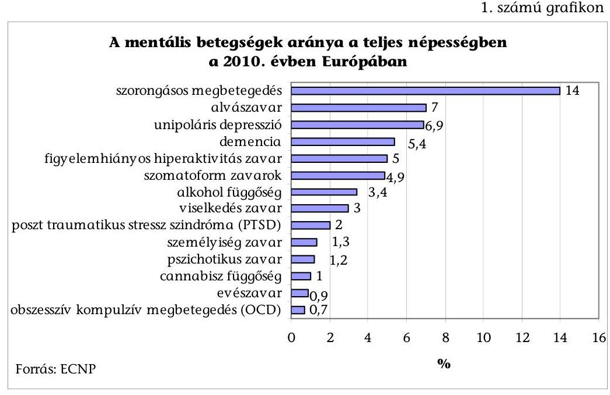

[^0]
[^0]:    ${ }^{2}$ EU-27, Svájc, Izland, Norvégia
    ${ }^{3}$ Magyar kutatás a témában 2000 januárjában készült.

---

Magyarországon a KSH a 2009. évben készítette az első, nemzetközileg standardizált Európai lakossági egészségfelmérést (ELEF). Ennek keretében a 15 éves és az idősebb népességet vizsgálták. A válaszadók 6%-a krónikus depresszióban, 3%-a egyéb mentális betegségben szenvedőnek vallotta magát ${ }^{4}$.

A lelki egészségnek össztársadalmi szinten, a családokban és a munkahelyeken is elsőrangú fontossággal kell bírnia. A nemzetközi és a hazai megbetegedési adatok alapján a pszichiátriai szakma közös állásfoglalásban hívta fel a figyelmet arra a tényre, hogy a pszichiátriai zavarok gyakorisága elérte a népbetegség szintjét. Magyarországon a pszichiátriai krónikus betegségek (pl. a szkizofrénia, a depresszió, a demencia) sok százezer embert érintenek. A lakosság mentális állapota rosszabb az európai átlagnál ${ }^{5}$. Kedvezőtlenebb a helyzetünk a férfiak depressziója, a kóros alkoholfogyasztás, a bipoláris betegségek és a befejezett öngyilkosság tekintetében.

Az öngyilkosságok száma a 2009. évig csökkent, a 2010. évben ismét emelkedett. Hazai és nemzetközi kísérletek bizonyították, hogy a pszichiátriai és a közösségi ellátás fejlesztése kedvező irányú változásokat eredményez az öngyilkosságok számának csökkenésében.

A mentális betegségek gyógyításának teljes költsége, a betegség által előidézett összes társadalmi veszteség - az Európai Parlament 2006. szeptember 6-i strasbourgi plenáris ülésén elfogadott jelentés becslése szerint - eléri a GDP 3-4%-át.

Az egészségügyi ellátórendszer fejlesztéséről szóló 2006. évi CXXXII. törvény (Eftv.) meghatározta az egészségügyi szolgáltatók körét, átrendezte az ellátási struktúrát, csökkentette az aktív kapacitásokat.

Az intézkedések része volt a pszichiátriai betegellátás központi intézményének, az
 Országos Pszichiátriai és Neurológiai Intézetnek (OPNI) a megszüntetése. Ezzel az intézkedéssel az OPNI 849 ágyából 599 közfinanszírozott kapacitást vettek át a Fővárosi Önkormányzat, a Semmelweis Egyetem és a Pest Megyei Önkormányzat intézményei, így 250 ággyal csökkent az aktív kapacitás.

Az elmúlt öt évben az egészségügyi ellátórendszer átalakításának a pszichiátriai betegellátást érintő hatásait és az OPNI megszüntetésének körülményeit az Országgyűlés Egészségügyi Bizottsága több alkalommal tárgyalta, valamint az állampolgári jogok országgyűlési biztosa is tett ajánlásokat a miniszternek a pszichiátriai ellátással foglalkozó jelentéseiben. Az ombudsman vizsgálatainak megállapításai szerint a pszichiátriai ellátáshoz való hozzáférés területileg egyenlőtlen. Az aktív fekvőbeteg-ellátás keretében pl. Heves megyében 1,2 ágy jut tízezer lakosra, míg a Dél-Alföldön ennek háromszorosa. Gyermekpszichiátriai fekvőbeteg-ellátás a jelenlegi hét régióból háromban egyáltalán nincs (Közép-Dunántúl, Dél-Dunántúl és Észak-

[^0]
[^0]:    ${ }^{4}$ Hasonló témájú felmérést az Országos Lakossági Egészségfelmérés 2000. és a 2003. évi kutatásai is tartalmaztak.
    ${ }^{5}$ Eurobarometer felmérés 2010. október: „a magyar válaszadók érzelmi tapasztalatai negatívabbak, mint az átlag európaiaké"

---

Magyarország), miközben e kétmillió fős korosztály érintettsége 15,6%. Erőteljes csökkenést mutat a betegellátásban dolgozó pszichiáterek, gyermekpszichiáterek létszáma, ami 71,6 fővel (778 főről 706,4 főre csökkent), a pszichológusok létszáma 81,6 fővel (272,8-ról 191,2-re csökkent), a fekvőbeteg ellátásban lévő szakápolók létszáma pedig 631,6 fővel (1360,6-ról 729 főre csökkent).

A kapacitásátrendezés mellett 2007. április 1-jétől 50%-kal csökkent a pszichiátriai járóbeteg gondozók fix finanszírozása, illetve 2011. október 25-től megszűnt a finanszírozásnak ez az eleme, amely rontotta a területi járóbetegellátás súlypontját képező ellátás működési feltételeit. A jelzett dátumtól bevezetett Homogén Gondozói Kódok emelt pontértékeibe a korábbi fix díj beépítésre került, ennek ellenére a 2011. évi kifizetés a 2006. évben teljesítetthez képest 16%-kal (633,3 M Ft-tal) kevesebb.

Az egészségügyi és a szociális terület együttműködése a szakértői elemzések és a számvevőszéki megállapítások szerint sem összehangolt. A szociális ellátásban - a pszichiátriai betegek bentlakásos intézményei ellátásán túl - a 2000. évtől létrejöttek a közösségi szolgáltatások, amelyek a rehabilitáció és az otthon gondozás szempontjából előremutatóak. A pszichiátriai otthonok férőhely fejlesztése, a gondozottak elhelyezése nehézkes. Az átlagos várakozási idő a 2006. évben 321 nap, míg a 2011. évben 338 nap volt, előfordult az is, hogy az intézményekbe való bekerülés ezer napot meghaladó volt.

A lelki egészség kiemelt szerepét, fontosságát az egészségügyi programok részeként megfogalmazták. A Lelki Egészség Országos Programjának (LEGOP) kidolgozása már a 2005. évben megkezdődött, amelynek célja a lelki egészség javítását célzó szakpolitikák és leghatékonyabb fejlesztési döntések meghatározása, rendszerszerű összefoglalása, a szükséges erőforrások felmérése, a fejlesztési lépések programozása. A jelenlegi Kormány által kidolgozott Semmelweis Terv az egészségügy megmentésére célul tűzte ki „a szétzilált, korábban világszínvonalú pszichiátriai ellátórendszer megerősítését".

Az ellenőrzés célja annak értékelése volt, hogy

- a pszichiátriai betegellátás átalakítására fordított források megfelelően hasznosultak-e;
- az átalakítás eredményeként létrejött-e költséghatékonyabb és magasabb színvonalú, kiegyenlítettebben hozzáférhető ellátás.

Az ellenőrzés a 2006. január 1. és 2011. szeptember 30. közötti időszakot foglalja magában, figyelemmel kísérve az ellenőrzés lezárásáig bekövetkezett változásokat.

A pszichiátriai betegellátás helyzetét az ÁSZ ezt megelőzően még nem ellenőrizte. A tartós szociális ellátást nyújtó intézmények helyzetének és finanszírozásának vizsgálati tapasztalatairól ${ }^{6}$ az 1997. évben készült jelentés, valamint a

[^0]
[^0]:    ${ }^{6} 363$ sz. ÁSZ jelentés: Jelentés a tartós szociális ellátást nyújtó intézmények helyzetének és finanszírozásának vizsgálati tapasztalatairól (1997)

---

bentlakásos szociális intézmények és kórházak ápolásra, gondozásra fordított pénzeszközei felhasználásáról ${ }^{7}$ a 2008. évben készült jelentés, amelyek érintették a pszichiátriai ellátást is.

Az ellenőrzés szempontrendszerét előtanulmánnyal, értékeléseit fókuszcsoport szervezésével, kérdőíves felméréssel, tanúsítványi adatokkal, helyszíni interjúkészítéssel és összehasonlító elemzésekkel alapoztuk meg. Az ellenőrzés típusa teljesítmény-ellenőrzés volt, amely elsősorban a költséghatékonyság és az eredményesség értékelésére irányult. A teljesítmények mérésére alkalmas indikátorok kiválasztásánál figyelembe vettük a fókuszcsoport résztvevőinek javaslatait, és a különböző intézményeknél (KSH, OEP, GYEMSZI, OMSZ) rendelkezésre álló idősoros adatok elemzésének lehetőségeit. Az indikátorokat az ellenőrzési programmal együtt a pszichiátriai szakma képviselőivel széles körben egyeztettük.

A pszichiátriai betegellátás költséghatékonyságának a 2006. és 2010. évek közötti változását hét indikátor alakulásának elemzésével, a közkiadásokra szűkített értelmezésben mértük. A költséghatékonyság javulásának a megállapításához azt a feltételt adtuk, hogy az alkalmazott indikátorok többsége kedvező irányban változzon. Kedvezőnek értékeltük, ha az egy szkizofrén és egy depressziós betegre jutó természetbeni ellátás (OEP kiadás), valamint ezeken belül a gyógyszertámogatás, továbbá a bentlakásos szociális intézményi ellátások egy gondozottra jutó közkiadása csökkent, amennyiben az ellátás minősége nem romlott ${ }^{8}$ és a betegszám sem esett vissza. A költséghatékonyság javulását jelző indikátoroknak értelmeztük a nappali kórházban ellátott pszichiátriai betegek számát, valamint a közösségi ellátásra fordított központi kiadásoknak a pszichiátriai fekvő- és járóbeteg-ellátás kiadásaihoz mért arányát, ha azok emelkedtek.

A pszichiátriai betegellátás eredményességének a 2006. és 2010. évek közötti változását tizenegy indikátor alakulásának elemzésével mértük. Az eredményesség javulása megállapításához azt a feltételt adtuk, hogy az alkalmazott indikátorok többsége kedvező irányban változzon. A népegészségügyi célkitűzésekkel összhangban kedvezőnek tekintettük, ha csökken az öngyilkosságok száma, valamint a százezer főre vetítetve nem éri el a húszat, a fiatalkorúak körében 20%-kal visszaesik az elkövetett öngyilkosság miatti halálozás, ha az alkohol miatti májzsugor és egyéb alkoholos májbetegségek miatti halálozás 10%-kal csökken 2008-ig, ha csökken a drogfüggők száma, valamint ha nő a depressziós betegek kezelési aránya. Az eredményesség javulását jelző indikátoroknak értelmeztük továbbá az öngyilkossági kísérletet megelőző három hónapban pszichiátriai kezelésben részesültek arányának csökkenését, az aktív pszichiátriai ellátásból hazabocsátottak 30 napon belüli visszavételi arányának csökkenését, a pszichiátriai otthonokba történő elhelyezés várakozási idejét, a nem önkéntes pszichiátriai felvételek esetszámát, ha azok csökkentek, illetve a közösségi ellátásban lévő betegek számát, ha az emelkedett.

[^0]
[^0]:    ${ }^{7} 0820$ sz. ÁSZ jelentés 2008. július: Jelentés az önkormányzati kórházak és bentlakásos szociális intézmények ápolásra, gondozásra fordított pénzeszközei felhasználásának ellenőrzéséről
    ${ }^{8}$ Az ellátás minőségének megítéléséhez figyelembe vettük az egy héten belül hazabocsájtottak részarányának és az OTH-nál regisztrált panaszos ügyek számának alakulását, valamint az ellenőrzés számára információt szolgáltató kórházak pszichiátriai osztályvezető főorvosai kérdőívre adott válaszait.

---

Az ellenőrzést az INTOSAI vonatkozó standardjainak (ISSAI 3000, ISSAI 3100), és az ÁSZ teljesítmény-ellenőrzési módszertanának figyelembevételével végeztük.

A jelentés részletes megállapításaiban szereplő táblázatok, grafikonok az ellenőrzésben résztvevő számvevők által végzett elemzések és értékelések adatait mutatják be, amelyeknek forrásai az ellenőrzés számára átadott tanúsítványok és egyéb dokumentumok adatai.

A pszichiátriai betegellátást végző szociális otthonoktól tanúsítványi adatkérés, az aktív fekvőbeteg pszichiátriai ellátást nyújtó egészségügyi intézetektől tanúsítványi és kérdőíves felmérés formájában kértünk be adatokat és információkat. Az intézmények kérdőívre és tanúsítványra adott válaszainak értékelését felhasználtuk a megállapításaink megalapozásához. A helyszíni ellenőrzés az intézmények ágazati felügyeletét ellátó NEFMI-re ${ }^{9}$ és kapcsolódó intézményeire (OEP, ÁNTSZ, GYEMSZI, NRSZH, OPK, EKI, Országos Mentőszolgálat), valamint az OPNI-tól feladatokat átvett intézményekre terjedt ki (1. sz. melléklet). Az alkalmazott módszertani eljárások és a mintavétel biztosította az ellenőrzési célok teljesítését.

Az ellenőrzés jogszabályi alapját az Állami Számvevőszékről szóló 2011. évi LXVI. törvény 5. § (3), (5) bekezdései képezték.

A jelentéstervezetet egyeztetésre megküldtük a nemzeti erőforrás miniszternek. Az egyeztetés időszaka alatti kormányátalakítás során 2012. május 14-étől kinevezett emberi erőforrások minisztere észrevételt nem tett, levelét a 2. sz. melléklet tartalmazza.

[^0]
[^0]:    ${ }^{9}$ A Magyar Köztársaság minisztériumainak felsorolásáról szóló 2010. évi XLII. törvény módosításáról szóló 2012. évi XLII. törvény alapján a Nemzeti Erőforrás Minisztérium jogutódja 2012. május 14-től az Emberi Erőforrások Minisztériuma.

---

# I. ÖSSZEGZŐ MEGÁLLAPÍTÁSOK, KÖVETKEZTETÉSEK, JAVASLATOK 

Magyarországon mind az egészségügyi, mind a szociális ágazat végez feladatokat a pszichiátriai betegek ellátásában, gondozásában, de az ellátás szempontjából nem képeznek összehangolt, egységes rendszert. A vizsgált időszakban nem született az egészségügyi és a szociális ágazat együttműködésével döntés arról, hogy a mentális problémákkal élők ellátása az intézményközpontú ellátórendszer vagy a területi, közösségi szolgáltatások rendszerének túlsúlya mellett történjen-e. Az egészségügyi és szociális pszichiátriai ellátások kapacitásai nem összehangoltak, az ellátási kapacitást az Eütv., a hagyományok, az egészségügyi és a szociális intézményeket fenntartók összehangolatlan intézményfejlesztései, valamint a különböző szakmai nézetek, érdekek együtt alakították. Nem jött létre fenntartható, modern szolgáltatási rendszer.

Az ellátások keretszabályait elkülönülten, ágazatonként szabályozták. Az egészségügyről szóló törvényben a pszichiátriai beteg joga, hogy ellátására, gyógykezelésére lehetőség szerint lakóhelyi, illetve családi környezetében kerüljön sor. Ezt leginkább a pszichiátriai gondozókban, valamint a szociális ellátások közé sorolt közösségi ellátásban biztosítják. A szociális igazgatásról és szociális ellátásokról szóló törvény 2003-tól vezette be a közösségi pszichiátriai ellátást. A pszichiátriai ellátást nyújtó egészségügyi és a szociális ellátórendszerek kapcsolódó ellátási elemeit is figyelembe véve a koordináció, a munkamegosztás, a célszerű betegirányítás terén vannak hiányosságok. A betegirányítást a hagyományok, az ellátást nyújtó szervezetek közötti egyedi megállapodások, valamint az éppen adódó lehetőségek határozzák meg. A teljes ellátás folyamatát koordináló ellátásszervezés nem jött létre.

Az Egészségügyi Minisztérium és a hazai pszichiátriai szakmai szervezetek (Szakmai Kollégium Pszichiátriai és Pszichoterápiás Tagozata, Magyar Pszichiátriai Társaság, Országos Pszichiátriai Központ) 2008-tól megkezdték a pszichiátriai betegellátás teljesítményértékelésére alkalmas kritériumok kialakítását, de a költséghatékonyság és eredményesség értékelésének még nincs elfogadott és alkalmazott módszertana.

Az ellenőrzés során a népegészségügyi és pénzügyi mutatók (indikátorok) alakulásának elemzése és a változások irányainak értékelése alapján megállapítottuk, hogy a 2006. évhez viszonyítva a pszichiátriai betegellátást szolgáló közpénzfelhasználás költséghatékonysága és eredményessége romlott.

A költséghatékonyság csökkent, mert az ellenőrzés által alkalmazott hét indikátor közül öt kedvezőtlen irányba változott (1. sz. táblázat).

---

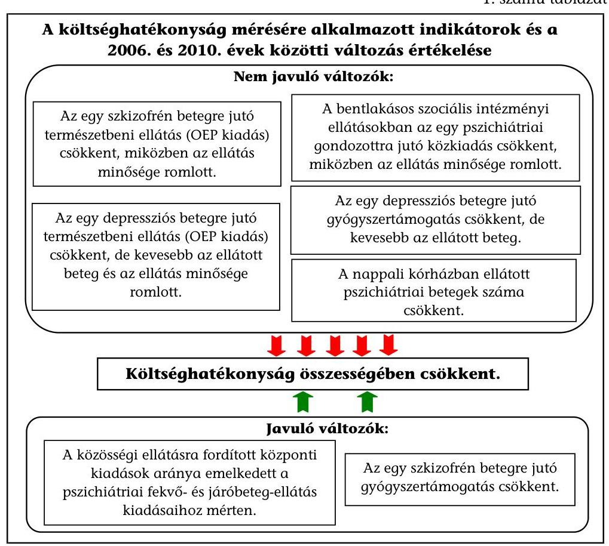

Az egy pszichiátriai betegre jutó közfinanszírozás 2006. és a 2010. évek összehasonlításában a szkizofréniás betegeknél 1228 E Ft/év/főről 1224 E Ft/év/főre, a depressziós betegeknél 603 E Ft/év/főről 433 E Ft/év/főre csökkent. A bentlakásos szociális pszichiátriai otthonokban az egy gondozott ellátásának közfinanszírozása 1561 E Ft/év/főről 1403 E Ft/év/főre csökkent. A fajlagos közfinanszírozási mutatók kedvező irányba változtak (csökkentek), de az ellátáshoz való hozzáféréssel, a betegszámmal és az ellátási minőséggel együttes értékelés már nem igazolta a költséghatékonyság növekedését. A pszichiátriai ellátás színvonalának kedvezőtlen körülményeit, minőségének csökkenését elsősorban az ellátási feltételek és a különféle minőségi kifogások számának kedvezőtlen alakulása jelzi. A pszichiátriai betegellátás minőségi romlására utal, hogy az OTH növekvő számú panaszos ügyet regisztrált (az egészségügyi és a szociális intézményekre vonatkozóan a 2006-2007. években együtt 8, a 2008-2009. években együtt 61, addig a 2010. évben már 64 eset fordult elő). Az NRSZH a panaszos ügyeket csak 2010-től regisztrálja, az ügyek száma 575 volt. A fekvőbetegellátásnál az alacsonyabb költségigényű ellátási formák közül a nappali kórházi ellátás szűkülése kedvezőtlen, míg a szociális ellátás körében biztosított közösségi ellátásra
 fordított kiadások növekedése kedvező iránynak tekinthető.

A pszichiátriai ellátórendszer átalakítása rontott a pszichiátriai ellátás eredményességén. Az eredményesség mérését befolyásolta, hogy a pszichiátriai ellátás és egyéb (gazdasági, társadalmi) körülmények hatásai legtöbbször szétválaszthatatlanok. A megalapozott megítélés érdekében az ellenőrzés tizenegy szempont (indikátor) alapján mérte és értékelte az eredményességet, ezek közül kettő kedvező és kilenc kedvezőtlen irányban változott (2. sz. táblázat).

---

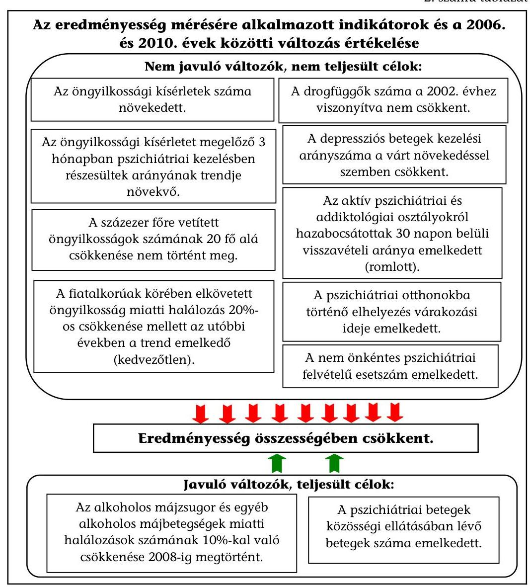

Pozitív, hogy az alkoholos májbetegségek miatti halálozás a 2002. évi szint alá csökkent, a közösségi ellátásban résztvevő pszichiátriai betegek száma (az alacsonyküszöbű ellátást is figyelembe véve) pedig az elmúlt öt évben 8005 főről 60280 főre emelkedett. A kedvezőtlen irányú változások közül figyelmeztető, hogy mind az öngyilkossági kísérletek, mind a befejezett öngyilkosságok száma emelkedett. A 2006. évről a 2010. évre az öngyilkossági kísérletek száma 14,5 ezer főről 16,8 ezer főre nőtt, ebből a fekvőbeteg-ellátásban ellátott 2006. évi 10361 főből 3370 fő, illetve a 2010. évi 11980 főből 3604 fő a kísérletet megelőző három hónapban pszichiátriai ellátott volt. A százezer lakosra vetített öngyilkosságok száma pedig ismét emelkedik, a 2010. évben már 25 fő volt. Naponta átlagosan hét ember hal meg öngyilkosság miatt.

A 2006-2011. évek közötti időszakban több kormányprogram meghirdette az egészségügyi rendszer átalakítását, de ezek közvetlenül nem határozták meg a pszichiátriai ellátórendszer különböző elemeinek feladatát és méretét. A 2007. évi kórházi struktúraátalakítás 11 kórházban megszüntette a pszichiátriai aktív fekvőbeteg-ellátást, az országos összes pszichiátriai aktív ágyszámot 777-tel, 20%-kal (3881-ről 3104-re) csökkentette, valamint döntött az ellátórendszer

---

csúcsát képviselő Országos Pszichiátriai és Neurológiai Intézet bezárásáról. Nem készült felmérés a pszichiátriai betegségek területenkénti előfordulásáról, a döntések várható hatásairól, nem volt a szakmai és a betegek érdekképviseleti szervezeteivel egyeztetés. Az ellátórendszer átalakítása - benne az országos intézmény bezárása - az ellátás racionalizálását tűzte ki célul, de a megfelelő szakmai előkészítés hiánya miatt a pszichiátriai ellátás feltételeit rontotta. Az OPNI megszüntetése célszerűtlen volt, mert megszűnt a szakma csúcsát képviselő intézmény, elmaradt az intézménybezárás pénzügyi hatásainak előzetes felmérése, a feladatok befogadására kijelölt intézmények felkészületlenek voltak, emiatt a felszámolás céldátuma egy évvel kitolódott.

Az OPNI megszüntetése miatt a szolgáltatási és egyéb szerződéseiből adódó közvetlen kötelezettségek megfizetése 146,4 M Ft-ot jelentett a tárca számára, de folyamatban van egy diagnosztikai szolgáltató társaság elmaradt haszna miatti peres eljárás is, amelyből 2 Mrd Ft kötelezettség keletkezhet.

Az EüM 2010 májusában készített elemzésében elismerte és igazolta az átalakítási folyamat egészének és az OPNI bezárásának alapvető hibáit: „Az átalakítás mértéke országosan meghaladta a lényegesebb felkészülés nélkül, azonnal, spontán kezelhető szintet. Nem egyszerűen csak az a „botrány" következett be, ami minden egyes radikálisabb átalakítás velejárója. A döntés maga nem volt kellően megalapozva".

A pszichiátriai ellátást az ombudsman a 2007. évtől többször is ellenőrizte, de ajánlásaira az egészségügyi miniszter nem hozott konkrét intézkedéseket. Az Országgyülés Egészségügyi Bizottsága is - önálló vagy más általánosabb napirend keretében - időről időre foglalkozott a hazai pszichiátriai betegellátás helyzetével, az OPNI bezárásával. A pszichiátriai ellátás javítására a kormányváltást követően kezdődtek meg az előkészületek, elsősorban az új országos intézmény (OPAI) létrehozásának szándékával.

A lelki egészség megerősítésére vonatkozó hosszú távú célkitűzéseket a Népegészségügyi Program ${ }^{10}$ részeként már a 2003. évben elfogadta az Országgyülés (OGY). A gyermekek mentálhigienés ellátásához kapcsolódó sajátos feladatokat a 2005-ben közzétett Gyermekegészségügyi Program is tartalmaz. A programokban megfogalmazott célkitűzéseket eredményességi kritériumként alkalmaztuk az ellenőrzés során. A több kormányzati cikluson is túlmutató célkitűzéseket meghatározó Lelki Egészség Országos Programja (LEGOP) kidolgozása a 2005. évtől a 2009. évig tartott, elfogadása az EüM-en belül történt meg, kormányzati döntés máig nem született. Az egészségügyi ellátórendszer átalakítása, az azzal együtt járó bizonytalanság megnehezítette a hosszú távú stratégia kialakítását és elfogadását. A LEGOP nem tartalmazza a feladatok pontos ütemezését, a megvalósítás forrásait, nem tisztázott az előrehaladás figyelemmel kísérésének módja sem. A kormány szakpolitikusai számára a pszichiátriai szakma 2010 júniusában eljuttatta közös állásfoglalását, melyben szorgalmaz-

[^0]
[^0]:    ${ }^{10}$ Az Egészség Évtizedének Johan Béla Nemzeti Programjáról szóló 46/2003. (IV. 16.) OGY határozatot a 4/2006. (II. 8.) OGY határozat módosította és a program elnevezését „Egészség Évtizedének Népegészségügyi Programja" elnevezésre változtatta.

---

ta a LEGOP kormányprogram szintjére történő emelését, a megvalósításához az anyagi források biztosítását.

A 2010. évben szakmai egyeztetésre bocsátott és a 2011. év májusában a Kormány által elfogadott Semmelweis Terv a „népegészségügyi célok" elérése érdekében kívánta átalakítani a pszichiátriai ellátást, valamint egy új intézmény az OPAI - megalapítását tűzte ki célul. Az intézet megvalósíthatósági tanulmányának elkészítése a kormányhatározatban ${ }^{11}$ megjelölt határidőre nem valósult meg, egyeztetése, kiegészítése még folyamatban van. Pénzügyi forrást a program nem rendelt a feladatokhoz. Rontják a népegészségügyi célkitűzések elérésének esélyét, hogy a pszichiátriai ellátást is érintő speciális stratégiák közül a drogstratégiát többször átdolgozták, az alkoholstratégiát még nem fogadták el.

Az egészségbiztosító a 2006. év és a 2010. év között 92,5 Mrd Ft-ról 87,9 Mrd Ft-ra (5%-kal, 4,6 Mrd Ft-tal) mérsékelte a pszichiátriai betegellátás egészségügyi kiadásait (gyógyító-megelőző és gyógyszer kiadások összesen). A szociális ágazatban 14,7 Mrd Ft-ról 19,4 Mrd Ft-ra (32,0%-kal, 4,7 Mrd Ft-tal) emelkedtek a kiadások (bentlakásos, nappali és közösségi ellátások kiadásai együtt). A kiadás növekedése alapvetően a pszichiátriai szociális ellátások növekvő kapacitásának (nappali és bentlakásos intézményeknél 11698-ról 14828-ra nőtt) és a bentlakásos intézmények csökkenő fajlagos finanszírozásának ( $815,0 \mathrm{E} \mathrm{Ft} /$ fő/évről 710,7 E Ft/fő/évre) együttes hatása volt. A pszichiátriára fordított szociális és egészségügyi kiadások alakulását a 2. sz. grafikon szemlélteti:
2. számú grafikon
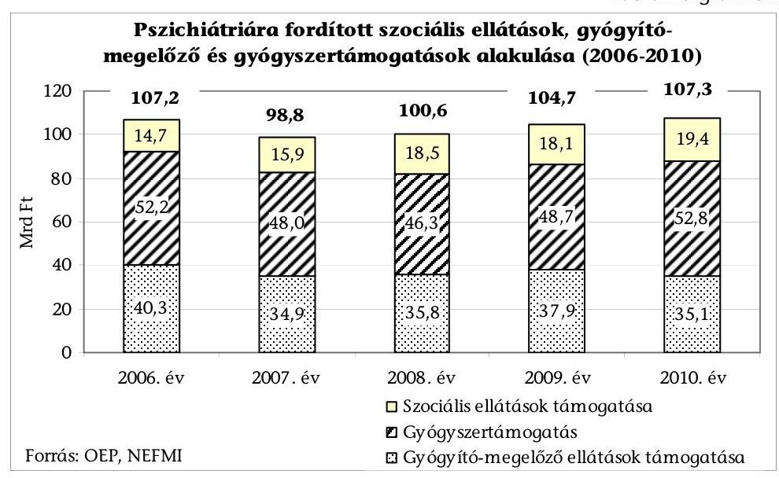

Az ellátottak száma az egészségügy területén a 2006. évtől 628,7 ezer főről a 2010. évre 626,1 ezer főre (0,6%-kal) csökkent, míg a szociális (bentlakásos, nappali és közösségi) ellátásban részesülők száma 19808 főről 75347 főre

[^0]
[^0]:    ${ }^{11}$ a Semmelweis Tervben meghatározott egészségügyi struktúraátalakítással járó feladatokról, a kiemelt feladatok végrehajtásához szükséges intézkedésekről szóló 1208/2011. (VI. 28.) Korm. határozat

---

(280,4%-kal) emelkedett. A növekményt a lakókörnyezetben történő gondozásban a nappali és a közösségi - benne az alacsonyküszöbű - ellátásokban részesültek számának emelkedése okozta. Az egészségügyben a mentális betegségek kezelésére szolgáló ágyak száma 2006. december 31. és 2010. december 31. között 7%-kal (9444-ről 8802-re, 642 ággyal), az ellátott fekvőbetegek száma 13%-kal csökkent (102,0 ezer főről 88,7 ezer főre). A járóbeteg ellátás (járó-, ambuláns beteg és gondozói ellátás) összes heti óraszáma 2,3%-kal csökkent, 26,0 ezerről 25,4 ezerre.

Az OPNI-tól feladatokat befogadó intézményeknél az átalakításra fordított pénzügyi források az irreális megvalósítási határidő miatt egy éves késedelem után a pályázati kiírásnak megfelelően hasznosultak. Az Eütv. alapján végrehajtott struktúraátalakítási pályázat keretében az OPNI-tól fekvőbeteg ellátási feladatot átvevő nyolc intézmény a 2007. évben 1207,8 M Ft fejlesztési forrást kapott, amely az összes szakmacsoportra együttesen tervezett országos fejlesztési előirányzat egynegyedét jelentette. Az intézmények pályázati elszámolásainak és a pályázati források felhasználásának ellenőrzését az OEP minden támogatás esetében elvégezte, visszafizetési kötelezettség nem keletkezett. A fejlesztési forrást a pszichiátriai ellátás feltételeinek kialakítására, javítására került felhasználásra a helyszíni ellenőrzésbe vont nyolc intézménynél.

Az egészségügyi intézmények által nyújtott pszichiátriai betegellátás fejlesztését a 2006. és a 2011. évek között a pszichiátriai szakmacsoportban EU-s forrás is támogatta: a TÁMOP-ból 761,4 M Ft, melynek célja a foglalkoztatás bővítése volt, a támogatásból 2011 novemberéig 407,3 M Ft-os felhasználás volt, vagyis a programok nem zárultak le. A Norvég Civil Támogatási Alapból 510,5 M Ft ${ }^{12}$ a gyermek és egészségvédelem támogatására, mentálhigiénés programok megvalósítására irányult. Az ÁSZ már a 2008. évben megállapította ${ }^{13}$, hogy az egészségügyi és szociális ellátások fejlesztése nem összehangolt, ez azóta is fennáll.

A pszichiátriai betegellátás fekvőbeteg és gondozási típusában romlott az orvos és szakdolgozói létszámellátottság. A 2006. évben az OPNI pszichiátriai osztályain dolgozó orvosoknak csak mintegy 60%-a (44 fő) végzett 2011-ben is igazolható aktív gyógyító tevékenységet. A személyi feltételek annak ellenére romlottak, hogy az EEKH által feldolgozott adatok alapján 2006. és 2011. évek között az alapnyilvántartásban szereplők száma a pszichiátria összes szakmacsoportban növekedett a 2006. évi 2397 főről a 2011. évre 2609 főre. Az érvényes működési engedéllyel rendelkező gyermek és ifjúságpszichiátriai szakorvosok száma a 2006. évi 151 főről a 2011. évre 127 főre csökkent, a pszichiátriai ápolók száma a 2006. évi 691 főről a 2011. évre 490 főre esett vissza.

A hazai pszichiátriai szakmában dolgozó orvosoknak külföldi munkavállalás céljából kiadott hatósági bizonyítványok száma emelkedett: a 2006. évben 25 (az érvényes működési engedéllyel rendelkezők 3%-a), a 2011. évben 36 volt

[^0]
[^0]:    ${ }^{12}$ A pszichiátriai fejlesztések csak részét képezik ennek az összegnek.
    ${ }^{13}$ Az önkormányzati kórházak és bentlakásos szociális intézmények ápolásra, gondozásra fordított pénzeszközei felhasználásának ellenőrzéséről szóló jelentés (0820) az Interneten a www.asz.hu címen elérhető.

---

(az érvényes működési engedéllyel rendelkezők 2%-a). A 2011. évben a hiányszakmák között a pszichiátriát nevesítette a miniszter, 2012. évre már a gyermek- és ifjúságpszichiátriát is. Az intézmények és a rezidensek támogatásával a személyi feltételek javítását ösztönzik. Az ösztönzés módja, hogy kormányrendelet alapján a hiányszakmát választókat munkabéren felüli támogatásban, illetve az őket alkalmazó intézményeket támogatásban részesítik.

Az országos szakfelügyelő főorvos az éves beszámolóiban az ellátás általános helyzetét mutatta be, azonban hatékonysági, minőségi, eredményességi kritériumok alapján nem minősítette az ellátást. Az ellátás megfelelőségét a tárgyi és személyi feltételek mellett a szakmai szabályozók, ellátási standardok (protokollok) rendszere is befolyásolja. A szabályozók korszerűsítésének a tervezetei készültek el, bevezetésük késik.

A pszichiátriai ellátás minden területén (a fekvőbeteg-, a járóbeteg-ellátás, a bentlakásos szociális ellátás és a közösségi ellátás) tapasztalhatók a földrajzi hozzáférés jelentős különbözőségei. A pszichiátriai fekvőbeteg-ellátásban az Eütv. alapján végrehajtott ágyszám változások a korábbi kiegyenlítetlen kapacitások javításához nem járultak hozzá, és a törvény nem rendelkezett a járóbeteg szakellátás kapacitásainak változtatásáról sem. Pontos betegségregiszterek hiányában nem ismertek az országon belüli területenkénti, valós nem a finanszírozási érdekeltség szerinti teljesítményeken alapuló - pszichiátriai megbetegedési gyakoriságok. Az átalakítás hatására nem vált kiegyensúlyozottabbá a kórházi kapacitások elosztása, nem jött létre fenntarthatóbb, a szükségletekhez jobban igazodó ellátási rendszer. Nem áll rendelkezésre megfelelő kapacitás a magas biztonságú, forenzikus, fertőző pszichiátriai, valamint gyermek- és ifjúságpszichiátriai osztályok területén. A mért és igazolható ellátási szükségletekhez igazodó, az ellátási formák egymásra épülését figyelembe vevő kapacitásigények ismerete nélkül nem igazolható és kontrollálható a kapacitások megyék közötti 2,5-5,8 szeres különbsége sem.

A lelki egészség megőrzése területén megvalósult pilot programok ellenőrzése azt igazolta, hogy pályázati források felhasználásával, kis többletráfordítással, a betegekkel való szoros együttműködés, a betegkövetés, az ellátórendszer
 elemei közötti magasabb színvonalú koordináció és az ellátásszervezés eszközeivel eredményesebb pszichiátriai ellátás érhető el. A pilotok EU kutatási programok keretében valósultak meg részben a depresszió és öngyilkosság megelőzésére, részben a 30 napon belüli visszavételek számának csökkentésére.

Összességében a pszichiátriai egészségügyi ellátás feltételei az intézményrendszer egésze és a betegek szempontjából is kedvezőtlenül változtak. Az OPNI-tól feladatokat befogadó intézményeknél a pszichiátriai betegellátás átalakítására fordított források egy éves késedelem után megfelelően hasznosultak, ugyanakkor a pszichiátriai betegellátás egészében az átalakítás eredményeként nem jött létre költséghatékonyabb, magasabb színvonalú, kiegyenlítettebben hozzáférhető ellátás.

---

A helyszíni ellenőrzés megállapításainak hasznosítása mellett javasoljuk:

# az emberi erőforrások miniszterének: 

1. A pszichiátriai betegellátás átalakítása ellenére romlott a pszichiátriai ellátás költséghatékonysága és eredményessége. A Népegészségügyi Programban, a Gyermekegészségügyi Programban megfogalmazott célkitűzések nem teljesültek.

Javaslat:
Tegyen intézkedéseket a Népegészségügyi Program és Gyermekegészségügyi Program lelki egészségre vonatkozó célkitűzéseinek elérésére, mérje és elemezze az elvárt eredmények teljesülését.
2. Az egészségügyi és szociális pszichiátriai ellátások kapacitásai nem összehangoltak, és betegségregiszterek hiányában nem épülnek megbetegedési adatokra. A vizsgált időszakban nem született döntés arról, hogy a mentális problémákkal élők ellátása az intézményközpontú ellátórendszer vagy a területi, közösségi szolgáltatások rendszerének túlsúlya mellett történjen-e. Nincs a betegellátást szabályozó ellátásszervezés, kiegyenlítetlen a területi hozzáférés.

Javaslat:
Vizsgálja felül a megbetegedési adatok mérésén alapuló területenkénti ellátási szükségletek alapján az egészségügyi és szociális pszichiátriai ellátások kapacitásait és azok összhangját. Döntsön a mentális problémákkal élők ellátását biztosító intézményközpontú ellátórendszer és a területi, közösségi szolgáltatások hatékonysági és eredményességi szempontok szerinti fejlesztéséről. Biztosítsa a kapacitások módosítása során a területileg kiegyenlítettebb hozzáférést.
3. A lelki egészség megőrzése területén megvalósult pilot programok ellenőrzése azt igazolta, hogy pályázati források felhasználásával, kis többletráfordítással, a betegekkel való szoros együttműködés, a betegkövetés, az ellátórendszer elemei közötti magasabb színvonalú koordináció és az ellátásszervezés eszközeivel eredményesebb pszichiátriai ellátás érhető el.

Javaslat:
Intézkedjen az eredményes pilot programok gyakorlatának széles körű megismertetésére.

---

# II. RÉSZLETES MEGÁLLAPÍTÁSOK 

## 1. A PSZICHIÁTRIAI BETEGELLÁTÁS ÁTALAKÍTÁSA ÉS PÉNZÜGYI HATÁSAI

### 1.1. A pszichiátriai betegellátás átalakítására vonatkozó főbb döntések és hatásaik

A pszichiátriai ellátással szembeni követelményeket, illetve szélesebb megközelítésben a lelki egészség megerősítésének fő szempontjait, cselekvési célkitűzéseit az elmúlt évtizedben uniós és hazai dokumentumok is megfogalmazták (3. sz. táblázat).
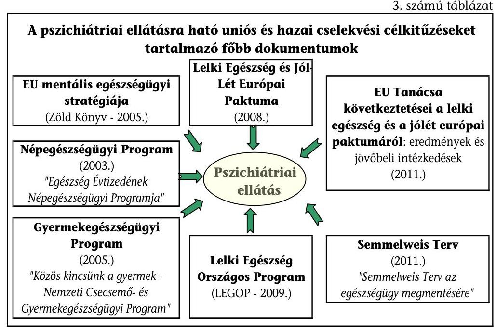

A lelki egészség megerősítésére vonatkozó hosszú távú célkitűzéseket a Népegészségügyi Program ${ }^{14}$ részeként már a 2003. évben elfogadta az OGY. A gyermekek mentálhigienés ellátásához kapcsolódó sajátos feladatokat a 2005-ben közzétett Gyermekegészségügyi Program is tartalmaz. A kijelölt célok, akciók megvalósítási feltételeinek, a szükséges forrásoknak a biztosítása a Kormány és az illetékes miniszterek feladata volt. A Népegészségügyi Program előrehaladásáról évente készített jelentések alapján egyre kevesebbet fordítottak a lelki egészség megerősítésének céljaira. Az egészségügyi tárca a Népegészségügyi Program előirányzatából a 2003. évi beszámoló szerint a lelki

[^0]
[^0]:    ${ }^{14}$ Az Egészség Évtizedének Johan Béla Nemzeti Programjáról szóló 46/2003. (IV. 16.) OGY határozatot a 4/2006. (II. 8.) OGY határozat módosította és a program elnevezését „Egészség Évtizedének Népegészségügyi Programja" elnevezésre változtatta.

---

egészségvédelem megerősítésére még 119 M Ft-ot fordított. A 2009. és 2010. évekről szóló beszámoló már csak közel 30 M Ft-os nagyságrendre, emellett a külszolgálati missziót ellátók felkészítését szolgáló (Honvédelmi Minisztérium rendelkezésében álló) speciális források igénybevételére utalt.

A 2006. és 2008. évek közötti kormányprogramok ${ }^{15}$ meghirdették az egészségügyi rendszer átalakítását, de ezek közvetlenül nem célozták és nem segítették a lelki egészség megerősítését.

A pszichiátriai ellátás helyzetét átfogóan értékelő, a lelki egészség megerősítését elősegítő és több kormányzati cikluson is túlmutató tennivalókat, célkitűzéseket meghatározó LEGOP kidolgozása már a 2005. évben megkezdődött. A Zöld Könyvben részletezett célok a hazai programban is megjelentek. A program tervezetét a szakmai szervezetek ${ }^{16}$ közreműködésével - a szakmai egyeztetések, viták, az újabb EU-s követelményeknek való megfelelés miatt - többször átdolgozták. Az elfogadó döntés több évig húzódott, 2009. április 8-án mint stratégiai programról - főosztályvezetői értekezlet döntött az EüMben. A LEGOP nem tartalmazza a feladatok pontos ütemezését, a megvalósítás forrásait. Nem tisztázott az előrehaladás figyelemmel kísérésének módja, így nem követhető a célok megvalósulása sem. A szakmai koordináció biztosítására 2009 májusában LEGOP Programtanács alakult, de annak érdemi működését a NEFMI-ben fellelhető dokumentumok nem igazolták.

A pszichiátriai szakma által - az elfogadható színvonalú pszichiátriai ellátás biztosítása érdekében - 2010. június 10-én kiadott közös állásfoglalás kiemelte, hogy a LEGOP-ot „kormányprogram szintjére kell emelni, és biztosítani kell az anyagi forrásokat a megvalósításához".

A Népegészségügyi Programban, a Gyermekegészségügyi Programban és LEGOP tervezeteiben megfogalmazott célok elérését biztosító feltételek megteremtése helyett csak az egészségügyi ellátórendszer kapacitásváltoztatáson alapuló átalakítására került sor. Az Eftv. célja 2006-ban az ellátás racionalizálása volt. Ezzel szemben a megfelelő szakmai előkészítés hiánya miatt a pszichiátriai ellátás feltételeit rontotta. A NEFMI-nél nem álltak rendelkezésre olyan dokumentumok, amelyek igazolták volna:

- a döntések megalapozását a pszichiátriai betegségek területenkénti gyakoriságának előzetes felmérésével;
- a szakmai szervezetekkel egyeztetett, szakmailag megalapozott, előzetesen meghatározott elvek meghatározását;
- a döntések várható hatásainak kimunkálását, figyelemmel a Népegészségügyi Programban kitűzött célok elérésére, a betegellátás feltételeinek, az ellátás színvonalának alakulására.

[^0]
[^0]:    ${ }^{15}$ Az egészségügy átalakítása, reformja a következő kormányprogramokban szerepelt: „Zászlóshajó program" (2007. február), „48 pont" (2007. szeptember).
    ${ }^{16}$ Pszichiátriai Szakmai Kollégium és a Magyar Pszichiátriai Társaság Munkacsoportja

---

A pszichiátriai egészségügyi ellátás feltételei az intézményrendszer egésze és a betegek szempontjából is kedvezőtlenül változtak.

Az Eftv-ben garantált pszichiátria ellátási kapacitások (1624 aktív ágy) mellett a RET-ek dönthettek volna a térségenként felosztható kapacitásokról (1494 aktív ágy). A RET-ek döntéseinek hiányában az egyedi ágyszámokat az egészségügyi miniszter 2007 tavaszán az erre az esetre szóló jogkörében eljárva állapította meg. A 2007-re lecsökkentett aktív kapacitás legnagyobb vesztese Budapest 150, Szabolcs-Szatmár-Bereg megye 111, Bács-Kiskun megye 91, Győr-Moson-Sopron megye 80 ággyal, ezt követik Csongrád és Heves megyék 78, illetve 74 ágy csökkentésével.

Az OEP hitelesített adatai alapján a vizsgált időszakban a pszichiátriai fekvőbeteg kapacitás a következő volt: (4. sz. táblázat)
4. számú táblázat

A pszichiátriai ágyszámok változása
(2006. december 31. és 2011. szeptember 30. között)

|  | 2006. dec. 31. | 2007. dec. 31. |  | 2011. szept. 30. |  |
| :--: | :--: | :--: | :--: | :--: | :--: |
|  | ágyszám | ágyszám | változás   2006-hoz   képest | ágyszám | $\begin{gathered} \text { változás } \\ 2006 \text {-hoz } \\ \text { képest } \end{gathered}$ |
| Aktív | 3881 | 3104 | 80,0\% | 3026 | 78,0\% |
| Rehabilitáció | 4897 | 5356 | 109,4\% | 4964 | 101,4\% |
| Krónikus | 666 | 890 | 133,6\% | 807 | 121,2\% |
| Összesen | 9444 | 9350 | 99,0\% | 8797 | 93,1\% |

Forrás: OEP
Az egészségbiztosítás által finanszírozott pszichiátriai fekvőbeteg ellátás kapacitása összességében csökkent, az aktív fekvőbeteg ágyszám visszaesése nagyobb volt, mint a nem aktív fekvőbeteg ágyszám növekedése. Az Eftv. hatálybalépését követően a kapacitás (ágy) kihasználtság a kapacitásváltozás irányától függetlenül átmenetileg visszaesett. A fekvőbeteg kapacitás változásának főbb jellemzői:

- a 2007. évi miniszteri döntés nyomán 3881-ről 3104-re, összesen 777 aktív kórházi férőhellyel (20%-kal) csökkentették a pszichiátriai aktív fekvőbetegellátást úgy, hogy 11 kórházban teljesen megszüntették, máshol pedig csökkentették az ágyak számát. A pszichiátriai aktív kapacitások kihasználtsága országosan a reform évében (2007-ben) 5,8 százalékponttal esett vissza (80,4%-ról 74,6%-ra). Ez részben a betegirányítás hiányosságainak, részben a kórházi napidíj bevezetésének a következménye volt. Ezt követően a 2006. év végi állapothoz képest 2011 szeptemberéig további 78 ággyal (2,0%-kal) csökkent a férőhelyek száma;
- a rehabilitációs ellátást nyújtó kórházak száma a 2007. évben 63-ról 66-ra emelkedett, az ágyak száma 9,4%-kal nőtt (4897-ről 5356-ra). Eközben az ágykihasználtság 97%-ról 85%-ra esett vissza. 65 intézetben 94%-os kihasználtsággal működtetett ágyak száma 2011. év szeptemberében csak 1,4%-kal (67 ággyal) volt több, mint a 2006. év végén;

---

- a krónikus fekvőbeteg-ellátás kapacitása a 2007. évben 666-ról 890-re, 224 ággyal (33,6%-kal) nőtt. A kapacitás miniszteri döntésen alapuló növelését részleges visszarendeződés követte, 2011 szeptemberében a krónikus ágyszám már csak 141 ággyal (21,2%-kal) haladta meg a 2006. évi szintet.

A fekvőbeteg kapacitások változását a 3. sz. melléklet tartalmazza.
Az információk gyűjtésének különböző módszerei miatt más adatgyűjtők ettől eltérő adatokat is kimutattak.

Eltérnek az OEP és az OPK adatai. Az OPK adatközlői maguk az intézmények, az OEP pedig a szerződéses adatokat mutatja be. Az eltéréseket a jelentés 4. és 5. sz. mellékleteiben mutatjuk be.

Az Eftv. nem tűzte ki célul a járóbeteg kapacitások fekvőbeteg ellátással összehangolt változtatását. A vizsgált időszakban a járóbeteg ellátás kapacitása - az összes járó-ambuláns és gondozói rendelés óraszám - 2,5%-kal (heti 26 ezerről heti 25,4 ezerre), az összes betegszám 10,5%-kal csökkent (1,9 millió betegről 1,7 millió betegre). A betegszám csökkenésében az ellátási kapacitás csökkenésén túl szerepe volt az átmeneti időszakra alkalmazott vizitdíjnak, a jogviszony ellenőrzésének, a betegellátási minimum idő bevezetésének, a három hónapos gyógyszerfelírás alkalmazásának is.

Az Eftv. előírása alapján került sor az OPNI teljes kapacitásának megvonására, amely az intézmény bezárását jelentette. A döntés előkészítéséről szakmai egyeztetést igazoló, illetve az adott régió megbetegedési, halálozási adatain alapuló, a kapacitás szükségtelenségét alátámasztó elemzések nem készültek. Az államháztartásról szóló 1992. évi XXXVIII. törvény (Áht.) döntés idején hatályos 90. § (1) bekezdés c) pontja alapján az alapító a költségvetési szervet megszüntethette. A döntés ugyanakkor előkészítetlen, célszerűtlen volt, mert:

- megszűnt a pszichiátria országos intézménye ${ }^{17}$, amely a pszichiátriai betegellátási típusok teljes egymásra épülését biztosította;
- a feladatok befogadására kijelölt intézmények felkészületlenek voltak, ezért kitolódott az OPNI felszámolásának céldátuma egy évvel;
- elmaradt az intézménybezárás pénzügyi és szakmai hatásainak előzetes felmérése.

Az OPNI megszüntetése miatt a szolgáltatási és egyéb szerződéseiből adódó közvetlen kötelezettségek megfizetése 146,4 M Ft-ot jelentett a tárca számára, továbbá folyamatban van egy 2 Mrd Ft nagyságrendet érintő peres eljárás. A per tárgya egy diagnosztikai szolgáltató társaság elmaradt hasznának érvényesítése.

[^0]
[^0]:    ${ }^{17}$ Az OPNI kutató és oktató, szakmai irányító, ellenőrző funkciókat látott el, az ellátás biztonságát is jelképező intézmény volt, amely a pszichiátria és a neurológia mellett kiegészítő orvosi szakmákkal, speciális részlegek - benne országos jelentőségű, összehangolt irányítású laboratóriumok - hátterével fekvő- és járó-beteg ellátást nyújtott.

---

A követelések miatti helytállási kötelezettséget a NEFMI a vagyoni jogutódként kijelölt EKI-re hárította át. A per több körben zajlott első, másod fokon, majd új eljárásban. A legutóbbi tárgyalásra 2011. november 24. napján került sor, amelyben a Fővárosi Ítélőtábla az elsőfokú
 bíróság rész- és közbenső ítéletét helyben hagyta. Így az OPNI és a Kht. között létrejött szerződés meghiúsulása miatti kárért az EKI-nek kell helytállnia, amelyhez forrással nem rendelkezik.

Az ombudsman a 2007. évtől több átfogó ellenőrzést is végzett a pszichiátriai betegellátás területén ${ }^{18}$ és ajánlásokat is megfogalmazott az egészségügyi miniszter részére. A miniszteri válaszok nem tartalmaztak konkrét intézkedéseket, ehelyett általános magyarázatokat, további elemzések szükségességét, előző ombudsmani felvetésekre való visszautalásokat tartalmaztak.

Az első miniszteri válasz a megoldásokat nem vázolta fel, további vizsgálatokat tartott szükségesnek a csökkenő ellátást reprezentáló adatok tényleges okainak feltárására. Megerősítette azt a problémahalmazt, amelyet az ombudsmani jelentés megfogalmazott. A tárca megkeresése alapján az OPK is kifejtette álláspontját az ombudsman felvetéseivel kapcsolatban. Az egyes megoldási javaslatokról szóló döntések viszont elmaradtak. A miniszter a 2010. évben ismételt megkeresést kapott az ombudsmantól, reagálásában korábbi válaszát ismételte meg.

Az EüM szakértője 2010. májusában készített elemzést a minisztérium megbízásából „Az OPNI megszüntetése a számok tükrében" címmel. A nemzetközi összehasonlításokat, közgazdasági elemzéseket bemutató belső tanulmány az átalakítási folyamat egésze és az OPNI bezárása vonatkozásában is elismerte az átalakítási folyamat alapvető hibáit: „Az átalakítás mértéke országosan meghaladta a lényegesebb felkészülés nélkül, azonnal, spontán kezelhető szintet. Nem egyszerűen csak az a „botrány" következett be, ami minden egyes radikálisabb átalakítás velejárója. A döntés maga nem volt kellően megalapozott".

Az OGY Egészségügyi Bizottsága is - önálló, vagy más általánosabb napirend keretében - időről időre foglalkozott a hazai pszichiátriai betegellátás helyzetével, az OPNI bezárásával (2007. májusa és 2010. decembere között összesen 10 alkalommal). A pszichiátriai ellátás javítása a 2010-es kormányváltást követően kezdődött meg, elsősorban az új országos intézmény (OPAI) létrehozásának szándékával.

Nem születtek olyan kormányzati és miniszteri döntések - és a LEGOPban sem dolgozták ki a szükséges részletezettségben -, hogy az új országos intézmény alapításának előkészítésén túl mit, mikorra, miből, kinek a felelősségi körében kell a pszichiátriai ellátás átfogó javítása érdekében megvalósítani.

A 2010. évben szakmai egyeztetésre bocsátott és 2011. májusában a Kormány által elfogadott Semmelweis Terv „a népegészségügyi célok" elérése érdekében kívánta átalakítani az ellátást. Fő célkitűzései között szerepeltette „a

[^0]
[^0]:    ${ }^{18}$ OBH 2464/2007., AJB 3536/2009., AJB 672/2011., AJB 1298/2011.

---

# szétzilált, korábban világszínvonalú pszichiátriai ellátórendszer megerősítését". 

#### Abstract

Előírta a program 2012. év második félévére az addiktológiai ellátórendszer fejlesztését, a gondozói finanszírozás átalakítását, rehabilitációs pályázat kiírását kapacitásbővítésre, a TÁMOP források terhére a munkatársi gárda megtartását tervezték. A 2013. év első felére ütemezett a „célzott közösségi programok, az öngyilkosság és a depresszió megelőzését támogató helyi programok feltételrendszerének kialakítása, a közösségi gondozó hálózatok megerősítése és fenntarthatóságának biztosítása". A magyar csecsemő és gyermek egészségügyi ellátások fejlesztése fejezetben a főbb intézkedési irányok és prioritások között szerepelnek a gyermek és ifjúság pszichiátriai fejlesztése érdekében szükséges legfontosabb lépések.

Pénzügyi forrást a program nem rendelt a feladatokhoz. A Semmelweis Tervhez kapcsolódó kormányhatározatban ${ }^{19}$ a nemzeti erőforrás és a belügyminiszter felelősségi körébe utalta a Kormány az új OPAI megvalósíthatósági tanulmányának elkészítését. A magas biztonsági fokozatú részlegek integrálására is irányuló tanulmány elkészítésének határideje 2011. december 31-e volt. Az intézmény létrehozására az OPK javaslatot dolgozott ki. A szakmai szervezetek, intézményvezetők közös nyilatkozatban foglaltak állást az új intézet létrehozása mellett. Jelenleg a megvalósíthatósági tanulmány NEFMI-n, illetve a jogutód EMMI-n belüli, felsővezetői egyeztetése, kiegészítése van folyamatban.

Rontják a népegészségügyi célkitűzések elérésének esélyét, hogy a pszichiátriai ellátást is érintő speciális stratégiák közül a drogstratégiát többször átdolgozták, az alkoholstratégiát még nem fogadták el.

Az OGY határozattal ${ }^{20}$ elfogadott drogstratégiát a 2009. évben újabb stratégia váltotta fel, a „Nemzeti Stratégia a kábítószer-probléma kezelésére", amelyet OGY határozat ${ }^{21}$ fogadott el. A 2011. évben új drogstratégia került kidolgozásra, amelynek egyeztetése folyamatban van. Az OAC az alkoholstratégiáról készített tervezetet a 2008. évben. Az Egészségügyért Felelős Államtitkárság 2012. évi munkatervi feladatai között szerepel a hazai alkoholstratégia kidolgozása.

A pszichiátriai betegek gyógykezelése, gondozása, a rájuk irányuló személyes gondoskodás Magyarországon az egészségügyi és a szociális ellátás közös feladata. Nem született egyértelmű döntés arról, hogy a mentális problémákkal élők ellátása az intézményközpontú ellátórendszer vagy a területi, közösségi szolgáltatások rendszerének túlsúlya mellett történjen-e.

Az egészségügyi és a szociális pszichiátriai ellátások keretszabályait a két ágazat külön-külön határozta meg.

[^0]
[^0]:    ${ }^{19}$ a Semmelweis Tervben meghatározott egészségügyi struktúraátalakítással járó feladatokról, a kiemelt feladatok végrehajtásához szükséges intézkedésekről szóló 1208/2011. (VI. 28.) Korm. határozat
    ${ }^{20}$ a kábítószer-probléma visszaszorítása érdekében készített nemzeti stratégiai program elfogadásáról szóló 96/2000. (XII. 11.) OGY határozat
    ${ }^{21}$ a kábítószer-probléma kezelése érdekében készített nemzeti stratégiai programról szóló 106/2009. (XII. 21.) OGY határozat

---

A pszichiátriai betegek gyógykezelésének, gondozásának alapvető szabályait, a betegjogi garanciákat az egészségügyről szóló törvény ${ }^{22}$ határozta meg. A szociális ellátásokról szóló törvény ${ }^{23}$ a szociális alapszolgáltatásoknál a közösségi ellátást, a szakosított ellátásnál a bentlakásos intézményeket nevesítette és meghatározta feladataikat is. A pszichiátriai beteg egészségügyről szóló törvényben biztosított joga, hogy ellátására, gyógykezelésére lakóhelyi, illetve családi környezetében kerüljön sor, gyógykezelése során a lehető legkevésbé korlátozó eszközt, illetve módszert alkalmazzanak. Ez a pszichiátriai gondozók mellett - ha az ellátási szükséglet nem kíván feltétlenül más típusú egészségügyi ellátást - a szociális ellátás közé sorolt közösségi ellátás kereteiben biztosítható. A jogszabályok a közösségi pszichiátriai ellátást döntően speciális szociális ellátásnak tekintették, miközben a prevenció, rehabilitáció, sőt bizonyos akut ellátások képessége miatt az egészségügyi jellegű ellátásban szerepe lehet. Átfedések vannak a krónikus (benne rehabilitációs) pszichiátriai fekvőbeteg ellátás és a bentlakásos pszichiátriai intézmények feladataiban.

# 1.2. A pszichiátriai betegellátás átalakítását, fejlesztését szolgáló ágazati és EU-s pénzeszközök hasznosulása 

Az Eftv-t megelőzően, 2006-ban 71 aktív pszichiátriai ágyat konvertáltak a kórházak önként más szakmák aktív ellátásába, illetve a krónikus pszichiátriai kapacitásba. Az aktív ágyak krónikus ellátásba való minősítését ágyanként 1 M Ft-tal támogatta a tárca által kiírt struktúraátalakítási pályázat, ezt két intézményben 29 ágy figyelembevételével vették igénybe.

Az Eftv. alapján a végrehajtott struktúraátalakítással összefüggő többletköltségek forrásának biztosításához pályázatot nyújthattak be a pályázati feltételeknek megfelelő fenntartók, illetve az intézmények.

Az Eftv. alapján végrehajtott struktúraátalakításhoz a 2007. évi költségvetésről szóló törvény ${ }^{24}$ 7,5 Mrd Ft előirányzatot biztosított az intézményi átalakítások és kapacitáscsökkentések támogatására. Jogszabályi felhatalmazás ${ }^{25}$ alapján az egészségügyi miniszter a pénzügyminiszterrel egyetértésben pályázatot írt ki „A szakellátási normatíva felosztásáról szóló közigazgatási határozatokból adódó, a fekvőbeteg-ellátó egészségügyi szolgáltatóknál megvalósuló intézményi átalakítások költségeinek támogatására" címmel. A pályázat célja volt: az ágyszám változásokból következő struktúraátalakítás megvalósításának elősegítése (1. cél), az átszervezés következtében feladatbővítésre kijelölt szolgáltatókat terhelő egyszeri beruházási/felújítási szükségletek költségeinek támogatása (2. cél), más forrásból nem támogatott létszámcsökkentések többletköltségeinek forrásának biztosítása (3. cél).

A jelen számvevőszéki ellenőrzés az OPNI-tól fekvőbeteg ellátási feladatot átvevő intézmények által elnyert fejlesztési pályázatokra irányult. A

[^0]
[^0]:    ${ }^{22}$ az egészségügyről szóló 1997. évi CLIV. törvény 188-201/A. §-ok
    ${ }^{23}$ a szociális igazgatásról és szociális ellátásokról szóló 1993. évi III. törvény 57. §, valamint 65/A. § és 66-85/C. §-ok
    ${ }^{24}$ a Magyar Köztársaság 2007. évi költségvetéséről szóló 2006. évi CXXVII. törvény 77. § (2) bekezdése
    ${ }^{25}$ az egészségügyi ellátórendszer fejlesztéséről szóló 2006. évi CXXXII. törvény végrehajtásával kapcsolatos egyes finanszírozási, szerződéskötési és eljárási kérdésekről szóló 41/2007. (III. 13.) Korm. rendelet 19. § (8) bekezdése

---

nyolc intézmény által elnyert 1207,8 M Ft fejlesztési támogatás a szakmacsoportok mindegyikére együttesen tervezett előirányzat egynegyedét jelentette.

Az 1. pályázati célnál aktív ágyak kialakítására a Nyírő Gyula Kórház (40+20 fertőző ágy), a Szent János Kórház (26 ágy), a Jahn Ferenc Kórház (4 ágy) és a Semmelweis Egyetem (72 ágy) összesen 129,6 M Ft, a rehabilitációs ágyakra a Szent István Kórház (243 ágy), a Nyírő Gyula Kórház (14 ágy) és a Heim Pál kórház (15 gyermekpszichiátriai ágy) összesen 163,2 M Ft támogatást nyert.

A 2. pályázati célnál a feladatbővüléssel járó, a szolgáltatókat terhelő egyszeri beruházási/felújítási szükségletek költségeinek támogatására a Nyírő Gyula Kórház, a Szent János Kórház, a Szent István Kórház, a Heim Pál Kórház, a Semmelweis Egyetem és a Bajcsy Zsilinszky Kórház ${ }^{26}$ nyert összesen 915,0 M Ft-ot.

A Magyar Közlönyben 2007. április 25-én megjelent struktúraváltási pályázatra a Bajcsy Kórház is pályázott, az ott megjelölt 2. fejlesztési célra (a szakellátási normatíva felosztásáról szóló közigazgatási határozatokból adódó, a fekvőbeteg ellátást nyújtó egészségügyi szolgáltató megszűnése vagy átszervezése következtében feladatbővüléssel járó, a szolgáltatókat terhelő egyszeri beruházási/felújítási szükségletek költségeinek támogatására) a kórház 25 M Ft támogatást nyert és kapott. A pályázati cél nem nevesítette az OPNI megszűnéséhez kapcsolódó kapacitás újraosztást, bármilyen közigazgatási határozatban foglalt átszervezésből adódó feladatbővülés beruházási/felújítási költségére pályázni lehetett. A kórház a pályázat benyújtásakor még a pszichiátriai beruházás/felújításra pályázott, de még júliusig ismertté vált a 11 ágyra vonatkozó egészségpolitikai döntés, így a kivitelezés már elsődlegesen az átvett más szakmák (neurológia, aneszteziológia, onkológia) megfelelő ellátását volt hivatott biztosítani. Tekintettel arra, hogy a Bajcsy-Zsilinszky Kórháznál a „feladatbővülés" nem a pszichiátriai szakma vonatkozásában történt, a pályázati támogatás elsősorban nem ehhez a szakmához kapcsolódott. A Fővárosi és Pest Megyei Egészségpénztár jegyzőkönyvezte, hogy a pályázati támogatást az intézmény a pályázati célnak megfelelően használta fel.

Az OPNI-tól pszichiátriai ellátási feladatot (ellátási területet és kapacitást) átvevő intézmények együttes adatai alapján a fekvőbeteg ellátásnál a kapacitással arányos teljesítménynövekedés történt, míg a járóbeteg ellátásnál a kapacitásnövekedés mellett érdemi teljesítménynövekedés nem mutatható ki.

A nyolc kórház együttes adatai alapján a pszichiátriai aktív és krónikus ágyak száma összesen 2006 és 2010. decembere között 1315-ről 1613-ra, 298 ággyal (22,7%-kal), a két év között a fekvőbeteg esetszám 19 029-ről 23 270-re, 4241-gyel (22,3%-kal) nőtt. A kórházak pszichiátriai járóbeteg szakrendelési szakorvosi óraszáma 1728-ról 2162-re, 434 órával (25,1%-kal) növekedett, ugyanakkor a két év között a járóbeteg esetszám 174 005-ről 175 192-re, 1187-tel (0,7%-kal) lett magasabb (6. sz. melléklet).

[^0]
[^0]:    ${ }^{26}$ 2007. január 1-jén hatályba lépett az Eftv., amely a Bajcsy-Zsilinszky kórház vonatkozásában 34-re csökkentette a pszichiátriai aktív ágyak számát. Ezt követően 11 aktív pszichiátriai ágyat közigazgatási (miniszteri) határozattal biztosítottak a kórház számára (5956-1/2007.-1000MIN számú határozat). A későbbiek folyamán a Heim Pál Gyermekkórház pszichiátriai kapacitásának biztosítása érdekében a gyermekkórház kapta meg a miniszteri határozattal a Bajcsy-Zsilinszky kórházhoz allokált 11 aktív ágyat.

---

Az OEP felülvizsgálta a pályázati elszámolásokat, ellenőrizte a pályázati támogatások felhasználását,
 a pályázatok elbírálását végző bizottság által elfogadott fejlesztések végrehajtását. Megállapította, hogy a fejlesztések megfeleltek a pályázatokban vállaltaknak.

Az egészségügyi intézmények által nyújtott pszichiátriai betegellátás fejlesztését a 2006-2011. évek között a szakmacsoportban a következő $\mathbf{EU}$ s források támogatták: a TÁMOP-ból 761,4 M Ft és a Norvég Civil Támogatási Alapból $510,5 \mathrm{M} \mathrm{Ft}^{27}$.

A TÁMOP fejlesztések legfontosabb célja a foglalkoztatás bővítése és a tartós növekedés feltételeinek megteremtése. Kizárólagosan pszichiátriai ellátás fejlesztését szolgáló pályázatok benyújtására a TÁMOP egészségre nevelő és szemléletformáló életmódprogramokat támogató, valamint képzés- és foglalkoztatás-támogatást szolgáló humánerőforrás-fejlesztési kiírásainak keretében kerülhetett sor.

A TÁMOP keretében 22 pályázóval kötöttek szerződést, az egy pályázóra jutó tervezett átlagos támogatás $34,6 \mathrm{M}$ Ft volt. A támogatásból 2011 novemberéig 407,3 M Ft-ot ( $53,5 \%$-ot) fizettek ki.

A 2009 decemberében meghirdetett rehabilitációs szolgáltatások fejlesztése címú ROP pályázati felhívást az NFÜ a NEFMI-vel és a Nemzeti Fejlesztési Minisztériummal egyeztetve 2010 augusztusában visszavonta. A Semmelweis Tervben a rehabilitációs és ezen belül a pszichiátriai ellátás kiemelt terület, ezért a szakma súlyának növelésével, a pályázatok megemelt keretösszeggel ismételten meghirdetésre kerültek. A benyújtás határideje 2011. december 30-a volt, így ebben a konstrukcióban az ellenőrzött időszak végéig még nem voltak támogatási szerződéssel rendelkező kedvezményezettek.

A pszichiátriai ellátás fejlesztésére elnyert pályázatokból az épületek korszerűsítésére fordított összegek nem jelentősek, ezeket többségében nyílászárók és bútorzat cseréjére, vizesblokkok felújítására és elmaradt karbantartási feladatok (felvonók javítása, szigetelési munkálatok, festés) elvégzésére fordították.

A pszichiátriai ellátást nyújtó egészségügyi, valamint szociális intézményi fejlesztések összehangolásának nem volt számon kérhető követelményrendszere. Az elmúlt három évtizedben a cél-, a címzett- és egyéb hazai, majd pedig az uniós támogatásokkal is megvalósulhattak olyan fejlesztések, amelyeknél az egyedi, helyi intézményi és fenntartói érdekeknek volt alapvető szerepe, így a térségek között az ellátási kapacitásokban lévő különbségek fennmaradtak.

Tízezer lakosra vetítve mind a pszichiátriai fekvőbeteg ellátási kapacitásnál, mind a pszichiátriai betegek bentlakásos szociális ellátásának kapacitásánál az egyes megyék között a 2010. évben 2,5-szeres különbségek vannak.

Az önkormányzati kórházak és egyes bentlakásos pszichiátriai intézmények állami irányítása lehetővé teszi, hogy az egészségügyi és szociális kapacitások

[^0]
[^0]:    ${ }^{27}$ A pszichiátriai fejlesztések részét képezik ennek az összegnek.

---

mennyiségi és minőségi változtatása a jövőben térségenként és országosan is összehangoltan, az ellátási szükséglet alakulásához igazodóan történjen.

# 1.3. A pszichiátriai betegellátás átalakításának finanszírozási hatásai 

### 1.3.1. E-Alapból finanszírozott ellátások

A pszichiátriai betegellátásra fordított finanszírozás az intézményi struktúra átalakítása után csökkent (3. sz. grafikon).
3. számú grafikon
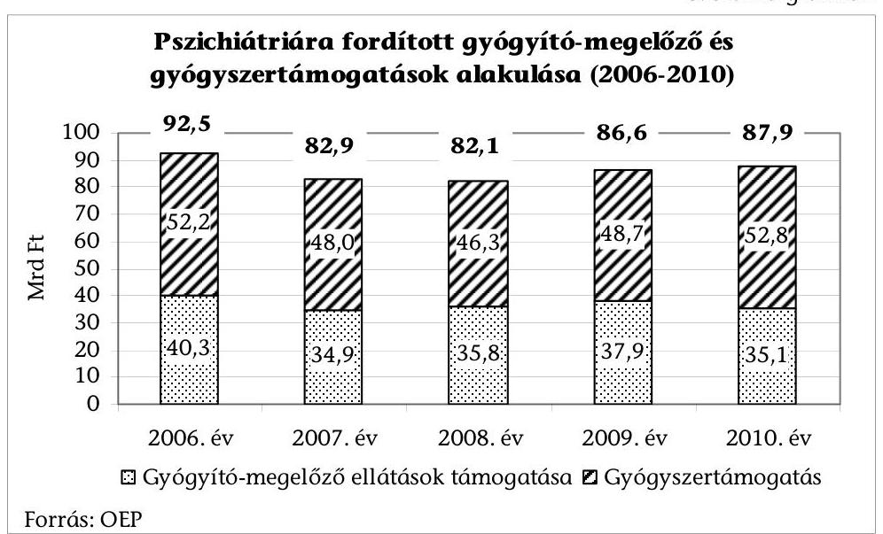

A természetbeni ellátásokból az erre a betegkörre fordított gyógyító-megelőző ${ }^{28}$ és gyógyszertámogatások együttes összege a 2010. évben kevesebb volt, mint a 2006. évben. A 2006. évi 92,5 Mrd Ft-ról a következő évre 82,9 Mrd Ft-ra ( $10,4 \%$-kal) csökkent és a 2010. évig sem érte el a 2006. évi értéket, attól 5,0\%$\mathrm{kal}(4,6 \mathrm{MrdFt}$ ) maradt el. Mindezen belül a gyógyító-megelőző kasszából finanszírozott ellátások összege is hasonló módon változott. A gyógyszertámogatások ettől kissé eltérően, az átmeneti csökkenés után meghaladták a kiinduló év összegét.

A gyógyító-megelőző ellátások egészségbiztosítási finanszírozásában a 2006. évben $25 \%$-ot (10 064,4 M Ft-ot), a 2010. évben már $28 \%$-ot ( $9784,4 \mathrm{M}$ Ft-ot) képviselt a pszichiátriai járóbeteg-szakellátás és a gondozóintézeti gondozás támogatása. Az arány emelkedése költséghatékonysági szempontból akkor kedvező, ha a pszichiátriai járóbeteg és gondozói ellátás finanszírozása nem szűkül. Ezzel szemben a 2006. évről a 2010. évre 2,8\%-kal, 0,3 Mrd Ft-tal csökkent (7. sz. melléklet).

[^0]
[^0]:    ${ }^{28}$ Az ellenőrzésben a gyógyító-megelőző ellátások kategóriáját a háziorvosi ellátások nélkül, szűkített értelemben és tartalommal használjuk.

---

A pszichiátriai ellátást nyújtó intézmények szempontjából a finanszírozás kedvezőtlenül változott. A kórházi aktív ellátás alapdíját öt év alatt mindössze $10,3 \%$-kal emelték ${ }^{29}$ ( $136000 \mathrm{Ft} /$ súlyszámról $150000 \mathrm{Ft} /$ súlyszámra). Megszűnt 2006 júliusában az addiktológiai, alkohol- és drogfüggő betegek rehabilitációjának kiemelt 1,6 szorzójú finanszírozása, a szakmai minősítésű intenzív rehabilitációs ellátás 2,1-es és a krónikus ellátás 1,5 szorzója is. Az ezután bevezetett többféle szorzószám alapján számított éves átlagos szorzó ${ }^{30}$ a 2010. évre 1,25-re csökkent a 2005. évi átlag 1,73-ról. Az átlagos szorzó 27,7\%-os csökkenése közben az alapdíj csak 24,4\%-kal (a 2006. évi átlag 4502 Ft/ ápolási napról $5600 \mathrm{Ft} /$ ápolási napra) nőtt öt év alatt. A járóbeteg ellátás alapdíja ${ }^{31}$ a 2006. és a 2010. évek között csak 10,3\%-kal emelkedett ( $1,36 \mathrm{Ft} /$ teljesítménypontról $1,50 \mathrm{Ft} /$ teljesítmény-pontra). Az ellátási teljesítmény ez alatt $18,2 \%$-kal esett vissza (a 3,3 Mrd teljesítmény-pontról 2,7 Mrd teljesítmény-pontra).

A finanszírozásban bekövetkezett változások nem minden esetben alapultak a költségek és teljesítmények mérésén, elemzésén. A legfontosabb finanszírozási kondíciókat kormányrendelet ${ }^{32}$, illetve miniszteri rendelet ${ }^{33}$ szabályozza. A jogszabályalkotás, módosítás eljárásában követelmény a hatások tárgyalása az előterjesztési dokumentumban. Ezeket az EüM - hiányzó esetekben a tárcaközi véleményezés figyelmeztetésére - szerepeltette a döntéselőkészítési iratokban. A finanszírozási változtatások döntéselőkészítő hatáselemzése az érintett betegellátó intézmények OEP bevételének várható változását mutatta be.

# A gondozók finanszírozása a vizsgált időszakban a fenntarthatóságot veszélyeztető módon megváltozott. 

Az OGY Egészségügyi Bizottságának 2010. december 3-ai ülésére készített NEFMI beszámoló jelezte, hogy „a pszichiátriai gondozók fix-díjas finanszírozása további (értsd: még 2007. évbeli - ÁSZ beszúrás) 50\%-os csökkenése jelentősen rontotta a területi járóbeteg-ellátás súlypontját képező gondozók működési feltételeit".

## A 2010. évi kormányváltás után a NEFMI által kezdeményezett korrekció célja a teljesítmény alapú finanszírozás mellett a gondozóintézeti hálózat működésének fenntarthatósága volt. Ennek érdekében a népjóléti miniszteri rendelet módosításával ${ }^{34}$ bevezetésre került a Homogén Gondozói Kódok emelt pontértékeibe az eddigi fix díj. A változtatást részletes intézményi költségelemzések előzték meg. A NEFMI 2011 tavaszán egy „pilot-

[^0]
[^0]:    ${ }^{29}$ az alapadatokat lásd: Havi teljesítményadatok és alapdíjak - Szakellátás (OEP) http://www.oep.hu
    ${ }^{30}$ a havonkénti finanszírozott krónikus pszichiátriai esetszámokkal súlyozott szorzó-szám-átlagok (GYÓGYINFOK adatok alapján ÁSZ-számítás)
    ${ }^{31}$ a járóbeteg szakellátás alapdíja: egy teljesítmény-pont kihirdetett forintértéke
    ${ }^{32}$ 43/1999. (III. 3.) Korm. rendelet az egészségügyi szolgáltatások Egészségbiztosítási Alapból történő finanszírozásának részletes szabályairól
    ${ }^{33}$ 9/1993. (IV. 2.) NM rendelet az egészségügyi szakellátás társadalombiztosítási finanszírozásának egyes kérdéseiről
    ${ }^{34}$ 60/2011. (X. 25.) NEFMI rendelet az egészségügyi szakellátás társadalombiztosítási finanszírozásának egyes kérdéseiről szóló 9/1993. (IV. 2.) NM rendelet módosításáról

---

projekt"-et is végeztetett a speciális gondozói OENO (beavatkozás) kódokkal tervezett teljesítményjelentések üzemi kísérleteként. A finanszírozási döntést ${ }^{35}$ azonban végül nem a részletes előkészítési munkák, szakmai és intézményi felmérések, kalkulációk alapján hozták meg, hanem egy, az OEP-től a NEFMI számára előzmények nélkül átküldött új, leegyszerűsített, gondozóintézet típusa szerinti esetátalányt vezettek be. Az OEP a pszichiátriai gondozók finanszírozására a 2006. évben 3956,5 M Ft, míg a 2010. évben 3138,6 M Ft (817,9 M Ft-tal kevesebb) díjazást fizetett ki. A 2011. évi kifizetés a 2006. évben teljesítetthez képest $16 \%$-kal (633,3 M Ft-tal) kevesebb.

A 2011. november 1-jén hatályba léptetett új gondozói teljesítményelszámolási rendszer finanszírozási tapasztalatai az eltelt idő rövidsége miatt még nem értékelhető.

Az ellenőrzéshez információkat szolgáltató kórházak adatainak elemzése azt mutatta, hogy a kórházi pszichiátriai ellátásokra az OEP-től kapott bevételek fedezet-aránya ${ }^{36}$ a 2006. évi $27 \%$-ról a 2010. évre lecsökkent 22\%-ra.

A betegellátási struktúra átalakítása a költséghatékonyabb ellátások irányába és a mindenkori finanszírozási kondíciók együtt befolyásolták, hogy egyes kórházak pszichiátriai tevékenységének jövedelmezősége hogyan változott. A fedezet azért csökkent, mert az egy esetre jutó átlagos OEP térítések 5,9\%-kal (1 E Ft-tal, 17 E Ft-ról 18 E Ft-ra) nőttek, míg az osztályos közvetlen gyógyítási költségek ezt meghaladóan 7,7\%-kal (1 E Ft-tal, 13 E Ft-ról 14 E Ft-ra) emelkedtek.

Az OPNI-tól pszichiátriai ellátási feladatot átvevő nyolc intézmény közül a pszichiátriai ellátás működési bevételeinek és kiadásainak különbözete alapján alulfinanszírozottságot a 2006. évben négy, a 2010. évben öt kórház mutatott ki.

A fekvőbeteg szakellátás bevételeinek és kiadásainak egyenlege a 2010. évben az István Kórházban volt pozitív, a többi szolgáltatónál negatív (a Semmelweis Egyetem ellátás típus szerint nem, csak a pszichiátriai ellátás egészére gyűjtött adatot). A pszichiátriai járóbeteg szakellátás négy kórházban volt a 2010. évben negatív egyenlegű (Nyírő Gyula Kórház, Jahn Ferenc Kórház, Szent János Kórház és Flór Ferenc Kórház). Ezekben a kórházakban a pszichiátriai ellátások összesített egyenlege is negatív volt. Azokban a kórházakban haladják meg a pszichiátriai ellátások bevételei a kiadásokat, ahol a járóbeteg ellátás egyenlege pozitív. A 2010. évben a 2006. évhez viszonyítva jelentősen javult az összesített egyenleg a Semmelweis Egyetemen és a Szent István Kórházban (8. sz. melléklet).

A makroszintű központi kiadások csökkenésével párhuzamosan a kórházak széles körénél a beszállítókkal szembeni kötelezettségek teljesítésében elmaradások, hosszabbodó késedelmek jelentkeztek, és a további késedelmi kamatok

[^0]
[^0]:    ${ }^{35}$ 60/2011. (X. 25.) NEFMI rendelet az egészségügyi szakellátás társadalombiztosítási finanszírozásának egyes kérdéseiről szóló 9/1993. (IV. 2.) NM rendelet módosításáról
    ${ }^{36}$ Az arányszám a kórházi üzemgazdaságban is alkalmazott módon a kórházi pszichiátriai járó- és fekvőbeteg ellátás osztályos közvetlen költségeivel számított ún. OEPbevétel arányos „fedezet", \%-ban. Megmutatja, hogy a közvetett, ráosztott költségekre az OEP-től származó bevétel hány %-a nyújt fedezetet.

---

költségnövekedéssel járnak. A korábban önkormányzati fenntartású kórházak központi irányítás alá szervezése - a beszállítókkal való közös tárgyalások, a közös beszerzések, a jó példák terjesztése révén - a költségek célszerű csökkentésének jövőbeni lehetőségét is hordozza.

# 1.3.2. A pszichiátriai betegek szociális ellátásának finanszírozása 

A pszichiátriai betegek ellátását végző szociális intézmények működéséhez szükséges állami normatív hozzájárulások mértékét minden évben a költségvetési törvény határozza meg. A pszichiátriai- és szenvedélybetegek nappali intézményi ellátásának normatívája a 2006. évről a 2010. évre 197 E Ft-ról 206,1 E Ft-ra nőtt, míg a bentlakásos intézményi ellátás normatívája 815 E Ft-ról 710,6 E Ft-ra csökkent az állam teherviselő képességére hivatkozással. (A vizsgált ellátások normatív támogatásának alakulását a 9. sz. melléklet tartalmazza.)

A pszichiátriai- és szenvedélybeteg ellátásra vonatkozó normatíva fajlagos összegeinek megállapítása az állami szerepvállalás mértékére vonatkozó döntés szerint történik.

A pszichiátriai- és szenvedélybetegek intézményi szociális ellátására kifizetett összes állami támogatás a 2006. évhez viszonyítva a 2010. évre 13,6 Mrd Ft-ról 17,4 Mrd Ft-ra emelkedett, amit az 5. sz. táblázat mutat:
5. számú táblázat

Demens betegek, pszichiátriai-, valamint szenvedélybetegek szociális ellátásának normatív támogatása fenntartónként (a 2006. és a 2010. évben)

M Ft-ban

| Fenntartó megnevezése | 2006. év | 2010. év |
| :-- | --: | --: |
| önkormányzati fenntartók | 10057,2 | 10278,3 |
| egyházi fenntartók
 | 997,8 | 2073,7 |
| egyházi kiegészítő támogatás (35,5%) | 354,2 |  |
| egyházi kiegészítő támogatás (73,1%) |  | 1515,9 |
| humán szolgáltatók | 2192,6 | 3524,3 |
| Összes | $\mathbf{13601,8}$ | $\mathbf{17392,2}$ |

Forrás: MÁK adatközlés és önkormányzati beszámolók 31. sz. űrlapja
A pszichiátriai- és szenvedélybetegek nappali intézményi ellátása, bentlakásos intézményi ellátása, demens betegek bentlakásos intézményi ellátásának normatívái voltak közvetlenül összehasonlíthatóak $^{37}$ a 2006-2010. évek közötti önkormányzati fenntartású intézményi ellátásokban.

Az önkormányzati fenntartású intézményeknél mind a három ellátás esetén a 2010. évre az állami kiadás csökkent, a pszichiátriai és szenvedélybetegek bentlakásos intézményi ellátásában ez elérte a 12,9%-ot (7,0 Mrd Ft-ról 6,1 Mrd Ft-ra).

[^0]
[^0]:    $^{37}$ Az egyes években eltérő volt a demens, a pszichiátriai, valamint szenvedélybetegek szociális ellátása normatíváinak összetétele, tartalma.

---

A szociális intézmények $^{38}$ száma 179-ről 256-ra emelkedett, a férőhelyek száma ezzel párhuzamosan 11698-ról 14828-ra nőtt (10. sz. melléklet). Ezen belül mind a pszichiátriai betegek, mind a szenvedélybetegek nappali ellátásának fejlesztése bírt túlsúllyal (az intézményszám 44-ről 106-ra és a férőhelyszám 1390-ről 3796-ra emelkedett).

A 2009. január 1-jétől hatályba lépett jogszabályváltozások $^{39}$ megváltoztatták a közösségi szolgáltatások finanszírozásának módját, a költségvetési előirányzat betartása, költséghatékonyabb ellátás, valamint a területileg kiegyensúlyozottabb fejlesztés céljával. A közösségi ellátások (pszichiátriai betegek-, szenvedélybetegek részére nyújtott közösségi alapellátás, szenvedélybetegek részére nyújtott alacsonyküszöbű ellátás) normatív állami támogatása megszűnt és 2009. január 1-jétől nem tartozott a kötelező önkormányzati feladatok közé. A szolgáltatások működését az állam három évre megkötött finanszírozási szerződések útján támogatta ettől az időponttól.

# A közösségi ellátásra kifizetett központi támogatás $^{40}$ összegének növekedése az utóbbi években megállt (4. sz. grafikon). 

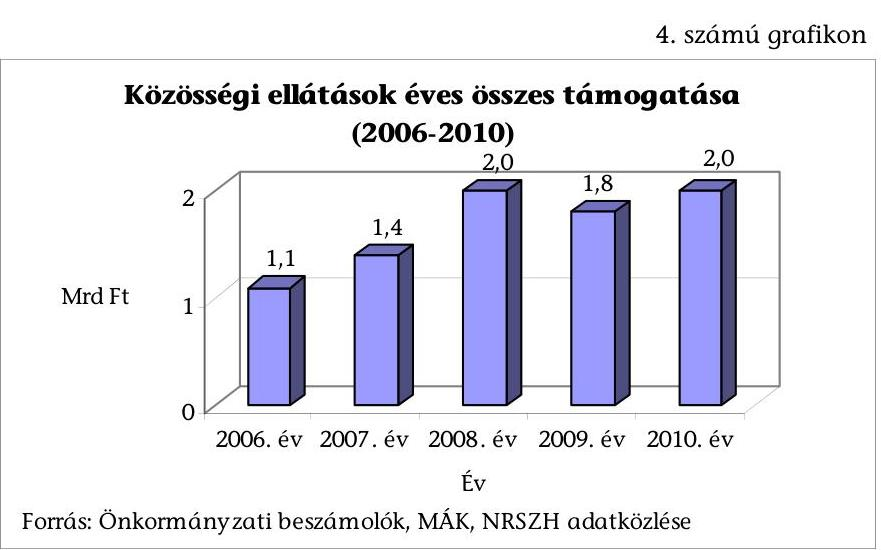

2006 és 2008 között 0,9 Mrd Ft-tal nőtt a közösségi ellátások támogatása, 2009-re 0,2 Mrd Ft-tal esett vissza és 2010-re érte el a 2008. évi szintet.

Magyarország 2012. évi költségvetéséről szóló törvény $^{41}$ a felhasználható előirányzatot jelentősen, 1,4 Mrd Ft-tal (7,3 Mrd Ft-ról 5,9 Mrd Ft-ra) csökkentette.

[^0]
[^0]:    $^{38}$ pszichiátriai- és szenvedélybetegek nappali ellátását, tartós bentlakásos ellátását, valamint átmeneti ellátását végző szociális intézményeket foglalja magában
    $^{39}$ az egyes szociális tárgyú törvények módosításáról szóló - a szociális igazgatásról és szociális ellátásokról szóló 1993. évi III. törvényt is módosító - 2007. évi CXXI. törvény a támogató szolgáltatás és a közösségi ellátások finanszírozásának rendjéről szóló 191/2008. (VII. 30.) Korm. rendelet
    $^{40}$ önkormányzati beszámolók, MÁK, NRSZH adatközlése alapján az alacsonyküszöbű ellátással együtt
    $^{41}$ 2011. évi CLXXXVIII. törvény Magyarország 2012. évi költségvetéséről

---

Az átalakítást követően a szolgáltatók száma a pályázati rendszer bevezetése előtti időszakhoz képest csökkent. A 2006. évben 152, a 2007. évben 206, a 2008. évben 258 szolgáltató látta el $^{42}$ a pszichiátriai- és szenvedélybetegek közösségi ellátásának, valamint alacsonyküszöbű ellátásának feladatait, a 2010. és 2011. évben egyaránt már csak 207 (11. sz. melléklet).

Az első három éves pályázati ciklusban a lezárt éveket tekintve a pszichiátriai- és szenvedélybetegeknek közösségi ellátást nyújtó szolgáltatók részére kiutalt működési támogatás összege, valamint annak finanszírozott és tényleges esetszáma a következőképpen alakult $^{43}$, amit a 6. sz. táblázat mutat be:
6. számú táblázat

A közösségi ellátások működési támogatásának és esetszámának alakulása (2009-2011. évek között)

|  | 2009. év | 2010. év | 2011. év |
| :-- | :--: | :--: | :--: |
| Működési támogatás összege: | $1,5 \mathrm{Mrd} \mathrm{Ft}$ | $1,67 \mathrm{Mrd} \mathrm{Ft}$ | $1,71 \mathrm{Mrd} \mathrm{Ft}$ |
| Közösségi ellátás finanszírozott esetszáma: | 8372 fő | 9162 fő | 9597 fő |
| Közösségi ellátás tényleges esetszáma: | 12903 fő | 16767 fő | 21309 fő |

Forrás: NRSZH
A közösségi ellátásba vontak száma a 2009. évben 4531 fővel (54,1%-kal), a 2010. évben 7605 fővel (83,0%-kal), a 2011. évben 11712 fővel (122,0%-kal) több a finanszírozottnál. A közösségi ellátásban részesült betegek száma a 2009. évben 40906 fő és a 2010. évben 60280 fő volt, a növekedést elsősorban a szenvedélybetegek részére nyújtott alacsonyküszöbű ellátást igénybevevők számának emelkedése okozta.

A felhasznált támogatásról a fenntartók évente számolnak el. A pályázati rendszer bevezetése óta a 2009. évi teljesítés és elszámolás teljesen lezárt $^{44}$, amelyről pénzügyi és szakmai értékelés is készült. A 197 fenntartónak kiutalt összesen 1,8 Mrd Ft-ból 19 fenntartónak összesen 9,1 M Ft $^{45}$ visszafizetési kötelezettsége keletkezett.

[^0]
[^0]:    $^{42}$ adatközlő: NEFMI, NRSZH
    $^{43}$ adatközlő: NRSZH (Az adatok nem tartalmazzák a szenvedélybetegek részére nyújtott alacsonyküszöbű ellátás adatait.)
    $^{44}$ a 2010. évi elszámolások ellenőrzése még zajlott az ÁSZ ellenőrzésének időszakában
    $^{45}$ a visszavont működési támogatás kamattal növelt összege

---

# 2. A PSZICHIÁTRIAI BETEGELLÁTÁS MINŐSÉGÉT BIZTOSÍTÓ FELTÉTELEK, AZ ELLÁTÁSHOZ VALÓ HOZZÁFÉRÉS, A PSZICHIÁTRIAI BETEGELLÁTÁS KÖLTSÉGHATÉKONYSÁGA, A BETEGELLÁTÁS ÁTALAKÍTÁSÁNAK EREDMÉNYESSÉGE 

### 2.1. A pszichiátriai betegellátás tárgyi és személyi feltételeinek változása

Az OTH működési engedély nyilvántartása alapján a pszichiátriai és addiktológiai ellátásban az ellátási specializálódások következtében az egészségügyi intézményeknek kiadott hatályos működési engedélyek száma a 2010. évig nőtt 1541-ről 2149-re, majd pedig enyhén csökkent 2149-ről 1930-ra.

Az előírt minimumfeltételek teljesítésének hiányosságai miatt - csak ellátási érdekből - kiadott ideiglenes működési engedélyek száma és aránya is csökkent (5. sz. grafikon) az utóbbi években a pszichiátria összes szakmacsoporton belül (közszolgáltatók) $^{46}$.
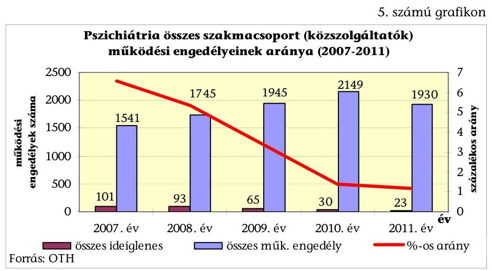

A 2007. és a 2011. évek között az ideiglenes működési engedélyek száma 101-ről 23-ra (77%-kal), aránya 6,6%-ról 1,2%-ra (5,4 százalékponttal) csökkent.

Az ellátást nyújtók véleménye a tárgyi és személyi feltételekről lényegesen kedvezőtlenebb az ellátás feltételeiről, mint amit a működési engedélyek jellege mutat $^{47}$.

[^0]
[^0]:    $^{46}$ pszichiátria, pszichiátriai gondozás, pszichiátriai rehabilitáció, pszichoterápia, addiktológia, alkohológia, drogbeteg-ellátás, szenvedélybeteg-ellátás
    $^{47}$ Az ellenőrzés számára információkat nyújtó egészségügyi szolgáltatók 83,0%-a szerint a pszichiátriai betegellátás infrastruktúrája teljes, vagy részleges rekonstrukcióra szorul. A pszichiátriai fekvőbeteg osztályok vezető főorvosainak mindössze 10,0%-a jelölte a kérdőívben javulónak a tárgyi feltételek utóbbi öt éves változását, és 48,0%-uk romlónak minősítette azt. A személyi feltételeket 26,0%-uk jobbnak, 48,0%-uk rosszabbnak tartotta a korábbi évekhez képest.

---

Az egészségügyi szolgáltatások nyújtásához szükséges szakmai (tárgyi és személyi) minimum feltételek pszichiátriára vonatkozó szabályaiban a betegellátás minőségét befolyásoló változtatások a 2006-2010. évek között nem történtek. A 48/2009. (XII. 29.) EüM rendelet $^{48}$ tartalmazta a pszichiátriai betegellátásra kidolgozott szigorúbb, módosított szakmai minimumfeltételeket, amelyek azonban nem léptek hatályba a kormányváltást követően kiadott - az egyes egészségügyi tárgyú miniszteri rendeletek módosításáról szóló 1/2010. (VI. 29.) EüM rendelet intézkedése alapján.

# A pszichiátria betegellátás fekvőbeteg és gondozási típusában is csökkent a létszámellátottság (12. sz. melléklet). 

Az OPK által gyűjtött információk alapján a fekvőbeteg ellátásban a pszichiáter szakorvosok száma a 2006. évi 423,6-ról a 2010. évre 427,5-re nőtt (0,9%-kal), az egyéb orvosok száma a 2006. évi 187-ről a 2010. évre 163-ra csökkent (12,8%-kal), a szakápolók száma a 2006. évi 1360,6-ról a 2010. évre 728,5-re csökkent (46,5%-kal). A szakorvosok és egyéb orvosok száma összesítve 14 megyében $^{49}$ és a fővárosban csökkent (szakorvosok száma 27,8 fővel, az egyéb orvosok száma 49,2 fővel), a szakápolók száma - Fejér megyén kívül (15 fő növekedés) - mindenütt csökkent (együtt 631 fővel).

A gyermek- és ifjúságpszichiátriai gondozóknál az orvosok száma a 2010. évben a 2006. évi 73%-át (45 fő) éri el. A pszichológusok esetében a 2009. évi mélypont után (a 2006. évi érték 69%-a, 26,7 fő) enyhén emelkedett, így a 2010. évben a 2006. évi átlaglétszám 87%-át (34 fő) érte el. A felnőtt pszichiátriai gondozók esetében az orvosok száma a 2009. évi mélypont (a 2006. évi érték 76%-a, 222,6 fő) után ismét enyhe emelkedést mutat, de a 2010. évre így is csak a 2006. évi átlaglétszám 80%-a (233 fő). A pszichológusok esetében az ingadozás a 2009. évi legalacsonyabb átlaglétszámot figyelembe véve 10%-os (60 fő), a 2010. évben pedig 0,3%-kal (67,35 fő) meghaladta a 2006. évi átlaglétszámot.

## A 2006. évben az OPNI pszichiátriai osztályain dolgozó orvosoknak csak legfeljebb a 60%-a (44 fő) végzett a 2011. évben is az egészségbiztosító látókörében igazolható aktív gyógyító tevékenységet.

Az OPNI pszichiátriai osztályain dolgozó orvosoknak az ellátásban való aktív közreműködését 2011. január-szeptember közötti időszakra vonatkozó, a pecsétszámokhoz rendelt receptforgalom elemzése alapján valószínűsítettük. A 73 orvosból nyolc fő biztosan kiesett a rendszerből, mert receptforgalma nem volt. Az érintett orvosok közel 40%-a (29 fő) nem, vagy legfeljebb átlagosan heti 3-4 kiváltott receptet írt csak fel, tehát aktív gyógyító tevékenységüknek kicsi az esélye.

A személyi feltétel annak ellenére romlott az ellátási és földrajzi területek egy részében, hogy az EEKH által feldolgozott adatok alapján a 2006-2011. évek között az alapnyilvántartásban szereplők száma a pszichiátria összes szakmacsoportban növekedett a 2006. évi 2397 főről a 2011. évre 2609 főre. Az érvényes működési engedéllyel rendelkező gyermek és ifjú-

[^0]
[^0]:    $^{48}$ az egészségügyi szolgáltatások nyújtásához szükséges szakmai minimumfeltételekről szóló 60/2003. (X. 20.) ESzCsM rendelet módosításáról
    $^{49}$ Bács-Kiskun, Baranya, Békés, Csongrád, Fejér, Hajdú-Bihar, Heves, Nógrád, Somogy, Szabolcs-Szatmár-Bereg, Tolna, Vas, Veszprém, Zala megyék

---

ságpszichiátriai szakorvosok száma a 2006. évi 151 főről a 2011. évre 127 főre csökkent, a pszichiátriai ápolók száma a 2006. évi 691 főről a 2011. évre 490 főre esett vissza.

A hazai orvosoknak külföldi munkavállalás céljából kiadott hatósági bizonyítványok száma emelkedett: a 2006. évben 25 (az érvényes működési engedéllyel rendelkezők 3%-a), a 2011. évben 36 volt (az érvényes működési engedéllyel rendelkezők 2%-a).

Kormányrendelet $^{50}$ alapján a 2011. évben a hiányszakmák között az ellenőrzésben szereplő szakképesítések közül a pszichiátriai szakmát nevesítették, a 2012. évre már a gyermek- és ifjúságpszichiátriai szakmát is. A miniszter által, egészségpolitikai indokok alapján a hiányszakmák esetében a szakképzés teljes időtartamára havi rendszerességgel, a munkabéren felül támogatás nyújtható. Ennek összege bruttó 64,5 E Ft/hó/fő, amely a szakmaválasztást kedvezően befolyásolhatja. A hiányszakmát választó rezidenseket alkalmazó intézmények is támogatásban részesülnek, amelynek összege rezidensenként 248,4 E Ft/év/fő.

Az országos szakfelügyelő főorvos az éves beszámolóiban az ellátás általános helyzetét mutatta be, hatékonysági, minőségi, eredményességi kritériumok alapján nem minősítette az

 ellátást.

Az ellátás megfelelőségét a tárgyi és személyi feltételek mellett a szakmai szabályozások rendszere is befolyásolja, ezek felülvizsgálata, módosítása viszont késik. Az ellátási protokollokat és szakmai irányelveket a Szakmai Kollégiumok dolgozzák ki a GYEMSZI-vel együttműködve, vizsgálják felül, és közzétételre megküldik a minisztériumnak. ${ }^{51}$ A korábbi szabályok érvényességi határideje egységesen meghosszabbításra került, felülvizsgálatuk a GYEMSZI által készített módszertan alapján folyamatban van.

Az Egészségügyi Közlöny LXII. évfolyam 1. számában a szakmai irányelvek, protokollok, módszertani levelek érvényességi idejének meghosszabbításáról szóló NEFMI közlemény az érvényességi határidőket 2012. december 31-éig meghosszabbította. A Szakmai Kollégium kidolgozta a pszichiátria protokollok és irányelvek újabb tervezetét (2011. január hóban megjelent a Klinikai Irányelvek Kézikönyvében), amely azonban még nem került elfogadásra.

[^0]
[^0]:    ${ }^{50}$ az egészségügyi felsőfokú szakirányú szakképzési rendszerről szóló 122/2009. (VI. 12.) Korm. rendelet
    ${ }^{51}$ a szakmai kollégiumokról szóló 20/2004. (III. 31.) ESzCsM rendelet 4. § (1) bekezdés hatályos 2008. december 31-ig
    a szakmai kollégiumokról szóló 52/2008. (XII. 31.) EüM rendelet 9. § (1) bekezdés - hatályos 2011. március 31-ig
    az egészségügyi szakmai kollégium működéséről szóló 12/2011. (III. 30) NEFMI rendelet 6. § (1) bekezdés és 7. § (7) bekezdés

---

Finanszírozási protokoll tervezet csak „A szkizofrénia antipszichotikus gyógyszeres kezelésének finanszírozási protokollja" témában készült, de ennek elfogadásáról sem született döntés 2011. év végéig.

# 2.2. A pszichiátriai betegellátáshoz való hozzáférés 

Az egészségügyi ellátást - beleértve a pszichiátriai ellátást is - mindig is jellemezték a hozzáférésben megmutatkozó különbségek. A szolgáltatásnak egy földrajzi területen történő előfordulása és kapacitása, valamint az igénybevételének időbeni és egyéb feltételei befolyásolják a hozzáférést.

A földrajzi hozzáférés jelentős különbözőségei a pszichiátriai ellátás minden területén (a fekvőbeteg-, a járóbeteg-ellátás, a bentlakásos szociális ellátás és a közösségi ellátás) megtalálhatóak ${ }^{52}$. A pszichiátriai fekvőbeteg-ellátásban a területi különbségek kiegyenlítéséhez az Eftv. alapján végrehajtott ágyszám változások nem járultak hozzá.

A fekvőbeteg-ellátásban a pszichiátriai átlagos ellátókapacitás a 2006. évben 9,5 db ágy volt tízezer lakosra vetítve, ez a 2010. évre 8,8-ra csökkent. Ezen belül az aktív kapacitás 3,9-ről 3,0 ágyra csökkent, a rehabilitációs és krónikus kapacitások azonos mértékben változtak, 0,1-0,1 ággyal emelkedtek. A megyei kapacitások közötti különbségek a 2006-2010. évek között alig csökkentek.

A 2006. évben a tízezer lakosra vetített átlagos kórházi ágyszámtól $(9,5)$ a legmagasabb fajlagos kapacitású térség mutatója (13,3) 40,0\%-kal tért el, a legalacsonyabb megyei mutató $(5,3)$ viszont csak $55,8 \%$-a az országos átlagnak. A 2010. évben az országos szintű mutatóhoz $(8,8)$ képest a pozitív irányban eltérő megye mutatója (12,0) 36,4\%-kal magasabb, míg a negatív irányban eltérő megye mutatója $(4,8)$ csak $54,5 \%$-a az átlagosnak. Míg a 2006. évben a legmagasabb mutató a Fővárosnál volt, addig a 2010. évben már három megye is megelőzte.

Mind az aktív, mind a rehabilitációs fekvőbeteg ellátásnál a tízezer főre jutó kapacitásban lévő különbségek többszörösek, pl. míg Nógrád megyében 12 a mutató értéke, addig Jász-Nagykun-Szolnok megyében 4,8 (6. sz. grafikon, amelyben a térképen közölt számadatok az aktív, a rehabilitációs és az egyéb krónikus ágyak együttesét jelöli). Az egyéb krónikus fekvőbeteg-ellátás a 2006. évben nyolc, a 2010. évben négy megyében nem is volt (13. sz. melléklet).

[^0]
[^0]:    ${ }^{52}$ a hozzáférési adatok forrása: OEP és KSH adatok alapján ÁSZ számítás

---

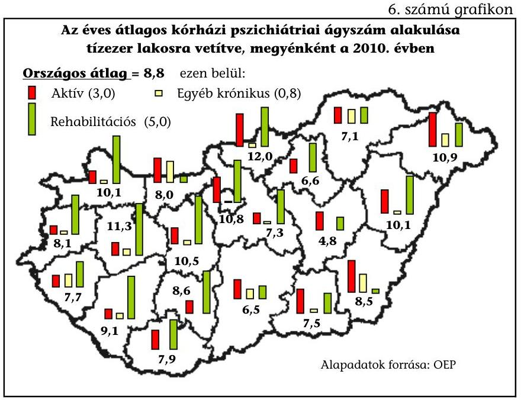

A fekvőbeteg-szakellátás mellett működtetett nappali kórházak száma a 2006. évről a 2010. évre 11-ről 9-re csökkent ${ }^{53}$, ami tovább rontotta a hozzáférési esélyeket.

A pszichiátriai járóbeteg-szakellátásban az átlagos ellátási kapacitás a 2006. évben 22,2 rendelési óra volt tízezer lakosra vetítve, ez a 2010. évre nem változott. Ezen belül a szakrendelés és a gondozás óraszámainak átlagai sem változtak számottevően a két év összehasonlításában. A megyék közötti kapacitás-különbségek az elmúlt évek alatt alig csökkentek (14. sz. melléklet).

A 2006. évben a tízezer lakosra vetített átlagos rendelési óraszámtól $(22,2)$ a legmagasabb fajlagos kapacitású megye mutatója (42,5) 91,4\%-kal tért el, a legalacsonyabb megyei mutató $(8,1)$ viszont csak $36,5 \%$-a az országos átlagnak. A 2010. évben az országos szintű mutatóhoz képest a pozitív irányban eltérő megye mutatója (43,3) 95,0\%-kal magasabb, míg a negatív irányban eltérő megye mutatója (9,2) $41,4 \%$-a az átlagosnak. Nem volt kapacitás a 2006. évben a nem szakorvosi szakrendelői órák esetében három, gondozás esetében pedig öt megyében. A 2010. évben eggyel nőtt azon megyék száma, ahol a gondozóknál nem volt szakorvosi kapacitás.

Az ellenőrzés számára információt szolgáltató kórházak körében az aktív ellátásban beteg-várakozási időt jelző intézmények száma a 2006. évi 8-ról a 2011. évre 11-re nőtt. A jelzett átlagos várakozás mindkét évben 7,8 nap volt. Míg a 2006. évben 15 nap volt a leghosszabb várakozási idő, a 2011. évben már 30 nap is előfordult. A gyermekpszichiátrián a korábbi 7, illetve 20 napos várakozási átlagidők már 14, illetve 60 napra nőttek.

[^0]
[^0]:    ${ }^{53}$ forrás: GIGASTAT (OEP)

---

A pszichiátriai- és szenvedélybetegek bentlakásos szociális ellátásának ${ }^{54}$ átlagos kapacitása a 2006. évben 10,2 férőhely volt tízezer lakosra vetítve, ez a szám a 2010. évre 0,8 férőhellyel (10,2-ről 11-re) nőtt, lényegesen nem változott. A megyék közötti kapacitás-különbségek jelentősek (15. sz. melléklet).

A 2006. évben a tízezer lakosra vetített átlagos férőhely számától $(10,2)$ a legmagasabb fajlagos kapacitású megye mutatója (15,0) $47,1 \%$-kal tért el, a legalacsonyabb megyei mutató $(5,2)$ viszont csak $51,0 \%$-a az országos átlagnak. A 2010. évben az országos szintű mutatóhoz $(11,0)$ képest a pozitív irányban eltérő megye mutatója $(19,5) 77,3 \%$-kal magasabb, míg a negatív irányban eltérő megye mutatója $(7,9)$ csak $71,8 \%$-a az átlagosnak. Szenvedélybetegeket ellátó otthonok tekintetében a 2006. évben három megye, a 2010. évben egy megye nem rendelkezett férőhellyel.

Az ellenőrzés számára információkat nyújtó pszichiátriai betegek szociális ellátását végző bentlakásos intézmények körében végzett felmérés a várakozási idő $5,3 \%$-os emelkedését mutatta.

A 2006. évben még 2,2\%-ot képviselt a szabad férőhely aránya, de a 2010. évre ez $1,3 \%$-ra csökkent. Az intézményekre jellemző várakozási idők átlaga a 2006. évben 321 nap, míg a 2011. évben már 338 nap volt. A várakozási idő szórása a 2006. évhez viszonyítottan a 2011. évre alig csökkent, az egyes intézményekre jellemző várakozási idő különbségei jellemzőek maradtak. A 2011. évben előfordultak 2000 nap feletti várakozási idők is egy fővárosi és egy Hajdú-Bihar megyei intézményben.

A pszichiátriai- és szenvedélybetegek nappali ellátásában mind a pszichiátriai betegek, mind pedig a szenvedélybetegek nappali ellátását végző intézmények száma 37-tel, valamint a biztosított férőhelyek száma 1352-vel nőtt a 2006. és a 2010. évek között.

A nappali ellátást végző intézmények száma a pszichiátriai betegek esetében 19-ről 56-ra, azaz 194,7\%-kal, a férőhelyek száma pedig 577-ről 1929-re emelkedett (utóbbi 234,3\%-os növekedést jelent). A szenvedélybetegek esetén az intézmények száma megduplázódott, 25-ről 50-re nőtt, a férőhelyek $129,6 \%$-os növekedése mellett (813-ról 1867-re nőtt). A közel ötszáz ellátásra kötelezett önkormányzat számához képest a növekedés ellenére továbbra is alacsony az országos lefedettség.

A nemzetközi folyamatokhoz igazodva Magyarországon is bővült a közösségi ellátás (7. sz. grafikon, amelyben a térképen közölt számadatok az aktív, a rehabilitációs és az egyéb krónikus ágyak együttesét jelöli).

[^0]
[^0]:    ${ }^{54}$ ellátási kapacitás alatt a tartós és átmeneti elhelyezést nyújtó férőhelyek értendők: pszichiátriai betegek és szenvedélybetegek átmeneti otthona, rehabilitációs intézménye, rehabilitációs célú lakóotthona, ápoló-gondozó otthona

---

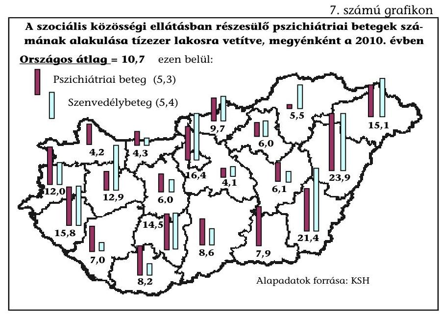

A megyék közötti kapacitásokban többszörösek a különbségek, hasonlóan, mint az ellátórendszer más elemeinél (16. sz. melléklet).

A 2006. évben tízezer lakosra vetítve a közösségi ellátásban 7,9 fő részesült átlagosan, a finanszírozás alapját képező létszámszámítás figyelembevételével. Az országos átlag a 2010. évre 10,7 főre nőtt, ami $35,4 \%$-os növekedést jelent. A 2006. évben az országos átlagtól a Főváros mutatója $(21,0)$ tért el a legjobban, $165,8 \%$-kal. Egy megyében 0, egyben pedig 1,0 alatti volt a fajlagos mutató. A 2010. évben az országos szintű mutatóhoz $(10,7)$ képest a pozitív irányban eltérő megye mutatója $(23,9) 123,4 \%$-kal magasabb, míg a negatív irányban eltérő megye mutatója $(4,1)$ csak $38,3 \%$-a az átlagosnak. A 2010. évre csökkent ugyan az átlagtól való eltérés mind pozitív, mind pedig negatív irányban, de még így is a legmagasabb fajlagos ellátotti létszám 5,8-szorosa a legkisebbnek.

Magyarországon nemzetközi normák szerint működnek a lelki elsősegély szolgálatok 100,0\%-os lefedettséggel. Céljuk a lelki problémák preventív kezelése, az öngyilkossági szándék megelőzése. A szolgáltatásuk ingyenesen hívható mobilszámokról is, az egységes európai rövidített hívószám bevezetése javította a rászorulók hozzáférési lehetőségeit.

# A pszichiátriai ellátás egyes sajátos területein is vannak hozzáférési problémák a következők esetében: 

- azok a magas biztonságú osztályok, amelyek a büntetés-végrehajtás keretein kívül a különösen veszélyeztető magatartású, de sem bírósági, sem pedig hatósági eljárás alatt nem álló betegek ellátására szolgálnak;
- a forenzikus pszichiátriai osztályok igazságügyi, illetve határterületi feladatokat látnak el (pl. bűnismétlés prevenciója a betegek speciális kezelésével), ezt az IMEI látja el az előzetes letartóztatásban lévő személyek tekintetében, a több mint 100 éves, leromlott állapotú épület-komplexumban. A nem előzetes letartóztatásban lévők elmemegfigyelését a „civil" pszichiátriai osztályok végzik. A körülményeket több hazai és nemzetközi szervezet is kifogá-

---

solta. Az IMEI korszerűsítésére eddig - pénzügyi forrás hiánya miatt - nem került sor, a Semmelweis Terv a várható megvalósításra ${ }^{55}$ utalt. A Kormány 2012 márciusában meghatározta ${ }^{56}$ az IMEI helyét, a létesítés fedezetéül két állami ingatlan értékesítését jelölte meg. Az innen kikerülő betegeknek lenne szükséges a magas biztonságú osztályokon történő elhelyezés. A Büntető Törvénykönyvről szóló 1978. évi IV. törvény 2009. évi módosulása ${ }^{57}$ értelmében a kényszergyógykezelés legfeljebb a büntethetőség felső határáig tarthat. Ezt követően, ha a beteg további intézeti kezelése szükséges, úgy az jelenleg a magas biztonsági fokozatú egység hiánya miatt a „hagyományos" pszichiátriai osztályon történik;

- a fertőző betegségben szenvedő pszichotikus betegek kezelését végző elme-fertőző-belosztály korábban az OPNI-ban, jelenleg pedig a Fővárosi Önkormányzat Nyírő Gyula Kórházában 20 ágyon működik, azonban a visszapótlás csak a 2010. évben történt meg;
- a 4-17 éves korú gyermekek között a mentális kórállapotok átlagos előfordulási gyakorisága nemzetközi és hazai epidemiológiai vizsgálatok alapján $15,8 \%$, eléri a népbetegség szintjét. Ennek ellenére nem áll rendelkezésre a hatékony ellátást biztosító személyi és tárgyi feltételrendszer. Az országban hét gyermek- és ifjúságpszichiátriai osztály van (három Budapesten), a Dunántúlon és az Észak-magyarországi régióban egyetlen ilyen osztály sincs ${ }^{58}$.

Pontos betegségregiszterek hiányában nem ismertek az országon belüli területenként a valós - nem a finanszírozási érdekeltség
 szerinti teljesítményeken alapuló - pszichiátriai megbetegedési gyakoriságok. A mért és igazolható ellátási szükségletekhez igazodó, az ellátási formák egymásra épülését figyelembe vevő kapacitásigények ismerete nélkül nem igazolható és kontrollálható a kapacitások megyék közötti többszörös különbsége sem.

A pszichiátriai betegségek gyógyításának eredményessége szempontjából célszerű, ha a gyógyítás folyamatában az egyes ellátási formák elérhetőek, és egymásra épülnek.

Az egyes ellátási szintek közötti összhang megvalósítására helyezi a hangsúlyt a WHO által a 2009. évben megjelentetett kiadvány is, amely az egészségügyi rendszerek és szolgáltatások javításával foglalkozik a mentális egészség tekinte-

[^0]
[^0]:    ${ }^{55}$ A Semmelweis Tervben meghatározott egészségügyi struktúra-átalakítással járó feladatokról, a kiemelt feladatok végrehajtásához szükséges intézkedésekről szóló 1208/2011. (VI. 28.) Korm. határozat 1.9 b) pontja a NEFMI és a BM közös feladataként jelöli meg az átalakítást célzó projekt megvalósíthatósági tanulmányának elkészítését.
    ${ }^{56}$ 1060/2012. (III. 12.) Korm. határozat az Igazságügyi Megfigyelő és Elmegyógyító Intézet (Budapest), a Büntetés-végrehajtás Központi Kórház (Tököl) és a Szegedi Fegyház és Börtön Krónikus Utókezelő Részleg (Algyő-Nagyfa) közös telephelyre integrálásával összefüggő feladatokról
    ${ }^{57}$ a Büntető Törvénykönyvről szóló 1978. évi IV. törvény módosításáról szóló 2009. évi LXXX. törvény 25. § (1) bekezdés
    ${ }^{58}$ az állampolgári jogok országgyűlési biztosának jelentése az AJB 1298/2011. számú ügyben

---

tében ${ }^{59}$. Az alábbi WHO modell (8. sz. grafikon) mutatja be a szükségletek és a költségek fordított arányát, az ellátások egymásra épülését és szükséges arányát.
8. számú grafikon

A mentális egészség javítása érdekében a WHO által javasolt ellátási struktúra
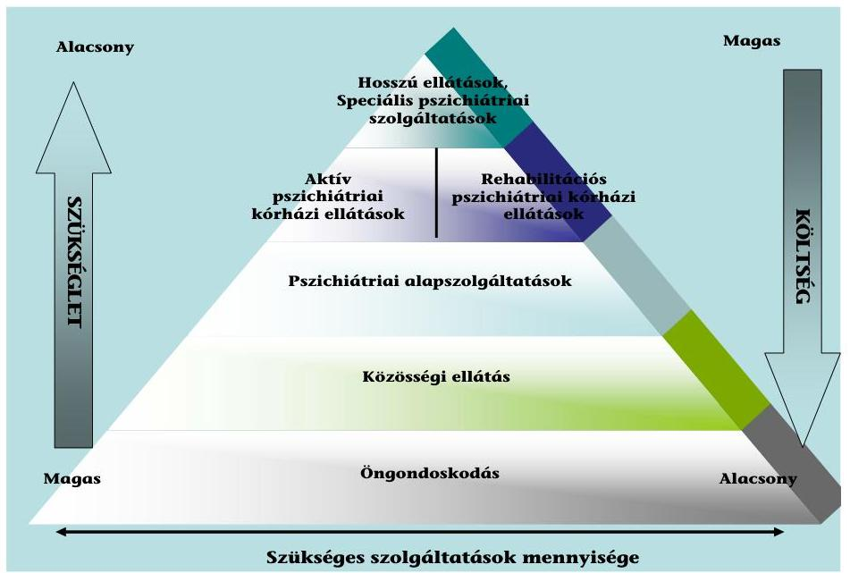

Magyarországon az egészségügyi és szociális pszichiátriai ellátások kapacitásai nem összehangoltak, az ellátási kapacitást az Eütv., a hagyományok, az egészségügyi és a szociális intézményeket fenntartók összehangolatlan intézményfejlesztései, valamint a különböző szakmai nézetek, érdekek együtt alakították.

A pszichiátriai ellátást nyújtó egészségügyi és szociális intézmények együttműködése, összehangoltsága nem vált általánossá, a koordináció, munkamegosztás és a célszerű betegirányítás nem átlátható, amit a megkérdezett intézmények véleménye is visszaigazol.

A pszichiátriai egészségügyi fekvőbeteg ellátást végző szolgáltatók körében végzett kérdőíves felmérés szerint az intézmények a szociális ellátó egységekkel, illetve a közösségi ellátást végző szervezetekkel való kapcsolatuk minőségét - 10-es skálán - átlagosan 6,4-re értékelték. Szintén ugyanilyen minőségűnek becsülték a progresszivitási szintek közötti kapcsolatot, míg a betegirányítás gördülékenységét 6,0 átlagos értékkel jellemezték. A megkérdezetteknek csak a 39%-a véli úgy, hogy a beutalási rend segíti a szükségleteknek megfelelő ellátás megvalósulását. Arra a kérdésre, hogy egységes elvek szerint történik-e beutaláskor/továbbutaláskor a progresszivitási szint meghatározása az azonos ellátási igényű esetekben, csak az intézmények 37%-a válaszolt igennel. Az elmúlt 4 év vonatkozásában az intézmények közötti koordináció változásával kapcsolatban a megkérdezettek 67%-a nyilatkozott úgy, hogy az változatlan, 15% pedig rom-

[^0]
[^0]:    ${ }^{59}$ Improving health systems and services for mental health, WHO, 2009.

---

lónak értékelte. Szintén a fenti időtávban a pszichiátriai ellátás minőségét a válaszadók 49%-a romlónak ítélte meg.

A hazai pszichiátriai ellátórendszerben nincs következménye, ha az egyes betegek esetében a diagnosztika-gyógyítás-rehabilitáció-gondozás egysége felbomlik. Az alapellátás pszichiátriai szűrésben és ellátásban való közreműködése alapvetően a háziorvostól függ. A betegirányítást a hagyományok, illetve az ellátást nyújtó szervezetek közötti egyedi megállapodások, valamint az éppen adódó lehetőségek és kevésbé a költséghatékonyság és egyben szakmai eredményesség igazolható mérlegelései befolyásolják. Nincs a betegek ellátási folyamatát egészében koordináló szervezet, nem egyértelmű a teljes folyamat célszerűségéért való felelősség, és a teljes folyamatot egészében szabályozó eljárási protokoll (17. sz. melléklet).

# 2.3. A pszichiátriai betegellátás költséghatékonysága 

A költséghatékonyság mérésénél az alábbiakat vettük figyelembe:

- a pszichiátriai ellátás költséghatékonysága mérésének nem volt korábban kialakított és kipróbált módszertana, a nemzetközi és hazai kutatások elsősorban egy-egy betegkör - pl. a szkizofrénia - különböző ellátási formák szerinti gyógyításának költségeit gyűjtötték és hasonlították össze;
- a költségvetési gazdálkodásban sokáig nem jelent meg az önköltségszámítás valós igénye, a betegellátást végző intézmények költséggyűjtési és elszámolási gyakorlatában alapvető különbségek vannak. Ezt a kódkarbantartás keretében végzett költséggyűjtések nehézségei, a betegszámla alkalmazásának korábbi módja ${ }^{60}$ és a számvevőszéki ellenőrzésben gyűjtött költségadatok feldolgozásának tapasztalatai is igazolták;
- erős a szakmai kritika a teljesítményfinanszírozás keretében mért ellátási adatok más célú hasznosíthatóságával szemben.

Mindezek miatt, és az ÁSZ-nak a közpénzekkel való gazdálkodás jó minőségéhez és fenntarthatóságához történő hozzájárulása érdekében, a költséghatékonyság változását több indikátor alakulásának elemzésével és a közkiadásokra szűkített értelmezésben mértük, amit a 7. sz. táblázat mutat be:

[^0]
[^0]:    ${ }^{60}$ önköltség helyett az ellátás OEP finanszírozásának mértékéről szóló igazolás

---

7. számú táblázat

# A költséghatékonyság megítélésére alkalmazott indikátorok és a változások értékelése (2006-2010) 

| Indikátor megnevezése | Mutató   értékének   változása | Költséghatékony-   ság változása   (értékelés a kiegészítő   feltételekkel) |
| :-- | :-- | :--: |
| Egy szkizofrén betegre jutó természetbeni ellátás (OEP kiadás) | csökkenés | nem javult |
| Egy depressziós betegre jutó természetbeni ellátás (OEP kiadás) | csökkenés | nem javult |
| Nappali kórházban ellátott pszichiátriai betegek száma | csökkenés | nem javult |
| Egy szkizofrén betegre jutó gyógyszertámogatás | növekedés | javult |
| Egy depressziós betegre jutó gyógyszertámogatás | csökkenés | nem javult |
| Bentlakásos szociális intézményi ellátásokban az egy gondo-   zottra jutó közkiadás | csökkenés | nem javult |
| Közösségi ellátásra fordított központi kiadások aránya a   pszichiátriai fekvő- és járóbeteg-ellátás kiadásaihoz mérten | növekedés | javult |
| Összesítő értékelés: |  | nem javult |

A szkizofréniával, illetve depresszióval kezeltek körében az OEP egy betegre jutó természetbeni ellátási ${ }^{61}$ kiadása a 2006-2010. évek között 0,3%-kal, illetve 28,2%-kal csökkent ${ }^{62}$ (9. sz. grafikon).
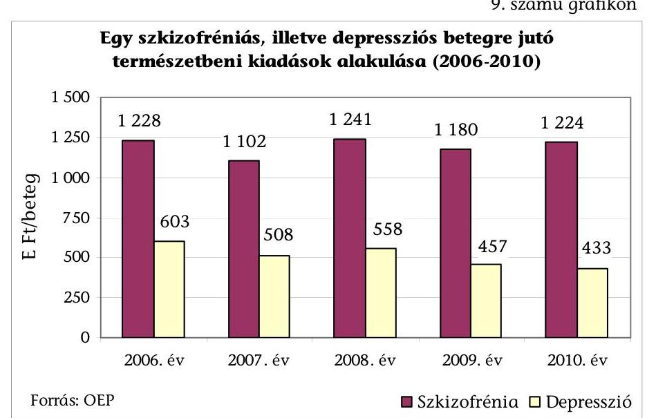

Az egy betegre jutó központi kiadás csökkenése nem járt az ellátás költséghatékonyságának javulásával a következők miatt:

[^0]
[^0]:    ${ }^{61}$ A természetbeni ellátások alatt az általánosan használt tartalmánál szűkebben csak a járó-, továbbá a fekvőbeteg szakellátásokat, valamint a gyógyszertámogatásokat értjük.
    ${ }^{62}$ Az egy betegre jutó kiadás csökkenése akkor értékelhető a költséghatékonyság javulásaként, ha a betegszám nem változott, vagy nőtt, az ellátáshoz való hozzáférés javult, valamint a betegellátás minősége nem romlott.

---

- az ellátott betegek száma a szkizofrénia betegségcsoportban ezer fővel nőtt, míg a depresszió betegkörben hatezer fővel csökkent, mert a betegek hozzáférése az ellátásokhoz egyenetlen volt, és nem javult. A földrajzi hozzáférés jelentős különbségei a pszichiátriai ellátás minden területén (fekvőbeteg-, nappali-, járóbeteg-ellátás, sőt a pszichiátriai betegek szociális ellátórendszeren belüli intézményi ellátásainál is) jellemzőek. Nem javult az ellátáshoz jutás várakozási ideje sem (pl. a gyermekpszichiátriai ellátásokra kétszer-háromszor annyi ideig kell várni, mint évekkel korábban). A hozzáférést betegteher növekedés nem korlátozta (ez a betegek számára kedvező körülmény volt). A vényre felírt pszichiátriai gyógyszerek átlagos éves betegterhe a 2006. és a 2010. évek között 14,7 ezer Ft/főről 10,0 ezer Ft/főre csökkent. Ezen belül az egy szkizofrén betegre jutó betegteher 6000 Ft/fő volt, és nem változott, míg az egy depressziós betegre jutó betegteher 9867 Ft-ról 6355 Ft-ra csökkent éves átlagban;
- komplex mérési mód hiányában az ellátás minőségének romlása több körülményből következtethető és mutatható be. Megkezdődött a GYEMSZI-ben a WHO-val közös monitoring rendszer kiépítésének folyamata keretében az aktív osztályokról egy héten belül hazabocsátottak részarányának kimutatása, elemzése. A hét napnál rövidebb aktív kórházi ellátás ugyanis növeli a 30 napon belüli ismételt visszavételek kockázatát, és minőségi problémákra utal. A GYEMSZI által eddig feldolgozott adatok szerint a 2006. eleji 7,4%-ról 2008 harmadik negyedévére több, mint másfélszeresére, 12,1%-ra nőtt ezen rövid idejű kezelések részaránya. Az ellátás minőségi romlására utal, hogy az OTH növekvő számú panaszos ügyet regisztrált (amíg a 2006-2007. években együtt 4, a 2008-2009. években együtt 19, addig a 2010. évben már 25 és 2011 első három negyedévében 32 eset fordult elő). Az ellenőrzésnek információkat szolgáltató kórházak pszichiátriai osztályait vezető főorvosok 49,3%-a szerint romlott a pszichiátriai ellátás minősége a 2006-2010. évek között. A válaszadók 31,9%-a változatlannak, míg 18,8%-a javulónak ítélte az ellátás minőségét ${ }^{63}$.

A nappali kórházi formában ellátott pszichiátriai betegek száma a 2006. és a 2010. évek között 3412-ről 2684-re (21,3%-kal) csökkent. A fekvőbeteg ellátásnál alacsonyabb költségigényű ellátási forma szűkülése kedvezőtlen irányú volt a pszichiátriai ellátás egészének költséghatékonysága szempontjából.

A szkizofrénia betegkörben az egy főre jutó gyógyszertámogatás 264,3 E Ft/főről 313,7 E Ft-ra, 49,4 E Ft-tal (18,7%-kal) nőtt. A 2010. évi mutató reálértéken (egészségügyi árindexszel korrigálva) már csökkenő, 249,0 E Ft/fő. A támogatásban részesített betegek száma 36399 főről 37534-re nőtt, továbbá az egy beteg által kiváltott gyógyszermennyiség is növekedett 408 DOT-ról 455 DOT-ra.

A depresszió fajlagos gyógyszertámogatása a 2006. évről a 2010. évre 45,9 E Ft/főről 45,8 E Ft/főre csökkent. Kedvező, hogy az ebből az összegből kiváltott gyógyszerek átlagos mennyisége nőtt évi 297 DOT-ról 357 DOT-ra.

[^0]
[^0]:    ${ }^{63}$ A főorvosi véleményeknél 93,2%-os volt a válaszadási arány.

---

Mivel a támogatott betegek száma 121104 főről lecsökkent 115370 főre, így az egy főre jutó gyógyszertámogatás csökkenése nem jelenthette egyben a célszerű és költséghatékonyabb pszichiátriai ellátás irányába történő elmozdulást. A csökkenő támogatotti létszám ellentmond a nemzetközi felméréseknek. Egy felmérés szerint 27 európai ország átlagában a népesség 32,4%-ának volt valamilyen mentális betegsége 2005-ben ${ }^{64}$. Hat európai országra kiterjedő kutatás egyedül a depressziós tünetegyüttes hat hónapos előfordulási gyakoriságát 17,0%-nak találta a lakosság körében ${ }^{65}$. A WHO európai átlagadatai szerint a 18-65 éves korú népesség 27%-át érintették mentális betegségek a 2010. évben ${ }^{66}$.

Az összes mentális betegség gyógyszertámogatása öt év alatt mindössze 1,2%-kal (657,4 M Ft-tal) nőtt a 2010. évre, miközben az ebből támogatott pszichiátriai betegek létszáma 13,3%-kal (69 136 fővel) csökkent, a betegteher pedig 7,6 Mrd Ft-ról 4,5 Mrd Ft-ra (41%-kal) csökkent a vények számának 22%-os csökkenése (6,3 millió db-ról 4,9 millió db-ra) mellett. Az OEP a 2008. évben pszichiátriai betegfelmérés keretében ${ }^{67}$ tett több kritikai megállapítást a pszichiátriai gyógyszerek közül legtöbb támogatást felemésztő antipszichotikumok gyógyszerrendelési gyakorlatára.

Az elemzésben a vizsgálat során tapasztalt következő egyéb, fő megállapításokat tették: "Az antipszichotikumok felhasználása sok esetben igen pazarló, a pszichiáter szakorvosok a nemzetközi adatokat és a szakmai ajánlásokat is figyelmen kívül hagyva kiugróan gyakran (az esetek 40%-ában) rendelnek egyszerre két vagy több második generációs hatóanyagot. ... A pszichiáterek legfőképpen a kiemelkedően drága gyógyszerekhez fordulnak akkor is, ha a szakmai bizonyítékok nem támasztják alá ezek valódi többlethatását. ... A betegek kezelésében alkalmazott második generációs szerek közül a pszichiáterek
 az elvárhatónál sokkal kevésbé költségtudatosan választanak."

A bentlakásos szociális intézményi ellátásokban az egy pszichiátriai, illetve szenvedélybetegre jutó közkiadás összege csökkent. A 2006. évi 1561 E Ft/fő/évről a 2010. évre 1403 E Ft/fő/évre változott (normatíva és fenntartói támogatás együtt), ami nominális értékben 10,2%-os, reálértékben 29,3%-os csökkenés. Az ellátási feltételekkel, a minőséggel együttes értékelés viszont nem igazolja a költséghatékonyság növekedését. Az egy ellátottra jutó közpénz csökkenésével együtt járt az ellátásért fizetett térítés emelkedése. A minőségi ellátás feltételei összességében kedvezőtlenek, több indikátor alakulása az utóbbi évek romló helyzetére utal.

[^0]
[^0]:    ${ }^{64}$ Helen Vieth: Mental health policies in Europe (Euro Observer, Autumn 2009, Volume 11, Number 3, 2. old., Table 1: Mental disorders in Europe (http://www.euro.who.int)
    ${ }^{65}$ Lepine JP, Gastpar M et al.: Depression in the community: the first pan-Europian study DEPRES (Depression Research in European Society) International Clinical Psychopharmacology 1997; 12: 19-29. hiv.: Ormay István-Füredi János: Pszichiátriai konzultáció az alapellátásban (Konzultáció Alapítvány és HIETE Pszichiátriai Tanszék)
    ${ }^{66}$ WHO/Europe homepage/Mental health/Facts and figures (http://www.euro.who.int)
    ${ }^{67}$ rendszeres antipszichotikus terápiában részesülő betegek számának alakulása az elmúlt három évben (Gyógyszerforgalmi adatok elemzése), OEP Gyógyszerügyi Főosztály, 2008.

---

A fajlagos források csökkenése mellett a két év között a gondozottak után fizetett átlagos térítési díj 46,2 E Ft/fő/hóról 69,6 E Ft/fő/hóra (50,6%-kal) nőtt. A férőhely bővülése (a 2006. év végi 10308 férőhelyről a 2010. év végére 11032 férőhelyre) ellenére a szociális intézményekbe való bejutás várakozási ideje - az intézmények információinak átlaga alapján - az utóbbi öt évben 5,3%-kal (338 napra) nőtt. Előfordulnak 2000 nap feletti várakozási idők is (Budapest). Az ellenőrzés számára információkat szolgáltató pszichiátriai- és szenvedélybetegeket gondozó bentlakásos szociális intézmények 80%-a szerint az infrastruktúra már részben, vagy egészben felújításra szorul. Az ÁNTSZ-hez érkező panaszügyek száma többszörösére nőtt (a 2006. évben és a 2007. évben 2-2, a 2008. évben 16, a 2009. évben 26, a 2010. évben már 39 volt). Az egészségügyi szakhatósági ellenőrzések során emelt kifogások arányának trendje emelkedett, ezen belül a 2006. évben a 20 ellenőrzésből öt, a 2010. évben a 34 ellenőrzésből 10 tartalmazott kifogásokat. A kifogások kétharmadát a tárgyi feltételek hiányosságai indokolták. Az ellátással kapcsolatos - nem az egészségügyi szakhatósághoz benyújtott - panaszok számát az NRSZH a 2010. évtől gyűjti. Míg a 2010. évben 575, addig a 2011. év I-III. negyedévében már 864 vonatkozó bejelentés történt, az emelkedés intenzív.

A pszichiátriai betegek nappali ellátásánál az egy főre jutó közkiadás csökkent. Az ellátás minőségére utaló megbízható, országosan gyűjtött információk hiányában az ellátási forma költséghatékonyságát önállóan nem minősítjük.

Az engedélyezett férőhelyszám a 2006. évről a 2010. évre 1390 férőhelyről 3796-ra nőtt, míg a nappali ellátás fajlagos közkiadásai csökkentek 223,71 E Ft/fő/évről 217,43 E Ft-ra.

A szociális ellátás keretében nyújtott közösségi ellátásokra fordított központi kiadások aránya a pszichiátriai fekvő- és járóbeteg-ellátás kiadásaihoz mérten nőtt. A változás a nemzetközi és hazai kutatások, a WHO ajánlásai szerint kedvező irányú a pszichiátriai ellátás egészének költséghatékonysága szempontjából.

A mutató a 2006. és a 2010. évek között 2,7%-ról 5,7%-ra emelkedett, miközben az ellátásban részesülők száma 8 ezer főről 55 ezer főre nőtt ${ }^{68}$. Az ellátó szervezetek pályázat alapján történő három éves kiválasztására történő áttérés a 2009. évtől minőségi szelekciót is jelentett, és a korábbi időszakhoz viszonyítva a minőség javulására utalt.

# 2.4. A pszichiátriai betegellátás átalakításának eredményessége 

A pszichiátriai ellátás területén az ellátás eredményességének mérésére alkalmas makroszintű indikátorokat rendszerszerűen nem alkalmazott sem az ágazatirányító, sem a pszichiátriai szakma. Az ellátás eredményességének mérésére intézmény szintű indikátorokat egyes, főleg a közösségi ellátás vagy kutatási területen működő intézmények alkalmaznak.

Az eredményesség változását több indikátor alakulásának elemzésével mértük. A Népegészségügyi Program 2002. évihez viszonyított célkitűzéseit jellemző mutatókat értékeltük. Az indikátorok alakulásában a pszichiátriai ellátás mel-

[^0]
[^0]:    ${ }^{68}$ Tartalmazza a szenvedélybetegek részére nyújtott alacsonyküszöbű ellátást is.

---

lett egyéb tényezőknek is volt szerepe, de a hasonló irányú változások összessége az értékelésre lehetőséget ad (8. sz. táblázat).
8. számú táblázat

Az eredményesség megítélésére alkalmazott indikátorok és a változások értékelése (2006-2010)

| Indikátor (mutató) megnevezése | Célkitűzés   megvalósítása   vagy a mutató   változásának   iránya | Eredmény-   nyesség   értékelése |
| :-- | :--: | :--: |
| Öngyilkossági kísérletek száma | növekedés | nem javult |
| Öngyilkossági kísérletet megelőző 3 hónapban pszichiátriai   kezelésben részesültek aránya | csökkenés   trend: növekvő | javulás nem   egyértelmű |
| Százezer főre vetített öngyilkosságok számának 20 fő alá történő   csökkentése | növekedés | nem sikerült |
| Fiatalkorúak körében elkövetett öngyilkosság miatti halálozás   20%-kal történő csökkenése | csökkenés   trend: növekvő | javulás nem   egyértelmű |
| Alkoholos májzsugor és egyéb alkoholos májbetegségek miatti   halálozások számának 10%-kal való csökkenése 2008-ig | megtörtént | javult |
| Drogfüggők számának a 2002. évhez viszonyított csökkentése | nem történt meg | nem sikerült |
| Depressziós betegek kezelési aránya | csökkenés | nem javult |
| Aktív pszichiátriai és addiktológiai osztályokról hazabocsá-   tottak 30 napon belüli visszavételi aránya | növekedés | nem javult |
| Pszichiátriai otthonokba történő elhelyezés várakozási ideje | növekedés | nem javult |
| Nem önkéntes pszichiátriai felvételű esetszám | növekedés | nem javult |
| Pszichiátriai betegek közösségi ellátásában lévő betegek száma | növekedés | javult |
| Összesítő értékelés: |  | nem javult |

# A pszichiátriai ellátórendszer átalakítása összességében nem javított a pszichiátriai ellátás eredményességén. 

Az öngyilkossági kísérletek száma mind a mentőszolgálat, mind az OEP adatai (18., 19. sz. melléklet) alapján a vizsgált időszakban emelkedett, a tendencia kedvezőtlen.

A mentőszolgálatnál regisztrált öngyilkossági kísérletek száma a 2006. és a 2009. évek között nőtt 8025-ről 8723-ra, a 2010. évben 8256-ra csökkent. A 2010. évi érték magasabb volt a 2006. évinél (20. sz. melléklet), tehát a mutató romlott.

Az OEP adatai szerint a fekvőbeteg-ellátásban részesült öngyilkossági kísérletet elkövetők száma a 2006. évről a 2010. évre 16%-kal nőtt (11 980 főre). Az öngyilkosság miatti BNO szerinti összbetegszám (nem csak fekvőbeteg-ellátásban) ennél magasabb, a 2006. és a 2010. évek között 14542-ről 16885 főre nőtt, ami szintén 16,1%-os növekedést jelent.

Az öngyilkossági kísérletet megelőző 3 hónapban pszichiátriai kezelésben részesültek aránya a 2006. és a 2010. évek összehasonlításában csökkent ugyan, de az utóbbi évek egészére nézve a trend emelkedő. Magas az aránya azoknak, akik a kezelések mellett is megkísérlik az öngyilkosságot. A mutató a 2006. évben 32,5% (3370 fő a 10361 főből), míg a 2009. évben már 52,6% (5978 fő a 11373 főből) volt. Az arány a 2010. évben 30,1%-ra csökkent (3604 főre a 11980 főből), tehát a kezelésben lévők aránya kevéssel a 2006. évi szint alatti volt.

---

# A százezer főre vetített öngyilkosságok számát nem sikerült 20 fő alá csökkenteni (ezzel a vonatkozó népegészségügyi célkitűzést teljesíteni). 

Magyarországon a legtöbben 1983-ban vetettek véget az életüknek, 4911-en. Ez az 1955. évtől emelkedő tendenciának volt a csúcspontja. Néhány évig magas szinten ingadozott, majd az 1987. évtől kezdve csökkent, a 2007. évben 2450 volt, azóta újra kismértékű emelkedés tapasztalható. A 2010. évben 2492 fő volt az öngyilkosságot elkövetők száma. A százezer főre jutó öngyilkosság miatti halálozás a 2000. évi 31,98-ról a 2007. évig csökkenést mutatott, de azóta kismértékben emelkedő (10. sz. grafikon).
10. számú grafikon
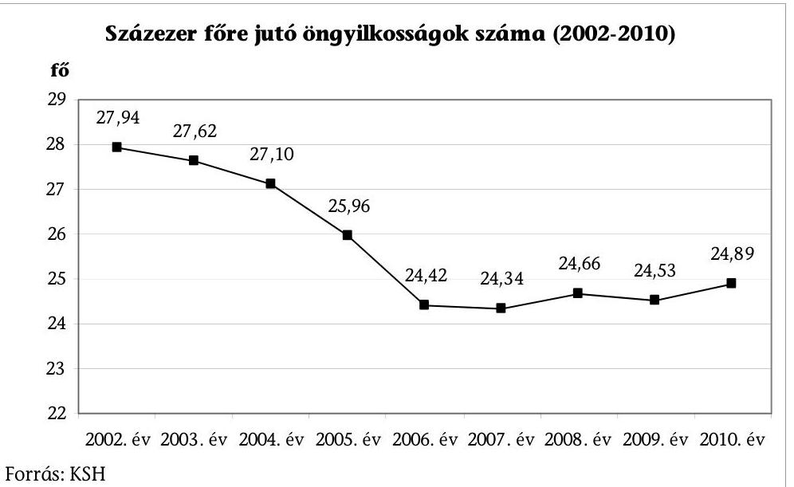

A fiatalkorúak körében elkövetett öngyilkosság miatti halálozás 20%-kal történő csökkenése - ezzel a vonatkozó népegészségügyi célkitűzés teljesítése - az utóbbi öt évből egyedül a 2010. évben valósult meg. A 2007-2009. évek közötti adatsor emelkedő volt, a 2010. évi - így is magas adat önmagában még nem igazol kedvező trendet.

A 15-19 éves korú lakosság körében a szándékos önártalom miatti halálozásban a vizsgált időszakban növekedés és csökkenés is tapasztalható volt (2004. volt a kiugró év, a 2007. évtől a 2009. évig növekedés, a 2010. évben csökkenés volt tapasztalható) (11. sz. grafikon).

---

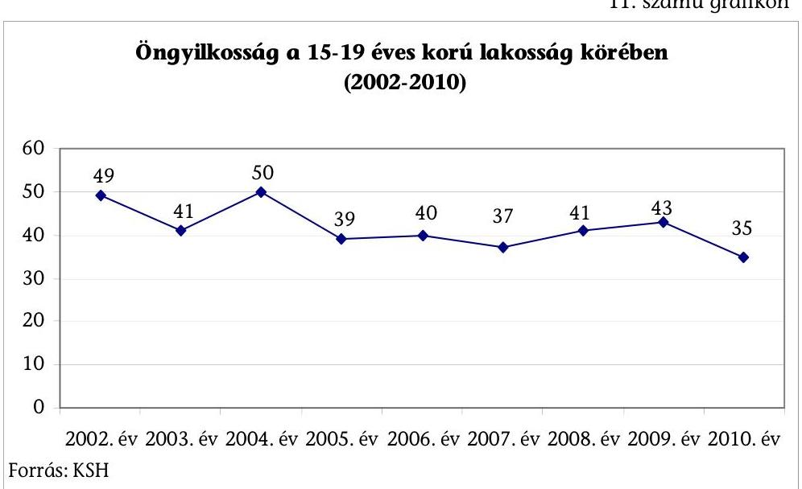

Az alkoholisták számáról becsült adatok állnak rendelkezésre, ennek alapján a 2012. évig 500 ezer fő alá csökkentése - ezzel a vonatkozó népegészségügyi célkitűzés teljesítése - még nem ítélhető meg.

Az alkoholisták becsült száma 2002. és a 2010. évek között 718 ezerről 522 ezerre csökkent, ami 27,3%-os visszaesést jelent. A trend a 2007. és a 2009. évek között növekedő volt, ugyanakkor az 522 ezer fő már a népegészségügyi programban kitűzött 500 ezer fős célhoz közeli értéket mutat.

Az alkoholos májzsugor és egyéb alkoholos májbetegségek miatti halálozások számának 10%-kal való csökkenése a 2008. évig - ezzel a vonatkozó népegészségügyi célkitűzés teljesítése - megtörtént. (A 2002. évi 7604-ről a 2009. évben 3625-re csökkent, 47,7%-ra).

A drogfüggők számának a 2002. évhez viszonyított csökkentése - ezzel a vonatkozó népegészségügyi célkitűzés teljesítése - nem sikerült.

A drogfüggők közül kezelésen első alkalommal megjelent új betegek száma a vizsgált időszakban növekedés, majd csökkenés után jelenleg a 2002. évi szint 113%-án tart (a 2002. évben 4717 fő, a 2010. évben 5337 fő), tehát nőtt. A vizsgálaton megjelent összes beteg száma a 2002. évi szint 132,4%-án volt a 2010. évben (a 2002. évben 12777 fő, a 2010. évben 16923 fő), tehát jelentős növekedés volt.

A súlyosabb drogbetegek számának alakulását a metadon kezelésben résztvevők száma jellemzi. Metadon szubsztitúciós fenntartó kezelés a 2009. évben tíz helyen történt az országban. A Suboxone megjelenése óta a metadonnal kezelt betegek száma csökkent, az összes kezelt beteg száma viszont a 2008. évi 807-ről a 2009. évre 992-re jelentősen növekedett, tehát nem sikerült teljesíteni a kitűzött célt.

# Az aktív pszichiátriai és addiktológiai osztályokról hazabocsátottak 30 napon belüli visszavételi aránya romlott. 

A hazabocsátottak számának negyedéves alakulását a GYEMSZI WHO-val közösen végzett kutatása dolgozta fel. Adataik alapján az esetek 2-3%-ában történik

---

30 napon belüli visszavétel, amely a 2004-2008. évek közötti időszakban csökkenő betegszám mellett kis mértékben nőtt. A változás iránya kedvezőtlen volt.

A depressziós betegek „kezelésbe vételi arányának" meghatározása a Népegészségügyi Programban nem volt egyértelműen definiált, többféle értelmezése és mérése lehetséges.

A minisztérium OPK-val egyeztetett véleménye szerint a betegek kb. fele nem fordul orvoshoz (50%), akik odafordulnak, azoknak a felét diagnosztizálják (25%), és a diagnosztizált betegek fele (12,5%) kap valamilyen kezelést, de csak ennek a fele (6,25%) kap megfelelő dózisban alkalmazott terápiát. A „kezelésbe vételi arány" azt jelenthetné, hogy a járóbeteg-ellátásban a depresszió
 felismerése, diagnosztizálása, kezelésbe vétele legalább 30%-kal javuljon. Mérhető lenne úgy, hogy a gondozóban jelentkezett új depressziós betegek számaránya a korábbiakhoz képest 30%-kal több lenne. Ugyanakkor arra vonatkozóan nincs adatgyűjtés, hogy a gondozóban hány új depressziós beteget kezelnek, így ez a mutató ebből a szempontból nem megközelíthető.

Az ellenőrzés során adatokat kértünk az OEP gyógyszeradatbázisból. Több megközelítés lehetséges a depressziós betegkör meghatározásának. Az egyik megközelítés szerint a teljes pszichiátriai betegkörből az antidepresszáns gyógyszert kiváltó betegek száma a 2006. évben 325 ezer fő volt, ami a 2010. évre 295 ezerre csökkent. A másik megközelítésben, a depresszió betegkörben (azaz az F30-F39 BNO-val besorolt betegek) a pszichiátriai betegségek kezelésére szolgáló ATC kódú gyógyszert kiváltók számát vizsgáltuk. Ez a 2006. évben 121 ezer fő, a 2010. évben 101 ezer fő volt, azaz enyhén csökkent a rendszeresen gondozásban résztvevők és gyógyszert kiváltók száma.

A népegészségügyi célkitűzést nem sikerült teljesíteni, mivel csökkent a depressziós betegek kezelési aránya.

A pszichiátriai otthonokba történő elhelyezés várakozási ideje nőtt (a 2006. évben az intézményenként jellemző várakozási idő 321 nap, 2011-ben 338 nap volt).

A nem önkéntes pszichiátriai felvételű esetszám 15,5%-kal (19 864 esetről 22 948 esetre) nőtt a vizsgált időszakban, így a mutató alapján az eredményesség romlott.

Az aktív ellátásba felvett, nem önkéntes kezelés esetszáma a 2006. és a 2010. évek között 21,9%-kal nőtt (13 187 esetről 16 076 esetre). A krónikus ellátásba felvett, nem önkéntes kezelés esetszám 77,4%-kal nőtt (1401 esetről 2486 esetre), ugyanez a mutató a rehabilitációs ellátásban 16,9%-kal csökkent (5276 esetről 4386 esetre).

A vizsgált időszakban a közösségi ellátásban részesülő pszichiátriai betegek száma emelkedett. Megvalósult a nemzetközi ajánlásoknak megfelelően a költséghatékonyabb ellátási formákban résztvevők számának bővülése.

Az ellátásban kimutatott betegek száma a szenvedélybetegek részére nyújtott közösségi és alacsonyküszöbű ellátással együtt az önkormányzati hatáskörben működő időszakban (2006-2008. évek) 3 év alatt 8005-ről 12 599-re nőtt. A 2010. évben ez a szám már 60 280 fő volt.

---

A lelki egészség területén eredményes pilot programok valósultak meg a SE közreműködésével, pályázati források felhasználásával, a betegekkel való szoros együttműködés, betegkövetés eszközével, kis ráfordítással.

A „Többszintű akcióprogram a depresszió és az öngyilkosság megelőzésére" című OSPI Europe kutatást az EU7 kutatási program keretében támogatták. Az értékelés a Ceglédi kistérség és város kontroll-régióval való összehasonlítással történt, eszerint a befejezett öngyilkosságok aránya Szolnokon a 2005. évben 57%-kal, a 2006. évben 47%-kal csökkent a korábbi 9 év átlagához viszonyítva (a 2004. évben 30,1, a 2005. évben 13,1, a 2006. évben 14,5 százezrelék). Az EAAD folytatása az OSPI Europe program, amely 2010 januárjában indult Magyarországon, a Semmelweis Egyetem Magatartástudományi Intézet koordinálásával. A 18 hónapig tartó programot Miskolcon indították, ahol a depresszió és az öngyilkosság aránya jelentősen magasabb az országos átlagnál. A programok tapasztalatai alapján levonható a következtetés, hogy a depresszió és az öngyilkosság megelőzésében központi szerepe van a lelki elsősegély telefonszolgálatnak, ám a finanszírozásukat meg kell oldani, továbbá megállapítható, hogy a pszichiátriai gondozóknak lényeges szerepük van a területi pszichiátriai ellátásban.

A másik pilot projekt a „Megerősödött Közösségi Alapú Mentális Egészség program" volt. Az intézmények között kiépített visszacsatolási rendszernek köszönhetően a program végén a távozott betegek 74,3%-áról (272 betegből 202-ről) volt a klinikának naprakész információja. Eredményeket értek el a klinikai betegmozgás esetében, ugyanis a célcsoportba tartozó betegek esetében a 30 napon belüli visszavételek száma, a visszaesések száma felére csökkent a kontroll csoporthoz képest a tartós gondozásnak köszönhetően. A tünetmentes időszak közel háromszorosa volt a célcsoport esetében. A célcsoport 74,3%-a (272 főből 202 fő) maradt gondozásban, míg a kontrollcsoport esetében csupán 3,0% (135 főből 4 fő) a rendszeresen gondozott.

Budapest, 2012. OG. hó 14 nap

Melléklet: 20 db
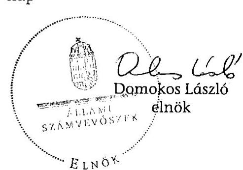

---

# MELLÉKLETEK 

V-2012-115/2011-2012. sz. jelentéshez

---

# HELYSZÍNEN ELLENŐRZÖTT SZERVEZETEK, INTÉZMÉNYEK 

1. Nemzeti Erőforrás Minisztérium, valamint adat és információszolgáltatás tekintetében a kapcsolódó intézményei (Állami Népegészségügyi és Tisztifőorvosi Szolgálat, Gyógyszerészeti és Egészségügyi Minőség- és Szervezetfejlesztési Intézet, Országos Pszichiátriai Központ, Országos Egészségbiztosítási Pénztár, Egészségügyi Készletgazdálkodási Intézet, Nemzeti Rehabilitációs és Szociális Hivatal, Országos Mentőszolgálat)

OPNI feladatait átvett intézmények:
2. Semmelweis Egyetem
3. Fővárosi Önkormányzat Nyírő Gyula Kórház
4. Fővárosi Önkormányzat Szent János Kórháza és Észak-budai Egyesített Kórházai
5. Fővárosi Önkormányzat Egyesített Szent István és Szent László Kórház Rendelőintézet
6. Heim Pál Gyermekkórház
7. Jahn Ferenc Dél-pesti Kórház
8. Fővárosi Önkormányzat Bajcsy-Zsilinszky Kórház
9. Pest Megyei Flór Ferenc Kórház

---

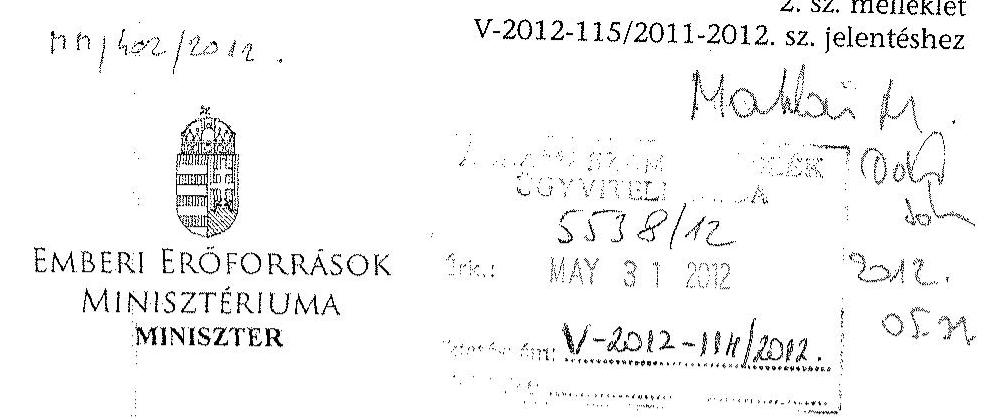

Iktatószám: 11259/6/2012/ELL

Ügyintéző: Bánkné Simon Judit (54430)

Domokos László úr
elnök

Állami Számvevőszék

Budapest
Apáczai Csere János u. 10.
1052

Tárgy: az Állami Számvevőszék által készített, a pszichiátriai betegellátás átalakításának ellenőrzéséről szóló jelentéstervezet véleményezése

Tisztelt Elnök Úr!

Az Állami Számvevőszék által készített, a pszichiátriai betegellátás átalakításának ellenőrzéséről szóló jelentés tervezetéhez nem teszek észrevételt.

Budapest, 2012. május 30.

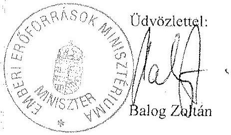

---

Adatok a pszichiátriai fekvőbeteg ellátásról 2006. és 2011. szeptember 30. között (Az adatok szakmakód alapján, a teljesítés időszakára vonatkoznak) a V-2012-115/2011-2012. sz. jelentéshez

|  Fekvő ellátás típus | Megnevezés | 2006. év |  | 2007. év |  | 2008. év |  | 2009. év |  | 2010. év |  | 2011. szeptember 30. |   |
| --- | --- | --- | --- | --- | --- | --- | --- | --- | --- | --- | --- | --- | --- |
|   |  | éves átlag | időszak végi adat | éves átlag | időszak végi adat | éves átlag | időszak végi adat | éves átlag | időszak végi adat | éves átlag | időszak végi adat | éves átlag | időszak végi adat  |
|  aktív | Intézetek száma (db) | 54,2 | 55,0 | 50,9 | 50,0 | 47,2 | 48,0 | 47,8 | 48,0 | 47,0 | 47,0 | 47,0 | 47,0  |
|  aktív | Szervezeti egységek száma (db) | 97,4 | 95,0 | 99,7 | 102,0 | 83,7 | 83,0 | 83,6 | 81,0 | 83,1 | 82,0 | 82,6 | 83,0  |
|  aktív | Esetszám (időszaki összes) |  | 87 464,0 |  | 72 943,0 |  | 69 987,0 |  | 70 734,0 |  | 69 395,0 |  | 54 269,0  |
|  aktív | ebből jogi elbírálás alapján nem önkéntes felvételű pszichiátriai eset (időszaki összes) |  | 13 187,0 |  | 15 550,0 |  | 15 525,0 |  | 15 732,0 |  | 16 076,0 |  | 13 033,0  |
|  aktív | Ágyszám (db) | 3 948,5 | 3 881,0 | 3 313,4 | 3 104,0 | 2 945,7 | 2 929,0 | 2 977,8 | 3 016,0 | 3 029,0 | 3 026,0 | 3 026,0 | 3 026,0  |
|  aktív | Ágyszám/10 000 lakos (db) | 3,9 | 3,9 | 3,3 | 3,1 | 2,9 | 2,9 | 3,0 | 3,0 | 3,0 | 3,0 | 3,0 | 3,0  |
|  aktív | Átlagos ápolási idő (nap) | 13,2 |  | 14,5 |  | 15,5 |  | 14,2 |  | 14,3 |  | 13,8 |   |
|  aktív | Ágykihasználás (\%) | 80,4 |  | 74,6 |  | 81,6 |  | 81,4 |  | 78,3 |  | 76,8 |   |
|  aktív | Elbocsátott betegek száma (TAJ db) (időszaki összes) |  | 69 817,0 |  | 57 063,0 |  | 55 251,0 |  | 55 595,0 |  | 54 620,0 |  | 44 336,0  |
|  aktív | Ápolási napok száma (db) (időszaki összes) |  | 1 152 685,0 |  | 1 057 580,0 |  | 1 081 672,0 |  | 1 004 577,0 |  | 995 258,0 |  | 749 099,0  |
|  rehabilitációs | Intézetek száma (db) | 62,8 | 63,0 | 63,1 | 66,0 | 61,0 | 62,0 | 61,5 | 63,0 | 64,7 | 66,0 | 65,8 | 65,0  |
|  rehabilitációs | Szervezeti egységek száma (db) | 127,2 | 129,0 | 133,9 | 147,0 | 112,3 | 117,0 | 115,0 | 119,0 | 117,2 | 123,0 | 121,1 | 127,0  |
|  rehabilitációs | Esetszám (időszaki összes) |  | 41 974,0 |  | 37 772,0 |  | 36 920,0 |  | 36 450,0 |  | 36 416,0 |  | 29 659,0  |
|  rehabilitációs | ebből jogi elbírálás alapján nem önkéntes felvételű pszichiátriai eset (időszaki összes) |  | 5 276,0 |  | 5 970,0 |  | 4 690,0 |  | 4 212,0 |  | 4 386,0 |  | 4 030,0  |
|  rehabilitációs | Ágyszám (db) | 4 890,1 | 4 897,0 | 5 327,0 | 5 356,0 | 4 895,3 | 4 884,0 | 4 861,4 | 4 884,0 | 4 903,7 | 4 969,0 | 4 919,3 | 4 964,0  |
|  rehabilitációs | Ágyszám/10 000 lakos (db) | 4,9 | 4,9 | 5,3 | 5,3 | 4,9 | 4,9 | 4,9 | 4,9 | 4,9 | 5,0 | 4,9 | 5,0  |
|  rehabilitációs | Átlagos ápolási idő (nap) | 42,5 |  | 40,7 |  | 42,9 |  | 41,7 |  | 42,4 |  | 39,5 |   |
|  rehabilitációs | Ágykihasználás (\%) | 96,8 |  | 84,7 |  | 89,3 |  | 93,6 |  | 94,7 |  | 93,9 |   |
|  rehabilitáció | Elbocsátott betegek száma (TAJ db) (időszaki összes) |  | 28 520,0 |  | 28 481,0 |  | 27 431,0 |  | 27 488,0 |  | 27 997,0 |  | 23 537,0  |
|  rehabilitációs | Ápolási napok száma (db) (időszaki összes) |  | 1 783 761,0 |  | 1 535 479,0 |  | 1 582 189,0 |  | 1 520 465,0 |  | 1 544 100,0 |  | 1 171 309,0  |
|  krónikus | Intézetek száma (db) | 14,0 | 15,0 | 16,8 | 19,0 | 17,8
 | 18,0 | 18,0 | 18,0 | 18,0 | 18,0 | 18,0 | 18,0  |
|  krónikus | Szervezeti egységek száma (db) | 19,0 | 20,0 | 21,1 | 24,0 | 21,8 | 22,0 | 22,0 | 23,0 | 22,0 | 22,0 | 22,0 | 22,0  |
|  krónikus | Esetszám (időszaki összes) |  | 4 580,0 |  | 6 385,0 |  | 6 915,0 |  | 7 223,0 |  | 7 394,0 |  | 4 809,0  |
|  krónikus | ebből jogi elbírálás alapján nem önkéntes felvételű pszichiátriai eset (időszaki összes) |  | 1 401,0 |  | 2 436,0 |  | 2 423,0 |  | 2 616,0 |  | 2 486,0 |  | 1 136,0  |
|  krónikus | Ágyszám (db) | 667,4 | 666,0 | 862,7 | 890,0 | 926,3 | 933,0 | 933,0 | 933,0 | 880,2 | 807,0 | 758,7 | 807,0  |
|  krónikus | Ágyszám/10 000 lakos (db) | 0,7 | 0,7 | 0,9 | 0,9 | 0,9 | 0,9 | 0,9 | 0,9 | 0,9 | 0,8 | 0,8 | 0,8  |
|  krónikus | Átlagos ápolási idő (nap) | 41,2 |  | 58,5 |  | 39,6 |  | 33,6 |  | 29,5 |  | 33,0 |   |
|  krónikus | Ágykihasználás (%) | 83,6 |  | 77,7 |  | 80,6 |  | 81,9 |  | 79,9 |  | 76,7 |   |
|  krónikus | Elbocsátott betegek száma (TAJ db) (időszaki összes) |  | 3 683,0 |  | 5 197,0 |  | 5 748,0 |  | 5 975,0 |  | 6 101,0 |  | 4 039,0  |
|  krónikus | Ápolási napok száma (db) (időszaki összes) |  | 188 717,0 |  | 373 582,0 |  | 273 666,0 |  | 242 405,0 |  | 218 444,0 |  | 158 905,0  |
|  összes | Betegszám összesen |  | 83 300,0 |  | 73 285,0 |  | 71 586,0 |  | 72 254,0 |  | 72 446,0 |  | 58 767,0  |

Forrás: OEP

---

Adatok az aktív kapacitások eltéréséről az egyes adatgazdáknál 2006. és 2011. szeptember 30. között

|  Megnevezés | Aktív ágyak száma az időszak végén |  |  |  |  |   |
| --- | --- | --- | --- | --- | --- | --- |
|   | 2006. év | 2007. év | 2008. év | 2009. év | 2010. év | 2011. szeptember 30.  |
|  OEP | 3881 | 3104 | 2929 | 3016 | 3026 | 3026  |
|  OPK | 4031 | 3052 | 3052 | 2697 | 3078 | n.a.  |
|  Eltérés OEP-hez képest | 150 | -52 | 123 | -319 | 52 |   |
|  ÁNTSZ | 3671 | n.a. | 3086 | 3122 | 2132 | 2859  |
|  Eltérés OEP-hez képest | -210 |  | 157 | 106 | -894 | -167  |

Forrás: OEP, OPK, ÁNTSZ

---

Adatok a krónikus és rehabilitációs kapacitások eltéréséről az egyes adatgazdáknál 2006. és 2011. szeptember 30. között

|  Megnevezés | Krónikus és rehabilitációs ágyak száma év végén |  |  |  |  |   |
| --- | --- | --- | --- | --- | --- | --- |
|   | 2006. év | 2007. év | 2008. év | 2009. év | 2010. év | 2011. szeptember 30.  |
|  OEP krónikus | 666 | 890 | 933 | 933 | 807 | 807  |
|  OEP rehabilitációs | 4897 | 5356 | 4884 | 4884 | 4969 | 4964  |
|  OEP krónikus + rehabilitációs összesen | 5563 | 6246 | 5817 | 5817 | 5776 | 5771  |
|  OPK krónikus | 1003 | 1320 | 1320 | 930 | 835 | n.a.  |
|  Eltérés OEP-hez képest | 337 | 430 | 387 | -3 | 28 |   |
|  OPK rehabilitációs | 4239 | 3899 | 3899 | 3833 | 4258 | n.a.  |
|  Eltérés OEP-hez képest | -658 | -1457 | -985 | -1051 | -711 |   |
|  ÁNTSZ krónikus | 5001 | n.a. | 5321 | 5382 | 3105 | 2911  |
|  Eltérés OEP-hez képest | 4335 |  | 4388 | 4449 | 2298 | 2104  |
|  ÁNTSZ rehabilitációs | n.a. | n.a. | 170 | 186 | n.a. | n.a.  |
|  Eltérés OEP-hez képest |  |  | -4714 | -4698 |  |   |

Adatforrás: OEP, OPK, ÁNTSZ

---

OPNI feladatait átvett intézmények átlagos kapacitás és esetszám változása 2006. és 2010. években

|  Intézet | Megnevezés | Fekvő |  |  |  | Megnevezés | Járó |  |  |   |
| --- | --- | --- | --- | --- | --- | --- | --- | --- | --- | --- |
|   |  | Ágyszám |  | Esetszám |  |  | Óraszám (szakorvosi) |  | Esetszám (heti óraszám) |   |
|   |  | 2006. év | 2010. év | 2006. év | 2010. év |  | 2006. év | 2010. év | 2006. év | 2010. év  |
|  Fővárosi Önkormányzat Bajcsy-Zsilinszky Kórház | aktív | 60 | 34 | 1051 | 697 | szakrendelés | 84 | 84 | 23704 | 25468  |
|   | krónikus | 0 | 15 | 0 | 204 | gondozás | 171 | 171 | 11084 | 8382  |
|  Fővárosi Önkormányzat Nyírő Gyula Kórház | aktív | 112 | 152 | 1962 | 3462 | szakrendelés | 112 | 121 | 20791 | 25441  |
|   | krónikus | 241 | 255 | 1738 | 1920 | gondozás | 107 | 107 | 7954 | 6507  |
|  Fővárosi Önkormányzat Jahn Ferenc Dél-Pesti Kórház | aktív | 29 | 29 | 742 | 571 | szakrendelés | 72 | 72 | 13897 | 15444  |
|   | krónikus | 272 | 271 | 2608 | 2312 | gondozás | 78 | 94 | 6076 | 5673  |
|  Fővárosi Önkormányzat Szent János Kórház és Észak-budai Egyesített Kórházai | aktív | 56 | 66 | 981 | 941 | szakrendelés | 112 | 132 | 9857 | 10200  |
|   | krónikus | 155 | 157 | 603 | 435 | gondozás | 72 | 120 | 6947 | 7533  |
|  Fővárosi Önkormányzat Heim Pál Gyermekkórház-Rendelőintézet | aktív | 0 | 15 | 0 | 370 | szakrendelés | 192 | 224 | 20727 | 14439  |
|   | krónikus | 0 | 15 | 0 | 188 | gondozás | 60 | 60 | 116 | 807  |
|  Fővárosi Önkormányzat Egyesített Szent István és Szent László Kórház-Rendelőintézet | aktív | 60 | 30 | 874 | 417 | szakrendelés | 100 | 270 | 8230 | 9878  |
|   | krónikus | 71 | 239 | 507 | 1013 | gondozás | 90 | 120 | 4088 | 3142  |
|  Semmelweis Egyetem | aktív | 129 | 211 | 4129 | 7541 | szakrendelés | 363 | 481 | 36424 | 38928  |
|   | krónikus | 45 | 19 | 1830 | 1380 | gondozás | 60 | 60 | 1110 | 245  |
|  Pest Megyei Flór Ferenc Kórház | aktív | 40 | 60 | 1081 | 1226 | szakrendelés | 55 | 46 | 3000 | 3105  |
|   | krónikus | 45 | 45 | 923 | 593 | gondozás | 0 | 0 | 0 | 0  |
|  Összesen |  | 1315 | 1613 | 19029 | 23270 |  | 1728 | 2162 | 174005 | 175192  |

Forrás: OEP

---

# A pszichiátria részesedése a gyógyító-megelőző ellátásokból 2006. és 2011. szeptember 30. között

|  S. sz. | Megnevezés | 2006. év | 2007. év | 2008. év | 2009. év | 2010. év | 2011. szeptember 30.  |
| --- | --- | --- | --- | --- | --- | --- | --- |
|  1 | Gyógyító-megelőző ellátásban részesült pszichiátriai betegszám (fő) | 628725,0 | 630361,0 | 608510,0 | 633132,0 | 626091,0 | 538844,0  |
|  2 | Gyógyító-megelőző kassza összesen (Mrd Ft) | 714,0 | 718,7 | 757,2 | 719,0 | 750,0 | 561,7  |
|  3 | Gyógyító-megelőző ellátások pszichiátriai betegellátásra fordított összege (M Ft) | 40269,7 | 34900,4 | 35810,8 | 37885,1 | 35096,8 | 24664,1  |
|   | ebből: aktív pszichiátriai ellátás (M Ft) | 16948,3 | 14270,5 | 13697,5 | 14062,4 | 11902,7 | 8951,6  |
|   | krónikus pszichiátriai ellátás (M Ft) | 2580,4 | 2888,8 | 3521,6 | 3347,9 | 3275,8 | 1868,4  |
|   | pszichiátriai rehabilitációs ellátás (M Ft) | 9818,0 | 8526,7 | 9372,1 | 9494,4 | 9511,1 | 5974,4  |
|   | pszichiátriai járóbeteg-ellátás (M Ft) | 6107,9 | 5901,6 | 6280,1 | 7372,6 | 6645,8 | 4978,2  |
|   | pszichiátriai gondozóintézeti ellátás (M Ft) | 3956,5 | 2757,4 | 2430,2 | 2989,9 | 3138,6 | 2500,5  |

   | ebből: teljesítmény (M Ft) | 974,8 | 892,1 | 976,9 | 1558,9 | 1726,4 | 1440,6  |
|   | ebből: fixdíj (M Ft) | 2981,7 | 1865,3 | 1453,3 | 1431,0 | 1412,2 | 1059,9  |
|   | pszichiátriai nappali ellátás (M Ft) | 858,6 | 555,4 | 509,3 | 617,9 | 622,8 | 391,0  |
|  4 | A nappali kórházi ellátások finanszírozott pszichiátriai betegforgalma (fin. eset) | 7733 | 6477 | 5953 | 7353 | 7047 | 4541  |
|   | Nappali kórházi ellátásban részesült pszichiátriai betegszám (fő) | 3412 | 2806 | 2368 | 2903 | 2684 | 2007  |

Forrás: OEP

---

OPNI feladatait átvett intézmények működési bevételeinek és költségeinek alakulása (E Ft)

|  Intézet | Megnevezés | Fekvőbeteg-szakellátás |  | Járóbeteg-szakellátás |  | Összesen |   |
| --- | --- | --- | --- | --- | --- | --- | --- |
|   |  | 2006. év | 2010. év | 2006. év | 2010. év | 2006. év | 2010. év  |
|  Fővárosi Önkormányzat Bajcsy-Zsilinszky Kórház | bevétel | 142827 | 122265 | 157254 | 136669 | 300081 | 258934  |
|   | kiadás | 183192 | 174284 | 96677 | 63471 | 279869 | 237755  |
|   | egyenleg | $-40365$ | $-52019$ | 60577 | 73198 | 20212 | 21179  |
|  Fővárosi Önkormányzat Nyírő Gyula Kórház | bevétel | 654173 | 884370 | 46337 | 51834 | 700510 | 936204  |
|   | kiadás | 718551 | 924589 | 54334 | 92975 | 772885 | 1017564  |
|   | egyenleg | $-64378$ | $-40219$ | $-7997$ | $-41141$ | $-72375$ | $-81360$  |
|  Fővárosi Önkormányzat Jahn Ferenc Dél-Pesti Kórház | bevétel | 641149 | 746887 | 65432 | 109365 | 706581 | 856252  |
|   | kiadás | 717245 | 864607 | 32625 | 65048 | 749870 | 929655  |
|   | egyenleg | $-76096$ | $-117720$ | 32807 | 44317 | $-43289$ | $-73403$  |
|  Fővárosi Önkormányzat Szent János Kórház és Észak-budai Egyesített Kórházai | bevétel | 377558 | 419800 | 13919 | 45487 | 391477 | 465287  |
|   | kiadás | 437713 | 547877 | 272 | 42813 | 437985 | 590690  |
|   | egyenleg | $-60155$ | $-128077$ | 13647 | 2674 | $-46508$ | $-125403$  |
|  Fővárosi Önkormányzat Heim Pál Gyermekkórház-Rendelőintézet | bevétel | 0 | 54169 | 119934 | 102915 | 119934 | 157084  |
|   | kiadás | 0 | 170460 | 58651 | 67352 | 58651 | 237812  |
|   | egyenleg | 0 | $-116291$ | 61283 | 35563 | 61283 | $-80728$  |
|  Fővárosi Önkormányzat Egyesített Szent István és Szent László Kórház-Rendelőintézet | bevétel | 242643 | 627173 | 38654 | 14981 | 281297 | 642154  |
|   | kiadás | 264983 | 545656 | 0 | 0 | 264983 | 545656  |
|   | egyenleg | $-22340$ | 81517 | 38654 | 14981 | 16314 | 96498  |
|  Semmelweis Egyetem | bevétel | 445958 | 717580 | 99360 | 119392 | 545318 | 836972  |
|   | kiadás | - | - | - | - | 528600 | 703426  |
|   | egyenleg | - | - | - | - | 16718 | 133546  |
|  Pest Megyei Flór Ferenc Kórház | bevétel | 169142 | 187506 | 6799 | 6118 | 175941 | 193624  |
|   | kiadás | 198592 | 236141 | 11261 | 748 | 209853 | 236889  |
|   | egyenleg | $-29450$ | $-48635$ | $-4462$ | 5370 | $-33912$ | $-43265$  |

Forrás: egyedi kórházi adatok

---

# A helyi önkormányzatokat a pszichiátriai szociális ellátások nyújtásáért megillető normatív támogatások (2006-2011) 

fajlagos összeg (Ft/fő/év) kivéve 11. h) pontok: (Ft/szolgálat/év)

| 2006 (2005. évi CLIII. törvény) |  |
| :--: | :--: |
| 11. h) Közösségi ellátások | 6200000 |
| j) Időskorúak, pszichiátriai és szenvedélybetegek, hajléktalanok nappali intézményi ellátása | 197000 |
| k) Fogyatékos személyek nappali intézményi ellátása | 465100 |
| 12. ab) Demens betegek, fogyatékos személyek, pszichiátriai és szenvedélybetegek bentlakásos intézményi ellátása | 815000 |
| 2007 (2006. évi CXXVII. törvény) |  |
| 11. h) Közösségi ellátások | 6000000 |
| 11. k) Pszichiátriai és szenvedélybetegek, hajléktalanok nappali intézményi ellátása | 220000 |
| l) Fogyatékos és demens személyek nappali intézményi ellátása | 465100 |
| 12. ab) Fogyatékos személyek, pszichiátriai és szenvedélybetegek bentlakásos intézményi ellátása | 800000 |
| ac) Demens betegek bentlakásos intézményi ellátása | 800000 |
| 2008 (2007. évi CLXIX. törvény) |  |
| 11. h) Közösségi ellátások | 6000000 |
| 11. k) Pszichiátriai és szenvedélybetegek, hajléktalanok nappali intézményi ellátása | 220000 |
| l) Fogyatékos és demens személyek nappali intézményi ellátása | 465100 |
| 12. ab) Fogyatékos személyek, pszichiátriai és szenvedélybetegek bentlakásos intézményi ellátása | 800000 |
| ac) Demens betegek bentlakásos intézményi ellátása | 800000 |
| 2009 (2008. évi CII. törvény) |  |
| 11. i) Pszichiátriai és szenvedélybetegek, hajléktalanok nappali intézményi ellátása | 214650 |
| j) Fogyatékos és demens személyek nappali intézményi ellátása | 454110 |
| 12. ab) Fogyatékos személyek, pszichiátriai és szenvedélybetegek tartós bentlakásos intézményi ellátása | 787450 |
| ac) Demens betegek bentlakásos intézményi ellátása | 787450 |
| 2010 (2009. évi CXXX. törvény) |  |
| 12. g) Fogyatékos és demens személyek nappali intézményi ellátása | 405600 |
| h) Pszichiátriai és szenvedélybetegek, hajléktalanok nappali intézményi ellátása | 206100 |
| aba) Pszichiátriai és szenvedélybetegek, fogyatékos személyek (látás-, mozgás-, értelmi és halmozottan fogyatékos személyek) ápológondozó otthonának és rehabilitációs intézményeinek támogatása | 710650 |
| abb) Pszichiátriai és szenvedélybetegek, fogyatékos személyek (látás-, mozgás-, értelmi és halmozottan fogyatékos személyek) lakóotthonainak támogatása | 710650 |
| ac) Demens betegek bentlakásos intézményi ellátása | 710650 |
| 2011 (2010. évi CLXIX. törvény) |  |
| 12. g) Fogyatékos és demens személyek nappali intézményi ellátása | 405600 |
| h) Pszichiátriai és szenvedélybetegek, hajléktalanok nappali intézményi ellátása | 206100 |
| aba) Pszichiátriai és szenvedélybetegek, fogyatékos személyek (látás-, mozgás-, értelmi és halmozottan fogyatékos személyek) ápológondozó otthonának és rehabilitációs intézményeinek támogatása | 710650 |
| abb) Pszichiátriai és szenvedélybetegek, fogyatékos személyek (látás-, mozgás-, értelmi és halmozottan fogyatékos személyek) lakóotthonainak támogatása | 710650 |
| ac) Demens betegek bentlakásos intézményi ellátása | 710650 |

---

# Pszichiátriai- és szenvedélybetegeket ellátó szociális intézmények adatai 2006. és 2010. években

|  Megnevezés | 2006. év |  |  |  | 2010. év |  |  |   |
| --- | --- | --- | --- | --- | --- | --- | --- | --- |
|   | intézmények száma | férőhelyek száma | ellátottak száma (fő) | férőhely kihasználtság | intézmények száma | férőhelyek száma | ellátottak száma (fő) | férőhely kihasználtság  |
|  Pszichiátriai betegek nappali ellátását nyújtó szociális intézmények adatai | 19 | 577 | 691 | $119,8 \%$ | 56 | 1929 | 2131 | $110,5 \%$  |
|  Pszichiátriai betegek tartós bentlakásos szociális intézményeinek adatai | 81 | 8068 | 8097 | $100,4 \%$ | 82 | 8735 | 8691 | $99,5 \%$  |
|  Pszichiátriai betegek részére átmeneti elhelyezést nyújtó szociális intézmények adatai | 2 | 35 | 35 | $100,0 \%$ | 5 | 88 | 84 | $95,5 \%$  |
|  Összesen | 102 | 8680 | 8823 | 101,6\% | 143 | 10752 | 10906 | 101,4\%  |
|  Szenvedélybetegek nappali ellátását nyújtó szociális intézmények adatai | 25 | 813 | 862 | $106,0 \%$ | 50 | 1867 | 2010 | 107,7\%  |
|  Szenvedélybetegek tartós bentlakásos szociális intézményeinek adatai | 40 | 2023 | 1962 | $97,0 \%$ | 51 | 2030 | 2007 | $98,9 \%$  |
|  Szenvedélybetegek részére átmeneti elhelyezést nyújtó szociális intézmények adatai | 12 | 182 | 156 | $85,7 \%$ | 12 | 179 | 144 | $80,4 \%$  |
|  Összesen | 77 | 3018 | 2980 | 98,7\% | 113 | 4076 | 4161 | 102,1\%  |
|  Összes pszichiátriai és szenvedélybetegeket ellátó szociális intézmény | 179 | 11698 | 11803 | 100,9\% | 256 | 14828 | 15067 | 101,6\%  |

Forrás: KSH

---

# Közösségi ellátást végző szolgáltatók és az ellátottak finanszírozás szerinti száma 2006-2011 között

|  Megnevezés | 2006. év |  | 2007. év |  | 2008. év |  | 2009. év |  | 2010. év |  | 2011. év |   |
| --- | --- | --- | --- | --- | --- | --- | --- | --- | --- | --- | --- | --- |
|   | szolgáltatók száma | ellátottak száma (fő) | szolgáltatók száma | ellátottak száma (fő) | szolgáltatók száma | ellátottak száma (fő) | szolgáltatók száma | ellátottak száma (fő) | szolgáltatók száma | ellátottak száma (fő) | szolgáltatók száma | ellátottak száma (fő)  |
|  Pszichiátriai betegek közösségi ellátása | 89 | 3226 | 107 | 4582 | 126 | 5455 | 82 | 4284 | 82 | 4655 | 82 | 4824  |
|  Szenvedélybetegek részére nyújtott közösségi ellátás és alacsonyküszöbű ellátás együtt* | 63 | 4779 | 99 | 6970 | 132 | 7144 | 115 | 4088 | 125 | 4507 | 125 | 4773  |
|  Összesen | 152 | 8005 | 206 | 11552 | 258 | 12599 | 197 | 8372 | 207 | 9162 | 207 | 9597  |

\* 2009-2011 közötti időszakban az alacsonyküszöbű ellátásban részesültek létszáma nélkül

Forrás: NEFMI, NRSZH

---

# Pszichiátriai ellátás létszám adatai 2006-2010 között (OPK statisztikai felmérése alapján) 

| Pszichiátriai gondozók |  |  |  |  | 

 |
| :--: | :--: | :--: | :--: | :--: | :--: |
|  | 2006. év | 2007. év | 2008. év | 2009. év | 2010. év |
| Személyzet |  |  |  |  |  |
| orvos | 292,4 | 245,5 | 227,6 | 222,6 | 233,1 |
| pszichológus | 67,1 | 64,1 | 61,3 | 60,3 | 67,4 |
| szakgondozó | 282,3 | 256,6 | 236,0 | 233,3 | 215,0 |
| asszisztens | 103,3 | 99,0 | 98,2 | 88,9 | 96,9 |
| egyéb összesen | 87,7 | 84,6 | 80,4 | 74,3 | 80,8 |
| Összesen | 832,8 | 749,8 | 703,5 | 679,4 | 693,2 |

| Gyermek- és ifjúságpszichiátriai gondozók |  |  |  |  |  |
| :--: | :--: | :--: | :--: | :--: | :--: |
|  | 2006. év | 2007. év | 2008. év | 2009. év | 2010. év |
| Személyzet |  |  |  |  |  |
| orvos | 61,8 | 57,7 | 46,9 | 35,9 | 45,3 |
| pszichológus | 38,8 | 35,3 | 35,2 | 26,7 | 33,8 |
| gyógypedagógus, logopédus | 15,4 | 16,3 | 13,7 | 9,6 | 9,3 |
| védőnő | 9,0 | 7,0 | 5,0 | 3,0 | 2,0 |
| asszisztens | 50,4 | 43,9 | 39,3 | 31,5 | 36,0 |
| egyéb összesen | 24,8 | 24,2 | 24,3 | 21,8 | 21,1 |
| Összesen | 200,2 | 184,4 | 164,4 | 128,5 | 147,5 |

| Pszichiátriai fekvőbeteg-ellátás   (Pszichiátriai Osztályok adatgyűjtése) |  |  |  |  |  |
| :--: | :--: | :--: | :--: | :--: | :--: |
|  | 2006. év | 2007. év | 2008. év | 2009. év | 2010. év |
| Személyzet |  |  |  |  |  |
| pszichiáter | 423,6 | 395,1 | 388,0 | 375,0 | 428,0 |
| egyéb orvos | 186,9 | 195,0 | 169,0 | 133,0 | 163,0 |
| pszichológus | 166,9 | 154,5 | 150,0 | 153,0 | 190,0 |
| egyéb diplomás (benne: dipl. ápoló a 2009. évtől) |  |  | 193,0 | 458,0 | 551,0 |
| szakápoló | 1360,6 | 1231,2 | 1226,0 | 685,0 | 729,0 |
| egyéb ápoló | 1217,9 | 1042,5 | 961,0 | 1330,0 | 1593,0 |
| egyéb foglalkozású |  |  | 976,0 | 639,0 | 654,0 |
| Összesen | 3355,9 | 3018,3 | 4063,0 | 3773,0 | 4308,0 |

---

# A pszichiátriai ellátókapacitás a fekvőbeteg ellátásban tízezer lakosra vetítve a 2006. és a 2010. években

(Ellátókapacitás: kórházi ágyak éves átlagos száma)

|  Területi egység/Megnevezés | 2006. év |  |  |  | 2010. év |  |  |   |
| --- | --- | --- | --- | --- | --- | --- | --- | --- |
|   | Ellátás típusa: |  |  | Pszichiátriai fekvőbeteg ellátás együtt: | Ellátás típusa: |  |  | Pszichiátriai fekvőbeteg ellátás együtt:  |
|   | Aktív | Rehabili-  tációs | Egyéb krónikus |  | Aktív | Rehabili-  tációs | Egyéb krónikus |   |
|  Budapest | 5,0 | 8,2 | 0,1 | 13,3 | 4,0 | 6,7 | 0,1 | 10,8  |
|  Baranya megye | 3,3 | 3,7 | 0,0 | 7,0 | 3,0 | 4,9 | 0,0 | 7,9  |
|  Bács-Kiskun megye | 4,6 | 1,0 | 1,1 | 6,7 | 3,0 | 2,0 | 1,5 | 6,5  |
|  Békés megye | 5,7 | 1,2 | 2,7 | 9,6 | 4,9 | 0,7 | 2,9 | 8,5  |
|  Borsod-Abaúj-Zemplén megye | 2,5 | 2,3 | 2,1 | 6,9 | 2,4 | 2,5 | 2,2 | 7,1  |
|  Csongrád megye | 5,6 | 2,8 | 0,7 | 9,1 | 3,8 | 3,1 | 0,6 | 7,5  |
|  Fejér megye | 3,2 | 6,4 | 0,5 | 10,1 | 2,4 | 7,4 | 0,7 | 10,5  |
|  Győr-Moson-Sopron megye | 3,9 | 6,5 | 0,0 | 10,4 | 2,1 | 7,4 | 0,6 | 10,1  |
|  Hajdú-Bihar megye | 4,0 | 4,9 | 0,4 | 9,3 | 3,6 | 5,9 | 0,6 | 10,1  |
|  Heves megye | 4,4 | 2,6 | 0,0 | 7,0 | 2,2 | 4,4 | 0,0 | 6,6  |
|  Komárom-Esztergom megye | 3,8 | 4,1 | 1,6 | 9,5 | 3,7 | 1,0 | 3,3 | 8,0  |
|  Nógrád megye | 6,8 | 5,6 | 0,6 | 13,0 | 5,1 | 6,2 | 0,7 | 12,0  |
|  Pest megye | 2,0 | 5,7 | 0,3 | 8,0 | 1,7 | 5,3 | 0,3 | 7,3  |
|  Somogy megye | 2,4 | 5,3 | 0,0 | 7,7 | 1,6 | 6,6 | 0,9 | 9,1  |
|  Szabolcs-Szatmár-Bereg megye | 7,0 | 1,6 | 2,0 | 10,6 | 5,3 | 3,5 | 2,1 | 10,9  |
|  Jász-Nagykun-Szolnok megye | 3,0 | 2,3 | 0,0 | 5,3 | 2,7 | 2,1 | 0,0 | 4,8  |
|  Tolna megye | 2,4 | 6,3 | 0,0 | 8,7 | 2,0 | 6,6 | 0,0 | 8,6  |
|  Vas megye | 2,7 | 6,1 | 0,0 | 8,8 | 1,4 | 6,1 | 0,6 | 8,1  |
|  Veszprém megye | 2,3 | 8,2 | 1,1 | 11,6 | 2,1 | 8,1 | 1,1 | 11,3  |
|  Zala megye | 3,2 | 5,8 | 0,0 | 9,0 | 1,8 | 3,9 | 2,0 | 7,7  |
|  Országos átlag*: | 3,9 | 4,9 | 0,7 | 9,5 | 3,0 | 5,0 | 0,8 | 8,8  |

A dőlt karakteres adatok technikai összesítések, komplex mutató képzések (nem szakmai tevékenység összevonások)!

- Az országos átlag számítása az országos összkapacitás és teljes lakosságszám figyelembevételével történt.

Forrás: OEP

---

A pszichiátriai ellátókapacitás a járóbeteg-szakellátásban tízezer lakosra vetítve a 2006. és a 2010. években (Ellátókapacitás: a heti átlagos rendelési óraszám)

| Területi egység/Megnevezés | 2006. év | | | | | | | | | 2010. év | | | | | | | | | | | | | | | | | | | | | | | | | | | | | | | | | | | | | | | | | | | | | | | | | | | | | | | | | | | | | | | | | | | | | | | | | | | | | | | | | | | | | | | | | | | | | | | | | | | | | | | | | | | | | | | | | | | | | | | | | | | | | | | | | | | | | | | | | | | | | | | | | | | | | | | | | | | | | | | | | | | | | | |

---

# A pszichiátriai ellátókapacitás a bentlakásos szociális ellátásban tízezer lakosra vetítve a 2006. és a 2010. években

(Ellátókapacitás: a tartós és átmeneti elhelyezést nyújtó működő férőhelyek száma)

|  Területi egység/Megnevezés | 2006. év |  |  | 2010. év |  |   |
| --- | --- | --- | --- | --- | --- | --- |
|   | Férőhely típus a betegség szerint: |  | Pszichiátriai és szenvedélybetegeket gondozó otthonok együtt: | Férőhely típus a betegség szerint: |  | Pszichiátriai és szenvedélybetegeket gondozó otthonok együtt:  |
|   | Pszichiátriai otthonok | Szenvedélybeteg otthonok |  | Pszichiátriai otthonok | Szenvedélybeteg otthonok |   |
|  Budapest | 7,5 | 0,7 | 8,2 | 8,0 | 0,9 | 8,9  |
|  Baranya megye | 5,3 | 4,0 | 9,3 | 6,7 | 4,1 | 10,8  |
|  Bács-Kiskun megye | 5,8 | 3,3 | 9,1 | 6,3 | 3,0 | 9,3  |
|  Békés megye | 11,0 | 4,0 | 15,0 | 13,0 | 4,3 | 17,3  |
|  Borsod-Abaúj-Zemplén megye | 11,2 | 1,1 | 12,3 | 11,7 | 2,5 | 14,2  |
|  Csongrád megye | 10,6 | 0,4 | 11,0 | 10,2 | 0,2 | 10,4  |
|  Fejér megye | 5,2 | 0,0 | 5,2 | 7,1 | 0,8 | 7,9  |
|  Győr-Moson-Sopron megye | 11,0 | 0,0 | 11,0 | 11,1 | 0,0 | 11,1  |
|  Hajdú-Bihar megye | 12,3 | 2,3 | 14,6 | 12,7 | 2,2 | 14,9  |
|  Heves megye | 10,9 | 0,0 | 10,9 | 9,2 | 2,1 | 11,3  |
|  Komárom-Esztergom megye | 6,5 | 0,2 | 6,7 | 8,1 | 0,4 | 8,5  |
|  Nógrád megye | 9,7 | 3,1 | 12,8 | 16,5 | 3,0 | 19,5  |
|  Pest megye | 4,5 | 3,9 | 8,4 | 6,5 | 2,2 | 8,7  |
|  Somogy megye | 8,7 | 7,6 | 16,3 | 8,7 | 8,7 | 17,4  |
|  Szabolcs-Szatmár-Bereg megye | 8,0 | 2,1 | 10,1 | 7,9 | 2,2 | 10,1  |
|  Jász-Nagykun-Szolnok megye | 6,8 | 2,8 | 9,6 | 7,1 | 2,9 | 10,0 |

 9,6 | 7,8 | 2,3 | 10,1  |
|  Tolna megye | 7,6 | 4,2 | 11,8 | 6,0 | 6,5 | 12,5  |
|  Vas megye | 8,7 | 3,2 | 11,9 | 9,9 | 3,1 | 13,0  |
|  Veszprém megye | 7,2 | 0,7 | 7,9 | 7,6 | 1,2 | 8,8  |
|  Zala megye | 9,5 | 1,7 | 11,2 | 9,7 | 1,7 | 11,4  |
|  Országos átlag*: | 8,1 | 2,1 | 10,2 | 8,8 | 2,2 | 11,0  |

A dőlt karakteres adatok technikai összesítések, komplex mutató képzések (nem szakmai tevékenység összevonások)!

- Az országos átlag számítása az országos összkapacitás és teljes lakosságszám figyelembevételével történt.

Forrás: KSH

---

A szociális közösségi ellátásban részesülő pszichiátriai betegek száma tízezer lakosra vetítve a 2006. és a 2010. években

|  Területi egység/Megnevezés | 2006. év |  |  | 2010. év |  |   |
| --- | --- | --- | --- | --- | --- | --- |
|   | Betegség jellege szerint: |  |  | Betegség jellege szerint: |  |   |
|   | Pszichiátriai | Szenvedélybeteg | Közösségi ellátás együtt: | Pszichiátriai | Szenvedélybeteg | Közösségi ellátás együtt:  |
|  Budapest | 4,5 | 16,5 | 21,0 | 6,8 | 9,6 | 16,4  |
|  Baranya megye | 0,1 | 3,1 | 3,2 | 5,8 | 2,4 | 8,2  |
|  Bács-Kiskun megye | 5,1 | 6,0 | 11,1 | 5,4 | 3,2 | 8,6  |
|  Békés megye | 7,9 | 10,2 | 18,1 | 8,6 | 12,8 | 21,4  |
|  Borsod-Abaúj-Zemplén megye | 0,5 | 2,1 | 2,6 | 0,8 | 4,7 | 5,5  |
|  Csongrád megye | 4,0 | 0,7 | 4,7 | 7,9 | 0,0 | 7,9  |
|  Fejér megye | 1,3 | 0,0 | 1,3 | 3,5 | 2,5 | 6,0  |
|  Győr-Moson-Sopron megye | 0,7 | 0,0 | 0,7 | 4,2 | 0,0 | 4,2  |
|  Hajdú-Bihar megye | 4,6 | 4,0 | 8,6 | 12,0 | 11,9 | 23,9  |
|  Heves megye | 1,7 | 0,6 | 2,3 | 2,9 | 3,1 | 6,0  |
|  Komárom-Esztergom megye | 0,0 | 0,0 | 0,0 | 2,9 | 1,4 | 4,3  |
|  Nógrád megye | 2,2 | 2,8 | 5,0 | 4,5 | 5,2 | 9,7  |
|  Pest megye | 1,5 | 0,7 | 2,2 | 2,0 | 2,1 | 4,1  |
|  Somogy megye | 3,4 | 4,7 | 8,1 | 5,3 | 1,7 | 7,0  |
|  Szabolcs-Szatmár-Bereg megye | 3,5 | 2,1 | 5,6 | 6,8 | 8,3 | 15,1  |
|  Jász-Nagykun-Szolnok megye | 7,7 | 0,6 | 8,3 | 3,8 | 2,3 | 6,1  |
|  Tolna megye | 5,3 | 1,8 | 7,1 | 7,2 | 7,3 | 14,5  |
|  Vas megye | 3,4 | 1,8 | 5,2 | 7,6 | 4,4 | 12,0  |
|  Veszprém megye | 1,2 | 0,0 | 1,2 | 3,7 | 9,2 | 12,9  |
|  Zala megye | 6,0 | 6,1 | 12,1 | 7,8 | 8,0 | 15,8  |
|  Országos átlag*: | 3,2 | 4,7 | 7,9 | 5,3 | 5,4 | 10,7  |

A dőlt karakteres adatok technikai összesítések, komplex mutató képzések (nem szakmai tevékenység összevonások)!

- Az országos átlag számítása az országos összkapacitás és teljes lakosságszám figyelembevételével történt.

Forrás: KSH

---

# PSZICHIÁTRIAI BETEG ELLÁTÁSÁNAK FOLYAMATA 

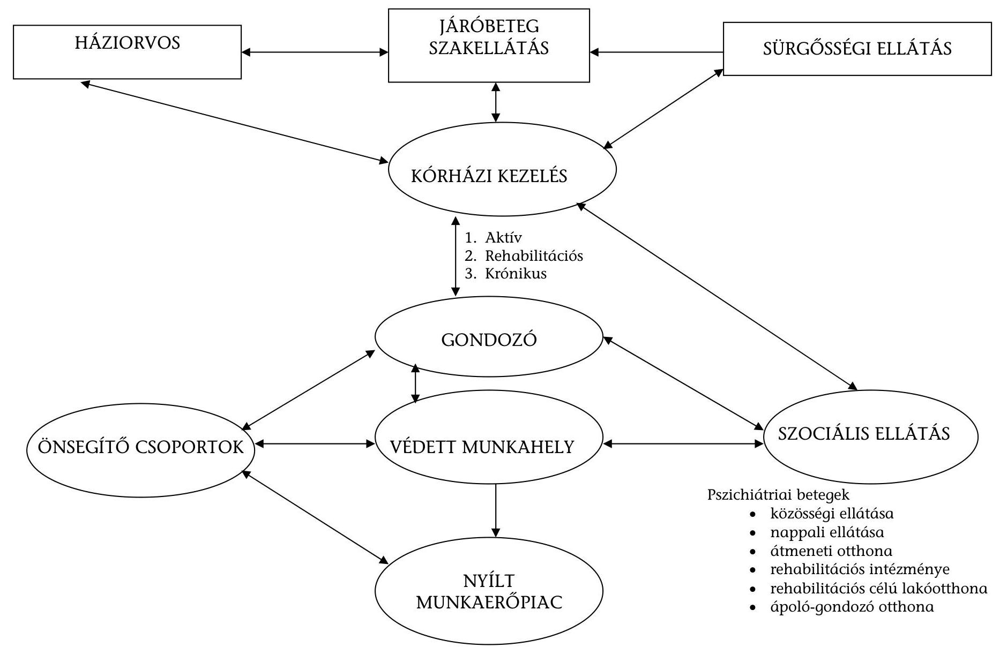

---

# Öngyilkossági kísérletet elkövetők Betegségek Nemzetközi Osztályozása szerinti megoszlása 2006. és 2011. szeptember 30. között

|  S.
sz. | BNO kód | 2006. év | 2007. év | 2008. év | 2009. év | 2010. év | 2011.
szeptember 30.  |
| --- | --- | --- | --- | --- | --- | --- | --- |
|  1 | X60 Szándékos önmérgezés nem opioid fájdalom- és lázcsillapítókkal, antirheumaticumokkal | 186 | 154 | 132 | 121 | 97 | 77  |
|  2 | X61 Szándékos önmérgezés antiepileptikum, altató-nyugtató és antiparkinson szerek és pszichotróp drogok által, k.m.n. | 5258 | 4282 | 4206 | 4492 | 3848 | 3097  |
|  3 | X62 Szándékos önmérgezés narkotikumok és pszichodiszleptikumok (hallucinogének) által, m.n.o. | 255 | 245 | 245 | 248 | 196 | 241  |
|  4 | X63 Szándékos önmérgezés az autonóm idegrendszerre ható egyéb gyógyszerek által | 280 | 212 | 126 | 102 | 100 | 89  |
|  5 | X64 Szándékos önmérgezés egyéb és k.m.n. gyógyszerek és biológiai anyagok által | 5695 | 5739 | 6123 | 6357 | 6652 | 5610  |
|  6 | X65 Szándékos önmérgezés alkohol által | 2104 | 2313 | 2891 | 3771 | 4397 | 3349  |
|  7 | X66 Szándékos önmérgezés szerves oldószerek és szénhidrogének halogén származékai és gőzeik által | 71 | 58 | 51 | 41 | 53 | 28  |
|  8 | X67 Szándékos önmérgezés egyéb gázok és gőzök által | 23 | 20 | 32 | 40 | 45 | 43  |
|  9 | X68 Szándékos önmérgezés peszticidek által | 81 | 62 | 52 | 32 | 41 | 28  |
|  10 | X69 Szándékos önmérgezés egyéb és k.m.n. vegyszerek és mérgező anyagok által | 402 | 370 | 427 | 470 | 509 | 377  |
|  11 | X70 Szándékos önártalom akasztás, zsinegelés és megfojtás által | 274 | 286 | 266 | 293 | 371 | 289  |
|  12 | X71 Szándékos önártalom vízbe fulladás és elmerülés által | 17 | 12 | 12 | 13 | 12 | 8  |
|  13 | X72 Szándékos önártalom kézi lőfegyverrel | 20 | 26 | 19 | 19 | 23 | 15  |
|  14 | X73 Szándékos önártalom sörétes és huzagolt csövű lőfegyverrel és katonai lőfegyverrel | 3 | 2 | 2 | 3 | 4 | 5  |
|  15 | X74 Szándékos önártalom egyéb és k.m.n. lőfegyverrel | 18 | 22 | 27 | 23 | 23 | 12  |
|  16 | X75 Szándékos önártalom robbanó anyagokkal | 7 | 1 | 3 | 10 | 9 | 20  |
|  17 | X76 Szándékos önártalom tűzzel, füsttel és lángokkal | 16 | 18 | 17 | 19 | 19 | 13  |
|  18 | X77 Szándékos önártalom forró gőzzel és tárgyakkal | 2 | 1 | 0 | 7 | 2 | 1  |
|  19 | X78 Szándékos önártalom szúró- és vágóeszközzel | 1147 | 1178 | 1154 | 1195 | 1189 | 1092  |
|  20 | X79 Szándékos önártalom tompa tárggyal | 17 | 14 | 21 | 16 | 19 | 29  |
|  21 | X80 Szándékos önártalom magas helyről leugrás által | 115 | 98 | 92 | 114 | 90 | 73  |
|  22 | X81 Szándékos önártalom mozgó objektum elé ugrás vagy fekvés által | 24 | 11 | 24 | 24 | 20 | 17  |
|  23 | X82 Szándékos önártalom motoros járműtől való összezúzatás által | 6 | 3 | 3 | 8 | 7 | 4  |
|  24 | X83 Szándékos önártalom egyéb megjelölt módon | 214 | 228 | 213 | 186 | 148 | 100  |
|  25 | X84 Szándékos önártalom k.m.n. | 792 | 1026 | 1316 | 1435 | 1696 | 1374  |
|   | Összesen* | 14542 | 14134 | 15096 | 16473 | 16885 | 13804  |

- Egy beteget csak egy BNO-nál vesznek figyelembe, így az összes betegszám nem egyezik meg az egyes BNO-knál feltüntetett betegszámok összegével. Forrás: OEP

---

# Fekvőbeteg ellátásban kezelt öngyilkossági kísérletet elkövető betegek 2006. és 2011. szeptember 30. között

|  Megnevezés | 2006. év | 2007. év | 2008. év | 2009. év | 2010. év | 2011.
szeptember 30.  |
| --- | --- | --- | --- | --- | --- | --- |
|  Fekvőbeteg ellátásban kezelt öngyilkossági kísérletet elkövető betegek száma összesen (fő) | 10361 | 9910 | 10504 | 11373 | 11980 | 9865  |
|  ebből a megelőző 3 hónapban pszichiátriai kezelésben (járó vagy fekvő) részesült beteg (fő) | 3370 | 4045 | 4935 | 5978 | 3604 | 3890  |

Forrás: OEP

---

# Mentési esetek közül öngyilkosságok (kísérletek) számának alakulása 2006. és 2011. szeptember 30. között 

| Terület | 2006. év | 2007. év | 2008. év | 2009. év | 2010. év | 2011.   szeptember   30. |
| :-- | :--: | :--: | :--: | :--: | :--: | :--: |
| Budapest | 884 | 900 | 793 | 754 | 789 | 709 |
| Pest | 643 | 658 | 714 | 714 | 631 | 595 |
| Közép-Magyarország | 1527 | 1558 | 1507 | 1468 | 1420 | 1304 |
| Fejér | 327 | 360 | 315 | 231 | 274 | 275 |
| Komárom-Esztergom | 317 | 313 | 285 | 308 | 334 | 235 |
| Veszprém | 312 | 323 | 318 | 369 | 386 | 335 |
| Közép-Dunántúl | 956 | 996 | 918 | 908 | 994 | 845 |
| Győr-Moson-Sopron | 133 | 188 | 198 | 179 | 192 | 155 |
| Vas | 226 | 274 | 292 | 296 | 293 | 185 |
| Zala | 139 | 144 | 142 | 197 |  |  |

 | 135 | 151 |
| Nyugat-Dunántúl | 498 | 606 | 632 | 672 | 620 | 491 |
| Baranya | 603 | 484 | 434 | 670 | 694 | 433 |
| Somogy | 227 | 257 | 221 | 306 | 370 | 299 |
| Tolna | 274 | 267 | 297 | 160 | 242 | 205 |
| Dél-Dunántúl | 1104 | 1008 | 952 | 1136 | 1306 | 937 |
| Borsod-Abaúj-Zemplén | 559 | 572 | 683 | 713 | 600 | 465 |
| Heves | 137 | 265 | 370 | 465 | 398 | 180 |
| Nógrád | 173 | 136 | 172 | 169 | 162 | 206 |
| Észak-Magyarország | 869 | 973 | 1225 | 1347 | 1160 | 851 |
| Hajdú-Bihar | 460 | 547 | 575 | 563 | 361 | 305 |
| Jász-Nagykun-Szolnok | 272 | 342 | 374 | 321 | 330 | 289 |
| Szabolcs-Szatmár-Bereg | 821 | 914 | 950 | 862 | 759 | 641 |
| Észak-Alföld | 1553 | 1803 | 1899 | 1746 | 1450 | 1235 |
| Bács-Kiskun | 542 | 536 | 535 | 634 | 510 | 434 |
| Békés | 420 | 445 | 293 | 273 | 295 | 209 |
| Csongrád | 556 | 516 | 441 | 539 | 501 | 363 |
| Dél-Alföld | 1518 | 1497 | 1269 | 1446 | 1306 | 1006 |
| Országos | 8025 | 8441 | 8402 | 8723 | 8256 | 6669 |

Forrás: OMSZ
