# ÁLLAMI   SZÁMVEVŐSZÉK 

## JELENTÉS

a PPP konstrukcióban megvalósult kiemelt kulturális és felsőoktatási projektek szerződéseinek teljesülése és társadalmi hasznosulása ellenőrzéséről

---

# Erőforrás Gazdálkodási Föigazgatóság 

## Számvevői Iroda

Iktatószám: V-2008-170/2011-2012.
Témaszám: 1024
Vizsgálat-azonosító szám: V0571

## Az ellenőrzést felügyelte:

## Makkai Mária

felügyeleti vezető

## Az ellenőrzést vezette:

## Horváthné Herbáth Mária

ellenőrzésvezető

## Az összefoglaló jelentést készítette/ték:

## Deák Tamásné

számvevő tanácsos

## Eötvös Magdolna

számvevő tanácsos

## Nyéki Melinda

számvevő
Dr. Novák Zsuzsanna Csilla
számvevő tanácsos

## Samu István

számvevő tanácsos

## Az ellenőrzést végezték:

| Béres László   számvevő | Deák Tamásné   számvevő tanácsos | Eötvös Magdolna   számvevő tanácsos |
| :-- | :-- | :-- |
| Kincses Erzsébet Eszter   számvevő | Nagy Attila   számvevő tanácsos | Dr. Novák Zsuzsanna   Csilla   számvevő tanácsos |
| Nyéki Melinda   számvevő | Nyikon Zsigmondné   számvevő tanácsos | Sápi Henriett   számvevő |
| Samu István   számvevő tanácsos | Szarvas Szilárd   számvevő tanácsos | Szőllősiné Hrabóczki   Etelka   számvevő tanácsos |

A témához kapcsolódó eddig készített számvevőszéki jelentések:
címe
sorszáma
A Művészetek Palotája megvalósításának és múködésének ellenőrzése

---

A felsőoktatás kollégium beruházási programjának ellenőrzése ..... 0741
A felsőoktatás oktatási infrastruktúra-fejlesztési programjának el- ..... 1171 lenőrzése
A köz- és magánszféra együttmúködésével kapcsolatos nemzetközi és hazai tapasztalatok - ÁSZ Fejlesztési és Módszertani Intézet tanulmánya

---

# TARTALOMJEGYZÉK 

BEVEZETÉS ..... 9
I. ÖSSZEGZŐ MEGÁLLAPÍTÁSOK, KÖVETKEZTETÉSEK, JAVASLATOK ..... 14
II. RÉSZLETES MEGÁLLAPÍTÁSOK ..... 26

1. A Művészetek Palotája projekt szerződéses feltételeinek teljesülése és társadalmi hasznosulása ..... 26
1.1. A szerződéses feltételek teljesülésének értékelése a MÜPA projektnél ..... 26
1.2. Az üzemeltetés szerződésben foglalt tartalom szerinti teljesítése és az üzemeltetés gazdaságossága ..... 35
1.3. A Művészetek Palotája múködtetéséhez kapcsolódó közpénzfelhasználás társadalmi hasznosulása ..... 43
2. A kollégium beruházási program keretében megvalósult projektek szerződéses feltételeinek teljesülése és társadalmi hasznosulása ..... 46
2.1. A szerződéses feltételek teljesülésének értékelése a felsőoktatási kollégium beruházási program keretében megvalósult projekteknél ..... 46
2.2. A kollégium beruházási program keretében megvalósult projektek üzemeltetésének szerződés szerinti teljesítése, gazdaságossága ..... 55
2.3. A PPP konstrukcióban megvalósult kollégiumok, diákotthonok múködtetéséhez kapcsolódó közpénzfelhasználás társadalmi hasznosulása ..... 61
MELLÉKLETEK
3. sz. melléklet: A PPP konstrukcióban megvalósult Művészetek Palotája projekt finanszírozásának és üzemeltetésének folyamatábrája
4. sz. melléklet: Az ellenőrzésbe vont szervezetek jegyzéke
5. sz. melléklet: Alapadatok az állami felsőoktatási intézmények PPP konstrukciójú diákotthon és kollégiumi fejlesztéseiről
6. sz. melléklet: Összesítő táblázatok a PPP konstrukcióban megvalósult kiemelt kulturális és felsőoktatási projektekről
7. sz. melléklet: Diagramok a PPP konstrukcióban megvalósult kiemelt kulturális és felsőoktatási projektekről
8. sz. melléklet: A helyszíni ellenőrzésbe vont felsőoktatási intézmények száma a nettó beruházási összeg szerinti megoszlás alapján
9. sz. melléklet: Mutatószámok jegyzéke

---

.

---

# RÖVIDÍTÉSEK JEGYZÉKE 

| ÁSZ | Állami Számvevőszék |
| :--: | :--: |
| ÁSZKUT | Állami Számvevőszék Kutató Intézete |
| BCE | Budapesti Corvinus Egyetem |
| BME | Budapesti Múszaki és Gazdaságtudományi Egyetem |
| DE | Debreceni Egyetem |
| DF | Dunaújvárosi Főiskola |
| DRHE | Debreceni Református Hittudományi Egyetem |
| EKF | Eszterházy Károly Főiskola |
| ELMŰ | Budapesti Elektromos Múvek Nyrt. |
| EMMI | Emberi Erőforrások Minisztériuma |
| FSZ | Fesztivál Színház |
| Ftv. | A felsőoktatásról szóló 2005. évi CXXXIX. törvény |
| HÖK | Hallgatói Önkormányzat |
| Kbt. | A közbeszerzésekről szóló 2003. évi CXXIX. törvény |
| KE | Kaposvári Egyetem |
| KFRTKF | Kölcsey Ferenc Református Tanítóképző Főiskola |
| Kft. | Korlátolt felelősségú társaság |
| KRF | Károly Róbert Főiskola |
| KSH | Központi Statisztikai Hivatal |
| Kvtv. | Költségvetési törvény |
| LM | Ludwig Múzeum - Kortárs Művészeti Múzeum |
| ME | Miskolci Egyetem |
| MNB | Magyar Nemzeti Bank |
| MÚPA | Múvészetek Palotája |
| MüPa Kft. | Múvészetek Palotája Kulturális Szolgáltató Közhasznú Nonprofit Kft. |
| NEFMI | Nemzeti Erőforrás Minisztérium |
| NF | Magyar Nemzeti Filharmonikus Zenekar, Énekkar és Kottatár Nonprofit Kft. |
| NFI Kft. | Nemzeti Filharmónia Ingatlanfejlesztési Kft. |
| NFM | Nemzeti Fejlesztési Minisztérium |
| NKÖM | Nemzeti Kulturális Örökség Minisztériuma |
| NT | Nemzeti Táncszínház Nonprofit Kft. |
| NYF | Nyíregyházi Főiskola |
| NYME | Nyugat-magyarországi Egyetem |
| OE | Óbudai Egyetem |
| OKM | Oktatási és Kulturális Minisztérium |
| PE | Pannon Egyetem |
| PPP | Köz- és magánszféra együttmúködése (Public Private Partnership) |
| PTE | Pécsi Tudományegyetem |
| Ptk. | A polgári törvénykönyvről szóló 1959. évi IV. törvény |

---

| SZF | Szolnoki Főiskola |
| :-- | :-- |
| SZIE | Szent István Egyetem |
| SZMSZ | Szervezeti és Müködési Szabályzat |
| Sztv. | A számvitelről szóló 2000. évi C. törvény |
| TriGranit Zrt. | TriGranit Management Ingatlankezelő és Hasznosító Zrt. |

---

# AZ ELLENŐRZÖTT INTÉZMÉNYEK KOLLÉGIUM FEJLESZTÉSI PROJEKTJEIHEZ KAPCSOLÓDÓ RÖVIDÍTÉSEK JEGYZÉKE 

| BCE kollégiumok | Budapesti Corvinus Egyetem - Földes Ferenc Kollégium és Somogyi Imre Kollégium |
| :--: | :--: |
| BME KTK | Budapesti Múszaki és Gazdaságtudományi Egyetem Kármán Tódor Kollégium |
| BME SZK | Budapesti Múszaki és Gazdaságtudományi Egyetem Schönherz Zoltán Kollégium |
| DE diákotthon | Debreceni Egyetem - Diákotthon |
| DE KLK | Debreceni Egyetem - DETEK Kossuth Lajos I-II-III. Kollégiumok |
| DE OEC | Debreceni Egyetem - OEC Kollégium rekonstrukciója |
| DF kollégium | Dunaújvárosi Főiskola - Kerpely Antal Kollégium |
| EKF kollégium | Eszterházy Károly Főiskola - Leányka úti Kollégium |
| KE kollégium | Kaposvári Egyetem - Csukás Zoltán Kollégium |
| KRF diákotthon | Károly Róbert Főiskola - Diákotthon |
| ME diákotthon | Miskolci Egyetem - UNI HOTEL |
| ME kollégium | Miskolci Egyetem - Kollégiumok (E2-E7) rekonstrukciója |
| NYF diákotthon | Nyíregyházi Főiskola - Sandra Hotel |
| NYF kollégium | Nyíregyházi Főiskola - I-II-III-IV. Kollégiumok |
| NYME diákotthon | Nyugat-magyarországi Egyetem - Diákotthon |
| OE diákotthon | Óbudai Egyetem - Diákszálló |
| PE diákotthon | Pannon Egyetem - Magiszter Hotel |
| PE kollégium | Pannon Egyetem - Kollégium rekonstrukció |
| PTE Boszorkány | Pécsi Tudományegyetem - Boszorkány u. Kollégium |
| PTE Szalay-Univ | Pécsi Tudományegyetem - Szalay Univ Kollégium |
| SZF kollégium | Szolnoki Főiskola - Kollégium rekonstrukció |
| SZIE diákotthon | Szent István Egyetem - Diákhotel D-E-F épület |
| SZIE gödöllői és-   jászberényi kollégiumok | Szent István Egyetem - Gödöllő A-B jelű Kollégium és Jászberényi Kollégium |
| SZIE szarvasi és békés-   csabai kollégiumok | Szent István Egyetem - Szarvasi és Békéscsabai Kollégiumok (Tessedik Sámuel Főiskola Kollégiumok) |

---

.

---

# ÉRTELMEZŐ SZÓTÁR 

Diákotthon

Diszkontálás

Hagyományos kollégium
Kockázati mátrix

Kollégium

Kollégiumi támogatás

Lakhatási támogatás

Maradványérték

Monitoring

PPP (Public Private
Partnership):

A hallgatók lakhatási feltételeinek biztosítására létrehozott, a felsőoktatási intézményhez szervezetileg nem tartozó intézmény. (A felsőoktatásról szóló 2005. évi CXXXIX. törvény 13. §)
Jövőbeli időpontra szóló pénzösszegek jelenbeli értékének meghatározása referencia-kamatláb (más szóval diszkontkamatláb) segítségével.
(http://penzportal.hu/index.cgi?r=\&v=\&l=\&feaz=wzs9445 7884s7e4\&mf=\&p=gazd_szotar-speckereso)
Nem PPP konstrukcióban létrehozott és üzemeltetett kollégium.
A PPP projekt kockázatainak táblázatos formában történő összefoglalása, amelyben rögzítésre kerülnek az egyes kockázati elemek és a kockázat viselője, valamint az egyes kockázatok kezelési módja.
(http://www.ngm.gov.hu/masolt/archivum/euintegr/ _euintegracio/ppp_alap.html)
A hallgatók lakhatási feltételeinek biztosítását szolgáló felsőoktatási intézmény részeként múködtetett létesítmény. (A felsőoktatásról szóló 2005. évi CXXXIX. törvény 13. §)

A felsőoktatási intézmények kollégiumi férőhelyeinek fenntartására szolgáló támogatás.
(http://www.nefmi.gov.hu/felsooktatas/juttatasok/ hallgatoi-juttatasok)
A kollégiumi elhelyezésre jogosult, de oda helyhiány miatt fel nem vett hallgatók támogatásának fedezete. (http://www.nefmi.gov.hu/felsooktatas/juttatasok/ hallgatoi-juttatasok)
A rendeltetésszerű használatbavétel, az üzembe helyezés időpontjában - a rendelkezésre álló információk alapján, a hasznos élettartam függvényében - az eszköz meghatározott, a hasznos élettartam végén várhatóan realizálható értéke. (A számvitelről szóló 2000. évi C. törvény 3. § (4) bekezdés)
Egy adott fejlesztés pénzügyi és fizikai megvalósításának nyomon követése; azt vizsgálja, hogy az adott fejlesztés végrehajtása megfelel-e az előre tervezettnek, valamint hogy biztosított-e az előre meghatározott célok elérése. (http://penz-ugyek.shp.hu/hpc/web.php?a=penz-
ugyek\&o=projekt_monitoring_3dGj)
A közszféra és a magánszektor olyan együttműködési formái, amelyekben a közfeladatok ellátásáért felelős állam - szolgáltatási, beruházási feladatainak megszervezésekor - komplex módon együttműködik a magánszféra (piac) szereplőivel. (Kotán Attila: Pazarlás vagy perspektí-

---

|  | va (PPP konstrukciók és hazai alkalmazásuk) 2. oldal) |
| :--: | :--: |
| Projekt | A projekt meghatározott időtartamra szóló tevékenység, amelynek célja, hogy egyedi terméket, szolgáltatást vagy más eredményt hozzon létre.   (http://hu.wikipedia.org/wiki/Projekt) |
| Projektköltség | A projekt megvalósítása érdekében felmerült forrásszükséglet. |
| Refinanszírozás | A kezdeti finanszírozási formában felvett források visszafizetését követően ezeket pótlandó, új pénzügyi források bevonása új feltételekkel. (PPP kézikönyv: A köz- és magánszféra sikeres együttmúködése (GKM 2004) 47. oldal) |
| Rendelkezésre állási díj | A magánpartner által az ingatlan üzemeltetéséért és rendelkezésre tartásáért felszámított, a szolgáltatás minőségi és mennyiségi paramétereitől függő díj. (PPP kézikönyv: A köz- és magánszféra sikeres együttmúködése (GKM 2004) 14. oldal) |
| Rendelkezésre állási kockázat | A magántársaság akkor viseli a rendelkezésre állás kockázatát, ha hiányos teljesítés esetén - amennyiben nem képes a szolgáltatás szerződésben megállapodott mennyiségi paramétereknek megfelelő nyújtására, vagy a szolgáltatás minősége nem felel meg a szerződésben előírtaknak - az állam csökkentett díjat fizet. (PPP kézikönyv: A köz- és magánszféra sikeres együttmúködése (GKM 2004) 58. oldal) |

---

# JELENTÉS 

## a PPP konstrukcióban megvalósult kiemelt kulturális és felsőoktatási projektek szerződéseinek teljesülése és társadalmi hasznosulása ellenőrzéséről

## BEVEZETÉS

Az állami és magánszektor közötti fejlesztési célú együttműködések újszerű formáinak alkalmazását a 2098/2003. (V. 29.) Korm. határozat ${ }^{1}$ tette lehetővé. A Public Private Partnership (PPP) konstrukcióban a közbeszerzési eljárásban nyertes magánbefektetők saját forrásból, valamint bankhitelből valósítják meg a beruházásokat és üzemeltetik a létesítményeket.

Kulturális területen a köz- és magánszféra együttműködésével megvalósult kiemelt projekt a 2005. március 15 -én átadott Művészetek Palotája (MÜPA). A felsőoktatásban az oktatási infrastruktúra fejlesztése ${ }^{2}$, valamint a diákotthonok építése, kollégiumi férőhelyek korszerűsítése valósult meg magántőke bevonásával, PPP konstrukcióban.

A múzeumot, hangverseny- és színháztermet magában foglaló Művészetek Palotája hasznosítására, valamint a projekt finanszírozására vonatkozó elképzelések a kivitelezés időszakában többször változtak. A nettó 31,3 Mrd Ft fejlesztési keretösszegű beruházás lebonyolítását a Duna Sétány Székház Kft. és a Nemzeti Kulturális Örökség Minisztériuma (NKÖM) által alapított projekttársaságok végezték. A projekttársaságok a beruházáshoz szükséges források 30,0\%-át, jegyzett tőke formájában biztosították. A saját erő mellett a fejlesztési költség 70,0\%-át kitevő 95,9 M euró összegű bankhitel igénybevételével építették fel az ingatlant.

Az eredeti konstrukció az volt, hogy az állam 10 éves időtartamra bérbe veszi az épületet, amelynek műszaki üzemeltetését és szakmai működtetését állami feladatként határozták meg. A létesítmény a magánpartner projekttársaságokban levő üzletrészeinek megszerzésével került volna állami tulajdonba. A 40,2 Mrd Ft összegű bérleti díj a magánpartner számára fedezetet nyújtott volna a felvett hitel kamatokkal növelt törlesztésére, az üzletrészek 11,8 Mrd Ft értékben történő adásvétele pedig a saját tőkebefektetés 8,0\%-os hozammal növelt megtérülésére.

[^0]
[^0]:    ${ }^{1}$ Hatálytalan 2007. február 28-ától.
    ${ }^{2}$ A felsőoktatás oktatási infrastruktúra-fejlesztési programjának ellenőrzését az ÁSZ a 2011. évben fejezte be ( 1171 számú Jelentés).

---

A beruházás befejező szakaszában a fizetési kötelezettségek elhalasztása, szétterítése, a rendelkezésre állási kockázat átadása, valamint a beruházás központi költségvetésen kívüli elszámolhatósága érdekében a Kormány az Országgyúlés felhatalmazása alapján az eredeti együttmúködési forma átalakítását kezdeményezte. Az eredeti megállapodás 30 éves futamidejú PPP konstrukcióvá történő átalakítását a 1026/2005. (III. 11.) Korm. határozat alapozta meg. Az új pénzügyi konstrukció szerint rendelkezésre állási díj, és azon felül fizetendő közmú díjak fejében a magánpartner biztosítja az épület múszaki üzemeltetését, rendelkezésre tartását, míg a szakmai múködtetés állami feladat.

A létesítmény rendelkezésre állási díja és közmú költsége 2005-2010 között 40,4 Mrd Ft, a szakmai múködtetést ellátó Művészetek Palotája Kulturális Szolgáltató Közhasznú Nonprofit Kft. (MüPa Kft.) támogatása 12,9 Mrd Ft költségvetési kiadással járt. A rendelkezésre állási díj euróban történő meghatározása miatt az állami megrendelő árfolyamkockázatot visel. A 2035-ig tartó futamidő alatt a prognosztizált rendelkezésre állási díj $250 \mathrm{Ft} /$ euró árfolyamon számolva további 177,5 Mrd Ft, 2011. évi átlagárfolyamon ${ }^{3}$ 198,2 Mrd Ft költségvetési kiadást jelent.

A felsőoktatási intézmények infrastruktúra fejlesztési programjának indításáról a 2207/2004. (VIII. 27.) Korm. határozat rendelkezett. Ebben az oktatási infrastruktúra fejlesztése mellett 10455 új diákotthoni férőhely kialakítását, valamint 20000 kollégiumi férőhely rekonstrukcióját irányozták elő PPP konstrukcióban.

A 2004-2011 közötti időszakban 15 felsőoktatási intézménynél 24 projekt ezen belül 8 diákotthon létesítése és 16 kollégium rekonstrukciója - valósult meg (3. sz. melléklet). A hosszú távú kötelezettségvállalással járó fejlesztések eredményeként a diákotthonokban 4460 férőhelyet alakítottak ki és 12892 kollégiumi férőhelyet újítottak fel (II/1. sz. táblázat). A felsőoktatási intézmények hosszú lejáratú (jellemzően 20 éves futamidejú) szerződéseket ${ }^{4}$ kötöttek a magánpartnerekkel, akik bérleti-szolgáltatási díj fejében megépítették vagy felújították, azt követően üzemeltetik a létesítményeket.

A költségvetési törvények lehetőséget biztosítottak arra is, hogy a felsőoktatási intézmények hosszú távú kötelezettségvállalásának 50,0\%-át a szakmai felügyeletet ellátó fejezet éves beruházási forrásai terhére - az éves beruházási keret $33,0 \%$-áig - átvállalja. ${ }^{5}$ A minisztériumi hozzájárulás mértéke a rekonstrukciós projekteknél a bérleti szolgáltatási díj 50,0\%-áig terjedhet, a diákotthon-

[^0]
[^0]:    ${ }^{3}$ A 2011. évi MNB éves átlagárfolyam 279,21 Ft/euró.
    ${ }^{4}$ A felsőoktatási intézmények számára legelőször a Magyar Köztársaság 2004. évi költségvetéséről és az államháztartás hároméves kereteiről szóló 2003. évi CXVI. törvény 50. § (6) bekezdése biztosította, hogy a tárgyévi költségvetésük kiadási főösszegének 10,0\%-os mértékéig hosszú távú (legfeljebb 20 éves) kötelezettséget vállaljanak. A Magyar Köztársaság 2005. évi költségvetéséről szóló 2004. évi CXXXV. törvény 50. § (21) bekezdése, valamint a felsőoktatásról szóló 2005. évi CXXXIX. törvény 122. § (4) bekezdése szerint a kötelezettségvállalás felhalmozási célokra vagy beruházást helyettesítő szolgáltatás vásárlására történhet.
    ${ }^{5}$ 2003. évi CXVI. törvény 50. § (6) bekezdése.

---

oknál a 2006-2009. években havi 5000 Ft, 2010-től 10000 Ft férőhelyenként. A 2006-2010 közötti időszakban a diákotthonok és korszerűsített kollégiumok bérleti díjához történő hozzájárulás összesen 10,3 Mrd Ft volt. A támogatás öszszege a megvalósított projektek 20 éves futamidejének végéig várhatóan további 65,3 Mrd Ft központi költségvetési forrást igényel.

A projektekhez kapcsolódó felügyeletet és finanszírozást az ellenőrzött időszak kezdetétől 2010. május 24 -éig az OKM, ezt követően 2010. június 30-ig a Nemzeti Erőforrás Minisztérium (NEFMI) ${ }^{6}$, 2010. július 1-jétől a Nemzeti Fejlesztési Minisztérium (NFM) látja el ${ }^{7}$.

A köz- és magánszféra együttműködésével - PPP konstrukcióban - megvalósult Művészetek Palotája projektet az Állami Számvevőszék (ÁSZ) 2006-ban ${ }^{8}$, a felsőoktatás kollégium beruházási programját 2007-ben ${ }^{9}$ ellenőrizte. Az ellenőrzések alapvetően a fejlesztési programok előkészítésére és megvalósítására irányultak. Ekkor még nem állt rendelkezésre elegendő információ és tapasztalat a szerződésekben foglalt tartalom teljesülésének, a szolgáltatásnyújtás minőségének, a projektek társadalmi hasznosulásának megalapozott értékeléséhez. Ez a tény, valamint a jelentős összegű és hosszú távú kötelezettségvállalás indokolta az utóellenőrzés elvégzését.

A Művészetek Palotája megvalósításának és múködésének ellenőrzéséről szóló jelentés megállapította, hogy a létesítmény innovatív megvalósítása sikerrel járt. A beruházás folyamán pót- és többletmunka, abból származó többletköltség nem merült fel. A projekt előkészítése és végrehajtása folyamatát végigkísérték a kulturális-szakmai, az ezzel összefüggő építési-műszaki változtatások, valamint a pénzügyi konstrukció - alapvetően költségvetési prezentációs szempontok miatti - módosítása. A nem megalapozott előkészítés a megvalósítás gazdaságosságát és hatékonyságát hátrányosan befolyásolta. A projekt a finanszírozási konstrukció változása miatt - az összehasonlítható tételek figyelembevételével, nominálértéken - 66,6 Mrd Ft-tal több költségvetési ráfordítást igényelt.

A felsőoktatás kollégium beruházási programjának ellenőrzéséről készített jelentés megállapította, hogy a projektek előkészítése kollégiumfejlesztési stratégia, egységes állami eljárásrend, gazdaságossági és hatékonysági követelmények hiányában nem volt megalapozott. Az intézmények nem készítettek sem hosszú távú létszámbecslést, sem a projektek finanszírozhatóságára vonatkozó számításokat.

Az utóellenőrzés a fenti témaköröket nem érintette.

[^0]
[^0]:    ${ }^{6}$ 2012. május 14-től Emberi Erőforrások Minisztériuma
    ${ }^{7}$ Az egyes miniszterek, valamint a Miniszterelnökséget vezető államtitkár feladat- és hatásköréről szóló 212/2010. (VII. 1.) Korm. rendelet 87. § b) pontja.
    ${ }^{8} 0660$ számú Jelentés a Művészetek Palotája megvalósításának és múködésének ellenőrzéséről.
    ${ }^{9} 0741$ számú Jelentés a felsőoktatás kollégium beruházási programjának ellenőrzéséről.

---

# Jelen ellenőrzés célja annak értékelése volt, hogy 

- az ellenőrzött kulturális és felsőoktatási PPP konstrukciójú projektek szerződéses feltételeinek teljesülése során biztosított volt-e a közpénzfelhasználás gazdaságossága, a közszféra érdekeinek érvényesülése;
- a köz- és magánszféra együttműködésével megvalósított projektek üzemeltetése a szerződésben foglalt tartalommal, ellenőrzötten és a közpénzfelhasználás gazdaságosságát biztosítva teljesült-e;
- az ellenőrzött kulturális és felsőoktatási projektek múködtetése során biztosított volt-e a közpénzfelhasználás társadalmi hasznosulása.

Az ellenőrzés a Művészetek Palotája és a megvalósult kollégiumi projektek szerződéses feltételeinek teljesülését - a szerződéskötések időpontjára tekintettel - a 2004-2010. évekre, azok üzemeltetését, társadalmi hasznosulását pedig a 2007-2010 közötti időszakra vonatkozóan vizsgálta. Az ellenőrzés kiterjedt a 2011. év helyszíni ellenőrzés befejezéséig tartó tendenciák értékelésére. A kollégiumok és diákotthonok létszámadatainak, kihasználtságának elemzése a 2007-2011 közötti időszakra vonatkozik.

A Művészetek Palotája projekthez kapcsolódóan a helyszínen ellenőriztük a létesítményt hasznosító kulturális intézményeket (Művészetek Palotája Kulturális Szolgáltató Közhasznú Nonprofit Kft., Ludwig Múzeum - Kortárs Művészeti Múzeum, Magyar Nemzeti Filharmonikus Zenekar, Énekkar és Kottatár Nonprofit Kft., Nemzeti Táncszínház Nonprofit Kft.).

A 2011-ig PPP konstrukcióban megvalósult kollégium beruházási programokban résztvevő felsőoktatási intézményeket teljes körben ellenőriztük. Értékelésünket tanúsítványi adatokkal, kérdőíves információgyűjtéssel, fókuszcsoport szervezésével, összehasonlító elemzésekkel alapoztuk meg. A helyszíni ellenőrzésre 5 felsőoktatási intézményt választottunk ki (6. sz. melléklet) a nettó beruházási adatok alapján rétegzett mintavétellel. A mintavételezéssel kijelölt intézmények 10 projektje ( $2 / \mathrm{b}$. sz. melléklet) a megvalósított PPP fejlesztések nettó beruházási összegének 49,2\%-át tette ki.

Az ellenőrzési program szempontjai alapján, a helyszínen ellenőriztük az érintett intézmények szakmai felügyeletét végző Nemzeti Erőforrás Minisztériumnak (NEFMI), valamint az NFM-nek a PPP programokhoz kapcsolódó tevékenységét. Az ellenőrzés a PPP konstrukciójú projekteket megvalósító magánpartnerekre is kiterjedt, alapvetően tanúsítványi adatkérés és iratbetekintés formájában.

Az ellenőrzés típusa teljesítmény-ellenőrzés.
Ellenőrzésünkben az eredményességi kritérium a szerződéses feltételek teljesülésére vonatkozóan azt jelenti, hogy a kockázatok többségét a magánpartner viseli, a felek rendelkeznek az előre nem látható események miatti kockázatkezelésről. A projektek üzemeltetése akkor eredményes, ha az üzemeltetési szolgáltatásokat a szerződés alapján a megrendelő igényei szerinti mennyiségben és minőségben nyújtja a magánpartner, a díjfizetés mértéke a tervezett összegeknek megfelelően alakul és forrásai rendelkezésre állnak. A közpénzfelhasználás

---

eredményessége, társadalmi hasznosulása akkor valósul meg, ha a megrendelők és hasznosítók elérik a kitűzött kulturális, társadalmi és gazdasági célokat.

A szerződéses feltételek akkor biztosítják a közpénzfelhasználás gazdaságosságát, ha a szolgáltatások tartalma részletesen, számon kérhetően meghatározott; a díjfizetésre vonatkozó rendelkezések biztosítják az üzemeltetés gazdaságosságát, a szolgáltatás ár-érték arányát. Az üzemeltetés gazdaságossága akkor valósul meg, ha az üzemeltetési ráfordítások az előzetes tervekhez, illetve más hasonló célú intézmények üzemeltetéséhez viszonyítva kedvezőek, valamint ha a szerződéstől eltérő teljesítés esetén az állami fél arányos díjcsökkentést tud érvényesíteni.

Az ellenőrzési szempontok értékelését a kritériumok és az azokhoz rendelt, a 7. sz. mellékletben összefoglalt mutatószámok felhasználásával végeztük el.

Az ellenőrzés végrehajtásának jogszabályi alapját az Állami Számvevőszékről szóló 2011. évi LXVI. törvény 5. § (3), (5), a 25. § (3) bekezdéseiben foglaltak képezték ${ }^{10}$.

[^0]
[^0]:    ${ }^{10}$ Az adatgyűjtés időszakában az ellenőrzést - 2011. június 30-ig - az Állami Számvevőszékről szóló 1989. évi XXXVIII. törvény 2. § (3), (5), (9), valamint a 17. § (3) bekezdéseire alapoztuk.

---

# I. ÖSSZEGZŐ MEGÁLLAPÍTÁSOK, KÖVETKEZTETÉSEK, JAVASLATOK 

## A Müvészetek Palotája projekt

A Müvészetek Palotája (MÚPA) beruházás megvalósítása 2001-ben kezdődött el. Ekkor a köz- és magánszféra a létesítmény tíz éves bérletére kötött megállapodást. Ezt követően a létesítmény a magánpartner üzletrészeinek megvásárlására irányuló szerződés alapján került volna az állam tulajdonába. A beruházás 2005. március 15 -én fejeződött be. A létesítmény átadását követően a korábbi megállapodásokat az Országgyúlés felhatalmazása alapján ${ }^{11}$ szolgáltatásvásárlási szerződés váltotta fel. A harminc éves futamidejű Rendelkezésre Állási Szerződést 2005. április 1-jén kötötték meg. A megállapodást a megrendelő képviseletében a pénzügyminiszter ellenjegyzése mellett a nemzeti kulturális örökség minisztere ${ }^{12} \mathrm{a}$ szolgáltatók részéről a beruházást lebonyolító négy projekttársaság vezetője írta alá.

A 2005. évben az állami fél által kezdeményezett PPP konstrukcióra való áttéréssel a projekt forrásszükséglete (projektköltség) - amelynek a magánpartner tőkebefektetése 10,0\%-át fedezte - 136,9 M euróról 177,3 M euróra emelkedett. A projektköltség növekedéséhez hozzájárult a magánpartnerek által korábban felvett hitel refinanszírozásának 2,3 M euró összegű tranzakciós költsége, továbbá az a tény, hogy a konstrukcióváltáskor a magánpartnerek eredeti tőkebefektetését 7,5 M euró hozammal növelve kellett visszafizetni. A szerződés alapján a megrendelő NKÖM a harminc éves futamidő első két évében csökkentett összegű rendelkezésre állási díjat fizetett. A teljes és a csökkentett díj különbségét a minisztérium a későbbi évek rendelkezésre állási díjaiban elosztva fizeti meg.

A szerződésben az első két év működtetésének tőkeszükségletét 30,6 M euró ( 7,7 Mrd Ft) összegben határozták meg, amelyet a magánpartner hitelfelvétellel biztosított. A szerződés alapján az állami megrendelő az első két évben (2005-ben és 2006-ban) 10,4 M euró csökkentett díjat fizetett. A magánpartner kimutatásaiban 15,5 M euró ( 3,9 Mrd Ft) ki nem számlázott rendelkezésre állási díj szerepelt, hitelfelvétel csak ennek fedezetére volt indokolt.

A magánpartner által a díjkülönbözet pótlására felvett hitelnek az indokolt forrásbevonást 15,1 M euróval meghaladó összege kamatteherrel növelt fizetési kötelezettséget és további árfolyamkockázatot jelent az állami megrendelő számára.

[^0]
[^0]:    ${ }^{11}$ A Magyar Köztársaság 2005. évi költségvetéséről szóló 2004. évi CXXXV. törvény 50. § (5) bekezdés.
    ${ }^{12}$ A 1026/2005. (III. 11.) Korm. határozat szerint.

---

A rendelkezésre állási díj teljes nettó összegét euróban fizeti az állami megrendelő. A díj $51,7 \%$-a olyan díjtételekre nyújt fedezetet, amelyek a magánpartnernél alapvetően forintban merülnek fel. A forintban felmerüló díjtételek (üzemeltetés, felújítás, adó, adminisztrációs költségek) árfolyamkockázatának vállalása az állami megrendelő számára szükségtelen és aránytalan terhet jelent. A RÁD inflációkövető tételeinek meghatározása ugyanakkor a hazai árváltozásoktól eltérő euró inflációval történik. A hazai és euró infláció eltérésének kockázatát a magánpartner viseli.

A futamidő alatt a Rendelkezésre Állási Szerződés csak rendkívüli felmondás, illetve a megállapodás érvénytelensége esetére rendelkezik arról, hogy az állam a magánpartnertől milyen feltételekkel szerezheti meg az ingatlan tulajdonjogát. Az államnak a szolgáltató szerződésszegése esetén is a szerződésben rögzített áron kell az ingatlant megvásárolnia még akkor is, ha a szolgáltatók hibás teljesítése miatt nem biztosított annak rendeltetésszerú használata.

A futamidő lejártát követően a Rendelkezésre Állási Szerződéstől elkülönülő Üzletrész Adásvételi Szerződés alapján az állami megrendelő a létesítmény tulajdonjogát közvetett módon - a magánpartner projekttársaságban levő üzletrészének 10 euró összegben rögzített megvásárlásával - szerzi meg. Az Üzletrész Adásvételi Szerződésben az eladó szavatolja az üzletrész, valamint a Művészetek Palotája (ingatlan, telek és ingóságok) per-, teher- és igénymentességét, amennyiben az állami megrendelő az őt terhelő valamennyi fizetési kötelezettségének eleget tesz. Ez esetben az üzletrész előre meghatározott vételáron történő megszerzése az állam számára tényleges terhet és kockázatot nem jelent. Ellenkező esetben az eladósodott társaság tulajdonjogának megszerzése a vételáron felüli kötelezettséggel jár, és vevővédelmi biztosítékok hiányában kockázatot hordoz az állami fél számára.

A négy projekttársaság ${ }^{13}$ és azok tulajdonosa, az MP Projekt Vagyonkezelő Kft. 2009 márciusában beolvadással egyesült. A jogutód Nemzeti Filharmónia Ingatlanfejlesztési Kft. (NFI Kft.) jegyzett tőkéje 9495,4 M Ft-ról 200 M Ft-ra csökkent az egyesüléshez kapcsolódó tőkerendezés következtében. A jegyzett tőke jelenlegi összege nem felel meg a refinanszírozási hitelszerződés minimum 500 M Ft-os jegyzett tőkére vonatkozó követelményének. Az egyesüléskor az NFI Kft. teljes eszközértékére döntően banki hitelből származó idegen források nyújtottak fedezetet. A beolvadást követően a korábbi veszteségekből adódó negatív saját tőkét az eszközök piaci értéken történő értékelésével rendezték. A vagyoni szerkezet változása abban az esetben kedvezőtlen a közszféra számára, ha a futamidő lejártával állami tulajdonba kerülő projekttársaság likvid eszközökkel nem fedezett kötelezettségeket tart nyilván, ami a vételáron felül további terhet jelent. Amennyiben az állami fél és a finanszírozó bankok élnek ellenőrzési jogosultságukkal, ennek kockázata nem számottevő, mivel a magánpartner a MÚPA-hoz nem kapcsolódó kötelezettségeket nem vállalhat.

A szerződő felek a műszaki üzemeltetés elvárt szolgáltatási paramétereit nem határozták meg teljes körűen megfelelő részletezettséggel, így azok teljesítésé-

[^0]
[^0]:    ${ }^{13}$ Duna Múzeum Ingatlanfejlesztő Kft., Duna Parkoló Ingatlanfejlesztő Kft., Hagyományok Háza Ingatlanfejlesztő Kft., Nemzeti Filharmónia Ingatlanfejlesztési Kft.

---

nek számon kérhetősége, ellenőrizhetősége nem biztosított. A szerződés egy öszszegben tartalmazza az üzemeltetési dijrészt, a részfeladatok díjtételeit részletesen nem határozza meg. A szerződésben rögzített szankciók hatását korlátozza, hogy a szolgáltatási szint 1,0\%-os csökkenése a teljes dijnak mindössze 0,2\%-os csökkentését vonja maga után. Az OKM a 0660 számú ÁSZ jelentés ${ }^{14}$ javaslata ellenére nem kezdeményezte az üzemeltetéssel összefüggő szerződéses feltételek pontosítását, és nem végeztette el a díjtételek független szakértő általi felülvizsgálatát.

A létesítmény harminc éves rendelkezésre állásának biztosítására pótlásifelújítási alapok nyújtanak fedezetet. A magánpartner a MÚPA eszközei után a 2010. év végéig 4,1 Mrd Ft értékcsökkenést számolt el. Ezzel szemben a Rendelkezésre Állási Szerződés 7,4 Mrd Ft pótlási kötelezettséget tartalmaz, amelyet a rendelkezésre állási díj részeként a megrendelőnek kell finanszíroznia. Az első két év csökkentett díjfizetése következtében a szerződés szerint ennél alacsonyabb összeg, csak 6,8 Mrd Ft került a pótlási alapokba. A magánpartner által meghatározott számviteli értékcsökkenésnek megfelelő alapképzés biztosítja az eszközök változatlan színvonalú rendelkezésre állását. Ezt meghaladó alapképzést a technológiai fejlődés követése érdekében - a megrendelő által is elfogadható mértékű - műszaki-technikai fejlesztés indokolhat.

Az állami megrendelő számára hátrányos a szerződés azon rendelkezése, miszerint a futamidő lejártakor az Eszköz Pótlási, valamint a Bútor és Aprócikk Pótlási Alapból az általa befizetett, de fel nem használt összegnek csak a fele illeti meg.

A Rendelkezésre Állási Szerződésben az üzemeltetési szolgáltatások tartalmának, volumenének változtatási lehetőségéről, feltételeiről nem rendelkeztek. A létesítmény funkcionális kialakításának megváltoztatására azonban - a szolgáltató előzetes írásbeli jóváhagyásával, a megrendelő terhére - a szerződés lehetőséget biztosít. A létesítmény átadását követő években a felhasználók részéről - a beruházás előkészítésének átgondolatlanságából eredően - a működési feltételeket javító átalakítási igények merültek fel. Az átalakításokat a felújítá-si-eszközpótlási alapok terhére valósították meg, ez a ténylegesen felújításokat szolgáló forrásokat csökkentette.

A Művészetek Palotája múködtetése - a rendelkezésre állási és közüzemi díjak, valamint a létesítményben múködő kulturális szervezetek támogatása - az ellenőrzött időszakban évente átlagosan 13,3 Mrd Ft költségvetési forrást igényelt.

[^0]
[^0]:    ${ }^{14}$ Jelentés a Művészetek Palotája megvalósításának és múködésének ellenőrzéséről (0660 számú, 2007. január)

---

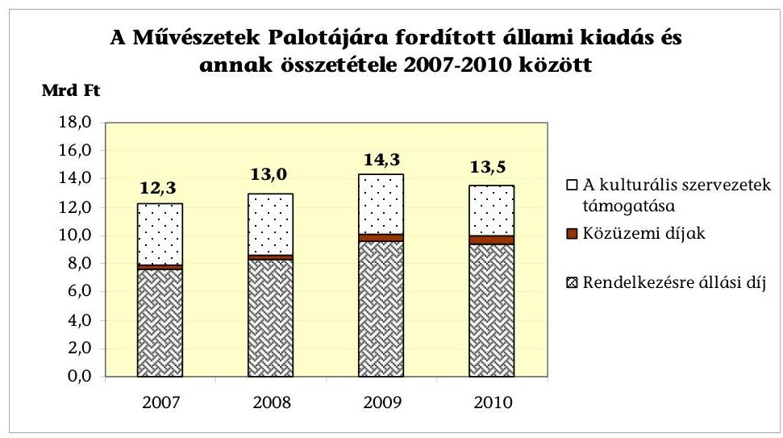

Az állami kiadásokon belül a rendelkezésre állási díj aránya 2007-ről 2010-re 7,8 százalékponttal, a közüzemi díjaké 1,3 százalékponttal nőtt, a kulturális szervezetek támogatásának aránya pedig 9,1 százalékponttal csökkent.

A rendelkezésre állási díj bruttó összege a 2007-2010. év végéig tartó időszakban $4,0 \%$-kal haladta meg a szerződésben prognosztizált összeget a tervezettől eltérő infláció, árfolyam- és adóváltozás következtében. A szerződés szerint a díj adóváltozások miatti korrekciója - az adók pontos összegének ismeretében, a szolgáltató auditált pénzügyi jelentései alapján - két éves eltéréssel történik.

A PPP projektek felügyeletét ellátó NFM 2011-ben elvégeztette a Rendelkezésre Állási Szerződés átfogó jogi és pénzügyi felülvizsgálatát. Ennek eredményeként a szerződéshez kapcsolódó, jogszabályba ütköző rendelkezést nem állapítottak meg. A felülvizsgálat összefoglalója azonban megállapította, hogy a szerződéses feltételek több ponton nem felelnek meg a közszféra érdekeinek (pl. a hitelfelvétel nagyságrendje, az eszközpótlási alapok „tültöltöttsége").

# A MÚPA projekt szerződéses feltételei nem biztosították a közpénzfelhasználás gazdaságosságát, így az állami megrendelő érdekeinek 

érvényesülését. A szerződéses feltételek módosításához a felek kölcsönös együttműködése szükséges.

A rendelkezésre bocsátott dokumentumok alapján a 2010. évben a műszaki üzemeltetési szolgáltatások magánpartnernél felmerült tényleges ráfordításai az állami megrendelő felé érvényesített - hozam nélkül számított - üzemeltetési díjtétel $56,9 \%$-át tették ki. A hasznosító kulturális szervezetek nem érdekeltek a takarékos energiafelhasználásban, mivel a közüzemi díjak a megrendelő minisztériumot terhelik. Az energiafelhasználás intézmények szerinti mérését az alkalmazott műszaki megoldások sem teszik lehetővé. Az üzemeltetést végző társaság birtokában maradó helyiségek után fizetendő közmű díjakról a Rendelkezésre Állási Szerződés nem rendelkezett. Nem felelt meg a közszféra érdekeinek, hogy a műszaki üzemeltető a saját közüzemi fogyasztását nem térítette meg. Az ellenőrzés dokumentumai alapján az üzemeltetési szolgáltatások a lé-

---

tesítmény zavartalan múködtetését biztosították, megfeleltek a megrendelői és felhasználói elvárásoknak, azonban a létesítmény PPP konstrukcióban történő üzemeltetése nem volt gazdaságos.

A műszaki üzemeltetést ellátó szervezet havi jelentésekben számolt be a megrendelőt képviselő MüPa Kft. felé a szolgáltatások teljesítéséről. A felek a Rendelkezésre Állási Szerződésben nem határozták meg részletesen az üzemeltetési szolgáltatások paramétereit (pl. őrzés-védelem óraszáma, épület-fenntartási feladatok tartalma, növényápolás gyakorisága, tartalma). Az üzemeltetési szolgáltatások szerződés szerinti teljesítése a részletes meghatározás hiányában nem volt teljes körűen kontrollálható.

A szolgáltató a felújítási munkálatokat a megrendelő képviselőjével egyeztetett ütemezésben, az állami fél által igényelt tételeknél az átadás-átvételt igazoltatva végezte el. Az alapok terhére azonban 2008-2010 között - 165,3 M Ft értékben - olyan karbantartási munkálatokat (pl. festés, mázolás, tetőszigetelés) is végeztek, amelyeket a szolgáltatónak a Rendelkezésre Állási Szerződés szerint a pótlási-felújítási alapoktól elkülönített üzemeltetési díjból kellett volna fedeznie.

A szolgáltatásnyújtás értékelésére a megrendelő képviseletében a MüPa Kft., valamint a műszaki üzemeltető működtet monitoring rendszert havi jelentések formájában. A rendszer a szolgáltatási paraméterek részletezettségének hiányában nem teszi lehetővé a szerződéses szankciók maradéktalan érvényesítését. A paraméterek egységes értelmezéséhez, a területi besoroláshoz részletes - a szolgáltatóval együtt elfogadott - szabályzat nem készült. Az ÁSZ 2007. évi jelentésének ${ }^{15}$ monitoring rendszert érintő javaslatai nem hasznosultak. A megrendelő a díjfizetést érintő üzemeltetési változások nyomon követésére alkalmas monitoring-, értékelő és ellenőrzési rendszert nem alakított ki.

Az NKÖM a Rendelkezésre Állási Szerződésből eredő megrendelői feladatok egy részének ellátásával (pl. a szolgáltatóval való kapcsolattartás, ellenőrzés) az általa alapított MüPa Kft-t bízta meg. A MüPa Kft. az Alapítói Határozatban rögzített feladatokat nem látta el teljes körűen. Nem történt meg ugyanis az Eszköz Pótlási, valamint a Bútor és Aprócikk Pótlási Alapból teljesített felújítások éves ellenőrzése és a megrendelő minisztérium tájékoztatása. A közüzemi számlák fogyasztási adatainak teljesítés-igazolásait a megrendelő képviselője helyett a műszaki üzemeltető végezte el. A szolgáltatás teljesítésének teljes körű, tételes ellenőrzését a számon kérhető egyértelmű szempontrendszer, valamint az ezen alapuló monitoring rendszer hiánya nem tette lehetővé.

2010-ig a Rendelkezésre Állási Szerződésben meghatározott megrendelői szerepkörből adódó részfeladatok ellátásával az OKM, majd a NEFMI a saját tulajdonú gazdasági társaságát a MüPa Kft-t bízta meg. 2010 októberétől a többi PPP projekthez hasonlóan a MÜPA projektnél a megrendelői jogok gyakorlása és kötelezettségek ellátása is az NFM-hez került. A megrendelői szerepkörhöz kapcsolódó feladatok egy részét továbbra is a NEFMI tulajdonában levő MüPa

[^0]
[^0]:    ${ }^{15}$ Jelentés a Művészetek Palotája megvalósításának és múködésének ellenőrzéséről (0660 számú, 2007. január).

---

Kft. látja el. A jelenleg fennálló rendezetlen jogi helyzet következtében - megállapodások hiányában - a pénzügyi és személyi erőforrásokat igénylő megrendelői feladatok ellátására az NFM nem kötelezheti a MüPa Kft-t. A tulajdonosi és a felügyeleti jogkör 2010. évi különválását követően nem került sor a NEFMI, az NFM és a MüPa Kft. kapcsolatrendszerének, feladatés hatásköreinek újraszabályozására, egyértelmú meghatározására.

A kultúráért felelős minisztérium ${ }^{16}$ sem szövegesen, sem számszerúsítve nem határozta meg a létesítmény múködtetésével elérni kívánt kulturális, gazdasági, társadalmi célokat annak ellenére, hogy a létesítmény múködését évente átlagosan 13,3 Mrd Ft költségvetési forrás biztosította az ellenőrzött időszakban. A szakmai múködtetésért felelős MüPa Kft. és a létesítményt hasznosító kulturális intézmények stratégiai, üzleti terveiben, valamint éves munkaterveiben számszerúsített formában is rögzített célkitúzések teljesültek.

A szakmai múködtető és a hasznosító intézmények tevékenységének következtében a Múvészetek Palotájának múködtetése az ellenőrzött időszakban eredményes volt. A létesítmény hozzájárult a hazai és külföldi kulturális értékek megismertetéséhez, terjesztéséhez. A látogatottság, a jegybevétel mutatói, valamint a 80,0\%-ot meghaladó kihasználtság alapján biztosított volt a közpénzfelhasználás társadalmi hasznosulása.

A Művészetek Palotájának programjait 2007-ben 562502 fő, 2010-ben 755293 fő látogatta. A MÜPA-ban 2007-ben 733, 2010-ben 1031 kulturális rendezvény valósult meg. A programok múfaji összetétele a MüPa Kft. stratégiai tervében megfogalmazott szakmai célkitúzéseknek megfelelően alakult.
$1 / 2$. sz. diagram
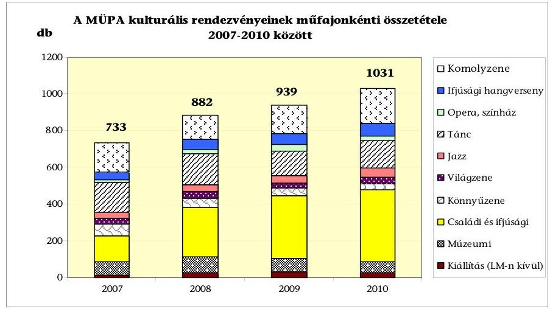

A létesítmény kihasználtsága a 2007-2010 közötti időszakban összességében megfelelő volt. A MüPa Kft. saját és közös szervezésú rendezvényein a fizető nézők férőhelyekhez viszonyított aránya a Nemzeti Hangversenyteremben 81,5\%, a Fesztivál Színházban 86,8\%, az egyéb termekben 87,5\% volt. A Nemzeti Fil-

[^0]
[^0]:    ${ }^{16}$ A 2005. évi szerződéskötés időpontjában az NKÖM, 2006. június 2-ától az OKM, 2010. május 25 -étől a NEFMI.

---

harmonikusok hangversenyein a férőhelyek átlagos kihasználtsága 87,2\%, a Nemzeti Táncszínház előadásain 80,8\%-os volt.

Az ellenőrzött időszakban az OKM, majd a NEFMI a Művészetek Palotája PPP projektet érintő szakmai és gazdasági értékelést nem végzett.

# A felsőoktatási diákotthonok és kollégiumok projektjei 

A kollégiumi férőhelyek keresleti és a projekt pénzügyi (árfolyam, kamat, infláció) kockázatainak többségét a felsőoktatási intézmények viselik. Ez a megrendelő intézmények számára - a kedvezőtlen árfolyamváltozások miatt - jelentős többletterhet jelent. Kilenc projektnél - projektek 37,5\%-ánál - a KSH által véleményezett ${ }^{17}$ szerződéstől elkülönülő megállapodások alapján a felsőoktatási intézmény gazdasági társasága, munkaszervezete átvállalta a magánpartnertől a létesítmények üzemeltetését.

## A diákotthonok építésére és kollégiumok korszerűsítésére irányuló projekteknél a kockázatok megosztására vonatkozó szerződéses rendelkezések előnytelenek a közszféra számára.

A szerződések tartalmazták a létesítmény maradványértéken történő megszerzésének lehetőségét a futamidő lejártát követően. A maradványérték meghatározásának módját, elszámolásának elveit azonban a 24 projektből csak 7-nél rögzítették. Egy projektnél a megrendelő a szolgáltatási díjban a beruházás, pótlás és felújítás teljes értékét megtéríti, így a maradványérték megfizetésére vonatkozó rendelkezés nem indokolt. Egy másik projektnél a szerződésesnél árfolyamtól függően 230-240 M Ft-tal - magasabb összegű maradványértékben állapodtak meg a felek. Ezeknél a projekteknél a létesítmény maradványértének meghatározása nem felelt meg az intézményi érdekeknek.

A bérleti-szolgáltatási szerződésekben a felek megfelelő részletezettséggel, számon kérhetően rögzítették a szolgáltatási kötelezettséget. A helyszínen ellenőrzött 10 projektek közül 6-nál a szolgáltatási díj üzemeltetési díjtételét szolgáltatási elemek szerint nem részletezték, háttérszámításokkal nem támasztották alá. A szerződéstől eltérő teljesítés esetén alkalmazható szankciók - a megrendelők véleménye szerint - hozzájárulnak a felhasználói érdekeknek megfelelő szolgáltatásnyújtáshoz. Az ellenőrzés megállapítása szerint azonban nem szolgálja a közszféra érdekeit a szerződések azon rendelkezése, hogy hibás, vagy hiányos teljesítés esetén díjlevonás csak az üzemeltetési díjrészből érvényesíthető. Az adósságszolgálati díjrészt akkor is fizetniük kell az intézményeknek, ha a szolgáltatás ellehetetlenül.

Azoknál a projekteknél, ahol az üzemeltetést az intézmény vagy annak gazdasági társasága végzi, nincs érdekeltség a szankciók érvényesítésére, mert a magánpartner a felé érvényesített díjlevonást továbbhárítja az intézmény gazdasági társaságára.

[^0]
[^0]:    ${ }^{17}$ 2207/2004. (VIII. 27.) Korm. határozat 3. pontja előírja a KSH állásfoglalásának bekérését arra vonatkozóan, hogy a szerződéstervezet alapján a beruházás állami, vagy magánszektorba tartozónak minősül-e.

---

Az intézményi projektek közül háromnál nem képeztek eszközpótlási-felújítási alapot. Az alap felhasználásának megrendelő általi ellenőrzéséről kilenc projektnél nem rendelkeztek. A helyszínen ellenőrzött projektek közül egynél a szerződés nem tartalmazta a szolgáltató felújítási kötelezettségét, arról szerződésen kívül rendelkeztek. A megállapodás szerint a felújítás fedezetét a bérleti díjon felül fizeti meg az intézmény.

Az ellenőrzött időszakban a minisztériummal ${ }^{18}$ kötött támogatási szerződések biztosították az igénybe vett szolgáltatások finanszírozását, a támogatások folyósítása azonban nem igazodott a havonként felmerülő díffizetési kötelezettséghez. Az intézményeknél a díffizetéshez szükséges források rendelkezésre álltak, annak ellenére, hogy a bérleti szolgáltatási díjak 2010-ben a kollégiumi projekteknél átlagosan $18,0 \%$-kal, a diákotthonoknál $30,0 \%$-kal haladták meg a szerződésben rögzített összeget az infláció és az árfolyamváltozás miatt. A felsőoktatási intézményeknél a PPP kötelezettségvállalás arányának növekedése, a hallgatói létszám csökkenése, valamint az oktatáspolitikai intézkedések hatásai kockázatossá teszik a projektek hosszú távú finanszírozhatóságát.

Az NFM elvégeztette a PPP konstrukcióban létrehozott diákotthonok és felújított kollégiumok szerződéseinek átfogó jogi és műszaki felülvizsgálatát. A projektek pénzügyi felülvizsgálata a jelentés készítésének időpontjában folyamatban volt, a pénzügyi modellezési előkészítő munka is elindult. A jogi felülvizsgálat megállapításai szerint a közbeszerzési eljárások lebonyolítása több esetben nem felelt meg a szerződéskötés időpontjában hatályos Kbt. rendelkezéseinek, ez azonban a bérleti szolgáltatási szerződések érvényességét nem érinti. A kockázatmegosztásra vonatkozó szerződéses feltételek kedvezőtlenül hatottak a közszféra érdekeire.

Az intézményi elégedettségmérések, valamint az ellenőrzés dokumentumai alapján a szolgáltatások színvonala a 24 közül 20 projektnél megfelelt a megrendelői és a felhasználói elvárásoknak. A pótlási-felújítási alapok felhasználásáról három intézménynek nem volt információja, nem ellenőrizték a felújítások teljesítését, az alapok felhasználásának gazdaságosságát mivel a szerződésekben nem rögzítették pontosan a felújítási alapok felhasználásának rendjét.

A létesítmények átadásától eltelt viszonylag rövid időszak miatt a felújításra és eszközpótlásra fordított felhasználás a 2011. év I. félévének végéig az érintett projektek ingatlanértékének átlagosan 2,0\%-át tette ki. A PPP konstrukcióban létrejött diákotthonok és felújított kollégiumok üzemeltetése, szolgáltatásainak színvonala alapvetően megfelelt a szerződésben foglaltaknak, a megrendelői, felhasználói elvárásoknak.

A PPP konstrukciók - kormány-előterjesztésben célul kitűzött - gazdaságossága, takarékos üzemeltetése ${ }^{19}$ nem igazolódott.

[^0]
[^0]:    ${ }^{18}$ 2007-2010 között OKM, 2011-től NFM.
    ${ }^{19}$ A kollégiumi beruházási program kormány-előterjesztésében az új, illetve felújított épületek takarékosabb üzemeltetését tűzték ki célul a meglévő épületekhez viszonyítva.

---

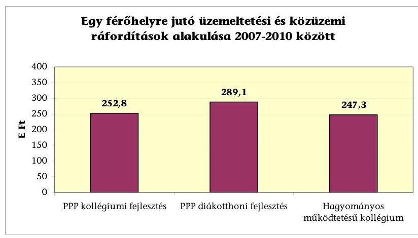

A PPP konstrukciójú létesítményeknél az egy férőhelyre jutó üzemeltetési és közüzemi kiadások - a pótlási-felújítási alapok figyelembevétele nélkül - a diákotthonoknál 16,9\%-kal, a felújított kollégiumok esetében 2,2\%-kal voltak magasabbak a hagyományos kollégiumok fajlagos mutatójánál az ellenőrzött időszakban.

A múködtetés gazdaságosságának mérésére, összehasonlítására alkalmas módszereket, mutatókat sem az ágazatot felügyelő minisztérium, sem az intézmények nem dolgoztak ki. Az egyösszegű díjtételek nem tették lehetővé a piaci árakkal történő összehasonlítást, valamint az intézmények teljes körére vonatkozó díjelemenkénti elemzést. ${ }^{20}$ Az ellenőrzött időszakban a PPP konstrukcióban múködő létesítményeknél az egy férőhelyre jutó üzemeltetési és közüzemi kiadások éves összege a diákotthonoknál és a korszerüsített kollégiumoknál is meghaladta a hagyományos kollégiumok fajlagos mutatóját. Az intézmények dokumentumokkal alátámasztott számításai szerint a PPP konstrukcióban létrehozott diákotthonok és kollégiumok intézményi saját szervezésben történő üzemeltetése - három kivétellel - a jelenleginél $14,5 \%$-kal alacsonyabb kiadással oldható meg.

A létesítmények üzemeltetésének nyomon követéséhez a 15 felsőoktatási intézmény közül 13 intézmény rendelkezett informatikai támogatottságú monitoring rendszerrel, amelyek - a hiányosságok ellenére - alkalmasak voltak a szerződéstől eltérő teljesítés dokumentálására, lehetővé téve a díjfizetést is befolyásoló szankciók érvényesítését.

A kollégiumi ellátottság javítása érdekében hozott kormányhatározat ${ }^{21}$ menynyiségi célkitűzései nem teljesültek. A tervezett 10455 diákotthoni férőhelybővítéseknek $42,7 \%$-a, a tervezett 20000 kollégiumi férőhely rekonstrukcióknak 64,5\%-a valósult meg. A PPP fejlesztések eredményeként javultak a hallga-

[^0]
[^0]:    ${ }^{20}$ Az üzemeltetési és közüzemi díjak összegéről 3 diákotthon esetében nem tudtak adatot szolgáltatni.
    ${ }^{21}$ 2207/2004. (VIII. 27.) Korm. határozat az Oktatási Minisztérium felügyelete alá tartozó felsőoktatási intézmények infrastruktúra fejlesztési programjának aktuális feladatairól.

---

tók lakhatási feltételei. A PPP konstrukcióban múködő létesítmények kihasználtsága 2007-2011 között a szorgalmi időszakban 95,1\%-os volt, meghaladva a hagyományos kollégiumi férőhely-kihasználtság 93,1\%-os átlagát.
2011. év végéig a köz- és magánszféra együttműködésével 4460 új férőhely készült el a diákotthonokban és 12892 férőhelyet újítottak fel a kollégiumokban. A PPP konstrukciójú férőhelyek száma 2007-től 2011-ig összesen 5352 férőhelylyel ( $44,6 \%$-kal) növekedett. Alacsony, illetve csökkenő mértékű volt a vidéki, kisebb vonzáskörzetű felsőoktatási intézmények diákotthonainak és felújított kollégiumainak kihasználtsága (2010-ben a diákotthonoknál a legalacsonyabb kihasználtság 75,0\%-os, a kollégiumoknál 46,0\%-os volt). A kollégium beruházási program keretében elkészült diákotthonok és a felújított kollégiumok férőhelyeinek egy része nem az eredeti rendeltetési célt szolgálta, azokat hotelként, vendégszobaként is hasznosították. 2011-ben a PPP konstrukcióban kialakított 17352 férőhelyet 16210 hallgató vette igénybe. A térítési díjak - a felsőoktatási intézmények és a hallgatói önkormányzatok képviselőinek kérdőíves megkérdezése alapján - két diákotthon és négy felújított kollégium esetében nem voltak versenyképesek az albérleti árakhoz viszonyítva. Az ellenőrzött időszakban (2007-2010 között) a támogatást folyósító és a felügyeletet ellátó minisztérium (OKM) nem végezte el a kollégiumi beruházási program komplex gazdasági és szakmai értékelését, ami alapot adott volna a program folytatásának átgondolására, a későbbi szerződések megkötése során a közszféra érdekeinek hatékonyabb érvényesítésére. A PPP programok felügyeletét 2010-től ellátó NFM-nél megtörtént a projektek jogi és műszaki felülvizsgálata, amelyek összegző értékelése, valamint a pénzügyi-gazdasági felülvizsgálat az ellenőrzés befejezésekor folyamatban volt.

Az Állami Számvevőszékről szóló 2011. évi LXVI. törvény 33. § (1) bekezdésében foglaltak értelmében a jelentésben foglalt megállapításokhoz kapcsolódó intézkedési tervet köteles az ellenőrzött szervezet vezetője összeállítani és azt a jelentés kézhezvételétől számított harminc napon belül az ÁSZ részére megküldeni. Amennyiben az intézkedési tervet határidőben nem küldi meg a szervezet, vagy az továbbra sem elfogadható, az ÁSZ elnöke a hivatkozott törvény 33. § (3) bekezdés a)-b) pontjaiban foglaltakat érvényesítheti.

# Az ellenőrzés intézkedést igénylő megállapításai és javaslatai a MÚPA projekthez kapcsolódóan: 

## a nemzeti fejlesztési miniszternek

1. A szerződő felek a műszaki üzemeltetés elvárt szolgáltatási paramétereit részletesen nem határozták meg. A szankciós pontrendszer érvényesítésének lehetősége korlátozott, mivel a definíciók meghatározása nem egyértelmű, a területi besorolás hiányos. Így a szolgáltatások teljesítésének elszámoltathatósága nem biztosított.

Javaslat:
Tegyen intézkedéseket a magánpartnerrel együttműködve, a MüPa Kft. bevonásával az üzemeltetési szolgáltatások tartalmának, paramétereinek tételes, ellenőrizhető meghatározására a teljes körű elszámoltathatóság biztosítására.

---

2. A Rendelkezésre Állási Szerződés feltételei közül hosszú távon a Magyar Állam számára többletterhet jelent:
a) az állami megrendelő által a szolgáltatónál forintban felmerülő tételek szükségtelen árfolyamkockázatának vállalása,
b) az eszközök állagának helyreállítását, pótlását, korszerűsítését meghaladó pótlásifelújítási kötelezettség,
c) a futamidő lejártakor a megrendelőt az Eszköz Pótlási, valamint a Bútor és Aprócikk Pótlási Alapból az általa befizetett, de fel nem használt összeg fele fölötti rendelkezés,
d) a műszaki üzemeltető közüzemi fogyasztásának megtérítéséről való rendelkezés hiánya

Javaslat:
Gondoskodjon a Művészetek Palotája előnytelen szerződéses feltételeiből eredő károk miatt a felelősség kivizsgálásáról; a vizsgálat eredményének ismeretében szükség esetén tegyen intézkedéseket a felelősségre vonásra, valamint a magánpartnerrel történő megegyezéssel a károk enyhítésére.

# a nemzeti fejlesztési miniszternek az emberi erőforrások miniszterével együttmüködve 

A tulajdonosi és a felügyeleti jogkör különválását követően nem került sor a NEFMI, az NFM és a MüPa Kft. kapcsolatrendszerének, feladat- és hatásköreinek újraszabályozására, pontosítására.

Javaslat:
Gondoskodjon a NEFMI, az NFM és a MüPa Kft kapcsolatrendszerének pontosításáról, hatásköreinek egyértelmú meghatározásáról, különösen a MüPa Kft. Alapítói Határozatban rögzített feladatait érintően.

## Az ellenőrzés intézkedést igénylő megállapításai és javaslatai a kollégium beruházási program projektjeihez kapcsolódóan:

## a nemzeti fejlesztési miniszternek

Az előnytelen feltételekkel létrejött szerződések nem felelnek meg a közszféra érdekeinek, mivel:
a) a projektek 71,0\%-ánál a szerződésekben nem rögzítették a maradványérték várható összegét, elszámolásának elveit;
b) a pótlási-felújítási alapok felhasználásáról az intézmények 50,0\%-ának nem volt információja, nem ellenőrizték a felújítások teljesítését, az alapok felhasználásá-

---

nak gazdaságosságát, mivel erre vonatkozólag a szerződések nem tartalmaztak rendelkezéseket.

Javaslat:
Gondoskodjon a kollégiumi beruházási program előnytelen szerződéses feltételei miatt a felelősség kivizsgálásáról, és a vizsgálat eredményének ismeretében tegye meg a szükséges intézkedéseket.

---

# II. RÉSZLETES MEGÁLLAPÍTÁSOK 

## 1. A MúvésZeteK Palotája projekt szerzödéses feltételeinek TELJESÜLÉSE ÉS TÁRSADALMI HASZNOSULÁSA

### 1.1. A szerződéses feltételek teljesülésének értékelése a MÚPA projektnél

A Művészetek Palotáját a beruházó magántársaságok az NKÖM-mel 2001-ben kötött megállapodás alapján építették fel. Az eredeti elképzelések szerint a létesítmény tíz éves bérletet követően a magánpartner üzletrészeinek megszerzésével került volna az állam tulajdonába. A 2005. évi átadást követően a korábbi megállapodásokat harminc éves futamidejú szolgáltatás-vásárlásra irányuló Rendelkezésre Állási Szerződés váltotta fel.

A PPP konstrukcióban a létesítmény műszaki üzemeltetése a magánpartner feladata lett. Az állam a bérleti díj és üzletrész vételár helyett rendelkezésre állási díjat, ezen felül közüzemi díjakat fizet a magánpartnernek. A szerződés értelmében a futamidő tíz évről harminc évre nőtt, a hitelfelvétel és a saját erő aránya $70,0 \%-30,0 \%$-ról $90,0 \%-10,0 \%$-ra módosult. A magánpartner a saját tőke befektetésére $12,0 \%$-os hozamot, a felvett hitel összegére évi $6,0 \%$-os fix kamatot számít fel.

## A szolgáltatás-vásárlási szerződés feltételei nem biztosították a közpénzfelhasználás gazdaságosságát és a megrendelői érdekek érvényesülését.

Az együttműködési forma átalakításával a projekt forrásszükséglete (projektköltség) 136,9 M euróról 177,3 M euróra, azaz 40,4 M euróval növekedett. A PPP projekt Rendelkezésre Állási Szerződésben rögzített hiteligénye 159,5 M euró, ami - a projektköltségek növekedése és a saját erő arányának csökkenése miatt - 63,7 M euróval több a beruházást az eredeti konstrukcióban finanszírozó hitel összegénél.

Az állami fél által kezdeményezett új pénzügyi konstrukció lebonyolítása 2,3 M euró tranzakciós költséggel járt. A projekttársaságok tulajdonosa igényt tartott eredeti - 41,0 M euró összegű - befektetésének 7,5 M euró hozammal növelt megfizetésére a beruházás indításától eltelt négy évre. A saját erőt a tulajdonosok 2001-től kezdődően folyamatos tőkeemeléssel bocsátották rendelkezésre, ami $10,7 \%$-os átlagos éves hozammal növelt értékben került visszafizetésre. A szerződés alapján az NKÖM a 30 éves futamidő első két évére csökkentett összegű rendelkezésre állási díjat fizetett, a díjkülönbözet szétterítve a későbbi évek fizetési kötelezettségét növeli. Az első két év múködésének tőkeszükséglete - a pénzügyi modell szerint - 30,6 M euró ( 7,7 Mrd Ft) volt.

---

I/1. sz. táblázat

# A MÚPA projekt forrásszükségletének (projektköltség) összetétele és finanszírozása 

|  | adatok: E euróban |  |
| :-- | --: | --: |
| Projektköltség | Hitelszerződés   szerint | Pénzügyi   modell szerint |
| Refinanszírozandó hitelek | 95828 | 95828 |
| Tranzakciós költség | 2340 | 2340 |
| Az első két év forrásszükséglete | 30793 | 30602 |
| Üzletrész visszavásárlás | 48304 | 48495 |
| Projektköltség összesen | $\mathbf{1 7 7 2 6 5}$ | $\mathbf{1 7 7 2 6 5}$ |
| Ebből hitel | 159515 |  |
| Saját erő | 17750 |  |

Az első két év díjkülönbözetének pótlását a magánpartner hitelfelvétellel biztosította. A szolgáltatók kimutatásai alapján az első két év ráfordításait és hozamát $25,9 \mathrm{M}$ euró összegű rendelkezésre állási díj fedezi, ebből a szerződés alapján az állami megrendelő a 2005. és a 2006. évben 10,4 M eurót megtérített. A csökkentett összegű díjfizetés miatt felmerülő forrásigény szerződésben rögzített ( 30,6 M euró) és a beszámolókban kimutatott ki nem számlázott díjak ( 15,5 M euró) összege között 15,1 M euró ( $3,8 \mathrm{Mrd}$ Ft). a különbség. A hitel felvételét az ellenőrzés csak a ki nem számlázott díjaknak megfelelő összegben tartja indokoltnak. A hitel összege olyan ráfordításokra és hozamra is fedezetet nyújtott, amelyeket az állami partner az első két év csökkentett díjában megtérített.

A magánpartner kimutatásainak, számviteli beszámolóinak adatai a projektköltség összegét, ezáltal a refinanszírozáshoz felvett hitel nagyságrendjének szükségességét nem támasztották alá, ami a közpénzfelhasználás gazdaságosságát hátrányosan befolyásolta. A magánpartner által a díkkülönbözet pótlására felvett hitelnek az indokolt forrásbevonást 15,1 M euróval meghaladó öszszege kamatteherrel növelt fizetési kötelezettséget és további árfolyamkockázatot jelent az állami megrendelő számára.

Az NFI Kft. saját tőkéje a beolvadást követően csak a piaci értékelés miatt kimutatott értékelési tartalék következtében volt pozitív. A projekttársaság teljes - átértékelés nélküli - eszközértékére 100,0\%-ban bankhitel nyújtott fedezetet.

A fejlesztés keretösszege a szerződés szerint 31,3 Mrd Ft volt. A projekttársaságok beszámolóinak összesített mérlegadatai alapján a fejlesztés 29,7 Mrd Ft-ba került. ${ }^{22}$

A létesítmény a szerződés megkötése előtt felépült, addig az építési kockázatot a magánpartner viselte. A jelenlegi szerződéses konstrukcióban a rendelkezésre állási kockázatok többségét a magánpartner, a létesítmény hasznosításának keresleti kockázatát az állami fél viseli.

[^0]
[^0]:    ${ }^{22}$ A magánpartner tájékoztatása szerint a fejlesztéshez kapcsolódóan felmerültek a beruházás eszközértékében nem megjelenő, ráfordításként elszámolt tételek is.

---

A szerződés szerint az állami fél viseli a rendelkezésre állási díj árfolyam és inflációs kockázatának többségét. Az állami megrendelő szükségtelen árfolyamkockázatot vállalt azzal, hogy a teljes rendelkezésre állási díj nettó összegét euróban fizeti. A díj 51,7\%-a azonban olyan díjtételekre nyújt fedezetet, amelyek a magánpartnernél alapvetően forintban merültek fel. Ugyanakkor az infláció tekintetében a magánpartner kockázatot visel azzal, hogy a RÁD inflációkövető tételeinek meghatározása euró inflációval történik, a forintban felmerülő üzemeltetési költségek változása viszont a magasabb hazai inflációt követi.

A magánpartner álláspontja szerint a RÁSZ megkötésének időpontjában azzal a feltételezéssel éltek a felek, hogy a futamidő jelentős részében Magyarország érvényes fizetőeszköze az euró lesz. Ez esetben az árfolyamváltozás nem jelentett volna kockázatot. Az állam számára jelentősen nagyobb hatást generált volna, amennyiben a RÁD forint alapon került volna meghatározásra, mind az adósságszolgálat, mind az infláció tekintetében.

A rendelkezésre állási díj teljes összegének euróban történő megfizetése - a forintban felmerülő díjtételek hazai pénznemben történő kiegyenlítése helyett - a Magyar Állam számára aránytalan terhet jelent olyan előre nem látható események miatt, mint az eurózónához történő csatlakozás elhúzódása, valamint a gazdasági válság következtében az árfolyamok kedvezőtlen alakulása.

A Kormány Magyarország Középtávú Gazdaságpolitikai Programjában (2003. augusztus) az euró bevezetését 2008. január 1-jével irányozta elő, ami nem teljesült. A forint az euróval szemben a szerződés megkötése óta jelentősen gyengült. Egy euró 2011. december 30-án 311,1 Ft volt MNB közép-árfolyamon, ami 24,5\%kal magasabb a Rendelkezésre Állási Szerződésben prognosztizált árfolyamnál.

Az állami megrendelő az üzemeltetésre, felújításra, adókra, adminisztrációs költségekre az árfolyamváltozás miatt 2007-2010 között - a $250 \mathrm{Ft} /$ euró árfolyamon számított - prognosztizált adatoknál 721,3 M Ft-tal többet fizetett ki.

A pénzügyi modell a rendelkezésre állási díj elemeit eltérő indexálással és hozamelvárással rögzíti. A szerződéstől eltérő teljesítés esetén érvényesíthető szankciók is csak az üzemeltetési díjrész csökkentését teszik lehetővé.

A szolgáltató álláspontja szerint azonban a rendelkezésre állási díj egészben megállapított és megfizetett díj, emiatt nem lehetséges és érdemes az egyes elemek kiragadása.

Más PPP projektek (pl. a felsőoktatás infrastruktúra-fejlesztési program) esetében az adósságszolgálathoz és az üzemeltetéshez kapcsolódó díjelemeket jellemzően külön állapították meg. Az utóbbit a megrendelő intézmények forintban térítették meg a szolgáltatóknak.

A szerződés nem tartalmazott rendelkezéseket, a megrendelő nem tett intézkedéseket a pénzügyi kockázatok kedvezőtlen hatásainak minimalizálása érdekében.

A magánpartner ugyanakkor az általa vállalt kamatkockázat csökkentésére a finanszírozó bankokkal Kamatkockázati Fedezeti Szerződést kötött, amellyel a változó kamatból eredő kockázatát megszüntette. A kamatfelárakkal növelt kamatláb mértéke ezért az állam által a rendelkezésre állási díjban fizetendő 6,0\%-os kamatszint alatt maradt. A magánpartner kimutatásai alapján 2035-ig nomi-

---

nálértéken összesen 18,5 M eurót tesz ki a tényleges és az állam által fizetendő kamat különbségéből származó nyereség.

A futamidő alatt a Rendelkezésre Állási Szerződés csak rendkívüli felmondás, illetve a megállapodás érvénytelensége esetére rendelkezik arról, hogy az állam a magánpartnertől milyen feltételekkel szerezheti meg az ingatlan tulajdonjogát. Az államnak a szolgáltató szerződésszegése esetén is a szerződésben rögzített áron kell az ingatlant megvásárolni.

A szolgáltató szerint a nem piacképes ingatlan piaci banki finanszírozása csak úgy valósítható meg, hogy az állami fél vételi kötelezettséget vállal a PPP szerződés bármilyen okból történő megszűnése esetére.

Az ingatlan vételára ebben az esetben a kint lévő hitelösszeget és járulékait, valamint a pénzügyi modell szerinti adókompenzáció még nem törlesztett összegét tartalmazza.

A Rendelkezésre Állási Szerződéstől elkülönülő Üzletrész Adásvételi Szerződésben a felek abban állapodtak meg, hogy a harminc éves futamidő lejártát követően az állami megrendelő a létesítmény tulajdonjogát közvetett módon - a magánpartner projekttársaságban levő üzletrészének megvásárlásával - szerzi meg. A vételárat 10 euróban rögzítették. Az Üzletrész Adásvételi Szerződésben az eladó szavatosságot vállalt az üzletrész, valamint közvetve a projekttársaság tulajdonában álló ingatlan és ingóságok per-, teher- és igénymentességére. Ez esetben az üzletrész előre meghatározott vételáron történő megszerzése az állam számára tényleges terhet és kockázatot nem jelent. Ellenkező esetben az eladósodott társaság tulajdonjogának megszerzése a vételáron felül további terhet jelent és vevővédelmi biztosítékok hiányában kockázatot hordoz az állami fél számára. A Rendelkezésre Állási Szerződés lehetőséget biztosít a megrendelő számára a szolgáltató könyveibe való betekintésre, ezáltal a projekttársaság likviditásának, eladósodottságának figyelemmel kísérésére.

Az alapok maradványának felhasználhatóságára vonatkozó szerződéses rendelkezések nem egyértelmúek. Az együttműködés - bármilyen okból történő - megszűnésekor a megrendelőt az Eszköz Pótlási, valamint a Bútor és Aprócikk Pótlási Alapok maradványának a Rendelkezésre Állási Szerződés 12.15. és 12.17. pontjai szerint a fele, az ingatlan vételár képleteit tartalmazó 16.3. számú melléklete alapján viszont az egésze illeti meg.

# A Rendelkezésre Állási Szerződés aláírása óta a projekttársaságok 

tulajdonosi szerkezetében és vagyoni összetételében változás következett be. A projekttársaságok 2009. március 24-i hatállyal beolvadtak az NFI Kft-be. Az átalakult NFI Kft. 99,85\%-ban a Cipruson bejegyzett TriGranit POA Investments Limited, ${ }^{23}$ 0,15\%-ban a Magyar Állam tulajdona (joggyakorló az MNV Zrt. átengedett jogkörében a NEFMI). A Magyar Állam kisebbségi tulajdonosként az NFI Kft. ingatlan átruházásához, megterheléséhez kapcsolódó határozatai felett tud vétójogot gyakorolni.

[^0]
[^0]:    ${ }^{23}$ A közbeszerzési eljárás lefolytatásának időpontjában hatályos, a közbeszerzésekről szóló 2003. évi CXXIX. törvény nem tartalmazott korlátozó rendelkezést az offshore vállalkozások közbeszerzési eljárásban való részvételére vonatkozóan.

---

A társaságok együttesen 9495,4 M Ft összegű jegyzett tőkéje az átalakuláskor az eszközök, kötelezettségek, valamint a saját tőkeelemek rendezése következtében ${ }^{24}$ - 200,0 M Ft-ra csökkent a jogutód NFI Kft-ben. ${ }^{25}$ A jegyzett tőke jelenlegi összege nem felel meg a hitelszerződés részét képező Tulajdonosi és szponzori szerződés 4.7. pontjában foglaltaknak, amely szerint a projekttársaságok tulajdonosa vállalja, hogy az összeolvadás eredményeként létrejövő jogutód gazdasági társaság jegyzett tőkéje - sem a beolvadáskor, sem azt követően - nem csökken 500 M Ft alá ${ }^{26}$.

A projekttársaságok a beolvadásig 9459,2 M Ft veszteséget halmoztak fel. A jogutód kft. a végleges vagyonmérlegében -9285,4 M Ft eredménytartalékot szerepeltetett, a saját tőkéje negatív volt (-9085,4 M Ft). A társaság a negatív saját tőkét a 2009. március 25 -ei fordulónapra vonatkozó közbenső mérlegében az eszközök piaci értéken történő értékelésével, az értékelési tartalék növelésével rendezte. Az NFI Kft. számviteli politikájában a piaci értéken történő értékelés alkalmazását rögzítette.

A 25,8 Mrd Ft könyv szerinti értékű ingatlanra 30,4 Mrd Ft összegű értékhelyesbítést számoltak el. A könyvvizsgáló által hitelesített értékbecslést szakértők végezték el az ingatlan jövedelemtermelő képességének figyelembevételével. A hozamokon túlmenően az ingatlan piaci értékének meghatározásakor a futamidő végéig fennálló adósságállományt is számításba vették. Az értékbecslés a Rendelkezésre Állási Szerződés pénzügyi modelljére alapozva arra a feltételezésre épült, hogy az állami fél eleget tesz szerződéses kötelezettségének, a rendelkezésre állási díj teljes egészében befizetésre kerül. A projekttársaság forrásszerkezetének változása csak abban az esetben nem érinti kedvezőtlenül a közszféra érdekeit, ha a futamidő lejártával a kft. kötelezettségeire az állami tulajdonba kerülő projekttársaság likvid eszközei fedezetet nyújtanak.

A magánpartner 2009. évi átalakulási mérlege tartalmazta a társaságok egymásban lévő befektetéseivel kapcsolatban kimutatott üzleti vagy cégértéket ( 3051 M Ft), amelynek indokolt kimutatását hitelt érdemlő dokumentumok nem támasztottak alá. Ez a tétel az NFI Kft. mérlegében még 2009-ben és 2010-ben is szerepelt. Amennyiben az üzleti vagy cégérték indokoltsága nem vagy csak részben támasztható alá, akkor azt a beolvadáskor a számviteli törvény értelmében a saját tőkével szemben ki kellett volna vezetni a nyilvántartásokból.

# A felek a szerződésben a műszaki üzemeltetés megrendelő által elvárt szolgáltatási paramétereit nem határozták meg teljes körüen, 

[^0]
[^0]:    ${ }^{24}$ A tőkerendezés alapvetően a társaságok egymásban való részesedésének kivezetéséhez, valamint - a telektulajdonos társaság beolvadása miatt - a többi társaságban nyilvántartott földhasználati jog megszüntetéséhez kapcsolódik.
    ${ }^{25}$ A minisztériumnak a három projekttársaságban meglévő 100-100 E Ft összegű törzsbetéte a beolvadást követően változatlan, összesen 300 E Ft maradt.
    ${ }^{26}$ A magánpartner tájékoztatása szerint a hitelnyújtók az átalakuláshoz hozzájárultak, az új társaság tőkeösszetételét tudomásul vették.

---

# megfelelő részletezettséggel, ez nem biztosítja az ellenőrizhetőséget. ${ }^{27}$ 

A szolgáltató álláspontja szerint a műszaki leírások, a RÁSZ előírásai, a szankciós pontrendszer és a havi jelentésben feldolgozott adatok következetes alkalmazása biztosítja az elvárt szolgáltatási paraméterek számon kérhetőségét és ellenőrizhetőségét.

Az ellenőrzés ugyanakkor megállapította, hogy a szerződésben megnevezett szolgáltatások közül csak a takarítás és a hulladékkezelés tartalmaz mérhető paramétereket. A növényápolásra, az épületfenntartásra, az őrzés-védelemre, az informatikai rendszerek üzemeltetésére vonatkozó rendelkezések nem tartalmaznak konkrétumokat. A szerződés egy összegben tartalmazza a rendelkezésre állási díj üzemeltetési díjrészét, ezért átalánydíj jellegű megállapodásnak tekinthető.

A szolgáltató 3,0\%-os hozamelvárását tartalmazó díjtétel a pénzügyi modell szerint - amit részletes számításokkal nem támasztottak alá - a teljes futamidőre 169,3 M euró.

A szerződés pénzügyi modellje szerint az üzemeltetési díjtétel összege a rendelkezésre állási időszak első teljes évében (2006. év) 4,3 M euró, a 2010. évben az évente történő indexálás következtében 4,6 M euró volt.

A 2007. évi 0660 számú ÁSZ jelentésben az üzemeltetéssel összefüggő feltételek pontos meghatározására, és a díjtételek független szakértő általi felülvizsgálatára tett javaslatok nem valósultak meg.

Az üzemeltetési szolgáltatások nem megfelelő teljesítése esetén alkalmazható szerződéses szankciók érvényesíthetőségét akadályozza a szankciós pontrendszerre vonatkozó szabályok részletes, egyértelmú kidolgozásának hiánya.

Az alkalmazható szankciók hatását korlátozza, hogy a szerződés szerint a szolgáltatás mértékének 1,0\%-os csökkenése esetén csak az üzemeltetési díjtétel csökkenthető $1,0 \%$-kal. ${ }^{28}$ Mivel az üzemeltetési díjrész a rendelkezésre állási díj 20,0\%-át képviseli, a szolgáltatási szint 1,0\%-os csökkenése a teljes díjban mindössze $\mathbf{0 , 2 \%}$-os csökkentést eredményez. A díjlevonás mértékének felső határát a Rendelkezésre Állási Szerződés tartalmilag nem rögzíti.

A szankciókhoz kapcsolódó kritériumok nem teljes körűen alkalmasak az üzemeltetési színvonal értékelésére. A Rendelkezésre Állási Szerződésben az első ötven paraméterből húszat soroltak az „általános", harmincat a „kiemelt" terület alá, a következő harminc paraméternél nincs megjelölés. A „kiemelt" és „általános" területek meghatározását a Rendelkezésre Állási Szerződés nem rögzíti, ebből következően a különböző területekre meghatározott eltérő szankciókat a

[^0]
[^0]:    ${ }^{27}$ „A magántőke... akkor használható fel a legjobban a PPP konstrukciók keretében, ha az állami szektor képes teljes részletezettségű, kikényszeríthető szerződést kötni a magánpartnerrel." Köz- és magánszféra együttműködésével kapcsolatos nemzetközi és hazai tapasztalatok című ÁSZKUT tanulmány 2007. április 22. oldal.
    ${ }^{28}$ A szerződés szerint az üzemeltetési díjtétel 1,0\%-a a teljes rendelkezésre állási időszak alatt $1,7 \mathrm{M}$ euró.

---

megrendelő nem tudja érvényesíteni. A takarítás és őrzés-védelem esetén a szolgáltatási szint/utasítás megsértése szerepel kritériumként, amelynek leírását a Rendelkezésre Állási Szerződés nem tartalmazza. A bejelentés, a hibajavítás és igazolás munkafolyamatát a szerződés meghatározza. A hiba kijavításának teljesítésére 12-48 óra közötti időkeretet rögzítettek.

# A pótlási és felújítási alapok díjtétele leírási kulcsokkal, számítás 

okkal alátámasztott volt. Ennek összege a szerződésben meghatározott avulásnak megfelelő amortizációs kulcsok alapján a rendelkezésre állás harminc éves időtartamára nominálértéken 214,2 M euró.

A költségvetési szerveknél régóta megoldatlan probléma az elszámolt amortizáció összegének tényleges visszapótlása. A PPP konstrukció a költségvetés helyzetétől függetlenül garantálja a szükséges felújítási források biztosítását, ezáltal az épület állagának megóvását, szinten tartását.

A Rendelkezésre Állási Szerződésben a pótlási és felújítási alapok meghatározása során az épület egyes elemeire különböző leírási kulcsokat határoztak meg. A szolgáltató azonban a teljes épületet egy összegben tartja nyilván, értékcsökkenésének meghatározásához az Sztv. 52. § (1)-(2) bekezdéseiben foglaltaknak megfelelően egy leírási kulcsot alkalmaz. Az eltérő számítási módszerek következtében a szerződés szerinti felújítási kötelezettség mértéke eltér a szolgáltató nyilvántartásaiban szereplő értékcsökkenés összegétől.

A szerződésben a homlokzat és a tetőszigetelés esetében 2,0\%-os kulcsot, a víz, csatorna, gáz berendezésekre, valamint az egyéb épületrészekre, berendezésekre 3,0\%-os, a fűtést, hűtést szolgáló berendezésekre 5,0\%-os kulcsot rögzítettek. A szolgáltató számviteli nyilvántartásaiban a teljes épületre vonatkozóan 2,0\%-os leírási kulcsot érvényesített.

Az eszközök magánpartner által meghatározott számviteli értékcsökkenésének megfelelő alapképzés biztosítja az eszközök változatlan színvonalú rendelkezésre állását. Eszerint az NFI Kft. a 2010. év végéig 4,1 Mrd Ft értékcsökkenést számolt el a MÚPA eszközei után. A Rendelkezésre Állási Szerződés szerint ugyanebben az időszakban az eszközök pótlását, felújítását - a megrendelő által finanszírozott - 7,4 Mrd Ft összegű alapképzés biztosítja. A szerződés szerinti csökkentett díffizetés következtében az első két évben ennél alacsonyabb összeg, csak 6,8 Mrd Ft került a pótlási alapokba. Az eszközök eredeti állagának helyreállítását, korszerűsítését meghaladó felújítások finanszírozása az állami partner számára jelentős többletterhet jelent. A számviteli értékcsökkenést meghaladó alapképzést csak a technológiai fejlődés követése érdekében - a megrendelő által is elfogadható mértékű - műszaki-technikai fejlesztés indokolhat.

Az első két év csökkentett összegű díffizetési kötelezettsége következtében 2010. év végéig a pótlási alapokba történt befizetések összege 25,9 M euró ( 6,8 Mrd Ft) volt. Az alapokba befizetett összegek felhasználását a szerződésben felújítási periódusonként határozták meg.

A magánpartner és az állami fél közötti együttműködés kereteit a Rendelkezésre Állási Szerződésben az üzemeltetésre és az alapokra vonatkozóan rögzítették. Az állami megrendelő képviselője részt vesz a karbantartási terv, valamint az energiaracionalizálási és felhasználási program elfogadásában, a három felújí-

---

tási alap közül a Speciális Technológia Pótlási Alap felhasználásában egyetértési joggal rendelkezik, a szolgáltatás minőségét bármikor jogosult ellenőrizni.

A Speciális Technológia Pótlási Alap felhasználásához szükséges a megrendelő jóváhagyása, a futamidő végén az Alap maradványa 100,0\%-ban a megrendelőt illeti meg. Az Eszköz Pótlási, valamint a Bútor és Aprócikk Pótlási Alaphoz kapcsolódó szerződéses rendelkezések azonban nem felelnek meg az állami fél érdekeinek. A két alap felhasználásának éves tervéhez kapcsolódóan a megrendelőnek nincs egyetértési joga. Az állami megrendelő számára hátrányos a szerződés azon rendelkezése, amely szerint ezen alapokból a futamidő lejártakor fennmaradó összeg az állami felet és a magánpartnert fele-fele arányban illeti meg.

A szerződés szerint a szolgáltató a gazdasági-pénzügyi jellegű döntéseit racionális gazdasági szempontok alapján eljárva köteles meghozni. A szerződés ugyanakkor nem tartalmaz előírást arra vonatkozóan, hogy az alapok felhasználása során a magánpartner az egyes munkák elvégzéséhez legalább három árajánlatot kérjen be, és az adott minőségű ajánlatokból a legkedvezőbbet válassza ki.

A szerződés lehetőséget biztosít az állami megrendelőnek a létesítmény funkcionális kialakításának megváltoztatására, átalakítására, kiegészítésére. A beruházások végrehajtása azonban a szolgáltató előzetes írásbeli jóváhagyásához kötött, ami csak indokolt esetben tagadható meg. Az így végrehajtott beruházások költségei az állami felet terhelik.

A Rendelkezésre Állási Szerződés ugyanakkor nem rendelkezik az üzemeltetési szolgáltatások tartalmának, volumenének - kölcsönös érdekeket figyelembe vevő - változtatásáról. A piaci feltételeknél kedvezőtlenebb díttételek esetén a szerződéses feltételek felülvizsgálatára, módosítására nincs lehetőség.

A Rendelkezésre Állási Szerződés XI. fejezet 11.2. pontja arról rendelkezik, hogy a hosszú futamidőre tekintettel az üzemeltetés műszaki követelményeinek megváltozása esetén az üzemeltetési feladatok körét és ehhez kapcsolódóan a díjazás mértékét a felek jóhiszemúen újratárgyalják.

A Művészetek Palotája múködtetése - a rendelkezésre állási díj, a közüzemi és egyéb díjak, a szakmai működtető MüPa Kft. és a hasznosító kulturális szervezetek támogatása - az ellenőrzött időszakban évente átlagosan 13,3 Mrd Ft költségvetési forrást igényelt. A MÚPA működtetéséhez kapcsolódó állami kiadások összege (a rendelkezésre állási díj, a közüzemi és egyéb díjak, valamint a szakmai működtető és hasznosító szervezetek támogatása) 2007-ben a költségvetés kulturális kiadásainak 7,1\%-át, 2010-ben 6,9\%-át tette ki (I/2. sz. táblázat).

Az ellenőrzött időszakban az összes költségvetési forrásból a rendelkezésre állási díj ( $61,7 \%-69,5 \%$ ), valamint a közüzemi és egyéb díjak ( $3,0 \%-4,3 \%$ ) aránya növekvő volt. A létesítményben működő kulturális szervezetek támogatása csökkenő arányú volt ( $35,3 \%-26,2 \%$ ).

---

A rendelkezésre állási díj bruttó összege 2007-2010 között összességében 4,0\%-kal, 1,3 Mrd Ft-tal haladta meg a tervezettet (I/3. sz. táblázat). Az árfolyamváltozás 5,9\%-kal, a szolgáltatási árindex 0,5\%-kal, az adótétel alakulása $0,02 \%$-kal növelte, az áfa kulcs változása $2,4 \%$-kal csökkentette a tényleges díjat a tervezetthez képest.

A szerződés alapján az állami fél a rendelkezésre állási díj nettó összegét euróban, az áfát, valamint a rendelkezésre állási díjtól elkülönítetten számlázott közüzemi díjakat forintban teljesítette. A 2007-2010. években a költségvetési törvények a díjak forrásait az OKM fejezetben hagyták jóvá. A 2010. évi kormányzati struktúra-változást követően a rendelkezésre állási és a közüzemi díjakat az NFM költségvetéséből finanszírozzák.

A szerződésnek megfelelően a szolgáltató 2007-2011 között minden év december 1-jéig megküldte a megrendelő részére a következő évben kiszámlázásra kerülő rendelkezésre állási díj aktualizált összegét. A rendelkezésre állási díj kiegyenlítése két esetben nem történt meg határidőre.

A tényleges kifizetések a tervezettnél a 2007-2008. években 1,9\% és 1,8\%-kal alacsonyabbak, a 2009-2011. év I. félév között minden évben magasabbak voltak $11,2 \%, 7,7 \%$, illetve $11,5 \%$-kal (I/3. sz. diagram).

Az adó díjtételnek a szolgáltató pénzügyi jelentései alapján korrigált összege 2007-2010 között a prognosztizált díjtételhez képest jelentős ingadozást mutatott. 2007-ben 108,6\%-kal, 2008-ban 29,7\%-kal, 2009-ben 0,7\%-kal magasabb, 2010-ben $42,0 \%$-kal alacsonyabb volt a tervezett összegnél.

A Rendelkezésre Állási Szerződés szerint az adott évi adófizetési kötelezettség fedezetét biztosító díjkomponens megállapítása nem tekinthető véglegesnek. A díjrész korrekciója - az adók pontos összegének ismeretében, a szolgáltató auditált pénzügyi jelentései alapján - két éves eltéréssel történik.

A szolgáltató végleges közbeszerzési ajánlatában a rendelkezési állási díjban szereplő közüzemi díjakat a Rendelkezésre Állási Szerződésben már kiemelték a rendelkezésre állási díjból. A közüzemi ráfordítások tényleges fogyasztáshoz igazodó, a rendelkezésre állási díjtól elkülönített számlázása az állami fél számára 2010-ig - a közüzemi díjak túltervezettsége miatt - előnyös volt. A prognosztizált nettó közüzemi költség összege a 2007-2010. évekre 7,7 M eurót $(2,0 \mathrm{Mrd} \mathrm{Ft})^{29}$ tett ki. A tényleges nettó közüzemi díj összege 2007-2010 között 1,5 Mrd Ft volt, azaz 0,5 Mrd Ft-tal kevesebb a végleges ajánlatban prognosztizált összegnél.

A közmú díjak túltervezettségét példázza, hogy a becsült vízfogyasztás a 2004. évre 65 ezer $\mathrm{m}^{3}$, a 2007-2010 közötti időszakban ténylegesen évi 18,921,5 ezer $\mathrm{m}^{3}$ volt.

Az NFM 2011-ben elvégeztette a MÚPA projekt átfogó jogi és pénzügyi felülvizsgálatát, amely a projekt szerződéses struktúrájára, a Rendelkezésre Állási Szerződés érvényességével, módosításával és megszüntetésével kapcsolatos jogi kérdésekre, valamint a projekt pénzügyi vonatkozásaira terjedt ki.

[^0]
[^0]:    ${ }^{29}$ Évenkénti MNB középárfolyamon átszámítva.

---

A jogi felülvizsgálat a szerződéshez kapcsolódóan eljárási jogszabálysértést, jogszabályba ütköző rendelkezést nem azonosított. A szerződéses feltételek azonban - a felülvizsgálat megállapításai szerint - több ponton nem feleltek meg a közszféra érdekeinek.

A Rendelkezésre Állási Szerződés módosítása csak a Kbt. 303. §-ában meghatározott ${ }^{30}$ - a szerződéskötéskor előre nem látható ok következtében beálló - lényeges, jogos érdeksérelem esetén történhet; a szerződést a felek rendes felmondással nem szüntethetik meg, a megrendelő azt rendkívüli felmondással nem mondhatja fel; a felújítási és pótlási alapok tekintetében a megrendelőt megillető általános ellenőrzési jog utólagos, kizárólag az elvégzett munkák megfelelő dokumentálásának ellenőrzésére terjed ki.

A pénzügyi felülvizsgálat ${ }^{31}$ megállapításai szerint a szerződéses feltételek nem biztosították a közpénzfelhasználás gazdaságosságát (pl. a projekt megvalósítási költségei és az eszközpótlás mértéke jelentősen eltér a valós költségigényektől; a banki hitel meghaladja a ténylegesen felhasznált forrásokat). Az NFM a külső szakértők által elvégzett jogi-pénzügyi felülvizsgálat alapján a helyszíni ellenőrzés 2011. december 9-ei lezárásáig még nem hozott intézkedéseket. ${ }^{32}$

# 1.2. Az üzemeltetés szerződésben foglalt tartalom szerinti teljesítése és az üzemeltetés gazdaságossága 

A műszaki üzemeltetést ellátó szervezet havi jelentésekben számolt be a MüPa Kft. felé az üzemeltetési szolgáltatások teljesítéséről. Az ellenőrzés számára átadott dokumentumok és a havi jelentések alapján, valamint a létesítményben elhelyezett intézmények véleménye szerint a szolgáltató a létesítmény múszaki üzemeltetését eredményesen végezte, azzal a hasznosító szervezetek - a kérdőíves felmérés alapján - elégedettek voltak. Az üzemeltetési szolgáltatások biztosították a különböző funkciójú épületrészek zavartalan működtetését, rendezvény elmaradását okozó műszaki meghibásodás nem volt.

A projekttársaságok az üzemeltetési szolgáltatások ellátásával a TriGranit Management Zrt-t bízták meg, amelynek alvállalkozója látta el a létesítmény múszaki üzemeltetését az ellenőrzött időszakban.

A műszaki üzemeltető havi jelentéseiben a szolgáltatások felének teljesítéséről számolt be a megrendelőt képviselő MüPa Kft. felé.

A havi jelentésekben 2010 októberéig a szerződésben felsorolt szolgáltatások közül a növényápolás, a garanciális és beruházási bonyolítás, az informatikai rendszerek üzemeltetése, az épületdekoráció, stb. nem szerepeltek. Ugyanakkor a jelentések tartalmazták a közüzemi fogyasztás adatait, a hibabejelentések számát, a légállapot ellenőrzését, a napi ellenőrzési listákat.

[^0]
[^0]:    ${ }^{30}$ A közbeszerzésekről szóló 2003. évi CXXIX. törvény 303. § (1) bekezdés.
    ${ }^{31}$ Nemzeti Fejlesztési Minisztérium megbízásából Horváth és Társai DLA Piper Ügyvédi Iroda - ING: Művészetek Palotája projekt célvizsgálata (10. oldal).
    ${ }^{32}$ A MÜPA projekt átfogó jogi és pénzügyi felülvizsgálatáról szóló jelentés nyilvánosságra hozatalának időpontját az NFM fogja meghatározni.

---

A szerződésben az üzemeltetési szolgáltatások részletes tartalmát nem határozták meg. A szerződés - az összesen tíz pontba foglalt üzemeltetési szolgáltatásból - a takarítás és a hulladékkezelés esetében tartalmaz mennyiségi paramétereket. A havi jelentések mérhető adatai alapján csak a takarítás teljesítését lehetett összevetni szerződéssel.

A műszaki üzemeltető kimutatása szerint az elvégzett takarítás mennyisége öszszességében meghaladta a szerződésben meghatározott mértéket, ezen belül a vízszintes belső takarítás mennyisége az előírtnál kevesebb, a garázs és a külső területek takarítása pedig több volt.

A takarítás teljesítéséről az üzemeltető saját kimutatása és havi jelentései eltérő adatokat tartalmaztak. A szerződés szerint a szükséges vízszintes belső takarítás mértéke $15695000 \mathrm{~m}^{2} /$ év. Az üzemeltető éves átlagban $11534221 \mathrm{~m}^{2}$-t, ezen felül $4000000 \mathrm{~m}^{2}$ előadások közötti takarított területet mutatott ki, a havi jelentésekben viszont $11502707 \mathrm{~m}^{2}$ szerepelt, az előadások közötti takarítás nélkül. A garázstakarítás esetében a Rendelkezésre Állási Szerződés a $22000 \mathrm{~m}^{2}$ terület heti háromszori megtisztítását írja elő (éves szinten $3432000 \mathrm{~m}^{2}$ ), a kimutatás viszont a szükségletek alapján évi $7084622 \mathrm{~m}^{2}$-t rögzített. A többletszolgáltatás a rendelkezésre állási díj összegét - annak átalány jellege miatt - nem érintette.

Az őrzés-védelem ellátásának létszám és időbeli adatait a szerződésben nem határozták meg, de a havi jelentések tartalmazták a teljesített őrórák számát. A hulladékkezelésnél a havi jelentések a havi ürítések számát tartalmazták, a szerződésben ilyen paraméter nem szerepel, csak a kommunális szemét és a veszélyes hulladék mennyisége. Így a szerződéssel történő összehasonlítást nem lehetett elvégezni.

Az üzemeltetési szolgáltatások további elemeinek (például karbantartás, informatikai rendszerek üzemeltetése, növényápolás) teljesítését a szerződés átalány jellege miatt nem lehetett tételesen ellenőrizni. Ezen szolgáltatások tartalmát a Rendelkezésre Állási Szerződésben nem határozták meg részletesen.

A pótlási-felújítási alapok felhasználása tervszerúen, a megrendelővel egyeztetett ütemezésben történt. A szerződés szerint az állami fél kizárólag a Speciális Technológia Pótlási Alap tekintetében rendelkezett egyetértési joggal. A gyakorlatban az Eszköz Pótlási, valamint a Bútor és Aprócikk Pótlási Alap felhasználásának terveit a szolgáltató a MüPa Kft. és a kulturális hasznosító szervezetek igényeit is figyelembe véve készítette el. A Speciális Technológiai Pótlási Alap felhasználási terveit a MüPa Kft. dolgozta ki, amelyekkel a megrendelő minisztérium is egyetértett.

A 2011. évi keretből a helyszíni ellenőrzés lezárásáig nem volt felhasználás, mivel az éves felhasználási tervet az állami fél még nem hagyta jóvá.

A megrendelő által igényelt felújítási munkálatok elvégzését az átadás-átvételi dokumentumok aláírásával a hasznosító kulturális szervezetek képviselői is igazolták.

A rendelkezésre állási időszak első hat évében, 2010-ig a felújítási alapokból összesen 7,7 M eurót ( $2,1 \mathrm{Mrd}$ Ft) használtak fel, ami a szerződés ütemterve szerinti 12,6 M euró ( $3,5 \mathrm{Mrd}$ Ft) összegnek csak 61,1\%-a. Az

---

alapoknak a szerződéses ütemterv 150,0\%-át meghaladó egyenlegét a 20052007 között - a szavatossági időre tekintettel - fel nem használt összeg (4,5 M euró) eredményezte.
Ugyanakkor 2005-2008 között a MüPa Kft. felújítási munkákat és eszközbeszerzéseket végzett 449,1 M Ft összegben, amelyből 397,4 M Ft-ot az alapok terhére a 2008-2009. években térített meg a MüPa Kft. részére a magánpartner.

A szerződés alapokra vonatkozó rendelkezéseinek hiányát pótolja az alapok felhasználását szabályozó, a szolgáltató által készített eljárásrend, amely alapján a beszerzések versenyeztetése alapvetően megvalósult.

A működési feltételeket javító funkcionális átalakításokat a létesítmény átadását követő években alapvetően a felújítási-eszközpótlási alapok terhére valósították meg. A 2007. évi ÁSZ jelentés megállapította, hogy a beruházási folyamat menetközben kialakított „aktualizált" célkitűzések szerint zajlott. Az irodahelyiségek száma, a raktározói kapacitás, valamint az öltözés, a pihenés és a próbák feltételei már az átadáskor sem voltak kielégítőek. A felhasználók részéről felmerült változtatási igények megalapozottak voltak.
Az Eszköz Pótlási Alapból 2010 végéig felhasznált 1328,4 M Ft-ból 237,7 M Ft-ot tettek ki a funkcionális átalakítások és $254,3 \mathrm{M}$ Ft-ot az egyéb épület átalakítások. Az elhasználódott eszközök felújítására, pótlására, cseréjére rendelkezésre álló források ezáltal csökkentek.

Az Eszköz Pótlási Alap terhére valósult meg például az FSZ épületrész ötödik emeletén tárgyaló kialakítása (20,9 M Ft), az előcsarnok büféjéből információs pult és pénztár létrehozása ( $76,1 \mathrm{M} \mathrm{Ft}$ ), az NF épületrész díszlettárolójából tartózkodó helyiség kiépítése ( $16,1 \mathrm{M} \mathrm{Ft})$ és az LM könyvtárának átalakítása és bővítése $(79,1 \mathrm{M} \mathrm{Ft})$.

Az Eszköz Pótlási Alap terhére - a számvitelről szóló 2000. évi C. törvény 3. § (4) bekezdésének 9. pontja szerinti - karbantartás jellegú munkákat (például tetőszigetelés, festés, mázolás, tisztítás, munkavédelmi feladatok) is végeztek 2008-2010 között összesen 165,3 M Ft értékben. A Rendelkezésre Állási Szerződés 12.14. pontja szerint „Az Eszköz Pótlási Alap kizárólagos célja az Ingatlan tekintetében végzendő Felújítási és Eszköz Pótlási Munkák finanszírozásának biztosítása. Az Eszköz Pótlási Alapból a Szolgáltatók nem használhatnak fel összegeket a 12.13. sz. mellékletben meghatározottaktól eltérő célokra ${ }^{33}$.,, A karbantartási munkákat a szolgáltatónak a szerződés alapján a rendelkezésre állási díj üzemeltetési díjrészéből kellett volna fedeznie. ${ }^{34}$ Az Eszköz

[^0]
[^0]:    ${ }^{33}$ A 12.13. melléklet az egyes eszközcsoportok felújítására, illetve pótlására vonatkozóan tartalmaz ütemtervet. A felújítás fogalmát a számviteli törvény 3. § (4) bekezdés 8. pontja és ezzel összhangban a szolgáltató számviteli politikája is egyértelmúen meghatározza.
    ${ }^{34}$ A magánpartner a felújítások, és karbantartások esetében nem az Sztv. előírásait alkalmazta, hanem a műszaki szükségszerűséget vette figyelembe. A szolgáltató véleménye szerint a szerződés nem rendelkezik arról, hogy mit tekint karbantartási feladatoknak. A karbantartási munkákat a szolgáltatónak a Rendelkezésre Állási Szerződés 8.4 pontja alapján a felújítási-pótlási alapoktól elkülönített üzemeltetési díjból kell fedeznie.

---

Pótlási Alapból teljesített, a fentiek szerinti karbantartás jellegű munkák ellenértékét az épületre aktiválták (2010-ben 44,6 M Ft-tal), ami ellentétes az Sztv. 48. § (2) bekezdésével.

A létesítmény PPP konstrukcióban történő üzemeltetése és díjfizetése nem biztosította a közpénzfelhasználás gazdaságosságát. A 2010. évben az állami fél által fizetett - 3,0\%-os hozamelvárás nélküli - üzemeltetési díjtétel nettó 1244,3 M Ft volt. A magánpartnernél az üzemeltetési szolgáltatáshoz kapcsolódó ráfordítások 708,4 M Ft-ot, az állami megrendelő felé érvényesített díjtétel 56,9\%-át tették ki.

A magánpartner a különbözetet a létesítmény rendelkezésre tartásának vállalásával és a 30 éves futamidővel indokolta.

A 2007-2010 között kifizetett nettó üzemeltetési díjtétel 7,1\%-kal haladta meg a pénzügyi modellben prognosztizált értéket. A növekedés $84,7 \%$-át az árfolyam emelkedése, $15,3 \%$-át az árváltozás okozta.

A létesítmény műszaki üzemeltetése az eredeti pénzügyi konstrukcióban állami feladat lett volna, ezért ennek várható ráfordításairól az állami fél is készített becsléseket. A becsült üzemeltetési ráfordítások azonos időszakra vonatkozóan 11,4\%-52,8\%-kal magasabbak voltak, mint a rendelkezésre állási díj üzemeltetési díjrésze. Az előzetes tervek felújítási kiadásokat nem tartalmaztak. A számítások megalapozottságát azonban jelentősen befolyásolta az a tény, hogy előzetes üzemeltetési tervek készítésekor a beépített alapterületre, az eszközök számára és teljesítményére vonatkozó pontos adatok még nem álltak rendelkezésre.

Az állami fél nem vizsgálta az üzemeltetés gazdaságosságát és nem alakított ki annak mérésére alkalmas módszereket. Egyéb kulturális intézményekkel történő összehasonlítás a MÚPA egyedi jellege, a szolgáltatások eltérő tartalma miatt csak korlátozottan lehetséges.

A MÚPA 2010. évi fajlagos műszaki üzemeltetési díja - közüzemi költségek nélkül, építményadóval, a parkoló területének 50,0\%-os figyelembevételével 8,0 euró/hó/m² volt. A felsőoktatásban az oktatási-infrastruktúra PPP projektjeinek különböző üzemeltetési szolgáltatásokat tartalmazó fajlagos üzemeltetési díja 2010-ben 1,4-8,1 euró/hó/m² között változott. A nem PPP konstrukcióban működő Nemzeti Színház fajlagos üzemeltetési költsége 2010-ben 3,9 euró/hó/m², a Műcsarnoké 5,3 euró/hó/m² volt.

A közüzemi kiadások 58,1\%-kal emelkedtek a vizsgált időszakban. A növekedés döntő részét, ( $96,6 \%$-át) az áremelkedések okozták. A közüzemi díjak összege 2010-ben 583,5 M Ft volt, ennek kétharmadát képviselte a villamos energia, egynegyedét a távhő díj (I/4. sz. táblázat).

Nem felel meg a közszféra érdekeinek, hogy a közüzemi díjak egy részénél az állami partner 2008-tól - közvetett módon - árfolyamkockázatot is vállal. A Rendelkezésre Állási Szerződés rendelkezései szerint a közüzemi díjakat az állami fél forintban kiállított számlák alapján köteles megfizetni. A rendszerhasználatért az ELMŰ forintban, a fogyasztásért 2008-tól a Magyar Áramszolgáltató Kft. cégcsoport szinten kötött szerződés alapján euróban számláz a magánpartner felé. Az ezzel járó árfolyamkockázat azonban -

---

az euró számla mindenkori aktuális árfolyamon történő továbbszámlázása miatt - az állami felet terheli.

A létesítményben elhelyezett kulturális szervezetek nem érdekeltek a takarékos energiafelhasználásban, mert a közüzemi díjakat a minisztérium fizeti a szolgáltatónak. A közüzemi fogyasztást - a villamos energia felhasználást kivéve - a műszaki megoldások miatt nem lehet intézményenként közvetlenül kimutatni. Ezt a MÚPA-ban múködő kulturális szervezetek nem is szorgalmazzák, mivel a díjak szakmai támogatás terhére történő elszámolásától tartanak.

A műszaki üzemeltető társaság által évente elkészített energiaracionalizálási programok hatására a megtartott rendezvények 40,7\%-os emelkedése mellett a közműfogyasztási adatok lényegesen nem változtak. A magánpartner a távhő esetében tudott díjkedvezményt elérni. A MÚPA fajlagos villamos energia költsége 2007-2008 között az összehasonlított kulturális intézményekénél kedvezőbb, 2009-2010-ben a csoportkedvezmény ellenére kedvezőtlenebb volt. A fajlagos víz- és csatornadíj 2009-ben a MÚPÁ-nál volt a legmagasabb.

2007-2010 között a Művészetek Palotája hő fogyasztása 23,3\%-kal emelkedett, ugyanakkor a villamos energia felhasználás $4,1 \%$-kal, a vízfogyasztás $8,6 \%$-kal csökkent. Az energiaracionalizálás keretében a MÚPA külső diszvilágítását hajnali kettő, majd 2009-től éjfél után nem üzemeltetik, 2011-ben pedig a hagyományos fényforrásokat LED fényforrásra cserélték le.

Az üzemeltetést végző társaság birtokában maradó helyiségek után fizetendő közmű díjakról a Rendelkezésre Állási Szerződés nem rendelkezett. A vizsgált időszakban a műszaki üzemeltető a saját közüzemi fogyasztását - terület vagy létszámarányos kimutatás hiányában - nem térítette meg, ami nem felelt meg a közszféra érdekeinek.

A szakmai és a műszaki üzemeltető által közösen működtetett, a szolgáltatások ellenőrzésére szolgáló monitoring rendszer a nem megfelelő teljesítés szankcionálásának megalapozását - egyértelmű szerződéses definíciók, valamint szoftver hiányában - nem biztosítja. Az Üzemeltetési Naplóba történő bejegyzések szerint a létesítmény rendeltetésszerű használatát akadályozó üzemeltetési hiányosság nem volt.

# A 2007. évi ÁSZ jelentés monitoring rendszer kidolgozására tett javaslatai nem hasznosultak. 

Az OKM 2007. évi intézkedési terve alapján a monitoring rendszerhez szükséges szoftver kidolgozására és múködtetésére 2007 szeptemberében közbeszerzési eljárás indult. Az eljárás 2008 februárjában eredménytelenül zárult, mert a legelőnyösebb ajánlatot tevő sem tett az OKM rendelkezésére álló anyagi fedezet mértékének megfelelő ajánlatot. Ismételt közbeszerzési eljárás nem indult.

Az üzemeltetési szolgáltatások teljesítéséről szóló havi jelentéseket minden hónapban a műszaki üzemeltető készítette el a megrendelő képviseletében eljáró MüPa Kft. részére. A havi jelentések tartalmát és formáját a szolgáltató a MüPa Kft-vel közösen alakította ki, amelyeket 2010. októberiól az NFM elvárásai

---

alapján kibővítettek. A havi jelentéseknek része a létesítmény használói által a diszpécser szolgálathoz bejelentett hibák, hiányosságok tételes felsorolása is.

A szolgáltató által üzemeltetett diszpécser központban a bejelentett hibákat és a hibák kijavításának időtartamát elektronikusan rögzítették.

A szerződésben az üzemeltetési szolgáltatások tartalmát és paramétereit részletesen nem határozták meg, ezért azok korlátozottan mérhetők, ellenőrizhetők. A szolgáltatások értékelésére, a szankciós pontrendszer érvényesítésére vonatkozó módszereket, valamint a havi jelentések formai és tartalmi követelményeit szabályzatban nem rögzítették.

A bejelentéseknél a munkalapokon a hibához nem rendelték hozzá a szerződésnek megfelelő szankciót, erre az állami fél nem alakított ki megfelelő informatikai támogatást. A havi jelentésekben minden hibabejelentés mellett lehetőség volt a hozzá rendelt pontlevonás feltüntetésére, amelynek meghatározását az egyértelmú és részletes szerződéses rendelkezések hiánya akadályozta.

A magánpartner véleménye szerint minden műszaki paraméter definiált és mérhető, a bejelentések és az elhárítás paramétereinek a szankciós pontrendszer szerinti azonosítása elvégezhető. A Rendelkezésre Állási Szerződésben azonban nem teljes körű a kockázatfajták területi besorolása („általános" vagy „kiemelt"), a villamos energia ellátás százalékos formában rögzített szankciós kritériumai időtartamra és területre egyaránt vonatkozhatnak. Mindezek a szolgáltatások és szankciók egyértelmú, részletes meghatározásának hiányát támasztják alá.

A szerződésben egyes szolgáltatásfajták (pl. villamos energia ellátás, víz, csatorna) esetében nem megfelelő teljesítést a rendelkezésre állás százalékában határozták meg. Nem rendelkeztek azonban arról, hogy a százalékos mutatók területre, időtartamra vagy egyéb kritériumra vonatkoznak-e. Emiatt a meghatározáshoz rendelt pontlevonást a megrendelő nem tudja érvényesíteni. Az állami fél az esetleges teljesítési hiányosságok esetén is teljes ( $100,0 \%$-os) rendelkezésre állási díjat fizet, ami nem biztosítja a közpénzfelhasználás gazdaságosságát.

Az Üzemeltetési Naplóban a 2008-2010 közötti időszakban rögzített hiányosságok miatt megállapított hibapontok száma egyik hónapban sem érte el a szerződésben rögzített mértéket, így díjcsökkentésre nem került sor. A hibák kijavításának időtartama a havi jelentésekben csak 2010 októberétől jelent meg. A műszaki üzemeltető jellemzően rövid időn belül elhárította a hibákat. A 2011. évben a helyszíni ellenőrzés lezárásáig hibabejegyzés nem történt.

Az Üzemeltetési Naplóba az első hiányosság bejegyzésére 2008. március hónapban került sor, határidőn túli hibaelhárítás miatt. A 2008-2010 időszakban például a fűtés-légtechnikai rendszerben a szerződésben előírt hőmérséklet vagy páratartalom be nem tartása, és határidőn túli hibaelhárítás miatt állapítottak meg hibapontokat. A leggyakrabban a színház- és koncertterem ajtói, az üveg forgóajtók, a liftek, a hűtő-fűtő készülékek, és a légtechnikai rendszerek hibásodtak meg. A 2010. decemberi naplóbejegyzések szerint a hibák 65,0\%-át 2 órán belül, $30,7 \%$-át 24 órán belül, $4,3 \%$-át 24 órán túl javították ki.

---

A szerződésben, a Házirendben és a Működési Rendben foglalt előírásokkal ellentétben a hiba elhárításának elvégzését - a munkaidőt és az anyagfelhasználást - a megrendelő képviselője nem igazolta.

A MÚPA eddigi üzemeltetése során a köz- és magánszféra együttműködése megfelelő, a kedvezőtlen folyamatok megelőzésére, befolyásolására alkalmas volt. Az együttmúködés kereteit a Rendelkezésre Állási Szerződés, a Házirend és a Múködési Rend szabályozza. A szakmai múködtető és műszaki üzemeltető képviselőinek együttes részvételével megtartott heti operatív értekezletek hozzájárultak a létesítmény rendeltetésszerú múködésének biztosításához. A műszaki üzemeltető vezetője részt vett a MüPa Kft. vezetői ülésein, a felek napi kapcsolatban voltak egymással.

Az NKÖM egyes megrendelői jogok gyakorlásával és kötelezettségek ellátásával az általa alapított MüPa Kft-t bízta meg. A kötelezően ellátandó feladatokat az I/2006. (03. 20.) számú Alapítói Határozatban rögzítette. A minisztérium az Alapítói Határozat tervezetét a társasággal előzetesen egyeztette, amely az abban foglaltakkal egyetértett.

Az Alapítói Határozat végrehajtására - a stratégiában és az üzleti tervekben részletezett szakmai múködtetés feladatain kívül - a MüPa Kft. intézkedési tervet nem készített.

Az Alapító Okirat értelmében az Alapítói Határozatok végrehajtása a vezérigazgató feladat- és hatásköre. A kft. 2007-2010 közötti stratégiai terve rögzítette az Alapítói Határozatban delegált feladatokat, azok megvalósítását azonban nem részletezte. A vizsgált időszakban a MüPa Kft. SZMSZ-e és az éves üzleti tervek nem tartalmazták az Alapítói Határozatból eredő feladatokat.

Az alapító a határozatban nem rögzítette, hogy a kft. a delegált feladatoknak milyen módon köteles eleget tenni, illetve arról beszámolni.

# Az Alapítói Határozatban rögzített feladatokból a MüPa Kft. az üzemeltetési szolgáltatások teljesítésének ellenőrzésére irányuló monitoring tevékenységet részben látta el. A közüzemi számlák fogyasztási adatainak teljesítés-igazolásait a minisztérium felé a MüPa Kft. az üzemeltető adataira és ellenőrző kapacitásaira támaszkodva készítette el, a számlákban kimutatott fogyasztás mennyiségének valódiságáról azonban a helyszínen nem győződött meg. A teljesítéseket a megrendelő́ képviselöje helyett maga a szolgáltató ellenőrizte, amely gyakorlat nem szolgálta a megrendelő érdekeit. 

A MüPa Kft. részére az Alapítói Határozat előírta a szerződés szerinti szolgáltatások teljesítésének, minőségének folyamatos ellenőrzését. A társaság kidolgozta a szolgáltatóval történő együttműködés alapjait, de elsődlegesen a zavartalan múködés megteremtésének szempontjából. Ennek hátterét integrált belső információs rendszer biztosította, ahol a szakmai múködés különböző pontjain dolgozó munkatársak észrevételei, valamint a naplózott bejegyzések alapján a szolgáltató azonnal tudott intézkedni. Ez a gyakorlat azonban a szolgáltató számláinak megrendelő felé történő igazolására - a tételes elszámolás hiánya miatt - nem volt alkalmas.

---

A MüPa Kft. vezérigazgatója 2006-2009 között több alkalommal jelezte az alapító felé, hogy a rendelkezésre állási díj számláinak igazolását megalapozott mérések hiányában nem tudja elvégezni, igazolásai formálisak, egyben a monitoring rendszer kialakításának szükségességét hangsúlyozta. A kezdeményezésekre a minisztériumtól a MüPa Kft. nem kapott választ.

Az Alapítói Határozat általánosságban fogalmazta meg a műszaki karbantartással és az eszközpótlási alapok ellenőrzésével kapcsolatos feladatokat. A karbantartási ütemterv szerint elvégzett munkákat a szolgáltató havi jelentései tanúsították. A terv szerinti és az igény szerinti felújításokat a szolgáltató a MüPa Kft-vel egyeztetett ütemezésben végezte el. Az Eszköz Pótlási Alapból, valamint a Bútor és Aprócikk Pótlási Alapból teljesített felújítások utólagos éves ellenőrzését, valamint erről a megrendelő tájékoztatását a MüPa Kft. nem végezte el.

A kulturális létesítmény rendeltetési cél szerinti általános irányítását a MüPa Kft. teljes körűen ellátta. Elvégezte a speciális technológiák (színpadtechnikák, stúdiók) üzemeltetését és karbantartását, elkészítette a Speciális Technológia Alap felhasználási tervét, majd a szolgáltatóval történő egyeztetés után jóváhagyásra megküldte azt a megrendelőnek. A Működési Rend, a MüPa Kft. szervezeti felépítése és munkafolyamatai, szabályzatainak és szerződéseinek rendszere együttesen biztosították az Alapítói Határozatban rögzített - eltérő fajsúlyú és általánosságban megfogalmazott - feladatok többségének (18 feladat közül 15) végrehajtását.

# A MüPa Kft. az Alapítói Határozat végrehajtásáról beszámolót nem készített. 

Az OKM első alkalommal 2010. február 17-én, majd ezt követően több esetben kért tájékoztatást a MüPa Kft-től a szolgáltatások ellenőrzésére és dokumentálására tett intézkedésekről, de annak szempontjait nem határozta meg.

A feladatellátást akadályozta, hogy - az üzemeltetési szolgáltatások tartalmának, paramétereinek pontos, teljes körű szerződéses meghatározásának hiányában - nem volt számon kérhető szempontrendszer.

A Múködési Rend keretében megvalósult rendezvények bevétele a Művészetek Palotájában múködő kulturális intézményeket illette meg, de a műszaki alapszolgáltatás költségei a MüPa Kft. költségvetését terhelték. Az így létrejött keresztfinanszírozás megnehezítette a kft. gazdálkodását, valamint a kulturális szervezeteknél a múködés eredményességének megítélését.

A MüPa Kft. a megrendelő NEFMI gazdasági társaságaként látja el az Alapítói Határozattal delegált, a szerződésben meghatározott jogokból és kötelezettségekből fakadó részfeladatokat. A kft-nek 2010 októberétől ezen feladatok ellátásáról a megrendelői szerepkört is ellátó NFM felé kell beszámolnia, amelyhez a 212/2010. (VII. 1.) Korm. rendelet 87. § b) pontja alapján a PPP projektek felügyelete került.

Az NFM Kiemelt Állami Szerződéseket Vizsgáló Főosztály vezetőjének 2011. novemberi tájékoztatása szerint a MÚPA Kft. tulajdonosi helyzetét rendező egyeztetési folyamatok 2010 októberében megrekedtek.

---

A tulajdonosi és a felügyeleti jogkör különválása óta nem történt meg a NEFMI, az NFM és a MüPa Kft. közötti kapcsolatrendszer, a feladotés hatáskörök újraszabályozása, pontosítása.

# 1.3. A Múvészetek Palotája múködtetéséhez kapcsolódó közpénzfelhasználás társadalmi hasznosulása 

A megrendelő nem határozta meg a Művészetek Palotája múködtetésével elérni kívánt kulturális, gazdasági és társadalmi célokat annak ellenére, hogy a létesítmény múködését évente átlagosan 13,3 Mrd Ft költségvetési forrás biztosította az ellenőrzött időszakban. A kultúráért felelős minisztérium nem készített stratégiai tervet a MÚPA szakmai múködtetéséhez, sem szövegesen, sem számszerúsítve nem határozta meg a létesítmény múködtetésével elérni kívánt célokat.

A Művészetek Palotája kulturális tevékenysége - a látogatottság, valamint a jegybevételek tervezettet meghaladó alakulása alapján - az ellenőrzött időszakban eredményes volt. A szakmai múködtető szervezet tevékenysége hozzájárult ahhoz, hogy a MÚPA megőrizte szakmai és technikai színvonalát, növelte hazai és nemzetközi tekintélyét, műsorpolitikájával megfelelt a közönség elvárásainak. A közönség felé a MÚPA egységes arculattal jelent meg, az egyes szervezetek azonban megőrizték szakmai, gazdasági önállóságukat.

A létesítmény szakmai múködtetését ellátó MüPa Kft. 2007-2010 időszakra vonatkozó Stratégiai Tervében rögzített célkitúzés az volt, hogy a MÚPA programjaival járuljon hozzá a magyar és az egyetemes kultúra értékeinek fennmaradásához, bemutatásához és minél szélesebb közönségrétegekhez való eljuttatásához.

A szakmai múködtető és a hasznosító szervezetek céljaikat számszerúsített formában is meghatározták. A tervezett rendezvények, koncertek, előadások és kiállítások számát, az eladható jegyek és látogatók számát, valamint a tervezett bevételeket és kiadásokat a társaságok éves üzleti tervei tartalmazták.

A szakmai múködtető és hasznosító kulturális szervezetek stratégiai és üzleti terveiben, valamint éves munkaterveiben kitúzött kulturális célok összességében teljesültek.

A rendezvények száma - a pénzügyi források csökkenése ellenére - folyamatosan emelkedett. A beszámolók alapján a MÚPA-ban 2007-ben 733, 2008-ban 882, 2009-ben 939, 2010-ben 1031 kulturális rendezvény valósult meg. A programok múfaji összetétele a stratégiai tervben megfogalmazott szakmai célkitúzéseknek megfelelően alakult. A 2007-2010 közötti időszak összes rendezvényéből a családi és ifjúsági rendezvények $32,0 \%$-ot, a komolyzene $17,9 \%$-ot, a tánc $17,0 \%$-ot, egyéb események $33,1 \%$-ot képviseltek. (I/4. sz. diagram). A látogatók száma 2007-2010 között 34,3\%-kal, 562502 fơről 755293 főre emelkedett (I/5. sz. diagram).

A MüPa Kft. bevételi szerkezete megváltozott (I/5. sz. táblázat, I/6. sz. diagram). A fenntartói támogatás aránya a 2007. évi 72,5\%-ról 2010-re 61,8\%ra csökkent. A 2007-2010 közötti időszakban a költségvetési források nagyságrendje $17,1 \%$-kal maradt el a tervezettől. Ezzel párhuzamosan a jelzett idő-

---

szakban a saját bevételek összege 23,7\%-kal haladta meg a tervezettet. A 20072010 között realizált, összesen 1981,2 M Ft jegybevétel 29,5\%-kal haladta meg a stratégiailag tervezettet. Az OKM és a MüPa Kft. a stratégiai terv elfogadása után 3 évre (2008-2010) szóló Feladattámogatási szerződést írt alá. A szerződés a támogatás összegét évente 2,4 Mrd Ft-ban határozta meg. A szerződésben rögzített támogatás éves összegét a minisztérium 2008-ban biztosította, 2009ben $94,0 \mathrm{M} \mathrm{Ft}, 2010$-ben $529,6 \mathrm{M}$ Ft elvonás történt.

A MüPa Kft. alaptevékenysége szempontjából kiemelt költségelemek közül a 2007-2010 közötti időszakban a személyi jellegű kiadások összességében 2,2\%kal, a marketing kiadások $21,5 \%$-kal haladták meg a stratégiában előirányzott összegeket. A produkciós kiadások 11,3\%-kal, a produkciós technológia múködési kiadásai pedig $44,2 \%$-kal maradtak el a tervezettől.

# A MÚPA-ban elhelyezett intézményeknek kulturális tevékenységüket csökkenő támogatással kellett ellátniuk (I/6. sz. táblázat). Az éves üzleti, illetve munkatervek a következő évi rendezvénytervek alapján készültek el, amelyekben alapfeladataik változatlan színvonalú ellátására törekedtek. 

Az NT a MÚPA-ban telephellyel és önálló intézményi músorpolitikával rendelkezik. Az NT támogatása a vizsgált időszakban összesen 2007,9 M Ft volt. A támogatás összege folyamatosan csökkent, 2010-ben a 2007. évi összegnek mindössze 69,1\%-a volt. Az NT a 2007-2010 közötti időszakban összesen 424 előadást hozott létre a Fesztivál Színházban. A rendelkezésére álló 100 nap kontingensre tervezett előadásszámot - esetenként napi két előadás megvalósításával - összességében $6,0 \%$-kal haladta meg.

Az LM fenntartói támogatása az ellenőrzött években 1423,3 M Ft volt, amely négy év alatt 13,3\%-kal csökkent. Az LM a tervezett kiállításokat megvalósította, a 2007-2010 közötti időszakban összesen 38 időszaki és 7 állandó kiállítást rendezett. Képzőművészeti gyűjteményét a terveket 6,7\%-kal meghaladóan, összesen 96 alkotással gyarapította.

Az NF alapfeladatainak ellátására a 2007-2010 közötti időszakban összesen 6044,8 M Ft fenntartói támogatásban részesült, amely bevételeinek átlagosan 81,0\%-át tette ki. Az NF a Nemzeti Hangversenyteremben rendelkezésére álló 25 nap kontingenst részben használta ki. Évente 15-17 (elsősorban bérletes) koncertet tervezett, amelyeket - egy kivételével - megvalósított.

Az éves üzleti tervek értékelése, módosítása és alapító általi elfogadása, valamint az előző évi támogatások szabályszerű felhasználásának ellenőrzése és elfogadása időben elhúzódott. Emiatt a felügyeletet ellátó minisztérium a hasznosító szervezetekkel a támogatási szerződéseket a tárgyév február 28-áig nem kötötte meg. A minisztérium a támogatási szerződés megkötéséig áthidaló támogatással kezdte meg a finanszírozást. A 2007-2010 közötti időszakban a szerződéskötést követően az átutalások - öt eset kivételével a szerződésben meghatározott időpontig, pontosan megtörténtek. A támogatások késedelmes utalása miatt a hasznosító társaságoknak nem volt szükségük hitelfelvételre.

A MüPa Kft. esetében a likviditás folyamatos biztosításának eszköze a 250,0 M Ft (2009. évtől 400,0 M Ft) összegű rulírozó folyószámla-hitelkeret volt, amelynek igénybevételéhez az alapító hozzájárult.

---

A Múvészetek Palotájának kihasználtsága a 2007-2010 közötti időszakban összességében megfelelő volt. A MüPa Kft. saját és közös szervezésú rendezvényein a fizető nézők férőhelyekhez viszonyított aránya a Nemzeti Hangversenyteremben 81,5\%, a Fesztivál Színházban 86,8\%, az egyéb termekben $87,5 \%$ volt. A jegybevételes rendezvényeken a 2007-2010-ig terjedő időszakban több mint 687000 látogató vett részt, ami összességében 12,1\%-kal maradt el a tervezettől (I/7. sz. táblázat). A közönségforgalmi tereken megrendezett kiállítások, ingyenes családi és ifjúsági programok látogatóinak száma a 2007. évi 68000 fơről 2010-re 147000 főre nőtt.

Az NF hangversenyein a Nemzeti Hangversenyterem férőhelyeinek kihasználtsága átlagosan $87,2 \%$-os volt. Az előadásokat közel 78000 néző látogatta, a nézőszám $3,6 \%$-kal maradt el a tervezettől. A megvalósult koncertek bevétele az NF összes jegybevételének átlagosan 74,4\%-át, árbevételének 25,1\%-át jelentette. A jegybevételek 2010-ben a 2007. évinek 77,1\%-át érték el.

Az NT szervezésében megvalósult táncelőadásokat a 2007-2010 közötti időszakban a tervezettnél 7,0\%-kal több, közel 143000 néző tekintette meg. Az előadások átlagos látogatottsága 80,8\%-os volt. Az NT Fesztivál Színházban 2007-2010 között rendezett előadásainak jegybevétele összesen 258,6 M Ft-ot tett ki, amely az összes játszási helyszín (Várszínház, MÚPA, Refektórium, Karmelita Udvar) jegybevételének 42,7\%-a.

Az LM kiállításain és rendezvényein a tervezettnél 25,2\%-kal több, összesen 303000 látogató vett részt, amely az alapterületet is figyelembe véve, meghaladta a hasonló célú intézmények látogatottságát. Az LM a 2007-2010 közötti időszakban - a tervezett kétszeresét meghaladóan - 546,8 M Ft saját bevételt realizált, ezen belül a jegybevétel a tervezettnek közel két és félszerese, 163,8 M Ft volt.

# Az ellenőrzött időszakban az OKM, majd a NEFMI a Művészetek Palotája PPP projektet érintő szakmai és gazdasági értékelést nem végzett. 

A Rendelkezésre Állási Szerződésben rögzített kötelezettségeket a magánpartner részéről - a szerződést 2005. április 1-jén aláíró projekttársaságok 2009. március 24-ei beolvadását követően - a jogutód NFI Kft. teljesíti. A kft-nek a Magyar Állam 0,15\%-ban ( 300 E Ft üzletrész értékben) tulajdonosa.

A Magyar Állam képviseletében eljáró minisztérium (OKM, NEFMI), mint kisebbségi tulajdonos a 2009-2010. években elfogadta és megszavazta a társaság éves beszámolóit, a könyvvizsgáló megválasztását, díjazását. A társaság könyveibe és irataiba történő betekintési jogával először 2011. májusban élt.

Az alapító OKM, NEFMI a vizsgált időszakban évente költségvetési támogatást nyújtott a szakmai múködtető MüPa Kft., valamint a hasznosító társaságok, a NF és NT részére alapfeladataik ellátásához. Az alapító a társaságok üzleti terveinek elfogadásáról szóló Alapítói Határozatokat kiadta, a felek - az elfogadott üzleti tervek alapján - a támogatási szerződéseket megkötötték. Az Alapító a társaságok éves beszámolóit Alapítói Határozatokkal elfogadta, a támogatások cél szerinti felhasználását, a számlák alaki és tartalmi megfelelését minden évben ellenőrizte. Az éves üzleti tervek szakmai értékelései általánosak voltak.

---

A minisztérium, mint megrendelő a rendelkezésre állási díjról kiállított számlák formai megfelelőségét közvetlenül ellenőrizte.

Az alapító a MüPa Kft. ügyvezetője részére a 2007., 2008. és 2010. években határozott meg prémiumfeladatokat, amelyek az alapfeladatok ellátásához kötődtek. A prémiumfeladatokról és teljesítésük elfogadásáról Alapítói Határozatokban rendelkezett. A 2007. és 2008. évi prémiumfeladatok több, az alapfeladatok között szereplő feladatot is tartalmaztak, például a következő év üzleti tervének elkészítését. A 2007. és 2008. évi Alapitói Határozatok az előzetesen ki nem tüzött prémiumfeladatok elfogadására és a már eltelt időszakra vonatkoztak. A prémiumfeladatok teljesítéséért 2007-ben a vezérigazgató részére havi személyi alapbére tizenkétszeresének, a 2008. és 2010. években nyolcszorosának kifizetését hagyta jóvá az alapító.

A 2007. évben az Alapítói Határozat az első félév végén, 2007. június 22-én, 2008. évben pedig az I. félévet meghaladóan 2008. szeptember 19-én készült el. A 2010. május 5-től hatályba lépett Javadalmazási Szabályzat szerint prémiumfeladatként nem határozható meg a vezető munkaszerződésében általános jelleggel előírt alapfeladat.

# 2. A kolléGIUM BERUHÁzÁsi PROGRAM KERETÉben MEGVALÓSULT PROJEKTEK SZERZŐDÉSES FELTÉTELEINEK TELJESÜLÉSE ÉS TÁRSADALMI HASZNOSULÁSA 

### 2.1. A szerződéses feltételek teljesülésének értékelése a felsőoktatási kollégium beruházási program keretében megvalósult projekteknél

A felsőoktatási intézmények és a magánpartnerek között létrejött szerződésekben a kockázatok megosztására vonatkozó rendelkezések - közép-, illetve hosszú távon - nem biztosították a közszféra érdekeinek érvényesülését. A felmerülő pénzügyi kockázatok többségét (árfolyam, kamat, infláció, adóváltozások) a projektek teljes futamideje alatt a felsőoktatási intézmények viselik.

Az ÁSZ kérdőíves felmérése alapján az ellenőrzésbe vont 24 projektből 21-nél az adósságszolgálathoz kapcsolódó árfolyamkockázat, 14 projektnél a kamatkockázat az intézményeket terheli. Az ME kollégiumi projektjénél az adósságszolgálat árfolyamkockázatát 2010. év végéig a magánpartner viselte, ezt követően az egyetemre hárul a teljes futamidőre. Az intézményeket nem terheli árfolyamkockázat a BCE kollégium rekonstrukcióinál, az ME és a PE diákotthon projektjeinél (II/2. sz. diagram).

A felsőoktatási intézmények a korábbi tervek szerint az árfolyamkockázattal 2010-ig, Magyarország eurózónához történő tervezett csatlakozásáig számoltak. A csatlakozás elhúzódásának esetére a szerződések nem tartalmaztak a kockázatviselés újratárgyalására vonatkozó rendelkezéseket. A BME véleménye szerint az árfolyamkockázat újratárgyalásának feltételére vonatkozó rendelkezés megdrágította volna a projekteket. Kétségtelen, hogy az árfolyamkockázat megrendelő általi vállalása az alkutárgyalásoknál csökkentette a bérleti szol-

---

gáltatási díj mértékét, ugyanakkor az eurózónához történő csatlakozás elhúzódása, valamint a forintárfolyam gazdasági válság következtében történő gyengülése miatt aránytalan terhet jelent a közszféra számára.

A PE projektjeinél az adósságszolgálati díjrész indexálása - az árfolyamváltozások érvényesítése helyett, illetve mellett - előnytelen az intézmény számára.

A PE diákotthon-létesítésre jutó díjrészét a szerződés Ft-ban rögzítette, így árfolyamkockázatot az intézmény nem visel. Megállapodásuk szerint a díjtétel megtérítésénél a KSH szolgáltatási árindexet érvényesítik. A szolgáltatási dí korrekciójának ez a módja az ellenőrzött időszakban kedvezőtlen volt az egyetem számára, mivel az indexálás mértéke meghaladta az árfolyamváltozásokat.

A PE kollégium-rekonstrukcióra irányuló projektjénél az egyetem vállalta az árfolyamkockázatot. A 2007. évi szerződésmódosítást követően a létesítési díjrészt a futamidő végéig fennálló - forintra átszámított - tőketartozás és az előző évben fizetett kamat együttes összegének 1,0\%-ával indexálják. Ezzel a módszerrel a fizetési kötelezettség a devizaárfolyamok kedvező változása esetén is emelkedik. A szerződésmódosításra a beruházás magánszektorhoz tartozó statisztikai besorolása elérése érdekében került sor.

A szerződések megkötésekor az intézmények és a minisztérium egyaránt alábecsülték a gazdasági és jogszabályi környezet változásából adódó finanszírozási kockázatokat. Az általános gazdasági helyzet kedvezőtlen alakulása miatt az ellenőrzött időszakban mind az infláció, mind az árfolyamváltozás kedvezőtlenebb a szerződéskötéskor prognosztizált értékeknél. Az üzemeltetési díjrész inflációkövetése a projekteknél jellemzően a KSH szolgáltatási árindexnek megfelelően történt. A pénzügyi modellekben évi 3,0\%-os inflációt terveztek, ami a 2007-2010 között 9,3\%-os áremelkedésnek felelt meg. A szolgáltatási árak átlagos növekedése 11,0\% volt. A 2007-2011. első félév végéig eltelt időszakban az euró árfolyama átlagosan 6,0\%-kal, a svájci franké 2008 -tól ${ }^{35} 15,3 \%$-kal volt magasabb a prognosztizáltnál.

Az árfolyamkockázatot viselő projektek 89,0\%-ánál az adósságszolgálati díjrészt euróban rögzítették, 11,0\%-ánál svájci frankban állapították meg. A kollégiumi és diákotthoni projekteknél átlagosan $251,0 \mathrm{Ft} /$ euró, illetve $165,1 \mathrm{Ft} /$ svájci frank árfolyammal számoltak a prognózisoknál. Az éves átlagok 252,8-279,8 Ft, illetve 159,6-211,9 Ft között mozogtak (II/3.-4. sz. diagramok).

A keresleti kockázatot a tizenhat rekonstrukciós projektből tizenegynél ahol a kollégiumok bérlése tizenkét hónapra történt - teljes egészében az intézmények viselik. A diákotthonok 63,0\%-át (öt létesítményt) egész évre bérelték. Az NYF és a KRF kivételével - ahol az összes férőhelyet bérlik - a diákotthonoknál jellemzően a férőhelyek 90,0\%-ának feltöltését vállalták a megrendelők.

Az intézmények azért vállalták a létesítmények bérlését a nyári hónapokra is, mert tíz hónapos bérlés esetén a bérleti díj csökkentése nem lett volna számottevő. Emellett a vagyonvédelmi, állagbiztonsági szempontok és a nyári hónapokban felmerülő hallgatói igények is a teljes évre szóló bérlés mellett szóltak.

[^0]
[^0]:    ${ }^{35}$ A svájci frank alapú szerződéseket 2008-ban kötötték.

---

A KSH szerint - a benyújtott szerződéstervezetekben rögzített kockázatmegosztás alapján - a fejlesztések államháztartáson kívül, a magánszektor beruházásaként elszámolhatók, ami megfelelt a rövid távú költségvetési érdekeknek.

Az eltelt üzemeltetési időszakban a bérleti-szolgáltatási szerződésekben rögzített, a KSH által véleményezett ${ }^{36}$ kockázatmegosztást nem minden intézménynél érvényesítették teljes körűen. Kilenc projektnél (a projektek 37,5\%-nál) a bérleti-szolgáltatási szerződéstől elkülönülő háttérszerződések megkötésével az intézmények átvállalták a létesítmények üzemeltetését. Alvállalkozói szerződések alapján az intézmények gazdasági társaságai, egy projektnél (ME) az intézmény munkaszervezete végzi a szolgáltatást.

A DF, NYF, PE, valamint a SZIE gödöllői és jászberényi kollégiumainál, a KRF, NYME, PE, SZIE diákotthonainál az intézmények gazdasági társasága, az ME kollégiumoknál az egyetem saját szervezete végzi a PPP létesítmény üzemeltetését.

A PE gazdasági társasága az üzemeltetési feladatokat nem teljes körűen látja el. Egyes - üzemeltetéshez kapcsolódó - költségelemek viselése, illetve feladatok ellátása a magánpartnerre hárul. Ebből adódóan a szolgáltató magasabb üzemeltetési díjat számláz az egyetem felé, mint amit az ellátott feladatokért a gazdasági társaságnak kifizet.

A magánpartnernek fizetendő üzemeltetési díjrész 100,0\%-ánál alacsonyabb öszszegért látják el az átvállalt feladatot a gazdasági társaságok a NYF kollégiumainál (86,0\%), SZIE gödöllői (79,0\%) és jászberényi kollégiumainál (86,0\%), diákhoteljénél $(85,0 \%)$ a DF kollégiumánál $(75,5 \%)$.

# A teljes körú üzemeltetési feladatok ellátásáért a gazdasági társaságok alacsonyabb díjat kapnak a magánpartnertől, mint amennyit a szolgáltatónak fizet az intézmény, ami nem felel meg a megrendelői érdekeknek. 

A szolgáltatási szerződések megkötése a felügyeleti szerv ellenjegyezése mellett valósulhatott meg. Az üzemeltetés átvállalásához kötött - a bérletiszolgáltatási szerződésektől elkülönülő - alvállalkozói szerződésekhez azonban az intézmények a minisztérium ellenjegyzését nem kérték. A háttérszerződések az eredeti szerződésben vállalt kötelezettségeket így felügyeleti kontroll nélkül módosították.

A PE kollégium és diákotthon üzemeltetési feladataira vonatkozó alvállalkozói szerződéseken sem az OKM, sem az egyetem képviseletére jogosult személyek ellenjegyzése nem szerepel. A DF és az ME kollégium rekonstrukció háttérszerződésein a minisztérium ellenjegyezése nem szerepel, mivel azokat az intézmények nem küldték meg a felügyeleti szervnek.

## A húsz éves futamidőt követően a diákotthonok tulajdonjogáról, illetve a korszerüsített kollégiumok feletti kizárólagos rendelkezési

[^0]
[^0]:    ${ }^{36}$ 2207/2004. (VIII. 27.) Korm. határozat 3. pontja előírja a KSH állásfoglalásának bekérését arra vonatkozóan, hogy a szerződéstervezet alapján a beruházás állami, vagy magánszektorba tartozónak minősül-e.

---

jogról történő megállapodás - a projektek államháztartáson kívüli elszámolhatósága miatt - opcionális. A szerződések lehetőséget adnak a futamidő végén a létesítmények maradványértéken történő megszerzésére. A maradványérték meghatározásának módját, elszámolásának elveit csak a projektek 29,0\%-ánál (huszonnégy projektből hétnél) rögzítették. A szerződéses feltételek a magánpartner könyveibe történő betekintést nem teszik lehetővé az intézmények részére.

A kérdőíves felmérés eredménye szerint a diákotthon projektek felénél a tulajdonjog megszerzése könyv szerinti értéken történik. A DE-nél és az OE-nél egyáltalán nem rendelkeztek a visszavásárlási értékről. Az ME és a PE diákotthonainál a szerződés szerint az ingatlan $1 \mathrm{Ft}+$ áfa ellenérték fejében kerülhet az állam tulajdonába.

A kollégiumi projektek 56,0\%-ánál a visszavásárlás könyv szerinti értéken, 31,0\%-nál egyéb módon (a könyv szerintitől eltérő, konkrétan meghatározott értéken) történik, 13,0\%-nál nem rendelkeztek azok megszerzési értékéről.

A helyszínen ellenőrzött kollégiumi projektek közül a létesítmény feletti kizárólagos rendelkezési jog megszerzésének feltételeit rögzítették a BME SZK-nál és a ME kollégium projekteknél, de az nem felelt meg az intézményi érdekeknek.

A BME SZK projektnél az intézmény elfogadta a szolgáltató pénzügyi ajánlatát anélkül, hogy bekérte volna a kalkulációhoz készített pénzügyi modellt, amelyből a pénzügyi ajánlat adatai és szöveges indoklása ellenőrizhető lett volna. A pénzügyi modell szerint a teljes futamidőre számított létesítésre jutó díjrész összege 3217,3 M Ft. Ez tartalmazza a rekonstrukció tőkésedő kamattal növelt költségeit (2047,5 M Ft), a felvett hitel kamatát (1004,2 M Ft), valamint a saját tőke hozamát ( $165,6 \mathrm{M} F \mathrm{Ft}$ ). A fenti adatok alapján, a szolgáltató nem érvényesítette a pénzügyi ajánlat X. sz. mellékletének szöveges indoklásában rögzített feltételt, miszerint a beruházás költségét (2047,5 M Ft-ot) az időszaki felújítások nélküli maradványértékkel ( $340,5 \mathrm{M} \mathrm{Ft}$ ) csökkenti. Mivel az intézmény 20 év alatt a létesítési díjrészben a rekonstrukció teljes ráfordítását megtéríti, a futamidő végén a maradványérték megfizetése nem indokolt. A BME a megállapítást nem fogadja el, annak ellenére, hogy a bemutatott számítás helytállóságát nem vonja kétségbe.

A ME kollégium rekonstrukciós projektnél a várható maradványértéket a bérletiszolgáltatási szerződésben 4,0\%-os leírási kulccsal számított könyv szerinti értéken határozták meg, ami várhatóan 882 M Ft. A szerződéstől elkülönülő értelmező jegyzőkönyv szerint a megtérítendő érték a tőkeösszeg, valamint a létesítési díjrészben megfizetett tőketörlesztés különbözete. Ennek a várható értéke a szolgáltató 2011.októberi adatközlése szerint 3718 E euró, amely a szerződéskötés $250 \mathrm{Ft} /$ euró árfolyamán is magasabb a bérleti-szolgáltatási szerződésben rögzítettnél ( $929,5 \mathrm{M} \mathrm{Ft}$ ). A helyszíni ellenőrzés időszakában érvényes 300$303 \mathrm{Ft} /$ euróval számolva 1115,4-1126,5 M Ft a maradványérték.

Az intézmény nem készített tervet arra vonatkozóan, hogy milyen forrásból fogja fizetni a maradványértéket a futamidő végén. A ME nem vitatja, hogy a két számítási mód eltér egymástól, de véleményük szerint egy adott időpontra vonatkozó árfolyammal történő számítás nem eredményez valós adatokat.

---

A pénzügyi kockázatok (árfolyam, infláció, kamat) negatív hatásainak csökkentésére az intézményeknek nincs hatékony eszközük. A helyszínen ellenőrzött projektek közül egyedül a DE diákotthonnál kezdeményeztek - a szolgáltatóval közösen - intézkedéseket a kamatterhek mérséklésére.

A DE diákotthon projektnél az egyetem és a szolgáltató tárgyalásokat folytattak a finanszírozó bankkal, amelynek eredményeként az alapkamat 5,4\%-ról 1,9\%ra csökkent 2009. évben.

Az üzemeltetési szolgáltatások tartalmi meghatározása (a szolgáltatási kötelezettségek leírása) a szerződésekben pontos, megfelelően részletezett, tükrözi a megrendelői igényeket, biztosítja a számon kérhetőséget.

A helyszínen ellenőrzött tíz projekt közül hatnál a szolgáltatási díj üzemeltetési díjtételét azonban megalapozott - az összehasonlíthatóságot is biztosító -, részletes háttérszámításokkal nem támasztották alá, ezek hiányában az üzemeltetés gazdaságossága nem ítélhető meg.

A szolgáltatás nem megfelelő teljesítése esetén alkalmazható szankciók meghatározása - az intézmények képviselőinek véleménye szerint - megfelel a megrendelői, felhasználói érdekeknek, az alkalmazott szankciók hozzájárulnak a szerződés szerinti szolgáltatás teljesítéséhez.

Az ellenőrzés megállapítása szerint azonban a levonások csak az üzemeltetési díjrész arányában érvényesíthetők, vagyis ha a szolgáltatás ellehetetlenül, az intézményeket akkor is terheli az adósságszolgálati díjrész.

A BME vitatja a megállapítást, véleménye szerint a beruházási hányadra érvényesített díjcsökkentés azt jelentené, hogy a teljesített szolgáltatásrészt (létesítés) nem fizeti meg az intézmény. Álláspontunk szerint a PPP konstrukció jellemzője hogy a megrendelő nem a beruházást, hanem a szolgáltatást vásárolja meg, amibe a létesítmény rendelkezésre tartása és üzemeltetése egyaránt beleértendő. Ezért jogos igényként merül fel az, hogy nem megfelelő szolgáltatási színvonal esetén a levonás a bérleti szolgáltatási díj egészéből érvényesíthető legyen.

Azoknál a projekteknél, ahol az üzemeltetést a felsőoktatási intézmény gazdasági társasága vagy maga az intézmény végzi, nem érdekeltek a szankciók érvényesítésében. A magánpartnerek a díjlevonást továbbhárítják a felsőoktatási intézmény gazdasági társaságára.

A PE projektjeinél az üzemeltetéshez nem kapcsolódó kivitelezési és egyéb műszaki problémák miatt nincs lehetőség díjcsökkentésre.

A DF-nél nem valósult meg a szolgáltatás ár/érték aránya, mert a főiskola a teljes díjat fizette a magánpartnernek a szolgáltatás színvonalának csökkenése esetén is.

Az ME a kollégiumi projektnél két alkalommal érvényesített a szolgáltató felé díjlevonást az ellenőrzött időszakban, összesen 192 E Ft értékben. A kollégium üzemeltetését az egyetem munkaszervezete végzi. Az intézmény nem érdekelt a hiányosságok szigorú szankcionálásában, mert díjlevonás esetén az őt megillető ellenérték is csökken.

---

A szolgáltatási színvonal megőrzése érdekében a szerződések - három kivétellel (DF, KRF, PTE Szalay-Univ) - előírták a szolgáltató felújítási kötelezettségét. Az eszközpótlási-felújítási alap felhasználásának megrendelő általi kontrollálhatóságáról azonban a felújítási kötelezettséget rögzítő szerződések 39,1\%-ánál (kilenc projekt) nem rendelkeztek.

A DF-nél a közbeszerzési eljárás során a kiírásnak megfelelően a végleges ajánlat tartalmazta a felújítási kötelezettséget. A szerződésben - ettől eltérően ${ }^{37}$ nem rendelkeztek a felújítás elvégzéséről. A felek, a szerződés mellékletét nem képező jegyzőkönyvben állapodtak meg a felújítás elvégzéséről, és annak a bérleti díjon felül történő megfizetéséről. Ez nem felel meg a közszféra érdekeinek.

A DF-nél a szerződés aláírásával azonos időpontban felvett Értelmező Jegyzőkönyvben határozták meg az értéknövelő tevékenység végrehajtását és finanszírozását. Eszerint a bérleti szolgáltatási díjon felül, havi felújítási díjrészlettel fizeti meg a főiskola az elvégzett felújításokat. A felújítások felének elvégzését a futamidő utolsó évére tervezték, ami jelentősen növeli a visszavásárlás maradványértékét, ugyanakkor nem biztosítja a létesítmény múködési színvonalának folyamatos fenntartását.

A szerződéseket - ezen belül az üzemeltetési szolgáltatások tartalmát, volumenét is - kizárólag közös megegyezéssel, írásban lehet módosítani.

A helyszínen ellenőrzött intézmények projektjei közül az átadás óta nem merült fel igény a megrendelők részéről a létesítmény funkcionális átalakítására. Az üzemeltetési szolgáltatások tartalmát, volumenét a DE diákotthon és KLK projektjeinél módosították.

A módosítások során meghatározták a szolgáltatási színvonal ellenőrzésére vonatkozó eljárási szabályokat, a kollégisták igényei alapján - a hallgatói térítési díj emelése mellett - bővítették a szolgáltatásokat (minden szobában TV van, a TV csatorna-csomagot kibővítették, a mosást automata rendszerú mosodaként biztosítják, a lakóegységek vizesblokk takarítását kéthetente végzik), a közüzemi díjak elszámolása tételesen történik.

A szolgáltatások bővítésére, közüzemi díjak elszámolására, valamint a szolgáltatási színvonal ellenőrzésére vonatkozó módosítások az intézményi és a hallgatói érdekeket egyaránt szolgálták.

A szerződésmódosítások a PE-nél nem biztosították a közszféra érdekeinek érvényesülését. A PE kollégium-rekonstrukcióra vonatkozó szerződése - a létesítmény átadása előtt - három alkalommal is módosult. Ezek közül a 2007. szeptember 20-ai díjkorrekcióra vonatkozó módosítás - amely az OKM szakállamtitkárának ellenjegyzésével történt - kedvezőtlen hatást gyakorolt a közszféra érdekeire.

A PE kollégium rekonstrukciónál a mindenkor aktuális és a 2007. március 5-i állapot szerint a tényleges árfolyamváltozásnak megfelelő havi díjkorrekció helyett

[^0]
[^0]:    ${ }^{37}$ A gyakorlat ellentétes a vizsgált időszakban hatályos Kbt. 99. § előírásával. A jogsértés elévült, mivel a Kbt. 327. § (2) bekezdésében rögzített jogvesztő határidő (a jogsértést követően egy év) eltelt.

---

- a KSH egyeztetést követően - a rekonstrukciós díjrész évenkénti emelésében állapodtak meg a felek. Az éves díjkorrekció a futamidő végéig fennálló, forintra átszámított tőketartozás és a tárgyévet megelőzően fizetett kamatok 1,0\%-a. A rekonstrukciós díjrész új módszerrel történő indexálása meghaladta a tényleges árfolyamváltozás alapján számított mértéket, ezért nem szolgálta a közszféra érdekeit.

A szerződésben a felek rögzítették, hogy mit tekintenek elháríthatatlan eseménynek. Vis maior helyzetnek minősül minden a magánpartner, illetve a megrendelő befolyásán kívüli körülmény, amely lehetetlenné teszi a szerződés teljesítését. A felsőoktatási intézmény megszűnésével nem számoltak, mivel a szerződéskötéskor hatályos Ftv. nem tette lehetővé az állami felsőoktatási intézmények jogutód nélküli megszüntetését.

# A szerződések feltételrendszere, a minisztériummal (OKM, NFM) köt 

tött támogatási szerződések és azok teljesítése az ellenőrzött időszakban biztosította az igénybe vett szolgáltatások finanszírozását. A 2007-2010 között megkötött kollégium rekonstrukciókhoz kapcsolódó támogatási szerződések alapján azonban nem valósult meg a projektek azonos szempontok szerint történő finanszírozása. Az NFM a projektek átvétele után a 2011. évtől egységes, valamennyi szereplőre azonos elveket vezetett be a finanszírozásban, a teljes keretösszeg azonos százalékos elosztását biztosítva. A felsőoktatási intézmények PPP kötelezettségvállalási aránya azonban folyamatosan növekedett.

A 2004. évi Kvty. ${ }^{38}$ előirása értelmében a felsőoktatási intézmények a tárgyévi költségvetésük kiadási főösszegének 10,0\%-os mértékéig vállalhattak hosszú távú kötelezettséget. A 2005. évi Kvty. ${ }^{39}$ a kötelezettségvállalás mértékét az intézmény dologi és felhalmozási célú előirányzatának 10,0\%-ára korlátozta. A jogszabály azt is rögzítette, hogy amennyiben e határt az éves fizetési kötelezettségek együttes összege az intézmény költségvetésének csökkenése miatt haladja meg, akkor új kötelezettség nem vállalható mindaddig, amíg az arány helyre nem áll.

A felsőoktatási intézmények PPP kötelezettségvállalása 2011-ben átlagosan az intézmények kiadási előirányzatának 5,7\%-át tette ki. A 2004. évi Kvty. által előírt mértéket az ellenőrzésbe vont tizenöt intézményből négy intézmény kötelezettségvállalása (DF 23,4\%, NYF 11,7\%, NYME 16,4\%, SZF 22,4\%) haladta meg.

A PPP kötelezettségvállalás aránya 2011-ben az intézmények dologi és felhalmozási előirányzatának átlagosan 12,6\%-át tette ki. A 2005. évi Kvty. szerinti 10,0\%-os mértéket tizenegy intézménynél haladta meg (II/5-6. sz. diagramok).

## A PPP konstrukciók finanszírozásához kapcsolódó kötelezettségvállalás arányának növekedése és az intézményi költségvetés - alapvetően a

hallgatói létszám változásához kapcsolódó - csökkenése miatt három vidéki intézménynél (DF, NYME, SZF) a PPP bérleti díj meghaladta a dologi és felhalmozási előirányzat 30,0\%-át 2011-ben. A kötelezettségvállalás arányának növe-

[^0]
[^0]:    ${ }^{38}$ 2003. évi CXVI. törvény 50. § (6) bekezdése.
    ${ }^{39}$ 2004. évi CXXXV. törvény 50. § (21) bekezdése.

---

kedése veszélyezteti a projektek hosszú távú finanszírozásának biztonságát.

A hallgatói összlétszám 2007-2011 között a NYME-nél 24,6\%-kal, a DF-nál 23,9\%-kal, a SZF-nál 48,0\%-kal csökkent.

# A diákotthonok építésére irányuló projekteknél 2010-ben a bérletiszolgáltatási díjak átlagosan 30,0\%-kal, a kollégiumi projekteknél átlagosan 18,0\%-kal haladták meg a szerződés szerinti összeget az infláció és az árfolyamváltozások miatt (II/2. sz. táblázat). 

A bérleti szolgáltatási díj, illetve az egyes díjelemek alakulását befolyásolta a vállalt kockázat is. A projektek 88,0\%-ánál az intézmények vállalták az adósságszolgálati díjrészben a deviza árfolyamváltozás kockázatát. Az árfolyamok a szerződéskötés óta eltelt időszakban kedvezőtlenül alakultak. Az üzemeltetési díjrész évenkénti - jellemzően a KSH szolgáltatási árindexnek megfelelő - korrekciója szintén növelte a fizetési kötelezettséget.

Az egyes projektek díjtételeinek változását befolyásolta a szerződéskötés időpontja is. A szerződések 33,0\%-át 2004-2005. években, 42,0\%-át 2006-ban, 21,0\%-át 2007-ben és 4,0\%-át 2009-ben kötötték meg.

A közüzemi szolgáltatások fogyasztói ára jelentősen növekedett 2006-2010 között. A villamos energia ára átlagosan 35,9\%-kal, a vízdíj 34,9\%-kal, a csatornadíjak 54,2\%-kal emelkedtek, a gáz ára kétszeresére növekedett. ${ }^{40}$ A projektek 88,0\%-ánál a közüzemi díjakat a fogyasztásnak megfelelően tételesen számolják el, így az áremelések közvetlenül érintik az intézmények fizetési kötelezettségeit.

Az egyes díjrészek alakulásának elemzését korlátozza, hogy a bérleti díj kialakításakor az intézmények számára az éves díj nagyságrendje volt a meghatározó szempont. Az éves díj összetételére, az egyes díjrészek elkülönült megállapítására - a díjrészek alakulásának eltérő kockázata, indexálása ellenére - az intézmények nem helyeztek hangsúlyt. A diákotthonoknál jellemzően az egy férőhelyre jutó bérleti díjat határozták meg, a nyolc projekt közül mindössze háromnál tudtak adatot szolgáltatni minden díjelemre. A rendelkezésre álló adatok alapján, 2010-ben a diákotthonoknál az adósságszolgálati díjrész az árfolyamkockázat miatt átlagosan 11,0\%-kal, az üzemeltetési díjrész 65,0\%-kal, a közüzemi díjrész 57,0\%-kal haladta meg a szerződésben az induló évre meghatározott összeget. A kollégium-rekonstrukcióknál az adósságszolgálati díjrész átlagosan 16,0\%-kal, az üzemeltetési díjrész 24,0\%-kal, a közüzemi díjrész 11,0\%-kal volt a magasabb az induló évre meghatározott összegnél (II/2. sz. táblázat).

A kollégiumi beruházási program keretében létrehozott létesítmények bérletiszolgáltatási díjának minisztériumi támogatása 2007-2011. év I. félév közötti időszakban 13,3 Mrd Ft volt (II/3. sz. táblázat). A minisztériumi hozzájárulás a

[^0]
[^0]:    ${ }^{40}$ Forrás: KSH STADAT 3.6.3 Egyes termékek és szolgáltatások éves fogyasztói átlagára (1996-2010.).

---

korszerűsített kollégiumok 2007-2010 közötti bérleti díjának 47,4\%-át fedezte. A diákotthonok projektjeihez férőhelyenként havi 5 E Ft, 2010-től férőhelyenként 10 E Ft támogatást nyújtott a minisztérium. A hozzájárulás a diákotthonok bérleti-szolgáltatási díjainak 11,2\%-ára nyújtott fedezetet. A kollégiumi normatíva figyelembevételével ugyanakkor a diákotthonok bérletiszolgáltatási díjának 54,8\%-át, a felújított kollégiumok bérleti díjának 69,4\%-át biztosította költségvetési támogatás (II/7. sz. diagram).

Az ellenőrzött időszakban a támogatás ütemezése nem igazodott a bérletiszolgáltatási díj-fizetési kötelezettséghez. Az éves támogatási szerződések megkötésére - 2007., 2009. évek kivételével - az első negyedév végén, 2011-ben júniusban került sor. A helyszínen ellenőrzött intézmények - a DF kivételével - az előző évi maradványból, illetve egyéb saját forrásból megelőlegezték a minisztériumi hozzájárulás összegét, a szolgáltatók számláit határidőre kiegyenlítették.

A 2007-2010 közötti időszakban a bérleti-szolgáltatási díjak kifizetéséhez szükséges források az intézményeknél összességében rendelkezésre álltak. A diákotthonoknál a bérleti-szolgáltatási díj intézményi részét 48,0\%-ban normatív támogatásból, 23,0\%-ban hallgatói térítésekből, 1,0\%-ban ingatlanértékesítésből és 28,0\%-ban egyéb saját bevételekből fedezték (II/8. sz. diagram).

Az NYME 75,2 M Ft ingatlan-értékesítésből származó bevételt fordított a diákotthon bérleti-szolgáltatási díjának kiegyenlítésére. A saját bevétel felhasználásának aránya jelentős volt az ME (61,1\%), valamint NYME (58,4\%) diákotthonoknál.

A kollégiumi rekonstrukciót megvalósító projekteknél a bérleti-szolgáltatási díj intézményi részét 44,0\%-ban normatív támogatásból, 39,0\%-ban hallgatói térítésekből és 17,0\%-ban egyéb saját bevételekből fedezték (II/9. sz. diagram).

Az ellenőrzött időszakban a projektek intézményi finanszírozása biztonságos volt. A hosszú távú finanszírozást azonban a hallgatói létszám csökkenése, a negatív irányú demográfiai folyamatok, illetve az oktatáspolitikai intézkedések egyaránt kockázatossá teszik.

# Az NFM a kollégiumi és diákotthoni projektek szerződéseinek átfogó 

jogi és múszaki felülvizsgálatát elvégeztette. A jogi és műszaki felülvizsgálat az NFM által megadott szempontrendszer alapján történt.

A jogi felülvizsgálat a minisztérium tájékoztatása szerint 2011 végéig minden projektre vonatkozóan megtörtént, azok értékelése, összegzése folyamatban van. A jogi felülvizsgálat megállapításai szerint a szerződések érvényesen, a hatályos jogszabályoknak megfelelően jöttek létre, ugyanakkor a közbeszerzési eljárások lebonyolítása több esetben nem felelt meg a szerződéskötés időpontjában hatályos Kbt. rendelkezéseinek.

A közbeszerzési eljárás során nem tartották be a Kbt. szerinti határidőket. A tényleges üzemeltetést több projekt esetében (pl. DF, KRF, ME, NYF). nem a nyertes ajánlattevő, vagy az általa létrehozott gazdasági társaság látja el

---

A szerződéses feltételek - elsősorban a kockázatmegosztást érintően - nem felelnek meg a közszféra érdekeinek.

A szakértők megállapították, hogy a szerződések szerint több esetben az intézményre hárul az infláció, a kamat- és az árfolyamváltozás kockázata. A haszonélvezeti és a földhasználati jog alapításáról szóló szerződéseket határozatlan időre, illetve húsz évet meghaladó időtartamra kötötték (pl. OE), annak ellenére, hogy az Ftv. 122., illetve 122/A. § -a húsz éves időtartamra ad lehetőséget használatba adásra vagy földhasználati jog átengedésére.

A múszaki felülvizsgálatot - az NFM által megadott szempontok alapján az intézmények készíttették el igazságügyi szakértők bevonásával, ennek értékelése még nem zárult le. A projektek NFM által kezdeményezett pénzügyi felülvizsgálata a jelentés készítésének időpontjában folyamatban volt. Az NFM szerződés hiányában nem tudta kiadni a külső pénzügyi szakértői munka megbízását, de tájékoztatásuk szerint a pénzügyi modellezési előkészítő munka is elindult.

# 2.2. A kollégium beruházási program keretében megvalósult projektek üzemeltetésének szerződés szerinti teljesítése, gazdaságossága 

Az ellenőrzés dokumentumai alapján PPP konstrukcióban létrejött diákotthonok és felújított kollégiumok múszaki üzemeltetése megfelelt a bérleti-szolgáltatási szerződésekben foglaltaknak, és - négy projekt kivételével - a megrendelői és felhasználói elvárásoknak.

Az intézmények - a kérdőíves felmérés alapján - a kollégiumok és diákotthonok üzemeltetési feladatainak ellátását többségében kiválónak, illetve jó színvonalúnak ítélték.

A szolgáltatások színvonala két projekt kivételével (ME kollégium, SZIE szarvasi és békéscsabai kollégiumok) megfelelt a megrendelő elvárásainak.

A kollégiumfejlesztés eredményeként létesült diákotthonokat és felújított kollégiumokat igénybevevő hallgatók - a kérdőíves felmérés alapján - jellemzően elégedettek voltak.

A létesítmény egyetemtől, főiskolától való távolságát, a környezeti feltételeket, a felszereltséget, a takarítást, a létesítmények biztonságát összességében a projektek 84,1\%-ánál kiválónak, illetve jónak értékelték a hallgatók. Az épületek funkcionális kialakításával a projektek 72,9\%-ánál a felhasználók elégedettek voltak.

A projektek 66,3\%-ánál orvosi rendelőt, fénymásolót, könyvtárat hiányoltak a létesítményekből. Térítésmentesen használható biciklitárolót a projektek 91,7\%ánál építettek. További szolgáltatásként tizenkilenc projektnél kondicionáló termet is kialakítottak, amelyek 46,0\%-a térítéssel vehető igénybe.

Az épületek működése során felmerült meghibásodások a természetes elhasználódásra, a nem rendeltetésszerű használtra, illetve a kivitelezés minőségi hibáira egyaránt visszavezethetők. Kivitelezési hiba a helyszínen ellenőrzött in-

---

tézmények esetében két projektnél fordult elő, azonban a létesítmények rendeltetésszerű használata biztosított volt.

A BME SZK-nál a melegvíz vezeték gyakori meghibásodása kivitelezési hibából eredt, amelyet a szolgáltató és a generál-kivitelező is elfogadott. A javítási munkákat az ellenőrzés időpontjáig ideiglenesen elvégezték, a végleges megoldásra azonban a tervek szerint a nyári szünetben kerül sor.

A DF kollégiumi épületeinél az üzembe helyezést követően jelentkező zuhanytálcák cseréje érdekében a főiskola és a kivitelező között egyeztetések és intézkedések történtek. A zuhanytálcák repedése azonban folyamatosan, más-más helyen újra jelentkezett.

A tanúsítványi adatok alapján a létesítmények üzemeltetése során előforduló meghibásodások száma rendkívül nagy szórást mutat. A regisztrált hibák számának jelentős különbségéhez hozzájárult a hibák különböző paraméterezése, dokumentálása.

A bejelentett hibák száma a diákotthonoknál évente, projektenként 2-3652 db között, a kollégiumoknál 0-3444 db között alakult. Egyes projekteknél az izzócsere és a bútormozgatási igény bejelentését is hibaként rögzítik, ezzel jelentősen növelve a bejelentett hibák számát.

A felhasználók 79,2\%-a hibák kijavításának határidejét megfelelőnek tartotta. A határidőn túl kezelt meghibásodások száma 2007-2011 közötti időszakban a diákotthonoknál az összes bejelentett hiba 12,8\%-át, a kollégiumoknál 29,6\%át tette ki.

A határidőn túl (24 óra) javított hibák száma a DE KLK kollégiumnál 2007-ben kiemelkedő, az összes bejelentett hiba 93,0\%-a volt, ami 2010-re kis mértékben, 85,1\%-ra csökkent. A hibák kijavításának időpontja a szerződés szerinti szankcionálás időtartamát (48 órát) nem haladta meg, ezért nem volt díjlevonás.

A BME-nél a rongálásból eredő hibák kijavításának költségeit a 2010. évben és 2011-ben a helyszíni ellenőrzés befejezéséig az Üzemeltetési Kézikönyvtől és Házirendtől eltérően - a Kollégiumi Osztály mulasztása következtében - nem terhelték a hallgatókra, azokat az intézmény viselte.

Az ellenőrzött időszakban a hibák több mint fele (56,0\%) az energia- és közmúellátásban jelentkezett. Jelentősebb számban fordultak elő a berendezésekkel, bútorzattal ( $19,0 \%$ ), valamint az épületszerkezettel ( $12,0 \%$ ) kapcsolatos hibabejelentések. Kisebb arányt képviseltek a kommunikációs hálózattal (2,0\%), a rongálással (3,0\%) összefüggő problémák, a garanciális (3,0\%) és egyéb hibák (5,0\%).

Az épületek állagmegóvását színvonalának fenntartását a bérleti-szolgáltatási díj részeként fizetendő felújítási és eszközpótlási alapok szolgálták. Felújítást, eszközpótlást hat intézménynél valósítottak meg, azonban azok fele - szerződéses rendelkezések hiányában - nem rendelkezett információval a befizetett összeg felhasználásának gazdaságosságáról.

A futamidő alatti értékmegőrző tevékenység végrehajtásának fedezetére három intézmény projektjeinél (DF, KRF, PTE) nem képeztek Felújítási és Eszközpótlási Alapot. Ez nem felel meg a közszféra érdeke-

---

inek, mert a felújítási tevékenység a szerződéses kötelezettségen felüli forrásokat igényel.

A KRF álláspontja szerint a felújítási kötelezettség elhagyásával, a felújítási díjrész csökkentésével az induló időszakra a Főiskola terheinek mérséklését kívánták elérni.

A bérleti szolgáltatási szerződésekben - kilenc projekt (DE, ME, NYME diákotthonok, DE KLK, DE OEC, EKF, SZF, PTE Boszorkány és Szalay-Univ kollégiumok) kivételével - rögzítették, hogy a felújítási és eszközpótlási feladatok végrehajtása a szolgáltató és a megrendelő egyeztetésével történjen. A PTE tájékoztatása szerint a felújított kollégiumoknál az időszakos felújítások szabályait külön megállapodásban rögzítették.

A helyszínen ellenőrzött projektek többségénél (BME KTK, DE OEC, DF, ME, PE kollégiumok) az ellenőrzött időszakban nem végeztek felújítást, eszközpótlást. A felújítási munkák elvégzését a felújítási tervek jellemzően az üzembe helyezést követő 5-7. évtől kezdődően irányozták elő.

Az ellenőrzésbe vont intézmények fele nem rendelkezett információval az eszközpótlási alapban nyilvántartott összegről. A diákotthon projektek közül kettő, a kollégiumi projektek közül kilenc intézménynek volt információja a befizetés és a felhasználás összegéről. A diákotthonoknál a megvalósított felújítási, eszközpótlási ráfordítások ingatlanértékhez viszonyított aránya átlagosan 2,9\%-os, a kollégiumi projekteknél 1,0\%-os volt. A felújítások összege az összes projektet figyelembe véve 2011. június 30-ig 203,8 M Ft volt.

Az üzembe helyezést követően a DE felújítási és eszközpótlási alapban nyilvántartott összege 301,5 M Ft, amelyből 136,2 M Ft felhasználás történt. Ez az ingatlan értékének 6,7\%-a. Az OE a 80,9 M Ft összegű befizetésből 4,4 M Ft-ot használt fel, amely az aktivált ingatlanérték 0,4\%-a. Az ME diákotthonnál végzett felújítások értéke mindössze az ingatlanérték $0,5 \%$-a volt.

Az átadást követően kilenc kollégiumi projektnél összesen 662,9 M Ft intézményi befizetés történt felújítási és eszközpótlási célra. A létesítmények felújítására csak négy projektnél történt felhasználás (BCE, BME SZK, DE OEC, SZF) mindössze 54,1 M Ft értékben. Az egyes projektek felújítási kiadásai az ingatlanérték legkevesebb $0,2 \%$-át maximálisan $3,4 \%$-át tették ki.

A kollégiumfejlesztési program létesítményeinek felújítására és az eszközpótlásra fordított alacsony összegeket az épületek átadásától eltelt, többnyire rövid időszak indokolta.

# A helyszínen ellenőrzött tíz projektből kettőnél nem végezték el a felújítási alap felhasználására irányuló egyeztetést, ellenőrzést, a keretösszeggel történő elszámoltatást. Az intézmények nem rendelkeztek információval a felújítási és eszközpótlási feladatokra történő felhasználás mértékéről, gazdaságosságáról. 

A DE és a PE számára nem ismert az elvégzett felújítások és pótlások műszaki tartalma és költsége, a keretösszegek felhasználása és esetleges maradványa. A ME diákotthon projektje esetében a szolgáltató számlákkal igazolta az elvégzett munkák költségigényét, azonban az egyetem nem ellenőrizte a ráfordítás gazda-

---

ságosságát. A ME álláspontja szerint a felújítási alap felhasználásának gazdaságossága irreleváns az intézmény szempontjából. A BME SZK projektjénél a felújítási alap felhasználását és annak gazdaságosságát egyaránt ellenőrizték.

A helyszínen ellenőrzött DE diákotthon, DE KLK, ME diákotthon projekteknél a szerződés alapján a felújítási, eszközpótlási kötelezettséget a karbantartási feladatokkal együtt kezelték. A felmérések, a karbantartási, felújítási tervek az intézmények véleményezésével, jóváhagyásával történtek.

Az üzemeltetés gazdaságosságának mérésére alkalmas módszereket, mutatókat sem a minisztérium, sem az intézmények nem dolgoztak ki. Az üzemeltetési díjtételek részletes meghatározásának hiánya, egyösszegú meghatározása nem tette lehetővé a piaci árakkal történő összehasonlítást.

Az üzemeltetés gazdaságosságának megítéléséhez a PPP konstrukcióban múködtetett projektek üzemeltetési költségeit a prognosztizált adatokkal, valamint a hagyományos működtetésű kollégiumok üzemeltetési kiadásaival hasonlítottuk össze.

Az értékelés megalapozásához tanúsítványi adatokat kértünk be az intézményektől arra vonatkozóan is, hogy a PPP konstrukcióban üzemelő létesítmények saját szervezésű működtetése mekkora kiadással járna. A felméréshez a 2011. évi bérleti és szolgáltatási díjak, a saját szervezésű működtetés kiadásainak meghatározásához a 2011. évi szolgáltatási árak, díjtételek figyelembevételét kértük.

A bérleti-szolgáltatási díj megfelelő részletezettségének hiánya nem tette lehetővé a díjelemenkénti (üzemeltetési és közüzemi díj) összehasonlítást az intézmények teljes körére vonatkozóan.

Az üzemeltetési és közüzemi kiadásokat a prognosztizált értékhez viszonyítva a 2007-2010 közötti időszakban - adatok hiányában - mindössze három diákotthonnál tudtuk értékelni. Ezeknél a projekteknél az üzemeltetési és közüzemi díjtétel átlagosan 47,0\%-kal haladta meg az előzetes számításokat.

A PE diákotthon a szankciórendszer 2007. évi bevezetésekor a magánpartner a szolgáltatási díjból az üzemeltetési díjrészt a pénzügyi modelltől eltérő arányban állapította meg. Ez a prognosztizált értékhez viszonyított üzemeltetési és közüzemi díjrész 68,0\%-os emelkedését okozta.

A SZIE diákotthon díjtételeinek prognosztizált értékeként a szerződés szerinti díjtétellel számoltak, minden évben azonos összeggel, indexálás nélkül. A prognosztizált értékhez viszonyítva 2007-2010 között az árváltozások miatt az üzemeltetési és közüzemi díjrész 43,0\%-kal emelkedett.

Az OE-nél a szerződésben az üzemeltetési díjtételt euróban határozták meg, ezért az üzemeltetési és közüzemi díjtétel előzetes számításokhoz viszonyított növekedéséhez $(26,0 \%)$ az árfolyamváltozás is hozzájárult.

A kollégiumok üzemeltetési és közüzemi kiadása 2007-2010 között átlagosan az előzetes számításoknak megfelelően alakult. A tervezetthez képest az átlagot meghaladó növekedés hét kollégiumi projektnél fordult elő.

---

A SZIE gödöllői kollégium prognosztizált adata azonos a szerződés szerinti öszszeggel. Az üzemeltetési és közüzemi kiadások azonban évről-évre nőttek, míg a viszonyítási alap nem változott. Ez az ellenőrzött időszakban a kiadások 24,0\%os emelkedését okozta az előzetes számításhoz viszonyítva.

A BME KTK kollégium üzemeltetési és közüzemi kiadása együttesen 17,0\%-kal haladta meg a prognosztizált értéket. Az átlagot meghaladó mértékű növekedést az ellenőrzött időszakban a prognosztizáltnál magasabb árváltozás és a tervezettnél nagyobb mértékű közüzemi fogyasztás okozta.

# A diákotthonokban és a korszerúsített kollégiumokban a hallgatók a projektek többségénél nem érdekeltek a közüzemi kiadások csökkentésében. A hallgatók érdekeltségét mindössze három diákotthon (DE, NYF, OE) esetében valósították meg, amelyeknél a létesítmény teljes közüzemi fogyasztása befolyásolta a kollégiumi térítési díj összegét. 

A létesítmények átadását követően a közüzemi kiadásokat kedvezően befolyásoló energiaracionalizálás öt projekt esetében történt.

A DE diákotthonánál a folyosói világításhoz mozgásérzékelőket szereltek fel, a NYF diákotthonánál fűtéskorszerűsítést végeztek, emellett az EKF kollégiumában végeztek takarékos energiafelhasználásra irányuló munkálatokat.

A közüzemi díjak csökkentését tervezte az a négy intézményből (DF, NYME, SZF, SZIE) álló csoport, amely 2011. szeptember 1. - 2012. december 31-e közötti szerződéses időszakra mintegy 26 millió kWh villamos energia mennyiséget versenyeztetett. A csoportos tender eredményeként elért $17,6 \mathrm{Ft} / \mathrm{kWh}$ ár következtében 185,0 M Ft-os megtakarítás várható.

Az ellenőrzés kiterjedt a PPP konstrukciójú létesítmények üzemeltetési és közüzemi díjainak a hagyományos működtetésű kollégiumokkal történő összehasonlítására is. A projektek egy részénél (ME, NYME, KRF, NYF diákotthon) a bérleti-szolgáltatási díjakban az üzemeltetési és közüzemi díjtételeket nem különítették el, ezért az értékeléshez az üzemeltetési és a közüzemi díjak együttes öszszegét vettük alapul.

A PPP konstrukciójú létesítmények fajlagos mutatóit befolyásolták a kialakított műszaki-technikai megoldások. Ezek egyfelől energiatakarékosságot tettek lehetővé, ugyanakkor a magasabb komfortfokozat, a pluszszolgáltatások (pl. légkondicionálás) következtében növelték az üzemeltetési és közüzemi költségeket.

Az intézmények dokumentumokkal alátámasztott számításai szerint az ellenőrzött időszakban a diákotthonok üzemeltetési és közüzemi kiadásainak átlagos fajlagos mutatója - 2010. év kivételével - meghaladta a hagyományos működtetésű kollégiumok átlagos mutatóit. A 2007-2010. évek átlagában az egy férőhelyre jutó üzemeltetési és közüzemi kiadások éves összege a diákotthonoknál 289,1 E Ft-ot, a hagyományos kollégiumoknál 247,3 E Ft-ot tett ki (II/4. a-b. sz. táblázat). A PPP létesítmények üzemeltetési kiadásainál - az összehasonlíthatóság érdekében - figyelmen kívül hagytuk a pótlási-felújítási alap összegét.

---

A PPP konstrukcióban korszerűsített kollégiumok üzemeltetési és közüzemi kiadásainak átlagos fajlagos mutatója - 2007. és 2010. évek kivételével - meghaladta a hagyományos múködtetésű kollégiumok fajlagos adatait. Az ellenőrzött időszak átlagában az egy férőhelyre jutó üzemeltetési és közüzemi kiadások összege éves szinten a korszerüsített kollégiumoknál 252,8 E Ft volt, ami a hagyományos kollégiumok fajlagos mutatójánál (247,3 E Ft) 2,2\%-kal magasabb.

A hagyományos múködtetésű kollégiumok üzemeltetési és közüzemi kiadásainak mértékét 2007. és 2010. években jelentősen befolyásolta a közvetett költségek kollégiumi szakfeladat-rendben történő elszámolása. A 2010. évben a növekedést a közvetett költségek - szakfeladatrend változás miatti - korábbinál nagyobb arányú elszámolása, valamint a 2009. év végi előírt maradványképzési kötelezettség okozta. Egyes számlák kifizetése emiatt a 2010. évre húzódott.

A tanúsítványi adatok alapján az üzemeltetés saját szervezésben a PPP konstrukciójú létesítmények üzemeltetési díjrészének átlagosan 85,5\%-áért oldható meg. Három intézménynél (DE, EKF, NYME) a köz- és magánszféra együttműködésével megvalósult létesítmények üzemeltetése saját szervezésben a jelenleginél átlagosan $25,4 \%$-kal magasabb, a többi projektnél átlagosan $18,3 \%$-kal alacsonyabb kiadást jelent.

Az üzemeltetés nyomon követését az érintett felsőoktatási intézmények 87,5\%ánál (tizenöt intézményből tizenháromnál) informatikai támogatottságú monitoring rendszerrel végezték. Ezek - a hiányosságok ellenére - alapvetően megfelelnek megrendelői igényeknek, az eltéréseket rögzítik és dokumentálják, biztosítják a szerződés szerinti szankciók érvényesítését.

A kérdőíves felmérés szerint a nyolc diákotthon közül ötnél, a tizenhat kollégiumi projekt közül kilencnél az értékelő és ellenőrző rendszer megfelelően leképezi és dokumentálja a szolgáltatás folyamatát.

A Control Expert szoftvert alkalmazó intézményeknél az elmúlt években múködési problémák merültek fel, nem mindig volt elérhető a rendszer. Ennek hiányában Excel táblázatban rögzítették a hibaeseményeket.

A létesítmények átadása óta bérleti-szolgáltatási díjcsökkentés mindössze nyolc projektnél történt. A létesítmények üzembe helyezése óta a diákotthonok közül csak a SZIE-nél érvényesítettek bérleti-szolgáltatási díjlevonást. Hét kollégiumi projekteknél került sor díjcsökkentésre a szerződéstől eltérő teljesítés miatt. A határidőn túli hibajavítások száma az ellenőrzött időszakban a kollégiumoknál csökkenő, a diákotthonoknál változó mértékű volt. Az ellenőrzött időszakban a díjlevonások összege 19,7 M Ft volt, ami az egyes projekteknél a bérleti díj $0,1 \%-2,6 \%$-át tette ki.

A díjlevonások garanciális hibák esetén is csak az üzemeltetési díjrészt érintették. A bérleti-szolgáltatási díj egészéből a kivitelezési munkákhoz kapcsolódó hibák miatt nem történt levonás.

A helyszíni ellenőrzés tapasztalata szerint a szolgáltatások folyamatos ellenőrzéséért, értékeléséért felelős személyek kijelölése minden intézménynél megtörtént. A hatásköröket egyértelmúen meghatározták. Az intézmények - két kivé-

---

tellel - ellenőrizték a közüzemi számlákban kimutatott fogyasztás mennyiségének valódiságát.

A BCE kollégiumnál a közüzemi költségek a nyertes ajánlatban rögzített áron átalánydíjasak, így az ellenőrzést csak abban az esetben végzi el az intézmény, ha az üzemeltető többletigénnyel lép fel. A ME diákotthon energia fogyasztásának mennyiségét az egyetem a közüzemi számlákkal nem egyeztette, az egyetem fix összegű díjat fizet, ami a fogyasztástól független. Bármilyen irányú eltérés és annak bekerülési költsége sem eredményez változást a díjban.

A projektek megvalósításának dokumentálása a helyszínen ellenőrzött intézményeknél teljes körű volt, két projekt kivételével biztosította a folyamatok nyomon követését, áttekinthetőségét.

A DF és az ME kollégiumainál a szerződéskötés körülményei - a szerződéssel egy napon megkötött háttérmegállapodások (üzemeltetési szerződés, értelmező jegyzőkönyv, megerősítő jegyzőkönyv) miatt - nehezen voltak átláthatók.

# 2.3. A PPP konstrukcióban megvalósult kollégiumok, diákotthonok múködtetéséhez kapcsolódó közpénzfelhasználás társadalmi hasznosulása 

A kollégiumi feladatellátás javításáról két ${ }^{41}$ kormányhatározat rendelkezett. A 2207/2004. (VIII. 27.) Korm. határozat nevesítette azokat a felsőoktatási intézményeket, ahol összesen 10455 férőhely létesítését tervezték a di-ákotthon-építés keretében, valamint intézményi nevesítés nélkül rendelkezett 20000 férőhely 2004-2006 közötti rekonstrukciójáról. A kollégiumi beruházási program keretében a kormányhatározatban előirányzott összesen 30455 férőhelynek $57,0 \%-a-4460$ diákotthoni férőhely (a tervezettnek $42,7 \%$-a) és 12892 felújított kollégiumi férőhely (a tervezettnek 64,5\%-a) - készült el 2011. év végéig.

A kollégium beruházási programban résztvevő felsőoktatási intézményeknél a nappali tagozatos hallgatók létszáma a 2007. évi 130292 fơről 2011-ben 130056 főre esett vissza. A kollégiumi ellátottak száma az ellenőrzött időszakban 30747 fơről 29678 fơre csökkent.

A kollégiumi ellátottak száma a kérelmezők arányában a 2007. évi 78,6\%-ról 2011-re $84,2 \%$-ra nőtt.

A kollégiumi elhelyezést igénylők száma a 2011. évben 28571 fő volt, ami a 2007. évhez viszonyítva ( 31331 fő) $8,8 \%$-os csökkenést jelent. Az ellátásban részesülők száma $3,5 \%$-kal volt kevesebb ugyanezen években annak ellenére, hogy a férőhelyek átlagos kihasználtsága csak $94,2 \%$-os volt.

[^0]
[^0]:    ${ }^{41}$ 2091/2003. (V. 15.) Korm. határozat a Kormányprogram alapján létesítendő 10000 diákotthoni férőhely vállalkozói alapon történő megvalósításáról. 2207/2004. (VIII. 27.) Korm. határozat az Oktatási Minisztérium felügyelete alá tartozó felsőoktatási intézmények infrastruktúra fejlesztési programjának aktuális feladatairól.

---

Férőhelyek száma a kollégiumokban és a diákotthonokban 2007-2011. évek között az ellenőrzött intézményeknél

| Évek | Hagyományos múködtetésú kollégiumok | PPP-konstrukciójú létesítmények |  |  | Egyéb bérelt helyek | Mindösszesen |
| :--: | :--: | :--: | :--: | :--: | :--: | :--: |
|  |  | Diákotthon | Kollégium | Összesen |  |  |
| 2007 | 15686 | 4460 | 7540 | 12000 | 4251 | 31937 |
| 2008 | 15509 | 4460 | 10988 | 15448 | 2602 | 33559 |
| 2009 | 14709 | 4460 | 10988 | 15448 | 2114 | 32271 |
| 2010 | 13265 | 4460 | 11543 | 16003 | 1887 | 31155 |
| 2011 | 12949 | 4460 | 12892 | 17352 | 1557 | 31858 |
| 2011/2007 | 82,6\% | 100,0\% | 171,0\% | 144,6\% | 36,6\% | 99,8\% |

Az ellenőrzött időszakban $0,2 \%$-kal csökkent a kollégiumi elhelyezést biztosító férőhelyek száma. A csökkenést az egyéb bérelt helyek és a hagyományos múködtetésű kollégiumok férőhelyszámának változása okozta. Ugyanakkor bővült a magas komfortfokozatú elhelyezések száma, ami lehetővé tette a korszerűtlen, hagyományos és bérelt helyek kiváltását.

A hagyományos kollégiumi férőhelyek és az egyéb bérelt helyek számának folyamatos csökkenésével szemben a PPP konstrukciójú férőhelyek száma összesen 44,6\%-kal (5532 férőhellyel) emelkedett.

A PPP konstrukciójú kollégium-fejlesztések intézményi szinten a férőhelyek bővülését eredményezték. A kollégiumi rekonstrukcióra irányuló projektek megvalósulásával - intézményi szinten - a férőhelyek száma a projektek 50,0\%-a esetében átlagosan 95 hellyel nőtt, $31,25 \%$ esetében nem változott, $18,75 \%$ esetében - a komfortfokozat növelése következtében - átlagosan 56 hellyel csökkent (II/10. sz. diagram).

A PPP konstrukciójú fejlesztések eredményeként javultak a hallgatók lakhatási feltételei, az új diákotthonok és a felújított kollégiumok korszerűbb, kényelmesebb körülményeket biztosítottak számukra.

A kollégiumi ellátásban részesülők aránya 2007-ről 2011-re a hagyományos múködtetésű kollégiumokban 48,9\%-ról 40,3\%-ra, a PPP-konstrukciójú létesítményekben $37,8 \%$-ról $54,6 \%$-ra, az egyéb bérelt helyeken $13,3 \%$-ról $5,1 \%$-ra változott.

A PPP konstrukciójú kollégiumokban a II. és III. kategóriába tartozó férőhelyek száma nem változott, az I. és IV. kategóriájú helyek száma jelentősen emelkedett 2007-2011 között. Különösen nagymértékủ növekedés következett be a legmagasabb komfortfokozatú IV. kategóriában, 2007-ben 5663, 2011-ben 9200 férőhely tartozott ebbe a besorolásba.

A PPP konstrukcióban megvalósult diákotthonok és kollégiumok kihasználtsága a szorgalmi idöben magas volt, csak 2011-ben nem érte el az összes kollégiumi férőhely átlagos kihasználtságát. A diákotthonok férőhelyeinek kihasználtsága meghaladta a felújított kollégiumok férőhelykihasználtságát, a létesítmények nyári hasznosítása változó eredményességű volt.

---

Az összes kollégiumi férőhely kihasználtsága 2007-2011 között a szorgalmi időszakban átlagosan $94,2 \%$ volt. A PPP konstrukciójú férőhelyek kihasználtsága az átlagot meghaladó $95,1 \%$-os, a hagyományos kollégiumoké $93,1 \%$-os volt.

A PPP konstrukcióban múködő nyolc diákotthon felénél a kihasználtság (DE, NYME, OE, PE) 100,0\%-os, három projekt (ME, NYF, SZIE) esetében 91,0\%-98,0\%os volt az ellenőrzött időszakban. Egy diákotthon (KRF) kihasználtsága a kezdeti $99,0 \%$-ről $75,0 \%$-ra esett vissza.

A felújított kollégiumi férőhelyek kihasználtsága a 2007-2011. években a BCE, BME, DE KLK, DE OEC, EKF és SZF projekteknél magas, 99,0\%-100,0\%-os volt. Az átlagosnál alacsonyabb volt az NYF felújított kollégiumainak kihasználtsága, ami $89,1 \%$-ről $83,0 \%$-ra, a DF-nél a kezdeti $91,0 \%$-ról $68,0 \%-69,0 \%$-ra esett vissza 2007. évről a 2011. évre. A legalacsonyabb mutató $46,0 \%$, illetve $55,0 \%$ a SZIE jászberényi és szarvasi kollégiumánál volt 2010-ben.

A diákotthonok, felújított kollégiumok komfortfokozat szerinti kihasználtsága a III. kategóriát kivéve - a szorgalmi időszakban magas volt.

A PPP konstrukciójú kollégiumi férőhelyek kihasználtsága átlagosan az I. kategóriában $93,6 \%$, a II. kategóriában $97,6 \%$, a III. kategóriában $80,3 \%$, a IV. kategóriában $95,5 \%$ volt.

A PPP konstrukcióban elkészült diákotthoni és kollégiumi férőhelyek egy része nem az eredeti rendeltetési célt szolgálta, azokat hotelként, vendégszobaként is hasznosították. 2011-ben a 17352 férőhelyet 16210 hallgató vette igénybe.

A kihasználtság mutatóinak számításánál az intézmények figyelmen kívül hagyták azokat a férőhelyeket, amelyek nem közvetlenül a saját hallgatóik elhelyezését szolgálják. (pl. 2011-ben a DF 90 férőhelyet hotelként, 28 férőhelyet vendégszobaként, a BME 16 férőhelyet mentori és közösségi szobaként hasznosított, a DE KLK kollégiumában 75 férőhelyet a DRHE, illetve a KFRTKF bérelt).

A létesítményt egész évre bérlő intézményeknél a nyári hasznosítás változó eredményességet hozott. A nyári hasznosítás bevételei a projektek 44,0\%-ánál meghaladták a bevétel megszerzése érdekében felmerült kiadásokat, 56,0\%ánál a bevételek a kiadások alatt maradtak.

A nyári hasznosítás bevételei az eseti, alkalmanként jelentkező vendégek által fizetett szállásdíjakból, a nyári szakmai gyakorlatukat töltő diákok térítési díjaiból, illetve a hasznosítási szerződés alapján értékesített férőhelyek díjbevételéből származtak.

Összességében azoknál az intézményeknél sem eredményezett bevételtöbbletet a nyári hasznosítás, ahol annak bevételei meghaladták a hasznosítás érdekében felmerült kiadásokat, mivel a bérleti-szolgáltatási díjat erre az időszakra is ki kellett fizetniük.

A térítési díjak - hat projekt kivételével - megőrizték versenyképességüket az albérleti díjakkal szemben.

Az intézményi kollégiumi kérdőívre adott válaszok szerint egy (PE), a HÖK kollégiumi kérdőívre adott válaszai szerint három (ME és PTE két kollégiuma), HÖK

---

diákotthoni kérdőívek szerint két létesítménynél (ME és NYF) a térítési díjak magasabbak voltak az albérleti díjaknál.

A demográfiai helyzet, valamint a 2011. december 23-án elfogadott új felsőoktatási törvény ${ }^{42}$ rendelkezései további hallgatói létszámcsökkenést okozhatnak, ami várhatóan kockázatot jelent a kollégiumi férőhelyek kihasználtságára.

# A felsőoktatási kollégium beruházási program ellenőrzéséről szóló 0741 számú ÁSZ jelentés javaslatai csak részben hasznosultak. A 

2007-2010 közötti időszakban a kollégium-fejlesztési projektek felügyeletét ellátó OKM Beruházási és Ellenőrzési Főosztálya végzett helyszíni ellenőrzéseket.

Az ÁSZ 2007. októberben készült 0741 számú jelentése javasolta az oktatási és kulturális miniszternek, hogy gondoskodjon a felsőoktatás fejlesztési koncepcióval összhangban a tárcaszintű programok, a fejezeti finanszírozással megvalósuló beruházások esetén a gazdaságossági és hatékonysági teljesítménykövetelmények megfogalmazásáról és azok érvényre juttatásáról.

A beruházások gazdaságossági és hatékonysági teljesítménykövetelményeinek meghatározása, érvényre juttatása nem történt meg.

Az ÁSZ jelentés javasolta a tárca felügyeletét ellátó miniszternek, hogy folyamatosan kísérje figyelemmel a felsőoktatási kollégium beruházási program teljesítését, ellenőrizze és értékelje a tárca területén folyó PPP fejlesztéseket.

Az OKM figyelemmel kísérte a felsőoktatási kollégium beruházási program teljesítését, amely az intézményektől bekért szakmai beszámolók alapján történt. Az intézmények a minisztérium által megadott tartalmi szempontok szerint készítették el a beszámolókat, amelyek azonban csak a program megvalósításának előrehaladásáról adtak tájékoztatást.

A 2007-2010 közötti időszakban a felügyeletet ellátó tárca (OKM) két szakfőosztálya végzett helyszíni ellenőrzéseket. A projektek átadását követően a Beruházási Főosztály évente ellenőrizte a kedvezményezettek szakmai és pénzügyi beszámolóiban foglaltakat. A helyszíni ellenőrzések - a felvett jegyzőkönyvek alapján - sok esetben formálisak voltak, értékeléseket, következtetéseket nem tartalmaztak.

A 24 támogatott projekt közül 19 projektet ellenőriztek a helyszínen. Az ellenőrzés célja volt a kiutalt támogatás szerződés szerinti felhasználásának és a vállalt kötelezettségek teljesülésének vizsgálata, valamint az elszámolások szerződés szerinti megvalósulása.

Az Ellenőrzési Főosztály - az éves ellenőrzési terv alapján - a 2007-2010 közötti időszakban 6 intézménynél (KE, ME, NYME, PE, SZIE, SZF) összesen 10 esetben ellenőrizte a PPP program keretében épült kollégiumok és diákotthonok múködését.

Az Ellenőrzési Főosztály a 2007. évben a PPP beruházások intézményi előkészítését, a magánbefektetőkkel létrejött szerződések szabályszerűségét, a beruházások

[^0]
[^0]:    ${ }^{42}$ 2011. évi CCIV. törvény a nemzeti felsőoktatásról.

---

lebonyolítását ellenőrizte. A 2008. évben nem volt e témában ellenőrzés. A 20092010. évi ellenőrzések a monitoring rendszer múködtetésére és a projektek hosszú távú finanszírozhatóságára irányultak.

Az ellenőrzött időszakban (2007-2010 között) a támogatást folyósító és a felügyeletet ellátó minisztérium (OKM) nem végezte el a kollégiumi beruházási program komplex gazdasági és szakmai értékelését, ami alapot adott volna a program folytatásának átgondolására, a későbbi szerződések megkötése során a közszféra érdekeinek hatékonyabb érvényesítésére. A PPP programok felügyeletét 2010-től ellátó NFM-nél megtörtént a projektek jogi és múszaki felülvizsgálata, amelyek összegző értékelése, valamint a pénzügyi-gazdasági felülvizsgálat az ellenőrzés befejezésekor folyamatban volt.

Budapest, 2012. ٢٦. hó 05 nap

Melléklet: $\quad 7 \mathrm{db}$
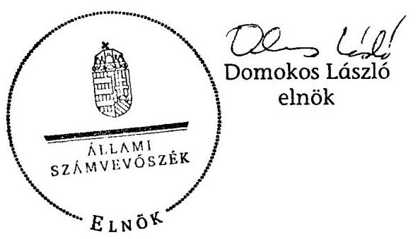

---

# MELLÉKLETEK 

a V-2008-170/2011-2012. sz. Jelentéshez

---

# A PPP konstrukcióban megvalósult Múvészetek Palotája projekt finanszírozásának és üzemeltetésének folyamatábrája 

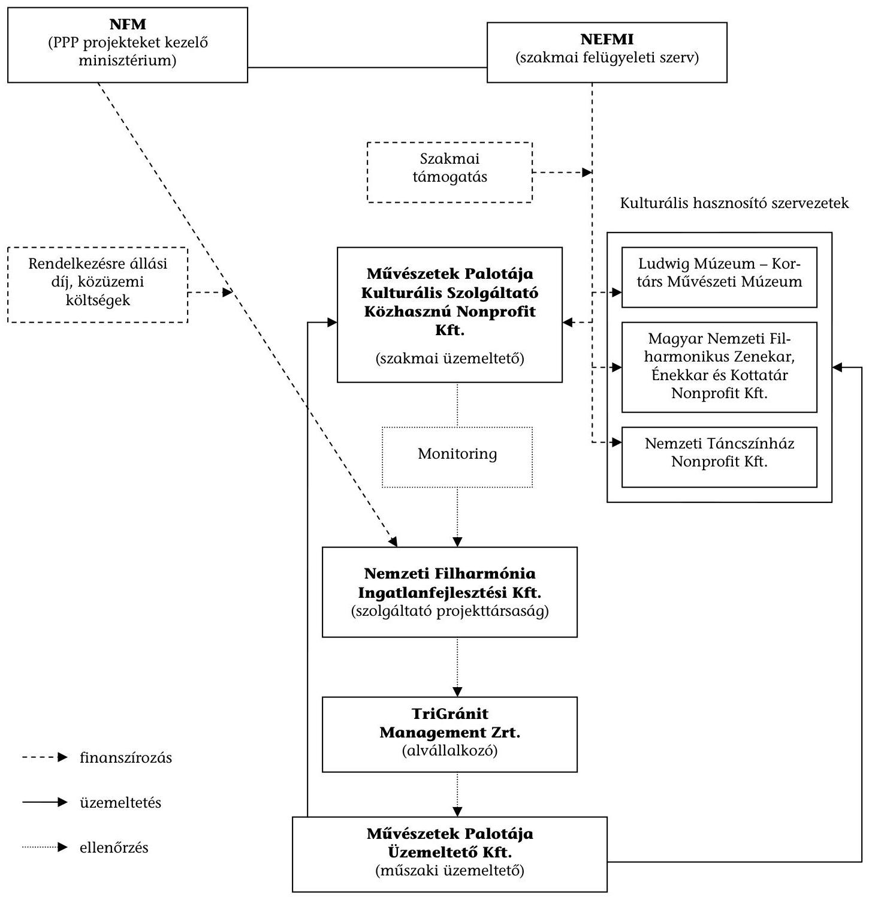

---

# AZ ELLENŐRZÉSBE VONT SZERVEZETEK JEGYZÉKE 

2/a. sz. melléklet: Az ellenőrzésbe vont szervezetek és intézmények névjegyzéke

2/b. sz. melléklet: Helyszíni ellenőrzésbe vont szervezetek és intézmények névjegyzéke

---

# AZ ELLENŐRZÉSBE VONT SZERVEZETEK ÉS INTÉZMÉNYEK NÉVJEGYZÉKE 

## Állami szervezetek megnevezése

1. Nemzeti Erőforrás Minisztérium (NEFMI)
2. Nemzeti Fejlesztési Minisztérium (NFM)

## Kulturális intézmények megnevezése

1. Művészetek Palotája Kulturális Szolgáltató Közhasznú Nonprofit Kft. (MüPa Kft.)
2. Magyar Nemzeti Filharmonikus Zenekar, Énekkar és Kottatár Nonprofit Kft. (NF)
3. Nemzeti Táncszínház Nonprofit Kft. (NT)
4. Ludwig Múzeum - Kortárs Művészeti Múzeum (LM)

## Felsőoktatási intézmények megnevezése

1. Budapesti Corvinus Egyetem (BCE)
2. Budapesti Műszaki és Gazdaságtudományi Egyetem (BME)
3. Debreceni Egyetem (DE)
4. Kaposvári Egyetem (KE)
5. Miskolci Egyetem (ME)
6. Nyugat-magyarországi Egyetem (NYME)
7. Óbudai Egyetem (OE - volt Budapesti Műszaki Főiskola)
8. Pannon Egyetem (PE)
9. Pécsi Tudományegyetem (PTE)
10. Szent István Egyetem (SZIE)
11. Dunaújvárosi Főiskola (DF)
12. Eszterházy Károly Főiskola (EKF)
13. Károly Róbert Főiskola (KRF)
14. Nyíregyházi Főiskola (NYF)
15. Szolnoki Főiskola (SZF)

## Projekttársaságok megnevezése

1. 3P Tavaszmező Kft.
2. Belvárosi Kollégiumok Kft.
3. H-Host Build Kft.
4. H-Tech Build Kft.
5. HUNÉP KLK HOTEL Szálloda, Idegenforgalmi és Szolgáltató Zrt.
6. HUNÉP MEDIKUS HOSTEL Szálloda, Idegenforgalmi és Szolgáltató Zrt.
7. HUNÉP CAMPUS HOTEL Szálloda, Idegenforgalmi és Szolgáltató Zrt.
8. Imola Hostel Ingatlanhasznosító Kft.
9. Nemzeti Filharmónia Ingatlanfejlesztési Kft.
10. MASZER Zrt.

---

11. Miskolci Diákotthon Kft.
12. Pannon Kollégium Kft.
13. SANDRA FORM EUROMOBILI Bútoripari Kft.
14. Soproni Diákotthon Kft.
15. IMMORENT Oktatási Ingatlanhasznosító és Szolgáltató Kft.
16. Szolnoki Hostel Ingatlanhasznosító Kft.
17. Veszprémi Diákotthon Kft.

---

# HELYSZÍNI ELLENŐRZÉSBE VONT SZERVEZETEK ÉS INTÉZMÉNYEK NÉVJEGYZÉKE 

## Állami szervezetek megnevezése

1. Nemzeti Erőforrás Minisztérium (NEFMI)
2. Nemzeti Fejlesztési Minisztérium (NFM)

## Kulturális intézmények megnevezése

1. Művészetek Palotája Kulturális Szolgáltató Közhasznú Nonprofit Kft. (MüPa Kft.)
2. Magyar Nemzeti Filharmonikus Zenekar, Énekkar és Kottatár Nonprofit Kft. (NF)
3. Nemzeti Táncszínház Nonprofit Kft. (NT)
4. Ludwig Múzeum - Kortárs Művészeti Múzeum (LM)

## Felsőoktatási intézmények megnevezése (projekt megnevezése)

1. Budapesti Műszaki és Gazdaságtudományi Egyetem (BME)

- Kármán Tódor Kollégium
- Schönherz Zoltán Kollégium

2. Debreceni Egyetem (DE)

- Diákotthon (Debrecen, Kassai út 26., 10796/1. hrsz.)
- DETEK Kossuth L. I-II-III. Kollégium
- DE-OEC Kollégium

3. Miskolci Egyetem (ME)

- UNI HOTEL, Diákotthon (Miskolc, Egyetemváros)
- Miskolc, Kollégiumok (E2-E7) rekonstrukciója

4. Pannon Egyetem (PE)

- Hotel Magiszter (Veszprém, József Attila utca 34/2.)
- Kollégium rekonstrukció (Veszprém, Egyetem u. 12.)

5. Dunaújvárosi Főiskola (DF)

- Kerpely Antal Kollégium

---

# Alapadatok az állami felsőoktatási intézmények PPP konstrukciójú diákotthon és kollégiumi fejlesztéseiről

|  Sorsz. | Az intézmény megnevezése | A fejlesztés megnevezése | Alapterület
(m3) | A projekt nettó
beruházási
értéke (Mrd Ft) | Szerződéskötés
időpontja | Léteztimény
átudása  |
| --- | --- | --- | --- | --- | --- | --- |
|  Diákotthon |  |  |  |  |  |   |
|  1 | Debreconi Egyetem | Diákotthon (Debrecon, Kassai út 26., 10796/1 hzu) | 20333 | 3,2 | 2004.06.01 | 2005.08.31  |
|  2 | Miskolci Egyetem | UNI HOTEL (Miskolc, Egyetemváros) | 10377 | 2,0 | 2004.09.23 | 2006.01.31  |
|  3 | Nyugol-magyaroszagi Egyetem | Diákotthon (Isopron, Baross út 4.) | 3351 | 2,0 | 2005.02.05 | 2007.02.01  |
|  4 | Óbudai Egyetem | Diákuzilló (Tavuszmező u.) | 3076 | 1,3 | 2005.02.21 | 2007.02.01  |
|  5 | Pannon Egyetem | Hotel Magiutter (Veszprém, József Attila u. 34/2.) | 11477 | 2,3 | 2004.09.29 | 2006.01.31  |
|  6 | Szent István Egyetem | Diákhotel D-E-T ép. (Gödöllő, Péter K. u. 1.) | 7733 | 1,5 | 2006.10.26 | 2006.08.31  |
|  7 | Károly Róbert Főiskola | Diákotthon (Gyöngyös, Bene út 69.) | 7104 | 1,9 | 2005.08.26 | 2006.01.31  |
|  8 | Nyírogyházi Főiskola | Sandra Hotel (Nyírogyháza, Sóstói út 31/b.) | 11030 | 1,1 | 2004.09.24 | 2005.08.31  |
|  Diákotthon összesen |  |  | 78303 | 15,4 |  |   |
|  Kollégium |  |  |  |  |  |   |
|  1 | Budapesti Corvinus Egyetem | Földes Ferenc Kollégium és Somogyi Inter Kollégium | 9910 | 1,0 | 2006.07.18 | 2007.08.31  |
|  2 | Budapesti Műszaki és Gazdaságtudományi Egyetem | Kármán Tódor Kollégium (Budapest XI., Irányi u. 17.) | 16079 | 2,0 | 2006.02.06 | 2007.04.01  |
|   |  | Schönharz Z. Kollégium (Budapest XI., Irányi u. 42.) | 14124 | 2,0 | 2006.09.11 | 2008.05.01  |
|  3 | Debreconi Egyetem | DETEK Kossuth L. I-II-III. Koll. (3-db) | 20733 | 2,1 | 2006.05.24 | 2007.11.16  |
|   |  | DE-OEC Kollégium rekonstrukciója | 4388 | 0,8 | 2006.11.23 | 2008.08.31  |
|  4 | Kaporvázi Egyetem | Csukás Zoltán Kollégium | 3960 | 0,5 | 2006.07.14 | 2007.01.31  |
|  5 | Miskolci Egyetem | Miskolc, Kollégiumok (E2-E7) rekonstrukciója) | 26519 | 3,1 | 2006.11.02 | 2007.12.31  |
|  6 | Pannon Egyetem | Kollégium rekonstrukció (Veszprém Egyetem u. 12.) | 9059 | 1,4 | 2007.06.28 | 2008.08.31  |
|  7 | Pécsi Tudományegyetem | Beszerkány u. kollégium | 14128 | 2,3 | 2007.11.29 | 2008.08.31  |
|   |  | Szalay-Üniv kollégium | 9864 | 1,9 | 2009.07.16 | 2010.08.31  |
|  8 | Szent István Egyetem | Gödöllő A-B jelű Kollégium (Gödöllő Péter K. u. 1.) és jázabertényi Kollégium (Jázabertény, Bákóczi út 55.) | 16496 | 1,4 | 2007.10.02 | 2007.09.23  |
|   |  | Szorvasi és beköszzubai kollégiumok (Tessedik Sárnasi Főiskola kollégiumok) | 13349 | 2,2 | 2007.12.13 | 2008.01.31  |
|  9 | Dunaújvárosi Főiskola | Kerpely Antal Kollégium (Dunaújváros, Dézsu Gy. Út 35-37.) | 5990 | 1,3 | 2006.12.15 | 2008.03.31  |
|  10 | Eszterházy Károly Főiskola | Leányka úti kollégium (Eger, Leányka u. 2.) | 4800 | 0,7 | 2005.11.17 | 2006.08.31  |
|  11 | Nyírogyházi Főiskola* | I-II-III-IV. kollégiumok (Nyírogyháza, Sóstói u. 31/b.) | 12528 | 2,3 | 2006.03.22 | 2006.08.31  |
|  12 | Szoborki Főiskola | Kollégium rekonstrukció (Szobork, Mártirók u. 8-10.) | 3900 | 0,5 | 2007.02.01 | 2007.09.08  |
|  Kollégium összesen |  |  | 186049 | 25,3 |  |   |

- 9 156000 €, 250 Ft/€ árfolyamon átszámolva.

Forrás: NFM adatszolgáltatás

---

# ÖSSZESÍTŐ TÁBLÁZATOK A PPP KONSTRUKCIÓBAN MEGVALÓSULT KIEMELT KULTURÁLIS ÉS FELSŐOKTATÁSI PROJEKTEKRŐL 

## I. Müvészetek Palotája

I/1. sz. táblázat: A MÚPA projekt forrásszükségletének (projektköltség) öszszetétele és finanszírozása (II. Részletes megállapítások című rész 27. oldal)

I/2. sz. táblázat: A Művészetek Palotájára fordított állami kiadások alakulása 2007-2010 között

I/3. sz. táblázat: A Rendelkezésre Állási Díj alakulása 2007-2011. év I. félév között

I/4. sz. táblázat: A Művészetek Palotája közüzemi és egyéb kiadásai a 2007-2011. év I. félév közötti időszakban

I/5. sz. táblázat: A Művészetek Palotája Kulturális Szolgáltató Közhasznú Nonprofit Kft. gazdálkodási adatainak alakulása a 20072011. év I. félév közötti időszakban

I/6. sz. táblázat: A hasznosító szervezetek bevételi adatainak alakulása a 2007-2011. év I. félév közötti időszakban

I/7. sz. táblázat: Látogatók száma a Művészetek Palotájában a 2007-2010 közötti időszakban

## II. Felsőoktatási kollégiumok

II/l. sz. táblázat: Összesített adatok a kollégiumi beruházási program keretében megvalósult férőhelyekről 2007-2011 között

II/2. sz. táblázat: A bérleti-szolgáltatási díjak, valamint az egyes díjtételek alakulása a szerződés szerinti értékhez viszonyítva

II/3. sz. táblázat: A kollégiumi rekonstrukciók és diákotthonok minisztériumi támogatásának alakulása 2007-2011. év I. félév között

II/4.a. sz. táblázat: A hagyományos múködtetésű kollégiumok egy férőhelyére jutó üzemeltetési és közüzemi ráfordításainak alakulása 2007-2010 között

---

II/4.b. sz. táblázat: A PPP konstrukcióban múködtetett diákotthonok és kollégiumok egy férőhelyére jutó üzemeltetési és közüzemi ráfordításainak alakulása 2007-2010 között

II/5. sz. táblázat: Férőhelyek száma a kollégiumokban és a diákotthonokban 2007-2011. évek között az ellenőrzött intézményeknél (II. Részletes megállapítások című rész 63. oldal)

---

# A Művészetek Palotájára fordított állami kiadások alakulása 2007-2010 között

|  Sorsz. | Megnevezés | 2007 | 2008 | 2009 | 2010  |
| --- | --- | --- | --- | --- | --- |
|  1 | Rendelkezésre Állási Díj | 7582,3 | 8270,9 | 9591,3 | 9384,0  |
|  2 | Közüzemi és egyéb díjak | 369,1 | 364,0 | 493,6 | 583,5  |
|  3 | Művészetek Palotája Kulturális Szolgáltató Közhasznú Nonprofit Kft. támogatása | 2400,0 | 2400,0 | 2306,0 | 1870,4  |
|  4 | Magyar Nemzeti Filharmonikus Zenekar, Énekkar és Kottatár Nonprofit Kft. támogatása | 1583,0 | 1550,0 | 1568,6 | 1343,2  |
|  5 | Ludwig Múzeum - Kortárs Művészeti Múzeum támogatása | 374,2 | 380,1 | 344,7 | 324,3  |
|  6 | Összesen | 12308,6 | 12965,0 | 14304,2 | 13505,4  |
|  7 | A MÚPA-ra fordított állami kiadások a költségvetés kulturális kiadásainak százalékában | 7,1\% | 7,2\% | 8,0\% | 6,9\%  |
|  8 | Nemzeti Táncszínház Nonprofit Kft.* | 568,4 | 557,0 | 489,7 | 392,8  |

- A Nemzeti Táncszínház Nonprofit Kft. telephellyel rendelkezik a MÚPÁ-ban.

---

# A Rendelkezésre Állási Díj alakulása 2007-2011. év I. félév között

|  Sorsz. | Megnevezés | 2007 | 2008 | 2009 | 2010 | 2011. I. félév | Összesen |   |
| --- | --- | --- | --- | --- | --- | --- | --- | --- |
|   |  |  |  |  |  |  | 2007-2010.
teljes évek | 2007-2011.
I. félév  |
|  1 | Szerződés szerinti összeg* | 7731,8 | 8425,1 | 8623,9 | 8713,5 | 4319,5 | 33494,3 | 37813,8  |
|  2 | Aktualizált adatok alapján** | 8280,9 | 8274,3 | 8080,8 | 9096,9 | 4992,5 | 33732,9 | 38725,4  |
|  3 | RÁD kiszámlázott összege | 7582,6 | 8270,9 | 9591,3 | 9384,0 | 4814,2 | 34828,8 | 39643,0  |
|  4 | Aktualizált adatok a szerződés szerinti összeg \%-ában | $107,1 \%$ | $98,2 \%$ | $93,7 \%$ | $104,4 \%$ | $115,6 \%$ | $100,7 \%$ | $102,4 \%$  |
|  5 | Kiszámlázott RÁD a szerződés szerinti összeg \%-ában | $98,1 \%$ | $98,2 \%$ | $111,2 \%$ | $107,7 \%$ | $111,5 \%$ | $104,0 \%$ | $104,8 \%$  |
|  6 | Kiszámlázott RÁD az aktualizált adatok \%-ában | $91,6 \%$ | $100,0 \%$ | $118,7 \%$ | $103,2 \%$ | $96,4 \%$ | $103,2 \%$ | $102,4 \%$  |

- Pénzügyi Modell alapján (250 euró/forint árfolyamon), 25\%-os áfával. ** Az NFI Kft. által minisztériumnak benyújtott évenkénti aktualizált adatok.

Forrás: RÁSZ, NFI Kft., NEFMI, NFM

---

# A Művészetek Palotája közüzemi és egyéb kiadásai a 2007-2011. év I. félév közötti időszakban

|  Sorsz. | Megnevezés | 2007 | 2008 | 2009 | 2010 | 2011. I. félév  |
| --- | --- | --- | --- | --- | --- | --- |
|  1 | Villamos energia szolgáltatási díja | 273762,7 | 270029,3 | 356632,3 | 434075,7 | 184867,4  |
|  2 | Távhő- és melegvíz szolgáltatás díja | 77437,9 | 77092,5 | 116922,9 | 126846,2 | 66202,6  |
|  3 | Víz és csatorna díjak | 9765,3 | 8981,3 | 9865,5 | 10972,8 | 4577,8  |
|  4 | Kommunális szemét | 3275,5 | 4193,3 | 3895,9 | 4014,4 | 2228,6  |
|  5 | Egyéb üzemeltetési és fenntartási szolgáltatások kiadásai | 4765,7 | 2495,2 | 6273,1 | 3957,7 | 0,0  |
|  6 | Pénzügyi szolgáltatások | 96,0 | 1212,0 | 53,7 | 3608,0 | 0,0  |
|  Összesen |  | 369103,1 | 364003,6 | 493643,4 | 583474,8 | 257876,4  |

Forrás: NEFMI, NFM

---

# A Müvészetek Palotája Kulturális Szolgáltató Közhasznú Nonprofit Kft. gazdálkodási adatainak alakulása a 2007-2011. év 1. félév közötti időszakban

|  Sorsz. | Megnevezés | 2007 | 2008 | 2009 | 2010 | 2011. 1. félév | 2010/2007.  |
| --- | --- | --- | --- | --- | --- | --- | --- |
|  I. | Bevételek |  |  |  |  |  |   |
|  1. | Értékesítés nettó árbevétele | 851942,0 | 953406,0 | 1057444,0 | 1115981,0 | 480985,0 | 131,0\%  |
|  1.1 | ebből jegy és bérletbevétel | 431414,0 | 462787,0 | 559080,0 | 527901,0 | 261306,0 | 122,4\%  |
|  1.2 | ebből marketing jellegü bevételek | 72259,0 | 167501,0 | 151486,0 | 159093,0 | 19510,0 | 220,2\%  |
|  1.3 | ebből bérleti díj bevétel | 214091,0 | 216222,0 | 228995,0 | 287791,0 | 128750,0 | 134,4\%  |
|  2. | Egyéb bevételek | 2420703,0 | 2580692,0 | 2854186,0 | 1896906,0 | 808882,0 | 78,4\%  |
|  2.1 | ebből fenntartói támogatás | 2400000,0 | 2400000,0 | 2306000,0 | 1870439,0 | 807000,0 | 77,9\%  |
|  3. | Aktivált saját létesítmények | 0,0 | 0,0 | 0,0 | 28071,0 | 0,0 | 0,0\%  |
|  4. | Pénzügyi műveletek bevétele | 32227,0 | 20440,0 | 20634,0 | 13560,0 | 709,0 | 42,1\%  |
|  5. | Rendkívüli bevételek | 3600,0 | 0,0 | 0,0 | 0,0 | 0,0 | 0,0\%  |
|  II. | Bafordítások |  |  |  |  |  |   |
|  1. | Személyi jellegü ráfordítások összesen | 1196082,0 | 1355794,0 | 1322292,0 | 1248360,0 | 622091,0 | 104,4\%  |
|  1.1 | ebből bérköltség | 855214,0 | 964700,0 | 954457,0 | 909868,0 | 472126,0 | 106,4\%  |
|  1.2 | ebből személyi jellegü egyéb kifizetések | 70044,0 | 102660,0 | 103612,0 | 93495,0 | 29144,0 | 133,5\%  |
|  1.3 | ebből munkaadókat terhelő járulékok | 270824,0 | 288434,0 | 264223,0 | 244997,0 | 120821,0 | 90,5\%  |
|  2. | Anyagjellegü ráfordítások | 2198350,0 | 2223934,0 | 2252759,0 | 1981262,0 | 965933,0 | 90,1\%  |
|  2.1 | ebből anyag- készletbeszerzések | 36673,0 | 40933,0 | 39513,0 | 42449,0 | 13800,0 | 113,8\%  |
|  2.2 | ebből igénybe vett szolgáltatások | 2149544,0 | 2080547,0 | 2042998,0 | 1726240,0 | 845255,0 | 80,3\%  |
|  2.2.1 | ezen belül produkciós kiadások | 1416172,0 | 1280425,0 | 1362960,0 | 1096661,0 | 601082,0 | 77,4\%  |
|  2.2.2 | ezen belül produkciós technológia müködletése | 68500,0 | 66861,0 | 72930,0 | 49438,0 | 29099,0 | 72,2\%  |
|  2.2.3 | ezen belül marketing költségek | 411950,0 | 468992,0 | 387164,0 | 311965,0 | 123696,0 | 75,7\%  |
|  3. | Értékcsökkenési leírás | 80918,0 | 84602,0 | 40764,0 | 31682,0 | 11333,0 | 39,2\%  |
|  4. | Egyéb ráfordítások | 72372,0 | 167457,0 | 213415,0 | 36190,0 | 905,0 | 50,0\%  |
|  5. | Pénzügyi műveletek ráfordításai | 2146,0 | 3503,0 | 22253,0 | 5223,0 | 0,0 | 243,4\%  |
|  6. | Rendkívüli ráfordítások | 0,0 | 0,0 | 0,0 | 1,0 | 0,0 | 0,0\%  |
|  III. | Mérleg szerinti eredmény | $-241398,0$ | $-280752,0$ | * 80782,0 | $-248200,0$ | $-309686,0$ | 102,8\%  |

Forrás: Intézményi tanúsítványok.

---

# A hasznosító szervezetek bevételi adatainak alakulása a 2007-2011. év I. félév közötti időszakban

|  Sorsz. | Megnevezés | 2007 | 2008 | 2009 | 2010 | 2011. I. félév | 2010/2007.  |
| --- | --- | --- | --- | --- | --- | --- | --- |
|  Magyar | Nemzeti Filharmonikus Zenekar. Énekkor és Kottutár Nonprofit Kft. |  |  |  |  |  |   |
|  I. | Bevételek összesen | 1821 118,0 | 1987 127,0 | 1999 435,0 | 1656 682,0 | 946 792,0 | 91,0\%  |
|  1. | Értékesítés nettó árbevétele | 228 209,0 | 164 164,0 | 221 199,0 | 129 345,0 | 172 461,0 | 56,7\%  |
|  1.1 | ebből jegy és bérletbevétel | 61575,0 | 66737,0 | 57336,0 | 48148,0 | 75497,0 | 78,2\%  |
|  2. | Egyéb bevételek | 1585 204,0 | 1557 374,0 | 1767729,0 | 1509067,0 | 772723,0 | 95,2\%  |
|  2.1 | ebből fenntartói támogatás | 1583 000,0 | 1550 000,0 | 1568 600,0 | 1343 200,0 | 767866,0 | 84,9\%  |
|  3. | Aktivált saját teljesítmény | 181,0 | 94,0 | 151,0 | 0,0 | 0,0 | 0,0\%  |
|  4. | Pénzügyi műveletek bevétele | 285,0 | 442,0 | 2395,0 | 8633,0 | 1608,0 | 3029,1\%  |
|  5. | Rendkívüli bevételek | 7239,0 | 265053,0 | 7961,0 | 9637,0 | 0,0 | 133,1\%  |
|  Nemzeti Táncszínház Nonprofit Kft. |  |  |  |  |  |  |   |
|  II. | Bevételek összesen | 847 901,0 | 796 148,0 | 767 164,0 | 673 560,0 | 373 482,0 | 79,4\%  |
|  6. | Értékesítés nettó árbevétele | 215 807,0 | 187 179,0 | 177 142,0 | 150 707,0 | 79632,0 | 69,8\%  |
|  6.1 | ebből jegy és bérletbevétel | 133 451 | 150 422 | 160 683 | 161 000 | 74233 | 120,6\%  |
|  7. | Egyéb bevételek | 595 940,0 | 570 875,0 | 582 873,0 | 517 264,0 | 293 826,0 | 86,8\%  |
|  7.1 | ebből fenntartói támogatás | 568 385,0 | 557 023,0 | 489 681,0 | 392 800,0 | 266 367,0 | 69,1\%  |
|  8. | Pénzügyi műveletek bevétele | 7050,0 | 8433,0 | 1074,0 | 616,0 | 24,0 | 8,7\%  |
|  9. | Rendkívüli bevételek | 29 104,0 | 29 661,0 | 6075,0 | 4973,0 | 0,0 | 17,1\%  |
|  Ludwig Múzeum - Kortúrs Művészeti Múzeum |  |  |  |  |  |  |   |
|  III. | Bevételek összesen | 461 000,0 | 472 266,0 | 538 192,0 | 498 676,0 | 314 785,0 | 108,2\%  |
|  10. | Fenntartói támogatás | 374 253,0 | 380 080,0 | 344 660,0 | 324 293,0 | 155 745,0 | 86,7\%  |
|  11. | Súját bevétel | 86 747,0 | 92 186,0 | 193 532,0 | 174 383,0 | 159 040,0 | 201,0\%  |
|  11.1 | Jegy és bérletbevétel (állu nélkül) | 12 993,0 | 20 898,0 | 77 940,0 | 51 986,0 | 16 641,0 | 400,1\%  |
|  11.2 | Egyéb támogatás | 29 852,0 | 40 021,0 | 42 268,0 | 65 685,0 | 41 243,0 | 220,0\%  |
|  11.3 | Pályázati bevétel | 20 798,0 | 8 789,0 | 21 578,0 | 11 152,0 | 10 790,0 | 53,6\%  |
|  11.4 | Egyéb bevétel | 5 512,0 | 3 357,0 | 19 159,0 | 20 075,0 | 65 184,0 | 364,2\%  |
|  11.5 | Áfa bevétel | 17 592,0 | 19 121,0 | 32 587,0 | 25 485,0 | 25 182,0 | 144,9\%  |

Forrás: Intézményi tanúsítványok.

---

# Látogatók száma a Művészetek Palotájában a 2007-2010 közötti időszakban

|  Sorsz. | Megnevezés | TERV 2007-2010 között |  |  |  | TELJESÍTÉS 2007-2010 között |  |  |  | Teljesítés a tervezett arányában  |
| --- | --- | --- | --- | --- | --- | --- | --- | --- | --- | --- |
|   |  | Fesztivál-
színház | Hangverseny-
terem | Egyéb
termek | Összesen | Fesztivál-
színház | Hangverseny-
terem | Egyéb
termek | Összesen |   |
|  1 | MüPa Kft. saját és közös rendezvény | 184900 | 554169 | 43238 | 782307 | 173113 | 475015 | 39247 | 687375 | 87,9\%  |
|  2 | MüPa Kft. befogadott rendezvények | 54232 | 558188 | 3530 | 615950 | 43874 | 462033 | 3360 | 509267 | 82,7\%  |
|  3 | Nemzeti Filharmonikusok | 7120 | 80800 |  | 87920 | 7201 | 77895 |  | 85096 | 96,8\%  |
|  4 | Nemzeti Táncszínház | 133440 |  |  | 133440 | 142832 |  |  | 142832 | 107,0\%  |
|  5 | Ludwig Múzeum - Kortárs Művészeti Múzeum |  |  | 242000 | 242000 |  |  | 302899 | 302899 | 125,2\%  |
|  6 | Rendezvények a közönség-forgalmi területeken |  |  |  |  |  |  | 943944 | 943944 |   |
|  Összesen |  |  |  |  |  |  |  |  | 2671413 |   |

Forrás: Intézményi tanúsítványok.

---

# Összesített adatok a kollégiumi beruházási program keretében megvalósult férőhelyekről 2007-2011 között

|  Sorsz. | Intézmény megnevezése | 2007 |  |  | 2008 |  |  | 2009 |  |  | 2010 |  |  | 2011 |  |   |
| --- | --- | --- | --- | --- | --- | --- | --- | --- | --- | --- | --- | --- | --- | --- | --- | --- |
|   |  | diákotthon | kollégium | összesen | diákotthon | kollégium | összesen | diákotthon | kollégium | összesen | diákotthon | kollégium | összesen | diákotthon | kollégium | összesen  |
|  1 | Budapesti Corvinus Egyetem | 0 | 607 | 607 | 0 | 607 | 607 | 0 | 607 | 607 | 0 | 607 | 607 | 0 | 607 | 607  |
|  2 | Budapesti Múszaki és Gaudúságtud. Egyetem | 0 | 984 | 984 | 0 | 2056 | 2056 | 0 | 2056 | 2056 | 0 | 2056 | 2056 | 0 | 2056 | 2056  |
|  3 | Debreceni Egyetem | 930 | 1255 | 2185 | 930 | 1374 | 2304 | 930 | 1374 | 2304 | 930 | 1374 | 2304 | 930 | 1374 | 2304  |
|  4 | Ingersvált Egyetem | 0 | 304 | 304 | 0 | 304 | 304 | 0 | 304 | 304 | 0 | 304 | 304 | 0 | 304 | 304  |
|  5 | Miskolc1 Egyetem | 603 | 1277 | 1000 | 603 | 1277 | 1000 | 603 | 1277 | 1000 | 603 | 1277 | 1000 | 603 | 1277 | 1000  |
|  6 | Nyugat-mugyarotssági Egyetem | 400 | 0 | 400 | 400 | 0 | 400 | 400 | 0 | 400 | 400 | 0 | 400 | 400 | 0 | 400  |
|  7 | Szent István Egyetem | 464 | 890 | 1354 | 464 | 1649 | 2113 | 464 | 1649 | 2113 | 464 | 1649 | 2113 | 464 | 1649 | 2113  |
|  8 | Pannon Egyetem | 800 | 0 | 800 | 800 | 498 | 1298 | 800 | 498 | 1298 | 800 | 498 | 1298 | 800 | 498 | 1298  |
|  9 | Pécsi Tudományegyetem | 0 | 0 | 0 | 0 | 800 | 800 | 0 | 800 | 800 | 0 | 1355 | 1355 | 0 | 2704 | 2704  |
|  10 | Olsukai Egyetem | 400 | 0 | 400 | 400 | 0 | 400 | 400 | 0 | 400 | 400 | 0 | 400 | 400 | 0 | 400  |
|  11 | Összajövőesei Főiskola | 0 | 400 | 400 | 0 | 400 | 400 | 0 | 400 | 400 | 0 | 400 | 400 | 0 | 400 | 400  |
|  12 | Euterházy Károly Főiskola | 0 | 401 | 401 | 0 | 401 | 401 | 0 | 401 | 401 | 0 | 401 | 401 | 0 | 401 | 401  |
|  13 | Károly Róbert Főiskola | 436 | 0 | 436 | 436 | 0 | 436 | 436 | 0 | 436 | 436 | 0 | 436 | 436 | 0 | 436  |
|  14 | Nyöngyházi Főiskola | 427 | 1170 | 1597 | 427 | 1170 | 1597 | 427 | 1170 | 1597 | 427 | 1170 | 1597 | 427 | 1170 | 1597  |
|  15 | Szobiski Főiskola | 0 | 252 | 252 | 0 | 252 | 252 | 0 | 252 | 252 | 0 | 252 | 252 | 0 | 252 | 252  |
|  Összesen |  | 4460 | 7540 | 12000 | 4460 | 10988 | 15448 | 4460 | 10988 | 15448 | 4460 | 11543 | 16003 | 4460 | 12892 | 17352  |

Forrós: VII/3/a.-3/b. sz. tanszabványok, a NYME nyilatkozata, valamint a DE, PL és SZJE levele.

---

## **A bérleti-szolgáltatási díjak, valamint az egyes díjtételek alakulása a szerződés szerinti értékhez viszonyítva***

uálatok: M Ft. %

|  Sorsz. | Intézmény megnevezése | Projekt megnevezése | Éves bruttó bérleti-szolgáltatási | Adócságezolgáltat | Üzemeltetési díj | Közdszemi díj  |
| --- | --- | --- | --- | --- | --- | --- |
|   |  |  |  |  |  |   |
|   |  |  | Szercődés |  |  |   |
|   |  |  | szertet |  |  |   |
|   |  |  |  |  |  |   |
|   |  |  |  |  |  |   |
|   |  |  |  |  |  |   |
|   |  |  |  |  |  |   |
|   |  |  |  |  |  |   |
|   |  |  |  |  |  |   |
|   |  |  |  |  |  |   |
|   |  |  |  |  |  |   |
|   |  |  |  |  |  |   |
|   |  |  |  |  |  |   |
|   |  |  |  |  |  |   |
|   |  |  |  |  |  |   |
|   |  |  |  |  |  |   |
|   |  |  |  |  |  |   |
|   |  |  |  |  |  |   |
|   |  |  |  |  |  |   |
|   |  |  |  |  |  |   |
|   |  |  |  |  |  |   |
|   |  |  |  |  |  |   |
|   |  |  |  |  |  |   |
|   |  |  |  |  |  |   |
|   |  |  |  |  |  |   |
|   |  |  |  |  |  |   |
|   |  |  |  |  |  |   |
|   |  |  |  |  |  |   |
|   |  |  |  |  |  |   |
|   |  |  |  |  |  |   |
|   |  |  |  |  |  |   |
|   |  |  |  |  |  |   |
|   |  |  |  |  |  |   |
|   |  |  |  |  |  |   |
|   |

---

# A kollégiumi rekonstrukciók és diákotthonok minisztériumi támogatásának alakulása 2007-2011. év I. félév között

|  Sorsz. | Intézmény megnevezése | 2007 | 2008 | 2009 | 2010 | 2011. I. félév | Összesen  |
| --- | --- | --- | --- | --- | --- | --- | --- |
|  Új diákotthon |  |  |  |  |  |  |   |
|  1 | Debreceni Egyetem | 23,3 | 44,0 | 41,9 | 83,8 | 83,8 | 276,8  |
|  2 | Miskolci Egyetem | 27,1 | 29,7 | 24,6 | 54,4 | 54,4 | 190,2  |
|  3 | Nyugat-magyarországi Egyetem | 16,2 | 20,7 | 18,0 | 36,0 | 36,0 | 126,9  |
|  4 | Öbudai Egyetem | 16,2 | 19,7 | 15,9 | 35,6 | 36,0 | 123,4  |
|  5 | Pannon Egyetem | 36,0 | 39,3 | 36,0 | 72,0 | 72,0 | 255,3  |
|  6 | Szent István Egyetem | 23,2 | 26,8 | 23,2 | 46,4 | 46,4 | 166,0  |
|  7 | Károly Róbert Főiskola | 21,8 | 23,8 | 19,8 | 43,6 | 43,6 | 152,6  |
|  8 | Nyíregyházi Főiskola | 21,4 | 23,4 | 19,4 | 42,8 | 42,8 | 149,8  |
|  Diákotthon összesen |  | 185,2 | 227,4 | 198,8 | 414,6 | 415,0 | 1441,0  |
|  Kollégiumi rekonstrukció |  |  |  |  |  |  |   |
|  1 | Budapesti Corvinus Egyetem | 35,3 | 196,6 | 124,9 | 176,5 | 132,7 | 666,0  |
|  2 | Budapesti Műszaki és Gazdaságtud. Egyetem | 130,5 | 463,7 | 270,1 | 486,8 | 472,1 | 1823,2  |
|  3 | Debreceni Egyetem | 149,6 | 380,6 | 302,2 | 450,3 | 380,9 | 1663,6  |
|  4 | Kaposvárt Egyetem | 4,8 | 102,9 | 36,9 | 77,7 | 59,9 | 282,2  |
|  5 | Miskolci Egyetem | 219,4 | 339,8 | 189,8 | 358,1 | 270,9 | 1378,0  |
|  6 | Pannon Egyetem | 9,3 | 0,0 | 144,0 | 156,6 | 146,7 | 456,6  |
|  7 | Pécsi Tudományegyetem | 0,0 | 102,0 | 182,2 | 298,9 | 517,3 | 1100,4  |
|  8 | Szent István Egyetem | 71,8 | 459,3 | 296,7 | 530,7 | 478,5 | 1837,0  |
|  9 | Dunaújvárosi Főiskola | 72,0 | 233,7 | 232,4 | 344,3 | 272,6 | 1155,0  |
|  10 | Eszterházy Károly Főiskola | 81,7 | 80,2 | 71,9 | 86,6 | 62,5 | 382,9  |
|  11 | Nyíregyházi Főiskola | 165,1 | 221,4 | 116,8 | 197,5 | 136,6 | 837,4  |
|  12 | Szolnoki Főiskola | 19,7 | 62,2 | 34,9 | 82,5 | 64,1 | 263,4  |
|  Kollégium rekonstrukció összesen |  | 959,2 | 2642,4 | 2002,8 | 3246,5 | 2994,8 | 11845,7  |
|  Mindösszesen |  | 1144,4 | 2869,8 | 2201,6 | 3661,1 | 3409,8 | 13286,7  |

Forrás: NEFMI, NFM

---

# A hagyományos működtetésű kollégiumok egy férőhelyére jutó üzemeltetési és közüzemi ráfordításainak alakulása 2007-2010 között

|  Sorsz. | Intézmény megnevezése | 2007 |  |  | 2008 |  |  | 2009 |  |  | 2010 |  |  | Egy férőhelyes jutó fajlagos költség 2007/2010 (E Ft)  |
| --- | --- | --- | --- | --- | --- | --- | --- | --- | --- | --- | --- | --- | --- | --- |
|   |  | Üzemeltetési és közüzemi díjak (E Ft) | Férőhelyek száma (dft) | Egy férőhelyes jutó fajlagos költség (E Ft) | Üzemeltetési és közüzemi díjak (E Ft) | Férőhelyek száma (dft) | Egy férőhelyes jutó fajlagos költség (E Ft) | Üzemeltetési és közüzemi díjak (E Ft) | Férőhelyek száma (dft) | Egy férőhelyes jutó fajlagos költség (E Ft) | Üzemeltetési és közüzemi díjak (E Ft) | Férőhelyek száma (dft) | Egy férőhelyes jutó fajlagos költség (E Ft) |   |
|  1 | Budapest Corvinus Egystem | 344900 | 1466 | 235,5 | 291300 | 1466 | 198,7 | 329600 | 1321 | 249,5 | 297400 | 1322 | 225,9 |   |
|  2 | Budapest Műszaki és Gazdossigtail. Egystem | 638100 | 2018 | 316,2 | 774600 | 2027 | 376,6 | 590200 | 2063 | 286,1 | 666200 | 2059 | 323,6 |   |
|  3 | Debreceni Egystem | 764100 | 2776 | 275,5 | 581900 | 2434 | 239,1 | 544900 | 2423 | 224,9 | 1080700 | 2414 | 447,7 |   |
|  4 | Kaposvári Egystem | 142600 | 628 | 227,1 | 141300 | 599 | 235,9 | 190000 | 600 | 316,7 | 167300 | 598 | 279,8 |   |
|  5 | Miskolci Egystem | 209400 | 540 | 387,8 | 174100 | 540 | 322,6 | 160600 | 540 | 297,4 | 159800 | 540 | 295,9 |   |
|  6 | Nyugat-magyarország Egystem | 181800 | 1527 | 119,1 | 234600 | 1531 | 151,5 | 241800 | 1551 | 155,9 | 244300 | 1551 | 157,5 |   |
|  7 | Olsukai Egystem | 78400 | 357 | 219,6 | 59600 | 361 | 165,1 | 63600 | 360 | 175,0 | 64100 | 359 | 178,4 |   |
|  8 | Pannon Egystem | 143200 | 529 | 270,7 | 149900 | 642 | 233,5 | 155700 | 633 | 246,0 | 387200 | 633 | 611,7 |   |
|  9 | Pécsi Tudományegystem | 432400 | 3685 | 117,3 | 598300 | 3699 | 161,7 | 509400 | 3101 | 164,3 | 651200 | 1691 | 385,1 |   |
|  10 | Lezet István Egystem | 202300 | 994 | 203,5 | 151500 | 994 | 152,6 | 383700 | 983 | 590,5 | 200600 | 1000 | 200,6 |   |
|  11 | Dunaújvárosi Főiskola | 25400 | 160 | 138,8 | 29400 | 160 | 183,8 | 32000 | 160 | 200,0 | 31700 | 160 | 198,1 |   |
|  12 | Szérebány Károly Főiskola | 126600 | 360 | 331,7 | 95300 | 360 | 264,7 | 100300 | 352 | 284,9 | 123200 | 344 | 358,3 |   |
|  13 | Károly Róbert Főiskola * | 0 | 0 | 0 | 0 | 0 | 0 | 0 | 0 | 0 | 0 | 0 | 0 |   |
|  14 | Nyírsgyházi Főiskola * | 0 | 0 | 0 | 0 | 0 | 0 | 0 | 0 | 0 | 0 | 0 | 0 |   |
|  15 | Szoboski Főiskola | 127300 | 646 | 197,1 | 147500 | 646 | 228,3 | 131200 | 636 | 206,2 | 209700 | 606 | 346,6 |   |
|  Összesen |  | 3616500 | 15686 | 217,8 | 3429300 | 15509 | 221,1 | 3432400 | 14723 | 233,1 | 4283400 | 12971 | 330,2 | 247,3  |

- Nem üzemeltet hagyományos működtetési kollégiumot.

Forrás: VII/1/a. és VII/2. sz. tanúsítványok.

---

# A PPP konstrukcióban működtetett diákotthonok és kollégiumok egy férőhelyére jutó üzemeltetési és közüzemi ráfordításainak alakulása 2007-2010 között

|  Sorsz. | Intézmény megnevezése | Projekt megnevezése | Férőhelyek (csáma (dB)) | Üzemeltetési és közüzemi díjak (f. Ft)* |  |  |  | Egy férőhelyre jutó fajlagos költség (f. Ft) |  |  |  | Egy férőhelyes jutó fajlagos költség 2007/2010 (f. Ft)  |
| --- | --- | --- | --- | --- | --- | --- | --- | --- | --- | --- | --- | --- |
|   |  |  |  | teljesítés |  |  |  |  |  |  |  |   |
|   |  |  |  | 2007 | 2008 | 2009 | 2010 | 2007 | 2008 | 2009 | 2010 |   |
|  Diákotthon |  |  |  |  |  |  |  |  |  |  |  |   |
|  1 | Delmezni Egyetem | Diákotthon (Delmezes, Kansai út 26., 10796/1 hns.) |  | 928 | 257 300,0 | 286 900,0 | 325 200,0 | 308 100,0 | 277 | 309 | 350 | 333  |
|  2 | Miskolc Egyetem | UNI HOTEL (Miskolc, Egyetemcsáma) |  | n.a. | n.a. | n.a. | n.a. | n.a. | n.a. | n.a. | n.a. |   |
|  3 | Nyugat-maggrarotazigi Egyetem | Diákotthon (Isopron, Baross út 4.) |  | n.a. | n.a. | n.a. | n.a. | n.a. | n.a. | n.a. | n.a. |   |
|  4 | Óbadal Egyetem | Diákasálló (Tavaszmező u.) |  | 352 | 73 700,0 | 82 700,0 | 84 400,0 | 86 800,0 | 209 | 235 | 240 | 247  |
|  5 | Pannon Egyetem | Hotel Maginéter (Veszprém, József Attila u. 34/2.) |  | 720 | 130 700,0 | 141 700,0 | 161 700,0 | 186 200,0 | 182 | 197 | 225 | 259  |
|  6 | Szent István Egyetem | Diákhotel D-E-F ép. (Gödöllő, Páter K. u. 1.) |  | 464 | 161 900,0 | 169 200,0 | 186 800,0 | 191 679,0 | 306 | 362 | 403 | 411  |
|  7 | Károly Róbert Főnkolu | Diákotthon (Gyöngyös, Bens út 69.) |  | 436 | 118 200,0 | 124 500,0 | 145 800,0 | 130 000,0 | 271 | 286 | 334 | 344  |
|  8 | Nyöngyházi Főnkolu | Sandoz Hotel (Nyöngyháza, Sóstót út 31/b.) |  | n.a. | n.a. | n.a. | n.a. | n.a. | n.a. | n.a. | n.a. |   |
|  Diákotthon összesen |  |  |  | 2 900 | 721 800,0 | 805 000,0 | 903 900,0 | 922 779,0 | 249 | 278 | 312 | 318  |
|  Kollégium rekonstrukció |  |  |  |  |  |  |  |  |  |  |  |   |
|  1 | Budapesti Corvinus Egyetem | Földes Ferenc Kollégium és komogei Imre Kollégium |  | 607 |  | 186 200,0 | 198 200,0 | 212 600,0 | 0 | 307 | 327 | 350  |
|  2 | Budapesti Műszaki és Gazdossigtud. Egyetem | Kármán Tisikó Kollégium |  | 984 |  | 215 900,0 | 218 400,0 | 245 300,0 | 0 | 219 | 222 | 249  |
|   |  | Schönheiz Zoltán Kollégium |  | 1 056 |  |  | 320 500,0 | 334 400,0 | 0 | 0 | 304 | 317  |
|  3 | Delmezni Egyetem | DETEK Konsith Lajos I-II-III. Kollégium |  | 1 255 |  | 376 900,0 | 396 000,0 | 415 000,0 | 0 | 300 | 316 | 331  |
|   |  | DE-OEC Kollégium rekonstrukciója |  | 319 |  |  | 84 200,0 | 81 300,0 | 0 | 0 | 264 | 255  |
|  4 | Kapsoviki Egyetem | Csukás Zoltán Kollégium |  | 304 |  | 71 400,0 | 82 000,0 | 85 000,0 | 0 | 235 | 270 | 280  |
|  5 | Miskolc Egyetem | Miskolc, Kollégiumok (E2-E7) rekonstrukciója |  | 1 277 | 256 200,0 | 294 500,0 | 313 000,0 | 304 500,0 | 201 | 231 | 245 | 230  |
|  6 | Pannon Egyetem | Kollégium rekonstrukció (Veszprém, Egyetem u. 12.) |  | 498 |  |  | 146 100,0 | 151 600,0 | 0 | 0 | 293 | 304  |
|  7 | Pécsi Tudományegyetem | Boszorkány u. kollégium |  | 800 |  |  | 204 400,0 | 254 500,0 | 0 | 0 | 256 | 293  |
|   |  | Szabay-Ürérr Kollégium |  |  |  |  |  |  | n.a. | n.a. | n.a. | n.a.  |
|  8 | Szent István Egyetem | Gödöllő A-B jelű Kollégium |  | 650 |  | 232 000,0 | 242 000,0 | 245 600,0 | 0 | 357 | 372 | 370  |
|   |  | Jászberényi Kollégium |  | 240 |  | 107 200,0 | 97 500,0 | 87 500,0 | 0 | 447 | 406 | 361  |
|   |  | CZEVUS Kollégium, Szarvas, Brumavék Testz Kollégium I-II. épület |  | 759 |  |  | 177 400,0 | 192 600,0 | 0 | 0 | 234 | 254  |
|   |  | Gyulaz út Kollégium, Békácsabia, Bajaz u. A épület |  |  |  |  |  |  |  |  |  |   |
|  9 | Dunaújvárosi Főnkolu | Kinyely Antal Kollégium, Dunaújvárosi |  | 400 |  | 86 100,0 | 99 700,0 | 98 900,0 | 0 | 220 | 249 | 241  |
|  10 | Eszterházy Károly Főnkolu | Leányka út Kollégium (Eget, Leányka u. 2.) |  | 401 | 98 000,0 | 91 900,0 | 62 000,0 | 53 000,0 | 244 | 229 | 155 | 132  |
|  11 | Nyöngyházi Főnkolu | I-II-III-IV. kollégiumok (Nyöngyháza, Sóstót út 31/b.) |  | 1 170 | 132 400,0 | 141 400,0 | 158 000,0 | 158 700,0 | 113 | 121 | 135 | 136  |
|  12 | Szobocki Főnkolu | Kollégium rekonstrukció (Szobock, Mártírok u. 8-10.) |  | 252 |  | 33 000,0 | 54 500,0 | 73 100,0 | 0 | 210 | 216 | 290  |
|  Kollégium rekonstrukció összesen |  |  |  | 10 972 | 486 600,0 | 1 858 500,0 | 2 853 900,0 | 2 973 600,0 | 171 | 246 | 260 | 271  |

- A teljes évben üzemelő projektoknél.

Forrás: VII/3/a.-3/b. sz. tanúsítványok.

---

# DIAGRAMOK A PPP KONSTRUKCIÓBAN MEGVALÓSULT KIEMELT KULTURÁLIS ÉS FELSŐOKTATÁSI PROJEKTEKRŐL 

## I. Művészetek Palotája

I/1. sz. diagram: A Művészetek Palotájára fordított állami kiadás és annak összetétele 2007-2010 között (I. Összegző megállapítások, következtetések, javaslatok címú rész 17. oldal)

I/2. sz. diagram: A MÚPA kulturális rendezvényeinek múfajonkénti öszszetétele 2007-2010 között (I. Összegző megállapítások, következtetések, javaslatok címú rész 19. oldal))
I/3. sz. diagram: A Rendelkezésre Állási Díj alakulása a tervezetthez képest
I/4. sz. diagram: Az összes kulturális rendezvény múfaj szerinti megoszlása a Művészetek Palotájában 2007-2010 között
I/5. sz. diagram: Látogatók száma a Művészetek Palotájában 2007-2010 között

I/6. sz. diagram: A MüPa Kft. bevételei 2007-2010 között

## II. Felsőoktatási kollégiumok

II/1. sz. diagram: Egy férőhelyre jutó üzemeltetési és közüzemi kiadások alakulása 2007-2010 között (I. Összegző megállapítások, következtetések, javaslatok címú rész 22. oldal)

II/2. sz. diagram: A pénzügyi kockázat megosztása a kollégium beruházási program projektjeinél

II/3. sz. diagram: Árfolyamok alakulása (EUR) 2007-2011. év I. félév között

II/4. sz. diagram: Árfolyamok alakulása (CHF) 2008-2011. év I. félév között

II/5. sz. diagram: A felsőoktatási intézmények PPP kötelezettségvállalásának aránya a 2011. évben

II/6. sz. diagram: A PPP kötelezettségvállalás arányának változása a felsőoktatási intézményeknél 2007-2011 között

---

II/7. sz. diagram: A kollégium beruházási program költségvetési támogatásának aránya 2007-2010 között

II/8. sz. diagram: Az intézményi források összetétele a diákotthonoknál 2007-2010 között

II/9. sz. diagram: Az intézményi források összetétele a kollégiumoknál 2007-2010 között

II/10. sz. diagram: Férőhelyek számának változása a PPP konstrukcióban megvalósult kollégiumoknál

---

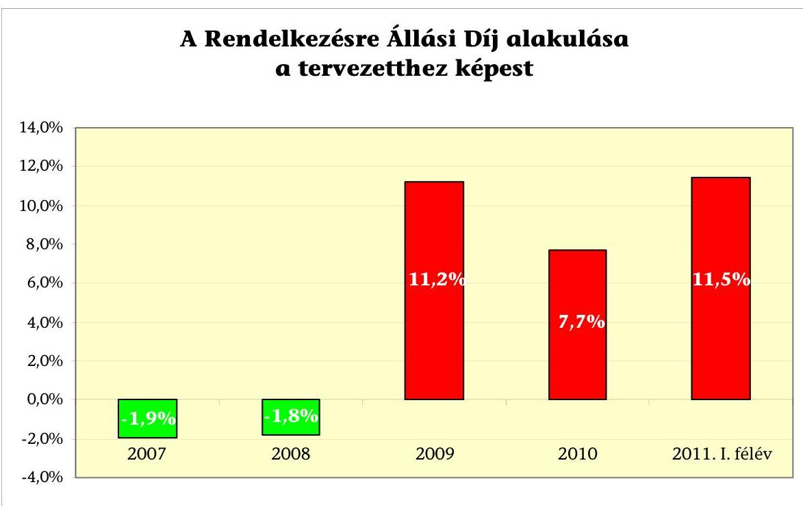
$1 / 4$. sz. diagram
a V-2008-170/2011-2012. sz. Jelentéshez

# Az összes kulturális rendezvény múfaj szerinti megoszlása a Múvészetek Palotájában 2007-2010 között 

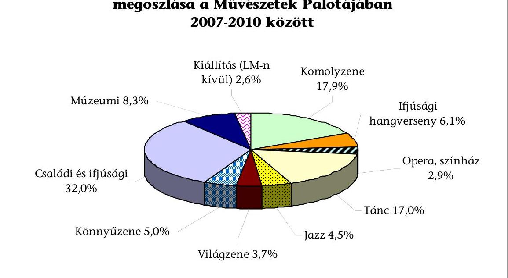

---

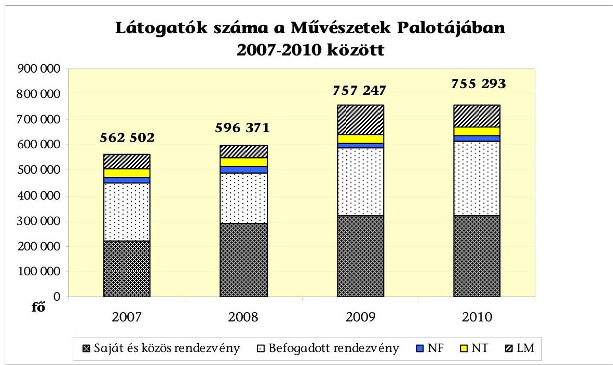

I/6. sz. diagram a V-2008-170/2011-2012. sz. Jelentéshez

# A MüPa Kft. bevételei 2007-2010 között 

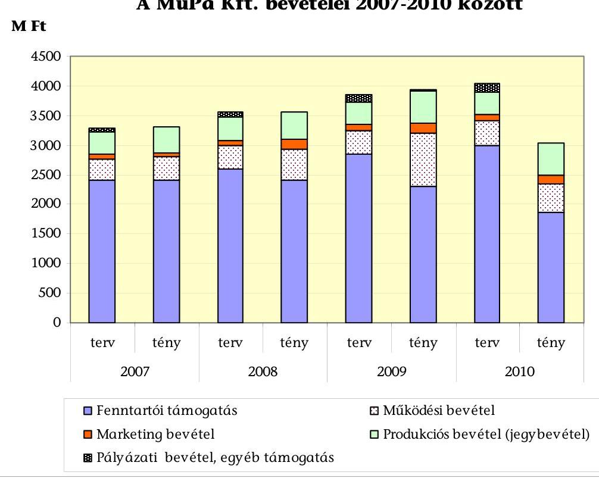

---

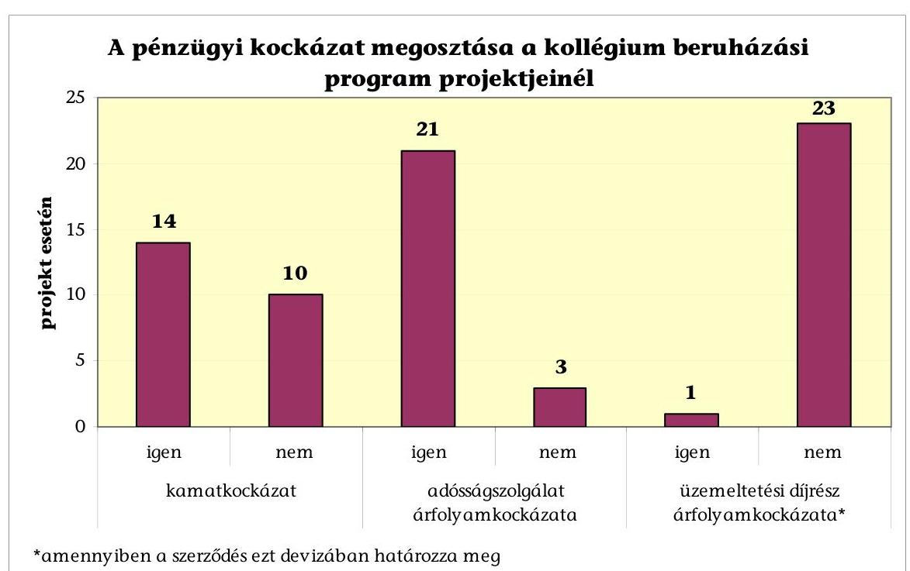
II/3. sz. diagram
a V-2008-170/2011-2012. sz. Jelentéshez
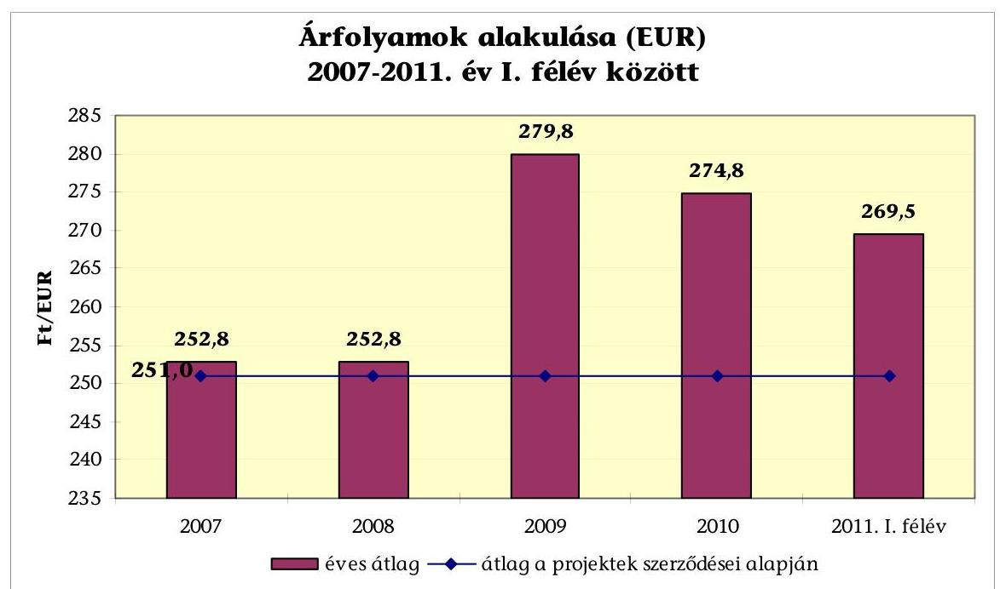

---

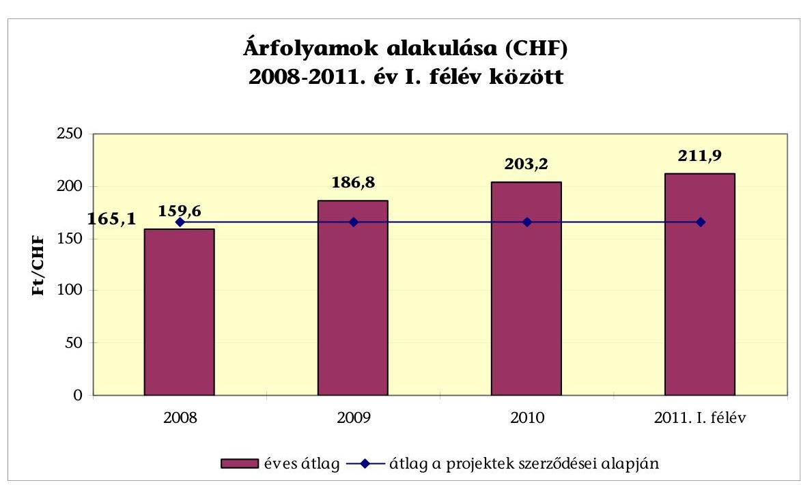

II/5. sz. diagram
a V-2008-170/2011-2012. sz. Jelentéshez
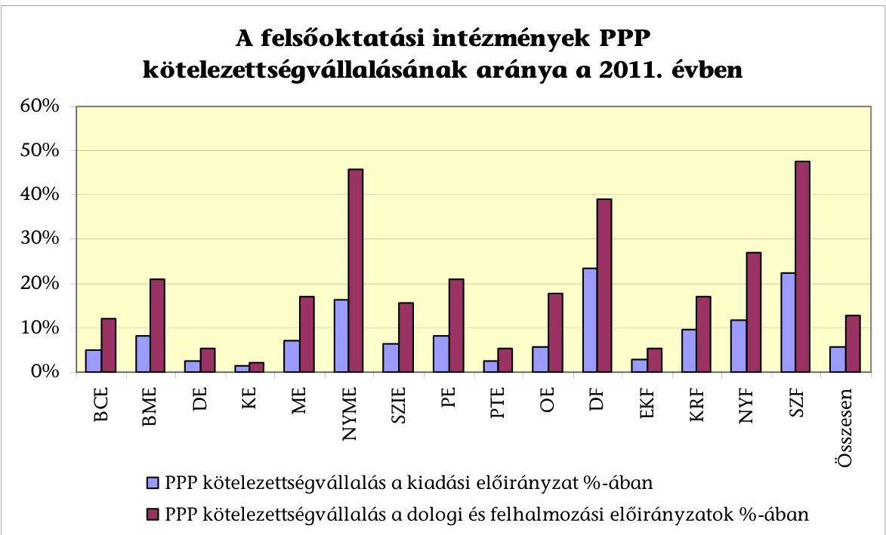

---

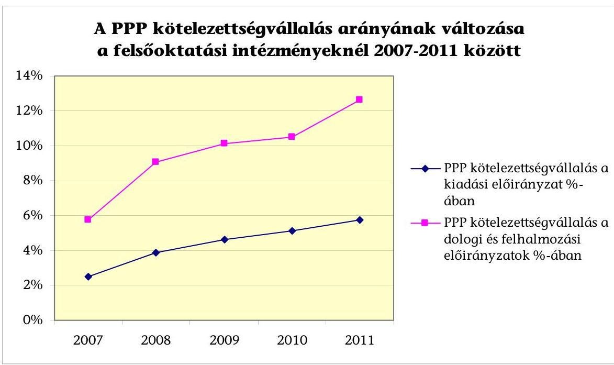

II/7. sz. diagram
a V-2008-170/2011-2012. sz. Jelentéshez
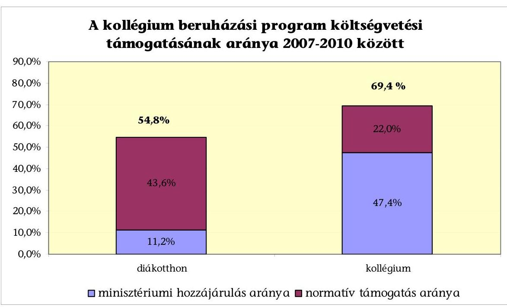

---

# Az intézményi források összetétele a diákotthonoknál 2007-2010 között 

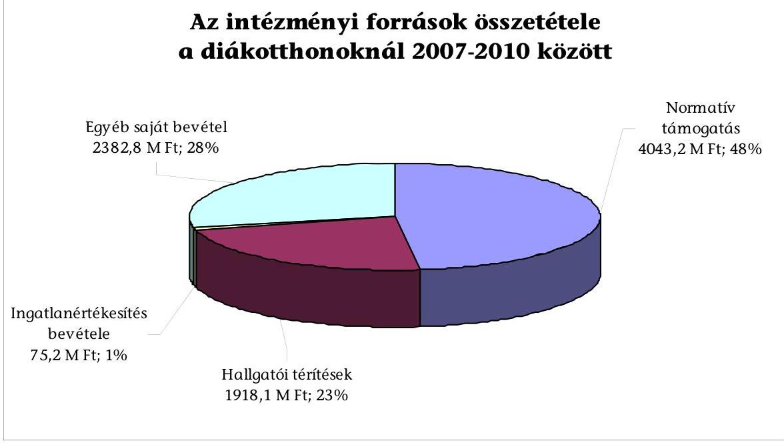
II/9. sz. diagram
a V-2008-170/2011-2012. sz. Jelentéshez

## Az intézményi források összetétele a kollégiumoknál 2007-2010 között

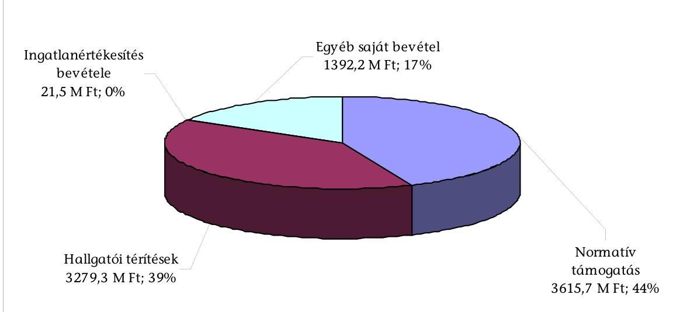

---

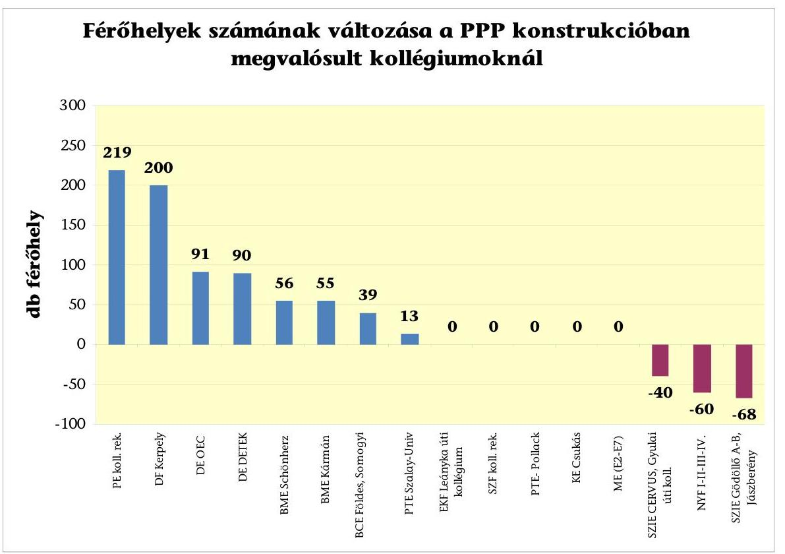

# Férőhelyek számának változása a PPP konstrukcióban megvalósult kollégiumoknál

---

# A helyszíni ellenőrzésbe vont felsőoktatási intézmények száma a nettó beruházási összeg szerinti megoszlás alapján

|  Sorsz. | Rétegzés | Nettó beruházási
összeg ${ }^{1}$
(Mrd Ft) | Megoszlás
(\%) | Helyszíni
ellenőrzésbe vont
felsőoktatási
intézmények (db)  |
| --- | --- | --- | --- | --- |
|  1 | 1 Mrd Ft alatti intézmények összesen | 1,6 | $4,0 \%$ | 0  |
|  2 | 1-5 Mrd Ft közötti intézmények összesen | 22,8 | $56,0 \%$ | 3  |
|  3 | 5-10 Mrd Ft feletti intézmények összesen | 16,3 | $40,0 \%$ | 2  |
|  Összesen |  | $\mathbf{4 0 , 8}$ | $\mathbf{1 0 0 , 0 \%}$ | $\mathbf{5}$  |

${ }^{1}$ A Nemzeti Fejlesztési Minisztérium adatai alapján.

---

# Mutatószámok jegyzéke

|  Sorsz. | KÉRDÉS | KRITÉRIUM, CÉLTERÜLET | MUTATÓ NEVE, MEGHATÁROZÁSA | MUTATÓ MÉRTÉKEGYSÉGE | SZÁMÍTÁSI MÓDSZER | ADATFORRÁS  |
| --- | --- | --- | --- | --- | --- | --- |
|  1 | 1.1. | a rendelkezésre állási díj (RÁD) a tervezettnek megfelelő | a tényleges teljesített RÁD összege a tervezett \%-ában | \% | tényleges teljesített RÁD összege / tervezett RÁD összege | I/2. és II/2. számú tanúsítványok  |
|  2 | 1.1., 1.3. | szerződéses feltételek teljesülése, kulturális célok teljesülése, társadalmi hasznosulás | MÚPA működtetésének állami ráfordításai a költségvetés kulturális kiadásainak \%-ában | \% | állami működtetési ráfordításainak összege / költségvetés kulturális kiadásai | $\begin{aligned} & \text { I/2., II/2., III/2., } \ & \text { IV/2., V/2. és VI/2. } \ & \text { számú } \ & \text { tanúsítványok; KSH } \end{aligned}$  |
|  3 | 1.2. | az üzemeltetés költséghatékonysága | egy $\mathrm{m}^{2}$ alapterületre jutó üzemeltetési kiadások | E Ft | üzemeltetési díjtétel, építményadó / alapterület (parkoló 50\%-os beszámításával) | I/2. és II/2. számú, valamint Nemzeti Színház, Múcsarnok tanúsítványok  |
|  4 | 1.2. | az üzemeltetés költséghatékonysága | tényleges üzemeltetési ráfordítások az üzemeltetési díjtétel \%-ában | \% | tényleges üzemeltetési ráfordítás / üzemeltetési díjtétel | I/2. és II/2. számú tanúsítványok, szolgáltató kimutatása  |
|  5 | 1.2. | a pótlási-felújítási alap tervszerű felhasználása | a pótlási-felújítási alap felhasználása a tervezett \%-ában | \% | kiszámlázott eszközpótlás összege/ éves értékcsökkenés | I/1.és II/1. számú tanúsítvány, RÁSZ  |
|  6 | 1.3. | kulturális célok teljesülése, társadalmi hasznosulás | előadások száma a tervezett előadások \%-ában | \% | megtartott előadások száma / tervezett előadások száma | III/1., IV/1. és V/1. számú tanúsítványok  |
|  7 | 1.3. | kulturális létesítmény látogatottsága megfelelő | látogatók száma a tervezett látogatók \%-ában | \% | látogatók száma / tervezett látogatók száma | III/1., IV/1. V/1. és VI/1. számú tanúsítványok  |
|  8 | 1.3. | a jegy- és bérletbevétel a tervezettnek megfelelő | tényleges jegy- és bérletbevétel a tervezett \%-ában | \% | tényleges jegybevétel összege / tervezett jegybevétel összege | III/2., IV/2., V/2. és VI/2. számú tanúsítványok  |
|  9 | 1.3. | kulturális létesítmény szakmai működtetése, társadalmi hasznosulása megfelelő | kiállítások száma a tervezett \%-ában | \% | tényleges kiállítások száma / tervezett kiállítások száma | VI/1. számú tanúsítvány  |

---

|  Sorsz. | KÉRDÉS | KRITÉRIUM, CÉLTERÜLET | MUTATÓ NEVE, MEGHATÁROZÁSA | MUTATÓ
MÉRTÉK-
EGYSÉGE | SZÁMÍTÁSI MÓDSZER | ADATFORRÁS  |
| --- | --- | --- | --- | --- | --- | --- |
|  10 | 1.3. | kulturális létesítmény hasznosítása megfelelő | tényleges jegy- és bérletbevétel az összes bevétel \%-ában | $\%$ | jegy- és bérletbevétel / összes bevétel | III/2., IV/2., V/2. és
VI/2. számú tanúsítványok, beszámolók  |
|  11 | 1.3. | a kulturális célok elérésének pénzügyi feltételei biztosítottak | fenntartói támogatás a tervezett támogatás \%-ában | $\%$ | tényleges fenntartói támogatás összege / tervezett fenntartói támogatás összege | III/2., IV/2., V/2. és
VI/2. számú tanúsítványok  |
|  12 | 2.1. | biztonságos finanszírozás | a PPP kötelezettség-vállalás az intézményi kiadási előirányzat \%-ában | $\%$ | a PPP kötelezettség-vállalás éves összege / intézményi kiadási előirányzat föösszege | VII/2. számú tanúsítvány  |
|  13 | 2.1. | biztonságos finanszírozás | a PPP kötelezettség-vállalás a dologi és felhalmozási előirányzat összegének \%-ában | $\%$ | a PPP kötelezettség-vállalás éves összege / (dologi + felhalmozási kiadások előirányzata) | VII/2. számú tanúsítvány  |
|  14 | 2.1. | a bérleti szolgáltatási díj megrendelői érdekeknek megfelelő meghatározása | bérleti szolgáltatási díj a szerződés szerinti összeg \%-ában | $\%$ | bérleti szolgáltatási díj / bérletiszolgáltatási díj szerződés szerinti összege | VII/3.a-b.
tanúsítványok  |
|  15 | 2.1. | a díjtételek megrendelői érdekeknek megfelelő meghatározása | az adósságszolgálat, az üzemeltetési díj és a közüzemi díj a szerződés szerinti összeg \%-ában | $\%$ | adósságszolgálat (üzemeltetési díj, közüzemi díj) összege / bérletiszolgáltatási díj szerződés szerinti összege | VII/3.a-b.
tanúsítványok  |
|  16 | 2.1. | a bérleti-szolgáltatási díj forrásai biztosítják a biztonságos finanszírozást | a bérleti-szolgáltatási díj forrás-összetétele | $\%$ | minisztériumi hozzájárulás (intézményi saját források) összege / bérleti díj összes forrásának összege | VII/3.a-b.
tanúsítványok  |
|  17 | 2.1. | bérleti-szolgáltatási díj saját forrásai biztosítják a biztonságos finanszírozást | a bérleti-szolgáltatási díj intézményi saját forrásainak összetétele | $\%$ | normatív támogatás (hallgatói térítések, ingatlanértékesítés bevétele, egyéb saját bevétel) összege / intézményi saját források összege | VII/3.a-b.
tanúsítványok  |
|  18 | 2.2. | meghibásodások száma, javítások határideje, üzemeltetési szolgáltatások színvonala megfelelő | határidőn túl kijavított hibák az összes hibabejelentés \%-ában | $\%$ | határidőn túl kijavított hibák száma / hibabejelentések száma | VII/5. tanúsítvány  |
|  19 | 2.2. | az üzemeltetési szolgáltatások színvonala megfelelő ( a meghibásodások típusai alapján) | közműellátással, kommunikációs hálózattal, épületgépészettel, berendezésekkel kapcsolatos, valamint garanciális, rongálásból eredő és egyéb meghibásodások a hibabejelentések \%-ában | $\%$ | meghibásodások száma típusonként / hibabejelentések száma | VII/5. tanúsítvány  |

---

|  Sorsz. | KÉRDÉS | KRITÉRIUM, CÉLTERÜLET | MUTATÓ NEVE, MEGHATÁROZÁSA | MUTATÓ
MÉRTÉK-
EGYSÉGE | SZÁMÍTÁSI MÓDSZER | ADATFORRÁS  |
| --- | --- | --- | --- | --- | --- | --- |
|  20 | 2.2. | a felújítási-eszközpótlási alap felhasználása gazdaságos | felújítás-eszközpótlás összege az ingatlan aktivált értékének \%-ában | $\%$ | felújítás-eszközpótlás összege / ingatlan aktivált értéke | VII/6. tanúsítvány  |
|  21 | 2.2. | üzemeltetési és közüzemi ráfordítások a tervezettnek megfelelnek | a kollégiumok üzemeltetési és közüzemi ráfordításai a prognosztizált érték \%-ában | $\%$ | a kollégiumok üzemeltetési és közüzemi ráfordításainak összege / üzemeltetési és közüzemi ráfordítások prognosztizált összege | VII/3.a-b.
tanúsítványok  |
|  22 | 2.2. | múködtetés
költséghatékonysága (fajlagos kiadások alapján) | hagyományos múködtetésű kollégiumok egy férőhelyére jutó üzemeltetési és közüzemi kiadás | E Ft | hagyományos kollégiumok üzemeltetési és közüzemi kiadásai / hagyományos kollégiumok férőhelyeinek száma | VII/1.a. és VII/2. számú tanúsítványok  |
|  23 | 2.2. | a PPP projekt költséghatékonysága (fajlagos bérleti-szolgáltatási díj) | egy férőhelyre jutó üzemeltetési és közüzemi díj | E Ft | PPP üzemeltetési és közüzemi díj összege / PPP férőhelyek száma | VII/3.a-b. számú tanúsítványok  |
|  24 | 2.2. | szerződés szerinti szankciók érvényesítése | díjlevonások a bérleti-szolgáltatási díj \%-ában | $\%$ | díjlevonások összege / teljes bérletiszolgáltatási díj | VII/5. tanúsítvány  |
|  25 | 2.3. | kollégiumi ellátottság biztosítása, ellátottság javulása | megvalósult kollégiumi férőhelyek száma a 2207/2004. (VIII. 27.) Korm. határozatban foglaltak \%-ában | $\%$ | megvalósult kollégiumi férőhelyek száma / Korm. határozatban tervezett férőhelyek száma | VII/3.a-b.
tanúsítványok  |
|  26 | 2.3. | kollégiumi ellátottság biztosítása, ellátottság javulása | kollégiumi ellátottak száma a kérelmezők \%-ában | $\%$ | kollégiumi ellátottak száma / kollégiumi ellátást kérelmezők száma | VII/1.a. számú tanúsítvány  |
|  27 | 2.3. | kollégiumi ellátottság | a kollégiumi ellátottak számának megoszlása hagyományos, PPP, és egyéb bérelt helyeken | $\%$ | hagyományos (PPP, egyéb bérelt) kollégiumokban ellátottak száma / összes ellátott száma | VII/1.a. számú tanúsítvány  |
|  28 | 2.3. | kollégiumi ellátottság | hagyományos, PPP, és egyéb bérelt kollégiumok számának megoszlása | $\%$ | hagyományos (PPP, egyéb bérelt) kollégiumok száma / összes kollégium száma | VII/1.a. számú tanúsítvány  |
|  29 | 2.3. | kollégiumi ellátottság | kollégiumi férőhelyek megoszlása hagyományos, PPP, és egyéb bérelt kollégiumokban | $\%$ | hagyományos (PPP, egyéb bérelt) kollégiumi férőhelyek száma / összes férőhely száma | VII/1.a. számú tanúsítvány  |
|  30 | 2.3. | kollégiumi ellátottság komfortfokozata | kollégiumi férőhelyek megoszlása hagyományos, PPP, és egyéb bérelt kollégiumokban | $\%$ | hagyományos (PPP, egyéb bérelt) kollégiumi férőhelyek száma kategóriánként / összes férőhely száma hagyományos (PPP, egyéb bérelt) helyeken | VII/1.b. számú tanúsítvány  |

---

|  Sorsz. | KÉRDÉS | KRITÉRIUM, CÉLTERÜLET | MUTATÓ NEVE, MEGHATÁROZÁSA | MUTATÓ
MÉRTÉK-
EGYSÉGE | SZÁMÍTÁSI MÓDSZER | ADATFORRÁS  |
| --- | --- | --- | --- | --- | --- | --- |
|  31 | 2.3. | kollégiumi férőhelyek kihasználtsága megfelelő | férőhelyek kihasználtsága | $\%$ | kollégiumi ellátottak száma / összes férőhely száma | VII/1.b. számú tanúsítvány  |
|  32 | 2.3. | kollégiumi férőhelyek kihasználtsága intézményi szinten | hagyományos (PPP és egyéb bérelt) kollégiumok férőhelyeinek kihasználtsága kategóriánként | $\%$ | hagyományos (PPP, egyéb bérelt) kollégiumi ellátottak száma kategóriánként / hagyományos (PPP és egyéb bérelt) kollégiumok férőhelyek száma kategóriánként | VII/1.b. számú tanúsítvány  |
|  33 | 2.3. | a PPP konstrukciójú létesítmények férőhelyeinek kihasználtsága | a PPP konstrukciójú létesítmények férőhelyeinek kihasználtsága projektenként | $\%$ | ellátottak száma projektenként / férőhelyek száma projektenként | VII/3.a-b. számú tanúsítványok  |

Budapest, 2012. hó nap